Cyber Infra - Tested Hardware & Statistics
------------------------------------------

A project to collect tested hardware configurations for Cyber Infra.

Anyone can contribute to this report by the [hw-probe](https://github.com/linuxhw/hw-probe) tool:

    sudo -E hw-probe -all -upload

Please contribute! Especially if your hardware is rare.

Contents
--------

* [ Test Cases ](#test-cases)

* [ System ](#system)
  - [ OS                       ](#os)
  - [ OS Family                ](#os-family)
  - [ Kernel                   ](#kernel)
  - [ Kernel Family            ](#kernel-family)
  - [ Kernel Major Ver.        ](#kernel-major-ver)
  - [ Arch                     ](#arch)
  - [ DE                       ](#de)
  - [ Display Server           ](#display-server)
  - [ Display Manager          ](#display-manager)
  - [ OS Lang                  ](#os-lang)
  - [ Boot Mode                ](#boot-mode)
  - [ Filesystem               ](#filesystem)
  - [ Part. scheme             ](#part-scheme)
  - [ Dual Boot with Linux/BSD ](#dual-boot-with-linuxbsd)
  - [ Dual Boot (Win)          ](#dual-boot-win)

* [ Board ](#board)
  - [ Vendor                   ](#vendor)
  - [ Model                    ](#model)
  - [ Model Family             ](#model-family)
  - [ MFG Year                 ](#mfg-year)
  - [ Form Factor              ](#form-factor)
  - [ Secure Boot              ](#secure-boot)
  - [ Coreboot                 ](#coreboot)
  - [ RAM Size                 ](#ram-size)
  - [ RAM Used                 ](#ram-used)
  - [ Total Drives             ](#total-drives)
  - [ Has CD-ROM               ](#has-cd-rom)
  - [ Has Ethernet             ](#has-ethernet)
  - [ Has WiFi                 ](#has-wifi)
  - [ Has Bluetooth            ](#has-bluetooth)

* [ Location ](#location)
  - [ Country                  ](#country)
  - [ City                     ](#city)

* [ Drives ](#drives)
  - [ Drive Vendor             ](#drive-vendor)
  - [ Drive Model              ](#drive-model)
  - [ HDD Vendor               ](#hdd-vendor)
  - [ SSD Vendor               ](#ssd-vendor)
  - [ Drive Kind               ](#drive-kind)
  - [ Drive Connector          ](#drive-connector)
  - [ Drive Size               ](#drive-size)
  - [ Space Total              ](#space-total)
  - [ Space Used               ](#space-used)
  - [ Malfunc. Drives          ](#malfunc-drives)
  - [ Malfunc. Drive Vendor    ](#malfunc-drive-vendor)
  - [ Malfunc. HDD Vendor      ](#malfunc-hdd-vendor)
  - [ Malfunc. Drive Kind      ](#malfunc-drive-kind)
  - [ Failed Drives            ](#failed-drives)
  - [ Failed Drive Vendor      ](#failed-drive-vendor)
  - [ Drive Status             ](#drive-status)

* [ Storage controller ](#storage-controller)
  - [ Storage Vendor           ](#storage-vendor)
  - [ Storage Model            ](#storage-model)
  - [ Storage Kind             ](#storage-kind)

* [ Processor ](#processor)
  - [ CPU Vendor               ](#cpu-vendor)
  - [ CPU Model                ](#cpu-model)
  - [ CPU Model Family         ](#cpu-model-family)
  - [ CPU Cores                ](#cpu-cores)
  - [ CPU Sockets              ](#cpu-sockets)
  - [ CPU Threads              ](#cpu-threads)
  - [ CPU Op-Modes             ](#cpu-op-modes)
  - [ CPU Microcode            ](#cpu-microcode)
  - [ CPU Microarch            ](#cpu-microarch)

* [ Graphics ](#graphics)
  - [ GPU Vendor               ](#gpu-vendor)
  - [ GPU Model                ](#gpu-model)
  - [ GPU Combo                ](#gpu-combo)
  - [ GPU Driver               ](#gpu-driver)
  - [ GPU Memory               ](#gpu-memory)

* [ Monitor ](#monitor)
  - [ Monitor Vendor           ](#monitor-vendor)
  - [ Monitor Model            ](#monitor-model)
  - [ Monitor Resolution       ](#monitor-resolution)
  - [ Monitor Diagonal         ](#monitor-diagonal)
  - [ Monitor Width            ](#monitor-width)
  - [ Aspect Ratio             ](#aspect-ratio)
  - [ Monitor Area             ](#monitor-area)
  - [ Pixel Density            ](#pixel-density)
  - [ Multiple Monitors        ](#multiple-monitors)

* [ Network ](#network)
  - [ Net Controller Vendor    ](#net-controller-vendor)
  - [ Net Controller Model     ](#net-controller-model)
  - [ Wireless Vendor          ](#wireless-vendor)
  - [ Wireless Model           ](#wireless-model)
  - [ Ethernet Vendor          ](#ethernet-vendor)
  - [ Ethernet Model           ](#ethernet-model)
  - [ Net Controller Kind      ](#net-controller-kind)
  - [ Used Controller          ](#used-controller)
  - [ NICs                     ](#nics)
  - [ IPv6                     ](#ipv6)

* [ Bluetooth ](#bluetooth)
  - [ Bluetooth Vendor         ](#bluetooth-vendor)
  - [ Bluetooth Model          ](#bluetooth-model)

* [ Sound ](#sound)
  - [ Sound Vendor             ](#sound-vendor)
  - [ Sound Model              ](#sound-model)

* [ Memory ](#memory)
  - [ Memory Vendor            ](#memory-vendor)
  - [ Memory Model             ](#memory-model)
  - [ Memory Kind              ](#memory-kind)
  - [ Memory Form Factor       ](#memory-form-factor)
  - [ Memory Size              ](#memory-size)
  - [ Memory Speed             ](#memory-speed)

* [ Printers & scanners ](#printers--scanners)
  - [ Printer Vendor           ](#printer-vendor)
  - [ Printer Model            ](#printer-model)
  - [ Scanner Vendor           ](#scanner-vendor)
  - [ Scanner Model            ](#scanner-model)

* [ Camera ](#camera)
  - [ Camera Vendor            ](#camera-vendor)
  - [ Camera Model             ](#camera-model)

* [ Security ](#security)
  - [ Fingerprint Vendor       ](#fingerprint-vendor)
  - [ Fingerprint Model        ](#fingerprint-model)
  - [ Chipcard Vendor          ](#chipcard-vendor)
  - [ Chipcard Model           ](#chipcard-model)

* [ Unsupported ](#unsupported)
  - [ Unsupported Devices      ](#unsupported-devices)
  - [ Unsupported Device Types ](#unsupported-device-types)

Test Cases
----------

Total: 46

| Vendor        | Model                 | Form-Factor | Probe                                                      | Date         |
|---------------|-----------------------|-------------|------------------------------------------------------------|--------------|
| Supermicro    | X9DRi-LN4+/X9DR3-LN4+ | Server      | [b4eb1cdd06](https://linux-hardware.org/?probe=b4eb1cdd06) | Jun 07, 2023 |
| Supermicro    | H12SSW-NT             | Server      | [5950749033](https://linux-hardware.org/?probe=5950749033) | Jun 07, 2023 |
| Supermicro    | H12SSW-NT             | Server      | [f8a6482d0e](https://linux-hardware.org/?probe=f8a6482d0e) | May 29, 2023 |
| Delta Comp... | DSS-C621LTG           | Server      | [18b2bf9ff4](https://linux-hardware.org/?probe=18b2bf9ff4) | Apr 05, 2023 |
| Delta Comp... | DSS-C621LTG           | Server      | [844c562cb6](https://linux-hardware.org/?probe=844c562cb6) | Apr 05, 2023 |
| Delta Comp... | DSS-C621LTG           | Server      | [a7057f367a](https://linux-hardware.org/?probe=a7057f367a) | Apr 05, 2023 |
| Delta Comp... | DSS-C621LTG           | Server      | [0ce29ba75c](https://linux-hardware.org/?probe=0ce29ba75c) | Apr 05, 2023 |
| Supermicro    | X10DRL-i              | Server      | [5e92e7fe1e](https://linux-hardware.org/?probe=5e92e7fe1e) | Apr 05, 2023 |
| Supermicro    | X10SRi-FB             | Server      | [16a0245a41](https://linux-hardware.org/?probe=16a0245a41) | Apr 05, 2023 |
| Supermicro    | X9DRi-LN4+/X9DR3-LN4+ | Server      | [c4b4851a88](https://linux-hardware.org/?probe=c4b4851a88) | Apr 05, 2023 |
| Delta Comp... | DSS-C621LTG           | Server      | [97e6e94ed2](https://linux-hardware.org/?probe=97e6e94ed2) | Apr 04, 2023 |
| Supermicro    | H12SSW-NT             | Server      | [3e3cb25241](https://linux-hardware.org/?probe=3e3cb25241) | Mar 09, 2023 |
| Supermicro    | H12SSW-NT             | Server      | [19fddb0a01](https://linux-hardware.org/?probe=19fddb0a01) | Mar 09, 2023 |
| Supermicro    | H12SSW-NT             | Server      | [80e5cfeea5](https://linux-hardware.org/?probe=80e5cfeea5) | Mar 09, 2023 |
| Supermicro    | H12SSW-NT             | Server      | [83ff998a9a](https://linux-hardware.org/?probe=83ff998a9a) | Mar 09, 2023 |
| Supermicro    | H12SSW-NT             | Server      | [61af44de6d](https://linux-hardware.org/?probe=61af44de6d) | Mar 09, 2023 |
| Supermicro    | H12SSW-NT             | Server      | [dd8597fd65](https://linux-hardware.org/?probe=dd8597fd65) | Mar 09, 2023 |
| Supermicro    | H12SSW-NT             | Server      | [090720bc72](https://linux-hardware.org/?probe=090720bc72) | Mar 09, 2023 |
| Supermicro    | H12SSW-NT             | Server      | [8b83576100](https://linux-hardware.org/?probe=8b83576100) | Feb 28, 2023 |
| Supermicro    | H12SSW-NT             | Server      | [c33e8fab03](https://linux-hardware.org/?probe=c33e8fab03) | Feb 28, 2023 |
| Supermicro    | H12SSW-NT             | Server      | [2f3379adb9](https://linux-hardware.org/?probe=2f3379adb9) | Feb 28, 2023 |
| Supermicro    | H12SSW-NT             | Server      | [efc03f8d68](https://linux-hardware.org/?probe=efc03f8d68) | Feb 27, 2023 |
| Supermicro    | X12DAi-N6             | Server      | [814fc144ef](https://linux-hardware.org/?probe=814fc144ef) | Feb 03, 2023 |
| Supermicro    | B11SPE-CPU-TF         | Server      | [bdfa203c78](https://linux-hardware.org/?probe=bdfa203c78) | Jan 16, 2023 |
| Supermicro    | X11SSM-F              | Server      | [b0100c59bb](https://linux-hardware.org/?probe=b0100c59bb) | Dec 12, 2022 |
| Supermicro    | X11SSL-F              | Server      | [7aa0eb0936](https://linux-hardware.org/?probe=7aa0eb0936) | Dec 12, 2022 |
| Supermicro    | X11SSL-F              | Server      | [1a5e57e9ef](https://linux-hardware.org/?probe=1a5e57e9ef) | Oct 31, 2022 |
| Supermicro    | X11SSM-F              | Server      | [c54a576ec0](https://linux-hardware.org/?probe=c54a576ec0) | Oct 31, 2022 |
| Supermicro    | X11SSL-F              | Server      | [c13d2d5610](https://linux-hardware.org/?probe=c13d2d5610) | Oct 31, 2022 |
| Supermicro    | X11SSL-F              | Server      | [2de30f0154](https://linux-hardware.org/?probe=2de30f0154) | Aug 30, 2022 |
| Supermicro    | X11SSL-F              | Server      | [3f8bec5c1b](https://linux-hardware.org/?probe=3f8bec5c1b) | Aug 30, 2022 |
| Supermicro    | X11SSM-F              | Server      | [f715802815](https://linux-hardware.org/?probe=f715802815) | Aug 30, 2022 |
| Supermicro    | X10DRL-i              | Server      | [5281defed3](https://linux-hardware.org/?probe=5281defed3) | Aug 15, 2022 |
| Supermicro    | X10DRL-i              | Server      | [88a4a3d13f](https://linux-hardware.org/?probe=88a4a3d13f) | Aug 04, 2022 |
| Supermicro    | X10DRL-i              | Server      | [9b4576c901](https://linux-hardware.org/?probe=9b4576c901) | Aug 03, 2022 |
| Supermicro    | B11SPE-CPU-TF         | Server      | [60ec07883b](https://linux-hardware.org/?probe=60ec07883b) | May 15, 2022 |
| Supermicro    | B11SPE-CPU-TF         | Server      | [912e712657](https://linux-hardware.org/?probe=912e712657) | May 15, 2022 |
| Supermicro    | B11SPE-CPU-TF         | Server      | [3229b1f14c](https://linux-hardware.org/?probe=3229b1f14c) | May 15, 2022 |
| Supermicro    | B11SPE-CPU-TF         | Server      | [ad5b15b222](https://linux-hardware.org/?probe=ad5b15b222) | May 15, 2022 |
| Supermicro    | B11SPE-CPU-TF         | Server      | [6539922005](https://linux-hardware.org/?probe=6539922005) | May 15, 2022 |
| Supermicro    | B11SPE-CPU-TF         | Server      | [0c77bbd30d](https://linux-hardware.org/?probe=0c77bbd30d) | May 15, 2022 |
| Supermicro    | B11SPE-CPU-TF         | Server      | [85a5b4c02f](https://linux-hardware.org/?probe=85a5b4c02f) | May 14, 2022 |
| Supermicro    | B11SPE-CPU-TF         | Server      | [d9f3fb8d37](https://linux-hardware.org/?probe=d9f3fb8d37) | May 14, 2022 |
| Supermicro    | B11SPE-CPU-TF         | Server      | [fdf91b6130](https://linux-hardware.org/?probe=fdf91b6130) | May 13, 2022 |
| Supermicro    | B11SPE-CPU-TF         | Server      | [9c97cfa2bc](https://linux-hardware.org/?probe=9c97cfa2bc) | May 13, 2022 |
| Supermicro    | B11SPE-CPU-TF         | Server      | [6f63fd533c](https://linux-hardware.org/?probe=6f63fd533c) | May 13, 2022 |

System
------

OS
--

Installed operating systems

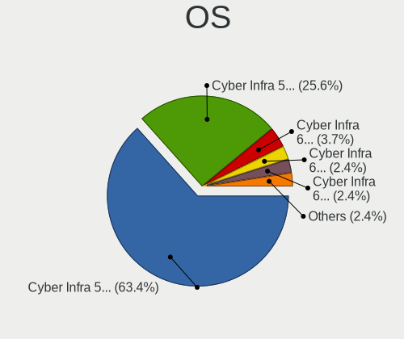

| Name              | Computers | Percent |
|-------------------|-----------|---------|
| Cyber Infra 5.0.1 | 33        | 97.06%  |
| Cyber Infra 4.0.1 | 1         | 2.94%   |

OS Family
---------

OS without a version

| Name        | Computers | Percent |
|-------------|-----------|---------|
| Cyber Infra | 34        | 100%    |

Kernel
------

Version of the Linux kernel

| Version                    | Computers | Percent |
|----------------------------|-----------|---------|
| 3.10.0-1160.41.1.vz7.183.5 | 33        | 97.06%  |
| 3.10.0-1127.8.2.vz7.158.8  | 1         | 2.94%   |

Kernel Family
-------------

Linux kernel without a distro release

| Version | Computers | Percent |
|---------|-----------|---------|
| 3.10.0  | 34        | 100%    |

Kernel Major Ver.
-----------------

Linux kernel major version

| Version | Computers | Percent |
|---------|-----------|---------|
| 3.10    | 34        | 100%    |

Arch
----

OS architecture (x86_64, i586, etc.)

| Name   | Computers | Percent |
|--------|-----------|---------|
| x86_64 | 34        | 100%    |

DE
--

Desktop Environment

| Name    | Computers | Percent |
|---------|-----------|---------|
| Unknown | 34        | 100%    |

Display Server
--------------

X11 or Wayland

| Name | Computers | Percent |
|------|-----------|---------|
| X11  | 34        | 100%    |

Display Manager
---------------

SDDM, LightDM, etc.

| Name    | Computers | Percent |
|---------|-----------|---------|
| Unknown | 34        | 100%    |

OS Lang
-------

Language

| Lang  | Computers | Percent |
|-------|-----------|---------|
| en_US | 34        | 100%    |

Boot Mode
---------

EFI or BIOS

| Mode | Computers | Percent |
|------|-----------|---------|
| EFI  | 18        | 52.94%  |
| BIOS | 16        | 47.06%  |

Filesystem
----------

Type of filesystem

| Type | Computers | Percent |
|------|-----------|---------|
| Ext4 | 34        | 100%    |

Part. scheme
------------

Scheme of partitioning

| Type | Computers | Percent |
|------|-----------|---------|
| GPT  | 34        | 100%    |

Dual Boot with Linux/BSD
------------------------

Hosting more than one Linux/BSD

| Dual boot | Computers | Percent |
|-----------|-----------|---------|
| No        | 33        | 94.29%  |
| Yes       | 2         | 5.71%   |

Dual Boot (Win)
---------------

Hosting Linux and Windows

| Dual boot | Computers | Percent |
|-----------|-----------|---------|
| No        | 34        | 100%    |

Board
-----

Vendor
------

Motherboard manufacturer

| Name            | Computers | Percent |
|-----------------|-----------|---------|
| Supermicro      | 30        | 88.24%  |
| Delta Computers | 4         | 11.76%  |

Model
-----

Motherboard model

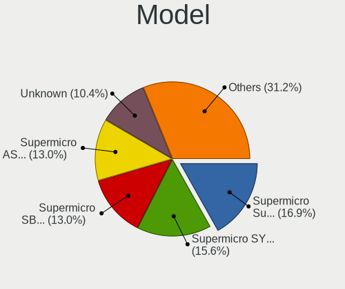

| Name                             | Computers | Percent |
|----------------------------------|-----------|---------|
| Supermicro SBI-6119P-T3N         | 10        | 29.41%  |
| Supermicro AS -1014S-WTRT        | 10        | 29.41%  |
| Supermicro Super Server          | 8         | 23.53%  |
| Delta Computers DSS-C621LTG      | 4         | 11.76%  |
| Supermicro X9DRi-LN4+/X9DR3-LN4+ | 1         | 2.94%   |
| Supermicro X12DAi-N6             | 1         | 2.94%   |

Model Family
------------

Motherboard model prefix

| Name                        | Computers | Percent |
|-----------------------------|-----------|---------|
| Supermicro SBI-6119P-T3N    | 10        | 29.41%  |
| Supermicro AS               | 10        | 29.41%  |
| Supermicro Super            | 8         | 23.53%  |
| Delta Computers DSS-C621LTG | 4         | 11.76%  |
| Supermicro X9DRi-LN4+       | 1         | 2.94%   |
| Supermicro X12DAi-N6        | 1         | 2.94%   |

MFG Year
--------

Motherboard manufacture year

| Year | Computers | Percent |
|------|-----------|---------|
| 2020 | 20        | 58.82%  |
| 2015 | 7         | 20.59%  |
| 2022 | 5         | 14.71%  |
| 2021 | 1         | 2.94%   |
| 2018 | 1         | 2.94%   |

Form Factor
-----------

Physical design of the computer

| Name   | Computers | Percent |
|--------|-----------|---------|
| Server | 34        | 100%    |

Secure Boot
-----------

Enabled or disabled

| State    | Computers | Percent |
|----------|-----------|---------|
| Disabled | 34        | 100%    |

Coreboot
--------

Have coreboot on board

| Used | Computers | Percent |
|------|-----------|---------|
| No   | 34        | 100%    |

RAM Size
--------

Total RAM memory

| Size in GB      | Computers | Percent |
|-----------------|-----------|---------|
| More than 256.0 | 16        | 44.44%  |
| 64.01-256.0     | 14        | 38.89%  |
| 32.01-64.0      | 4         | 11.11%  |
| 16.01-24.0      | 2         | 5.56%   |

RAM Used
--------

Used RAM memory

| Used GB    | Computers | Percent |
|------------|-----------|---------|
| 8.01-16.0  | 15        | 39.47%  |
| 4.01-8.0   | 11        | 28.95%  |
| 32.01-64.0 | 3         | 7.89%   |
| 3.01-4.0   | 3         | 7.89%   |
| 16.01-24.0 | 2         | 5.26%   |
| 1.01-2.0   | 2         | 5.26%   |
| 24.01-32.0 | 1         | 2.63%   |
| 2.01-3.0   | 1         | 2.63%   |

Total Drives
------------

Number of drives on board

| Drives | Computers | Percent |
|--------|-----------|---------|
| 5      | 13        | 33.33%  |
| 3      | 11        | 28.21%  |
| 4      | 4         | 10.26%  |
| 8      | 3         | 7.69%   |
| 1      | 3         | 7.69%   |
| 9      | 2         | 5.13%   |
| 10     | 1         | 2.56%   |
| 6      | 1         | 2.56%   |
| 2      | 1         | 2.56%   |

Has CD-ROM
----------

Has CD-ROM on board

| Presented | Computers | Percent |
|-----------|-----------|---------|
| No        | 34        | 100%    |

Has Ethernet
------------

Has Ethernet on board

| Presented | Computers | Percent |
|-----------|-----------|---------|
| Yes       | 34        | 100%    |

Has WiFi
--------

Has WiFi module

| Presented | Computers | Percent |
|-----------|-----------|---------|
| No        | 34        | 100%    |

Has Bluetooth
-------------

Has Bluetooth module

| Presented | Computers | Percent |
|-----------|-----------|---------|
| No        | 34        | 100%    |

Location
--------

Country
-------

Geographic location (country)

| Country | Computers | Percent |
|---------|-----------|---------|
| Russia  | 34        | 100%    |

City
----

Geographic location (city)

| City   | Computers | Percent |
|--------|-----------|---------|
| Moscow | 33        | 97.06%  |
| Perm   | 1         | 2.94%   |

Drives
------

Drive Vendor
------------

Hard drive vendors

| Vendor              | Computers | Drives | Percent |
|---------------------|-----------|--------|---------|
| Seagate             | 14        | 19     | 22.95%  |
| Intel               | 14        | 36     | 22.95%  |
| Samsung Electronics | 11        | 55     | 18.03%  |
| Micron Technology   | 9         | 36     | 14.75%  |
| Toshiba             | 5         | 27     | 8.2%    |
| HGST                | 3         | 6      | 4.92%   |
| SCST_BIO            | 2         | 6      | 3.28%   |
| WDC                 | 1         | 2      | 1.64%   |
| VSTORAGE            | 1         | 1      | 1.64%   |
| Hitachi             | 1         | 4      | 1.64%   |

Drive Model
-----------

Hard drive models

| Model                                              | Computers | Percent |
|----------------------------------------------------|-----------|---------|
| Seagate ST4000NM000A-2HZ100 4TB                    | 11        | 12.22%  |
| Samsung NVMe SSD Controller PM9A1/PM9A3/980PRO 1TB | 10        | 11.11%  |
| Samsung MZ7L3480HBLT-00A07 480GB SSD               | 10        | 11.11%  |
| Intel SSDSC2KG240G8 240GB                          | 10        | 11.11%  |
| Intel SSDSC2KB960G8 960GB                          | 10        | 11.11%  |
| Micron 7300_MTFDHBE3T8TDF 4TB                      | 4         | 4.44%   |
| Intel PCIe Data Center SSD 1TB                     | 4         | 4.44%   |
| Toshiba MG04ACA400E 4TB                            | 3         | 3.33%   |
| Seagate ST4000NM0035-1V4107 4TB                    | 3         | 3.33%   |
| Toshiba HDWD130 3TB                                | 2         | 2.22%   |
| Micron 5300_MTFDDAK480TDS 480GB SSD                | 2         | 2.22%   |
| Micron 5200_MTFDDAK480TDN 480GB SSD                | 2         | 2.22%   |
| Micron 5100_MTFDDAK960TCB 960GB SSD                | 2         | 2.22%   |
| Micron 1100_MTFDDAK512TBN 512GB SSD                | 2         | 2.22%   |
| WDC WD4002FYYZ-01B7CB1 4TB                         | 1         | 1.11%   |
| VSTORAGE VSTOR-DISK 5.4TB                          | 1         | 1.11%   |
| Toshiba MG03SCA100 1TB                             | 1         | 1.11%   |
| Toshiba MG03ACA100 1TB                             | 1         | 1.11%   |
| SCST_BIO LD4 4TB                                   | 1         | 1.11%   |
| SCST_BIO LD33 1TB                                  | 1         | 1.11%   |
| SCST_BIO LD3 1TB                                   | 1         | 1.11%   |
| SCST_BIO LD22 1TB                                  | 1         | 1.11%   |
| Samsung SSD 850 PRO 512GB                          | 1         | 1.11%   |
| Micron 7400_MTFDKBA480TDZ 480GB                    | 1         | 1.11%   |
| Micron 5300_MTFDDAK7T6TDS 8TB SSD                  | 1         | 1.11%   |
| Hitachi HUC106060CSS600 600GB                      | 1         | 1.11%   |
| HGST HUS726040ALE614 4TB                           | 1         | 1.11%   |
| HGST HUS726020ALE614 2TB                           | 1         | 1.11%   |
| HGST HUS724040ALA640 4TB                           | 1         | 1.11%   |

HDD Vendor
----------

Hard disk drive vendors

| Vendor   | Computers | Drives | Percent |
|----------|-----------|--------|---------|
| Seagate  | 14        | 19     | 51.85%  |
| Toshiba  | 5         | 27     | 18.52%  |
| HGST     | 3         | 6      | 11.11%  |
| SCST_BIO | 2         | 6      | 7.41%   |
| WDC      | 1         | 2      | 3.7%    |
| VSTORAGE | 1         | 1      | 3.7%    |
| Hitachi  | 1         | 4      | 3.7%    |

SSD Vendor
----------

Solid state drive vendors

| Vendor              | Computers | Drives | Percent |
|---------------------|-----------|--------|---------|
| Samsung Electronics | 11        | 29     | 37.93%  |
| Intel               | 10        | 32     | 34.48%  |
| Micron Technology   | 8         | 15     | 27.59%  |

Drive Kind
----------

HDD or SSD

| Kind | Computers | Drives | Percent |
|------|-----------|--------|---------|
| SSD  | 27        | 76     | 38.57%  |
| HDD  | 24        | 65     | 34.29%  |
| NVMe | 19        | 51     | 27.14%  |

Drive Connector
---------------

SATA, SAS, NVMe, etc.

| Type | Computers | Drives | Percent |
|------|-----------|--------|---------|
| SATA | 33        | 135    | 61.11%  |
| NVMe | 19        | 51     | 35.19%  |
| SAS  | 2         | 6      | 3.7%    |

Drive Size
----------

Size of hard drive

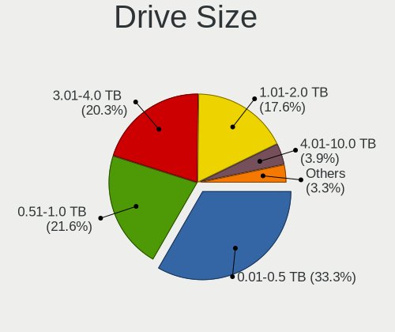

| Size in TB | Computers | Drives | Percent |
|------------|-----------|--------|---------|
| 0.01-0.5   | 24        | 45     | 36.92%  |
| 3.01-4.0   | 20        | 46     | 30.77%  |
| 0.51-1.0   | 17        | 41     | 26.15%  |
| 2.01-3.0   | 2         | 6      | 3.08%   |
| 1.01-2.0   | 1         | 1      | 1.54%   |
| 4.01-10.0  | 1         | 2      | 1.54%   |

Space Total
-----------

Amount of disk space available on the file system

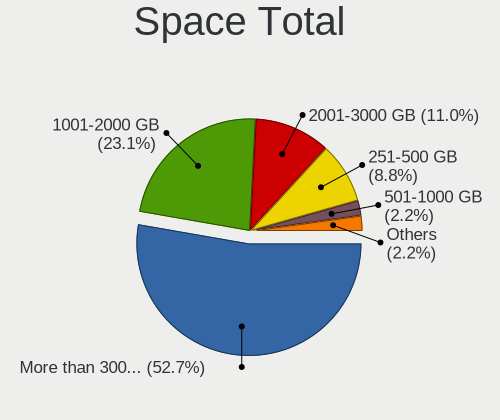

| Size in GB     | Computers | Percent |
|----------------|-----------|---------|
| 1001-2000      | 13        | 34.21%  |
| More than 3000 | 10        | 26.32%  |
| 2001-3000      | 7         | 18.42%  |
| 251-500        | 6         | 15.79%  |
| 501-1000       | 2         | 5.26%   |

Space Used
----------

Amount of used disk space

| Used GB        | Computers | Percent |
|----------------|-----------|---------|
| 1-20           | 19        | 46.34%  |
| 21-50          | 9         | 21.95%  |
| 251-500        | 7         | 17.07%  |
| 51-100         | 3         | 7.32%   |
| More than 3000 | 1         | 2.44%   |
| 2001-3000      | 1         | 2.44%   |
| 501-1000       | 1         | 2.44%   |

Malfunc. Drives
---------------

Drive models with a malfunction

| Model                                          | Computers | Drives | Percent |
|------------------------------------------------|-----------|--------|---------|
| Micron Technology 1100_MTFDDAK512TBN 512GB SSD | 1         | 3      | 100%    |

Malfunc. Drive Vendor
---------------------

Vendors of faulty drives

| Vendor            | Computers | Drives | Percent |
|-------------------|-----------|--------|---------|
| Micron Technology | 1         | 3      | 100%    |

Malfunc. HDD Vendor
-------------------

Vendors of faulty HDD drives

Zero info for selected period =(

Malfunc. Drive Kind
-------------------

Kinds of faulty drives

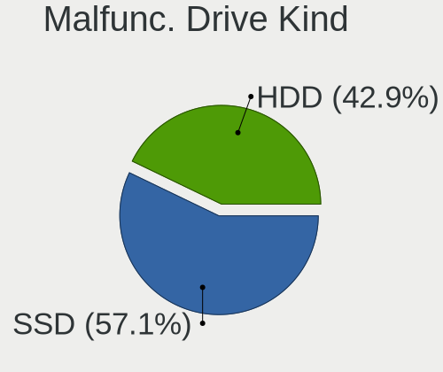

| Kind | Computers | Drives | Percent |
|------|-----------|--------|---------|
| SSD  | 1         | 3      | 100%    |

Failed Drives
-------------

Failed drive models

Zero info for selected period =(

Failed Drive Vendor
-------------------

Failed drive vendors

Zero info for selected period =(

Drive Status
------------

Number of failed and malfunc. drives

| Status  | Computers | Drives | Percent |
|---------|-----------|--------|---------|
| Works   | 34        | 189    | 97.14%  |
| Malfunc | 1         | 3      | 2.86%   |

Storage controller
------------------

Storage Vendor
--------------

Storage controller vendors

| Vendor                    | Computers | Percent |
|---------------------------|-----------|---------|
| Intel                     | 24        | 35.82%  |
| ASMedia Technology        | 14        | 20.9%   |
| Samsung Electronics       | 10        | 14.93%  |
| AMD                       | 10        | 14.93%  |
| Micron Technology         | 5         | 7.46%   |
| LSI Logic / Symbios Logic | 2         | 2.99%   |
| Broadcom / LSI            | 1         | 1.49%   |
| Areca Technology          | 1         | 1.49%   |

Storage Model
-------------

Storage controller models

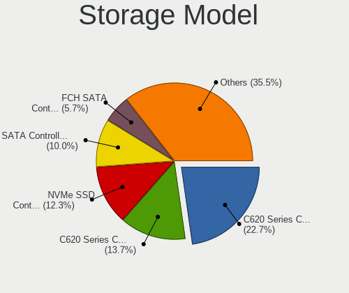

| Model                                                                         | Computers | Percent |
|-------------------------------------------------------------------------------|-----------|---------|
| Intel C620 Series Chipset Family SSATA Controller [AHCI mode]                 | 14        | 15.56%  |
| Samsung NVMe SSD Controller PM9A1/PM9A3/980PRO                                | 10        | 11.11%  |
| ASMedia ASM1062 Serial ATA Controller                                         | 10        | 11.11%  |
| AMD FCH SATA Controller [AHCI mode]                                           | 10        | 11.11%  |
| Intel C600/X79 series chipset SATA RAID Controller                            | 9         | 10%     |
| Intel C620 Series Chipset Family SATA Controller [AHCI mode]                  | 6         | 6.67%   |
| Micron 7300 PRO NVMe SSD                                                      | 4         | 4.44%   |
| Intel Q170/Q150/B150/H170/H110/Z170/CM236 Chipset SATA Controller [AHCI Mode] | 4         | 4.44%   |
| Intel PCIe Data Center SSD                                                    | 4         | 4.44%   |
| Intel C610/X99 series chipset sSATA Controller [AHCI mode]                    | 4         | 4.44%   |
| Intel C610/X99 series chipset 6-Port SATA Controller [AHCI mode]              | 4         | 4.44%   |
| ASMedia 106x SATA/RAID Controller                                             | 4         | 4.44%   |
| LSI Logic / Symbios Logic MegaRAID SAS-3 3008 [Fury]                          | 2         | 2.22%   |
| Micron 7400 PRO NVMe SSD                                                      | 1         | 1.11%   |
| Intel C602 chipset 4-Port SATA Storage Control Unit                           | 1         | 1.11%   |
| Intel C600/X79 series chipset 6-Port SATA AHCI Controller                     | 1         | 1.11%   |
| Broadcom / LSI MegaRAID SAS 2208 [Thunderbolt]                                | 1         | 1.11%   |
| Areca ARC-1886 series PCIe 4.0 to NVMe/SAS/SATA 16/12/6Gb RAID Controller     | 1         | 1.11%   |

Storage Kind
------------

Kind of storage controller (IDE, SATA, NVMe, SAS, ...)

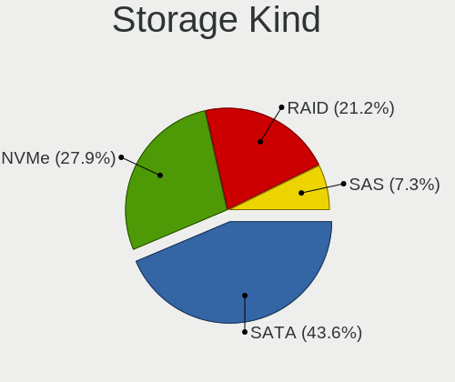

| Kind | Computers | Percent |
|------|-----------|---------|
| SATA | 34        | 50.75%  |
| NVMe | 19        | 28.36%  |
| RAID | 13        | 19.4%   |
| SAS  | 1         | 1.49%   |

Processor
---------

CPU Vendor
----------

Processor vendors

| Vendor | Computers | Percent |
|--------|-----------|---------|
| Intel  | 24        | 70.59%  |
| AMD    | 10        | 29.41%  |

CPU Model
---------

Processor models

| Model                                 | Computers | Percent |
|---------------------------------------|-----------|---------|
| Intel Xeon Silver 4208 CPU @ 2.10GHz  | 10        | 29.41%  |
| AMD EPYC 7352 24-Core Processor       | 10        | 29.41%  |
| Intel Xeon CPU E5-2640 v4 @ 2.40GHz   | 2         | 5.88%   |
| Intel Xeon CPU E3-1230 v6 @ 3.50GHz   | 2         | 5.88%   |
| Intel Xeon CPU E3-1230 v5 @ 3.40GHz   | 2         | 5.88%   |
| Intel Xeon Silver 4210R CPU @ 2.40GHz | 1         | 2.94%   |
| Intel Xeon Silver 4210 CPU @ 2.20GHz  | 1         | 2.94%   |
| Intel Xeon Gold 6346 CPU @ 3.10GHz    | 1         | 2.94%   |
| Intel Xeon Gold 6248 CPU @ 2.50GHz    | 1         | 2.94%   |
| Intel Xeon Gold 5220R CPU @ 2.20GHz   | 1         | 2.94%   |
| Intel Xeon CPU E5-2680 0 @ 2.70GHz    | 1         | 2.94%   |
| Intel Xeon CPU E5-2630 v4 @ 2.20GHz   | 1         | 2.94%   |
| Intel Xeon CPU E5-2603 v4 @ 1.70GHz   | 1         | 2.94%   |

CPU Model Family
----------------

Processor model prefix

| Model             | Computers | Percent |
|-------------------|-----------|---------|
| Intel Xeon Silver | 12        | 35.29%  |
| AMD EPYC          | 10        | 29.41%  |
| Intel Xeon        | 9         | 26.47%  |
| Intel Xeon Gold   | 3         | 8.82%   |

CPU Cores
---------

Number of processor cores

| Number | Computers | Percent |
|--------|-----------|---------|
| 24     | 10        | 29.41%  |
| 8      | 10        | 29.41%  |
| 20     | 4         | 11.76%  |
| 4      | 4         | 11.76%  |
| 48     | 1         | 2.94%   |
| 40     | 1         | 2.94%   |
| 32     | 1         | 2.94%   |
| 16     | 1         | 2.94%   |
| 12     | 1         | 2.94%   |
| 10     | 1         | 2.94%   |

CPU Sockets
-----------

Number of sockets

| Number | Computers | Percent |
|--------|-----------|---------|
| 1      | 25        | 73.53%  |
| 2      | 9         | 26.47%  |

CPU Threads
-----------

Threads per core (Hyper-Threading)

| Number | Computers | Percent |
|--------|-----------|---------|
| 2      | 33        | 97.06%  |
| 1      | 1         | 2.94%   |

CPU Op-Modes
------------

CPU Operation Modes (32-bit, 64-bit)

| Op mode        | Computers | Percent |
|----------------|-----------|---------|
| 32-bit, 64-bit | 34        | 100%    |

CPU Microcode
-------------

Microcode number

| Number     | Computers | Percent |
|------------|-----------|---------|
| 0x50657    | 14        | 38.89%  |
| 0x08301055 | 10        | 27.78%  |
| 0x406f1    | 4         | 11.11%  |
| 0x906e9    | 2         | 5.56%   |
| 0x506e3    | 2         | 5.56%   |
| Unknown    | 2         | 5.56%   |
| 0x606a6    | 1         | 2.78%   |
| 0x206d7    | 1         | 2.78%   |

CPU Microarch
-------------

Microarchitecture

| Name        | Computers | Percent |
|-------------|-----------|---------|
| Skylake     | 16        | 47.06%  |
| Zen 2       | 10        | 29.41%  |
| Broadwell   | 4         | 11.76%  |
| KabyLake    | 2         | 5.88%   |
| SandyBridge | 1         | 2.94%   |
| Unknown     | 1         | 2.94%   |

Graphics
--------

GPU Vendor
----------

Vendors of graphics cards

| Vendor                     | Computers | Percent |
|----------------------------|-----------|---------|
| ASPEED Technology          | 33        | 97.06%  |
| Matrox Electronics Systems | 1         | 2.94%   |

GPU Model
---------

Graphics card models

| Model                                         | Computers | Percent |
|-----------------------------------------------|-----------|---------|
| ASPEED Technology ASPEED Graphics Family      | 33        | 97.06%  |
| Matrox Electronics Systems MGA G200eW WPCM450 | 1         | 2.94%   |

GPU Combo
---------

Combinations of graphics cards

| Name       | Computers | Percent |
|------------|-----------|---------|
| 1 x ASPEED | 33        | 97.06%  |
| 1 x Matrox | 1         | 2.94%   |

GPU Driver
----------

Free vs proprietary

| Driver | Computers | Percent |
|--------|-----------|---------|
| Free   | 34        | 100%    |

GPU Memory
----------

Total video memory

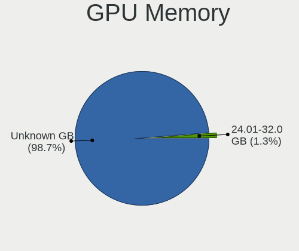

| Size in GB | Computers | Percent |
|------------|-----------|---------|
| Unknown    | 34        | 100%    |

Monitor
-------

Monitor Vendor
--------------

Monitor vendors

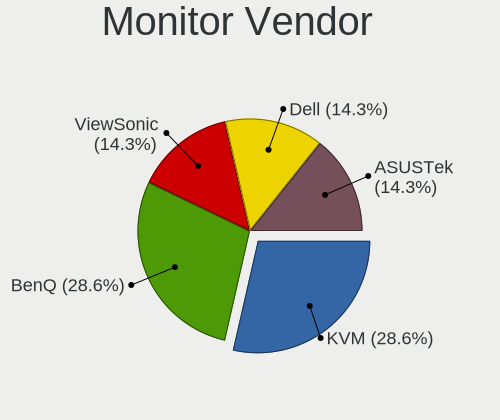

| Vendor    | Computers | Percent |
|-----------|-----------|---------|
| ViewSonic | 1         | 50%     |
| BenQ      | 1         | 50%     |

Monitor Model
-------------

Monitor models

| Model                                                         | Computers | Percent |
|---------------------------------------------------------------|-----------|---------|
| ViewSonic VA2245 Series VSCF42E 1920x1080 477x268mm 21.5-inch | 1         | 50%     |
| BenQ E2220HD BNQ7912 1920x1080 477x268mm 21.5-inch            | 1         | 50%     |

Monitor Resolution
------------------

Monitor screen resolution

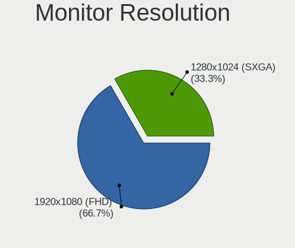

| Resolution      | Computers | Percent |
|-----------------|-----------|---------|
| 1920x1080 (FHD) | 2         | 100%    |

Monitor Diagonal
----------------

Diagonal size in inches

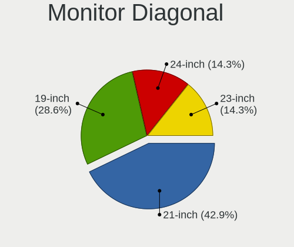

| Inches | Computers | Percent |
|--------|-----------|---------|
| 21     | 2         | 100%    |

Monitor Width
-------------

Physical width

| Width in mm | Computers | Percent |
|-------------|-----------|---------|
| 401-500     | 2         | 100%    |

Aspect Ratio
------------

Proportional relationship between the width and the height

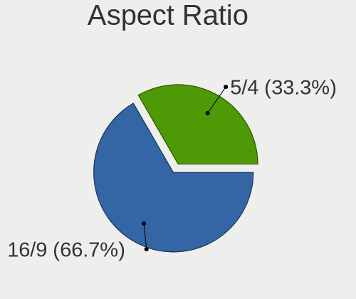

| Ratio | Computers | Percent |
|-------|-----------|---------|
| 16/9  | 2         | 100%    |

Monitor Area
------------

Area in inch²

| Area in inch² | Computers | Percent |
|----------------|-----------|---------|
| 151-200        | 2         | 100%    |

Pixel Density
-------------

Pixels per inch

| Density | Computers | Percent |
|---------|-----------|---------|
| 101-120 | 2         | 100%    |

Multiple Monitors
-----------------

Total monitors connected

| Total | Computers | Percent |
|-------|-----------|---------|
| 0     | 32        | 91.43%  |
| 1     | 3         | 8.57%   |

Network
-------

Net Controller Vendor
---------------------

Controller vendors

| Vendor                | Computers | Percent |
|-----------------------|-----------|---------|
| Intel                 | 34        | 47.89%  |
| Mellanox Technologies | 22        | 30.99%  |
| Broadcom              | 10        | 14.08%  |
| Emulex                | 4         | 5.63%   |
| Insyde Software       | 1         | 1.41%   |

Net Controller Model
--------------------

Controller models

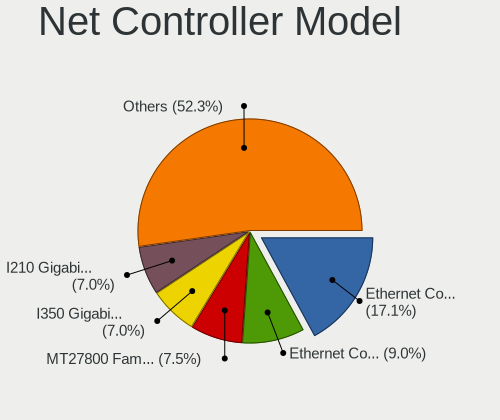

| Model                                                                 | Computers | Percent |
|-----------------------------------------------------------------------|-----------|---------|
| Mellanox MT27700 Family [ConnectX-4]                                  | 13        | 18.31%  |
| Intel I210 Gigabit Network Connection                                 | 12        | 16.9%   |
| Intel Ethernet Controller E810-XXV for SFP                            | 10        | 14.08%  |
| Intel Ethernet Connection X722 for 10GbE backplane                    | 10        | 14.08%  |
| Broadcom BCM57416 NetXtreme-E Dual-Media 10G RDMA Ethernet Controller | 10        | 14.08%  |
| Mellanox MT27710 Family [ConnectX-4 Lx]                               | 7         | 9.86%   |
| Emulex OneConnect NIC (Skyhawk)                                       | 4         | 5.63%   |
| Mellanox MT27500 Family [ConnectX-3]                                  | 2         | 2.82%   |
| Intel I350 Gigabit Network Connection                                 | 2         | 2.82%   |
| Insyde Software RNDIS/Ethernet Gadget                                 | 1         | 1.41%   |

Wireless Vendor
---------------

Wireless vendors

Zero info for selected period =(

Wireless Model
--------------

Wireless models

Zero info for selected period =(

Ethernet Vendor
---------------

Ethernet vendors

| Vendor                | Computers | Percent |
|-----------------------|-----------|---------|
| Intel                 | 34        | 53.97%  |
| Mellanox Technologies | 14        | 22.22%  |
| Broadcom              | 10        | 15.87%  |
| Emulex                | 4         | 6.35%   |
| Insyde Software       | 1         | 1.59%   |

Ethernet Model
--------------

Ethernet models

| Model                                                                 | Computers | Percent |
|-----------------------------------------------------------------------|-----------|---------|
| Intel I210 Gigabit Network Connection                                 | 12        | 19.05%  |
| Intel Ethernet Controller E810-XXV for SFP                            | 10        | 15.87%  |
| Intel Ethernet Connection X722 for 10GbE backplane                    | 10        | 15.87%  |
| Broadcom BCM57416 NetXtreme-E Dual-Media 10G RDMA Ethernet Controller | 10        | 15.87%  |
| Mellanox MT27710 Family [ConnectX-4 Lx]                               | 7         | 11.11%  |
| Mellanox MT27700 Family [ConnectX-4]                                  | 5         | 7.94%   |
| Emulex OneConnect NIC (Skyhawk)                                       | 4         | 6.35%   |
| Mellanox MT27500 Family [ConnectX-3]                                  | 2         | 3.17%   |
| Intel I350 Gigabit Network Connection                                 | 2         | 3.17%   |
| Insyde Software RNDIS/Ethernet Gadget                                 | 1         | 1.59%   |

Net Controller Kind
-------------------

Ethernet, WiFi or modem

| Kind     | Computers | Percent |
|----------|-----------|---------|
| Ethernet | 34        | 80.95%  |
| Unknown  | 8         | 19.05%  |

Used Controller
---------------

Currently used network controller

| Kind     | Computers | Percent |
|----------|-----------|---------|
| Ethernet | 34        | 97.14%  |
| Unknown  | 1         | 2.86%   |

NICs
----

Total network controllers on board

| Total | Computers | Percent |
|-------|-----------|---------|
| 2     | 14        | 38.89%  |
| 6     | 12        | 33.33%  |
| 4     | 5         | 13.89%  |
| 3     | 4         | 11.11%  |
| 5     | 1         | 2.78%   |

IPv6
----

IPv6 vs IPv4

| Used | Computers | Percent |
|------|-----------|---------|
| No   | 34        | 100%    |

Bluetooth
---------

Bluetooth Vendor
----------------

Controller vendors

Zero info for selected period =(

Bluetooth Model
---------------

Controller models

Zero info for selected period =(

Sound
-----

Sound Vendor
------------

Sound card vendors

| Vendor | Computers | Percent |
|--------|-----------|---------|
| Intel  | 1         | 100%    |

Sound Model
-----------

Sound card models

| Model                  | Computers | Percent |
|------------------------|-----------|---------|
| Intel Lewisburg MROM 0 | 1         | 100%    |

Memory
------

Memory Vendor
-------------

Memory module vendors

| Vendor              | Computers | Percent |
|---------------------|-----------|---------|
| Samsung Electronics | 13        | 37.14%  |
| Micron Technology   | 13        | 37.14%  |
| Nanya Technology    | 4         | 11.43%  |
| Kingston            | 4         | 11.43%  |
| SK hynix            | 1         | 2.86%   |

Memory Model
------------

Memory module models

| Model                                                   | Computers | Percent |
|---------------------------------------------------------|-----------|---------|
| Samsung RAM M393A8G40BB4-CWE 64GB DIMM DDR4 3200MT/s    | 10        | 28.57%  |
| Micron RAM 36ASF4G72PZ-2G9E2 32GB DIMM DDR4 2933MT/s    | 10        | 28.57%  |
| Nanya RAM NT32GA72D4NBX3P-IX 32GB DIMM DDR4 2933MT/s    | 4         | 11.43%  |
| Samsung RAM M393A4K40CB1-CRC 32GB DIMM DDR4 2400MT/s    | 2         | 5.71%   |
| Micron RAM 18ASF2G72AZ-2G3B1 16GB DIMM DDR4 2400MT/s    | 2         | 5.71%   |
| SK hynix RAM HMT42GR7MFR4C-PB 16GB DIMM DDR3 1600MT/s   | 1         | 2.86%   |
| Samsung RAM M393A4K40BB1-CRC 32GB DIMM DDR4 2400MT/s    | 1         | 2.86%   |
| Micron RAM 18ASF2G72AZ-2G6D1 16384MB DIMM DDR4 2667MT/s | 1         | 2.86%   |
| Kingston RAM 9965742-055.B00G 32GB DIMM DDR4 3200MT/s   | 1         | 2.86%   |
| Kingston RAM 9965669-008.A03G 16GB DIMM DDR4 2134MT/s   | 1         | 2.86%   |
| Kingston RAM 9965640-016.A00G 32GB DIMM DDR4 2133MT/s   | 1         | 2.86%   |
| Kingston RAM 9965516-071.A00LF 16GB DIMM DDR3 1066MT/s  | 1         | 2.86%   |

Memory Kind
-----------

Memory module kinds

| Kind | Computers | Percent |
|------|-----------|---------|
| DDR4 | 33        | 97.06%  |
| DDR3 | 1         | 2.94%   |

Memory Form Factor
------------------

Physical design of the memory module

| Name | Computers | Percent |
|------|-----------|---------|
| DIMM | 34        | 100%    |

Memory Size
-----------

Memory module size

| Size  | Computers | Percent |
|-------|-----------|---------|
| 32768 | 19        | 55.88%  |
| 65536 | 10        | 29.41%  |
| 16384 | 5         | 14.71%  |

Memory Speed
------------

Memory module speed

| Speed | Computers | Percent |
|-------|-----------|---------|
| 2933  | 14        | 40%     |
| 3200  | 11        | 31.43%  |
| 2400  | 5         | 14.29%  |
| 2667  | 1         | 2.86%   |
| 2134  | 1         | 2.86%   |
| 2133  | 1         | 2.86%   |
| 1600  | 1         | 2.86%   |
| 1066  | 1         | 2.86%   |

Printers & scanners
-------------------

Printer Vendor
--------------

Printer device vendors

Zero info for selected period =(

Printer Model
-------------

Printer device models

Zero info for selected period =(

Scanner Vendor
--------------

Scanner device vendors

Zero info for selected period =(

Scanner Model
-------------

Scanner device models

Zero info for selected period =(

Camera
------

Camera Vendor
-------------

Camera device vendors

Zero info for selected period =(

Camera Model
------------

Camera device models

Zero info for selected period =(

Security
--------

Fingerprint Vendor
------------------

Fingerprint sensor vendors

Zero info for selected period =(

Fingerprint Model
-----------------

Fingerprint sensor models

Zero info for selected period =(

Chipcard Vendor
---------------

Chipcard module vendors

Zero info for selected period =(

Chipcard Model
--------------

Chipcard module models

Zero info for selected period =(

Unsupported
-----------

Unsupported Devices
-------------------

Total unsupported devices on board

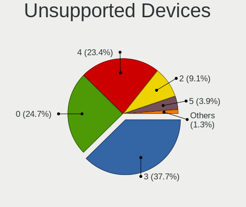

| Total | Computers | Percent |
|-------|-----------|---------|
| 0     | 14        | 41.18%  |
| 4     | 13        | 38.24%  |
| 2     | 4         | 11.76%  |
| 5     | 2         | 5.88%   |
| 1     | 1         | 2.94%   |

Unsupported Device Types
------------------------

Types of unsupported devices

| Type                     | Computers | Percent |
|--------------------------|-----------|---------|
| Communication controller | 20        | 47.62%  |
| Unassigned class         | 19        | 45.24%  |
| Graphics card            | 2         | 4.76%   |
| Storage/raid             | 1         | 2.38%   |

