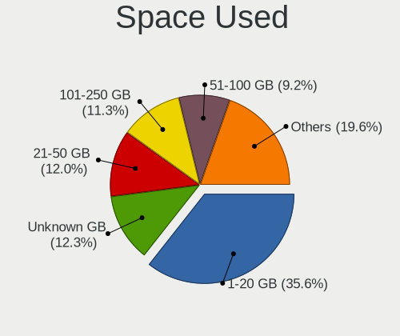

Debian - Tested Hardware & Statistics
-------------------------------------

A project to collect tested hardware configurations for Debian.

Anyone can contribute to this report by the [hw-probe](https://github.com/linuxhw/hw-probe) tool:

    sudo -E hw-probe -all -upload

Please contribute! Especially if your hardware is rare.

This is a report for all computer types. See also reports for [desktops](/Dist/Debian/Desktop/README.md) and [notebooks](/Dist/Debian/Notebook/README.md).

Contents
--------

* [ Test Cases ](#test-cases)

* [ System ](#system)
  - [ OS                       ](#os)
  - [ OS Family                ](#os-family)
  - [ Kernel                   ](#kernel)
  - [ Kernel Family            ](#kernel-family)
  - [ Kernel Major Ver.        ](#kernel-major-ver)
  - [ Arch                     ](#arch)
  - [ DE                       ](#de)
  - [ Display Server           ](#display-server)
  - [ Display Manager          ](#display-manager)
  - [ OS Lang                  ](#os-lang)
  - [ Boot Mode                ](#boot-mode)
  - [ Filesystem               ](#filesystem)
  - [ Part. scheme             ](#part-scheme)
  - [ Dual Boot with Linux/BSD ](#dual-boot-with-linuxbsd)
  - [ Dual Boot (Win)          ](#dual-boot-win)

* [ Board ](#board)
  - [ Vendor                   ](#vendor)
  - [ Model                    ](#model)
  - [ Model Family             ](#model-family)
  - [ MFG Year                 ](#mfg-year)
  - [ Form Factor              ](#form-factor)
  - [ Secure Boot              ](#secure-boot)
  - [ Coreboot                 ](#coreboot)
  - [ RAM Size                 ](#ram-size)
  - [ RAM Used                 ](#ram-used)
  - [ Total Drives             ](#total-drives)
  - [ Has CD-ROM               ](#has-cd-rom)
  - [ Has Ethernet             ](#has-ethernet)
  - [ Has WiFi                 ](#has-wifi)
  - [ Has Bluetooth            ](#has-bluetooth)

* [ Location ](#location)
  - [ Country                  ](#country)
  - [ City                     ](#city)

* [ Drives ](#drives)
  - [ Drive Vendor             ](#drive-vendor)
  - [ Drive Model              ](#drive-model)
  - [ HDD Vendor               ](#hdd-vendor)
  - [ SSD Vendor               ](#ssd-vendor)
  - [ Drive Kind               ](#drive-kind)
  - [ Drive Connector          ](#drive-connector)
  - [ Drive Size               ](#drive-size)
  - [ Space Total              ](#space-total)
  - [ Space Used               ](#space-used)
  - [ Malfunc. Drives          ](#malfunc-drives)
  - [ Malfunc. Drive Vendor    ](#malfunc-drive-vendor)
  - [ Malfunc. HDD Vendor      ](#malfunc-hdd-vendor)
  - [ Malfunc. Drive Kind      ](#malfunc-drive-kind)
  - [ Failed Drives            ](#failed-drives)
  - [ Failed Drive Vendor      ](#failed-drive-vendor)
  - [ Drive Status             ](#drive-status)

* [ Storage controller ](#storage-controller)
  - [ Storage Vendor           ](#storage-vendor)
  - [ Storage Model            ](#storage-model)
  - [ Storage Kind             ](#storage-kind)

* [ Processor ](#processor)
  - [ CPU Vendor               ](#cpu-vendor)
  - [ CPU Model                ](#cpu-model)
  - [ CPU Model Family         ](#cpu-model-family)
  - [ CPU Cores                ](#cpu-cores)
  - [ CPU Sockets              ](#cpu-sockets)
  - [ CPU Threads              ](#cpu-threads)
  - [ CPU Op-Modes             ](#cpu-op-modes)
  - [ CPU Microcode            ](#cpu-microcode)
  - [ CPU Microarch            ](#cpu-microarch)

* [ Graphics ](#graphics)
  - [ GPU Vendor               ](#gpu-vendor)
  - [ GPU Model                ](#gpu-model)
  - [ GPU Combo                ](#gpu-combo)
  - [ GPU Driver               ](#gpu-driver)
  - [ GPU Memory               ](#gpu-memory)

* [ Monitor ](#monitor)
  - [ Monitor Vendor           ](#monitor-vendor)
  - [ Monitor Model            ](#monitor-model)
  - [ Monitor Resolution       ](#monitor-resolution)
  - [ Monitor Diagonal         ](#monitor-diagonal)
  - [ Monitor Width            ](#monitor-width)
  - [ Aspect Ratio             ](#aspect-ratio)
  - [ Monitor Area             ](#monitor-area)
  - [ Pixel Density            ](#pixel-density)
  - [ Multiple Monitors        ](#multiple-monitors)

* [ Network ](#network)
  - [ Net Controller Vendor    ](#net-controller-vendor)
  - [ Net Controller Model     ](#net-controller-model)
  - [ Wireless Vendor          ](#wireless-vendor)
  - [ Wireless Model           ](#wireless-model)
  - [ Ethernet Vendor          ](#ethernet-vendor)
  - [ Ethernet Model           ](#ethernet-model)
  - [ Net Controller Kind      ](#net-controller-kind)
  - [ Used Controller          ](#used-controller)
  - [ NICs                     ](#nics)
  - [ IPv6                     ](#ipv6)

* [ Bluetooth ](#bluetooth)
  - [ Bluetooth Vendor         ](#bluetooth-vendor)
  - [ Bluetooth Model          ](#bluetooth-model)

* [ Sound ](#sound)
  - [ Sound Vendor             ](#sound-vendor)
  - [ Sound Model              ](#sound-model)

* [ Memory ](#memory)
  - [ Memory Vendor            ](#memory-vendor)
  - [ Memory Model             ](#memory-model)
  - [ Memory Kind              ](#memory-kind)
  - [ Memory Form Factor       ](#memory-form-factor)
  - [ Memory Size              ](#memory-size)
  - [ Memory Speed             ](#memory-speed)

* [ Printers & scanners ](#printers--scanners)
  - [ Printer Vendor           ](#printer-vendor)
  - [ Printer Model            ](#printer-model)
  - [ Scanner Vendor           ](#scanner-vendor)
  - [ Scanner Model            ](#scanner-model)

* [ Camera ](#camera)
  - [ Camera Vendor            ](#camera-vendor)
  - [ Camera Model             ](#camera-model)

* [ Security ](#security)
  - [ Fingerprint Vendor       ](#fingerprint-vendor)
  - [ Fingerprint Model        ](#fingerprint-model)
  - [ Chipcard Vendor          ](#chipcard-vendor)
  - [ Chipcard Model           ](#chipcard-model)

* [ Unsupported ](#unsupported)
  - [ Unsupported Devices      ](#unsupported-devices)
  - [ Unsupported Device Types ](#unsupported-device-types)

Test Cases
----------

Total: 16246

| Vendor        | Model                       | Form-Factor | Probe                                                      | Date         |
|---------------|-----------------------------|-------------|------------------------------------------------------------|--------------|
| HP            | ProLiant MicroServer Gen... | Desktop     | [aeb0b469c8](https://linux-hardware.org/?probe=aeb0b469c8) | Oct 01, 2023 |
| HP            | Laptop 14s-fq1xxx           | Notebook    | [3709e611a3](https://linux-hardware.org/?probe=3709e611a3) | Oct 01, 2023 |
| ASUSTek       | PRIME B365M-A               | Desktop     | [279922964e](https://linux-hardware.org/?probe=279922964e) | Oct 01, 2023 |
| Acer          | AOA150                      | Notebook    | [969a729098](https://linux-hardware.org/?probe=969a729098) | Oct 01, 2023 |
| Apple         | MacBook4,1                  | Notebook    | [d17d6d2b70](https://linux-hardware.org/?probe=d17d6d2b70) | Oct 01, 2023 |
| Dell          | 0PV3YR A05                  | Server      | [aae60ff071](https://linux-hardware.org/?probe=aae60ff071) | Oct 01, 2023 |
| Apple         | Mac-942B5BF58194151B        | All in one  | [7eebcdc80b](https://linux-hardware.org/?probe=7eebcdc80b) | Oct 01, 2023 |
| HP            | Pavilion Laptop 15t-eg30... | Notebook    | [ed7bf5aee1](https://linux-hardware.org/?probe=ed7bf5aee1) | Oct 01, 2023 |
| Lenovo        | Legion Pro 5 16ARX8 82WM    | Notebook    | [83d91ea2fe](https://linux-hardware.org/?probe=83d91ea2fe) | Sep 30, 2023 |
| Unknown       | Unknown                     | Soc         | [8024d770d9](https://linux-hardware.org/?probe=8024d770d9) | Sep 30, 2023 |
| Juana Mans... | SF20GM7                     | Notebook    | [b2b359c659](https://linux-hardware.org/?probe=b2b359c659) | Sep 30, 2023 |
| Juana Mans... | SF20GM7                     | Notebook    | [ccb9b4e795](https://linux-hardware.org/?probe=ccb9b4e795) | Sep 30, 2023 |
| Lenovo        | ThinkPad X260 VB6R77903H    | Notebook    | [e7dad368d2](https://linux-hardware.org/?probe=e7dad368d2) | Sep 30, 2023 |
| Dell          | Latitude 5410               | Notebook    | [8234abf02b](https://linux-hardware.org/?probe=8234abf02b) | Sep 30, 2023 |
| Lenovo        | ThinkPad X260 VB6R77903H    | Notebook    | [de3079ae33](https://linux-hardware.org/?probe=de3079ae33) | Sep 30, 2023 |
| IX1401        | Unknown                     | Notebook    | [c77c1d010e](https://linux-hardware.org/?probe=c77c1d010e) | Sep 30, 2023 |
| HP            | Spectre x360 2-in-1 Lapt... | Convertible | [eab41d0848](https://linux-hardware.org/?probe=eab41d0848) | Sep 30, 2023 |
| HP            | Pavilion dv5                | Notebook    | [0b1da8643f](https://linux-hardware.org/?probe=0b1da8643f) | Sep 30, 2023 |
| Dell          | 0PV3YR A05                  | Server      | [ba4aa68077](https://linux-hardware.org/?probe=ba4aa68077) | Sep 30, 2023 |
| Alienware     | m15 R4                      | Notebook    | [a67899ed06](https://linux-hardware.org/?probe=a67899ed06) | Sep 30, 2023 |
| Google        | Jerry                       | Desktop     | [467be71aaf](https://linux-hardware.org/?probe=467be71aaf) | Sep 30, 2023 |
| Fujitsu Si... | ESPRIMO Mobile V6555        | Notebook    | [703170e428](https://linux-hardware.org/?probe=703170e428) | Sep 30, 2023 |
| ASRock        | 4Core1600-GLAN              | Desktop     | [aefbc14017](https://linux-hardware.org/?probe=aefbc14017) | Sep 30, 2023 |
| HP            | Notebook                    | Notebook    | [193ec8deb3](https://linux-hardware.org/?probe=193ec8deb3) | Sep 30, 2023 |
| Lenovo        | 0B98401 PRO                 | Desktop     | [17bb772d78](https://linux-hardware.org/?probe=17bb772d78) | Sep 29, 2023 |
| Gigabyte      | B450M DS3H-CF               | Desktop     | [3473652871](https://linux-hardware.org/?probe=3473652871) | Sep 29, 2023 |
| Acer          | Veriton Z4820G              | All in one  | [5db8dac17e](https://linux-hardware.org/?probe=5db8dac17e) | Sep 29, 2023 |
| HP            | ProBook 450 G1              | Notebook    | [1cbae5b56a](https://linux-hardware.org/?probe=1cbae5b56a) | Sep 29, 2023 |
| ASRock        | H81M-HG4                    | Desktop     | [7f2a420ea3](https://linux-hardware.org/?probe=7f2a420ea3) | Sep 29, 2023 |
| HP            | Pavilion dv9000 (GA359UA... | Notebook    | [cea70d5f75](https://linux-hardware.org/?probe=cea70d5f75) | Sep 29, 2023 |
| Supermicro    | X11DDW-NT                   | Server      | [c7b049f922](https://linux-hardware.org/?probe=c7b049f922) | Sep 29, 2023 |
| Dell          | Latitude 5410               | Notebook    | [61ddf0adf6](https://linux-hardware.org/?probe=61ddf0adf6) | Sep 29, 2023 |
| Dell          | Inspiron 5570               | Notebook    | [0e12b69b96](https://linux-hardware.org/?probe=0e12b69b96) | Sep 29, 2023 |
| Lenovo        | ThinkPad T500 22439AG       | Notebook    | [e5a2cd9816](https://linux-hardware.org/?probe=e5a2cd9816) | Sep 29, 2023 |
| ASUSTek       | ROG STRIX X670E-F GAMING... | Desktop     | [5c38fe5e79](https://linux-hardware.org/?probe=5c38fe5e79) | Sep 28, 2023 |
| Pegatron      | JESSE                       | Desktop     | [3f6cf71237](https://linux-hardware.org/?probe=3f6cf71237) | Sep 28, 2023 |
| Lenovo        | ThinkPad E490 20N8000SRT    | Notebook    | [274b3b5210](https://linux-hardware.org/?probe=274b3b5210) | Sep 28, 2023 |
| Lenovo        | IdeaPad Slim 5 14ABR8 82... | Notebook    | [c61d70bcfa](https://linux-hardware.org/?probe=c61d70bcfa) | Sep 28, 2023 |
| Lenovo        | IdeaPad Slim 5 16ABR8 82... | Notebook    | [1fcc841148](https://linux-hardware.org/?probe=1fcc841148) | Sep 28, 2023 |
| Lenovo        | IdeaPad Slim 5 14ABR8 82... | Notebook    | [be49c167d0](https://linux-hardware.org/?probe=be49c167d0) | Sep 28, 2023 |
| Huanan        | X99-F8 GAMING V5.0          | Desktop     | [62ba806672](https://linux-hardware.org/?probe=62ba806672) | Sep 28, 2023 |
| Apple         | MacBookAir7,2               | Notebook    | [c25eeffab1](https://linux-hardware.org/?probe=c25eeffab1) | Sep 28, 2023 |
| ASRock        | B450 Pro4 R2.0              | Desktop     | [82562e75c3](https://linux-hardware.org/?probe=82562e75c3) | Sep 28, 2023 |
| Loongson      | LS3A6000-7A2000-1w-EVB-V... | Desktop     | [89d08f5ea8](https://linux-hardware.org/?probe=89d08f5ea8) | Sep 28, 2023 |
| Loongson      | LS3A6000-7A2000-1w-EVB-V... | Desktop     | [576c14796a](https://linux-hardware.org/?probe=576c14796a) | Sep 28, 2023 |
| Shenzhen M... | F7BAA                       | Desktop     | [a59f2cf9f2](https://linux-hardware.org/?probe=a59f2cf9f2) | Sep 28, 2023 |
| Acer          | Acadia V1.35                | Notebook    | [c2074b2535](https://linux-hardware.org/?probe=c2074b2535) | Sep 28, 2023 |
| Lenovo        | ThinkPad 13 2nd Gen 20J1... | Notebook    | [3cb2bdba37](https://linux-hardware.org/?probe=3cb2bdba37) | Sep 27, 2023 |
| ASUSTek       | ROG STRIX X670E-E GAMING... | Desktop     | [47a0a8627c](https://linux-hardware.org/?probe=47a0a8627c) | Sep 27, 2023 |
| EUROCOM       | RACER 2.0                   | Notebook    | [4351733d37](https://linux-hardware.org/?probe=4351733d37) | Sep 27, 2023 |
| HP            | ElitePad 1000 G2            | Notebook    | [2668770971](https://linux-hardware.org/?probe=2668770971) | Sep 27, 2023 |
| Fujitsu       | LIFEBOOK E4512              | Notebook    | [08b39b38bd](https://linux-hardware.org/?probe=08b39b38bd) | Sep 27, 2023 |
| ASUSTek       | K50IJ                       | Notebook    | [8556633dad](https://linux-hardware.org/?probe=8556633dad) | Sep 27, 2023 |
| Lenovo        | IdeaPad Gaming 3 15IMH05... | Notebook    | [1317c1f1a9](https://linux-hardware.org/?probe=1317c1f1a9) | Sep 27, 2023 |
| Lenovo        | ThinkPad E475 20H40006US    | Notebook    | [1a472d3072](https://linux-hardware.org/?probe=1a472d3072) | Sep 27, 2023 |
| MSI           | Z97 PC Mate                 | Desktop     | [15a7321226](https://linux-hardware.org/?probe=15a7321226) | Sep 27, 2023 |
| MSI           | Z97 PC Mate                 | Desktop     | [18bf7cff74](https://linux-hardware.org/?probe=18bf7cff74) | Sep 27, 2023 |
| Dell          | Latitude E6530              | Notebook    | [40cdcd2545](https://linux-hardware.org/?probe=40cdcd2545) | Sep 27, 2023 |
| Unknown       | Unknown                     | Desktop     | [2bf5f64c14](https://linux-hardware.org/?probe=2bf5f64c14) | Sep 27, 2023 |
| Gigabyte      | GA-970A-D3                  | Desktop     | [a4d1820df5](https://linux-hardware.org/?probe=a4d1820df5) | Sep 27, 2023 |
| ASRock        | 970M Pro3                   | Desktop     | [f004fa8e32](https://linux-hardware.org/?probe=f004fa8e32) | Sep 27, 2023 |
| ASRock        | 970M Pro3                   | Desktop     | [3646127006](https://linux-hardware.org/?probe=3646127006) | Sep 27, 2023 |
| Gigabyte      | GA-880GM-USB3L              | Desktop     | [f160911c14](https://linux-hardware.org/?probe=f160911c14) | Sep 27, 2023 |
| Lenovo        | 0B98401 PRO                 | Desktop     | [2cdf3dac45](https://linux-hardware.org/?probe=2cdf3dac45) | Sep 27, 2023 |
| YANYU         | H17SL                       | Desktop     | [5966ae64d0](https://linux-hardware.org/?probe=5966ae64d0) | Sep 26, 2023 |
| Acer          | Aspire 5951G                | Notebook    | [cae145acab](https://linux-hardware.org/?probe=cae145acab) | Sep 26, 2023 |
| Dell          | Vostro 14-3468              | Notebook    | [3fceb34932](https://linux-hardware.org/?probe=3fceb34932) | Sep 26, 2023 |
| Lenovo        | ThinkPad E475 20H40006US    | Notebook    | [d406193722](https://linux-hardware.org/?probe=d406193722) | Sep 26, 2023 |
| Dell          | Vostro 14-3468              | Notebook    | [a027aae826](https://linux-hardware.org/?probe=a027aae826) | Sep 26, 2023 |
| ASUSTek       | PRIME B350-PLUS             | Desktop     | [64dcffc72f](https://linux-hardware.org/?probe=64dcffc72f) | Sep 26, 2023 |
| Dell          | XPS 9315                    | Notebook    | [6fa1beb451](https://linux-hardware.org/?probe=6fa1beb451) | Sep 26, 2023 |
| Lenovo        | ThinkPad T420 4236EV9       | Notebook    | [d621ecd81f](https://linux-hardware.org/?probe=d621ecd81f) | Sep 26, 2023 |
| Lenovo        | ThinkPad L540 20AUS00N00    | Notebook    | [a8aee3f386](https://linux-hardware.org/?probe=a8aee3f386) | Sep 26, 2023 |
| Aquarius      | NS585                       | Notebook    | [ce1c1d6e56](https://linux-hardware.org/?probe=ce1c1d6e56) | Sep 26, 2023 |
| Lenovo        | ThinkServer TS440           | Desktop     | [11efb68800](https://linux-hardware.org/?probe=11efb68800) | Sep 26, 2023 |
| Lenovo        | ThinkPad L13 Yoga Gen 2 ... | Convertible | [d2ac451979](https://linux-hardware.org/?probe=d2ac451979) | Sep 26, 2023 |
| ASUSTek       | PN41                        | Mini pc     | [40d7200bd5](https://linux-hardware.org/?probe=40d7200bd5) | Sep 26, 2023 |
| Lenovo        | 102F SDK0E50510 WIN 2625... | Desktop     | [4a36dbb8ff](https://linux-hardware.org/?probe=4a36dbb8ff) | Sep 26, 2023 |
| Intel         | DP35DP AAD81073-206         | Desktop     | [426e9aff0f](https://linux-hardware.org/?probe=426e9aff0f) | Sep 26, 2023 |
| Acer          | Aspire A515-47              | Notebook    | [3c1e418bf0](https://linux-hardware.org/?probe=3c1e418bf0) | Sep 26, 2023 |
| Dell          | 0PV3YR A05                  | Server      | [acde6e2ba0](https://linux-hardware.org/?probe=acde6e2ba0) | Sep 26, 2023 |
| ASUSTek       | Zenbook UM3402YAR_UM3402... | Notebook    | [9e9ff26362](https://linux-hardware.org/?probe=9e9ff26362) | Sep 26, 2023 |
| ASUSTek       | M5A78L-M LE/USB3            | Desktop     | [19858af3cd](https://linux-hardware.org/?probe=19858af3cd) | Sep 26, 2023 |
| Acer          | Aspire A515-56              | Notebook    | [b047457fd1](https://linux-hardware.org/?probe=b047457fd1) | Sep 25, 2023 |
| Dell          | XPS 15 9560                 | Notebook    | [a524453c71](https://linux-hardware.org/?probe=a524453c71) | Sep 25, 2023 |
| Apple         | Mac-F2268CC8                | All in one  | [4805d7055d](https://linux-hardware.org/?probe=4805d7055d) | Sep 25, 2023 |
| Lenovo        | G710 20252                  | Notebook    | [d7926809d7](https://linux-hardware.org/?probe=d7926809d7) | Sep 25, 2023 |
| Apple         | Mac-F2268CC8                | All in one  | [af6b7acf6e](https://linux-hardware.org/?probe=af6b7acf6e) | Sep 25, 2023 |
| HP            | Presario CQ43               | Notebook    | [c206dc84ad](https://linux-hardware.org/?probe=c206dc84ad) | Sep 25, 2023 |
| Lenovo        | ThinkPad L13 Yoga Gen 2 ... | Convertible | [884cb2236d](https://linux-hardware.org/?probe=884cb2236d) | Sep 25, 2023 |
| AMI           | Aptio CRB                   | Mini pc     | [ca65327602](https://linux-hardware.org/?probe=ca65327602) | Sep 25, 2023 |
| Aquarius      | NS585                       | Notebook    | [e901467e39](https://linux-hardware.org/?probe=e901467e39) | Sep 25, 2023 |
| Lenovo        | ThinkPad X270 W10DG 20K5... | Notebook    | [ab332c2dcb](https://linux-hardware.org/?probe=ab332c2dcb) | Sep 25, 2023 |
| Lenovo        | ThinkPad L13 Yoga Gen 2 ... | Convertible | [fb576eef77](https://linux-hardware.org/?probe=fb576eef77) | Sep 25, 2023 |
| Acer          | Aspire 5951G                | Notebook    | [4c50b8e9b0](https://linux-hardware.org/?probe=4c50b8e9b0) | Sep 25, 2023 |
| Gigabyte      | B550 AORUS PRO V2           | Desktop     | [273b056209](https://linux-hardware.org/?probe=273b056209) | Sep 25, 2023 |
| Dell          | 0PV3YR A05                  | Server      | [8a7db88ae5](https://linux-hardware.org/?probe=8a7db88ae5) | Sep 25, 2023 |
| MSI           | MS-7318                     | Desktop     | [0e03a1818a](https://linux-hardware.org/?probe=0e03a1818a) | Sep 24, 2023 |
| Acer          | H11H4-AI V:1.0              | Desktop     | [971f03180e](https://linux-hardware.org/?probe=971f03180e) | Sep 24, 2023 |
| Lenovo        | ThinkPad T440s 20ARS0CN0... | Notebook    | [9c0b702e21](https://linux-hardware.org/?probe=9c0b702e21) | Sep 24, 2023 |
| Dell          | 0WXF9V A02                  | Server      | [842186b04e](https://linux-hardware.org/?probe=842186b04e) | Sep 24, 2023 |
| Fujitsu       | D3067-A1 S26361-D3067-A1    | Desktop     | [14c3077129](https://linux-hardware.org/?probe=14c3077129) | Sep 24, 2023 |
| Dell          | XPS 15 9500                 | Notebook    | [fcff405070](https://linux-hardware.org/?probe=fcff405070) | Sep 24, 2023 |
| Dell          | XPS 15 9500                 | Notebook    | [5bedca0fe9](https://linux-hardware.org/?probe=5bedca0fe9) | Sep 24, 2023 |
| MSI           | Z370-A PRO                  | Desktop     | [77c3039fdc](https://linux-hardware.org/?probe=77c3039fdc) | Sep 24, 2023 |
| Valve         | Jupiter                     | Notebook    | [36fd2d4d96](https://linux-hardware.org/?probe=36fd2d4d96) | Sep 24, 2023 |
| Dell          | 0D4MD1 A04                  | Desktop     | [5e6e35397a](https://linux-hardware.org/?probe=5e6e35397a) | Sep 24, 2023 |
| Dell          | 0D4MD1 A04                  | Desktop     | [4d7943532f](https://linux-hardware.org/?probe=4d7943532f) | Sep 24, 2023 |
| Dell          | Latitude 5420               | Notebook    | [0e22f551b9](https://linux-hardware.org/?probe=0e22f551b9) | Sep 24, 2023 |
| Gigabyte      | B85M-D3H                    | Desktop     | [e568bc8439](https://linux-hardware.org/?probe=e568bc8439) | Sep 23, 2023 |
| HP            | 250 G8 Notebook PC          | Notebook    | [6b3c3ce703](https://linux-hardware.org/?probe=6b3c3ce703) | Sep 23, 2023 |
| HP            | 250 G4                      | Notebook    | [c9dac1b4d5](https://linux-hardware.org/?probe=c9dac1b4d5) | Sep 23, 2023 |
| Lenovo        | ThinkPad X1 Carbon 6th 2... | Notebook    | [42309ddc8c](https://linux-hardware.org/?probe=42309ddc8c) | Sep 23, 2023 |
| ASUSTek       | ROG STRIX B550-F GAMING     | Desktop     | [e96b971928](https://linux-hardware.org/?probe=e96b971928) | Sep 23, 2023 |
| HP            | 250 G8 Notebook PC          | Notebook    | [e2dd7767f0](https://linux-hardware.org/?probe=e2dd7767f0) | Sep 23, 2023 |
| Dell          | 0NW6H5 A00                  | Desktop     | [c3221c93ca](https://linux-hardware.org/?probe=c3221c93ca) | Sep 23, 2023 |
| Dell          | Vostro 14-3468              | Notebook    | [0b6bdbbecb](https://linux-hardware.org/?probe=0b6bdbbecb) | Sep 23, 2023 |
| HP            | 1905                        | Desktop     | [786257c0e1](https://linux-hardware.org/?probe=786257c0e1) | Sep 23, 2023 |
| HP            | Compaq Presario CQ60        | Notebook    | [ae8071638f](https://linux-hardware.org/?probe=ae8071638f) | Sep 23, 2023 |
| Dell          | 0PC5F7 A01                  | Desktop     | [887558c8f3](https://linux-hardware.org/?probe=887558c8f3) | Sep 23, 2023 |
| Lenovo        | ThinkPad X1 Carbon Gen 1... | Notebook    | [eb276947f2](https://linux-hardware.org/?probe=eb276947f2) | Sep 23, 2023 |
| Dell          | 03KWTV A02                  | Desktop     | [991ec32c75](https://linux-hardware.org/?probe=991ec32c75) | Sep 23, 2023 |
| Dell          | Latitude 5290 2-in-1        | Tablet      | [39781eeb86](https://linux-hardware.org/?probe=39781eeb86) | Sep 23, 2023 |
| HP            | EliteBook 845 G8 Noteboo... | Notebook    | [574c2193bb](https://linux-hardware.org/?probe=574c2193bb) | Sep 23, 2023 |
| Gigabyte      | B250M-Gaming5-CF            | Desktop     | [f18f8ef020](https://linux-hardware.org/?probe=f18f8ef020) | Sep 23, 2023 |
| Acer          | Nitro AN515-58              | Notebook    | [589716b973](https://linux-hardware.org/?probe=589716b973) | Sep 23, 2023 |
| Lenovo        | ThinkPad L13 Gen 3 21B90... | Notebook    | [e273beb83a](https://linux-hardware.org/?probe=e273beb83a) | Sep 22, 2023 |
| Lenovo        | ThinkPad T470s W10DG 20J... | Notebook    | [ad1b8126d2](https://linux-hardware.org/?probe=ad1b8126d2) | Sep 22, 2023 |
| Lenovo        | ThinkPad L13 Yoga Gen 2 ... | Convertible | [657170674d](https://linux-hardware.org/?probe=657170674d) | Sep 22, 2023 |
| Lenovo        | ThinkPad L13 Gen 3 21B90... | Notebook    | [0d786ffd74](https://linux-hardware.org/?probe=0d786ffd74) | Sep 22, 2023 |
| Lenovo        | ThinkPad L13 Yoga Gen 2 ... | Convertible | [5080d645a6](https://linux-hardware.org/?probe=5080d645a6) | Sep 22, 2023 |
| Lenovo        | ThinkPad L13 Yoga Gen 2 ... | Convertible | [5e2e6b4e33](https://linux-hardware.org/?probe=5e2e6b4e33) | Sep 22, 2023 |
| HP            | EliteBook 845 G8 Noteboo... | Notebook    | [1e9774c53c](https://linux-hardware.org/?probe=1e9774c53c) | Sep 22, 2023 |
| MSI           | MPG Z590 GAMING PLUS        | Desktop     | [b402f89894](https://linux-hardware.org/?probe=b402f89894) | Sep 22, 2023 |
| Shenzhen M... | F6BFC                       | Desktop     | [9a906f1b75](https://linux-hardware.org/?probe=9a906f1b75) | Sep 22, 2023 |
| Dell          | Latitude 3320               | Notebook    | [cf413808cb](https://linux-hardware.org/?probe=cf413808cb) | Sep 22, 2023 |
| Dell          | Latitude 3320               | Notebook    | [bd39ee30ac](https://linux-hardware.org/?probe=bd39ee30ac) | Sep 22, 2023 |
| Dell          | 0NW6H5 A00                  | Desktop     | [7df92bb8f5](https://linux-hardware.org/?probe=7df92bb8f5) | Sep 22, 2023 |
| Lenovo        | ThinkPad X1 Carbon Gen 1... | Notebook    | [e75a2a8b71](https://linux-hardware.org/?probe=e75a2a8b71) | Sep 22, 2023 |
| MSI           | X470 GAMING PLUS            | Desktop     | [d22a656bef](https://linux-hardware.org/?probe=d22a656bef) | Sep 22, 2023 |
| Lenovo        | IdeaPad S340-15IWL 81N8     | Notebook    | [c14178c7fa](https://linux-hardware.org/?probe=c14178c7fa) | Sep 22, 2023 |
| Samsung       | R505                        | Notebook    | [8aef37cda9](https://linux-hardware.org/?probe=8aef37cda9) | Sep 22, 2023 |
| Olimex        | A20-OLinuXino-LIME2         | Soc         | [b2c0e79757](https://linux-hardware.org/?probe=b2c0e79757) | Sep 22, 2023 |
| Getac         | T800G2                      | Tablet      | [fe815f3c1f](https://linux-hardware.org/?probe=fe815f3c1f) | Sep 22, 2023 |
| ASUSTek       | X555LJ                      | Notebook    | [2edb781d68](https://linux-hardware.org/?probe=2edb781d68) | Sep 22, 2023 |
| HP            | Pavilion Aero Laptop 13-... | Notebook    | [4bf358cd4f](https://linux-hardware.org/?probe=4bf358cd4f) | Sep 22, 2023 |
| ASUSTek       | ROG Maximus XII EXTREME     | Desktop     | [2137a7a54b](https://linux-hardware.org/?probe=2137a7a54b) | Sep 22, 2023 |
| HP            | EliteBook 840 G3            | Notebook    | [b6379ef77c](https://linux-hardware.org/?probe=b6379ef77c) | Sep 22, 2023 |
| ASUSTek       | PRIME B660M-K D4            | Desktop     | [85c3791741](https://linux-hardware.org/?probe=85c3791741) | Sep 21, 2023 |
| Apple         | Mac-81E3E92DD6088272 iMa... | All in one  | [e04cb1a779](https://linux-hardware.org/?probe=e04cb1a779) | Sep 21, 2023 |
| Lenovo        | ThinkPad E475 20H40006US    | Notebook    | [ea491d194f](https://linux-hardware.org/?probe=ea491d194f) | Sep 21, 2023 |
| Lenovo        | ThinkPad 13 2nd Gen 20J1... | Notebook    | [e33bb92eb6](https://linux-hardware.org/?probe=e33bb92eb6) | Sep 21, 2023 |
| Intel         | NUC13ANBi5 M89647-202       | Mini pc     | [8283dda5ff](https://linux-hardware.org/?probe=8283dda5ff) | Sep 21, 2023 |
| ASUSTek       | P7P55D                      | Desktop     | [ff8d00073e](https://linux-hardware.org/?probe=ff8d00073e) | Sep 21, 2023 |
| Lenovo        | V14 G3 IAP 82TS             | Notebook    | [2528381c0e](https://linux-hardware.org/?probe=2528381c0e) | Sep 21, 2023 |
| Gigabyte      | Z77X-UD3H                   | Desktop     | [f870f9e3ac](https://linux-hardware.org/?probe=f870f9e3ac) | Sep 21, 2023 |
| Lenovo        | ThinkPad L13 Yoga Gen 2 ... | Convertible | [68b870221c](https://linux-hardware.org/?probe=68b870221c) | Sep 21, 2023 |
| MSI           | MS-7318                     | Desktop     | [38f011e50d](https://linux-hardware.org/?probe=38f011e50d) | Sep 21, 2023 |
| Lenovo        | Legion 5 15ACH6H 82JU       | Notebook    | [f9430fd075](https://linux-hardware.org/?probe=f9430fd075) | Sep 21, 2023 |
| Lenovo        | IdeaPadFlex 5 14ITL05 82... | Convertible | [c78cdff385](https://linux-hardware.org/?probe=c78cdff385) | Sep 21, 2023 |
| Gigabyte      | B550 AORUS PRO              | Desktop     | [81d1af1a96](https://linux-hardware.org/?probe=81d1af1a96) | Sep 20, 2023 |
| Lenovo        | ThinkPad L13 Yoga Gen 2 ... | Convertible | [7528d162d0](https://linux-hardware.org/?probe=7528d162d0) | Sep 20, 2023 |
| Lenovo        | ThinkPad 13 2nd Gen 20J1... | Notebook    | [e337cc85e5](https://linux-hardware.org/?probe=e337cc85e5) | Sep 20, 2023 |
| NetGear       | ReadyDATA 5200              | Desktop     | [c96e63c738](https://linux-hardware.org/?probe=c96e63c738) | Sep 20, 2023 |
| Gigabyte      | Z790 AERO G                 | Desktop     | [0c99fa225e](https://linux-hardware.org/?probe=0c99fa225e) | Sep 20, 2023 |
| Acer          | Aspire E1-531               | Notebook    | [f0173f0458](https://linux-hardware.org/?probe=f0173f0458) | Sep 20, 2023 |
| Lenovo        | ThinkPad L390 20NRCTO1WW    | Notebook    | [228d31bf59](https://linux-hardware.org/?probe=228d31bf59) | Sep 20, 2023 |
| iEi           | SAT3 V1.03                  | Desktop     | [d303736416](https://linux-hardware.org/?probe=d303736416) | Sep 20, 2023 |
| Gigabyte      | Z270-Gaming K3              | Desktop     | [63bebc9690](https://linux-hardware.org/?probe=63bebc9690) | Sep 20, 2023 |
| Dell          | XPS 13 9300                 | Notebook    | [49bb68e979](https://linux-hardware.org/?probe=49bb68e979) | Sep 20, 2023 |
| HP            | ProBook 450 G1              | Notebook    | [4e5ae95013](https://linux-hardware.org/?probe=4e5ae95013) | Sep 20, 2023 |
| ASUSTek       | X556UQ                      | Notebook    | [c34d9b9514](https://linux-hardware.org/?probe=c34d9b9514) | Sep 20, 2023 |
| CWWK          | MINIPC-G12                  | Desktop     | [003a19cc19](https://linux-hardware.org/?probe=003a19cc19) | Sep 20, 2023 |
| ASUSTek       | X556UQ                      | Notebook    | [7ec3567855](https://linux-hardware.org/?probe=7ec3567855) | Sep 20, 2023 |
| ASUSTek       | X556UQ                      | Notebook    | [676dd13401](https://linux-hardware.org/?probe=676dd13401) | Sep 20, 2023 |
| Intel         | NUC6i7KYB H90766-403        | Mini pc     | [6f6fbfc86f](https://linux-hardware.org/?probe=6f6fbfc86f) | Sep 20, 2023 |
| Dell          | Precision 5560              | Notebook    | [456e9e2c78](https://linux-hardware.org/?probe=456e9e2c78) | Sep 20, 2023 |
| Lenovo        | ThinkPad L420 78564ES       | Notebook    | [a6f3af802d](https://linux-hardware.org/?probe=a6f3af802d) | Sep 20, 2023 |
| Lenovo        | IdeaPad Y700-15ISK 80NV     | Notebook    | [5662d8f95c](https://linux-hardware.org/?probe=5662d8f95c) | Sep 20, 2023 |
| Gigabyte      | Z790 AERO G                 | Desktop     | [6ded2501bf](https://linux-hardware.org/?probe=6ded2501bf) | Sep 20, 2023 |
| BESSTAR Te... | HM90                        | Desktop     | [bbb35ce98b](https://linux-hardware.org/?probe=bbb35ce98b) | Sep 20, 2023 |
| ASRock        | X399 Taichi                 | Desktop     | [ff02c716c1](https://linux-hardware.org/?probe=ff02c716c1) | Sep 19, 2023 |
| ASUSTek       | Z9PA-D8 Series              | Server      | [e4686e182a](https://linux-hardware.org/?probe=e4686e182a) | Sep 19, 2023 |
| ASUSTek       | Z9PA-D8 Series              | Server      | [2bc60f54d0](https://linux-hardware.org/?probe=2bc60f54d0) | Sep 19, 2023 |
| Dell          | Precision 7550              | Notebook    | [75394df91f](https://linux-hardware.org/?probe=75394df91f) | Sep 19, 2023 |
| ASUSTek       | PRIME B450M-GAMING/BR       | Desktop     | [6d9002e7e3](https://linux-hardware.org/?probe=6d9002e7e3) | Sep 19, 2023 |
| ASUSTek       | PRIME B450M-GAMING/BR       | Desktop     | [c53d44303e](https://linux-hardware.org/?probe=c53d44303e) | Sep 19, 2023 |
| MSI           | MPG B760I EDGE WIFI DDR4    | Desktop     | [5a6ff779bd](https://linux-hardware.org/?probe=5a6ff779bd) | Sep 19, 2023 |
| HP            | Laptop 15-bs0xx             | Notebook    | [963330511d](https://linux-hardware.org/?probe=963330511d) | Sep 19, 2023 |
| Gigabyte      | H81M-DS2                    | Desktop     | [85d35b008d](https://linux-hardware.org/?probe=85d35b008d) | Sep 19, 2023 |
| MSI           | A320M-A PRO                 | Desktop     | [03da63d741](https://linux-hardware.org/?probe=03da63d741) | Sep 19, 2023 |
| Lenovo        | IdeaPad 5 14ALC05 82LM      | Notebook    | [a5f79b33f4](https://linux-hardware.org/?probe=a5f79b33f4) | Sep 19, 2023 |
| Notebook      | P7xxDM3(-G)                 | Notebook    | [b302c7b008](https://linux-hardware.org/?probe=b302c7b008) | Sep 19, 2023 |
| Lenovo        | ThinkPad X61s 7666Y2X       | Notebook    | [177e40808d](https://linux-hardware.org/?probe=177e40808d) | Sep 19, 2023 |
| Notebook      | P7xxDM3(-G)                 | Notebook    | [ec386099b2](https://linux-hardware.org/?probe=ec386099b2) | Sep 19, 2023 |
| Lenovo        | 3190 SDK0T76530 WIN 3556... | Mini pc     | [2179b0b458](https://linux-hardware.org/?probe=2179b0b458) | Sep 19, 2023 |
| Lenovo        | 312D SDK0J40697 WIN 3305... | Mini pc     | [8d1653a141](https://linux-hardware.org/?probe=8d1653a141) | Sep 19, 2023 |
| HP            | Laptop 17-cp0xxx            | Notebook    | [05e3350e1f](https://linux-hardware.org/?probe=05e3350e1f) | Sep 19, 2023 |
| Dell          | XPS 13 9360                 | Notebook    | [149f246bd7](https://linux-hardware.org/?probe=149f246bd7) | Sep 19, 2023 |
| ASUSTek       | ROG STRIX B650E-I GAMING... | Desktop     | [b06b302844](https://linux-hardware.org/?probe=b06b302844) | Sep 19, 2023 |
| Acer          | Aspire A515-56              | Notebook    | [db16273e72](https://linux-hardware.org/?probe=db16273e72) | Sep 19, 2023 |
| Gigabyte      | 970A-DS3P                   | Desktop     | [0ddcc2944f](https://linux-hardware.org/?probe=0ddcc2944f) | Sep 19, 2023 |
| Intel Clie... | LAPBC710                    | Notebook    | [af446fcb4d](https://linux-hardware.org/?probe=af446fcb4d) | Sep 19, 2023 |
| Intel Clie... | LAPBC710                    | Notebook    | [eae124fa61](https://linux-hardware.org/?probe=eae124fa61) | Sep 19, 2023 |
| ASRock        | B550 Pro4                   | Desktop     | [af2217289d](https://linux-hardware.org/?probe=af2217289d) | Sep 19, 2023 |
| HP            | Laptop 15-bs0xx             | Notebook    | [5f8df7dfcb](https://linux-hardware.org/?probe=5f8df7dfcb) | Sep 19, 2023 |
| Dell          | Latitude E6430              | Notebook    | [d83d7bbfa8](https://linux-hardware.org/?probe=d83d7bbfa8) | Sep 18, 2023 |
| HP            | 15                          | Notebook    | [b016d5ee79](https://linux-hardware.org/?probe=b016d5ee79) | Sep 18, 2023 |
| HP            | 82A2                        | Desktop     | [cc179a17a8](https://linux-hardware.org/?probe=cc179a17a8) | Sep 18, 2023 |
| Lenovo        | Z50-75 80EC                 | Notebook    | [410df263b8](https://linux-hardware.org/?probe=410df263b8) | Sep 18, 2023 |
| Lenovo        | ThinkPad L13 Gen 2 20VH0... | Notebook    | [ebfe5ca0b0](https://linux-hardware.org/?probe=ebfe5ca0b0) | Sep 18, 2023 |
| Acer          | Extensa 215-32              | Notebook    | [6879449933](https://linux-hardware.org/?probe=6879449933) | Sep 18, 2023 |
| ASUSTek       | TUF B450-PLUS GAMING        | Desktop     | [a64dc1766a](https://linux-hardware.org/?probe=a64dc1766a) | Sep 18, 2023 |
| Acer          | Veriton Z4630G              | All in one  | [c492dcbc41](https://linux-hardware.org/?probe=c492dcbc41) | Sep 18, 2023 |
| MSI           | MS-7366                     | Desktop     | [96731b6fc6](https://linux-hardware.org/?probe=96731b6fc6) | Sep 18, 2023 |
| Aquarius      | NS585                       | Notebook    | [6ac8bd5909](https://linux-hardware.org/?probe=6ac8bd5909) | Sep 18, 2023 |
| Lenovo        | Z50-75 80EC                 | Notebook    | [e14140ad96](https://linux-hardware.org/?probe=e14140ad96) | Sep 18, 2023 |
| Acer          | Veriton Z4630G              | All in one  | [1515603de8](https://linux-hardware.org/?probe=1515603de8) | Sep 18, 2023 |
| ASUSTek       | J1800I-C                    | Desktop     | [970e148d8d](https://linux-hardware.org/?probe=970e148d8d) | Sep 18, 2023 |
| HP            | Mini 110-1000               | Notebook    | [dda4d7a910](https://linux-hardware.org/?probe=dda4d7a910) | Sep 18, 2023 |
| MSI           | H81M-P33                    | Desktop     | [d0287bbd0f](https://linux-hardware.org/?probe=d0287bbd0f) | Sep 18, 2023 |
| HP            | Mini 110-1000               | Notebook    | [ee2d142228](https://linux-hardware.org/?probe=ee2d142228) | Sep 18, 2023 |
| ASUSTek       | TUF B450-PLUS GAMING        | Desktop     | [3faff3c0aa](https://linux-hardware.org/?probe=3faff3c0aa) | Sep 18, 2023 |
| Lenovo        | 7X16CTO1WW                  | Server      | [b6d0938617](https://linux-hardware.org/?probe=b6d0938617) | Sep 18, 2023 |
| Dell          | 084XW4 A06                  | Server      | [ea77b31f41](https://linux-hardware.org/?probe=ea77b31f41) | Sep 18, 2023 |
| Lenovo        | SB27B23563 03               | Server      | [b6b52e11fe](https://linux-hardware.org/?probe=b6b52e11fe) | Sep 18, 2023 |
| Gigabyte      | H55N-USB3                   | Desktop     | [afefe4b055](https://linux-hardware.org/?probe=afefe4b055) | Sep 18, 2023 |
| HP            | 8158 A01                    | Mini pc     | [bd8aa3d09c](https://linux-hardware.org/?probe=bd8aa3d09c) | Sep 18, 2023 |
| Gigabyte      | GA-78LMT-USB3               | Desktop     | [cfa7fbd3fe](https://linux-hardware.org/?probe=cfa7fbd3fe) | Sep 18, 2023 |
| MSI           | X79A-GD45                   | Desktop     | [85a9bad81b](https://linux-hardware.org/?probe=85a9bad81b) | Sep 17, 2023 |
| AZW           | U59                         | Desktop     | [2bc9b4b184](https://linux-hardware.org/?probe=2bc9b4b184) | Sep 17, 2023 |
| Acer          | TravelMate P446-MG          | Notebook    | [08d9d6868b](https://linux-hardware.org/?probe=08d9d6868b) | Sep 17, 2023 |
| Gigabyte      | H97-HD3                     | Desktop     | [ac1361d323](https://linux-hardware.org/?probe=ac1361d323) | Sep 17, 2023 |
| Supermicro    | X9DR3-F                     | Desktop     | [c2f0532df1](https://linux-hardware.org/?probe=c2f0532df1) | Sep 17, 2023 |
| HP            | 1905                        | Desktop     | [688c5ddf16](https://linux-hardware.org/?probe=688c5ddf16) | Sep 17, 2023 |
| ASUSTek       | ROG Maximus XIII HERO       | Desktop     | [b07ec8f845](https://linux-hardware.org/?probe=b07ec8f845) | Sep 17, 2023 |
| HP            | 1905                        | Desktop     | [562179ca0e](https://linux-hardware.org/?probe=562179ca0e) | Sep 17, 2023 |
| Google        | Droid                       | Notebook    | [e0a0628d0a](https://linux-hardware.org/?probe=e0a0628d0a) | Sep 17, 2023 |
| HP            | Compaq Mini 311-1100        | Notebook    | [8bdfb6307c](https://linux-hardware.org/?probe=8bdfb6307c) | Sep 17, 2023 |
| HP            | Laptop 15-dw3xxx            | Notebook    | [f84a480b09](https://linux-hardware.org/?probe=f84a480b09) | Sep 17, 2023 |
| Gigabyte      | X570 GAMING X               | Desktop     | [8af23c2e56](https://linux-hardware.org/?probe=8af23c2e56) | Sep 17, 2023 |
| Dell          | XPS 13 9370                 | Notebook    | [7715522f7f](https://linux-hardware.org/?probe=7715522f7f) | Sep 17, 2023 |
| MSI           | X470 GAMING PLUS            | Desktop     | [35d0dc4629](https://linux-hardware.org/?probe=35d0dc4629) | Sep 17, 2023 |
| Gigabyte      | X570 GAMING X               | Desktop     | [50bfb485e5](https://linux-hardware.org/?probe=50bfb485e5) | Sep 17, 2023 |
| Gigabyte      | X570 GAMING X               | Desktop     | [d795a474b2](https://linux-hardware.org/?probe=d795a474b2) | Sep 16, 2023 |
| MSI           | B460M-A PRO                 | Desktop     | [b2d52a5d1c](https://linux-hardware.org/?probe=b2d52a5d1c) | Sep 16, 2023 |
| ASUSTek       | ROG STRIX B550-I GAMING     | Desktop     | [6a908941cd](https://linux-hardware.org/?probe=6a908941cd) | Sep 16, 2023 |
| Lenovo        | ThinkPad P14s Gen 2a 21A... | Notebook    | [cda370cdc3](https://linux-hardware.org/?probe=cda370cdc3) | Sep 16, 2023 |
| ASRock        | B450M Pro4                  | Desktop     | [3974827c3e](https://linux-hardware.org/?probe=3974827c3e) | Sep 16, 2023 |
| AZW           | S5 V2.0                     | Mini pc     | [c10acf583a](https://linux-hardware.org/?probe=c10acf583a) | Sep 16, 2023 |
| Fujitsu       | D3220-A1 S26361-D3220-A1    | Desktop     | [effa0104c0](https://linux-hardware.org/?probe=effa0104c0) | Sep 16, 2023 |
| ASUSTek       | ASUSPRO P5440FA_P5440FA     | Notebook    | [b7c1a0a0a0](https://linux-hardware.org/?probe=b7c1a0a0a0) | Sep 16, 2023 |
| Fujitsu       | D3220-A1 S26361-D3220-A1    | Desktop     | [72ec01815f](https://linux-hardware.org/?probe=72ec01815f) | Sep 16, 2023 |
| Apple         | MacBookPro8,1               | Notebook    | [c3791ba730](https://linux-hardware.org/?probe=c3791ba730) | Sep 16, 2023 |
| Lenovo        | ThinkPad X201 3249CTO       | Notebook    | [f5884967d0](https://linux-hardware.org/?probe=f5884967d0) | Sep 16, 2023 |
| ASUSTek       | P5G41T-M LX                 | Desktop     | [020deea6d9](https://linux-hardware.org/?probe=020deea6d9) | Sep 15, 2023 |
| Dell          | Latitude E5570              | Notebook    | [fd5ba4aa5a](https://linux-hardware.org/?probe=fd5ba4aa5a) | Sep 15, 2023 |
| ASUSTek       | M5A78L-M LE/USB3            | Desktop     | [923d176004](https://linux-hardware.org/?probe=923d176004) | Sep 15, 2023 |
| MSI           | MPG B760I EDGE WIFI DDR4    | Desktop     | [bd389fb2a0](https://linux-hardware.org/?probe=bd389fb2a0) | Sep 15, 2023 |
| MSI           | B450 GAMING PRO CARBON M... | Desktop     | [caba916cf4](https://linux-hardware.org/?probe=caba916cf4) | Sep 15, 2023 |
| Dell          | Precision 5570              | Notebook    | [8b3c21b110](https://linux-hardware.org/?probe=8b3c21b110) | Sep 15, 2023 |
| Supermicro    | M11SDV-8C-LN4F              | Server      | [f8e68bfc81](https://linux-hardware.org/?probe=f8e68bfc81) | Sep 15, 2023 |
| Supermicro    | M11SDV-8C-LN4F              | Server      | [f89ec253d3](https://linux-hardware.org/?probe=f89ec253d3) | Sep 15, 2023 |
| Supermicro    | X11SSH-F                    | Desktop     | [2f12035902](https://linux-hardware.org/?probe=2f12035902) | Sep 15, 2023 |
| Supermicro    | X11SSH-F                    | Desktop     | [c46a08bb48](https://linux-hardware.org/?probe=c46a08bb48) | Sep 15, 2023 |
| Supermicro    | X11SSH-F                    | Desktop     | [aa351597ea](https://linux-hardware.org/?probe=aa351597ea) | Sep 15, 2023 |
| Lenovo        | ThinkPad P15 Gen 1 20STC... | Notebook    | [66b29aeb1d](https://linux-hardware.org/?probe=66b29aeb1d) | Sep 15, 2023 |
| Lenovo        | ThinkPad P15 Gen 1 20STC... | Notebook    | [3eb787f2ec](https://linux-hardware.org/?probe=3eb787f2ec) | Sep 15, 2023 |
| Lenovo        | Yoga Pro 9 16IRP8 83BY      | Notebook    | [eaa723190d](https://linux-hardware.org/?probe=eaa723190d) | Sep 15, 2023 |
| Gigabyte      | B250M-D3H-CF                | Desktop     | [e9d6d94486](https://linux-hardware.org/?probe=e9d6d94486) | Sep 15, 2023 |
| ASUSTek       | X507UB                      | Notebook    | [ca19710375](https://linux-hardware.org/?probe=ca19710375) | Sep 15, 2023 |
| JINGSHA       | X99-D8I                     | Desktop     | [2865a9b1e6](https://linux-hardware.org/?probe=2865a9b1e6) | Sep 15, 2023 |
| ZOTAC         | ZBOX-BI323                  | Mini pc     | [1ef2a06e65](https://linux-hardware.org/?probe=1ef2a06e65) | Sep 15, 2023 |
| ASUSTek       | X751LN                      | Notebook    | [77ecc965aa](https://linux-hardware.org/?probe=77ecc965aa) | Sep 14, 2023 |
| AZW           | GTR V01                     | Mini pc     | [e78f0ae1db](https://linux-hardware.org/?probe=e78f0ae1db) | Sep 14, 2023 |
| ASUSTek       | VivoBook 15_ASUS Laptop ... | Notebook    | [0ffb2a765f](https://linux-hardware.org/?probe=0ffb2a765f) | Sep 14, 2023 |
| ASUSTek       | PRIME H510M-A               | Desktop     | [b66654e80e](https://linux-hardware.org/?probe=b66654e80e) | Sep 14, 2023 |
| ASUSTek       | P8H61/USB3                  | Desktop     | [cf48b0b959](https://linux-hardware.org/?probe=cf48b0b959) | Sep 14, 2023 |
| Toshiba       | PORTEGE Z830                | Notebook    | [a3e1ac295c](https://linux-hardware.org/?probe=a3e1ac295c) | Sep 14, 2023 |
| ASUSTek       | P553UJ                      | Notebook    | [3463413300](https://linux-hardware.org/?probe=3463413300) | Sep 14, 2023 |
| Toshiba       | PORTEGE Z830                | Notebook    | [6f4c4a4120](https://linux-hardware.org/?probe=6f4c4a4120) | Sep 14, 2023 |
| ASUSTek       | TUF Gaming FX505DT_FX505... | Notebook    | [d27fa5404b](https://linux-hardware.org/?probe=d27fa5404b) | Sep 14, 2023 |
| Dell          | Latitude 5440               | Notebook    | [93a296a628](https://linux-hardware.org/?probe=93a296a628) | Sep 14, 2023 |
| Lenovo        | ThinkPad T14s Gen 3 21CQ... | Notebook    | [033eca4030](https://linux-hardware.org/?probe=033eca4030) | Sep 14, 2023 |
| HP            | 245 G7 Notebook PC          | Notebook    | [ab68dea087](https://linux-hardware.org/?probe=ab68dea087) | Sep 14, 2023 |
| Lenovo        | ThinkServer TS440           | Desktop     | [8ffd465a75](https://linux-hardware.org/?probe=8ffd465a75) | Sep 14, 2023 |
| HP            | ProBook 6570b               | Notebook    | [fc5c01d215](https://linux-hardware.org/?probe=fc5c01d215) | Sep 14, 2023 |
| Lenovo        | ThinkPad P14s Gen 3 21AK... | Notebook    | [0cdeaab8be](https://linux-hardware.org/?probe=0cdeaab8be) | Sep 13, 2023 |
| MSI           | GS66 Stealth 11UG           | Notebook    | [304abac74b](https://linux-hardware.org/?probe=304abac74b) | Sep 13, 2023 |
| ASUSTek       | ROG Maximus XIII HERO       | Desktop     | [5923e88c3b](https://linux-hardware.org/?probe=5923e88c3b) | Sep 13, 2023 |
| SolidRun      | CEX7 Platform               | Desktop     | [2a695cf7f9](https://linux-hardware.org/?probe=2a695cf7f9) | Sep 13, 2023 |
| AZW           | MINI S 10                   | Desktop     | [f6bc099f62](https://linux-hardware.org/?probe=f6bc099f62) | Sep 13, 2023 |
| HP            | Stream Notebook PC 11       | Notebook    | [f4c5ae4297](https://linux-hardware.org/?probe=f4c5ae4297) | Sep 13, 2023 |
| SolidRun      | CEX7 Platform               | Desktop     | [06b4774756](https://linux-hardware.org/?probe=06b4774756) | Sep 13, 2023 |
| Acer          | AOA150                      | Notebook    | [bc32c4814d](https://linux-hardware.org/?probe=bc32c4814d) | Sep 13, 2023 |
| Raspberry ... | Raspberry Pi 4 Model B R... | Soc         | [7790ba0149](https://linux-hardware.org/?probe=7790ba0149) | Sep 13, 2023 |
| ASUSTek       | H110M-R                     | Desktop     | [3530c6e606](https://linux-hardware.org/?probe=3530c6e606) | Sep 13, 2023 |
| Lenovo        | IdeaPadFlex 5 14ITL05 82... | Convertible | [0be4e6cba4](https://linux-hardware.org/?probe=0be4e6cba4) | Sep 13, 2023 |
| Supermicro    | X11SSH-F                    | Desktop     | [3a9630bdc5](https://linux-hardware.org/?probe=3a9630bdc5) | Sep 13, 2023 |
| Microsoft     | Surface Pro 4               | Tablet      | [a209a26a65](https://linux-hardware.org/?probe=a209a26a65) | Sep 13, 2023 |
| Lenovo        | ThinkPad X230 232036U       | Notebook    | [58ec12094c](https://linux-hardware.org/?probe=58ec12094c) | Sep 13, 2023 |
| Dell          | 01XK1W A00                  | Desktop     | [07e5f3eb14](https://linux-hardware.org/?probe=07e5f3eb14) | Sep 13, 2023 |
| Google        | Cave                        | Notebook    | [74c8e00b23](https://linux-hardware.org/?probe=74c8e00b23) | Sep 13, 2023 |
| Intel         | NUC12WSBi5 M46425-304       | Mini pc     | [d809b1e20f](https://linux-hardware.org/?probe=d809b1e20f) | Sep 13, 2023 |
| Gigabyte      | H110M-H-CF                  | Desktop     | [31cc220aae](https://linux-hardware.org/?probe=31cc220aae) | Sep 12, 2023 |
| Dell          | 02N3WF A01                  | Desktop     | [9bd19e6fbf](https://linux-hardware.org/?probe=9bd19e6fbf) | Sep 12, 2023 |
| Dell          | Latitude E6430              | Notebook    | [79cf77c6ba](https://linux-hardware.org/?probe=79cf77c6ba) | Sep 12, 2023 |
| Dell          | Latitude E7470              | Notebook    | [4f2094dfef](https://linux-hardware.org/?probe=4f2094dfef) | Sep 12, 2023 |
| MSI           | PRO B760M-A WIFI            | Desktop     | [87577c165a](https://linux-hardware.org/?probe=87577c165a) | Sep 12, 2023 |
| ASUSTek       | H110M-K                     | Desktop     | [ba05e7b3a7](https://linux-hardware.org/?probe=ba05e7b3a7) | Sep 12, 2023 |
| MSI           | H510M-A PRO                 | Desktop     | [f1a2a6d936](https://linux-hardware.org/?probe=f1a2a6d936) | Sep 12, 2023 |
| Gigabyte      | GA-870A-UD3                 | Desktop     | [b3acd03fb0](https://linux-hardware.org/?probe=b3acd03fb0) | Sep 12, 2023 |
| Toshiba       | Satellite L640              | Notebook    | [ac5a264fea](https://linux-hardware.org/?probe=ac5a264fea) | Sep 12, 2023 |
| ASUSTek       | ASUS TUF Gaming F15 FX50... | Notebook    | [be2af85bb7](https://linux-hardware.org/?probe=be2af85bb7) | Sep 12, 2023 |
| Dell          | 0GM819                      | Desktop     | [9917a9587a](https://linux-hardware.org/?probe=9917a9587a) | Sep 12, 2023 |
| Raspberry ... | Raspberry Pi 4 Model B R... | Soc         | [ae1f2b94e5](https://linux-hardware.org/?probe=ae1f2b94e5) | Sep 12, 2023 |
| SLIMBOOK      | Essential15L                | Notebook    | [92dbc92137](https://linux-hardware.org/?probe=92dbc92137) | Sep 12, 2023 |
| HUAWEI        | BOM-WXX9                    | Notebook    | [0224dfd46f](https://linux-hardware.org/?probe=0224dfd46f) | Sep 11, 2023 |
| Framework     | Laptop (13th Gen Intel C... | Notebook    | [52b50b0d68](https://linux-hardware.org/?probe=52b50b0d68) | Sep 11, 2023 |
| HP            | ProLiant DL380p Gen8        | Server      | [016a705fea](https://linux-hardware.org/?probe=016a705fea) | Sep 11, 2023 |
| HP            | ProLiant DL380p Gen8        | Server      | [1f61e7bc5d](https://linux-hardware.org/?probe=1f61e7bc5d) | Sep 11, 2023 |
| ASRock        | B560M-HDV                   | Desktop     | [4df04c540a](https://linux-hardware.org/?probe=4df04c540a) | Sep 11, 2023 |
| Lenovo        | ThinkPad L13 Yoga Gen 2 ... | Convertible | [24837404ba](https://linux-hardware.org/?probe=24837404ba) | Sep 11, 2023 |
| Google        | Enguarde                    | Notebook    | [4fd827adc5](https://linux-hardware.org/?probe=4fd827adc5) | Sep 11, 2023 |
| Google        | Enguarde                    | Notebook    | [b2b5b5f73b](https://linux-hardware.org/?probe=b2b5b5f73b) | Sep 11, 2023 |
| Gigabyte      | M68MT-S2                    | Desktop     | [cb129260e1](https://linux-hardware.org/?probe=cb129260e1) | Sep 11, 2023 |
| Lenovo        | ThinkPad L380 20M50013GE    | Notebook    | [e7778dd80d](https://linux-hardware.org/?probe=e7778dd80d) | Sep 11, 2023 |
| ECS           | G31T-M9                     | Desktop     | [9d2ba7fe88](https://linux-hardware.org/?probe=9d2ba7fe88) | Sep 11, 2023 |
| HP            | 250 G3                      | Notebook    | [162574954f](https://linux-hardware.org/?probe=162574954f) | Sep 11, 2023 |
| Gigabyte      | GA-M56S-S3                  | Desktop     | [df2602c134](https://linux-hardware.org/?probe=df2602c134) | Sep 11, 2023 |
| ASUSTek       | ZenBook UX325EA_UX325EA     | Notebook    | [24e256ad9e](https://linux-hardware.org/?probe=24e256ad9e) | Sep 11, 2023 |
| Gigabyte      | P85-D3                      | Desktop     | [f090137faf](https://linux-hardware.org/?probe=f090137faf) | Sep 11, 2023 |
| ASUSTek       | ASUS EXPERTBOOK L1500CDA... | Notebook    | [57e8f1b556](https://linux-hardware.org/?probe=57e8f1b556) | Sep 11, 2023 |
| MSI           | MS-B9091                    | Desktop     | [5b1250945b](https://linux-hardware.org/?probe=5b1250945b) | Sep 11, 2023 |
| HP            | 8446                        | All in one  | [0305fb029e](https://linux-hardware.org/?probe=0305fb029e) | Sep 11, 2023 |
| ASUSTek       | P8H61/USB3                  | Desktop     | [d93600fc7c](https://linux-hardware.org/?probe=d93600fc7c) | Sep 11, 2023 |
| MSI           | MPG X570 GAMING PLUS        | Desktop     | [7d22cd1af1](https://linux-hardware.org/?probe=7d22cd1af1) | Sep 11, 2023 |
| HP            | 8643 SMVB                   | Desktop     | [867d0c64be](https://linux-hardware.org/?probe=867d0c64be) | Sep 11, 2023 |
| MSI           | 970A-G46                    | Desktop     | [722b900724](https://linux-hardware.org/?probe=722b900724) | Sep 11, 2023 |
| Samsung       | 550XED                      | Notebook    | [69d754d35b](https://linux-hardware.org/?probe=69d754d35b) | Sep 11, 2023 |
| Samsung       | 550XED                      | Notebook    | [8187eca3e3](https://linux-hardware.org/?probe=8187eca3e3) | Sep 11, 2023 |
| Panasonic     | CF-19RHR3DPM                | Notebook    | [11484f2d00](https://linux-hardware.org/?probe=11484f2d00) | Sep 10, 2023 |
| ASUSTek       | G751JT                      | Notebook    | [4395b1ccb2](https://linux-hardware.org/?probe=4395b1ccb2) | Sep 10, 2023 |
| MSI           | MPG Z590 GAMING PLUS        | Desktop     | [6db516900f](https://linux-hardware.org/?probe=6db516900f) | Sep 10, 2023 |
| Dell          | Precision 5530              | Notebook    | [7e0e7dca27](https://linux-hardware.org/?probe=7e0e7dca27) | Sep 10, 2023 |
| ASRock        | H81M-HG4                    | Desktop     | [7398d477e4](https://linux-hardware.org/?probe=7398d477e4) | Sep 10, 2023 |
| Radxa         | ROCK 5B                     | Soc         | [e2deb43e13](https://linux-hardware.org/?probe=e2deb43e13) | Sep 10, 2023 |
| ASUSTek       | X550VX                      | Notebook    | [b1b59ca70c](https://linux-hardware.org/?probe=b1b59ca70c) | Sep 10, 2023 |
| Intel         | NUC10i7FNB M38062-307       | Mini pc     | [1b79da7f45](https://linux-hardware.org/?probe=1b79da7f45) | Sep 10, 2023 |
| MSI           | Z370-A PRO                  | Desktop     | [b23d13eddc](https://linux-hardware.org/?probe=b23d13eddc) | Sep 10, 2023 |
| HP            | 876C SMVB                   | Desktop     | [f122d202cc](https://linux-hardware.org/?probe=f122d202cc) | Sep 10, 2023 |
| Lenovo        | 310B SDK0L22696 WIN 3306... | Mini pc     | [df1d9a217d](https://linux-hardware.org/?probe=df1d9a217d) | Sep 10, 2023 |
| Acer          | Extensa 5220                | Notebook    | [c4ea757260](https://linux-hardware.org/?probe=c4ea757260) | Sep 10, 2023 |
| HP            | Unknown                     | Notebook    | [cb5704a65f](https://linux-hardware.org/?probe=cb5704a65f) | Sep 10, 2023 |
| Shenzhen M... | HX90G                       | Desktop     | [fda84a9c7c](https://linux-hardware.org/?probe=fda84a9c7c) | Sep 10, 2023 |
| ASUSTek       | TS10                        | Desktop     | [ad867c5e25](https://linux-hardware.org/?probe=ad867c5e25) | Sep 10, 2023 |
| Google        | Lillipup                    | Notebook    | [c3a892cdca](https://linux-hardware.org/?probe=c3a892cdca) | Sep 10, 2023 |
| HP            | ProBook 6570b               | Notebook    | [3ed768081c](https://linux-hardware.org/?probe=3ed768081c) | Sep 09, 2023 |
| MSI           | B350 TOMAHAWK               | Desktop     | [2a7d4dfb14](https://linux-hardware.org/?probe=2a7d4dfb14) | Sep 09, 2023 |
| Gigabyte      | B85M-D3H                    | Desktop     | [9e26f5a8d3](https://linux-hardware.org/?probe=9e26f5a8d3) | Sep 09, 2023 |
| MSI           | MAG B650M MORTAR WIFI       | Desktop     | [b3957e19eb](https://linux-hardware.org/?probe=b3957e19eb) | Sep 09, 2023 |
| AZW           | U59                         | Desktop     | [e199a9df01](https://linux-hardware.org/?probe=e199a9df01) | Sep 09, 2023 |
| HP            | Pavilion Plus Laptop 14-... | Notebook    | [780a68ac11](https://linux-hardware.org/?probe=780a68ac11) | Sep 09, 2023 |
| Acer          | Aspire E1-531               | Notebook    | [91decda3c9](https://linux-hardware.org/?probe=91decda3c9) | Sep 09, 2023 |
| Dell          | Inspiron 7580               | Notebook    | [9705f02462](https://linux-hardware.org/?probe=9705f02462) | Sep 09, 2023 |
| ASRock        | J3455-ITX                   | Desktop     | [724826d84b](https://linux-hardware.org/?probe=724826d84b) | Sep 09, 2023 |
| MSI           | MS-B9091                    | Desktop     | [226300a88d](https://linux-hardware.org/?probe=226300a88d) | Sep 09, 2023 |
| ASUSTek       | ZenBook UX431FLC_UX431FL    | Notebook    | [3865278574](https://linux-hardware.org/?probe=3865278574) | Sep 09, 2023 |
| MSI           | S3361                       | Server      | [81a9c30bc0](https://linux-hardware.org/?probe=81a9c30bc0) | Sep 09, 2023 |
| MSI           | S3361                       | Server      | [cf381a6178](https://linux-hardware.org/?probe=cf381a6178) | Sep 09, 2023 |
| Gigabyte      | GA-78LMT-USB3 SEx           | Desktop     | [5e9fc2a82f](https://linux-hardware.org/?probe=5e9fc2a82f) | Sep 09, 2023 |
| Acer          | Nitro AN515-55              | Notebook    | [3f247b15c6](https://linux-hardware.org/?probe=3f247b15c6) | Sep 09, 2023 |
| Lenovo        | ThinkPad T440s 20AQ005QU... | Notebook    | [0a57a98442](https://linux-hardware.org/?probe=0a57a98442) | Sep 09, 2023 |
| ASRock        | AB350 Gaming-ITX/ac         | Desktop     | [a4e0bc39ba](https://linux-hardware.org/?probe=a4e0bc39ba) | Sep 09, 2023 |
| ASUSTek       | ROG Maximus XI EXTREME      | Desktop     | [9b24a3d874](https://linux-hardware.org/?probe=9b24a3d874) | Sep 09, 2023 |
| Lenovo        | ThinkPad X395 20NMS0YG00    | Notebook    | [b3697e5a7e](https://linux-hardware.org/?probe=b3697e5a7e) | Sep 09, 2023 |
| Lenovo        | Yoga 530-14ARR 81H9         | Convertible | [6cc590244c](https://linux-hardware.org/?probe=6cc590244c) | Sep 09, 2023 |
| Google        | Enguarde                    | Notebook    | [3ec3cf816b](https://linux-hardware.org/?probe=3ec3cf816b) | Sep 08, 2023 |
| Google        | Enguarde                    | Notebook    | [fa7b318083](https://linux-hardware.org/?probe=fa7b318083) | Sep 08, 2023 |
| Google        | Enguarde                    | Notebook    | [1621463a03](https://linux-hardware.org/?probe=1621463a03) | Sep 08, 2023 |
| Google        | Enguarde                    | Notebook    | [b54a785396](https://linux-hardware.org/?probe=b54a785396) | Sep 08, 2023 |
| Google        | Enguarde                    | Notebook    | [b35f66260b](https://linux-hardware.org/?probe=b35f66260b) | Sep 08, 2023 |
| Google        | Enguarde                    | Notebook    | [e754c23dd9](https://linux-hardware.org/?probe=e754c23dd9) | Sep 08, 2023 |
| Google        | Enguarde                    | Notebook    | [71e3d1a632](https://linux-hardware.org/?probe=71e3d1a632) | Sep 08, 2023 |
| Google        | Enguarde                    | Notebook    | [352198bb3c](https://linux-hardware.org/?probe=352198bb3c) | Sep 08, 2023 |
| Google        | Enguarde                    | Notebook    | [15edd97e90](https://linux-hardware.org/?probe=15edd97e90) | Sep 08, 2023 |
| Google        | Enguarde                    | Notebook    | [265336497a](https://linux-hardware.org/?probe=265336497a) | Sep 08, 2023 |
| Google        | Enguarde                    | Notebook    | [af54a959e3](https://linux-hardware.org/?probe=af54a959e3) | Sep 08, 2023 |
| Google        | Enguarde                    | Notebook    | [d102cf6258](https://linux-hardware.org/?probe=d102cf6258) | Sep 08, 2023 |
| Google        | Enguarde                    | Notebook    | [d6fd89750c](https://linux-hardware.org/?probe=d6fd89750c) | Sep 08, 2023 |
| Lenovo        | V15 G3 IAP 82TT             | Notebook    | [4e756a7c7d](https://linux-hardware.org/?probe=4e756a7c7d) | Sep 08, 2023 |
| HP            | Pavilion Gaming Laptop 1... | Notebook    | [e0899f8743](https://linux-hardware.org/?probe=e0899f8743) | Sep 08, 2023 |
| ASUSTek       | PRIME Z370-P                | Desktop     | [9ce78af6e9](https://linux-hardware.org/?probe=9ce78af6e9) | Sep 08, 2023 |
| HP            | EliteBook x360 1030 G4      | Convertible | [f4ddf6b6ec](https://linux-hardware.org/?probe=f4ddf6b6ec) | Sep 08, 2023 |
| MSI           | MS-B1711                    | Desktop     | [4c68221aae](https://linux-hardware.org/?probe=4c68221aae) | Sep 08, 2023 |
| HP            | 83E0                        | Desktop     | [44faaa5738](https://linux-hardware.org/?probe=44faaa5738) | Sep 08, 2023 |
| Dell          | Latitude 5530               | Notebook    | [ae835c8d8b](https://linux-hardware.org/?probe=ae835c8d8b) | Sep 08, 2023 |
| Acer          | Veriton M2632G V:1.0        | Desktop     | [a0363f72e3](https://linux-hardware.org/?probe=a0363f72e3) | Sep 08, 2023 |
| HP            | 250 G3                      | Notebook    | [51ef1d34d0](https://linux-hardware.org/?probe=51ef1d34d0) | Sep 08, 2023 |
| Lenovo        | ThinkPad T495s 20QJCTO1W... | Notebook    | [c9d6171716](https://linux-hardware.org/?probe=c9d6171716) | Sep 08, 2023 |
| HP            | Compaq Presario CQ40        | Notebook    | [4695b758c9](https://linux-hardware.org/?probe=4695b758c9) | Sep 08, 2023 |
| HP            | Compaq Presario CQ40        | Notebook    | [e8a4fb3aea](https://linux-hardware.org/?probe=e8a4fb3aea) | Sep 08, 2023 |
| ASUSTek       | CROSSHAIR V FORMULA-Z       | Desktop     | [e30ef028b9](https://linux-hardware.org/?probe=e30ef028b9) | Sep 08, 2023 |
| ASUSTek       | CROSSHAIR V FORMULA-Z       | Desktop     | [69c2d2f0d0](https://linux-hardware.org/?probe=69c2d2f0d0) | Sep 08, 2023 |
| Dell          | Latitude E5550              | Notebook    | [90fc999e4a](https://linux-hardware.org/?probe=90fc999e4a) | Sep 08, 2023 |
| Dell          | 0PV3YR A05                  | Server      | [e8fe3531c7](https://linux-hardware.org/?probe=e8fe3531c7) | Sep 08, 2023 |
| Lenovo        | 1048 SDK0J40697 WIN 3305... | Desktop     | [8a5a4accb2](https://linux-hardware.org/?probe=8a5a4accb2) | Sep 08, 2023 |
| ASUSTek       | X507UB                      | Notebook    | [4604e73045](https://linux-hardware.org/?probe=4604e73045) | Sep 08, 2023 |
| Lenovo        | IdeaPad S145-15IIL 82DJ     | Notebook    | [b05fdf4d62](https://linux-hardware.org/?probe=b05fdf4d62) | Sep 08, 2023 |
| Lenovo        | V15 G3 IAP 82TT             | Notebook    | [db6d9f2293](https://linux-hardware.org/?probe=db6d9f2293) | Sep 08, 2023 |
| Gigabyte      | H610M H DDR4                | Desktop     | [72516e7752](https://linux-hardware.org/?probe=72516e7752) | Sep 07, 2023 |
| Raspberry ... | Raspberry Pi 400 Rev 1.0    | Soc         | [6bea6e300b](https://linux-hardware.org/?probe=6bea6e300b) | Sep 07, 2023 |
| Intel         | HM570                       | Desktop     | [ea25bde02e](https://linux-hardware.org/?probe=ea25bde02e) | Sep 07, 2023 |
| Lenovo        | ThinkPad P43s 20RH001UMX    | Notebook    | [0fdff74089](https://linux-hardware.org/?probe=0fdff74089) | Sep 07, 2023 |
| Google        | Enguarde                    | Notebook    | [7718db84e9](https://linux-hardware.org/?probe=7718db84e9) | Sep 07, 2023 |
| Lenovo        | ThinkPad E475 20H40006US    | Notebook    | [9117a08473](https://linux-hardware.org/?probe=9117a08473) | Sep 07, 2023 |
| ASUSTek       | Z170 PRO GAMING             | Desktop     | [7684d60e85](https://linux-hardware.org/?probe=7684d60e85) | Sep 07, 2023 |
| Google        | Enguarde                    | Notebook    | [8a82984679](https://linux-hardware.org/?probe=8a82984679) | Sep 07, 2023 |
| HP            | Pavilion Gaming Laptop 1... | Notebook    | [e2f9ce90d3](https://linux-hardware.org/?probe=e2f9ce90d3) | Sep 07, 2023 |
| Gigabyte      | Z790 UD                     | Desktop     | [3f67617c93](https://linux-hardware.org/?probe=3f67617c93) | Sep 07, 2023 |
| Dell          | 0PV3YR A05                  | Server      | [da21e863a4](https://linux-hardware.org/?probe=da21e863a4) | Sep 07, 2023 |
| Dell          | 0R96K1 A00                  | Mini pc     | [3498c7ff1c](https://linux-hardware.org/?probe=3498c7ff1c) | Sep 07, 2023 |
| ASRock        | Z97 Killer                  | Desktop     | [a1537a06ee](https://linux-hardware.org/?probe=a1537a06ee) | Sep 07, 2023 |
| ASUSTek       | N751JX                      | Notebook    | [8ece217753](https://linux-hardware.org/?probe=8ece217753) | Sep 06, 2023 |
| JGINYUE       | X79M-PLUS V2.2              | Desktop     | [602bfb550f](https://linux-hardware.org/?probe=602bfb550f) | Sep 06, 2023 |
| JGINYUE       | X79M-PLUS V2.2              | Desktop     | [1535be8e5f](https://linux-hardware.org/?probe=1535be8e5f) | Sep 06, 2023 |
| Intel         | DN2800MT AAG23738-803       | Desktop     | [8bdf13908a](https://linux-hardware.org/?probe=8bdf13908a) | Sep 06, 2023 |
| Lenovo        | ThinkPad E14 Gen 2 20TA0... | Notebook    | [0468bc91fc](https://linux-hardware.org/?probe=0468bc91fc) | Sep 06, 2023 |
| ASRock        | Z97M OC Formula             | Desktop     | [1f2c20e8cf](https://linux-hardware.org/?probe=1f2c20e8cf) | Sep 06, 2023 |
| Lenovo        | 3144                        | Mini pc     | [8dbb3d65e7](https://linux-hardware.org/?probe=8dbb3d65e7) | Sep 06, 2023 |
| MSI           | Z370-A PRO                  | Desktop     | [19dc657d04](https://linux-hardware.org/?probe=19dc657d04) | Sep 06, 2023 |
| MSI           | X470 GAMING PLUS            | Desktop     | [f20b630cf8](https://linux-hardware.org/?probe=f20b630cf8) | Sep 06, 2023 |
| ASUSTek       | X542UQ                      | Notebook    | [50ecc5159c](https://linux-hardware.org/?probe=50ecc5159c) | Sep 06, 2023 |
| MSI           | X470 GAMING PLUS            | Desktop     | [2b9d42ccc9](https://linux-hardware.org/?probe=2b9d42ccc9) | Sep 06, 2023 |
| ASUSTek       | X542UQ                      | Notebook    | [b34e0e7866](https://linux-hardware.org/?probe=b34e0e7866) | Sep 06, 2023 |
| Acer          | Aspire E1-531               | Notebook    | [9d5880bc6c](https://linux-hardware.org/?probe=9d5880bc6c) | Sep 06, 2023 |
| Acer          | Aspire E1-531               | Notebook    | [6ffc334cf9](https://linux-hardware.org/?probe=6ffc334cf9) | Sep 06, 2023 |
| ASRockRack    | B565D4-V1L                  | Desktop     | [ff236ef40e](https://linux-hardware.org/?probe=ff236ef40e) | Sep 06, 2023 |
| Microsoft     | Surface Pro 6               | Tablet      | [4ae2ea34c2](https://linux-hardware.org/?probe=4ae2ea34c2) | Sep 06, 2023 |
| HP            | Laptop 15s-eq2xxx           | Notebook    | [03f6b3b62b](https://linux-hardware.org/?probe=03f6b3b62b) | Sep 06, 2023 |
| Toshiba       | Satellite A205              | Notebook    | [9a44e74608](https://linux-hardware.org/?probe=9a44e74608) | Sep 06, 2023 |
| Toshiba       | Satellite A205              | Notebook    | [a2b456886d](https://linux-hardware.org/?probe=a2b456886d) | Sep 05, 2023 |
| Intel         | D33217GKE G76540-205        | Desktop     | [98630bd8bd](https://linux-hardware.org/?probe=98630bd8bd) | Sep 05, 2023 |
| HP            | ZBook 15 G3                 | Notebook    | [faac131992](https://linux-hardware.org/?probe=faac131992) | Sep 05, 2023 |
| Framework     | Laptop (13th Gen Intel C... | Notebook    | [1bcf7b95c6](https://linux-hardware.org/?probe=1bcf7b95c6) | Sep 05, 2023 |
| Lenovo        | ThinkPad T490 20N2001YUS    | Notebook    | [75c15ac2e8](https://linux-hardware.org/?probe=75c15ac2e8) | Sep 05, 2023 |
| MSI           | Z370-A PRO                  | Desktop     | [8415f054e5](https://linux-hardware.org/?probe=8415f054e5) | Sep 05, 2023 |
| ASUSTek       | K53SD                       | Notebook    | [051fefc7ca](https://linux-hardware.org/?probe=051fefc7ca) | Sep 05, 2023 |
| Gigabyte      | GA-790FXTA-UD5              | Desktop     | [a97cdf671b](https://linux-hardware.org/?probe=a97cdf671b) | Sep 05, 2023 |
| Techvision    | TVI7309X B0                 | Desktop     | [846d8027c3](https://linux-hardware.org/?probe=846d8027c3) | Sep 05, 2023 |
| Lenovo        | ThinkPad T520 4243WCR       | Notebook    | [181ef642cd](https://linux-hardware.org/?probe=181ef642cd) | Sep 05, 2023 |
| ASUSTek       | TUF Gaming B660-PLUS WIF... | Desktop     | [0874ee1444](https://linux-hardware.org/?probe=0874ee1444) | Sep 05, 2023 |
| Sony          | VGN-CS108D                  | Notebook    | [24bf5bb06c](https://linux-hardware.org/?probe=24bf5bb06c) | Sep 05, 2023 |
| Lenovo        | IdeaPad 330S-15ARR 81FB     | Notebook    | [eb05baece5](https://linux-hardware.org/?probe=eb05baece5) | Sep 05, 2023 |
| Dell          | 0PV3YR A05                  | Server      | [0841c5e196](https://linux-hardware.org/?probe=0841c5e196) | Sep 05, 2023 |
| ASRock        | B550 Phantom Gaming-ITX/... | Desktop     | [5a4f7a4641](https://linux-hardware.org/?probe=5a4f7a4641) | Sep 05, 2023 |
| Unknown       | Unknown                     | Soc         | [ac8b7f6a77](https://linux-hardware.org/?probe=ac8b7f6a77) | Sep 05, 2023 |
| HUAWEI        | NBD-WXX9                    | Notebook    | [005ebd39ce](https://linux-hardware.org/?probe=005ebd39ce) | Sep 05, 2023 |
| ASUSTek       | X541NC                      | Notebook    | [927ba04557](https://linux-hardware.org/?probe=927ba04557) | Sep 05, 2023 |
| Fujitsu       | D3183-A1 S26361-D3183-A1    | Desktop     | [85e1b123db](https://linux-hardware.org/?probe=85e1b123db) | Sep 04, 2023 |
| Gigabyte      | GA-790FXTA-UD5              | Desktop     | [6c90c83d67](https://linux-hardware.org/?probe=6c90c83d67) | Sep 04, 2023 |
| Dell          | 0Y2MRG A00                  | Desktop     | [893bd8a261](https://linux-hardware.org/?probe=893bd8a261) | Sep 04, 2023 |
| MSI           | Z370-A PRO                  | Desktop     | [b670e69634](https://linux-hardware.org/?probe=b670e69634) | Sep 04, 2023 |
| Dell          | 06FW8M A00                  | Server      | [afde437d5d](https://linux-hardware.org/?probe=afde437d5d) | Sep 04, 2023 |
| Fujitsu       | D3400-A1 S26361-D3400-A1    | Desktop     | [49e3c842c1](https://linux-hardware.org/?probe=49e3c842c1) | Sep 04, 2023 |
| Acer          | Aspire E1-531               | Notebook    | [7f9460a97c](https://linux-hardware.org/?probe=7f9460a97c) | Sep 04, 2023 |
| eMachines     | Rhine V1.42                 | Notebook    | [c18c4d64bd](https://linux-hardware.org/?probe=c18c4d64bd) | Sep 04, 2023 |
| ASUSTek       | ROG Strix G531GT_G531GT     | Notebook    | [f7a6b9d479](https://linux-hardware.org/?probe=f7a6b9d479) | Sep 04, 2023 |
| Unknown       | Unknown                     | Desktop     | [0c53c2df55](https://linux-hardware.org/?probe=0c53c2df55) | Sep 04, 2023 |
| ASRockRack    | X470D4U                     | Desktop     | [d38e269d11](https://linux-hardware.org/?probe=d38e269d11) | Sep 04, 2023 |
| HUAWEI        | BC11HGSC0 V100R003          | Server      | [6ce4aa2350](https://linux-hardware.org/?probe=6ce4aa2350) | Sep 04, 2023 |
| MSI           | PRO X670-P WIFI             | Desktop     | [326596a962](https://linux-hardware.org/?probe=326596a962) | Sep 04, 2023 |
| Dell          | 0PV3YR A05                  | Server      | [8d52d37e1e](https://linux-hardware.org/?probe=8d52d37e1e) | Sep 04, 2023 |
| Dell          | 0CU409                      | Desktop     | [ca461ddc28](https://linux-hardware.org/?probe=ca461ddc28) | Sep 04, 2023 |
| Gigabyte      | B450 AORUS ELITE V2         | Desktop     | [2292824064](https://linux-hardware.org/?probe=2292824064) | Sep 04, 2023 |
| HP            | Pavilion Gaming Laptop 1... | Notebook    | [d075cbe2e0](https://linux-hardware.org/?probe=d075cbe2e0) | Sep 04, 2023 |
| Acer          | Aspire ES1-533              | Notebook    | [9c788645a1](https://linux-hardware.org/?probe=9c788645a1) | Sep 03, 2023 |
| Gigabyte      | B85M-D3H                    | Desktop     | [9d4d9e6ffa](https://linux-hardware.org/?probe=9d4d9e6ffa) | Sep 03, 2023 |
| ASUSTek       | X507UB                      | Notebook    | [e74c3ad568](https://linux-hardware.org/?probe=e74c3ad568) | Sep 03, 2023 |
| HP            | EliteBook 2740p             | Notebook    | [c6d9dc5a3b](https://linux-hardware.org/?probe=c6d9dc5a3b) | Sep 03, 2023 |
| Dell          | Latitude 5414               | Notebook    | [704d861366](https://linux-hardware.org/?probe=704d861366) | Sep 03, 2023 |
| HP            | 1825                        | Desktop     | [38d038d2ad](https://linux-hardware.org/?probe=38d038d2ad) | Sep 03, 2023 |
| Lenovo        | ThinkPad X1 Carbon 6th 2... | Notebook    | [526a6826ab](https://linux-hardware.org/?probe=526a6826ab) | Sep 03, 2023 |
| Google        | Droid                       | Notebook    | [da26431a82](https://linux-hardware.org/?probe=da26431a82) | Sep 03, 2023 |
| Google        | Droid                       | Notebook    | [278861e9e8](https://linux-hardware.org/?probe=278861e9e8) | Sep 03, 2023 |
| Lenovo        | ThinkPad T480 20L6S2KV20    | Notebook    | [248ef69016](https://linux-hardware.org/?probe=248ef69016) | Sep 03, 2023 |
| Acer          | Aspire A515-56              | Notebook    | [435cb2d610](https://linux-hardware.org/?probe=435cb2d610) | Sep 03, 2023 |
| HP            | 255 15.6 inch G9 Noteboo... | Notebook    | [7ba8b58ea7](https://linux-hardware.org/?probe=7ba8b58ea7) | Sep 03, 2023 |
| MEGA          | G41T-M7 LGT                 | Desktop     | [8d645686ff](https://linux-hardware.org/?probe=8d645686ff) | Sep 02, 2023 |
| Toshiba       | Satellite L10W-B-101        | Notebook    | [1865cdf1ad](https://linux-hardware.org/?probe=1865cdf1ad) | Sep 02, 2023 |
| HP            | ZBook 15 G2                 | Notebook    | [d20f8f324d](https://linux-hardware.org/?probe=d20f8f324d) | Sep 02, 2023 |
| Lenovo        | IdeaPad 3 15IML05 81WB      | Notebook    | [d00f64dfcf](https://linux-hardware.org/?probe=d00f64dfcf) | Sep 02, 2023 |
| ASUSTek       | Pro WS X570-ACE             | Desktop     | [c3dc3fd84b](https://linux-hardware.org/?probe=c3dc3fd84b) | Sep 02, 2023 |
| Raspberry ... | Raspberry Pi 4 Model B R... | Soc         | [c3fe8cb8e9](https://linux-hardware.org/?probe=c3fe8cb8e9) | Sep 02, 2023 |
| Samsung       | RF511/RF411/RF711           | Notebook    | [ab39767c20](https://linux-hardware.org/?probe=ab39767c20) | Sep 02, 2023 |
| Gigabyte      | B550 GAMING X V2            | Desktop     | [9259a8f3f3](https://linux-hardware.org/?probe=9259a8f3f3) | Sep 02, 2023 |
| Gigabyte      | Z87X-UD4H-CF                | Desktop     | [213b7c59de](https://linux-hardware.org/?probe=213b7c59de) | Sep 02, 2023 |
| Dell          | 02C2CP A01                  | Server      | [8928318f7a](https://linux-hardware.org/?probe=8928318f7a) | Sep 02, 2023 |
| Raspberry ... | Raspberry Pi 3 Model B R... | Soc         | [e0133bb14e](https://linux-hardware.org/?probe=e0133bb14e) | Sep 02, 2023 |
| Dell          | Latitude E6520              | Notebook    | [b53cd78958](https://linux-hardware.org/?probe=b53cd78958) | Sep 02, 2023 |
| Lenovo        | G505 20240                  | Notebook    | [ea15ab596a](https://linux-hardware.org/?probe=ea15ab596a) | Sep 02, 2023 |
| MSI           | MPG B650I EDGE WIFI         | Desktop     | [3ea725d275](https://linux-hardware.org/?probe=3ea725d275) | Sep 02, 2023 |
| ASRock        | B650M PG Riptide            | Desktop     | [0f1a250c7f](https://linux-hardware.org/?probe=0f1a250c7f) | Sep 02, 2023 |
| Lenovo        | IdeaPad 5 14ARE05 81YM      | Notebook    | [155023d91f](https://linux-hardware.org/?probe=155023d91f) | Sep 02, 2023 |
| Raspberry ... | Raspberry Pi 4 Model B R... | Soc         | [a200aa5407](https://linux-hardware.org/?probe=a200aa5407) | Sep 02, 2023 |
| Broadcom      | platform                    | Soc         | [7b330403ca](https://linux-hardware.org/?probe=7b330403ca) | Sep 02, 2023 |
| ASUSTek       | TUF Gaming B550M-PLUS       | Desktop     | [7e93b2a981](https://linux-hardware.org/?probe=7e93b2a981) | Sep 02, 2023 |
| Lenovo        | Legion 5 15ACH6 82QJ        | Notebook    | [5897684d9e](https://linux-hardware.org/?probe=5897684d9e) | Sep 02, 2023 |
| ASUSTek       | Vivobook ASUSLaptop TP34... | Convertible | [8194030163](https://linux-hardware.org/?probe=8194030163) | Sep 02, 2023 |
| Dell          | Latitude 5430               | Notebook    | [7a9eb9995d](https://linux-hardware.org/?probe=7a9eb9995d) | Sep 02, 2023 |
| ASUSTek       | ROG Maximus XIII HERO       | Desktop     | [91d7a53a1b](https://linux-hardware.org/?probe=91d7a53a1b) | Sep 01, 2023 |
| Lenovo        | ThinkPad Z13 Gen 1 21D20... | Notebook    | [52e8a720ba](https://linux-hardware.org/?probe=52e8a720ba) | Sep 01, 2023 |
| Lenovo        | 36EE SDK0J40700 WIN 3258... | Desktop     | [0075af1992](https://linux-hardware.org/?probe=0075af1992) | Sep 01, 2023 |
| Lenovo        | ThinkPad X1 Carbon 6th 2... | Notebook    | [062f19958d](https://linux-hardware.org/?probe=062f19958d) | Sep 01, 2023 |
| Gigabyte      | H110M-H-CF                  | Desktop     | [ec5d9509f6](https://linux-hardware.org/?probe=ec5d9509f6) | Sep 01, 2023 |
| ASUSTek       | VivoBook_ASUSLaptop M160... | Notebook    | [af78cafb1a](https://linux-hardware.org/?probe=af78cafb1a) | Sep 01, 2023 |
| ASUSTek       | P8Q77-M                     | Desktop     | [0192700365](https://linux-hardware.org/?probe=0192700365) | Sep 01, 2023 |
| Unknown       | Unknown                     | Desktop     | [3e3433226b](https://linux-hardware.org/?probe=3e3433226b) | Sep 01, 2023 |
| Lenovo        | IdeaPad 1 15IGL7 82V7       | Notebook    | [5db10955f8](https://linux-hardware.org/?probe=5db10955f8) | Sep 01, 2023 |
| ASUSTek       | ASUS BR1100FKA BR1100FKA... | Convertible | [25b3fed672](https://linux-hardware.org/?probe=25b3fed672) | Aug 31, 2023 |
| Lenovo        | ThinkPad 13 2nd Gen 20J1... | Notebook    | [f98a2afc33](https://linux-hardware.org/?probe=f98a2afc33) | Aug 31, 2023 |
| Dell          | 0GM819                      | Desktop     | [8144006f85](https://linux-hardware.org/?probe=8144006f85) | Aug 31, 2023 |
| Dell          | 0GM819                      | Desktop     | [f7c99aa51b](https://linux-hardware.org/?probe=f7c99aa51b) | Aug 31, 2023 |
| HP            | 1495                        | Desktop     | [09b1cf815c](https://linux-hardware.org/?probe=09b1cf815c) | Aug 31, 2023 |
| Acer          | Swift SF314-42              | Notebook    | [80bebab849](https://linux-hardware.org/?probe=80bebab849) | Aug 31, 2023 |
| Gigabyte      | X570S AERO G                | Desktop     | [f367356391](https://linux-hardware.org/?probe=f367356391) | Aug 30, 2023 |
| Google        | Enguarde                    | Notebook    | [d67a18c110](https://linux-hardware.org/?probe=d67a18c110) | Aug 30, 2023 |
| HP            | 8158 A01                    | Mini pc     | [9be38fb21f](https://linux-hardware.org/?probe=9be38fb21f) | Aug 30, 2023 |
| HP            | ProBook 6460b               | Notebook    | [18deeb6be6](https://linux-hardware.org/?probe=18deeb6be6) | Aug 30, 2023 |
| GPU Compan... | GWTN156-9                   | Notebook    | [4c8ea16ab2](https://linux-hardware.org/?probe=4c8ea16ab2) | Aug 30, 2023 |
| ASUSTek       | PRIME Z790-P D4             | Desktop     | [1cea30e36a](https://linux-hardware.org/?probe=1cea30e36a) | Aug 30, 2023 |
| ASUSTek       | PRIME Z790-P D4             | Desktop     | [20b35a5d4f](https://linux-hardware.org/?probe=20b35a5d4f) | Aug 30, 2023 |
| HP            | Laptop 15s-fq2xxx           | Notebook    | [6d85c1d397](https://linux-hardware.org/?probe=6d85c1d397) | Aug 30, 2023 |
| Acer          | Aspire A515-57              | Notebook    | [c9a61f810d](https://linux-hardware.org/?probe=c9a61f810d) | Aug 30, 2023 |
| Acer          | Aspire A515-57              | Notebook    | [d6fded6169](https://linux-hardware.org/?probe=d6fded6169) | Aug 30, 2023 |
| Lenovo        | ThinkPad L13 Yoga 20R6S0... | Convertible | [52582bbad0](https://linux-hardware.org/?probe=52582bbad0) | Aug 30, 2023 |
| Google        | Enguarde                    | Notebook    | [08ff2764b2](https://linux-hardware.org/?probe=08ff2764b2) | Aug 30, 2023 |
| Unknown       | Unknown                     | Notebook    | [3718299cea](https://linux-hardware.org/?probe=3718299cea) | Aug 29, 2023 |
| Google        | Enguarde                    | Notebook    | [e2e5a3dadc](https://linux-hardware.org/?probe=e2e5a3dadc) | Aug 29, 2023 |
| Google        | Enguarde                    | Notebook    | [e7a59ac286](https://linux-hardware.org/?probe=e7a59ac286) | Aug 29, 2023 |
| Raspberry ... | Raspberry Pi 3 Model B P... | Soc         | [52306fce15](https://linux-hardware.org/?probe=52306fce15) | Aug 29, 2023 |
| Lenovo        | ThinkPad T495s 20QJCTO1W... | Notebook    | [4bdfa8b9ea](https://linux-hardware.org/?probe=4bdfa8b9ea) | Aug 29, 2023 |
| Intel         | DG41TY AAE47335-301         | Desktop     | [1f8897e1a2](https://linux-hardware.org/?probe=1f8897e1a2) | Aug 29, 2023 |
| HP            | EliteBook 845 14 inch G9... | Notebook    | [41ce572b6d](https://linux-hardware.org/?probe=41ce572b6d) | Aug 29, 2023 |
| Acer          | Swift SF314-512             | Notebook    | [a41a08d4ae](https://linux-hardware.org/?probe=a41a08d4ae) | Aug 29, 2023 |
| ASUSTek       | TUF Gaming FX504GD_FX80G... | Notebook    | [62ff88eaf7](https://linux-hardware.org/?probe=62ff88eaf7) | Aug 29, 2023 |
| Lenovo        | 102F SDK0Q40081 WIN 3305... | Desktop     | [b6478eb429](https://linux-hardware.org/?probe=b6478eb429) | Aug 29, 2023 |
| Dell          | 0T10XW A00                  | Desktop     | [cc093c964f](https://linux-hardware.org/?probe=cc093c964f) | Aug 29, 2023 |
| HP            | 82A2                        | Desktop     | [44e0a72dad](https://linux-hardware.org/?probe=44e0a72dad) | Aug 28, 2023 |
| BESSTAR Te... | TH50                        | Desktop     | [816347743d](https://linux-hardware.org/?probe=816347743d) | Aug 28, 2023 |
| Lenovo        | ThinkPad L13 Yoga Gen 2 ... | Convertible | [2a473fdb4a](https://linux-hardware.org/?probe=2a473fdb4a) | Aug 28, 2023 |
| Lenovo        | ThinkPad L13 Yoga Gen 2 ... | Convertible | [95128ee415](https://linux-hardware.org/?probe=95128ee415) | Aug 28, 2023 |
| Lenovo        | ThinkPad L13 Yoga Gen 2 ... | Convertible | [b54f472d37](https://linux-hardware.org/?probe=b54f472d37) | Aug 28, 2023 |
| Lenovo        | ThinkPad L13 Yoga Gen 2 ... | Convertible | [9d10db6fe6](https://linux-hardware.org/?probe=9d10db6fe6) | Aug 28, 2023 |
| ASUSTek       | ASUS EXPERTBOOK B1500CBA... | Notebook    | [243b20df85](https://linux-hardware.org/?probe=243b20df85) | Aug 28, 2023 |
| Lenovo        | ThinkPad L13 Yoga Gen 2 ... | Convertible | [03402979d2](https://linux-hardware.org/?probe=03402979d2) | Aug 28, 2023 |
| Lenovo        | ThinkPad L13 Yoga Gen 2 ... | Convertible | [2b71412aa1](https://linux-hardware.org/?probe=2b71412aa1) | Aug 28, 2023 |
| Lenovo        | ThinkPad L13 Yoga Gen 2 ... | Convertible | [d816edb954](https://linux-hardware.org/?probe=d816edb954) | Aug 28, 2023 |
| Dell          | 0JP3NX A01                  | Desktop     | [f52ee2433e](https://linux-hardware.org/?probe=f52ee2433e) | Aug 28, 2023 |
| Gigabyte      | X570 AORUS MASTER           | Desktop     | [89e3ba3d7d](https://linux-hardware.org/?probe=89e3ba3d7d) | Aug 28, 2023 |
| Gigabyte      | X570 AORUS MASTER           | Desktop     | [0150e826ac](https://linux-hardware.org/?probe=0150e826ac) | Aug 28, 2023 |
| Lenovo        | ThinkPad E470 20H2S00700    | Notebook    | [cea73826dc](https://linux-hardware.org/?probe=cea73826dc) | Aug 28, 2023 |
| win elemen... | MoreFine S500+              | Notebook    | [9675488adc](https://linux-hardware.org/?probe=9675488adc) | Aug 28, 2023 |
| Gigabyte      | H410M S2H V3                | Desktop     | [c772f3df30](https://linux-hardware.org/?probe=c772f3df30) | Aug 28, 2023 |
| Intel         | NUC13SBBi9 M58736-303       | Mini pc     | [513140b0b6](https://linux-hardware.org/?probe=513140b0b6) | Aug 28, 2023 |
| ASUSTek       | PRIME X470-PRO              | Desktop     | [eef69bf730](https://linux-hardware.org/?probe=eef69bf730) | Aug 28, 2023 |
| langchao      | IPM41-D3                    | Desktop     | [a6b482f110](https://linux-hardware.org/?probe=a6b482f110) | Aug 27, 2023 |
| Dell          | Latitude 7400 2-in-1        | Convertible | [b21ba1741e](https://linux-hardware.org/?probe=b21ba1741e) | Aug 27, 2023 |
| ASUSTek       | Z170-A                      | Desktop     | [eadbc95dc7](https://linux-hardware.org/?probe=eadbc95dc7) | Aug 27, 2023 |
| Lenovo        | IdeaPadFlex 5 14ALC05 82... | Convertible | [484e6e6997](https://linux-hardware.org/?probe=484e6e6997) | Aug 27, 2023 |
| win elemen... | MoreFine S500+              | Notebook    | [29e062fb36](https://linux-hardware.org/?probe=29e062fb36) | Aug 27, 2023 |
| Gigabyte      | GA-MA78GM-S2H               | Desktop     | [8ee437beac](https://linux-hardware.org/?probe=8ee437beac) | Aug 27, 2023 |
| Apple         | MacBookPro6,2               | Notebook    | [e25e18e9b1](https://linux-hardware.org/?probe=e25e18e9b1) | Aug 27, 2023 |
| Lenovo        | B590 20208                  | Notebook    | [65bf0970da](https://linux-hardware.org/?probe=65bf0970da) | Aug 27, 2023 |
| ASUSTek       | VivoBook_ASUSLaptop X760... | Notebook    | [5ef3048a11](https://linux-hardware.org/?probe=5ef3048a11) | Aug 26, 2023 |
| Dell          | Latitude E6420              | Notebook    | [ae48a8c618](https://linux-hardware.org/?probe=ae48a8c618) | Aug 26, 2023 |
| MSI           | GP76 Leopard 11UG           | Notebook    | [5de726089b](https://linux-hardware.org/?probe=5de726089b) | Aug 26, 2023 |
| HP            | 1495                        | Desktop     | [86b148e011](https://linux-hardware.org/?probe=86b148e011) | Aug 26, 2023 |
| Unknown       | MediaTek kodama sku288      | Soc         | [7c4afe8e55](https://linux-hardware.org/?probe=7c4afe8e55) | Aug 26, 2023 |
| Lenovo        | ThinkPad W540 20BG0016US    | Notebook    | [3b5476180b](https://linux-hardware.org/?probe=3b5476180b) | Aug 26, 2023 |
| Alienware     | m16 R1                      | Notebook    | [75f20a1519](https://linux-hardware.org/?probe=75f20a1519) | Aug 26, 2023 |
| Essentiel ... | MS-7848                     | Desktop     | [228bdfda30](https://linux-hardware.org/?probe=228bdfda30) | Aug 26, 2023 |
| Essentiel ... | MS-7848                     | Desktop     | [9ce89a0c87](https://linux-hardware.org/?probe=9ce89a0c87) | Aug 26, 2023 |
| Unknown       | MediaTek kodama sku288      | Soc         | [1b7e6141b6](https://linux-hardware.org/?probe=1b7e6141b6) | Aug 26, 2023 |
| Alienware     | m16 R1                      | Notebook    | [89cffc75ea](https://linux-hardware.org/?probe=89cffc75ea) | Aug 26, 2023 |
| Lenovo        | ThinkPad L13 Yoga Gen 2 ... | Convertible | [2e662cc73a](https://linux-hardware.org/?probe=2e662cc73a) | Aug 25, 2023 |
| Lenovo        | ThinkPad L13 Yoga Gen 2 ... | Convertible | [1ec5f419d8](https://linux-hardware.org/?probe=1ec5f419d8) | Aug 25, 2023 |
| MSI           | MPG X670E CARBON WIFI       | Desktop     | [3add2f8945](https://linux-hardware.org/?probe=3add2f8945) | Aug 25, 2023 |
| Lenovo        | ThinkPad 13 2nd Gen 20J1... | Notebook    | [4ca70b63ef](https://linux-hardware.org/?probe=4ca70b63ef) | Aug 25, 2023 |
| ASUSTek       | ProArt X670E-CREATOR WIF... | Desktop     | [3067310cf8](https://linux-hardware.org/?probe=3067310cf8) | Aug 25, 2023 |
| HP            | EliteBook 845 G8 Noteboo... | Notebook    | [c288ff6b78](https://linux-hardware.org/?probe=c288ff6b78) | Aug 25, 2023 |
| HP            | Pavilion dv5                | Notebook    | [8e621682ec](https://linux-hardware.org/?probe=8e621682ec) | Aug 25, 2023 |
| Acer          | Aspire VN7-793G             | Notebook    | [5d748b1e22](https://linux-hardware.org/?probe=5d748b1e22) | Aug 25, 2023 |
| ASUSTek       | PRIME H310M-R R2.0          | Desktop     | [0cc7a0f138](https://linux-hardware.org/?probe=0cc7a0f138) | Aug 25, 2023 |
| Shenzhen M... | F7BAA                       | Desktop     | [3ac1398c61](https://linux-hardware.org/?probe=3ac1398c61) | Aug 25, 2023 |
| Acer          | TravelMate P215-53          | Notebook    | [113a5418ca](https://linux-hardware.org/?probe=113a5418ca) | Aug 25, 2023 |
| Unknown       | Unknown                     | Desktop     | [7e6d5fa7bc](https://linux-hardware.org/?probe=7e6d5fa7bc) | Aug 25, 2023 |
| Acer          | TravelMate P215-53          | Notebook    | [b2579f594d](https://linux-hardware.org/?probe=b2579f594d) | Aug 25, 2023 |
| ASUSTek       | PRIME H310M-R R2.0          | Desktop     | [241fead3e6](https://linux-hardware.org/?probe=241fead3e6) | Aug 25, 2023 |
| Lenovo        | IdeaPadFlex 5 14ABR8 82X... | Convertible | [243def9aa8](https://linux-hardware.org/?probe=243def9aa8) | Aug 25, 2023 |
| HP            | 158A                        | Desktop     | [e154a48901](https://linux-hardware.org/?probe=e154a48901) | Aug 25, 2023 |
| ASUSTek       | ROG Maximus XII EXTREME     | Desktop     | [815a77392c](https://linux-hardware.org/?probe=815a77392c) | Aug 25, 2023 |
| HP            | 18E4                        | Desktop     | [e209d700ef](https://linux-hardware.org/?probe=e209d700ef) | Aug 25, 2023 |
| MSI           | GS65 Stealth Thin 8RE       | Notebook    | [b53212efce](https://linux-hardware.org/?probe=b53212efce) | Aug 24, 2023 |
| Dell          | XPS 9320                    | Notebook    | [1ba8e13634](https://linux-hardware.org/?probe=1ba8e13634) | Aug 24, 2023 |
| Dell          | 03NVJ6 A01                  | Desktop     | [71102ac92b](https://linux-hardware.org/?probe=71102ac92b) | Aug 24, 2023 |
| ASUSTek       | X450LD                      | Notebook    | [b9187b37b7](https://linux-hardware.org/?probe=b9187b37b7) | Aug 24, 2023 |
| Lenovo        | ThinkPad L13 Yoga Gen 2 ... | Convertible | [172876d77a](https://linux-hardware.org/?probe=172876d77a) | Aug 24, 2023 |
| Acer          | Aspire 7741                 | Notebook    | [648f667e11](https://linux-hardware.org/?probe=648f667e11) | Aug 24, 2023 |
| Acer          | Aspire XC-780               | Desktop     | [e154995d9e](https://linux-hardware.org/?probe=e154995d9e) | Aug 24, 2023 |
| Lenovo        | ThinkServer RD450 70DC00... | Server      | [71859969f5](https://linux-hardware.org/?probe=71859969f5) | Aug 24, 2023 |
| Unknown       | Unknown                     | Desktop     | [0e86c5864d](https://linux-hardware.org/?probe=0e86c5864d) | Aug 24, 2023 |
| Raspberry ... | Raspberry Pi 4 Model B R... | Soc         | [d648900305](https://linux-hardware.org/?probe=d648900305) | Aug 24, 2023 |
| Rockchip      | RK3568 EVB1 DDR4 V10        | Soc         | [846c733ed7](https://linux-hardware.org/?probe=846c733ed7) | Aug 24, 2023 |
| Dell          | 06D7TR A02                  | Desktop     | [d0b04a9056](https://linux-hardware.org/?probe=d0b04a9056) | Aug 24, 2023 |
| Intel         | DN2820FYK H24582-201        | Desktop     | [bb1402894c](https://linux-hardware.org/?probe=bb1402894c) | Aug 24, 2023 |
| Lenovo        | ThinkPad L13 Yoga Gen 2 ... | Convertible | [9c25696a2d](https://linux-hardware.org/?probe=9c25696a2d) | Aug 24, 2023 |
| Raspberry ... | Raspberry Pi 4 Model B R... | Soc         | [0ec42f4555](https://linux-hardware.org/?probe=0ec42f4555) | Aug 24, 2023 |
| ASUSTek       | STRIX H270F GAMING          | Desktop     | [eeff109a12](https://linux-hardware.org/?probe=eeff109a12) | Aug 24, 2023 |
| HC Technol... | HCAR357-NR                  | Desktop     | [3cd017db11](https://linux-hardware.org/?probe=3cd017db11) | Aug 24, 2023 |
| Lenovo        | ThinkPad Z13 Gen 1 21D20... | Notebook    | [4d1d53f6d8](https://linux-hardware.org/?probe=4d1d53f6d8) | Aug 24, 2023 |
| ASUSTek       | VivoBook_ASUSLaptop X150... | Notebook    | [5a6247f9b2](https://linux-hardware.org/?probe=5a6247f9b2) | Aug 24, 2023 |
| Lenovo        | ThinkServer RD450 70DC00... | Server      | [cfeb45f5a1](https://linux-hardware.org/?probe=cfeb45f5a1) | Aug 24, 2023 |
| HP            | Laptop 17-by4xxx            | Notebook    | [9fd582b91e](https://linux-hardware.org/?probe=9fd582b91e) | Aug 24, 2023 |
| HP            | ZBook 14 G2                 | Notebook    | [fcbebfc95a](https://linux-hardware.org/?probe=fcbebfc95a) | Aug 23, 2023 |
| Acer          | Aspire ES1-311              | Notebook    | [93f204808e](https://linux-hardware.org/?probe=93f204808e) | Aug 23, 2023 |
| MSI           | MAG B560 TORPEDO            | Desktop     | [a3ec958f0c](https://linux-hardware.org/?probe=a3ec958f0c) | Aug 23, 2023 |
| ASUSTek       | ROG STRIX B550-F GAMING     | Desktop     | [acc3f87d28](https://linux-hardware.org/?probe=acc3f87d28) | Aug 23, 2023 |
| ASRock        | FM2A68M-HD+                 | Desktop     | [6811a2231b](https://linux-hardware.org/?probe=6811a2231b) | Aug 23, 2023 |
| Apple         | Mac-F2238BAE iMac11,3       | All in one  | [a1bdeba9c8](https://linux-hardware.org/?probe=a1bdeba9c8) | Aug 23, 2023 |
| Lenovo        | IdeaPad Z485 20151          | Notebook    | [599346f806](https://linux-hardware.org/?probe=599346f806) | Aug 23, 2023 |
| Panasonic     | CFMX4-1                     | Notebook    | [fd352acae8](https://linux-hardware.org/?probe=fd352acae8) | Aug 23, 2023 |
| MSI           | MAG B560 TORPEDO            | Desktop     | [79db65495a](https://linux-hardware.org/?probe=79db65495a) | Aug 23, 2023 |
| Acer          | TravelMate P214-52          | Notebook    | [6d7eeef62a](https://linux-hardware.org/?probe=6d7eeef62a) | Aug 23, 2023 |
| Acer          | TravelMate P214-52          | Notebook    | [0a000435ae](https://linux-hardware.org/?probe=0a000435ae) | Aug 23, 2023 |
| HP            | 8835                        | Desktop     | [6d48f6a632](https://linux-hardware.org/?probe=6d48f6a632) | Aug 23, 2023 |
| HP            | 8835                        | Desktop     | [01d495ff7c](https://linux-hardware.org/?probe=01d495ff7c) | Aug 23, 2023 |
| MSI           | Stealth 17Studio A13VF      | Notebook    | [ca952946e9](https://linux-hardware.org/?probe=ca952946e9) | Aug 23, 2023 |
| Gigabyte      | B550 GAMING X V2            | Desktop     | [5663c30e5e](https://linux-hardware.org/?probe=5663c30e5e) | Aug 23, 2023 |
| ASUSTek       | PRIME X299-DELUXE           | Desktop     | [266edae3d0](https://linux-hardware.org/?probe=266edae3d0) | Aug 23, 2023 |
| ASUSTek       | X507UB                      | Notebook    | [6c8e9739d4](https://linux-hardware.org/?probe=6c8e9739d4) | Aug 23, 2023 |
| MSI           | Z270 GAMING PRO CARBON      | Desktop     | [78bfc9060d](https://linux-hardware.org/?probe=78bfc9060d) | Aug 23, 2023 |
| Gigabyte      | AORUS 5 KE                  | Notebook    | [abfb96067f](https://linux-hardware.org/?probe=abfb96067f) | Aug 23, 2023 |
| Lenovo        | IdeaPad 1 15IGL7 82V7       | Notebook    | [3e831762f2](https://linux-hardware.org/?probe=3e831762f2) | Aug 22, 2023 |
| Lenovo        | ThinkPad L13 Yoga Gen 2 ... | Convertible | [94440c6201](https://linux-hardware.org/?probe=94440c6201) | Aug 22, 2023 |
| Gigabyte      | B550 GAMING X V2            | Desktop     | [5a9553b9a2](https://linux-hardware.org/?probe=5a9553b9a2) | Aug 22, 2023 |
| Positivo      | Mobile                      | Notebook    | [e39dbd02a9](https://linux-hardware.org/?probe=e39dbd02a9) | Aug 22, 2023 |
| Lenovo        | ThinkPad L13 Yoga Gen 2 ... | Convertible | [9df41d9b29](https://linux-hardware.org/?probe=9df41d9b29) | Aug 22, 2023 |
| ASUSTek       | ZenBook UX425UG_Q408UG      | Notebook    | [8b219ffa3b](https://linux-hardware.org/?probe=8b219ffa3b) | Aug 22, 2023 |
| Supermicro    | H12SSL-i                    | Desktop     | [0981b40b5c](https://linux-hardware.org/?probe=0981b40b5c) | Aug 22, 2023 |
| Lenovo        | ThinkPad T14 Gen 2a 20XL... | Notebook    | [b460d0aa2d](https://linux-hardware.org/?probe=b460d0aa2d) | Aug 22, 2023 |
| ASUSTek       | E35M1-M                     | Desktop     | [5b3a30e3bc](https://linux-hardware.org/?probe=5b3a30e3bc) | Aug 22, 2023 |
| Lenovo        | ThinkPad T14 Gen 2i 20W0... | Notebook    | [285b51551c](https://linux-hardware.org/?probe=285b51551c) | Aug 22, 2023 |
| Samsung       | 905S3G/906S3G/915S3G        | Notebook    | [ae599c9d4b](https://linux-hardware.org/?probe=ae599c9d4b) | Aug 22, 2023 |
| ASUSTek       | ROG Strix G531GU_G531GU     | Notebook    | [627606b933](https://linux-hardware.org/?probe=627606b933) | Aug 22, 2023 |
| HP            | Laptop 15z-ef3xxx           | Notebook    | [cf603a20c0](https://linux-hardware.org/?probe=cf603a20c0) | Aug 22, 2023 |
| Sony          | SVE14123CBW                 | Notebook    | [b7891b51b2](https://linux-hardware.org/?probe=b7891b51b2) | Aug 21, 2023 |
| Sony          | SVE14123CBW                 | Notebook    | [9730d7f8f5](https://linux-hardware.org/?probe=9730d7f8f5) | Aug 21, 2023 |
| Lenovo        | ThinkPad L13 Yoga Gen 2 ... | Convertible | [f144b0be1c](https://linux-hardware.org/?probe=f144b0be1c) | Aug 21, 2023 |
| ASRock        | J4125B-ITX                  | Desktop     | [93853db701](https://linux-hardware.org/?probe=93853db701) | Aug 21, 2023 |
| ASRock        | J4125B-ITX                  | Desktop     | [f9058bcea1](https://linux-hardware.org/?probe=f9058bcea1) | Aug 21, 2023 |
| Dell          | 0V52N7 A02                  | Server      | [5f5f76ff98](https://linux-hardware.org/?probe=5f5f76ff98) | Aug 21, 2023 |
| Lenovo        | ThinkPad L13 Yoga Gen 2 ... | Convertible | [6a7f21ab63](https://linux-hardware.org/?probe=6a7f21ab63) | Aug 21, 2023 |
| Inspur        | H110H4-EM                   | Desktop     | [75ce94f0f9](https://linux-hardware.org/?probe=75ce94f0f9) | Aug 21, 2023 |
| Lenovo        | ThinkPad L13 Yoga Gen 2 ... | Convertible | [31be3dd9f9](https://linux-hardware.org/?probe=31be3dd9f9) | Aug 21, 2023 |
| HP            | 250 G7 Notebook PC          | Notebook    | [cb4da51551](https://linux-hardware.org/?probe=cb4da51551) | Aug 21, 2023 |
| Lenovo        | ThinkPad L13 Yoga Gen 2 ... | Convertible | [003f15dcd3](https://linux-hardware.org/?probe=003f15dcd3) | Aug 21, 2023 |
| Gigabyte      | MZA2-CE0-00 02010201        | Server      | [853b026197](https://linux-hardware.org/?probe=853b026197) | Aug 21, 2023 |
| Lenovo        | ThinkPad T14 Gen 2i 20W0... | Notebook    | [0baece8878](https://linux-hardware.org/?probe=0baece8878) | Aug 21, 2023 |
| ASUSTek       | E35M1-M                     | Desktop     | [c3207e25fd](https://linux-hardware.org/?probe=c3207e25fd) | Aug 21, 2023 |
| Lenovo        | ThinkPad L13 Yoga Gen 2 ... | Convertible | [dbf7a1d1a0](https://linux-hardware.org/?probe=dbf7a1d1a0) | Aug 21, 2023 |
| Lenovo        | ThinkPad L13 Yoga Gen 2 ... | Convertible | [f6d0755d11](https://linux-hardware.org/?probe=f6d0755d11) | Aug 21, 2023 |
| Lenovo        | ThinkPad L13 Yoga Gen 2 ... | Convertible | [9159447894](https://linux-hardware.org/?probe=9159447894) | Aug 21, 2023 |
| Lenovo        | Legion 5 15ACH6H 82JU       | Notebook    | [43d120af0e](https://linux-hardware.org/?probe=43d120af0e) | Aug 21, 2023 |
| Lenovo        | ThinkPad L13 Yoga Gen 2 ... | Convertible | [470aee52f3](https://linux-hardware.org/?probe=470aee52f3) | Aug 21, 2023 |
| Lenovo        | ThinkPad L13 Yoga Gen 2 ... | Convertible | [69bd11ee78](https://linux-hardware.org/?probe=69bd11ee78) | Aug 21, 2023 |
| Lenovo        | ThinkPad L13 Yoga Gen 2 ... | Convertible | [c9ea975568](https://linux-hardware.org/?probe=c9ea975568) | Aug 21, 2023 |
| Dell          | Inspiron 15 3515            | Notebook    | [534e1dc3e5](https://linux-hardware.org/?probe=534e1dc3e5) | Aug 21, 2023 |
| Unknown       | Unknown                     | Desktop     | [4d4fcc02f3](https://linux-hardware.org/?probe=4d4fcc02f3) | Aug 21, 2023 |
| Sony          | VPCEH2J9R                   | Notebook    | [a919beee79](https://linux-hardware.org/?probe=a919beee79) | Aug 21, 2023 |
| Raspberry ... | Raspberry Pi 3 Model B R... | Soc         | [fd5614f8d1](https://linux-hardware.org/?probe=fd5614f8d1) | Aug 21, 2023 |
| Lenovo        | IdeaPad S145-15IIL 82DJ     | Notebook    | [e2c346429e](https://linux-hardware.org/?probe=e2c346429e) | Aug 21, 2023 |
| Dell          | 06X1TJ A00                  | Desktop     | [85ba56b138](https://linux-hardware.org/?probe=85ba56b138) | Aug 20, 2023 |
| Acer          | Aspire A517-53G             | Notebook    | [692bd3fa37](https://linux-hardware.org/?probe=692bd3fa37) | Aug 20, 2023 |
| Acer          | Aspire A517-53G             | Notebook    | [6313b3f69e](https://linux-hardware.org/?probe=6313b3f69e) | Aug 20, 2023 |
| Dell          | Latitude E5550              | Notebook    | [0f3afef2ac](https://linux-hardware.org/?probe=0f3afef2ac) | Aug 20, 2023 |
| Valve         | Jupiter                     | Notebook    | [36e4b2146b](https://linux-hardware.org/?probe=36e4b2146b) | Aug 20, 2023 |
| MSI           | PRO B760M-A WIFI DDR4       | Desktop     | [109c0dbb17](https://linux-hardware.org/?probe=109c0dbb17) | Aug 20, 2023 |
| EUROCOM       | RACER 2.0                   | Notebook    | [b27f687c16](https://linux-hardware.org/?probe=b27f687c16) | Aug 20, 2023 |
| Acer          | Aspire A515-56              | Notebook    | [501ee4caf7](https://linux-hardware.org/?probe=501ee4caf7) | Aug 20, 2023 |
| MSI           | B450M BAZOOKA               | Desktop     | [569655b0f2](https://linux-hardware.org/?probe=569655b0f2) | Aug 20, 2023 |
| Bananapi      | BPI-M5                      | Soc         | [0bd2202791](https://linux-hardware.org/?probe=0bd2202791) | Aug 19, 2023 |
| ASRockRack    | EP2C612D16C-4L              | Desktop     | [61802adf5b](https://linux-hardware.org/?probe=61802adf5b) | Aug 19, 2023 |
| MSI           | B350 TOMAHAWK               | Desktop     | [8b6ec2d9e2](https://linux-hardware.org/?probe=8b6ec2d9e2) | Aug 19, 2023 |
| ASRockRack    | EP2C612D16C-4L              | Desktop     | [52d818cdbd](https://linux-hardware.org/?probe=52d818cdbd) | Aug 19, 2023 |
| MSI           | KA790GX-M                   | Desktop     | [050157c33b](https://linux-hardware.org/?probe=050157c33b) | Aug 19, 2023 |
| MSI           | B350 TOMAHAWK               | Desktop     | [cf83ce90b0](https://linux-hardware.org/?probe=cf83ce90b0) | Aug 19, 2023 |
| Apple         | MacBookAir7,2               | Notebook    | [fb3c8c793c](https://linux-hardware.org/?probe=fb3c8c793c) | Aug 19, 2023 |
| Medion        | MS-7728                     | Desktop     | [f548540f0c](https://linux-hardware.org/?probe=f548540f0c) | Aug 19, 2023 |
| Lenovo        | ThinkPad X1 Carbon Gen 9... | Notebook    | [ab5bc08964](https://linux-hardware.org/?probe=ab5bc08964) | Aug 19, 2023 |
| Dell          | 06X1TJ A00                  | Desktop     | [9580f6451c](https://linux-hardware.org/?probe=9580f6451c) | Aug 19, 2023 |
| HP            | 8266                        | Desktop     | [22a06599a1](https://linux-hardware.org/?probe=22a06599a1) | Aug 19, 2023 |
| Intel         | NUC7i5BNB J31144-305        | Mini pc     | [8b347c4d9d](https://linux-hardware.org/?probe=8b347c4d9d) | Aug 19, 2023 |
| Dell          | 0PU052                      | Desktop     | [2b5816a194](https://linux-hardware.org/?probe=2b5816a194) | Aug 19, 2023 |
| ASUSTek       | TUF Gaming X570-PRO         | Desktop     | [c3d45a0b50](https://linux-hardware.org/?probe=c3d45a0b50) | Aug 18, 2023 |
| Dell          | Vostro 3501                 | Notebook    | [5369c283ad](https://linux-hardware.org/?probe=5369c283ad) | Aug 18, 2023 |
| Intel         | NUC10i7FNB M38062-307       | Mini pc     | [9c749716e8](https://linux-hardware.org/?probe=9c749716e8) | Aug 18, 2023 |
| Acer          | Extensa 5235                | Notebook    | [1dc9843f33](https://linux-hardware.org/?probe=1dc9843f33) | Aug 18, 2023 |
| Acer          | Aspire VN7-793G             | Notebook    | [b88e1a5605](https://linux-hardware.org/?probe=b88e1a5605) | Aug 18, 2023 |
| HP            | 3047h                       | Desktop     | [a6a9afac2a](https://linux-hardware.org/?probe=a6a9afac2a) | Aug 18, 2023 |
| HP            | 3047h                       | Desktop     | [762697d775](https://linux-hardware.org/?probe=762697d775) | Aug 18, 2023 |
| ASUSTek       | ROG STRIX Z690-A GAMING ... | Desktop     | [5f5f5280d8](https://linux-hardware.org/?probe=5f5f5280d8) | Aug 18, 2023 |
| Lenovo        | ThinkPad L13 Yoga Gen 2 ... | Convertible | [1888a07128](https://linux-hardware.org/?probe=1888a07128) | Aug 18, 2023 |
| Lenovo        | ThinkPad L13 Yoga Gen 2 ... | Convertible | [a732f9384c](https://linux-hardware.org/?probe=a732f9384c) | Aug 18, 2023 |
| Lenovo        | ThinkPad 13 2nd Gen 20J1... | Notebook    | [95c536cff4](https://linux-hardware.org/?probe=95c536cff4) | Aug 18, 2023 |
| Gigabyte      | B450 AORUS ELITE            | Desktop     | [097825338b](https://linux-hardware.org/?probe=097825338b) | Aug 18, 2023 |
| ASUSTek       | ROG STRIX Z690-F GAMING ... | Desktop     | [7911ff1df6](https://linux-hardware.org/?probe=7911ff1df6) | Aug 18, 2023 |
| ASUSTek       | M3N                         | Notebook    | [7c4b9386db](https://linux-hardware.org/?probe=7c4b9386db) | Aug 18, 2023 |
| Lenovo        | ThinkPad T430s 2355C33      | Notebook    | [4c589a0320](https://linux-hardware.org/?probe=4c589a0320) | Aug 18, 2023 |
| HUAWEI        | NBLK-WAX9X                  | Notebook    | [e66c463188](https://linux-hardware.org/?probe=e66c463188) | Aug 18, 2023 |
| ASUSTek       | CM1630                      | Desktop     | [c1fd29e307](https://linux-hardware.org/?probe=c1fd29e307) | Aug 18, 2023 |
| Lenovo        | IdeaPad S145-15IIL 82DJ     | Notebook    | [55b9d87888](https://linux-hardware.org/?probe=55b9d87888) | Aug 18, 2023 |
| HP            | Laptop 15-dy0xxx            | Notebook    | [f938725821](https://linux-hardware.org/?probe=f938725821) | Aug 18, 2023 |
| Alienware     | 17 R4                       | Notebook    | [c16cb58f29](https://linux-hardware.org/?probe=c16cb58f29) | Aug 18, 2023 |
| Lenovo        | ThinkPad T14 Gen 2i 20W1... | Notebook    | [748298f0c8](https://linux-hardware.org/?probe=748298f0c8) | Aug 18, 2023 |
| Lenovo        | ThinkPad L13 Yoga Gen 2 ... | Convertible | [5c79b899f3](https://linux-hardware.org/?probe=5c79b899f3) | Aug 17, 2023 |
| HP            | ProBook 445 G8 Notebook ... | Notebook    | [24a295f95b](https://linux-hardware.org/?probe=24a295f95b) | Aug 17, 2023 |
| Intel         | X99H                        | Desktop     | [ee1fff7602](https://linux-hardware.org/?probe=ee1fff7602) | Aug 17, 2023 |
| Lenovo        | ThinkPad L13 Yoga Gen 2 ... | Convertible | [d78bb8f579](https://linux-hardware.org/?probe=d78bb8f579) | Aug 17, 2023 |
| Lenovo        | ThinkPad L13 Yoga Gen 2 ... | Convertible | [b54e97094d](https://linux-hardware.org/?probe=b54e97094d) | Aug 17, 2023 |
| Lenovo        | ThinkPad L13 Yoga Gen 2 ... | Convertible | [e12c89f151](https://linux-hardware.org/?probe=e12c89f151) | Aug 17, 2023 |
| Lenovo        | ThinkPad L13 Yoga Gen 2 ... | Convertible | [e299c08bce](https://linux-hardware.org/?probe=e299c08bce) | Aug 17, 2023 |
| Lenovo        | ThinkPad L13 Yoga Gen 2 ... | Convertible | [e2de45e4e9](https://linux-hardware.org/?probe=e2de45e4e9) | Aug 17, 2023 |
| Lenovo        | ThinkPad L13 Yoga Gen 2 ... | Convertible | [bc68909e3a](https://linux-hardware.org/?probe=bc68909e3a) | Aug 17, 2023 |
| Lenovo        | ThinkPad L13 Yoga Gen 2 ... | Convertible | [14cab7625e](https://linux-hardware.org/?probe=14cab7625e) | Aug 17, 2023 |
| Lenovo        | ThinkPad X220 4291MW5       | Notebook    | [adf4aceec8](https://linux-hardware.org/?probe=adf4aceec8) | Aug 17, 2023 |
| AZW           | SER V1.0                    | Mini pc     | [8c850ed196](https://linux-hardware.org/?probe=8c850ed196) | Aug 17, 2023 |
| AZW           | SER V1.0                    | Mini pc     | [4337d3d1e2](https://linux-hardware.org/?probe=4337d3d1e2) | Aug 17, 2023 |
| ASUSTek       | ROG Maximus XII EXTREME     | Desktop     | [1742c682fc](https://linux-hardware.org/?probe=1742c682fc) | Aug 16, 2023 |
| HP            | Laptop 15s-eq2xxx           | Notebook    | [c647987aaf](https://linux-hardware.org/?probe=c647987aaf) | Aug 16, 2023 |
| Lenovo        | ThinkPad L13 Yoga Gen 2 ... | Convertible | [d727b73287](https://linux-hardware.org/?probe=d727b73287) | Aug 16, 2023 |
| Lenovo        | ThinkPad L13 Yoga Gen 2 ... | Convertible | [6db1970bd6](https://linux-hardware.org/?probe=6db1970bd6) | Aug 16, 2023 |
| Lenovo        | ThinkPad L13 Yoga Gen 2 ... | Convertible | [5d6f8fade6](https://linux-hardware.org/?probe=5d6f8fade6) | Aug 16, 2023 |
| Lenovo        | ThinkPad L13 Yoga Gen 2 ... | Convertible | [ee260f72ef](https://linux-hardware.org/?probe=ee260f72ef) | Aug 16, 2023 |
| Lenovo        | ThinkPad L13 Yoga Gen 2 ... | Convertible | [280336fd4f](https://linux-hardware.org/?probe=280336fd4f) | Aug 16, 2023 |
| Lenovo        | ThinkPad L13 Yoga Gen 2 ... | Convertible | [f4e527bf3c](https://linux-hardware.org/?probe=f4e527bf3c) | Aug 16, 2023 |
| Acer          | Aspire one                  | Notebook    | [47131c09b2](https://linux-hardware.org/?probe=47131c09b2) | Aug 16, 2023 |
| Lenovo        | ThinkPad L13 Yoga Gen 2 ... | Convertible | [e36ddd7ea0](https://linux-hardware.org/?probe=e36ddd7ea0) | Aug 16, 2023 |
| Acer          | Aspire A515-52G             | Notebook    | [2d38a6554a](https://linux-hardware.org/?probe=2d38a6554a) | Aug 16, 2023 |
| Lenovo        | ThinkPad L13 Yoga Gen 2 ... | Convertible | [2f24332f97](https://linux-hardware.org/?probe=2f24332f97) | Aug 16, 2023 |
| Lenovo        | ThinkPad L13 Yoga Gen 2 ... | Convertible | [8acff47e76](https://linux-hardware.org/?probe=8acff47e76) | Aug 16, 2023 |
| Lenovo        | ThinkPad L13 Yoga Gen 2 ... | Convertible | [b237d71268](https://linux-hardware.org/?probe=b237d71268) | Aug 16, 2023 |
| Lenovo        | ThinkPad L13 Yoga Gen 2 ... | Convertible | [5b96fd204a](https://linux-hardware.org/?probe=5b96fd204a) | Aug 16, 2023 |
| Lenovo        | ThinkPad L13 Yoga Gen 2 ... | Convertible | [57e50d645f](https://linux-hardware.org/?probe=57e50d645f) | Aug 16, 2023 |
| Lenovo        | ThinkPad L13 Yoga Gen 2 ... | Convertible | [7574c3c944](https://linux-hardware.org/?probe=7574c3c944) | Aug 16, 2023 |
| Lenovo        | ThinkPad L13 Yoga Gen 2 ... | Convertible | [b41d66568b](https://linux-hardware.org/?probe=b41d66568b) | Aug 16, 2023 |
| Lenovo        | ThinkPad L13 Yoga Gen 2 ... | Convertible | [dda2263ded](https://linux-hardware.org/?probe=dda2263ded) | Aug 16, 2023 |
| Lenovo        | ThinkPad L13 Yoga Gen 2 ... | Convertible | [97311bdbdc](https://linux-hardware.org/?probe=97311bdbdc) | Aug 16, 2023 |
| Lenovo        | ThinkPad L13 Yoga Gen 2 ... | Convertible | [1cc8cf3629](https://linux-hardware.org/?probe=1cc8cf3629) | Aug 16, 2023 |
| Lenovo        | ThinkPad L13 Yoga Gen 2 ... | Convertible | [10afc68b3b](https://linux-hardware.org/?probe=10afc68b3b) | Aug 16, 2023 |
| Lenovo        | ThinkPad L13 Yoga Gen 2 ... | Convertible | [3b14ad433f](https://linux-hardware.org/?probe=3b14ad433f) | Aug 16, 2023 |
| Lenovo        | ThinkPad L13 Yoga Gen 2 ... | Convertible | [ed03ef6d95](https://linux-hardware.org/?probe=ed03ef6d95) | Aug 16, 2023 |
| Lenovo        | ThinkPad L13 Yoga Gen 2 ... | Convertible | [6b1d961798](https://linux-hardware.org/?probe=6b1d961798) | Aug 16, 2023 |
| Lenovo        | G505s 20255                 | Notebook    | [2486dc323f](https://linux-hardware.org/?probe=2486dc323f) | Aug 16, 2023 |
| Lenovo        | ThinkPad L13 Yoga Gen 2 ... | Convertible | [b18cc3f558](https://linux-hardware.org/?probe=b18cc3f558) | Aug 16, 2023 |
| Lenovo        | ThinkPad L13 Yoga Gen 2 ... | Convertible | [ea12c6311a](https://linux-hardware.org/?probe=ea12c6311a) | Aug 16, 2023 |
| Lenovo        | ThinkPad L13 Yoga Gen 2 ... | Convertible | [fe7f0f85d6](https://linux-hardware.org/?probe=fe7f0f85d6) | Aug 16, 2023 |
| Lenovo        | ThinkPad L13 Yoga Gen 2 ... | Convertible | [4b65151537](https://linux-hardware.org/?probe=4b65151537) | Aug 16, 2023 |
| Lenovo        | ThinkPad L13 Yoga Gen 2 ... | Convertible | [8812148df1](https://linux-hardware.org/?probe=8812148df1) | Aug 16, 2023 |
| Lenovo        | ThinkPad L13 Yoga Gen 2 ... | Convertible | [86233e56c3](https://linux-hardware.org/?probe=86233e56c3) | Aug 16, 2023 |
| Lenovo        | ThinkPad L13 Yoga Gen 2 ... | Convertible | [9da4d1f499](https://linux-hardware.org/?probe=9da4d1f499) | Aug 16, 2023 |
| Apple         | Mac-F221BEC8                | Desktop     | [2db998a2ca](https://linux-hardware.org/?probe=2db998a2ca) | Aug 16, 2023 |
| Raspberry ... | Raspberry Pi 3 Model B R... | Soc         | [4906f87d9e](https://linux-hardware.org/?probe=4906f87d9e) | Aug 16, 2023 |
| Dell          | Latitude 7210 2-in-1        | Tablet      | [59b0f15b1d](https://linux-hardware.org/?probe=59b0f15b1d) | Aug 16, 2023 |
| Lenovo        | ThinkPad L580 20LW000WGE    | Notebook    | [69e443b8a8](https://linux-hardware.org/?probe=69e443b8a8) | Aug 16, 2023 |
| Lenovo        | ThinkPad T480 20L5S2J200    | Notebook    | [66c997fdec](https://linux-hardware.org/?probe=66c997fdec) | Aug 16, 2023 |
| Lenovo        | ThinkPad T480 20L5S2J200    | Notebook    | [e57e76260c](https://linux-hardware.org/?probe=e57e76260c) | Aug 16, 2023 |
| Google        | Phaser360                   | Notebook    | [3c248cc2c8](https://linux-hardware.org/?probe=3c248cc2c8) | Aug 16, 2023 |
| Lenovo        | 1036 NO DPK                 | Desktop     | [61eb0b10f6](https://linux-hardware.org/?probe=61eb0b10f6) | Aug 16, 2023 |
| ASUSTek       | PRIME A320M-R               | Desktop     | [0e1d37c108](https://linux-hardware.org/?probe=0e1d37c108) | Aug 16, 2023 |
| HP            | Spectre x360 Convertible... | Convertible | [defef9b917](https://linux-hardware.org/?probe=defef9b917) | Aug 16, 2023 |
| PCWare        | IPMH110G                    | Desktop     | [c07caba6a9](https://linux-hardware.org/?probe=c07caba6a9) | Aug 16, 2023 |
| ASUSTek       | Pro WS X570-ACE             | Desktop     | [a247bcbeb2](https://linux-hardware.org/?probe=a247bcbeb2) | Aug 16, 2023 |
| Dell          | Vostro 3501                 | Notebook    | [c36d4d9de0](https://linux-hardware.org/?probe=c36d4d9de0) | Aug 15, 2023 |
| Lenovo        | ThinkPad L13 Yoga Gen 2 ... | Convertible | [38af025960](https://linux-hardware.org/?probe=38af025960) | Aug 15, 2023 |
| Lenovo        | ThinkPad L13 Yoga Gen 2 ... | Convertible | [1892ff601a](https://linux-hardware.org/?probe=1892ff601a) | Aug 15, 2023 |
| Lenovo        | ThinkPad L13 Yoga Gen 2 ... | Convertible | [51bd33992e](https://linux-hardware.org/?probe=51bd33992e) | Aug 15, 2023 |
| Lenovo        | ThinkPad L13 Yoga Gen 2 ... | Convertible | [fb27772f10](https://linux-hardware.org/?probe=fb27772f10) | Aug 15, 2023 |
| Lenovo        | ThinkPad L13 Yoga Gen 2 ... | Convertible | [f5d288873e](https://linux-hardware.org/?probe=f5d288873e) | Aug 15, 2023 |
| Intel         | NUC7i3BNB J22859-313        | Mini pc     | [a720060bf6](https://linux-hardware.org/?probe=a720060bf6) | Aug 15, 2023 |
| Lenovo        | ThinkPad L13 Yoga Gen 2 ... | Convertible | [b591f4e424](https://linux-hardware.org/?probe=b591f4e424) | Aug 15, 2023 |
| Lenovo        | ThinkPad L13 Yoga Gen 2 ... | Convertible | [da662c67ac](https://linux-hardware.org/?probe=da662c67ac) | Aug 15, 2023 |
| Lenovo        | ThinkPad L13 Yoga Gen 2 ... | Convertible | [38226abcf6](https://linux-hardware.org/?probe=38226abcf6) | Aug 15, 2023 |
| Lenovo        | ThinkPad L13 Yoga Gen 2 ... | Convertible | [1dfbda34b5](https://linux-hardware.org/?probe=1dfbda34b5) | Aug 15, 2023 |
| Lenovo        | ThinkPad L13 Yoga Gen 2 ... | Convertible | [9ec7c6fd58](https://linux-hardware.org/?probe=9ec7c6fd58) | Aug 15, 2023 |
| Lenovo        | ThinkPad L13 Yoga Gen 2 ... | Convertible | [327533783c](https://linux-hardware.org/?probe=327533783c) | Aug 15, 2023 |
| Lenovo        | ThinkPad L13 Yoga Gen 2 ... | Convertible | [f8a040871d](https://linux-hardware.org/?probe=f8a040871d) | Aug 15, 2023 |
| Acer          | Aspire A315-59              | Notebook    | [901f34e440](https://linux-hardware.org/?probe=901f34e440) | Aug 15, 2023 |
| Lenovo        | ThinkPad L13 Yoga Gen 2 ... | Convertible | [c771b09d1c](https://linux-hardware.org/?probe=c771b09d1c) | Aug 15, 2023 |
| Lenovo        | ThinkPad L13 Yoga Gen 2 ... | Convertible | [dd87624b5c](https://linux-hardware.org/?probe=dd87624b5c) | Aug 15, 2023 |
| Lenovo        | ThinkPad L13 Yoga Gen 2 ... | Convertible | [376348ff55](https://linux-hardware.org/?probe=376348ff55) | Aug 15, 2023 |
| Lenovo        | ThinkPad L13 Yoga Gen 2 ... | Convertible | [d790ad0818](https://linux-hardware.org/?probe=d790ad0818) | Aug 15, 2023 |
| Lenovo        | ThinkPad L13 Yoga Gen 2 ... | Convertible | [28d434fbf0](https://linux-hardware.org/?probe=28d434fbf0) | Aug 15, 2023 |
| Lenovo        | ThinkPad L13 Yoga Gen 2 ... | Convertible | [65d7bccabe](https://linux-hardware.org/?probe=65d7bccabe) | Aug 15, 2023 |
| Lenovo        | ThinkPad L13 Yoga Gen 2 ... | Convertible | [b891f51d4a](https://linux-hardware.org/?probe=b891f51d4a) | Aug 15, 2023 |
| Lenovo        | ThinkPad L13 Yoga Gen 2 ... | Convertible | [efc25af8ef](https://linux-hardware.org/?probe=efc25af8ef) | Aug 15, 2023 |
| Lenovo        | ThinkPad L13 Yoga Gen 2 ... | Convertible | [dde26ee96a](https://linux-hardware.org/?probe=dde26ee96a) | Aug 15, 2023 |
| Lenovo        | ThinkPad L13 Yoga Gen 2 ... | Convertible | [0cd500df40](https://linux-hardware.org/?probe=0cd500df40) | Aug 15, 2023 |
| Lenovo        | ThinkPad L13 Yoga Gen 2 ... | Convertible | [f5f3782d6d](https://linux-hardware.org/?probe=f5f3782d6d) | Aug 15, 2023 |
| Lenovo        | ThinkPad L13 Yoga Gen 2 ... | Convertible | [285e864287](https://linux-hardware.org/?probe=285e864287) | Aug 15, 2023 |
| Lenovo        | ThinkPad L13 Yoga Gen 2 ... | Convertible | [b86696f203](https://linux-hardware.org/?probe=b86696f203) | Aug 15, 2023 |
| Lenovo        | ThinkPad L13 Yoga Gen 2 ... | Convertible | [6f734e32db](https://linux-hardware.org/?probe=6f734e32db) | Aug 15, 2023 |
| Lenovo        | ThinkPad L13 Yoga Gen 2 ... | Convertible | [8fb06d8886](https://linux-hardware.org/?probe=8fb06d8886) | Aug 15, 2023 |
| Framework     | Laptop (13th Gen Intel C... | Notebook    | [268eeb2657](https://linux-hardware.org/?probe=268eeb2657) | Aug 15, 2023 |
| Lenovo        | ThinkPad L13 Yoga Gen 2 ... | Convertible | [b0106d0388](https://linux-hardware.org/?probe=b0106d0388) | Aug 15, 2023 |
| Lenovo        | ThinkPad L13 Yoga Gen 2 ... | Convertible | [4b47dc68a7](https://linux-hardware.org/?probe=4b47dc68a7) | Aug 15, 2023 |
| Lenovo        | ThinkPad L13 Yoga Gen 2 ... | Convertible | [a345b2f1a8](https://linux-hardware.org/?probe=a345b2f1a8) | Aug 15, 2023 |
| Lenovo        | ThinkPad L13 Yoga Gen 2 ... | Convertible | [083c967c61](https://linux-hardware.org/?probe=083c967c61) | Aug 15, 2023 |
| Lenovo        | ThinkPad L13 Yoga Gen 2 ... | Convertible | [79096a1042](https://linux-hardware.org/?probe=79096a1042) | Aug 15, 2023 |
| Lenovo        | ThinkPad L13 Yoga Gen 2 ... | Convertible | [703775b071](https://linux-hardware.org/?probe=703775b071) | Aug 15, 2023 |
| Lenovo        | ThinkPad L13 Yoga Gen 2 ... | Convertible | [8a9369f769](https://linux-hardware.org/?probe=8a9369f769) | Aug 15, 2023 |
| Lenovo        | ThinkPad L13 Yoga Gen 2 ... | Convertible | [6c6ed40614](https://linux-hardware.org/?probe=6c6ed40614) | Aug 15, 2023 |
| Apple         | Mac-63001698E7A34814 iMa... | All in one  | [12e5d1c399](https://linux-hardware.org/?probe=12e5d1c399) | Aug 15, 2023 |
| Supermicro    | X10DRH-i                    | Server      | [fe5b74afef](https://linux-hardware.org/?probe=fe5b74afef) | Aug 15, 2023 |
| Unknown       | Variscite DART-MX8M-MINI... | Soc         | [a185c83285](https://linux-hardware.org/?probe=a185c83285) | Aug 15, 2023 |
| Lenovo        | ThinkPad L14 Gen 1 20U50... | Notebook    | [4c24f10db4](https://linux-hardware.org/?probe=4c24f10db4) | Aug 15, 2023 |
| Lenovo        | Yoga Pro 9 16IRP8 83BY      | Notebook    | [6242833326](https://linux-hardware.org/?probe=6242833326) | Aug 15, 2023 |
| Lenovo        | Yoga Pro 9 16IRP8 83BY      | Notebook    | [22252eb1d9](https://linux-hardware.org/?probe=22252eb1d9) | Aug 15, 2023 |
| Gigabyte      | B450M DS3H-CF               | Desktop     | [ec0576c5aa](https://linux-hardware.org/?probe=ec0576c5aa) | Aug 15, 2023 |
| ASUSTek       | TUF Gaming Z790-PLUS WIF... | Desktop     | [780b9a9e3a](https://linux-hardware.org/?probe=780b9a9e3a) | Aug 15, 2023 |
| ASUSTek       | ROG ZENITH EXTREME          | Desktop     | [48ae062db8](https://linux-hardware.org/?probe=48ae062db8) | Aug 15, 2023 |
| Dell          | XPS 13 7390 2-in-1          | Convertible | [ae71874b8a](https://linux-hardware.org/?probe=ae71874b8a) | Aug 15, 2023 |
| Alienware     | m15 R4                      | Notebook    | [40d4ad1e4f](https://linux-hardware.org/?probe=40d4ad1e4f) | Aug 14, 2023 |
| Framework     | Laptop (13th Gen Intel C... | Notebook    | [72e71d1afc](https://linux-hardware.org/?probe=72e71d1afc) | Aug 14, 2023 |
| Lenovo        | ThinkPad L13 Yoga Gen 2 ... | Convertible | [948fd89d33](https://linux-hardware.org/?probe=948fd89d33) | Aug 14, 2023 |
| Lenovo        | ThinkPad L13 Yoga Gen 2 ... | Convertible | [829ed67cb4](https://linux-hardware.org/?probe=829ed67cb4) | Aug 14, 2023 |
| Dell          | XPS 13 9360                 | Notebook    | [69b51e3f5a](https://linux-hardware.org/?probe=69b51e3f5a) | Aug 14, 2023 |
| Lenovo        | ThinkPad L13 Yoga Gen 2 ... | Convertible | [3329b2a55b](https://linux-hardware.org/?probe=3329b2a55b) | Aug 14, 2023 |
| MSI           | X470 GAMING PLUS            | Desktop     | [5297d177b4](https://linux-hardware.org/?probe=5297d177b4) | Aug 14, 2023 |
| MSI           | Z790 GAMING WIFI            | Notebook    | [95e340d91b](https://linux-hardware.org/?probe=95e340d91b) | Aug 14, 2023 |
| ASUSTek       | TUF Gaming B550-PLUS        | Desktop     | [c5ad691377](https://linux-hardware.org/?probe=c5ad691377) | Aug 14, 2023 |
| Dell          | 0CT017                      | Desktop     | [0800c86065](https://linux-hardware.org/?probe=0800c86065) | Aug 14, 2023 |
| Lenovo        | ThinkCentre M58p 7220AR1    | Desktop     | [2bc1532fb7](https://linux-hardware.org/?probe=2bc1532fb7) | Aug 14, 2023 |
| Beelink       | Gemini X                    | Notebook    | [1610652627](https://linux-hardware.org/?probe=1610652627) | Aug 14, 2023 |
| Google        | Blooglet                    | Notebook    | [b9967e65c2](https://linux-hardware.org/?probe=b9967e65c2) | Aug 14, 2023 |
| Lenovo        | ThinkPad P50 20EQS1WW00     | Notebook    | [57af1d89d6](https://linux-hardware.org/?probe=57af1d89d6) | Aug 14, 2023 |
| Unknown       | CN700-8237                  | Desktop     | [5890f075f7](https://linux-hardware.org/?probe=5890f075f7) | Aug 13, 2023 |
| ECS           | H61H2-CM                    | Desktop     | [7e33e0f06c](https://linux-hardware.org/?probe=7e33e0f06c) | Aug 13, 2023 |
| MSI           | B450 TOMAHAWK MAX II        | Desktop     | [493f1773eb](https://linux-hardware.org/?probe=493f1773eb) | Aug 13, 2023 |
| HP            | 829A                        | Mini pc     | [e404e2bd31](https://linux-hardware.org/?probe=e404e2bd31) | Aug 13, 2023 |
| ECS           | H61H2-CM                    | Desktop     | [2656581f21](https://linux-hardware.org/?probe=2656581f21) | Aug 13, 2023 |
| HP            | 829A                        | Mini pc     | [80e284bcb5](https://linux-hardware.org/?probe=80e284bcb5) | Aug 13, 2023 |
| ASUSTek       | VivoBook_ASUSLaptop M760... | Notebook    | [ab5728ee52](https://linux-hardware.org/?probe=ab5728ee52) | Aug 13, 2023 |
| Gigabyte      | B360HD3PLM-CF               | Desktop     | [650f840aa5](https://linux-hardware.org/?probe=650f840aa5) | Aug 13, 2023 |
| ASUSTek       | GL552VW                     | Notebook    | [1d77ac2450](https://linux-hardware.org/?probe=1d77ac2450) | Aug 13, 2023 |
| Lenovo        | ThinkPad W530 24477V0       | Notebook    | [2e09955f2f](https://linux-hardware.org/?probe=2e09955f2f) | Aug 13, 2023 |
| Gigabyte      | B85M-D3H                    | Desktop     | [448534f935](https://linux-hardware.org/?probe=448534f935) | Aug 13, 2023 |
| ASRock        | B550M PG Riptide            | Desktop     | [642c45af5d](https://linux-hardware.org/?probe=642c45af5d) | Aug 13, 2023 |
| HP            | Pavilion dv5                | Notebook    | [78530d4418](https://linux-hardware.org/?probe=78530d4418) | Aug 13, 2023 |
| Apple         | MacBookPro8,1               | Notebook    | [c7bc7c3f16](https://linux-hardware.org/?probe=c7bc7c3f16) | Aug 13, 2023 |
| Dell          | 0PV3YR A05                  | Server      | [3508d6c711](https://linux-hardware.org/?probe=3508d6c711) | Aug 13, 2023 |
| HP            | 82A5                        | Mini pc     | [de3ae5a3fd](https://linux-hardware.org/?probe=de3ae5a3fd) | Aug 13, 2023 |
| Lenovo        | ThinkPad E15 Gen 4 21ED0... | Notebook    | [b0524c4203](https://linux-hardware.org/?probe=b0524c4203) | Aug 13, 2023 |
| Dell          | 0K2MN4 A01                  | All in one  | [b70bf5282e](https://linux-hardware.org/?probe=b70bf5282e) | Aug 12, 2023 |
| ASUSTek       | GL552VW                     | Notebook    | [6986ca63da](https://linux-hardware.org/?probe=6986ca63da) | Aug 12, 2023 |
| Acer          | Swift SF314-512             | Notebook    | [7158f3e437](https://linux-hardware.org/?probe=7158f3e437) | Aug 12, 2023 |
| ASRock        | B85M Pro4                   | Desktop     | [108dae1eae](https://linux-hardware.org/?probe=108dae1eae) | Aug 12, 2023 |
| Dell          | Vostro 3500                 | Notebook    | [2ec62f31c9](https://linux-hardware.org/?probe=2ec62f31c9) | Aug 12, 2023 |
| Dell          | Latitude E6430              | Notebook    | [8037585070](https://linux-hardware.org/?probe=8037585070) | Aug 12, 2023 |
| HP            | ZBook 17 G3                 | Notebook    | [475b07d2dc](https://linux-hardware.org/?probe=475b07d2dc) | Aug 12, 2023 |
| Unknown       | Unknown                     | Notebook    | [2e76349d2c](https://linux-hardware.org/?probe=2e76349d2c) | Aug 12, 2023 |
| CWWK          | CW-J6-6L                    | Desktop     | [8321dcc5ea](https://linux-hardware.org/?probe=8321dcc5ea) | Aug 12, 2023 |
| Dell          | 0FDT3J A01                  | Server      | [fce762afa4](https://linux-hardware.org/?probe=fce762afa4) | Aug 12, 2023 |
| HP            | ENVY x360 Convertible 13... | Convertible | [618857a4ae](https://linux-hardware.org/?probe=618857a4ae) | Aug 12, 2023 |
| ASUSTek       | PRIME B660M-K D4            | Desktop     | [dad31fab00](https://linux-hardware.org/?probe=dad31fab00) | Aug 12, 2023 |
| Unknown       | Unknown                     | Soc         | [a28cd220cd](https://linux-hardware.org/?probe=a28cd220cd) | Aug 12, 2023 |
| Unknown       | Unknown                     | Soc         | [f62d9a8a9a](https://linux-hardware.org/?probe=f62d9a8a9a) | Aug 12, 2023 |
| ASUSTek       | ProArt X670E-CREATOR WIF... | Desktop     | [4f6d84a4dd](https://linux-hardware.org/?probe=4f6d84a4dd) | Aug 12, 2023 |
| Dell          | 0PV3YR A05                  | Server      | [ed029dd5e3](https://linux-hardware.org/?probe=ed029dd5e3) | Aug 12, 2023 |
| Unknown       | Unknown                     | Notebook    | [8d7674c3b3](https://linux-hardware.org/?probe=8d7674c3b3) | Aug 11, 2023 |
| HP            | Pavilion dv5                | Notebook    | [41c7682f98](https://linux-hardware.org/?probe=41c7682f98) | Aug 11, 2023 |
| HP            | Pavilion dv5                | Notebook    | [a8f62e42dc](https://linux-hardware.org/?probe=a8f62e42dc) | Aug 11, 2023 |
| Unknown       | Unknown                     | Notebook    | [a064a2d5fd](https://linux-hardware.org/?probe=a064a2d5fd) | Aug 11, 2023 |
| ASRock        | J4125B-ITX                  | Desktop     | [fa9ebd523f](https://linux-hardware.org/?probe=fa9ebd523f) | Aug 11, 2023 |
| MSI           | G33M                        | Desktop     | [65de454e8b](https://linux-hardware.org/?probe=65de454e8b) | Aug 11, 2023 |
| Dell          | 0PV3YR A05                  | Server      | [053608e18a](https://linux-hardware.org/?probe=053608e18a) | Aug 11, 2023 |
| Dell          | 06X1TJ A00                  | Desktop     | [91ecb8253e](https://linux-hardware.org/?probe=91ecb8253e) | Aug 11, 2023 |
| Dell          | Inspiron 3531               | Notebook    | [0384e8a950](https://linux-hardware.org/?probe=0384e8a950) | Aug 11, 2023 |
| Avell High... | A40 LIV                     | Notebook    | [9bc62c7eec](https://linux-hardware.org/?probe=9bc62c7eec) | Aug 11, 2023 |
| Lenovo        | 3740 NOK                    | Desktop     | [9964e9a820](https://linux-hardware.org/?probe=9964e9a820) | Aug 11, 2023 |
| HP            | Laptop 15s-eq2xxx           | Notebook    | [e45562b838](https://linux-hardware.org/?probe=e45562b838) | Aug 10, 2023 |
| ASUSTek       | 1005PE                      | Notebook    | [088a155ec9](https://linux-hardware.org/?probe=088a155ec9) | Aug 10, 2023 |
| AZW           | GTR V01                     | Mini pc     | [8b0b0e8cc4](https://linux-hardware.org/?probe=8b0b0e8cc4) | Aug 10, 2023 |
| Acer          | Swift SF314-512             | Notebook    | [e168ac1e62](https://linux-hardware.org/?probe=e168ac1e62) | Aug 10, 2023 |
| ASUSTek       | ROG Maximus XII EXTREME     | Desktop     | [a0350a164c](https://linux-hardware.org/?probe=a0350a164c) | Aug 10, 2023 |
| PC Special... | NH5xAx                      | Notebook    | [891b5ec398](https://linux-hardware.org/?probe=891b5ec398) | Aug 10, 2023 |
| Lenovo        | ThinkPad T410 25372E6       | Notebook    | [69c4723b51](https://linux-hardware.org/?probe=69c4723b51) | Aug 10, 2023 |
| Dell          | 0VXN67 A01                  | Desktop     | [4fbd39d860](https://linux-hardware.org/?probe=4fbd39d860) | Aug 10, 2023 |
| Lenovo        | ThinkPad T480 20L6S29D00    | Notebook    | [a728658683](https://linux-hardware.org/?probe=a728658683) | Aug 10, 2023 |
| HP            | Laptop 15s-eq2xxx           | Notebook    | [c87b299407](https://linux-hardware.org/?probe=c87b299407) | Aug 10, 2023 |
| ASRock        | Z68 Pro3                    | Desktop     | [f949a6e2a5](https://linux-hardware.org/?probe=f949a6e2a5) | Aug 09, 2023 |
| ASUSTek       | Pro WS 565-ACE              | Desktop     | [3d9112e038](https://linux-hardware.org/?probe=3d9112e038) | Aug 09, 2023 |
| Acer          | Aspire A515-57              | Notebook    | [b95e28ab5d](https://linux-hardware.org/?probe=b95e28ab5d) | Aug 09, 2023 |
| Lenovo        | G460 20041                  | Notebook    | [709445c691](https://linux-hardware.org/?probe=709445c691) | Aug 09, 2023 |
| ASUSTek       | ROG STRIX B450-F GAMING     | Desktop     | [2be2a9d5f4](https://linux-hardware.org/?probe=2be2a9d5f4) | Aug 09, 2023 |
| HP            | 8433 11                     | Desktop     | [93432b3df2](https://linux-hardware.org/?probe=93432b3df2) | Aug 09, 2023 |
| Unknown       | AB07H                       | Desktop     | [d0b6bc1fce](https://linux-hardware.org/?probe=d0b6bc1fce) | Aug 09, 2023 |
| ASUSTek       | B85M-G                      | Desktop     | [9fcf84ff7c](https://linux-hardware.org/?probe=9fcf84ff7c) | Aug 09, 2023 |
| Supermicro    | X8ST3                       | Desktop     | [13099babf6](https://linux-hardware.org/?probe=13099babf6) | Aug 09, 2023 |
| Unknown       | MT6737 (DT)                 | Soc         | [42d4093f63](https://linux-hardware.org/?probe=42d4093f63) | Aug 08, 2023 |
| Lenovo        | ThinkPad X1 Carbon 4th 2... | Notebook    | [72655a5d65](https://linux-hardware.org/?probe=72655a5d65) | Aug 08, 2023 |
| ASUSTek       | P5LD2-SE                    | Desktop     | [04d19635d5](https://linux-hardware.org/?probe=04d19635d5) | Aug 08, 2023 |
| ASUSTek       | P5LD2-SE                    | Desktop     | [671a686166](https://linux-hardware.org/?probe=671a686166) | Aug 08, 2023 |
| Dell          | Inspiron 7537               | Notebook    | [61093a9af1](https://linux-hardware.org/?probe=61093a9af1) | Aug 08, 2023 |
| Lenovo        | IdeaPad 330-15IKB 81FE      | Notebook    | [965f96493c](https://linux-hardware.org/?probe=965f96493c) | Aug 08, 2023 |
| HONOR         | HYM-WXX                     | Notebook    | [6f5e2be121](https://linux-hardware.org/?probe=6f5e2be121) | Aug 08, 2023 |
| Lenovo        | IdeaPad Gaming 3 15IHU6 ... | Notebook    | [c06b23398a](https://linux-hardware.org/?probe=c06b23398a) | Aug 08, 2023 |
| Acer          | Aspire E5-573G              | Notebook    | [305061b67e](https://linux-hardware.org/?probe=305061b67e) | Aug 08, 2023 |
| ASUSTek       | STRIX H270F GAMING          | Desktop     | [ab74b5c684](https://linux-hardware.org/?probe=ab74b5c684) | Aug 08, 2023 |
| ASUSTek       | STRIX H270F GAMING          | Desktop     | [85ffbedac4](https://linux-hardware.org/?probe=85ffbedac4) | Aug 08, 2023 |
| Avell High... | A40 LIV                     | Notebook    | [4022d66d9a](https://linux-hardware.org/?probe=4022d66d9a) | Aug 08, 2023 |
| Lenovo        | ThinkPad T530 2394EN6       | Notebook    | [d348a65379](https://linux-hardware.org/?probe=d348a65379) | Aug 07, 2023 |
| Echips Imp... | NQ15E                       | Notebook    | [7d5e97a545](https://linux-hardware.org/?probe=7d5e97a545) | Aug 07, 2023 |
| ASUSTek       | ZenBook UX431DA_UM431DA     | Notebook    | [36c52dfe36](https://linux-hardware.org/?probe=36c52dfe36) | Aug 07, 2023 |
| Lenovo        | IdeaPad Gaming 3 15IHU6 ... | Notebook    | [543719cf07](https://linux-hardware.org/?probe=543719cf07) | Aug 07, 2023 |
| ASUSTek       | ZenBook UX431DA_UM431DA     | Notebook    | [be823adc05](https://linux-hardware.org/?probe=be823adc05) | Aug 07, 2023 |
| Unknown       | Unknown                     | Desktop     | [14114ca4aa](https://linux-hardware.org/?probe=14114ca4aa) | Aug 07, 2023 |
| Gigabyte      | H81M-S2H                    | Desktop     | [f895d0afe3](https://linux-hardware.org/?probe=f895d0afe3) | Aug 07, 2023 |
| Unknown       | Unknown                     | Desktop     | [946d81eb9d](https://linux-hardware.org/?probe=946d81eb9d) | Aug 07, 2023 |
| Acer          | Aspire TC-605               | Desktop     | [f3bac278d5](https://linux-hardware.org/?probe=f3bac278d5) | Aug 07, 2023 |
| Acer          | Aspire V5-121               | Notebook    | [4b8b0f132d](https://linux-hardware.org/?probe=4b8b0f132d) | Aug 07, 2023 |
| Lenovo        | ThinkPad T480 20L6S29E02    | Notebook    | [a3e3489451](https://linux-hardware.org/?probe=a3e3489451) | Aug 07, 2023 |
| Supermicro    | X8DTU-LN4+                  | Server      | [4e56bb1720](https://linux-hardware.org/?probe=4e56bb1720) | Aug 07, 2023 |
| Lenovo        | IdeaPad 330-15IKB 81FE      | Notebook    | [7e185ae211](https://linux-hardware.org/?probe=7e185ae211) | Aug 07, 2023 |
| ASRock        | B460M Pro4                  | Desktop     | [66f1fd8cc5](https://linux-hardware.org/?probe=66f1fd8cc5) | Aug 07, 2023 |
| Lenovo        | IdeaPad 120S-14IAP 81A5     | Notebook    | [053d461635](https://linux-hardware.org/?probe=053d461635) | Aug 06, 2023 |
| Apple         | MacBook7,1                  | Notebook    | [38d285144e](https://linux-hardware.org/?probe=38d285144e) | Aug 06, 2023 |
| Lenovo        | ThinkPad T440s 20AQ005TU... | Notebook    | [55e9e43f37](https://linux-hardware.org/?probe=55e9e43f37) | Aug 06, 2023 |
| Dell          | Inspiron 5547               | Notebook    | [8f33c0cf28](https://linux-hardware.org/?probe=8f33c0cf28) | Aug 06, 2023 |
| Foxconn       | 2ADA                        | Desktop     | [17d44b6d2c](https://linux-hardware.org/?probe=17d44b6d2c) | Aug 06, 2023 |
| ASRock        | Q1900M                      | Desktop     | [51f69dffd5](https://linux-hardware.org/?probe=51f69dffd5) | Aug 06, 2023 |
| HP            | Presario CQ57               | Notebook    | [cd84f6fa01](https://linux-hardware.org/?probe=cd84f6fa01) | Aug 06, 2023 |
| GPU Compan... | GWNR71517                   | Notebook    | [d754d51977](https://linux-hardware.org/?probe=d754d51977) | Aug 06, 2023 |
| Dell          | Latitude E5440              | Notebook    | [326ba9627a](https://linux-hardware.org/?probe=326ba9627a) | Aug 06, 2023 |
| BESSTAR Te... | GB1                         | Mini pc     | [2058978754](https://linux-hardware.org/?probe=2058978754) | Aug 06, 2023 |
| Dell          | Latitude 5290 2-in-1        | Notebook    | [b4cc5c436c](https://linux-hardware.org/?probe=b4cc5c436c) | Aug 06, 2023 |
| HP            | ENVY x360 Convertible 13... | Convertible | [a2847b90c6](https://linux-hardware.org/?probe=a2847b90c6) | Aug 06, 2023 |
| HP            | ENVY Laptop 17-ch1xxx       | Notebook    | [89119ae1fc](https://linux-hardware.org/?probe=89119ae1fc) | Aug 06, 2023 |
| Biostar       | B365MHC                     | Desktop     | [1a7d051f1e](https://linux-hardware.org/?probe=1a7d051f1e) | Aug 06, 2023 |
| Lenovo        | 1036 NO DPK                 | Desktop     | [d039bb9d5c](https://linux-hardware.org/?probe=d039bb9d5c) | Aug 06, 2023 |
| Gigabyte      | 990FXA-UD3                  | Desktop     | [4b57f7d6ea](https://linux-hardware.org/?probe=4b57f7d6ea) | Aug 06, 2023 |
| HP            | EliteBook 840 G3            | Notebook    | [9c2b1b1da7](https://linux-hardware.org/?probe=9c2b1b1da7) | Aug 06, 2023 |
| Dell          | Inspiron 15 3511            | Notebook    | [217bd70a25](https://linux-hardware.org/?probe=217bd70a25) | Aug 06, 2023 |
| Gigabyte      | B85M-D3H                    | Desktop     | [ed642341d8](https://linux-hardware.org/?probe=ed642341d8) | Aug 06, 2023 |
| MSI           | B450M MORTAR MAX            | Desktop     | [456ac6507d](https://linux-hardware.org/?probe=456ac6507d) | Aug 05, 2023 |
| Gigabyte      | GA-880GM-UD2H               | Desktop     | [6622cd2887](https://linux-hardware.org/?probe=6622cd2887) | Aug 05, 2023 |
| Acer          | Aspire E5-553G              | Notebook    | [39140ff7de](https://linux-hardware.org/?probe=39140ff7de) | Aug 05, 2023 |
| Acer          | Aspire A315-59              | Notebook    | [fc1d6007aa](https://linux-hardware.org/?probe=fc1d6007aa) | Aug 05, 2023 |
| Acer          | Aspire A315-59              | Notebook    | [deff4c99b6](https://linux-hardware.org/?probe=deff4c99b6) | Aug 05, 2023 |
| HP            | 829A                        | Mini pc     | [8d7ea68ded](https://linux-hardware.org/?probe=8d7ea68ded) | Aug 05, 2023 |
| Lenovo        | ThinkBook 16p Gen 2 20YM    | Notebook    | [2f529a830c](https://linux-hardware.org/?probe=2f529a830c) | Aug 05, 2023 |
| Lenovo        | ThinkBook 16p Gen 2 20YM    | Notebook    | [9d00f10bab](https://linux-hardware.org/?probe=9d00f10bab) | Aug 05, 2023 |
| HUAWEI        | MACHD-WXX9                  | Notebook    | [8511f4c245](https://linux-hardware.org/?probe=8511f4c245) | Aug 05, 2023 |
| ASUSTek       | PN41                        | Mini pc     | [079428c572](https://linux-hardware.org/?probe=079428c572) | Aug 05, 2023 |
| HP            | ENVY x360 Convertible 13... | Convertible | [5a0ec66589](https://linux-hardware.org/?probe=5a0ec66589) | Aug 05, 2023 |
| ASUSTek       | PN41                        | Mini pc     | [663f989185](https://linux-hardware.org/?probe=663f989185) | Aug 05, 2023 |
| MSI           | B350 TOMAHAWK               | Desktop     | [3aa0e077c0](https://linux-hardware.org/?probe=3aa0e077c0) | Aug 05, 2023 |
| Intel         | NUC6CAYB J23203-403         | Mini pc     | [c157382bd3](https://linux-hardware.org/?probe=c157382bd3) | Aug 05, 2023 |
| Acer          | Swift SF314-512             | Notebook    | [ca109297da](https://linux-hardware.org/?probe=ca109297da) | Aug 05, 2023 |
| Sony          | VGN-NS11S_S                 | Notebook    | [8ad31bd20c](https://linux-hardware.org/?probe=8ad31bd20c) | Aug 05, 2023 |
| Shuttle       | DS47D                       | Notebook    | [7d1ceb9b3a](https://linux-hardware.org/?probe=7d1ceb9b3a) | Aug 05, 2023 |
| Dell          | 0PV3YR A05                  | Server      | [da2ada0c83](https://linux-hardware.org/?probe=da2ada0c83) | Aug 05, 2023 |
| Shenzhen M... | HX90G                       | Desktop     | [04a083671d](https://linux-hardware.org/?probe=04a083671d) | Aug 05, 2023 |
| Lenovo        | IdeaPad 5 14ALC05 82LM      | Notebook    | [76662ba2c9](https://linux-hardware.org/?probe=76662ba2c9) | Aug 05, 2023 |
| ASRockRack    | X470D4U                     | Desktop     | [3c7626751d](https://linux-hardware.org/?probe=3c7626751d) | Aug 04, 2023 |
| Acer          | Veriton M2632G V:1.0        | Desktop     | [b66051af86](https://linux-hardware.org/?probe=b66051af86) | Aug 04, 2023 |
| ASUSTek       | N501JW                      | Notebook    | [e7d254dbe5](https://linux-hardware.org/?probe=e7d254dbe5) | Aug 04, 2023 |
| Gigabyte      | B85M-D3H                    | Desktop     | [5157c58f81](https://linux-hardware.org/?probe=5157c58f81) | Aug 04, 2023 |
| ASUSTek       | H81M-C                      | Desktop     | [cd16d74fc1](https://linux-hardware.org/?probe=cd16d74fc1) | Aug 04, 2023 |
| ASRock        | FM2A68M-DG3+                | Desktop     | [d930261042](https://linux-hardware.org/?probe=d930261042) | Aug 04, 2023 |
| Dell          | 06X1TJ A00                  | Desktop     | [ac23fbd687](https://linux-hardware.org/?probe=ac23fbd687) | Aug 04, 2023 |
| Dell          | Latitude E6400              | Notebook    | [ca61145546](https://linux-hardware.org/?probe=ca61145546) | Aug 04, 2023 |
| Lenovo        | Legion Pro 5 16IRX8 82WK    | Notebook    | [12948b89f6](https://linux-hardware.org/?probe=12948b89f6) | Aug 04, 2023 |
| Lenovo        | 314D SDK0J40697 WIN 3305... | Mini pc     | [1b1f671f30](https://linux-hardware.org/?probe=1b1f671f30) | Aug 04, 2023 |
| ASUSTek       | P5K SE/EPU                  | Desktop     | [c125911c18](https://linux-hardware.org/?probe=c125911c18) | Aug 04, 2023 |
| ASUSTek       | M4A785T-M                   | Desktop     | [f297c8efa8](https://linux-hardware.org/?probe=f297c8efa8) | Aug 04, 2023 |
| HP            | 8620                        | Mini pc     | [3203f90412](https://linux-hardware.org/?probe=3203f90412) | Aug 04, 2023 |
| HP            | ProBook 640 G2              | Notebook    | [7cacb46425](https://linux-hardware.org/?probe=7cacb46425) | Aug 04, 2023 |
| Dell          | XPS 9320                    | Notebook    | [140f8f8b2e](https://linux-hardware.org/?probe=140f8f8b2e) | Aug 04, 2023 |
| Gigabyte      | B250M-DS3H-CF               | Desktop     | [701c63b20d](https://linux-hardware.org/?probe=701c63b20d) | Aug 04, 2023 |
| Dell          | 0K095G A01                  | Desktop     | [ee2fb87d2f](https://linux-hardware.org/?probe=ee2fb87d2f) | Aug 04, 2023 |
| Dell          | 0WXD1Y A00                  | Server      | [fab223d590](https://linux-hardware.org/?probe=fab223d590) | Aug 04, 2023 |
| Sony          | VGN-FW373D                  | Notebook    | [535f0edf33](https://linux-hardware.org/?probe=535f0edf33) | Aug 04, 2023 |
| ASUSTek       | TUF Gaming B450M-PLUS II    | Desktop     | [18f95b58ac](https://linux-hardware.org/?probe=18f95b58ac) | Aug 04, 2023 |
| Dell          | 0PV3YR A05                  | Server      | [df3495c01c](https://linux-hardware.org/?probe=df3495c01c) | Aug 04, 2023 |
| HP            | Lantis                      | Notebook    | [2c917365b3](https://linux-hardware.org/?probe=2c917365b3) | Aug 04, 2023 |
| ASUSTek       | TUF Gaming B450M-PLUS II    | Desktop     | [349de8928b](https://linux-hardware.org/?probe=349de8928b) | Aug 04, 2023 |
| Lenovo        | ThinkPad E15 Gen 4 21ED0... | Notebook    | [51ad22a795](https://linux-hardware.org/?probe=51ad22a795) | Aug 03, 2023 |
| Dell          | Vostro 3405                 | Notebook    | [db4954c21d](https://linux-hardware.org/?probe=db4954c21d) | Aug 03, 2023 |
| Lenovo        | 1036 NO DPK                 | Desktop     | [a3f6a98176](https://linux-hardware.org/?probe=a3f6a98176) | Aug 03, 2023 |
| Lenovo        | ThinkPad T480 20L6S5LF00    | Notebook    | [6bc628f4e6](https://linux-hardware.org/?probe=6bc628f4e6) | Aug 03, 2023 |

...

See full list of test cases in the file [Test_Cases.md](</Dist/Debian/All/Test_Cases.md>).

System
------

OS
--

Installed operating systems

| Name                            | Computers | Percent |
|---------------------------------|-----------|---------|
| Debian 11                       | 6664      | 57.47%  |
| Debian 10                       | 1781      | 15.36%  |
| Debian 12                       | 1510      | 13.02%  |
| Debian Testing                  | 644       | 5.55%   |
| Debian 9                        | 322       | 2.78%   |
| Debian                          | 297       | 2.56%   |
| Debian Unstable                 | 263       | 2.27%   |
| Debian 11-updates               | 47        | 0.41%   |
| Debian 8                        | 40        | 0.34%   |
| Debian Sid                      | 6         | 0.05%   |
| Debian Testing/unstable         | 5         | 0.04%   |
| Debian 7                        | 5         | 0.04%   |
| Debian Testing-proposed-updates | 3         | 0.03%   |
| Debian 23                       | 3         | 0.03%   |
| Debian 22                       | 3         | 0.03%   |
| Debian 99                       | 1         | 0.01%   |
| Debian 6                        | 1         | 0.01%   |

OS Family
---------

OS without a version

| Name   | Computers | Percent |
|--------|-----------|---------|
| Debian | 10986     | 100%    |

Kernel
------

Version of the Linux kernel

| Version         | Computers | Percent |
|-----------------|-----------|---------|
| 5.10.0-8-amd64  | 983       | 7.7%    |
| 5.10.0-7-amd64  | 691       | 5.41%   |
| 5.10.0-10-amd64 | 578       | 4.53%   |
| 5.10.0-21-amd64 | 474       | 3.71%   |
| 5.10.0-20-amd64 | 372       | 2.92%   |
| 5.10.0-16-amd64 | 372       | 2.92%   |
| 5.10.0-9-amd64  | 330       | 2.59%   |
| 6.1.0-9-amd64   | 294       | 2.3%    |
| 5.10.0-18-amd64 | 292       | 2.29%   |
| 5.10.0-19-amd64 | 291       | 2.28%   |
| 6.1.0-11-amd64  | 283       | 2.22%   |
| 6.1.0-10-amd64  | 277       | 2.17%   |
| 5.10.0-13-amd64 | 265       | 2.08%   |
| 5.10.0-23-amd64 | 212       | 1.66%   |
| 5.10.0-11-amd64 | 196       | 1.54%   |
| 6.1.0-4-amd64   | 190       | 1.49%   |
| 5.10.0-2-amd64  | 167       | 1.31%   |
| 4.19.0-6-amd64  | 145       | 1.14%   |
| 4.19.0-9-amd64  | 143       | 1.12%   |
| 5.10.0-14-amd64 | 141       | 1.1%    |
| 5.10.0-17-amd64 | 126       | 0.99%   |
| 4.19.0-13-amd64 | 125       | 0.98%   |
| 4.19.0-8-amd64  | 120       | 0.94%   |
| 6.1.0-12-amd64  | 112       | 0.88%   |
| 4.19.0-16-amd64 | 110       | 0.86%   |
| 5.10.0-15-amd64 | 106       | 0.83%   |
| 5.10.0-22-amd64 | 104       | 0.81%   |
| 4.19.0-14-amd64 | 104       | 0.81%   |
| 5.15.0-2-amd64  | 96        | 0.75%   |
| 6.1.0-7-amd64   | 95        | 0.74%   |
| 4.19.0-17-amd64 | 94        | 0.74%   |
| 4.19.0-10-amd64 | 92        | 0.72%   |
| 4.19.0-12-amd64 | 88        | 0.69%   |
| 5.10.0-12-amd64 | 74        | 0.58%   |
| 4.9.0-8-amd64   | 70        | 0.55%   |
| 5.10.0-6-amd64  | 66        | 0.52%   |
| 6.0.0-6-amd64   | 53        | 0.42%   |
| 5.6.0-2-amd64   | 53        | 0.42%   |
| 5.18.0-2-amd64  | 52        | 0.41%   |
| 4.19.0-5-amd64  | 49        | 0.38%   |

Kernel Family
-------------

Linux kernel without a distro release

| Version  | Computers | Percent |
|----------|-----------|---------|
| 5.10.0   | 5777      | 48.35%  |
| 6.1.0    | 1454      | 12.17%  |
| 4.19.0   | 1258      | 10.53%  |
| 6.0.0    | 261       | 2.18%   |
| 4.9.0    | 242       | 2.03%   |
| 5.18.0   | 201       | 1.68%   |
| 5.15.0   | 166       | 1.39%   |
| 5.9.0    | 150       | 1.26%   |
| 5.16.0   | 137       | 1.15%   |
| 5.19.0   | 122       | 1.02%   |
| 5.7.0    | 121       | 1.01%   |
| 5.8.0    | 120       | 1%      |
| 5.4.0    | 118       | 0.99%   |
| 5.6.0    | 100       | 0.84%   |
| 5.14.0   | 92        | 0.77%   |
| 5.17.0   | 71        | 0.59%   |
| 6.4.0    | 65        | 0.54%   |
| 5.13.19  | 59        | 0.49%   |
| 6.3.0    | 51        | 0.43%   |
| 6.2.16   | 50        | 0.42%   |
| 5.3.0    | 39        | 0.33%   |
| 5.15.107 | 35        | 0.29%   |
| 5.5.0    | 32        | 0.27%   |
| 5.15.74  | 31        | 0.26%   |
| 5.11.22  | 28        | 0.23%   |
| 6.1.21   | 21        | 0.18%   |
| 5.2.0    | 21        | 0.18%   |
| 5.15.85  | 21        | 0.18%   |
| 4.18.0   | 21        | 0.18%   |
| 5.15.84  | 20        | 0.17%   |
| 5.15.102 | 20        | 0.17%   |
| 5.15.83  | 19        | 0.16%   |
| 5.15.32  | 19        | 0.16%   |
| 3.16.0   | 19        | 0.16%   |
| 5.15.39  | 18        | 0.15%   |
| 5.15.30  | 18        | 0.15%   |
| 5.15.35  | 17        | 0.14%   |
| 5.4.106  | 15        | 0.13%   |
| 5.15.76  | 15        | 0.13%   |
| 5.10.92  | 15        | 0.13%   |

Kernel Major Ver.
-----------------

Linux kernel major version

| Version | Computers | Percent |
|---------|-----------|---------|
| 5.10    | 5901      | 49.65%  |
| 6.1     | 1528      | 12.86%  |
| 4.19    | 1278      | 10.75%  |
| 5.15    | 499       | 4.2%    |
| 6.0     | 282       | 2.37%   |
| 4.9     | 255       | 2.15%   |
| 5.4     | 221       | 1.86%   |
| 5.18    | 214       | 1.8%    |
| 5.9     | 159       | 1.34%   |
| 5.16    | 150       | 1.26%   |
| 5.19    | 143       | 1.2%    |
| 5.8     | 132       | 1.11%   |
| 5.7     | 129       | 1.09%   |
| 5.6     | 110       | 0.93%   |
| 5.14    | 102       | 0.86%   |
| 6.4     | 89        | 0.75%   |
| 5.17    | 86        | 0.72%   |
| 6.2     | 82        | 0.69%   |
| 5.13    | 82        | 0.69%   |
| 5.3     | 66        | 0.56%   |
| 6.3     | 64        | 0.54%   |
| 5.11    | 51        | 0.43%   |
| 5.5     | 38        | 0.32%   |
| 5.2     | 27        | 0.23%   |
| 4.18    | 22        | 0.19%   |
| 4.15    | 19        | 0.16%   |
| 3.16    | 19        | 0.16%   |
| 5.12    | 16        | 0.13%   |
| 6.5     | 15        | 0.13%   |
| 5.0     | 13        | 0.11%   |
| 4.4     | 13        | 0.11%   |
| 5       | 11        | 0.09%   |
| 4.14    | 9         | 0.08%   |
| 4.17    | 8         | 0.07%   |
| 4.1     | 8         | 0.07%   |
| 5.1     | 6         | 0.05%   |
| 3.10    | 4         | 0.03%   |
| 4.8     | 3         | 0.03%   |
| 4.20    | 3         | 0.03%   |
| 4.16    | 3         | 0.03%   |

Arch
----

OS architecture (x86_64, i586, etc.)

| Name        | Computers | Percent |
|-------------|-----------|---------|
| x86_64      | 10296     | 93.7%   |
| i686        | 338       | 3.08%   |
| aarch64     | 258       | 2.35%   |
| armv7l      | 63        | 0.57%   |
| riscv64     | 14        | 0.13%   |
| ppc64       | 7         | 0.06%   |
| i586        | 3         | 0.03%   |
| ppc64le     | 2         | 0.02%   |
| mips64      | 2         | 0.02%   |
| loongarch64 | 2         | 0.02%   |
| sparc64     | 1         | 0.01%   |
| sh4a        | 1         | 0.01%   |
| armv6l      | 1         | 0.01%   |

DE
--

Desktop Environment

| Name              | Computers | Percent |
|-------------------|-----------|---------|
| Unknown           | 3400      | 30.22%  |
| GNOME             | 2668      | 23.71%  |
| KDE5              | 1412      | 12.55%  |
| XFCE              | 1381      | 12.27%  |
| MATE              | 475       | 4.22%   |
| X-Cinnamon        | 399       | 3.55%   |
| LXDE              | 328       | 2.92%   |
| Cinnamon          | 289       | 2.57%   |
| KDE               | 216       | 1.92%   |
| LXQt              | 172       | 1.53%   |
| i3                | 148       | 1.32%   |
| Openbox           | 65        | 0.58%   |
| GNOME Flashback   | 63        | 0.56%   |
| lightdm-xsession  | 49        | 0.44%   |
| Budgie            | 32        | 0.28%   |
| GNOME Classic     | 31        | 0.28%   |
| trinity           | 29        | 0.26%   |
| awesome           | 10        | 0.09%   |
| sway              | 8         | 0.07%   |
| fluxbox           | 8         | 0.07%   |
| Enlightenment     | 7         | 0.06%   |
| DWM               | 7         | 0.06%   |
| KDE4              | 6         | 0.05%   |
| GNUstep           | 5         | 0.04%   |
| bspwm             | 5         | 0.04%   |
| ICEWM             | 4         | 0.04%   |
| Cutefish          | 4         | 0.04%   |
| xmonad            | 3         | 0.03%   |
| x-session-manager | 3         | 0.03%   |
| Phosh:GNOME       | 3         | 0.03%   |
| default           | 3         | 0.03%   |
| BunsenLabs        | 3         | 0.03%   |
| Unity             | 2         | 0.02%   |
| fvwm              | 2         | 0.02%   |
| wmaker-common     | 1         | 0.01%   |
| UKUI              | 1         | 0.01%   |
| Pantheon          | 1         | 0.01%   |
| mwm               | 1         | 0.01%   |
| matchbox          | 1         | 0.01%   |
| jwm               | 1         | 0.01%   |

Display Server
--------------

X11 or Wayland

| Name        | Computers | Percent |
|-------------|-----------|---------|
| X11         | 5836      | 52.05%  |
| Unknown     | 2226      | 19.85%  |
| Wayland     | 1911      | 17.04%  |
| Tty         | 1229      | 10.96%  |
| Unspecified | 6         | 0.05%   |
| Web         | 4         | 0.04%   |

Display Manager
---------------

SDDM, LightDM, etc.

| Name    | Computers | Percent |
|---------|-----------|---------|
| Unknown | 4995      | 44.38%  |
| LightDM | 1905      | 16.93%  |
| GDM     | 1632      | 14.5%   |
| SDDM    | 1292      | 11.48%  |
| GDM3    | 691       | 6.14%   |
| TDM     | 599       | 5.32%   |
| XDM     | 42        | 0.37%   |
| SLiM    | 35        | 0.31%   |
| NODM    | 21        | 0.19%   |
| LXDM    | 15        | 0.13%   |
| KDM     | 13        | 0.12%   |
| Ly      | 6         | 0.05%   |
| WDM     | 4         | 0.04%   |
| GREETD  | 3         | 0.03%   |
| SU      | 2         | 0.02%   |

OS Lang
-------

Language

| Lang    | Computers | Percent |
|---------|-----------|---------|
| en_US   | 3762      | 33.72%  |
| Unknown | 1502      | 13.46%  |
| ru_RU   | 1270      | 11.38%  |
| de_DE   | 708       | 6.35%   |
| en_GB   | 566       | 5.07%   |
| fr_FR   | 557       | 4.99%   |
| pt_BR   | 335       | 3%      |
| es_ES   | 293       | 2.63%   |
| it_IT   | 247       | 2.21%   |
| C       | 168       | 1.51%   |
| pl_PL   | 161       | 1.44%   |
| en_CA   | 149       | 1.34%   |
| en_AU   | 135       | 1.21%   |
| zh_CN   | 86        | 0.77%   |
| en_IN   | 77        | 0.69%   |
| es_MX   | 75        | 0.67%   |
| es_AR   | 67        | 0.6%    |
| en_IE   | 61        | 0.55%   |
| hu_HU   | 52        | 0.47%   |
| es_VE   | 47        | 0.42%   |
| sv_SE   | 43        | 0.39%   |
| es_CL   | 41        | 0.37%   |
| de_CH   | 41        | 0.37%   |
| de_AT   | 41        | 0.37%   |
| ja_JP   | 35        | 0.31%   |
| nl_NL   | 34        | 0.3%    |
| pt_PT   | 31        | 0.28%   |
| en_ZA   | 30        | 0.27%   |
| en_NZ   | 30        | 0.27%   |
| cs_CZ   | 30        | 0.27%   |
| fi_FI   | 28        | 0.25%   |
| fr_BE   | 24        | 0.22%   |
| es_CO   | 21        | 0.19%   |
| nl_BE   | 20        | 0.18%   |
| fr_CH   | 20        | 0.18%   |
| tr_TR   | 19        | 0.17%   |
| ca_ES   | 19        | 0.17%   |
| ru_UA   | 17        | 0.15%   |
| sk_SK   | 14        | 0.13%   |
| ko_KR   | 14        | 0.13%   |

Boot Mode
---------

EFI or BIOS

| Mode | Computers | Percent |
|------|-----------|---------|
| EFI  | 5946      | 53.47%  |
| BIOS | 5174      | 46.53%  |

Filesystem
----------

Type of filesystem

| Type       | Computers | Percent |
|------------|-----------|---------|
| Ext4       | 7944      | 71.68%  |
| Overlay    | 2091      | 18.87%  |
| Btrfs      | 412       | 3.72%   |
| Zfs        | 169       | 1.52%   |
| Unknown    | 169       | 1.52%   |
| Xfs        | 136       | 1.23%   |
| Tmpfs      | 56        | 0.51%   |
| Ext3       | 34        | 0.31%   |
| Ext2       | 30        | 0.27%   |
| Rootfs     | 18        | 0.16%   |
| F2fs       | 8         | 0.07%   |
| Aufs       | 8         | 0.07%   |
| XXXXXXX    | 2         | 0.02%   |
| Ubifs      | 2         | 0.02%   |
| Jfs        | 2         | 0.02%   |
| Fuse.sshfs | 1         | 0.01%   |

Part. scheme
------------

Scheme of partitioning

| Type    | Computers | Percent |
|---------|-----------|---------|
| GPT     | 6334      | 56.69%  |
| MBR     | 2731      | 24.44%  |
| Unknown | 2108      | 18.87%  |

Dual Boot with Linux/BSD
------------------------

Hosting more than one Linux/BSD

| Dual boot | Computers | Percent |
|-----------|-----------|---------|
| No        | 9151      | 82.17%  |
| Yes       | 1986      | 17.83%  |

Dual Boot (Win)
---------------

Hosting Linux and Windows

| Dual boot | Computers | Percent |
|-----------|-----------|---------|
| No        | 7897      | 71.08%  |
| Yes       | 3213      | 28.92%  |

Board
-----

Vendor
------

Motherboard manufacturer

| Name                    | Computers | Percent |
|-------------------------|-----------|---------|
| ASUSTek Computer        | 1669      | 15.19%  |
| Lenovo                  | 1599      | 14.55%  |
| Hewlett-Packard         | 1221      | 11.11%  |
| Dell                    | 1193      | 10.86%  |
| Apple                   | 757       | 6.89%   |
| Gigabyte Technology     | 715       | 6.51%   |
| MSI                     | 549       | 5%      |
| Acer                    | 437       | 3.98%   |
| ASRock                  | 415       | 3.78%   |
| Intel                   | 254       | 2.31%   |
| Unknown                 | 182       | 1.66%   |
| Google                  | 167       | 1.52%   |
| Raspberry Pi Foundation | 165       | 1.5%    |
| Supermicro              | 118       | 1.07%   |
| Toshiba                 | 95        | 0.86%   |
| Samsung Electronics     | 89        | 0.81%   |
| Fujitsu                 | 81        | 0.74%   |
| ECS                     | 57        | 0.52%   |
| Aquarius                | 51        | 0.46%   |
| HUAWEI                  | 50        | 0.46%   |
| AZW                     | 49        | 0.45%   |
| Sony                    | 48        | 0.44%   |
| Foxconn                 | 42        | 0.38%   |
| ASRockRack              | 38        | 0.35%   |
| Notebook                | 32        | 0.29%   |
| Medion                  | 30        | 0.27%   |
| Positivo                | 29        | 0.26%   |
| Pegatron                | 26        | 0.24%   |
| Biostar                 | 26        | 0.24%   |
| Microsoft               | 24        | 0.22%   |
| IBM                     | 23        | 0.21%   |
| AMI                     | 22        | 0.2%    |
| Alienware               | 21        | 0.19%   |
| Fujitsu Siemens         | 20        | 0.18%   |
| BESSTAR Tech            | 19        | 0.17%   |
| sunxi                   | 18        | 0.16%   |
| Packard Bell            | 18        | 0.16%   |
| Panasonic               | 16        | 0.15%   |
| Hardkernel              | 16        | 0.15%   |
| Shuttle                 | 15        | 0.14%   |

Model
-----

Motherboard model

| Name                                      | Computers | Percent |
|-------------------------------------------|-----------|---------|
| Apple MacBook5,2                          | 355       | 3.23%   |
| Unknown                                   | 217       | 1.98%   |
| ASUS All Series                           | 135       | 1.23%   |
| Lenovo ThinkPad L13 Yoga Gen 2 20VK0019US | 114       | 1.04%   |
| Apple MacBookAir7,2                       | 80        | 0.73%   |
| Apple MacBookAir7,1                       | 77        | 0.7%    |
| Google Enguarde                           | 74        | 0.67%   |
| Apple MacBook2,1                          | 57        | 0.52%   |
| ASUS S20 K29                              | 55        | 0.5%    |
| Aquarius NS585                            | 48        | 0.44%   |
| MSI MS-7996                               | 44        | 0.4%    |
| RPi Raspberry Pi 4 Model B Rev 1.4        | 35        | 0.32%   |
| HP Notebook                               | 28        | 0.25%   |
| MSI MS-7817                               | 27        | 0.25%   |
| Supermicro Super Server                   | 26        | 0.24%   |
| ECS G31T-M9                               | 25        | 0.23%   |
| RPi Raspberry Pi 4 Model B Rev 1.1        | 24        | 0.22%   |
| RPi Raspberry Pi 3 Model B Rev 1.2        | 24        | 0.22%   |
| Lenovo ThinkPad E475 20H40006US           | 24        | 0.22%   |
| Gigabyte H81M-S2V                         | 24        | 0.22%   |
| Google Terra                              | 23        | 0.21%   |
| Apple MacBook4,1                          | 23        | 0.21%   |
| RPi Raspberry Pi 4 Model B Rev 1.2        | 22        | 0.2%    |
| Dell OptiPlex 7010                        | 20        | 0.18%   |
| ASUS PRIME H510M-A                        | 20        | 0.18%   |
| ASRock H470M-HVS                          | 20        | 0.18%   |
| Gigabyte B450M DS3H                       | 18        | 0.16%   |
| HP Pavilion g6                            | 17        | 0.15%   |
| Lenovo ThinkPad 13 2nd Gen 20J10046US     | 16        | 0.15%   |
| Gigabyte H410M S2H                        | 16        | 0.15%   |
| ECS H61H2-M13                             | 16        | 0.15%   |
| ASUS TUF Gaming X570-PLUS                 | 16        | 0.15%   |
| ASUS PRIME A320M-K                        | 16        | 0.15%   |
| Acer Aspire A315-23                       | 16        | 0.15%   |
| ASUS P8H61-M LX3 R2.0                     | 15        | 0.14%   |
| ASUS 1005HA                               | 15        | 0.14%   |
| Lenovo ThinkCentre M55p 8808D8U           | 14        | 0.13%   |
| HP EliteBook 840 G3                       | 14        | 0.13%   |
| Google Reks                               | 14        | 0.13%   |
| ASUS PRIME B450M-A                        | 14        | 0.13%   |

Model Family
------------

Motherboard model prefix

| Name               | Computers | Percent |
|--------------------|-----------|---------|
| Lenovo ThinkPad    | 949       | 8.64%   |
| Apple MacBook5     | 356       | 3.24%   |
| Dell Latitude      | 330       | 3%      |
| Acer Aspire        | 276       | 2.51%   |
| Dell Inspiron      | 269       | 2.45%   |
| ASUS PRIME         | 243       | 2.21%   |
| Lenovo IdeaPad     | 221       | 2.01%   |
| Unknown            | 217       | 1.98%   |
| HP EliteBook       | 185       | 1.68%   |
| RPi Raspberry      | 165       | 1.5%    |
| Apple MacBookAir7  | 157       | 1.43%   |
| Dell OptiPlex      | 155       | 1.41%   |
| HP Pavilion        | 151       | 1.37%   |
| ASUS All           | 135       | 1.23%   |
| ASUS ROG           | 122       | 1.11%   |
| Dell Precision     | 119       | 1.08%   |
| HP Laptop          | 116       | 1.06%   |
| HP Compaq          | 113       | 1.03%   |
| Dell XPS           | 109       | 0.99%   |
| HP ProBook         | 108       | 0.98%   |
| Lenovo ThinkCentre | 99        | 0.9%    |
| ASUS TUF           | 85        | 0.77%   |
| Dell Vostro        | 84        | 0.76%   |
| ASUS VivoBook      | 81        | 0.74%   |
| Toshiba Satellite  | 74        | 0.67%   |
| Google Enguarde    | 74        | 0.67%   |
| Dell PowerEdge     | 70        | 0.64%   |
| Apple MacBook2     | 57        | 0.52%   |
| HP ProLiant        | 55        | 0.5%    |
| ASUS S20           | 55        | 0.5%    |
| Lenovo Yoga        | 48        | 0.44%   |
| Aquarius NS585     | 48        | 0.44%   |
| MSI MS-7996        | 44        | 0.4%    |
| HP ENVY            | 42        | 0.38%   |
| Gigabyte B450M     | 40        | 0.36%   |
| HP EliteDesk       | 39        | 0.35%   |
| ASUS ZenBook       | 39        | 0.35%   |
| ASUS ASUS          | 38        | 0.35%   |
| Lenovo Legion      | 36        | 0.33%   |
| HP ZBook           | 36        | 0.33%   |

MFG Year
--------

Motherboard manufacture year

| Year    | Computers | Percent |
|---------|-----------|---------|
| 2020    | 1129      | 10.28%  |
| 2019    | 904       | 8.23%   |
| 2021    | 874       | 7.96%   |
| 2018    | 869       | 7.91%   |
| 2012    | 748       | 6.81%   |
| 2009    | 743       | 6.76%   |
| 2017    | 643       | 5.85%   |
| 2013    | 637       | 5.8%    |
| 2011    | 630       | 5.73%   |
| 2016    | 559       | 5.09%   |
| 2015    | 556       | 5.06%   |
| 2014    | 545       | 4.96%   |
| 2022    | 534       | 4.86%   |
| 2010    | 424       | 3.86%   |
| 2008    | 332       | 3.02%   |
| Unknown | 311       | 2.83%   |
| 2007    | 267       | 2.43%   |
| 2023    | 98        | 0.89%   |
| 2006    | 85        | 0.77%   |
| 2005    | 51        | 0.46%   |
| 2004    | 21        | 0.19%   |
| 2003    | 17        | 0.15%   |
| 2002    | 4         | 0.04%   |
| 2001    | 3         | 0.03%   |
| 2000    | 2         | 0.02%   |

Form Factor
-----------

Physical design of the computer

| Name           | Computers | Percent |
|----------------|-----------|---------|
| Notebook       | 5525      | 50.29%  |
| Desktop        | 4213      | 38.35%  |
| Convertible    | 305       | 2.78%   |
| System on chip | 285       | 2.59%   |
| Mini pc        | 252       | 2.29%   |
| Server         | 231       | 2.1%    |
| All in one     | 97        | 0.88%   |
| Tablet         | 63        | 0.57%   |
| Phone          | 11        | 0.1%    |
| Other          | 2         | 0.02%   |
| Stick pc       | 2         | 0.02%   |

Secure Boot
-----------

Enabled or disabled

| State    | Computers | Percent |
|----------|-----------|---------|
| Disabled | 10405     | 94.21%  |
| Enabled  | 639       | 5.79%   |

Coreboot
--------

Have coreboot on board

| Used | Computers | Percent |
|------|-----------|---------|
| No   | 10797     | 98.27%  |
| Yes  | 190       | 1.73%   |

RAM Size
--------

Total RAM memory

| Size in GB      | Computers | Percent |
|-----------------|-----------|---------|
| 4.01-8.0        | 2352      | 20.95%  |
| 16.01-24.0      | 2079      | 18.52%  |
| 3.01-4.0        | 1853      | 16.5%   |
| 8.01-16.0       | 1786      | 15.91%  |
| 32.01-64.0      | 1084      | 9.65%   |
| 1.01-2.0        | 831       | 7.4%    |
| 64.01-256.0     | 536       | 4.77%   |
| 2.01-3.0        | 205       | 1.83%   |
| 24.01-32.0      | 193       | 1.72%   |
| 0.51-1.0        | 191       | 1.7%    |
| 0.01-0.5        | 53        | 0.47%   |
| More than 256.0 | 46        | 0.41%   |
| Unknown         | 18        | 0.16%   |
| 0               | 1         | 0.01%   |

RAM Used
--------

Used RAM memory

| Used GB         | Computers | Percent |
|-----------------|-----------|---------|
| 1.01-2.0        | 3549      | 29.96%  |
| 2.01-3.0        | 2211      | 18.66%  |
| 0.51-1.0        | 1702      | 14.37%  |
| 4.01-8.0        | 1680      | 14.18%  |
| 3.01-4.0        | 1237      | 10.44%  |
| 8.01-16.0       | 571       | 4.82%   |
| 0.01-0.5        | 529       | 4.47%   |
| 16.01-24.0      | 155       | 1.31%   |
| 32.01-64.0      | 85        | 0.72%   |
| 24.01-32.0      | 61        | 0.51%   |
| 64.01-256.0     | 37        | 0.31%   |
| Unknown         | 26        | 0.22%   |
| More than 256.0 | 3         | 0.03%   |
| 0               | 1         | 0.01%   |

Total Drives
------------

Number of drives on board

| Drives  | Computers | Percent |
|---------|-----------|---------|
| 1       | 7017      | 62.45%  |
| 2       | 2359      | 20.99%  |
| 3       | 782       | 6.96%   |
| 4       | 431       | 3.84%   |
| 5       | 209       | 1.86%   |
| 6       | 121       | 1.08%   |
| 0       | 86        | 0.77%   |
| 7       | 72        | 0.64%   |
| 8       | 54        | 0.48%   |
| 9       | 30        | 0.27%   |
| 10      | 19        | 0.17%   |
| 13      | 11        | 0.1%    |
| 12      | 8         | 0.07%   |
| 11      | 8         | 0.07%   |
| 14      | 6         | 0.05%   |
| 16      | 3         | 0.03%   |
| Unknown | 3         | 0.03%   |
| 29      | 2         | 0.02%   |
| 28      | 2         | 0.02%   |
| 27      | 2         | 0.02%   |
| 19      | 2         | 0.02%   |
| 79      | 1         | 0.01%   |
| 47      | 1         | 0.01%   |
| 46      | 1         | 0.01%   |
| 32      | 1         | 0.01%   |
| 26      | 1         | 0.01%   |
| 23      | 1         | 0.01%   |
| 22      | 1         | 0.01%   |
| 21      | 1         | 0.01%   |
| 18      | 1         | 0.01%   |
| 17      | 1         | 0.01%   |

Has CD-ROM
----------

Has CD-ROM on board

| Presented | Computers | Percent |
|-----------|-----------|---------|
| No        | 7551      | 68.33%  |
| Yes       | 3499      | 31.67%  |

Has Ethernet
------------

Has Ethernet on board

| Presented | Computers | Percent |
|-----------|-----------|---------|
| Yes       | 9527      | 86.52%  |
| No        | 1484      | 13.48%  |

Has WiFi
--------

Has WiFi module

| Presented | Computers | Percent |
|-----------|-----------|---------|
| Yes       | 7474      | 67.76%  |
| No        | 3556      | 32.24%  |

Has Bluetooth
-------------

Has Bluetooth module

| Presented | Computers | Percent |
|-----------|-----------|---------|
| Yes       | 6155      | 55.58%  |
| No        | 4919      | 44.42%  |

Location
--------

Country
-------

Geographic location (country)

| Country      | Computers | Percent |
|--------------|-----------|---------|
| USA          | 2341      | 21.2%   |
| Russia       | 1479      | 13.4%   |
| Germany      | 1118      | 10.13%  |
| France       | 718       | 6.5%    |
| Brazil       | 510       | 4.62%   |
| Spain        | 426       | 3.86%   |
| Italy        | 383       | 3.47%   |
| UK           | 313       | 2.84%   |
| Poland       | 261       | 2.36%   |
| Canada       | 248       | 2.25%   |
| Netherlands  | 185       | 1.68%   |
| Australia    | 179       | 1.62%   |
| Switzerland  | 176       | 1.59%   |
| China        | 154       | 1.39%   |
| Sweden       | 125       | 1.13%   |
| Mexico       | 119       | 1.08%   |
| India        | 112       | 1.01%   |
| Argentina    | 108       | 0.98%   |
| Austria      | 104       | 0.94%   |
| Ukraine      | 102       | 0.92%   |
| Belgium      | 97        | 0.88%   |
| Hungary      | 96        | 0.87%   |
| Finland      | 83        | 0.75%   |
| Czechia      | 79        | 0.72%   |
| Turkey       | 78        | 0.71%   |
| Portugal     | 77        | 0.7%    |
| Norway       | 68        | 0.62%   |
| Romania      | 59        | 0.53%   |
| Venezuela    | 55        | 0.5%    |
| Japan        | 54        | 0.49%   |
| Greece       | 52        | 0.47%   |
| Chile        | 52        | 0.47%   |
| Bulgaria     | 49        | 0.44%   |
| Ireland      | 47        | 0.43%   |
| New Zealand  | 42        | 0.38%   |
| Indonesia    | 42        | 0.38%   |
| Denmark      | 42        | 0.38%   |
| South Africa | 39        | 0.35%   |
| Colombia     | 38        | 0.34%   |
| Slovakia     | 36        | 0.33%   |

City
----

Geographic location (city)

| City              | Computers | Percent |
|-------------------|-----------|---------|
| Voronezh          | 826       | 7.11%   |
| Bangor            | 786       | 6.76%   |
| Dover-Foxcroft    | 304       | 2.62%   |
| Moscow            | 176       | 1.51%   |
| St Petersburg     | 130       | 1.12%   |
| Paris             | 119       | 1.02%   |
| Berlin            | 92        | 0.79%   |
| Vienna            | 73        | 0.63%   |
| Sao Paulo         | 73        | 0.63%   |
| Madrid            | 69        | 0.59%   |
| Seville           | 62        | 0.53%   |
| Zurich            | 58        | 0.5%    |
| Warsaw            | 57        | 0.49%   |
| Amsterdam         | 55        | 0.47%   |
| Milan             | 52        | 0.45%   |
| Munich            | 51        | 0.44%   |
| Sydney            | 46        | 0.4%    |
| Hamburg           | 46        | 0.4%    |
| Frankfurt am Main | 46        | 0.4%    |
| Barcelona         | 46        | 0.4%    |
| Toronto           | 43        | 0.37%   |
| Budapest          | 41        | 0.35%   |
| Helsinki          | 38        | 0.33%   |
| Prague            | 37        | 0.32%   |
| Melbourne         | 37        | 0.32%   |
| London            | 36        | 0.31%   |
| Perm              | 35        | 0.3%    |
| Falkenstein       | 35        | 0.3%    |
| Rio de Janeiro    | 34        | 0.29%   |
| Brisbane          | 34        | 0.29%   |
| Dublin            | 32        | 0.28%   |
| Cologne           | 31        | 0.27%   |
| Braslia         | 31        | 0.27%   |
| Istanbul          | 30        | 0.26%   |
| Beijing           | 30        | 0.26%   |
| Stuttgart         | 27        | 0.23%   |
| Athens            | 27        | 0.23%   |
| Stockholm         | 26        | 0.22%   |
| San Jose          | 26        | 0.22%   |
| Kyiv              | 26        | 0.22%   |

Drives
------

Drive Vendor
------------

Hard drive vendors

| Vendor                      | Computers | Drives | Percent |
|-----------------------------|-----------|--------|---------|
| Samsung Electronics         | 2432      | 3725   | 15.4%   |
| WDC                         | 2251      | 3839   | 14.26%  |
| Seagate                     | 2048      | 3629   | 12.97%  |
| Toshiba                     | 1035      | 1537   | 6.56%   |
| Kingston                    | 922       | 1174   | 5.84%   |
| Unknown                     | 827       | 1111   | 5.24%   |
| Crucial                     | 733       | 970    | 4.64%   |
| Sandisk                     | 663       | 863    | 4.2%    |
| Hitachi                     | 454       | 623    | 2.88%   |
| Intel                       | 366       | 516    | 2.32%   |
| SK hynix                    | 340       | 429    | 2.15%   |
| Fujitsu                     | 303       | 319    | 1.92%   |
| HGST                        | 272       | 472    | 1.72%   |
| A-DATA Technology           | 272       | 452    | 1.72%   |
| Apple                       | 232       | 299    | 1.47%   |
| Micron Technology           | 223       | 265    | 1.41%   |
| China                       | 148       | 174    | 0.94%   |
| SPCC                        | 100       | 118    | 0.63%   |
| KIOXIA                      | 100       | 116    | 0.63%   |
| Unknown                     | 100       | 109    | 0.63%   |
| Transcend                   | 91        | 106    | 0.58%   |
| Phison                      | 87        | 119    | 0.55%   |
| PNY                         | 83        | 140    | 0.53%   |
| Intenso                     | 68        | 90     | 0.43%   |
| OCZ                         | 65        | 78     | 0.41%   |
| Corsair                     | 63        | 91     | 0.4%    |
| Patriot                     | 61        | 74     | 0.39%   |
| LITEON                      | 60        | 72     | 0.38%   |
| JMicron Technology          | 59        | 65     | 0.37%   |
| Hewlett-Packard             | 59        | 97     | 0.37%   |
| Silicon Motion              | 53        | 65     | 0.34%   |
| Maxtor                      | 51        | 65     | 0.32%   |
| Netac                       | 50        | 134    | 0.32%   |
| GOODRAM                     | 43        | 71     | 0.27%   |
| Gigabyte Technology         | 42        | 49     | 0.27%   |
| SABRENT                     | 36        | 38     | 0.23%   |
| Kingston Technology Company | 36        | 44     | 0.23%   |
| Team                        | 34        | 61     | 0.22%   |
| Micron/Crucial Technology   | 31        | 36     | 0.2%    |
| Apacer                      | 31        | 34     | 0.2%    |

Drive Model
-----------

Hard drive models

| Model                              | Computers | Percent |
|------------------------------------|-----------|---------|
| Fujitsu MHZ2160BH FFS G1 160GB     | 239       | 1.36%   |
| Kingston SA400S37240G 240GB SSD    | 197       | 1.12%   |
| Samsung MZVLB512HBJQ-000L7 512GB   | 136       | 0.77%   |
| Kingston SA400S37120G 120GB SSD    | 118       | 0.67%   |
| Seagate ST500DM002-1BD142 500GB    | 117       | 0.67%   |
| Kingston SA400S37480G 480GB SSD    | 105       | 0.6%    |
| Samsung SSD 860 EVO 500GB          | 104       | 0.59%   |
| Unknown                            | 100       | 0.57%   |
| Crucial CT500MX500SSD1 500GB       | 99        | 0.56%   |
| Crucial CT480BX500SSD1 480GB       | 98        | 0.56%   |
| Samsung SSD 850 EVO 250GB          | 95        | 0.54%   |
| Seagate ST1000DM010-2EP102 1TB     | 93        | 0.53%   |
| Samsung SSD 970 EVO Plus 1TB       | 92        | 0.52%   |
| Kingston SV300S37A120G 120GB SSD   | 92        | 0.52%   |
| Samsung SSD 860 EVO 1TB            | 88        | 0.5%    |
| Samsung SSD 860 EVO 250GB          | 86        | 0.49%   |
| Crucial CT1000MX500SSD1 1TB        | 85        | 0.48%   |
| Seagate ST1000LM035-1RK172 1TB     | 84        | 0.48%   |
| Toshiba DT01ACA050 500GB           | 81        | 0.46%   |
| Unknown MMC Card  32GB             | 79        | 0.45%   |
| Crucial CT240BX500SSD1 240GB       | 78        | 0.44%   |
| Apple SSD AP0128H 121GB            | 77        | 0.44%   |
| Apple SSD SM0128G 121GB            | 76        | 0.43%   |
| Seagate ST1000LM024 HN-M101MBB 1TB | 74        | 0.42%   |
| Samsung SSD 850 EVO 500GB          | 74        | 0.42%   |
| Toshiba DT01ACA100 1TB             | 64        | 0.36%   |
| Samsung SSD 970 EVO Plus 500GB     | 63        | 0.36%   |
| Toshiba MQ01ABD100 1TB             | 60        | 0.34%   |
| HGST HTS721010A9E630 1TB           | 59        | 0.34%   |
| Seagate ST2000DM008-2FR102 2TB     | 56        | 0.32%   |
| Seagate ST1000DM003-1ER162 1TB     | 55        | 0.31%   |
| A-DATA SU800 512GB SSD             | 55        | 0.31%   |
| WDC WD10EZEX-08WN4A0 1TB           | 54        | 0.31%   |
| Toshiba MK1655GSXF 160GB           | 53        | 0.3%    |
| Samsung SSD 870 EVO 500GB          | 53        | 0.3%    |
| Unknown MMC Card  64GB             | 51        | 0.29%   |
| SanDisk NVMe SSD Drive 1TB         | 50        | 0.28%   |
| Samsung SSD 980 PRO 1TB            | 49        | 0.28%   |
| Samsung SSD 980 1TB                | 49        | 0.28%   |
| Seagate ST4000DM004-2CV104 4TB     | 48        | 0.27%   |

HDD Vendor
----------

Hard disk drive vendors

| Vendor              | Computers | Drives | Percent |
|---------------------|-----------|--------|---------|
| Seagate             | 1995      | 3526   | 33.08%  |
| WDC                 | 1710      | 3020   | 28.35%  |
| Toshiba             | 815       | 1253   | 13.51%  |
| Hitachi             | 453       | 621    | 7.51%   |
| Fujitsu             | 303       | 319    | 5.02%   |
| HGST                | 271       | 470    | 4.49%   |
| Samsung Electronics | 202       | 263    | 3.35%   |
| Unknown             | 50        | 64     | 0.83%   |
| Maxtor              | 48        | 56     | 0.8%    |
| SABRENT             | 36        | 38     | 0.6%    |
| Apple               | 31        | 36     | 0.51%   |
| Hewlett-Packard     | 12        | 29     | 0.2%    |
| Intenso             | 8         | 10     | 0.13%   |
| ASMT                | 8         | 16     | 0.13%   |
| ASMedia             | 7         | 7      | 0.12%   |
| IBM/Hitachi         | 6         | 7      | 0.1%    |
| External            | 6         | 8      | 0.1%    |
| JMicron Technology  | 5         | 9      | 0.08%   |
| HPE                 | 5         | 13     | 0.08%   |
| USB3.0              | 4         | 4      | 0.07%   |
| QNAP                | 4         | 6      | 0.07%   |
| IBM-ESXS            | 3         | 6      | 0.05%   |
| USB                 | 2         | 2      | 0.03%   |
| SILICONMOTION       | 2         | 2      | 0.03%   |
| Pear 2TB            | 2         | 2      | 0.03%   |
| NETAPP              | 2         | 6      | 0.03%   |
| LaCie               | 2         | 2      | 0.03%   |
| IET                 | 2         | 2      | 0.03%   |
| IBM                 | 2         | 2      | 0.03%   |
| DELLBOSS            | 2         | 2      | 0.03%   |
| WD MediaMax         | 1         | 6      | 0.02%   |
| WALRAM              | 1         | 1      | 0.02%   |
| USB 3.0             | 1         | 2      | 0.02%   |
| Unknown (CF)        | 1         | 1      | 0.02%   |
| Synology            | 1         | 1      | 0.02%   |
| SYMTEC              | 1         | 1      | 0.02%   |
| StoreJet            | 1         | 1      | 0.02%   |
| SSK                 | 1         | 1      | 0.02%   |
| Space ke            | 1         | 1      | 0.02%   |
| SD                  | 1         | 1      | 0.02%   |

SSD Vendor
----------

Solid state drive vendors

| Vendor              | Computers | Drives | Percent |
|---------------------|-----------|--------|---------|
| Samsung Electronics | 1134      | 1580   | 21.39%  |
| Kingston            | 769       | 988    | 14.5%   |
| Crucial             | 639       | 841    | 12.05%  |
| SanDisk             | 430       | 571    | 8.11%   |
| WDC                 | 267       | 343    | 5.04%   |
| A-DATA Technology   | 197       | 341    | 3.72%   |
| Intel               | 153       | 221    | 2.89%   |
| China               | 146       | 172    | 2.75%   |
| Apple               | 114       | 131    | 2.15%   |
| Micron Technology   | 97        | 126    | 1.83%   |
| Transcend           | 81        | 95     | 1.53%   |
| SPCC                | 80        | 93     | 1.51%   |
| Toshiba             | 79        | 102    | 1.49%   |
| SK hynix            | 73        | 88     | 1.38%   |
| OCZ                 | 65        | 78     | 1.23%   |
| PNY                 | 64        | 114    | 1.21%   |
| Intenso             | 56        | 72     | 1.06%   |
| Patriot             | 49        | 56     | 0.92%   |
| LITEON              | 48        | 57     | 0.91%   |
| Netac               | 46        | 130    | 0.87%   |
| GOODRAM             | 37        | 52     | 0.7%    |
| Team                | 30        | 54     | 0.57%   |
| LITEONIT            | 27        | 36     | 0.51%   |
| JMicron Technology  | 27        | 28     | 0.51%   |
| Hewlett-Packard     | 25        | 34     | 0.47%   |
| Apacer              | 25        | 25     | 0.47%   |
| Corsair             | 24        | 29     | 0.45%   |
| Plextor             | 23        | 29     | 0.43%   |
| Gigabyte Technology | 21        | 23     | 0.4%    |
| KingDian            | 20        | 21     | 0.38%   |
| Unknown             | 20        | 24     | 0.38%   |
| Seagate             | 19        | 24     | 0.36%   |
| ASMT                | 16        | 19     | 0.3%    |
| Unknown             | 13        | 16     | 0.25%   |
| LDLC                | 13        | 13     | 0.25%   |
| KingSpec            | 13        | 14     | 0.25%   |
| Lexar               | 12        | 15     | 0.23%   |
| TO Exter            | 11        | 12     | 0.21%   |
| Mushkin             | 11        | 12     | 0.21%   |
| Dogfish             | 9         | 13     | 0.17%   |

Drive Kind
----------

HDD or SSD

| Kind    | Computers | Drives | Percent |
|---------|-----------|--------|---------|
| HDD     | 5084      | 9867   | 35.9%   |
| SSD     | 4630      | 7081   | 32.69%  |
| NVMe    | 3429      | 5068   | 24.21%  |
| MMC     | 841       | 1094   | 5.94%   |
| Unknown | 179       | 269    | 1.26%   |

Drive Connector
---------------

SATA, SAS, NVMe, etc.

| Type | Computers | Drives | Percent |
|------|-----------|--------|---------|
| SATA | 7879      | 16088  | 61.82%  |
| NVMe | 3421      | 5043   | 26.84%  |
| MMC  | 841       | 1094   | 6.6%    |
| SAS  | 605       | 1154   | 4.75%   |

Drive Size
----------

Size of hard drive

| Size in TB  | Computers | Drives  | Percent |
|-------------|-----------|---------|---------|
| 0.01-0.5    | 6061      | 9016    | 58.51%  |
| 0.51-1.0    | 2602      | 4093    | 25.12%  |
| 1.01-2.0    | 761       | 1387    | 7.35%   |
| 3.01-4.0    | 355       | 901     | 3.43%   |
| 4.01-10.0   | 299       | 846     | 2.89%   |
| 2.01-3.0    | 202       | 387     | 1.95%   |
| 10.01-20.0  | 76        | 313     | 0.73%   |
| 20.01-50.0  | 1         | 1       | 0.01%   |
| 50.01-100.0 | 1         | 4       | 0.01%   |
| 0           | 1         | Unknown | 0.01%   |

Space Total
-----------

Amount of disk space available on the file system

| Size in GB     | Computers | Percent |
|----------------|-----------|---------|
| 101-250        | 2541      | 22.32%  |
| 251-500        | 2109      | 18.52%  |
| Unknown        | 1817      | 15.96%  |
| 501-1000       | 1431      | 12.57%  |
| 1001-2000      | 772       | 6.78%   |
| 51-100         | 754       | 6.62%   |
| More than 3000 | 638       | 5.6%    |
| 1-20           | 549       | 4.82%   |
| 21-50          | 472       | 4.15%   |
| 2001-3000      | 302       | 2.65%   |

Space Used
----------

Amount of used disk space

| Used GB        | Computers | Percent |
|----------------|-----------|---------|
| 1-20           | 3993      | 34.1%   |
| Unknown        | 1817      | 15.52%  |
| 101-250        | 1313      | 11.21%  |
| 21-50          | 1302      | 11.12%  |
| 51-100         | 1028      | 8.78%   |
| 251-500        | 827       | 7.06%   |
| 501-1000       | 614       | 5.24%   |
| 1001-2000      | 375       | 3.2%    |
| More than 3000 | 270       | 2.31%   |
| 2001-3000      | 148       | 1.26%   |
| 0              | 24        | 0.2%    |

Malfunc. Drives
---------------

Drive models with a malfunction

| Model                                | Computers | Drives | Percent |
|--------------------------------------|-----------|--------|---------|
| Seagate ST500DM002-1BD142 500GB      | 29        | 44     | 1.77%   |
| Kingston SV300S37A120G 120GB SSD     | 25        | 26     | 1.53%   |
| Fujitsu MHZ2160BH FFS G1 160GB       | 25        | 25     | 1.53%   |
| WDC WD5000AAKX-60U6AA0 500GB         | 21        | 37     | 1.28%   |
| Seagate ST9500325AS 500GB            | 17        | 19     | 1.04%   |
| Seagate ST1000LM024 HN-M101MBB 1TB   | 14        | 17     | 0.85%   |
| Toshiba MQ01ABD100 1TB               | 12        | 13     | 0.73%   |
| Hitachi HDS721050CLA362 500GB        | 12        | 14     | 0.73%   |
| Seagate ST9500420AS 500GB            | 11        | 11     | 0.67%   |
| Hitachi HTS543216L9SA02 160GB        | 11        | 11     | 0.67%   |
| Seagate ST3500418AS 500GB            | 10        | 16     | 0.61%   |
| Seagate ST31000528AS 1TB             | 10        | 12     | 0.61%   |
| Seagate ST1000DM003-9YN162 1TB       | 10        | 11     | 0.61%   |
| WDC WD5000AAKX-08U6AA0 500GB         | 9         | 9      | 0.55%   |
| Toshiba MK1655GSXF 160GB             | 9         | 9      | 0.55%   |
| Toshiba MK1653GSX 160GB              | 9         | 9      | 0.55%   |
| Seagate ST31500341AS 1TB             | 9         | 15     | 0.55%   |
| Toshiba DT01ACA050 500GB             | 8         | 9      | 0.49%   |
| SK hynix PC711 HFS512GDE9X073N 512GB | 8         | 10     | 0.49%   |
| Seagate ST500LM021-1KJ152 500GB      | 8         | 8      | 0.49%   |
| Seagate ST3250318AS 250GB            | 8         | 9      | 0.49%   |
| Seagate ST1000LM035-1RK172 1TB       | 8         | 11     | 0.49%   |
| HGST HTS725050A7E630 500GB           | 8         | 10     | 0.49%   |
| Toshiba DT01ACA100 1TB               | 7         | 9      | 0.43%   |
| Seagate ST500LT012-9WS142 500GB      | 7         | 8      | 0.43%   |
| Seagate ST3160815AS 160GB            | 7         | 9      | 0.43%   |
| Seagate ST250DM000-1BD141 250GB      | 7         | 7      | 0.43%   |
| Seagate ST1000DM003-1CH162 1TB       | 7         | 7      | 0.43%   |
| Kingston SA400S37240G 240GB SSD      | 7         | 8      | 0.43%   |
| Hitachi HTS545050B9A300 500GB        | 7         | 7      | 0.43%   |
| HGST HTS545050A7E680 500GB           | 7         | 7      | 0.43%   |
| HGST HTS541010A9E680 1TB             | 7         | 7      | 0.43%   |
| WDC WD5000AAKX-001CA0 500GB          | 6         | 8      | 0.37%   |
| WDC WD3200AAJS-00L7A0 320GB          | 6         | 6      | 0.37%   |
| WDC WD20EARX-00PASB0 2TB             | 6         | 8      | 0.37%   |
| WDC WD20EARS-00MVWB0 2TB             | 6         | 6      | 0.37%   |
| Toshiba MQ01ABF050 500GB             | 6         | 6      | 0.37%   |
| Seagate ST3320613AS 320GB            | 6         | 6      | 0.37%   |
| Seagate ST3250410AS 250GB            | 6         | 7      | 0.37%   |
| Seagate ST320LT007-9ZV142 320GB      | 6         | 8      | 0.37%   |

Malfunc. Drive Vendor
---------------------

Vendors of faulty drives

| Vendor              | Computers | Drives | Percent |
|---------------------|-----------|--------|---------|
| Seagate             | 407       | 557    | 25.74%  |
| WDC                 | 338       | 467    | 21.38%  |
| Hitachi             | 148       | 181    | 9.36%   |
| Samsung Electronics | 116       | 131    | 7.34%   |
| Toshiba             | 115       | 128    | 7.27%   |
| Kingston            | 65        | 73     | 4.11%   |
| Intel               | 50        | 64     | 3.16%   |
| HGST                | 45        | 48     | 2.85%   |
| Fujitsu             | 41        | 42     | 2.59%   |
| SK hynix            | 34        | 41     | 2.15%   |
| Crucial             | 34        | 41     | 2.15%   |
| A-DATA Technology   | 29        | 37     | 1.83%   |
| SanDisk             | 27        | 32     | 1.71%   |
| Micron Technology   | 22        | 29     | 1.39%   |
| Maxtor              | 18        | 20     | 1.14%   |
| OCZ                 | 9         | 10     | 0.57%   |
| LITEON              | 6         | 6      | 0.38%   |
| LITEONIT            | 5         | 6      | 0.32%   |
| KingDian            | 5         | 5      | 0.32%   |
| China               | 5         | 5      | 0.32%   |
| Apple               | 5         | 6      | 0.32%   |
| JMicron Technology  | 4         | 5      | 0.25%   |
| Corsair             | 4         | 4      | 0.25%   |
| SSSTC               | 3         | 3      | 0.19%   |
| SPCC                | 3         | 3      | 0.19%   |
| KingSpec            | 3         | 3      | 0.19%   |
| Hewlett-Packard     | 3         | 5      | 0.19%   |
| Unknown             | 2         | 2      | 0.13%   |
| Transcend           | 2         | 2      | 0.13%   |
| ShiJi               | 2         | 5      | 0.13%   |
| PNY                 | 2         | 7      | 0.13%   |
| Plextor             | 2         | 3      | 0.13%   |
| IBM/Hitachi         | 2         | 2      | 0.13%   |
| IBM                 | 2         | 2      | 0.13%   |
| Apacer              | 2         | 2      | 0.13%   |
| Unknown             | 2         | 2      | 0.13%   |
| ZHITAI              | 1         | 1      | 0.06%   |
| Zheino              | 1         | 1      | 0.06%   |
| Western Digital     | 1         | 2      | 0.06%   |
| USB3.0              | 1         | 1      | 0.06%   |

Malfunc. HDD Vendor
-------------------

Vendors of faulty HDD drives

| Vendor              | Computers | Drives | Percent |
|---------------------|-----------|--------|---------|
| Seagate             | 407       | 557    | 34.64%  |
| WDC                 | 324       | 451    | 27.57%  |
| Hitachi             | 148       | 181    | 12.6%   |
| Toshiba             | 111       | 124    | 9.45%   |
| Samsung Electronics | 64        | 70     | 5.45%   |
| HGST                | 45        | 48     | 3.83%   |
| Fujitsu             | 41        | 42     | 3.49%   |
| Maxtor              | 18        | 20     | 1.53%   |
| Apple               | 4         | 5      | 0.34%   |
| Hewlett-Packard     | 3         | 5      | 0.26%   |
| JMicron Technology  | 2         | 3      | 0.17%   |
| IBM/Hitachi         | 2         | 2      | 0.17%   |
| IBM                 | 2         | 2      | 0.17%   |
| USB3.0              | 1         | 1      | 0.09%   |
| Unknown             | 1         | 1      | 0.09%   |
| ASMT                | 1         | 2      | 0.09%   |
| ASMedia             | 1         | 1      | 0.09%   |

Malfunc. Drive Kind
-------------------

Kinds of faulty drives

| Kind    | Computers | Drives | Percent |
|---------|-----------|--------|---------|
| HDD     | 1100      | 1515   | 73.19%  |
| SSD     | 340       | 403    | 22.62%  |
| NVMe    | 62        | 81     | 4.13%   |
| Unknown | 1         | 1      | 0.07%   |

Failed Drives
-------------

Failed drive models

| Model                                            | Computers | Drives | Percent |
|--------------------------------------------------|-----------|--------|---------|
| Seagate ST500DM002-1BD142 500GB                  | 2         | 3      | 5.56%   |
| Samsung Electronics MZ7LN512HAJQ-00000 512GB SSD | 2         | 5      | 5.56%   |
| WDC WD5000BEVT-35A0RT0 500GB                     | 1         | 1      | 2.78%   |
| WDC WD4001FFSX-68JNUN0 4TB                       | 1         | 1      | 2.78%   |
| WDC WD30EZRS-00J99B0 3TB                         | 1         | 1      | 2.78%   |
| Toshiba MQ04ABF100 1TB                           | 1         | 1      | 2.78%   |
| Toshiba MK6465GSX 640GB                          | 1         | 1      | 2.78%   |
| Seagate ST500LT012-1DG142 500GB                  | 1         | 1      | 2.78%   |
| Seagate ST500LM000-1EJ162 500GB                  | 1         | 1      | 2.78%   |
| Seagate ST500DM005 HD502HJ 500GB                 | 1         | 1      | 2.78%   |
| Seagate ST3500830AS 500GB                        | 1         | 1      | 2.78%   |
| Seagate ST3500630A 500GB                         | 1         | 1      | 2.78%   |
| Seagate ST3500418ASQ 500GB                       | 1         | 1      | 2.78%   |
| Seagate ST31000528AS 1TB                         | 1         | 1      | 2.78%   |
| Samsung Electronics SSD PM871 2.5 7mm 128GB      | 1         | 1      | 2.78%   |
| Samsung Electronics SSD 980 250GB                | 1         | 1      | 2.78%   |
| Samsung Electronics SSD 980 1TB                  | 1         | 1      | 2.78%   |
| Samsung Electronics SP0802N 80GB                 | 1         | 1      | 2.78%   |
| Samsung Electronics MZVLB512HAJQ-000H1 512GB     | 1         | 1      | 2.78%   |
| Samsung Electronics MZMPC032HBCD-000H1 32GB SSD  | 1         | 1      | 2.78%   |
| Samsung Electronics HE103SJ 1TB                  | 1         | 2      | 2.78%   |
| Samsung Electronics HD253GJ 250GB                | 1         | 1      | 2.78%   |
| Samsung Electronics HD103SJ 1TB                  | 1         | 2      | 2.78%   |
| KingDian S400 120GB                              | 1         | 1      | 2.78%   |
| Intel SSDSC2KW256G8 256GB                        | 1         | 1      | 2.78%   |
| Inland SATA SSD 128GB                            | 1         | 1      | 2.78%   |
| IBM-ESXS ST9300605SS 304GB                       | 1         | 2      | 2.78%   |
| Hitachi HTS545050A7E380 500GB                    | 1         | 2      | 2.78%   |
| HGST HUH728080ALN600 8TB                         | 1         | 1      | 2.78%   |
| HGST HTS725050A7E630 500GB                       | 1         | 2      | 2.78%   |
| HGST HDN724040ALE640 4TB                         | 1         | 1      | 2.78%   |
| Hewlett-Packard SSD S700 500GB                   | 1         | 2      | 2.78%   |
| Crucial CT500P2SSD8 500GB                        | 1         | 1      | 2.78%   |
| Crucial CT1000P1SSD8 1TB                         | 1         | 1      | 2.78%   |

Failed Drive Vendor
-------------------

Failed drive vendors

| Vendor              | Computers | Drives | Percent |
|---------------------|-----------|--------|---------|
| Samsung Electronics | 11        | 16     | 30.56%  |
| Seagate             | 9         | 10     | 25%     |
| WDC                 | 3         | 3      | 8.33%   |
| HGST                | 3         | 4      | 8.33%   |
| Toshiba             | 2         | 2      | 5.56%   |
| Crucial             | 2         | 2      | 5.56%   |
| KingDian            | 1         | 1      | 2.78%   |
| Intel               | 1         | 1      | 2.78%   |
| Inland              | 1         | 1      | 2.78%   |
| IBM-ESXS            | 1         | 2      | 2.78%   |
| Hitachi             | 1         | 2      | 2.78%   |
| Hewlett-Packard     | 1         | 2      | 2.78%   |

Drive Status
------------

Number of failed and malfunc. drives

| Status   | Computers | Drives | Percent |
|----------|-----------|--------|---------|
| Works    | 7511      | 14799  | 61.11%  |
| Detected | 3283      | 6531   | 26.71%  |
| Malfunc  | 1458      | 2000   | 11.86%  |
| Failed   | 36        | 46     | 0.29%   |
| Limited  | 3         | 3      | 0.02%   |

Storage controller
------------------

Storage Vendor
--------------

Storage controller vendors

| Vendor                           | Computers | Percent |
|----------------------------------|-----------|---------|
| Intel                            | 6687      | 49.45%  |
| AMD                              | 1867      | 13.81%  |
| Samsung Electronics              | 1345      | 9.95%   |
| SanDisk                          | 549       | 4.06%   |
| Nvidia                           | 491       | 3.63%   |
| SK hynix                         | 251       | 1.86%   |
| ASMedia Technology               | 243       | 1.8%    |
| Phison Electronics               | 212       | 1.57%   |
| Kingston Technology Company      | 198       | 1.46%   |
| Marvell Technology Group         | 167       | 1.24%   |
| Toshiba America Info Systems     | 159       | 1.18%   |
| Micron/Crucial Technology        | 134       | 0.99%   |
| Micron Technology                | 127       | 0.94%   |
| JMicron Technology               | 123       | 0.91%   |
| LSI Logic / Symbios Logic        | 109       | 0.81%   |
| ADATA Technology                 | 104       | 0.77%   |
| Silicon Motion                   | 103       | 0.76%   |
| KIOXIA                           | 101       | 0.75%   |
| Apple                            | 89        | 0.66%   |
| Broadcom / LSI                   | 87        | 0.64%   |
| VIA Technologies                 | 50        | 0.37%   |
| Solid State Storage Technology   | 31        | 0.23%   |
| Adaptec                          | 29        | 0.21%   |
| Silicon Image                    | 27        | 0.2%    |
| Hewlett-Packard                  | 26        | 0.19%   |
| Realtek Semiconductor            | 25        | 0.18%   |
| MAXIO Technology (Hangzhou)      | 23        | 0.17%   |
| Union Memory (Shenzhen)          | 19        | 0.14%   |
| Silicon Integrated Systems [SiS] | 18        | 0.13%   |
| Seagate Technology               | 18        | 0.13%   |
| Lite-On Technology               | 18        | 0.13%   |
| Yangtze Memory Technologies      | 10        | 0.07%   |
| Biwin Storage Technology         | 9         | 0.07%   |
| Shenzhen Longsys Electronics     | 8         | 0.06%   |
| INNOGRIT                         | 8         | 0.06%   |
| Lenovo                           | 5         | 0.04%   |
| IBM                              | 5         | 0.04%   |
| 3ware                            | 5         | 0.04%   |
| ULi Electronics                  | 4         | 0.03%   |
| Jiangsu Huacun Elec.             | 4         | 0.03%   |

Storage Model
-------------

Storage controller models

| Model                                                                          | Computers | Percent |
|--------------------------------------------------------------------------------|-----------|---------|
| AMD FCH SATA Controller [AHCI mode]                                            | 1266      | 8.11%   |
| Samsung NVMe SSD Controller SM981/PM981/PM983                                  | 676       | 4.33%   |
| Intel Sunrise Point-LP SATA Controller [AHCI mode]                             | 491       | 3.15%   |
| Intel 8 Series/C220 Series Chipset Family 6-port SATA Controller 1 [AHCI mode] | 481       | 3.08%   |
| Intel 7 Series Chipset Family 6-port SATA Controller [AHCI mode]               | 376       | 2.41%   |
| Nvidia MCP79 AHCI Controller                                                   | 375       | 2.4%    |
| AMD 400 Series Chipset SATA Controller                                         | 277       | 1.77%   |
| Intel Q170/Q150/B150/H170/H110/Z170/CM236 Chipset SATA Controller [AHCI Mode]  | 263       | 1.68%   |
| Intel 82801 Mobile SATA Controller [RAID mode]                                 | 252       | 1.61%   |
| Intel 82801G (ICH7 Family) IDE Controller                                      | 250       | 1.6%    |
| Intel 6 Series/C200 Series Chipset Family 6 port Mobile SATA AHCI Controller   | 243       | 1.56%   |
| Intel Volume Management Device NVMe RAID Controller                            | 241       | 1.54%   |
| Intel 200 Series PCH SATA controller [AHCI mode]                               | 241       | 1.54%   |
| Samsung NVMe SSD Controller 980                                                | 225       | 1.44%   |
| Intel 6 Series/C200 Series Chipset Family 6 port Desktop SATA AHCI Controller  | 223       | 1.43%   |
| Intel NM10/ICH7 Family SATA Controller [IDE mode]                              | 216       | 1.38%   |
| ASMedia ASM1062 Serial ATA Controller                                          | 212       | 1.36%   |
| AMD SB7x0/SB8x0/SB9x0 SATA Controller [AHCI mode]                              | 212       | 1.36%   |
| Samsung NVMe SSD Controller PM9A1/PM9A3/980PRO                                 | 201       | 1.29%   |
| Intel 8 Series SATA Controller 1 [AHCI mode]                                   | 192       | 1.23%   |
| AMD SB7x0/SB8x0/SB9x0 IDE Controller                                           | 181       | 1.16%   |
| Intel Comet Lake SATA AHCI Controller                                          | 175       | 1.12%   |
| Intel Cannon Lake PCH SATA AHCI Controller                                     | 168       | 1.08%   |
| AMD 500 Series Chipset SATA Controller                                         | 160       | 1.02%   |
| Intel Wildcat Point-LP SATA Controller [AHCI Mode]                             | 150       | 0.96%   |
| Intel 7 Series/C210 Series Chipset Family 6-port SATA Controller [AHCI mode]   | 137       | 0.88%   |
| SanDisk WD Black SN750 / PC SN730 NVMe SSD                                     | 136       | 0.87%   |
| Intel 82801IBM/IEM (ICH9M/ICH9M-E) 4 port SATA Controller [AHCI mode]          | 135       | 0.86%   |
| Intel Celeron/Pentium Silver Processor SATA Controller                         | 130       | 0.83%   |
| SanDisk WD Blue SN550 NVMe SSD                                                 | 117       | 0.75%   |
| Samsung NVMe SSD Controller SM961/PM961/SM963                                  | 116       | 0.74%   |
| SK hynix Gold P31/BC711/PC711 NVMe Solid State Drive                           | 110       | 0.7%    |
| Intel 82801HM/HEM (ICH8M/ICH8M-E) IDE Controller                               | 109       | 0.7%    |
| Intel 5 Series/3400 Series Chipset 6 port SATA AHCI Controller                 | 109       | 0.7%    |
| AMD SB7x0/SB8x0/SB9x0 SATA Controller [IDE mode]                               | 109       | 0.7%    |
| Intel Tiger Lake-LP SATA Controller                                            | 107       | 0.69%   |
| Intel 82801GBM/GHM (ICH7-M Family) SATA Controller [AHCI mode]                 | 107       | 0.69%   |
| Intel SATA Controller [RAID mode]                                              | 104       | 0.67%   |
| Phison E12 NVMe Controller                                                     | 98        | 0.63%   |
| Intel 82801HM/HEM (ICH8M/ICH8M-E) SATA Controller [AHCI mode]                  | 98        | 0.63%   |

Storage Kind
------------

Kind of storage controller (IDE, SATA, NVMe, SAS, ...)

| Kind | Computers | Percent |
|------|-----------|---------|
| SATA | 7730      | 56.55%  |
| NVMe | 3421      | 25.03%  |
| IDE  | 1512      | 11.06%  |
| RAID | 824       | 6.03%   |
| SAS  | 139       | 1.02%   |
| SCSI | 44        | 0.32%   |

Processor
---------

CPU Vendor
----------

Processor vendors

| Vendor                | Computers | Percent |
|-----------------------|-----------|---------|
| Intel                 | 8339      | 75.9%   |
| AMD                   | 2284      | 20.79%  |
| ARM                   | 306       | 2.79%   |
| CentaurHauls          | 12        | 0.11%   |
| Unknown               | 12        | 0.11%   |
| sifive,u74-mc         | 7         | 0.06%   |
| Qualcomm              | 5         | 0.05%   |
| CHRP IBM,8233-E8B     | 5         | 0.05%   |
| Phytium               | 4         | 0.04%   |
| sifive,bullet0        | 3         | 0.03%   |
| Marvell Semiconductor | 2         | 0.02%   |
| Loongson              | 2         | 0.02%   |
| CHRP IBM,9131-52A     | 2         | 0.02%   |
| PowerNV FP5466G2      | 1         | 0.01%   |
| PowerNV C829UAG3      | 1         | 0.01%   |
| HISILICON             | 1         | 0.01%   |
| AppliedMicro          | 1         | 0.01%   |

CPU Model
---------

Processor models

| Model                                         | Computers | Percent |
|-----------------------------------------------|-----------|---------|
| Intel Core 2 Duo CPU P7450 @ 2.13GHz          | 357       | 3.24%   |
| ARM Processor                                 | 235       | 2.13%   |
| Intel 11th Gen Core i7-1165G7 @ 2.80GHz       | 207       | 1.88%   |
| Intel Core i5-5250U CPU @ 1.60GHz             | 150       | 1.36%   |
| Intel 11th Gen Core i5-1135G7 @ 2.40GHz       | 128       | 1.16%   |
| Intel Celeron CPU N2840 @ 2.16GHz             | 99        | 0.9%    |
| Intel Core i5-8250U CPU @ 1.60GHz             | 95        | 0.86%   |
| Intel Core i5-7200U CPU @ 2.50GHz             | 91        | 0.83%   |
| Intel Core i7-8550U CPU @ 1.80GHz             | 90        | 0.82%   |
| AMD Ryzen 5 3500U with Radeon Vega Mobile Gfx | 79        | 0.72%   |
| Intel Core i5-10210U CPU @ 1.60GHz            | 77        | 0.7%    |
| Intel Core i7-8565U CPU @ 1.80GHz             | 73        | 0.66%   |
| AMD Ryzen 5 3600 6-Core Processor             | 70        | 0.64%   |
| Intel Core i5-8265U CPU @ 1.60GHz             | 69        | 0.63%   |
| Intel Core i5-9400 CPU @ 2.90GHz              | 67        | 0.61%   |
| Intel Core i5-3320M CPU @ 2.60GHz             | 67        | 0.61%   |
| Intel Core 2 CPU T7200 @ 2.00GHz              | 63        | 0.57%   |
| Intel Core i7-10510U CPU @ 1.80GHz            | 61        | 0.55%   |
| Intel Core i7-7500U CPU @ 2.70GHz             | 57        | 0.52%   |
| Intel Core i5-2520M CPU @ 2.50GHz             | 57        | 0.52%   |
| Intel Celeron CPU N3060 @ 1.60GHz             | 57        | 0.52%   |
| Intel Core i5-6200U CPU @ 2.30GHz             | 54        | 0.49%   |
| AMD Ryzen 5 5500U with Radeon Graphics        | 54        | 0.49%   |
| Intel Core i5-6300U CPU @ 2.40GHz             | 53        | 0.48%   |
| Intel Core i3-9100 CPU @ 3.60GHz              | 51        | 0.46%   |
| AMD Ryzen 7 3700X 8-Core Processor            | 50        | 0.45%   |
| Intel Core i7-9750H CPU @ 2.60GHz             | 44        | 0.4%    |
| Intel Core i7-10750H CPU @ 2.60GHz            | 44        | 0.4%    |
| AMD Ryzen 9 5950X 16-Core Processor           | 43        | 0.39%   |
| Intel Core i5-3210M CPU @ 2.50GHz             | 42        | 0.38%   |
| Intel Celeron N4020 CPU @ 1.10GHz             | 41        | 0.37%   |
| AMD Ryzen 5 5600X 6-Core Processor            | 41        | 0.37%   |
| Intel Celeron N5105 @ 2.00GHz                 | 40        | 0.36%   |
| AMD Ryzen 9 3900X 12-Core Processor           | 40        | 0.36%   |
| Intel Pentium CPU G4400 @ 3.30GHz             | 39        | 0.35%   |
| Intel Pentium CPU G3420 @ 3.20GHz             | 39        | 0.35%   |
| Intel Core i7-4790 CPU @ 3.60GHz              | 39        | 0.35%   |
| Intel Celeron CPU N3350 @ 1.10GHz             | 39        | 0.35%   |
| Intel Core i7-8750H CPU @ 2.20GHz             | 38        | 0.34%   |
| Intel Core i3-4130 CPU @ 3.40GHz              | 38        | 0.34%   |

CPU Model Family
----------------

Processor model prefix

| Model                   | Computers | Percent |
|-------------------------|-----------|---------|
| Intel Core i5           | 2120      | 19.27%  |
| Intel Core i7           | 1555      | 14.13%  |
| Other                   | 1164      | 10.58%  |
| Intel Core i3           | 750       | 6.82%   |
| Intel Core 2 Duo        | 748       | 6.8%    |
| Intel Celeron           | 697       | 6.34%   |
| AMD Ryzen 5             | 560       | 5.09%   |
| Intel Xeon              | 448       | 4.07%   |
| AMD Ryzen 7             | 439       | 3.99%   |
| Intel Pentium           | 330       | 3%      |
| Intel Atom              | 231       | 2.1%    |
| AMD Ryzen 9             | 184       | 1.67%   |
| AMD FX                  | 133       | 1.21%   |
| Intel Core 2            | 117       | 1.06%   |
| Intel Pentium Dual-Core | 116       | 1.05%   |
| AMD Ryzen 3             | 98        | 0.89%   |
| Intel Core 2 Quad       | 73        | 0.66%   |
| AMD Ryzen 7 PRO         | 60        | 0.55%   |
| AMD A6                  | 53        | 0.48%   |
| AMD A8                  | 49        | 0.45%   |
| AMD Ryzen 5 PRO         | 48        | 0.44%   |
| Intel Core i9           | 47        | 0.43%   |
| AMD A10                 | 47        | 0.43%   |
| AMD A4                  | 41        | 0.37%   |
| AMD Athlon              | 40        | 0.36%   |
| AMD Ryzen Threadripper  | 39        | 0.35%   |
| Intel Pentium Dual      | 38        | 0.35%   |
| Intel Pentium 4         | 37        | 0.34%   |
| AMD Phenom II X4        | 37        | 0.34%   |
| Intel Genuine           | 36        | 0.33%   |
| AMD Athlon 64 X2        | 36        | 0.33%   |
| Intel Pentium Silver    | 35        | 0.32%   |
| Intel Pentium M         | 35        | 0.32%   |
| AMD Athlon II X2        | 35        | 0.32%   |
| Intel Pentium Gold      | 32        | 0.29%   |
| AMD E                   | 32        | 0.29%   |
| ARM Allwinner           | 27        | 0.25%   |
| AMD E1                  | 24        | 0.22%   |
| AMD GX                  | 22        | 0.2%    |
| Intel Xeon Silver       | 20        | 0.18%   |

CPU Cores
---------

Number of processor cores

| Number  | Computers | Percent |
|---------|-----------|---------|
| 2       | 4428      | 40.21%  |
| 4       | 3729      | 33.86%  |
| 6       | 996       | 9.04%   |
| 8       | 790       | 7.17%   |
| 1       | 362       | 3.29%   |
| 12      | 211       | 1.92%   |
| 16      | 148       | 1.34%   |
| 10      | 102       | 0.93%   |
| 14      | 53        | 0.48%   |
| 3       | 50        | 0.45%   |
| 24      | 37        | 0.34%   |
| Unknown | 36        | 0.33%   |
| 32      | 22        | 0.2%    |
| 20      | 14        | 0.13%   |
| 28      | 6         | 0.05%   |
| 18      | 5         | 0.05%   |
| 64      | 4         | 0.04%   |
| 44      | 4         | 0.04%   |
| 22      | 4         | 0.04%   |
| 48      | 3         | 0.03%   |
| 36      | 2         | 0.02%   |
| 192     | 1         | 0.01%   |
| 96      | 1         | 0.01%   |
| 80      | 1         | 0.01%   |
| 56      | 1         | 0.01%   |
| 40      | 1         | 0.01%   |
| 5       | 1         | 0.01%   |

CPU Sockets
-----------

Number of sockets

| Number  | Computers | Percent |
|---------|-----------|---------|
| 1       | 10730     | 97.61%  |
| 2       | 212       | 1.93%   |
| Unknown | 36        | 0.33%   |
| 4       | 7         | 0.06%   |
| 3       | 5         | 0.05%   |
| 16      | 1         | 0.01%   |
| 8       | 1         | 0.01%   |
| 0       | 1         | 0.01%   |

CPU Threads
-----------

Threads per core (Hyper-Threading)

| Number  | Computers | Percent |
|---------|-----------|---------|
| 2       | 6715      | 61.03%  |
| 1       | 4243      | 38.57%  |
| Unknown | 36        | 0.33%   |
| 4       | 7         | 0.06%   |
| 8       | 1         | 0.01%   |

CPU Op-Modes
------------

CPU Operation Modes (32-bit, 64-bit)

| Op mode        | Computers | Percent |
|----------------|-----------|---------|
| 32-bit, 64-bit | 10548     | 95.91%  |
| Unknown        | 251       | 2.28%   |
| 32-bit         | 174       | 1.58%   |
| 64-bit         | 25        | 0.23%   |

CPU Microcode
-------------

Microcode number

| Number     | Computers | Percent |
|------------|-----------|---------|
| Unknown    | 2771      | 24.56%  |
| 0x1067a    | 678       | 6.01%   |
| 0x306c3    | 459       | 4.07%   |
| 0x306a9    | 456       | 4.04%   |
| 0x206a7    | 449       | 3.98%   |
| 0x806c1    | 366       | 3.24%   |
| 0x306d4    | 282       | 2.5%    |
| 0x806ec    | 242       | 2.15%   |
| 0x906ea    | 236       | 2.09%   |
| 0x506e3    | 212       | 1.88%   |
| 0x806e9    | 198       | 1.76%   |
| 0x806ea    | 186       | 1.65%   |
| 0x40651    | 160       | 1.42%   |
| 0x30678    | 154       | 1.37%   |
| 0x406e3    | 153       | 1.36%   |
| 0x906e9    | 146       | 1.29%   |
| 0x08108109 | 137       | 1.21%   |
| 0x08701021 | 130       | 1.15%   |
| 0x406c4    | 104       | 0.92%   |
| 0x20655    | 103       | 0.91%   |
| 0x0a50000c | 100       | 0.89%   |
| 0xa0653    | 93        | 0.82%   |
| 0x08600106 | 90        | 0.8%    |
| 0x906c0    | 82        | 0.73%   |
| 0x6f6      | 82        | 0.73%   |
| 0x706a8    | 81        | 0.72%   |
| 0xa0652    | 79        | 0.7%    |
| 0x10676    | 79        | 0.7%    |
| 0x906eb    | 76        | 0.67%   |
| 0x6fd      | 76        | 0.67%   |
| 0x506c9    | 72        | 0.64%   |
| 0x906a3    | 69        | 0.61%   |
| 0x0800820d | 68        | 0.6%    |
| 0x08608103 | 67        | 0.59%   |
| 0x0a50000d | 62        | 0.55%   |
| 0x0a201016 | 60        | 0.53%   |
| 0x706e5    | 59        | 0.52%   |
| 0x08108102 | 59        | 0.52%   |
| 0x906ed    | 57        | 0.51%   |
| 0xa0655    | 56        | 0.5%    |

CPU Microarch
-------------

Microarchitecture

| Name             | Computers | Percent |
|------------------|-----------|---------|
| KabyLake         | 1565      | 14.21%  |
| Haswell          | 876       | 7.95%   |
| Penryn           | 858       | 7.79%   |
| Unknown          | 688       | 6.25%   |
| SandyBridge      | 663       | 6.02%   |
| IvyBridge        | 650       | 5.9%    |
| Skylake          | 546       | 4.96%   |
| TigerLake        | 437       | 3.97%   |
| Zen 2            | 416       | 3.78%   |
| Silvermont       | 374       | 3.4%    |
| Zen 3            | 364       | 3.3%    |
| Broadwell        | 364       | 3.3%    |
| Zen+             | 352       | 3.2%    |
| Core             | 314       | 2.85%   |
| CometLake        | 297       | 2.7%    |
| Westmere         | 255       | 2.31%   |
| Zen              | 196       | 1.78%   |
| Alderlake Hybrid | 179       | 1.62%   |
| K10              | 164       | 1.49%   |
| Piledriver       | 148       | 1.34%   |
| Goldmont plus    | 147       | 1.33%   |
| Bonnell          | 130       | 1.18%   |
| Excavator        | 126       | 1.14%   |
| IceLake          | 121       | 1.1%    |
| Goldmont         | 101       | 0.92%   |
| Tremont          | 91        | 0.83%   |
| Nehalem          | 88        | 0.8%    |
| P6               | 80        | 0.73%   |
| K8 Hammer        | 78        | 0.71%   |
| Bobcat           | 74        | 0.67%   |
| NetBurst         | 65        | 0.59%   |
| Jaguar           | 45        | 0.41%   |
| Steamroller      | 44        | 0.4%    |
| Puma             | 43        | 0.39%   |
| Bulldozer        | 33        | 0.3%    |
| K10 Llano        | 23        | 0.21%   |
| K8 & K10 hybrid  | 10        | 0.09%   |
| K6               | 7         | 0.06%   |
| Gracemont        | 3         | 0.03%   |
| Geode            | 1         | 0.01%   |

Graphics
--------

GPU Vendor
----------

Vendors of graphics cards

| Vendor                                       | Computers | Percent |
|----------------------------------------------|-----------|---------|
| Intel                                        | 6296      | 51.85%  |
| Nvidia                                       | 3049      | 25.11%  |
| AMD                                          | 2433      | 20.04%  |
| Matrox Electronics Systems                   | 171       | 1.41%   |
| ASPEED Technology                            | 152       | 1.25%   |
| VIA Technologies                             | 13        | 0.11%   |
| Silicon Integrated Systems [SiS]             | 11        | 0.09%   |
| Zhaoxin                                      | 4         | 0.03%   |
| Loongson Technology                          | 3         | 0.02%   |
| S3 Graphics                                  | 2         | 0.02%   |
| Huawei Technologies                          | 2         | 0.02%   |
| XGI Technology (eXtreme Graphics Innovation) | 1         | 0.01%   |
| Silicon Motion                               | 1         | 0.01%   |
| Neomagic                                     | 1         | 0.01%   |
| Cirrus Logic                                 | 1         | 0.01%   |
| ATI Technologies                             | 1         | 0.01%   |
| 3DLabs                                       | 1         | 0.01%   |

GPU Model
---------

Graphics card models

| Model                                                                                    | Computers | Percent |
|------------------------------------------------------------------------------------------|-----------|---------|
| Intel 2nd Generation Core Processor Family Integrated Graphics Controller                | 439       | 3.5%    |
| Intel TigerLake-LP GT2 [Iris Xe Graphics]                                                | 398       | 3.17%   |
| Nvidia C79 [GeForce 9400M G]                                                             | 355       | 2.83%   |
| Intel 3rd Gen Core processor Graphics Controller                                         | 338       | 2.69%   |
| Intel UHD Graphics 620                                                                   | 250       | 1.99%   |
| Intel Xeon E3-1200 v3/4th Gen Core Processor Integrated Graphics Controller              | 239       | 1.91%   |
| AMD Picasso/Raven 2 [Radeon Vega Series / Radeon Vega Mobile Series]                     | 237       | 1.89%   |
| Intel HD Graphics 620                                                                    | 231       | 1.84%   |
| Intel Haswell-ULT Integrated Graphics Controller                                         | 211       | 1.68%   |
| Intel CoffeeLake-S GT2 [UHD Graphics 630]                                                | 211       | 1.68%   |
| Intel Atom Processor Z36xxx/Z37xxx Series Graphics & Display                             | 199       | 1.59%   |
| Intel Skylake GT2 [HD Graphics 520]                                                      | 196       | 1.56%   |
| Intel WhiskeyLake-U GT2 [UHD Graphics 620]                                               | 186       | 1.48%   |
| Intel CometLake-U GT2 [UHD Graphics]                                                     | 170       | 1.36%   |
| Intel Atom/Celeron/Pentium Processor x5-E8000/J3xxx/N3xxx Integrated Graphics Controller | 170       | 1.36%   |
| AMD Renoir                                                                               | 166       | 1.32%   |
| AMD Cezanne [Radeon Vega Series / Radeon Vega Mobile Series]                             | 162       | 1.29%   |
| Intel HD Graphics 6000                                                                   | 159       | 1.27%   |
| AMD Ellesmere [Radeon RX 470/480/570/570X/580/580X/590]                                  | 159       | 1.27%   |
| ASPEED Technology ASPEED Graphics Family                                                 | 152       | 1.21%   |
| Intel HD Graphics 5500                                                                   | 148       | 1.18%   |
| Intel HD Graphics 530                                                                    | 142       | 1.13%   |
| Intel Core Processor Integrated Graphics Controller                                      | 137       | 1.09%   |
| Intel GeminiLake [UHD Graphics 600]                                                      | 130       | 1.04%   |
| Intel Mobile 945GM/GMS/GME, 943/940GML Express Integrated Graphics Controller            | 129       | 1.03%   |
| Intel HD Graphics 630                                                                    | 126       | 1%      |
| Intel Mobile 4 Series Chipset Integrated Graphics Controller                             | 120       | 0.96%   |
| Intel CoffeeLake-H GT2 [UHD Graphics 630]                                                | 118       | 0.94%   |
| Intel 4th Gen Core Processor Integrated Graphics Controller                              | 117       | 0.93%   |
| Intel CometLake-S GT2 [UHD Graphics 630]                                                 | 106       | 0.85%   |
| Intel Xeon E3-1200 v2/3rd Gen Core processor Graphics Controller                         | 103       | 0.82%   |
| AMD Raven Ridge [Radeon Vega Series / Radeon Vega Mobile Series]                         | 95        | 0.76%   |
| AMD Lucienne                                                                             | 94        | 0.75%   |
| Intel 4 Series Chipset Integrated Graphics Controller                                    | 93        | 0.74%   |
| Nvidia GK208B [GeForce GT 710]                                                           | 89        | 0.71%   |
| Intel CometLake-H GT2 [UHD Graphics]                                                     | 89        | 0.71%   |
| Intel JasperLake [UHD Graphics]                                                          | 87        | 0.69%   |
| Intel Mobile 945GM/GMS, 943/940GML Express Integrated Graphics Controller                | 86        | 0.69%   |
| Intel Mobile GM965/GL960 Integrated Graphics Controller (secondary)                      | 84        | 0.67%   |
| Intel Mobile GM965/GL960 Integrated Graphics Controller (primary)                        | 84        | 0.67%   |

GPU Combo
---------

Combinations of graphics cards

| Name                              | Computers | Percent |
|-----------------------------------|-----------|---------|
| 1 x Intel                         | 4983      | 45.1%   |
| 1 x AMD                           | 1961      | 17.75%  |
| 1 x Nvidia                        | 1885      | 17.06%  |
| Intel + Nvidia                    | 987       | 8.93%   |
| Other                             | 369       | 3.34%   |
| Intel + AMD                       | 206       | 1.86%   |
| 1 x Matrox                        | 163       | 1.48%   |
| AMD + Nvidia                      | 127       | 1.15%   |
| 1 x ASPEED                        | 124       | 1.12%   |
| 2 x AMD                           | 118       | 1.07%   |
| 2 x Intel                         | 22        | 0.2%    |
| 2 x Nvidia                        | 19        | 0.17%   |
| Nvidia + ASPEED                   | 16        | 0.14%   |
| 1 x VIA                           | 13        | 0.12%   |
| 1 x SiS                           | 11        | 0.1%    |
| AMD + ASPEED                      | 10        | 0.09%   |
| Nvidia + Matrox                   | 6         | 0.05%   |
| Intel + 2 x Nvidia                | 5         | 0.05%   |
| 1 x Zhaoxin                       | 4         | 0.04%   |
| AMD + Matrox                      | 4         | 0.04%   |
| 2 x Nvidia + 1 x ASPEED           | 2         | 0.02%   |
| 1 x S3 Graphics                   | 2         | 0.02%   |
| 3 x AMD                           | 1         | 0.01%   |
| 2 x Loongson Technology           | 1         | 0.01%   |
| 2 x AMD + 1 x Nvidia + 1 x ASPEED | 1         | 0.01%   |
| 1 x Silicon Motion                | 1         | 0.01%   |
| Nvidia + XGI                      | 1         | 0.01%   |
| Nvidia + Huawei Technologies      | 1         | 0.01%   |
| 1 x Neomagic                      | 1         | 0.01%   |
| 1 x Loongson Technology           | 1         | 0.01%   |
| 1 x Huawei Technologies           | 1         | 0.01%   |
| 1 x Cirrus Logic                  | 1         | 0.01%   |
| AMD + Loongson Technology         | 1         | 0.01%   |
| AMD + 3DLabs                      | 1         | 0.01%   |

GPU Driver
----------

Free vs proprietary

| Driver      | Computers | Percent |
|-------------|-----------|---------|
| Free        | 8131      | 73.34%  |
| Unknown     | 1808      | 16.31%  |
| Proprietary | 1147      | 10.35%  |

GPU Memory
----------

Total video memory

| Size in GB     | Computers | Percent |
|----------------|-----------|---------|
| Unknown        | 7750      | 69.42%  |
| 0.01-0.5       | 1162      | 10.41%  |
| 1.01-2.0       | 726       | 6.5%    |
| 0.51-1.0       | 477       | 4.27%   |
| 3.01-4.0       | 446       | 3.99%   |
| 7.01-8.0       | 285       | 2.55%   |
| 5.01-6.0       | 151       | 1.35%   |
| 8.01-16.0      | 79        | 0.71%   |
| 2.01-3.0       | 58        | 0.52%   |
| 16.01-24.0     | 20        | 0.18%   |
| 4.01-5.0       | 6         | 0.05%   |
| More than 64.0 | 1         | 0.01%   |
| 32.01-64.0     | 1         | 0.01%   |
| 24.01-32.0     | 1         | 0.01%   |
| 0              | 1         | 0.01%   |

Monitor
-------

Monitor Vendor
--------------

Monitor vendors

| Vendor                  | Computers | Percent |
|-------------------------|-----------|---------|
| AU Optronics            | 1242      | 12.1%   |
| Samsung Electronics     | 1108      | 10.8%   |
| BOE                     | 839       | 8.18%   |
| LG Display              | 761       | 7.42%   |
| Chimei Innolux          | 732       | 7.13%   |
| Apple                   | 716       | 6.98%   |
| Dell                    | 624       | 6.08%   |
| Goldstar                | 479       | 4.67%   |
| Hewlett-Packard         | 326       | 3.18%   |
| Acer                    | 278       | 2.71%   |
| BenQ                    | 273       | 2.66%   |
| Philips                 | 240       | 2.34%   |
| AOC                     | 238       | 2.32%   |
| Lenovo                  | 226       | 2.2%    |
| Ancor Communications    | 207       | 2.02%   |
| Sharp                   | 148       | 1.44%   |
| Iiyama                  | 132       | 1.29%   |
| ViewSonic               | 118       | 1.15%   |
| InfoVision              | 103       | 1%      |
| Chi Mei Optoelectronics | 103       | 1%      |
| Unknown                 | 98        | 0.95%   |
| PANDA                   | 79        | 0.77%   |
| ASUSTek Computer        | 77        | 0.75%   |
| Eizo                    | 61        | 0.59%   |
| Sony                    | 57        | 0.56%   |
| LG Electronics          | 52        | 0.51%   |
| HannStar                | 50        | 0.49%   |
| NEC Computers           | 47        | 0.46%   |
| CSO                     | 42        | 0.41%   |
| LG Philips              | 39        | 0.38%   |
| Fujitsu Siemens         | 27        | 0.26%   |
| MSI                     | 24        | 0.23%   |
| Panasonic               | 23        | 0.22%   |
| Unknown                 | 23        | 0.22%   |
| Vizio                   | 21        | 0.2%    |
| Medion                  | 20        | 0.19%   |
| Vestel Elektronik       | 17        | 0.17%   |
| Toshiba                 | 17        | 0.17%   |
| CPT                     | 17        | 0.17%   |
| Sceptre Tech            | 15        | 0.15%   |

Monitor Model
-------------

Monitor models

| Model                                                                 | Computers | Percent |
|-----------------------------------------------------------------------|-----------|---------|
| Apple Color LCD APP9C5B 1280x800 286x179mm 13.3-inch                  | 210       | 1.98%   |
| Apple LCD Monitor APP9C5F 1280x800 286x179mm 13.3-inch                | 191       | 1.81%   |
| AU Optronics LCD Monitor AUO592D 1920x1080 293x165mm 13.2-inch        | 112       | 1.06%   |
| Unknown LCD Monitor FFFF 2288x1287 2550x2550mm 142.0-inch             | 56        | 0.53%   |
| BOE LCD Monitor BOE0609 1366x768 256x144mm 11.6-inch                  | 54        | 0.51%   |
| Chimei Innolux LCD Monitor CMN14D4 1920x1080 309x173mm 13.9-inch      | 52        | 0.49%   |
| AU Optronics LCD Monitor AUO38ED 1920x1080 344x193mm 15.5-inch        | 47        | 0.44%   |
| Goldstar ULTRAWIDE GSM59F1 2560x1080 673x284mm 28.8-inch              | 45        | 0.43%   |
| AU Optronics LCD Monitor AUO235C 1366x768 256x144mm 11.6-inch         | 45        | 0.43%   |
| Apple Color LCD APP9CDF 1440x900 286x179mm 13.3-inch                  | 45        | 0.43%   |
| Apple Color LCD APP9CF3 1366x768 260x140mm 11.6-inch                  | 42        | 0.4%    |
| Apple Color LCD APP9CF2 1366x768 256x144mm 11.6-inch                  | 38        | 0.36%   |
| Chimei Innolux LCD Monitor CMN15DB 1366x768 344x193mm 15.5-inch       | 30        | 0.28%   |
| BOE LCD Monitor BOE06B3 1366x768 309x173mm 13.9-inch                  | 29        | 0.27%   |
| AU Optronics LCD Monitor AUO21ED 1920x1080 344x194mm 15.5-inch        | 29        | 0.27%   |
| Apple Color LCD APP9CF0 1440x900 290x180mm 13.4-inch                  | 29        | 0.27%   |
| AU Optronics LCD Monitor AUO106C 1366x768 277x156mm 12.5-inch         | 28        | 0.26%   |
| Chimei Innolux LCD Monitor CMN1132 1366x768 256x144mm 11.6-inch       | 27        | 0.26%   |
| HannStar LCD Monitor HSD03E9 1024x600 220x129mm 10.0-inch             | 25        | 0.24%   |
| Goldstar FULL HD GSM5B55 1920x1080 480x270mm 21.7-inch                | 25        | 0.24%   |
| AU Optronics LCD Monitor AUO22EC 1366x768 344x193mm 15.5-inch         | 25        | 0.24%   |
| Samsung Electronics LCD Monitor SEC5441 1366x768 344x194mm 15.5-inch  | 24        | 0.23%   |
| Unknown                                                               | 23        | 0.22%   |
| AU Optronics LCD Monitor AUO403D 1920x1080 309x173mm 13.9-inch        | 22        | 0.21%   |
| Apple Color LCD APP9C5C 1280x800 286x179mm 13.3-inch                  | 22        | 0.21%   |
| Dell U2412M DELA07A 1920x1200 518x324mm 24.1-inch                     | 21        | 0.2%    |
| ViewSonic VG730m VSC951E 1280x1024 338x270mm 17.0-inch                | 20        | 0.19%   |
| Chimei Innolux LCD Monitor CMN15F5 1920x1080 344x193mm 15.5-inch      | 20        | 0.19%   |
| Chimei Innolux LCD Monitor CMN14C9 1920x1080 309x173mm 13.9-inch      | 20        | 0.19%   |
| AU Optronics LCD Monitor AUO2E3C 1366x768 309x173mm 13.9-inch         | 20        | 0.19%   |
| Samsung Electronics C27F390 SAM0D32 1920x1080 598x336mm 27.0-inch     | 19        | 0.18%   |
| LG Display LCD Monitor LGD02DC 1366x768 344x194mm 15.5-inch           | 19        | 0.18%   |
| LG Display LCD Monitor LGD02D8 1366x768 277x156mm 12.5-inch           | 18        | 0.17%   |
| AU Optronics LCD Monitor AUO26EC 1366x768 344x193mm 15.5-inch         | 18        | 0.17%   |
| BOE LCD Monitor BOE0687 1920x1080 344x193mm 15.5-inch                 | 17        | 0.16%   |
| BenQ GW2480 BNQ78E7 1920x1080 527x296mm 23.8-inch                     | 17        | 0.16%   |
| AU Optronics LCD Monitor AUO133D 1920x1080 309x173mm 13.9-inch        | 17        | 0.16%   |
| Ancor Communications ASUS VS229 ACI22D3 1920x1080 475x267mm 21.5-inch | 17        | 0.16%   |
| Vestel Elektronik 32W_LCD_TV VES3700 1920x1080 710x400mm 32.1-inch    | 16        | 0.15%   |
| Samsung Electronics S24F350 SAM0D20 1920x1080 521x293mm 23.5-inch     | 16        | 0.15%   |

Monitor Resolution
------------------

Monitor screen resolution

| Resolution         | Computers | Percent |
|--------------------|-----------|---------|
| 1920x1080 (FHD)    | 4067      | 41.29%  |
| 1366x768 (WXGA)    | 1666      | 16.91%  |
| 1280x800 (WXGA)    | 606       | 6.15%   |
| 3840x2160 (4K)     | 564       | 5.73%   |
| 2560x1440 (QHD)    | 428       | 4.34%   |
| 1280x1024 (SXGA)   | 373       | 3.79%   |
| 1600x900 (HD+)     | 339       | 3.44%   |
| 1920x1200 (WUXGA)  | 289       | 2.93%   |
| 1440x900 (WXGA+)   | 254       | 2.58%   |
| 1680x1050 (WSXGA+) | 228       | 2.31%   |
| Unknown            | 130       | 1.32%   |
| 2560x1080          | 92        | 0.93%   |
| 3440x1440          | 82        | 0.83%   |
| 1024x600           | 76        | 0.77%   |
| 2560x1600          | 63        | 0.64%   |
| 1360x768           | 62        | 0.63%   |
| 1024x768 (XGA)     | 62        | 0.63%   |
| 2288x1287          | 58        | 0.59%   |
| 3840x1080          | 45        | 0.46%   |
| 1600x1200          | 40        | 0.41%   |
| 3840x2400          | 32        | 0.32%   |
| 1920x540           | 27        | 0.27%   |
| 2880x1800          | 26        | 0.26%   |
| 2160x1440          | 15        | 0.15%   |
| 2736x1824          | 14        | 0.14%   |
| 4480x1440          | 12        | 0.12%   |
| 3200x1800 (QHD+)   | 11        | 0.11%   |
| 1920x1280          | 11        | 0.11%   |
| 1280x720 (HD)      | 11        | 0.11%   |
| 1400x1050          | 10        | 0.1%    |
| 3840x1600          | 9         | 0.09%   |
| 2256x1504          | 8         | 0.08%   |
| 5760x2160          | 7         | 0.07%   |
| 3840x1200          | 7         | 0.07%   |
| 3200x1080          | 7         | 0.07%   |
| 7680x2160          | 6         | 0.06%   |
| 5760x1080          | 6         | 0.06%   |
| 3072x1920          | 6         | 0.06%   |
| 3000x2000          | 6         | 0.06%   |
| 2048x1152          | 6         | 0.06%   |

Monitor Diagonal
----------------

Diagonal size in inches

| Inches  | Computers | Percent |
|---------|-----------|---------|
| 15      | 2009      | 19.67%  |
| 13      | 1513      | 14.82%  |
| 14      | 844       | 8.27%   |
| 24      | 754       | 7.38%   |
| 27      | 682       | 6.68%   |
| 23      | 600       | 5.88%   |
| 21      | 528       | 5.17%   |
| 17      | 504       | 4.94%   |
| Unknown | 413       | 4.04%   |
| 11      | 320       | 3.13%   |
| 19      | 276       | 2.7%    |
| 12      | 241       | 2.36%   |
| 18      | 192       | 1.88%   |
| 31      | 170       | 1.66%   |
| 22      | 145       | 1.42%   |
| 20      | 139       | 1.36%   |
| 34      | 136       | 1.33%   |
| 10      | 84        | 0.82%   |
| 16      | 67        | 0.66%   |
| 84      | 65        | 0.64%   |
| 142     | 56        | 0.55%   |
| 25      | 52        | 0.51%   |
| 72      | 46        | 0.45%   |
| 32      | 45        | 0.44%   |
| 54      | 41        | 0.4%    |
| 40      | 36        | 0.35%   |
| 28      | 27        | 0.26%   |
| 26      | 26        | 0.25%   |
| 29      | 22        | 0.22%   |
| 52      | 17        | 0.17%   |
| 48      | 15        | 0.15%   |
| 65      | 13        | 0.13%   |
| 46      | 12        | 0.12%   |
| 43      | 11        | 0.11%   |
| 8       | 11        | 0.11%   |
| 39      | 10        | 0.1%    |
| 33      | 10        | 0.1%    |
| 49      | 8         | 0.08%   |
| 37      | 8         | 0.08%   |
| 35      | 8         | 0.08%   |

Monitor Width
-------------

Physical width

| Width in mm    | Computers | Percent |
|----------------|-----------|---------|
| 301-350        | 3486      | 34.72%  |
| 501-600        | 1896      | 18.88%  |
| 201-300        | 1687      | 16.8%   |
| 401-500        | 1092      | 10.88%  |
| 351-400        | 565       | 5.63%   |
| Unknown        | 413       | 4.11%   |
| 601-700        | 304       | 3.03%   |
| 701-800        | 196       | 1.95%   |
| 1001-1500      | 126       | 1.25%   |
| 1501-2000      | 117       | 1.17%   |
| 801-900        | 65        | 0.65%   |
| More than 2000 | 57        | 0.57%   |
| 901-1000       | 19        | 0.19%   |
| 101-200        | 14        | 0.14%   |
| 1-100          | 3         | 0.03%   |

Aspect Ratio
------------

Proportional relationship between the width and the height

| Ratio   | Computers | Percent |
|---------|-----------|---------|
| 16/9    | 6565      | 70.72%  |
| 16/10   | 1505      | 16.21%  |
| 5/4     | 348       | 3.75%   |
| Unknown | 343       | 3.69%   |
| 21/9    | 166       | 1.79%   |
| 4/3     | 137       | 1.48%   |
| 3/2     | 97        | 1.04%   |
| 1.00    | 58        | 0.62%   |
| 6/5     | 20        | 0.22%   |
| 32/9    | 15        | 0.16%   |
| 2.65    | 6         | 0.06%   |
| 0.56    | 5         | 0.05%   |
| 3.40    | 3         | 0.03%   |
| 3.20    | 3         | 0.03%   |
| 1.96    | 3         | 0.03%   |
| 2.00    | 2         | 0.02%   |
| 0.67    | 2         | 0.02%   |
| 0.45    | 2         | 0.02%   |
| 3.73    | 1         | 0.01%   |
| 11/10   | 1         | 0.01%   |
| 0.58    | 1         | 0.01%   |

Monitor Area
------------

Area in inch

| Area in inch | Computers | Percent |
|----------------|-----------|---------|
| 101-110        | 1988      | 19.63%  |
| 81-90          | 1822      | 17.99%  |
| 201-250        | 1596      | 15.76%  |
| 301-350        | 700       | 6.91%   |
| 151-200        | 570       | 5.63%   |
| 71-80          | 541       | 5.34%   |
| Unknown        | 413       | 4.08%   |
| 351-500        | 405       | 4%      |
| 141-150        | 329       | 3.25%   |
| 51-60          | 323       | 3.19%   |
| 251-300        | 312       | 3.08%   |
| More than 1000 | 276       | 2.73%   |
| 121-130        | 276       | 2.73%   |
| 61-70          | 219       | 2.16%   |
| 501-1000       | 105       | 1.04%   |
| 41-50          | 83        | 0.82%   |
| 111-120        | 67        | 0.66%   |
| 131-140        | 59        | 0.58%   |
| 91-100         | 25        | 0.25%   |
| 1-40           | 17        | 0.17%   |

Pixel Density
-------------

Pixels per inch

| Density       | Computers | Percent |
|---------------|-----------|---------|
| 51-100        | 3007      | 30.54%  |
| 121-160       | 2745      | 27.88%  |
| 101-120       | 2587      | 26.28%  |
| 161-240       | 696       | 7.07%   |
| Unknown       | 414       | 4.21%   |
| 1-50          | 234       | 2.38%   |
| More than 240 | 162       | 1.65%   |

Multiple Monitors
-----------------

Total monitors connected

| Total | Computers | Percent |
|-------|-----------|---------|
| 1     | 7580      | 67.61%  |
| 0     | 2008      | 17.91%  |
| 2     | 1455      | 12.98%  |
| 3     | 161       | 1.44%   |
| 4     | 7         | 0.06%   |
| 5     | 1         | 0.01%   |

Network
-------

Net Controller Vendor
---------------------

Controller vendors

| Vendor                            | Computers | Percent |
|-----------------------------------|-----------|---------|
| Realtek Semiconductor             | 5327      | 33.24%  |
| Intel                             | 5142      | 32.08%  |
| Qualcomm Atheros                  | 1502      | 9.37%   |
| Broadcom                          | 1122      | 7%      |
| Nvidia                            | 467       | 2.91%   |
| Broadcom Limited                  | 343       | 2.14%   |
| Marvell Technology Group          | 222       | 1.39%   |
| MediaTek                          | 201       | 1.25%   |
| Ralink Technology                 | 153       | 0.95%   |
| TP-Link                           | 127       | 0.79%   |
| Ralink                            | 112       | 0.7%    |
| ASIX Electronics                  | 112       | 0.7%    |
| Samsung Electronics               | 70        | 0.44%   |
| Dell                              | 50        | 0.31%   |
| Qualcomm                          | 45        | 0.28%   |
| Sierra Wireless                   | 44        | 0.27%   |
| Microchip Technology              | 43        | 0.27%   |
| Lenovo                            | 42        | 0.26%   |
| Xiaomi                            | 41        | 0.26%   |
| Huawei Technologies               | 40        | 0.25%   |
| Aquantia                          | 40        | 0.25%   |
| Mellanox Technologies             | 39        | 0.24%   |
| Qualcomm Atheros Communications   | 34        | 0.21%   |
| JMicron Technology                | 34        | 0.21%   |
| D-Link System                     | 31        | 0.19%   |
| Microsoft                         | 30        | 0.19%   |
| Ericsson Business Mobile Networks | 29        | 0.18%   |
| DisplayLink                       | 29        | 0.18%   |
| ASUSTek Computer                  | 26        | 0.16%   |
| NetGear                           | 25        | 0.16%   |
| D-Link                            | 24        | 0.15%   |
| Hewlett-Packard                   | 21        | 0.13%   |
| American Megatrends               | 21        | 0.13%   |
| VIA Technologies                  | 19        | 0.12%   |
| Edimax Technology                 | 19        | 0.12%   |
| IBM                               | 18        | 0.11%   |
| Silicon Integrated Systems [SiS]  | 16        | 0.1%    |
| Fibocom                           | 15        | 0.09%   |
| Dresden Elektronik                | 14        | 0.09%   |
| 3Com                              | 14        | 0.09%   |

Net Controller Model
--------------------

Controller models

| Model                                                             | Computers | Percent |
|-------------------------------------------------------------------|-----------|---------|
| Realtek RTL8111/8168/8411 PCI Express Gigabit Ethernet Controller | 3703      | 19.68%  |
| Realtek RTL810xE PCI Express Fast Ethernet controller             | 535       | 2.84%   |
| Nvidia MCP79 Ethernet                                             | 377       | 2%      |
| Broadcom BCM4322 802.11a/b/g/n Wireless LAN Controller            | 374       | 1.99%   |
| Intel Wi-Fi 6 AX200                                               | 360       | 1.91%   |
| Intel 82579LM Gigabit Network Connection (Lewisville)             | 347       | 1.84%   |
| Intel Wi-Fi 6 AX201                                               | 341       | 1.81%   |
| Realtek RTL8153 Gigabit Ethernet Adapter                          | 319       | 1.7%    |
| Intel Wireless 8265 / 8275                                        | 293       | 1.56%   |
| Intel Wireless 7260                                               | 260       | 1.38%   |
| Qualcomm Atheros QCA9377 802.11ac Wireless Network Adapter        | 252       | 1.34%   |
| Realtek RTL8125 2.5GbE Controller                                 | 245       | 1.3%    |
| Intel Wireless 7265                                               | 237       | 1.26%   |
| Intel I211 Gigabit Network Connection                             | 223       | 1.19%   |
| Realtek RTL8821CE 802.11ac PCIe Wireless Network Adapter          | 181       | 0.96%   |
| Qualcomm Atheros AR9285 Wireless Network Adapter (PCI-Express)    | 179       | 0.95%   |
| Broadcom Limited BCM4360 802.11ac Wireless Network Adapter        | 175       | 0.93%   |
| Qualcomm Atheros QCA9565 / AR9565 Wireless Network Adapter        | 163       | 0.87%   |
| Intel Wireless 8260                                               | 162       | 0.86%   |
| Qualcomm Atheros AR9485 Wireless Network Adapter                  | 159       | 0.85%   |
| Intel Comet Lake PCH-LP CNVi WiFi                                 | 159       | 0.85%   |
| Intel Ethernet Connection (13) I219-V                             | 153       | 0.81%   |
| Realtek RTL8822CE 802.11ac PCIe Wireless Network Adapter          | 142       | 0.75%   |
| Intel Centrino Advanced-N 6205 [Taylor Peak]                      | 142       | 0.75%   |
| Intel Wireless 3165                                               | 138       | 0.73%   |
| Intel Ethernet Controller I225-V                                  | 137       | 0.73%   |
| Intel Cannon Lake PCH CNVi WiFi                                   | 135       | 0.72%   |
| Intel Cannon Point-LP CNVi [Wireless-AC]                          | 133       | 0.71%   |
| Intel Ethernet Connection I217-LM                                 | 132       | 0.7%    |
| Qualcomm Atheros QCA6174 802.11ac Wireless Network Adapter        | 129       | 0.69%   |
| Intel I210 Gigabit Network Connection                             | 126       | 0.67%   |
| Intel Ethernet Connection (2) I219-V                              | 126       | 0.67%   |
| Intel Alder Lake-P PCH CNVi WiFi                                  | 124       | 0.66%   |
| Intel Comet Lake PCH CNVi WiFi                                    | 107       | 0.57%   |
| Intel Dual Band Wireless-AC 3168NGW [Stone Peak]                  | 105       | 0.56%   |
| Intel Wireless-AC 9260                                            | 102       | 0.54%   |
| Intel 82579V Gigabit Network Connection                           | 98        | 0.52%   |
| Intel Wi-Fi 6 AX210/AX211/AX411 160MHz                            | 97        | 0.52%   |
| Intel Ethernet Connection (4) I219-LM                             | 95        | 0.5%    |
| Realtek RTL8723BE PCIe Wireless Network Adapter                   | 91        | 0.48%   |

Wireless Vendor
---------------

Wireless vendors

| Vendor                                | Computers | Percent |
|---------------------------------------|-----------|---------|
| Intel                                 | 3602      | 46.07%  |
| Qualcomm Atheros                      | 1221      | 15.62%  |
| Realtek Semiconductor                 | 1073      | 13.72%  |
| Broadcom                              | 765       | 9.78%   |
| Broadcom Limited                      | 256       | 3.27%   |
| MediaTek                              | 186       | 2.38%   |
| Ralink Technology                     | 153       | 1.96%   |
| Ralink                                | 112       | 1.43%   |
| TP-Link                               | 99        | 1.27%   |
| Sierra Wireless                       | 44        | 0.56%   |
| Qualcomm Atheros Communications       | 34        | 0.43%   |
| Dell                                  | 28        | 0.36%   |
| ASUSTek Computer                      | 26        | 0.33%   |
| NetGear                               | 25        | 0.32%   |
| Qualcomm                              | 21        | 0.27%   |
| Marvell Technology Group              | 21        | 0.27%   |
| D-Link                                | 21        | 0.27%   |
| Edimax Technology                     | 19        | 0.24%   |
| Microsoft                             | 18        | 0.23%   |
| D-Link System                         | 17        | 0.22%   |
| Fibocom                               | 15        | 0.19%   |
| Belkin Components                     | 11        | 0.14%   |
| Wilocity                              | 6         | 0.08%   |
| Gemtek                                | 6         | 0.08%   |
| Linksys                               | 5         | 0.06%   |
| IMC Networks                          | 5         | 0.06%   |
| Hewlett-Packard                       | 4         | 0.05%   |
| AVM                                   | 3         | 0.04%   |
| Quectel Wireless Solutions            | 2         | 0.03%   |
| Micro Star International              | 2         | 0.03%   |
| 802.11g Adapter [Linksys WUSB54GC v3] | 2         | 0.03%   |
| 3Com                                  | 2         | 0.03%   |
| ZyXEL Communications                  | 1         | 0.01%   |
| ZyDAS                                 | 1         | 0.01%   |
| Z-Com                                 | 1         | 0.01%   |
| Xiaomi                                | 1         | 0.01%   |
| Winbond Electronics                   | 1         | 0.01%   |
| Wacom                                 | 1         | 0.01%   |
| TRENDnet                              | 1         | 0.01%   |
| Tenda                                 | 1         | 0.01%   |

Wireless Model
--------------

Wireless models

| Model                                                                                 | Computers | Percent |
|---------------------------------------------------------------------------------------|-----------|---------|
| Broadcom BCM4322 802.11a/b/g/n Wireless LAN Controller                                | 374       | 4.75%   |
| Intel Wi-Fi 6 AX200                                                                   | 360       | 4.58%   |
| Intel Wi-Fi 6 AX201                                                                   | 341       | 4.34%   |
| Intel Wireless 8265 / 8275                                                            | 293       | 3.72%   |
| Intel Wireless 7260                                                                   | 260       | 3.31%   |
| Qualcomm Atheros QCA9377 802.11ac Wireless Network Adapter                            | 252       | 3.2%    |
| Intel Wireless 7265                                                                   | 237       | 3.01%   |
| Realtek RTL8821CE 802.11ac PCIe Wireless Network Adapter                              | 181       | 2.3%    |
| Qualcomm Atheros AR9285 Wireless Network Adapter (PCI-Express)                        | 179       | 2.28%   |
| Broadcom Limited BCM4360 802.11ac Wireless Network Adapter                            | 175       | 2.22%   |
| Qualcomm Atheros QCA9565 / AR9565 Wireless Network Adapter                            | 163       | 2.07%   |
| Intel Wireless 8260                                                                   | 162       | 2.06%   |
| Qualcomm Atheros AR9485 Wireless Network Adapter                                      | 159       | 2.02%   |
| Intel Comet Lake PCH-LP CNVi WiFi                                                     | 159       | 2.02%   |
| Realtek RTL8822CE 802.11ac PCIe Wireless Network Adapter                              | 142       | 1.81%   |
| Intel Centrino Advanced-N 6205 [Taylor Peak]                                          | 142       | 1.81%   |
| Intel Wireless 3165                                                                   | 138       | 1.75%   |
| Intel Cannon Lake PCH CNVi WiFi                                                       | 135       | 1.72%   |
| Intel Cannon Point-LP CNVi [Wireless-AC]                                              | 133       | 1.69%   |
| Qualcomm Atheros QCA6174 802.11ac Wireless Network Adapter                            | 129       | 1.64%   |
| Intel Alder Lake-P PCH CNVi WiFi                                                      | 124       | 1.58%   |
| Intel Comet Lake PCH CNVi WiFi                                                        | 107       | 1.36%   |
| Intel Dual Band Wireless-AC 3168NGW [Stone Peak]                                      | 105       | 1.33%   |
| Intel Wireless-AC 9260                                                                | 102       | 1.3%    |
| Intel Wi-Fi 6 AX210/AX211/AX411 160MHz                                                | 97        | 1.23%   |
| Realtek RTL8723BE PCIe Wireless Network Adapter                                       | 91        | 1.16%   |
| MediaTek MT7921 802.11ax PCI Express Wireless Network Adapter                         | 91        | 1.16%   |
| Broadcom BCM4313 802.11bgn Wireless Network Adapter                                   | 83        | 1.06%   |
| Qualcomm Atheros AR9462 Wireless Network Adapter                                      | 73        | 0.93%   |
| Qualcomm Atheros AR5418 Wireless Network Adapter [AR5008E 802.11(a)bgn] (PCI-Express) | 61        | 0.78%   |
| Intel PRO/Wireless 3945ABG [Golan] Network Connection                                 | 57        | 0.72%   |
| Realtek RTL8188CE 802.11b/g/n WiFi Adapter                                            | 55        | 0.7%    |
| Ralink MT7601U Wireless Adapter                                                       | 54        | 0.69%   |
| Broadcom BCM43142 802.11b/g/n                                                         | 54        | 0.69%   |
| Realtek RTL8852AE 802.11ax PCIe Wireless Network Adapter                              | 53        | 0.67%   |
| Realtek RTL8822BE 802.11a/b/g/n/ac WiFi adapter                                       | 53        | 0.67%   |
| Intel Wireless 3160                                                                   | 53        | 0.67%   |
| Realtek RTL88x2bu [AC1200 Techkey]                                                    | 51        | 0.65%   |
| Realtek 802.11ac NIC                                                                  | 50        | 0.64%   |
| Qualcomm Atheros AR928X Wireless Network Adapter (PCI-Express)                        | 50        | 0.64%   |

Ethernet Vendor
---------------

Ethernet vendors

| Vendor                            | Computers | Percent |
|-----------------------------------|-----------|---------|
| Realtek Semiconductor             | 4903      | 47.41%  |
| Intel                             | 2999      | 29%     |
| Nvidia                            | 467       | 4.52%   |
| Broadcom                          | 436       | 4.22%   |
| Qualcomm Atheros                  | 425       | 4.11%   |
| Marvell Technology Group          | 202       | 1.95%   |
| ASIX Electronics                  | 112       | 1.08%   |
| Broadcom Limited                  | 90        | 0.87%   |
| Samsung Electronics               | 70        | 0.68%   |
| Microchip Technology              | 42        | 0.41%   |
| Lenovo                            | 42        | 0.41%   |
| Xiaomi                            | 40        | 0.39%   |
| Aquantia                          | 40        | 0.39%   |
| Mellanox Technologies             | 36        | 0.35%   |
| JMicron Technology                | 34        | 0.33%   |
| DisplayLink                       | 29        | 0.28%   |
| TP-Link                           | 28        | 0.27%   |
| Huawei Technologies               | 28        | 0.27%   |
| Qualcomm                          | 22        | 0.21%   |
| American Megatrends               | 21        | 0.2%    |
| VIA Technologies                  | 19        | 0.18%   |
| IBM                               | 18        | 0.17%   |
| Silicon Integrated Systems [SiS]  | 16        | 0.15%   |
| MediaTek                          | 14        | 0.14%   |
| D-Link System                     | 14        | 0.14%   |
| OPPO Electronics                  | 12        | 0.12%   |
| 3Com                              | 12        | 0.12%   |
| Motorola PCS                      | 11        | 0.11%   |
| Microsoft                         | 11        | 0.11%   |
| ICS Advent                        | 11        | 0.11%   |
| Standard Microsystems             | 9         | 0.09%   |
| Hewlett-Packard                   | 9         | 0.09%   |
| Google                            | 9         | 0.09%   |
| Cypress Semiconductor             | 9         | 0.09%   |
| Emulex                            | 8         | 0.08%   |
| Dell                              | 7         | 0.07%   |
| Attansic Technology               | 7         | 0.07%   |
| Apple                             | 7         | 0.07%   |
| Sundance Technology Inc / IC Plus | 5         | 0.05%   |
| Spreadtrum Communications         | 5         | 0.05%   |

Ethernet Model
--------------

Ethernet models

| Model                                                             | Computers | Percent |
|-------------------------------------------------------------------|-----------|---------|
| Realtek RTL8111/8168/8411 PCI Express Gigabit Ethernet Controller | 3703      | 34.63%  |
| Realtek RTL810xE PCI Express Fast Ethernet controller             | 535       | 5%      |
| Nvidia MCP79 Ethernet                                             | 377       | 3.53%   |
| Intel 82579LM Gigabit Network Connection (Lewisville)             | 347       | 3.24%   |
| Realtek RTL8153 Gigabit Ethernet Adapter                          | 319       | 2.98%   |
| Realtek RTL8125 2.5GbE Controller                                 | 245       | 2.29%   |
| Intel I211 Gigabit Network Connection                             | 223       | 2.09%   |
| Intel Ethernet Connection (13) I219-V                             | 153       | 1.43%   |
| Intel Ethernet Controller I225-V                                  | 137       | 1.28%   |
| Intel Ethernet Connection I217-LM                                 | 132       | 1.23%   |
| Intel I210 Gigabit Network Connection                             | 126       | 1.18%   |
| Intel Ethernet Connection (2) I219-V                              | 126       | 1.18%   |
| Intel 82579V Gigabit Network Connection                           | 98        | 0.92%   |
| Intel Ethernet Connection (4) I219-LM                             | 95        | 0.89%   |
| ASIX AX88179 Gigabit Ethernet                                     | 87        | 0.81%   |
| Intel 82574L Gigabit Network Connection                           | 86        | 0.8%    |
| Intel I350 Gigabit Network Connection                             | 82        | 0.77%   |
| Intel Ethernet Connection I219-LM                                 | 82        | 0.77%   |
| Intel Ethernet Connection (4) I219-V                              | 79        | 0.74%   |
| Qualcomm Atheros AR8151 v2.0 Gigabit Ethernet                     | 72        | 0.67%   |
| Intel Ethernet Connection (6) I219-V                              | 69        | 0.65%   |
| Marvell Group 88E8053 PCI-E Gigabit Ethernet Controller           | 67        | 0.63%   |
| Intel Ethernet Connection I218-LM                                 | 67        | 0.63%   |
| Intel Ethernet Connection (2) I219-LM                             | 67        | 0.63%   |
| Intel Ethernet Connection (3) I218-LM                             | 65        | 0.61%   |
| Intel Ethernet Connection (7) I219-V                              | 64        | 0.6%    |
| Realtek RTL8152 Fast Ethernet Adapter                             | 61        | 0.57%   |
| Realtek RTL-8100/8101L/8139 PCI Fast Ethernet Adapter             | 61        | 0.57%   |
| Intel Ethernet Connection I217-V                                  | 55        | 0.51%   |
| Intel 82577LM Gigabit Network Connection                          | 51        | 0.48%   |
| Intel Ethernet Connection (14) I219-V                             | 50        | 0.47%   |
| Intel Ethernet Connection (10) I219-V                             | 49        | 0.46%   |
| Nvidia MCP61 Ethernet                                             | 46        | 0.43%   |
| Broadcom NetXtreme BCM5720 Gigabit Ethernet PCIe                  | 44        | 0.41%   |
| Qualcomm Atheros AR8132 Fast Ethernet                             | 43        | 0.4%    |
| Qualcomm Atheros AR8131 Gigabit Ethernet                          | 42        | 0.39%   |
| Intel 82567LM Gigabit Network Connection                          | 42        | 0.39%   |
| Intel Ethernet Connection (2) I218-V                              | 41        | 0.38%   |
| Broadcom NetXtreme BCM57766 Gigabit Ethernet PCIe                 | 41        | 0.38%   |
| Realtek RTL8169 PCI Gigabit Ethernet Controller                   | 40        | 0.37%   |

Net Controller Kind
-------------------

Ethernet, WiFi or modem

| Kind     | Computers | Percent |
|----------|-----------|---------|
| Ethernet | 9520      | 55.25%  |
| WiFi     | 7459      | 43.29%  |
| Modem    | 227       | 1.32%   |
| Unknown  | 24        | 0.14%   |

Used Controller
---------------

Currently used network controller

| Kind     | Computers | Percent |
|----------|-----------|---------|
| Ethernet | 5826      | 52.88%  |
| WiFi     | 5191      | 47.11%  |
| Modem    | 1         | 0.01%   |

NICs
----

Total network controllers on board

| Total | Computers | Percent |
|-------|-----------|---------|
| 2     | 5696      | 51.64%  |
| 1     | 4319      | 39.15%  |
| 0     | 436       | 3.95%   |
| 3     | 322       | 2.92%   |
| 4     | 149       | 1.35%   |
| 6     | 39        | 0.35%   |
| 5     | 26        | 0.24%   |
| 8     | 16        | 0.15%   |
| 7     | 10        | 0.09%   |
| 9     | 4         | 0.04%   |
| 12    | 3         | 0.03%   |
| 20    | 2         | 0.02%   |
| 10    | 2         | 0.02%   |
| 33    | 1         | 0.01%   |
| 21    | 1         | 0.01%   |
| 17    | 1         | 0.01%   |
| 16    | 1         | 0.01%   |
| 14    | 1         | 0.01%   |
| 13    | 1         | 0.01%   |
| 11    | 1         | 0.01%   |

IPv6
----

IPv6 vs IPv4

| Used    | Computers | Percent |
|---------|-----------|---------|
| No      | 9178      | 82.38%  |
| Yes     | 1962      | 17.61%  |
| Unknown | 1         | 0.01%   |

Bluetooth
---------

Bluetooth Vendor
----------------

Controller vendors

| Vendor                          | Computers | Percent |
|---------------------------------|-----------|---------|
| Intel                           | 2930      | 46.99%  |
| Apple                           | 734       | 11.77%  |
| Realtek Semiconductor           | 554       | 8.88%   |
| Qualcomm Atheros Communications | 445       | 7.14%   |
| Cambridge Silicon Radio         | 295       | 4.73%   |
| Broadcom                        | 278       | 4.46%   |
| IMC Networks                    | 211       | 3.38%   |
| Lite-On Technology              | 176       | 2.82%   |
| Foxconn / Hon Hai               | 149       | 2.39%   |
| ASUSTek Computer                | 108       | 1.73%   |
| Dell                            | 68        | 1.09%   |
| Hewlett-Packard                 | 53        | 0.85%   |
| MediaTek                        | 50        | 0.8%    |
| Toshiba                         | 33        | 0.53%   |
| Realtek                         | 31        | 0.5%    |
| Ralink                          | 20        | 0.32%   |
| TP-Link                         | 13        | 0.21%   |
| Marvell Semiconductor           | 10        | 0.16%   |
| Foxconn International           | 10        | 0.16%   |
| Ralink Technology               | 8         | 0.13%   |
| Alps Electric                   | 8         | 0.13%   |
| USI                             | 5         | 0.08%   |
| Edimax Technology               | 5         | 0.08%   |
| Belkin Components               | 5         | 0.08%   |
| Micro Star International        | 4         | 0.06%   |
| Integrated System Solution      | 4         | 0.06%   |
| Fujitsu                         | 4         | 0.06%   |
| Taiyo Yuden                     | 3         | 0.05%   |
| Qcom                            | 2         | 0.03%   |
| Dynex                           | 2         | 0.03%   |
| Chicony Electronics             | 2         | 0.03%   |
| Askey Computer                  | 2         | 0.03%   |
| Actions                         | 2         | 0.03%   |
| Unknown                         | 2         | 0.03%   |
| Unknown                         | 1         | 0.02%   |
| Smart Modular Technologies      | 1         | 0.02%   |
| Sitecom Europe                  | 1         | 0.02%   |
| SINO WEALTH                     | 1         | 0.02%   |
| Opticis                         | 1         | 0.02%   |
| Microsoft                       | 1         | 0.02%   |

Bluetooth Model
---------------

Controller models

| Model                                               | Computers | Percent |
|-----------------------------------------------------|-----------|---------|
| Intel Bluetooth wireless interface                  | 1083      | 17.35%  |
| Intel AX201 Bluetooth                               | 608       | 9.74%   |
| Intel Bluetooth 9460/9560 Jefferson Peak (JfP)      | 398       | 6.38%   |
| Realtek Bluetooth Radio                             | 380       | 6.09%   |
| Apple Built-in Bluetooth 2.0+EDR HCI                | 375       | 6.01%   |
| Intel AX200 Bluetooth                               | 344       | 5.51%   |
| Cambridge Silicon Radio Bluetooth Dongle (HCI mode) | 295       | 4.73%   |
| Qualcomm Atheros  Bluetooth Device                  | 246       | 3.94%   |
| Apple Bluetooth USB Host Controller                 | 186       | 2.98%   |
| Intel Bluetooth Device                              | 132       | 2.11%   |
| Realtek  Bluetooth 4.2 Adapter                      | 115       | 1.84%   |
| Intel Wireless-AC 3168 Bluetooth                    | 101       | 1.62%   |
| Intel Wireless-AC 9260 Bluetooth Adapter            | 97        | 1.55%   |
| Intel AX210 Bluetooth                               | 79        | 1.27%   |
| Apple Bluetooth HCI MacBookPro (HID mode)           | 79        | 1.27%   |
| Apple Bluetooth Host Controller                     | 75        | 1.2%    |
| IMC Networks Bluetooth Radio                        | 64        | 1.03%   |
| Intel Centrino Bluetooth Wireless Transceiver       | 60        | 0.96%   |
| IMC Networks Bluetooth Device                       | 59        | 0.95%   |
| Lite-On Qualcomm Atheros QCA9377 Bluetooth          | 57        | 0.91%   |
| Qualcomm Atheros AR3012 Bluetooth 4.0               | 53        | 0.85%   |
| Foxconn / Hon Hai Bluetooth Device                  | 50        | 0.8%    |
| Qualcomm Atheros QCA61x4 Bluetooth 4.0              | 49        | 0.78%   |
| MediaTek Wireless_Device                            | 49        | 0.78%   |
| Lite-On Bluetooth Device                            | 48        | 0.77%   |
| Broadcom BCM20702A0 Bluetooth 4.0                   | 45        | 0.72%   |
| Broadcom BCM2045B (BDC-2.1)                         | 44        | 0.7%    |
| Qualcomm Atheros AR3011 Bluetooth                   | 42        | 0.67%   |
| IMC Networks Wireless_Device                        | 42        | 0.67%   |
| Broadcom BCM20702 Bluetooth 4.0 [ThinkPad]          | 40        | 0.64%   |
| Intel Centrino Advanced-N 6230 Bluetooth adapter    | 34        | 0.54%   |
| Realtek Bluetooth Radio                             | 31        | 0.5%    |
| ASUS Broadcom BCM20702A0 Bluetooth                  | 30        | 0.48%   |
| Foxconn / Hon Hai Wireless_Device                   | 29        | 0.46%   |
| Lite-On Atheros AR3012 Bluetooth                    | 26        | 0.42%   |
| Foxconn / Hon Hai MediaTek Bluetooth Adapter        | 26        | 0.42%   |
| Realtek RTL8723B Bluetooth                          | 25        | 0.4%    |
| Lite-On Wireless_Device                             | 25        | 0.4%    |
| HP Broadcom 2070 Bluetooth Combo                    | 23        | 0.37%   |
| Dell DW375 Bluetooth Module                         | 21        | 0.34%   |

Sound
-----

Sound Vendor
------------

Sound card vendors

| Vendor                                       | Computers | Percent |
|----------------------------------------------|-----------|---------|
| Intel                                        | 7396      | 54.15%  |
| AMD                                          | 2572      | 18.83%  |
| Nvidia                                       | 2337      | 17.11%  |
| C-Media Electronics                          | 206       | 1.51%   |
| Logitech                                     | 106       | 0.78%   |
| Creative Labs                                | 70        | 0.51%   |
| Realtek Semiconductor                        | 56        | 0.41%   |
| Texas Instruments                            | 53        | 0.39%   |
| ASUSTek Computer                             | 51        | 0.37%   |
| Lenovo                                       | 44        | 0.32%   |
| Plantronics                                  | 41        | 0.3%    |
| GN Netcom                                    | 41        | 0.3%    |
| Generalplus Technology                       | 41        | 0.3%    |
| JMTek                                        | 33        | 0.24%   |
| Focusrite-Novation                           | 31        | 0.23%   |
| Creative Technology                          | 31        | 0.23%   |
| Micro Star International                     | 27        | 0.2%    |
| VIA Technologies                             | 25        | 0.18%   |
| KTMicro                                      | 23        | 0.17%   |
| Kingston Technology                          | 23        | 0.17%   |
| Hewlett-Packard                              | 21        | 0.15%   |
| Zoran Co. Personal Media Division (Nogatech) | 18        | 0.13%   |
| Silicon Integrated Systems [SiS]             | 18        | 0.13%   |
| Dell                                         | 18        | 0.13%   |
| Razer USA                                    | 16        | 0.12%   |
| SteelSeries ApS                              | 15        | 0.11%   |
| BEHRINGER International                      | 15        | 0.11%   |
| Microsoft                                    | 14        | 0.1%    |
| Corsair                                      | 14        | 0.1%    |
| RODE Microphones                             | 13        | 0.1%    |
| Blue Microphones                             | 12        | 0.09%   |
| Sennheiser Communications                    | 11        | 0.08%   |
| Yamaha                                       | 10        | 0.07%   |
| GYROCOM C&C                                  | 10        | 0.07%   |
| M-Audio                                      | 8         | 0.06%   |
| Cambridge Silicon Radio                      | 8         | 0.06%   |
| Apple                                        | 8         | 0.06%   |
| Tenx Technology                              | 7         | 0.05%   |
| Samson Technologies                          | 7         | 0.05%   |
| Giga-Byte Technology                         | 7         | 0.05%   |

Sound Model
-----------

Sound card models

| Model                                                                                             | Computers | Percent |
|---------------------------------------------------------------------------------------------------|-----------|---------|
| AMD Family 17h/19h HD Audio Controller                                                            | 857       | 5.28%   |
| Intel Sunrise Point-LP HD Audio                                                                   | 750       | 4.62%   |
| Intel 7 Series/C216 Chipset Family High Definition Audio Controller                               | 581       | 3.58%   |
| Intel 6 Series/C200 Series Chipset Family High Definition Audio Controller                        | 571       | 3.52%   |
| Intel 8 Series/C220 Series Chipset High Definition Audio Controller                               | 503       | 3.1%    |
| Intel Tiger Lake-LP Smart Sound Technology Audio Controller                                       | 435       | 2.68%   |
| AMD Renoir Radeon High Definition Audio Controller                                                | 420       | 2.59%   |
| Intel NM10/ICH7 Family High Definition Audio Controller                                           | 407       | 2.51%   |
| Intel Xeon E3-1200 v3/4th Gen Core Processor HD Audio Controller                                  | 398       | 2.45%   |
| Nvidia MCP79 High Definition Audio                                                                | 380       | 2.34%   |
| AMD Starship/Matisse HD Audio Controller                                                          | 368       | 2.27%   |
| Intel Broadwell-U Audio Controller                                                                | 326       | 2.01%   |
| Intel Wildcat Point-LP High Definition Audio Controller                                           | 321       | 1.98%   |
| AMD Raven/Raven2/Fenghuang HDMI/DP Audio Controller                                               | 318       | 1.96%   |
| AMD SBx00 Azalia (Intel HDA)                                                                      | 314       | 1.93%   |
| Intel Cannon Lake PCH cAVS                                                                        | 292       | 1.8%    |
| Intel 100 Series/C230 Series Chipset Family HD Audio Controller                                   | 268       | 1.65%   |
| Intel 200 Series PCH HD Audio                                                                     | 243       | 1.5%    |
| Intel 5 Series/3400 Series Chipset High Definition Audio                                          | 232       | 1.43%   |
| Intel 82801I (ICH9 Family) HD Audio Controller                                                    | 224       | 1.38%   |
| AMD FCH Azalia Controller                                                                         | 223       | 1.37%   |
| Intel Haswell-ULT HD Audio Controller                                                             | 216       | 1.33%   |
| Intel 8 Series HD Audio Controller                                                                | 216       | 1.33%   |
| Intel Cannon Point-LP High Definition Audio Controller                                            | 211       | 1.3%    |
| Intel Comet Lake PCH-LP cAVS                                                                      | 192       | 1.18%   |
| AMD Family 17h (Models 00h-0fh) HD Audio Controller                                               | 189       | 1.16%   |
| Intel Comet Lake PCH cAVS                                                                         | 179       | 1.1%    |
| Nvidia GF108 High Definition Audio Controller                                                     | 177       | 1.09%   |
| AMD Ellesmere HDMI Audio [Radeon RX 470/480 / 570/580/590]                                        | 165       | 1.02%   |
| Intel Atom Processor Z36xxx/Z37xxx Series High Definition Audio Controller                        | 164       | 1.01%   |
| Nvidia GK208 HDMI/DP Audio Controller                                                             | 163       | 1%      |
| Nvidia GP107GL High Definition Audio Controller                                                   | 156       | 0.96%   |
| Intel 82801H (ICH8 Family) HD Audio Controller                                                    | 155       | 0.95%   |
| Intel Celeron/Pentium Silver Processor High Definition Audio                                      | 145       | 0.89%   |
| AMD Kabini HDMI/DP Audio                                                                          | 145       | 0.89%   |
| Intel Alder Lake PCH-P High Definition Audio Controller                                           | 138       | 0.85%   |
| AMD Family 15h (Models 60h-6fh) Audio Controller                                                  | 114       | 0.7%    |
| Intel Atom/Celeron/Pentium Processor x5-E8000/J3xxx/N3xxx Series High Definition Audio Controller | 111       | 0.68%   |
| Nvidia TU107 GeForce GTX 1650 High Definition Audio Controller                                    | 109       | 0.67%   |
| Nvidia GP106 High Definition Audio Controller                                                     | 105       | 0.65%   |

Memory
------

Memory Vendor
-------------

Memory module vendors

| Vendor                       | Computers | Percent |
|------------------------------|-----------|---------|
| Samsung Electronics          | 2122      | 21.01%  |
| SK hynix                     | 1933      | 19.14%  |
| Kingston                     | 1192      | 11.8%   |
| Unknown                      | 1026      | 10.16%  |
| Micron Technology            | 856       | 8.47%   |
| Crucial                      | 750       | 7.43%   |
| Corsair                      | 410       | 4.06%   |
| G.Skill                      | 306       | 3.03%   |
| A-DATA Technology            | 186       | 1.84%   |
| Elpida                       | 181       | 1.79%   |
| Ramaxel Technology           | 134       | 1.33%   |
| Patriot                      | 102       | 1.01%   |
| Unknown (ABCD)               | 95        | 0.94%   |
| Nanya Technology             | 86        | 0.85%   |
| Unknown                      | 79        | 0.78%   |
| Smart                        | 59        | 0.58%   |
| Team                         | 54        | 0.53%   |
| Transcend                    | 45        | 0.45%   |
| GOODRAM                      | 38        | 0.38%   |
| AMD                          | 32        | 0.32%   |
| Apacer                       | 22        | 0.22%   |
| Hikvision                    | 21        | 0.21%   |
| Hewlett-Packard              | 21        | 0.21%   |
| Timetec                      | 14        | 0.14%   |
| Teikon                       | 13        | 0.13%   |
| Silicon Power                | 13        | 0.13%   |
| Qimonda                      | 12        | 0.12%   |
| 48spaces                     | 12        | 0.12%   |
| Avant                        | 11        | 0.11%   |
| PNY                          | 10        | 0.1%    |
| ASint Technology             | 10        | 0.1%    |
| GeIL                         | 9         | 0.09%   |
| Micro Memory Bank            | 8         | 0.08%   |
| ff                           | 7         | 0.07%   |
| 4ea5                         | 7         | 0.07%   |
| Wilk                         | 6         | 0.06%   |
| Unknown (0x5846)             | 6         | 0.06%   |
| Toshiba                      | 6         | 0.06%   |
| Smart Brazil                 | 6         | 0.06%   |
| Patriot Memory (PDP Systems) | 6         | 0.06%   |

Memory Model
------------

Memory module models

| Model                                                            | Computers | Percent |
|------------------------------------------------------------------|-----------|---------|
| SK hynix RAM Module 1GB SODIMM DDR2 800MT/s                      | 265       | 2.44%   |
| Samsung RAM M471A1G44AB0-CWE 8GB SODIMM DDR4 3200MT/s            | 166       | 1.53%   |
| Unknown                                                          | 79        | 0.73%   |
| SK hynix RAM Module 1GB SODIMM DDR2 667MT/s                      | 69        | 0.64%   |
| Samsung RAM M471B5674QH0-YK0 2GB SODIMM DDR3 1600MT/s            | 69        | 0.64%   |
| Samsung RAM Module 2GB SODIMM DDR3 1600MT/s                      | 63        | 0.58%   |
| SK hynix RAM HMA81GS6AFR8N-UH 8GB SODIMM DDR4 2667MT/s           | 62        | 0.57%   |
| Unknown RAM Module 2GB DIMM SDRAM                                | 55        | 0.51%   |
| Samsung RAM M471A5244CB0-CTD 4GB SODIMM DDR4 3266MT/s            | 53        | 0.49%   |
| Unknown (ABCD) RAM 123456789012345678 1GB SODIMM LPDDR4 2400MT/s | 49        | 0.45%   |
| Samsung RAM M471B5173DB0-YK0 4GB SODIMM DDR3 1600MT/s            | 49        | 0.45%   |
| SK hynix RAM HMT351S6CFR8C-PB 4GB SODIMM DDR3 1600MT/s           | 48        | 0.44%   |
| Samsung RAM M471B5173QH0-YK0 4GB SODIMM DDR3 1600MT/s            | 48        | 0.44%   |
| Crucial RAM CT8G4SFRA266.C8FD1 8GB SODIMM DDR4 2667MT/s          | 48        | 0.44%   |
| SK hynix RAM HMT41GS6BFR8A-PB 8GB SODIMM DDR3 1600MT/s           | 47        | 0.43%   |
| Samsung RAM M471B5273DH0-CH9 4GB SODIMM DDR3 1334MT/s            | 47        | 0.43%   |
| Unknown (ABCD) RAM 123456789012345678 4GB DIMM LPDDR4 2400MT/s   | 46        | 0.42%   |
| Elpida RAM Module 4GB SODIMM DDR3 1600MT/s                       | 46        | 0.42%   |
| SK hynix RAM HMT451S6BFR8A-PB 4GB SODIMM DDR3 1600MT/s           | 45        | 0.41%   |
| Samsung RAM M471B5273CH0-CH9 4GB SODIMM DDR3 1334MT/s            | 45        | 0.41%   |
| SK hynix RAM Module 4GB SODIMM DDR3 1600MT/s                     | 42        | 0.39%   |
| SK hynix RAM HMAA1GS6CJR6N-XN 8GB SODIMM DDR4 3200MT/s           | 42        | 0.39%   |
| Samsung RAM M471B5173EB0-YK0 4GB SODIMM DDR3 1600MT/s            | 42        | 0.39%   |
| Micron RAM 4ATF51264HZ-3G2J1 4GB SODIMM DDR4 3200MT/s            | 40        | 0.37%   |
| Samsung RAM M471A1K43EB1-CWE 8GB SODIMM DDR4 3200MT/s            | 39        | 0.36%   |
| Kingston RAM 99U5584-010.A00LF 4GB DIMM DDR3 1866MT/s            | 37        | 0.34%   |
| Samsung RAM M471A1K43DB1-CWE 8GB SODIMM DDR4 3200MT/s            | 36        | 0.33%   |
| Samsung RAM M471A1K43CB1-CRC 8GB SODIMM DDR4 2667MT/s            | 36        | 0.33%   |
| SK hynix RAM HMA81GS6CJR8N-VK 8GB SODIMM DDR4 2667MT/s           | 35        | 0.32%   |
| Crucial RAM CT4G4DFS8213.C8FAR2 4GB DIMM DDR4 2133MT/s           | 35        | 0.32%   |
| Corsair RAM CMK16GX4M2B3200C16 8GB DIMM DDR4 3600MT/s            | 35        | 0.32%   |
| Samsung RAM M471A1K43CB1-CTD 8GB SODIMM DDR4 2667MT/s            | 34        | 0.31%   |
| Samsung RAM M471A5244CB0-CRC 4GB SODIMM DDR4 2667MT/s            | 32        | 0.29%   |
| Crucial RAM CT8G4DFRA266.M16FG 8GB DIMM DDR4 2666MT/s            | 31        | 0.29%   |
| Unknown RAM Module 4GB DIMM 1333MT/s                             | 30        | 0.28%   |
| Unknown RAM Module 1GB DIMM SDRAM                                | 30        | 0.28%   |
| SK hynix RAM HMA81GS6JJR8N-VK 8GB SODIMM DDR4 2667MT/s           | 30        | 0.28%   |
| Samsung RAM M471B1G73DB0-YK0 8GB SODIMM DDR3 1600MT/s            | 30        | 0.28%   |
| Samsung RAM Module 1GB SODIMM DDR2 800MT/s                       | 29        | 0.27%   |
| Samsung RAM M471A1K43BB1-CRC 8GB SODIMM DDR4 2667MT/s            | 29        | 0.27%   |

Memory Kind
-----------

Memory module kinds

| Kind         | Computers | Percent |
|--------------|-----------|---------|
| DDR4         | 3887      | 43.66%  |
| DDR3         | 2874      | 32.28%  |
| DDR2         | 840       | 9.44%   |
| Unknown      | 287       | 3.22%   |
| SDRAM        | 278       | 3.12%   |
| LPDDR4       | 275       | 3.09%   |
| LPDDR3       | 202       | 2.27%   |
| DDR5         | 106       | 1.19%   |
| DDR          | 86        | 0.97%   |
| LPDDR5       | 39        | 0.44%   |
| DRAM         | 27        | 0.3%    |
| RAM          | 1         | 0.01%   |
| DDR2 FB-DIMM | 1         | 0.01%   |

Memory Form Factor
------------------

Physical design of the memory module

| Name         | Computers | Percent |
|--------------|-----------|---------|
| SODIMM       | 4895      | 55.2%   |
| DIMM         | 3396      | 38.29%  |
| Row Of Chips | 435       | 4.91%   |
| Unknown      | 75        | 0.85%   |
| Chip         | 39        | 0.44%   |
| FB-DIMM      | 16        | 0.18%   |
| RIMM         | 12        | 0.14%   |

Memory Size
-----------

Memory module size

| Size    | Computers | Percent |
|---------|-----------|---------|
| 8192    | 3267      | 33.79%  |
| 4096    | 2291      | 23.69%  |
| 2048    | 1408      | 14.56%  |
| 16384   | 1351      | 13.97%  |
| 1024    | 775       | 8.02%   |
| 32768   | 435       | 4.5%    |
| 512     | 92        | 0.95%   |
| 256     | 23        | 0.24%   |
| 65536   | 11        | 0.11%   |
| 1536    | 5         | 0.05%   |
| 128     | 4         | 0.04%   |
| 49152   | 1         | 0.01%   |
| 24576   | 1         | 0.01%   |
| 16315   | 1         | 0.01%   |
| 8072    | 1         | 0.01%   |
| 384     | 1         | 0.01%   |
| 64      | 1         | 0.01%   |
| Unknown | 1         | 0.01%   |

Memory Speed
------------

Memory module speed

| Speed   | Computers | Percent |
|---------|-----------|---------|
| 1600    | 1916      | 20.03%  |
| 3200    | 1371      | 14.33%  |
| 2667    | 1202      | 12.56%  |
| 1333    | 635       | 6.64%   |
| 2400    | 621       | 6.49%   |
| 800     | 577       | 6.03%   |
| 2133    | 477       | 4.99%   |
| 667     | 316       | 3.3%    |
| Unknown | 260       | 2.72%   |
| 1334    | 224       | 2.34%   |
| 3600    | 218       | 2.28%   |
| 1867    | 149       | 1.56%   |
| 1067    | 113       | 1.18%   |
| 1866    | 105       | 1.1%    |
| 2666    | 102       | 1.07%   |
| 1066    | 97        | 1.01%   |
| 4267    | 95        | 0.99%   |
| 4800    | 80        | 0.84%   |
| 3266    | 78        | 0.82%   |
| 2933    | 63        | 0.66%   |
| 3000    | 58        | 0.61%   |
| 3400    | 54        | 0.56%   |
| 3733    | 49        | 0.51%   |
| 1800    | 48        | 0.5%    |
| 533     | 48        | 0.5%    |
| 6400    | 44        | 0.46%   |
| 4199    | 37        | 0.39%   |
| 2048    | 35        | 0.37%   |
| 400     | 30        | 0.31%   |
| 3800    | 29        | 0.3%    |
| 2866    | 27        | 0.28%   |
| 3466    | 24        | 0.25%   |
| 975     | 22        | 0.23%   |
| 3533    | 20        | 0.21%   |
| 8400    | 19        | 0.2%    |
| 333     | 18        | 0.19%   |
| 6000    | 16        | 0.17%   |
| 4333    | 16        | 0.17%   |
| 4266    | 16        | 0.17%   |
| 3933    | 15        | 0.16%   |

Printers & scanners
-------------------

Printer Vendor
--------------

Printer device vendors

| Vendor                 | Computers | Percent |
|------------------------|-----------|---------|
| Hewlett-Packard        | 69        | 30%     |
| Brother Industries     | 44        | 19.13%  |
| Canon                  | 32        | 13.91%  |
| Samsung Electronics    | 17        | 7.39%   |
| Seiko Epson            | 13        | 5.65%   |
| Xerox                  | 9         | 3.91%   |
| Dymo-CoStar            | 8         | 3.48%   |
| Prolific Technology    | 5         | 2.17%   |
| Lexmark International  | 5         | 2.17%   |
| Zebra                  | 4         | 1.74%   |
| Pantum                 | 4         | 1.74%   |
| Kyocera                | 4         | 1.74%   |
| STMicroelectronics     | 2         | 0.87%   |
| QinHeng Electronics    | 2         | 0.87%   |
| Oki Data               | 2         | 0.87%   |
| Datamax-O'Neil         | 2         | 0.87%   |
| Xiaomi                 | 1         | 0.43%   |
| Ricoh                  | 1         | 0.43%   |
| Printer                | 1         | 0.43%   |
| Panasonic (Matsushita) | 1         | 0.43%   |
| Konica Minolta         | 1         | 0.43%   |
| GODEX INTERNATIONAL    | 1         | 0.43%   |
| Dell                   | 1         | 0.43%   |
| Apple                  | 1         | 0.43%   |

Printer Model
-------------

Printer device models

| Model                                                     | Computers | Percent |
|-----------------------------------------------------------|-----------|---------|
| Xerox B205                                                | 7         | 3%      |
| HP LaserJet 1020                                          | 7         | 3%      |
| HP LaserJet 1200                                          | 6         | 2.58%   |
| Prolific PL2305 Parallel Port                             | 5         | 2.15%   |
| HP DeskJet 2130 series                                    | 4         | 1.72%   |
| Canon PIXMA MG3600 Series                                 | 4         | 1.72%   |
| Samsung ML-1660 Series                                    | 3         | 1.29%   |
| Pantum P2500W series                                      | 3         | 1.29%   |
| HP LaserJet P1005                                         | 3         | 1.29%   |
| HP LaserJet M101-M106                                     | 3         | 1.29%   |
| Dymo-CoStar DYMO LabelWriter 450 Turbo                    | 3         | 1.29%   |
| Canon LiDE 400                                            | 3         | 1.29%   |
| Brother HL-52x0 series                                    | 3         | 1.29%   |
| STMicroelectronics LED badge -- mini LED display -- 11x44 | 2         | 0.86%   |
| Samsung ML-216x Series Laser Printer                      | 2         | 0.86%   |
| Samsung M2020 Series                                      | 2         | 0.86%   |
| QinHeng CH340S                                            | 2         | 0.86%   |
| Oki Data USB Device                                       | 2         | 0.86%   |
| Lexmark International CS417dn                             | 2         | 0.86%   |
| HP LaserJet Pro M404-M405                                 | 2         | 0.86%   |
| HP LaserJet M14-M17                                       | 2         | 0.86%   |
| HP LaserJet 400 M401a                                     | 2         | 0.86%   |
| HP LaserJet 1150                                          | 2         | 0.86%   |
| HP LaserJet 1022                                          | 2         | 0.86%   |
| HP ENVY Photo 6200 series                                 | 2         | 0.86%   |
| HP ENVY 4520 series                                       | 2         | 0.86%   |
| HP DeskJet Plus 4100 series                               | 2         | 0.86%   |
| HP DeskJet 2700 series                                    | 2         | 0.86%   |
| HP DeskJet 2600 series                                    | 2         | 0.86%   |
| Dymo-CoStar LabelWriter 450                               | 2         | 0.86%   |
| Datamax-O'Neil Datamax E-4304                             | 2         | 0.86%   |
| Canon PIXMA MX920 Series                                  | 2         | 0.86%   |
| Canon MF4410                                              | 2         | 0.86%   |
| Canon MF3010                                              | 2         | 0.86%   |
| Canon LiDE 300                                            | 2         | 0.86%   |
| Canon G3010 series                                        | 2         | 0.86%   |
| Brother PT-9500PC                                         | 2         | 0.86%   |
| Brother Printer                                           | 2         | 0.86%   |
| Brother MFC-L2710DW series                                | 2         | 0.86%   |
| Brother MFC-7460DN                                        | 2         | 0.86%   |

Scanner Vendor
--------------

Scanner device vendors

| Vendor             | Computers | Percent |
|--------------------|-----------|---------|
| Canon              | 37        | 55.22%  |
| Seiko Epson        | 16        | 23.88%  |
| Hewlett-Packard    | 6         | 8.96%   |
| Mustek Systems     | 3         | 4.48%   |
| Ultima Electronics | 2         | 2.99%   |
| AGFA-Gevaert NV    | 2         | 2.99%   |
| Plustek            | 1         | 1.49%   |

Scanner Model
-------------

Scanner device models

| Model                                                                                 | Computers | Percent |
|---------------------------------------------------------------------------------------|-----------|---------|
| Canon CanoScan LiDE 110                                                               | 9         | 13.43%  |
| Canon CanoScan N670U/N676U/LiDE 20                                                    | 7         | 10.45%  |
| Canon CanoScan LiDE 220                                                               | 4         | 5.97%   |
| Canon CanoScan LiDE 210                                                               | 4         | 5.97%   |
| Ultima Artec Ultima 2000 (GT6801 based)/Lifetec LT9385/ScanMagic 1200 UB Plus Scanner | 2         | 2.99%   |
| Seiko Epson GT-F650 [GT-S600/Perfection V10/V100]                                     | 2         | 2.99%   |
| Seiko Epson GT-8300UF [Perfection 1660 PHOTO]                                         | 2         | 2.99%   |
| Seiko Epson GT-7300U [Perfection 1260/1260 PHOTO]                                     | 2         | 2.99%   |
| Canon CanoScan N1240U/LiDE 30                                                         | 2         | 2.99%   |
| Canon CanoScan LiDE 60                                                                | 2         | 2.99%   |
| Canon CanoScan LIDE 25                                                                | 2         | 2.99%   |
| Canon CanoScan LiDE 120                                                               | 2         | 2.99%   |
| AGFA-Gevaert NV SnapScan 1212U (?)                                                    | 2         | 2.99%   |
| Seiko Epson GT-X800 [Perfection 4990 PHOTO]                                           | 1         | 1.49%   |
| Seiko Epson GT-X770 [Perfection V500]                                                 | 1         | 1.49%   |
| Seiko Epson GT-F500/GT-F550 [Perfection 2480/2580 PHOTO]                              | 1         | 1.49%   |
| Seiko Epson GT-9800F [Perfection 3200]                                                | 1         | 1.49%   |
| Seiko Epson GT-9700F [Perfection 2450 PHOTO]                                          | 1         | 1.49%   |
| Seiko Epson GT-9300UF [Perfection 2400 PHOTO]                                         | 1         | 1.49%   |
| Seiko Epson GT-8700/GT-8700F [Perfection 1640SU/1640SU PHOTO]                         | 1         | 1.49%   |
| Seiko Epson GT-8200U/GT-8200UF [Perfection 1650/1650 PHOTO]                           | 1         | 1.49%   |
| Seiko Epson GT-7700U [Perfection 1240U]                                               | 1         | 1.49%   |
| Seiko Epson GT-6600U [Perfection 610]                                                 | 1         | 1.49%   |
| Plustek 1200dpi USB Scanner                                                           | 1         | 1.49%   |
| Mustek Systems SNAPSCAN e22                                                           | 1         | 1.49%   |
| Mustek Systems BearPaw 2448 TA Pro                                                    | 1         | 1.49%   |
| Mustek Systems BearPaw 2400 CU Plus                                                   | 1         | 1.49%   |
| HP ScanJet Pro 2500 f1                                                                | 1         | 1.49%   |
| HP ScanJet 82x0C                                                                      | 1         | 1.49%   |
| HP ScanJet 7650                                                                       | 1         | 1.49%   |
| HP ScanJet 3970c                                                                      | 1         | 1.49%   |
| HP Scanjet 300                                                                        | 1         | 1.49%   |
| HP Scanjet 200                                                                        | 1         | 1.49%   |
| Canon CanoScan LiDE 50/LiDE 35/LiDE 40                                                | 1         | 1.49%   |
| Canon CanoScan 9000F Mark II                                                          | 1         | 1.49%   |
| Canon CanoScan 8800F                                                                  | 1         | 1.49%   |
| Canon CanoScan 5600F                                                                  | 1         | 1.49%   |
| Canon CanoScan 4400F                                                                  | 1         | 1.49%   |

Camera
------

Camera Vendor
-------------

Camera device vendors

| Vendor                                 | Computers | Percent |
|----------------------------------------|-----------|---------|
| Chicony Electronics                    | 1212      | 21.85%  |
| IMC Networks                           | 509       | 9.17%   |
| Microdia                               | 419       | 7.55%   |
| Bison Electronics                      | 400       | 7.21%   |
| Realtek Semiconductor                  | 374       | 6.74%   |
| Logitech                               | 358       | 6.45%   |
| Quanta                                 | 335       | 6.04%   |
| Sunplus Innovation Technology          | 277       | 4.99%   |
| Acer                                   | 166       | 2.99%   |
| Cheng Uei Precision Industry (Foxlink) | 151       | 2.72%   |
| Apple                                  | 147       | 2.65%   |
| Suyin                                  | 138       | 2.49%   |
| Lite-On Technology                     | 121       | 2.18%   |
| Syntek                                 | 116       | 2.09%   |
| Luxvisions Innotech Limited            | 106       | 1.91%   |
| Silicon Motion                         | 65        | 1.17%   |
| Alcor Micro                            | 55        | 0.99%   |
| Microsoft                              | 53        | 0.96%   |
| Samsung Electronics                    | 42        | 0.76%   |
| Lenovo                                 | 40        | 0.72%   |
| Z-Star Microelectronics                | 38        | 0.68%   |
| Ricoh                                  | 34        | 0.61%   |
| Generalplus Technology                 | 33        | 0.59%   |
| Sonix Technology                       | 24        | 0.43%   |
| Creative Technology                    | 19        | 0.34%   |
| Primax Electronics                     | 18        | 0.32%   |
| GEMBIRD                                | 18        | 0.32%   |
| Jieli Technology                       | 16        | 0.29%   |
| ARC International                      | 15        | 0.27%   |
| KYE Systems (Mouse Systems)            | 14        | 0.25%   |
| Genesys Logic                          | 13        | 0.23%   |
| ALi                                    | 13        | 0.23%   |
| SunplusIT                              | 12        | 0.22%   |
| Importek                               | 12        | 0.22%   |
| icSpring                               | 11        | 0.2%    |
| MacroSilicon                           | 10        | 0.18%   |
| OmniVision Technologies                | 9         | 0.16%   |
| Huawei Technologies                    | 7         | 0.13%   |
| Cubeternet                             | 7         | 0.13%   |
| Shenzhen Kingcome Optoelectronic       | 6         | 0.11%   |

Camera Model
------------

Camera device models

| Model                                               | Computers | Percent |
|-----------------------------------------------------|-----------|---------|
| Chicony Integrated Camera                           | 337       | 5.98%   |
| Microdia Integrated_Webcam_HD                       | 178       | 3.16%   |
| IMC Networks Integrated Camera                      | 168       | 2.98%   |
| Bison Integrated Camera                             | 164       | 2.91%   |
| Realtek Integrated_Webcam_HD                        | 143       | 2.54%   |
| IMC Networks USB2.0 HD UVC WebCam                   | 120       | 2.13%   |
| Sunplus Integrated_Webcam_HD                        | 106       | 1.88%   |
| Logitech Webcam C270                                | 89        | 1.58%   |
| Chicony HD WebCam                                   | 86        | 1.53%   |
| Bison Integrated 5M Camera                          | 73        | 1.3%    |
| Quanta Chromebook HD Camera                         | 71        | 1.26%   |
| Syntek Integrated Camera                            | 66        | 1.17%   |
| Logitech HD Pro Webcam C920                         | 65        | 1.15%   |
| Chicony HP HD Camera                                | 65        | 1.15%   |
| Acer BisonCam, NB Pro                               | 52        | 0.92%   |
| IMC Networks USB2.0 VGA UVC WebCam                  | 51        | 0.91%   |
| Quanta HP TrueVision HD Camera                      | 48        | 0.85%   |
| Lite-On Integrated Camera                           | 48        | 0.85%   |
| Chicony USB2.0 HD UVC WebCam                        | 48        | 0.85%   |
| Quanta HD User Facing                               | 45        | 0.8%    |
| Chicony Integrated 5M Camera                        | 44        | 0.78%   |
| Apple Built-in iSight                               | 44        | 0.78%   |
| Acer Integrated Camera                              | 42        | 0.75%   |
| Samsung Galaxy series, misc. (MTP mode)             | 41        | 0.73%   |
| Luxvisions Innotech Limited HP TrueVision HD Camera | 40        | 0.71%   |
| Apple iPhone 5/5C/5S/6/SE/7/8/X/XR                  | 40        | 0.71%   |
| Microdia Integrated Webcam                          | 38        | 0.67%   |
| Bison SunplusIT Integrated Camera                   | 38        | 0.67%   |
| Chicony Integrated Camera (1280x720@30)             | 37        | 0.66%   |
| Chicony HD User Facing                              | 37        | 0.66%   |
| Quanta HP HD Camera                                 | 35        | 0.62%   |
| Apple FaceTime HD Camera (Built-in)                 | 34        | 0.6%    |
| Sunplus HD WebCam                                   | 33        | 0.59%   |
| Logitech C922 Pro Stream Webcam                     | 32        | 0.57%   |
| Chicony HP TrueVision HD Camera                     | 31        | 0.55%   |
| Chicony USB 2.0 Camera                              | 30        | 0.53%   |
| Chicony EasyCamera                                  | 30        | 0.53%   |
| Lite-On HP HD Camera                                | 29        | 0.51%   |
| Microdia USB 2.0 Camera                             | 28        | 0.5%    |
| Realtek USB Camera                                  | 27        | 0.48%   |

Security
--------

Fingerprint Vendor
------------------

Fingerprint sensor vendors

| Vendor                             | Computers | Percent |
|------------------------------------|-----------|---------|
| Synaptics                          | 449       | 39.77%  |
| Validity Sensors                   | 317       | 28.08%  |
| Shenzhen Goodix Technology         | 134       | 11.87%  |
| Elan Microelectronics              | 57        | 5.05%   |
| Upek                               | 56        | 4.96%   |
| AuthenTec                          | 54        | 4.78%   |
| LighTuning Technology              | 29        | 2.57%   |
| STMicroelectronics                 | 19        | 1.68%   |
| Realtek USB2.0 Finger Print Bridge | 5         | 0.44%   |
| Samsung Electronics                | 4         | 0.35%   |
| Focal-systems.Corp                 | 3         | 0.27%   |
| Microsoft                          | 1         | 0.09%   |
| DigitalPersona                     | 1         | 0.09%   |

Fingerprint Model
-----------------

Fingerprint sensor models

| Model                                                                      | Computers | Percent |
|----------------------------------------------------------------------------|-----------|---------|
| Synaptics Prometheus MIS Touch Fingerprint Reader                          | 245       | 21.7%   |
| Shenzhen Goodix  FingerPrint Device                                        | 76        | 6.73%   |
| Validity Sensors VFS495 Fingerprint Reader                                 | 61        | 5.4%    |
| Validity Sensors VFS5011 Fingerprint Reader                                | 59        | 5.23%   |
| Validity Sensors VFS 5011 fingerprint sensor                               | 57        | 5.05%   |
| Upek Biometric Touchchip/Touchstrip Fingerprint Sensor                     | 50        | 4.43%   |
| Synaptics Metallica MIS Touch Fingerprint Reader                           | 45        | 3.99%   |
| Shenzhen Goodix Fingerprint Reader                                         | 37        | 3.28%   |
| Validity Sensors Synaptics WBDI                                            | 34        | 3.01%   |
| Elan ELAN:ARM-M4                                                           | 26        | 2.3%    |
| Synaptics Metallica MOH Touch Fingerprint Reader                           | 24        | 2.13%   |
| AuthenTec AES2810                                                          | 23        | 2.04%   |
| Synaptics FS7604 Touch Fingerprint Sensor with PurePrint                   | 22        | 1.95%   |
| Elan ELAN:Fingerprint                                                      | 22        | 1.95%   |
| Shenzhen Goodix FingerPrint                                                | 21        | 1.86%   |
| Synaptics WBDI                                                             | 19        | 1.68%   |
| Synaptics  FS7604 Touch Fingerprint Sensor with PurePrint                  | 19        | 1.68%   |
| Validity Sensors Synaptics VFS7552 Touch Fingerprint Sensor with PurePrint | 18        | 1.59%   |
| LighTuning EgisTec Touch Fingerprint Sensor                                | 18        | 1.59%   |
| Synaptics Fingerprint reader [HP G6]                                       | 17        | 1.51%   |
| STMicroelectronics Fingerprint Reader                                      | 17        | 1.51%   |
| Synaptics  WBDI                                                            | 16        | 1.42%   |
| Validity Sensors VFS491                                                    | 14        | 1.24%   |
| Synaptics UWP WBDI                                                         | 14        | 1.24%   |
| AuthenTec AES2501 Fingerprint Sensor                                       | 14        | 1.24%   |
| Validity Sensors VFS7500 Touch Fingerprint Sensor                          | 12        | 1.06%   |
| Validity Sensors VFS471 Fingerprint Reader                                 | 11        | 0.97%   |
| Validity Sensors VFS Fingerprint sensor                                    | 11        | 0.97%   |
| Synaptics UWP WBDI Device                                                  | 11        | 0.97%   |
| Validity Sensors Swipe Fingerprint Sensor                                  | 10        | 0.89%   |
| Validity Sensors Fingerprint scanner                                       | 10        | 0.89%   |
| Validity Sensors Synaptics VFS7552 Touch Fingerprint Sensor                | 8         | 0.71%   |
| Synaptics WBDI Fingerprint Reader USB 086                                  | 8         | 0.71%   |
| Elan WBF Fingerprint Sensor                                                | 8         | 0.71%   |
| Validity Sensors VFS451 Fingerprint Reader                                 | 7         | 0.62%   |
| LighTuning ES603 Swipe Fingerprint Sensor                                  | 7         | 0.62%   |
| Upek TCS5B Fingerprint sensor                                              | 6         | 0.53%   |
| Realtek USB2.0 Finger Print Bridge FocalTech Fingerprint Device            | 5         | 0.44%   |
| AuthenTec Fingerprint Sensor                                               | 5         | 0.44%   |
| AuthenTec AES1660 Fingerprint Sensor                                       | 5         | 0.44%   |

Chipcard Vendor
---------------

Chipcard module vendors

| Vendor                     | Computers | Percent |
|----------------------------|-----------|---------|
| Broadcom                   | 198       | 37.01%  |
| Alcor Micro                | 183       | 34.21%  |
| Upek                       | 34        | 6.36%   |
| Lenovo                     | 33        | 6.17%   |
| O2 Micro                   | 31        | 5.79%   |
| Gemalto (was Gemplus)      | 9         | 1.68%   |
| SCM Microsystems           | 8         | 1.5%    |
| Clay Logic                 | 6         | 1.12%   |
| Yubico.com                 | 5         | 0.93%   |
| Cherry                     | 5         | 0.93%   |
| Advanced Card Systems      | 5         | 0.93%   |
| Realtek Semiconductor      | 4         | 0.75%   |
| Aladdin Knowledge Systems  | 4         | 0.75%   |
| Reiner SCT Kartensysteme   | 3         | 0.56%   |
| Chicony Electronics        | 2         | 0.37%   |
| OmniKey                    | 1         | 0.19%   |
| Hewlett-Packard            | 1         | 0.19%   |
| Feitian Technologies       | 1         | 0.19%   |
| C3PO                       | 1         | 0.19%   |
| Athena Smartcard Solutions | 1         | 0.19%   |

Chipcard Model
--------------

Chipcard module models

| Model                                                                        | Computers | Percent |
|------------------------------------------------------------------------------|-----------|---------|
| Alcor Micro AU9540 Smartcard Reader                                          | 179       | 33.46%  |
| Broadcom 58200                                                               | 57        | 10.65%  |
| Broadcom BCM5880 Secure Applications Processor                               | 53        | 9.91%   |
| Broadcom 5880                                                                | 50        | 9.35%   |
| Broadcom BCM5880 Secure Applications Processor with fingerprint swipe sensor | 36        | 6.73%   |
| Upek TouchChip Fingerprint Coprocessor (WBF advanced mode)                   | 34        | 6.36%   |
| Lenovo Integrated Smart Card Reader                                          | 32        | 5.98%   |
| O2 Micro OZ776 CCID Smartcard Reader                                         | 26        | 4.86%   |
| O2 Micro Oz776 SmartCard Reader                                              | 5         | 0.93%   |
| Gemalto (was Gemplus) GemPC Twin SmartCard Reader                            | 5         | 0.93%   |
| Yubico.com Yubikey 4/5 U2F+CCID                                              | 4         | 0.75%   |
| Realtek Semiconductor Smart Card Reader Interface                            | 4         | 0.75%   |
| Alcor Micro Watchdata W 1981                                                 | 4         | 0.75%   |
| Aladdin Knowledge Systems Token JC                                           | 4         | 0.75%   |
| SCM Microsystems SCR331-LC1 / SCR3310 SmartCard Reader                       | 3         | 0.56%   |
| Reiner SCT Kartensysteme cyberJack RFID basis contactless smartcard reader   | 3         | 0.56%   |
| Gemalto (was Gemplus) Compact Smart Card Reader Writer                       | 3         | 0.56%   |
| Clay Logic Nitrokey Start                                                    | 3         | 0.56%   |
| Clay Logic Nitrokey Pro                                                      | 3         | 0.56%   |
| Cherry SmartCard Reader Keyboard KC 1000 SC                                  | 3         | 0.56%   |
| Chicony Electronics HP Skylab USB Smartcard Keyboard                         | 2         | 0.37%   |
| Broadcom BCM5880 Secure Applications Processor with fingerprint touch sensor | 2         | 0.37%   |
| Advanced Card Systems ACR39U                                                 | 2         | 0.37%   |
| Advanced Card Systems ACR38 SmartCard Reader                                 | 2         | 0.37%   |
| Yubico.com Yubikey 4/5 CCID                                                  | 1         | 0.19%   |
| SCM Microsystems uTrust FIDO2 Security Key                                   | 1         | 0.19%   |
| SCM Microsystems uTrust 3512 SAM slot Token                                  | 1         | 0.19%   |
| SCM Microsystems SCR335 SmartCard Reader                                     | 1         | 0.19%   |
| SCM Microsystems SCR3340 - ExpressCard54 Smart Card Reader                   | 1         | 0.19%   |
| SCM Microsystems SCR331 SmartCard Reader                                     | 1         | 0.19%   |
| OmniKey CardMan 4321                                                         | 1         | 0.19%   |
| Lenovo Smartcard Keyboard                                                    | 1         | 0.19%   |
| Hewlett-Packard SC Keyboard - Apollo (Liteon)                                | 1         | 0.19%   |
| Gemalto (was Gemplus) GemPC Key SmartCard Reader                             | 1         | 0.19%   |
| Feitian Technologies SCR301                                                  | 1         | 0.19%   |
| Cherry SmartTerminal XX1X                                                    | 1         | 0.19%   |
| Cherry Cherry GmbH CHERRY SECURE BOARD 1.0                                   | 1         | 0.19%   |
| C3PO LTC31v2                                                                 | 1         | 0.19%   |
| Athena Smartcard Solutions ASEDrive CCID                                     | 1         | 0.19%   |
| Advanced Card Systems ACR1281 1S Dual Reader                                 | 1         | 0.19%   |

Unsupported
-----------

Unsupported Devices
-------------------

Total unsupported devices on board

| Total | Computers | Percent |
|-------|-----------|---------|
| 0     | 6732      | 60.19%  |
| 1     | 3491      | 31.21%  |
| 2     | 748       | 6.69%   |
| 3     | 163       | 1.46%   |
| 4     | 32        | 0.29%   |
| 5     | 12        | 0.11%   |
| 6     | 4         | 0.04%   |
| 7     | 2         | 0.02%   |

Unsupported Device Types
------------------------

Types of unsupported devices

| Type                     | Computers | Percent |
|--------------------------|-----------|---------|
| Graphics card            | 2057      | 38.61%  |
| Fingerprint reader       | 1123      | 21.08%  |
| Net/wireless             | 476       | 8.94%   |
| Chipcard                 | 474       | 8.9%    |
| Multimedia controller    | 346       | 6.5%    |
| Communication controller | 219       | 4.11%   |
| Unassigned class         | 143       | 2.68%   |
| Camera                   | 108       | 2.03%   |
| Bluetooth                | 96        | 1.8%    |
| Sound                    | 64        | 1.2%    |
| Card reader              | 58        | 1.09%   |
| Storage                  | 43        | 0.81%   |
| Net/ethernet             | 40        | 0.75%   |
| Network                  | 22        | 0.41%   |
| Modem                    | 13        | 0.24%   |
| Storage/raid             | 11        | 0.21%   |
| Storage/ide              | 8         | 0.15%   |
| Flash memory             | 6         | 0.11%   |
| Dvb card                 | 6         | 0.11%   |
| Tv card                  | 5         | 0.09%   |
| Wireless                 | 3         | 0.06%   |
| Firewire controller      | 3         | 0.06%   |
| Storage/nvme             | 2         | 0.04%   |
| Storage/ata              | 1         | 0.02%   |

