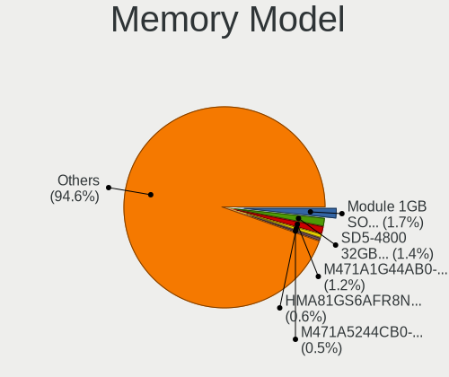

Debian - Tested Hardware & Statistics
-------------------------------------

A project to collect tested hardware configurations for Debian.

Anyone can contribute to this report by the [hw-probe](https://github.com/linuxhw/hw-probe) tool:

    sudo -E hw-probe -all -upload

Please contribute! Especially if your hardware is rare.

This is a report for all computer types. See also reports for [desktops](/Dist/Debian/Desktop/README.md) and [notebooks](/Dist/Debian/Notebook/README.md).

Contents
--------

* [ Test Cases ](#test-cases)

* [ System ](#system)
  - [ OS                       ](#os)
  - [ OS Family                ](#os-family)
  - [ Kernel                   ](#kernel)
  - [ Kernel Family            ](#kernel-family)
  - [ Kernel Major Ver.        ](#kernel-major-ver)
  - [ Arch                     ](#arch)
  - [ DE                       ](#de)
  - [ Display Server           ](#display-server)
  - [ Display Manager          ](#display-manager)
  - [ OS Lang                  ](#os-lang)
  - [ Boot Mode                ](#boot-mode)
  - [ Filesystem               ](#filesystem)
  - [ Part. scheme             ](#part-scheme)
  - [ Dual Boot with Linux/BSD ](#dual-boot-with-linuxbsd)
  - [ Dual Boot (Win)          ](#dual-boot-win)

* [ Board ](#board)
  - [ Vendor                   ](#vendor)
  - [ Model                    ](#model)
  - [ Model Family             ](#model-family)
  - [ MFG Year                 ](#mfg-year)
  - [ Form Factor              ](#form-factor)
  - [ Secure Boot              ](#secure-boot)
  - [ Coreboot                 ](#coreboot)
  - [ RAM Size                 ](#ram-size)
  - [ RAM Used                 ](#ram-used)
  - [ Total Drives             ](#total-drives)
  - [ Has CD-ROM               ](#has-cd-rom)
  - [ Has Ethernet             ](#has-ethernet)
  - [ Has WiFi                 ](#has-wifi)
  - [ Has Bluetooth            ](#has-bluetooth)

* [ Location ](#location)
  - [ Country                  ](#country)
  - [ City                     ](#city)

* [ Drives ](#drives)
  - [ Drive Vendor             ](#drive-vendor)
  - [ Drive Model              ](#drive-model)
  - [ HDD Vendor               ](#hdd-vendor)
  - [ SSD Vendor               ](#ssd-vendor)
  - [ Drive Kind               ](#drive-kind)
  - [ Drive Connector          ](#drive-connector)
  - [ Drive Size               ](#drive-size)
  - [ Space Total              ](#space-total)
  - [ Space Used               ](#space-used)
  - [ Malfunc. Drives          ](#malfunc-drives)
  - [ Malfunc. Drive Vendor    ](#malfunc-drive-vendor)
  - [ Malfunc. HDD Vendor      ](#malfunc-hdd-vendor)
  - [ Malfunc. Drive Kind      ](#malfunc-drive-kind)
  - [ Failed Drives            ](#failed-drives)
  - [ Failed Drive Vendor      ](#failed-drive-vendor)
  - [ Drive Status             ](#drive-status)

* [ Storage controller ](#storage-controller)
  - [ Storage Vendor           ](#storage-vendor)
  - [ Storage Model            ](#storage-model)
  - [ Storage Kind             ](#storage-kind)

* [ Processor ](#processor)
  - [ CPU Vendor               ](#cpu-vendor)
  - [ CPU Model                ](#cpu-model)
  - [ CPU Model Family         ](#cpu-model-family)
  - [ CPU Cores                ](#cpu-cores)
  - [ CPU Sockets              ](#cpu-sockets)
  - [ CPU Threads              ](#cpu-threads)
  - [ CPU Op-Modes             ](#cpu-op-modes)
  - [ CPU Microcode            ](#cpu-microcode)
  - [ CPU Microarch            ](#cpu-microarch)

* [ Graphics ](#graphics)
  - [ GPU Vendor               ](#gpu-vendor)
  - [ GPU Model                ](#gpu-model)
  - [ GPU Combo                ](#gpu-combo)
  - [ GPU Driver               ](#gpu-driver)
  - [ GPU Memory               ](#gpu-memory)

* [ Monitor ](#monitor)
  - [ Monitor Vendor           ](#monitor-vendor)
  - [ Monitor Model            ](#monitor-model)
  - [ Monitor Resolution       ](#monitor-resolution)
  - [ Monitor Diagonal         ](#monitor-diagonal)
  - [ Monitor Width            ](#monitor-width)
  - [ Aspect Ratio             ](#aspect-ratio)
  - [ Monitor Area             ](#monitor-area)
  - [ Pixel Density            ](#pixel-density)
  - [ Multiple Monitors        ](#multiple-monitors)

* [ Network ](#network)
  - [ Net Controller Vendor    ](#net-controller-vendor)
  - [ Net Controller Model     ](#net-controller-model)
  - [ Wireless Vendor          ](#wireless-vendor)
  - [ Wireless Model           ](#wireless-model)
  - [ Ethernet Vendor          ](#ethernet-vendor)
  - [ Ethernet Model           ](#ethernet-model)
  - [ Net Controller Kind      ](#net-controller-kind)
  - [ Used Controller          ](#used-controller)
  - [ NICs                     ](#nics)
  - [ IPv6                     ](#ipv6)

* [ Bluetooth ](#bluetooth)
  - [ Bluetooth Vendor         ](#bluetooth-vendor)
  - [ Bluetooth Model          ](#bluetooth-model)

* [ Sound ](#sound)
  - [ Sound Vendor             ](#sound-vendor)
  - [ Sound Model              ](#sound-model)

* [ Memory ](#memory)
  - [ Memory Vendor            ](#memory-vendor)
  - [ Memory Model             ](#memory-model)
  - [ Memory Kind              ](#memory-kind)
  - [ Memory Form Factor       ](#memory-form-factor)
  - [ Memory Size              ](#memory-size)
  - [ Memory Speed             ](#memory-speed)

* [ Printers & scanners ](#printers--scanners)
  - [ Printer Vendor           ](#printer-vendor)
  - [ Printer Model            ](#printer-model)
  - [ Scanner Vendor           ](#scanner-vendor)
  - [ Scanner Model            ](#scanner-model)

* [ Camera ](#camera)
  - [ Camera Vendor            ](#camera-vendor)
  - [ Camera Model             ](#camera-model)

* [ Security ](#security)
  - [ Fingerprint Vendor       ](#fingerprint-vendor)
  - [ Fingerprint Model        ](#fingerprint-model)
  - [ Chipcard Vendor          ](#chipcard-vendor)
  - [ Chipcard Model           ](#chipcard-model)

* [ Unsupported ](#unsupported)
  - [ Unsupported Devices      ](#unsupported-devices)
  - [ Unsupported Device Types ](#unsupported-device-types)

Test Cases
----------

Total: 11109

| Vendor        | Model                       | Form-Factor | Probe                                                      | Date         |
|---------------|-----------------------------|-------------|------------------------------------------------------------|--------------|
| Lenovo        | ThinkPad T440p 20AN0079M... | Notebook    | [79261239c1](https://linux-hardware.org/?probe=79261239c1) | Dec 01, 2022 |
| MSI           | MAG B550 TOMAHAWK MAX WI... | Desktop     | [51cf6d10e7](https://linux-hardware.org/?probe=51cf6d10e7) | Dec 01, 2022 |
| Lenovo        | SHARKBAY NOK                | Desktop     | [e03c6b53ed](https://linux-hardware.org/?probe=e03c6b53ed) | Dec 01, 2022 |
| Lenovo        | ThinkPad E15 Gen 4 21EES... | Notebook    | [674157de54](https://linux-hardware.org/?probe=674157de54) | Dec 01, 2022 |
| Intel         | NUC11PABi5 K90634-305       | Mini pc     | [cccf492c06](https://linux-hardware.org/?probe=cccf492c06) | Dec 01, 2022 |
| Intel         | NUC11PABi5 K90634-305       | Mini pc     | [4c7e1d5bc4](https://linux-hardware.org/?probe=4c7e1d5bc4) | Dec 01, 2022 |
| Lenovo        | V330-15IKB 81AX             | Notebook    | [becc2328fd](https://linux-hardware.org/?probe=becc2328fd) | Dec 01, 2022 |
| ASUSTek       | P5B                         | Desktop     | [44f13beada](https://linux-hardware.org/?probe=44f13beada) | Dec 01, 2022 |
| Gigabyte      | F2A88XM-D3H                 | Desktop     | [f5a5a30379](https://linux-hardware.org/?probe=f5a5a30379) | Dec 01, 2022 |
| Dell          | 0PV3YR A05                  | Server      | [3131016a26](https://linux-hardware.org/?probe=3131016a26) | Dec 01, 2022 |
| MSI           | GL65 Leopard 10SDR          | Notebook    | [73c388fb61](https://linux-hardware.org/?probe=73c388fb61) | Dec 01, 2022 |
| MSI           | GL65 Leopard 10SDR          | Notebook    | [6d44ef56c9](https://linux-hardware.org/?probe=6d44ef56c9) | Dec 01, 2022 |
| ASUSTek       | ROG STRIX B550-F GAMING     | Desktop     | [0f27e558f3](https://linux-hardware.org/?probe=0f27e558f3) | Dec 01, 2022 |
| Raspberry ... | Raspberry Pi 3 Model B P... | Soc         | [5fa6ceed90](https://linux-hardware.org/?probe=5fa6ceed90) | Dec 01, 2022 |
| Gigabyte      | Z390 M GAMING-CF            | Desktop     | [f0dba35258](https://linux-hardware.org/?probe=f0dba35258) | Dec 01, 2022 |
| sunxi         | FriendlyARM NanoPi NEO 2    | Soc         | [f1e2cbe354](https://linux-hardware.org/?probe=f1e2cbe354) | Nov 30, 2022 |
| Gigabyte      | Z390 M GAMING-CF            | Desktop     | [baa969bf8b](https://linux-hardware.org/?probe=baa969bf8b) | Nov 30, 2022 |
| HP            | Pavilion dv5                | Notebook    | [0fc7017b0c](https://linux-hardware.org/?probe=0fc7017b0c) | Nov 30, 2022 |
| HUAWEI        | NBLK-WAX9X                  | Notebook    | [183243daeb](https://linux-hardware.org/?probe=183243daeb) | Nov 30, 2022 |
| Pegatron      | BYT-X1                      | Desktop     | [edadb85201](https://linux-hardware.org/?probe=edadb85201) | Nov 30, 2022 |
| Pegatron      | BYT-X1                      | Desktop     | [b248df8671](https://linux-hardware.org/?probe=b248df8671) | Nov 30, 2022 |
| Dell          | 0Y2G81 A01                  | Server      | [7ce42afb90](https://linux-hardware.org/?probe=7ce42afb90) | Nov 30, 2022 |
| ASUSTek       | ROG STRIX Z490-A GAMING     | Desktop     | [dc5ec6eb84](https://linux-hardware.org/?probe=dc5ec6eb84) | Nov 30, 2022 |
| ASUSTek       | ROG STRIX Z690-A GAMING ... | Desktop     | [6b21f343c3](https://linux-hardware.org/?probe=6b21f343c3) | Nov 30, 2022 |
| Notebook      | RIM2520                     | Notebook    | [5f66abbb8b](https://linux-hardware.org/?probe=5f66abbb8b) | Nov 30, 2022 |
| Gigabyte      | B450M DS3H-CF               | Desktop     | [952c3681c0](https://linux-hardware.org/?probe=952c3681c0) | Nov 30, 2022 |
| Gigabyte      | B450 AORUS M                | Desktop     | [3e3ccd1471](https://linux-hardware.org/?probe=3e3ccd1471) | Nov 30, 2022 |
| Lenovo        | ThinkPad L13 Yoga Gen 2 ... | Convertible | [00232e7345](https://linux-hardware.org/?probe=00232e7345) | Nov 29, 2022 |
| MSI           | B560M-A PRO                 | Desktop     | [81bf84e7e5](https://linux-hardware.org/?probe=81bf84e7e5) | Nov 29, 2022 |
| HP            | Elite x2 1011 G1 Tablet     | Notebook    | [1a00258de3](https://linux-hardware.org/?probe=1a00258de3) | Nov 29, 2022 |
| Apple         | MacBookAir6,2               | Notebook    | [e0187bc636](https://linux-hardware.org/?probe=e0187bc636) | Nov 29, 2022 |
| ASUSTek       | M4A89GTD-PRO/USB3           | Desktop     | [9dd6019148](https://linux-hardware.org/?probe=9dd6019148) | Nov 29, 2022 |
| BESSTAR Te... | UM700                       | Desktop     | [a97334be81](https://linux-hardware.org/?probe=a97334be81) | Nov 29, 2022 |
| Gigabyte      | B450M DS3H-CF               | Desktop     | [eae94e440a](https://linux-hardware.org/?probe=eae94e440a) | Nov 29, 2022 |
| Apple         | MacBookAir6,2               | Notebook    | [99eb1cfce0](https://linux-hardware.org/?probe=99eb1cfce0) | Nov 29, 2022 |
| ASUSTek       | P5KPL-CM                    | Desktop     | [a20e18af73](https://linux-hardware.org/?probe=a20e18af73) | Nov 29, 2022 |
| Dell          | Latitude 7490               | Notebook    | [8934413cf0](https://linux-hardware.org/?probe=8934413cf0) | Nov 29, 2022 |
| ASRock        | H510M-HDV                   | Desktop     | [03a1675c85](https://linux-hardware.org/?probe=03a1675c85) | Nov 29, 2022 |
| Lenovo        | V310-14IKB 80T2             | Notebook    | [b7c976ef9c](https://linux-hardware.org/?probe=b7c976ef9c) | Nov 29, 2022 |
| HP            | Victus by Laptop 16-e0xx... | Notebook    | [9c45563fb6](https://linux-hardware.org/?probe=9c45563fb6) | Nov 29, 2022 |
| ASUSTek       | ROG STRIX B550-F GAMING     | Desktop     | [a95de3b373](https://linux-hardware.org/?probe=a95de3b373) | Nov 29, 2022 |
| Dell          | XPS 15 9500                 | Notebook    | [9c87ab493e](https://linux-hardware.org/?probe=9c87ab493e) | Nov 29, 2022 |
| ASUSTek       | PRIME Z690-P WIFI D4        | Desktop     | [262228b1fb](https://linux-hardware.org/?probe=262228b1fb) | Nov 29, 2022 |
| ASUSTek       | ZenBook UX325EA_UX325EA     | Notebook    | [1e52ea39e4](https://linux-hardware.org/?probe=1e52ea39e4) | Nov 28, 2022 |
| Gigabyte      | F2A55M-HD2                  | Desktop     | [8b3da34947](https://linux-hardware.org/?probe=8b3da34947) | Nov 28, 2022 |
| Lenovo        | ThinkPad X301 2776LEG       | Notebook    | [ebaea0c805](https://linux-hardware.org/?probe=ebaea0c805) | Nov 28, 2022 |
| ASRock        | B450M Pro4-F                | Desktop     | [8d0514a0df](https://linux-hardware.org/?probe=8d0514a0df) | Nov 28, 2022 |
| Dell          | Precision M6400             | Notebook    | [05f69c6917](https://linux-hardware.org/?probe=05f69c6917) | Nov 28, 2022 |
| HP            | ProBook 450 G5              | Notebook    | [e94fd64204](https://linux-hardware.org/?probe=e94fd64204) | Nov 28, 2022 |
| ASUSTek       | PN52                        | Mini pc     | [1e84d5c704](https://linux-hardware.org/?probe=1e84d5c704) | Nov 28, 2022 |
| ASUSTek       | GL752VW                     | Notebook    | [edc0678b85](https://linux-hardware.org/?probe=edc0678b85) | Nov 28, 2022 |
| ECS           | H61H2-M13                   | Desktop     | [88988d4d0d](https://linux-hardware.org/?probe=88988d4d0d) | Nov 28, 2022 |
| Dell          | 0K3CM7 A00                  | Desktop     | [076eeadd80](https://linux-hardware.org/?probe=076eeadd80) | Nov 28, 2022 |
| Dell          | XPS 15 9500                 | Notebook    | [f149afb5d1](https://linux-hardware.org/?probe=f149afb5d1) | Nov 28, 2022 |
| HP            | 212B                        | Desktop     | [53471968c2](https://linux-hardware.org/?probe=53471968c2) | Nov 28, 2022 |
| ASUSTek       | N61Vg                       | Notebook    | [b5cc07b253](https://linux-hardware.org/?probe=b5cc07b253) | Nov 27, 2022 |
| Lenovo        | ThinkPad T450 20BUS03J00    | Notebook    | [8423f90db0](https://linux-hardware.org/?probe=8423f90db0) | Nov 27, 2022 |
| Dell          | 05XGC8 A00                  | Desktop     | [e0e0efb9be](https://linux-hardware.org/?probe=e0e0efb9be) | Nov 27, 2022 |
| Lenovo        | ThinkPad T520 4243F53       | Notebook    | [8f9e96442a](https://linux-hardware.org/?probe=8f9e96442a) | Nov 27, 2022 |
| Tactus        | GeoBook 140                 | Notebook    | [e3f4d734da](https://linux-hardware.org/?probe=e3f4d734da) | Nov 27, 2022 |
| ASUSTek       | VivoBook S15 X510UF         | Notebook    | [7bd68a8bb1](https://linux-hardware.org/?probe=7bd68a8bb1) | Nov 27, 2022 |
| HP            | Compaq nx9110 (DU432EA#A... | Notebook    | [1b54092e14](https://linux-hardware.org/?probe=1b54092e14) | Nov 27, 2022 |
| ASUSTek       | VivoBook_ASUSLaptop X421... | Notebook    | [32bfa52fc1](https://linux-hardware.org/?probe=32bfa52fc1) | Nov 27, 2022 |
| Lenovo        | ThinkPad T450 20BV0001US    | Notebook    | [3d1b8f282a](https://linux-hardware.org/?probe=3d1b8f282a) | Nov 27, 2022 |
| HP            | Laptop 15s-fq5xxx           | Notebook    | [f1ef96a2e6](https://linux-hardware.org/?probe=f1ef96a2e6) | Nov 26, 2022 |
| MSI           | Creator 15M A9SD            | Notebook    | [8b47bbf475](https://linux-hardware.org/?probe=8b47bbf475) | Nov 26, 2022 |
| Dell          | 0D24M8 A00                  | Desktop     | [c58c83e367](https://linux-hardware.org/?probe=c58c83e367) | Nov 26, 2022 |
| Dell          | 0D24M8 A00                  | Desktop     | [85b508d6d3](https://linux-hardware.org/?probe=85b508d6d3) | Nov 26, 2022 |
| HP            | Laptop 15-da3xxx            | Notebook    | [335fce26dd](https://linux-hardware.org/?probe=335fce26dd) | Nov 26, 2022 |
| HP            | 255 G7 Notebook PC          | Notebook    | [8c389cf5d6](https://linux-hardware.org/?probe=8c389cf5d6) | Nov 26, 2022 |
| HP            | Laptop 15s-du3xxx           | Notebook    | [2902b75068](https://linux-hardware.org/?probe=2902b75068) | Nov 26, 2022 |
| HP            | Laptop 15s-du3xxx           | Notebook    | [973662f8d5](https://linux-hardware.org/?probe=973662f8d5) | Nov 26, 2022 |
| Lenovo        | ThinkPad T495 20NJS0L100    | Notebook    | [1e9e7f34df](https://linux-hardware.org/?probe=1e9e7f34df) | Nov 26, 2022 |
| ASUSTek       | VivoBook_ASUSLaptop X512... | Notebook    | [bede773ce4](https://linux-hardware.org/?probe=bede773ce4) | Nov 26, 2022 |
| Dell          | 05XGC8 A00                  | Desktop     | [6ea1a60122](https://linux-hardware.org/?probe=6ea1a60122) | Nov 26, 2022 |
| ASUSTek       | A6R                         | Notebook    | [68f38deab1](https://linux-hardware.org/?probe=68f38deab1) | Nov 26, 2022 |
| Dell          | Latitude E7240              | Notebook    | [634ebb2a88](https://linux-hardware.org/?probe=634ebb2a88) | Nov 25, 2022 |
| HP            | Pavilion TS Sleekbook 14    | Notebook    | [26440cddbb](https://linux-hardware.org/?probe=26440cddbb) | Nov 25, 2022 |
| MSI           | Creator 15M A9SD            | Notebook    | [a15ef33296](https://linux-hardware.org/?probe=a15ef33296) | Nov 25, 2022 |
| Lenovo        | ThinkPad E14 20RBS3LE00     | Notebook    | [83203a04f2](https://linux-hardware.org/?probe=83203a04f2) | Nov 25, 2022 |
| ASUSTek       | GL752VW                     | Notebook    | [2dfd7f3926](https://linux-hardware.org/?probe=2dfd7f3926) | Nov 25, 2022 |
| Lenovo        | ThinkPad E470 20H2S00700    | Notebook    | [f82ee02c50](https://linux-hardware.org/?probe=f82ee02c50) | Nov 25, 2022 |
| Fujitsu       | LIFEBOOK E756               | Notebook    | [9e69bdbaff](https://linux-hardware.org/?probe=9e69bdbaff) | Nov 25, 2022 |
| Fujitsu       | LIFEBOOK E756               | Notebook    | [16acde36ab](https://linux-hardware.org/?probe=16acde36ab) | Nov 25, 2022 |
| Dell          | 0PV3YR A05                  | Server      | [618ea5fb0e](https://linux-hardware.org/?probe=618ea5fb0e) | Nov 25, 2022 |
| Gigabyte      | B550 AORUS ELITE V2         | Desktop     | [68e1087fde](https://linux-hardware.org/?probe=68e1087fde) | Nov 25, 2022 |
| Apple         | Mac-00BE6ED71E35EB86 iMa... | All in one  | [165626e7d0](https://linux-hardware.org/?probe=165626e7d0) | Nov 25, 2022 |
| HP            | 255 G7 Notebook PC          | Notebook    | [f5a6bcf0fb](https://linux-hardware.org/?probe=f5a6bcf0fb) | Nov 24, 2022 |
| ASUSTek       | X551CAP                     | Notebook    | [f40e3110d0](https://linux-hardware.org/?probe=f40e3110d0) | Nov 24, 2022 |
| Gigabyte      | B250-FinTech-CF             | Desktop     | [fcc81ea02b](https://linux-hardware.org/?probe=fcc81ea02b) | Nov 24, 2022 |
| Dell          | Latitude 5310               | Notebook    | [8b4ad51670](https://linux-hardware.org/?probe=8b4ad51670) | Nov 24, 2022 |
| Dell          | Latitude 5310               | Notebook    | [a5265c8a0e](https://linux-hardware.org/?probe=a5265c8a0e) | Nov 24, 2022 |
| Dell          | Latitude E6500              | Notebook    | [73d607f9e1](https://linux-hardware.org/?probe=73d607f9e1) | Nov 24, 2022 |
| Gigabyte      | A320M-S2H-CF                | Desktop     | [4246d4813a](https://linux-hardware.org/?probe=4246d4813a) | Nov 24, 2022 |
| Gigabyte      | A320M-S2H-CF                | Desktop     | [76f6ba932f](https://linux-hardware.org/?probe=76f6ba932f) | Nov 24, 2022 |
| ASUSTek       | ROG ZENITH EXTREME ALPHA    | Desktop     | [1d224863f2](https://linux-hardware.org/?probe=1d224863f2) | Nov 24, 2022 |
| ASUSTek       | P5Q3                        | Desktop     | [655065ee03](https://linux-hardware.org/?probe=655065ee03) | Nov 24, 2022 |
| ASUSTek       | Zenbook UX535QE_UM535QE     | Notebook    | [299634697d](https://linux-hardware.org/?probe=299634697d) | Nov 24, 2022 |
| Lenovo        | 312A NOK                    | Desktop     | [94cdaff2c9](https://linux-hardware.org/?probe=94cdaff2c9) | Nov 24, 2022 |
| ASUSTek       | VivoBook_ASUSLaptop E410... | Notebook    | [ef378a135b](https://linux-hardware.org/?probe=ef378a135b) | Nov 24, 2022 |
| Aquarius      | NS585                       | Notebook    | [d54530cbcb](https://linux-hardware.org/?probe=d54530cbcb) | Nov 24, 2022 |
| Aquarius      | NS585                       | Notebook    | [64d9bcbcde](https://linux-hardware.org/?probe=64d9bcbcde) | Nov 24, 2022 |
| Dell          | 0PV3YR A05                  | Server      | [93e1fc870a](https://linux-hardware.org/?probe=93e1fc870a) | Nov 24, 2022 |
| Apple         | MacBookAir6,2               | Notebook    | [1f43ba0436](https://linux-hardware.org/?probe=1f43ba0436) | Nov 24, 2022 |
| Gigabyte      | 990FXA-UD3                  | Desktop     | [38aca80776](https://linux-hardware.org/?probe=38aca80776) | Nov 24, 2022 |
| MSI           | MAG X570 TOMAHAWK WIFI      | Desktop     | [c0ce9a3ff3](https://linux-hardware.org/?probe=c0ce9a3ff3) | Nov 23, 2022 |
| MSI           | Modern 14 A10M              | Notebook    | [0545f4e38b](https://linux-hardware.org/?probe=0545f4e38b) | Nov 23, 2022 |
| Lenovo        | ThinkPad T495 20NK000UUS    | Notebook    | [0e8c0e6f07](https://linux-hardware.org/?probe=0e8c0e6f07) | Nov 23, 2022 |
| Lenovo        | ThinkPad T490 20N3S8T211    | Notebook    | [97ea649145](https://linux-hardware.org/?probe=97ea649145) | Nov 23, 2022 |
| HP            | ProBook 450 G7              | Notebook    | [52d46ed47e](https://linux-hardware.org/?probe=52d46ed47e) | Nov 23, 2022 |
| ASUSTek       | PRIME B450-PLUS             | Desktop     | [6c797b4554](https://linux-hardware.org/?probe=6c797b4554) | Nov 23, 2022 |
| Dell          | Latitude E6530              | Notebook    | [71623eedf3](https://linux-hardware.org/?probe=71623eedf3) | Nov 23, 2022 |
| MSI           | MAG B550 TORPEDO            | Desktop     | [ca3bcfa403](https://linux-hardware.org/?probe=ca3bcfa403) | Nov 23, 2022 |
| Raspberry ... | Raspberry Pi 4 Model B R... | Soc         | [1e57ddd940](https://linux-hardware.org/?probe=1e57ddd940) | Nov 23, 2022 |
| MSI           | MS-ACD31                    | All in one  | [12e48e36c7](https://linux-hardware.org/?probe=12e48e36c7) | Nov 23, 2022 |
| ASUSTek       | ZenBook UX431FLC_UX431FL    | Notebook    | [df91e2d404](https://linux-hardware.org/?probe=df91e2d404) | Nov 23, 2022 |
| Gigabyte      | G31M-ES2L                   | Desktop     | [e8ab5ad410](https://linux-hardware.org/?probe=e8ab5ad410) | Nov 23, 2022 |
| ASRock        | H410M-HVS R2.0              | Desktop     | [3f381f9fa3](https://linux-hardware.org/?probe=3f381f9fa3) | Nov 23, 2022 |
| MPMAN         | CONVERTER 102               | Notebook    | [cab847edc0](https://linux-hardware.org/?probe=cab847edc0) | Nov 23, 2022 |
| Gigabyte      | B650M DS3H                  | Desktop     | [fc9449798a](https://linux-hardware.org/?probe=fc9449798a) | Nov 23, 2022 |
| HP            | Compaq 6720s                | Notebook    | [63a0e0161c](https://linux-hardware.org/?probe=63a0e0161c) | Nov 22, 2022 |
| Lenovo        | SHARKBAY 0B98401 PRO        | Desktop     | [9cbe89c328](https://linux-hardware.org/?probe=9cbe89c328) | Nov 22, 2022 |
| Lenovo        | ThinkPad L13 Yoga Gen 2 ... | Convertible | [9311837a60](https://linux-hardware.org/?probe=9311837a60) | Nov 22, 2022 |
| Lenovo        | ThinkPad 13 2nd Gen 20J1... | Notebook    | [363e0b0149](https://linux-hardware.org/?probe=363e0b0149) | Nov 22, 2022 |
| VIT           | M2400-01                    | Mini pc     | [4b590aa76a](https://linux-hardware.org/?probe=4b590aa76a) | Nov 22, 2022 |
| ASUSTek       | PRIME Z270-P                | Desktop     | [0e778da8b6](https://linux-hardware.org/?probe=0e778da8b6) | Nov 22, 2022 |
| Unknown       | Unknown                     | Notebook    | [1de34b67e2](https://linux-hardware.org/?probe=1de34b67e2) | Nov 22, 2022 |
| Dell          | Latitude 3420               | Notebook    | [30434de3e9](https://linux-hardware.org/?probe=30434de3e9) | Nov 22, 2022 |
| TMAX          | TM101W638L                  | Tablet      | [ac8adad039](https://linux-hardware.org/?probe=ac8adad039) | Nov 22, 2022 |
| Unknown       | Wiren Board rev. 7.3.1 (... | Notebook    | [1f9ccab914](https://linux-hardware.org/?probe=1f9ccab914) | Nov 22, 2022 |
| ECS           | H61H2-M13                   | Desktop     | [6d50058ef8](https://linux-hardware.org/?probe=6d50058ef8) | Nov 22, 2022 |
| ECS           | H61H2-M13                   | Desktop     | [f6a783a27a](https://linux-hardware.org/?probe=f6a783a27a) | Nov 22, 2022 |
| ASUSTek       | VivoBook_ASUSLaptop X515... | Notebook    | [0565ef1a0d](https://linux-hardware.org/?probe=0565ef1a0d) | Nov 22, 2022 |
| ECS           | H61H2-M13                   | Desktop     | [423fbc1fa0](https://linux-hardware.org/?probe=423fbc1fa0) | Nov 22, 2022 |
| Lenovo        | ThinkPad T14 Gen 3 21AJS... | Notebook    | [71c464a407](https://linux-hardware.org/?probe=71c464a407) | Nov 22, 2022 |
| ECS           | H61H2-M13                   | Desktop     | [debc5b7ab9](https://linux-hardware.org/?probe=debc5b7ab9) | Nov 22, 2022 |
| ECS           | H61H2-M13                   | Desktop     | [dc53077baa](https://linux-hardware.org/?probe=dc53077baa) | Nov 22, 2022 |
| ECS           | H61H2-M13                   | Desktop     | [856bb3def2](https://linux-hardware.org/?probe=856bb3def2) | Nov 22, 2022 |
| Foxconn       | H61MXL/H61MXL-K             | Desktop     | [d140a0f503](https://linux-hardware.org/?probe=d140a0f503) | Nov 22, 2022 |
| ECS           | H61H2-M13                   | Desktop     | [ee55108218](https://linux-hardware.org/?probe=ee55108218) | Nov 22, 2022 |
| ECS           | H61H2-M13                   | Desktop     | [ec03d1b050](https://linux-hardware.org/?probe=ec03d1b050) | Nov 22, 2022 |
| ECS           | H61H2-M13                   | Desktop     | [1f2a4089cc](https://linux-hardware.org/?probe=1f2a4089cc) | Nov 22, 2022 |
| Intel         | JSL MRD                     | Desktop     | [31ffd9d911](https://linux-hardware.org/?probe=31ffd9d911) | Nov 22, 2022 |
| ECS           | H61H2-M13                   | Desktop     | [4190bbb2d8](https://linux-hardware.org/?probe=4190bbb2d8) | Nov 22, 2022 |
| HP            | Pavilion Sleekbook 15       | Notebook    | [add4f71bc0](https://linux-hardware.org/?probe=add4f71bc0) | Nov 22, 2022 |
| ECS           | H61H2-M13                   | Desktop     | [570a11d74b](https://linux-hardware.org/?probe=570a11d74b) | Nov 22, 2022 |
| HP            | ENVY 6                      | Notebook    | [feb348843e](https://linux-hardware.org/?probe=feb348843e) | Nov 22, 2022 |
| Dell          | Inspiron 7586               | Convertible | [ea152cdb94](https://linux-hardware.org/?probe=ea152cdb94) | Nov 22, 2022 |
| Intel         | NUC8BEB J72692-303          | Mini pc     | [fc74dc1357](https://linux-hardware.org/?probe=fc74dc1357) | Nov 22, 2022 |
| Gigabyte      | G41M-ES2L                   | Desktop     | [404927f4cc](https://linux-hardware.org/?probe=404927f4cc) | Nov 22, 2022 |
| Lenovo        | Y520-15IKBA 80WY            | Notebook    | [c1cccb2b2a](https://linux-hardware.org/?probe=c1cccb2b2a) | Nov 22, 2022 |
| HP            | 255 G6 Notebook PC          | Notebook    | [149cee1720](https://linux-hardware.org/?probe=149cee1720) | Nov 22, 2022 |
| Intel         | NUC10i7FNB K61360-302       | Mini pc     | [b5ed1b189a](https://linux-hardware.org/?probe=b5ed1b189a) | Nov 22, 2022 |
| ASUSTek       | M4A78T-E                    | Desktop     | [aef32a0e69](https://linux-hardware.org/?probe=aef32a0e69) | Nov 22, 2022 |
| Dell          | 05DN3X A00                  | Desktop     | [f15eef78fa](https://linux-hardware.org/?probe=f15eef78fa) | Nov 22, 2022 |
| ASUSTek       | K53SD                       | Notebook    | [c127a0db71](https://linux-hardware.org/?probe=c127a0db71) | Nov 21, 2022 |
| Lenovo        | ThinkPad E14 20RAS04700     | Notebook    | [63d93d05db](https://linux-hardware.org/?probe=63d93d05db) | Nov 21, 2022 |
| MSI           | Creator 15M A9SD            | Notebook    | [e6d5440b09](https://linux-hardware.org/?probe=e6d5440b09) | Nov 21, 2022 |
| ASUSTek       | Zenbook UX535QE_UM535QE     | Notebook    | [b58bad1779](https://linux-hardware.org/?probe=b58bad1779) | Nov 21, 2022 |
| Dell          | Latitude 5310               | Notebook    | [9c19a3de68](https://linux-hardware.org/?probe=9c19a3de68) | Nov 21, 2022 |
| Raspberry ... | Raspberry Pi 4 Model B R... | Soc         | [5c1c053b03](https://linux-hardware.org/?probe=5c1c053b03) | Nov 21, 2022 |
| Micro Elec... | MG-VCTR002-2060             | Notebook    | [3ba115909e](https://linux-hardware.org/?probe=3ba115909e) | Nov 21, 2022 |
| HP            | Laptop 15-db0xxx            | Notebook    | [f634446cde](https://linux-hardware.org/?probe=f634446cde) | Nov 21, 2022 |
| Acer          | Popcorn                     | Notebook    | [6f446a097a](https://linux-hardware.org/?probe=6f446a097a) | Nov 20, 2022 |
| Gigabyte      | B450 AORUS ELITE            | Desktop     | [910d921a9d](https://linux-hardware.org/?probe=910d921a9d) | Nov 20, 2022 |
| ASUSTek       | X550LB                      | Notebook    | [466592b744](https://linux-hardware.org/?probe=466592b744) | Nov 20, 2022 |
| ASUSTek       | X550LB                      | Notebook    | [3ca5ee2f7a](https://linux-hardware.org/?probe=3ca5ee2f7a) | Nov 20, 2022 |
| Chuwi         | LarkBook                    | Notebook    | [bef3087526](https://linux-hardware.org/?probe=bef3087526) | Nov 20, 2022 |
| HP            | Pro x2 612 G2               | Tablet      | [6c49fe9d07](https://linux-hardware.org/?probe=6c49fe9d07) | Nov 20, 2022 |
| Gigabyte      | GA-78LMT-USB3               | Desktop     | [dba99c363e](https://linux-hardware.org/?probe=dba99c363e) | Nov 20, 2022 |
| Intel         | JSL MRD                     | Desktop     | [469567b71f](https://linux-hardware.org/?probe=469567b71f) | Nov 20, 2022 |
| Dell          | 0WPMFG A00                  | Desktop     | [8b3a3dc37f](https://linux-hardware.org/?probe=8b3a3dc37f) | Nov 20, 2022 |
| Raspberry ... | Raspberry Pi 3 Model B R... | Soc         | [c209fc2b22](https://linux-hardware.org/?probe=c209fc2b22) | Nov 20, 2022 |
| Hardkernel    | Odroid XU4                  | Soc         | [5cb7f434ac](https://linux-hardware.org/?probe=5cb7f434ac) | Nov 20, 2022 |
| Acer          | Nitro N50-620               | Desktop     | [ecd8e9ec1b](https://linux-hardware.org/?probe=ecd8e9ec1b) | Nov 20, 2022 |
| MPMAN         | CONVERTER 102               | Notebook    | [845925720b](https://linux-hardware.org/?probe=845925720b) | Nov 20, 2022 |
| Intel         | JSL MRD                     | Desktop     | [e8171566d3](https://linux-hardware.org/?probe=e8171566d3) | Nov 19, 2022 |
| HP            | Laptop 15s-du3xxx           | Notebook    | [a90cea62ff](https://linux-hardware.org/?probe=a90cea62ff) | Nov 19, 2022 |
| Dell          | XPS 13 9380                 | Notebook    | [d42bddbd11](https://linux-hardware.org/?probe=d42bddbd11) | Nov 19, 2022 |
| Gigabyte      | G31M-ES2L                   | Desktop     | [3e3d8f727c](https://linux-hardware.org/?probe=3e3d8f727c) | Nov 19, 2022 |
| ASRock        | Z790 PG Riptide             | Desktop     | [c852740256](https://linux-hardware.org/?probe=c852740256) | Nov 19, 2022 |
| ASUSTek       | VivoBook_ASUSLaptop M350... | Notebook    | [1af7bd26fd](https://linux-hardware.org/?probe=1af7bd26fd) | Nov 19, 2022 |
| Dell          | Inspiron 15-3567            | Notebook    | [5d6f9e57c5](https://linux-hardware.org/?probe=5d6f9e57c5) | Nov 19, 2022 |
| Tactus        | GeoBook 140                 | Notebook    | [127ec68044](https://linux-hardware.org/?probe=127ec68044) | Nov 19, 2022 |
| Aquarius      | NS585                       | Notebook    | [a0bc8d3f44](https://linux-hardware.org/?probe=a0bc8d3f44) | Nov 19, 2022 |
| Acer          | Aspire ES1-533              | Notebook    | [8c080caac2](https://linux-hardware.org/?probe=8c080caac2) | Nov 19, 2022 |
| Fujitsu       | FMVNQL7PM                   | Notebook    | [28ee68da79](https://linux-hardware.org/?probe=28ee68da79) | Nov 19, 2022 |
| ASUSTek       | VivoBook_ASUSLaptop M350... | Notebook    | [ad7abfb8cb](https://linux-hardware.org/?probe=ad7abfb8cb) | Nov 19, 2022 |
| Apple         | Mac-942B59F58194171B iMa... | All in one  | [c9cee6c5e5](https://linux-hardware.org/?probe=c9cee6c5e5) | Nov 19, 2022 |
| Dell          | 02YRK5 A02                  | Desktop     | [da08e08dec](https://linux-hardware.org/?probe=da08e08dec) | Nov 18, 2022 |
| Dell          | Latitude 7410               | Notebook    | [ce222880fe](https://linux-hardware.org/?probe=ce222880fe) | Nov 18, 2022 |
| MSI           | H510M-A PRO                 | Desktop     | [e913feb821](https://linux-hardware.org/?probe=e913feb821) | Nov 18, 2022 |
| Dynabook      | TECRA A50-J                 | Notebook    | [c0ae8746e0](https://linux-hardware.org/?probe=c0ae8746e0) | Nov 18, 2022 |
| Apple         | Mac-35C5E08120C7EEAF Mac... | Mini pc     | [e037cbd476](https://linux-hardware.org/?probe=e037cbd476) | Nov 18, 2022 |
| HP            | 650                         | Notebook    | [43998a620b](https://linux-hardware.org/?probe=43998a620b) | Nov 18, 2022 |
| Lenovo        | ThinkPad T14 Gen 3 21AJS... | Notebook    | [0278a1f18d](https://linux-hardware.org/?probe=0278a1f18d) | Nov 18, 2022 |
| MSI           | MAG B550M MORTAR            | Desktop     | [57c6327e27](https://linux-hardware.org/?probe=57c6327e27) | Nov 18, 2022 |
| ASUSTek       | TUF Gaming X570-PLUS        | Desktop     | [d1d9ddf9f3](https://linux-hardware.org/?probe=d1d9ddf9f3) | Nov 18, 2022 |
| MSI           | B550M PRO-VDH WIFI          | Desktop     | [da04bee118](https://linux-hardware.org/?probe=da04bee118) | Nov 18, 2022 |
| Intel         | NUC11ATBC4 M53051-302       | Mini pc     | [b03e6d95e5](https://linux-hardware.org/?probe=b03e6d95e5) | Nov 18, 2022 |
| Apple         | MacBookAir7,2               | Notebook    | [f0fa194e20](https://linux-hardware.org/?probe=f0fa194e20) | Nov 18, 2022 |
| Google        | Terra                       | Notebook    | [9fcc3fb18a](https://linux-hardware.org/?probe=9fcc3fb18a) | Nov 18, 2022 |
| HUAWEI        | BOHK-WAX9X                  | Notebook    | [3b33d1989a](https://linux-hardware.org/?probe=3b33d1989a) | Nov 18, 2022 |
| ASUSTek       | PRIME Z690-A                | Desktop     | [06a234be2c](https://linux-hardware.org/?probe=06a234be2c) | Nov 17, 2022 |
| ASUSTek       | T100TA                      | Notebook    | [871be7733f](https://linux-hardware.org/?probe=871be7733f) | Nov 17, 2022 |
| MPMAN         | CONVERTER8                  | Notebook    | [0c8f7446f7](https://linux-hardware.org/?probe=0c8f7446f7) | Nov 17, 2022 |
| Dell          | Latitude 5310               | Notebook    | [8c9625dc17](https://linux-hardware.org/?probe=8c9625dc17) | Nov 17, 2022 |
| Dell          | Latitude 5310               | Notebook    | [958c48cd54](https://linux-hardware.org/?probe=958c48cd54) | Nov 17, 2022 |
| Lenovo        | B475 Sabine                 | Notebook    | [5be5a7cd5f](https://linux-hardware.org/?probe=5be5a7cd5f) | Nov 17, 2022 |
| Apple         | Mac-35C5E08120C7EEAF Mac... | Mini pc     | [87689645cd](https://linux-hardware.org/?probe=87689645cd) | Nov 17, 2022 |
| HP            | EliteBook 745 G5            | Notebook    | [9d7fefd253](https://linux-hardware.org/?probe=9d7fefd253) | Nov 17, 2022 |
| ASUSTek       | P6T DELUXE V2               | Desktop     | [550bd99088](https://linux-hardware.org/?probe=550bd99088) | Nov 17, 2022 |
| MSI           | Creator 15M A9SD            | Notebook    | [f1fdc384f9](https://linux-hardware.org/?probe=f1fdc384f9) | Nov 17, 2022 |
| Dell          | 0PV3YR A05                  | Server      | [d71e1be6dc](https://linux-hardware.org/?probe=d71e1be6dc) | Nov 17, 2022 |
| Raspberry ... | Raspberry Pi 4 Model B R... | Soc         | [14c23218a5](https://linux-hardware.org/?probe=14c23218a5) | Nov 17, 2022 |
| ASUSTek       | ASUS TUF Gaming A15 FA50... | Notebook    | [814b5d3d2e](https://linux-hardware.org/?probe=814b5d3d2e) | Nov 17, 2022 |
| ASUSTek       | Pro WS WRX80E-SAGE SE WI... | Desktop     | [b3e809f3d2](https://linux-hardware.org/?probe=b3e809f3d2) | Nov 17, 2022 |
| HP            | Laptop 15-db0xxx            | Notebook    | [5aa50e7f6c](https://linux-hardware.org/?probe=5aa50e7f6c) | Nov 17, 2022 |
| HP            | OMEN by Laptop 15-dh0xxx    | Notebook    | [523e8a1c6b](https://linux-hardware.org/?probe=523e8a1c6b) | Nov 17, 2022 |
| Dell          | Latitude 3320               | Notebook    | [fbaf8e5ab9](https://linux-hardware.org/?probe=fbaf8e5ab9) | Nov 16, 2022 |
| Dell          | Latitude 3320               | Notebook    | [377fbd3b41](https://linux-hardware.org/?probe=377fbd3b41) | Nov 16, 2022 |
| Dell          | 09KPNV A01                  | Desktop     | [b21e07c887](https://linux-hardware.org/?probe=b21e07c887) | Nov 16, 2022 |
| Dell          | Inspiron 13 5310            | Notebook    | [3c9865d86e](https://linux-hardware.org/?probe=3c9865d86e) | Nov 16, 2022 |
| HP            | Laptop 15-db0xxx            | Notebook    | [f6202bb6fa](https://linux-hardware.org/?probe=f6202bb6fa) | Nov 16, 2022 |
| MSI           | Prestige 14Evo A11M         | Notebook    | [78601d078c](https://linux-hardware.org/?probe=78601d078c) | Nov 16, 2022 |
| Lenovo        | ThinkPad 13 2nd Gen 20J1... | Notebook    | [8fe0bcfe69](https://linux-hardware.org/?probe=8fe0bcfe69) | Nov 16, 2022 |
| GuoGuang      | IC2M1028N-3                 | Desktop     | [32351ceb62](https://linux-hardware.org/?probe=32351ceb62) | Nov 16, 2022 |
| Lenovo        | IdeaPad Z470                | Notebook    | [bc0980a6df](https://linux-hardware.org/?probe=bc0980a6df) | Nov 16, 2022 |
| Gigabyte      | H61M-DS2                    | Desktop     | [757a1066ff](https://linux-hardware.org/?probe=757a1066ff) | Nov 16, 2022 |
| ASUSTek       | P8Z68-V LX                  | Desktop     | [a3c41dcc96](https://linux-hardware.org/?probe=a3c41dcc96) | Nov 16, 2022 |
| ASUSTek       | ZenBook UX431FLC_UX431FL    | Notebook    | [5ea39eac4c](https://linux-hardware.org/?probe=5ea39eac4c) | Nov 16, 2022 |
| Lenovo        | Legion 5 15ACH6H 82JU       | Notebook    | [be72c5d9db](https://linux-hardware.org/?probe=be72c5d9db) | Nov 16, 2022 |
| Lenovo        | IdeaPad Y510P 20217         | Notebook    | [c38c6ddff6](https://linux-hardware.org/?probe=c38c6ddff6) | Nov 16, 2022 |
| Gigabyte      | P75-D3                      | Desktop     | [02bdf99508](https://linux-hardware.org/?probe=02bdf99508) | Nov 16, 2022 |
| ASRock        | J3455-ITX                   | Desktop     | [71c99edeb1](https://linux-hardware.org/?probe=71c99edeb1) | Nov 16, 2022 |
| ASUSTek       | PN51-E1                     | Mini pc     | [d6bae26c19](https://linux-hardware.org/?probe=d6bae26c19) | Nov 16, 2022 |
| Lenovo        | G470 20078                  | Notebook    | [55f47f2c19](https://linux-hardware.org/?probe=55f47f2c19) | Nov 16, 2022 |
| Unknown       | Unknown                     | Notebook    | [a86465b0f3](https://linux-hardware.org/?probe=a86465b0f3) | Nov 16, 2022 |
| ASUSTek       | VivoBook_ASUSLaptop M350... | Notebook    | [b5eb364ac6](https://linux-hardware.org/?probe=b5eb364ac6) | Nov 16, 2022 |
| Intel         | NUC6i7KYB H90766-406        | Mini pc     | [769e7a63d1](https://linux-hardware.org/?probe=769e7a63d1) | Nov 16, 2022 |
| Dell          | 0PV3YR A05                  | Server      | [41a49817ef](https://linux-hardware.org/?probe=41a49817ef) | Nov 16, 2022 |
| Hardkernel    | Odroid XU4                  | Soc         | [35a7094f72](https://linux-hardware.org/?probe=35a7094f72) | Nov 16, 2022 |
| ASUSTek       | VivoBook_ASUSLaptop M760... | Notebook    | [f29e7d7659](https://linux-hardware.org/?probe=f29e7d7659) | Nov 16, 2022 |
| Lenovo        | ThinkPad E15 Gen 4 21E60... | Notebook    | [2cc4a2cf6d](https://linux-hardware.org/?probe=2cc4a2cf6d) | Nov 16, 2022 |
| Lenovo        | ThinkPad 13 2nd Gen 20J1... | Notebook    | [867825d906](https://linux-hardware.org/?probe=867825d906) | Nov 15, 2022 |
| Lenovo        | ThinkPad L13 Yoga Gen 2 ... | Convertible | [ab62b77bfb](https://linux-hardware.org/?probe=ab62b77bfb) | Nov 15, 2022 |
| ASRock        | FM2A68M-HD+                 | Desktop     | [e907b4c718](https://linux-hardware.org/?probe=e907b4c718) | Nov 15, 2022 |
| Dell          | Inspiron 5558               | Notebook    | [0674cb5916](https://linux-hardware.org/?probe=0674cb5916) | Nov 15, 2022 |
| Gigabyte      | A320M-S2H-CF                | Desktop     | [c3cacc3ed6](https://linux-hardware.org/?probe=c3cacc3ed6) | Nov 15, 2022 |
| Gigabyte      | GA-78LMT-S2P                | Desktop     | [ee8a80240d](https://linux-hardware.org/?probe=ee8a80240d) | Nov 15, 2022 |
| HP            | 871A                        | Mini pc     | [ac658f992a](https://linux-hardware.org/?probe=ac658f992a) | Nov 15, 2022 |
| ASRock        | B450M-HDV R4.0              | Desktop     | [a46c1d62cf](https://linux-hardware.org/?probe=a46c1d62cf) | Nov 15, 2022 |
| GPU Compan... | GWTN116-3                   | Notebook    | [f8d8191f69](https://linux-hardware.org/?probe=f8d8191f69) | Nov 15, 2022 |
| ASUSTek       | X550VX                      | Notebook    | [8e55592803](https://linux-hardware.org/?probe=8e55592803) | Nov 15, 2022 |
| Dell          | G7 7700                     | Notebook    | [2440bebe2c](https://linux-hardware.org/?probe=2440bebe2c) | Nov 15, 2022 |
| ASUSTek       | X79-DELUXE                  | Desktop     | [3005933159](https://linux-hardware.org/?probe=3005933159) | Nov 15, 2022 |
| Chuwi         | LarkBox X                   | Mini pc     | [cbfdfc82b4](https://linux-hardware.org/?probe=cbfdfc82b4) | Nov 15, 2022 |
| IBM           | ThinkPad X31 2672JBU        | Notebook    | [ea0c82f4eb](https://linux-hardware.org/?probe=ea0c82f4eb) | Nov 15, 2022 |
| HP            | EliteBook 820 G3            | Notebook    | [fe84036164](https://linux-hardware.org/?probe=fe84036164) | Nov 15, 2022 |
| ASRock        | H470M-HVS                   | Desktop     | [e69c2f0da4](https://linux-hardware.org/?probe=e69c2f0da4) | Nov 15, 2022 |
| Intel         | DH77KC AAG39641-400         | Desktop     | [137906fffe](https://linux-hardware.org/?probe=137906fffe) | Nov 15, 2022 |
| Lenovo        | ThinkPad T15 Gen 2i 20W4... | Notebook    | [862e9a2c25](https://linux-hardware.org/?probe=862e9a2c25) | Nov 15, 2022 |
| Lenovo        | ThinkPad T15 Gen 2i 20W4... | Notebook    | [a94cf56482](https://linux-hardware.org/?probe=a94cf56482) | Nov 15, 2022 |
| HUAWEI        | BOHK-WAX9X                  | Notebook    | [ee5852d273](https://linux-hardware.org/?probe=ee5852d273) | Nov 15, 2022 |
| Acer          | Aspire A315-23G             | Notebook    | [16e5672a66](https://linux-hardware.org/?probe=16e5672a66) | Nov 15, 2022 |
| HUAWEI        | BOHK-WAX9X                  | Notebook    | [1604955bcb](https://linux-hardware.org/?probe=1604955bcb) | Nov 15, 2022 |
| ASUSTek       | B85M-G                      | Desktop     | [2029195495](https://linux-hardware.org/?probe=2029195495) | Nov 14, 2022 |
| Lenovo        | ThinkServer TS440           | Desktop     | [9fe9bc94a0](https://linux-hardware.org/?probe=9fe9bc94a0) | Nov 14, 2022 |
| ASUSTek       | M4A89GTD-PRO/USB3           | Desktop     | [28df02c741](https://linux-hardware.org/?probe=28df02c741) | Nov 14, 2022 |
| Samsung       | 300E4C/300E5C/300E7C        | Notebook    | [100714ed23](https://linux-hardware.org/?probe=100714ed23) | Nov 14, 2022 |
| Gigabyte      | P75-D3                      | Desktop     | [37f9da1b7f](https://linux-hardware.org/?probe=37f9da1b7f) | Nov 14, 2022 |
| AXDIA Inte... | MYBOOK 14 PRO               | Notebook    | [8267ec6686](https://linux-hardware.org/?probe=8267ec6686) | Nov 14, 2022 |
| Lenovo        | V14-ADA 82C6                | Notebook    | [7971c5cda7](https://linux-hardware.org/?probe=7971c5cda7) | Nov 14, 2022 |
| Toshiba       | Satellite P50-B-10Q         | Notebook    | [f28064cdad](https://linux-hardware.org/?probe=f28064cdad) | Nov 14, 2022 |
| ASUSTek       | B85M-G                      | Desktop     | [277739769b](https://linux-hardware.org/?probe=277739769b) | Nov 14, 2022 |
| ASUSTek       | PRIME H310M-R R2.0          | Desktop     | [53a532435e](https://linux-hardware.org/?probe=53a532435e) | Nov 14, 2022 |
| ASUSTek       | Zenbook UX535QE_UM535QE     | Notebook    | [233791ab06](https://linux-hardware.org/?probe=233791ab06) | Nov 14, 2022 |
| ASUSTek       | PRIME H310M-A R2.0          | Desktop     | [80cce966ce](https://linux-hardware.org/?probe=80cce966ce) | Nov 14, 2022 |
| Lenovo        | IdeaPad 330S-15ARR 81FB     | Notebook    | [c6e254c4ed](https://linux-hardware.org/?probe=c6e254c4ed) | Nov 14, 2022 |
| HP            | 530 Notebook PC(KD092AA#... | Notebook    | [b6c682238c](https://linux-hardware.org/?probe=b6c682238c) | Nov 13, 2022 |
| Gigabyte      | A320M-H-CF                  | Desktop     | [2a6473f450](https://linux-hardware.org/?probe=2a6473f450) | Nov 13, 2022 |
| ASUSTek       | H81M-K                      | Desktop     | [d7ae86ad73](https://linux-hardware.org/?probe=d7ae86ad73) | Nov 13, 2022 |
| Chuwi         | LarkBook                    | Notebook    | [8c33c61e14](https://linux-hardware.org/?probe=8c33c61e14) | Nov 13, 2022 |
| Gigabyte      | GA-MA770-UD3                | Desktop     | [d31168230f](https://linux-hardware.org/?probe=d31168230f) | Nov 13, 2022 |
| HP            | Laptop 15s-eq2xxx           | Notebook    | [36df61fb32](https://linux-hardware.org/?probe=36df61fb32) | Nov 13, 2022 |
| Unknown       | Unknown                     | Notebook    | [344e5842d1](https://linux-hardware.org/?probe=344e5842d1) | Nov 13, 2022 |
| Dell          | Inspiron 3521               | Notebook    | [c644f80930](https://linux-hardware.org/?probe=c644f80930) | Nov 13, 2022 |
| MSI           | GF63 8RD                    | Notebook    | [0ca4cc20c5](https://linux-hardware.org/?probe=0ca4cc20c5) | Nov 13, 2022 |
| HP            | ENVY Laptop 17-ch1xxx       | Notebook    | [ff0881b6e4](https://linux-hardware.org/?probe=ff0881b6e4) | Nov 13, 2022 |
| ASUSTek       | PRIME H310M-A R2.0          | Desktop     | [4788a2a91d](https://linux-hardware.org/?probe=4788a2a91d) | Nov 13, 2022 |
| HP            | 250 G8 Notebook PC          | Notebook    | [7e9c7562d6](https://linux-hardware.org/?probe=7e9c7562d6) | Nov 13, 2022 |
| Dell          | Latitude 7210 2-in-1        | Tablet      | [acce4cc1af](https://linux-hardware.org/?probe=acce4cc1af) | Nov 13, 2022 |
| Gigabyte      | Z590 UD AC                  | Desktop     | [57952c1512](https://linux-hardware.org/?probe=57952c1512) | Nov 13, 2022 |
| HP            | EliteBook 8460p             | Notebook    | [8cb389e68e](https://linux-hardware.org/?probe=8cb389e68e) | Nov 13, 2022 |
| Gigabyte      | GA-78LMT-USB3               | Desktop     | [dc2a41e0ee](https://linux-hardware.org/?probe=dc2a41e0ee) | Nov 12, 2022 |
| ASUSTek       | VivoBook_ASUSLaptop M350... | Notebook    | [1067cba3cc](https://linux-hardware.org/?probe=1067cba3cc) | Nov 12, 2022 |
| Lenovo        | ThinkPad X1 Carbon Gen 1... | Notebook    | [6677ca6be8](https://linux-hardware.org/?probe=6677ca6be8) | Nov 12, 2022 |
| Intel         | DG41WV AAE90316-102         | Desktop     | [7af4696c1b](https://linux-hardware.org/?probe=7af4696c1b) | Nov 12, 2022 |
| GPU Compan... | GWTC116-2                   | Notebook    | [978facebde](https://linux-hardware.org/?probe=978facebde) | Nov 12, 2022 |
| Lenovo        | ThinkPad P14s Gen 1 20Y1... | Notebook    | [904b7c0e89](https://linux-hardware.org/?probe=904b7c0e89) | Nov 12, 2022 |
| IP3 Tech      | GB3B                        | Mini pc     | [53d2019fae](https://linux-hardware.org/?probe=53d2019fae) | Nov 12, 2022 |
| HP            | Notebook                    | Notebook    | [2419e7d149](https://linux-hardware.org/?probe=2419e7d149) | Nov 12, 2022 |
| HP            | Notebook                    | Notebook    | [97c6c3c412](https://linux-hardware.org/?probe=97c6c3c412) | Nov 12, 2022 |
| GPU Compan... | GWTC116-2                   | Notebook    | [9e0c2df66d](https://linux-hardware.org/?probe=9e0c2df66d) | Nov 12, 2022 |
| Apple         | Mac-35C5E08120C7EEAF Mac... | Mini pc     | [3d18010536](https://linux-hardware.org/?probe=3d18010536) | Nov 12, 2022 |
| Dell          | 0PV3YR A05                  | Server      | [d9dd29ce39](https://linux-hardware.org/?probe=d9dd29ce39) | Nov 12, 2022 |
| IBM           | ThinkPad X31 2672JBU        | Notebook    | [9f627ba3f8](https://linux-hardware.org/?probe=9f627ba3f8) | Nov 12, 2022 |
| MSI           | B450 TOMAHAWK MAX           | Desktop     | [e69a98ce67](https://linux-hardware.org/?probe=e69a98ce67) | Nov 11, 2022 |
| ASUSTek       | VivoBook_ASUSLaptop M350... | Notebook    | [59aa7d31d8](https://linux-hardware.org/?probe=59aa7d31d8) | Nov 11, 2022 |
| HP            | ENVY Laptop 17-ch1xxx       | Notebook    | [22ab694d81](https://linux-hardware.org/?probe=22ab694d81) | Nov 11, 2022 |
| Lenovo        | ThinkPad W700 275236U       | Notebook    | [c79bbe36c5](https://linux-hardware.org/?probe=c79bbe36c5) | Nov 11, 2022 |
| HP            | 872E                        | Mini pc     | [b2e72a139e](https://linux-hardware.org/?probe=b2e72a139e) | Nov 11, 2022 |
| NCA Group     | iRU_Notebook                | Notebook    | [6d22b3942e](https://linux-hardware.org/?probe=6d22b3942e) | Nov 11, 2022 |
| ASUSTek       | Zenbook UX535QE_UM535QE     | Notebook    | [1681f97433](https://linux-hardware.org/?probe=1681f97433) | Nov 11, 2022 |
| HP            | Spectre x2 Detachable       | Notebook    | [0c480bd74d](https://linux-hardware.org/?probe=0c480bd74d) | Nov 11, 2022 |
| ASUSTek       | K50IE                       | Notebook    | [4bd91fccfa](https://linux-hardware.org/?probe=4bd91fccfa) | Nov 11, 2022 |
| ASRock        | H470M-HVS                   | Desktop     | [b81b19a472](https://linux-hardware.org/?probe=b81b19a472) | Nov 11, 2022 |
| Gigabyte      | H61M-D2-B3                  | Desktop     | [46ee069dd8](https://linux-hardware.org/?probe=46ee069dd8) | Nov 11, 2022 |
| ASUSTek       | Zenbook UX535QE_UM535QE     | Notebook    | [139c944b07](https://linux-hardware.org/?probe=139c944b07) | Nov 11, 2022 |
| Gigabyte      | GA-78LMT-USB3               | Desktop     | [524b1115eb](https://linux-hardware.org/?probe=524b1115eb) | Nov 11, 2022 |
| Dell          | 0PV3YR A05                  | Server      | [3acc2b87a6](https://linux-hardware.org/?probe=3acc2b87a6) | Nov 11, 2022 |
| Positivo B... | VJFE53F11X-XXXXXX           | Notebook    | [7e81c7cf85](https://linux-hardware.org/?probe=7e81c7cf85) | Nov 10, 2022 |
| HP            | ENVY 17 Leap Motion SE N... | Notebook    | [ae40e6e5b3](https://linux-hardware.org/?probe=ae40e6e5b3) | Nov 10, 2022 |
| Lenovo        | Legion 5 15IMH05H 81Y6      | Notebook    | [f8cd836199](https://linux-hardware.org/?probe=f8cd836199) | Nov 10, 2022 |
| Lenovo        | IdeaPad 3 15ALC6 82MF       | Notebook    | [8bb3389cc1](https://linux-hardware.org/?probe=8bb3389cc1) | Nov 10, 2022 |
| Lenovo        | ThinkPad T14s Gen 3 21BS... | Notebook    | [24c5edc9f9](https://linux-hardware.org/?probe=24c5edc9f9) | Nov 10, 2022 |
| Apple         | Mac-F4208DC8 PVT            | Desktop     | [45dc316bea](https://linux-hardware.org/?probe=45dc316bea) | Nov 10, 2022 |
| Lenovo        | G50-30 80G0                 | Notebook    | [1e0c308a85](https://linux-hardware.org/?probe=1e0c308a85) | Nov 10, 2022 |
| ASUSTek       | X550VXK                     | Notebook    | [f752e7959c](https://linux-hardware.org/?probe=f752e7959c) | Nov 10, 2022 |
| ASUSTek       | M4A78T-E                    | Desktop     | [a885b61478](https://linux-hardware.org/?probe=a885b61478) | Nov 10, 2022 |
| ASUSTek       | M4A78T-E                    | Desktop     | [475ad820cd](https://linux-hardware.org/?probe=475ad820cd) | Nov 10, 2022 |
| ASUSTek       | K50IE                       | Notebook    | [5176f404f1](https://linux-hardware.org/?probe=5176f404f1) | Nov 10, 2022 |
| Lenovo        | ThinkPad P1 Gen 2 20QT00... | Notebook    | [9a69ea4724](https://linux-hardware.org/?probe=9a69ea4724) | Nov 10, 2022 |
| Gigabyte      | B75M-D3H                    | Desktop     | [6dd51f8707](https://linux-hardware.org/?probe=6dd51f8707) | Nov 10, 2022 |
| Dell          | Latitude E6530              | Notebook    | [f71e1a930c](https://linux-hardware.org/?probe=f71e1a930c) | Nov 10, 2022 |
| HP            | Pavilion g7                 | Notebook    | [ae04263783](https://linux-hardware.org/?probe=ae04263783) | Nov 09, 2022 |
| Lenovo        | ThinkPad L14 Gen 1 20U50... | Notebook    | [9d27997bce](https://linux-hardware.org/?probe=9d27997bce) | Nov 09, 2022 |
| ASUSTek       | UX31A                       | Notebook    | [e9bc780ce8](https://linux-hardware.org/?probe=e9bc780ce8) | Nov 09, 2022 |
| Gigabyte      | Sabre 15                    | Notebook    | [1edede0895](https://linux-hardware.org/?probe=1edede0895) | Nov 09, 2022 |
| Apple         | Mac-F2268CC8                | All in one  | [0841a971e1](https://linux-hardware.org/?probe=0841a971e1) | Nov 09, 2022 |
| Lenovo        | ThinkPad P15v Gen 3 21D8... | Notebook    | [098d4ab9ec](https://linux-hardware.org/?probe=098d4ab9ec) | Nov 09, 2022 |
| Raspberry ... | Raspberry Pi 3 Model B R... | Soc         | [33a4a1ea9a](https://linux-hardware.org/?probe=33a4a1ea9a) | Nov 09, 2022 |
| Dell          | 0ND1Y4 A02                  | Desktop     | [726074bce6](https://linux-hardware.org/?probe=726074bce6) | Nov 09, 2022 |
| ASUSTek       | H97M-PLUS                   | Desktop     | [dc9837cefc](https://linux-hardware.org/?probe=dc9837cefc) | Nov 09, 2022 |
| Dell          | 0ND1Y4 A02                  | Desktop     | [3ac38eb9be](https://linux-hardware.org/?probe=3ac38eb9be) | Nov 09, 2022 |
| Lenovo        | ThinkPad T420 4180PEM       | Notebook    | [ad4d7f338d](https://linux-hardware.org/?probe=ad4d7f338d) | Nov 09, 2022 |
| Gigabyte      | X570 UD                     | Desktop     | [29641e8b7c](https://linux-hardware.org/?probe=29641e8b7c) | Nov 09, 2022 |
| Lenovo        | IdeaPad 5 14ALC05 82LM      | Notebook    | [52080bf6ef](https://linux-hardware.org/?probe=52080bf6ef) | Nov 09, 2022 |
| Lenovo        | ThinkPad L13 Yoga Gen 2 ... | Convertible | [67129f7239](https://linux-hardware.org/?probe=67129f7239) | Nov 08, 2022 |
| Lenovo        | ThinkPad E15 Gen 3 20YHS... | Notebook    | [6b1f5f2c2a](https://linux-hardware.org/?probe=6b1f5f2c2a) | Nov 08, 2022 |
| Apple         | Mac-F2268CC8                | All in one  | [b3db07cbc7](https://linux-hardware.org/?probe=b3db07cbc7) | Nov 08, 2022 |
| ASUSTek       | A88XM-PLUS                  | Desktop     | [e6eee311ea](https://linux-hardware.org/?probe=e6eee311ea) | Nov 08, 2022 |
| HP            | Pavilion g7                 | Notebook    | [47c2e96181](https://linux-hardware.org/?probe=47c2e96181) | Nov 08, 2022 |
| ASRock        | FM2A68M-HD+                 | Desktop     | [a90c14df17](https://linux-hardware.org/?probe=a90c14df17) | Nov 08, 2022 |
| ASRock        | B550 Steel Legend           | Desktop     | [8c775416b9](https://linux-hardware.org/?probe=8c775416b9) | Nov 08, 2022 |
| Lenovo        | ThinkPad X380 Yoga 20LJS... | Convertible | [11c3b15916](https://linux-hardware.org/?probe=11c3b15916) | Nov 08, 2022 |
| Aquarius      | NS585                       | Notebook    | [9b20fcc4b8](https://linux-hardware.org/?probe=9b20fcc4b8) | Nov 08, 2022 |
| Unknown       | Unknown                     | Desktop     | [ff3d968ae9](https://linux-hardware.org/?probe=ff3d968ae9) | Nov 08, 2022 |
| Gigabyte      | F2A88XM-D3H                 | Desktop     | [0fa75a005b](https://linux-hardware.org/?probe=0fa75a005b) | Nov 08, 2022 |
| Razer         | Blade 15 Advanced Model ... | Notebook    | [0596fa3f71](https://linux-hardware.org/?probe=0596fa3f71) | Nov 08, 2022 |
| Dell          | Latitude E7470              | Notebook    | [3938dbeadd](https://linux-hardware.org/?probe=3938dbeadd) | Nov 08, 2022 |
| ASUSTek       | P8H67-M LX                  | Desktop     | [277212bfc3](https://linux-hardware.org/?probe=277212bfc3) | Nov 08, 2022 |
| Gigabyte      | GA-78LMT-USB3               | Desktop     | [3469b1e624](https://linux-hardware.org/?probe=3469b1e624) | Nov 07, 2022 |
| Raspberry ... | Raspberry Pi 4 Model B R... | Soc         | [873668d836](https://linux-hardware.org/?probe=873668d836) | Nov 07, 2022 |
| ASUSTek       | ASUS TUF Gaming A15 FA50... | Notebook    | [da41b87b7c](https://linux-hardware.org/?probe=da41b87b7c) | Nov 07, 2022 |
| Lenovo        | ThinkPad E15 Gen 4 21EES... | Notebook    | [f3c625be2d](https://linux-hardware.org/?probe=f3c625be2d) | Nov 07, 2022 |
| IBM           | M97IP SIT                   | Desktop     | [78703d62ae](https://linux-hardware.org/?probe=78703d62ae) | Nov 07, 2022 |
| IBM           | M97IP SIT                   | Desktop     | [0301b99674](https://linux-hardware.org/?probe=0301b99674) | Nov 07, 2022 |
| Unknown       | Unknown                     | Notebook    | [6af513692f](https://linux-hardware.org/?probe=6af513692f) | Nov 07, 2022 |
| Unknown       | Unknown                     | Notebook    | [b4859caaba](https://linux-hardware.org/?probe=b4859caaba) | Nov 07, 2022 |
| Lenovo        | G50-70 20351                | Notebook    | [0d4536a010](https://linux-hardware.org/?probe=0d4536a010) | Nov 07, 2022 |
| Lenovo        | ThinkPad W700 275236U       | Notebook    | [d3580b26c6](https://linux-hardware.org/?probe=d3580b26c6) | Nov 06, 2022 |
| HP            | Laptop 15-db0xxx            | Notebook    | [32b59c7a7d](https://linux-hardware.org/?probe=32b59c7a7d) | Nov 06, 2022 |
| HP            | Laptop 15-db0xxx            | Notebook    | [f0c8aff40f](https://linux-hardware.org/?probe=f0c8aff40f) | Nov 06, 2022 |
| Raspberry ... | Raspberry Pi 4 Model B R... | Soc         | [8c5e823980](https://linux-hardware.org/?probe=8c5e823980) | Nov 06, 2022 |
| ASUSTek       | H110-PLUS                   | Desktop     | [4d260267d7](https://linux-hardware.org/?probe=4d260267d7) | Nov 06, 2022 |
| ASUSTek       | H110-PLUS                   | Desktop     | [789df18cfb](https://linux-hardware.org/?probe=789df18cfb) | Nov 06, 2022 |
| Dell          | Latitude E6520              | Notebook    | [9593951427](https://linux-hardware.org/?probe=9593951427) | Nov 06, 2022 |
| Samsung       | 300E4A/300E5A/300E7A        | Notebook    | [e872e8551e](https://linux-hardware.org/?probe=e872e8551e) | Nov 06, 2022 |
| Dell          | Latitude E6520              | Notebook    | [53eedbde1f](https://linux-hardware.org/?probe=53eedbde1f) | Nov 06, 2022 |
| Apple         | Mac-FC02E91DDD3FA6A4 iMa... | All in one  | [e5721cdfbb](https://linux-hardware.org/?probe=e5721cdfbb) | Nov 06, 2022 |
| Xunlong       | Orange Pi Zero              | Soc         | [024050e40a](https://linux-hardware.org/?probe=024050e40a) | Nov 06, 2022 |
| ASUSTek       | VivoBook_ASUSLaptop X531... | Notebook    | [55d115647e](https://linux-hardware.org/?probe=55d115647e) | Nov 06, 2022 |
| ASUSTek       | GL752VW                     | Notebook    | [cc373f85e7](https://linux-hardware.org/?probe=cc373f85e7) | Nov 06, 2022 |
| HP            | EliteBook 845 G8 Noteboo... | Notebook    | [47dda70950](https://linux-hardware.org/?probe=47dda70950) | Nov 06, 2022 |
| HP            | EliteBook 845 G8 Noteboo... | Notebook    | [5a2028bd2d](https://linux-hardware.org/?probe=5a2028bd2d) | Nov 05, 2022 |
| ASUSTek       | VivoBook_ASUSLaptop M350... | Notebook    | [3ec96d66bb](https://linux-hardware.org/?probe=3ec96d66bb) | Nov 05, 2022 |
| Acer          | Aspire 5741G                | Notebook    | [10c1cb72e2](https://linux-hardware.org/?probe=10c1cb72e2) | Nov 05, 2022 |
| Acer          | Aspire V3-572G              | Notebook    | [77f939bab4](https://linux-hardware.org/?probe=77f939bab4) | Nov 05, 2022 |
| ASUSTek       | X756UWK                     | Notebook    | [2d165dd7b0](https://linux-hardware.org/?probe=2d165dd7b0) | Nov 05, 2022 |
| Lenovo        | ThinkPad L380 20M50013MH    | Notebook    | [80ac51627a](https://linux-hardware.org/?probe=80ac51627a) | Nov 05, 2022 |
| Lenovo        | Yoga 730-15IKB 81CU         | Convertible | [1b0d72cfeb](https://linux-hardware.org/?probe=1b0d72cfeb) | Nov 05, 2022 |
| ASUSTek       | X756UWK                     | Notebook    | [b89c7882f3](https://linux-hardware.org/?probe=b89c7882f3) | Nov 05, 2022 |
| Dell          | Inspiron 7570               | Notebook    | [158f7b0bcd](https://linux-hardware.org/?probe=158f7b0bcd) | Nov 05, 2022 |
| Dell          | 0PV3YR A05                  | Server      | [e4d9794c31](https://linux-hardware.org/?probe=e4d9794c31) | Nov 05, 2022 |
| Intel         | DQ67SW AAG12527-310         | Desktop     | [97d0b022d2](https://linux-hardware.org/?probe=97d0b022d2) | Nov 05, 2022 |
| Foxconn       | A88GMV                      | Desktop     | [1391b33f62](https://linux-hardware.org/?probe=1391b33f62) | Nov 05, 2022 |
| Unknown       | Unknown                     | Desktop     | [2032d5239e](https://linux-hardware.org/?probe=2032d5239e) | Nov 05, 2022 |
| Lenovo        | ThinkPad 13 2nd Gen 20J1... | Notebook    | [605e06c6ad](https://linux-hardware.org/?probe=605e06c6ad) | Nov 04, 2022 |
| ASUSTek       | K53SD                       | Notebook    | [809577d2bb](https://linux-hardware.org/?probe=809577d2bb) | Nov 04, 2022 |
| Dell          | 0M863N A00                  | Desktop     | [3e390c5fb3](https://linux-hardware.org/?probe=3e390c5fb3) | Nov 04, 2022 |
| Google        | Terra                       | Notebook    | [90518f31df](https://linux-hardware.org/?probe=90518f31df) | Nov 04, 2022 |
| Unknown       | Unknown                     | Desktop     | [aa1a843244](https://linux-hardware.org/?probe=aa1a843244) | Nov 04, 2022 |
| Unknown       | Unknown                     | Desktop     | [0a55753066](https://linux-hardware.org/?probe=0a55753066) | Nov 04, 2022 |
| Unknown       | Unknown                     | Desktop     | [0e60d35498](https://linux-hardware.org/?probe=0e60d35498) | Nov 04, 2022 |
| Google        | Terra                       | Notebook    | [46ffa8092b](https://linux-hardware.org/?probe=46ffa8092b) | Nov 04, 2022 |
| ASUSTek       | X99-DELUXE                  | Desktop     | [ab4089c760](https://linux-hardware.org/?probe=ab4089c760) | Nov 04, 2022 |
| Google        | Terra                       | Notebook    | [fc3f4b0ba5](https://linux-hardware.org/?probe=fc3f4b0ba5) | Nov 04, 2022 |
| Google        | Terra                       | Notebook    | [41017e02e4](https://linux-hardware.org/?probe=41017e02e4) | Nov 04, 2022 |
| Google        | Terra                       | Notebook    | [7429a311e4](https://linux-hardware.org/?probe=7429a311e4) | Nov 04, 2022 |
| SK hynix      | HyBook                      | Notebook    | [e758cde5ed](https://linux-hardware.org/?probe=e758cde5ed) | Nov 04, 2022 |
| Intel         | ChiefRiver                  | Desktop     | [1e1f44f251](https://linux-hardware.org/?probe=1e1f44f251) | Nov 04, 2022 |
| Lenovo        | ThinkPad X1 Carbon Gen 8... | Notebook    | [f0be03da28](https://linux-hardware.org/?probe=f0be03da28) | Nov 04, 2022 |
| Dell          | 0ND1Y4 A02                  | Desktop     | [9017e31507](https://linux-hardware.org/?probe=9017e31507) | Nov 04, 2022 |
| Intel         | ChiefRiver                  | Desktop     | [64e4630da2](https://linux-hardware.org/?probe=64e4630da2) | Nov 04, 2022 |
| Dell          | 0UW816 A00                  | Server      | [a41cabb3d6](https://linux-hardware.org/?probe=a41cabb3d6) | Nov 04, 2022 |
| Dell          | 0UW816 A00                  | Server      | [a9a5e01e23](https://linux-hardware.org/?probe=a9a5e01e23) | Nov 04, 2022 |
| Dell          | 0PV3YR A05                  | Server      | [8607fcf09d](https://linux-hardware.org/?probe=8607fcf09d) | Nov 04, 2022 |
| ASUSTek       | X99-E WS/USB                | Desktop     | [7a65820be2](https://linux-hardware.org/?probe=7a65820be2) | Nov 04, 2022 |
| Juana Mans... | SF20GM7                     | Notebook    | [8e8c4f52f4](https://linux-hardware.org/?probe=8e8c4f52f4) | Nov 04, 2022 |
| HP            | ProBook 6450b               | Notebook    | [7e595214cb](https://linux-hardware.org/?probe=7e595214cb) | Nov 04, 2022 |
| Acer          | Nitro AN515-55              | Notebook    | [a1cef4e43d](https://linux-hardware.org/?probe=a1cef4e43d) | Nov 04, 2022 |
| Acer          | Nitro AN515-55              | Notebook    | [b58a40d876](https://linux-hardware.org/?probe=b58a40d876) | Nov 04, 2022 |
| Samsung       | 300E4A/300E5A/300E7A        | Notebook    | [391881cdd5](https://linux-hardware.org/?probe=391881cdd5) | Nov 03, 2022 |
| Olimex        | A20-Olinuxino Micro         | Soc         | [82674b87bb](https://linux-hardware.org/?probe=82674b87bb) | Nov 03, 2022 |
| MSI           | MPG X570 GAMING PRO CARB... | Desktop     | [acb00ae29c](https://linux-hardware.org/?probe=acb00ae29c) | Nov 03, 2022 |
| Lenovo        | ThinkPad 13 2nd Gen 20J1... | Notebook    | [67e9f8d2f4](https://linux-hardware.org/?probe=67e9f8d2f4) | Nov 03, 2022 |
| Lenovo        | ThinkPad 13 2nd Gen 20J1... | Notebook    | [ecf54fa708](https://linux-hardware.org/?probe=ecf54fa708) | Nov 03, 2022 |
| Lenovo        | ThinkPad 13 2nd Gen 20J1... | Notebook    | [8681693f03](https://linux-hardware.org/?probe=8681693f03) | Nov 03, 2022 |
| HP            | EliteBook 745 G6            | Notebook    | [d4d0f735d4](https://linux-hardware.org/?probe=d4d0f735d4) | Nov 03, 2022 |
| HP            | 8458                        | Mini pc     | [4da864256d](https://linux-hardware.org/?probe=4da864256d) | Nov 03, 2022 |
| HP            | EliteBook 745 G6            | Notebook    | [04e15fb2d7](https://linux-hardware.org/?probe=04e15fb2d7) | Nov 03, 2022 |
| Lenovo        | ThinkPad E475 20H40006US    | Notebook    | [c80c7a9048](https://linux-hardware.org/?probe=c80c7a9048) | Nov 03, 2022 |
| ASUSTek       | VivoBook_ASUSLaptop M350... | Notebook    | [455bdc6c45](https://linux-hardware.org/?probe=455bdc6c45) | Nov 03, 2022 |
| Lenovo        | ThinkPad E475 20H40006US    | Notebook    | [e507b9a974](https://linux-hardware.org/?probe=e507b9a974) | Nov 03, 2022 |
| Lenovo        | ThinkPad L13 Yoga Gen 2 ... | Convertible | [521e8b0053](https://linux-hardware.org/?probe=521e8b0053) | Nov 03, 2022 |
| BESSTAR Te... | GB7                         | Mini pc     | [4021f75f8e](https://linux-hardware.org/?probe=4021f75f8e) | Nov 03, 2022 |
| Lenovo        | ThinkPad E15 Gen 3 20YHS... | Notebook    | [7a5f1eaf6c](https://linux-hardware.org/?probe=7a5f1eaf6c) | Nov 03, 2022 |
| SAGER         | D900F                       | Notebook    | [7e0d0de36a](https://linux-hardware.org/?probe=7e0d0de36a) | Nov 03, 2022 |
| Lenovo        | ThinkPad E15 Gen 3 20YHS... | Notebook    | [cecc0cca9d](https://linux-hardware.org/?probe=cecc0cca9d) | Nov 03, 2022 |
| Lenovo        | ThinkPad E475 20H40006US    | Notebook    | [464cc2acc3](https://linux-hardware.org/?probe=464cc2acc3) | Nov 03, 2022 |
| Lenovo        | ThinkPad T430 23501B6       | Notebook    | [f059837f31](https://linux-hardware.org/?probe=f059837f31) | Nov 03, 2022 |
| Dell          | 0200DY A01                  | Desktop     | [a473b71b4e](https://linux-hardware.org/?probe=a473b71b4e) | Nov 03, 2022 |
| Unknown       | Unknown                     | Desktop     | [4457bb7b7e](https://linux-hardware.org/?probe=4457bb7b7e) | Nov 03, 2022 |
| MSI           | H510M PRO-E                 | Desktop     | [23fa7a2cf8](https://linux-hardware.org/?probe=23fa7a2cf8) | Nov 03, 2022 |
| Dell          | 0PV3YR A05                  | Server      | [d4f292aa03](https://linux-hardware.org/?probe=d4f292aa03) | Nov 03, 2022 |
| Dell          | Latitude 5420               | Notebook    | [717e0e6d40](https://linux-hardware.org/?probe=717e0e6d40) | Nov 03, 2022 |
| IP3 Tech      | GB3                         | Mini pc     | [1bbd4f8bd9](https://linux-hardware.org/?probe=1bbd4f8bd9) | Nov 03, 2022 |
| Foxconn       | 2A92                        | Desktop     | [927cf971e9](https://linux-hardware.org/?probe=927cf971e9) | Nov 02, 2022 |
| Gigabyte      | B560M DS3H V2               | Desktop     | [36612b5e01](https://linux-hardware.org/?probe=36612b5e01) | Nov 02, 2022 |
| Shenzhen a... | AC1-DP                      | Desktop     | [754335ffe9](https://linux-hardware.org/?probe=754335ffe9) | Nov 02, 2022 |
| Lenovo        | ThinkPad E475 20H40006US    | Notebook    | [d59bd1e8f1](https://linux-hardware.org/?probe=d59bd1e8f1) | Nov 02, 2022 |
| Lenovo        | ThinkPad E475 20H40006US    | Notebook    | [4342ecb0f9](https://linux-hardware.org/?probe=4342ecb0f9) | Nov 02, 2022 |
| Google        | Terra                       | Notebook    | [46299bf228](https://linux-hardware.org/?probe=46299bf228) | Nov 02, 2022 |
| Lenovo        | ThinkPad E475 20H40006US    | Notebook    | [fd32769391](https://linux-hardware.org/?probe=fd32769391) | Nov 02, 2022 |
| Lenovo        | ThinkPad E475 20H40006US    | Notebook    | [d3c1c92563](https://linux-hardware.org/?probe=d3c1c92563) | Nov 02, 2022 |
| Lenovo        | ThinkPad E475 20H40006US    | Notebook    | [0ffaee423b](https://linux-hardware.org/?probe=0ffaee423b) | Nov 02, 2022 |
| ASUSTek       | 1005HA                      | Notebook    | [1d386943d6](https://linux-hardware.org/?probe=1d386943d6) | Nov 02, 2022 |
| Dell          | 0JGM7F A00                  | Desktop     | [28f4800b2b](https://linux-hardware.org/?probe=28f4800b2b) | Nov 02, 2022 |
| Lenovo        | 3132 SDK0R32862 WIN 3258... | Desktop     | [f8708425a1](https://linux-hardware.org/?probe=f8708425a1) | Nov 02, 2022 |
| MSI           | H110M PRO-VD                | Desktop     | [1fb0a79791](https://linux-hardware.org/?probe=1fb0a79791) | Nov 02, 2022 |
| Unknown       | Unknown                     | Desktop     | [bc4f9a5a35](https://linux-hardware.org/?probe=bc4f9a5a35) | Nov 02, 2022 |
| HP            | G42                         | Notebook    | [18c487d99d](https://linux-hardware.org/?probe=18c487d99d) | Nov 02, 2022 |
| Digma         | EVE 11 C422 ES1068EW        | Notebook    | [f5177de131](https://linux-hardware.org/?probe=f5177de131) | Nov 02, 2022 |
| Dell          | 0PV3YR A05                  | Server      | [47c34f9269](https://linux-hardware.org/?probe=47c34f9269) | Nov 02, 2022 |
| Foxconn       | 2A92                        | Desktop     | [0898482b18](https://linux-hardware.org/?probe=0898482b18) | Nov 02, 2022 |
| ASUSTek       | PRO B460M-C                 | Desktop     | [dcf7112b3d](https://linux-hardware.org/?probe=dcf7112b3d) | Nov 01, 2022 |
| ASUSTek       | PRO B460M-C                 | Desktop     | [a333f47ffa](https://linux-hardware.org/?probe=a333f47ffa) | Nov 01, 2022 |
| Microsoft     | Surface Book 2              | Tablet      | [0092b0ddaf](https://linux-hardware.org/?probe=0092b0ddaf) | Nov 01, 2022 |
| Phoenix       | POULSBO                     | Desktop     | [177f05205b](https://linux-hardware.org/?probe=177f05205b) | Nov 01, 2022 |
| MSI           | H61M-P31                    | Desktop     | [819c124b25](https://linux-hardware.org/?probe=819c124b25) | Nov 01, 2022 |
| Gigabyte      | H610M H DDR4                | Desktop     | [b726668f90](https://linux-hardware.org/?probe=b726668f90) | Nov 01, 2022 |
| Toshiba       | Satellite L755              | Notebook    | [dc3d60731e](https://linux-hardware.org/?probe=dc3d60731e) | Nov 01, 2022 |
| Unknown       | Unknown                     | Desktop     | [f87c0b1010](https://linux-hardware.org/?probe=f87c0b1010) | Nov 01, 2022 |
| Lenovo        | 3130 SDK0J40697 WIN 3305... | Mini pc     | [08649bd1e9](https://linux-hardware.org/?probe=08649bd1e9) | Nov 01, 2022 |
| Gigabyte      | X570S AERO G                | Desktop     | [92fccb6716](https://linux-hardware.org/?probe=92fccb6716) | Nov 01, 2022 |
| MSI           | Z390-A PRO                  | Desktop     | [3eea020596](https://linux-hardware.org/?probe=3eea020596) | Nov 01, 2022 |
| Dell          | 0PV3YR A05                  | Server      | [dab530a737](https://linux-hardware.org/?probe=dab530a737) | Nov 01, 2022 |
| Acer          | Aspire one                  | Notebook    | [bfb9f97d74](https://linux-hardware.org/?probe=bfb9f97d74) | Oct 31, 2022 |
| Lenovo        | ThinkPad L14 Gen 1 20U50... | Notebook    | [c9e0b81f80](https://linux-hardware.org/?probe=c9e0b81f80) | Oct 31, 2022 |
| MSI           | MEG Z590 ACE                | Desktop     | [1082f00d60](https://linux-hardware.org/?probe=1082f00d60) | Oct 31, 2022 |
| ASRock        | 960GM-VGS3 FX               | Desktop     | [f31f613901](https://linux-hardware.org/?probe=f31f613901) | Oct 31, 2022 |
| HP            | Compaq nc6320 (EV073AV)     | Notebook    | [b73f359ded](https://linux-hardware.org/?probe=b73f359ded) | Oct 31, 2022 |
| ASUSTek       | G75VW                       | Notebook    | [6f1d41a85c](https://linux-hardware.org/?probe=6f1d41a85c) | Oct 31, 2022 |
| Acer          | Aspire one                  | Notebook    | [82b34552f6](https://linux-hardware.org/?probe=82b34552f6) | Oct 31, 2022 |
| HP            | Spectre x360 Convertible... | Convertible | [fb96cd8e21](https://linux-hardware.org/?probe=fb96cd8e21) | Oct 31, 2022 |
| MSI           | Pulse GL76 12UEK            | Notebook    | [76a2d8c304](https://linux-hardware.org/?probe=76a2d8c304) | Oct 31, 2022 |
| Chuwi         | LarkBox X                   | Mini pc     | [ed3f906a17](https://linux-hardware.org/?probe=ed3f906a17) | Oct 31, 2022 |
| Intel         | DG41AN AAE92991-401         | Desktop     | [cd670cef3d](https://linux-hardware.org/?probe=cd670cef3d) | Oct 31, 2022 |
| ASUSTek       | ZenBook UX431FAC_UX431FA    | Notebook    | [95554a578b](https://linux-hardware.org/?probe=95554a578b) | Oct 31, 2022 |
| Unknown       | Unknown                     | Desktop     | [0e92fb8c99](https://linux-hardware.org/?probe=0e92fb8c99) | Oct 31, 2022 |
| Aquarius      | NS585                       | Notebook    | [e4b4e0456d](https://linux-hardware.org/?probe=e4b4e0456d) | Oct 31, 2022 |
| Dell          | 0PV3YR A05                  | Server      | [0c1875c94f](https://linux-hardware.org/?probe=0c1875c94f) | Oct 31, 2022 |
| ASUSTek       | M5A99FX PRO R2.0            | Desktop     | [4179fe16d6](https://linux-hardware.org/?probe=4179fe16d6) | Oct 31, 2022 |
| Apple         | MacBookPro5,5               | Notebook    | [00e1f1f754](https://linux-hardware.org/?probe=00e1f1f754) | Oct 31, 2022 |
| HUAWEI        | NBLB-WAX9N                  | Notebook    | [a872c9888a](https://linux-hardware.org/?probe=a872c9888a) | Oct 30, 2022 |
| ASUSTek       | PRIME X570-PRO              | Desktop     | [3fbcca75d5](https://linux-hardware.org/?probe=3fbcca75d5) | Oct 30, 2022 |
| HUAWEI        | NBLB-WAX9N                  | Notebook    | [45f670d99f](https://linux-hardware.org/?probe=45f670d99f) | Oct 30, 2022 |
| Lenovo        | V15 G2 ITL 82KB             | Notebook    | [209fa66bb9](https://linux-hardware.org/?probe=209fa66bb9) | Oct 30, 2022 |
| Acer          | Aspire A515-51G             | Notebook    | [12380f78de](https://linux-hardware.org/?probe=12380f78de) | Oct 30, 2022 |
| HP            | x2 210                      | Notebook    | [8ed0a97ee9](https://linux-hardware.org/?probe=8ed0a97ee9) | Oct 30, 2022 |
| Lenovo        | ThinkPad T16 Gen 1 21BVC... | Notebook    | [e8a1f8f6bf](https://linux-hardware.org/?probe=e8a1f8f6bf) | Oct 30, 2022 |
| HP            | 158B                        | Desktop     | [9c02b7fe58](https://linux-hardware.org/?probe=9c02b7fe58) | Oct 30, 2022 |
| Chuwi         | LarkBox X                   | Mini pc     | [5cd057be2a](https://linux-hardware.org/?probe=5cd057be2a) | Oct 30, 2022 |
| Dell          | XPS L322X                   | Notebook    | [cacebfe41e](https://linux-hardware.org/?probe=cacebfe41e) | Oct 30, 2022 |
| ASUSTek       | N751JK                      | Notebook    | [eea92055f3](https://linux-hardware.org/?probe=eea92055f3) | Oct 30, 2022 |
| Unknown       | Unknown                     | Desktop     | [673c23713c](https://linux-hardware.org/?probe=673c23713c) | Oct 30, 2022 |
| Lenovo        | V15 G2 ITL 82KB             | Notebook    | [89595b2fa9](https://linux-hardware.org/?probe=89595b2fa9) | Oct 30, 2022 |
| ASUSTek       | PRIME B560M-K               | Desktop     | [416db8870a](https://linux-hardware.org/?probe=416db8870a) | Oct 30, 2022 |
| Chuwi         | LarkBook                    | Notebook    | [3ff2ff69ce](https://linux-hardware.org/?probe=3ff2ff69ce) | Oct 30, 2022 |
| Dell          | 0PV3YR A05                  | Server      | [9991d15803](https://linux-hardware.org/?probe=9991d15803) | Oct 30, 2022 |
| ASUSTek       | TP401CA                     | Convertible | [8d97908e58](https://linux-hardware.org/?probe=8d97908e58) | Oct 30, 2022 |
| Dell          | Latitude 5501               | Notebook    | [67f979a26d](https://linux-hardware.org/?probe=67f979a26d) | Oct 29, 2022 |
| Notebook      | W230SD                      | Notebook    | [76ae019222](https://linux-hardware.org/?probe=76ae019222) | Oct 29, 2022 |
| Raspberry ... | Raspberry Pi 4 Model B R... | Soc         | [d99707ef15](https://linux-hardware.org/?probe=d99707ef15) | Oct 29, 2022 |
| Dell          | Precision 7520              | Notebook    | [f54f6d6354](https://linux-hardware.org/?probe=f54f6d6354) | Oct 29, 2022 |
| Foxconn       | 2ADA                        | Desktop     | [16815dacc1](https://linux-hardware.org/?probe=16815dacc1) | Oct 29, 2022 |
| Dell          | Latitude 5590               | Notebook    | [c7fa986fbd](https://linux-hardware.org/?probe=c7fa986fbd) | Oct 29, 2022 |
| Gigabyte      | H77-DS3H                    | Desktop     | [4457c6182e](https://linux-hardware.org/?probe=4457c6182e) | Oct 29, 2022 |
| ASUSTek       | X75VC                       | Notebook    | [9c1ab509ec](https://linux-hardware.org/?probe=9c1ab509ec) | Oct 29, 2022 |
| HP            | Pavilion Laptop 15-eg0xx... | Notebook    | [8cc0e0d828](https://linux-hardware.org/?probe=8cc0e0d828) | Oct 29, 2022 |
| Dell          | Latitude E4310              | Notebook    | [fe6c65dd77](https://linux-hardware.org/?probe=fe6c65dd77) | Oct 29, 2022 |
| Insyde        | Braswell                    | Notebook    | [d98b2d9661](https://linux-hardware.org/?probe=d98b2d9661) | Oct 29, 2022 |
| Samsung       | 300V3A/300V4A/300V5A        | Notebook    | [4acb2d0863](https://linux-hardware.org/?probe=4acb2d0863) | Oct 29, 2022 |
| Dell          | Latitude E4310              | Notebook    | [7a610ca46d](https://linux-hardware.org/?probe=7a610ca46d) | Oct 29, 2022 |
| Dell          | 0PV3YR A05                  | Server      | [182d67f23e](https://linux-hardware.org/?probe=182d67f23e) | Oct 29, 2022 |
| Dell          | XPS 17 9720                 | Notebook    | [270b988521](https://linux-hardware.org/?probe=270b988521) | Oct 29, 2022 |
| Dell          | Precision 7520              | Notebook    | [30f6ad7a26](https://linux-hardware.org/?probe=30f6ad7a26) | Oct 29, 2022 |
| Dell          | Precision 7520              | Notebook    | [b81923dbd2](https://linux-hardware.org/?probe=b81923dbd2) | Oct 29, 2022 |
| libre-comp... | aml-s905x-cc                | Soc         | [0258982a5a](https://linux-hardware.org/?probe=0258982a5a) | Oct 29, 2022 |
| MSI           | Modern 15 A10RBS            | Notebook    | [ddc3eded89](https://linux-hardware.org/?probe=ddc3eded89) | Oct 28, 2022 |
| Lenovo        | ThinkPad E475 20H40006US    | Notebook    | [60d1db050b](https://linux-hardware.org/?probe=60d1db050b) | Oct 28, 2022 |
| Lenovo        | ThinkPad E475 20H40006US    | Notebook    | [2a9f06c2b4](https://linux-hardware.org/?probe=2a9f06c2b4) | Oct 28, 2022 |
| Lenovo        | ThinkPad E475 20H40006US    | Notebook    | [787904d265](https://linux-hardware.org/?probe=787904d265) | Oct 28, 2022 |
| Lenovo        | IdeaPad 3 15ADA05 81W1      | Notebook    | [0971db18ed](https://linux-hardware.org/?probe=0971db18ed) | Oct 28, 2022 |
| Supermicro    | X12DPU-6A                   | Server      | [28c143d1f2](https://linux-hardware.org/?probe=28c143d1f2) | Oct 28, 2022 |
| Toshiba       | Satellite L755              | Notebook    | [0fa70f29d4](https://linux-hardware.org/?probe=0fa70f29d4) | Oct 28, 2022 |
| Lenovo        | ThinkPad T530 239242U       | Notebook    | [dbf70338e9](https://linux-hardware.org/?probe=dbf70338e9) | Oct 28, 2022 |
| Unknown       | 775V88+                     | Desktop     | [f1a685b497](https://linux-hardware.org/?probe=f1a685b497) | Oct 28, 2022 |
| ASUSTek       | ZenBook UX431FLC_UX431FL    | Notebook    | [e34c4fde2c](https://linux-hardware.org/?probe=e34c4fde2c) | Oct 28, 2022 |
| Dell          | Latitude 5280               | Notebook    | [368f237efe](https://linux-hardware.org/?probe=368f237efe) | Oct 28, 2022 |
| Dell          | XPS 17 9700                 | Notebook    | [81121b7762](https://linux-hardware.org/?probe=81121b7762) | Oct 28, 2022 |
| Toshiba       | Satellite C650D             | Notebook    | [0696abd43c](https://linux-hardware.org/?probe=0696abd43c) | Oct 28, 2022 |
| Toshiba       | Satellite C650D             | Notebook    | [d42867d201](https://linux-hardware.org/?probe=d42867d201) | Oct 28, 2022 |
| Unknown       | Unknown                     | Soc         | [44fc490d82](https://linux-hardware.org/?probe=44fc490d82) | Oct 28, 2022 |
| ASUSTek       | X555QG                      | Notebook    | [bace747804](https://linux-hardware.org/?probe=bace747804) | Oct 28, 2022 |
| HP            | 3396                        | Desktop     | [d42479acb8](https://linux-hardware.org/?probe=d42479acb8) | Oct 28, 2022 |
| Acer          | Aspire A715-75G             | Notebook    | [78b0c55e62](https://linux-hardware.org/?probe=78b0c55e62) | Oct 28, 2022 |
| Unknown       | Unknown                     | Server      | [cdca95f7e5](https://linux-hardware.org/?probe=cdca95f7e5) | Oct 28, 2022 |
| ASUSTek       | PRIME X370-PRO              | Desktop     | [d3cf194e94](https://linux-hardware.org/?probe=d3cf194e94) | Oct 28, 2022 |
| HP            | EliteBook 840 G8 Noteboo... | Notebook    | [02c6d1fe1a](https://linux-hardware.org/?probe=02c6d1fe1a) | Oct 28, 2022 |
| Lenovo        | ThinkPad E470 20H2S00700    | Notebook    | [768c6c8357](https://linux-hardware.org/?probe=768c6c8357) | Oct 28, 2022 |
| SANTECH       | NHx0DB,DE                   | Notebook    | [db8c0489f4](https://linux-hardware.org/?probe=db8c0489f4) | Oct 28, 2022 |
| ASUSTek       | PRIME Z690-P WIFI D4        | Desktop     | [327ee3d5b0](https://linux-hardware.org/?probe=327ee3d5b0) | Oct 28, 2022 |
| Lenovo        | ThinkPad E475 20H40006US    | Notebook    | [63565608d1](https://linux-hardware.org/?probe=63565608d1) | Oct 28, 2022 |
| Google        | Boten                       | Notebook    | [2ed6baabf0](https://linux-hardware.org/?probe=2ed6baabf0) | Oct 27, 2022 |
| ASUSTek       | N501VW                      | Notebook    | [07f7d43f09](https://linux-hardware.org/?probe=07f7d43f09) | Oct 27, 2022 |
| HP            | ZBook 15 G3                 | Notebook    | [2b886c255e](https://linux-hardware.org/?probe=2b886c255e) | Oct 27, 2022 |
| Lenovo        | ThinkPad X1 Carbon Gen 9... | Notebook    | [24da197a3a](https://linux-hardware.org/?probe=24da197a3a) | Oct 27, 2022 |
| Apple         | Mac-F221BEC8                | Desktop     | [0bf03c49f7](https://linux-hardware.org/?probe=0bf03c49f7) | Oct 27, 2022 |
| Lenovo        | ThinkPad E475 20H40006US    | Notebook    | [3ab1fbc8e8](https://linux-hardware.org/?probe=3ab1fbc8e8) | Oct 27, 2022 |
| Lenovo        | ThinkPad E475 20H40006US    | Notebook    | [faafe16cfb](https://linux-hardware.org/?probe=faafe16cfb) | Oct 27, 2022 |
| MSI           | B450 TOMAHAWK MAX           | Desktop     | [b682a38061](https://linux-hardware.org/?probe=b682a38061) | Oct 27, 2022 |
| MSI           | H110M PRO-VD                | Desktop     | [175f39979c](https://linux-hardware.org/?probe=175f39979c) | Oct 27, 2022 |
| Acer          | Aspire A515-45              | Notebook    | [3a09f9ee6b](https://linux-hardware.org/?probe=3a09f9ee6b) | Oct 27, 2022 |
| Dell          | 0PV3YR A05                  | Server      | [98cd87adf9](https://linux-hardware.org/?probe=98cd87adf9) | Oct 27, 2022 |
| THTF          | CR F860-T1                  | Notebook    | [0e20f4f61a](https://linux-hardware.org/?probe=0e20f4f61a) | Oct 27, 2022 |
| Huanan        | X99-QD4 V1.0                | Desktop     | [2e4c04ada0](https://linux-hardware.org/?probe=2e4c04ada0) | Oct 27, 2022 |
| Gigabyte      | 970A-DS3P                   | Desktop     | [1bc5db124b](https://linux-hardware.org/?probe=1bc5db124b) | Oct 27, 2022 |
| Acer          | Aspire ES1-131              | Notebook    | [f0edf4897a](https://linux-hardware.org/?probe=f0edf4897a) | Oct 26, 2022 |
| Huanan        | X99-QD4 V1.0                | Desktop     | [cb31f9ab8b](https://linux-hardware.org/?probe=cb31f9ab8b) | Oct 26, 2022 |
| Unknown       | Unknown                     | Desktop     | [79b9335389](https://linux-hardware.org/?probe=79b9335389) | Oct 26, 2022 |
| Unknown       | Unknown                     | Desktop     | [07a0af33a1](https://linux-hardware.org/?probe=07a0af33a1) | Oct 26, 2022 |
| ASUSTek       | X541UAK                     | Notebook    | [87ee863ba2](https://linux-hardware.org/?probe=87ee863ba2) | Oct 26, 2022 |
| Lenovo        | ThinkPad E475 20H40006US    | Notebook    | [bfd570bbef](https://linux-hardware.org/?probe=bfd570bbef) | Oct 26, 2022 |
| Lenovo        | ThinkPad E475 20H40006US    | Notebook    | [58820ca517](https://linux-hardware.org/?probe=58820ca517) | Oct 26, 2022 |
| Gigabyte      | H410M S2H V3                | Desktop     | [9e8ec19352](https://linux-hardware.org/?probe=9e8ec19352) | Oct 26, 2022 |
| Lenovo        | ThinkServer TS440           | Desktop     | [acdfb9b02e](https://linux-hardware.org/?probe=acdfb9b02e) | Oct 26, 2022 |
| Lenovo        | ThinkPad E475 20H40006US    | Notebook    | [6b9a3ab27e](https://linux-hardware.org/?probe=6b9a3ab27e) | Oct 26, 2022 |
| Lenovo        | ThinkPad E475 20H40006US    | Notebook    | [a5bd8bebc7](https://linux-hardware.org/?probe=a5bd8bebc7) | Oct 26, 2022 |
| Lenovo        | ThinkPad E475 20H40006US    | Notebook    | [bce3a8b1b3](https://linux-hardware.org/?probe=bce3a8b1b3) | Oct 26, 2022 |
| Lenovo        | ThinkPad E475 20H40006US    | Notebook    | [65a1d5242f](https://linux-hardware.org/?probe=65a1d5242f) | Oct 26, 2022 |
| ASUSTek       | B85M-G                      | Desktop     | [0d3545c6aa](https://linux-hardware.org/?probe=0d3545c6aa) | Oct 26, 2022 |
| Lenovo        | ThinkBook 15 G2 ITL 20VE    | Notebook    | [a09e3f3669](https://linux-hardware.org/?probe=a09e3f3669) | Oct 26, 2022 |
| ASUSTek       | 1005HA                      | Notebook    | [118fed891f](https://linux-hardware.org/?probe=118fed891f) | Oct 26, 2022 |
| Lenovo        | ThinkPad L380 Yoga 20M7C... | Convertible | [1d55c9b411](https://linux-hardware.org/?probe=1d55c9b411) | Oct 26, 2022 |
| Fujitsu       | D2679-B1 S26361-D2679-Bx... | Desktop     | [8e957f305e](https://linux-hardware.org/?probe=8e957f305e) | Oct 26, 2022 |
| ASUSTek       | B85M-G                      | Desktop     | [0b8dc998a9](https://linux-hardware.org/?probe=0b8dc998a9) | Oct 26, 2022 |
| ASUSTek       | PRIME H310M-R R2.0          | Desktop     | [c1067e423b](https://linux-hardware.org/?probe=c1067e423b) | Oct 26, 2022 |
| Dell          | 0PV3YR A05                  | Server      | [ff62c670fd](https://linux-hardware.org/?probe=ff62c670fd) | Oct 26, 2022 |
| HP            | Pavilion g6                 | Notebook    | [353259fad4](https://linux-hardware.org/?probe=353259fad4) | Oct 26, 2022 |
| Lenovo        | ThinkPad E475 20H40006US    | Notebook    | [93b8dd8c3e](https://linux-hardware.org/?probe=93b8dd8c3e) | Oct 25, 2022 |
| Lenovo        | ThinkPad E475 20H40006US    | Notebook    | [5e08852d18](https://linux-hardware.org/?probe=5e08852d18) | Oct 25, 2022 |
| ASRock        | AB350 Pro4                  | Desktop     | [82ee095168](https://linux-hardware.org/?probe=82ee095168) | Oct 25, 2022 |
| MSI           | Z170A GAMING M5             | Desktop     | [b5dcdb6844](https://linux-hardware.org/?probe=b5dcdb6844) | Oct 25, 2022 |
| Pegatron      | Benicia                     | Desktop     | [3735dca311](https://linux-hardware.org/?probe=3735dca311) | Oct 25, 2022 |
| IBM           | 81Y7045                     | Server      | [27bd1ebecd](https://linux-hardware.org/?probe=27bd1ebecd) | Oct 25, 2022 |
| Lenovo        | Z50-70 20354                | Notebook    | [08b673e57b](https://linux-hardware.org/?probe=08b673e57b) | Oct 25, 2022 |
| MSI           | H81M-P33                    | Desktop     | [b0f36ae0c5](https://linux-hardware.org/?probe=b0f36ae0c5) | Oct 25, 2022 |
| Lenovo        | ThinkPad E475 20H40006US    | Notebook    | [438afb4185](https://linux-hardware.org/?probe=438afb4185) | Oct 25, 2022 |
| Lenovo        | Yoga 900S-12ISK 80ML        | Notebook    | [0c13fbf129](https://linux-hardware.org/?probe=0c13fbf129) | Oct 25, 2022 |
| Intel         | NUC7JYB J67967-404          | Mini pc     | [739b6fc4a9](https://linux-hardware.org/?probe=739b6fc4a9) | Oct 25, 2022 |
| MSI           | B450 TOMAHAWK MAX           | Desktop     | [7b59865f68](https://linux-hardware.org/?probe=7b59865f68) | Oct 25, 2022 |
| MSI           | H110M PRO-VD                | Desktop     | [f8466185a4](https://linux-hardware.org/?probe=f8466185a4) | Oct 25, 2022 |
| Toshiba       | dynabook MX/33KBL           | Notebook    | [7ee9057da2](https://linux-hardware.org/?probe=7ee9057da2) | Oct 25, 2022 |
| Dell          | 0YJPT1 A00                  | Desktop     | [bb1a7da646](https://linux-hardware.org/?probe=bb1a7da646) | Oct 25, 2022 |
| Dell          | 01XK1W A00                  | Desktop     | [c0fb49f07a](https://linux-hardware.org/?probe=c0fb49f07a) | Oct 25, 2022 |
| Dell          | Vostro 5490                 | Notebook    | [6b4c7d3c8b](https://linux-hardware.org/?probe=6b4c7d3c8b) | Oct 24, 2022 |
| Dell          | Latitude E6430              | Notebook    | [3fbd9c277d](https://linux-hardware.org/?probe=3fbd9c277d) | Oct 24, 2022 |
| Gigabyte      | GA-MA78GM-S2H               | Desktop     | [a0e0f661af](https://linux-hardware.org/?probe=a0e0f661af) | Oct 24, 2022 |
| Lenovo        | ThinkPad L13 Yoga Gen 2 ... | Convertible | [9604dda439](https://linux-hardware.org/?probe=9604dda439) | Oct 24, 2022 |
| ASUSTek       | ROG CROSSHAIR X670E HERO    | Desktop     | [54710cefe5](https://linux-hardware.org/?probe=54710cefe5) | Oct 24, 2022 |
| ASUSTek       | H81M-C                      | Desktop     | [1deed99314](https://linux-hardware.org/?probe=1deed99314) | Oct 24, 2022 |
| ASUSTek       | M4A78T-E                    | Desktop     | [ee86cdac2a](https://linux-hardware.org/?probe=ee86cdac2a) | Oct 24, 2022 |
| Lenovo        | ThinkPad X230 Tablet 343... | Notebook    | [eae727e6a0](https://linux-hardware.org/?probe=eae727e6a0) | Oct 24, 2022 |
| Dell          | 0M5WNK A00                  | Desktop     | [fad0f2f50e](https://linux-hardware.org/?probe=fad0f2f50e) | Oct 24, 2022 |
| Lenovo        | IdeaPad 5 14ARE05 81YM      | Notebook    | [52701ec9f4](https://linux-hardware.org/?probe=52701ec9f4) | Oct 24, 2022 |
| Packard Be... | DOT S                       | Notebook    | [f280a6ccbc](https://linux-hardware.org/?probe=f280a6ccbc) | Oct 24, 2022 |
| Lenovo        | 0x36C017AA SDK0J40700 WI... | Desktop     | [0d21d658ee](https://linux-hardware.org/?probe=0d21d658ee) | Oct 24, 2022 |
| Lenovo        | ThinkPad T470 20HES4VB00    | Notebook    | [f7b39d371a](https://linux-hardware.org/?probe=f7b39d371a) | Oct 24, 2022 |
| Gigabyte      | E350N WIN8                  | Desktop     | [bff16c4d6c](https://linux-hardware.org/?probe=bff16c4d6c) | Oct 24, 2022 |
| Packard Be... | H17HV                       | Notebook    | [2e94cfdd84](https://linux-hardware.org/?probe=2e94cfdd84) | Oct 24, 2022 |
| Inventec      | DQ Class A02                | Desktop     | [f64d3223c5](https://linux-hardware.org/?probe=f64d3223c5) | Oct 24, 2022 |
| Raspberry ... | Raspberry Pi 4 Model B R... | Soc         | [dd05575bb4](https://linux-hardware.org/?probe=dd05575bb4) | Oct 24, 2022 |
| Raspberry ... | Raspberry Pi 4 Model B R... | Soc         | [d2cb5dc9c7](https://linux-hardware.org/?probe=d2cb5dc9c7) | Oct 24, 2022 |
| Alienware     | M11xR3                      | Notebook    | [62bf8b7b02](https://linux-hardware.org/?probe=62bf8b7b02) | Oct 24, 2022 |
| Inventec      | DQ Class A02                | Desktop     | [c4fddde4b6](https://linux-hardware.org/?probe=c4fddde4b6) | Oct 24, 2022 |
| HP            | Pavilion g4                 | Notebook    | [3b6666b5ba](https://linux-hardware.org/?probe=3b6666b5ba) | Oct 24, 2022 |
| Dell          | 040DDP A01                  | Desktop     | [083b2c218e](https://linux-hardware.org/?probe=083b2c218e) | Oct 24, 2022 |
| Biostar       | B450MH                      | Desktop     | [048cd18957](https://linux-hardware.org/?probe=048cd18957) | Oct 24, 2022 |
| Lenovo        | V310-14IKB 80T2             | Notebook    | [73f18a6fbb](https://linux-hardware.org/?probe=73f18a6fbb) | Oct 24, 2022 |
| ASUSTek       | STRIX Z270F GAMING          | Desktop     | [ce3e956a0a](https://linux-hardware.org/?probe=ce3e956a0a) | Oct 24, 2022 |
| ASRock        | Z97 Anniversary             | Desktop     | [9c94714d56](https://linux-hardware.org/?probe=9c94714d56) | Oct 24, 2022 |
| Dell          | 01XK1W A00                  | Desktop     | [86e8f9141a](https://linux-hardware.org/?probe=86e8f9141a) | Oct 24, 2022 |
| ASRock        | H81M-HG4 R4.0               | Desktop     | [da9c01eb20](https://linux-hardware.org/?probe=da9c01eb20) | Oct 23, 2022 |
| ASUSTek       | PRIME Z690-P WIFI D4        | Desktop     | [f82a2d8d8e](https://linux-hardware.org/?probe=f82a2d8d8e) | Oct 23, 2022 |
| ASUSTek       | PRIME Z690-P WIFI D4        | Desktop     | [25295c680c](https://linux-hardware.org/?probe=25295c680c) | Oct 23, 2022 |
| Gigabyte      | G41MT-S2P                   | Desktop     | [9d2d49b8e4](https://linux-hardware.org/?probe=9d2d49b8e4) | Oct 23, 2022 |
| HP            | 8906 SMVB                   | Desktop     | [3e86b56fb8](https://linux-hardware.org/?probe=3e86b56fb8) | Oct 23, 2022 |
| ASUSTek       | ROG STRIX B550-I GAMING     | Desktop     | [50b6612f7d](https://linux-hardware.org/?probe=50b6612f7d) | Oct 23, 2022 |
| ASRock        | G31M-S                      | Desktop     | [5f1ca232ea](https://linux-hardware.org/?probe=5f1ca232ea) | Oct 23, 2022 |
| HP            | 3397                        | Desktop     | [6f58590d3d](https://linux-hardware.org/?probe=6f58590d3d) | Oct 23, 2022 |
| Dell          | Precision 7750              | Notebook    | [dd51bb7ccd](https://linux-hardware.org/?probe=dd51bb7ccd) | Oct 23, 2022 |
| HP            | Pavilion g4                 | Notebook    | [487a972bda](https://linux-hardware.org/?probe=487a972bda) | Oct 23, 2022 |
| Dell          | 0YJPT1 A00                  | Desktop     | [678916671d](https://linux-hardware.org/?probe=678916671d) | Oct 23, 2022 |
| Unknown       | Unknown                     | Desktop     | [dcb8b694a7](https://linux-hardware.org/?probe=dcb8b694a7) | Oct 23, 2022 |
| ASRock        | FM2A68M-HD+                 | Desktop     | [1a49be478c](https://linux-hardware.org/?probe=1a49be478c) | Oct 22, 2022 |
| Panasonic     | CF-LX3J-50M3                | Notebook    | [949acb4c3a](https://linux-hardware.org/?probe=949acb4c3a) | Oct 22, 2022 |
| HP            | Pavilion TS 11              | Notebook    | [6437fb22e1](https://linux-hardware.org/?probe=6437fb22e1) | Oct 22, 2022 |
| HP            | Pavilion TS 11              | Notebook    | [a19b5987c6](https://linux-hardware.org/?probe=a19b5987c6) | Oct 22, 2022 |
| Dell          | Latitude E6520              | Notebook    | [88af6c857c](https://linux-hardware.org/?probe=88af6c857c) | Oct 22, 2022 |
| Dell          | Latitude E6520              | Notebook    | [246517ceab](https://linux-hardware.org/?probe=246517ceab) | Oct 22, 2022 |
| ASUSTek       | X756UQK                     | Notebook    | [2570a4e51f](https://linux-hardware.org/?probe=2570a4e51f) | Oct 22, 2022 |
| Toshiba       | Satellite P50-B-103         | Notebook    | [011581fdbf](https://linux-hardware.org/?probe=011581fdbf) | Oct 21, 2022 |
| Lenovo        | IdeaPad 120S-14IAP 81A5     | Notebook    | [45d7e6a1aa](https://linux-hardware.org/?probe=45d7e6a1aa) | Oct 21, 2022 |
| Apple         | MacBook5,2                  | Notebook    | [165ce75570](https://linux-hardware.org/?probe=165ce75570) | Oct 21, 2022 |
| ASUSTek       | M4A89GTD-PRO/USB3           | Desktop     | [168cbb8438](https://linux-hardware.org/?probe=168cbb8438) | Oct 21, 2022 |
| MSI           | Prestige 14Evo A11M         | Notebook    | [c63a7ccdeb](https://linux-hardware.org/?probe=c63a7ccdeb) | Oct 21, 2022 |
| Acer          | Swift SF314-42              | Notebook    | [2449f6a1b7](https://linux-hardware.org/?probe=2449f6a1b7) | Oct 21, 2022 |
| Aquarius      | NS585                       | Notebook    | [c953c5090c](https://linux-hardware.org/?probe=c953c5090c) | Oct 21, 2022 |
| Lenovo        | IdeaPad Gaming 3 15ACH6 ... | Notebook    | [1e4d67ad76](https://linux-hardware.org/?probe=1e4d67ad76) | Oct 21, 2022 |
| MSI           | H81M-P33                    | Desktop     | [efbd4959b8](https://linux-hardware.org/?probe=efbd4959b8) | Oct 21, 2022 |
| Lenovo        | ThinkPad L13 Yoga Gen 2 ... | Convertible | [55a46537f8](https://linux-hardware.org/?probe=55a46537f8) | Oct 21, 2022 |
| MSI           | H81M-P33                    | Desktop     | [a59f545a7b](https://linux-hardware.org/?probe=a59f545a7b) | Oct 21, 2022 |
| Lenovo        | V310-14IKB 80T2             | Notebook    | [8a0f6b66e6](https://linux-hardware.org/?probe=8a0f6b66e6) | Oct 21, 2022 |
| Lenovo        | IdeaPad 5 15ITL05 82FG      | Notebook    | [1dc7719a4d](https://linux-hardware.org/?probe=1dc7719a4d) | Oct 21, 2022 |
| HP            | Pavilion Gaming Laptop 1... | Notebook    | [7acb5493d7](https://linux-hardware.org/?probe=7acb5493d7) | Oct 21, 2022 |
| Lenovo        | ThinkPad E15 Gen 4 21EES... | Notebook    | [b13dc58884](https://linux-hardware.org/?probe=b13dc58884) | Oct 20, 2022 |
| Gigabyte      | H61M-S2PV                   | Desktop     | [f60716afd0](https://linux-hardware.org/?probe=f60716afd0) | Oct 20, 2022 |
| ASRock        | Q1900-ITX                   | Desktop     | [c9d76cd138](https://linux-hardware.org/?probe=c9d76cd138) | Oct 20, 2022 |
| ASUSTek       | G75VW                       | Notebook    | [194959e65e](https://linux-hardware.org/?probe=194959e65e) | Oct 20, 2022 |
| Lenovo        | ThinkBook 14 G2 ITL 20VD    | Notebook    | [914bab2302](https://linux-hardware.org/?probe=914bab2302) | Oct 20, 2022 |
| HP            | EliteBook 745 G3            | Notebook    | [3bfbc8dcac](https://linux-hardware.org/?probe=3bfbc8dcac) | Oct 20, 2022 |
| HP            | Laptop 15-ef2xxx            | Notebook    | [823d998220](https://linux-hardware.org/?probe=823d998220) | Oct 20, 2022 |
| HP            | EliteBook 840 Aero G8 No... | Notebook    | [80738ede80](https://linux-hardware.org/?probe=80738ede80) | Oct 20, 2022 |
| Apple         | MacBook5,2                  | Notebook    | [1e76467975](https://linux-hardware.org/?probe=1e76467975) | Oct 20, 2022 |
| Gigabyte      | GA-6LXSV 00000001           | Desktop     | [ac15415eca](https://linux-hardware.org/?probe=ac15415eca) | Oct 20, 2022 |
| Aquarius      | NS585                       | Notebook    | [a134ed693c](https://linux-hardware.org/?probe=a134ed693c) | Oct 20, 2022 |
| Dell          | 0D4MD1 A02                  | Desktop     | [becbded076](https://linux-hardware.org/?probe=becbded076) | Oct 20, 2022 |
| HP            | ENVY Laptop 17-ch1xxx       | Notebook    | [162e7a20b2](https://linux-hardware.org/?probe=162e7a20b2) | Oct 20, 2022 |
| ASUSTek       | Pro WS WRX80E-SAGE SE WI... | Desktop     | [e7875c59bc](https://linux-hardware.org/?probe=e7875c59bc) | Oct 20, 2022 |
| Gigabyte      | B360M AORUS Gaming 3-CF     | Desktop     | [7799fd6266](https://linux-hardware.org/?probe=7799fd6266) | Oct 20, 2022 |
| ASUSTek       | M4A89GTD-PRO/USB3           | Desktop     | [565e5d5e3b](https://linux-hardware.org/?probe=565e5d5e3b) | Oct 20, 2022 |
| ASUSTek       | ZenBook Pro Duo UX581GV_... | Notebook    | [35d4f4cf0e](https://linux-hardware.org/?probe=35d4f4cf0e) | Oct 20, 2022 |
| HP            | 245 G7                      | Notebook    | [9ec088c343](https://linux-hardware.org/?probe=9ec088c343) | Oct 19, 2022 |
| Dell          | 0782GW A00                  | Desktop     | [d54932d557](https://linux-hardware.org/?probe=d54932d557) | Oct 19, 2022 |
| ASUSTek       | X541NA                      | Notebook    | [5b61fd3a38](https://linux-hardware.org/?probe=5b61fd3a38) | Oct 19, 2022 |
| ASUSTek       | P9X79                       | Desktop     | [285e78cfbe](https://linux-hardware.org/?probe=285e78cfbe) | Oct 19, 2022 |
| Dell          | Inspiron 7590               | Notebook    | [43ec5b2df8](https://linux-hardware.org/?probe=43ec5b2df8) | Oct 19, 2022 |
| HP            | 876C SMVB                   | Desktop     | [384313312d](https://linux-hardware.org/?probe=384313312d) | Oct 19, 2022 |
| Raspberry ... | Raspberry Pi 4 Model B R... | Soc         | [1bdb835242](https://linux-hardware.org/?probe=1bdb835242) | Oct 19, 2022 |
| Lenovo        | ThinkPad P14s Gen 2i 20V... | Notebook    | [67ebd92594](https://linux-hardware.org/?probe=67ebd92594) | Oct 19, 2022 |
| MSI           | H81M-P33                    | Desktop     | [784b068521](https://linux-hardware.org/?probe=784b068521) | Oct 19, 2022 |
| ASUSTek       | B85M-G                      | Desktop     | [42a1bedb35](https://linux-hardware.org/?probe=42a1bedb35) | Oct 19, 2022 |
| HP            | 8061                        | Desktop     | [8692ad745b](https://linux-hardware.org/?probe=8692ad745b) | Oct 19, 2022 |
| Dell          | 0PV3YR A05                  | Server      | [5e02a12da7](https://linux-hardware.org/?probe=5e02a12da7) | Oct 19, 2022 |
| Acer          | Aspire A315-23G             | Notebook    | [93584b3b67](https://linux-hardware.org/?probe=93584b3b67) | Oct 19, 2022 |
| ASUSTek       | P5G41T-M LX2/BR             | Desktop     | [46a99f3d0e](https://linux-hardware.org/?probe=46a99f3d0e) | Oct 18, 2022 |
| Fujitsu       | LIFEBOOK E753               | Notebook    | [1fbb05ae6b](https://linux-hardware.org/?probe=1fbb05ae6b) | Oct 18, 2022 |
| HP            | 0A58h                       | Desktop     | [4c8d533bb0](https://linux-hardware.org/?probe=4c8d533bb0) | Oct 18, 2022 |
| HP            | EliteBook 745 G3            | Notebook    | [e800d683ef](https://linux-hardware.org/?probe=e800d683ef) | Oct 18, 2022 |
| Dell          | 0K7CVF A03                  | Server      | [f5274874b0](https://linux-hardware.org/?probe=f5274874b0) | Oct 18, 2022 |
| HP            | 3047h                       | Desktop     | [c1716b926a](https://linux-hardware.org/?probe=c1716b926a) | Oct 18, 2022 |
| Giga-Byte ... | i440BX-W977                 | Desktop     | [018daa60e1](https://linux-hardware.org/?probe=018daa60e1) | Oct 18, 2022 |
| ASUSTek       | G75VW                       | Notebook    | [5ee12be257](https://linux-hardware.org/?probe=5ee12be257) | Oct 18, 2022 |
| Raspberry ... | Raspberry Pi 4 Model B R... | Soc         | [40c831481b](https://linux-hardware.org/?probe=40c831481b) | Oct 18, 2022 |
| ASUSTek       | B85M-G                      | Desktop     | [86b92cdc50](https://linux-hardware.org/?probe=86b92cdc50) | Oct 18, 2022 |
| UNOWHY        | Y13G010S4EI                 | Notebook    | [f7f13866aa](https://linux-hardware.org/?probe=f7f13866aa) | Oct 18, 2022 |
| Dell          | 0DFRFW A01                  | Desktop     | [dd4ada0631](https://linux-hardware.org/?probe=dd4ada0631) | Oct 18, 2022 |
| MSI           | B450 TOMAHAWK MAX           | Desktop     | [db3ce64578](https://linux-hardware.org/?probe=db3ce64578) | Oct 18, 2022 |
| MSI           | B450 TOMAHAWK MAX           | Desktop     | [621cca0fca](https://linux-hardware.org/?probe=621cca0fca) | Oct 18, 2022 |
| Dell          | 0PV3YR A05                  | Server      | [d458ae27cf](https://linux-hardware.org/?probe=d458ae27cf) | Oct 18, 2022 |
| Sony          | VPCEH3U1E                   | Notebook    | [aff8f19a59](https://linux-hardware.org/?probe=aff8f19a59) | Oct 18, 2022 |
| Sony          | VPCEH3U1E                   | Notebook    | [c33d20c223](https://linux-hardware.org/?probe=c33d20c223) | Oct 18, 2022 |
| Gigabyte      | B450M DS3H-CF               | Desktop     | [e61760eab3](https://linux-hardware.org/?probe=e61760eab3) | Oct 18, 2022 |
| Lenovo        | IdeaPad 5 Pro 16IAH7 82S... | Notebook    | [dfa3140411](https://linux-hardware.org/?probe=dfa3140411) | Oct 17, 2022 |
| Dell          | 0WG864                      | Desktop     | [2feb42b3cf](https://linux-hardware.org/?probe=2feb42b3cf) | Oct 17, 2022 |
| Dell          | XPS 17 9700                 | Notebook    | [5368bd3ad6](https://linux-hardware.org/?probe=5368bd3ad6) | Oct 17, 2022 |
| HP            | 8158 A01                    | Mini pc     | [d7021dfe8a](https://linux-hardware.org/?probe=d7021dfe8a) | Oct 17, 2022 |
| Lenovo        | ThinkPad 13 2nd Gen 20J1... | Notebook    | [e076f9208c](https://linux-hardware.org/?probe=e076f9208c) | Oct 17, 2022 |
| HP            | 1589                        | Desktop     | [a6be3ee931](https://linux-hardware.org/?probe=a6be3ee931) | Oct 17, 2022 |
| ASUSTek       | G75VW                       | Notebook    | [10bcc184e7](https://linux-hardware.org/?probe=10bcc184e7) | Oct 17, 2022 |
| SLIMBOOK      | TITAN                       | Notebook    | [87177b2371](https://linux-hardware.org/?probe=87177b2371) | Oct 17, 2022 |
| ASRock        | B450M-HDV                   | Desktop     | [6a523a41da](https://linux-hardware.org/?probe=6a523a41da) | Oct 17, 2022 |
| Dell          | 01XK1W A00                  | Desktop     | [d86b86e8a8](https://linux-hardware.org/?probe=d86b86e8a8) | Oct 17, 2022 |
| Dell          | 0PV3YR A05                  | Server      | [464ce69071](https://linux-hardware.org/?probe=464ce69071) | Oct 17, 2022 |
| HP            | 1589                        | Desktop     | [c36aa260eb](https://linux-hardware.org/?probe=c36aa260eb) | Oct 17, 2022 |
| Acer          | MCP7A                       | Desktop     | [32f914d009](https://linux-hardware.org/?probe=32f914d009) | Oct 17, 2022 |
| ASUSTek       | UX21A                       | Notebook    | [1d7d76b463](https://linux-hardware.org/?probe=1d7d76b463) | Oct 16, 2022 |
| ASRock        | B450M Pro4                  | Desktop     | [d55b50c6c7](https://linux-hardware.org/?probe=d55b50c6c7) | Oct 16, 2022 |
| ASRock        | B450M Pro4                  | Desktop     | [4af4c60051](https://linux-hardware.org/?probe=4af4c60051) | Oct 16, 2022 |
| Gigabyte      | C246N-WU2-CF                | Desktop     | [cb7ca4eb5a](https://linux-hardware.org/?probe=cb7ca4eb5a) | Oct 16, 2022 |
| ASUSTek       | G75VW                       | Notebook    | [a88a291921](https://linux-hardware.org/?probe=a88a291921) | Oct 16, 2022 |
| Lenovo        | Legion Y545 81Q6            | Notebook    | [b6162e2c5e](https://linux-hardware.org/?probe=b6162e2c5e) | Oct 16, 2022 |
| ASUSTek       | PRIME B250M-PLUS            | Desktop     | [c0feb12708](https://linux-hardware.org/?probe=c0feb12708) | Oct 16, 2022 |
| Dell          | Inspiron 1545               | Notebook    | [d9928a4ee9](https://linux-hardware.org/?probe=d9928a4ee9) | Oct 16, 2022 |
| Dell          | Latitude 3320               | Notebook    | [300f16471f](https://linux-hardware.org/?probe=300f16471f) | Oct 16, 2022 |
| Dell          | Latitude 3320               | Notebook    | [e4645890b8](https://linux-hardware.org/?probe=e4645890b8) | Oct 16, 2022 |
| Dell          | Inspiron N5110              | Notebook    | [ae7d737ee5](https://linux-hardware.org/?probe=ae7d737ee5) | Oct 16, 2022 |
| Dell          | Inspiron N5110              | Notebook    | [5cbc449f36](https://linux-hardware.org/?probe=5cbc449f36) | Oct 16, 2022 |
| ASUSTek       | PRIME Z690-P WIFI D4        | Desktop     | [f26592e956](https://linux-hardware.org/?probe=f26592e956) | Oct 16, 2022 |
| HP            | Laptop 15-ef2xxx            | Notebook    | [fb37bc6617](https://linux-hardware.org/?probe=fb37bc6617) | Oct 15, 2022 |
| Dell          | 0782GW A00                  | Desktop     | [6a6f7314c0](https://linux-hardware.org/?probe=6a6f7314c0) | Oct 15, 2022 |
| Gigabyte      | H61M-S2PV                   | Desktop     | [f9568da63c](https://linux-hardware.org/?probe=f9568da63c) | Oct 15, 2022 |
| Gigabyte      | H61M-S2PV                   | Desktop     | [b226135430](https://linux-hardware.org/?probe=b226135430) | Oct 15, 2022 |
| HP            | EliteBook Folio 1040 G1     | Notebook    | [81df2d786a](https://linux-hardware.org/?probe=81df2d786a) | Oct 15, 2022 |
| Dell          | 0M863N A00                  | Desktop     | [870d58dd75](https://linux-hardware.org/?probe=870d58dd75) | Oct 15, 2022 |
| Dell          | 0M863N A00                  | Desktop     | [27e1ded122](https://linux-hardware.org/?probe=27e1ded122) | Oct 15, 2022 |
| ASRock        | J5040-ITX                   | Desktop     | [aee52607f0](https://linux-hardware.org/?probe=aee52607f0) | Oct 14, 2022 |
| Panasonic     | CF-LX3J-50M3                | Notebook    | [95386977de](https://linux-hardware.org/?probe=95386977de) | Oct 14, 2022 |
| Lenovo        | ThinkPad T14s Gen 3 21BS... | Notebook    | [766f4b2d1f](https://linux-hardware.org/?probe=766f4b2d1f) | Oct 14, 2022 |
| Lenovo        | ThinkPad T14s Gen 3 21BS... | Notebook    | [bf46cd0c9e](https://linux-hardware.org/?probe=bf46cd0c9e) | Oct 14, 2022 |
| Supermicro    | X8DTN+-F                    | Server      | [57d3fb0a5d](https://linux-hardware.org/?probe=57d3fb0a5d) | Oct 14, 2022 |
| Supermicro    | X8DTN+-F                    | Server      | [ccf12f7eee](https://linux-hardware.org/?probe=ccf12f7eee) | Oct 14, 2022 |
| Dell          | Vostro 15 5510              | Notebook    | [8cf96a6d0b](https://linux-hardware.org/?probe=8cf96a6d0b) | Oct 14, 2022 |
| MSI           | G31TM-P21                   | Desktop     | [ea0fc2d497](https://linux-hardware.org/?probe=ea0fc2d497) | Oct 14, 2022 |
| Dell          | Vostro 15 5510              | Notebook    | [a68e7df338](https://linux-hardware.org/?probe=a68e7df338) | Oct 14, 2022 |
| ASRockRack    | X470D4U2-2T                 | Desktop     | [ebada4e791](https://linux-hardware.org/?probe=ebada4e791) | Oct 14, 2022 |
| Dell          | 0N4YC8 A00                  | Desktop     | [85766540b3](https://linux-hardware.org/?probe=85766540b3) | Oct 14, 2022 |
| Raspberry ... | Raspberry Pi 400 Rev 1.0    | Soc         | [82a7e620f0](https://linux-hardware.org/?probe=82a7e620f0) | Oct 14, 2022 |
| Dell          | 0GY6Y8 A01                  | Desktop     | [06e46e98b4](https://linux-hardware.org/?probe=06e46e98b4) | Oct 14, 2022 |
| Dell          | Inspiron 7415 2-in-1        | Convertible | [5a0485a292](https://linux-hardware.org/?probe=5a0485a292) | Oct 14, 2022 |
| Fujitsu       | D3221-A1 S26361-D3221-A1    | Desktop     | [9554b1f29a](https://linux-hardware.org/?probe=9554b1f29a) | Oct 14, 2022 |
| Dell          | Latitude E6330              | Notebook    | [1b1f5a27f7](https://linux-hardware.org/?probe=1b1f5a27f7) | Oct 14, 2022 |
| ASUSTek       | P5QL-CM                     | Desktop     | [34c01c8045](https://linux-hardware.org/?probe=34c01c8045) | Oct 14, 2022 |
| Lenovo        | IdeaPad S340-15IIL 81VW     | Notebook    | [4e29271bab](https://linux-hardware.org/?probe=4e29271bab) | Oct 14, 2022 |
| MSI           | PRO B550-VC                 | Desktop     | [0141458d01](https://linux-hardware.org/?probe=0141458d01) | Oct 14, 2022 |
| Dell          | Inspiron 5502               | Notebook    | [41fb5ecf07](https://linux-hardware.org/?probe=41fb5ecf07) | Oct 14, 2022 |
| MSI           | MS-N014                     | Notebook    | [87e6e540be](https://linux-hardware.org/?probe=87e6e540be) | Oct 14, 2022 |
| Raspberry ... | Raspberry Pi 400 Rev 1.1    | Soc         | [76678b6d58](https://linux-hardware.org/?probe=76678b6d58) | Oct 14, 2022 |
| Google        | Robo                        | Notebook    | [d070697e72](https://linux-hardware.org/?probe=d070697e72) | Oct 13, 2022 |
| Gigabyte      | B450M DS3H-CF               | Desktop     | [ede8c7fa36](https://linux-hardware.org/?probe=ede8c7fa36) | Oct 13, 2022 |
| AMI           | Aptio CRB A                 | Mini pc     | [dd887afd02](https://linux-hardware.org/?probe=dd887afd02) | Oct 13, 2022 |
| Acer          | Swift SF314-57              | Notebook    | [a1b02901a1](https://linux-hardware.org/?probe=a1b02901a1) | Oct 13, 2022 |
| Acer          | Swift SF314-57              | Notebook    | [a0f4cd454d](https://linux-hardware.org/?probe=a0f4cd454d) | Oct 13, 2022 |
| Dell          | 0JD6X3 A05                  | Server      | [746232aa34](https://linux-hardware.org/?probe=746232aa34) | Oct 13, 2022 |
| ASRock        | AM2NF6G-VSTA                | Desktop     | [6a810d253c](https://linux-hardware.org/?probe=6a810d253c) | Oct 13, 2022 |
| HP            | EliteBook x360 1020 G2      | Convertible | [02dbb4bfa3](https://linux-hardware.org/?probe=02dbb4bfa3) | Oct 13, 2022 |
| ASUSTek       | ASUS TUF Gaming F15 FX50... | Notebook    | [0ce5415fa5](https://linux-hardware.org/?probe=0ce5415fa5) | Oct 13, 2022 |
| Lenovo        | ThinkPad X1 Carbon 3rd 2... | Notebook    | [dfc5a5f754](https://linux-hardware.org/?probe=dfc5a5f754) | Oct 13, 2022 |
| ASUSTek       | TUF Gaming X570-PLUS        | Desktop     | [1e2eda446c](https://linux-hardware.org/?probe=1e2eda446c) | Oct 13, 2022 |
| HP            | ProLiant MicroServer        | Desktop     | [067097bef8](https://linux-hardware.org/?probe=067097bef8) | Oct 13, 2022 |
| Intel         | NUC8BEB J72692-310          | Mini pc     | [3a9f1fa240](https://linux-hardware.org/?probe=3a9f1fa240) | Oct 13, 2022 |
| HP            | 158A                        | Desktop     | [6b1d53174a](https://linux-hardware.org/?probe=6b1d53174a) | Oct 12, 2022 |
| Lenovo        | ThinkPad T530 23595JU       | Notebook    | [e560a29570](https://linux-hardware.org/?probe=e560a29570) | Oct 12, 2022 |
| ASRock        | Z97 Extreme6                | Desktop     | [9d2cf83f81](https://linux-hardware.org/?probe=9d2cf83f81) | Oct 12, 2022 |
| Lenovo        | ThinkBook 15 G2 ITL 20VE    | Notebook    | [00d174fcf4](https://linux-hardware.org/?probe=00d174fcf4) | Oct 12, 2022 |
| ASRock        | Z97 Extreme6                | Desktop     | [feb997ebfc](https://linux-hardware.org/?probe=feb997ebfc) | Oct 12, 2022 |
| HP            | 3047h                       | Desktop     | [ba7f593887](https://linux-hardware.org/?probe=ba7f593887) | Oct 12, 2022 |
| Gigabyte      | 970A-DS3P                   | Desktop     | [744091dcaa](https://linux-hardware.org/?probe=744091dcaa) | Oct 12, 2022 |
| Gigabyte      | B450 AORUS PRO WIFI-CF      | Desktop     | [55bb52409c](https://linux-hardware.org/?probe=55bb52409c) | Oct 12, 2022 |
| Dell          | 0PV3YR A05                  | Server      | [585b7e9773](https://linux-hardware.org/?probe=585b7e9773) | Oct 12, 2022 |
| Lenovo        | ThinkPad L14 Gen 1 20U50... | Notebook    | [ccee0b66d9](https://linux-hardware.org/?probe=ccee0b66d9) | Oct 12, 2022 |
| MSI           | GE72 2QF                    | Notebook    | [22904f1270](https://linux-hardware.org/?probe=22904f1270) | Oct 12, 2022 |
| MSI           | GE72 2QF                    | Notebook    | [ecd8555f97](https://linux-hardware.org/?probe=ecd8555f97) | Oct 12, 2022 |
| Thomson       | N14C4WH64                   | Notebook    | [bfc16b9ded](https://linux-hardware.org/?probe=bfc16b9ded) | Oct 12, 2022 |
| Intel         | NUC5i5RYB H40999-504        | Mini pc     | [400bc2da98](https://linux-hardware.org/?probe=400bc2da98) | Oct 11, 2022 |
| ASUSTek       | E402MA                      | Notebook    | [807cf84523](https://linux-hardware.org/?probe=807cf84523) | Oct 11, 2022 |
| MSI           | B550M PRO-VDH WIFI          | Desktop     | [300975f708](https://linux-hardware.org/?probe=300975f708) | Oct 11, 2022 |
| ASUSTek       | N53Jg                       | Notebook    | [0b4302ed6c](https://linux-hardware.org/?probe=0b4302ed6c) | Oct 11, 2022 |
| ASRock        | H570M-ITX/ac                | Desktop     | [eac6add22e](https://linux-hardware.org/?probe=eac6add22e) | Oct 11, 2022 |
| Apple         | MacBookAir7,2               | Notebook    | [8b4c66e10a](https://linux-hardware.org/?probe=8b4c66e10a) | Oct 11, 2022 |
| HUAWEI        | NBLB-WAX9N                  | Notebook    | [04cb107be2](https://linux-hardware.org/?probe=04cb107be2) | Oct 11, 2022 |
| Dell          | Precision 7720              | Notebook    | [2252c7bd79](https://linux-hardware.org/?probe=2252c7bd79) | Oct 11, 2022 |
| Dell          | 0PV3YR A05                  | Server      | [f512c7bf3f](https://linux-hardware.org/?probe=f512c7bf3f) | Oct 11, 2022 |
| Gigabyte      | GA-880GM-D2H                | Desktop     | [6a9fe776d8](https://linux-hardware.org/?probe=6a9fe776d8) | Oct 10, 2022 |
| Raspberry ... | Raspberry Pi 3 Model B R... | Soc         | [2504ad4fa5](https://linux-hardware.org/?probe=2504ad4fa5) | Oct 10, 2022 |
| ASUSTek       | VivoBook_ASUSLaptop X509... | Notebook    | [6ccdbecf19](https://linux-hardware.org/?probe=6ccdbecf19) | Oct 10, 2022 |
| Apple         | MacBook5,2                  | Notebook    | [4687cf8900](https://linux-hardware.org/?probe=4687cf8900) | Oct 10, 2022 |
| MSI           | MAG Z490 TOMAHAWK           | Desktop     | [97bbb3b52b](https://linux-hardware.org/?probe=97bbb3b52b) | Oct 09, 2022 |
| Unknown       | Seagate Personal Cloud (... | Desktop     | [40ea197650](https://linux-hardware.org/?probe=40ea197650) | Oct 09, 2022 |
| Toshiba       | Satellite A100              | Notebook    | [f280857c1c](https://linux-hardware.org/?probe=f280857c1c) | Oct 09, 2022 |
| Dell          | Inspiron 14 5420            | Notebook    | [d9f937a8c4](https://linux-hardware.org/?probe=d9f937a8c4) | Oct 09, 2022 |
| ASUSTek       | PRIME B450M-A               | Desktop     | [bef5f7f7d7](https://linux-hardware.org/?probe=bef5f7f7d7) | Oct 09, 2022 |
| HP            | Pavilion TS 11              | Notebook    | [1a6ea38863](https://linux-hardware.org/?probe=1a6ea38863) | Oct 09, 2022 |
| ASUSTek       | TUF Gaming FX505DY_FX505... | Notebook    | [7785f0ebfb](https://linux-hardware.org/?probe=7785f0ebfb) | Oct 09, 2022 |
| ASUSTek       | VivoBook_ASUSLaptop M350... | Notebook    | [f15acdf9d4](https://linux-hardware.org/?probe=f15acdf9d4) | Oct 09, 2022 |
| Dell          | 01XK1W A00                  | Desktop     | [ce045937bc](https://linux-hardware.org/?probe=ce045937bc) | Oct 09, 2022 |
| ASUSTek       | ASUS TUF Gaming A15 FA50... | Notebook    | [487fd1959f](https://linux-hardware.org/?probe=487fd1959f) | Oct 08, 2022 |
| Dell          | 01XK1W A00                  | Desktop     | [939e426600](https://linux-hardware.org/?probe=939e426600) | Oct 08, 2022 |
| Dell          | 003KPJ A00                  | Desktop     | [e151f6645b](https://linux-hardware.org/?probe=e151f6645b) | Oct 08, 2022 |
| Apple         | Mac-942B5BF58194151B        | All in one  | [9b5141f179](https://linux-hardware.org/?probe=9b5141f179) | Oct 08, 2022 |
| MSI           | H81M-E34                    | Desktop     | [154cb109bf](https://linux-hardware.org/?probe=154cb109bf) | Oct 08, 2022 |
| ASUSTek       | V-P8H67E                    | Desktop     | [b4f0f561d2](https://linux-hardware.org/?probe=b4f0f561d2) | Oct 08, 2022 |
| ASUSTek       | TUF B450-PLUS GAMING        | Desktop     | [1798b09b89](https://linux-hardware.org/?probe=1798b09b89) | Oct 08, 2022 |
| ASRockRack    | X470D4U2-2T                 | Desktop     | [5b543dbd16](https://linux-hardware.org/?probe=5b543dbd16) | Oct 08, 2022 |
| Shuttle       | FS81                        | Desktop     | [ba7c22e135](https://linux-hardware.org/?probe=ba7c22e135) | Oct 07, 2022 |
| Shuttle       | FS81                        | Desktop     | [63ec5c8971](https://linux-hardware.org/?probe=63ec5c8971) | Oct 07, 2022 |
| MSI           | Prestige 14Evo A11M         | Notebook    | [68137e0e8d](https://linux-hardware.org/?probe=68137e0e8d) | Oct 07, 2022 |
| HP            | Pavilion dv7                | Notebook    | [4564037395](https://linux-hardware.org/?probe=4564037395) | Oct 07, 2022 |
| Fujitsu       | D3417-B1 S26361-D3417-B1    | Desktop     | [aa89234022](https://linux-hardware.org/?probe=aa89234022) | Oct 07, 2022 |
| Lenovo        | ThinkPad P50 20EQS1WW00     | Notebook    | [e6eac5c882](https://linux-hardware.org/?probe=e6eac5c882) | Oct 07, 2022 |
| Lenovo        | ThinkPad L512 44444WG       | Notebook    | [b27c3b70a7](https://linux-hardware.org/?probe=b27c3b70a7) | Oct 07, 2022 |
| Google        | Setzer                      | Notebook    | [cdb57d7ddf](https://linux-hardware.org/?probe=cdb57d7ddf) | Oct 07, 2022 |
| ASRock        | Z68 Extreme4                | Desktop     | [6b96459f0a](https://linux-hardware.org/?probe=6b96459f0a) | Oct 07, 2022 |
| Shanghai Z... | ZXE CRB                     | Notebook    | [479f3d24f2](https://linux-hardware.org/?probe=479f3d24f2) | Oct 06, 2022 |
| Lenovo        | ThinkPad L13 Yoga Gen 2 ... | Convertible | [ab48a5156b](https://linux-hardware.org/?probe=ab48a5156b) | Oct 06, 2022 |
| Lenovo        | Inagua CRB                  | All in one  | [861af1fd97](https://linux-hardware.org/?probe=861af1fd97) | Oct 06, 2022 |
| Shanghai Z... | ZXE CRB                     | Notebook    | [5bacb77f8b](https://linux-hardware.org/?probe=5bacb77f8b) | Oct 06, 2022 |
| Intel         | NUC5i5RYB H40999-504        | Mini pc     | [d29b5fa9b0](https://linux-hardware.org/?probe=d29b5fa9b0) | Oct 06, 2022 |
| ASUSTek       | PRIME H270-PRO              | Desktop     | [bbf95bf34d](https://linux-hardware.org/?probe=bbf95bf34d) | Oct 06, 2022 |
| ASUSTek       | P5GDC Pro                   | Desktop     | [25ac480f76](https://linux-hardware.org/?probe=25ac480f76) | Oct 06, 2022 |
| ASUSTek       | M4A88TD-M/USB3              | Desktop     | [ba05383ec5](https://linux-hardware.org/?probe=ba05383ec5) | Oct 06, 2022 |
| HP            | EliteBook 8470p             | Notebook    | [1b09c0a820](https://linux-hardware.org/?probe=1b09c0a820) | Oct 06, 2022 |
| Techvision    | TVI7309X B0                 | Desktop     | [a12d335502](https://linux-hardware.org/?probe=a12d335502) | Oct 06, 2022 |
| HP            | EliteBook 8470p             | Notebook    | [0fa7893206](https://linux-hardware.org/?probe=0fa7893206) | Oct 06, 2022 |
| Techvision    | TVI7309X B0                 | Desktop     | [fd49fda31a](https://linux-hardware.org/?probe=fd49fda31a) | Oct 06, 2022 |
| Acer          | Predator PH315-53           | Notebook    | [0f3387ce35](https://linux-hardware.org/?probe=0f3387ce35) | Oct 06, 2022 |
| Dell          | 0PV3YR A05                  | Server      | [ff783e01db](https://linux-hardware.org/?probe=ff783e01db) | Oct 06, 2022 |
| Toshiba       | Satellite L40               | Notebook    | [0f3e9273a6](https://linux-hardware.org/?probe=0f3e9273a6) | Oct 06, 2022 |
| ASUSTek       | T101HA                      | Tablet      | [de29fa755f](https://linux-hardware.org/?probe=de29fa755f) | Oct 05, 2022 |
| ASRock        | B450M Pro4                  | Desktop     | [0432411e08](https://linux-hardware.org/?probe=0432411e08) | Oct 05, 2022 |
| ASRock        | B450M Pro4                  | Desktop     | [c287d961f7](https://linux-hardware.org/?probe=c287d961f7) | Oct 05, 2022 |
| Google        | Akemi                       | Notebook    | [5a165f46bc](https://linux-hardware.org/?probe=5a165f46bc) | Oct 05, 2022 |
| Dell          | Precision 3541              | Notebook    | [bfef2cb8a3](https://linux-hardware.org/?probe=bfef2cb8a3) | Oct 05, 2022 |
| MSI           | X399 GAMING PRO CARBON A... | Desktop     | [1b399dcbb2](https://linux-hardware.org/?probe=1b399dcbb2) | Oct 05, 2022 |
| HP            | EliteBook 8570p             | Notebook    | [3079a45a56](https://linux-hardware.org/?probe=3079a45a56) | Oct 05, 2022 |
| Lenovo        | ThinkPad P14s Gen 2a 21A... | Notebook    | [96b4cda722](https://linux-hardware.org/?probe=96b4cda722) | Oct 05, 2022 |
| HP            | EliteBook 8460p             | Notebook    | [02d4090cce](https://linux-hardware.org/?probe=02d4090cce) | Oct 05, 2022 |
| HP            | EliteBook 8460p             | Notebook    | [4f037d4c3d](https://linux-hardware.org/?probe=4f037d4c3d) | Oct 05, 2022 |
| Fujitsu       | D3221-A1 S26361-D3221-A1    | Desktop     | [bbea875fdc](https://linux-hardware.org/?probe=bbea875fdc) | Oct 05, 2022 |
| Lenovo        | ThinkStation S30 0569BE3    | Desktop     | [026d1ee25e](https://linux-hardware.org/?probe=026d1ee25e) | Oct 05, 2022 |
| ASUSTek       | ROG STRIX X570-E GAMING     | Desktop     | [93698d1670](https://linux-hardware.org/?probe=93698d1670) | Oct 05, 2022 |
| Toshiba       | NB505                       | Notebook    | [9de39780b5](https://linux-hardware.org/?probe=9de39780b5) | Oct 05, 2022 |
| Dell          | 0PV3YR A05                  | Server      | [0ed1bfe4ef](https://linux-hardware.org/?probe=0ed1bfe4ef) | Oct 05, 2022 |
| Lenovo        | IdeaPad 3 15ALC6 82MF       | Notebook    | [dea0d04059](https://linux-hardware.org/?probe=dea0d04059) | Oct 05, 2022 |
| Acer          | Aspire A315-23G             | Notebook    | [ab3508b938](https://linux-hardware.org/?probe=ab3508b938) | Oct 05, 2022 |
| Acer          | Aspire E1-571               | Notebook    | [602710e8d3](https://linux-hardware.org/?probe=602710e8d3) | Oct 04, 2022 |
| HP            | EliteBook 8460p             | Notebook    | [8b9d1152e4](https://linux-hardware.org/?probe=8b9d1152e4) | Oct 04, 2022 |
| Lenovo        | ThinkPad 13 2nd Gen 20J1... | Notebook    | [8631c6f717](https://linux-hardware.org/?probe=8631c6f717) | Oct 04, 2022 |
| MSI           | GF65 Thin 10SDR             | Notebook    | [1c2a3b90e2](https://linux-hardware.org/?probe=1c2a3b90e2) | Oct 04, 2022 |
| TrekStor      | Primebook C13               | Convertible | [8e07444c9b](https://linux-hardware.org/?probe=8e07444c9b) | Oct 04, 2022 |
| HP            | EliteBook 735 G6            | Notebook    | [c3f86b0e1a](https://linux-hardware.org/?probe=c3f86b0e1a) | Oct 04, 2022 |
| Dell          | Latitude E5430 non-vPro     | Notebook    | [33b42f3ed1](https://linux-hardware.org/?probe=33b42f3ed1) | Oct 04, 2022 |
| MSI           | MPG X570S EDGE MAX WIFI     | Desktop     | [3a644dd82f](https://linux-hardware.org/?probe=3a644dd82f) | Oct 04, 2022 |
| Lenovo        | ThinkPad 13 2nd Gen 20J1... | Notebook    | [5b2fac59ea](https://linux-hardware.org/?probe=5b2fac59ea) | Oct 04, 2022 |
| Shanghai Z... | ZXE CRB                     | Notebook    | [b981993409](https://linux-hardware.org/?probe=b981993409) | Oct 04, 2022 |
| Lenovo        | ThinkPad Twist 20C41A3      | Notebook    | [3da96ac399](https://linux-hardware.org/?probe=3da96ac399) | Oct 04, 2022 |
| Acer          | Aspire A315-56              | Notebook    | [e799907aba](https://linux-hardware.org/?probe=e799907aba) | Oct 04, 2022 |
| Dell          | Precision M4800             | Notebook    | [1099761dca](https://linux-hardware.org/?probe=1099761dca) | Oct 04, 2022 |
| ASUSTek       | PU403UA                     | Notebook    | [8bf4879487](https://linux-hardware.org/?probe=8bf4879487) | Oct 04, 2022 |
| Lenovo        | ThinkPad P14s Gen 2a 21A... | Notebook    | [31fa8b62ff](https://linux-hardware.org/?probe=31fa8b62ff) | Oct 04, 2022 |
| UNOWHY        | Y13G010S4EI                 | Notebook    | [38f5b56e5d](https://linux-hardware.org/?probe=38f5b56e5d) | Oct 04, 2022 |
| Dell          | Inspiron 5590               | Notebook    | [ed3bf1e99b](https://linux-hardware.org/?probe=ed3bf1e99b) | Oct 04, 2022 |
| Apple         | Mac-F2208EC8                | Mini pc     | [4ab2e51cc3](https://linux-hardware.org/?probe=4ab2e51cc3) | Oct 04, 2022 |
| ASRock        | 970M Pro3                   | Desktop     | [a9e9513b41](https://linux-hardware.org/?probe=a9e9513b41) | Oct 04, 2022 |
| Dell          | 0D4MD1 A00                  | Desktop     | [9ab1446c27](https://linux-hardware.org/?probe=9ab1446c27) | Oct 04, 2022 |
| Inventec      | D CLASS A02                 | Desktop     | [851214001a](https://linux-hardware.org/?probe=851214001a) | Oct 04, 2022 |
| ASUSTek       | P6T DELUXE V2               | Desktop     | [1c6fd70d5f](https://linux-hardware.org/?probe=1c6fd70d5f) | Oct 04, 2022 |
| Lenovo        | ThinkPad T420 4236WS7       | Notebook    | [e42a5888c7](https://linux-hardware.org/?probe=e42a5888c7) | Oct 04, 2022 |
| Dell          | Latitude E7240              | Notebook    | [84ce32d994](https://linux-hardware.org/?probe=84ce32d994) | Oct 03, 2022 |
| HP            | 1906                        | Desktop     | [a6f705f119](https://linux-hardware.org/?probe=a6f705f119) | Oct 03, 2022 |
| Dell          | Latitude E5430 non-vPro     | Notebook    | [81ac41d8b9](https://linux-hardware.org/?probe=81ac41d8b9) | Oct 03, 2022 |
| Apple         | Mac-BE088AF8C5EB4FA2 iMa... | All in one  | [bc9c9eb996](https://linux-hardware.org/?probe=bc9c9eb996) | Oct 03, 2022 |
| Dell          | Latitude 2110               | Notebook    | [3fbbac2c8a](https://linux-hardware.org/?probe=3fbbac2c8a) | Oct 03, 2022 |
| Supermicro    | X11SCH-F                    | Server      | [77cbd84a68](https://linux-hardware.org/?probe=77cbd84a68) | Oct 03, 2022 |
| ASUSTek       | 1225B                       | Notebook    | [9bb2d54ca7](https://linux-hardware.org/?probe=9bb2d54ca7) | Oct 03, 2022 |
| Dell          | 0T7D40 A01                  | Desktop     | [1fb6d9ec64](https://linux-hardware.org/?probe=1fb6d9ec64) | Oct 03, 2022 |
| Gigabyte      | D525TUD                     | Desktop     | [47d31ff25c](https://linux-hardware.org/?probe=47d31ff25c) | Oct 03, 2022 |
| Lenovo        | ThinkPad E14 20RA001HRT     | Notebook    | [1427143cf0](https://linux-hardware.org/?probe=1427143cf0) | Oct 03, 2022 |
| Lenovo        | ThinkServer TS440           | Desktop     | [1031dfcd50](https://linux-hardware.org/?probe=1031dfcd50) | Oct 03, 2022 |
| Lenovo        | ThinkPad T14 Gen 1 20UD0... | Notebook    | [64f2393fde](https://linux-hardware.org/?probe=64f2393fde) | Oct 03, 2022 |
| Toshiba       | Satellite L855              | Notebook    | [66e22581f7](https://linux-hardware.org/?probe=66e22581f7) | Oct 03, 2022 |
| Dell          | Precision 3570              | Notebook    | [f4f047eecf](https://linux-hardware.org/?probe=f4f047eecf) | Oct 03, 2022 |
| Pegatron      | 2AC3                        | Desktop     | [0ea51f0746](https://linux-hardware.org/?probe=0ea51f0746) | Oct 03, 2022 |
| ASUSTek       | M4A89GTD-PRO/USB3           | Desktop     | [e3a783a839](https://linux-hardware.org/?probe=e3a783a839) | Oct 02, 2022 |
| Apple         | MacBookAir7,2               | Notebook    | [ae39aea3e9](https://linux-hardware.org/?probe=ae39aea3e9) | Oct 02, 2022 |
| Lenovo        | ThinkPad T460s 20F90060G... | Notebook    | [8d17d38142](https://linux-hardware.org/?probe=8d17d38142) | Oct 02, 2022 |
| ASUSTek       | PRIME B550M-K               | Desktop     | [31dcf67714](https://linux-hardware.org/?probe=31dcf67714) | Oct 02, 2022 |
| ASUSTek       | PRIME B550M-K               | Desktop     | [97afbe98b8](https://linux-hardware.org/?probe=97afbe98b8) | Oct 02, 2022 |
| ASUSTek       | M5A97 R2.0                  | Desktop     | [78ff851478](https://linux-hardware.org/?probe=78ff851478) | Oct 02, 2022 |
| ASUSTek       | X71Q                        | Notebook    | [830c8ab6d2](https://linux-hardware.org/?probe=830c8ab6d2) | Oct 02, 2022 |
| Dell          | 0PV3YR A05                  | Server      | [9b2e1432f2](https://linux-hardware.org/?probe=9b2e1432f2) | Oct 02, 2022 |
| Dell          | Vostro 5320                 | Notebook    | [93a0c7d88f](https://linux-hardware.org/?probe=93a0c7d88f) | Oct 02, 2022 |
| Toshiba       | Satellite L45               | Notebook    | [79ff097329](https://linux-hardware.org/?probe=79ff097329) | Oct 02, 2022 |
| Acer          | Aspire A715-41G             | Notebook    | [1a473e9809](https://linux-hardware.org/?probe=1a473e9809) | Oct 01, 2022 |
| Lenovo        | ThinkPad E15 Gen 3 20YHS... | Notebook    | [9cd72ed352](https://linux-hardware.org/?probe=9cd72ed352) | Oct 01, 2022 |
| HP            | Pavilion TS 11              | Notebook    | [5bc67115db](https://linux-hardware.org/?probe=5bc67115db) | Oct 01, 2022 |
| MSI           | 2A9C                        | Desktop     | [a933ad6bca](https://linux-hardware.org/?probe=a933ad6bca) | Oct 01, 2022 |
| HP            | Pavilion TS 11              | Notebook    | [4758af490a](https://linux-hardware.org/?probe=4758af490a) | Oct 01, 2022 |
| MSI           | X470 GAMING PRO             | Desktop     | [53e99a8ce6](https://linux-hardware.org/?probe=53e99a8ce6) | Oct 01, 2022 |
| Dell          | 0KJCC5 A00                  | Desktop     | [7915b298b2](https://linux-hardware.org/?probe=7915b298b2) | Oct 01, 2022 |
| Dell          | 0PV3YR A05                  | Server      | [27bb1c39eb](https://linux-hardware.org/?probe=27bb1c39eb) | Oct 01, 2022 |
| Lenovo        | ThinkPad T440s 20AQCTO1W... | Notebook    | [fbe1e53387](https://linux-hardware.org/?probe=fbe1e53387) | Oct 01, 2022 |
| Dell          | 01XK1W A00                  | Desktop     | [29c4292c62](https://linux-hardware.org/?probe=29c4292c62) | Oct 01, 2022 |
| Raspberry ... | Raspberry Pi 3 Model B P... | Soc         | [3edc4043a3](https://linux-hardware.org/?probe=3edc4043a3) | Oct 01, 2022 |
| Gigabyte      | H81M-D2V                    | Desktop     | [21a601e10a](https://linux-hardware.org/?probe=21a601e10a) | Sep 30, 2022 |
| Intel         | NUC11ATBPE M49844-202       | Mini pc     | [9e0aff1fbd](https://linux-hardware.org/?probe=9e0aff1fbd) | Sep 30, 2022 |
| Dell          | 0PV3YR A05                  | Server      | [3c0e0b12ee](https://linux-hardware.org/?probe=3c0e0b12ee) | Sep 30, 2022 |
| HP            | 859C                        | Desktop     | [08161b9516](https://linux-hardware.org/?probe=08161b9516) | Sep 30, 2022 |
| Lenovo        | ThinkPad L380 20M5SSIN11    | Notebook    | [0cad79b1f7](https://linux-hardware.org/?probe=0cad79b1f7) | Sep 30, 2022 |
| ASRock        | X570 Steel Legend           | Desktop     | [40e65e38cf](https://linux-hardware.org/?probe=40e65e38cf) | Sep 30, 2022 |
| Lenovo        | ThinkPad P50 20EQS1WW00     | Notebook    | [786e0c1f5d](https://linux-hardware.org/?probe=786e0c1f5d) | Sep 30, 2022 |
| HP            | Pavilion Notebook           | Notebook    | [ee72cbd627](https://linux-hardware.org/?probe=ee72cbd627) | Sep 29, 2022 |
| HP            | Compaq nx6325 (EY344EA#A... | Notebook    | [8808f98c62](https://linux-hardware.org/?probe=8808f98c62) | Sep 29, 2022 |
| ECS           | G31T-M9                     | Desktop     | [45b25aaf8c](https://linux-hardware.org/?probe=45b25aaf8c) | Sep 29, 2022 |
| ASUSTek       | N53SV                       | Notebook    | [6652e85ddd](https://linux-hardware.org/?probe=6652e85ddd) | Sep 29, 2022 |
| HUAWEI        | KLVL-WXXW                   | Notebook    | [fd8b95bb3b](https://linux-hardware.org/?probe=fd8b95bb3b) | Sep 29, 2022 |
| Dell          | 0PV3YR A05                  | Server      | [64a7e86e22](https://linux-hardware.org/?probe=64a7e86e22) | Sep 29, 2022 |
| Lenovo        | ThinkPad T460 20FMS43J0V    | Notebook    | [0453cd781f](https://linux-hardware.org/?probe=0453cd781f) | Sep 28, 2022 |
| Biostar       | H55 HD                      | Desktop     | [bde8e0a133](https://linux-hardware.org/?probe=bde8e0a133) | Sep 28, 2022 |
| BESSTAR Te... | TH50                        | Desktop     | [2045e665b1](https://linux-hardware.org/?probe=2045e665b1) | Sep 28, 2022 |
| ASUSTek       | M5A97 EVO R2.0              | Desktop     | [6d92b99f8e](https://linux-hardware.org/?probe=6d92b99f8e) | Sep 28, 2022 |
| Raspberry ... | Raspberry Pi 4 Model B R... | Soc         | [b063a72d21](https://linux-hardware.org/?probe=b063a72d21) | Sep 28, 2022 |
| HP            | 250 G7 Notebook PC          | Notebook    | [6ad96a2beb](https://linux-hardware.org/?probe=6ad96a2beb) | Sep 28, 2022 |
| HP            | 339A                        | Desktop     | [5c961ef93f](https://linux-hardware.org/?probe=5c961ef93f) | Sep 28, 2022 |
| HP            | 339A                        | Desktop     | [ac9538b489](https://linux-hardware.org/?probe=ac9538b489) | Sep 28, 2022 |
| ASUSTek       | P8H61-M LX3 R2.0            | Desktop     | [82b108b3b8](https://linux-hardware.org/?probe=82b108b3b8) | Sep 28, 2022 |
| Dell          | Vostro 15 5510              | Notebook    | [973307d03b](https://linux-hardware.org/?probe=973307d03b) | Sep 28, 2022 |
| Acer          | Aspire A315-23G             | Notebook    | [3eaaf54d1b](https://linux-hardware.org/?probe=3eaaf54d1b) | Sep 28, 2022 |
| Lenovo        | ThinkPad T420 4236WS7       | Notebook    | [ca9c7bf57b](https://linux-hardware.org/?probe=ca9c7bf57b) | Sep 28, 2022 |
| Lenovo        | ThinkPad L13 Yoga Gen 2 ... | Convertible | [8990a66f30](https://linux-hardware.org/?probe=8990a66f30) | Sep 27, 2022 |
| Samsung       | SDNE-R78BA2-20              | Other       | [2278a5c6ea](https://linux-hardware.org/?probe=2278a5c6ea) | Sep 27, 2022 |
| ASUSTek       | TUF Gaming X570-PLUS        | Desktop     | [0031772f40](https://linux-hardware.org/?probe=0031772f40) | Sep 27, 2022 |
| MSI           | B365M PRO-VDH               | Desktop     | [45e07c7119](https://linux-hardware.org/?probe=45e07c7119) | Sep 27, 2022 |
| Lenovo        | ThinkPad E15 Gen 4 21EDC... | Notebook    | [fb2de59c3f](https://linux-hardware.org/?probe=fb2de59c3f) | Sep 27, 2022 |
| Medion        | MS-7728                     | Desktop     | [0b9b2ca570](https://linux-hardware.org/?probe=0b9b2ca570) | Sep 27, 2022 |
| HP            | 339A                        | Desktop     | [25ef7556cc](https://linux-hardware.org/?probe=25ef7556cc) | Sep 27, 2022 |
| ASUSTek       | TUF Gaming B660M-PLUS D4    | Desktop     | [757d465447](https://linux-hardware.org/?probe=757d465447) | Sep 27, 2022 |
| HP            | EliteBook 845 G8 Noteboo... | Notebook    | [70f86aa587](https://linux-hardware.org/?probe=70f86aa587) | Sep 27, 2022 |
| ASUSTek       | TUF Gaming Z690-PLUS WIF... | Desktop     | [e3826dca71](https://linux-hardware.org/?probe=e3826dca71) | Sep 27, 2022 |
| Fujitsu       | LIFEBOOK E752               | Notebook    | [f4e2b14498](https://linux-hardware.org/?probe=f4e2b14498) | Sep 26, 2022 |
| HP            | Pavilion x360 Convertibl... | Convertible | [fdf2d015bc](https://linux-hardware.org/?probe=fdf2d015bc) | Sep 26, 2022 |
| Lenovo        | G50-70 20351                | Notebook    | [77c0454f45](https://linux-hardware.org/?probe=77c0454f45) | Sep 26, 2022 |
| Lenovo        | IdeaPad 3 15IGL05 81WQ      | Notebook    | [4f58ff1174](https://linux-hardware.org/?probe=4f58ff1174) | Sep 26, 2022 |
| Gigabyte      | H81M-S2PV                   | Desktop     | [76a7224818](https://linux-hardware.org/?probe=76a7224818) | Sep 26, 2022 |
| Lenovo        | ThinkPad X1 Extreme Gen ... | Notebook    | [df5fcf14f9](https://linux-hardware.org/?probe=df5fcf14f9) | Sep 26, 2022 |
| HP            | 339A                        | Desktop     | [07986ca95e](https://linux-hardware.org/?probe=07986ca95e) | Sep 26, 2022 |
| MSI           | Alpha 15 A4DEK              | Notebook    | [f3c74059d5](https://linux-hardware.org/?probe=f3c74059d5) | Sep 26, 2022 |
| HP            | OMEN Laptop 15-en1xxx       | Notebook    | [ac296ea23b](https://linux-hardware.org/?probe=ac296ea23b) | Sep 26, 2022 |
| Gigabyte      | F2A88XM-D3H                 | Desktop     | [f750ea8b83](https://linux-hardware.org/?probe=f750ea8b83) | Sep 26, 2022 |
| HP            | 250 G8 Notebook PC          | Notebook    | [f4ea1372b7](https://linux-hardware.org/?probe=f4ea1372b7) | Sep 26, 2022 |
| Lenovo        | IdeaPad Gaming 3 15ACH6 ... | Notebook    | [dc6d36a0eb](https://linux-hardware.org/?probe=dc6d36a0eb) | Sep 26, 2022 |
| HP            | 250 G8 Notebook PC          | Notebook    | [ae83bec6ad](https://linux-hardware.org/?probe=ae83bec6ad) | Sep 26, 2022 |
| MSI           | Alpha 15 A4DEK              | Notebook    | [d2e3e7736c](https://linux-hardware.org/?probe=d2e3e7736c) | Sep 26, 2022 |
| HP            | OMEN Laptop 15-en1xxx       | Notebook    | [6527be1bb2](https://linux-hardware.org/?probe=6527be1bb2) | Sep 26, 2022 |
| HP            | 0B40h                       | Desktop     | [d72bb749ff](https://linux-hardware.org/?probe=d72bb749ff) | Sep 26, 2022 |
| Lenovo        | Myrtle CRB SDK0J40700 WI... | Desktop     | [508c873693](https://linux-hardware.org/?probe=508c873693) | Sep 26, 2022 |
| ASUSTek       | VivoBook 14_ASUS Laptop ... | Notebook    | [56e06deea2](https://linux-hardware.org/?probe=56e06deea2) | Sep 26, 2022 |
| IBM           | 69Y1006 SIT                 | Server      | [b1ab802cb1](https://linux-hardware.org/?probe=b1ab802cb1) | Sep 25, 2022 |
| Dell          | 01XK1W A00                  | Desktop     | [4e228116be](https://linux-hardware.org/?probe=4e228116be) | Sep 25, 2022 |
| MSI           | GF63 8RD                    | Notebook    | [f6ef1dbd07](https://linux-hardware.org/?probe=f6ef1dbd07) | Sep 25, 2022 |
| ASUSTek       | TUF Gaming X570-PLUS        | Desktop     | [6c9c3f13d0](https://linux-hardware.org/?probe=6c9c3f13d0) | Sep 25, 2022 |
| ASRockRack    | X570D4U-2L2T                | Desktop     | [779faa3cfd](https://linux-hardware.org/?probe=779faa3cfd) | Sep 25, 2022 |
| Lenovo        | ThinkPad P50 20EQS1WW00     | Notebook    | [2d7ce63bce](https://linux-hardware.org/?probe=2d7ce63bce) | Sep 25, 2022 |
| ASUSTek       | TUF Gaming FX504GD_FX80G... | Notebook    | [f844479504](https://linux-hardware.org/?probe=f844479504) | Sep 25, 2022 |
| Dell          | 0PV3YR A05                  | Server      | [107011cb20](https://linux-hardware.org/?probe=107011cb20) | Sep 25, 2022 |
| Dell          | 00NH4P A07                  | Server      | [8b34a52b83](https://linux-hardware.org/?probe=8b34a52b83) | Sep 25, 2022 |
| Dell          | 0DPRKF A06                  | Server      | [f5fb43d9c5](https://linux-hardware.org/?probe=f5fb43d9c5) | Sep 25, 2022 |
| HP            | Pavilion x360 Convertibl... | Convertible | [fdb7e646ca](https://linux-hardware.org/?probe=fdb7e646ca) | Sep 25, 2022 |
| Dell          | Inspiron 15-3567            | Notebook    | [9ae6efbc0f](https://linux-hardware.org/?probe=9ae6efbc0f) | Sep 25, 2022 |
| Intel         | NUC5i3RYB H41000-502        | Mini pc     | [d09f4c4501](https://linux-hardware.org/?probe=d09f4c4501) | Sep 25, 2022 |
| ASUSTek       | ROG STRIX B550-F GAMING     | Desktop     | [65d54e7273](https://linux-hardware.org/?probe=65d54e7273) | Sep 25, 2022 |
| HUAWEI        | RLEF-XX                     | Notebook    | [7bab2cbc57](https://linux-hardware.org/?probe=7bab2cbc57) | Sep 25, 2022 |
| MSI           | GF75 Thin 10SC              | Notebook    | [0bda368d15](https://linux-hardware.org/?probe=0bda368d15) | Sep 24, 2022 |
| Lenovo        | ThinkPad T420 4236WS7       | Notebook    | [23f425e425](https://linux-hardware.org/?probe=23f425e425) | Sep 24, 2022 |
| Dell          | Inspiron 14 5425            | Notebook    | [209be443ac](https://linux-hardware.org/?probe=209be443ac) | Sep 24, 2022 |
| Google        | Teemo                       | Desktop     | [5ddc8b97b8](https://linux-hardware.org/?probe=5ddc8b97b8) | Sep 24, 2022 |
| Dell          | Inspiron 14 5410 2-in-1     | Convertible | [1d76ae9f44](https://linux-hardware.org/?probe=1d76ae9f44) | Sep 24, 2022 |
| MSI           | H81M-P33                    | Desktop     | [7e4f539e70](https://linux-hardware.org/?probe=7e4f539e70) | Sep 24, 2022 |
| MSI           | H81M-P33                    | Desktop     | [64cd74457e](https://linux-hardware.org/?probe=64cd74457e) | Sep 24, 2022 |

...

See full list of test cases in the file [Test_Cases.md](</Dist/Debian/All/Test_Cases.md>).

System
------

OS
--

Installed operating systems

| Name                            | Computers | Percent |
|---------------------------------|-----------|---------|
| Debian 11                       | 4822      | 60.66%  |
| Debian 10                       | 1732      | 21.79%  |
| Debian Testing                  | 643       | 8.09%   |
| Debian 9                        | 319       | 4.01%   |
| Debian Unstable                 | 262       | 3.3%    |
| Debian                          | 74        | 0.93%   |
| Debian 11-updates               | 40        | 0.5%    |
| Debian 8                        | 36        | 0.45%   |
| Debian Testing/unstable         | 5         | 0.06%   |
| Debian Sid                      | 4         | 0.05%   |
| Debian 7                        | 4         | 0.05%   |
| Debian Testing-proposed-updates | 3         | 0.04%   |
| Debian 21                       | 2         | 0.03%   |
| Debian 99                       | 1         | 0.01%   |
| Debian 6                        | 1         | 0.01%   |
| Debian 16                       | 1         | 0.01%   |

OS Family
---------

OS without a version

| Name   | Computers | Percent |
|--------|-----------|---------|
| Debian | 7734      | 100%    |

Kernel
------

Version of the Linux kernel

| Version         | Computers | Percent |
|-----------------|-----------|---------|
| 5.10.0-8-amd64  | 977       | 11.09%  |
| 5.10.0-7-amd64  | 682       | 7.74%   |
| 5.10.0-10-amd64 | 573       | 6.51%   |
| 5.10.0-16-amd64 | 366       | 4.16%   |
| 5.10.0-9-amd64  | 321       | 3.64%   |
| 5.10.0-13-amd64 | 259       | 2.94%   |
| 5.10.0-18-amd64 | 250       | 2.84%   |
| 5.10.0-11-amd64 | 192       | 2.18%   |
| 5.10.0-19-amd64 | 189       | 2.15%   |
| 4.19.0-6-amd64  | 144       | 1.63%   |
| 4.19.0-9-amd64  | 143       | 1.62%   |
| 5.10.0-14-amd64 | 137       | 1.56%   |
| 5.10.0-17-amd64 | 123       | 1.4%    |
| 4.19.0-13-amd64 | 123       | 1.4%    |
| 4.19.0-8-amd64  | 120       | 1.36%   |
| 5.10.0-2-amd64  | 114       | 1.29%   |
| 4.19.0-16-amd64 | 109       | 1.24%   |
| 4.19.0-14-amd64 | 104       | 1.18%   |
| 5.15.0-2-amd64  | 95        | 1.08%   |
| 4.19.0-17-amd64 | 94        | 1.07%   |
| 4.19.0-12-amd64 | 88        | 1%      |
| 4.19.0-10-amd64 | 87        | 0.99%   |
| 5.10.0-15-amd64 | 84        | 0.95%   |
| 5.10.0-12-amd64 | 73        | 0.83%   |
| 4.9.0-8-amd64   | 70        | 0.79%   |
| 5.10.0-6-amd64  | 66        | 0.75%   |
| 5.6.0-2-amd64   | 53        | 0.6%    |
| 5.18.0-2-amd64  | 52        | 0.59%   |
| 4.19.0-5-amd64  | 48        | 0.54%   |
| 5.4.0-4-amd64   | 45        | 0.51%   |
| 5.7.0-1-amd64   | 44        | 0.5%    |
| 5.10.0-3-amd64  | 44        | 0.5%    |
| 5.17.0-1-amd64  | 42        | 0.48%   |
| 5.19.0-2-amd64  | 41        | 0.47%   |
| 4.19.0-11-amd64 | 40        | 0.45%   |
| 5.19.0-1-amd64  | 39        | 0.44%   |
| 5.18.0-4-amd64  | 37        | 0.42%   |
| 5.8.0-2-amd64   | 36        | 0.41%   |
| 5.16.0-6-amd64  | 36        | 0.41%   |
| 5.9.0-1-amd64   | 35        | 0.4%    |

Kernel Family
-------------

Linux kernel without a distro release

| Version | Computers | Percent |
|---------|-----------|---------|
| 5.10.0  | 4400      | 53.55%  |
| 4.19.0  | 1220      | 14.85%  |
| 4.9.0   | 240       | 2.92%   |
| 5.18.0  | 191       | 2.32%   |
| 5.15.0  | 158       | 1.92%   |
| 5.9.0   | 150       | 1.83%   |
| 5.16.0  | 127       | 1.55%   |
| 5.7.0   | 121       | 1.47%   |
| 5.8.0   | 120       | 1.46%   |
| 5.4.0   | 118       | 1.44%   |
| 5.19.0  | 107       | 1.3%    |
| 5.6.0   | 100       | 1.22%   |
| 5.14.0  | 90        | 1.1%    |
| 6.0.0   | 81        | 0.99%   |
| 5.17.0  | 71        | 0.86%   |
| 5.13.19 | 52        | 0.63%   |
| 5.3.0   | 39        | 0.47%   |
| 5.5.0   | 32        | 0.39%   |
| 5.11.22 | 27        | 0.33%   |
| 5.2.0   | 21        | 0.26%   |
| 4.18.0  | 21        | 0.26%   |
| 5.15.39 | 18        | 0.22%   |
| 5.15.32 | 18        | 0.22%   |
| 3.16.0  | 18        | 0.22%   |
| 5.15.35 | 17        | 0.21%   |
| 5.15.30 | 16        | 0.19%   |
| 5.4.106 | 15        | 0.18%   |
| 5.15.53 | 14        | 0.17%   |
| 4.15.18 | 14        | 0.17%   |
| 5.10.92 | 13        | 0.16%   |
| 5.4.78  | 11        | 0.13%   |
| 5.15.61 | 11        | 0.13%   |
| 5.13.0  | 11        | 0.13%   |
| 5.4.65  | 9         | 0.11%   |
| 5.12.0  | 9         | 0.11%   |
| 5.10.63 | 8         | 0.1%    |
| 4.17.0  | 8         | 0.1%    |
| 5.4.44  | 7         | 0.09%   |
| 5.8.16  | 6         | 0.07%   |
| 5.3.18  | 6         | 0.07%   |

Kernel Major Ver.
-----------------

Linux kernel major version

| Version | Computers | Percent |
|---------|-----------|---------|
| 5.10    | 4496      | 54.96%  |
| 4.19    | 1236      | 15.11%  |
| 5.15    | 295       | 3.61%   |
| 4.9     | 250       | 3.06%   |
| 5.4     | 214       | 2.62%   |
| 5.18    | 204       | 2.49%   |
| 5.9     | 159       | 1.94%   |
| 5.16    | 135       | 1.65%   |
| 5.8     | 132       | 1.61%   |
| 5.7     | 129       | 1.58%   |
| 5.19    | 117       | 1.43%   |
| 5.6     | 110       | 1.34%   |
| 5.14    | 100       | 1.22%   |
| 6.0     | 93        | 1.14%   |
| 5.17    | 86        | 1.05%   |
| 5.13    | 76        | 0.93%   |
| 5.3     | 64        | 0.78%   |
| 5.11    | 50        | 0.61%   |
| 5.5     | 38        | 0.46%   |
| 5.2     | 26        | 0.32%   |
| 4.18    | 22        | 0.27%   |
| 4.15    | 19        | 0.23%   |
| 3.16    | 18        | 0.22%   |
| 5.12    | 16        | 0.2%    |
| 5.0     | 13        | 0.16%   |
| 5       | 11        | 0.13%   |
| 4.4     | 11        | 0.13%   |
| 4.17    | 8         | 0.1%    |
| 4.1     | 7         | 0.09%   |
| 5.1     | 6         | 0.07%   |
| 4.14    | 6         | 0.07%   |
| 3.10    | 4         | 0.05%   |
| 4.20    | 3         | 0.04%   |
| 4.16    | 3         | 0.04%   |
| 4.13    | 3         | 0.04%   |
| 6.1     | 2         | 0.02%   |
| 4.8     | 2         | 0.02%   |
| 4.10    | 2         | 0.02%   |
| 3.18    | 2         | 0.02%   |
| 5.4.104 | 1         | 0.01%   |

Arch
----

OS architecture (x86_64, i586, etc.)

| Name    | Computers | Percent |
|---------|-----------|---------|
| x86_64  | 7250      | 93.72%  |
| i686    | 274       | 3.54%   |
| aarch64 | 149       | 1.93%   |
| armv7l  | 45        | 0.58%   |
| riscv64 | 6         | 0.08%   |
| ppc64   | 6         | 0.08%   |
| i586    | 2         | 0.03%   |
| sh4a    | 1         | 0.01%   |
| ppc64le | 1         | 0.01%   |
| mips64  | 1         | 0.01%   |
| armv6l  | 1         | 0.01%   |

DE
--

Desktop Environment

| Name              | Computers | Percent |
|-------------------|-----------|---------|
| Unknown           | 2630      | 33.24%  |
| GNOME             | 1722      | 21.76%  |
| XFCE              | 964       | 12.18%  |
| KDE5              | 879       | 11.11%  |
| MATE              | 332       | 4.2%    |
| X-Cinnamon        | 242       | 3.06%   |
| Cinnamon          | 222       | 2.81%   |
| LXDE              | 219       | 2.77%   |
| KDE               | 202       | 2.55%   |
| i3                | 117       | 1.48%   |
| LXQt              | 111       | 1.4%    |
| GNOME Flashback   | 50        | 0.63%   |
| Openbox           | 47        | 0.59%   |
| lightdm-xsession  | 41        | 0.52%   |
| trinity           | 23        | 0.29%   |
| Budgie            | 23        | 0.29%   |
| GNOME Classic     | 19        | 0.24%   |
| awesome           | 9         | 0.11%   |
| sway              | 7         | 0.09%   |
| Fluxbox           | 7         | 0.09%   |
| KDE4              | 6         | 0.08%   |
| Enlightenment     | 5         | 0.06%   |
| ICEWM             | 4         | 0.05%   |
| DWM               | 4         | 0.05%   |
| bspwm             | 4         | 0.05%   |
| default           | 3         | 0.04%   |
| Cutefish          | 3         | 0.04%   |
| xmonad            | 2         | 0.03%   |
| Unity             | 2         | 0.03%   |
| Phosh:GNOME       | 2         | 0.03%   |
| GNUstep           | 2         | 0.03%   |
| x-session-manager | 1         | 0.01%   |
| wmaker-common     | 1         | 0.01%   |
| UKUI              | 1         | 0.01%   |
| matchbox          | 1         | 0.01%   |
| jwm               | 1         | 0.01%   |
| i3-with-shmlog    | 1         | 0.01%   |
| i3-gaps           | 1         | 0.01%   |
| fvwm              | 1         | 0.01%   |
| e16-session       | 1         | 0.01%   |

Display Server
--------------

X11 or Wayland

| Name    | Computers | Percent |
|---------|-----------|---------|
| X11     | 4173      | 53%     |
| Unknown | 1840      | 23.37%  |
| Wayland | 1127      | 14.31%  |
| Tty     | 732       | 9.3%    |
| Web     | 1         | 0.01%   |

Display Manager
---------------

SDDM, LightDM, etc.

| Name    | Computers | Percent |
|---------|-----------|---------|
| Unknown | 3758      | 47.52%  |
| GDM     | 1253      | 15.84%  |
| LightDM | 1087      | 13.74%  |
| SDDM    | 866       | 10.95%  |
| TDM     | 597       | 7.55%   |
| GDM3    | 258       | 3.26%   |
| XDM     | 32        | 0.4%    |
| SLiM    | 27        | 0.34%   |
| NODM    | 15        | 0.19%   |
| KDM     | 10        | 0.13%   |
| LXDM    | 3         | 0.04%   |
| WDM     | 2         | 0.03%   |
| Ly      | 1         | 0.01%   |

OS Lang
-------

Language

| Lang    | Computers | Percent |
|---------|-----------|---------|
| en_US   | 2417      | 30.76%  |
| Unknown | 1380      | 17.56%  |
| ru_RU   | 968       | 12.32%  |
| de_DE   | 440       | 5.6%    |
| fr_FR   | 371       | 4.72%   |
| en_GB   | 354       | 4.5%    |
| pt_BR   | 246       | 3.13%   |
| es_ES   | 214       | 2.72%   |
| it_IT   | 184       | 2.34%   |
| pl_PL   | 109       | 1.39%   |
| C       | 109       | 1.39%   |
| en_AU   | 101       | 1.29%   |
| en_CA   | 95        | 1.21%   |
| en_IN   | 51        | 0.65%   |
| zh_CN   | 50        | 0.64%   |
| es_MX   | 50        | 0.64%   |
| en_IE   | 42        | 0.53%   |
| hu_HU   | 41        | 0.52%   |
| es_AR   | 41        | 0.52%   |
| es_VE   | 35        | 0.45%   |
| es_CL   | 34        | 0.43%   |
| pt_PT   | 28        | 0.36%   |
| ja_JP   | 28        | 0.36%   |
| de_CH   | 27        | 0.34%   |
| de_AT   | 25        | 0.32%   |
| nl_NL   | 22        | 0.28%   |
| en_ZA   | 21        | 0.27%   |
| cs_CZ   | 21        | 0.27%   |
| en_NZ   | 20        | 0.25%   |
| sv_SE   | 19        | 0.24%   |
| ru_UA   | 15        | 0.19%   |
| es_CO   | 15        | 0.19%   |
| nl_BE   | 14        | 0.18%   |
| fi_FI   | 14        | 0.18%   |
| uk_UA   | 12        | 0.15%   |
| fr_CH   | 12        | 0.15%   |
| tr_TR   | 11        | 0.14%   |
| fr_BE   | 11        | 0.14%   |
| en_SG   | 11        | 0.14%   |
| ca_ES   | 11        | 0.14%   |

Boot Mode
---------

EFI or BIOS

| Mode | Computers | Percent |
|------|-----------|---------|
| EFI  | 4020      | 51.32%  |
| BIOS | 3813      | 48.68%  |

Filesystem
----------

Type of filesystem

| Type       | Computers | Percent |
|------------|-----------|---------|
| Ext4       | 5365      | 68.78%  |
| Overlay    | 1706      | 21.87%  |
| Btrfs      | 272       | 3.49%   |
| Unknown    | 168       | 2.15%   |
| Zfs        | 101       | 1.29%   |
| Xfs        | 95        | 1.22%   |
| Ext3       | 26        | 0.33%   |
| Ext2       | 23        | 0.29%   |
| Tmpfs      | 13        | 0.17%   |
| Rootfs     | 12        | 0.15%   |
| F2fs       | 6         | 0.08%   |
| Aufs       | 6         | 0.08%   |
| XXXXXXX    | 2         | 0.03%   |
| Ubifs      | 2         | 0.03%   |
| Jfs        | 2         | 0.03%   |
| Fuse.sshfs | 1         | 0.01%   |

Part. scheme
------------

Scheme of partitioning

| Type    | Computers | Percent |
|---------|-----------|---------|
| GPT     | 4259      | 54.01%  |
| MBR     | 2018      | 25.59%  |
| Unknown | 1609      | 20.4%   |

Dual Boot with Linux/BSD
------------------------

Hosting more than one Linux/BSD

| Dual boot | Computers | Percent |
|-----------|-----------|---------|
| No        | 6358      | 81.25%  |
| Yes       | 1467      | 18.75%  |

Dual Boot (Win)
---------------

Hosting Linux and Windows

| Dual boot | Computers | Percent |
|-----------|-----------|---------|
| No        | 5522      | 70.52%  |
| Yes       | 2308      | 29.48%  |

Board
-----

Vendor
------

Motherboard manufacturer

| Name                    | Computers | Percent |
|-------------------------|-----------|---------|
| ASUSTek Computer        | 1216      | 15.72%  |
| Lenovo                  | 1134      | 14.66%  |
| Hewlett-Packard         | 827       | 10.69%  |
| Dell                    | 816       | 10.55%  |
| Apple                   | 642       | 8.3%    |
| Gigabyte Technology     | 516       | 6.67%   |
| MSI                     | 377       | 4.87%   |
| ASRock                  | 318       | 4.11%   |
| Acer                    | 278       | 3.59%   |
| Intel                   | 172       | 2.22%   |
| Google                  | 133       | 1.72%   |
| Raspberry Pi Foundation | 96        | 1.24%   |
| Unknown                 | 96        | 1.24%   |
| Supermicro              | 71        | 0.92%   |
| Samsung Electronics     | 66        | 0.85%   |
| Toshiba                 | 63        | 0.81%   |
| ECS                     | 48        | 0.62%   |
| Fujitsu                 | 46        | 0.59%   |
| Aquarius                | 46        | 0.59%   |
| Sony                    | 37        | 0.48%   |
| HUAWEI                  | 36        | 0.47%   |
| Foxconn                 | 36        | 0.47%   |
| Positivo                | 24        | 0.31%   |
| Notebook                | 23        | 0.3%    |
| Medion                  | 20        | 0.26%   |
| IBM                     | 20        | 0.26%   |
| Pegatron                | 19        | 0.25%   |
| Biostar                 | 19        | 0.25%   |
| ASRockRack              | 19        | 0.25%   |
| Fujitsu Siemens         | 17        | 0.22%   |
| AZW                     | 17        | 0.22%   |
| Alienware               | 17        | 0.22%   |
| sunxi                   | 13        | 0.17%   |
| Packard Bell            | 13        | 0.17%   |
| Microsoft               | 13        | 0.17%   |
| Pine Microsystems       | 12        | 0.16%   |
| Hardkernel              | 11        | 0.14%   |
| AMI                     | 11        | 0.14%   |
| Timi                    | 10        | 0.13%   |
| Shuttle                 | 10        | 0.13%   |

Model
-----

Motherboard model

| Name                                      | Computers | Percent |
|-------------------------------------------|-----------|---------|
| Apple MacBook5,2                          | 306       | 3.96%   |
| Unknown                                   | 124       | 1.6%    |
| ASUS All Series                           | 115       | 1.49%   |
| Lenovo ThinkPad L13 Yoga Gen 2 20VK0019US | 114       | 1.47%   |
| Apple MacBookAir7,2                       | 75        | 0.97%   |
| Apple MacBookAir7,1                       | 75        | 0.97%   |
| Google Enguarde                           | 74        | 0.96%   |
| Apple MacBook2,1                          | 56        | 0.72%   |
| ASUS S20 K29                              | 55        | 0.71%   |
| Aquarius NS585                            | 44        | 0.57%   |
| MSI MS-7996                               | 36        | 0.47%   |
| Lenovo ThinkPad E475 20H40006US           | 24        | 0.31%   |
| RPi Raspberry Pi 4 Model B Rev 1.4        | 23        | 0.3%    |
| Google Terra                              | 23        | 0.3%    |
| Apple MacBook4,1                          | 23        | 0.3%    |
| MSI MS-7817                               | 21        | 0.27%   |
| HP Notebook                               | 20        | 0.26%   |
| ECS G31T-M9                               | 20        | 0.26%   |
| ASRock H470M-HVS                          | 20        | 0.26%   |
| ASUS PRIME H510M-A                        | 19        | 0.25%   |
| RPi Raspberry Pi 3 Model B Rev 1.2        | 17        | 0.22%   |
| Gigabyte H81M-S2V                         | 17        | 0.22%   |
| Supermicro Super Server                   | 16        | 0.21%   |
| RPi Raspberry Pi 4 Model B Rev 1.2        | 16        | 0.21%   |
| Lenovo ThinkPad 13 2nd Gen 20J10046US     | 16        | 0.21%   |
| Gigabyte H410M S2H                        | 16        | 0.21%   |
| ECS H61H2-M13                             | 16        | 0.21%   |
| Dell OptiPlex 7010                        | 16        | 0.21%   |
| Acer Aspire A315-23                       | 16        | 0.21%   |
| HP Pavilion g6                            | 15        | 0.19%   |
| ASUS 1005HA                               | 15        | 0.19%   |
| ASUS P8H61-M LX3 R2.0                     | 14        | 0.18%   |
| Gigabyte B450M DS3H                       | 13        | 0.17%   |
| ASRock B450M Pro4                         | 13        | 0.17%   |
| ASUS TUF Gaming X570-PLUS                 | 12        | 0.16%   |
| ASUS PRIME A320M-K                        | 12        | 0.16%   |
| RPi Raspberry Pi 4 Model B Rev 1.1        | 11        | 0.14%   |
| MSI MS-7C56                               | 11        | 0.14%   |
| HP EliteBook 8460p                        | 11        | 0.14%   |
| ASUS PRIME B450M-A                        | 11        | 0.14%   |

Model Family
------------

Motherboard model prefix

| Name               | Computers | Percent |
|--------------------|-----------|---------|
| Lenovo ThinkPad    | 710       | 9.18%   |
| Apple MacBook5     | 307       | 3.97%   |
| Dell Latitude      | 217       | 2.81%   |
| Dell Inspiron      | 200       | 2.59%   |
| Acer Aspire        | 179       | 2.31%   |
| Lenovo IdeaPad     | 156       | 2.02%   |
| ASUS PRIME         | 156       | 2.02%   |
| Apple MacBookAir7  | 150       | 1.94%   |
| Unknown            | 124       | 1.6%    |
| HP EliteBook       | 120       | 1.55%   |
| ASUS All           | 115       | 1.49%   |
| HP Pavilion        | 109       | 1.41%   |
| Dell OptiPlex      | 105       | 1.36%   |
| RPi Raspberry      | 96        | 1.24%   |
| HP Compaq          | 83        | 1.07%   |
| HP Laptop          | 80        | 1.03%   |
| Dell Precision     | 78        | 1.01%   |
| HP ProBook         | 77        | 1%      |
| Dell XPS           | 77        | 1%      |
| Google Enguarde    | 74        | 0.96%   |
| ASUS ROG           | 73        | 0.94%   |
| Dell Vostro        | 60        | 0.78%   |
| Apple MacBook2     | 56        | 0.72%   |
| ASUS S20           | 55        | 0.71%   |
| ASUS TUF           | 54        | 0.7%    |
| Lenovo ThinkCentre | 53        | 0.69%   |
| Toshiba Satellite  | 48        | 0.62%   |
| ASUS VivoBook      | 47        | 0.61%   |
| Aquarius NS585     | 44        | 0.57%   |
| Dell PowerEdge     | 43        | 0.56%   |
| MSI MS-7996        | 36        | 0.47%   |
| HP ProLiant        | 36        | 0.47%   |
| ASUS P8H61-M       | 31        | 0.4%    |
| Gigabyte B450M     | 30        | 0.39%   |
| HP 250             | 28        | 0.36%   |
| ASUS ZenBook       | 28        | 0.36%   |
| Lenovo Yoga        | 26        | 0.34%   |
| HP ENVY            | 24        | 0.31%   |
| Lenovo Legion      | 23        | 0.3%    |
| HP EliteDesk       | 23        | 0.3%    |

MFG Year
--------

Motherboard manufacture year

| Year    | Computers | Percent |
|---------|-----------|---------|
| 2020    | 853       | 11.03%  |
| 2019    | 686       | 8.87%   |
| 2018    | 634       | 8.2%    |
| 2009    | 602       | 7.78%   |
| 2012    | 554       | 7.16%   |
| 2021    | 537       | 6.94%   |
| 2011    | 495       | 6.4%    |
| 2017    | 458       | 5.92%   |
| 2013    | 449       | 5.81%   |
| 2015    | 442       | 5.72%   |
| 2016    | 412       | 5.33%   |
| 2014    | 358       | 4.63%   |
| 2010    | 306       | 3.96%   |
| 2008    | 250       | 3.23%   |
| 2007    | 206       | 2.66%   |
| Unknown | 177       | 2.29%   |
| 2022    | 172       | 2.22%   |
| 2006    | 61        | 0.79%   |
| 2005    | 40        | 0.52%   |
| 2004    | 19        | 0.25%   |
| 2003    | 15        | 0.19%   |
| 2002    | 3         | 0.04%   |
| 2001    | 3         | 0.04%   |
| 2000    | 2         | 0.03%   |

Form Factor
-----------

Physical design of the computer

| Name           | Computers | Percent |
|----------------|-----------|---------|
| Notebook       | 3999      | 51.71%  |
| Desktop        | 2943      | 38.05%  |
| Convertible    | 229       | 2.96%   |
| System on chip | 161       | 2.08%   |
| Mini pc        | 147       | 1.9%    |
| Server         | 142       | 1.84%   |
| All in one     | 63        | 0.81%   |
| Tablet         | 39        | 0.5%    |
| Phone          | 9         | 0.12%   |
| Other          | 2         | 0.03%   |

Secure Boot
-----------

Enabled or disabled

| State    | Computers | Percent |
|----------|-----------|---------|
| Disabled | 7379      | 94.92%  |
| Enabled  | 395       | 5.08%   |

Coreboot
--------

Have coreboot on board

| Used | Computers | Percent |
|------|-----------|---------|
| No   | 7582      | 98.02%  |
| Yes  | 153       | 1.98%   |

RAM Size
--------

Total RAM memory

| Size in GB      | Computers | Percent |
|-----------------|-----------|---------|
| 4.01-8.0        | 1657      | 21.21%  |
| 16.01-24.0      | 1452      | 18.58%  |
| 3.01-4.0        | 1365      | 17.47%  |
| 8.01-16.0       | 1171      | 14.99%  |
| 1.01-2.0        | 688       | 8.81%   |
| 32.01-64.0      | 667       | 8.54%   |
| 64.01-256.0     | 307       | 3.93%   |
| 2.01-3.0        | 161       | 2.06%   |
| 0.51-1.0        | 140       | 1.79%   |
| 24.01-32.0      | 121       | 1.55%   |
| 0.01-0.5        | 42        | 0.54%   |
| More than 256.0 | 26        | 0.33%   |
| Unknown         | 15        | 0.19%   |
| 0               | 1         | 0.01%   |

RAM Used
--------

Used RAM memory

| Used GB         | Computers | Percent |
|-----------------|-----------|---------|
| 1.01-2.0        | 2663      | 32.05%  |
| 2.01-3.0        | 1490      | 17.93%  |
| 0.51-1.0        | 1297      | 15.61%  |
| 4.01-8.0        | 1087      | 13.08%  |
| 3.01-4.0        | 810       | 9.75%   |
| 8.01-16.0       | 385       | 4.63%   |
| 0.01-0.5        | 343       | 4.13%   |
| 16.01-24.0      | 105       | 1.26%   |
| 32.01-64.0      | 51        | 0.61%   |
| 24.01-32.0      | 36        | 0.43%   |
| Unknown         | 23        | 0.28%   |
| 64.01-256.0     | 16        | 0.19%   |
| More than 256.0 | 1         | 0.01%   |
| 0               | 1         | 0.01%   |

Total Drives
------------

Number of drives on board

| Drives  | Computers | Percent |
|---------|-----------|---------|
| 1       | 5042      | 63.86%  |
| 2       | 1589      | 20.13%  |
| 3       | 533       | 6.75%   |
| 4       | 303       | 3.84%   |
| 5       | 149       | 1.89%   |
| 6       | 75        | 0.95%   |
| 0       | 58        | 0.73%   |
| 7       | 51        | 0.65%   |
| 8       | 34        | 0.43%   |
| 9       | 19        | 0.24%   |
| 10      | 12        | 0.15%   |
| 14      | 6         | 0.08%   |
| 11      | 6         | 0.08%   |
| 12      | 5         | 0.06%   |
| 13      | 3         | 0.04%   |
| Unknown | 3         | 0.04%   |
| 28      | 2         | 0.03%   |
| 16      | 2         | 0.03%   |
| 46      | 1         | 0.01%   |
| 27      | 1         | 0.01%   |
| 17      | 1         | 0.01%   |

Has CD-ROM
----------

Has CD-ROM on board

| Presented | Computers | Percent |
|-----------|-----------|---------|
| No        | 5145      | 66.14%  |
| Yes       | 2634      | 33.86%  |

Has Ethernet
------------

Has Ethernet on board

| Presented | Computers | Percent |
|-----------|-----------|---------|
| Yes       | 6732      | 86.86%  |
| No        | 1018      | 13.14%  |

Has WiFi
--------

Has WiFi module

| Presented | Computers | Percent |
|-----------|-----------|---------|
| Yes       | 5254      | 67.66%  |
| No        | 2511      | 32.34%  |

Has Bluetooth
-------------

Has Bluetooth module

| Presented | Computers | Percent |
|-----------|-----------|---------|
| Yes       | 4290      | 55.04%  |
| No        | 3505      | 44.96%  |

Location
--------

Country
-------

Geographic location (country)

| Country      | Computers | Percent |
|--------------|-----------|---------|
| USA          | 1802      | 23.18%  |
| Russia       | 1122      | 14.43%  |
| Germany      | 699       | 8.99%   |
| France       | 493       | 6.34%   |
| Brazil       | 375       | 4.82%   |
| Spain        | 312       | 4.01%   |
| Italy        | 274       | 3.53%   |
| UK           | 212       | 2.73%   |
| Poland       | 172       | 2.21%   |
| Canada       | 152       | 1.96%   |
| Switzerland  | 127       | 1.63%   |
| Australia    | 123       | 1.58%   |
| Netherlands  | 117       | 1.51%   |
| China        | 99        | 1.27%   |
| Ukraine      | 89        | 1.14%   |
| Mexico       | 84        | 1.08%   |
| India        | 75        | 0.96%   |
| Hungary      | 71        | 0.91%   |
| Argentina    | 70        | 0.9%    |
| Sweden       | 68        | 0.87%   |
| Austria      | 66        | 0.85%   |
| Belgium      | 63        | 0.81%   |
| Portugal     | 62        | 0.8%    |
| Finland      | 52        | 0.67%   |
| Czechia      | 52        | 0.67%   |
| Turkey       | 47        | 0.6%    |
| Norway       | 44        | 0.57%   |
| Chile        | 42        | 0.54%   |
| Venezuela    | 41        | 0.53%   |
| Japan        | 40        | 0.51%   |
| Greece       | 36        | 0.46%   |
| Romania      | 35        | 0.45%   |
| Bulgaria     | 33        | 0.42%   |
| Ireland      | 32        | 0.41%   |
| New Zealand  | 29        | 0.37%   |
| South Africa | 27        | 0.35%   |
| Colombia     | 26        | 0.33%   |
| Denmark      | 25        | 0.32%   |
| Indonesia    | 24        | 0.31%   |
| Belarus      | 20        | 0.26%   |

City
----

Geographic location (city)

| City              | Computers | Percent |
|-------------------|-----------|---------|
| Bangor            | 677       | 8.3%    |
| Voronezh          | 670       | 8.21%   |
| Dover-Foxcroft    | 305       | 3.74%   |
| Moscow            | 107       | 1.31%   |
| St Petersburg     | 103       | 1.26%   |
| Paris             | 77        | 0.94%   |
| Berlin            | 63        | 0.77%   |
| Sao Paulo         | 61        | 0.75%   |
| Seville           | 52        | 0.64%   |
| Vienna            | 50        | 0.61%   |
| Madrid            | 50        | 0.61%   |
| Zurich            | 48        | 0.59%   |
| Warsaw            | 42        | 0.51%   |
| Amsterdam         | 40        | 0.49%   |
| Munich            | 39        | 0.48%   |
| Milan             | 37        | 0.45%   |
| Barcelona         | 33        | 0.4%    |
| Sydney            | 32        | 0.39%   |
| Perm              | 31        | 0.38%   |
| Budapest          | 31        | 0.38%   |
| Hamburg           | 29        | 0.36%   |
| Frankfurt am Main | 27        | 0.33%   |
| Brisbane          | 26        | 0.32%   |
| London            | 25        | 0.31%   |
| Toronto           | 24        | 0.29%   |
| Helsinki          | 24        | 0.29%   |
| Rio de Janeiro    | 23        | 0.28%   |
| Prague            | 23        | 0.28%   |
| Melbourne         | 23        | 0.28%   |
| Kyiv              | 23        | 0.28%   |
| Dublin            | 21        | 0.26%   |
| Yekaterinburg     | 20        | 0.25%   |
| San Jose          | 20        | 0.25%   |
| New York          | 20        | 0.25%   |
| Falkenstein       | 20        | 0.25%   |
| Cologne           | 20        | 0.25%   |
| Braslia         | 20        | 0.25%   |
| Athens            | 20        | 0.25%   |
| Rome              | 19        | 0.23%   |
| Caracas           | 18        | 0.22%   |

Drives
------

Drive Vendor
------------

Hard drive vendors

| Vendor              | Computers | Drives | Percent |
|---------------------|-----------|--------|---------|
| Samsung Electronics | 1651      | 2458   | 15.03%  |
| WDC                 | 1627      | 2666   | 14.81%  |
| Seagate             | 1517      | 2501   | 13.81%  |
| Toshiba             | 769       | 1124   | 7%      |
| Kingston            | 643       | 831    | 5.85%   |
| Unknown             | 576       | 764    | 5.24%   |
| Crucial             | 503       | 652    | 4.58%   |
| SanDisk             | 427       | 546    | 3.89%   |
| Hitachi             | 342       | 467    | 3.11%   |
| Fujitsu             | 261       | 270    | 2.38%   |
| Intel               | 241       | 326    | 2.19%   |
| SK hynix            | 222       | 280    | 2.02%   |
| A-DATA Technology   | 210       | 325    | 1.91%   |
| Apple               | 199       | 239    | 1.81%   |
| HGST                | 186       | 292    | 1.69%   |
| Micron Technology   | 128       | 139    | 1.17%   |
| China               | 84        | 96     | 0.76%   |
| Phison              | 64        | 89     | 0.58%   |
| SPCC                | 63        | 71     | 0.57%   |
| Transcend           | 60        | 69     | 0.55%   |
| KIOXIA              | 54        | 65     | 0.49%   |
| OCZ                 | 53        | 65     | 0.48%   |
| Unknown             | 49        | 51     | 0.45%   |
| PNY                 | 47        | 62     | 0.43%   |
| Intenso             | 44        | 57     | 0.4%    |
| Patriot             | 42        | 51     | 0.38%   |
| Maxtor              | 42        | 55     | 0.38%   |
| Hewlett-Packard     | 42        | 69     | 0.38%   |
| Corsair             | 42        | 58     | 0.38%   |
| LITEON              | 40        | 46     | 0.36%   |
| Silicon Motion      | 33        | 39     | 0.3%    |
| Netac               | 31        | 92     | 0.28%   |
| SABRENT             | 29        | 31     | 0.26%   |
| JMicron Technology  | 29        | 30     | 0.26%   |
| Gigabyte Technology | 28        | 34     | 0.25%   |
| GOODRAM             | 27        | 39     | 0.25%   |
| XPG                 | 20        | 30     | 0.18%   |
| Team                | 19        | 31     | 0.17%   |
| LITEONIT            | 19        | 24     | 0.17%   |
| ASMT                | 19        | 29     | 0.17%   |

Drive Model
-----------

Hard drive models

| Model                              | Computers | Percent |
|------------------------------------|-----------|---------|
| Fujitsu MHZ2160BH FFS G1 160GB     | 202       | 1.66%   |
| Kingston SA400S37240G 240GB SSD    | 145       | 1.19%   |
| Samsung MZVLB512HBJQ-000L7 512GB   | 129       | 1.06%   |
| Seagate ST500DM002-1BD142 500GB    | 94        | 0.77%   |
| Kingston SA400S37120G 120GB SSD    | 91        | 0.75%   |
| Crucial CT480BX500SSD1 480GB       | 81        | 0.67%   |
| Samsung SSD 860 EVO 500GB          | 75        | 0.62%   |
| Apple SSD AP0128H 121GB            | 75        | 0.62%   |
| Seagate ST1000DM010-2EP102 1TB     | 74        | 0.61%   |
| Apple SSD SM0128G 121GB            | 73        | 0.6%    |
| Samsung SSD 850 EVO 250GB          | 70        | 0.58%   |
| Samsung SSD 860 EVO 1TB            | 69        | 0.57%   |
| Kingston SV300S37A120G 120GB SSD   | 68        | 0.56%   |
| Seagate ST1000LM035-1RK172 1TB     | 67        | 0.55%   |
| Samsung SSD 860 EVO 250GB          | 67        | 0.55%   |
| Kingston SA400S37480G 480GB SSD    | 65        | 0.54%   |
| Crucial CT500MX500SSD1 500GB       | 62        | 0.51%   |
| Toshiba DT01ACA050 500GB           | 60        | 0.49%   |
| Seagate ST1000LM024 HN-M101MBB 1TB | 60        | 0.49%   |
| Unknown MMC Card  32GB             | 56        | 0.46%   |
| Samsung SSD 970 EVO Plus 1TB       | 55        | 0.45%   |
| Crucial CT1000MX500SSD1 1TB        | 53        | 0.44%   |
| A-DATA SU800 512GB SSD             | 51        | 0.42%   |
| Samsung SSD 970 EVO Plus 500GB     | 49        | 0.4%    |
| Crucial CT240BX500SSD1 240GB       | 49        | 0.4%    |
| Unknown                            | 49        | 0.4%    |
| Toshiba MK1655GSXF 160GB           | 47        | 0.39%   |
| Toshiba DT01ACA100 1TB             | 46        | 0.38%   |
| Samsung SSD 850 EVO 500GB          | 45        | 0.37%   |
| HGST HTS721010A9E630 1TB           | 44        | 0.36%   |
| Toshiba MQ01ABD100 1TB             | 43        | 0.35%   |
| Toshiba MK1653GSX 160GB            | 43        | 0.35%   |
| Toshiba HDWD110 1TB                | 43        | 0.35%   |
| WDC WD10EZEX-08WN4A0 1TB           | 42        | 0.35%   |
| Unknown AGND3R  16GB               | 40        | 0.33%   |
| WDC WD5000AAKX-60U6AA0 500GB       | 38        | 0.31%   |
| Unknown MMC Card  64GB             | 38        | 0.31%   |
| Seagate ST1000DM003-1CH162 1TB     | 38        | 0.31%   |
| Seagate ST2000DM008-2FR102 2TB     | 37        | 0.3%    |
| Crucial CT250MX500SSD1 250GB       | 36        | 0.3%    |

HDD Vendor
----------

Hard disk drive vendors

| Vendor              | Computers | Drives | Percent |
|---------------------|-----------|--------|---------|
| Seagate             | 1477      | 2435   | 32.95%  |
| WDC                 | 1255      | 2131   | 28%     |
| Toshiba             | 618       | 934    | 13.79%  |
| Hitachi             | 341       | 465    | 7.61%   |
| Fujitsu             | 261       | 270    | 5.82%   |
| HGST                | 186       | 292    | 4.15%   |
| Samsung Electronics | 162       | 216    | 3.61%   |
| Maxtor              | 41        | 48     | 0.91%   |
| Unknown             | 31        | 45     | 0.69%   |
| Apple               | 19        | 23     | 0.42%   |
| ASMT                | 14        | 23     | 0.31%   |
| Hewlett-Packard     | 9         | 23     | 0.2%    |
| Intenso             | 7         | 8      | 0.16%   |
| IBM/Hitachi         | 6         | 7      | 0.13%   |
| JMicron Technology  | 4         | 5      | 0.09%   |
| HPE                 | 4         | 9      | 0.09%   |
| ASMedia             | 3         | 3      | 0.07%   |
| USB3.0              | 2         | 2      | 0.04%   |
| SILICONMOTION       | 2         | 2      | 0.04%   |
| QNAP                | 2         | 3      | 0.04%   |
| Pear 2TB            | 2         | 2      | 0.04%   |
| NETAPP              | 2         | 6      | 0.04%   |
| IET                 | 2         | 2      | 0.04%   |
| IBM-ESXS            | 2         | 4      | 0.04%   |
| USB 3.0             | 1         | 2      | 0.02%   |
| Unknown (CF)        | 1         | 1      | 0.02%   |
| TrueNAS             | 1         | 1      | 0.02%   |
| Synology            | 1         | 1      | 0.02%   |
| SAGE                | 1         | 1      | 0.02%   |
| SABRENT             | 1         | 2      | 0.02%   |
| RSH-319             | 1         | 1      | 0.02%   |
| Quantum             | 1         | 1      | 0.02%   |
| pqi                 | 1         | 1      | 0.02%   |
| PHD 3.0             | 1         | 1      | 0.02%   |
| NAS                 | 1         | 10     | 0.02%   |
| Maxone              | 1         | 1      | 0.02%   |
| MaxDigital          | 1         | 4      | 0.02%   |
| MARSHAL             | 1         | 1      | 0.02%   |
| Magnetic Data       | 1         | 1      | 0.02%   |
| LIO-ORG             | 1         | 8      | 0.02%   |

SSD Vendor
----------

Solid state drive vendors

| Vendor              | Computers | Drives | Percent |
|---------------------|-----------|--------|---------|
| Samsung Electronics | 801       | 1114   | 21.7%   |
| Kingston            | 552       | 716    | 14.96%  |
| Crucial             | 460       | 593    | 12.46%  |
| SanDisk             | 325       | 418    | 8.81%   |
| WDC                 | 170       | 210    | 4.61%   |
| A-DATA Technology   | 160       | 254    | 4.33%   |
| Intel               | 100       | 132    | 2.71%   |
| Apple               | 97        | 102    | 2.63%   |
| China               | 83        | 95     | 2.25%   |
| Micron Technology   | 64        | 70     | 1.73%   |
| Toshiba             | 59        | 74     | 1.6%    |
| Transcend           | 55        | 64     | 1.49%   |
| OCZ                 | 53        | 65     | 1.44%   |
| SPCC                | 52        | 56     | 1.41%   |
| SK hynix            | 51        | 63     | 1.38%   |
| PNY                 | 36        | 47     | 0.98%   |
| Patriot             | 35        | 41     | 0.95%   |
| Intenso             | 34        | 43     | 0.92%   |
| Netac               | 31        | 92     | 0.84%   |
| LITEON              | 31        | 37     | 0.84%   |
| GOODRAM             | 22        | 30     | 0.6%    |
| Corsair             | 20        | 24     | 0.54%   |
| LITEONIT            | 19        | 24     | 0.51%   |
| Team                | 17        | 28     | 0.46%   |
| Plextor             | 17        | 23     | 0.46%   |
| KingDian            | 16        | 17     | 0.43%   |
| Seagate             | 15        | 17     | 0.41%   |
| Hewlett-Packard     | 15        | 18     | 0.41%   |
| JMicron Technology  | 14        | 14     | 0.38%   |
| Gigabyte Technology | 14        | 16     | 0.38%   |
| Unknown             | 14        | 15     | 0.38%   |
| Unknown             | 12        | 15     | 0.33%   |
| LDLC                | 11        | 11     | 0.3%    |
| KingSpec            | 10        | 11     | 0.27%   |
| Apacer              | 10        | 10     | 0.27%   |
| Mushkin             | 8         | 9      | 0.22%   |
| Lexar               | 8         | 11     | 0.22%   |
| Hajaan              | 8         | 11     | 0.22%   |
| Dogfish             | 7         | 9      | 0.19%   |
| BIWIN               | 6         | 6      | 0.16%   |

Drive Kind
----------

HDD or SSD

| Kind    | Computers | Drives | Percent |
|---------|-----------|--------|---------|
| HDD     | 3805      | 7015   | 38.46%  |
| SSD     | 3249      | 4831   | 32.84%  |
| NVMe    | 2151      | 3049   | 21.74%  |
| MMC     | 570       | 733    | 5.76%   |
| Unknown | 118       | 177    | 1.19%   |

Drive Connector
---------------

SATA, SAS, NVMe, etc.

| Type | Computers | Drives | Percent |
|------|-----------|--------|---------|
| SATA | 5756      | 11373  | 65.06%  |
| NVMe | 2125      | 3007   | 24.02%  |
| MMC  | 570       | 733    | 6.44%   |
| SAS  | 396       | 692    | 4.48%   |

Drive Size
----------

Size of hard drive

| Size in TB  | Computers | Drives  | Percent |
|-------------|-----------|---------|---------|
| 0.01-0.5    | 4472      | 6594    | 59.99%  |
| 0.51-1.0    | 1855      | 2833    | 24.89%  |
| 1.01-2.0    | 505       | 901     | 6.77%   |
| 3.01-4.0    | 234       | 563     | 3.14%   |
| 4.01-10.0   | 198       | 521     | 2.66%   |
| 2.01-3.0    | 139       | 244     | 1.86%   |
| 10.01-20.0  | 47        | 182     | 0.63%   |
| 20.01-50.0  | 2         | 4       | 0.03%   |
| 50.01-100.0 | 1         | 4       | 0.01%   |
| 0           | 1         | Unknown | 0.01%   |

Space Total
-----------

Amount of disk space available on the file system

| Size in GB     | Computers | Percent |
|----------------|-----------|---------|
| 101-250        | 1782      | 22.29%  |
| 251-500        | 1449      | 18.13%  |
| Unknown        | 1443      | 18.05%  |
| 501-1000       | 970       | 12.13%  |
| 1001-2000      | 519       | 6.49%   |
| 51-100         | 507       | 6.34%   |
| More than 3000 | 431       | 5.39%   |
| 1-20           | 378       | 4.73%   |
| 21-50          | 305       | 3.82%   |
| 2001-3000      | 210       | 2.63%   |

Space Used
----------

Amount of used disk space

| Used GB        | Computers | Percent |
|----------------|-----------|---------|
| 1-20           | 2652      | 32.3%   |
| Unknown        | 1443      | 17.58%  |
| 101-250        | 918       | 11.18%  |
| 21-50          | 877       | 10.68%  |
| 51-100         | 721       | 8.78%   |
| 251-500        | 596       | 7.26%   |
| 501-1000       | 431       | 5.25%   |
| 1001-2000      | 256       | 3.12%   |
| More than 3000 | 191       | 2.33%   |
| 2001-3000      | 105       | 1.28%   |
| 0              | 20        | 0.24%   |

Malfunc. Drives
---------------

Drive models with a malfunction

| Model                               | Computers | Drives | Percent |
|-------------------------------------|-----------|--------|---------|
| Seagate ST500DM002-1BD142 500GB     | 22        | 22     | 1.93%   |
| WDC WD5000AAKX-60U6AA0 500GB        | 20        | 23     | 1.76%   |
| Fujitsu MHZ2160BH FFS G1 160GB      | 20        | 20     | 1.76%   |
| Kingston SV300S37A120G 120GB SSD    | 17        | 17     | 1.49%   |
| Seagate ST1000LM024 HN-M101MBB 1TB  | 12        | 15     | 1.05%   |
| Seagate ST9500325AS 500GB           | 11        | 13     | 0.97%   |
| Hitachi HDS721050CLA362 500GB       | 10        | 10     | 0.88%   |
| Toshiba MK1653GSX 160GB             | 9         | 9      | 0.79%   |
| Toshiba MK1655GSXF 160GB            | 8         | 8      | 0.7%    |
| Seagate ST9500420AS 500GB           | 8         | 8      | 0.7%    |
| Seagate ST3500418AS 500GB           | 8         | 12     | 0.7%    |
| Seagate ST31500341AS 1TB            | 8         | 14     | 0.7%    |
| Toshiba MQ01ABD100 1TB              | 7         | 7      | 0.62%   |
| Seagate ST31000528AS 1TB            | 7         | 7      | 0.62%   |
| Seagate ST1000DM003-9YN162 1TB      | 7         | 8      | 0.62%   |
| HGST HTS725050A7E630 500GB          | 7         | 8      | 0.62%   |
| WDC WD5000AAKX-08U6AA0 500GB        | 6         | 6      | 0.53%   |
| WDC WD5000AAKX-001CA0 500GB         | 6         | 8      | 0.53%   |
| Toshiba DT01ACA100 1TB              | 6         | 7      | 0.53%   |
| Seagate ST500LT012-9WS142 500GB     | 6         | 7      | 0.53%   |
| Seagate ST3250318AS 250GB           | 6         | 7      | 0.53%   |
| Seagate ST3160815AS 160GB           | 6         | 8      | 0.53%   |
| Seagate ST1000LM035-1RK172 1TB      | 6         | 6      | 0.53%   |
| Seagate ST1000DM003-1CH162 1TB      | 6         | 6      | 0.53%   |
| Hitachi HTS545050B9A300 500GB       | 6         | 6      | 0.53%   |
| Hitachi HTS543216L9SA02 160GB       | 6         | 6      | 0.53%   |
| WDC WD20EFRX-68EUZN0 2TB            | 5         | 16     | 0.44%   |
| WDC WD10EADS-00M2B0 1TB             | 5         | 5      | 0.44%   |
| Toshiba DT01ACA050 500GB            | 5         | 6      | 0.44%   |
| Seagate ST500LM021-1KJ152 500GB     | 5         | 5      | 0.44%   |
| Seagate ST3320613AS 320GB           | 5         | 5      | 0.44%   |
| Seagate ST31000524AS 1TB            | 5         | 5      | 0.44%   |
| Seagate ST250DM000-1BD141 250GB     | 5         | 5      | 0.44%   |
| Samsung Electronics SSD 850 EVO 1TB | 5         | 6      | 0.44%   |
| Samsung Electronics HD103UJ 1TB     | 5         | 6      | 0.44%   |
| Hitachi HTS547575A9E384 752GB       | 5         | 5      | 0.44%   |
| Hitachi HTS542512K9SA00 120GB       | 5         | 6      | 0.44%   |
| Hitachi HDS721050DLE630 500GB       | 5         | 10     | 0.44%   |
| WDC WDS120G2G0A-00JH30 120GB SSD    | 4         | 4      | 0.35%   |
| WDC WD20EARS-00MVWB0 2TB            | 4         | 4      | 0.35%   |

Malfunc. Drive Vendor
---------------------

Vendors of faulty drives

| Vendor              | Computers | Drives | Percent |
|---------------------|-----------|--------|---------|
| Seagate             | 291       | 380    | 26.41%  |
| WDC                 | 245       | 323    | 22.23%  |
| Hitachi             | 113       | 140    | 10.25%  |
| Samsung Electronics | 84        | 94     | 7.62%   |
| Toshiba             | 75        | 85     | 6.81%   |
| Kingston            | 43        | 49     | 3.9%    |
| Fujitsu             | 35        | 36     | 3.18%   |
| Intel               | 32        | 42     | 2.9%    |
| HGST                | 27        | 29     | 2.45%   |
| Crucial             | 22        | 27     | 2%      |
| A-DATA Technology   | 21        | 29     | 1.91%   |
| SK hynix            | 17        | 22     | 1.54%   |
| SanDisk             | 17        | 22     | 1.54%   |
| Maxtor              | 14        | 15     | 1.27%   |
| Micron Technology   | 13        | 13     | 1.18%   |
| OCZ                 | 6         | 7      | 0.54%   |
| LITEONIT            | 5         | 6      | 0.45%   |
| KingDian            | 5         | 5      | 0.45%   |
| LITEON              | 4         | 4      | 0.36%   |
| Corsair             | 4         | 4      | 0.36%   |
| China               | 4         | 4      | 0.36%   |
| Unknown             | 2         | 2      | 0.18%   |
| IBM/Hitachi         | 2         | 2      | 0.18%   |
| Hewlett-Packard     | 2         | 3      | 0.18%   |
| Apple               | 2         | 2      | 0.18%   |
| Zheino              | 1         | 1      | 0.09%   |
| USB3.0              | 1         | 1      | 0.09%   |
| Team                | 1         | 1      | 0.09%   |
| ShiJi               | 1         | 1      | 0.09%   |
| PNY                 | 1         | 1      | 0.09%   |
| Plextor             | 1         | 2      | 0.09%   |
| Lenovo              | 1         | 1      | 0.09%   |
| KingSpec            | 1         | 1      | 0.09%   |
| JMicron Technology  | 1         | 1      | 0.09%   |
| IBM                 | 1         | 1      | 0.09%   |
| Hypertec            | 1         | 1      | 0.09%   |
| HP Phison           | 1         | 1      | 0.09%   |
| GOODRAM             | 1         | 1      | 0.09%   |
| DGM                 | 1         | 1      | 0.09%   |
| ASMT                | 1         | 2      | 0.09%   |

Malfunc. HDD Vendor
-------------------

Vendors of faulty HDD drives

| Vendor              | Computers | Drives | Percent |
|---------------------|-----------|--------|---------|
| Seagate             | 291       | 380    | 34.11%  |
| WDC                 | 237       | 314    | 27.78%  |
| Hitachi             | 113       | 140    | 13.25%  |
| Toshiba             | 74        | 84     | 8.68%   |
| Samsung Electronics | 51        | 56     | 5.98%   |
| Fujitsu             | 35        | 36     | 4.1%    |
| HGST                | 27        | 29     | 3.17%   |
| Maxtor              | 14        | 15     | 1.64%   |
| IBM/Hitachi         | 2         | 2      | 0.23%   |
| Hewlett-Packard     | 2         | 3      | 0.23%   |
| USB3.0              | 1         | 1      | 0.12%   |
| Unknown             | 1         | 1      | 0.12%   |
| JMicron Technology  | 1         | 1      | 0.12%   |
| IBM                 | 1         | 1      | 0.12%   |
| ASMT                | 1         | 2      | 0.12%   |
| ASMedia             | 1         | 1      | 0.12%   |
| Apple               | 1         | 1      | 0.12%   |

Malfunc. Drive Kind
-------------------

Kinds of faulty drives

| Kind | Computers | Drives | Percent |
|------|-----------|--------|---------|
| HDD  | 804       | 1067   | 76.28%  |
| SSD  | 218       | 259    | 20.68%  |
| NVMe | 32        | 38     | 3.04%   |

Failed Drives
-------------

Failed drive models

| Model                                            | Computers | Drives | Percent |
|--------------------------------------------------|-----------|--------|---------|
| Seagate ST500DM002-1BD142 500GB                  | 2         | 3      | 8.33%   |
| Samsung Electronics MZ7LN512HAJQ-00000 512GB SSD | 2         | 5      | 8.33%   |
| WDC WD5000BEVT-35A0RT0 500GB                     | 1         | 1      | 4.17%   |
| WDC WD4001FFSX-68JNUN0 4TB                       | 1         | 1      | 4.17%   |
| WDC WD30EZRS-00J99B0 3TB                         | 1         | 1      | 4.17%   |
| Toshiba MK6465GSX 640GB                          | 1         | 1      | 4.17%   |
| Seagate ST500LT012-1DG142 500GB                  | 1         | 1      | 4.17%   |
| Seagate ST500LM000-1EJ162 500GB                  | 1         | 1      | 4.17%   |
| Seagate ST500DM005 HD502HJ 500GB                 | 1         | 1      | 4.17%   |
| Seagate ST3500830AS 500GB                        | 1         | 1      | 4.17%   |
| Seagate ST3500630A 500GB                         | 1         | 1      | 4.17%   |
| Samsung Electronics MZVLB512HAJQ-000H1 512GB     | 1         | 1      | 4.17%   |
| Samsung Electronics MZMPC032HBCD-000H1 32GB SSD  | 1         | 1      | 4.17%   |
| Samsung Electronics HE103SJ 1TB                  | 1         | 2      | 4.17%   |
| Samsung Electronics HD253GJ 250GB                | 1         | 1      | 4.17%   |
| Samsung Electronics HD103SJ 1TB                  | 1         | 1      | 4.17%   |
| KingDian S400 120GB                              | 1         | 1      | 4.17%   |
| Hitachi HTS545050A7E380 500GB                    | 1         | 2      | 4.17%   |
| HGST HUH728080ALN600 8TB                         | 1         | 1      | 4.17%   |
| HGST HDN724040ALE640 4TB                         | 1         | 1      | 4.17%   |
| Hewlett-Packard SSD S700 500GB                   | 1         | 2      | 4.17%   |
| Crucial CT1000P1SSD8 1TB                         | 1         | 1      | 4.17%   |

Failed Drive Vendor
-------------------

Failed drive vendors

| Vendor              | Computers | Drives | Percent |
|---------------------|-----------|--------|---------|
| Seagate             | 7         | 8      | 29.17%  |
| Samsung Electronics | 7         | 11     | 29.17%  |
| WDC                 | 3         | 3      | 12.5%   |
| HGST                | 2         | 2      | 8.33%   |
| Toshiba             | 1         | 1      | 4.17%   |
| KingDian            | 1         | 1      | 4.17%   |
| Hitachi             | 1         | 2      | 4.17%   |
| Hewlett-Packard     | 1         | 2      | 4.17%   |
| Crucial             | 1         | 1      | 4.17%   |

Drive Status
------------

Number of failed and malfunc. drives

| Status   | Computers | Drives | Percent |
|----------|-----------|--------|---------|
| Works    | 5266      | 9957   | 61.14%  |
| Detected | 2299      | 4451   | 26.69%  |
| Malfunc  | 1022      | 1364   | 11.87%  |
| Failed   | 24        | 31     | 0.28%   |
| Limited  | 2         | 2      | 0.02%   |

Storage controller
------------------

Storage Vendor
--------------

Storage controller vendors

| Vendor                           | Computers | Percent |
|----------------------------------|-----------|---------|
| Intel                            | 4733      | 51.26%  |
| AMD                              | 1278      | 13.84%  |
| Samsung Electronics              | 886       | 9.59%   |
| Nvidia                           | 409       | 4.43%   |
| SanDisk                          | 319       | 3.45%   |
| SK hynix                         | 160       | 1.73%   |
| ASMedia Technology               | 158       | 1.71%   |
| Phison Electronics               | 134       | 1.45%   |
| Marvell Technology Group         | 128       | 1.39%   |
| Toshiba America Info Systems     | 101       | 1.09%   |
| Kingston Technology Company      | 101       | 1.09%   |
| JMicron Technology               | 84        | 0.91%   |
| Apple                            | 84        | 0.91%   |
| LSI Logic / Symbios Logic        | 75        | 0.81%   |
| Silicon Motion                   | 72        | 0.78%   |
| ADATA Technology                 | 67        | 0.73%   |
| Micron Technology                | 65        | 0.7%    |
| Micron/Crucial Technology        | 64        | 0.69%   |
| KIOXIA                           | 57        | 0.62%   |
| Broadcom / LSI                   | 44        | 0.48%   |
| VIA Technologies                 | 36        | 0.39%   |
| Silicon Image                    | 20        | 0.22%   |
| Adaptec                          | 16        | 0.17%   |
| Solid State Storage Technology   | 15        | 0.16%   |
| Seagate Technology               | 15        | 0.16%   |
| Hewlett-Packard                  | 15        | 0.16%   |
| Realtek Semiconductor            | 14        | 0.15%   |
| Silicon Integrated Systems [SiS] | 13        | 0.14%   |
| Lite-On Technology               | 13        | 0.14%   |
| Union Memory (Shenzhen)          | 12        | 0.13%   |
| Shenzhen Longsys Electronics     | 6         | 0.06%   |
| Lenovo                           | 5         | 0.05%   |
| IBM                              | 4         | 0.04%   |
| 3ware                            | 4         | 0.04%   |
| Unknown                          | 4         | 0.04%   |
| Integrated Technology Express    | 3         | 0.03%   |
| ULi Electronics                  | 2         | 0.02%   |
| OCZ Technology Group             | 2         | 0.02%   |
| Mylex                            | 2         | 0.02%   |
| MAXIO Technology (Hangzhou)      | 2         | 0.02%   |

Storage Model
-------------

Storage controller models

| Model                                                                                   | Computers | Percent |
|-----------------------------------------------------------------------------------------|-----------|---------|
| AMD FCH SATA Controller [AHCI mode]                                                     | 870       | 8.12%   |
| Samsung NVMe SSD Controller SM981/PM981/PM983                                           | 510       | 4.76%   |
| Intel Sunrise Point-LP SATA Controller [AHCI mode]                                      | 360       | 3.36%   |
| Intel 8 Series/C220 Series Chipset Family 6-port SATA Controller 1 [AHCI mode]          | 345       | 3.22%   |
| Nvidia MCP79 AHCI Controller                                                            | 320       | 2.99%   |
| Intel 7 Series Chipset Family 6-port SATA Controller [AHCI mode]                        | 274       | 2.56%   |
| Intel 82801G (ICH7 Family) IDE Controller                                               | 203       | 1.89%   |
| Intel 82801 Mobile SATA Controller [RAID mode]                                          | 188       | 1.75%   |
| Intel Q170/Q150/B150/H170/H110/Z170/CM236 Chipset SATA Controller [AHCI Mode]           | 186       | 1.74%   |
| AMD 400 Series Chipset SATA Controller                                                  | 186       | 1.74%   |
| Intel 6 Series/C200 Series Chipset Family 6 port Mobile SATA AHCI Controller            | 179       | 1.67%   |
| Intel 6 Series/C200 Series Chipset Family 6 port Desktop SATA AHCI Controller           | 173       | 1.61%   |
| Intel NM10/ICH7 Family SATA Controller [IDE mode]                                       | 170       | 1.59%   |
| Intel 200 Series PCH SATA controller [AHCI mode]                                        | 167       | 1.56%   |
| AMD SB7x0/SB8x0/SB9x0 SATA Controller [AHCI mode]                                       | 155       | 1.45%   |
| ASMedia ASM1062 Serial ATA Controller                                                   | 138       | 1.29%   |
| AMD SB7x0/SB8x0/SB9x0 IDE Controller                                                    | 138       | 1.29%   |
| Intel 8 Series SATA Controller 1 [AHCI mode]                                            | 134       | 1.25%   |
| Intel Volume Management Device NVMe RAID Controller                                     | 128       | 1.19%   |
| Intel Comet Lake SATA AHCI Controller                                                   | 127       | 1.18%   |
| Intel Cannon Lake PCH SATA AHCI Controller                                              | 125       | 1.17%   |
| Samsung NVMe SSD Controller 980                                                         | 120       | 1.12%   |
| Intel Wildcat Point-LP SATA Controller [AHCI Mode]                                      | 113       | 1.05%   |
| Intel 7 Series/C210 Series Chipset Family 6-port SATA Controller [AHCI mode]            | 105       | 0.98%   |
| Intel 82801IBM/IEM (ICH9M/ICH9M-E) 4 port SATA Controller [AHCI mode]                   | 101       | 0.94%   |
| SanDisk WD Black SN750 / PC SN730 NVMe SSD                                              | 96        | 0.9%    |
| Intel 82801GBM/GHM (ICH7-M Family) SATA Controller [AHCI mode]                          | 96        | 0.9%    |
| AMD 500 Series Chipset SATA Controller                                                  | 93        | 0.87%   |
| Intel Celeron/Pentium Silver Processor SATA Controller                                  | 90        | 0.84%   |
| Samsung Electronics SATA controller                                                     | 87        | 0.81%   |
| AMD SB7x0/SB8x0/SB9x0 SATA Controller [IDE mode]                                        | 86        | 0.8%    |
| Intel 82801HM/HEM (ICH8M/ICH8M-E) IDE Controller                                        | 84        | 0.78%   |
| Intel SATA Controller [RAID mode]                                                       | 81        | 0.76%   |
| Intel 5 Series/3400 Series Chipset 6 port SATA AHCI Controller                          | 81        | 0.76%   |
| Samsung NVMe SSD Controller SM961/PM961/SM963                                           | 78        | 0.73%   |
| Apple S1X NVMe Controller                                                               | 77        | 0.72%   |
| Intel 82801HM/HEM (ICH8M/ICH8M-E) SATA Controller [AHCI mode]                           | 75        | 0.7%    |
| SanDisk WD Blue SN550 NVMe SSD                                                          | 74        | 0.69%   |
| Intel 6 Series/C200 Series Chipset Family Desktop SATA Controller (IDE mode, ports 4-5) | 73        | 0.68%   |
| Samsung NVMe SSD Controller PM9A1/PM9A3/980PRO                                          | 72        | 0.67%   |

Storage Kind
------------

Kind of storage controller (IDE, SATA, NVMe, SAS, ...)

| Kind | Computers | Percent |
|------|-----------|---------|
| SATA | 5471      | 58.03%  |
| NVMe | 2139      | 22.69%  |
| IDE  | 1161      | 12.31%  |
| RAID | 539       | 5.72%   |
| SAS  | 84        | 0.89%   |
| SCSI | 34        | 0.36%   |

Processor
---------

CPU Vendor
----------

Processor vendors

| Vendor                | Computers | Percent |
|-----------------------|-----------|---------|
| Intel                 | 5989      | 77.43%  |
| AMD                   | 1526      | 19.73%  |
| ARM                   | 186       | 2.4%    |
| CentaurHauls          | 9         | 0.12%   |
| Unknown               | 7         | 0.09%   |
| CHRP IBM,8233-E8B     | 4         | 0.05%   |
| sifive,bullet0        | 3         | 0.04%   |
| Phytium               | 3         | 0.04%   |
| CHRP IBM,9131-52A     | 2         | 0.03%   |
| sifive,u74-mc         | 1         | 0.01%   |
| QUALCOMM              | 1         | 0.01%   |
| PowerNV FP5466G2      | 1         | 0.01%   |
| Marvell Semiconductor | 1         | 0.01%   |
| HISILICON             | 1         | 0.01%   |
| AppliedMicro          | 1         | 0.01%   |

CPU Model
---------

Processor models

| Model                                         | Computers | Percent |
|-----------------------------------------------|-----------|---------|
| Intel Core 2 Duo CPU P7450 @ 2.13GHz          | 308       | 3.98%   |
| Intel 11th Gen Core i7-1165G7 @ 2.80GHz       | 181       | 2.34%   |
| Intel Core i5-5250U CPU @ 1.60GHz             | 145       | 1.87%   |
| ARM Processor                                 | 132       | 1.7%    |
| Intel Celeron CPU N2840 @ 2.16GHz             | 90        | 1.16%   |
| Intel Core i7-8550U CPU @ 1.80GHz             | 75        | 0.97%   |
| Intel 11th Gen Core i5-1135G7 @ 2.40GHz       | 74        | 0.96%   |
| Intel Core i5-8250U CPU @ 1.60GHz             | 73        | 0.94%   |
| Intel Core i5-7200U CPU @ 2.50GHz             | 70        | 0.9%    |
| Intel Core i7-8565U CPU @ 1.80GHz             | 63        | 0.81%   |
| Intel Core i5-9400 CPU @ 2.90GHz              | 62        | 0.8%    |
| Intel Core 2 CPU T7200 @ 2.00GHz              | 60        | 0.77%   |
| AMD Ryzen 5 3500U with Radeon Vega Mobile Gfx | 59        | 0.76%   |
| Intel Core i5-10210U CPU @ 1.60GHz            | 55        | 0.71%   |
| AMD Ryzen 5 3600 6-Core Processor             | 53        | 0.68%   |
| Intel Core i5-3320M CPU @ 2.60GHz             | 50        | 0.65%   |
| Intel Core i7-10510U CPU @ 1.80GHz            | 49        | 0.63%   |
| Intel Core i5-8265U CPU @ 1.60GHz             | 49        | 0.63%   |
| Intel Celeron CPU N3060 @ 1.60GHz             | 49        | 0.63%   |
| Intel Core i3-9100 CPU @ 3.60GHz              | 47        | 0.61%   |
| Intel Core i7-7500U CPU @ 2.70GHz             | 44        | 0.57%   |
| Intel Core i5-2520M CPU @ 2.50GHz             | 44        | 0.57%   |
| Intel Core i5-6200U CPU @ 2.30GHz             | 39        | 0.5%    |
| Intel Pentium CPU G3420 @ 3.20GHz             | 37        | 0.48%   |
| Intel Core i7-10750H CPU @ 2.60GHz            | 36        | 0.46%   |
| Intel Core i7-9750H CPU @ 2.60GHz             | 34        | 0.44%   |
| Intel Core i5-6300U CPU @ 2.40GHz             | 33        | 0.43%   |
| AMD Ryzen 7 3700X 8-Core Processor            | 33        | 0.43%   |
| Intel Pentium CPU G4400 @ 3.30GHz             | 31        | 0.4%    |
| Intel Atom CPU N270 @ 1.60GHz                 | 31        | 0.4%    |
| Intel Core i5-3210M CPU @ 2.50GHz             | 30        | 0.39%   |
| Intel Pentium Dual-Core CPU E6500 @ 2.93GHz   | 28        | 0.36%   |
| Intel Core i7-4790 CPU @ 3.60GHz              | 28        | 0.36%   |
| Intel Core i3-10100 CPU @ 3.60GHz             | 28        | 0.36%   |
| Intel Core 2 Duo CPU E8400 @ 3.00GHz          | 28        | 0.36%   |
| AMD Ryzen 5 5500U with Radeon Graphics        | 28        | 0.36%   |
| AMD Ryzen 5 3400G with Radeon Vega Graphics   | 28        | 0.36%   |
| Intel Core i7-8750H CPU @ 2.20GHz             | 27        | 0.35%   |
| Intel Core i7-7700HQ CPU @ 2.80GHz            | 27        | 0.35%   |
| Intel Core i5-2400 CPU @ 3.10GHz              | 27        | 0.35%   |

CPU Model Family
----------------

Processor model prefix

| Model                   | Computers | Percent |
|-------------------------|-----------|---------|
| Intel Core i5           | 1559      | 20.15%  |
| Intel Core i7           | 1144      | 14.79%  |
| Other                   | 643       | 8.31%   |
| Intel Core 2 Duo        | 606       | 7.83%   |
| Intel Core i3           | 557       | 7.2%    |
| Intel Celeron           | 482       | 6.23%   |
| AMD Ryzen 5             | 366       | 4.73%   |
| Intel Xeon              | 298       | 3.85%   |
| AMD Ryzen 7             | 253       | 3.27%   |
| Intel Pentium           | 251       | 3.24%   |
| Intel Atom              | 174       | 2.25%   |
| AMD FX                  | 104       | 1.34%   |
| Intel Core 2            | 95        | 1.23%   |
| AMD Ryzen 9             | 94        | 1.21%   |
| Intel Pentium Dual-Core | 84        | 1.09%   |
| AMD Ryzen 3             | 72        | 0.93%   |
| Intel Core 2 Quad       | 55        | 0.71%   |
| AMD Ryzen 7 PRO         | 45        | 0.58%   |
| AMD A8                  | 41        | 0.53%   |
| AMD A6                  | 37        | 0.48%   |
| Intel Core i9           | 35        | 0.45%   |
| AMD A10                 | 35        | 0.45%   |
| Intel Pentium Dual      | 33        | 0.43%   |
| Intel Pentium 4         | 31        | 0.4%    |
| AMD Ryzen Threadripper  | 31        | 0.4%    |
| AMD Athlon              | 31        | 0.4%    |
| Intel Pentium M         | 30        | 0.39%   |
| AMD Athlon 64 X2        | 29        | 0.37%   |
| AMD A4                  | 29        | 0.37%   |
| AMD Athlon II X2        | 28        | 0.36%   |
| AMD Phenom II X4        | 27        | 0.35%   |
| Intel Genuine           | 26        | 0.34%   |
| AMD Ryzen 5 PRO         | 26        | 0.34%   |
| Intel Pentium Gold      | 25        | 0.32%   |
| AMD E1                  | 21        | 0.27%   |
| AMD E                   | 19        | 0.25%   |
| ARM Allwinner           | 18        | 0.23%   |
| Intel Pentium Silver    | 17        | 0.22%   |
| AMD Phenom II X6        | 14        | 0.18%   |
| AMD Sempron             | 13        | 0.17%   |

CPU Cores
---------

Number of processor cores

| Number  | Computers | Percent |
|---------|-----------|---------|
| 2       | 3336      | 43.06%  |
| 4       | 2643      | 34.12%  |
| 6       | 657       | 8.48%   |
| 8       | 481       | 6.21%   |
| 1       | 294       | 3.8%    |
| 12      | 98        | 1.27%   |
| 16      | 81        | 1.05%   |
| 3       | 38        | 0.49%   |
| 10      | 30        | 0.39%   |
| 14      | 18        | 0.23%   |
| 32      | 17        | 0.22%   |
| Unknown | 15        | 0.19%   |
| 24      | 13        | 0.17%   |
| 20      | 11        | 0.14%   |
| 44      | 3         | 0.04%   |
| 28      | 3         | 0.04%   |
| 64      | 2         | 0.03%   |
| 48      | 2         | 0.03%   |
| 18      | 2         | 0.03%   |
| 80      | 1         | 0.01%   |
| 56      | 1         | 0.01%   |
| 22      | 1         | 0.01%   |

CPU Sockets
-----------

Number of sockets

| Number  | Computers | Percent |
|---------|-----------|---------|
| 1       | 7586      | 98.01%  |
| 2       | 135       | 1.74%   |
| Unknown | 15        | 0.19%   |
| 4       | 4         | 0.05%   |

CPU Threads
-----------

Threads per core (Hyper-Threading)

| Number  | Computers | Percent |
|---------|-----------|---------|
| 2       | 4626      | 59.76%  |
| 1       | 3094      | 39.97%  |
| Unknown | 15        | 0.19%   |
| 4       | 6         | 0.08%   |

CPU Op-Modes
------------

CPU Operation Modes (32-bit, 64-bit)

| Op mode        | Computers | Percent |
|----------------|-----------|---------|
| 32-bit, 64-bit | 7368      | 95.13%  |
| Unknown        | 218       | 2.81%   |
| 32-bit         | 142       | 1.83%   |
| 64-bit         | 17        | 0.22%   |

CPU Microcode
-------------

Microcode number

| Number     | Computers | Percent |
|------------|-----------|---------|
| Unknown    | 1847      | 23.3%   |
| 0x1067a    | 549       | 6.93%   |
| 0x206a7    | 345       | 4.35%   |
| 0x306a9    | 330       | 4.16%   |
| 0x306c3    | 329       | 4.15%   |
| 0x806c1    | 270       | 3.41%   |
| 0x306d4    | 244       | 3.08%   |
| 0x906ea    | 188       | 2.37%   |
| 0x806ec    | 184       | 2.32%   |
| 0x506e3    | 152       | 1.92%   |
| 0x806e9    | 141       | 1.78%   |
| 0x806ea    | 130       | 1.64%   |
| 0x30678    | 130       | 1.64%   |
| 0x40651    | 107       | 1.35%   |
| 0x406e3    | 102       | 1.29%   |
| 0x08701021 | 102       | 1.29%   |
| 0x906e9    | 98        | 1.24%   |
| 0x08108109 | 95        | 1.2%    |
| 0x406c4    | 78        | 0.98%   |
| 0x6f6      | 76        | 0.96%   |
| 0xa0653    | 75        | 0.95%   |
| 0x20655    | 72        | 0.91%   |
| 0x906eb    | 67        | 0.85%   |
| 0x08600106 | 65        | 0.82%   |
| 0x10676    | 63        | 0.79%   |
| 0xa0652    | 60        | 0.76%   |
| 0x0a50000c | 60        | 0.76%   |
| 0x6fd      | 58        | 0.73%   |
| 0x0800820d | 53        | 0.67%   |
| 0xa0655    | 52        | 0.66%   |
| 0x706a8    | 50        | 0.63%   |
| 0x706e5    | 47        | 0.59%   |
| 0x506c9    | 47        | 0.59%   |
| 0x08108102 | 46        | 0.58%   |
| 0x206d7    | 43        | 0.54%   |
| 0x106c2    | 42        | 0.53%   |
| 0x906ed    | 40        | 0.5%    |
| 0x0a201016 | 39        | 0.49%   |
| 0x08608103 | 38        | 0.48%   |
| 0x0600611a | 38        | 0.48%   |

CPU Microarch
-------------

Microarchitecture

| Name             | Computers | Percent |
|------------------|-----------|---------|
| KabyLake         | 1144      | 14.78%  |
| Penryn           | 693       | 8.95%   |
| Haswell          | 616       | 7.96%   |
| SandyBridge      | 503       | 6.5%    |
| IvyBridge        | 474       | 6.12%   |
| Skylake          | 366       | 4.73%   |
| Unknown          | 329       | 4.25%   |
| TigerLake        | 309       | 3.99%   |
| Zen 2            | 300       | 3.87%   |
| Broadwell        | 298       | 3.85%   |
| Silvermont       | 296       | 3.82%   |
| Zen+             | 264       | 3.41%   |
| Core             | 242       | 3.13%   |
| CometLake        | 225       | 2.91%   |
| Westmere         | 185       | 2.39%   |
| Zen 3            | 164       | 2.12%   |
| Zen              | 144       | 1.86%   |
| K10              | 124       | 1.6%    |
| Piledriver       | 110       | 1.42%   |
| Bonnell          | 103       | 1.33%   |
| Excavator        | 97        | 1.25%   |
| Goldmont plus    | 93        | 1.2%    |
| IceLake          | 78        | 1.01%   |
| Goldmont         | 70        | 0.9%    |
| Nehalem          | 69        | 0.89%   |
| K8 Hammer        | 65        | 0.84%   |
| P6               | 63        | 0.81%   |
| NetBurst         | 51        | 0.66%   |
| Bobcat           | 46        | 0.59%   |
| Alderlake Hybrid | 41        | 0.53%   |
| Steamroller      | 37        | 0.48%   |
| Jaguar           | 32        | 0.41%   |
| Puma             | 29        | 0.37%   |
| Bulldozer        | 29        | 0.37%   |
| Tremont          | 21        | 0.27%   |
| K10 Llano        | 21        | 0.27%   |
| K6               | 6         | 0.08%   |
| K8 & K10 hybrid  | 5         | 0.06%   |

Graphics
--------

GPU Vendor
----------

Vendors of graphics cards

| Vendor                           | Computers | Percent |
|----------------------------------|-----------|---------|
| Intel                            | 4480      | 52.37%  |
| Nvidia                           | 2223      | 25.99%  |
| AMD                              | 1632      | 19.08%  |
| Matrox Electronics Systems       | 111       | 1.3%    |
| ASPEED Technology                | 79        | 0.92%   |
| VIA Technologies                 | 11        | 0.13%   |
| Silicon Integrated Systems [SiS] | 8         | 0.09%   |
| Zhaoxin                          | 2         | 0.02%   |
| S3 Graphics                      | 2         | 0.02%   |
| Silicon Motion                   | 1         | 0.01%   |
| Neomagic                         | 1         | 0.01%   |
| Loongson Technology              | 1         | 0.01%   |
| Huawei Technologies              | 1         | 0.01%   |
| Cirrus Logic                     | 1         | 0.01%   |
| ATI Technologies                 | 1         | 0.01%   |

GPU Model
---------

Graphics card models

| Model                                                                                    | Computers | Percent |
|------------------------------------------------------------------------------------------|-----------|---------|
| Intel 2nd Generation Core Processor Family Integrated Graphics Controller                | 331       | 3.73%   |
| Nvidia C79 [GeForce 9400M G]                                                             | 306       | 3.45%   |
| Intel TigerLake-LP GT2 [Iris Xe Graphics]                                                | 290       | 3.27%   |
| Intel 3rd Gen Core processor Graphics Controller                                         | 248       | 2.8%    |
| Intel UHD Graphics 620                                                                   | 184       | 2.08%   |
| Intel Xeon E3-1200 v3/4th Gen Core Processor Integrated Graphics Controller              | 174       | 1.96%   |
| AMD Picasso/Raven 2 [Radeon Vega Series / Radeon Vega Mobile Series]                     | 173       | 1.95%   |
| Intel CoffeeLake-S GT2 [UHD Graphics 630]                                                | 169       | 1.91%   |
| Intel Atom Processor Z36xxx/Z37xxx Series Graphics & Display                             | 162       | 1.83%   |
| Intel HD Graphics 620                                                                    | 159       | 1.79%   |
| Intel HD Graphics 6000                                                                   | 152       | 1.71%   |
| Intel Haswell-ULT Integrated Graphics Controller                                         | 143       | 1.61%   |
| Intel WhiskeyLake-U GT2 [UHD Graphics 620]                                               | 140       | 1.58%   |
| Intel Skylake GT2 [HD Graphics 520]                                                      | 134       | 1.51%   |
| Intel Atom/Celeron/Pentium Processor x5-E8000/J3xxx/N3xxx Integrated Graphics Controller | 129       | 1.46%   |
| Intel CometLake-U GT2 [UHD Graphics]                                                     | 128       | 1.44%   |
| AMD Ellesmere [Radeon RX 470/480/570/570X/580/580X/590]                                  | 123       | 1.39%   |
| AMD Renoir                                                                               | 122       | 1.38%   |
| Intel Mobile 945GM/GMS/GME, 943/940GML Express Integrated Graphics Controller            | 112       | 1.26%   |
| Intel HD Graphics 5500                                                                   | 110       | 1.24%   |
| Intel HD Graphics 530                                                                    | 97        | 1.09%   |
| Intel Core Processor Integrated Graphics Controller                                      | 97        | 1.09%   |
| Intel Mobile 4 Series Chipset Integrated Graphics Controller                             | 88        | 0.99%   |
| Intel HD Graphics 630                                                                    | 88        | 0.99%   |
| Intel CoffeeLake-H GT2 [UHD Graphics 630]                                                | 88        | 0.99%   |
| Intel GeminiLake [UHD Graphics 600]                                                      | 82        | 0.93%   |
| Intel CometLake-S GT2 [UHD Graphics 630]                                                 | 82        | 0.93%   |
| Intel Xeon E3-1200 v2/3rd Gen Core processor Graphics Controller                         | 79        | 0.89%   |
| Intel 4th Gen Core Processor Integrated Graphics Controller                              | 79        | 0.89%   |
| ASPEED Technology ASPEED Graphics Family                                                 | 79        | 0.89%   |
| Intel Mobile 945GM/GMS, 943/940GML Express Integrated Graphics Controller                | 77        | 0.87%   |
| Intel 4 Series Chipset Integrated Graphics Controller                                    | 75        | 0.85%   |
| AMD Raven Ridge [Radeon Vega Series / Radeon Vega Mobile Series]                         | 72        | 0.81%   |
| AMD Cezanne [Radeon Vega Series / Radeon Vega Mobile Series]                             | 71        | 0.8%    |
| Intel Mobile GM965/GL960 Integrated Graphics Controller (secondary)                      | 70        | 0.79%   |
| Intel Mobile GM965/GL960 Integrated Graphics Controller (primary)                        | 70        | 0.79%   |
| Intel CometLake-H GT2 [UHD Graphics]                                                     | 65        | 0.73%   |
| Nvidia GP107 [GeForce GTX 1050 Ti]                                                       | 64        | 0.72%   |
| Nvidia GK208B [GeForce GT 710]                                                           | 64        | 0.72%   |
| Intel 82G33/G31 Express Integrated Graphics Controller                                   | 61        | 0.69%   |

GPU Combo
---------

Combinations of graphics cards

| Name                              | Computers | Percent |
|-----------------------------------|-----------|---------|
| 1 x Intel                         | 3569      | 45.9%   |
| 1 x Nvidia                        | 1443      | 18.56%  |
| 1 x AMD                           | 1326      | 17.05%  |
| Intel + Nvidia                    | 683       | 8.78%   |
| Other                             | 220       | 2.83%   |
| Intel + AMD                       | 148       | 1.9%    |
| 1 x Matrox                        | 104       | 1.34%   |
| 2 x AMD                           | 82        | 1.05%   |
| AMD + Nvidia                      | 66        | 0.85%   |
| 1 x ASPEED                        | 64        | 0.82%   |
| 2 x Nvidia                        | 12        | 0.15%   |
| 1 x VIA                           | 11        | 0.14%   |
| 1 x SiS                           | 8         | 0.1%    |
| Nvidia + ASPEED                   | 8         | 0.1%    |
| Nvidia + Matrox                   | 5         | 0.06%   |
| Intel + 2 x Nvidia                | 5         | 0.06%   |
| AMD + ASPEED                      | 5         | 0.06%   |
| 2 x Intel                         | 2         | 0.03%   |
| 1 x Zhaoxin                       | 2         | 0.03%   |
| 1 x S3 Graphics                   | 2         | 0.03%   |
| AMD + Matrox                      | 2         | 0.03%   |
| 3 x AMD                           | 1         | 0.01%   |
| 2 x Nvidia + 1 x ASPEED           | 1         | 0.01%   |
| 2 x Loongson Technology           | 1         | 0.01%   |
| 2 x AMD + 1 x Nvidia + 1 x ASPEED | 1         | 0.01%   |
| 1 x Silicon Motion                | 1         | 0.01%   |
| Nvidia + Huawei Technologies      | 1         | 0.01%   |
| 1 x Neomagic                      | 1         | 0.01%   |
| 1 x Cirrus Logic                  | 1         | 0.01%   |

GPU Driver
----------

Free vs proprietary

| Driver      | Computers | Percent |
|-------------|-----------|---------|
| Free        | 5702      | 73.08%  |
| Unknown     | 1253      | 16.06%  |
| Proprietary | 847       | 10.86%  |

GPU Memory
----------

Total video memory

| Size in GB     | Computers | Percent |
|----------------|-----------|---------|
| Unknown        | 5422      | 69.01%  |
| 0.01-0.5       | 855       | 10.88%  |
| 1.01-2.0       | 529       | 6.73%   |
| 0.51-1.0       | 360       | 4.58%   |
| 3.01-4.0       | 307       | 3.91%   |
| 7.01-8.0       | 187       | 2.38%   |
| 5.01-6.0       | 109       | 1.39%   |
| 2.01-3.0       | 39        | 0.5%    |
| 8.01-16.0      | 36        | 0.46%   |
| 16.01-24.0     | 9         | 0.11%   |
| 4.01-5.0       | 2         | 0.03%   |
| More than 64.0 | 1         | 0.01%   |
| 24.01-32.0     | 1         | 0.01%   |

Monitor
-------

Monitor Vendor
--------------

Monitor vendors

| Vendor                  | Computers | Percent |
|-------------------------|-----------|---------|
| AU Optronics            | 912       | 12.44%  |
| Samsung Electronics     | 785       | 10.71%  |
| Apple                   | 617       | 8.42%   |
| BOE                     | 597       | 8.14%   |
| LG Display              | 549       | 7.49%   |
| Chimei Innolux          | 494       | 6.74%   |
| Dell                    | 443       | 6.04%   |
| Goldstar                | 350       | 4.77%   |
| Hewlett-Packard         | 227       | 3.1%    |
| BenQ                    | 203       | 2.77%   |
| Acer                    | 189       | 2.58%   |
| AOC                     | 173       | 2.36%   |
| Philips                 | 168       | 2.29%   |
| Lenovo                  | 154       | 2.1%    |
| Ancor Communications    | 144       | 1.96%   |
| Sharp                   | 99        | 1.35%   |
| Iiyama                  | 97        | 1.32%   |
| ViewSonic               | 85        | 1.16%   |
| Chi Mei Optoelectronics | 74        | 1.01%   |
| Unknown                 | 69        | 0.94%   |
| InfoVision              | 62        | 0.85%   |
| Eizo                    | 50        | 0.68%   |
| PANDA                   | 47        | 0.64%   |
| ASUSTek Computer        | 44        | 0.6%    |
| HannStar                | 40        | 0.55%   |
| Sony                    | 39        | 0.53%   |
| NEC Computers           | 35        | 0.48%   |
| LG Electronics          | 34        | 0.46%   |
| LG Philips              | 27        | 0.37%   |
| CSO                     | 23        | 0.31%   |
| Fujitsu Siemens         | 17        | 0.23%   |
| Panasonic               | 16        | 0.22%   |
| Medion                  | 16        | 0.22%   |
| CPT                     | 15        | 0.2%    |
| Vizio                   | 13        | 0.18%   |
| Toshiba                 | 13        | 0.18%   |
| Vestel Elektronik       | 11        | 0.15%   |
| MSI                     | 11        | 0.15%   |
| Hitachi                 | 11        | 0.15%   |
| RTK                     | 10        | 0.14%   |

Monitor Model
-------------

Monitor models

| Model                                                                | Computers | Percent |
|----------------------------------------------------------------------|-----------|---------|
| Apple Color LCD APP9C5B 1280x800 286x179mm 13.3-inch                 | 200       | 2.64%   |
| Apple LCD Monitor APP9C5F 1280x800 286x179mm 13.3-inch               | 152       | 2.01%   |
| AU Optronics LCD Monitor AUO592D 1920x1080 293x165mm 13.2-inch       | 112       | 1.48%   |
| BOE LCD Monitor BOE0609 1366x768 256x144mm 11.6-inch                 | 52        | 0.69%   |
| AU Optronics LCD Monitor AUO235C 1366x768 256x144mm 11.6-inch        | 43        | 0.57%   |
| Apple Color LCD APP9CDF 1440x900 286x179mm 13.3-inch                 | 43        | 0.57%   |
| Apple Color LCD APP9CF3 1366x768 260x140mm 11.6-inch                 | 40        | 0.53%   |
| AU Optronics LCD Monitor AUO38ED 1920x1080 344x193mm 15.5-inch       | 39        | 0.52%   |
| Apple Color LCD APP9CF2 1366x768 256x144mm 11.6-inch                 | 35        | 0.46%   |
| Unknown LCD Monitor FFFF 2288x1287 2550x2550mm 142.0-inch            | 34        | 0.45%   |
| Goldstar LG ULTRAWIDE GSM59F1 2560x1080 670x280mm 28.6-inch          | 34        | 0.45%   |
| Chimei Innolux LCD Monitor CMN14D4 1920x1080 309x173mm 13.9-inch     | 33        | 0.44%   |
| BOE LCD Monitor BOE06B3 1920x1080 310x170mm 13.9-inch                | 29        | 0.38%   |
| Apple Color LCD APP9CF0 1440x900 290x180mm 13.4-inch                 | 26        | 0.34%   |
| AU Optronics LCD Monitor AUO21ED 1920x1080 344x193mm 15.5-inch       | 25        | 0.33%   |
| Chimei Innolux LCD Monitor CMN1132 1366x768 256x144mm 11.6-inch      | 23        | 0.3%    |
| AU Optronics LCD Monitor AUO106C 1366x768 276x155mm 12.5-inch        | 23        | 0.3%    |
| HannStar HSD101PFW2 HSD03E9 1024x600 222x125mm 10.0-inch             | 22        | 0.29%   |
| Chimei Innolux LCD Monitor CMN15DB 1366x768 344x193mm 15.5-inch      | 22        | 0.29%   |
| Samsung Electronics LCD Monitor SEC5441 1366x768 344x194mm 15.5-inch | 21        | 0.28%   |
| Apple Color LCD APP9C5C 1280x800 286x179mm 13.3-inch                 | 21        | 0.28%   |
| Goldstar FULL HD GSM5B55 1920x1080 480x270mm 21.7-inch               | 19        | 0.25%   |
| ViewSonic VG730m VSC951E 1280x1024 338x270mm 17.0-inch               | 17        | 0.22%   |
| AU Optronics LCD Monitor AUO61ED 1920x1080 344x193mm 15.5-inch       | 17        | 0.22%   |
| AU Optronics LCD Monitor AUO22EC 1366x768 344x193mm 15.5-inch        | 17        | 0.22%   |
| LG Display LCD Monitor LGD02DC 1366x768 344x194mm 15.5-inch          | 16        | 0.21%   |
| Dell U2412M DELA07A 1920x1200 518x324mm 24.1-inch                    | 16        | 0.21%   |
| AU Optronics LCD Monitor AUO403D 1920x1080 309x173mm 13.9-inch       | 16        | 0.21%   |
| Chimei Innolux LCD Monitor CMN15F5 1920x1080 344x193mm 15.5-inch     | 15        | 0.2%    |
| AU Optronics LCD Monitor AUO71EC 1366x768 344x193mm 15.5-inch        | 15        | 0.2%    |
| Samsung Electronics C27F390 SAM0D32 1920x1080 598x336mm 27.0-inch    | 14        | 0.19%   |
| LG Display LCD Monitor LGD02D8 1366x768 277x156mm 12.5-inch          | 14        | 0.19%   |
| Chimei Innolux LCD Monitor CMN15E8 1920x1080 344x193mm 15.5-inch     | 14        | 0.19%   |
| BOE LCD Monitor BOE0687 1920x1080 344x193mm 15.5-inch                | 14        | 0.19%   |
| AU Optronics LCD Monitor AUO2E3C 1366x768 309x173mm 13.9-inch        | 14        | 0.19%   |
| Apple Color LCD APP9C5E 1280x800 286x178mm 13.3-inch                 | 14        | 0.19%   |
| Chimei Innolux LCD Monitor CMN14C9 1920x1080 309x173mm 13.9-inch     | 13        | 0.17%   |
| BOE LCD Monitor BOE0718 1920x1080 309x173mm 13.9-inch                | 12        | 0.16%   |
| AU Optronics LCD Monitor AUO573D 1920x1080 309x174mm 14.0-inch       | 12        | 0.16%   |
| AU Optronics LCD Monitor AUO26EC 1366x768 344x193mm 15.5-inch        | 12        | 0.16%   |

Monitor Resolution
------------------

Monitor screen resolution

| Resolution         | Computers | Percent |
|--------------------|-----------|---------|
| 1920x1080 (FHD)    | 2835      | 40.19%  |
| 1366x768 (WXGA)    | 1257      | 17.82%  |
| 1280x800 (WXGA)    | 508       | 7.2%    |
| 3840x2160 (4K)     | 374       | 5.3%    |
| 2560x1440 (QHD)    | 286       | 4.05%   |
| 1280x1024 (SXGA)   | 277       | 3.93%   |
| 1600x900 (HD+)     | 245       | 3.47%   |
| 1920x1200 (WUXGA)  | 203       | 2.88%   |
| 1440x900 (WXGA+)   | 203       | 2.88%   |
| 1680x1050 (WSXGA+) | 171       | 2.42%   |
| Unknown            | 88        | 1.25%   |
| 2560x1080          | 65        | 0.92%   |
| 1024x600           | 62        | 0.88%   |
| 1024x768 (XGA)     | 51        | 0.72%   |
| 3440x1440          | 48        | 0.68%   |
| 1360x768           | 48        | 0.68%   |
| 2560x1600          | 38        | 0.54%   |
| 3840x1080          | 35        | 0.5%    |
| 2288x1287          | 35        | 0.5%    |
| 1600x1200          | 34        | 0.48%   |
| 1920x540           | 20        | 0.28%   |
| 3840x2400          | 15        | 0.21%   |
| 2880x1800          | 14        | 0.2%    |
| 2160x1440          | 10        | 0.14%   |
| 3200x1800 (QHD+)   | 9         | 0.13%   |
| 1280x720 (HD)      | 9         | 0.13%   |
| 4480x1440          | 7         | 0.1%    |
| 2736x1824          | 7         | 0.1%    |
| 3200x1080          | 6         | 0.09%   |
| 1920x1280          | 6         | 0.09%   |
| 1400x1050          | 6         | 0.09%   |
| 3840x1600          | 5         | 0.07%   |
| 7680x2160          | 4         | 0.06%   |
| 5760x2160          | 4         | 0.06%   |
| 5760x1080          | 4         | 0.06%   |
| 3840x1100          | 3         | 0.04%   |
| 3360x1050          | 3         | 0.04%   |
| 2256x1504          | 3         | 0.04%   |
| 2240x1400          | 3         | 0.04%   |
| 2048x1152          | 3         | 0.04%   |

Monitor Diagonal
----------------

Diagonal size in inches

| Inches  | Computers | Percent |
|---------|-----------|---------|
| 15      | 1414      | 19.36%  |
| 13      | 1185      | 16.23%  |
| 14      | 574       | 7.86%   |
| 24      | 536       | 7.34%   |
| 27      | 472       | 6.46%   |
| 23      | 435       | 5.96%   |
| 17      | 362       | 4.96%   |
| 21      | 359       | 4.92%   |
| Unknown | 289       | 3.96%   |
| 11      | 265       | 3.63%   |
| 19      | 207       | 2.83%   |
| 12      | 179       | 2.45%   |
| 18      | 143       | 1.96%   |
| 22      | 117       | 1.6%    |
| 31      | 110       | 1.51%   |
| 20      | 92        | 1.26%   |
| 34      | 88        | 1.21%   |
| 10      | 65        | 0.89%   |
| 25      | 44        | 0.6%    |
| 84      | 42        | 0.58%   |
| 72      | 35        | 0.48%   |
| 142     | 34        | 0.47%   |
| 16      | 27        | 0.37%   |
| 32      | 26        | 0.36%   |
| 54      | 24        | 0.33%   |
| 29      | 19        | 0.26%   |
| 26      | 16        | 0.22%   |
| 52      | 14        | 0.19%   |
| 40      | 14        | 0.19%   |
| 28      | 14        | 0.19%   |
| 48      | 11        | 0.15%   |
| 46      | 10        | 0.14%   |
| 65      | 7         | 0.1%    |
| 43      | 7         | 0.1%    |
| 39      | 7         | 0.1%    |
| 33      | 7         | 0.1%    |
| 8       | 6         | 0.08%   |
| 55      | 5         | 0.07%   |
| 49      | 5         | 0.07%   |
| 37      | 5         | 0.07%   |

Monitor Width
-------------

Physical width

| Width in mm    | Computers | Percent |
|----------------|-----------|---------|
| 301-350        | 2419      | 33.7%   |
| 201-300        | 1361      | 18.96%  |
| 501-600        | 1346      | 18.75%  |
| 401-500        | 780       | 10.87%  |
| 351-400        | 405       | 5.64%   |
| Unknown        | 289       | 4.03%   |
| 601-700        | 206       | 2.87%   |
| 701-800        | 119       | 1.66%   |
| 1001-1500      | 87        | 1.21%   |
| 1501-2000      | 79        | 1.1%    |
| More than 2000 | 34        | 0.47%   |
| 801-900        | 34        | 0.47%   |
| 901-1000       | 11        | 0.15%   |
| 101-200        | 9         | 0.13%   |

Aspect Ratio
------------

Proportional relationship between the width and the height

| Ratio   | Computers | Percent |
|---------|-----------|---------|
| 16/9    | 4646      | 69.96%  |
| 16/10   | 1152      | 17.35%  |
| 5/4     | 257       | 3.87%   |
| Unknown | 234       | 3.52%   |
| 4/3     | 113       | 1.7%    |
| 21/9    | 106       | 1.6%    |
| 3/2     | 59        | 0.89%   |
| 1.00    | 36        | 0.54%   |
| 32/9    | 12        | 0.18%   |
| 6/5     | 11        | 0.17%   |
| 2.65    | 5         | 0.08%   |
| 3.40    | 3         | 0.05%   |
| 3.20    | 2         | 0.03%   |
| 1.96    | 2         | 0.03%   |
| 3.73    | 1         | 0.02%   |
| 2.00    | 1         | 0.02%   |
| 0.62    | 1         | 0.02%   |

Monitor Area
------------

Area in inch

| Area in inch | Computers | Percent |
|----------------|-----------|---------|
| 101-110        | 1402      | 19.38%  |
| 81-90          | 1338      | 18.49%  |
| 201-250        | 1129      | 15.6%   |
| 301-350        | 482       | 6.66%   |
| 71-80          | 426       | 5.89%   |
| 151-200        | 409       | 5.65%   |
| Unknown        | 289       | 3.99%   |
| 51-60          | 268       | 3.7%    |
| 351-500        | 257       | 3.55%   |
| 141-150        | 243       | 3.36%   |
| 251-300        | 239       | 3.3%    |
| 121-130        | 197       | 2.72%   |
| More than 1000 | 174       | 2.4%    |
| 61-70          | 165       | 2.28%   |
| 41-50          | 65        | 0.9%    |
| 501-1000       | 65        | 0.9%    |
| 131-140        | 38        | 0.53%   |
| 111-120        | 22        | 0.3%    |
| 91-100         | 18        | 0.25%   |
| 1-40           | 9         | 0.12%   |

Pixel Density
-------------

Pixels per inch

| Density       | Computers | Percent |
|---------------|-----------|---------|
| 51-100        | 2161      | 30.7%   |
| 121-160       | 1947      | 27.66%  |
| 101-120       | 1902      | 27.02%  |
| 161-240       | 482       | 6.85%   |
| Unknown       | 290       | 4.12%   |
| 1-50          | 157       | 2.23%   |
| More than 240 | 101       | 1.43%   |

Multiple Monitors
-----------------

Total monitors connected

| Total | Computers | Percent |
|-------|-----------|---------|
| 1     | 5365      | 68.04%  |
| 0     | 1364      | 17.3%   |
| 2     | 1031      | 13.08%  |
| 3     | 119       | 1.51%   |
| 4     | 5         | 0.06%   |
| 5     | 1         | 0.01%   |

Network
-------

Net Controller Vendor
---------------------

Controller vendors

| Vendor                            | Computers | Percent |
|-----------------------------------|-----------|---------|
| Realtek Semiconductor             | 3692      | 32.91%  |
| Intel                             | 3520      | 31.37%  |
| Qualcomm Atheros                  | 1145      | 10.2%   |
| Broadcom                          | 833       | 7.42%   |
| Nvidia                            | 392       | 3.49%   |
| Broadcom Limited                  | 280       | 2.5%    |
| Marvell Technology Group          | 182       | 1.62%   |
| Ralink Technology                 | 101       | 0.9%    |
| Ralink                            | 92        | 0.82%   |
| TP-Link                           | 80        | 0.71%   |
| MediaTek                          | 67        | 0.6%    |
| ASIX Electronics                  | 65        | 0.58%   |
| Samsung Electronics               | 45        | 0.4%    |
| Dell                              | 34        | 0.3%    |
| Lenovo                            | 30        | 0.27%   |
| Huawei Technologies               | 30        | 0.27%   |
| Microchip Technology              | 28        | 0.25%   |
| Qualcomm Atheros Communications   | 27        | 0.24%   |
| JMicron Technology                | 27        | 0.24%   |
| Sierra Wireless                   | 25        | 0.22%   |
| D-Link System                     | 24        | 0.21%   |
| Mellanox Technologies             | 22        | 0.2%    |
| Aquantia                          | 22        | 0.2%    |
| Xiaomi                            | 20        | 0.18%   |
| Qualcomm                          | 20        | 0.18%   |
| Microsoft                         | 20        | 0.18%   |
| Ericsson Business Mobile Networks | 19        | 0.17%   |
| ASUSTek Computer                  | 19        | 0.17%   |
| DisplayLink                       | 18        | 0.16%   |
| VIA Technologies                  | 15        | 0.13%   |
| D-Link                            | 15        | 0.13%   |
| NetGear                           | 14        | 0.12%   |
| Silicon Integrated Systems [SiS]  | 13        | 0.12%   |
| IBM                               | 13        | 0.12%   |
| Fibocom                           | 13        | 0.12%   |
| Hewlett-Packard                   | 12        | 0.11%   |
| Dresden Elektronik                | 11        | 0.1%    |
| Edimax Technology                 | 10        | 0.09%   |
| ICS Advent                        | 9         | 0.08%   |
| 3Com                              | 9         | 0.08%   |

Net Controller Model
--------------------

Controller models

| Model                                                             | Computers | Percent |
|-------------------------------------------------------------------|-----------|---------|
| Realtek RTL8111/8168/8411 PCI Express Gigabit Ethernet Controller | 2634      | 20.1%   |
| Realtek RTL810xE PCI Express Fast Ethernet controller             | 407       | 3.11%   |
| Nvidia MCP79 Ethernet                                             | 321       | 2.45%   |
| Broadcom BCM4322 802.11a/b/g/n Wireless LAN Controller            | 315       | 2.4%    |
| Intel Wi-Fi 6 AX200                                               | 256       | 1.95%   |
| Intel Wi-Fi 6 AX201                                               | 252       | 1.92%   |
| Intel 82579LM Gigabit Network Connection (Lewisville)             | 252       | 1.92%   |
| Realtek RTL8153 Gigabit Ethernet Adapter                          | 202       | 1.54%   |
| Qualcomm Atheros QCA9377 802.11ac Wireless Network Adapter        | 195       | 1.49%   |
| Intel Wireless 7260                                               | 193       | 1.47%   |
| Intel Wireless 8265 / 8275                                        | 192       | 1.46%   |
| Intel Wireless 7265                                               | 174       | 1.33%   |
| Intel I211 Gigabit Network Connection                             | 167       | 1.27%   |
| Broadcom Limited BCM4360 802.11ac Wireless Network Adapter        | 160       | 1.22%   |
| Qualcomm Atheros AR9285 Wireless Network Adapter (PCI-Express)    | 146       | 1.11%   |
| Intel Ethernet Connection (13) I219-V                             | 137       | 1.05%   |
| Qualcomm Atheros AR9485 Wireless Network Adapter                  | 122       | 0.93%   |
| Intel Comet Lake PCH-LP CNVi WiFi                                 | 117       | 0.89%   |
| Qualcomm Atheros QCA9565 / AR9565 Wireless Network Adapter        | 115       | 0.88%   |
| Realtek RTL8125 2.5GbE Controller                                 | 113       | 0.86%   |
| Realtek RTL8821CE 802.11ac PCIe Wireless Network Adapter          | 110       | 0.84%   |
| Intel Wireless 8260                                               | 109       | 0.83%   |
| Intel Cannon Lake PCH CNVi WiFi                                   | 108       | 0.82%   |
| Intel Centrino Advanced-N 6205 [Taylor Peak]                      | 107       | 0.82%   |
| Intel Cannon Point-LP CNVi [Wireless-AC]                          | 104       | 0.79%   |
| Intel Wireless 3165                                               | 94        | 0.72%   |
| Realtek RTL8822CE 802.11ac PCIe Wireless Network Adapter          | 92        | 0.7%    |
| Qualcomm Atheros QCA6174 802.11ac Wireless Network Adapter        | 91        | 0.69%   |
| Intel I210 Gigabit Network Connection                             | 86        | 0.66%   |
| Intel Ethernet Connection (2) I219-V                              | 86        | 0.66%   |
| Intel Comet Lake PCH CNVi WiFi                                    | 83        | 0.63%   |
| Intel Wireless-AC 9260                                            | 76        | 0.58%   |
| Intel Ethernet Connection I217-LM                                 | 76        | 0.58%   |
| Intel 82579V Gigabit Network Connection                           | 76        | 0.58%   |
| Intel Dual Band Wireless-AC 3168NGW [Stone Peak]                  | 75        | 0.57%   |
| Intel 82574L Gigabit Network Connection                           | 69        | 0.53%   |
| Realtek RTL8723BE PCIe Wireless Network Adapter                   | 65        | 0.5%    |
| Marvell Group 88E8053 PCI-E Gigabit Ethernet Controller           | 62        | 0.47%   |
| Intel Ethernet Connection (4) I219-V                              | 62        | 0.47%   |
| Qualcomm Atheros AR8151 v2.0 Gigabit Ethernet                     | 61        | 0.47%   |

Wireless Vendor
---------------

Wireless vendors

| Vendor                                | Computers | Percent |
|---------------------------------------|-----------|---------|
| Intel                                 | 2492      | 45.67%  |
| Qualcomm Atheros                      | 928       | 17.01%  |
| Realtek Semiconductor                 | 691       | 12.66%  |
| Broadcom                              | 593       | 10.87%  |
| Broadcom Limited                      | 218       | 4%      |
| Ralink Technology                     | 101       | 1.85%   |
| Ralink                                | 92        | 1.69%   |
| MediaTek                              | 60        | 1.1%    |
| TP-Link                               | 58        | 1.06%   |
| Qualcomm Atheros Communications       | 27        | 0.49%   |
| Sierra Wireless                       | 25        | 0.46%   |
| ASUSTek Computer                      | 19        | 0.35%   |
| Dell                                  | 17        | 0.31%   |
| NetGear                               | 14        | 0.26%   |
| D-Link System                         | 14        | 0.26%   |
| Microsoft                             | 13        | 0.24%   |
| Fibocom                               | 12        | 0.22%   |
| D-Link                                | 12        | 0.22%   |
| Marvell Technology Group              | 10        | 0.18%   |
| Edimax Technology                     | 10        | 0.18%   |
| Qualcomm                              | 6         | 0.11%   |
| Belkin Components                     | 6         | 0.11%   |
| IMC Networks                          | 5         | 0.09%   |
| Hewlett-Packard                       | 5         | 0.09%   |
| Gemtek                                | 5         | 0.09%   |
| Wilocity                              | 4         | 0.07%   |
| Linksys                               | 3         | 0.05%   |
| Micro Star International              | 2         | 0.04%   |
| AVM                                   | 2         | 0.04%   |
| 3Com                                  | 2         | 0.04%   |
| ZyXEL Communications                  | 1         | 0.02%   |
| Z-Com                                 | 1         | 0.02%   |
| TRENDnet                              | 1         | 0.02%   |
| Sitecom Europe                        | 1         | 0.02%   |
| Quectel Wireless Solutions            | 1         | 0.02%   |
| PLANEX                                | 1         | 0.02%   |
| Fiberline                             | 1         | 0.02%   |
| Cinterion                             | 1         | 0.02%   |
| BUFFALO                               | 1         | 0.02%   |
| 802.11g Adapter [Linksys WUSB54GC v3] | 1         | 0.02%   |

Wireless Model
--------------

Wireless models

| Model                                                                                 | Computers | Percent |
|---------------------------------------------------------------------------------------|-----------|---------|
| Broadcom BCM4322 802.11a/b/g/n Wireless LAN Controller                                | 315       | 5.74%   |
| Intel Wi-Fi 6 AX200                                                                   | 256       | 4.67%   |
| Intel Wi-Fi 6 AX201                                                                   | 252       | 4.59%   |
| Qualcomm Atheros QCA9377 802.11ac Wireless Network Adapter                            | 195       | 3.56%   |
| Intel Wireless 7260                                                                   | 193       | 3.52%   |
| Intel Wireless 8265 / 8275                                                            | 192       | 3.5%    |
| Intel Wireless 7265                                                                   | 174       | 3.17%   |
| Broadcom Limited BCM4360 802.11ac Wireless Network Adapter                            | 160       | 2.92%   |
| Qualcomm Atheros AR9285 Wireless Network Adapter (PCI-Express)                        | 146       | 2.66%   |
| Qualcomm Atheros AR9485 Wireless Network Adapter                                      | 122       | 2.22%   |
| Intel Comet Lake PCH-LP CNVi WiFi                                                     | 117       | 2.13%   |
| Qualcomm Atheros QCA9565 / AR9565 Wireless Network Adapter                            | 115       | 2.1%    |
| Realtek RTL8821CE 802.11ac PCIe Wireless Network Adapter                              | 110       | 2.01%   |
| Intel Wireless 8260                                                                   | 109       | 1.99%   |
| Intel Cannon Lake PCH CNVi WiFi                                                       | 108       | 1.97%   |
| Intel Centrino Advanced-N 6205 [Taylor Peak]                                          | 107       | 1.95%   |
| Intel Cannon Point-LP CNVi [Wireless-AC]                                              | 104       | 1.9%    |
| Intel Wireless 3165                                                                   | 94        | 1.71%   |
| Realtek RTL8822CE 802.11ac PCIe Wireless Network Adapter                              | 92        | 1.68%   |
| Qualcomm Atheros QCA6174 802.11ac Wireless Network Adapter                            | 91        | 1.66%   |
| Intel Comet Lake PCH CNVi WiFi                                                        | 83        | 1.51%   |
| Intel Wireless-AC 9260                                                                | 76        | 1.39%   |
| Intel Dual Band Wireless-AC 3168NGW [Stone Peak]                                      | 75        | 1.37%   |
| Realtek RTL8723BE PCIe Wireless Network Adapter                                       | 65        | 1.19%   |
| Qualcomm Atheros AR5418 Wireless Network Adapter [AR5008E 802.11(a)bgn] (PCI-Express) | 58        | 1.06%   |
| Broadcom BCM4313 802.11bgn Wireless Network Adapter                                   | 54        | 0.98%   |
| Qualcomm Atheros AR9462 Wireless Network Adapter                                      | 48        | 0.88%   |
| Intel Wi-Fi 6 AX210/AX211/AX411 160MHz                                                | 46        | 0.84%   |
| Intel Wireless 3160                                                                   | 43        | 0.78%   |
| Broadcom BCM43142 802.11b/g/n                                                         | 43        | 0.78%   |
| Qualcomm Atheros AR242x / AR542x Wireless Network Adapter (PCI-Express)               | 42        | 0.77%   |
| Realtek RTL8822BE 802.11a/b/g/n/ac WiFi adapter                                       | 41        | 0.75%   |
| MediaTek MT7921 802.11ax PCI Express Wireless Network Adapter                         | 39        | 0.71%   |
| Qualcomm Atheros AR928X Wireless Network Adapter (PCI-Express)                        | 38        | 0.69%   |
| Realtek RTL8188CE 802.11b/g/n WiFi Adapter                                            | 37        | 0.67%   |
| Ralink MT7601U Wireless Adapter                                                       | 37        | 0.67%   |
| Intel PRO/Wireless 3945ABG [Golan] Network Connection                                 | 37        | 0.67%   |
| Intel Alder Lake-P PCH CNVi WiFi                                                      | 37        | 0.67%   |
| Intel Dual Band Wireless-AC 3165 Plus Bluetooth                                       | 36        | 0.66%   |
| Intel Centrino Ultimate-N 6300                                                        | 34        | 0.62%   |

Ethernet Vendor
---------------

Ethernet vendors

| Vendor                            | Computers | Percent |
|-----------------------------------|-----------|---------|
| Realtek Semiconductor             | 3426      | 47.49%  |
| Intel                             | 2031      | 28.15%  |
| Nvidia                            | 392       | 5.43%   |
| Qualcomm Atheros                  | 325       | 4.51%   |
| Broadcom                          | 290       | 4.02%   |
| Marvell Technology Group          | 172       | 2.38%   |
| Broadcom Limited                  | 65        | 0.9%    |
| ASIX Electronics                  | 65        | 0.9%    |
| Samsung Electronics               | 45        | 0.62%   |
| Lenovo                            | 30        | 0.42%   |
| Microchip Technology              | 27        | 0.37%   |
| JMicron Technology                | 27        | 0.37%   |
| TP-Link                           | 22        | 0.3%    |
| Huawei Technologies               | 22        | 0.3%    |
| Aquantia                          | 22        | 0.3%    |
| Xiaomi                            | 20        | 0.28%   |
| Mellanox Technologies             | 20        | 0.28%   |
| DisplayLink                       | 18        | 0.25%   |
| VIA Technologies                  | 15        | 0.21%   |
| Silicon Integrated Systems [SiS]  | 13        | 0.18%   |
| IBM                               | 13        | 0.18%   |
| Qualcomm                          | 12        | 0.17%   |
| D-Link System                     | 10        | 0.14%   |
| ICS Advent                        | 9         | 0.12%   |
| Cypress Semiconductor             | 8         | 0.11%   |
| American Megatrends               | 8         | 0.11%   |
| Motorola PCS                      | 7         | 0.1%    |
| Microsoft                         | 7         | 0.1%    |
| 3Com                              | 7         | 0.1%    |
| Standard Microsystems             | 6         | 0.08%   |
| MediaTek                          | 6         | 0.08%   |
| Attansic Technology               | 6         | 0.08%   |
| Apple                             | 6         | 0.08%   |
| Sundance Technology Inc / IC Plus | 5         | 0.07%   |
| OPPO Electronics                  | 5         | 0.07%   |
| NetXen Incorporated               | 4         | 0.06%   |
| Google                            | 4         | 0.06%   |
| Spreadtrum Communications         | 3         | 0.04%   |
| QLogic                            | 3         | 0.04%   |
| LG Electronics                    | 3         | 0.04%   |

Ethernet Model
--------------

Ethernet models

| Model                                                             | Computers | Percent |
|-------------------------------------------------------------------|-----------|---------|
| Realtek RTL8111/8168/8411 PCI Express Gigabit Ethernet Controller | 2634      | 35.43%  |
| Realtek RTL810xE PCI Express Fast Ethernet controller             | 407       | 5.47%   |
| Nvidia MCP79 Ethernet                                             | 321       | 4.32%   |
| Intel 82579LM Gigabit Network Connection (Lewisville)             | 252       | 3.39%   |
| Realtek RTL8153 Gigabit Ethernet Adapter                          | 202       | 2.72%   |
| Intel I211 Gigabit Network Connection                             | 167       | 2.25%   |
| Intel Ethernet Connection (13) I219-V                             | 137       | 1.84%   |
| Realtek RTL8125 2.5GbE Controller                                 | 113       | 1.52%   |
| Intel I210 Gigabit Network Connection                             | 86        | 1.16%   |
| Intel Ethernet Connection (2) I219-V                              | 86        | 1.16%   |
| Intel Ethernet Connection I217-LM                                 | 76        | 1.02%   |
| Intel 82579V Gigabit Network Connection                           | 76        | 1.02%   |
| Intel 82574L Gigabit Network Connection                           | 69        | 0.93%   |
| Marvell Group 88E8053 PCI-E Gigabit Ethernet Controller           | 62        | 0.83%   |
| Intel Ethernet Connection (4) I219-V                              | 62        | 0.83%   |
| Qualcomm Atheros AR8151 v2.0 Gigabit Ethernet                     | 61        | 0.82%   |
| Intel Ethernet Connection I219-LM                                 | 53        | 0.71%   |
| Intel Ethernet Connection (6) I219-V                              | 53        | 0.71%   |
| Intel Ethernet Connection (7) I219-V                              | 52        | 0.7%    |
| Realtek RTL-8100/8101L/8139 PCI Fast Ethernet Adapter             | 49        | 0.66%   |
| Intel Ethernet Controller I225-V                                  | 48        | 0.65%   |
| Intel Ethernet Connection (3) I218-LM                             | 48        | 0.65%   |
| Intel Ethernet Connection (4) I219-LM                             | 47        | 0.63%   |
| ASIX AX88179 Gigabit Ethernet                                     | 46        | 0.62%   |
| Intel Ethernet Connection I218-LM                                 | 45        | 0.61%   |
| Intel I350 Gigabit Network Connection                             | 43        | 0.58%   |
| Intel Ethernet Connection I217-V                                  | 42        | 0.56%   |
| Intel Ethernet Connection (2) I219-LM                             | 41        | 0.55%   |
| Nvidia MCP61 Ethernet                                             | 39        | 0.52%   |
| Intel Ethernet Connection (2) I218-V                              | 39        | 0.52%   |
| Intel 82577LM Gigabit Network Connection                          | 39        | 0.52%   |
| Intel Ethernet Connection (14) I219-V                             | 38        | 0.51%   |
| Intel Ethernet Connection (10) I219-V                             | 37        | 0.5%    |
| Qualcomm Atheros AR8132 Fast Ethernet                             | 34        | 0.46%   |
| Qualcomm Atheros AR8131 Gigabit Ethernet                          | 33        | 0.44%   |
| Intel 82567LM Gigabit Network Connection                          | 32        | 0.43%   |
| Realtek RTL8169 PCI Gigabit Ethernet Controller                   | 31        | 0.42%   |
| Realtek RTL8152 Fast Ethernet Adapter                             | 29        | 0.39%   |
| Qualcomm Atheros AR8161 Gigabit Ethernet                          | 29        | 0.39%   |
| Marvell Group 88E8058 PCI-E Gigabit Ethernet Controller           | 29        | 0.39%   |

Net Controller Kind
-------------------

Ethernet, WiFi or modem

| Kind     | Computers | Percent |
|----------|-----------|---------|
| Ethernet | 6726      | 55.35%  |
| WiFi     | 5243      | 43.15%  |
| Modem    | 163       | 1.34%   |
| Unknown  | 19        | 0.16%   |

Used Controller
---------------

Currently used network controller

| Kind     | Computers | Percent |
|----------|-----------|---------|
| Ethernet | 4007      | 51.4%   |
| WiFi     | 3786      | 48.56%  |
| Unknown  | 2         | 0.03%   |
| Modem    | 1         | 0.01%   |

NICs
----

Total network controllers on board

| Total | Computers | Percent |
|-------|-----------|---------|
| 2     | 4042      | 52.11%  |
| 1     | 3097      | 39.93%  |
| 0     | 279       | 3.6%    |
| 3     | 205       | 2.64%   |
| 4     | 80        | 1.03%   |
| 6     | 22        | 0.28%   |
| 5     | 15        | 0.19%   |
| 8     | 7         | 0.09%   |
| 10    | 2         | 0.03%   |
| 7     | 2         | 0.03%   |
| 21    | 1         | 0.01%   |
| 14    | 1         | 0.01%   |
| 13    | 1         | 0.01%   |
| 12    | 1         | 0.01%   |
| 9     | 1         | 0.01%   |

IPv6
----

IPv6 vs IPv4

| Used    | Computers | Percent |
|---------|-----------|---------|
| No      | 6702      | 85.63%  |
| Yes     | 1124      | 14.36%  |
| Unknown | 1         | 0.01%   |

Bluetooth
---------

Bluetooth Vendor
----------------

Controller vendors

| Vendor                          | Computers | Percent |
|---------------------------------|-----------|---------|
| Intel                           | 1999      | 46.08%  |
| Apple                           | 625       | 14.41%  |
| Realtek Semiconductor           | 337       | 7.77%   |
| Qualcomm Atheros Communications | 336       | 7.75%   |
| Broadcom                        | 210       | 4.84%   |
| Cambridge Silicon Radio         | 202       | 4.66%   |
| IMC Networks                    | 134       | 3.09%   |
| Lite-On Technology              | 118       | 2.72%   |
| ASUSTek Computer                | 78        | 1.8%    |
| Foxconn / Hon Hai               | 77        | 1.78%   |
| Dell                            | 56        | 1.29%   |
| Hewlett-Packard                 | 39        | 0.9%    |
| Toshiba                         | 21        | 0.48%   |
| Realtek                         | 20        | 0.46%   |
| Ralink                          | 19        | 0.44%   |
| MediaTek                        | 13        | 0.3%    |
| Foxconn International           | 8         | 0.18%   |
| Ralink Technology               | 5         | 0.12%   |
| Alps Electric                   | 5         | 0.12%   |
| Edimax Technology               | 4         | 0.09%   |
| Belkin Components               | 4         | 0.09%   |
| Taiyo Yuden                     | 3         | 0.07%   |
| Marvell Semiconductor           | 3         | 0.07%   |
| Integrated System Solution      | 3         | 0.07%   |
| Unknown                         | 2         | 0.05%   |
| Qcom                            | 2         | 0.05%   |
| Micro Star International        | 2         | 0.05%   |
| Fujitsu                         | 2         | 0.05%   |
| USI                             | 1         | 0.02%   |
| TP-Link                         | 1         | 0.02%   |
| Sitecom Europe                  | 1         | 0.02%   |
| Opticis                         | 1         | 0.02%   |
| Microsoft                       | 1         | 0.02%   |
| Kensington                      | 1         | 0.02%   |
| Dynex                           | 1         | 0.02%   |
| Com One                         | 1         | 0.02%   |
| Chicony Electronics             | 1         | 0.02%   |
| Askey Computer                  | 1         | 0.02%   |
| Unknown                         | 1         | 0.02%   |

Bluetooth Model
---------------

Controller models

| Model                                               | Computers | Percent |
|-----------------------------------------------------|-----------|---------|
| Intel Bluetooth wireless interface                  | 763       | 17.57%  |
| Intel AX201 Bluetooth                               | 432       | 9.95%   |
| Apple Built-in Bluetooth 2.0+EDR HCI                | 319       | 7.35%   |
| Intel Bluetooth 9460/9560 Jefferson Peak (JfP)      | 278       | 6.4%    |
| Intel AX200 Bluetooth                               | 244       | 5.62%   |
| Realtek Bluetooth Radio                             | 219       | 5.04%   |
| Cambridge Silicon Radio Bluetooth Dongle (HCI mode) | 202       | 4.65%   |
| Qualcomm Atheros  Bluetooth Device                  | 187       | 4.31%   |
| Apple Bluetooth USB Host Controller                 | 177       | 4.08%   |
| Realtek  Bluetooth 4.2 Adapter                      | 87        | 2%      |
| Apple Bluetooth HCI MacBookPro (HID mode)           | 79        | 1.82%   |
| Intel Wireless-AC 3168 Bluetooth                    | 73        | 1.68%   |
| Intel Wireless-AC 9260 Bluetooth Adapter            | 71        | 1.64%   |
| Intel Centrino Bluetooth Wireless Transceiver       | 49        | 1.13%   |
| Lite-On Qualcomm Atheros QCA9377 Bluetooth          | 46        | 1.06%   |
| IMC Networks Bluetooth Device                       | 43        | 0.99%   |
| IMC Networks Bluetooth Radio                        | 42        | 0.97%   |
| Qualcomm Atheros AR3012 Bluetooth 4.0               | 39        | 0.9%    |
| Intel AX210 Bluetooth                               | 37        | 0.85%   |
| Broadcom BCM2045B (BDC-2.1)                         | 37        | 0.85%   |
| Apple Bluetooth Host Controller                     | 37        | 0.85%   |
| Qualcomm Atheros QCA61x4 Bluetooth 4.0              | 36        | 0.83%   |
| Broadcom BCM20702A0 Bluetooth 4.0                   | 34        | 0.78%   |
| Qualcomm Atheros AR3011 Bluetooth                   | 31        | 0.71%   |
| Lite-On Bluetooth Device                            | 30        | 0.69%   |
| Broadcom BCM20702 Bluetooth 4.0 [ThinkPad]          | 30        | 0.69%   |
| Intel Centrino Advanced-N 6230 Bluetooth adapter    | 28        | 0.64%   |
| Intel Bluetooth Device                              | 28        | 0.64%   |
| Foxconn / Hon Hai Bluetooth Device                  | 28        | 0.64%   |
| Realtek Bluetooth Radio                             | 20        | 0.46%   |
| Dell DW375 Bluetooth Module                         | 20        | 0.46%   |
| ASUS Broadcom BCM20702A0 Bluetooth                  | 20        | 0.46%   |
| Ralink RT3290 Bluetooth                             | 19        | 0.44%   |
| HP Broadcom 2070 Bluetooth Combo                    | 18        | 0.41%   |
| Foxconn / Hon Hai Wireless_Device                   | 18        | 0.41%   |
| Lite-On Atheros AR3012 Bluetooth                    | 17        | 0.39%   |
| Realtek RTL8723B Bluetooth                          | 16        | 0.37%   |
| IMC Networks Wireless_Device                        | 15        | 0.35%   |
| HP Bluetooth 2.0 Interface [Broadcom BCM2045]       | 15        | 0.35%   |
| Dell BCM20702A0 Bluetooth Module                    | 15        | 0.35%   |

Sound
-----

Sound Vendor
------------

Sound card vendors

| Vendor                           | Computers | Percent |
|----------------------------------|-----------|---------|
| Intel                            | 5287      | 55.1%   |
| AMD                              | 1725      | 17.98%  |
| Nvidia                           | 1704      | 17.76%  |
| C-Media Electronics              | 130       | 1.35%   |
| Logitech                         | 76        | 0.79%   |
| Creative Labs                    | 49        | 0.51%   |
| Texas Instruments                | 41        | 0.43%   |
| Plantronics                      | 32        | 0.33%   |
| Realtek Semiconductor            | 31        | 0.32%   |
| Lenovo                           | 30        | 0.31%   |
| GN Netcom                        | 30        | 0.31%   |
| Generalplus Technology           | 30        | 0.31%   |
| ASUSTek Computer                 | 25        | 0.26%   |
| JMTek                            | 24        | 0.25%   |
| Creative Technology              | 23        | 0.24%   |
| Kingston Technology              | 20        | 0.21%   |
| Focusrite-Novation               | 19        | 0.2%    |
| VIA Technologies                 | 17        | 0.18%   |
| Silicon Integrated Systems [SiS] | 13        | 0.14%   |
| RODE Microphones                 | 12        | 0.13%   |
| Hewlett-Packard                  | 12        | 0.13%   |
| Dell                             | 12        | 0.13%   |
| BEHRINGER International          | 11        | 0.11%   |
| Sennheiser Communications        | 10        | 0.1%    |
| Razer USA                        | 10        | 0.1%    |
| Micro Star International         | 10        | 0.1%    |
| GYROCOM C&C                      | 10        | 0.1%    |
| Microsoft                        | 9         | 0.09%   |
| SteelSeries ApS                  | 8         | 0.08%   |
| Blue Microphones                 | 8         | 0.08%   |
| M-Audio                          | 7         | 0.07%   |
| Corsair                          | 7         | 0.07%   |
| Yamaha                           | 6         | 0.06%   |
| Cambridge Silicon Radio          | 6         | 0.06%   |
| Tenx Technology                  | 5         | 0.05%   |
| XMOS                             | 4         | 0.04%   |
| Unknown                          | 4         | 0.04%   |
| SAVITECH                         | 4         | 0.04%   |
| Samsung Electronics              | 4         | 0.04%   |
| Samson Technologies              | 4         | 0.04%   |

Sound Model
-----------

Sound card models

| Model                                                                                             | Computers | Percent |
|---------------------------------------------------------------------------------------------------|-----------|---------|
| Intel Sunrise Point-LP HD Audio                                                                   | 530       | 4.67%   |
| AMD Family 17h/19h HD Audio Controller                                                            | 496       | 4.37%   |
| Intel 6 Series/C200 Series Chipset Family High Definition Audio Controller                        | 433       | 3.82%   |
| Intel 7 Series/C216 Chipset Family High Definition Audio Controller                               | 430       | 3.79%   |
| Intel 8 Series/C220 Series Chipset High Definition Audio Controller                               | 356       | 3.14%   |
| Intel NM10/ICH7 Family High Definition Audio Controller                                           | 328       | 2.89%   |
| Nvidia MCP79 High Definition Audio                                                                | 323       | 2.85%   |
| Intel Tiger Lake-LP Smart Sound Technology Audio Controller                                       | 307       | 2.71%   |
| Intel Xeon E3-1200 v3/4th Gen Core Processor HD Audio Controller                                  | 283       | 2.49%   |
| Intel Broadwell-U Audio Controller                                                                | 275       | 2.42%   |
| Intel Wildcat Point-LP High Definition Audio Controller                                           | 270       | 2.38%   |
| AMD Raven/Raven2/Fenghuang HDMI/DP Audio Controller                                               | 243       | 2.14%   |
| AMD Starship/Matisse HD Audio Controller                                                          | 238       | 2.1%    |
| AMD SBx00 Azalia (Intel HDA)                                                                      | 234       | 2.06%   |
| Intel Cannon Lake PCH cAVS                                                                        | 222       | 1.96%   |
| AMD Renoir Radeon High Definition Audio Controller                                                | 219       | 1.93%   |
| Intel 100 Series/C230 Series Chipset Family HD Audio Controller                                   | 194       | 1.71%   |
| Intel 200 Series PCH HD Audio                                                                     | 172       | 1.52%   |
| Intel 5 Series/3400 Series Chipset High Definition Audio                                          | 169       | 1.49%   |
| AMD FCH Azalia Controller                                                                         | 166       | 1.46%   |
| Intel 82801I (ICH9 Family) HD Audio Controller                                                    | 163       | 1.44%   |
| Intel Cannon Point-LP High Definition Audio Controller                                            | 155       | 1.37%   |
| Intel Haswell-ULT HD Audio Controller                                                             | 145       | 1.28%   |
| Intel 8 Series HD Audio Controller                                                                | 145       | 1.28%   |
| AMD Family 17h (Models 00h-0fh) HD Audio Controller                                               | 142       | 1.25%   |
| Intel Comet Lake PCH-LP cAVS                                                                      | 140       | 1.23%   |
| Intel Comet Lake PCH cAVS                                                                         | 138       | 1.22%   |
| Intel Atom Processor Z36xxx/Z37xxx Series High Definition Audio Controller                        | 135       | 1.19%   |
| Nvidia GF108 High Definition Audio Controller                                                     | 132       | 1.16%   |
| AMD Ellesmere HDMI Audio [Radeon RX 470/480 / 570/580/590]                                        | 127       | 1.12%   |
| Nvidia GP107GL High Definition Audio Controller                                                   | 119       | 1.05%   |
| Intel 82801H (ICH8 Family) HD Audio Controller                                                    | 115       | 1.01%   |
| Nvidia GK208 HDMI/DP Audio Controller                                                             | 114       | 1%      |
| AMD Kabini HDMI/DP Audio                                                                          | 109       | 0.96%   |
| Intel Celeron/Pentium Silver Processor High Definition Audio                                      | 92        | 0.81%   |
| Intel Atom/Celeron/Pentium Processor x5-E8000/J3xxx/N3xxx Series High Definition Audio Controller | 91        | 0.8%    |
| AMD Family 15h (Models 60h-6fh) Audio Controller                                                  | 88        | 0.78%   |
| Nvidia TU106 High Definition Audio Controller                                                     | 81        | 0.71%   |
| AMD Oland/Hainan/Cape Verde/Pitcairn HDMI Audio [Radeon HD 7000 Series]                           | 78        | 0.69%   |
| Intel 82801JI (ICH10 Family) HD Audio Controller                                                  | 74        | 0.65%   |

Memory
------

Memory Vendor
-------------

Memory module vendors

| Vendor              | Computers | Percent |
|---------------------|-----------|---------|
| Samsung Electronics | 1490      | 21.03%  |
| SK hynix            | 1399      | 19.74%  |
| Kingston            | 839       | 11.84%  |
| Unknown             | 742       | 10.47%  |
| Crucial             | 560       | 7.9%    |
| Micron Technology   | 541       | 7.63%   |
| Corsair             | 277       | 3.91%   |
| G.Skill             | 198       | 2.79%   |
| Elpida              | 139       | 1.96%   |
| A-DATA Technology   | 117       | 1.65%   |
| Ramaxel Technology  | 95        | 1.34%   |
| Patriot             | 78        | 1.1%    |
| Nanya Technology    | 66        | 0.93%   |
| Unknown             | 63        | 0.89%   |
| Unknown (ABCD)      | 62        | 0.87%   |
| Smart               | 39        | 0.55%   |
| Team                | 38        | 0.54%   |
| Transcend           | 34        | 0.48%   |
| GOODRAM             | 27        | 0.38%   |
| AMD                 | 24        | 0.34%   |
| Hikvision           | 21        | 0.3%    |
| Teikon              | 13        | 0.18%   |
| Apacer              | 13        | 0.18%   |
| Qimonda             | 11        | 0.16%   |
| Hewlett-Packard     | 11        | 0.16%   |
| Silicon Power       | 10        | 0.14%   |
| 48spaces            | 10        | 0.14%   |
| PNY                 | 7         | 0.1%    |
| GeIL                | 7         | 0.1%    |
| Timetec             | 6         | 0.08%   |
| Smart Brazil        | 6         | 0.08%   |
| Goldkey             | 5         | 0.07%   |
| Avant               | 5         | 0.07%   |
| ASint Technology    | 5         | 0.07%   |
| Wilk                | 4         | 0.06%   |
| Unifosa             | 4         | 0.06%   |
| Neo Forza           | 4         | 0.06%   |
| Infineon            | 4         | 0.06%   |
| CSX                 | 4         | 0.06%   |
| Toshiba             | 3         | 0.04%   |

Memory Model
------------

Memory module models

| Model                                                            | Computers | Percent |
|------------------------------------------------------------------|-----------|---------|
| SK hynix RAM Module 1GB SODIMM DDR2 800MT/s                      | 257       | 3.37%   |
| Samsung RAM M471A1G44AB0-CWE 8GB SODIMM DDR4 3200MT/s            | 150       | 1.97%   |
| SK hynix RAM Module 1GB SODIMM DDR2 667MT/s                      | 68        | 0.89%   |
| Samsung RAM M471B5674QH0-YK0 2GB SODIMM DDR3 1600MT/s            | 67        | 0.88%   |
| Unknown                                                          | 63        | 0.83%   |
| Samsung RAM Module 2GB SODIMM DDR3 1600MT/s                      | 61        | 0.8%    |
| Crucial RAM CT8G4SFRA266.C8FD1 8GB SODIMM DDR4 2667MT/s          | 44        | 0.58%   |
| SK hynix RAM HMA81GS6AFR8N-UH 8GB SODIMM DDR4 2667MT/s           | 42        | 0.55%   |
| Unknown RAM Module 2GB DIMM SDRAM                                | 39        | 0.51%   |
| Elpida RAM Module 4GB SODIMM DDR3 1600MT/s                       | 39        | 0.51%   |
| SK hynix RAM HMT351S6CFR8C-PB 4GB SODIMM DDR3 1600MT/s           | 37        | 0.49%   |
| SK hynix RAM HMT451S6BFR8A-PB 4GB SODIMM DDR3 1600MT/s           | 36        | 0.47%   |
| Samsung RAM M471B5273CH0-CH9 4GB SODIMM DDR3 1334MT/s            | 36        | 0.47%   |
| Samsung RAM M471A5244CB0-CTD 4GB SODIMM DDR4 3266MT/s            | 36        | 0.47%   |
| Kingston RAM 99U5584-010.A00LF 4GB DIMM DDR3 1866MT/s            | 34        | 0.45%   |
| Samsung RAM M471B5173QH0-YK0 4GB SODIMM DDR3 1600MT/s            | 32        | 0.42%   |
| Unknown (ABCD) RAM 123456789012345678 4GB DIMM DDR4 2400MT/s     | 31        | 0.41%   |
| Unknown (ABCD) RAM 123456789012345678 2GB SODIMM LPDDR4 2400MT/s | 31        | 0.41%   |
| Samsung RAM M471B5273DH0-CH9 4GB SODIMM DDR3 1334MT/s            | 31        | 0.41%   |
| Samsung RAM M471B5173DB0-YK0 4096MB SODIMM DDR3 1600MT/s         | 31        | 0.41%   |
| Crucial RAM CT8G4DFRA266.M16FG 8GB DIMM DDR4 2666MT/s            | 31        | 0.41%   |
| Micron RAM 4ATF51264HZ-3G2J1 4GB SODIMM DDR4 3200MT/s            | 30        | 0.39%   |
| SK hynix RAM Module 4GB SODIMM DDR3 1600MT/s                     | 29        | 0.38%   |
| Samsung RAM Module 1GB SODIMM DDR2 800MT/s                       | 29        | 0.38%   |
| SK hynix RAM HMAA1GS6CJR6N-XN 8GB SODIMM DDR4 3200MT/s           | 28        | 0.37%   |
| Samsung RAM M471A5244CB0-CRC 4GB SODIMM DDR4 2667MT/s            | 28        | 0.37%   |
| SK hynix RAM HMA81GS6DJR8N-XN 8GB SODIMM DDR4 3200MT/s           | 27        | 0.35%   |
| SK hynix RAM HMT41GS6BFR8A-PB 8GB SODIMM DDR3 1600MT/s           | 26        | 0.34%   |
| SK hynix RAM HMA81GS6CJR8N-VK 8GB SODIMM DDR4 2667MT/s           | 26        | 0.34%   |
| Samsung RAM M471B5173EB0-YK0 4GB SODIMM DDR3 1600MT/s            | 26        | 0.34%   |
| Crucial RAM CT4G4DFS8213.C8FAR2 4GB DIMM DDR4 2133MT/s           | 26        | 0.34%   |
| Crucial RAM CT8G4SFS824A.M8FE 8GB SODIMM DDR4 2667MT/s           | 25        | 0.33%   |
| SK hynix RAM Module 2GB SODIMM DDR2 800MT/s                      | 24        | 0.32%   |
| Samsung RAM M471A1K43CB1-CTD 8GB SODIMM DDR4 2667MT/s            | 24        | 0.32%   |
| Crucial RAM CT8G4DFRA266.C8FN 8GB DIMM DDR4 2866MT/s             | 24        | 0.32%   |
| Samsung RAM Module 4GB SODIMM DDR3 1600MT/s                      | 23        | 0.3%    |
| Samsung RAM M471B1G73DB0-YK0 8GB SODIMM DDR3 1600MT/s            | 23        | 0.3%    |
| Samsung RAM M471A1K43BB1-CRC 8GB SODIMM DDR4 2667MT/s            | 23        | 0.3%    |
| Samsung RAM M471A1K43DB1-CWE 8192MB SODIMM DDR4 3200MT/s         | 22        | 0.29%   |
| Samsung RAM M471A1K43CB1-CRC 8GB SODIMM DDR4 2667MT/s            | 22        | 0.29%   |

Memory Kind
-----------

Memory module kinds

| Kind         | Computers | Percent |
|--------------|-----------|---------|
| DDR4         | 2625      | 41.83%  |
| DDR3         | 2143      | 34.15%  |
| DDR2         | 679       | 10.82%  |
| Unknown      | 204       | 3.25%   |
| SDRAM        | 202       | 3.22%   |
| LPDDR4       | 166       | 2.65%   |
| LPDDR3       | 144       | 2.29%   |
| DDR          | 67        | 1.07%   |
| DDR5         | 18        | 0.29%   |
| DRAM         | 15        | 0.24%   |
| LPDDR5       | 10        | 0.16%   |
| RAM          | 1         | 0.02%   |
| DDR2 FB-DIMM | 1         | 0.02%   |

Memory Form Factor
------------------

Physical design of the memory module

| Name         | Computers | Percent |
|--------------|-----------|---------|
| SODIMM       | 3459      | 55.36%  |
| DIMM         | 2424      | 38.8%   |
| Row Of Chips | 262       | 4.19%   |
| Unknown      | 53        | 0.85%   |
| Chip         | 34        | 0.54%   |
| FB-DIMM      | 12        | 0.19%   |
| RIMM         | 4         | 0.06%   |

Memory Size
-----------

Memory module size

| Size  | Computers | Percent |
|-------|-----------|---------|
| 8192  | 2167      | 31.91%  |
| 4096  | 1722      | 25.36%  |
| 2048  | 1057      | 15.56%  |
| 16384 | 865       | 12.74%  |
| 1024  | 655       | 9.65%   |
| 32768 | 220       | 3.24%   |
| 512   | 69        | 1.02%   |
| 256   | 22        | 0.32%   |
| 65536 | 6         | 0.09%   |
| 1536  | 4         | 0.06%   |
| 128   | 4         | 0.06%   |

Memory Speed
------------

Memory module speed

| Speed   | Computers | Percent |
|---------|-----------|---------|
| 1600    | 1438      | 21.38%  |
| 2667    | 875       | 13.01%  |
| 3200    | 845       | 12.57%  |
| 1333    | 484       | 7.2%    |
| 800     | 470       | 6.99%   |
| 2400    | 443       | 6.59%   |
| 2133    | 320       | 4.76%   |
| 667     | 254       | 3.78%   |
| Unknown | 192       | 2.86%   |
| 1334    | 162       | 2.41%   |
| 3600    | 134       | 1.99%   |
| 1867    | 101       | 1.5%    |
| 1866    | 82        | 1.22%   |
| 2666    | 81        | 1.2%    |
| 1067    | 80        | 1.19%   |
| 1066    | 63        | 0.94%   |
| 4267    | 61        | 0.91%   |
| 3400    | 43        | 0.64%   |
| 3000    | 43        | 0.64%   |
| 533     | 38        | 0.57%   |
| 2933    | 37        | 0.55%   |
| 3266    | 36        | 0.54%   |
| 3466    | 29        | 0.43%   |
| 4199    | 28        | 0.42%   |
| 400     | 27        | 0.4%    |
| 2866    | 26        | 0.39%   |
| 3733    | 25        | 0.37%   |
| 2048    | 24        | 0.36%   |
| 1800    | 21        | 0.31%   |
| 4800    | 19        | 0.28%   |
| 975     | 18        | 0.27%   |
| 333     | 16        | 0.24%   |
| 8400    | 15        | 0.22%   |
| 3800    | 15        | 0.22%   |
| 3866    | 13        | 0.19%   |
| 266     | 12        | 0.18%   |
| 4266    | 11        | 0.16%   |
| 6400    | 10        | 0.15%   |
| 3100    | 9         | 0.13%   |
| 3334    | 8         | 0.12%   |

Printers & scanners
-------------------

Printer Vendor
--------------

Printer device vendors

| Vendor                 | Computers | Percent |
|------------------------|-----------|---------|
| Hewlett-Packard        | 56        | 34.36%  |
| Brother Industries     | 27        | 16.56%  |
| Canon                  | 17        | 10.43%  |
| Samsung Electronics    | 12        | 7.36%   |
| Seiko Epson            | 9         | 5.52%   |
| Xerox                  | 8         | 4.91%   |
| Prolific Technology    | 5         | 3.07%   |
| Dymo-CoStar            | 5         | 3.07%   |
| Zebra                  | 3         | 1.84%   |
| Pantum                 | 3         | 1.84%   |
| Kyocera                | 3         | 1.84%   |
| STMicroelectronics     | 2         | 1.23%   |
| Lexmark International  | 2         | 1.23%   |
| Datamax-O'Neil         | 2         | 1.23%   |
| Xiaomi                 | 1         | 0.61%   |
| Ricoh                  | 1         | 0.61%   |
| QinHeng Electronics    | 1         | 0.61%   |
| Panasonic (Matsushita) | 1         | 0.61%   |
| Oki Data               | 1         | 0.61%   |
| Konica Minolta         | 1         | 0.61%   |
| GODEX INTERNATIONAL    | 1         | 0.61%   |
| Dell                   | 1         | 0.61%   |
| Apple                  | 1         | 0.61%   |

Printer Model
-------------

Printer device models

| Model                                                                 | Computers | Percent |
|-----------------------------------------------------------------------|-----------|---------|
| Xerox B205                                                            | 7         | 4.24%   |
| HP LaserJet 1020                                                      | 7         | 4.24%   |
| Prolific PL2305 Parallel Port                                         | 5         | 3.03%   |
| HP LaserJet 1200                                                      | 4         | 2.42%   |
| HP LaserJet M101-M106                                                 | 3         | 1.82%   |
| HP DeskJet 2130 series                                                | 3         | 1.82%   |
| Brother HL-52x0 series                                                | 3         | 1.82%   |
| STMicroelectronics LED badge -- mini LED display -- 11x44             | 2         | 1.21%   |
| Samsung ML-216x Series Laser Printer                                  | 2         | 1.21%   |
| Samsung ML-1660 Series                                                | 2         | 1.21%   |
| Pantum P2500W series                                                  | 2         | 1.21%   |
| Lexmark International CS417dn                                         | 2         | 1.21%   |
| HP LaserJet Pro M404-M405                                             | 2         | 1.21%   |
| HP LaserJet P1005                                                     | 2         | 1.21%   |
| HP LaserJet M14-M17                                                   | 2         | 1.21%   |
| HP LaserJet 400 M401dne                                               | 2         | 1.21%   |
| HP ENVY Photo 6200 series                                             | 2         | 1.21%   |
| HP ENVY 4520 series                                                   | 2         | 1.21%   |
| HP DeskJet Plus 4100 series                                           | 2         | 1.21%   |
| HP DeskJet 2620 All-in-One Printer                                    | 2         | 1.21%   |
| Dymo-CoStar LabelWriter 450                                           | 2         | 1.21%   |
| Dymo-CoStar DYMO LabelWriter 450 Turbo                                | 2         | 1.21%   |
| Datamax-O'Neil Datamax E-4304                                         | 2         | 1.21%   |
| Canon PIXMA MG3600 Series                                             | 2         | 1.21%   |
| Canon LiDE 400                                                        | 2         | 1.21%   |
| Brother Printer                                                       | 2         | 1.21%   |
| Zebra ZTC ZP 500 (ZPL)                                                | 1         | 0.61%   |
| Zebra ZTC ZD420-203dpi ZPL                                            | 1         | 0.61%   |
| Zebra ZTC S4M-200dpi ZPL                                              | 1         | 0.61%   |
| Xiaomi MiMouse 2                                                      | 1         | 0.61%   |
| Xerox Phaser 3250                                                     | 1         | 0.61%   |
| Seiko Epson XP-200 Series                                             | 1         | 0.61%   |
| Seiko Epson XP-15000 Series                                           | 1         | 0.61%   |
| Seiko Epson Printer                                                   | 1         | 0.61%   |
| Seiko Epson ME OFFICE 620F Series/Stylus Office BX305F/BX305FW/TX320F | 1         | 0.61%   |
| Seiko Epson L4150 Series                                              | 1         | 0.61%   |
| Seiko Epson L210 Series                                               | 1         | 0.61%   |
| Seiko Epson ET-2850 Series                                            | 1         | 0.61%   |
| Seiko Epson ET-2600 Series                                            | 1         | 0.61%   |
| Seiko Epson AL-M310DN                                                 | 1         | 0.61%   |

Scanner Vendor
--------------

Scanner device vendors

| Vendor             | Computers | Percent |
|--------------------|-----------|---------|
| Canon              | 28        | 56%     |
| Seiko Epson        | 11        | 22%     |
| Hewlett-Packard    | 6         | 12%     |
| Mustek Systems     | 2         | 4%      |
| AGFA-Gevaert NV    | 2         | 4%      |
| Ultima Electronics | 1         | 2%      |

Scanner Model
-------------

Scanner device models

| Model                                                                                 | Computers | Percent |
|---------------------------------------------------------------------------------------|-----------|---------|
| Canon CanoScan LiDE 110                                                               | 8         | 16%     |
| Canon CanoScan N670U/N676U/LiDE 20                                                    | 5         | 10%     |
| Canon CanoScan LiDE 220                                                               | 4         | 8%      |
| Seiko Epson GT-7300U [Perfection 1260/1260 PHOTO]                                     | 2         | 4%      |
| Canon CanoScan N1240U/LiDE 30                                                         | 2         | 4%      |
| Canon CanoScan LIDE 25                                                                | 2         | 4%      |
| Canon CanoScan LiDE 210                                                               | 2         | 4%      |
| Canon CanoScan LiDE 120                                                               | 2         | 4%      |
| AGFA-Gevaert NV SnapScan 1212U (?)                                                    | 2         | 4%      |
| Ultima Artec Ultima 2000 (GT6801 based)/Lifetec LT9385/ScanMagic 1200 UB Plus Scanner | 1         | 2%      |
| Seiko Epson GT-F650 [GT-S600/Perfection V10/V100]                                     | 1         | 2%      |
| Seiko Epson GT-F500/GT-F550 [Perfection 2480/2580 PHOTO]                              | 1         | 2%      |
| Seiko Epson GT-9800F [Perfection 3200]                                                | 1         | 2%      |
| Seiko Epson GT-9700F [Perfection 2450 PHOTO]                                          | 1         | 2%      |
| Seiko Epson GT-9300UF [Perfection 2400 PHOTO]                                         | 1         | 2%      |
| Seiko Epson GT-8700/GT-8700F [Perfection 1640SU/1640SU PHOTO]                         | 1         | 2%      |
| Seiko Epson GT-8300UF [Perfection 1660 PHOTO]                                         | 1         | 2%      |
| Seiko Epson GT-8200U/GT-8200UF [Perfection 1650/1650 PHOTO]                           | 1         | 2%      |
| Seiko Epson GT-7700U [Perfection 1240U]                                               | 1         | 2%      |
| Mustek Systems SNAPSCAN e22                                                           | 1         | 2%      |
| Mustek Systems BearPaw 2448 TA Pro                                                    | 1         | 2%      |
| HP ScanJet Pro 2500 f1                                                                | 1         | 2%      |
| HP ScanJet 82x0C                                                                      | 1         | 2%      |
| HP ScanJet 7650                                                                       | 1         | 2%      |
| HP ScanJet 3970c                                                                      | 1         | 2%      |
| HP Scanjet 300                                                                        | 1         | 2%      |
| HP Scanjet 200                                                                        | 1         | 2%      |
| Canon CanoScan 9000F Mark II                                                          | 1         | 2%      |
| Canon CanoScan 8800F                                                                  | 1         | 2%      |
| Canon CanoScan 5600F                                                                  | 1         | 2%      |

Camera
------

Camera Vendor
-------------

Camera device vendors

| Vendor                                 | Computers | Percent |
|----------------------------------------|-----------|---------|
| Chicony Electronics                    | 861       | 22.04%  |
| Acer                                   | 419       | 10.73%  |
| IMC Networks                           | 366       | 9.37%   |
| Microdia                               | 307       | 7.86%   |
| Realtek Semiconductor                  | 274       | 7.01%   |
| Logitech                               | 252       | 6.45%   |
| Quanta                                 | 238       | 6.09%   |
| Sunplus Innovation Technology          | 185       | 4.74%   |
| Suyin                                  | 103       | 2.64%   |
| Cheng Uei Precision Industry (Foxlink) | 103       | 2.64%   |
| Apple                                  | 94        | 2.41%   |
| Lite-On Technology                     | 81        | 2.07%   |
| Syntek                                 | 77        | 1.97%   |
| Luxvisions Innotech Limited            | 46        | 1.18%   |
| Silicon Motion                         | 45        | 1.15%   |
| Alcor Micro                            | 45        | 1.15%   |
| Samsung Electronics                    | 34        | 0.87%   |
| Z-Star Microelectronics                | 32        | 0.82%   |
| Microsoft                              | 30        | 0.77%   |
| Ricoh                                  | 29        | 0.74%   |
| Lenovo                                 | 29        | 0.74%   |
| Generalplus Technology                 | 21        | 0.54%   |
| Primax Electronics                     | 15        | 0.38%   |
| Creative Technology                    | 13        | 0.33%   |
| Sonix Technology                       | 11        | 0.28%   |
| GEMBIRD                                | 11        | 0.28%   |
| Genesys Logic                          | 10        | 0.26%   |
| ARC International                      | 10        | 0.26%   |
| ALi                                    | 10        | 0.26%   |
| KYE Systems (Mouse Systems)            | 9         | 0.23%   |
| Jieli Technology                       | 9         | 0.23%   |
| Unknown                                | 8         | 0.2%    |
| SunplusIT                              | 7         | 0.18%   |
| MacroSilicon                           | 7         | 0.18%   |
| Importek                               | 7         | 0.18%   |
| Cubeternet                             | 6         | 0.15%   |
| USB Camera                             | 5         | 0.13%   |
| OmniVision Technologies                | 5         | 0.13%   |
| Intel                                  | 5         | 0.13%   |
| Hewlett-Packard                        | 5         | 0.13%   |

Camera Model
------------

Camera device models

| Model                                               | Computers | Percent |
|-----------------------------------------------------|-----------|---------|
| Chicony Integrated Camera                           | 252       | 6.35%   |
| Acer Integrated Camera                              | 156       | 3.93%   |
| IMC Networks Integrated Camera                      | 126       | 3.17%   |
| Microdia Integrated_Webcam_HD                       | 120       | 3.02%   |
| Realtek Integrated_Webcam_HD                        | 102       | 2.57%   |
| IMC Networks USB2.0 HD UVC WebCam                   | 75        | 1.89%   |
| Acer Integrated 5M Camera                           | 73        | 1.84%   |
| Chicony HD Webcam                                   | 71        | 1.79%   |
| Quanta Chromebook HD Camera                         | 68        | 1.71%   |
| Logitech Webcam C270                                | 65        | 1.64%   |
| Sunplus Integrated_Webcam_HD                        | 60        | 1.51%   |
| Acer BisonCam, NB Pro                               | 58        | 1.46%   |
| Chicony Integrated 5M Camera                        | 43        | 1.08%   |
| Syntek Integrated Camera                            | 42        | 1.06%   |
| Chicony HP HD Camera                                | 41        | 1.03%   |
| Chicony USB2.0 HD UVC WebCam                        | 38        | 0.96%   |
| Logitech HD Pro Webcam C920                         | 37        | 0.93%   |
| IMC Networks USB2.0 VGA UVC WebCam                  | 36        | 0.91%   |
| Samsung Galaxy series, misc. (MTP mode)             | 33        | 0.83%   |
| Quanta HP TrueVision HD Camera                      | 33        | 0.83%   |
| Lite-On Integrated Camera                           | 33        | 0.83%   |
| Apple iPhone 5/5C/5S/6/SE                           | 29        | 0.73%   |
| Apple Built-in iSight                               | 29        | 0.73%   |
| Acer SunplusIT Integrated Camera                    | 29        | 0.73%   |
| Microdia Integrated Webcam                          | 27        | 0.68%   |
| Realtek USB Camera                                  | 26        | 0.66%   |
| Chicony Integrated Camera (1280x720@30)             | 26        | 0.66%   |
| Logitech C922 Pro Stream Webcam                     | 25        | 0.63%   |
| Acer Lenovo EasyCamera                              | 25        | 0.63%   |
| Quanta VGA WebCam                                   | 23        | 0.58%   |
| Quanta HD User Facing                               | 23        | 0.58%   |
| Luxvisions Innotech Limited HP TrueVision HD Camera | 23        | 0.58%   |
| Apple FaceTime HD Camera (Built-in)                 | 22        | 0.55%   |
| Sunplus HD WebCam                                   | 21        | 0.53%   |
| Quanta HP HD Camera                                 | 21        | 0.53%   |
| Chicony HP TrueVision HD Camera                     | 21        | 0.53%   |
| Chicony EasyCamera                                  | 21        | 0.53%   |
| Realtek USB2.0 HD UVC WebCam                        | 19        | 0.48%   |
| Alcor Micro USB 2.0 Camera                          | 19        | 0.48%   |
| Microdia Laptop_Integrated_Webcam_HD                | 18        | 0.45%   |

Security
--------

Fingerprint Vendor
------------------

Fingerprint sensor vendors

| Vendor                             | Computers | Percent |
|------------------------------------|-----------|---------|
| Synaptics                          | 346       | 41.69%  |
| Validity Sensors                   | 231       | 27.83%  |
| Shenzhen Goodix Technology         | 94        | 11.33%  |
| AuthenTec                          | 43        | 5.18%   |
| Elan Microelectronics              | 39        | 4.7%    |
| Upek                               | 37        | 4.46%   |
| LighTuning Technology              | 21        | 2.53%   |
| STMicroelectronics                 | 13        | 1.57%   |
| Samsung Electronics                | 4         | 0.48%   |
| Realtek USB2.0 Finger Print Bridge | 1         | 0.12%   |
| Microsoft                          | 1         | 0.12%   |

Fingerprint Model
-----------------

Fingerprint sensor models

| Model                                                                      | Computers | Percent |
|----------------------------------------------------------------------------|-----------|---------|
| Synaptics Prometheus MIS Touch Fingerprint Reader                          | 211       | 25.42%  |
| Validity Sensors VFS5011 Fingerprint Reader                                | 53        | 6.39%   |
| Shenzhen Goodix  Fingerprint Device                                        | 51        | 6.14%   |
| Validity Sensors VFS 5011 fingerprint sensor                               | 45        | 5.42%   |
| Unknown                                                                    | 44        | 5.3%    |
| Validity Sensors VFS495 Fingerprint Reader                                 | 39        | 4.7%    |
| Upek Biometric Touchchip/Touchstrip Fingerprint Sensor                     | 33        | 3.98%   |
| Synaptics Metallica MIS Touch Fingerprint Reader                           | 27        | 3.25%   |
| Shenzhen Goodix Fingerprint Reader                                         | 26        | 3.13%   |
| Elan ELAN:Fingerprint                                                      | 24        | 2.89%   |
| Synaptics Metallica MOH Touch Fingerprint Reader                           | 19        | 2.29%   |
| Validity Sensors Synaptics WBDI                                            | 18        | 2.17%   |
| AuthenTec AES2810                                                          | 18        | 2.17%   |
| Shenzhen Goodix FingerPrint                                                | 17        | 2.05%   |
| Synaptics  FS7604 Touch Fingerprint Sensor with PurePrint                  | 16        | 1.93%   |
| Synaptics  WBDI                                                            | 15        | 1.81%   |
| Elan ELAN:ARM-M4                                                           | 14        | 1.69%   |
| AuthenTec AES2501 Fingerprint Sensor                                       | 14        | 1.69%   |
| Validity Sensors Synaptics VFS7552 Touch Fingerprint Sensor with PurePrint | 13        | 1.57%   |
| Synaptics  VFS7552 Touch Fingerprint Sensor with PurePrint                 | 13        | 1.57%   |
| LighTuning EgisTec Touch Fingerprint Sensor                                | 13        | 1.57%   |
| STMicroelectronics Fingerprint Reader                                      | 11        | 1.33%   |
| Validity Sensors VFS471 Fingerprint Reader                                 | 10        | 1.2%    |
| Validity Sensors VFS7500 Touch Fingerprint Sensor                          | 9         | 1.08%   |
| Validity Sensors VFS Fingerprint sensor                                    | 9         | 1.08%   |
| Validity Sensors Swipe Fingerprint Sensor                                  | 9         | 1.08%   |
| Validity Sensors VFS491                                                    | 7         | 0.84%   |
| LighTuning ES603 Swipe Fingerprint Sensor                                  | 6         | 0.72%   |
| Validity Sensors VFS451 Fingerprint Reader                                 | 5         | 0.6%    |
| Validity Sensors Fingerprint scanner                                       | 5         | 0.6%    |
| Validity Sensors Synaptics VFS7552 Touch Fingerprint Sensor                | 4         | 0.48%   |
| Upek TCS5B Fingerprint sensor                                              | 4         | 0.48%   |
| AuthenTec AES1660 Fingerprint Sensor                                       | 4         | 0.48%   |
| Samsung Fingerprint Sensor Device - 730B                                   | 3         | 0.36%   |
| AuthenTec Fingerprint Sensor                                               | 3         | 0.36%   |
| AuthenTec AES2550 Fingerprint Sensor                                       | 3         | 0.36%   |
| Validity Sensors VFS7552 Touch Fingerprint Sensor                          | 2         | 0.24%   |
| Validity Sensors VFS301 Fingerprint Reader                                 | 2         | 0.24%   |
| STMicroelectronics TouchChip Fingerprint Reader                          | 2         | 0.24%   |
| LighTuning Fingerprint Reader                                              | 2         | 0.24%   |

Chipcard Vendor
---------------

Chipcard module vendors

| Vendor                     | Computers | Percent |
|----------------------------|-----------|---------|
| Broadcom                   | 130       | 34.95%  |
| Alcor Micro                | 129       | 34.68%  |
| Upek                       | 26        | 6.99%   |
| Lenovo                     | 25        | 6.72%   |
| O2 Micro                   | 22        | 5.91%   |
| Gemalto (was Gemplus)      | 7         | 1.88%   |
| Clay Logic                 | 6         | 1.61%   |
| Yubico.com                 | 4         | 1.08%   |
| SCM Microsystems           | 4         | 1.08%   |
| Cherry                     | 4         | 1.08%   |
| Aladdin Knowledge Systems  | 4         | 1.08%   |
| Reiner SCT Kartensysteme   | 2         | 0.54%   |
| Chicony Electronics        | 2         | 0.54%   |
| Advanced Card Systems      | 2         | 0.54%   |
| Realtek Semiconductor      | 1         | 0.27%   |
| OmniKey                    | 1         | 0.27%   |
| Hewlett-Packard            | 1         | 0.27%   |
| C3PO                       | 1         | 0.27%   |
| Athena Smartcard Solutions | 1         | 0.27%   |

Chipcard Model
--------------

Chipcard module models

| Model                                                                        | Computers | Percent |
|------------------------------------------------------------------------------|-----------|---------|
| Alcor Micro AU9540 Smartcard Reader                                          | 126       | 33.87%  |
| Broadcom BCM5880 Secure Applications Processor                               | 42        | 11.29%  |
| Broadcom 5880                                                                | 34        | 9.14%   |
| Broadcom 58200                                                               | 34        | 9.14%   |
| Upek TouchChip Fingerprint Coprocessor (WBF advanced mode)                   | 26        | 6.99%   |
| Lenovo Integrated Smart Card Reader                                          | 24        | 6.45%   |
| O2 Micro OZ776 CCID Smartcard Reader                                         | 19        | 5.11%   |
| Broadcom BCM5880 Secure Applications Processor with fingerprint swipe sensor | 19        | 5.11%   |
| Gemalto (was Gemplus) GemPC Twin SmartCard Reader                            | 4         | 1.08%   |
| Aladdin Knowledge Systems Token JC                                           | 4         | 1.08%   |
| Yubico.com Yubikey 4/5 U2F+CCID                                              | 3         | 0.81%   |
| O2 Micro Oz776 SmartCard Reader                                              | 3         | 0.81%   |
| Clay Logic Nitrokey Start                                                    | 3         | 0.81%   |
| Clay Logic Nitrokey Pro                                                      | 3         | 0.81%   |
| Alcor Micro Watchdata W 1981                                                 | 3         | 0.81%   |
| Reiner SCT Kartensysteme cyberJack RFID basis contactless smartcard reader   | 2         | 0.54%   |
| Gemalto (was Gemplus) Compact Smart Card Reader Writer                       | 2         | 0.54%   |
| Chicony Electronics HP Skylab USB Smartcard Keyboard                         | 2         | 0.54%   |
| Cherry SmartCard Reader Keyboard KC 1000 SC                                  | 2         | 0.54%   |
| Advanced Card Systems ACR38 SmartCard Reader                                 | 2         | 0.54%   |
| Yubico.com Yubikey 4/5 CCID                                                  | 1         | 0.27%   |
| SCM Microsystems uTrust FIDO2 Security Key                                   | 1         | 0.27%   |
| SCM Microsystems uTrust 3512 SAM slot Token                                  | 1         | 0.27%   |
| SCM Microsystems SCR335 SmartCard Reader                                     | 1         | 0.27%   |
| SCM Microsystems SCR331-LC1 / SCR3310 SmartCard Reader                       | 1         | 0.27%   |
| Realtek Semiconductor Smart Card Reader Interface                            | 1         | 0.27%   |
| OmniKey CardMan 4321                                                         | 1         | 0.27%   |
| Lenovo Smartcard Keyboard                                                    | 1         | 0.27%   |
| Hewlett-Packard SC Keyboard - Apollo (Liteon)                                | 1         | 0.27%   |
| Gemalto (was Gemplus) GemPC Key SmartCard Reader                             | 1         | 0.27%   |
| Cherry SmartTerminal XX1X                                                    | 1         | 0.27%   |
| Cherry Cherry GmbH CHERRY SECURE BOARD 1.0                                   | 1         | 0.27%   |
| C3PO LTC31v2                                                                 | 1         | 0.27%   |
| Broadcom BCM5880 Secure Applications Processor with fingerprint touch sensor | 1         | 0.27%   |
| Athena Smartcard Solutions ASEDrive CCID                                     | 1         | 0.27%   |

Unsupported
-----------

Unsupported Devices
-------------------

Total unsupported devices on board

| Total | Computers | Percent |
|-------|-----------|---------|
| 0     | 4804      | 61.13%  |
| 1     | 2430      | 30.92%  |
| 2     | 492       | 6.26%   |
| 3     | 103       | 1.31%   |
| 4     | 17        | 0.22%   |
| 5     | 8         | 0.1%    |
| 6     | 3         | 0.04%   |
| 7     | 2         | 0.03%   |

Unsupported Device Types
------------------------

Types of unsupported devices

| Type                     | Computers | Percent |
|--------------------------|-----------|---------|
| Graphics card            | 1373      | 37.83%  |
| Fingerprint reader       | 826       | 22.76%  |
| Chipcard                 | 323       | 8.9%    |
| Net/wireless             | 289       | 7.96%   |
| Multimedia controller    | 273       | 7.52%   |
| Communication controller | 135       | 3.72%   |
| Unassigned class         | 85        | 2.34%   |
| Bluetooth                | 70        | 1.93%   |
| Card reader              | 48        | 1.32%   |
| Camera                   | 48        | 1.32%   |
| Sound                    | 40        | 1.1%    |
| Storage                  | 36        | 0.99%   |
| Net/ethernet             | 30        | 0.83%   |
| Network                  | 17        | 0.47%   |
| Modem                    | 10        | 0.28%   |
| Storage/ide              | 6         | 0.17%   |
| Storage/raid             | 5         | 0.14%   |
| Flash memory             | 4         | 0.11%   |
| Dvb card                 | 4         | 0.11%   |
| Tv card                  | 3         | 0.08%   |
| Firewire controller      | 2         | 0.06%   |
| Wireless                 | 1         | 0.03%   |
| Storage/ata              | 1         | 0.03%   |

