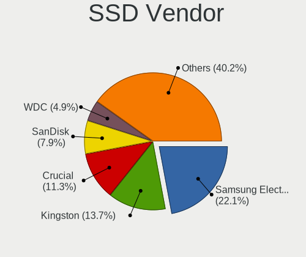
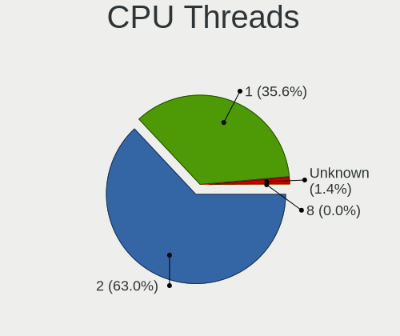
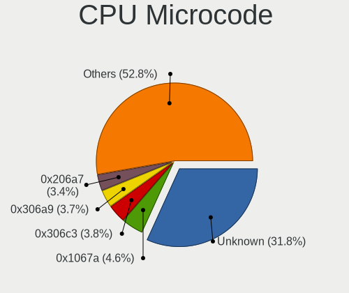
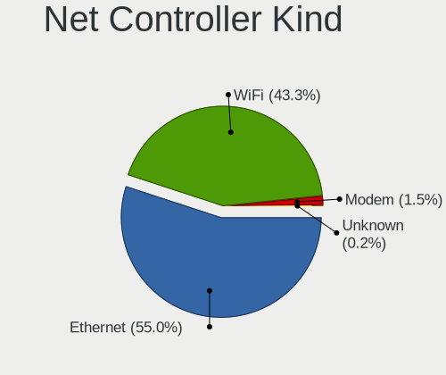
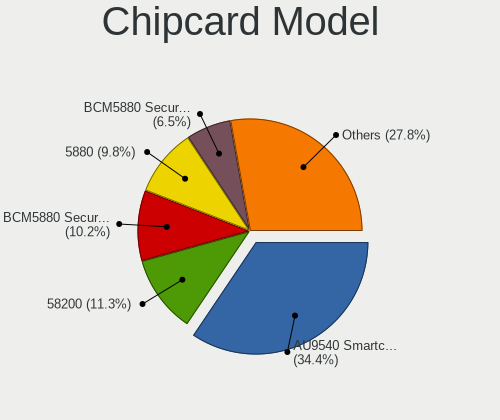

Debian - Tested Hardware & Statistics
-------------------------------------

A project to collect tested hardware configurations for Debian.

Anyone can contribute to this report by the [hw-probe](https://github.com/linuxhw/hw-probe) tool:

    sudo -E hw-probe -all -upload

Please contribute! Especially if your hardware is rare.

This is a report for all computer types. See also reports for [desktops](/Dist/Debian/Desktop/README.md) and [notebooks](/Dist/Debian/Notebook/README.md).

Contents
--------

* [ Test Cases ](#test-cases)

* [ System ](#system)
  - [ OS                       ](#os)
  - [ OS Family                ](#os-family)
  - [ Kernel                   ](#kernel)
  - [ Kernel Family            ](#kernel-family)
  - [ Kernel Major Ver.        ](#kernel-major-ver)
  - [ Arch                     ](#arch)
  - [ DE                       ](#de)
  - [ Display Server           ](#display-server)
  - [ Display Manager          ](#display-manager)
  - [ OS Lang                  ](#os-lang)
  - [ Boot Mode                ](#boot-mode)
  - [ Filesystem               ](#filesystem)
  - [ Part. scheme             ](#part-scheme)
  - [ Dual Boot with Linux/BSD ](#dual-boot-with-linuxbsd)
  - [ Dual Boot (Win)          ](#dual-boot-win)

* [ Board ](#board)
  - [ Vendor                   ](#vendor)
  - [ Model                    ](#model)
  - [ Model Family             ](#model-family)
  - [ MFG Year                 ](#mfg-year)
  - [ Form Factor              ](#form-factor)
  - [ Secure Boot              ](#secure-boot)
  - [ Coreboot                 ](#coreboot)
  - [ RAM Size                 ](#ram-size)
  - [ RAM Used                 ](#ram-used)
  - [ Total Drives             ](#total-drives)
  - [ Has CD-ROM               ](#has-cd-rom)
  - [ Has Ethernet             ](#has-ethernet)
  - [ Has WiFi                 ](#has-wifi)
  - [ Has Bluetooth            ](#has-bluetooth)

* [ Location ](#location)
  - [ Country                  ](#country)
  - [ City                     ](#city)

* [ Drives ](#drives)
  - [ Drive Vendor             ](#drive-vendor)
  - [ Drive Model              ](#drive-model)
  - [ HDD Vendor               ](#hdd-vendor)
  - [ SSD Vendor               ](#ssd-vendor)
  - [ Drive Kind               ](#drive-kind)
  - [ Drive Connector          ](#drive-connector)
  - [ Drive Size               ](#drive-size)
  - [ Space Total              ](#space-total)
  - [ Space Used               ](#space-used)
  - [ Malfunc. Drives          ](#malfunc-drives)
  - [ Malfunc. Drive Vendor    ](#malfunc-drive-vendor)
  - [ Malfunc. HDD Vendor      ](#malfunc-hdd-vendor)
  - [ Malfunc. Drive Kind      ](#malfunc-drive-kind)
  - [ Failed Drives            ](#failed-drives)
  - [ Failed Drive Vendor      ](#failed-drive-vendor)
  - [ Drive Status             ](#drive-status)

* [ Storage controller ](#storage-controller)
  - [ Storage Vendor           ](#storage-vendor)
  - [ Storage Model            ](#storage-model)
  - [ Storage Kind             ](#storage-kind)

* [ Processor ](#processor)
  - [ CPU Vendor               ](#cpu-vendor)
  - [ CPU Model                ](#cpu-model)
  - [ CPU Model Family         ](#cpu-model-family)
  - [ CPU Cores                ](#cpu-cores)
  - [ CPU Sockets              ](#cpu-sockets)
  - [ CPU Threads              ](#cpu-threads)
  - [ CPU Op-Modes             ](#cpu-op-modes)
  - [ CPU Microcode            ](#cpu-microcode)
  - [ CPU Microarch            ](#cpu-microarch)

* [ Graphics ](#graphics)
  - [ GPU Vendor               ](#gpu-vendor)
  - [ GPU Model                ](#gpu-model)
  - [ GPU Combo                ](#gpu-combo)
  - [ GPU Driver               ](#gpu-driver)
  - [ GPU Memory               ](#gpu-memory)

* [ Monitor ](#monitor)
  - [ Monitor Vendor           ](#monitor-vendor)
  - [ Monitor Model            ](#monitor-model)
  - [ Monitor Resolution       ](#monitor-resolution)
  - [ Monitor Diagonal         ](#monitor-diagonal)
  - [ Monitor Width            ](#monitor-width)
  - [ Aspect Ratio             ](#aspect-ratio)
  - [ Monitor Area             ](#monitor-area)
  - [ Pixel Density            ](#pixel-density)
  - [ Multiple Monitors        ](#multiple-monitors)

* [ Network ](#network)
  - [ Net Controller Vendor    ](#net-controller-vendor)
  - [ Net Controller Model     ](#net-controller-model)
  - [ Wireless Vendor          ](#wireless-vendor)
  - [ Wireless Model           ](#wireless-model)
  - [ Ethernet Vendor          ](#ethernet-vendor)
  - [ Ethernet Model           ](#ethernet-model)
  - [ Net Controller Kind      ](#net-controller-kind)
  - [ Used Controller          ](#used-controller)
  - [ NICs                     ](#nics)
  - [ IPv6                     ](#ipv6)

* [ Bluetooth ](#bluetooth)
  - [ Bluetooth Vendor         ](#bluetooth-vendor)
  - [ Bluetooth Model          ](#bluetooth-model)

* [ Sound ](#sound)
  - [ Sound Vendor             ](#sound-vendor)
  - [ Sound Model              ](#sound-model)

* [ Memory ](#memory)
  - [ Memory Vendor            ](#memory-vendor)
  - [ Memory Model             ](#memory-model)
  - [ Memory Kind              ](#memory-kind)
  - [ Memory Form Factor       ](#memory-form-factor)
  - [ Memory Size              ](#memory-size)
  - [ Memory Speed             ](#memory-speed)

* [ Printers & scanners ](#printers--scanners)
  - [ Printer Vendor           ](#printer-vendor)
  - [ Printer Model            ](#printer-model)
  - [ Scanner Vendor           ](#scanner-vendor)
  - [ Scanner Model            ](#scanner-model)

* [ Camera ](#camera)
  - [ Camera Vendor            ](#camera-vendor)
  - [ Camera Model             ](#camera-model)

* [ Security ](#security)
  - [ Fingerprint Vendor       ](#fingerprint-vendor)
  - [ Fingerprint Model        ](#fingerprint-model)
  - [ Chipcard Vendor          ](#chipcard-vendor)
  - [ Chipcard Model           ](#chipcard-model)

* [ Unsupported ](#unsupported)
  - [ Unsupported Devices      ](#unsupported-devices)
  - [ Unsupported Device Types ](#unsupported-device-types)

Test Cases
----------

Total: 10659

| Vendor        | Model                       | Form-Factor | Probe                                                      | Date         |
|---------------|-----------------------------|-------------|------------------------------------------------------------|--------------|
| Shenzhen a... | AC1-DP                      | Desktop     | [754335ffe9](https://linux-hardware.org/?probe=754335ffe9) | Nov 02, 2022 |
| Lenovo        | ThinkPad E475 20H40006US    | Notebook    | [d59bd1e8f1](https://linux-hardware.org/?probe=d59bd1e8f1) | Nov 02, 2022 |
| Lenovo        | ThinkPad E475 20H40006US    | Notebook    | [4342ecb0f9](https://linux-hardware.org/?probe=4342ecb0f9) | Nov 02, 2022 |
| Google        | Terra                       | Notebook    | [46299bf228](https://linux-hardware.org/?probe=46299bf228) | Nov 02, 2022 |
| Lenovo        | ThinkPad E475 20H40006US    | Notebook    | [fd32769391](https://linux-hardware.org/?probe=fd32769391) | Nov 02, 2022 |
| Lenovo        | ThinkPad E475 20H40006US    | Notebook    | [d3c1c92563](https://linux-hardware.org/?probe=d3c1c92563) | Nov 02, 2022 |
| Lenovo        | ThinkPad E475 20H40006US    | Notebook    | [0ffaee423b](https://linux-hardware.org/?probe=0ffaee423b) | Nov 02, 2022 |
| ASUSTek       | 1005HA                      | Notebook    | [1d386943d6](https://linux-hardware.org/?probe=1d386943d6) | Nov 02, 2022 |
| Dell          | 0JGM7F A00                  | Desktop     | [28f4800b2b](https://linux-hardware.org/?probe=28f4800b2b) | Nov 02, 2022 |
| Lenovo        | 3132 SDK0R32862 WIN 3258... | Desktop     | [f8708425a1](https://linux-hardware.org/?probe=f8708425a1) | Nov 02, 2022 |
| MSI           | H110M PRO-VD                | Desktop     | [1fb0a79791](https://linux-hardware.org/?probe=1fb0a79791) | Nov 02, 2022 |
| Unknown       | Unknown                     | Desktop     | [bc4f9a5a35](https://linux-hardware.org/?probe=bc4f9a5a35) | Nov 02, 2022 |
| HP            | G42                         | Notebook    | [18c487d99d](https://linux-hardware.org/?probe=18c487d99d) | Nov 02, 2022 |
| Digma         | EVE 11 C422 ES1068EW        | Notebook    | [f5177de131](https://linux-hardware.org/?probe=f5177de131) | Nov 02, 2022 |
| Dell          | 0PV3YR A05                  | Server      | [47c34f9269](https://linux-hardware.org/?probe=47c34f9269) | Nov 02, 2022 |
| Foxconn       | 2A92                        | Desktop     | [0898482b18](https://linux-hardware.org/?probe=0898482b18) | Nov 02, 2022 |
| ASUSTek       | PRO B460M-C                 | Desktop     | [dcf7112b3d](https://linux-hardware.org/?probe=dcf7112b3d) | Nov 01, 2022 |
| ASUSTek       | PRO B460M-C                 | Desktop     | [a333f47ffa](https://linux-hardware.org/?probe=a333f47ffa) | Nov 01, 2022 |
| Microsoft     | Surface Book 2              | Tablet      | [0092b0ddaf](https://linux-hardware.org/?probe=0092b0ddaf) | Nov 01, 2022 |
| Phoenix       | POULSBO                     | Desktop     | [177f05205b](https://linux-hardware.org/?probe=177f05205b) | Nov 01, 2022 |
| MSI           | H61M-P31                    | Desktop     | [819c124b25](https://linux-hardware.org/?probe=819c124b25) | Nov 01, 2022 |
| Gigabyte      | H610M H DDR4                | Desktop     | [b726668f90](https://linux-hardware.org/?probe=b726668f90) | Nov 01, 2022 |
| Toshiba       | Satellite L755              | Notebook    | [dc3d60731e](https://linux-hardware.org/?probe=dc3d60731e) | Nov 01, 2022 |
| Unknown       | Unknown                     | Desktop     | [f87c0b1010](https://linux-hardware.org/?probe=f87c0b1010) | Nov 01, 2022 |
| Lenovo        | 3130 SDK0J40697 WIN 3305... | Mini pc     | [08649bd1e9](https://linux-hardware.org/?probe=08649bd1e9) | Nov 01, 2022 |
| Gigabyte      | X570S AERO G                | Desktop     | [92fccb6716](https://linux-hardware.org/?probe=92fccb6716) | Nov 01, 2022 |
| MSI           | Z390-A PRO                  | Desktop     | [3eea020596](https://linux-hardware.org/?probe=3eea020596) | Nov 01, 2022 |
| Dell          | 0PV3YR A05                  | Server      | [dab530a737](https://linux-hardware.org/?probe=dab530a737) | Nov 01, 2022 |
| Acer          | Aspire one                  | Notebook    | [bfb9f97d74](https://linux-hardware.org/?probe=bfb9f97d74) | Oct 31, 2022 |
| Lenovo        | ThinkPad L14 Gen 1 20U50... | Notebook    | [c9e0b81f80](https://linux-hardware.org/?probe=c9e0b81f80) | Oct 31, 2022 |
| MSI           | MEG Z590 ACE                | Desktop     | [1082f00d60](https://linux-hardware.org/?probe=1082f00d60) | Oct 31, 2022 |
| ASRock        | 960GM-VGS3 FX               | Desktop     | [f31f613901](https://linux-hardware.org/?probe=f31f613901) | Oct 31, 2022 |
| HP            | Compaq nc6320 (EV073AV)     | Notebook    | [b73f359ded](https://linux-hardware.org/?probe=b73f359ded) | Oct 31, 2022 |
| ASUSTek       | G75VW                       | Notebook    | [6f1d41a85c](https://linux-hardware.org/?probe=6f1d41a85c) | Oct 31, 2022 |
| Acer          | Aspire one                  | Notebook    | [82b34552f6](https://linux-hardware.org/?probe=82b34552f6) | Oct 31, 2022 |
| HP            | Spectre x360 Convertible... | Convertible | [fb96cd8e21](https://linux-hardware.org/?probe=fb96cd8e21) | Oct 31, 2022 |
| MSI           | Pulse GL76 12UEK            | Notebook    | [76a2d8c304](https://linux-hardware.org/?probe=76a2d8c304) | Oct 31, 2022 |
| Chuwi         | LarkBox X                   | Mini pc     | [ed3f906a17](https://linux-hardware.org/?probe=ed3f906a17) | Oct 31, 2022 |
| Intel         | DG41AN AAE92991-401         | Desktop     | [cd670cef3d](https://linux-hardware.org/?probe=cd670cef3d) | Oct 31, 2022 |
| ASUSTek       | ZenBook UX431FAC_UX431FA    | Notebook    | [95554a578b](https://linux-hardware.org/?probe=95554a578b) | Oct 31, 2022 |
| Unknown       | Unknown                     | Desktop     | [0e92fb8c99](https://linux-hardware.org/?probe=0e92fb8c99) | Oct 31, 2022 |
| Aquarius      | NS585                       | Notebook    | [e4b4e0456d](https://linux-hardware.org/?probe=e4b4e0456d) | Oct 31, 2022 |
| Dell          | 0PV3YR A05                  | Server      | [0c1875c94f](https://linux-hardware.org/?probe=0c1875c94f) | Oct 31, 2022 |
| ASUSTek       | M5A99FX PRO R2.0            | Desktop     | [4179fe16d6](https://linux-hardware.org/?probe=4179fe16d6) | Oct 31, 2022 |
| Apple         | MacBookPro5,5               | Notebook    | [00e1f1f754](https://linux-hardware.org/?probe=00e1f1f754) | Oct 31, 2022 |
| HUAWEI        | NBLB-WAX9N                  | Notebook    | [a872c9888a](https://linux-hardware.org/?probe=a872c9888a) | Oct 30, 2022 |
| ASUSTek       | PRIME X570-PRO              | Desktop     | [3fbcca75d5](https://linux-hardware.org/?probe=3fbcca75d5) | Oct 30, 2022 |
| HUAWEI        | NBLB-WAX9N                  | Notebook    | [45f670d99f](https://linux-hardware.org/?probe=45f670d99f) | Oct 30, 2022 |
| Lenovo        | V15 G2 ITL 82KB             | Notebook    | [209fa66bb9](https://linux-hardware.org/?probe=209fa66bb9) | Oct 30, 2022 |
| Acer          | Aspire A515-51G             | Notebook    | [12380f78de](https://linux-hardware.org/?probe=12380f78de) | Oct 30, 2022 |
| HP            | x2 210                      | Notebook    | [8ed0a97ee9](https://linux-hardware.org/?probe=8ed0a97ee9) | Oct 30, 2022 |
| Lenovo        | ThinkPad T16 Gen 1 21BVC... | Notebook    | [e8a1f8f6bf](https://linux-hardware.org/?probe=e8a1f8f6bf) | Oct 30, 2022 |
| HP            | 158B                        | Desktop     | [9c02b7fe58](https://linux-hardware.org/?probe=9c02b7fe58) | Oct 30, 2022 |
| Chuwi         | LarkBox X                   | Mini pc     | [5cd057be2a](https://linux-hardware.org/?probe=5cd057be2a) | Oct 30, 2022 |
| Dell          | XPS L322X                   | Notebook    | [cacebfe41e](https://linux-hardware.org/?probe=cacebfe41e) | Oct 30, 2022 |
| ASUSTek       | N751JK                      | Notebook    | [eea92055f3](https://linux-hardware.org/?probe=eea92055f3) | Oct 30, 2022 |
| Unknown       | Unknown                     | Desktop     | [673c23713c](https://linux-hardware.org/?probe=673c23713c) | Oct 30, 2022 |
| Lenovo        | V15 G2 ITL 82KB             | Notebook    | [89595b2fa9](https://linux-hardware.org/?probe=89595b2fa9) | Oct 30, 2022 |
| ASUSTek       | PRIME B560M-K               | Desktop     | [416db8870a](https://linux-hardware.org/?probe=416db8870a) | Oct 30, 2022 |
| Chuwi         | LarkBook                    | Notebook    | [3ff2ff69ce](https://linux-hardware.org/?probe=3ff2ff69ce) | Oct 30, 2022 |
| Dell          | 0PV3YR A05                  | Server      | [9991d15803](https://linux-hardware.org/?probe=9991d15803) | Oct 30, 2022 |
| ASUSTek       | TP401CA                     | Convertible | [8d97908e58](https://linux-hardware.org/?probe=8d97908e58) | Oct 30, 2022 |
| Dell          | Latitude 5501               | Notebook    | [67f979a26d](https://linux-hardware.org/?probe=67f979a26d) | Oct 29, 2022 |
| Notebook      | W230SD                      | Notebook    | [76ae019222](https://linux-hardware.org/?probe=76ae019222) | Oct 29, 2022 |
| Raspberry ... | Raspberry Pi 4 Model B R... | Soc         | [d99707ef15](https://linux-hardware.org/?probe=d99707ef15) | Oct 29, 2022 |
| Dell          | Precision 7520              | Notebook    | [f54f6d6354](https://linux-hardware.org/?probe=f54f6d6354) | Oct 29, 2022 |
| Foxconn       | 2ADA                        | Desktop     | [16815dacc1](https://linux-hardware.org/?probe=16815dacc1) | Oct 29, 2022 |
| Dell          | Latitude 5590               | Notebook    | [c7fa986fbd](https://linux-hardware.org/?probe=c7fa986fbd) | Oct 29, 2022 |
| Gigabyte      | H77-DS3H                    | Desktop     | [4457c6182e](https://linux-hardware.org/?probe=4457c6182e) | Oct 29, 2022 |
| ASUSTek       | X75VC                       | Notebook    | [9c1ab509ec](https://linux-hardware.org/?probe=9c1ab509ec) | Oct 29, 2022 |
| HP            | Pavilion Laptop 15-eg0xx... | Notebook    | [8cc0e0d828](https://linux-hardware.org/?probe=8cc0e0d828) | Oct 29, 2022 |
| Dell          | Latitude E4310              | Notebook    | [fe6c65dd77](https://linux-hardware.org/?probe=fe6c65dd77) | Oct 29, 2022 |
| Insyde        | Braswell                    | Notebook    | [d98b2d9661](https://linux-hardware.org/?probe=d98b2d9661) | Oct 29, 2022 |
| Samsung       | 300V3A/300V4A/300V5A        | Notebook    | [4acb2d0863](https://linux-hardware.org/?probe=4acb2d0863) | Oct 29, 2022 |
| Dell          | Latitude E4310              | Notebook    | [7a610ca46d](https://linux-hardware.org/?probe=7a610ca46d) | Oct 29, 2022 |
| Dell          | 0PV3YR A05                  | Server      | [182d67f23e](https://linux-hardware.org/?probe=182d67f23e) | Oct 29, 2022 |
| Dell          | XPS 17 9720                 | Notebook    | [270b988521](https://linux-hardware.org/?probe=270b988521) | Oct 29, 2022 |
| Dell          | Precision 7520              | Notebook    | [30f6ad7a26](https://linux-hardware.org/?probe=30f6ad7a26) | Oct 29, 2022 |
| Dell          | Precision 7520              | Notebook    | [b81923dbd2](https://linux-hardware.org/?probe=b81923dbd2) | Oct 29, 2022 |
| libre-comp... | aml-s905x-cc                | Soc         | [0258982a5a](https://linux-hardware.org/?probe=0258982a5a) | Oct 29, 2022 |
| MSI           | Modern 15 A10RBS            | Notebook    | [ddc3eded89](https://linux-hardware.org/?probe=ddc3eded89) | Oct 28, 2022 |
| Lenovo        | ThinkPad E475 20H40006US    | Notebook    | [60d1db050b](https://linux-hardware.org/?probe=60d1db050b) | Oct 28, 2022 |
| Lenovo        | ThinkPad E475 20H40006US    | Notebook    | [2a9f06c2b4](https://linux-hardware.org/?probe=2a9f06c2b4) | Oct 28, 2022 |
| Lenovo        | ThinkPad E475 20H40006US    | Notebook    | [787904d265](https://linux-hardware.org/?probe=787904d265) | Oct 28, 2022 |
| Lenovo        | IdeaPad 3 15ADA05 81W1      | Notebook    | [0971db18ed](https://linux-hardware.org/?probe=0971db18ed) | Oct 28, 2022 |
| Supermicro    | X12DPU-6A                   | Server      | [28c143d1f2](https://linux-hardware.org/?probe=28c143d1f2) | Oct 28, 2022 |
| Toshiba       | Satellite L755              | Notebook    | [0fa70f29d4](https://linux-hardware.org/?probe=0fa70f29d4) | Oct 28, 2022 |
| Lenovo        | ThinkPad T530 239242U       | Notebook    | [dbf70338e9](https://linux-hardware.org/?probe=dbf70338e9) | Oct 28, 2022 |
| Unknown       | 775V88+                     | Desktop     | [f1a685b497](https://linux-hardware.org/?probe=f1a685b497) | Oct 28, 2022 |
| ASUSTek       | ZenBook UX431FLC_UX431FL    | Notebook    | [e34c4fde2c](https://linux-hardware.org/?probe=e34c4fde2c) | Oct 28, 2022 |
| Dell          | Latitude 5280               | Notebook    | [368f237efe](https://linux-hardware.org/?probe=368f237efe) | Oct 28, 2022 |
| Dell          | XPS 17 9700                 | Notebook    | [81121b7762](https://linux-hardware.org/?probe=81121b7762) | Oct 28, 2022 |
| Toshiba       | Satellite C650D             | Notebook    | [0696abd43c](https://linux-hardware.org/?probe=0696abd43c) | Oct 28, 2022 |
| Toshiba       | Satellite C650D             | Notebook    | [d42867d201](https://linux-hardware.org/?probe=d42867d201) | Oct 28, 2022 |
| Unknown       | Unknown                     | Soc         | [44fc490d82](https://linux-hardware.org/?probe=44fc490d82) | Oct 28, 2022 |
| ASUSTek       | X555QG                      | Notebook    | [bace747804](https://linux-hardware.org/?probe=bace747804) | Oct 28, 2022 |
| HP            | 3396                        | Desktop     | [d42479acb8](https://linux-hardware.org/?probe=d42479acb8) | Oct 28, 2022 |
| Acer          | Aspire A715-75G             | Notebook    | [78b0c55e62](https://linux-hardware.org/?probe=78b0c55e62) | Oct 28, 2022 |
| Unknown       | Unknown                     | Server      | [cdca95f7e5](https://linux-hardware.org/?probe=cdca95f7e5) | Oct 28, 2022 |
| ASUSTek       | PRIME X370-PRO              | Desktop     | [d3cf194e94](https://linux-hardware.org/?probe=d3cf194e94) | Oct 28, 2022 |
| HP            | EliteBook 840 G8 Noteboo... | Notebook    | [02c6d1fe1a](https://linux-hardware.org/?probe=02c6d1fe1a) | Oct 28, 2022 |
| Lenovo        | ThinkPad E470 20H2S00700    | Notebook    | [768c6c8357](https://linux-hardware.org/?probe=768c6c8357) | Oct 28, 2022 |
| SANTECH       | NHx0DB,DE                   | Notebook    | [db8c0489f4](https://linux-hardware.org/?probe=db8c0489f4) | Oct 28, 2022 |
| ASUSTek       | PRIME Z690-P WIFI D4        | Desktop     | [327ee3d5b0](https://linux-hardware.org/?probe=327ee3d5b0) | Oct 28, 2022 |
| Lenovo        | ThinkPad E475 20H40006US    | Notebook    | [63565608d1](https://linux-hardware.org/?probe=63565608d1) | Oct 28, 2022 |
| Google        | Boten                       | Notebook    | [2ed6baabf0](https://linux-hardware.org/?probe=2ed6baabf0) | Oct 27, 2022 |
| ASUSTek       | N501VW                      | Notebook    | [07f7d43f09](https://linux-hardware.org/?probe=07f7d43f09) | Oct 27, 2022 |
| HP            | ZBook 15 G3                 | Notebook    | [2b886c255e](https://linux-hardware.org/?probe=2b886c255e) | Oct 27, 2022 |
| Lenovo        | ThinkPad X1 Carbon Gen 9... | Notebook    | [24da197a3a](https://linux-hardware.org/?probe=24da197a3a) | Oct 27, 2022 |
| Apple         | Mac-F221BEC8                | Desktop     | [0bf03c49f7](https://linux-hardware.org/?probe=0bf03c49f7) | Oct 27, 2022 |
| Lenovo        | ThinkPad E475 20H40006US    | Notebook    | [3ab1fbc8e8](https://linux-hardware.org/?probe=3ab1fbc8e8) | Oct 27, 2022 |
| Lenovo        | ThinkPad E475 20H40006US    | Notebook    | [faafe16cfb](https://linux-hardware.org/?probe=faafe16cfb) | Oct 27, 2022 |
| MSI           | B450 TOMAHAWK MAX           | Desktop     | [b682a38061](https://linux-hardware.org/?probe=b682a38061) | Oct 27, 2022 |
| MSI           | H110M PRO-VD                | Desktop     | [175f39979c](https://linux-hardware.org/?probe=175f39979c) | Oct 27, 2022 |
| Acer          | Aspire A515-45              | Notebook    | [3a09f9ee6b](https://linux-hardware.org/?probe=3a09f9ee6b) | Oct 27, 2022 |
| Dell          | 0PV3YR A05                  | Server      | [98cd87adf9](https://linux-hardware.org/?probe=98cd87adf9) | Oct 27, 2022 |
| THTF          | CR F860-T1                  | Notebook    | [0e20f4f61a](https://linux-hardware.org/?probe=0e20f4f61a) | Oct 27, 2022 |
| Huanan        | X99-QD4 V1.0                | Desktop     | [2e4c04ada0](https://linux-hardware.org/?probe=2e4c04ada0) | Oct 27, 2022 |
| Gigabyte      | 970A-DS3P                   | Desktop     | [1bc5db124b](https://linux-hardware.org/?probe=1bc5db124b) | Oct 27, 2022 |
| Acer          | Aspire ES1-131              | Notebook    | [f0edf4897a](https://linux-hardware.org/?probe=f0edf4897a) | Oct 26, 2022 |
| Huanan        | X99-QD4 V1.0                | Desktop     | [cb31f9ab8b](https://linux-hardware.org/?probe=cb31f9ab8b) | Oct 26, 2022 |
| Unknown       | Unknown                     | Desktop     | [79b9335389](https://linux-hardware.org/?probe=79b9335389) | Oct 26, 2022 |
| Unknown       | Unknown                     | Desktop     | [07a0af33a1](https://linux-hardware.org/?probe=07a0af33a1) | Oct 26, 2022 |
| ASUSTek       | X541UAK                     | Notebook    | [87ee863ba2](https://linux-hardware.org/?probe=87ee863ba2) | Oct 26, 2022 |
| Lenovo        | ThinkPad E475 20H40006US    | Notebook    | [bfd570bbef](https://linux-hardware.org/?probe=bfd570bbef) | Oct 26, 2022 |
| Lenovo        | ThinkPad E475 20H40006US    | Notebook    | [58820ca517](https://linux-hardware.org/?probe=58820ca517) | Oct 26, 2022 |
| Gigabyte      | H410M S2H V3                | Desktop     | [9e8ec19352](https://linux-hardware.org/?probe=9e8ec19352) | Oct 26, 2022 |
| Lenovo        | ThinkServer TS440           | Desktop     | [acdfb9b02e](https://linux-hardware.org/?probe=acdfb9b02e) | Oct 26, 2022 |
| Lenovo        | ThinkPad E475 20H40006US    | Notebook    | [6b9a3ab27e](https://linux-hardware.org/?probe=6b9a3ab27e) | Oct 26, 2022 |
| Lenovo        | ThinkPad E475 20H40006US    | Notebook    | [a5bd8bebc7](https://linux-hardware.org/?probe=a5bd8bebc7) | Oct 26, 2022 |
| Lenovo        | ThinkPad E475 20H40006US    | Notebook    | [bce3a8b1b3](https://linux-hardware.org/?probe=bce3a8b1b3) | Oct 26, 2022 |
| Lenovo        | ThinkPad E475 20H40006US    | Notebook    | [65a1d5242f](https://linux-hardware.org/?probe=65a1d5242f) | Oct 26, 2022 |
| ASUSTek       | B85M-G                      | Desktop     | [0d3545c6aa](https://linux-hardware.org/?probe=0d3545c6aa) | Oct 26, 2022 |
| Lenovo        | ThinkBook 15 G2 ITL 20VE    | Notebook    | [a09e3f3669](https://linux-hardware.org/?probe=a09e3f3669) | Oct 26, 2022 |
| ASUSTek       | 1005HA                      | Notebook    | [118fed891f](https://linux-hardware.org/?probe=118fed891f) | Oct 26, 2022 |
| Lenovo        | ThinkPad L380 Yoga 20M7C... | Convertible | [1d55c9b411](https://linux-hardware.org/?probe=1d55c9b411) | Oct 26, 2022 |
| Fujitsu       | D2679-B1 S26361-D2679-Bx... | Desktop     | [8e957f305e](https://linux-hardware.org/?probe=8e957f305e) | Oct 26, 2022 |
| ASUSTek       | B85M-G                      | Desktop     | [0b8dc998a9](https://linux-hardware.org/?probe=0b8dc998a9) | Oct 26, 2022 |
| ASUSTek       | PRIME H310M-R R2.0          | Desktop     | [c1067e423b](https://linux-hardware.org/?probe=c1067e423b) | Oct 26, 2022 |
| Dell          | 0PV3YR A05                  | Server      | [ff62c670fd](https://linux-hardware.org/?probe=ff62c670fd) | Oct 26, 2022 |
| HP            | Pavilion g6                 | Notebook    | [353259fad4](https://linux-hardware.org/?probe=353259fad4) | Oct 26, 2022 |
| Lenovo        | ThinkPad E475 20H40006US    | Notebook    | [93b8dd8c3e](https://linux-hardware.org/?probe=93b8dd8c3e) | Oct 25, 2022 |
| Lenovo        | ThinkPad E475 20H40006US    | Notebook    | [5e08852d18](https://linux-hardware.org/?probe=5e08852d18) | Oct 25, 2022 |
| ASRock        | AB350 Pro4                  | Desktop     | [82ee095168](https://linux-hardware.org/?probe=82ee095168) | Oct 25, 2022 |
| MSI           | Z170A GAMING M5             | Desktop     | [b5dcdb6844](https://linux-hardware.org/?probe=b5dcdb6844) | Oct 25, 2022 |
| Pegatron      | Benicia                     | Desktop     | [3735dca311](https://linux-hardware.org/?probe=3735dca311) | Oct 25, 2022 |
| IBM           | 81Y7045                     | Server      | [27bd1ebecd](https://linux-hardware.org/?probe=27bd1ebecd) | Oct 25, 2022 |
| Lenovo        | Z50-70 20354                | Notebook    | [08b673e57b](https://linux-hardware.org/?probe=08b673e57b) | Oct 25, 2022 |
| MSI           | H81M-P33                    | Desktop     | [b0f36ae0c5](https://linux-hardware.org/?probe=b0f36ae0c5) | Oct 25, 2022 |
| Lenovo        | ThinkPad E475 20H40006US    | Notebook    | [438afb4185](https://linux-hardware.org/?probe=438afb4185) | Oct 25, 2022 |
| Lenovo        | Yoga 900S-12ISK 80ML        | Notebook    | [0c13fbf129](https://linux-hardware.org/?probe=0c13fbf129) | Oct 25, 2022 |
| Intel         | NUC7JYB J67967-404          | Mini pc     | [739b6fc4a9](https://linux-hardware.org/?probe=739b6fc4a9) | Oct 25, 2022 |
| MSI           | B450 TOMAHAWK MAX           | Desktop     | [7b59865f68](https://linux-hardware.org/?probe=7b59865f68) | Oct 25, 2022 |
| MSI           | H110M PRO-VD                | Desktop     | [f8466185a4](https://linux-hardware.org/?probe=f8466185a4) | Oct 25, 2022 |
| Toshiba       | dynabook MX/33KBL           | Notebook    | [7ee9057da2](https://linux-hardware.org/?probe=7ee9057da2) | Oct 25, 2022 |
| Dell          | 0YJPT1 A00                  | Desktop     | [bb1a7da646](https://linux-hardware.org/?probe=bb1a7da646) | Oct 25, 2022 |
| Dell          | 01XK1W A00                  | Desktop     | [c0fb49f07a](https://linux-hardware.org/?probe=c0fb49f07a) | Oct 25, 2022 |
| Dell          | Vostro 5490                 | Notebook    | [6b4c7d3c8b](https://linux-hardware.org/?probe=6b4c7d3c8b) | Oct 24, 2022 |
| Dell          | Latitude E6430              | Notebook    | [3fbd9c277d](https://linux-hardware.org/?probe=3fbd9c277d) | Oct 24, 2022 |
| Gigabyte      | GA-MA78GM-S2H               | Desktop     | [a0e0f661af](https://linux-hardware.org/?probe=a0e0f661af) | Oct 24, 2022 |
| Lenovo        | ThinkPad L13 Yoga Gen 2 ... | Convertible | [9604dda439](https://linux-hardware.org/?probe=9604dda439) | Oct 24, 2022 |
| ASUSTek       | ROG CROSSHAIR X670E HERO    | Desktop     | [54710cefe5](https://linux-hardware.org/?probe=54710cefe5) | Oct 24, 2022 |
| ASUSTek       | H81M-C                      | Desktop     | [1deed99314](https://linux-hardware.org/?probe=1deed99314) | Oct 24, 2022 |
| ASUSTek       | M4A78T-E                    | Desktop     | [ee86cdac2a](https://linux-hardware.org/?probe=ee86cdac2a) | Oct 24, 2022 |
| Lenovo        | ThinkPad X230 Tablet 343... | Notebook    | [eae727e6a0](https://linux-hardware.org/?probe=eae727e6a0) | Oct 24, 2022 |
| Dell          | 0M5WNK A00                  | Desktop     | [fad0f2f50e](https://linux-hardware.org/?probe=fad0f2f50e) | Oct 24, 2022 |
| Lenovo        | IdeaPad 5 14ARE05 81YM      | Notebook    | [52701ec9f4](https://linux-hardware.org/?probe=52701ec9f4) | Oct 24, 2022 |
| Packard Be... | DOT S                       | Notebook    | [f280a6ccbc](https://linux-hardware.org/?probe=f280a6ccbc) | Oct 24, 2022 |
| Lenovo        | 0x36C017AA SDK0J40700 WI... | Desktop     | [0d21d658ee](https://linux-hardware.org/?probe=0d21d658ee) | Oct 24, 2022 |
| Lenovo        | ThinkPad T470 20HES4VB00    | Notebook    | [f7b39d371a](https://linux-hardware.org/?probe=f7b39d371a) | Oct 24, 2022 |
| Gigabyte      | E350N WIN8                  | Desktop     | [bff16c4d6c](https://linux-hardware.org/?probe=bff16c4d6c) | Oct 24, 2022 |
| Packard Be... | H17HV                       | Notebook    | [2e94cfdd84](https://linux-hardware.org/?probe=2e94cfdd84) | Oct 24, 2022 |
| Inventec      | DQ Class A02                | Desktop     | [f64d3223c5](https://linux-hardware.org/?probe=f64d3223c5) | Oct 24, 2022 |
| Raspberry ... | Raspberry Pi 4 Model B R... | Soc         | [dd05575bb4](https://linux-hardware.org/?probe=dd05575bb4) | Oct 24, 2022 |
| Raspberry ... | Raspberry Pi 4 Model B R... | Soc         | [d2cb5dc9c7](https://linux-hardware.org/?probe=d2cb5dc9c7) | Oct 24, 2022 |
| Alienware     | M11xR3                      | Notebook    | [62bf8b7b02](https://linux-hardware.org/?probe=62bf8b7b02) | Oct 24, 2022 |
| Inventec      | DQ Class A02                | Desktop     | [c4fddde4b6](https://linux-hardware.org/?probe=c4fddde4b6) | Oct 24, 2022 |
| HP            | Pavilion g4                 | Notebook    | [3b6666b5ba](https://linux-hardware.org/?probe=3b6666b5ba) | Oct 24, 2022 |
| Dell          | 040DDP A01                  | Desktop     | [083b2c218e](https://linux-hardware.org/?probe=083b2c218e) | Oct 24, 2022 |
| Biostar       | B450MH                      | Desktop     | [048cd18957](https://linux-hardware.org/?probe=048cd18957) | Oct 24, 2022 |
| Lenovo        | V310-14IKB 80T2             | Notebook    | [73f18a6fbb](https://linux-hardware.org/?probe=73f18a6fbb) | Oct 24, 2022 |
| ASUSTek       | STRIX Z270F GAMING          | Desktop     | [ce3e956a0a](https://linux-hardware.org/?probe=ce3e956a0a) | Oct 24, 2022 |
| ASRock        | Z97 Anniversary             | Desktop     | [9c94714d56](https://linux-hardware.org/?probe=9c94714d56) | Oct 24, 2022 |
| Dell          | 01XK1W A00                  | Desktop     | [86e8f9141a](https://linux-hardware.org/?probe=86e8f9141a) | Oct 24, 2022 |
| ASRock        | H81M-HG4 R4.0               | Desktop     | [da9c01eb20](https://linux-hardware.org/?probe=da9c01eb20) | Oct 23, 2022 |
| ASUSTek       | PRIME Z690-P WIFI D4        | Desktop     | [f82a2d8d8e](https://linux-hardware.org/?probe=f82a2d8d8e) | Oct 23, 2022 |
| ASUSTek       | PRIME Z690-P WIFI D4        | Desktop     | [25295c680c](https://linux-hardware.org/?probe=25295c680c) | Oct 23, 2022 |
| Gigabyte      | G41MT-S2P                   | Desktop     | [9d2d49b8e4](https://linux-hardware.org/?probe=9d2d49b8e4) | Oct 23, 2022 |
| HP            | 8906 SMVB                   | Desktop     | [3e86b56fb8](https://linux-hardware.org/?probe=3e86b56fb8) | Oct 23, 2022 |
| ASUSTek       | ROG STRIX B550-I GAMING     | Desktop     | [50b6612f7d](https://linux-hardware.org/?probe=50b6612f7d) | Oct 23, 2022 |
| ASRock        | G31M-S                      | Desktop     | [5f1ca232ea](https://linux-hardware.org/?probe=5f1ca232ea) | Oct 23, 2022 |
| HP            | 3397                        | Desktop     | [6f58590d3d](https://linux-hardware.org/?probe=6f58590d3d) | Oct 23, 2022 |
| Dell          | Precision 7750              | Notebook    | [dd51bb7ccd](https://linux-hardware.org/?probe=dd51bb7ccd) | Oct 23, 2022 |
| HP            | Pavilion g4                 | Notebook    | [487a972bda](https://linux-hardware.org/?probe=487a972bda) | Oct 23, 2022 |
| Dell          | 0YJPT1 A00                  | Desktop     | [678916671d](https://linux-hardware.org/?probe=678916671d) | Oct 23, 2022 |
| Unknown       | Unknown                     | Desktop     | [dcb8b694a7](https://linux-hardware.org/?probe=dcb8b694a7) | Oct 23, 2022 |
| ASRock        | FM2A68M-HD+                 | Desktop     | [1a49be478c](https://linux-hardware.org/?probe=1a49be478c) | Oct 22, 2022 |
| Panasonic     | CF-LX3J-50M3                | Notebook    | [949acb4c3a](https://linux-hardware.org/?probe=949acb4c3a) | Oct 22, 2022 |
| HP            | Pavilion TS 11              | Notebook    | [6437fb22e1](https://linux-hardware.org/?probe=6437fb22e1) | Oct 22, 2022 |
| HP            | Pavilion TS 11              | Notebook    | [a19b5987c6](https://linux-hardware.org/?probe=a19b5987c6) | Oct 22, 2022 |
| Dell          | Latitude E6520              | Notebook    | [88af6c857c](https://linux-hardware.org/?probe=88af6c857c) | Oct 22, 2022 |
| Dell          | Latitude E6520              | Notebook    | [246517ceab](https://linux-hardware.org/?probe=246517ceab) | Oct 22, 2022 |
| ASUSTek       | X756UQK                     | Notebook    | [2570a4e51f](https://linux-hardware.org/?probe=2570a4e51f) | Oct 22, 2022 |
| Toshiba       | Satellite P50-B-103         | Notebook    | [011581fdbf](https://linux-hardware.org/?probe=011581fdbf) | Oct 21, 2022 |
| Lenovo        | IdeaPad 120S-14IAP 81A5     | Notebook    | [45d7e6a1aa](https://linux-hardware.org/?probe=45d7e6a1aa) | Oct 21, 2022 |
| Apple         | MacBook5,2                  | Notebook    | [165ce75570](https://linux-hardware.org/?probe=165ce75570) | Oct 21, 2022 |
| ASUSTek       | M4A89GTD-PRO/USB3           | Desktop     | [168cbb8438](https://linux-hardware.org/?probe=168cbb8438) | Oct 21, 2022 |
| MSI           | Prestige 14Evo A11M         | Notebook    | [c63a7ccdeb](https://linux-hardware.org/?probe=c63a7ccdeb) | Oct 21, 2022 |
| Acer          | Swift SF314-42              | Notebook    | [2449f6a1b7](https://linux-hardware.org/?probe=2449f6a1b7) | Oct 21, 2022 |
| Aquarius      | NS585                       | Notebook    | [c953c5090c](https://linux-hardware.org/?probe=c953c5090c) | Oct 21, 2022 |
| Lenovo        | IdeaPad Gaming 3 15ACH6 ... | Notebook    | [1e4d67ad76](https://linux-hardware.org/?probe=1e4d67ad76) | Oct 21, 2022 |
| MSI           | H81M-P33                    | Desktop     | [efbd4959b8](https://linux-hardware.org/?probe=efbd4959b8) | Oct 21, 2022 |
| Lenovo        | ThinkPad L13 Yoga Gen 2 ... | Convertible | [55a46537f8](https://linux-hardware.org/?probe=55a46537f8) | Oct 21, 2022 |
| MSI           | H81M-P33                    | Desktop     | [a59f545a7b](https://linux-hardware.org/?probe=a59f545a7b) | Oct 21, 2022 |
| Lenovo        | V310-14IKB 80T2             | Notebook    | [8a0f6b66e6](https://linux-hardware.org/?probe=8a0f6b66e6) | Oct 21, 2022 |
| Lenovo        | IdeaPad 5 15ITL05 82FG      | Notebook    | [1dc7719a4d](https://linux-hardware.org/?probe=1dc7719a4d) | Oct 21, 2022 |
| HP            | Pavilion Gaming Laptop 1... | Notebook    | [7acb5493d7](https://linux-hardware.org/?probe=7acb5493d7) | Oct 21, 2022 |
| Lenovo        | ThinkPad E15 Gen 4 21EES... | Notebook    | [b13dc58884](https://linux-hardware.org/?probe=b13dc58884) | Oct 20, 2022 |
| Gigabyte      | H61M-S2PV                   | Desktop     | [f60716afd0](https://linux-hardware.org/?probe=f60716afd0) | Oct 20, 2022 |
| ASRock        | Q1900-ITX                   | Desktop     | [c9d76cd138](https://linux-hardware.org/?probe=c9d76cd138) | Oct 20, 2022 |
| ASUSTek       | G75VW                       | Notebook    | [194959e65e](https://linux-hardware.org/?probe=194959e65e) | Oct 20, 2022 |
| Lenovo        | ThinkBook 14 G2 ITL 20VD    | Notebook    | [914bab2302](https://linux-hardware.org/?probe=914bab2302) | Oct 20, 2022 |
| HP            | EliteBook 745 G3            | Notebook    | [3bfbc8dcac](https://linux-hardware.org/?probe=3bfbc8dcac) | Oct 20, 2022 |
| HP            | Laptop 15-ef2xxx            | Notebook    | [823d998220](https://linux-hardware.org/?probe=823d998220) | Oct 20, 2022 |
| HP            | EliteBook 840 Aero G8 No... | Notebook    | [80738ede80](https://linux-hardware.org/?probe=80738ede80) | Oct 20, 2022 |
| Apple         | MacBook5,2                  | Notebook    | [1e76467975](https://linux-hardware.org/?probe=1e76467975) | Oct 20, 2022 |
| Gigabyte      | GA-6LXSV 00000001           | Desktop     | [ac15415eca](https://linux-hardware.org/?probe=ac15415eca) | Oct 20, 2022 |
| Aquarius      | NS585                       | Notebook    | [a134ed693c](https://linux-hardware.org/?probe=a134ed693c) | Oct 20, 2022 |
| Dell          | 0D4MD1 A02                  | Desktop     | [becbded076](https://linux-hardware.org/?probe=becbded076) | Oct 20, 2022 |
| HP            | ENVY Laptop 17-ch1xxx       | Notebook    | [162e7a20b2](https://linux-hardware.org/?probe=162e7a20b2) | Oct 20, 2022 |
| ASUSTek       | Pro WS WRX80E-SAGE SE WI... | Desktop     | [e7875c59bc](https://linux-hardware.org/?probe=e7875c59bc) | Oct 20, 2022 |
| Gigabyte      | B360M AORUS Gaming 3-CF     | Desktop     | [7799fd6266](https://linux-hardware.org/?probe=7799fd6266) | Oct 20, 2022 |
| ASUSTek       | M4A89GTD-PRO/USB3           | Desktop     | [565e5d5e3b](https://linux-hardware.org/?probe=565e5d5e3b) | Oct 20, 2022 |
| ASUSTek       | ZenBook Pro Duo UX581GV_... | Notebook    | [35d4f4cf0e](https://linux-hardware.org/?probe=35d4f4cf0e) | Oct 20, 2022 |
| HP            | 245 G7                      | Notebook    | [9ec088c343](https://linux-hardware.org/?probe=9ec088c343) | Oct 19, 2022 |
| Dell          | 0782GW A00                  | Desktop     | [d54932d557](https://linux-hardware.org/?probe=d54932d557) | Oct 19, 2022 |
| ASUSTek       | X541NA                      | Notebook    | [5b61fd3a38](https://linux-hardware.org/?probe=5b61fd3a38) | Oct 19, 2022 |
| ASUSTek       | P9X79                       | Desktop     | [285e78cfbe](https://linux-hardware.org/?probe=285e78cfbe) | Oct 19, 2022 |
| Dell          | Inspiron 7590               | Notebook    | [43ec5b2df8](https://linux-hardware.org/?probe=43ec5b2df8) | Oct 19, 2022 |
| HP            | 876C SMVB                   | Desktop     | [384313312d](https://linux-hardware.org/?probe=384313312d) | Oct 19, 2022 |
| Raspberry ... | Raspberry Pi 4 Model B R... | Soc         | [1bdb835242](https://linux-hardware.org/?probe=1bdb835242) | Oct 19, 2022 |
| Lenovo        | ThinkPad P14s Gen 2i 20V... | Notebook    | [67ebd92594](https://linux-hardware.org/?probe=67ebd92594) | Oct 19, 2022 |
| MSI           | H81M-P33                    | Desktop     | [784b068521](https://linux-hardware.org/?probe=784b068521) | Oct 19, 2022 |
| ASUSTek       | B85M-G                      | Desktop     | [42a1bedb35](https://linux-hardware.org/?probe=42a1bedb35) | Oct 19, 2022 |
| HP            | 8061                        | Desktop     | [8692ad745b](https://linux-hardware.org/?probe=8692ad745b) | Oct 19, 2022 |
| Dell          | 0PV3YR A05                  | Server      | [5e02a12da7](https://linux-hardware.org/?probe=5e02a12da7) | Oct 19, 2022 |
| Acer          | Aspire A315-23G             | Notebook    | [93584b3b67](https://linux-hardware.org/?probe=93584b3b67) | Oct 19, 2022 |
| ASUSTek       | P5G41T-M LX2/BR             | Desktop     | [46a99f3d0e](https://linux-hardware.org/?probe=46a99f3d0e) | Oct 18, 2022 |
| Fujitsu       | LIFEBOOK E753               | Notebook    | [1fbb05ae6b](https://linux-hardware.org/?probe=1fbb05ae6b) | Oct 18, 2022 |
| HP            | 0A58h                       | Desktop     | [4c8d533bb0](https://linux-hardware.org/?probe=4c8d533bb0) | Oct 18, 2022 |
| HP            | EliteBook 745 G3            | Notebook    | [e800d683ef](https://linux-hardware.org/?probe=e800d683ef) | Oct 18, 2022 |
| Dell          | 0K7CVF A03                  | Server      | [f5274874b0](https://linux-hardware.org/?probe=f5274874b0) | Oct 18, 2022 |
| HP            | 3047h                       | Desktop     | [c1716b926a](https://linux-hardware.org/?probe=c1716b926a) | Oct 18, 2022 |
| Giga-Byte ... | i440BX-W977                 | Desktop     | [018daa60e1](https://linux-hardware.org/?probe=018daa60e1) | Oct 18, 2022 |
| ASUSTek       | G75VW                       | Notebook    | [5ee12be257](https://linux-hardware.org/?probe=5ee12be257) | Oct 18, 2022 |
| Raspberry ... | Raspberry Pi 4 Model B R... | Soc         | [40c831481b](https://linux-hardware.org/?probe=40c831481b) | Oct 18, 2022 |
| ASUSTek       | B85M-G                      | Desktop     | [86b92cdc50](https://linux-hardware.org/?probe=86b92cdc50) | Oct 18, 2022 |
| UNOWHY        | Y13G010S4EI                 | Notebook    | [f7f13866aa](https://linux-hardware.org/?probe=f7f13866aa) | Oct 18, 2022 |
| Dell          | 0DFRFW A01                  | Desktop     | [dd4ada0631](https://linux-hardware.org/?probe=dd4ada0631) | Oct 18, 2022 |
| MSI           | B450 TOMAHAWK MAX           | Desktop     | [db3ce64578](https://linux-hardware.org/?probe=db3ce64578) | Oct 18, 2022 |
| MSI           | B450 TOMAHAWK MAX           | Desktop     | [621cca0fca](https://linux-hardware.org/?probe=621cca0fca) | Oct 18, 2022 |
| Dell          | 0PV3YR A05                  | Server      | [d458ae27cf](https://linux-hardware.org/?probe=d458ae27cf) | Oct 18, 2022 |
| Sony          | VPCEH3U1E                   | Notebook    | [aff8f19a59](https://linux-hardware.org/?probe=aff8f19a59) | Oct 18, 2022 |
| Sony          | VPCEH3U1E                   | Notebook    | [c33d20c223](https://linux-hardware.org/?probe=c33d20c223) | Oct 18, 2022 |
| Gigabyte      | B450M DS3H-CF               | Desktop     | [e61760eab3](https://linux-hardware.org/?probe=e61760eab3) | Oct 18, 2022 |
| Lenovo        | IdeaPad 5 Pro 16IAH7 82S... | Notebook    | [dfa3140411](https://linux-hardware.org/?probe=dfa3140411) | Oct 17, 2022 |
| Dell          | 0WG864                      | Desktop     | [2feb42b3cf](https://linux-hardware.org/?probe=2feb42b3cf) | Oct 17, 2022 |
| Dell          | XPS 17 9700                 | Notebook    | [5368bd3ad6](https://linux-hardware.org/?probe=5368bd3ad6) | Oct 17, 2022 |
| HP            | 8158 A01                    | Mini pc     | [d7021dfe8a](https://linux-hardware.org/?probe=d7021dfe8a) | Oct 17, 2022 |
| Lenovo        | ThinkPad 13 2nd Gen 20J1... | Notebook    | [e076f9208c](https://linux-hardware.org/?probe=e076f9208c) | Oct 17, 2022 |
| HP            | 1589                        | Desktop     | [a6be3ee931](https://linux-hardware.org/?probe=a6be3ee931) | Oct 17, 2022 |
| ASUSTek       | G75VW                       | Notebook    | [10bcc184e7](https://linux-hardware.org/?probe=10bcc184e7) | Oct 17, 2022 |
| SLIMBOOK      | TITAN                       | Notebook    | [87177b2371](https://linux-hardware.org/?probe=87177b2371) | Oct 17, 2022 |
| ASRock        | B450M-HDV                   | Desktop     | [6a523a41da](https://linux-hardware.org/?probe=6a523a41da) | Oct 17, 2022 |
| Dell          | 01XK1W A00                  | Desktop     | [d86b86e8a8](https://linux-hardware.org/?probe=d86b86e8a8) | Oct 17, 2022 |
| Dell          | 0PV3YR A05                  | Server      | [464ce69071](https://linux-hardware.org/?probe=464ce69071) | Oct 17, 2022 |
| HP            | 1589                        | Desktop     | [c36aa260eb](https://linux-hardware.org/?probe=c36aa260eb) | Oct 17, 2022 |
| Acer          | MCP7A                       | Desktop     | [32f914d009](https://linux-hardware.org/?probe=32f914d009) | Oct 17, 2022 |
| ASUSTek       | UX21A                       | Notebook    | [1d7d76b463](https://linux-hardware.org/?probe=1d7d76b463) | Oct 16, 2022 |
| ASRock        | B450M Pro4                  | Desktop     | [d55b50c6c7](https://linux-hardware.org/?probe=d55b50c6c7) | Oct 16, 2022 |
| ASRock        | B450M Pro4                  | Desktop     | [4af4c60051](https://linux-hardware.org/?probe=4af4c60051) | Oct 16, 2022 |
| Gigabyte      | C246N-WU2-CF                | Desktop     | [cb7ca4eb5a](https://linux-hardware.org/?probe=cb7ca4eb5a) | Oct 16, 2022 |
| ASUSTek       | G75VW                       | Notebook    | [a88a291921](https://linux-hardware.org/?probe=a88a291921) | Oct 16, 2022 |
| Lenovo        | Legion Y545 81Q6            | Notebook    | [b6162e2c5e](https://linux-hardware.org/?probe=b6162e2c5e) | Oct 16, 2022 |
| ASUSTek       | PRIME B250M-PLUS            | Desktop     | [c0feb12708](https://linux-hardware.org/?probe=c0feb12708) | Oct 16, 2022 |
| Dell          | Inspiron 1545               | Notebook    | [d9928a4ee9](https://linux-hardware.org/?probe=d9928a4ee9) | Oct 16, 2022 |
| Dell          | Latitude 3320               | Notebook    | [300f16471f](https://linux-hardware.org/?probe=300f16471f) | Oct 16, 2022 |
| Dell          | Latitude 3320               | Notebook    | [e4645890b8](https://linux-hardware.org/?probe=e4645890b8) | Oct 16, 2022 |
| Dell          | Inspiron N5110              | Notebook    | [ae7d737ee5](https://linux-hardware.org/?probe=ae7d737ee5) | Oct 16, 2022 |
| Dell          | Inspiron N5110              | Notebook    | [5cbc449f36](https://linux-hardware.org/?probe=5cbc449f36) | Oct 16, 2022 |
| ASUSTek       | PRIME Z690-P WIFI D4        | Desktop     | [f26592e956](https://linux-hardware.org/?probe=f26592e956) | Oct 16, 2022 |
| HP            | Laptop 15-ef2xxx            | Notebook    | [fb37bc6617](https://linux-hardware.org/?probe=fb37bc6617) | Oct 15, 2022 |
| Dell          | 0782GW A00                  | Desktop     | [6a6f7314c0](https://linux-hardware.org/?probe=6a6f7314c0) | Oct 15, 2022 |
| Gigabyte      | H61M-S2PV                   | Desktop     | [f9568da63c](https://linux-hardware.org/?probe=f9568da63c) | Oct 15, 2022 |
| Gigabyte      | H61M-S2PV                   | Desktop     | [b226135430](https://linux-hardware.org/?probe=b226135430) | Oct 15, 2022 |
| HP            | EliteBook Folio 1040 G1     | Notebook    | [81df2d786a](https://linux-hardware.org/?probe=81df2d786a) | Oct 15, 2022 |
| Dell          | 0M863N A00                  | Desktop     | [870d58dd75](https://linux-hardware.org/?probe=870d58dd75) | Oct 15, 2022 |
| Dell          | 0M863N A00                  | Desktop     | [27e1ded122](https://linux-hardware.org/?probe=27e1ded122) | Oct 15, 2022 |
| ASRock        | J5040-ITX                   | Desktop     | [aee52607f0](https://linux-hardware.org/?probe=aee52607f0) | Oct 14, 2022 |
| Panasonic     | CF-LX3J-50M3                | Notebook    | [95386977de](https://linux-hardware.org/?probe=95386977de) | Oct 14, 2022 |
| Lenovo        | ThinkPad T14s Gen 3 21BS... | Notebook    | [766f4b2d1f](https://linux-hardware.org/?probe=766f4b2d1f) | Oct 14, 2022 |
| Lenovo        | ThinkPad T14s Gen 3 21BS... | Notebook    | [bf46cd0c9e](https://linux-hardware.org/?probe=bf46cd0c9e) | Oct 14, 2022 |
| Supermicro    | X8DTN+-F                    | Server      | [57d3fb0a5d](https://linux-hardware.org/?probe=57d3fb0a5d) | Oct 14, 2022 |
| Supermicro    | X8DTN+-F                    | Server      | [ccf12f7eee](https://linux-hardware.org/?probe=ccf12f7eee) | Oct 14, 2022 |
| Dell          | Vostro 15 5510              | Notebook    | [8cf96a6d0b](https://linux-hardware.org/?probe=8cf96a6d0b) | Oct 14, 2022 |
| MSI           | G31TM-P21                   | Desktop     | [ea0fc2d497](https://linux-hardware.org/?probe=ea0fc2d497) | Oct 14, 2022 |
| Dell          | Vostro 15 5510              | Notebook    | [a68e7df338](https://linux-hardware.org/?probe=a68e7df338) | Oct 14, 2022 |
| ASRockRack    | X470D4U2-2T                 | Desktop     | [ebada4e791](https://linux-hardware.org/?probe=ebada4e791) | Oct 14, 2022 |
| Dell          | 0N4YC8 A00                  | Desktop     | [85766540b3](https://linux-hardware.org/?probe=85766540b3) | Oct 14, 2022 |
| Raspberry ... | Raspberry Pi 400 Rev 1.0    | Soc         | [82a7e620f0](https://linux-hardware.org/?probe=82a7e620f0) | Oct 14, 2022 |
| Dell          | 0GY6Y8 A01                  | Desktop     | [06e46e98b4](https://linux-hardware.org/?probe=06e46e98b4) | Oct 14, 2022 |
| Dell          | Inspiron 7415 2-in-1        | Convertible | [5a0485a292](https://linux-hardware.org/?probe=5a0485a292) | Oct 14, 2022 |
| Fujitsu       | D3221-A1 S26361-D3221-A1    | Desktop     | [9554b1f29a](https://linux-hardware.org/?probe=9554b1f29a) | Oct 14, 2022 |
| Dell          | Latitude E6330              | Notebook    | [1b1f5a27f7](https://linux-hardware.org/?probe=1b1f5a27f7) | Oct 14, 2022 |
| ASUSTek       | P5QL-CM                     | Desktop     | [34c01c8045](https://linux-hardware.org/?probe=34c01c8045) | Oct 14, 2022 |
| Lenovo        | IdeaPad S340-15IIL 81VW     | Notebook    | [4e29271bab](https://linux-hardware.org/?probe=4e29271bab) | Oct 14, 2022 |
| MSI           | PRO B550-VC                 | Desktop     | [0141458d01](https://linux-hardware.org/?probe=0141458d01) | Oct 14, 2022 |
| Dell          | Inspiron 5502               | Notebook    | [41fb5ecf07](https://linux-hardware.org/?probe=41fb5ecf07) | Oct 14, 2022 |
| MSI           | MS-N014                     | Notebook    | [87e6e540be](https://linux-hardware.org/?probe=87e6e540be) | Oct 14, 2022 |
| Raspberry ... | Raspberry Pi 400 Rev 1.1    | Soc         | [76678b6d58](https://linux-hardware.org/?probe=76678b6d58) | Oct 14, 2022 |
| Google        | Robo                        | Notebook    | [d070697e72](https://linux-hardware.org/?probe=d070697e72) | Oct 13, 2022 |
| Gigabyte      | B450M DS3H-CF               | Desktop     | [ede8c7fa36](https://linux-hardware.org/?probe=ede8c7fa36) | Oct 13, 2022 |
| AMI           | Aptio CRB A                 | Mini pc     | [dd887afd02](https://linux-hardware.org/?probe=dd887afd02) | Oct 13, 2022 |
| Acer          | Swift SF314-57              | Notebook    | [a1b02901a1](https://linux-hardware.org/?probe=a1b02901a1) | Oct 13, 2022 |
| Acer          | Swift SF314-57              | Notebook    | [a0f4cd454d](https://linux-hardware.org/?probe=a0f4cd454d) | Oct 13, 2022 |
| Dell          | 0JD6X3 A05                  | Server      | [746232aa34](https://linux-hardware.org/?probe=746232aa34) | Oct 13, 2022 |
| ASRock        | AM2NF6G-VSTA                | Desktop     | [6a810d253c](https://linux-hardware.org/?probe=6a810d253c) | Oct 13, 2022 |
| HP            | EliteBook x360 1020 G2      | Convertible | [02dbb4bfa3](https://linux-hardware.org/?probe=02dbb4bfa3) | Oct 13, 2022 |
| ASUSTek       | ASUS TUF Gaming F15 FX50... | Notebook    | [0ce5415fa5](https://linux-hardware.org/?probe=0ce5415fa5) | Oct 13, 2022 |
| Lenovo        | ThinkPad X1 Carbon 3rd 2... | Notebook    | [dfc5a5f754](https://linux-hardware.org/?probe=dfc5a5f754) | Oct 13, 2022 |
| ASUSTek       | TUF Gaming X570-PLUS        | Desktop     | [1e2eda446c](https://linux-hardware.org/?probe=1e2eda446c) | Oct 13, 2022 |
| HP            | ProLiant MicroServer        | Desktop     | [067097bef8](https://linux-hardware.org/?probe=067097bef8) | Oct 13, 2022 |
| Intel         | NUC8BEB J72692-310          | Mini pc     | [3a9f1fa240](https://linux-hardware.org/?probe=3a9f1fa240) | Oct 13, 2022 |
| HP            | 158A                        | Desktop     | [6b1d53174a](https://linux-hardware.org/?probe=6b1d53174a) | Oct 12, 2022 |
| Lenovo        | ThinkPad T530 23595JU       | Notebook    | [e560a29570](https://linux-hardware.org/?probe=e560a29570) | Oct 12, 2022 |
| ASRock        | Z97 Extreme6                | Desktop     | [9d2cf83f81](https://linux-hardware.org/?probe=9d2cf83f81) | Oct 12, 2022 |
| Lenovo        | ThinkBook 15 G2 ITL 20VE    | Notebook    | [00d174fcf4](https://linux-hardware.org/?probe=00d174fcf4) | Oct 12, 2022 |
| ASRock        | Z97 Extreme6                | Desktop     | [feb997ebfc](https://linux-hardware.org/?probe=feb997ebfc) | Oct 12, 2022 |
| HP            | 3047h                       | Desktop     | [ba7f593887](https://linux-hardware.org/?probe=ba7f593887) | Oct 12, 2022 |
| Gigabyte      | 970A-DS3P                   | Desktop     | [744091dcaa](https://linux-hardware.org/?probe=744091dcaa) | Oct 12, 2022 |
| Gigabyte      | B450 AORUS PRO WIFI-CF      | Desktop     | [55bb52409c](https://linux-hardware.org/?probe=55bb52409c) | Oct 12, 2022 |
| Dell          | 0PV3YR A05                  | Server      | [585b7e9773](https://linux-hardware.org/?probe=585b7e9773) | Oct 12, 2022 |
| Lenovo        | ThinkPad L14 Gen 1 20U50... | Notebook    | [ccee0b66d9](https://linux-hardware.org/?probe=ccee0b66d9) | Oct 12, 2022 |
| MSI           | GE72 2QF                    | Notebook    | [22904f1270](https://linux-hardware.org/?probe=22904f1270) | Oct 12, 2022 |
| MSI           | GE72 2QF                    | Notebook    | [ecd8555f97](https://linux-hardware.org/?probe=ecd8555f97) | Oct 12, 2022 |
| Thomson       | N14C4WH64                   | Notebook    | [bfc16b9ded](https://linux-hardware.org/?probe=bfc16b9ded) | Oct 12, 2022 |
| Intel         | NUC5i5RYB H40999-504        | Mini pc     | [400bc2da98](https://linux-hardware.org/?probe=400bc2da98) | Oct 11, 2022 |
| ASUSTek       | E402MA                      | Notebook    | [807cf84523](https://linux-hardware.org/?probe=807cf84523) | Oct 11, 2022 |
| MSI           | B550M PRO-VDH WIFI          | Desktop     | [300975f708](https://linux-hardware.org/?probe=300975f708) | Oct 11, 2022 |
| ASUSTek       | N53Jg                       | Notebook    | [0b4302ed6c](https://linux-hardware.org/?probe=0b4302ed6c) | Oct 11, 2022 |
| ASRock        | H570M-ITX/ac                | Desktop     | [eac6add22e](https://linux-hardware.org/?probe=eac6add22e) | Oct 11, 2022 |
| Apple         | MacBookAir7,2               | Notebook    | [8b4c66e10a](https://linux-hardware.org/?probe=8b4c66e10a) | Oct 11, 2022 |
| HUAWEI        | NBLB-WAX9N                  | Notebook    | [04cb107be2](https://linux-hardware.org/?probe=04cb107be2) | Oct 11, 2022 |
| Dell          | Precision 7720              | Notebook    | [2252c7bd79](https://linux-hardware.org/?probe=2252c7bd79) | Oct 11, 2022 |
| Dell          | 0PV3YR A05                  | Server      | [f512c7bf3f](https://linux-hardware.org/?probe=f512c7bf3f) | Oct 11, 2022 |
| Gigabyte      | GA-880GM-D2H                | Desktop     | [6a9fe776d8](https://linux-hardware.org/?probe=6a9fe776d8) | Oct 10, 2022 |
| Raspberry ... | Raspberry Pi 3 Model B R... | Soc         | [2504ad4fa5](https://linux-hardware.org/?probe=2504ad4fa5) | Oct 10, 2022 |
| ASUSTek       | VivoBook_ASUSLaptop X509... | Notebook    | [6ccdbecf19](https://linux-hardware.org/?probe=6ccdbecf19) | Oct 10, 2022 |
| Apple         | MacBook5,2                  | Notebook    | [4687cf8900](https://linux-hardware.org/?probe=4687cf8900) | Oct 10, 2022 |
| MSI           | MAG Z490 TOMAHAWK           | Desktop     | [97bbb3b52b](https://linux-hardware.org/?probe=97bbb3b52b) | Oct 09, 2022 |
| Unknown       | Seagate Personal Cloud (... | Desktop     | [40ea197650](https://linux-hardware.org/?probe=40ea197650) | Oct 09, 2022 |
| Toshiba       | Satellite A100              | Notebook    | [f280857c1c](https://linux-hardware.org/?probe=f280857c1c) | Oct 09, 2022 |
| Dell          | Inspiron 14 5420            | Notebook    | [d9f937a8c4](https://linux-hardware.org/?probe=d9f937a8c4) | Oct 09, 2022 |
| ASUSTek       | PRIME B450M-A               | Desktop     | [bef5f7f7d7](https://linux-hardware.org/?probe=bef5f7f7d7) | Oct 09, 2022 |
| HP            | Pavilion TS 11              | Notebook    | [1a6ea38863](https://linux-hardware.org/?probe=1a6ea38863) | Oct 09, 2022 |
| ASUSTek       | TUF Gaming FX505DY_FX505... | Notebook    | [7785f0ebfb](https://linux-hardware.org/?probe=7785f0ebfb) | Oct 09, 2022 |
| ASUSTek       | VivoBook_ASUSLaptop M350... | Notebook    | [f15acdf9d4](https://linux-hardware.org/?probe=f15acdf9d4) | Oct 09, 2022 |
| Dell          | 01XK1W A00                  | Desktop     | [ce045937bc](https://linux-hardware.org/?probe=ce045937bc) | Oct 09, 2022 |
| ASUSTek       | ASUS TUF Gaming A15 FA50... | Notebook    | [487fd1959f](https://linux-hardware.org/?probe=487fd1959f) | Oct 08, 2022 |
| Dell          | 01XK1W A00                  | Desktop     | [939e426600](https://linux-hardware.org/?probe=939e426600) | Oct 08, 2022 |
| Dell          | 003KPJ A00                  | Desktop     | [e151f6645b](https://linux-hardware.org/?probe=e151f6645b) | Oct 08, 2022 |
| Apple         | Mac-942B5BF58194151B        | All in one  | [9b5141f179](https://linux-hardware.org/?probe=9b5141f179) | Oct 08, 2022 |
| MSI           | H81M-E34                    | Desktop     | [154cb109bf](https://linux-hardware.org/?probe=154cb109bf) | Oct 08, 2022 |
| ASUSTek       | V-P8H67E                    | Desktop     | [b4f0f561d2](https://linux-hardware.org/?probe=b4f0f561d2) | Oct 08, 2022 |
| ASUSTek       | TUF B450-PLUS GAMING        | Desktop     | [1798b09b89](https://linux-hardware.org/?probe=1798b09b89) | Oct 08, 2022 |
| ASRockRack    | X470D4U2-2T                 | Desktop     | [5b543dbd16](https://linux-hardware.org/?probe=5b543dbd16) | Oct 08, 2022 |
| Shuttle       | FS81                        | Desktop     | [ba7c22e135](https://linux-hardware.org/?probe=ba7c22e135) | Oct 07, 2022 |
| Shuttle       | FS81                        | Desktop     | [63ec5c8971](https://linux-hardware.org/?probe=63ec5c8971) | Oct 07, 2022 |
| MSI           | Prestige 14Evo A11M         | Notebook    | [68137e0e8d](https://linux-hardware.org/?probe=68137e0e8d) | Oct 07, 2022 |
| HP            | Pavilion dv7                | Notebook    | [4564037395](https://linux-hardware.org/?probe=4564037395) | Oct 07, 2022 |
| Fujitsu       | D3417-B1 S26361-D3417-B1    | Desktop     | [aa89234022](https://linux-hardware.org/?probe=aa89234022) | Oct 07, 2022 |
| Lenovo        | ThinkPad P50 20EQS1WW00     | Notebook    | [e6eac5c882](https://linux-hardware.org/?probe=e6eac5c882) | Oct 07, 2022 |
| Lenovo        | ThinkPad L512 44444WG       | Notebook    | [b27c3b70a7](https://linux-hardware.org/?probe=b27c3b70a7) | Oct 07, 2022 |
| Google        | Setzer                      | Notebook    | [cdb57d7ddf](https://linux-hardware.org/?probe=cdb57d7ddf) | Oct 07, 2022 |
| ASRock        | Z68 Extreme4                | Desktop     | [6b96459f0a](https://linux-hardware.org/?probe=6b96459f0a) | Oct 07, 2022 |
| Shanghai Z... | ZXE CRB                     | Notebook    | [479f3d24f2](https://linux-hardware.org/?probe=479f3d24f2) | Oct 06, 2022 |
| Lenovo        | ThinkPad L13 Yoga Gen 2 ... | Convertible | [ab48a5156b](https://linux-hardware.org/?probe=ab48a5156b) | Oct 06, 2022 |
| Lenovo        | Inagua CRB                  | All in one  | [861af1fd97](https://linux-hardware.org/?probe=861af1fd97) | Oct 06, 2022 |
| Shanghai Z... | ZXE CRB                     | Notebook    | [5bacb77f8b](https://linux-hardware.org/?probe=5bacb77f8b) | Oct 06, 2022 |
| Intel         | NUC5i5RYB H40999-504        | Mini pc     | [d29b5fa9b0](https://linux-hardware.org/?probe=d29b5fa9b0) | Oct 06, 2022 |
| ASUSTek       | PRIME H270-PRO              | Desktop     | [bbf95bf34d](https://linux-hardware.org/?probe=bbf95bf34d) | Oct 06, 2022 |
| ASUSTek       | P5GDC Pro                   | Desktop     | [25ac480f76](https://linux-hardware.org/?probe=25ac480f76) | Oct 06, 2022 |
| ASUSTek       | M4A88TD-M/USB3              | Desktop     | [ba05383ec5](https://linux-hardware.org/?probe=ba05383ec5) | Oct 06, 2022 |
| HP            | EliteBook 8470p             | Notebook    | [1b09c0a820](https://linux-hardware.org/?probe=1b09c0a820) | Oct 06, 2022 |
| Techvision    | TVI7309X B0                 | Desktop     | [a12d335502](https://linux-hardware.org/?probe=a12d335502) | Oct 06, 2022 |
| HP            | EliteBook 8470p             | Notebook    | [0fa7893206](https://linux-hardware.org/?probe=0fa7893206) | Oct 06, 2022 |
| Techvision    | TVI7309X B0                 | Desktop     | [fd49fda31a](https://linux-hardware.org/?probe=fd49fda31a) | Oct 06, 2022 |
| Acer          | Predator PH315-53           | Notebook    | [0f3387ce35](https://linux-hardware.org/?probe=0f3387ce35) | Oct 06, 2022 |
| Dell          | 0PV3YR A05                  | Server      | [ff783e01db](https://linux-hardware.org/?probe=ff783e01db) | Oct 06, 2022 |
| Toshiba       | Satellite L40               | Notebook    | [0f3e9273a6](https://linux-hardware.org/?probe=0f3e9273a6) | Oct 06, 2022 |
| ASUSTek       | T101HA                      | Tablet      | [de29fa755f](https://linux-hardware.org/?probe=de29fa755f) | Oct 05, 2022 |
| ASRock        | B450M Pro4                  | Desktop     | [0432411e08](https://linux-hardware.org/?probe=0432411e08) | Oct 05, 2022 |
| ASRock        | B450M Pro4                  | Desktop     | [c287d961f7](https://linux-hardware.org/?probe=c287d961f7) | Oct 05, 2022 |
| Google        | Akemi                       | Notebook    | [5a165f46bc](https://linux-hardware.org/?probe=5a165f46bc) | Oct 05, 2022 |
| Dell          | Precision 3541              | Notebook    | [bfef2cb8a3](https://linux-hardware.org/?probe=bfef2cb8a3) | Oct 05, 2022 |
| MSI           | X399 GAMING PRO CARBON A... | Desktop     | [1b399dcbb2](https://linux-hardware.org/?probe=1b399dcbb2) | Oct 05, 2022 |
| HP            | EliteBook 8570p             | Notebook    | [3079a45a56](https://linux-hardware.org/?probe=3079a45a56) | Oct 05, 2022 |
| Lenovo        | ThinkPad P14s Gen 2a 21A... | Notebook    | [96b4cda722](https://linux-hardware.org/?probe=96b4cda722) | Oct 05, 2022 |
| HP            | EliteBook 8460p             | Notebook    | [02d4090cce](https://linux-hardware.org/?probe=02d4090cce) | Oct 05, 2022 |
| HP            | EliteBook 8460p             | Notebook    | [4f037d4c3d](https://linux-hardware.org/?probe=4f037d4c3d) | Oct 05, 2022 |
| Fujitsu       | D3221-A1 S26361-D3221-A1    | Desktop     | [bbea875fdc](https://linux-hardware.org/?probe=bbea875fdc) | Oct 05, 2022 |
| Lenovo        | ThinkStation S30 0569BE3    | Desktop     | [026d1ee25e](https://linux-hardware.org/?probe=026d1ee25e) | Oct 05, 2022 |
| ASUSTek       | ROG STRIX X570-E GAMING     | Desktop     | [93698d1670](https://linux-hardware.org/?probe=93698d1670) | Oct 05, 2022 |
| Toshiba       | NB505                       | Notebook    | [9de39780b5](https://linux-hardware.org/?probe=9de39780b5) | Oct 05, 2022 |
| Dell          | 0PV3YR A05                  | Server      | [0ed1bfe4ef](https://linux-hardware.org/?probe=0ed1bfe4ef) | Oct 05, 2022 |
| Lenovo        | IdeaPad 3 15ALC6 82MF       | Notebook    | [dea0d04059](https://linux-hardware.org/?probe=dea0d04059) | Oct 05, 2022 |
| Acer          | Aspire A315-23G             | Notebook    | [ab3508b938](https://linux-hardware.org/?probe=ab3508b938) | Oct 05, 2022 |
| Acer          | Aspire E1-571               | Notebook    | [602710e8d3](https://linux-hardware.org/?probe=602710e8d3) | Oct 04, 2022 |
| HP            | EliteBook 8460p             | Notebook    | [8b9d1152e4](https://linux-hardware.org/?probe=8b9d1152e4) | Oct 04, 2022 |
| Lenovo        | ThinkPad 13 2nd Gen 20J1... | Notebook    | [8631c6f717](https://linux-hardware.org/?probe=8631c6f717) | Oct 04, 2022 |
| MSI           | GF65 Thin 10SDR             | Notebook    | [1c2a3b90e2](https://linux-hardware.org/?probe=1c2a3b90e2) | Oct 04, 2022 |
| TrekStor      | Primebook C13               | Convertible | [8e07444c9b](https://linux-hardware.org/?probe=8e07444c9b) | Oct 04, 2022 |
| HP            | EliteBook 735 G6            | Notebook    | [c3f86b0e1a](https://linux-hardware.org/?probe=c3f86b0e1a) | Oct 04, 2022 |
| Dell          | Latitude E5430 non-vPro     | Notebook    | [33b42f3ed1](https://linux-hardware.org/?probe=33b42f3ed1) | Oct 04, 2022 |
| MSI           | MPG X570S EDGE MAX WIFI     | Desktop     | [3a644dd82f](https://linux-hardware.org/?probe=3a644dd82f) | Oct 04, 2022 |
| Lenovo        | ThinkPad 13 2nd Gen 20J1... | Notebook    | [5b2fac59ea](https://linux-hardware.org/?probe=5b2fac59ea) | Oct 04, 2022 |
| Shanghai Z... | ZXE CRB                     | Notebook    | [b981993409](https://linux-hardware.org/?probe=b981993409) | Oct 04, 2022 |
| Lenovo        | ThinkPad Twist 20C41A3      | Notebook    | [3da96ac399](https://linux-hardware.org/?probe=3da96ac399) | Oct 04, 2022 |
| Acer          | Aspire A315-56              | Notebook    | [e799907aba](https://linux-hardware.org/?probe=e799907aba) | Oct 04, 2022 |
| Dell          | Precision M4800             | Notebook    | [1099761dca](https://linux-hardware.org/?probe=1099761dca) | Oct 04, 2022 |
| ASUSTek       | PU403UA                     | Notebook    | [8bf4879487](https://linux-hardware.org/?probe=8bf4879487) | Oct 04, 2022 |
| Lenovo        | ThinkPad P14s Gen 2a 21A... | Notebook    | [31fa8b62ff](https://linux-hardware.org/?probe=31fa8b62ff) | Oct 04, 2022 |
| UNOWHY        | Y13G010S4EI                 | Notebook    | [38f5b56e5d](https://linux-hardware.org/?probe=38f5b56e5d) | Oct 04, 2022 |
| Dell          | Inspiron 5590               | Notebook    | [ed3bf1e99b](https://linux-hardware.org/?probe=ed3bf1e99b) | Oct 04, 2022 |
| Apple         | Mac-F2208EC8                | Mini pc     | [4ab2e51cc3](https://linux-hardware.org/?probe=4ab2e51cc3) | Oct 04, 2022 |
| ASRock        | 970M Pro3                   | Desktop     | [a9e9513b41](https://linux-hardware.org/?probe=a9e9513b41) | Oct 04, 2022 |
| Dell          | 0D4MD1 A00                  | Desktop     | [9ab1446c27](https://linux-hardware.org/?probe=9ab1446c27) | Oct 04, 2022 |
| Inventec      | D CLASS A02                 | Desktop     | [851214001a](https://linux-hardware.org/?probe=851214001a) | Oct 04, 2022 |
| ASUSTek       | P6T DELUXE V2               | Desktop     | [1c6fd70d5f](https://linux-hardware.org/?probe=1c6fd70d5f) | Oct 04, 2022 |
| Lenovo        | ThinkPad T420 4236WS7       | Notebook    | [e42a5888c7](https://linux-hardware.org/?probe=e42a5888c7) | Oct 04, 2022 |
| Dell          | Latitude E7240              | Notebook    | [84ce32d994](https://linux-hardware.org/?probe=84ce32d994) | Oct 03, 2022 |
| HP            | 1906                        | Desktop     | [a6f705f119](https://linux-hardware.org/?probe=a6f705f119) | Oct 03, 2022 |
| Dell          | Latitude E5430 non-vPro     | Notebook    | [81ac41d8b9](https://linux-hardware.org/?probe=81ac41d8b9) | Oct 03, 2022 |
| Apple         | Mac-BE088AF8C5EB4FA2 iMa... | All in one  | [bc9c9eb996](https://linux-hardware.org/?probe=bc9c9eb996) | Oct 03, 2022 |
| Dell          | Latitude 2110               | Notebook    | [3fbbac2c8a](https://linux-hardware.org/?probe=3fbbac2c8a) | Oct 03, 2022 |
| Supermicro    | X11SCH-F                    | Server      | [77cbd84a68](https://linux-hardware.org/?probe=77cbd84a68) | Oct 03, 2022 |
| ASUSTek       | 1225B                       | Notebook    | [9bb2d54ca7](https://linux-hardware.org/?probe=9bb2d54ca7) | Oct 03, 2022 |
| Dell          | 0T7D40 A01                  | Desktop     | [1fb6d9ec64](https://linux-hardware.org/?probe=1fb6d9ec64) | Oct 03, 2022 |
| Gigabyte      | D525TUD                     | Desktop     | [47d31ff25c](https://linux-hardware.org/?probe=47d31ff25c) | Oct 03, 2022 |
| Lenovo        | ThinkPad E14 20RA001HRT     | Notebook    | [1427143cf0](https://linux-hardware.org/?probe=1427143cf0) | Oct 03, 2022 |
| Lenovo        | ThinkServer TS440           | Desktop     | [1031dfcd50](https://linux-hardware.org/?probe=1031dfcd50) | Oct 03, 2022 |
| Lenovo        | ThinkPad T14 Gen 1 20UD0... | Notebook    | [64f2393fde](https://linux-hardware.org/?probe=64f2393fde) | Oct 03, 2022 |
| Toshiba       | Satellite L855              | Notebook    | [66e22581f7](https://linux-hardware.org/?probe=66e22581f7) | Oct 03, 2022 |
| Dell          | Precision 3570              | Notebook    | [f4f047eecf](https://linux-hardware.org/?probe=f4f047eecf) | Oct 03, 2022 |
| Pegatron      | 2AC3                        | Desktop     | [0ea51f0746](https://linux-hardware.org/?probe=0ea51f0746) | Oct 03, 2022 |
| ASUSTek       | M4A89GTD-PRO/USB3           | Desktop     | [e3a783a839](https://linux-hardware.org/?probe=e3a783a839) | Oct 02, 2022 |
| Apple         | MacBookAir7,2               | Notebook    | [ae39aea3e9](https://linux-hardware.org/?probe=ae39aea3e9) | Oct 02, 2022 |
| Lenovo        | ThinkPad T460s 20F90060G... | Notebook    | [8d17d38142](https://linux-hardware.org/?probe=8d17d38142) | Oct 02, 2022 |
| ASUSTek       | PRIME B550M-K               | Desktop     | [31dcf67714](https://linux-hardware.org/?probe=31dcf67714) | Oct 02, 2022 |
| ASUSTek       | PRIME B550M-K               | Desktop     | [97afbe98b8](https://linux-hardware.org/?probe=97afbe98b8) | Oct 02, 2022 |
| ASUSTek       | M5A97 R2.0                  | Desktop     | [78ff851478](https://linux-hardware.org/?probe=78ff851478) | Oct 02, 2022 |
| ASUSTek       | X71Q                        | Notebook    | [830c8ab6d2](https://linux-hardware.org/?probe=830c8ab6d2) | Oct 02, 2022 |
| Dell          | 0PV3YR A05                  | Server      | [9b2e1432f2](https://linux-hardware.org/?probe=9b2e1432f2) | Oct 02, 2022 |
| Dell          | Vostro 5320                 | Notebook    | [93a0c7d88f](https://linux-hardware.org/?probe=93a0c7d88f) | Oct 02, 2022 |
| Toshiba       | Satellite L45               | Notebook    | [79ff097329](https://linux-hardware.org/?probe=79ff097329) | Oct 02, 2022 |
| Acer          | Aspire A715-41G             | Notebook    | [1a473e9809](https://linux-hardware.org/?probe=1a473e9809) | Oct 01, 2022 |
| Lenovo        | ThinkPad E15 Gen 3 20YHS... | Notebook    | [9cd72ed352](https://linux-hardware.org/?probe=9cd72ed352) | Oct 01, 2022 |
| HP            | Pavilion TS 11              | Notebook    | [5bc67115db](https://linux-hardware.org/?probe=5bc67115db) | Oct 01, 2022 |
| MSI           | 2A9C                        | Desktop     | [a933ad6bca](https://linux-hardware.org/?probe=a933ad6bca) | Oct 01, 2022 |
| HP            | Pavilion TS 11              | Notebook    | [4758af490a](https://linux-hardware.org/?probe=4758af490a) | Oct 01, 2022 |
| MSI           | X470 GAMING PRO             | Desktop     | [53e99a8ce6](https://linux-hardware.org/?probe=53e99a8ce6) | Oct 01, 2022 |
| Dell          | 0KJCC5 A00                  | Desktop     | [7915b298b2](https://linux-hardware.org/?probe=7915b298b2) | Oct 01, 2022 |
| Dell          | 0PV3YR A05                  | Server      | [27bb1c39eb](https://linux-hardware.org/?probe=27bb1c39eb) | Oct 01, 2022 |
| Lenovo        | ThinkPad T440s 20AQCTO1W... | Notebook    | [fbe1e53387](https://linux-hardware.org/?probe=fbe1e53387) | Oct 01, 2022 |
| Dell          | 01XK1W A00                  | Desktop     | [29c4292c62](https://linux-hardware.org/?probe=29c4292c62) | Oct 01, 2022 |
| Raspberry ... | Raspberry Pi 3 Model B P... | Soc         | [3edc4043a3](https://linux-hardware.org/?probe=3edc4043a3) | Oct 01, 2022 |
| Gigabyte      | H81M-D2V                    | Desktop     | [21a601e10a](https://linux-hardware.org/?probe=21a601e10a) | Sep 30, 2022 |
| Intel         | NUC11ATBPE M49844-202       | Mini pc     | [9e0aff1fbd](https://linux-hardware.org/?probe=9e0aff1fbd) | Sep 30, 2022 |
| Dell          | 0PV3YR A05                  | Server      | [3c0e0b12ee](https://linux-hardware.org/?probe=3c0e0b12ee) | Sep 30, 2022 |
| HP            | 859C                        | Desktop     | [08161b9516](https://linux-hardware.org/?probe=08161b9516) | Sep 30, 2022 |
| Lenovo        | ThinkPad L380 20M5SSIN11    | Notebook    | [0cad79b1f7](https://linux-hardware.org/?probe=0cad79b1f7) | Sep 30, 2022 |
| ASRock        | X570 Steel Legend           | Desktop     | [40e65e38cf](https://linux-hardware.org/?probe=40e65e38cf) | Sep 30, 2022 |
| Lenovo        | ThinkPad P50 20EQS1WW00     | Notebook    | [786e0c1f5d](https://linux-hardware.org/?probe=786e0c1f5d) | Sep 30, 2022 |
| HP            | Pavilion Notebook           | Notebook    | [ee72cbd627](https://linux-hardware.org/?probe=ee72cbd627) | Sep 29, 2022 |
| HP            | Compaq nx6325 (EY344EA#A... | Notebook    | [8808f98c62](https://linux-hardware.org/?probe=8808f98c62) | Sep 29, 2022 |
| ECS           | G31T-M9                     | Desktop     | [45b25aaf8c](https://linux-hardware.org/?probe=45b25aaf8c) | Sep 29, 2022 |
| ASUSTek       | N53SV                       | Notebook    | [6652e85ddd](https://linux-hardware.org/?probe=6652e85ddd) | Sep 29, 2022 |
| HUAWEI        | KLVL-WXXW                   | Notebook    | [fd8b95bb3b](https://linux-hardware.org/?probe=fd8b95bb3b) | Sep 29, 2022 |
| Dell          | 0PV3YR A05                  | Server      | [64a7e86e22](https://linux-hardware.org/?probe=64a7e86e22) | Sep 29, 2022 |
| Lenovo        | ThinkPad T460 20FMS43J0V    | Notebook    | [0453cd781f](https://linux-hardware.org/?probe=0453cd781f) | Sep 28, 2022 |
| Biostar       | H55 HD                      | Desktop     | [bde8e0a133](https://linux-hardware.org/?probe=bde8e0a133) | Sep 28, 2022 |
| BESSTAR Te... | TH50                        | Desktop     | [2045e665b1](https://linux-hardware.org/?probe=2045e665b1) | Sep 28, 2022 |
| ASUSTek       | M5A97 EVO R2.0              | Desktop     | [6d92b99f8e](https://linux-hardware.org/?probe=6d92b99f8e) | Sep 28, 2022 |
| Raspberry ... | Raspberry Pi 4 Model B R... | Soc         | [b063a72d21](https://linux-hardware.org/?probe=b063a72d21) | Sep 28, 2022 |
| HP            | 250 G7 Notebook PC          | Notebook    | [6ad96a2beb](https://linux-hardware.org/?probe=6ad96a2beb) | Sep 28, 2022 |
| HP            | 339A                        | Desktop     | [5c961ef93f](https://linux-hardware.org/?probe=5c961ef93f) | Sep 28, 2022 |
| HP            | 339A                        | Desktop     | [ac9538b489](https://linux-hardware.org/?probe=ac9538b489) | Sep 28, 2022 |
| ASUSTek       | P8H61-M LX3 R2.0            | Desktop     | [82b108b3b8](https://linux-hardware.org/?probe=82b108b3b8) | Sep 28, 2022 |
| Dell          | Vostro 15 5510              | Notebook    | [973307d03b](https://linux-hardware.org/?probe=973307d03b) | Sep 28, 2022 |
| Acer          | Aspire A315-23G             | Notebook    | [3eaaf54d1b](https://linux-hardware.org/?probe=3eaaf54d1b) | Sep 28, 2022 |
| Lenovo        | ThinkPad T420 4236WS7       | Notebook    | [ca9c7bf57b](https://linux-hardware.org/?probe=ca9c7bf57b) | Sep 28, 2022 |
| Lenovo        | ThinkPad L13 Yoga Gen 2 ... | Convertible | [8990a66f30](https://linux-hardware.org/?probe=8990a66f30) | Sep 27, 2022 |
| Samsung       | SDNE-R78BA2-20              | Other       | [2278a5c6ea](https://linux-hardware.org/?probe=2278a5c6ea) | Sep 27, 2022 |
| ASUSTek       | TUF Gaming X570-PLUS        | Desktop     | [0031772f40](https://linux-hardware.org/?probe=0031772f40) | Sep 27, 2022 |
| MSI           | B365M PRO-VDH               | Desktop     | [45e07c7119](https://linux-hardware.org/?probe=45e07c7119) | Sep 27, 2022 |
| Lenovo        | ThinkPad E15 Gen 4 21EDC... | Notebook    | [fb2de59c3f](https://linux-hardware.org/?probe=fb2de59c3f) | Sep 27, 2022 |
| Medion        | MS-7728                     | Desktop     | [0b9b2ca570](https://linux-hardware.org/?probe=0b9b2ca570) | Sep 27, 2022 |
| HP            | 339A                        | Desktop     | [25ef7556cc](https://linux-hardware.org/?probe=25ef7556cc) | Sep 27, 2022 |
| ASUSTek       | TUF Gaming B660M-PLUS D4    | Desktop     | [757d465447](https://linux-hardware.org/?probe=757d465447) | Sep 27, 2022 |
| HP            | EliteBook 845 G8 Noteboo... | Notebook    | [70f86aa587](https://linux-hardware.org/?probe=70f86aa587) | Sep 27, 2022 |
| ASUSTek       | TUF Gaming Z690-PLUS WIF... | Desktop     | [e3826dca71](https://linux-hardware.org/?probe=e3826dca71) | Sep 27, 2022 |
| Fujitsu       | LIFEBOOK E752               | Notebook    | [f4e2b14498](https://linux-hardware.org/?probe=f4e2b14498) | Sep 26, 2022 |
| HP            | Pavilion x360 Convertibl... | Convertible | [fdf2d015bc](https://linux-hardware.org/?probe=fdf2d015bc) | Sep 26, 2022 |
| Lenovo        | G50-70 20351                | Notebook    | [77c0454f45](https://linux-hardware.org/?probe=77c0454f45) | Sep 26, 2022 |
| Lenovo        | IdeaPad 3 15IGL05 81WQ      | Notebook    | [4f58ff1174](https://linux-hardware.org/?probe=4f58ff1174) | Sep 26, 2022 |
| Gigabyte      | H81M-S2PV                   | Desktop     | [76a7224818](https://linux-hardware.org/?probe=76a7224818) | Sep 26, 2022 |
| Lenovo        | ThinkPad X1 Extreme Gen ... | Notebook    | [df5fcf14f9](https://linux-hardware.org/?probe=df5fcf14f9) | Sep 26, 2022 |
| HP            | 339A                        | Desktop     | [07986ca95e](https://linux-hardware.org/?probe=07986ca95e) | Sep 26, 2022 |
| MSI           | Alpha 15 A4DEK              | Notebook    | [f3c74059d5](https://linux-hardware.org/?probe=f3c74059d5) | Sep 26, 2022 |
| HP            | OMEN Laptop 15-en1xxx       | Notebook    | [ac296ea23b](https://linux-hardware.org/?probe=ac296ea23b) | Sep 26, 2022 |
| Gigabyte      | F2A88XM-D3H                 | Desktop     | [f750ea8b83](https://linux-hardware.org/?probe=f750ea8b83) | Sep 26, 2022 |
| HP            | 250 G8 Notebook PC          | Notebook    | [f4ea1372b7](https://linux-hardware.org/?probe=f4ea1372b7) | Sep 26, 2022 |
| Lenovo        | IdeaPad Gaming 3 15ACH6 ... | Notebook    | [dc6d36a0eb](https://linux-hardware.org/?probe=dc6d36a0eb) | Sep 26, 2022 |
| HP            | 250 G8 Notebook PC          | Notebook    | [ae83bec6ad](https://linux-hardware.org/?probe=ae83bec6ad) | Sep 26, 2022 |
| MSI           | Alpha 15 A4DEK              | Notebook    | [d2e3e7736c](https://linux-hardware.org/?probe=d2e3e7736c) | Sep 26, 2022 |
| HP            | OMEN Laptop 15-en1xxx       | Notebook    | [6527be1bb2](https://linux-hardware.org/?probe=6527be1bb2) | Sep 26, 2022 |
| HP            | 0B40h                       | Desktop     | [d72bb749ff](https://linux-hardware.org/?probe=d72bb749ff) | Sep 26, 2022 |
| Lenovo        | Myrtle CRB SDK0J40700 WI... | Desktop     | [508c873693](https://linux-hardware.org/?probe=508c873693) | Sep 26, 2022 |
| ASUSTek       | VivoBook 14_ASUS Laptop ... | Notebook    | [56e06deea2](https://linux-hardware.org/?probe=56e06deea2) | Sep 26, 2022 |
| IBM           | 69Y1006 SIT                 | Server      | [b1ab802cb1](https://linux-hardware.org/?probe=b1ab802cb1) | Sep 25, 2022 |
| Dell          | 01XK1W A00                  | Desktop     | [4e228116be](https://linux-hardware.org/?probe=4e228116be) | Sep 25, 2022 |
| MSI           | GF63 8RD                    | Notebook    | [f6ef1dbd07](https://linux-hardware.org/?probe=f6ef1dbd07) | Sep 25, 2022 |
| ASUSTek       | TUF Gaming X570-PLUS        | Desktop     | [6c9c3f13d0](https://linux-hardware.org/?probe=6c9c3f13d0) | Sep 25, 2022 |
| ASRockRack    | X570D4U-2L2T                | Desktop     | [779faa3cfd](https://linux-hardware.org/?probe=779faa3cfd) | Sep 25, 2022 |
| Lenovo        | ThinkPad P50 20EQS1WW00     | Notebook    | [2d7ce63bce](https://linux-hardware.org/?probe=2d7ce63bce) | Sep 25, 2022 |
| ASUSTek       | TUF Gaming FX504GD_FX80G... | Notebook    | [f844479504](https://linux-hardware.org/?probe=f844479504) | Sep 25, 2022 |
| Dell          | 0PV3YR A05                  | Server      | [107011cb20](https://linux-hardware.org/?probe=107011cb20) | Sep 25, 2022 |
| Dell          | 00NH4P A07                  | Server      | [8b34a52b83](https://linux-hardware.org/?probe=8b34a52b83) | Sep 25, 2022 |
| Dell          | 0DPRKF A06                  | Server      | [f5fb43d9c5](https://linux-hardware.org/?probe=f5fb43d9c5) | Sep 25, 2022 |
| HP            | Pavilion x360 Convertibl... | Convertible | [fdb7e646ca](https://linux-hardware.org/?probe=fdb7e646ca) | Sep 25, 2022 |
| Dell          | Inspiron 15-3567            | Notebook    | [9ae6efbc0f](https://linux-hardware.org/?probe=9ae6efbc0f) | Sep 25, 2022 |
| Intel         | NUC5i3RYB H41000-502        | Mini pc     | [d09f4c4501](https://linux-hardware.org/?probe=d09f4c4501) | Sep 25, 2022 |
| ASUSTek       | ROG STRIX B550-F GAMING     | Desktop     | [65d54e7273](https://linux-hardware.org/?probe=65d54e7273) | Sep 25, 2022 |
| HUAWEI        | RLEF-XX                     | Notebook    | [7bab2cbc57](https://linux-hardware.org/?probe=7bab2cbc57) | Sep 25, 2022 |
| MSI           | GF75 Thin 10SC              | Notebook    | [0bda368d15](https://linux-hardware.org/?probe=0bda368d15) | Sep 24, 2022 |
| Lenovo        | ThinkPad T420 4236WS7       | Notebook    | [23f425e425](https://linux-hardware.org/?probe=23f425e425) | Sep 24, 2022 |
| Dell          | Inspiron 14 5425            | Notebook    | [209be443ac](https://linux-hardware.org/?probe=209be443ac) | Sep 24, 2022 |
| Google        | Teemo                       | Desktop     | [5ddc8b97b8](https://linux-hardware.org/?probe=5ddc8b97b8) | Sep 24, 2022 |
| Dell          | Inspiron 14 5410 2-in-1     | Convertible | [1d76ae9f44](https://linux-hardware.org/?probe=1d76ae9f44) | Sep 24, 2022 |
| MSI           | H81M-P33                    | Desktop     | [7e4f539e70](https://linux-hardware.org/?probe=7e4f539e70) | Sep 24, 2022 |
| MSI           | H81M-P33                    | Desktop     | [64cd74457e](https://linux-hardware.org/?probe=64cd74457e) | Sep 24, 2022 |
| Lenovo        | ThinkPad T420 4236WS7       | Notebook    | [f3527878e5](https://linux-hardware.org/?probe=f3527878e5) | Sep 24, 2022 |
| Unknown       | Apple MacBook Pro (14-in... | Notebook    | [89a019875a](https://linux-hardware.org/?probe=89a019875a) | Sep 24, 2022 |
| Foxconn       | 2ADA                        | Desktop     | [8a734f0799](https://linux-hardware.org/?probe=8a734f0799) | Sep 24, 2022 |
| ASUSTek       | G501VW                      | Notebook    | [550d6e5438](https://linux-hardware.org/?probe=550d6e5438) | Sep 24, 2022 |
| Dell          | Latitude 3320               | Notebook    | [3296a12784](https://linux-hardware.org/?probe=3296a12784) | Sep 24, 2022 |
| ASUSTek       | P8B75-M                     | Desktop     | [0299e4f7b1](https://linux-hardware.org/?probe=0299e4f7b1) | Sep 24, 2022 |
| ASUSTek       | P8B75-M                     | Desktop     | [cad0f6f375](https://linux-hardware.org/?probe=cad0f6f375) | Sep 24, 2022 |
| Dell          | Cherry Trail CR A00         | Mini pc     | [405ea9a4ca](https://linux-hardware.org/?probe=405ea9a4ca) | Sep 24, 2022 |
| Dell          | 0PV3YR A05                  | Server      | [4658ef6703](https://linux-hardware.org/?probe=4658ef6703) | Sep 24, 2022 |
| Lenovo        | ThinkPad T530 23595JU       | Notebook    | [0adb7bc0b1](https://linux-hardware.org/?probe=0adb7bc0b1) | Sep 24, 2022 |
| VIT           | P2402                       | Notebook    | [0242b6bb07](https://linux-hardware.org/?probe=0242b6bb07) | Sep 24, 2022 |
| MSI           | C236A WORKSTATION           | Desktop     | [67432a461e](https://linux-hardware.org/?probe=67432a461e) | Sep 24, 2022 |
| ASUSTek       | P8B75-M                     | Desktop     | [91d179670c](https://linux-hardware.org/?probe=91d179670c) | Sep 23, 2022 |
| ASUSTek       | PRIME X570-P                | Desktop     | [5f1b4b1679](https://linux-hardware.org/?probe=5f1b4b1679) | Sep 23, 2022 |
| Samsung       | 550XBE/350XBE               | Notebook    | [dec88709ee](https://linux-hardware.org/?probe=dec88709ee) | Sep 23, 2022 |
| Google        | Robo                        | Notebook    | [4772493ae3](https://linux-hardware.org/?probe=4772493ae3) | Sep 23, 2022 |
| ECS           | H61H2-CM                    | Desktop     | [13ad69a13e](https://linux-hardware.org/?probe=13ad69a13e) | Sep 23, 2022 |
| Samsung       | 550XBE/350XBE               | Notebook    | [e17fb419bd](https://linux-hardware.org/?probe=e17fb419bd) | Sep 23, 2022 |
| ASUSTek       | P5QPL-VM EPU                | Desktop     | [8a4819f23d](https://linux-hardware.org/?probe=8a4819f23d) | Sep 23, 2022 |
| MECHREVO      | Jiaolong Series GM5ZG0O     | Notebook    | [077c05c78d](https://linux-hardware.org/?probe=077c05c78d) | Sep 23, 2022 |
| Acer          | Aspire ES1-732              | Notebook    | [d6ccc5301b](https://linux-hardware.org/?probe=d6ccc5301b) | Sep 23, 2022 |
| Gigabyte      | H81M-S2V                    | Desktop     | [6c884d4968](https://linux-hardware.org/?probe=6c884d4968) | Sep 23, 2022 |
| Dell          | XPS 15 9520                 | Notebook    | [1a7e610c32](https://linux-hardware.org/?probe=1a7e610c32) | Sep 23, 2022 |
| HP            | EliteBook x360 1030 G2      | Convertible | [985fa1c4c7](https://linux-hardware.org/?probe=985fa1c4c7) | Sep 23, 2022 |
| Gigabyte      | H81M-S2V                    | Desktop     | [39a94459dc](https://linux-hardware.org/?probe=39a94459dc) | Sep 23, 2022 |
| ASUSTek       | H110M-R                     | Desktop     | [c9f00bec8e](https://linux-hardware.org/?probe=c9f00bec8e) | Sep 23, 2022 |
| HP            | 876C SMVB                   | Desktop     | [c6fbf7c631](https://linux-hardware.org/?probe=c6fbf7c631) | Sep 23, 2022 |
| Lenovo        | ThinkPad T495 20NKS0PG00    | Notebook    | [f77dda559d](https://linux-hardware.org/?probe=f77dda559d) | Sep 23, 2022 |
| Dell          | 0PV3YR A05                  | Server      | [c05619dc16](https://linux-hardware.org/?probe=c05619dc16) | Sep 23, 2022 |
| Lenovo        | ThinkPad T420 4236WS7       | Notebook    | [c9457ee571](https://linux-hardware.org/?probe=c9457ee571) | Sep 23, 2022 |
| Lenovo        | ThinkPad T420 4236WS7       | Notebook    | [412296c83f](https://linux-hardware.org/?probe=412296c83f) | Sep 22, 2022 |
| Raspberry ... | Raspberry Pi Zero 2 W Re... | Soc         | [3d7933270a](https://linux-hardware.org/?probe=3d7933270a) | Sep 22, 2022 |
| Raspberry ... | Raspberry Pi Zero 2 W Re... | Soc         | [1e6b1b068a](https://linux-hardware.org/?probe=1e6b1b068a) | Sep 22, 2022 |
| Lenovo        | ThinkPad P1 Gen 4i 20Y30... | Notebook    | [db6f733994](https://linux-hardware.org/?probe=db6f733994) | Sep 22, 2022 |
| Lenovo        | ThinkPad T420 4236WS7       | Notebook    | [21ba0d8f46](https://linux-hardware.org/?probe=21ba0d8f46) | Sep 22, 2022 |
| Pegatron      | 2ACD                        | Desktop     | [31c266d23c](https://linux-hardware.org/?probe=31c266d23c) | Sep 22, 2022 |
| Lenovo        | ThinkPad X220 4291G26       | Notebook    | [33654dfbfa](https://linux-hardware.org/?probe=33654dfbfa) | Sep 22, 2022 |
| Raspberry ... | Raspberry Pi Zero 2 W Re... | Soc         | [a978086f1b](https://linux-hardware.org/?probe=a978086f1b) | Sep 22, 2022 |
| BESSTAR Te... | GB1                         | Mini pc     | [e2d1cd31c3](https://linux-hardware.org/?probe=e2d1cd31c3) | Sep 22, 2022 |
| Lenovo        | ThinkPad T420 4236WS7       | Notebook    | [0c4627555a](https://linux-hardware.org/?probe=0c4627555a) | Sep 22, 2022 |
| Dell          | Inspiron 5537               | Notebook    | [7e3170527c](https://linux-hardware.org/?probe=7e3170527c) | Sep 22, 2022 |
| Lenovo        | ThinkPad L13 Yoga Gen 2 ... | Convertible | [7866b58669](https://linux-hardware.org/?probe=7866b58669) | Sep 22, 2022 |
| HP            | Notebook                    | Notebook    | [18b9221add](https://linux-hardware.org/?probe=18b9221add) | Sep 22, 2022 |
| Toshiba       | Satellite P745              | Notebook    | [963d04c729](https://linux-hardware.org/?probe=963d04c729) | Sep 22, 2022 |
| Dell          | Vostro 15 5510              | Notebook    | [630b3877c4](https://linux-hardware.org/?probe=630b3877c4) | Sep 22, 2022 |
| MSI           | GS60 2PE                    | Notebook    | [1aaaa99706](https://linux-hardware.org/?probe=1aaaa99706) | Sep 22, 2022 |
| HP            | Presario CQ57               | Notebook    | [322f46c499](https://linux-hardware.org/?probe=322f46c499) | Sep 22, 2022 |
| HP            | Stream Notebook PC 13       | Notebook    | [a5dff5d1f6](https://linux-hardware.org/?probe=a5dff5d1f6) | Sep 22, 2022 |
| Lenovo        | ThinkPad T14 Gen 1 20S00... | Notebook    | [5e7597fb17](https://linux-hardware.org/?probe=5e7597fb17) | Sep 22, 2022 |
| Lenovo        | ThinkPad X1 Extreme Gen2... | Notebook    | [87a3d977b1](https://linux-hardware.org/?probe=87a3d977b1) | Sep 22, 2022 |
| Dell          | 0PV3YR A05                  | Server      | [fb451b6d7d](https://linux-hardware.org/?probe=fb451b6d7d) | Sep 22, 2022 |
| Avell High... | B.ON                        | Notebook    | [95c7e35ef3](https://linux-hardware.org/?probe=95c7e35ef3) | Sep 22, 2022 |
| Lenovo        | G50-45 80E3                 | Notebook    | [41af175db4](https://linux-hardware.org/?probe=41af175db4) | Sep 21, 2022 |
| ASUSTek       | ROG Strix G513QM_G513QM     | Notebook    | [080fdb990e](https://linux-hardware.org/?probe=080fdb990e) | Sep 21, 2022 |
| ASUSTek       | ROG STRIX B550-F GAMING ... | Desktop     | [c0cc0dc101](https://linux-hardware.org/?probe=c0cc0dc101) | Sep 21, 2022 |
| Lenovo        | ThinkCentre A70z 0401R6U    | Desktop     | [2a93ca040a](https://linux-hardware.org/?probe=2a93ca040a) | Sep 21, 2022 |
| Framework     | Laptop (12th Gen Intel C... | Notebook    | [69d5dcb9b7](https://linux-hardware.org/?probe=69d5dcb9b7) | Sep 21, 2022 |
| Thecus        | N2810 0001                  | Desktop     | [f54df3994c](https://linux-hardware.org/?probe=f54df3994c) | Sep 21, 2022 |
| Avell High... | B.ON                        | Notebook    | [aaebcf57bb](https://linux-hardware.org/?probe=aaebcf57bb) | Sep 21, 2022 |
| ECS           | G31T-M9                     | Desktop     | [6e67780df1](https://linux-hardware.org/?probe=6e67780df1) | Sep 21, 2022 |
| Gigabyte      | H61M-DS2                    | Desktop     | [a9e18191f7](https://linux-hardware.org/?probe=a9e18191f7) | Sep 21, 2022 |
| ASRock        | H470M-HVS                   | Desktop     | [e267d78b42](https://linux-hardware.org/?probe=e267d78b42) | Sep 21, 2022 |
| Dell          | Latitude 7530               | Notebook    | [39b655888c](https://linux-hardware.org/?probe=39b655888c) | Sep 21, 2022 |
| Acer          | Aspire A515-45              | Notebook    | [6fb7c9c27a](https://linux-hardware.org/?probe=6fb7c9c27a) | Sep 21, 2022 |
| Inspur        | CE520F                      | Soc         | [b8ea59e9f8](https://linux-hardware.org/?probe=b8ea59e9f8) | Sep 21, 2022 |
| Dell          | Precision 7540              | Notebook    | [fb7472fe87](https://linux-hardware.org/?probe=fb7472fe87) | Sep 21, 2022 |
| Xunlong       | Orange Pi Zero              | Soc         | [0aa622cc13](https://linux-hardware.org/?probe=0aa622cc13) | Sep 21, 2022 |
| ECS           | G31T-M9                     | Desktop     | [46fd18ee44](https://linux-hardware.org/?probe=46fd18ee44) | Sep 21, 2022 |
| ASUSTek       | M3N78-VM                    | Desktop     | [03e6d4f5bc](https://linux-hardware.org/?probe=03e6d4f5bc) | Sep 21, 2022 |
| ASUSTek       | M3N78-VM                    | Desktop     | [658141844b](https://linux-hardware.org/?probe=658141844b) | Sep 21, 2022 |
| Dell          | Inspiron MP061              | Notebook    | [8e6955cbf6](https://linux-hardware.org/?probe=8e6955cbf6) | Sep 21, 2022 |
| Lenovo        | ThinkCentre M57 6072WMD     | Desktop     | [eb8221088f](https://linux-hardware.org/?probe=eb8221088f) | Sep 21, 2022 |
| HP            | 158A                        | Desktop     | [428326af76](https://linux-hardware.org/?probe=428326af76) | Sep 21, 2022 |
| Dell          | 0PV3YR A05                  | Server      | [5c6ebb2cfe](https://linux-hardware.org/?probe=5c6ebb2cfe) | Sep 21, 2022 |
| Supermicro    | X9DR3-F                     | Desktop     | [da32f7dbfb](https://linux-hardware.org/?probe=da32f7dbfb) | Sep 21, 2022 |
| AXDIA Inte... | MYBOOK 14 PRO               | Notebook    | [0ada4a5b83](https://linux-hardware.org/?probe=0ada4a5b83) | Sep 20, 2022 |
| HP            | Folio 13                    | Notebook    | [eafa8204e9](https://linux-hardware.org/?probe=eafa8204e9) | Sep 20, 2022 |
| ASUSTek       | G20CB                       | Desktop     | [34f4d43b97](https://linux-hardware.org/?probe=34f4d43b97) | Sep 20, 2022 |
| Shuttle       | FS81                        | Desktop     | [4c1fb942aa](https://linux-hardware.org/?probe=4c1fb942aa) | Sep 20, 2022 |
| Gigabyte      | A320M-S2H-CF                | Desktop     | [172fd1874d](https://linux-hardware.org/?probe=172fd1874d) | Sep 20, 2022 |
| Dell          | 0KY237 A01                  | Desktop     | [e1258b712e](https://linux-hardware.org/?probe=e1258b712e) | Sep 20, 2022 |
| Dell          | 0KY237 A01                  | Desktop     | [6f2ce8e794](https://linux-hardware.org/?probe=6f2ce8e794) | Sep 20, 2022 |
| ASUSTek       | B85M-G                      | Desktop     | [f9fa37f0d2](https://linux-hardware.org/?probe=f9fa37f0d2) | Sep 20, 2022 |
| Lenovo        | ThinkPad T490 20N2001YUS    | Notebook    | [5861c90514](https://linux-hardware.org/?probe=5861c90514) | Sep 20, 2022 |
| HP            | EliteBook 840 14 inch G9... | Notebook    | [450a86c900](https://linux-hardware.org/?probe=450a86c900) | Sep 20, 2022 |
| Gigabyte      | GA-M56S-S3                  | Desktop     | [ecd62e14f4](https://linux-hardware.org/?probe=ecd62e14f4) | Sep 20, 2022 |
| ASUSTek       | VivoBook_ASUSLaptop X509... | Notebook    | [f03ae050eb](https://linux-hardware.org/?probe=f03ae050eb) | Sep 20, 2022 |
| Lenovo        | ThinkPad X260 20F5003EMB    | Notebook    | [302eacc4ff](https://linux-hardware.org/?probe=302eacc4ff) | Sep 20, 2022 |
| Lenovo        | ThinkPad L15 Gen 1 20U30... | Notebook    | [317ff73ff5](https://linux-hardware.org/?probe=317ff73ff5) | Sep 20, 2022 |
| Chuwi         | CoreBook X                  | Notebook    | [4c963415cd](https://linux-hardware.org/?probe=4c963415cd) | Sep 20, 2022 |
| Lenovo        | IdeaPad Gaming 3 15ARH05... | Notebook    | [ba7800b231](https://linux-hardware.org/?probe=ba7800b231) | Sep 20, 2022 |
| ASUSTek       | VivoBook 15_ASUS Laptop ... | Notebook    | [0fa5921ddf](https://linux-hardware.org/?probe=0fa5921ddf) | Sep 20, 2022 |
| Unknown       | 1.0                         | Desktop     | [1ef071c553](https://linux-hardware.org/?probe=1ef071c553) | Sep 20, 2022 |
| Lenovo        | IdeaPad S340-15IIL 81VW     | Notebook    | [d14a12b8ca](https://linux-hardware.org/?probe=d14a12b8ca) | Sep 20, 2022 |
| ASUSTek       | ROG Strix G513QM_G513QM     | Notebook    | [04252a0991](https://linux-hardware.org/?probe=04252a0991) | Sep 20, 2022 |
| MSI           | Z370 PC PRO                 | Desktop     | [7967e43f1d](https://linux-hardware.org/?probe=7967e43f1d) | Sep 20, 2022 |
| Lenovo        | SKYBAY SDK0J40700 WIN 32... | Desktop     | [37fcfc48c5](https://linux-hardware.org/?probe=37fcfc48c5) | Sep 20, 2022 |
| Acer          | TravelMate P414-51          | Notebook    | [2ebd8f21d3](https://linux-hardware.org/?probe=2ebd8f21d3) | Sep 20, 2022 |
| Gigabyte      | EP45T-UD3R                  | Desktop     | [979765d106](https://linux-hardware.org/?probe=979765d106) | Sep 20, 2022 |
| Gigabyte      | GA-78LMT-USB3               | Desktop     | [a0a61b5d8c](https://linux-hardware.org/?probe=a0a61b5d8c) | Sep 20, 2022 |
| Gigabyte      | GA-78LMT-USB3               | Desktop     | [bb8e3ae62a](https://linux-hardware.org/?probe=bb8e3ae62a) | Sep 20, 2022 |
| Dell          | 0PV3YR A05                  | Server      | [14351cab57](https://linux-hardware.org/?probe=14351cab57) | Sep 20, 2022 |
| ASUSTek       | M5A97 R2.0                  | Desktop     | [96e0712ca0](https://linux-hardware.org/?probe=96e0712ca0) | Sep 19, 2022 |
| Gigabyte      | B550 VISION D-P             | Desktop     | [b1f764b4ca](https://linux-hardware.org/?probe=b1f764b4ca) | Sep 19, 2022 |
| ASRock        | H470M-HVS                   | Desktop     | [ee235bf98c](https://linux-hardware.org/?probe=ee235bf98c) | Sep 19, 2022 |
| Raspberry ... | Raspberry Pi 4 Model B R... | Soc         | [e98a0964e8](https://linux-hardware.org/?probe=e98a0964e8) | Sep 19, 2022 |
| Lenovo        | ThinkPad SL400 2743AQC      | Notebook    | [beb74c65cc](https://linux-hardware.org/?probe=beb74c65cc) | Sep 19, 2022 |
| Lenovo        | ThinkPad L13 Yoga Gen 2 ... | Convertible | [89adb3b190](https://linux-hardware.org/?probe=89adb3b190) | Sep 19, 2022 |
| MSI           | Prestige 14Evo A11M         | Notebook    | [4b412dd569](https://linux-hardware.org/?probe=4b412dd569) | Sep 19, 2022 |
| ASUSTek       | TUF Gaming FX504GD_FX80G... | Notebook    | [b415f7be91](https://linux-hardware.org/?probe=b415f7be91) | Sep 19, 2022 |
| Gigabyte      | B550 VISION D-P             | Desktop     | [9457acbe13](https://linux-hardware.org/?probe=9457acbe13) | Sep 19, 2022 |
| HUAWEI        | HN-WX9X                     | Notebook    | [4a7bdd8ed1](https://linux-hardware.org/?probe=4a7bdd8ed1) | Sep 19, 2022 |
| HP            | 15                          | Notebook    | [50f64276d5](https://linux-hardware.org/?probe=50f64276d5) | Sep 19, 2022 |
| HUAWEI        | NBLB-WAX9N                  | Notebook    | [0f049ae5d6](https://linux-hardware.org/?probe=0f049ae5d6) | Sep 19, 2022 |
| HP            | 15                          | Notebook    | [d74a694eb8](https://linux-hardware.org/?probe=d74a694eb8) | Sep 19, 2022 |
| ASUSTek       | P5G41T-M LX                 | Desktop     | [74e31be1be](https://linux-hardware.org/?probe=74e31be1be) | Sep 19, 2022 |
| AZW           | GK55                        | Desktop     | [9a9019eee6](https://linux-hardware.org/?probe=9a9019eee6) | Sep 19, 2022 |
| HP            | G42                         | Notebook    | [3f584eb1af](https://linux-hardware.org/?probe=3f584eb1af) | Sep 19, 2022 |
| ASRock        | Z590M-ITX/ax                | Desktop     | [d202b0a504](https://linux-hardware.org/?probe=d202b0a504) | Sep 19, 2022 |
| HUAWEI        | HN-WX9X                     | Notebook    | [46e9732572](https://linux-hardware.org/?probe=46e9732572) | Sep 19, 2022 |
| HUAWEI        | PGU-WBY0                    | Soc         | [3f3d475864](https://linux-hardware.org/?probe=3f3d475864) | Sep 19, 2022 |
| Supermicro    | X10DRi-T4+                  | Desktop     | [1f507cde8c](https://linux-hardware.org/?probe=1f507cde8c) | Sep 19, 2022 |
| Dell          | 0PV3YR A05                  | Server      | [37fc6237e2](https://linux-hardware.org/?probe=37fc6237e2) | Sep 19, 2022 |
| Panasonic     | CF-53JAWZYDE                | Notebook    | [f8b1ca10d1](https://linux-hardware.org/?probe=f8b1ca10d1) | Sep 19, 2022 |
| HP            | 1998                        | Desktop     | [14eeedb712](https://linux-hardware.org/?probe=14eeedb712) | Sep 18, 2022 |
| Dell          | 0KY237 A01                  | Desktop     | [8b2d50f5d1](https://linux-hardware.org/?probe=8b2d50f5d1) | Sep 18, 2022 |
| Acer          | Aspire A315-23G             | Notebook    | [9e3edc5b61](https://linux-hardware.org/?probe=9e3edc5b61) | Sep 18, 2022 |
| Lenovo        | IdeaPad 720s-13ARR 81BR     | Notebook    | [fa45602fc5](https://linux-hardware.org/?probe=fa45602fc5) | Sep 18, 2022 |
| Lenovo        | ThinkPad P50 20EQS1WW00     | Notebook    | [b94564300a](https://linux-hardware.org/?probe=b94564300a) | Sep 18, 2022 |
| Dell          | Latitude E6330              | Notebook    | [bbb0a5f1a1](https://linux-hardware.org/?probe=bbb0a5f1a1) | Sep 18, 2022 |
| Dell          | Latitude 3310               | Notebook    | [4de8502362](https://linux-hardware.org/?probe=4de8502362) | Sep 18, 2022 |
| Dell          | 0PV3YR A05                  | Server      | [7b918ebeb8](https://linux-hardware.org/?probe=7b918ebeb8) | Sep 18, 2022 |
| MSI           | J1800I                      | Desktop     | [ff28c29a3e](https://linux-hardware.org/?probe=ff28c29a3e) | Sep 18, 2022 |
| HP            | ProBook 450 G8 Notebook ... | Notebook    | [87c3b99589](https://linux-hardware.org/?probe=87c3b99589) | Sep 18, 2022 |
| Dell          | 0G785M A00                  | Desktop     | [c1045050d6](https://linux-hardware.org/?probe=c1045050d6) | Sep 17, 2022 |
| Acer          | Aspire A315-23G             | Notebook    | [3de0a6e725](https://linux-hardware.org/?probe=3de0a6e725) | Sep 17, 2022 |
| HP            | Stream Notebook PC 13       | Notebook    | [589078809b](https://linux-hardware.org/?probe=589078809b) | Sep 17, 2022 |
| ASUSTek       | UX430UAR                    | Notebook    | [a265f6053f](https://linux-hardware.org/?probe=a265f6053f) | Sep 17, 2022 |
| MSI           | Prestige 14Evo A11M         | Notebook    | [f474823b5a](https://linux-hardware.org/?probe=f474823b5a) | Sep 17, 2022 |
| Dell          | Latitude E7440              | Notebook    | [5194c92c15](https://linux-hardware.org/?probe=5194c92c15) | Sep 17, 2022 |
| Lenovo        | G50-45 80E3                 | Notebook    | [6c5b0c0659](https://linux-hardware.org/?probe=6c5b0c0659) | Sep 17, 2022 |
| Lenovo        | ThinkPad T450s 20BWS21K0... | Notebook    | [1fa176a244](https://linux-hardware.org/?probe=1fa176a244) | Sep 17, 2022 |
| Intel         | NUC11ATBC4 M53051-303       | Mini pc     | [e90f168305](https://linux-hardware.org/?probe=e90f168305) | Sep 17, 2022 |
| Intel         | NUC7JYB J67967-404          | Mini pc     | [221b15c3e0](https://linux-hardware.org/?probe=221b15c3e0) | Sep 17, 2022 |
| Gigabyte      | B365M DS3H                  | Desktop     | [e552983263](https://linux-hardware.org/?probe=e552983263) | Sep 17, 2022 |
| Rockchip      | RK3288 Asus Tinker Board... | Soc         | [33cd540c8b](https://linux-hardware.org/?probe=33cd540c8b) | Sep 17, 2022 |
| Dell          | 0T2HR0 A02                  | Desktop     | [46dd4dfa8f](https://linux-hardware.org/?probe=46dd4dfa8f) | Sep 17, 2022 |
| Lenovo        | G50-45 80E3                 | Notebook    | [8c355ea88e](https://linux-hardware.org/?probe=8c355ea88e) | Sep 17, 2022 |
| HP            | Notebook                    | Notebook    | [9fcfcab16e](https://linux-hardware.org/?probe=9fcfcab16e) | Sep 17, 2022 |
| AZW           | Gemini T34-M                | Desktop     | [baafe96fc5](https://linux-hardware.org/?probe=baafe96fc5) | Sep 17, 2022 |
| Gigabyte      | Z370 AORUS Gaming 7         | Desktop     | [968c24205d](https://linux-hardware.org/?probe=968c24205d) | Sep 17, 2022 |
| Dell          | 0UW816 A00                  | Server      | [bd29b42f73](https://linux-hardware.org/?probe=bd29b42f73) | Sep 17, 2022 |
| Dell          | 0UW816 A00                  | Server      | [9959a5f63d](https://linux-hardware.org/?probe=9959a5f63d) | Sep 17, 2022 |
| HP            | Unknown                     | Notebook    | [e87c925eb0](https://linux-hardware.org/?probe=e87c925eb0) | Sep 16, 2022 |
| Lenovo        | ThinkPad L13 Yoga Gen 2 ... | Convertible | [189e23ff6a](https://linux-hardware.org/?probe=189e23ff6a) | Sep 16, 2022 |
| ASUSTek       | P8Z77-V                     | Desktop     | [3ace24ebfc](https://linux-hardware.org/?probe=3ace24ebfc) | Sep 16, 2022 |
| Dell          | Latitude E5540              | Notebook    | [8e44a11e6c](https://linux-hardware.org/?probe=8e44a11e6c) | Sep 16, 2022 |
| Dell          | Latitude E5540              | Notebook    | [c2d57deba4](https://linux-hardware.org/?probe=c2d57deba4) | Sep 16, 2022 |
| ASUSTek       | LITHIUM                     | Desktop     | [3aab1aa49f](https://linux-hardware.org/?probe=3aab1aa49f) | Sep 16, 2022 |
| MSI           | GF63 8RD                    | Notebook    | [197ccf755d](https://linux-hardware.org/?probe=197ccf755d) | Sep 16, 2022 |
| MSI           | GF63 8RD                    | Notebook    | [9e7ef8d86d](https://linux-hardware.org/?probe=9e7ef8d86d) | Sep 16, 2022 |
| ASUSTek       | KCMA-D8                     | Desktop     | [dc8ecec94f](https://linux-hardware.org/?probe=dc8ecec94f) | Sep 16, 2022 |
| HUAWEI        | HN-WX9X                     | Notebook    | [6f29359618](https://linux-hardware.org/?probe=6f29359618) | Sep 16, 2022 |
| Lenovo        | ThinkPad 13 2nd Gen 20J1... | Notebook    | [7e865e8b3f](https://linux-hardware.org/?probe=7e865e8b3f) | Sep 16, 2022 |
| Gigabyte      | B150M-D3P-WG-CF             | Desktop     | [e37ff8fec3](https://linux-hardware.org/?probe=e37ff8fec3) | Sep 16, 2022 |
| Aquarius      | NS585                       | Notebook    | [84054aaa40](https://linux-hardware.org/?probe=84054aaa40) | Sep 16, 2022 |
| HP            | Stream Laptop 11-y0XX       | Notebook    | [b030fff6bb](https://linux-hardware.org/?probe=b030fff6bb) | Sep 16, 2022 |
| Aquarius      | NS585                       | Notebook    | [c4ad74720a](https://linux-hardware.org/?probe=c4ad74720a) | Sep 16, 2022 |
| Lenovo        | IdeaPad Gaming 3 15ARH05... | Notebook    | [2c97d43674](https://linux-hardware.org/?probe=2c97d43674) | Sep 16, 2022 |
| Chuwi         | CoreBook X                  | Notebook    | [d5a3bc0015](https://linux-hardware.org/?probe=d5a3bc0015) | Sep 16, 2022 |
| Aquarius      | NS585                       | Notebook    | [400485718e](https://linux-hardware.org/?probe=400485718e) | Sep 16, 2022 |
| Lenovo        | G50-45 80E3                 | Notebook    | [59c06bcd6f](https://linux-hardware.org/?probe=59c06bcd6f) | Sep 16, 2022 |
| ASUSTek       | ROG Zephyrus G14 GA402RK... | Notebook    | [382325db11](https://linux-hardware.org/?probe=382325db11) | Sep 16, 2022 |
| ASRock        | H470M-HVS                   | Desktop     | [205e3937a8](https://linux-hardware.org/?probe=205e3937a8) | Sep 16, 2022 |
| Lenovo        | ThinkPad T14 Gen 1 20S00... | Notebook    | [38d90248df](https://linux-hardware.org/?probe=38d90248df) | Sep 16, 2022 |
| Lenovo        | ThinkPad T14 Gen 1 20S00... | Notebook    | [4c33a54701](https://linux-hardware.org/?probe=4c33a54701) | Sep 16, 2022 |
| Lenovo        | ThinkPad T14s Gen 1 20UJ... | Notebook    | [a1f16914f7](https://linux-hardware.org/?probe=a1f16914f7) | Sep 16, 2022 |
| Aquarius      | NS585                       | Notebook    | [249e3f9a7c](https://linux-hardware.org/?probe=249e3f9a7c) | Sep 16, 2022 |
| MSI           | B450-A PRO MAX              | Desktop     | [c63f6d45b4](https://linux-hardware.org/?probe=c63f6d45b4) | Sep 16, 2022 |
| Gigabyte      | F2A88XM-D3H                 | Desktop     | [4dce87f7fa](https://linux-hardware.org/?probe=4dce87f7fa) | Sep 16, 2022 |
| Acer          | Aspire A315-23G             | Notebook    | [283a38bb80](https://linux-hardware.org/?probe=283a38bb80) | Sep 16, 2022 |
| ASUSTek       | M4A89GTD-PRO/USB3           | Desktop     | [00ca986a4c](https://linux-hardware.org/?probe=00ca986a4c) | Sep 16, 2022 |
| Unknown       | Unknown                     | Desktop     | [c292f41bc5](https://linux-hardware.org/?probe=c292f41bc5) | Sep 15, 2022 |
| Lenovo        | ThinkPad 13 2nd Gen 20J1... | Notebook    | [14cbf91f0c](https://linux-hardware.org/?probe=14cbf91f0c) | Sep 15, 2022 |
| Google        | Stout                       | Notebook    | [82b966b9ad](https://linux-hardware.org/?probe=82b966b9ad) | Sep 15, 2022 |
| Lenovo        | ThinkPad L13 Yoga Gen 2 ... | Convertible | [3cb0c31aff](https://linux-hardware.org/?probe=3cb0c31aff) | Sep 15, 2022 |
| Lenovo        | ThinkPad L13 Yoga Gen 2 ... | Convertible | [b99fc6c4d7](https://linux-hardware.org/?probe=b99fc6c4d7) | Sep 15, 2022 |
| Dell          | Precision 3571              | Notebook    | [01f5d7f7f8](https://linux-hardware.org/?probe=01f5d7f7f8) | Sep 15, 2022 |
| MSI           | H110M PRO-VD                | Desktop     | [23194305f6](https://linux-hardware.org/?probe=23194305f6) | Sep 15, 2022 |
| Aquarius      | NS585                       | Notebook    | [e86929e9a3](https://linux-hardware.org/?probe=e86929e9a3) | Sep 15, 2022 |
| Aquarius      | NS585                       | Notebook    | [a1568949cd](https://linux-hardware.org/?probe=a1568949cd) | Sep 15, 2022 |
| Aquarius      | NS585                       | Notebook    | [feedc8a0ba](https://linux-hardware.org/?probe=feedc8a0ba) | Sep 15, 2022 |
| Aquarius      | NS585                       | Notebook    | [eb2906fdc5](https://linux-hardware.org/?probe=eb2906fdc5) | Sep 15, 2022 |
| ASUSTek       | B85M-G                      | Desktop     | [9f2a08c261](https://linux-hardware.org/?probe=9f2a08c261) | Sep 15, 2022 |
| Gigabyte      | EP45T-UD3R                  | Desktop     | [007e9d4205](https://linux-hardware.org/?probe=007e9d4205) | Sep 15, 2022 |
| Lenovo        | ThinkPad X1 Carbon 3rd 2... | Notebook    | [3bf32bc004](https://linux-hardware.org/?probe=3bf32bc004) | Sep 15, 2022 |
| MSI           | B450M PRO-VDH MAX           | Desktop     | [15d3d95ab2](https://linux-hardware.org/?probe=15d3d95ab2) | Sep 15, 2022 |
| Lenovo        | ThinkPad T430 2347G4U       | Notebook    | [aa5d8a2fc6](https://linux-hardware.org/?probe=aa5d8a2fc6) | Sep 15, 2022 |
| Positivo      | Mobile                      | Notebook    | [f0f7335929](https://linux-hardware.org/?probe=f0f7335929) | Sep 15, 2022 |
| INFINITY      | Unknown                     | Notebook    | [37d2d32628](https://linux-hardware.org/?probe=37d2d32628) | Sep 15, 2022 |
| HP            | 876C SMVB                   | Desktop     | [adc81b2fd5](https://linux-hardware.org/?probe=adc81b2fd5) | Sep 15, 2022 |
| HP            | Pavilion Laptop 15-eg0xx... | Notebook    | [5bdc2b7041](https://linux-hardware.org/?probe=5bdc2b7041) | Sep 14, 2022 |
| Lenovo        | ThinkPad T470p 20J7S0CF0... | Notebook    | [1e9f44a3da](https://linux-hardware.org/?probe=1e9f44a3da) | Sep 14, 2022 |
| Gigabyte      | B560M DS3H V2               | Desktop     | [af4b9d7add](https://linux-hardware.org/?probe=af4b9d7add) | Sep 14, 2022 |
| Google        | Terra                       | Notebook    | [9dae30736d](https://linux-hardware.org/?probe=9dae30736d) | Sep 14, 2022 |
| ASRock        | H470M-HVS                   | Desktop     | [01d92ffc28](https://linux-hardware.org/?probe=01d92ffc28) | Sep 14, 2022 |
| ASRock        | H470M-HVS                   | Desktop     | [c04d19fe27](https://linux-hardware.org/?probe=c04d19fe27) | Sep 14, 2022 |
| ASRock        | H470M-HVS                   | Desktop     | [ad0ac85a1c](https://linux-hardware.org/?probe=ad0ac85a1c) | Sep 14, 2022 |
| ASRock        | H470M-HVS                   | Desktop     | [6cb46b9558](https://linux-hardware.org/?probe=6cb46b9558) | Sep 14, 2022 |
| ASRock        | H470M-HVS                   | Desktop     | [bec6da09ae](https://linux-hardware.org/?probe=bec6da09ae) | Sep 14, 2022 |
| ASRock        | H470M-HVS                   | Desktop     | [0366b6294c](https://linux-hardware.org/?probe=0366b6294c) | Sep 14, 2022 |
| ASRock        | H470M-HVS                   | Desktop     | [a914907c0f](https://linux-hardware.org/?probe=a914907c0f) | Sep 14, 2022 |
| ASRock        | H470M-HVS                   | Desktop     | [662117584a](https://linux-hardware.org/?probe=662117584a) | Sep 14, 2022 |
| ASRock        | H470M-HVS                   | Desktop     | [272b6ec971](https://linux-hardware.org/?probe=272b6ec971) | Sep 14, 2022 |
| ASRock        | H470M-HVS                   | Desktop     | [2528bbb7ac](https://linux-hardware.org/?probe=2528bbb7ac) | Sep 14, 2022 |
| ASRock        | H470M-HVS                   | Desktop     | [212a063241](https://linux-hardware.org/?probe=212a063241) | Sep 14, 2022 |
| ASRock        | H470M-HVS                   | Desktop     | [2b6d3fc6f0](https://linux-hardware.org/?probe=2b6d3fc6f0) | Sep 14, 2022 |
| ASRock        | H470M-HVS                   | Desktop     | [9bc2776801](https://linux-hardware.org/?probe=9bc2776801) | Sep 14, 2022 |
| ASRock        | H470M-HVS                   | Desktop     | [4048396126](https://linux-hardware.org/?probe=4048396126) | Sep 14, 2022 |
| ASRock        | H470M-HVS                   | Desktop     | [7036d4bc55](https://linux-hardware.org/?probe=7036d4bc55) | Sep 14, 2022 |
| ASRock        | H470M-HVS                   | Desktop     | [e4147da882](https://linux-hardware.org/?probe=e4147da882) | Sep 14, 2022 |
| ASRock        | H470M-HVS                   | Desktop     | [f85ab5e109](https://linux-hardware.org/?probe=f85ab5e109) | Sep 14, 2022 |
| Aquarius      | NS585                       | Notebook    | [8fb883495e](https://linux-hardware.org/?probe=8fb883495e) | Sep 14, 2022 |
| Aquarius      | NS585                       | Notebook    | [2c51e9e9c2](https://linux-hardware.org/?probe=2c51e9e9c2) | Sep 14, 2022 |
| Aquarius      | NS585                       | Notebook    | [54a3f9eec9](https://linux-hardware.org/?probe=54a3f9eec9) | Sep 14, 2022 |
| Aquarius      | NS585                       | Notebook    | [3760a35f01](https://linux-hardware.org/?probe=3760a35f01) | Sep 14, 2022 |
| Dell          | Precision 3571              | Notebook    | [72e1a27ea7](https://linux-hardware.org/?probe=72e1a27ea7) | Sep 14, 2022 |
| Aquarius      | NS585                       | Notebook    | [7927c44ef0](https://linux-hardware.org/?probe=7927c44ef0) | Sep 14, 2022 |
| Aquarius      | NS585                       | Notebook    | [eaa0e46c9f](https://linux-hardware.org/?probe=eaa0e46c9f) | Sep 14, 2022 |
| Lenovo        | ThinkPad E15 Gen 2 20T80... | Notebook    | [8935b3f204](https://linux-hardware.org/?probe=8935b3f204) | Sep 14, 2022 |
| Valve         | Jupiter                     | Notebook    | [28bed644da](https://linux-hardware.org/?probe=28bed644da) | Sep 14, 2022 |
| Aquarius      | NS585                       | Notebook    | [a904acc9e9](https://linux-hardware.org/?probe=a904acc9e9) | Sep 14, 2022 |
| Aquarius      | NS585                       | Notebook    | [7f883700cf](https://linux-hardware.org/?probe=7f883700cf) | Sep 14, 2022 |
| Aquarius      | NS585                       | Notebook    | [8ef03a6208](https://linux-hardware.org/?probe=8ef03a6208) | Sep 14, 2022 |
| Aquarius      | NS585                       | Notebook    | [c3f844b853](https://linux-hardware.org/?probe=c3f844b853) | Sep 14, 2022 |
| Aquarius      | NS585                       | Notebook    | [0a77a87395](https://linux-hardware.org/?probe=0a77a87395) | Sep 14, 2022 |
| Aquarius      | NS585                       | Notebook    | [344bf802ef](https://linux-hardware.org/?probe=344bf802ef) | Sep 14, 2022 |
| ASUSTek       | K54HR                       | Notebook    | [6be4965b4d](https://linux-hardware.org/?probe=6be4965b4d) | Sep 14, 2022 |
| Aquarius      | NS585                       | Notebook    | [f627c1d051](https://linux-hardware.org/?probe=f627c1d051) | Sep 14, 2022 |
| Aquarius      | NS585                       | Notebook    | [67eca2e394](https://linux-hardware.org/?probe=67eca2e394) | Sep 14, 2022 |
| Aquarius      | NS585                       | Notebook    | [8c8644f284](https://linux-hardware.org/?probe=8c8644f284) | Sep 14, 2022 |
| Aquarius      | NS585                       | Notebook    | [09ca233ab5](https://linux-hardware.org/?probe=09ca233ab5) | Sep 14, 2022 |
| Dell          | Latitude E7250              | Notebook    | [80a2e50cfc](https://linux-hardware.org/?probe=80a2e50cfc) | Sep 14, 2022 |
| Aquarius      | NS585                       | Notebook    | [df1a5c5ca1](https://linux-hardware.org/?probe=df1a5c5ca1) | Sep 14, 2022 |
| Lenovo        | ThinkPad X1 Carbon Gen 1... | Notebook    | [5784c0a7e3](https://linux-hardware.org/?probe=5784c0a7e3) | Sep 14, 2022 |
| Acer          | Extensa 215-32              | Notebook    | [b8665b7aed](https://linux-hardware.org/?probe=b8665b7aed) | Sep 14, 2022 |
| ASUSTek       | K54HR                       | Notebook    | [e65b9d439e](https://linux-hardware.org/?probe=e65b9d439e) | Sep 14, 2022 |
| Acer          | Extensa 215-32              | Notebook    | [22c2adf69b](https://linux-hardware.org/?probe=22c2adf69b) | Sep 14, 2022 |
| Dell          | Inspiron 5585               | Notebook    | [2f391f6793](https://linux-hardware.org/?probe=2f391f6793) | Sep 14, 2022 |
| Dell          | 0PV3YR A05                  | Server      | [8ec7217b7d](https://linux-hardware.org/?probe=8ec7217b7d) | Sep 14, 2022 |
| ASUSTek       | VivoBook S15 X510UF         | Notebook    | [c8994c7912](https://linux-hardware.org/?probe=c8994c7912) | Sep 14, 2022 |
| Dell          | Inspiron 15-7568            | Notebook    | [c3b834caec](https://linux-hardware.org/?probe=c3b834caec) | Sep 14, 2022 |
| IPASON        | MaxBook P1X                 | Notebook    | [18d0740712](https://linux-hardware.org/?probe=18d0740712) | Sep 13, 2022 |
| Acer          | Aspire 5742                 | Notebook    | [9c37d390a7](https://linux-hardware.org/?probe=9c37d390a7) | Sep 13, 2022 |
| Google        | Terra                       | Notebook    | [a7150f06c7](https://linux-hardware.org/?probe=a7150f06c7) | Sep 13, 2022 |
| MSI           | Prestige 14Evo A11M         | Notebook    | [5a69611620](https://linux-hardware.org/?probe=5a69611620) | Sep 13, 2022 |
| Lenovo        | SHARKBAY 0C48431 WIN        | Desktop     | [4598920e84](https://linux-hardware.org/?probe=4598920e84) | Sep 13, 2022 |
| Lenovo        | ThinkPad T460 20FMA0APAR    | Notebook    | [89339e48f1](https://linux-hardware.org/?probe=89339e48f1) | Sep 13, 2022 |
| Lenovo        | ThinkPad T460 20FMA0APAR    | Notebook    | [d39dcbc8ed](https://linux-hardware.org/?probe=d39dcbc8ed) | Sep 13, 2022 |
| MSI           | Prestige 14Evo A11M         | Notebook    | [4c5dc2ec7d](https://linux-hardware.org/?probe=4c5dc2ec7d) | Sep 13, 2022 |
| Aquarius      | NS585                       | Notebook    | [f76497447f](https://linux-hardware.org/?probe=f76497447f) | Sep 13, 2022 |
| HP            | 876C SMVB                   | Desktop     | [15ec81ce9d](https://linux-hardware.org/?probe=15ec81ce9d) | Sep 13, 2022 |
| Aquarius      | NS585                       | Notebook    | [042a81998b](https://linux-hardware.org/?probe=042a81998b) | Sep 13, 2022 |
| Aquarius      | NS585                       | Notebook    | [e5078cd5f4](https://linux-hardware.org/?probe=e5078cd5f4) | Sep 13, 2022 |
| Biostar       | NF560-A2G                   | Desktop     | [96c296c2f3](https://linux-hardware.org/?probe=96c296c2f3) | Sep 13, 2022 |
| ASRock        | H470M-HDV                   | Desktop     | [41977548bc](https://linux-hardware.org/?probe=41977548bc) | Sep 13, 2022 |
| Dell          | 0PV3YR A05                  | Server      | [47ff6a8255](https://linux-hardware.org/?probe=47ff6a8255) | Sep 13, 2022 |
| Positivo      | POS-EINM10CB POSITIVO       | Desktop     | [7c876e560b](https://linux-hardware.org/?probe=7c876e560b) | Sep 13, 2022 |
| Raspberry ... | Raspberry Pi 4 Model B R... | Soc         | [fcbe85674b](https://linux-hardware.org/?probe=fcbe85674b) | Sep 13, 2022 |
| ASUSTek       | P5Q SE2                     | Desktop     | [1552e587a8](https://linux-hardware.org/?probe=1552e587a8) | Sep 13, 2022 |
| Lenovo        | ThinkPad 13 2nd Gen 20J1... | Notebook    | [7acd0e62aa](https://linux-hardware.org/?probe=7acd0e62aa) | Sep 12, 2022 |
| Google        | Terra                       | Notebook    | [6b591d8c39](https://linux-hardware.org/?probe=6b591d8c39) | Sep 12, 2022 |
| Lenovo        | Legion R7000 2020 82B6      | Notebook    | [1d95c5b6ef](https://linux-hardware.org/?probe=1d95c5b6ef) | Sep 12, 2022 |
| HP            | 8464                        | Desktop     | [fcc16a5a56](https://linux-hardware.org/?probe=fcc16a5a56) | Sep 12, 2022 |
| Lenovo        | B570e 521524G               | Notebook    | [c08fe13d14](https://linux-hardware.org/?probe=c08fe13d14) | Sep 12, 2022 |
| Gigabyte      | H410M S2H                   | Desktop     | [31ca5d0add](https://linux-hardware.org/?probe=31ca5d0add) | Sep 12, 2022 |
| Gigabyte      | H410M S2H                   | Desktop     | [d76d427a61](https://linux-hardware.org/?probe=d76d427a61) | Sep 12, 2022 |
| Gigabyte      | H410M S2H                   | Desktop     | [c996d652d3](https://linux-hardware.org/?probe=c996d652d3) | Sep 12, 2022 |
| Gigabyte      | H410M S2H                   | Desktop     | [d08cb8e35b](https://linux-hardware.org/?probe=d08cb8e35b) | Sep 12, 2022 |
| Gigabyte      | H410M S2H                   | Desktop     | [0c2d66313e](https://linux-hardware.org/?probe=0c2d66313e) | Sep 12, 2022 |
| Gigabyte      | H410M S2H                   | Desktop     | [5461cdbf3b](https://linux-hardware.org/?probe=5461cdbf3b) | Sep 12, 2022 |
| Gigabyte      | H410M S2H                   | Desktop     | [c055d82971](https://linux-hardware.org/?probe=c055d82971) | Sep 12, 2022 |
| Gigabyte      | H410M S2H                   | Desktop     | [8c0d419ac8](https://linux-hardware.org/?probe=8c0d419ac8) | Sep 12, 2022 |
| ASUSTek       | X455LD                      | Notebook    | [c31dc64978](https://linux-hardware.org/?probe=c31dc64978) | Sep 12, 2022 |
| Google        | Reks                        | Notebook    | [28f0932e1a](https://linux-hardware.org/?probe=28f0932e1a) | Sep 12, 2022 |
| ASUSTek       | PRIME B450M-A               | Desktop     | [2af6edb7a0](https://linux-hardware.org/?probe=2af6edb7a0) | Sep 12, 2022 |
| ASUSTek       | G20CB                       | Desktop     | [a52ff97f3b](https://linux-hardware.org/?probe=a52ff97f3b) | Sep 12, 2022 |
| ASUSTek       | G20CB                       | Desktop     | [2d737743f4](https://linux-hardware.org/?probe=2d737743f4) | Sep 12, 2022 |
| Lenovo        | ThinkPad X240 20AL00ETGE    | Notebook    | [95a3df06c9](https://linux-hardware.org/?probe=95a3df06c9) | Sep 12, 2022 |
| Unknown       | Unknown                     | Notebook    | [b686d4f2b7](https://linux-hardware.org/?probe=b686d4f2b7) | Sep 12, 2022 |
| MSI           | Modern 15 A11M              | Notebook    | [bfc50a32ba](https://linux-hardware.org/?probe=bfc50a32ba) | Sep 12, 2022 |
| MSI           | GS60 2PE                    | Notebook    | [0164cbee91](https://linux-hardware.org/?probe=0164cbee91) | Sep 12, 2022 |
| ASUSTek       | Pro WS 565-ACE              | Desktop     | [e8da6da2b0](https://linux-hardware.org/?probe=e8da6da2b0) | Sep 12, 2022 |
| Inventec      | C CLASS A01                 | Desktop     | [613f741235](https://linux-hardware.org/?probe=613f741235) | Sep 12, 2022 |
| Dell          | 01XK1W A00                  | Desktop     | [09d0fcce0e](https://linux-hardware.org/?probe=09d0fcce0e) | Sep 12, 2022 |
| AXDIA Inte... | MYBOOK 14 PRO               | Notebook    | [3a6e62d846](https://linux-hardware.org/?probe=3a6e62d846) | Sep 12, 2022 |
| ASUSTek       | Zenbook UX535QE_UM535QE     | Notebook    | [c18f89b2bb](https://linux-hardware.org/?probe=c18f89b2bb) | Sep 11, 2022 |
| Lenovo        | ThinkPad T470p 20J7S0CF0... | Notebook    | [e916989486](https://linux-hardware.org/?probe=e916989486) | Sep 11, 2022 |
| Lenovo        | 36EB SDK0J40700 WIN 3258... | Desktop     | [e007728e0a](https://linux-hardware.org/?probe=e007728e0a) | Sep 11, 2022 |
| Dell          | Vostro 3400                 | Notebook    | [06c0b65315](https://linux-hardware.org/?probe=06c0b65315) | Sep 11, 2022 |
| Intel         | NUC5CPYB H61145-413         | Mini pc     | [5987ef39e4](https://linux-hardware.org/?probe=5987ef39e4) | Sep 11, 2022 |
| Dell          | Vostro 3400                 | Notebook    | [59d8ed6557](https://linux-hardware.org/?probe=59d8ed6557) | Sep 11, 2022 |
| ASUSTek       | Zenbook UX535QE_UM535QE     | Notebook    | [cd49377ddf](https://linux-hardware.org/?probe=cd49377ddf) | Sep 11, 2022 |
| HP            | G42                         | Notebook    | [092b9e2c38](https://linux-hardware.org/?probe=092b9e2c38) | Sep 11, 2022 |
| Inventec      | C CLASS A01                 | Desktop     | [21ae14e7a0](https://linux-hardware.org/?probe=21ae14e7a0) | Sep 11, 2022 |
| Inventec      | C CLASS A01                 | Desktop     | [3ddd0d7aa0](https://linux-hardware.org/?probe=3ddd0d7aa0) | Sep 11, 2022 |
| Apple         | Mac-F65AE981FFA204ED Mac... | Mini pc     | [a683b361e4](https://linux-hardware.org/?probe=a683b361e4) | Sep 11, 2022 |
| Lenovo        | ThinkPad R61 8933W4F        | Notebook    | [c55fef18c3](https://linux-hardware.org/?probe=c55fef18c3) | Sep 11, 2022 |
| HP            | 255 G8 Notebook PC          | Notebook    | [cca78f4488](https://linux-hardware.org/?probe=cca78f4488) | Sep 11, 2022 |
| Dell          | 0PV3YR A05                  | Server      | [7aad54fefa](https://linux-hardware.org/?probe=7aad54fefa) | Sep 11, 2022 |
| Apple         | Mac-F65AE981FFA204ED Mac... | Mini pc     | [9cbf9fdc4a](https://linux-hardware.org/?probe=9cbf9fdc4a) | Sep 11, 2022 |
| Lenovo        | ThinkPad L460 20FVS1BC0S    | Notebook    | [e668edf31d](https://linux-hardware.org/?probe=e668edf31d) | Sep 11, 2022 |
| HP            | 84DE                        | All in one  | [cdb6233482](https://linux-hardware.org/?probe=cdb6233482) | Sep 10, 2022 |
| Dell          | 01XK1W A00                  | Desktop     | [41b9796681](https://linux-hardware.org/?probe=41b9796681) | Sep 10, 2022 |
| HP            | 1998                        | Desktop     | [37cd896e72](https://linux-hardware.org/?probe=37cd896e72) | Sep 10, 2022 |
| HP            | 1998                        | Desktop     | [3da9c3ef8e](https://linux-hardware.org/?probe=3da9c3ef8e) | Sep 10, 2022 |
| Intel         | NUC8BEB J72688-305          | Mini pc     | [9768e1fbf4](https://linux-hardware.org/?probe=9768e1fbf4) | Sep 10, 2022 |
| Lenovo        | ThinkPad X1 Carbon 7th 2... | Notebook    | [5a7c8dfacf](https://linux-hardware.org/?probe=5a7c8dfacf) | Sep 10, 2022 |
| Lenovo        | ThinkServer TS440           | Desktop     | [cf028f9b8c](https://linux-hardware.org/?probe=cf028f9b8c) | Sep 10, 2022 |
| Google        | Treeya                      | Notebook    | [d7a00caa63](https://linux-hardware.org/?probe=d7a00caa63) | Sep 10, 2022 |
| Dell          | 0PV3YR A05                  | Server      | [b8a5448c05](https://linux-hardware.org/?probe=b8a5448c05) | Sep 10, 2022 |
| Lenovo        | G50-45 80E3                 | Notebook    | [2f4b4e4203](https://linux-hardware.org/?probe=2f4b4e4203) | Sep 10, 2022 |
| Lenovo        | ThinkCentre A70 7099A5G     | Desktop     | [102cf248e9](https://linux-hardware.org/?probe=102cf248e9) | Sep 10, 2022 |
| Lenovo        | ThinkPad L14 Gen 1 20U6S... | Notebook    | [823dbe2390](https://linux-hardware.org/?probe=823dbe2390) | Sep 10, 2022 |
| Supermicro    | X9DRD-7LN4F                 | Server      | [6a4fa8ebe7](https://linux-hardware.org/?probe=6a4fa8ebe7) | Sep 09, 2022 |
| Supermicro    | X9DRD-7LN4F                 | Server      | [965f8fe14d](https://linux-hardware.org/?probe=965f8fe14d) | Sep 09, 2022 |
| ASUSTek       | X200CA                      | Notebook    | [70c2613095](https://linux-hardware.org/?probe=70c2613095) | Sep 09, 2022 |
| Acer          | AO532h                      | Notebook    | [3ea8a4ba38](https://linux-hardware.org/?probe=3ea8a4ba38) | Sep 09, 2022 |
| Unknown       | Unknown                     | Desktop     | [a0c1db14a0](https://linux-hardware.org/?probe=a0c1db14a0) | Sep 09, 2022 |
| Toshiba       | Satellite L40               | Notebook    | [ef6556670c](https://linux-hardware.org/?probe=ef6556670c) | Sep 09, 2022 |
| Biostar       | NF560-A2G                   | Desktop     | [68ffa42095](https://linux-hardware.org/?probe=68ffa42095) | Sep 09, 2022 |
| ASRock        | H310CM-HDV                  | Desktop     | [4f0ec780ee](https://linux-hardware.org/?probe=4f0ec780ee) | Sep 09, 2022 |
| Gigabyte      | A320M-S2H-CF                | Desktop     | [e4d2c1c120](https://linux-hardware.org/?probe=e4d2c1c120) | Sep 09, 2022 |
| Gigabyte      | A320M-S2H-CF                | Desktop     | [d28677add3](https://linux-hardware.org/?probe=d28677add3) | Sep 09, 2022 |
| Gigabyte      | M61PME-S2                   | Desktop     | [2557dd83ce](https://linux-hardware.org/?probe=2557dd83ce) | Sep 09, 2022 |
| Dell          | Latitude E6330              | Notebook    | [9f2183ce75](https://linux-hardware.org/?probe=9f2183ce75) | Sep 09, 2022 |
| Dell          | Latitude 3320               | Notebook    | [1ab9888966](https://linux-hardware.org/?probe=1ab9888966) | Sep 09, 2022 |
| Raspberry ... | Raspberry Pi 3 Model B R... | Soc         | [c008fc6206](https://linux-hardware.org/?probe=c008fc6206) | Sep 09, 2022 |
| Dell          | Vostro 3500                 | Notebook    | [92ae6811fa](https://linux-hardware.org/?probe=92ae6811fa) | Sep 09, 2022 |
| HP            | Compaq 8510w                | Notebook    | [a720eb1f63](https://linux-hardware.org/?probe=a720eb1f63) | Sep 09, 2022 |
| Dell          | Vostro 3500                 | Notebook    | [d37b0f4483](https://linux-hardware.org/?probe=d37b0f4483) | Sep 08, 2022 |
| ASRock        | Q1900M                      | Desktop     | [aadbe54f8d](https://linux-hardware.org/?probe=aadbe54f8d) | Sep 08, 2022 |
| HP            | ProLiant DL585 G7           | Server      | [1dbd0517e3](https://linux-hardware.org/?probe=1dbd0517e3) | Sep 08, 2022 |
| HP            | ProLiant DL585 G7           | Server      | [1f46338236](https://linux-hardware.org/?probe=1f46338236) | Sep 08, 2022 |
| ASUSTek       | K46CB                       | Notebook    | [9449630b6a](https://linux-hardware.org/?probe=9449630b6a) | Sep 08, 2022 |
| HP            | EliteBook 840 G8 Noteboo... | Notebook    | [c8f2e1da45](https://linux-hardware.org/?probe=c8f2e1da45) | Sep 08, 2022 |
| ASUSTek       | P8H61-MX R2.0               | Desktop     | [17675b7bc8](https://linux-hardware.org/?probe=17675b7bc8) | Sep 08, 2022 |
| Google        | Reks                        | Notebook    | [a171b11595](https://linux-hardware.org/?probe=a171b11595) | Sep 08, 2022 |
| Lenovo        | Legion R7000 2020 82B6      | Notebook    | [32ab96441e](https://linux-hardware.org/?probe=32ab96441e) | Sep 08, 2022 |
| ASUSTek       | UX430UAR                    | Notebook    | [478d0564a6](https://linux-hardware.org/?probe=478d0564a6) | Sep 08, 2022 |
| Gigabyte      | M61PME-S2                   | Desktop     | [1c48e52b18](https://linux-hardware.org/?probe=1c48e52b18) | Sep 08, 2022 |
| HP            | ProBook 440 G7              | Notebook    | [082bf17ff0](https://linux-hardware.org/?probe=082bf17ff0) | Sep 08, 2022 |
| ASUSTek       | X441NA                      | Notebook    | [05b7b3b122](https://linux-hardware.org/?probe=05b7b3b122) | Sep 08, 2022 |
| HP            | 2175                        | Desktop     | [97d08b25c7](https://linux-hardware.org/?probe=97d08b25c7) | Sep 08, 2022 |
| Raspberry ... | Raspberry Pi 3 Model B R... | Soc         | [06db70e407](https://linux-hardware.org/?probe=06db70e407) | Sep 08, 2022 |
| Acer          | Aspire 5738                 | Notebook    | [141712c674](https://linux-hardware.org/?probe=141712c674) | Sep 07, 2022 |
| Lenovo        | B570e 521524G               | Notebook    | [1926ba3c2f](https://linux-hardware.org/?probe=1926ba3c2f) | Sep 07, 2022 |
| Raspberry ... | Raspberry Pi 3 Model B R... | Soc         | [c75460abba](https://linux-hardware.org/?probe=c75460abba) | Sep 07, 2022 |
| HP            | Laptop 17-ca0xxx            | Notebook    | [c65eb0b5c8](https://linux-hardware.org/?probe=c65eb0b5c8) | Sep 07, 2022 |
| Lenovo        | ThinkPad T16 Gen 1 21BVC... | Notebook    | [044bee5e0c](https://linux-hardware.org/?probe=044bee5e0c) | Sep 07, 2022 |
| Gigabyte      | GA-M56S-S3                  | Desktop     | [b090ccb8fe](https://linux-hardware.org/?probe=b090ccb8fe) | Sep 07, 2022 |
| Dell          | XPS 17 9720                 | Notebook    | [b85068c001](https://linux-hardware.org/?probe=b85068c001) | Sep 07, 2022 |
| ASUSTek       | P5G41T-M LE                 | Desktop     | [6949fd04b7](https://linux-hardware.org/?probe=6949fd04b7) | Sep 07, 2022 |
| ASUSTek       | X99-E WS                    | Desktop     | [fcf815d38f](https://linux-hardware.org/?probe=fcf815d38f) | Sep 07, 2022 |
| MSI           | H110M PRO-VD                | Desktop     | [754b9daf74](https://linux-hardware.org/?probe=754b9daf74) | Sep 07, 2022 |
| ASUSTek       | H81M-PLUS                   | Desktop     | [ca8d36ee7e](https://linux-hardware.org/?probe=ca8d36ee7e) | Sep 07, 2022 |
| MSI           | MPG X570 GAMING PLUS        | Desktop     | [611d7b9001](https://linux-hardware.org/?probe=611d7b9001) | Sep 07, 2022 |
| Lenovo        | ThinkPad L14 Gen 1 20U6S... | Notebook    | [c0e98bf9e5](https://linux-hardware.org/?probe=c0e98bf9e5) | Sep 06, 2022 |
| Gigabyte      | GA-M56S-S3                  | Desktop     | [9012dd4a5d](https://linux-hardware.org/?probe=9012dd4a5d) | Sep 06, 2022 |
| Foxconn       | H61MXL/H61MXL-K             | Desktop     | [92af2339e3](https://linux-hardware.org/?probe=92af2339e3) | Sep 06, 2022 |
| Aquarius      | NS585                       | Notebook    | [74e50c07d8](https://linux-hardware.org/?probe=74e50c07d8) | Sep 06, 2022 |
| Lenovo        | ThinkPad L13 Yoga Gen 2 ... | Convertible | [5ed6ed5f28](https://linux-hardware.org/?probe=5ed6ed5f28) | Sep 06, 2022 |
| ECS           | G31T-M9                     | Desktop     | [5005d8382e](https://linux-hardware.org/?probe=5005d8382e) | Sep 06, 2022 |
| ASUSTek       | P8H61-M LX3 R2.0            | Desktop     | [f7b09fb3e3](https://linux-hardware.org/?probe=f7b09fb3e3) | Sep 06, 2022 |
| HP            | ENVY 17                     | Notebook    | [63411dc061](https://linux-hardware.org/?probe=63411dc061) | Sep 06, 2022 |
| Lenovo        | ThinkPad P51s 20HB000URT    | Notebook    | [8214e1ba30](https://linux-hardware.org/?probe=8214e1ba30) | Sep 06, 2022 |
| HP            | ZBook Power 15.6 inch G9... | Notebook    | [f4a0990d22](https://linux-hardware.org/?probe=f4a0990d22) | Sep 06, 2022 |
| Lenovo        | ThinkPad T480 20L50004GE    | Notebook    | [fefa3f4935](https://linux-hardware.org/?probe=fefa3f4935) | Sep 06, 2022 |
| ASUSTek       | PRIME H310M-R R2.0          | Desktop     | [dacafc4729](https://linux-hardware.org/?probe=dacafc4729) | Sep 06, 2022 |
| HP            | ProBook 640 G4              | Notebook    | [b76e5a62e8](https://linux-hardware.org/?probe=b76e5a62e8) | Sep 06, 2022 |
| Dell          | 0PV3YR A05                  | Server      | [1020dfb637](https://linux-hardware.org/?probe=1020dfb637) | Sep 06, 2022 |
| ASUSTek       | PRIME Z690M-HZ              | Desktop     | [2c5b0be3af](https://linux-hardware.org/?probe=2c5b0be3af) | Sep 06, 2022 |
| Dell          | XPS 9320                    | Notebook    | [54c8e046a1](https://linux-hardware.org/?probe=54c8e046a1) | Sep 06, 2022 |
| Dell          | Latitude 5530               | Notebook    | [4a2fb0c4c2](https://linux-hardware.org/?probe=4a2fb0c4c2) | Sep 06, 2022 |
| Dell          | Latitude 5530               | Notebook    | [a0896a063c](https://linux-hardware.org/?probe=a0896a063c) | Sep 06, 2022 |
| ASUSTek       | X555LAB                     | Notebook    | [b10937286d](https://linux-hardware.org/?probe=b10937286d) | Sep 06, 2022 |
| Gigabyte      | G41M-ES2L                   | Desktop     | [4071a8ff9b](https://linux-hardware.org/?probe=4071a8ff9b) | Sep 05, 2022 |
| ASUSTek       | PRIME X370-PRO              | Desktop     | [312e33b434](https://linux-hardware.org/?probe=312e33b434) | Sep 05, 2022 |
| ASUSTek       | Zenbook UX535QE_UM535QE     | Notebook    | [6bd37547d3](https://linux-hardware.org/?probe=6bd37547d3) | Sep 05, 2022 |
| HP            | ProBook 650 G8 Notebook ... | Notebook    | [4c68e17f1a](https://linux-hardware.org/?probe=4c68e17f1a) | Sep 05, 2022 |
| Dell          | 0N36HY A06                  | Server      | [ad80e5c56d](https://linux-hardware.org/?probe=ad80e5c56d) | Sep 05, 2022 |
| Gigabyte      | Z390 GAMING X-CF            | Desktop     | [26e63d2357](https://linux-hardware.org/?probe=26e63d2357) | Sep 05, 2022 |
| HP            | ProBook 440 G8 Notebook ... | Notebook    | [e6117fb016](https://linux-hardware.org/?probe=e6117fb016) | Sep 05, 2022 |
| Dell          | Vostro 15 5510              | Notebook    | [beb1aeb4ad](https://linux-hardware.org/?probe=beb1aeb4ad) | Sep 05, 2022 |
| HP            | 805D                        | Desktop     | [fdf50a9e36](https://linux-hardware.org/?probe=fdf50a9e36) | Sep 05, 2022 |
| Acer          | Aspire A517-52G             | Notebook    | [c1709e40b7](https://linux-hardware.org/?probe=c1709e40b7) | Sep 05, 2022 |
| Dell          | 06FW8P A00                  | Desktop     | [6023e5aa76](https://linux-hardware.org/?probe=6023e5aa76) | Sep 05, 2022 |
| HP            | Pavilion x360 Convertibl... | Convertible | [3438959476](https://linux-hardware.org/?probe=3438959476) | Sep 05, 2022 |
| Unknown       | Unknown                     | Notebook    | [efb1e9883d](https://linux-hardware.org/?probe=efb1e9883d) | Sep 05, 2022 |
| Unknown       | Unknown                     | Notebook    | [20178af23f](https://linux-hardware.org/?probe=20178af23f) | Sep 05, 2022 |
| Dell          | 0PV3YR A05                  | Server      | [f44a7ef51c](https://linux-hardware.org/?probe=f44a7ef51c) | Sep 05, 2022 |
| Dell          | 0N36HY A06                  | Server      | [e50147dafa](https://linux-hardware.org/?probe=e50147dafa) | Sep 04, 2022 |
| ASUSTek       | Z97-PRO                     | Desktop     | [b9f3857d65](https://linux-hardware.org/?probe=b9f3857d65) | Sep 04, 2022 |
| Dell          | Latitude E6330              | Notebook    | [e4dcf51a84](https://linux-hardware.org/?probe=e4dcf51a84) | Sep 04, 2022 |
| ASRock        | Q1900M                      | Desktop     | [55a86f60b9](https://linux-hardware.org/?probe=55a86f60b9) | Sep 04, 2022 |
| HUAWEI        | BOHK-WAX9X                  | Notebook    | [c2cd1091cd](https://linux-hardware.org/?probe=c2cd1091cd) | Sep 04, 2022 |
| ASUSTek       | ASUS EXPERTBOOK P2451FA_... | Notebook    | [ea93dfd855](https://linux-hardware.org/?probe=ea93dfd855) | Sep 04, 2022 |
| Raspberry ... | Raspberry Pi 3 Model B R... | Soc         | [fe5c97cc44](https://linux-hardware.org/?probe=fe5c97cc44) | Sep 04, 2022 |
| Hardkernel    | ODROID-U3 board based on... | Soc         | [04b62e9eb2](https://linux-hardware.org/?probe=04b62e9eb2) | Sep 04, 2022 |
| Gigabyte      | Z87X-UD4H-CF                | Desktop     | [8ffe312747](https://linux-hardware.org/?probe=8ffe312747) | Sep 04, 2022 |
| HP            | ENVY x360 2-in-1 Laptop ... | Convertible | [438d359ee9](https://linux-hardware.org/?probe=438d359ee9) | Sep 04, 2022 |
| AZW           | SER                         | Mini pc     | [2c0baab61c](https://linux-hardware.org/?probe=2c0baab61c) | Sep 04, 2022 |
| Lenovo        | ThinkPad X230 232438J       | Notebook    | [dca0e2fa77](https://linux-hardware.org/?probe=dca0e2fa77) | Sep 04, 2022 |
| Lenovo        | ThinkPad E450 20DCA087CD    | Notebook    | [26928f83da](https://linux-hardware.org/?probe=26928f83da) | Sep 04, 2022 |
| ASUSTek       | PRIME A320M-K               | Desktop     | [878661705c](https://linux-hardware.org/?probe=878661705c) | Sep 04, 2022 |
| MSI           | H510M-A PRO                 | Desktop     | [eb29524a90](https://linux-hardware.org/?probe=eb29524a90) | Sep 03, 2022 |
| ASUSTek       | Pro WS 565-ACE              | Desktop     | [3a599be2f2](https://linux-hardware.org/?probe=3a599be2f2) | Sep 03, 2022 |
| Dell          | XPS 15 9520                 | Notebook    | [9736522a27](https://linux-hardware.org/?probe=9736522a27) | Sep 03, 2022 |
| ASUSTek       | P8H61 PRO                   | Desktop     | [082520f2d8](https://linux-hardware.org/?probe=082520f2d8) | Sep 03, 2022 |
| HP            | Compaq 8510w                | Notebook    | [a49dcb1261](https://linux-hardware.org/?probe=a49dcb1261) | Sep 03, 2022 |
| PC Special... | 14 Fusion IV                | Notebook    | [dd9ed93b55](https://linux-hardware.org/?probe=dd9ed93b55) | Sep 03, 2022 |
| MSI           | B450 TOMAHAWK MAX           | Desktop     | [9b8eef74b8](https://linux-hardware.org/?probe=9b8eef74b8) | Sep 03, 2022 |
| HP            | Compaq 6910p                | Notebook    | [0165c7d3c6](https://linux-hardware.org/?probe=0165c7d3c6) | Sep 03, 2022 |
| ASUSTek       | PRIME H270-PRO              | Desktop     | [5c0b32f572](https://linux-hardware.org/?probe=5c0b32f572) | Sep 03, 2022 |
| Chuwi         | LarkBook                    | Notebook    | [351478ee65](https://linux-hardware.org/?probe=351478ee65) | Sep 03, 2022 |
| Aquarius      | NS585                       | Notebook    | [b11a34556d](https://linux-hardware.org/?probe=b11a34556d) | Sep 03, 2022 |
| Dell          | Latitude E6330              | Notebook    | [626c1e28b1](https://linux-hardware.org/?probe=626c1e28b1) | Sep 03, 2022 |
| Dell          | Latitude E6330              | Notebook    | [6c7adba5b6](https://linux-hardware.org/?probe=6c7adba5b6) | Sep 03, 2022 |
| Acer          | Aspire A315-23G             | Notebook    | [9a2200f8f8](https://linux-hardware.org/?probe=9a2200f8f8) | Sep 03, 2022 |
| Valve         | Jupiter                     | Notebook    | [b5c7b2be02](https://linux-hardware.org/?probe=b5c7b2be02) | Sep 03, 2022 |
| Lenovo        | Legion 5 15IAH7H 82RB       | Notebook    | [1822ab5853](https://linux-hardware.org/?probe=1822ab5853) | Sep 02, 2022 |
| Lenovo        | Legion 5 15IAH7H 82RB       | Notebook    | [2c5c9d2233](https://linux-hardware.org/?probe=2c5c9d2233) | Sep 02, 2022 |
| ASRockRack    | X470D4U2/1N1                | Desktop     | [0be6c5963d](https://linux-hardware.org/?probe=0be6c5963d) | Sep 02, 2022 |
| ASRock        | J3455-ITX                   | Desktop     | [262c6222d1](https://linux-hardware.org/?probe=262c6222d1) | Sep 02, 2022 |
| Gigabyte      | B550M DS3H                  | Desktop     | [acdd27f635](https://linux-hardware.org/?probe=acdd27f635) | Sep 02, 2022 |
| ASUSTek       | PRIME H310M-R R2.0          | Desktop     | [3870423379](https://linux-hardware.org/?probe=3870423379) | Sep 02, 2022 |
| Pine Micro... | Pine64+                     | Soc         | [dc7e6f17d4](https://linux-hardware.org/?probe=dc7e6f17d4) | Sep 02, 2022 |
| Apple         | Mac-63001698E7A34814 iMa... | All in one  | [2dbc615641](https://linux-hardware.org/?probe=2dbc615641) | Sep 02, 2022 |
| Lenovo        | SDK0J40705 WIN 342504154... | Desktop     | [4feb69184d](https://linux-hardware.org/?probe=4feb69184d) | Sep 02, 2022 |
| Lenovo        | SDK0J40705 WIN 342504154... | Desktop     | [bfee1a862f](https://linux-hardware.org/?probe=bfee1a862f) | Sep 02, 2022 |
| HP            | EliteBook 855 G8 Noteboo... | Notebook    | [c8bf09dd8d](https://linux-hardware.org/?probe=c8bf09dd8d) | Sep 02, 2022 |
| Gigabyte      | H77-DS3H                    | Desktop     | [11f9e9fa68](https://linux-hardware.org/?probe=11f9e9fa68) | Sep 02, 2022 |
| HP            | 8767 A                      | Desktop     | [62e70ef3e8](https://linux-hardware.org/?probe=62e70ef3e8) | Sep 02, 2022 |
| Aquarius      | NS585                       | Notebook    | [86de3c4954](https://linux-hardware.org/?probe=86de3c4954) | Sep 02, 2022 |
| Dell          | 0PV3YR A05                  | Server      | [f42a136e4f](https://linux-hardware.org/?probe=f42a136e4f) | Sep 02, 2022 |
| Gigabyte      | GA-970A-UD3                 | Desktop     | [e9f6cafc6c](https://linux-hardware.org/?probe=e9f6cafc6c) | Sep 02, 2022 |
| Dell          | XPS 13 9350                 | Notebook    | [dc37712dfc](https://linux-hardware.org/?probe=dc37712dfc) | Sep 02, 2022 |
| Gigabyte      | Z590 UD AC                  | Desktop     | [6c7b47158f](https://linux-hardware.org/?probe=6c7b47158f) | Sep 02, 2022 |
| Google        | Enguarde                    | Notebook    | [50369de0be](https://linux-hardware.org/?probe=50369de0be) | Sep 01, 2022 |
| Dell          | Latitude E6330              | Notebook    | [179123f301](https://linux-hardware.org/?probe=179123f301) | Sep 01, 2022 |

...

See full list of test cases in the file [Test_Cases.md](</Dist/Debian/All/Test_Cases.md>).

System
------

OS
--

Installed operating systems

| Name                            | Computers | Percent |
|---------------------------------|-----------|---------|
| Debian 11                       | 4606      | 60.12%  |
| Debian 10                       | 1721      | 22.46%  |
| Debian Testing                  | 641       | 8.37%   |
| Debian 9                        | 319       | 4.16%   |
| Debian Unstable                 | 260       | 3.39%   |
| Debian 11-updates               | 39        | 0.51%   |
| Debian 8                        | 34        | 0.44%   |
| Debian                          | 21        | 0.27%   |
| Debian Testing/unstable         | 5         | 0.07%   |
| Debian 7                        | 4         | 0.05%   |
| Debian Testing-proposed-updates | 3         | 0.04%   |
| Debian Sid                      | 3         | 0.04%   |
| Debian 21                       | 2         | 0.03%   |
| Debian 99                       | 1         | 0.01%   |
| Debian 6                        | 1         | 0.01%   |
| Debian 16                       | 1         | 0.01%   |

OS Family
---------

OS without a version

| Name   | Computers | Percent |
|--------|-----------|---------|
| Debian | 7460      | 100%    |

Kernel
------

Version of the Linux kernel

| Version         | Computers | Percent |
|-----------------|-----------|---------|
| 5.10.0-8-amd64  | 977       | 11.52%  |
| 5.10.0-7-amd64  | 667       | 7.86%   |
| 5.10.0-10-amd64 | 571       | 6.73%   |
| 5.10.0-16-amd64 | 362       | 4.27%   |
| 5.10.0-9-amd64  | 321       | 3.78%   |
| 5.10.0-13-amd64 | 257       | 3.03%   |
| 5.10.0-18-amd64 | 213       | 2.51%   |
| 5.10.0-11-amd64 | 192       | 2.26%   |
| 4.19.0-6-amd64  | 144       | 1.7%    |
| 4.19.0-9-amd64  | 143       | 1.69%   |
| 5.10.0-14-amd64 | 137       | 1.61%   |
| 4.19.0-13-amd64 | 123       | 1.45%   |
| 5.10.0-17-amd64 | 121       | 1.43%   |
| 4.19.0-8-amd64  | 119       | 1.4%    |
| 5.10.0-2-amd64  | 114       | 1.34%   |
| 4.19.0-16-amd64 | 108       | 1.27%   |
| 4.19.0-14-amd64 | 104       | 1.23%   |
| 5.15.0-2-amd64  | 95        | 1.12%   |
| 4.19.0-17-amd64 | 94        | 1.11%   |
| 4.19.0-12-amd64 | 88        | 1.04%   |
| 4.19.0-10-amd64 | 87        | 1.03%   |
| 5.10.0-15-amd64 | 82        | 0.97%   |
| 5.10.0-12-amd64 | 73        | 0.86%   |
| 4.9.0-8-amd64   | 70        | 0.83%   |
| 5.10.0-19-amd64 | 69        | 0.81%   |
| 5.10.0-6-amd64  | 66        | 0.78%   |
| 5.6.0-2-amd64   | 53        | 0.62%   |
| 5.18.0-2-amd64  | 52        | 0.61%   |
| 4.19.0-5-amd64  | 48        | 0.57%   |
| 5.4.0-4-amd64   | 45        | 0.53%   |
| 5.7.0-1-amd64   | 44        | 0.52%   |
| 5.10.0-3-amd64  | 44        | 0.52%   |
| 5.19.0-2-amd64  | 40        | 0.47%   |
| 5.17.0-1-amd64  | 40        | 0.47%   |
| 4.19.0-11-amd64 | 40        | 0.47%   |
| 5.19.0-1-amd64  | 37        | 0.44%   |
| 5.18.0-4-amd64  | 37        | 0.44%   |
| 5.8.0-2-amd64   | 36        | 0.42%   |
| 5.16.0-6-amd64  | 36        | 0.42%   |
| 5.9.0-1-amd64   | 35        | 0.41%   |

Kernel Family
-------------

Linux kernel without a distro release

| Version | Computers | Percent |
|---------|-----------|---------|
| 5.10.0  | 4235      | 53.46%  |
| 4.19.0  | 1213      | 15.31%  |
| 4.9.0   | 240       | 3.03%   |
| 5.18.0  | 189       | 2.39%   |
| 5.15.0  | 158       | 1.99%   |
| 5.9.0   | 149       | 1.88%   |
| 5.16.0  | 127       | 1.6%    |
| 5.7.0   | 121       | 1.53%   |
| 5.8.0   | 120       | 1.51%   |
| 5.4.0   | 118       | 1.49%   |
| 5.6.0   | 100       | 1.26%   |
| 5.19.0  | 89        | 1.12%   |
| 5.14.0  | 89        | 1.12%   |
| 5.17.0  | 69        | 0.87%   |
| 5.13.19 | 52        | 0.66%   |
| 5.3.0   | 39        | 0.49%   |
| 5.5.0   | 32        | 0.4%    |
| 5.11.22 | 27        | 0.34%   |
| 6.0.0   | 26        | 0.33%   |
| 5.2.0   | 21        | 0.27%   |
| 4.18.0  | 21        | 0.27%   |
| 5.15.32 | 18        | 0.23%   |
| 3.16.0  | 18        | 0.23%   |
| 5.15.39 | 17        | 0.21%   |
| 5.15.35 | 17        | 0.21%   |
| 5.4.106 | 15        | 0.19%   |
| 5.15.53 | 14        | 0.18%   |
| 4.15.18 | 14        | 0.18%   |
| 5.15.30 | 13        | 0.16%   |
| 5.10.92 | 13        | 0.16%   |
| 5.4.78  | 11        | 0.14%   |
| 5.15.61 | 11        | 0.14%   |
| 5.13.0  | 11        | 0.14%   |
| 5.4.65  | 9         | 0.11%   |
| 5.12.0  | 9         | 0.11%   |
| 5.10.63 | 8         | 0.1%    |
| 4.17.0  | 8         | 0.1%    |
| 5.4.44  | 7         | 0.09%   |
| 5.8.16  | 6         | 0.08%   |
| 5.3.18  | 6         | 0.08%   |

Kernel Major Ver.
-----------------

Linux kernel major version

| Version | Computers | Percent |
|---------|-----------|---------|
| 5.10    | 4329      | 54.87%  |
| 4.19    | 1226      | 15.54%  |
| 5.15    | 276       | 3.5%    |
| 4.9     | 250       | 3.17%   |
| 5.4     | 214       | 2.71%   |
| 5.18    | 200       | 2.54%   |
| 5.9     | 158       | 2%      |
| 5.16    | 134       | 1.7%    |
| 5.8     | 132       | 1.67%   |
| 5.7     | 129       | 1.64%   |
| 5.6     | 110       | 1.39%   |
| 5.19    | 99        | 1.25%   |
| 5.14    | 98        | 1.24%   |
| 5.17    | 84        | 1.06%   |
| 5.13    | 76        | 0.96%   |
| 5.3     | 64        | 0.81%   |
| 5.11    | 49        | 0.62%   |
| 5.5     | 38        | 0.48%   |
| 6.0     | 30        | 0.38%   |
| 5.2     | 26        | 0.33%   |
| 4.18    | 22        | 0.28%   |
| 4.15    | 19        | 0.24%   |
| 3.16    | 18        | 0.23%   |
| 5.12    | 16        | 0.2%    |
| 5.0     | 13        | 0.16%   |
| 5       | 11        | 0.14%   |
| 4.4     | 11        | 0.14%   |
| 4.17    | 8         | 0.1%    |
| 5.1     | 6         | 0.08%   |
| 4.14    | 6         | 0.08%   |
| 4.1     | 5         | 0.06%   |
| 3.10    | 4         | 0.05%   |
| 4.20    | 3         | 0.04%   |
| 4.16    | 3         | 0.04%   |
| 4.13    | 3         | 0.04%   |
| 4.8     | 2         | 0.03%   |
| 4.10    | 2         | 0.03%   |
| 3.18    | 2         | 0.03%   |
| 5.4.104 | 1         | 0.01%   |
| 5.15.6  | 1         | 0.01%   |

Arch
----

OS architecture (x86_64, i586, etc.)

| Name    | Computers | Percent |
|---------|-----------|---------|
| x86_64  | 6999      | 93.8%   |
| i686    | 265       | 3.55%   |
| aarch64 | 141       | 1.89%   |
| armv7l  | 41        | 0.55%   |
| riscv64 | 6         | 0.08%   |
| ppc64   | 4         | 0.05%   |
| i586    | 2         | 0.03%   |
| sh4a    | 1         | 0.01%   |
| ppc64le | 1         | 0.01%   |
| mips64  | 1         | 0.01%   |
| armv6l  | 1         | 0.01%   |

DE
--

Desktop Environment

| Name              | Computers | Percent |
|-------------------|-----------|---------|
| Unknown           | 2573      | 33.72%  |
| GNOME             | 1643      | 21.53%  |
| XFCE              | 919       | 12.04%  |
| KDE5              | 840       | 11.01%  |
| MATE              | 320       | 4.19%   |
| X-Cinnamon        | 233       | 3.05%   |
| Cinnamon          | 213       | 2.79%   |
| LXDE              | 206       | 2.7%    |
| KDE               | 200       | 2.62%   |
| i3                | 110       | 1.44%   |
| LXQt              | 106       | 1.39%   |
| GNOME Flashback   | 49        | 0.64%   |
| Openbox           | 46        | 0.6%    |
| lightdm-xsession  | 40        | 0.52%   |
| trinity           | 23        | 0.3%    |
| Budgie            | 23        | 0.3%    |
| GNOME Classic     | 18        | 0.24%   |
| awesome           | 9         | 0.12%   |
| sway              | 7         | 0.09%   |
| KDE4              | 6         | 0.08%   |
| fluxbox           | 6         | 0.08%   |
| Enlightenment     | 5         | 0.07%   |
| ICEWM             | 4         | 0.05%   |
| DWM               | 4         | 0.05%   |
| bspwm             | 4         | 0.05%   |
| default           | 3         | 0.04%   |
| Cutefish          | 3         | 0.04%   |
| xmonad            | 2         | 0.03%   |
| Unity             | 2         | 0.03%   |
| Phosh:GNOME       | 2         | 0.03%   |
| GNUstep           | 2         | 0.03%   |
| x-session-manager | 1         | 0.01%   |
| wmaker-common     | 1         | 0.01%   |
| UKUI              | 1         | 0.01%   |
| matchbox          | 1         | 0.01%   |
| jwm               | 1         | 0.01%   |
| i3-with-shmlog    | 1         | 0.01%   |
| i3-gaps           | 1         | 0.01%   |
| fvwm              | 1         | 0.01%   |
| Deepin            | 1         | 0.01%   |

Display Server
--------------

X11 or Wayland

| Name    | Computers | Percent |
|---------|-----------|---------|
| X11     | 4009      | 52.78%  |
| Unknown | 1812      | 23.85%  |
| Wayland | 1081      | 14.23%  |
| Tty     | 693       | 9.12%   |
| Web     | 1         | 0.01%   |

Display Manager
---------------

SDDM, LightDM, etc.

| Name    | Computers | Percent |
|---------|-----------|---------|
| Unknown | 3672      | 48.13%  |
| GDM     | 1202      | 15.76%  |
| LightDM | 1004      | 13.16%  |
| SDDM    | 825       | 10.81%  |
| TDM     | 597       | 7.83%   |
| GDM3    | 239       | 3.13%   |
| XDM     | 32        | 0.42%   |
| SLiM    | 27        | 0.35%   |
| NODM    | 15        | 0.2%    |
| KDM     | 10        | 0.13%   |
| LXDM    | 3         | 0.04%   |
| WDM     | 2         | 0.03%   |
| Ly      | 1         | 0.01%   |

OS Lang
-------

Language

| Lang    | Computers | Percent |
|---------|-----------|---------|
| en_US   | 2308      | 30.46%  |
| Unknown | 1372      | 18.11%  |
| ru_RU   | 944       | 12.46%  |
| de_DE   | 423       | 5.58%   |
| fr_FR   | 355       | 4.69%   |
| en_GB   | 343       | 4.53%   |
| pt_BR   | 243       | 3.21%   |
| es_ES   | 205       | 2.71%   |
| it_IT   | 168       | 2.22%   |
| pl_PL   | 103       | 1.36%   |
| C       | 100       | 1.32%   |
| en_AU   | 95        | 1.25%   |
| en_CA   | 86        | 1.14%   |
| en_IN   | 49        | 0.65%   |
| es_MX   | 47        | 0.62%   |
| zh_CN   | 46        | 0.61%   |
| en_IE   | 41        | 0.54%   |
| es_AR   | 38        | 0.5%    |
| hu_HU   | 37        | 0.49%   |
| es_CL   | 34        | 0.45%   |
| es_VE   | 33        | 0.44%   |
| pt_PT   | 27        | 0.36%   |
| ja_JP   | 27        | 0.36%   |
| de_CH   | 26        | 0.34%   |
| de_AT   | 24        | 0.32%   |
| nl_NL   | 21        | 0.28%   |
| en_ZA   | 20        | 0.26%   |
| cs_CZ   | 20        | 0.26%   |
| sv_SE   | 19        | 0.25%   |
| en_NZ   | 19        | 0.25%   |
| ru_UA   | 15        | 0.2%    |
| es_CO   | 15        | 0.2%    |
| fi_FI   | 14        | 0.18%   |
| nl_BE   | 13        | 0.17%   |
| fr_CH   | 12        | 0.16%   |
| uk_UA   | 11        | 0.15%   |
| fr_BE   | 11        | 0.15%   |
| ca_ES   | 11        | 0.15%   |
| tr_TR   | 10        | 0.13%   |
| en_SG   | 10        | 0.13%   |

Boot Mode
---------

EFI or BIOS

| Mode | Computers | Percent |
|------|-----------|---------|
| EFI  | 3853      | 50.99%  |
| BIOS | 3704      | 49.01%  |

Filesystem
----------

Type of filesystem

| Type       | Computers | Percent |
|------------|-----------|---------|
| Ext4       | 5137      | 68.27%  |
| Overlay    | 1677      | 22.29%  |
| Btrfs      | 259       | 3.44%   |
| Unknown    | 168       | 2.23%   |
| Zfs        | 96        | 1.28%   |
| Xfs        | 94        | 1.25%   |
| Ext3       | 26        | 0.35%   |
| Ext2       | 23        | 0.31%   |
| Tmpfs      | 13        | 0.17%   |
| Rootfs     | 12        | 0.16%   |
| F2fs       | 6         | 0.08%   |
| Aufs       | 6         | 0.08%   |
| XXXXXXX    | 2         | 0.03%   |
| Ubifs      | 2         | 0.03%   |
| Jfs        | 2         | 0.03%   |
| Fuse.sshfs | 1         | 0.01%   |

Part. scheme
------------

Scheme of partitioning

| Type    | Computers | Percent |
|---------|-----------|---------|
| GPT     | 4083      | 53.66%  |
| MBR     | 1950      | 25.63%  |
| Unknown | 1576      | 20.71%  |

Dual Boot with Linux/BSD
------------------------

Hosting more than one Linux/BSD

| Dual boot | Computers | Percent |
|-----------|-----------|---------|
| No        | 6119      | 81.07%  |
| Yes       | 1429      | 18.93%  |

Dual Boot (Win)
---------------

Hosting Linux and Windows

| Dual boot | Computers | Percent |
|-----------|-----------|---------|
| No        | 5328      | 70.56%  |
| Yes       | 2223      | 29.44%  |

Board
-----

Vendor
------

Motherboard manufacturer

| Name                    | Computers | Percent |
|-------------------------|-----------|---------|
| ASUSTek Computer        | 1167      | 15.64%  |
| Lenovo                  | 1096      | 14.69%  |
| Hewlett-Packard         | 792       | 10.62%  |
| Dell                    | 786       | 10.54%  |
| Apple                   | 633       | 8.49%   |
| Gigabyte Technology     | 493       | 6.61%   |
| MSI                     | 363       | 4.87%   |
| ASRock                  | 313       | 4.2%    |
| Acer                    | 271       | 3.63%   |
| Intel                   | 163       | 2.18%   |
| Google                  | 128       | 1.72%   |
| Raspberry Pi Foundation | 89        | 1.19%   |
| Unknown                 | 88        | 1.18%   |
| Supermicro              | 71        | 0.95%   |
| Samsung Electronics     | 64        | 0.86%   |
| Toshiba                 | 62        | 0.83%   |
| ECS                     | 48        | 0.64%   |
| Aquarius                | 46        | 0.62%   |
| Fujitsu                 | 44        | 0.59%   |
| Sony                    | 37        | 0.5%    |
| Foxconn                 | 35        | 0.47%   |
| HUAWEI                  | 34        | 0.46%   |
| Positivo                | 24        | 0.32%   |
| Notebook                | 22        | 0.29%   |
| Medion                  | 20        | 0.27%   |
| Biostar                 | 19        | 0.25%   |
| ASRockRack              | 19        | 0.25%   |
| Pegatron                | 18        | 0.24%   |
| IBM                     | 18        | 0.24%   |
| Fujitsu Siemens         | 17        | 0.23%   |
| AZW                     | 17        | 0.23%   |
| Alienware               | 17        | 0.23%   |
| Packard Bell            | 13        | 0.17%   |
| Microsoft               | 13        | 0.17%   |
| sunxi                   | 12        | 0.16%   |
| Pine Microsystems       | 12        | 0.16%   |
| AMI                     | 11        | 0.15%   |
| Timi                    | 10        | 0.13%   |
| Shuttle                 | 10        | 0.13%   |
| Huanan                  | 10        | 0.13%   |

Model
-----

Motherboard model

| Name                                      | Computers | Percent |
|-------------------------------------------|-----------|---------|
| Apple MacBook5,2                          | 306       | 4.1%    |
| Unknown                                   | 116       | 1.55%   |
| Lenovo ThinkPad L13 Yoga Gen 2 20VK0019US | 113       | 1.51%   |
| ASUS All Series                           | 111       | 1.49%   |
| Apple MacBookAir7,1                       | 75        | 1.01%   |
| Google Enguarde                           | 74        | 0.99%   |
| Apple MacBookAir7,2                       | 74        | 0.99%   |
| Apple MacBook2,1                          | 56        | 0.75%   |
| ASUS S20 K29                              | 55        | 0.74%   |
| Aquarius NS585                            | 44        | 0.59%   |
| MSI MS-7996                               | 36        | 0.48%   |
| Lenovo ThinkPad E475 20H40006US           | 24        | 0.32%   |
| Apple MacBook4,1                          | 23        | 0.31%   |
| MSI MS-7817                               | 21        | 0.28%   |
| RPi Raspberry Pi 4 Model B Rev 1.4        | 20        | 0.27%   |
| ECS G31T-M9                               | 20        | 0.27%   |
| ASRock H470M-HVS                          | 20        | 0.27%   |
| HP Notebook                               | 19        | 0.25%   |
| ASUS PRIME H510M-A                        | 19        | 0.25%   |
| Google Terra                              | 18        | 0.24%   |
| Gigabyte H81M-S2V                         | 17        | 0.23%   |
| Supermicro Super Server                   | 16        | 0.21%   |
| RPi Raspberry Pi 4 Model B Rev 1.2        | 16        | 0.21%   |
| Lenovo ThinkPad 13 2nd Gen 20J10046US     | 16        | 0.21%   |
| Gigabyte H410M S2H                        | 16        | 0.21%   |
| ECS H61H2-M13                             | 16        | 0.21%   |
| Acer Aspire A315-23                       | 16        | 0.21%   |
| RPi Raspberry Pi 3 Model B Rev 1.2        | 15        | 0.2%    |
| HP Pavilion g6                            | 15        | 0.2%    |
| Dell OptiPlex 7010                        | 15        | 0.2%    |
| ASUS 1005HA                               | 15        | 0.2%    |
| ASUS P8H61-M LX3 R2.0                     | 14        | 0.19%   |
| ASRock B450M Pro4                         | 13        | 0.17%   |
| Gigabyte B450M DS3H                       | 12        | 0.16%   |
| ASUS PRIME A320M-K                        | 12        | 0.16%   |
| MSI MS-7C56                               | 11        | 0.15%   |
| ASUS TUF Gaming X570-PLUS                 | 11        | 0.15%   |
| ASUS PRIME B450M-A                        | 11        | 0.15%   |
| RPi Raspberry Pi 4 Model B Rev 1.1        | 10        | 0.13%   |
| HP EliteBook 8460p                        | 10        | 0.13%   |

Model Family
------------

Motherboard model prefix

| Name               | Computers | Percent |
|--------------------|-----------|---------|
| Lenovo ThinkPad    | 685       | 9.18%   |
| Apple MacBook5     | 307       | 4.12%   |
| Dell Latitude      | 206       | 2.76%   |
| Dell Inspiron      | 195       | 2.61%   |
| Acer Aspire        | 175       | 2.35%   |
| Lenovo IdeaPad     | 153       | 2.05%   |
| ASUS PRIME         | 152       | 2.04%   |
| Apple MacBookAir7  | 149       | 2%      |
| Unknown            | 116       | 1.55%   |
| HP EliteBook       | 115       | 1.54%   |
| ASUS All           | 111       | 1.49%   |
| HP Pavilion        | 106       | 1.42%   |
| Dell OptiPlex      | 101       | 1.35%   |
| RPi Raspberry      | 89        | 1.19%   |
| HP Compaq          | 81        | 1.09%   |
| Dell Precision     | 76        | 1.02%   |
| HP ProBook         | 74        | 0.99%   |
| HP Laptop          | 74        | 0.99%   |
| Google Enguarde    | 74        | 0.99%   |
| Dell XPS           | 72        | 0.97%   |
| ASUS ROG           | 69        | 0.92%   |
| Dell Vostro        | 60        | 0.8%    |
| Apple MacBook2     | 56        | 0.75%   |
| ASUS S20           | 55        | 0.74%   |
| ASUS TUF           | 53        | 0.71%   |
| Lenovo ThinkCentre | 50        | 0.67%   |
| Toshiba Satellite  | 47        | 0.63%   |
| Aquarius NS585     | 44        | 0.59%   |
| Dell PowerEdge     | 42        | 0.56%   |
| ASUS VivoBook      | 40        | 0.54%   |
| MSI MS-7996        | 36        | 0.48%   |
| HP ProLiant        | 36        | 0.48%   |
| ASUS P8H61-M       | 31        | 0.42%   |
| Gigabyte B450M     | 29        | 0.39%   |
| HP 250             | 27        | 0.36%   |
| ASUS ZenBook       | 27        | 0.36%   |
| Lenovo Yoga        | 25        | 0.34%   |
| HP ENVY            | 23        | 0.31%   |
| HP EliteDesk       | 23        | 0.31%   |
| Apple MacBook4     | 23        | 0.31%   |

MFG Year
--------

Motherboard manufacture year

| Year    | Computers | Percent |
|---------|-----------|---------|
| 2020    | 818       | 10.97%  |
| 2019    | 663       | 8.89%   |
| 2018    | 617       | 8.27%   |
| 2009    | 591       | 7.92%   |
| 2012    | 538       | 7.21%   |
| 2021    | 501       | 6.72%   |
| 2011    | 480       | 6.43%   |
| 2017    | 447       | 5.99%   |
| 2013    | 435       | 5.83%   |
| 2015    | 426       | 5.71%   |
| 2016    | 399       | 5.35%   |
| 2014    | 351       | 4.71%   |
| 2010    | 298       | 3.99%   |
| 2008    | 240       | 3.22%   |
| 2007    | 205       | 2.75%   |
| Unknown | 164       | 2.2%    |
| 2022    | 149       | 2%      |
| 2006    | 59        | 0.79%   |
| 2005    | 39        | 0.52%   |
| 2004    | 17        | 0.23%   |
| 2003    | 15        | 0.2%    |
| 2002    | 3         | 0.04%   |
| 2001    | 3         | 0.04%   |
| 2000    | 2         | 0.03%   |

Form Factor
-----------

Physical design of the computer

| Name           | Computers | Percent |
|----------------|-----------|---------|
| Notebook       | 3851      | 51.62%  |
| Desktop        | 2854      | 38.26%  |
| Convertible    | 225       | 3.02%   |
| System on chip | 150       | 2.01%   |
| Server         | 141       | 1.89%   |
| Mini pc        | 133       | 1.78%   |
| All in one     | 58        | 0.78%   |
| Tablet         | 37        | 0.5%    |
| Phone          | 9         | 0.12%   |
| Other          | 2         | 0.03%   |

Secure Boot
-----------

Enabled or disabled

| State    | Computers | Percent |
|----------|-----------|---------|
| Disabled | 7123      | 95%     |
| Enabled  | 375       | 5%      |

Coreboot
--------

Have coreboot on board

| Used | Computers | Percent |
|------|-----------|---------|
| No   | 7313      | 98.02%  |
| Yes  | 148       | 1.98%   |

RAM Size
--------

Total RAM memory

| Size in GB      | Computers | Percent |
|-----------------|-----------|---------|
| 4.01-8.0        | 1590      | 21.1%   |
| 16.01-24.0      | 1397      | 18.54%  |
| 3.01-4.0        | 1322      | 17.54%  |
| 8.01-16.0       | 1137      | 15.09%  |
| 1.01-2.0        | 677       | 8.98%   |
| 32.01-64.0      | 639       | 8.48%   |
| 64.01-256.0     | 294       | 3.9%    |
| 2.01-3.0        | 157       | 2.08%   |
| 0.51-1.0        | 133       | 1.76%   |
| 24.01-32.0      | 116       | 1.54%   |
| 0.01-0.5        | 39        | 0.52%   |
| More than 256.0 | 24        | 0.32%   |
| Unknown         | 10        | 0.13%   |
| 0               | 1         | 0.01%   |

RAM Used
--------

Used RAM memory

| Used GB         | Computers | Percent |
|-----------------|-----------|---------|
| 1.01-2.0        | 2593      | 32.36%  |
| 2.01-3.0        | 1422      | 17.75%  |
| 0.51-1.0        | 1260      | 15.72%  |
| 4.01-8.0        | 1049      | 13.09%  |
| 3.01-4.0        | 781       | 9.75%   |
| 8.01-16.0       | 361       | 4.51%   |
| 0.01-0.5        | 326       | 4.07%   |
| 16.01-24.0      | 102       | 1.27%   |
| 32.01-64.0      | 47        | 0.59%   |
| 24.01-32.0      | 36        | 0.45%   |
| Unknown         | 18        | 0.22%   |
| 64.01-256.0     | 16        | 0.2%    |
| More than 256.0 | 1         | 0.01%   |
| 0               | 1         | 0.01%   |

Total Drives
------------

Number of drives on board

| Drives  | Computers | Percent |
|---------|-----------|---------|
| 1       | 4871      | 63.97%  |
| 2       | 1529      | 20.08%  |
| 3       | 514       | 6.75%   |
| 4       | 290       | 3.81%   |
| 5       | 144       | 1.89%   |
| 6       | 74        | 0.97%   |
| 0       | 52        | 0.68%   |
| 7       | 50        | 0.66%   |
| 8       | 33        | 0.43%   |
| 9       | 18        | 0.24%   |
| 10      | 10        | 0.13%   |
| 11      | 6         | 0.08%   |
| 14      | 5         | 0.07%   |
| 12      | 5         | 0.07%   |
| 13      | 3         | 0.04%   |
| Unknown | 3         | 0.04%   |
| 28      | 2         | 0.03%   |
| 16      | 2         | 0.03%   |
| 46      | 1         | 0.01%   |
| 27      | 1         | 0.01%   |
| 17      | 1         | 0.01%   |

Has CD-ROM
----------

Has CD-ROM on board

| Presented | Computers | Percent |
|-----------|-----------|---------|
| No        | 4940      | 65.82%  |
| Yes       | 2565      | 34.18%  |

Has Ethernet
------------

Has Ethernet on board

| Presented | Computers | Percent |
|-----------|-----------|---------|
| Yes       | 6503      | 87.02%  |
| No        | 970       | 12.98%  |

Has WiFi
--------

Has WiFi module

| Presented | Computers | Percent |
|-----------|-----------|---------|
| Yes       | 5062      | 67.59%  |
| No        | 2427      | 32.41%  |

Has Bluetooth
-------------

Has Bluetooth module

| Presented | Computers | Percent |
|-----------|-----------|---------|
| Yes       | 4128      | 54.9%   |
| No        | 3391      | 45.1%   |

Location
--------

Country
-------

Geographic location (country)

| Country      | Computers | Percent |
|--------------|-----------|---------|
| USA          | 1759      | 23.46%  |
| Russia       | 1090      | 14.54%  |
| Germany      | 677       | 9.03%   |
| France       | 473       | 6.31%   |
| Brazil       | 372       | 4.96%   |
| Spain        | 301       | 4.01%   |
| Italy        | 257       | 3.43%   |
| UK           | 204       | 2.72%   |
| Poland       | 164       | 2.19%   |
| Canada       | 139       | 1.85%   |
| Switzerland  | 121       | 1.61%   |
| Australia    | 117       | 1.56%   |
| Netherlands  | 112       | 1.49%   |
| Ukraine      | 88        | 1.17%   |
| China        | 86        | 1.15%   |
| Mexico       | 78        | 1.04%   |
| India        | 73        | 0.97%   |
| Hungary      | 68        | 0.91%   |
| Sweden       | 66        | 0.88%   |
| Argentina    | 65        | 0.87%   |
| Austria      | 62        | 0.83%   |
| Belgium      | 61        | 0.81%   |
| Portugal     | 58        | 0.77%   |
| Finland      | 50        | 0.67%   |
| Czechia      | 50        | 0.67%   |
| Turkey       | 44        | 0.59%   |
| Norway       | 42        | 0.56%   |
| Chile        | 41        | 0.55%   |
| Japan        | 39        | 0.52%   |
| Venezuela    | 38        | 0.51%   |
| Greece       | 35        | 0.47%   |
| Ireland      | 32        | 0.43%   |
| Bulgaria     | 32        | 0.43%   |
| Romania      | 31        | 0.41%   |
| New Zealand  | 29        | 0.39%   |
| South Africa | 26        | 0.35%   |
| Colombia     | 26        | 0.35%   |
| Denmark      | 25        | 0.33%   |
| Indonesia    | 24        | 0.32%   |
| Belarus      | 20        | 0.27%   |

City
----

Geographic location (city)

| City              | Computers | Percent |
|-------------------|-----------|---------|
| Bangor            | 670       | 8.51%   |
| Voronezh          | 655       | 8.32%   |
| Dover-Foxcroft    | 305       | 3.87%   |
| Moscow            | 104       | 1.32%   |
| St Petersburg     | 99        | 1.26%   |
| Paris             | 75        | 0.95%   |
| Berlin            | 62        | 0.79%   |
| Sao Paulo         | 61        | 0.77%   |
| Madrid            | 50        | 0.63%   |
| Seville           | 49        | 0.62%   |
| Vienna            | 47        | 0.6%    |
| Zurich            | 46        | 0.58%   |
| Warsaw            | 40        | 0.51%   |
| Munich            | 38        | 0.48%   |
| Amsterdam         | 38        | 0.48%   |
| Milan             | 35        | 0.44%   |
| Barcelona         | 33        | 0.42%   |
| Sydney            | 30        | 0.38%   |
| Hamburg           | 29        | 0.37%   |
| Perm              | 28        | 0.36%   |
| Budapest          | 28        | 0.36%   |
| London            | 25        | 0.32%   |
| Frankfurt am Main | 25        | 0.32%   |
| Brisbane          | 24        | 0.3%    |
| Rio de Janeiro    | 23        | 0.29%   |
| Prague            | 23        | 0.29%   |
| Melbourne         | 23        | 0.29%   |
| Toronto           | 22        | 0.28%   |
| Kyiv              | 22        | 0.28%   |
| Helsinki          | 22        | 0.28%   |
| Dublin            | 21        | 0.27%   |
| Yekaterinburg     | 20        | 0.25%   |
| San Jose          | 20        | 0.25%   |
| Falkenstein       | 20        | 0.25%   |
| Braslia         | 20        | 0.25%   |
| New York          | 19        | 0.24%   |
| Athens            | 19        | 0.24%   |
| Cologne           | 18        | 0.23%   |
| Rome              | 17        | 0.22%   |
| Leipzig           | 17        | 0.22%   |

Drives
------

Drive Vendor
------------

Hard drive vendors

| Vendor              | Computers | Drives | Percent |
|---------------------|-----------|--------|---------|
| Samsung Electronics | 1597      | 2382   | 15.1%   |
| WDC                 | 1570      | 2569   | 14.84%  |
| Seagate             | 1467      | 2419   | 13.87%  |
| Toshiba             | 752       | 1098   | 7.11%   |
| Kingston            | 618       | 795    | 5.84%   |
| Unknown             | 544       | 727    | 5.14%   |
| Crucial             | 484       | 629    | 4.58%   |
| SanDisk             | 411       | 521    | 3.89%   |
| Hitachi             | 338       | 449    | 3.2%    |
| Fujitsu             | 260       | 269    | 2.46%   |
| Intel               | 229       | 312    | 2.17%   |
| SK hynix            | 209       | 263    | 1.98%   |
| A-DATA Technology   | 200       | 307    | 1.89%   |
| Apple               | 192       | 230    | 1.82%   |
| HGST                | 179       | 284    | 1.69%   |
| Micron Technology   | 118       | 128    | 1.12%   |
| China               | 79        | 90     | 0.75%   |
| Phison              | 64        | 89     | 0.61%   |
| SPCC                | 59        | 67     | 0.56%   |
| Transcend           | 57        | 66     | 0.54%   |
| OCZ                 | 53        | 65     | 0.5%    |
| KIOXIA              | 50        | 61     | 0.47%   |
| PNY                 | 45        | 60     | 0.43%   |
| Intenso             | 42        | 55     | 0.4%    |
| Unknown             | 42        | 44     | 0.4%    |
| Patriot             | 41        | 50     | 0.39%   |
| Maxtor              | 41        | 53     | 0.39%   |
| Hewlett-Packard     | 41        | 66     | 0.39%   |
| Corsair             | 39        | 54     | 0.37%   |
| LITEON              | 38        | 44     | 0.36%   |
| Silicon Motion      | 33        | 38     | 0.31%   |
| Netac               | 30        | 90     | 0.28%   |
| SABRENT             | 29        | 31     | 0.27%   |
| Gigabyte Technology | 26        | 32     | 0.25%   |
| GOODRAM             | 25        | 37     | 0.24%   |
| JMicron Technology  | 24        | 25     | 0.23%   |
| XPG                 | 20        | 28     | 0.19%   |
| Team                | 19        | 29     | 0.18%   |
| Plextor             | 18        | 24     | 0.17%   |
| LITEONIT            | 18        | 22     | 0.17%   |

Drive Model
-----------

Hard drive models

| Model                              | Computers | Percent |
|------------------------------------|-----------|---------|
| Fujitsu MHZ2160BH FFS G1 160GB     | 202       | 1.73%   |
| Kingston SA400S37240G 240GB SSD    | 134       | 1.15%   |
| Samsung MZVLB512HBJQ-000L7 512GB   | 128       | 1.1%    |
| Seagate ST500DM002-1BD142 500GB    | 92        | 0.79%   |
| Kingston SA400S37120G 120GB SSD    | 90        | 0.77%   |
| Crucial CT480BX500SSD1 480GB       | 81        | 0.69%   |
| Apple SSD AP0128H 121GB            | 75        | 0.64%   |
| Samsung SSD 860 EVO 500GB          | 73        | 0.63%   |
| Apple SSD SM0128G 121GB            | 72        | 0.62%   |
| Seagate ST1000DM010-2EP102 1TB     | 71        | 0.61%   |
| Samsung SSD 860 EVO 1TB            | 69        | 0.59%   |
| Samsung SSD 850 EVO 250GB          | 69        | 0.59%   |
| Kingston SV300S37A120G 120GB SSD   | 68        | 0.58%   |
| Seagate ST1000LM035-1RK172 1TB     | 66        | 0.57%   |
| Samsung SSD 860 EVO 250GB          | 65        | 0.56%   |
| Kingston SA400S37480G 480GB SSD    | 63        | 0.54%   |
| Toshiba DT01ACA050 500GB           | 60        | 0.51%   |
| Seagate ST1000LM024 HN-M101MBB 1TB | 59        | 0.51%   |
| Crucial CT500MX500SSD1 500GB       | 58        | 0.5%    |
| Samsung SSD 970 EVO Plus 1TB       | 55        | 0.47%   |
| Unknown MMC Card  32GB             | 54        | 0.46%   |
| A-DATA SU800 512GB SSD             | 50        | 0.43%   |
| Samsung SSD 970 EVO Plus 500GB     | 48        | 0.41%   |
| Crucial CT1000MX500SSD1 1TB        | 48        | 0.41%   |
| Toshiba MK1655GSXF 160GB           | 47        | 0.4%    |
| Crucial CT240BX500SSD1 240GB       | 47        | 0.4%    |
| Toshiba DT01ACA100 1TB             | 44        | 0.38%   |
| Toshiba MK1653GSX 160GB            | 43        | 0.37%   |
| Toshiba HDWD110 1TB                | 43        | 0.37%   |
| Toshiba MQ01ABD100 1TB             | 42        | 0.36%   |
| HGST HTS721010A9E630 1TB           | 42        | 0.36%   |
| Unknown                            | 42        | 0.36%   |
| WDC WD10EZEX-08WN4A0 1TB           | 41        | 0.35%   |
| Unknown AGND3R  16GB               | 40        | 0.34%   |
| Samsung SSD 850 EVO 500GB          | 40        | 0.34%   |
| WDC WD5000AAKX-60U6AA0 500GB       | 38        | 0.33%   |
| Seagate ST2000DM008-2FR102 2TB     | 37        | 0.32%   |
| Unknown MMC Card  64GB             | 36        | 0.31%   |
| Seagate ST1000DM003-1CH162 1TB     | 36        | 0.31%   |
| Seagate ST1000DM003-1ER162 1TB     | 35        | 0.3%    |

HDD Vendor
----------

Hard disk drive vendors

| Vendor              | Computers | Drives | Percent |
|---------------------|-----------|--------|---------|
| Seagate             | 1429      | 2358   | 32.59%  |
| WDC                 | 1216      | 2061   | 27.73%  |
| Toshiba             | 608       | 915    | 13.87%  |
| Hitachi             | 337       | 447    | 7.69%   |
| Fujitsu             | 260       | 269    | 5.93%   |
| HGST                | 179       | 284    | 4.08%   |
| Samsung Electronics | 158       | 211    | 3.6%    |
| Maxtor              | 40        | 46     | 0.91%   |
| Unknown             | 31        | 45     | 0.71%   |
| SABRENT             | 29        | 31     | 0.66%   |
| Apple               | 14        | 18     | 0.32%   |
| Hewlett-Packard     | 9         | 23     | 0.21%   |
| ASMT                | 8         | 16     | 0.18%   |
| Intenso             | 7         | 8      | 0.16%   |
| IBM/Hitachi         | 6         | 7      | 0.14%   |
| USB3.0              | 4         | 4      | 0.09%   |
| JMicron Technology  | 4         | 5      | 0.09%   |
| HPE                 | 4         | 7      | 0.09%   |
| SILICONMOTION       | 2         | 2      | 0.05%   |
| QNAP                | 2         | 3      | 0.05%   |
| Pear 2TB            | 2         | 2      | 0.05%   |
| NETAPP              | 2         | 6      | 0.05%   |
| IET                 | 2         | 2      | 0.05%   |
| IBM-ESXS            | 2         | 4      | 0.05%   |
| ASMedia             | 2         | 2      | 0.05%   |
| USB 3.0             | 1         | 2      | 0.02%   |
| Unknown (CF)        | 1         | 1      | 0.02%   |
| TrueNAS             | 1         | 1      | 0.02%   |
| Synology            | 1         | 1      | 0.02%   |
| RSH-319             | 1         | 1      | 0.02%   |
| Quantum             | 1         | 1      | 0.02%   |
| pqi                 | 1         | 1      | 0.02%   |
| PHD 3.0             | 1         | 1      | 0.02%   |
| NAS                 | 1         | 10     | 0.02%   |
| Maxone              | 1         | 1      | 0.02%   |
| MaxDigital          | 1         | 4      | 0.02%   |
| MARSHAL             | 1         | 1      | 0.02%   |
| Magnetic Data       | 1         | 1      | 0.02%   |
| LIO-ORG             | 1         | 8      | 0.02%   |
| LaCie               | 1         | 1      | 0.02%   |

SSD Vendor
----------

Solid state drive vendors

| Vendor              | Computers | Drives | Percent |
|---------------------|-----------|--------|---------|
| Samsung Electronics | 776       | 1080   | 21.93%  |
| Kingston            | 532       | 686    | 15.04%  |
| Crucial             | 444       | 574    | 12.55%  |
| SanDisk             | 313       | 400    | 8.85%   |
| WDC                 | 166       | 203    | 4.69%   |
| A-DATA Technology   | 152       | 238    | 4.3%    |
| Intel               | 95        | 126    | 2.69%   |
| Apple               | 93        | 98     | 2.63%   |
| China               | 78        | 89     | 2.2%    |
| Micron Technology   | 61        | 67     | 1.72%   |
| Toshiba             | 56        | 71     | 1.58%   |
| OCZ                 | 53        | 65     | 1.5%    |
| Transcend           | 52        | 61     | 1.47%   |
| SK hynix            | 50        | 61     | 1.41%   |
| SPCC                | 48        | 52     | 1.36%   |
| PNY                 | 35        | 46     | 0.99%   |
| Patriot             | 34        | 40     | 0.96%   |
| Intenso             | 32        | 41     | 0.9%    |
| Netac               | 30        | 90     | 0.85%   |
| LITEON              | 30        | 36     | 0.85%   |
| GOODRAM             | 21        | 29     | 0.59%   |
| Corsair             | 19        | 23     | 0.54%   |
| LITEONIT            | 18        | 22     | 0.51%   |
| Team                | 17        | 27     | 0.48%   |
| Plextor             | 17        | 23     | 0.48%   |
| Seagate             | 15        | 17     | 0.42%   |
| KingDian            | 15        | 16     | 0.42%   |
| Hewlett-Packard     | 14        | 15     | 0.4%    |
| Gigabyte Technology | 13        | 15     | 0.37%   |
| Unknown             | 12        | 15     | 0.34%   |
| LDLC                | 11        | 11     | 0.31%   |
| Unknown             | 11        | 12     | 0.31%   |
| KingSpec            | 10        | 11     | 0.28%   |
| Apacer              | 10        | 10     | 0.28%   |
| Mushkin             | 8         | 9      | 0.23%   |
| Lexar               | 8         | 11     | 0.23%   |
| Hajaan              | 8         | 11     | 0.23%   |
| ASMT                | 8         | 9      | 0.23%   |
| Dogfish             | 6         | 8      | 0.17%   |
| BIWIN               | 6         | 6      | 0.17%   |

Drive Kind
----------

HDD or SSD

| Kind    | Computers | Drives | Percent |
|---------|-----------|--------|---------|
| HDD     | 3706      | 6830   | 38.92%  |
| SSD     | 3126      | 4627   | 32.83%  |
| NVMe    | 2045      | 2890   | 21.48%  |
| MMC     | 535       | 694    | 5.62%   |
| Unknown | 110       | 167    | 1.16%   |

Drive Connector
---------------

SATA, SAS, NVMe, etc.

| Type | Computers | Drives | Percent |
|------|-----------|--------|---------|
| SATA | 5589      | 10994  | 65.54%  |
| NVMe | 2031      | 2867   | 23.82%  |
| MMC  | 535       | 694    | 6.27%   |
| SAS  | 372       | 653    | 4.36%   |

Drive Size
----------

Size of hard drive

| Size in TB  | Computers | Drives  | Percent |
|-------------|-----------|---------|---------|
| 0.01-0.5    | 4331      | 6352    | 59.97%  |
| 0.51-1.0    | 1797      | 2748    | 24.88%  |
| 1.01-2.0    | 504       | 900     | 6.98%   |
| 3.01-4.0    | 244       | 582     | 3.38%   |
| 4.01-10.0   | 170       | 462     | 2.35%   |
| 2.01-3.0    | 132       | 239     | 1.83%   |
| 10.01-20.0  | 40        | 166     | 0.55%   |
| 20.01-50.0  | 2         | 4       | 0.03%   |
| 50.01-100.0 | 1         | 4       | 0.01%   |
| 0           | 1         | Unknown | 0.01%   |

Space Total
-----------

Amount of disk space available on the file system

| Size in GB     | Computers | Percent |
|----------------|-----------|---------|
| 101-250        | 1713      | 22.22%  |
| Unknown        | 1414      | 18.34%  |
| 251-500        | 1388      | 18.01%  |
| 501-1000       | 931       | 12.08%  |
| 1001-2000      | 497       | 6.45%   |
| 51-100         | 486       | 6.31%   |
| More than 3000 | 421       | 5.46%   |
| 1-20           | 368       | 4.77%   |
| 21-50          | 292       | 3.79%   |
| 2001-3000      | 198       | 2.57%   |

Space Used
----------

Amount of used disk space

| Used GB        | Computers | Percent |
|----------------|-----------|---------|
| 1-20           | 2548      | 32.2%   |
| Unknown        | 1414      | 17.87%  |
| 101-250        | 875       | 11.06%  |
| 21-50          | 843       | 10.65%  |
| 51-100         | 689       | 8.71%   |
| 251-500        | 578       | 7.3%    |
| 501-1000       | 410       | 5.18%   |
| 1001-2000      | 249       | 3.15%   |
| More than 3000 | 188       | 2.38%   |
| 2001-3000      | 101       | 1.28%   |
| 0              | 19        | 0.24%   |

Malfunc. Drives
---------------

Drive models with a malfunction

| Model                               | Computers | Drives | Percent |
|-------------------------------------|-----------|--------|---------|
| Seagate ST500DM002-1BD142 500GB     | 22        | 22     | 2.03%   |
| WDC WD5000AAKX-60U6AA0 500GB        | 20        | 23     | 1.84%   |
| Fujitsu MHZ2160BH FFS G1 160GB      | 20        | 20     | 1.84%   |
| Kingston SV300S37A120G 120GB SSD    | 17        | 17     | 1.57%   |
| Seagate ST9500325AS 500GB           | 11        | 13     | 1.01%   |
| Seagate ST1000LM024 HN-M101MBB 1TB  | 11        | 14     | 1.01%   |
| Hitachi HDS721050CLA362 500GB       | 10        | 10     | 0.92%   |
| Toshiba MK1653GSX 160GB             | 9         | 9      | 0.83%   |
| Toshiba MK1655GSXF 160GB            | 8         | 8      | 0.74%   |
| Seagate ST9500420AS 500GB           | 8         | 8      | 0.74%   |
| Seagate ST3500418AS 500GB           | 8         | 12     | 0.74%   |
| Seagate ST31500341AS 1TB            | 8         | 14     | 0.74%   |
| Toshiba MQ01ABD100 1TB              | 7         | 7      | 0.65%   |
| Seagate ST1000DM003-9YN162 1TB      | 7         | 8      | 0.65%   |
| HGST HTS725050A7E630 500GB          | 7         | 8      | 0.65%   |
| WDC WD5000AAKX-08U6AA0 500GB        | 6         | 6      | 0.55%   |
| WDC WD5000AAKX-001CA0 500GB         | 6         | 8      | 0.55%   |
| Toshiba DT01ACA100 1TB              | 6         | 7      | 0.55%   |
| Seagate ST500LT012-9WS142 500GB     | 6         | 7      | 0.55%   |
| Seagate ST3250318AS 250GB           | 6         | 7      | 0.55%   |
| Seagate ST3160815AS 160GB           | 6         | 8      | 0.55%   |
| Seagate ST31000528AS 1TB            | 6         | 6      | 0.55%   |
| Seagate ST1000LM035-1RK172 1TB      | 6         | 6      | 0.55%   |
| Seagate ST1000DM003-1CH162 1TB      | 6         | 6      | 0.55%   |
| Hitachi HTS543216L9SA02 160GB       | 6         | 6      | 0.55%   |
| WDC WD20EFRX-68EUZN0 2TB            | 5         | 16     | 0.46%   |
| WDC WD10EADS-00M2B0 1TB             | 5         | 5      | 0.46%   |
| Toshiba DT01ACA050 500GB            | 5         | 6      | 0.46%   |
| Seagate ST3320613AS 320GB           | 5         | 5      | 0.46%   |
| Seagate ST31000524AS 1TB            | 5         | 5      | 0.46%   |
| Seagate ST250DM000-1BD141 250GB     | 5         | 5      | 0.46%   |
| Samsung Electronics SSD 850 EVO 1TB | 5         | 6      | 0.46%   |
| Samsung Electronics HD103UJ 1TB     | 5         | 6      | 0.46%   |
| Hitachi HTS545050B9A300 500GB       | 5         | 5      | 0.46%   |
| Hitachi HTS542512K9SA00 120GB       | 5         | 6      | 0.46%   |
| Hitachi HDS721050DLE630 500GB       | 5         | 5      | 0.46%   |
| WDC WDS120G2G0A-00JH30 120GB SSD    | 4         | 4      | 0.37%   |
| WDC WD20EARS-00MVWB0 2TB            | 4         | 4      | 0.37%   |
| WDC WD1600BUDT-63DPZY0 160GB        | 4         | 4      | 0.37%   |
| WDC WD10EZEX-08WN4A0 1TB            | 4         | 4      | 0.37%   |

Malfunc. Drive Vendor
---------------------

Vendors of faulty drives

| Vendor              | Computers | Drives | Percent |
|---------------------|-----------|--------|---------|
| Seagate             | 273       | 359    | 26%     |
| WDC                 | 229       | 302    | 21.81%  |
| Hitachi             | 109       | 130    | 10.38%  |
| Samsung Electronics | 81        | 91     | 7.71%   |
| Toshiba             | 75        | 84     | 7.14%   |
| Kingston            | 41        | 47     | 3.9%    |
| Fujitsu             | 35        | 36     | 3.33%   |
| Intel               | 29        | 39     | 2.76%   |
| HGST                | 26        | 28     | 2.48%   |
| Crucial             | 22        | 27     | 2.1%    |
| A-DATA Technology   | 20        | 27     | 1.9%    |
| SanDisk             | 17        | 22     | 1.62%   |
| SK hynix            | 16        | 21     | 1.52%   |
| Micron Technology   | 13        | 13     | 1.24%   |
| Maxtor              | 13        | 14     | 1.24%   |
| OCZ                 | 6         | 7      | 0.57%   |
| LITEONIT            | 5         | 5      | 0.48%   |
| KingDian            | 5         | 5      | 0.48%   |
| LITEON              | 4         | 4      | 0.38%   |
| Corsair             | 4         | 4      | 0.38%   |
| China               | 4         | 4      | 0.38%   |
| Unknown             | 2         | 2      | 0.19%   |
| IBM/Hitachi         | 2         | 2      | 0.19%   |
| Hewlett-Packard     | 2         | 3      | 0.19%   |
| Zheino              | 1         | 1      | 0.1%    |
| USB3.0              | 1         | 1      | 0.1%    |
| Team                | 1         | 1      | 0.1%    |
| ShiJi               | 1         | 1      | 0.1%    |
| PNY                 | 1         | 1      | 0.1%    |
| Plextor             | 1         | 2      | 0.1%    |
| Lenovo              | 1         | 1      | 0.1%    |
| KingSpec            | 1         | 1      | 0.1%    |
| JMicron Technology  | 1         | 1      | 0.1%    |
| IBM                 | 1         | 1      | 0.1%    |
| Hypertec            | 1         | 1      | 0.1%    |
| HP Phison           | 1         | 1      | 0.1%    |
| GOODRAM             | 1         | 1      | 0.1%    |
| DGM                 | 1         | 1      | 0.1%    |
| ASMT                | 1         | 2      | 0.1%    |
| ASMedia             | 1         | 1      | 0.1%    |

Malfunc. HDD Vendor
-------------------

Vendors of faulty HDD drives

| Vendor              | Computers | Drives | Percent |
|---------------------|-----------|--------|---------|
| Seagate             | 273       | 359    | 33.66%  |
| WDC                 | 221       | 293    | 27.25%  |
| Hitachi             | 109       | 130    | 13.44%  |
| Toshiba             | 74        | 83     | 9.12%   |
| Samsung Electronics | 50        | 55     | 6.17%   |
| Fujitsu             | 35        | 36     | 4.32%   |
| HGST                | 26        | 28     | 3.21%   |
| Maxtor              | 13        | 14     | 1.6%    |
| IBM/Hitachi         | 2         | 2      | 0.25%   |
| Hewlett-Packard     | 2         | 3      | 0.25%   |
| USB3.0              | 1         | 1      | 0.12%   |
| Unknown             | 1         | 1      | 0.12%   |
| JMicron Technology  | 1         | 1      | 0.12%   |
| IBM                 | 1         | 1      | 0.12%   |
| ASMT                | 1         | 2      | 0.12%   |
| ASMedia             | 1         | 1      | 0.12%   |

Malfunc. Drive Kind
-------------------

Kinds of faulty drives

| Kind | Computers | Drives | Percent |
|------|-----------|--------|---------|
| HDD  | 763       | 1010   | 76.07%  |
| SSD  | 210       | 249    | 20.94%  |
| NVMe | 30        | 36     | 2.99%   |

Failed Drives
-------------

Failed drive models

| Model                                            | Computers | Drives | Percent |
|--------------------------------------------------|-----------|--------|---------|
| Seagate ST500DM002-1BD142 500GB                  | 2         | 2      | 9.52%   |
| Samsung Electronics MZ7LN512HAJQ-00000 512GB SSD | 2         | 5      | 9.52%   |
| WDC WD5000BEVT-35A0RT0 500GB                     | 1         | 1      | 4.76%   |
| WDC WD4001FFSX-68JNUN0 4TB                       | 1         | 1      | 4.76%   |
| WDC WD30EZRS-00J99B0 3TB                         | 1         | 1      | 4.76%   |
| Toshiba MK6465GSX 640GB                          | 1         | 1      | 4.76%   |
| Seagate ST500LT012-1DG142 500GB                  | 1         | 1      | 4.76%   |
| Seagate ST500LM000-1EJ162 500GB                  | 1         | 1      | 4.76%   |
| Seagate ST500DM005 HD502HJ 500GB                 | 1         | 1      | 4.76%   |
| Seagate ST3500830AS 500GB                        | 1         | 1      | 4.76%   |
| Seagate ST3500630A 500GB                         | 1         | 1      | 4.76%   |
| Samsung Electronics MZVLB512HAJQ-000H1 512GB     | 1         | 1      | 4.76%   |
| Samsung Electronics HE103SJ 1TB                  | 1         | 2      | 4.76%   |
| Samsung Electronics HD103SJ 1TB                  | 1         | 1      | 4.76%   |
| KingDian S400 120GB                              | 1         | 1      | 4.76%   |
| Hitachi HTS545050A7E380 500GB                    | 1         | 1      | 4.76%   |
| HGST HUH728080ALN600 8TB                         | 1         | 1      | 4.76%   |
| HGST HDN724040ALE640 4TB                         | 1         | 1      | 4.76%   |
| Crucial CT1000P1SSD8 1TB                         | 1         | 1      | 4.76%   |

Failed Drive Vendor
-------------------

Failed drive vendors

| Vendor              | Computers | Drives | Percent |
|---------------------|-----------|--------|---------|
| Seagate             | 7         | 7      | 33.33%  |
| Samsung Electronics | 5         | 9      | 23.81%  |
| WDC                 | 3         | 3      | 14.29%  |
| HGST                | 2         | 2      | 9.52%   |
| Toshiba             | 1         | 1      | 4.76%   |
| KingDian            | 1         | 1      | 4.76%   |
| Hitachi             | 1         | 1      | 4.76%   |
| Crucial             | 1         | 1      | 4.76%   |

Drive Status
------------

Number of failed and malfunc. drives

| Status   | Computers | Drives | Percent |
|----------|-----------|--------|---------|
| Works    | 5089      | 9591   | 61.34%  |
| Detected | 2213      | 4295   | 26.68%  |
| Malfunc  | 971       | 1295   | 11.7%   |
| Failed   | 21        | 25     | 0.25%   |
| Limited  | 2         | 2      | 0.02%   |

Storage controller
------------------

Storage Vendor
--------------

Storage controller vendors

| Vendor                           | Computers | Percent |
|----------------------------------|-----------|---------|
| Intel                            | 4573      | 51.36%  |
| AMD                              | 1233      | 13.85%  |
| Samsung Electronics              | 857       | 9.62%   |
| Nvidia                           | 407       | 4.57%   |
| SanDisk                          | 300       | 3.37%   |
| SK hynix                         | 149       | 1.67%   |
| ASMedia Technology               | 148       | 1.66%   |
| Phison Electronics               | 129       | 1.45%   |
| Marvell Technology Group         | 124       | 1.39%   |
| Toshiba America Info Systems     | 98        | 1.1%    |
| Kingston Technology Company      | 96        | 1.08%   |
| Apple                            | 84        | 0.94%   |
| JMicron Technology               | 81        | 0.91%   |
| LSI Logic / Symbios Logic        | 72        | 0.81%   |
| Silicon Motion                   | 71        | 0.8%    |
| ADATA Technology                 | 65        | 0.73%   |
| Micron/Crucial Technology        | 60        | 0.67%   |
| Micron Technology                | 58        | 0.65%   |
| KIOXIA                           | 50        | 0.56%   |
| Broadcom / LSI                   | 42        | 0.47%   |
| VIA Technologies                 | 36        | 0.4%    |
| Silicon Image                    | 19        | 0.21%   |
| Hewlett-Packard                  | 15        | 0.17%   |
| Adaptec                          | 15        | 0.17%   |
| Solid State Storage Technology   | 14        | 0.16%   |
| Realtek Semiconductor            | 14        | 0.16%   |
| Silicon Integrated Systems [SiS] | 13        | 0.15%   |
| Seagate Technology               | 13        | 0.15%   |
| Union Memory (Shenzhen)          | 12        | 0.13%   |
| Lite-On Technology               | 12        | 0.13%   |
| Shenzhen Longsys Electronics     | 6         | 0.07%   |
| Lenovo                           | 5         | 0.06%   |
| 3ware                            | 4         | 0.04%   |
| Unknown                          | 4         | 0.04%   |
| Integrated Technology Express    | 3         | 0.03%   |
| ULi Electronics                  | 2         | 0.02%   |
| OCZ Technology Group             | 2         | 0.02%   |
| Mylex                            | 2         | 0.02%   |
| MAXIO Technology (Hangzhou)      | 2         | 0.02%   |
| IBM                              | 2         | 0.02%   |

Storage Model
-------------

Storage controller models

| Model                                                                                   | Computers | Percent |
|-----------------------------------------------------------------------------------------|-----------|---------|
| AMD FCH SATA Controller [AHCI mode]                                                     | 845       | 8.17%   |
| Samsung NVMe SSD Controller SM981/PM981/PM983                                           | 500       | 4.83%   |
| Intel Sunrise Point-LP SATA Controller [AHCI mode]                                      | 353       | 3.41%   |
| Intel 8 Series/C220 Series Chipset Family 6-port SATA Controller 1 [AHCI mode]          | 338       | 3.27%   |
| Nvidia MCP79 AHCI Controller                                                            | 318       | 3.07%   |
| Intel 7 Series Chipset Family 6-port SATA Controller [AHCI mode]                        | 265       | 2.56%   |
| Intel 82801G (ICH7 Family) IDE Controller                                               | 200       | 1.93%   |
| Intel Q170/Q150/B150/H170/H110/Z170/CM236 Chipset SATA Controller [AHCI Mode]           | 184       | 1.78%   |
| AMD 400 Series Chipset SATA Controller                                                  | 181       | 1.75%   |
| Intel 82801 Mobile SATA Controller [RAID mode]                                          | 177       | 1.71%   |
| Intel 6 Series/C200 Series Chipset Family 6 port Mobile SATA AHCI Controller            | 170       | 1.64%   |
| Intel 6 Series/C200 Series Chipset Family 6 port Desktop SATA AHCI Controller           | 169       | 1.63%   |
| Intel NM10/ICH7 Family SATA Controller [IDE mode]                                       | 164       | 1.59%   |
| Intel 200 Series PCH SATA controller [AHCI mode]                                        | 163       | 1.58%   |
| AMD SB7x0/SB8x0/SB9x0 SATA Controller [AHCI mode]                                       | 152       | 1.47%   |
| AMD SB7x0/SB8x0/SB9x0 IDE Controller                                                    | 131       | 1.27%   |
| ASMedia ASM1062 Serial ATA Controller                                                   | 130       | 1.26%   |
| Intel 8 Series SATA Controller 1 [AHCI mode]                                            | 127       | 1.23%   |
| Intel Cannon Lake PCH SATA AHCI Controller                                              | 123       | 1.19%   |
| Intel Comet Lake SATA AHCI Controller                                                   | 122       | 1.18%   |
| Intel Volume Management Device NVMe RAID Controller                                     | 121       | 1.17%   |
| Samsung NVMe SSD Controller 980                                                         | 114       | 1.1%    |
| Intel Wildcat Point-LP SATA Controller [AHCI Mode]                                      | 109       | 1.05%   |
| Intel 7 Series/C210 Series Chipset Family 6-port SATA Controller [AHCI mode]            | 100       | 0.97%   |
| Intel 82801IBM/IEM (ICH9M/ICH9M-E) 4 port SATA Controller [AHCI mode]                   | 97        | 0.94%   |
| Intel 82801GBM/GHM (ICH7-M Family) SATA Controller [AHCI mode]                          | 94        | 0.91%   |
| SanDisk WD Black SN750 / PC SN730 NVMe SSD                                              | 91        | 0.88%   |
| AMD 500 Series Chipset SATA Controller                                                  | 86        | 0.83%   |
| Samsung Electronics SATA controller                                                     | 85        | 0.82%   |
| Intel 82801HM/HEM (ICH8M/ICH8M-E) IDE Controller                                        | 84        | 0.81%   |
| Intel Celeron/Pentium Silver Processor SATA Controller                                  | 80        | 0.77%   |
| Intel 5 Series/3400 Series Chipset 6 port SATA AHCI Controller                          | 80        | 0.77%   |
| AMD SB7x0/SB8x0/SB9x0 SATA Controller [IDE mode]                                        | 80        | 0.77%   |
| Intel SATA Controller [RAID mode]                                                       | 79        | 0.76%   |
| Apple S1X NVMe Controller                                                               | 77        | 0.74%   |
| Intel 82801HM/HEM (ICH8M/ICH8M-E) SATA Controller [AHCI mode]                           | 75        | 0.72%   |
| Samsung NVMe SSD Controller SM961/PM961/SM963                                           | 74        | 0.72%   |
| Intel 6 Series/C200 Series Chipset Family Desktop SATA Controller (IDE mode, ports 4-5) | 72        | 0.7%    |
| Intel Cannon Lake Mobile PCH SATA AHCI Controller                                       | 71        | 0.69%   |
| Intel 6 Series/C200 Series Chipset Family Desktop SATA Controller (IDE mode, ports 0-3) | 71        | 0.69%   |

Storage Kind
------------

Kind of storage controller (IDE, SATA, NVMe, SAS, ...)

| Kind | Computers | Percent |
|------|-----------|---------|
| SATA | 5299      | 58.24%  |
| NVMe | 2045      | 22.47%  |
| IDE  | 1129      | 12.41%  |
| RAID | 511       | 5.62%   |
| SAS  | 81        | 0.89%   |
| SCSI | 34        | 0.37%   |

Processor
---------

CPU Vendor
----------

Processor vendors

| Vendor                | Computers | Percent |
|-----------------------|-----------|---------|
| Intel                 | 5788      | 77.58%  |
| AMD                   | 1467      | 19.66%  |
| ARM                   | 174       | 2.33%   |
| CentaurHauls          | 9         | 0.12%   |
| Unknown               | 7         | 0.09%   |
| sifive,bullet0        | 3         | 0.04%   |
| Phytium               | 3         | 0.04%   |
| CHRP IBM,9131-52A     | 2         | 0.03%   |
| CHRP IBM,8233-E8B     | 2         | 0.03%   |
| sifive,u74-mc         | 1         | 0.01%   |
| QUALCOMM              | 1         | 0.01%   |
| PowerNV FP5466G2      | 1         | 0.01%   |
| Marvell Semiconductor | 1         | 0.01%   |
| HISILICON             | 1         | 0.01%   |
| AppliedMicro          | 1         | 0.01%   |

CPU Model
---------

Processor models

| Model                                         | Computers | Percent |
|-----------------------------------------------|-----------|---------|
| Intel Core 2 Duo CPU P7450 @ 2.13GHz          | 308       | 4.12%   |
| Intel 11th Gen Core i7-1165G7 @ 2.80GHz       | 175       | 2.34%   |
| Intel Core i5-5250U CPU @ 1.60GHz             | 144       | 1.93%   |
| ARM Processor                                 | 124       | 1.66%   |
| Intel Celeron CPU N2840 @ 2.16GHz             | 90        | 1.2%    |
| Intel Core i7-8550U CPU @ 1.80GHz             | 72        | 0.96%   |
| Intel Core i5-8250U CPU @ 1.60GHz             | 72        | 0.96%   |
| Intel 11th Gen Core i5-1135G7 @ 2.40GHz       | 72        | 0.96%   |
| Intel Core i5-7200U CPU @ 2.50GHz             | 68        | 0.91%   |
| Intel Core i5-9400 CPU @ 2.90GHz              | 62        | 0.83%   |
| Intel Core i7-8565U CPU @ 1.80GHz             | 61        | 0.82%   |
| Intel Core 2 CPU T7200 @ 2.00GHz              | 60        | 0.8%    |
| AMD Ryzen 5 3500U with Radeon Vega Mobile Gfx | 55        | 0.74%   |
| Intel Core i5-10210U CPU @ 1.60GHz            | 52        | 0.7%    |
| AMD Ryzen 5 3600 6-Core Processor             | 51        | 0.68%   |
| Intel Core i5-3320M CPU @ 2.60GHz             | 50        | 0.67%   |
| Intel Core i5-8265U CPU @ 1.60GHz             | 48        | 0.64%   |
| Intel Core i7-10510U CPU @ 1.80GHz            | 47        | 0.63%   |
| Intel Core i3-9100 CPU @ 3.60GHz              | 47        | 0.63%   |
| Intel Core i7-7500U CPU @ 2.70GHz             | 44        | 0.59%   |
| Intel Celeron CPU N3060 @ 1.60GHz             | 43        | 0.58%   |
| Intel Core i5-2520M CPU @ 2.50GHz             | 42        | 0.56%   |
| Intel Pentium CPU G3420 @ 3.20GHz             | 37        | 0.5%    |
| Intel Core i5-6200U CPU @ 2.30GHz             | 37        | 0.5%    |
| Intel Core i5-6300U CPU @ 2.40GHz             | 33        | 0.44%   |
| AMD Ryzen 7 3700X 8-Core Processor            | 32        | 0.43%   |
| Intel Pentium CPU G4400 @ 3.30GHz             | 31        | 0.41%   |
| Intel Core i7-9750H CPU @ 2.60GHz             | 31        | 0.41%   |
| Intel Core i7-10750H CPU @ 2.60GHz            | 31        | 0.41%   |
| Intel Atom CPU N270 @ 1.60GHz                 | 31        | 0.41%   |
| Intel Core i5-3210M CPU @ 2.50GHz             | 29        | 0.39%   |
| Intel Core i7-4790 CPU @ 3.60GHz              | 28        | 0.37%   |
| Intel Core i3-10100 CPU @ 3.60GHz             | 28        | 0.37%   |
| Intel Core 2 Duo CPU E8400 @ 3.00GHz          | 28        | 0.37%   |
| AMD Ryzen 5 3400G with Radeon Vega Graphics   | 28        | 0.37%   |
| Intel Pentium Dual-Core CPU E6500 @ 2.93GHz   | 27        | 0.36%   |
| Intel Core i7-8750H CPU @ 2.20GHz             | 27        | 0.36%   |
| Intel Core i5-2400 CPU @ 3.10GHz              | 27        | 0.36%   |
| AMD Ryzen 5 5500U with Radeon Graphics        | 27        | 0.36%   |
| Intel Core i7-10700 CPU @ 2.90GHz             | 26        | 0.35%   |

CPU Model Family
----------------

Processor model prefix

| Model                   | Computers | Percent |
|-------------------------|-----------|---------|
| Intel Core i5           | 1512      | 20.26%  |
| Intel Core i7           | 1098      | 14.71%  |
| Other                   | 605       | 8.11%   |
| Intel Core 2 Duo        | 595       | 7.97%   |
| Intel Core i3           | 541       | 7.25%   |
| Intel Celeron           | 457       | 6.12%   |
| AMD Ryzen 5             | 350       | 4.69%   |
| Intel Xeon              | 292       | 3.91%   |
| Intel Pentium           | 249       | 3.34%   |
| AMD Ryzen 7             | 243       | 3.26%   |
| Intel Atom              | 167       | 2.24%   |
| AMD FX                  | 100       | 1.34%   |
| Intel Core 2            | 95        | 1.27%   |
| AMD Ryzen 9             | 89        | 1.19%   |
| Intel Pentium Dual-Core | 82        | 1.1%    |
| AMD Ryzen 3             | 72        | 0.96%   |
| Intel Core 2 Quad       | 53        | 0.71%   |
| AMD A8                  | 41        | 0.55%   |
| AMD Ryzen 7 PRO         | 39        | 0.52%   |
| AMD A6                  | 37        | 0.5%    |
| Intel Core i9           | 34        | 0.46%   |
| Intel Pentium Dual      | 33        | 0.44%   |
| AMD A10                 | 33        | 0.44%   |
| Intel Pentium 4         | 30        | 0.4%    |
| AMD Ryzen Threadripper  | 29        | 0.39%   |
| AMD Athlon 64 X2        | 29        | 0.39%   |
| AMD Athlon              | 29        | 0.39%   |
| Intel Pentium M         | 28        | 0.38%   |
| AMD A4                  | 28        | 0.38%   |
| AMD Athlon II X2        | 27        | 0.36%   |
| AMD Phenom II X4        | 26        | 0.35%   |
| Intel Genuine           | 25        | 0.33%   |
| Intel Pentium Gold      | 23        | 0.31%   |
| AMD Ryzen 5 PRO         | 23        | 0.31%   |
| AMD E1                  | 21        | 0.28%   |
| AMD E                   | 19        | 0.25%   |
| Intel Pentium Silver    | 16        | 0.21%   |
| ARM Allwinner           | 15        | 0.2%    |
| AMD Sempron             | 13        | 0.17%   |
| AMD Phenom II X6        | 13        | 0.17%   |

CPU Cores
---------

Number of processor cores

| Number  | Computers | Percent |
|---------|-----------|---------|
| 2       | 3246      | 43.44%  |
| 4       | 2537      | 33.95%  |
| 6       | 627       | 8.39%   |
| 8       | 460       | 6.16%   |
| 1       | 287       | 3.84%   |
| 12      | 91        | 1.22%   |
| 16      | 77        | 1.03%   |
| 3       | 36        | 0.48%   |
| 10      | 28        | 0.37%   |
| 14      | 17        | 0.23%   |
| 32      | 14        | 0.19%   |
| Unknown | 14        | 0.19%   |
| 24      | 13        | 0.17%   |
| 20      | 11        | 0.15%   |
| 44      | 3         | 0.04%   |
| 28      | 3         | 0.04%   |
| 64      | 2         | 0.03%   |
| 48      | 2         | 0.03%   |
| 18      | 2         | 0.03%   |
| 80      | 1         | 0.01%   |
| 56      | 1         | 0.01%   |
| 22      | 1         | 0.01%   |

CPU Sockets
-----------

Number of sockets

| Number  | Computers | Percent |
|---------|-----------|---------|
| 1       | 7316      | 97.99%  |
| 2       | 132       | 1.77%   |
| Unknown | 14        | 0.19%   |
| 4       | 4         | 0.05%   |

CPU Threads
-----------

Threads per core (Hyper-Threading)

| Number  | Computers | Percent |
|---------|-----------|---------|
| 2       | 4453      | 59.64%  |
| 1       | 2995      | 40.12%  |
| Unknown | 14        | 0.19%   |
| 4       | 4         | 0.05%   |

CPU Op-Modes
------------

CPU Operation Modes (32-bit, 64-bit)

| Op mode        | Computers | Percent |
|----------------|-----------|---------|
| 32-bit, 64-bit | 7105      | 95.1%   |
| Unknown        | 214       | 2.86%   |
| 32-bit         | 136       | 1.82%   |
| 64-bit         | 16        | 0.21%   |

CPU Microcode
-------------

Microcode number

| Number     | Computers | Percent |
|------------|-----------|---------|
| Unknown    | 1784      | 23.33%  |
| 0x1067a    | 542       | 7.09%   |
| 0x206a7    | 334       | 4.37%   |
| 0x306c3    | 324       | 4.24%   |
| 0x306a9    | 317       | 4.15%   |
| 0x806c1    | 259       | 3.39%   |
| 0x306d4    | 241       | 3.15%   |
| 0x906ea    | 183       | 2.39%   |
| 0x806ec    | 178       | 2.33%   |
| 0x506e3    | 146       | 1.91%   |
| 0x806e9    | 138       | 1.8%    |
| 0x30678    | 127       | 1.66%   |
| 0x806ea    | 125       | 1.63%   |
| 0x40651    | 102       | 1.33%   |
| 0x08701021 | 99        | 1.29%   |
| 0x406e3    | 98        | 1.28%   |
| 0x906e9    | 94        | 1.23%   |
| 0x08108109 | 89        | 1.16%   |
| 0x6f6      | 76        | 0.99%   |
| 0xa0653    | 72        | 0.94%   |
| 0x20655    | 71        | 0.93%   |
| 0x406c4    | 70        | 0.92%   |
| 0x906eb    | 67        | 0.88%   |
| 0x10676    | 60        | 0.78%   |
| 0x08600106 | 60        | 0.78%   |
| 0x6fd      | 56        | 0.73%   |
| 0x0a50000c | 55        | 0.72%   |
| 0xa0652    | 54        | 0.71%   |
| 0xa0655    | 51        | 0.67%   |
| 0x0800820d | 51        | 0.67%   |
| 0x08108102 | 46        | 0.6%    |
| 0x506c9    | 45        | 0.59%   |
| 0x706e5    | 44        | 0.58%   |
| 0x706a8    | 43        | 0.56%   |
| 0x206d7    | 43        | 0.56%   |
| 0x106c2    | 42        | 0.55%   |
| 0x906ed    | 40        | 0.52%   |
| 0x0a201016 | 39        | 0.51%   |
| 0x0600611a | 38        | 0.5%    |
| 0x106ca    | 37        | 0.48%   |

CPU Microarch
-------------

Microarchitecture

| Name             | Computers | Percent |
|------------------|-----------|---------|
| KabyLake         | 1112      | 14.89%  |
| Penryn           | 679       | 9.09%   |
| Haswell          | 599       | 8.02%   |
| SandyBridge      | 487       | 6.52%   |
| IvyBridge        | 457       | 6.12%   |
| Skylake          | 355       | 4.75%   |
| Unknown          | 305       | 4.08%   |
| TigerLake        | 297       | 3.98%   |
| Broadwell        | 292       | 3.91%   |
| Zen 2            | 287       | 3.84%   |
| Silvermont       | 283       | 3.79%   |
| Zen+             | 253       | 3.39%   |
| Core             | 238       | 3.19%   |
| CometLake        | 212       | 2.84%   |
| Westmere         | 182       | 2.44%   |
| Zen 3            | 153       | 2.05%   |
| Zen              | 140       | 1.87%   |
| K10              | 119       | 1.59%   |
| Piledriver       | 107       | 1.43%   |
| Bonnell          | 102       | 1.37%   |
| Excavator        | 93        | 1.25%   |
| Goldmont plus    | 83        | 1.11%   |
| Icelake          | 73        | 0.98%   |
| Goldmont         | 67        | 0.9%    |
| Nehalem          | 66        | 0.88%   |
| K8 Hammer        | 65        | 0.87%   |
| P6               | 58        | 0.78%   |
| NetBurst         | 50        | 0.67%   |
| Bobcat           | 46        | 0.62%   |
| Steamroller      | 37        | 0.5%    |
| Alderlake Hybrid | 34        | 0.46%   |
| Jaguar           | 32        | 0.43%   |
| Puma             | 29        | 0.39%   |
| Bulldozer        | 26        | 0.35%   |
| K10 Llano        | 21        | 0.28%   |
| Tremont          | 18        | 0.24%   |
| K6               | 6         | 0.08%   |
| K8 & K10 hybrid  | 5         | 0.07%   |

Graphics
--------

GPU Vendor
----------

Vendors of graphics cards

| Vendor                           | Computers | Percent |
|----------------------------------|-----------|---------|
| Intel                            | 4322      | 52.39%  |
| Nvidia                           | 2142      | 25.97%  |
| AMD                              | 1570      | 19.03%  |
| Matrox Electronics Systems       | 108       | 1.31%   |
| ASPEED Technology                | 78        | 0.95%   |
| VIA Technologies                 | 11        | 0.13%   |
| Silicon Integrated Systems [SiS] | 8         | 0.1%    |
| Zhaoxin                          | 2         | 0.02%   |
| S3 Graphics                      | 2         | 0.02%   |
| Silicon Motion                   | 1         | 0.01%   |
| Neomagic                         | 1         | 0.01%   |
| Loongson Technology              | 1         | 0.01%   |
| Huawei Technologies              | 1         | 0.01%   |
| Cirrus Logic                     | 1         | 0.01%   |
| ATI Technologies                 | 1         | 0.01%   |

GPU Model
---------

Graphics card models

| Model                                                                                    | Computers | Percent |
|------------------------------------------------------------------------------------------|-----------|---------|
| Intel 2nd Generation Core Processor Family Integrated Graphics Controller                | 317       | 3.71%   |
| Nvidia C79 [GeForce 9400M G]                                                             | 306       | 3.58%   |
| Intel TigerLake-LP GT2 [Iris Xe Graphics]                                                | 280       | 3.28%   |
| Intel 3rd Gen Core processor Graphics Controller                                         | 240       | 2.81%   |
| Intel UHD Graphics 620                                                                   | 178       | 2.08%   |
| Intel Xeon E3-1200 v3/4th Gen Core Processor Integrated Graphics Controller              | 173       | 2.02%   |
| Intel CoffeeLake-S GT2 [UHD Graphics 630]                                                | 168       | 1.97%   |
| AMD Picasso/Raven 2 [Radeon Vega Series / Radeon Vega Mobile Series]                     | 164       | 1.92%   |
| Intel Atom Processor Z36xxx/Z37xxx Series Graphics & Display                             | 157       | 1.84%   |
| Intel HD Graphics 6000                                                                   | 151       | 1.77%   |
| Intel HD Graphics 620                                                                    | 150       | 1.75%   |
| Intel WhiskeyLake-U GT2 [UHD Graphics 620]                                               | 136       | 1.59%   |
| Intel Haswell-ULT Integrated Graphics Controller                                         | 135       | 1.58%   |
| Intel Skylake GT2 [HD Graphics 520]                                                      | 131       | 1.53%   |
| AMD Ellesmere [Radeon RX 470/480/570/570X/580/580X/590]                                  | 122       | 1.43%   |
| Intel CometLake-U GT2 [UHD Graphics]                                                     | 121       | 1.42%   |
| Intel Atom/Celeron/Pentium Processor x5-E8000/J3xxx/N3xxx Integrated Graphics Controller | 121       | 1.42%   |
| AMD Renoir                                                                               | 117       | 1.37%   |
| Intel Mobile 945GM/GMS/GME, 943/940GML Express Integrated Graphics Controller            | 111       | 1.3%    |
| Intel HD Graphics 5500                                                                   | 107       | 1.25%   |
| Intel Core Processor Integrated Graphics Controller                                      | 96        | 1.12%   |
| Intel HD Graphics 530                                                                    | 91        | 1.06%   |
| Intel CoffeeLake-H GT2 [UHD Graphics 630]                                                | 86        | 1.01%   |
| Intel Mobile 4 Series Chipset Integrated Graphics Controller                             | 85        | 0.99%   |
| Intel HD Graphics 630                                                                    | 84        | 0.98%   |
| Intel CometLake-S GT2 [UHD Graphics 630]                                                 | 79        | 0.92%   |
| ASPEED Technology ASPEED Graphics Family                                                 | 78        | 0.91%   |
| Intel Xeon E3-1200 v2/3rd Gen Core processor Graphics Controller                         | 77        | 0.9%    |
| Intel Mobile 945GM/GMS, 943/940GML Express Integrated Graphics Controller                | 77        | 0.9%    |
| Intel 4th Gen Core Processor Integrated Graphics Controller                              | 76        | 0.89%   |
| Intel GeminiLake [UHD Graphics 600]                                                      | 73        | 0.85%   |
| Intel 4 Series Chipset Integrated Graphics Controller                                    | 73        | 0.85%   |
| Intel Mobile GM965/GL960 Integrated Graphics Controller (secondary)                      | 70        | 0.82%   |
| Intel Mobile GM965/GL960 Integrated Graphics Controller (primary)                        | 70        | 0.82%   |
| AMD Raven Ridge [Radeon Vega Series / Radeon Vega Mobile Series]                         | 69        | 0.81%   |
| AMD Cezanne                                                                              | 64        | 0.75%   |
| Nvidia GK208B [GeForce GT 710]                                                           | 63        | 0.74%   |
| Nvidia GP107 [GeForce GTX 1050 Ti]                                                       | 61        | 0.71%   |
| Intel CometLake-H GT2 [UHD Graphics]                                                     | 60        | 0.7%    |
| Intel 82G33/G31 Express Integrated Graphics Controller                                   | 58        | 0.68%   |

GPU Combo
---------

Combinations of graphics cards

| Name                              | Computers | Percent |
|-----------------------------------|-----------|---------|
| 1 x Intel                         | 3449      | 45.99%  |
| 1 x Nvidia                        | 1401      | 18.68%  |
| 1 x AMD                           | 1277      | 17.03%  |
| Intel + Nvidia                    | 652       | 8.69%   |
| Other                             | 206       | 2.75%   |
| Intel + AMD                       | 144       | 1.92%   |
| 1 x Matrox                        | 101       | 1.35%   |
| 2 x AMD                           | 79        | 1.05%   |
| 1 x ASPEED                        | 64        | 0.85%   |
| AMD + Nvidia                      | 60        | 0.8%    |
| 1 x VIA                           | 11        | 0.15%   |
| 2 x Nvidia                        | 10        | 0.13%   |
| 1 x SiS                           | 8         | 0.11%   |
| Nvidia + ASPEED                   | 8         | 0.11%   |
| Nvidia + Matrox                   | 5         | 0.07%   |
| Intel + 2 x Nvidia                | 5         | 0.07%   |
| AMD + ASPEED                      | 5         | 0.07%   |
| 2 x Intel                         | 2         | 0.03%   |
| 1 x Zhaoxin                       | 2         | 0.03%   |
| 1 x S3 Graphics                   | 2         | 0.03%   |
| AMD + Matrox                      | 2         | 0.03%   |
| 3 x AMD                           | 1         | 0.01%   |
| 2 x Loongson Technology           | 1         | 0.01%   |
| 2 x AMD + 1 x Nvidia + 1 x ASPEED | 1         | 0.01%   |
| 1 x Silicon Motion                | 1         | 0.01%   |
| Nvidia + Huawei Technologies      | 1         | 0.01%   |
| 1 x Neomagic                      | 1         | 0.01%   |
| 1 x Cirrus Logic                  | 1         | 0.01%   |

GPU Driver
----------

Free vs proprietary

| Driver      | Computers | Percent |
|-------------|-----------|---------|
| Free        | 5503      | 73.11%  |
| Unknown     | 1206      | 16.02%  |
| Proprietary | 818       | 10.87%  |

GPU Memory
----------

Total video memory

| Size in GB | Computers | Percent |
|------------|-----------|---------|
| Unknown    | 5234      | 69.06%  |
| 0.01-0.5   | 834       | 11%     |
| 1.01-2.0   | 508       | 6.7%    |
| 0.51-1.0   | 346       | 4.57%   |
| 3.01-4.0   | 295       | 3.89%   |
| 7.01-8.0   | 180       | 2.37%   |
| 5.01-6.0   | 102       | 1.35%   |
| 2.01-3.0   | 38        | 0.5%    |
| 8.01-16.0  | 34        | 0.45%   |
| 16.01-24.0 | 6         | 0.08%   |
| 4.01-5.0   | 1         | 0.01%   |
| 24.01-32.0 | 1         | 0.01%   |

Monitor
-------

Monitor Vendor
--------------

Monitor vendors

| Vendor                  | Computers | Percent |
|-------------------------|-----------|---------|
| AU Optronics            | 871       | 12.31%  |
| Samsung Electronics     | 763       | 10.78%  |
| Apple                   | 612       | 8.65%   |
| BOE                     | 573       | 8.1%    |
| LG Display              | 528       | 7.46%   |
| Chimei Innolux          | 473       | 6.68%   |
| Dell                    | 421       | 5.95%   |
| Goldstar                | 339       | 4.79%   |
| Hewlett-Packard         | 218       | 3.08%   |
| BenQ                    | 199       | 2.81%   |
| Acer                    | 184       | 2.6%    |
| AOC                     | 166       | 2.35%   |
| Philips                 | 162       | 2.29%   |
| Lenovo                  | 148       | 2.09%   |
| Ancor Communications    | 142       | 2.01%   |
| Sharp                   | 96        | 1.36%   |
| Iiyama                  | 94        | 1.33%   |
| ViewSonic               | 79        | 1.12%   |
| Chi Mei Optoelectronics | 71        | 1%      |
| Unknown                 | 68        | 0.96%   |
| InfoVision              | 59        | 0.83%   |
| Eizo                    | 46        | 0.65%   |
| PANDA                   | 45        | 0.64%   |
| ASUSTek Computer        | 41        | 0.58%   |
| HannStar                | 40        | 0.57%   |
| Sony                    | 38        | 0.54%   |
| NEC Computers           | 34        | 0.48%   |
| LG Electronics          | 33        | 0.47%   |
| LG Philips              | 26        | 0.37%   |
| CSO                     | 23        | 0.32%   |
| Fujitsu Siemens         | 17        | 0.24%   |
| Panasonic               | 16        | 0.23%   |
| Medion                  | 16        | 0.23%   |
| CPT                     | 14        | 0.2%    |
| Vizio                   | 13        | 0.18%   |
| Toshiba                 | 13        | 0.18%   |
| Vestel Elektronik       | 11        | 0.16%   |
| Hitachi                 | 11        | 0.16%   |
| RTK                     | 10        | 0.14%   |
| MSI                     | 10        | 0.14%   |

Monitor Model
-------------

Monitor models

| Model                                                                | Computers | Percent |
|----------------------------------------------------------------------|-----------|---------|
| Apple Color LCD APP9C5B 1280x800 286x179mm 13.3-inch                 | 200       | 2.74%   |
| Apple LCD Monitor APP9C5F 1280x800 286x179mm 13.3-inch               | 152       | 2.08%   |
| AU Optronics LCD Monitor AUO592D 1920x1080 293x165mm 13.2-inch       | 111       | 1.52%   |
| BOE LCD Monitor BOE0609 1366x768 256x144mm 11.6-inch                 | 52        | 0.71%   |
| Apple Color LCD APP9CDF 1440x900 286x179mm 13.3-inch                 | 43        | 0.59%   |
| Apple Color LCD APP9CF3 1366x768 260x140mm 11.6-inch                 | 40        | 0.55%   |
| AU Optronics LCD Monitor AUO38ED 1920x1080 344x193mm 15.5-inch       | 38        | 0.52%   |
| AU Optronics LCD Monitor AUO235C 1366x768 256x144mm 11.6-inch        | 38        | 0.52%   |
| Apple Color LCD APP9CF2 1366x768 256x144mm 11.6-inch                 | 35        | 0.48%   |
| Unknown LCD Monitor FFFF 2288x1287 2550x2550mm 142.0-inch            | 33        | 0.45%   |
| Goldstar ULTRAWIDE GSM59F1 2560x1080 798x334mm 34.1-inch             | 33        | 0.45%   |
| Chimei Innolux LCD Monitor CMN14D4 1920x1080 309x173mm 13.9-inch     | 32        | 0.44%   |
| BOE LCD Monitor BOE06B3 1366x768 309x173mm 13.9-inch                 | 29        | 0.4%    |
| AU Optronics LCD Monitor AUO21ED 1920x1080 344x193mm 15.5-inch       | 24        | 0.33%   |
| Apple Color LCD APP9CF0 1440x900 290x180mm 13.4-inch                 | 24        | 0.33%   |
| Chimei Innolux LCD Monitor CMN1132 1366x768 256x144mm 11.6-inch      | 23        | 0.32%   |
| AU Optronics LCD Monitor AUO106C 1366x768 276x155mm 12.5-inch        | 23        | 0.32%   |
| HannStar LCD Monitor HSD03E9 1024x600 220x129mm 10.0-inch            | 22        | 0.3%    |
| Chimei Innolux LCD Monitor CMN15DB 1366x768 344x193mm 15.5-inch      | 22        | 0.3%    |
| Samsung Electronics LCD Monitor SEC5441 1366x768 344x194mm 15.5-inch | 21        | 0.29%   |
| Apple Color LCD APP9C5C 1280x800 286x179mm 13.3-inch                 | 21        | 0.29%   |
| Goldstar FULL HD GSM5B55 1920x1080 480x270mm 21.7-inch               | 19        | 0.26%   |
| LG Display LCD Monitor LGD02DC 1366x768 344x194mm 15.5-inch          | 16        | 0.22%   |
| AU Optronics LCD Monitor AUO61ED 1920x1080 344x194mm 15.5-inch       | 16        | 0.22%   |
| AU Optronics LCD Monitor AUO403D 1920x1080 309x173mm 13.9-inch       | 16        | 0.22%   |
| AU Optronics LCD Monitor AUO22EC 1366x768 344x193mm 15.5-inch        | 16        | 0.22%   |
| ViewSonic VG730m VSC951E 1280x1024 338x270mm 17.0-inch               | 15        | 0.21%   |
| Samsung Electronics C27F390 SAM0D32 1920x1080 598x336mm 27.0-inch    | 14        | 0.19%   |
| LG Display LCD Monitor LGD02D8 1366x768 277x156mm 12.5-inch          | 14        | 0.19%   |
| Chimei Innolux LCD Monitor CMN15F5 1920x1080 344x193mm 15.5-inch     | 14        | 0.19%   |
| Chimei Innolux LCD Monitor CMN15E8 1920x1080 344x193mm 15.5-inch     | 14        | 0.19%   |
| AU Optronics LCD Monitor AUO71EC 1366x768 344x193mm 15.5-inch        | 14        | 0.19%   |
| Apple Color LCD APP9C5E 1280x800 286x178mm 13.3-inch                 | 14        | 0.19%   |
| Dell U2412M DELA07A 1920x1200 518x324mm 24.1-inch                    | 13        | 0.18%   |
| Chimei Innolux LCD Monitor CMN14C9 1920x1080 309x173mm 13.9-inch     | 13        | 0.18%   |
| BOE LCD Monitor BOE0687 1920x1080 344x193mm 15.5-inch                | 13        | 0.18%   |
| AU Optronics LCD Monitor AUO2E3C 1366x768 309x173mm 13.9-inch        | 13        | 0.18%   |
| BOE LCD Monitor BOE0718 1920x1080 309x173mm 13.9-inch                | 12        | 0.16%   |
| AU Optronics LCD Monitor AUO213E 1600x900 309x174mm 14.0-inch        | 12        | 0.16%   |
| AU Optronics LCD Monitor AUO133D 1920x1080 309x173mm 13.9-inch       | 12        | 0.16%   |

Monitor Resolution
------------------

Monitor screen resolution

| Resolution         | Computers | Percent |
|--------------------|-----------|---------|
| 1920x1080 (FHD)    | 2735      | 40.19%  |
| 1366x768 (WXGA)    | 1212      | 17.81%  |
| 1280x800 (WXGA)    | 504       | 7.41%   |
| 3840x2160 (4K)     | 364       | 5.35%   |
| 1280x1024 (SXGA)   | 270       | 3.97%   |
| 2560x1440 (QHD)    | 268       | 3.94%   |
| 1600x900 (HD+)     | 236       | 3.47%   |
| 1440x900 (WXGA+)   | 198       | 2.91%   |
| 1920x1200 (WUXGA)  | 187       | 2.75%   |
| 1680x1050 (WSXGA+) | 167       | 2.45%   |
| Unknown            | 84        | 1.23%   |
| 2560x1080          | 62        | 0.91%   |
| 1024x600           | 62        | 0.91%   |
| 1024x768 (XGA)     | 47        | 0.69%   |
| 1360x768           | 45        | 0.66%   |
| 3440x1440          | 44        | 0.65%   |
| 2560x1600          | 37        | 0.54%   |
| 2288x1287          | 34        | 0.5%    |
| 1600x1200          | 32        | 0.47%   |
| 3840x1080          | 31        | 0.46%   |
| 1920x540           | 20        | 0.29%   |
| 3840x2400          | 15        | 0.22%   |
| 2880x1800          | 14        | 0.21%   |
| 2160x1440          | 10        | 0.15%   |
| 3200x1800 (QHD+)   | 9         | 0.13%   |
| 1280x720 (HD)      | 9         | 0.13%   |
| 4480x1440          | 7         | 0.1%    |
| 2736x1824          | 7         | 0.1%    |
| 3200x1080          | 6         | 0.09%   |
| 1400x1050          | 6         | 0.09%   |
| 3840x1600          | 5         | 0.07%   |
| 7680x2160          | 4         | 0.06%   |
| 5760x2160          | 4         | 0.06%   |
| 5760x1080          | 4         | 0.06%   |
| 1920x1280          | 4         | 0.06%   |
| 3840x1100          | 3         | 0.04%   |
| 3360x1050          | 3         | 0.04%   |
| 2256x1504          | 3         | 0.04%   |
| 2240x1400          | 3         | 0.04%   |
| 2048x1152          | 3         | 0.04%   |

Monitor Diagonal
----------------

Diagonal size in inches

| Inches  | Computers | Percent |
|---------|-----------|---------|
| 15      | 1347      | 19.11%  |
| 13      | 1160      | 16.46%  |
| 14      | 553       | 7.85%   |
| 24      | 516       | 7.32%   |
| 27      | 455       | 6.45%   |
| 23      | 419       | 5.94%   |
| 21      | 348       | 4.94%   |
| 17      | 348       | 4.94%   |
| Unknown | 280       | 3.97%   |
| 11      | 257       | 3.65%   |
| 19      | 201       | 2.85%   |
| 12      | 174       | 2.47%   |
| 18      | 140       | 1.99%   |
| 22      | 113       | 1.6%    |
| 31      | 105       | 1.49%   |
| 20      | 87        | 1.23%   |
| 34      | 83        | 1.18%   |
| 10      | 65        | 0.92%   |
| 25      | 43        | 0.61%   |
| 84      | 41        | 0.58%   |
| 72      | 35        | 0.5%    |
| 142     | 33        | 0.47%   |
| 16      | 26        | 0.37%   |
| 32      | 25        | 0.35%   |
| 54      | 23        | 0.33%   |
| 29      | 18        | 0.26%   |
| 40      | 16        | 0.23%   |
| 52      | 14        | 0.2%    |
| 28      | 14        | 0.2%    |
| 26      | 14        | 0.2%    |
| 48      | 11        | 0.16%   |
| 46      | 10        | 0.14%   |
| 65      | 7         | 0.1%    |
| 43      | 7         | 0.1%    |
| 39      | 7         | 0.1%    |
| 33      | 7         | 0.1%    |
| 8       | 6         | 0.09%   |
| 49      | 5         | 0.07%   |
| 37      | 5         | 0.07%   |
| 55      | 4         | 0.06%   |

Monitor Width
-------------

Physical width

| Width in mm    | Computers | Percent |
|----------------|-----------|---------|
| 301-350        | 2315      | 33.4%   |
| 201-300        | 1336      | 19.28%  |
| 501-600        | 1296      | 18.7%   |
| 401-500        | 753       | 10.86%  |
| 351-400        | 391       | 5.64%   |
| Unknown        | 280       | 4.04%   |
| 601-700        | 199       | 2.87%   |
| 701-800        | 113       | 1.63%   |
| 1001-1500      | 82        | 1.18%   |
| 1501-2000      | 78        | 1.13%   |
| 801-900        | 35        | 0.5%    |
| More than 2000 | 33        | 0.48%   |
| 901-1000       | 11        | 0.16%   |
| 101-200        | 9         | 0.13%   |

Aspect Ratio
------------

Proportional relationship between the width and the height

| Ratio   | Computers | Percent |
|---------|-----------|---------|
| 16/9    | 4483      | 69.92%  |
| 16/10   | 1121      | 17.48%  |
| 5/4     | 249       | 3.88%   |
| Unknown | 227       | 3.54%   |
| 4/3     | 104       | 1.62%   |
| 21/9    | 100       | 1.56%   |
| 3/2     | 57        | 0.89%   |
| 1.00    | 35        | 0.55%   |
| 32/9    | 12        | 0.19%   |
| 6/5     | 10        | 0.16%   |
| 2.65    | 4         | 0.06%   |
| 3.40    | 3         | 0.05%   |
| 3.20    | 2         | 0.03%   |
| 1.96    | 2         | 0.03%   |
| 3.73    | 1         | 0.02%   |
| 2.00    | 1         | 0.02%   |
| 0.62    | 1         | 0.02%   |

Monitor Area
------------

Area in inch

| Area in inch | Computers | Percent |
|----------------|-----------|---------|
| 101-110        | 1336      | 19.13%  |
| 81-90          | 1301      | 18.63%  |
| 201-250        | 1092      | 15.64%  |
| 301-350        | 463       | 6.63%   |
| 71-80          | 417       | 5.97%   |
| 151-200        | 395       | 5.66%   |
| Unknown        | 280       | 4.01%   |
| 51-60          | 260       | 3.72%   |
| 351-500        | 245       | 3.51%   |
| 141-150        | 235       | 3.37%   |
| 251-300        | 227       | 3.25%   |
| 121-130        | 191       | 2.74%   |
| More than 1000 | 167       | 2.39%   |
| 61-70          | 160       | 2.29%   |
| 501-1000       | 67        | 0.96%   |
| 41-50          | 65        | 0.93%   |
| 131-140        | 34        | 0.49%   |
| 111-120        | 21        | 0.3%    |
| 91-100         | 18        | 0.26%   |
| 1-40           | 9         | 0.13%   |

Pixel Density
-------------

Pixels per inch

| Density       | Computers | Percent |
|---------------|-----------|---------|
| 51-100        | 2090      | 30.75%  |
| 121-160       | 1869      | 27.5%   |
| 101-120       | 1839      | 27.06%  |
| 161-240       | 466       | 6.86%   |
| Unknown       | 281       | 4.13%   |
| 1-50          | 152       | 2.24%   |
| More than 240 | 99        | 1.46%   |

Multiple Monitors
-----------------

Total monitors connected

| Total | Computers | Percent |
|-------|-----------|---------|
| 1     | 5166      | 67.92%  |
| 0     | 1319      | 17.34%  |
| 2     | 1002      | 13.17%  |
| 3     | 113       | 1.49%   |
| 4     | 5         | 0.07%   |
| 5     | 1         | 0.01%   |

Network
-------

Net Controller Vendor
---------------------

Controller vendors

| Vendor                            | Computers | Percent |
|-----------------------------------|-----------|---------|
| Realtek Semiconductor             | 3542      | 32.71%  |
| Intel                             | 3385      | 31.26%  |
| Qualcomm Atheros                  | 1118      | 10.33%  |
| Broadcom                          | 816       | 7.54%   |
| Nvidia                            | 391       | 3.61%   |
| Broadcom Limited                  | 270       | 2.49%   |
| Marvell Technology Group          | 181       | 1.67%   |
| Ralink Technology                 | 98        | 0.91%   |
| Ralink                            | 91        | 0.84%   |
| TP-Link                           | 78        | 0.72%   |
| ASIX Electronics                  | 61        | 0.56%   |
| MediaTek                          | 60        | 0.55%   |
| Samsung Electronics               | 42        | 0.39%   |
| Dell                              | 33        | 0.3%    |
| Lenovo                            | 30        | 0.28%   |
| Qualcomm Atheros Communications   | 27        | 0.25%   |
| JMicron Technology                | 27        | 0.25%   |
| Huawei Technologies               | 27        | 0.25%   |
| Microchip Technology              | 26        | 0.24%   |
| Sierra Wireless                   | 24        | 0.22%   |
| D-Link System                     | 24        | 0.22%   |
| Aquantia                          | 21        | 0.19%   |
| Microsoft                         | 20        | 0.18%   |
| Xiaomi                            | 19        | 0.18%   |
| Mellanox Technologies             | 19        | 0.18%   |
| ASUSTek Computer                  | 19        | 0.18%   |
| Qualcomm                          | 18        | 0.17%   |
| Ericsson Business Mobile Networks | 17        | 0.16%   |
| DisplayLink                       | 16        | 0.15%   |
| VIA Technologies                  | 15        | 0.14%   |
| D-Link                            | 15        | 0.14%   |
| Silicon Integrated Systems [SiS]  | 13        | 0.12%   |
| NetGear                           | 13        | 0.12%   |
| FIBOCOM                           | 13        | 0.12%   |
| IBM                               | 11        | 0.1%    |
| Hewlett-Packard                   | 11        | 0.1%    |
| Edimax Technology                 | 10        | 0.09%   |
| ICS Advent                        | 9         | 0.08%   |
| 3Com                              | 9         | 0.08%   |
| Motorola PCS                      | 8         | 0.07%   |

Net Controller Model
--------------------

Controller models

| Model                                                             | Computers | Percent |
|-------------------------------------------------------------------|-----------|---------|
| Realtek RTL8111/8168/8411 PCI Express Gigabit Ethernet Controller | 2536      | 20.07%  |
| Realtek RTL810xE PCI Express Fast Ethernet controller             | 397       | 3.14%   |
| Nvidia MCP79 Ethernet                                             | 320       | 2.53%   |
| Broadcom BCM4322 802.11a/b/g/n Wireless LAN Controller            | 315       | 2.49%   |
| Intel Wi-Fi 6 AX200                                               | 247       | 1.95%   |
| Intel Wi-Fi 6 AX201                                               | 243       | 1.92%   |
| Intel 82579LM Gigabit Network Connection (Lewisville)             | 243       | 1.92%   |
| Qualcomm Atheros QCA9377 802.11ac Wireless Network Adapter        | 192       | 1.52%   |
| Realtek RTL8153 Gigabit Ethernet Adapter                          | 191       | 1.51%   |
| Intel Wireless 7260                                               | 191       | 1.51%   |
| Intel Wireless 8265 / 8275                                        | 183       | 1.45%   |
| Intel I211 Gigabit Network Connection                             | 164       | 1.3%    |
| Intel Wireless 7265                                               | 163       | 1.29%   |
| Broadcom Limited BCM4360 802.11ac Wireless Network Adapter        | 155       | 1.23%   |
| Qualcomm Atheros AR9285 Wireless Network Adapter (PCI-Express)    | 143       | 1.13%   |
| Intel Ethernet Connection (13) I219-V                             | 133       | 1.05%   |
| Qualcomm Atheros AR9485 Wireless Network Adapter                  | 119       | 0.94%   |
| Qualcomm Atheros QCA9565 / AR9565 Wireless Network Adapter        | 113       | 0.89%   |
| Intel Comet Lake PCH-LP CNVi WiFi                                 | 110       | 0.87%   |
| Intel Wireless 8260                                               | 105       | 0.83%   |
| Intel Cannon Lake PCH CNVi WiFi                                   | 105       | 0.83%   |
| Intel Centrino Advanced-N 6205 [Taylor Peak]                      | 104       | 0.82%   |
| Realtek RTL8125 2.5GbE Controller                                 | 103       | 0.82%   |
| Intel Cannon Point-LP CNVi [Wireless-AC]                          | 102       | 0.81%   |
| Realtek RTL8821CE 802.11ac PCIe Wireless Network Adapter          | 101       | 0.8%    |
| Intel Wireless 3165                                               | 91        | 0.72%   |
| Qualcomm Atheros QCA6174 802.11ac Wireless Network Adapter        | 90        | 0.71%   |
| Intel Ethernet Connection (2) I219-V                              | 86        | 0.68%   |
| Intel I210 Gigabit Network Connection                             | 85        | 0.67%   |
| Realtek RTL8822CE 802.11ac PCIe Wireless Network Adapter          | 84        | 0.66%   |
| Intel Comet Lake PCH CNVi WiFi                                    | 75        | 0.59%   |
| Intel 82579V Gigabit Network Connection                           | 74        | 0.59%   |
| Intel Ethernet Connection I217-LM                                 | 73        | 0.58%   |
| Intel Dual Band Wireless-AC 3168NGW [Stone Peak]                  | 71        | 0.56%   |
| Intel 82574L Gigabit Network Connection                           | 69        | 0.55%   |
| Intel Wireless-AC 9260                                            | 67        | 0.53%   |
| Realtek RTL8723BE PCIe Wireless Network Adapter                   | 63        | 0.5%    |
| Marvell Group 88E8053 PCI-E Gigabit Ethernet Controller           | 62        | 0.49%   |
| Intel Ethernet Connection (4) I219-V                              | 61        | 0.48%   |
| Qualcomm Atheros AR8151 v2.0 Gigabit Ethernet                     | 58        | 0.46%   |

Wireless Vendor
---------------

Wireless vendors

| Vendor                                | Computers | Percent |
|---------------------------------------|-----------|---------|
| Intel                                 | 2382      | 45.31%  |
| Qualcomm Atheros                      | 911       | 17.33%  |
| Realtek Semiconductor                 | 653       | 12.42%  |
| Broadcom                              | 586       | 11.15%  |
| Broadcom Limited                      | 209       | 3.98%   |
| Ralink Technology                     | 98        | 1.86%   |
| Ralink                                | 91        | 1.73%   |
| TP-Link                               | 56        | 1.07%   |
| MediaTek                              | 53        | 1.01%   |
| Qualcomm Atheros Communications       | 27        | 0.51%   |
| Sierra Wireless                       | 24        | 0.46%   |
| ASUSTek Computer                      | 19        | 0.36%   |
| Dell                                  | 16        | 0.3%    |
| D-Link System                         | 14        | 0.27%   |
| NetGear                               | 13        | 0.25%   |
| Microsoft                             | 13        | 0.25%   |
| D-Link                                | 13        | 0.25%   |
| FIBOCOM                               | 12        | 0.23%   |
| Marvell Technology Group              | 10        | 0.19%   |
| Edimax Technology                     | 10        | 0.19%   |
| Belkin Components                     | 6         | 0.11%   |
| Qualcomm                              | 5         | 0.1%    |
| IMC Networks                          | 5         | 0.1%    |
| Gemtek                                | 5         | 0.1%    |
| Wilocity                              | 4         | 0.08%   |
| Linksys                               | 3         | 0.06%   |
| Hewlett-Packard                       | 3         | 0.06%   |
| Micro Star International              | 2         | 0.04%   |
| AVM                                   | 2         | 0.04%   |
| 3Com                                  | 2         | 0.04%   |
| ZyXEL Communications                  | 1         | 0.02%   |
| Z-Com                                 | 1         | 0.02%   |
| TRENDnet                              | 1         | 0.02%   |
| Sitecom Europe                        | 1         | 0.02%   |
| Quectel Wireless Solutions            | 1         | 0.02%   |
| PLANEX                                | 1         | 0.02%   |
| Fiberline                             | 1         | 0.02%   |
| Cinterion                             | 1         | 0.02%   |
| BUFFALO                               | 1         | 0.02%   |
| 802.11g Adapter [Linksys WUSB54GC v3] | 1         | 0.02%   |

Wireless Model
--------------

Wireless models

| Model                                                                                 | Computers | Percent |
|---------------------------------------------------------------------------------------|-----------|---------|
| Broadcom BCM4322 802.11a/b/g/n Wireless LAN Controller                                | 315       | 5.96%   |
| Intel Wi-Fi 6 AX200                                                                   | 247       | 4.67%   |
| Intel Wi-Fi 6 AX201                                                                   | 243       | 4.6%    |
| Qualcomm Atheros QCA9377 802.11ac Wireless Network Adapter                            | 192       | 3.63%   |
| Intel Wireless 7260                                                                   | 191       | 3.61%   |
| Intel Wireless 8265 / 8275                                                            | 183       | 3.46%   |
| Intel Wireless 7265                                                                   | 163       | 3.08%   |
| Broadcom Limited BCM4360 802.11ac Wireless Network Adapter                            | 155       | 2.93%   |
| Qualcomm Atheros AR9285 Wireless Network Adapter (PCI-Express)                        | 143       | 2.71%   |
| Qualcomm Atheros AR9485 Wireless Network Adapter                                      | 119       | 2.25%   |
| Qualcomm Atheros QCA9565 / AR9565 Wireless Network Adapter                            | 113       | 2.14%   |
| Intel Comet Lake PCH-LP CNVi WiFi                                                     | 110       | 2.08%   |
| Intel Wireless 8260                                                                   | 105       | 1.99%   |
| Intel Cannon Lake PCH CNVi WiFi                                                       | 105       | 1.99%   |
| Intel Centrino Advanced-N 6205 [Taylor Peak]                                          | 104       | 1.97%   |
| Intel Cannon Point-LP CNVi [Wireless-AC]                                              | 102       | 1.93%   |
| Realtek RTL8821CE 802.11ac PCIe Wireless Network Adapter                              | 101       | 1.91%   |
| Intel Wireless 3165                                                                   | 91        | 1.72%   |
| Qualcomm Atheros QCA6174 802.11ac Wireless Network Adapter                            | 90        | 1.7%    |
| Realtek RTL8822CE 802.11ac PCIe Wireless Network Adapter                              | 84        | 1.59%   |
| Intel Comet Lake PCH CNVi WiFi                                                        | 75        | 1.42%   |
| Intel Dual Band Wireless-AC 3168NGW [Stone Peak]                                      | 71        | 1.34%   |
| Intel Wireless-AC 9260                                                                | 67        | 1.27%   |
| Realtek RTL8723BE PCIe Wireless Network Adapter                                       | 63        | 1.19%   |
| Qualcomm Atheros AR5418 Wireless Network Adapter [AR5008E 802.11(a)bgn] (PCI-Express) | 58        | 1.1%    |
| Broadcom BCM4313 802.11bgn Wireless Network Adapter                                   | 52        | 0.98%   |
| Qualcomm Atheros AR9462 Wireless Network Adapter                                      | 46        | 0.87%   |
| Intel Wi-Fi 6 AX210/AX211/AX411 160MHz                                                | 46        | 0.87%   |
| Qualcomm Atheros AR242x / AR542x Wireless Network Adapter (PCI-Express)               | 42        | 0.79%   |
| Intel Wireless 3160                                                                   | 42        | 0.79%   |
| Broadcom BCM43142 802.11b/g/n                                                         | 41        | 0.78%   |
| Realtek RTL8822BE 802.11a/b/g/n/ac WiFi adapter                                       | 40        | 0.76%   |
| Ralink MT7601U Wireless Adapter                                                       | 36        | 0.68%   |
| Qualcomm Atheros AR928X Wireless Network Adapter (PCI-Express)                        | 36        | 0.68%   |
| MediaTek MT7921 802.11ax PCI Express Wireless Network Adapter                         | 36        | 0.68%   |
| Realtek RTL8188CE 802.11b/g/n WiFi Adapter                                            | 35        | 0.66%   |
| Intel Dual Band Wireless-AC 3165 Plus Bluetooth                                       | 35        | 0.66%   |
| Intel PRO/Wireless 3945ABG [Golan] Network Connection                                 | 34        | 0.64%   |
| Intel Alder Lake-P PCH CNVi WiFi                                                      | 33        | 0.62%   |
| Intel Centrino Ultimate-N 6300                                                        | 32        | 0.61%   |

Ethernet Vendor
---------------

Ethernet vendors

| Vendor                            | Computers | Percent |
|-----------------------------------|-----------|---------|
| Realtek Semiconductor             | 3293      | 47.3%   |
| Intel                             | 1964      | 28.21%  |
| Nvidia                            | 391       | 5.62%   |
| Qualcomm Atheros                  | 314       | 4.51%   |
| Broadcom                          | 279       | 4.01%   |
| Marvell Technology Group          | 171       | 2.46%   |
| Broadcom Limited                  | 63        | 0.9%    |
| ASIX Electronics                  | 61        | 0.88%   |
| Samsung Electronics               | 42        | 0.6%    |
| Lenovo                            | 30        | 0.43%   |
| JMicron Technology                | 27        | 0.39%   |
| Microchip Technology              | 25        | 0.36%   |
| TP-Link                           | 22        | 0.32%   |
| Aquantia                          | 21        | 0.3%    |
| Xiaomi                            | 19        | 0.27%   |
| Huawei Technologies               | 19        | 0.27%   |
| Mellanox Technologies             | 17        | 0.24%   |
| DisplayLink                       | 16        | 0.23%   |
| VIA Technologies                  | 15        | 0.22%   |
| Silicon Integrated Systems [SiS]  | 13        | 0.19%   |
| Qualcomm                          | 11        | 0.16%   |
| IBM                               | 11        | 0.16%   |
| D-Link System                     | 10        | 0.14%   |
| ICS Advent                        | 9         | 0.13%   |
| Cypress Semiconductor             | 8         | 0.11%   |
| American Megatrends               | 8         | 0.11%   |
| Motorola PCS                      | 7         | 0.1%    |
| Microsoft                         | 7         | 0.1%    |
| 3Com                              | 7         | 0.1%    |
| MediaTek                          | 6         | 0.09%   |
| Attansic Technology               | 6         | 0.09%   |
| Apple                             | 6         | 0.09%   |
| Sundance Technology Inc / IC Plus | 5         | 0.07%   |
| Standard Microsystems             | 5         | 0.07%   |
| OPPO Electronics                  | 4         | 0.06%   |
| NetXen Incorporated               | 4         | 0.06%   |
| Google                            | 4         | 0.06%   |
| Spreadtrum Communications         | 3         | 0.04%   |
| QLogic                            | 3         | 0.04%   |
| LG Electronics                    | 3         | 0.04%   |

Ethernet Model
--------------

Ethernet models

| Model                                                             | Computers | Percent |
|-------------------------------------------------------------------|-----------|---------|
| Realtek RTL8111/8168/8411 PCI Express Gigabit Ethernet Controller | 2536      | 35.35%  |
| Realtek RTL810xE PCI Express Fast Ethernet controller             | 397       | 5.53%   |
| Nvidia MCP79 Ethernet                                             | 320       | 4.46%   |
| Intel 82579LM Gigabit Network Connection (Lewisville)             | 243       | 3.39%   |
| Realtek RTL8153 Gigabit Ethernet Adapter                          | 191       | 2.66%   |
| Intel I211 Gigabit Network Connection                             | 164       | 2.29%   |
| Intel Ethernet Connection (13) I219-V                             | 133       | 1.85%   |
| Realtek RTL8125 2.5GbE Controller                                 | 103       | 1.44%   |
| Intel Ethernet Connection (2) I219-V                              | 86        | 1.2%    |
| Intel I210 Gigabit Network Connection                             | 85        | 1.18%   |
| Intel 82579V Gigabit Network Connection                           | 74        | 1.03%   |
| Intel Ethernet Connection I217-LM                                 | 73        | 1.02%   |
| Intel 82574L Gigabit Network Connection                           | 69        | 0.96%   |
| Marvell Group 88E8053 PCI-E Gigabit Ethernet Controller           | 62        | 0.86%   |
| Intel Ethernet Connection (4) I219-V                              | 61        | 0.85%   |
| Qualcomm Atheros AR8151 v2.0 Gigabit Ethernet                     | 58        | 0.81%   |
| Intel Ethernet Connection (6) I219-V                              | 53        | 0.74%   |
| Intel Ethernet Connection I219-LM                                 | 52        | 0.72%   |
| Intel Ethernet Connection (7) I219-V                              | 49        | 0.68%   |
| Realtek RTL-8100/8101L/8139 PCI Fast Ethernet Adapter             | 46        | 0.64%   |
| Intel Ethernet Connection (3) I218-LM                             | 46        | 0.64%   |
| Intel Ethernet Connection (4) I219-LM                             | 45        | 0.63%   |
| Intel Ethernet Connection I218-LM                                 | 44        | 0.61%   |
| Intel I350 Gigabit Network Connection                             | 42        | 0.59%   |
| Intel Ethernet Connection I217-V                                  | 42        | 0.59%   |
| ASIX AX88179 Gigabit Ethernet                                     | 42        | 0.59%   |
| Intel Ethernet Controller I225-V                                  | 41        | 0.57%   |
| Intel Ethernet Connection (2) I219-LM                             | 40        | 0.56%   |
| Nvidia MCP61 Ethernet                                             | 39        | 0.54%   |
| Intel 82577LM Gigabit Network Connection                          | 39        | 0.54%   |
| Intel Ethernet Connection (2) I218-V                              | 38        | 0.53%   |
| Intel Ethernet Connection (14) I219-V                             | 38        | 0.53%   |
| Intel Ethernet Connection (10) I219-V                             | 35        | 0.49%   |
| Qualcomm Atheros AR8132 Fast Ethernet                             | 34        | 0.47%   |
| Realtek RTL8169 PCI Gigabit Ethernet Controller                   | 30        | 0.42%   |
| Qualcomm Atheros AR8131 Gigabit Ethernet                          | 30        | 0.42%   |
| Qualcomm Atheros AR8161 Gigabit Ethernet                          | 29        | 0.4%    |
| Marvell Group 88E8058 PCI-E Gigabit Ethernet Controller           | 29        | 0.4%    |
| Intel 82567LM Gigabit Network Connection                          | 29        | 0.4%    |
| Realtek RTL8152 Fast Ethernet Adapter                             | 28        | 0.39%   |

Net Controller Kind
-------------------

Ethernet, WiFi or modem

| Kind     | Computers | Percent |
|----------|-----------|---------|
| Ethernet | 6498      | 55.43%  |
| WiFi     | 5051      | 43.09%  |
| Modem    | 154       | 1.31%   |
| Unknown  | 19        | 0.16%   |

Used Controller
---------------

Currently used network controller

| Kind     | Computers | Percent |
|----------|-----------|---------|
| Ethernet | 3864      | 51.35%  |
| WiFi     | 3658      | 48.61%  |
| Unknown  | 2         | 0.03%   |
| Modem    | 1         | 0.01%   |

NICs
----

Total network controllers on board

| Total | Computers | Percent |
|-------|-----------|---------|
| 2     | 3908      | 52.25%  |
| 1     | 2998      | 40.08%  |
| 0     | 258       | 3.45%   |
| 3     | 190       | 2.54%   |
| 4     | 78        | 1.04%   |
| 6     | 20        | 0.27%   |
| 5     | 13        | 0.17%   |
| 8     | 7         | 0.09%   |
| 10    | 2         | 0.03%   |
| 21    | 1         | 0.01%   |
| 14    | 1         | 0.01%   |
| 13    | 1         | 0.01%   |
| 12    | 1         | 0.01%   |
| 9     | 1         | 0.01%   |
| 7     | 1         | 0.01%   |

IPv6
----

IPv6 vs IPv4

| Used    | Computers | Percent |
|---------|-----------|---------|
| No      | 6483      | 85.88%  |
| Yes     | 1065      | 14.11%  |
| Unknown | 1         | 0.01%   |

Bluetooth
---------

Bluetooth Vendor
----------------

Controller vendors

| Vendor                          | Computers | Percent |
|---------------------------------|-----------|---------|
| Intel                           | 1911      | 45.76%  |
| Apple                           | 615       | 14.73%  |
| Qualcomm Atheros Communications | 332       | 7.95%   |
| Realtek Semiconductor           | 317       | 7.59%   |
| Broadcom                        | 203       | 4.86%   |
| Cambridge Silicon Radio         | 196       | 4.69%   |
| IMC Networks                    | 127       | 3.04%   |
| Lite-On Technology              | 117       | 2.8%    |
| ASUSTek Computer                | 77        | 1.84%   |
| Foxconn / Hon Hai               | 71        | 1.7%    |
| Dell                            | 54        | 1.29%   |
| Hewlett-Packard                 | 37        | 0.89%   |
| Toshiba                         | 21        | 0.5%    |
| Ralink                          | 19        | 0.45%   |
| Realtek                         | 17        | 0.41%   |
| MediaTek                        | 11        | 0.26%   |
| Foxconn International           | 7         | 0.17%   |
| Ralink Technology               | 5         | 0.12%   |
| Alps Electric                   | 5         | 0.12%   |
| Belkin Components               | 4         | 0.1%    |
| Taiyo Yuden                     | 3         | 0.07%   |
| Marvell Semiconductor           | 3         | 0.07%   |
| Integrated System Solution      | 3         | 0.07%   |
| Edimax Technology               | 3         | 0.07%   |
| Unknown                         | 2         | 0.05%   |
| Qcom                            | 2         | 0.05%   |
| Micro Star International        | 2         | 0.05%   |
| USI                             | 1         | 0.02%   |
| TP-Link                         | 1         | 0.02%   |
| Sitecom Europe                  | 1         | 0.02%   |
| Opticis                         | 1         | 0.02%   |
| Microsoft                       | 1         | 0.02%   |
| Kensington                      | 1         | 0.02%   |
| Fujitsu                         | 1         | 0.02%   |
| Dynex                           | 1         | 0.02%   |
| Com One                         | 1         | 0.02%   |
| Chicony Electronics             | 1         | 0.02%   |
| Askey Computer                  | 1         | 0.02%   |
| Unknown                         | 1         | 0.02%   |

Bluetooth Model
---------------

Controller models

| Model                                               | Computers | Percent |
|-----------------------------------------------------|-----------|---------|
| Intel Bluetooth wireless interface                  | 733       | 17.54%  |
| Intel AX201 Bluetooth                               | 408       | 9.76%   |
| Apple Built-in Bluetooth 2.0+EDR HCI                | 317       | 7.58%   |
| Intel Bluetooth 9460/9560 Jefferson Peak (JfP)      | 267       | 6.39%   |
| Intel AX200 Bluetooth                               | 237       | 5.67%   |
| Cambridge Silicon Radio Bluetooth Dongle (HCI mode) | 196       | 4.69%   |
| Realtek Bluetooth Radio                             | 194       | 4.64%   |
| Qualcomm Atheros  Bluetooth Device                  | 185       | 4.43%   |
| Apple Bluetooth USB Host Controller                 | 172       | 4.11%   |
| Realtek  Bluetooth 4.2 Adapter                      | 83        | 1.99%   |
| Apple Bluetooth HCI MacBookPro (HID mode)           | 79        | 1.89%   |
| Intel Wireless-AC 3168 Bluetooth                    | 69        | 1.65%   |
| Intel Wireless-AC 9260 Bluetooth Adapter            | 64        | 1.53%   |
| Intel Centrino Bluetooth Wireless Transceiver       | 48        | 1.15%   |
| Lite-On Qualcomm Atheros QCA9377 Bluetooth          | 45        | 1.08%   |
| IMC Networks Bluetooth Device                       | 42        | 1%      |
| IMC Networks Bluetooth Radio                        | 39        | 0.93%   |
| Qualcomm Atheros AR3012 Bluetooth 4.0               | 38        | 0.91%   |
| Intel AX210 Bluetooth                               | 37        | 0.89%   |
| Qualcomm Atheros QCA61x4 Bluetooth 4.0              | 36        | 0.86%   |
| Broadcom BCM2045B (BDC-2.1)                         | 36        | 0.86%   |
| Apple Bluetooth Host Controller                     | 34        | 0.81%   |
| Broadcom BCM20702A0 Bluetooth 4.0                   | 33        | 0.79%   |
| Qualcomm Atheros AR3011 Bluetooth                   | 31        | 0.74%   |
| Lite-On Bluetooth Device                            | 30        | 0.72%   |
| Broadcom BCM20702 Bluetooth 4.0 [ThinkPad]          | 29        | 0.69%   |
| Intel Centrino Advanced-N 6230 Bluetooth adapter    | 27        | 0.65%   |
| Intel Bluetooth Device                              | 25        | 0.6%    |
| Foxconn / Hon Hai Bluetooth Device                  | 25        | 0.6%    |
| ASUS Broadcom BCM20702A0 Bluetooth                  | 20        | 0.48%   |
| Ralink RT3290 Bluetooth                             | 19        | 0.45%   |
| Dell DW375 Bluetooth Module                         | 19        | 0.45%   |
| Realtek Bluetooth Radio                             | 17        | 0.41%   |
| Lite-On Atheros AR3012 Bluetooth                    | 17        | 0.41%   |
| HP Broadcom 2070 Bluetooth Combo                    | 17        | 0.41%   |
| Realtek RTL8723B Bluetooth                          | 15        | 0.36%   |
| HP Bluetooth 2.0 Interface [Broadcom BCM2045]       | 15        | 0.36%   |
| Foxconn / Hon Hai Wireless_Device                   | 15        | 0.36%   |
| Qualcomm Atheros Bluetooth USB Host Controller      | 14        | 0.33%   |
| Qualcomm Atheros AR9462 Bluetooth                   | 14        | 0.33%   |

Sound
-----

Sound Vendor
------------

Sound card vendors

| Vendor                           | Computers | Percent |
|----------------------------------|-----------|---------|
| Intel                            | 5100      | 55.15%  |
| AMD                              | 1658      | 17.93%  |
| Nvidia                           | 1649      | 17.83%  |
| C-Media Electronics              | 125       | 1.35%   |
| Logitech                         | 75        | 0.81%   |
| Creative Labs                    | 45        | 0.49%   |
| Texas Instruments                | 40        | 0.43%   |
| Realtek Semiconductor            | 30        | 0.32%   |
| Plantronics                      | 30        | 0.32%   |
| Lenovo                           | 30        | 0.32%   |
| GN Netcom                        | 29        | 0.31%   |
| Generalplus Technology           | 29        | 0.31%   |
| Creative Technology              | 23        | 0.25%   |
| JMTek                            | 22        | 0.24%   |
| ASUSTek Computer                 | 20        | 0.22%   |
| Focusrite-Novation               | 19        | 0.21%   |
| Kingston Technology              | 18        | 0.19%   |
| VIA Technologies                 | 17        | 0.18%   |
| Silicon Integrated Systems [SiS] | 13        | 0.14%   |
| Hewlett-Packard                  | 12        | 0.13%   |
| RODE Microphones                 | 11        | 0.12%   |
| Dell                             | 11        | 0.12%   |
| Razer USA                        | 10        | 0.11%   |
| Micro Star International         | 10        | 0.11%   |
| BEHRINGER International          | 10        | 0.11%   |
| Microsoft                        | 9         | 0.1%    |
| GYROCOM C&C                      | 9         | 0.1%    |
| SteelSeries ApS                  | 8         | 0.09%   |
| Sennheiser Communications        | 8         | 0.09%   |
| Blue Microphones                 | 8         | 0.09%   |
| Corsair                          | 7         | 0.08%   |
| Yamaha                           | 6         | 0.06%   |
| M-Audio                          | 6         | 0.06%   |
| Cambridge Silicon Radio          | 6         | 0.06%   |
| Tenx Technology                  | 5         | 0.05%   |
| XMOS                             | 4         | 0.04%   |
| Unknown                          | 4         | 0.04%   |
| Samsung Electronics              | 4         | 0.04%   |
| Samson Technologies              | 4         | 0.04%   |
| Apple                            | 4         | 0.04%   |

Sound Model
-----------

Sound card models

| Model                                                                                             | Computers | Percent |
|---------------------------------------------------------------------------------------------------|-----------|---------|
| Intel Sunrise Point-LP HD Audio                                                                   | 517       | 4.73%   |
| AMD Family 17h/19h HD Audio Controller                                                            | 467       | 4.27%   |
| Intel 6 Series/C200 Series Chipset Family High Definition Audio Controller                        | 420       | 3.84%   |
| Intel 7 Series/C216 Chipset Family High Definition Audio Controller                               | 413       | 3.78%   |
| Intel 8 Series/C220 Series Chipset High Definition Audio Controller                               | 349       | 3.19%   |
| Nvidia MCP79 High Definition Audio                                                                | 321       | 2.94%   |
| Intel NM10/ICH7 Family High Definition Audio Controller                                           | 320       | 2.93%   |
| Intel Tiger Lake-LP Smart Sound Technology Audio Controller                                       | 295       | 2.7%    |
| Intel Xeon E3-1200 v3/4th Gen Core Processor HD Audio Controller                                  | 278       | 2.54%   |
| Intel Broadwell-U Audio Controller                                                                | 270       | 2.47%   |
| Intel Wildcat Point-LP High Definition Audio Controller                                           | 266       | 2.43%   |
| AMD Raven/Raven2/Fenghuang HDMI/DP Audio Controller                                               | 231       | 2.11%   |
| AMD Starship/Matisse HD Audio Controller                                                          | 227       | 2.08%   |
| AMD SBx00 Azalia (Intel HDA)                                                                      | 225       | 2.06%   |
| Intel Cannon Lake PCH cAVS                                                                        | 216       | 1.98%   |
| AMD Renoir Radeon High Definition Audio Controller                                                | 205       | 1.88%   |
| Intel 100 Series/C230 Series Chipset Family HD Audio Controller                                   | 187       | 1.71%   |
| Intel 200 Series PCH HD Audio                                                                     | 168       | 1.54%   |
| Intel 5 Series/3400 Series Chipset High Definition Audio                                          | 167       | 1.53%   |
| AMD FCH Azalia Controller                                                                         | 164       | 1.5%    |
| Intel 82801I (ICH9 Family) HD Audio Controller                                                    | 157       | 1.44%   |
| Intel Cannon Point-LP High Definition Audio Controller                                            | 151       | 1.38%   |
| AMD Family 17h (Models 00h-0fh) HD Audio Controller                                               | 140       | 1.28%   |
| Intel Haswell-ULT HD Audio Controller                                                             | 137       | 1.25%   |
| Intel 8 Series HD Audio Controller                                                                | 137       | 1.25%   |
| Intel Atom Processor Z36xxx/Z37xxx Series High Definition Audio Controller                        | 134       | 1.23%   |
| Intel Comet Lake PCH-LP cAVS                                                                      | 133       | 1.22%   |
| Intel Comet Lake PCH cAVS                                                                         | 130       | 1.19%   |
| Nvidia GF108 High Definition Audio Controller                                                     | 128       | 1.17%   |
| AMD Ellesmere HDMI Audio [Radeon RX 470/480 / 570/580/590]                                        | 126       | 1.15%   |
| Nvidia GP107GL High Definition Audio Controller                                                   | 113       | 1.03%   |
| Intel 82801H (ICH8 Family) HD Audio Controller                                                    | 113       | 1.03%   |
| AMD Kabini HDMI/DP Audio                                                                          | 109       | 1%      |
| Nvidia GK208 HDMI/DP Audio Controller                                                             | 108       | 0.99%   |
| Intel Atom/Celeron/Pentium Processor x5-E8000/J3xxx/N3xxx Series High Definition Audio Controller | 85        | 0.78%   |
| AMD Family 15h (Models 60h-6fh) Audio Controller                                                  | 84        | 0.77%   |
| Intel Celeron/Pentium Silver Processor High Definition Audio                                      | 82        | 0.75%   |
| Nvidia TU106 High Definition Audio Controller                                                     | 79        | 0.72%   |
| AMD Oland/Hainan/Cape Verde/Pitcairn HDMI Audio [Radeon HD 7000 Series]                           | 76        | 0.7%    |
| Nvidia High Definition Audio Controller                                                           | 72        | 0.66%   |

Memory
------

Memory Vendor
-------------

Memory module vendors

| Vendor              | Computers | Percent |
|---------------------|-----------|---------|
| Samsung Electronics | 1439      | 21.09%  |
| SK hynix            | 1365      | 20.01%  |
| Kingston            | 799       | 11.71%  |
| Unknown             | 716       | 10.5%   |
| Crucial             | 549       | 8.05%   |
| Micron Technology   | 516       | 7.56%   |
| Corsair             | 263       | 3.86%   |
| G.Skill             | 195       | 2.86%   |
| Elpida              | 134       | 1.96%   |
| A-DATA Technology   | 107       | 1.57%   |
| Ramaxel Technology  | 90        | 1.32%   |
| Patriot             | 75        | 1.1%    |
| Nanya Technology    | 64        | 0.94%   |
| Unknown             | 53        | 0.78%   |
| Unknown (ABCD)      | 52        | 0.76%   |
| Smart               | 39        | 0.57%   |
| Team                | 35        | 0.51%   |
| Transcend           | 33        | 0.48%   |
| GOODRAM             | 27        | 0.4%    |
| AMD                 | 21        | 0.31%   |
| Hikvision           | 20        | 0.29%   |
| Teikon              | 13        | 0.19%   |
| Apacer              | 13        | 0.19%   |
| Hewlett-Packard     | 11        | 0.16%   |
| 48spaces            | 10        | 0.15%   |
| Silicon Power       | 9         | 0.13%   |
| Qimonda             | 9         | 0.13%   |
| PNY                 | 7         | 0.1%    |
| GeIL                | 7         | 0.1%    |
| Smart Brazil        | 6         | 0.09%   |
| Timetec             | 5         | 0.07%   |
| Goldkey             | 5         | 0.07%   |
| Avant               | 5         | 0.07%   |
| ASint Technology    | 5         | 0.07%   |
| Wilk                | 4         | 0.06%   |
| Unifosa             | 4         | 0.06%   |
| Neo Forza           | 4         | 0.06%   |
| Infineon            | 4         | 0.06%   |
| CSX                 | 4         | 0.06%   |
| Toshiba             | 3         | 0.04%   |

Memory Model
------------

Memory module models

| Model                                                            | Computers | Percent |
|------------------------------------------------------------------|-----------|---------|
| SK hynix RAM Module 1GB SODIMM DDR2 800MT/s                      | 257       | 3.5%    |
| Samsung RAM M471A1G44AB0-CWE 8GB SODIMM DDR4 3200MT/s            | 144       | 1.96%   |
| SK hynix RAM Module 1GB SODIMM DDR2 667MT/s                      | 68        | 0.93%   |
| Samsung RAM M471B5674QH0-YK0 2GB SODIMM DDR3 1600MT/s            | 67        | 0.91%   |
| Samsung RAM Module 2GB SODIMM DDR3 1600MT/s                      | 61        | 0.83%   |
| Unknown                                                          | 53        | 0.72%   |
| Crucial RAM CT8G4SFRA266.C8FD1 8GB SODIMM DDR4 2667MT/s          | 44        | 0.6%    |
| SK hynix RAM HMA81GS6AFR8N-UH 8GB SODIMM DDR4 2667MT/s           | 41        | 0.56%   |
| Unknown RAM Module 2GB DIMM SDRAM                                | 39        | 0.53%   |
| Elpida RAM Module 4GB SODIMM DDR3 1600MT/s                       | 38        | 0.52%   |
| SK hynix RAM HMT351S6CFR8C-PB 4GB SODIMM DDR3 1600MT/s           | 37        | 0.5%    |
| Samsung RAM M471A5244CB0-CTD 4GB SODIMM DDR4 3266MT/s            | 36        | 0.49%   |
| Samsung RAM M471B5273CH0-CH9 4GB SODIMM DDR3 1334MT/s            | 35        | 0.48%   |
| Kingston RAM 99U5584-010.A00LF 4GB DIMM DDR3 1866MT/s            | 34        | 0.46%   |
| SK hynix RAM HMT451S6BFR8A-PB 4GB SODIMM DDR3 1600MT/s           | 31        | 0.42%   |
| Samsung RAM M471B5173QH0-YK0 4GB SODIMM DDR3 1600MT/s            | 31        | 0.42%   |
| Crucial RAM CT8G4DFRA266.M16FG 8GB DIMM DDR4 2666MT/s            | 31        | 0.42%   |
| Samsung RAM M471B5273DH0-CH9 4GB SODIMM DDR3 1334MT/s            | 30        | 0.41%   |
| Samsung RAM Module 1GB SODIMM DDR2 800MT/s                       | 29        | 0.4%    |
| Samsung RAM M471B5173DB0-YK0 4GB SODIMM DDR3 1600MT/s            | 29        | 0.4%    |
| Micron RAM 4ATF51264HZ-3G2J1 4GB SODIMM DDR4 3200MT/s            | 29        | 0.4%    |
| SK hynix RAM Module 4GB SODIMM DDR3 1600MT/s                     | 28        | 0.38%   |
| SK hynix RAM HMT41GS6BFR8A-PB 8GB SODIMM DDR3 1600MT/s           | 27        | 0.37%   |
| Samsung RAM M471A5244CB0-CRC 4GB SODIMM DDR4 2667MT/s            | 27        | 0.37%   |
| Unknown (ABCD) RAM 123456789012345678 8GB DIMM DDR4 2400MT/s     | 26        | 0.35%   |
| Unknown (ABCD) RAM 123456789012345678 2GB SODIMM LPDDR4 2400MT/s | 26        | 0.35%   |
| Crucial RAM CT4G4DFS8213.C8FAR2 4GB DIMM DDR4 2133MT/s           | 26        | 0.35%   |
| Samsung RAM M471B5173EB0-YK0 4GB SODIMM DDR3 1600MT/s            | 25        | 0.34%   |
| Crucial RAM CT8G4SFS824A.M8FE 8GB SODIMM DDR4 2667MT/s           | 25        | 0.34%   |
| SK hynix RAM Module 2GB SODIMM DDR2 800MT/s                      | 24        | 0.33%   |
| SK hynix RAM HMA81GS6DJR8N-XN 8GB SODIMM DDR4 3200MT/s           | 24        | 0.33%   |
| SK hynix RAM HMA81GS6CJR8N-VK 8GB SODIMM DDR4 2667MT/s           | 24        | 0.33%   |
| Crucial RAM CT8G4DFRA266.C8FN 8GB DIMM DDR4 2866MT/s             | 24        | 0.33%   |
| Samsung RAM M471B1G73DB0-YK0 8GB SODIMM DDR3 1600MT/s            | 22        | 0.3%    |
| Samsung RAM M471A1K43BB1-CRC 8GB SODIMM DDR4 2667MT/s            | 22        | 0.3%    |
| Samsung RAM M471A1K43CB1-CTD 8GB SODIMM DDR4 2667MT/s            | 21        | 0.29%   |
| SK hynix RAM HMT351S6EFR8A-PB 4GB SODIMM DDR3 1600MT/s           | 20        | 0.27%   |
| Samsung RAM Module 4GB SODIMM DDR3 1600MT/s                      | 20        | 0.27%   |
| Samsung RAM M471A1K43DB1-CWE 8GB SODIMM DDR4 3200MT/s            | 20        | 0.27%   |
| Samsung RAM M471A1K43CB1-CRC 8GB SODIMM DDR4 2667MT/s            | 20        | 0.27%   |

Memory Kind
-----------

Memory module kinds

| Kind         | Computers | Percent |
|--------------|-----------|---------|
| DDR4         | 2513      | 41.56%  |
| DDR3         | 2083      | 34.45%  |
| DDR2         | 672       | 11.11%  |
| SDRAM        | 199       | 3.29%   |
| Unknown      | 194       | 3.21%   |
| LPDDR4       | 152       | 2.51%   |
| LPDDR3       | 135       | 2.23%   |
| DDR          | 61        | 1.01%   |
| DRAM         | 14        | 0.23%   |
| DDR5         | 13        | 0.22%   |
| LPDDR5       | 8         | 0.13%   |
| RAM          | 1         | 0.02%   |
| DDR2 FB-DIMM | 1         | 0.02%   |

Memory Form Factor
------------------

Physical design of the memory module

| Name         | Computers | Percent |
|--------------|-----------|---------|
| SODIMM       | 3325      | 55.22%  |
| DIMM         | 2349      | 39.01%  |
| Row Of Chips | 249       | 4.14%   |
| Unknown      | 48        | 0.8%    |
| Chip         | 34        | 0.56%   |
| FB-DIMM      | 12        | 0.2%    |
| RIMM         | 4         | 0.07%   |

Memory Size
-----------

Memory module size

| Size  | Computers | Percent |
|-------|-----------|---------|
| 8192  | 2068      | 31.62%  |
| 4096  | 1680      | 25.69%  |
| 2048  | 1028      | 15.72%  |
| 16384 | 822       | 12.57%  |
| 1024  | 644       | 9.85%   |
| 32768 | 199       | 3.04%   |
| 512   | 64        | 0.98%   |
| 256   | 21        | 0.32%   |
| 65536 | 6         | 0.09%   |
| 1536  | 4         | 0.06%   |
| 128   | 4         | 0.06%   |

Memory Speed
------------

Memory module speed

| Speed   | Computers | Percent |
|---------|-----------|---------|
| 1600    | 1402      | 21.65%  |
| 2667    | 841       | 12.98%  |
| 3200    | 788       | 12.17%  |
| 1333    | 469       | 7.24%   |
| 800     | 463       | 7.15%   |
| 2400    | 422       | 6.52%   |
| 2133    | 313       | 4.83%   |
| 667     | 249       | 3.84%   |
| Unknown | 186       | 2.87%   |
| 1334    | 154       | 2.38%   |
| 3600    | 129       | 1.99%   |
| 1867    | 95        | 1.47%   |
| 1866    | 82        | 1.27%   |
| 2666    | 80        | 1.24%   |
| 1067    | 79        | 1.22%   |
| 4267    | 58        | 0.9%    |
| 1066    | 58        | 0.9%    |
| 3400    | 42        | 0.65%   |
| 3000    | 40        | 0.62%   |
| 533     | 38        | 0.59%   |
| 3266    | 37        | 0.57%   |
| 2933    | 36        | 0.56%   |
| 3466    | 28        | 0.43%   |
| 4199    | 27        | 0.42%   |
| 400     | 27        | 0.42%   |
| 2866    | 26        | 0.4%    |
| 2048    | 23        | 0.36%   |
| 3733    | 22        | 0.34%   |
| 1800    | 20        | 0.31%   |
| 975     | 18        | 0.28%   |
| 4800    | 16        | 0.25%   |
| 333     | 16        | 0.25%   |
| 8400    | 14        | 0.22%   |
| 3800    | 14        | 0.22%   |
| 3866    | 13        | 0.2%    |
| 266     | 12        | 0.19%   |
| 4266    | 11        | 0.17%   |
| 3100    | 9         | 0.14%   |
| 3334    | 8         | 0.12%   |
| 6400    | 7         | 0.11%   |

Printers & scanners
-------------------

Printer Vendor
--------------

Printer device vendors

| Vendor                 | Computers | Percent |
|------------------------|-----------|---------|
| Hewlett-Packard        | 55        | 35.03%  |
| Brother Industries     | 25        | 15.92%  |
| Canon                  | 17        | 10.83%  |
| Samsung Electronics    | 12        | 7.64%   |
| Xerox                  | 8         | 5.1%    |
| Seiko Epson            | 8         | 5.1%    |
| Prolific Technology    | 5         | 3.18%   |
| Dymo-CoStar            | 5         | 3.18%   |
| Zebra                  | 3         | 1.91%   |
| Kyocera                | 3         | 1.91%   |
| STMicroelectronics     | 2         | 1.27%   |
| Pantum                 | 2         | 1.27%   |
| Lexmark International  | 2         | 1.27%   |
| Datamax-O'Neil         | 2         | 1.27%   |
| Xiaomi                 | 1         | 0.64%   |
| Ricoh                  | 1         | 0.64%   |
| QinHeng Electronics    | 1         | 0.64%   |
| Panasonic (Matsushita) | 1         | 0.64%   |
| Oki Data               | 1         | 0.64%   |
| Konica Minolta         | 1         | 0.64%   |
| GODEX INTERNATIONAL    | 1         | 0.64%   |
| Dell                   | 1         | 0.64%   |

Printer Model
-------------

Printer device models

| Model                                                                 | Computers | Percent |
|-----------------------------------------------------------------------|-----------|---------|
| Xerox B205                                                            | 7         | 4.4%    |
| HP LaserJet 1020                                                      | 7         | 4.4%    |
| Prolific PL2305 Parallel Port                                         | 5         | 3.14%   |
| HP LaserJet 1200                                                      | 4         | 2.52%   |
| HP LaserJet M101-M106                                                 | 3         | 1.89%   |
| HP DeskJet 2130 series                                                | 3         | 1.89%   |
| Brother HL-52x0 series                                                | 3         | 1.89%   |
| STMicroelectronics LED badge -- mini LED display -- 11x44             | 2         | 1.26%   |
| Samsung ML-216x Series Laser Printer                                  | 2         | 1.26%   |
| Samsung ML-1660 Series                                                | 2         | 1.26%   |
| Pantum P2500W series                                                  | 2         | 1.26%   |
| Lexmark International CS417dn                                         | 2         | 1.26%   |
| HP LaserJet Pro M404-M405                                             | 2         | 1.26%   |
| HP LaserJet P1005                                                     | 2         | 1.26%   |
| HP LaserJet M14-M17                                                   | 2         | 1.26%   |
| HP LaserJet 400 M401dne                                               | 2         | 1.26%   |
| HP ENVY Photo 6200 series                                             | 2         | 1.26%   |
| HP ENVY 4520 series                                                   | 2         | 1.26%   |
| HP DeskJet Plus 4100 series                                           | 2         | 1.26%   |
| HP DeskJet 2620 All-in-One Printer                                    | 2         | 1.26%   |
| Dymo-CoStar LabelWriter 450                                           | 2         | 1.26%   |
| Dymo-CoStar DYMO LabelWriter 450 Turbo                                | 2         | 1.26%   |
| Datamax-O'Neil Datamax E-4304                                         | 2         | 1.26%   |
| Canon PIXMA MG3600 Series                                             | 2         | 1.26%   |
| Canon LiDE 400                                                        | 2         | 1.26%   |
| Brother Printer                                                       | 2         | 1.26%   |
| Zebra ZTC ZP 500 (ZPL)                                                | 1         | 0.63%   |
| Zebra ZTC ZD420-203dpi ZPL                                            | 1         | 0.63%   |
| Zebra ZTC S4M-200dpi ZPL                                              | 1         | 0.63%   |
| Xiaomi MiMouse 2                                                      | 1         | 0.63%   |
| Xerox Phaser 3250                                                     | 1         | 0.63%   |
| Seiko Epson XP-15000 Series                                           | 1         | 0.63%   |
| Seiko Epson Printer                                                   | 1         | 0.63%   |
| Seiko Epson ME OFFICE 620F Series/Stylus Office BX305F/BX305FW/TX320F | 1         | 0.63%   |
| Seiko Epson L4150 Series                                              | 1         | 0.63%   |
| Seiko Epson L395 Series                                               | 1         | 0.63%   |
| Seiko Epson L210 Series                                               | 1         | 0.63%   |
| Seiko Epson ET-2850 Series                                            | 1         | 0.63%   |
| Seiko Epson AL-M310DN                                                 | 1         | 0.63%   |
| Samsung SCX-4650 4x21S Series                                         | 1         | 0.63%   |

Scanner Vendor
--------------

Scanner device vendors

| Vendor             | Computers | Percent |
|--------------------|-----------|---------|
| Canon              | 28        | 56%     |
| Seiko Epson        | 11        | 22%     |
| Hewlett-Packard    | 6         | 12%     |
| Mustek Systems     | 2         | 4%      |
| AGFA-Gevaert NV    | 2         | 4%      |
| Ultima Electronics | 1         | 2%      |

Scanner Model
-------------

Scanner device models

| Model                                                                                 | Computers | Percent |
|---------------------------------------------------------------------------------------|-----------|---------|
| Canon CanoScan LiDE 110                                                               | 8         | 16%     |
| Canon CanoScan N670U/N676U/LiDE 20                                                    | 5         | 10%     |
| Canon CanoScan LiDE 220                                                               | 4         | 8%      |
| Seiko Epson GT-7300U [Perfection 1260/1260 PHOTO]                                     | 2         | 4%      |
| Canon CanoScan N1240U/LiDE 30                                                         | 2         | 4%      |
| Canon CanoScan LIDE 25                                                                | 2         | 4%      |
| Canon CanoScan LiDE 210                                                               | 2         | 4%      |
| Canon CanoScan LiDE 120                                                               | 2         | 4%      |
| AGFA-Gevaert NV SnapScan 1212U (?)                                                    | 2         | 4%      |
| Ultima Artec Ultima 2000 (GT6801 based)/Lifetec LT9385/ScanMagic 1200 UB Plus Scanner | 1         | 2%      |
| Seiko Epson GT-F650 [GT-S600/Perfection V10/V100]                                     | 1         | 2%      |
| Seiko Epson GT-F500/GT-F550 [Perfection 2480/2580 PHOTO]                              | 1         | 2%      |
| Seiko Epson GT-9800F [Perfection 3200]                                                | 1         | 2%      |
| Seiko Epson GT-9700F [Perfection 2450 PHOTO]                                          | 1         | 2%      |
| Seiko Epson GT-9300UF [Perfection 2400 PHOTO]                                         | 1         | 2%      |
| Seiko Epson GT-8700/GT-8700F [Perfection 1640SU/1640SU PHOTO]                         | 1         | 2%      |
| Seiko Epson GT-8300UF [Perfection 1660 PHOTO]                                         | 1         | 2%      |
| Seiko Epson GT-8200U/GT-8200UF [Perfection 1650/1650 PHOTO]                           | 1         | 2%      |
| Seiko Epson GT-7700U [Perfection 1240U]                                               | 1         | 2%      |
| Mustek Systems SNAPSCAN e22                                                           | 1         | 2%      |
| Mustek Systems BearPaw 2448 TA Pro                                                    | 1         | 2%      |
| HP ScanJet Pro 2500 f1                                                                | 1         | 2%      |
| HP ScanJet 82x0C                                                                      | 1         | 2%      |
| HP ScanJet 7650                                                                       | 1         | 2%      |
| HP ScanJet 3970c                                                                      | 1         | 2%      |
| HP Scanjet 300                                                                        | 1         | 2%      |
| HP Scanjet 200                                                                        | 1         | 2%      |
| Canon CanoScan 9000F Mark II                                                          | 1         | 2%      |
| Canon CanoScan 8800F                                                                  | 1         | 2%      |
| Canon CanoScan 5600F                                                                  | 1         | 2%      |

Camera
------

Camera Vendor
-------------

Camera device vendors

| Vendor                                 | Computers | Percent |
|----------------------------------------|-----------|---------|
| Chicony Electronics                    | 825       | 21.91%  |
| Acer                                   | 411       | 10.92%  |
| IMC Networks                           | 350       | 9.3%    |
| Microdia                               | 299       | 7.94%   |
| Realtek Semiconductor                  | 264       | 7.01%   |
| Logitech                               | 244       | 6.48%   |
| Quanta                                 | 229       | 6.08%   |
| Sunplus Innovation Technology          | 182       | 4.83%   |
| Suyin                                  | 102       | 2.71%   |
| Cheng Uei Precision Industry (Foxlink) | 101       | 2.68%   |
| Apple                                  | 89        | 2.36%   |
| Lite-On Technology                     | 77        | 2.05%   |
| Syntek                                 | 73        | 1.94%   |
| Luxvisions Innotech Limited            | 47        | 1.25%   |
| Silicon Motion                         | 44        | 1.17%   |
| Alcor Micro                            | 41        | 1.09%   |
| Samsung Electronics                    | 33        | 0.88%   |
| Z-Star Microelectronics                | 31        | 0.82%   |
| Microsoft                              | 30        | 0.8%    |
| Ricoh                                  | 28        | 0.74%   |
| Lenovo                                 | 26        | 0.69%   |
| Generalplus Technology                 | 20        | 0.53%   |
| Primax Electronics                     | 13        | 0.35%   |
| Creative Technology                    | 13        | 0.35%   |
| GEMBIRD                                | 11        | 0.29%   |
| Genesys Logic                          | 10        | 0.27%   |
| ARC International                      | 10        | 0.27%   |
| ALi                                    | 10        | 0.27%   |
| KYE Systems (Mouse Systems)            | 9         | 0.24%   |
| Jieli Technology                       | 9         | 0.24%   |
| Unknown                                | 8         | 0.21%   |
| Sonix Technology                       | 8         | 0.21%   |
| MacroSilicon                           | 7         | 0.19%   |
| Importek                               | 7         | 0.19%   |
| Cubeternet                             | 6         | 0.16%   |
| OmniVision Technologies                | 5         | 0.13%   |
| Hewlett-Packard                        | 5         | 0.13%   |
| Intel                                  | 4         | 0.11%   |
| icSpring                               | 4         | 0.11%   |
| Huawei Technologies                    | 4         | 0.11%   |

Camera Model
------------

Camera device models

| Model                                               | Computers | Percent |
|-----------------------------------------------------|-----------|---------|
| Chicony Integrated Camera                           | 246       | 6.43%   |
| Acer Integrated Camera                              | 154       | 4.03%   |
| IMC Networks Integrated Camera                      | 121       | 3.16%   |
| Microdia Integrated_Webcam_HD                       | 117       | 3.06%   |
| Realtek Integrated_Webcam_HD                        | 97        | 2.54%   |
| Acer Integrated 5M Camera                           | 72        | 1.88%   |
| IMC Networks USB2.0 HD UVC WebCam                   | 70        | 1.83%   |
| Chicony HD Webcam                                   | 69        | 1.8%    |
| Quanta Chromebook HD Camera                         | 68        | 1.78%   |
| Logitech Webcam C270                                | 62        | 1.62%   |
| Sunplus Integrated_Webcam_HD                        | 57        | 1.49%   |
| Acer BisonCam, NB Pro                               | 57        | 1.49%   |
| Chicony Integrated 5M Camera                        | 43        | 1.12%   |
| Syntek Integrated Camera                            | 40        | 1.05%   |
| Logitech HD Pro Webcam C920                         | 37        | 0.97%   |
| Chicony HP HD Camera                                | 37        | 0.97%   |
| IMC Networks USB2.0 VGA UVC WebCam                  | 36        | 0.94%   |
| Samsung Galaxy series, misc. (MTP mode)             | 32        | 0.84%   |
| Lite-On Integrated Camera                           | 32        | 0.84%   |
| Chicony USB2.0 HD UVC WebCam                        | 32        | 0.84%   |
| Quanta HP TrueVision HD Camera                      | 31        | 0.81%   |
| Apple iPhone 5/5C/5S/6/SE                           | 28        | 0.73%   |
| Apple Built-in iSight                               | 28        | 0.73%   |
| Acer SunplusIT Integrated Camera                    | 28        | 0.73%   |
| Microdia Integrated Webcam                          | 25        | 0.65%   |
| Acer Lenovo EasyCamera                              | 25        | 0.65%   |
| Logitech C922 Pro Stream Webcam                     | 24        | 0.63%   |
| Chicony Integrated Camera (1280x720@30)             | 24        | 0.63%   |
| Quanta HD User Facing                               | 23        | 0.6%    |
| Quanta VGA WebCam                                   | 22        | 0.58%   |
| Luxvisions Innotech Limited HP TrueVision HD Camera | 22        | 0.58%   |
| Sunplus HD WebCam                                   | 21        | 0.55%   |
| Chicony EasyCamera                                  | 21        | 0.55%   |
| Realtek USB Camera                                  | 20        | 0.52%   |
| Quanta HP HD Camera                                 | 20        | 0.52%   |
| Realtek USB2.0 HD UVC WebCam                        | 19        | 0.5%    |
| Apple FaceTime HD Camera (Built-in)                 | 19        | 0.5%    |
| Microdia Laptop_Integrated_Webcam_HD                | 18        | 0.47%   |
| Acer Lenovo Integrated Webcam                       | 18        | 0.47%   |
| Suyin HP Truevision HD                              | 17        | 0.44%   |

Security
--------

Fingerprint Vendor
------------------

Fingerprint sensor vendors

| Vendor                     | Computers | Percent |
|----------------------------|-----------|---------|
| Synaptics                  | 334       | 41.8%   |
| Validity Sensors           | 223       | 27.91%  |
| Shenzhen Goodix Technology | 88        | 11.01%  |
| AuthenTec                  | 41        | 5.13%   |
| Upek                       | 37        | 4.63%   |
| Elan Microelectronics      | 37        | 4.63%   |
| LighTuning Technology      | 21        | 2.63%   |
| STMicroelectronics         | 13        | 1.63%   |
| Samsung Electronics        | 4         | 0.5%    |
| Microsoft                  | 1         | 0.13%   |

Fingerprint Model
-----------------

Fingerprint sensor models

| Model                                                                      | Computers | Percent |
|----------------------------------------------------------------------------|-----------|---------|
| Synaptics Prometheus MIS Touch Fingerprint Reader                          | 203       | 25.41%  |
| Validity Sensors VFS5011 Fingerprint Reader                                | 53        | 6.63%   |
| Shenzhen Goodix  FingerPrint Device                                        | 49        | 6.13%   |
| Validity Sensors VFS 5011 fingerprint sensor                               | 43        | 5.38%   |
| Unknown                                                                    | 43        | 5.38%   |
| Validity Sensors VFS495 Fingerprint Reader                                 | 38        | 4.76%   |
| Upek Biometric Touchchip/Touchstrip Fingerprint Sensor                     | 33        | 4.13%   |
| Synaptics Metallica MIS Touch Fingerprint Reader                           | 27        | 3.38%   |
| Shenzhen Goodix Fingerprint Reader                                         | 24        | 3%      |
| Elan ELAN:Fingerprint                                                      | 24        | 3%      |
| Synaptics Metallica MOH Touch Fingerprint Reader                           | 18        | 2.25%   |
| Validity Sensors Synaptics WBDI                                            | 17        | 2.13%   |
| AuthenTec AES2810                                                          | 16        | 2%      |
| Synaptics  FS7604 Touch Fingerprint Sensor with PurePrint                  | 15        | 1.88%   |
| Shenzhen Goodix FingerPrint                                                | 15        | 1.88%   |
| Synaptics  WBDI                                                            | 14        | 1.75%   |
| AuthenTec AES2501 Fingerprint Sensor                                       | 14        | 1.75%   |
| Synaptics  VFS7552 Touch Fingerprint Sensor with PurePrint                 | 13        | 1.63%   |
| LighTuning EgisTec Touch Fingerprint Sensor                                | 13        | 1.63%   |
| Validity Sensors Synaptics VFS7552 Touch Fingerprint Sensor with PurePrint | 12        | 1.5%    |
| Elan ELAN:ARM-M4                                                           | 12        | 1.5%    |
| STMicroelectronics Fingerprint Reader                                      | 11        | 1.38%   |
| Validity Sensors VFS7500 Touch Fingerprint Sensor                          | 9         | 1.13%   |
| Validity Sensors VFS471 Fingerprint Reader                                 | 9         | 1.13%   |
| Validity Sensors VFS Fingerprint sensor                                    | 9         | 1.13%   |
| Validity Sensors Swipe Fingerprint Sensor                                  | 8         | 1%      |
| Validity Sensors VFS491                                                    | 7         | 0.88%   |
| LighTuning EgisTec_ES603                                                   | 6         | 0.75%   |
| Validity Sensors Fingerprint scanner                                       | 5         | 0.63%   |
| Validity Sensors VFS451 Fingerprint Reader                                 | 4         | 0.5%    |
| Validity Sensors Synaptics VFS7552 Touch Fingerprint Sensor                | 4         | 0.5%    |
| Upek TCS5B Fingerprint sensor                                              | 4         | 0.5%    |
| AuthenTec AES1660 Fingerprint Sensor                                       | 4         | 0.5%    |
| Samsung Fingerprint Sensor Device - 730B                                   | 3         | 0.38%   |
| AuthenTec Fingerprint Sensor                                               | 3         | 0.38%   |
| AuthenTec AES2550 Fingerprint Sensor                                       | 3         | 0.38%   |
| Validity Sensors VFS7552 Touch Fingerprint Sensor                          | 2         | 0.25%   |
| Validity Sensors VFS301 Fingerprint Reader                                 | 2         | 0.25%   |
| STMicroelectronics TouchChip Fingerprint Reader                          | 2         | 0.25%   |
| LighTuning Fingerprint Reader                                              | 2         | 0.25%   |

Chipcard Vendor
---------------

Chipcard module vendors

| Vendor                     | Computers | Percent |
|----------------------------|-----------|---------|
| Broadcom                   | 126       | 35.1%   |
| Alcor Micro                | 124       | 34.54%  |
| Upek                       | 26        | 7.24%   |
| Lenovo                     | 22        | 6.13%   |
| O2 Micro                   | 21        | 5.85%   |
| Gemalto (was Gemplus)      | 7         | 1.95%   |
| Clay Logic                 | 6         | 1.67%   |
| Yubico.com                 | 4         | 1.11%   |
| SCM Microsystems           | 4         | 1.11%   |
| Cherry                     | 4         | 1.11%   |
| Aladdin Knowledge Systems  | 4         | 1.11%   |
| Reiner SCT Kartensysteme   | 2         | 0.56%   |
| Chicony Electronics        | 2         | 0.56%   |
| Advanced Card Systems      | 2         | 0.56%   |
| Realtek Semiconductor      | 1         | 0.28%   |
| OmniKey                    | 1         | 0.28%   |
| Hewlett-Packard            | 1         | 0.28%   |
| C3PO                       | 1         | 0.28%   |
| Athena Smartcard Solutions | 1         | 0.28%   |

Chipcard Model
--------------

Chipcard module models

| Model                                                                        | Computers | Percent |
|------------------------------------------------------------------------------|-----------|---------|
| Alcor Micro AU9540 Smartcard Reader                                          | 121       | 33.7%   |
| Broadcom BCM5880 Secure Applications Processor                               | 41        | 11.42%  |
| Broadcom 5880                                                                | 33        | 9.19%   |
| Broadcom 58200                                                               | 33        | 9.19%   |
| Upek TouchChip Fingerprint Coprocessor (WBF advanced mode)                   | 26        | 7.24%   |
| Lenovo Integrated Smart Card Reader                                          | 22        | 6.13%   |
| O2 Micro OZ776 CCID Smartcard Reader                                         | 18        | 5.01%   |
| Broadcom BCM5880 Secure Applications Processor with fingerprint swipe sensor | 18        | 5.01%   |
| Gemalto (was Gemplus) GemPC Twin SmartCard Reader                            | 4         | 1.11%   |
| Aladdin Knowledge Systems Token JC                                           | 4         | 1.11%   |
| Yubico.com Yubikey 4/5 U2F+CCID                                              | 3         | 0.84%   |
| O2 Micro Oz776 SmartCard Reader                                              | 3         | 0.84%   |
| Clay Logic Nitrokey Start                                                    | 3         | 0.84%   |
| Clay Logic Nitrokey Pro                                                      | 3         | 0.84%   |
| Alcor Micro Watchdata W 1981                                                 | 3         | 0.84%   |
| Reiner SCT Kartensysteme cyberJack RFID basis contactless smartcard reader   | 2         | 0.56%   |
| Gemalto (was Gemplus) Compact Smart Card Reader Writer                       | 2         | 0.56%   |
| Chicony Electronics HP Skylab USB Smartcard Keyboard                         | 2         | 0.56%   |
| Cherry SmartCard Reader Keyboard KC 1000 SC                                  | 2         | 0.56%   |
| Advanced Card Systems ACR38 SmartCard Reader                                 | 2         | 0.56%   |
| Yubico.com Yubikey 4/5 CCID                                                  | 1         | 0.28%   |
| SCM Microsystems uTrust FIDO2 Security Key                                   | 1         | 0.28%   |
| SCM Microsystems uTrust 3512 SAM slot Token                                  | 1         | 0.28%   |
| SCM Microsystems SCR335 SmartCard Reader                                     | 1         | 0.28%   |
| SCM Microsystems SCR331-LC1 / SCR3310 SmartCard Reader                       | 1         | 0.28%   |
| Realtek Semiconductor Smart Card Reader Interface                            | 1         | 0.28%   |
| OmniKey CardMan 4321                                                         | 1         | 0.28%   |
| Hewlett-Packard SC Keyboard - Apollo (Liteon)                                | 1         | 0.28%   |
| Gemalto (was Gemplus) GemPC Key SmartCard Reader                             | 1         | 0.28%   |
| Cherry SmartTerminal XX1X                                                    | 1         | 0.28%   |
| Cherry Cherry GmbH CHERRY SECURE BOARD 1.0                                   | 1         | 0.28%   |
| C3PO LTC31v2                                                                 | 1         | 0.28%   |
| Broadcom BCM5880 Secure Applications Processor with fingerprint touch sensor | 1         | 0.28%   |
| Athena Smartcard Solutions ASEDrive CCID                                     | 1         | 0.28%   |

Unsupported
-----------

Unsupported Devices
-------------------

Total unsupported devices on board

| Total | Computers | Percent |
|-------|-----------|---------|
| 0     | 4621      | 60.94%  |
| 1     | 2370      | 31.25%  |
| 2     | 465       | 6.13%   |
| 3     | 98        | 1.29%   |
| 4     | 17        | 0.22%   |
| 5     | 7         | 0.09%   |
| 6     | 3         | 0.04%   |
| 7     | 2         | 0.03%   |

Unsupported Device Types
------------------------

Types of unsupported devices

| Type                     | Computers | Percent |
|--------------------------|-----------|---------|
| Graphics card            | 1336      | 38.1%   |
| Fingerprint reader       | 795       | 22.67%  |
| Chipcard                 | 311       | 8.87%   |
| Net/wireless             | 276       | 7.87%   |
| Multimedia controller    | 265       | 7.56%   |
| Communication controller | 132       | 3.76%   |
| Unassigned class         | 80        | 2.28%   |
| Bluetooth                | 69        | 1.97%   |
| Card reader              | 47        | 1.34%   |
| Camera                   | 44        | 1.25%   |
| Sound                    | 40        | 1.14%   |
| Storage                  | 35        | 1%      |
| Net/ethernet             | 25        | 0.71%   |
| Network                  | 16        | 0.46%   |
| Modem                    | 10        | 0.29%   |
| Storage/ide              | 6         | 0.17%   |
| Storage/raid             | 5         | 0.14%   |
| Flash memory             | 4         | 0.11%   |
| Dvb card                 | 4         | 0.11%   |
| Tv card                  | 3         | 0.09%   |
| Firewire controller      | 2         | 0.06%   |
| Wireless                 | 1         | 0.03%   |
| Storage/ata              | 1         | 0.03%   |

