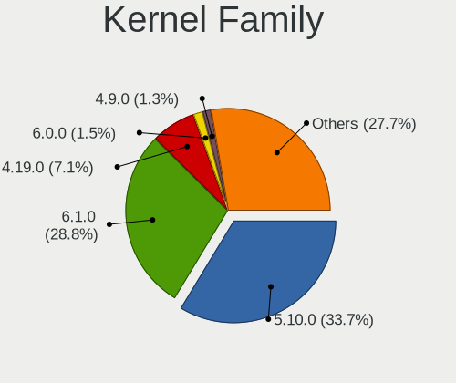
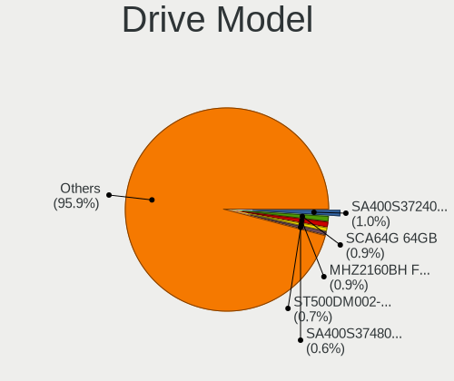
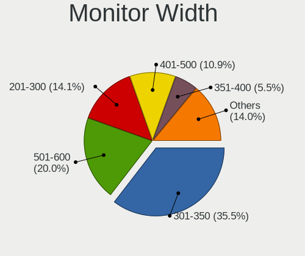

Debian - Tested Hardware & Statistics
-------------------------------------

A project to collect tested hardware configurations for Debian.

Anyone can contribute to this report by the [hw-probe](https://github.com/linuxhw/hw-probe) tool:

    sudo -E hw-probe -all -upload

Please contribute! Especially if your hardware is rare.

This is a report for all computer types. See also reports for [desktops](/Dist/Debian/Desktop/README.md) and [notebooks](/Dist/Debian/Notebook/README.md).

Contents
--------

* [ Test Cases ](#test-cases)

* [ System ](#system)
  - [ OS                       ](#os)
  - [ OS Family                ](#os-family)
  - [ Kernel                   ](#kernel)
  - [ Kernel Family            ](#kernel-family)
  - [ Kernel Major Ver.        ](#kernel-major-ver)
  - [ Arch                     ](#arch)
  - [ DE                       ](#de)
  - [ Display Server           ](#display-server)
  - [ Display Manager          ](#display-manager)
  - [ OS Lang                  ](#os-lang)
  - [ Boot Mode                ](#boot-mode)
  - [ Filesystem               ](#filesystem)
  - [ Part. scheme             ](#part-scheme)
  - [ Dual Boot with Linux/BSD ](#dual-boot-with-linuxbsd)
  - [ Dual Boot (Win)          ](#dual-boot-win)

* [ Board ](#board)
  - [ Vendor                   ](#vendor)
  - [ Model                    ](#model)
  - [ Model Family             ](#model-family)
  - [ MFG Year                 ](#mfg-year)
  - [ Form Factor              ](#form-factor)
  - [ Secure Boot              ](#secure-boot)
  - [ Coreboot                 ](#coreboot)
  - [ RAM Size                 ](#ram-size)
  - [ RAM Used                 ](#ram-used)
  - [ Total Drives             ](#total-drives)
  - [ Has CD-ROM               ](#has-cd-rom)
  - [ Has Ethernet             ](#has-ethernet)
  - [ Has WiFi                 ](#has-wifi)
  - [ Has Bluetooth            ](#has-bluetooth)

* [ Location ](#location)
  - [ Country                  ](#country)
  - [ City                     ](#city)

* [ Drives ](#drives)
  - [ Drive Vendor             ](#drive-vendor)
  - [ Drive Model              ](#drive-model)
  - [ HDD Vendor               ](#hdd-vendor)
  - [ SSD Vendor               ](#ssd-vendor)
  - [ Drive Kind               ](#drive-kind)
  - [ Drive Connector          ](#drive-connector)
  - [ Drive Size               ](#drive-size)
  - [ Space Total              ](#space-total)
  - [ Space Used               ](#space-used)
  - [ Malfunc. Drives          ](#malfunc-drives)
  - [ Malfunc. Drive Vendor    ](#malfunc-drive-vendor)
  - [ Malfunc. HDD Vendor      ](#malfunc-hdd-vendor)
  - [ Malfunc. Drive Kind      ](#malfunc-drive-kind)
  - [ Failed Drives            ](#failed-drives)
  - [ Failed Drive Vendor      ](#failed-drive-vendor)
  - [ Drive Status             ](#drive-status)

* [ Storage controller ](#storage-controller)
  - [ Storage Vendor           ](#storage-vendor)
  - [ Storage Model            ](#storage-model)
  - [ Storage Kind             ](#storage-kind)

* [ Processor ](#processor)
  - [ CPU Vendor               ](#cpu-vendor)
  - [ CPU Model                ](#cpu-model)
  - [ CPU Model Family         ](#cpu-model-family)
  - [ CPU Cores                ](#cpu-cores)
  - [ CPU Sockets              ](#cpu-sockets)
  - [ CPU Threads              ](#cpu-threads)
  - [ CPU Op-Modes             ](#cpu-op-modes)
  - [ CPU Microcode            ](#cpu-microcode)
  - [ CPU Microarch            ](#cpu-microarch)

* [ Graphics ](#graphics)
  - [ GPU Vendor               ](#gpu-vendor)
  - [ GPU Model                ](#gpu-model)
  - [ GPU Combo                ](#gpu-combo)
  - [ GPU Driver               ](#gpu-driver)
  - [ GPU Memory               ](#gpu-memory)

* [ Monitor ](#monitor)
  - [ Monitor Vendor           ](#monitor-vendor)
  - [ Monitor Model            ](#monitor-model)
  - [ Monitor Resolution       ](#monitor-resolution)
  - [ Monitor Diagonal         ](#monitor-diagonal)
  - [ Monitor Width            ](#monitor-width)
  - [ Aspect Ratio             ](#aspect-ratio)
  - [ Monitor Area             ](#monitor-area)
  - [ Pixel Density            ](#pixel-density)
  - [ Multiple Monitors        ](#multiple-monitors)

* [ Network ](#network)
  - [ Net Controller Vendor    ](#net-controller-vendor)
  - [ Net Controller Model     ](#net-controller-model)
  - [ Wireless Vendor          ](#wireless-vendor)
  - [ Wireless Model           ](#wireless-model)
  - [ Ethernet Vendor          ](#ethernet-vendor)
  - [ Ethernet Model           ](#ethernet-model)
  - [ Net Controller Kind      ](#net-controller-kind)
  - [ Used Controller          ](#used-controller)
  - [ NICs                     ](#nics)
  - [ IPv6                     ](#ipv6)

* [ Bluetooth ](#bluetooth)
  - [ Bluetooth Vendor         ](#bluetooth-vendor)
  - [ Bluetooth Model          ](#bluetooth-model)

* [ Sound ](#sound)
  - [ Sound Vendor             ](#sound-vendor)
  - [ Sound Model              ](#sound-model)

* [ Memory ](#memory)
  - [ Memory Vendor            ](#memory-vendor)
  - [ Memory Model             ](#memory-model)
  - [ Memory Kind              ](#memory-kind)
  - [ Memory Form Factor       ](#memory-form-factor)
  - [ Memory Size              ](#memory-size)
  - [ Memory Speed             ](#memory-speed)

* [ Printers & scanners ](#printers--scanners)
  - [ Printer Vendor           ](#printer-vendor)
  - [ Printer Model            ](#printer-model)
  - [ Scanner Vendor           ](#scanner-vendor)
  - [ Scanner Model            ](#scanner-model)

* [ Camera ](#camera)
  - [ Camera Vendor            ](#camera-vendor)
  - [ Camera Model             ](#camera-model)

* [ Security ](#security)
  - [ Fingerprint Vendor       ](#fingerprint-vendor)
  - [ Fingerprint Model        ](#fingerprint-model)
  - [ Chipcard Vendor          ](#chipcard-vendor)
  - [ Chipcard Model           ](#chipcard-model)

* [ Unsupported ](#unsupported)
  - [ Unsupported Devices      ](#unsupported-devices)
  - [ Unsupported Device Types ](#unsupported-device-types)

Test Cases
----------

Total: 20473

| Vendor        | Model                       | Form-Factor | Probe                                                      | Date         |
|---------------|-----------------------------|-------------|------------------------------------------------------------|--------------|
| HP            | Pavilion dv6500             | Notebook    | [a9906a0a37](https://linux-hardware.org/?probe=a9906a0a37) | May 09, 2024 |
| HP            | EliteBook 840 G1            | Notebook    | [369a002b88](https://linux-hardware.org/?probe=369a002b88) | May 09, 2024 |
| Dell          | 0PV3YR A05                  | Server      | [0a6d9b6f29](https://linux-hardware.org/?probe=0a6d9b6f29) | May 09, 2024 |
| Toshiba       | Satellite C650D             | Notebook    | [9e66892f4b](https://linux-hardware.org/?probe=9e66892f4b) | May 09, 2024 |
| Gigabyte      | H310M M.2 x.x               | Desktop     | [fc06be20c3](https://linux-hardware.org/?probe=fc06be20c3) | May 09, 2024 |
| Lenovo        | ThinkBook 13x G4 IMH 21K... | Notebook    | [7cfc568eb2](https://linux-hardware.org/?probe=7cfc568eb2) | May 09, 2024 |
| HP            | 8711                        | Mini pc     | [dd252958ea](https://linux-hardware.org/?probe=dd252958ea) | May 09, 2024 |
| Lenovo        | G50-45 80E3                 | Notebook    | [801eeb31ef](https://linux-hardware.org/?probe=801eeb31ef) | May 08, 2024 |
| Gigabyte      | Z97X-Gaming 5               | Desktop     | [8256dfc204](https://linux-hardware.org/?probe=8256dfc204) | May 08, 2024 |
| VALE          | Notebook Evolution i5-11... | Notebook    | [55764ee04d](https://linux-hardware.org/?probe=55764ee04d) | May 08, 2024 |
| Dell          | XPS 15 7590                 | Notebook    | [a4b733d1fe](https://linux-hardware.org/?probe=a4b733d1fe) | May 08, 2024 |
| HP            | EliteBook 735 G5            | Notebook    | [628e01fd2b](https://linux-hardware.org/?probe=628e01fd2b) | May 08, 2024 |
| Dell          | 0M5DCD A00                  | Desktop     | [3c353c281f](https://linux-hardware.org/?probe=3c353c281f) | May 08, 2024 |
| ASUSTek       | ASUS TUF Gaming F15 FX50... | Notebook    | [7c01de63e1](https://linux-hardware.org/?probe=7c01de63e1) | May 08, 2024 |
| Sony          | VGN-NS12M_W                 | Notebook    | [e364d75564](https://linux-hardware.org/?probe=e364d75564) | May 08, 2024 |
| ASUSTek       | ASUS TUF Gaming F15 FX50... | Notebook    | [10c139f22b](https://linux-hardware.org/?probe=10c139f22b) | May 08, 2024 |
| ASUSTek       | PRIME A520M-K               | Desktop     | [5de84bcb38](https://linux-hardware.org/?probe=5de84bcb38) | May 08, 2024 |
| HP            | 89EB 11                     | Desktop     | [f53a08bd5c](https://linux-hardware.org/?probe=f53a08bd5c) | May 08, 2024 |
| Dell          | Inspiron 3542               | Notebook    | [fcc3b9cc19](https://linux-hardware.org/?probe=fcc3b9cc19) | May 08, 2024 |
| ASUSTek       | PRIME X570-P                | Desktop     | [43cb45f5c4](https://linux-hardware.org/?probe=43cb45f5c4) | May 08, 2024 |
| Razer         | Blade 14 (2022) - RZ09-0... | Notebook    | [eab2642002](https://linux-hardware.org/?probe=eab2642002) | May 08, 2024 |
| Digma         | Pro Magnus M DN16R9-ADXW... | Notebook    | [beee17622d](https://linux-hardware.org/?probe=beee17622d) | May 08, 2024 |
| Dell          | 0GN6JF A01                  | Desktop     | [b9877feccd](https://linux-hardware.org/?probe=b9877feccd) | May 08, 2024 |
| Dell          | Latitude D830               | Notebook    | [831a2196a3](https://linux-hardware.org/?probe=831a2196a3) | May 07, 2024 |
| OrangePi      | 4 LTS                       | Soc         | [8671fa709f](https://linux-hardware.org/?probe=8671fa709f) | May 07, 2024 |
| ASUSTek       | P8Z77-V LX                  | Desktop     | [b245c99221](https://linux-hardware.org/?probe=b245c99221) | May 07, 2024 |
| Unknown       | Unknown                     | Desktop     | [857bd41fc3](https://linux-hardware.org/?probe=857bd41fc3) | May 07, 2024 |
| Fujitsu       | D3544-A1 S26361-D3544-A1... | Desktop     | [e04c4654da](https://linux-hardware.org/?probe=e04c4654da) | May 07, 2024 |
| Sapphire      | PI-AM3RS760G2               | Desktop     | [7a48c1a73b](https://linux-hardware.org/?probe=7a48c1a73b) | May 07, 2024 |
| HP            | 250 G3                      | Notebook    | [5f00c46a92](https://linux-hardware.org/?probe=5f00c46a92) | May 07, 2024 |
| Razer         | Blade 14 (2022) - RZ09-0... | Notebook    | [94766b9a5d](https://linux-hardware.org/?probe=94766b9a5d) | May 07, 2024 |
| MSI           | B450-A PRO MAX              | Desktop     | [27adbf1266](https://linux-hardware.org/?probe=27adbf1266) | May 07, 2024 |
| GEDU          | YourLand                    | Soc         | [e400f0c9b6](https://linux-hardware.org/?probe=e400f0c9b6) | May 07, 2024 |
| MSI           | GF63 Thin 8SC               | Notebook    | [59abbac521](https://linux-hardware.org/?probe=59abbac521) | May 07, 2024 |
| HP            | G60                         | Notebook    | [c9e5d3832d](https://linux-hardware.org/?probe=c9e5d3832d) | May 07, 2024 |
| HP            | Pavilion Laptop 15-eh0xx... | Notebook    | [cf6fc980de](https://linux-hardware.org/?probe=cf6fc980de) | May 07, 2024 |
| Raspberry ... | Raspberry Pi 5 Model B R... | Soc         | [9fd55d6b07](https://linux-hardware.org/?probe=9fd55d6b07) | May 07, 2024 |
| HP            | ProLiant DL20 Gen9          | Server      | [d270509755](https://linux-hardware.org/?probe=d270509755) | May 06, 2024 |
| MSI           | MAG B660 TOMAHAWK WIFI D... | Desktop     | [5a5f459292](https://linux-hardware.org/?probe=5a5f459292) | May 06, 2024 |
| ASUSTek       | VivoBook_ASUSLaptop M350... | Notebook    | [e6dfd023b6](https://linux-hardware.org/?probe=e6dfd023b6) | May 06, 2024 |
| ASUSTek       | VivoBook_ASUSLaptop M350... | Notebook    | [6ece3912e8](https://linux-hardware.org/?probe=6ece3912e8) | May 06, 2024 |
| ASUSTek       | PRIME A520M-K               | Desktop     | [602683adef](https://linux-hardware.org/?probe=602683adef) | May 06, 2024 |
| ASUSTek       | P9X79                       | Desktop     | [dd0d50c3bf](https://linux-hardware.org/?probe=dd0d50c3bf) | May 06, 2024 |
| Intel         | S1200BTL E98681-352         | Server      | [4927e2996f](https://linux-hardware.org/?probe=4927e2996f) | May 06, 2024 |
| Lenovo        | ThinkPad X1 Yoga 2nd 20J... | Convertible | [92d80bd754](https://linux-hardware.org/?probe=92d80bd754) | May 06, 2024 |
| Gigabyte      | H61M-S2PV                   | Desktop     | [cece4d3b5e](https://linux-hardware.org/?probe=cece4d3b5e) | May 06, 2024 |
| ASUSTek       | Z9PR-D12 Series             | Server      | [f922090bb9](https://linux-hardware.org/?probe=f922090bb9) | May 06, 2024 |
| Apple         | Mac-81E3E92DD6088272 iMa... | All in one  | [390ca96513](https://linux-hardware.org/?probe=390ca96513) | May 06, 2024 |
| ASRock        | H310CM-HDV                  | Desktop     | [1312cfac28](https://linux-hardware.org/?probe=1312cfac28) | May 06, 2024 |
| Gigabyte      | H61M-S2PV                   | Desktop     | [98e922adae](https://linux-hardware.org/?probe=98e922adae) | May 06, 2024 |
| Apple         | Mac-81E3E92DD6088272 iMa... | All in one  | [c3072851e8](https://linux-hardware.org/?probe=c3072851e8) | May 06, 2024 |
| GEDU          | YourLand                    | Soc         | [5bfcf863da](https://linux-hardware.org/?probe=5bfcf863da) | May 06, 2024 |
| HP            | ProLiant DL360 Gen9         | Server      | [0544131147](https://linux-hardware.org/?probe=0544131147) | May 06, 2024 |
| ASRock        | 990FX Extreme4              | Desktop     | [cb063ef0b2](https://linux-hardware.org/?probe=cb063ef0b2) | May 06, 2024 |
| Supermicro    | X9SCL/X9SCMA                | Desktop     | [bb7e4b6de6](https://linux-hardware.org/?probe=bb7e4b6de6) | May 06, 2024 |
| Raspberry ... | Raspberry Pi 3 Model B R... | Soc         | [ab33f7c9fc](https://linux-hardware.org/?probe=ab33f7c9fc) | May 06, 2024 |
| Foxconn       | PANGU-B 1A32N3500-600-G     | Desktop     | [e2c56e50f1](https://linux-hardware.org/?probe=e2c56e50f1) | May 05, 2024 |
| Gigabyte      | B85M-D3H                    | Desktop     | [1d637d8802](https://linux-hardware.org/?probe=1d637d8802) | May 05, 2024 |
| SZMZ          | X99 DUAL Z8                 | Desktop     | [24f362dbe8](https://linux-hardware.org/?probe=24f362dbe8) | May 05, 2024 |
| Gigabyte      | H610M K DDR4                | Desktop     | [da4e59e69d](https://linux-hardware.org/?probe=da4e59e69d) | May 05, 2024 |
| Lenovo        | ThinkPad X230 2325BK0       | Notebook    | [0c39b2e745](https://linux-hardware.org/?probe=0c39b2e745) | May 05, 2024 |
| Lenovo        | ThinkPad T470 20HES6VG00    | Notebook    | [f87983a9a9](https://linux-hardware.org/?probe=f87983a9a9) | May 05, 2024 |
| ASUSTek       | CM6870                      | Desktop     | [63591686d7](https://linux-hardware.org/?probe=63591686d7) | May 05, 2024 |
| ASUSTek       | CM6870                      | Desktop     | [6d828aab44](https://linux-hardware.org/?probe=6d828aab44) | May 05, 2024 |
| MSI           | H110M ECO                   | Desktop     | [2c97e6ca20](https://linux-hardware.org/?probe=2c97e6ca20) | May 05, 2024 |
| ASRock        | B450M Pro4                  | Desktop     | [b1caabc9b5](https://linux-hardware.org/?probe=b1caabc9b5) | May 05, 2024 |
| Unknown       | Unknown                     | Notebook    | [ce0eb6aa57](https://linux-hardware.org/?probe=ce0eb6aa57) | May 05, 2024 |
| ASRock        | B650 PG Lightning           | Desktop     | [d0b08c1666](https://linux-hardware.org/?probe=d0b08c1666) | May 05, 2024 |
| ASRock        | B650 PG Lightning           | Desktop     | [d9c907af86](https://linux-hardware.org/?probe=d9c907af86) | May 05, 2024 |
| ASRock        | 990FX Extreme4              | Desktop     | [4a08259d5e](https://linux-hardware.org/?probe=4a08259d5e) | May 05, 2024 |
| Gigabyte      | GA-970A-D3                  | Desktop     | [1ee81eb650](https://linux-hardware.org/?probe=1ee81eb650) | May 05, 2024 |
| Dell          | Latitude 7480               | Notebook    | [124ec816c7](https://linux-hardware.org/?probe=124ec816c7) | May 05, 2024 |
| Huanan        | X99-TF                      | Desktop     | [804eb7916a](https://linux-hardware.org/?probe=804eb7916a) | May 05, 2024 |
| Supermicro    | H12SSL-NT                   | Server      | [e156a869a2](https://linux-hardware.org/?probe=e156a869a2) | May 05, 2024 |
| Raspberry ... | Raspberry Pi 5 Model B R... | Soc         | [4afe74277e](https://linux-hardware.org/?probe=4afe74277e) | May 05, 2024 |
| BANGHO        | Suma 1025                   | Tablet      | [e7c37d670f](https://linux-hardware.org/?probe=e7c37d670f) | May 05, 2024 |
| Raspberry ... | Raspberry Pi 5 Model B R... | Soc         | [b3bbc669ec](https://linux-hardware.org/?probe=b3bbc669ec) | May 04, 2024 |
| Lenovo        | ThinkPad T480 20L6SADD00    | Notebook    | [ad52d07a71](https://linux-hardware.org/?probe=ad52d07a71) | May 04, 2024 |
| ASUSTek       | ROG Strix G733QM_G733QM     | Notebook    | [c7e3ed99cc](https://linux-hardware.org/?probe=c7e3ed99cc) | May 04, 2024 |
| Raspberry ... | Raspberry Pi 4 Model B R... | Soc         | [264e965e8b](https://linux-hardware.org/?probe=264e965e8b) | May 04, 2024 |
| Raspberry ... | Raspberry Pi 4 Model B R... | Soc         | [8f6497f948](https://linux-hardware.org/?probe=8f6497f948) | May 04, 2024 |
| HP            | EliteBook 840 G2            | Notebook    | [616bda869b](https://linux-hardware.org/?probe=616bda869b) | May 04, 2024 |
| HP            | 83DD                        | Mini pc     | [c20e13567a](https://linux-hardware.org/?probe=c20e13567a) | May 04, 2024 |
| HP            | G62                         | Notebook    | [3e3af3a851](https://linux-hardware.org/?probe=3e3af3a851) | May 04, 2024 |
| ASUSTek       | X751MA                      | Notebook    | [ab76aeaddb](https://linux-hardware.org/?probe=ab76aeaddb) | May 04, 2024 |
| Acer          | Aspire E1-531               | Notebook    | [27d57e495a](https://linux-hardware.org/?probe=27d57e495a) | May 04, 2024 |
| Chuwi         | MiniBook X                  | Notebook    | [64c7ac113f](https://linux-hardware.org/?probe=64c7ac113f) | May 04, 2024 |
| Gigabyte      | GA-970A-D3                  | Desktop     | [4fa09a0b8e](https://linux-hardware.org/?probe=4fa09a0b8e) | May 04, 2024 |
| Digiboard     | G41M-S                      | Desktop     | [7b5f122417](https://linux-hardware.org/?probe=7b5f122417) | May 04, 2024 |
| Apple         | MacBookPro8,1               | Notebook    | [221d8e684d](https://linux-hardware.org/?probe=221d8e684d) | May 04, 2024 |
| Raspberry ... | Raspberry Pi 5 Model B R... | Soc         | [37ed88bcea](https://linux-hardware.org/?probe=37ed88bcea) | May 03, 2024 |
| Lenovo        | ThinkBook 16 G6 IRL 21KH    | Notebook    | [b8f0474451](https://linux-hardware.org/?probe=b8f0474451) | May 03, 2024 |
| Acer          | Veriton N4640G              | Desktop     | [ce50a47462](https://linux-hardware.org/?probe=ce50a47462) | May 03, 2024 |
| HP            | ProLiant DL360 Gen9         | Server      | [4eb1ae6ad4](https://linux-hardware.org/?probe=4eb1ae6ad4) | May 03, 2024 |
| HP            | ProLiant DL360 Gen9         | Server      | [a7dfd908c9](https://linux-hardware.org/?probe=a7dfd908c9) | May 03, 2024 |
| Raspberry ... | Raspberry Pi 5 Model B R... | Soc         | [3b15ff3048](https://linux-hardware.org/?probe=3b15ff3048) | May 03, 2024 |
| HP            | ProBook 430 G8 Notebook ... | Notebook    | [67f5f847c9](https://linux-hardware.org/?probe=67f5f847c9) | May 03, 2024 |
| Dell          | 0H21J3 A10                  | Server      | [125e045945](https://linux-hardware.org/?probe=125e045945) | May 03, 2024 |
| Lenovo        | G500s 20245                 | Notebook    | [54adaed795](https://linux-hardware.org/?probe=54adaed795) | May 03, 2024 |
| Itautec       | Infoway w7730               | Notebook    | [65fba1a766](https://linux-hardware.org/?probe=65fba1a766) | May 03, 2024 |
| ASUSTek       | TUF Gaming X570-PLUS        | Desktop     | [5e3b7c6308](https://linux-hardware.org/?probe=5e3b7c6308) | May 03, 2024 |
| Raspberry ... | Raspberry Pi 5 Model B R... | Soc         | [3f7c3168f2](https://linux-hardware.org/?probe=3f7c3168f2) | May 02, 2024 |
| Gigabyte      | H310M M.2 x.x               | Desktop     | [1b1d2cd8c6](https://linux-hardware.org/?probe=1b1d2cd8c6) | May 02, 2024 |
| Intel         | powered classmate PC        | Notebook    | [2f4933a503](https://linux-hardware.org/?probe=2f4933a503) | May 02, 2024 |
| Acer          | Veriton N4640G              | Desktop     | [d18d5f8d9d](https://linux-hardware.org/?probe=d18d5f8d9d) | May 02, 2024 |
| Dell          | XPS 15 9500                 | Notebook    | [efce8fa0ba](https://linux-hardware.org/?probe=efce8fa0ba) | May 02, 2024 |
| Raspberry ... | Raspberry Pi 5 Model B R... | Soc         | [00a9e3fe9b](https://linux-hardware.org/?probe=00a9e3fe9b) | May 02, 2024 |
| Google        | Phaser                      | Notebook    | [feb45bf2a2](https://linux-hardware.org/?probe=feb45bf2a2) | May 02, 2024 |
| ASUSTek       | H81M-K                      | Desktop     | [f4dbf33638](https://linux-hardware.org/?probe=f4dbf33638) | May 02, 2024 |
| Dell          | 02C2CP A03                  | Server      | [533b90f443](https://linux-hardware.org/?probe=533b90f443) | May 02, 2024 |
| HP            | ProLiant DL360 Gen9         | Server      | [d2c6cfb3bd](https://linux-hardware.org/?probe=d2c6cfb3bd) | May 02, 2024 |
| HP            | Pavilion Laptop 15-eh0xx... | Notebook    | [3380a14ae9](https://linux-hardware.org/?probe=3380a14ae9) | May 02, 2024 |
| Lenovo        | ThinkPad T480 20L6SADD00    | Notebook    | [b9fcd48ed1](https://linux-hardware.org/?probe=b9fcd48ed1) | May 02, 2024 |
| Gigabyte      | X570S AORUS ELITE           | Desktop     | [a76ca4fae1](https://linux-hardware.org/?probe=a76ca4fae1) | May 02, 2024 |
| MSI           | MEG Z490 UNIFY              | Desktop     | [73e7f9d576](https://linux-hardware.org/?probe=73e7f9d576) | May 02, 2024 |
| Dell          | Precision 5510              | Notebook    | [a010faffda](https://linux-hardware.org/?probe=a010faffda) | May 01, 2024 |
| Apple         | MacBookPro6,2               | Notebook    | [1307008025](https://linux-hardware.org/?probe=1307008025) | May 01, 2024 |
| MSI           | MS-7204                     | Desktop     | [5d3f1b6a58](https://linux-hardware.org/?probe=5d3f1b6a58) | May 01, 2024 |
| ASUSTek       | PRIME H510M-E               | Desktop     | [c3b30e066b](https://linux-hardware.org/?probe=c3b30e066b) | May 01, 2024 |
| Acer          | Aspire M5910                | Desktop     | [61b5809dc9](https://linux-hardware.org/?probe=61b5809dc9) | May 01, 2024 |
| Lenovo        | V330-14ARR 81B1             | Notebook    | [edceb0e782](https://linux-hardware.org/?probe=edceb0e782) | May 01, 2024 |
| IGEL Techn... | M350C                       | Notebook    | [c63a48250c](https://linux-hardware.org/?probe=c63a48250c) | May 01, 2024 |
| Raspberry ... | Raspberry Pi 5 Model B R... | Soc         | [f3d12216e7](https://linux-hardware.org/?probe=f3d12216e7) | May 01, 2024 |
| HUAWEI        | BC11HGSC0 V100R003          | Server      | [4ba7497e3e](https://linux-hardware.org/?probe=4ba7497e3e) | May 01, 2024 |
| Acer          | Extensa 4210                | Notebook    | [1b24527bdf](https://linux-hardware.org/?probe=1b24527bdf) | May 01, 2024 |
| ASUSTek       | TUF Gaming X570-PLUS        | Desktop     | [8739bc2d60](https://linux-hardware.org/?probe=8739bc2d60) | May 01, 2024 |
| HP            | 8906 SMVB                   | Desktop     | [6c9a72d2cb](https://linux-hardware.org/?probe=6c9a72d2cb) | May 01, 2024 |
| ASUSTek       | TUF Gaming X570-PLUS        | Desktop     | [67a23e48b6](https://linux-hardware.org/?probe=67a23e48b6) | May 01, 2024 |
| Dell          | XPS 13 9360                 | Notebook    | [da66fe35d4](https://linux-hardware.org/?probe=da66fe35d4) | May 01, 2024 |
| Pegatron      | 2A99                        | Desktop     | [fcd74433b3](https://linux-hardware.org/?probe=fcd74433b3) | Apr 30, 2024 |
| Biostar       | G41D3B                      | Desktop     | [748e0749c5](https://linux-hardware.org/?probe=748e0749c5) | Apr 30, 2024 |
| MSI           | B450 TOMAHAWK MAX           | Desktop     | [164f516c10](https://linux-hardware.org/?probe=164f516c10) | Apr 30, 2024 |
| Chuwi         | LarkBox X                   | Mini pc     | [446ba2ecc6](https://linux-hardware.org/?probe=446ba2ecc6) | Apr 30, 2024 |
| Supermicro    | X11SAE-M                    | Server      | [ba41a40f36](https://linux-hardware.org/?probe=ba41a40f36) | Apr 30, 2024 |
| MSI           | B450 TOMAHAWK MAX           | Desktop     | [38975e46ec](https://linux-hardware.org/?probe=38975e46ec) | Apr 30, 2024 |
| ASRock        | N68-S                       | Desktop     | [a099ad6775](https://linux-hardware.org/?probe=a099ad6775) | Apr 30, 2024 |
| Sapphire      | PI-AM3RS760G2               | Desktop     | [4c7535b1ac](https://linux-hardware.org/?probe=4c7535b1ac) | Apr 30, 2024 |
| Lenovo        | ThinkPad T14s Gen 3 21BS... | Notebook    | [859396f855](https://linux-hardware.org/?probe=859396f855) | Apr 30, 2024 |
| Gigabyte      | H81M-S2V                    | Desktop     | [11f391fabc](https://linux-hardware.org/?probe=11f391fabc) | Apr 30, 2024 |
| Apple         | MacBookPro11,5              | Notebook    | [c0fa280156](https://linux-hardware.org/?probe=c0fa280156) | Apr 30, 2024 |
| Lenovo        | ThinkPad T460s 20FAS1QU0... | Notebook    | [5429ec2fa3](https://linux-hardware.org/?probe=5429ec2fa3) | Apr 30, 2024 |
| Digma         | CITI E301 ES3008EW          | Notebook    | [91b8be60a0](https://linux-hardware.org/?probe=91b8be60a0) | Apr 30, 2024 |
| Digma         | CITI E301 ES3008EW          | Notebook    | [586069736d](https://linux-hardware.org/?probe=586069736d) | Apr 30, 2024 |
| Lenovo        | ThinkPad T460s 20FAS1QU0... | Notebook    | [60d21b08c6](https://linux-hardware.org/?probe=60d21b08c6) | Apr 30, 2024 |
| ASUSTek       | STRIX Z270H GAMING          | Desktop     | [8a21aa2463](https://linux-hardware.org/?probe=8a21aa2463) | Apr 30, 2024 |
| ASRock        | 990FX Extreme4              | Desktop     | [56f9ef0976](https://linux-hardware.org/?probe=56f9ef0976) | Apr 30, 2024 |
| ASRock        | B560M Pro4                  | Desktop     | [510e90dcb8](https://linux-hardware.org/?probe=510e90dcb8) | Apr 30, 2024 |
| ASRock        | 990FX Extreme4              | Desktop     | [57a68c0dec](https://linux-hardware.org/?probe=57a68c0dec) | Apr 30, 2024 |
| ASRock        | 990FX Extreme4              | Desktop     | [4939bdb260](https://linux-hardware.org/?probe=4939bdb260) | Apr 30, 2024 |
| Gigabyte      | GA-78LMT-S2                 | Desktop     | [56e690c86e](https://linux-hardware.org/?probe=56e690c86e) | Apr 30, 2024 |
| PCWare        | IPMH310G PRO                | Desktop     | [f38e07cde2](https://linux-hardware.org/?probe=f38e07cde2) | Apr 30, 2024 |
| BCM Advanc... | MX87QD                      | Desktop     | [5f5deeae12](https://linux-hardware.org/?probe=5f5deeae12) | Apr 30, 2024 |
| Gigabyte      | Z790 AORUS ELITE AX         | Desktop     | [e0cb14de08](https://linux-hardware.org/?probe=e0cb14de08) | Apr 30, 2024 |
| Lenovo        | Legion 5 15ACH6H 82JU       | Notebook    | [56c9f37671](https://linux-hardware.org/?probe=56c9f37671) | Apr 29, 2024 |
| ASUSTek       | M5A99X EVO                  | Desktop     | [aedd483ccc](https://linux-hardware.org/?probe=aedd483ccc) | Apr 29, 2024 |
| ASUSTek       | F2A85-M_PRO                 | Desktop     | [b4beb034b2](https://linux-hardware.org/?probe=b4beb034b2) | Apr 29, 2024 |
| Dell          | Inspiron 3442               | Notebook    | [05db1722f8](https://linux-hardware.org/?probe=05db1722f8) | Apr 29, 2024 |
| Lenovo        | ThinkPad L13 Yoga Gen 2 ... | Convertible | [8d9161d10f](https://linux-hardware.org/?probe=8d9161d10f) | Apr 29, 2024 |
| Lenovo        | ThinkPad S1 Yoga 12 20DK... | Notebook    | [62b6fb2419](https://linux-hardware.org/?probe=62b6fb2419) | Apr 29, 2024 |
| BESSTAR Te... | HM80                        | Desktop     | [7e9ff18aba](https://linux-hardware.org/?probe=7e9ff18aba) | Apr 29, 2024 |
| ASUSTek       | H97M-PLUS                   | Desktop     | [6ad2b206a6](https://linux-hardware.org/?probe=6ad2b206a6) | Apr 29, 2024 |
| Acer          | Aspire A515-56              | Notebook    | [ebb78c775c](https://linux-hardware.org/?probe=ebb78c775c) | Apr 29, 2024 |
| Acer          | Aspire A515-56              | Notebook    | [55b3ada50c](https://linux-hardware.org/?probe=55b3ada50c) | Apr 29, 2024 |
| ASUSTek       | Pro A620M-C                 | Desktop     | [124b68b5bf](https://linux-hardware.org/?probe=124b68b5bf) | Apr 29, 2024 |
| Lenovo        | ThinkPad X12 Detachable ... | Tablet      | [bf5c2a7930](https://linux-hardware.org/?probe=bf5c2a7930) | Apr 29, 2024 |
| ASUSTek       | E203NA                      | Notebook    | [2caea60de4](https://linux-hardware.org/?probe=2caea60de4) | Apr 29, 2024 |
| HP            | Laptop 15s-eq2xxx           | Notebook    | [90d5348bf5](https://linux-hardware.org/?probe=90d5348bf5) | Apr 28, 2024 |
| ASUSTek       | ASUS TUF Gaming F15 FX50... | Notebook    | [3f5beab74c](https://linux-hardware.org/?probe=3f5beab74c) | Apr 28, 2024 |
| HP            | ProBook 4535s               | Notebook    | [34910d04e7](https://linux-hardware.org/?probe=34910d04e7) | Apr 28, 2024 |
| Acer          | Aspire E1-532               | Notebook    | [b50154d060](https://linux-hardware.org/?probe=b50154d060) | Apr 28, 2024 |
| HP            | Notebook                    | Notebook    | [b45aa2251b](https://linux-hardware.org/?probe=b45aa2251b) | Apr 28, 2024 |
| HP            | Notebook                    | Notebook    | [9f5ae93269](https://linux-hardware.org/?probe=9f5ae93269) | Apr 28, 2024 |
| Lenovo        | Z50-75 80EC                 | Notebook    | [278dad8d5a](https://linux-hardware.org/?probe=278dad8d5a) | Apr 28, 2024 |
| Raspberry ... | Raspberry Pi 4 Model B R... | Soc         | [a802b0c72d](https://linux-hardware.org/?probe=a802b0c72d) | Apr 28, 2024 |
| Sapphire      | PI-AM3RS760G2               | Desktop     | [c31443d648](https://linux-hardware.org/?probe=c31443d648) | Apr 28, 2024 |
| MSI           | GF63 Thin 8SC               | Notebook    | [b375d81404](https://linux-hardware.org/?probe=b375d81404) | Apr 28, 2024 |
| ASRock        | 990FX Extreme4              | Desktop     | [9f0eda367d](https://linux-hardware.org/?probe=9f0eda367d) | Apr 28, 2024 |
| ASRock        | 990FX Extreme4              | Desktop     | [06b56e10dc](https://linux-hardware.org/?probe=06b56e10dc) | Apr 28, 2024 |
| ASRock        | 990FX Extreme4              | Desktop     | [3e16c2d8c6](https://linux-hardware.org/?probe=3e16c2d8c6) | Apr 28, 2024 |
| Raspberry ... | Raspberry Pi 4 Model B R... | Soc         | [c35533dfbf](https://linux-hardware.org/?probe=c35533dfbf) | Apr 28, 2024 |
| HP            | Laptop 15-da0xxx            | Notebook    | [a0fcbd666f](https://linux-hardware.org/?probe=a0fcbd666f) | Apr 28, 2024 |
| Acer          | Aspire ES1-431              | Notebook    | [ff9ee70831](https://linux-hardware.org/?probe=ff9ee70831) | Apr 28, 2024 |
| HP            | 15                          | Notebook    | [0e0d6ab57a](https://linux-hardware.org/?probe=0e0d6ab57a) | Apr 28, 2024 |
| HP            | 15                          | Notebook    | [d329164137](https://linux-hardware.org/?probe=d329164137) | Apr 28, 2024 |
| ASRock        | B760M-HDV/M.2               | Desktop     | [01633e2e6d](https://linux-hardware.org/?probe=01633e2e6d) | Apr 28, 2024 |
| MSI           | B550M PRO-VDH WIFI          | Desktop     | [31af2ca036](https://linux-hardware.org/?probe=31af2ca036) | Apr 28, 2024 |
| ASRock        | 970 Pro3 R2.0               | Desktop     | [7918dabd8f](https://linux-hardware.org/?probe=7918dabd8f) | Apr 28, 2024 |
| AZW           | U59                         | Desktop     | [d310713234](https://linux-hardware.org/?probe=d310713234) | Apr 28, 2024 |
| ASRock        | 970 Pro3 R2.0               | Desktop     | [0902f17c99](https://linux-hardware.org/?probe=0902f17c99) | Apr 27, 2024 |
| ASRock        | 970 Pro3 R2.0               | Desktop     | [91449c8a93](https://linux-hardware.org/?probe=91449c8a93) | Apr 27, 2024 |
| ASRock        | B760M-HDV/M.2               | Desktop     | [324ac4ff48](https://linux-hardware.org/?probe=324ac4ff48) | Apr 27, 2024 |
| Lenovo        | ThinkPad X390 20Q1S62G00    | Notebook    | [e7319a730f](https://linux-hardware.org/?probe=e7319a730f) | Apr 27, 2024 |
| HP            | OMEN Laptop 15-ek0xxx       | Notebook    | [bbd6e87bc4](https://linux-hardware.org/?probe=bbd6e87bc4) | Apr 27, 2024 |
| Dell          | Inspiron 5567               | Notebook    | [caf8879e78](https://linux-hardware.org/?probe=caf8879e78) | Apr 27, 2024 |
| Fujitsu       | D3167-A1 S26361-D3167-A1    | Desktop     | [5182ad8bd7](https://linux-hardware.org/?probe=5182ad8bd7) | Apr 27, 2024 |
| Dixonsxp      | Crestline & ICH8M Chipse... | Notebook    | [a9e235a9db](https://linux-hardware.org/?probe=a9e235a9db) | Apr 27, 2024 |
| HP            | ZBook 14                    | Notebook    | [42c92ec19d](https://linux-hardware.org/?probe=42c92ec19d) | Apr 27, 2024 |
| Fujitsu       | LIFEBOOK U7411              | Notebook    | [f1e695e218](https://linux-hardware.org/?probe=f1e695e218) | Apr 27, 2024 |
| Acer          | TravelMate P215-53          | Notebook    | [00d58edb3b](https://linux-hardware.org/?probe=00d58edb3b) | Apr 27, 2024 |
| Gigabyte      | B550I AORUS PRO AX          | Desktop     | [7d60545173](https://linux-hardware.org/?probe=7d60545173) | Apr 27, 2024 |
| HP            | EliteBook 735 G5            | Notebook    | [9e1b0b4220](https://linux-hardware.org/?probe=9e1b0b4220) | Apr 27, 2024 |
| Gigabyte      | B550I AORUS PRO AX          | Desktop     | [b4d4155591](https://linux-hardware.org/?probe=b4d4155591) | Apr 27, 2024 |
| Samsung       | 550XDA                      | Notebook    | [de2396f0a2](https://linux-hardware.org/?probe=de2396f0a2) | Apr 27, 2024 |
| Raspberry ... | Raspberry Pi 5 Model B R... | Soc         | [723af200e1](https://linux-hardware.org/?probe=723af200e1) | Apr 27, 2024 |
| Lenovo        | Flex 7 14IRU8 82Y2          | Convertible | [93ed75aa98](https://linux-hardware.org/?probe=93ed75aa98) | Apr 27, 2024 |
| Lenovo        | ThinkPad E14 Gen 3 20YD0... | Notebook    | [b52a110875](https://linux-hardware.org/?probe=b52a110875) | Apr 27, 2024 |
| Dell          | 02C2CP A06                  | Server      | [f852aff4f6](https://linux-hardware.org/?probe=f852aff4f6) | Apr 27, 2024 |
| Dell          | Latitude E6400              | Notebook    | [fe74dc08cd](https://linux-hardware.org/?probe=fe74dc08cd) | Apr 27, 2024 |
| Samsung       | 730QDA                      | Convertible | [43fdcef4be](https://linux-hardware.org/?probe=43fdcef4be) | Apr 27, 2024 |
| Lenovo        | ThinkPad T460s 20FAS21A0... | Notebook    | [f8c5a44d3d](https://linux-hardware.org/?probe=f8c5a44d3d) | Apr 27, 2024 |
| Lenovo        | ThinkPad P52 20MAS04M23     | Notebook    | [3cc3f4dcc1](https://linux-hardware.org/?probe=3cc3f4dcc1) | Apr 27, 2024 |
| DEXP          | ZRA6101                     | All in one  | [3b8874497a](https://linux-hardware.org/?probe=3b8874497a) | Apr 27, 2024 |
| HP            | ZBook 14                    | Notebook    | [d6e2400956](https://linux-hardware.org/?probe=d6e2400956) | Apr 26, 2024 |
| HP            | EliteBook 850 G8 Noteboo... | Notebook    | [a5cb6f40d5](https://linux-hardware.org/?probe=a5cb6f40d5) | Apr 26, 2024 |
| ASUSTek       | UX32VD                      | Notebook    | [abf6c0658a](https://linux-hardware.org/?probe=abf6c0658a) | Apr 26, 2024 |
| HP            | Pavilion 15                 | Notebook    | [ef9f89946b](https://linux-hardware.org/?probe=ef9f89946b) | Apr 26, 2024 |
| HP            | EliteBook 860 16 inch G1... | Notebook    | [6d6550e6dc](https://linux-hardware.org/?probe=6d6550e6dc) | Apr 26, 2024 |
| ASUSTek       | P5QL-CM                     | Desktop     | [28a4852048](https://linux-hardware.org/?probe=28a4852048) | Apr 26, 2024 |
| ASUSTek       | P5QL-CM                     | Desktop     | [bf1873c20d](https://linux-hardware.org/?probe=bf1873c20d) | Apr 26, 2024 |
| Gigabyte      | H55M-UD2H                   | Desktop     | [6caa28f904](https://linux-hardware.org/?probe=6caa28f904) | Apr 26, 2024 |
| ASUSTek       | P7H55-M LE                  | Desktop     | [517a020485](https://linux-hardware.org/?probe=517a020485) | Apr 26, 2024 |
| MSI           | B550-A PRO                  | Desktop     | [083c88fe82](https://linux-hardware.org/?probe=083c88fe82) | Apr 26, 2024 |
| Lenovo        | ThinkPad E14 20RA001HRT     | Notebook    | [714f84cadb](https://linux-hardware.org/?probe=714f84cadb) | Apr 26, 2024 |
| Gigabyte      | Z270-Gaming K3              | Desktop     | [e21d70e37d](https://linux-hardware.org/?probe=e21d70e37d) | Apr 26, 2024 |
| Gigabyte      | P75-D3                      | Desktop     | [496e1605e9](https://linux-hardware.org/?probe=496e1605e9) | Apr 26, 2024 |
| Gigabyte      | X570 AORUS ELITE            | Desktop     | [d25ca314d4](https://linux-hardware.org/?probe=d25ca314d4) | Apr 26, 2024 |
| Lenovo        | ThinkPad T570 20HAS03W00    | Notebook    | [6d4f2cc6ca](https://linux-hardware.org/?probe=6d4f2cc6ca) | Apr 26, 2024 |
| Dell          | 0GTK4K A02                  | Desktop     | [80bf3e1bd7](https://linux-hardware.org/?probe=80bf3e1bd7) | Apr 26, 2024 |
| Lenovo        | 3102 SDK0J40697 WIN 3305... | Desktop     | [d378d3e2a8](https://linux-hardware.org/?probe=d378d3e2a8) | Apr 26, 2024 |
| ASRock        | G31M-GS                     | Desktop     | [5a76ec66ed](https://linux-hardware.org/?probe=5a76ec66ed) | Apr 26, 2024 |
| HPE           | ProLiant MicroServer Gen... | Desktop     | [ca351b002d](https://linux-hardware.org/?probe=ca351b002d) | Apr 26, 2024 |
| ASUSTek       | P5KPL-CM                    | Desktop     | [8992ae65ab](https://linux-hardware.org/?probe=8992ae65ab) | Apr 26, 2024 |
| Acer          | Aspire A315-510P            | Notebook    | [b5d2df5a85](https://linux-hardware.org/?probe=b5d2df5a85) | Apr 26, 2024 |
| MSI           | MAG B550M MORTAR MAX WIF... | Desktop     | [d486386bde](https://linux-hardware.org/?probe=d486386bde) | Apr 26, 2024 |
| Sapphire      | PI-AM3RS760G2               | Desktop     | [bf18be8805](https://linux-hardware.org/?probe=bf18be8805) | Apr 26, 2024 |
| ASRock        | 990FX Extreme4              | Desktop     | [773cffce7f](https://linux-hardware.org/?probe=773cffce7f) | Apr 26, 2024 |
| MobileDema... | Cherry Trail CR             | Notebook    | [45127b07b2](https://linux-hardware.org/?probe=45127b07b2) | Apr 26, 2024 |
| HP            | Pavilion Laptop 14-bf1xx    | Notebook    | [3daa76cdd8](https://linux-hardware.org/?probe=3daa76cdd8) | Apr 26, 2024 |
| Lenovo        | MAHOBAY 0B98401 PRO         | Desktop     | [a2f7e0ec28](https://linux-hardware.org/?probe=a2f7e0ec28) | Apr 26, 2024 |
| Dell          | 01XK1W A00                  | Desktop     | [a5fcd90239](https://linux-hardware.org/?probe=a5fcd90239) | Apr 26, 2024 |
| ASUSTek       | Z170 PRO GAMING             | Desktop     | [79f0b7e272](https://linux-hardware.org/?probe=79f0b7e272) | Apr 26, 2024 |
| ASUSTek       | VivoBook_ASUSLaptop X150... | Notebook    | [10a878e186](https://linux-hardware.org/?probe=10a878e186) | Apr 25, 2024 |
| ForeScout ... | 04N3DF A09                  | Server      | [d86100a3af](https://linux-hardware.org/?probe=d86100a3af) | Apr 25, 2024 |
| Acer          | Aspire V3-551G              | Notebook    | [86b4773429](https://linux-hardware.org/?probe=86b4773429) | Apr 25, 2024 |
| Dell          | Precision M6800             | Notebook    | [1d41e8bb92](https://linux-hardware.org/?probe=1d41e8bb92) | Apr 25, 2024 |
| Lenovo        | ThinkPad L420 7829A71       | Notebook    | [11c76a20a0](https://linux-hardware.org/?probe=11c76a20a0) | Apr 25, 2024 |
| Toshiba       | PORTEGE Z30-A               | Notebook    | [e6fa07d931](https://linux-hardware.org/?probe=e6fa07d931) | Apr 25, 2024 |
| ECS           | H61H2-M13                   | Desktop     | [677042f9b9](https://linux-hardware.org/?probe=677042f9b9) | Apr 25, 2024 |
| Acer          | Aspire A315-510P            | Notebook    | [353dfb074d](https://linux-hardware.org/?probe=353dfb074d) | Apr 25, 2024 |
| ASUSTek       | F2A85-M                     | Desktop     | [94e6f654e9](https://linux-hardware.org/?probe=94e6f654e9) | Apr 25, 2024 |
| ASRock        | 990FX Extreme4              | Desktop     | [7f54c26bc1](https://linux-hardware.org/?probe=7f54c26bc1) | Apr 25, 2024 |
| ASRock        | 990FX Extreme4              | Desktop     | [e7a56f20f9](https://linux-hardware.org/?probe=e7a56f20f9) | Apr 25, 2024 |
| ASRock        | 990FX Extreme4              | Desktop     | [8ed8b87e84](https://linux-hardware.org/?probe=8ed8b87e84) | Apr 25, 2024 |
| Unknown       | 04N3DF A05                  | Server      | [e9a95e8e1a](https://linux-hardware.org/?probe=e9a95e8e1a) | Apr 25, 2024 |
| Inventec      | DQ Class A02                | Desktop     | [5edaa0ed95](https://linux-hardware.org/?probe=5edaa0ed95) | Apr 24, 2024 |
| ASUSTek       | P5N-MX                      | Desktop     | [8c9cb42e87](https://linux-hardware.org/?probe=8c9cb42e87) | Apr 24, 2024 |
| Sapphire      | PI-AM3RS760G2               | Desktop     | [45b756650e](https://linux-hardware.org/?probe=45b756650e) | Apr 24, 2024 |
| Dell          | Latitude 9440 2-in-1        | Convertible | [52e163ab73](https://linux-hardware.org/?probe=52e163ab73) | Apr 24, 2024 |
| Lenovo        | 312D SDK0J40697 WIN 3305... | Mini pc     | [a61a96f7dd](https://linux-hardware.org/?probe=a61a96f7dd) | Apr 24, 2024 |
| Dell          | Latitude 5420               | Notebook    | [604846386f](https://linux-hardware.org/?probe=604846386f) | Apr 24, 2024 |
| Lenovo        | ThinkPad T470s 20HGS6Y80... | Notebook    | [96569e2ad7](https://linux-hardware.org/?probe=96569e2ad7) | Apr 24, 2024 |
| Sapphire      | PI-AM3RS760G2               | Desktop     | [1086d184b6](https://linux-hardware.org/?probe=1086d184b6) | Apr 24, 2024 |
| HP            | OMEN Laptop 15-ek0xxx       | Notebook    | [42a4906c7d](https://linux-hardware.org/?probe=42a4906c7d) | Apr 24, 2024 |
| Lenovo        | ThinkPad T470s W10DG 20J... | Notebook    | [bc030e73d5](https://linux-hardware.org/?probe=bc030e73d5) | Apr 24, 2024 |
| HP            | Pavilion Gaming Laptop 1... | Notebook    | [fefcca9318](https://linux-hardware.org/?probe=fefcca9318) | Apr 24, 2024 |
| ASUSTek       | PRIME N100I-D D4            | Desktop     | [d6c9b24678](https://linux-hardware.org/?probe=d6c9b24678) | Apr 24, 2024 |
| Unknown       | Unknown                     | Notebook    | [8dec2bd904](https://linux-hardware.org/?probe=8dec2bd904) | Apr 24, 2024 |
| Lenovo        | G50-80 80L0                 | Notebook    | [882a343fea](https://linux-hardware.org/?probe=882a343fea) | Apr 23, 2024 |
| Dell          | XPS 13 9370                 | Notebook    | [f5d49e0d32](https://linux-hardware.org/?probe=f5d49e0d32) | Apr 23, 2024 |
| Acer          | Nitro AN16-41               | Notebook    | [4cfb726ac6](https://linux-hardware.org/?probe=4cfb726ac6) | Apr 23, 2024 |
| Shenzhen M... | RPBNB                       | Desktop     | [37eb2f2a94](https://linux-hardware.org/?probe=37eb2f2a94) | Apr 23, 2024 |
| Lenovo        | IdeaPad L340-15API 81LW     | Notebook    | [e61e4963d5](https://linux-hardware.org/?probe=e61e4963d5) | Apr 23, 2024 |
| HP            | EliteBook 840 G3            | Notebook    | [efcac49277](https://linux-hardware.org/?probe=efcac49277) | Apr 23, 2024 |
| HP            | EliteBook 840 G3            | Notebook    | [ae4c858581](https://linux-hardware.org/?probe=ae4c858581) | Apr 23, 2024 |
| Lenovo        | XiaoXinPro 16 AHP9 83D5     | Notebook    | [8ee1de3473](https://linux-hardware.org/?probe=8ee1de3473) | Apr 23, 2024 |
| Dell          | Latitude 7490               | Notebook    | [13f0f49982](https://linux-hardware.org/?probe=13f0f49982) | Apr 23, 2024 |
| Dell          | Latitude 7490               | Notebook    | [1f22d48915](https://linux-hardware.org/?probe=1f22d48915) | Apr 23, 2024 |
| HP            | 895C                        | Desktop     | [08b147d945](https://linux-hardware.org/?probe=08b147d945) | Apr 23, 2024 |
| Dell          | Latitude 5420               | Notebook    | [f3182ce0c2](https://linux-hardware.org/?probe=f3182ce0c2) | Apr 23, 2024 |
| ASUSTek       | VivoBook_ASUSLaptop X521... | Notebook    | [044858db54](https://linux-hardware.org/?probe=044858db54) | Apr 23, 2024 |
| ASUSTek       | P5N-MX                      | Desktop     | [8bb509b6d7](https://linux-hardware.org/?probe=8bb509b6d7) | Apr 23, 2024 |
| Raspberry ... | Raspberry Pi 4 Model B R... | Soc         | [9db655d8b6](https://linux-hardware.org/?probe=9db655d8b6) | Apr 23, 2024 |
| ADLINK Tec... | LEC-EL A1                   | Desktop     | [72b115951b](https://linux-hardware.org/?probe=72b115951b) | Apr 22, 2024 |
| Raspberry ... | Raspberry Pi                | Soc         | [50751e1c9e](https://linux-hardware.org/?probe=50751e1c9e) | Apr 22, 2024 |
| Gigabyte      | B650I AORUS ULTRA se2       | Desktop     | [0fcc20ba38](https://linux-hardware.org/?probe=0fcc20ba38) | Apr 22, 2024 |
| Acer          | Swift SF314-42              | Notebook    | [c5ab9f2681](https://linux-hardware.org/?probe=c5ab9f2681) | Apr 22, 2024 |
| Gigabyte      | X570 I AORUS PRO WIFI       | Desktop     | [02420cbf38](https://linux-hardware.org/?probe=02420cbf38) | Apr 22, 2024 |
| MSI           | Prestige 13Evo A13M         | Notebook    | [9103acf647](https://linux-hardware.org/?probe=9103acf647) | Apr 22, 2024 |
| Xunlong       | Orange Pi Zero              | Soc         | [af1ac19040](https://linux-hardware.org/?probe=af1ac19040) | Apr 22, 2024 |
| HP            | ZBook Studio G3             | Notebook    | [c78e54109c](https://linux-hardware.org/?probe=c78e54109c) | Apr 22, 2024 |
| HP            | ProLiant DL385p Gen8        | Server      | [2f9535b576](https://linux-hardware.org/?probe=2f9535b576) | Apr 22, 2024 |
| HP            | ProLiant DL360e Gen8        | Server      | [aee06f5ae4](https://linux-hardware.org/?probe=aee06f5ae4) | Apr 22, 2024 |
| HP            | 8835                        | Desktop     | [63962138e6](https://linux-hardware.org/?probe=63962138e6) | Apr 22, 2024 |
| HP            | ProLiant DL360 Gen9         | Server      | [55814d7e58](https://linux-hardware.org/?probe=55814d7e58) | Apr 22, 2024 |
| ASUSTek       | X441SA                      | Notebook    | [4ebc6f3907](https://linux-hardware.org/?probe=4ebc6f3907) | Apr 22, 2024 |
| ASUSTek       | PRIME H310M-R R2.0          | Desktop     | [2a4799164d](https://linux-hardware.org/?probe=2a4799164d) | Apr 22, 2024 |
| ASRock        | 990FX Extreme4              | Desktop     | [0a9ede9e09](https://linux-hardware.org/?probe=0a9ede9e09) | Apr 22, 2024 |
| ASUSTek       | PRIME H310M-R R2.0          | Desktop     | [4a46b6f322](https://linux-hardware.org/?probe=4a46b6f322) | Apr 22, 2024 |
| Minix         | NEO Z83-4 V1.1              | Desktop     | [546846d640](https://linux-hardware.org/?probe=546846d640) | Apr 22, 2024 |
| Itautec       | Infoway w7730               | Notebook    | [904234ad57](https://linux-hardware.org/?probe=904234ad57) | Apr 22, 2024 |
| Lenovo        | IdeaPadFlex 15 20309        | Notebook    | [a290c311d1](https://linux-hardware.org/?probe=a290c311d1) | Apr 22, 2024 |
| Gigabyte      | Z790 AORUS ELITE AX         | Desktop     | [1c066ce5e2](https://linux-hardware.org/?probe=1c066ce5e2) | Apr 21, 2024 |
| Sapphire      | PI-AM3RS760G2               | Desktop     | [0b6a8b8487](https://linux-hardware.org/?probe=0b6a8b8487) | Apr 21, 2024 |
| ASRock        | B550M-ITX/ac                | Desktop     | [6389731461](https://linux-hardware.org/?probe=6389731461) | Apr 21, 2024 |
| Lenovo        | ThinkPad T470 20HES6VG00    | Notebook    | [b122ffbcd4](https://linux-hardware.org/?probe=b122ffbcd4) | Apr 21, 2024 |
| Lenovo        | ThinkPad T14 Gen 1 20UD0... | Notebook    | [0231457347](https://linux-hardware.org/?probe=0231457347) | Apr 21, 2024 |
| MSI           | Thin GF63 12VE              | Notebook    | [797980dc42](https://linux-hardware.org/?probe=797980dc42) | Apr 21, 2024 |
| Lenovo        | ThinkPad E15 Gen 2 20T80... | Notebook    | [482d5d1221](https://linux-hardware.org/?probe=482d5d1221) | Apr 21, 2024 |
| Lenovo        | Legion Y540-17IRH-PG0 81... | Notebook    | [a206f7f2d5](https://linux-hardware.org/?probe=a206f7f2d5) | Apr 21, 2024 |
| Acer          | Aspire S3                   | Notebook    | [e43ba2d3ae](https://linux-hardware.org/?probe=e43ba2d3ae) | Apr 21, 2024 |
| ASRock        | 990FX Extreme4              | Desktop     | [a1cc621a2f](https://linux-hardware.org/?probe=a1cc621a2f) | Apr 21, 2024 |
| ASRock        | 990FX Extreme4              | Desktop     | [5ff81fe9b8](https://linux-hardware.org/?probe=5ff81fe9b8) | Apr 21, 2024 |
| ASUSTek       | TUF Gaming X570-PLUS        | Desktop     | [1fe127b27d](https://linux-hardware.org/?probe=1fe127b27d) | Apr 21, 2024 |
| Huanan        | X99-TF V3.0 JX              | Desktop     | [bb51640f19](https://linux-hardware.org/?probe=bb51640f19) | Apr 21, 2024 |
| LNV           | M14LC2-256                  | Notebook    | [582ccc43d4](https://linux-hardware.org/?probe=582ccc43d4) | Apr 21, 2024 |
| Lenovo        | G50-45 80E3                 | Notebook    | [61882ea818](https://linux-hardware.org/?probe=61882ea818) | Apr 21, 2024 |
| ASUSTek       | P9X79                       | Desktop     | [f5f0955b10](https://linux-hardware.org/?probe=f5f0955b10) | Apr 20, 2024 |
| Lenovo        | G50-45 80E3                 | Notebook    | [2ee14c9eff](https://linux-hardware.org/?probe=2ee14c9eff) | Apr 20, 2024 |
| Supermicro    | H12SSL-CT                   | Server      | [165f049bbe](https://linux-hardware.org/?probe=165f049bbe) | Apr 20, 2024 |
| HP            | 82A2                        | Desktop     | [1eeebb4829](https://linux-hardware.org/?probe=1eeebb4829) | Apr 20, 2024 |
| ASUSTek       | TUF Gaming B760M-PLUS II    | Desktop     | [9666b7dd0c](https://linux-hardware.org/?probe=9666b7dd0c) | Apr 20, 2024 |
| MSI           | MS-7235                     | Desktop     | [67ea957848](https://linux-hardware.org/?probe=67ea957848) | Apr 20, 2024 |
| HP            | Pavilion Gaming Laptop 1... | Notebook    | [82a3685099](https://linux-hardware.org/?probe=82a3685099) | Apr 20, 2024 |
| Colorful T... | C.A68M-E V15                | Desktop     | [b0b7690daa](https://linux-hardware.org/?probe=b0b7690daa) | Apr 20, 2024 |
| Apple         | MacBookPro8,1               | Notebook    | [e7c1f32086](https://linux-hardware.org/?probe=e7c1f32086) | Apr 20, 2024 |
| Dell          | XPS 13 9360                 | Notebook    | [5f76fcfd59](https://linux-hardware.org/?probe=5f76fcfd59) | Apr 20, 2024 |
| ASUSTek       | TUF Gaming Z690-PLUS WIF... | Desktop     | [a1f1d3f4a0](https://linux-hardware.org/?probe=a1f1d3f4a0) | Apr 20, 2024 |
| ASUSTek       | K53E                        | Notebook    | [0db457945f](https://linux-hardware.org/?probe=0db457945f) | Apr 20, 2024 |
| HP            | EliteBook 830 G5            | Notebook    | [2df78096e3](https://linux-hardware.org/?probe=2df78096e3) | Apr 20, 2024 |
| ASRock        | 990FX Extreme4              | Desktop     | [22ba7e810f](https://linux-hardware.org/?probe=22ba7e810f) | Apr 20, 2024 |
| ASRock        | B450M Steel Legend          | Desktop     | [0df86cd712](https://linux-hardware.org/?probe=0df86cd712) | Apr 20, 2024 |
| ASRock        | 990FX Extreme4              | Desktop     | [88986725e7](https://linux-hardware.org/?probe=88986725e7) | Apr 20, 2024 |
| Fujitsu       | D3417-B1 S26361-D3417-B1    | Desktop     | [f0e2928850](https://linux-hardware.org/?probe=f0e2928850) | Apr 20, 2024 |
| ASUSTek       | ASUS TUF Gaming F15 FX50... | Notebook    | [22edc4d418](https://linux-hardware.org/?probe=22edc4d418) | Apr 20, 2024 |
| Lenovo        | ThinkPad L570 20J80013US    | Notebook    | [0f79928572](https://linux-hardware.org/?probe=0f79928572) | Apr 20, 2024 |
| Toshiba       | Satellite C870-192          | Notebook    | [563eab96cf](https://linux-hardware.org/?probe=563eab96cf) | Apr 20, 2024 |
| Dell          | 0R790T A00                  | Desktop     | [82b384c367](https://linux-hardware.org/?probe=82b384c367) | Apr 20, 2024 |
| Supermicro    | X11SAE-M                    | Server      | [feaa9e79c1](https://linux-hardware.org/?probe=feaa9e79c1) | Apr 20, 2024 |
| Lenovo        | ThinkPad T480s 20L8S6BW1... | Notebook    | [778bb54578](https://linux-hardware.org/?probe=778bb54578) | Apr 20, 2024 |
| Lenovo        | ThinkPad L420 7829A71       | Notebook    | [06f7d10927](https://linux-hardware.org/?probe=06f7d10927) | Apr 20, 2024 |
| Dell          | Precision M6800             | Notebook    | [c44a2aee51](https://linux-hardware.org/?probe=c44a2aee51) | Apr 20, 2024 |
| Gigabyte      | Z390 UD                     | Desktop     | [2f4860118a](https://linux-hardware.org/?probe=2f4860118a) | Apr 19, 2024 |
| Sapphire      | PI-AM3RS760G2               | Desktop     | [3022280b20](https://linux-hardware.org/?probe=3022280b20) | Apr 19, 2024 |
| HP            | ZBook 15 G5                 | Notebook    | [e6dc5df04b](https://linux-hardware.org/?probe=e6dc5df04b) | Apr 19, 2024 |
| Dell          | Latitude E6420              | Notebook    | [88731c458f](https://linux-hardware.org/?probe=88731c458f) | Apr 19, 2024 |
| Apple         | MacBook6,1                  | Notebook    | [3f4764c0ee](https://linux-hardware.org/?probe=3f4764c0ee) | Apr 19, 2024 |
| ASRock        | 990FX Extreme4              | Desktop     | [018abcebe4](https://linux-hardware.org/?probe=018abcebe4) | Apr 19, 2024 |
| ASUSTek       | PRIME H310M-R R2.0          | Desktop     | [b1b415511d](https://linux-hardware.org/?probe=b1b415511d) | Apr 19, 2024 |
| ASUSTek       | PRIME H310M-R R2.0          | Desktop     | [40a4bdb47b](https://linux-hardware.org/?probe=40a4bdb47b) | Apr 19, 2024 |
| Dell          | Inspiron 910                | Notebook    | [150577a3da](https://linux-hardware.org/?probe=150577a3da) | Apr 19, 2024 |
| ASRock        | 990FX Extreme4              | Desktop     | [e65c84d822](https://linux-hardware.org/?probe=e65c84d822) | Apr 19, 2024 |
| ASRock        | 990FX Extreme4              | Desktop     | [d1cf256cf2](https://linux-hardware.org/?probe=d1cf256cf2) | Apr 19, 2024 |
| Dell          | 0D9JG3 A00                  | Desktop     | [b5c9c5d6b0](https://linux-hardware.org/?probe=b5c9c5d6b0) | Apr 19, 2024 |
| Unknown       | Unknown                     | Notebook    | [4c1ff1ccf5](https://linux-hardware.org/?probe=4c1ff1ccf5) | Apr 19, 2024 |
| ASUSTek       | PRIME H310M-R R2.0          | Desktop     | [8d3a6c05f9](https://linux-hardware.org/?probe=8d3a6c05f9) | Apr 19, 2024 |
| AZW           | U59                         | Desktop     | [3923393266](https://linux-hardware.org/?probe=3923393266) | Apr 19, 2024 |
| ASUSTek       | H110M-D                     | Desktop     | [994b125f04](https://linux-hardware.org/?probe=994b125f04) | Apr 19, 2024 |
| HP            | EliteBook 830 G5            | Notebook    | [257bad95d7](https://linux-hardware.org/?probe=257bad95d7) | Apr 18, 2024 |
| Dell          | Precision 3560              | Notebook    | [2f847b171f](https://linux-hardware.org/?probe=2f847b171f) | Apr 18, 2024 |
| Unknown       | i855-W83627HF               | Desktop     | [e1c3562c4a](https://linux-hardware.org/?probe=e1c3562c4a) | Apr 18, 2024 |
| MSI           | B450-A PRO MAX              | Desktop     | [1babcb92fd](https://linux-hardware.org/?probe=1babcb92fd) | Apr 18, 2024 |
| HP            | EliteBook 840 G8 Noteboo... | Notebook    | [01121cc898](https://linux-hardware.org/?probe=01121cc898) | Apr 18, 2024 |
| Dell          | PowerEdge T420              | Server      | [3796c964b5](https://linux-hardware.org/?probe=3796c964b5) | Apr 18, 2024 |
| ASRock        | B450 Pro4 R2.0              | Desktop     | [68b9255929](https://linux-hardware.org/?probe=68b9255929) | Apr 18, 2024 |
| ASUSTek       | ROG STRIX B450-F GAMING     | Desktop     | [91410dd38c](https://linux-hardware.org/?probe=91410dd38c) | Apr 18, 2024 |
| ASRock        | 990FX Extreme4              | Desktop     | [e1f8cb5a4d](https://linux-hardware.org/?probe=e1f8cb5a4d) | Apr 18, 2024 |
| Gigabyte      | X570 UD                     | Desktop     | [5240449916](https://linux-hardware.org/?probe=5240449916) | Apr 18, 2024 |
| ASRock        | B550 Pro4                   | Desktop     | [f906fa4f7c](https://linux-hardware.org/?probe=f906fa4f7c) | Apr 18, 2024 |
| Gigabyte      | Z790 UD AC                  | Desktop     | [340a3e1a78](https://linux-hardware.org/?probe=340a3e1a78) | Apr 18, 2024 |
| Lenovo        | ThinkPad T460s 20FAS5NN0... | Notebook    | [156dedcc62](https://linux-hardware.org/?probe=156dedcc62) | Apr 18, 2024 |
| Intel         | DH67CL AAG10212-207         | Desktop     | [276f923b44](https://linux-hardware.org/?probe=276f923b44) | Apr 18, 2024 |
| Lenovo        | 30D0 SDK0J40697 WIN 3305... | Desktop     | [24acebde2b](https://linux-hardware.org/?probe=24acebde2b) | Apr 18, 2024 |
| HP            | 805B                        | Desktop     | [d5bf7c2652](https://linux-hardware.org/?probe=d5bf7c2652) | Apr 18, 2024 |
| Gigabyte      | B450M K-CF                  | Desktop     | [74fb485917](https://linux-hardware.org/?probe=74fb485917) | Apr 17, 2024 |
| Intel         | H55                         | Desktop     | [28e666728f](https://linux-hardware.org/?probe=28e666728f) | Apr 17, 2024 |
| Samsung       | 300E4A/300E5A/300E7A/343... | Notebook    | [fd71b9d36c](https://linux-hardware.org/?probe=fd71b9d36c) | Apr 17, 2024 |
| Intel         | NUC9i7QNB K49245-403        | Mini pc     | [29bc0e84a8](https://linux-hardware.org/?probe=29bc0e84a8) | Apr 17, 2024 |
| HP            | ProLiant DL380 Gen9         | Server      | [c3a2cafa4c](https://linux-hardware.org/?probe=c3a2cafa4c) | Apr 17, 2024 |
| Gigabyte      | Z97X-Gaming 5               | Desktop     | [f08c90bc44](https://linux-hardware.org/?probe=f08c90bc44) | Apr 17, 2024 |
| Intel         | H55                         | Desktop     | [27ee1cd49f](https://linux-hardware.org/?probe=27ee1cd49f) | Apr 17, 2024 |
| Lenovo        | ThinkPad T450s 20BWS00V0... | Notebook    | [c6cafaee9d](https://linux-hardware.org/?probe=c6cafaee9d) | Apr 17, 2024 |
| MSI           | B550M PRO-VDH WIFI          | Desktop     | [e5f340aec0](https://linux-hardware.org/?probe=e5f340aec0) | Apr 17, 2024 |
| HP            | 245 G6                      | Notebook    | [17b7e55361](https://linux-hardware.org/?probe=17b7e55361) | Apr 17, 2024 |
| HP            | 245 G6                      | Notebook    | [7c3534813c](https://linux-hardware.org/?probe=7c3534813c) | Apr 17, 2024 |
| Lenovo        | 102F SDK0E50510 WIN 2625... | Desktop     | [68691105b0](https://linux-hardware.org/?probe=68691105b0) | Apr 17, 2024 |
| HP            | ProLiant DL360p Gen8        | Server      | [4f8f62dd7c](https://linux-hardware.org/?probe=4f8f62dd7c) | Apr 17, 2024 |
| Intel         | S1200BTL E98681-352         | Server      | [848bdccedc](https://linux-hardware.org/?probe=848bdccedc) | Apr 17, 2024 |
| Lenovo        | 102F SDK0E50510 WIN 2625... | Desktop     | [b408b88671](https://linux-hardware.org/?probe=b408b88671) | Apr 17, 2024 |
| ASUSTek       | Z9PR-D12 Series             | Server      | [463e1228da](https://linux-hardware.org/?probe=463e1228da) | Apr 17, 2024 |
| Acer          | Aspire ES1-731              | Notebook    | [cd5f5f6530](https://linux-hardware.org/?probe=cd5f5f6530) | Apr 17, 2024 |
| Supermicro    | X11DPi-NT                   | Server      | [5a3102ebe7](https://linux-hardware.org/?probe=5a3102ebe7) | Apr 17, 2024 |
| Microsoft     | Surface Go 3                | Tablet      | [30cfc28189](https://linux-hardware.org/?probe=30cfc28189) | Apr 17, 2024 |
| OrangePi      | Zero3                       | Soc         | [e6bc29d5ae](https://linux-hardware.org/?probe=e6bc29d5ae) | Apr 17, 2024 |
| MSI           | Modern 15 B12M              | Notebook    | [b1786f8a58](https://linux-hardware.org/?probe=b1786f8a58) | Apr 17, 2024 |
| ASUSTek       | P8H61-M LX R2.0             | Desktop     | [0d46687bb7](https://linux-hardware.org/?probe=0d46687bb7) | Apr 17, 2024 |
| ASUSTek       | ROG STRIX Z690-E GAMING ... | Desktop     | [ba12ac8498](https://linux-hardware.org/?probe=ba12ac8498) | Apr 17, 2024 |
| Unknown       | Unknown                     | All in one  | [fadcc61645](https://linux-hardware.org/?probe=fadcc61645) | Apr 17, 2024 |
| Dell          | Latitude E6400              | Notebook    | [6a6279d4c0](https://linux-hardware.org/?probe=6a6279d4c0) | Apr 17, 2024 |
| HP            | Laptop 17-bs0xx             | Notebook    | [2de1af4835](https://linux-hardware.org/?probe=2de1af4835) | Apr 16, 2024 |
| HP            | Laptop 15-db0xxx            | Notebook    | [a3eb57bb17](https://linux-hardware.org/?probe=a3eb57bb17) | Apr 16, 2024 |
| Intel         | ADL-F10                     | Desktop     | [036f5e1450](https://linux-hardware.org/?probe=036f5e1450) | Apr 16, 2024 |
| MSI           | H61M-P20                    | Desktop     | [17a91ba1d0](https://linux-hardware.org/?probe=17a91ba1d0) | Apr 16, 2024 |
| Sapphire      | PI-AM3RS760G2               | Desktop     | [cfacf09dbe](https://linux-hardware.org/?probe=cfacf09dbe) | Apr 16, 2024 |
| AMI           | Cherry Trail CR             | Desktop     | [e60bc95699](https://linux-hardware.org/?probe=e60bc95699) | Apr 16, 2024 |
| Lenovo        | IdeaPadFlex 14 20308        | Notebook    | [7ccf67d720](https://linux-hardware.org/?probe=7ccf67d720) | Apr 16, 2024 |
| Intel         | D201GLY AAD81205-301        | Desktop     | [1b2fcf83fa](https://linux-hardware.org/?probe=1b2fcf83fa) | Apr 16, 2024 |
| Gigabyte      | GA-78LMT-S2                 | Desktop     | [c9be366373](https://linux-hardware.org/?probe=c9be366373) | Apr 16, 2024 |
| HP            | Laptop 14-cm0xxx            | Notebook    | [9dd5160f8f](https://linux-hardware.org/?probe=9dd5160f8f) | Apr 16, 2024 |
| Sony          | SVF15A17CLB                 | Notebook    | [7b947c3636](https://linux-hardware.org/?probe=7b947c3636) | Apr 16, 2024 |
| ASUSTek       | P8H61-M LX R2.0             | Desktop     | [7cad8d2493](https://linux-hardware.org/?probe=7cad8d2493) | Apr 16, 2024 |
| ASRock        | 990FX Extreme4              | Desktop     | [7cd3cf42ef](https://linux-hardware.org/?probe=7cd3cf42ef) | Apr 16, 2024 |
| ASRock        | 990FX Extreme4              | Desktop     | [fd99b7519e](https://linux-hardware.org/?probe=fd99b7519e) | Apr 16, 2024 |
| Intel         | NUC8BEB J72693-308          | Mini pc     | [1ede6792e9](https://linux-hardware.org/?probe=1ede6792e9) | Apr 16, 2024 |
| Raspberry ... | Raspberry Pi 5 Model B R... | Soc         | [80386e5109](https://linux-hardware.org/?probe=80386e5109) | Apr 15, 2024 |
| HP            | EliteBook 840 G1            | Notebook    | [a41037f2e9](https://linux-hardware.org/?probe=a41037f2e9) | Apr 15, 2024 |
| ASRock        | 990FX Extreme4              | Desktop     | [9c51df5a4a](https://linux-hardware.org/?probe=9c51df5a4a) | Apr 15, 2024 |
| ASRock        | 990FX Extreme4              | Desktop     | [4b84c41edf](https://linux-hardware.org/?probe=4b84c41edf) | Apr 15, 2024 |
| Dell          | XPS 13 9340                 | Notebook    | [02b603ef6e](https://linux-hardware.org/?probe=02b603ef6e) | Apr 15, 2024 |
| OrangePi      | Zero2 W                     | Soc         | [cda8cc07a5](https://linux-hardware.org/?probe=cda8cc07a5) | Apr 15, 2024 |
| ASUSTek       | B85M-G                      | Desktop     | [d8294ede23](https://linux-hardware.org/?probe=d8294ede23) | Apr 15, 2024 |
| AMI           | Intel                       | Desktop     | [d620a9c686](https://linux-hardware.org/?probe=d620a9c686) | Apr 15, 2024 |
| Acer          | One S1003                   | Tablet      | [425ae260b2](https://linux-hardware.org/?probe=425ae260b2) | Apr 15, 2024 |
| ASUSTek       | X502CA                      | Notebook    | [80390054a8](https://linux-hardware.org/?probe=80390054a8) | Apr 15, 2024 |
| Unknown       | Unknown                     | Desktop     | [b8c681a7fb](https://linux-hardware.org/?probe=b8c681a7fb) | Apr 15, 2024 |
| ASUSTek       | Vivobook Go E1504GA_E150... | Notebook    | [2f8ba18ab4](https://linux-hardware.org/?probe=2f8ba18ab4) | Apr 15, 2024 |
| Dell          | Latitude E6440              | Notebook    | [9a85d3d85f](https://linux-hardware.org/?probe=9a85d3d85f) | Apr 15, 2024 |
| Pegatron      | 2ACD                        | Desktop     | [897550ea8a](https://linux-hardware.org/?probe=897550ea8a) | Apr 14, 2024 |
| ASRock        | 990FX Extreme4              | Desktop     | [9f29571aab](https://linux-hardware.org/?probe=9f29571aab) | Apr 14, 2024 |
| ASUSTek       | ROG Zephyrus G14 GA401II... | Notebook    | [00c4bda850](https://linux-hardware.org/?probe=00c4bda850) | Apr 14, 2024 |
| Lenovo        | ThinkPad T470s 20HGS6Y80... | Notebook    | [56bf2bd4d4](https://linux-hardware.org/?probe=56bf2bd4d4) | Apr 14, 2024 |
| HP            | Laptop 14s-dq2xxx           | Notebook    | [d6865e9438](https://linux-hardware.org/?probe=d6865e9438) | Apr 14, 2024 |
| ASRock        | 990FX Extreme4              | Desktop     | [7259447d3b](https://linux-hardware.org/?probe=7259447d3b) | Apr 14, 2024 |
| HP            | x2 Detachable 10-p0XX       | Tablet      | [ec1f49c1c8](https://linux-hardware.org/?probe=ec1f49c1c8) | Apr 14, 2024 |
| ASRock        | FM2A88M Extreme4+           | Desktop     | [2ee0e2ace7](https://linux-hardware.org/?probe=2ee0e2ace7) | Apr 14, 2024 |
| HP            | 83C3 A01                    | Mini pc     | [b877d49ea4](https://linux-hardware.org/?probe=b877d49ea4) | Apr 14, 2024 |
| ASRock        | FM2A88M Extreme4+           | Desktop     | [20e465155b](https://linux-hardware.org/?probe=20e465155b) | Apr 14, 2024 |
| OrangePi      | Zero2 W                     | Soc         | [927b8684b1](https://linux-hardware.org/?probe=927b8684b1) | Apr 14, 2024 |
| Notebook      | NS5x_NS7xAU                 | Notebook    | [fef58e28df](https://linux-hardware.org/?probe=fef58e28df) | Apr 14, 2024 |
| Dell          | Inspiron 5515               | Notebook    | [5847899f83](https://linux-hardware.org/?probe=5847899f83) | Apr 14, 2024 |
| ASRock        | X670E PG Lightning          | Desktop     | [e3bd195788](https://linux-hardware.org/?probe=e3bd195788) | Apr 14, 2024 |
| Gigabyte      | X570 GAMING X               | Desktop     | [d79972631a](https://linux-hardware.org/?probe=d79972631a) | Apr 14, 2024 |
| Gigabyte      | X570 GAMING X               | Desktop     | [fa6b81bbbf](https://linux-hardware.org/?probe=fa6b81bbbf) | Apr 14, 2024 |
| Lenovo        | Legion S7 15ACH6 82K8       | Notebook    | [4e8dddab03](https://linux-hardware.org/?probe=4e8dddab03) | Apr 14, 2024 |
| ASUSTek       | PRIME A320M-K               | Desktop     | [f3d0eefe93](https://linux-hardware.org/?probe=f3d0eefe93) | Apr 14, 2024 |
| Dell          | 0GXM1W A02                  | Desktop     | [7acfaf7395](https://linux-hardware.org/?probe=7acfaf7395) | Apr 14, 2024 |
| Unknown       | Unknown                     | Notebook    | [da4225e583](https://linux-hardware.org/?probe=da4225e583) | Apr 14, 2024 |
| Dell          | 0GXM1W A02                  | Desktop     | [e10d403882](https://linux-hardware.org/?probe=e10d403882) | Apr 14, 2024 |
| Schenker      | XMG FUSION 15 (XFU15L19)    | Notebook    | [46106cf0ed](https://linux-hardware.org/?probe=46106cf0ed) | Apr 14, 2024 |
| Unknown       | Unknown                     | Notebook    | [7dbc8ebb37](https://linux-hardware.org/?probe=7dbc8ebb37) | Apr 13, 2024 |
| HP            | Pavilion x360 Convertibl... | Convertible | [c92ca2517e](https://linux-hardware.org/?probe=c92ca2517e) | Apr 13, 2024 |
| Dell          | 0FRVY0 A00                  | Server      | [097c771b65](https://linux-hardware.org/?probe=097c771b65) | Apr 13, 2024 |
| IP3 Tech      | GB3                         | Mini pc     | [50683f2a9f](https://linux-hardware.org/?probe=50683f2a9f) | Apr 13, 2024 |
| Intel         | NUC9i7QNB K49245-403        | Mini pc     | [15fee94530](https://linux-hardware.org/?probe=15fee94530) | Apr 13, 2024 |
| IP3 Tech      | GB3                         | Mini pc     | [c4404c9117](https://linux-hardware.org/?probe=c4404c9117) | Apr 13, 2024 |
| Sapphire      | PI-AM3RS760G2               | Desktop     | [64eef30697](https://linux-hardware.org/?probe=64eef30697) | Apr 13, 2024 |
| ASRock        | 990FX Extreme4              | Desktop     | [14ff2613c4](https://linux-hardware.org/?probe=14ff2613c4) | Apr 13, 2024 |
| Apple         | MacBookAir6,2               | Notebook    | [4b92f0d2d3](https://linux-hardware.org/?probe=4b92f0d2d3) | Apr 13, 2024 |
| Gigabyte      | Z270X-UD3-CF                | Desktop     | [b3a5999470](https://linux-hardware.org/?probe=b3a5999470) | Apr 13, 2024 |
| Raspberry ... | Raspberry Pi 5 Model B R... | Soc         | [94adb9264d](https://linux-hardware.org/?probe=94adb9264d) | Apr 13, 2024 |
| Apple         | Mac-00BE6ED71E35EB86 iMa... | All in one  | [5ef202ce64](https://linux-hardware.org/?probe=5ef202ce64) | Apr 13, 2024 |
| Google        | Atlas                       | Notebook    | [9073524bfb](https://linux-hardware.org/?probe=9073524bfb) | Apr 13, 2024 |
| ASUSTek       | CUSL2-C                     | Desktop     | [0d7e468cb8](https://linux-hardware.org/?probe=0d7e468cb8) | Apr 13, 2024 |
| ASUSTek       | VivoBook_ASUSLaptop M150... | Notebook    | [b40a1b3e44](https://linux-hardware.org/?probe=b40a1b3e44) | Apr 12, 2024 |
| ASUSTek       | Vivobook Go E1504GA_E150... | Notebook    | [6fbf514771](https://linux-hardware.org/?probe=6fbf514771) | Apr 12, 2024 |
| ASUSTek       | CUSL2-C                     | Desktop     | [c64a5747f2](https://linux-hardware.org/?probe=c64a5747f2) | Apr 12, 2024 |
| Lenovo        | 31A7 SDK0J40697 WIN 3305... | Mini pc     | [84f25faab3](https://linux-hardware.org/?probe=84f25faab3) | Apr 12, 2024 |
| Intel         | S2600GZ G11481-354          | Server      | [d6ce3ea6e8](https://linux-hardware.org/?probe=d6ce3ea6e8) | Apr 12, 2024 |
| ASRock        | Z690 PG Riptide             | Desktop     | [b5891958b5](https://linux-hardware.org/?probe=b5891958b5) | Apr 12, 2024 |
| HP            | 8053                        | Desktop     | [7518745fe0](https://linux-hardware.org/?probe=7518745fe0) | Apr 12, 2024 |
| Gigabyte      | Z77X-UD3H                   | Desktop     | [716fbdb5b2](https://linux-hardware.org/?probe=716fbdb5b2) | Apr 12, 2024 |
| MSI           | GE62 2QC                    | Notebook    | [af7a9f75d6](https://linux-hardware.org/?probe=af7a9f75d6) | Apr 12, 2024 |
| MSI           | GE62 2QC                    | Notebook    | [2b18322513](https://linux-hardware.org/?probe=2b18322513) | Apr 12, 2024 |
| ASUSTek       | P8H77-V                     | Desktop     | [ff2fb02615](https://linux-hardware.org/?probe=ff2fb02615) | Apr 12, 2024 |
| Lenovo        | Bantry CRB SDK0J40697 WI... | Desktop     | [d9ab381361](https://linux-hardware.org/?probe=d9ab381361) | Apr 12, 2024 |
| ASUSTek       | UX32VD                      | Notebook    | [a063aa7aef](https://linux-hardware.org/?probe=a063aa7aef) | Apr 12, 2024 |
| Samsung       | RV411/RV511/E3511/S3511/... | Notebook    | [b21773434d](https://linux-hardware.org/?probe=b21773434d) | Apr 12, 2024 |
| Notebook      | NS5x_NS7xAU                 | Notebook    | [d2fa3daec7](https://linux-hardware.org/?probe=d2fa3daec7) | Apr 12, 2024 |
| HP            | ProLiant DL380 Gen9         | Server      | [a9cd6d9c71](https://linux-hardware.org/?probe=a9cd6d9c71) | Apr 12, 2024 |
| Fujitsu       | LIFEBOOK E752               | Notebook    | [57b8f56426](https://linux-hardware.org/?probe=57b8f56426) | Apr 12, 2024 |
| Lenovo        | Bantry CRB SDK0J40697 WI... | Desktop     | [861ffd6210](https://linux-hardware.org/?probe=861ffd6210) | Apr 12, 2024 |
| Lenovo        | Bantry CRB SDK0J40697 WI... | Desktop     | [bc8e13b93d](https://linux-hardware.org/?probe=bc8e13b93d) | Apr 12, 2024 |
| ASUSTek       | M5A97 LE R2.0               | Desktop     | [8d3873a49f](https://linux-hardware.org/?probe=8d3873a49f) | Apr 12, 2024 |
| HP            | 3397                        | Desktop     | [878192f0bd](https://linux-hardware.org/?probe=878192f0bd) | Apr 11, 2024 |
| Dell          | Latitude 7310               | Convertible | [2156e0a9cf](https://linux-hardware.org/?probe=2156e0a9cf) | Apr 11, 2024 |
| ASUSTek       | Z170 PRO GAMING             | Desktop     | [026c72df1c](https://linux-hardware.org/?probe=026c72df1c) | Apr 11, 2024 |
| Apple         | MacBookPro11,3              | Notebook    | [57ccbefc29](https://linux-hardware.org/?probe=57ccbefc29) | Apr 11, 2024 |
| Dell          | Inspiron 15-3567            | Notebook    | [7e75593e22](https://linux-hardware.org/?probe=7e75593e22) | Apr 11, 2024 |
| Dell          | Inspiron 15 3525            | Notebook    | [a10b3d14be](https://linux-hardware.org/?probe=a10b3d14be) | Apr 11, 2024 |
| Lenovo        | Bantry CRB SDK0J40697 WI... | Desktop     | [75b741a57b](https://linux-hardware.org/?probe=75b741a57b) | Apr 11, 2024 |
| Samsung       | RV411/RV511/E3511/S3511/... | Notebook    | [86056cf6ca](https://linux-hardware.org/?probe=86056cf6ca) | Apr 11, 2024 |
| HP            | EliteBook 840 G5            | Notebook    | [045700832b](https://linux-hardware.org/?probe=045700832b) | Apr 11, 2024 |
| Lenovo        | Bantry CRB SDK0J40697 WI... | Desktop     | [ab8331fb24](https://linux-hardware.org/?probe=ab8331fb24) | Apr 11, 2024 |
| Dell          | XPS 15 7590                 | Notebook    | [245aabbb91](https://linux-hardware.org/?probe=245aabbb91) | Apr 11, 2024 |
| Lenovo        | Bantry CRB SDK0J40697 WI... | Desktop     | [204eec6335](https://linux-hardware.org/?probe=204eec6335) | Apr 11, 2024 |
| Supermicro    | H12SSL-CT                   | Server      | [33e7aacb2c](https://linux-hardware.org/?probe=33e7aacb2c) | Apr 11, 2024 |
| Lenovo        | MIIX 320-10ICR 80XF         | Tablet      | [66253502ac](https://linux-hardware.org/?probe=66253502ac) | Apr 11, 2024 |
| Lenovo        | ThinkPad L14 Gen 4 21H1C... | Notebook    | [4d834b6378](https://linux-hardware.org/?probe=4d834b6378) | Apr 11, 2024 |
| Lenovo        | ThinkPad L14 Gen 4 21H1C... | Notebook    | [12ad1e078b](https://linux-hardware.org/?probe=12ad1e078b) | Apr 11, 2024 |
| HP            | Pavilion Laptop 14-bf1xx    | Notebook    | [4c3351faf0](https://linux-hardware.org/?probe=4c3351faf0) | Apr 11, 2024 |
| Lenovo        | Bantry CRB NOK              | Desktop     | [451151dc37](https://linux-hardware.org/?probe=451151dc37) | Apr 11, 2024 |
| Olimex        | A20-OLinuXino-LIME2-eMMC    | Soc         | [37be09f11b](https://linux-hardware.org/?probe=37be09f11b) | Apr 11, 2024 |
| ASUSTek       | Pro B560M-C                 | Desktop     | [e7a4618bc4](https://linux-hardware.org/?probe=e7a4618bc4) | Apr 11, 2024 |
| ASUSTek       | TUF Gaming FA706II_TUF76... | Notebook    | [ee6a729006](https://linux-hardware.org/?probe=ee6a729006) | Apr 11, 2024 |
| ASUSTek       | X450CC                      | Notebook    | [5ead7a9dea](https://linux-hardware.org/?probe=5ead7a9dea) | Apr 11, 2024 |
| ASUSTek       | X450CC                      | Notebook    | [752a03f0de](https://linux-hardware.org/?probe=752a03f0de) | Apr 11, 2024 |
| MSI           | CR70 2M/CX70 2OC/CX70 2O... | Notebook    | [c473133c45](https://linux-hardware.org/?probe=c473133c45) | Apr 11, 2024 |
| ASUSTek       | PRIME Z270-A                | Desktop     | [44d8afa05f](https://linux-hardware.org/?probe=44d8afa05f) | Apr 11, 2024 |
| Intel         | D845GRG AAA81583-300        | Desktop     | [678a3f7bf8](https://linux-hardware.org/?probe=678a3f7bf8) | Apr 10, 2024 |
| Sapphire      | PI-AM3RS760G2               | Desktop     | [bcb9300739](https://linux-hardware.org/?probe=bcb9300739) | Apr 10, 2024 |
| Gigabyte      | B460M D3H                   | Desktop     | [93b276e677](https://linux-hardware.org/?probe=93b276e677) | Apr 10, 2024 |
| HP            | 1998                        | Desktop     | [c0b0ec87ec](https://linux-hardware.org/?probe=c0b0ec87ec) | Apr 10, 2024 |
| ASUSTek       | Q87T                        | Desktop     | [9b85fb5652](https://linux-hardware.org/?probe=9b85fb5652) | Apr 10, 2024 |
| Dell          | Latitude 5590               | Notebook    | [dd558c6b50](https://linux-hardware.org/?probe=dd558c6b50) | Apr 10, 2024 |
| Dell          | Latitude E7440              | Notebook    | [d7c3a0d9c9](https://linux-hardware.org/?probe=d7c3a0d9c9) | Apr 10, 2024 |
| Dell          | Latitude E7440              | Notebook    | [2ea80bdebb](https://linux-hardware.org/?probe=2ea80bdebb) | Apr 10, 2024 |
| ASUSTek       | VivoBook_ASUS Laptop X50... | Notebook    | [8d05f71f6b](https://linux-hardware.org/?probe=8d05f71f6b) | Apr 10, 2024 |
| ASUSTek       | VivoBook_ASUS Laptop X50... | Notebook    | [4b2cfbf4b2](https://linux-hardware.org/?probe=4b2cfbf4b2) | Apr 10, 2024 |
| Dell          | Latitude E7440              | Notebook    | [9f0e547b50](https://linux-hardware.org/?probe=9f0e547b50) | Apr 10, 2024 |
| Lenovo        | Bantry CRB SDK0J40697 WI... | Desktop     | [0b230ea544](https://linux-hardware.org/?probe=0b230ea544) | Apr 10, 2024 |
| Dell          | 02C2CP A03                  | Server      | [60940cc2cd](https://linux-hardware.org/?probe=60940cc2cd) | Apr 10, 2024 |
| Lenovo        | Bantry CRB SDK0J40697 WI... | Desktop     | [bdcccf8c92](https://linux-hardware.org/?probe=bdcccf8c92) | Apr 10, 2024 |
| Lenovo        | Bantry CRB SDK0J40697 WI... | Desktop     | [2ca0777f6f](https://linux-hardware.org/?probe=2ca0777f6f) | Apr 10, 2024 |
| OrangePi      | Zero3                       | Soc         | [761d16b70f](https://linux-hardware.org/?probe=761d16b70f) | Apr 10, 2024 |
| GenMachine    | Ren12                       | Desktop     | [f5ec7252ac](https://linux-hardware.org/?probe=f5ec7252ac) | Apr 10, 2024 |
| HP            | Presario V6000 (GH918EA#... | Notebook    | [19c9124453](https://linux-hardware.org/?probe=19c9124453) | Apr 10, 2024 |
| Dell          | Precision 5510              | Notebook    | [d44f5034b5](https://linux-hardware.org/?probe=d44f5034b5) | Apr 10, 2024 |
| ASUSTek       | ROG STRIX B550-I GAMING     | Desktop     | [09d22d5711](https://linux-hardware.org/?probe=09d22d5711) | Apr 10, 2024 |
| Lenovo        | 36E9 SDK0R32862 WIN 3258... | Desktop     | [e494587893](https://linux-hardware.org/?probe=e494587893) | Apr 09, 2024 |
| Sapphire      | PI-AM3RS760G2               | Desktop     | [79a4ac6c52](https://linux-hardware.org/?probe=79a4ac6c52) | Apr 09, 2024 |
| Lenovo        | ThinkPad T420 4180DS7       | Notebook    | [e8ea27e460](https://linux-hardware.org/?probe=e8ea27e460) | Apr 09, 2024 |
| HP            | ProBook 4510s               | Notebook    | [9992995d43](https://linux-hardware.org/?probe=9992995d43) | Apr 09, 2024 |
| Acer          | Aspire ES1-311              | Notebook    | [cd38e8b3bd](https://linux-hardware.org/?probe=cd38e8b3bd) | Apr 09, 2024 |
| Lenovo        | G710 20252                  | Notebook    | [6859d6ad04](https://linux-hardware.org/?probe=6859d6ad04) | Apr 09, 2024 |
| Lenovo        | Bantry CRB SDK0J40697 WI... | Desktop     | [5c33da7024](https://linux-hardware.org/?probe=5c33da7024) | Apr 09, 2024 |
| Lenovo        | Legion 5 15ACH6H 82JU       | Notebook    | [67c665fbe5](https://linux-hardware.org/?probe=67c665fbe5) | Apr 09, 2024 |
| ASRock        | X570 Phantom Gaming 4       | Desktop     | [ffd26f8255](https://linux-hardware.org/?probe=ffd26f8255) | Apr 09, 2024 |
| HP            | ProLiant DL360 Gen9         | Server      | [c3ee8b2d3d](https://linux-hardware.org/?probe=c3ee8b2d3d) | Apr 09, 2024 |
| Lenovo        | 32E6 NOK                    | Desktop     | [b560c0d5fe](https://linux-hardware.org/?probe=b560c0d5fe) | Apr 09, 2024 |
| Lenovo        | 3740 NOK                    | Desktop     | [355c32d663](https://linux-hardware.org/?probe=355c32d663) | Apr 09, 2024 |
| HP            | 158B                        | Desktop     | [d7c58cf079](https://linux-hardware.org/?probe=d7c58cf079) | Apr 09, 2024 |
| Raspberry ... | Raspberry Pi 4 Model B R... | Soc         | [a50be3e60f](https://linux-hardware.org/?probe=a50be3e60f) | Apr 09, 2024 |
| Gigabyte      | GA-78LMT-S2                 | Desktop     | [bf17502965](https://linux-hardware.org/?probe=bf17502965) | Apr 09, 2024 |
| HP            | Mini 210-1000               | Notebook    | [0afce35d6b](https://linux-hardware.org/?probe=0afce35d6b) | Apr 09, 2024 |
| HP            | Pavilion dv9500             | Notebook    | [19def7ab9a](https://linux-hardware.org/?probe=19def7ab9a) | Apr 09, 2024 |
| Lenovo        | ThinkPad P15v Gen 1 20TQ... | Notebook    | [fba34eaafb](https://linux-hardware.org/?probe=fba34eaafb) | Apr 09, 2024 |
| Fujitsu       | D3401-H1 S26361-D3401-H1    | Desktop     | [2f2ae87a60](https://linux-hardware.org/?probe=2f2ae87a60) | Apr 08, 2024 |
| Samsung       | 750XED                      | Notebook    | [bfcfd0dab7](https://linux-hardware.org/?probe=bfcfd0dab7) | Apr 08, 2024 |
| Raspberry ... | Raspberry Pi 5 Model B R... | Soc         | [3b2982c04c](https://linux-hardware.org/?probe=3b2982c04c) | Apr 08, 2024 |
| Intel         | ADL-F10                     | Desktop     | [17a43967f2](https://linux-hardware.org/?probe=17a43967f2) | Apr 08, 2024 |
| AMI           | Aptio CRB                   | Mini pc     | [9ec4bf2a73](https://linux-hardware.org/?probe=9ec4bf2a73) | Apr 08, 2024 |
| MSI           | MPG B650I EDGE WIFI         | Desktop     | [295a425d96](https://linux-hardware.org/?probe=295a425d96) | Apr 08, 2024 |
| ASRock        | B650M Pro RS                | Desktop     | [8a6331a3b2](https://linux-hardware.org/?probe=8a6331a3b2) | Apr 08, 2024 |
| ASRock        | B650M Pro RS                | Desktop     | [9c421a9dbb](https://linux-hardware.org/?probe=9c421a9dbb) | Apr 08, 2024 |
| Dell          | Latitude 9440 2-in-1        | Convertible | [8472484320](https://linux-hardware.org/?probe=8472484320) | Apr 08, 2024 |
| HP            | ProLiant DL360 Gen9         | Server      | [fb71c7fef7](https://linux-hardware.org/?probe=fb71c7fef7) | Apr 08, 2024 |
| Apple         | MacBookPro5,3               | Notebook    | [4661f5b412](https://linux-hardware.org/?probe=4661f5b412) | Apr 08, 2024 |
| ASUSTek       | ROG Strix G513QC_G513QC     | Notebook    | [e54693d43a](https://linux-hardware.org/?probe=e54693d43a) | Apr 08, 2024 |
| OrangePi      | Zero3                       | Soc         | [019ad99ba9](https://linux-hardware.org/?probe=019ad99ba9) | Apr 08, 2024 |
| Lenovo        | ThinkPad L14 Gen 2a 20X5... | Notebook    | [95b6780794](https://linux-hardware.org/?probe=95b6780794) | Apr 08, 2024 |
| Raspberry ... | Raspberry Pi 3 Model B R... | Soc         | [a0b38f568d](https://linux-hardware.org/?probe=a0b38f568d) | Apr 08, 2024 |
| Lenovo        | LOQ 15IRH8 82XV             | Notebook    | [78fa4035a9](https://linux-hardware.org/?probe=78fa4035a9) | Apr 08, 2024 |
| Lenovo        | MAHOBAY 0B98401 PRO         | Desktop     | [9cc14232f1](https://linux-hardware.org/?probe=9cc14232f1) | Apr 08, 2024 |
| ASUSTek       | P5KPL-CM                    | Desktop     | [794f80b5a2](https://linux-hardware.org/?probe=794f80b5a2) | Apr 08, 2024 |
| ASUSTek       | TUF Gaming Z790-PRO WIFI    | Desktop     | [6c9980ed7d](https://linux-hardware.org/?probe=6c9980ed7d) | Apr 08, 2024 |
| ASUSTek       | TUF Gaming Z790-PRO WIFI    | Desktop     | [08f0877b81](https://linux-hardware.org/?probe=08f0877b81) | Apr 08, 2024 |
| Raspberry ... | Raspberry Pi 5 Model B R... | Soc         | [0079f0fad1](https://linux-hardware.org/?probe=0079f0fad1) | Apr 07, 2024 |
| HP            | ProLiant DL380 Gen9         | Server      | [28e6287aa0](https://linux-hardware.org/?probe=28e6287aa0) | Apr 07, 2024 |
| Lenovo        | ThinkPad L430 2465C32       | Notebook    | [788733ca44](https://linux-hardware.org/?probe=788733ca44) | Apr 07, 2024 |
| Gigabyte      | B85M-D3H                    | Desktop     | [fa70861321](https://linux-hardware.org/?probe=fa70861321) | Apr 07, 2024 |
| Dell          | 01XK1W A00                  | Desktop     | [708da72614](https://linux-hardware.org/?probe=708da72614) | Apr 07, 2024 |
| HP            | 240 G6 Notebook PC          | Notebook    | [00731ce19b](https://linux-hardware.org/?probe=00731ce19b) | Apr 07, 2024 |
| ASRock        | X570S PG Riptide            | Desktop     | [2ceec9259b](https://linux-hardware.org/?probe=2ceec9259b) | Apr 07, 2024 |
| Dell          | Latitude E6410              | Notebook    | [af5738b699](https://linux-hardware.org/?probe=af5738b699) | Apr 07, 2024 |
| Dell          | Inspiron 3443               | Notebook    | [0794f7cac6](https://linux-hardware.org/?probe=0794f7cac6) | Apr 07, 2024 |
| Lenovo        | ThinkPad T550 20CKCTO1WW    | Notebook    | [616e9e6be4](https://linux-hardware.org/?probe=616e9e6be4) | Apr 07, 2024 |
| Gigabyte      | X570 AORUS ELITE WIFI       | Desktop     | [ee31a1ab57](https://linux-hardware.org/?probe=ee31a1ab57) | Apr 07, 2024 |
| SolidRun      | CEX7 Platform               | Desktop     | [921a652a7e](https://linux-hardware.org/?probe=921a652a7e) | Apr 07, 2024 |
| Dell          | 06X1TJ A00                  | Desktop     | [9a4f23a1e2](https://linux-hardware.org/?probe=9a4f23a1e2) | Apr 07, 2024 |
| MSI           | Prestige 16 AI Studio B1... | Notebook    | [03e388324a](https://linux-hardware.org/?probe=03e388324a) | Apr 07, 2024 |
| Dell          | 0PV3YR A05                  | Server      | [6c3aca8be2](https://linux-hardware.org/?probe=6c3aca8be2) | Apr 07, 2024 |
| MSI           | B550M PRO-VDH WIFI          | Desktop     | [ebc11c966d](https://linux-hardware.org/?probe=ebc11c966d) | Apr 07, 2024 |
| MSI           | B550M PRO-VDH WIFI          | Desktop     | [c917535f70](https://linux-hardware.org/?probe=c917535f70) | Apr 06, 2024 |
| Gigabyte      | B760I AORUS PRO             | Desktop     | [3de78e9354](https://linux-hardware.org/?probe=3de78e9354) | Apr 06, 2024 |
| Raspberry ... | Raspberry Pi 4 Model B R... | Soc         | [95ea5b1c53](https://linux-hardware.org/?probe=95ea5b1c53) | Apr 06, 2024 |
| Raspberry ... | Raspberry Pi 4 Model B R... | Soc         | [1760da04a2](https://linux-hardware.org/?probe=1760da04a2) | Apr 06, 2024 |
| Lenovo        | ThinkPad E14 Gen 5 21JSS... | Notebook    | [327b8112a5](https://linux-hardware.org/?probe=327b8112a5) | Apr 06, 2024 |
| Lenovo        | ThinkPad T420 4180WA8       | Notebook    | [b8975f4296](https://linux-hardware.org/?probe=b8975f4296) | Apr 06, 2024 |
| SZMZ          | X99-S3                      | Desktop     | [a3be3fb7ae](https://linux-hardware.org/?probe=a3be3fb7ae) | Apr 06, 2024 |
| HP            | ProLiant DL360 Gen9         | Server      | [e927b8e190](https://linux-hardware.org/?probe=e927b8e190) | Apr 06, 2024 |
| ASUSTek       | ROG STRIX B650E-F GAMING... | Desktop     | [edd04ef397](https://linux-hardware.org/?probe=edd04ef397) | Apr 06, 2024 |
| Dell          | 0PV3YR A05                  | Server      | [cd19230af5](https://linux-hardware.org/?probe=cd19230af5) | Apr 06, 2024 |
| Dell          | Inspiron 5537               | Notebook    | [304df5369f](https://linux-hardware.org/?probe=304df5369f) | Apr 06, 2024 |
| Dell          | Latitude 7480               | Notebook    | [60c813fedb](https://linux-hardware.org/?probe=60c813fedb) | Apr 06, 2024 |
| Acer          | Aspire 3690                 | Notebook    | [a3091a1ceb](https://linux-hardware.org/?probe=a3091a1ceb) | Apr 06, 2024 |
| ASUSTek       | M4A785-M                    | Desktop     | [dae4d8f0c7](https://linux-hardware.org/?probe=dae4d8f0c7) | Apr 05, 2024 |
| Intel         | S5000PSL                    | Server      | [b6d52648e6](https://linux-hardware.org/?probe=b6d52648e6) | Apr 05, 2024 |
| ASUSTek       | PRIME H410M-A               | Desktop     | [1cb1d0f6bf](https://linux-hardware.org/?probe=1cb1d0f6bf) | Apr 05, 2024 |
| Dell          | 00NH4P A02                  | Server      | [00040f07d6](https://linux-hardware.org/?probe=00040f07d6) | Apr 05, 2024 |
| ASUSTek       | M4A785-M                    | Desktop     | [1a3e173e11](https://linux-hardware.org/?probe=1a3e173e11) | Apr 05, 2024 |
| Lenovo        | ThinkPad E15 Gen 2 20T80... | Notebook    | [169c6755af](https://linux-hardware.org/?probe=169c6755af) | Apr 05, 2024 |
| ASUSTek       | STRIX Z270G GAMING          | Desktop     | [67a3c40ae1](https://linux-hardware.org/?probe=67a3c40ae1) | Apr 05, 2024 |
| HP            | ProLiant DL360 Gen9         | Server      | [77ca8ba81c](https://linux-hardware.org/?probe=77ca8ba81c) | Apr 05, 2024 |
| Lenovo        | 330B NOK                    | Mini pc     | [452cd8332b](https://linux-hardware.org/?probe=452cd8332b) | Apr 05, 2024 |
| Intel         | NUC7i3BNB J22859-303        | Mini pc     | [929a473474](https://linux-hardware.org/?probe=929a473474) | Apr 05, 2024 |
| MSI           | MS-B0A21                    | Desktop     | [e74fc30957](https://linux-hardware.org/?probe=e74fc30957) | Apr 05, 2024 |
| Lenovo        | ThinkPad L13 Yoga Gen 2 ... | Convertible | [6718f93942](https://linux-hardware.org/?probe=6718f93942) | Apr 05, 2024 |
| Jumper        | EZbook                      | Notebook    | [8061ab16a4](https://linux-hardware.org/?probe=8061ab16a4) | Apr 05, 2024 |
| ASUSTek       | TUF Gaming B460-PLUS        | Desktop     | [3c7ff2a204](https://linux-hardware.org/?probe=3c7ff2a204) | Apr 05, 2024 |
| TUXEDO        | Aura 15 Gen1                | Notebook    | [8f75e91c04](https://linux-hardware.org/?probe=8f75e91c04) | Apr 05, 2024 |
| ASUSTek       | Z9PA-D8 Series              | Server      | [547acce656](https://linux-hardware.org/?probe=547acce656) | Apr 05, 2024 |
| ASRock        | 990FX Extreme4              | Desktop     | [b2df81d7c6](https://linux-hardware.org/?probe=b2df81d7c6) | Apr 05, 2024 |
| ASRock        | Z97 Extreme4                | Desktop     | [b3391cd116](https://linux-hardware.org/?probe=b3391cd116) | Apr 05, 2024 |
| ASUSTek       | PRIME Z270-AR               | Desktop     | [d994e7a27c](https://linux-hardware.org/?probe=d994e7a27c) | Apr 05, 2024 |
| ASUSTek       | PRIME Z270-AR               | Desktop     | [f4fc63ac25](https://linux-hardware.org/?probe=f4fc63ac25) | Apr 05, 2024 |
| ASUSTek       | VivoBook_ASUSLaptop X150... | Notebook    | [45bd209357](https://linux-hardware.org/?probe=45bd209357) | Apr 05, 2024 |
| HP            | ENVY x360 Convertible 15... | Convertible | [a599488fba](https://linux-hardware.org/?probe=a599488fba) | Apr 05, 2024 |
| ASUSTek       | K53E                        | Notebook    | [4cde59e125](https://linux-hardware.org/?probe=4cde59e125) | Apr 05, 2024 |
| Google        | Peppy                       | Notebook    | [18d00034d7](https://linux-hardware.org/?probe=18d00034d7) | Apr 05, 2024 |
| HP            | Pavilion dv7                | Notebook    | [f7ecb14c8e](https://linux-hardware.org/?probe=f7ecb14c8e) | Apr 05, 2024 |
| HUAWEI        | CREM-WXX9                   | Notebook    | [8fb4cdf244](https://linux-hardware.org/?probe=8fb4cdf244) | Apr 04, 2024 |
| Lenovo        | 312F SDK0J40697 WIN 3305... | Mini pc     | [58d2a59187](https://linux-hardware.org/?probe=58d2a59187) | Apr 04, 2024 |
| Digibras      | CL341                       | Notebook    | [7cc99d85ef](https://linux-hardware.org/?probe=7cc99d85ef) | Apr 04, 2024 |
| Lenovo        | ThinkPad T420 4180W1A       | Notebook    | [274454a883](https://linux-hardware.org/?probe=274454a883) | Apr 04, 2024 |
| Lenovo        | 36C7 SDK0J40697 WIN 3305... | Desktop     | [09d25c6ea8](https://linux-hardware.org/?probe=09d25c6ea8) | Apr 04, 2024 |
| Lenovo        | IdeaPad 320-15IKB 81BT      | Notebook    | [b2d57c4c76](https://linux-hardware.org/?probe=b2d57c4c76) | Apr 04, 2024 |
| Dell          | 0XKH0D A02                  | Desktop     | [ee1a50dbca](https://linux-hardware.org/?probe=ee1a50dbca) | Apr 04, 2024 |
| Lenovo        | ThinkBook 15 G2 ARE 20VG    | Notebook    | [e759ee33bf](https://linux-hardware.org/?probe=e759ee33bf) | Apr 04, 2024 |
| Lenovo        | IdeaPad 320-15IKB 81BT      | Notebook    | [f4f685c50a](https://linux-hardware.org/?probe=f4f685c50a) | Apr 04, 2024 |
| Dell          | 0PU052                      | Desktop     | [6555bfeb7b](https://linux-hardware.org/?probe=6555bfeb7b) | Apr 04, 2024 |
| HP            | ProLiant DL360 Gen9         | Server      | [faa2ccd815](https://linux-hardware.org/?probe=faa2ccd815) | Apr 04, 2024 |
| Digibras      | CL341                       | Notebook    | [da58ad0afb](https://linux-hardware.org/?probe=da58ad0afb) | Apr 04, 2024 |
| ASUSTek       | P553UA                      | Notebook    | [71fe936f4b](https://linux-hardware.org/?probe=71fe936f4b) | Apr 04, 2024 |
| ASUSTek       | P553UA                      | Notebook    | [d14e714f0c](https://linux-hardware.org/?probe=d14e714f0c) | Apr 04, 2024 |
| ASRock        | B450M/ac R2.0               | Desktop     | [454169b7c9](https://linux-hardware.org/?probe=454169b7c9) | Apr 04, 2024 |
| Gigabyte      | B360M H                     | Desktop     | [acb3dd01b9](https://linux-hardware.org/?probe=acb3dd01b9) | Apr 04, 2024 |
| ASRock        | 990FX Extreme4              | Desktop     | [a12df57269](https://linux-hardware.org/?probe=a12df57269) | Apr 04, 2024 |
| Gigabyte      | B85M-D3H                    | Desktop     | [f4641bc90c](https://linux-hardware.org/?probe=f4641bc90c) | Apr 04, 2024 |
| ASRock        | 990FX Extreme4              | Desktop     | [648e1cbe49](https://linux-hardware.org/?probe=648e1cbe49) | Apr 04, 2024 |
| Dell          | XPS 13 9360                 | Notebook    | [4bff34786c](https://linux-hardware.org/?probe=4bff34786c) | Apr 04, 2024 |
| ASRock        | 990FX Extreme4              | Desktop     | [e41ebb7b08](https://linux-hardware.org/?probe=e41ebb7b08) | Apr 04, 2024 |
| ASUSTek       | ROG Strix G733QM_G733QM     | Notebook    | [556039fa6c](https://linux-hardware.org/?probe=556039fa6c) | Apr 04, 2024 |
| Gigabyte      | B450M DS3H-CF               | Desktop     | [31a5f26be7](https://linux-hardware.org/?probe=31a5f26be7) | Apr 03, 2024 |
| Lenovo        | IdeaPad 3 15ALC6 82MF       | Notebook    | [9ae8603096](https://linux-hardware.org/?probe=9ae8603096) | Apr 03, 2024 |
| ASUSTek       | G11CB                       | Desktop     | [372379f18a](https://linux-hardware.org/?probe=372379f18a) | Apr 03, 2024 |
| Lenovo        | ThinkPad P14s Gen 4 21K5... | Notebook    | [4b5619e1d7](https://linux-hardware.org/?probe=4b5619e1d7) | Apr 03, 2024 |
| Lenovo        | ThinkPad E15 20RD001FPB     | Notebook    | [209962ecb2](https://linux-hardware.org/?probe=209962ecb2) | Apr 03, 2024 |
| Lenovo        | ThinkPad E15 Gen 2 20T80... | Notebook    | [c2482a6360](https://linux-hardware.org/?probe=c2482a6360) | Apr 03, 2024 |
| MSI           | H110M PRO-VH                | Desktop     | [a135bec51e](https://linux-hardware.org/?probe=a135bec51e) | Apr 03, 2024 |
| Lenovo        | ThinkPad E15 20RD001FPB     | Notebook    | [ac7a313a3c](https://linux-hardware.org/?probe=ac7a313a3c) | Apr 03, 2024 |
| HUAWEI        | NBLBZ-WAX9N                 | Notebook    | [f0688bc1c1](https://linux-hardware.org/?probe=f0688bc1c1) | Apr 03, 2024 |
| ASUSTek       | ROG STRIX B560-A GAMING ... | Desktop     | [3463a25d2c](https://linux-hardware.org/?probe=3463a25d2c) | Apr 03, 2024 |
| Supermicro    | X8ST3                       | Desktop     | [45765546f5](https://linux-hardware.org/?probe=45765546f5) | Apr 03, 2024 |
| ASRock        | H55M-LE                     | Desktop     | [603c13de70](https://linux-hardware.org/?probe=603c13de70) | Apr 03, 2024 |
| HP            | ProLiant DL380 Gen9         | Server      | [a3c26f6451](https://linux-hardware.org/?probe=a3c26f6451) | Apr 03, 2024 |
| Lenovo        | ThinkPad X1 Extreme 2nd ... | Notebook    | [83e03938be](https://linux-hardware.org/?probe=83e03938be) | Apr 03, 2024 |
| ASUSTek       | X456UQ                      | Notebook    | [e7ae74a0ed](https://linux-hardware.org/?probe=e7ae74a0ed) | Apr 03, 2024 |
| Lenovo        | ThinkPad X1 Yoga Gen 7 2... | Convertible | [34684cff67](https://linux-hardware.org/?probe=34684cff67) | Apr 03, 2024 |
| MSI           | MPG B550 GAMING EDGE WIF... | Desktop     | [29d954b3b6](https://linux-hardware.org/?probe=29d954b3b6) | Apr 03, 2024 |
| Fujitsu       | LIFEBOOK A557               | Notebook    | [0c26980268](https://linux-hardware.org/?probe=0c26980268) | Apr 03, 2024 |
| Dell          | Latitude 5440               | Notebook    | [19eee079f1](https://linux-hardware.org/?probe=19eee079f1) | Apr 03, 2024 |
| Google        | Fizz                        | Desktop     | [55cd95ea52](https://linux-hardware.org/?probe=55cd95ea52) | Apr 03, 2024 |
| HP            | Laptop 15-db0xxx            | Notebook    | [86bf1e5346](https://linux-hardware.org/?probe=86bf1e5346) | Apr 03, 2024 |
| Dell          | Vostro 5590                 | Notebook    | [9046f24617](https://linux-hardware.org/?probe=9046f24617) | Apr 03, 2024 |
| ASUSTek       | ASUS EXPERTBOOK B1500CEA... | Notebook    | [2bb5c3d295](https://linux-hardware.org/?probe=2bb5c3d295) | Apr 03, 2024 |
| Lenovo        | ThinkPad L380 20M50011PG    | Notebook    | [663de4db43](https://linux-hardware.org/?probe=663de4db43) | Apr 03, 2024 |
| Apple         | MacBook6,1                  | Notebook    | [224f00ec38](https://linux-hardware.org/?probe=224f00ec38) | Apr 03, 2024 |
| Shenzhen M... | AHBNB OEM                   | Desktop     | [1c9bd6a74d](https://linux-hardware.org/?probe=1c9bd6a74d) | Apr 03, 2024 |
| Panasonic     | CF-C1BTCREFF                | Notebook    | [6a749f6baf](https://linux-hardware.org/?probe=6a749f6baf) | Apr 03, 2024 |
| Gigabyte      | Z97X-Gaming 5               | Desktop     | [ce53254be7](https://linux-hardware.org/?probe=ce53254be7) | Apr 02, 2024 |
| Juana Mans... | SF20GM7                     | Notebook    | [8571d52a38](https://linux-hardware.org/?probe=8571d52a38) | Apr 02, 2024 |
| Gigabyte      | MC12-LE0-00 01000100        | Server      | [2d77943e65](https://linux-hardware.org/?probe=2d77943e65) | Apr 02, 2024 |
| ASUSTek       | M5A97 PLUS                  | Desktop     | [b45101bd55](https://linux-hardware.org/?probe=b45101bd55) | Apr 02, 2024 |
| Lenovo        | IdeaPad 3 15ALC6 82KU       | Notebook    | [955dc4530f](https://linux-hardware.org/?probe=955dc4530f) | Apr 02, 2024 |
| Rockchip      | Orange Pi 5                 | Soc         | [0bc6342638](https://linux-hardware.org/?probe=0bc6342638) | Apr 02, 2024 |
| HP            | EliteBook 840 G3            | Notebook    | [992cf5c5a6](https://linux-hardware.org/?probe=992cf5c5a6) | Apr 02, 2024 |
| ASUSTek       | P8H61-MX R2.0               | Desktop     | [2f768997ff](https://linux-hardware.org/?probe=2f768997ff) | Apr 02, 2024 |
| ASUSTek       | ROG Zephyrus M16 GU604VY... | Notebook    | [7d3a698648](https://linux-hardware.org/?probe=7d3a698648) | Apr 02, 2024 |
| Intel         | NUC7i5BNB J31144-312        | Mini pc     | [5fca055ea9](https://linux-hardware.org/?probe=5fca055ea9) | Apr 02, 2024 |
| Dell          | 0H603H A01                  | Server      | [129d04d79e](https://linux-hardware.org/?probe=129d04d79e) | Apr 02, 2024 |
| Intel         | DX58SO2 AAG10925-207        | Desktop     | [170582acfb](https://linux-hardware.org/?probe=170582acfb) | Apr 02, 2024 |
| Intel         | DX58SO2 AAG10925-207        | Desktop     | [a91ca2286f](https://linux-hardware.org/?probe=a91ca2286f) | Apr 02, 2024 |
| Fujitsu       | FARQ1801LZ                  | Tablet      | [ba34c56bb1](https://linux-hardware.org/?probe=ba34c56bb1) | Apr 02, 2024 |
| Lenovo        | IdeaPad Pro 5 16APH8 83A... | Notebook    | [054b7415b5](https://linux-hardware.org/?probe=054b7415b5) | Apr 01, 2024 |
| Acer          | Aspire A315-58              | Notebook    | [42c853e695](https://linux-hardware.org/?probe=42c853e695) | Apr 01, 2024 |
| Apple         | MacBookAir6,2               | Notebook    | [6c8467a122](https://linux-hardware.org/?probe=6c8467a122) | Apr 01, 2024 |
| Dell          | Latitude E6520              | Notebook    | [d359664665](https://linux-hardware.org/?probe=d359664665) | Apr 01, 2024 |
| Dell          | Latitude 7400               | Notebook    | [5de339a7cc](https://linux-hardware.org/?probe=5de339a7cc) | Apr 01, 2024 |
| ASUSTek       | N55SF                       | Notebook    | [69918bf880](https://linux-hardware.org/?probe=69918bf880) | Apr 01, 2024 |
| Dell          | 04MFRM A02                  | Desktop     | [588fc1d405](https://linux-hardware.org/?probe=588fc1d405) | Apr 01, 2024 |
| Dinson        | Unknown                     | Desktop     | [2aff8e107a](https://linux-hardware.org/?probe=2aff8e107a) | Apr 01, 2024 |
| ASUSTek       | ZenBook UX425UAZ_UM425UA... | Notebook    | [d7142dfd4d](https://linux-hardware.org/?probe=d7142dfd4d) | Apr 01, 2024 |
| Lenovo        | ThinkPad T460 20FMS06V00    | Notebook    | [9bda4cf2a7](https://linux-hardware.org/?probe=9bda4cf2a7) | Apr 01, 2024 |
| Lenovo        | ThinkPad E16 Gen 1 21JT0... | Notebook    | [1d1e0bf9da](https://linux-hardware.org/?probe=1d1e0bf9da) | Apr 01, 2024 |
| Lenovo        | ThinkPad L13 Yoga Gen 2 ... | Convertible | [bd6730e15d](https://linux-hardware.org/?probe=bd6730e15d) | Apr 01, 2024 |
| Gigabyte      | EP35C-DS3R                  | Desktop     | [bfc80c9d90](https://linux-hardware.org/?probe=bfc80c9d90) | Apr 01, 2024 |
| MSI           | X399 SLI PLUS               | Desktop     | [e519990ad6](https://linux-hardware.org/?probe=e519990ad6) | Apr 01, 2024 |
| Panasonic     | CF-C1BTCREFF                | Notebook    | [bb492a4906](https://linux-hardware.org/?probe=bb492a4906) | Apr 01, 2024 |
| Lenovo        | ThinkPad P15v Gen 3 21D8... | Notebook    | [2a236e9fd5](https://linux-hardware.org/?probe=2a236e9fd5) | Apr 01, 2024 |
| ASUSTek       | PRIME B450M-K II            | Desktop     | [f8bc7da1fc](https://linux-hardware.org/?probe=f8bc7da1fc) | Apr 01, 2024 |
| Raspberry ... | Raspberry Pi 3 Model B R... | Soc         | [8875ed3afe](https://linux-hardware.org/?probe=8875ed3afe) | Apr 01, 2024 |
| Lenovo        | ThinkPad T430s 2355AR2      | Notebook    | [645e34f6c3](https://linux-hardware.org/?probe=645e34f6c3) | Apr 01, 2024 |
| HP            | EliteBook 840 G4            | Notebook    | [b4724cc6b0](https://linux-hardware.org/?probe=b4724cc6b0) | Mar 31, 2024 |
| MSI           | B650 GAMING PLUS WIFI       | Desktop     | [c8f03b02ba](https://linux-hardware.org/?probe=c8f03b02ba) | Mar 31, 2024 |
| Dell          | 0J2J3Y A00                  | Desktop     | [34c276b20a](https://linux-hardware.org/?probe=34c276b20a) | Mar 31, 2024 |
| MSI           | B350M MORTAR                | Desktop     | [fa958acf10](https://linux-hardware.org/?probe=fa958acf10) | Mar 31, 2024 |
| Intel         | DP35DP AAD81073-207         | Desktop     | [8d783be6f7](https://linux-hardware.org/?probe=8d783be6f7) | Mar 31, 2024 |
| MSI           | B550M PRO-VDH WIFI          | Desktop     | [9f092af8fc](https://linux-hardware.org/?probe=9f092af8fc) | Mar 31, 2024 |
| Unknown       | Unknown                     | Desktop     | [1c48ba772e](https://linux-hardware.org/?probe=1c48ba772e) | Mar 31, 2024 |
| ASUSTek       | PRIME B660M-A AC D4         | Desktop     | [09927387b6](https://linux-hardware.org/?probe=09927387b6) | Mar 31, 2024 |
| ASRock        | 990FX Extreme4              | Desktop     | [c03a952f7a](https://linux-hardware.org/?probe=c03a952f7a) | Mar 31, 2024 |
| Rockchip      | RK3588 OPi 5 Plus           | Soc         | [2af9e98058](https://linux-hardware.org/?probe=2af9e98058) | Mar 31, 2024 |
| ASRock        | 990FX Extreme4              | Desktop     | [eeb5af4e4d](https://linux-hardware.org/?probe=eeb5af4e4d) | Mar 31, 2024 |
| ASRock        | 990FX Extreme4              | Desktop     | [45c3f7f796](https://linux-hardware.org/?probe=45c3f7f796) | Mar 31, 2024 |
| HP            | ENVY Laptop 13-ah0xxx       | Notebook    | [38d1d0b6b6](https://linux-hardware.org/?probe=38d1d0b6b6) | Mar 31, 2024 |
| Dell          | Latitude 7390 2-in-1        | Notebook    | [e1a08cb929](https://linux-hardware.org/?probe=e1a08cb929) | Mar 31, 2024 |
| ASUSTek       | GL553VD                     | Notebook    | [cdb08c255c](https://linux-hardware.org/?probe=cdb08c255c) | Mar 30, 2024 |
| Lenovo        | IdeaPad S340-14API 81NB     | Notebook    | [b6bb7745a9](https://linux-hardware.org/?probe=b6bb7745a9) | Mar 30, 2024 |
| Raspberry ... | Raspberry Pi 4 Model B R... | Soc         | [76c1ed5a7c](https://linux-hardware.org/?probe=76c1ed5a7c) | Mar 30, 2024 |
| Raspberry ... | Raspberry Pi 4 Model B R... | Soc         | [0f799d574c](https://linux-hardware.org/?probe=0f799d574c) | Mar 30, 2024 |
| Sony          | SVF14221CLW                 | Notebook    | [a6a658aa9b](https://linux-hardware.org/?probe=a6a658aa9b) | Mar 30, 2024 |
| HP            | EliteBook 2740p             | Notebook    | [796c12edc5](https://linux-hardware.org/?probe=796c12edc5) | Mar 30, 2024 |
| ASUSTek       | H110M-K                     | Desktop     | [8b3c41683d](https://linux-hardware.org/?probe=8b3c41683d) | Mar 30, 2024 |
| HP            | ENVY x360 Convertible 15... | Convertible | [b2c5315c94](https://linux-hardware.org/?probe=b2c5315c94) | Mar 30, 2024 |
| ASUSTek       | PRIME B460M-A               | Desktop     | [dbc70004b3](https://linux-hardware.org/?probe=dbc70004b3) | Mar 30, 2024 |
| Lenovo        | ThinkPad P53 20QQS5WG00     | Notebook    | [15499f30af](https://linux-hardware.org/?probe=15499f30af) | Mar 30, 2024 |
| ASUSTek       | SABERTOOTH 990FX R2.0       | Desktop     | [e988ec8d61](https://linux-hardware.org/?probe=e988ec8d61) | Mar 30, 2024 |
| ASUSTek       | PRIME Z690M-PLUS D4         | Desktop     | [0c67b02957](https://linux-hardware.org/?probe=0c67b02957) | Mar 30, 2024 |
| Sony          | SVF14221CLW                 | Notebook    | [1530abd2d4](https://linux-hardware.org/?probe=1530abd2d4) | Mar 30, 2024 |
| Gigabyte      | J1900N-D3V                  | Desktop     | [b79b70e996](https://linux-hardware.org/?probe=b79b70e996) | Mar 30, 2024 |
| AZW           | SER V2.0                    | Mini pc     | [feb0c64ad4](https://linux-hardware.org/?probe=feb0c64ad4) | Mar 30, 2024 |
| Apple         | Mac-AA95B1DDAB278B95 iMa... | All in one  | [bf5466e3a0](https://linux-hardware.org/?probe=bf5466e3a0) | Mar 30, 2024 |
| HP            | 8463                        | Desktop     | [dd77e7dc68](https://linux-hardware.org/?probe=dd77e7dc68) | Mar 30, 2024 |
| Dell          | Vostro 1015                 | Notebook    | [f9ca91d526](https://linux-hardware.org/?probe=f9ca91d526) | Mar 29, 2024 |
| ASRock        | 990FX Extreme4              | Desktop     | [e1a32810f8](https://linux-hardware.org/?probe=e1a32810f8) | Mar 29, 2024 |
| Samsung       | RV411/RV511/E3511/S3511/... | Notebook    | [af9f697c2d](https://linux-hardware.org/?probe=af9f697c2d) | Mar 29, 2024 |
| ASRock        | 990FX Extreme4              | Desktop     | [9be524311b](https://linux-hardware.org/?probe=9be524311b) | Mar 29, 2024 |
| Lenovo        | ThinkPad X220 4291W3B       | Notebook    | [c4fdbba9d2](https://linux-hardware.org/?probe=c4fdbba9d2) | Mar 29, 2024 |
| Lenovo        | ThinkPad X1 Carbon 5th 2... | Notebook    | [5eccb2015c](https://linux-hardware.org/?probe=5eccb2015c) | Mar 29, 2024 |
| Gigabyte      | B660M GAMING X DDR4         | Desktop     | [fd1414dbcb](https://linux-hardware.org/?probe=fd1414dbcb) | Mar 29, 2024 |
| JGINYUE       | X99M-PLUS D4 V3.1           | Desktop     | [e44ab52f45](https://linux-hardware.org/?probe=e44ab52f45) | Mar 29, 2024 |
| Lenovo        | ThinkPad 13 2nd Gen 20J1... | Notebook    | [176e1c469e](https://linux-hardware.org/?probe=176e1c469e) | Mar 29, 2024 |
| Dell          | Latitude 5414               | Notebook    | [debd534bcb](https://linux-hardware.org/?probe=debd534bcb) | Mar 29, 2024 |
| Gigabyte      | X570 UD                     | Desktop     | [539238d399](https://linux-hardware.org/?probe=539238d399) | Mar 29, 2024 |
| ASRock        | B550 Pro4                   | Desktop     | [9144eb7fe4](https://linux-hardware.org/?probe=9144eb7fe4) | Mar 29, 2024 |
| Gigabyte      | B550 AORUS PRO V2           | Desktop     | [d84d712a77](https://linux-hardware.org/?probe=d84d712a77) | Mar 29, 2024 |
| Lenovo        | Yoga 920-13IKB 80Y7         | Convertible | [652f1eb271](https://linux-hardware.org/?probe=652f1eb271) | Mar 29, 2024 |
| Supermicro    | X8DTT                       | Server      | [0b94978c31](https://linux-hardware.org/?probe=0b94978c31) | Mar 29, 2024 |
| Supermicro    | X8DTT                       | Server      | [667d230c85](https://linux-hardware.org/?probe=667d230c85) | Mar 29, 2024 |
| MSI           | X470 GAMING PLUS            | Desktop     | [e312018423](https://linux-hardware.org/?probe=e312018423) | Mar 29, 2024 |
| Gigabyte      | Z790 UD AX                  | Desktop     | [d0b7751780](https://linux-hardware.org/?probe=d0b7751780) | Mar 28, 2024 |
| ASUSTek       | K53SJ                       | Notebook    | [7542f194a2](https://linux-hardware.org/?probe=7542f194a2) | Mar 28, 2024 |
| Raspberry ... | Raspberry Pi                | Soc         | [91c6a3e118](https://linux-hardware.org/?probe=91c6a3e118) | Mar 28, 2024 |
| ASUSTek       | K53SJ                       | Notebook    | [34d7c41e80](https://linux-hardware.org/?probe=34d7c41e80) | Mar 28, 2024 |
| Supermicro    | X12SAE-5                    | Server      | [9a4ba4f180](https://linux-hardware.org/?probe=9a4ba4f180) | Mar 28, 2024 |
| HP            | 829A                        | Mini pc     | [9419634289](https://linux-hardware.org/?probe=9419634289) | Mar 28, 2024 |
| ASUSTek       | VivoBook_ASUSLaptop X515... | Notebook    | [4b1c2afd39](https://linux-hardware.org/?probe=4b1c2afd39) | Mar 28, 2024 |
| Supermicro    | X12SAE-5                    | Server      | [01d33257fe](https://linux-hardware.org/?probe=01d33257fe) | Mar 28, 2024 |
| Apple         | Mac-F2268CC8                | All in one  | [aa208bf7ed](https://linux-hardware.org/?probe=aa208bf7ed) | Mar 28, 2024 |
| Raspberry ... | Raspberry Pi 5 Model B R... | Soc         | [e963c8d60d](https://linux-hardware.org/?probe=e963c8d60d) | Mar 28, 2024 |
| HP            | EliteBook 835 13 inch G9... | Notebook    | [2b2e2a0296](https://linux-hardware.org/?probe=2b2e2a0296) | Mar 28, 2024 |
| ASUSTek       | X553MA                      | Notebook    | [5d1d7ed87a](https://linux-hardware.org/?probe=5d1d7ed87a) | Mar 28, 2024 |
| Unknown       | Unknown                     | Desktop     | [dcdb71e975](https://linux-hardware.org/?probe=dcdb71e975) | Mar 28, 2024 |
| MSI           | H110M PRO-VD                | Desktop     | [f14980865f](https://linux-hardware.org/?probe=f14980865f) | Mar 28, 2024 |
| ASUSTek       | B85M-G                      | Desktop     | [e80bef29a7](https://linux-hardware.org/?probe=e80bef29a7) | Mar 28, 2024 |
| Rockchip      | RK3566 OPi 3B               | Soc         | [43c77170e4](https://linux-hardware.org/?probe=43c77170e4) | Mar 28, 2024 |
| Dell          | Latitude 5480               | Notebook    | [21dd5f9667](https://linux-hardware.org/?probe=21dd5f9667) | Mar 28, 2024 |
| Raspberry ... | Raspberry Pi 4 Model B R... | Soc         | [b0999a9b6a](https://linux-hardware.org/?probe=b0999a9b6a) | Mar 27, 2024 |
| HP            | EliteBook 835 13 inch G9... | Notebook    | [430635ac56](https://linux-hardware.org/?probe=430635ac56) | Mar 27, 2024 |
| Lenovo        | IdeaPad 100S-14IBR 80R9     | Notebook    | [05bab22d87](https://linux-hardware.org/?probe=05bab22d87) | Mar 27, 2024 |
| Lenovo        | 312F SDK0J40697 WIN 3305... | Mini pc     | [48e33b929c](https://linux-hardware.org/?probe=48e33b929c) | Mar 27, 2024 |
| Google        | Stout                       | Notebook    | [8b022ae66a](https://linux-hardware.org/?probe=8b022ae66a) | Mar 27, 2024 |
| Google        | Stout                       | Notebook    | [4e9784a9a7](https://linux-hardware.org/?probe=4e9784a9a7) | Mar 27, 2024 |
| Dell          | 0020HJ A01                  | Server      | [be50a442ab](https://linux-hardware.org/?probe=be50a442ab) | Mar 27, 2024 |
| Dell          | 0WR7PY A01                  | Desktop     | [aa3125e137](https://linux-hardware.org/?probe=aa3125e137) | Mar 27, 2024 |
| Google        | Stout                       | Notebook    | [7646bacc68](https://linux-hardware.org/?probe=7646bacc68) | Mar 27, 2024 |
| Google        | Stout                       | Notebook    | [352f4368da](https://linux-hardware.org/?probe=352f4368da) | Mar 27, 2024 |
| ASUSTek       | F52Q                        | Notebook    | [edb335c489](https://linux-hardware.org/?probe=edb335c489) | Mar 27, 2024 |
| Lenovo        | ThinkPad T470 W10DG 20JN... | Notebook    | [0d34620042](https://linux-hardware.org/?probe=0d34620042) | Mar 27, 2024 |
| Lenovo        | ThinkPad X1 Yoga 4th 20Q... | Convertible | [024fd15280](https://linux-hardware.org/?probe=024fd15280) | Mar 27, 2024 |
| Lenovo        | MAHOBAY 0B98401 PRO         | Desktop     | [31a385d0e9](https://linux-hardware.org/?probe=31a385d0e9) | Mar 27, 2024 |
| Lenovo        | B50-10 80QR                 | Notebook    | [cf333072f0](https://linux-hardware.org/?probe=cf333072f0) | Mar 27, 2024 |
| Gigabyte      | H81M-S2V                    | Desktop     | [af7633b712](https://linux-hardware.org/?probe=af7633b712) | Mar 27, 2024 |
| Supermicro    | X8DT6                       | Server      | [b8eeebfc78](https://linux-hardware.org/?probe=b8eeebfc78) | Mar 27, 2024 |
| Lenovo        | ThinkServer TS440           | Desktop     | [063d6aafdb](https://linux-hardware.org/?probe=063d6aafdb) | Mar 27, 2024 |
| Gigabyte      | Z77-D3H                     | Desktop     | [f74c46802a](https://linux-hardware.org/?probe=f74c46802a) | Mar 27, 2024 |
| Dell          | 0D6H9T A00                  | Desktop     | [26269c60d1](https://linux-hardware.org/?probe=26269c60d1) | Mar 27, 2024 |
| Lenovo        | Unknown                     | Notebook    | [3bbef18998](https://linux-hardware.org/?probe=3bbef18998) | Mar 27, 2024 |
| MSI           | B450M MORTAR MAX            | Desktop     | [ae5952b714](https://linux-hardware.org/?probe=ae5952b714) | Mar 27, 2024 |
| ASUSTek       | Q502LAB                     | Notebook    | [d9dc351db0](https://linux-hardware.org/?probe=d9dc351db0) | Mar 26, 2024 |
| Lenovo        | ThinkPad 13 20J10046US      | Notebook    | [160ac60377](https://linux-hardware.org/?probe=160ac60377) | Mar 26, 2024 |
| Framework     | Laptop (12th Gen Intel C... | Notebook    | [5eb093e5c7](https://linux-hardware.org/?probe=5eb093e5c7) | Mar 26, 2024 |
| Google        | Stout                       | Notebook    | [ff192d759c](https://linux-hardware.org/?probe=ff192d759c) | Mar 26, 2024 |
| Digma         | EVE 15 C419 ES5065EW        | Notebook    | [83810dcd33](https://linux-hardware.org/?probe=83810dcd33) | Mar 26, 2024 |
| ASUSTek       | VivoBook_ASUSLaptop X340... | Notebook    | [d8ce553b41](https://linux-hardware.org/?probe=d8ce553b41) | Mar 26, 2024 |
| Google        | Stout                       | Notebook    | [a8643e01ca](https://linux-hardware.org/?probe=a8643e01ca) | Mar 26, 2024 |
| Samsung       | 550XED                      | Notebook    | [ab624683ca](https://linux-hardware.org/?probe=ab624683ca) | Mar 26, 2024 |
| Apple         | Mac-031AEE4D24BFF0B1 Mac... | Mini pc     | [f78cc0f797](https://linux-hardware.org/?probe=f78cc0f797) | Mar 26, 2024 |
| Google        | Stout                       | Notebook    | [a554b971b4](https://linux-hardware.org/?probe=a554b971b4) | Mar 26, 2024 |
| HP            | Presario V2000 (EH459UA#... | Notebook    | [af3a09ea38](https://linux-hardware.org/?probe=af3a09ea38) | Mar 26, 2024 |
| HP            | 829A                        | Mini pc     | [5714e4e197](https://linux-hardware.org/?probe=5714e4e197) | Mar 26, 2024 |
| Google        | Stout                       | Notebook    | [042f9d9837](https://linux-hardware.org/?probe=042f9d9837) | Mar 26, 2024 |
| ASUSTek       | TUF Gaming B650M-PLUS       | Desktop     | [f6f2e4d8d3](https://linux-hardware.org/?probe=f6f2e4d8d3) | Mar 26, 2024 |
| Lenovo        | ThinkPad 13 2nd Gen 20J1... | Notebook    | [bfe7baf9c6](https://linux-hardware.org/?probe=bfe7baf9c6) | Mar 26, 2024 |
| Dell          | Inspiron 5593               | Notebook    | [1630ab92c1](https://linux-hardware.org/?probe=1630ab92c1) | Mar 26, 2024 |
| Biostar       | B450MX-S                    | Desktop     | [dd90661bff](https://linux-hardware.org/?probe=dd90661bff) | Mar 26, 2024 |
| ASUSTek       | K53SC                       | Notebook    | [dadf168399](https://linux-hardware.org/?probe=dadf168399) | Mar 26, 2024 |
| Gigabyte      | B365M D2V                   | Desktop     | [bd13d968ce](https://linux-hardware.org/?probe=bd13d968ce) | Mar 26, 2024 |
| Dell          | 088DT1 A01                  | Desktop     | [9eb745f7d5](https://linux-hardware.org/?probe=9eb745f7d5) | Mar 26, 2024 |
| Acer          | Aspire 5820TG               | Notebook    | [9e3a75ab14](https://linux-hardware.org/?probe=9e3a75ab14) | Mar 26, 2024 |
| Toshiba       | Satellite A210              | Notebook    | [37734a1409](https://linux-hardware.org/?probe=37734a1409) | Mar 26, 2024 |
| ASRock        | 990FX Extreme4              | Desktop     | [1652f0954c](https://linux-hardware.org/?probe=1652f0954c) | Mar 26, 2024 |
| ASUSTek       | X542UQ                      | Notebook    | [75455c4a87](https://linux-hardware.org/?probe=75455c4a87) | Mar 26, 2024 |
| ASRock        | 990FX Extreme4              | Desktop     | [e772c3db14](https://linux-hardware.org/?probe=e772c3db14) | Mar 26, 2024 |
| ASUSTek       | X540LA                      | Notebook    | [2c593ff829](https://linux-hardware.org/?probe=2c593ff829) | Mar 26, 2024 |
| Gigabyte      | B760M DS3H DDR4             | Desktop     | [069f9b2bc9](https://linux-hardware.org/?probe=069f9b2bc9) | Mar 26, 2024 |
| Lenovo        | Legion 5 15ACH6H 82JU       | Notebook    | [c2dedfbe62](https://linux-hardware.org/?probe=c2dedfbe62) | Mar 25, 2024 |
| HUAWEI        | KLVL-WXX9                   | Notebook    | [f4276dd02c](https://linux-hardware.org/?probe=f4276dd02c) | Mar 25, 2024 |
| Congatec      | conga-B7XD C.3              | Mini pc     | [ff584585fe](https://linux-hardware.org/?probe=ff584585fe) | Mar 25, 2024 |
| Google        | Stout                       | Notebook    | [8ac4ec7cd8](https://linux-hardware.org/?probe=8ac4ec7cd8) | Mar 25, 2024 |
| HP            | 829A                        | Mini pc     | [0157c34672](https://linux-hardware.org/?probe=0157c34672) | Mar 25, 2024 |
| Dell          | Vostro 15-3568              | Notebook    | [25184ad945](https://linux-hardware.org/?probe=25184ad945) | Mar 25, 2024 |
| Dell          | Vostro 15-3568              | Notebook    | [b48921d197](https://linux-hardware.org/?probe=b48921d197) | Mar 25, 2024 |
| Dell          | Vostro 15-3568              | Notebook    | [c906c9dc87](https://linux-hardware.org/?probe=c906c9dc87) | Mar 25, 2024 |
| HP            | Pavilion 17                 | Notebook    | [8bf3b9d8bd](https://linux-hardware.org/?probe=8bf3b9d8bd) | Mar 25, 2024 |
| HP            | ProBook 655 G2              | Notebook    | [49a85fae09](https://linux-hardware.org/?probe=49a85fae09) | Mar 25, 2024 |
| Dell          | Vostro 15-3568              | Notebook    | [43d5eddd6e](https://linux-hardware.org/?probe=43d5eddd6e) | Mar 25, 2024 |
| Dell          | Vostro 15-3568              | Notebook    | [756f5d9aca](https://linux-hardware.org/?probe=756f5d9aca) | Mar 25, 2024 |
| LG Electro... | 17Z90R-H.ADC8U1             | Notebook    | [d0bcf896cf](https://linux-hardware.org/?probe=d0bcf896cf) | Mar 25, 2024 |
| AZW           | MINI S 10                   | Desktop     | [1e65a63efc](https://linux-hardware.org/?probe=1e65a63efc) | Mar 25, 2024 |
| ASUSTek       | ROG Strix G513QY_G513QY     | Notebook    | [954efe1d9b](https://linux-hardware.org/?probe=954efe1d9b) | Mar 25, 2024 |
| Dell          | 0DR845                      | Desktop     | [81bc347039](https://linux-hardware.org/?probe=81bc347039) | Mar 25, 2024 |
| Acer          | Swift SF514-56T             | Notebook    | [37cec8bd6a](https://linux-hardware.org/?probe=37cec8bd6a) | Mar 24, 2024 |
| ASUSTek       | P5Q SE2                     | Desktop     | [7cad0a2b84](https://linux-hardware.org/?probe=7cad0a2b84) | Mar 24, 2024 |
| Dell          | 06D7TR A02                  | Desktop     | [ae3cf563b4](https://linux-hardware.org/?probe=ae3cf563b4) | Mar 24, 2024 |
| Intel         | DX58SO AAE29331-503         | Desktop     | [7e3d9e89de](https://linux-hardware.org/?probe=7e3d9e89de) | Mar 24, 2024 |
| MSI           | B550M PRO-VDH WIFI          | Desktop     | [773df1edad](https://linux-hardware.org/?probe=773df1edad) | Mar 24, 2024 |
| Packard Be... | WMCP78M                     | Desktop     | [854bfb4d53](https://linux-hardware.org/?probe=854bfb4d53) | Mar 24, 2024 |
| Medion        | MS-7616                     | Desktop     | [56b5e8ba1d](https://linux-hardware.org/?probe=56b5e8ba1d) | Mar 24, 2024 |
| Lenovo        | ThinkPad Edge 03014CG       | Notebook    | [2b57d89f5a](https://linux-hardware.org/?probe=2b57d89f5a) | Mar 24, 2024 |
| Unknown       | Home a2 lite                | Notebook    | [88544e3a1c](https://linux-hardware.org/?probe=88544e3a1c) | Mar 24, 2024 |
| Raspberry ... | Raspberry Pi 5 Model B R... | Soc         | [8a9482cb42](https://linux-hardware.org/?probe=8a9482cb42) | Mar 24, 2024 |
| HP            | EliteBook 840 G1            | Notebook    | [afa5872c09](https://linux-hardware.org/?probe=afa5872c09) | Mar 24, 2024 |
| Dell          | 06D7TR A02                  | Desktop     | [d66b1dcb1a](https://linux-hardware.org/?probe=d66b1dcb1a) | Mar 24, 2024 |
| Dell          | 01XK1W A00                  | Desktop     | [6940ab6143](https://linux-hardware.org/?probe=6940ab6143) | Mar 24, 2024 |
| ASUSTek       | P5Q SE PLUS                 | Desktop     | [54ee23abb0](https://linux-hardware.org/?probe=54ee23abb0) | Mar 24, 2024 |
| ASUSTek       | PRIME X370-PRO              | Desktop     | [1cbf811621](https://linux-hardware.org/?probe=1cbf811621) | Mar 24, 2024 |
| HP            | EliteBook 8530w             | Notebook    | [68ee7621ae](https://linux-hardware.org/?probe=68ee7621ae) | Mar 24, 2024 |
| Raspberry ... | Raspberry Pi 5 Model B R... | Soc         | [793cd99221](https://linux-hardware.org/?probe=793cd99221) | Mar 23, 2024 |
| SYWZ          | S210HA Series               | Desktop     | [0adb0f4432](https://linux-hardware.org/?probe=0adb0f4432) | Mar 23, 2024 |
| Dell          | Latitude 7490               | Notebook    | [ac2f810336](https://linux-hardware.org/?probe=ac2f810336) | Mar 23, 2024 |
| MSI           | B450 GAMING PLUS MAX        | Desktop     | [04f792e4fe](https://linux-hardware.org/?probe=04f792e4fe) | Mar 23, 2024 |
| MSI           | B450 GAMING PLUS MAX        | Desktop     | [4629f81fff](https://linux-hardware.org/?probe=4629f81fff) | Mar 23, 2024 |
| Dell          | 048DY8 A01                  | Desktop     | [05267117e8](https://linux-hardware.org/?probe=05267117e8) | Mar 23, 2024 |
| Lenovo        | ThinkPad T14s Gen 4 21F8... | Notebook    | [674e134686](https://linux-hardware.org/?probe=674e134686) | Mar 23, 2024 |
| Lenovo        | ThinkPad T14s Gen 4 21F8... | Notebook    | [cef6c03ce2](https://linux-hardware.org/?probe=cef6c03ce2) | Mar 23, 2024 |
| Primux Tec... | Primux ioxbook 1402FX       | Notebook    | [53e6d67001](https://linux-hardware.org/?probe=53e6d67001) | Mar 23, 2024 |
| HP            | 15                          | Notebook    | [d44f6d6211](https://linux-hardware.org/?probe=d44f6d6211) | Mar 23, 2024 |
| ASUSTek       | Z170 PRO GAMING             | Desktop     | [b0092a8e43](https://linux-hardware.org/?probe=b0092a8e43) | Mar 23, 2024 |
| Acer          | RS880M05                    | Desktop     | [d4f039d786](https://linux-hardware.org/?probe=d4f039d786) | Mar 23, 2024 |
| Biostar       | B450MX-S                    | Desktop     | [6afcf0e275](https://linux-hardware.org/?probe=6afcf0e275) | Mar 23, 2024 |
| Raspberry ... | Raspberry Pi 5 Model B R... | Soc         | [ea8c9e4fdb](https://linux-hardware.org/?probe=ea8c9e4fdb) | Mar 23, 2024 |
| SYWZ          | S210HA Series               | Desktop     | [0fbf298970](https://linux-hardware.org/?probe=0fbf298970) | Mar 23, 2024 |
| Lenovo        | ThinkPad X1 Carbon 7th 2... | Notebook    | [a20d8894bd](https://linux-hardware.org/?probe=a20d8894bd) | Mar 23, 2024 |
| HP            | Pavilion 17                 | Notebook    | [80b1ad1d8b](https://linux-hardware.org/?probe=80b1ad1d8b) | Mar 23, 2024 |
| HP            | 8266                        | Desktop     | [df49dd1099](https://linux-hardware.org/?probe=df49dd1099) | Mar 22, 2024 |
| HP            | Drawcia                     | Notebook    | [11b3cbe426](https://linux-hardware.org/?probe=11b3cbe426) | Mar 22, 2024 |
| Dell          | Precision 7560              | Notebook    | [2de886c9c9](https://linux-hardware.org/?probe=2de886c9c9) | Mar 22, 2024 |
| HP            | 82A2                        | Desktop     | [fcb3205539](https://linux-hardware.org/?probe=fcb3205539) | Mar 22, 2024 |
| Lenovo        | ThinkPad S1 Yoga 12 20DK... | Notebook    | [df5c12540c](https://linux-hardware.org/?probe=df5c12540c) | Mar 22, 2024 |
| ASUSTek       | PRIME X670-P                | Desktop     | [e3c04a457d](https://linux-hardware.org/?probe=e3c04a457d) | Mar 22, 2024 |
| Gigabyte      | X570 AORUS ULTRA            | Desktop     | [b9335282c7](https://linux-hardware.org/?probe=b9335282c7) | Mar 22, 2024 |
| Gigabyte      | X570 AORUS ULTRA            | Desktop     | [5a4786b744](https://linux-hardware.org/?probe=5a4786b744) | Mar 22, 2024 |
| Fujitsu       | LIFEBOOK E754               | Notebook    | [4558c9a4f4](https://linux-hardware.org/?probe=4558c9a4f4) | Mar 22, 2024 |
| Lenovo        | 310B SDK0J40697 WIN 3305... | Desktop     | [619de50d8d](https://linux-hardware.org/?probe=619de50d8d) | Mar 22, 2024 |
| Google        | Laser14                     | Notebook    | [3bbaadcb60](https://linux-hardware.org/?probe=3bbaadcb60) | Mar 22, 2024 |
| Acer          | Aspire 5315                 | Notebook    | [01f4e47340](https://linux-hardware.org/?probe=01f4e47340) | Mar 22, 2024 |
| Dell          | Inspiron 15 3515            | Notebook    | [b6096d2468](https://linux-hardware.org/?probe=b6096d2468) | Mar 22, 2024 |
| Google        | Stout                       | Notebook    | [0b8bfbcc32](https://linux-hardware.org/?probe=0b8bfbcc32) | Mar 21, 2024 |
| Intel         | D510MO AAE76523-403         | Desktop     | [4017a437d3](https://linux-hardware.org/?probe=4017a437d3) | Mar 21, 2024 |
| Lenovo        | Legion 5 15ACH6H 82JU       | Notebook    | [99ff7d5b73](https://linux-hardware.org/?probe=99ff7d5b73) | Mar 21, 2024 |
| HP            | Victus by Gaming Laptop ... | Notebook    | [8b380f5ddd](https://linux-hardware.org/?probe=8b380f5ddd) | Mar 21, 2024 |
| Google        | Stout                       | Notebook    | [f6e58b7398](https://linux-hardware.org/?probe=f6e58b7398) | Mar 21, 2024 |
| Acer          | Aspire A315-59              | Notebook    | [ccbeaff8e3](https://linux-hardware.org/?probe=ccbeaff8e3) | Mar 21, 2024 |
| Google        | Stout                       | Notebook    | [e0156c0090](https://linux-hardware.org/?probe=e0156c0090) | Mar 21, 2024 |
| Shuttle       | FX79R                       | Desktop     | [eb2e392958](https://linux-hardware.org/?probe=eb2e392958) | Mar 21, 2024 |
| Google        | Stout                       | Notebook    | [c0b128f965](https://linux-hardware.org/?probe=c0b128f965) | Mar 21, 2024 |
| ASRock        | Z77 Pro3                    | Desktop     | [51c0a74384](https://linux-hardware.org/?probe=51c0a74384) | Mar 21, 2024 |
| MSI           | B550M PRO-VDH WIFI          | Desktop     | [3597d1a106](https://linux-hardware.org/?probe=3597d1a106) | Mar 21, 2024 |
| Google        | Astronaut                   | Notebook    | [b2e117a773](https://linux-hardware.org/?probe=b2e117a773) | Mar 21, 2024 |
| Google        | Reks                        | Notebook    | [5b8248765d](https://linux-hardware.org/?probe=5b8248765d) | Mar 21, 2024 |
| ASUSTek       | P8H61-M LX3                 | Desktop     | [5b4707338f](https://linux-hardware.org/?probe=5b4707338f) | Mar 21, 2024 |
| ASUSTek       | P8H61-M LX3                 | Desktop     | [0801a23a0f](https://linux-hardware.org/?probe=0801a23a0f) | Mar 21, 2024 |
| Gigabyte      | H61M-DS2                    | Desktop     | [fa35d836d3](https://linux-hardware.org/?probe=fa35d836d3) | Mar 21, 2024 |
| ASUSTek       | PRIME B760M-A D4            | Desktop     | [870960dbb0](https://linux-hardware.org/?probe=870960dbb0) | Mar 21, 2024 |
| Lenovo        | ThinkPad T440p              | Notebook    | [39d16a18ec](https://linux-hardware.org/?probe=39d16a18ec) | Mar 21, 2024 |
| ASUSTek       | P8H61-M LX3                 | Desktop     | [bbd6d31a0c](https://linux-hardware.org/?probe=bbd6d31a0c) | Mar 21, 2024 |
| ASUSTek       | P8H61-M LX3                 | Desktop     | [131fa6deb3](https://linux-hardware.org/?probe=131fa6deb3) | Mar 21, 2024 |
| MSI           | G31TM-P21                   | Desktop     | [da55967c61](https://linux-hardware.org/?probe=da55967c61) | Mar 21, 2024 |
| ASUSTek       | ROG CROSSHAIR X670E HERO    | Desktop     | [b12ff3e977](https://linux-hardware.org/?probe=b12ff3e977) | Mar 21, 2024 |
| Intel         | DB85FL AAG89861-201         | Desktop     | [15f1dac527](https://linux-hardware.org/?probe=15f1dac527) | Mar 21, 2024 |
| Gigabyte      | H81ND2H                     | Desktop     | [9b5fecade5](https://linux-hardware.org/?probe=9b5fecade5) | Mar 21, 2024 |
| Dell          | Vostro 5568                 | Notebook    | [bafabe8708](https://linux-hardware.org/?probe=bafabe8708) | Mar 21, 2024 |
| Raspberry ... | Raspberry Pi 400 Rev 1.1    | Soc         | [558856655f](https://linux-hardware.org/?probe=558856655f) | Mar 21, 2024 |
| Timi          | Mi NoteBook Ultra           | Notebook    | [c92aa3d747](https://linux-hardware.org/?probe=c92aa3d747) | Mar 21, 2024 |
| Dell          | Vostro 5568                 | Notebook    | [e45d89ada7](https://linux-hardware.org/?probe=e45d89ada7) | Mar 21, 2024 |
| ASRock        | 990FX Extreme4              | Desktop     | [e5613c8592](https://linux-hardware.org/?probe=e5613c8592) | Mar 21, 2024 |
| HONOR         | FRI-FXX                     | Notebook    | [52c0d69000](https://linux-hardware.org/?probe=52c0d69000) | Mar 21, 2024 |
| ASRock        | 990FX Extreme4              | Desktop     | [e1da52705a](https://linux-hardware.org/?probe=e1da52705a) | Mar 21, 2024 |
| ASRock        | 990FX Extreme4              | Desktop     | [99789095cd](https://linux-hardware.org/?probe=99789095cd) | Mar 21, 2024 |
| HP            | EliteBook 845 14 inch G9... | Notebook    | [42b75efcf6](https://linux-hardware.org/?probe=42b75efcf6) | Mar 21, 2024 |
| Raspberry ... | Raspberry Pi 4 Model B R... | Soc         | [164452e3b4](https://linux-hardware.org/?probe=164452e3b4) | Mar 21, 2024 |
| Google        | Stout                       | Notebook    | [51ca299022](https://linux-hardware.org/?probe=51ca299022) | Mar 21, 2024 |
| HP            | ProBook 640 G1              | Notebook    | [83fb273295](https://linux-hardware.org/?probe=83fb273295) | Mar 20, 2024 |
| MSI           | Z97 GAMING 3                | Desktop     | [ed6f176128](https://linux-hardware.org/?probe=ed6f176128) | Mar 20, 2024 |
| Google        | Stout                       | Notebook    | [930075bd96](https://linux-hardware.org/?probe=930075bd96) | Mar 20, 2024 |
| Gigabyte      | H61M-S2PV                   | Desktop     | [a8ead75f81](https://linux-hardware.org/?probe=a8ead75f81) | Mar 20, 2024 |
| ASUSTek       | VivoBook_ASUSLaptop X712... | Notebook    | [00f9ee02d9](https://linux-hardware.org/?probe=00f9ee02d9) | Mar 20, 2024 |
| ASUSTek       | X756UQ                      | Notebook    | [9557771f1d](https://linux-hardware.org/?probe=9557771f1d) | Mar 20, 2024 |
| Google        | Stout                       | Notebook    | [ed81fe0a4b](https://linux-hardware.org/?probe=ed81fe0a4b) | Mar 20, 2024 |
| ASUSTek       | SABERTOOTH 990FX R2.0       | Desktop     | [b3bd8d15bb](https://linux-hardware.org/?probe=b3bd8d15bb) | Mar 20, 2024 |
| Google        | Stout                       | Notebook    | [52a0fe0e8f](https://linux-hardware.org/?probe=52a0fe0e8f) | Mar 20, 2024 |
| Google        | Stout                       | Notebook    | [5e43bced95](https://linux-hardware.org/?probe=5e43bced95) | Mar 20, 2024 |
| OEM           | X79G                        | Desktop     | [3e4d82db74](https://linux-hardware.org/?probe=3e4d82db74) | Mar 20, 2024 |
| Acer          | Aspire ES1-111              | Notebook    | [429ee44acd](https://linux-hardware.org/?probe=429ee44acd) | Mar 20, 2024 |
| HP            | Pavilion g6                 | Notebook    | [4d90befad6](https://linux-hardware.org/?probe=4d90befad6) | Mar 20, 2024 |
| Raspberry ... | Raspberry Pi 3 Model B R... | Soc         | [0022401c37](https://linux-hardware.org/?probe=0022401c37) | Mar 20, 2024 |
| Intel         | H55                         | Desktop     | [bb1c373ea6](https://linux-hardware.org/?probe=bb1c373ea6) | Mar 20, 2024 |
| ASUSTek       | PRIME Z270-A                | Desktop     | [1aab338075](https://linux-hardware.org/?probe=1aab338075) | Mar 20, 2024 |
| Gigabyte      | Z97-HD3                     | Desktop     | [d6dfd879ee](https://linux-hardware.org/?probe=d6dfd879ee) | Mar 20, 2024 |
| HP            | Pavilion Plus Laptop 14z... | Notebook    | [0b0ad40c3d](https://linux-hardware.org/?probe=0b0ad40c3d) | Mar 20, 2024 |
| Apple         | MacBookAir5,1               | Notebook    | [f1e5e55e2c](https://linux-hardware.org/?probe=f1e5e55e2c) | Mar 20, 2024 |
| Alienware     | 17 R4                       | Notebook    | [a89397f827](https://linux-hardware.org/?probe=a89397f827) | Mar 20, 2024 |
| ASUSTek       | PRIME B460M-A               | Desktop     | [6d5c05f0a7](https://linux-hardware.org/?probe=6d5c05f0a7) | Mar 20, 2024 |
| ASUSTek       | PRIME Z590-P                | Desktop     | [73f72d473b](https://linux-hardware.org/?probe=73f72d473b) | Mar 19, 2024 |
| HP            | ProBook 440 G6              | Notebook    | [15167e6cda](https://linux-hardware.org/?probe=15167e6cda) | Mar 19, 2024 |
| ASUSTek       | PRIME Z590-P                | Desktop     | [b526dd935f](https://linux-hardware.org/?probe=b526dd935f) | Mar 19, 2024 |
| Framework     | Laptop 13 (AMD Ryzen 704... | Notebook    | [9f6517d4ce](https://linux-hardware.org/?probe=9f6517d4ce) | Mar 19, 2024 |
| Framework     | Laptop 13 (AMD Ryzen 704... | Notebook    | [2a287a57dd](https://linux-hardware.org/?probe=2a287a57dd) | Mar 19, 2024 |
| Dell          | Latitude E7440              | Notebook    | [c39e459211](https://linux-hardware.org/?probe=c39e459211) | Mar 19, 2024 |
| HP            | EliteBook 840 G3            | Notebook    | [febfdac13f](https://linux-hardware.org/?probe=febfdac13f) | Mar 19, 2024 |
| ASUSTek       | PRIME H410M-R               | Desktop     | [5213638a3c](https://linux-hardware.org/?probe=5213638a3c) | Mar 19, 2024 |
| Dell          | Latitude E7440              | Notebook    | [e6fabe11b0](https://linux-hardware.org/?probe=e6fabe11b0) | Mar 19, 2024 |
| TUXEDO        | Stellaris Intel Gen5        | Notebook    | [d2b4d77618](https://linux-hardware.org/?probe=d2b4d77618) | Mar 19, 2024 |
| Lenovo        | Yoga 7 14IAL7 82QE          | Convertible | [b6cb7d7ec1](https://linux-hardware.org/?probe=b6cb7d7ec1) | Mar 19, 2024 |
| ASUSTek       | M5A97 PRO                   | Desktop     | [56aa7a5265](https://linux-hardware.org/?probe=56aa7a5265) | Mar 19, 2024 |
| Acer          | Nitro AN515-43              | Notebook    | [85aae083ad](https://linux-hardware.org/?probe=85aae083ad) | Mar 19, 2024 |
| HP            | Notebook                    | Notebook    | [5790810149](https://linux-hardware.org/?probe=5790810149) | Mar 19, 2024 |
| ASUSTek       | TUF Gaming X570-PLUS        | Desktop     | [2ec5403695](https://linux-hardware.org/?probe=2ec5403695) | Mar 19, 2024 |
| Lenovo        | ThinkPad T480s 20L8S9DL0... | Notebook    | [0df7e53a5b](https://linux-hardware.org/?probe=0df7e53a5b) | Mar 19, 2024 |
| Microsoft     | Surface Pro 6               | Tablet      | [88197088cf](https://linux-hardware.org/?probe=88197088cf) | Mar 18, 2024 |
| Lenovo        | IdeaPad 320-17IKB 80XM      | Notebook    | [64e69c2ba1](https://linux-hardware.org/?probe=64e69c2ba1) | Mar 18, 2024 |
| HP            | EliteBook 745 G3            | Notebook    | [505719d41e](https://linux-hardware.org/?probe=505719d41e) | Mar 18, 2024 |
| HP            | EliteBook 745 G3            | Notebook    | [612e881108](https://linux-hardware.org/?probe=612e881108) | Mar 18, 2024 |
| Dell          | XPS 13 9340                 | Notebook    | [7ce248eeb6](https://linux-hardware.org/?probe=7ce248eeb6) | Mar 18, 2024 |
| AZW           | SER V1.0                    | Mini pc     | [7d09ef62cc](https://linux-hardware.org/?probe=7d09ef62cc) | Mar 18, 2024 |
| Apple         | Mac-81E3E92DD6088272 iMa... | All in one  | [6ebf6d5c87](https://linux-hardware.org/?probe=6ebf6d5c87) | Mar 18, 2024 |
| Apple         | Mac-81E3E92DD6088272 iMa... | All in one  | [a4f5cd90b3](https://linux-hardware.org/?probe=a4f5cd90b3) | Mar 18, 2024 |
| Dell          | Latitude E7440              | Notebook    | [274a06f022](https://linux-hardware.org/?probe=274a06f022) | Mar 18, 2024 |
| JGINYUE       | X99-D8 Server V1.0          | Desktop     | [aad6effeb0](https://linux-hardware.org/?probe=aad6effeb0) | Mar 18, 2024 |
| ASUSTek       | TUF Gaming B650M-PLUS       | Desktop     | [fecb6cf968](https://linux-hardware.org/?probe=fecb6cf968) | Mar 18, 2024 |
| Fujitsu       | D3513-A1 S26361-D3513-A1    | Desktop     | [e467a62b44](https://linux-hardware.org/?probe=e467a62b44) | Mar 18, 2024 |
| Intel         | H61 V1.1                    | Desktop     | [eb0d3daea7](https://linux-hardware.org/?probe=eb0d3daea7) | Mar 18, 2024 |
| MSI           | MAG Z790 TOMAHAWK WIFI      | Desktop     | [86302bbd71](https://linux-hardware.org/?probe=86302bbd71) | Mar 18, 2024 |
| Dell          | XPS 13 7390 2-in-1          | Convertible | [a13b1aaa4d](https://linux-hardware.org/?probe=a13b1aaa4d) | Mar 18, 2024 |
| HP            | Laptop 15-dy2xxx            | Notebook    | [79eb548cbc](https://linux-hardware.org/?probe=79eb548cbc) | Mar 18, 2024 |
| Gigabyte      | B650 AORUS ELITE AX         | Desktop     | [0a5c9e24b5](https://linux-hardware.org/?probe=0a5c9e24b5) | Mar 17, 2024 |
| ASUSTek       | VivoBook_ASUSLaptop M160... | Notebook    | [d6d2c95a7a](https://linux-hardware.org/?probe=d6d2c95a7a) | Mar 17, 2024 |
| ASUSTek       | TUF Gaming B450-PLUS II     | Desktop     | [b187be84a4](https://linux-hardware.org/?probe=b187be84a4) | Mar 17, 2024 |
| ASUSTek       | ROG Zephyrus G14 GA401IV... | Notebook    | [030fe7cb7a](https://linux-hardware.org/?probe=030fe7cb7a) | Mar 17, 2024 |
| HP            | ZBook 15 G3                 | Notebook    | [d565c68c67](https://linux-hardware.org/?probe=d565c68c67) | Mar 17, 2024 |
| ASUSTek       | ROG GU501GM                 | Notebook    | [6a2786c694](https://linux-hardware.org/?probe=6a2786c694) | Mar 17, 2024 |
| ASRock        | 990FX Extreme4              | Desktop     | [d02fd3d860](https://linux-hardware.org/?probe=d02fd3d860) | Mar 17, 2024 |
| ASRock        | 990FX Extreme4              | Desktop     | [3bd52dc634](https://linux-hardware.org/?probe=3bd52dc634) | Mar 17, 2024 |
| Unknown       | 1.0                         | Desktop     | [95713f1f4b](https://linux-hardware.org/?probe=95713f1f4b) | Mar 17, 2024 |
| ASRock        | 990FX Extreme4              | Desktop     | [35209a450e](https://linux-hardware.org/?probe=35209a450e) | Mar 17, 2024 |
| HP            | 2B38                        | Desktop     | [b0457c0f4a](https://linux-hardware.org/?probe=b0457c0f4a) | Mar 17, 2024 |
| Lenovo        | V15-ADA 82C7                | Notebook    | [3c3545a34f](https://linux-hardware.org/?probe=3c3545a34f) | Mar 17, 2024 |
| Intel         | DB43LD AAE60577-204         | Desktop     | [9b9fab3f17](https://linux-hardware.org/?probe=9b9fab3f17) | Mar 17, 2024 |
| Raspberry ... | Raspberry Pi 4 Model B R... | Soc         | [75309e4a5b](https://linux-hardware.org/?probe=75309e4a5b) | Mar 17, 2024 |
| Microsoft     | Surface Pro 4               | Tablet      | [0f456e0a91](https://linux-hardware.org/?probe=0f456e0a91) | Mar 17, 2024 |
| ASUSTek       | Zenbook UP6502ZD_UP6502Z... | Convertible | [e27178a011](https://linux-hardware.org/?probe=e27178a011) | Mar 17, 2024 |
| Dell          | Latitude 7490               | Notebook    | [2d06821968](https://linux-hardware.org/?probe=2d06821968) | Mar 17, 2024 |
| ASUSTek       | TUF Gaming B550-PLUS        | Desktop     | [e8e05c9b6f](https://linux-hardware.org/?probe=e8e05c9b6f) | Mar 17, 2024 |
| HP            | EliteBook 745 G3            | Notebook    | [b881a5b337](https://linux-hardware.org/?probe=b881a5b337) | Mar 17, 2024 |
| HP            | EliteBook 745 G3            | Notebook    | [988b3c3ebc](https://linux-hardware.org/?probe=988b3c3ebc) | Mar 17, 2024 |
| ASUSTek       | ASUS BR1100FKA BR1100FKA... | Convertible | [f0c6f9e60c](https://linux-hardware.org/?probe=f0c6f9e60c) | Mar 17, 2024 |
| HP            | EliteBook 745 G3            | Notebook    | [ff007ff23e](https://linux-hardware.org/?probe=ff007ff23e) | Mar 16, 2024 |
| HP            | EliteBook 745 G3            | Notebook    | [18bed734d1](https://linux-hardware.org/?probe=18bed734d1) | Mar 16, 2024 |
| Lenovo        | ThinkPad T460 20FMS06V00    | Notebook    | [a781e10290](https://linux-hardware.org/?probe=a781e10290) | Mar 16, 2024 |
| Acer          | Aspire A114-31              | Notebook    | [899c6f43f5](https://linux-hardware.org/?probe=899c6f43f5) | Mar 16, 2024 |
| Apple         | Mac-F4228EC8 DVT            | All in one  | [e4991581c4](https://linux-hardware.org/?probe=e4991581c4) | Mar 16, 2024 |
| Google        | Lick                        | Notebook    | [38f3dae4fc](https://linux-hardware.org/?probe=38f3dae4fc) | Mar 16, 2024 |
| Gigabyte      | B660M GAMING X DDR4         | Desktop     | [b51fd9bc2b](https://linux-hardware.org/?probe=b51fd9bc2b) | Mar 16, 2024 |
| Gigabyte      | B660M GAMING X DDR4         | Desktop     | [a3a01d0403](https://linux-hardware.org/?probe=a3a01d0403) | Mar 16, 2024 |
| Dell          | Latitude 5480               | Notebook    | [84cc86e4f5](https://linux-hardware.org/?probe=84cc86e4f5) | Mar 16, 2024 |
| AZW           | GK mini                     | Desktop     | [afe9ed8283](https://linux-hardware.org/?probe=afe9ed8283) | Mar 16, 2024 |
| Lenovo        | IdeaPadFlex 5 14IRU8 82Y... | Convertible | [3878433152](https://linux-hardware.org/?probe=3878433152) | Mar 16, 2024 |
| Gigabyte      | Z170-HD3P-CF                | Desktop     | [291b222709](https://linux-hardware.org/?probe=291b222709) | Mar 16, 2024 |
| ASUSTek       | VivoBook_ASUSLaptop X515... | Notebook    | [e05236c14d](https://linux-hardware.org/?probe=e05236c14d) | Mar 16, 2024 |
| Dell          | XPS 17 9730                 | Notebook    | [eee424c6c6](https://linux-hardware.org/?probe=eee424c6c6) | Mar 16, 2024 |
| HUAWEI        | BOHK-WAX9X                  | Notebook    | [250f1255fd](https://linux-hardware.org/?probe=250f1255fd) | Mar 16, 2024 |

...

See full list of test cases in the file [Test_Cases.md](</Dist/Debian/All/Test_Cases.md>).

System
------

OS
--

Installed operating systems

| Name                            | Computers | Percent |
|---------------------------------|-----------|---------|
| Debian 11                       | 6982      | 47.72%  |
| Debian 12                       | 3898      | 26.64%  |
| Debian 10                       | 1795      | 12.27%  |
| Debian Testing                  | 644       | 4.4%    |
| Debian                          | 568       | 3.88%   |
| Debian 9                        | 324       | 2.21%   |
| Debian Unstable                 | 263       | 1.8%    |
| Debian 11-updates               | 47        | 0.32%   |
| Debian 8                        | 40        | 0.27%   |
| Debian Testing/unstable         | 31        | 0.21%   |
| Debian Sid                      | 8         | 0.05%   |
| Debian 23                       | 8         | 0.05%   |
| Debian 7                        | 6         | 0.04%   |
| Debian 6                        | 4         | 0.03%   |
| Debian Testing-proposed-updates | 3         | 0.02%   |
| Debian 22                       | 3         | 0.02%   |
| Debian 12-updates               | 2         | 0.01%   |
| Debian 99                       | 1         | 0.01%   |
| Debian 24                       | 1         | 0.01%   |
| Debian 23100609                 | 1         | 0.01%   |
| Debian 1                        | 1         | 0.01%   |

OS Family
---------

OS without a version

| Name   | Computers | Percent |
|--------|-----------|---------|
| Debian | 13803     | 100%    |

Kernel
------

Version of the Linux kernel

| Version         | Computers | Percent |
|-----------------|-----------|---------|
| 5.10.0-8-amd64  | 983       | 6.11%   |
| 5.10.0-7-amd64  | 693       | 4.31%   |
| 5.10.0-10-amd64 | 580       | 3.6%    |
| 6.1.0-13-amd64  | 555       | 3.45%   |
| 5.10.0-21-amd64 | 473       | 2.94%   |
| 6.1.0-18-amd64  | 472       | 2.93%   |
| 5.10.0-20-amd64 | 380       | 2.36%   |
| 5.10.0-16-amd64 | 373       | 2.32%   |
| 6.1.0-4-amd64   | 348       | 2.16%   |
| 5.10.0-9-amd64  | 330       | 2.05%   |
| 6.1.0-10-amd64  | 310       | 1.93%   |
| 6.1.0-9-amd64   | 306       | 1.9%    |
| 5.10.0-19-amd64 | 296       | 1.84%   |
| 5.10.0-18-amd64 | 295       | 1.83%   |
| 6.1.0-17-amd64  | 294       | 1.83%   |
| 6.1.0-11-amd64  | 293       | 1.82%   |
| 5.10.0-13-amd64 | 265       | 1.65%   |
| 5.10.0-23-amd64 | 226       | 1.4%    |
| 6.1.0-12-amd64  | 212       | 1.32%   |
| 5.10.0-11-amd64 | 195       | 1.21%   |
| 6.1.0-16-amd64  | 187       | 1.16%   |
| 5.10.0-2-amd64  | 167       | 1.04%   |
| 4.19.0-6-amd64  | 145       | 0.9%    |
| 4.19.0-9-amd64  | 143       | 0.89%   |
| 5.10.0-14-amd64 | 142       | 0.88%   |
| 6.1.0-20-amd64  | 130       | 0.81%   |
| 5.10.0-17-amd64 | 126       | 0.78%   |
| 4.19.0-13-amd64 | 125       | 0.78%   |
| 4.19.0-8-amd64  | 120       | 0.75%   |
| 5.10.0-15-amd64 | 111       | 0.69%   |
| 4.19.0-16-amd64 | 110       | 0.68%   |
| 5.10.0-22-amd64 | 107       | 0.66%   |
| 4.19.0-14-amd64 | 104       | 0.65%   |
| 6.1.0-7-amd64   | 96        | 0.6%    |
| 5.15.0-2-amd64  | 94        | 0.58%   |
| 4.19.0-17-amd64 | 94        | 0.58%   |
| 4.19.0-10-amd64 | 92        | 0.57%   |
| 4.19.0-12-amd64 | 88        | 0.55%   |
| 6.1.0-15-amd64  | 85        | 0.53%   |
| 5.10.0-26-amd64 | 77        | 0.48%   |

Kernel Family
-------------

Linux kernel without a distro release

| Version  | Computers | Percent |
|----------|-----------|---------|
| 5.10.0   | 5981      | 39.64%  |
| 6.1.0    | 3482      | 23.07%  |
| 4.19.0   | 1263      | 8.37%   |
| 6.0.0    | 268       | 1.78%   |
| 4.9.0    | 242       | 1.6%    |
| 5.18.0   | 204       | 1.35%   |
| 6.5.0    | 197       | 1.31%   |
| 5.15.0   | 167       | 1.11%   |
| 5.9.0    | 150       | 0.99%   |
| 5.16.0   | 140       | 0.93%   |
| 5.19.0   | 123       | 0.82%   |
| 5.7.0    | 121       | 0.8%    |
| 5.8.0    | 120       | 0.8%    |
| 5.4.0    | 118       | 0.78%   |
| 6.2.16   | 108       | 0.72%   |
| 5.6.0    | 100       | 0.66%   |
| 5.14.0   | 92        | 0.61%   |
| 6.4.0    | 89        | 0.59%   |
| 6.5.11   | 88        | 0.58%   |
| 5.17.0   | 72        | 0.48%   |
| 5.13.19  | 60        | 0.4%    |
| 6.6.15   | 58        | 0.38%   |
| 6.3.0    | 54        | 0.36%   |
| 6.6.13   | 45        | 0.3%    |
| 6.1.21   | 43        | 0.28%   |
| 5.3.0    | 39        | 0.26%   |
| 6.5.13   | 38        | 0.25%   |
| 5.10.10  | 36        | 0.24%   |
| 5.15.107 | 35        | 0.23%   |
| 5.5.0    | 32        | 0.21%   |
| 5.15.74  | 30        | 0.2%    |
| 5.11.22  | 28        | 0.19%   |
| 5.15.85  | 22        | 0.15%   |
| 5.2.0    | 21        | 0.14%   |
| 5.15.102 | 21        | 0.14%   |
| 4.18.0   | 21        | 0.14%   |
| 5.15.84  | 20        | 0.13%   |
| 3.16.0   | 20        | 0.13%   |
| 6.8.4    | 19        | 0.13%   |
| 6.7.9    | 19        | 0.13%   |

Kernel Major Ver.
-----------------

Linux kernel major version

| Version | Computers | Percent |
|---------|-----------|---------|
| 5.10    | 6163      | 41.1%   |
| 6.1     | 3611      | 24.08%  |
| 4.19    | 1285      | 8.57%   |
| 5.15    | 528       | 3.52%   |
| 6.5     | 333       | 2.22%   |
| 6.0     | 290       | 1.93%   |
| 4.9     | 256       | 1.71%   |
| 5.4     | 224       | 1.49%   |
| 5.18    | 217       | 1.45%   |
| 6.6     | 192       | 1.28%   |
| 5.9     | 159       | 1.06%   |
| 5.16    | 155       | 1.03%   |
| 5.19    | 146       | 0.97%   |
| 6.2     | 142       | 0.95%   |
| 5.8     | 132       | 0.88%   |
| 5.7     | 129       | 0.86%   |
| 6.4     | 113       | 0.75%   |
| 5.6     | 110       | 0.73%   |
| 5.14    | 102       | 0.68%   |
| 5.17    | 87        | 0.58%   |
| 5.13    | 84        | 0.56%   |
| 6.3     | 68        | 0.45%   |
| 5.3     | 66        | 0.44%   |
| 6.7     | 55        | 0.37%   |
| 5.11    | 51        | 0.34%   |
| 5.5     | 38        | 0.25%   |
| 6.8     | 36        | 0.24%   |
| 5.2     | 27        | 0.18%   |
| 4.18    | 22        | 0.15%   |
| 3.16    | 20        | 0.13%   |
| 4.15    | 19        | 0.13%   |
| 5.12    | 16        | 0.11%   |
| 5.0     | 13        | 0.09%   |
| 4.4     | 13        | 0.09%   |
| 5       | 11        | 0.07%   |
| 4.14    | 9         | 0.06%   |
| 4.1     | 9         | 0.06%   |
| 6       | 8         | 0.05%   |
| 4.17    | 8         | 0.05%   |
| 5.1     | 6         | 0.04%   |

Arch
----

OS architecture (x86_64, i586, etc.)

| Name        | Computers | Percent |
|-------------|-----------|---------|
| x86_64      | 12930     | 93.65%  |
| aarch64     | 387       | 2.8%    |
| i686        | 377       | 2.73%   |
| armv7l      | 69        | 0.5%    |
| riscv64     | 21        | 0.15%   |
| ppc64       | 7         | 0.05%   |
| mips64      | 3         | 0.02%   |
| loongarch64 | 3         | 0.02%   |
| i586        | 3         | 0.02%   |
| ppc64le     | 2         | 0.01%   |
| sparc64     | 1         | 0.01%   |
| sh4a        | 1         | 0.01%   |
| ppc         | 1         | 0.01%   |
| i486        | 1         | 0.01%   |
| armv6l      | 1         | 0.01%   |

DE
--

Desktop Environment

| Name              | Computers | Percent |
|-------------------|-----------|---------|
| Unknown           | 4008      | 28.3%   |
| GNOME             | 3500      | 24.71%  |
| KDE5              | 2021      | 14.27%  |
| XFCE              | 1684      | 11.89%  |
| MATE              | 592       | 4.18%   |
| X-Cinnamon        | 518       | 3.66%   |
| LXDE              | 410       | 2.89%   |
| Cinnamon          | 335       | 2.37%   |
| KDE               | 229       | 1.62%   |
| LXQt              | 215       | 1.52%   |
| i3                | 171       | 1.21%   |
| GNOME Flashback   | 84        | 0.59%   |
| Openbox           | 83        | 0.59%   |
| lightdm-xsession  | 52        | 0.37%   |
| GNOME Classic     | 41        | 0.29%   |
| Budgie            | 38        | 0.27%   |
| trinity           | 34        | 0.24%   |
| LXDE-pi-wayfire   | 19        | 0.13%   |
| sway              | 12        | 0.08%   |
| awesome           | 12        | 0.08%   |
| ICEWM             | 11        | 0.08%   |
| fluxbox           | 9         | 0.06%   |
| GNUstep           | 8         | 0.06%   |
| Enlightenment     | 8         | 0.06%   |
| DWM               | 8         | 0.06%   |
| KDE4              | 6         | 0.04%   |
| BunsenLabs        | 6         | 0.04%   |
| bspwm             | 6         | 0.04%   |
| x-session-manager | 5         | 0.04%   |
| Phosh:GNOME       | 5         | 0.04%   |
| Unity             | 4         | 0.03%   |
| Cutefish          | 4         | 0.03%   |
| xmonad            | 3         | 0.02%   |
| default           | 3         | 0.02%   |
| fvwm              | 2         | 0.01%   |
| Deepin            | 2         | 0.01%   |
| wmaker-common     | 1         | 0.01%   |
| UKUI              | 1         | 0.01%   |
| TOS:GNOME         | 1         | 0.01%   |
| sway:GNOME        | 1         | 0.01%   |

Display Server
--------------

X11 or Wayland

| Name        | Computers | Percent |
|-------------|-----------|---------|
| X11         | 7094      | 50.22%  |
| Wayland     | 2867      | 20.29%  |
| Unknown     | 2517      | 17.82%  |
| Tty         | 1636      | 11.58%  |
| Web         | 7         | 0.05%   |
| Unspecified | 6         | 0.04%   |

Display Manager
---------------

SDDM, LightDM, etc.

| Name          | Computers | Percent |
|---------------|-----------|---------|
| Unknown       | 6123      | 43.27%  |
| LightDM       | 2465      | 17.42%  |
| SDDM          | 1721      | 12.16%  |
| GDM           | 1695      | 11.98%  |
| GDM3          | 1349      | 9.53%   |
| TDM           | 602       | 4.25%   |
| NODM          | 53        | 0.37%   |
| XDM           | 46        | 0.33%   |
| SLiM          | 39        | 0.28%   |
| LXDM          | 23        | 0.16%   |
| KDM           | 15        | 0.11%   |
| Ly            | 6         | 0.04%   |
| GREETD        | 6         | 0.04%   |
| WDM           | 5         | 0.04%   |
| SU            | 2         | 0.01%   |
| LDM           | 1         | 0.01%   |
| DARKDM_ON_TTY | 1         | 0.01%   |

OS Lang
-------

Language

| Lang    | Computers | Percent |
|---------|-----------|---------|
| en_US   | 5013      | 35.71%  |
| Unknown | 1621      | 11.55%  |
| ru_RU   | 1481      | 10.55%  |
| de_DE   | 904       | 6.44%   |
| fr_FR   | 767       | 5.46%   |
| en_GB   | 732       | 5.21%   |
| pt_BR   | 398       | 2.84%   |
| es_ES   | 366       | 2.61%   |
| it_IT   | 335       | 2.39%   |
| C       | 232       | 1.65%   |
| pl_PL   | 211       | 1.5%    |
| en_CA   | 195       | 1.39%   |
| en_AU   | 168       | 1.2%    |
| zh_CN   | 102       | 0.73%   |
| es_MX   | 99        | 0.71%   |
| en_IN   | 97        | 0.69%   |
| es_AR   | 87        | 0.62%   |
| en_IE   | 74        | 0.53%   |
| hu_HU   | 62        | 0.44%   |
| de_CH   | 55        | 0.39%   |
| es_CL   | 53        | 0.38%   |
| es_VE   | 49        | 0.35%   |
| sv_SE   | 48        | 0.34%   |
| nl_NL   | 48        | 0.34%   |
| de_AT   | 47        | 0.33%   |
| en_ZA   | 40        | 0.28%   |
| cs_CZ   | 39        | 0.28%   |
| pt_PT   | 38        | 0.27%   |
| ja_JP   | 38        | 0.27%   |
| en_NZ   | 36        | 0.26%   |
| fi_FI   | 33        | 0.24%   |
| es_CO   | 30        | 0.21%   |
| fr_BE   | 29        | 0.21%   |
| tr_TR   | 28        | 0.2%    |
| nl_BE   | 25        | 0.18%   |
| ca_ES   | 25        | 0.18%   |
| fr_CH   | 22        | 0.16%   |
| da_DK   | 21        | 0.15%   |
| zh_TW   | 19        | 0.14%   |
| ko_KR   | 18        | 0.13%   |

Boot Mode
---------

EFI or BIOS

| Mode | Computers | Percent |
|------|-----------|---------|
| EFI  | 7636      | 54.66%  |
| BIOS | 6333      | 45.34%  |

Filesystem
----------

Type of filesystem

| Type       | Computers | Percent |
|------------|-----------|---------|
| Ext4       | 10153     | 72.82%  |
| Overlay    | 2390      | 17.14%  |
| Btrfs      | 546       | 3.92%   |
| Zfs        | 238       | 1.71%   |
| Unknown    | 174       | 1.25%   |
| Xfs        | 169       | 1.21%   |
| Tmpfs      | 129       | 0.93%   |
| Rootfs     | 49        | 0.35%   |
| Ext3       | 39        | 0.28%   |
| Ext2       | 30        | 0.22%   |
| F2fs       | 10        | 0.07%   |
| Aufs       | 8         | 0.06%   |
| Jfs        | 3         | 0.02%   |
| Ubifs      | 2         | 0.01%   |
| XXXXXXX    | 1         | 0.01%   |
| XXXXX      | 1         | 0.01%   |
| Fuse.sshfs | 1         | 0.01%   |

Part. scheme
------------

Scheme of partitioning

| Type    | Computers | Percent |
|---------|-----------|---------|
| GPT     | 8098      | 57.68%  |
| MBR     | 3291      | 23.44%  |
| Unknown | 2650      | 18.88%  |

Dual Boot with Linux/BSD
------------------------

Hosting more than one Linux/BSD

| Dual boot | Computers | Percent |
|-----------|-----------|---------|
| No        | 11604     | 82.77%  |
| Yes       | 2415      | 17.23%  |

Dual Boot (Win)
---------------

Hosting Linux and Windows

| Dual boot | Computers | Percent |
|-----------|-----------|---------|
| No        | 9997      | 71.5%   |
| Yes       | 3984      | 28.5%   |

Board
-----

Vendor
------

Motherboard manufacturer

| Name                    | Computers | Percent |
|-------------------------|-----------|---------|
| ASUSTek Computer        | 2070      | 15%     |
| Lenovo                  | 2049      | 14.84%  |
| Hewlett-Packard         | 1609      | 11.66%  |
| Dell                    | 1457      | 10.56%  |
| Gigabyte Technology     | 877       | 6.35%   |
| Apple                   | 826       | 5.98%   |
| MSI                     | 684       | 4.96%   |
| Acer                    | 554       | 4.01%   |
| ASRock                  | 500       | 3.62%   |
| Intel                   | 313       | 2.27%   |
| Unknown                 | 246       | 1.78%   |
| Raspberry Pi Foundation | 245       | 1.77%   |
| Google                  | 239       | 1.73%   |
| Supermicro              | 143       | 1.04%   |
| Toshiba                 | 116       | 0.84%   |
| Samsung Electronics     | 109       | 0.79%   |
| Fujitsu                 | 108       | 0.78%   |
| HUAWEI                  | 70        | 0.51%   |
| ECS                     | 68        | 0.49%   |
| AZW                     | 67        | 0.49%   |
| Sony                    | 57        | 0.41%   |
| Aquarius                | 52        | 0.38%   |
| Foxconn                 | 47        | 0.34%   |
| ASRockRack              | 43        | 0.31%   |
| Medion                  | 38        | 0.28%   |
| Biostar                 | 37        | 0.27%   |
| Notebook                | 36        | 0.26%   |
| Microsoft               | 33        | 0.24%   |
| Positivo                | 31        | 0.22%   |
| Pegatron                | 30        | 0.22%   |
| AMI                     | 28        | 0.2%    |
| IBM                     | 27        | 0.2%    |
| Alienware               | 27        | 0.2%    |
| Packard Bell            | 24        | 0.17%   |
| BESSTAR Tech            | 24        | 0.17%   |
| Rockchip                | 22        | 0.16%   |
| sunxi                   | 21        | 0.15%   |
| Huanan                  | 21        | 0.15%   |
| Fujitsu Siemens         | 21        | 0.15%   |
| TUXEDO                  | 20        | 0.14%   |

Model
-----

Motherboard model

| Name                                      | Computers | Percent |
|-------------------------------------------|-----------|---------|
| Apple MacBook5,2                          | 355       | 2.57%   |
| Unknown                                   | 291       | 2.11%   |
| ASUS All Series                           | 152       | 1.1%    |
| Lenovo ThinkPad L13 Yoga Gen 2 20VK0019US | 114       | 0.83%   |
| Apple MacBookAir7,2                       | 84        | 0.61%   |
| Apple MacBookAir7,1                       | 78        | 0.57%   |
| Google Enguarde                           | 74        | 0.54%   |
| Apple MacBook2,1                          | 59        | 0.43%   |
| ASUS S20 K29                              | 55        | 0.4%    |
| MSI MS-7996                               | 49        | 0.35%   |
| Aquarius NS585                            | 48        | 0.35%   |
| Google Reks                               | 45        | 0.33%   |
| RPi Raspberry Pi 4 Model B Rev 1.4        | 40        | 0.29%   |
| Supermicro Super Server                   | 36        | 0.26%   |
| HP Notebook                               | 32        | 0.23%   |
| RPi Raspberry Pi 4 Model B Rev 1.2        | 30        | 0.22%   |
| RPi Raspberry Pi 4 Model B Rev 1.1        | 30        | 0.22%   |
| RPi Raspberry Pi 4 Model B Rev 1.5        | 29        | 0.21%   |
| RPi Raspberry Pi 5 Model B Rev 1.0        | 28        | 0.2%    |
| MSI MS-7817                               | 27        | 0.2%    |
| ECS G31T-M9                               | 27        | 0.2%    |
| RPi Raspberry Pi 3 Model B Rev 1.2        | 26        | 0.19%   |
| Gigabyte H81M-S2V                         | 26        | 0.19%   |
| Lenovo ThinkPad E475 20H40006US           | 24        | 0.17%   |
| Google Terra                              | 24        | 0.17%   |
| Dell OptiPlex 7010                        | 24        | 0.17%   |
| ASUS TUF Gaming X570-PLUS                 | 24        | 0.17%   |
| Apple MacBook4,1                          | 23        | 0.17%   |
| ASUS PRIME A320M-K                        | 22        | 0.16%   |
| HP ProDesk 400 G2.5 SFF                   | 20        | 0.14%   |
| HP Pavilion g6                            | 20        | 0.14%   |
| Gigabyte B450M DS3H                       | 20        | 0.14%   |
| ASUS PRIME H510M-A                        | 20        | 0.14%   |
| ASRock H470M-HVS                          | 20        | 0.14%   |
| ECS H61H2-M13                             | 19        | 0.14%   |
| RPi Raspberry Pi                          | 18        | 0.13%   |
| MSI MS-7C56                               | 18        | 0.13%   |
| MSI MS-7B79                               | 18        | 0.13%   |
| Google Stout                              | 18        | 0.13%   |
| Dell Latitude E7440                       | 18        | 0.13%   |

Model Family
------------

Motherboard model prefix

| Name               | Computers | Percent |
|--------------------|-----------|---------|
| Lenovo ThinkPad    | 1166      | 8.45%   |
| Dell Latitude      | 391       | 2.83%   |
| Apple MacBook5     | 357       | 2.59%   |
| Acer Aspire        | 338       | 2.45%   |
| ASUS PRIME         | 310       | 2.25%   |
| Dell Inspiron      | 307       | 2.22%   |
| Unknown            | 291       | 2.11%   |
| Lenovo IdeaPad     | 271       | 1.96%   |
| RPi Raspberry      | 245       | 1.77%   |
| HP EliteBook       | 237       | 1.72%   |
| HP Pavilion        | 201       | 1.46%   |
| Dell OptiPlex      | 201       | 1.46%   |
| ASUS ROG           | 172       | 1.25%   |
| Apple MacBookAir7  | 162       | 1.17%   |
| Lenovo ThinkCentre | 158       | 1.14%   |
| HP ProBook         | 153       | 1.11%   |
| ASUS All           | 152       | 1.1%    |
| HP Laptop          | 143       | 1.04%   |
| Dell Precision     | 143       | 1.04%   |
| Dell XPS           | 139       | 1.01%   |
| HP Compaq          | 133       | 0.96%   |
| ASUS Vivobook      | 121       | 0.88%   |
| ASUS TUF           | 115       | 0.83%   |
| Dell PowerEdge     | 107       | 0.78%   |
| Dell Vostro        | 101       | 0.73%   |
| Toshiba Satellite  | 89        | 0.64%   |
| HP ProLiant        | 86        | 0.62%   |
| Google Enguarde    | 74        | 0.54%   |
| Lenovo Yoga        | 68        | 0.49%   |
| HP ProDesk         | 64        | 0.46%   |
| Apple MacBook2     | 59        | 0.43%   |
| HP ENVY            | 57        | 0.41%   |
| HP EliteDesk       | 57        | 0.41%   |
| ASUS ASUS          | 57        | 0.41%   |
| ASUS S20           | 55        | 0.4%    |
| Lenovo Legion      | 53        | 0.38%   |
| Gigabyte B450M     | 50        | 0.36%   |
| MSI MS-7996        | 49        | 0.35%   |
| ASUS ZenBook       | 49        | 0.35%   |
| HP ZBook           | 48        | 0.35%   |

MFG Year
--------

Motherboard manufacture year

| Year    | Computers | Percent |
|---------|-----------|---------|
| 2020    | 1341      | 9.72%   |
| 2021    | 1109      | 8.03%   |
| 2019    | 1097      | 7.95%   |
| 2018    | 1046      | 7.58%   |
| 2012    | 910       | 6.59%   |
| 2009    | 807       | 5.85%   |
| 2013    | 781       | 5.66%   |
| 2022    | 779       | 5.64%   |
| 2017    | 772       | 5.59%   |
| 2011    | 755       | 5.47%   |
| 2015    | 693       | 5.02%   |
| 2014    | 675       | 4.89%   |
| 2016    | 623       | 4.51%   |
| 2010    | 501       | 3.63%   |
| Unknown | 449       | 3.25%   |
| 2008    | 438       | 3.17%   |
| 2023    | 394       | 2.85%   |
| 2007    | 393       | 2.85%   |
| 2006    | 96        | 0.7%    |
| 2005    | 58        | 0.42%   |
| 2024    | 30        | 0.22%   |
| 2004    | 27        | 0.2%    |
| 2003    | 17        | 0.12%   |
| 2002    | 5         | 0.04%   |
| 2000    | 4         | 0.03%   |
| 2001    | 3         | 0.02%   |

Form Factor
-----------

Physical design of the computer

| Name           | Computers | Percent |
|----------------|-----------|---------|
| Notebook       | 6834      | 49.51%  |
| Desktop        | 5287      | 38.3%   |
| System on chip | 415       | 3.01%   |
| Convertible    | 359       | 2.6%    |
| Server         | 339       | 2.46%   |
| Mini pc        | 332       | 2.41%   |
| All in one     | 132       | 0.96%   |
| Tablet         | 88        | 0.64%   |
| Phone          | 11        | 0.08%   |
| Other          | 3         | 0.02%   |
| Stick pc       | 2         | 0.01%   |
| Firewall       | 1         | 0.01%   |

Secure Boot
-----------

Enabled or disabled

| State    | Computers | Percent |
|----------|-----------|---------|
| Disabled | 13038     | 93.91%  |
| Enabled  | 845       | 6.09%   |

Coreboot
--------

Have coreboot on board

| Used | Computers | Percent |
|------|-----------|---------|
| No   | 13535     | 98.05%  |
| Yes  | 269       | 1.95%   |

RAM Size
--------

Total RAM memory

| Size in GB      | Computers | Percent |
|-----------------|-----------|---------|
| 4.01-8.0        | 2948      | 20.9%   |
| 16.01-24.0      | 2605      | 18.47%  |
| 3.01-4.0        | 2323      | 16.47%  |
| 8.01-16.0       | 2195      | 15.56%  |
| 32.01-64.0      | 1461      | 10.36%  |
| 1.01-2.0        | 937       | 6.64%   |
| 64.01-256.0     | 760       | 5.39%   |
| 24.01-32.0      | 275       | 1.95%   |
| 2.01-3.0        | 244       | 1.73%   |
| 0.51-1.0        | 208       | 1.47%   |
| More than 256.0 | 68        | 0.48%   |
| 0.01-0.5        | 60        | 0.43%   |
| Unknown         | 21        | 0.15%   |
| 0               | 2         | 0.01%   |

RAM Used
--------

Used RAM memory

| Used GB         | Computers | Percent |
|-----------------|-----------|---------|
| 1.01-2.0        | 4262      | 28.54%  |
| 2.01-3.0        | 2833      | 18.97%  |
| 4.01-8.0        | 2254      | 15.1%   |
| 0.51-1.0        | 2005      | 13.43%  |
| 3.01-4.0        | 1670      | 11.18%  |
| 8.01-16.0       | 742       | 4.97%   |
| 0.01-0.5        | 655       | 4.39%   |
| 16.01-24.0      | 207       | 1.39%   |
| 32.01-64.0      | 118       | 0.79%   |
| 24.01-32.0      | 91        | 0.61%   |
| 64.01-256.0     | 59        | 0.4%    |
| Unknown         | 31        | 0.21%   |
| More than 256.0 | 3         | 0.02%   |
| 0               | 1         | 0.01%   |

Total Drives
------------

Number of drives on board

| Drives  | Computers | Percent |
|---------|-----------|---------|
| 1       | 8734      | 61.73%  |
| 2       | 2999      | 21.2%   |
| 3       | 994       | 7.03%   |
| 4       | 554       | 3.92%   |
| 5       | 256       | 1.81%   |
| 6       | 160       | 1.13%   |
| 0       | 120       | 0.85%   |
| 7       | 95        | 0.67%   |
| 8       | 70        | 0.49%   |
| 9       | 39        | 0.28%   |
| 10      | 28        | 0.2%    |
| 11      | 16        | 0.11%   |
| 13      | 15        | 0.11%   |
| 12      | 12        | 0.08%   |
| 14      | 11        | 0.08%   |
| 16      | 6         | 0.04%   |
| 19      | 4         | 0.03%   |
| 17      | 4         | 0.03%   |
| 21      | 3         | 0.02%   |
| 18      | 3         | 0.02%   |
| 15      | 3         | 0.02%   |
| Unknown | 3         | 0.02%   |
| 29      | 2         | 0.01%   |
| 28      | 2         | 0.01%   |
| 27      | 2         | 0.01%   |
| 26      | 2         | 0.01%   |
| 79      | 1         | 0.01%   |
| 70      | 1         | 0.01%   |
| 47      | 1         | 0.01%   |
| 46      | 1         | 0.01%   |
| 41      | 1         | 0.01%   |
| 38      | 1         | 0.01%   |
| 37      | 1         | 0.01%   |
| 33      | 1         | 0.01%   |
| 32      | 1         | 0.01%   |
| 23      | 1         | 0.01%   |
| 22      | 1         | 0.01%   |

Has CD-ROM
----------

Has CD-ROM on board

| Presented | Computers | Percent |
|-----------|-----------|---------|
| No        | 9689      | 69.77%  |
| Yes       | 4199      | 30.23%  |

Has Ethernet
------------

Has Ethernet on board

| Presented | Computers | Percent |
|-----------|-----------|---------|
| Yes       | 11893     | 85.94%  |
| No        | 1946      | 14.06%  |

Has WiFi
--------

Has WiFi module

| Presented | Computers | Percent |
|-----------|-----------|---------|
| Yes       | 9382      | 67.71%  |
| No        | 4475      | 32.29%  |

Has Bluetooth
-------------

Has Bluetooth module

| Presented | Computers | Percent |
|-----------|-----------|---------|
| Yes       | 7777      | 55.86%  |
| No        | 6145      | 44.14%  |

Location
--------

Country
-------

Geographic location (country)

| Country      | Computers | Percent |
|--------------|-----------|---------|
| USA          | 2819      | 20.33%  |
| Russia       | 1790      | 12.91%  |
| Germany      | 1423      | 10.26%  |
| France       | 964       | 6.95%   |
| Brazil       | 607       | 4.38%   |
| Spain        | 535       | 3.86%   |
| Italy        | 523       | 3.77%   |
| UK           | 406       | 2.93%   |
| Canada       | 364       | 2.63%   |
| Poland       | 345       | 2.49%   |
| Netherlands  | 235       | 1.69%   |
| Switzerland  | 218       | 1.57%   |
| Australia    | 218       | 1.57%   |
| China        | 188       | 1.36%   |
| Mexico       | 167       | 1.2%    |
| Sweden       | 150       | 1.08%   |
| India        | 150       | 1.08%   |
| Argentina    | 134       | 0.97%   |
| Austria      | 130       | 0.94%   |
| Belgium      | 125       | 0.9%    |
| Hungary      | 115       | 0.83%   |
| Finland      | 109       | 0.79%   |
| Ukraine      | 105       | 0.76%   |
| Turkey       | 102       | 0.74%   |
| Portugal     | 102       | 0.74%   |
| Czechia      | 101       | 0.73%   |
| Norway       | 88        | 0.63%   |
| Romania      | 78        | 0.56%   |
| Greece       | 70        | 0.5%    |
| Japan        | 68        | 0.49%   |
| Chile        | 68        | 0.49%   |
| Venezuela    | 59        | 0.43%   |
| Denmark      | 58        | 0.42%   |
| Colombia     | 57        | 0.41%   |
| Bulgaria     | 55        | 0.4%    |
| Ireland      | 54        | 0.39%   |
| Indonesia    | 51        | 0.37%   |
| South Africa | 50        | 0.36%   |
| New Zealand  | 50        | 0.36%   |
| Slovakia     | 44        | 0.32%   |

City
----

Geographic location (city)

| City              | Computers | Percent |
|-------------------|-----------|---------|
| Voronezh          | 954       | 6.53%   |
| Bangor            | 858       | 5.88%   |
| Dover-Foxcroft    | 304       | 2.08%   |
| Moscow            | 238       | 1.63%   |
| St Petersburg     | 168       | 1.15%   |
| Paris             | 142       | 0.97%   |
| Berlin            | 117       | 0.8%    |
| Madrid            | 88        | 0.6%    |
| Vienna            | 87        | 0.6%    |
| Sao Paulo         | 87        | 0.6%    |
| Milan             | 75        | 0.51%   |
| Warsaw            | 74        | 0.51%   |
| Amsterdam         | 74        | 0.51%   |
| Roubaix           | 73        | 0.5%    |
| Seville           | 70        | 0.48%   |
| Zurich            | 69        | 0.47%   |
| Sydney            | 59        | 0.4%    |
| Munich            | 59        | 0.4%    |
| Hamburg           | 58        | 0.4%    |
| Frankfurt am Main | 58        | 0.4%    |
| Toronto           | 57        | 0.39%   |
| Barcelona         | 53        | 0.36%   |
| Helsinki          | 50        | 0.34%   |
| Budapest          | 48        | 0.33%   |
| Prague            | 46        | 0.31%   |
| Perm              | 46        | 0.31%   |
| Melbourne         | 46        | 0.31%   |
| Rio de Janeiro    | 42        | 0.29%   |
| Istanbul          | 40        | 0.27%   |
| Dublin            | 40        | 0.27%   |
| London            | 39        | 0.27%   |
| Falkenstein       | 39        | 0.27%   |
| Cologne           | 39        | 0.27%   |
| Brisbane          | 39        | 0.27%   |
| Athens            | 39        | 0.27%   |
| Rome              | 36        | 0.25%   |
| Braslia         | 36        | 0.25%   |
| Stuttgart         | 33        | 0.23%   |
| Beijing           | 33        | 0.23%   |
| Stockholm         | 32        | 0.22%   |

Drives
------

Drive Vendor
------------

Hard drive vendors

| Vendor                      | Computers | Drives | Percent |
|-----------------------------|-----------|--------|---------|
| Samsung Electronics         | 3104      | 4862   | 15.52%  |
| WDC                         | 2752      | 4780   | 13.76%  |
| Seagate                     | 2515      | 4608   | 12.57%  |
| Toshiba                     | 1262      | 1904   | 6.31%   |
| Kingston                    | 1149      | 1546   | 5.74%   |
| Unknown                     | 1071      | 1439   | 5.35%   |
| Crucial                     | 910       | 1240   | 4.55%   |
| SanDisk                     | 903       | 1169   | 4.51%   |
| Hitachi                     | 543       | 782    | 2.71%   |
| Intel                       | 458       | 658    | 2.29%   |
| SK hynix                    | 450       | 584    | 2.25%   |
| HGST                        | 342       | 859    | 1.71%   |
| A-DATA Technology           | 325       | 538    | 1.62%   |
| Micron Technology           | 315       | 369    | 1.57%   |
| Fujitsu                     | 311       | 343    | 1.55%   |
| Apple                       | 269       | 356    | 1.34%   |
| China                       | 207       | 248    | 1.03%   |
| Unknown                     | 166       | 189    | 0.83%   |
| KIOXIA                      | 143       | 163    | 0.71%   |
| SPCC                        | 119       | 146    | 0.59%   |
| Transcend                   | 115       | 139    | 0.57%   |
| Phison                      | 109       | 148    | 0.54%   |
| PNY                         | 105       | 183    | 0.52%   |
| Hewlett-Packard             | 96        | 185    | 0.48%   |
| Patriot                     | 83        | 103    | 0.41%   |
| Intenso                     | 83        | 111    | 0.41%   |
| Corsair                     | 83        | 117    | 0.41%   |
| OCZ                         | 79        | 94     | 0.39%   |
| JMicron Technology          | 74        | 82     | 0.37%   |
| Netac                       | 72        | 160    | 0.36%   |
| LITEON                      | 72        | 86     | 0.36%   |
| Silicon Motion              | 71        | 84     | 0.35%   |
| Kingston Technology Company | 62        | 80     | 0.31%   |
| GOODRAM                     | 59        | 101    | 0.29%   |
| Maxtor                      | 58        | 72     | 0.29%   |
| Gigabyte Technology         | 53        | 67     | 0.26%   |
| Micron/Crucial Technology   | 51        | 65     | 0.25%   |
| Team                        | 49        | 86     | 0.24%   |
| Phison Electronics          | 46        | 65     | 0.23%   |
| SABRENT                     | 42        | 44     | 0.21%   |

Drive Model
-----------

Hard drive models

| Model                                             | Computers | Percent |
|---------------------------------------------------|-----------|---------|
| Kingston SA400S37240G 240GB SSD                   | 241       | 1.08%   |
| Fujitsu MHZ2160BH FFS G1 160GB                    | 239       | 1.07%   |
| Unknown                                           | 166       | 0.74%   |
| Seagate ST500DM002-1BD142 500GB                   | 158       | 0.71%   |
| Samsung MZVLB512HBJQ-000L7 512GB                  | 140       | 0.63%   |
| Kingston SA400S37480G 480GB SSD                   | 136       | 0.61%   |
| Kingston SA400S37120G 120GB SSD                   | 136       | 0.61%   |
| Seagate ST1000DM010-2EP102 1TB                    | 129       | 0.58%   |
| Samsung SSD 860 EVO 500GB                         | 123       | 0.55%   |
| Crucial CT500MX500SSD1 500GB                      | 118       | 0.53%   |
| Samsung SSD 850 EVO 250GB                         | 117       | 0.52%   |
| Samsung SSD 970 EVO Plus 1TB                      | 110       | 0.49%   |
| Crucial CT480BX500SSD1 480GB                      | 109       | 0.49%   |
| Samsung SSD 860 EVO 250GB                         | 105       | 0.47%   |
| Kingston SV300S37A120G 120GB SSD                  | 104       | 0.47%   |
| Toshiba DT01ACA050 500GB                          | 102       | 0.46%   |
| Samsung SSD 860 EVO 1TB                           | 102       | 0.46%   |
| Crucial CT1000MX500SSD1 1TB                       | 101       | 0.45%   |
| Seagate ST1000LM035-1RK172 1TB                    | 98        | 0.44%   |
| Unknown MMC Card  32GB                            | 95        | 0.43%   |
| Crucial CT240BX500SSD1 240GB                      | 92        | 0.41%   |
| Samsung SSD 850 EVO 500GB                         | 88        | 0.39%   |
| Seagate ST1000LM024 HN-M101MBB 1TB                | 87        | 0.39%   |
| Samsung NVMe SSD Controller SM981/PM981/PM983 1TB | 87        | 0.39%   |
| SanDisk NVMe SSD Drive 1TB                        | 81        | 0.36%   |
| Toshiba MQ01ABD100 1TB                            | 80        | 0.36%   |
| Toshiba DT01ACA100 1TB                            | 80        | 0.36%   |
| Apple SSD SM0128G 121GB                           | 79        | 0.35%   |
| Apple SSD AP0128H 121GB                           | 77        | 0.34%   |
| Seagate ST2000DM008-2FR102 2TB                    | 76        | 0.34%   |
| Unknown MMC Card  64GB                            | 72        | 0.32%   |
| Samsung SSD 970 EVO Plus 500GB                    | 72        | 0.32%   |
| WDC WD10EZEX-08WN4A0 1TB                          | 69        | 0.31%   |
| Samsung SSD 870 EVO 500GB                         | 69        | 0.31%   |
| Samsung SSD 980 1TB                               | 67        | 0.3%    |
| HGST HTS721010A9E630 1TB                          | 67        | 0.3%    |
| Samsung SSD 980 PRO 1TB                           | 66        | 0.3%    |
| Seagate ST1000DM003-1ER162 1TB                    | 64        | 0.29%   |
| Seagate ST4000DM004-2CV104 4TB                    | 62        | 0.28%   |
| Toshiba MQ01ABF050 500GB                          | 58        | 0.26%   |

HDD Vendor
----------

Hard disk drive vendors

| Vendor              | Computers | Drives | Percent |
|---------------------|-----------|--------|---------|
| Seagate             | 2448      | 4484   | 33.16%  |
| WDC                 | 2102      | 3791   | 28.47%  |
| Toshiba             | 995       | 1562   | 13.48%  |
| Hitachi             | 542       | 780    | 7.34%   |
| HGST                | 340       | 852    | 4.61%   |
| Fujitsu             | 310       | 342    | 4.2%    |
| Samsung Electronics | 236       | 308    | 3.2%    |
| Unknown             | 58        | 75     | 0.79%   |
| Maxtor              | 55        | 63     | 0.75%   |
| Apple               | 45        | 51     | 0.61%   |
| SABRENT             | 42        | 44     | 0.57%   |
| Hewlett-Packard     | 41        | 108    | 0.56%   |
| JMicron Technology  | 38        | 44     | 0.51%   |
| ASMT                | 14        | 40     | 0.19%   |
| TO Exter            | 11        | 12     | 0.15%   |
| Intenso             | 8         | 10     | 0.11%   |
| IBM/Hitachi         | 6         | 7      | 0.08%   |
| HPE                 | 6         | 14     | 0.08%   |
| ASMedia             | 6         | 6      | 0.08%   |
| QNAP                | 4         | 6      | 0.05%   |
| LaCie               | 4         | 4      | 0.05%   |
| IBM-ESXS            | 4         | 7      | 0.05%   |
| Unknown             | 4         | 4      | 0.05%   |
| USB                 | 3         | 4      | 0.04%   |
| Unknown (CF)        | 3         | 3      | 0.04%   |
| MARSHAL             | 3         | 3      | 0.04%   |
| USB3.0              | 2         | 2      | 0.03%   |
| SILICONMOTION       | 2         | 2      | 0.03%   |
| QUANTUM             | 2         | 2      | 0.03%   |
| Pear 2TB            | 2         | 2      | 0.03%   |
| NETAPP              | 2         | 6      | 0.03%   |
| Inateck             | 2         | 2      | 0.03%   |
| IET                 | 2         | 2      | 0.03%   |
| IBM                 | 2         | 2      | 0.03%   |
| H/W                 | 2         | 10     | 0.03%   |
| DELLBOSS            | 2         | 3      | 0.03%   |
| XrayDisk            | 1         | 1      | 0.01%   |
| WD MediaMax         | 1         | 6      | 0.01%   |
| WALRAM              | 1         | 1      | 0.01%   |
| USB 3.0             | 1         | 2      | 0.01%   |

SSD Vendor
----------

Solid state drive vendors

| Vendor              | Computers | Drives | Percent |
|---------------------|-----------|--------|---------|
| Samsung Electronics | 1414      | 2059   | 21.54%  |
| Kingston            | 938       | 1261   | 14.29%  |
| Crucial             | 759       | 1026   | 11.56%  |
| SanDisk             | 529       | 702    | 8.06%   |
| WDC                 | 321       | 426    | 4.89%   |
| A-DATA Technology   | 230       | 400    | 3.5%    |
| China               | 204       | 245    | 3.11%   |
| Intel               | 188       | 278    | 2.86%   |
| Apple               | 131       | 150    | 2%      |
| Micron Technology   | 119       | 154    | 1.81%   |
| Transcend           | 101       | 124    | 1.54%   |
| Toshiba             | 96        | 122    | 1.46%   |
| SPCC                | 94        | 114    | 1.43%   |
| SK hynix            | 93        | 112    | 1.42%   |
| PNY                 | 85        | 156    | 1.29%   |
| OCZ                 | 79        | 94     | 1.2%    |
| Intenso             | 71        | 93     | 1.08%   |
| Patriot             | 68        | 82     | 1.04%   |
| Netac               | 62        | 149    | 0.94%   |
| LITEON              | 59        | 70     | 0.9%    |
| GOODRAM             | 50        | 70     | 0.76%   |
| Team                | 38        | 69     | 0.58%   |
| Corsair             | 34        | 39     | 0.52%   |
| Apacer              | 33        | 40     | 0.5%    |
| LITEONIT            | 30        | 40     | 0.46%   |
| Unknown             | 30        | 35     | 0.46%   |
| Hewlett-Packard     | 29        | 38     | 0.44%   |
| Plextor             | 28        | 36     | 0.43%   |
| Gigabyte Technology | 25        | 28     | 0.38%   |
| Seagate             | 22        | 28     | 0.34%   |
| KingDian            | 20        | 21     | 0.3%    |
| ASMT                | 20        | 24     | 0.3%    |
| Lexar               | 19        | 22     | 0.29%   |
| KingSpec            | 17        | 20     | 0.26%   |
| Fanxiang            | 16        | 21     | 0.24%   |
| KIOXIA-EXCERIA      | 14        | 17     | 0.21%   |
| Unknown             | 13        | 16     | 0.2%    |
| Mushkin             | 13        | 14     | 0.2%    |
| LDLC                | 13        | 13     | 0.2%    |
| Dogfish             | 13        | 17     | 0.2%    |

Drive Kind
----------

HDD or SSD

| Kind    | Computers | Drives | Percent |
|---------|-----------|--------|---------|
| HDD     | 6190      | 12723  | 34.61%  |
| SSD     | 5727      | 8970   | 32.02%  |
| NVMe    | 4626      | 6936   | 25.87%  |
| MMC     | 1108      | 1437   | 6.2%    |
| Unknown | 233       | 359    | 1.3%    |

Drive Connector
---------------

SATA, SAS, NVMe, etc.

| Type | Computers | Drives | Percent |
|------|-----------|--------|---------|
| SATA | 9646      | 20515  | 59.64%  |
| NVMe | 4612      | 6880   | 28.51%  |
| MMC  | 1108      | 1437   | 6.85%   |
| SAS  | 808       | 1593   | 5%      |

Drive Size
----------

Size of hard drive

| Size in TB  | Computers | Drives | Percent |
|-------------|-----------|--------|---------|
| 0.01-0.5    | 7351      | 11095  | 57.78%  |
| 0.51-1.0    | 3162      | 5132   | 24.85%  |
| 1.01-2.0    | 1017      | 1971   | 7.99%   |
| 3.01-4.0    | 479       | 1205   | 3.77%   |
| 4.01-10.0   | 350       | 1310   | 2.75%   |
| 2.01-3.0    | 249       | 497    | 1.96%   |
| 10.01-20.0  | 110       | 477    | 0.86%   |
| 0           | 2         | 1      | 0.02%   |
| 20.01-50.0  | 1         | 1      | 0.01%   |
| 50.01-100.0 | 1         | 4      | 0.01%   |

Space Total
-----------

Amount of disk space available on the file system

| Size in GB     | Computers | Percent |
|----------------|-----------|---------|
| 101-250        | 3193      | 22.26%  |
| 251-500        | 2743      | 19.12%  |
| Unknown        | 2045      | 14.26%  |
| 501-1000       | 1884      | 13.13%  |
| 1001-2000      | 975       | 6.8%    |
| 51-100         | 949       | 6.62%   |
| More than 3000 | 825       | 5.75%   |
| 1-20           | 753       | 5.25%   |
| 21-50          | 596       | 4.16%   |
| 2001-3000      | 381       | 2.66%   |

Space Used
----------

Amount of used disk space

| Used GB        | Computers | Percent |
|----------------|-----------|---------|
| 1-20           | 5193      | 35.22%  |
| Unknown        | 2045      | 13.87%  |
| 21-50          | 1712      | 11.61%  |
| 101-250        | 1641      | 11.13%  |
| 51-100         | 1322      | 8.97%   |
| 251-500        | 1051      | 7.13%   |
| 501-1000       | 765       | 5.19%   |
| 1001-2000      | 473       | 3.21%   |
| More than 3000 | 340       | 2.31%   |
| 2001-3000      | 178       | 1.21%   |
| 0              | 25        | 0.17%   |

Malfunc. Drives
---------------

Drive models with a malfunction

| Model                                | Computers | Drives | Percent |
|--------------------------------------|-----------|--------|---------|
| Seagate ST500DM002-1BD142 500GB      | 39        | 55     | 1.93%   |
| Kingston SV300S37A120G 120GB SSD     | 27        | 29     | 1.34%   |
| Fujitsu MHZ2160BH FFS G1 160GB       | 25        | 25     | 1.24%   |
| WDC WD5000AAKX-60U6AA0 500GB         | 22        | 39     | 1.09%   |
| Seagate ST9500325AS 500GB            | 20        | 22     | 0.99%   |
| Seagate ST1000LM024 HN-M101MBB 1TB   | 16        | 19     | 0.79%   |
| WDC WD3200AAJS-00L7A0 320GB          | 15        | 16     | 0.74%   |
| Hitachi HDS721050CLA362 500GB        | 15        | 17     | 0.74%   |
| Toshiba MQ01ABD100 1TB               | 14        | 15     | 0.69%   |
| Seagate ST3500418AS 500GB            | 14        | 20     | 0.69%   |
| Seagate ST1000DM003-9YN162 1TB       | 12        | 17     | 0.59%   |
| HGST HTS725050A7E630 500GB           | 12        | 15     | 0.59%   |
| Seagate ST9500420AS 500GB            | 11        | 12     | 0.54%   |
| Seagate ST31000528AS 1TB             | 11        | 13     | 0.54%   |
| Hitachi HTS543216L9SA02 160GB        | 11        | 11     | 0.54%   |
| WDC WD5000AAKX-08U6AA0 500GB         | 10        | 10     | 0.5%    |
| Toshiba MQ01ABF050 500GB             | 10        | 10     | 0.5%    |
| Seagate ST3250318AS 250GB            | 10        | 11     | 0.5%    |
| Seagate ST31500341AS 1TB             | 10        | 16     | 0.5%    |
| Seagate ST1000LM035-1RK172 1TB       | 10        | 13     | 0.5%    |
| HGST HTS541010A9E680 1TB             | 10        | 10     | 0.5%    |
| Toshiba MK1655GSXF 160GB             | 9         | 9      | 0.45%   |
| Toshiba MK1653GSX 160GB              | 9         | 9      | 0.45%   |
| Toshiba DT01ACA050 500GB             | 9         | 10     | 0.45%   |
| Seagate ST500LT012-9WS142 500GB      | 9         | 10     | 0.45%   |
| Seagate ST500LM021-1KJ152 500GB      | 9         | 9      | 0.45%   |
| Seagate ST250DM000-1BD141 250GB      | 9         | 9      | 0.45%   |
| Hitachi HTS545050B9A300 500GB        | 9         | 9      | 0.45%   |
| WDC WD5000AAKX-001CA0 500GB          | 8         | 10     | 0.4%    |
| WDC WD20EARS-00MVWB0 2TB             | 8         | 8      | 0.4%    |
| SK hynix PC711 HFS512GDE9X073N 512GB | 8         | 10     | 0.4%    |
| Seagate ST500LT012-1DG142 500GB      | 8         | 8      | 0.4%    |
| Seagate ST3250410AS 250GB            | 8         | 9      | 0.4%    |
| Seagate ST3160815AS 160GB            | 8         | 10     | 0.4%    |
| Seagate ST2000DM006-2DM164 2TB       | 8         | 9      | 0.4%    |
| Kingston SA400S37240G 240GB SSD      | 8         | 9      | 0.4%    |
| WDC WD20EFRX-68EUZN0 2TB             | 7         | 18     | 0.35%   |
| WDC WD20EARX-00PASB0 2TB             | 7         | 10     | 0.35%   |
| WDC WD2002FAEX-007BA0 2TB            | 7         | 8      | 0.35%   |
| Toshiba DT01ACA100 1TB               | 7         | 9      | 0.35%   |

Malfunc. Drive Vendor
---------------------

Vendors of faulty drives

| Vendor              | Computers | Drives | Percent |
|---------------------|-----------|--------|---------|
| Seagate             | 502       | 676    | 25.85%  |
| WDC                 | 419       | 592    | 21.58%  |
| Hitachi             | 172       | 217    | 8.86%   |
| Samsung Electronics | 152       | 175    | 7.83%   |
| Toshiba             | 142       | 163    | 7.31%   |
| Kingston            | 74        | 84     | 3.81%   |
| Intel               | 60        | 78     | 3.09%   |
| HGST                | 56        | 63     | 2.88%   |
| SK hynix            | 43        | 53     | 2.21%   |
| Fujitsu             | 42        | 45     | 2.16%   |
| Crucial             | 39        | 47     | 2.01%   |
| SanDisk             | 35        | 40     | 1.8%    |
| A-DATA Technology   | 31        | 39     | 1.6%    |
| Micron Technology   | 26        | 35     | 1.34%   |
| Maxtor              | 23        | 25     | 1.18%   |
| OCZ                 | 11        | 12     | 0.57%   |
| LITEON              | 8         | 8      | 0.41%   |
| China               | 8         | 9      | 0.41%   |
| Apple               | 8         | 9      | 0.41%   |
| Corsair             | 7         | 7      | 0.36%   |
| LITEONIT            | 5         | 6      | 0.26%   |
| KingDian            | 5         | 5      | 0.26%   |
| SSSTC               | 4         | 4      | 0.21%   |
| JMicron Technology  | 4         | 5      | 0.21%   |
| Hewlett-Packard     | 4         | 7      | 0.21%   |
| Transcend           | 3         | 3      | 0.15%   |
| SPCC                | 3         | 3      | 0.15%   |
| Lenovo              | 3         | 3      | 0.15%   |
| KingSpec            | 3         | 3      | 0.15%   |
| ASMT                | 3         | 4      | 0.15%   |
| Unknown             | 3         | 3      | 0.15%   |
| Unknown             | 2         | 2      | 0.1%    |
| ShiJi               | 2         | 5      | 0.1%    |
| PNY                 | 2         | 7      | 0.1%    |
| Plextor             | 2         | 3      | 0.1%    |
| Netac               | 2         | 3      | 0.1%    |
| Mushkin             | 2         | 2      | 0.1%    |
| Kimtigo             | 2         | 2      | 0.1%    |
| Intenso             | 2         | 3      | 0.1%    |
| IBM/Hitachi         | 2         | 2      | 0.1%    |

Malfunc. HDD Vendor
-------------------

Vendors of faulty HDD drives

| Vendor              | Computers | Drives | Percent |
|---------------------|-----------|--------|---------|
| Seagate             | 502       | 676    | 35.2%   |
| WDC                 | 399       | 570    | 27.98%  |
| Hitachi             | 172       | 217    | 12.06%  |
| Toshiba             | 138       | 159    | 9.68%   |
| Samsung Electronics | 74        | 80     | 5.19%   |
| HGST                | 56        | 63     | 3.93%   |
| Fujitsu             | 41        | 44     | 2.88%   |
| Maxtor              | 23        | 25     | 1.61%   |
| Apple               | 5         | 6      | 0.35%   |
| Hewlett-Packard     | 4         | 7      | 0.28%   |
| JMicron Technology  | 3         | 4      | 0.21%   |
| IBM/Hitachi         | 2         | 2      | 0.14%   |
| IBM                 | 2         | 2      | 0.14%   |
| ASMT                | 2         | 3      | 0.14%   |
| USB3.0              | 1         | 1      | 0.07%   |
| Unknown             | 1         | 1      | 0.07%   |
| ASMedia             | 1         | 1      | 0.07%   |

Malfunc. Drive Kind
-------------------

Kinds of faulty drives

| Kind    | Computers | Drives | Percent |
|---------|-----------|--------|---------|
| HDD     | 1327      | 1861   | 72.16%  |
| SSD     | 424       | 504    | 23.06%  |
| NVMe    | 87        | 113    | 4.73%   |
| Unknown | 1         | 1      | 0.05%   |

Failed Drives
-------------

Failed drive models

| Model                                            | Computers | Drives | Percent |
|--------------------------------------------------|-----------|--------|---------|
| Seagate ST500DM002-1BD142 500GB                  | 2         | 3      | 5.13%   |
| Samsung Electronics MZ7LN512HAJQ-00000 512GB SSD | 2         | 5      | 5.13%   |
| WDC WD5000BEVT-35A0RT0 500GB                     | 1         | 1      | 2.56%   |
| WDC WD4001FFSX-68JNUN0 4TB                       | 1         | 1      | 2.56%   |
| WDC WD30EZRS-00J99B0 3TB                         | 1         | 1      | 2.56%   |
| Toshiba MQ04ABF100 1TB                           | 1         | 1      | 2.56%   |
| Toshiba MK6465GSX 640GB                          | 1         | 1      | 2.56%   |
| Toshiba MK3276GSXN 320GB                         | 1         | 1      | 2.56%   |
| SK hynix SC308 SATA 512GB SSD                    | 1         | 1      | 2.56%   |
| Seagate ST500LT012-1DG142 500GB                  | 1         | 1      | 2.56%   |
| Seagate ST500LM000-1EJ162 500GB                  | 1         | 1      | 2.56%   |
| Seagate ST500DM005 HD502HJ 500GB                 | 1         | 1      | 2.56%   |
| Seagate ST3500830AS 500GB                        | 1         | 1      | 2.56%   |
| Seagate ST3500630A 500GB                         | 1         | 1      | 2.56%   |
| Seagate ST3500418ASQ 500GB                       | 1         | 1      | 2.56%   |
| Seagate ST31000528AS 1TB                         | 1         | 1      | 2.56%   |
| Seagate ST2000NM0011 2TB                         | 1         | 1      | 2.56%   |
| Samsung Electronics SSD PM871 2.5 7mm 128GB      | 1         | 1      | 2.56%   |
| Samsung Electronics SSD 980 250GB                | 1         | 1      | 2.56%   |
| Samsung Electronics SSD 980 1TB                  | 1         | 1      | 2.56%   |
| Samsung Electronics SP0802N 80GB                 | 1         | 1      | 2.56%   |
| Samsung Electronics MZVLB512HAJQ-000H1 512GB     | 1         | 1      | 2.56%   |
| Samsung Electronics MZMPC032HBCD-000H1 32GB SSD  | 1         | 1      | 2.56%   |
| Samsung Electronics HE103SJ 1TB                  | 1         | 2      | 2.56%   |
| Samsung Electronics HD253GJ 250GB                | 1         | 1      | 2.56%   |
| Samsung Electronics HD103SJ 1TB                  | 1         | 2      | 2.56%   |
| KingDian S400 120GB SSD                          | 1         | 1      | 2.56%   |
| Intel SSDSC2KW256G8 256GB                        | 1         | 1      | 2.56%   |
| Inland SATA SSD 128GB                            | 1         | 1      | 2.56%   |
| IBM-ESXS ST9300605SS 304GB                       | 1         | 2      | 2.56%   |
| Hitachi HTS545050A7E380 500GB                    | 1         | 2      | 2.56%   |
| HGST HUH728080ALN600 8TB                         | 1         | 1      | 2.56%   |
| HGST HTS725050A7E630 500GB                       | 1         | 2      | 2.56%   |
| HGST HDN724040ALE640 4TB                         | 1         | 1      | 2.56%   |
| Hewlett-Packard SSD S700 500GB                   | 1         | 2      | 2.56%   |
| Crucial CT500P2SSD8 500GB                        | 1         | 1      | 2.56%   |
| Crucial CT1000P1SSD8 1TB                         | 1         | 1      | 2.56%   |

Failed Drive Vendor
-------------------

Failed drive vendors

| Vendor              | Computers | Drives | Percent |
|---------------------|-----------|--------|---------|
| Samsung Electronics | 11        | 16     | 28.21%  |
| Seagate             | 10        | 11     | 25.64%  |
| WDC                 | 3         | 3      | 7.69%   |
| Toshiba             | 3         | 3      | 7.69%   |
| HGST                | 3         | 4      | 7.69%   |
| Crucial             | 2         | 2      | 5.13%   |
| SK hynix            | 1         | 1      | 2.56%   |
| KingDian            | 1         | 1      | 2.56%   |
| Intel               | 1         | 1      | 2.56%   |
| Inland              | 1         | 1      | 2.56%   |
| IBM-ESXS            | 1         | 2      | 2.56%   |
| Hitachi             | 1         | 2      | 2.56%   |
| Hewlett-Packard     | 1         | 2      | 2.56%   |

Drive Status
------------

Number of failed and malfunc. drives

| Status   | Computers | Drives | Percent |
|----------|-----------|--------|---------|
| Works    | 9346      | 19329  | 60.36%  |
| Detected | 4308      | 8565   | 27.82%  |
| Malfunc  | 1787      | 2479   | 11.54%  |
| Failed   | 39        | 49     | 0.25%   |
| Limited  | 3         | 3      | 0.02%   |

Storage controller
------------------

Storage Vendor
--------------

Storage controller vendors

| Vendor                           | Computers | Percent |
|----------------------------------|-----------|---------|
| Intel                            | 8332      | 48.38%  |
| AMD                              | 2348      | 13.63%  |
| Samsung Electronics              | 1761      | 10.22%  |
| SanDisk                          | 739       | 4.29%   |
| Nvidia                           | 521       | 3.03%   |
| SK hynix                         | 341       | 1.98%   |
| ASMedia Technology               | 309       | 1.79%   |
| Kingston Technology Company      | 286       | 1.66%   |
| Phison Electronics               | 276       | 1.6%    |
| Micron/Crucial Technology        | 212       | 1.23%   |
| Marvell Technology Group         | 206       | 1.2%    |
| Micron Technology                | 201       | 1.17%   |
| Toshiba America Info Systems     | 193       | 1.12%   |
| JMicron Technology               | 166       | 0.96%   |
| KIOXIA                           | 147       | 0.85%   |
| Silicon Motion                   | 138       | 0.8%    |
| LSI Logic / Symbios Logic        | 134       | 0.78%   |
| ADATA Technology                 | 134       | 0.78%   |
| Broadcom / LSI                   | 117       | 0.68%   |
| Apple                            | 93        | 0.54%   |
| VIA Technologies                 | 54        | 0.31%   |
| MAXIO Technology (Hangzhou)      | 52        | 0.3%    |
| Hewlett-Packard                  | 50        | 0.29%   |
| Solid State Storage Technology   | 44        | 0.26%   |
| Realtek Semiconductor            | 40        | 0.23%   |
| Adaptec                          | 40        | 0.23%   |
| Silicon Image                    | 32        | 0.19%   |
| Union Memory (Shenzhen)          | 30        | 0.17%   |
| Seagate Technology               | 26        | 0.15%   |
| Shenzhen Longsys Electronics     | 25        | 0.15%   |
| Silicon Integrated Systems [SiS] | 24        | 0.14%   |
| Lite-On Technology               | 21        | 0.12%   |
| Yangtze Memory Technologies      | 15        | 0.09%   |
| INNOGRIT                         | 15        | 0.09%   |
| Biwin Storage Technology         | 14        | 0.08%   |
| Transcend                        | 7         | 0.04%   |
| Lenovo                           | 7         | 0.04%   |
| Netac Technology                 | 5         | 0.03%   |
| Loongson Technology              | 5         | 0.03%   |
| IBM                              | 5         | 0.03%   |

Storage Model
-------------

Storage controller models

| Model                                                                                   | Computers | Percent |
|-----------------------------------------------------------------------------------------|-----------|---------|
| AMD FCH SATA Controller [AHCI mode]                                                     | 1527      | 7.73%   |
| Samsung NVMe SSD Controller SM981/PM981/PM983                                           | 836       | 4.23%   |
| Intel 8 Series/C220 Series Chipset Family 6-port SATA Controller 1 [AHCI mode]          | 609       | 3.08%   |
| Intel Sunrise Point-LP SATA Controller [AHCI mode]                                      | 601       | 3.04%   |
| Intel 7 Series Chipset Family 6-port SATA Controller [AHCI mode]                        | 466       | 2.36%   |
| Nvidia MCP79 AHCI Controller                                                            | 387       | 1.96%   |
| AMD 400 Series Chipset SATA Controller                                                  | 340       | 1.72%   |
| Intel Q170/Q150/B150/H170/H110/Z170/CM236 Chipset SATA Controller [AHCI Mode]           | 334       | 1.69%   |
| Intel Volume Management Device NVMe RAID Controller                                     | 326       | 1.65%   |
| Intel 82801 Mobile SATA Controller [RAID mode]                                          | 316       | 1.6%    |
| Samsung NVMe SSD Controller PM9A1/PM9A3/980PRO                                          | 303       | 1.53%   |
| Samsung NVMe SSD Controller 980 (DRAM-less)                                             | 301       | 1.52%   |
| Intel 6 Series/C200 Series Chipset Family 6 port Mobile SATA AHCI Controller            | 298       | 1.51%   |
| Intel 200 Series PCH SATA controller [AHCI mode]                                        | 288       | 1.46%   |
| Intel 82801G (ICH7 Family) IDE Controller                                               | 287       | 1.45%   |
| Intel 6 Series/C200 Series Chipset Family 6 port Desktop SATA AHCI Controller           | 265       | 1.34%   |
| ASMedia ASM1061/ASM1062 Serial ATA Controller                                           | 261       | 1.32%   |
| AMD SB7x0/SB8x0/SB9x0 SATA Controller [AHCI mode]                                       | 254       | 1.29%   |
| Intel NM10/ICH7 Family SATA Controller [IDE mode]                                       | 252       | 1.28%   |
| Intel 8 Series SATA Controller 1 [AHCI mode]                                            | 236       | 1.19%   |
| AMD 500 Series Chipset SATA Controller                                                  | 218       | 1.1%    |
| Intel Comet Lake SATA AHCI Controller                                                   | 213       | 1.08%   |
| AMD SB7x0/SB8x0/SB9x0 IDE Controller                                                    | 200       | 1.01%   |
| Intel Cannon Lake PCH SATA AHCI Controller                                              | 196       | 0.99%   |
| Intel Wildcat Point-LP SATA Controller [AHCI Mode]                                      | 178       | 0.9%    |
| Intel 7 Series/C210 Series Chipset Family 6-port SATA Controller [AHCI mode]            | 175       | 0.89%   |
| Intel SATA Controller [RAID mode]                                                       | 174       | 0.88%   |
| Intel Celeron/Pentium Silver Processor SATA Controller                                  | 172       | 0.87%   |
| SanDisk Extreme Pro / WD Black SN750 / PC SN730 / Red SN700 NVMe SSD                    | 169       | 0.86%   |
| Intel 82801IBM/IEM (ICH9M/ICH9M-E) 4 port SATA Controller [AHCI mode]                   | 154       | 0.78%   |
| SK hynix Gold P31/BC711/PC711 NVMe Solid State Drive                                    | 145       | 0.73%   |
| SanDisk Ultra 3D / WD Blue SN550 NVMe SSD                                               | 143       | 0.72%   |
| Samsung NVMe SSD Controller SM961/PM961/SM963                                           | 143       | 0.72%   |
| Micron/Crucial P2 [Nick P2] / P3 / P3 Plus NVMe PCIe SSD (DRAM-less)                    | 134       | 0.68%   |
| Intel Tiger Lake-LP SATA Controller                                                     | 133       | 0.67%   |
| Intel 5 Series/3400 Series Chipset 6 port SATA AHCI Controller                          | 128       | 0.65%   |
| Intel 500 Series Chipset Family SATA AHCI Controller                                    | 122       | 0.62%   |
| Intel Cannon Lake Mobile PCH SATA AHCI Controller                                       | 121       | 0.61%   |
| Intel 82801HM/HEM (ICH8M/ICH8M-E) IDE Controller                                        | 120       | 0.61%   |
| Intel 6 Series/C200 Series Chipset Family Desktop SATA Controller (IDE mode, ports 4-5) | 120       | 0.61%   |

Storage Kind
------------

Kind of storage controller (IDE, SATA, NVMe, SAS, ...)

| Kind | Computers | Percent |
|------|-----------|---------|
| SATA | 9543      | 55.27%  |
| NVMe | 4619      | 26.75%  |
| IDE  | 1756      | 10.17%  |
| RAID | 1108      | 6.42%   |
| SAS  | 190       | 1.1%    |
| SCSI | 51        | 0.3%    |

Processor
---------

CPU Vendor
----------

Processor vendors

| Vendor                | Computers | Percent |
|-----------------------|-----------|---------|
| Intel                 | 10360     | 75.03%  |
| AMD                   | 2936      | 21.26%  |
| ARM                   | 435       | 3.15%   |
| Unknown               | 23        | 0.17%   |
| CentaurHauls          | 12        | 0.09%   |
| sifive,u74-mc         | 10        | 0.07%   |
| Qualcomm              | 6         | 0.04%   |
| CHRP IBM,8233-E8B     | 5         | 0.04%   |
| Phytium               | 4         | 0.03%   |
| sifive,bullet0        | 3         | 0.02%   |
| Loongson              | 3         | 0.02%   |
| Marvell Semiconductor | 2         | 0.01%   |
| CHRP IBM,9131-52A     | 2         | 0.01%   |
| thead,c906            | 1         | 0.01%   |
| PowerNV FP5466G2      | 1         | 0.01%   |
| PowerNV C829UAG3      | 1         | 0.01%   |
| PowerBook3,5          | 1         | 0.01%   |
| HISILICON             | 1         | 0.01%   |
| AppliedMicro          | 1         | 0.01%   |

CPU Model
---------

Processor models

| Model                                         | Computers | Percent |
|-----------------------------------------------|-----------|---------|
| Intel Core 2 Duo CPU P7450 @ 2.13GHz          | 357       | 2.58%   |
| ARM Processor                                 | 356       | 2.57%   |
| Intel 11th Gen Core i7-1165G7 @ 2.80GHz       | 227       | 1.64%   |
| Intel 11th Gen Core i5-1135G7 @ 2.40GHz       | 155       | 1.12%   |
| Intel Core i5-5250U CPU @ 1.60GHz             | 154       | 1.11%   |
| Intel Core i5-7200U CPU @ 2.50GHz             | 114       | 0.82%   |
| Intel Core i5-8250U CPU @ 1.60GHz             | 108       | 0.78%   |
| Intel Core i7-8550U CPU @ 1.80GHz             | 104       | 0.75%   |
| Intel Celeron CPU N2840 @ 2.16GHz             | 103       | 0.74%   |
| Intel Celeron CPU N3060 @ 1.60GHz             | 96        | 0.69%   |
| Intel Core i5-10210U CPU @ 1.60GHz            | 91        | 0.66%   |
| AMD Ryzen 5 3500U with Radeon Vega Mobile Gfx | 89        | 0.64%   |
| Intel Core i7-8565U CPU @ 1.80GHz             | 87        | 0.63%   |
| AMD Ryzen 5 3600 6-Core Processor             | 87        | 0.63%   |
| Intel Core i5-8265U CPU @ 1.60GHz             | 77        | 0.56%   |
| Intel Core i5-3320M CPU @ 2.60GHz             | 74        | 0.53%   |
| Intel Core i7-10510U CPU @ 1.80GHz            | 73        | 0.53%   |
| Intel Core i5-2520M CPU @ 2.50GHz             | 72        | 0.52%   |
| AMD Ryzen 5 5500U with Radeon Graphics        | 70        | 0.51%   |
| Intel Core i5-9400 CPU @ 2.90GHz              | 68        | 0.49%   |
| Intel Core i5-6300U CPU @ 2.40GHz             | 68        | 0.49%   |
| Intel Core i7-7500U CPU @ 2.70GHz             | 67        | 0.48%   |
| Intel Core i5-6200U CPU @ 2.30GHz             | 65        | 0.47%   |
| Intel Core 2 CPU T7200 @ 2.00GHz              | 65        | 0.47%   |
| AMD Ryzen 7 3700X 8-Core Processor            | 63        | 0.45%   |
| Intel Celeron N4020 CPU @ 1.10GHz             | 57        | 0.41%   |
| AMD Ryzen 9 5950X 16-Core Processor           | 57        | 0.41%   |
| Intel Atom x5-Z8350 CPU @ 1.44GHz             | 54        | 0.39%   |
| Intel Core i7-9750H CPU @ 2.60GHz             | 53        | 0.38%   |
| Intel Core i3-9100 CPU @ 3.60GHz              | 53        | 0.38%   |
| Intel Core i7-10750H CPU @ 2.60GHz            | 52        | 0.38%   |
| Intel Core i5-3210M CPU @ 2.50GHz             | 52        | 0.38%   |
| AMD Ryzen 7 5700U with Radeon Graphics        | 52        | 0.38%   |
| Intel 12th Gen Core i5-1235U                  | 51        | 0.37%   |
| Intel Pentium CPU G4400 @ 3.30GHz             | 50        | 0.36%   |
| Intel Core i7-8750H CPU @ 2.20GHz             | 50        | 0.36%   |
| AMD Ryzen 5 5600X 6-Core Processor            | 50        | 0.36%   |
| Intel Core i5-4300U CPU @ 1.90GHz             | 48        | 0.35%   |
| AMD Ryzen 9 3900X 12-Core Processor           | 48        | 0.35%   |
| AMD Ryzen 7 5800H with Radeon Graphics        | 48        | 0.35%   |

CPU Model Family
----------------

Processor model prefix

| Model                   | Computers | Percent |
|-------------------------|-----------|---------|
| Intel Core i5           | 2586      | 18.7%   |
| Intel Core i7           | 1893      | 13.69%  |
| Other                   | 1682      | 12.16%  |
| Intel Core i3           | 920       | 6.65%   |
| Intel Celeron           | 887       | 6.41%   |
| Intel Core 2 Duo        | 829       | 5.99%   |
| AMD Ryzen 5             | 732       | 5.29%   |
| Intel Xeon              | 617       | 4.46%   |
| AMD Ryzen 7             | 595       | 4.3%    |
| Intel Pentium           | 402       | 2.91%   |
| Intel Atom              | 285       | 2.06%   |
| AMD Ryzen 9             | 258       | 1.87%   |
| AMD FX                  | 155       | 1.12%   |
| Intel Pentium Dual-Core | 133       | 0.96%   |
| Intel Core 2            | 132       | 0.95%   |
| AMD Ryzen 3             | 128       | 0.93%   |
| Intel Core 2 Quad       | 91        | 0.66%   |
| AMD Ryzen 7 PRO         | 90        | 0.65%   |
| AMD A6                  | 65        | 0.47%   |
| Intel Core i9           | 62        | 0.45%   |
| AMD A8                  | 62        | 0.45%   |
| AMD Ryzen 5 PRO         | 59        | 0.43%   |
| AMD A10                 | 56        | 0.4%    |
| Intel Pentium Silver    | 50        | 0.36%   |
| AMD A4                  | 47        | 0.34%   |
| AMD Athlon              | 46        | 0.33%   |
| Intel Pentium 4         | 43        | 0.31%   |
| Intel Genuine           | 42        | 0.3%    |
| AMD Ryzen Threadripper  | 42        | 0.3%    |
| AMD Athlon 64 X2        | 42        | 0.3%    |
| Intel Pentium Dual      | 41        | 0.3%    |
| AMD E                   | 40        | 0.29%   |
| Intel Pentium Gold      | 39        | 0.28%   |
| AMD Phenom II X4        | 38        | 0.27%   |
| AMD Athlon II X2        | 38        | 0.27%   |
| Intel Pentium M         | 37        | 0.27%   |
| ARM Allwinner           | 30        | 0.22%   |
| AMD GX                  | 28        | 0.2%    |
| AMD E1                  | 28        | 0.2%    |
| AMD E2                  | 23        | 0.17%   |

CPU Cores
---------

Number of processor cores

| Number  | Computers | Percent |
|---------|-----------|---------|
| 2       | 5319      | 38.42%  |
| 4       | 4586      | 33.13%  |
| 6       | 1288      | 9.3%    |
| 8       | 1067      | 7.71%   |
| 1       | 410       | 2.96%   |
| 12      | 308       | 2.22%   |
| 16      | 212       | 1.53%   |
| 10      | 187       | 1.35%   |
| Unknown | 122       | 0.88%   |
| 14      | 118       | 0.85%   |
| 3       | 59        | 0.43%   |
| 24      | 55        | 0.4%    |
| 20      | 31        | 0.22%   |
| 32      | 26        | 0.19%   |
| 28      | 11        | 0.08%   |
| 18      | 7         | 0.05%   |
| 64      | 5         | 0.04%   |
| 48      | 5         | 0.04%   |
| 40      | 5         | 0.04%   |
| 22      | 5         | 0.04%   |
| 44      | 4         | 0.03%   |
| 36      | 4         | 0.03%   |
| 5       | 3         | 0.02%   |
| 192     | 1         | 0.01%   |
| 128     | 1         | 0.01%   |
| 96      | 1         | 0.01%   |
| 80      | 1         | 0.01%   |
| 56      | 1         | 0.01%   |
| 52      | 1         | 0.01%   |

CPU Sockets
-----------

Number of sockets

| Number  | Computers | Percent |
|---------|-----------|---------|
| 1       | 13380     | 96.87%  |
| 2       | 296       | 2.14%   |
| Unknown | 120       | 0.87%   |
| 4       | 8         | 0.06%   |
| 3       | 6         | 0.04%   |
| 16      | 1         | 0.01%   |
| 8       | 1         | 0.01%   |
| 0       | 1         | 0.01%   |

CPU Threads
-----------

Threads per core (Hyper-Threading)

| Number  | Computers | Percent |
|---------|-----------|---------|
| 2       | 8572      | 61.97%  |
| 1       | 5130      | 37.09%  |
| Unknown | 122       | 0.88%   |
| 4       | 7         | 0.05%   |
| 8       | 1         | 0.01%   |

CPU Op-Modes
------------

CPU Operation Modes (32-bit, 64-bit)

| Op mode        | Computers | Percent |
|----------------|-----------|---------|
| 32-bit, 64-bit | 13301     | 96.27%  |
| Unknown        | 271       | 1.96%   |
| 32-bit         | 195       | 1.41%   |
| 64-bit         | 49        | 0.35%   |

CPU Microcode
-------------

Microcode number

| Number     | Computers | Percent |
|------------|-----------|---------|
| Unknown    | 3928      | 27.67%  |
| 0x1067a    | 753       | 5.31%   |
| 0x306c3    | 572       | 4.03%   |
| 0x306a9    | 552       | 3.89%   |
| 0x206a7    | 527       | 3.71%   |
| 0x806c1    | 406       | 2.86%   |
| 0x306d4    | 304       | 2.14%   |
| 0x806ec    | 281       | 1.98%   |
| 0x906ea    | 264       | 1.86%   |
| 0x506e3    | 260       | 1.83%   |
| 0x806e9    | 222       | 1.56%   |
| 0x806ea    | 218       | 1.54%   |
| 0x406e3    | 199       | 1.4%    |
| 0x40651    | 193       | 1.36%   |
| 0x906e9    | 177       | 1.25%   |
| 0x30678    | 168       | 1.18%   |
| 0x08108109 | 166       | 1.17%   |
| 0x406c4    | 155       | 1.09%   |
| 0x08701021 | 148       | 1.04%   |
| 0x0a50000c | 121       | 0.85%   |
| 0x20655    | 117       | 0.82%   |
| 0x08600106 | 113       | 0.8%    |
| 0xa0653    | 109       | 0.77%   |
| 0x0a50000d | 103       | 0.73%   |
| 0x906a3    | 101       | 0.71%   |
| 0x706a8    | 101       | 0.71%   |
| 0x906c0    | 96        | 0.68%   |
| 0x6fd      | 92        | 0.65%   |
| 0xa0652    | 90        | 0.63%   |
| 0x10676    | 90        | 0.63%   |
| 0x08608103 | 90        | 0.63%   |
| 0x6f6      | 89        | 0.63%   |
| 0x906a4    | 82        | 0.58%   |
| 0x906eb    | 81        | 0.57%   |
| 0x506c9    | 79        | 0.56%   |
| 0x0800820d | 75        | 0.53%   |
| 0x706e5    | 70        | 0.49%   |
| 0x906ed    | 69        | 0.49%   |
| 0x306f2    | 64        | 0.45%   |
| 0x0a201016 | 64        | 0.45%   |

CPU Microarch
-------------

Microarchitecture

| Name              | Computers | Percent |
|-------------------|-----------|---------|
| KabyLake          | 1897      | 13.69%  |
| Haswell           | 1122      | 8.1%    |
| Unknown           | 1083      | 7.82%   |
| Penryn            | 970       | 7%      |
| IvyBridge         | 819       | 5.91%   |
| SandyBridge       | 797       | 5.75%   |
| Skylake           | 696       | 5.02%   |
| Zen 2             | 520       | 3.75%   |
| Zen 3             | 519       | 3.75%   |
| TigerLake         | 514       | 3.71%   |
| Silvermont        | 475       | 3.43%   |
| Broadwell         | 436       | 3.15%   |
| Zen+              | 408       | 2.94%   |
| Core              | 357       | 2.58%   |
| CometLake         | 352       | 2.54%   |
| Alderlake Hybrid  | 343       | 2.48%   |
| Westmere          | 300       | 2.17%   |
| Zen               | 228       | 1.65%   |
| Goldmont plus     | 200       | 1.44%   |
| K10               | 182       | 1.31%   |
| Piledriver        | 177       | 1.28%   |
| Icelake           | 177       | 1.28%   |
| Excavator         | 162       | 1.17%   |
| Bonnell           | 151       | 1.09%   |
| Goldmont          | 117       | 0.84%   |
| Tremont           | 114       | 0.82%   |
| Nehalem           | 111       | 0.8%    |
| P6                | 92        | 0.66%   |
| K8 Hammer         | 90        | 0.65%   |
| Bobcat            | 87        | 0.63%   |
| NetBurst          | 72        | 0.52%   |
| Jaguar            | 59        | 0.43%   |
| Steamroller       | 58        | 0.42%   |
| Puma              | 55        | 0.4%    |
| Bulldozer         | 40        | 0.29%   |
| K10 Llano         | 28        | 0.2%    |
| Gracemont         | 23        | 0.17%   |
| K8 & K10 hybrid   | 11        | 0.08%   |
| K6                | 9         | 0.06%   |
| Meteorlake Hybrid | 3         | 0.02%   |

Graphics
--------

GPU Vendor
----------

Vendors of graphics cards

| Vendor                                       | Computers | Percent |
|----------------------------------------------|-----------|---------|
| Intel                                        | 7863      | 51.69%  |
| Nvidia                                       | 3714      | 24.41%  |
| AMD                                          | 3150      | 20.71%  |
| Matrox Electronics Systems                   | 250       | 1.64%   |
| ASPEED Technology                            | 189       | 1.24%   |
| Silicon Integrated Systems [SiS]             | 14        | 0.09%   |
| VIA Technologies                             | 13        | 0.09%   |
| Zhaoxin                                      | 4         | 0.03%   |
| Loongson Technology                          | 3         | 0.02%   |
| Huawei Technologies                          | 3         | 0.02%   |
| XGI Technology (eXtreme Graphics Innovation) | 2         | 0.01%   |
| S3 Graphics                                  | 2         | 0.01%   |
| Silicon Motion                               | 1         | 0.01%   |
| Neomagic                                     | 1         | 0.01%   |
| Cirrus Logic                                 | 1         | 0.01%   |
| ATI Technologies                             | 1         | 0.01%   |
| 3DLabs                                       | 1         | 0.01%   |

GPU Model
---------

Graphics card models

| Model                                                                                    | Computers | Percent |
|------------------------------------------------------------------------------------------|-----------|---------|
| Intel 2nd Generation Core Processor Family Integrated Graphics Controller                | 540       | 3.44%   |
| Intel TigerLake-LP GT2 [Iris Xe Graphics]                                                | 466       | 2.97%   |
| Intel 3rd Gen Core processor Graphics Controller                                         | 423       | 2.69%   |
| Nvidia C79 [GeForce 9400M G]                                                             | 355       | 2.26%   |
| Intel UHD Graphics 620                                                                   | 304       | 1.94%   |
| Intel Xeon E3-1200 v3/4th Gen Core Processor Integrated Graphics Controller              | 299       | 1.9%    |
| Intel HD Graphics 620                                                                    | 281       | 1.79%   |
| AMD Picasso/Raven 2 [Radeon Vega Series / Radeon Vega Mobile Series]                     | 279       | 1.78%   |
| Intel Haswell-ULT Integrated Graphics Controller                                         | 260       | 1.66%   |
| Intel Skylake GT2 [HD Graphics 520]                                                      | 252       | 1.61%   |
| Intel Atom/Celeron/Pentium Processor x5-E8000/J3xxx/N3xxx Integrated Graphics Controller | 240       | 1.53%   |
| AMD Cezanne [Radeon Vega Series / Radeon Vega Mobile Series]                             | 234       | 1.49%   |
| Intel CoffeeLake-S GT2 [UHD Graphics 630]                                                | 231       | 1.47%   |
| Intel Atom Processor Z36xxx/Z37xxx Series Graphics & Display                             | 228       | 1.45%   |
| Intel WhiskeyLake-U GT2 [UHD Graphics 620]                                               | 225       | 1.43%   |
| AMD Renoir [Radeon RX Vega 6 (Ryzen 4000/5000 Mobile Series)]                            | 213       | 1.36%   |
| Intel CometLake-U GT2 [UHD Graphics]                                                     | 205       | 1.31%   |
| ASPEED Technology ASPEED Graphics Family                                                 | 189       | 1.2%    |
| AMD Ellesmere [Radeon RX 470/480/570/570X/580/580X/590]                                  | 184       | 1.17%   |
| Intel HD Graphics 530                                                                    | 182       | 1.16%   |
| Intel HD Graphics 5500                                                                   | 175       | 1.11%   |
| Intel GeminiLake [UHD Graphics 600]                                                      | 171       | 1.09%   |
| Intel HD Graphics 6000                                                                   | 166       | 1.06%   |
| Intel Core Processor Integrated Graphics Controller                                      | 158       | 1.01%   |
| Intel CoffeeLake-H GT2 [UHD Graphics 630]                                                | 155       | 0.99%   |
| Intel HD Graphics 630                                                                    | 154       | 0.98%   |
| Intel 4th Gen Core Processor Integrated Graphics Controller                              | 150       | 0.96%   |
| Intel Mobile 945GM/GMS/GME, 943/940GML Express Integrated Graphics Controller            | 144       | 0.92%   |
| Intel Mobile 4 Series Chipset Integrated Graphics Controller                             | 138       | 0.88%   |
| Intel Xeon E3-1200 v2/3rd Gen Core processor Graphics Controller                         | 137       | 0.87%   |
| AMD Lucienne                                                                             | 133       | 0.85%   |
| Intel CometLake-S GT2 [UHD Graphics 630]                                                 | 131       | 0.83%   |
| Intel 4 Series Chipset Integrated Graphics Controller                                    | 119       | 0.76%   |
| AMD Raven Ridge [Radeon Vega Series / Radeon Vega Mobile Series]                         | 109       | 0.69%   |
| Intel JasperLake [UHD Graphics]                                                          | 105       | 0.67%   |
| Nvidia GK208B [GeForce GT 710]                                                           | 104       | 0.66%   |
| Intel CometLake-H GT2 [UHD Graphics]                                                     | 103       | 0.66%   |
| Intel Mobile 945GM/GMS, 943/940GML Express Integrated Graphics Controller                | 99        | 0.63%   |
| Intel Alder Lake-P GT2 [Iris Xe Graphics]                                                | 98        | 0.62%   |
| Nvidia TU117M [GeForce GTX 1650 Mobile / Max-Q]                                          | 97        | 0.62%   |

GPU Combo
---------

Combinations of graphics cards

| Name                              | Computers | Percent |
|-----------------------------------|-----------|---------|
| 1 x Intel                         | 6197      | 44.63%  |
| 1 x AMD                           | 2537      | 18.27%  |
| 1 x Nvidia                        | 2226      | 16.03%  |
| Intel + Nvidia                    | 1234      | 8.89%   |
| Other                             | 521       | 3.75%   |
| Intel + AMD                       | 252       | 1.82%   |
| 1 x Matrox                        | 230       | 1.66%   |
| AMD + Nvidia                      | 185       | 1.33%   |
| 2 x AMD                           | 152       | 1.09%   |
| 1 x ASPEED                        | 150       | 1.08%   |
| 2 x Intel                         | 60        | 0.43%   |
| Nvidia + ASPEED                   | 22        | 0.16%   |
| 2 x Nvidia                        | 21        | 0.15%   |
| Nvidia + Matrox                   | 17        | 0.12%   |
| 1 x SiS                           | 14        | 0.1%    |
| 1 x VIA                           | 13        | 0.09%   |
| AMD + ASPEED                      | 13        | 0.09%   |
| Intel + 2 x Nvidia                | 5         | 0.04%   |
| 1 x Zhaoxin                       | 4         | 0.03%   |
| AMD + Matrox                      | 4         | 0.03%   |
| 3 x AMD                           | 3         | 0.02%   |
| 2 x Nvidia + 1 x ASPEED           | 3         | 0.02%   |
| 1 x S3 Graphics                   | 2         | 0.01%   |
| 1 x Huawei Technologies           | 2         | 0.01%   |
| 2 x Nvidia + 1 x Matrox           | 1         | 0.01%   |
| 2 x Loongson Technology           | 1         | 0.01%   |
| 2 x Intel + 1 x Nvidia            | 1         | 0.01%   |
| 2 x AMD + 1 x Nvidia + 1 x ASPEED | 1         | 0.01%   |
| 2 x AMD + 1 x Nvidia              | 1         | 0.01%   |
| 1 x XGI                           | 1         | 0.01%   |
| 1 x Silicon Motion                | 1         | 0.01%   |
| Nvidia + XGI                      | 1         | 0.01%   |
| Nvidia + Huawei Technologies      | 1         | 0.01%   |
| 1 x Neomagic                      | 1         | 0.01%   |
| 1 x Loongson Technology           | 1         | 0.01%   |
| Intel + Matrox                    | 1         | 0.01%   |
| Intel + ASPEED                    | 1         | 0.01%   |
| 1 x Cirrus Logic                  | 1         | 0.01%   |
| AMD + 2 x Nvidia                  | 1         | 0.01%   |
| AMD + Loongson Technology         | 1         | 0.01%   |

GPU Driver
----------

Free vs proprietary

| Driver      | Computers | Percent |
|-------------|-----------|---------|
| Free        | 10283     | 73.65%  |
| Unknown     | 2282      | 16.34%  |
| Proprietary | 1397      | 10.01%  |

GPU Memory
----------

Total video memory

| Size in GB     | Computers | Percent |
|----------------|-----------|---------|
| Unknown        | 9833      | 70.11%  |
| 0.01-0.5       | 1394      | 9.94%   |
| 1.01-2.0       | 877       | 6.25%   |
| 0.51-1.0       | 574       | 4.09%   |
| 3.01-4.0       | 573       | 4.09%   |
| 7.01-8.0       | 362       | 2.58%   |
| 5.01-6.0       | 193       | 1.38%   |
| 8.01-16.0      | 112       | 0.8%    |
| 2.01-3.0       | 64        | 0.46%   |
| 16.01-24.0     | 32        | 0.23%   |
| 4.01-5.0       | 8         | 0.06%   |
| More than 64.0 | 1         | 0.01%   |
| 32.01-64.0     | 1         | 0.01%   |
| 24.01-32.0     | 1         | 0.01%   |
| 0              | 1         | 0.01%   |

Monitor
-------

Monitor Vendor
--------------

Monitor vendors

| Vendor                  | Computers | Percent |
|-------------------------|-----------|---------|
| AU Optronics            | 1541      | 11.9%   |
| Samsung Electronics     | 1425      | 11.01%  |
| BOE                     | 1105      | 8.53%   |
| Chimei Innolux          | 964       | 7.45%   |
| LG Display              | 925       | 7.14%   |
| Dell                    | 805       | 6.22%   |
| Apple                   | 772       | 5.96%   |
| Goldstar                | 599       | 4.63%   |
| Hewlett-Packard         | 408       | 3.15%   |
| Acer                    | 360       | 2.78%   |
| Philips                 | 345       | 2.66%   |
| BenQ                    | 329       | 2.54%   |
| AOC                     | 305       | 2.36%   |
| Lenovo                  | 274       | 2.12%   |
| Ancor Communications    | 260       | 2.01%   |
| Sharp                   | 184       | 1.42%   |
| Iiyama                  | 156       | 1.2%    |
| ViewSonic               | 151       | 1.17%   |
| InfoVision              | 146       | 1.13%   |
| Unknown                 | 124       | 0.96%   |
| Chi Mei Optoelectronics | 122       | 0.94%   |
| ASUSTek Computer        | 119       | 0.92%   |
| PANDA                   | 101       | 0.78%   |
| Eizo                    | 73        | 0.56%   |
| Sony                    | 72        | 0.56%   |
| CSO                     | 61        | 0.47%   |
| NEC Computers           | 60        | 0.46%   |
| LG Electronics          | 60        | 0.46%   |
| HannStar                | 56        | 0.43%   |
| LG Philips              | 48        | 0.37%   |
| Unknown                 | 37        | 0.29%   |
| Fujitsu Siemens         | 31        | 0.24%   |
| MSI                     | 30        | 0.23%   |
| Panasonic               | 29        | 0.22%   |
| Sceptre Tech            | 28        | 0.22%   |
| Vizio                   | 25        | 0.19%   |
| Toshiba                 | 25        | 0.19%   |
| RTK                     | 22        | 0.17%   |
| Medion                  | 22        | 0.17%   |
| CPT                     | 19        | 0.15%   |

Monitor Model
-------------

Monitor models

| Model                                                                 | Computers | Percent |
|-----------------------------------------------------------------------|-----------|---------|
| Apple Color LCD APP9C5B 1280x800 286x179mm 13.3-inch                  | 210       | 1.57%   |
| Apple LCD Monitor APP9C5F 1280x800 286x179mm 13.3-inch                | 192       | 1.44%   |
| AU Optronics LCD Monitor AUO592D 1920x1080 293x165mm 13.2-inch        | 112       | 0.84%   |
| Unknown LCD Monitor FFFF 2288x1287 2550x2550mm 142.0-inch             | 78        | 0.58%   |
| Chimei Innolux LCD Monitor CMN14D4 1920x1080 309x173mm 13.9-inch      | 72        | 0.54%   |
| BOE LCD Monitor BOE0609 1366x768 256x144mm 11.6-inch                  | 70        | 0.52%   |
| AU Optronics LCD Monitor AUO38ED 1920x1080 344x193mm 15.5-inch        | 52        | 0.39%   |
| Goldstar ULTRAWIDE GSM59F1 2560x1080 673x284mm 28.8-inch              | 50        | 0.37%   |
| AU Optronics LCD Monitor AUO235C 1366x768 256x144mm 11.6-inch         | 48        | 0.36%   |
| Apple Color LCD APP9CDF 1440x900 286x179mm 13.3-inch                  | 45        | 0.34%   |
| Philips 197EL PHLC08B 1366x768 410x230mm 18.5-inch                    | 44        | 0.33%   |
| AU Optronics LCD Monitor AUO106C 1366x768 277x156mm 12.5-inch         | 44        | 0.33%   |
| Apple Color LCD APP9CF3 1366x768 260x140mm 11.6-inch                  | 42        | 0.31%   |
| Chimei Innolux LCD Monitor CMN1132 1366x768 256x144mm 11.6-inch       | 40        | 0.3%    |
| Apple Color LCD APP9CF2 1366x768 256x144mm 11.6-inch                  | 40        | 0.3%    |
| Chimei Innolux LCD Monitor CMN15DB 1366x768 344x193mm 15.5-inch       | 37        | 0.28%   |
| Unknown                                                               | 37        | 0.28%   |
| AU Optronics LCD Monitor AUO21ED 1920x1080 344x193mm 15.5-inch        | 35        | 0.26%   |
| Chimei Innolux LCD Monitor CMN15F5 1920x1080 344x193mm 15.5-inch      | 33        | 0.25%   |
| Apple Color LCD APP9CF0 1440x900 290x180mm 13.4-inch                  | 33        | 0.25%   |
| AU Optronics LCD Monitor AUO403D 1920x1080 309x174mm 14.0-inch        | 32        | 0.24%   |
| Goldstar FULL HD GSM5B55 1920x1080 480x270mm 21.7-inch                | 31        | 0.23%   |
| BOE LCD Monitor BOE06B3 1366x768 309x173mm 13.9-inch                  | 29        | 0.22%   |
| Samsung Electronics LCD Monitor SEC5441 1366x768 344x194mm 15.5-inch  | 28        | 0.21%   |
| Dell U2412M DELA07A 1920x1200 518x324mm 24.1-inch                     | 27        | 0.2%    |
| Chimei Innolux LCD Monitor CMN14C9 1920x1080 309x173mm 13.9-inch      | 27        | 0.2%    |
| AU Optronics LCD Monitor AUO22EC 1366x768 344x193mm 15.5-inch         | 27        | 0.2%    |
| HannStar LCD Monitor HSD03E9 1024x600 220x129mm 10.0-inch             | 26        | 0.19%   |
| Chimei Innolux LCD Monitor CMN15E7 1920x1080 344x193mm 15.5-inch      | 26        | 0.19%   |
| AU Optronics LCD Monitor AUO2E3C 1366x768 309x173mm 13.9-inch         | 24        | 0.18%   |
| InfoVision LCD Monitor IVO0489 1366x768 256x144mm 11.6-inch           | 23        | 0.17%   |
| AU Optronics LCD Monitor AUO26EC 1366x768 344x193mm 15.5-inch         | 23        | 0.17%   |
| Apple Color LCD APP9C5C 1280x800 286x179mm 13.3-inch                  | 23        | 0.17%   |
| Ancor Communications ASUS VS229 ACI22D3 1920x1080 475x267mm 21.5-inch | 23        | 0.17%   |
| Samsung Electronics C27F390 SAM0D32 1920x1080 598x336mm 27.0-inch     | 22        | 0.16%   |
| Samsung Electronics C24F390 SAM0D2C 1920x1080 521x293mm 23.5-inch     | 22        | 0.16%   |
| LG Display LCD Monitor LGD02D8 1366x768 277x156mm 12.5-inch           | 22        | 0.16%   |
| AU Optronics LCD Monitor AUO133D 1920x1080 309x173mm 13.9-inch        | 22        | 0.16%   |
| Chimei Innolux LCD Monitor CMN1521 1920x1080 344x193mm 15.5-inch      | 21        | 0.16%   |
| ViewSonic VG730m VSC951E 1280x1024 338x270mm 17.0-inch                | 20        | 0.15%   |

Monitor Resolution
------------------

Monitor screen resolution

| Resolution         | Computers | Percent |
|--------------------|-----------|---------|
| 1920x1080 (FHD)    | 5193      | 41.79%  |
| 1366x768 (WXGA)    | 2095      | 16.86%  |
| 3840x2160 (4K)     | 738       | 5.94%   |
| 1280x800 (WXGA)    | 644       | 5.18%   |
| 2560x1440 (QHD)    | 590       | 4.75%   |
| 1280x1024 (SXGA)   | 430       | 3.46%   |
| 1600x900 (HD+)     | 412       | 3.32%   |
| 1920x1200 (WUXGA)  | 391       | 3.15%   |
| 1440x900 (WXGA+)   | 309       | 2.49%   |
| 1680x1050 (WSXGA+) | 279       | 2.25%   |
| Unknown            | 148       | 1.19%   |
| 2560x1080          | 117       | 0.94%   |
| 3440x1440          | 111       | 0.89%   |
| 2560x1600          | 101       | 0.81%   |
| 1024x600           | 87        | 0.7%    |
| 2288x1287          | 80        | 0.64%   |
| 1360x768           | 77        | 0.62%   |
| 1024x768 (XGA)     | 76        | 0.61%   |
| 3840x1080          | 61        | 0.49%   |
| 1600x1200          | 50        | 0.4%    |
| 2880x1800          | 46        | 0.37%   |
| 3840x2400          | 44        | 0.35%   |
| 1920x540           | 28        | 0.23%   |
| 2160x1440          | 22        | 0.18%   |
| 2736x1824          | 21        | 0.17%   |
| 3200x1800 (QHD+)   | 17        | 0.14%   |
| 2256x1504          | 15        | 0.12%   |
| 1920x1280          | 14        | 0.11%   |
| 3840x1600          | 13        | 0.1%    |
| 1400x1050          | 13        | 0.1%    |
| 4480x1440          | 12        | 0.1%    |
| 1280x720 (HD)      | 12        | 0.1%    |
| 5760x2160          | 9         | 0.07%   |
| 2048x1152          | 9         | 0.07%   |
| 3840x1200          | 8         | 0.06%   |
| 2240x1400          | 8         | 0.06%   |
| 7680x2160          | 7         | 0.06%   |
| 3200x2000          | 7         | 0.06%   |
| 3200x1080          | 7         | 0.06%   |
| 3072x1920          | 7         | 0.06%   |

Monitor Diagonal
----------------

Diagonal size in inches

| Inches  | Computers | Percent |
|---------|-----------|---------|
| 15      | 2572      | 19.96%  |
| 13      | 1750      | 13.58%  |
| 14      | 1067      | 8.28%   |
| 24      | 997       | 7.74%   |
| 27      | 885       | 6.87%   |
| 23      | 740       | 5.74%   |
| 21      | 671       | 5.21%   |
| 17      | 608       | 4.72%   |
| Unknown | 488       | 3.79%   |
| 11      | 389       | 3.02%   |
| 19      | 348       | 2.7%    |
| 12      | 301       | 2.34%   |
| 18      | 279       | 2.16%   |
| 31      | 236       | 1.83%   |
| 20      | 174       | 1.35%   |
| 34      | 172       | 1.33%   |
| 22      | 172       | 1.33%   |
| 16      | 132       | 1.02%   |
| 10      | 98        | 0.76%   |
| 84      | 82        | 0.64%   |
| 142     | 78        | 0.61%   |
| 25      | 67        | 0.52%   |
| 32      | 65        | 0.5%    |
| 72      | 59        | 0.46%   |
| 54      | 54        | 0.42%   |
| 40      | 52        | 0.4%    |
| 28      | 41        | 0.32%   |
| 26      | 35        | 0.27%   |
| 29      | 27        | 0.21%   |
| 52      | 25        | 0.19%   |
| 48      | 24        | 0.19%   |
| 65      | 18        | 0.14%   |
| 46      | 17        | 0.13%   |
| 33      | 15        | 0.12%   |
| 43      | 14        | 0.11%   |
| 37      | 13        | 0.1%    |
| 8       | 13        | 0.1%    |
| 49      | 12        | 0.09%   |
| 35      | 12        | 0.09%   |
| 39      | 11        | 0.09%   |

Monitor Width
-------------

Physical width

| Width in mm    | Computers | Percent |
|----------------|-----------|---------|
| 301-350        | 4456      | 35.14%  |
| 501-600        | 2462      | 19.41%  |
| 201-300        | 1946      | 15.35%  |
| 401-500        | 1418      | 11.18%  |
| 351-400        | 701       | 5.53%   |
| Unknown        | 488       | 3.85%   |
| 601-700        | 406       | 3.2%    |
| 701-800        | 258       | 2.03%   |
| 1001-1500      | 181       | 1.43%   |
| 1501-2000      | 152       | 1.2%    |
| 801-900        | 91        | 0.72%   |
| More than 2000 | 79        | 0.62%   |
| 901-1000       | 24        | 0.19%   |
| 101-200        | 16        | 0.13%   |
| 1-100          | 3         | 0.02%   |

Aspect Ratio
------------

Proportional relationship between the width and the height

| Ratio   | Computers | Percent |
|---------|-----------|---------|
| 16/9    | 8399      | 71.63%  |
| 16/10   | 1846      | 15.74%  |
| Unknown | 402       | 3.43%   |
| 5/4     | 401       | 3.42%   |
| 21/9    | 216       | 1.84%   |
| 4/3     | 169       | 1.44%   |
| 3/2     | 131       | 1.12%   |
| 1.00    | 82        | 0.7%    |
| 32/9    | 25        | 0.21%   |
| 6/5     | 21        | 0.18%   |
| 2.65    | 8         | 0.07%   |
| 0.56    | 6         | 0.05%   |
| 3.20    | 4         | 0.03%   |
| 3.40    | 3         | 0.03%   |
| 1.96    | 3         | 0.03%   |
| 2.00    | 2         | 0.02%   |
| 0.67    | 2         | 0.02%   |
| 0.45    | 2         | 0.02%   |
| 3.73    | 1         | 0.01%   |
| 11/10   | 1         | 0.01%   |
| 0.58    | 1         | 0.01%   |

Monitor Area
------------

Area in inch

| Area in inch | Computers | Percent |
|----------------|-----------|---------|
| 101-110        | 2555      | 20%     |
| 81-90          | 2191      | 17.15%  |
| 201-250        | 2021      | 15.82%  |
| 301-350        | 912       | 7.14%   |
| 151-200        | 703       | 5.5%    |
| 71-80          | 629       | 4.92%   |
| 351-500        | 542       | 4.24%   |
| Unknown        | 488       | 3.82%   |
| 141-150        | 430       | 3.37%   |
| 251-300        | 421       | 3.29%   |
| 51-60          | 393       | 3.08%   |
| More than 1000 | 368       | 2.88%   |
| 121-130        | 359       | 2.81%   |
| 61-70          | 272       | 2.13%   |
| 501-1000       | 154       | 1.21%   |
| 111-120        | 120       | 0.94%   |
| 41-50          | 96        | 0.75%   |
| 131-140        | 68        | 0.53%   |
| 91-100         | 37        | 0.29%   |
| 1-40           | 19        | 0.15%   |

Pixel Density
-------------

Pixels per inch

| Density       | Computers | Percent |
|---------------|-----------|---------|
| 51-100        | 3855      | 30.98%  |
| 121-160       | 3518      | 28.28%  |
| 101-120       | 3136      | 25.2%   |
| 161-240       | 893       | 7.18%   |
| Unknown       | 489       | 3.93%   |
| 1-50          | 326       | 2.62%   |
| More than 240 | 225       | 1.81%   |

Multiple Monitors
-----------------

Total monitors connected

| Total | Computers | Percent |
|-------|-----------|---------|
| 1     | 9579      | 68.01%  |
| 0     | 2494      | 17.71%  |
| 2     | 1783      | 12.66%  |
| 3     | 217       | 1.54%   |
| 4     | 10        | 0.07%   |
| 5     | 1         | 0.01%   |

Network
-------

Net Controller Vendor
---------------------

Controller vendors

| Vendor                            | Computers | Percent |
|-----------------------------------|-----------|---------|
| Realtek Semiconductor             | 6770      | 33.7%   |
| Intel                             | 6522      | 32.47%  |
| Qualcomm Atheros                  | 1779      | 8.86%   |
| Broadcom                          | 1341      | 6.68%   |
| Nvidia                            | 495       | 2.46%   |
| Broadcom Limited                  | 387       | 1.93%   |
| MediaTek                          | 360       | 1.79%   |
| Marvell Technology Group          | 264       | 1.31%   |
| Ralink Technology                 | 179       | 0.89%   |
| TP-Link                           | 162       | 0.81%   |
| ASIX Electronics                  | 147       | 0.73%   |
| Ralink                            | 132       | 0.66%   |
| Samsung Electronics               | 84        | 0.42%   |
| Qualcomm                          | 64        | 0.32%   |
| Xiaomi                            | 59        | 0.29%   |
| Dell                              | 59        | 0.29%   |
| Lenovo                            | 57        | 0.28%   |
| Aquantia                          | 55        | 0.27%   |
| Sierra Wireless                   | 54        | 0.27%   |
| Mellanox Technologies             | 48        | 0.24%   |
| Microchip Technology              | 47        | 0.23%   |
| Huawei Technologies               | 42        | 0.21%   |
| Ericsson Business Mobile Networks | 42        | 0.21%   |
| DisplayLink                       | 42        | 0.21%   |
| Qualcomm Atheros Communications   | 41        | 0.2%    |
| JMicron Technology                | 39        | 0.19%   |
| Microsoft                         | 36        | 0.18%   |
| Hewlett-Packard                   | 36        | 0.18%   |
| D-Link System                     | 35        | 0.17%   |
| NetGear                           | 34        | 0.17%   |
| ASUSTek Computer                  | 33        | 0.16%   |
| D-Link                            | 32        | 0.16%   |
| Raspberry Pi                      | 30        | 0.15%   |
| Edimax Technology                 | 25        | 0.12%   |
| American Megatrends               | 25        | 0.12%   |
| Fibocom                           | 23        | 0.11%   |
| VIA Technologies                  | 22        | 0.11%   |
| Silicon Integrated Systems [SiS]  | 22        | 0.11%   |
| QinHeng Electronics               | 22        | 0.11%   |
| Google                            | 20        | 0.1%    |

Net Controller Model
--------------------

Controller models

| Model                                                                  | Computers | Percent |
|------------------------------------------------------------------------|-----------|---------|
| Realtek RTL8111/8168/8211/8411 PCI Express Gigabit Ethernet Controller | 4655      | 19.7%   |
| Realtek RTL810xE PCI Express Fast Ethernet controller                  | 628       | 2.66%   |
| Intel Wi-Fi 6 AX200                                                    | 466       | 1.97%   |
| Intel 82579LM Gigabit Network Connection (Lewisville)                  | 432       | 1.83%   |
| Realtek RTL8153 Gigabit Ethernet Adapter                               | 413       | 1.75%   |
| Intel Wi-Fi 6 AX201                                                    | 399       | 1.69%   |
| Nvidia MCP79 Ethernet                                                  | 390       | 1.65%   |
| Broadcom BCM4322 802.11a/b/g/n Wireless LAN Controller                 | 382       | 1.62%   |
| Intel Wireless 8265 / 8275                                             | 366       | 1.55%   |
| Realtek RTL8125 2.5GbE Controller                                      | 365       | 1.54%   |
| Intel Wireless 7265                                                    | 332       | 1.41%   |
| Intel Wireless 7260                                                    | 305       | 1.29%   |
| Qualcomm Atheros QCA9377 802.11ac Wireless Network Adapter             | 300       | 1.27%   |
| Intel I211 Gigabit Network Connection                                  | 267       | 1.13%   |
| Realtek RTL8821CE 802.11ac PCIe Wireless Network Adapter               | 230       | 0.97%   |
| Intel Wireless 8260                                                    | 203       | 0.86%   |
| Intel Ethernet Controller I225-V                                       | 202       | 0.85%   |
| Qualcomm Atheros AR9285 Wireless Network Adapter (PCI-Express)         | 197       | 0.83%   |
| Qualcomm Atheros QCA9565 / AR9565 Wireless Network Adapter             | 195       | 0.83%   |
| Intel Alder Lake-P PCH CNVi WiFi                                       | 194       | 0.82%   |
| Intel Comet Lake PCH-LP CNVi WiFi                                      | 191       | 0.81%   |
| Qualcomm Atheros AR9485 Wireless Network Adapter                       | 190       | 0.8%    |
| Broadcom Limited BCM4360 802.11ac Dual Band Wireless Network Adapter   | 187       | 0.79%   |
| Realtek RTL8822CE 802.11ac PCIe Wireless Network Adapter               | 186       | 0.79%   |
| Intel Ethernet Connection I217-LM                                      | 179       | 0.76%   |
| Intel Wireless 3165                                                    | 170       | 0.72%   |
| Intel Centrino Advanced-N 6205 [Taylor Peak]                           | 168       | 0.71%   |
| Qualcomm Atheros QCA6174 802.11ac Wireless Network Adapter             | 164       | 0.69%   |
| Intel I210 Gigabit Network Connection                                  | 160       | 0.68%   |
| Intel Ethernet Connection (13) I219-V                                  | 160       | 0.68%   |
| Intel Cannon Point-LP CNVi [Wireless-AC]                               | 159       | 0.67%   |
| Intel Ethernet Connection (2) I219-V                                   | 158       | 0.67%   |
| Intel Cannon Lake PCH CNVi WiFi                                        | 158       | 0.67%   |
| Intel Wi-Fi 6E(802.11ax) AX210/AX1675* 2x2 [Typhoon Peak]              | 150       | 0.63%   |
| MediaTek MT7921 802.11ax PCI Express Wireless Network Adapter          | 145       | 0.61%   |
| Intel Dual Band Wireless-AC 3168NGW [Stone Peak]                       | 131       | 0.55%   |
| Intel Comet Lake PCH CNVi WiFi                                         | 129       | 0.55%   |
| Intel Ethernet Connection (4) I219-LM                                  | 126       | 0.53%   |
| ASIX AX88179 Gigabit Ethernet                                          | 118       | 0.5%    |
| Intel Wi-Fi 5(802.11ac) Wireless-AC 9x6x [Thunder Peak]                | 116       | 0.49%   |

Wireless Vendor
---------------

Wireless vendors

| Vendor                                | Computers | Percent |
|---------------------------------------|-----------|---------|
| Intel                                 | 4575      | 46.56%  |
| Qualcomm Atheros                      | 1442      | 14.68%  |
| Realtek Semiconductor                 | 1394      | 14.19%  |
| Broadcom                              | 882       | 8.98%   |
| MediaTek                              | 340       | 3.46%   |
| Broadcom Limited                      | 289       | 2.94%   |
| Ralink Technology                     | 179       | 1.82%   |
| Ralink                                | 132       | 1.34%   |
| TP-Link                               | 131       | 1.33%   |
| Sierra Wireless                       | 54        | 0.55%   |
| Qualcomm Atheros Communications       | 41        | 0.42%   |
| Qualcomm                              | 41        | 0.42%   |
| NetGear                               | 33        | 0.34%   |
| Dell                                  | 33        | 0.34%   |
| ASUSTek Computer                      | 33        | 0.34%   |
| Marvell Technology Group              | 30        | 0.31%   |
| D-Link                                | 29        | 0.3%    |
| Edimax Technology                     | 25        | 0.25%   |
| FIBOCOM                               | 23        | 0.23%   |
| Microsoft                             | 22        | 0.22%   |
| D-Link System                         | 18        | 0.18%   |
| Belkin Components                     | 11        | 0.11%   |
| Linksys                               | 8         | 0.08%   |
| Wilocity                              | 7         | 0.07%   |
| Hewlett-Packard                       | 7         | 0.07%   |
| IMC Networks                          | 6         | 0.06%   |
| Gemtek                                | 6         | 0.06%   |
| Qualcomm Technologies                 | 5         | 0.05%   |
| AVM                                   | 5         | 0.05%   |
| Quectel Wireless Solutions            | 2         | 0.02%   |
| Micro Star International              | 2         | 0.02%   |
| 802.11g Adapter [Linksys WUSB54GC v3] | 2         | 0.02%   |
| 3Com                                  | 2         | 0.02%   |
| ZyXEL Communications                  | 1         | 0.01%   |
| ZyDAS                                 | 1         | 0.01%   |
| Z-Com                                 | 1         | 0.01%   |
| Xiaomi                                | 1         | 0.01%   |
| Winbond Electronics                   | 1         | 0.01%   |
| Wacom                                 | 1         | 0.01%   |
| TRENDnet                              | 1         | 0.01%   |

Wireless Model
--------------

Wireless models

| Model                                                                                 | Computers | Percent |
|---------------------------------------------------------------------------------------|-----------|---------|
| Intel Wi-Fi 6 AX200                                                                   | 466       | 4.72%   |
| Intel Wi-Fi 6 AX201                                                                   | 399       | 4.04%   |
| Broadcom BCM4322 802.11a/b/g/n Wireless LAN Controller                                | 382       | 3.87%   |
| Intel Wireless 8265 / 8275                                                            | 366       | 3.7%    |
| Intel Wireless 7265                                                                   | 332       | 3.36%   |
| Intel Wireless 7260                                                                   | 305       | 3.09%   |
| Qualcomm Atheros QCA9377 802.11ac Wireless Network Adapter                            | 300       | 3.04%   |
| Realtek RTL8821CE 802.11ac PCIe Wireless Network Adapter                              | 230       | 2.33%   |
| Intel Wireless 8260                                                                   | 203       | 2.05%   |
| Qualcomm Atheros AR9285 Wireless Network Adapter (PCI-Express)                        | 197       | 1.99%   |
| Qualcomm Atheros QCA9565 / AR9565 Wireless Network Adapter                            | 195       | 1.97%   |
| Intel Alder Lake-P PCH CNVi WiFi                                                      | 194       | 1.96%   |
| Intel Comet Lake PCH-LP CNVi WiFi                                                     | 191       | 1.93%   |
| Qualcomm Atheros AR9485 Wireless Network Adapter                                      | 190       | 1.92%   |
| Broadcom Limited BCM4360 802.11ac Dual Band Wireless Network Adapter                  | 187       | 1.89%   |
| Realtek RTL8822CE 802.11ac PCIe Wireless Network Adapter                              | 186       | 1.88%   |
| Intel Wireless 3165                                                                   | 170       | 1.72%   |
| Intel Centrino Advanced-N 6205 [Taylor Peak]                                          | 168       | 1.7%    |
| Qualcomm Atheros QCA6174 802.11ac Wireless Network Adapter                            | 164       | 1.66%   |
| Intel Cannon Point-LP CNVi [Wireless-AC]                                              | 159       | 1.61%   |
| Intel Cannon Lake PCH CNVi WiFi                                                       | 158       | 1.6%    |
| Intel Wi-Fi 6E(802.11ax) AX210/AX1675* 2x2 [Typhoon Peak]                             | 150       | 1.52%   |
| MediaTek MT7921 802.11ax PCI Express Wireless Network Adapter                         | 145       | 1.47%   |
| Intel Dual Band Wireless-AC 3168NGW [Stone Peak]                                      | 131       | 1.33%   |
| Intel Comet Lake PCH CNVi WiFi                                                        | 129       | 1.31%   |
| Intel Wi-Fi 5(802.11ac) Wireless-AC 9x6x [Thunder Peak]                               | 116       | 1.17%   |
| Realtek RTL8723BE PCIe Wireless Network Adapter                                       | 112       | 1.13%   |
| Broadcom BCM4313 802.11bgn Wireless Network Adapter                                   | 104       | 1.05%   |
| Qualcomm Atheros AR9462 Wireless Network Adapter                                      | 98        | 0.99%   |
| MediaTek MT7922 802.11ax PCI Express Wireless Network Adapter                         | 94        | 0.95%   |
| Realtek RTL8188CE 802.11b/g/n WiFi Adapter                                            | 77        | 0.78%   |
| Realtek 802.11ac NIC                                                                  | 72        | 0.73%   |
| Realtek RTL8852AE 802.11ax PCIe Wireless Network Adapter                              | 68        | 0.69%   |
| Broadcom BCM43142 802.11b/g/n                                                         | 67        | 0.68%   |
| Ralink MT7601U Wireless Adapter                                                       | 66        | 0.67%   |
| MediaTek MT7921K (RZ608) Wi-Fi 6E 80MHz                                               | 66        | 0.67%   |
| Realtek RTL88x2bu [AC1200 Techkey]                                                    | 65        | 0.66%   |
| Realtek RTL8822BE 802.11a/b/g/n/ac WiFi adapter                                       | 65        | 0.66%   |
| Intel Wireless 3160                                                                   | 64        | 0.65%   |
| Qualcomm Atheros AR5418 Wireless Network Adapter [AR5008E 802.11(a)bgn] (PCI-Express) | 63        | 0.64%   |

Ethernet Vendor
---------------

Ethernet vendors

| Vendor                           | Computers | Percent |
|----------------------------------|-----------|---------|
| Realtek Semiconductor            | 6197      | 47.93%  |
| Intel                            | 3773      | 29.18%  |
| Broadcom                         | 570       | 4.41%   |
| Qualcomm Atheros                 | 505       | 3.91%   |
| Nvidia                           | 494       | 3.82%   |
| Marvell Technology Group         | 235       | 1.82%   |
| ASIX Electronics                 | 147       | 1.14%   |
| Broadcom Limited                 | 102       | 0.79%   |
| Samsung Electronics              | 84        | 0.65%   |
| Xiaomi                           | 58        | 0.45%   |
| Lenovo                           | 57        | 0.44%   |
| Aquantia                         | 55        | 0.43%   |
| Microchip Technology             | 45        | 0.35%   |
| Mellanox Technologies            | 44        | 0.34%   |
| DisplayLink                      | 42        | 0.32%   |
| JMicron Technology               | 39        | 0.3%    |
| TP-Link                          | 31        | 0.24%   |
| Raspberry Pi                     | 29        | 0.22%   |
| Huawei Technologies              | 29        | 0.22%   |
| American Megatrends              | 25        | 0.19%   |
| VIA Technologies                 | 22        | 0.17%   |
| Silicon Integrated Systems [SiS] | 22        | 0.17%   |
| Qualcomm                         | 21        | 0.16%   |
| MediaTek                         | 19        | 0.15%   |
| IBM                              | 19        | 0.15%   |
| Google                           | 19        | 0.15%   |
| Hewlett-Packard                  | 17        | 0.13%   |
| D-Link System                    | 17        | 0.13%   |
| ICS Advent                       | 15        | 0.12%   |
| OPPO Electronics                 | 13        | 0.1%    |
| Microsoft                        | 13        | 0.1%    |
| 3Com                             | 13        | 0.1%    |
| Motorola PCS                     | 12        | 0.09%   |
| Standard Microsystems            | 10        | 0.08%   |
| Insyde Software                  | 10        | 0.08%   |
| Dell                             | 10        | 0.08%   |
| Cypress Semiconductor            | 10        | 0.08%   |
| Attansic Technology              | 9         | 0.07%   |
| Emulex                           | 8         | 0.06%   |
| Apple                            | 8         | 0.06%   |

Ethernet Model
--------------

Ethernet models

| Model                                                                  | Computers | Percent |
|------------------------------------------------------------------------|-----------|---------|
| Realtek RTL8111/8168/8211/8411 PCI Express Gigabit Ethernet Controller | 4655      | 34.7%   |
| Realtek RTL810xE PCI Express Fast Ethernet controller                  | 628       | 4.68%   |
| Intel 82579LM Gigabit Network Connection (Lewisville)                  | 432       | 3.22%   |
| Realtek RTL8153 Gigabit Ethernet Adapter                               | 413       | 3.08%   |
| Nvidia MCP79 Ethernet                                                  | 390       | 2.91%   |
| Realtek RTL8125 2.5GbE Controller                                      | 365       | 2.72%   |
| Intel I211 Gigabit Network Connection                                  | 267       | 1.99%   |
| Intel Ethernet Controller I225-V                                       | 202       | 1.51%   |
| Intel Ethernet Connection I217-LM                                      | 179       | 1.33%   |
| Intel I210 Gigabit Network Connection                                  | 160       | 1.19%   |
| Intel Ethernet Connection (13) I219-V                                  | 160       | 1.19%   |
| Intel Ethernet Connection (2) I219-V                                   | 158       | 1.18%   |
| Intel Ethernet Connection (4) I219-LM                                  | 126       | 0.94%   |
| ASIX AX88179 Gigabit Ethernet                                          | 118       | 0.88%   |
| Intel 82579V Gigabit Network Connection                                | 112       | 0.83%   |
| Intel I350 Gigabit Network Connection                                  | 111       | 0.83%   |
| Intel 82574L Gigabit Network Connection                                | 102       | 0.76%   |
| Intel Ethernet Connection I219-LM                                      | 101       | 0.75%   |
| Intel Ethernet Connection (4) I219-V                                   | 99        | 0.74%   |
| Qualcomm Atheros AR8151 v2.0 Gigabit Ethernet                          | 89        | 0.66%   |
| Intel Ethernet Connection (2) I219-LM                                  | 86        | 0.64%   |
| Intel Ethernet Connection I218-LM                                      | 82        | 0.61%   |
| Intel Ethernet Connection (6) I219-V                                   | 79        | 0.59%   |
| Intel Ethernet Connection (7) I219-V                                   | 77        | 0.57%   |
| Realtek RTL8152 Fast Ethernet Adapter                                  | 76        | 0.57%   |
| Intel Ethernet Connection (3) I218-LM                                  | 75        | 0.56%   |
| Marvell Group 88E8053 PCI-E Gigabit Ethernet Controller                | 71        | 0.53%   |
| Realtek RTL-8100/8101L/8139 PCI Fast Ethernet Adapter                  | 70        | 0.52%   |
| Intel Ethernet Connection I217-V                                       | 70        | 0.52%   |
| Broadcom NetXtreme BCM5720 Gigabit Ethernet PCIe                       | 64        | 0.48%   |
| Intel Ethernet Connection (14) I219-V                                  | 60        | 0.45%   |
| Broadcom NetXtreme BCM57766 Gigabit Ethernet PCIe                      | 59        | 0.44%   |
| Intel Ethernet Connection (10) I219-V                                  | 57        | 0.42%   |
| Intel Ethernet Connection (7) I219-LM                                  | 56        | 0.42%   |
| Intel 82577LM Gigabit Network Connection                               | 56        | 0.42%   |
| Samsung Galaxy series, misc. (tethering mode)                          | 51        | 0.38%   |
| Nvidia MCP61 Ethernet                                                  | 51        | 0.38%   |
| Intel Ethernet Connection I219-V                                       | 51        | 0.38%   |
| Intel 82567LM Gigabit Network Connection                               | 51        | 0.38%   |
| Intel 82599ES 10-Gigabit SFI/SFP+ Network Connection                   | 49        | 0.37%   |

Net Controller Kind
-------------------

Ethernet, WiFi or modem

| Kind     | Computers | Percent |
|----------|-----------|---------|
| Ethernet | 11881     | 55.09%  |
| WiFi     | 9365      | 43.42%  |
| Modem    | 284       | 1.32%   |
| Unknown  | 37        | 0.17%   |

Used Controller
---------------

Currently used network controller

| Kind     | Computers | Percent |
|----------|-----------|---------|
| Ethernet | 7291      | 52.87%  |
| WiFi     | 6499      | 47.12%  |
| Modem    | 1         | 0.01%   |

NICs
----

Total network controllers on board

| Total | Computers | Percent |
|-------|-----------|---------|
| 2     | 7058      | 50.92%  |
| 1     | 5455      | 39.35%  |
| 0     | 564       | 4.07%   |
| 3     | 422       | 3.04%   |
| 4     | 215       | 1.55%   |
| 6     | 58        | 0.42%   |
| 5     | 35        | 0.25%   |
| 8     | 24        | 0.17%   |
| 7     | 13        | 0.09%   |
| 12    | 4         | 0.03%   |
| 9     | 4         | 0.03%   |
| 20    | 2         | 0.01%   |
| 10    | 2         | 0.01%   |
| 33    | 1         | 0.01%   |
| 21    | 1         | 0.01%   |
| 17    | 1         | 0.01%   |
| 16    | 1         | 0.01%   |
| 13    | 1         | 0.01%   |
| 11    | 1         | 0.01%   |

IPv6
----

IPv6 vs IPv4

| Used    | Computers | Percent |
|---------|-----------|---------|
| No      | 11225     | 80.17%  |
| Yes     | 2775      | 19.82%  |
| Unknown | 1         | 0.01%   |

Bluetooth
---------

Bluetooth Vendor
----------------

Controller vendors

| Vendor                          | Computers | Percent |
|---------------------------------|-----------|---------|
| Intel                           | 3760      | 47.66%  |
| Apple                           | 797       | 10.1%   |
| Realtek Semiconductor           | 722       | 9.15%   |
| Qualcomm Atheros Communications | 540       | 6.84%   |
| Cambridge Silicon Radio         | 360       | 4.56%   |
| Broadcom                        | 342       | 4.33%   |
| IMC Networks                    | 301       | 3.81%   |
| Lite-On Technology              | 213       | 2.7%    |
| Foxconn / Hon Hai               | 211       | 2.67%   |
| ASUSTek Computer                | 129       | 1.63%   |
| MediaTek                        | 99        | 1.25%   |
| Dell                            | 82        | 1.04%   |
| Hewlett-Packard                 | 71        | 0.9%    |
| Realtek                         | 42        | 0.53%   |
| Toshiba                         | 37        | 0.47%   |
| TP-Link                         | 24        | 0.3%    |
| Ralink                          | 23        | 0.29%   |
| USI                             | 17        | 0.22%   |
| Marvell Semiconductor           | 15        | 0.19%   |
| Foxconn International           | 15        | 0.19%   |
| Edimax Technology               | 11        | 0.14%   |
| Alps Electric                   | 10        | 0.13%   |
| Ralink Technology               | 9         | 0.11%   |
| Integrated System Solution      | 6         | 0.08%   |
| Belkin Components               | 6         | 0.08%   |
| Taiyo Yuden                     | 5         | 0.06%   |
| Micro Star International        | 5         | 0.06%   |
| Unknown                         | 5         | 0.06%   |
| Fujitsu                         | 4         | 0.05%   |
| Dynex                           | 4         | 0.05%   |
| Chicony Electronics             | 4         | 0.05%   |
| Actions                         | 4         | 0.05%   |
| SINO WEALTH                     | 2         | 0.03%   |
| Qcom                            | 2         | 0.03%   |
| Opticis                         | 2         | 0.03%   |
| Askey Computer                  | 2         | 0.03%   |
| Unknown                         | 1         | 0.01%   |
| Smart Modular Technologies      | 1         | 0.01%   |
| Sitecom Europe                  | 1         | 0.01%   |
| Microsoft                       | 1         | 0.01%   |

Bluetooth Model
---------------

Controller models

| Model                                               | Computers | Percent |
|-----------------------------------------------------|-----------|---------|
| Intel Bluetooth wireless interface                  | 849       | 10.75%  |
| Intel AX201 Bluetooth                               | 755       | 9.56%   |
| Intel Bluetooth Device                              | 511       | 6.47%   |
| Intel Bluetooth 9460/9560 Jefferson Peak (JfP)      | 494       | 6.25%   |
| Realtek Bluetooth Radio                             | 469       | 5.94%   |
| Intel AX200 Bluetooth                               | 441       | 5.58%   |
| Apple Built-in Bluetooth 2.0+EDR HCI                | 383       | 4.85%   |
| Cambridge Silicon Radio Bluetooth Dongle (HCI mode) | 360       | 4.56%   |
| Qualcomm Atheros  Bluetooth Device                  | 287       | 3.63%   |
| Intel AX211 Bluetooth                               | 239       | 3.03%   |
| Apple Bluetooth USB Host Controller                 | 203       | 2.57%   |
| Intel AX210 Bluetooth                               | 128       | 1.62%   |
| Intel Wireless-AC 3168 Bluetooth                    | 127       | 1.61%   |
| Intel Wireless-AC 9260 Bluetooth Adapter            | 112       | 1.42%   |
| Apple Bluetooth Host Controller                     | 108       | 1.37%   |
| Realtek  Bluetooth 4.2 Adapter                      | 103       | 1.3%    |
| MediaTek Wireless_Device                            | 98        | 1.24%   |
| IMC Networks Wireless_Device                        | 94        | 1.19%   |
| IMC Networks Bluetooth Radio                        | 83        | 1.05%   |
| Apple Bluetooth HCI MacBookPro (HID mode)           | 80        | 1.01%   |
| Realtek 802.11ac WLAN Adapter                       | 75        | 0.95%   |
| Qualcomm Atheros AR3012 Bluetooth 4.0               | 75        | 0.95%   |
| Intel Centrino Bluetooth Wireless Transceiver       | 73        | 0.92%   |
| IMC Networks Bluetooth Device                       | 72        | 0.91%   |
| Lite-On Qualcomm Atheros QCA9377 Bluetooth          | 67        | 0.85%   |
| Qualcomm Atheros QCA61x4 Bluetooth 4.0              | 63        | 0.8%    |
| Foxconn / Hon Hai Bluetooth Device                  | 63        | 0.8%    |
| Lite-On Bluetooth Device                            | 56        | 0.71%   |
| Foxconn / Hon Hai Wireless_Device                   | 56        | 0.71%   |
| Broadcom BCM20702 Bluetooth 4.0 [ThinkPad]          | 55        | 0.7%    |
| Broadcom BCM2045B (BDC-2.1)                         | 55        | 0.7%    |
| Broadcom BCM20702A0 Bluetooth 4.0                   | 53        | 0.67%   |
| Qualcomm Atheros AR3011 Bluetooth                   | 48        | 0.61%   |
| Realtek Bluetooth Radio                             | 42        | 0.53%   |
| Intel Centrino Advanced-N 6230 Bluetooth adapter    | 40        | 0.51%   |
| Foxconn / Hon Hai MediaTek Bluetooth Adapter        | 40        | 0.51%   |
| ASUS Broadcom BCM20702A0 Bluetooth                  | 36        | 0.46%   |
| HP Broadcom 2070 Bluetooth Combo                    | 34        | 0.43%   |
| Lite-On Wireless_Device                             | 32        | 0.41%   |
| Lite-On Atheros AR3012 Bluetooth                    | 30        | 0.38%   |

Sound
-----

Sound Vendor
------------

Sound card vendors

| Vendor                                       | Computers | Percent |
|----------------------------------------------|-----------|---------|
| Intel                                        | 9231      | 53.63%  |
| AMD                                          | 3323      | 19.31%  |
| Nvidia                                       | 2870      | 16.68%  |
| C-Media Electronics                          | 266       | 1.55%   |
| Logitech                                     | 132       | 0.77%   |
| Creative Labs                                | 79        | 0.46%   |
| ASUSTek Computer                             | 73        | 0.42%   |
| Texas Instruments                            | 69        | 0.4%    |
| Realtek Semiconductor                        | 69        | 0.4%    |
| Lenovo                                       | 62        | 0.36%   |
| GN Netcom                                    | 62        | 0.36%   |
| Generalplus Technology                       | 53        | 0.31%   |
| JMTek                                        | 48        | 0.28%   |
| Plantronics                                  | 44        | 0.26%   |
| Creative Technology                          | 40        | 0.23%   |
| Micro Star International                     | 38        | 0.22%   |
| Focusrite-Novation                           | 37        | 0.21%   |
| Zoran Co. Personal Media Division (Nogatech) | 34        | 0.2%    |
| VIA Technologies                             | 30        | 0.17%   |
| SteelSeries ApS                              | 30        | 0.17%   |
| KTMicro                                      | 29        | 0.17%   |
| Kingston Technology                          | 29        | 0.17%   |
| Hewlett-Packard                              | 28        | 0.16%   |
| Silicon Integrated Systems [SiS]             | 24        | 0.14%   |
| Razer USA                                    | 23        | 0.13%   |
| Dell                                         | 23        | 0.13%   |
| BEHRINGER International                      | 22        | 0.13%   |
| Corsair                                      | 18        | 0.1%    |
| RODE Microphones                             | 17        | 0.1%    |
| Blue Microphones                             | 15        | 0.09%   |
| Microsoft                                    | 14        | 0.08%   |
| GYROCOM C&C                                  | 13        | 0.08%   |
| Cambridge Silicon Radio                      | 13        | 0.08%   |
| DSEA A/S                                     | 12        | 0.07%   |
| BR25                                         | 12        | 0.07%   |
| M-Audio                                      | 11        | 0.06%   |
| Yamaha                                       | 10        | 0.06%   |
| Tenx Technology                              | 10        | 0.06%   |
| Apple                                        | 10        | 0.06%   |
| SAVITECH                                     | 8         | 0.05%   |

Sound Model
-----------

Sound card models

| Model                                                                                             | Computers | Percent |
|---------------------------------------------------------------------------------------------------|-----------|---------|
| AMD Family 17h/19h HD Audio Controller                                                            | 1191      | 5.8%    |
| Intel Sunrise Point-LP HD Audio                                                                   | 923       | 4.5%    |
| Intel 7 Series/C216 Chipset Family High Definition Audio Controller                               | 720       | 3.51%   |
| Intel 6 Series/C200 Series Chipset Family High Definition Audio Controller                        | 697       | 3.4%    |
| Intel 8 Series/C220 Series Chipset High Definition Audio Controller                               | 646       | 3.15%   |
| AMD Renoir Radeon High Definition Audio Controller                                                | 602       | 2.93%   |
| Intel Tiger Lake-LP Smart Sound Technology Audio Controller                                       | 511       | 2.49%   |
| Intel Xeon E3-1200 v3/4th Gen Core Processor HD Audio Controller                                  | 500       | 2.44%   |
| Intel NM10/ICH7 Family High Definition Audio Controller                                           | 474       | 2.31%   |
| AMD Starship/Matisse HD Audio Controller                                                          | 463       | 2.26%   |
| Nvidia MCP79 High Definition Audio                                                                | 394       | 1.92%   |
| AMD Raven/Raven2/Fenghuang HDMI/DP Audio Controller                                               | 373       | 1.82%   |
| Intel Broadwell-U Audio Controller                                                                | 364       | 1.77%   |
| Intel Cannon Lake PCH cAVS                                                                        | 361       | 1.76%   |
| Intel Wildcat Point-LP High Definition Audio Controller                                           | 359       | 1.75%   |
| AMD SBx00 Azalia (Intel HDA)                                                                      | 359       | 1.75%   |
| Intel 100 Series/C230 Series Chipset Family HD Audio Controller                                   | 336       | 1.64%   |
| Intel 200 Series PCH HD Audio                                                                     | 295       | 1.44%   |
| AMD FCH Azalia Controller                                                                         | 283       | 1.38%   |
| Intel 5 Series/3400 Series Chipset High Definition Audio                                          | 273       | 1.33%   |
| Intel Haswell-ULT HD Audio Controller                                                             | 265       | 1.29%   |
| Intel 8 Series HD Audio Controller                                                                | 265       | 1.29%   |
| Intel 82801I (ICH9 Family) HD Audio Controller                                                    | 258       | 1.26%   |
| Intel Cannon Point-LP High Definition Audio Controller                                            | 255       | 1.24%   |
| Intel Comet Lake PCH-LP cAVS                                                                      | 231       | 1.13%   |
| Intel Alder Lake PCH-P High Definition Audio Controller                                           | 224       | 1.09%   |
| AMD Family 17h (Models 00h-0fh) HD Audio Controller                                               | 218       | 1.06%   |
| Intel Comet Lake PCH cAVS                                                                         | 208       | 1.01%   |
| AMD Ellesmere HDMI Audio [Radeon RX 470/480 / 570/580/590]                                        | 200       | 0.97%   |
| Intel Celeron/Pentium Silver Processor High Definition Audio                                      | 197       | 0.96%   |
| Nvidia GF108 High Definition Audio Controller                                                     | 195       | 0.95%   |
| Nvidia GK208 HDMI/DP Audio Controller                                                             | 193       | 0.94%   |
| AMD Kabini HDMI/DP Audio                                                                          | 193       | 0.94%   |
| Nvidia GP107GL High Definition Audio Controller                                                   | 191       | 0.93%   |
| Intel Atom Processor Z36xxx/Z37xxx Series High Definition Audio Controller                        | 189       | 0.92%   |
| Intel 82801H (ICH8 Family) HD Audio Controller                                                    | 171       | 0.83%   |
| Intel Atom/Celeron/Pentium Processor x5-E8000/J3xxx/N3xxx Series High Definition Audio Controller | 159       | 0.77%   |
| AMD Rembrandt Radeon High Definition Audio Controller                                             | 153       | 0.75%   |
| Nvidia TU107 GeForce GTX 1650 High Definition Audio Controller                                    | 145       | 0.71%   |
| AMD Family 15h (Models 60h-6fh) Audio Controller                                                  | 145       | 0.71%   |

Memory
------

Memory Vendor
-------------

Memory module vendors

| Vendor                       | Computers | Percent |
|------------------------------|-----------|---------|
| Samsung Electronics          | 2703      | 21.44%  |
| SK hynix                     | 2345      | 18.6%   |
| Kingston                     | 1470      | 11.66%  |
| Unknown                      | 1237      | 9.81%   |
| Micron Technology            | 1120      | 8.88%   |
| Crucial                      | 897       | 7.11%   |
| Corsair                      | 523       | 4.15%   |
| G.Skill                      | 380       | 3.01%   |
| A-DATA Technology            | 234       | 1.86%   |
| Elpida                       | 202       | 1.6%    |
| Ramaxel Technology           | 185       | 1.47%   |
| Unknown                      | 156       | 1.24%   |
| Patriot                      | 120       | 0.95%   |
| Unknown (ABCD)               | 113       | 0.9%    |
| Nanya Technology             | 103       | 0.82%   |
| Team                         | 73        | 0.58%   |
| Smart                        | 67        | 0.53%   |
| Transcend                    | 54        | 0.43%   |
| GOODRAM                      | 47        | 0.37%   |
| Hewlett-Packard              | 39        | 0.31%   |
| AMD                          | 35        | 0.28%   |
| Timetec                      | 23        | 0.18%   |
| Apacer                       | 22        | 0.17%   |
| Hikvision                    | 21        | 0.17%   |
| Teikon                       | 16        | 0.13%   |
| Silicon Power                | 15        | 0.12%   |
| Qimonda                      | 14        | 0.11%   |
| ASint Technology             | 14        | 0.11%   |
| 4ea5                         | 14        | 0.11%   |
| 48spaces                     | 14        | 0.11%   |
| PNY                          | 13        | 0.1%    |
| Avant                        | 13        | 0.1%    |
| ff                           | 11        | 0.09%   |
| GeIL                         | 10        | 0.08%   |
| Micro Memory Bank            | 9         | 0.07%   |
| Unifosa                      | 8         | 0.06%   |
| Unknown (0x5846)             | 7         | 0.06%   |
| Smart Brazil                 | 7         | 0.06%   |
| Patriot Memory (PDP Systems) | 7         | 0.06%   |
| Wilk                         | 6         | 0.05%   |

Memory Model
------------

Memory module models

| Model                                                            | Computers | Percent |
|------------------------------------------------------------------|-----------|---------|
| SK hynix RAM Module 1GB SODIMM DDR2 800MT/s                      | 265       | 1.96%   |
| Samsung RAM M471A1G44AB0-CWE 8192MB SODIMM DDR4 3200MT/s         | 182       | 1.35%   |
| Unknown                                                          | 156       | 1.15%   |
| SK hynix RAM HMA81GS6AFR8N-UH 8GB SODIMM DDR4 2667MT/s           | 87        | 0.64%   |
| SK hynix RAM Module 1GB SODIMM DDR2 667MT/s                      | 69        | 0.51%   |
| Samsung RAM M471B5674QH0-YK0 2GB SODIMM DDR3 3200MT/s            | 69        | 0.51%   |
| Samsung RAM M471A5244CB0-CTD 4GB SODIMM DDR4 3266MT/s            | 67        | 0.5%    |
| SK hynix RAM HMT451S6BFR8A-PB 4GB SODIMM DDR3 1600MT/s           | 65        | 0.48%   |
| Unknown RAM Module 2GB DIMM SDRAM                                | 64        | 0.47%   |
| Samsung RAM Module 2GB SODIMM DDR3 1600MT/s                      | 64        | 0.47%   |
| Samsung RAM M471B5173DB0-YK0 4GB SODIMM DDR3 1600MT/s            | 60        | 0.44%   |
| Samsung RAM M471B5273DH0-CH9 4GB SODIMM DDR3 1334MT/s            | 59        | 0.44%   |
| Samsung RAM M471A1K43EB1-CWE 8GB SODIMM DDR4 3200MT/s            | 59        | 0.44%   |
| SK hynix RAM HMT41GS6BFR8A-PB 8GB SODIMM DDR3 1600MT/s           | 58        | 0.43%   |
| Unknown (ABCD) RAM 123456789012345678 2GB SODIMM LPDDR4 2400MT/s | 57        | 0.42%   |
| Unknown (ABCD) RAM 123456789012345678 4GB DIMM DDR4 2400MT/s     | 56        | 0.41%   |
| SK hynix RAM HMT351S6CFR8C-PB 4GB SODIMM DDR3 1600MT/s           | 56        | 0.41%   |
| SK hynix RAM Module 4GB SODIMM DDR3 1600MT/s                     | 54        | 0.4%    |
| Samsung RAM M471B5173QH0-YK0 4GB SODIMM DDR3 1600MT/s            | 53        | 0.39%   |
| Samsung RAM M471B5173EB0-YK0 4GB SODIMM DDR3 1600MT/s            | 52        | 0.38%   |
| Samsung RAM M471B5273CH0-CH9 4GB SODIMM DDR3 1334MT/s            | 50        | 0.37%   |
| Crucial RAM CT8G4SFRA266.C8FD1 8GB SODIMM DDR4 2667MT/s          | 50        | 0.37%   |
| SK hynix RAM HMAA1GS6CJR6N-XN 8GB SODIMM DDR4 3200MT/s           | 47        | 0.35%   |
| Unknown RAM Module 2GB DIMM DDR2 800MT/s                         | 46        | 0.34%   |
| Samsung RAM M471A1K43DB1-CWE 8GB SODIMM DDR4 3200MT/s            | 46        | 0.34%   |
| Elpida RAM Module 4GB SODIMM DDR3 1600MT/s                       | 46        | 0.34%   |
| Micron RAM 4ATF51264HZ-3G2J1 4GB SODIMM DDR4 3200MT/s            | 45        | 0.33%   |
| SK hynix RAM HMA81GS6CJR8N-VK 8GB SODIMM DDR4 2667MT/s           | 44        | 0.33%   |
| Samsung RAM K4E8E324EB-EGCF 2GB LPDDR3 1867MT/s                  | 44        | 0.33%   |
| Unknown RAM Module 1GB DIMM SDRAM                                | 43        | 0.32%   |
| Samsung RAM M471A1K43CB1-CRC 8GB SODIMM DDR4 2667MT/s            | 42        | 0.31%   |
| Corsair RAM CMK16GX4M2B3200C16 8GB DIMM DDR4 3600MT/s            | 41        | 0.3%    |
| Samsung RAM M471A5244CB0-CWE 4GB SODIMM DDR4 3200MT/s            | 40        | 0.3%    |
| Samsung RAM M471A1K43CB1-CTD 8GB SODIMM DDR4 2667MT/s            | 39        | 0.29%   |
| Kingston RAM 99U5584-010.A00LF 4096MB DIMM DDR3 1866MT/s         | 39        | 0.29%   |
| Samsung RAM M471A5244CB0-CRC 4GB SODIMM DDR4 2667MT/s            | 38        | 0.28%   |
| Crucial RAM CT4G4DFS8213.C8FAR2 4096MB DIMM DDR4 2133MT/s        | 38        | 0.28%   |
| SK hynix RAM HMA81GS6JJR8N-VK 8GB SODIMM DDR4 2667MT/s           | 36        | 0.27%   |
| Samsung RAM M471B1G73DB0-YK0 8GB SODIMM DDR3 1600MT/s            | 36        | 0.27%   |
| Samsung RAM M471A1G44BB0-CWE 8GB SODIMM DDR4 3200MT/s            | 36        | 0.27%   |

Memory Kind
-----------

Memory module kinds

| Kind         | Computers | Percent |
|--------------|-----------|---------|
| DDR4         | 4847      | 43.76%  |
| DDR3         | 3514      | 31.73%  |
| DDR2         | 928       | 8.38%   |
| LPDDR4       | 359       | 3.24%   |
| SDRAM        | 324       | 2.93%   |
| Unknown      | 319       | 2.88%   |
| LPDDR3       | 271       | 2.45%   |
| DDR5         | 245       | 2.21%   |
| LPDDR5       | 119       | 1.07%   |
| DDR          | 100       | 0.9%    |
| DRAM         | 45        | 0.41%   |
| EPROM        | 2         | 0.02%   |
| RAM          | 1         | 0.01%   |
| LPDDR2       | 1         | 0.01%   |
| DDR2 FB-DIMM | 1         | 0.01%   |

Memory Form Factor
------------------

Physical design of the memory module

| Name         | Computers | Percent |
|--------------|-----------|---------|
| SODIMM       | 5973      | 54.11%  |
| DIMM         | 4249      | 38.49%  |
| Row Of Chips | 605       | 5.48%   |
| Unknown      | 129       | 1.17%   |
| Chip         | 50        | 0.45%   |
| FB-DIMM      | 19        | 0.17%   |
| RIMM         | 14        | 0.13%   |

Memory Size
-----------

Memory module size

| Size    | Computers | Percent |
|---------|-----------|---------|
| 8192    | 4015      | 33.4%   |
| 4096    | 2834      | 23.58%  |
| 16384   | 1840      | 15.31%  |
| 2048    | 1696      | 14.11%  |
| 1024    | 848       | 7.05%   |
| 32768   | 619       | 5.15%   |
| 512     | 101       | 0.84%   |
| 256     | 27        | 0.22%   |
| 65536   | 16        | 0.13%   |
| 1536    | 5         | 0.04%   |
| 128     | 4         | 0.03%   |
| 49152   | 3         | 0.02%   |
| 3072    | 3         | 0.02%   |
| 24576   | 2         | 0.02%   |
| 131072  | 1         | 0.01%   |
| 16315   | 1         | 0.01%   |
| 8072    | 1         | 0.01%   |
| 6144    | 1         | 0.01%   |
| 384     | 1         | 0.01%   |
| 64      | 1         | 0.01%   |
| 16      | 1         | 0.01%   |
| Unknown | 1         | 0.01%   |

Memory Speed
------------

Memory module speed

| Speed   | Computers | Percent |
|---------|-----------|---------|
| 1600    | 2248      | 18.89%  |
| 3200    | 1834      | 15.41%  |
| 2667    | 1464      | 12.3%   |
| 2400    | 804       | 6.76%   |
| 1333    | 765       | 6.43%   |
| 800     | 618       | 5.19%   |
| 2133    | 586       | 4.92%   |
| 667     | 357       | 3%      |
| Unknown | 313       | 2.63%   |
| 3600    | 287       | 2.41%   |
| 1334    | 262       | 2.2%    |
| 1867    | 225       | 1.89%   |
| 4800    | 145       | 1.22%   |
| 1067    | 137       | 1.15%   |
| 1866    | 127       | 1.07%   |
| 4267    | 123       | 1.03%   |
| 2666    | 121       | 1.02%   |
| 1066    | 119       | 1%      |
| 6400    | 111       | 0.93%   |
| 3266    | 82        | 0.69%   |
| 3733    | 77        | 0.65%   |
| 2933    | 72        | 0.61%   |
| 3800    | 59        | 0.5%    |
| 533     | 55        | 0.46%   |
| 3000    | 54        | 0.45%   |
| 1800    | 54        | 0.45%   |
| 3400    | 51        | 0.43%   |
| 5600    | 42        | 0.35%   |
| 4199    | 42        | 0.35%   |
| 2048    | 41        | 0.34%   |
| 400     | 37        | 0.31%   |
| 6000    | 32        | 0.27%   |
| 3466    | 29        | 0.24%   |
| 2866    | 28        | 0.24%   |
| 975     | 28        | 0.24%   |
| 3866    | 26        | 0.22%   |
| 4266    | 24        | 0.2%    |
| 8400    | 22        | 0.18%   |
| 3933    | 21        | 0.18%   |
| 3666    | 20        | 0.17%   |

Printers & scanners
-------------------

Printer Vendor
--------------

Printer device vendors

| Vendor                 | Computers | Percent |
|------------------------|-----------|---------|
| Hewlett-Packard        | 84        | 30.66%  |
| Brother Industries     | 55        | 20.07%  |
| Canon                  | 37        | 13.5%   |
| Samsung Electronics    | 19        | 6.93%   |
| Seiko Epson            | 16        | 5.84%   |
| Xerox                  | 9         | 3.28%   |
| Dymo-CoStar            | 9         | 3.28%   |
| Lexmark International  | 7         | 2.55%   |
| Prolific Technology    | 6         | 2.19%   |
| Pantum                 | 5         | 1.82%   |
| Zebra                  | 4         | 1.46%   |
| Kyocera                | 4         | 1.46%   |
| QinHeng Electronics    | 3         | 1.09%   |
| STMicroelectronics     | 2         | 0.73%   |
| Oki Data               | 2         | 0.73%   |
| Datamax-O'Neil         | 2         | 0.73%   |
| Xiaomi                 | 1         | 0.36%   |
| Ricoh                  | 1         | 0.36%   |
| Printer                | 1         | 0.36%   |
| Panasonic (Matsushita) | 1         | 0.36%   |
| nemonic                | 1         | 0.36%   |
| Konica Minolta         | 1         | 0.36%   |
| GODEX INTERNATIONAL    | 1         | 0.36%   |
| Dell                   | 1         | 0.36%   |
| Custom Engineering SPA | 1         | 0.36%   |
| Apple                  | 1         | 0.36%   |

Printer Model
-------------

Printer device models

| Model                                                     | Computers | Percent |
|-----------------------------------------------------------|-----------|---------|
| Xerox B205                                                | 7         | 2.53%   |
| HP LaserJet 1020                                          | 7         | 2.53%   |
| Prolific PL2305 Parallel Port                             | 6         | 2.17%   |
| HP LaserJet 1200                                          | 6         | 2.17%   |
| Canon LiDE 400                                            | 6         | 2.17%   |
| HP DeskJet 2700 series                                    | 4         | 1.44%   |
| HP DeskJet 2130 series                                    | 4         | 1.44%   |
| Canon PIXMA MG3600 Series                                 | 4         | 1.44%   |
| Seiko Epson Printer                                       | 3         | 1.08%   |
| Samsung ML-1660 Series                                    | 3         | 1.08%   |
| QinHeng CH340S                                            | 3         | 1.08%   |
| Pantum P2500W series                                      | 3         | 1.08%   |
| HP LaserJet Pro M404-M405                                 | 3         | 1.08%   |
| HP LaserJet P1005                                         | 3         | 1.08%   |
| HP LaserJet M101-M106                                     | 3         | 1.08%   |
| Dymo-CoStar DYMO LabelWriter 450 Turbo                    | 3         | 1.08%   |
| Brother HL-52x0 series                                    | 3         | 1.08%   |
| STMicroelectronics LED badge -- mini LED display -- 11x44 | 2         | 0.72%   |
| Samsung ML-216x Series Laser Printer                      | 2         | 0.72%   |
| Samsung M2020 Series                                      | 2         | 0.72%   |
| Lexmark International CS417dn                             | 2         | 0.72%   |
| HP LaserJet P2055 series                                  | 2         | 0.72%   |
| HP LaserJet 400 M401dne                                   | 2         | 0.72%   |
| HP LaserJet 1150                                          | 2         | 0.72%   |
| HP LaserJet 1022                                          | 2         | 0.72%   |
| HP LaserJet 1018                                          | 2         | 0.72%   |
| HP HP LaserJet M14-M17                                    | 2         | 0.72%   |
| HP ENVY Photo 6200 series                                 | 2         | 0.72%   |
| HP ENVY 5540 series                                       | 2         | 0.72%   |
| HP ENVY 4520 series                                       | 2         | 0.72%   |
| HP DeskJet Plus 4100 series                               | 2         | 0.72%   |
| HP DeskJet 2600 series                                    | 2         | 0.72%   |
| Dymo-CoStar LabelWriter 450                               | 2         | 0.72%   |
| Datamax-O'Neil Datamax E-4304                             | 2         | 0.72%   |
| Canon PIXMA MX920 Series                                  | 2         | 0.72%   |
| Canon PIXMA MG2500 Series                                 | 2         | 0.72%   |
| Canon MF4410                                              | 2         | 0.72%   |
| Canon MF4010 series                                       | 2         | 0.72%   |
| Canon MF3010                                              | 2         | 0.72%   |
| Canon LiDE 300                                            | 2         | 0.72%   |

Scanner Vendor
--------------

Scanner device vendors

| Vendor             | Computers | Percent |
|--------------------|-----------|---------|
| Canon              | 49        | 58.33%  |
| Seiko Epson        | 19        | 22.62%  |
| Hewlett-Packard    | 7         | 8.33%   |
| Mustek Systems     | 4         | 4.76%   |
| Ultima Electronics | 2         | 2.38%   |
| AGFA-Gevaert NV    | 2         | 2.38%   |
| Plustek            | 1         | 1.19%   |

Scanner Model
-------------

Scanner device models

| Model                                                                                 | Computers | Percent |
|---------------------------------------------------------------------------------------|-----------|---------|
| Canon CanoScan LiDE 110                                                               | 10        | 11.9%   |
| Canon CanoScan N670U/N676U/LiDE 20                                                    | 7         | 8.33%   |
| Canon CanoScan LiDE 220                                                               | 7         | 8.33%   |
| Canon CanoScan LiDE 210                                                               | 7         | 8.33%   |
| Seiko Epson GT-F650 [GT-S600/Perfection V10/V100]                                     | 3         | 3.57%   |
| Seiko Epson GT-8300UF [Perfection 1660 PHOTO]                                         | 3         | 3.57%   |
| Canon CanoScan LiDE 50/LiDE 35/LiDE 40                                                | 3         | 3.57%   |
| Canon CanoScan LIDE 25                                                                | 3         | 3.57%   |
| Canon CanoScan LiDE 120                                                               | 3         | 3.57%   |
| Ultima Artec Ultima 2000 (GT6801 based)/Lifetec LT9385/ScanMagic 1200 UB Plus Scanner | 2         | 2.38%   |
| Seiko Epson GT-7700U [Perfection 1240U]                                               | 2         | 2.38%   |
| Seiko Epson GT-7300U [Perfection 1260/1260 PHOTO]                                     | 2         | 2.38%   |
| Canon CanoScan N1240U/LiDE 30                                                         | 2         | 2.38%   |
| Canon CanoScan LiDE 60                                                                | 2         | 2.38%   |
| AGFA-Gevaert NV SnapScan 1212U (?)                                                    | 2         | 2.38%   |
| Seiko Epson GT-X800 [Perfection 4990 PHOTO]                                           | 1         | 1.19%   |
| Seiko Epson GT-X770 [Perfection V500]                                                 | 1         | 1.19%   |
| Seiko Epson GT-F500/GT-F550 [Perfection 2480/2580 PHOTO]                              | 1         | 1.19%   |
| Seiko Epson GT-9800F [Perfection 3200]                                                | 1         | 1.19%   |
| Seiko Epson GT-9700F [Perfection 2450 PHOTO]                                          | 1         | 1.19%   |
| Seiko Epson GT-9300UF [Perfection 2400 PHOTO]                                         | 1         | 1.19%   |
| Seiko Epson GT-8700/GT-8700F [Perfection 1640SU/1640SU PHOTO]                         | 1         | 1.19%   |
| Seiko Epson GT-8200U/GT-8200UF [Perfection 1650/1650 PHOTO]                           | 1         | 1.19%   |
| Seiko Epson GT-6600U [Perfection 610]                                                 | 1         | 1.19%   |
| Plustek 1200dpi USB Scanner                                                           | 1         | 1.19%   |
| Mustek Systems SNAPSCAN e22                                                           | 1         | 1.19%   |
| Mustek Systems ScanExpress 1200 UB                                                    | 1         | 1.19%   |
| Mustek Systems BearPaw 2448 TA Pro                                                    | 1         | 1.19%   |
| Mustek Systems BearPaw 2400 CU Plus                                                   | 1         | 1.19%   |
| HP ScanJet Pro 2500 f1                                                                | 1         | 1.19%   |
| HP ScanJet 82x0C                                                                      | 1         | 1.19%   |
| HP ScanJet 7650                                                                       | 1         | 1.19%   |
| HP ScanJet 5300c/5370c                                                                | 1         | 1.19%   |
| HP ScanJet 3970c                                                                      | 1         | 1.19%   |
| HP Scanjet 300                                                                        | 1         | 1.19%   |
| HP Scanjet 200                                                                        | 1         | 1.19%   |
| Canon CanoScan 9000F Mark II                                                          | 1         | 1.19%   |
| Canon CanoScan 8800F                                                                  | 1         | 1.19%   |
| Canon CanoScan 5600F                                                                  | 1         | 1.19%   |
| Canon CanoScan 4400F                                                                  | 1         | 1.19%   |

Camera
------

Camera Vendor
-------------

Camera device vendors

| Vendor                                 | Computers | Percent |
|----------------------------------------|-----------|---------|
| Chicony Electronics                    | 1503      | 21.47%  |
| IMC Networks                           | 618       | 8.83%   |
| Bison Electronics                      | 547       | 7.81%   |
| Microdia                               | 518       | 7.4%    |
| Realtek Semiconductor                  | 473       | 6.76%   |
| Logitech                               | 446       | 6.37%   |
| Quanta                                 | 443       | 6.33%   |
| Sunplus Innovation Technology          | 348       | 4.97%   |
| Cheng Uei Precision Industry (Foxlink) | 198       | 2.83%   |
| Apple                                  | 192       | 2.74%   |
| Acer                                   | 165       | 2.36%   |
| Lite-On Technology                     | 159       | 2.27%   |
| Suyin                                  | 158       | 2.26%   |
| Luxvisions Innotech Limited            | 156       | 2.23%   |
| Syntek                                 | 149       | 2.13%   |
| Silicon Motion                         | 77        | 1.1%    |
| Microsoft                              | 68        | 0.97%   |
| Alcor Micro                            | 65        | 0.93%   |
| Samsung Electronics                    | 55        | 0.79%   |
| Sonix Technology                       | 51        | 0.73%   |
| Z-Star Microelectronics                | 46        | 0.66%   |
| Lenovo                                 | 46        | 0.66%   |
| Generalplus Technology                 | 40        | 0.57%   |
| Ricoh                                  | 39        | 0.56%   |
| Primax Electronics                     | 22        | 0.31%   |
| SunplusIT                              | 20        | 0.29%   |
| Jieli Technology                       | 20        | 0.29%   |
| GEMBIRD                                | 20        | 0.29%   |
| Creative Technology                    | 20        | 0.29%   |
| ARC International                      | 17        | 0.24%   |
| KYE Systems (Mouse Systems)            | 16        | 0.23%   |
| icSpring                               | 16        | 0.23%   |
| Importek                               | 15        | 0.21%   |
| MacroSilicon                           | 14        | 0.2%    |
| Genesys Logic                          | 13        | 0.19%   |
| ALi                                    | 13        | 0.19%   |
| ShineTech                              | 12        | 0.17%   |
| OmniVision Technologies                | 11        | 0.16%   |
| Cubeternet                             | 8         | 0.11%   |
| AVerMedia Technologies                 | 8         | 0.11%   |

Camera Model
------------

Camera device models

| Model                                               | Computers | Percent |
|-----------------------------------------------------|-----------|---------|
| Chicony Integrated Camera                           | 418       | 5.89%   |
| Microdia Integrated_Webcam_HD                       | 213       | 3%      |
| IMC Networks Integrated Camera                      | 211       | 2.97%   |
| Bison Integrated Camera                             | 197       | 2.77%   |
| Realtek Integrated_Webcam_HD                        | 170       | 2.39%   |
| IMC Networks USB2.0 HD UVC WebCam                   | 156       | 2.2%    |
| Logitech Webcam C270                                | 109       | 1.54%   |
| Chicony HD Webcam                                   | 108       | 1.52%   |
| Quanta Chromebook HD Camera                         | 102       | 1.44%   |
| Sunplus Integrated_Webcam_HD                        | 101       | 1.42%   |
| Syntek Integrated Camera                            | 90        | 1.27%   |
| Chicony HP HD Camera                                | 85        | 1.2%    |
| Bison Integrated 5M Camera                          | 73        | 1.03%   |
| Logitech HD Pro Webcam C920                         | 64        | 0.9%    |
| Quanta HD User Facing                               | 63        | 0.89%   |
| Acer Integrated Camera                              | 63        | 0.89%   |
| Bison BisonCam, NB Pro                              | 62        | 0.87%   |
| Apple Built-in iSight                               | 60        | 0.85%   |
| Quanta HP TrueVision HD Camera                      | 59        | 0.83%   |
| Lite-On Integrated Camera                           | 58        | 0.82%   |
| IMC Networks USB2.0 VGA UVC WebCam                  | 57        | 0.8%    |
| Samsung Galaxy series, misc. (MTP mode)             | 54        | 0.76%   |
| Chicony USB2.0 HD UVC WebCam                        | 52        | 0.73%   |
| Bison SunplusIT Integrated Camera                   | 52        | 0.73%   |
| Apple iPhone 5/5C/5S/6/SE/7/8/X                     | 48        | 0.68%   |
| Luxvisions Innotech Limited HP TrueVision HD Camera | 47        | 0.66%   |
| Chicony Integrated Camera (1280x720@30)             | 47        | 0.66%   |
| Quanta HP HD Camera                                 | 45        | 0.63%   |
| Microdia Integrated Webcam                          | 45        | 0.63%   |
| Apple FaceTime HD Camera (Built-in)                 | 45        | 0.63%   |
| Chicony Integrated 5M Camera                        | 44        | 0.62%   |
| Chicony HD User Facing                              | 43        | 0.61%   |
| Chicony HP Truevision HD camera                     | 42        | 0.59%   |
| Realtek USB Camera                                  | 41        | 0.58%   |
| Lite-On HP HD Camera                                | 41        | 0.58%   |
| Microdia USB 2.0 Camera                             | 40        | 0.56%   |
| Logitech C922 Pro Stream Webcam                     | 38        | 0.54%   |
| Chicony HP TrueVision HD                            | 38        | 0.54%   |
| Chicony EasyCamera                                  | 38        | 0.54%   |
| Bison HD Webcam                                     | 38        | 0.54%   |

Security
--------

Fingerprint Vendor
------------------

Fingerprint sensor vendors

| Vendor                             | Computers | Percent |
|------------------------------------|-----------|---------|
| Synaptics                          | 531       | 38.82%  |
| Validity Sensors                   | 395       | 28.87%  |
| Shenzhen Goodix Technology         | 168       | 12.28%  |
| Elan Microelectronics              | 71        | 5.19%   |
| AuthenTec                          | 69        | 5.04%   |
| Upek                               | 62        | 4.53%   |
| LighTuning Technology              | 33        | 2.41%   |
| STMicroelectronics                 | 20        | 1.46%   |
| Realtek USB2.0 Finger Print Bridge | 6         | 0.44%   |
| Samsung Electronics                | 5         | 0.37%   |
| Focal-systems.Corp                 | 3         | 0.22%   |
| Microsoft                          | 2         | 0.15%   |
| DigitalPersona                     | 2         | 0.15%   |
| HOLTEK                             | 1         | 0.07%   |

Fingerprint Model
-----------------

Fingerprint sensor models

| Model                                                                      | Computers | Percent |
|----------------------------------------------------------------------------|-----------|---------|
| Synaptics Prometheus MIS Touch Fingerprint Reader                          | 280       | 20.47%  |
| Shenzhen Goodix  Fingerprint Device                                        | 94        | 6.87%   |
| Validity Sensors VFS495 Fingerprint Reader                                 | 82        | 5.99%   |
| Validity Sensors VFS 5011 fingerprint sensor                               | 65        | 4.75%   |
| Validity Sensors VFS5011 Fingerprint Reader                                | 64        | 4.68%   |
| Synaptics Metallica MIS Touch Fingerprint Reader                           | 60        | 4.39%   |
| Upek Biometric Touchchip/Touchstrip Fingerprint Sensor                     | 56        | 4.09%   |
| Shenzhen Goodix Fingerprint Reader                                         | 50        | 3.65%   |
| Validity Sensors Synaptics WBDI                                            | 43        | 3.14%   |
| Elan ELAN:ARM-M4                                                           | 36        | 2.63%   |
| Elan ELAN:Fingerprint                                                      | 33        | 2.41%   |
| AuthenTec AES2810                                                          | 29        | 2.12%   |
| Synaptics FS7604 Touch Fingerprint Sensor with PurePrint                   | 28        | 2.05%   |
| Synaptics Metallica MOH Touch Fingerprint Reader                           | 26        | 1.9%    |
| Synaptics Fingerprint reader [HP G6]                                       | 24        | 1.75%   |
| Shenzhen Goodix FingerPrint                                                | 24        | 1.75%   |
| Validity Sensors Synaptics VFS7552 Touch Fingerprint Sensor with PurePrint | 23        | 1.68%   |
| Synaptics  WBDI                                                            | 21        | 1.54%   |
| Synaptics  FS7604 Touch Fingerprint Sensor with PurePrint                  | 21        | 1.54%   |
| Validity Sensors VFS491                                                    | 20        | 1.46%   |
| Synaptics WBDI                                                             | 20        | 1.46%   |
| LighTuning EgisTec Touch Fingerprint Sensor                                | 20        | 1.46%   |
| Synaptics UWP WBDI Device                                                  | 18        | 1.32%   |
| STMicroelectronics Fingerprint Reader                                      | 18        | 1.32%   |
| Validity Sensors VFS7500 Touch Fingerprint Sensor                          | 17        | 1.24%   |
| AuthenTec AES2501 Fingerprint Sensor                                       | 16        | 1.17%   |
| Validity Sensors Swipe Fingerprint Sensor                                  | 15        | 1.1%    |
| Validity Sensors VFS471 Fingerprint Reader                                 | 14        | 1.02%   |
| Validity Sensors Fingerprint scanner                                       | 14        | 1.02%   |
| Validity Sensors VFS Fingerprint sensor                                    | 12        | 0.88%   |
| Synaptics UWP WBDI                                                         | 12        | 0.88%   |
| Validity Sensors VFS451 Fingerprint Reader                                 | 10        | 0.73%   |
| Validity Sensors Synaptics VFS7552 Touch Fingerprint Sensor                | 10        | 0.73%   |
| Synaptics WBDI Fingerprint Reader USB 086                                  | 9         | 0.66%   |
| LighTuning ES603 Swipe Fingerprint Sensor                                  | 9         | 0.66%   |
| AuthenTec Fingerprint Sensor                                               | 7         | 0.51%   |
| AuthenTec AES1660 Fingerprint Sensor                                       | 7         | 0.51%   |
| Upek TCS5B Fingerprint sensor                                              | 6         | 0.44%   |
| Realtek USB2.0 Finger Print Bridge FocalTech Fingerprint Device            | 6         | 0.44%   |
| AuthenTec AES2550 Fingerprint Sensor                                       | 5         | 0.37%   |

Chipcard Vendor
---------------

Chipcard module vendors

| Vendor                     | Computers | Percent |
|----------------------------|-----------|---------|
| Broadcom                   | 236       | 36.2%   |
| Alcor Micro                | 232       | 35.58%  |
| Upek                       | 40        | 6.13%   |
| O2 Micro                   | 39        | 5.98%   |
| Lenovo                     | 36        | 5.52%   |
| Gemalto (was Gemplus)      | 12        | 1.84%   |
| SCM Microsystems           | 8         | 1.23%   |
| Yubico.com                 | 7         | 1.07%   |
| Advanced Card Systems      | 7         | 1.07%   |
| Clay Logic                 | 6         | 0.92%   |
| Cherry                     | 5         | 0.77%   |
| Aladdin Knowledge Systems  | 5         | 0.77%   |
| Reiner SCT Kartensysteme   | 4         | 0.61%   |
| Realtek Semiconductor      | 4         | 0.61%   |
| Chicony Electronics        | 4         | 0.61%   |
| OmniKey                    | 2         | 0.31%   |
| C3PO                       | 2         | 0.31%   |
| Hewlett-Packard            | 1         | 0.15%   |
| Feitian Technologies       | 1         | 0.15%   |
| Athena Smartcard Solutions | 1         | 0.15%   |

Chipcard Model
--------------

Chipcard module models

| Model                                                                        | Computers | Percent |
|------------------------------------------------------------------------------|-----------|---------|
| Alcor Micro AU9540 Smartcard Reader                                          | 228       | 34.97%  |
| Broadcom BCM5880 Secure Applications Processor                               | 66        | 10.12%  |
| Broadcom 58200                                                               | 66        | 10.12%  |
| Broadcom 5880                                                                | 57        | 8.74%   |
| Broadcom BCM5880 Secure Applications Processor with fingerprint swipe sensor | 44        | 6.75%   |
| Upek TouchChip Fingerprint Coprocessor (WBF advanced mode)                   | 40        | 6.13%   |
| Lenovo Integrated Smart Card Reader                                          | 35        | 5.37%   |
| O2 Micro OZ776 CCID Smartcard Reader                                         | 33        | 5.06%   |
| Gemalto (was Gemplus) GemPC Twin SmartCard Reader                            | 8         | 1.23%   |
| O2 Micro Oz776 SmartCard Reader                                              | 6         | 0.92%   |
| Yubico.com Yubikey 4/5 U2F+CCID                                              | 5         | 0.77%   |
| Aladdin Knowledge Systems Token JC                                           | 5         | 0.77%   |
| Reiner SCT Kartensysteme cyberJack RFID basis contactless smartcard reader   | 4         | 0.61%   |
| Realtek Semiconductor Smart Card Reader Interface                            | 4         | 0.61%   |
| Chicony Electronics HP Skylab USB Smartcard Keyboard                         | 4         | 0.61%   |
| Alcor Micro Watchdata W 1981                                                 | 4         | 0.61%   |
| SCM Microsystems SCR331-LC1 / SCR3310 SmartCard Reader                       | 3         | 0.46%   |
| Gemalto (was Gemplus) Compact Smart Card Reader Writer                       | 3         | 0.46%   |
| Clay Logic Nitrokey Start                                                    | 3         | 0.46%   |
| Clay Logic Nitrokey Pro                                                      | 3         | 0.46%   |
| CHERRY SmartCard Reader Keyboard KC 1000 SC                                  | 3         | 0.46%   |
| Broadcom BCM5880 Secure Applications Processor with fingerprint touch sensor | 3         | 0.46%   |
| Yubico.com Yubikey 4/5 CCID                                                  | 2         | 0.31%   |
| Advanced Card Systems ACR39U                                                 | 2         | 0.31%   |
| Advanced Card Systems ACR38 SmartCard Reader                                 | 2         | 0.31%   |
| Advanced Card Systems ACR122U                                                | 2         | 0.31%   |
| SCM Microsystems uTrust FIDO2 Security Key                                   | 1         | 0.15%   |
| SCM Microsystems uTrust 3512 SAM slot Token                                  | 1         | 0.15%   |
| SCM Microsystems SCR335 SmartCard Reader                                     | 1         | 0.15%   |
| SCM Microsystems SCR3340 - ExpressCard54 Smart Card Reader                   | 1         | 0.15%   |
| SCM Microsystems SCR331 SmartCard Reader                                     | 1         | 0.15%   |
| OmniKey CardMan 4321                                                         | 1         | 0.15%   |
| OmniKey CardMan 3021 / 3121                                                  | 1         | 0.15%   |
| Lenovo Smartcard Keyboard                                                    | 1         | 0.15%   |
| Hewlett-Packard SC Keyboard - Apollo (Liteon)                                | 1         | 0.15%   |
| Gemalto (was Gemplus) GemPC Key SmartCard Reader                             | 1         | 0.15%   |
| Feitian Technologies SCR301                                                  | 1         | 0.15%   |
| Cherry SmartTerminal XX1X                                                    | 1         | 0.15%   |
| Cherry Cherry GmbH CHERRY SECURE BOARD 1.0                                   | 1         | 0.15%   |
| C3PO LTC31v2                                                                 | 1         | 0.15%   |

Unsupported
-----------

Unsupported Devices
-------------------

Total unsupported devices on board

| Total | Computers | Percent |
|-------|-----------|---------|
| 0     | 8594      | 60.97%  |
| 1     | 4282      | 30.38%  |
| 2     | 946       | 6.71%   |
| 3     | 197       | 1.4%    |
| 4     | 46        | 0.33%   |
| 5     | 20        | 0.14%   |
| 6     | 8         | 0.06%   |
| 7     | 2         | 0.01%   |

Unsupported Device Types
------------------------

Types of unsupported devices

| Type                     | Computers | Percent |
|--------------------------|-----------|---------|
| Graphics card            | 2496      | 37.62%  |
| Fingerprint reader       | 1358      | 20.47%  |
| Net/wireless             | 636       | 9.59%   |
| Chipcard                 | 573       | 8.64%   |
| Multimedia controller    | 407       | 6.13%   |
| Communication controller | 300       | 4.52%   |
| Unassigned class         | 217       | 3.27%   |
| Camera                   | 156       | 2.35%   |
| Bluetooth                | 116       | 1.75%   |
| Sound                    | 89        | 1.34%   |
| Card reader              | 73        | 1.1%    |
| Storage                  | 55        | 0.83%   |
| Net/ethernet             | 50        | 0.75%   |
| Network                  | 24        | 0.36%   |
| Modem                    | 24        | 0.36%   |
| Storage/raid             | 17        | 0.26%   |
| Storage/ide              | 10        | 0.15%   |
| Flash memory             | 9         | 0.14%   |
| Dvb card                 | 7         | 0.11%   |
| Wireless                 | 6         | 0.09%   |
| Tv card                  | 5         | 0.08%   |
| Storage/nvme             | 3         | 0.05%   |
| Firewire controller      | 3         | 0.05%   |
| Storage/ata              | 1         | 0.02%   |

