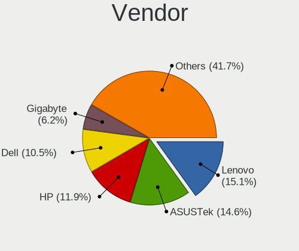
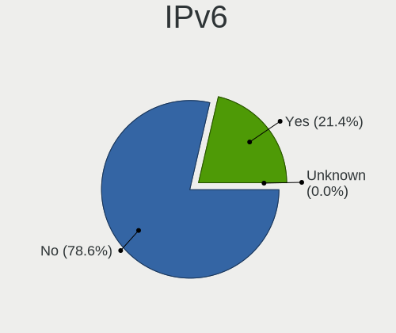
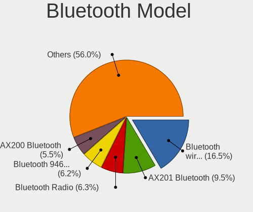

Debian - Tested Hardware & Statistics
-------------------------------------

A project to collect tested hardware configurations for Debian.

Anyone can contribute to this report by the [hw-probe](https://github.com/linuxhw/hw-probe) tool:

    sudo -E hw-probe -all -upload

Please contribute! Especially if your hardware is rare.

This is a report for all computer types. See also reports for [desktops](/Dist/Debian/Desktop/README.md) and [notebooks](/Dist/Debian/Notebook/README.md).

Contents
--------

* [ Test Cases ](#test-cases)

* [ System ](#system)
  - [ OS                       ](#os)
  - [ OS Family                ](#os-family)
  - [ Kernel                   ](#kernel)
  - [ Kernel Family            ](#kernel-family)
  - [ Kernel Major Ver.        ](#kernel-major-ver)
  - [ Arch                     ](#arch)
  - [ DE                       ](#de)
  - [ Display Server           ](#display-server)
  - [ Display Manager          ](#display-manager)
  - [ OS Lang                  ](#os-lang)
  - [ Boot Mode                ](#boot-mode)
  - [ Filesystem               ](#filesystem)
  - [ Part. scheme             ](#part-scheme)
  - [ Dual Boot with Linux/BSD ](#dual-boot-with-linuxbsd)
  - [ Dual Boot (Win)          ](#dual-boot-win)

* [ Board ](#board)
  - [ Vendor                   ](#vendor)
  - [ Model                    ](#model)
  - [ Model Family             ](#model-family)
  - [ MFG Year                 ](#mfg-year)
  - [ Form Factor              ](#form-factor)
  - [ Secure Boot              ](#secure-boot)
  - [ Coreboot                 ](#coreboot)
  - [ RAM Size                 ](#ram-size)
  - [ RAM Used                 ](#ram-used)
  - [ Total Drives             ](#total-drives)
  - [ Has CD-ROM               ](#has-cd-rom)
  - [ Has Ethernet             ](#has-ethernet)
  - [ Has WiFi                 ](#has-wifi)
  - [ Has Bluetooth            ](#has-bluetooth)

* [ Location ](#location)
  - [ Country                  ](#country)
  - [ City                     ](#city)

* [ Drives ](#drives)
  - [ Drive Vendor             ](#drive-vendor)
  - [ Drive Model              ](#drive-model)
  - [ HDD Vendor               ](#hdd-vendor)
  - [ SSD Vendor               ](#ssd-vendor)
  - [ Drive Kind               ](#drive-kind)
  - [ Drive Connector          ](#drive-connector)
  - [ Drive Size               ](#drive-size)
  - [ Space Total              ](#space-total)
  - [ Space Used               ](#space-used)
  - [ Malfunc. Drives          ](#malfunc-drives)
  - [ Malfunc. Drive Vendor    ](#malfunc-drive-vendor)
  - [ Malfunc. HDD Vendor      ](#malfunc-hdd-vendor)
  - [ Malfunc. Drive Kind      ](#malfunc-drive-kind)
  - [ Failed Drives            ](#failed-drives)
  - [ Failed Drive Vendor      ](#failed-drive-vendor)
  - [ Drive Status             ](#drive-status)

* [ Storage controller ](#storage-controller)
  - [ Storage Vendor           ](#storage-vendor)
  - [ Storage Model            ](#storage-model)
  - [ Storage Kind             ](#storage-kind)

* [ Processor ](#processor)
  - [ CPU Vendor               ](#cpu-vendor)
  - [ CPU Model                ](#cpu-model)
  - [ CPU Model Family         ](#cpu-model-family)
  - [ CPU Cores                ](#cpu-cores)
  - [ CPU Sockets              ](#cpu-sockets)
  - [ CPU Threads              ](#cpu-threads)
  - [ CPU Op-Modes             ](#cpu-op-modes)
  - [ CPU Microcode            ](#cpu-microcode)
  - [ CPU Microarch            ](#cpu-microarch)

* [ Graphics ](#graphics)
  - [ GPU Vendor               ](#gpu-vendor)
  - [ GPU Model                ](#gpu-model)
  - [ GPU Combo                ](#gpu-combo)
  - [ GPU Driver               ](#gpu-driver)
  - [ GPU Memory               ](#gpu-memory)

* [ Monitor ](#monitor)
  - [ Monitor Vendor           ](#monitor-vendor)
  - [ Monitor Model            ](#monitor-model)
  - [ Monitor Resolution       ](#monitor-resolution)
  - [ Monitor Diagonal         ](#monitor-diagonal)
  - [ Monitor Width            ](#monitor-width)
  - [ Aspect Ratio             ](#aspect-ratio)
  - [ Monitor Area             ](#monitor-area)
  - [ Pixel Density            ](#pixel-density)
  - [ Multiple Monitors        ](#multiple-monitors)

* [ Network ](#network)
  - [ Net Controller Vendor    ](#net-controller-vendor)
  - [ Net Controller Model     ](#net-controller-model)
  - [ Wireless Vendor          ](#wireless-vendor)
  - [ Wireless Model           ](#wireless-model)
  - [ Ethernet Vendor          ](#ethernet-vendor)
  - [ Ethernet Model           ](#ethernet-model)
  - [ Net Controller Kind      ](#net-controller-kind)
  - [ Used Controller          ](#used-controller)
  - [ NICs                     ](#nics)
  - [ IPv6                     ](#ipv6)

* [ Bluetooth ](#bluetooth)
  - [ Bluetooth Vendor         ](#bluetooth-vendor)
  - [ Bluetooth Model          ](#bluetooth-model)

* [ Sound ](#sound)
  - [ Sound Vendor             ](#sound-vendor)
  - [ Sound Model              ](#sound-model)

* [ Memory ](#memory)
  - [ Memory Vendor            ](#memory-vendor)
  - [ Memory Model             ](#memory-model)
  - [ Memory Kind              ](#memory-kind)
  - [ Memory Form Factor       ](#memory-form-factor)
  - [ Memory Size              ](#memory-size)
  - [ Memory Speed             ](#memory-speed)

* [ Printers & scanners ](#printers--scanners)
  - [ Printer Vendor           ](#printer-vendor)
  - [ Printer Model            ](#printer-model)
  - [ Scanner Vendor           ](#scanner-vendor)
  - [ Scanner Model            ](#scanner-model)

* [ Camera ](#camera)
  - [ Camera Vendor            ](#camera-vendor)
  - [ Camera Model             ](#camera-model)

* [ Security ](#security)
  - [ Fingerprint Vendor       ](#fingerprint-vendor)
  - [ Fingerprint Model        ](#fingerprint-model)
  - [ Chipcard Vendor          ](#chipcard-vendor)
  - [ Chipcard Model           ](#chipcard-model)

* [ Unsupported ](#unsupported)
  - [ Unsupported Devices      ](#unsupported-devices)
  - [ Unsupported Device Types ](#unsupported-device-types)

Test Cases
----------

Total: 16934

| Vendor        | Model                       | Form-Factor | Probe                                                      | Date         |
|---------------|-----------------------------|-------------|------------------------------------------------------------|--------------|
| Lenovo        | 312D SDK0J40697 WIN 3305... | Mini pc     | [ef03031eaa](https://linux-hardware.org/?probe=ef03031eaa) | Nov 06, 2023 |
| HP            | EliteBook 8460p             | Notebook    | [cc6b66c576](https://linux-hardware.org/?probe=cc6b66c576) | Nov 06, 2023 |
| Medion        | MS-7708                     | Desktop     | [9170f4dd42](https://linux-hardware.org/?probe=9170f4dd42) | Nov 06, 2023 |
| Aquarius      | NS585                       | Notebook    | [ddc8256647](https://linux-hardware.org/?probe=ddc8256647) | Nov 06, 2023 |
| Aquarius      | NS585                       | Notebook    | [2f4e49837d](https://linux-hardware.org/?probe=2f4e49837d) | Nov 06, 2023 |
| Aquarius      | NS585                       | Notebook    | [4fea63336a](https://linux-hardware.org/?probe=4fea63336a) | Nov 06, 2023 |
| Raspberry ... | Raspberry Pi 3 Model B R... | Soc         | [5b992d974a](https://linux-hardware.org/?probe=5b992d974a) | Nov 06, 2023 |
| Dell          | 0PV3YR A05                  | Server      | [bb021ca517](https://linux-hardware.org/?probe=bb021ca517) | Nov 06, 2023 |
| ASUSTek       | PRIME B450M-A II            | Desktop     | [c8c8d15e25](https://linux-hardware.org/?probe=c8c8d15e25) | Nov 06, 2023 |
| HP            | 250 G7 Notebook PC          | Notebook    | [a2ad36d26c](https://linux-hardware.org/?probe=a2ad36d26c) | Nov 06, 2023 |
| Raspberry ... | Raspberry Pi 4 Model B R... | Soc         | [eef004b620](https://linux-hardware.org/?probe=eef004b620) | Nov 05, 2023 |
| Apple         | Mac-F2218EA9                | All in one  | [67a67e246c](https://linux-hardware.org/?probe=67a67e246c) | Nov 05, 2023 |
| Toshiba       | TECRA R950                  | Notebook    | [864877692e](https://linux-hardware.org/?probe=864877692e) | Nov 05, 2023 |
| sunxi         | Banana Pi BPI-M2-Zero       | Soc         | [fc24faaa0c](https://linux-hardware.org/?probe=fc24faaa0c) | Nov 05, 2023 |
| Gigabyte      | B85M-D3H                    | Desktop     | [42cbdffa93](https://linux-hardware.org/?probe=42cbdffa93) | Nov 05, 2023 |
| ASUSTek       | X541NA                      | Notebook    | [f0399efc08](https://linux-hardware.org/?probe=f0399efc08) | Nov 05, 2023 |
| Shuttle       | FH87                        | Desktop     | [1488ef29c3](https://linux-hardware.org/?probe=1488ef29c3) | Nov 05, 2023 |
| Gigabyte      | Z68XP-UD3                   | Desktop     | [01e74da42d](https://linux-hardware.org/?probe=01e74da42d) | Nov 05, 2023 |
| Gigabyte      | B550 GAMING X V2            | Desktop     | [9213826ac6](https://linux-hardware.org/?probe=9213826ac6) | Nov 05, 2023 |
| HP            | 8643 SMVB                   | Desktop     | [22b09dfb91](https://linux-hardware.org/?probe=22b09dfb91) | Nov 05, 2023 |
| ASUSTek       | VivoBook_ASUSLaptop X140... | Notebook    | [92ed6d25c3](https://linux-hardware.org/?probe=92ed6d25c3) | Nov 05, 2023 |
| MSI           | PRO B760M-P DDR4            | Desktop     | [5b5425c6d8](https://linux-hardware.org/?probe=5b5425c6d8) | Nov 05, 2023 |
| HP            | Mini 210-3000               | Notebook    | [8b55a876a9](https://linux-hardware.org/?probe=8b55a876a9) | Nov 05, 2023 |
| Google        | Nami                        | Notebook    | [19c94b9484](https://linux-hardware.org/?probe=19c94b9484) | Nov 05, 2023 |
| Apple         | Mac-F2218EA9                | All in one  | [5c50c142b3](https://linux-hardware.org/?probe=5c50c142b3) | Nov 05, 2023 |
| Dell          | 01XK1W A00                  | Desktop     | [d6cd277a79](https://linux-hardware.org/?probe=d6cd277a79) | Nov 05, 2023 |
| HP            | Laptop 15-bw0xx             | Notebook    | [7d9395e4a7](https://linux-hardware.org/?probe=7d9395e4a7) | Nov 05, 2023 |
| HP            | EliteBook 840 G3            | Notebook    | [1bb894cf19](https://linux-hardware.org/?probe=1bb894cf19) | Nov 04, 2023 |
| Gigabyte      | B450 AORUS M                | Desktop     | [62798aa8cf](https://linux-hardware.org/?probe=62798aa8cf) | Nov 04, 2023 |
| Supermicro    | X10SRA                      | Server      | [87045c1939](https://linux-hardware.org/?probe=87045c1939) | Nov 04, 2023 |
| Lenovo        | 3102 SDK0J40697 WIN 3305... | Desktop     | [dade20f823](https://linux-hardware.org/?probe=dade20f823) | Nov 04, 2023 |
| HP            | Pavilion dv7                | Notebook    | [6a44cc2c3c](https://linux-hardware.org/?probe=6a44cc2c3c) | Nov 04, 2023 |
| Acer          | AO532h                      | Notebook    | [0b3d66b04a](https://linux-hardware.org/?probe=0b3d66b04a) | Nov 04, 2023 |
| Apple         | Mac-F221BEC8                | Desktop     | [03f4055831](https://linux-hardware.org/?probe=03f4055831) | Nov 04, 2023 |
| Dell          | Inspiron 16 5620            | Notebook    | [04d425d450](https://linux-hardware.org/?probe=04d425d450) | Nov 04, 2023 |
| Google        | Bluebird                    | Notebook    | [55dbc11653](https://linux-hardware.org/?probe=55dbc11653) | Nov 04, 2023 |
| MSI           | MAG B660M MORTAR WIFI DD... | Desktop     | [3521a1f918](https://linux-hardware.org/?probe=3521a1f918) | Nov 04, 2023 |
| Google        | Bluebird                    | Notebook    | [9e12130a28](https://linux-hardware.org/?probe=9e12130a28) | Nov 04, 2023 |
| HP            | OMEN by Laptop 17-ck1xxx    | Notebook    | [bea6a6babf](https://linux-hardware.org/?probe=bea6a6babf) | Nov 04, 2023 |
| Lenovo        | ThinkPad T530 2429F27       | Notebook    | [0767db36fe](https://linux-hardware.org/?probe=0767db36fe) | Nov 04, 2023 |
| Dell          | Precision 7560              | Notebook    | [54a8deb305](https://linux-hardware.org/?probe=54a8deb305) | Nov 04, 2023 |
| Lenovo        | ThinkPad L13 Yoga Gen 2 ... | Convertible | [7d06f443c7](https://linux-hardware.org/?probe=7d06f443c7) | Nov 03, 2023 |
| ASUSTek       | X551CA                      | Notebook    | [20bee22e0a](https://linux-hardware.org/?probe=20bee22e0a) | Nov 03, 2023 |
| Packard Be... | EasyNote TK87               | Notebook    | [3ff2e66179](https://linux-hardware.org/?probe=3ff2e66179) | Nov 03, 2023 |
| ASRock        | H61M-HVS                    | Desktop     | [fbbb34a0cb](https://linux-hardware.org/?probe=fbbb34a0cb) | Nov 03, 2023 |
| Dell          | Latitude E6420              | Notebook    | [43ccf36bf0](https://linux-hardware.org/?probe=43ccf36bf0) | Nov 03, 2023 |
| Google        | Enguarde                    | Notebook    | [bc6a541eb9](https://linux-hardware.org/?probe=bc6a541eb9) | Nov 03, 2023 |
| ZOTAC         | ZBOXNANO-AD10               | Mini pc     | [2b0fbc5661](https://linux-hardware.org/?probe=2b0fbc5661) | Nov 03, 2023 |
| Lenovo        | ThinkBook 14 G3 ACL 21A2    | Notebook    | [8b855ce4f4](https://linux-hardware.org/?probe=8b855ce4f4) | Nov 03, 2023 |
| ASRock        | H170M Pro4                  | Desktop     | [b87ccd7768](https://linux-hardware.org/?probe=b87ccd7768) | Nov 03, 2023 |
| Rockchip      | Orange Pi 5 Plus            | Soc         | [9c30c8c8b4](https://linux-hardware.org/?probe=9c30c8c8b4) | Nov 03, 2023 |
| Lenovo        | G500s 20245                 | Notebook    | [c4aa915297](https://linux-hardware.org/?probe=c4aa915297) | Nov 03, 2023 |
| ASUSTek       | VivoBook_ASUSLaptop X515... | Notebook    | [1bdfa38b3e](https://linux-hardware.org/?probe=1bdfa38b3e) | Nov 03, 2023 |
| Lenovo        | IdeaPad Y500 20193          | Notebook    | [f96f6e6127](https://linux-hardware.org/?probe=f96f6e6127) | Nov 03, 2023 |
| ASUSTek       | X205TA                      | Notebook    | [b29e9ebfbe](https://linux-hardware.org/?probe=b29e9ebfbe) | Nov 03, 2023 |
| Acer          | Predator PO3-600 V:1.1      | Desktop     | [9495d53da4](https://linux-hardware.org/?probe=9495d53da4) | Nov 03, 2023 |
| Gigabyte      | B550 AORUS PRO V2           | Desktop     | [18f018a8ae](https://linux-hardware.org/?probe=18f018a8ae) | Nov 03, 2023 |
| Dell          | 0CN7X8 A05                  | Server      | [afe0c7dfbe](https://linux-hardware.org/?probe=afe0c7dfbe) | Nov 03, 2023 |
| HP            | 250 G7 Notebook PC          | Notebook    | [1889111d8a](https://linux-hardware.org/?probe=1889111d8a) | Nov 03, 2023 |
| Lenovo        | ThinkPad P15s Gen 2i 20W... | Notebook    | [212105774f](https://linux-hardware.org/?probe=212105774f) | Nov 02, 2023 |
| HP            | 18E7                        | Desktop     | [212d6dba47](https://linux-hardware.org/?probe=212d6dba47) | Nov 02, 2023 |
| HP            | 18E7                        | Desktop     | [7064df5d87](https://linux-hardware.org/?probe=7064df5d87) | Nov 02, 2023 |
| Unknown       | X99-GT                      | Desktop     | [751ea1add9](https://linux-hardware.org/?probe=751ea1add9) | Nov 02, 2023 |
| ASUSTek       | G750JX                      | Notebook    | [9493bec7e6](https://linux-hardware.org/?probe=9493bec7e6) | Nov 02, 2023 |
| Framework     | Laptop (12th Gen Intel C... | Notebook    | [7c06ac2664](https://linux-hardware.org/?probe=7c06ac2664) | Nov 02, 2023 |
| Dell          | Vostro 14-3468              | Notebook    | [33a984f9f8](https://linux-hardware.org/?probe=33a984f9f8) | Nov 02, 2023 |
| MSI           | B450M-A PRO MAX             | Desktop     | [d48f7514df](https://linux-hardware.org/?probe=d48f7514df) | Nov 02, 2023 |
| Raspberry ... | Raspberry Pi 5 Model B R... | Soc         | [de79fbf182](https://linux-hardware.org/?probe=de79fbf182) | Nov 02, 2023 |
| Lenovo        | ThinkPad L13 Yoga Gen 2 ... | Convertible | [db23a9b8d4](https://linux-hardware.org/?probe=db23a9b8d4) | Nov 02, 2023 |
| Lenovo        | ThinkPad L13 Yoga Gen 2 ... | Convertible | [425bafc788](https://linux-hardware.org/?probe=425bafc788) | Nov 02, 2023 |
| ASRock        | X570 Taichi                 | Desktop     | [5ce5b321b0](https://linux-hardware.org/?probe=5ce5b321b0) | Nov 02, 2023 |
| ASRock        | Z77 WS                      | Desktop     | [73b9354a1a](https://linux-hardware.org/?probe=73b9354a1a) | Nov 02, 2023 |
| HP            | Pavilion g6                 | Notebook    | [8c9de8be4f](https://linux-hardware.org/?probe=8c9de8be4f) | Nov 02, 2023 |
| Gigabyte      | A520I AC                    | Desktop     | [2b76c45313](https://linux-hardware.org/?probe=2b76c45313) | Nov 02, 2023 |
| HP            | Pavilion g6                 | Notebook    | [c35f9a55aa](https://linux-hardware.org/?probe=c35f9a55aa) | Nov 02, 2023 |
| Google        | Nasher360                   | Notebook    | [0d1cc1b584](https://linux-hardware.org/?probe=0d1cc1b584) | Nov 02, 2023 |
| ASRockRack    | X470D4U                     | Desktop     | [553af2a3c2](https://linux-hardware.org/?probe=553af2a3c2) | Nov 02, 2023 |
| Lenovo        | ThinkCentre M58p 6234A1U    | Desktop     | [b684f82e3c](https://linux-hardware.org/?probe=b684f82e3c) | Nov 01, 2023 |
| Gigabyte      | Z97X-Gaming 5               | Desktop     | [1ca6496a6c](https://linux-hardware.org/?probe=1ca6496a6c) | Nov 01, 2023 |
| Framework     | Laptop (13th Gen Intel C... | Notebook    | [df4f43ca44](https://linux-hardware.org/?probe=df4f43ca44) | Nov 01, 2023 |
| Lenovo        | ThinkPad 13 2nd Gen 20J1... | Notebook    | [bb5bbc3e51](https://linux-hardware.org/?probe=bb5bbc3e51) | Nov 01, 2023 |
| Acer          | TravelMate P215-52          | Notebook    | [b9c3643e62](https://linux-hardware.org/?probe=b9c3643e62) | Nov 01, 2023 |
| ASUSTek       | CM6870                      | Desktop     | [ae34108b69](https://linux-hardware.org/?probe=ae34108b69) | Nov 01, 2023 |
| Lenovo        | ThinkPad L15 Gen 2 20X4S... | Notebook    | [ac563e5542](https://linux-hardware.org/?probe=ac563e5542) | Nov 01, 2023 |
| HP            | Laptop 15s-eq1xxx           | Notebook    | [075049b538](https://linux-hardware.org/?probe=075049b538) | Nov 01, 2023 |
| Dell          | Precision M4700             | Notebook    | [1d7e76c1d9](https://linux-hardware.org/?probe=1d7e76c1d9) | Nov 01, 2023 |
| HP            | 83EE                        | Desktop     | [c32478cd8d](https://linux-hardware.org/?probe=c32478cd8d) | Nov 01, 2023 |
| HP            | 83EE                        | Desktop     | [37c7c72156](https://linux-hardware.org/?probe=37c7c72156) | Nov 01, 2023 |
| Lenovo        | ThinkPad P16s Gen 2 21K9... | Notebook    | [317aadad91](https://linux-hardware.org/?probe=317aadad91) | Nov 01, 2023 |
| Fujitsu       | D3233-A1 S26361-D3233-A1    | Desktop     | [0026b681e2](https://linux-hardware.org/?probe=0026b681e2) | Nov 01, 2023 |
| Unknown       | Unknown                     | Desktop     | [c7ce75613c](https://linux-hardware.org/?probe=c7ce75613c) | Nov 01, 2023 |
| Gigabyte      | X570 GAMING X               | Desktop     | [fee5d3eded](https://linux-hardware.org/?probe=fee5d3eded) | Nov 01, 2023 |
| Dell          | Vostro 5590                 | Notebook    | [300630cf8c](https://linux-hardware.org/?probe=300630cf8c) | Nov 01, 2023 |
| ASUSTek       | ROG STRIX B550-A GAMING     | Desktop     | [34fe4c8733](https://linux-hardware.org/?probe=34fe4c8733) | Nov 01, 2023 |
| Raspberry ... | Raspberry Pi 5 Model B R... | Soc         | [58f7b11e98](https://linux-hardware.org/?probe=58f7b11e98) | Nov 01, 2023 |
| Dell          | Latitude 5480               | Notebook    | [1bf5aeba87](https://linux-hardware.org/?probe=1bf5aeba87) | Nov 01, 2023 |
| Unknown       | Unknown                     | Desktop     | [3c4e0eb4fc](https://linux-hardware.org/?probe=3c4e0eb4fc) | Nov 01, 2023 |
| Toshiba       | Satellite L845              | Notebook    | [90e266bd8e](https://linux-hardware.org/?probe=90e266bd8e) | Oct 31, 2023 |
| Lenovo        | ThinkPad P14s Gen 4 21K5... | Notebook    | [2bdd27dc18](https://linux-hardware.org/?probe=2bdd27dc18) | Oct 31, 2023 |
| Lenovo        | ThinkPad P14s Gen 4 21K5... | Notebook    | [cb35a8d8f6](https://linux-hardware.org/?probe=cb35a8d8f6) | Oct 31, 2023 |
| HP            | 255 G8 Notebook PC          | Notebook    | [b9d1b13098](https://linux-hardware.org/?probe=b9d1b13098) | Oct 31, 2023 |
| Lenovo        | ThinkPad 13 2nd Gen 20J1... | Notebook    | [4ebd30711e](https://linux-hardware.org/?probe=4ebd30711e) | Oct 31, 2023 |
| Lenovo        | ThinkPad 13 2nd Gen 20J1... | Notebook    | [a664733aaf](https://linux-hardware.org/?probe=a664733aaf) | Oct 31, 2023 |
| Fujitsu       | D3313-B1 S26361-D3313-B1    | Desktop     | [2d90a96dfb](https://linux-hardware.org/?probe=2d90a96dfb) | Oct 31, 2023 |
| Lenovo        | ThinkPad 13 2nd Gen 20J2... | Notebook    | [72131fb5de](https://linux-hardware.org/?probe=72131fb5de) | Oct 31, 2023 |
| HP            | ProBook 450 15.6 inch G9... | Notebook    | [ea29ba4b58](https://linux-hardware.org/?probe=ea29ba4b58) | Oct 31, 2023 |
| VANT          | MOOVE3-15                   | Notebook    | [5fc04a6d0a](https://linux-hardware.org/?probe=5fc04a6d0a) | Oct 31, 2023 |
| Lenovo        | ThinkPad X230 2325T55       | Notebook    | [bb4d04c61d](https://linux-hardware.org/?probe=bb4d04c61d) | Oct 31, 2023 |
| Apple         | MacBookPro9,1               | Notebook    | [8f7c5b801b](https://linux-hardware.org/?probe=8f7c5b801b) | Oct 31, 2023 |
| Apple         | MacBookPro9,1               | Notebook    | [4e15275faa](https://linux-hardware.org/?probe=4e15275faa) | Oct 31, 2023 |
| Unknown       | Unknown                     | Soc         | [c1888a18d4](https://linux-hardware.org/?probe=c1888a18d4) | Oct 31, 2023 |
| Gigabyte      | H610M H DDR4                | Desktop     | [6e876b597c](https://linux-hardware.org/?probe=6e876b597c) | Oct 31, 2023 |
| Gigabyte      | H610M H DDR4                | Desktop     | [01f9a9c872](https://linux-hardware.org/?probe=01f9a9c872) | Oct 31, 2023 |
| ASUSTek       | P8H61-M LE                  | Desktop     | [86dd25c85a](https://linux-hardware.org/?probe=86dd25c85a) | Oct 31, 2023 |
| Dell          | Inspiron 5406 2n1           | Convertible | [f504fe606f](https://linux-hardware.org/?probe=f504fe606f) | Oct 31, 2023 |
| ASUSTek       | P8Z77-M                     | Desktop     | [69cd55a4dc](https://linux-hardware.org/?probe=69cd55a4dc) | Oct 31, 2023 |
| HP            | Victus by Gaming Laptop ... | Notebook    | [0f4fa9169b](https://linux-hardware.org/?probe=0f4fa9169b) | Oct 31, 2023 |
| Dell          | 0NW6H5 A00                  | Desktop     | [3f76d752df](https://linux-hardware.org/?probe=3f76d752df) | Oct 31, 2023 |
| ASRock        | H61M-HVS                    | Desktop     | [eccf9444b3](https://linux-hardware.org/?probe=eccf9444b3) | Oct 31, 2023 |
| ASUSTek       | VivoBook_ASUSLaptop K350... | Notebook    | [40ae523147](https://linux-hardware.org/?probe=40ae523147) | Oct 31, 2023 |
| Lenovo        | ThinkPad L14 Gen 3 21C10... | Notebook    | [2f63bfb399](https://linux-hardware.org/?probe=2f63bfb399) | Oct 31, 2023 |
| VANT          | MOOVE3-15                   | Notebook    | [7e12621e6d](https://linux-hardware.org/?probe=7e12621e6d) | Oct 31, 2023 |
| Timi          | RedmiBook Pro 14S           | Notebook    | [780e721e24](https://linux-hardware.org/?probe=780e721e24) | Oct 30, 2023 |
| Gigabyte      | H97M-HD3                    | Desktop     | [0d712d2765](https://linux-hardware.org/?probe=0d712d2765) | Oct 30, 2023 |
| Lenovo        | ThinkPad X260 VB6R77903H    | Notebook    | [c4baf8a67b](https://linux-hardware.org/?probe=c4baf8a67b) | Oct 30, 2023 |
| Intel         | X99                         | Desktop     | [426c412f62](https://linux-hardware.org/?probe=426c412f62) | Oct 30, 2023 |
| THUNDEROBO... | 911AirD                     | Notebook    | [698adeeba7](https://linux-hardware.org/?probe=698adeeba7) | Oct 30, 2023 |
| Dell          | XPS 15 9520                 | Notebook    | [0fb7ced892](https://linux-hardware.org/?probe=0fb7ced892) | Oct 30, 2023 |
| Dell          | 0NW6H5 A00                  | Desktop     | [51694ddd7c](https://linux-hardware.org/?probe=51694ddd7c) | Oct 30, 2023 |
| Lenovo        | Flex 2 Pro-15               | Notebook    | [ff5f14115e](https://linux-hardware.org/?probe=ff5f14115e) | Oct 30, 2023 |
| Google        | Blooguard                   | Notebook    | [cd817fb666](https://linux-hardware.org/?probe=cd817fb666) | Oct 30, 2023 |
| ASUSTek       | PRIME A320M-K               | Desktop     | [64bc9621da](https://linux-hardware.org/?probe=64bc9621da) | Oct 30, 2023 |
| Lenovo        | ThinkPad 13 2nd Gen 20J1... | Notebook    | [995b159589](https://linux-hardware.org/?probe=995b159589) | Oct 30, 2023 |
| Lenovo        | ThinkPad P14s Gen 3 21J5... | Notebook    | [8b1fe7cf44](https://linux-hardware.org/?probe=8b1fe7cf44) | Oct 30, 2023 |
| Gigabyte      | H170N-WIFI-CF               | Desktop     | [af90b19d11](https://linux-hardware.org/?probe=af90b19d11) | Oct 30, 2023 |
| Supermicro    | X8DTH                       | Server      | [25d685c01e](https://linux-hardware.org/?probe=25d685c01e) | Oct 30, 2023 |
| ASUSTek       | PN53-G                      | Mini pc     | [e64336b3cd](https://linux-hardware.org/?probe=e64336b3cd) | Oct 30, 2023 |
| MSI           | B550-A PRO                  | Desktop     | [fca3ef2e73](https://linux-hardware.org/?probe=fca3ef2e73) | Oct 30, 2023 |
| Pine Micro... | Pine64 RockPro64 v2.1       | Soc         | [4e11be8872](https://linux-hardware.org/?probe=4e11be8872) | Oct 30, 2023 |
| HP            | ProLiant DL360 Gen9         | Server      | [081a87b55c](https://linux-hardware.org/?probe=081a87b55c) | Oct 30, 2023 |
| Gigabyte      | A5 X1                       | Notebook    | [981be88a61](https://linux-hardware.org/?probe=981be88a61) | Oct 30, 2023 |
| HP            | EliteBook 840 G6            | Notebook    | [586f08e1dc](https://linux-hardware.org/?probe=586f08e1dc) | Oct 30, 2023 |
| ASUSTek       | M5A97 R2.0                  | Desktop     | [7f2d93dc09](https://linux-hardware.org/?probe=7f2d93dc09) | Oct 29, 2023 |
| Acer          | Predator PO3-600 V:1.1      | Desktop     | [a7a54fb14a](https://linux-hardware.org/?probe=a7a54fb14a) | Oct 29, 2023 |
| ASUSTek       | M4A88T-M                    | Desktop     | [af4673599a](https://linux-hardware.org/?probe=af4673599a) | Oct 29, 2023 |
| ASUSTek       | M4A89GTD-PRO/USB3           | Desktop     | [9ca810aaa6](https://linux-hardware.org/?probe=9ca810aaa6) | Oct 29, 2023 |
| Lenovo        | ThinkPad 25 20K70000GE      | Notebook    | [ce13c83c47](https://linux-hardware.org/?probe=ce13c83c47) | Oct 29, 2023 |
| Lenovo        | ThinkPad 25 20K70000GE      | Notebook    | [597958381f](https://linux-hardware.org/?probe=597958381f) | Oct 29, 2023 |
| Fujitsu       | D2912-A1 S26361-D2912-A1    | Desktop     | [e0b8432cdc](https://linux-hardware.org/?probe=e0b8432cdc) | Oct 29, 2023 |
| ASRock        | AM1B-M                      | Desktop     | [098a155bab](https://linux-hardware.org/?probe=098a155bab) | Oct 29, 2023 |
| HP            | Pavilion g6                 | Notebook    | [57441db309](https://linux-hardware.org/?probe=57441db309) | Oct 29, 2023 |
| Apple         | Mac-F221BEC8                | Desktop     | [4db0be5324](https://linux-hardware.org/?probe=4db0be5324) | Oct 29, 2023 |
| Lenovo        | ThinkPad E15 Gen 3 20YGC... | Notebook    | [91f7b242b9](https://linux-hardware.org/?probe=91f7b242b9) | Oct 28, 2023 |
| ASRock        | B450 Steel Legend           | Desktop     | [967ed7a2b9](https://linux-hardware.org/?probe=967ed7a2b9) | Oct 28, 2023 |
| ASRock        | B550M-ITX/ac                | Desktop     | [1643900d75](https://linux-hardware.org/?probe=1643900d75) | Oct 28, 2023 |
| Intel         | JSL MRD                     | Desktop     | [689d88c57b](https://linux-hardware.org/?probe=689d88c57b) | Oct 28, 2023 |
| ECS           | H61H2-M12                   | Desktop     | [885cbf522c](https://linux-hardware.org/?probe=885cbf522c) | Oct 28, 2023 |
| Lenovo        | ThinkPad T14s Gen 3 21CQ... | Notebook    | [4aceca5660](https://linux-hardware.org/?probe=4aceca5660) | Oct 28, 2023 |
| Raspberry ... | Raspberry Pi 4 Model B R... | Soc         | [b094266385](https://linux-hardware.org/?probe=b094266385) | Oct 28, 2023 |
| Shenzhen M... | TH80                        | Desktop     | [22dea9593a](https://linux-hardware.org/?probe=22dea9593a) | Oct 28, 2023 |
| Acer          | Aspire 4752                 | Notebook    | [ce321700bc](https://linux-hardware.org/?probe=ce321700bc) | Oct 28, 2023 |
| Toshiba       | TECRA R950                  | Notebook    | [afa984b0d3](https://linux-hardware.org/?probe=afa984b0d3) | Oct 28, 2023 |
| Lenovo        | ThinkPad T15g Gen 2i 20Y... | Notebook    | [dcd6988b7a](https://linux-hardware.org/?probe=dcd6988b7a) | Oct 28, 2023 |
| Acer          | Aspire A115-31              | Notebook    | [137821ca25](https://linux-hardware.org/?probe=137821ca25) | Oct 28, 2023 |
| TELECOMITA... | M7x0S                       | Notebook    | [feabc7e111](https://linux-hardware.org/?probe=feabc7e111) | Oct 28, 2023 |
| MSI           | WS63 7RK                    | Notebook    | [dcfa2c2f75](https://linux-hardware.org/?probe=dcfa2c2f75) | Oct 27, 2023 |
| Fujitsu       | D2912-A1 S26361-D2912-A1    | Desktop     | [eb1a1b2e44](https://linux-hardware.org/?probe=eb1a1b2e44) | Oct 27, 2023 |
| Gigabyte      | B550M AORUS ELITE           | Desktop     | [5dac9d85f1](https://linux-hardware.org/?probe=5dac9d85f1) | Oct 27, 2023 |
| Lenovo        | ThinkPad X230 2325SDE       | Notebook    | [cbdbd4a156](https://linux-hardware.org/?probe=cbdbd4a156) | Oct 27, 2023 |
| Lenovo        | IdeaPad Gaming 3 15IAH7 ... | Notebook    | [d8bfe77d00](https://linux-hardware.org/?probe=d8bfe77d00) | Oct 27, 2023 |
| Lenovo        | ThinkPad T470 20HES0FW00    | Notebook    | [198bee98eb](https://linux-hardware.org/?probe=198bee98eb) | Oct 27, 2023 |
| ASUSTek       | P6TD DELUXE                 | Desktop     | [46049da51f](https://linux-hardware.org/?probe=46049da51f) | Oct 27, 2023 |
| Lenovo        | G50-70 20351                | Notebook    | [39e2fb6be6](https://linux-hardware.org/?probe=39e2fb6be6) | Oct 27, 2023 |
| ASUSTek       | ROG Strix G513QC_G513QC     | Notebook    | [bdf8012e05](https://linux-hardware.org/?probe=bdf8012e05) | Oct 27, 2023 |
| Dell          | 0TY177 A05                  | Server      | [f59dfc5d01](https://linux-hardware.org/?probe=f59dfc5d01) | Oct 27, 2023 |
| Lenovo        | ThinkPad P15v Gen 3 21D8... | Notebook    | [67b966e75c](https://linux-hardware.org/?probe=67b966e75c) | Oct 27, 2023 |
| Dell          | 0VD5HY A07                  | Desktop     | [3db7e99c4a](https://linux-hardware.org/?probe=3db7e99c4a) | Oct 27, 2023 |
| Dell          | 0GTK4K A02                  | Desktop     | [df85a996c9](https://linux-hardware.org/?probe=df85a996c9) | Oct 27, 2023 |
| Dell          | 0PM2CW A02                  | Server      | [e1bb5de371](https://linux-hardware.org/?probe=e1bb5de371) | Oct 27, 2023 |
| Raspberry ... | Raspberry Pi 4 Model B R... | Soc         | [2eb76547a3](https://linux-hardware.org/?probe=2eb76547a3) | Oct 27, 2023 |
| Supermicro    | X10DAI                      | Desktop     | [11b1e48497](https://linux-hardware.org/?probe=11b1e48497) | Oct 27, 2023 |
| Gigabyte      | F2A68HM-H                   | Desktop     | [607a31a8ef](https://linux-hardware.org/?probe=607a31a8ef) | Oct 27, 2023 |
| Foxconn       | P35A01                      | Desktop     | [e63e8acdaa](https://linux-hardware.org/?probe=e63e8acdaa) | Oct 27, 2023 |
| Google        | Enguarde                    | Notebook    | [074b44ce16](https://linux-hardware.org/?probe=074b44ce16) | Oct 26, 2023 |
| Acer          | Aspire 5750G                | Notebook    | [afe742ceca](https://linux-hardware.org/?probe=afe742ceca) | Oct 26, 2023 |
| Dell          | Latitude 5414               | Notebook    | [78fb4f9907](https://linux-hardware.org/?probe=78fb4f9907) | Oct 26, 2023 |
| Medion        | Unknown                     | Notebook    | [ffcdfb3003](https://linux-hardware.org/?probe=ffcdfb3003) | Oct 26, 2023 |
| OrangePi      | Zero3                       | Soc         | [0a9fbc0ea2](https://linux-hardware.org/?probe=0a9fbc0ea2) | Oct 26, 2023 |
| Lenovo        | ThinkPad T540p 20BE00B4I... | Notebook    | [afce107e0d](https://linux-hardware.org/?probe=afce107e0d) | Oct 26, 2023 |
| Lenovo        | ThinkPad L13 Yoga Gen 2 ... | Convertible | [71a887bb94](https://linux-hardware.org/?probe=71a887bb94) | Oct 26, 2023 |
| Dell          | 0K240Y A04                  | Desktop     | [5bf155abe0](https://linux-hardware.org/?probe=5bf155abe0) | Oct 26, 2023 |
| ASUSTek       | P8P67 PRO                   | Desktop     | [a1916cc782](https://linux-hardware.org/?probe=a1916cc782) | Oct 26, 2023 |
| HP            | ProBook 4530s               | Notebook    | [b86df6ad72](https://linux-hardware.org/?probe=b86df6ad72) | Oct 26, 2023 |
| ASUSTek       | P5G41T-M LE                 | Desktop     | [ca332e91ff](https://linux-hardware.org/?probe=ca332e91ff) | Oct 26, 2023 |
| MSI           | B450M PRO-VDH MAX           | Desktop     | [df61e58a34](https://linux-hardware.org/?probe=df61e58a34) | Oct 26, 2023 |
| Supermicro    | X11DDW-NT                   | Server      | [fa28d68e1b](https://linux-hardware.org/?probe=fa28d68e1b) | Oct 26, 2023 |
| Lenovo        | IdeaPad S145-15IIL 81W8     | Notebook    | [cc3370083d](https://linux-hardware.org/?probe=cc3370083d) | Oct 26, 2023 |
| Irbis         | NB131                       | Convertible | [6b5d733237](https://linux-hardware.org/?probe=6b5d733237) | Oct 26, 2023 |
| Exo           | Smart Serie R               | Notebook    | [d68b300ca7](https://linux-hardware.org/?probe=d68b300ca7) | Oct 26, 2023 |
| Toshiba       | Satellite L455D             | Notebook    | [29337c2310](https://linux-hardware.org/?probe=29337c2310) | Oct 26, 2023 |
| HUAWEI        | KLVL-WXXW                   | Notebook    | [303c4197c7](https://linux-hardware.org/?probe=303c4197c7) | Oct 26, 2023 |
| HP            | Compaq 15                   | Notebook    | [83fab35dec](https://linux-hardware.org/?probe=83fab35dec) | Oct 26, 2023 |
| Dell          | Latitude 5414               | Notebook    | [692b53f9d9](https://linux-hardware.org/?probe=692b53f9d9) | Oct 26, 2023 |
| HP            | Compaq 15                   | Notebook    | [41ada9e77d](https://linux-hardware.org/?probe=41ada9e77d) | Oct 26, 2023 |
| ASUSTek       | ROG CROSSHAIR X670E HERO    | Desktop     | [f38d8a7556](https://linux-hardware.org/?probe=f38d8a7556) | Oct 26, 2023 |
| MSI           | MEG X570 UNIFY              | Desktop     | [f1bcad7519](https://linux-hardware.org/?probe=f1bcad7519) | Oct 26, 2023 |
| ASUSTek       | VivoBook_ASUSLaptop X512... | Notebook    | [bd6ab7e486](https://linux-hardware.org/?probe=bd6ab7e486) | Oct 26, 2023 |
| ASUSTek       | VivoBook_ASUSLaptop X512... | Notebook    | [bfe12f37dc](https://linux-hardware.org/?probe=bfe12f37dc) | Oct 25, 2023 |
| Apple         | Mac-42FD25EABCABB274 iMa... | All in one  | [3273bde56c](https://linux-hardware.org/?probe=3273bde56c) | Oct 25, 2023 |
| Intel         | NUC7i7BNB J31145-303        | Mini pc     | [8b6a0fb21d](https://linux-hardware.org/?probe=8b6a0fb21d) | Oct 25, 2023 |
| Pegatron      | Benicia                     | Desktop     | [62373f17e0](https://linux-hardware.org/?probe=62373f17e0) | Oct 25, 2023 |
| HP            | 15                          | Notebook    | [629c50d53a](https://linux-hardware.org/?probe=629c50d53a) | Oct 25, 2023 |
| ASRock        | J4125-ITX                   | Desktop     | [b124e800d6](https://linux-hardware.org/?probe=b124e800d6) | Oct 25, 2023 |
| Acer          | Aspire 5750G                | Notebook    | [b726b22da1](https://linux-hardware.org/?probe=b726b22da1) | Oct 25, 2023 |
| ASUSTek       | Pro WS WRX80E-SAGE SE WI... | Desktop     | [6ae562130f](https://linux-hardware.org/?probe=6ae562130f) | Oct 25, 2023 |
| Lenovo        | ThinkPad X1C 5th W10DG 2... | Notebook    | [c66ebc8e70](https://linux-hardware.org/?probe=c66ebc8e70) | Oct 25, 2023 |
| Lemote        | LS3B4000-7A1000-2w-V01-s... | Server      | [bb997db6d6](https://linux-hardware.org/?probe=bb997db6d6) | Oct 25, 2023 |
| Matsushita... | CF-30CTWAZBM                | Notebook    | [4211783dac](https://linux-hardware.org/?probe=4211783dac) | Oct 25, 2023 |
| Lemote        | LS3B4000-7A1000-2w-V01-s... | Server      | [52a1551f31](https://linux-hardware.org/?probe=52a1551f31) | Oct 25, 2023 |
| Google        | Reks                        | Notebook    | [d397eae4e5](https://linux-hardware.org/?probe=d397eae4e5) | Oct 25, 2023 |
| Acer          | Aspire ES1-521              | Notebook    | [2df6fb3e2a](https://linux-hardware.org/?probe=2df6fb3e2a) | Oct 25, 2023 |
| Dell          | 0PM2CW A02                  | Server      | [556c0f6d91](https://linux-hardware.org/?probe=556c0f6d91) | Oct 25, 2023 |
| Dell          | 0VD5HY A04                  | Desktop     | [36249c99ec](https://linux-hardware.org/?probe=36249c99ec) | Oct 25, 2023 |
| Gigabyte      | B450M H                     | Desktop     | [102b9b2a5b](https://linux-hardware.org/?probe=102b9b2a5b) | Oct 25, 2023 |
| MSI           | Katana GF76 11SC            | Notebook    | [b1a5449e72](https://linux-hardware.org/?probe=b1a5449e72) | Oct 25, 2023 |
| HP            | Victus by Gaming Laptop ... | Notebook    | [71a22f4706](https://linux-hardware.org/?probe=71a22f4706) | Oct 25, 2023 |
| HP            | Laptop 15-dw3xxx            | Notebook    | [8994962017](https://linux-hardware.org/?probe=8994962017) | Oct 25, 2023 |
| Unknown       | Unknown                     | Soc         | [4fd3fab446](https://linux-hardware.org/?probe=4fd3fab446) | Oct 25, 2023 |
| Unknown       | Unknown                     | Soc         | [a3e344eef0](https://linux-hardware.org/?probe=a3e344eef0) | Oct 25, 2023 |
| Lenovo        | ThinkPad T480 20L6S29D00    | Notebook    | [b270ca3670](https://linux-hardware.org/?probe=b270ca3670) | Oct 24, 2023 |
| Unknown       | 1.1                         | Desktop     | [4a673ae7d0](https://linux-hardware.org/?probe=4a673ae7d0) | Oct 24, 2023 |
| ASUSTek       | H81M-PLUS                   | Desktop     | [f1ee66826b](https://linux-hardware.org/?probe=f1ee66826b) | Oct 24, 2023 |
| ASUSTek       | H81M-PLUS                   | Desktop     | [0f58ce148b](https://linux-hardware.org/?probe=0f58ce148b) | Oct 24, 2023 |
| ASUSTek       | ROG CROSSHAIR VIII IMPAC... | Desktop     | [889bd1ff38](https://linux-hardware.org/?probe=889bd1ff38) | Oct 24, 2023 |
| Lenovo        | ThinkPad T440p 20AWS18U0... | Notebook    | [1406d2f4d5](https://linux-hardware.org/?probe=1406d2f4d5) | Oct 24, 2023 |
| Medion        | Unknown                     | Notebook    | [fa168b5e75](https://linux-hardware.org/?probe=fa168b5e75) | Oct 24, 2023 |
| Lenovo        | ThinkPad T440p 20AWS18U0... | Notebook    | [56fa067caa](https://linux-hardware.org/?probe=56fa067caa) | Oct 24, 2023 |
| MSI           | Z87-G43 GAMING              | Desktop     | [31129675c0](https://linux-hardware.org/?probe=31129675c0) | Oct 24, 2023 |
| Gigabyte      | X570 GAMING X               | Desktop     | [78716080bb](https://linux-hardware.org/?probe=78716080bb) | Oct 24, 2023 |
| MSI           | A320M-A PRO                 | Desktop     | [851db330be](https://linux-hardware.org/?probe=851db330be) | Oct 24, 2023 |
| HP            | EliteBook 8740w             | Notebook    | [3669a01d21](https://linux-hardware.org/?probe=3669a01d21) | Oct 24, 2023 |
| Notebook      | P7xxDM(-G)                  | Notebook    | [bb211b2fb4](https://linux-hardware.org/?probe=bb211b2fb4) | Oct 24, 2023 |
| ASUSTek       | PRIME A320M-K               | Desktop     | [36f77e9a81](https://linux-hardware.org/?probe=36f77e9a81) | Oct 24, 2023 |
| HP            | EliteBook 820 G1            | Notebook    | [0fb2b25961](https://linux-hardware.org/?probe=0fb2b25961) | Oct 24, 2023 |
| Gigabyte      | H170-D3HP-CF                | Desktop     | [0135013a3b](https://linux-hardware.org/?probe=0135013a3b) | Oct 24, 2023 |
| Alienware     | m15 Ryzen Ed. R5            | Notebook    | [dd704a643f](https://linux-hardware.org/?probe=dd704a643f) | Oct 24, 2023 |
| Acer          | Aspire 7750G                | Notebook    | [91006bdfa7](https://linux-hardware.org/?probe=91006bdfa7) | Oct 24, 2023 |
| Alienware     | m15 R6                      | Notebook    | [c6711f7b02](https://linux-hardware.org/?probe=c6711f7b02) | Oct 24, 2023 |
| ASUSTek       | G551JX                      | Notebook    | [db16c87fe8](https://linux-hardware.org/?probe=db16c87fe8) | Oct 24, 2023 |
| MSI           | GT62VR 6RD                  | Notebook    | [0d10c5251c](https://linux-hardware.org/?probe=0d10c5251c) | Oct 23, 2023 |
| Lenovo        | IdeaPad 3 15ALC6 82KU       | Notebook    | [8754714bce](https://linux-hardware.org/?probe=8754714bce) | Oct 23, 2023 |
| Lenovo        | Yoga Slim 7 ProX 14IAH7 ... | Notebook    | [f4375f7115](https://linux-hardware.org/?probe=f4375f7115) | Oct 23, 2023 |
| AZW           | Gemini M                    | Desktop     | [31ec911dd7](https://linux-hardware.org/?probe=31ec911dd7) | Oct 23, 2023 |
| Supermicro    | X10SLM-F                    | Server      | [31f2315ddf](https://linux-hardware.org/?probe=31f2315ddf) | Oct 23, 2023 |
| Supermicro    | X10SLM-F                    | Server      | [9b3d3f5bdd](https://linux-hardware.org/?probe=9b3d3f5bdd) | Oct 23, 2023 |
| Lenovo        | ThinkPad L13 Yoga Gen 2 ... | Convertible | [09703b2f19](https://linux-hardware.org/?probe=09703b2f19) | Oct 23, 2023 |
| Aquarius      | NS585                       | Notebook    | [3c793ad14b](https://linux-hardware.org/?probe=3c793ad14b) | Oct 23, 2023 |
| Aquarius      | NS585                       | Notebook    | [9e7366fb3a](https://linux-hardware.org/?probe=9e7366fb3a) | Oct 23, 2023 |
| Dell          | XPS 9315                    | Notebook    | [c03a4ad29d](https://linux-hardware.org/?probe=c03a4ad29d) | Oct 23, 2023 |
| Gigabyte      | MZBSWAP-00                  | Desktop     | [1d274146ba](https://linux-hardware.org/?probe=1d274146ba) | Oct 23, 2023 |
| Timi          | Mi NoteBook Pro             | Notebook    | [470eb40837](https://linux-hardware.org/?probe=470eb40837) | Oct 23, 2023 |
| Acer          | Aspire E5-573               | Notebook    | [d83f4bf9ad](https://linux-hardware.org/?probe=d83f4bf9ad) | Oct 23, 2023 |
| HP            | Laptop 14s-dy5xxx           | Notebook    | [e873e5d24c](https://linux-hardware.org/?probe=e873e5d24c) | Oct 23, 2023 |
| Raspberry ... | Raspberry Pi 3 Model B R... | Soc         | [047f359430](https://linux-hardware.org/?probe=047f359430) | Oct 23, 2023 |
| HP            | 8055                        | Desktop     | [aeee934c45](https://linux-hardware.org/?probe=aeee934c45) | Oct 23, 2023 |
| Lenovo        | ThinkPad T480s 20L8S1WH0... | Notebook    | [4d383aebdc](https://linux-hardware.org/?probe=4d383aebdc) | Oct 23, 2023 |
| Lenovo        | ThinkPad T480s 20L8S1WH0... | Notebook    | [4cb151fdfe](https://linux-hardware.org/?probe=4cb151fdfe) | Oct 23, 2023 |
| Dell          | XPS 13 9300                 | Notebook    | [9d7ecc567c](https://linux-hardware.org/?probe=9d7ecc567c) | Oct 23, 2023 |
| Biostar       | B450MH                      | Desktop     | [d082b0cf9d](https://linux-hardware.org/?probe=d082b0cf9d) | Oct 23, 2023 |
| Google        | Panther                     | Desktop     | [85ecb9a52b](https://linux-hardware.org/?probe=85ecb9a52b) | Oct 22, 2023 |
| AZW           | SER V1.0                    | Mini pc     | [61cec415c6](https://linux-hardware.org/?probe=61cec415c6) | Oct 22, 2023 |
| Gigabyte      | B85M-D3H                    | Desktop     | [93e9d3b857](https://linux-hardware.org/?probe=93e9d3b857) | Oct 22, 2023 |
| ASUSTek       | PRIME X670-P WIFI           | Desktop     | [8bc4a56151](https://linux-hardware.org/?probe=8bc4a56151) | Oct 22, 2023 |
| MSI           | B760 GAMING PLUS WIFI       | Desktop     | [817e15f7e6](https://linux-hardware.org/?probe=817e15f7e6) | Oct 22, 2023 |
| Dell          | Precision 3571              | Notebook    | [a2ba806246](https://linux-hardware.org/?probe=a2ba806246) | Oct 22, 2023 |
| Dell          | Precision 3571              | Notebook    | [efedaee27d](https://linux-hardware.org/?probe=efedaee27d) | Oct 22, 2023 |
| Dell          | 0HC3G4 A00                  | Mini pc     | [f77f7c8a16](https://linux-hardware.org/?probe=f77f7c8a16) | Oct 22, 2023 |
| ASUSTek       | PRIME X670-P WIFI           | Desktop     | [9908be161f](https://linux-hardware.org/?probe=9908be161f) | Oct 22, 2023 |
| Dell          | Inspiron 6000               | Notebook    | [be4108e195](https://linux-hardware.org/?probe=be4108e195) | Oct 22, 2023 |
| Dell          | XPS 15 9560                 | Notebook    | [c2c4d81d07](https://linux-hardware.org/?probe=c2c4d81d07) | Oct 22, 2023 |
| Gigabyte      | Z690 UD AX DDR4             | Desktop     | [6e6e6c3ecf](https://linux-hardware.org/?probe=6e6e6c3ecf) | Oct 22, 2023 |
| Apple         | Mac-FA842E06C61E91C5 iMa... | All in one  | [8711389e77](https://linux-hardware.org/?probe=8711389e77) | Oct 22, 2023 |
| Dell          | 0PV3YR A05                  | Server      | [2de56b09e8](https://linux-hardware.org/?probe=2de56b09e8) | Oct 22, 2023 |
| Lenovo        | Yoga 6 13ARE05 82FN         | Convertible | [b4721c86bc](https://linux-hardware.org/?probe=b4721c86bc) | Oct 22, 2023 |
| Raspberry ... | Raspberry Pi 4 Model B R... | Soc         | [165a6113af](https://linux-hardware.org/?probe=165a6113af) | Oct 22, 2023 |
| Gigabyte      | 990FXA-UD5                  | Desktop     | [c81764ba28](https://linux-hardware.org/?probe=c81764ba28) | Oct 22, 2023 |
| GPU Compan... | GWTC51427                   | Notebook    | [69b6cd7a6f](https://linux-hardware.org/?probe=69b6cd7a6f) | Oct 22, 2023 |
| Dell          | Vostro 14-3468              | Notebook    | [c9c6a8db9f](https://linux-hardware.org/?probe=c9c6a8db9f) | Oct 22, 2023 |
| ASUSTek       | TUF Gaming B550M-E          | Desktop     | [3eafc2c647](https://linux-hardware.org/?probe=3eafc2c647) | Oct 21, 2023 |
| Lenovo        | ThinkPad X1 Tablet Gen 3... | Tablet      | [5b4864a9c6](https://linux-hardware.org/?probe=5b4864a9c6) | Oct 21, 2023 |
| ASUSTek       | ProArt X670E-CREATOR WIF... | Desktop     | [ec48996f11](https://linux-hardware.org/?probe=ec48996f11) | Oct 21, 2023 |
| Acer          | Swift SF314-42              | Notebook    | [e19b58f8be](https://linux-hardware.org/?probe=e19b58f8be) | Oct 21, 2023 |
| BESSTAR Te... | GB7                         | Mini pc     | [c87c012083](https://linux-hardware.org/?probe=c87c012083) | Oct 21, 2023 |
| Gigabyte      | 990FXA-UD5                  | Desktop     | [98a242f151](https://linux-hardware.org/?probe=98a242f151) | Oct 21, 2023 |
| Unknown       | Unknown                     | Soc         | [0a48bce51e](https://linux-hardware.org/?probe=0a48bce51e) | Oct 21, 2023 |
| Lenovo        | V130-15IGM 81HL             | Notebook    | [fc8d54a39c](https://linux-hardware.org/?probe=fc8d54a39c) | Oct 21, 2023 |
| Lenovo        | ThinkPad P15v Gen 3 21D8... | Notebook    | [5e57624ceb](https://linux-hardware.org/?probe=5e57624ceb) | Oct 21, 2023 |
| Packard Be... | EasyNote TE11HC             | Notebook    | [dc33bae348](https://linux-hardware.org/?probe=dc33bae348) | Oct 21, 2023 |
| ASUSTek       | ASUS TUF Gaming A17 FA70... | Notebook    | [f30ccc13f5](https://linux-hardware.org/?probe=f30ccc13f5) | Oct 21, 2023 |
| Gigabyte      | B650 GAMING X AX            | Desktop     | [eb853298f9](https://linux-hardware.org/?probe=eb853298f9) | Oct 21, 2023 |
| Fujitsu       | FARQ1801LZ                  | Tablet      | [e03dce2361](https://linux-hardware.org/?probe=e03dce2361) | Oct 21, 2023 |
| BESSTAR Te... | GB7                         | Mini pc     | [2660060167](https://linux-hardware.org/?probe=2660060167) | Oct 21, 2023 |
| ASRock        | H77 Pro4/MVP                | Desktop     | [102735d7e5](https://linux-hardware.org/?probe=102735d7e5) | Oct 21, 2023 |
| Intel         | DH61HO AAG62445-102         | Desktop     | [b2814c5578](https://linux-hardware.org/?probe=b2814c5578) | Oct 21, 2023 |
| Dell          | 0PV3YR A05                  | Server      | [deaf93db4b](https://linux-hardware.org/?probe=deaf93db4b) | Oct 21, 2023 |
| OrangePi      | 4 LTS                       | Soc         | [46dd11286b](https://linux-hardware.org/?probe=46dd11286b) | Oct 21, 2023 |
| Gigabyte      | 970A-DS3P                   | Desktop     | [10fab00c5f](https://linux-hardware.org/?probe=10fab00c5f) | Oct 21, 2023 |
| ASUSTek       | ASUS TUF Dash F15 FX517Z... | Notebook    | [d9a8c7946e](https://linux-hardware.org/?probe=d9a8c7946e) | Oct 20, 2023 |
| ASUSTek       | ASUS TUF Dash F15 FX517Z... | Notebook    | [5cac857cd9](https://linux-hardware.org/?probe=5cac857cd9) | Oct 20, 2023 |
| Gigabyte      | B85M-D3H                    | Desktop     | [5a47896ccd](https://linux-hardware.org/?probe=5a47896ccd) | Oct 20, 2023 |
| ASUSTek       | PRIME X570-PRO              | Desktop     | [e8216f74dc](https://linux-hardware.org/?probe=e8216f74dc) | Oct 20, 2023 |
| Shuttle       | FH67                        | Desktop     | [8c36120faa](https://linux-hardware.org/?probe=8c36120faa) | Oct 20, 2023 |
| MSI           | B450-A PRO MAX              | Desktop     | [e02418f8c1](https://linux-hardware.org/?probe=e02418f8c1) | Oct 20, 2023 |
| Lenovo        | V15-IIL 82C5                | Notebook    | [50f6d4cb01](https://linux-hardware.org/?probe=50f6d4cb01) | Oct 20, 2023 |
| MSI           | Alpha 17 B5EEK              | Notebook    | [125e76df80](https://linux-hardware.org/?probe=125e76df80) | Oct 20, 2023 |
| MSI           | Alpha 17 B5EEK              | Notebook    | [3a5c553fcb](https://linux-hardware.org/?probe=3a5c553fcb) | Oct 20, 2023 |
| AZW           | SER V01                     | Mini pc     | [805dab1461](https://linux-hardware.org/?probe=805dab1461) | Oct 20, 2023 |
| ASUSTek       | ROG Zephyrus G14 GA401QM... | Notebook    | [2147efec4e](https://linux-hardware.org/?probe=2147efec4e) | Oct 20, 2023 |
| ASRock        | B550 Pro4                   | Desktop     | [0d55c2a6af](https://linux-hardware.org/?probe=0d55c2a6af) | Oct 20, 2023 |
| Lenovo        | ThinkPad E14 Gen 5 21JK0... | Notebook    | [f35c9d006e](https://linux-hardware.org/?probe=f35c9d006e) | Oct 20, 2023 |
| Lenovo        | ThinkPad T470 20HES4VB00    | Notebook    | [423a16c64a](https://linux-hardware.org/?probe=423a16c64a) | Oct 20, 2023 |
| Dell          | G5 5505                     | Notebook    | [363d3c6d9c](https://linux-hardware.org/?probe=363d3c6d9c) | Oct 20, 2023 |
| Razer         | Blade 14 (2022) - RZ09-0... | Notebook    | [64929e25f7](https://linux-hardware.org/?probe=64929e25f7) | Oct 20, 2023 |
| Razer         | Blade 14 (2022) - RZ09-0... | Notebook    | [da8f06a8e0](https://linux-hardware.org/?probe=da8f06a8e0) | Oct 19, 2023 |
| ASUSTek       | ROG Maximus X HERO          | Desktop     | [d7d89d2b1b](https://linux-hardware.org/?probe=d7d89d2b1b) | Oct 19, 2023 |
| Lenovo        | Yoga 14cACN 2021 82N7       | Convertible | [68b2560530](https://linux-hardware.org/?probe=68b2560530) | Oct 19, 2023 |
| Acer          | Aspire A315-34              | Notebook    | [1ec00092e6](https://linux-hardware.org/?probe=1ec00092e6) | Oct 19, 2023 |
| HP            | Laptop 15s-eq2xxx           | Notebook    | [9c9781a7ee](https://linux-hardware.org/?probe=9c9781a7ee) | Oct 19, 2023 |
| ASUSTek       | PRIME H310M-A R2.0          | Desktop     | [745f21d8bc](https://linux-hardware.org/?probe=745f21d8bc) | Oct 19, 2023 |
| MSI           | H110M PRO-VD                | Desktop     | [d0664cf154](https://linux-hardware.org/?probe=d0664cf154) | Oct 19, 2023 |
| Dell          | XPS 13 9380                 | Notebook    | [a108313537](https://linux-hardware.org/?probe=a108313537) | Oct 19, 2023 |
| Lenovo        | 3708 NOK                    | Desktop     | [398302b1e5](https://linux-hardware.org/?probe=398302b1e5) | Oct 19, 2023 |
| Supermicro    | X9DRi-LN4+/X9DR3-LN4+       | Server      | [c1f0e34df5](https://linux-hardware.org/?probe=c1f0e34df5) | Oct 19, 2023 |
| ASUSTek       | ASUS TUF Gaming F15 FX50... | Notebook    | [a8e2b482f4](https://linux-hardware.org/?probe=a8e2b482f4) | Oct 19, 2023 |
| Lenovo        | ThinkPad P15v Gen 3 21D8... | Notebook    | [81bfadb2d9](https://linux-hardware.org/?probe=81bfadb2d9) | Oct 18, 2023 |
| Dell          | Precision 7560              | Notebook    | [847d5dfd06](https://linux-hardware.org/?probe=847d5dfd06) | Oct 18, 2023 |
| Lenovo        | YB1-X91L                    | Convertible | [235eadfef8](https://linux-hardware.org/?probe=235eadfef8) | Oct 18, 2023 |
| Lenovo        | YB1-X91L                    | Convertible | [42b86ea4ec](https://linux-hardware.org/?probe=42b86ea4ec) | Oct 18, 2023 |
| ASUSTek       | A68HM-K                     | Desktop     | [d8abffeee6](https://linux-hardware.org/?probe=d8abffeee6) | Oct 18, 2023 |
| Gigabyte      | H510M H                     | Desktop     | [a0282a457d](https://linux-hardware.org/?probe=a0282a457d) | Oct 18, 2023 |
| Lenovo        | ThinkPad P16s Gen 2 21K9... | Notebook    | [8762d7b263](https://linux-hardware.org/?probe=8762d7b263) | Oct 18, 2023 |
| Gigabyte      | G31M-S2L                    | Desktop     | [4d40f6adef](https://linux-hardware.org/?probe=4d40f6adef) | Oct 18, 2023 |
| ASUSTek       | PRIME Z270-P                | Desktop     | [07d65e0ac6](https://linux-hardware.org/?probe=07d65e0ac6) | Oct 18, 2023 |
| ASUSTek       | ROG STRIX X570-I GAMING     | Desktop     | [fb949d7410](https://linux-hardware.org/?probe=fb949d7410) | Oct 18, 2023 |
| Acer          | Aspire 5920G                | Notebook    | [5921ebc3f7](https://linux-hardware.org/?probe=5921ebc3f7) | Oct 18, 2023 |
| Acer          | Aspire 5920G                | Notebook    | [b6619c64fd](https://linux-hardware.org/?probe=b6619c64fd) | Oct 18, 2023 |
| ASUSTek       | ROG STRIX B550-F GAMING     | Desktop     | [8f79e82a3a](https://linux-hardware.org/?probe=8f79e82a3a) | Oct 17, 2023 |
| Dell          | Latitude E6420              | Notebook    | [f703c6bd74](https://linux-hardware.org/?probe=f703c6bd74) | Oct 17, 2023 |
| Dell          | Latitude E6430              | Notebook    | [54d411b12d](https://linux-hardware.org/?probe=54d411b12d) | Oct 17, 2023 |
| Google        | Reks                        | Notebook    | [1053eb8fee](https://linux-hardware.org/?probe=1053eb8fee) | Oct 17, 2023 |
| Google        | Reks                        | Notebook    | [84b42b74a0](https://linux-hardware.org/?probe=84b42b74a0) | Oct 17, 2023 |
| Dell          | 0WWR83 A04                  | Server      | [e0d564d8c4](https://linux-hardware.org/?probe=e0d564d8c4) | Oct 17, 2023 |
| Gigabyte      | X670 AORUS ELITE AX         | Desktop     | [67365133d9](https://linux-hardware.org/?probe=67365133d9) | Oct 17, 2023 |
| HP            | ProBook 645 G1              | Notebook    | [d1eeca057f](https://linux-hardware.org/?probe=d1eeca057f) | Oct 17, 2023 |
| Lenovo        | ThinkPad P15 Gen 2i 20YQ... | Notebook    | [f9a0ba2cba](https://linux-hardware.org/?probe=f9a0ba2cba) | Oct 17, 2023 |
| Acer          | Aspire TC-886 V:2.0         | Desktop     | [808704ebf0](https://linux-hardware.org/?probe=808704ebf0) | Oct 17, 2023 |
| Lenovo        | Yoga 9 14IAP7 82LU          | Convertible | [eac40d1a3b](https://linux-hardware.org/?probe=eac40d1a3b) | Oct 17, 2023 |
| Gigabyte      | Z270-Gaming K3              | Desktop     | [6827d26220](https://linux-hardware.org/?probe=6827d26220) | Oct 17, 2023 |
| Unknown       | Unknown                     | Notebook    | [f776cdb186](https://linux-hardware.org/?probe=f776cdb186) | Oct 17, 2023 |
| Lenovo        | ThinkPad P15 Gen 2i 20YQ... | Notebook    | [902d95cec2](https://linux-hardware.org/?probe=902d95cec2) | Oct 17, 2023 |
| HP            | EliteBook 820 G2            | Notebook    | [14f5dbdc5a](https://linux-hardware.org/?probe=14f5dbdc5a) | Oct 17, 2023 |
| Acer          | Aspire V3-771               | Notebook    | [e56b3d3602](https://linux-hardware.org/?probe=e56b3d3602) | Oct 17, 2023 |
| Acer          | Aspire 7750G                | Notebook    | [6c7f890049](https://linux-hardware.org/?probe=6c7f890049) | Oct 17, 2023 |
| ASUSTek       | PRIME H410M-R               | Desktop     | [aa10d84f78](https://linux-hardware.org/?probe=aa10d84f78) | Oct 17, 2023 |
| Acer          | Aspire A515-54              | Notebook    | [a89d6c8f24](https://linux-hardware.org/?probe=a89d6c8f24) | Oct 17, 2023 |
| ASUSTek       | PRIME H310M-E/BR            | Desktop     | [da5796de02](https://linux-hardware.org/?probe=da5796de02) | Oct 17, 2023 |
| Dell          | Precision 7560              | Notebook    | [5d9dd29a22](https://linux-hardware.org/?probe=5d9dd29a22) | Oct 17, 2023 |
| Juana Mans... | SF20GM7                     | Notebook    | [ea7e37eb5d](https://linux-hardware.org/?probe=ea7e37eb5d) | Oct 17, 2023 |
| Google        | Reks                        | Notebook    | [7610580a91](https://linux-hardware.org/?probe=7610580a91) | Oct 16, 2023 |
| HP            | Laptop 15-fd0xxx            | Notebook    | [0e6cc9fc48](https://linux-hardware.org/?probe=0e6cc9fc48) | Oct 16, 2023 |
| Gigabyte      | H81M-DS2                    | Desktop     | [9240952796](https://linux-hardware.org/?probe=9240952796) | Oct 16, 2023 |
| MSI           | PRO B660-A DDR4             | Desktop     | [506accae39](https://linux-hardware.org/?probe=506accae39) | Oct 16, 2023 |
| Lenovo        | SHARKBAY 31900058 STD       | Desktop     | [d48d54a951](https://linux-hardware.org/?probe=d48d54a951) | Oct 16, 2023 |
| Acer          | Aspire 7750G                | Notebook    | [2a2d5e2425](https://linux-hardware.org/?probe=2a2d5e2425) | Oct 16, 2023 |
| ASUSTek       | 1015PN                      | Notebook    | [b6cbd56a75](https://linux-hardware.org/?probe=b6cbd56a75) | Oct 16, 2023 |
| Apple         | MacBookPro8,1               | Notebook    | [abfce57204](https://linux-hardware.org/?probe=abfce57204) | Oct 16, 2023 |
| Lenovo        | ThinkPad E565 20EY000XUK    | Notebook    | [b7cf6113c4](https://linux-hardware.org/?probe=b7cf6113c4) | Oct 16, 2023 |
| HUAWEI        | HVY-WXX9                    | Notebook    | [57e0cf4149](https://linux-hardware.org/?probe=57e0cf4149) | Oct 16, 2023 |
| Unknown       | Unknown                     | Soc         | [b51d195a9b](https://linux-hardware.org/?probe=b51d195a9b) | Oct 16, 2023 |
| ASUSTek       | Vivobook Go E1504FA_E150... | Notebook    | [2408be3605](https://linux-hardware.org/?probe=2408be3605) | Oct 16, 2023 |
| ASUSTek       | PRIME H510M-A               | Desktop     | [bad56db313](https://linux-hardware.org/?probe=bad56db313) | Oct 16, 2023 |
| Dell          | Inspiron 5567               | Notebook    | [d632a645e1](https://linux-hardware.org/?probe=d632a645e1) | Oct 16, 2023 |
| ASUSTek       | TP410UA                     | Convertible | [412e2d70cf](https://linux-hardware.org/?probe=412e2d70cf) | Oct 16, 2023 |
| MSI           | GF63 Thin 11SC              | Notebook    | [1072e8d802](https://linux-hardware.org/?probe=1072e8d802) | Oct 16, 2023 |
| Dell          | 09KPNV A00                  | Desktop     | [13db34ae64](https://linux-hardware.org/?probe=13db34ae64) | Oct 16, 2023 |
| Raspberry ... | Raspberry Pi 3 Model B R... | Soc         | [e8dd286f6d](https://linux-hardware.org/?probe=e8dd286f6d) | Oct 16, 2023 |
| Pine Micro... | Pine64 PineTab2 v2.0        | Soc         | [8efa3d8f19](https://linux-hardware.org/?probe=8efa3d8f19) | Oct 16, 2023 |
| HP            | 250 G8 Notebook PC          | Notebook    | [38c84587d8](https://linux-hardware.org/?probe=38c84587d8) | Oct 16, 2023 |
| libre-comp... | aml-s905x-cc                | Soc         | [6a64c8bbf2](https://linux-hardware.org/?probe=6a64c8bbf2) | Oct 16, 2023 |
| Apple         | MacBookAir4,1               | Notebook    | [f63091b76b](https://linux-hardware.org/?probe=f63091b76b) | Oct 16, 2023 |
| Raspberry ... | Raspberry Pi 4 Model B R... | Soc         | [34f4a7b2a5](https://linux-hardware.org/?probe=34f4a7b2a5) | Oct 15, 2023 |
| Lenovo        | MAHOBAY Win8 Pro DPK TPG    | Desktop     | [6b4ccf6ef7](https://linux-hardware.org/?probe=6b4ccf6ef7) | Oct 15, 2023 |
| ASUSTek       | PRIME B350-PLUS             | Desktop     | [e040ec5e03](https://linux-hardware.org/?probe=e040ec5e03) | Oct 15, 2023 |
| Raspberry ... | Raspberry Pi 3 Model B R... | Soc         | [7d2501217c](https://linux-hardware.org/?probe=7d2501217c) | Oct 15, 2023 |
| Intel         | NUC10i7FNB M38062-307       | Mini pc     | [51e04c2a8a](https://linux-hardware.org/?probe=51e04c2a8a) | Oct 15, 2023 |
| Lenovo        | ThinkPad P16v Gen 1 21FC... | Notebook    | [33ce923fc9](https://linux-hardware.org/?probe=33ce923fc9) | Oct 15, 2023 |
| Apple         | MacBookPro6,2               | Notebook    | [1df7e29365](https://linux-hardware.org/?probe=1df7e29365) | Oct 15, 2023 |
| HP            | 15                          | Notebook    | [7cde663ae0](https://linux-hardware.org/?probe=7cde663ae0) | Oct 15, 2023 |
| ASUSTek       | B85M-E                      | Desktop     | [38155dfb23](https://linux-hardware.org/?probe=38155dfb23) | Oct 15, 2023 |
| Shenzhen D... | MP80                        | Mini pc     | [c6c5b8dc5c](https://linux-hardware.org/?probe=c6c5b8dc5c) | Oct 15, 2023 |
| Dell          | 0KCKR5 A00                  | Server      | [4c8e94fac0](https://linux-hardware.org/?probe=4c8e94fac0) | Oct 15, 2023 |
| Gigabyte      | B450 AORUS M                | Desktop     | [68075a7e8f](https://linux-hardware.org/?probe=68075a7e8f) | Oct 15, 2023 |
| HP            | 2820h                       | Desktop     | [6b9bbe3a64](https://linux-hardware.org/?probe=6b9bbe3a64) | Oct 15, 2023 |
| Shenzhen D... | MP80                        | Mini pc     | [02141519f7](https://linux-hardware.org/?probe=02141519f7) | Oct 15, 2023 |
| ASUSTek       | PRIME B550M-A               | Desktop     | [2686ddd07b](https://linux-hardware.org/?probe=2686ddd07b) | Oct 15, 2023 |
| Apple         | Mac-27ADBB7B4CEE8E61 iMa... | All in one  | [9369ff78e6](https://linux-hardware.org/?probe=9369ff78e6) | Oct 14, 2023 |
| Lenovo        | G50-70 20351                | Notebook    | [bdd8aeaf43](https://linux-hardware.org/?probe=bdd8aeaf43) | Oct 14, 2023 |
| Quantum en... | HackBoard 2                 | Desktop     | [27781c0b8a](https://linux-hardware.org/?probe=27781c0b8a) | Oct 14, 2023 |
| Microsoft     | Surface Pro                 | Tablet      | [32422b446a](https://linux-hardware.org/?probe=32422b446a) | Oct 14, 2023 |
| ASUSTek       | PRIME Z370-P                | Desktop     | [c8c0c21213](https://linux-hardware.org/?probe=c8c0c21213) | Oct 14, 2023 |
| HP            | Victus by Laptop 16-d1xx... | Notebook    | [50ebc1407b](https://linux-hardware.org/?probe=50ebc1407b) | Oct 14, 2023 |
| HUAWEI        | KLVD-WXX9                   | Notebook    | [9d77b16e0b](https://linux-hardware.org/?probe=9d77b16e0b) | Oct 14, 2023 |
| Dell          | Inspiron 3501               | Notebook    | [a1ada382fa](https://linux-hardware.org/?probe=a1ada382fa) | Oct 14, 2023 |
| Dell          | Latitude 5400               | Notebook    | [26c8a94f7f](https://linux-hardware.org/?probe=26c8a94f7f) | Oct 14, 2023 |
| Acer          | Aspire XC-1660G V:1.1       | Desktop     | [3954c51f20](https://linux-hardware.org/?probe=3954c51f20) | Oct 14, 2023 |
| HP            | 2B38                        | Desktop     | [24fb745c2e](https://linux-hardware.org/?probe=24fb745c2e) | Oct 14, 2023 |
| Fujitsu       | LIFEBOOK T5010              | Notebook    | [f35263745a](https://linux-hardware.org/?probe=f35263745a) | Oct 14, 2023 |
| Lenovo        | 30FD SDK0J40697 WIN 3305... | Desktop     | [0e5e9d0e0f](https://linux-hardware.org/?probe=0e5e9d0e0f) | Oct 14, 2023 |
| Dell          | Latitude 5414               | Notebook    | [2984ae5140](https://linux-hardware.org/?probe=2984ae5140) | Oct 14, 2023 |
| ASRockRack    | X470D4U2-2T                 | Desktop     | [5f59c8dd03](https://linux-hardware.org/?probe=5f59c8dd03) | Oct 14, 2023 |
| ASUSTek       | B75M-PLUS                   | Desktop     | [c1baca90e6](https://linux-hardware.org/?probe=c1baca90e6) | Oct 13, 2023 |
| Google        | Reks                        | Notebook    | [066e8305fe](https://linux-hardware.org/?probe=066e8305fe) | Oct 13, 2023 |
| HP            | 8714                        | Desktop     | [1379aae868](https://linux-hardware.org/?probe=1379aae868) | Oct 13, 2023 |
| Google        | Reks                        | Notebook    | [acb8eb7f44](https://linux-hardware.org/?probe=acb8eb7f44) | Oct 13, 2023 |
| Google        | Reks                        | Notebook    | [707eb71f31](https://linux-hardware.org/?probe=707eb71f31) | Oct 13, 2023 |
| Lenovo        | ThinkPad E550 20DF00F0GE    | Notebook    | [61c5a7e37a](https://linux-hardware.org/?probe=61c5a7e37a) | Oct 13, 2023 |
| Lenovo        | IdeaPad 110-14IBR 80T6      | Notebook    | [94e6d9d3cb](https://linux-hardware.org/?probe=94e6d9d3cb) | Oct 13, 2023 |
| Inventec      | D CLASS A02                 | Desktop     | [e978ca79f0](https://linux-hardware.org/?probe=e978ca79f0) | Oct 13, 2023 |
| Google        | Reks                        | Notebook    | [4bc10c8b6b](https://linux-hardware.org/?probe=4bc10c8b6b) | Oct 13, 2023 |
| ASRockRack    | B650D4U-2L2T/BCM            | Server      | [37a3b14ed3](https://linux-hardware.org/?probe=37a3b14ed3) | Oct 13, 2023 |
| Lenovo        | V17 G4 IRU 83A2             | Notebook    | [5298e96c35](https://linux-hardware.org/?probe=5298e96c35) | Oct 13, 2023 |
| Gigabyte      | H510M H                     | Desktop     | [f5edac9c7d](https://linux-hardware.org/?probe=f5edac9c7d) | Oct 13, 2023 |
| ASUSTek       | H110M-R                     | Desktop     | [6b5ff499ec](https://linux-hardware.org/?probe=6b5ff499ec) | Oct 13, 2023 |
| Lenovo        | ThinkPad X1 Carbon Gen 1... | Notebook    | [7ee4351584](https://linux-hardware.org/?probe=7ee4351584) | Oct 13, 2023 |
| Apple         | MacBookPro9,2               | Notebook    | [27b7cf72ac](https://linux-hardware.org/?probe=27b7cf72ac) | Oct 13, 2023 |
| Gigabyte      | X570S AORUS ELITE AX        | Desktop     | [71e899c44a](https://linux-hardware.org/?probe=71e899c44a) | Oct 13, 2023 |
| Dell          | Latitude E6520              | Notebook    | [30a511af92](https://linux-hardware.org/?probe=30a511af92) | Oct 13, 2023 |
| Lenovo        | ThinkPad 13 2nd Gen 20J1... | Notebook    | [02c3723dae](https://linux-hardware.org/?probe=02c3723dae) | Oct 12, 2023 |
| Lenovo        | ThinkPad E475 20H40006US    | Notebook    | [d874291459](https://linux-hardware.org/?probe=d874291459) | Oct 12, 2023 |
| ASUSTek       | PRIME X570-PRO              | Desktop     | [5cf8ab4b64](https://linux-hardware.org/?probe=5cf8ab4b64) | Oct 12, 2023 |
| Intel         | NUC7i3BNB J22859-303        | Mini pc     | [5afa008a5f](https://linux-hardware.org/?probe=5afa008a5f) | Oct 12, 2023 |
| Gigabyte      | X570S AORUS ELITE AX        | Desktop     | [89197d184c](https://linux-hardware.org/?probe=89197d184c) | Oct 12, 2023 |
| Toshiba       | Satellite L755              | Notebook    | [679e27a869](https://linux-hardware.org/?probe=679e27a869) | Oct 12, 2023 |
| Dell          | 0200DY A01                  | Desktop     | [4e207b6ab6](https://linux-hardware.org/?probe=4e207b6ab6) | Oct 12, 2023 |
| Lenovo        | IdeaPad 3 15ADA05 81W1      | Notebook    | [b53da36041](https://linux-hardware.org/?probe=b53da36041) | Oct 12, 2023 |
| Google        | Reks                        | Notebook    | [20f8a11067](https://linux-hardware.org/?probe=20f8a11067) | Oct 12, 2023 |
| Google        | Reks                        | Notebook    | [4e35f7ebe4](https://linux-hardware.org/?probe=4e35f7ebe4) | Oct 12, 2023 |
| Google        | Reks                        | Notebook    | [41c6c948bb](https://linux-hardware.org/?probe=41c6c948bb) | Oct 12, 2023 |
| ASRock        | Z790M-ITX WiFi              | Desktop     | [7f65a85252](https://linux-hardware.org/?probe=7f65a85252) | Oct 12, 2023 |
| ASUSTek       | X541UJ                      | Notebook    | [c061e67481](https://linux-hardware.org/?probe=c061e67481) | Oct 12, 2023 |
| Dell          | 0T10XW A00                  | Desktop     | [1489eccd85](https://linux-hardware.org/?probe=1489eccd85) | Oct 12, 2023 |
| Dell          | 0CRH6C A02                  | Desktop     | [865292ecae](https://linux-hardware.org/?probe=865292ecae) | Oct 12, 2023 |
| ASUSTek       | PRIME H670-PLUS D4          | Desktop     | [925371c475](https://linux-hardware.org/?probe=925371c475) | Oct 11, 2023 |
| ASUSTek       | TUF Gaming B550-PLUS        | Desktop     | [9972c1fc42](https://linux-hardware.org/?probe=9972c1fc42) | Oct 11, 2023 |
| Lenovo        | ThinkPad E475 20H40006US    | Notebook    | [24adbfd09a](https://linux-hardware.org/?probe=24adbfd09a) | Oct 11, 2023 |
| Google        | Reks                        | Notebook    | [1854f5e2fb](https://linux-hardware.org/?probe=1854f5e2fb) | Oct 11, 2023 |
| Lenovo        | ThinkPad P14s Gen 1 20Y1... | Notebook    | [9de2f282f8](https://linux-hardware.org/?probe=9de2f282f8) | Oct 11, 2023 |
| Lenovo        | ThinkPad E475 20H40006US    | Notebook    | [dc4ce65d14](https://linux-hardware.org/?probe=dc4ce65d14) | Oct 11, 2023 |
| Lenovo        | ThinkPad E475 20H40006US    | Notebook    | [c26fe51dd5](https://linux-hardware.org/?probe=c26fe51dd5) | Oct 11, 2023 |
| ASRock        | H61M-DGS                    | Desktop     | [b16ee3559a](https://linux-hardware.org/?probe=b16ee3559a) | Oct 11, 2023 |
| Google        | Reks                        | Notebook    | [f9857342ec](https://linux-hardware.org/?probe=f9857342ec) | Oct 11, 2023 |
| Lenovo        | ThinkPad E475 20H40006US    | Notebook    | [4a0728b60c](https://linux-hardware.org/?probe=4a0728b60c) | Oct 11, 2023 |
| Lenovo        | ThinkPad E475 20H40006US    | Notebook    | [63c9bedd9d](https://linux-hardware.org/?probe=63c9bedd9d) | Oct 11, 2023 |
| Lenovo        | ThinkPad E475 20H40006US    | Notebook    | [77fe4b27cf](https://linux-hardware.org/?probe=77fe4b27cf) | Oct 11, 2023 |
| Google        | Reks                        | Notebook    | [9b2d9c0f7c](https://linux-hardware.org/?probe=9b2d9c0f7c) | Oct 11, 2023 |
| Lenovo        | ThinkPad E475 20H40006US    | Notebook    | [a735df7685](https://linux-hardware.org/?probe=a735df7685) | Oct 11, 2023 |
| ASUSTek       | TUF Gaming X570-PLUS        | Desktop     | [0cbd266486](https://linux-hardware.org/?probe=0cbd266486) | Oct 11, 2023 |
| Google        | Reks                        | Notebook    | [e78d454248](https://linux-hardware.org/?probe=e78d454248) | Oct 11, 2023 |
| Raspberry ... | Raspberry Pi 4 Model B R... | Soc         | [a6a4fd842c](https://linux-hardware.org/?probe=a6a4fd842c) | Oct 11, 2023 |
| Google        | Reks                        | Notebook    | [e7c6590991](https://linux-hardware.org/?probe=e7c6590991) | Oct 11, 2023 |
| Lenovo        | ThinkPad E475 20H40006US    | Notebook    | [627ce99f24](https://linux-hardware.org/?probe=627ce99f24) | Oct 11, 2023 |
| Google        | Reks                        | Notebook    | [cc53305ade](https://linux-hardware.org/?probe=cc53305ade) | Oct 11, 2023 |
| Lenovo        | ThinkPad E475 20H40006US    | Notebook    | [d957b0375b](https://linux-hardware.org/?probe=d957b0375b) | Oct 11, 2023 |
| Google        | Reks                        | Notebook    | [286fdb3692](https://linux-hardware.org/?probe=286fdb3692) | Oct 11, 2023 |
| ASUSTek       | X541UJ                      | Notebook    | [0cb7dbb73b](https://linux-hardware.org/?probe=0cb7dbb73b) | Oct 11, 2023 |
| HP            | Laptop 15-fc0xxx            | Notebook    | [670b2194c0](https://linux-hardware.org/?probe=670b2194c0) | Oct 11, 2023 |
| MSI           | X470 GAMING PRO             | Desktop     | [24f5b87752](https://linux-hardware.org/?probe=24f5b87752) | Oct 11, 2023 |
| Lenovo        | Legion 5 Pro 16IAH7H 82R... | Notebook    | [cf3225396c](https://linux-hardware.org/?probe=cf3225396c) | Oct 11, 2023 |
| Dell          | 09CKT0 A03                  | Desktop     | [27c33c2ec5](https://linux-hardware.org/?probe=27c33c2ec5) | Oct 11, 2023 |
| Raspberry ... | Raspberry Pi 4 Model B R... | Soc         | [941644a3ed](https://linux-hardware.org/?probe=941644a3ed) | Oct 11, 2023 |
| ASUSTek       | B85-PLUS                    | Desktop     | [62e3b0f03f](https://linux-hardware.org/?probe=62e3b0f03f) | Oct 11, 2023 |
| HP            | 8714                        | Desktop     | [ab691c5017](https://linux-hardware.org/?probe=ab691c5017) | Oct 11, 2023 |
| Raspberry ... | Raspberry Pi 4 Model B R... | Soc         | [427ca84f59](https://linux-hardware.org/?probe=427ca84f59) | Oct 11, 2023 |
| Apple         | MacBookPro9,2               | Notebook    | [f53b6f5e53](https://linux-hardware.org/?probe=f53b6f5e53) | Oct 11, 2023 |
| Prestigio     | Visconte Quad 3GK           | Notebook    | [5ffdb7e479](https://linux-hardware.org/?probe=5ffdb7e479) | Oct 11, 2023 |
| ASUSTek       | Z170 PRO GAMING             | Desktop     | [f4bae74275](https://linux-hardware.org/?probe=f4bae74275) | Oct 11, 2023 |
| Fujitsu       | D3222-A1 S26361-D3222-A1    | Desktop     | [8606120535](https://linux-hardware.org/?probe=8606120535) | Oct 10, 2023 |
| Google        | Reks                        | Notebook    | [4bd21164ba](https://linux-hardware.org/?probe=4bd21164ba) | Oct 10, 2023 |
| Google        | Reks                        | Notebook    | [e574b981ae](https://linux-hardware.org/?probe=e574b981ae) | Oct 10, 2023 |
| Google        | Reks                        | Notebook    | [5d44d0021b](https://linux-hardware.org/?probe=5d44d0021b) | Oct 10, 2023 |
| Google        | Reks                        | Notebook    | [a4300f1369](https://linux-hardware.org/?probe=a4300f1369) | Oct 10, 2023 |
| HP            | 15                          | Notebook    | [5dc6c32647](https://linux-hardware.org/?probe=5dc6c32647) | Oct 10, 2023 |
| Fujitsu       | D3041-A1 S26361-D3041-A1    | Desktop     | [0198bbbc8c](https://linux-hardware.org/?probe=0198bbbc8c) | Oct 10, 2023 |
| Google        | Reks                        | Notebook    | [9b338e1cfb](https://linux-hardware.org/?probe=9b338e1cfb) | Oct 10, 2023 |
| Google        | Reks                        | Notebook    | [8c2146eff1](https://linux-hardware.org/?probe=8c2146eff1) | Oct 10, 2023 |
| Google        | Reks                        | Notebook    | [2d878f9b40](https://linux-hardware.org/?probe=2d878f9b40) | Oct 10, 2023 |
| Lenovo        | ThinkPad E475 20H40006US    | Notebook    | [8ca2bf7fc9](https://linux-hardware.org/?probe=8ca2bf7fc9) | Oct 10, 2023 |
| Google        | Reks                        | Notebook    | [b206e1538b](https://linux-hardware.org/?probe=b206e1538b) | Oct 10, 2023 |
| Google        | Reks                        | Notebook    | [3cf1a391be](https://linux-hardware.org/?probe=3cf1a391be) | Oct 10, 2023 |
| Google        | Reks                        | Notebook    | [d694213be1](https://linux-hardware.org/?probe=d694213be1) | Oct 10, 2023 |
| Fujitsu       | D3401-A1 S26361-D3401-A1    | Desktop     | [21bc932110](https://linux-hardware.org/?probe=21bc932110) | Oct 10, 2023 |
| Lenovo        | ThinkPad T14s Gen 2i 20W... | Notebook    | [f91905858e](https://linux-hardware.org/?probe=f91905858e) | Oct 10, 2023 |
| Gigabyte      | X570 AORUS PRO WIFI         | Desktop     | [3e2e0d58df](https://linux-hardware.org/?probe=3e2e0d58df) | Oct 10, 2023 |
| IBM           | 94Y7614                     | Server      | [e9f6bf0852](https://linux-hardware.org/?probe=e9f6bf0852) | Oct 10, 2023 |
| Unknown       | Unknown                     | Desktop     | [5e866a9155](https://linux-hardware.org/?probe=5e866a9155) | Oct 10, 2023 |
| Intel         | JSL MRD                     | Desktop     | [52918e7bbc](https://linux-hardware.org/?probe=52918e7bbc) | Oct 10, 2023 |
| Supermicro    | X10SLM-F                    | Server      | [a47217adb4](https://linux-hardware.org/?probe=a47217adb4) | Oct 10, 2023 |
| Raspberry ... | Raspberry Pi 4 Model B R... | Soc         | [601fd070ec](https://linux-hardware.org/?probe=601fd070ec) | Oct 10, 2023 |
| Intel         | WHITLEY                     | Server      | [a7f2cc8495](https://linux-hardware.org/?probe=a7f2cc8495) | Oct 10, 2023 |
| Unknown       | Unknown                     | Desktop     | [73219cd20b](https://linux-hardware.org/?probe=73219cd20b) | Oct 10, 2023 |
| HUAWEI        | KLVL-WXXW                   | Notebook    | [3f6528d99d](https://linux-hardware.org/?probe=3f6528d99d) | Oct 10, 2023 |
| Unknown       | Unknown                     | Soc         | [35b752ce47](https://linux-hardware.org/?probe=35b752ce47) | Oct 10, 2023 |
| Lenovo        | ThinkPad X1 Carbon 7th 2... | Notebook    | [c1c56db09e](https://linux-hardware.org/?probe=c1c56db09e) | Oct 10, 2023 |
| Dell          | XPS 15 9570                 | Notebook    | [a40dbac784](https://linux-hardware.org/?probe=a40dbac784) | Oct 09, 2023 |
| ASUSTek       | N751JK                      | Notebook    | [855d2e95a7](https://linux-hardware.org/?probe=855d2e95a7) | Oct 09, 2023 |
| Dell          | XPS 15 9570                 | Notebook    | [d6aaf4c55d](https://linux-hardware.org/?probe=d6aaf4c55d) | Oct 09, 2023 |
| HP            | Pavilion Gaming Laptop 1... | Notebook    | [f95efe1e80](https://linux-hardware.org/?probe=f95efe1e80) | Oct 09, 2023 |
| ASUSTek       | Z170M-PLUS                  | Desktop     | [dc37b22fc2](https://linux-hardware.org/?probe=dc37b22fc2) | Oct 09, 2023 |
| Toshiba       | Satellite L755              | Notebook    | [74a043fcf5](https://linux-hardware.org/?probe=74a043fcf5) | Oct 09, 2023 |
| ASUSTek       | VivoBook_ASUSLaptop K660... | Notebook    | [b3635689de](https://linux-hardware.org/?probe=b3635689de) | Oct 09, 2023 |
| Lenovo        | Legion 5 Pro 16IAH7H 82R... | Notebook    | [825a1ee4bb](https://linux-hardware.org/?probe=825a1ee4bb) | Oct 09, 2023 |
| Lenovo        | IdeaPad 3 15ADA05 81W1      | Notebook    | [6d2a6c2a6f](https://linux-hardware.org/?probe=6d2a6c2a6f) | Oct 09, 2023 |
| Raspberry ... | Raspberry Pi Compute Mod... | Soc         | [e763607fe3](https://linux-hardware.org/?probe=e763607fe3) | Oct 09, 2023 |
| Centerm       | C32A                        | Desktop     | [8943d70e57](https://linux-hardware.org/?probe=8943d70e57) | Oct 09, 2023 |
| ASUSTek       | P5KPL-AM IN/GB              | Desktop     | [a1db2cd9a7](https://linux-hardware.org/?probe=a1db2cd9a7) | Oct 09, 2023 |
| ASUSTek       | PRIME B450M-K               | Desktop     | [c21d708813](https://linux-hardware.org/?probe=c21d708813) | Oct 09, 2023 |
| Gigabyte      | G41MT-S2P                   | Desktop     | [3988bb6847](https://linux-hardware.org/?probe=3988bb6847) | Oct 09, 2023 |
| ASRock        | H410M-HVS                   | Desktop     | [bf5a178b35](https://linux-hardware.org/?probe=bf5a178b35) | Oct 09, 2023 |
| ASUSTek       | ROG Zephyrus G14 GA401QM... | Notebook    | [3c54fe835e](https://linux-hardware.org/?probe=3c54fe835e) | Oct 09, 2023 |
| MSI           | Katana GF66 11UG            | Notebook    | [0816e0912b](https://linux-hardware.org/?probe=0816e0912b) | Oct 09, 2023 |
| Lenovo        | ThinkPad T14 Gen 3 21AH0... | Notebook    | [a41b75e081](https://linux-hardware.org/?probe=a41b75e081) | Oct 09, 2023 |
| Lenovo        | ThinkPad T14 Gen 3 21AH0... | Notebook    | [ac6149e371](https://linux-hardware.org/?probe=ac6149e371) | Oct 08, 2023 |
| Gigabyte      | G31M-ES2L                   | Desktop     | [7912f11c78](https://linux-hardware.org/?probe=7912f11c78) | Oct 08, 2023 |
| ASUSTek       | ASUS BR1100FKA BR1100FKA... | Convertible | [7eb13e7645](https://linux-hardware.org/?probe=7eb13e7645) | Oct 08, 2023 |
| TUXEDO        | InfinityBook S 14 v5        | Notebook    | [7ad7f14fea](https://linux-hardware.org/?probe=7ad7f14fea) | Oct 08, 2023 |
| ASUSTek       | VivoBook_ASUSLaptop X740... | Notebook    | [e6ba7d9115](https://linux-hardware.org/?probe=e6ba7d9115) | Oct 08, 2023 |
| Lenovo        | ThinkPad P50 20EQS1WW00     | Notebook    | [91f26dd2c7](https://linux-hardware.org/?probe=91f26dd2c7) | Oct 08, 2023 |
| Acer          | Swift SF314-56G             | Notebook    | [2696a8d9c0](https://linux-hardware.org/?probe=2696a8d9c0) | Oct 08, 2023 |
| ASUSTek       | ROG STRIX X570-E GAMING     | Desktop     | [94f6dd97ae](https://linux-hardware.org/?probe=94f6dd97ae) | Oct 08, 2023 |
| Gigabyte      | B150M-HD3-CF                | Desktop     | [6f431b83bd](https://linux-hardware.org/?probe=6f431b83bd) | Oct 08, 2023 |
| Huanan        | X99-F8 GAMING V2.0          | Desktop     | [1756f5ba93](https://linux-hardware.org/?probe=1756f5ba93) | Oct 08, 2023 |
| HP            | 2B29                        | Desktop     | [ce7319c9ca](https://linux-hardware.org/?probe=ce7319c9ca) | Oct 08, 2023 |
| ASUSTek       | VivoBook_ASUSLaptop X140... | Notebook    | [8678e7aace](https://linux-hardware.org/?probe=8678e7aace) | Oct 08, 2023 |
| AXDIA Inte... | MYBOOK PRO 14 SE            | Notebook    | [344ed10ccd](https://linux-hardware.org/?probe=344ed10ccd) | Oct 07, 2023 |
| HP            | ProLiant MicroServer        | Desktop     | [1c7c472122](https://linux-hardware.org/?probe=1c7c472122) | Oct 07, 2023 |
| Lenovo        | Legion Y920-17IKB Laptop... | Notebook    | [881454bd02](https://linux-hardware.org/?probe=881454bd02) | Oct 07, 2023 |
| HP            | 0B4Ch D                     | Desktop     | [dfc53e2c91](https://linux-hardware.org/?probe=dfc53e2c91) | Oct 07, 2023 |
| Lenovo        | IdeaPadFlex 5 14ARE05 81... | Convertible | [3f311dc891](https://linux-hardware.org/?probe=3f311dc891) | Oct 07, 2023 |
| Lenovo        | ThinkPad P50 20EQS1WW00     | Notebook    | [a830045a2a](https://linux-hardware.org/?probe=a830045a2a) | Oct 07, 2023 |
| HP            | 2B29                        | Desktop     | [63a83750e6](https://linux-hardware.org/?probe=63a83750e6) | Oct 07, 2023 |
| Apple         | Mac-F60DEB81FF30ACF6 Mac... | Desktop     | [a5904a1aeb](https://linux-hardware.org/?probe=a5904a1aeb) | Oct 07, 2023 |
| Raspberry ... | Raspberry Pi 4 Model B R... | Soc         | [af435b34a3](https://linux-hardware.org/?probe=af435b34a3) | Oct 07, 2023 |
| Lenovo        | ThinkPad T480 20L6S2LK0J    | Notebook    | [cae6954f11](https://linux-hardware.org/?probe=cae6954f11) | Oct 07, 2023 |
| Lenovo        | ThinkPad T480 20L6S2LK0J    | Notebook    | [ca68af85fb](https://linux-hardware.org/?probe=ca68af85fb) | Oct 07, 2023 |
| ASUSTek       | T100TAS                     | Notebook    | [f6a5a046b6](https://linux-hardware.org/?probe=f6a5a046b6) | Oct 07, 2023 |
| ASUSTek       | T100TAS                     | Notebook    | [c7e6160070](https://linux-hardware.org/?probe=c7e6160070) | Oct 07, 2023 |
| ASRock        | X570 Phantom Gaming 4       | Desktop     | [b54dca932a](https://linux-hardware.org/?probe=b54dca932a) | Oct 07, 2023 |
| Gigabyte      | B150M-HD3-CF                | Desktop     | [e524ccbf1b](https://linux-hardware.org/?probe=e524ccbf1b) | Oct 07, 2023 |
| ASUSTek       | M5A78L-M LE/USB3            | Desktop     | [765a6eb640](https://linux-hardware.org/?probe=765a6eb640) | Oct 07, 2023 |
| AWOW          | AL34                        | Desktop     | [8933a81f53](https://linux-hardware.org/?probe=8933a81f53) | Oct 07, 2023 |
| ASUSTek       | ROG STRIX B450-F GAMING     | Desktop     | [e7cd82de49](https://linux-hardware.org/?probe=e7cd82de49) | Oct 07, 2023 |
| Lenovo        | ThinkPad X220 4286CTO       | Notebook    | [71bc4e1d3f](https://linux-hardware.org/?probe=71bc4e1d3f) | Oct 07, 2023 |
| HP            | ENVY Laptop 13-aq0xxx       | Notebook    | [45be4f4f29](https://linux-hardware.org/?probe=45be4f4f29) | Oct 07, 2023 |
| ASUSTek       | PRIME B760M-A D4            | Desktop     | [b838717a3d](https://linux-hardware.org/?probe=b838717a3d) | Oct 07, 2023 |
| Dell          | Latitude E6520              | Notebook    | [fea9ed801a](https://linux-hardware.org/?probe=fea9ed801a) | Oct 07, 2023 |
| HP            | 2B38                        | Desktop     | [da8ed40a89](https://linux-hardware.org/?probe=da8ed40a89) | Oct 07, 2023 |
| Lenovo        | ThinkPad 13 2nd Gen 20J1... | Notebook    | [37eeaf5771](https://linux-hardware.org/?probe=37eeaf5771) | Oct 06, 2023 |
| Toshiba       | Satellite L755              | Notebook    | [63ad812f2f](https://linux-hardware.org/?probe=63ad812f2f) | Oct 06, 2023 |
| Lenovo        | ThinkPad E475 20H40006US    | Notebook    | [275c59d0de](https://linux-hardware.org/?probe=275c59d0de) | Oct 06, 2023 |
| ASUSTek       | P8Z77-V LX                  | Desktop     | [096a49de1b](https://linux-hardware.org/?probe=096a49de1b) | Oct 06, 2023 |
| HP            | Pavilion Laptop 15-eh1xx... | Notebook    | [76449d7977](https://linux-hardware.org/?probe=76449d7977) | Oct 06, 2023 |
| Lenovo        | ThinkPad E475 20H40006US    | Notebook    | [212dd29010](https://linux-hardware.org/?probe=212dd29010) | Oct 06, 2023 |
| Lenovo        | ThinkPad E475 20H40006US    | Notebook    | [5928c10f4a](https://linux-hardware.org/?probe=5928c10f4a) | Oct 06, 2023 |
| Lenovo        | ThinkPad E475 20H40006US    | Notebook    | [3bc146338b](https://linux-hardware.org/?probe=3bc146338b) | Oct 06, 2023 |
| Lenovo        | ThinkPad E475 20H40006US    | Notebook    | [82b7f17c90](https://linux-hardware.org/?probe=82b7f17c90) | Oct 06, 2023 |
| Lenovo        | ThinkPad E475 20H40006US    | Notebook    | [5f740996ed](https://linux-hardware.org/?probe=5f740996ed) | Oct 06, 2023 |
| Lenovo        | ThinkPad E475 20H40006US    | Notebook    | [64ffddf53c](https://linux-hardware.org/?probe=64ffddf53c) | Oct 06, 2023 |
| Lenovo        | ThinkPad E475 20H40006US    | Notebook    | [26bb748122](https://linux-hardware.org/?probe=26bb748122) | Oct 06, 2023 |
| HP            | 255 15.6 inch G9 Noteboo... | Notebook    | [a9fb0ad7d5](https://linux-hardware.org/?probe=a9fb0ad7d5) | Oct 06, 2023 |
| Lenovo        | ThinkPad E475 20H40006US    | Notebook    | [5f9cd4dfbe](https://linux-hardware.org/?probe=5f9cd4dfbe) | Oct 06, 2023 |
| Lenovo        | ThinkPad E475 20H40006US    | Notebook    | [7f948138a8](https://linux-hardware.org/?probe=7f948138a8) | Oct 06, 2023 |
| Lenovo        | ThinkPad E475 20H40006US    | Notebook    | [9b11272e7a](https://linux-hardware.org/?probe=9b11272e7a) | Oct 06, 2023 |
| Direkt-Tek    | DTLAPY116-1                 | Notebook    | [aaa295fa26](https://linux-hardware.org/?probe=aaa295fa26) | Oct 06, 2023 |
| Dell          | Latitude 7275               | Notebook    | [f1892c721d](https://linux-hardware.org/?probe=f1892c721d) | Oct 06, 2023 |
| Lenovo        | ThinkBook 15 G2 ARE 20VG    | Notebook    | [1c741fc115](https://linux-hardware.org/?probe=1c741fc115) | Oct 06, 2023 |
| Apple         | MacBookPro12,1              | Notebook    | [50fc69b25f](https://linux-hardware.org/?probe=50fc69b25f) | Oct 06, 2023 |
| ASUSTek       | TUF Gaming X570-PLUS        | Desktop     | [16098f839a](https://linux-hardware.org/?probe=16098f839a) | Oct 06, 2023 |
| ASUSTek       | ROG STRIX X670E-E GAMING... | Desktop     | [5295ac09d9](https://linux-hardware.org/?probe=5295ac09d9) | Oct 06, 2023 |
| Toshiba       | Satellite A205              | Notebook    | [7b78b2ea5b](https://linux-hardware.org/?probe=7b78b2ea5b) | Oct 06, 2023 |
| HP            | ZBook 14 G2                 | Notebook    | [e1b3f48f3c](https://linux-hardware.org/?probe=e1b3f48f3c) | Oct 05, 2023 |
| Exo           | Smart Serie L               | Notebook    | [812041d985](https://linux-hardware.org/?probe=812041d985) | Oct 05, 2023 |
| ASUSTek       | ASUS TUF Gaming F17 FX70... | Notebook    | [fc37084670](https://linux-hardware.org/?probe=fc37084670) | Oct 05, 2023 |
| Packard Be... | MCP73PV                     | Desktop     | [dc24306f2f](https://linux-hardware.org/?probe=dc24306f2f) | Oct 05, 2023 |
| Raspberry ... | Raspberry Pi 4 Model B R... | Soc         | [bf88efbfff](https://linux-hardware.org/?probe=bf88efbfff) | Oct 05, 2023 |
| Biostar       | B450MH                      | Desktop     | [b47659f758](https://linux-hardware.org/?probe=b47659f758) | Oct 05, 2023 |
| ECS           | H61H2-M13                   | Desktop     | [7a5404c2d6](https://linux-hardware.org/?probe=7a5404c2d6) | Oct 05, 2023 |
| Gigabyte      | X570 GAMING X               | Desktop     | [3f46a7499f](https://linux-hardware.org/?probe=3f46a7499f) | Oct 05, 2023 |
| HP            | Pavilion Laptop 15-cs3xx... | Notebook    | [763ef47e79](https://linux-hardware.org/?probe=763ef47e79) | Oct 05, 2023 |
| Apple         | Mac-35C5E08120C7EEAF Mac... | Mini pc     | [6b934b580d](https://linux-hardware.org/?probe=6b934b580d) | Oct 05, 2023 |
| Lenovo        | ThinkPad P15 Gen 2i 20YQ... | Notebook    | [1edb630be1](https://linux-hardware.org/?probe=1edb630be1) | Oct 05, 2023 |
| Dell          | Vostro 3490                 | Notebook    | [83f825d43e](https://linux-hardware.org/?probe=83f825d43e) | Oct 05, 2023 |
| MSI           | MPG X570 GAMING PLUS        | Desktop     | [6ff82127e5](https://linux-hardware.org/?probe=6ff82127e5) | Oct 05, 2023 |
| Dell          | Latitude 7290               | Notebook    | [8822662fb7](https://linux-hardware.org/?probe=8822662fb7) | Oct 05, 2023 |
| Acer          | Aspire V5-531               | Notebook    | [555d578f86](https://linux-hardware.org/?probe=555d578f86) | Oct 05, 2023 |
| Lenovo        | Legion 5 15ARH05H 82B1      | Notebook    | [8ba8fa3184](https://linux-hardware.org/?probe=8ba8fa3184) | Oct 05, 2023 |
| Intel         | NUC8BEB J72692-310          | Mini pc     | [308fd87632](https://linux-hardware.org/?probe=308fd87632) | Oct 05, 2023 |
| Acer          | Aspire A317-54              | Notebook    | [12732988d1](https://linux-hardware.org/?probe=12732988d1) | Oct 05, 2023 |
| HP            | EliteBook 735 G6            | Notebook    | [94ac6e4439](https://linux-hardware.org/?probe=94ac6e4439) | Oct 04, 2023 |
| Philco Inf... | EC10IS2                     | Notebook    | [f85315b46a](https://linux-hardware.org/?probe=f85315b46a) | Oct 04, 2023 |
| ASUSTek       | ROG STRIX B550-F GAMING     | Desktop     | [b8a1928378](https://linux-hardware.org/?probe=b8a1928378) | Oct 04, 2023 |
| ASRock        | X370 Pro4                   | Desktop     | [feb4dbcc8a](https://linux-hardware.org/?probe=feb4dbcc8a) | Oct 04, 2023 |
| ASUSTek       | VivoBook_ASUSLaptop K650... | Notebook    | [258d726766](https://linux-hardware.org/?probe=258d726766) | Oct 04, 2023 |
| Acer          | Veriton Z4820G              | All in one  | [910da2b318](https://linux-hardware.org/?probe=910da2b318) | Oct 04, 2023 |
| ASUSTek       | T102HA                      | Tablet      | [845aa3b48f](https://linux-hardware.org/?probe=845aa3b48f) | Oct 04, 2023 |
| Lenovo        | ThinkPad T14s Gen 1 20UJ... | Notebook    | [bf9ddbe725](https://linux-hardware.org/?probe=bf9ddbe725) | Oct 04, 2023 |
| Gigabyte      | X570S AERO G                | Desktop     | [5ddc45085a](https://linux-hardware.org/?probe=5ddc45085a) | Oct 04, 2023 |
| AZW           | SEi                         | Desktop     | [84632f00e7](https://linux-hardware.org/?probe=84632f00e7) | Oct 04, 2023 |
| 3Logic Gro... | DMB-H510-MCA01              | Desktop     | [a74a8b1c25](https://linux-hardware.org/?probe=a74a8b1c25) | Oct 04, 2023 |
| HP            | 8594                        | Desktop     | [320d02db05](https://linux-hardware.org/?probe=320d02db05) | Oct 04, 2023 |
| Unknown       | Unknown                     | Desktop     | [bceb27e642](https://linux-hardware.org/?probe=bceb27e642) | Oct 04, 2023 |
| Lenovo        | ThinkPad P51 20HJS0RE02     | Notebook    | [892c35359f](https://linux-hardware.org/?probe=892c35359f) | Oct 04, 2023 |
| ASUSTek       | VivoBook_ASUSLaptop E210... | Notebook    | [03949619e9](https://linux-hardware.org/?probe=03949619e9) | Oct 04, 2023 |
| ASUSTek       | VivoBook_ASUSLaptop E410... | Notebook    | [627e882ad2](https://linux-hardware.org/?probe=627e882ad2) | Oct 04, 2023 |
| HP            | ZBook 17 G4                 | Notebook    | [ead2e4611e](https://linux-hardware.org/?probe=ead2e4611e) | Oct 04, 2023 |
| ASUSTek       | ROG STRIX Z790-F GAMING ... | Desktop     | [30b0594383](https://linux-hardware.org/?probe=30b0594383) | Oct 04, 2023 |
| Acer          | Swift SF314-43              | Notebook    | [36d6c2e275](https://linux-hardware.org/?probe=36d6c2e275) | Oct 04, 2023 |
| Gigabyte      | B550M DS3H                  | Desktop     | [6c95b1e3b2](https://linux-hardware.org/?probe=6c95b1e3b2) | Oct 04, 2023 |
| Lenovo        | ThinkPad X1 Carbon Gen 1... | Notebook    | [82820de211](https://linux-hardware.org/?probe=82820de211) | Oct 03, 2023 |
| ASUSTek       | ASUS TUF Gaming A15 FA50... | Notebook    | [db7fa034a7](https://linux-hardware.org/?probe=db7fa034a7) | Oct 03, 2023 |
| Packard Be... | MCP73PV                     | Desktop     | [2ecd860fef](https://linux-hardware.org/?probe=2ecd860fef) | Oct 03, 2023 |
| Lenovo        | ThinkPad E475 20H40006US    | Notebook    | [e80a668fc3](https://linux-hardware.org/?probe=e80a668fc3) | Oct 03, 2023 |
| Acer          | Aspire V5-531               | Notebook    | [b6a9eaaec5](https://linux-hardware.org/?probe=b6a9eaaec5) | Oct 03, 2023 |
| Unknown       | Unknown                     | Notebook    | [a6849f7516](https://linux-hardware.org/?probe=a6849f7516) | Oct 03, 2023 |
| Notebook      | W65_67SJ                    | Notebook    | [4de813ee21](https://linux-hardware.org/?probe=4de813ee21) | Oct 03, 2023 |
| Unknown       | Unknown                     | Desktop     | [3493650868](https://linux-hardware.org/?probe=3493650868) | Oct 03, 2023 |
| Gigabyte      | 5MMSV-RHD                   | Desktop     | [ec5e1c9b31](https://linux-hardware.org/?probe=ec5e1c9b31) | Oct 03, 2023 |
| Lenovo        | Legion 5 15IAH7H 82RB       | Notebook    | [48ee75db0b](https://linux-hardware.org/?probe=48ee75db0b) | Oct 03, 2023 |
| Lenovo        | ThinkPad E475 20H40006US    | Notebook    | [9c6c3cf92b](https://linux-hardware.org/?probe=9c6c3cf92b) | Oct 03, 2023 |
| HP            | ENVY x360 2-in-1 Laptop ... | Convertible | [de811bce37](https://linux-hardware.org/?probe=de811bce37) | Oct 03, 2023 |
| Toshiba       | Satellite P75-A             | Notebook    | [10da36f2b7](https://linux-hardware.org/?probe=10da36f2b7) | Oct 03, 2023 |
| ASUSTek       | TUF Gaming X570-PLUS        | Desktop     | [c77065abde](https://linux-hardware.org/?probe=c77065abde) | Oct 03, 2023 |
| Lenovo        | ThinkPad E580 20KS003WUS    | Notebook    | [5aed5aaa9b](https://linux-hardware.org/?probe=5aed5aaa9b) | Oct 03, 2023 |
| ECS           | H61H2-M13                   | Desktop     | [df2309fcb0](https://linux-hardware.org/?probe=df2309fcb0) | Oct 03, 2023 |
| Lenovo        | ThinkPad E16 Gen 1 21JNC... | Notebook    | [fc95f3feef](https://linux-hardware.org/?probe=fc95f3feef) | Oct 03, 2023 |
| Lenovo        | ThinkPad T450 20BUA007SG    | Notebook    | [85af04a1cc](https://linux-hardware.org/?probe=85af04a1cc) | Oct 03, 2023 |
| Acer          | TravelMate P414-51          | Notebook    | [520fe0b494](https://linux-hardware.org/?probe=520fe0b494) | Oct 03, 2023 |
| Gigabyte      | B85M-D3H                    | Desktop     | [a6aa43cf26](https://linux-hardware.org/?probe=a6aa43cf26) | Oct 03, 2023 |
| Acer          | Swift SF314-56G             | Notebook    | [15b613a264](https://linux-hardware.org/?probe=15b613a264) | Oct 03, 2023 |
| ASUSTek       | VivoBook_ASUSLaptop X740... | Notebook    | [3a8b2b229a](https://linux-hardware.org/?probe=3a8b2b229a) | Oct 03, 2023 |
| Dell          | Wyse 5470                   | Notebook    | [301b504179](https://linux-hardware.org/?probe=301b504179) | Oct 03, 2023 |
| Gigabyte      | B450 AORUS PRO WIFI-CF      | Desktop     | [04f08384ff](https://linux-hardware.org/?probe=04f08384ff) | Oct 03, 2023 |
| Google        | Reks                        | Notebook    | [00fe240f8b](https://linux-hardware.org/?probe=00fe240f8b) | Oct 02, 2023 |
| Google        | Reks                        | Notebook    | [c4dc39039e](https://linux-hardware.org/?probe=c4dc39039e) | Oct 02, 2023 |
| Google        | Reks                        | Notebook    | [0d9a805f5a](https://linux-hardware.org/?probe=0d9a805f5a) | Oct 02, 2023 |
| Google        | Reks                        | Notebook    | [22c6ac7ba8](https://linux-hardware.org/?probe=22c6ac7ba8) | Oct 02, 2023 |
| Google        | Reks                        | Notebook    | [0db25d0a2f](https://linux-hardware.org/?probe=0db25d0a2f) | Oct 02, 2023 |
| Dell          | Vostro 3500                 | Notebook    | [8624a6479e](https://linux-hardware.org/?probe=8624a6479e) | Oct 02, 2023 |
| Lenovo        | ThinkPad T480 20L6S5LF00    | Notebook    | [9637400928](https://linux-hardware.org/?probe=9637400928) | Oct 02, 2023 |
| Compaq        | 420                         | Notebook    | [b327579e60](https://linux-hardware.org/?probe=b327579e60) | Oct 02, 2023 |
| Gigabyte      | A320M-H-CF                  | Desktop     | [10ebab5a3f](https://linux-hardware.org/?probe=10ebab5a3f) | Oct 02, 2023 |
| ASRock        | X670E Pro RS                | Desktop     | [da95378bd3](https://linux-hardware.org/?probe=da95378bd3) | Oct 02, 2023 |
| VALE          | Notebook Classic C140       | Notebook    | [0516711124](https://linux-hardware.org/?probe=0516711124) | Oct 02, 2023 |
| Dell          | 0WXD1Y A00                  | Server      | [d25a282d16](https://linux-hardware.org/?probe=d25a282d16) | Oct 02, 2023 |
| Google        | Treeya                      | Notebook    | [b2251358a1](https://linux-hardware.org/?probe=b2251358a1) | Oct 02, 2023 |
| Lenovo        | B570e HuronRiver Platfor... | Notebook    | [cc181da4e1](https://linux-hardware.org/?probe=cc181da4e1) | Oct 02, 2023 |
| HP            | 212B                        | Desktop     | [079a0c34d3](https://linux-hardware.org/?probe=079a0c34d3) | Oct 02, 2023 |
| MSI           | GF63 Thin 9SC               | Notebook    | [3670f5ea70](https://linux-hardware.org/?probe=3670f5ea70) | Oct 02, 2023 |
| Gigabyte      | B550 AORUS ELITE            | Desktop     | [49375c2b21](https://linux-hardware.org/?probe=49375c2b21) | Oct 02, 2023 |
| Lenovo        | ThinkPad X1 Carbon 7th 2... | Notebook    | [a3773ae099](https://linux-hardware.org/?probe=a3773ae099) | Oct 02, 2023 |
| Dell          | 0NDYHG A01                  | Desktop     | [c84e2b4e06](https://linux-hardware.org/?probe=c84e2b4e06) | Oct 02, 2023 |
| Lenovo        | B570e HuronRiver Platfor... | Notebook    | [f35e389d78](https://linux-hardware.org/?probe=f35e389d78) | Oct 02, 2023 |
| IX1401        | Unknown                     | Notebook    | [8014a1028b](https://linux-hardware.org/?probe=8014a1028b) | Oct 02, 2023 |
| Sophos        | UTM                         | Firewall    | [a1c39d146e](https://linux-hardware.org/?probe=a1c39d146e) | Oct 02, 2023 |
| Dell          | 0PV3YR A05                  | Server      | [7ff4fd8349](https://linux-hardware.org/?probe=7ff4fd8349) | Oct 02, 2023 |
| HP            | 829A                        | Mini pc     | [a08858eeee](https://linux-hardware.org/?probe=a08858eeee) | Oct 02, 2023 |
| Dell          | Inspiron 5570               | Notebook    | [93e66c7d47](https://linux-hardware.org/?probe=93e66c7d47) | Oct 02, 2023 |
| MSI           | MEG Z690I UNIFY             | Desktop     | [660b0653a3](https://linux-hardware.org/?probe=660b0653a3) | Oct 02, 2023 |
| Teclast       | F15Plus 2                   | Notebook    | [3779ac7003](https://linux-hardware.org/?probe=3779ac7003) | Oct 01, 2023 |
| Gigabyte      | 970A-DS3P FX                | Desktop     | [8f0d72cf69](https://linux-hardware.org/?probe=8f0d72cf69) | Oct 01, 2023 |
| Pegatron      | 2ACD                        | Desktop     | [a1babb46d5](https://linux-hardware.org/?probe=a1babb46d5) | Oct 01, 2023 |
| HP            | Presario CQ57               | Notebook    | [e83f052dc8](https://linux-hardware.org/?probe=e83f052dc8) | Oct 01, 2023 |
| Lenovo        | ThinkPad T480 20L6SA5Q2V    | Notebook    | [d9262b2225](https://linux-hardware.org/?probe=d9262b2225) | Oct 01, 2023 |
| HP            | Laptop 15-dw3xxx            | Notebook    | [6443df8957](https://linux-hardware.org/?probe=6443df8957) | Oct 01, 2023 |
| ASUSTek       | TUF Gaming B550M-E          | Desktop     | [e9ec306962](https://linux-hardware.org/?probe=e9ec306962) | Oct 01, 2023 |
| ASRock        | J4105-ITX                   | Desktop     | [ee4a3e4056](https://linux-hardware.org/?probe=ee4a3e4056) | Oct 01, 2023 |
| Acer          | Aspire E1-571               | Notebook    | [2e7aba6432](https://linux-hardware.org/?probe=2e7aba6432) | Oct 01, 2023 |
| Packard Be... | EasyNote LM98               | Notebook    | [8fdf8eee6c](https://linux-hardware.org/?probe=8fdf8eee6c) | Oct 01, 2023 |
| HP            | 8055                        | Desktop     | [260bebafcd](https://linux-hardware.org/?probe=260bebafcd) | Oct 01, 2023 |
| HP            | ProLiant MicroServer Gen... | Desktop     | [aeb0b469c8](https://linux-hardware.org/?probe=aeb0b469c8) | Oct 01, 2023 |
| HP            | Laptop 14s-fq1xxx           | Notebook    | [3709e611a3](https://linux-hardware.org/?probe=3709e611a3) | Oct 01, 2023 |
| ASUSTek       | PRIME B365M-A               | Desktop     | [279922964e](https://linux-hardware.org/?probe=279922964e) | Oct 01, 2023 |
| Acer          | AOA150                      | Notebook    | [969a729098](https://linux-hardware.org/?probe=969a729098) | Oct 01, 2023 |
| Apple         | MacBook4,1                  | Notebook    | [d17d6d2b70](https://linux-hardware.org/?probe=d17d6d2b70) | Oct 01, 2023 |
| Dell          | 0PV3YR A05                  | Server      | [aae60ff071](https://linux-hardware.org/?probe=aae60ff071) | Oct 01, 2023 |
| Apple         | Mac-942B5BF58194151B        | All in one  | [7eebcdc80b](https://linux-hardware.org/?probe=7eebcdc80b) | Oct 01, 2023 |
| HP            | Pavilion Laptop 15t-eg30... | Notebook    | [ed7bf5aee1](https://linux-hardware.org/?probe=ed7bf5aee1) | Oct 01, 2023 |
| Lenovo        | Legion Pro 5 16ARX8 82WM    | Notebook    | [83d91ea2fe](https://linux-hardware.org/?probe=83d91ea2fe) | Sep 30, 2023 |
| Unknown       | Unknown                     | Soc         | [8024d770d9](https://linux-hardware.org/?probe=8024d770d9) | Sep 30, 2023 |
| Juana Mans... | SF20GM7                     | Notebook    | [b2b359c659](https://linux-hardware.org/?probe=b2b359c659) | Sep 30, 2023 |
| Juana Mans... | SF20GM7                     | Notebook    | [ccb9b4e795](https://linux-hardware.org/?probe=ccb9b4e795) | Sep 30, 2023 |
| Lenovo        | ThinkPad X260 VB6R77903H    | Notebook    | [e7dad368d2](https://linux-hardware.org/?probe=e7dad368d2) | Sep 30, 2023 |
| Dell          | Latitude 5410               | Notebook    | [8234abf02b](https://linux-hardware.org/?probe=8234abf02b) | Sep 30, 2023 |
| Lenovo        | ThinkPad X260 VB6R77903H    | Notebook    | [de3079ae33](https://linux-hardware.org/?probe=de3079ae33) | Sep 30, 2023 |
| IX1401        | Unknown                     | Notebook    | [c77c1d010e](https://linux-hardware.org/?probe=c77c1d010e) | Sep 30, 2023 |
| HP            | Spectre x360 2-in-1 Lapt... | Convertible | [eab41d0848](https://linux-hardware.org/?probe=eab41d0848) | Sep 30, 2023 |
| HP            | Pavilion dv5                | Notebook    | [0b1da8643f](https://linux-hardware.org/?probe=0b1da8643f) | Sep 30, 2023 |
| Dell          | 0PV3YR A05                  | Server      | [ba4aa68077](https://linux-hardware.org/?probe=ba4aa68077) | Sep 30, 2023 |
| Alienware     | m15 R4                      | Notebook    | [a67899ed06](https://linux-hardware.org/?probe=a67899ed06) | Sep 30, 2023 |
| Google        | Jerry                       | Desktop     | [467be71aaf](https://linux-hardware.org/?probe=467be71aaf) | Sep 30, 2023 |
| Fujitsu Si... | ESPRIMO Mobile V6555        | Notebook    | [703170e428](https://linux-hardware.org/?probe=703170e428) | Sep 30, 2023 |
| ASRock        | 4Core1600-GLAN              | Desktop     | [aefbc14017](https://linux-hardware.org/?probe=aefbc14017) | Sep 30, 2023 |
| HP            | Notebook                    | Notebook    | [193ec8deb3](https://linux-hardware.org/?probe=193ec8deb3) | Sep 30, 2023 |
| Lenovo        | 0B98401 PRO                 | Desktop     | [17bb772d78](https://linux-hardware.org/?probe=17bb772d78) | Sep 29, 2023 |
| Gigabyte      | B450M DS3H-CF               | Desktop     | [3473652871](https://linux-hardware.org/?probe=3473652871) | Sep 29, 2023 |
| Acer          | Veriton Z4820G              | All in one  | [5db8dac17e](https://linux-hardware.org/?probe=5db8dac17e) | Sep 29, 2023 |
| HP            | ProBook 450 G1              | Notebook    | [1cbae5b56a](https://linux-hardware.org/?probe=1cbae5b56a) | Sep 29, 2023 |
| ASRock        | H81M-HG4                    | Desktop     | [7f2a420ea3](https://linux-hardware.org/?probe=7f2a420ea3) | Sep 29, 2023 |
| HP            | Pavilion dv9000 (GA359UA... | Notebook    | [cea70d5f75](https://linux-hardware.org/?probe=cea70d5f75) | Sep 29, 2023 |
| Supermicro    | X11DDW-NT                   | Server      | [c7b049f922](https://linux-hardware.org/?probe=c7b049f922) | Sep 29, 2023 |
| Dell          | Latitude 5410               | Notebook    | [61ddf0adf6](https://linux-hardware.org/?probe=61ddf0adf6) | Sep 29, 2023 |
| Dell          | Inspiron 5570               | Notebook    | [0e12b69b96](https://linux-hardware.org/?probe=0e12b69b96) | Sep 29, 2023 |
| Lenovo        | ThinkPad T500 22439AG       | Notebook    | [e5a2cd9816](https://linux-hardware.org/?probe=e5a2cd9816) | Sep 29, 2023 |
| ASUSTek       | ROG STRIX X670E-F GAMING... | Desktop     | [5c38fe5e79](https://linux-hardware.org/?probe=5c38fe5e79) | Sep 28, 2023 |
| Pegatron      | JESSE                       | Desktop     | [3f6cf71237](https://linux-hardware.org/?probe=3f6cf71237) | Sep 28, 2023 |
| Lenovo        | ThinkPad E490 20N8000SRT    | Notebook    | [274b3b5210](https://linux-hardware.org/?probe=274b3b5210) | Sep 28, 2023 |
| Lenovo        | IdeaPad Slim 5 14ABR8 82... | Notebook    | [c61d70bcfa](https://linux-hardware.org/?probe=c61d70bcfa) | Sep 28, 2023 |
| Lenovo        | IdeaPad Slim 5 16ABR8 82... | Notebook    | [1fcc841148](https://linux-hardware.org/?probe=1fcc841148) | Sep 28, 2023 |
| Lenovo        | IdeaPad Slim 5 14ABR8 82... | Notebook    | [be49c167d0](https://linux-hardware.org/?probe=be49c167d0) | Sep 28, 2023 |
| Huanan        | X99-F8 GAMING V5.0          | Desktop     | [62ba806672](https://linux-hardware.org/?probe=62ba806672) | Sep 28, 2023 |
| Apple         | MacBookAir7,2               | Notebook    | [c25eeffab1](https://linux-hardware.org/?probe=c25eeffab1) | Sep 28, 2023 |
| ASRock        | B450 Pro4 R2.0              | Desktop     | [82562e75c3](https://linux-hardware.org/?probe=82562e75c3) | Sep 28, 2023 |
| Loongson      | LS3A6000-7A2000-1w-EVB-V... | Desktop     | [89d08f5ea8](https://linux-hardware.org/?probe=89d08f5ea8) | Sep 28, 2023 |
| Loongson      | LS3A6000-7A2000-1w-EVB-V... | Desktop     | [576c14796a](https://linux-hardware.org/?probe=576c14796a) | Sep 28, 2023 |
| Shenzhen M... | F7BAA                       | Desktop     | [a59f2cf9f2](https://linux-hardware.org/?probe=a59f2cf9f2) | Sep 28, 2023 |
| Acer          | Acadia V1.35                | Notebook    | [c2074b2535](https://linux-hardware.org/?probe=c2074b2535) | Sep 28, 2023 |
| Lenovo        | ThinkPad 13 2nd Gen 20J1... | Notebook    | [3cb2bdba37](https://linux-hardware.org/?probe=3cb2bdba37) | Sep 27, 2023 |
| ASUSTek       | ROG STRIX X670E-E GAMING... | Desktop     | [47a0a8627c](https://linux-hardware.org/?probe=47a0a8627c) | Sep 27, 2023 |
| EUROCOM       | RACER 2.0                   | Notebook    | [4351733d37](https://linux-hardware.org/?probe=4351733d37) | Sep 27, 2023 |
| HP            | ElitePad 1000 G2            | Notebook    | [2668770971](https://linux-hardware.org/?probe=2668770971) | Sep 27, 2023 |
| Fujitsu       | LIFEBOOK E4512              | Notebook    | [08b39b38bd](https://linux-hardware.org/?probe=08b39b38bd) | Sep 27, 2023 |
| ASUSTek       | K50IJ                       | Notebook    | [8556633dad](https://linux-hardware.org/?probe=8556633dad) | Sep 27, 2023 |
| Lenovo        | IdeaPad Gaming 3 15IMH05... | Notebook    | [1317c1f1a9](https://linux-hardware.org/?probe=1317c1f1a9) | Sep 27, 2023 |
| Lenovo        | ThinkPad E475 20H40006US    | Notebook    | [1a472d3072](https://linux-hardware.org/?probe=1a472d3072) | Sep 27, 2023 |
| MSI           | Z97 PC Mate                 | Desktop     | [15a7321226](https://linux-hardware.org/?probe=15a7321226) | Sep 27, 2023 |
| MSI           | Z97 PC Mate                 | Desktop     | [18bf7cff74](https://linux-hardware.org/?probe=18bf7cff74) | Sep 27, 2023 |
| Dell          | Latitude E6530              | Notebook    | [40cdcd2545](https://linux-hardware.org/?probe=40cdcd2545) | Sep 27, 2023 |
| Unknown       | Unknown                     | Desktop     | [2bf5f64c14](https://linux-hardware.org/?probe=2bf5f64c14) | Sep 27, 2023 |
| Gigabyte      | GA-970A-D3                  | Desktop     | [a4d1820df5](https://linux-hardware.org/?probe=a4d1820df5) | Sep 27, 2023 |
| ASRock        | 970M Pro3                   | Desktop     | [f004fa8e32](https://linux-hardware.org/?probe=f004fa8e32) | Sep 27, 2023 |
| ASRock        | 970M Pro3                   | Desktop     | [3646127006](https://linux-hardware.org/?probe=3646127006) | Sep 27, 2023 |
| Gigabyte      | GA-880GM-USB3L              | Desktop     | [f160911c14](https://linux-hardware.org/?probe=f160911c14) | Sep 27, 2023 |
| Lenovo        | 0B98401 PRO                 | Desktop     | [2cdf3dac45](https://linux-hardware.org/?probe=2cdf3dac45) | Sep 27, 2023 |
| YANYU         | H17SL                       | Desktop     | [5966ae64d0](https://linux-hardware.org/?probe=5966ae64d0) | Sep 26, 2023 |
| Acer          | Aspire 5951G                | Notebook    | [cae145acab](https://linux-hardware.org/?probe=cae145acab) | Sep 26, 2023 |
| Dell          | Vostro 14-3468              | Notebook    | [3fceb34932](https://linux-hardware.org/?probe=3fceb34932) | Sep 26, 2023 |
| Lenovo        | ThinkPad E475 20H40006US    | Notebook    | [d406193722](https://linux-hardware.org/?probe=d406193722) | Sep 26, 2023 |
| Dell          | Vostro 14-3468              | Notebook    | [a027aae826](https://linux-hardware.org/?probe=a027aae826) | Sep 26, 2023 |
| ASUSTek       | PRIME B350-PLUS             | Desktop     | [64dcffc72f](https://linux-hardware.org/?probe=64dcffc72f) | Sep 26, 2023 |
| Dell          | XPS 9315                    | Notebook    | [6fa1beb451](https://linux-hardware.org/?probe=6fa1beb451) | Sep 26, 2023 |
| Lenovo        | ThinkPad T420 4236EV9       | Notebook    | [d621ecd81f](https://linux-hardware.org/?probe=d621ecd81f) | Sep 26, 2023 |
| Lenovo        | ThinkPad L540 20AUS00N00    | Notebook    | [a8aee3f386](https://linux-hardware.org/?probe=a8aee3f386) | Sep 26, 2023 |
| Aquarius      | NS585                       | Notebook    | [ce1c1d6e56](https://linux-hardware.org/?probe=ce1c1d6e56) | Sep 26, 2023 |
| Lenovo        | ThinkServer TS440           | Desktop     | [11efb68800](https://linux-hardware.org/?probe=11efb68800) | Sep 26, 2023 |
| Lenovo        | ThinkPad L13 Yoga Gen 2 ... | Convertible | [d2ac451979](https://linux-hardware.org/?probe=d2ac451979) | Sep 26, 2023 |
| ASUSTek       | PN41                        | Mini pc     | [40d7200bd5](https://linux-hardware.org/?probe=40d7200bd5) | Sep 26, 2023 |
| Lenovo        | 102F SDK0E50510 WIN 2625... | Desktop     | [4a36dbb8ff](https://linux-hardware.org/?probe=4a36dbb8ff) | Sep 26, 2023 |
| Intel         | DP35DP AAD81073-206         | Desktop     | [426e9aff0f](https://linux-hardware.org/?probe=426e9aff0f) | Sep 26, 2023 |
| Acer          | Aspire A515-47              | Notebook    | [3c1e418bf0](https://linux-hardware.org/?probe=3c1e418bf0) | Sep 26, 2023 |
| Dell          | 0PV3YR A05                  | Server      | [acde6e2ba0](https://linux-hardware.org/?probe=acde6e2ba0) | Sep 26, 2023 |
| ASUSTek       | Zenbook UM3402YAR_UM3402... | Notebook    | [9e9ff26362](https://linux-hardware.org/?probe=9e9ff26362) | Sep 26, 2023 |
| ASUSTek       | M5A78L-M LE/USB3            | Desktop     | [19858af3cd](https://linux-hardware.org/?probe=19858af3cd) | Sep 26, 2023 |
| Acer          | Aspire A515-56              | Notebook    | [b047457fd1](https://linux-hardware.org/?probe=b047457fd1) | Sep 25, 2023 |
| Dell          | XPS 15 9560                 | Notebook    | [a524453c71](https://linux-hardware.org/?probe=a524453c71) | Sep 25, 2023 |
| Apple         | Mac-F2268CC8                | All in one  | [4805d7055d](https://linux-hardware.org/?probe=4805d7055d) | Sep 25, 2023 |
| Lenovo        | G710 20252                  | Notebook    | [d7926809d7](https://linux-hardware.org/?probe=d7926809d7) | Sep 25, 2023 |
| Apple         | Mac-F2268CC8                | All in one  | [af6b7acf6e](https://linux-hardware.org/?probe=af6b7acf6e) | Sep 25, 2023 |
| HP            | Presario CQ43               | Notebook    | [c206dc84ad](https://linux-hardware.org/?probe=c206dc84ad) | Sep 25, 2023 |
| Lenovo        | ThinkPad L13 Yoga Gen 2 ... | Convertible | [884cb2236d](https://linux-hardware.org/?probe=884cb2236d) | Sep 25, 2023 |
| AMI           | Aptio CRB                   | Mini pc     | [ca65327602](https://linux-hardware.org/?probe=ca65327602) | Sep 25, 2023 |
| Aquarius      | NS585                       | Notebook    | [e901467e39](https://linux-hardware.org/?probe=e901467e39) | Sep 25, 2023 |
| Lenovo        | ThinkPad X270 W10DG 20K5... | Notebook    | [ab332c2dcb](https://linux-hardware.org/?probe=ab332c2dcb) | Sep 25, 2023 |
| Lenovo        | ThinkPad L13 Yoga Gen 2 ... | Convertible | [fb576eef77](https://linux-hardware.org/?probe=fb576eef77) | Sep 25, 2023 |
| Acer          | Aspire 5951G                | Notebook    | [4c50b8e9b0](https://linux-hardware.org/?probe=4c50b8e9b0) | Sep 25, 2023 |
| Gigabyte      | B550 AORUS PRO V2           | Desktop     | [273b056209](https://linux-hardware.org/?probe=273b056209) | Sep 25, 2023 |
| Dell          | 0PV3YR A05                  | Server      | [8a7db88ae5](https://linux-hardware.org/?probe=8a7db88ae5) | Sep 25, 2023 |
| MSI           | MS-7318                     | Desktop     | [0e03a1818a](https://linux-hardware.org/?probe=0e03a1818a) | Sep 24, 2023 |
| Acer          | H11H4-AI V:1.0              | Desktop     | [971f03180e](https://linux-hardware.org/?probe=971f03180e) | Sep 24, 2023 |
| Lenovo        | ThinkPad T440s 20ARS0CN0... | Notebook    | [9c0b702e21](https://linux-hardware.org/?probe=9c0b702e21) | Sep 24, 2023 |
| Dell          | 0WXF9V A02                  | Server      | [842186b04e](https://linux-hardware.org/?probe=842186b04e) | Sep 24, 2023 |
| Fujitsu       | D3067-A1 S26361-D3067-A1    | Desktop     | [14c3077129](https://linux-hardware.org/?probe=14c3077129) | Sep 24, 2023 |
| Dell          | XPS 15 9500                 | Notebook    | [fcff405070](https://linux-hardware.org/?probe=fcff405070) | Sep 24, 2023 |
| Dell          | XPS 15 9500                 | Notebook    | [5bedca0fe9](https://linux-hardware.org/?probe=5bedca0fe9) | Sep 24, 2023 |
| MSI           | Z370-A PRO                  | Desktop     | [77c3039fdc](https://linux-hardware.org/?probe=77c3039fdc) | Sep 24, 2023 |
| Valve         | Jupiter                     | Notebook    | [36fd2d4d96](https://linux-hardware.org/?probe=36fd2d4d96) | Sep 24, 2023 |
| Dell          | 0D4MD1 A04                  | Desktop     | [5e6e35397a](https://linux-hardware.org/?probe=5e6e35397a) | Sep 24, 2023 |
| Dell          | 0D4MD1 A04                  | Desktop     | [4d7943532f](https://linux-hardware.org/?probe=4d7943532f) | Sep 24, 2023 |
| Dell          | Latitude 5420               | Notebook    | [0e22f551b9](https://linux-hardware.org/?probe=0e22f551b9) | Sep 24, 2023 |
| Gigabyte      | B85M-D3H                    | Desktop     | [e568bc8439](https://linux-hardware.org/?probe=e568bc8439) | Sep 23, 2023 |
| HP            | 250 G8 Notebook PC          | Notebook    | [6b3c3ce703](https://linux-hardware.org/?probe=6b3c3ce703) | Sep 23, 2023 |
| HP            | 250 G4                      | Notebook    | [c9dac1b4d5](https://linux-hardware.org/?probe=c9dac1b4d5) | Sep 23, 2023 |
| Lenovo        | ThinkPad X1 Carbon 6th 2... | Notebook    | [42309ddc8c](https://linux-hardware.org/?probe=42309ddc8c) | Sep 23, 2023 |
| ASUSTek       | ROG STRIX B550-F GAMING     | Desktop     | [e96b971928](https://linux-hardware.org/?probe=e96b971928) | Sep 23, 2023 |
| HP            | 250 G8 Notebook PC          | Notebook    | [e2dd7767f0](https://linux-hardware.org/?probe=e2dd7767f0) | Sep 23, 2023 |
| Dell          | 0NW6H5 A00                  | Desktop     | [c3221c93ca](https://linux-hardware.org/?probe=c3221c93ca) | Sep 23, 2023 |
| Dell          | Vostro 14-3468              | Notebook    | [0b6bdbbecb](https://linux-hardware.org/?probe=0b6bdbbecb) | Sep 23, 2023 |
| HP            | 1905                        | Desktop     | [786257c0e1](https://linux-hardware.org/?probe=786257c0e1) | Sep 23, 2023 |
| HP            | Compaq Presario CQ60        | Notebook    | [ae8071638f](https://linux-hardware.org/?probe=ae8071638f) | Sep 23, 2023 |
| Dell          | 0PC5F7 A01                  | Desktop     | [887558c8f3](https://linux-hardware.org/?probe=887558c8f3) | Sep 23, 2023 |
| Lenovo        | ThinkPad X1 Carbon Gen 1... | Notebook    | [eb276947f2](https://linux-hardware.org/?probe=eb276947f2) | Sep 23, 2023 |
| Dell          | 03KWTV A02                  | Desktop     | [991ec32c75](https://linux-hardware.org/?probe=991ec32c75) | Sep 23, 2023 |
| Dell          | Latitude 5290 2-in-1        | Tablet      | [39781eeb86](https://linux-hardware.org/?probe=39781eeb86) | Sep 23, 2023 |
| HP            | EliteBook 845 G8 Noteboo... | Notebook    | [574c2193bb](https://linux-hardware.org/?probe=574c2193bb) | Sep 23, 2023 |
| Gigabyte      | B250M-Gaming5-CF            | Desktop     | [f18f8ef020](https://linux-hardware.org/?probe=f18f8ef020) | Sep 23, 2023 |
| Acer          | Nitro AN515-58              | Notebook    | [589716b973](https://linux-hardware.org/?probe=589716b973) | Sep 23, 2023 |
| Lenovo        | ThinkPad L13 Gen 3 21B90... | Notebook    | [e273beb83a](https://linux-hardware.org/?probe=e273beb83a) | Sep 22, 2023 |
| Lenovo        | ThinkPad T470s W10DG 20J... | Notebook    | [ad1b8126d2](https://linux-hardware.org/?probe=ad1b8126d2) | Sep 22, 2023 |
| Lenovo        | ThinkPad L13 Yoga Gen 2 ... | Convertible | [657170674d](https://linux-hardware.org/?probe=657170674d) | Sep 22, 2023 |
| Lenovo        | ThinkPad L13 Gen 3 21B90... | Notebook    | [0d786ffd74](https://linux-hardware.org/?probe=0d786ffd74) | Sep 22, 2023 |
| Lenovo        | ThinkPad L13 Yoga Gen 2 ... | Convertible | [5080d645a6](https://linux-hardware.org/?probe=5080d645a6) | Sep 22, 2023 |
| Lenovo        | ThinkPad L13 Yoga Gen 2 ... | Convertible | [5e2e6b4e33](https://linux-hardware.org/?probe=5e2e6b4e33) | Sep 22, 2023 |
| HP            | EliteBook 845 G8 Noteboo... | Notebook    | [1e9774c53c](https://linux-hardware.org/?probe=1e9774c53c) | Sep 22, 2023 |
| MSI           | MPG Z590 GAMING PLUS        | Desktop     | [b402f89894](https://linux-hardware.org/?probe=b402f89894) | Sep 22, 2023 |
| Shenzhen M... | F6BFC                       | Desktop     | [9a906f1b75](https://linux-hardware.org/?probe=9a906f1b75) | Sep 22, 2023 |
| Dell          | Latitude 3320               | Notebook    | [cf413808cb](https://linux-hardware.org/?probe=cf413808cb) | Sep 22, 2023 |
| Dell          | Latitude 3320               | Notebook    | [bd39ee30ac](https://linux-hardware.org/?probe=bd39ee30ac) | Sep 22, 2023 |
| Dell          | 0NW6H5 A00                  | Desktop     | [7df92bb8f5](https://linux-hardware.org/?probe=7df92bb8f5) | Sep 22, 2023 |
| Lenovo        | ThinkPad X1 Carbon Gen 1... | Notebook    | [e75a2a8b71](https://linux-hardware.org/?probe=e75a2a8b71) | Sep 22, 2023 |
| MSI           | X470 GAMING PLUS            | Desktop     | [d22a656bef](https://linux-hardware.org/?probe=d22a656bef) | Sep 22, 2023 |
| Lenovo        | IdeaPad S340-15IWL 81N8     | Notebook    | [c14178c7fa](https://linux-hardware.org/?probe=c14178c7fa) | Sep 22, 2023 |
| Samsung       | R505                        | Notebook    | [8aef37cda9](https://linux-hardware.org/?probe=8aef37cda9) | Sep 22, 2023 |
| Olimex        | A20-OLinuXino-LIME2         | Soc         | [b2c0e79757](https://linux-hardware.org/?probe=b2c0e79757) | Sep 22, 2023 |
| Getac         | T800G2                      | Tablet      | [fe815f3c1f](https://linux-hardware.org/?probe=fe815f3c1f) | Sep 22, 2023 |
| ASUSTek       | X555LJ                      | Notebook    | [2edb781d68](https://linux-hardware.org/?probe=2edb781d68) | Sep 22, 2023 |
| HP            | Pavilion Aero Laptop 13-... | Notebook    | [4bf358cd4f](https://linux-hardware.org/?probe=4bf358cd4f) | Sep 22, 2023 |
| ASUSTek       | ROG Maximus XII EXTREME     | Desktop     | [2137a7a54b](https://linux-hardware.org/?probe=2137a7a54b) | Sep 22, 2023 |
| HP            | EliteBook 840 G3            | Notebook    | [b6379ef77c](https://linux-hardware.org/?probe=b6379ef77c) | Sep 22, 2023 |
| ASUSTek       | PRIME B660M-K D4            | Desktop     | [85c3791741](https://linux-hardware.org/?probe=85c3791741) | Sep 21, 2023 |
| Apple         | Mac-81E3E92DD6088272 iMa... | All in one  | [e04cb1a779](https://linux-hardware.org/?probe=e04cb1a779) | Sep 21, 2023 |
| Lenovo        | ThinkPad E475 20H40006US    | Notebook    | [ea491d194f](https://linux-hardware.org/?probe=ea491d194f) | Sep 21, 2023 |
| Lenovo        | ThinkPad 13 2nd Gen 20J1... | Notebook    | [e33bb92eb6](https://linux-hardware.org/?probe=e33bb92eb6) | Sep 21, 2023 |
| Intel         | NUC13ANBi5 M89647-202       | Mini pc     | [8283dda5ff](https://linux-hardware.org/?probe=8283dda5ff) | Sep 21, 2023 |
| ASUSTek       | P7P55D                      | Desktop     | [ff8d00073e](https://linux-hardware.org/?probe=ff8d00073e) | Sep 21, 2023 |
| Lenovo        | V14 G3 IAP 82TS             | Notebook    | [2528381c0e](https://linux-hardware.org/?probe=2528381c0e) | Sep 21, 2023 |
| Gigabyte      | Z77X-UD3H                   | Desktop     | [f870f9e3ac](https://linux-hardware.org/?probe=f870f9e3ac) | Sep 21, 2023 |
| Lenovo        | ThinkPad L13 Yoga Gen 2 ... | Convertible | [68b870221c](https://linux-hardware.org/?probe=68b870221c) | Sep 21, 2023 |
| MSI           | MS-7318                     | Desktop     | [38f011e50d](https://linux-hardware.org/?probe=38f011e50d) | Sep 21, 2023 |
| Lenovo        | Legion 5 15ACH6H 82JU       | Notebook    | [f9430fd075](https://linux-hardware.org/?probe=f9430fd075) | Sep 21, 2023 |
| Lenovo        | IdeaPadFlex 5 14ITL05 82... | Convertible | [c78cdff385](https://linux-hardware.org/?probe=c78cdff385) | Sep 21, 2023 |
| Gigabyte      | B550 AORUS PRO              | Desktop     | [81d1af1a96](https://linux-hardware.org/?probe=81d1af1a96) | Sep 20, 2023 |
| Lenovo        | ThinkPad L13 Yoga Gen 2 ... | Convertible | [7528d162d0](https://linux-hardware.org/?probe=7528d162d0) | Sep 20, 2023 |
| Lenovo        | ThinkPad 13 2nd Gen 20J1... | Notebook    | [e337cc85e5](https://linux-hardware.org/?probe=e337cc85e5) | Sep 20, 2023 |
| NetGear       | ReadyDATA 5200              | Desktop     | [c96e63c738](https://linux-hardware.org/?probe=c96e63c738) | Sep 20, 2023 |
| Gigabyte      | Z790 AERO G                 | Desktop     | [0c99fa225e](https://linux-hardware.org/?probe=0c99fa225e) | Sep 20, 2023 |
| Acer          | Aspire E1-531               | Notebook    | [f0173f0458](https://linux-hardware.org/?probe=f0173f0458) | Sep 20, 2023 |
| Lenovo        | ThinkPad L390 20NRCTO1WW    | Notebook    | [228d31bf59](https://linux-hardware.org/?probe=228d31bf59) | Sep 20, 2023 |
| iEi           | SAT3 V1.03                  | Desktop     | [d303736416](https://linux-hardware.org/?probe=d303736416) | Sep 20, 2023 |
| Gigabyte      | Z270-Gaming K3              | Desktop     | [63bebc9690](https://linux-hardware.org/?probe=63bebc9690) | Sep 20, 2023 |
| Dell          | XPS 13 9300                 | Notebook    | [49bb68e979](https://linux-hardware.org/?probe=49bb68e979) | Sep 20, 2023 |
| HP            | ProBook 450 G1              | Notebook    | [4e5ae95013](https://linux-hardware.org/?probe=4e5ae95013) | Sep 20, 2023 |
| ASUSTek       | X556UQ                      | Notebook    | [c34d9b9514](https://linux-hardware.org/?probe=c34d9b9514) | Sep 20, 2023 |
| CWWK          | MINIPC-G12                  | Desktop     | [003a19cc19](https://linux-hardware.org/?probe=003a19cc19) | Sep 20, 2023 |
| ASUSTek       | X556UQ                      | Notebook    | [7ec3567855](https://linux-hardware.org/?probe=7ec3567855) | Sep 20, 2023 |
| ASUSTek       | X556UQ                      | Notebook    | [676dd13401](https://linux-hardware.org/?probe=676dd13401) | Sep 20, 2023 |
| Intel         | NUC6i7KYB H90766-403        | Mini pc     | [6f6fbfc86f](https://linux-hardware.org/?probe=6f6fbfc86f) | Sep 20, 2023 |
| Dell          | Precision 5560              | Notebook    | [456e9e2c78](https://linux-hardware.org/?probe=456e9e2c78) | Sep 20, 2023 |
| Lenovo        | ThinkPad L420 78564ES       | Notebook    | [a6f3af802d](https://linux-hardware.org/?probe=a6f3af802d) | Sep 20, 2023 |
| Lenovo        | IdeaPad Y700-15ISK 80NV     | Notebook    | [5662d8f95c](https://linux-hardware.org/?probe=5662d8f95c) | Sep 20, 2023 |
| Gigabyte      | Z790 AERO G                 | Desktop     | [6ded2501bf](https://linux-hardware.org/?probe=6ded2501bf) | Sep 20, 2023 |
| BESSTAR Te... | HM90                        | Desktop     | [bbb35ce98b](https://linux-hardware.org/?probe=bbb35ce98b) | Sep 20, 2023 |
| ASRock        | X399 Taichi                 | Desktop     | [ff02c716c1](https://linux-hardware.org/?probe=ff02c716c1) | Sep 19, 2023 |
| ASUSTek       | Z9PA-D8 Series              | Server      | [e4686e182a](https://linux-hardware.org/?probe=e4686e182a) | Sep 19, 2023 |
| ASUSTek       | Z9PA-D8 Series              | Server      | [2bc60f54d0](https://linux-hardware.org/?probe=2bc60f54d0) | Sep 19, 2023 |
| Dell          | Precision 7550              | Notebook    | [75394df91f](https://linux-hardware.org/?probe=75394df91f) | Sep 19, 2023 |
| ASUSTek       | PRIME B450M-GAMING/BR       | Desktop     | [6d9002e7e3](https://linux-hardware.org/?probe=6d9002e7e3) | Sep 19, 2023 |
| ASUSTek       | PRIME B450M-GAMING/BR       | Desktop     | [c53d44303e](https://linux-hardware.org/?probe=c53d44303e) | Sep 19, 2023 |
| MSI           | MPG B760I EDGE WIFI DDR4    | Desktop     | [5a6ff779bd](https://linux-hardware.org/?probe=5a6ff779bd) | Sep 19, 2023 |
| HP            | Laptop 15-bs0xx             | Notebook    | [963330511d](https://linux-hardware.org/?probe=963330511d) | Sep 19, 2023 |
| Gigabyte      | H81M-DS2                    | Desktop     | [85d35b008d](https://linux-hardware.org/?probe=85d35b008d) | Sep 19, 2023 |
| MSI           | A320M-A PRO                 | Desktop     | [03da63d741](https://linux-hardware.org/?probe=03da63d741) | Sep 19, 2023 |
| Lenovo        | IdeaPad 5 14ALC05 82LM      | Notebook    | [a5f79b33f4](https://linux-hardware.org/?probe=a5f79b33f4) | Sep 19, 2023 |
| Notebook      | P7xxDM3(-G)                 | Notebook    | [b302c7b008](https://linux-hardware.org/?probe=b302c7b008) | Sep 19, 2023 |
| Lenovo        | ThinkPad X61s 7666Y2X       | Notebook    | [177e40808d](https://linux-hardware.org/?probe=177e40808d) | Sep 19, 2023 |
| Notebook      | P7xxDM3(-G)                 | Notebook    | [ec386099b2](https://linux-hardware.org/?probe=ec386099b2) | Sep 19, 2023 |
| Lenovo        | 3190 SDK0T76530 WIN 3556... | Mini pc     | [2179b0b458](https://linux-hardware.org/?probe=2179b0b458) | Sep 19, 2023 |
| Lenovo        | 312D SDK0J40697 WIN 3305... | Mini pc     | [8d1653a141](https://linux-hardware.org/?probe=8d1653a141) | Sep 19, 2023 |
| HP            | Laptop 17-cp0xxx            | Notebook    | [05e3350e1f](https://linux-hardware.org/?probe=05e3350e1f) | Sep 19, 2023 |
| Dell          | XPS 13 9360                 | Notebook    | [149f246bd7](https://linux-hardware.org/?probe=149f246bd7) | Sep 19, 2023 |
| ASUSTek       | ROG STRIX B650E-I GAMING... | Desktop     | [b06b302844](https://linux-hardware.org/?probe=b06b302844) | Sep 19, 2023 |
| Acer          | Aspire A515-56              | Notebook    | [db16273e72](https://linux-hardware.org/?probe=db16273e72) | Sep 19, 2023 |
| Gigabyte      | 970A-DS3P                   | Desktop     | [0ddcc2944f](https://linux-hardware.org/?probe=0ddcc2944f) | Sep 19, 2023 |
| Intel Clie... | LAPBC710                    | Notebook    | [af446fcb4d](https://linux-hardware.org/?probe=af446fcb4d) | Sep 19, 2023 |
| Intel Clie... | LAPBC710                    | Notebook    | [eae124fa61](https://linux-hardware.org/?probe=eae124fa61) | Sep 19, 2023 |
| ASRock        | B550 Pro4                   | Desktop     | [af2217289d](https://linux-hardware.org/?probe=af2217289d) | Sep 19, 2023 |
| HP            | Laptop 15-bs0xx             | Notebook    | [5f8df7dfcb](https://linux-hardware.org/?probe=5f8df7dfcb) | Sep 19, 2023 |
| Dell          | Latitude E6430              | Notebook    | [d83d7bbfa8](https://linux-hardware.org/?probe=d83d7bbfa8) | Sep 18, 2023 |
| HP            | 15                          | Notebook    | [b016d5ee79](https://linux-hardware.org/?probe=b016d5ee79) | Sep 18, 2023 |
| HP            | 82A2                        | Desktop     | [cc179a17a8](https://linux-hardware.org/?probe=cc179a17a8) | Sep 18, 2023 |
| Lenovo        | Z50-75 80EC                 | Notebook    | [410df263b8](https://linux-hardware.org/?probe=410df263b8) | Sep 18, 2023 |
| Lenovo        | ThinkPad L13 Gen 2 20VH0... | Notebook    | [ebfe5ca0b0](https://linux-hardware.org/?probe=ebfe5ca0b0) | Sep 18, 2023 |
| Acer          | Extensa 215-32              | Notebook    | [6879449933](https://linux-hardware.org/?probe=6879449933) | Sep 18, 2023 |
| ASUSTek       | TUF B450-PLUS GAMING        | Desktop     | [a64dc1766a](https://linux-hardware.org/?probe=a64dc1766a) | Sep 18, 2023 |
| Acer          | Veriton Z4630G              | All in one  | [c492dcbc41](https://linux-hardware.org/?probe=c492dcbc41) | Sep 18, 2023 |
| MSI           | MS-7366                     | Desktop     | [96731b6fc6](https://linux-hardware.org/?probe=96731b6fc6) | Sep 18, 2023 |
| Aquarius      | NS585                       | Notebook    | [6ac8bd5909](https://linux-hardware.org/?probe=6ac8bd5909) | Sep 18, 2023 |
| Lenovo        | Z50-75 80EC                 | Notebook    | [e14140ad96](https://linux-hardware.org/?probe=e14140ad96) | Sep 18, 2023 |
| Acer          | Veriton Z4630G              | All in one  | [1515603de8](https://linux-hardware.org/?probe=1515603de8) | Sep 18, 2023 |
| ASUSTek       | J1800I-C                    | Desktop     | [970e148d8d](https://linux-hardware.org/?probe=970e148d8d) | Sep 18, 2023 |
| HP            | Mini 110-1000               | Notebook    | [dda4d7a910](https://linux-hardware.org/?probe=dda4d7a910) | Sep 18, 2023 |
| MSI           | H81M-P33                    | Desktop     | [d0287bbd0f](https://linux-hardware.org/?probe=d0287bbd0f) | Sep 18, 2023 |
| HP            | Mini 110-1000               | Notebook    | [ee2d142228](https://linux-hardware.org/?probe=ee2d142228) | Sep 18, 2023 |
| ASUSTek       | TUF B450-PLUS GAMING        | Desktop     | [3faff3c0aa](https://linux-hardware.org/?probe=3faff3c0aa) | Sep 18, 2023 |
| Lenovo        | 7X16CTO1WW                  | Server      | [b6d0938617](https://linux-hardware.org/?probe=b6d0938617) | Sep 18, 2023 |
| Dell          | 084XW4 A06                  | Server      | [ea77b31f41](https://linux-hardware.org/?probe=ea77b31f41) | Sep 18, 2023 |
| Lenovo        | SB27B23563 03               | Server      | [b6b52e11fe](https://linux-hardware.org/?probe=b6b52e11fe) | Sep 18, 2023 |
| Gigabyte      | H55N-USB3                   | Desktop     | [afefe4b055](https://linux-hardware.org/?probe=afefe4b055) | Sep 18, 2023 |
| HP            | 8158 A01                    | Mini pc     | [bd8aa3d09c](https://linux-hardware.org/?probe=bd8aa3d09c) | Sep 18, 2023 |
| Gigabyte      | GA-78LMT-USB3               | Desktop     | [cfa7fbd3fe](https://linux-hardware.org/?probe=cfa7fbd3fe) | Sep 18, 2023 |
| MSI           | X79A-GD45                   | Desktop     | [85a9bad81b](https://linux-hardware.org/?probe=85a9bad81b) | Sep 17, 2023 |
| AZW           | U59                         | Desktop     | [2bc9b4b184](https://linux-hardware.org/?probe=2bc9b4b184) | Sep 17, 2023 |
| Acer          | TravelMate P446-MG          | Notebook    | [08d9d6868b](https://linux-hardware.org/?probe=08d9d6868b) | Sep 17, 2023 |
| Gigabyte      | H97-HD3                     | Desktop     | [ac1361d323](https://linux-hardware.org/?probe=ac1361d323) | Sep 17, 2023 |
| Supermicro    | X9DR3-F                     | Desktop     | [c2f0532df1](https://linux-hardware.org/?probe=c2f0532df1) | Sep 17, 2023 |
| HP            | 1905                        | Desktop     | [688c5ddf16](https://linux-hardware.org/?probe=688c5ddf16) | Sep 17, 2023 |
| ASUSTek       | ROG Maximus XIII HERO       | Desktop     | [b07ec8f845](https://linux-hardware.org/?probe=b07ec8f845) | Sep 17, 2023 |
| HP            | 1905                        | Desktop     | [562179ca0e](https://linux-hardware.org/?probe=562179ca0e) | Sep 17, 2023 |
| Google        | Droid                       | Notebook    | [e0a0628d0a](https://linux-hardware.org/?probe=e0a0628d0a) | Sep 17, 2023 |
| HP            | Compaq Mini 311-1100        | Notebook    | [8bdfb6307c](https://linux-hardware.org/?probe=8bdfb6307c) | Sep 17, 2023 |
| HP            | Laptop 15-dw3xxx            | Notebook    | [f84a480b09](https://linux-hardware.org/?probe=f84a480b09) | Sep 17, 2023 |
| Gigabyte      | X570 GAMING X               | Desktop     | [8af23c2e56](https://linux-hardware.org/?probe=8af23c2e56) | Sep 17, 2023 |
| Dell          | XPS 13 9370                 | Notebook    | [7715522f7f](https://linux-hardware.org/?probe=7715522f7f) | Sep 17, 2023 |
| MSI           | X470 GAMING PLUS            | Desktop     | [35d0dc4629](https://linux-hardware.org/?probe=35d0dc4629) | Sep 17, 2023 |
| Gigabyte      | X570 GAMING X               | Desktop     | [50bfb485e5](https://linux-hardware.org/?probe=50bfb485e5) | Sep 17, 2023 |
| Gigabyte      | X570 GAMING X               | Desktop     | [d795a474b2](https://linux-hardware.org/?probe=d795a474b2) | Sep 16, 2023 |
| MSI           | B460M-A PRO                 | Desktop     | [b2d52a5d1c](https://linux-hardware.org/?probe=b2d52a5d1c) | Sep 16, 2023 |
| ASUSTek       | ROG STRIX B550-I GAMING     | Desktop     | [6a908941cd](https://linux-hardware.org/?probe=6a908941cd) | Sep 16, 2023 |
| Lenovo        | ThinkPad P14s Gen 2a 21A... | Notebook    | [cda370cdc3](https://linux-hardware.org/?probe=cda370cdc3) | Sep 16, 2023 |
| ASRock        | B450M Pro4                  | Desktop     | [3974827c3e](https://linux-hardware.org/?probe=3974827c3e) | Sep 16, 2023 |
| AZW           | S5 V2.0                     | Mini pc     | [c10acf583a](https://linux-hardware.org/?probe=c10acf583a) | Sep 16, 2023 |
| Fujitsu       | D3220-A1 S26361-D3220-A1    | Desktop     | [effa0104c0](https://linux-hardware.org/?probe=effa0104c0) | Sep 16, 2023 |
| ASUSTek       | ASUSPRO P5440FA_P5440FA     | Notebook    | [b7c1a0a0a0](https://linux-hardware.org/?probe=b7c1a0a0a0) | Sep 16, 2023 |
| Fujitsu       | D3220-A1 S26361-D3220-A1    | Desktop     | [72ec01815f](https://linux-hardware.org/?probe=72ec01815f) | Sep 16, 2023 |
| Apple         | MacBookPro8,1               | Notebook    | [c3791ba730](https://linux-hardware.org/?probe=c3791ba730) | Sep 16, 2023 |
| Lenovo        | ThinkPad X201 3249CTO       | Notebook    | [f5884967d0](https://linux-hardware.org/?probe=f5884967d0) | Sep 16, 2023 |
| ASUSTek       | P5G41T-M LX                 | Desktop     | [020deea6d9](https://linux-hardware.org/?probe=020deea6d9) | Sep 15, 2023 |
| Dell          | Latitude E5570              | Notebook    | [fd5ba4aa5a](https://linux-hardware.org/?probe=fd5ba4aa5a) | Sep 15, 2023 |
| ASUSTek       | M5A78L-M LE/USB3            | Desktop     | [923d176004](https://linux-hardware.org/?probe=923d176004) | Sep 15, 2023 |
| MSI           | MPG B760I EDGE WIFI DDR4    | Desktop     | [bd389fb2a0](https://linux-hardware.org/?probe=bd389fb2a0) | Sep 15, 2023 |
| MSI           | B450 GAMING PRO CARBON M... | Desktop     | [caba916cf4](https://linux-hardware.org/?probe=caba916cf4) | Sep 15, 2023 |
| Dell          | Precision 5570              | Notebook    | [8b3c21b110](https://linux-hardware.org/?probe=8b3c21b110) | Sep 15, 2023 |
| Supermicro    | M11SDV-8C-LN4F              | Server      | [f8e68bfc81](https://linux-hardware.org/?probe=f8e68bfc81) | Sep 15, 2023 |
| Supermicro    | M11SDV-8C-LN4F              | Server      | [f89ec253d3](https://linux-hardware.org/?probe=f89ec253d3) | Sep 15, 2023 |
| Supermicro    | X11SSH-F                    | Desktop     | [2f12035902](https://linux-hardware.org/?probe=2f12035902) | Sep 15, 2023 |
| Supermicro    | X11SSH-F                    | Desktop     | [c46a08bb48](https://linux-hardware.org/?probe=c46a08bb48) | Sep 15, 2023 |
| Supermicro    | X11SSH-F                    | Desktop     | [aa351597ea](https://linux-hardware.org/?probe=aa351597ea) | Sep 15, 2023 |
| Lenovo        | ThinkPad P15 Gen 1 20STC... | Notebook    | [66b29aeb1d](https://linux-hardware.org/?probe=66b29aeb1d) | Sep 15, 2023 |
| Lenovo        | ThinkPad P15 Gen 1 20STC... | Notebook    | [3eb787f2ec](https://linux-hardware.org/?probe=3eb787f2ec) | Sep 15, 2023 |
| Lenovo        | Yoga Pro 9 16IRP8 83BY      | Notebook    | [eaa723190d](https://linux-hardware.org/?probe=eaa723190d) | Sep 15, 2023 |
| Gigabyte      | B250M-D3H-CF                | Desktop     | [e9d6d94486](https://linux-hardware.org/?probe=e9d6d94486) | Sep 15, 2023 |
| ASUSTek       | X507UB                      | Notebook    | [ca19710375](https://linux-hardware.org/?probe=ca19710375) | Sep 15, 2023 |
| JINGSHA       | X99-D8I                     | Desktop     | [2865a9b1e6](https://linux-hardware.org/?probe=2865a9b1e6) | Sep 15, 2023 |
| ZOTAC         | ZBOX-BI323                  | Mini pc     | [1ef2a06e65](https://linux-hardware.org/?probe=1ef2a06e65) | Sep 15, 2023 |
| ASUSTek       | X751LN                      | Notebook    | [77ecc965aa](https://linux-hardware.org/?probe=77ecc965aa) | Sep 14, 2023 |
| AZW           | GTR V01                     | Mini pc     | [e78f0ae1db](https://linux-hardware.org/?probe=e78f0ae1db) | Sep 14, 2023 |
| ASUSTek       | VivoBook 15_ASUS Laptop ... | Notebook    | [0ffb2a765f](https://linux-hardware.org/?probe=0ffb2a765f) | Sep 14, 2023 |
| ASUSTek       | PRIME H510M-A               | Desktop     | [b66654e80e](https://linux-hardware.org/?probe=b66654e80e) | Sep 14, 2023 |
| ASUSTek       | P8H61/USB3                  | Desktop     | [cf48b0b959](https://linux-hardware.org/?probe=cf48b0b959) | Sep 14, 2023 |
| Toshiba       | PORTEGE Z830                | Notebook    | [a3e1ac295c](https://linux-hardware.org/?probe=a3e1ac295c) | Sep 14, 2023 |
| ASUSTek       | P553UJ                      | Notebook    | [3463413300](https://linux-hardware.org/?probe=3463413300) | Sep 14, 2023 |
| Toshiba       | PORTEGE Z830                | Notebook    | [6f4c4a4120](https://linux-hardware.org/?probe=6f4c4a4120) | Sep 14, 2023 |
| ASUSTek       | TUF Gaming FX505DT_FX505... | Notebook    | [d27fa5404b](https://linux-hardware.org/?probe=d27fa5404b) | Sep 14, 2023 |
| Dell          | Latitude 5440               | Notebook    | [93a296a628](https://linux-hardware.org/?probe=93a296a628) | Sep 14, 2023 |
| Lenovo        | ThinkPad T14s Gen 3 21CQ... | Notebook    | [033eca4030](https://linux-hardware.org/?probe=033eca4030) | Sep 14, 2023 |
| HP            | 245 G7 Notebook PC          | Notebook    | [ab68dea087](https://linux-hardware.org/?probe=ab68dea087) | Sep 14, 2023 |
| Lenovo        | ThinkServer TS440           | Desktop     | [8ffd465a75](https://linux-hardware.org/?probe=8ffd465a75) | Sep 14, 2023 |
| HP            | ProBook 6570b               | Notebook    | [fc5c01d215](https://linux-hardware.org/?probe=fc5c01d215) | Sep 14, 2023 |
| Lenovo        | ThinkPad P14s Gen 3 21AK... | Notebook    | [0cdeaab8be](https://linux-hardware.org/?probe=0cdeaab8be) | Sep 13, 2023 |
| MSI           | GS66 Stealth 11UG           | Notebook    | [304abac74b](https://linux-hardware.org/?probe=304abac74b) | Sep 13, 2023 |
| ASUSTek       | ROG Maximus XIII HERO       | Desktop     | [5923e88c3b](https://linux-hardware.org/?probe=5923e88c3b) | Sep 13, 2023 |
| SolidRun      | CEX7 Platform               | Desktop     | [2a695cf7f9](https://linux-hardware.org/?probe=2a695cf7f9) | Sep 13, 2023 |
| AZW           | MINI S 10                   | Desktop     | [f6bc099f62](https://linux-hardware.org/?probe=f6bc099f62) | Sep 13, 2023 |
| HP            | Stream Notebook PC 11       | Notebook    | [f4c5ae4297](https://linux-hardware.org/?probe=f4c5ae4297) | Sep 13, 2023 |
| SolidRun      | CEX7 Platform               | Desktop     | [06b4774756](https://linux-hardware.org/?probe=06b4774756) | Sep 13, 2023 |
| Acer          | AOA150                      | Notebook    | [bc32c4814d](https://linux-hardware.org/?probe=bc32c4814d) | Sep 13, 2023 |
| Raspberry ... | Raspberry Pi 4 Model B R... | Soc         | [7790ba0149](https://linux-hardware.org/?probe=7790ba0149) | Sep 13, 2023 |
| ASUSTek       | H110M-R                     | Desktop     | [3530c6e606](https://linux-hardware.org/?probe=3530c6e606) | Sep 13, 2023 |
| Lenovo        | IdeaPadFlex 5 14ITL05 82... | Convertible | [0be4e6cba4](https://linux-hardware.org/?probe=0be4e6cba4) | Sep 13, 2023 |
| Supermicro    | X11SSH-F                    | Desktop     | [3a9630bdc5](https://linux-hardware.org/?probe=3a9630bdc5) | Sep 13, 2023 |
| Microsoft     | Surface Pro 4               | Tablet      | [a209a26a65](https://linux-hardware.org/?probe=a209a26a65) | Sep 13, 2023 |
| Lenovo        | ThinkPad X230 232036U       | Notebook    | [58ec12094c](https://linux-hardware.org/?probe=58ec12094c) | Sep 13, 2023 |
| Dell          | 01XK1W A00                  | Desktop     | [07e5f3eb14](https://linux-hardware.org/?probe=07e5f3eb14) | Sep 13, 2023 |
| Google        | Cave                        | Notebook    | [74c8e00b23](https://linux-hardware.org/?probe=74c8e00b23) | Sep 13, 2023 |
| Intel         | NUC12WSBi5 M46425-304       | Mini pc     | [d809b1e20f](https://linux-hardware.org/?probe=d809b1e20f) | Sep 13, 2023 |
| Gigabyte      | H110M-H-CF                  | Desktop     | [31cc220aae](https://linux-hardware.org/?probe=31cc220aae) | Sep 12, 2023 |
| Dell          | 02N3WF A01                  | Desktop     | [9bd19e6fbf](https://linux-hardware.org/?probe=9bd19e6fbf) | Sep 12, 2023 |
| Dell          | Latitude E6430              | Notebook    | [79cf77c6ba](https://linux-hardware.org/?probe=79cf77c6ba) | Sep 12, 2023 |
| Dell          | Latitude E7470              | Notebook    | [4f2094dfef](https://linux-hardware.org/?probe=4f2094dfef) | Sep 12, 2023 |
| MSI           | PRO B760M-A WIFI            | Desktop     | [87577c165a](https://linux-hardware.org/?probe=87577c165a) | Sep 12, 2023 |
| ASUSTek       | H110M-K                     | Desktop     | [ba05e7b3a7](https://linux-hardware.org/?probe=ba05e7b3a7) | Sep 12, 2023 |
| MSI           | H510M-A PRO                 | Desktop     | [f1a2a6d936](https://linux-hardware.org/?probe=f1a2a6d936) | Sep 12, 2023 |
| Gigabyte      | GA-870A-UD3                 | Desktop     | [b3acd03fb0](https://linux-hardware.org/?probe=b3acd03fb0) | Sep 12, 2023 |
| Toshiba       | Satellite L640              | Notebook    | [ac5a264fea](https://linux-hardware.org/?probe=ac5a264fea) | Sep 12, 2023 |

...

See full list of test cases in the file [Test_Cases.md](</Dist/Debian/All/Test_Cases.md>).

System
------

OS
--

Installed operating systems

| Name                            | Computers | Percent |
|---------------------------------|-----------|---------|
| Debian 11                       | 6726      | 55.45%  |
| Debian 12                       | 1928      | 15.89%  |
| Debian 10                       | 1783      | 14.7%   |
| Debian Testing                  | 644       | 5.31%   |
| Debian                          | 348       | 2.87%   |
| Debian 9                        | 323       | 2.66%   |
| Debian Unstable                 | 263       | 2.17%   |
| Debian 11-updates               | 47        | 0.39%   |
| Debian 8                        | 40        | 0.33%   |
| Debian Sid                      | 6         | 0.05%   |
| Debian Testing/unstable         | 5         | 0.04%   |
| Debian 7                        | 5         | 0.04%   |
| Debian 23                       | 4         | 0.03%   |
| Debian Testing-proposed-updates | 3         | 0.02%   |
| Debian 22                       | 3         | 0.02%   |
| Debian 99                       | 1         | 0.01%   |
| Debian 6                        | 1         | 0.01%   |

OS Family
---------

OS without a version

| Name   | Computers | Percent |
|--------|-----------|---------|
| Debian | 11466     | 100%    |

Kernel
------

Version of the Linux kernel

| Version         | Computers | Percent |
|-----------------|-----------|---------|
| 5.10.0-8-amd64  | 983       | 7.37%   |
| 5.10.0-7-amd64  | 691       | 5.18%   |
| 5.10.0-10-amd64 | 578       | 4.33%   |
| 5.10.0-21-amd64 | 475       | 3.56%   |
| 5.10.0-20-amd64 | 372       | 2.79%   |
| 5.10.0-16-amd64 | 372       | 2.79%   |
| 5.10.0-9-amd64  | 330       | 2.47%   |
| 6.1.0-9-amd64   | 299       | 2.24%   |
| 6.1.0-10-amd64  | 294       | 2.2%    |
| 5.10.0-19-amd64 | 293       | 2.2%    |
| 5.10.0-18-amd64 | 293       | 2.2%    |
| 6.1.0-11-amd64  | 286       | 2.14%   |
| 5.10.0-13-amd64 | 265       | 1.99%   |
| 6.1.0-13-amd64  | 263       | 1.97%   |
| 5.10.0-23-amd64 | 215       | 1.61%   |
| 6.1.0-4-amd64   | 202       | 1.51%   |
| 6.1.0-12-amd64  | 199       | 1.49%   |
| 5.10.0-11-amd64 | 196       | 1.47%   |
| 5.10.0-2-amd64  | 167       | 1.25%   |
| 4.19.0-6-amd64  | 145       | 1.09%   |
| 4.19.0-9-amd64  | 143       | 1.07%   |
| 5.10.0-14-amd64 | 141       | 1.06%   |
| 5.10.0-17-amd64 | 126       | 0.94%   |
| 4.19.0-13-amd64 | 125       | 0.94%   |
| 4.19.0-8-amd64  | 120       | 0.9%    |
| 4.19.0-16-amd64 | 110       | 0.82%   |
| 5.10.0-15-amd64 | 107       | 0.8%    |
| 5.10.0-22-amd64 | 106       | 0.79%   |
| 4.19.0-14-amd64 | 104       | 0.78%   |
| 5.15.0-2-amd64  | 96        | 0.72%   |
| 6.1.0-7-amd64   | 95        | 0.71%   |
| 4.19.0-17-amd64 | 94        | 0.7%    |
| 4.19.0-10-amd64 | 92        | 0.69%   |
| 4.19.0-12-amd64 | 88        | 0.66%   |
| 5.10.0-12-amd64 | 74        | 0.55%   |
| 4.9.0-8-amd64   | 70        | 0.52%   |
| 5.10.0-6-amd64  | 66        | 0.49%   |
| 6.0.0-6-amd64   | 53        | 0.4%    |
| 5.6.0-2-amd64   | 53        | 0.4%    |
| 5.18.0-2-amd64  | 52        | 0.39%   |

Kernel Family
-------------

Linux kernel without a distro release

| Version  | Computers | Percent |
|----------|-----------|---------|
| 5.10.0   | 5821      | 46.58%  |
| 6.1.0    | 1838      | 14.71%  |
| 4.19.0   | 1261      | 10.09%  |
| 6.0.0    | 261       | 2.09%   |
| 4.9.0    | 242       | 1.94%   |
| 5.18.0   | 201       | 1.61%   |
| 5.15.0   | 168       | 1.34%   |
| 5.9.0    | 150       | 1.2%    |
| 5.16.0   | 137       | 1.1%    |
| 5.19.0   | 122       | 0.98%   |
| 5.7.0    | 121       | 0.97%   |
| 5.8.0    | 120       | 0.96%   |
| 5.4.0    | 118       | 0.94%   |
| 5.6.0    | 100       | 0.8%    |
| 5.14.0   | 92        | 0.74%   |
| 6.4.0    | 81        | 0.65%   |
| 5.17.0   | 71        | 0.57%   |
| 6.2.16   | 69        | 0.55%   |
| 5.13.19  | 60        | 0.48%   |
| 6.5.0    | 55        | 0.44%   |
| 6.3.0    | 53        | 0.42%   |
| 5.3.0    | 39        | 0.31%   |
| 5.15.107 | 35        | 0.28%   |
| 5.5.0    | 32        | 0.26%   |
| 5.15.74  | 31        | 0.25%   |
| 6.1.21   | 28        | 0.22%   |
| 5.11.22  | 28        | 0.22%   |
| 5.2.0    | 21        | 0.17%   |
| 5.15.85  | 21        | 0.17%   |
| 4.18.0   | 21        | 0.17%   |
| 5.15.84  | 20        | 0.16%   |
| 5.15.102 | 20        | 0.16%   |
| 5.15.83  | 19        | 0.15%   |
| 5.15.32  | 19        | 0.15%   |
| 3.16.0   | 19        | 0.15%   |
| 5.15.39  | 18        | 0.14%   |
| 5.15.30  | 18        | 0.14%   |
| 5.15.35  | 17        | 0.14%   |
| 5.4.106  | 15        | 0.12%   |
| 5.15.76  | 15        | 0.12%   |

Kernel Major Ver.
-----------------

Linux kernel major version

| Version | Computers | Percent |
|---------|-----------|---------|
| 5.10    | 5949      | 47.86%  |
| 6.1     | 1925      | 15.49%  |
| 4.19    | 1281      | 10.31%  |
| 5.15    | 503       | 4.05%   |
| 6.0     | 282       | 2.27%   |
| 4.9     | 255       | 2.05%   |
| 5.4     | 221       | 1.78%   |
| 5.18    | 214       | 1.72%   |
| 5.9     | 159       | 1.28%   |
| 5.16    | 150       | 1.21%   |
| 5.19    | 143       | 1.15%   |
| 5.8     | 132       | 1.06%   |
| 5.7     | 129       | 1.04%   |
| 5.6     | 110       | 0.88%   |
| 6.4     | 105       | 0.84%   |
| 5.14    | 102       | 0.82%   |
| 6.2     | 101       | 0.81%   |
| 5.17    | 86        | 0.69%   |
| 5.13    | 83        | 0.67%   |
| 6.5     | 66        | 0.53%   |
| 6.3     | 66        | 0.53%   |
| 5.3     | 66        | 0.53%   |
| 5.11    | 51        | 0.41%   |
| 5.5     | 38        | 0.31%   |
| 5.2     | 27        | 0.22%   |
| 4.18    | 22        | 0.18%   |
| 4.15    | 19        | 0.15%   |
| 3.16    | 19        | 0.15%   |
| 5.12    | 16        | 0.13%   |
| 5.0     | 13        | 0.1%    |
| 4.4     | 13        | 0.1%    |
| 5       | 11        | 0.09%   |
| 4.14    | 9         | 0.07%   |
| 4.17    | 8         | 0.06%   |
| 4.1     | 8         | 0.06%   |
| 5.1     | 6         | 0.05%   |
| 3.10    | 4         | 0.03%   |
| 6.6     | 3         | 0.02%   |
| 6       | 3         | 0.02%   |
| 4.8     | 3         | 0.02%   |

Arch
----

OS architecture (x86_64, i586, etc.)

| Name        | Computers | Percent |
|-------------|-----------|---------|
| x86_64      | 10746     | 93.7%   |
| i686        | 343       | 2.99%   |
| aarch64     | 277       | 2.42%   |
| armv7l      | 65        | 0.57%   |
| riscv64     | 17        | 0.15%   |
| ppc64       | 7         | 0.06%   |
| mips64      | 3         | 0.03%   |
| i586        | 3         | 0.03%   |
| ppc64le     | 2         | 0.02%   |
| loongarch64 | 2         | 0.02%   |
| sparc64     | 1         | 0.01%   |
| sh4a        | 1         | 0.01%   |
| armv6l      | 1         | 0.01%   |

DE
--

Desktop Environment

| Name              | Computers | Percent |
|-------------------|-----------|---------|
| Unknown           | 3495      | 29.76%  |
| GNOME             | 2810      | 23.93%  |
| KDE5              | 1517      | 12.92%  |
| XFCE              | 1428      | 12.16%  |
| MATE              | 504       | 4.29%   |
| X-Cinnamon        | 420       | 3.58%   |
| LXDE              | 338       | 2.88%   |
| Cinnamon          | 298       | 2.54%   |
| KDE               | 218       | 1.86%   |
| LXQt              | 178       | 1.52%   |
| i3                | 153       | 1.3%    |
| Openbox           | 68        | 0.58%   |
| GNOME Flashback   | 66        | 0.56%   |
| lightdm-xsession  | 49        | 0.42%   |
| Budgie            | 34        | 0.29%   |
| GNOME Classic     | 31        | 0.26%   |
| Trinity           | 30        | 0.26%   |
| awesome           | 11        | 0.09%   |
| sway              | 9         | 0.08%   |
| fluxbox           | 8         | 0.07%   |
| Enlightenment     | 7         | 0.06%   |
| DWM               | 7         | 0.06%   |
| KDE4              | 6         | 0.05%   |
| GNUstep           | 6         | 0.05%   |
| x-session-manager | 5         | 0.04%   |
| bspwm             | 5         | 0.04%   |
| Phosh:GNOME       | 4         | 0.03%   |
| icewm             | 4         | 0.03%   |
| Cutefish          | 4         | 0.03%   |
| xmonad            | 3         | 0.03%   |
| Unity             | 3         | 0.03%   |
| LXDE-pi-wayfire   | 3         | 0.03%   |
| default           | 3         | 0.03%   |
| BunsenLabs        | 3         | 0.03%   |
| fvwm              | 2         | 0.02%   |
| wmaker-common     | 1         | 0.01%   |
| UKUI              | 1         | 0.01%   |
| qtile             | 1         | 0.01%   |
| Pantheon          | 1         | 0.01%   |
| mwm               | 1         | 0.01%   |

Display Server
--------------

X11 or Wayland

| Name        | Computers | Percent |
|-------------|-----------|---------|
| X11         | 6045      | 51.64%  |
| Unknown     | 2281      | 19.48%  |
| Wayland     | 2081      | 17.78%  |
| Tty         | 1289      | 11.01%  |
| Unspecified | 6         | 0.05%   |
| Web         | 5         | 0.04%   |

Display Manager
---------------

SDDM, LightDM, etc.

| Name    | Computers | Percent |
|---------|-----------|---------|
| Unknown | 5185      | 44.16%  |
| LightDM | 1999      | 17.03%  |
| GDM     | 1646      | 14.02%  |
| SDDM    | 1368      | 11.65%  |
| GDM3    | 796       | 6.78%   |
| TDM     | 600       | 5.11%   |
| XDM     | 43        | 0.37%   |
| SLiM    | 35        | 0.3%    |
| NODM    | 21        | 0.18%   |
| LXDM    | 19        | 0.16%   |
| KDM     | 13        | 0.11%   |
| Ly      | 6         | 0.05%   |
| WDM     | 4         | 0.03%   |
| GREETD  | 4         | 0.03%   |
| SU      | 2         | 0.02%   |

OS Lang
-------

Language

| Lang    | Computers | Percent |
|---------|-----------|---------|
| en_US   | 3979      | 34.18%  |
| Unknown | 1541      | 13.24%  |
| ru_RU   | 1293      | 11.11%  |
| de_DE   | 741       | 6.36%   |
| en_GB   | 595       | 5.11%   |
| fr_FR   | 570       | 4.9%    |
| pt_BR   | 346       | 2.97%   |
| es_ES   | 307       | 2.64%   |
| it_IT   | 270       | 2.32%   |
| C       | 176       | 1.51%   |
| pl_PL   | 168       | 1.44%   |
| en_CA   | 159       | 1.37%   |
| en_AU   | 138       | 1.19%   |
| zh_CN   | 89        | 0.76%   |
| es_MX   | 82        | 0.7%    |
| en_IN   | 82        | 0.7%    |
| es_AR   | 73        | 0.63%   |
| en_IE   | 63        | 0.54%   |
| hu_HU   | 56        | 0.48%   |
| es_VE   | 47        | 0.4%    |
| sv_SE   | 45        | 0.39%   |
| es_CL   | 43        | 0.37%   |
| de_AT   | 43        | 0.37%   |
| de_CH   | 42        | 0.36%   |
| nl_NL   | 36        | 0.31%   |
| ja_JP   | 36        | 0.31%   |
| en_ZA   | 33        | 0.28%   |
| pt_PT   | 32        | 0.27%   |
| en_NZ   | 30        | 0.26%   |
| cs_CZ   | 30        | 0.26%   |
| fi_FI   | 29        | 0.25%   |
| fr_BE   | 25        | 0.21%   |
| nl_BE   | 22        | 0.19%   |
| es_CO   | 21        | 0.18%   |
| ca_ES   | 21        | 0.18%   |
| fr_CH   | 20        | 0.17%   |
| tr_TR   | 19        | 0.16%   |
| ru_UA   | 17        | 0.15%   |
| sk_SK   | 14        | 0.12%   |
| ko_KR   | 14        | 0.12%   |

Boot Mode
---------

EFI or BIOS

| Mode | Computers | Percent |
|------|-----------|---------|
| EFI  | 6241      | 53.76%  |
| BIOS | 5367      | 46.24%  |

Filesystem
----------

Type of filesystem

| Type       | Computers | Percent |
|------------|-----------|---------|
| Ext4       | 8317      | 71.88%  |
| Overlay    | 2148      | 18.57%  |
| Btrfs      | 434       | 3.75%   |
| Zfs        | 181       | 1.56%   |
| Unknown    | 170       | 1.47%   |
| Xfs        | 142       | 1.23%   |
| Tmpfs      | 71        | 0.61%   |
| Ext3       | 34        | 0.29%   |
| Ext2       | 30        | 0.26%   |
| Rootfs     | 18        | 0.16%   |
| F2fs       | 8         | 0.07%   |
| Aufs       | 8         | 0.07%   |
| Jfs        | 3         | 0.03%   |
| XXXXXXX    | 2         | 0.02%   |
| Ubifs      | 2         | 0.02%   |
| XXXXX      | 1         | 0.01%   |
| Fuse.sshfs | 1         | 0.01%   |

Part. scheme
------------

Scheme of partitioning

| Type    | Computers | Percent |
|---------|-----------|---------|
| GPT     | 6642      | 56.97%  |
| MBR     | 2812      | 24.12%  |
| Unknown | 2204      | 18.91%  |

Dual Boot with Linux/BSD
------------------------

Hosting more than one Linux/BSD

| Dual boot | Computers | Percent |
|-----------|-----------|---------|
| No        | 9578      | 82.38%  |
| Yes       | 2048      | 17.62%  |

Dual Boot (Win)
---------------

Hosting Linux and Windows

| Dual boot | Computers | Percent |
|-----------|-----------|---------|
| No        | 8254      | 71.2%   |
| Yes       | 3338      | 28.8%   |

Board
-----

Vendor
------

Motherboard manufacturer

| Name                    | Computers | Percent |
|-------------------------|-----------|---------|
| ASUSTek Computer        | 1740      | 15.18%  |
| Lenovo                  | 1669      | 14.56%  |
| Hewlett-Packard         | 1269      | 11.07%  |
| Dell                    | 1234      | 10.76%  |
| Apple                   | 769       | 6.71%   |
| Gigabyte Technology     | 750       | 6.54%   |
| MSI                     | 569       | 4.96%   |
| Acer                    | 457       | 3.99%   |
| ASRock                  | 429       | 3.74%   |
| Intel                   | 261       | 2.28%   |
| Google                  | 203       | 1.77%   |
| Unknown                 | 196       | 1.71%   |
| Raspberry Pi Foundation | 177       | 1.54%   |
| Supermicro              | 123       | 1.07%   |
| Toshiba                 | 98        | 0.85%   |
| Samsung Electronics     | 89        | 0.78%   |
| Fujitsu                 | 89        | 0.78%   |
| ECS                     | 59        | 0.51%   |
| HUAWEI                  | 53        | 0.46%   |
| AZW                     | 53        | 0.46%   |
| Aquarius                | 51        | 0.44%   |
| Sony                    | 48        | 0.42%   |
| Foxconn                 | 43        | 0.38%   |
| ASRockRack              | 40        | 0.35%   |
| Notebook                | 33        | 0.29%   |
| Medion                  | 31        | 0.27%   |
| Positivo                | 29        | 0.25%   |
| Pegatron                | 28        | 0.24%   |
| Biostar                 | 27        | 0.24%   |
| Microsoft               | 25        | 0.22%   |
| IBM                     | 24        | 0.21%   |
| AMI                     | 22        | 0.19%   |
| Alienware               | 22        | 0.19%   |
| Packard Bell            | 21        | 0.18%   |
| Fujitsu Siemens         | 20        | 0.17%   |
| BESSTAR Tech            | 20        | 0.17%   |
| sunxi                   | 19        | 0.17%   |
| Shuttle                 | 17        | 0.15%   |
| Pine Microsystems       | 16        | 0.14%   |
| Panasonic               | 16        | 0.14%   |

Model
-----

Motherboard model

| Name                                      | Computers | Percent |
|-------------------------------------------|-----------|---------|
| Apple MacBook5,2                          | 355       | 3.1%    |
| Unknown                                   | 232       | 2.02%   |
| ASUS All Series                           | 137       | 1.19%   |
| Lenovo ThinkPad L13 Yoga Gen 2 20VK0019US | 114       | 0.99%   |
| Apple MacBookAir7,2                       | 80        | 0.7%    |
| Apple MacBookAir7,1                       | 77        | 0.67%   |
| Google Enguarde                           | 74        | 0.65%   |
| Apple MacBook2,1                          | 57        | 0.5%    |
| ASUS S20 K29                              | 55        | 0.48%   |
| Aquarius NS585                            | 48        | 0.42%   |
| MSI MS-7996                               | 45        | 0.39%   |
| Google Reks                               | 44        | 0.38%   |
| RPi Raspberry Pi 4 Model B Rev 1.4        | 37        | 0.32%   |
| HP Notebook                               | 28        | 0.24%   |
| MSI MS-7817                               | 27        | 0.24%   |
| Supermicro Super Server                   | 26        | 0.23%   |
| RPi Raspberry Pi 4 Model B Rev 1.1        | 25        | 0.22%   |
| ECS G31T-M9                               | 25        | 0.22%   |
| RPi Raspberry Pi 3 Model B Rev 1.2        | 24        | 0.21%   |
| Lenovo ThinkPad E475 20H40006US           | 24        | 0.21%   |
| Gigabyte H81M-S2V                         | 24        | 0.21%   |
| RPi Raspberry Pi 4 Model B Rev 1.2        | 23        | 0.2%    |
| Google Terra                              | 23        | 0.2%    |
| Apple MacBook4,1                          | 23        | 0.2%    |
| Dell OptiPlex 7010                        | 20        | 0.17%   |
| ASUS PRIME H510M-A                        | 20        | 0.17%   |
| ASRock H470M-HVS                          | 20        | 0.17%   |
| HP Pavilion g6                            | 18        | 0.16%   |
| Gigabyte B450M DS3H                       | 18        | 0.16%   |
| ASUS TUF Gaming X570-PLUS                 | 18        | 0.16%   |
| ECS H61H2-M13                             | 17        | 0.15%   |
| ASUS PRIME A320M-K                        | 17        | 0.15%   |
| RPi Raspberry Pi 4 Model B Rev 1.5        | 16        | 0.14%   |
| Lenovo ThinkPad 13 2nd Gen 20J10046US     | 16        | 0.14%   |
| Gigabyte H410M S2H                        | 16        | 0.14%   |
| Acer Aspire A315-23                       | 16        | 0.14%   |
| ASUS P8H61-M LX3 R2.0                     | 15        | 0.13%   |
| ASUS 1005HA                               | 15        | 0.13%   |
| MSI MS-7C56                               | 14        | 0.12%   |
| MSI MS-7B79                               | 14        | 0.12%   |

Model Family
------------

Motherboard model prefix

| Name               | Computers | Percent |
|--------------------|-----------|---------|
| Lenovo ThinkPad    | 991       | 8.64%   |
| Apple MacBook5     | 356       | 3.1%    |
| Dell Latitude      | 337       | 2.94%   |
| Acer Aspire        | 291       | 2.54%   |
| Dell Inspiron      | 274       | 2.39%   |
| ASUS PRIME         | 257       | 2.24%   |
| Unknown            | 232       | 2.02%   |
| Lenovo IdeaPad     | 226       | 1.97%   |
| HP EliteBook       | 190       | 1.66%   |
| RPi Raspberry      | 177       | 1.54%   |
| Dell OptiPlex      | 158       | 1.38%   |
| Apple MacBookAir7  | 157       | 1.37%   |
| HP Pavilion        | 155       | 1.35%   |
| ASUS All           | 137       | 1.19%   |
| ASUS ROG           | 133       | 1.16%   |
| Dell Precision     | 125       | 1.09%   |
| HP Laptop          | 123       | 1.07%   |
| HP Compaq          | 115       | 1%      |
| Dell XPS           | 115       | 1%      |
| HP ProBook         | 111       | 0.97%   |
| Lenovo ThinkCentre | 104       | 0.91%   |
| ASUS VivoBook      | 92        | 0.8%    |
| ASUS TUF           | 89        | 0.78%   |
| Dell Vostro        | 87        | 0.76%   |
| Dell PowerEdge     | 78        | 0.68%   |
| Toshiba Satellite  | 76        | 0.66%   |
| Google Enguarde    | 74        | 0.65%   |
| HP ProLiant        | 57        | 0.5%    |
| Apple MacBook2     | 57        | 0.5%    |
| ASUS S20           | 55        | 0.48%   |
| Lenovo Yoga        | 51        | 0.44%   |
| Aquarius NS585     | 48        | 0.42%   |
| MSI MS-7996        | 45        | 0.39%   |
| HP ENVY            | 44        | 0.38%   |
| Google Reks        | 44        | 0.38%   |
| HP EliteDesk       | 43        | 0.38%   |
| ASUS ASUS          | 42        | 0.37%   |
| Gigabyte B450M     | 41        | 0.36%   |
| Lenovo Legion      | 40        | 0.35%   |
| ASUS ZenBook       | 39        | 0.34%   |

MFG Year
--------

Motherboard manufacture year

| Year    | Computers | Percent |
|---------|-----------|---------|
| 2020    | 1170      | 10.2%   |
| 2019    | 937       | 8.17%   |
| 2021    | 925       | 8.07%   |
| 2018    | 904       | 7.88%   |
| 2012    | 772       | 6.73%   |
| 2009    | 753       | 6.57%   |
| 2017    | 667       | 5.82%   |
| 2013    | 655       | 5.71%   |
| 2011    | 650       | 5.67%   |
| 2022    | 585       | 5.1%    |
| 2015    | 584       | 5.09%   |
| 2014    | 568       | 4.95%   |
| 2016    | 565       | 4.93%   |
| 2010    | 438       | 3.82%   |
| 2008    | 338       | 2.95%   |
| Unknown | 335       | 2.92%   |
| 2007    | 273       | 2.38%   |
| 2023    | 163       | 1.42%   |
| 2006    | 85        | 0.74%   |
| 2005    | 52        | 0.45%   |
| 2004    | 21        | 0.18%   |
| 2003    | 17        | 0.15%   |
| 2002    | 4         | 0.03%   |
| 2001    | 3         | 0.03%   |
| 2000    | 2         | 0.02%   |

Form Factor
-----------

Physical design of the computer

| Name           | Computers | Percent |
|----------------|-----------|---------|
| Notebook       | 5761      | 50.24%  |
| Desktop        | 4392      | 38.3%   |
| Convertible    | 312       | 2.72%   |
| System on chip | 308       | 2.69%   |
| Mini pc        | 264       | 2.3%    |
| Server         | 245       | 2.14%   |
| All in one     | 101       | 0.88%   |
| Tablet         | 67        | 0.58%   |
| Phone          | 11        | 0.1%    |
| Other          | 2         | 0.02%   |
| Stick pc       | 2         | 0.02%   |
| Firewall       | 1         | 0.01%   |

Secure Boot
-----------

Enabled or disabled

| State    | Computers | Percent |
|----------|-----------|---------|
| Disabled | 10860     | 94.22%  |
| Enabled  | 666       | 5.78%   |

Coreboot
--------

Have coreboot on board

| Used | Computers | Percent |
|------|-----------|---------|
| No   | 11241     | 98.03%  |
| Yes  | 226       | 1.97%   |

RAM Size
--------

Total RAM memory

| Size in GB      | Computers | Percent |
|-----------------|-----------|---------|
| 4.01-8.0        | 2443      | 20.85%  |
| 16.01-24.0      | 2174      | 18.55%  |
| 3.01-4.0        | 1946      | 16.61%  |
| 8.01-16.0       | 1858      | 15.86%  |
| 32.01-64.0      | 1156      | 9.87%   |
| 1.01-2.0        | 846       | 7.22%   |
| 64.01-256.0     | 571       | 4.87%   |
| 2.01-3.0        | 207       | 1.77%   |
| 24.01-32.0      | 203       | 1.73%   |
| 0.51-1.0        | 193       | 1.65%   |
| 0.01-0.5        | 55        | 0.47%   |
| More than 256.0 | 47        | 0.4%    |
| Unknown         | 18        | 0.15%   |
| 0               | 1         | 0.01%   |

RAM Used
--------

Used RAM memory

| Used GB         | Computers | Percent |
|-----------------|-----------|---------|
| 1.01-2.0        | 3666      | 29.65%  |
| 2.01-3.0        | 2305      | 18.64%  |
| 4.01-8.0        | 1793      | 14.5%   |
| 0.51-1.0        | 1744      | 14.11%  |
| 3.01-4.0        | 1314      | 10.63%  |
| 8.01-16.0       | 606       | 4.9%    |
| 0.01-0.5        | 546       | 4.42%   |
| 16.01-24.0      | 163       | 1.32%   |
| 32.01-64.0      | 90        | 0.73%   |
| 24.01-32.0      | 64        | 0.52%   |
| 64.01-256.0     | 42        | 0.34%   |
| Unknown         | 26        | 0.21%   |
| More than 256.0 | 3         | 0.02%   |
| 0               | 1         | 0.01%   |

Total Drives
------------

Number of drives on board

| Drives  | Computers | Percent |
|---------|-----------|---------|
| 1       | 7306      | 62.28%  |
| 2       | 2484      | 21.17%  |
| 3       | 813       | 6.93%   |
| 4       | 451       | 3.84%   |
| 5       | 217       | 1.85%   |
| 6       | 126       | 1.07%   |
| 0       | 88        | 0.75%   |
| 7       | 77        | 0.66%   |
| 8       | 56        | 0.48%   |
| 9       | 34        | 0.29%   |
| 10      | 19        | 0.16%   |
| 13      | 11        | 0.09%   |
| 11      | 9         | 0.08%   |
| 12      | 8         | 0.07%   |
| 14      | 6         | 0.05%   |
| 19      | 3         | 0.03%   |
| 16      | 3         | 0.03%   |
| Unknown | 3         | 0.03%   |
| 29      | 2         | 0.02%   |
| 28      | 2         | 0.02%   |
| 27      | 2         | 0.02%   |
| 17      | 2         | 0.02%   |
| 79      | 1         | 0.01%   |
| 47      | 1         | 0.01%   |
| 46      | 1         | 0.01%   |
| 32      | 1         | 0.01%   |
| 26      | 1         | 0.01%   |
| 23      | 1         | 0.01%   |
| 22      | 1         | 0.01%   |
| 21      | 1         | 0.01%   |
| 18      | 1         | 0.01%   |

Has CD-ROM
----------

Has CD-ROM on board

| Presented | Computers | Percent |
|-----------|-----------|---------|
| No        | 7953      | 68.99%  |
| Yes       | 3574      | 31.01%  |

Has Ethernet
------------

Has Ethernet on board

| Presented | Computers | Percent |
|-----------|-----------|---------|
| Yes       | 9893      | 86.08%  |
| No        | 1600      | 13.92%  |

Has WiFi
--------

Has WiFi module

| Presented | Computers | Percent |
|-----------|-----------|---------|
| Yes       | 7816      | 67.89%  |
| No        | 3696      | 32.11%  |

Has Bluetooth
-------------

Has Bluetooth module

| Presented | Computers | Percent |
|-----------|-----------|---------|
| Yes       | 6443      | 55.75%  |
| No        | 5114      | 44.25%  |

Location
--------

Country
-------

Geographic location (country)

| Country      | Computers | Percent |
|--------------|-----------|---------|
| USA          | 2446      | 21.23%  |
| Russia       | 1528      | 13.26%  |
| Germany      | 1169      | 10.15%  |
| France       | 741       | 6.43%   |
| Brazil       | 526       | 4.57%   |
| Spain        | 446       | 3.87%   |
| Italy        | 415       | 3.6%    |
| UK           | 330       | 2.86%   |
| Poland       | 272       | 2.36%   |
| Canada       | 260       | 2.26%   |
| Netherlands  | 197       | 1.71%   |
| Australia    | 182       | 1.58%   |
| Switzerland  | 178       | 1.54%   |
| China        | 158       | 1.37%   |
| Mexico       | 129       | 1.12%   |
| Sweden       | 128       | 1.11%   |
| India        | 121       | 1.05%   |
| Austria      | 114       | 0.99%   |
| Argentina    | 114       | 0.99%   |
| Belgium      | 104       | 0.9%    |
| Ukraine      | 103       | 0.89%   |
| Hungary      | 101       | 0.88%   |
| Finland      | 87        | 0.76%   |
| Czechia      | 85        | 0.74%   |
| Portugal     | 84        | 0.73%   |
| Turkey       | 79        | 0.69%   |
| Norway       | 71        | 0.62%   |
| Romania      | 61        | 0.53%   |
| Japan        | 57        | 0.49%   |
| Venezuela    | 55        | 0.48%   |
| Greece       | 55        | 0.48%   |
| Chile        | 53        | 0.46%   |
| Bulgaria     | 51        | 0.44%   |
| Ireland      | 47        | 0.41%   |
| Indonesia    | 45        | 0.39%   |
| South Africa | 43        | 0.37%   |
| Denmark      | 43        | 0.37%   |
| New Zealand  | 42        | 0.36%   |
| Colombia     | 39        | 0.34%   |
| Slovakia     | 37        | 0.32%   |

City
----

Geographic location (city)

| City              | Computers | Percent |
|-------------------|-----------|---------|
| Voronezh          | 839       | 6.92%   |
| Bangor            | 819       | 6.75%   |
| Dover-Foxcroft    | 304       | 2.51%   |
| Moscow            | 185       | 1.53%   |
| St Petersburg     | 137       | 1.13%   |
| Paris             | 126       | 1.04%   |
| Berlin            | 96        | 0.79%   |
| Vienna            | 77        | 0.63%   |
| Sao Paulo         | 75        | 0.62%   |
| Madrid            | 72        | 0.59%   |
| Seville           | 63        | 0.52%   |
| Warsaw            | 60        | 0.49%   |
| Zurich            | 59        | 0.49%   |
| Milan             | 58        | 0.48%   |
| Amsterdam         | 58        | 0.48%   |
| Munich            | 51        | 0.42%   |
| Sydney            | 47        | 0.39%   |
| Hamburg           | 47        | 0.39%   |
| Frankfurt am Main | 47        | 0.39%   |
| Barcelona         | 47        | 0.39%   |
| Toronto           | 46        | 0.38%   |
| Budapest          | 43        | 0.35%   |
| Perm              | 40        | 0.33%   |
| Helsinki          | 40        | 0.33%   |
| Prague            | 38        | 0.31%   |
| Melbourne         | 38        | 0.31%   |
| Falkenstein       | 37        | 0.31%   |
| Rio de Janeiro    | 36        | 0.3%    |
| London            | 36        | 0.3%    |
| Brisbane          | 34        | 0.28%   |
| Cologne           | 33        | 0.27%   |
| Dublin            | 32        | 0.26%   |
| Braslia         | 31        | 0.26%   |
| Beijing           | 31        | 0.26%   |
| Istanbul          | 30        | 0.25%   |
| Stuttgart         | 29        | 0.24%   |
| Rome              | 28        | 0.23%   |
| San Jos         | 27        | 0.22%   |
| Athens            | 27        | 0.22%   |
| Yekaterinburg     | 26        | 0.21%   |

Drives
------

Drive Vendor
------------

Hard drive vendors

| Vendor                      | Computers | Drives | Percent |
|-----------------------------|-----------|--------|---------|
| Samsung Electronics         | 2549      | 3913   | 15.45%  |
| WDC                         | 2328      | 3991   | 14.11%  |
| Seagate                     | 2114      | 3763   | 12.81%  |
| Toshiba                     | 1073      | 1597   | 6.5%    |
| Kingston                    | 961       | 1249   | 5.82%   |
| Unknown                     | 898       | 1197   | 5.44%   |
| Crucial                     | 761       | 1000   | 4.61%   |
| SanDisk                     | 689       | 897    | 4.18%   |
| Hitachi                     | 470       | 657    | 2.85%   |
| Intel                       | 384       | 543    | 2.33%   |
| SK hynix                    | 352       | 444    | 2.13%   |
| Fujitsu                     | 303       | 319    | 1.84%   |
| HGST                        | 286       | 515    | 1.73%   |
| A-DATA Technology           | 285       | 474    | 1.73%   |
| Apple                       | 238       | 306    | 1.44%   |
| Micron Technology           | 236       | 279    | 1.43%   |
| China                       | 161       | 189    | 0.98%   |
| Unknown                     | 118       | 132    | 0.72%   |
| KIOXIA                      | 109       | 125    | 0.66%   |
| SPCC                        | 103       | 122    | 0.62%   |
| Transcend                   | 94        | 113    | 0.57%   |
| Phison                      | 93        | 126    | 0.56%   |
| PNY                         | 84        | 144    | 0.51%   |
| Intenso                     | 70        | 92     | 0.42%   |
| Corsair                     | 70        | 101    | 0.42%   |
| OCZ                         | 68        | 81     | 0.41%   |
| Patriot                     | 66        | 80     | 0.4%    |
| LITEON                      | 61        | 73     | 0.37%   |
| JMicron Technology          | 61        | 67     | 0.37%   |
| Hewlett-Packard             | 61        | 99     | 0.37%   |
| Silicon Motion              | 55        | 67     | 0.33%   |
| Netac                       | 54        | 138    | 0.33%   |
| Maxtor                      | 53        | 67     | 0.32%   |
| Goodram                     | 44        | 72     | 0.27%   |
| Gigabyte Technology         | 44        | 51     | 0.27%   |
| Kingston Technology Company | 38        | 47     | 0.23%   |
| SABRENT                     | 36        | 38     | 0.22%   |
| Team                        | 35        | 63     | 0.21%   |
| Micron/Crucial Technology   | 35        | 41     | 0.21%   |
| Apacer                      | 34        | 40     | 0.21%   |

Drive Model
-----------

Hard drive models

| Model                              | Computers | Percent |
|------------------------------------|-----------|---------|
| Fujitsu MHZ2160BH FFS G1 160GB     | 239       | 1.3%    |
| Kingston SA400S37240G 240GB SSD    | 202       | 1.1%    |
| Samsung MZVLB512HBJQ-000L7 512GB   | 137       | 0.75%   |
| Kingston SA400S37120G 120GB SSD    | 122       | 0.66%   |
| Seagate ST500DM002-1BD142 500GB    | 119       | 0.65%   |
| Unknown                            | 118       | 0.64%   |
| Samsung SSD 860 EVO 500GB          | 108       | 0.59%   |
| Kingston SA400S37480G 480GB SSD    | 107       | 0.58%   |
| Crucial CT480BX500SSD1 480GB       | 102       | 0.56%   |
| Seagate ST1000DM010-2EP102 1TB     | 100       | 0.54%   |
| Samsung SSD 850 EVO 250GB          | 100       | 0.54%   |
| Crucial CT500MX500SSD1 500GB       | 99        | 0.54%   |
| Samsung SSD 970 EVO Plus 1TB       | 95        | 0.52%   |
| Kingston SV300S37A120G 120GB SSD   | 94        | 0.51%   |
| Samsung SSD 860 EVO 250GB          | 92        | 0.5%    |
| Samsung SSD 860 EVO 1TB            | 91        | 0.5%    |
| Seagate ST1000LM035-1RK172 1TB     | 89        | 0.48%   |
| Crucial CT1000MX500SSD1 1TB        | 87        | 0.47%   |
| Toshiba DT01ACA050 500GB           | 85        | 0.46%   |
| Unknown MMC Card  32GB             | 81        | 0.44%   |
| Crucial CT240BX500SSD1 240GB       | 80        | 0.44%   |
| Apple SSD AP0128H 121GB            | 77        | 0.42%   |
| Samsung SSD 850 EVO 500GB          | 76        | 0.41%   |
| Apple SSD SM0128G 121GB            | 76        | 0.41%   |
| Seagate ST1000LM024 HN-M101MBB 1TB | 74        | 0.4%    |
| Toshiba DT01ACA100 1TB             | 69        | 0.38%   |
| Samsung SSD 970 EVO Plus 500GB     | 65        | 0.35%   |
| Toshiba MQ01ABD100 1TB             | 61        | 0.33%   |
| HGST HTS721010A9E630 1TB           | 61        | 0.33%   |
| Seagate ST1000DM003-1ER162 1TB     | 60        | 0.33%   |
| Seagate ST2000DM008-2FR102 2TB     | 58        | 0.32%   |
| WDC WD10EZEX-08WN4A0 1TB           | 56        | 0.3%    |
| Unknown MMC Card  64GB             | 55        | 0.3%    |
| Samsung SSD 870 EVO 500GB          | 55        | 0.3%    |
| A-DATA SU800 512GB SSD             | 55        | 0.3%    |
| SanDisk NVMe SSD Drive 1TB         | 54        | 0.29%   |
| Samsung SSD 980 1TB                | 54        | 0.29%   |
| Toshiba MK1655GSXF 160GB           | 53        | 0.29%   |
| Samsung SSD 980 PRO 1TB            | 51        | 0.28%   |
| Seagate ST4000DM004-2CV104 4TB     | 49        | 0.27%   |

HDD Vendor
----------

Hard disk drive vendors

| Vendor              | Computers | Drives | Percent |
|---------------------|-----------|--------|---------|
| Seagate             | 2056      | 3654   | 33.23%  |
| WDC                 | 1764      | 3141   | 28.51%  |
| Toshiba             | 845       | 1303   | 13.66%  |
| Hitachi             | 469       | 655    | 7.58%   |
| Fujitsu             | 303       | 319    | 4.9%    |
| HGST                | 285       | 513    | 4.61%   |
| Samsung Electronics | 210       | 274    | 3.39%   |
| Unknown             | 53        | 67     | 0.86%   |
| Maxtor              | 50        | 58     | 0.81%   |
| Apple               | 34        | 39     | 0.55%   |
| Hewlett-Packard     | 12        | 29     | 0.19%   |
| Intenso             | 8         | 10     | 0.13%   |
| ASMT                | 8         | 16     | 0.13%   |
| IBM/Hitachi         | 6         | 7      | 0.1%    |
| External            | 6         | 8      | 0.1%    |
| ASMedia             | 6         | 6      | 0.1%    |
| JMicron Technology  | 5         | 9      | 0.08%   |
| HPE                 | 5         | 13     | 0.08%   |
| USB3.0              | 4         | 4      | 0.06%   |
| QNAP                | 4         | 6      | 0.06%   |
| IBM-ESXS            | 4         | 7      | 0.06%   |
| LaCie               | 3         | 3      | 0.05%   |
| USB                 | 2         | 2      | 0.03%   |
| SILICONMOTION       | 2         | 2      | 0.03%   |
| Pear 2TB            | 2         | 2      | 0.03%   |
| NETAPP              | 2         | 6      | 0.03%   |
| IET                 | 2         | 2      | 0.03%   |
| IBM                 | 2         | 2      | 0.03%   |
| DELLBOSS            | 2         | 3      | 0.03%   |
| WD MediaMax         | 1         | 6      | 0.02%   |
| WALRAM              | 1         | 1      | 0.02%   |
| USB 3.0             | 1         | 2      | 0.02%   |
| Unknown (CF)        | 1         | 1      | 0.02%   |
| Synology            | 1         | 1      | 0.02%   |
| SYMTEC              | 1         | 1      | 0.02%   |
| StoreJet            | 1         | 1      | 0.02%   |
| SSK                 | 1         | 1      | 0.02%   |
| Space ke            | 1         | 1      | 0.02%   |
| SD                  | 1         | 1      | 0.02%   |
| SAGE                | 1         | 1      | 0.02%   |

SSD Vendor
----------

Solid state drive vendors

| Vendor              | Computers | Drives | Percent |
|---------------------|-----------|--------|---------|
| Samsung Electronics | 1177      | 1647   | 21.35%  |
| Kingston            | 794       | 1046   | 14.4%   |
| Crucial             | 659       | 862    | 11.96%  |
| SanDisk             | 439       | 585    | 7.96%   |
| WDC                 | 275       | 352    | 4.99%   |
| A-DATA Technology   | 207       | 358    | 3.76%   |
| Intel               | 160       | 232    | 2.9%    |
| China               | 159       | 187    | 2.88%   |
| Apple               | 118       | 135    | 2.14%   |
| Micron Technology   | 99        | 129    | 1.8%    |
| Transcend           | 84        | 102    | 1.52%   |
| SPCC                | 83        | 97     | 1.51%   |
| Toshiba             | 79        | 102    | 1.43%   |
| SK hynix            | 74        | 89     | 1.34%   |
| OCZ                 | 68        | 81     | 1.23%   |
| PNY                 | 65        | 118    | 1.18%   |
| Intenso             | 58        | 74     | 1.05%   |
| Patriot             | 52        | 60     | 0.94%   |
| LITEON              | 49        | 58     | 0.89%   |
| Netac               | 48        | 132    | 0.87%   |
| GOODRAM             | 38        | 53     | 0.69%   |
| SABRENT             | 35        | 36     | 0.63%   |
| Team                | 31        | 56     | 0.56%   |
| Corsair             | 28        | 33     | 0.51%   |
| LITEONIT            | 27        | 37     | 0.49%   |
| Hewlett-Packard     | 27        | 36     | 0.49%   |
| Apacer              | 27        | 29     | 0.49%   |
| Plextor             | 23        | 29     | 0.42%   |
| Gigabyte Technology | 21        | 23     | 0.38%   |
| Unknown             | 21        | 25     | 0.38%   |
| KingDian            | 20        | 21     | 0.36%   |
| Seagate             | 19        | 24     | 0.34%   |
| ASMT                | 16        | 19     | 0.29%   |
| Lexar               | 14        | 17     | 0.25%   |
| KingSpec            | 14        | 15     | 0.25%   |
| Unknown             | 13        | 16     | 0.24%   |
| LDLC                | 13        | 13     | 0.24%   |
| TO Exter            | 11        | 12     | 0.2%    |
| Mushkin             | 11        | 12     | 0.2%    |
| FORESEE             | 10        | 11     | 0.18%   |

Drive Kind
----------

HDD or SSD

| Kind    | Computers | Drives | Percent |
|---------|-----------|--------|---------|
| HDD     | 5223      | 10228  | 35.27%  |
| SSD     | 4815      | 7386   | 32.51%  |
| NVMe    | 3660      | 5403   | 24.71%  |
| MMC     | 921       | 1195   | 6.22%   |
| Unknown | 190       | 285    | 1.28%   |

Drive Connector
---------------

SATA, SAS, NVMe, etc.

| Type | Computers | Drives | Percent |
|------|-----------|--------|---------|
| SATA | 8149      | 16745  | 61.14%  |
| NVMe | 3626      | 5340   | 27.2%   |
| MMC  | 921       | 1195   | 6.91%   |
| SAS  | 633       | 1217   | 4.75%   |

Drive Size
----------

Size of hard drive

| Size in TB  | Computers | Drives  | Percent |
|-------------|-----------|---------|---------|
| 0.01-0.5    | 6226      | 9299    | 58.18%  |
| 0.51-1.0    | 2679      | 4232    | 25.04%  |
| 1.01-2.0    | 812       | 1471    | 7.59%   |
| 3.01-4.0    | 374       | 963     | 3.5%    |
| 4.01-10.0   | 288       | 871     | 2.69%   |
| 2.01-3.0    | 240       | 446     | 2.24%   |
| 10.01-20.0  | 79        | 327     | 0.74%   |
| 20.01-50.0  | 1         | 1       | 0.01%   |
| 50.01-100.0 | 1         | 4       | 0.01%   |
| 0           | 1         | Unknown | 0.01%   |

Space Total
-----------

Amount of disk space available on the file system

| Size in GB     | Computers | Percent |
|----------------|-----------|---------|
| 101-250        | 2647      | 22.27%  |
| 251-500        | 2201      | 18.51%  |
| Unknown        | 1850      | 15.56%  |
| 501-1000       | 1511      | 12.71%  |
| 1001-2000      | 812       | 6.83%   |
| 51-100         | 783       | 6.59%   |
| More than 3000 | 670       | 5.64%   |
| 1-20           | 603       | 5.07%   |
| 21-50          | 490       | 4.12%   |
| 2001-3000      | 321       | 2.7%    |

Space Used
----------

Amount of used disk space

| Used GB        | Computers | Percent |
|----------------|-----------|---------|
| 1-20           | 4195      | 34.3%   |
| Unknown        | 1850      | 15.13%  |
| 21-50          | 1382      | 11.3%   |
| 101-250        | 1362      | 11.14%  |
| 51-100         | 1082      | 8.85%   |
| 251-500        | 870       | 7.11%   |
| 501-1000       | 639       | 5.22%   |
| 1001-2000      | 393       | 3.21%   |
| More than 3000 | 282       | 2.31%   |
| 2001-3000      | 152       | 1.24%   |
| 0              | 24        | 0.2%    |

Malfunc. Drives
---------------

Drive models with a malfunction

| Model                                | Computers | Drives | Percent |
|--------------------------------------|-----------|--------|---------|
| Seagate ST500DM002-1BD142 500GB      | 31        | 46     | 1.82%   |
| Kingston SV300S37A120G 120GB SSD     | 26        | 27     | 1.53%   |
| Fujitsu MHZ2160BH FFS G1 160GB       | 25        | 25     | 1.47%   |
| WDC WD5000AAKX-60U6AA0 500GB         | 22        | 38     | 1.29%   |
| Seagate ST9500325AS 500GB            | 17        | 19     | 1%      |
| Seagate ST1000LM024 HN-M101MBB 1TB   | 14        | 17     | 0.82%   |
| Toshiba MQ01ABD100 1TB               | 13        | 14     | 0.76%   |
| Hitachi HDS721050CLA362 500GB        | 12        | 14     | 0.7%    |
| Seagate ST9500420AS 500GB            | 11        | 11     | 0.65%   |
| Seagate ST1000DM003-9YN162 1TB       | 11        | 12     | 0.65%   |
| Hitachi HTS543216L9SA02 160GB        | 11        | 11     | 0.65%   |
| Seagate ST3500418AS 500GB            | 10        | 16     | 0.59%   |
| Seagate ST31000528AS 1TB             | 10        | 12     | 0.59%   |
| WDC WD5000AAKX-08U6AA0 500GB         | 9         | 9      | 0.53%   |
| Toshiba MK1655GSXF 160GB             | 9         | 9      | 0.53%   |
| Toshiba MK1653GSX 160GB              | 9         | 9      | 0.53%   |
| Seagate ST31500341AS 1TB             | 9         | 15     | 0.53%   |
| Seagate ST1000LM035-1RK172 1TB       | 9         | 12     | 0.53%   |
| Toshiba DT01ACA050 500GB             | 8         | 9      | 0.47%   |
| SK hynix PC711 HFS512GDE9X073N 512GB | 8         | 10     | 0.47%   |
| Seagate ST500LM021-1KJ152 500GB      | 8         | 8      | 0.47%   |
| Seagate ST3250318AS 250GB            | 8         | 9      | 0.47%   |
| HGST HTS725050A7E630 500GB           | 8         | 11     | 0.47%   |
| Toshiba MQ01ABF050 500GB             | 7         | 7      | 0.41%   |
| Toshiba DT01ACA100 1TB               | 7         | 9      | 0.41%   |
| Seagate ST500LT012-9WS142 500GB      | 7         | 8      | 0.41%   |
| Seagate ST3250410AS 250GB            | 7         | 8      | 0.41%   |
| Seagate ST3160815AS 160GB            | 7         | 9      | 0.41%   |
| Seagate ST250DM000-1BD141 250GB      | 7         | 7      | 0.41%   |
| Seagate ST1000DM003-1CH162 1TB       | 7         | 7      | 0.41%   |
| Kingston SA400S37240G 240GB SSD      | 7         | 8      | 0.41%   |
| Hitachi HTS545050B9A300 500GB        | 7         | 7      | 0.41%   |
| HGST HTS545050A7E680 500GB           | 7         | 7      | 0.41%   |
| HGST HTS541010A9E680 1TB             | 7         | 7      | 0.41%   |
| WDC WD5000AAKX-001CA0 500GB          | 6         | 8      | 0.35%   |
| WDC WD3200AAJS-00L7A0 320GB          | 6         | 6      | 0.35%   |
| WDC WD20EARX-00PASB0 2TB             | 6         | 8      | 0.35%   |
| WDC WD20EARS-00MVWB0 2TB             | 6         | 6      | 0.35%   |
| Seagate ST3320613AS 320GB            | 6         | 6      | 0.35%   |
| Seagate ST320LT007-9ZV142 320GB      | 6         | 8      | 0.35%   |

Malfunc. Drive Vendor
---------------------

Vendors of faulty drives

| Vendor              | Computers | Drives | Percent |
|---------------------|-----------|--------|---------|
| Seagate             | 416       | 569    | 25.33%  |
| WDC                 | 347       | 495    | 21.13%  |
| Hitachi             | 151       | 186    | 9.2%    |
| Samsung Electronics | 128       | 144    | 7.8%    |
| Toshiba             | 123       | 136    | 7.49%   |
| Kingston            | 67        | 76     | 4.08%   |
| Intel               | 53        | 69     | 3.23%   |
| HGST                | 46        | 50     | 2.8%    |
| Fujitsu             | 41        | 42     | 2.5%    |
| SK hynix            | 34        | 41     | 2.07%   |
| Crucial             | 34        | 41     | 2.07%   |
| A-DATA Technology   | 29        | 37     | 1.77%   |
| SanDisk             | 27        | 32     | 1.64%   |
| Micron Technology   | 23        | 30     | 1.4%    |
| Maxtor              | 20        | 22     | 1.22%   |
| OCZ                 | 10        | 11     | 0.61%   |
| Corsair             | 7         | 7      | 0.43%   |
| LITEON              | 6         | 6      | 0.37%   |
| China               | 6         | 6      | 0.37%   |
| LITEONIT            | 5         | 6      | 0.3%    |
| KingDian            | 5         | 5      | 0.3%    |
| Apple               | 5         | 6      | 0.3%    |
| JMicron Technology  | 4         | 5      | 0.24%   |
| SSSTC               | 3         | 3      | 0.18%   |
| SPCC                | 3         | 3      | 0.18%   |
| KingSpec            | 3         | 3      | 0.18%   |
| Hewlett-Packard     | 3         | 5      | 0.18%   |
| Unknown             | 2         | 2      | 0.12%   |
| Transcend           | 2         | 2      | 0.12%   |
| ShiJi               | 2         | 5      | 0.12%   |
| PNY                 | 2         | 7      | 0.12%   |
| Plextor             | 2         | 3      | 0.12%   |
| Netac               | 2         | 2      | 0.12%   |
| Lenovo              | 2         | 2      | 0.12%   |
| IBM/Hitachi         | 2         | 2      | 0.12%   |
| IBM                 | 2         | 2      | 0.12%   |
| Apacer              | 2         | 2      | 0.12%   |
| Unknown             | 2         | 2      | 0.12%   |
| ZHITAI              | 1         | 1      | 0.06%   |
| Zheino              | 1         | 1      | 0.06%   |

Malfunc. HDD Vendor
-------------------

Vendors of faulty HDD drives

| Vendor              | Computers | Drives | Percent |
|---------------------|-----------|--------|---------|
| Seagate             | 416       | 569    | 34.38%  |
| WDC                 | 333       | 479    | 27.52%  |
| Hitachi             | 151       | 186    | 12.48%  |
| Toshiba             | 119       | 132    | 9.83%   |
| Samsung Electronics | 67        | 73     | 5.54%   |
| HGST                | 46        | 50     | 3.8%    |
| Fujitsu             | 41        | 42     | 3.39%   |
| Maxtor              | 20        | 22     | 1.65%   |
| Apple               | 4         | 5      | 0.33%   |
| Hewlett-Packard     | 3         | 5      | 0.25%   |
| JMicron Technology  | 2         | 3      | 0.17%   |
| IBM/Hitachi         | 2         | 2      | 0.17%   |
| IBM                 | 2         | 2      | 0.17%   |
| USB3.0              | 1         | 1      | 0.08%   |
| Unknown             | 1         | 1      | 0.08%   |
| ASMT                | 1         | 2      | 0.08%   |
| ASMedia             | 1         | 1      | 0.08%   |

Malfunc. Drive Kind
-------------------

Kinds of faulty drives

| Kind    | Computers | Drives | Percent |
|---------|-----------|--------|---------|
| HDD     | 1132      | 1575   | 72.52%  |
| SSD     | 358       | 424    | 22.93%  |
| NVMe    | 70        | 90     | 4.48%   |
| Unknown | 1         | 1      | 0.06%   |

Failed Drives
-------------

Failed drive models

| Model                                            | Computers | Drives | Percent |
|--------------------------------------------------|-----------|--------|---------|
| Seagate ST500DM002-1BD142 500GB                  | 2         | 3      | 5.56%   |
| Samsung Electronics MZ7LN512HAJQ-00000 512GB SSD | 2         | 5      | 5.56%   |
| WDC WD5000BEVT-35A0RT0 500GB                     | 1         | 1      | 2.78%   |
| WDC WD4001FFSX-68JNUN0 4TB                       | 1         | 1      | 2.78%   |
| WDC WD30EZRS-00J99B0 3TB                         | 1         | 1      | 2.78%   |
| Toshiba MQ04ABF100 1TB                           | 1         | 1      | 2.78%   |
| Toshiba MK6465GSX 640GB                          | 1         | 1      | 2.78%   |
| Seagate ST500LT012-1DG142 500GB                  | 1         | 1      | 2.78%   |
| Seagate ST500LM000-1EJ162 500GB                  | 1         | 1      | 2.78%   |
| Seagate ST500DM005 HD502HJ 500GB                 | 1         | 1      | 2.78%   |
| Seagate ST3500830AS 500GB                        | 1         | 1      | 2.78%   |
| Seagate ST3500630A 500GB                         | 1         | 1      | 2.78%   |
| Seagate ST3500418ASQ 500GB                       | 1         | 1      | 2.78%   |
| Seagate ST31000528AS 1TB                         | 1         | 1      | 2.78%   |
| Samsung Electronics SSD PM871 2.5 7mm 128GB      | 1         | 1      | 2.78%   |
| Samsung Electronics SSD 980 250GB                | 1         | 1      | 2.78%   |
| Samsung Electronics SSD 980 1TB                  | 1         | 1      | 2.78%   |
| Samsung Electronics SP0802N 80GB                 | 1         | 1      | 2.78%   |
| Samsung Electronics MZVLB512HAJQ-000H1 512GB     | 1         | 1      | 2.78%   |
| Samsung Electronics MZMPC032HBCD-000H1 32GB SSD  | 1         | 1      | 2.78%   |
| Samsung Electronics HE103SJ 1TB                  | 1         | 2      | 2.78%   |
| Samsung Electronics HD253GJ 250GB                | 1         | 1      | 2.78%   |
| Samsung Electronics HD103SJ 1TB                  | 1         | 2      | 2.78%   |
| KingDian S400 120GB                              | 1         | 1      | 2.78%   |
| Intel SSDSC2KW256G8 256GB                        | 1         | 1      | 2.78%   |
| Inland SATA SSD 128GB                            | 1         | 1      | 2.78%   |
| IBM-ESXS ST9300605SS 304GB                       | 1         | 2      | 2.78%   |
| Hitachi HTS545050A7E380 500GB                    | 1         | 2      | 2.78%   |
| HGST HUH728080ALN600 8TB                         | 1         | 1      | 2.78%   |
| HGST HTS725050A7E630 500GB                       | 1         | 2      | 2.78%   |
| HGST HDN724040ALE640 4TB                         | 1         | 1      | 2.78%   |
| Hewlett-Packard SSD S700 500GB                   | 1         | 2      | 2.78%   |
| Crucial CT500P2SSD8 500GB                        | 1         | 1      | 2.78%   |
| Crucial CT1000P1SSD8 1TB                         | 1         | 1      | 2.78%   |

Failed Drive Vendor
-------------------

Failed drive vendors

| Vendor              | Computers | Drives | Percent |
|---------------------|-----------|--------|---------|
| Samsung Electronics | 11        | 16     | 30.56%  |
| Seagate             | 9         | 10     | 25%     |
| WDC                 | 3         | 3      | 8.33%   |
| HGST                | 3         | 4      | 8.33%   |
| Toshiba             | 2         | 2      | 5.56%   |
| Crucial             | 2         | 2      | 5.56%   |
| KingDian            | 1         | 1      | 2.78%   |
| Intel               | 1         | 1      | 2.78%   |
| Inland              | 1         | 1      | 2.78%   |
| IBM-ESXS            | 1         | 2      | 2.78%   |
| Hitachi             | 1         | 2      | 2.78%   |
| Hewlett-Packard     | 1         | 2      | 2.78%   |

Drive Status
------------

Number of failed and malfunc. drives

| Status   | Computers | Drives | Percent |
|----------|-----------|--------|---------|
| Works    | 7792      | 15462  | 60.7%   |
| Detected | 3491      | 6896   | 27.19%  |
| Malfunc  | 1515      | 2090   | 11.8%   |
| Failed   | 36        | 46     | 0.28%   |
| Limited  | 3         | 3      | 0.02%   |

Storage controller
------------------

Storage Vendor
--------------

Storage controller vendors

| Vendor                           | Computers | Percent |
|----------------------------------|-----------|---------|
| Intel                            | 6941      | 49.12%  |
| AMD                              | 1952      | 13.81%  |
| Samsung Electronics              | 1418      | 10.03%  |
| SanDisk                          | 581       | 4.11%   |
| Nvidia                           | 493       | 3.49%   |
| SK hynix                         | 262       | 1.85%   |
| ASMedia Technology               | 256       | 1.81%   |
| Phison Electronics               | 227       | 1.61%   |
| Kingston Technology Company      | 214       | 1.51%   |
| Marvell Technology Group         | 178       | 1.26%   |
| Toshiba America Info Systems     | 166       | 1.17%   |
| Micron/Crucial Technology        | 147       | 1.04%   |
| Micron Technology                | 138       | 0.98%   |
| JMicron Technology               | 127       | 0.9%    |
| LSI Logic / Symbios Logic        | 115       | 0.81%   |
| KIOXIA                           | 111       | 0.79%   |
| ADATA Technology                 | 109       | 0.77%   |
| Silicon Motion                   | 108       | 0.76%   |
| Broadcom / LSI                   | 90        | 0.64%   |
| Apple                            | 89        | 0.63%   |
| VIA Technologies                 | 50        | 0.35%   |
| Adaptec                          | 33        | 0.23%   |
| Solid State Storage Technology   | 31        | 0.22%   |
| MAXIO Technology (Hangzhou)      | 29        | 0.21%   |
| Silicon Image                    | 27        | 0.19%   |
| Hewlett-Packard                  | 27        | 0.19%   |
| Realtek Semiconductor            | 26        | 0.18%   |
| Union Memory (Shenzhen)          | 23        | 0.16%   |
| Seagate Technology               | 22        | 0.16%   |
| Silicon Integrated Systems [SiS] | 19        | 0.13%   |
| Lite-On Technology               | 19        | 0.13%   |
| Yangtze Memory Technologies      | 11        | 0.08%   |
| Shenzhen Longsys Electronics     | 11        | 0.08%   |
| INNOGRIT                         | 10        | 0.07%   |
| Biwin Storage Technology         | 9         | 0.06%   |
| Lenovo                           | 6         | 0.04%   |
| IBM                              | 5         | 0.04%   |
| 3ware                            | 5         | 0.04%   |
| ULi Electronics                  | 4         | 0.03%   |
| Loongson Technology              | 4         | 0.03%   |

Storage Model
-------------

Storage controller models

| Model                                                                          | Computers | Percent |
|--------------------------------------------------------------------------------|-----------|---------|
| AMD FCH SATA Controller [AHCI mode]                                            | 1326      | 8.14%   |
| Samsung NVMe SSD Controller SM981/PM981/PM983                                  | 703       | 4.31%   |
| Intel Sunrise Point-LP SATA Controller [AHCI mode]                             | 497       | 3.05%   |
| Intel 8 Series/C220 Series Chipset Family 6-port SATA Controller 1 [AHCI mode] | 497       | 3.05%   |
| Intel 7 Series Chipset Family 6-port SATA Controller [AHCI mode]               | 390       | 2.39%   |
| Nvidia MCP79 AHCI Controller                                                   | 376       | 2.31%   |
| AMD 400 Series Chipset SATA Controller                                         | 292       | 1.79%   |
| Intel Q170/Q150/B150/H170/H110/Z170/CM236 Chipset SATA Controller [AHCI Mode]  | 277       | 1.7%    |
| Intel 82801 Mobile SATA Controller [RAID mode]                                 | 261       | 1.6%    |
| Intel Volume Management Device NVMe RAID Controller                            | 258       | 1.58%   |
| Intel 82801G (ICH7 Family) IDE Controller                                      | 254       | 1.56%   |
| Intel 6 Series/C200 Series Chipset Family 6 port Mobile SATA AHCI Controller   | 252       | 1.55%   |
| Intel 200 Series PCH SATA controller [AHCI mode]                               | 247       | 1.52%   |
| Samsung NVMe SSD Controller 980 (DRAM-less)                                    | 242       | 1.49%   |
| Intel 6 Series/C200 Series Chipset Family 6 port Desktop SATA AHCI Controller  | 230       | 1.41%   |
| Intel NM10/ICH7 Family SATA Controller [IDE mode]                              | 224       | 1.37%   |
| Samsung NVMe SSD Controller PM9A1/PM9A3/980PRO                                 | 222       | 1.36%   |
| ASMedia ASM1062 Serial ATA Controller                                          | 221       | 1.36%   |
| AMD SB7x0/SB8x0/SB9x0 SATA Controller [AHCI mode]                              | 218       | 1.34%   |
| Intel 8 Series SATA Controller 1 [AHCI mode]                                   | 195       | 1.2%    |
| Intel Comet Lake SATA AHCI Controller                                          | 182       | 1.12%   |
| AMD SB7x0/SB8x0/SB9x0 IDE Controller                                           | 182       | 1.12%   |
| Intel Cannon Lake PCH SATA AHCI Controller                                     | 174       | 1.07%   |
| AMD 500 Series Chipset SATA Controller                                         | 173       | 1.06%   |
| Intel Wildcat Point-LP SATA Controller [AHCI Mode]                             | 156       | 0.96%   |
| Intel Celeron/Pentium Silver Processor SATA Controller                         | 148       | 0.91%   |
| Intel 7 Series/C210 Series Chipset Family 6-port SATA Controller [AHCI mode]   | 142       | 0.87%   |
| SanDisk Extreme Pro / WD Black SN750 / PC SN730 / Red SN700 NVMe SSD           | 141       | 0.87%   |
| Intel 82801IBM/IEM (ICH9M/ICH9M-E) 4 port SATA Controller [AHCI mode]          | 136       | 0.83%   |
| SanDisk Ultra 3D / WD Blue SN550 NVMe SSD                                      | 120       | 0.74%   |
| Samsung NVMe SSD Controller SM961/PM961/SM963                                  | 120       | 0.74%   |
| SK hynix Gold P31/BC711/PC711 NVMe Solid State Drive                           | 115       | 0.71%   |
| Intel SATA Controller [RAID mode]                                              | 113       | 0.69%   |
| Intel Tiger Lake-LP SATA Controller                                            | 112       | 0.69%   |
| Intel 5 Series/3400 Series Chipset 6 port SATA AHCI Controller                 | 111       | 0.68%   |
| Intel 82801HM/HEM (ICH8M/ICH8M-E) IDE Controller                               | 110       | 0.68%   |
| AMD SB7x0/SB8x0/SB9x0 SATA Controller [IDE mode]                               | 110       | 0.68%   |
| Intel 82801GBM/GHM (ICH7-M Family) SATA Controller [AHCI mode]                 | 108       | 0.66%   |
| Phison E12 NVMe Controller                                                     | 104       | 0.64%   |
| Intel 500 Series Chipset Family SATA AHCI Controller                           | 101       | 0.62%   |

Storage Kind
------------

Kind of storage controller (IDE, SATA, NVMe, SAS, ...)

| Kind | Computers | Percent |
|------|-----------|---------|
| SATA | 8022      | 56.27%  |
| NVMe | 3627      | 25.44%  |
| IDE  | 1544      | 10.83%  |
| RAID | 868       | 6.09%   |
| SAS  | 148       | 1.04%   |
| SCSI | 47        | 0.33%   |

Processor
---------

CPU Vendor
----------

Processor vendors

| Vendor                | Computers | Percent |
|-----------------------|-----------|---------|
| Intel                 | 8680      | 75.7%   |
| AMD                   | 2397      | 20.9%   |
| ARM                   | 327       | 2.85%   |
| Unknown               | 15        | 0.13%   |
| CentaurHauls          | 12        | 0.1%    |
| sifive,u74-mc         | 9         | 0.08%   |
| Qualcomm              | 5         | 0.04%   |
| CHRP IBM,8233-E8B     | 5         | 0.04%   |
| Phytium               | 4         | 0.03%   |
| sifive,bullet0        | 3         | 0.03%   |
| Marvell Semiconductor | 2         | 0.02%   |
| Loongson              | 2         | 0.02%   |
| CHRP IBM,9131-52A     | 2         | 0.02%   |
| PowerNV FP5466G2      | 1         | 0.01%   |
| PowerNV C829UAG3      | 1         | 0.01%   |
| HISILICON             | 1         | 0.01%   |
| AppliedMicro          | 1         | 0.01%   |

CPU Model
---------

Processor models

| Model                                         | Computers | Percent |
|-----------------------------------------------|-----------|---------|
| Intel Core 2 Duo CPU P7450 @ 2.13GHz          | 357       | 3.11%   |
| ARM Processor                                 | 254       | 2.21%   |
| Intel 11th Gen Core i7-1165G7 @ 2.80GHz       | 209       | 1.82%   |
| Intel Core i5-5250U CPU @ 1.60GHz             | 150       | 1.3%    |
| Intel 11th Gen Core i5-1135G7 @ 2.40GHz       | 130       | 1.13%   |
| Intel Celeron CPU N2840 @ 2.16GHz             | 99        | 0.86%   |
| Intel Core i5-8250U CPU @ 1.60GHz             | 95        | 0.83%   |
| Intel Core i5-7200U CPU @ 2.50GHz             | 94        | 0.82%   |
| Intel Core i7-8550U CPU @ 1.80GHz             | 90        | 0.78%   |
| Intel Celeron CPU N3060 @ 1.60GHz             | 88        | 0.77%   |
| AMD Ryzen 5 3500U with Radeon Vega Mobile Gfx | 80        | 0.7%    |
| Intel Core i5-10210U CPU @ 1.60GHz            | 79        | 0.69%   |
| Intel Core i7-8565U CPU @ 1.80GHz             | 76        | 0.66%   |
| AMD Ryzen 5 3600 6-Core Processor             | 74        | 0.64%   |
| Intel Core i5-8265U CPU @ 1.60GHz             | 70        | 0.61%   |
| Intel Core i5-3320M CPU @ 2.60GHz             | 69        | 0.6%    |
| Intel Core i5-9400 CPU @ 2.90GHz              | 67        | 0.58%   |
| Intel Core i7-10510U CPU @ 1.80GHz            | 66        | 0.57%   |
| Intel Core 2 CPU T7200 @ 2.00GHz              | 63        | 0.55%   |
| Intel Core i5-2520M CPU @ 2.50GHz             | 60        | 0.52%   |
| Intel Core i7-7500U CPU @ 2.70GHz             | 59        | 0.51%   |
| AMD Ryzen 5 5500U with Radeon Graphics        | 57        | 0.5%    |
| Intel Core i5-6300U CPU @ 2.40GHz             | 54        | 0.47%   |
| Intel Core i5-6200U CPU @ 2.30GHz             | 54        | 0.47%   |
| Intel Core i3-9100 CPU @ 3.60GHz              | 51        | 0.44%   |
| AMD Ryzen 7 3700X 8-Core Processor            | 51        | 0.44%   |
| Intel Celeron N4020 CPU @ 1.10GHz             | 48        | 0.42%   |
| Intel Core i7-9750H CPU @ 2.60GHz             | 46        | 0.4%    |
| AMD Ryzen 9 5950X 16-Core Processor           | 46        | 0.4%    |
| Intel Core i7-10750H CPU @ 2.60GHz            | 44        | 0.38%   |
| Intel Core i5-3210M CPU @ 2.50GHz             | 44        | 0.38%   |
| AMD Ryzen 9 3900X 12-Core Processor           | 44        | 0.38%   |
| Intel Core i7-4790 CPU @ 3.60GHz              | 42        | 0.37%   |
| Intel Celeron N5105 @ 2.00GHz                 | 42        | 0.37%   |
| AMD Ryzen 5 5600X 6-Core Processor            | 42        | 0.37%   |
| Intel Pentium CPU G4400 @ 3.30GHz             | 41        | 0.36%   |
| Intel Celeron CPU N3350 @ 1.10GHz             | 40        | 0.35%   |
| Intel Pentium CPU G3420 @ 3.20GHz             | 39        | 0.34%   |
| Intel Atom x5-Z8350 CPU @ 1.44GHz             | 39        | 0.34%   |
| Intel Core i7-8750H CPU @ 2.20GHz             | 38        | 0.33%   |

CPU Model Family
----------------

Processor model prefix

| Model                   | Computers | Percent |
|-------------------------|-----------|---------|
| Intel Core i5           | 2188      | 19.05%  |
| Intel Core i7           | 1612      | 14.04%  |
| Other                   | 1256      | 10.94%  |
| Intel Core i3           | 766       | 6.67%   |
| Intel Celeron           | 760       | 6.62%   |
| Intel Core 2 Duo        | 759       | 6.61%   |
| AMD Ryzen 5             | 595       | 5.18%   |
| Intel Xeon              | 474       | 4.13%   |
| AMD Ryzen 7             | 462       | 4.02%   |
| Intel Pentium           | 339       | 2.95%   |
| Intel Atom              | 243       | 2.12%   |
| AMD Ryzen 9             | 202       | 1.76%   |
| AMD FX                  | 135       | 1.18%   |
| Intel Pentium Dual-Core | 119       | 1.04%   |
| Intel Core 2            | 118       | 1.03%   |
| AMD Ryzen 3             | 106       | 0.92%   |
| Intel Core 2 Quad       | 73        | 0.64%   |
| AMD Ryzen 7 PRO         | 67        | 0.58%   |
| AMD A6                  | 56        | 0.49%   |
| AMD A8                  | 54        | 0.47%   |
| Intel Core i9           | 49        | 0.43%   |
| AMD Ryzen 5 PRO         | 48        | 0.42%   |
| AMD A10                 | 47        | 0.41%   |
| AMD A4                  | 44        | 0.38%   |
| AMD Athlon              | 43        | 0.37%   |
| Intel Pentium Silver    | 39        | 0.34%   |
| AMD Ryzen Threadripper  | 39        | 0.34%   |
| Intel Pentium Dual      | 38        | 0.33%   |
| Intel Pentium 4         | 37        | 0.32%   |
| AMD Phenom II X4        | 37        | 0.32%   |
| Intel Genuine           | 36        | 0.31%   |
| AMD Athlon 64 X2        | 36        | 0.31%   |
| Intel Pentium M         | 35        | 0.3%    |
| AMD Athlon II X2        | 35        | 0.3%    |
| AMD E                   | 33        | 0.29%   |
| Intel Pentium Gold      | 32        | 0.28%   |
| ARM Allwinner           | 28        | 0.24%   |
| AMD E1                  | 24        | 0.21%   |
| AMD GX                  | 23        | 0.2%    |
| Intel Xeon Silver       | 21        | 0.18%   |

CPU Cores
---------

Number of processor cores

| Number  | Computers | Percent |
|---------|-----------|---------|
| 2       | 4568      | 39.74%  |
| 4       | 3888      | 33.83%  |
| 6       | 1048      | 9.12%   |
| 8       | 839       | 7.3%    |
| 1       | 366       | 3.18%   |
| 12      | 230       | 2%      |
| 16      | 156       | 1.36%   |
| 10      | 121       | 1.05%   |
| 14      | 66        | 0.57%   |
| 3       | 51        | 0.44%   |
| Unknown | 48        | 0.42%   |
| 24      | 40        | 0.35%   |
| 32      | 22        | 0.19%   |
| 20      | 15        | 0.13%   |
| 28      | 6         | 0.05%   |
| 18      | 5         | 0.04%   |
| 64      | 4         | 0.03%   |
| 44      | 4         | 0.03%   |
| 22      | 4         | 0.03%   |
| 48      | 3         | 0.03%   |
| 36      | 3         | 0.03%   |
| 5       | 2         | 0.02%   |
| 192     | 1         | 0.01%   |
| 96      | 1         | 0.01%   |
| 80      | 1         | 0.01%   |
| 56      | 1         | 0.01%   |
| 40      | 1         | 0.01%   |

CPU Sockets
-----------

Number of sockets

| Number  | Computers | Percent |
|---------|-----------|---------|
| 1       | 11186     | 97.49%  |
| 2       | 225       | 1.96%   |
| Unknown | 48        | 0.42%   |
| 4       | 7         | 0.06%   |
| 3       | 5         | 0.04%   |
| 16      | 1         | 0.01%   |
| 8       | 1         | 0.01%   |
| 0       | 1         | 0.01%   |

CPU Threads
-----------

Threads per core (Hyper-Threading)

| Number  | Computers | Percent |
|---------|-----------|---------|
| 2       | 7010      | 61.04%  |
| 1       | 4418      | 38.47%  |
| Unknown | 48        | 0.42%   |
| 4       | 7         | 0.06%   |
| 8       | 1         | 0.01%   |

CPU Op-Modes
------------

CPU Operation Modes (32-bit, 64-bit)

| Op mode        | Computers | Percent |
|----------------|-----------|---------|
| 32-bit, 64-bit | 11017     | 95.98%  |
| Unknown        | 257       | 2.24%   |
| 32-bit         | 176       | 1.53%   |
| 64-bit         | 28        | 0.24%   |

CPU Microcode
-------------

Microcode number

| Number     | Computers | Percent |
|------------|-----------|---------|
| Unknown    | 2960      | 25.13%  |
| 0x1067a    | 689       | 5.85%   |
| 0x306a9    | 471       | 4%      |
| 0x306c3    | 470       | 3.99%   |
| 0x206a7    | 468       | 3.97%   |
| 0x806c1    | 371       | 3.15%   |
| 0x306d4    | 286       | 2.43%   |
| 0x806ec    | 245       | 2.08%   |
| 0x906ea    | 242       | 2.05%   |
| 0x506e3    | 220       | 1.87%   |
| 0x806e9    | 203       | 1.72%   |
| 0x806ea    | 189       | 1.6%    |
| 0x40651    | 160       | 1.36%   |
| 0x30678    | 157       | 1.33%   |
| 0x406e3    | 154       | 1.31%   |
| 0x906e9    | 152       | 1.29%   |
| 0x08108109 | 144       | 1.22%   |
| 0x406c4    | 138       | 1.17%   |
| 0x08701021 | 135       | 1.15%   |
| 0x20655    | 104       | 0.88%   |
| 0x0a50000c | 103       | 0.87%   |
| 0xa0653    | 99        | 0.84%   |
| 0x08600106 | 93        | 0.79%   |
| 0x706a8    | 89        | 0.76%   |
| 0x906c0    | 85        | 0.72%   |
| 0x6f6      | 83        | 0.7%    |
| 0xa0652    | 80        | 0.68%   |
| 0x6fd      | 79        | 0.67%   |
| 0x10676    | 79        | 0.67%   |
| 0x906a3    | 78        | 0.66%   |
| 0x906eb    | 76        | 0.65%   |
| 0x506c9    | 74        | 0.63%   |
| 0x0800820d | 70        | 0.59%   |
| 0x08608103 | 69        | 0.59%   |
| 0x0a50000d | 68        | 0.58%   |
| 0x906a4    | 62        | 0.53%   |
| 0x706e5    | 62        | 0.53%   |
| 0x0a201016 | 61        | 0.52%   |
| 0x08108102 | 59        | 0.5%    |
| 0x906ed    | 58        | 0.49%   |

CPU Microarch
-------------

Microarchitecture

| Name             | Computers | Percent |
|------------------|-----------|---------|
| KabyLake         | 1617      | 14.06%  |
| Haswell          | 906       | 7.88%   |
| Penryn           | 873       | 7.59%   |
| Unknown          | 747       | 6.5%    |
| SandyBridge      | 687       | 5.97%   |
| IvyBridge        | 672       | 5.84%   |
| Skylake          | 562       | 4.89%   |
| TigerLake        | 447       | 3.89%   |
| Zen 2            | 438       | 3.81%   |
| Silvermont       | 415       | 3.61%   |
| Zen 3            | 397       | 3.45%   |
| Broadwell        | 374       | 3.25%   |
| Zen+             | 364       | 3.17%   |
| Core             | 318       | 2.77%   |
| CometLake        | 306       | 2.66%   |
| Westmere         | 260       | 2.26%   |
| Alderlake Hybrid | 217       | 1.89%   |
| Zen              | 200       | 1.74%   |
| Goldmont plus    | 167       | 1.45%   |
| K10              | 166       | 1.44%   |
| Piledriver       | 153       | 1.33%   |
| Icelake          | 135       | 1.17%   |
| Bonnell          | 134       | 1.17%   |
| Excavator        | 130       | 1.13%   |
| Goldmont         | 103       | 0.9%    |
| Tremont          | 98        | 0.85%   |
| Nehalem          | 95        | 0.83%   |
| P6               | 82        | 0.71%   |
| K8 Hammer        | 78        | 0.68%   |
| Bobcat           | 76        | 0.66%   |
| NetBurst         | 65        | 0.57%   |
| Jaguar           | 49        | 0.43%   |
| Puma             | 45        | 0.39%   |
| Steamroller      | 44        | 0.38%   |
| Bulldozer        | 33        | 0.29%   |
| K10 Llano        | 24        | 0.21%   |
| K8 & K10 hybrid  | 10        | 0.09%   |
| K6               | 7         | 0.06%   |
| Gracemont        | 4         | 0.03%   |
| Geode            | 1         | 0.01%   |

Graphics
--------

GPU Vendor
----------

Vendors of graphics cards

| Vendor                                       | Computers | Percent |
|----------------------------------------------|-----------|---------|
| Intel                                        | 6573      | 51.87%  |
| Nvidia                                       | 3170      | 25.02%  |
| AMD                                          | 2549      | 20.12%  |
| Matrox Electronics Systems                   | 179       | 1.41%   |
| ASPEED Technology                            | 157       | 1.24%   |
| VIA Technologies                             | 13        | 0.1%    |
| Silicon Integrated Systems [SiS]             | 12        | 0.09%   |
| Zhaoxin                                      | 4         | 0.03%   |
| Loongson Technology                          | 3         | 0.02%   |
| XGI Technology (eXtreme Graphics Innovation) | 2         | 0.02%   |
| S3 Graphics                                  | 2         | 0.02%   |
| Huawei Technologies                          | 2         | 0.02%   |
| Silicon Motion                               | 1         | 0.01%   |
| Neomagic                                     | 1         | 0.01%   |
| Cirrus Logic                                 | 1         | 0.01%   |
| ATI Technologies                             | 1         | 0.01%   |
| 3DLabs                                       | 1         | 0.01%   |

GPU Model
---------

Graphics card models

| Model                                                                                    | Computers | Percent |
|------------------------------------------------------------------------------------------|-----------|---------|
| Intel 2nd Generation Core Processor Family Integrated Graphics Controller                | 459       | 3.51%   |
| Intel TigerLake-LP GT2 [Iris Xe Graphics]                                                | 406       | 3.1%    |
| Nvidia C79 [GeForce 9400M G]                                                             | 355       | 2.71%   |
| Intel 3rd Gen Core processor Graphics Controller                                         | 348       | 2.66%   |
| Intel UHD Graphics 620                                                                   | 256       | 1.96%   |
| Intel Xeon E3-1200 v3/4th Gen Core Processor Integrated Graphics Controller              | 246       | 1.88%   |
| AMD Picasso/Raven 2 [Radeon Vega Series / Radeon Vega Mobile Series]                     | 245       | 1.87%   |
| Intel HD Graphics 620                                                                    | 240       | 1.83%   |
| Intel Haswell-ULT Integrated Graphics Controller                                         | 214       | 1.64%   |
| Intel CoffeeLake-S GT2 [UHD Graphics 630]                                                | 214       | 1.64%   |
| Intel Atom/Celeron/Pentium Processor x5-E8000/J3xxx/N3xxx Integrated Graphics Controller | 208       | 1.59%   |
| Intel Atom Processor Z36xxx/Z37xxx Series Graphics & Display                             | 202       | 1.54%   |
| Intel Skylake GT2 [HD Graphics 520]                                                      | 198       | 1.51%   |
| Intel WhiskeyLake-U GT2 [UHD Graphics 620]                                               | 193       | 1.48%   |
| Intel CometLake-U GT2 [UHD Graphics]                                                     | 177       | 1.35%   |
| AMD Cezanne [Radeon Vega Series / Radeon Vega Mobile Series]                             | 177       | 1.35%   |
| AMD Renoir [Radeon RX Vega 6 (Ryzen 4000/5000 Mobile Series)]                            | 176       | 1.35%   |
| AMD Ellesmere [Radeon RX 470/480/570/570X/580/580X/590]                                  | 163       | 1.25%   |
| Intel HD Graphics 6000                                                                   | 159       | 1.22%   |
| ASPEED Technology ASPEED Graphics Family                                                 | 157       | 1.2%    |
| Intel HD Graphics 5500                                                                   | 154       | 1.18%   |
| Intel HD Graphics 530                                                                    | 150       | 1.15%   |
| Intel GeminiLake [UHD Graphics 600]                                                      | 146       | 1.12%   |
| Intel Core Processor Integrated Graphics Controller                                      | 139       | 1.06%   |
| Intel HD Graphics 630                                                                    | 132       | 1.01%   |
| Intel Mobile 945GM/GMS/GME, 943/940GML Express Integrated Graphics Controller            | 130       | 0.99%   |
| Intel Mobile 4 Series Chipset Integrated Graphics Controller                             | 121       | 0.93%   |
| Intel CoffeeLake-H GT2 [UHD Graphics 630]                                                | 121       | 0.93%   |
| Intel 4th Gen Core Processor Integrated Graphics Controller                              | 120       | 0.92%   |
| Intel CometLake-S GT2 [UHD Graphics 630]                                                 | 113       | 0.86%   |
| Intel Xeon E3-1200 v2/3rd Gen Core processor Graphics Controller                         | 106       | 0.81%   |
| AMD Lucienne                                                                             | 102       | 0.78%   |
| Intel 4 Series Chipset Integrated Graphics Controller                                    | 98        | 0.75%   |
| AMD Raven Ridge [Radeon Vega Series / Radeon Vega Mobile Series]                         | 95        | 0.73%   |
| Nvidia GK208B [GeForce GT 710]                                                           | 91        | 0.7%    |
| Intel JasperLake [UHD Graphics]                                                          | 90        | 0.69%   |
| Intel CometLake-H GT2 [UHD Graphics]                                                     | 90        | 0.69%   |
| Intel Mobile 945GM/GMS, 943/940GML Express Integrated Graphics Controller                | 87        | 0.67%   |
| Nvidia GP107 [GeForce GTX 1050 Ti]                                                       | 84        | 0.64%   |
| Intel Mobile GM965/GL960 Integrated Graphics Controller (secondary)                      | 84        | 0.64%   |

GPU Combo
---------

Combinations of graphics cards

| Name                              | Computers | Percent |
|-----------------------------------|-----------|---------|
| 1 x Intel                         | 5195      | 45.05%  |
| 1 x AMD                           | 2053      | 17.8%   |
| 1 x Nvidia                        | 1945      | 16.87%  |
| Intel + Nvidia                    | 1037      | 8.99%   |
| Other                             | 395       | 3.43%   |
| Intel + AMD                       | 213       | 1.85%   |
| 1 x Matrox                        | 170       | 1.47%   |
| AMD + Nvidia                      | 138       | 1.2%    |
| 1 x ASPEED                        | 128       | 1.11%   |
| 2 x AMD                           | 124       | 1.08%   |
| 2 x Intel                         | 26        | 0.23%   |
| 2 x Nvidia                        | 19        | 0.16%   |
| Nvidia + ASPEED                   | 16        | 0.14%   |
| 1 x VIA                           | 13        | 0.11%   |
| 1 x SiS                           | 12        | 0.1%    |
| AMD + ASPEED                      | 11        | 0.1%    |
| Nvidia + Matrox                   | 7         | 0.06%   |
| Intel + 2 x Nvidia                | 5         | 0.04%   |
| 1 x Zhaoxin                       | 4         | 0.03%   |
| AMD + Matrox                      | 4         | 0.03%   |
| 2 x Nvidia + 1 x ASPEED           | 2         | 0.02%   |
| 1 x S3 Graphics                   | 2         | 0.02%   |
| 3 x AMD                           | 1         | 0.01%   |
| 2 x Loongson Technology           | 1         | 0.01%   |
| 2 x AMD + 1 x Nvidia + 1 x ASPEED | 1         | 0.01%   |
| 1 x XGI                           | 1         | 0.01%   |
| 1 x Silicon Motion                | 1         | 0.01%   |
| Nvidia + XGI                      | 1         | 0.01%   |
| Nvidia + Huawei Technologies      | 1         | 0.01%   |
| 1 x Neomagic                      | 1         | 0.01%   |
| 1 x Loongson Technology           | 1         | 0.01%   |
| 1 x Huawei Technologies           | 1         | 0.01%   |
| 1 x Cirrus Logic                  | 1         | 0.01%   |
| AMD + Loongson Technology         | 1         | 0.01%   |
| AMD + 3DLabs                      | 1         | 0.01%   |

GPU Driver
----------

Free vs proprietary

| Driver      | Computers | Percent |
|-------------|-----------|---------|
| Free        | 8504      | 73.35%  |
| Unknown     | 1890      | 16.3%   |
| Proprietary | 1200      | 10.35%  |

GPU Memory
----------

Total video memory

| Size in GB     | Computers | Percent |
|----------------|-----------|---------|
| Unknown        | 8103      | 69.56%  |
| 0.01-0.5       | 1192      | 10.23%  |
| 1.01-2.0       | 757       | 6.5%    |
| 0.51-1.0       | 488       | 4.19%   |
| 3.01-4.0       | 477       | 4.09%   |
| 7.01-8.0       | 296       | 2.54%   |
| 5.01-6.0       | 162       | 1.39%   |
| 8.01-16.0      | 84        | 0.72%   |
| 2.01-3.0       | 58        | 0.5%    |
| 16.01-24.0     | 22        | 0.19%   |
| 4.01-5.0       | 6         | 0.05%   |
| More than 64.0 | 1         | 0.01%   |
| 32.01-64.0     | 1         | 0.01%   |
| 24.01-32.0     | 1         | 0.01%   |
| 0              | 1         | 0.01%   |

Monitor
-------

Monitor Vendor
--------------

Monitor vendors

| Vendor                  | Computers | Percent |
|-------------------------|-----------|---------|
| AU Optronics            | 1293      | 12.04%  |
| Samsung Electronics     | 1163      | 10.83%  |
| BOE                     | 896       | 8.34%   |
| LG Display              | 788       | 7.34%   |
| Chimei Innolux          | 777       | 7.23%   |
| Apple                   | 725       | 6.75%   |
| Dell                    | 659       | 6.14%   |
| Goldstar                | 499       | 4.65%   |
| Hewlett-Packard         | 341       | 3.17%   |
| Acer                    | 290       | 2.7%    |
| BenQ                    | 285       | 2.65%   |
| Philips                 | 254       | 2.36%   |
| AOC                     | 249       | 2.32%   |
| Lenovo                  | 230       | 2.14%   |
| Ancor Communications    | 219       | 2.04%   |
| Sharp                   | 153       | 1.42%   |
| Iiyama                  | 135       | 1.26%   |
| ViewSonic               | 126       | 1.17%   |
| InfoVision              | 111       | 1.03%   |
| Chi Mei Optoelectronics | 106       | 0.99%   |
| Unknown                 | 101       | 0.94%   |
| PANDA                   | 84        | 0.78%   |
| ASUSTek Computer        | 82        | 0.76%   |
| Eizo                    | 66        | 0.61%   |
| Sony                    | 61        | 0.57%   |
| LG Electronics          | 54        | 0.5%    |
| HannStar                | 52        | 0.48%   |
| NEC Computers           | 50        | 0.47%   |
| CSO                     | 47        | 0.44%   |
| LG Philips              | 39        | 0.36%   |
| Unknown                 | 28        | 0.26%   |
| Fujitsu Siemens         | 27        | 0.25%   |
| MSI                     | 25        | 0.23%   |
| Panasonic               | 23        | 0.21%   |
| Vizio                   | 22        | 0.2%    |
| Medion                  | 21        | 0.2%    |
| Sceptre Tech            | 20        | 0.19%   |
| Toshiba                 | 18        | 0.17%   |
| CPT                     | 18        | 0.17%   |
| Vestel Elektronik       | 17        | 0.16%   |

Monitor Model
-------------

Monitor models

| Model                                                                 | Computers | Percent |
|-----------------------------------------------------------------------|-----------|---------|
| Apple Color LCD APP9C5B 1280x800 286x179mm 13.3-inch                  | 210       | 1.9%    |
| Apple LCD Monitor APP9C5F 1280x800 286x179mm 13.3-inch                | 191       | 1.73%   |
| AU Optronics LCD Monitor AUO592D 1920x1080 293x165mm 13.2-inch        | 112       | 1.01%   |
| BOE LCD Monitor BOE0609 1366x768 256x144mm 11.6-inch                  | 70        | 0.63%   |
| Unknown LCD Monitor FFFF 2288x1287 2550x2550mm 142.0-inch             | 58        | 0.52%   |
| Chimei Innolux LCD Monitor CMN14D4 1920x1080 309x173mm 13.9-inch      | 55        | 0.5%    |
| AU Optronics LCD Monitor AUO38ED 1920x1080 344x193mm 15.5-inch        | 48        | 0.43%   |
| AU Optronics LCD Monitor AUO235C 1366x768 256x144mm 11.6-inch         | 47        | 0.42%   |
| Goldstar LG ULTRAWIDE GSM59F1 2560x1080 800x340mm 34.2-inch           | 46        | 0.42%   |
| Apple Color LCD APP9CDF 1440x900 286x179mm 13.3-inch                  | 45        | 0.41%   |
| Apple Color LCD APP9CF3 1366x768 260x140mm 11.6-inch                  | 42        | 0.38%   |
| Apple Color LCD APP9CF2 1366x768 256x144mm 11.6-inch                  | 38        | 0.34%   |
| Chimei Innolux LCD Monitor CMN1132 1366x768 256x144mm 11.6-inch       | 35        | 0.32%   |
| Chimei Innolux LCD Monitor CMN15DB 1366x768 344x193mm 15.5-inch       | 30        | 0.27%   |
| BOE LCD Monitor BOE06B3 1920x1080                                     | 29        | 0.26%   |
| AU Optronics LCD Monitor AUO21ED 1920x1080 344x194mm 15.5-inch        | 29        | 0.26%   |
| AU Optronics LCD Monitor AUO106C 1366x768 276x155mm 12.5-inch         | 29        | 0.26%   |
| Apple Color LCD APP9CF0 1440x900 290x180mm 13.4-inch                  | 29        | 0.26%   |
| Unknown                                                               | 28        | 0.25%   |
| Goldstar FULL HD GSM5B55 1920x1080 480x270mm 21.7-inch                | 27        | 0.24%   |
| HannStar LCD Monitor HSD03E9 1024x600 220x129mm 10.0-inch             | 26        | 0.23%   |
| AU Optronics LCD Monitor AUO22EC 1366x768 344x193mm 15.5-inch         | 26        | 0.23%   |
| Samsung Electronics LCD Monitor SEC5441 1366x768 309x174mm 14.0-inch  | 24        | 0.22%   |
| Dell U2412M DELA07A 1920x1200 518x324mm 24.1-inch                     | 23        | 0.21%   |
| Chimei Innolux LCD Monitor CMN15F5 1920x1080 344x193mm 15.5-inch      | 23        | 0.21%   |
| Chimei Innolux LCD Monitor CMN14C9 1920x1080 309x173mm 13.9-inch      | 23        | 0.21%   |
| AU Optronics LCD Monitor AUO403D 1920x1080 309x173mm 13.9-inch        | 22        | 0.2%    |
| Apple Color LCD APP9C5C 1280x800 286x179mm 13.3-inch                  | 22        | 0.2%    |
| ViewSonic VG730m VSC951E 1280x1024 338x270mm 17.0-inch                | 20        | 0.18%   |
| Samsung Electronics C27F390 SAM0D32 1920x1080 598x336mm 27.0-inch     | 20        | 0.18%   |
| AU Optronics LCD Monitor AUO2E3C 1366x768 309x173mm 13.9-inch         | 20        | 0.18%   |
| LG Display LCD Monitor LGD02DC 1366x768 344x194mm 15.5-inch           | 19        | 0.17%   |
| LG Display LCD Monitor LGD02D8 1366x768 277x156mm 12.5-inch           | 18        | 0.16%   |
| AU Optronics LCD Monitor AUO26EC 1366x768 344x193mm 15.5-inch         | 18        | 0.16%   |
| AU Optronics LCD Monitor AUO133D 1920x1080 309x173mm 13.9-inch        | 18        | 0.16%   |
| Ancor Communications ASUS VS229 ACI22D3 1920x1080 475x267mm 21.5-inch | 18        | 0.16%   |
| Samsung Electronics S24F350 SAM0D20 1920x1080 521x293mm 23.5-inch     | 17        | 0.15%   |
| Samsung Electronics C24F390 SAM0D2C 1920x1080 521x293mm 23.5-inch     | 17        | 0.15%   |
| Chimei Innolux LCD Monitor CMN15E7 1920x1080 344x193mm 15.5-inch      | 17        | 0.15%   |
| Chimei Innolux LCD Monitor CMN1521 1920x1080 344x193mm 15.5-inch      | 17        | 0.15%   |

Monitor Resolution
------------------

Monitor screen resolution

| Resolution         | Computers | Percent |
|--------------------|-----------|---------|
| 1920x1080 (FHD)    | 4269      | 41.42%  |
| 1366x768 (WXGA)    | 1741      | 16.89%  |
| 1280x800 (WXGA)    | 609       | 5.91%   |
| 3840x2160 (4K)     | 592       | 5.74%   |
| 2560x1440 (QHD)    | 462       | 4.48%   |
| 1280x1024 (SXGA)   | 385       | 3.74%   |
| 1600x900 (HD+)     | 349       | 3.39%   |
| 1920x1200 (WUXGA)  | 309       | 3%      |
| 1440x900 (WXGA+)   | 259       | 2.51%   |
| 1680x1050 (WSXGA+) | 242       | 2.35%   |
| Unknown            | 135       | 1.31%   |
| 2560x1080          | 95        | 0.92%   |
| 3440x1440          | 91        | 0.88%   |
| 1024x600           | 79        | 0.77%   |
| 2560x1600          | 67        | 0.65%   |
| 1024x768 (XGA)     | 65        | 0.63%   |
| 1360x768           | 64        | 0.62%   |
| 2288x1287          | 60        | 0.58%   |
| 3840x1080          | 51        | 0.49%   |
| 1600x1200          | 41        | 0.4%    |
| 3840x2400          | 33        | 0.32%   |
| 2880x1800          | 29        | 0.28%   |
| 1920x540           | 27        | 0.26%   |
| 2160x1440          | 17        | 0.16%   |
| 2736x1824          | 15        | 0.15%   |
| 4480x1440          | 12        | 0.12%   |
| 3200x1800 (QHD+)   | 11        | 0.11%   |
| 1920x1280          | 11        | 0.11%   |
| 1280x720 (HD)      | 11        | 0.11%   |
| 2256x1504          | 10        | 0.1%    |
| 1400x1050          | 10        | 0.1%    |
| 3840x1600          | 9         | 0.09%   |
| 5760x2160          | 7         | 0.07%   |
| 3840x1200          | 7         | 0.07%   |
| 3200x1080          | 7         | 0.07%   |
| 3000x2000          | 7         | 0.07%   |
| 2048x1152          | 7         | 0.07%   |
| 7680x2160          | 6         | 0.06%   |
| 5760x1080          | 6         | 0.06%   |
| 3072x1920          | 6         | 0.06%   |

Monitor Diagonal
----------------

Diagonal size in inches

| Inches  | Computers | Percent |
|---------|-----------|---------|
| 15      | 2094      | 19.6%   |
| 13      | 1552      | 14.53%  |
| 14      | 878       | 8.22%   |
| 24      | 800       | 7.49%   |
| 27      | 722       | 6.76%   |
| 23      | 626       | 5.86%   |
| 21      | 550       | 5.15%   |
| 17      | 525       | 4.91%   |
| Unknown | 433       | 4.05%   |
| 11      | 357       | 3.34%   |
| 19      | 286       | 2.68%   |
| 12      | 247       | 2.31%   |
| 18      | 196       | 1.83%   |
| 31      | 182       | 1.7%    |
| 22      | 150       | 1.4%    |
| 34      | 144       | 1.35%   |
| 20      | 144       | 1.35%   |
| 10      | 87        | 0.81%   |
| 16      | 82        | 0.77%   |
| 84      | 66        | 0.62%   |
| 142     | 58        | 0.54%   |
| 25      | 53        | 0.5%    |
| 32      | 51        | 0.48%   |
| 72      | 48        | 0.45%   |
| 54      | 43        | 0.4%    |
| 40      | 39        | 0.37%   |
| 28      | 30        | 0.28%   |
| 26      | 26        | 0.24%   |
| 29      | 23        | 0.22%   |
| 52      | 18        | 0.17%   |
| 48      | 17        | 0.16%   |
| 65      | 14        | 0.13%   |
| 46      | 13        | 0.12%   |
| 8       | 12        | 0.11%   |
| 43      | 11        | 0.1%    |
| 39      | 11        | 0.1%    |
| 33      | 11        | 0.1%    |
| 49      | 10        | 0.09%   |
| 35      | 9         | 0.08%   |
| 37      | 8         | 0.07%   |

Monitor Width
-------------

Physical width

| Width in mm    | Computers | Percent |
|----------------|-----------|---------|
| 301-350        | 3645      | 34.7%   |
| 501-600        | 1998      | 19.02%  |
| 201-300        | 1748      | 16.64%  |
| 401-500        | 1133      | 10.79%  |
| 351-400        | 590       | 5.62%   |
| Unknown        | 433       | 4.12%   |
| 601-700        | 323       | 3.08%   |
| 701-800        | 211       | 2.01%   |
| 1001-1500      | 136       | 1.29%   |
| 1501-2000      | 121       | 1.15%   |
| 801-900        | 69        | 0.66%   |
| More than 2000 | 59        | 0.56%   |
| 901-1000       | 20        | 0.19%   |
| 101-200        | 15        | 0.14%   |
| 1-100          | 3         | 0.03%   |

Aspect Ratio
------------

Proportional relationship between the width and the height

| Ratio   | Computers | Percent |
|---------|-----------|---------|
| 16/9    | 6894      | 70.94%  |
| 16/10   | 1556      | 16.01%  |
| 5/4     | 358       | 3.68%   |
| Unknown | 358       | 3.68%   |
| 21/9    | 177       | 1.82%   |
| 4/3     | 143       | 1.47%   |
| 3/2     | 103       | 1.06%   |
| 1.00    | 61        | 0.63%   |
| 6/5     | 20        | 0.21%   |
| 32/9    | 19        | 0.2%    |
| 2.65    | 6         | 0.06%   |
| 0.56    | 5         | 0.05%   |
| 3.40    | 3         | 0.03%   |
| 3.20    | 3         | 0.03%   |
| 1.96    | 3         | 0.03%   |
| 2.00    | 2         | 0.02%   |
| 0.67    | 2         | 0.02%   |
| 0.45    | 2         | 0.02%   |
| 3.73    | 1         | 0.01%   |
| 11/10   | 1         | 0.01%   |
| 0.58    | 1         | 0.01%   |

Monitor Area
------------

Area in inch

| Area in inch | Computers | Percent |
|----------------|-----------|---------|
| 101-110        | 2076      | 19.6%   |
| 81-90          | 1887      | 17.81%  |
| 201-250        | 1679      | 15.85%  |
| 301-350        | 740       | 6.99%   |
| 151-200        | 587       | 5.54%   |
| 71-80          | 550       | 5.19%   |
| 351-500        | 436       | 4.12%   |
| Unknown        | 433       | 4.09%   |
| 51-60          | 360       | 3.4%    |
| 141-150        | 338       | 3.19%   |
| 251-300        | 324       | 3.06%   |
| 121-130        | 294       | 2.78%   |
| More than 1000 | 287       | 2.71%   |
| 61-70          | 224       | 2.11%   |
| 501-1000       | 114       | 1.08%   |
| 41-50          | 86        | 0.81%   |
| 111-120        | 75        | 0.71%   |
| 131-140        | 61        | 0.58%   |
| 91-100         | 25        | 0.24%   |
| 1-40           | 18        | 0.17%   |

Pixel Density
-------------

Pixels per inch

| Density       | Computers | Percent |
|---------------|-----------|---------|
| 51-100        | 3150      | 30.58%  |
| 121-160       | 2909      | 28.24%  |
| 101-120       | 2664      | 25.86%  |
| 161-240       | 724       | 7.03%   |
| Unknown       | 434       | 4.21%   |
| 1-50          | 246       | 2.39%   |
| More than 240 | 174       | 1.69%   |

Multiple Monitors
-----------------

Total monitors connected

| Total | Computers | Percent |
|-------|-----------|---------|
| 1     | 7942      | 67.89%  |
| 0     | 2070      | 17.69%  |
| 2     | 1510      | 12.91%  |
| 3     | 169       | 1.44%   |
| 4     | 7         | 0.06%   |
| 5     | 1         | 0.01%   |

Network
-------

Net Controller Vendor
---------------------

Controller vendors

| Vendor                            | Computers | Percent |
|-----------------------------------|-----------|---------|
| Realtek Semiconductor             | 5556      | 33.29%  |
| Intel                             | 5380      | 32.24%  |
| Qualcomm Atheros                  | 1545      | 9.26%   |
| Broadcom                          | 1159      | 6.94%   |
| Nvidia                            | 469       | 2.81%   |
| Broadcom Limited                  | 348       | 2.09%   |
| MediaTek                          | 228       | 1.37%   |
| Marvell Technology Group          | 225       | 1.35%   |
| Ralink Technology                 | 159       | 0.95%   |
| TP-Link                           | 135       | 0.81%   |
| ASIX Electronics                  | 118       | 0.71%   |
| Ralink                            | 115       | 0.69%   |
| Samsung Electronics               | 73        | 0.44%   |
| Dell                              | 53        | 0.32%   |
| Qualcomm                          | 50        | 0.3%    |
| Xiaomi                            | 47        | 0.28%   |
| Sierra Wireless                   | 46        | 0.28%   |
| Lenovo                            | 46        | 0.28%   |
| Microchip Technology              | 44        | 0.26%   |
| Aquantia                          | 42        | 0.25%   |
| Mellanox Technologies             | 40        | 0.24%   |
| Huawei Technologies               | 40        | 0.24%   |
| Qualcomm Atheros Communications   | 35        | 0.21%   |
| JMicron Technology                | 34        | 0.2%    |
| DisplayLink                       | 32        | 0.19%   |
| D-Link System                     | 31        | 0.19%   |
| Microsoft                         | 30        | 0.18%   |
| Ericsson Business Mobile Networks | 29        | 0.17%   |
| ASUSTek Computer                  | 27        | 0.16%   |
| NetGear                           | 26        | 0.16%   |
| D-Link                            | 26        | 0.16%   |
| Hewlett-Packard                   | 23        | 0.14%   |
| American Megatrends               | 22        | 0.13%   |
| VIA Technologies                  | 19        | 0.11%   |
| IBM                               | 19        | 0.11%   |
| Edimax Technology                 | 19        | 0.11%   |
| Silicon Integrated Systems [SiS]  | 17        | 0.1%    |
| Fibocom                           | 17        | 0.1%    |
| QinHeng Electronics               | 14        | 0.08%   |
| Dresden Elektronik                | 14        | 0.08%   |

Net Controller Model
--------------------

Controller models

| Model                                                                | Computers | Percent |
|----------------------------------------------------------------------|-----------|---------|
| Realtek RTL8111/8168/8411 PCI Express Gigabit Ethernet Controller    | 3861      | 19.69%  |
| Realtek RTL810xE PCI Express Fast Ethernet controller                | 548       | 2.8%    |
| Intel Wi-Fi 6 AX200                                                  | 379       | 1.93%   |
| Nvidia MCP79 Ethernet                                                | 378       | 1.93%   |
| Broadcom BCM4322 802.11a/b/g/n Wireless LAN Controller               | 376       | 1.92%   |
| Intel 82579LM Gigabit Network Connection (Lewisville)                | 356       | 1.82%   |
| Intel Wi-Fi 6 AX201                                                  | 347       | 1.77%   |
| Realtek RTL8153 Gigabit Ethernet Adapter                             | 336       | 1.71%   |
| Intel Wireless 8265 / 8275                                           | 306       | 1.56%   |
| Intel Wireless 7265                                                  | 275       | 1.4%    |
| Realtek RTL8125 2.5GbE Controller                                    | 265       | 1.35%   |
| Intel Wireless 7260                                                  | 265       | 1.35%   |
| Qualcomm Atheros QCA9377 802.11ac Wireless Network Adapter           | 260       | 1.33%   |
| Intel I211 Gigabit Network Connection                                | 232       | 1.18%   |
| Realtek RTL8821CE 802.11ac PCIe Wireless Network Adapter             | 192       | 0.98%   |
| Qualcomm Atheros AR9285 Wireless Network Adapter (PCI-Express)       | 182       | 0.93%   |
| Broadcom Limited BCM4360 802.11ac Dual Band Wireless Network Adapter | 176       | 0.9%    |
| Qualcomm Atheros QCA9565 / AR9565 Wireless Network Adapter           | 165       | 0.84%   |
| Intel Wireless 8260                                                  | 165       | 0.84%   |
| Intel Comet Lake PCH-LP CNVi WiFi                                    | 164       | 0.84%   |
| Qualcomm Atheros AR9485 Wireless Network Adapter                     | 162       | 0.83%   |
| Realtek RTL8822CE 802.11ac PCIe Wireless Network Adapter             | 155       | 0.79%   |
| Intel Ethernet Connection (13) I219-V                                | 153       | 0.78%   |
| Intel Ethernet Controller I225-V                                     | 147       | 0.75%   |
| Intel Centrino Advanced-N 6205 [Taylor Peak]                         | 146       | 0.74%   |
| Intel Wireless 3165                                                  | 143       | 0.73%   |
| Intel Alder Lake-P PCH CNVi WiFi                                     | 142       | 0.72%   |
| Intel Ethernet Connection I217-LM                                    | 140       | 0.71%   |
| Intel Cannon Point-LP CNVi [Wireless-AC]                             | 139       | 0.71%   |
| Qualcomm Atheros QCA6174 802.11ac Wireless Network Adapter           | 137       | 0.7%    |
| Intel Cannon Lake PCH CNVi WiFi                                      | 137       | 0.7%    |
| Intel Ethernet Connection (2) I219-V                                 | 133       | 0.68%   |
| Intel I210 Gigabit Network Connection                                | 131       | 0.67%   |
| Intel Wi-Fi 6 AX210/AX211/AX411 160MHz                               | 110       | 0.56%   |
| Intel Dual Band Wireless-AC 3168NGW [Stone Peak]                     | 109       | 0.56%   |
| Intel Comet Lake PCH CNVi WiFi                                       | 107       | 0.55%   |
| Intel Wireless-AC 9260                                               | 106       | 0.54%   |
| MediaTek MT7921 802.11ax PCI Express Wireless Network Adapter        | 104       | 0.53%   |
| Intel Ethernet Connection (4) I219-LM                                | 102       | 0.52%   |
| Intel 82579V Gigabit Network Connection                              | 100       | 0.51%   |

Wireless Vendor
---------------

Wireless vendors

| Vendor                                | Computers | Percent |
|---------------------------------------|-----------|---------|
| Intel                                 | 3781      | 46.22%  |
| Qualcomm Atheros                      | 1254      | 15.33%  |
| Realtek Semiconductor                 | 1133      | 13.85%  |
| Broadcom                              | 785       | 9.6%    |
| Broadcom Limited                      | 259       | 3.17%   |
| MediaTek                              | 213       | 2.6%    |
| Ralink Technology                     | 159       | 1.94%   |
| Ralink                                | 115       | 1.41%   |
| TP-Link                               | 107       | 1.31%   |
| Sierra Wireless                       | 46        | 0.56%   |
| Qualcomm Atheros Communications       | 35        | 0.43%   |
| Dell                                  | 29        | 0.35%   |
| ASUSTek Computer                      | 27        | 0.33%   |
| Qualcomm                              | 26        | 0.32%   |
| NetGear                               | 26        | 0.32%   |
| D-Link                                | 23        | 0.28%   |
| Marvell Technology Group              | 22        | 0.27%   |
| Edimax Technology                     | 19        | 0.23%   |
| Microsoft                             | 18        | 0.22%   |
| Fibocom                               | 17        | 0.21%   |
| D-Link System                         | 17        | 0.21%   |
| Belkin Components                     | 11        | 0.13%   |
| Wilocity                              | 6         | 0.07%   |
| Linksys                               | 6         | 0.07%   |
| Gemtek                                | 6         | 0.07%   |
| IMC Networks                          | 5         | 0.06%   |
| Hewlett-Packard                       | 5         | 0.06%   |
| Ericsson Business Mobile Networks     | 5         | 0.06%   |
| AVM                                   | 3         | 0.04%   |
| Quectel Wireless Solutions            | 2         | 0.02%   |
| Micro Star International              | 2         | 0.02%   |
| 802.11g Adapter [Linksys WUSB54GC v3] | 2         | 0.02%   |
| 3Com                                  | 2         | 0.02%   |
| ZyXEL Communications                  | 1         | 0.01%   |
| ZyDAS                                 | 1         | 0.01%   |
| Z-Com                                 | 1         | 0.01%   |
| Xiaomi                                | 1         | 0.01%   |
| Winbond Electronics                   | 1         | 0.01%   |
| Wacom                                 | 1         | 0.01%   |
| TRENDnet                              | 1         | 0.01%   |

Wireless Model
--------------

Wireless models

| Model                                                                                 | Computers | Percent |
|---------------------------------------------------------------------------------------|-----------|---------|
| Intel Wi-Fi 6 AX200                                                                   | 379       | 4.61%   |
| Broadcom BCM4322 802.11a/b/g/n Wireless LAN Controller                                | 376       | 4.57%   |
| Intel Wi-Fi 6 AX201                                                                   | 347       | 4.22%   |
| Intel Wireless 8265 / 8275                                                            | 306       | 3.72%   |
| Intel Wireless 7265                                                                   | 275       | 3.34%   |
| Intel Wireless 7260                                                                   | 265       | 3.22%   |
| Qualcomm Atheros QCA9377 802.11ac Wireless Network Adapter                            | 260       | 3.16%   |
| Realtek RTL8821CE 802.11ac PCIe Wireless Network Adapter                              | 192       | 2.33%   |
| Qualcomm Atheros AR9285 Wireless Network Adapter (PCI-Express)                        | 182       | 2.21%   |
| Broadcom Limited BCM4360 802.11ac Dual Band Wireless Network Adapter                  | 176       | 2.14%   |
| Qualcomm Atheros QCA9565 / AR9565 Wireless Network Adapter                            | 165       | 2.01%   |
| Intel Wireless 8260                                                                   | 165       | 2.01%   |
| Intel Comet Lake PCH-LP CNVi WiFi                                                     | 164       | 1.99%   |
| Qualcomm Atheros AR9485 Wireless Network Adapter                                      | 162       | 1.97%   |
| Realtek RTL8822CE 802.11ac PCIe Wireless Network Adapter                              | 155       | 1.88%   |
| Intel Centrino Advanced-N 6205 [Taylor Peak]                                          | 146       | 1.77%   |
| Intel Wireless 3165                                                                   | 143       | 1.74%   |
| Intel Alder Lake-P PCH CNVi WiFi                                                      | 142       | 1.73%   |
| Intel Cannon Point-LP CNVi [Wireless-AC]                                              | 139       | 1.69%   |
| Qualcomm Atheros QCA6174 802.11ac Wireless Network Adapter                            | 137       | 1.67%   |
| Intel Cannon Lake PCH CNVi WiFi                                                       | 137       | 1.67%   |
| Intel Wi-Fi 6 AX210/AX211/AX411 160MHz                                                | 110       | 1.34%   |
| Intel Dual Band Wireless-AC 3168NGW [Stone Peak]                                      | 109       | 1.32%   |
| Intel Comet Lake PCH CNVi WiFi                                                        | 107       | 1.3%    |
| Intel Wireless-AC 9260                                                                | 106       | 1.29%   |
| MediaTek MT7921 802.11ax PCI Express Wireless Network Adapter                         | 104       | 1.26%   |
| Realtek RTL8723BE PCIe Wireless Network Adapter                                       | 93        | 1.13%   |
| Broadcom BCM4313 802.11bgn Wireless Network Adapter                                   | 87        | 1.06%   |
| Qualcomm Atheros AR9462 Wireless Network Adapter                                      | 76        | 0.92%   |
| Qualcomm Atheros AR5418 Wireless Network Adapter [AR5008E 802.11(a)bgn] (PCI-Express) | 61        | 0.74%   |
| Realtek RTL8188CE 802.11b/g/n WiFi Adapter                                            | 59        | 0.72%   |
| Ralink MT7601U Wireless Adapter                                                       | 59        | 0.72%   |
| Intel PRO/Wireless 3945ABG [Golan] Network Connection                                 | 59        | 0.72%   |
| Broadcom BCM43142 802.11b/g/n                                                         | 56        | 0.68%   |
| Realtek RTL8822BE 802.11a/b/g/n/ac WiFi adapter                                       | 55        | 0.67%   |
| Intel Wireless 3160                                                                   | 55        | 0.67%   |
| Realtek RTL8852AE 802.11ax PCIe Wireless Network Adapter                              | 54        | 0.66%   |
| Realtek 802.11ac NIC                                                                  | 52        | 0.63%   |
| Realtek RTL88x2bu [AC1200 Techkey]                                                    | 51        | 0.62%   |
| Qualcomm Atheros AR928X Wireless Network Adapter (PCI-Express)                        | 50        | 0.61%   |

Ethernet Vendor
---------------

Ethernet vendors

| Vendor                            | Computers | Percent |
|-----------------------------------|-----------|---------|
| Realtek Semiconductor             | 5106      | 47.51%  |
| Intel                             | 3116      | 28.99%  |
| Nvidia                            | 469       | 4.36%   |
| Broadcom                          | 462       | 4.3%    |
| Qualcomm Atheros                  | 441       | 4.1%    |
| Marvell Technology Group          | 204       | 1.9%    |
| ASIX Electronics                  | 118       | 1.1%    |
| Broadcom Limited                  | 92        | 0.86%   |
| Samsung Electronics               | 73        | 0.68%   |
| Xiaomi                            | 46        | 0.43%   |
| Lenovo                            | 46        | 0.43%   |
| Microchip Technology              | 42        | 0.39%   |
| Aquantia                          | 42        | 0.39%   |
| Mellanox Technologies             | 37        | 0.34%   |
| JMicron Technology                | 34        | 0.32%   |
| DisplayLink                       | 32        | 0.3%    |
| TP-Link                           | 28        | 0.26%   |
| Huawei Technologies               | 28        | 0.26%   |
| Qualcomm                          | 22        | 0.2%    |
| American Megatrends               | 22        | 0.2%    |
| VIA Technologies                  | 19        | 0.18%   |
| IBM                               | 19        | 0.18%   |
| Silicon Integrated Systems [SiS]  | 17        | 0.16%   |
| MediaTek                          | 14        | 0.13%   |
| D-Link System                     | 14        | 0.13%   |
| OPPO Electronics                  | 12        | 0.11%   |
| ICS Advent                        | 12        | 0.11%   |
| Google                            | 12        | 0.11%   |
| 3Com                              | 12        | 0.11%   |
| Motorola PCS                      | 11        | 0.1%    |
| Microsoft                         | 11        | 0.1%    |
| Hewlett-Packard                   | 10        | 0.09%   |
| Standard Microsystems             | 9         | 0.08%   |
| Dell                              | 9         | 0.08%   |
| Cypress Semiconductor             | 9         | 0.08%   |
| Emulex                            | 8         | 0.07%   |
| Attansic Technology               | 7         | 0.07%   |
| Apple                             | 7         | 0.07%   |
| Sundance Technology Inc / IC Plus | 5         | 0.05%   |
| Spreadtrum Communications         | 5         | 0.05%   |

Ethernet Model
--------------

Ethernet models

| Model                                                             | Computers | Percent |
|-------------------------------------------------------------------|-----------|---------|
| Realtek RTL8111/8168/8411 PCI Express Gigabit Ethernet Controller | 3861      | 34.73%  |
| Realtek RTL810xE PCI Express Fast Ethernet controller             | 548       | 4.93%   |
| Nvidia MCP79 Ethernet                                             | 378       | 3.4%    |
| Intel 82579LM Gigabit Network Connection (Lewisville)             | 356       | 3.2%    |
| Realtek RTL8153 Gigabit Ethernet Adapter                          | 336       | 3.02%   |
| Realtek RTL8125 2.5GbE Controller                                 | 265       | 2.38%   |
| Intel I211 Gigabit Network Connection                             | 232       | 2.09%   |
| Intel Ethernet Connection (13) I219-V                             | 153       | 1.38%   |
| Intel Ethernet Controller I225-V                                  | 147       | 1.32%   |
| Intel Ethernet Connection I217-LM                                 | 140       | 1.26%   |
| Intel Ethernet Connection (2) I219-V                              | 133       | 1.2%    |
| Intel I210 Gigabit Network Connection                             | 131       | 1.18%   |
| Intel Ethernet Connection (4) I219-LM                             | 102       | 0.92%   |
| Intel 82579V Gigabit Network Connection                           | 100       | 0.9%    |
| ASIX AX88179 Gigabit Ethernet                                     | 92        | 0.83%   |
| Intel 82574L Gigabit Network Connection                           | 90        | 0.81%   |
| Intel I350 Gigabit Network Connection                             | 85        | 0.76%   |
| Intel Ethernet Connection I219-LM                                 | 84        | 0.76%   |
| Intel Ethernet Connection (4) I219-V                              | 82        | 0.74%   |
| Qualcomm Atheros AR8151 v2.0 Gigabit Ethernet                     | 74        | 0.67%   |
| Intel Ethernet Connection (6) I219-V                              | 70        | 0.63%   |
| Intel Ethernet Connection (2) I219-LM                             | 70        | 0.63%   |
| Marvell Group 88E8053 PCI-E Gigabit Ethernet Controller           | 67        | 0.6%    |
| Intel Ethernet Connection I218-LM                                 | 67        | 0.6%    |
| Intel Ethernet Connection (3) I218-LM                             | 67        | 0.6%    |
| Intel Ethernet Connection (7) I219-V                              | 65        | 0.58%   |
| Realtek RTL8152 Fast Ethernet Adapter                             | 62        | 0.56%   |
| Realtek RTL-8100/8101L/8139 PCI Fast Ethernet Adapter             | 62        | 0.56%   |
| Intel Ethernet Connection I217-V                                  | 55        | 0.49%   |
| Intel 82577LM Gigabit Network Connection                          | 52        | 0.47%   |
| Intel Ethernet Connection (14) I219-V                             | 51        | 0.46%   |
| Intel Ethernet Connection (10) I219-V                             | 50        | 0.45%   |
| Nvidia MCP61 Ethernet                                             | 46        | 0.41%   |
| Qualcomm Atheros AR8132 Fast Ethernet                             | 45        | 0.4%    |
| Broadcom NetXtreme BCM57766 Gigabit Ethernet PCIe                 | 45        | 0.4%    |
| Qualcomm Atheros AR8131 Gigabit Ethernet                          | 44        | 0.4%    |
| Broadcom NetXtreme BCM5720 Gigabit Ethernet PCIe                  | 44        | 0.4%    |
| Intel 82567LM Gigabit Network Connection                          | 43        | 0.39%   |
| Samsung Galaxy series, misc. (tethering mode)                     | 42        | 0.38%   |
| Intel Ethernet Connection (7) I219-LM                             | 42        | 0.38%   |

Net Controller Kind
-------------------

Ethernet, WiFi or modem

| Kind     | Computers | Percent |
|----------|-----------|---------|
| Ethernet | 9885      | 55.11%  |
| WiFi     | 7800      | 43.48%  |
| Modem    | 227       | 1.27%   |
| Unknown  | 26        | 0.14%   |

Used Controller
---------------

Currently used network controller

| Kind     | Computers | Percent |
|----------|-----------|---------|
| Ethernet | 6070      | 52.75%  |
| WiFi     | 5436      | 47.24%  |
| Modem    | 1         | 0.01%   |

NICs
----

Total network controllers on board

| Total | Computers | Percent |
|-------|-----------|---------|
| 2     | 5917      | 51.39%  |
| 1     | 4524      | 39.29%  |
| 0     | 466       | 4.05%   |
| 3     | 336       | 2.92%   |
| 4     | 156       | 1.35%   |
| 6     | 43        | 0.37%   |
| 5     | 26        | 0.23%   |
| 8     | 17        | 0.15%   |
| 7     | 11        | 0.1%    |
| 9     | 4         | 0.03%   |
| 12    | 3         | 0.03%   |
| 20    | 2         | 0.02%   |
| 10    | 2         | 0.02%   |
| 33    | 1         | 0.01%   |
| 21    | 1         | 0.01%   |
| 17    | 1         | 0.01%   |
| 16    | 1         | 0.01%   |
| 14    | 1         | 0.01%   |
| 13    | 1         | 0.01%   |
| 11    | 1         | 0.01%   |

IPv6
----

IPv6 vs IPv4

| Used    | Computers | Percent |
|---------|-----------|---------|
| No      | 9535      | 82%     |
| Yes     | 2092      | 17.99%  |
| Unknown | 1         | 0.01%   |

Bluetooth
---------

Bluetooth Vendor
----------------

Controller vendors

| Vendor                          | Computers | Percent |
|---------------------------------|-----------|---------|
| Intel                           | 3087      | 47.29%  |
| Apple                           | 744       | 11.4%   |
| Realtek Semiconductor           | 582       | 8.92%   |
| Qualcomm Atheros Communications | 458       | 7.02%   |
| Cambridge Silicon Radio         | 305       | 4.67%   |
| Broadcom                        | 282       | 4.32%   |
| IMC Networks                    | 232       | 3.55%   |
| Lite-On Technology              | 184       | 2.82%   |
| Foxconn / Hon Hai               | 159       | 2.44%   |
| ASUSTek Computer                | 111       | 1.7%    |
| Dell                            | 70        | 1.07%   |
| MediaTek                        | 57        | 0.87%   |
| Hewlett-Packard                 | 56        | 0.86%   |
| Toshiba                         | 34        | 0.52%   |
| Realtek                         | 33        | 0.51%   |
| Ralink                          | 20        | 0.31%   |
| TP-Link                         | 16        | 0.25%   |
| Marvell Semiconductor           | 11        | 0.17%   |
| USI                             | 10        | 0.15%   |
| Foxconn International           | 10        | 0.15%   |
| Ralink Technology               | 9         | 0.14%   |
| Alps Electric                   | 8         | 0.12%   |
| Edimax Technology               | 5         | 0.08%   |
| Belkin Components               | 5         | 0.08%   |
| Taiyo Yuden                     | 4         | 0.06%   |
| Micro Star International        | 4         | 0.06%   |
| Integrated System Solution      | 4         | 0.06%   |
| Fujitsu                         | 4         | 0.06%   |
| Dynex                           | 3         | 0.05%   |
| Qcom                            | 2         | 0.03%   |
| Opticis                         | 2         | 0.03%   |
| Chicony Electronics             | 2         | 0.03%   |
| Askey Computer                  | 2         | 0.03%   |
| Actions                         | 2         | 0.03%   |
| Unknown                         | 2         | 0.03%   |
| Unknown                         | 1         | 0.02%   |
| Smart Modular Technologies      | 1         | 0.02%   |
| Sitecom Europe                  | 1         | 0.02%   |
| SINO WEALTH                     | 1         | 0.02%   |
| Microsoft                       | 1         | 0.02%   |

Bluetooth Model
---------------

Controller models

| Model                                               | Computers | Percent |
|-----------------------------------------------------|-----------|---------|
| Intel Bluetooth wireless interface                  | 1143      | 17.49%  |
| Intel AX201 Bluetooth                               | 627       | 9.59%   |
| Intel Bluetooth 9460/9560 Jefferson Peak (JfP)      | 418       | 6.4%    |
| Realtek Bluetooth Radio                             | 402       | 6.15%   |
| Apple Built-in Bluetooth 2.0+EDR HCI                | 377       | 5.77%   |
| Intel AX200 Bluetooth                               | 363       | 5.55%   |
| Cambridge Silicon Radio Bluetooth Dongle (HCI mode) | 305       | 4.67%   |
| Qualcomm Atheros  Bluetooth Device                  | 249       | 3.81%   |
| Apple Bluetooth USB Host Controller                 | 188       | 2.88%   |
| Intel Bluetooth Device                              | 183       | 2.8%    |
| Realtek  Bluetooth 4.2 Adapter                      | 119       | 1.82%   |
| Intel Wireless-AC 3168 Bluetooth                    | 105       | 1.61%   |
| Intel Wireless-AC 9260 Bluetooth Adapter            | 101       | 1.55%   |
| Intel AX210 Bluetooth                               | 91        | 1.39%   |
| Apple Bluetooth Host Controller                     | 81        | 1.24%   |
| Apple Bluetooth HCI MacBookPro (HID mode)           | 79        | 1.21%   |
| IMC Networks Bluetooth Radio                        | 69        | 1.06%   |
| Intel Centrino Bluetooth Wireless Transceiver       | 62        | 0.95%   |
| IMC Networks Bluetooth Device                       | 62        | 0.95%   |
| Foxconn / Hon Hai Wireless_Device                   | 60        | 0.92%   |
| Lite-On Qualcomm Atheros QCA9377 Bluetooth          | 59        | 0.9%    |
| Qualcomm Atheros QCA61x4 Bluetooth 4.0              | 56        | 0.86%   |
| MediaTek Wireless_Device                            | 56        | 0.86%   |
| Qualcomm Atheros AR3012 Bluetooth 4.0               | 54        | 0.83%   |
| IMC Networks Wireless_Device                        | 54        | 0.83%   |
| Foxconn / Hon Hai Bluetooth Device                  | 52        | 0.8%    |
| Lite-On Bluetooth Device                            | 49        | 0.75%   |
| Broadcom BCM20702A0 Bluetooth 4.0                   | 46        | 0.7%    |
| Qualcomm Atheros AR3011 Bluetooth                   | 44        | 0.67%   |
| Broadcom BCM2045B (BDC-2.1)                         | 44        | 0.67%   |
| Broadcom BCM20702 Bluetooth 4.0 [ThinkPad]          | 41        | 0.63%   |
| Realtek Bluetooth Radio                             | 33        | 0.5%    |
| ASUS Broadcom BCM20702A0 Bluetooth                  | 31        | 0.47%   |
| Lite-On Wireless_Device                             | 27        | 0.41%   |
| Realtek RTL8723B Bluetooth                          | 26        | 0.4%    |
| Lite-On Atheros AR3012 Bluetooth                    | 26        | 0.4%    |
| HP Broadcom 2070 Bluetooth Combo                    | 26        | 0.4%    |
| Dell DW375 Bluetooth Module                         | 23        | 0.35%   |
| Dell BCM20702A0 Bluetooth Module                    | 21        | 0.32%   |
| Ralink RT3290 Bluetooth                             | 20        | 0.31%   |

Sound
-----

Sound Vendor
------------

Sound card vendors

| Vendor                                       | Computers | Percent |
|----------------------------------------------|-----------|---------|
| Intel                                        | 7711      | 54%     |
| AMD                                          | 2702      | 18.92%  |
| Nvidia                                       | 2431      | 17.03%  |
| C-Media Electronics                          | 215       | 1.51%   |
| Logitech                                     | 112       | 0.78%   |
| Creative Labs                                | 74        | 0.52%   |
| Realtek Semiconductor                        | 57        | 0.4%    |
| Texas Instruments                            | 55        | 0.39%   |
| ASUSTek Computer                             | 55        | 0.39%   |
| Lenovo                                       | 48        | 0.34%   |
| GN Netcom                                    | 43        | 0.3%    |
| Generalplus Technology                       | 43        | 0.3%    |
| Plantronics                                  | 42        | 0.29%   |
| JMTek                                        | 37        | 0.26%   |
| Focusrite-Novation                           | 33        | 0.23%   |
| Creative Technology                          | 32        | 0.22%   |
| Micro Star International                     | 28        | 0.2%    |
| VIA Technologies                             | 26        | 0.18%   |
| KTMicro                                      | 23        | 0.16%   |
| Kingston Technology                          | 23        | 0.16%   |
| Hewlett-Packard                              | 21        | 0.15%   |
| Zoran Co. Personal Media Division (Nogatech) | 20        | 0.14%   |
| SteelSeries ApS                              | 19        | 0.13%   |
| Silicon Integrated Systems [SiS]             | 19        | 0.13%   |
| Dell                                         | 19        | 0.13%   |
| Razer USA                                    | 18        | 0.13%   |
| Corsair                                      | 15        | 0.11%   |
| BEHRINGER International                      | 15        | 0.11%   |
| Microsoft                                    | 14        | 0.1%    |
| Blue Microphones                             | 14        | 0.1%    |
| RODE Microphones                             | 13        | 0.09%   |
| Sennheiser Communications                    | 11        | 0.08%   |
| Yamaha                                       | 10        | 0.07%   |
| Jieli Technology                             | 10        | 0.07%   |
| GYROCOM C&C                                  | 10        | 0.07%   |
| Cambridge Silicon Radio                      | 10        | 0.07%   |
| Tenx Technology                              | 9         | 0.06%   |
| M-Audio                                      | 8         | 0.06%   |
| Apple                                        | 8         | 0.06%   |
| Samson Technologies                          | 7         | 0.05%   |

Sound Model
-----------

Sound card models

| Model                                                                                             | Computers | Percent |
|---------------------------------------------------------------------------------------------------|-----------|---------|
| AMD Family 17h/19h HD Audio Controller                                                            | 913       | 5.38%   |
| Intel Sunrise Point-LP HD Audio                                                                   | 768       | 4.53%   |
| Intel 7 Series/C216 Chipset Family High Definition Audio Controller                               | 602       | 3.55%   |
| Intel 6 Series/C200 Series Chipset Family High Definition Audio Controller                        | 592       | 3.49%   |
| Intel 8 Series/C220 Series Chipset High Definition Audio Controller                               | 523       | 3.08%   |
| AMD Renoir Radeon High Definition Audio Controller                                                | 457       | 2.69%   |
| Intel Tiger Lake-LP Smart Sound Technology Audio Controller                                       | 445       | 2.62%   |
| Intel NM10/ICH7 Family High Definition Audio Controller                                           | 418       | 2.46%   |
| Intel Xeon E3-1200 v3/4th Gen Core Processor HD Audio Controller                                  | 408       | 2.4%    |
| AMD Starship/Matisse HD Audio Controller                                                          | 389       | 2.29%   |
| Nvidia MCP79 High Definition Audio                                                                | 381       | 2.25%   |
| Intel Broadwell-U Audio Controller                                                                | 333       | 1.96%   |
| Intel Wildcat Point-LP High Definition Audio Controller                                           | 328       | 1.93%   |
| AMD Raven/Raven2/Fenghuang HDMI/DP Audio Controller                                               | 326       | 1.92%   |
| AMD SBx00 Azalia (Intel HDA)                                                                      | 319       | 1.88%   |
| Intel Cannon Lake PCH cAVS                                                                        | 301       | 1.77%   |
| Intel 100 Series/C230 Series Chipset Family HD Audio Controller                                   | 280       | 1.65%   |
| Intel 200 Series PCH HD Audio                                                                     | 251       | 1.48%   |
| Intel 5 Series/3400 Series Chipset High Definition Audio                                          | 236       | 1.39%   |
| AMD FCH Azalia Controller                                                                         | 233       | 1.37%   |
| Intel 82801I (ICH9 Family) HD Audio Controller                                                    | 228       | 1.34%   |
| Intel Haswell-ULT HD Audio Controller                                                             | 219       | 1.29%   |
| Intel Cannon Point-LP High Definition Audio Controller                                            | 219       | 1.29%   |
| Intel 8 Series HD Audio Controller                                                                | 219       | 1.29%   |
| Intel Comet Lake PCH-LP cAVS                                                                      | 199       | 1.17%   |
| AMD Family 17h (Models 00h-0fh) HD Audio Controller                                               | 196       | 1.16%   |
| Intel Comet Lake PCH cAVS                                                                         | 182       | 1.07%   |
| Nvidia GF108 High Definition Audio Controller                                                     | 179       | 1.05%   |
| AMD Ellesmere HDMI Audio [Radeon RX 470/480 / 570/580/590]                                        | 170       | 1%      |
| Nvidia GK208 HDMI/DP Audio Controller                                                             | 169       | 1%      |
| Intel Celeron/Pentium Silver Processor High Definition Audio                                      | 164       | 0.97%   |
| Intel Atom Processor Z36xxx/Z37xxx Series High Definition Audio Controller                        | 164       | 0.97%   |
| Intel Alder Lake PCH-P High Definition Audio Controller                                           | 161       | 0.95%   |
| Nvidia GP107GL High Definition Audio Controller                                                   | 159       | 0.94%   |
| Intel 82801H (ICH8 Family) HD Audio Controller                                                    | 156       | 0.92%   |
| AMD Kabini HDMI/DP Audio                                                                          | 152       | 0.9%    |
| Intel Atom/Celeron/Pentium Processor x5-E8000/J3xxx/N3xxx Series High Definition Audio Controller | 144       | 0.85%   |
| Nvidia TU107 GeForce GTX 1650 High Definition Audio Controller                                    | 118       | 0.7%    |
| AMD Family 15h (Models 60h-6fh) Audio Controller                                                  | 117       | 0.69%   |
| Nvidia GP106 High Definition Audio Controller                                                     | 109       | 0.64%   |

Memory
------

Memory Vendor
-------------

Memory module vendors

| Vendor                       | Computers | Percent |
|------------------------------|-----------|---------|
| Samsung Electronics          | 2231      | 21.22%  |
| SK hynix                     | 1982      | 18.85%  |
| Kingston                     | 1238      | 11.77%  |
| Unknown                      | 1051      | 9.99%   |
| Micron Technology            | 908       | 8.63%   |
| Crucial                      | 779       | 7.41%   |
| Corsair                      | 429       | 4.08%   |
| G.Skill                      | 320       | 3.04%   |
| A-DATA Technology            | 193       | 1.84%   |
| Elpida                       | 184       | 1.75%   |
| Ramaxel Technology           | 141       | 1.34%   |
| Patriot                      | 103       | 0.98%   |
| Unknown (ABCD)               | 101       | 0.96%   |
| Nanya Technology             | 91        | 0.87%   |
| Unknown                      | 89        | 0.85%   |
| Smart                        | 60        | 0.57%   |
| Team                         | 57        | 0.54%   |
| Transcend                    | 47        | 0.45%   |
| GOODRAM                      | 39        | 0.37%   |
| AMD                          | 34        | 0.32%   |
| Apacer                       | 22        | 0.21%   |
| Hikvision                    | 21        | 0.2%    |
| Hewlett-Packard              | 21        | 0.2%    |
| Timetec                      | 16        | 0.15%   |
| Teikon                       | 14        | 0.13%   |
| Silicon Power                | 13        | 0.12%   |
| Qimonda                      | 12        | 0.11%   |
| 48spaces                     | 12        | 0.11%   |
| Avant                        | 11        | 0.1%    |
| ASint Technology             | 11        | 0.1%    |
| PNY                          | 10        | 0.1%    |
| GeIL                         | 9         | 0.09%   |
| 4ea5                         | 9         | 0.09%   |
| Micro Memory Bank            | 8         | 0.08%   |
| ff                           | 8         | 0.08%   |
| Wilk                         | 6         | 0.06%   |
| Unknown (0x5846)             | 6         | 0.06%   |
| Toshiba                      | 6         | 0.06%   |
| Smart Brazil                 | 6         | 0.06%   |
| Patriot Memory (PDP Systems) | 6         | 0.06%   |

Memory Model
------------

Memory module models

| Model                                                            | Computers | Percent |
|------------------------------------------------------------------|-----------|---------|
| SK hynix RAM Module 1GB SODIMM DDR2 800MT/s                      | 265       | 2.35%   |
| Samsung RAM M471A1G44AB0-CWE 8GB SODIMM DDR4 3200MT/s            | 169       | 1.5%    |
| Unknown                                                          | 89        | 0.79%   |
| SK hynix RAM Module 1GB SODIMM DDR2 667MT/s                      | 69        | 0.61%   |
| Samsung RAM M471B5674QH0-YK0 2GB SODIMM DDR3 3200MT/s            | 69        | 0.61%   |
| SK hynix RAM HMA81GS6AFR8N-UH 8GB SODIMM DDR4 2667MT/s           | 64        | 0.57%   |
| Samsung RAM Module 2GB SODIMM DDR3 1600MT/s                      | 63        | 0.56%   |
| Unknown RAM Module 2GB DIMM SDRAM                                | 55        | 0.49%   |
| Samsung RAM M471A5244CB0-CTD 4GB SODIMM DDR4 3266MT/s            | 54        | 0.48%   |
| Unknown (ABCD) RAM 123456789012345678 2GB SODIMM LPDDR4 2400MT/s | 52        | 0.46%   |
| SK hynix RAM HMT351S6CFR8C-PB 4GB SODIMM DDR3 1600MT/s           | 51        | 0.45%   |
| Samsung RAM M471B5173DB0-YK0 4GB SODIMM DDR3 1600MT/s            | 51        | 0.45%   |
| Crucial RAM CT8G4SFRA266.C8FD1 8GB SODIMM DDR4 2667MT/s          | 50        | 0.44%   |
| Unknown (ABCD) RAM 123456789012345678 2GB DIMM LPDDR4 2400MT/s   | 49        | 0.43%   |
| Samsung RAM M471B5273DH0-CH9 4GB SODIMM DDR3 1334MT/s            | 49        | 0.43%   |
| Samsung RAM M471B5173QH0-YK0 4GB SODIMM DDR3 1600MT/s            | 48        | 0.43%   |
| SK hynix RAM HMT451S6BFR8A-PB 4GB SODIMM DDR3 1600MT/s           | 46        | 0.41%   |
| Samsung RAM M471B5273CH0-CH9 4GB SODIMM DDR3 1334MT/s            | 46        | 0.41%   |
| Elpida RAM Module 4GB SODIMM DDR3 1600MT/s                       | 46        | 0.41%   |
| SK hynix RAM HMAA1GS6CJR6N-XN 8GB SODIMM DDR4 3200MT/s           | 45        | 0.4%    |
| Samsung RAM M471A1K43EB1-CWE 8GB SODIMM DDR4 3200MT/s            | 45        | 0.4%    |
| SK hynix RAM Module 4GB SODIMM DDR3 1600MT/s                     | 43        | 0.38%   |
| Samsung RAM K4E8E324EB-EGCF 2GB LPDDR3 1867MT/s                  | 43        | 0.38%   |
| Samsung RAM M471B5173EB0-YK0 4GB SODIMM DDR3 1600MT/s            | 42        | 0.37%   |
| Micron RAM 4ATF51264HZ-3G2J1 4GB SODIMM DDR4 3200MT/s            | 42        | 0.37%   |
| SK hynix RAM HMT41GS6BFR8A-PB 8192MB SODIMM DDR3 1600MT/s        | 39        | 0.35%   |
| SK hynix RAM HMA81GS6DJR8N-XN 8GB SODIMM DDR4 3200MT/s           | 39        | 0.35%   |
| Samsung RAM M471A1K43DB1-CWE 8GB SODIMM DDR4 3200MT/s            | 38        | 0.34%   |
| Kingston RAM 99U5584-010.A00LF 4GB DIMM DDR3 1866MT/s            | 38        | 0.34%   |
| Samsung RAM M471A1K43CB1-CRC 8GB SODIMM DDR4 2667MT/s            | 37        | 0.33%   |
| SK hynix RAM HMA81GS6CJR8N-VK 8GB SODIMM DDR4 2667MT/s           | 36        | 0.32%   |
| Crucial RAM CT4G4DFS8213.C8FAR2 4GB DIMM DDR4 2133MT/s           | 36        | 0.32%   |
| Corsair RAM CMK16GX4M2B3200C16 8GB DIMM DDR4 3600MT/s            | 36        | 0.32%   |
| Samsung RAM M471A1K43CB1-CTD 8GB SODIMM DDR4 2667MT/s            | 35        | 0.31%   |
| SK hynix RAM HMA81GS6JJR8N-VK 8GB SODIMM DDR4 2667MT/s           | 32        | 0.28%   |
| Samsung RAM M471A5244CB0-CWE 4GB SODIMM DDR4 3200MT/s            | 32        | 0.28%   |
| Samsung RAM M471A5244CB0-CRC 4GB SODIMM DDR4 2667MT/s            | 32        | 0.28%   |
| Unknown RAM Module 4GB DIMM 1333MT/s                             | 31        | 0.27%   |
| Samsung RAM M471B1G73DB0-YK0 8GB SODIMM DDR3 1600MT/s            | 31        | 0.27%   |
| Crucial RAM CT8G4DFRA266.M16FG 8GB DIMM DDR4 2666MT/s            | 31        | 0.27%   |

Memory Kind
-----------

Memory module kinds

| Kind         | Computers | Percent |
|--------------|-----------|---------|
| DDR4         | 4059      | 43.81%  |
| DDR3         | 2958      | 31.92%  |
| DDR2         | 851       | 9.18%   |
| Unknown      | 295       | 3.18%   |
| LPDDR4       | 291       | 3.14%   |
| SDRAM        | 279       | 3.01%   |
| LPDDR3       | 237       | 2.56%   |
| DDR5         | 130       | 1.4%    |
| DDR          | 87        | 0.94%   |
| LPDDR5       | 49        | 0.53%   |
| DRAM         | 28        | 0.3%    |
| RAM          | 1         | 0.01%   |
| DDR2 FB-DIMM | 1         | 0.01%   |

Memory Form Factor
------------------

Physical design of the memory module

| Name         | Computers | Percent |
|--------------|-----------|---------|
| SODIMM       | 5068      | 54.89%  |
| DIMM         | 3530      | 38.23%  |
| Row Of Chips | 459       | 4.97%   |
| Unknown      | 109       | 1.18%   |
| Chip         | 39        | 0.42%   |
| FB-DIMM      | 16        | 0.17%   |
| RIMM         | 12        | 0.13%   |

Memory Size
-----------

Memory module size

| Size    | Computers | Percent |
|---------|-----------|---------|
| 8192    | 3418      | 33.98%  |
| 4096    | 2352      | 23.38%  |
| 2048    | 1468      | 14.6%   |
| 16384   | 1426      | 14.18%  |
| 1024    | 784       | 7.79%   |
| 32768   | 465       | 4.62%   |
| 512     | 93        | 0.92%   |
| 256     | 24        | 0.24%   |
| 65536   | 11        | 0.11%   |
| 1536    | 5         | 0.05%   |
| 128     | 4         | 0.04%   |
| 49152   | 1         | 0.01%   |
| 24576   | 1         | 0.01%   |
| 16315   | 1         | 0.01%   |
| 8072    | 1         | 0.01%   |
| 6144    | 1         | 0.01%   |
| 384     | 1         | 0.01%   |
| 64      | 1         | 0.01%   |
| Unknown | 1         | 0.01%   |

Memory Speed
------------

Memory module speed

| Speed   | Computers | Percent |
|---------|-----------|---------|
| 1600    | 1905      | 19.13%  |
| 3200    | 1521      | 15.27%  |
| 2667    | 1251      | 12.56%  |
| 1333    | 654       | 6.57%   |
| 2400    | 647       | 6.5%    |
| 800     | 581       | 5.83%   |
| 2133    | 495       | 4.97%   |
| 667     | 321       | 3.22%   |
| Unknown | 263       | 2.64%   |
| 1334    | 231       | 2.32%   |
| 3600    | 215       | 2.16%   |
| 1867    | 185       | 1.86%   |
| 1067    | 116       | 1.16%   |
| 1866    | 108       | 1.08%   |
| 2666    | 105       | 1.05%   |
| 4267    | 99        | 0.99%   |
| 1066    | 98        | 0.98%   |
| 4800    | 94        | 0.94%   |
| 3266    | 79        | 0.79%   |
| 3733    | 65        | 0.65%   |
| 2933    | 63        | 0.63%   |
| 3000    | 59        | 0.59%   |
| 3400    | 58        | 0.58%   |
| 6400    | 52        | 0.52%   |
| 533     | 49        | 0.49%   |
| 1800    | 48        | 0.48%   |
| 4199    | 38        | 0.38%   |
| 2048    | 35        | 0.35%   |
| 400     | 32        | 0.32%   |
| 3800    | 30        | 0.3%    |
| 2866    | 27        | 0.27%   |
| 3466    | 24        | 0.24%   |
| 975     | 22        | 0.22%   |
| 3533    | 20        | 0.2%    |
| 8400    | 19        | 0.19%   |
| 6000    | 19        | 0.19%   |
| 333     | 18        | 0.18%   |
| 4266    | 17        | 0.17%   |
| 4333    | 16        | 0.16%   |
| 3933    | 15        | 0.15%   |

Printers & scanners
-------------------

Printer Vendor
--------------

Printer device vendors

| Vendor                 | Computers | Percent |
|------------------------|-----------|---------|
| Hewlett-Packard        | 72        | 30.25%  |
| Brother Industries     | 45        | 18.91%  |
| Canon                  | 32        | 13.45%  |
| Samsung Electronics    | 17        | 7.14%   |
| Seiko Epson            | 14        | 5.88%   |
| Xerox                  | 9         | 3.78%   |
| Dymo-CoStar            | 8         | 3.36%   |
| Prolific Technology    | 6         | 2.52%   |
| Lexmark International  | 6         | 2.52%   |
| Zebra                  | 4         | 1.68%   |
| Pantum                 | 4         | 1.68%   |
| Kyocera                | 4         | 1.68%   |
| STMicroelectronics     | 2         | 0.84%   |
| QinHeng Electronics    | 2         | 0.84%   |
| Oki Data               | 2         | 0.84%   |
| Datamax-O'Neil         | 2         | 0.84%   |
| Xiaomi                 | 1         | 0.42%   |
| Ricoh                  | 1         | 0.42%   |
| Printer                | 1         | 0.42%   |
| Panasonic (Matsushita) | 1         | 0.42%   |
| nemonic                | 1         | 0.42%   |
| Konica Minolta         | 1         | 0.42%   |
| GODEX INTERNATIONAL    | 1         | 0.42%   |
| Dell                   | 1         | 0.42%   |
| Apple                  | 1         | 0.42%   |

Printer Model
-------------

Printer device models

| Model                                                     | Computers | Percent |
|-----------------------------------------------------------|-----------|---------|
| Xerox B205                                                | 7         | 2.9%    |
| HP LaserJet 1020                                          | 7         | 2.9%    |
| Prolific PL2305 Parallel Port                             | 6         | 2.49%   |
| HP LaserJet 1200                                          | 6         | 2.49%   |
| HP DeskJet 2130 series                                    | 4         | 1.66%   |
| Canon PIXMA MG3600 Series                                 | 4         | 1.66%   |
| Samsung ML-1660 Series                                    | 3         | 1.24%   |
| Pantum P2500W series                                      | 3         | 1.24%   |
| HP LaserJet P1005                                         | 3         | 1.24%   |
| HP LaserJet M101-M106                                     | 3         | 1.24%   |
| Dymo-CoStar DYMO LabelWriter 450 Turbo                    | 3         | 1.24%   |
| Canon LiDE 400                                            | 3         | 1.24%   |
| Brother HL-52x0 series                                    | 3         | 1.24%   |
| STMicroelectronics LED badge -- mini LED display -- 11x44 | 2         | 0.83%   |
| Seiko Epson Printer                                       | 2         | 0.83%   |
| Samsung ML-216x Series Laser Printer                      | 2         | 0.83%   |
| Samsung M2020 Series                                      | 2         | 0.83%   |
| QinHeng CH340S                                            | 2         | 0.83%   |
| Oki Data USB Device                                       | 2         | 0.83%   |
| Lexmark International CS417dn                             | 2         | 0.83%   |
| HP LaserJet Pro M404-M405                                 | 2         | 0.83%   |
| HP LaserJet M14-M17                                       | 2         | 0.83%   |
| HP LaserJet 400 M401a                                     | 2         | 0.83%   |
| HP LaserJet 1150                                          | 2         | 0.83%   |
| HP LaserJet 1022                                          | 2         | 0.83%   |
| HP ENVY Photo 6200 series                                 | 2         | 0.83%   |
| HP ENVY 4520 series                                       | 2         | 0.83%   |
| HP DeskJet Plus 4100 series                               | 2         | 0.83%   |
| HP DeskJet 2700 series                                    | 2         | 0.83%   |
| HP DeskJet 2600 series                                    | 2         | 0.83%   |
| Dymo-CoStar LabelWriter 450                               | 2         | 0.83%   |
| Datamax-O'Neil Datamax E-4304                             | 2         | 0.83%   |
| Canon PIXMA MX920 Series                                  | 2         | 0.83%   |
| Canon MF4410                                              | 2         | 0.83%   |
| Canon MF3010                                              | 2         | 0.83%   |
| Canon LiDE 300                                            | 2         | 0.83%   |
| Canon G3010 series                                        | 2         | 0.83%   |
| Brother PT-9500PC                                         | 2         | 0.83%   |
| Brother Printer                                           | 2         | 0.83%   |
| Brother MFC-L2710DW series                                | 2         | 0.83%   |

Scanner Vendor
--------------

Scanner device vendors

| Vendor             | Computers | Percent |
|--------------------|-----------|---------|
| Canon              | 40        | 57.14%  |
| Seiko Epson        | 16        | 22.86%  |
| Hewlett-Packard    | 6         | 8.57%   |
| Mustek Systems     | 3         | 4.29%   |
| Ultima Electronics | 2         | 2.86%   |
| AGFA-Gevaert NV    | 2         | 2.86%   |
| Plustek            | 1         | 1.43%   |

Scanner Model
-------------

Scanner device models

| Model                                                                                 | Computers | Percent |
|---------------------------------------------------------------------------------------|-----------|---------|
| Canon CanoScan LiDE 110                                                               | 9         | 12.86%  |
| Canon CanoScan N670U/N676U/LiDE 20                                                    | 7         | 10%     |
| Canon CanoScan LiDE 220                                                               | 5         | 7.14%   |
| Canon CanoScan LiDE 210                                                               | 5         | 7.14%   |
| Canon CanoScan LIDE 25                                                                | 3         | 4.29%   |
| Ultima Artec Ultima 2000 (GT6801 based)/Lifetec LT9385/ScanMagic 1200 UB Plus Scanner | 2         | 2.86%   |
| Seiko Epson GT-F650 [GT-S600/Perfection V10/V100]                                     | 2         | 2.86%   |
| Seiko Epson GT-8300UF [Perfection 1660 PHOTO]                                         | 2         | 2.86%   |
| Seiko Epson GT-7300U [Perfection 1260/1260 PHOTO]                                     | 2         | 2.86%   |
| Canon CanoScan N1240U/LiDE 30                                                         | 2         | 2.86%   |
| Canon CanoScan LiDE 60                                                                | 2         | 2.86%   |
| Canon CanoScan LiDE 120                                                               | 2         | 2.86%   |
| AGFA-Gevaert NV SnapScan 1212U (?)                                                    | 2         | 2.86%   |
| Seiko Epson GT-X800 [Perfection 4990 PHOTO]                                           | 1         | 1.43%   |
| Seiko Epson GT-X770 [Perfection V500]                                                 | 1         | 1.43%   |
| Seiko Epson GT-F500/GT-F550 [Perfection 2480/2580 PHOTO]                              | 1         | 1.43%   |
| Seiko Epson GT-9800F [Perfection 3200]                                                | 1         | 1.43%   |
| Seiko Epson GT-9700F [Perfection 2450 PHOTO]                                          | 1         | 1.43%   |
| Seiko Epson GT-9300UF [Perfection 2400 PHOTO]                                         | 1         | 1.43%   |
| Seiko Epson GT-8700/GT-8700F [Perfection 1640SU/1640SU PHOTO]                         | 1         | 1.43%   |
| Seiko Epson GT-8200U/GT-8200UF [Perfection 1650/1650 PHOTO]                           | 1         | 1.43%   |
| Seiko Epson GT-7700U [Perfection 1240U]                                               | 1         | 1.43%   |
| Seiko Epson GT-6600U [Perfection 610]                                                 | 1         | 1.43%   |
| Plustek 1200dpi USB Scanner                                                           | 1         | 1.43%   |
| Mustek Systems SNAPSCAN e22                                                           | 1         | 1.43%   |
| Mustek Systems BearPaw 2448 TA Pro                                                    | 1         | 1.43%   |
| Mustek Systems BearPaw 2400 CU Plus                                                   | 1         | 1.43%   |
| HP ScanJet Pro 2500 f1                                                                | 1         | 1.43%   |
| HP ScanJet 82x0C                                                                      | 1         | 1.43%   |
| HP ScanJet 7650                                                                       | 1         | 1.43%   |
| HP ScanJet 3970c                                                                      | 1         | 1.43%   |
| HP Scanjet 300                                                                        | 1         | 1.43%   |
| HP Scanjet 200                                                                        | 1         | 1.43%   |
| Canon CanoScan LiDE 50/LiDE 35/LiDE 40                                                | 1         | 1.43%   |
| Canon CanoScan 9000F Mark II                                                          | 1         | 1.43%   |
| Canon CanoScan 8800F                                                                  | 1         | 1.43%   |
| Canon CanoScan 5600F                                                                  | 1         | 1.43%   |
| Canon CanoScan 4400F                                                                  | 1         | 1.43%   |

Camera
------

Camera Vendor
-------------

Camera device vendors

| Vendor                                 | Computers | Percent |
|----------------------------------------|-----------|---------|
| Chicony Electronics                    | 1249      | 21.45%  |
| IMC Networks                           | 531       | 9.12%   |
| Microdia                               | 435       | 7.47%   |
| Realtek Semiconductor                  | 387       | 6.64%   |
| Quanta                                 | 376       | 6.46%   |
| Logitech                               | 374       | 6.42%   |
| Bison Electronics                      | 323       | 5.55%   |
| Sunplus Innovation Technology          | 292       | 5.01%   |
| Acer                                   | 268       | 4.6%    |
| Cheng Uei Precision Industry (Foxlink) | 159       | 2.73%   |
| Apple                                  | 156       | 2.68%   |
| Suyin                                  | 143       | 2.46%   |
| Lite-On Technology                     | 127       | 2.18%   |
| Syntek                                 | 125       | 2.15%   |
| Luxvisions Innotech Limited            | 109       | 1.87%   |
| Silicon Motion                         | 65        | 1.12%   |
| Microsoft                              | 57        | 0.98%   |
| Alcor Micro                            | 57        | 0.98%   |
| Samsung Electronics                    | 45        | 0.77%   |
| Lenovo                                 | 41        | 0.7%    |
| Z-Star Microelectronics                | 40        | 0.69%   |
| Ricoh                                  | 35        | 0.6%    |
| Generalplus Technology                 | 34        | 0.58%   |
| Sonix Technology                       | 32        | 0.55%   |
| Primax Electronics                     | 20        | 0.34%   |
| Creative Technology                    | 19        | 0.33%   |
| Jieli Technology                       | 18        | 0.31%   |
| GEMBIRD                                | 18        | 0.31%   |
| KYE Systems (Mouse Systems)            | 15        | 0.26%   |
| ARC International                      | 15        | 0.26%   |
| SunplusIT                              | 13        | 0.22%   |
| icSpring                               | 13        | 0.22%   |
| Genesys Logic                          | 13        | 0.22%   |
| ALi                                    | 13        | 0.22%   |
| Importek                               | 12        | 0.21%   |
| MacroSilicon                           | 11        | 0.19%   |
| OmniVision Technologies                | 9         | 0.15%   |
| Huawei Technologies                    | 7         | 0.12%   |
| Cubeternet                             | 7         | 0.12%   |
| Shenzhen Kingcome Optoelectronic       | 6         | 0.1%    |

Camera Model
------------

Camera device models

| Model                                               | Computers | Percent |
|-----------------------------------------------------|-----------|---------|
| Chicony Integrated Camera                           | 348       | 5.89%   |
| Microdia Integrated_Webcam_HD                       | 191       | 3.23%   |
| IMC Networks Integrated Camera                      | 178       | 3.01%   |
| Realtek Integrated_Webcam_HD                        | 149       | 2.52%   |
| IMC Networks USB2.0 HD UVC WebCam                   | 125       | 2.11%   |
| Acer Integrated Camera                              | 124       | 2.1%    |
| Quanta Chromebook HD Camera                         | 101       | 1.71%   |
| Chicony HD WebCam                                   | 94        | 1.59%   |
| Sunplus Integrated_Webcam_HD                        | 92        | 1.56%   |
| Logitech Webcam C270                                | 92        | 1.56%   |
| Bison Integrated Camera                             | 91        | 1.54%   |
| Acer Integrated 5M Camera                           | 73        | 1.23%   |
| Syntek Integrated Camera                            | 72        | 1.22%   |
| Chicony HP HD Camera                                | 65        | 1.1%    |
| Acer BisonCam, NB Pro                               | 58        | 0.98%   |
| Logitech HD Pro Webcam C920                         | 55        | 0.93%   |
| IMC Networks USB2.0 VGA UVC WebCam                  | 52        | 0.88%   |
| Quanta HP TrueVision HD Camera                      | 50        | 0.85%   |
| Lite-On Integrated Camera                           | 50        | 0.85%   |
| Chicony USB2.0 HD UVC WebCam                        | 48        | 0.81%   |
| Quanta HD User Facing                               | 47        | 0.8%    |
| Apple Built-in iSight                               | 45        | 0.76%   |
| Samsung Galaxy series, misc. (MTP mode)             | 44        | 0.74%   |
| Chicony Integrated 5M Camera                        | 44        | 0.74%   |
| Luxvisions Innotech Limited HP TrueVision HD Camera | 41        | 0.69%   |
| Bison SunplusIT Integrated Camera                   | 41        | 0.69%   |
| Apple iPhone 5/5C/5S/6/SE/7/8/X                     | 41        | 0.69%   |
| Chicony Integrated Camera (1280x720@30)             | 39        | 0.66%   |
| Microdia Integrated Webcam                          | 38        | 0.64%   |
| Chicony HD User Facing                              | 38        | 0.64%   |
| Apple FaceTime HD Camera (Built-in)                 | 37        | 0.63%   |
| Quanta HP HD Camera                                 | 36        | 0.61%   |
| Sunplus HD WebCam                                   | 35        | 0.59%   |
| Logitech C922 Pro Stream Webcam                     | 35        | 0.59%   |
| Chicony HP TrueVision HD Camera                     | 34        | 0.58%   |
| Quanta VGA WebCam                                   | 33        | 0.56%   |
| Bison Lenovo EasyCamera                             | 32        | 0.54%   |
| Lite-On HP HD Camera                                | 30        | 0.51%   |
| Chicony EasyCamera                                  | 30        | 0.51%   |
| Microdia USB 2.0 Camera                             | 28        | 0.47%   |

Security
--------

Fingerprint Vendor
------------------

Fingerprint sensor vendors

| Vendor                             | Computers | Percent |
|------------------------------------|-----------|---------|
| Synaptics                          | 466       | 39.83%  |
| Validity Sensors                   | 328       | 28.03%  |
| Shenzhen Goodix Technology         | 139       | 11.88%  |
| Elan Microelectronics              | 59        | 5.04%   |
| Upek                               | 56        | 4.79%   |
| AuthenTec                          | 56        | 4.79%   |
| LighTuning Technology              | 31        | 2.65%   |
| STMicroelectronics                 | 19        | 1.62%   |
| Realtek USB2.0 Finger Print Bridge | 6         | 0.51%   |
| Samsung Electronics                | 4         | 0.34%   |
| Focal-systems.Corp                 | 3         | 0.26%   |
| DigitalPersona                     | 2         | 0.17%   |
| Microsoft                          | 1         | 0.09%   |

Fingerprint Model
-----------------

Fingerprint sensor models

| Model                                                                      | Computers | Percent |
|----------------------------------------------------------------------------|-----------|---------|
| Synaptics Prometheus MIS Touch Fingerprint Reader                          | 251       | 21.45%  |
| Shenzhen Goodix  Fingerprint Device                                        | 79        | 6.75%   |
| Validity Sensors VFS495 Fingerprint Reader                                 | 63        | 5.38%   |
| Validity Sensors VFS5011 Fingerprint Reader                                | 59        | 5.04%   |
| Validity Sensors VFS 5011 fingerprint sensor                               | 59        | 5.04%   |
| Upek Biometric Touchchip/Touchstrip Fingerprint Sensor                     | 50        | 4.27%   |
| Synaptics Metallica MIS Touch Fingerprint Reader                           | 49        | 4.19%   |
| Shenzhen Goodix Fingerprint Reader                                         | 38        | 3.25%   |
| Validity Sensors Synaptics WBDI                                            | 37        | 3.16%   |
| Elan ELAN:Fingerprint                                                      | 32        | 2.74%   |
| Elan ELAN:ARM-M4                                                           | 26        | 2.22%   |
| Synaptics Metallica MOH Touch Fingerprint Reader                           | 25        | 2.14%   |
| AuthenTec AES2810                                                          | 23        | 1.97%   |
| Synaptics FS7604 Touch Fingerprint Sensor with PurePrint                   | 22        | 1.88%   |
| Shenzhen Goodix FingerPrint                                                | 22        | 1.88%   |
| Synaptics WBDI                                                             | 20        | 1.71%   |
| Synaptics  FS7604 Touch Fingerprint Sensor with PurePrint                  | 19        | 1.62%   |
| Synaptics Fingerprint reader [HP G6]                                       | 19        | 1.62%   |
| LighTuning EgisTec Touch Fingerprint Sensor                                | 19        | 1.62%   |
| Validity Sensors Synaptics VFS7552 Touch Fingerprint Sensor with PurePrint | 18        | 1.54%   |
| STMicroelectronics Fingerprint Reader                                      | 17        | 1.45%   |
| Synaptics  WBDI                                                            | 16        | 1.37%   |
| Validity Sensors VFS491                                                    | 14        | 1.2%    |
| AuthenTec AES2501 Fingerprint Sensor                                       | 14        | 1.2%    |
| Validity Sensors VFS471 Fingerprint Reader                                 | 13        | 1.11%   |
| Synaptics UWP WBDI Device                                                  | 13        | 1.11%   |
| Validity Sensors VFS7500 Touch Fingerprint Sensor                          | 12        | 1.03%   |
| Synaptics UWP WBDI                                                         | 12        | 1.03%   |
| Validity Sensors VFS Fingerprint sensor                                    | 11        | 0.94%   |
| Validity Sensors Swipe Fingerprint Sensor                                  | 10        | 0.85%   |
| Validity Sensors Fingerprint scanner                                       | 10        | 0.85%   |
| Validity Sensors VFS451 Fingerprint Reader                                 | 8         | 0.68%   |
| Validity Sensors Synaptics VFS7552 Touch Fingerprint Sensor                | 8         | 0.68%   |
| Synaptics WBDI Fingerprint Reader USB 086                                  | 8         | 0.68%   |
| LighTuning ES603 Swipe Fingerprint Sensor                                  | 8         | 0.68%   |
| Upek TCS5B Fingerprint sensor                                              | 6         | 0.51%   |
| Realtek USB2.0 Finger Print Bridge FocalTech Fingerprint Device            | 6         | 0.51%   |
| AuthenTec Fingerprint Sensor                                               | 6         | 0.51%   |
| AuthenTec AES2550 Fingerprint Sensor                                       | 5         | 0.43%   |
| AuthenTec AES1660 Fingerprint Sensor                                       | 5         | 0.43%   |

Chipcard Vendor
---------------

Chipcard module vendors

| Vendor                     | Computers | Percent |
|----------------------------|-----------|---------|
| Broadcom                   | 205       | 36.61%  |
| Alcor Micro                | 196       | 35%     |
| Upek                       | 35        | 6.25%   |
| Lenovo                     | 33        | 5.89%   |
| O2 Micro                   | 31        | 5.54%   |
| Gemalto (was Gemplus)      | 10        | 1.79%   |
| SCM Microsystems           | 8         | 1.43%   |
| Yubico.com                 | 6         | 1.07%   |
| Clay Logic                 | 6         | 1.07%   |
| Cherry                     | 5         | 0.89%   |
| Advanced Card Systems      | 5         | 0.89%   |
| Realtek Semiconductor      | 4         | 0.71%   |
| Aladdin Knowledge Systems  | 4         | 0.71%   |
| Reiner SCT Kartensysteme   | 3         | 0.54%   |
| Chicony Electronics        | 3         | 0.54%   |
| OmniKey                    | 2         | 0.36%   |
| Hewlett-Packard            | 1         | 0.18%   |
| Feitian Technologies       | 1         | 0.18%   |
| C3PO                       | 1         | 0.18%   |
| Athena Smartcard Solutions | 1         | 0.18%   |

Chipcard Model
--------------

Chipcard module models

| Model                                                                        | Computers | Percent |
|------------------------------------------------------------------------------|-----------|---------|
| Alcor Micro AU9540 Smartcard Reader                                          | 192       | 34.29%  |
| Broadcom 58200                                                               | 59        | 10.54%  |
| Broadcom BCM5880 Secure Applications Processor                               | 56        | 10%     |
| Broadcom 5880                                                                | 52        | 9.29%   |
| Broadcom BCM5880 Secure Applications Processor with fingerprint swipe sensor | 36        | 6.43%   |
| Upek TouchChip Fingerprint Coprocessor (WBF advanced mode)                   | 35        | 6.25%   |
| Lenovo Integrated Smart Card Reader                                          | 32        | 5.71%   |
| O2 Micro OZ776 CCID Smartcard Reader                                         | 26        | 4.64%   |
| Gemalto (was Gemplus) GemPC Twin SmartCard Reader                            | 6         | 1.07%   |
| Yubico.com Yubikey 4/5 U2F+CCID                                              | 5         | 0.89%   |
| O2 Micro Oz776 SmartCard Reader                                              | 5         | 0.89%   |
| Realtek Semiconductor Smart Card Reader Interface                            | 4         | 0.71%   |
| Alcor Micro Watchdata W 1981                                                 | 4         | 0.71%   |
| Aladdin Knowledge Systems Token JC                                           | 4         | 0.71%   |
| SCM Microsystems SCR331-LC1 / SCR3310 SmartCard Reader                       | 3         | 0.54%   |
| Reiner SCT Kartensysteme cyberJack RFID basis contactless smartcard reader   | 3         | 0.54%   |
| Gemalto (was Gemplus) Compact Smart Card Reader Writer                       | 3         | 0.54%   |
| Clay Logic Nitrokey Start                                                    | 3         | 0.54%   |
| Clay Logic Nitrokey Pro                                                      | 3         | 0.54%   |
| Chicony Electronics HP Skylab USB Smartcard Keyboard                         | 3         | 0.54%   |
| Cherry SmartCard Reader Keyboard KC 1000 SC                                  | 3         | 0.54%   |
| Broadcom BCM5880 Secure Applications Processor with fingerprint touch sensor | 2         | 0.36%   |
| Advanced Card Systems ACR39U                                                 | 2         | 0.36%   |
| Advanced Card Systems ACR38 SmartCard Reader                                 | 2         | 0.36%   |
| Yubico.com Yubikey 4/5 CCID                                                  | 1         | 0.18%   |
| SCM Microsystems uTrust FIDO2 Security Key                                   | 1         | 0.18%   |
| SCM Microsystems uTrust 3512 SAM slot Token                                  | 1         | 0.18%   |
| SCM Microsystems SCR335 SmartCard Reader                                     | 1         | 0.18%   |
| SCM Microsystems SCR3340 - ExpressCard54 Smart Card Reader                   | 1         | 0.18%   |
| SCM Microsystems SCR331 SmartCard Reader                                     | 1         | 0.18%   |
| OmniKey CardMan 4321                                                         | 1         | 0.18%   |
| OmniKey CardMan 3021 / 3121                                                  | 1         | 0.18%   |
| Lenovo Smartcard Keyboard                                                    | 1         | 0.18%   |
| Hewlett-Packard SC Keyboard - Apollo (Liteon)                                | 1         | 0.18%   |
| Gemalto (was Gemplus) GemPC Key SmartCard Reader                             | 1         | 0.18%   |
| Feitian Technologies SCR301                                                  | 1         | 0.18%   |
| Cherry SmartTerminal XX1X                                                    | 1         | 0.18%   |
| Cherry Cherry GmbH CHERRY SECURE BOARD 1.0                                   | 1         | 0.18%   |
| C3PO LTC31v2                                                                 | 1         | 0.18%   |
| Athena Smartcard Solutions ASEDrive CCID                                     | 1         | 0.18%   |

Unsupported
-----------

Unsupported Devices
-------------------

Total unsupported devices on board

| Total | Computers | Percent |
|-------|-----------|---------|
| 0     | 7078      | 60.53%  |
| 1     | 3629      | 31.03%  |
| 2     | 764       | 6.53%   |
| 3     | 172       | 1.47%   |
| 4     | 33        | 0.28%   |
| 5     | 12        | 0.1%    |
| 6     | 4         | 0.03%   |
| 7     | 2         | 0.02%   |

Unsupported Device Types
------------------------

Types of unsupported devices

| Type                     | Computers | Percent |
|--------------------------|-----------|---------|
| Graphics card            | 2106      | 38.21%  |
| Fingerprint reader       | 1164      | 21.12%  |
| Net/wireless             | 495       | 8.98%   |
| Chipcard                 | 494       | 8.96%   |
| Multimedia controller    | 354       | 6.42%   |
| Communication controller | 228       | 4.14%   |
| Unassigned class         | 152       | 2.76%   |
| Camera                   | 117       | 2.12%   |
| Bluetooth                | 99        | 1.8%    |
| Sound                    | 65        | 1.18%   |
| Card reader              | 63        | 1.14%   |
| Storage                  | 48        | 0.87%   |
| Net/ethernet             | 41        | 0.74%   |
| Network                  | 23        | 0.42%   |
| Modem                    | 14        | 0.25%   |
| Storage/raid             | 12        | 0.22%   |
| Storage/ide              | 8         | 0.15%   |
| Flash memory             | 6         | 0.11%   |
| Dvb card                 | 6         | 0.11%   |
| Wireless                 | 5         | 0.09%   |
| Tv card                  | 5         | 0.09%   |
| Firewire controller      | 3         | 0.05%   |
| Storage/nvme             | 2         | 0.04%   |
| Storage/ata              | 1         | 0.02%   |

