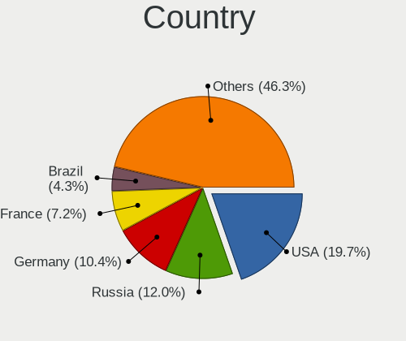
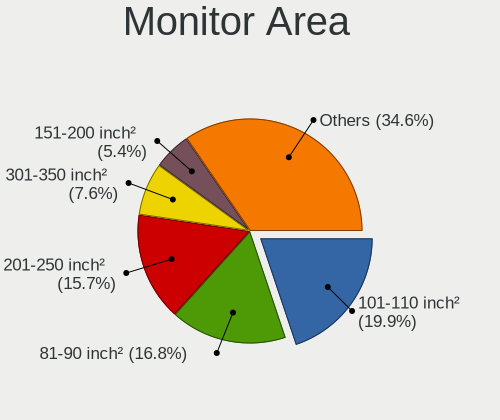

Debian - Tested Hardware & Statistics
-------------------------------------

A project to collect tested hardware configurations for Debian.

Anyone can contribute to this report by the [hw-probe](https://github.com/linuxhw/hw-probe) tool:

    sudo -E hw-probe -all -upload

Please contribute! Especially if your hardware is rare.

This is a report for all computer types. See also reports for [desktops](/Dist/Debian/Desktop/README.md) and [notebooks](/Dist/Debian/Notebook/README.md).

Contents
--------

* [ Test Cases ](#test-cases)

* [ System ](#system)
  - [ OS                       ](#os)
  - [ OS Family                ](#os-family)
  - [ Kernel                   ](#kernel)
  - [ Kernel Family            ](#kernel-family)
  - [ Kernel Major Ver.        ](#kernel-major-ver)
  - [ Arch                     ](#arch)
  - [ DE                       ](#de)
  - [ Display Server           ](#display-server)
  - [ Display Manager          ](#display-manager)
  - [ OS Lang                  ](#os-lang)
  - [ Boot Mode                ](#boot-mode)
  - [ Filesystem               ](#filesystem)
  - [ Part. scheme             ](#part-scheme)
  - [ Dual Boot with Linux/BSD ](#dual-boot-with-linuxbsd)
  - [ Dual Boot (Win)          ](#dual-boot-win)

* [ Board ](#board)
  - [ Vendor                   ](#vendor)
  - [ Model                    ](#model)
  - [ Model Family             ](#model-family)
  - [ MFG Year                 ](#mfg-year)
  - [ Form Factor              ](#form-factor)
  - [ Secure Boot              ](#secure-boot)
  - [ Coreboot                 ](#coreboot)
  - [ RAM Size                 ](#ram-size)
  - [ RAM Used                 ](#ram-used)
  - [ Total Drives             ](#total-drives)
  - [ Has CD-ROM               ](#has-cd-rom)
  - [ Has Ethernet             ](#has-ethernet)
  - [ Has WiFi                 ](#has-wifi)
  - [ Has Bluetooth            ](#has-bluetooth)

* [ Location ](#location)
  - [ Country                  ](#country)
  - [ City                     ](#city)

* [ Drives ](#drives)
  - [ Drive Vendor             ](#drive-vendor)
  - [ Drive Model              ](#drive-model)
  - [ HDD Vendor               ](#hdd-vendor)
  - [ SSD Vendor               ](#ssd-vendor)
  - [ Drive Kind               ](#drive-kind)
  - [ Drive Connector          ](#drive-connector)
  - [ Drive Size               ](#drive-size)
  - [ Space Total              ](#space-total)
  - [ Space Used               ](#space-used)
  - [ Malfunc. Drives          ](#malfunc-drives)
  - [ Malfunc. Drive Vendor    ](#malfunc-drive-vendor)
  - [ Malfunc. HDD Vendor      ](#malfunc-hdd-vendor)
  - [ Malfunc. Drive Kind      ](#malfunc-drive-kind)
  - [ Failed Drives            ](#failed-drives)
  - [ Failed Drive Vendor      ](#failed-drive-vendor)
  - [ Drive Status             ](#drive-status)

* [ Storage controller ](#storage-controller)
  - [ Storage Vendor           ](#storage-vendor)
  - [ Storage Model            ](#storage-model)
  - [ Storage Kind             ](#storage-kind)

* [ Processor ](#processor)
  - [ CPU Vendor               ](#cpu-vendor)
  - [ CPU Model                ](#cpu-model)
  - [ CPU Model Family         ](#cpu-model-family)
  - [ CPU Cores                ](#cpu-cores)
  - [ CPU Sockets              ](#cpu-sockets)
  - [ CPU Threads              ](#cpu-threads)
  - [ CPU Op-Modes             ](#cpu-op-modes)
  - [ CPU Microcode            ](#cpu-microcode)
  - [ CPU Microarch            ](#cpu-microarch)

* [ Graphics ](#graphics)
  - [ GPU Vendor               ](#gpu-vendor)
  - [ GPU Model                ](#gpu-model)
  - [ GPU Combo                ](#gpu-combo)
  - [ GPU Driver               ](#gpu-driver)
  - [ GPU Memory               ](#gpu-memory)

* [ Monitor ](#monitor)
  - [ Monitor Vendor           ](#monitor-vendor)
  - [ Monitor Model            ](#monitor-model)
  - [ Monitor Resolution       ](#monitor-resolution)
  - [ Monitor Diagonal         ](#monitor-diagonal)
  - [ Monitor Width            ](#monitor-width)
  - [ Aspect Ratio             ](#aspect-ratio)
  - [ Monitor Area             ](#monitor-area)
  - [ Pixel Density            ](#pixel-density)
  - [ Multiple Monitors        ](#multiple-monitors)

* [ Network ](#network)
  - [ Net Controller Vendor    ](#net-controller-vendor)
  - [ Net Controller Model     ](#net-controller-model)
  - [ Wireless Vendor          ](#wireless-vendor)
  - [ Wireless Model           ](#wireless-model)
  - [ Ethernet Vendor          ](#ethernet-vendor)
  - [ Ethernet Model           ](#ethernet-model)
  - [ Net Controller Kind      ](#net-controller-kind)
  - [ Used Controller          ](#used-controller)
  - [ NICs                     ](#nics)
  - [ IPv6                     ](#ipv6)

* [ Bluetooth ](#bluetooth)
  - [ Bluetooth Vendor         ](#bluetooth-vendor)
  - [ Bluetooth Model          ](#bluetooth-model)

* [ Sound ](#sound)
  - [ Sound Vendor             ](#sound-vendor)
  - [ Sound Model              ](#sound-model)

* [ Memory ](#memory)
  - [ Memory Vendor            ](#memory-vendor)
  - [ Memory Model             ](#memory-model)
  - [ Memory Kind              ](#memory-kind)
  - [ Memory Form Factor       ](#memory-form-factor)
  - [ Memory Size              ](#memory-size)
  - [ Memory Speed             ](#memory-speed)

* [ Printers & scanners ](#printers--scanners)
  - [ Printer Vendor           ](#printer-vendor)
  - [ Printer Model            ](#printer-model)
  - [ Scanner Vendor           ](#scanner-vendor)
  - [ Scanner Model            ](#scanner-model)

* [ Camera ](#camera)
  - [ Camera Vendor            ](#camera-vendor)
  - [ Camera Model             ](#camera-model)

* [ Security ](#security)
  - [ Fingerprint Vendor       ](#fingerprint-vendor)
  - [ Fingerprint Model        ](#fingerprint-model)
  - [ Chipcard Vendor          ](#chipcard-vendor)
  - [ Chipcard Model           ](#chipcard-model)

* [ Unsupported ](#unsupported)
  - [ Unsupported Devices      ](#unsupported-devices)
  - [ Unsupported Device Types ](#unsupported-device-types)

Test Cases
----------

Total: 14275

| Vendor        | Model                       | Form-Factor | Probe                                                      | Date         |
|---------------|-----------------------------|-------------|------------------------------------------------------------|--------------|
| ASUSTek       | P7H55D-M PRO                | Desktop     | [6049b3d69d](https://linux-hardware.org/?probe=6049b3d69d) | Jun 10, 2023 |
| Dell          | Latitude 7440               | Notebook    | [f63ada6c61](https://linux-hardware.org/?probe=f63ada6c61) | Jun 10, 2023 |
| Lenovo        | ThinkPad T470 20HDS14L00    | Notebook    | [a62438daef](https://linux-hardware.org/?probe=a62438daef) | Jun 10, 2023 |
| Lenovo        | ThinkPad T470 20HDS14L00    | Notebook    | [fab548c31e](https://linux-hardware.org/?probe=fab548c31e) | Jun 10, 2023 |
| MSI           | MAG B760 TOMAHAWK WIFI      | Desktop     | [88955e82f2](https://linux-hardware.org/?probe=88955e82f2) | Jun 10, 2023 |
| MSI           | B450M PRO-VDH MAX           | Desktop     | [4dcc51e897](https://linux-hardware.org/?probe=4dcc51e897) | Jun 10, 2023 |
| ASRock        | B365M Pro4-F                | Desktop     | [e54f1a9447](https://linux-hardware.org/?probe=e54f1a9447) | Jun 10, 2023 |
| Dell          | Inspiron 7506 2n1           | Convertible | [b3e01203b0](https://linux-hardware.org/?probe=b3e01203b0) | Jun 10, 2023 |
| ASUSTek       | K30BF_M32BF                 | Desktop     | [65b3c16165](https://linux-hardware.org/?probe=65b3c16165) | Jun 10, 2023 |
| Dell          | 0PV3YR A05                  | Server      | [ba4527394e](https://linux-hardware.org/?probe=ba4527394e) | Jun 10, 2023 |
| IT Channel... | N8xEJEK                     | Notebook    | [51a7e3f5b4](https://linux-hardware.org/?probe=51a7e3f5b4) | Jun 10, 2023 |
| Acidanther... | MacBookPro15,2              | Notebook    | [fb30b2eb35](https://linux-hardware.org/?probe=fb30b2eb35) | Jun 10, 2023 |
| IBM           | FAB2 Controller Producti... | Server      | [af396cb333](https://linux-hardware.org/?probe=af396cb333) | Jun 10, 2023 |
| Lenovo        | Yoga 6 13ALC7 82UD          | Convertible | [012e8255f3](https://linux-hardware.org/?probe=012e8255f3) | Jun 09, 2023 |
| ASUSTek       | P5GC-MX/1333                | Desktop     | [b47fab6285](https://linux-hardware.org/?probe=b47fab6285) | Jun 09, 2023 |
| Intel         | powered classmate PC        | Notebook    | [e530f037c6](https://linux-hardware.org/?probe=e530f037c6) | Jun 09, 2023 |
| Gigabyte      | B550M DS3H                  | Desktop     | [ea724e204b](https://linux-hardware.org/?probe=ea724e204b) | Jun 09, 2023 |
| Dell          | 0XCR8D A03                  | Desktop     | [e37bceb6fb](https://linux-hardware.org/?probe=e37bceb6fb) | Jun 09, 2023 |
| Dell          | Latitude 5480               | Notebook    | [5b3fb0b4f8](https://linux-hardware.org/?probe=5b3fb0b4f8) | Jun 09, 2023 |
| Digibras      | NH4CU03                     | Notebook    | [c66d30943e](https://linux-hardware.org/?probe=c66d30943e) | Jun 09, 2023 |
| ECS           | G31T-M9                     | Desktop     | [d8ca98b733](https://linux-hardware.org/?probe=d8ca98b733) | Jun 09, 2023 |
| Gigabyte      | B450M S2H V2                | Desktop     | [fb883c82bc](https://linux-hardware.org/?probe=fb883c82bc) | Jun 09, 2023 |
| Gigabyte      | B450 AORUS ELITE            | Desktop     | [b2c39972c2](https://linux-hardware.org/?probe=b2c39972c2) | Jun 09, 2023 |
| Gigabyte      | B450M H                     | Desktop     | [e54b5ce7da](https://linux-hardware.org/?probe=e54b5ce7da) | Jun 09, 2023 |
| Acer          | TravelMate P215-53          | Notebook    | [9536bf547a](https://linux-hardware.org/?probe=9536bf547a) | Jun 09, 2023 |
| Fujitsu       | LIFEBOOK U7411              | Notebook    | [ab35c95b72](https://linux-hardware.org/?probe=ab35c95b72) | Jun 09, 2023 |
| Gigabyte      | GA-78LMT-USB3 R2 sex        | Desktop     | [bcad738da6](https://linux-hardware.org/?probe=bcad738da6) | Jun 09, 2023 |
| Gigabyte      | X570 GAMING X               | Desktop     | [576a624a1b](https://linux-hardware.org/?probe=576a624a1b) | Jun 09, 2023 |
| Acer          | TravelMate P449-G2-M        | Notebook    | [6b42200bee](https://linux-hardware.org/?probe=6b42200bee) | Jun 09, 2023 |
| Raspberry ... | Raspberry Pi 4 Model B R... | Soc         | [50844825e2](https://linux-hardware.org/?probe=50844825e2) | Jun 08, 2023 |
| HP            | G42                         | Notebook    | [fe8d2be276](https://linux-hardware.org/?probe=fe8d2be276) | Jun 08, 2023 |
| HP            | Laptop 14-cm0xxx            | Notebook    | [f1100ce875](https://linux-hardware.org/?probe=f1100ce875) | Jun 08, 2023 |
| HP            | G42                         | Notebook    | [4f33462d46](https://linux-hardware.org/?probe=4f33462d46) | Jun 08, 2023 |
| Acer          | TravelMate P449-G2-M        | Notebook    | [0fa009ad04](https://linux-hardware.org/?probe=0fa009ad04) | Jun 08, 2023 |
| Inventec      | VXC Class A02               | Desktop     | [c2bc26120f](https://linux-hardware.org/?probe=c2bc26120f) | Jun 08, 2023 |
| ASUSTek       | M4A78T-E                    | Desktop     | [fa22309a62](https://linux-hardware.org/?probe=fa22309a62) | Jun 08, 2023 |
| MSI           | B450M-A PRO MAX             | Desktop     | [230465c003](https://linux-hardware.org/?probe=230465c003) | Jun 08, 2023 |
| MSI           | GE60 2PL                    | Notebook    | [e1d118e2d2](https://linux-hardware.org/?probe=e1d118e2d2) | Jun 08, 2023 |
| HP            | G62                         | Notebook    | [fb9522ceac](https://linux-hardware.org/?probe=fb9522ceac) | Jun 08, 2023 |
| Acer          | Aspire 7741                 | Notebook    | [09b2301e59](https://linux-hardware.org/?probe=09b2301e59) | Jun 08, 2023 |
| Lenovo        | ThinkPad X1 Tablet Gen 3... | Tablet      | [4797a4c2f9](https://linux-hardware.org/?probe=4797a4c2f9) | Jun 08, 2023 |
| Lenovo        | ThinkPad X1 Tablet Gen 3... | Tablet      | [53833409d1](https://linux-hardware.org/?probe=53833409d1) | Jun 08, 2023 |
| Lenovo        | ThinkPad X131e 3374A17      | Notebook    | [d992393271](https://linux-hardware.org/?probe=d992393271) | Jun 08, 2023 |
| Lenovo        | ThinkPad X131e 3374A17      | Notebook    | [dd385507aa](https://linux-hardware.org/?probe=dd385507aa) | Jun 08, 2023 |
| Lenovo        | ThinkPad X1 Carbon Gen 9... | Notebook    | [ef71a1641b](https://linux-hardware.org/?probe=ef71a1641b) | Jun 08, 2023 |
| HP            | Pavilion 17                 | Notebook    | [da809f90cc](https://linux-hardware.org/?probe=da809f90cc) | Jun 07, 2023 |
| Unknown       | Unknown                     | Desktop     | [b2c6247a0e](https://linux-hardware.org/?probe=b2c6247a0e) | Jun 07, 2023 |
| Dell          | Latitude 5530               | Notebook    | [1e3452635f](https://linux-hardware.org/?probe=1e3452635f) | Jun 07, 2023 |
| ASRock        | B365M Pro4-F                | Desktop     | [7ed0f0346c](https://linux-hardware.org/?probe=7ed0f0346c) | Jun 07, 2023 |
| ASUSTek       | H97M-E                      | Desktop     | [97140e9688](https://linux-hardware.org/?probe=97140e9688) | Jun 07, 2023 |
| HP            | ProBook 4530s               | Notebook    | [bdb6739deb](https://linux-hardware.org/?probe=bdb6739deb) | Jun 07, 2023 |
| Intel         | HURONRIVER                  | Notebook    | [57035a777c](https://linux-hardware.org/?probe=57035a777c) | Jun 07, 2023 |
| Lenovo        | ThinkCentre A58e 0841B4Y    | Desktop     | [fe410cd5db](https://linux-hardware.org/?probe=fe410cd5db) | Jun 07, 2023 |
| Packard Be... | EasyNote ENTF71BM           | Notebook    | [490ae0bc1c](https://linux-hardware.org/?probe=490ae0bc1c) | Jun 07, 2023 |
| MSI           | Pulse GL66 12UDK            | Notebook    | [8c9a9eb310](https://linux-hardware.org/?probe=8c9a9eb310) | Jun 06, 2023 |
| Dell          | 007MXD A00                  | Mini pc     | [2532dfadd0](https://linux-hardware.org/?probe=2532dfadd0) | Jun 06, 2023 |
| Dell          | 007MXD A00                  | Mini pc     | [5cc10b1e1e](https://linux-hardware.org/?probe=5cc10b1e1e) | Jun 06, 2023 |
| Gigabyte      | M68MT-S2                    | Desktop     | [2ff7b71aed](https://linux-hardware.org/?probe=2ff7b71aed) | Jun 06, 2023 |
| ASUSTek       | TUF Gaming B650-PLUS WIF... | Desktop     | [db42ab94ee](https://linux-hardware.org/?probe=db42ab94ee) | Jun 06, 2023 |
| HP            | Pavilion g7                 | Notebook    | [f8cccf0fec](https://linux-hardware.org/?probe=f8cccf0fec) | Jun 06, 2023 |
| Gigabyte      | H61M-DS2                    | Desktop     | [10ecbb2117](https://linux-hardware.org/?probe=10ecbb2117) | Jun 06, 2023 |
| HP            | 250 15.6 inch G9 Noteboo... | Notebook    | [be9987ca28](https://linux-hardware.org/?probe=be9987ca28) | Jun 06, 2023 |
| Fujitsu       | FMVNA4NE-                   | Notebook    | [626a677331](https://linux-hardware.org/?probe=626a677331) | Jun 06, 2023 |
| Dell          | 0PV3YR A05                  | Server      | [c685007aa8](https://linux-hardware.org/?probe=c685007aa8) | Jun 06, 2023 |
| ASUSTek       | ROG STRIX X570-E GAMING     | Desktop     | [d288737b23](https://linux-hardware.org/?probe=d288737b23) | Jun 05, 2023 |
| Lenovo        | ThinkPad T15 Gen 1 20S60... | Notebook    | [c20dd8572a](https://linux-hardware.org/?probe=c20dd8572a) | Jun 05, 2023 |
| ECS           | G31T-M9                     | Desktop     | [8bb444bdd6](https://linux-hardware.org/?probe=8bb444bdd6) | Jun 05, 2023 |
| HP            | ENVY Laptop 13-ba0xxx       | Notebook    | [22143d333a](https://linux-hardware.org/?probe=22143d333a) | Jun 05, 2023 |
| Gigabyte      | M68MT-S2                    | Desktop     | [2ec944c5d0](https://linux-hardware.org/?probe=2ec944c5d0) | Jun 05, 2023 |
| Aquarius      | NS585                       | Notebook    | [b3f11e4a53](https://linux-hardware.org/?probe=b3f11e4a53) | Jun 05, 2023 |
| Fujitsu       | FMVNA4NE-                   | Notebook    | [b1c1176a5b](https://linux-hardware.org/?probe=b1c1176a5b) | Jun 05, 2023 |
| Unknown       | Unknown                     | Desktop     | [8896a460d4](https://linux-hardware.org/?probe=8896a460d4) | Jun 05, 2023 |
| Gigabyte      | M68MT-S2                    | Desktop     | [d392dff6bb](https://linux-hardware.org/?probe=d392dff6bb) | Jun 05, 2023 |
| ECS           | G31T-M9                     | Desktop     | [630360ab38](https://linux-hardware.org/?probe=630360ab38) | Jun 05, 2023 |
| ASUSTek       | TUF Gaming X670E-PLUS WI... | Desktop     | [3a1c1daa3d](https://linux-hardware.org/?probe=3a1c1daa3d) | Jun 05, 2023 |
| Gigabyte      | M68MT-S2                    | Desktop     | [991c5472ac](https://linux-hardware.org/?probe=991c5472ac) | Jun 05, 2023 |
| Raspberry ... | Raspberry Pi 3 Model B R... | Soc         | [72eb9f0d86](https://linux-hardware.org/?probe=72eb9f0d86) | Jun 05, 2023 |
| Dell          | 0PV3YR A05                  | Server      | [da03bf4e08](https://linux-hardware.org/?probe=da03bf4e08) | Jun 05, 2023 |
| Gigabyte      | H470M DS3H                  | Desktop     | [e7bbac1b14](https://linux-hardware.org/?probe=e7bbac1b14) | Jun 04, 2023 |
| Unknown       | Unknown                     | Soc         | [9cb76f0184](https://linux-hardware.org/?probe=9cb76f0184) | Jun 04, 2023 |
| Unknown       | Unknown                     | Soc         | [7e2052896c](https://linux-hardware.org/?probe=7e2052896c) | Jun 04, 2023 |
| Dell          | Latitude 3410               | Notebook    | [820e62c9d3](https://linux-hardware.org/?probe=820e62c9d3) | Jun 04, 2023 |
| Gigabyte      | B360M HD3                   | Desktop     | [fcb1b60578](https://linux-hardware.org/?probe=fcb1b60578) | Jun 04, 2023 |
| MSI           | GL75 Leopard 10SER          | Notebook    | [24111ade43](https://linux-hardware.org/?probe=24111ade43) | Jun 04, 2023 |
| MSI           | H81M-E34                    | Desktop     | [4c5f5c7903](https://linux-hardware.org/?probe=4c5f5c7903) | Jun 04, 2023 |
| Dell          | Latitude 3410               | Notebook    | [12515d41c8](https://linux-hardware.org/?probe=12515d41c8) | Jun 04, 2023 |
| HUAWEI        | BOHK-WAX9X                  | Notebook    | [1352a1d7c7](https://linux-hardware.org/?probe=1352a1d7c7) | Jun 04, 2023 |
| Gigabyte      | B660M GAMING X DDR4         | Desktop     | [0bd883cae2](https://linux-hardware.org/?probe=0bd883cae2) | Jun 04, 2023 |
| ASUSTek       | Q502LA                      | Notebook    | [679a477085](https://linux-hardware.org/?probe=679a477085) | Jun 04, 2023 |
| Clevo         | M670SRU                     | Notebook    | [0935f74d34](https://linux-hardware.org/?probe=0935f74d34) | Jun 04, 2023 |
| Clevo         | M670SRU                     | Notebook    | [e163d57d56](https://linux-hardware.org/?probe=e163d57d56) | Jun 04, 2023 |
| AVITA         | NS14A8                      | Notebook    | [a576b4d5cc](https://linux-hardware.org/?probe=a576b4d5cc) | Jun 04, 2023 |
| Dell          | Latitude 5420               | Notebook    | [9085f3c8f7](https://linux-hardware.org/?probe=9085f3c8f7) | Jun 04, 2023 |
| Toshiba       | WT8-A                       | Notebook    | [01e8918ef6](https://linux-hardware.org/?probe=01e8918ef6) | Jun 04, 2023 |
| Dell          | 01XK1W A00                  | Desktop     | [8690705151](https://linux-hardware.org/?probe=8690705151) | Jun 04, 2023 |
| Acer          | Aspire 5738                 | Notebook    | [138d22e03e](https://linux-hardware.org/?probe=138d22e03e) | Jun 04, 2023 |
| HP            | 843C                        | Desktop     | [e69fbf77e4](https://linux-hardware.org/?probe=e69fbf77e4) | Jun 04, 2023 |
| HP            | 843C                        | Desktop     | [21751c1221](https://linux-hardware.org/?probe=21751c1221) | Jun 04, 2023 |
| Pegatron      | Spring Peak                 | Notebook    | [a10a42a44d](https://linux-hardware.org/?probe=a10a42a44d) | Jun 04, 2023 |
| Pegatron      | Spring Peak                 | Notebook    | [e58b2a1237](https://linux-hardware.org/?probe=e58b2a1237) | Jun 04, 2023 |
| Pegatron      | Spring Peak                 | Notebook    | [ce54d0192d](https://linux-hardware.org/?probe=ce54d0192d) | Jun 04, 2023 |
| Lenovo        | ThinkStation D30 42234T7    | Desktop     | [18cb6a946b](https://linux-hardware.org/?probe=18cb6a946b) | Jun 03, 2023 |
| Lenovo        | ThinkPad E420 1141R79       | Notebook    | [7f66bf0045](https://linux-hardware.org/?probe=7f66bf0045) | Jun 03, 2023 |
| Apple         | MacBookPro9,2               | Notebook    | [eb51cb6dcf](https://linux-hardware.org/?probe=eb51cb6dcf) | Jun 03, 2023 |
| Acer          | Aspire V3-372               | Notebook    | [1200863830](https://linux-hardware.org/?probe=1200863830) | Jun 03, 2023 |
| Acer          | Aspire A115-31              | Notebook    | [338f025bce](https://linux-hardware.org/?probe=338f025bce) | Jun 03, 2023 |
| ASUSTek       | PRIME H310M-R R2.0          | Desktop     | [5387bcbf7d](https://linux-hardware.org/?probe=5387bcbf7d) | Jun 03, 2023 |
| ASUSTek       | PRIME H310M-R R2.0          | Desktop     | [881df8f45c](https://linux-hardware.org/?probe=881df8f45c) | Jun 03, 2023 |
| ASUSTek       | PRIME H310M-R R2.0          | Desktop     | [0dd3be3300](https://linux-hardware.org/?probe=0dd3be3300) | Jun 03, 2023 |
| ASUSTek       | SABERTOOTH 990FX R2.0       | Desktop     | [8d4d1f7313](https://linux-hardware.org/?probe=8d4d1f7313) | Jun 03, 2023 |
| Apple         | MacBookPro7,1               | Notebook    | [b1513dc005](https://linux-hardware.org/?probe=b1513dc005) | Jun 03, 2023 |
| HP            | Laptop 14-cm0xxx            | Notebook    | [8933e1b0ad](https://linux-hardware.org/?probe=8933e1b0ad) | Jun 03, 2023 |
| Acer          | Aspire E5-772G              | Notebook    | [5bd684bed6](https://linux-hardware.org/?probe=5bd684bed6) | Jun 02, 2023 |
| Acer          | Aspire E5-772G              | Notebook    | [f454cdf394](https://linux-hardware.org/?probe=f454cdf394) | Jun 02, 2023 |
| Lenovo        | ThinkPad E15 Gen 3 20YHS... | Notebook    | [b546b2e7f1](https://linux-hardware.org/?probe=b546b2e7f1) | Jun 02, 2023 |
| Lenovo        | ThinkPad T470 W10DG 20JN... | Notebook    | [2a67b74a26](https://linux-hardware.org/?probe=2a67b74a26) | Jun 02, 2023 |
| Gigabyte      | P75-D3                      | Desktop     | [a56c3ceb55](https://linux-hardware.org/?probe=a56c3ceb55) | Jun 02, 2023 |
| Apple         | MacBookPro5,5               | Notebook    | [9bf36ef4a5](https://linux-hardware.org/?probe=9bf36ef4a5) | Jun 02, 2023 |
| ASUSTek       | TUF Gaming X570-PLUS        | Desktop     | [d6561ecd7b](https://linux-hardware.org/?probe=d6561ecd7b) | Jun 02, 2023 |
| HP            | ZBook 15 G6                 | Notebook    | [2f7bb21988](https://linux-hardware.org/?probe=2f7bb21988) | Jun 02, 2023 |
| Lenovo        | ThinkPad T470 20HES0FW00    | Notebook    | [174ffa62e4](https://linux-hardware.org/?probe=174ffa62e4) | Jun 02, 2023 |
| HC Technol... | HCAR357-NR                  | Desktop     | [58f698b10a](https://linux-hardware.org/?probe=58f698b10a) | Jun 02, 2023 |
| MSI           | G31TM-P21                   | Desktop     | [964377db0b](https://linux-hardware.org/?probe=964377db0b) | Jun 02, 2023 |
| ASRockRack    | X470D4U2-2T                 | Desktop     | [43901d3db7](https://linux-hardware.org/?probe=43901d3db7) | Jun 02, 2023 |
| ASUSTek       | PRIME B450M-K               | Desktop     | [853bd25ca5](https://linux-hardware.org/?probe=853bd25ca5) | Jun 02, 2023 |
| ASUSTek       | PRIME B450M-K               | Desktop     | [3a9fb692f1](https://linux-hardware.org/?probe=3a9fb692f1) | Jun 02, 2023 |
| ASUSTek       | PRIME B450M-K               | Desktop     | [9b549fe65a](https://linux-hardware.org/?probe=9b549fe65a) | Jun 02, 2023 |
| ASUSTek       | PRIME B450M-K               | Desktop     | [db685837d0](https://linux-hardware.org/?probe=db685837d0) | Jun 02, 2023 |
| ASUSTek       | PRIME B450M-K               | Desktop     | [968b38e0b9](https://linux-hardware.org/?probe=968b38e0b9) | Jun 02, 2023 |
| ASUSTek       | PRIME B450M-K               | Desktop     | [c9a04d8da0](https://linux-hardware.org/?probe=c9a04d8da0) | Jun 02, 2023 |
| ASUSTek       | PRIME B450M-K               | Desktop     | [238931757a](https://linux-hardware.org/?probe=238931757a) | Jun 02, 2023 |
| ASUSTek       | PRIME B450M-K               | Desktop     | [e190e991a6](https://linux-hardware.org/?probe=e190e991a6) | Jun 02, 2023 |
| ASUSTek       | PRIME B450M-K               | Desktop     | [0816e77499](https://linux-hardware.org/?probe=0816e77499) | Jun 02, 2023 |
| ASUSTek       | PRIME B450M-K               | Desktop     | [ff143ac918](https://linux-hardware.org/?probe=ff143ac918) | Jun 02, 2023 |
| Aquarius      | NS585                       | Notebook    | [6f93385917](https://linux-hardware.org/?probe=6f93385917) | Jun 02, 2023 |
| ASUSTek       | Z87-C                       | Desktop     | [20242d8299](https://linux-hardware.org/?probe=20242d8299) | Jun 02, 2023 |
| Dell          | Inspiron 5567               | Notebook    | [bd3a6c5bd8](https://linux-hardware.org/?probe=bd3a6c5bd8) | Jun 02, 2023 |
| Aquarius      | NS585                       | Notebook    | [091267ec3a](https://linux-hardware.org/?probe=091267ec3a) | Jun 02, 2023 |
| ASUSTek       | P8H61                       | Desktop     | [7e9f999121](https://linux-hardware.org/?probe=7e9f999121) | Jun 02, 2023 |
| Aquarius      | NS585                       | Notebook    | [7534819f94](https://linux-hardware.org/?probe=7534819f94) | Jun 02, 2023 |
| Lenovo        | S40-70 80GQ                 | Notebook    | [9a3fbc7388](https://linux-hardware.org/?probe=9a3fbc7388) | Jun 02, 2023 |
| Dell          | Latitude E6430              | Notebook    | [b129765265](https://linux-hardware.org/?probe=b129765265) | Jun 02, 2023 |
| Dell          | 0D456H A00                  | Server      | [4e0d53d64d](https://linux-hardware.org/?probe=4e0d53d64d) | Jun 02, 2023 |
| Dell          | 01XK1W A00                  | Desktop     | [5846820609](https://linux-hardware.org/?probe=5846820609) | Jun 02, 2023 |
| Lenovo        | SHARKBAY SDK0E50510 WIN     | Desktop     | [07e5342fb8](https://linux-hardware.org/?probe=07e5342fb8) | Jun 02, 2023 |
| Intel         | DH61WW AAG23116-204         | Desktop     | [2bfe32ef05](https://linux-hardware.org/?probe=2bfe32ef05) | Jun 02, 2023 |
| HP            | EliteBook 840 G6            | Notebook    | [81ec1cc134](https://linux-hardware.org/?probe=81ec1cc134) | Jun 01, 2023 |
| Gigabyte      | H61M-DS2                    | Desktop     | [f3b666f725](https://linux-hardware.org/?probe=f3b666f725) | Jun 01, 2023 |
| Intel         | NUC11ATBPE M49844-202       | Mini pc     | [2a1e548be7](https://linux-hardware.org/?probe=2a1e548be7) | Jun 01, 2023 |
| ChangWang     | CW56-58                     | Desktop     | [e00e626ea6](https://linux-hardware.org/?probe=e00e626ea6) | Jun 01, 2023 |
| MSI           | H510M-A PRO                 | Desktop     | [8557cd4efa](https://linux-hardware.org/?probe=8557cd4efa) | Jun 01, 2023 |
| Gigabyte      | H61M-DS2                    | Desktop     | [1cf7ec0aa5](https://linux-hardware.org/?probe=1cf7ec0aa5) | Jun 01, 2023 |
| Gigabyte      | H61M-DS2                    | Desktop     | [7f9d81bd57](https://linux-hardware.org/?probe=7f9d81bd57) | Jun 01, 2023 |
| Dell          | Latitude E5510              | Notebook    | [4a0bc9e53f](https://linux-hardware.org/?probe=4a0bc9e53f) | Jun 01, 2023 |
| Dell          | System Inspiron N4110       | Notebook    | [ea09e45a4f](https://linux-hardware.org/?probe=ea09e45a4f) | Jun 01, 2023 |
| Gigabyte      | H410M S2H V3                | Desktop     | [78e4d7a22b](https://linux-hardware.org/?probe=78e4d7a22b) | Jun 01, 2023 |
| ASUSTek       | H81M-C                      | Desktop     | [5fc6ec135b](https://linux-hardware.org/?probe=5fc6ec135b) | Jun 01, 2023 |
| Aquarius      | NS585                       | Notebook    | [ffa7425b95](https://linux-hardware.org/?probe=ffa7425b95) | Jun 01, 2023 |
| Aquarius      | NS585                       | Notebook    | [fafcbbe90e](https://linux-hardware.org/?probe=fafcbbe90e) | Jun 01, 2023 |
| Lenovo        | Legion Y540-15IRH 81SX      | Notebook    | [ffc6b5e345](https://linux-hardware.org/?probe=ffc6b5e345) | Jun 01, 2023 |
| Supermicro    | X11SCD-F                    | Desktop     | [4646e2fe85](https://linux-hardware.org/?probe=4646e2fe85) | Jun 01, 2023 |
| Supermicro    | X11SCD-F                    | Desktop     | [80072f2519](https://linux-hardware.org/?probe=80072f2519) | Jun 01, 2023 |
| Supermicro    | X11SCD-F                    | Desktop     | [365eeba4c9](https://linux-hardware.org/?probe=365eeba4c9) | Jun 01, 2023 |
| Supermicro    | X12STD-F                    | Desktop     | [df7c4a738e](https://linux-hardware.org/?probe=df7c4a738e) | Jun 01, 2023 |
| Supermicro    | X12STD-F                    | Desktop     | [8511ce89ad](https://linux-hardware.org/?probe=8511ce89ad) | Jun 01, 2023 |
| ASRock        | J4125-ITX                   | Desktop     | [31e0f624be](https://linux-hardware.org/?probe=31e0f624be) | Jun 01, 2023 |
| Dell          | Latitude E5510              | Notebook    | [9457826049](https://linux-hardware.org/?probe=9457826049) | Jun 01, 2023 |
| Dell          | 0PV3YR A05                  | Server      | [a4363d8242](https://linux-hardware.org/?probe=a4363d8242) | Jun 01, 2023 |
| Raspberry ... | Raspberry Pi Compute Mod... | Soc         | [19043cab25](https://linux-hardware.org/?probe=19043cab25) | Jun 01, 2023 |
| Positivo      | C500                        | Notebook    | [8dba4589fe](https://linux-hardware.org/?probe=8dba4589fe) | Jun 01, 2023 |
| Gigabyte      | Z790 AORUS ELITE AX DDR4    | Desktop     | [5f1045564e](https://linux-hardware.org/?probe=5f1045564e) | Jun 01, 2023 |
| Inventec      | D CLASS A02                 | Desktop     | [433df815db](https://linux-hardware.org/?probe=433df815db) | Jun 01, 2023 |
| ASUSTek       | X200LA                      | Notebook    | [ae3925153d](https://linux-hardware.org/?probe=ae3925153d) | May 31, 2023 |
| ASUSTek       | 1225B                       | Notebook    | [769a6736f1](https://linux-hardware.org/?probe=769a6736f1) | May 31, 2023 |
| Intel         | DB75EN AAG39650-302         | Desktop     | [9872e0cb5c](https://linux-hardware.org/?probe=9872e0cb5c) | May 31, 2023 |
| ASUSTek       | ROG STRIX Z690-G GAMING ... | Desktop     | [32a85827df](https://linux-hardware.org/?probe=32a85827df) | May 31, 2023 |
| Unknown       | Unknown                     | Notebook    | [412c6d4af8](https://linux-hardware.org/?probe=412c6d4af8) | May 31, 2023 |
| ASRock        | H110M-HDV R3.0              | Desktop     | [670044aef5](https://linux-hardware.org/?probe=670044aef5) | May 31, 2023 |
| Fujitsu       | LIFEBOOK E780               | Notebook    | [8459f7cfee](https://linux-hardware.org/?probe=8459f7cfee) | May 31, 2023 |
| Apple         | MacBookPro16,1              | Notebook    | [717c7884c8](https://linux-hardware.org/?probe=717c7884c8) | May 31, 2023 |
| HP            | EliteBook 840 G4            | Notebook    | [46ccbd2d62](https://linux-hardware.org/?probe=46ccbd2d62) | May 31, 2023 |
| HP            | EliteBook 840 G4            | Notebook    | [b90cb27f97](https://linux-hardware.org/?probe=b90cb27f97) | May 31, 2023 |
| ECS           | G31T-M9                     | Desktop     | [f227323587](https://linux-hardware.org/?probe=f227323587) | May 31, 2023 |
| Lenovo        | IdeaPad 330S-15IKB 81F5     | Notebook    | [5f8bd19e3d](https://linux-hardware.org/?probe=5f8bd19e3d) | May 31, 2023 |
| ASUSTek       | PN53-G                      | Mini pc     | [f2c67ed13d](https://linux-hardware.org/?probe=f2c67ed13d) | May 31, 2023 |
| ASUSTek       | PN53-G                      | Mini pc     | [1e5f49bbf4](https://linux-hardware.org/?probe=1e5f49bbf4) | May 31, 2023 |
| ASUSTek       | Maximus VIII RANGER         | Desktop     | [354e883340](https://linux-hardware.org/?probe=354e883340) | May 31, 2023 |
| Dell          | 0PV3YR A05                  | Server      | [aad1baf686](https://linux-hardware.org/?probe=aad1baf686) | May 31, 2023 |
| Acer          | TravelMate P449-G2-M        | Notebook    | [41177ef027](https://linux-hardware.org/?probe=41177ef027) | May 31, 2023 |
| ASRock        | G41M-VS3                    | Desktop     | [166031ba4d](https://linux-hardware.org/?probe=166031ba4d) | May 31, 2023 |
| ASRock        | G41M-VS3                    | Desktop     | [8f55c9aa98](https://linux-hardware.org/?probe=8f55c9aa98) | May 31, 2023 |
| Dell          | Latitude 5411               | Notebook    | [8583aa2091](https://linux-hardware.org/?probe=8583aa2091) | May 31, 2023 |
| ASUSTek       | K52Jc                       | Notebook    | [ad0b57d7c6](https://linux-hardware.org/?probe=ad0b57d7c6) | May 31, 2023 |
| Lenovo        | ThinkPad W500 4058CTO       | Notebook    | [e065b72b88](https://linux-hardware.org/?probe=e065b72b88) | May 31, 2023 |
| ASUSTek       | K52Jc                       | Notebook    | [7709d9fd16](https://linux-hardware.org/?probe=7709d9fd16) | May 31, 2023 |
| Dell          | Latitude E5510              | Notebook    | [52e1023195](https://linux-hardware.org/?probe=52e1023195) | May 31, 2023 |
| Lenovo        | ThinkPad W500 4058CTO       | Notebook    | [52047d2230](https://linux-hardware.org/?probe=52047d2230) | May 31, 2023 |
| Dell          | 01XK1W A00                  | Desktop     | [8a18b7bada](https://linux-hardware.org/?probe=8a18b7bada) | May 31, 2023 |
| Dell          | 01XK1W A00                  | Desktop     | [611cf59f44](https://linux-hardware.org/?probe=611cf59f44) | May 31, 2023 |
| Intel         | X99                         | Desktop     | [cef654d9c5](https://linux-hardware.org/?probe=cef654d9c5) | May 30, 2023 |
| Dell          | Latitude E5510              | Notebook    | [aa0f6a81b6](https://linux-hardware.org/?probe=aa0f6a81b6) | May 30, 2023 |
| ASUSTek       | P4S8L                       | Desktop     | [c26269028e](https://linux-hardware.org/?probe=c26269028e) | May 30, 2023 |
| HP            | Laptop 17-ca0xxx            | Notebook    | [3222c41173](https://linux-hardware.org/?probe=3222c41173) | May 30, 2023 |
| ASUSTek       | PRIME B550-PLUS             | Desktop     | [698e3b5e35](https://linux-hardware.org/?probe=698e3b5e35) | May 30, 2023 |
| Chuwi         | HeroBook Air                | Notebook    | [80afc31c99](https://linux-hardware.org/?probe=80afc31c99) | May 30, 2023 |
| Lenovo        | ThinkPad T460 20FMS4LL00    | Notebook    | [7519448ca8](https://linux-hardware.org/?probe=7519448ca8) | May 30, 2023 |
| Gigabyte      | M68MT-S2                    | Desktop     | [c56271ea6a](https://linux-hardware.org/?probe=c56271ea6a) | May 30, 2023 |
| Lenovo        | IdeaPad S340-15API 81NC     | Notebook    | [ad3464fd76](https://linux-hardware.org/?probe=ad3464fd76) | May 30, 2023 |
| Lenovo        | ThinkPad X1 Yoga 1st 20F... | Convertible | [e4fde15d9f](https://linux-hardware.org/?probe=e4fde15d9f) | May 30, 2023 |
| Gigabyte      | M68MT-S2                    | Desktop     | [a0ffb7fd40](https://linux-hardware.org/?probe=a0ffb7fd40) | May 30, 2023 |
| Gigabyte      | H61M-S2PV                   | Desktop     | [446d026ac1](https://linux-hardware.org/?probe=446d026ac1) | May 30, 2023 |
| Supermicro    | X9DR3-F                     | Server      | [afcfc0fdf3](https://linux-hardware.org/?probe=afcfc0fdf3) | May 30, 2023 |
| MSI           | H55M-ED55                   | Desktop     | [a89bdc8ec0](https://linux-hardware.org/?probe=a89bdc8ec0) | May 30, 2023 |
| Dell          | 0PV3YR A05                  | Server      | [dd6ecadb7e](https://linux-hardware.org/?probe=dd6ecadb7e) | May 30, 2023 |
| Acer          | Aspire A315-58              | Notebook    | [66de62e958](https://linux-hardware.org/?probe=66de62e958) | May 29, 2023 |
| Raspberry ... | Raspberry Pi 4 Model B R... | Soc         | [6e68e63f53](https://linux-hardware.org/?probe=6e68e63f53) | May 29, 2023 |
| Lenovo        | ThinkPad E15 Gen 4 21E60... | Notebook    | [c8e0efc288](https://linux-hardware.org/?probe=c8e0efc288) | May 29, 2023 |
| ASRock        | H310CM-HDV                  | Desktop     | [e6e310a9b4](https://linux-hardware.org/?probe=e6e310a9b4) | May 29, 2023 |
| Lenovo        | ThinkPad E15 Gen 4 21E60... | Notebook    | [da399dc7cc](https://linux-hardware.org/?probe=da399dc7cc) | May 29, 2023 |
| ASRock        | H310CM-HDV                  | Desktop     | [84e791ec5e](https://linux-hardware.org/?probe=84e791ec5e) | May 29, 2023 |
| Inventec      | VXC Class A02               | Desktop     | [0befe25313](https://linux-hardware.org/?probe=0befe25313) | May 29, 2023 |
| Inventec      | VXC Class A02               | Desktop     | [363827ad8c](https://linux-hardware.org/?probe=363827ad8c) | May 29, 2023 |
| Fujitsu       | LIFEBOOK E780               | Notebook    | [aac95cf765](https://linux-hardware.org/?probe=aac95cf765) | May 29, 2023 |
| Dell          | Latitude E5470              | Notebook    | [77d85b619e](https://linux-hardware.org/?probe=77d85b619e) | May 29, 2023 |
| Gigabyte      | M68MT-S2                    | Desktop     | [80c2e03e4e](https://linux-hardware.org/?probe=80c2e03e4e) | May 29, 2023 |
| ECS           | G31T-M9                     | Desktop     | [8f4cd5b132](https://linux-hardware.org/?probe=8f4cd5b132) | May 29, 2023 |
| MSI           | Z390-A PRO                  | Desktop     | [c797a10bff](https://linux-hardware.org/?probe=c797a10bff) | May 29, 2023 |
| Gigabyte      | M68MT-S2                    | Desktop     | [ffe8469edc](https://linux-hardware.org/?probe=ffe8469edc) | May 29, 2023 |
| Lenovo        | IdeaPad 100-15IBD 80QQ      | Notebook    | [deaa4b357c](https://linux-hardware.org/?probe=deaa4b357c) | May 29, 2023 |
| Lenovo        | IdeaPad 100-15IBD 80QQ      | Notebook    | [af312b5e91](https://linux-hardware.org/?probe=af312b5e91) | May 29, 2023 |
| ASUSTek       | Z10PA-D8 Series             | Desktop     | [02821a3220](https://linux-hardware.org/?probe=02821a3220) | May 29, 2023 |
| Gigabyte      | GA-M56S-S3                  | Desktop     | [e9f274ad89](https://linux-hardware.org/?probe=e9f274ad89) | May 29, 2023 |
| Dell          | 040DDP A01                  | Desktop     | [bce6b61241](https://linux-hardware.org/?probe=bce6b61241) | May 29, 2023 |
| Gigabyte      | M68MT-S2                    | Desktop     | [62a5559050](https://linux-hardware.org/?probe=62a5559050) | May 29, 2023 |
| Gigabyte      | GA-M56S-S3                  | Desktop     | [a9c147d701](https://linux-hardware.org/?probe=a9c147d701) | May 29, 2023 |
| Dell          | Latitude E6530              | Notebook    | [26f783c383](https://linux-hardware.org/?probe=26f783c383) | May 29, 2023 |
| ASRock        | J4105-ITX                   | Desktop     | [570bc894da](https://linux-hardware.org/?probe=570bc894da) | May 29, 2023 |
| Raspberry ... | Raspberry Pi 3 Model B R... | Soc         | [ca1cea162c](https://linux-hardware.org/?probe=ca1cea162c) | May 29, 2023 |
| HP            | EliteBook 735 G6            | Notebook    | [18b33e6fc7](https://linux-hardware.org/?probe=18b33e6fc7) | May 29, 2023 |
| ASUSTek       | TUF Gaming B550-PLUS        | Desktop     | [9e0fc265de](https://linux-hardware.org/?probe=9e0fc265de) | May 29, 2023 |
| Dell          | 0D456H A00                  | Server      | [3151099615](https://linux-hardware.org/?probe=3151099615) | May 29, 2023 |
| Lenovo        | ThinkPad W530 2447GH2       | Notebook    | [f902d43115](https://linux-hardware.org/?probe=f902d43115) | May 29, 2023 |
| Acer          | Aspire A515-56              | Notebook    | [108833c92b](https://linux-hardware.org/?probe=108833c92b) | May 29, 2023 |
| Dell          | 0PV3YR A05                  | Server      | [54afc82ebc](https://linux-hardware.org/?probe=54afc82ebc) | May 29, 2023 |
| Dell          | Latitude E6530              | Notebook    | [a47a934500](https://linux-hardware.org/?probe=a47a934500) | May 29, 2023 |
| HP            | Laptop 17-ca0xxx            | Notebook    | [4b53ed4ede](https://linux-hardware.org/?probe=4b53ed4ede) | May 29, 2023 |
| Unknown       | Unknown                     | Desktop     | [81e905b8bf](https://linux-hardware.org/?probe=81e905b8bf) | May 29, 2023 |
| MSI           | PRO Z690-A DDR4             | Desktop     | [b0be576b32](https://linux-hardware.org/?probe=b0be576b32) | May 28, 2023 |
| Dell          | Latitude 7480               | Notebook    | [9eb2396796](https://linux-hardware.org/?probe=9eb2396796) | May 28, 2023 |
| Lenovo        | Edge 15 80H1                | Notebook    | [75fdd71ca1](https://linux-hardware.org/?probe=75fdd71ca1) | May 28, 2023 |
| Raspberry ... | Raspberry Pi 3 Model B P... | Soc         | [7ac306d4fa](https://linux-hardware.org/?probe=7ac306d4fa) | May 28, 2023 |
| Lenovo        | IdeaPad 5 Pro 16ACH6 82L... | Notebook    | [d5a3141562](https://linux-hardware.org/?probe=d5a3141562) | May 28, 2023 |
| HP            | EliteBook 840 G1            | Notebook    | [c256cd6942](https://linux-hardware.org/?probe=c256cd6942) | May 28, 2023 |
| Intel         | X99                         | Desktop     | [70895d913f](https://linux-hardware.org/?probe=70895d913f) | May 28, 2023 |
| Unknown       | Unknown                     | Soc         | [0f85a652ad](https://linux-hardware.org/?probe=0f85a652ad) | May 28, 2023 |
| HP            | Mini 110-3700               | Notebook    | [0f9528a8d2](https://linux-hardware.org/?probe=0f9528a8d2) | May 28, 2023 |
| Dell          | 01XK1W A00                  | Desktop     | [a81daffe89](https://linux-hardware.org/?probe=a81daffe89) | May 28, 2023 |
| Dell          | 01XK1W A00                  | Desktop     | [ef918dfbfa](https://linux-hardware.org/?probe=ef918dfbfa) | May 28, 2023 |
| Gigabyte      | Z690 AERO G                 | Desktop     | [5d4d7c7ef4](https://linux-hardware.org/?probe=5d4d7c7ef4) | May 27, 2023 |
| Raspberry ... | Raspberry Pi 4 Model B R... | Soc         | [671d716ee3](https://linux-hardware.org/?probe=671d716ee3) | May 27, 2023 |
| HP            | ENVY x360 Convertible 13... | Convertible | [69adae13fe](https://linux-hardware.org/?probe=69adae13fe) | May 27, 2023 |
| HP            | G42                         | Notebook    | [7b9612a51a](https://linux-hardware.org/?probe=7b9612a51a) | May 27, 2023 |
| AZW           | MINI S                      | Desktop     | [55c17a6700](https://linux-hardware.org/?probe=55c17a6700) | May 27, 2023 |
| ASUSTek       | X550CA                      | Notebook    | [3ad8935a92](https://linux-hardware.org/?probe=3ad8935a92) | May 27, 2023 |
| Dell          | Inspiron 7391 2n1           | Convertible | [b99041460e](https://linux-hardware.org/?probe=b99041460e) | May 27, 2023 |
| Lenovo        | ThinkPad T400 2768WGB       | Notebook    | [447ea38d26](https://linux-hardware.org/?probe=447ea38d26) | May 27, 2023 |
| Lenovo        | ThinkPad T400 2768WGB       | Notebook    | [57dcd55314](https://linux-hardware.org/?probe=57dcd55314) | May 27, 2023 |
| Gigabyte      | H81M-S2V                    | Desktop     | [bcdfc5a2bf](https://linux-hardware.org/?probe=bcdfc5a2bf) | May 27, 2023 |
| Gigabyte      | H81M-S2V                    | Desktop     | [68cb8bdf49](https://linux-hardware.org/?probe=68cb8bdf49) | May 27, 2023 |
| Aquarius      | NS585                       | Notebook    | [a87c8d46b6](https://linux-hardware.org/?probe=a87c8d46b6) | May 27, 2023 |
| MSI           | H55M-ED55                   | Desktop     | [61e1fc3841](https://linux-hardware.org/?probe=61e1fc3841) | May 27, 2023 |
| Dell          | 0WCJNT A06                  | Server      | [b3215bf901](https://linux-hardware.org/?probe=b3215bf901) | May 27, 2023 |
| ASUSTek       | K30BF_M32BF                 | Desktop     | [a262345925](https://linux-hardware.org/?probe=a262345925) | May 27, 2023 |
| HP            | 2B38                        | Desktop     | [528dfa2310](https://linux-hardware.org/?probe=528dfa2310) | May 27, 2023 |
| Biostar       | A10N-8800E                  | Desktop     | [6b8c135c5d](https://linux-hardware.org/?probe=6b8c135c5d) | May 27, 2023 |
| MSI           | MAG B460M MORTAR            | Desktop     | [ac03083cbd](https://linux-hardware.org/?probe=ac03083cbd) | May 27, 2023 |
| HP            | 895C                        | Desktop     | [f0986c3613](https://linux-hardware.org/?probe=f0986c3613) | May 26, 2023 |
| ASRock        | B450 Gaming-ITX/ac          | Desktop     | [4862d28e3f](https://linux-hardware.org/?probe=4862d28e3f) | May 26, 2023 |
| ASUSTek       | B85M-G                      | Desktop     | [92836191e9](https://linux-hardware.org/?probe=92836191e9) | May 26, 2023 |
| ASUSTek       | B85M-G                      | Desktop     | [0d449702e3](https://linux-hardware.org/?probe=0d449702e3) | May 26, 2023 |
| ASUSTek       | B85M-G                      | Desktop     | [a5fbe0c1ba](https://linux-hardware.org/?probe=a5fbe0c1ba) | May 26, 2023 |
| ASUSTek       | B85M-G                      | Desktop     | [f9fd99a8b7](https://linux-hardware.org/?probe=f9fd99a8b7) | May 26, 2023 |
| ASUSTek       | B85M-G                      | Desktop     | [6c87853f8c](https://linux-hardware.org/?probe=6c87853f8c) | May 26, 2023 |
| HP            | 250 15.6 inch G9 Noteboo... | Notebook    | [9b93292db9](https://linux-hardware.org/?probe=9b93292db9) | May 26, 2023 |
| Lenovo        | ThinkPad L470 W10DG 20JU... | Notebook    | [0696598319](https://linux-hardware.org/?probe=0696598319) | May 26, 2023 |
| ASUSTek       | K53SV                       | Notebook    | [357c1fd091](https://linux-hardware.org/?probe=357c1fd091) | May 26, 2023 |
| ASUSTek       | H81M-C                      | Desktop     | [138348e6eb](https://linux-hardware.org/?probe=138348e6eb) | May 26, 2023 |
| ASUSTek       | B85M-G                      | Desktop     | [388eed2f8e](https://linux-hardware.org/?probe=388eed2f8e) | May 26, 2023 |
| ASUSTek       | B85M-G                      | Desktop     | [1bc02afebc](https://linux-hardware.org/?probe=1bc02afebc) | May 26, 2023 |
| ASUSTek       | B85M-G                      | Desktop     | [485617123a](https://linux-hardware.org/?probe=485617123a) | May 26, 2023 |
| ASUSTek       | B85M-G                      | Desktop     | [d1933e40f4](https://linux-hardware.org/?probe=d1933e40f4) | May 26, 2023 |
| ASUSTek       | B85M-G                      | Desktop     | [db84f366d0](https://linux-hardware.org/?probe=db84f366d0) | May 26, 2023 |
| ASUSTek       | B85M-G                      | Desktop     | [4d7f19ec5b](https://linux-hardware.org/?probe=4d7f19ec5b) | May 26, 2023 |
| ASUSTek       | B85M-G                      | Desktop     | [adb7acad13](https://linux-hardware.org/?probe=adb7acad13) | May 26, 2023 |
| ASUSTek       | B85M-G                      | Desktop     | [897503110a](https://linux-hardware.org/?probe=897503110a) | May 26, 2023 |
| ASUSTek       | B85M-G                      | Desktop     | [7ddbfedd32](https://linux-hardware.org/?probe=7ddbfedd32) | May 26, 2023 |
| Gigabyte      | H81M-S2V                    | Desktop     | [96202d100a](https://linux-hardware.org/?probe=96202d100a) | May 26, 2023 |
| Gigabyte      | H81M-S2V                    | Desktop     | [faa830a26c](https://linux-hardware.org/?probe=faa830a26c) | May 26, 2023 |
| Gigabyte      | H81M-S2V                    | Desktop     | [03d0e0d8d7](https://linux-hardware.org/?probe=03d0e0d8d7) | May 26, 2023 |
| Gigabyte      | H81M-S2V                    | Desktop     | [f76e433d68](https://linux-hardware.org/?probe=f76e433d68) | May 26, 2023 |
| Gigabyte      | H81M-S2V                    | Desktop     | [610a5f2bb3](https://linux-hardware.org/?probe=610a5f2bb3) | May 26, 2023 |
| Gigabyte      | H81M-S2V                    | Desktop     | [f10a5bd0f9](https://linux-hardware.org/?probe=f10a5bd0f9) | May 26, 2023 |
| Dell          | Latitude 3520               | Notebook    | [bfa8a18cb5](https://linux-hardware.org/?probe=bfa8a18cb5) | May 26, 2023 |
| Fujitsu       | FMVA42ERKS                  | Notebook    | [91fa73184c](https://linux-hardware.org/?probe=91fa73184c) | May 26, 2023 |
| eMachines     | E725                        | Notebook    | [a4be8012a8](https://linux-hardware.org/?probe=a4be8012a8) | May 26, 2023 |
| Gigabyte      | GA-M56S-S3                  | Desktop     | [7a40f97a17](https://linux-hardware.org/?probe=7a40f97a17) | May 26, 2023 |
| ASUSTek       | ASUS EXPERTBOOK B1400CEA... | Notebook    | [4c3aa6334b](https://linux-hardware.org/?probe=4c3aa6334b) | May 26, 2023 |
| Acer          | Aspire A315-42              | Notebook    | [d229a8eb01](https://linux-hardware.org/?probe=d229a8eb01) | May 26, 2023 |
| ASUSTek       | P4S8L                       | Desktop     | [75096a0d55](https://linux-hardware.org/?probe=75096a0d55) | May 25, 2023 |
| ASRock        | H61M-VG4                    | Desktop     | [4a6c3586fa](https://linux-hardware.org/?probe=4a6c3586fa) | May 25, 2023 |
| Acer          | Aspire V3-551               | Notebook    | [316db578fe](https://linux-hardware.org/?probe=316db578fe) | May 25, 2023 |
| Intel         | NUC12WSBi7 M46422-302       | Mini pc     | [66ff968642](https://linux-hardware.org/?probe=66ff968642) | May 25, 2023 |
| ASUSTek       | PRIME H270-PRO              | Desktop     | [2a14c05edc](https://linux-hardware.org/?probe=2a14c05edc) | May 25, 2023 |
| MSI           | H110M PRO-VD                | Desktop     | [387793dfb2](https://linux-hardware.org/?probe=387793dfb2) | May 25, 2023 |
| ASUSTek       | P9X79                       | Desktop     | [142c9c4384](https://linux-hardware.org/?probe=142c9c4384) | May 25, 2023 |
| ASUSTek       | P8H67-M                     | Desktop     | [7b4b86c1ea](https://linux-hardware.org/?probe=7b4b86c1ea) | May 25, 2023 |
| ASUSTek       | P8H67-M                     | Desktop     | [15c2f741bf](https://linux-hardware.org/?probe=15c2f741bf) | May 25, 2023 |
| Acer          | EG31M R01-A4                | Desktop     | [447645dad3](https://linux-hardware.org/?probe=447645dad3) | May 25, 2023 |
| Rockchip      | Orange Pi 5                 | Soc         | [3a85770148](https://linux-hardware.org/?probe=3a85770148) | May 25, 2023 |
| Aquarius      | NS585                       | Notebook    | [82a0d45251](https://linux-hardware.org/?probe=82a0d45251) | May 25, 2023 |
| ASUSTek       | PRIME B450M-GAMING/BR       | Desktop     | [2a3382aa0c](https://linux-hardware.org/?probe=2a3382aa0c) | May 25, 2023 |
| Acer          | Aspire E5-575               | Notebook    | [45ac56e70c](https://linux-hardware.org/?probe=45ac56e70c) | May 25, 2023 |
| Unknown       | SKYBAY                      | Desktop     | [7884ad9bf4](https://linux-hardware.org/?probe=7884ad9bf4) | May 25, 2023 |
| ASUSTek       | PRIME B760M-A D4            | Desktop     | [95321eedeb](https://linux-hardware.org/?probe=95321eedeb) | May 25, 2023 |
| Lenovo        | SHARKBAY SDK0E50510 PRO ... | Desktop     | [24d62f2da3](https://linux-hardware.org/?probe=24d62f2da3) | May 25, 2023 |
| ASRock        | B450 Gaming-ITX/ac          | Desktop     | [ac28804681](https://linux-hardware.org/?probe=ac28804681) | May 25, 2023 |
| ASUSTek       | Berkeley                    | Desktop     | [c3e5448952](https://linux-hardware.org/?probe=c3e5448952) | May 24, 2023 |
| Fujitsu       | D3233-A1 S26361-D3233-A1    | Desktop     | [4f91b6897e](https://linux-hardware.org/?probe=4f91b6897e) | May 24, 2023 |
| HP            | 1496                        | Desktop     | [2edc574902](https://linux-hardware.org/?probe=2edc574902) | May 24, 2023 |
| ASUSTek       | PRIME Z370-A II             | Desktop     | [e1681daf09](https://linux-hardware.org/?probe=e1681daf09) | May 24, 2023 |
| ASUSTek       | E35M1-M                     | Desktop     | [c62d813dd9](https://linux-hardware.org/?probe=c62d813dd9) | May 24, 2023 |
| Dell          | Latitude 7220 Rugged Ext... | Notebook    | [442b7239c8](https://linux-hardware.org/?probe=442b7239c8) | May 24, 2023 |
| Gigabyte      | GA-M56S-S3                  | Desktop     | [3898315bde](https://linux-hardware.org/?probe=3898315bde) | May 24, 2023 |
| Dell          | Latitude E5430 non-vPro     | Notebook    | [278fefa10a](https://linux-hardware.org/?probe=278fefa10a) | May 24, 2023 |
| ASRock        | B760M Pro RS/D4 WiFi        | Desktop     | [05a334c56f](https://linux-hardware.org/?probe=05a334c56f) | May 24, 2023 |
| ASUSTek       | Z87M-PLUS                   | Desktop     | [f20bf1430d](https://linux-hardware.org/?probe=f20bf1430d) | May 24, 2023 |
| ASUSTek       | ASUS BR1100FKA BR1100FKA... | Convertible | [84b7538837](https://linux-hardware.org/?probe=84b7538837) | May 23, 2023 |
| Boot Hardw... | MBD-B650-10G                | Server      | [00e04948fa](https://linux-hardware.org/?probe=00e04948fa) | May 23, 2023 |
| Microsoft     | Surface Pro                 | Tablet      | [7b6c90320b](https://linux-hardware.org/?probe=7b6c90320b) | May 23, 2023 |
| Notebook      | W54_55SU1,SUW               | Notebook    | [25b79c51e2](https://linux-hardware.org/?probe=25b79c51e2) | May 23, 2023 |
| HP            | EliteBook x360 830 G8 No... | Convertible | [b3062be7f2](https://linux-hardware.org/?probe=b3062be7f2) | May 23, 2023 |
| Lenovo        | ThinkPad P73 20QRCTO1WW     | Notebook    | [f8ef460648](https://linux-hardware.org/?probe=f8ef460648) | May 23, 2023 |
| Gigabyte      | M61PME-S2                   | Desktop     | [e147bb9d5e](https://linux-hardware.org/?probe=e147bb9d5e) | May 23, 2023 |
| ASUSTek       | H81M-K                      | Desktop     | [17f5577d63](https://linux-hardware.org/?probe=17f5577d63) | May 23, 2023 |
| HP            | 530                         | Notebook    | [70600de142](https://linux-hardware.org/?probe=70600de142) | May 23, 2023 |
| ASUSTek       | H81M-K                      | Desktop     | [d06b734926](https://linux-hardware.org/?probe=d06b734926) | May 23, 2023 |
| Gigabyte      | B250M-DS3H-CF               | Desktop     | [3ee24557f7](https://linux-hardware.org/?probe=3ee24557f7) | May 23, 2023 |
| Intel         | S2600STB J17012-601         | Server      | [2fa80c021a](https://linux-hardware.org/?probe=2fa80c021a) | May 23, 2023 |
| ASUSTek       | P5KPL-AM IN/ROEM/SI         | Desktop     | [266235dc3b](https://linux-hardware.org/?probe=266235dc3b) | May 23, 2023 |
| ASRock        | H270 Performance            | Desktop     | [b3f7fdc329](https://linux-hardware.org/?probe=b3f7fdc329) | May 23, 2023 |
| Lenovo        | 3132 SDK0J40697 WIN 3305... | Desktop     | [8ae80f0665](https://linux-hardware.org/?probe=8ae80f0665) | May 23, 2023 |
| Dell          | 0PV3YR A05                  | Server      | [db6ba1c42e](https://linux-hardware.org/?probe=db6ba1c42e) | May 23, 2023 |
| ASUSTek       | PRIME H410M-D               | Desktop     | [584c6658c6](https://linux-hardware.org/?probe=584c6658c6) | May 23, 2023 |
| Dell          | Latitude E5430 non-vPro     | Notebook    | [6ab7e9c82d](https://linux-hardware.org/?probe=6ab7e9c82d) | May 23, 2023 |
| ASUSTek       | PRIME H410M-D               | Desktop     | [e7d7c8f7d8](https://linux-hardware.org/?probe=e7d7c8f7d8) | May 23, 2023 |
| ASRock        | B760M Pro RS/D4 WiFi        | Desktop     | [c5d225afe1](https://linux-hardware.org/?probe=c5d225afe1) | May 23, 2023 |
| Acer          | Nitro AN515-45              | Notebook    | [d784b0822d](https://linux-hardware.org/?probe=d784b0822d) | May 22, 2023 |
| ASUSTek       | PRIME B760M-A D4            | Desktop     | [6ba02717d9](https://linux-hardware.org/?probe=6ba02717d9) | May 22, 2023 |
| ASUSTek       | F2A85-M                     | Desktop     | [9532d524c9](https://linux-hardware.org/?probe=9532d524c9) | May 22, 2023 |
| Unknown       | Unknown                     | Desktop     | [aec9e5a959](https://linux-hardware.org/?probe=aec9e5a959) | May 22, 2023 |
| Lenovo        | IdeaPad 100-15IBD 80QQ      | Notebook    | [44b6477648](https://linux-hardware.org/?probe=44b6477648) | May 22, 2023 |
| ASUSTek       | N56VB                       | Notebook    | [0e982abd6b](https://linux-hardware.org/?probe=0e982abd6b) | May 22, 2023 |
| Unknown       | Unknown                     | Notebook    | [2b3ef0afc4](https://linux-hardware.org/?probe=2b3ef0afc4) | May 22, 2023 |
| ASUSTek       | H81M-K                      | Desktop     | [91aa0c376a](https://linux-hardware.org/?probe=91aa0c376a) | May 22, 2023 |
| ASUSTek       | H81M-K                      | Desktop     | [98f94bccb6](https://linux-hardware.org/?probe=98f94bccb6) | May 22, 2023 |
| HP            | Laptop 15-da0xxx            | Notebook    | [82f235bfbb](https://linux-hardware.org/?probe=82f235bfbb) | May 22, 2023 |
| AZW           | U59                         | Desktop     | [59edf1c8a6](https://linux-hardware.org/?probe=59edf1c8a6) | May 22, 2023 |
| AZW           | U59                         | Desktop     | [b365dbf63a](https://linux-hardware.org/?probe=b365dbf63a) | May 22, 2023 |
| Gigabyte      | B250M-D2V-CF                | Desktop     | [71fc64d684](https://linux-hardware.org/?probe=71fc64d684) | May 22, 2023 |
| Gigabyte      | B450M DS3H-CF               | Desktop     | [2b2367f9b1](https://linux-hardware.org/?probe=2b2367f9b1) | May 22, 2023 |
| Intel         | NUC12WSBi5 M46425-304       | Mini pc     | [b2ed9436de](https://linux-hardware.org/?probe=b2ed9436de) | May 22, 2023 |
| HP            | Laptop 14-dq0xxx            | Notebook    | [4438fdd9b2](https://linux-hardware.org/?probe=4438fdd9b2) | May 22, 2023 |
| Raspberry ... | Raspberry Pi 3 Model B R... | Soc         | [46de86898c](https://linux-hardware.org/?probe=46de86898c) | May 22, 2023 |
| Dell          | 0PV3YR A05                  | Server      | [17d027794e](https://linux-hardware.org/?probe=17d027794e) | May 22, 2023 |
| ASUSTek       | K30BF_M32BF                 | Desktop     | [243f08edd7](https://linux-hardware.org/?probe=243f08edd7) | May 22, 2023 |
| Dell          | 0J1C3P A00                  | Desktop     | [5f3d8a94e6](https://linux-hardware.org/?probe=5f3d8a94e6) | May 22, 2023 |
| Lenovo        | IdeaPad 100-15IBD 80QQ      | Notebook    | [0ab3a9817b](https://linux-hardware.org/?probe=0ab3a9817b) | May 21, 2023 |
| HP            | 2B38                        | Desktop     | [b45d316c65](https://linux-hardware.org/?probe=b45d316c65) | May 21, 2023 |
| HP            | 2B38                        | Desktop     | [c2ab5ab32a](https://linux-hardware.org/?probe=c2ab5ab32a) | May 21, 2023 |
| Gigabyte      | B550I AORUS PRO AX          | Desktop     | [e2d9f2e00f](https://linux-hardware.org/?probe=e2d9f2e00f) | May 21, 2023 |
| MSI           | A320M PRO-VD/S V2           | Desktop     | [f573a9cfae](https://linux-hardware.org/?probe=f573a9cfae) | May 21, 2023 |
| Dell          | Inspiron 5570               | Notebook    | [ca85d5aafa](https://linux-hardware.org/?probe=ca85d5aafa) | May 21, 2023 |
| ASUSTek       | PRIME B450-PLUS             | Desktop     | [d4460792c6](https://linux-hardware.org/?probe=d4460792c6) | May 21, 2023 |
| Lenovo        | ThinkPad T410s 2904FAG      | Notebook    | [742f2c09c5](https://linux-hardware.org/?probe=742f2c09c5) | May 21, 2023 |
| Terrans Fo... | AMD                         | Notebook    | [8087d42d0e](https://linux-hardware.org/?probe=8087d42d0e) | May 21, 2023 |
| Lenovo        | ThinkPad S1 Yoga 12 20DK... | Notebook    | [473ea193d5](https://linux-hardware.org/?probe=473ea193d5) | May 21, 2023 |
| Unknown       | Unknown                     | Soc         | [d40c7d6729](https://linux-hardware.org/?probe=d40c7d6729) | May 21, 2023 |
| Dell          | Inspiron 3451               | Notebook    | [e69cefc8da](https://linux-hardware.org/?probe=e69cefc8da) | May 21, 2023 |
| Microsoft     | Surface Pro 3               | Tablet      | [979f49012c](https://linux-hardware.org/?probe=979f49012c) | May 21, 2023 |
| ASUSTek       | TP410UA                     | Convertible | [b7463aea3a](https://linux-hardware.org/?probe=b7463aea3a) | May 21, 2023 |
| Acer          | Aspire 5253                 | Notebook    | [f28727e594](https://linux-hardware.org/?probe=f28727e594) | May 21, 2023 |
| MSI           | Z170A SLI PLUS              | Desktop     | [a28c25cf6a](https://linux-hardware.org/?probe=a28c25cf6a) | May 21, 2023 |
| BESSTAR Te... | HM90                        | Desktop     | [874345ef99](https://linux-hardware.org/?probe=874345ef99) | May 21, 2023 |
| Gigabyte      | B450 AORUS ELITE            | Desktop     | [a4528c4521](https://linux-hardware.org/?probe=a4528c4521) | May 20, 2023 |
| Dell          | 09KPNV A00                  | Desktop     | [118adf4d65](https://linux-hardware.org/?probe=118adf4d65) | May 20, 2023 |
| Acer          | Aspire 5739G                | Notebook    | [23a84a79ed](https://linux-hardware.org/?probe=23a84a79ed) | May 20, 2023 |
| Lenovo        | ThinkPad W510 4391DK3       | Notebook    | [ac8db768ce](https://linux-hardware.org/?probe=ac8db768ce) | May 20, 2023 |
| Lenovo        | ThinkPad 11e 5th Gen 20L... | Notebook    | [e6e79ac2ca](https://linux-hardware.org/?probe=e6e79ac2ca) | May 20, 2023 |
| Acer          | Aspire 5739G                | Notebook    | [2ae6c83437](https://linux-hardware.org/?probe=2ae6c83437) | May 20, 2023 |
| ASRock        | H470M-HVS                   | Desktop     | [919ed7f9e1](https://linux-hardware.org/?probe=919ed7f9e1) | May 20, 2023 |
| MSI           | X99S SLI PLUS               | Desktop     | [35b5231ed2](https://linux-hardware.org/?probe=35b5231ed2) | May 20, 2023 |
| ASRock        | Z390 Phantom Gaming SLI     | Desktop     | [d17f4a61d7](https://linux-hardware.org/?probe=d17f4a61d7) | May 20, 2023 |
| ASRock        | Z390 Phantom Gaming SLI     | Desktop     | [0362a8829c](https://linux-hardware.org/?probe=0362a8829c) | May 20, 2023 |
| HP            | 1905                        | Desktop     | [1ce2caa771](https://linux-hardware.org/?probe=1ce2caa771) | May 19, 2023 |
| HP            | 1905                        | Desktop     | [de8cea1b10](https://linux-hardware.org/?probe=de8cea1b10) | May 19, 2023 |
| Dell          | Latitude E5430 non-vPro     | Notebook    | [51827f5ae5](https://linux-hardware.org/?probe=51827f5ae5) | May 19, 2023 |
| HP            | Elite x2 1013 G3            | Tablet      | [0da06960ac](https://linux-hardware.org/?probe=0da06960ac) | May 19, 2023 |
| Gigabyte      | B550M AORUS PRO             | Desktop     | [0f034f50a0](https://linux-hardware.org/?probe=0f034f50a0) | May 19, 2023 |
| Gigabyte      | B550M AORUS PRO             | Desktop     | [cdb86f0326](https://linux-hardware.org/?probe=cdb86f0326) | May 19, 2023 |
| MSI           | 2AE0                        | Desktop     | [5f47fbb9cb](https://linux-hardware.org/?probe=5f47fbb9cb) | May 19, 2023 |
| MSI           | 2AE0                        | Desktop     | [c14f84a498](https://linux-hardware.org/?probe=c14f84a498) | May 19, 2023 |
| Dell          | Latitude 5411               | Notebook    | [8929285bca](https://linux-hardware.org/?probe=8929285bca) | May 19, 2023 |
| Acer          | Aspire 5253                 | Notebook    | [fa328bbd9c](https://linux-hardware.org/?probe=fa328bbd9c) | May 19, 2023 |
| ASRock        | X299 Taichi XE              | Desktop     | [deae8ee190](https://linux-hardware.org/?probe=deae8ee190) | May 19, 2023 |
| ASUSTek       | P5G41T-M LE                 | Desktop     | [8c80042f1e](https://linux-hardware.org/?probe=8c80042f1e) | May 19, 2023 |
| Gigabyte      | GA-6LASL 01234567           | Server      | [13eb4e7266](https://linux-hardware.org/?probe=13eb4e7266) | May 19, 2023 |
| Avell High... | A40 LIV                     | Notebook    | [d1e00e62c4](https://linux-hardware.org/?probe=d1e00e62c4) | May 19, 2023 |
| Dell          | Vostro 15 3515              | Notebook    | [6b5bc55aeb](https://linux-hardware.org/?probe=6b5bc55aeb) | May 18, 2023 |
| Dell          | Vostro 15 3515              | Notebook    | [e26f4ecf2f](https://linux-hardware.org/?probe=e26f4ecf2f) | May 18, 2023 |
| Lenovo        | ThinkPad X200s 7470WUB      | Notebook    | [e5ad235f60](https://linux-hardware.org/?probe=e5ad235f60) | May 18, 2023 |
| Lenovo        | 312D SDK0J40697 WIN 3305... | Mini pc     | [d4c89434ae](https://linux-hardware.org/?probe=d4c89434ae) | May 18, 2023 |
| ASUSTek       | P8Z68-V PRO                 | Desktop     | [875d854ec4](https://linux-hardware.org/?probe=875d854ec4) | May 18, 2023 |
| Apple         | Mac-F65AE981FFA204ED Mac... | Mini pc     | [c9d1849e5e](https://linux-hardware.org/?probe=c9d1849e5e) | May 18, 2023 |
| Lenovo        | ThinkPad 13 2nd Gen 20J1... | Notebook    | [5d69cc1112](https://linux-hardware.org/?probe=5d69cc1112) | May 18, 2023 |
| Toshiba       | Satellite C855-22N          | Notebook    | [f5ccfb46ea](https://linux-hardware.org/?probe=f5ccfb46ea) | May 18, 2023 |
| ASRock        | X370 Taichi                 | Desktop     | [94bf603662](https://linux-hardware.org/?probe=94bf603662) | May 18, 2023 |
| Aquarius      | NS585                       | Notebook    | [dc2b351b40](https://linux-hardware.org/?probe=dc2b351b40) | May 18, 2023 |
| MSI           | 760GM-P23                   | Desktop     | [05c4685974](https://linux-hardware.org/?probe=05c4685974) | May 18, 2023 |
| ASUSTek       | ROG STRIX X570-E GAMING     | Desktop     | [5e003a073d](https://linux-hardware.org/?probe=5e003a073d) | May 18, 2023 |
| HP            | Laptop 15-db0xxx            | Notebook    | [0c6bb22a24](https://linux-hardware.org/?probe=0c6bb22a24) | May 18, 2023 |
| HP            | Laptop 15-db0xxx            | Notebook    | [e042bb19ba](https://linux-hardware.org/?probe=e042bb19ba) | May 18, 2023 |
| Gigabyte      | Z270-Gaming K3              | Desktop     | [058907d9d3](https://linux-hardware.org/?probe=058907d9d3) | May 18, 2023 |
| Acer          | Aspire A514-54              | Notebook    | [26dc842484](https://linux-hardware.org/?probe=26dc842484) | May 18, 2023 |
| HP            | 8076                        | Desktop     | [fe142eecf2](https://linux-hardware.org/?probe=fe142eecf2) | May 18, 2023 |
| Dell          | Latitude E7450              | Notebook    | [3000905b05](https://linux-hardware.org/?probe=3000905b05) | May 18, 2023 |
| Dell          | Latitude E7450              | Notebook    | [10f138711f](https://linux-hardware.org/?probe=10f138711f) | May 18, 2023 |
| ASUSTek       | Zenbook UM6702RA_RM6702R... | Notebook    | [66f184855c](https://linux-hardware.org/?probe=66f184855c) | May 17, 2023 |
| Apple         | MacBookPro12,1              | Notebook    | [4aadc89f41](https://linux-hardware.org/?probe=4aadc89f41) | May 17, 2023 |
| Intel         | DB75EN AAG39650-302         | Desktop     | [2f6a330442](https://linux-hardware.org/?probe=2f6a330442) | May 17, 2023 |
| ASUSTek       | P5B-VM SE                   | Desktop     | [dce4e8be7c](https://linux-hardware.org/?probe=dce4e8be7c) | May 17, 2023 |
| Gigabyte      | B560 HD3                    | Desktop     | [2a6dcbf826](https://linux-hardware.org/?probe=2a6dcbf826) | May 17, 2023 |
| ASUSTek       | PRIME B365-PLUS             | Desktop     | [d43fc4e5b9](https://linux-hardware.org/?probe=d43fc4e5b9) | May 17, 2023 |
| ASUSTek       | PRIME B350-PLUS             | Desktop     | [863f20642f](https://linux-hardware.org/?probe=863f20642f) | May 17, 2023 |
| ASUSTek       | B150-PLUS                   | Desktop     | [41b19667a8](https://linux-hardware.org/?probe=41b19667a8) | May 17, 2023 |
| Acer          | TravelMate X514-51          | Notebook    | [24465d2184](https://linux-hardware.org/?probe=24465d2184) | May 17, 2023 |
| MSI           | H510M-A PRO                 | Desktop     | [94ee6e64c4](https://linux-hardware.org/?probe=94ee6e64c4) | May 17, 2023 |
| Pine Micro... | Pine64 PinePhone (1.2)      | Phone       | [a65ace49b0](https://linux-hardware.org/?probe=a65ace49b0) | May 17, 2023 |
| Microsoft     | Surface Pro 3               | Tablet      | [bd8552e2d6](https://linux-hardware.org/?probe=bd8552e2d6) | May 17, 2023 |
| Dell          | Latitude E5430 non-vPro     | Notebook    | [a1fb71ff2f](https://linux-hardware.org/?probe=a1fb71ff2f) | May 17, 2023 |
| AMI           | Cherry Trail CR             | Desktop     | [60abe2cf78](https://linux-hardware.org/?probe=60abe2cf78) | May 17, 2023 |
| ASUSTek       | P5G41T-M LX                 | Desktop     | [b9410e67b1](https://linux-hardware.org/?probe=b9410e67b1) | May 17, 2023 |
| ASUSTek       | P8Z68-V PRO                 | Desktop     | [84ee42ec2e](https://linux-hardware.org/?probe=84ee42ec2e) | May 17, 2023 |
| Lenovo        | ThinkPad L13 Gen 3 21BAA... | Notebook    | [5e4e802b87](https://linux-hardware.org/?probe=5e4e802b87) | May 17, 2023 |
| Dell          | 0D883F A04                  | Desktop     | [62cee990ff](https://linux-hardware.org/?probe=62cee990ff) | May 17, 2023 |
| Apple         | MacBookPro12,1              | Notebook    | [8aef05613d](https://linux-hardware.org/?probe=8aef05613d) | May 17, 2023 |
| Pegatron      | Yangtze                     | Desktop     | [4e3ce38e7b](https://linux-hardware.org/?probe=4e3ce38e7b) | May 17, 2023 |
| Lenovo        | ThinkPad L14 Gen 1 20U6S... | Notebook    | [966e89afc3](https://linux-hardware.org/?probe=966e89afc3) | May 17, 2023 |
| ASUSTek       | K30BF_M32BF                 | Desktop     | [6ce8f784b0](https://linux-hardware.org/?probe=6ce8f784b0) | May 17, 2023 |
| Lenovo        | ThinkPad L14 Gen 2 20X10... | Notebook    | [b4bd4b7d23](https://linux-hardware.org/?probe=b4bd4b7d23) | May 17, 2023 |
| Lenovo        | ThinkPad L14 Gen 2 20X10... | Notebook    | [3089c7ab46](https://linux-hardware.org/?probe=3089c7ab46) | May 16, 2023 |
| Lenovo        | ThinkPad L14 Gen 2 20X10... | Notebook    | [a587179a2f](https://linux-hardware.org/?probe=a587179a2f) | May 16, 2023 |
| Dell          | 07KY25 A00                  | Desktop     | [16e4096f62](https://linux-hardware.org/?probe=16e4096f62) | May 16, 2023 |
| Raspberry ... | Raspberry Pi 3 Model B P... | Soc         | [46b31c9243](https://linux-hardware.org/?probe=46b31c9243) | May 16, 2023 |
| Lenovo        | ThinkPad T14s Gen 3 21BS... | Notebook    | [0fd753db6d](https://linux-hardware.org/?probe=0fd753db6d) | May 16, 2023 |
| Dell          | 0782GW A00                  | Desktop     | [3699048599](https://linux-hardware.org/?probe=3699048599) | May 16, 2023 |
| Lenovo        | ThinkPad L13 Yoga Gen 2 ... | Convertible | [af42d74d41](https://linux-hardware.org/?probe=af42d74d41) | May 16, 2023 |
| Dell          | 0D24M8 A01                  | Desktop     | [4dcf0cf794](https://linux-hardware.org/?probe=4dcf0cf794) | May 16, 2023 |
| Lenovo        | ThinkPad X230 23257AG       | Notebook    | [0f9a26db5f](https://linux-hardware.org/?probe=0f9a26db5f) | May 16, 2023 |
| Lenovo        | ThinkPad L14 Gen 2 20X10... | Notebook    | [8ab7fe837d](https://linux-hardware.org/?probe=8ab7fe837d) | May 16, 2023 |
| Lenovo        | ThinkPad T490 20N2004JAD    | Notebook    | [c765eed46d](https://linux-hardware.org/?probe=c765eed46d) | May 16, 2023 |
| Gigabyte      | H61M-DS2                    | Desktop     | [9505c6130c](https://linux-hardware.org/?probe=9505c6130c) | May 16, 2023 |
| Dell          | Latitude 5521               | Notebook    | [9f671f21c1](https://linux-hardware.org/?probe=9f671f21c1) | May 16, 2023 |
| Lenovo        | ThinkPad X230 23257AG       | Notebook    | [56056f7c9a](https://linux-hardware.org/?probe=56056f7c9a) | May 15, 2023 |
| Apple         | Mac-031AEE4D24BFF0B1 Mac... | Mini pc     | [4ea868b4d1](https://linux-hardware.org/?probe=4ea868b4d1) | May 15, 2023 |
| Acer          | AO532h                      | Notebook    | [6cfe2a58cc](https://linux-hardware.org/?probe=6cfe2a58cc) | May 15, 2023 |
| Intel         | DB75EN AAG39650-302         | Desktop     | [db27da6896](https://linux-hardware.org/?probe=db27da6896) | May 15, 2023 |
| Gigabyte      | B760 AORUS ELITE AX         | Desktop     | [b1ab3ebdd4](https://linux-hardware.org/?probe=b1ab3ebdd4) | May 15, 2023 |
| ASUSTek       | PRIME B550M-K               | Desktop     | [61e6c3f5f1](https://linux-hardware.org/?probe=61e6c3f5f1) | May 15, 2023 |
| HP            | ENVY x360 Convertible 13... | Convertible | [c12ae2e393](https://linux-hardware.org/?probe=c12ae2e393) | May 15, 2023 |
| ASUSTek       | PRIME H310-PLUS R2.0        | Desktop     | [4ef8752290](https://linux-hardware.org/?probe=4ef8752290) | May 15, 2023 |
| ASUSTek       | PRIME H310-PLUS R2.0        | Desktop     | [b5c9664f50](https://linux-hardware.org/?probe=b5c9664f50) | May 15, 2023 |
| ASRock        | H470M-HVS                   | Desktop     | [36cb64f82a](https://linux-hardware.org/?probe=36cb64f82a) | May 15, 2023 |
| Raspberry ... | Raspberry Pi 3 Model B R... | Soc         | [d4ad39c5d7](https://linux-hardware.org/?probe=d4ad39c5d7) | May 15, 2023 |
| Dell          | 0PV3YR A05                  | Server      | [3e839501e9](https://linux-hardware.org/?probe=3e839501e9) | May 15, 2023 |
| Acer          | Aspire 7745G                | Notebook    | [c1bcc07617](https://linux-hardware.org/?probe=c1bcc07617) | May 15, 2023 |
| Acer          | Aspire 7745G                | Notebook    | [7b0f6f3dc2](https://linux-hardware.org/?probe=7b0f6f3dc2) | May 15, 2023 |
| Dell          | G15 5510                    | Notebook    | [5624d414be](https://linux-hardware.org/?probe=5624d414be) | May 15, 2023 |
| Lenovo        | Yoga 7 16IRL8 82YN          | Notebook    | [c82f72f0e2](https://linux-hardware.org/?probe=c82f72f0e2) | May 15, 2023 |
| Lenovo        | B590 20206                  | Notebook    | [70b604bc30](https://linux-hardware.org/?probe=70b604bc30) | May 14, 2023 |
| Lenovo        | ThinkPad Edge E530 3259C... | Notebook    | [cd0a78ce39](https://linux-hardware.org/?probe=cd0a78ce39) | May 14, 2023 |
| HP            | Pavilion Gaming Laptop 1... | Notebook    | [7978974828](https://linux-hardware.org/?probe=7978974828) | May 14, 2023 |
| HP            | 339A                        | Desktop     | [4c56331906](https://linux-hardware.org/?probe=4c56331906) | May 14, 2023 |
| Intel         | D510MO AAE76523-404         | Desktop     | [03221e90c1](https://linux-hardware.org/?probe=03221e90c1) | May 14, 2023 |
| ASUSTek       | N56VB                       | Notebook    | [87d2f8b907](https://linux-hardware.org/?probe=87d2f8b907) | May 14, 2023 |
| ASUSTek       | N56VB                       | Notebook    | [7e2caae7ea](https://linux-hardware.org/?probe=7e2caae7ea) | May 14, 2023 |
| Lenovo        | B50-70 20384                | Notebook    | [1d3db7b456](https://linux-hardware.org/?probe=1d3db7b456) | May 14, 2023 |
| Lenovo        | B50-70 20384                | Notebook    | [9459f4eae8](https://linux-hardware.org/?probe=9459f4eae8) | May 14, 2023 |
| Unknown       | Unknown                     | Soc         | [8fa49f6af8](https://linux-hardware.org/?probe=8fa49f6af8) | May 14, 2023 |
| Dell          | 0PV3YR A05                  | Server      | [e887133fce](https://linux-hardware.org/?probe=e887133fce) | May 14, 2023 |
| HP            | OMEN by Laptop 15-dc1xxx    | Notebook    | [2be4ad0e3d](https://linux-hardware.org/?probe=2be4ad0e3d) | May 14, 2023 |
| Dell          | Latitude 7410               | Notebook    | [542e1d7f7b](https://linux-hardware.org/?probe=542e1d7f7b) | May 14, 2023 |
| AMI           | Intel                       | Notebook    | [958f5ffc92](https://linux-hardware.org/?probe=958f5ffc92) | May 14, 2023 |
| AMI           | Intel                       | Notebook    | [0c9a68a20c](https://linux-hardware.org/?probe=0c9a68a20c) | May 13, 2023 |
| Apple         | Mac-35C5E08120C7EEAF Mac... | Mini pc     | [72ba449391](https://linux-hardware.org/?probe=72ba449391) | May 13, 2023 |
| Apple         | Mac-35C5E08120C7EEAF Mac... | Mini pc     | [a712c6b44a](https://linux-hardware.org/?probe=a712c6b44a) | May 13, 2023 |
| HP            | EliteBook 840 G5            | Notebook    | [7b8c68cfcf](https://linux-hardware.org/?probe=7b8c68cfcf) | May 13, 2023 |
| Gigabyte      | X570 AORUS ELITE            | Desktop     | [878a94a7c7](https://linux-hardware.org/?probe=878a94a7c7) | May 13, 2023 |
| Fujitsu       | LIFEBOOK E5410              | Notebook    | [c62a002948](https://linux-hardware.org/?probe=c62a002948) | May 13, 2023 |
| Dell          | 0PV3YR A05                  | Server      | [036fd352bf](https://linux-hardware.org/?probe=036fd352bf) | May 13, 2023 |
| Dell          | 01XK1W A00                  | Desktop     | [b15a6ee63f](https://linux-hardware.org/?probe=b15a6ee63f) | May 13, 2023 |
| Gigabyte      | Z690 AERO G                 | Desktop     | [a199ff9b72](https://linux-hardware.org/?probe=a199ff9b72) | May 13, 2023 |
| ASUSTek       | Zenbook UM6702RA_RM6702R... | Notebook    | [a25f9e8d93](https://linux-hardware.org/?probe=a25f9e8d93) | May 13, 2023 |
| ASUSTek       | Zenbook UM6702RA_RM6702R... | Notebook    | [d2ba323017](https://linux-hardware.org/?probe=d2ba323017) | May 13, 2023 |
| ASRock        | B450 Gaming-ITX/ac          | Desktop     | [921f919bb6](https://linux-hardware.org/?probe=921f919bb6) | May 12, 2023 |
| HUAWEI        | BOHB-WAX9                   | Notebook    | [89747b6213](https://linux-hardware.org/?probe=89747b6213) | May 12, 2023 |
| ASUSTek       | ROG STRIX B450-I GAMING     | Desktop     | [a2a47b4c35](https://linux-hardware.org/?probe=a2a47b4c35) | May 12, 2023 |
| ASUSTek       | ROG Zephyrus G14 GA401QM... | Notebook    | [bf54c69e0c](https://linux-hardware.org/?probe=bf54c69e0c) | May 12, 2023 |
| ASUSTek       | SABERTOOTH 990FX            | Desktop     | [b56358c287](https://linux-hardware.org/?probe=b56358c287) | May 12, 2023 |
| Gigabyte      | H61M-DS2                    | Desktop     | [de18c72638](https://linux-hardware.org/?probe=de18c72638) | May 12, 2023 |
| ASUSTek       | ROG CROSSHAIR VIII HERO     | Desktop     | [2a1dfd0d0c](https://linux-hardware.org/?probe=2a1dfd0d0c) | May 12, 2023 |
| Lenovo        | ThinkPad L13 Gen 2 20VJS... | Notebook    | [17510fcd4f](https://linux-hardware.org/?probe=17510fcd4f) | May 12, 2023 |
| HP            | Elite x360 830 13 inch G... | Convertible | [5ab21854e6](https://linux-hardware.org/?probe=5ab21854e6) | May 12, 2023 |
| Lenovo        | ThinkPad L13 Gen 2 20VJS... | Notebook    | [b9b6adb18a](https://linux-hardware.org/?probe=b9b6adb18a) | May 12, 2023 |
| Lenovo        | ThinkPad L13 Gen 2 20VJS... | Notebook    | [80dc4be517](https://linux-hardware.org/?probe=80dc4be517) | May 12, 2023 |
| HP            | Elite x360 830 13 inch G... | Convertible | [c5c05f7e4c](https://linux-hardware.org/?probe=c5c05f7e4c) | May 12, 2023 |
| Lenovo        | ThinkPad L13 Gen 2 20VJS... | Notebook    | [6eb320d381](https://linux-hardware.org/?probe=6eb320d381) | May 12, 2023 |
| HP            | ProBook 640 G1              | Notebook    | [4bbb20185b](https://linux-hardware.org/?probe=4bbb20185b) | May 12, 2023 |
| HP            | ProBook 640 G1              | Notebook    | [f89a68e432](https://linux-hardware.org/?probe=f89a68e432) | May 12, 2023 |
| HP            | 1632                        | Desktop     | [d3a5a15faa](https://linux-hardware.org/?probe=d3a5a15faa) | May 12, 2023 |
| Lenovo        | ThinkPad T480 20L6S29E02    | Notebook    | [d90b0e6626](https://linux-hardware.org/?probe=d90b0e6626) | May 12, 2023 |
| HP            | ProBook 440 14 inch G9 N... | Notebook    | [a07acb448b](https://linux-hardware.org/?probe=a07acb448b) | May 12, 2023 |
| Lenovo        | ThinkPad X260 20F600A7MS    | Notebook    | [67daafed56](https://linux-hardware.org/?probe=67daafed56) | May 12, 2023 |
| HP            | Elite x360 830 13 inch G... | Convertible | [d835755922](https://linux-hardware.org/?probe=d835755922) | May 12, 2023 |
| HP            | ProBook 6470b               | Notebook    | [7f1a6e0d48](https://linux-hardware.org/?probe=7f1a6e0d48) | May 12, 2023 |
| HP            | ProBook 440 14 inch G9 N... | Notebook    | [f4df381f0e](https://linux-hardware.org/?probe=f4df381f0e) | May 12, 2023 |
| Lenovo        | ThinkPad T440 20B7S2SM00    | Notebook    | [8f6bd394c4](https://linux-hardware.org/?probe=8f6bd394c4) | May 12, 2023 |
| Dell          | 0K240Y A01                  | Desktop     | [cbc84d049a](https://linux-hardware.org/?probe=cbc84d049a) | May 12, 2023 |
| Dell          | 0HHV7N A00                  | Desktop     | [c458dad4b3](https://linux-hardware.org/?probe=c458dad4b3) | May 12, 2023 |
| ASUSTek       | Rampage IV FORMULA          | Desktop     | [b44dd1286b](https://linux-hardware.org/?probe=b44dd1286b) | May 12, 2023 |
| Dell          | 0K240Y A02                  | Desktop     | [c51d42778d](https://linux-hardware.org/?probe=c51d42778d) | May 12, 2023 |
| ASUSTek       | Zenbook UM6702RA_RM6702R... | Notebook    | [ba177fa007](https://linux-hardware.org/?probe=ba177fa007) | May 12, 2023 |
| Dell          | 0K240Y A02                  | Desktop     | [e65b0be462](https://linux-hardware.org/?probe=e65b0be462) | May 12, 2023 |
| ASUSTek       | ASUS TUF Gaming F17 FX70... | Notebook    | [9201edcfb8](https://linux-hardware.org/?probe=9201edcfb8) | May 12, 2023 |
| Toshiba       | Satellite Pro C660          | Notebook    | [848eedb681](https://linux-hardware.org/?probe=848eedb681) | May 12, 2023 |
| ASUSTek       | PN53                        | Mini pc     | [3a92115c6c](https://linux-hardware.org/?probe=3a92115c6c) | May 12, 2023 |
| ASUSTek       | ROG CROSSHAIR VIII DARK ... | Desktop     | [6c61b581ba](https://linux-hardware.org/?probe=6c61b581ba) | May 12, 2023 |
| Gigabyte      | GA-970A-D3                  | Desktop     | [2302fc6860](https://linux-hardware.org/?probe=2302fc6860) | May 12, 2023 |
| Lenovo        | ThinkPad T470 20HD0001MX    | Notebook    | [65b165e2f1](https://linux-hardware.org/?probe=65b165e2f1) | May 12, 2023 |
| HUAWEI        | MACHD-WXX9                  | Notebook    | [f5d0a04a09](https://linux-hardware.org/?probe=f5d0a04a09) | May 12, 2023 |
| Apple         | MacBook10,1                 | Notebook    | [d26983a399](https://linux-hardware.org/?probe=d26983a399) | May 12, 2023 |
| Dell          | 0PV3YR A05                  | Server      | [c686c521dd](https://linux-hardware.org/?probe=c686c521dd) | May 12, 2023 |
| Microsoft     | Surface Pro 3               | Tablet      | [bdcd2a3f9c](https://linux-hardware.org/?probe=bdcd2a3f9c) | May 12, 2023 |
| HP            | 829A                        | Mini pc     | [e51b2da826](https://linux-hardware.org/?probe=e51b2da826) | May 12, 2023 |
| Fujitsu       | D3313-A1 S26361-D3313-A1    | Desktop     | [92a39a22a2](https://linux-hardware.org/?probe=92a39a22a2) | May 12, 2023 |
| HP            | ProBook 450 G7              | Notebook    | [ba542c09f2](https://linux-hardware.org/?probe=ba542c09f2) | May 12, 2023 |
| AZW           | Green G3                    | Desktop     | [e11013e93f](https://linux-hardware.org/?probe=e11013e93f) | May 11, 2023 |
| HP            | 1998                        | Desktop     | [42824285c0](https://linux-hardware.org/?probe=42824285c0) | May 11, 2023 |
| Intel         | DB75EN AAG39650-302         | Desktop     | [e0ebf9fa8a](https://linux-hardware.org/?probe=e0ebf9fa8a) | May 11, 2023 |
| Medion        | E2292                       | Convertible | [116727a473](https://linux-hardware.org/?probe=116727a473) | May 11, 2023 |
| Lenovo        | ThinkPad E15 Gen 3 20YHS... | Notebook    | [f02c2abaab](https://linux-hardware.org/?probe=f02c2abaab) | May 11, 2023 |
| Fujitsu       | D3224-A1 S26361-D3224-A1    | Desktop     | [4b5279de3c](https://linux-hardware.org/?probe=4b5279de3c) | May 11, 2023 |
| Unknown       | Unknown                     | Desktop     | [661a7cf306](https://linux-hardware.org/?probe=661a7cf306) | May 11, 2023 |
| Dell          | XPS 9315                    | Notebook    | [d53e7f5d92](https://linux-hardware.org/?probe=d53e7f5d92) | May 11, 2023 |
| ASRock        | H470M-HVS                   | Desktop     | [72aed73d34](https://linux-hardware.org/?probe=72aed73d34) | May 11, 2023 |
| ASUSTek       | VivoBook_ASUSLaptop X512... | Notebook    | [7d19994aa2](https://linux-hardware.org/?probe=7d19994aa2) | May 11, 2023 |
| Microsoft     | Surface Pro 3               | Tablet      | [8ed39df8c1](https://linux-hardware.org/?probe=8ed39df8c1) | May 10, 2023 |
| Dell          | Precision 5520              | Notebook    | [5dfdbeff37](https://linux-hardware.org/?probe=5dfdbeff37) | May 10, 2023 |
| ASUSTek       | ROG STRIX B650E-F GAMING... | Desktop     | [0625860f59](https://linux-hardware.org/?probe=0625860f59) | May 10, 2023 |
| Raspberry ... | Raspberry Pi 3 Model B P... | Soc         | [e07b012f6b](https://linux-hardware.org/?probe=e07b012f6b) | May 10, 2023 |
| Acer          | Spin SP313-51N              | Convertible | [0f4b4bd536](https://linux-hardware.org/?probe=0f4b4bd536) | May 10, 2023 |
| ECS           | G31T-M9                     | Desktop     | [25fd5432f0](https://linux-hardware.org/?probe=25fd5432f0) | May 10, 2023 |
| MSI           | H81M-P33                    | Desktop     | [c3902a3649](https://linux-hardware.org/?probe=c3902a3649) | May 10, 2023 |
| Supermicro    | X9DRW                       | Server      | [a36aa5e1ee](https://linux-hardware.org/?probe=a36aa5e1ee) | May 10, 2023 |
| Supermicro    | X8DTU                       | Server      | [c3f047a095](https://linux-hardware.org/?probe=c3f047a095) | May 10, 2023 |
| ASRockRack    | X470D4U2-2T                 | Desktop     | [25b993b097](https://linux-hardware.org/?probe=25b993b097) | May 10, 2023 |
| Supermicro    | X8DTU                       | Server      | [5898cc1b65](https://linux-hardware.org/?probe=5898cc1b65) | May 10, 2023 |
| ASRock        | H470M-HVS                   | Desktop     | [e61f99e96e](https://linux-hardware.org/?probe=e61f99e96e) | May 10, 2023 |
| Lenovo        | ThinkPad E14 Gen 3 20Y70... | Notebook    | [eb6941b1b8](https://linux-hardware.org/?probe=eb6941b1b8) | May 10, 2023 |
| Supermicro    | X10DRi                      | Server      | [5fc37f06cb](https://linux-hardware.org/?probe=5fc37f06cb) | May 10, 2023 |
| Dell          | XPS 15 9560                 | Notebook    | [b904defc14](https://linux-hardware.org/?probe=b904defc14) | May 09, 2023 |
| HP            | 250 G6 Notebook PC          | Notebook    | [f612c54f9c](https://linux-hardware.org/?probe=f612c54f9c) | May 09, 2023 |
| HP            | 250 G6 Notebook PC          | Notebook    | [9c14434a99](https://linux-hardware.org/?probe=9c14434a99) | May 09, 2023 |
| Unknown       | Unknown                     | Notebook    | [4a0ccb88d2](https://linux-hardware.org/?probe=4a0ccb88d2) | May 09, 2023 |
| Dell          | 0C1R19 A01                  | Desktop     | [8a436329aa](https://linux-hardware.org/?probe=8a436329aa) | May 09, 2023 |
| ASUSTek       | PRIME H310-PLUS R2.0        | Desktop     | [bcb5863b0a](https://linux-hardware.org/?probe=bcb5863b0a) | May 09, 2023 |
| Lenovo        | ThinkPad E15 Gen 4 21ED0... | Notebook    | [9b21cbbca0](https://linux-hardware.org/?probe=9b21cbbca0) | May 09, 2023 |
| Lenovo        | ThinkPad T530 2394CE2       | Notebook    | [d232fefed2](https://linux-hardware.org/?probe=d232fefed2) | May 09, 2023 |
| MSI           | MAG B550 TOMAHAWK           | Desktop     | [99dfb3e933](https://linux-hardware.org/?probe=99dfb3e933) | May 09, 2023 |
| Avell High... | A40 LIV                     | Notebook    | [c4c4a1fe74](https://linux-hardware.org/?probe=c4c4a1fe74) | May 09, 2023 |
| Dell          | 0PV3YR A05                  | Server      | [d9681f2d77](https://linux-hardware.org/?probe=d9681f2d77) | May 09, 2023 |
| Intel         | NUC8BEB J72688-303          | Mini pc     | [0971c53d86](https://linux-hardware.org/?probe=0971c53d86) | May 09, 2023 |
| ASUSTek       | SABERTOOTH 990FX            | Desktop     | [e98eff32d6](https://linux-hardware.org/?probe=e98eff32d6) | May 08, 2023 |
| ASRock        | N68-VS3 FX                  | Desktop     | [26e8efdd69](https://linux-hardware.org/?probe=26e8efdd69) | May 08, 2023 |
| Lenovo        | Legion 5 15ACH6 82JW        | Notebook    | [1f874eaf6d](https://linux-hardware.org/?probe=1f874eaf6d) | May 08, 2023 |
| HP            | 0AA8h                       | Desktop     | [05689fe634](https://linux-hardware.org/?probe=05689fe634) | May 08, 2023 |
| Lenovo        | 3111 SDK0J40697 WIN 3305... | Mini pc     | [c95999b5ad](https://linux-hardware.org/?probe=c95999b5ad) | May 08, 2023 |
| Lenovo        | 3111 SDK0J40697 WIN 3305... | Mini pc     | [670e910889](https://linux-hardware.org/?probe=670e910889) | May 08, 2023 |
| ASUSTek       | ROG STRIX Z690-A GAMING ... | Desktop     | [401db07b93](https://linux-hardware.org/?probe=401db07b93) | May 08, 2023 |
| ASRock        | B760 Pro RS/D4              | Desktop     | [cf7cf903c0](https://linux-hardware.org/?probe=cf7cf903c0) | May 08, 2023 |
| Lenovo        | ThinkPad L13 Yoga Gen 2 ... | Convertible | [c5687c048f](https://linux-hardware.org/?probe=c5687c048f) | May 08, 2023 |
| Dell          | 0WKGTH A02                  | Server      | [d0cef22171](https://linux-hardware.org/?probe=d0cef22171) | May 08, 2023 |
| ASUSTek       | PRIME X570-PRO              | Desktop     | [4a8c2101e8](https://linux-hardware.org/?probe=4a8c2101e8) | May 08, 2023 |
| HP            | 3031h                       | Desktop     | [dc7b257f83](https://linux-hardware.org/?probe=dc7b257f83) | May 08, 2023 |
| Lenovo        | ThinkPad T14 Gen 3 21AHC... | Notebook    | [36334e327a](https://linux-hardware.org/?probe=36334e327a) | May 08, 2023 |
| Dell          | 0PV3YR A05                  | Server      | [83c0f8e7e5](https://linux-hardware.org/?probe=83c0f8e7e5) | May 08, 2023 |
| Lenovo        | Legion 5 15ACH6 82JW        | Notebook    | [967e39a2d3](https://linux-hardware.org/?probe=967e39a2d3) | May 08, 2023 |
| MSI           | H61M-E23                    | Desktop     | [22cdfbec52](https://linux-hardware.org/?probe=22cdfbec52) | May 08, 2023 |
| Lenovo        | ThinkPad T440 20B7A0CYFR    | Notebook    | [f945ec106e](https://linux-hardware.org/?probe=f945ec106e) | May 07, 2023 |
| HP            | 255 G3                      | Notebook    | [d95f6211dc](https://linux-hardware.org/?probe=d95f6211dc) | May 07, 2023 |
| Lenovo        | 0x36C017AA SDK0J40700 WI... | Desktop     | [2a26d32cc3](https://linux-hardware.org/?probe=2a26d32cc3) | May 07, 2023 |
| ASUSTek       | K73SJ                       | Notebook    | [13b8c8be10](https://linux-hardware.org/?probe=13b8c8be10) | May 07, 2023 |
| HP            | 1589                        | Desktop     | [be15d33d32](https://linux-hardware.org/?probe=be15d33d32) | May 07, 2023 |
| Lenovo        | MAHOBAY NO DPK              | Desktop     | [0fa7cb39ce](https://linux-hardware.org/?probe=0fa7cb39ce) | May 07, 2023 |
| Lenovo        | ThinkPad X260 20F6CTO1WW    | Notebook    | [7998abcdcd](https://linux-hardware.org/?probe=7998abcdcd) | May 07, 2023 |
| Dell          | Vostro 15-3568              | Notebook    | [08b1152328](https://linux-hardware.org/?probe=08b1152328) | May 07, 2023 |
| Unknown       | Unknown                     | Desktop     | [18dcba612c](https://linux-hardware.org/?probe=18dcba612c) | May 07, 2023 |
| Unknown       | Unknown                     | Soc         | [55f6caec2d](https://linux-hardware.org/?probe=55f6caec2d) | May 07, 2023 |
| Gigabyte      | Z590 AORUS ULTRA            | Desktop     | [6ec1762e12](https://linux-hardware.org/?probe=6ec1762e12) | May 07, 2023 |
| Gigabyte      | Z590 AORUS ULTRA            | Desktop     | [6816b3dddd](https://linux-hardware.org/?probe=6816b3dddd) | May 07, 2023 |
| Gigabyte      | Z370 HD3P-CF                | Desktop     | [e40d8038da](https://linux-hardware.org/?probe=e40d8038da) | May 07, 2023 |
| ASUSTek       | E3 PRO GAMING V5            | Desktop     | [507036954e](https://linux-hardware.org/?probe=507036954e) | May 07, 2023 |
| Dell          | 0N4YC8 A00                  | Desktop     | [e3dc4ed549](https://linux-hardware.org/?probe=e3dc4ed549) | May 06, 2023 |
| Acer          | Aspire AV15-51              | Notebook    | [9d7736a816](https://linux-hardware.org/?probe=9d7736a816) | May 06, 2023 |
| Lenovo        | IdeaPad Y480 20131          | Notebook    | [d625664bee](https://linux-hardware.org/?probe=d625664bee) | May 06, 2023 |
| HP            | 829A                        | Mini pc     | [eba2b6ce4e](https://linux-hardware.org/?probe=eba2b6ce4e) | May 06, 2023 |
| Unknown       | Unknown                     | Notebook    | [dd406112de](https://linux-hardware.org/?probe=dd406112de) | May 06, 2023 |
| Supermicro    | X9DRi-LN4+/X9DR3-LN4+       | Desktop     | [701907636a](https://linux-hardware.org/?probe=701907636a) | May 06, 2023 |
| HP            | Laptop 15s-fq5xxx           | Notebook    | [8ce0b92713](https://linux-hardware.org/?probe=8ce0b92713) | May 06, 2023 |
| Lenovo        | Mixx-700-12ISK 80QL         | Notebook    | [14bc666ec3](https://linux-hardware.org/?probe=14bc666ec3) | May 06, 2023 |
| Acer          | Aspire 7741                 | Notebook    | [25f9d02593](https://linux-hardware.org/?probe=25f9d02593) | May 06, 2023 |
| Lenovo        | ThinkPad T410 2537CC5       | Notebook    | [10de9f17e1](https://linux-hardware.org/?probe=10de9f17e1) | May 06, 2023 |
| Rockchip      | Orange Pi 5                 | Soc         | [2d767e0513](https://linux-hardware.org/?probe=2d767e0513) | May 06, 2023 |
| GPD           | G1618-04                    | All in one  | [1ac75759ce](https://linux-hardware.org/?probe=1ac75759ce) | May 06, 2023 |
| HP            | 1998                        | Desktop     | [59c2c05cdb](https://linux-hardware.org/?probe=59c2c05cdb) | May 05, 2023 |
| Acer          | TravelMate P215-53          | Notebook    | [f7c7c572e4](https://linux-hardware.org/?probe=f7c7c572e4) | May 05, 2023 |
| Gigabyte      | B550I AORUS PRO AX          | Desktop     | [808f3370fc](https://linux-hardware.org/?probe=808f3370fc) | May 05, 2023 |
| HP            | Pavilion Laptop 15-eh1xx... | Notebook    | [e0357a19f3](https://linux-hardware.org/?probe=e0357a19f3) | May 05, 2023 |
| Dell          | Inspiron 5770               | Notebook    | [c545869ec5](https://linux-hardware.org/?probe=c545869ec5) | May 05, 2023 |
| Lenovo        | ThinkPad T15p Gen 2i 21A... | Notebook    | [064df1260c](https://linux-hardware.org/?probe=064df1260c) | May 05, 2023 |
| Samsung       | 530U3C/530U4C/532U3C        | Notebook    | [d016282342](https://linux-hardware.org/?probe=d016282342) | May 05, 2023 |
| Microsoft     | Surface Pro 3               | Tablet      | [27a1a2533b](https://linux-hardware.org/?probe=27a1a2533b) | May 05, 2023 |
| ASUSTek       | PRIME B550M-A               | Desktop     | [be7c8943ce](https://linux-hardware.org/?probe=be7c8943ce) | May 05, 2023 |
| Dell          | 0RN474                      | Desktop     | [b638694274](https://linux-hardware.org/?probe=b638694274) | May 05, 2023 |
| Dell          | Latitude D630               | Notebook    | [0bef13413f](https://linux-hardware.org/?probe=0bef13413f) | May 05, 2023 |
| Unknown       | Unknown                     | Soc         | [043c078caf](https://linux-hardware.org/?probe=043c078caf) | May 05, 2023 |
| MSI           | MAG Z690 TOMAHAWK WIFI D... | Desktop     | [4cc44f819d](https://linux-hardware.org/?probe=4cc44f819d) | May 05, 2023 |
| Unknown       | Unknown                     | Desktop     | [e7f4d1fdda](https://linux-hardware.org/?probe=e7f4d1fdda) | May 05, 2023 |
| ASRock        | N68-VS3 FX                  | Desktop     | [417be33443](https://linux-hardware.org/?probe=417be33443) | May 05, 2023 |
| Avell High... | A40 LIV                     | Notebook    | [5745ae021d](https://linux-hardware.org/?probe=5745ae021d) | May 05, 2023 |
| MSI           | MPG X570 GAMING PLUS        | Desktop     | [4ecbee26b1](https://linux-hardware.org/?probe=4ecbee26b1) | May 04, 2023 |
| sunxi         | Banana Pi BPI-M2-Ultra      | Soc         | [7b25457d55](https://linux-hardware.org/?probe=7b25457d55) | May 04, 2023 |
| Acer          | Aspire A515-52G             | Notebook    | [4f2fbcc26f](https://linux-hardware.org/?probe=4f2fbcc26f) | May 04, 2023 |
| ASUSTek       | ASUS TUF Gaming F15 FX50... | Notebook    | [2660b0df6d](https://linux-hardware.org/?probe=2660b0df6d) | May 04, 2023 |
| Aquarius      | NS585                       | Notebook    | [817d9a6b62](https://linux-hardware.org/?probe=817d9a6b62) | May 04, 2023 |
| Lenovo        | 314F SDK0T08861 WIN 3305... | Desktop     | [4e80f798e2](https://linux-hardware.org/?probe=4e80f798e2) | May 04, 2023 |
| HP            | EliteBook 855 G7 Noteboo... | Notebook    | [b68f20e323](https://linux-hardware.org/?probe=b68f20e323) | May 04, 2023 |
| Raspberry ... | Raspberry Pi 4 Model B R... | Soc         | [8a4aacb421](https://linux-hardware.org/?probe=8a4aacb421) | May 04, 2023 |
| ASRock        | B760 Pro RS/D4              | Desktop     | [78dbd4cfb6](https://linux-hardware.org/?probe=78dbd4cfb6) | May 04, 2023 |
| sunxi         | Unknown                     | Soc         | [952b46c211](https://linux-hardware.org/?probe=952b46c211) | May 03, 2023 |
| Notebook      | W54_55SU1,SUW               | Notebook    | [fbcadee14f](https://linux-hardware.org/?probe=fbcadee14f) | May 03, 2023 |
| Notebook      | W54_55SU1,SUW               | Notebook    | [f9071ed10e](https://linux-hardware.org/?probe=f9071ed10e) | May 03, 2023 |
| Aquarius      | NS585                       | Notebook    | [c629501448](https://linux-hardware.org/?probe=c629501448) | May 03, 2023 |
| Lenovo        | ThinkPad 13 2nd Gen 20J1... | Notebook    | [f636b7c230](https://linux-hardware.org/?probe=f636b7c230) | May 03, 2023 |
| HPE           | ProLiant DL360 Gen10 Plu... | Server      | [74466ad718](https://linux-hardware.org/?probe=74466ad718) | May 03, 2023 |
| HP            | EliteBook 640 14 inch G9... | Notebook    | [fc1bd7fffc](https://linux-hardware.org/?probe=fc1bd7fffc) | May 03, 2023 |
| HP            | EliteBook 640 14 inch G9... | Notebook    | [c8373114ef](https://linux-hardware.org/?probe=c8373114ef) | May 03, 2023 |
| Lenovo        | ThinkPad T495 20NK000XBR    | Notebook    | [c7ca4b1477](https://linux-hardware.org/?probe=c7ca4b1477) | May 03, 2023 |
| Lenovo        | 314F SDK0T08861 WIN 3305... | Desktop     | [0b303a3773](https://linux-hardware.org/?probe=0b303a3773) | May 03, 2023 |
| Lenovo        | SDK0J40705 WIN 342504154... | Desktop     | [0d7dd6a0c1](https://linux-hardware.org/?probe=0d7dd6a0c1) | May 03, 2023 |
| Lenovo        | ThinkPad T470 20HES63400    | Notebook    | [6628ac6681](https://linux-hardware.org/?probe=6628ac6681) | May 03, 2023 |
| HP            | Notebook                    | Notebook    | [c6316b5a64](https://linux-hardware.org/?probe=c6316b5a64) | May 03, 2023 |
| Dell          | Precision 7510              | Notebook    | [1e73564cf9](https://linux-hardware.org/?probe=1e73564cf9) | May 03, 2023 |
| MSI           | Unknown                     | Notebook    | [917d7a7fc9](https://linux-hardware.org/?probe=917d7a7fc9) | May 03, 2023 |
| Dell          | Latitude 5414               | Notebook    | [6922f7db46](https://linux-hardware.org/?probe=6922f7db46) | May 03, 2023 |
| Unknown       | Unknown                     | Desktop     | [93a11302fb](https://linux-hardware.org/?probe=93a11302fb) | May 03, 2023 |
| Raspberry ... | Raspberry Pi 3 Model A P... | Soc         | [d0c2c987fc](https://linux-hardware.org/?probe=d0c2c987fc) | May 03, 2023 |
| HP            | 83C3 A01                    | Mini pc     | [bb29a94285](https://linux-hardware.org/?probe=bb29a94285) | May 03, 2023 |
| GreatWall     | DF                          | Soc         | [5a3cb266db](https://linux-hardware.org/?probe=5a3cb266db) | May 03, 2023 |
| Pegatron      | TRUCKEE                     | Desktop     | [7beeddc27c](https://linux-hardware.org/?probe=7beeddc27c) | May 03, 2023 |
| HP            | OMEN by Laptop              | Notebook    | [a60578cfe2](https://linux-hardware.org/?probe=a60578cfe2) | May 02, 2023 |
| Aquarius      | NS585                       | Notebook    | [e6922e974c](https://linux-hardware.org/?probe=e6922e974c) | May 02, 2023 |
| Lenovo        | SDK0J40705 WIN 342504154... | Desktop     | [60d40b601b](https://linux-hardware.org/?probe=60d40b601b) | May 02, 2023 |
| MSI           | B450 TOMAHAWK               | Desktop     | [5195c623c0](https://linux-hardware.org/?probe=5195c623c0) | May 02, 2023 |
| Dell          | Latitude D630               | Notebook    | [d8ee0e7ca8](https://linux-hardware.org/?probe=d8ee0e7ca8) | May 02, 2023 |
| BESSTAR Te... | DMAF5                       | Desktop     | [b9f947fec3](https://linux-hardware.org/?probe=b9f947fec3) | May 02, 2023 |
| HP            | Pavilion x360 Convertibl... | Convertible | [2fabcbe5dc](https://linux-hardware.org/?probe=2fabcbe5dc) | May 02, 2023 |
| HP            | Pavilion x360 Convertibl... | Convertible | [fa453d9183](https://linux-hardware.org/?probe=fa453d9183) | May 02, 2023 |
| Toshiba       | Satellite X200              | Notebook    | [e1674b1234](https://linux-hardware.org/?probe=e1674b1234) | May 02, 2023 |
| Dell          | Latitude 7370               | Notebook    | [c984360af7](https://linux-hardware.org/?probe=c984360af7) | May 02, 2023 |
| Dell          | Latitude 7370               | Notebook    | [295b50d5b2](https://linux-hardware.org/?probe=295b50d5b2) | May 02, 2023 |
| ASUSTek       | PRIME X670-P WIFI           | Desktop     | [86b607e7d4](https://linux-hardware.org/?probe=86b607e7d4) | May 02, 2023 |
| Google        | Homestar (rev4+)            | Soc         | [9184b7f306](https://linux-hardware.org/?probe=9184b7f306) | May 02, 2023 |
| MSI           | Z87-G43                     | Desktop     | [8ba78b7b0b](https://linux-hardware.org/?probe=8ba78b7b0b) | May 02, 2023 |
| Dell          | 0PV3YR A05                  | Server      | [7ae18f770d](https://linux-hardware.org/?probe=7ae18f770d) | May 02, 2023 |
| ASUSTek       | PRIME A520M-E               | Desktop     | [f149f8c9fb](https://linux-hardware.org/?probe=f149f8c9fb) | May 02, 2023 |
| ASUSTek       | PN50                        | Mini pc     | [c1bf3a9c44](https://linux-hardware.org/?probe=c1bf3a9c44) | May 02, 2023 |
| MSI           | Katana GF76 12UEK           | Notebook    | [5af5d6aec3](https://linux-hardware.org/?probe=5af5d6aec3) | May 01, 2023 |
| AXDIA Inte... | MYBOOK 14 PRO               | Notebook    | [3174c98e9c](https://linux-hardware.org/?probe=3174c98e9c) | May 01, 2023 |
| Gigabyte      | H61M-D2H-USB3               | Desktop     | [9098e5d498](https://linux-hardware.org/?probe=9098e5d498) | May 01, 2023 |
| MSI           | MAG B660 TOMAHAWK WIFI D... | Desktop     | [ec30321519](https://linux-hardware.org/?probe=ec30321519) | May 01, 2023 |
| Intel         | DN2820FYK H24582-201        | Desktop     | [cfe5e305c8](https://linux-hardware.org/?probe=cfe5e305c8) | May 01, 2023 |
| MSI           | B85-G43 GAMING              | Desktop     | [0d041ed447](https://linux-hardware.org/?probe=0d041ed447) | May 01, 2023 |
| MSI           | MAG B660 TOMAHAWK WIFI D... | Desktop     | [a237c703d9](https://linux-hardware.org/?probe=a237c703d9) | May 01, 2023 |
| Sony          | VPCF13WFX                   | Notebook    | [6500c354c7](https://linux-hardware.org/?probe=6500c354c7) | May 01, 2023 |
| Dell          | 0PV3YR A05                  | Server      | [f5f4abd1f3](https://linux-hardware.org/?probe=f5f4abd1f3) | May 01, 2023 |
| HP            | 2B38                        | Desktop     | [bf99202e8b](https://linux-hardware.org/?probe=bf99202e8b) | May 01, 2023 |
| Dell          | 0NC2VH A01                  | Desktop     | [7fb1708706](https://linux-hardware.org/?probe=7fb1708706) | May 01, 2023 |
| HP            | 2B38                        | Desktop     | [6942eb2544](https://linux-hardware.org/?probe=6942eb2544) | May 01, 2023 |
| Lenovo        | Slim 9 14IAP7 82T1          | Notebook    | [fe1b421c9d](https://linux-hardware.org/?probe=fe1b421c9d) | May 01, 2023 |
| HP            | Pavilion x360 Convertibl... | Convertible | [1b2adc0ae5](https://linux-hardware.org/?probe=1b2adc0ae5) | May 01, 2023 |
| ASUSTek       | ProArt X670E-CREATOR WIF... | Desktop     | [d85b7a2592](https://linux-hardware.org/?probe=d85b7a2592) | Apr 30, 2023 |
| Acer          | Aspire E1-571               | Notebook    | [e03d5ff056](https://linux-hardware.org/?probe=e03d5ff056) | Apr 30, 2023 |
| HP            | ProBook 655 G3              | Notebook    | [07e2cc77f8](https://linux-hardware.org/?probe=07e2cc77f8) | Apr 30, 2023 |
| HP            | ProBook 655 G3              | Notebook    | [638e747fb1](https://linux-hardware.org/?probe=638e747fb1) | Apr 30, 2023 |
| HP            | Compaq Mini CQ10-500        | Notebook    | [9a1134210f](https://linux-hardware.org/?probe=9a1134210f) | Apr 30, 2023 |
| Apple         | Mac-00BE6ED71E35EB86 iMa... | All in one  | [c8c9c1e591](https://linux-hardware.org/?probe=c8c9c1e591) | Apr 30, 2023 |
| Positivo      | Q464C                       | Notebook    | [8e41593bd3](https://linux-hardware.org/?probe=8e41593bd3) | Apr 30, 2023 |
| HP            | 255 G8 Notebook PC          | Notebook    | [7262375294](https://linux-hardware.org/?probe=7262375294) | Apr 30, 2023 |
| Gigabyte      | GA-78LMT-USB3 SEx           | Desktop     | [ccb46c2a2b](https://linux-hardware.org/?probe=ccb46c2a2b) | Apr 30, 2023 |
| Dell          | Inspiron MXC061             | Notebook    | [2d1ab773dd](https://linux-hardware.org/?probe=2d1ab773dd) | Apr 30, 2023 |
| Dell          | 0PV3YR A05                  | Server      | [7804689b38](https://linux-hardware.org/?probe=7804689b38) | Apr 30, 2023 |
| Lenovo        | ThinkPad T14 Gen 2i 20W1... | Notebook    | [0a9a85f5f0](https://linux-hardware.org/?probe=0a9a85f5f0) | Apr 29, 2023 |
| Lenovo        | ThinkPad T14 Gen 2i 20W1... | Notebook    | [83b10185e8](https://linux-hardware.org/?probe=83b10185e8) | Apr 29, 2023 |
| Acidanther... | Mac-CFF7D910A743CAAF iMa... | All in one  | [88d774df0d](https://linux-hardware.org/?probe=88d774df0d) | Apr 29, 2023 |
| COPELION I... | QX-250 Series               | Notebook    | [409821566f](https://linux-hardware.org/?probe=409821566f) | Apr 29, 2023 |
| Hardkernel    | ODROID-H3                   | Desktop     | [139d61e128](https://linux-hardware.org/?probe=139d61e128) | Apr 29, 2023 |
| HP            | 3397                        | Desktop     | [8b84766d3d](https://linux-hardware.org/?probe=8b84766d3d) | Apr 29, 2023 |
| Microsoft     | Surface Laptop Go           | Tablet      | [4cc7c839fb](https://linux-hardware.org/?probe=4cc7c839fb) | Apr 29, 2023 |
| Lenovo        | ThinkPad X280 20KESBC402    | Notebook    | [0d5b86146e](https://linux-hardware.org/?probe=0d5b86146e) | Apr 29, 2023 |
| Aquarius      | NS585                       | Notebook    | [b23696ca41](https://linux-hardware.org/?probe=b23696ca41) | Apr 28, 2023 |
| Medion        | MS-7708                     | Desktop     | [af2020cd9c](https://linux-hardware.org/?probe=af2020cd9c) | Apr 28, 2023 |
| Rockchip      | Unknown                     | Soc         | [5236b9452c](https://linux-hardware.org/?probe=5236b9452c) | Apr 28, 2023 |
| Medion        | MS-7708                     | Desktop     | [424c4ca2db](https://linux-hardware.org/?probe=424c4ca2db) | Apr 28, 2023 |
| Intel         | H61 V124                    | Desktop     | [1fa0b34b3c](https://linux-hardware.org/?probe=1fa0b34b3c) | Apr 28, 2023 |
| sunxi         | FriendlyArm NanoPi M1       | Soc         | [dcfa7042da](https://linux-hardware.org/?probe=dcfa7042da) | Apr 28, 2023 |
| Supermicro    | X12SPL-F                    | Server      | [8382988ca9](https://linux-hardware.org/?probe=8382988ca9) | Apr 28, 2023 |
| Unknown       | iKoolCore R1 iKoolCore R... | Desktop     | [429d6f994a](https://linux-hardware.org/?probe=429d6f994a) | Apr 28, 2023 |
| ASUSTek       | B150-PRO D3                 | Desktop     | [35fa6f9a33](https://linux-hardware.org/?probe=35fa6f9a33) | Apr 28, 2023 |
| ASRock        | X470 Master SLI             | Desktop     | [cded55a936](https://linux-hardware.org/?probe=cded55a936) | Apr 28, 2023 |
| Dell          | Latitude E7450              | Notebook    | [6afa2ff009](https://linux-hardware.org/?probe=6afa2ff009) | Apr 28, 2023 |
| Dell          | Latitude D630               | Notebook    | [a3c3e09675](https://linux-hardware.org/?probe=a3c3e09675) | Apr 28, 2023 |
| Unknown       | Unknown                     | Soc         | [e5ff381254](https://linux-hardware.org/?probe=e5ff381254) | Apr 28, 2023 |
| BESSTAR Te... | HM80                        | Desktop     | [476c573547](https://linux-hardware.org/?probe=476c573547) | Apr 28, 2023 |
| Lenovo        | ThinkPad L13 Yoga Gen 2 ... | Convertible | [bab222234a](https://linux-hardware.org/?probe=bab222234a) | Apr 27, 2023 |
| Unknown       | Unknown                     | Desktop     | [5f5809c40f](https://linux-hardware.org/?probe=5f5809c40f) | Apr 27, 2023 |
| Shenzhen M... | F6BFC                       | Desktop     | [e2f7b853b1](https://linux-hardware.org/?probe=e2f7b853b1) | Apr 27, 2023 |
| ASUSTek       | ASUS TUF Gaming A15 FA50... | Notebook    | [2474e8e580](https://linux-hardware.org/?probe=2474e8e580) | Apr 27, 2023 |
| Unknown       | Unknown                     | Desktop     | [e9f8ff6596](https://linux-hardware.org/?probe=e9f8ff6596) | Apr 27, 2023 |
| HP            | 17E2                        | Mini pc     | [02ee837763](https://linux-hardware.org/?probe=02ee837763) | Apr 27, 2023 |
| ASUSTek       | Z97M-PLUS/BR                | Desktop     | [3255acf414](https://linux-hardware.org/?probe=3255acf414) | Apr 27, 2023 |
| Lenovo        | ThinkPad E14 Gen 2 20TA0... | Notebook    | [69d1f17b35](https://linux-hardware.org/?probe=69d1f17b35) | Apr 27, 2023 |
| ASRock        | A320M-HDV R3.0              | Desktop     | [d395c6168d](https://linux-hardware.org/?probe=d395c6168d) | Apr 27, 2023 |
| ARDOR GAMI... | PD5x_7xPNP_PNR_PNN_PNT      | Notebook    | [e61f528ba5](https://linux-hardware.org/?probe=e61f528ba5) | Apr 27, 2023 |
| AMD           | Volcano                     | Server      | [b7e67f8130](https://linux-hardware.org/?probe=b7e67f8130) | Apr 27, 2023 |
| ASUSTek       | Zenbook UX535QE_UM535QE     | Notebook    | [2093399e21](https://linux-hardware.org/?probe=2093399e21) | Apr 27, 2023 |
| Dell          | 0PV3YR A05                  | Server      | [475e46f565](https://linux-hardware.org/?probe=475e46f565) | Apr 27, 2023 |
| Lenovo        | IdeaPad 110S-11IBR 80WG     | Notebook    | [73141c5006](https://linux-hardware.org/?probe=73141c5006) | Apr 27, 2023 |
| Lenovo        | IdeaPad 110S-11IBR 80WG     | Notebook    | [0cb164ac2f](https://linux-hardware.org/?probe=0cb164ac2f) | Apr 27, 2023 |
| HP            | Laptop 15s-eq2xxx           | Notebook    | [198fa6162e](https://linux-hardware.org/?probe=198fa6162e) | Apr 27, 2023 |
| Gigabyte      | B450 I AORUS PRO WIFI-CF    | Desktop     | [2dcf65cf8e](https://linux-hardware.org/?probe=2dcf65cf8e) | Apr 26, 2023 |
| IGEL Techn... | M340C                       | Notebook    | [40970f0528](https://linux-hardware.org/?probe=40970f0528) | Apr 26, 2023 |
| MSI           | MS-B0A21                    | Desktop     | [646d14f7b0](https://linux-hardware.org/?probe=646d14f7b0) | Apr 26, 2023 |
| ARDOR GAMI... | PD5x_7xPNP_PNR_PNN_PNT      | Notebook    | [cec3a72c8a](https://linux-hardware.org/?probe=cec3a72c8a) | Apr 26, 2023 |
| Dell          | Latitude D630               | Notebook    | [850df6e76f](https://linux-hardware.org/?probe=850df6e76f) | Apr 26, 2023 |
| HP            | 8309                        | Desktop     | [cde28bd710](https://linux-hardware.org/?probe=cde28bd710) | Apr 26, 2023 |
| Google        | Terra                       | Notebook    | [b22deb9f09](https://linux-hardware.org/?probe=b22deb9f09) | Apr 26, 2023 |
| Dell          | Latitude E6440              | Notebook    | [f5cdf825fa](https://linux-hardware.org/?probe=f5cdf825fa) | Apr 26, 2023 |
| ASUSTek       | VivoBook_ASUSLaptop M640... | Notebook    | [0234325d36](https://linux-hardware.org/?probe=0234325d36) | Apr 26, 2023 |
| HP            | ENVY 15                     | Notebook    | [1f50420c44](https://linux-hardware.org/?probe=1f50420c44) | Apr 26, 2023 |
| HP            | 250 G6 Notebook PC          | Notebook    | [90e4883dca](https://linux-hardware.org/?probe=90e4883dca) | Apr 26, 2023 |
| IGEL Techn... | M340C                       | Notebook    | [c3c972facf](https://linux-hardware.org/?probe=c3c972facf) | Apr 26, 2023 |
| IGEL Techn... | M340C                       | Notebook    | [f993513cd3](https://linux-hardware.org/?probe=f993513cd3) | Apr 26, 2023 |
| HP            | Pavilion Gaming Laptop 1... | Notebook    | [d8088982c3](https://linux-hardware.org/?probe=d8088982c3) | Apr 26, 2023 |
| HP            | Pavilion Gaming Laptop 1... | Notebook    | [4cffa55fb1](https://linux-hardware.org/?probe=4cffa55fb1) | Apr 26, 2023 |
| HP            | Laptop 15-db1xxx            | Notebook    | [e6380a2186](https://linux-hardware.org/?probe=e6380a2186) | Apr 26, 2023 |
| HP            | Laptop 15                   | Notebook    | [34a2ebf6a1](https://linux-hardware.org/?probe=34a2ebf6a1) | Apr 26, 2023 |
| HP            | Laptop 15-db1xxx            | Notebook    | [872138980a](https://linux-hardware.org/?probe=872138980a) | Apr 26, 2023 |
| HP            | Pavilion Gaming Laptop 1... | Notebook    | [2122bd37a5](https://linux-hardware.org/?probe=2122bd37a5) | Apr 26, 2023 |
| HP            | Pavilion Gaming Laptop 1... | Notebook    | [af7b14d259](https://linux-hardware.org/?probe=af7b14d259) | Apr 26, 2023 |
| HP            | Pavilion Gaming Laptop 1... | Notebook    | [7fbd802154](https://linux-hardware.org/?probe=7fbd802154) | Apr 26, 2023 |
| HP            | Pavilion Gaming Laptop 1... | Notebook    | [ffe6065419](https://linux-hardware.org/?probe=ffe6065419) | Apr 26, 2023 |
| HP            | Pavilion Gaming Laptop 1... | Notebook    | [94ddc76aae](https://linux-hardware.org/?probe=94ddc76aae) | Apr 26, 2023 |
| Dell          | 0PV3YR A05                  | Server      | [23571a99b1](https://linux-hardware.org/?probe=23571a99b1) | Apr 26, 2023 |
| ASUSTek       | PRIME B660-PLUS D4          | Desktop     | [a343d9158a](https://linux-hardware.org/?probe=a343d9158a) | Apr 26, 2023 |
| HP            | 1632                        | Desktop     | [ace6df6aee](https://linux-hardware.org/?probe=ace6df6aee) | Apr 25, 2023 |
| Dell          | Cherry Trail CR A00         | Mini pc     | [f1fb89d0f7](https://linux-hardware.org/?probe=f1fb89d0f7) | Apr 25, 2023 |
| ASUSTek       | Z170-A                      | Desktop     | [fa21ed6900](https://linux-hardware.org/?probe=fa21ed6900) | Apr 25, 2023 |
| Lenovo        | ThinkPad T530 23594ZC       | Notebook    | [7aec73dfa1](https://linux-hardware.org/?probe=7aec73dfa1) | Apr 25, 2023 |
| Lenovo        | ThinkPad X200 7459KM3       | Notebook    | [cbea785e27](https://linux-hardware.org/?probe=cbea785e27) | Apr 25, 2023 |
| Dell          | 0KYJ8C A00                  | Desktop     | [1e8226d149](https://linux-hardware.org/?probe=1e8226d149) | Apr 25, 2023 |
| Aquarius      | NS585                       | Notebook    | [a0983c89d8](https://linux-hardware.org/?probe=a0983c89d8) | Apr 25, 2023 |
| Aquarius      | NS585                       | Notebook    | [5d9edb6ed4](https://linux-hardware.org/?probe=5d9edb6ed4) | Apr 25, 2023 |
| Aquarius      | NS585                       | Notebook    | [972d7f6e4a](https://linux-hardware.org/?probe=972d7f6e4a) | Apr 25, 2023 |
| Aquarius      | NS585                       | Notebook    | [c89bbd8bc0](https://linux-hardware.org/?probe=c89bbd8bc0) | Apr 25, 2023 |
| Aquarius      | NS585                       | Notebook    | [a6e5a5f3d1](https://linux-hardware.org/?probe=a6e5a5f3d1) | Apr 25, 2023 |
| Aquarius      | NS585                       | Notebook    | [b6dac5b058](https://linux-hardware.org/?probe=b6dac5b058) | Apr 25, 2023 |
| Aquarius      | NS585                       | Notebook    | [1563889dac](https://linux-hardware.org/?probe=1563889dac) | Apr 25, 2023 |
| Aquarius      | NS585                       | Notebook    | [9bdbad2ab7](https://linux-hardware.org/?probe=9bdbad2ab7) | Apr 25, 2023 |
| Aquarius      | NS585                       | Notebook    | [e30d7dde7b](https://linux-hardware.org/?probe=e30d7dde7b) | Apr 25, 2023 |
| Aquarius      | NS585                       | Notebook    | [68527a900f](https://linux-hardware.org/?probe=68527a900f) | Apr 25, 2023 |
| Aquarius      | NS585                       | Notebook    | [ce99b27fb4](https://linux-hardware.org/?probe=ce99b27fb4) | Apr 25, 2023 |
| Aquarius      | NS585                       | Notebook    | [fc377acae2](https://linux-hardware.org/?probe=fc377acae2) | Apr 25, 2023 |
| Aquarius      | NS585                       | Notebook    | [ed32f24d6e](https://linux-hardware.org/?probe=ed32f24d6e) | Apr 25, 2023 |
| Aquarius      | NS585                       | Notebook    | [ea60267a5b](https://linux-hardware.org/?probe=ea60267a5b) | Apr 25, 2023 |
| Aquarius      | NS585                       | Notebook    | [f71897bf76](https://linux-hardware.org/?probe=f71897bf76) | Apr 25, 2023 |
| Aquarius      | NS585                       | Notebook    | [7aa4561ca5](https://linux-hardware.org/?probe=7aa4561ca5) | Apr 25, 2023 |
| Aquarius      | NS585                       | Notebook    | [385ce8cd93](https://linux-hardware.org/?probe=385ce8cd93) | Apr 25, 2023 |
| Aquarius      | NS585                       | Notebook    | [3fc8926a1a](https://linux-hardware.org/?probe=3fc8926a1a) | Apr 25, 2023 |
| Lenovo        | V15 G2 ALC 82KD             | Notebook    | [9e6ce2eb71](https://linux-hardware.org/?probe=9e6ce2eb71) | Apr 25, 2023 |
| Aquarius      | NS585                       | Notebook    | [58306d0266](https://linux-hardware.org/?probe=58306d0266) | Apr 25, 2023 |
| ASRock        | 960GC-GS FX                 | Desktop     | [1cd850e8af](https://linux-hardware.org/?probe=1cd850e8af) | Apr 25, 2023 |
| ASUSTek       | ProArt X670E-CREATOR WIF... | Desktop     | [c5f2fa1c5a](https://linux-hardware.org/?probe=c5f2fa1c5a) | Apr 25, 2023 |
| Acer          | Aspire E5-576G              | Notebook    | [9ca5902786](https://linux-hardware.org/?probe=9ca5902786) | Apr 25, 2023 |
| ASUSTek       | PRIME Z590-P                | Desktop     | [5d03070db6](https://linux-hardware.org/?probe=5d03070db6) | Apr 24, 2023 |
| Dell          | 08HPGT A02                  | Desktop     | [04f68362d5](https://linux-hardware.org/?probe=04f68362d5) | Apr 24, 2023 |
| Lenovo        | ThinkPad P15s Gen 2i 20W... | Notebook    | [aa1b58a2a2](https://linux-hardware.org/?probe=aa1b58a2a2) | Apr 24, 2023 |
| Dell          | 08HPGT A02                  | Desktop     | [d352ecf4ed](https://linux-hardware.org/?probe=d352ecf4ed) | Apr 24, 2023 |
| HP            | ProBook 4520s               | Notebook    | [b680525b61](https://linux-hardware.org/?probe=b680525b61) | Apr 24, 2023 |
| HP            | 8056                        | Desktop     | [a7686ee1af](https://linux-hardware.org/?probe=a7686ee1af) | Apr 24, 2023 |
| HP            | ProBook 4520s               | Notebook    | [e4ce7aed55](https://linux-hardware.org/?probe=e4ce7aed55) | Apr 24, 2023 |
| AZW           | MINI S                      | Desktop     | [d71153ae6e](https://linux-hardware.org/?probe=d71153ae6e) | Apr 24, 2023 |
| Apple         | MacBookPro5,5               | Notebook    | [de825a326c](https://linux-hardware.org/?probe=de825a326c) | Apr 24, 2023 |
| Intel         | SE7320EP2 D11950-402        | Desktop     | [ad1a126878](https://linux-hardware.org/?probe=ad1a126878) | Apr 24, 2023 |
| MSI           | Z87-G43                     | Desktop     | [4d908cb615](https://linux-hardware.org/?probe=4d908cb615) | Apr 24, 2023 |
| Dell          | 0N0992 A01                  | Desktop     | [a8e8000610](https://linux-hardware.org/?probe=a8e8000610) | Apr 24, 2023 |
| Dell          | Inspiron 5537               | Notebook    | [971055139b](https://linux-hardware.org/?probe=971055139b) | Apr 24, 2023 |
| Dell          | 03FV9K A00                  | Server      | [4d9f06ca7b](https://linux-hardware.org/?probe=4d9f06ca7b) | Apr 24, 2023 |
| Lenovo        | ThinkBook 14-IML 20RV       | Notebook    | [32546113c8](https://linux-hardware.org/?probe=32546113c8) | Apr 24, 2023 |
| Hampoo        | Cherry Trail CR V200        | Notebook    | [f3d90b0d4a](https://linux-hardware.org/?probe=f3d90b0d4a) | Apr 23, 2023 |
| Raspberry ... | Raspberry Pi                | Soc         | [5f760ed90e](https://linux-hardware.org/?probe=5f760ed90e) | Apr 23, 2023 |
| Biostar       | B350ET2                     | Desktop     | [47289e48eb](https://linux-hardware.org/?probe=47289e48eb) | Apr 23, 2023 |
| ASRock        | B560 Pro4                   | Desktop     | [3a9f7b19fa](https://linux-hardware.org/?probe=3a9f7b19fa) | Apr 23, 2023 |
| MSI           | Z390-A PRO                  | Desktop     | [74cf7ef6e5](https://linux-hardware.org/?probe=74cf7ef6e5) | Apr 23, 2023 |
| HP            | 15                          | Notebook    | [fd68fb06af](https://linux-hardware.org/?probe=fd68fb06af) | Apr 23, 2023 |
| Fujitsu       | D3313-G1 S26361-D3313-G1    | Desktop     | [78c1951456](https://linux-hardware.org/?probe=78c1951456) | Apr 23, 2023 |
| ASRock        | B560 Pro4                   | Desktop     | [965aa93228](https://linux-hardware.org/?probe=965aa93228) | Apr 23, 2023 |
| Unknown       | Unknown                     | Desktop     | [0605faa66d](https://linux-hardware.org/?probe=0605faa66d) | Apr 23, 2023 |
| Microsoft     | Surface Pro 3               | Tablet      | [67dc214198](https://linux-hardware.org/?probe=67dc214198) | Apr 23, 2023 |
| AZW           | U59                         | Desktop     | [8921a6910d](https://linux-hardware.org/?probe=8921a6910d) | Apr 23, 2023 |
| ASRockRack    | ROMED8-2T                   | Server      | [c88cba109a](https://linux-hardware.org/?probe=c88cba109a) | Apr 23, 2023 |
| Toshiba       | PORTEGE Z20t-C              | Notebook    | [45d7bd0907](https://linux-hardware.org/?probe=45d7bd0907) | Apr 23, 2023 |
| Shuttle       | DS20U                       | Desktop     | [2e8e79b5ff](https://linux-hardware.org/?probe=2e8e79b5ff) | Apr 23, 2023 |
| Toshiba       | PORTEGE Z20t-C              | Notebook    | [c7367bfdff](https://linux-hardware.org/?probe=c7367bfdff) | Apr 23, 2023 |
| HP            | 845A                        | Desktop     | [41a0cad635](https://linux-hardware.org/?probe=41a0cad635) | Apr 23, 2023 |
| Gigabyte      | B550 VISION D-P             | Desktop     | [ccb49b32a0](https://linux-hardware.org/?probe=ccb49b32a0) | Apr 23, 2023 |
| Gigabyte      | B550 VISION D-P             | Desktop     | [2651f47f8c](https://linux-hardware.org/?probe=2651f47f8c) | Apr 23, 2023 |
| sunxi         | FriendlyArm NanoPi M1       | Soc         | [90f041e2a1](https://linux-hardware.org/?probe=90f041e2a1) | Apr 23, 2023 |
| sunxi         | FriendlyArm NanoPi M1       | Soc         | [6d06ef4fa1](https://linux-hardware.org/?probe=6d06ef4fa1) | Apr 23, 2023 |
| Acer          | Aspire E1-571G              | Notebook    | [0e2671ee2e](https://linux-hardware.org/?probe=0e2671ee2e) | Apr 23, 2023 |
| MSI           | X370 GAMING PLUS            | Desktop     | [5d61deb4d4](https://linux-hardware.org/?probe=5d61deb4d4) | Apr 23, 2023 |
| Toshiba       | Satellite C70D-A            | Notebook    | [adee59c351](https://linux-hardware.org/?probe=adee59c351) | Apr 23, 2023 |
| Toshiba       | Satellite C70D-A            | Notebook    | [c5c43186bc](https://linux-hardware.org/?probe=c5c43186bc) | Apr 23, 2023 |
| Dell          | G15 5520                    | Notebook    | [238c8f53aa](https://linux-hardware.org/?probe=238c8f53aa) | Apr 22, 2023 |
| sunxi         | FriendlyArm NanoPi M1       | Soc         | [3e4c8bce3b](https://linux-hardware.org/?probe=3e4c8bce3b) | Apr 22, 2023 |
| Gigabyte      | X570S AORUS ELITE AX        | Desktop     | [9c3e15de68](https://linux-hardware.org/?probe=9c3e15de68) | Apr 22, 2023 |
| Dell          | Inspiron 7591 2n1           | Convertible | [9896e8b804](https://linux-hardware.org/?probe=9896e8b804) | Apr 22, 2023 |
| Dell          | Latitude E6330              | Notebook    | [b532a9756c](https://linux-hardware.org/?probe=b532a9756c) | Apr 22, 2023 |
| Dell          | G15 5520                    | Notebook    | [07751c950a](https://linux-hardware.org/?probe=07751c950a) | Apr 22, 2023 |
| ASUSTek       | P5N-D                       | Desktop     | [c1af2b9a2c](https://linux-hardware.org/?probe=c1af2b9a2c) | Apr 22, 2023 |
| ASUSTek       | ROG STRIX B660-I GAMING ... | Desktop     | [03a331aa44](https://linux-hardware.org/?probe=03a331aa44) | Apr 22, 2023 |
| ASUSTek       | PRIME B650M-A AX            | Desktop     | [0a90dc180c](https://linux-hardware.org/?probe=0a90dc180c) | Apr 22, 2023 |
| MW            | GMLK-2_5G4L                 | Desktop     | [b5ffb4ee22](https://linux-hardware.org/?probe=b5ffb4ee22) | Apr 22, 2023 |
| HP            | Laptop 15s-du3xxx           | Notebook    | [45af810de1](https://linux-hardware.org/?probe=45af810de1) | Apr 21, 2023 |
| Intel         | NUC11TNBi3 M11908-403       | Mini pc     | [868456ca5d](https://linux-hardware.org/?probe=868456ca5d) | Apr 21, 2023 |
| ASUSTek       | VivoBook_ASUSLaptop X509... | Notebook    | [5f61e3a174](https://linux-hardware.org/?probe=5f61e3a174) | Apr 21, 2023 |
| Gigabyte      | B550M DS3H                  | Desktop     | [e98b4fdd23](https://linux-hardware.org/?probe=e98b4fdd23) | Apr 21, 2023 |
| Acer          | Nitro AN515-45              | Notebook    | [91f538e2ab](https://linux-hardware.org/?probe=91f538e2ab) | Apr 21, 2023 |
| Lenovo        | IdeaPad S510p 20298         | Notebook    | [8a1e6b7f32](https://linux-hardware.org/?probe=8a1e6b7f32) | Apr 21, 2023 |
| Intel         | NUC8BEB J72692-306          | Mini pc     | [a92b4a305f](https://linux-hardware.org/?probe=a92b4a305f) | Apr 21, 2023 |
| HP            | ZBook Power 15.6 inch G9... | Notebook    | [036616c992](https://linux-hardware.org/?probe=036616c992) | Apr 21, 2023 |
| HP            | OMEN Laptop 15-en1xxx       | Notebook    | [3caa3d5076](https://linux-hardware.org/?probe=3caa3d5076) | Apr 21, 2023 |
| HP            | ZBook Power 15.6 inch G9... | Notebook    | [8c8d2eb3b5](https://linux-hardware.org/?probe=8c8d2eb3b5) | Apr 21, 2023 |
| HP            | ZBook Power 15.6 inch G8... | Notebook    | [cb40e046d8](https://linux-hardware.org/?probe=cb40e046d8) | Apr 21, 2023 |
| Dell          | Precision 3550              | Notebook    | [7434822402](https://linux-hardware.org/?probe=7434822402) | Apr 21, 2023 |
| ASUSTek       | B85M-G                      | Desktop     | [4392c46287](https://linux-hardware.org/?probe=4392c46287) | Apr 20, 2023 |
| Gigabyte      | Z77-DS3H                    | Desktop     | [cde1ecf1c6](https://linux-hardware.org/?probe=cde1ecf1c6) | Apr 20, 2023 |
| Toshiba       | Satellite X200              | Notebook    | [15035835d0](https://linux-hardware.org/?probe=15035835d0) | Apr 20, 2023 |
| Toshiba       | Satellite Pro NB10-A-125    | Notebook    | [3a77f344af](https://linux-hardware.org/?probe=3a77f344af) | Apr 20, 2023 |
| Shuttle       | FS81                        | Desktop     | [051b7f4753](https://linux-hardware.org/?probe=051b7f4753) | Apr 20, 2023 |
| ASUSTek       | X550CA                      | Notebook    | [cb5f73ff63](https://linux-hardware.org/?probe=cb5f73ff63) | Apr 20, 2023 |
| HP            | Notebook                    | Notebook    | [7174065ed3](https://linux-hardware.org/?probe=7174065ed3) | Apr 20, 2023 |
| Aquarius      | NS585                       | Notebook    | [753222f54f](https://linux-hardware.org/?probe=753222f54f) | Apr 20, 2023 |
| Aquarius      | NS585                       | Notebook    | [be0bc2be01](https://linux-hardware.org/?probe=be0bc2be01) | Apr 20, 2023 |
| Acer          | Aspire E3-111               | Notebook    | [9af253f4e0](https://linux-hardware.org/?probe=9af253f4e0) | Apr 20, 2023 |
| HP            | EliteBook 830 G5            | Notebook    | [6090be709d](https://linux-hardware.org/?probe=6090be709d) | Apr 20, 2023 |
| HP            | ProLiant ML150 G6           | Desktop     | [76dc3db16a](https://linux-hardware.org/?probe=76dc3db16a) | Apr 20, 2023 |
| Aquarius      | NS585                       | Notebook    | [f7f0464c39](https://linux-hardware.org/?probe=f7f0464c39) | Apr 20, 2023 |
| Aquarius      | NS585                       | Notebook    | [8393642230](https://linux-hardware.org/?probe=8393642230) | Apr 20, 2023 |
| Aquarius      | NS585                       | Notebook    | [a5b9a09e63](https://linux-hardware.org/?probe=a5b9a09e63) | Apr 20, 2023 |
| ASRock        | B550 Pro4                   | Desktop     | [2d4578e52a](https://linux-hardware.org/?probe=2d4578e52a) | Apr 20, 2023 |
| Unknown       | Unknown                     | Soc         | [909f002719](https://linux-hardware.org/?probe=909f002719) | Apr 20, 2023 |
| Medion        | P17605                      | Notebook    | [b68359f3d1](https://linux-hardware.org/?probe=b68359f3d1) | Apr 20, 2023 |
| HP            | Laptop 15-db0xxx            | Notebook    | [9ab965fcb8](https://linux-hardware.org/?probe=9ab965fcb8) | Apr 19, 2023 |
| ASUSTek       | SABERTOOTH 990FX R2.0       | Desktop     | [4abfcb4ab3](https://linux-hardware.org/?probe=4abfcb4ab3) | Apr 19, 2023 |
| ASUSTek       | SABERTOOTH 990FX R2.0       | Desktop     | [e93357961f](https://linux-hardware.org/?probe=e93357961f) | Apr 19, 2023 |
| Lenovo        | ThinkPad T500 2055WAB       | Notebook    | [4e293261bb](https://linux-hardware.org/?probe=4e293261bb) | Apr 19, 2023 |
| HP            | ProBook 450 G2              | Notebook    | [3b8c115c1a](https://linux-hardware.org/?probe=3b8c115c1a) | Apr 19, 2023 |
| Unknown       | Unknown                     | Soc         | [f07d0fd264](https://linux-hardware.org/?probe=f07d0fd264) | Apr 19, 2023 |
| MSI           | MPG Z590 GAMING EDGE WIF... | Desktop     | [97860c01ca](https://linux-hardware.org/?probe=97860c01ca) | Apr 19, 2023 |
| Toshiba       | Satellite Pro A100          | Notebook    | [4240870be8](https://linux-hardware.org/?probe=4240870be8) | Apr 19, 2023 |
| Lenovo        | Yoga 300-11IBR 80M1         | Notebook    | [f691871296](https://linux-hardware.org/?probe=f691871296) | Apr 19, 2023 |
| Acer          | Swift SF314-57              | Notebook    | [5fc25cc033](https://linux-hardware.org/?probe=5fc25cc033) | Apr 19, 2023 |
| MSI           | B450 GAMING PRO CARBON A... | Desktop     | [e1da556a0b](https://linux-hardware.org/?probe=e1da556a0b) | Apr 19, 2023 |
| ASUSTek       | VivoBook_ASUSLaptop M350... | Notebook    | [d669bcc680](https://linux-hardware.org/?probe=d669bcc680) | Apr 19, 2023 |
| ASRock        | J3455-ITX                   | Desktop     | [895abaa15e](https://linux-hardware.org/?probe=895abaa15e) | Apr 19, 2023 |
| ASRock        | J3455-ITX                   | Desktop     | [f70d811bbd](https://linux-hardware.org/?probe=f70d811bbd) | Apr 19, 2023 |
| MSI           | H110M PRO-VD                | Desktop     | [d04a1b7f36](https://linux-hardware.org/?probe=d04a1b7f36) | Apr 19, 2023 |
| ASUSTek       | P8B75-V                     | Desktop     | [8957c4fdd0](https://linux-hardware.org/?probe=8957c4fdd0) | Apr 19, 2023 |
| Microsoft     | Surface Pro 3               | Tablet      | [8538987e5c](https://linux-hardware.org/?probe=8538987e5c) | Apr 19, 2023 |
| sunxi         | Unknown                     | Soc         | [bb26b3803b](https://linux-hardware.org/?probe=bb26b3803b) | Apr 19, 2023 |
| HP            | 255 G8 Notebook PC          | Notebook    | [699e2a2a80](https://linux-hardware.org/?probe=699e2a2a80) | Apr 18, 2023 |
| Intel         | NUC8BEB J72692-309          | Mini pc     | [213cd129cd](https://linux-hardware.org/?probe=213cd129cd) | Apr 18, 2023 |
| sunxi         | Unknown                     | Soc         | [586cbefdb3](https://linux-hardware.org/?probe=586cbefdb3) | Apr 18, 2023 |
| Tactus        | GeoBook 140                 | Notebook    | [704da241f5](https://linux-hardware.org/?probe=704da241f5) | Apr 18, 2023 |
| Dell          | Vostro 5402                 | Notebook    | [e492c87b46](https://linux-hardware.org/?probe=e492c87b46) | Apr 18, 2023 |
| Dell          | Vostro 5402                 | Notebook    | [b15f47258b](https://linux-hardware.org/?probe=b15f47258b) | Apr 18, 2023 |
| HP            | ENVY x360 Convertible 13... | Convertible | [52272d52d3](https://linux-hardware.org/?probe=52272d52d3) | Apr 18, 2023 |
| PC Special... | NV4XMB,ME,MZ                | Notebook    | [65c0a28c58](https://linux-hardware.org/?probe=65c0a28c58) | Apr 18, 2023 |
| Lenovo        | IdeaPad S510p 20298         | Notebook    | [7f0be1868e](https://linux-hardware.org/?probe=7f0be1868e) | Apr 18, 2023 |
| Dell          | 0D4VY1 A00                  | All in one  | [ddbd926522](https://linux-hardware.org/?probe=ddbd926522) | Apr 18, 2023 |
| Dell          | 0R4CNN A02                  | Server      | [237a3cd682](https://linux-hardware.org/?probe=237a3cd682) | Apr 18, 2023 |
| MSI           | Prestige 15 A12UC           | Notebook    | [0f4c1e1ac3](https://linux-hardware.org/?probe=0f4c1e1ac3) | Apr 18, 2023 |
| Lenovo        | 374B No DPK                 | All in one  | [c87417466c](https://linux-hardware.org/?probe=c87417466c) | Apr 18, 2023 |
| Lenovo        | 374B No DPK                 | All in one  | [4a7133799c](https://linux-hardware.org/?probe=4a7133799c) | Apr 18, 2023 |
| Toshiba       | Satellite Pro C850-1J2      | Notebook    | [e5c63957a2](https://linux-hardware.org/?probe=e5c63957a2) | Apr 18, 2023 |
| ASUSTek       | PRIME A320M-K               | Desktop     | [fd82dc08dc](https://linux-hardware.org/?probe=fd82dc08dc) | Apr 18, 2023 |
| ASUSTek       | G551JW                      | Notebook    | [65f6143e36](https://linux-hardware.org/?probe=65f6143e36) | Apr 18, 2023 |
| Lenovo        | ThinkPad L540 20AUA39QJP    | Notebook    | [180ef53338](https://linux-hardware.org/?probe=180ef53338) | Apr 18, 2023 |
| Lenovo        | ThinkPad L540 20AUA39QJP    | Notebook    | [fd3b20c292](https://linux-hardware.org/?probe=fd3b20c292) | Apr 18, 2023 |
| LG Electro... | 17Z90Q-K.AA78A1             | Notebook    | [594a7fa16b](https://linux-hardware.org/?probe=594a7fa16b) | Apr 18, 2023 |
| Apple         | Mac-35C5E08120C7EEAF Mac... | Mini pc     | [35c6970ec2](https://linux-hardware.org/?probe=35c6970ec2) | Apr 18, 2023 |
| IBM           | ThinkPad R51 1836Q4U        | Notebook    | [ebec8b53eb](https://linux-hardware.org/?probe=ebec8b53eb) | Apr 18, 2023 |
| Supermicro    | X9DRW                       | Server      | [6994c89077](https://linux-hardware.org/?probe=6994c89077) | Apr 17, 2023 |
| MSI           | MAG Z390M MORTAR            | Desktop     | [121237b9c1](https://linux-hardware.org/?probe=121237b9c1) | Apr 17, 2023 |
| MSI           | MPG B650I EDGE WIFI         | Desktop     | [11f85df48e](https://linux-hardware.org/?probe=11f85df48e) | Apr 17, 2023 |
| Lenovo        | ThinkPad E15 Gen 3 20YHS... | Notebook    | [94f62c41e5](https://linux-hardware.org/?probe=94f62c41e5) | Apr 17, 2023 |
| ASRock        | H310M-STX                   | Desktop     | [438e774de5](https://linux-hardware.org/?probe=438e774de5) | Apr 17, 2023 |
| HP            | 0AECh D                     | Desktop     | [f6c67d337e](https://linux-hardware.org/?probe=f6c67d337e) | Apr 17, 2023 |
| LG Electro... | P530-KE6BK                  | Notebook    | [b1f0863c79](https://linux-hardware.org/?probe=b1f0863c79) | Apr 17, 2023 |
| ASUSTek       | K30BF_M32BF                 | Desktop     | [6ea01fad49](https://linux-hardware.org/?probe=6ea01fad49) | Apr 17, 2023 |
| Gigabyte      | GA-78LMT-USB3 SEx           | Desktop     | [7f5feb82ab](https://linux-hardware.org/?probe=7f5feb82ab) | Apr 17, 2023 |
| Gigabyte      | Z690 AORUS ULTRA            | Desktop     | [a4bb147f89](https://linux-hardware.org/?probe=a4bb147f89) | Apr 17, 2023 |
| MSI           | MPG X570 GAMING PLUS        | Desktop     | [c4d3eabb55](https://linux-hardware.org/?probe=c4d3eabb55) | Apr 17, 2023 |
| Lenovo        | Legion Y540-15IRH 81SX      | Notebook    | [d5db24c28d](https://linux-hardware.org/?probe=d5db24c28d) | Apr 17, 2023 |
| Lenovo        | Legion Y540-15IRH 81SX      | Notebook    | [89eb2b2c32](https://linux-hardware.org/?probe=89eb2b2c32) | Apr 17, 2023 |
| ASUSTek       | P8H77-M                     | Desktop     | [6364dbb93a](https://linux-hardware.org/?probe=6364dbb93a) | Apr 16, 2023 |
| Dell          | Latitude 5420               | Notebook    | [4f3345aced](https://linux-hardware.org/?probe=4f3345aced) | Apr 16, 2023 |
| Dell          | 0HHV7N A00                  | Desktop     | [4443ff9154](https://linux-hardware.org/?probe=4443ff9154) | Apr 16, 2023 |
| Apple         | Mac-F4238CC8 PVT            | All in one  | [9c885fa5cf](https://linux-hardware.org/?probe=9c885fa5cf) | Apr 16, 2023 |
| Acer          | Swift SF314-41              | Notebook    | [8c42a0aba8](https://linux-hardware.org/?probe=8c42a0aba8) | Apr 16, 2023 |
| HP            | 18E7                        | Desktop     | [6c2c248eec](https://linux-hardware.org/?probe=6c2c248eec) | Apr 16, 2023 |
| Dell          | XPS 13 9305                 | Notebook    | [838519057f](https://linux-hardware.org/?probe=838519057f) | Apr 16, 2023 |
| Apple         | Mac-F4238CC8 PVT            | All in one  | [8fb4ed64eb](https://linux-hardware.org/?probe=8fb4ed64eb) | Apr 16, 2023 |
| Apple         | Mac-F4238CC8 PVT            | All in one  | [5943787304](https://linux-hardware.org/?probe=5943787304) | Apr 16, 2023 |
| ASUSTek       | PRIME X570-P                | Desktop     | [1f02ee3393](https://linux-hardware.org/?probe=1f02ee3393) | Apr 16, 2023 |
| Lenovo        | ThinkBook 14-IML 20RV       | Notebook    | [d532f6fdbd](https://linux-hardware.org/?probe=d532f6fdbd) | Apr 16, 2023 |
| Lenovo        | ThinkPad T470s W10DG 20J... | Notebook    | [c622c73721](https://linux-hardware.org/?probe=c622c73721) | Apr 16, 2023 |
| Biostar       | A10N-8800E                  | Desktop     | [31557d5e8c](https://linux-hardware.org/?probe=31557d5e8c) | Apr 15, 2023 |
| Unknown       | Unknown                     | Soc         | [018daf402b](https://linux-hardware.org/?probe=018daf402b) | Apr 15, 2023 |
| HP            | Notebook                    | Notebook    | [7614984f1d](https://linux-hardware.org/?probe=7614984f1d) | Apr 15, 2023 |
| ASUSTek       | Z87-A                       | Desktop     | [3e96076874](https://linux-hardware.org/?probe=3e96076874) | Apr 15, 2023 |
| Lenovo        | XiaoXinPro 16ACH 2021 82... | Notebook    | [8ca60a45fe](https://linux-hardware.org/?probe=8ca60a45fe) | Apr 15, 2023 |
| Gigabyte      | GA-78LMT-USB3 SEx           | Desktop     | [7d9278e08a](https://linux-hardware.org/?probe=7d9278e08a) | Apr 15, 2023 |
| ASRock        | H61M-DGS                    | Desktop     | [e0b2a066ee](https://linux-hardware.org/?probe=e0b2a066ee) | Apr 15, 2023 |
| Acer          | WG43M                       | Desktop     | [a3a49836f9](https://linux-hardware.org/?probe=a3a49836f9) | Apr 15, 2023 |
| Raspberry ... | Raspberry Pi 4 Model B R... | Soc         | [be369fe18a](https://linux-hardware.org/?probe=be369fe18a) | Apr 15, 2023 |
| HP            | EliteBook 850 G4            | Notebook    | [984cf8fd47](https://linux-hardware.org/?probe=984cf8fd47) | Apr 14, 2023 |
| Raspberry ... | Raspberry Pi Zero 2 W Re... | Soc         | [cb1763401c](https://linux-hardware.org/?probe=cb1763401c) | Apr 14, 2023 |
| Medion        | TJ4125                      | Desktop     | [887d24e023](https://linux-hardware.org/?probe=887d24e023) | Apr 14, 2023 |
| Lenovo        | 7Z73CTO1WW 05               | Server      | [29f89998ee](https://linux-hardware.org/?probe=29f89998ee) | Apr 14, 2023 |
| Acer          | Aspire E5-575G              | Notebook    | [39afaea9e3](https://linux-hardware.org/?probe=39afaea9e3) | Apr 14, 2023 |
| Intel         | Alder Lake-H PCH E1.0G      | Desktop     | [0ec41c7bd8](https://linux-hardware.org/?probe=0ec41c7bd8) | Apr 14, 2023 |
| HP            | Laptop 17-cp0xxx            | Notebook    | [6fdb6931f0](https://linux-hardware.org/?probe=6fdb6931f0) | Apr 14, 2023 |
| ASUSTek       | ROG STRIX B550-F GAMING     | Desktop     | [d7768947bc](https://linux-hardware.org/?probe=d7768947bc) | Apr 14, 2023 |
| ASUSTek       | P11C-X Series               | Desktop     | [2ab6f2745c](https://linux-hardware.org/?probe=2ab6f2745c) | Apr 14, 2023 |
| ASUSTek       | P11C-X Series               | Desktop     | [55f8d9f172](https://linux-hardware.org/?probe=55f8d9f172) | Apr 14, 2023 |
| HP            | 255 G8 Notebook PC          | Notebook    | [58ec498e8f](https://linux-hardware.org/?probe=58ec498e8f) | Apr 14, 2023 |
| Acer          | Extensa 5635Z               | Notebook    | [b3c99bf352](https://linux-hardware.org/?probe=b3c99bf352) | Apr 14, 2023 |
| Notebook      | N7x0WU                      | Notebook    | [5d37070bf0](https://linux-hardware.org/?probe=5d37070bf0) | Apr 14, 2023 |
| ASUSTek       | VivoBook_ASUSLaptop M160... | Notebook    | [6af1f492c4](https://linux-hardware.org/?probe=6af1f492c4) | Apr 14, 2023 |
| Unknown       | Unknown                     | Desktop     | [6925c48705](https://linux-hardware.org/?probe=6925c48705) | Apr 14, 2023 |
| Gigabyte      | B550 AORUS PRO V2           | Desktop     | [f4cbe67033](https://linux-hardware.org/?probe=f4cbe67033) | Apr 14, 2023 |
| ASRock        | H81M-VG4 R2.0               | Desktop     | [cc951809ed](https://linux-hardware.org/?probe=cc951809ed) | Apr 14, 2023 |
| Lenovo        | Flex 2-14 20404             | Notebook    | [c76a516113](https://linux-hardware.org/?probe=c76a516113) | Apr 14, 2023 |
| Dell          | Inspiron 1525               | Notebook    | [9ab8e04a20](https://linux-hardware.org/?probe=9ab8e04a20) | Apr 14, 2023 |
| Acer          | AO756                       | Notebook    | [58efd2f87f](https://linux-hardware.org/?probe=58efd2f87f) | Apr 14, 2023 |
| Toshiba       | Satellite L850              | Notebook    | [15de4db91b](https://linux-hardware.org/?probe=15de4db91b) | Apr 14, 2023 |
| Lenovo        | ThinkStation D30 42234T7    | Desktop     | [7730eb04fa](https://linux-hardware.org/?probe=7730eb04fa) | Apr 14, 2023 |
| Gigabyte      | B75M-D3H                    | Desktop     | [6106a2c31f](https://linux-hardware.org/?probe=6106a2c31f) | Apr 13, 2023 |
| sunxi         | LeMaker Banana Pi           | Soc         | [7a60bb63b4](https://linux-hardware.org/?probe=7a60bb63b4) | Apr 13, 2023 |
| ASUSTek       | M5A97 EVO R2.0              | Desktop     | [70e0ac9475](https://linux-hardware.org/?probe=70e0ac9475) | Apr 13, 2023 |
| Fujitsu       | D3403-A1 S26361-D3403-A1    | Desktop     | [5be961705c](https://linux-hardware.org/?probe=5be961705c) | Apr 13, 2023 |
| Dell          | Inspiron 1525               | Notebook    | [1a327ce647](https://linux-hardware.org/?probe=1a327ce647) | Apr 13, 2023 |
| Dell          | G15 5510                    | Notebook    | [6b4ef54307](https://linux-hardware.org/?probe=6b4ef54307) | Apr 13, 2023 |
| IceWhale T... | ZimaBoard 216 ZMB           | Desktop     | [33a7fad816](https://linux-hardware.org/?probe=33a7fad816) | Apr 13, 2023 |
| ASUSTek       | TUF B450-PLUS GAMING        | Desktop     | [721a60ff30](https://linux-hardware.org/?probe=721a60ff30) | Apr 13, 2023 |
| Intel         | Alder Lake-H PCH E1.0G      | Desktop     | [9cf22928fb](https://linux-hardware.org/?probe=9cf22928fb) | Apr 13, 2023 |
| Dell          | Inspiron 1525               | Notebook    | [bc3ccff50c](https://linux-hardware.org/?probe=bc3ccff50c) | Apr 13, 2023 |
| ASRock        | H410M-HVS R2.0              | Desktop     | [7f388965d7](https://linux-hardware.org/?probe=7f388965d7) | Apr 13, 2023 |
| HP            | Pavilion Laptop 15-eh1xx... | Notebook    | [60f7db51fa](https://linux-hardware.org/?probe=60f7db51fa) | Apr 13, 2023 |
| HP            | Pavilion Laptop 15-eh1xx... | Notebook    | [e9708d65e9](https://linux-hardware.org/?probe=e9708d65e9) | Apr 13, 2023 |

...

See full list of test cases in the file [Test_Cases.md](</Dist/Debian/All/Test_Cases.md>).

System
------

OS
--

Installed operating systems

| Name                            | Computers | Percent |
|---------------------------------|-----------|---------|
| Debian 11                       | 6404      | 63.29%  |
| Debian 10                       | 1773      | 17.52%  |
| Debian Testing                  | 644       | 6.36%   |
| Debian 12                       | 428       | 4.23%   |
| Debian 9                        | 321       | 3.17%   |
| Debian Unstable                 | 263       | 2.6%    |
| Debian                          | 178       | 1.76%   |
| Debian 11-updates               | 47        | 0.46%   |
| Debian 8                        | 39        | 0.39%   |
| Debian Sid                      | 6         | 0.06%   |
| Debian Testing/unstable         | 5         | 0.05%   |
| Debian 7                        | 5         | 0.05%   |
| Debian Testing-proposed-updates | 3         | 0.03%   |
| Debian 99                       | 1         | 0.01%   |
| Debian 6                        | 1         | 0.01%   |
| Debian 23                       | 1         | 0.01%   |

OS Family
---------

OS without a version

| Name   | Computers | Percent |
|--------|-----------|---------|
| Debian | 9769      | 100%    |

Kernel
------

Version of the Linux kernel

| Version               | Computers | Percent |
|-----------------------|-----------|---------|
| 5.10.0-8-amd64        | 980       | 8.75%   |
| 5.10.0-7-amd64        | 691       | 6.17%   |
| 5.10.0-10-amd64       | 576       | 5.14%   |
| 5.10.0-21-amd64       | 463       | 4.13%   |
| 5.10.0-16-amd64       | 370       | 3.3%    |
| 5.10.0-20-amd64       | 362       | 3.23%   |
| 5.10.0-9-amd64        | 330       | 2.95%   |
| 5.10.0-18-amd64       | 291       | 2.6%    |
| 5.10.0-19-amd64       | 289       | 2.58%   |
| 5.10.0-13-amd64       | 263       | 2.35%   |
| 5.10.0-11-amd64       | 194       | 1.73%   |
| 5.10.0-2-amd64        | 167       | 1.49%   |
| 4.19.0-6-amd64        | 145       | 1.29%   |
| 4.19.0-9-amd64        | 143       | 1.28%   |
| 5.10.0-14-amd64       | 141       | 1.26%   |
| 5.10.0-17-amd64       | 126       | 1.12%   |
| 4.19.0-13-amd64       | 125       | 1.12%   |
| 4.19.0-8-amd64        | 120       | 1.07%   |
| 6.1.0-4-amd64         | 118       | 1.05%   |
| 5.10.0-23-amd64       | 116       | 1.04%   |
| 4.19.0-16-amd64       | 110       | 0.98%   |
| 4.19.0-14-amd64       | 104       | 0.93%   |
| 5.10.0-15-amd64       | 101       | 0.9%    |
| 5.15.0-2-amd64        | 96        | 0.86%   |
| 6.1.0-7-amd64         | 94        | 0.84%   |
| 4.19.0-17-amd64       | 94        | 0.84%   |
| 4.19.0-10-amd64       | 92        | 0.82%   |
| 4.19.0-12-amd64       | 88        | 0.79%   |
| 5.10.0-22-amd64       | 84        | 0.75%   |
| 5.10.0-12-amd64       | 74        | 0.66%   |
| 4.9.0-8-amd64         | 70        | 0.62%   |
| 5.10.0-6-amd64        | 66        | 0.59%   |
| 6.1.0-9-amd64         | 59        | 0.53%   |
| 5.6.0-2-amd64         | 53        | 0.47%   |
| 6.0.0-6-amd64         | 52        | 0.46%   |
| 5.18.0-2-amd64        | 52        | 0.46%   |
| 4.19.0-5-amd64        | 49        | 0.44%   |
| 6.1.0-6-amd64         | 46        | 0.41%   |
| 6.0.0-0.deb11.6-amd64 | 45        | 0.4%    |
| 5.4.0-4-amd64         | 45        | 0.4%    |

Kernel Family
-------------

Linux kernel without a distro release

| Version  | Computers | Percent |
|----------|-----------|---------|
| 5.10.0   | 5600      | 53.56%  |
| 4.19.0   | 1252      | 11.97%  |
| 6.1.0    | 469       | 4.49%   |
| 6.0.0    | 252       | 2.41%   |
| 4.9.0    | 241       | 2.3%    |
| 5.18.0   | 198       | 1.89%   |
| 5.15.0   | 165       | 1.58%   |
| 5.9.0    | 150       | 1.43%   |
| 5.16.0   | 134       | 1.28%   |
| 5.7.0    | 121       | 1.16%   |
| 5.8.0    | 120       | 1.15%   |
| 5.19.0   | 120       | 1.15%   |
| 5.4.0    | 118       | 1.13%   |
| 5.6.0    | 100       | 0.96%   |
| 5.14.0   | 92        | 0.88%   |
| 5.17.0   | 71        | 0.68%   |
| 5.13.19  | 59        | 0.56%   |
| 5.3.0    | 39        | 0.37%   |
| 5.5.0    | 32        | 0.31%   |
| 5.15.74  | 31        | 0.3%    |
| 5.11.22  | 28        | 0.27%   |
| 5.15.107 | 23        | 0.22%   |
| 5.2.0    | 21        | 0.2%    |
| 5.15.85  | 21        | 0.2%    |
| 4.18.0   | 21        | 0.2%    |
| 5.15.84  | 19        | 0.18%   |
| 5.15.32  | 19        | 0.18%   |
| 5.15.83  | 18        | 0.17%   |
| 5.15.39  | 18        | 0.17%   |
| 5.15.30  | 18        | 0.17%   |
| 3.16.0   | 18        | 0.17%   |
| 5.15.35  | 17        | 0.16%   |
| 5.4.106  | 15        | 0.14%   |
| 5.15.76  | 15        | 0.14%   |
| 5.15.102 | 15        | 0.14%   |
| 5.10.92  | 15        | 0.14%   |
| 5.15.53  | 14        | 0.13%   |
| 4.15.18  | 14        | 0.13%   |
| 5.15.61  | 13        | 0.12%   |
| 5.4.78   | 11        | 0.11%   |

Kernel Major Ver.
-----------------

Linux kernel major version

| Version | Computers | Percent |
|---------|-----------|---------|
| 5.10    | 5712      | 54.93%  |
| 4.19    | 1272      | 12.23%  |
| 6.1     | 512       | 4.92%   |
| 5.15    | 462       | 4.44%   |
| 6.0     | 271       | 2.61%   |
| 4.9     | 253       | 2.43%   |
| 5.4     | 219       | 2.11%   |
| 5.18    | 211       | 2.03%   |
| 5.9     | 159       | 1.53%   |
| 5.16    | 146       | 1.4%    |
| 5.19    | 141       | 1.36%   |
| 5.8     | 132       | 1.27%   |
| 5.7     | 129       | 1.24%   |
| 5.6     | 110       | 1.06%   |
| 5.14    | 102       | 0.98%   |
| 5.17    | 86        | 0.83%   |
| 5.13    | 82        | 0.79%   |
| 5.3     | 66        | 0.63%   |
| 5.11    | 51        | 0.49%   |
| 5.5     | 38        | 0.37%   |
| 6.2     | 31        | 0.3%    |
| 5.2     | 27        | 0.26%   |
| 4.18    | 22        | 0.21%   |
| 4.15    | 19        | 0.18%   |
| 3.16    | 18        | 0.17%   |
| 5.12    | 16        | 0.15%   |
| 5.0     | 13        | 0.13%   |
| 4.4     | 13        | 0.13%   |
| 5       | 11        | 0.11%   |
| 6.3     | 9         | 0.09%   |
| 4.17    | 8         | 0.08%   |
| 4.14    | 8         | 0.08%   |
| 4.1     | 8         | 0.08%   |
| 5.1     | 6         | 0.06%   |
| 3.10    | 4         | 0.04%   |
| 4.8     | 3         | 0.03%   |
| 4.20    | 3         | 0.03%   |
| 4.16    | 3         | 0.03%   |
| 4.13    | 3         | 0.03%   |
| 4.10    | 2         | 0.02%   |

Arch
----

OS architecture (x86_64, i586, etc.)

| Name    | Computers | Percent |
|---------|-----------|---------|
| x86_64  | 9144      | 93.58%  |
| i686    | 318       | 3.25%   |
| aarch64 | 225       | 2.3%    |
| armv7l  | 55        | 0.56%   |
| riscv64 | 12        | 0.12%   |
| ppc64   | 7         | 0.07%   |
| i586    | 3         | 0.03%   |
| ppc64le | 2         | 0.02%   |
| mips64  | 2         | 0.02%   |
| sparc64 | 1         | 0.01%   |
| sh4a    | 1         | 0.01%   |
| armv6l  | 1         | 0.01%   |

DE
--

Desktop Environment

| Name              | Computers | Percent |
|-------------------|-----------|---------|
| Unknown           | 3158      | 31.59%  |
| GNOME             | 2283      | 22.83%  |
| XFCE              | 1227      | 12.27%  |
| KDE5              | 1182      | 11.82%  |
| MATE              | 414       | 4.14%   |
| X-Cinnamon        | 334       | 3.34%   |
| LXDE              | 291       | 2.91%   |
| Cinnamon          | 275       | 2.75%   |
| KDE               | 214       | 2.14%   |
| LXQt              | 148       | 1.48%   |
| i3                | 136       | 1.36%   |
| Openbox           | 63        | 0.63%   |
| GNOME Flashback   | 60        | 0.6%    |
| lightdm-xsession  | 44        | 0.44%   |
| trinity           | 27        | 0.27%   |
| Budgie            | 27        | 0.27%   |
| GNOME Classic     | 26        | 0.26%   |
| awesome           | 10        | 0.1%    |
| sway              | 8         | 0.08%   |
| fluxbox           | 8         | 0.08%   |
| Enlightenment     | 7         | 0.07%   |
| KDE4              | 6         | 0.06%   |
| GNUstep           | 5         | 0.05%   |
| ICEWM             | 4         | 0.04%   |
| DWM               | 4         | 0.04%   |
| bspwm             | 4         | 0.04%   |
| xmonad            | 3         | 0.03%   |
| x-session-manager | 3         | 0.03%   |
| default           | 3         | 0.03%   |
| Cutefish          | 3         | 0.03%   |
| BunsenLabs        | 3         | 0.03%   |
| Unity             | 2         | 0.02%   |
| Phosh:GNOME       | 2         | 0.02%   |
| fvwm              | 2         | 0.02%   |
| wmaker-common     | 1         | 0.01%   |
| UKUI              | 1         | 0.01%   |
| Pantheon          | 1         | 0.01%   |
| mwm               | 1         | 0.01%   |
| matchbox          | 1         | 0.01%   |
| jwm               | 1         | 0.01%   |

Display Server
--------------

X11 or Wayland

| Name        | Computers | Percent |
|-------------|-----------|---------|
| X11         | 5249      | 52.74%  |
| Unknown     | 2102      | 21.12%  |
| Wayland     | 1514      | 15.21%  |
| Tty         | 1080      | 10.85%  |
| Unspecified | 5         | 0.05%   |
| Web         | 3         | 0.03%   |

Display Manager
---------------

SDDM, LightDM, etc.

| Name    | Computers | Percent |
|---------|-----------|---------|
| Unknown | 4484      | 44.88%  |
| LightDM | 1629      | 16.3%   |
| GDM     | 1592      | 15.93%  |
| SDDM    | 1120      | 11.21%  |
| TDM     | 598       | 5.99%   |
| GDM3    | 440       | 4.4%    |
| XDM     | 41        | 0.41%   |
| SLiM    | 33        | 0.33%   |
| NODM    | 21        | 0.21%   |
| KDM     | 13        | 0.13%   |
| LXDM    | 10        | 0.1%    |
| Ly      | 4         | 0.04%   |
| WDM     | 2         | 0.02%   |
| SU      | 2         | 0.02%   |
| GREETD  | 2         | 0.02%   |

OS Lang
-------

Language

| Lang    | Computers | Percent |
|---------|-----------|---------|
| en_US   | 3224      | 32.49%  |
| Unknown | 1459      | 14.7%   |
| ru_RU   | 1165      | 11.74%  |
| de_DE   | 626       | 6.31%   |
| fr_FR   | 513       | 5.17%   |
| en_GB   | 481       | 4.85%   |
| pt_BR   | 288       | 2.9%    |
| es_ES   | 275       | 2.77%   |
| it_IT   | 230       | 2.32%   |
| C       | 150       | 1.51%   |
| pl_PL   | 148       | 1.49%   |
| en_CA   | 124       | 1.25%   |
| en_AU   | 117       | 1.18%   |
| zh_CN   | 70        | 0.71%   |
| es_MX   | 65        | 0.66%   |
| en_IN   | 61        | 0.61%   |
| es_AR   | 57        | 0.57%   |
| en_IE   | 52        | 0.52%   |
| hu_HU   | 45        | 0.45%   |
| es_VE   | 40        | 0.4%    |
| de_CH   | 38        | 0.38%   |
| sv_SE   | 37        | 0.37%   |
| es_CL   | 36        | 0.36%   |
| de_AT   | 36        | 0.36%   |
| ja_JP   | 33        | 0.33%   |
| pt_PT   | 30        | 0.3%    |
| nl_NL   | 29        | 0.29%   |
| en_NZ   | 29        | 0.29%   |
| cs_CZ   | 27        | 0.27%   |
| fi_FI   | 23        | 0.23%   |
| en_ZA   | 21        | 0.21%   |
| fr_BE   | 20        | 0.2%    |
| nl_BE   | 19        | 0.19%   |
| ru_UA   | 17        | 0.17%   |
| es_CO   | 17        | 0.17%   |
| fr_CH   | 16        | 0.16%   |
| tr_TR   | 15        | 0.15%   |
| ca_ES   | 14        | 0.14%   |
| uk_UA   | 13        | 0.13%   |
| ko_KR   | 13        | 0.13%   |

Boot Mode
---------

EFI or BIOS

| Mode | Computers | Percent |
|------|-----------|---------|
| EFI  | 5284      | 53.44%  |
| BIOS | 4604      | 46.56%  |

Filesystem
----------

Type of filesystem

| Type       | Computers | Percent |
|------------|-----------|---------|
| Ext4       | 6971      | 70.79%  |
| Overlay    | 1981      | 20.12%  |
| Btrfs      | 339       | 3.44%   |
| Unknown    | 168       | 1.71%   |
| Zfs        | 146       | 1.48%   |
| Xfs        | 123       | 1.25%   |
| Ext3       | 30        | 0.3%    |
| Ext2       | 27        | 0.27%   |
| Tmpfs      | 23        | 0.23%   |
| Rootfs     | 18        | 0.18%   |
| Aufs       | 8         | 0.08%   |
| F2fs       | 6         | 0.06%   |
| XXXXXXX    | 2         | 0.02%   |
| Ubifs      | 2         | 0.02%   |
| Jfs        | 2         | 0.02%   |
| Fuse.sshfs | 1         | 0.01%   |

Part. scheme
------------

Scheme of partitioning

| Type    | Computers | Percent |
|---------|-----------|---------|
| GPT     | 5610      | 56.44%  |
| MBR     | 2499      | 25.14%  |
| Unknown | 1830      | 18.41%  |

Dual Boot with Linux/BSD
------------------------

Hosting more than one Linux/BSD

| Dual boot | Computers | Percent |
|-----------|-----------|---------|
| No        | 8126      | 82.11%  |
| Yes       | 1771      | 17.89%  |

Dual Boot (Win)
---------------

Hosting Linux and Windows

| Dual boot | Computers | Percent |
|-----------|-----------|---------|
| No        | 6987      | 70.73%  |
| Yes       | 2891      | 29.27%  |

Board
-----

Vendor
------

Motherboard manufacturer

| Name                    | Computers | Percent |
|-------------------------|-----------|---------|
| ASUSTek Computer        | 1511      | 15.47%  |
| Lenovo                  | 1405      | 14.38%  |
| Hewlett-Packard         | 1078      | 11.03%  |
| Dell                    | 1042      | 10.67%  |
| Apple                   | 728       | 7.45%   |
| Gigabyte Technology     | 636       | 6.51%   |
| MSI                     | 474       | 4.85%   |
| ASRock                  | 382       | 3.91%   |
| Acer                    | 369       | 3.78%   |
| Intel                   | 226       | 2.31%   |
| Unknown                 | 154       | 1.58%   |
| Google                  | 153       | 1.57%   |
| Raspberry Pi Foundation | 147       | 1.5%    |
| Supermicro              | 104       | 1.06%   |
| Toshiba                 | 87        | 0.89%   |
| Samsung Electronics     | 80        | 0.82%   |
| Fujitsu                 | 69        | 0.71%   |
| ECS                     | 55        | 0.56%   |
| Aquarius                | 51        | 0.52%   |
| HUAWEI                  | 43        | 0.44%   |
| Sony                    | 41        | 0.42%   |
| Foxconn                 | 38        | 0.39%   |
| AZW                     | 38        | 0.39%   |
| ASRockRack              | 31        | 0.32%   |
| Notebook                | 30        | 0.31%   |
| Positivo                | 27        | 0.28%   |
| Medion                  | 27        | 0.28%   |
| Pegatron                | 25        | 0.26%   |
| IBM                     | 24        | 0.25%   |
| Microsoft               | 21        | 0.21%   |
| Biostar                 | 21        | 0.21%   |
| Fujitsu Siemens         | 19        | 0.19%   |
| AMI                     | 19        | 0.19%   |
| sunxi                   | 18        | 0.18%   |
| Packard Bell            | 17        | 0.17%   |
| Alienware               | 17        | 0.17%   |
| Hardkernel              | 15        | 0.15%   |
| Pine Microsystems       | 14        | 0.14%   |
| Panasonic               | 14        | 0.14%   |
| BESSTAR Tech            | 14        | 0.14%   |

Model
-----

Motherboard model

| Name                                      | Computers | Percent |
|-------------------------------------------|-----------|---------|
| Apple MacBook5,2                          | 354       | 3.62%   |
| Unknown                                   | 185       | 1.89%   |
| ASUS All Series                           | 124       | 1.27%   |
| Lenovo ThinkPad L13 Yoga Gen 2 20VK0019US | 114       | 1.17%   |
| Apple MacBookAir7,2                       | 77        | 0.79%   |
| Apple MacBookAir7,1                       | 77        | 0.79%   |
| Google Enguarde                           | 74        | 0.76%   |
| Apple MacBook2,1                          | 56        | 0.57%   |
| ASUS S20 K29                              | 55        | 0.56%   |
| Aquarius NS585                            | 48        | 0.49%   |
| MSI MS-7996                               | 40        | 0.41%   |
| RPi Raspberry Pi 4 Model B Rev 1.4        | 31        | 0.32%   |
| HP Notebook                               | 27        | 0.28%   |
| Supermicro Super Server                   | 25        | 0.26%   |
| MSI MS-7817                               | 25        | 0.26%   |
| Lenovo ThinkPad E475 20H40006US           | 24        | 0.25%   |
| Gigabyte H81M-S2V                         | 24        | 0.25%   |
| ECS G31T-M9                               | 24        | 0.25%   |
| Google Terra                              | 23        | 0.24%   |
| Apple MacBook4,1                          | 23        | 0.24%   |
| RPi Raspberry Pi 4 Model B Rev 1.2        | 22        | 0.23%   |
| RPi Raspberry Pi 3 Model B Rev 1.2        | 22        | 0.23%   |
| RPi Raspberry Pi 4 Model B Rev 1.1        | 20        | 0.2%    |
| ASRock H470M-HVS                          | 20        | 0.2%    |
| Dell OptiPlex 7010                        | 19        | 0.19%   |
| ASUS PRIME H510M-A                        | 19        | 0.19%   |
| HP Pavilion g6                            | 17        | 0.17%   |
| Gigabyte B450M DS3H                       | 17        | 0.17%   |
| Lenovo ThinkPad 13 2nd Gen 20J10046US     | 16        | 0.16%   |
| Gigabyte H410M S2H                        | 16        | 0.16%   |
| ECS H61H2-M13                             | 16        | 0.16%   |
| Acer Aspire A315-23                       | 16        | 0.16%   |
| ASUS TUF Gaming X570-PLUS                 | 15        | 0.15%   |
| ASUS P8H61-M LX3 R2.0                     | 15        | 0.15%   |
| ASUS 1005HA                               | 15        | 0.15%   |
| ASUS PRIME A320M-K                        | 14        | 0.14%   |
| ASRock B450M Pro4                         | 14        | 0.14%   |
| Google Reks                               | 13        | 0.13%   |
| Dell Latitude E7440                       | 13        | 0.13%   |
| ASUS PRIME B450M-A                        | 13        | 0.13%   |

Model Family
------------

Motherboard model prefix

| Name               | Computers | Percent |
|--------------------|-----------|---------|
| Lenovo ThinkPad    | 865       | 8.85%   |
| Apple MacBook5     | 355       | 3.63%   |
| Dell Latitude      | 287       | 2.94%   |
| Dell Inspiron      | 242       | 2.48%   |
| Acer Aspire        | 234       | 2.4%    |
| ASUS PRIME         | 220       | 2.25%   |
| Lenovo IdeaPad     | 186       | 1.9%    |
| Unknown            | 185       | 1.89%   |
| HP EliteBook       | 158       | 1.62%   |
| Apple MacBookAir7  | 154       | 1.58%   |
| RPi Raspberry      | 147       | 1.5%    |
| Dell OptiPlex      | 135       | 1.38%   |
| HP Pavilion        | 132       | 1.35%   |
| ASUS All           | 124       | 1.27%   |
| HP Compaq          | 107       | 1.1%    |
| Dell Precision     | 107       | 1.1%    |
| ASUS ROG           | 103       | 1.05%   |
| HP ProBook         | 98        | 1%      |
| HP Laptop          | 98        | 1%      |
| Dell XPS           | 87        | 0.89%   |
| Lenovo ThinkCentre | 77        | 0.79%   |
| Google Enguarde    | 74        | 0.76%   |
| Dell Vostro        | 74        | 0.76%   |
| ASUS TUF           | 73        | 0.75%   |
| Toshiba Satellite  | 68        | 0.7%    |
| ASUS VivoBook      | 67        | 0.69%   |
| Dell PowerEdge     | 58        | 0.59%   |
| Apple MacBook2     | 56        | 0.57%   |
| ASUS S20           | 55        | 0.56%   |
| HP ProLiant        | 51        | 0.52%   |
| Aquarius NS585     | 48        | 0.49%   |
| MSI MS-7996        | 40        | 0.41%   |
| Lenovo Yoga        | 38        | 0.39%   |
| Gigabyte B450M     | 38        | 0.39%   |
| HP ENVY            | 37        | 0.38%   |
| ASUS ZenBook       | 34        | 0.35%   |
| ASUS P8H61-M       | 34        | 0.35%   |
| HP EliteDesk       | 33        | 0.34%   |
| HP ZBook           | 32        | 0.33%   |
| HP 250             | 32        | 0.33%   |

MFG Year
--------

Motherboard manufacture year

| Year    | Computers | Percent |
|---------|-----------|---------|
| 2020    | 1028      | 10.52%  |
| 2019    | 832       | 8.52%   |
| 2018    | 783       | 8.02%   |
| 2021    | 742       | 7.6%    |
| 2009    | 702       | 7.19%   |
| 2012    | 682       | 6.98%   |
| 2011    | 576       | 5.9%    |
| 2013    | 572       | 5.86%   |
| 2017    | 570       | 5.83%   |
| 2015    | 531       | 5.44%   |
| 2016    | 500       | 5.12%   |
| 2014    | 462       | 4.73%   |
| 2022    | 401       | 4.1%    |
| 2010    | 385       | 3.94%   |
| 2008    | 288       | 2.95%   |
| Unknown | 270       | 2.76%   |
| 2007    | 241       | 2.47%   |
| 2006    | 81        | 0.83%   |
| 2005    | 49        | 0.5%    |
| 2023    | 30        | 0.31%   |
| 2004    | 19        | 0.19%   |
| 2003    | 17        | 0.17%   |
| 2002    | 3         | 0.03%   |
| 2001    | 3         | 0.03%   |
| 2000    | 2         | 0.02%   |

Form Factor
-----------

Physical design of the computer

| Name           | Computers | Percent |
|----------------|-----------|---------|
| Notebook       | 4933      | 50.5%   |
| Desktop        | 3750      | 38.39%  |
| Convertible    | 276       | 2.83%   |
| System on chip | 249       | 2.55%   |
| Mini pc        | 211       | 2.16%   |
| Server         | 203       | 2.08%   |
| All in one     | 80        | 0.82%   |
| Tablet         | 55        | 0.56%   |
| Phone          | 11        | 0.11%   |
| Stick pc       | 1         | 0.01%   |

Secure Boot
-----------

Enabled or disabled

| State    | Computers | Percent |
|----------|-----------|---------|
| Disabled | 9263      | 94.35%  |
| Enabled  | 555       | 5.65%   |

Coreboot
--------

Have coreboot on board

| Used | Computers | Percent |
|------|-----------|---------|
| No   | 9593      | 98.19%  |
| Yes  | 177       | 1.81%   |

RAM Size
--------

Total RAM memory

| Size in GB      | Computers | Percent |
|-----------------|-----------|---------|
| 4.01-8.0        | 2081      | 21.06%  |
| 16.01-24.0      | 1829      | 18.51%  |
| 3.01-4.0        | 1702      | 17.22%  |
| 8.01-16.0       | 1477      | 14.95%  |
| 32.01-64.0      | 925       | 9.36%   |
| 1.01-2.0        | 794       | 8.04%   |
| 64.01-256.0     | 448       | 4.53%   |
| 2.01-3.0        | 187       | 1.89%   |
| 0.51-1.0        | 171       | 1.73%   |
| 24.01-32.0      | 165       | 1.67%   |
| 0.01-0.5        | 50        | 0.51%   |
| More than 256.0 | 33        | 0.33%   |
| Unknown         | 18        | 0.18%   |
| 0               | 1         | 0.01%   |

RAM Used
--------

Used RAM memory

| Used GB         | Computers | Percent |
|-----------------|-----------|---------|
| 1.01-2.0        | 3254      | 30.98%  |
| 2.01-3.0        | 1928      | 18.36%  |
| 0.51-1.0        | 1579      | 15.04%  |
| 4.01-8.0        | 1418      | 13.5%   |
| 3.01-4.0        | 1041      | 9.91%   |
| 8.01-16.0       | 496       | 4.72%   |
| 0.01-0.5        | 471       | 4.48%   |
| 16.01-24.0      | 135       | 1.29%   |
| 32.01-64.0      | 73        | 0.7%    |
| 24.01-32.0      | 52        | 0.5%    |
| 64.01-256.0     | 26        | 0.25%   |
| Unknown         | 26        | 0.25%   |
| More than 256.0 | 2         | 0.02%   |
| 0               | 1         | 0.01%   |

Total Drives
------------

Number of drives on board

| Drives  | Computers | Percent |
|---------|-----------|---------|
| 1       | 6299      | 63.11%  |
| 2       | 2058      | 20.62%  |
| 3       | 672       | 6.73%   |
| 4       | 382       | 3.83%   |
| 5       | 186       | 1.86%   |
| 6       | 102       | 1.02%   |
| 0       | 77        | 0.77%   |
| 7       | 66        | 0.66%   |
| 8       | 50        | 0.5%    |
| 9       | 28        | 0.28%   |
| 10      | 15        | 0.15%   |
| 13      | 11        | 0.11%   |
| 11      | 7         | 0.07%   |
| 14      | 6         | 0.06%   |
| 12      | 6         | 0.06%   |
| Unknown | 3         | 0.03%   |
| 28      | 2         | 0.02%   |
| 16      | 2         | 0.02%   |
| 79      | 1         | 0.01%   |
| 46      | 1         | 0.01%   |
| 29      | 1         | 0.01%   |
| 27      | 1         | 0.01%   |
| 26      | 1         | 0.01%   |
| 22      | 1         | 0.01%   |
| 21      | 1         | 0.01%   |
| 18      | 1         | 0.01%   |
| 17      | 1         | 0.01%   |

Has CD-ROM
----------

Has CD-ROM on board

| Presented | Computers | Percent |
|-----------|-----------|---------|
| No        | 6624      | 67.42%  |
| Yes       | 3201      | 32.58%  |

Has Ethernet
------------

Has Ethernet on board

| Presented | Computers | Percent |
|-----------|-----------|---------|
| Yes       | 8496      | 86.77%  |
| No        | 1295      | 13.23%  |

Has WiFi
--------

Has WiFi module

| Presented | Computers | Percent |
|-----------|-----------|---------|
| Yes       | 6620      | 67.48%  |
| No        | 3191      | 32.52%  |

Has Bluetooth
-------------

Has Bluetooth module

| Presented | Computers | Percent |
|-----------|-----------|---------|
| Yes       | 5441      | 55.27%  |
| No        | 4403      | 44.73%  |

Location
--------

Country
-------

Geographic location (country)

| Country      | Computers | Percent |
|--------------|-----------|---------|
| USA          | 2138      | 21.79%  |
| Russia       | 1340      | 13.66%  |
| Germany      | 983       | 10.02%  |
| France       | 664       | 6.77%   |
| Brazil       | 448       | 4.57%   |
| Spain        | 393       | 4%      |
| Italy        | 346       | 3.53%   |
| UK           | 271       | 2.76%   |
| Poland       | 235       | 2.39%   |
| Canada       | 204       | 2.08%   |
| Switzerland  | 161       | 1.64%   |
| Netherlands  | 159       | 1.62%   |
| Australia    | 153       | 1.56%   |
| China        | 131       | 1.33%   |
| Sweden       | 107       | 1.09%   |
| Mexico       | 106       | 1.08%   |
| Ukraine      | 97        | 0.99%   |
| Argentina    | 93        | 0.95%   |
| India        | 91        | 0.93%   |
| Austria      | 88        | 0.9%    |
| Belgium      | 87        | 0.89%   |
| Hungary      | 85        | 0.87%   |
| Finland      | 73        | 0.74%   |
| Portugal     | 70        | 0.71%   |
| Czechia      | 66        | 0.67%   |
| Turkey       | 61        | 0.62%   |
| Norway       | 59        | 0.6%    |
| Romania      | 51        | 0.52%   |
| Japan        | 51        | 0.52%   |
| Venezuela    | 46        | 0.47%   |
| Chile        | 46        | 0.47%   |
| Bulgaria     | 43        | 0.44%   |
| Greece       | 41        | 0.42%   |
| Ireland      | 40        | 0.41%   |
| New Zealand  | 39        | 0.4%    |
| Denmark      | 36        | 0.37%   |
| Colombia     | 32        | 0.33%   |
| Indonesia    | 31        | 0.32%   |
| Belarus      | 30        | 0.31%   |
| South Africa | 29        | 0.3%    |

City
----

Geographic location (city)

| City              | Computers | Percent |
|-------------------|-----------|---------|
| Voronezh          | 781       | 7.56%   |
| Bangor            | 757       | 7.33%   |
| Dover-Foxcroft    | 304       | 2.94%   |
| Moscow            | 144       | 1.39%   |
| St Petersburg     | 118       | 1.14%   |
| Paris             | 108       | 1.05%   |
| Berlin            | 81        | 0.78%   |
| Sao Paulo         | 71        | 0.69%   |
| Vienna            | 64        | 0.62%   |
| Madrid            | 64        | 0.62%   |
| Seville           | 61        | 0.59%   |
| Zurich            | 55        | 0.53%   |
| Warsaw            | 53        | 0.51%   |
| Munich            | 50        | 0.48%   |
| Amsterdam         | 50        | 0.48%   |
| Milan             | 45        | 0.44%   |
| Hamburg           | 44        | 0.43%   |
| Barcelona         | 44        | 0.43%   |
| Sydney            | 39        | 0.38%   |
| Frankfurt am Main | 36        | 0.35%   |
| Budapest          | 36        | 0.35%   |
| Toronto           | 35        | 0.34%   |
| Perm              | 33        | 0.32%   |
| Prague            | 32        | 0.31%   |
| Melbourne         | 32        | 0.31%   |
| Helsinki          | 32        | 0.31%   |
| Falkenstein       | 32        | 0.31%   |
| London            | 30        | 0.29%   |
| Brisbane          | 29        | 0.28%   |
| Rio de Janeiro    | 28        | 0.27%   |
| Cologne           | 28        | 0.27%   |
| Stuttgart         | 26        | 0.25%   |
| Dublin            | 26        | 0.25%   |
| Kyiv              | 25        | 0.24%   |
| Istanbul          | 25        | 0.24%   |
| Yekaterinburg     | 24        | 0.23%   |
| San Jose          | 24        | 0.23%   |
| Braslia         | 24        | 0.23%   |
| New York          | 23        | 0.22%   |
| Sofia             | 22        | 0.21%   |

Drives
------

Drive Vendor
------------

Hard drive vendors

| Vendor              | Computers | Drives | Percent |
|---------------------|-----------|--------|---------|
| Samsung Electronics | 2139      | 3176   | 15.32%  |
| WDC                 | 2016      | 3369   | 14.44%  |
| Seagate             | 1875      | 3260   | 13.43%  |
| Toshiba             | 946       | 1396   | 6.77%   |
| Kingston            | 823       | 1057   | 5.89%   |
| Unknown             | 743       | 980    | 5.32%   |
| Crucial             | 634       | 829    | 4.54%   |
| SanDisk             | 569       | 734    | 4.07%   |
| Hitachi             | 408       | 567    | 2.92%   |
| Intel               | 315       | 443    | 2.26%   |
| Fujitsu             | 299       | 310    | 2.14%   |
| SK hynix            | 284       | 361    | 2.03%   |
| A-DATA Technology   | 248       | 414    | 1.78%   |
| HGST                | 237       | 370    | 1.7%    |
| Apple               | 220       | 273    | 1.58%   |
| Micron Technology   | 177       | 211    | 1.27%   |
| China               | 126       | 147    | 0.9%    |
| KIOXIA              | 85        | 100    | 0.61%   |
| Transcend           | 83        | 93     | 0.59%   |
| SPCC                | 82        | 92     | 0.59%   |
| Phison              | 81        | 111    | 0.58%   |
| Unknown             | 78        | 82     | 0.56%   |
| PNY                 | 70        | 120    | 0.5%    |
| OCZ                 | 61        | 74     | 0.44%   |
| Intenso             | 59        | 80     | 0.42%   |
| Corsair             | 57        | 84     | 0.41%   |
| LITEON              | 54        | 65     | 0.39%   |
| Patriot             | 51        | 64     | 0.37%   |
| Hewlett-Packard     | 51        | 84     | 0.37%   |
| JMicron Technology  | 49        | 54     | 0.35%   |
| Maxtor              | 44        | 57     | 0.32%   |
| Silicon Motion      | 40        | 51     | 0.29%   |
| Netac               | 40        | 105    | 0.29%   |
| GOODRAM             | 39        | 58     | 0.28%   |
| Gigabyte Technology | 38        | 44     | 0.27%   |
| SABRENT             | 33        | 35     | 0.24%   |
| Team                | 31        | 53     | 0.22%   |
| ASMT                | 26        | 37     | 0.19%   |
| LITEONIT            | 25        | 33     | 0.18%   |
| Apacer              | 24        | 26     | 0.17%   |

Drive Model
-----------

Hard drive models

| Model                              | Computers | Percent |
|------------------------------------|-----------|---------|
| Fujitsu MHZ2160BH FFS G1 160GB     | 238       | 1.54%   |
| Kingston SA400S37240G 240GB SSD    | 180       | 1.16%   |
| Samsung MZVLB512HBJQ-000L7 512GB   | 134       | 0.86%   |
| Kingston SA400S37120G 120GB SSD    | 109       | 0.7%    |
| Seagate ST500DM002-1BD142 500GB    | 107       | 0.69%   |
| Crucial CT480BX500SSD1 480GB       | 98        | 0.63%   |
| Samsung SSD 860 EVO 500GB          | 92        | 0.59%   |
| Kingston SA400S37480G 480GB SSD    | 89        | 0.57%   |
| Seagate ST1000DM010-2EP102 1TB     | 88        | 0.57%   |
| Kingston SV300S37A120G 120GB SSD   | 88        | 0.57%   |
| Samsung SSD 850 EVO 250GB          | 87        | 0.56%   |
| Crucial CT500MX500SSD1 500GB       | 86        | 0.55%   |
| Samsung SSD 970 EVO Plus 1TB       | 81        | 0.52%   |
| Samsung SSD 860 EVO 1TB            | 81        | 0.52%   |
| Samsung SSD 860 EVO 250GB          | 78        | 0.5%    |
| Unknown                            | 78        | 0.5%    |
| Seagate ST1000LM035-1RK172 1TB     | 77        | 0.5%    |
| Apple SSD AP0128H 121GB            | 77        | 0.5%    |
| Toshiba DT01ACA050 500GB           | 75        | 0.48%   |
| Apple SSD SM0128G 121GB            | 74        | 0.48%   |
| Unknown MMC Card  32GB             | 69        | 0.45%   |
| Samsung SSD 850 EVO 500GB          | 68        | 0.44%   |
| Crucial CT1000MX500SSD1 1TB        | 68        | 0.44%   |
| Seagate ST1000LM024 HN-M101MBB 1TB | 67        | 0.43%   |
| Crucial CT240BX500SSD1 240GB       | 61        | 0.39%   |
| Samsung SSD 970 EVO Plus 500GB     | 60        | 0.39%   |
| Toshiba DT01ACA100 1TB             | 55        | 0.35%   |
| A-DATA SU800 512GB SSD             | 55        | 0.35%   |
| Toshiba MQ01ABD100 1TB             | 53        | 0.34%   |
| Toshiba MK1655GSXF 160GB           | 53        | 0.34%   |
| WDC WD10EZEX-08WN4A0 1TB           | 51        | 0.33%   |
| Seagate ST1000DM003-1ER162 1TB     | 51        | 0.33%   |
| HGST HTS721010A9E630 1TB           | 50        | 0.32%   |
| Seagate ST2000DM008-2FR102 2TB     | 49        | 0.32%   |
| Toshiba HDWD110 1TB                | 46        | 0.3%    |
| Unknown MMC Card  64GB             | 45        | 0.29%   |
| Toshiba MK1653GSX 160GB            | 43        | 0.28%   |
| Seagate ST1000DM003-1CH162 1TB     | 43        | 0.28%   |
| Crucial CT250MX500SSD1 250GB       | 43        | 0.28%   |
| WDC WD5000AAKX-60U6AA0 500GB       | 41        | 0.26%   |

HDD Vendor
----------

Hard disk drive vendors

| Vendor              | Computers | Drives | Percent |
|---------------------|-----------|--------|---------|
| Seagate             | 1823      | 3169   | 33.36%  |
| WDC                 | 1536      | 2656   | 28.11%  |
| Toshiba             | 753       | 1145   | 13.78%  |
| Hitachi             | 407       | 565    | 7.45%   |
| Fujitsu             | 299       | 310    | 5.47%   |
| HGST                | 236       | 368    | 4.32%   |
| Samsung Electronics | 189       | 247    | 3.46%   |
| Unknown             | 43        | 57     | 0.79%   |
| Maxtor              | 42        | 49     | 0.77%   |
| Apple               | 25        | 29     | 0.46%   |
| Hewlett-Packard     | 10        | 25     | 0.18%   |
| ASMT                | 9         | 17     | 0.16%   |
| Intenso             | 8         | 10     | 0.15%   |
| ASMedia             | 7         | 7      | 0.13%   |
| IBM/Hitachi         | 6         | 7      | 0.11%   |
| HPE                 | 6         | 14     | 0.11%   |
| External            | 6         | 8      | 0.11%   |
| JMicron Technology  | 5         | 9      | 0.09%   |
| USB3.0              | 4         | 4      | 0.07%   |
| QNAP                | 3         | 5      | 0.05%   |
| IBM-ESXS            | 3         | 6      | 0.05%   |
| SILICONMOTION       | 2         | 2      | 0.04%   |
| Pear 2TB            | 2         | 2      | 0.04%   |
| NETAPP              | 2         | 6      | 0.04%   |
| LaCie               | 2         | 2      | 0.04%   |
| IET                 | 2         | 2      | 0.04%   |
| WD MediaMax         | 1         | 6      | 0.02%   |
| USB 3.0             | 1         | 2      | 0.02%   |
| USB                 | 1         | 1      | 0.02%   |
| Unknown (CF)        | 1         | 1      | 0.02%   |
| Synology            | 1         | 1      | 0.02%   |
| StoreJet            | 1         | 1      | 0.02%   |
| SD                  | 1         | 1      | 0.02%   |
| SAGE                | 1         | 1      | 0.02%   |
| SABRENT             | 1         | 2      | 0.02%   |
| RSH-319             | 1         | 1      | 0.02%   |
| Quantum             | 1         | 1      | 0.02%   |
| pqi                 | 1         | 1      | 0.02%   |
| PHD 3.0             | 1         | 1      | 0.02%   |
| NAS                 | 1         | 10     | 0.02%   |

SSD Vendor
----------

Solid state drive vendors

| Vendor              | Computers | Drives | Percent |
|---------------------|-----------|--------|---------|
| Samsung Electronics | 1010      | 1407   | 21.29%  |
| Kingston            | 697       | 903    | 14.7%   |
| Crucial             | 563       | 734    | 11.87%  |
| SanDisk             | 399       | 522    | 8.41%   |
| WDC                 | 231       | 289    | 4.87%   |
| A-DATA Technology   | 184       | 319    | 3.88%   |
| Intel               | 134       | 190    | 2.83%   |
| China               | 124       | 145    | 2.61%   |
| Apple               | 107       | 117    | 2.26%   |
| Micron Technology   | 81        | 105    | 1.71%   |
| Transcend           | 73        | 83     | 1.54%   |
| Toshiba             | 73        | 95     | 1.54%   |
| SPCC                | 67        | 73     | 1.41%   |
| SK hynix            | 65        | 78     | 1.37%   |
| OCZ                 | 61        | 74     | 1.29%   |
| PNY                 | 52        | 95     | 1.1%    |
| Intenso             | 47        | 63     | 0.99%   |
| LITEON              | 42        | 51     | 0.89%   |
| Patriot             | 41        | 48     | 0.86%   |
| Netac               | 38        | 103    | 0.8%    |
| GOODRAM             | 33        | 43     | 0.7%    |
| SABRENT             | 32        | 33     | 0.67%   |
| Team                | 28        | 47     | 0.59%   |
| LITEONIT            | 25        | 33     | 0.53%   |
| JMicron Technology  | 24        | 25     | 0.51%   |
| Corsair             | 24        | 29     | 0.51%   |
| Hewlett-Packard     | 20        | 26     | 0.42%   |
| Plextor             | 19        | 25     | 0.4%    |
| KingDian            | 19        | 20     | 0.4%    |
| Gigabyte Technology | 19        | 21     | 0.4%    |
| Apacer              | 19        | 19     | 0.4%    |
| Seagate             | 18        | 22     | 0.38%   |
| Unknown             | 17        | 18     | 0.36%   |
| ASMT                | 15        | 17     | 0.32%   |
| Unknown             | 13        | 16     | 0.27%   |
| LDLC                | 13        | 13     | 0.27%   |
| TO Exter            | 11        | 12     | 0.23%   |
| KingSpec            | 11        | 12     | 0.23%   |
| Mushkin             | 10        | 11     | 0.21%   |
| Lexar               | 10        | 13     | 0.21%   |

Drive Kind
----------

HDD or SSD

| Kind    | Computers | Drives | Percent |
|---------|-----------|--------|---------|
| HDD     | 4617      | 8789   | 36.79%  |
| SSD     | 4142      | 6287   | 33%     |
| NVMe    | 2886      | 4132   | 22.99%  |
| MMC     | 752       | 963    | 5.99%   |
| Unknown | 154       | 223    | 1.23%   |

Drive Connector
---------------

SATA, SAS, NVMe, etc.

| Type | Computers | Drives | Percent |
|------|-----------|--------|---------|
| SATA | 7100      | 14361  | 63.03%  |
| NVMe | 2881      | 4118   | 25.58%  |
| MMC  | 752       | 963    | 6.68%   |
| SAS  | 531       | 952    | 4.71%   |

Drive Size
----------

Size of hard drive

| Size in TB  | Computers | Drives  | Percent |
|-------------|-----------|---------|---------|
| 0.01-0.5    | 5502      | 8170    | 58.98%  |
| 0.51-1.0    | 2292      | 3583    | 24.57%  |
| 1.01-2.0    | 681       | 1231    | 7.3%    |
| 3.01-4.0    | 329       | 793     | 3.53%   |
| 4.01-10.0   | 252       | 679     | 2.7%    |
| 2.01-3.0    | 178       | 333     | 1.91%   |
| 10.01-20.0  | 91        | 282     | 0.98%   |
| 20.01-50.0  | 1         | 1       | 0.01%   |
| 50.01-100.0 | 1         | 4       | 0.01%   |
| 0           | 1         | Unknown | 0.01%   |

Space Total
-----------

Amount of disk space available on the file system

| Size in GB     | Computers | Percent |
|----------------|-----------|---------|
| 101-250        | 2254      | 22.29%  |
| 251-500        | 1845      | 18.25%  |
| Unknown        | 1711      | 16.92%  |
| 501-1000       | 1249      | 12.35%  |
| 1001-2000      | 667       | 6.6%    |
| 51-100         | 656       | 6.49%   |
| More than 3000 | 557       | 5.51%   |
| 1-20           | 487       | 4.82%   |
| 21-50          | 421       | 4.16%   |
| 2001-3000      | 263       | 2.6%    |

Space Used
----------

Amount of used disk space

| Used GB        | Computers | Percent |
|----------------|-----------|---------|
| 1-20           | 3497      | 33.67%  |
| Unknown        | 1711      | 16.47%  |
| 101-250        | 1150      | 11.07%  |
| 21-50          | 1114      | 10.73%  |
| 51-100         | 911       | 8.77%   |
| 251-500        | 721       | 6.94%   |
| 501-1000       | 559       | 5.38%   |
| 1001-2000      | 338       | 3.25%   |
| More than 3000 | 231       | 2.22%   |
| 2001-3000      | 130       | 1.25%   |
| 0              | 24        | 0.23%   |

Malfunc. Drives
---------------

Drive models with a malfunction

| Model                                | Computers | Drives | Percent |
|--------------------------------------|-----------|--------|---------|
| Seagate ST500DM002-1BD142 500GB      | 26        | 40     | 1.77%   |
| Kingston SV300S37A120G 120GB SSD     | 25        | 25     | 1.7%    |
| Fujitsu MHZ2160BH FFS G1 160GB       | 25        | 25     | 1.7%    |
| WDC WD5000AAKX-60U6AA0 500GB         | 21        | 37     | 1.43%   |
| Seagate ST9500325AS 500GB            | 15        | 17     | 1.02%   |
| Seagate ST1000LM024 HN-M101MBB 1TB   | 13        | 16     | 0.88%   |
| Hitachi HDS721050CLA362 500GB        | 12        | 13     | 0.81%   |
| Hitachi HTS543216L9SA02 160GB        | 11        | 11     | 0.75%   |
| Toshiba MQ01ABD100 1TB               | 10        | 10     | 0.68%   |
| Seagate ST9500420AS 500GB            | 10        | 10     | 0.68%   |
| Toshiba MK1655GSXF 160GB             | 9         | 9      | 0.61%   |
| Toshiba MK1653GSX 160GB              | 9         | 9      | 0.61%   |
| Seagate ST31500341AS 1TB             | 9         | 15     | 0.61%   |
| Seagate ST31000528AS 1TB             | 9         | 11     | 0.61%   |
| Seagate ST1000DM003-9YN162 1TB       | 9         | 10     | 0.61%   |
| WDC WD5000AAKX-08U6AA0 500GB         | 8         | 8      | 0.54%   |
| Toshiba DT01ACA050 500GB             | 8         | 9      | 0.54%   |
| Seagate ST3500418AS 500GB            | 8         | 13     | 0.54%   |
| Seagate ST1000LM035-1RK172 1TB       | 8         | 9      | 0.54%   |
| Toshiba DT01ACA100 1TB               | 7         | 9      | 0.48%   |
| Seagate ST500LT012-9WS142 500GB      | 7         | 8      | 0.48%   |
| Seagate ST500LM021-1KJ152 500GB      | 7         | 7      | 0.48%   |
| Seagate ST3250318AS 250GB            | 7         | 8      | 0.48%   |
| Seagate ST3160815AS 160GB            | 7         | 9      | 0.48%   |
| Seagate ST250DM000-1BD141 250GB      | 7         | 7      | 0.48%   |
| Seagate ST1000DM003-1CH162 1TB       | 7         | 7      | 0.48%   |
| HGST HTS725050A7E630 500GB           | 7         | 9      | 0.48%   |
| WDC WD5000AAKX-001CA0 500GB          | 6         | 8      | 0.41%   |
| WDC WD20EARX-00PASB0 2TB             | 6         | 8      | 0.41%   |
| Toshiba MQ01ABF050 500GB             | 6         | 6      | 0.41%   |
| SK hynix PC711 HFS512GDE9X073N 512GB | 6         | 7      | 0.41%   |
| Seagate ST3320613AS 320GB            | 6         | 6      | 0.41%   |
| Seagate ST3250410AS 250GB            | 6         | 7      | 0.41%   |
| Seagate ST320LT007-9ZV142 320GB      | 6         | 8      | 0.41%   |
| Kingston SA400S37240G 240GB SSD      | 6         | 7      | 0.41%   |
| Hitachi HTS545050B9A300 500GB        | 6         | 6      | 0.41%   |
| Hitachi HDS721050DLE630 500GB        | 6         | 11     | 0.41%   |
| HGST HTS541010A9E680 1TB             | 6         | 6      | 0.41%   |
| WDC WDS120G2G0A-00JH30 120GB SSD     | 5         | 5      | 0.34%   |
| WDC WD5000AAKX-00ERMA0 500GB         | 5         | 6      | 0.34%   |

Malfunc. Drive Vendor
---------------------

Vendors of faulty drives

| Vendor              | Computers | Drives | Percent |
|---------------------|-----------|--------|---------|
| Seagate             | 378       | 517    | 26.62%  |
| WDC                 | 303       | 417    | 21.34%  |
| Hitachi             | 137       | 169    | 9.65%   |
| Toshiba             | 107       | 118    | 7.54%   |
| Samsung Electronics | 103       | 115    | 7.25%   |
| Kingston            | 62        | 69     | 4.37%   |
| Intel               | 41        | 53     | 2.89%   |
| Fujitsu             | 40        | 41     | 2.82%   |
| HGST                | 35        | 38     | 2.46%   |
| Crucial             | 28        | 35     | 1.97%   |
| SK hynix            | 27        | 33     | 1.9%    |
| A-DATA Technology   | 27        | 35     | 1.9%    |
| SanDisk             | 24        | 29     | 1.69%   |
| Micron Technology   | 19        | 25     | 1.34%   |
| Maxtor              | 14        | 15     | 0.99%   |
| OCZ                 | 8         | 9      | 0.56%   |
| China               | 6         | 6      | 0.42%   |
| LITEONIT            | 5         | 6      | 0.35%   |
| KingDian            | 5         | 5      | 0.35%   |
| LITEON              | 4         | 4      | 0.28%   |
| Corsair             | 4         | 4      | 0.28%   |
| JMicron Technology  | 3         | 4      | 0.21%   |
| Unknown             | 2         | 2      | 0.14%   |
| Transcend           | 2         | 2      | 0.14%   |
| ShiJi               | 2         | 3      | 0.14%   |
| PNY                 | 2         | 7      | 0.14%   |
| Plextor             | 2         | 3      | 0.14%   |
| KingSpec            | 2         | 2      | 0.14%   |
| IBM/Hitachi         | 2         | 2      | 0.14%   |
| Hewlett-Packard     | 2         | 3      | 0.14%   |
| Apple               | 2         | 2      | 0.14%   |
| Apacer              | 2         | 2      | 0.14%   |
| Unknown             | 2         | 2      | 0.14%   |
| Zheino              | 1         | 1      | 0.07%   |
| Western Digital     | 1         | 2      | 0.07%   |
| USB3.0              | 1         | 1      | 0.07%   |
| Teclast             | 1         | 1      | 0.07%   |
| Team                | 1         | 1      | 0.07%   |
| SSSTC               | 1         | 1      | 0.07%   |
| SPCC                | 1         | 1      | 0.07%   |

Malfunc. HDD Vendor
-------------------

Vendors of faulty HDD drives

| Vendor              | Computers | Drives | Percent |
|---------------------|-----------|--------|---------|
| Seagate             | 378       | 517    | 35.36%  |
| WDC                 | 291       | 403    | 27.22%  |
| Hitachi             | 137       | 169    | 12.82%  |
| Toshiba             | 103       | 114    | 9.64%   |
| Samsung Electronics | 59        | 64     | 5.52%   |
| Fujitsu             | 40        | 41     | 3.74%   |
| HGST                | 35        | 38     | 3.27%   |
| Maxtor              | 14        | 15     | 1.31%   |
| JMicron Technology  | 2         | 3      | 0.19%   |
| IBM/Hitachi         | 2         | 2      | 0.19%   |
| Hewlett-Packard     | 2         | 3      | 0.19%   |
| USB3.0              | 1         | 1      | 0.09%   |
| Unknown             | 1         | 1      | 0.09%   |
| IBM                 | 1         | 1      | 0.09%   |
| ASMT                | 1         | 2      | 0.09%   |
| ASMedia             | 1         | 1      | 0.09%   |
| Apple               | 1         | 1      | 0.09%   |

Malfunc. Drive Kind
-------------------

Kinds of faulty drives

| Kind | Computers | Drives | Percent |
|------|-----------|--------|---------|
| HDD  | 1005      | 1376   | 74.28%  |
| SSD  | 299       | 360    | 22.1%   |
| NVMe | 49        | 61     | 3.62%   |

Failed Drives
-------------

Failed drive models

| Model                                            | Computers | Drives | Percent |
|--------------------------------------------------|-----------|--------|---------|
| Seagate ST500DM002-1BD142 500GB                  | 2         | 3      | 5.88%   |
| Samsung Electronics MZ7LN512HAJQ-00000 512GB SSD | 2         | 5      | 5.88%   |
| WDC WD5000BEVT-35A0RT0 500GB                     | 1         | 1      | 2.94%   |
| WDC WD4001FFSX-68JNUN0 4TB                       | 1         | 1      | 2.94%   |
| WDC WD30EZRS-00J99B0 3TB                         | 1         | 1      | 2.94%   |
| Toshiba MQ04ABF100 1TB                           | 1         | 1      | 2.94%   |
| Toshiba MK6465GSX 640GB                          | 1         | 1      | 2.94%   |
| Seagate ST500LT012-1DG142 500GB                  | 1         | 1      | 2.94%   |
| Seagate ST500LM000-1EJ162 500GB                  | 1         | 1      | 2.94%   |
| Seagate ST500DM005 HD502HJ 500GB                 | 1         | 1      | 2.94%   |
| Seagate ST3500830AS 500GB                        | 1         | 1      | 2.94%   |
| Seagate ST3500630A 500GB                         | 1         | 1      | 2.94%   |
| Samsung Electronics SSD PM871 2.5 7mm 128GB      | 1         | 1      | 2.94%   |
| Samsung Electronics SSD 980 250GB                | 1         | 1      | 2.94%   |
| Samsung Electronics SSD 980 1TB                  | 1         | 1      | 2.94%   |
| Samsung Electronics SP0802N 80GB                 | 1         | 1      | 2.94%   |
| Samsung Electronics MZVLB512HAJQ-000H1 512GB     | 1         | 1      | 2.94%   |
| Samsung Electronics MZMPC032HBCD-000H1 32GB SSD  | 1         | 1      | 2.94%   |
| Samsung Electronics HE103SJ 1TB                  | 1         | 2      | 2.94%   |
| Samsung Electronics HD253GJ 250GB                | 1         | 1      | 2.94%   |
| Samsung Electronics HD103SJ 1TB                  | 1         | 2      | 2.94%   |
| KingDian S400 120GB                              | 1         | 1      | 2.94%   |
| Intel SSDSC2KW256G8 256GB                        | 1         | 1      | 2.94%   |
| Inland SATA SSD 128GB                            | 1         | 1      | 2.94%   |
| IBM-ESXS ST9300605SS 304GB                       | 1         | 2      | 2.94%   |
| Hitachi HTS545050A7E380 500GB                    | 1         | 2      | 2.94%   |
| HGST HUH728080ALN600 8TB                         | 1         | 1      | 2.94%   |
| HGST HTS725050A7E630 500GB                       | 1         | 2      | 2.94%   |
| HGST HDN724040ALE640 4TB                         | 1         | 1      | 2.94%   |
| Hewlett-Packard SSD S700 500GB                   | 1         | 2      | 2.94%   |
| Crucial CT500P2SSD8 500GB                        | 1         | 1      | 2.94%   |
| Crucial CT1000P1SSD8 1TB                         | 1         | 1      | 2.94%   |

Failed Drive Vendor
-------------------

Failed drive vendors

| Vendor              | Computers | Drives | Percent |
|---------------------|-----------|--------|---------|
| Samsung Electronics | 11        | 16     | 32.35%  |
| Seagate             | 7         | 8      | 20.59%  |
| WDC                 | 3         | 3      | 8.82%   |
| HGST                | 3         | 4      | 8.82%   |
| Toshiba             | 2         | 2      | 5.88%   |
| Crucial             | 2         | 2      | 5.88%   |
| KingDian            | 1         | 1      | 2.94%   |
| Intel               | 1         | 1      | 2.94%   |
| Inland              | 1         | 1      | 2.94%   |
| IBM-ESXS            | 1         | 2      | 2.94%   |
| Hitachi             | 1         | 2      | 2.94%   |
| Hewlett-Packard     | 1         | 2      | 2.94%   |

Drive Status
------------

Number of failed and malfunc. drives

| Status   | Computers | Drives | Percent |
|----------|-----------|--------|---------|
| Works    | 6739      | 12976  | 61.7%   |
| Detected | 2838      | 5575   | 25.98%  |
| Malfunc  | 1309      | 1797   | 11.98%  |
| Failed   | 34        | 44     | 0.31%   |
| Limited  | 2         | 2      | 0.02%   |

Storage controller
------------------

Storage Vendor
--------------

Storage controller vendors

| Vendor                           | Computers | Percent |
|----------------------------------|-----------|---------|
| Intel                            | 5956      | 50.17%  |
| AMD                              | 1638      | 13.8%   |
| Samsung Electronics              | 1169      | 9.85%   |
| Nvidia                           | 477       | 4.02%   |
| SanDisk                          | 455       | 3.83%   |
| ASMedia Technology               | 215       | 1.81%   |
| SK hynix                         | 205       | 1.73%   |
| Phison Electronics               | 184       | 1.55%   |
| Marvell Technology Group         | 154       | 1.3%    |
| Kingston Technology Company      | 146       | 1.23%   |
| Toshiba America Info Systems     | 136       | 1.15%   |
| JMicron Technology               | 112       | 0.94%   |
| LSI Logic / Symbios Logic        | 99        | 0.83%   |
| Micron/Crucial Technology        | 98        | 0.83%   |
| Micron Technology                | 97        | 0.82%   |
| Apple                            | 89        | 0.75%   |
| KIOXIA                           | 87        | 0.73%   |
| Silicon Motion                   | 86        | 0.72%   |
| ADATA Technology                 | 86        | 0.72%   |
| Broadcom / LSI                   | 67        | 0.56%   |
| VIA Technologies                 | 47        | 0.4%    |
| Adaptec                          | 26        | 0.22%   |
| Solid State Storage Technology   | 25        | 0.21%   |
| Silicon Image                    | 24        | 0.2%    |
| Hewlett-Packard                  | 24        | 0.2%    |
| Realtek Semiconductor            | 21        | 0.18%   |
| Lite-On Technology               | 18        | 0.15%   |
| Silicon Integrated Systems [SiS] | 17        | 0.14%   |
| Seagate Technology               | 17        | 0.14%   |
| Union Memory (Shenzhen)          | 14        | 0.12%   |
| MAXIO Technology (Hangzhou)      | 14        | 0.12%   |
| Shenzhen Longsys Electronics     | 7         | 0.06%   |
| Biwin Storage Technology         | 6         | 0.05%   |
| Lenovo                           | 5         | 0.04%   |
| INNOGRIT                         | 5         | 0.04%   |
| IBM                              | 5         | 0.04%   |
| ULi Electronics                  | 4         | 0.03%   |
| Jiangsu Huacun Elec.             | 4         | 0.03%   |
| Integrated Technology Express    | 4         | 0.03%   |
| 3ware                            | 4         | 0.03%   |

Storage Model
-------------

Storage controller models

| Model                                                                                   | Computers | Percent |
|-----------------------------------------------------------------------------------------|-----------|---------|
| AMD FCH SATA Controller [AHCI mode]                                                     | 1117      | 8.13%   |
| Samsung NVMe SSD Controller SM981/PM981/PM983                                           | 617       | 4.49%   |
| Intel Sunrise Point-LP SATA Controller [AHCI mode]                                      | 444       | 3.23%   |
| Intel 8 Series/C220 Series Chipset Family 6-port SATA Controller 1 [AHCI mode]          | 429       | 3.12%   |
| Nvidia MCP79 AHCI Controller                                                            | 371       | 2.7%    |
| Intel 7 Series Chipset Family 6-port SATA Controller [AHCI mode]                        | 346       | 2.52%   |
| AMD 400 Series Chipset SATA Controller                                                  | 248       | 1.81%   |
| Intel 82801G (ICH7 Family) IDE Controller                                               | 237       | 1.73%   |
| Intel 82801 Mobile SATA Controller [RAID mode]                                          | 234       | 1.7%    |
| Intel Q170/Q150/B150/H170/H110/Z170/CM236 Chipset SATA Controller [AHCI Mode]           | 223       | 1.62%   |
| Intel 6 Series/C200 Series Chipset Family 6 port Mobile SATA AHCI Controller            | 217       | 1.58%   |
| Intel 200 Series PCH SATA controller [AHCI mode]                                        | 209       | 1.52%   |
| Intel 6 Series/C200 Series Chipset Family 6 port Desktop SATA AHCI Controller           | 205       | 1.49%   |
| Intel NM10/ICH7 Family SATA Controller [IDE mode]                                       | 201       | 1.46%   |
| Intel Volume Management Device NVMe RAID Controller                                     | 196       | 1.43%   |
| AMD SB7x0/SB8x0/SB9x0 SATA Controller [AHCI mode]                                       | 192       | 1.4%    |
| ASMedia ASM1062 Serial ATA Controller                                                   | 186       | 1.35%   |
| Samsung NVMe SSD Controller 980                                                         | 185       | 1.35%   |
| Intel 8 Series SATA Controller 1 [AHCI mode]                                            | 176       | 1.28%   |
| AMD SB7x0/SB8x0/SB9x0 IDE Controller                                                    | 163       | 1.19%   |
| Intel Comet Lake SATA AHCI Controller                                                   | 159       | 1.16%   |
| Intel Cannon Lake PCH SATA AHCI Controller                                              | 159       | 1.16%   |
| Samsung NVMe SSD Controller PM9A1/PM9A3/980PRO                                          | 155       | 1.13%   |
| Intel Wildcat Point-LP SATA Controller [AHCI Mode]                                      | 137       | 1%      |
| AMD 500 Series Chipset SATA Controller                                                  | 130       | 0.95%   |
| Intel 7 Series/C210 Series Chipset Family 6-port SATA Controller [AHCI mode]            | 129       | 0.94%   |
| SanDisk WD Black SN750 / PC SN730 NVMe SSD                                              | 123       | 0.9%    |
| Intel 82801IBM/IEM (ICH9M/ICH9M-E) 4 port SATA Controller [AHCI mode]                   | 116       | 0.84%   |
| Intel Celeron/Pentium Silver Processor SATA Controller                                  | 112       | 0.82%   |
| Intel 82801GBM/GHM (ICH7-M Family) SATA Controller [AHCI mode]                          | 103       | 0.75%   |
| Samsung NVMe SSD Controller SM961/PM961/SM963                                           | 100       | 0.73%   |
| SanDisk WD Blue SN550 NVMe SSD                                                          | 99        | 0.72%   |
| Intel 82801HM/HEM (ICH8M/ICH8M-E) IDE Controller                                        | 99        | 0.72%   |
| AMD SB7x0/SB8x0/SB9x0 SATA Controller [IDE mode]                                        | 99        | 0.72%   |
| Intel SATA Controller [RAID mode]                                                       | 94        | 0.68%   |
| Intel 500 Series Chipset Family SATA AHCI Controller                                    | 94        | 0.68%   |
| Intel 5 Series/3400 Series Chipset 6 port SATA AHCI Controller                          | 94        | 0.68%   |
| Micron NVMe Storage Controller                                                          | 92        | 0.67%   |
| Samsung Electronics SATA controller                                                     | 91        | 0.66%   |
| Intel 6 Series/C200 Series Chipset Family Desktop SATA Controller (IDE mode, ports 4-5) | 91        | 0.66%   |

Storage Kind
------------

Kind of storage controller (IDE, SATA, NVMe, SAS, ...)

| Kind | Computers | Percent |
|------|-----------|---------|
| SATA | 6883      | 57.13%  |
| NVMe | 2893      | 24.01%  |
| IDE  | 1387      | 11.51%  |
| RAID | 721       | 5.98%   |
| SAS  | 121       | 1%      |
| SCSI | 42        | 0.35%   |

Processor
---------

CPU Vendor
----------

Processor vendors

| Vendor                | Computers | Percent |
|-----------------------|-----------|---------|
| Intel                 | 7485      | 76.61%  |
| AMD                   | 1967      | 20.13%  |
| ARM                   | 268       | 2.74%   |
| CentaurHauls          | 11        | 0.11%   |
| Unknown               | 11        | 0.11%   |
| sifive,u74-mc         | 6         | 0.06%   |
| CHRP IBM,8233-E8B     | 5         | 0.05%   |
| Phytium               | 4         | 0.04%   |
| sifive,bullet0        | 3         | 0.03%   |
| Qualcomm              | 3         | 0.03%   |
| CHRP IBM,9131-52A     | 2         | 0.02%   |
| PowerNV FP5466G2      | 1         | 0.01%   |
| PowerNV C829UAG3      | 1         | 0.01%   |
| Marvell Semiconductor | 1         | 0.01%   |
| HISILICON             | 1         | 0.01%   |
| AppliedMicro          | 1         | 0.01%   |

CPU Model
---------

Processor models

| Model                                         | Computers | Percent |
|-----------------------------------------------|-----------|---------|
| Intel Core 2 Duo CPU P7450 @ 2.13GHz          | 356       | 3.64%   |
| ARM Processor                                 | 204       | 2.08%   |
| Intel 11th Gen Core i7-1165G7 @ 2.80GHz       | 200       | 2.04%   |
| Intel Core i5-5250U CPU @ 1.60GHz             | 148       | 1.51%   |
| Intel 11th Gen Core i5-1135G7 @ 2.40GHz       | 103       | 1.05%   |
| Intel Celeron CPU N2840 @ 2.16GHz             | 96        | 0.98%   |
| Intel Core i5-8250U CPU @ 1.60GHz             | 87        | 0.89%   |
| Intel Core i7-8550U CPU @ 1.80GHz             | 85        | 0.87%   |
| Intel Core i5-7200U CPU @ 2.50GHz             | 82        | 0.84%   |
| AMD Ryzen 5 3500U with Radeon Vega Mobile Gfx | 72        | 0.74%   |
| Intel Core i7-8565U CPU @ 1.80GHz             | 71        | 0.73%   |
| Intel Core i5-10210U CPU @ 1.60GHz            | 71        | 0.73%   |
| Intel Core i5-9400 CPU @ 2.90GHz              | 66        | 0.67%   |
| Intel Core i5-8265U CPU @ 1.60GHz             | 62        | 0.63%   |
| Intel Core 2 CPU T7200 @ 2.00GHz              | 62        | 0.63%   |
| AMD Ryzen 5 3600 6-Core Processor             | 62        | 0.63%   |
| Intel Core i5-3320M CPU @ 2.60GHz             | 61        | 0.62%   |
| Intel Core i7-10510U CPU @ 1.80GHz            | 57        | 0.58%   |
| Intel Celeron CPU N3060 @ 1.60GHz             | 56        | 0.57%   |
| Intel Core i7-7500U CPU @ 2.70GHz             | 52        | 0.53%   |
| Intel Core i5-2520M CPU @ 2.50GHz             | 51        | 0.52%   |
| Intel Core i3-9100 CPU @ 3.60GHz              | 51        | 0.52%   |
| Intel Core i5-6200U CPU @ 2.30GHz             | 47        | 0.48%   |
| Intel Core i5-6300U CPU @ 2.40GHz             | 44        | 0.45%   |
| AMD Ryzen 7 3700X 8-Core Processor            | 42        | 0.43%   |
| Intel Core i5-3210M CPU @ 2.50GHz             | 41        | 0.42%   |
| Intel Core i7-9750H CPU @ 2.60GHz             | 40        | 0.41%   |
| AMD Ryzen 5 5500U with Radeon Graphics        | 40        | 0.41%   |
| Intel Core i7-10750H CPU @ 2.60GHz            | 39        | 0.4%    |
| AMD Ryzen 9 5950X 16-Core Processor           | 38        | 0.39%   |
| Intel Pentium CPU G3420 @ 3.20GHz             | 37        | 0.38%   |
| AMD Ryzen 5 5600X 6-Core Processor            | 37        | 0.38%   |
| Intel Celeron N5105 @ 2.00GHz                 | 36        | 0.37%   |
| Intel Pentium CPU G4400 @ 3.30GHz             | 35        | 0.36%   |
| Intel Core i3-4130 CPU @ 3.40GHz              | 35        | 0.36%   |
| AMD Ryzen 9 3900X 12-Core Processor           | 35        | 0.36%   |
| Intel Core i7-8750H CPU @ 2.20GHz             | 34        | 0.35%   |
| Intel Atom x5-Z8350 CPU @ 1.44GHz             | 34        | 0.35%   |
| Intel Core i5-4300U CPU @ 1.90GHz             | 33        | 0.34%   |
| Intel Core 2 Duo CPU E8400 @ 3.00GHz          | 33        | 0.34%   |

CPU Model Family
----------------

Processor model prefix

| Model                   | Computers | Percent |
|-------------------------|-----------|---------|
| Intel Core i5           | 1916      | 19.59%  |
| Intel Core i7           | 1383      | 14.14%  |
| Other                   | 971       | 9.93%   |
| Intel Core 2 Duo        | 709       | 7.25%   |
| Intel Core i3           | 691       | 7.07%   |
| Intel Celeron           | 632       | 6.46%   |
| AMD Ryzen 5             | 478       | 4.89%   |
| Intel Xeon              | 391       | 4%      |
| AMD Ryzen 7             | 358       | 3.66%   |
| Intel Pentium           | 298       | 3.05%   |
| Intel Atom              | 212       | 2.17%   |
| AMD Ryzen 9             | 145       | 1.48%   |
| AMD FX                  | 123       | 1.26%   |
| Intel Pentium Dual-Core | 107       | 1.09%   |
| Intel Core 2            | 103       | 1.05%   |
| AMD Ryzen 3             | 82        | 0.84%   |
| Intel Core 2 Quad       | 66        | 0.67%   |
| AMD Ryzen 7 PRO         | 51        | 0.52%   |
| AMD A8                  | 47        | 0.48%   |
| AMD A6                  | 46        | 0.47%   |
| AMD A10                 | 44        | 0.45%   |
| Intel Core i9           | 43        | 0.44%   |
| AMD Ryzen 5 PRO         | 40        | 0.41%   |
| AMD Ryzen Threadripper  | 37        | 0.38%   |
| AMD A4                  | 37        | 0.38%   |
| Intel Pentium Dual      | 36        | 0.37%   |
| Intel Pentium 4         | 35        | 0.36%   |
| Intel Pentium M         | 34        | 0.35%   |
| AMD Athlon 64 X2        | 34        | 0.35%   |
| AMD Athlon              | 34        | 0.35%   |
| AMD Athlon II X2        | 33        | 0.34%   |
| Intel Genuine           | 32        | 0.33%   |
| AMD Phenom II X4        | 32        | 0.33%   |
| Intel Pentium Gold      | 30        | 0.31%   |
| Intel Pentium Silver    | 29        | 0.3%    |
| AMD E                   | 27        | 0.28%   |
| ARM Allwinner           | 25        | 0.26%   |
| AMD E1                  | 22        | 0.22%   |
| AMD GX                  | 19        | 0.19%   |
| Intel Xeon Silver       | 18        | 0.18%   |

CPU Cores
---------

Number of processor cores

| Number  | Computers | Percent |
|---------|-----------|---------|
| 2       | 4041      | 41.29%  |
| 4       | 3335      | 34.07%  |
| 6       | 854       | 8.72%   |
| 8       | 664       | 6.78%   |
| 1       | 334       | 3.41%   |
| 12      | 167       | 1.71%   |
| 16      | 125       | 1.28%   |
| 10      | 76        | 0.78%   |
| 3       | 44        | 0.45%   |
| 14      | 39        | 0.4%    |
| Unknown | 28        | 0.29%   |
| 24      | 25        | 0.26%   |
| 32      | 21        | 0.21%   |
| 20      | 13        | 0.13%   |
| 18      | 4         | 0.04%   |
| 64      | 3         | 0.03%   |
| 44      | 3         | 0.03%   |
| 28      | 3         | 0.03%   |
| 48      | 2         | 0.02%   |
| 36      | 2         | 0.02%   |
| 22      | 2         | 0.02%   |
| 192     | 1         | 0.01%   |
| 80      | 1         | 0.01%   |
| 56      | 1         | 0.01%   |

CPU Sockets
-----------

Number of sockets

| Number  | Computers | Percent |
|---------|-----------|---------|
| 1       | 9546      | 97.65%  |
| 2       | 191       | 1.95%   |
| Unknown | 28        | 0.29%   |
| 4       | 4         | 0.04%   |
| 3       | 4         | 0.04%   |
| 16      | 1         | 0.01%   |
| 8       | 1         | 0.01%   |
| 0       | 1         | 0.01%   |

CPU Threads
-----------

Threads per core (Hyper-Threading)

| Number  | Computers | Percent |
|---------|-----------|---------|
| 2       | 5873      | 60.03%  |
| 1       | 3874      | 39.6%   |
| Unknown | 28        | 0.29%   |
| 4       | 7         | 0.07%   |
| 8       | 1         | 0.01%   |

CPU Op-Modes
------------

CPU Operation Modes (32-bit, 64-bit)

| Op mode        | Computers | Percent |
|----------------|-----------|---------|
| 32-bit, 64-bit | 9359      | 95.69%  |
| Unknown        | 239       | 2.44%   |
| 32-bit         | 162       | 1.66%   |
| 64-bit         | 21        | 0.21%   |

CPU Microcode
-------------

Microcode number

| Number     | Computers | Percent |
|------------|-----------|---------|
| Unknown    | 2268      | 22.65%  |
| 0x1067a    | 653       | 6.52%   |
| 0x306a9    | 425       | 4.24%   |
| 0x206a7    | 423       | 4.22%   |
| 0x306c3    | 419       | 4.18%   |
| 0x806c1    | 336       | 3.35%   |
| 0x306d4    | 269       | 2.69%   |
| 0x806ec    | 228       | 2.28%   |
| 0x906ea    | 220       | 2.2%    |
| 0x506e3    | 187       | 1.87%   |
| 0x806e9    | 184       | 1.84%   |
| 0x806ea    | 169       | 1.69%   |
| 0x40651    | 147       | 1.47%   |
| 0x30678    | 146       | 1.46%   |
| 0x406e3    | 138       | 1.38%   |
| 0x906e9    | 126       | 1.26%   |
| 0x08701021 | 122       | 1.22%   |
| 0x08108109 | 117       | 1.17%   |
| 0x406c4    | 101       | 1.01%   |
| 0xa0653    | 92        | 0.92%   |
| 0x20655    | 90        | 0.9%    |
| 0x0a50000c | 86        | 0.86%   |
| 0x08600106 | 85        | 0.85%   |
| 0x6f6      | 81        | 0.81%   |
| 0x906eb    | 74        | 0.74%   |
| 0xa0652    | 73        | 0.73%   |
| 0x6fd      | 72        | 0.72%   |
| 0x10676    | 72        | 0.72%   |
| 0x906c0    | 71        | 0.71%   |
| 0x706a8    | 70        | 0.7%    |
| 0x0800820d | 64        | 0.64%   |
| 0x506c9    | 63        | 0.63%   |
| 0x906a3    | 57        | 0.57%   |
| 0x08108102 | 57        | 0.57%   |
| 0x706e5    | 56        | 0.56%   |
| 0x0a201016 | 56        | 0.56%   |
| 0x08608103 | 56        | 0.56%   |
| 0xa0655    | 54        | 0.54%   |
| 0x906ed    | 54        | 0.54%   |
| 0x206d7    | 50        | 0.5%    |

CPU Microarch
-------------

Microarchitecture

| Name             | Computers | Percent |
|------------------|-----------|---------|
| KabyLake         | 1409      | 14.4%   |
| Penryn           | 810       | 8.28%   |
| Haswell          | 789       | 8.06%   |
| SandyBridge      | 610       | 6.23%   |
| IvyBridge        | 596       | 6.09%   |
| Unknown          | 553       | 5.65%   |
| Skylake          | 468       | 4.78%   |
| TigerLake        | 389       | 3.97%   |
| Zen 2            | 372       | 3.8%    |
| Silvermont       | 351       | 3.59%   |
| Broadwell        | 338       | 3.45%   |
| Zen+             | 318       | 3.25%   |
| Core             | 280       | 2.86%   |
| Zen 3            | 271       | 2.77%   |
| CometLake        | 267       | 2.73%   |
| Westmere         | 222       | 2.27%   |
| Zen              | 176       | 1.8%    |
| K10              | 151       | 1.54%   |
| Piledriver       | 133       | 1.36%   |
| Goldmont plus    | 124       | 1.27%   |
| Bonnell          | 120       | 1.23%   |
| Alderlake Hybrid | 116       | 1.19%   |
| Excavator        | 114       | 1.16%   |
| IceLake          | 102       | 1.04%   |
| Goldmont         | 89        | 0.91%   |
| Tremont          | 77        | 0.79%   |
| P6               | 76        | 0.78%   |
| Nehalem          | 76        | 0.78%   |
| K8 Hammer        | 74        | 0.76%   |
| Bobcat           | 65        | 0.66%   |
| NetBurst         | 61        | 0.62%   |
| Steamroller      | 42        | 0.43%   |
| Puma             | 41        | 0.42%   |
| Jaguar           | 40        | 0.41%   |
| Bulldozer        | 32        | 0.33%   |
| K10 Llano        | 21        | 0.21%   |
| K8 & K10 hybrid  | 7         | 0.07%   |
| K6               | 6         | 0.06%   |
| Geode            | 1         | 0.01%   |

Graphics
--------

GPU Vendor
----------

Vendors of graphics cards

| Vendor                                       | Computers | Percent |
|----------------------------------------------|-----------|---------|
| Intel                                        | 5638      | 52.29%  |
| Nvidia                                       | 2750      | 25.51%  |
| AMD                                          | 2079      | 19.28%  |
| Matrox Electronics Systems                   | 151       | 1.4%    |
| ASPEED Technology                            | 128       | 1.19%   |
| VIA Technologies                             | 12        | 0.11%   |
| Silicon Integrated Systems [SiS]             | 10        | 0.09%   |
| Zhaoxin                                      | 4         | 0.04%   |
| S3 Graphics                                  | 2         | 0.02%   |
| XGI Technology (eXtreme Graphics Innovation) | 1         | 0.01%   |
| Silicon Motion                               | 1         | 0.01%   |
| Neomagic                                     | 1         | 0.01%   |
| Loongson Technology                          | 1         | 0.01%   |
| Huawei Technologies                          | 1         | 0.01%   |
| Cirrus Logic                                 | 1         | 0.01%   |
| ATI Technologies                             | 1         | 0.01%   |
| 3DLabs                                       | 1         | 0.01%   |

GPU Model
---------

Graphics card models

| Model                                                                                    | Computers | Percent |
|------------------------------------------------------------------------------------------|-----------|---------|
| Intel 2nd Generation Core Processor Family Integrated Graphics Controller                | 406       | 3.64%   |
| Intel TigerLake-LP GT2 [Iris Xe Graphics]                                                | 357       | 3.2%    |
| Nvidia C79 [GeForce 9400M G]                                                             | 354       | 3.18%   |
| Intel 3rd Gen Core processor Graphics Controller                                         | 312       | 2.8%    |
| Intel UHD Graphics 620                                                                   | 222       | 1.99%   |
| Intel Xeon E3-1200 v3/4th Gen Core Processor Integrated Graphics Controller              | 220       | 1.97%   |
| AMD Picasso/Raven 2 [Radeon Vega Series / Radeon Vega Mobile Series]                     | 211       | 1.89%   |
| Intel HD Graphics 620                                                                    | 205       | 1.84%   |
| Intel CoffeeLake-S GT2 [UHD Graphics 630]                                                | 198       | 1.78%   |
| Intel Haswell-ULT Integrated Graphics Controller                                         | 193       | 1.73%   |
| Intel Atom Processor Z36xxx/Z37xxx Series Graphics & Display                             | 185       | 1.66%   |
| Intel Skylake GT2 [HD Graphics 520]                                                      | 170       | 1.53%   |
| Intel WhiskeyLake-U GT2 [UHD Graphics 620]                                               | 169       | 1.52%   |
| Intel Atom/Celeron/Pentium Processor x5-E8000/J3xxx/N3xxx Integrated Graphics Controller | 161       | 1.45%   |
| Intel CometLake-U GT2 [UHD Graphics]                                                     | 159       | 1.43%   |
| Intel HD Graphics 6000                                                                   | 156       | 1.4%    |
| AMD Renoir                                                                               | 151       | 1.36%   |
| AMD Ellesmere [Radeon RX 470/480/570/570X/580/580X/590]                                  | 142       | 1.27%   |
| Intel HD Graphics 5500                                                                   | 133       | 1.19%   |
| ASPEED Technology ASPEED Graphics Family                                                 | 128       | 1.15%   |
| Intel Mobile 945GM/GMS/GME, 943/940GML Express Integrated Graphics Controller            | 122       | 1.1%    |
| Intel HD Graphics 530                                                                    | 120       | 1.08%   |
| AMD Cezanne [Radeon Vega Series / Radeon Vega Mobile Series]                             | 117       | 1.05%   |
| Intel Core Processor Integrated Graphics Controller                                      | 116       | 1.04%   |
| Intel HD Graphics 630                                                                    | 112       | 1.01%   |
| Intel GeminiLake [UHD Graphics 600]                                                      | 110       | 0.99%   |
| Intel Mobile 4 Series Chipset Integrated Graphics Controller                             | 106       | 0.95%   |
| Intel CoffeeLake-H GT2 [UHD Graphics 630]                                                | 106       | 0.95%   |
| Intel 4th Gen Core Processor Integrated Graphics Controller                              | 103       | 0.92%   |
| Intel Xeon E3-1200 v2/3rd Gen Core processor Graphics Controller                         | 97        | 0.87%   |
| Intel CometLake-S GT2 [UHD Graphics 630]                                                 | 95        | 0.85%   |
| Intel 4 Series Chipset Integrated Graphics Controller                                    | 88        | 0.79%   |
| AMD Raven Ridge [Radeon Vega Series / Radeon Vega Mobile Series]                         | 85        | 0.76%   |
| Intel Mobile 945GM/GMS, 943/940GML Express Integrated Graphics Controller                | 84        | 0.75%   |
| Nvidia GK208B [GeForce GT 710]                                                           | 82        | 0.74%   |
| Intel CometLake-H GT2 [UHD Graphics]                                                     | 79        | 0.71%   |
| Intel Mobile GM965/GL960 Integrated Graphics Controller (secondary)                      | 78        | 0.7%    |
| Intel Mobile GM965/GL960 Integrated Graphics Controller (primary)                        | 78        | 0.7%    |
| Nvidia GP107 [GeForce GTX 1050 Ti]                                                       | 76        | 0.68%   |
| Intel JasperLake [UHD Graphics]                                                          | 75        | 0.67%   |

GPU Combo
---------

Combinations of graphics cards

| Name                              | Computers | Percent |
|-----------------------------------|-----------|---------|
| 1 x Intel                         | 4493      | 45.73%  |
| 1 x Nvidia                        | 1741      | 17.72%  |
| 1 x AMD                           | 1680      | 17.1%   |
| Intel + Nvidia                    | 863       | 8.78%   |
| Other                             | 320       | 3.26%   |
| Intel + AMD                       | 182       | 1.85%   |
| 1 x Matrox                        | 143       | 1.46%   |
| 1 x ASPEED                        | 104       | 1.06%   |
| AMD + Nvidia                      | 103       | 1.05%   |
| 2 x AMD                           | 98        | 1%      |
| 2 x Nvidia                        | 15        | 0.15%   |
| Nvidia + ASPEED                   | 14        | 0.14%   |
| 1 x VIA                           | 12        | 0.12%   |
| 1 x SiS                           | 10        | 0.1%    |
| AMD + ASPEED                      | 8         | 0.08%   |
| 2 x Intel                         | 7         | 0.07%   |
| Nvidia + Matrox                   | 6         | 0.06%   |
| Intel + 2 x Nvidia                | 5         | 0.05%   |
| 1 x Zhaoxin                       | 4         | 0.04%   |
| AMD + Matrox                      | 4         | 0.04%   |
| 1 x S3 Graphics                   | 2         | 0.02%   |
| 3 x AMD                           | 1         | 0.01%   |
| 2 x Nvidia + 1 x ASPEED           | 1         | 0.01%   |
| 2 x Loongson Technology           | 1         | 0.01%   |
| 2 x AMD + 1 x Nvidia + 1 x ASPEED | 1         | 0.01%   |
| 1 x Silicon Motion                | 1         | 0.01%   |
| Nvidia + XGI                      | 1         | 0.01%   |
| Nvidia + Huawei Technologies      | 1         | 0.01%   |
| 1 x Neomagic                      | 1         | 0.01%   |
| 1 x Cirrus Logic                  | 1         | 0.01%   |
| AMD + 3DLabs                      | 1         | 0.01%   |

GPU Driver
----------

Free vs proprietary

| Driver      | Computers | Percent |
|-------------|-----------|---------|
| Free        | 7167      | 72.72%  |
| Unknown     | 1667      | 16.91%  |
| Proprietary | 1022      | 10.37%  |

GPU Memory
----------

Total video memory

| Size in GB     | Computers | Percent |
|----------------|-----------|---------|
| Unknown        | 6890      | 69.43%  |
| 0.01-0.5       | 1048      | 10.56%  |
| 1.01-2.0       | 646       | 6.51%   |
| 0.51-1.0       | 438       | 4.41%   |
| 3.01-4.0       | 391       | 3.94%   |
| 7.01-8.0       | 245       | 2.47%   |
| 5.01-6.0       | 136       | 1.37%   |
| 8.01-16.0      | 60        | 0.6%    |
| 2.01-3.0       | 49        | 0.49%   |
| 16.01-24.0     | 14        | 0.14%   |
| 4.01-5.0       | 4         | 0.04%   |
| More than 64.0 | 1         | 0.01%   |
| 24.01-32.0     | 1         | 0.01%   |

Monitor
-------

Monitor Vendor
--------------

Monitor vendors

| Vendor                  | Computers | Percent |
|-------------------------|-----------|---------|
| AU Optronics            | 1085      | 11.99%  |
| Samsung Electronics     | 975       | 10.77%  |
| BOE                     | 737       | 8.14%   |
| Apple                   | 692       | 7.65%   |
| LG Display              | 687       | 7.59%   |
| Chimei Innolux          | 635       | 7.02%   |
| Dell                    | 549       | 6.07%   |
| Goldstar                | 420       | 4.64%   |
| Hewlett-Packard         | 284       | 3.14%   |
| BenQ                    | 249       | 2.75%   |
| Acer                    | 243       | 2.69%   |
| Philips                 | 217       | 2.4%    |
| AOC                     | 211       | 2.33%   |
| Lenovo                  | 185       | 2.04%   |
| Ancor Communications    | 169       | 1.87%   |
| Sharp                   | 123       | 1.36%   |
| Iiyama                  | 118       | 1.3%    |
| ViewSonic               | 103       | 1.14%   |
| Chi Mei Optoelectronics | 94        | 1.04%   |
| Unknown                 | 88        | 0.97%   |
| InfoVision              | 86        | 0.95%   |
| PANDA                   | 62        | 0.69%   |
| Eizo                    | 57        | 0.63%   |
| ASUSTek Computer        | 57        | 0.63%   |
| Sony                    | 52        | 0.57%   |
| NEC Computers           | 46        | 0.51%   |
| LG Electronics          | 45        | 0.5%    |
| HannStar                | 45        | 0.5%    |
| LG Philips              | 34        | 0.38%   |
| CSO                     | 32        | 0.35%   |
| Unknown                 | 22        | 0.24%   |
| Panasonic               | 21        | 0.23%   |
| MSI                     | 21        | 0.23%   |
| Fujitsu Siemens         | 21        | 0.23%   |
| Medion                  | 20        | 0.22%   |
| Vizio                   | 18        | 0.2%    |
| Vestel Elektronik       | 16        | 0.18%   |
| CPT                     | 16        | 0.18%   |
| Toshiba                 | 14        | 0.15%   |
| Hitachi                 | 13        | 0.14%   |

Monitor Model
-------------

Monitor models

| Model                                                                | Computers | Percent |
|----------------------------------------------------------------------|-----------|---------|
| Apple Color LCD APP9C5B 1280x800 286x179mm 13.3-inch                 | 210       | 2.25%   |
| Apple LCD Monitor APP9C5F 1280x800 286x179mm 13.3-inch               | 189       | 2.03%   |
| AU Optronics LCD Monitor AUO592D 1920x1080 293x165mm 13.2-inch       | 112       | 1.2%    |
| BOE LCD Monitor BOE0609 1366x768 256x144mm 11.6-inch                 | 54        | 0.58%   |
| Unknown LCD Monitor FFFF 2288x1287 2550x2550mm 142.0-inch            | 50        | 0.54%   |
| Chimei Innolux LCD Monitor CMN14D4 1920x1080 309x173mm 13.9-inch     | 47        | 0.5%    |
| AU Optronics LCD Monitor AUO235C 1366x768 256x144mm 11.6-inch        | 45        | 0.48%   |
| Apple Color LCD APP9CDF 1440x900 286x179mm 13.3-inch                 | 44        | 0.47%   |
| AU Optronics LCD Monitor AUO38ED 1920x1080 344x193mm 15.5-inch       | 43        | 0.46%   |
| Apple Color LCD APP9CF3 1366x768 260x140mm 11.6-inch                 | 41        | 0.44%   |
| Goldstar ULTRAWIDE GSM59F1 2560x1080 673x284mm 28.8-inch             | 40        | 0.43%   |
| Apple Color LCD APP9CF2 1366x768 256x144mm 11.6-inch                 | 38        | 0.41%   |
| BOE LCD Monitor BOE06B3 1366x768 309x173mm 13.9-inch                 | 29        | 0.31%   |
| Apple Color LCD APP9CF0 1440x900 290x180mm 13.4-inch                 | 28        | 0.3%    |
| AU Optronics LCD Monitor AUO21ED 1920x1080 344x194mm 15.5-inch       | 27        | 0.29%   |
| Chimei Innolux LCD Monitor CMN15DB 1366x768 344x193mm 15.5-inch      | 26        | 0.28%   |
| AU Optronics LCD Monitor AUO106C 1366x768 276x155mm 12.5-inch        | 26        | 0.28%   |
| Chimei Innolux LCD Monitor CMN1132 1366x768 256x144mm 11.6-inch      | 25        | 0.27%   |
| HannStar HSD101PFW2 HSD03E9 1024x600 222x125mm 10.0-inch             | 24        | 0.26%   |
| Samsung Electronics LCD Monitor SEC5441 1280x800 331x207mm 15.4-inch | 23        | 0.25%   |
| Goldstar FULL HD GSM5B55 1920x1080 480x270mm 21.7-inch               | 23        | 0.25%   |
| AU Optronics LCD Monitor AUO22EC 1366x768 344x193mm 15.5-inch        | 23        | 0.25%   |
| Apple Color LCD APP9C5C 1280x800 286x179mm 13.3-inch                 | 22        | 0.24%   |
| Unknown                                                              | 22        | 0.24%   |
| ViewSonic VG730m VSC951E 1280x1024 338x270mm 17.0-inch               | 20        | 0.21%   |
| Chimei Innolux LCD Monitor CMN14C9 1920x1080 309x173mm 13.9-inch     | 20        | 0.21%   |
| LG Display LCD Monitor LGD02DC 1366x768 344x194mm 15.5-inch          | 19        | 0.2%    |
| Dell U2412M DELA07A 1920x1200 518x324mm 24.1-inch                    | 19        | 0.2%    |
| AU Optronics LCD Monitor AUO403D 1920x1080 309x173mm 13.9-inch       | 19        | 0.2%    |
| Samsung Electronics C27F390 SAM0D32 1920x1080 598x336mm 27.0-inch    | 17        | 0.18%   |
| LG Display LCD Monitor LGD02D8 1366x768 277x156mm 12.5-inch          | 17        | 0.18%   |
| Chimei Innolux LCD Monitor CMN15F5 1920x1080 344x193mm 15.5-inch     | 17        | 0.18%   |
| BOE LCD Monitor BOE0687 1920x1080 344x193mm 15.5-inch                | 17        | 0.18%   |
| AU Optronics LCD Monitor AUO71EC 1366x768 344x193mm 15.5-inch        | 16        | 0.17%   |
| AU Optronics LCD Monitor AUO2E3C 1366x768 309x173mm 13.9-inch        | 16        | 0.17%   |
| AU Optronics LCD Monitor AUO26EC 1366x768 344x193mm 15.5-inch        | 16        | 0.17%   |
| Vestel Elektronik 43UHD_LCD_TV VES3700 3840x2160 950x540mm 43.0-inch | 15        | 0.16%   |
| Samsung Electronics S24F350 SAM0D20 1920x1080 521x293mm 23.5-inch    | 15        | 0.16%   |
| BenQ GW2480 BNQ78E7 1920x1080 527x296mm 23.8-inch                    | 15        | 0.16%   |
| Philips PHL 243V7 PHLC155 1920x1080 527x296mm 23.8-inch              | 14        | 0.15%   |

Monitor Resolution
------------------

Monitor screen resolution

| Resolution         | Computers | Percent |
|--------------------|-----------|---------|
| 1920x1080 (FHD)    | 3536      | 40.66%  |
| 1366x768 (WXGA)    | 1514      | 17.41%  |
| 1280x800 (WXGA)    | 583       | 6.7%    |
| 3840x2160 (4K)     | 474       | 5.45%   |
| 2560x1440 (QHD)    | 359       | 4.13%   |
| 1280x1024 (SXGA)   | 347       | 3.99%   |
| 1600x900 (HD+)     | 301       | 3.46%   |
| 1920x1200 (WUXGA)  | 245       | 2.82%   |
| 1440x900 (WXGA+)   | 226       | 2.6%    |
| 1680x1050 (WSXGA+) | 210       | 2.41%   |
| Unknown            | 118       | 1.36%   |
| 2560x1080          | 81        | 0.93%   |
| 1024x600           | 70        | 0.8%    |
| 3440x1440          | 66        | 0.76%   |
| 1024x768 (XGA)     | 59        | 0.68%   |
| 1360x768           | 55        | 0.63%   |
| 2288x1287          | 52        | 0.6%    |
| 2560x1600          | 51        | 0.59%   |
| 3840x1080          | 42        | 0.48%   |
| 1600x1200          | 38        | 0.44%   |
| 3840x2400          | 27        | 0.31%   |
| 1920x540           | 22        | 0.25%   |
| 2880x1800          | 20        | 0.23%   |
| 2160x1440          | 14        | 0.16%   |
| 3200x1800 (QHD+)   | 11        | 0.13%   |
| 1280x720 (HD)      | 11        | 0.13%   |
| 2736x1824          | 10        | 0.11%   |
| 4480x1440          | 8         | 0.09%   |
| 3840x1600          | 8         | 0.09%   |
| 1920x1280          | 8         | 0.09%   |
| 1400x1050          | 8         | 0.09%   |
| 3200x1080          | 7         | 0.08%   |
| 5760x2160          | 6         | 0.07%   |
| 5760x1080          | 6         | 0.07%   |
| 3840x1200          | 6         | 0.07%   |
| 7680x2160          | 5         | 0.06%   |
| 3000x2000          | 5         | 0.06%   |
| 2048x1152          | 5         | 0.06%   |
| 2256x1504          | 4         | 0.05%   |
| 2240x1400          | 4         | 0.05%   |

Monitor Diagonal
----------------

Diagonal size in inches

| Inches  | Computers | Percent |
|---------|-----------|---------|
| 15      | 1751      | 19.46%  |
| 13      | 1407      | 15.64%  |
| 14      | 725       | 8.06%   |
| 24      | 668       | 7.42%   |
| 27      | 570       | 6.33%   |
| 23      | 522       | 5.8%    |
| 21      | 453       | 5.03%   |
| 17      | 453       | 5.03%   |
| Unknown | 379       | 4.21%   |
| 11      | 301       | 3.34%   |
| 19      | 247       | 2.74%   |
| 12      | 213       | 2.37%   |
| 18      | 171       | 1.9%    |
| 31      | 144       | 1.6%    |
| 22      | 134       | 1.49%   |
| 20      | 121       | 1.34%   |
| 34      | 117       | 1.3%    |
| 10      | 78        | 0.87%   |
| 84      | 55        | 0.61%   |
| 142     | 50        | 0.56%   |
| 25      | 49        | 0.54%   |
| 16      | 43        | 0.48%   |
| 72      | 42        | 0.47%   |
| 32      | 38        | 0.42%   |
| 54      | 34        | 0.38%   |
| 40      | 32        | 0.36%   |
| 26      | 23        | 0.26%   |
| 29      | 20        | 0.22%   |
| 28      | 20        | 0.22%   |
| 52      | 14        | 0.16%   |
| 48      | 12        | 0.13%   |
| 65      | 10        | 0.11%   |
| 46      | 9         | 0.1%    |
| 43      | 9         | 0.1%    |
| 37      | 8         | 0.09%   |
| 8       | 8         | 0.09%   |
| 39      | 7         | 0.08%   |
| 33      | 7         | 0.08%   |
| 49      | 6         | 0.07%   |
| 55      | 5         | 0.06%   |

Monitor Width
-------------

Physical width

| Width in mm    | Computers | Percent |
|----------------|-----------|---------|
| 301-350        | 3035      | 34.28%  |
| 501-600        | 1640      | 18.52%  |
| 201-300        | 1576      | 17.8%   |
| 401-500        | 958       | 10.82%  |
| 351-400        | 502       | 5.67%   |
| Unknown        | 379       | 4.28%   |
| 601-700        | 261       | 2.95%   |
| 701-800        | 164       | 1.85%   |
| 1001-1500      | 106       | 1.2%    |
| 1501-2000      | 101       | 1.14%   |
| 801-900        | 55        | 0.62%   |
| More than 2000 | 51        | 0.58%   |
| 901-1000       | 13        | 0.15%   |
| 101-200        | 11        | 0.12%   |
| 1-100          | 1         | 0.01%   |

Aspect Ratio
------------

Proportional relationship between the width and the height

| Ratio   | Computers | Percent |
|---------|-----------|---------|
| 16/9    | 5742      | 70.02%  |
| 16/10   | 1369      | 16.7%   |
| 5/4     | 322       | 3.93%   |
| Unknown | 316       | 3.85%   |
| 21/9    | 140       | 1.71%   |
| 4/3     | 128       | 1.56%   |
| 3/2     | 82        | 1%      |
| 1.00    | 52        | 0.63%   |
| 6/5     | 18        | 0.22%   |
| 32/9    | 11        | 0.13%   |
| 2.65    | 5         | 0.06%   |
| 3.40    | 3         | 0.04%   |
| 3.20    | 3         | 0.04%   |
| 1.96    | 3         | 0.04%   |
| 2.00    | 2         | 0.02%   |
| 0.56    | 2         | 0.02%   |
| 3.73    | 1         | 0.01%   |
| 11/10   | 1         | 0.01%   |

Monitor Area
------------

Area in inch

| Area in inch | Computers | Percent |
|----------------|-----------|---------|
| 101-110        | 1728      | 19.38%  |
| 81-90          | 1643      | 18.42%  |
| 201-250        | 1388      | 15.56%  |
| 301-350        | 584       | 6.55%   |
| 151-200        | 506       | 5.67%   |
| 71-80          | 494       | 5.54%   |
| Unknown        | 379       | 4.25%   |
| 351-500        | 339       | 3.8%    |
| 51-60          | 305       | 3.42%   |
| 141-150        | 300       | 3.36%   |
| 251-300        | 285       | 3.2%    |
| 121-130        | 244       | 2.74%   |
| More than 1000 | 233       | 2.61%   |
| 61-70          | 194       | 2.18%   |
| 501-1000       | 90        | 1.01%   |
| 41-50          | 77        | 0.86%   |
| 131-140        | 49        | 0.55%   |
| 111-120        | 45        | 0.5%    |
| 91-100         | 23        | 0.26%   |
| 1-40           | 12        | 0.13%   |

Pixel Density
-------------

Pixels per inch

| Density       | Computers | Percent |
|---------------|-----------|---------|
| 51-100        | 2652      | 30.56%  |
| 121-160       | 2400      | 27.65%  |
| 101-120       | 2322      | 26.75%  |
| 161-240       | 584       | 6.73%   |
| Unknown       | 380       | 4.38%   |
| 1-50          | 203       | 2.34%   |
| More than 240 | 138       | 1.59%   |

Multiple Monitors
-----------------

Total monitors connected

| Total | Computers | Percent |
|-------|-----------|---------|
| 1     | 6688      | 67.08%  |
| 0     | 1837      | 18.43%  |
| 2     | 1292      | 12.96%  |
| 3     | 147       | 1.47%   |
| 4     | 5         | 0.05%   |
| 5     | 1         | 0.01%   |

Network
-------

Net Controller Vendor
---------------------

Controller vendors

| Vendor                            | Computers | Percent |
|-----------------------------------|-----------|---------|
| Realtek Semiconductor             | 4680      | 32.93%  |
| Intel                             | 4545      | 31.98%  |
| Qualcomm Atheros                  | 1369      | 9.63%   |
| Broadcom                          | 1029      | 7.24%   |
| Nvidia                            | 456       | 3.21%   |
| Broadcom Limited                  | 322       | 2.27%   |
| Marvell Technology Group          | 204       | 1.44%   |
| MediaTek                          | 135       | 0.95%   |
| Ralink Technology                 | 127       | 0.89%   |
| TP-Link                           | 109       | 0.77%   |
| Ralink                            | 105       | 0.74%   |
| ASIX Electronics                  | 96        | 0.68%   |
| Samsung Electronics               | 63        | 0.44%   |
| Dell                              | 47        | 0.33%   |
| Sierra Wireless                   | 38        | 0.27%   |
| Lenovo                            | 38        | 0.27%   |
| Xiaomi                            | 37        | 0.26%   |
| Huawei Technologies               | 37        | 0.26%   |
| Microchip Technology              | 36        | 0.25%   |
| Aquantia                          | 33        | 0.23%   |
| JMicron Technology                | 32        | 0.23%   |
| Qualcomm Atheros Communications   | 31        | 0.22%   |
| Mellanox Technologies             | 30        | 0.21%   |
| D-Link System                     | 29        | 0.2%    |
| Qualcomm                          | 27        | 0.19%   |
| Ericsson Business Mobile Networks | 26        | 0.18%   |
| DisplayLink                       | 25        | 0.18%   |
| Microsoft                         | 24        | 0.17%   |
| NetGear                           | 22        | 0.15%   |
| ASUSTek Computer                  | 22        | 0.15%   |
| D-Link                            | 20        | 0.14%   |
| VIA Technologies                  | 18        | 0.13%   |
| Hewlett-Packard                   | 18        | 0.13%   |
| Edimax Technology                 | 18        | 0.13%   |
| IBM                               | 16        | 0.11%   |
| Silicon Integrated Systems [SiS]  | 15        | 0.11%   |
| American Megatrends               | 15        | 0.11%   |
| Fibocom                           | 14        | 0.1%    |
| Dresden Elektronik                | 12        | 0.08%   |
| 3Com                              | 12        | 0.08%   |

Net Controller Model
--------------------

Controller models

| Model                                                             | Computers | Percent |
|-------------------------------------------------------------------|-----------|---------|
| Realtek RTL8111/8168/8411 PCI Express Gigabit Ethernet Controller | 3281      | 19.68%  |
| Realtek RTL810xE PCI Express Fast Ethernet controller             | 493       | 2.96%   |
| Nvidia MCP79 Ethernet                                             | 372       | 2.23%   |
| Broadcom BCM4322 802.11a/b/g/n Wireless LAN Controller            | 367       | 2.2%    |
| Intel Wi-Fi 6 AX200                                               | 316       | 1.9%    |
| Intel Wi-Fi 6 AX201                                               | 313       | 1.88%   |
| Intel 82579LM Gigabit Network Connection (Lewisville)             | 311       | 1.87%   |
| Realtek RTL8153 Gigabit Ethernet Adapter                          | 262       | 1.57%   |
| Intel Wireless 8265 / 8275                                        | 250       | 1.5%    |
| Intel Wireless 7260                                               | 239       | 1.43%   |
| Qualcomm Atheros QCA9377 802.11ac Wireless Network Adapter        | 233       | 1.4%    |
| Intel Wireless 7265                                               | 214       | 1.28%   |
| Intel I211 Gigabit Network Connection                             | 210       | 1.26%   |
| Realtek RTL8125 2.5GbE Controller                                 | 200       | 1.2%    |
| Broadcom Limited BCM4360 802.11ac Wireless Network Adapter        | 170       | 1.02%   |
| Qualcomm Atheros AR9285 Wireless Network Adapter (PCI-Express)    | 168       | 1.01%   |
| Realtek RTL8821CE 802.11ac PCIe Wireless Network Adapter          | 151       | 0.91%   |
| Intel Ethernet Connection (13) I219-V                             | 151       | 0.91%   |
| Qualcomm Atheros QCA9565 / AR9565 Wireless Network Adapter        | 149       | 0.89%   |
| Qualcomm Atheros AR9485 Wireless Network Adapter                  | 146       | 0.88%   |
| Intel Comet Lake PCH-LP CNVi WiFi                                 | 146       | 0.88%   |
| Intel Wireless 8260                                               | 138       | 0.83%   |
| Intel Wireless 3165                                               | 128       | 0.77%   |
| Intel Cannon Lake PCH CNVi WiFi                                   | 128       | 0.77%   |
| Intel Cannon Point-LP CNVi [Wireless-AC]                          | 126       | 0.76%   |
| Intel Centrino Advanced-N 6205 [Taylor Peak]                      | 121       | 0.73%   |
| Realtek RTL8822CE 802.11ac PCIe Wireless Network Adapter          | 115       | 0.69%   |
| Qualcomm Atheros QCA6174 802.11ac Wireless Network Adapter        | 113       | 0.68%   |
| Intel Ethernet Connection I217-LM                                 | 111       | 0.67%   |
| Intel Ethernet Connection (2) I219-V                              | 111       | 0.67%   |
| Intel I210 Gigabit Network Connection                             | 110       | 0.66%   |
| Intel Ethernet Controller I225-V                                  | 105       | 0.63%   |
| Intel Comet Lake PCH CNVi WiFi                                    | 98        | 0.59%   |
| Intel Alder Lake-P PCH CNVi WiFi                                  | 97        | 0.58%   |
| Intel Wireless-AC 9260                                            | 93        | 0.56%   |
| Intel Dual Band Wireless-AC 3168NGW [Stone Peak]                  | 93        | 0.56%   |
| Intel 82579V Gigabit Network Connection                           | 91        | 0.55%   |
| Realtek RTL8723BE PCIe Wireless Network Adapter                   | 83        | 0.5%    |
| Intel 82574L Gigabit Network Connection                           | 78        | 0.47%   |
| Intel I350 Gigabit Network Connection                             | 77        | 0.46%   |

Wireless Vendor
---------------

Wireless vendors

| Vendor                                | Computers | Percent |
|---------------------------------------|-----------|---------|
| Intel                                 | 3181      | 46.05%  |
| Qualcomm Atheros                      | 1115      | 16.14%  |
| Realtek Semiconductor                 | 924       | 13.38%  |
| Broadcom                              | 707       | 10.23%  |
| Broadcom Limited                      | 242       | 3.5%    |
| Ralink Technology                     | 127       | 1.84%   |
| MediaTek                              | 124       | 1.8%    |
| Ralink                                | 105       | 1.52%   |
| TP-Link                               | 81        | 1.17%   |
| Sierra Wireless                       | 38        | 0.55%   |
| Qualcomm Atheros Communications       | 31        | 0.45%   |
| Dell                                  | 27        | 0.39%   |
| NetGear                               | 22        | 0.32%   |
| ASUSTek Computer                      | 22        | 0.32%   |
| Edimax Technology                     | 18        | 0.26%   |
| D-Link                                | 18        | 0.26%   |
| Marvell Technology Group              | 16        | 0.23%   |
| D-Link System                         | 16        | 0.23%   |
| Microsoft                             | 14        | 0.2%    |
| Fibocom                               | 14        | 0.2%    |
| Qualcomm                              | 11        | 0.16%   |
| Belkin Components                     | 9         | 0.13%   |
| Gemtek                                | 6         | 0.09%   |
| IMC Networks                          | 5         | 0.07%   |
| Wilocity                              | 4         | 0.06%   |
| Linksys                               | 4         | 0.06%   |
| Hewlett-Packard                       | 4         | 0.06%   |
| Quectel Wireless Solutions            | 2         | 0.03%   |
| Micro Star International              | 2         | 0.03%   |
| AVM                                   | 2         | 0.03%   |
| 802.11g Adapter [Linksys WUSB54GC v3] | 2         | 0.03%   |
| 3Com                                  | 2         | 0.03%   |
| ZyXEL Communications                  | 1         | 0.01%   |
| ZyDAS                                 | 1         | 0.01%   |
| Z-Com                                 | 1         | 0.01%   |
| Winbond Electronics                   | 1         | 0.01%   |
| TRENDnet                              | 1         | 0.01%   |
| Sitecom Europe                        | 1         | 0.01%   |
| Realtek                               | 1         | 0.01%   |
| PLANEX                                | 1         | 0.01%   |

Wireless Model
--------------

Wireless models

| Model                                                                                 | Computers | Percent |
|---------------------------------------------------------------------------------------|-----------|---------|
| Broadcom BCM4322 802.11a/b/g/n Wireless LAN Controller                                | 367       | 5.28%   |
| Intel Wi-Fi 6 AX200                                                                   | 316       | 4.55%   |
| Intel Wi-Fi 6 AX201                                                                   | 313       | 4.51%   |
| Intel Wireless 8265 / 8275                                                            | 250       | 3.6%    |
| Intel Wireless 7260                                                                   | 239       | 3.44%   |
| Qualcomm Atheros QCA9377 802.11ac Wireless Network Adapter                            | 233       | 3.35%   |
| Intel Wireless 7265                                                                   | 214       | 3.08%   |
| Broadcom Limited BCM4360 802.11ac Wireless Network Adapter                            | 170       | 2.45%   |
| Qualcomm Atheros AR9285 Wireless Network Adapter (PCI-Express)                        | 168       | 2.42%   |
| Realtek RTL8821CE 802.11ac PCIe Wireless Network Adapter                              | 151       | 2.17%   |
| Qualcomm Atheros QCA9565 / AR9565 Wireless Network Adapter                            | 149       | 2.15%   |
| Qualcomm Atheros AR9485 Wireless Network Adapter                                      | 146       | 2.1%    |
| Intel Comet Lake PCH-LP CNVi WiFi                                                     | 146       | 2.1%    |
| Intel Wireless 8260                                                                   | 138       | 1.99%   |
| Intel Wireless 3165                                                                   | 128       | 1.84%   |
| Intel Cannon Lake PCH CNVi WiFi                                                       | 128       | 1.84%   |
| Intel Cannon Point-LP CNVi [Wireless-AC]                                              | 126       | 1.81%   |
| Intel Centrino Advanced-N 6205 [Taylor Peak]                                          | 121       | 1.74%   |
| Realtek RTL8822CE 802.11ac PCIe Wireless Network Adapter                              | 115       | 1.66%   |
| Qualcomm Atheros QCA6174 802.11ac Wireless Network Adapter                            | 113       | 1.63%   |
| Intel Comet Lake PCH CNVi WiFi                                                        | 98        | 1.41%   |
| Intel Alder Lake-P PCH CNVi WiFi                                                      | 97        | 1.4%    |
| Intel Wireless-AC 9260                                                                | 93        | 1.34%   |
| Intel Dual Band Wireless-AC 3168NGW [Stone Peak]                                      | 93        | 1.34%   |
| Realtek RTL8723BE PCIe Wireless Network Adapter                                       | 83        | 1.19%   |
| Broadcom BCM4313 802.11bgn Wireless Network Adapter                                   | 72        | 1.04%   |
| Intel Wi-Fi 6 AX210/AX211/AX411 160MHz                                                | 70        | 1.01%   |
| MediaTek MT7921 802.11ax PCI Express Wireless Network Adapter                         | 68        | 0.98%   |
| Qualcomm Atheros AR9462 Wireless Network Adapter                                      | 66        | 0.95%   |
| Qualcomm Atheros AR5418 Wireless Network Adapter [AR5008E 802.11(a)bgn] (PCI-Express) | 60        | 0.86%   |
| Intel PRO/Wireless 3945ABG [Golan] Network Connection                                 | 55        | 0.79%   |
| Realtek RTL8822BE 802.11a/b/g/n/ac WiFi adapter                                       | 49        | 0.71%   |
| Intel Wireless 3160                                                                   | 49        | 0.71%   |
| Broadcom BCM43142 802.11b/g/n                                                         | 49        | 0.71%   |
| Realtek RTL88x2bu [AC1200 Techkey]                                                    | 47        | 0.68%   |
| Realtek RTL8188CE 802.11b/g/n WiFi Adapter                                            | 47        | 0.68%   |
| Realtek RTL8852AE 802.11ax PCIe Wireless Network Adapter                              | 46        | 0.66%   |
| Ralink MT7601U Wireless Adapter                                                       | 46        | 0.66%   |
| Qualcomm Atheros AR928X Wireless Network Adapter (PCI-Express)                        | 44        | 0.63%   |
| Intel Centrino Ultimate-N 6300                                                        | 44        | 0.63%   |

Ethernet Vendor
---------------

Ethernet vendors

| Vendor                            | Computers | Percent |
|-----------------------------------|-----------|---------|
| Realtek Semiconductor             | 4318      | 47.12%  |
| Intel                             | 2664      | 29.07%  |
| Nvidia                            | 456       | 4.98%   |
| Qualcomm Atheros                  | 388       | 4.23%   |
| Broadcom                          | 387       | 4.22%   |
| Marvell Technology Group          | 189       | 2.06%   |
| ASIX Electronics                  | 96        | 1.05%   |
| Broadcom Limited                  | 83        | 0.91%   |
| Samsung Electronics               | 39        | 0.43%   |
| Lenovo                            | 38        | 0.41%   |
| Xiaomi                            | 37        | 0.4%    |
| Microchip Technology              | 35        | 0.38%   |
| Aquantia                          | 33        | 0.36%   |
| JMicron Technology                | 32        | 0.35%   |
| TP-Link                           | 28        | 0.31%   |
| Mellanox Technologies             | 27        | 0.29%   |
| Huawei Technologies               | 25        | 0.27%   |
| DisplayLink                       | 25        | 0.27%   |
| VIA Technologies                  | 18        | 0.2%    |
| IBM                               | 16        | 0.17%   |
| Silicon Integrated Systems [SiS]  | 15        | 0.16%   |
| American Megatrends               | 15        | 0.16%   |
| Qualcomm                          | 14        | 0.15%   |
| D-Link System                     | 13        | 0.14%   |
| OPPO Electronics                  | 11        | 0.12%   |
| MediaTek                          | 10        | 0.11%   |
| ICS Advent                        | 10        | 0.11%   |
| 3Com                              | 10        | 0.11%   |
| Microsoft                         | 9         | 0.1%    |
| Standard Microsystems             | 8         | 0.09%   |
| Motorola PCS                      | 8         | 0.09%   |
| Cypress Semiconductor             | 8         | 0.09%   |
| Apple                             | 7         | 0.08%   |
| Hewlett-Packard                   | 6         | 0.07%   |
| Emulex                            | 6         | 0.07%   |
| Attansic Technology               | 6         | 0.07%   |
| Sundance Technology Inc / IC Plus | 5         | 0.05%   |
| Spreadtrum Communications         | 5         | 0.05%   |
| Dell                              | 5         | 0.05%   |
| ZTE WCDMA Technologies MSM        | 4         | 0.04%   |

Ethernet Model
--------------

Ethernet models

| Model                                                             | Computers | Percent |
|-------------------------------------------------------------------|-----------|---------|
| Realtek RTL8111/8168/8411 PCI Express Gigabit Ethernet Controller | 3281      | 34.66%  |
| Realtek RTL810xE PCI Express Fast Ethernet controller             | 493       | 5.21%   |
| Nvidia MCP79 Ethernet                                             | 372       | 3.93%   |
| Intel 82579LM Gigabit Network Connection (Lewisville)             | 311       | 3.29%   |
| Realtek RTL8153 Gigabit Ethernet Adapter                          | 262       | 2.77%   |
| Intel I211 Gigabit Network Connection                             | 210       | 2.22%   |
| Realtek RTL8125 2.5GbE Controller                                 | 200       | 2.11%   |
| Intel Ethernet Connection (13) I219-V                             | 151       | 1.6%    |
| Intel Ethernet Connection I217-LM                                 | 111       | 1.17%   |
| Intel Ethernet Connection (2) I219-V                              | 111       | 1.17%   |
| Intel I210 Gigabit Network Connection                             | 110       | 1.16%   |
| Intel Ethernet Controller I225-V                                  | 105       | 1.11%   |
| Intel 82579V Gigabit Network Connection                           | 91        | 0.96%   |
| Intel 82574L Gigabit Network Connection                           | 78        | 0.82%   |
| Intel I350 Gigabit Network Connection                             | 77        | 0.81%   |
| Intel Ethernet Connection (4) I219-LM                             | 75        | 0.79%   |
| ASIX AX88179 Gigabit Ethernet                                     | 75        | 0.79%   |
| Intel Ethernet Connection (4) I219-V                              | 74        | 0.78%   |
| Qualcomm Atheros AR8151 v2.0 Gigabit Ethernet                     | 69        | 0.73%   |
| Intel Ethernet Connection I219-LM                                 | 67        | 0.71%   |
| Intel Ethernet Connection (6) I219-V                              | 66        | 0.7%    |
| Marvell Group 88E8053 PCI-E Gigabit Ethernet Controller           | 65        | 0.69%   |
| Intel Ethernet Connection (7) I219-V                              | 62        | 0.65%   |
| Intel Ethernet Connection I218-LM                                 | 61        | 0.64%   |
| Intel Ethernet Connection (2) I219-LM                             | 58        | 0.61%   |
| Realtek RTL-8100/8101L/8139 PCI Fast Ethernet Adapter             | 57        | 0.6%    |
| Intel Ethernet Connection (3) I218-LM                             | 57        | 0.6%    |
| Intel Ethernet Connection I217-V                                  | 53        | 0.56%   |
| Intel Ethernet Connection (14) I219-V                             | 48        | 0.51%   |
| Nvidia MCP61 Ethernet                                             | 46        | 0.49%   |
| Intel 82577LM Gigabit Network Connection                          | 45        | 0.48%   |
| Intel Ethernet Connection (10) I219-V                             | 43        | 0.45%   |
| Intel Ethernet Connection (2) I218-V                              | 41        | 0.43%   |
| Realtek RTL8152 Fast Ethernet Adapter                             | 39        | 0.41%   |
| Qualcomm Atheros AR8132 Fast Ethernet                             | 39        | 0.41%   |
| Qualcomm Atheros AR8131 Gigabit Ethernet                          | 39        | 0.41%   |
| Intel Ethernet Connection (7) I219-LM                             | 37        | 0.39%   |
| Broadcom NetXtreme BCM5720 Gigabit Ethernet PCIe                  | 37        | 0.39%   |
| Samsung Galaxy series, misc. (tethering mode)                     | 36        | 0.38%   |
| Intel 82567LM Gigabit Network Connection                          | 36        | 0.38%   |

Net Controller Kind
-------------------

Ethernet, WiFi or modem

| Kind     | Computers | Percent |
|----------|-----------|---------|
| Ethernet | 8489      | 55.31%  |
| WiFi     | 6606      | 43.04%  |
| Modem    | 230       | 1.5%    |
| Unknown  | 22        | 0.14%   |

Used Controller
---------------

Currently used network controller

| Kind     | Computers | Percent |
|----------|-----------|---------|
| Ethernet | 5184      | 52.93%  |
| WiFi     | 4609      | 47.06%  |
| Modem    | 1         | 0.01%   |

NICs
----

Total network controllers on board

| Total | Computers | Percent |
|-------|-----------|---------|
| 2     | 5081      | 51.83%  |
| 1     | 3831      | 39.08%  |
| 0     | 387       | 3.95%   |
| 3     | 284       | 2.9%    |
| 4     | 126       | 1.29%   |
| 6     | 33        | 0.34%   |
| 5     | 24        | 0.24%   |
| 8     | 15        | 0.15%   |
| 7     | 8         | 0.08%   |
| 9     | 3         | 0.03%   |
| 20    | 2         | 0.02%   |
| 10    | 2         | 0.02%   |
| 21    | 1         | 0.01%   |
| 17    | 1         | 0.01%   |
| 16    | 1         | 0.01%   |
| 14    | 1         | 0.01%   |
| 13    | 1         | 0.01%   |
| 12    | 1         | 0.01%   |
| 11    | 1         | 0.01%   |

IPv6
----

IPv6 vs IPv4

| Used    | Computers | Percent |
|---------|-----------|---------|
| No      | 8259      | 83.44%  |
| Yes     | 1638      | 16.55%  |
| Unknown | 1         | 0.01%   |

Bluetooth
---------

Bluetooth Vendor
----------------

Controller vendors

| Vendor                          | Computers | Percent |
|---------------------------------|-----------|---------|
| Intel                           | 2578      | 46.76%  |
| Apple                           | 709       | 12.86%  |
| Realtek Semiconductor           | 453       | 8.22%   |
| Qualcomm Atheros Communications | 404       | 7.33%   |
| Cambridge Silicon Radio         | 271       | 4.92%   |
| Broadcom                        | 251       | 4.55%   |
| IMC Networks                    | 181       | 3.28%   |
| Lite-On Technology              | 158       | 2.87%   |
| Foxconn / Hon Hai               | 115       | 2.09%   |
| ASUSTek Computer                | 98        | 1.78%   |
| Dell                            | 67        | 1.22%   |
| Hewlett-Packard                 | 46        | 0.83%   |
| MediaTek                        | 31        | 0.56%   |
| Toshiba                         | 30        | 0.54%   |
| Realtek                         | 25        | 0.45%   |
| Ralink                          | 19        | 0.34%   |
| Foxconn International           | 9         | 0.16%   |
| TP-Link                         | 8         | 0.15%   |
| Ralink Technology               | 8         | 0.15%   |
| Marvell Semiconductor           | 7         | 0.13%   |
| Alps Electric                   | 6         | 0.11%   |
| Belkin Components               | 5         | 0.09%   |
| Edimax Technology               | 4         | 0.07%   |
| Taiyo Yuden                     | 3         | 0.05%   |
| Integrated System Solution      | 3         | 0.05%   |
| USI                             | 2         | 0.04%   |
| Qcom                            | 2         | 0.04%   |
| Micro Star International        | 2         | 0.04%   |
| Fujitsu                         | 2         | 0.04%   |
| Chicony Electronics             | 2         | 0.04%   |
| Askey Computer                  | 2         | 0.04%   |
| Unknown                         | 2         | 0.04%   |
| Unknown                         | 1         | 0.02%   |
| Smart Modular Technologies      | 1         | 0.02%   |
| Sitecom Europe                  | 1         | 0.02%   |
| SINO WEALTH                     | 1         | 0.02%   |
| Opticis                         | 1         | 0.02%   |
| Microsoft                       | 1         | 0.02%   |
| Kensington                      | 1         | 0.02%   |
| Dynex                           | 1         | 0.02%   |

Bluetooth Model
---------------

Controller models

| Model                                               | Computers | Percent |
|-----------------------------------------------------|-----------|---------|
| Intel Bluetooth wireless interface                  | 961       | 17.41%  |
| Intel AX201 Bluetooth                               | 548       | 9.93%   |
| Apple Built-in Bluetooth 2.0+EDR HCI                | 370       | 6.7%    |
| Intel Bluetooth 9460/9560 Jefferson Peak (JfP)      | 356       | 6.45%   |
| Intel AX200 Bluetooth                               | 304       | 5.51%   |
| Realtek Bluetooth Radio                             | 291       | 5.27%   |
| Cambridge Silicon Radio Bluetooth Dongle (HCI mode) | 271       | 4.91%   |
| Qualcomm Atheros  Bluetooth Device                  | 227       | 4.11%   |
| Apple Bluetooth USB Host Controller                 | 180       | 3.26%   |
| Intel Bluetooth Device                              | 123       | 2.23%   |
| Realtek  Bluetooth 4.2 Adapter                      | 105       | 1.9%    |
| Intel Wireless-AC 3168 Bluetooth                    | 90        | 1.63%   |
| Intel Wireless-AC 9260 Bluetooth Adapter            | 87        | 1.58%   |
| Apple Bluetooth HCI MacBookPro (HID mode)           | 79        | 1.43%   |
| Apple Bluetooth Host Controller                     | 64        | 1.16%   |
| Intel AX210 Bluetooth                               | 58        | 1.05%   |
| Intel Centrino Bluetooth Wireless Transceiver       | 56        | 1.01%   |
| Lite-On Qualcomm Atheros QCA9377 Bluetooth          | 55        | 1%      |
| IMC Networks Bluetooth Radio                        | 54        | 0.98%   |
| IMC Networks Bluetooth Device                       | 52        | 0.94%   |
| Qualcomm Atheros AR3012 Bluetooth 4.0               | 48        | 0.87%   |
| Qualcomm Atheros QCA61x4 Bluetooth 4.0              | 43        | 0.78%   |
| Lite-On Bluetooth Device                            | 42        | 0.76%   |
| Broadcom BCM2045B (BDC-2.1)                         | 40        | 0.72%   |
| Broadcom BCM20702A0 Bluetooth 4.0                   | 39        | 0.71%   |
| Foxconn / Hon Hai Bluetooth Device                  | 38        | 0.69%   |
| Qualcomm Atheros AR3011 Bluetooth                   | 37        | 0.67%   |
| Broadcom BCM20702 Bluetooth 4.0 [ThinkPad]          | 37        | 0.67%   |
| IMC Networks Wireless_Device                        | 31        | 0.56%   |
| MediaTek Wireless_Device                            | 30        | 0.54%   |
| ASUS Broadcom BCM20702A0 Bluetooth                  | 26        | 0.47%   |
| Realtek Bluetooth Radio                             | 25        | 0.45%   |
| Realtek RTL8723B Bluetooth                          | 24        | 0.43%   |
| Lite-On Atheros AR3012 Bluetooth                    | 24        | 0.43%   |
| Foxconn / Hon Hai MediaTek Bluetooth Adapter        | 22        | 0.4%    |
| Dell DW375 Bluetooth Module                         | 21        | 0.38%   |
| Dell BCM20702A0 Bluetooth Module                    | 21        | 0.38%   |
| HP Broadcom 2070 Bluetooth Combo                    | 20        | 0.36%   |
| Ralink RT3290 Bluetooth                             | 19        | 0.34%   |
| Qualcomm Atheros AR9462 Bluetooth                   | 18        | 0.33%   |

Sound
-----

Sound Vendor
------------

Sound card vendors

| Vendor                                       | Computers | Percent |
|----------------------------------------------|-----------|---------|
| Intel                                        | 6607      | 54.59%  |
| AMD                                          | 2210      | 18.26%  |
| Nvidia                                       | 2116      | 17.48%  |
| C-Media Electronics                          | 176       | 1.45%   |
| Logitech                                     | 95        | 0.78%   |
| Creative Labs                                | 64        | 0.53%   |
| Texas Instruments                            | 47        | 0.39%   |
| Realtek Semiconductor                        | 44        | 0.36%   |
| ASUSTek Computer                             | 44        | 0.36%   |
| Lenovo                                       | 40        | 0.33%   |
| GN Netcom                                    | 39        | 0.32%   |
| Plantronics                                  | 36        | 0.3%    |
| Generalplus Technology                       | 34        | 0.28%   |
| JMTek                                        | 28        | 0.23%   |
| Creative Technology                          | 26        | 0.21%   |
| Focusrite-Novation                           | 25        | 0.21%   |
| Kingston Technology                          | 23        | 0.19%   |
| VIA Technologies                             | 22        | 0.18%   |
| Micro Star International                     | 20        | 0.17%   |
| KTMicro                                      | 20        | 0.17%   |
| Silicon Integrated Systems [SiS]             | 17        | 0.14%   |
| Hewlett-Packard                              | 17        | 0.14%   |
| Dell                                         | 17        | 0.14%   |
| SteelSeries ApS                              | 13        | 0.11%   |
| RODE Microphones                             | 13        | 0.11%   |
| Razer USA                                    | 13        | 0.11%   |
| BEHRINGER International                      | 13        | 0.11%   |
| Zoran Co. Personal Media Division (Nogatech) | 12        | 0.1%    |
| Microsoft                                    | 12        | 0.1%    |
| GYROCOM C&C                                  | 10        | 0.08%   |
| Corsair                                      | 10        | 0.08%   |
| Blue Microphones                             | 10        | 0.08%   |
| Sennheiser Communications                    | 8         | 0.07%   |
| Yamaha                                       | 7         | 0.06%   |
| Tenx Technology                              | 7         | 0.06%   |
| M-Audio                                      | 7         | 0.06%   |
| Giga-Byte Technology                         | 7         | 0.06%   |
| Samson Technologies                          | 6         | 0.05%   |
| DSEA A/S                                     | 6         | 0.05%   |
| Cambridge Silicon Radio                      | 6         | 0.05%   |

Sound Model
-----------

Sound card models

| Model                                                                                             | Computers | Percent |
|---------------------------------------------------------------------------------------------------|-----------|---------|
| AMD Family 17h/19h HD Audio Controller                                                            | 681       | 4.75%   |
| Intel Sunrise Point-LP HD Audio                                                                   | 664       | 4.63%   |
| Intel 7 Series/C216 Chipset Family High Definition Audio Controller                               | 540       | 3.77%   |
| Intel 6 Series/C200 Series Chipset Family High Definition Audio Controller                        | 519       | 3.62%   |
| Intel 8 Series/C220 Series Chipset High Definition Audio Controller                               | 447       | 3.12%   |
| Intel Tiger Lake-LP Smart Sound Technology Audio Controller                                       | 387       | 2.7%    |
| Intel NM10/ICH7 Family High Definition Audio Controller                                           | 382       | 2.67%   |
| Nvidia MCP79 High Definition Audio                                                                | 375       | 2.62%   |
| Intel Xeon E3-1200 v3/4th Gen Core Processor HD Audio Controller                                  | 361       | 2.52%   |
| AMD Starship/Matisse HD Audio Controller                                                          | 324       | 2.26%   |
| AMD Renoir Radeon High Definition Audio Controller                                                | 316       | 2.21%   |
| Intel Broadwell-U Audio Controller                                                                | 307       | 2.14%   |
| Intel Wildcat Point-LP High Definition Audio Controller                                           | 302       | 2.11%   |
| AMD SBx00 Azalia (Intel HDA)                                                                      | 284       | 1.98%   |
| AMD Raven/Raven2/Fenghuang HDMI/DP Audio Controller                                               | 284       | 1.98%   |
| Intel Cannon Lake PCH cAVS                                                                        | 270       | 1.88%   |
| Intel 100 Series/C230 Series Chipset Family HD Audio Controller                                   | 230       | 1.61%   |
| Intel 200 Series PCH HD Audio                                                                     | 211       | 1.47%   |
| Intel 5 Series/3400 Series Chipset High Definition Audio                                          | 203       | 1.42%   |
| AMD FCH Azalia Controller                                                                         | 202       | 1.41%   |
| Intel Haswell-ULT HD Audio Controller                                                             | 197       | 1.38%   |
| Intel 8 Series HD Audio Controller                                                                | 197       | 1.38%   |
| Intel 82801I (ICH9 Family) HD Audio Controller                                                    | 195       | 1.36%   |
| Intel Cannon Point-LP High Definition Audio Controller                                            | 191       | 1.33%   |
| Intel Comet Lake PCH-LP cAVS                                                                      | 177       | 1.24%   |
| AMD Family 17h (Models 00h-0fh) HD Audio Controller                                               | 173       | 1.21%   |
| Nvidia GF108 High Definition Audio Controller                                                     | 164       | 1.14%   |
| Intel Comet Lake PCH cAVS                                                                         | 161       | 1.12%   |
| Intel Atom Processor Z36xxx/Z37xxx Series High Definition Audio Controller                        | 153       | 1.07%   |
| Nvidia GK208 HDMI/DP Audio Controller                                                             | 147       | 1.03%   |
| AMD Ellesmere HDMI Audio [Radeon RX 470/480 / 570/580/590]                                        | 146       | 1.02%   |
| Nvidia GP107GL High Definition Audio Controller                                                   | 142       | 0.99%   |
| Intel 82801H (ICH8 Family) HD Audio Controller                                                    | 133       | 0.93%   |
| AMD Kabini HDMI/DP Audio                                                                          | 132       | 0.92%   |
| Intel Celeron/Pentium Silver Processor High Definition Audio                                      | 123       | 0.86%   |
| Intel Atom/Celeron/Pentium Processor x5-E8000/J3xxx/N3xxx Series High Definition Audio Controller | 107       | 0.75%   |
| Intel Alder Lake PCH-P High Definition Audio Controller                                           | 104       | 0.73%   |
| AMD Family 15h (Models 60h-6fh) Audio Controller                                                  | 102       | 0.71%   |
| Nvidia TU106 High Definition Audio Controller                                                     | 97        | 0.68%   |
| Nvidia TU107 GeForce GTX 1650 High Definition Audio Controller                                    | 92        | 0.64%   |

Memory
------

Memory Vendor
-------------

Memory module vendors

| Vendor              | Computers | Percent |
|---------------------|-----------|---------|
| Samsung Electronics | 1906      | 21.07%  |
| SK hynix            | 1749      | 19.34%  |
| Kingston            | 1065      | 11.78%  |
| Unknown             | 939       | 10.38%  |
| Micron Technology   | 759       | 8.39%   |
| Crucial             | 679       | 7.51%   |
| Corsair             | 371       | 4.1%    |
| G.Skill             | 264       | 2.92%   |
| Elpida              | 164       | 1.81%   |
| A-DATA Technology   | 159       | 1.76%   |
| Ramaxel Technology  | 119       | 1.32%   |
| Patriot             | 94        | 1.04%   |
| Unknown (ABCD)      | 83        | 0.92%   |
| Nanya Technology    | 79        | 0.87%   |
| Unknown             | 61        | 0.67%   |
| Smart               | 52        | 0.57%   |
| Team                | 47        | 0.52%   |
| Transcend           | 39        | 0.43%   |
| GOODRAM             | 36        | 0.4%    |
| AMD                 | 28        | 0.31%   |
| Hikvision           | 21        | 0.23%   |
| Hewlett-Packard     | 19        | 0.21%   |
| Apacer              | 19        | 0.21%   |
| Teikon              | 13        | 0.14%   |
| Silicon Power       | 13        | 0.14%   |
| Qimonda             | 12        | 0.13%   |
| 48spaces            | 12        | 0.13%   |
| Timetec             | 10        | 0.11%   |
| PNY                 | 10        | 0.11%   |
| ASint Technology    | 9         | 0.1%    |
| GeIL                | 8         | 0.09%   |
| Avant               | 7         | 0.08%   |
| Wilk                | 6         | 0.07%   |
| Smart Brazil        | 6         | 0.07%   |
| Goldkey             | 6         | 0.07%   |
| Unifosa             | 5         | 0.06%   |
| Toshiba             | 5         | 0.06%   |
| Neo Forza           | 5         | 0.06%   |
| Infineon            | 5         | 0.06%   |
| CSX                 | 5         | 0.06%   |

Memory Model
------------

Memory module models

| Model                                                            | Computers | Percent |
|------------------------------------------------------------------|-----------|---------|
| SK hynix RAM Module 1GB SODIMM DDR2 800MT/s                      | 264       | 2.72%   |
| Samsung RAM M471A1G44AB0-CWE 8GB SODIMM DDR4 3200MT/s            | 160       | 1.65%   |
| SK hynix RAM Module 1GB SODIMM DDR2 667MT/s                      | 69        | 0.71%   |
| Samsung RAM M471B5674QH0-YK0 2GB SODIMM DDR3 1600MT/s            | 68        | 0.7%    |
| Samsung RAM Module 2GB SODIMM DDR3 1600MT/s                      | 63        | 0.65%   |
| Unknown                                                          | 61        | 0.63%   |
| SK hynix RAM HMA81GS6AFR8N-UH 8GB SODIMM DDR4 2667MT/s           | 56        | 0.58%   |
| Unknown RAM Module 2GB DIMM SDRAM                                | 49        | 0.5%    |
| Crucial RAM CT8G4SFRA266.C8FD1 8GB SODIMM DDR4 2667MT/s          | 48        | 0.49%   |
| SK hynix RAM HMT451S6BFR8A-PB 4GB SODIMM DDR3 1600MT/s           | 46        | 0.47%   |
| Samsung RAM M471B5173DB0-YK0 4GB SODIMM DDR3 1600MT/s            | 46        | 0.47%   |
| SK hynix RAM HMT351S6CFR8C-PB 4GB SODIMM DDR3 1600MT/s           | 45        | 0.46%   |
| Unknown (ABCD) RAM 123456789012345678 2GB SODIMM LPDDR4 2400MT/s | 44        | 0.45%   |
| Samsung RAM M471A5244CB0-CTD 4GB SODIMM DDR4 3266MT/s            | 44        | 0.45%   |
| Samsung RAM M471B5173QH0-YK0 4GB SODIMM DDR3 1600MT/s            | 43        | 0.44%   |
| Elpida RAM Module 4GB SODIMM DDR3 1600MT/s                       | 42        | 0.43%   |
| SK hynix RAM HMT41GS6BFR8A-PB 8GB SODIMM DDR3 1600MT/s           | 41        | 0.42%   |
| Samsung RAM M471B5273DH0-CH9 4GB SODIMM DDR3 1334MT/s            | 41        | 0.42%   |
| Samsung RAM M471B5273CH0-CH9 4GB SODIMM DDR3 1334MT/s            | 41        | 0.42%   |
| Unknown (ABCD) RAM 123456789012345678 2GB DIMM LPDDR4 2400MT/s   | 39        | 0.4%    |
| SK hynix RAM Module 4GB SODIMM DDR3 1600MT/s                     | 39        | 0.4%    |
| Micron RAM 4ATF51264HZ-3G2J1 4GB SODIMM DDR4 3200MT/s            | 39        | 0.4%    |
| SK hynix RAM HMA81GS6DJR8N-XN 8GB SODIMM DDR4 3200MT/s           | 38        | 0.39%   |
| Kingston RAM 99U5584-010.A00LF 4GB DIMM DDR3 1866MT/s            | 37        | 0.38%   |
| Samsung RAM M471B5173EB0-YK0 4GB SODIMM DDR3 1600MT/s            | 36        | 0.37%   |
| SK hynix RAM HMA81GS6CJR8N-VK 8GB SODIMM DDR4 2667MT/s           | 33        | 0.34%   |
| Corsair RAM CMK16GX4M2B3200C16 8GB DIMM DDR4 3600MT/s            | 32        | 0.33%   |
| Samsung RAM M471A5244CB0-CRC 4GB SODIMM DDR4 2667MT/s            | 31        | 0.32%   |
| Samsung RAM M471A1K43CB1-CTD 8GB SODIMM DDR4 2667MT/s            | 31        | 0.32%   |
| Crucial RAM CT8G4DFRA266.M16FG 8GB DIMM DDR4 2666MT/s            | 31        | 0.32%   |
| Crucial RAM CT4G4DFS8213.C8FAR2 4GB DIMM DDR4 2133MT/s           | 31        | 0.32%   |
| Unknown RAM Module 1GB DIMM SDRAM                                | 29        | 0.3%    |
| Samsung RAM Module 1GB SODIMM DDR2 800MT/s                       | 29        | 0.3%    |
| Samsung RAM M471B1G73DB0-YK0 8GB SODIMM DDR3 1600MT/s            | 29        | 0.3%    |
| Samsung RAM M471A1K43CB1-CRC 8GB SODIMM DDR4 2667MT/s            | 29        | 0.3%    |
| Samsung RAM M471A1K43DB1-CWE 8GB SODIMM DDR4 3200MT/s            | 28        | 0.29%   |
| Unknown RAM Module 2GB SODIMM DDR2 800MT/s                       | 26        | 0.27%   |
| Samsung RAM Module 4GB SODIMM DDR3 1600MT/s                      | 26        | 0.27%   |
| Samsung RAM M471A1K43EB1-CWE 8GB SODIMM DDR4 3200MT/s            | 26        | 0.27%   |
| Samsung RAM M471A1K43BB1-CRC 8GB SODIMM DDR4 2667MT/s            | 26        | 0.27%   |

Memory Kind
-----------

Memory module kinds

| Kind         | Computers | Percent |
|--------------|-----------|---------|
| DDR4         | 3438      | 42.98%  |
| DDR3         | 2645      | 33.06%  |
| DDR2         | 796       | 9.95%   |
| Unknown      | 263       | 3.29%   |
| SDRAM        | 254       | 3.18%   |
| LPDDR4       | 234       | 2.93%   |
| LPDDR3       | 180       | 2.25%   |
| DDR          | 80        | 1%      |
| DDR5         | 66        | 0.83%   |
| LPDDR5       | 25        | 0.31%   |
| DRAM         | 17        | 0.21%   |
| RAM          | 1         | 0.01%   |
| DDR2 FB-DIMM | 1         | 0.01%   |

Memory Form Factor
------------------

Physical design of the memory module

| Name         | Computers | Percent |
|--------------|-----------|---------|
| SODIMM       | 4412      | 55.43%  |
| DIMM         | 3059      | 38.43%  |
| Row Of Chips | 362       | 4.55%   |
| Unknown      | 67        | 0.84%   |
| Chip         | 36        | 0.45%   |
| FB-DIMM      | 14        | 0.18%   |
| RIMM         | 9         | 0.11%   |

Memory Size
-----------

Memory module size

| Size    | Computers | Percent |
|---------|-----------|---------|
| 8192    | 2833      | 32.77%  |
| 4096    | 2108      | 24.38%  |
| 2048    | 1308      | 15.13%  |
| 16384   | 1198      | 13.86%  |
| 1024    | 736       | 8.51%   |
| 32768   | 338       | 3.91%   |
| 512     | 81        | 0.94%   |
| 256     | 23        | 0.27%   |
| 65536   | 8         | 0.09%   |
| 1536    | 4         | 0.05%   |
| 128     | 4         | 0.05%   |
| 8072    | 1         | 0.01%   |
| 384     | 1         | 0.01%   |
| 64      | 1         | 0.01%   |
| Unknown | 1         | 0.01%   |

Memory Speed
------------

Memory module speed

| Speed   | Computers | Percent |
|---------|-----------|---------|
| 1600    | 1784      | 20.8%   |
| 3200    | 1149      | 13.39%  |
| 2667    | 1097      | 12.79%  |
| 1333    | 583       | 6.8%    |
| 800     | 560       | 6.53%   |
| 2400    | 558       | 6.51%   |
| 2133    | 417       | 4.86%   |
| 667     | 292       | 3.4%    |
| Unknown | 231       | 2.69%   |
| 1334    | 192       | 2.24%   |
| 3600    | 190       | 2.21%   |
| 1867    | 133       | 1.55%   |
| 1067    | 98        | 1.14%   |
| 1866    | 97        | 1.13%   |
| 2666    | 95        | 1.11%   |
| 1066    | 91        | 1.06%   |
| 4267    | 80        | 0.93%   |
| 4800    | 64        | 0.75%   |
| 3266    | 64        | 0.75%   |
| 2933    | 55        | 0.64%   |
| 3400    | 51        | 0.59%   |
| 3000    | 48        | 0.56%   |
| 3733    | 45        | 0.52%   |
| 533     | 43        | 0.5%    |
| 4199    | 35        | 0.41%   |
| 1800    | 35        | 0.41%   |
| 2048    | 31        | 0.36%   |
| 400     | 30        | 0.35%   |
| 6400    | 29        | 0.34%   |
| 2866    | 27        | 0.31%   |
| 3800    | 25        | 0.29%   |
| 3466    | 20        | 0.23%   |
| 975     | 20        | 0.23%   |
| 3533    | 19        | 0.22%   |
| 8400    | 18        | 0.21%   |
| 333     | 18        | 0.21%   |
| 4333    | 16        | 0.19%   |
| 4266    | 14        | 0.16%   |
| 3866    | 14        | 0.16%   |
| 3100    | 13        | 0.15%   |

Printers & scanners
-------------------

Printer Vendor
--------------

Printer device vendors

| Vendor                 | Computers | Percent |
|------------------------|-----------|---------|
| Hewlett-Packard        | 67        | 31.6%   |
| Brother Industries     | 40        | 18.87%  |
| Canon                  | 28        | 13.21%  |
| Samsung Electronics    | 15        | 7.08%   |
| Seiko Epson            | 12        | 5.66%   |
| Xerox                  | 8         | 3.77%   |
| Dymo-CoStar            | 6         | 2.83%   |
| Prolific Technology    | 5         | 2.36%   |
| Zebra                  | 4         | 1.89%   |
| Lexmark International  | 4         | 1.89%   |
| Kyocera                | 4         | 1.89%   |
| Pantum                 | 3         | 1.42%   |
| STMicroelectronics     | 2         | 0.94%   |
| QinHeng Electronics    | 2         | 0.94%   |
| Oki Data               | 2         | 0.94%   |
| Datamax-O'Neil         | 2         | 0.94%   |
| Xiaomi                 | 1         | 0.47%   |
| Ricoh                  | 1         | 0.47%   |
| Printer                | 1         | 0.47%   |
| Panasonic (Matsushita) | 1         | 0.47%   |
| Konica Minolta         | 1         | 0.47%   |
| GODEX INTERNATIONAL    | 1         | 0.47%   |
| Dell                   | 1         | 0.47%   |
| Apple                  | 1         | 0.47%   |

Printer Model
-------------

Printer device models

| Model                                                     | Computers | Percent |
|-----------------------------------------------------------|-----------|---------|
| Xerox B205                                                | 7         | 3.27%   |
| HP LaserJet 1020                                          | 7         | 3.27%   |
| HP LaserJet 1200                                          | 6         | 2.8%    |
| Prolific PL2305 Parallel Port                             | 5         | 2.34%   |
| HP DeskJet 2130 series                                    | 4         | 1.87%   |
| Canon PIXMA MG3600 Series                                 | 4         | 1.87%   |
| Samsung ML-1660 Series                                    | 3         | 1.4%    |
| HP LaserJet P1005                                         | 3         | 1.4%    |
| HP LaserJet M101-M106                                     | 3         | 1.4%    |
| Brother HL-52x0 series                                    | 3         | 1.4%    |
| STMicroelectronics LED badge -- mini LED display -- 11x44 | 2         | 0.93%   |
| Samsung ML-216x Series Laser Printer                      | 2         | 0.93%   |
| QinHeng CH340S                                            | 2         | 0.93%   |
| Pantum P2500W series                                      | 2         | 0.93%   |
| Oki Data USB Device                                       | 2         | 0.93%   |
| Lexmark International CS417dn                             | 2         | 0.93%   |
| HP LaserJet Pro M404-M405                                 | 2         | 0.93%   |
| HP LaserJet M14-M17                                       | 2         | 0.93%   |
| HP LaserJet 400 M401a                                     | 2         | 0.93%   |
| HP LaserJet 1150                                          | 2         | 0.93%   |
| HP ENVY Photo 6200 series                                 | 2         | 0.93%   |
| HP ENVY 4520 series                                       | 2         | 0.93%   |
| HP DeskJet Plus 4100 series                               | 2         | 0.93%   |
| HP DeskJet 2700 series                                    | 2         | 0.93%   |
| HP DeskJet 2600 series                                    | 2         | 0.93%   |
| Dymo-CoStar LabelWriter 450                               | 2         | 0.93%   |
| Dymo-CoStar DYMO LabelWriter 450 Turbo                    | 2         | 0.93%   |
| Datamax-O'Neil Datamax E-4304                             | 2         | 0.93%   |
| Canon PIXMA MX920 Series                                  | 2         | 0.93%   |
| Canon MF4410                                              | 2         | 0.93%   |
| Canon LiDE 400                                            | 2         | 0.93%   |
| Canon G3010 series                                        | 2         | 0.93%   |
| Brother PT-9500PC                                         | 2         | 0.93%   |
| Brother Printer                                           | 2         | 0.93%   |
| Brother MFC-L2710DW series                                | 2         | 0.93%   |
| Brother HL-L2395DW series                                 | 2         | 0.93%   |
| Brother HL-3040CN series                                  | 2         | 0.93%   |
| Brother HL-1110 series                                    | 2         | 0.93%   |
| Zebra ZTC ZP 500 (ZPL)                                    | 1         | 0.47%   |
| Zebra ZTC ZD420-203dpi ZPL                                | 1         | 0.47%   |

Scanner Vendor
--------------

Scanner device vendors

| Vendor             | Computers | Percent |
|--------------------|-----------|---------|
| Canon              | 34        | 57.63%  |
| Seiko Epson        | 13        | 22.03%  |
| Hewlett-Packard    | 6         | 10.17%  |
| Mustek Systems     | 3         | 5.08%   |
| AGFA-Gevaert NV    | 2         | 3.39%   |
| Ultima Electronics | 1         | 1.69%   |

Scanner Model
-------------

Scanner device models

| Model                                                                                 | Computers | Percent |
|---------------------------------------------------------------------------------------|-----------|---------|
| Canon CanoScan LiDE 110                                                               | 8         | 13.56%  |
| Canon CanoScan N670U/N676U/LiDE 20                                                    | 7         | 11.86%  |
| Canon CanoScan LiDE 220                                                               | 4         | 6.78%   |
| Canon CanoScan LiDE 210                                                               | 3         | 5.08%   |
| Seiko Epson GT-7300U [Perfection 1260/1260 PHOTO]                                     | 2         | 3.39%   |
| Canon CanoScan N1240U/LiDE 30                                                         | 2         | 3.39%   |
| Canon CanoScan LIDE 25                                                                | 2         | 3.39%   |
| Canon CanoScan LiDE 120                                                               | 2         | 3.39%   |
| AGFA-Gevaert NV SnapScan 1212U (?)                                                    | 2         | 3.39%   |
| Ultima Artec Ultima 2000 (GT6801 based)/Lifetec LT9385/ScanMagic 1200 UB Plus Scanner | 1         | 1.69%   |
| Seiko Epson GT-X770 [Perfection V500]                                                 | 1         | 1.69%   |
| Seiko Epson GT-F650 [GT-S600/Perfection V10/V100]                                     | 1         | 1.69%   |
| Seiko Epson GT-F500/GT-F550 [Perfection 2480/2580 PHOTO]                              | 1         | 1.69%   |
| Seiko Epson GT-9800F [Perfection 3200]                                                | 1         | 1.69%   |
| Seiko Epson GT-9700F [Perfection 2450 PHOTO]                                          | 1         | 1.69%   |
| Seiko Epson GT-9300UF [Perfection 2400 PHOTO]                                         | 1         | 1.69%   |
| Seiko Epson GT-8700/GT-8700F [Perfection 1640SU/1640SU PHOTO]                         | 1         | 1.69%   |
| Seiko Epson GT-8300UF [Perfection 1660 PHOTO]                                         | 1         | 1.69%   |
| Seiko Epson GT-8200U/GT-8200UF [Perfection 1650/1650 PHOTO]                           | 1         | 1.69%   |
| Seiko Epson GT-7700U [Perfection 1240U]                                               | 1         | 1.69%   |
| Seiko Epson GT-6600U [Perfection 610]                                                 | 1         | 1.69%   |
| Mustek Systems SNAPSCAN e22                                                           | 1         | 1.69%   |
| Mustek Systems BearPaw 2448 TA Pro                                                    | 1         | 1.69%   |
| Mustek Systems BearPaw 2400 CU Plus                                                   | 1         | 1.69%   |
| HP ScanJet Pro 2500 f1                                                                | 1         | 1.69%   |
| HP ScanJet 82x0C                                                                      | 1         | 1.69%   |
| HP ScanJet 7650                                                                       | 1         | 1.69%   |
| HP ScanJet 3970c                                                                      | 1         | 1.69%   |
| HP Scanjet 300                                                                        | 1         | 1.69%   |
| HP Scanjet 200                                                                        | 1         | 1.69%   |
| Canon CanoScan LiDE 60                                                                | 1         | 1.69%   |
| Canon CanoScan LiDE 50/LiDE 35/LiDE 40                                                | 1         | 1.69%   |
| Canon CanoScan 9000F Mark II                                                          | 1         | 1.69%   |
| Canon CanoScan 8800F                                                                  | 1         | 1.69%   |
| Canon CanoScan 5600F                                                                  | 1         | 1.69%   |
| Canon CanoScan 4400F                                                                  | 1         | 1.69%   |

Camera
------

Camera Vendor
-------------

Camera device vendors

| Vendor                                 | Computers | Percent |
|----------------------------------------|-----------|---------|
| Chicony Electronics                    | 1075      | 21.81%  |
| IMC Networks                           | 448       | 9.09%   |
| Microdia                               | 371       | 7.53%   |
| Realtek Semiconductor                  | 337       | 6.84%   |
| Logitech                               | 315       | 6.39%   |
| Quanta                                 | 299       | 6.07%   |
| Acer                                   | 276       | 5.6%    |
| Bison Electronics                      | 271       | 5.5%    |
| Sunplus Innovation Technology          | 237       | 4.81%   |
| Cheng Uei Precision Industry (Foxlink) | 137       | 2.78%   |
| Suyin                                  | 127       | 2.58%   |
| Apple                                  | 122       | 2.48%   |
| Lite-On Technology                     | 108       | 2.19%   |
| Syntek                                 | 99        | 2.01%   |
| Luxvisions Innotech Limited            | 78        | 1.58%   |
| Silicon Motion                         | 56        | 1.14%   |
| Alcor Micro                            | 52        | 1.05%   |
| Microsoft                              | 43        | 0.87%   |
| Samsung Electronics                    | 38        | 0.77%   |
| Lenovo                                 | 36        | 0.73%   |
| Z-Star Microelectronics                | 34        | 0.69%   |
| Ricoh                                  | 31        | 0.63%   |
| Generalplus Technology                 | 29        | 0.59%   |
| Sonix Technology                       | 18        | 0.37%   |
| Primax Electronics                     | 18        | 0.37%   |
| Creative Technology                    | 17        | 0.34%   |
| GEMBIRD                                | 15        | 0.3%    |
| ARC International                      | 15        | 0.3%    |
| Jieli Technology                       | 14        | 0.28%   |
| Genesys Logic                          | 13        | 0.26%   |
| KYE Systems (Mouse Systems)            | 11        | 0.22%   |
| ALi                                    | 11        | 0.22%   |
| Importek                               | 10        | 0.2%    |
| icSpring                               | 10        | 0.2%    |
| MacroSilicon                           | 9         | 0.18%   |
| SunplusIT                              | 8         | 0.16%   |
| Cubeternet                             | 7         | 0.14%   |
| Shenzhen Kingcome Optoelectronic       | 6         | 0.12%   |
| OmniVision Technologies                | 6         | 0.12%   |
| Intel                                  | 6         | 0.12%   |

Camera Model
------------

Camera device models

| Model                                               | Computers | Percent |
|-----------------------------------------------------|-----------|---------|
| Chicony Integrated Camera                           | 302       | 6.08%   |
| Microdia Integrated_Webcam_HD                       | 156       | 3.14%   |
| IMC Networks Integrated Camera                      | 148       | 2.98%   |
| Bison Integrated Camera                             | 134       | 2.7%    |
| Realtek Integrated_Webcam_HD                        | 128       | 2.58%   |
| IMC Networks USB2.0 HD UVC WebCam                   | 101       | 2.03%   |
| Chicony HD WebCam                                   | 88        | 1.77%   |
| Logitech Webcam C270                                | 79        | 1.59%   |
| Sunplus Integrated_Webcam_HD                        | 78        | 1.57%   |
| Acer Integrated 5M Camera                           | 73        | 1.47%   |
| Quanta Chromebook HD Camera                         | 70        | 1.41%   |
| Logitech HD Pro Webcam C920                         | 57        | 1.15%   |
| Acer BisonCam, NB Pro                               | 56        | 1.13%   |
| Chicony HP HD Camera                                | 55        | 1.11%   |
| Syntek Integrated Camera                            | 54        | 1.09%   |
| Acer Integrated Camera                              | 48        | 0.97%   |
| Chicony USB2.0 HD UVC WebCam                        | 46        | 0.93%   |
| IMC Networks USB2.0 VGA UVC WebCam                  | 44        | 0.89%   |
| Quanta HP TrueVision HD Camera                      | 43        | 0.87%   |
| Chicony Integrated 5M Camera                        | 43        | 0.87%   |
| Lite-On Integrated Camera                           | 42        | 0.85%   |
| Samsung Galaxy series, misc. (MTP mode)             | 37        | 0.74%   |
| Quanta HD User Facing                               | 37        | 0.74%   |
| Apple iPhone 5/5C/5S/6/SE/7/8/X                     | 36        | 0.72%   |
| Apple Built-in iSight                               | 36        | 0.72%   |
| Microdia Integrated Webcam                          | 35        | 0.7%    |
| Quanta HP HD Camera                                 | 33        | 0.66%   |
| Bison SunplusIT Integrated Camera                   | 33        | 0.66%   |
| Chicony Integrated Camera (1280x720@30)             | 32        | 0.64%   |
| Quanta VGA WebCam                                   | 31        | 0.62%   |
| Lite-On HP HD Camera                                | 29        | 0.58%   |
| Apple FaceTime HD Camera (Built-in)                 | 29        | 0.58%   |
| Luxvisions Innotech Limited HP TrueVision HD Camera | 28        | 0.56%   |
| Chicony HD User Facing                              | 27        | 0.54%   |
| Realtek USB Camera                                  | 26        | 0.52%   |
| Logitech C922 Pro Stream Webcam                     | 26        | 0.52%   |
| Chicony HP Truevision HD camera                     | 26        | 0.52%   |
| Chicony EasyCamera                                  | 26        | 0.52%   |
| Sunplus HD WebCam                                   | 25        | 0.5%    |
| Chicony USB2.0 Camera                               | 25        | 0.5%    |

Security
--------

Fingerprint Vendor
------------------

Fingerprint sensor vendors

| Vendor                             | Computers | Percent |
|------------------------------------|-----------|---------|
| Synaptics                          | 407       | 40.58%  |
| Validity Sensors                   | 284       | 28.32%  |
| Shenzhen Goodix Technology         | 116       | 11.57%  |
| Upek                               | 49        | 4.89%   |
| Elan Microelectronics              | 47        | 4.69%   |
| AuthenTec                          | 47        | 4.69%   |
| LighTuning Technology              | 26        | 2.59%   |
| STMicroelectronics                 | 17        | 1.69%   |
| Samsung Electronics                | 4         | 0.4%    |
| Realtek USB2.0 Finger Print Bridge | 3         | 0.3%    |
| Focal-systems.Corp                 | 2         | 0.2%    |
| Microsoft                          | 1         | 0.1%    |

Fingerprint Model
-----------------

Fingerprint sensor models

| Model                                                                      | Computers | Percent |
|----------------------------------------------------------------------------|-----------|---------|
| Synaptics Prometheus MIS Touch Fingerprint Reader                          | 231       | 23.03%  |
| Shenzhen Goodix  Fingerprint Device                                        | 66        | 6.58%   |
| Validity Sensors VFS5011 Fingerprint Reader                                | 59        | 5.88%   |
| Validity Sensors VFS 5011 fingerprint sensor                               | 55        | 5.48%   |
| Validity Sensors VFS495 Fingerprint Reader                                 | 50        | 4.99%   |
| Upek Biometric Touchchip/Touchstrip Fingerprint Sensor                     | 44        | 4.39%   |
| Synaptics Metallica MIS Touch Fingerprint Reader                           | 35        | 3.49%   |
| Shenzhen Goodix Fingerprint Reader                                         | 31        | 3.09%   |
| Validity Sensors Synaptics WBDI                                            | 29        | 2.89%   |
| Elan ELAN:Fingerprint                                                      | 26        | 2.59%   |
| Synaptics Metallica MOH Touch Fingerprint Reader                           | 22        | 2.19%   |
| Elan ELAN:ARM-M4                                                           | 20        | 1.99%   |
| AuthenTec AES2810                                                          | 20        | 1.99%   |
| Synaptics  FS7604 Touch Fingerprint Sensor with PurePrint                  | 19        | 1.89%   |
| Synaptics FS7604 Touch Fingerprint Sensor with PurePrint                   | 19        | 1.89%   |
| Shenzhen Goodix FingerPrint                                                | 19        | 1.89%   |
| LighTuning EgisTec Touch Fingerprint Sensor                                | 18        | 1.79%   |
| Synaptics  VFS7552 Touch Fingerprint Sensor with PurePrint                 | 17        | 1.69%   |
| Validity Sensors Synaptics VFS7552 Touch Fingerprint Sensor with PurePrint | 16        | 1.6%    |
| Synaptics  WBDI                                                            | 16        | 1.6%    |
| Synaptics WBDI                                                             | 15        | 1.5%    |
| STMicroelectronics Fingerprint Reader                                      | 15        | 1.5%    |
| AuthenTec AES2501 Fingerprint Sensor                                       | 14        | 1.4%    |
| Validity Sensors VFS491                                                    | 12        | 1.2%    |
| Synaptics UWP WBDI                                                         | 12        | 1.2%    |
| Validity Sensors VFS7500 Touch Fingerprint Sensor                          | 10        | 1%      |
| Validity Sensors VFS471 Fingerprint Reader                                 | 10        | 1%      |
| Validity Sensors Swipe Fingerprint Sensor                                  | 10        | 1%      |
| Validity Sensors VFS Fingerprint sensor                                    | 9         | 0.9%    |
| Validity Sensors Fingerprint scanner                                       | 9         | 0.9%    |
| Synaptics UWP WBDI Device                                                  | 8         | 0.8%    |
| Synaptics WBDI Fingerprint Reader USB 086                                  | 7         | 0.7%    |
| Validity Sensors VFS451 Fingerprint Reader                                 | 6         | 0.6%    |
| LighTuning ES603 Swipe Fingerprint Sensor                                  | 6         | 0.6%    |
| Upek TCS5B Fingerprint sensor                                              | 5         | 0.5%    |
| Validity Sensors Synaptics VFS7552 Touch Fingerprint Sensor                | 4         | 0.4%    |
| AuthenTec Fingerprint Sensor                                               | 4         | 0.4%    |
| AuthenTec AES2550 Fingerprint Sensor                                       | 4         | 0.4%    |
| AuthenTec AES1660 Fingerprint Sensor                                       | 4         | 0.4%    |
| Samsung Fingerprint Sensor Device - 730B                                   | 3         | 0.3%    |

Chipcard Vendor
---------------

Chipcard module vendors

| Vendor                     | Computers | Percent |
|----------------------------|-----------|---------|
| Broadcom                   | 170       | 35.2%   |
| Alcor Micro                | 169       | 34.99%  |
| Upek                       | 31        | 6.42%   |
| Lenovo                     | 30        | 6.21%   |
| O2 Micro                   | 29        | 6%      |
| SCM Microsystems           | 8         | 1.66%   |
| Gemalto (was Gemplus)      | 8         | 1.66%   |
| Clay Logic                 | 6         | 1.24%   |
| Yubico.com                 | 5         | 1.04%   |
| Advanced Card Systems      | 5         | 1.04%   |
| Realtek Semiconductor      | 4         | 0.83%   |
| Cherry                     | 4         | 0.83%   |
| Aladdin Knowledge Systems  | 4         | 0.83%   |
| Reiner SCT Kartensysteme   | 3         | 0.62%   |
| Chicony Electronics        | 2         | 0.41%   |
| OmniKey                    | 1         | 0.21%   |
| Hewlett-Packard            | 1         | 0.21%   |
| Feitian Technologies       | 1         | 0.21%   |
| C3PO                       | 1         | 0.21%   |
| Athena Smartcard Solutions | 1         | 0.21%   |

Chipcard Model
--------------

Chipcard module models

| Model                                                                        | Computers | Percent |
|------------------------------------------------------------------------------|-----------|---------|
| Alcor Micro AU9540 Smartcard Reader                                          | 165       | 34.16%  |
| Broadcom BCM5880 Secure Applications Processor                               | 50        | 10.35%  |
| Broadcom 58200                                                               | 50        | 10.35%  |
| Broadcom 5880                                                                | 40        | 8.28%   |
| Upek TouchChip Fingerprint Coprocessor (WBF advanced mode)                   | 31        | 6.42%   |
| Lenovo Integrated Smart Card Reader                                          | 29        | 6%      |
| Broadcom BCM5880 Secure Applications Processor with fingerprint swipe sensor | 28        | 5.8%    |
| O2 Micro OZ776 CCID Smartcard Reader                                         | 25        | 5.18%   |
| Gemalto (was Gemplus) GemPC Twin SmartCard Reader                            | 5         | 1.04%   |
| Yubico.com Yubikey 4/5 U2F+CCID                                              | 4         | 0.83%   |
| Realtek Semiconductor Smart Card Reader Interface                            | 4         | 0.83%   |
| O2 Micro Oz776 SmartCard Reader                                              | 4         | 0.83%   |
| Alcor Micro Watchdata W 1981                                                 | 4         | 0.83%   |
| Aladdin Knowledge Systems Token JC                                           | 4         | 0.83%   |
| SCM Microsystems SCR331-LC1 / SCR3310 SmartCard Reader                       | 3         | 0.62%   |
| Reiner SCT Kartensysteme cyberJack RFID basis contactless smartcard reader   | 3         | 0.62%   |
| Clay Logic Nitrokey Start                                                    | 3         | 0.62%   |
| Clay Logic Nitrokey Pro                                                      | 3         | 0.62%   |
| Gemalto (was Gemplus) Compact Smart Card Reader Writer                       | 2         | 0.41%   |
| Chicony Electronics HP Skylab USB Smartcard Keyboard                         | 2         | 0.41%   |
| Cherry SmartCard Reader Keyboard KC 1000 SC                                  | 2         | 0.41%   |
| Broadcom BCM5880 Secure Applications Processor with fingerprint touch sensor | 2         | 0.41%   |
| Advanced Card Systems ACR39U                                                 | 2         | 0.41%   |
| Advanced Card Systems ACR38 SmartCard Reader                                 | 2         | 0.41%   |
| Yubico.com Yubikey 4/5 CCID                                                  | 1         | 0.21%   |
| SCM Microsystems uTrust FIDO2 Security Key                                   | 1         | 0.21%   |
| SCM Microsystems uTrust 3512 SAM slot Token                                  | 1         | 0.21%   |
| SCM Microsystems SCR335 SmartCard Reader                                     | 1         | 0.21%   |
| SCM Microsystems SCR3340 - ExpressCard54 Smart Card Reader                   | 1         | 0.21%   |
| SCM Microsystems SCR331 SmartCard Reader                                     | 1         | 0.21%   |
| OmniKey CardMan 4321                                                         | 1         | 0.21%   |
| Lenovo Smartcard Keyboard                                                    | 1         | 0.21%   |
| Hewlett-Packard SC Keyboard - Apollo (Liteon)                                | 1         | 0.21%   |
| Gemalto (was Gemplus) GemPC Key SmartCard Reader                             | 1         | 0.21%   |
| Feitian Technologies SCR301                                                  | 1         | 0.21%   |
| Cherry SmartTerminal XX1X                                                    | 1         | 0.21%   |
| Cherry Cherry GmbH CHERRY SECURE BOARD 1.0                                   | 1         | 0.21%   |
| C3PO LTC31v2                                                                 | 1         | 0.21%   |
| Athena Smartcard Solutions ASEDrive CCID                                     | 1         | 0.21%   |
| Advanced Card Systems ACR1281 1S Dual Reader                                 | 1         | 0.21%   |

Unsupported
-----------

Unsupported Devices
-------------------

Total unsupported devices on board

| Total | Computers | Percent |
|-------|-----------|---------|
| 0     | 5986      | 60.25%  |
| 1     | 3094      | 31.14%  |
| 2     | 667       | 6.71%   |
| 3     | 147       | 1.48%   |
| 4     | 27        | 0.27%   |
| 5     | 9         | 0.09%   |
| 6     | 3         | 0.03%   |
| 7     | 2         | 0.02%   |

Unsupported Device Types
------------------------

Types of unsupported devices

| Type                     | Computers | Percent |
|--------------------------|-----------|---------|
| Graphics card            | 1831      | 38.73%  |
| Fingerprint reader       | 998       | 21.11%  |
| Chipcard                 | 426       | 9.01%   |
| Net/wireless             | 420       | 8.88%   |
| Multimedia controller    | 310       | 6.56%   |
| Communication controller | 199       | 4.21%   |
| Unassigned class         | 122       | 2.58%   |
| Bluetooth                | 84        | 1.78%   |
| Camera                   | 81        | 1.71%   |
| Sound                    | 55        | 1.16%   |
| Card reader              | 54        | 1.14%   |
| Storage                  | 41        | 0.87%   |
| Net/ethernet             | 38        | 0.8%    |
| Network                  | 18        | 0.38%   |
| Modem                    | 12        | 0.25%   |
| Storage/raid             | 9         | 0.19%   |
| Storage/ide              | 7         | 0.15%   |
| Flash memory             | 6         | 0.13%   |
| Dvb card                 | 5         | 0.11%   |
| Tv card                  | 4         | 0.08%   |
| Wireless                 | 3         | 0.06%   |
| Firewire controller      | 3         | 0.06%   |
| Storage/nvme             | 1         | 0.02%   |
| Storage/ata              | 1         | 0.02%   |

