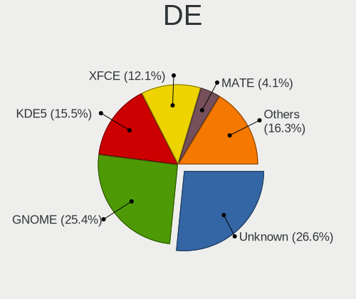
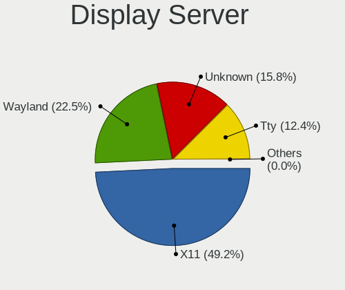
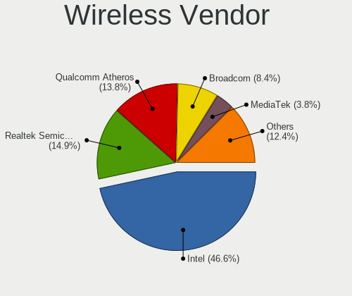

Debian - Tested Hardware & Statistics
-------------------------------------

A project to collect tested hardware configurations for Debian.

Anyone can contribute to this report by the [hw-probe](https://github.com/linuxhw/hw-probe) tool:

    sudo -E hw-probe -all -upload

Please contribute! Especially if your hardware is rare.

This is a report for all computer types. See also reports for [desktops](/Dist/Debian/Desktop/README.md) and [notebooks](/Dist/Debian/Notebook/README.md).

Contents
--------

* [ Test Cases ](#test-cases)

* [ System ](#system)
  - [ OS                       ](#os)
  - [ OS Family                ](#os-family)
  - [ Kernel                   ](#kernel)
  - [ Kernel Family            ](#kernel-family)
  - [ Kernel Major Ver.        ](#kernel-major-ver)
  - [ Arch                     ](#arch)
  - [ DE                       ](#de)
  - [ Display Server           ](#display-server)
  - [ Display Manager          ](#display-manager)
  - [ OS Lang                  ](#os-lang)
  - [ Boot Mode                ](#boot-mode)
  - [ Filesystem               ](#filesystem)
  - [ Part. scheme             ](#part-scheme)
  - [ Dual Boot with Linux/BSD ](#dual-boot-with-linuxbsd)
  - [ Dual Boot (Win)          ](#dual-boot-win)

* [ Board ](#board)
  - [ Vendor                   ](#vendor)
  - [ Model                    ](#model)
  - [ Model Family             ](#model-family)
  - [ MFG Year                 ](#mfg-year)
  - [ Form Factor              ](#form-factor)
  - [ Secure Boot              ](#secure-boot)
  - [ Coreboot                 ](#coreboot)
  - [ RAM Size                 ](#ram-size)
  - [ RAM Used                 ](#ram-used)
  - [ Total Drives             ](#total-drives)
  - [ Has CD-ROM               ](#has-cd-rom)
  - [ Has Ethernet             ](#has-ethernet)
  - [ Has WiFi                 ](#has-wifi)
  - [ Has Bluetooth            ](#has-bluetooth)

* [ Location ](#location)
  - [ Country                  ](#country)
  - [ City                     ](#city)

* [ Drives ](#drives)
  - [ Drive Vendor             ](#drive-vendor)
  - [ Drive Model              ](#drive-model)
  - [ HDD Vendor               ](#hdd-vendor)
  - [ SSD Vendor               ](#ssd-vendor)
  - [ Drive Kind               ](#drive-kind)
  - [ Drive Connector          ](#drive-connector)
  - [ Drive Size               ](#drive-size)
  - [ Space Total              ](#space-total)
  - [ Space Used               ](#space-used)
  - [ Malfunc. Drives          ](#malfunc-drives)
  - [ Malfunc. Drive Vendor    ](#malfunc-drive-vendor)
  - [ Malfunc. HDD Vendor      ](#malfunc-hdd-vendor)
  - [ Malfunc. Drive Kind      ](#malfunc-drive-kind)
  - [ Failed Drives            ](#failed-drives)
  - [ Failed Drive Vendor      ](#failed-drive-vendor)
  - [ Drive Status             ](#drive-status)

* [ Storage controller ](#storage-controller)
  - [ Storage Vendor           ](#storage-vendor)
  - [ Storage Model            ](#storage-model)
  - [ Storage Kind             ](#storage-kind)

* [ Processor ](#processor)
  - [ CPU Vendor               ](#cpu-vendor)
  - [ CPU Model                ](#cpu-model)
  - [ CPU Model Family         ](#cpu-model-family)
  - [ CPU Cores                ](#cpu-cores)
  - [ CPU Sockets              ](#cpu-sockets)
  - [ CPU Threads              ](#cpu-threads)
  - [ CPU Op-Modes             ](#cpu-op-modes)
  - [ CPU Microcode            ](#cpu-microcode)
  - [ CPU Microarch            ](#cpu-microarch)

* [ Graphics ](#graphics)
  - [ GPU Vendor               ](#gpu-vendor)
  - [ GPU Model                ](#gpu-model)
  - [ GPU Combo                ](#gpu-combo)
  - [ GPU Driver               ](#gpu-driver)
  - [ GPU Memory               ](#gpu-memory)

* [ Monitor ](#monitor)
  - [ Monitor Vendor           ](#monitor-vendor)
  - [ Monitor Model            ](#monitor-model)
  - [ Monitor Resolution       ](#monitor-resolution)
  - [ Monitor Diagonal         ](#monitor-diagonal)
  - [ Monitor Width            ](#monitor-width)
  - [ Aspect Ratio             ](#aspect-ratio)
  - [ Monitor Area             ](#monitor-area)
  - [ Pixel Density            ](#pixel-density)
  - [ Multiple Monitors        ](#multiple-monitors)

* [ Network ](#network)
  - [ Net Controller Vendor    ](#net-controller-vendor)
  - [ Net Controller Model     ](#net-controller-model)
  - [ Wireless Vendor          ](#wireless-vendor)
  - [ Wireless Model           ](#wireless-model)
  - [ Ethernet Vendor          ](#ethernet-vendor)
  - [ Ethernet Model           ](#ethernet-model)
  - [ Net Controller Kind      ](#net-controller-kind)
  - [ Used Controller          ](#used-controller)
  - [ NICs                     ](#nics)
  - [ IPv6                     ](#ipv6)

* [ Bluetooth ](#bluetooth)
  - [ Bluetooth Vendor         ](#bluetooth-vendor)
  - [ Bluetooth Model          ](#bluetooth-model)

* [ Sound ](#sound)
  - [ Sound Vendor             ](#sound-vendor)
  - [ Sound Model              ](#sound-model)

* [ Memory ](#memory)
  - [ Memory Vendor            ](#memory-vendor)
  - [ Memory Model             ](#memory-model)
  - [ Memory Kind              ](#memory-kind)
  - [ Memory Form Factor       ](#memory-form-factor)
  - [ Memory Size              ](#memory-size)
  - [ Memory Speed             ](#memory-speed)

* [ Printers & scanners ](#printers--scanners)
  - [ Printer Vendor           ](#printer-vendor)
  - [ Printer Model            ](#printer-model)
  - [ Scanner Vendor           ](#scanner-vendor)
  - [ Scanner Model            ](#scanner-model)

* [ Camera ](#camera)
  - [ Camera Vendor            ](#camera-vendor)
  - [ Camera Model             ](#camera-model)

* [ Security ](#security)
  - [ Fingerprint Vendor       ](#fingerprint-vendor)
  - [ Fingerprint Model        ](#fingerprint-model)
  - [ Chipcard Vendor          ](#chipcard-vendor)
  - [ Chipcard Model           ](#chipcard-model)

* [ Unsupported ](#unsupported)
  - [ Unsupported Devices      ](#unsupported-devices)
  - [ Unsupported Device Types ](#unsupported-device-types)

Test Cases
----------

Total: 11581

| Vendor        | Model                       | Form-Factor | Probe                                                      | Date         |
|---------------|-----------------------------|-------------|------------------------------------------------------------|--------------|
| ASUSTek       | TUF Z390-PRO GAMING         | Desktop     | [de65f4b654](https://linux-hardware.org/?probe=de65f4b654) | Dec 31, 2022 |
| Google        | Teemo                       | Desktop     | [6f6671a40e](https://linux-hardware.org/?probe=6f6671a40e) | Dec 31, 2022 |
| Gigabyte      | AB350-Gaming 3-CF           | Desktop     | [500ce7ae28](https://linux-hardware.org/?probe=500ce7ae28) | Dec 31, 2022 |
| ASUSTek       | ZenBook UX425UAZ_UM425UA... | Notebook    | [8d33275e7b](https://linux-hardware.org/?probe=8d33275e7b) | Dec 31, 2022 |
| Google        | Teemo                       | Desktop     | [e3c39f29da](https://linux-hardware.org/?probe=e3c39f29da) | Dec 31, 2022 |
| ASUSTek       | VivoBook_ASUSLaptop X509... | Notebook    | [fb22f9430c](https://linux-hardware.org/?probe=fb22f9430c) | Dec 31, 2022 |
| ASRock        | A320M-DGS                   | Desktop     | [a9df519d4f](https://linux-hardware.org/?probe=a9df519d4f) | Dec 31, 2022 |
| Dell          | 0PV3YR A05                  | Server      | [3710331d81](https://linux-hardware.org/?probe=3710331d81) | Dec 31, 2022 |
| Lenovo        | IdeaPad Y560                | Notebook    | [c9d3a1d0a3](https://linux-hardware.org/?probe=c9d3a1d0a3) | Dec 31, 2022 |
| Acer          | Aspire A514-54              | Notebook    | [5775c77a91](https://linux-hardware.org/?probe=5775c77a91) | Dec 31, 2022 |
| MSI           | MAG B650 TOMAHAWK WIFI      | Desktop     | [b1220a23ad](https://linux-hardware.org/?probe=b1220a23ad) | Dec 31, 2022 |
| MSI           | MAG B650 TOMAHAWK WIFI      | Desktop     | [31343e35f0](https://linux-hardware.org/?probe=31343e35f0) | Dec 31, 2022 |
| Gigabyte      | H61M-DS2                    | Desktop     | [dff8a56537](https://linux-hardware.org/?probe=dff8a56537) | Dec 30, 2022 |
| HP            | Compaq 6710b (KE207ES#AB... | Notebook    | [d7d0be3872](https://linux-hardware.org/?probe=d7d0be3872) | Dec 30, 2022 |
| ASRock        | J3455-ITX                   | Desktop     | [4f45d532ac](https://linux-hardware.org/?probe=4f45d532ac) | Dec 30, 2022 |
| Gigabyte      | H61M-DS2                    | Desktop     | [4ea88219d8](https://linux-hardware.org/?probe=4ea88219d8) | Dec 30, 2022 |
| Dell          | Inspiron 5490               | Notebook    | [c8a80649d2](https://linux-hardware.org/?probe=c8a80649d2) | Dec 30, 2022 |
| Supermicro    | X11SRA-RF                   | Server      | [2887a82948](https://linux-hardware.org/?probe=2887a82948) | Dec 30, 2022 |
| Supermicro    | X11SRA-RF                   | Server      | [e5f0b1d802](https://linux-hardware.org/?probe=e5f0b1d802) | Dec 30, 2022 |
| Supermicro    | X11SRA-RF                   | Server      | [cd84ddc342](https://linux-hardware.org/?probe=cd84ddc342) | Dec 30, 2022 |
| Lenovo        | ThinkStation C20 4263BA7    | Desktop     | [7b55955e2a](https://linux-hardware.org/?probe=7b55955e2a) | Dec 30, 2022 |
| Dell          | 0PV3YR A05                  | Server      | [a295f18c9f](https://linux-hardware.org/?probe=a295f18c9f) | Dec 30, 2022 |
| HP            | 255 G3                      | Notebook    | [89d6bd459c](https://linux-hardware.org/?probe=89d6bd459c) | Dec 30, 2022 |
| Toshiba       | Satellite L775-12V          | Notebook    | [2c601f6366](https://linux-hardware.org/?probe=2c601f6366) | Dec 29, 2022 |
| HP            | 339A                        | Desktop     | [8e0b785427](https://linux-hardware.org/?probe=8e0b785427) | Dec 29, 2022 |
| ASUSTek       | PRIME B360M-C               | Desktop     | [c38ca6386e](https://linux-hardware.org/?probe=c38ca6386e) | Dec 29, 2022 |
| Lenovo        | ThinkPad T470p 20J7S1JT0... | Notebook    | [4b7bbb186f](https://linux-hardware.org/?probe=4b7bbb186f) | Dec 29, 2022 |
| Supermicro    | H8SCM                       | Server      | [9ee42dcf6f](https://linux-hardware.org/?probe=9ee42dcf6f) | Dec 29, 2022 |
| MACHCREATO... | AB                          | Notebook    | [52a6beb872](https://linux-hardware.org/?probe=52a6beb872) | Dec 29, 2022 |
| Lenovo        | ThinkPad E14 Gen 3 20Y7S... | Notebook    | [5bf3ff5c0e](https://linux-hardware.org/?probe=5bf3ff5c0e) | Dec 29, 2022 |
| Lenovo        | ThinkPad E14 Gen 3 20Y7S... | Notebook    | [4f63c4474c](https://linux-hardware.org/?probe=4f63c4474c) | Dec 29, 2022 |
| Gigabyte      | H61M-DS2                    | Desktop     | [50149bf9e3](https://linux-hardware.org/?probe=50149bf9e3) | Dec 29, 2022 |
| Gigabyte      | H61M-DS2                    | Desktop     | [b0a40a3ac0](https://linux-hardware.org/?probe=b0a40a3ac0) | Dec 29, 2022 |
| Dell          | Inspiron 7506 2n1           | Convertible | [716ba7f970](https://linux-hardware.org/?probe=716ba7f970) | Dec 29, 2022 |
| HP            | EliteBook Folio 1040 G3     | Notebook    | [6aad572cd5](https://linux-hardware.org/?probe=6aad572cd5) | Dec 29, 2022 |
| HP            | ZBook 15 G6                 | Notebook    | [af1655497e](https://linux-hardware.org/?probe=af1655497e) | Dec 29, 2022 |
| Unknown       | Unknown                     | Desktop     | [34b6109940](https://linux-hardware.org/?probe=34b6109940) | Dec 29, 2022 |
| HP            | ProBook 6570b               | Notebook    | [46fd918b7c](https://linux-hardware.org/?probe=46fd918b7c) | Dec 29, 2022 |
| HP            | Pavilion g7                 | Notebook    | [444363b7ec](https://linux-hardware.org/?probe=444363b7ec) | Dec 29, 2022 |
| Dell          | 0PV3YR A05                  | Server      | [4239e2fa3c](https://linux-hardware.org/?probe=4239e2fa3c) | Dec 29, 2022 |
| Dell          | Inspiron 7506 2n1           | Convertible | [7881f027ea](https://linux-hardware.org/?probe=7881f027ea) | Dec 29, 2022 |
| ASRock        | X570 Taichi                 | Desktop     | [c1e5e82fbb](https://linux-hardware.org/?probe=c1e5e82fbb) | Dec 29, 2022 |
| Dell          | Inspiron 5490               | Notebook    | [457c2ae4ae](https://linux-hardware.org/?probe=457c2ae4ae) | Dec 28, 2022 |
| Dell          | Inspiron 5490               | Notebook    | [fdfd0f21c7](https://linux-hardware.org/?probe=fdfd0f21c7) | Dec 28, 2022 |
| Dell          | Inspiron 3583               | Notebook    | [41c7a16579](https://linux-hardware.org/?probe=41c7a16579) | Dec 28, 2022 |
| Toshiba       | Satellite L455D             | Notebook    | [35c085aa82](https://linux-hardware.org/?probe=35c085aa82) | Dec 28, 2022 |
| Dell          | Vostro 3400                 | Notebook    | [27f58a8ad1](https://linux-hardware.org/?probe=27f58a8ad1) | Dec 28, 2022 |
| HP            | ProLiant ML30 Gen9          | Desktop     | [174e7e831b](https://linux-hardware.org/?probe=174e7e831b) | Dec 28, 2022 |
| Acer          | Aspire ES1-531              | Notebook    | [c29088a63f](https://linux-hardware.org/?probe=c29088a63f) | Dec 28, 2022 |
| ASUSTek       | PRIME B450M-A               | Desktop     | [422238387a](https://linux-hardware.org/?probe=422238387a) | Dec 28, 2022 |
| Raspberry ... | Raspberry Pi Compute Mod... | Soc         | [7c60cc0210](https://linux-hardware.org/?probe=7c60cc0210) | Dec 28, 2022 |
| Lenovo        | ThinkPad X1 Yoga 2nd 20J... | Convertible | [72f770277e](https://linux-hardware.org/?probe=72f770277e) | Dec 28, 2022 |
| HP            | ProBook 6470b               | Notebook    | [055705b3f2](https://linux-hardware.org/?probe=055705b3f2) | Dec 28, 2022 |
| HP            | 158A                        | Desktop     | [c80bfd7c30](https://linux-hardware.org/?probe=c80bfd7c30) | Dec 28, 2022 |
| Dell          | 0PV3YR A05                  | Server      | [ec0ad4d293](https://linux-hardware.org/?probe=ec0ad4d293) | Dec 28, 2022 |
| ASRock        | X470 Gaming-ITX/ac          | Desktop     | [c4d1d971d1](https://linux-hardware.org/?probe=c4d1d971d1) | Dec 28, 2022 |
| Apple         | Mac-F42786A9 DVT            | All in one  | [2ceb80faeb](https://linux-hardware.org/?probe=2ceb80faeb) | Dec 28, 2022 |
| Lenovo        | 0B98401 WIN                 | Desktop     | [0f71bbaf67](https://linux-hardware.org/?probe=0f71bbaf67) | Dec 28, 2022 |
| ASUSTek       | A4110                       | All in one  | [fa417dc5c7](https://linux-hardware.org/?probe=fa417dc5c7) | Dec 28, 2022 |
| ASRock        | J3455-ITX                   | Desktop     | [6e628aeb01](https://linux-hardware.org/?probe=6e628aeb01) | Dec 28, 2022 |
| Apple         | MacBookAir7,2               | Notebook    | [10dce91da1](https://linux-hardware.org/?probe=10dce91da1) | Dec 27, 2022 |
| ASUSTek       | ZenBook UX325EA_UX325EA     | Notebook    | [321cc72064](https://linux-hardware.org/?probe=321cc72064) | Dec 27, 2022 |
| ASUSTek       | PRIME B360M-K               | Desktop     | [48f161dfc8](https://linux-hardware.org/?probe=48f161dfc8) | Dec 27, 2022 |
| Apple         | MacBookAir7,1               | Notebook    | [d174ffb318](https://linux-hardware.org/?probe=d174ffb318) | Dec 27, 2022 |
| MSI           | GE62 2QC                    | Notebook    | [dbd69d70ac](https://linux-hardware.org/?probe=dbd69d70ac) | Dec 27, 2022 |
| Dell          | 0M017G A00                  | Desktop     | [5c41315695](https://linux-hardware.org/?probe=5c41315695) | Dec 27, 2022 |
| Intel         | NUC10i7FNB K61360-303       | Mini pc     | [042fb842d2](https://linux-hardware.org/?probe=042fb842d2) | Dec 27, 2022 |
| Panasonic     | FZ55-2                      | Notebook    | [1699b7c3b2](https://linux-hardware.org/?probe=1699b7c3b2) | Dec 27, 2022 |
| ASUSTek       | VivoBook_ASUS Laptop E40... | Notebook    | [78c6c15502](https://linux-hardware.org/?probe=78c6c15502) | Dec 27, 2022 |
| Raspberry ... | Raspberry Pi Compute Mod... | Soc         | [06cba3f478](https://linux-hardware.org/?probe=06cba3f478) | Dec 27, 2022 |
| ASRock        | H470M-HVS                   | Desktop     | [210f0c0375](https://linux-hardware.org/?probe=210f0c0375) | Dec 27, 2022 |
| Gigabyte      | 990FXA-UD3 R5               | Desktop     | [734c3742b1](https://linux-hardware.org/?probe=734c3742b1) | Dec 27, 2022 |
| Gigabyte      | 990FXA-UD3 R5               | Desktop     | [bb6dddc780](https://linux-hardware.org/?probe=bb6dddc780) | Dec 27, 2022 |
| ASRock        | Brazos                      | Desktop     | [f5183b395b](https://linux-hardware.org/?probe=f5183b395b) | Dec 27, 2022 |
| Notebook      | L14xMU                      | Notebook    | [7644bc65e2](https://linux-hardware.org/?probe=7644bc65e2) | Dec 27, 2022 |
| Dell          | Inspiron 1012               | Notebook    | [3dd6b8a416](https://linux-hardware.org/?probe=3dd6b8a416) | Dec 26, 2022 |
| Dell          | 02YRK5 A02                  | Desktop     | [56dc5ff1b9](https://linux-hardware.org/?probe=56dc5ff1b9) | Dec 26, 2022 |
| Exo           | Smart Serie M               | Notebook    | [942ee3b035](https://linux-hardware.org/?probe=942ee3b035) | Dec 26, 2022 |
| Lenovo        | ThinkPad E560 20EV002FUS    | Notebook    | [3bb1c5cc47](https://linux-hardware.org/?probe=3bb1c5cc47) | Dec 26, 2022 |
| Lenovo        | ThinkPad E15 Gen 2 20TD0... | Notebook    | [29a54c4976](https://linux-hardware.org/?probe=29a54c4976) | Dec 26, 2022 |
| Gigabyte      | B660M GAMING DDR4           | Desktop     | [2618b85414](https://linux-hardware.org/?probe=2618b85414) | Dec 26, 2022 |
| Lenovo        | ThinkStation D30 42234T7    | Desktop     | [6ad649ad46](https://linux-hardware.org/?probe=6ad649ad46) | Dec 26, 2022 |
| Gigabyte      | B360M H                     | Desktop     | [2f0d1b1c8d](https://linux-hardware.org/?probe=2f0d1b1c8d) | Dec 26, 2022 |
| ASUSTek       | PRIME A320M-K               | Desktop     | [d90a9cdcd3](https://linux-hardware.org/?probe=d90a9cdcd3) | Dec 26, 2022 |
| ASUSTek       | PRIME A320M-K               | Desktop     | [fc0eac877c](https://linux-hardware.org/?probe=fc0eac877c) | Dec 26, 2022 |
| Dell          | 0PV3YR A05                  | Server      | [67fee9ab39](https://linux-hardware.org/?probe=67fee9ab39) | Dec 26, 2022 |
| Acer          | Aspire ES1-533              | Notebook    | [3b5fa6d85a](https://linux-hardware.org/?probe=3b5fa6d85a) | Dec 26, 2022 |
| ASUSTek       | M3A32-MVP DELUXE            | Desktop     | [0fa5809533](https://linux-hardware.org/?probe=0fa5809533) | Dec 26, 2022 |
| Matrox Ele... | 4GPMOBIL 7449-03-0          | Desktop     | [c02a37a124](https://linux-hardware.org/?probe=c02a37a124) | Dec 26, 2022 |
| Lenovo        | ThinkPad X250 20CLS1UB00    | Notebook    | [fc8b2899fa](https://linux-hardware.org/?probe=fc8b2899fa) | Dec 25, 2022 |
| SANTECH       | NHx0DB,DE                   | Notebook    | [a0996d42bd](https://linux-hardware.org/?probe=a0996d42bd) | Dec 25, 2022 |
| HP            | 470 G8 Notebook PC          | Notebook    | [6d77c48324](https://linux-hardware.org/?probe=6d77c48324) | Dec 25, 2022 |
| Lenovo        | ThinkStation D30 42234T7    | Desktop     | [6ac63aca4f](https://linux-hardware.org/?probe=6ac63aca4f) | Dec 25, 2022 |
| Fujitsu       | D3221-A1 S26361-D3221-A1    | Desktop     | [8855d29d69](https://linux-hardware.org/?probe=8855d29d69) | Dec 25, 2022 |
| Dell          | Inspiron 7506 2n1           | Convertible | [b5eaa2b6aa](https://linux-hardware.org/?probe=b5eaa2b6aa) | Dec 25, 2022 |
| Unknown       | Unknown                     | Soc         | [95c95c980d](https://linux-hardware.org/?probe=95c95c980d) | Dec 25, 2022 |
| Dell          | 0PV3YR A05                  | Server      | [5977afc830](https://linux-hardware.org/?probe=5977afc830) | Dec 25, 2022 |
| ASUSTek       | G751JT                      | Notebook    | [16e989ff99](https://linux-hardware.org/?probe=16e989ff99) | Dec 25, 2022 |
| Dell          | Latitude E6520              | Notebook    | [33a51c934d](https://linux-hardware.org/?probe=33a51c934d) | Dec 25, 2022 |
| Dell          | Inspiron 5490               | Notebook    | [ea09a6daa8](https://linux-hardware.org/?probe=ea09a6daa8) | Dec 25, 2022 |
| Dell          | 00TD00 A00                  | All in one  | [84beba0484](https://linux-hardware.org/?probe=84beba0484) | Dec 25, 2022 |
| Dell          | Inspiron 5490               | Notebook    | [45737153e4](https://linux-hardware.org/?probe=45737153e4) | Dec 25, 2022 |
| HP            | Laptop 15-bw0xx             | Notebook    | [42221f61fb](https://linux-hardware.org/?probe=42221f61fb) | Dec 25, 2022 |
| Unknown       | Apple MacBook Pro (14-in... | Notebook    | [8a5b919c91](https://linux-hardware.org/?probe=8a5b919c91) | Dec 24, 2022 |
| Medion        | E122X                       | Notebook    | [6e4e34bcc3](https://linux-hardware.org/?probe=6e4e34bcc3) | Dec 24, 2022 |
| Medion        | E122X                       | Notebook    | [bf41c45a7d](https://linux-hardware.org/?probe=bf41c45a7d) | Dec 24, 2022 |
| Lenovo        | ThinkBook 15 G3 ACL 21A4    | Notebook    | [096d4fc8c2](https://linux-hardware.org/?probe=096d4fc8c2) | Dec 24, 2022 |
| ASUSTek       | ROG Maximus Z690 EXTREME    | Desktop     | [4d19273307](https://linux-hardware.org/?probe=4d19273307) | Dec 24, 2022 |
| Raspberry ... | Raspberry Pi 400 Rev 1.0    | Soc         | [f7af4b1164](https://linux-hardware.org/?probe=f7af4b1164) | Dec 24, 2022 |
| HP            | ProLiant MicroServer        | Desktop     | [b95892f2dc](https://linux-hardware.org/?probe=b95892f2dc) | Dec 24, 2022 |
| ASUSTek       | WS C422 DC                  | Desktop     | [7be7c81575](https://linux-hardware.org/?probe=7be7c81575) | Dec 24, 2022 |
| Supermicro    | X11SRA-RF                   | Server      | [efdf519660](https://linux-hardware.org/?probe=efdf519660) | Dec 24, 2022 |
| ASUSTek       | WS C422 DC                  | Desktop     | [526414fd8f](https://linux-hardware.org/?probe=526414fd8f) | Dec 24, 2022 |
| Lenovo        | ThinkPad X1 Carbon 7th 2... | Notebook    | [c5f2f2db53](https://linux-hardware.org/?probe=c5f2f2db53) | Dec 24, 2022 |
| Dell          | 0PV3YR A05                  | Server      | [39f35288d4](https://linux-hardware.org/?probe=39f35288d4) | Dec 24, 2022 |
| Lenovo        | ThinkPad X270 20HMS16200    | Notebook    | [6ac6e552a8](https://linux-hardware.org/?probe=6ac6e552a8) | Dec 24, 2022 |
| Dell          | Inspiron 5570               | Notebook    | [1c7e7f8dd2](https://linux-hardware.org/?probe=1c7e7f8dd2) | Dec 24, 2022 |
| ASRock        | B450 Pro4                   | Desktop     | [70ff83271a](https://linux-hardware.org/?probe=70ff83271a) | Dec 24, 2022 |
| HP            | Laptop 15-dy2xxx            | Notebook    | [df787f1286](https://linux-hardware.org/?probe=df787f1286) | Dec 24, 2022 |
| HP            | Laptop 15-dy2xxx            | Notebook    | [0a2ed74cfd](https://linux-hardware.org/?probe=0a2ed74cfd) | Dec 23, 2022 |
| Dell          | Latitude E7440              | Notebook    | [baae52327d](https://linux-hardware.org/?probe=baae52327d) | Dec 23, 2022 |
| Dell          | Latitude E7440              | Notebook    | [bc5d48b831](https://linux-hardware.org/?probe=bc5d48b831) | Dec 23, 2022 |
| Dell          | Latitude E7440              | Notebook    | [fde483d476](https://linux-hardware.org/?probe=fde483d476) | Dec 23, 2022 |
| HP            | 876C SMVB                   | Desktop     | [988b03aae5](https://linux-hardware.org/?probe=988b03aae5) | Dec 23, 2022 |
| Dell          | Latitude E7440              | Notebook    | [a746012ffd](https://linux-hardware.org/?probe=a746012ffd) | Dec 23, 2022 |
| Lenovo        | ThinkPad T16 Gen 1 21BWS... | Notebook    | [9e5c4705fa](https://linux-hardware.org/?probe=9e5c4705fa) | Dec 23, 2022 |
| Dell          | Latitude D630               | Notebook    | [8175d003ce](https://linux-hardware.org/?probe=8175d003ce) | Dec 23, 2022 |
| MSI           | B550-A PRO                  | Desktop     | [a54a0884ce](https://linux-hardware.org/?probe=a54a0884ce) | Dec 23, 2022 |
| Google        | Reks                        | Notebook    | [ecee690e6e](https://linux-hardware.org/?probe=ecee690e6e) | Dec 23, 2022 |
| Toshiba       | Satellite L10W-B-101        | Notebook    | [54d5cca493](https://linux-hardware.org/?probe=54d5cca493) | Dec 23, 2022 |
| Google        | Reks                        | Notebook    | [58b1b4cac1](https://linux-hardware.org/?probe=58b1b4cac1) | Dec 23, 2022 |
| Dell          | Inspiron 3501               | Notebook    | [297651d437](https://linux-hardware.org/?probe=297651d437) | Dec 23, 2022 |
| Lenovo        | Legion 5 15ACH6A 82NW       | Notebook    | [79b015dcea](https://linux-hardware.org/?probe=79b015dcea) | Dec 23, 2022 |
| Dell          | 0PV3YR A05                  | Server      | [d5625e9592](https://linux-hardware.org/?probe=d5625e9592) | Dec 23, 2022 |
| Dell          | Inspiron 3501               | Notebook    | [958ee9d145](https://linux-hardware.org/?probe=958ee9d145) | Dec 23, 2022 |
| Dell          | G3 3590                     | Notebook    | [d75d9e6663](https://linux-hardware.org/?probe=d75d9e6663) | Dec 23, 2022 |
| Lenovo        | ThinkPad X260 20F5005NAU    | Notebook    | [5f75bb423d](https://linux-hardware.org/?probe=5f75bb423d) | Dec 23, 2022 |
| Acer          | Aspire 4750                 | Notebook    | [3256c282db](https://linux-hardware.org/?probe=3256c282db) | Dec 23, 2022 |
| Lenovo        | ThinkBook 14s Yoga G2 IA... | Convertible | [3ea5c420b1](https://linux-hardware.org/?probe=3ea5c420b1) | Dec 23, 2022 |
| HP            | 255 G7 Notebook PC          | Notebook    | [5bedf1557b](https://linux-hardware.org/?probe=5bedf1557b) | Dec 23, 2022 |
| Dell          | Inspiron 5490               | Notebook    | [1c424b5f55](https://linux-hardware.org/?probe=1c424b5f55) | Dec 23, 2022 |
| Unknown       | Unknown                     | Notebook    | [f9c4fecaf4](https://linux-hardware.org/?probe=f9c4fecaf4) | Dec 23, 2022 |
| Unknown       | Unknown                     | Notebook    | [3832db2827](https://linux-hardware.org/?probe=3832db2827) | Dec 23, 2022 |
| Toshiba       | Satellite C55Dt-A           | Notebook    | [67294324c5](https://linux-hardware.org/?probe=67294324c5) | Dec 22, 2022 |
| HP            | EliteBook x360 1040 G8 N... | Convertible | [7794581d04](https://linux-hardware.org/?probe=7794581d04) | Dec 22, 2022 |
| Dell          | Latitude E7440              | Notebook    | [c6d28912f0](https://linux-hardware.org/?probe=c6d28912f0) | Dec 22, 2022 |
| Dell          | Latitude E7440              | Notebook    | [1a14f26bd3](https://linux-hardware.org/?probe=1a14f26bd3) | Dec 22, 2022 |
| Dell          | Latitude E7440              | Notebook    | [db77bb7a3f](https://linux-hardware.org/?probe=db77bb7a3f) | Dec 22, 2022 |
| Dell          | Latitude E7440              | Notebook    | [d2278ed94d](https://linux-hardware.org/?probe=d2278ed94d) | Dec 22, 2022 |
| Apple         | MacBookAir7,1               | Notebook    | [09ba8ccf48](https://linux-hardware.org/?probe=09ba8ccf48) | Dec 22, 2022 |
| Dell          | Latitude E7440              | Notebook    | [f4e79df709](https://linux-hardware.org/?probe=f4e79df709) | Dec 22, 2022 |
| Apple         | MacBookAir7,1               | Notebook    | [2c3febf6fa](https://linux-hardware.org/?probe=2c3febf6fa) | Dec 22, 2022 |
| Dell          | Latitude E7440              | Notebook    | [cddffa9123](https://linux-hardware.org/?probe=cddffa9123) | Dec 22, 2022 |
| Dell          | Latitude E7440              | Notebook    | [5f911806c8](https://linux-hardware.org/?probe=5f911806c8) | Dec 22, 2022 |
| Lenovo        | ThinkPad X260 20F5005NAU    | Notebook    | [844f589d20](https://linux-hardware.org/?probe=844f589d20) | Dec 22, 2022 |
| Dell          | Latitude D630               | Notebook    | [e1106d8868](https://linux-hardware.org/?probe=e1106d8868) | Dec 22, 2022 |
| ASRock        | X300M-STX                   | Desktop     | [3d90b10b72](https://linux-hardware.org/?probe=3d90b10b72) | Dec 22, 2022 |
| Packard Be... | DOT S                       | Notebook    | [c26f1d77e6](https://linux-hardware.org/?probe=c26f1d77e6) | Dec 22, 2022 |
| HP            | Stream Notebook PC 13       | Notebook    | [b049c64ff7](https://linux-hardware.org/?probe=b049c64ff7) | Dec 22, 2022 |
| Dell          | 0PV3YR A05                  | Server      | [3a87279be6](https://linux-hardware.org/?probe=3a87279be6) | Dec 22, 2022 |
| Lenovo        | ThinkPad T14 Gen 1 20S1S... | Notebook    | [5f132c928b](https://linux-hardware.org/?probe=5f132c928b) | Dec 22, 2022 |
| Raspberry ... | Raspberry Pi 400 Rev 1.0    | Soc         | [ba82bee4c7](https://linux-hardware.org/?probe=ba82bee4c7) | Dec 22, 2022 |
| Raspberry ... | Raspberry Pi 400 Rev 1.0    | Soc         | [a2a2f20ef4](https://linux-hardware.org/?probe=a2a2f20ef4) | Dec 22, 2022 |
| Dell          | G3 3590                     | Notebook    | [8038491eb0](https://linux-hardware.org/?probe=8038491eb0) | Dec 22, 2022 |
| Gigabyte      | B450M DS3H-CF               | Desktop     | [fe4ef75450](https://linux-hardware.org/?probe=fe4ef75450) | Dec 21, 2022 |
| Lenovo        | IdeaPad 5 15IAL7 82SF       | Notebook    | [16cae3015a](https://linux-hardware.org/?probe=16cae3015a) | Dec 21, 2022 |
| Apple         | MacBookAir7,2               | Notebook    | [b4e828bef3](https://linux-hardware.org/?probe=b4e828bef3) | Dec 21, 2022 |
| ASUSTek       | ASUS EXPERTBOOK B7402FEA... | Convertible | [0cb3ccf545](https://linux-hardware.org/?probe=0cb3ccf545) | Dec 21, 2022 |
| Lenovo        | ThinkPad T14 Gen 3 21AHC... | Notebook    | [28013105ef](https://linux-hardware.org/?probe=28013105ef) | Dec 21, 2022 |
| Dell          | Vostro 3583                 | Notebook    | [cf3c6eb18b](https://linux-hardware.org/?probe=cf3c6eb18b) | Dec 21, 2022 |
| Apple         | MacBookAir7,2               | Notebook    | [056d76bae8](https://linux-hardware.org/?probe=056d76bae8) | Dec 21, 2022 |
| Sony          | SVE1112M1EB                 | Notebook    | [74e100e63b](https://linux-hardware.org/?probe=74e100e63b) | Dec 21, 2022 |
| HP            | ZBook Power 15.6 inch G8... | Notebook    | [6b202d6cc2](https://linux-hardware.org/?probe=6b202d6cc2) | Dec 21, 2022 |
| Lenovo        | Legion 5 15ARH05 82B5       | Notebook    | [9438c80c85](https://linux-hardware.org/?probe=9438c80c85) | Dec 21, 2022 |
| Dell          | 0020HJ A01                  | Server      | [e266254c60](https://linux-hardware.org/?probe=e266254c60) | Dec 21, 2022 |
| HP            | ProLiant DL360e Gen8        | Server      | [5477e8f714](https://linux-hardware.org/?probe=5477e8f714) | Dec 21, 2022 |
| Dell          | 0PV3YR A05                  | Server      | [428c861575](https://linux-hardware.org/?probe=428c861575) | Dec 21, 2022 |
| HP            | ProLiant MicroServer Gen... | Desktop     | [57182d09ed](https://linux-hardware.org/?probe=57182d09ed) | Dec 21, 2022 |
| Dell          | Inspiron 3501               | Notebook    | [449e38a14d](https://linux-hardware.org/?probe=449e38a14d) | Dec 21, 2022 |
| Intel         | DQ77CP AAG67261-300         | Desktop     | [908f619aa7](https://linux-hardware.org/?probe=908f619aa7) | Dec 21, 2022 |
| Gigabyte      | M68MT-S2P                   | Desktop     | [363c106fa2](https://linux-hardware.org/?probe=363c106fa2) | Dec 21, 2022 |
| Dell          | G3 3590                     | Notebook    | [8272655600](https://linux-hardware.org/?probe=8272655600) | Dec 21, 2022 |
| Gigabyte      | M68MT-S2P                   | Desktop     | [ed29442d39](https://linux-hardware.org/?probe=ed29442d39) | Dec 21, 2022 |
| Supermicro    | X10DRH-iT                   | Server      | [1215ed7cbf](https://linux-hardware.org/?probe=1215ed7cbf) | Dec 21, 2022 |
| Inventec      | Dell Wyse Thin Client De... | Mini pc     | [3007d5dd93](https://linux-hardware.org/?probe=3007d5dd93) | Dec 21, 2022 |
| Fujitsu       | D3222-A1 S26361-D3222-A1    | Desktop     | [c4719bd0ac](https://linux-hardware.org/?probe=c4719bd0ac) | Dec 21, 2022 |
| Unknown       | Unknown                     | Soc         | [764115860e](https://linux-hardware.org/?probe=764115860e) | Dec 21, 2022 |
| MSI           | MS-7318                     | Desktop     | [4622016059](https://linux-hardware.org/?probe=4622016059) | Dec 21, 2022 |
| Gigabyte      | B450M DS3H-CF               | Desktop     | [827c7f9bd3](https://linux-hardware.org/?probe=827c7f9bd3) | Dec 21, 2022 |
| Lenovo        | ThinkPad 13 2nd Gen 20J1... | Notebook    | [cd4fa20e66](https://linux-hardware.org/?probe=cd4fa20e66) | Dec 20, 2022 |
| Lenovo        | ThinkPad L13 Yoga Gen 2 ... | Convertible | [60b20a8efa](https://linux-hardware.org/?probe=60b20a8efa) | Dec 20, 2022 |
| Lenovo        | ThinkPad 13 2nd Gen 20J1... | Notebook    | [e676fe186f](https://linux-hardware.org/?probe=e676fe186f) | Dec 20, 2022 |
| Lenovo        | ThinkPad L13 Yoga Gen 2 ... | Convertible | [a2c8bb966e](https://linux-hardware.org/?probe=a2c8bb966e) | Dec 20, 2022 |
| ASUSTek       | VivoBook_ASUSLaptop M760... | Notebook    | [658e730bd3](https://linux-hardware.org/?probe=658e730bd3) | Dec 20, 2022 |
| Intel         | DG35EC AAE29266-205         | Desktop     | [3cee3ad865](https://linux-hardware.org/?probe=3cee3ad865) | Dec 20, 2022 |
| HP            | OMEN Laptop 15-en1xxx       | Notebook    | [1e53c20bdd](https://linux-hardware.org/?probe=1e53c20bdd) | Dec 20, 2022 |
| Dell          | 0PV3YR A05                  | Server      | [68731f4d29](https://linux-hardware.org/?probe=68731f4d29) | Dec 20, 2022 |
| Dell          | 0MN1TX A00                  | Desktop     | [f2ae430663](https://linux-hardware.org/?probe=f2ae430663) | Dec 20, 2022 |
| ASUSTek       | T100TA                      | Notebook    | [1dc546e14a](https://linux-hardware.org/?probe=1dc546e14a) | Dec 20, 2022 |
| Gigabyte      | P75-D3P                     | Desktop     | [ff2420e759](https://linux-hardware.org/?probe=ff2420e759) | Dec 19, 2022 |
| Lenovo        | ThinkPad T490 20N2CTO1WW    | Notebook    | [2aeb8fd0cd](https://linux-hardware.org/?probe=2aeb8fd0cd) | Dec 19, 2022 |
| Dell          | 09KPNV A01                  | Desktop     | [a4c5e58eec](https://linux-hardware.org/?probe=a4c5e58eec) | Dec 19, 2022 |
| Lenovo        | ThinkPad L13 Yoga Gen 2 ... | Convertible | [a79b17ea96](https://linux-hardware.org/?probe=a79b17ea96) | Dec 19, 2022 |
| ASRock        | B550M Pro4                  | Desktop     | [6bfb0295df](https://linux-hardware.org/?probe=6bfb0295df) | Dec 19, 2022 |
| ASRock        | N68-GS3 UCC                 | Desktop     | [19dad9b5b2](https://linux-hardware.org/?probe=19dad9b5b2) | Dec 19, 2022 |
| Gigabyte      | G41MT-ES2L                  | Desktop     | [d23b58b5da](https://linux-hardware.org/?probe=d23b58b5da) | Dec 19, 2022 |
| MSI           | A320M-A PRO MAX             | Desktop     | [30aec905c0](https://linux-hardware.org/?probe=30aec905c0) | Dec 19, 2022 |
| GIFA Indus... | TM-J3355-2G2L               | Desktop     | [526697a9d0](https://linux-hardware.org/?probe=526697a9d0) | Dec 19, 2022 |
| HP            | 255 G8 Notebook PC          | Notebook    | [08800ce691](https://linux-hardware.org/?probe=08800ce691) | Dec 19, 2022 |
| Apple         | Mac-F221BEC8                | Desktop     | [493ddb6998](https://linux-hardware.org/?probe=493ddb6998) | Dec 19, 2022 |
| IceWhale T... | ZimaBoard 216 ZMB           | Desktop     | [647bf0e2a7](https://linux-hardware.org/?probe=647bf0e2a7) | Dec 19, 2022 |
| ASUSTek       | 900SD                       | Notebook    | [43d2c88062](https://linux-hardware.org/?probe=43d2c88062) | Dec 18, 2022 |
| Dell          | Inspiron 3501               | Notebook    | [956aaecbb9](https://linux-hardware.org/?probe=956aaecbb9) | Dec 18, 2022 |
| Dell          | Inspiron 3501               | Notebook    | [d5ceb48450](https://linux-hardware.org/?probe=d5ceb48450) | Dec 18, 2022 |
| HP            | ENVY Laptop 13-ad1xx        | Notebook    | [756263bf48](https://linux-hardware.org/?probe=756263bf48) | Dec 18, 2022 |
| EUROCOM       | SCORPIUS 3D                 | Notebook    | [4fdf299276](https://linux-hardware.org/?probe=4fdf299276) | Dec 18, 2022 |
| Dell          | 0UY894 A02                  | Desktop     | [904ee2bb12](https://linux-hardware.org/?probe=904ee2bb12) | Dec 18, 2022 |
| Dell          | 06JWJY A00                  | Desktop     | [89ac693c2c](https://linux-hardware.org/?probe=89ac693c2c) | Dec 18, 2022 |
| ASUSTek       | M51BC                       | Desktop     | [78a6f49d22](https://linux-hardware.org/?probe=78a6f49d22) | Dec 18, 2022 |
| Acer          | TravelMate P253             | Notebook    | [97d650e93f](https://linux-hardware.org/?probe=97d650e93f) | Dec 18, 2022 |
| Dell          | Latitude E6530              | Notebook    | [198a9bc936](https://linux-hardware.org/?probe=198a9bc936) | Dec 18, 2022 |
| HP            | Pavilion g7                 | Notebook    | [9829a799a0](https://linux-hardware.org/?probe=9829a799a0) | Dec 18, 2022 |
| Lenovo        | ThinkPad T470 20HES3JR02    | Notebook    | [f9e4638f19](https://linux-hardware.org/?probe=f9e4638f19) | Dec 18, 2022 |
| Dell          | Inspiron N5110              | Notebook    | [9e4f7a69c9](https://linux-hardware.org/?probe=9e4f7a69c9) | Dec 18, 2022 |
| Unknown       | Unknown                     | Other       | [78a211835b](https://linux-hardware.org/?probe=78a211835b) | Dec 18, 2022 |
| Dell          | 0PV3YR A05                  | Server      | [a80a6922d4](https://linux-hardware.org/?probe=a80a6922d4) | Dec 18, 2022 |
| Dell          | Latitude E4310              | Notebook    | [ace267f47c](https://linux-hardware.org/?probe=ace267f47c) | Dec 18, 2022 |
| ASUSTek       | ROG Maximus Z690 FORMULA    | Desktop     | [0886e650a3](https://linux-hardware.org/?probe=0886e650a3) | Dec 18, 2022 |
| Acer          | Aspire E5-573G              | Notebook    | [937a672cb0](https://linux-hardware.org/?probe=937a672cb0) | Dec 17, 2022 |
| Gigabyte      | X570S AERO G                | Desktop     | [1ec932aa3a](https://linux-hardware.org/?probe=1ec932aa3a) | Dec 17, 2022 |
| ASUSTek       | P8H67-M                     | Desktop     | [cf6fc033d6](https://linux-hardware.org/?probe=cf6fc033d6) | Dec 17, 2022 |
| Intel         | NUC8BEB J72693-303          | Mini pc     | [b882d3e249](https://linux-hardware.org/?probe=b882d3e249) | Dec 17, 2022 |
| Raspberry ... | Raspberry Pi 4 Model B R... | Soc         | [ed5d3570ef](https://linux-hardware.org/?probe=ed5d3570ef) | Dec 17, 2022 |
| Lenovo        | ThinkPad X1 Carbon Gen 9... | Notebook    | [1e2531fdf1](https://linux-hardware.org/?probe=1e2531fdf1) | Dec 17, 2022 |
| Lenovo        | K14 Gen 1 21CUS02600        | Notebook    | [218654b079](https://linux-hardware.org/?probe=218654b079) | Dec 17, 2022 |
| Dell          | Inspiron 14 5425            | Notebook    | [e7d96ccda5](https://linux-hardware.org/?probe=e7d96ccda5) | Dec 17, 2022 |
| Dell          | 0PV3YR A05                  | Server      | [96ae6bc093](https://linux-hardware.org/?probe=96ae6bc093) | Dec 17, 2022 |
| HP            | Notebook                    | Notebook    | [844d855f78](https://linux-hardware.org/?probe=844d855f78) | Dec 17, 2022 |
| Unknown       | Unknown                     | Notebook    | [208016df07](https://linux-hardware.org/?probe=208016df07) | Dec 17, 2022 |
| Dell          | 0V8F20 A01                  | Desktop     | [d9e3649f12](https://linux-hardware.org/?probe=d9e3649f12) | Dec 16, 2022 |
| Unknown       | Unknown                     | Soc         | [4d5a73e0e6](https://linux-hardware.org/?probe=4d5a73e0e6) | Dec 16, 2022 |
| Acer          | TravelMate P253             | Notebook    | [80188fd5bf](https://linux-hardware.org/?probe=80188fd5bf) | Dec 16, 2022 |
| ASUSTek       | PRIME B560M-A               | Desktop     | [abfa3437b3](https://linux-hardware.org/?probe=abfa3437b3) | Dec 16, 2022 |
| Gigabyte      | B550M DS3H                  | Desktop     | [7b3f9b5af0](https://linux-hardware.org/?probe=7b3f9b5af0) | Dec 16, 2022 |
| Dell          | 0M5DCD A00                  | Desktop     | [f58cc5bcba](https://linux-hardware.org/?probe=f58cc5bcba) | Dec 16, 2022 |
| Dell          | Inspiron 7590               | Notebook    | [e8fb837cf5](https://linux-hardware.org/?probe=e8fb837cf5) | Dec 16, 2022 |
| ASUSTek       | PRIME B560M-A               | Desktop     | [f43049fe6d](https://linux-hardware.org/?probe=f43049fe6d) | Dec 16, 2022 |
| HP            | 876C SMVB                   | Desktop     | [e214378eea](https://linux-hardware.org/?probe=e214378eea) | Dec 16, 2022 |
| Lenovo        | ThinkPad X230 23255NG       | Notebook    | [5cc0ff812b](https://linux-hardware.org/?probe=5cc0ff812b) | Dec 16, 2022 |
| Lenovo        | ThinkPad X230 23255NG       | Notebook    | [062a6ed428](https://linux-hardware.org/?probe=062a6ed428) | Dec 16, 2022 |
| Google        | Laser14                     | Notebook    | [b07a01ffe4](https://linux-hardware.org/?probe=b07a01ffe4) | Dec 16, 2022 |
| Lenovo        | ThinkPad X1 Carbon Gen 9... | Notebook    | [db670caadd](https://linux-hardware.org/?probe=db670caadd) | Dec 16, 2022 |
| ASUSTek       | Z170-DELUXE                 | Desktop     | [3a524796f6](https://linux-hardware.org/?probe=3a524796f6) | Dec 16, 2022 |
| Dell          | 0PV3YR A05                  | Server      | [4676cf2979](https://linux-hardware.org/?probe=4676cf2979) | Dec 16, 2022 |
| ASUSTek       | TUF Gaming X570-PLUS        | Desktop     | [138cbfa0ba](https://linux-hardware.org/?probe=138cbfa0ba) | Dec 16, 2022 |
| Lenovo        | ThinkPad X1 Extreme Gen ... | Notebook    | [d5cf351351](https://linux-hardware.org/?probe=d5cf351351) | Dec 16, 2022 |
| MSI           | AM1I                        | Desktop     | [0ebd00e848](https://linux-hardware.org/?probe=0ebd00e848) | Dec 16, 2022 |
| Lenovo        | ThinkPad X1 Extreme Gen ... | Notebook    | [e2056deb8a](https://linux-hardware.org/?probe=e2056deb8a) | Dec 16, 2022 |
| MSI           | AM1I                        | Desktop     | [97dfa5ebf8](https://linux-hardware.org/?probe=97dfa5ebf8) | Dec 16, 2022 |
| Intel         | powered classmate PC        | Notebook    | [e0401225a2](https://linux-hardware.org/?probe=e0401225a2) | Dec 15, 2022 |
| HP            | 829E                        | Mini pc     | [dccdfac601](https://linux-hardware.org/?probe=dccdfac601) | Dec 15, 2022 |
| ASRock        | X570 Pro4                   | Desktop     | [713a2bcaf4](https://linux-hardware.org/?probe=713a2bcaf4) | Dec 15, 2022 |
| HP            | 876C SMVB                   | Desktop     | [c704265799](https://linux-hardware.org/?probe=c704265799) | Dec 15, 2022 |
| HP            | 876C SMVB                   | Desktop     | [3a6fdcc184](https://linux-hardware.org/?probe=3a6fdcc184) | Dec 15, 2022 |
| Lenovo        | ThinkPad E490 20N8CTO1WW    | Notebook    | [13ee187e45](https://linux-hardware.org/?probe=13ee187e45) | Dec 15, 2022 |
| Lenovo        | Yoga Slim 7 Pro 14ACH5 8... | Notebook    | [bec79890c8](https://linux-hardware.org/?probe=bec79890c8) | Dec 15, 2022 |
| ASRock        | H470M-HVS                   | Desktop     | [3c6c7c5eb5](https://linux-hardware.org/?probe=3c6c7c5eb5) | Dec 15, 2022 |
| Dell          | 0PV3YR A05                  | Server      | [b184d02286](https://linux-hardware.org/?probe=b184d02286) | Dec 15, 2022 |
| Unknown       | T3 MRD                      | Notebook    | [909e1a1604](https://linux-hardware.org/?probe=909e1a1604) | Dec 15, 2022 |
| Google        | Cyan                        | Notebook    | [2b9f20b7da](https://linux-hardware.org/?probe=2b9f20b7da) | Dec 15, 2022 |
| Lenovo        | ThinkPad T430 2349I62       | Notebook    | [f7590c1a07](https://linux-hardware.org/?probe=f7590c1a07) | Dec 15, 2022 |
| Dell          | Latitude 3490               | Notebook    | [af008f69f1](https://linux-hardware.org/?probe=af008f69f1) | Dec 14, 2022 |
| Fujitsu       | D3313-G1 S26361-D3313-G1    | Desktop     | [4651fa0db3](https://linux-hardware.org/?probe=4651fa0db3) | Dec 14, 2022 |
| Acer          | Aspire 5738                 | Notebook    | [c0c4581310](https://linux-hardware.org/?probe=c0c4581310) | Dec 14, 2022 |
| Apple         | MacBook6,1                  | Notebook    | [f19d464a26](https://linux-hardware.org/?probe=f19d464a26) | Dec 14, 2022 |
| ASUSTek       | M3N                         | Notebook    | [4e9f8e4c01](https://linux-hardware.org/?probe=4e9f8e4c01) | Dec 14, 2022 |
| ASRockRack    | X470D4U2-2T                 | Desktop     | [47c18717db](https://linux-hardware.org/?probe=47c18717db) | Dec 14, 2022 |
| ASRock        | B550M Steel Legend          | Desktop     | [516d6f7f12](https://linux-hardware.org/?probe=516d6f7f12) | Dec 14, 2022 |
| Dell          | 0N185P A02                  | Desktop     | [32d47ba775](https://linux-hardware.org/?probe=32d47ba775) | Dec 14, 2022 |
| Dell          | 0N185P A02                  | Desktop     | [ee28e5efa8](https://linux-hardware.org/?probe=ee28e5efa8) | Dec 14, 2022 |
| Gigabyte      | GA-MA785GMT-UD2H            | Desktop     | [9e8ad3aefd](https://linux-hardware.org/?probe=9e8ad3aefd) | Dec 14, 2022 |
| Raspberry ... | Raspberry Pi 4 Model B R... | Soc         | [eadca468de](https://linux-hardware.org/?probe=eadca468de) | Dec 14, 2022 |
| Dell          | 0H8367                      | Desktop     | [7fff4bfffc](https://linux-hardware.org/?probe=7fff4bfffc) | Dec 14, 2022 |
| Gigabyte      | GA-MA785GMT-UD2H            | Desktop     | [bdbf3d8792](https://linux-hardware.org/?probe=bdbf3d8792) | Dec 14, 2022 |
| ASUSTek       | P8H61-M LX3 R2.0            | Desktop     | [049fef0294](https://linux-hardware.org/?probe=049fef0294) | Dec 14, 2022 |
| Pro-B         | INSYS                       | Desktop     | [40650eefcc](https://linux-hardware.org/?probe=40650eefcc) | Dec 14, 2022 |
| Gigabyte      | Z87M-D3H                    | Desktop     | [88c6ca8956](https://linux-hardware.org/?probe=88c6ca8956) | Dec 14, 2022 |
| Dell          | 0PV3YR A05                  | Server      | [2afff07992](https://linux-hardware.org/?probe=2afff07992) | Dec 14, 2022 |
| ASUSTek       | X302LA                      | Notebook    | [8404a0b0c6](https://linux-hardware.org/?probe=8404a0b0c6) | Dec 14, 2022 |
| Lenovo        | ThinkPad E15 Gen 3 20YHS... | Notebook    | [14f87b8695](https://linux-hardware.org/?probe=14f87b8695) | Dec 13, 2022 |
| MSI           | MS-7318                     | Desktop     | [420ae8857b](https://linux-hardware.org/?probe=420ae8857b) | Dec 13, 2022 |
| Lenovo        | Aptio CRB SDK0E50510 WIN    | Mini pc     | [ce2a33caff](https://linux-hardware.org/?probe=ce2a33caff) | Dec 13, 2022 |
| ASUSTek       | A88XM-A                     | Desktop     | [64176404e2](https://linux-hardware.org/?probe=64176404e2) | Dec 13, 2022 |
| ASUSTek       | M3N                         | Notebook    | [ff772de294](https://linux-hardware.org/?probe=ff772de294) | Dec 13, 2022 |
| Dell          | Latitude 5520               | Notebook    | [7e5d86eaaf](https://linux-hardware.org/?probe=7e5d86eaaf) | Dec 13, 2022 |
| ASUSTek       | G75VW                       | Notebook    | [8d2a0ec4e4](https://linux-hardware.org/?probe=8d2a0ec4e4) | Dec 13, 2022 |
| Exo           | Smart Serie M               | Notebook    | [7fcf3d09bb](https://linux-hardware.org/?probe=7fcf3d09bb) | Dec 13, 2022 |
| MSI           | MS-B1591                    | Desktop     | [33cb107fb9](https://linux-hardware.org/?probe=33cb107fb9) | Dec 13, 2022 |
| ASUSTek       | P7H55-M SI                  | Desktop     | [973e367765](https://linux-hardware.org/?probe=973e367765) | Dec 13, 2022 |
| AZW           | SEi                         | Desktop     | [1ae245a379](https://linux-hardware.org/?probe=1ae245a379) | Dec 13, 2022 |
| AZW           | SEi                         | Desktop     | [18219c432d](https://linux-hardware.org/?probe=18219c432d) | Dec 13, 2022 |
| NetGear       | ReadyDATA 5200              | Desktop     | [2db45cfb13](https://linux-hardware.org/?probe=2db45cfb13) | Dec 13, 2022 |
| HUAWEI        | BOHK-WAX9X                  | Notebook    | [49fad98b7b](https://linux-hardware.org/?probe=49fad98b7b) | Dec 12, 2022 |
| Google        | Terra                       | Notebook    | [765deab389](https://linux-hardware.org/?probe=765deab389) | Dec 12, 2022 |
| HP            | EliteBook 8460p             | Notebook    | [95dc27194a](https://linux-hardware.org/?probe=95dc27194a) | Dec 12, 2022 |
| MSI           | GP73 Leopard 8RD            | Notebook    | [548de8bdae](https://linux-hardware.org/?probe=548de8bdae) | Dec 12, 2022 |
| Acer          | Aspire A515-56              | Notebook    | [5437de2b1b](https://linux-hardware.org/?probe=5437de2b1b) | Dec 12, 2022 |
| Lenovo        | Yoga Slim 7 ProX 14IAH7 ... | Notebook    | [dc916ac78c](https://linux-hardware.org/?probe=dc916ac78c) | Dec 12, 2022 |
| Lenovo        | Yoga Slim 7 ProX 14IAH7 ... | Notebook    | [2bfcc16f6b](https://linux-hardware.org/?probe=2bfcc16f6b) | Dec 12, 2022 |
| Google        | Enguarde                    | Notebook    | [60cce42479](https://linux-hardware.org/?probe=60cce42479) | Dec 12, 2022 |
| Lenovo        | ThinkPad R61e 7650DHU       | Notebook    | [138f60e67c](https://linux-hardware.org/?probe=138f60e67c) | Dec 12, 2022 |
| Intel         | NUC6CAYB J23203-410         | Mini pc     | [e9c5ef16cd](https://linux-hardware.org/?probe=e9c5ef16cd) | Dec 12, 2022 |
| HP            | EliteBook 8460p             | Notebook    | [99c965b83f](https://linux-hardware.org/?probe=99c965b83f) | Dec 12, 2022 |
| Lenovo        | ThinkPad L13 Yoga Gen 2 ... | Convertible | [22ce155034](https://linux-hardware.org/?probe=22ce155034) | Dec 12, 2022 |
| Dell          | Latitude 5411               | Notebook    | [af806502e8](https://linux-hardware.org/?probe=af806502e8) | Dec 12, 2022 |
| Fujitsu       | D3417-B1 S26361-D3417-B1    | Desktop     | [fd77b80943](https://linux-hardware.org/?probe=fd77b80943) | Dec 12, 2022 |
| Acer          | Nitro AN515-51              | Notebook    | [918c340b04](https://linux-hardware.org/?probe=918c340b04) | Dec 12, 2022 |
| ASUSTek       | STRIX H270F GAMING          | Desktop     | [3b9b8bb589](https://linux-hardware.org/?probe=3b9b8bb589) | Dec 12, 2022 |
| ASUSTek       | CM6330_CM6630_CM6730_CM6... | Desktop     | [d1b0bc1c03](https://linux-hardware.org/?probe=d1b0bc1c03) | Dec 12, 2022 |
| Lenovo        | ThinkPad T470 20HES6HC00    | Notebook    | [ca9d609d9d](https://linux-hardware.org/?probe=ca9d609d9d) | Dec 12, 2022 |
| HP            | Laptop 15-db1xxx            | Notebook    | [3dcbd61f9e](https://linux-hardware.org/?probe=3dcbd61f9e) | Dec 12, 2022 |
| HP            | 1850                        | Desktop     | [af4f26481a](https://linux-hardware.org/?probe=af4f26481a) | Dec 11, 2022 |
| HP            | 1850                        | Desktop     | [28b194e897](https://linux-hardware.org/?probe=28b194e897) | Dec 11, 2022 |
| Lenovo        | ThinkPad X201 Tablet 309... | Notebook    | [cd7399049b](https://linux-hardware.org/?probe=cd7399049b) | Dec 11, 2022 |
| Intel         | Kabylake Platform           | Notebook    | [b5c2316016](https://linux-hardware.org/?probe=b5c2316016) | Dec 11, 2022 |
| Lenovo        | G770 20089                  | Notebook    | [f6f1441538](https://linux-hardware.org/?probe=f6f1441538) | Dec 11, 2022 |
| Raspberry ... | Raspberry Pi 3 Model B R... | Soc         | [11202d4caa](https://linux-hardware.org/?probe=11202d4caa) | Dec 11, 2022 |
| Gigabyte      | A320M-H-CF                  | Desktop     | [7d4b5e1c20](https://linux-hardware.org/?probe=7d4b5e1c20) | Dec 11, 2022 |
| Lenovo        | G50-45 80E3                 | Notebook    | [754e028997](https://linux-hardware.org/?probe=754e028997) | Dec 11, 2022 |
| Lenovo        | G50-45 80E3                 | Notebook    | [fb2f97325d](https://linux-hardware.org/?probe=fb2f97325d) | Dec 11, 2022 |
| ASUSTek       | PRIME B450-PLUS             | Desktop     | [822e79aa3e](https://linux-hardware.org/?probe=822e79aa3e) | Dec 11, 2022 |
| Dell          | Latitude 5480               | Notebook    | [01c96ca524](https://linux-hardware.org/?probe=01c96ca524) | Dec 11, 2022 |
| Dell          | Inspiron 13-5368            | Notebook    | [b4ea41e00f](https://linux-hardware.org/?probe=b4ea41e00f) | Dec 11, 2022 |
| ASUSTek       | ROG STRIX B550-F GAMING ... | Desktop     | [e3cecbe4be](https://linux-hardware.org/?probe=e3cecbe4be) | Dec 11, 2022 |
| Lenovo        | ThinkPad X270 20HMS16200    | Notebook    | [89e7835b90](https://linux-hardware.org/?probe=89e7835b90) | Dec 11, 2022 |
| Raspberry ... | Raspberry Pi                | Soc         | [3282a529f0](https://linux-hardware.org/?probe=3282a529f0) | Dec 11, 2022 |
| ASUSTek       | CM6330_CM6630_CM6730_CM6... | Desktop     | [32e7431c24](https://linux-hardware.org/?probe=32e7431c24) | Dec 11, 2022 |
| Supermicro    | C7SIM-Q                     | Desktop     | [76cf2b62db](https://linux-hardware.org/?probe=76cf2b62db) | Dec 11, 2022 |
| Notebook      | NJ50_70CU                   | Notebook    | [f77f39af95](https://linux-hardware.org/?probe=f77f39af95) | Dec 11, 2022 |
| ASUSTek       | ZenBook Pro Duo UX581GV_... | Notebook    | [4686ea3469](https://linux-hardware.org/?probe=4686ea3469) | Dec 11, 2022 |
| ASRock        | X370 Killer SLI/ac          | Desktop     | [83fc85f9e5](https://linux-hardware.org/?probe=83fc85f9e5) | Dec 10, 2022 |
| HP            | Laptop 15s-du3xxx           | Notebook    | [400a0b555d](https://linux-hardware.org/?probe=400a0b555d) | Dec 10, 2022 |
| Dell          | Latitude E7240              | Notebook    | [e0aca47e1b](https://linux-hardware.org/?probe=e0aca47e1b) | Dec 10, 2022 |
| Dell          | 0VHWTR A02                  | Desktop     | [b489057ccc](https://linux-hardware.org/?probe=b489057ccc) | Dec 10, 2022 |
| HP            | 1998                        | Desktop     | [b5e04c4f4c](https://linux-hardware.org/?probe=b5e04c4f4c) | Dec 10, 2022 |
| ASUSTek       | VivoBook S15 X510UF         | Notebook    | [5f72ad2758](https://linux-hardware.org/?probe=5f72ad2758) | Dec 10, 2022 |
| Google        | Peppy                       | Notebook    | [59f9af1c52](https://linux-hardware.org/?probe=59f9af1c52) | Dec 10, 2022 |
| HP            | 876C SMVB                   | Desktop     | [d6211ccceb](https://linux-hardware.org/?probe=d6211ccceb) | Dec 10, 2022 |
| ASUSTek       | ROG STRIX X570-I GAMING     | Desktop     | [9a14eb6994](https://linux-hardware.org/?probe=9a14eb6994) | Dec 10, 2022 |
| ASUSTek       | ROG STRIX X570-I GAMING     | Desktop     | [7c41dddf3f](https://linux-hardware.org/?probe=7c41dddf3f) | Dec 10, 2022 |
| Toshiba       | TECRA A11                   | Notebook    | [766f95a2dd](https://linux-hardware.org/?probe=766f95a2dd) | Dec 10, 2022 |
| SANTECH       | NHx0DB,DE                   | Notebook    | [89e8d0f23e](https://linux-hardware.org/?probe=89e8d0f23e) | Dec 10, 2022 |
| Xunlong       | Orange Pi PC                | Soc         | [ab1dd22124](https://linux-hardware.org/?probe=ab1dd22124) | Dec 10, 2022 |
| HP            | 339A                        | Desktop     | [ca1d494630](https://linux-hardware.org/?probe=ca1d494630) | Dec 10, 2022 |
| Apple         | Mac-8ED6AF5B48C039E1 Mac... | Mini pc     | [dfceb62f5d](https://linux-hardware.org/?probe=dfceb62f5d) | Dec 09, 2022 |
| Lenovo        | ThinkPad 13 20J10046US      | Notebook    | [170accb6cc](https://linux-hardware.org/?probe=170accb6cc) | Dec 09, 2022 |
| CSL-Comput... | Mini PC AMD HX90            | Mini pc     | [31a77d0d59](https://linux-hardware.org/?probe=31a77d0d59) | Dec 09, 2022 |
| ASUSTek       | PRIME B550-PLUS             | Desktop     | [a80714c4ec](https://linux-hardware.org/?probe=a80714c4ec) | Dec 09, 2022 |
| HP            | Elite x2 1013 G3            | Tablet      | [e8d1866113](https://linux-hardware.org/?probe=e8d1866113) | Dec 09, 2022 |
| Lenovo        | Yoga 7 14IAL7 82QE          | Convertible | [297991e0a2](https://linux-hardware.org/?probe=297991e0a2) | Dec 09, 2022 |
| ASRock        | X570 Pro4                   | Desktop     | [347fc5c7ec](https://linux-hardware.org/?probe=347fc5c7ec) | Dec 09, 2022 |
| Dell          | 0PV3YR A05                  | Server      | [c09429d3ad](https://linux-hardware.org/?probe=c09429d3ad) | Dec 09, 2022 |
| Gigabyte      | B450 AORUS M                | Desktop     | [bb3d3b636f](https://linux-hardware.org/?probe=bb3d3b636f) | Dec 09, 2022 |
| Raspberry ... | Raspberry Pi 4 Model B R... | Soc         | [070127f3e8](https://linux-hardware.org/?probe=070127f3e8) | Dec 09, 2022 |
| Gigabyte      | 990FXA-UD3                  | Desktop     | [b2aa17a680](https://linux-hardware.org/?probe=b2aa17a680) | Dec 09, 2022 |
| Gigabyte      | 990FXA-UD3                  | Desktop     | [416ad70d66](https://linux-hardware.org/?probe=416ad70d66) | Dec 08, 2022 |
| HP            | EliteBook 830 G8 Noteboo... | Notebook    | [5d96a0484a](https://linux-hardware.org/?probe=5d96a0484a) | Dec 08, 2022 |
| Supermicro    | X11SSZ-TLN4F                | Server      | [c37f8cd97a](https://linux-hardware.org/?probe=c37f8cd97a) | Dec 08, 2022 |
| HUAWEI        | KLVL-WXXW                   | Notebook    | [adea8bc8d8](https://linux-hardware.org/?probe=adea8bc8d8) | Dec 08, 2022 |
| Toshiba       | Satellite C850-1LJ          | Notebook    | [4af2ab112f](https://linux-hardware.org/?probe=4af2ab112f) | Dec 08, 2022 |
| Acer          | Veriton N2620G              | Desktop     | [2c4bd5a093](https://linux-hardware.org/?probe=2c4bd5a093) | Dec 08, 2022 |
| Dell          | 0VHWTR A02                  | Desktop     | [5b85a90055](https://linux-hardware.org/?probe=5b85a90055) | Dec 08, 2022 |
| ASUSTek       | N750JV                      | Notebook    | [e06c6025f3](https://linux-hardware.org/?probe=e06c6025f3) | Dec 08, 2022 |
| Lenovo        | ThinkPad T61 889502U        | Notebook    | [b9d0a07e47](https://linux-hardware.org/?probe=b9d0a07e47) | Dec 08, 2022 |
| Lenovo        | ThinkPad L13 Yoga Gen 2 ... | Convertible | [6d3946c1de](https://linux-hardware.org/?probe=6d3946c1de) | Dec 08, 2022 |
| Lenovo        | ThinkPad 13 2nd Gen 20J1... | Notebook    | [09de0ec660](https://linux-hardware.org/?probe=09de0ec660) | Dec 08, 2022 |
| Lenovo        | ThinkPad T60 1953PKK        | Notebook    | [fc308e2f1c](https://linux-hardware.org/?probe=fc308e2f1c) | Dec 08, 2022 |
| Lenovo        | ThinkPad X201 Tablet 309... | Notebook    | [e13e889312](https://linux-hardware.org/?probe=e13e889312) | Dec 08, 2022 |
| Lenovo        | ThinkPad T14 Gen 3 21AHC... | Notebook    | [b0f77fed1f](https://linux-hardware.org/?probe=b0f77fed1f) | Dec 08, 2022 |
| ASRock        | H470M-HVS                   | Desktop     | [2f4b3b1185](https://linux-hardware.org/?probe=2f4b3b1185) | Dec 08, 2022 |
| Lenovo        | ThinkPad T14 Gen 3 21AHC... | Notebook    | [e56fd20ec9](https://linux-hardware.org/?probe=e56fd20ec9) | Dec 08, 2022 |
| HP            | ProLiant DL380 Gen9         | Server      | [d368f224c8](https://linux-hardware.org/?probe=d368f224c8) | Dec 08, 2022 |
| Dell          | 0PV3YR A05                  | Server      | [9cf6cede24](https://linux-hardware.org/?probe=9cf6cede24) | Dec 08, 2022 |
| Supermicro    | X10SLH-F/X10SLM+-F          | Server      | [8617185fdc](https://linux-hardware.org/?probe=8617185fdc) | Dec 08, 2022 |
| Unknown       | Unknown                     | Desktop     | [3a5aa82738](https://linux-hardware.org/?probe=3a5aa82738) | Dec 07, 2022 |
| Unknown       | Unknown                     | Soc         | [3eae2be077](https://linux-hardware.org/?probe=3eae2be077) | Dec 07, 2022 |
| Dell          | 0RM5DR A00                  | Desktop     | [cd67b584bb](https://linux-hardware.org/?probe=cd67b584bb) | Dec 07, 2022 |
| ASUSTek       | ProArt Z690-CREATOR WIFI    | Desktop     | [611fd80398](https://linux-hardware.org/?probe=611fd80398) | Dec 07, 2022 |
| Unknown       | Unknown                     | Desktop     | [4d8d2c3a47](https://linux-hardware.org/?probe=4d8d2c3a47) | Dec 07, 2022 |
| Intel         | NUC11PABi5 K90634-305       | Mini pc     | [5e5a1fd920](https://linux-hardware.org/?probe=5e5a1fd920) | Dec 07, 2022 |
| ASUSTek       | STRIX Z270F GAMING          | Desktop     | [7766e8d043](https://linux-hardware.org/?probe=7766e8d043) | Dec 07, 2022 |
| Lenovo        | ThinkPad E495 20NES0J800    | Notebook    | [17182155b5](https://linux-hardware.org/?probe=17182155b5) | Dec 07, 2022 |
| Lenovo        | ThinkPad X230 2320CTO       | Notebook    | [b74f2893d0](https://linux-hardware.org/?probe=b74f2893d0) | Dec 07, 2022 |
| Panasonic     | CFMX4-1                     | Notebook    | [c25c16fc1a](https://linux-hardware.org/?probe=c25c16fc1a) | Dec 06, 2022 |
| Dell          | Latitude 5310               | Notebook    | [06d96a49a1](https://linux-hardware.org/?probe=06d96a49a1) | Dec 06, 2022 |
| MSI           | B550-A PRO                  | Desktop     | [eb1b8bc98a](https://linux-hardware.org/?probe=eb1b8bc98a) | Dec 06, 2022 |
| ASUSTek       | PRIME B450M-K II            | Desktop     | [2a7f909902](https://linux-hardware.org/?probe=2a7f909902) | Dec 06, 2022 |
| HP            | EliteBook 8470p             | Notebook    | [e2be1fe149](https://linux-hardware.org/?probe=e2be1fe149) | Dec 06, 2022 |
| Lenovo        | IdeaPad 700-15ISK 80RU      | Notebook    | [4e43c26029](https://linux-hardware.org/?probe=4e43c26029) | Dec 06, 2022 |
| ASRock        | B75M R2.0                   | Desktop     | [93dc9d7b3e](https://linux-hardware.org/?probe=93dc9d7b3e) | Dec 06, 2022 |
| Dell          | Latitude 5411               | Notebook    | [62e5941721](https://linux-hardware.org/?probe=62e5941721) | Dec 06, 2022 |
| Dell          | Latitude 5411               | Notebook    | [e0815067bd](https://linux-hardware.org/?probe=e0815067bd) | Dec 06, 2022 |
| Dell          | Latitude 5310               | Notebook    | [f3801600ff](https://linux-hardware.org/?probe=f3801600ff) | Dec 06, 2022 |
| HP            | EliteBook 2570p             | Notebook    | [fc7d866c16](https://linux-hardware.org/?probe=fc7d866c16) | Dec 06, 2022 |
| Dell          | 0XHGV1 A00                  | Desktop     | [9b9778c525](https://linux-hardware.org/?probe=9b9778c525) | Dec 06, 2022 |
| ASUSTek       | P5K                         | Desktop     | [8e3fef0d6b](https://linux-hardware.org/?probe=8e3fef0d6b) | Dec 06, 2022 |
| Lenovo        | ThinkPad L15 Gen 2 20X4S... | Notebook    | [03aba4d315](https://linux-hardware.org/?probe=03aba4d315) | Dec 06, 2022 |
| Lenovo        | ThinkPad X230 2325SDE       | Notebook    | [4dc49eeb10](https://linux-hardware.org/?probe=4dc49eeb10) | Dec 06, 2022 |
| ASUSTek       | CM1530                      | Desktop     | [3990cff263](https://linux-hardware.org/?probe=3990cff263) | Dec 06, 2022 |
| ASUSTek       | VivoBook_ASUSLaptop X512... | Notebook    | [0e42e5cbeb](https://linux-hardware.org/?probe=0e42e5cbeb) | Dec 06, 2022 |
| Dell          | 01XK1W A00                  | Desktop     | [e2ec28bd7c](https://linux-hardware.org/?probe=e2ec28bd7c) | Dec 06, 2022 |
| Lenovo        | ThinkPad L470 W10DG 20JV... | Notebook    | [5b72cdbdb8](https://linux-hardware.org/?probe=5b72cdbdb8) | Dec 05, 2022 |
| MSI           | H110M PRO-VD                | Desktop     | [64c80c03cf](https://linux-hardware.org/?probe=64c80c03cf) | Dec 05, 2022 |
| ASUSTek       | X756UQK                     | Notebook    | [b473216b84](https://linux-hardware.org/?probe=b473216b84) | Dec 05, 2022 |
| Gigabyte      | Z97-HD3                     | Desktop     | [9b7999b50d](https://linux-hardware.org/?probe=9b7999b50d) | Dec 05, 2022 |
| ASUSTek       | ROG STRIX B550-I GAMING     | Desktop     | [b7b2f976e8](https://linux-hardware.org/?probe=b7b2f976e8) | Dec 05, 2022 |
| HUAWEI        | BOD-WXX9                    | Notebook    | [3027fc2c2f](https://linux-hardware.org/?probe=3027fc2c2f) | Dec 05, 2022 |
| HUAWEI        | BOD-WXX9                    | Notebook    | [a07d55ca40](https://linux-hardware.org/?probe=a07d55ca40) | Dec 05, 2022 |
| MSI           | Creator 15M A9SD            | Notebook    | [f8e6206ba6](https://linux-hardware.org/?probe=f8e6206ba6) | Dec 05, 2022 |
| ASUSTek       | PU403UA                     | Notebook    | [20007b4296](https://linux-hardware.org/?probe=20007b4296) | Dec 05, 2022 |
| Acer          | Aspire A315-23G             | Notebook    | [41e6f6a3fa](https://linux-hardware.org/?probe=41e6f6a3fa) | Dec 05, 2022 |
| GMKtec        | NucBox5                     | Notebook    | [cdfbbcc5b2](https://linux-hardware.org/?probe=cdfbbcc5b2) | Dec 04, 2022 |
| ASUSTek       | S500CA                      | Notebook    | [267ffa24d1](https://linux-hardware.org/?probe=267ffa24d1) | Dec 04, 2022 |
| Lenovo        | ThinkPad T470 W10DG 20JN... | Notebook    | [f5be4eb37d](https://linux-hardware.org/?probe=f5be4eb37d) | Dec 04, 2022 |
| ASUSTek       | ROG STRIX B450-F GAMING     | Desktop     | [4d38cbb41a](https://linux-hardware.org/?probe=4d38cbb41a) | Dec 04, 2022 |
| ASUSTek       | ROG STRIX B450-F GAMING     | Desktop     | [7428311d73](https://linux-hardware.org/?probe=7428311d73) | Dec 04, 2022 |
| Toshiba       | dynabook R63/P              | Notebook    | [f51571b62c](https://linux-hardware.org/?probe=f51571b62c) | Dec 04, 2022 |
| Intel         | NUC7i5BNB J31144-304        | Mini pc     | [cc6834a359](https://linux-hardware.org/?probe=cc6834a359) | Dec 04, 2022 |
| BESSTAR Te... | HM90                        | Desktop     | [b53efc176f](https://linux-hardware.org/?probe=b53efc176f) | Dec 04, 2022 |
| Dell          | 0K3CM7 A00                  | Desktop     | [9ee4df50e7](https://linux-hardware.org/?probe=9ee4df50e7) | Dec 04, 2022 |
| ASUSTek       | LEUCITE3                    | Desktop     | [4f28bb5933](https://linux-hardware.org/?probe=4f28bb5933) | Dec 04, 2022 |
| HP            | 339A                        | Desktop     | [91ed08d2a9](https://linux-hardware.org/?probe=91ed08d2a9) | Dec 04, 2022 |
| ASUSTek       | ASUS TUF Gaming A15 FA50... | Notebook    | [b475911aaf](https://linux-hardware.org/?probe=b475911aaf) | Dec 03, 2022 |
| Unknown       | Unknown                     | Soc         | [6fd63c60ab](https://linux-hardware.org/?probe=6fd63c60ab) | Dec 03, 2022 |
| Dell          | Inspiron 15-5578            | Notebook    | [61f5950e07](https://linux-hardware.org/?probe=61f5950e07) | Dec 03, 2022 |
| HP            | Laptop 15-da0xxx            | Notebook    | [9053b5cb8a](https://linux-hardware.org/?probe=9053b5cb8a) | Dec 03, 2022 |
| ASUSTek       | PRIME A320M-A               | Desktop     | [91d50f0379](https://linux-hardware.org/?probe=91d50f0379) | Dec 03, 2022 |
| Lenovo        | SHARKBAY NOK                | Desktop     | [c7cf7a1604](https://linux-hardware.org/?probe=c7cf7a1604) | Dec 03, 2022 |
| Lenovo        | SHARKBAY NOK                | Desktop     | [67c278b32e](https://linux-hardware.org/?probe=67c278b32e) | Dec 03, 2022 |
| ASUSTek       | S500CA                      | Notebook    | [7145280e9e](https://linux-hardware.org/?probe=7145280e9e) | Dec 03, 2022 |
| MSI           | B450M BAZOOKA PLUS          | Desktop     | [dc890ad363](https://linux-hardware.org/?probe=dc890ad363) | Dec 03, 2022 |
| MSI           | B450M BAZOOKA PLUS          | Desktop     | [a087ddb18f](https://linux-hardware.org/?probe=a087ddb18f) | Dec 03, 2022 |
| Acer          | Aspire A315-21              | Notebook    | [91eb1913d7](https://linux-hardware.org/?probe=91eb1913d7) | Dec 03, 2022 |
| Unknown       | Unknown                     | Notebook    | [40917baf56](https://linux-hardware.org/?probe=40917baf56) | Dec 03, 2022 |
| ASUSTek       | ROG STRIX X670E-E GAMING... | Desktop     | [61e955b5a6](https://linux-hardware.org/?probe=61e955b5a6) | Dec 03, 2022 |
| ASUSTek       | ROG STRIX X670E-E GAMING... | Desktop     | [dc9c0686e7](https://linux-hardware.org/?probe=dc9c0686e7) | Dec 03, 2022 |
| HP            | EliteBook 845 G8 Noteboo... | Notebook    | [28ab0eb248](https://linux-hardware.org/?probe=28ab0eb248) | Dec 03, 2022 |
| Raspberry ... | Raspberry Pi 4 Model B R... | Soc         | [c300b0a438](https://linux-hardware.org/?probe=c300b0a438) | Dec 03, 2022 |
| Lenovo        | XiaoXinPro 16ACH 2021 82... | Notebook    | [2085f260e1](https://linux-hardware.org/?probe=2085f260e1) | Dec 03, 2022 |
| Lenovo        | ThinkPad X280 20KE0015BR    | Notebook    | [4c65d4e572](https://linux-hardware.org/?probe=4c65d4e572) | Dec 03, 2022 |
| Dell          | 0GY6Y8 A01                  | Desktop     | [f86e02dee0](https://linux-hardware.org/?probe=f86e02dee0) | Dec 03, 2022 |
| ASUSTek       | Z170I PRO GAMING            | Desktop     | [bf8f5e2683](https://linux-hardware.org/?probe=bf8f5e2683) | Dec 03, 2022 |
| Lenovo        | ThinkPad E14 Gen 4 21E3C... | Notebook    | [c99bd4ef76](https://linux-hardware.org/?probe=c99bd4ef76) | Dec 03, 2022 |
| Tactus        | GeoFlex 110                 | Convertible | [dfe1b939d2](https://linux-hardware.org/?probe=dfe1b939d2) | Dec 02, 2022 |
| Intel         | DP45SG AAE27733-401         | Desktop     | [bc19b3f6a3](https://linux-hardware.org/?probe=bc19b3f6a3) | Dec 02, 2022 |
| Dell          | Inspiron 5566               | Notebook    | [54e06d37fc](https://linux-hardware.org/?probe=54e06d37fc) | Dec 02, 2022 |
| ASUSTek       | N750JV                      | Notebook    | [0fc50d63c4](https://linux-hardware.org/?probe=0fc50d63c4) | Dec 02, 2022 |
| Raspberry ... | Raspberry Pi 3 Model B R... | Soc         | [93c4564635](https://linux-hardware.org/?probe=93c4564635) | Dec 02, 2022 |
| Dell          | Latitude 5591               | Notebook    | [f5735acca7](https://linux-hardware.org/?probe=f5735acca7) | Dec 02, 2022 |
| TrekStor      | SurfTab twin 11.6           | Convertible | [4dc73d8f69](https://linux-hardware.org/?probe=4dc73d8f69) | Dec 02, 2022 |
| HP            | Unknown                     | Notebook    | [741029c3af](https://linux-hardware.org/?probe=741029c3af) | Dec 02, 2022 |
| Lenovo        | 3753 SDK0T76479 WIN 3423... | Desktop     | [5476b73cb7](https://linux-hardware.org/?probe=5476b73cb7) | Dec 02, 2022 |
| Aquarius      | NS585                       | Notebook    | [bbd3bd3ca6](https://linux-hardware.org/?probe=bbd3bd3ca6) | Dec 02, 2022 |
| Lenovo        | 3753 SDK0T76479 WIN 3423... | Desktop     | [6d07106192](https://linux-hardware.org/?probe=6d07106192) | Dec 02, 2022 |
| Aquarius      | NS585                       | Notebook    | [50222418e5](https://linux-hardware.org/?probe=50222418e5) | Dec 02, 2022 |
| Aquarius      | NS585                       | Notebook    | [d55d40681f](https://linux-hardware.org/?probe=d55d40681f) | Dec 02, 2022 |
| Aquarius      | NS585                       | Notebook    | [9013a1cce6](https://linux-hardware.org/?probe=9013a1cce6) | Dec 02, 2022 |
| Dell          | 0PV3YR A05                  | Server      | [767ac17f22](https://linux-hardware.org/?probe=767ac17f22) | Dec 02, 2022 |
| ASUSTek       | ROG Strix G731GU_G731GU     | Notebook    | [38ce706249](https://linux-hardware.org/?probe=38ce706249) | Dec 02, 2022 |
| ASUSTek       | ROG Strix G731GU_G731GU     | Notebook    | [546f2b82c9](https://linux-hardware.org/?probe=546f2b82c9) | Dec 02, 2022 |
| ASUSTek       | ROG Strix G731GU_G731GU     | Notebook    | [000d536e95](https://linux-hardware.org/?probe=000d536e95) | Dec 02, 2022 |
| HP            | 620                         | Notebook    | [6be09298b6](https://linux-hardware.org/?probe=6be09298b6) | Dec 01, 2022 |
| Lenovo        | ThinkPad T440p 20AN0079M... | Notebook    | [79261239c1](https://linux-hardware.org/?probe=79261239c1) | Dec 01, 2022 |
| MSI           | MAG B550 TOMAHAWK MAX WI... | Desktop     | [51cf6d10e7](https://linux-hardware.org/?probe=51cf6d10e7) | Dec 01, 2022 |
| Lenovo        | SHARKBAY NOK                | Desktop     | [e03c6b53ed](https://linux-hardware.org/?probe=e03c6b53ed) | Dec 01, 2022 |
| Lenovo        | ThinkPad E15 Gen 4 21EES... | Notebook    | [674157de54](https://linux-hardware.org/?probe=674157de54) | Dec 01, 2022 |
| Intel         | NUC11PABi5 K90634-305       | Mini pc     | [cccf492c06](https://linux-hardware.org/?probe=cccf492c06) | Dec 01, 2022 |
| Intel         | NUC11PABi5 K90634-305       | Mini pc     | [4c7e1d5bc4](https://linux-hardware.org/?probe=4c7e1d5bc4) | Dec 01, 2022 |
| Lenovo        | V330-15IKB 81AX             | Notebook    | [becc2328fd](https://linux-hardware.org/?probe=becc2328fd) | Dec 01, 2022 |
| ASUSTek       | P5B                         | Desktop     | [44f13beada](https://linux-hardware.org/?probe=44f13beada) | Dec 01, 2022 |
| Gigabyte      | F2A88XM-D3H                 | Desktop     | [f5a5a30379](https://linux-hardware.org/?probe=f5a5a30379) | Dec 01, 2022 |
| Dell          | 0PV3YR A05                  | Server      | [3131016a26](https://linux-hardware.org/?probe=3131016a26) | Dec 01, 2022 |
| MSI           | GL65 Leopard 10SDR          | Notebook    | [73c388fb61](https://linux-hardware.org/?probe=73c388fb61) | Dec 01, 2022 |
| MSI           | GL65 Leopard 10SDR          | Notebook    | [6d44ef56c9](https://linux-hardware.org/?probe=6d44ef56c9) | Dec 01, 2022 |
| ASUSTek       | ROG STRIX B550-F GAMING     | Desktop     | [0f27e558f3](https://linux-hardware.org/?probe=0f27e558f3) | Dec 01, 2022 |
| Raspberry ... | Raspberry Pi 3 Model B P... | Soc         | [5fa6ceed90](https://linux-hardware.org/?probe=5fa6ceed90) | Dec 01, 2022 |
| Gigabyte      | Z390 M GAMING-CF            | Desktop     | [f0dba35258](https://linux-hardware.org/?probe=f0dba35258) | Dec 01, 2022 |
| sunxi         | FriendlyARM NanoPi NEO 2    | Soc         | [f1e2cbe354](https://linux-hardware.org/?probe=f1e2cbe354) | Nov 30, 2022 |
| Gigabyte      | Z390 M GAMING-CF            | Desktop     | [baa969bf8b](https://linux-hardware.org/?probe=baa969bf8b) | Nov 30, 2022 |
| HP            | Pavilion dv5                | Notebook    | [0fc7017b0c](https://linux-hardware.org/?probe=0fc7017b0c) | Nov 30, 2022 |
| HUAWEI        | NBLK-WAX9X                  | Notebook    | [183243daeb](https://linux-hardware.org/?probe=183243daeb) | Nov 30, 2022 |
| Pegatron      | BYT-X1                      | Desktop     | [edadb85201](https://linux-hardware.org/?probe=edadb85201) | Nov 30, 2022 |
| Pegatron      | BYT-X1                      | Desktop     | [b248df8671](https://linux-hardware.org/?probe=b248df8671) | Nov 30, 2022 |
| Dell          | 0Y2G81 A01                  | Server      | [7ce42afb90](https://linux-hardware.org/?probe=7ce42afb90) | Nov 30, 2022 |
| ASUSTek       | ROG STRIX Z490-A GAMING     | Desktop     | [dc5ec6eb84](https://linux-hardware.org/?probe=dc5ec6eb84) | Nov 30, 2022 |
| ASUSTek       | ROG STRIX Z690-A GAMING ... | Desktop     | [6b21f343c3](https://linux-hardware.org/?probe=6b21f343c3) | Nov 30, 2022 |
| Notebook      | RIM2520                     | Notebook    | [5f66abbb8b](https://linux-hardware.org/?probe=5f66abbb8b) | Nov 30, 2022 |
| Gigabyte      | B450M DS3H-CF               | Desktop     | [952c3681c0](https://linux-hardware.org/?probe=952c3681c0) | Nov 30, 2022 |
| Gigabyte      | B450 AORUS M                | Desktop     | [3e3ccd1471](https://linux-hardware.org/?probe=3e3ccd1471) | Nov 30, 2022 |
| Lenovo        | ThinkPad L13 Yoga Gen 2 ... | Convertible | [00232e7345](https://linux-hardware.org/?probe=00232e7345) | Nov 29, 2022 |
| MSI           | B560M-A PRO                 | Desktop     | [81bf84e7e5](https://linux-hardware.org/?probe=81bf84e7e5) | Nov 29, 2022 |
| HP            | Elite x2 1011 G1 Tablet     | Notebook    | [1a00258de3](https://linux-hardware.org/?probe=1a00258de3) | Nov 29, 2022 |
| Apple         | MacBookAir6,2               | Notebook    | [e0187bc636](https://linux-hardware.org/?probe=e0187bc636) | Nov 29, 2022 |
| ASUSTek       | M4A89GTD-PRO/USB3           | Desktop     | [9dd6019148](https://linux-hardware.org/?probe=9dd6019148) | Nov 29, 2022 |
| BESSTAR Te... | UM700                       | Desktop     | [a97334be81](https://linux-hardware.org/?probe=a97334be81) | Nov 29, 2022 |
| Gigabyte      | B450M DS3H-CF               | Desktop     | [eae94e440a](https://linux-hardware.org/?probe=eae94e440a) | Nov 29, 2022 |
| Apple         | MacBookAir6,2               | Notebook    | [99eb1cfce0](https://linux-hardware.org/?probe=99eb1cfce0) | Nov 29, 2022 |
| ASUSTek       | P5KPL-CM                    | Desktop     | [a20e18af73](https://linux-hardware.org/?probe=a20e18af73) | Nov 29, 2022 |
| Dell          | Latitude 7490               | Notebook    | [8934413cf0](https://linux-hardware.org/?probe=8934413cf0) | Nov 29, 2022 |
| ASRock        | H510M-HDV                   | Desktop     | [03a1675c85](https://linux-hardware.org/?probe=03a1675c85) | Nov 29, 2022 |
| Lenovo        | V310-14IKB 80T2             | Notebook    | [b7c976ef9c](https://linux-hardware.org/?probe=b7c976ef9c) | Nov 29, 2022 |
| HP            | Victus by Laptop 16-e0xx... | Notebook    | [9c45563fb6](https://linux-hardware.org/?probe=9c45563fb6) | Nov 29, 2022 |
| ASUSTek       | ROG STRIX B550-F GAMING     | Desktop     | [a95de3b373](https://linux-hardware.org/?probe=a95de3b373) | Nov 29, 2022 |
| Dell          | XPS 15 9500                 | Notebook    | [9c87ab493e](https://linux-hardware.org/?probe=9c87ab493e) | Nov 29, 2022 |
| ASUSTek       | PRIME Z690-P WIFI D4        | Desktop     | [262228b1fb](https://linux-hardware.org/?probe=262228b1fb) | Nov 29, 2022 |
| ASUSTek       | ZenBook UX325EA_UX325EA     | Notebook    | [1e52ea39e4](https://linux-hardware.org/?probe=1e52ea39e4) | Nov 28, 2022 |
| Gigabyte      | F2A55M-HD2                  | Desktop     | [8b3da34947](https://linux-hardware.org/?probe=8b3da34947) | Nov 28, 2022 |
| Lenovo        | ThinkPad X301 2776LEG       | Notebook    | [ebaea0c805](https://linux-hardware.org/?probe=ebaea0c805) | Nov 28, 2022 |
| ASRock        | B450M Pro4-F                | Desktop     | [8d0514a0df](https://linux-hardware.org/?probe=8d0514a0df) | Nov 28, 2022 |
| Dell          | Precision M6400             | Notebook    | [05f69c6917](https://linux-hardware.org/?probe=05f69c6917) | Nov 28, 2022 |
| HP            | ProBook 450 G5              | Notebook    | [e94fd64204](https://linux-hardware.org/?probe=e94fd64204) | Nov 28, 2022 |
| ASUSTek       | PN52                        | Mini pc     | [1e84d5c704](https://linux-hardware.org/?probe=1e84d5c704) | Nov 28, 2022 |
| ASUSTek       | GL752VW                     | Notebook    | [edc0678b85](https://linux-hardware.org/?probe=edc0678b85) | Nov 28, 2022 |
| ECS           | H61H2-M13                   | Desktop     | [88988d4d0d](https://linux-hardware.org/?probe=88988d4d0d) | Nov 28, 2022 |
| Dell          | 0K3CM7 A00                  | Desktop     | [076eeadd80](https://linux-hardware.org/?probe=076eeadd80) | Nov 28, 2022 |
| Dell          | XPS 15 9500                 | Notebook    | [f149afb5d1](https://linux-hardware.org/?probe=f149afb5d1) | Nov 28, 2022 |
| HP            | 212B                        | Desktop     | [53471968c2](https://linux-hardware.org/?probe=53471968c2) | Nov 28, 2022 |
| ASUSTek       | N61Vg                       | Notebook    | [b5cc07b253](https://linux-hardware.org/?probe=b5cc07b253) | Nov 27, 2022 |
| Lenovo        | ThinkPad T450 20BUS03J00    | Notebook    | [8423f90db0](https://linux-hardware.org/?probe=8423f90db0) | Nov 27, 2022 |
| Dell          | 05XGC8 A00                  | Desktop     | [e0e0efb9be](https://linux-hardware.org/?probe=e0e0efb9be) | Nov 27, 2022 |
| Lenovo        | ThinkPad T520 4243F53       | Notebook    | [8f9e96442a](https://linux-hardware.org/?probe=8f9e96442a) | Nov 27, 2022 |
| Tactus        | GeoBook 140                 | Notebook    | [e3f4d734da](https://linux-hardware.org/?probe=e3f4d734da) | Nov 27, 2022 |
| ASUSTek       | VivoBook S15 X510UF         | Notebook    | [7bd68a8bb1](https://linux-hardware.org/?probe=7bd68a8bb1) | Nov 27, 2022 |
| HP            | Compaq nx9110 (DU432EA#A... | Notebook    | [1b54092e14](https://linux-hardware.org/?probe=1b54092e14) | Nov 27, 2022 |
| ASUSTek       | VivoBook_ASUSLaptop X421... | Notebook    | [32bfa52fc1](https://linux-hardware.org/?probe=32bfa52fc1) | Nov 27, 2022 |
| Lenovo        | ThinkPad T450 20BV0001US    | Notebook    | [3d1b8f282a](https://linux-hardware.org/?probe=3d1b8f282a) | Nov 27, 2022 |
| HP            | Laptop 15s-fq5xxx           | Notebook    | [f1ef96a2e6](https://linux-hardware.org/?probe=f1ef96a2e6) | Nov 26, 2022 |
| MSI           | Creator 15M A9SD            | Notebook    | [8b47bbf475](https://linux-hardware.org/?probe=8b47bbf475) | Nov 26, 2022 |
| Dell          | 0D24M8 A00                  | Desktop     | [c58c83e367](https://linux-hardware.org/?probe=c58c83e367) | Nov 26, 2022 |
| Dell          | 0D24M8 A00                  | Desktop     | [85b508d6d3](https://linux-hardware.org/?probe=85b508d6d3) | Nov 26, 2022 |
| HP            | Laptop 15-da3xxx            | Notebook    | [335fce26dd](https://linux-hardware.org/?probe=335fce26dd) | Nov 26, 2022 |
| HP            | 255 G7 Notebook PC          | Notebook    | [8c389cf5d6](https://linux-hardware.org/?probe=8c389cf5d6) | Nov 26, 2022 |
| HP            | Laptop 15s-du3xxx           | Notebook    | [2902b75068](https://linux-hardware.org/?probe=2902b75068) | Nov 26, 2022 |
| HP            | Laptop 15s-du3xxx           | Notebook    | [973662f8d5](https://linux-hardware.org/?probe=973662f8d5) | Nov 26, 2022 |
| Lenovo        | ThinkPad T495 20NJS0L100    | Notebook    | [1e9e7f34df](https://linux-hardware.org/?probe=1e9e7f34df) | Nov 26, 2022 |
| ASUSTek       | VivoBook_ASUSLaptop X512... | Notebook    | [bede773ce4](https://linux-hardware.org/?probe=bede773ce4) | Nov 26, 2022 |
| Dell          | 05XGC8 A00                  | Desktop     | [6ea1a60122](https://linux-hardware.org/?probe=6ea1a60122) | Nov 26, 2022 |
| ASUSTek       | A6R                         | Notebook    | [68f38deab1](https://linux-hardware.org/?probe=68f38deab1) | Nov 26, 2022 |
| Dell          | Latitude E7240              | Notebook    | [634ebb2a88](https://linux-hardware.org/?probe=634ebb2a88) | Nov 25, 2022 |
| HP            | Pavilion TS Sleekbook 14    | Notebook    | [26440cddbb](https://linux-hardware.org/?probe=26440cddbb) | Nov 25, 2022 |
| MSI           | Creator 15M A9SD            | Notebook    | [a15ef33296](https://linux-hardware.org/?probe=a15ef33296) | Nov 25, 2022 |
| Lenovo        | ThinkPad E14 20RBS3LE00     | Notebook    | [83203a04f2](https://linux-hardware.org/?probe=83203a04f2) | Nov 25, 2022 |
| ASUSTek       | GL752VW                     | Notebook    | [2dfd7f3926](https://linux-hardware.org/?probe=2dfd7f3926) | Nov 25, 2022 |
| Lenovo        | ThinkPad E470 20H2S00700    | Notebook    | [f82ee02c50](https://linux-hardware.org/?probe=f82ee02c50) | Nov 25, 2022 |
| Fujitsu       | LIFEBOOK E756               | Notebook    | [9e69bdbaff](https://linux-hardware.org/?probe=9e69bdbaff) | Nov 25, 2022 |
| Fujitsu       | LIFEBOOK E756               | Notebook    | [16acde36ab](https://linux-hardware.org/?probe=16acde36ab) | Nov 25, 2022 |
| Dell          | 0PV3YR A05                  | Server      | [618ea5fb0e](https://linux-hardware.org/?probe=618ea5fb0e) | Nov 25, 2022 |
| Gigabyte      | B550 AORUS ELITE V2         | Desktop     | [68e1087fde](https://linux-hardware.org/?probe=68e1087fde) | Nov 25, 2022 |
| Apple         | Mac-00BE6ED71E35EB86 iMa... | All in one  | [165626e7d0](https://linux-hardware.org/?probe=165626e7d0) | Nov 25, 2022 |
| HP            | 255 G7 Notebook PC          | Notebook    | [f5a6bcf0fb](https://linux-hardware.org/?probe=f5a6bcf0fb) | Nov 24, 2022 |
| ASUSTek       | X551CAP                     | Notebook    | [f40e3110d0](https://linux-hardware.org/?probe=f40e3110d0) | Nov 24, 2022 |
| Gigabyte      | B250-FinTech-CF             | Desktop     | [fcc81ea02b](https://linux-hardware.org/?probe=fcc81ea02b) | Nov 24, 2022 |
| Dell          | Latitude 5310               | Notebook    | [8b4ad51670](https://linux-hardware.org/?probe=8b4ad51670) | Nov 24, 2022 |
| Dell          | Latitude 5310               | Notebook    | [a5265c8a0e](https://linux-hardware.org/?probe=a5265c8a0e) | Nov 24, 2022 |
| Dell          | Latitude E6500              | Notebook    | [73d607f9e1](https://linux-hardware.org/?probe=73d607f9e1) | Nov 24, 2022 |
| Gigabyte      | A320M-S2H-CF                | Desktop     | [4246d4813a](https://linux-hardware.org/?probe=4246d4813a) | Nov 24, 2022 |
| Gigabyte      | A320M-S2H-CF                | Desktop     | [76f6ba932f](https://linux-hardware.org/?probe=76f6ba932f) | Nov 24, 2022 |
| ASUSTek       | ROG ZENITH EXTREME ALPHA    | Desktop     | [1d224863f2](https://linux-hardware.org/?probe=1d224863f2) | Nov 24, 2022 |
| ASUSTek       | P5Q3                        | Desktop     | [655065ee03](https://linux-hardware.org/?probe=655065ee03) | Nov 24, 2022 |
| ASUSTek       | Zenbook UX535QE_UM535QE     | Notebook    | [299634697d](https://linux-hardware.org/?probe=299634697d) | Nov 24, 2022 |
| Lenovo        | 312A NOK                    | Desktop     | [94cdaff2c9](https://linux-hardware.org/?probe=94cdaff2c9) | Nov 24, 2022 |
| ASUSTek       | VivoBook_ASUSLaptop E410... | Notebook    | [ef378a135b](https://linux-hardware.org/?probe=ef378a135b) | Nov 24, 2022 |
| Aquarius      | NS585                       | Notebook    | [d54530cbcb](https://linux-hardware.org/?probe=d54530cbcb) | Nov 24, 2022 |
| Aquarius      | NS585                       | Notebook    | [64d9bcbcde](https://linux-hardware.org/?probe=64d9bcbcde) | Nov 24, 2022 |
| Dell          | 0PV3YR A05                  | Server      | [93e1fc870a](https://linux-hardware.org/?probe=93e1fc870a) | Nov 24, 2022 |
| Apple         | MacBookAir6,2               | Notebook    | [1f43ba0436](https://linux-hardware.org/?probe=1f43ba0436) | Nov 24, 2022 |
| Gigabyte      | 990FXA-UD3                  | Desktop     | [38aca80776](https://linux-hardware.org/?probe=38aca80776) | Nov 24, 2022 |
| MSI           | MAG X570 TOMAHAWK WIFI      | Desktop     | [c0ce9a3ff3](https://linux-hardware.org/?probe=c0ce9a3ff3) | Nov 23, 2022 |
| MSI           | Modern 14 A10M              | Notebook    | [0545f4e38b](https://linux-hardware.org/?probe=0545f4e38b) | Nov 23, 2022 |
| Lenovo        | ThinkPad T495 20NK000UUS    | Notebook    | [0e8c0e6f07](https://linux-hardware.org/?probe=0e8c0e6f07) | Nov 23, 2022 |
| Lenovo        | ThinkPad T490 20N3S8T211    | Notebook    | [97ea649145](https://linux-hardware.org/?probe=97ea649145) | Nov 23, 2022 |
| HP            | ProBook 450 G7              | Notebook    | [52d46ed47e](https://linux-hardware.org/?probe=52d46ed47e) | Nov 23, 2022 |
| ASUSTek       | PRIME B450-PLUS             | Desktop     | [6c797b4554](https://linux-hardware.org/?probe=6c797b4554) | Nov 23, 2022 |
| Dell          | Latitude E6530              | Notebook    | [71623eedf3](https://linux-hardware.org/?probe=71623eedf3) | Nov 23, 2022 |
| MSI           | MAG B550 TORPEDO            | Desktop     | [ca3bcfa403](https://linux-hardware.org/?probe=ca3bcfa403) | Nov 23, 2022 |
| Raspberry ... | Raspberry Pi 4 Model B R... | Soc         | [1e57ddd940](https://linux-hardware.org/?probe=1e57ddd940) | Nov 23, 2022 |
| MSI           | MS-ACD31                    | All in one  | [12e48e36c7](https://linux-hardware.org/?probe=12e48e36c7) | Nov 23, 2022 |
| ASUSTek       | ZenBook UX431FLC_UX431FL    | Notebook    | [df91e2d404](https://linux-hardware.org/?probe=df91e2d404) | Nov 23, 2022 |
| Gigabyte      | G31M-ES2L                   | Desktop     | [e8ab5ad410](https://linux-hardware.org/?probe=e8ab5ad410) | Nov 23, 2022 |
| ASRock        | H410M-HVS R2.0              | Desktop     | [3f381f9fa3](https://linux-hardware.org/?probe=3f381f9fa3) | Nov 23, 2022 |
| MPMAN         | CONVERTER 102               | Notebook    | [cab847edc0](https://linux-hardware.org/?probe=cab847edc0) | Nov 23, 2022 |
| Gigabyte      | B650M DS3H                  | Desktop     | [fc9449798a](https://linux-hardware.org/?probe=fc9449798a) | Nov 23, 2022 |
| HP            | Compaq 6720s                | Notebook    | [63a0e0161c](https://linux-hardware.org/?probe=63a0e0161c) | Nov 22, 2022 |
| Lenovo        | SHARKBAY 0B98401 PRO        | Desktop     | [9cbe89c328](https://linux-hardware.org/?probe=9cbe89c328) | Nov 22, 2022 |
| Lenovo        | ThinkPad L13 Yoga Gen 2 ... | Convertible | [9311837a60](https://linux-hardware.org/?probe=9311837a60) | Nov 22, 2022 |
| Lenovo        | ThinkPad 13 2nd Gen 20J1... | Notebook    | [363e0b0149](https://linux-hardware.org/?probe=363e0b0149) | Nov 22, 2022 |
| VIT           | M2400-01                    | Mini pc     | [4b590aa76a](https://linux-hardware.org/?probe=4b590aa76a) | Nov 22, 2022 |
| ASUSTek       | PRIME Z270-P                | Desktop     | [0e778da8b6](https://linux-hardware.org/?probe=0e778da8b6) | Nov 22, 2022 |
| Unknown       | Unknown                     | Notebook    | [1de34b67e2](https://linux-hardware.org/?probe=1de34b67e2) | Nov 22, 2022 |
| Dell          | Latitude 3420               | Notebook    | [30434de3e9](https://linux-hardware.org/?probe=30434de3e9) | Nov 22, 2022 |
| TMAX          | TM101W638L                  | Tablet      | [ac8adad039](https://linux-hardware.org/?probe=ac8adad039) | Nov 22, 2022 |
| Unknown       | Wiren Board rev. 7.3.1 (... | Notebook    | [1f9ccab914](https://linux-hardware.org/?probe=1f9ccab914) | Nov 22, 2022 |
| ECS           | H61H2-M13                   | Desktop     | [6d50058ef8](https://linux-hardware.org/?probe=6d50058ef8) | Nov 22, 2022 |
| ECS           | H61H2-M13                   | Desktop     | [f6a783a27a](https://linux-hardware.org/?probe=f6a783a27a) | Nov 22, 2022 |
| ASUSTek       | VivoBook_ASUSLaptop X515... | Notebook    | [0565ef1a0d](https://linux-hardware.org/?probe=0565ef1a0d) | Nov 22, 2022 |
| ECS           | H61H2-M13                   | Desktop     | [423fbc1fa0](https://linux-hardware.org/?probe=423fbc1fa0) | Nov 22, 2022 |
| Lenovo        | ThinkPad T14 Gen 3 21AJS... | Notebook    | [71c464a407](https://linux-hardware.org/?probe=71c464a407) | Nov 22, 2022 |
| ECS           | H61H2-M13                   | Desktop     | [debc5b7ab9](https://linux-hardware.org/?probe=debc5b7ab9) | Nov 22, 2022 |
| ECS           | H61H2-M13                   | Desktop     | [dc53077baa](https://linux-hardware.org/?probe=dc53077baa) | Nov 22, 2022 |
| ECS           | H61H2-M13                   | Desktop     | [856bb3def2](https://linux-hardware.org/?probe=856bb3def2) | Nov 22, 2022 |
| Foxconn       | H61MXL/H61MXL-K             | Desktop     | [d140a0f503](https://linux-hardware.org/?probe=d140a0f503) | Nov 22, 2022 |
| ECS           | H61H2-M13                   | Desktop     | [ee55108218](https://linux-hardware.org/?probe=ee55108218) | Nov 22, 2022 |
| ECS           | H61H2-M13                   | Desktop     | [ec03d1b050](https://linux-hardware.org/?probe=ec03d1b050) | Nov 22, 2022 |
| ECS           | H61H2-M13                   | Desktop     | [1f2a4089cc](https://linux-hardware.org/?probe=1f2a4089cc) | Nov 22, 2022 |
| Intel         | JSL MRD                     | Desktop     | [31ffd9d911](https://linux-hardware.org/?probe=31ffd9d911) | Nov 22, 2022 |
| ECS           | H61H2-M13                   | Desktop     | [4190bbb2d8](https://linux-hardware.org/?probe=4190bbb2d8) | Nov 22, 2022 |
| HP            | Pavilion Sleekbook 15       | Notebook    | [add4f71bc0](https://linux-hardware.org/?probe=add4f71bc0) | Nov 22, 2022 |
| ECS           | H61H2-M13                   | Desktop     | [570a11d74b](https://linux-hardware.org/?probe=570a11d74b) | Nov 22, 2022 |
| HP            | ENVY 6                      | Notebook    | [feb348843e](https://linux-hardware.org/?probe=feb348843e) | Nov 22, 2022 |
| Dell          | Inspiron 7586               | Convertible | [ea152cdb94](https://linux-hardware.org/?probe=ea152cdb94) | Nov 22, 2022 |
| Intel         | NUC8BEB J72692-303          | Mini pc     | [fc74dc1357](https://linux-hardware.org/?probe=fc74dc1357) | Nov 22, 2022 |
| Gigabyte      | G41M-ES2L                   | Desktop     | [404927f4cc](https://linux-hardware.org/?probe=404927f4cc) | Nov 22, 2022 |
| Lenovo        | Y520-15IKBA 80WY            | Notebook    | [c1cccb2b2a](https://linux-hardware.org/?probe=c1cccb2b2a) | Nov 22, 2022 |
| HP            | 255 G6 Notebook PC          | Notebook    | [149cee1720](https://linux-hardware.org/?probe=149cee1720) | Nov 22, 2022 |
| Intel         | NUC10i7FNB K61360-302       | Mini pc     | [b5ed1b189a](https://linux-hardware.org/?probe=b5ed1b189a) | Nov 22, 2022 |
| ASUSTek       | M4A78T-E                    | Desktop     | [aef32a0e69](https://linux-hardware.org/?probe=aef32a0e69) | Nov 22, 2022 |
| Dell          | 05DN3X A00                  | Desktop     | [f15eef78fa](https://linux-hardware.org/?probe=f15eef78fa) | Nov 22, 2022 |
| ASUSTek       | K53SD                       | Notebook    | [c127a0db71](https://linux-hardware.org/?probe=c127a0db71) | Nov 21, 2022 |
| Lenovo        | ThinkPad E14 20RAS04700     | Notebook    | [63d93d05db](https://linux-hardware.org/?probe=63d93d05db) | Nov 21, 2022 |
| MSI           | Creator 15M A9SD            | Notebook    | [e6d5440b09](https://linux-hardware.org/?probe=e6d5440b09) | Nov 21, 2022 |
| ASUSTek       | Zenbook UX535QE_UM535QE     | Notebook    | [b58bad1779](https://linux-hardware.org/?probe=b58bad1779) | Nov 21, 2022 |
| Dell          | Latitude 5310               | Notebook    | [9c19a3de68](https://linux-hardware.org/?probe=9c19a3de68) | Nov 21, 2022 |
| Raspberry ... | Raspberry Pi 4 Model B R... | Soc         | [5c1c053b03](https://linux-hardware.org/?probe=5c1c053b03) | Nov 21, 2022 |
| Micro Elec... | MG-VCTR002-2060             | Notebook    | [3ba115909e](https://linux-hardware.org/?probe=3ba115909e) | Nov 21, 2022 |
| HP            | Laptop 15-db0xxx            | Notebook    | [f634446cde](https://linux-hardware.org/?probe=f634446cde) | Nov 21, 2022 |
| Acer          | Popcorn                     | Notebook    | [6f446a097a](https://linux-hardware.org/?probe=6f446a097a) | Nov 20, 2022 |
| Gigabyte      | B450 AORUS ELITE            | Desktop     | [910d921a9d](https://linux-hardware.org/?probe=910d921a9d) | Nov 20, 2022 |
| ASUSTek       | X550LB                      | Notebook    | [466592b744](https://linux-hardware.org/?probe=466592b744) | Nov 20, 2022 |
| ASUSTek       | X550LB                      | Notebook    | [3ca5ee2f7a](https://linux-hardware.org/?probe=3ca5ee2f7a) | Nov 20, 2022 |
| Chuwi         | LarkBook                    | Notebook    | [bef3087526](https://linux-hardware.org/?probe=bef3087526) | Nov 20, 2022 |
| HP            | Pro x2 612 G2               | Tablet      | [6c49fe9d07](https://linux-hardware.org/?probe=6c49fe9d07) | Nov 20, 2022 |
| Gigabyte      | GA-78LMT-USB3               | Desktop     | [dba99c363e](https://linux-hardware.org/?probe=dba99c363e) | Nov 20, 2022 |
| Intel         | JSL MRD                     | Desktop     | [469567b71f](https://linux-hardware.org/?probe=469567b71f) | Nov 20, 2022 |
| Dell          | 0WPMFG A00                  | Desktop     | [8b3a3dc37f](https://linux-hardware.org/?probe=8b3a3dc37f) | Nov 20, 2022 |
| Raspberry ... | Raspberry Pi 3 Model B R... | Soc         | [c209fc2b22](https://linux-hardware.org/?probe=c209fc2b22) | Nov 20, 2022 |
| Hardkernel    | Odroid XU4                  | Soc         | [5cb7f434ac](https://linux-hardware.org/?probe=5cb7f434ac) | Nov 20, 2022 |
| Acer          | Nitro N50-620               | Desktop     | [ecd8e9ec1b](https://linux-hardware.org/?probe=ecd8e9ec1b) | Nov 20, 2022 |
| MPMAN         | CONVERTER 102               | Notebook    | [845925720b](https://linux-hardware.org/?probe=845925720b) | Nov 20, 2022 |
| Intel         | JSL MRD                     | Desktop     | [e8171566d3](https://linux-hardware.org/?probe=e8171566d3) | Nov 19, 2022 |
| HP            | Laptop 15s-du3xxx           | Notebook    | [a90cea62ff](https://linux-hardware.org/?probe=a90cea62ff) | Nov 19, 2022 |
| Dell          | XPS 13 9380                 | Notebook    | [d42bddbd11](https://linux-hardware.org/?probe=d42bddbd11) | Nov 19, 2022 |
| Gigabyte      | G31M-ES2L                   | Desktop     | [3e3d8f727c](https://linux-hardware.org/?probe=3e3d8f727c) | Nov 19, 2022 |
| ASRock        | Z790 PG Riptide             | Desktop     | [c852740256](https://linux-hardware.org/?probe=c852740256) | Nov 19, 2022 |
| ASUSTek       | VivoBook_ASUSLaptop M350... | Notebook    | [1af7bd26fd](https://linux-hardware.org/?probe=1af7bd26fd) | Nov 19, 2022 |
| Dell          | Inspiron 15-3567            | Notebook    | [5d6f9e57c5](https://linux-hardware.org/?probe=5d6f9e57c5) | Nov 19, 2022 |
| Tactus        | GeoBook 140                 | Notebook    | [127ec68044](https://linux-hardware.org/?probe=127ec68044) | Nov 19, 2022 |
| Aquarius      | NS585                       | Notebook    | [a0bc8d3f44](https://linux-hardware.org/?probe=a0bc8d3f44) | Nov 19, 2022 |
| Acer          | Aspire ES1-533              | Notebook    | [8c080caac2](https://linux-hardware.org/?probe=8c080caac2) | Nov 19, 2022 |
| Fujitsu       | FMVNQL7PM                   | Notebook    | [28ee68da79](https://linux-hardware.org/?probe=28ee68da79) | Nov 19, 2022 |
| ASUSTek       | VivoBook_ASUSLaptop M350... | Notebook    | [ad7abfb8cb](https://linux-hardware.org/?probe=ad7abfb8cb) | Nov 19, 2022 |
| Apple         | Mac-942B59F58194171B iMa... | All in one  | [c9cee6c5e5](https://linux-hardware.org/?probe=c9cee6c5e5) | Nov 19, 2022 |
| Dell          | 02YRK5 A02                  | Desktop     | [da08e08dec](https://linux-hardware.org/?probe=da08e08dec) | Nov 18, 2022 |
| Dell          | Latitude 7410               | Notebook    | [ce222880fe](https://linux-hardware.org/?probe=ce222880fe) | Nov 18, 2022 |
| MSI           | H510M-A PRO                 | Desktop     | [e913feb821](https://linux-hardware.org/?probe=e913feb821) | Nov 18, 2022 |
| Dynabook      | TECRA A50-J                 | Notebook    | [c0ae8746e0](https://linux-hardware.org/?probe=c0ae8746e0) | Nov 18, 2022 |
| Apple         | Mac-35C5E08120C7EEAF Mac... | Mini pc     | [e037cbd476](https://linux-hardware.org/?probe=e037cbd476) | Nov 18, 2022 |
| HP            | 650                         | Notebook    | [43998a620b](https://linux-hardware.org/?probe=43998a620b) | Nov 18, 2022 |
| Lenovo        | ThinkPad T14 Gen 3 21AJS... | Notebook    | [0278a1f18d](https://linux-hardware.org/?probe=0278a1f18d) | Nov 18, 2022 |
| MSI           | MAG B550M MORTAR            | Desktop     | [57c6327e27](https://linux-hardware.org/?probe=57c6327e27) | Nov 18, 2022 |
| ASUSTek       | TUF Gaming X570-PLUS        | Desktop     | [d1d9ddf9f3](https://linux-hardware.org/?probe=d1d9ddf9f3) | Nov 18, 2022 |
| MSI           | B550M PRO-VDH WIFI          | Desktop     | [da04bee118](https://linux-hardware.org/?probe=da04bee118) | Nov 18, 2022 |
| Intel         | NUC11ATBC4 M53051-302       | Mini pc     | [b03e6d95e5](https://linux-hardware.org/?probe=b03e6d95e5) | Nov 18, 2022 |
| Apple         | MacBookAir7,2               | Notebook    | [f0fa194e20](https://linux-hardware.org/?probe=f0fa194e20) | Nov 18, 2022 |
| Google        | Terra                       | Notebook    | [9fcc3fb18a](https://linux-hardware.org/?probe=9fcc3fb18a) | Nov 18, 2022 |
| HUAWEI        | BOHK-WAX9X                  | Notebook    | [3b33d1989a](https://linux-hardware.org/?probe=3b33d1989a) | Nov 18, 2022 |
| ASUSTek       | PRIME Z690-A                | Desktop     | [06a234be2c](https://linux-hardware.org/?probe=06a234be2c) | Nov 17, 2022 |
| ASUSTek       | T100TA                      | Notebook    | [871be7733f](https://linux-hardware.org/?probe=871be7733f) | Nov 17, 2022 |
| MPMAN         | CONVERTER8                  | Notebook    | [0c8f7446f7](https://linux-hardware.org/?probe=0c8f7446f7) | Nov 17, 2022 |
| Dell          | Latitude 5310               | Notebook    | [8c9625dc17](https://linux-hardware.org/?probe=8c9625dc17) | Nov 17, 2022 |
| Dell          | Latitude 5310               | Notebook    | [958c48cd54](https://linux-hardware.org/?probe=958c48cd54) | Nov 17, 2022 |
| Lenovo        | B475 Sabine                 | Notebook    | [5be5a7cd5f](https://linux-hardware.org/?probe=5be5a7cd5f) | Nov 17, 2022 |
| Apple         | Mac-35C5E08120C7EEAF Mac... | Mini pc     | [87689645cd](https://linux-hardware.org/?probe=87689645cd) | Nov 17, 2022 |
| HP            | EliteBook 745 G5            | Notebook    | [9d7fefd253](https://linux-hardware.org/?probe=9d7fefd253) | Nov 17, 2022 |
| ASUSTek       | P6T DELUXE V2               | Desktop     | [550bd99088](https://linux-hardware.org/?probe=550bd99088) | Nov 17, 2022 |
| MSI           | Creator 15M A9SD            | Notebook    | [f1fdc384f9](https://linux-hardware.org/?probe=f1fdc384f9) | Nov 17, 2022 |
| Dell          | 0PV3YR A05                  | Server      | [d71e1be6dc](https://linux-hardware.org/?probe=d71e1be6dc) | Nov 17, 2022 |
| Raspberry ... | Raspberry Pi 4 Model B R... | Soc         | [14c23218a5](https://linux-hardware.org/?probe=14c23218a5) | Nov 17, 2022 |
| ASUSTek       | ASUS TUF Gaming A15 FA50... | Notebook    | [814b5d3d2e](https://linux-hardware.org/?probe=814b5d3d2e) | Nov 17, 2022 |
| ASUSTek       | Pro WS WRX80E-SAGE SE WI... | Desktop     | [b3e809f3d2](https://linux-hardware.org/?probe=b3e809f3d2) | Nov 17, 2022 |
| HP            | Laptop 15-db0xxx            | Notebook    | [5aa50e7f6c](https://linux-hardware.org/?probe=5aa50e7f6c) | Nov 17, 2022 |
| HP            | OMEN by Laptop 15-dh0xxx    | Notebook    | [523e8a1c6b](https://linux-hardware.org/?probe=523e8a1c6b) | Nov 17, 2022 |
| Dell          | Latitude 3320               | Notebook    | [fbaf8e5ab9](https://linux-hardware.org/?probe=fbaf8e5ab9) | Nov 16, 2022 |
| Dell          | Latitude 3320               | Notebook    | [377fbd3b41](https://linux-hardware.org/?probe=377fbd3b41) | Nov 16, 2022 |
| Dell          | 09KPNV A01                  | Desktop     | [b21e07c887](https://linux-hardware.org/?probe=b21e07c887) | Nov 16, 2022 |
| Dell          | Inspiron 13 5310            | Notebook    | [3c9865d86e](https://linux-hardware.org/?probe=3c9865d86e) | Nov 16, 2022 |
| HP            | Laptop 15-db0xxx            | Notebook    | [f6202bb6fa](https://linux-hardware.org/?probe=f6202bb6fa) | Nov 16, 2022 |
| MSI           | Prestige 14Evo A11M         | Notebook    | [78601d078c](https://linux-hardware.org/?probe=78601d078c) | Nov 16, 2022 |
| Lenovo        | ThinkPad 13 2nd Gen 20J1... | Notebook    | [8fe0bcfe69](https://linux-hardware.org/?probe=8fe0bcfe69) | Nov 16, 2022 |
| GuoGuang      | IC2M1028N-3                 | Desktop     | [32351ceb62](https://linux-hardware.org/?probe=32351ceb62) | Nov 16, 2022 |
| Lenovo        | IdeaPad Z470                | Notebook    | [bc0980a6df](https://linux-hardware.org/?probe=bc0980a6df) | Nov 16, 2022 |
| Gigabyte      | H61M-DS2                    | Desktop     | [757a1066ff](https://linux-hardware.org/?probe=757a1066ff) | Nov 16, 2022 |
| ASUSTek       | P8Z68-V LX                  | Desktop     | [a3c41dcc96](https://linux-hardware.org/?probe=a3c41dcc96) | Nov 16, 2022 |
| ASUSTek       | ZenBook UX431FLC_UX431FL    | Notebook    | [5ea39eac4c](https://linux-hardware.org/?probe=5ea39eac4c) | Nov 16, 2022 |
| Lenovo        | Legion 5 15ACH6H 82JU       | Notebook    | [be72c5d9db](https://linux-hardware.org/?probe=be72c5d9db) | Nov 16, 2022 |
| Lenovo        | IdeaPad Y510P 20217         | Notebook    | [c38c6ddff6](https://linux-hardware.org/?probe=c38c6ddff6) | Nov 16, 2022 |
| Gigabyte      | P75-D3                      | Desktop     | [02bdf99508](https://linux-hardware.org/?probe=02bdf99508) | Nov 16, 2022 |
| ASRock        | J3455-ITX                   | Desktop     | [71c99edeb1](https://linux-hardware.org/?probe=71c99edeb1) | Nov 16, 2022 |
| ASUSTek       | PN51-E1                     | Mini pc     | [d6bae26c19](https://linux-hardware.org/?probe=d6bae26c19) | Nov 16, 2022 |
| Lenovo        | G470 20078                  | Notebook    | [55f47f2c19](https://linux-hardware.org/?probe=55f47f2c19) | Nov 16, 2022 |
| Unknown       | Unknown                     | Notebook    | [a86465b0f3](https://linux-hardware.org/?probe=a86465b0f3) | Nov 16, 2022 |
| ASUSTek       | VivoBook_ASUSLaptop M350... | Notebook    | [b5eb364ac6](https://linux-hardware.org/?probe=b5eb364ac6) | Nov 16, 2022 |
| Intel         | NUC6i7KYB H90766-406        | Mini pc     | [769e7a63d1](https://linux-hardware.org/?probe=769e7a63d1) | Nov 16, 2022 |
| Dell          | 0PV3YR A05                  | Server      | [41a49817ef](https://linux-hardware.org/?probe=41a49817ef) | Nov 16, 2022 |
| Hardkernel    | Odroid XU4                  | Soc         | [35a7094f72](https://linux-hardware.org/?probe=35a7094f72) | Nov 16, 2022 |
| ASUSTek       | VivoBook_ASUSLaptop M760... | Notebook    | [f29e7d7659](https://linux-hardware.org/?probe=f29e7d7659) | Nov 16, 2022 |
| Lenovo        | ThinkPad E15 Gen 4 21E60... | Notebook    | [2cc4a2cf6d](https://linux-hardware.org/?probe=2cc4a2cf6d) | Nov 16, 2022 |
| Lenovo        | ThinkPad 13 2nd Gen 20J1... | Notebook    | [867825d906](https://linux-hardware.org/?probe=867825d906) | Nov 15, 2022 |
| Lenovo        | ThinkPad L13 Yoga Gen 2 ... | Convertible | [ab62b77bfb](https://linux-hardware.org/?probe=ab62b77bfb) | Nov 15, 2022 |
| ASRock        | FM2A68M-HD+                 | Desktop     | [e907b4c718](https://linux-hardware.org/?probe=e907b4c718) | Nov 15, 2022 |
| Dell          | Inspiron 5558               | Notebook    | [0674cb5916](https://linux-hardware.org/?probe=0674cb5916) | Nov 15, 2022 |
| Gigabyte      | A320M-S2H-CF                | Desktop     | [c3cacc3ed6](https://linux-hardware.org/?probe=c3cacc3ed6) | Nov 15, 2022 |
| Gigabyte      | GA-78LMT-S2P                | Desktop     | [ee8a80240d](https://linux-hardware.org/?probe=ee8a80240d) | Nov 15, 2022 |
| HP            | 871A                        | Mini pc     | [ac658f992a](https://linux-hardware.org/?probe=ac658f992a) | Nov 15, 2022 |
| ASRock        | B450M-HDV R4.0              | Desktop     | [a46c1d62cf](https://linux-hardware.org/?probe=a46c1d62cf) | Nov 15, 2022 |
| GPU Compan... | GWTN116-3                   | Notebook    | [f8d8191f69](https://linux-hardware.org/?probe=f8d8191f69) | Nov 15, 2022 |
| ASUSTek       | X550VX                      | Notebook    | [8e55592803](https://linux-hardware.org/?probe=8e55592803) | Nov 15, 2022 |
| Dell          | G7 7700                     | Notebook    | [2440bebe2c](https://linux-hardware.org/?probe=2440bebe2c) | Nov 15, 2022 |
| ASUSTek       | X79-DELUXE                  | Desktop     | [3005933159](https://linux-hardware.org/?probe=3005933159) | Nov 15, 2022 |
| Chuwi         | LarkBox X                   | Mini pc     | [cbfdfc82b4](https://linux-hardware.org/?probe=cbfdfc82b4) | Nov 15, 2022 |
| IBM           | ThinkPad X31 2672JBU        | Notebook    | [ea0c82f4eb](https://linux-hardware.org/?probe=ea0c82f4eb) | Nov 15, 2022 |
| HP            | EliteBook 820 G3            | Notebook    | [fe84036164](https://linux-hardware.org/?probe=fe84036164) | Nov 15, 2022 |
| ASRock        | H470M-HVS                   | Desktop     | [e69c2f0da4](https://linux-hardware.org/?probe=e69c2f0da4) | Nov 15, 2022 |
| Intel         | DH77KC AAG39641-400         | Desktop     | [137906fffe](https://linux-hardware.org/?probe=137906fffe) | Nov 15, 2022 |
| Lenovo        | ThinkPad T15 Gen 2i 20W4... | Notebook    | [862e9a2c25](https://linux-hardware.org/?probe=862e9a2c25) | Nov 15, 2022 |
| Lenovo        | ThinkPad T15 Gen 2i 20W4... | Notebook    | [a94cf56482](https://linux-hardware.org/?probe=a94cf56482) | Nov 15, 2022 |
| HUAWEI        | BOHK-WAX9X                  | Notebook    | [ee5852d273](https://linux-hardware.org/?probe=ee5852d273) | Nov 15, 2022 |
| Acer          | Aspire A315-23G             | Notebook    | [16e5672a66](https://linux-hardware.org/?probe=16e5672a66) | Nov 15, 2022 |
| HUAWEI        | BOHK-WAX9X                  | Notebook    | [1604955bcb](https://linux-hardware.org/?probe=1604955bcb) | Nov 15, 2022 |
| ASUSTek       | B85M-G                      | Desktop     | [2029195495](https://linux-hardware.org/?probe=2029195495) | Nov 14, 2022 |
| Lenovo        | ThinkServer TS440           | Desktop     | [9fe9bc94a0](https://linux-hardware.org/?probe=9fe9bc94a0) | Nov 14, 2022 |
| ASUSTek       | M4A89GTD-PRO/USB3           | Desktop     | [28df02c741](https://linux-hardware.org/?probe=28df02c741) | Nov 14, 2022 |
| Samsung       | 300E4C/300E5C/300E7C        | Notebook    | [100714ed23](https://linux-hardware.org/?probe=100714ed23) | Nov 14, 2022 |
| Gigabyte      | P75-D3                      | Desktop     | [37f9da1b7f](https://linux-hardware.org/?probe=37f9da1b7f) | Nov 14, 2022 |
| AXDIA Inte... | MYBOOK 14 PRO               | Notebook    | [8267ec6686](https://linux-hardware.org/?probe=8267ec6686) | Nov 14, 2022 |
| Lenovo        | V14-ADA 82C6                | Notebook    | [7971c5cda7](https://linux-hardware.org/?probe=7971c5cda7) | Nov 14, 2022 |
| Toshiba       | Satellite P50-B-10Q         | Notebook    | [f28064cdad](https://linux-hardware.org/?probe=f28064cdad) | Nov 14, 2022 |
| ASUSTek       | B85M-G                      | Desktop     | [277739769b](https://linux-hardware.org/?probe=277739769b) | Nov 14, 2022 |
| ASUSTek       | PRIME H310M-R R2.0          | Desktop     | [53a532435e](https://linux-hardware.org/?probe=53a532435e) | Nov 14, 2022 |
| ASUSTek       | Zenbook UX535QE_UM535QE     | Notebook    | [233791ab06](https://linux-hardware.org/?probe=233791ab06) | Nov 14, 2022 |
| ASUSTek       | PRIME H310M-A R2.0          | Desktop     | [80cce966ce](https://linux-hardware.org/?probe=80cce966ce) | Nov 14, 2022 |
| Lenovo        | IdeaPad 330S-15ARR 81FB     | Notebook    | [c6e254c4ed](https://linux-hardware.org/?probe=c6e254c4ed) | Nov 14, 2022 |
| HP            | 530 Notebook PC(KD092AA#... | Notebook    | [b6c682238c](https://linux-hardware.org/?probe=b6c682238c) | Nov 13, 2022 |
| Gigabyte      | A320M-H-CF                  | Desktop     | [2a6473f450](https://linux-hardware.org/?probe=2a6473f450) | Nov 13, 2022 |
| ASUSTek       | H81M-K                      | Desktop     | [d7ae86ad73](https://linux-hardware.org/?probe=d7ae86ad73) | Nov 13, 2022 |
| Chuwi         | LarkBook                    | Notebook    | [8c33c61e14](https://linux-hardware.org/?probe=8c33c61e14) | Nov 13, 2022 |
| Gigabyte      | GA-MA770-UD3                | Desktop     | [d31168230f](https://linux-hardware.org/?probe=d31168230f) | Nov 13, 2022 |
| HP            | Laptop 15s-eq2xxx           | Notebook    | [36df61fb32](https://linux-hardware.org/?probe=36df61fb32) | Nov 13, 2022 |
| Unknown       | Unknown                     | Notebook    | [344e5842d1](https://linux-hardware.org/?probe=344e5842d1) | Nov 13, 2022 |
| Dell          | Inspiron 3521               | Notebook    | [c644f80930](https://linux-hardware.org/?probe=c644f80930) | Nov 13, 2022 |
| MSI           | GF63 8RD                    | Notebook    | [0ca4cc20c5](https://linux-hardware.org/?probe=0ca4cc20c5) | Nov 13, 2022 |
| HP            | ENVY Laptop 17-ch1xxx       | Notebook    | [ff0881b6e4](https://linux-hardware.org/?probe=ff0881b6e4) | Nov 13, 2022 |
| ASUSTek       | PRIME H310M-A R2.0          | Desktop     | [4788a2a91d](https://linux-hardware.org/?probe=4788a2a91d) | Nov 13, 2022 |
| HP            | 250 G8 Notebook PC          | Notebook    | [7e9c7562d6](https://linux-hardware.org/?probe=7e9c7562d6) | Nov 13, 2022 |
| Dell          | Latitude 7210 2-in-1        | Tablet      | [acce4cc1af](https://linux-hardware.org/?probe=acce4cc1af) | Nov 13, 2022 |
| Gigabyte      | Z590 UD AC                  | Desktop     | [57952c1512](https://linux-hardware.org/?probe=57952c1512) | Nov 13, 2022 |
| HP            | EliteBook 8460p             | Notebook    | [8cb389e68e](https://linux-hardware.org/?probe=8cb389e68e) | Nov 13, 2022 |
| Gigabyte      | GA-78LMT-USB3               | Desktop     | [dc2a41e0ee](https://linux-hardware.org/?probe=dc2a41e0ee) | Nov 12, 2022 |
| ASUSTek       | VivoBook_ASUSLaptop M350... | Notebook    | [1067cba3cc](https://linux-hardware.org/?probe=1067cba3cc) | Nov 12, 2022 |
| Lenovo        | ThinkPad X1 Carbon Gen 1... | Notebook    | [6677ca6be8](https://linux-hardware.org/?probe=6677ca6be8) | Nov 12, 2022 |
| Intel         | DG41WV AAE90316-102         | Desktop     | [7af4696c1b](https://linux-hardware.org/?probe=7af4696c1b) | Nov 12, 2022 |
| GPU Compan... | GWTC116-2                   | Notebook    | [978facebde](https://linux-hardware.org/?probe=978facebde) | Nov 12, 2022 |
| Lenovo        | ThinkPad P14s Gen 1 20Y1... | Notebook    | [904b7c0e89](https://linux-hardware.org/?probe=904b7c0e89) | Nov 12, 2022 |
| IP3 Tech      | GB3B                        | Mini pc     | [53d2019fae](https://linux-hardware.org/?probe=53d2019fae) | Nov 12, 2022 |
| HP            | Notebook                    | Notebook    | [2419e7d149](https://linux-hardware.org/?probe=2419e7d149) | Nov 12, 2022 |
| HP            | Notebook                    | Notebook    | [97c6c3c412](https://linux-hardware.org/?probe=97c6c3c412) | Nov 12, 2022 |
| GPU Compan... | GWTC116-2                   | Notebook    | [9e0c2df66d](https://linux-hardware.org/?probe=9e0c2df66d) | Nov 12, 2022 |
| Apple         | Mac-35C5E08120C7EEAF Mac... | Mini pc     | [3d18010536](https://linux-hardware.org/?probe=3d18010536) | Nov 12, 2022 |
| Dell          | 0PV3YR A05                  | Server      | [d9dd29ce39](https://linux-hardware.org/?probe=d9dd29ce39) | Nov 12, 2022 |
| IBM           | ThinkPad X31 2672JBU        | Notebook    | [9f627ba3f8](https://linux-hardware.org/?probe=9f627ba3f8) | Nov 12, 2022 |
| MSI           | B450 TOMAHAWK MAX           | Desktop     | [e69a98ce67](https://linux-hardware.org/?probe=e69a98ce67) | Nov 11, 2022 |
| ASUSTek       | VivoBook_ASUSLaptop M350... | Notebook    | [59aa7d31d8](https://linux-hardware.org/?probe=59aa7d31d8) | Nov 11, 2022 |
| HP            | ENVY Laptop 17-ch1xxx       | Notebook    | [22ab694d81](https://linux-hardware.org/?probe=22ab694d81) | Nov 11, 2022 |
| Lenovo        | ThinkPad W700 275236U       | Notebook    | [c79bbe36c5](https://linux-hardware.org/?probe=c79bbe36c5) | Nov 11, 2022 |
| HP            | 872E                        | Mini pc     | [b2e72a139e](https://linux-hardware.org/?probe=b2e72a139e) | Nov 11, 2022 |
| NCA Group     | iRU_Notebook                | Notebook    | [6d22b3942e](https://linux-hardware.org/?probe=6d22b3942e) | Nov 11, 2022 |
| ASUSTek       | Zenbook UX535QE_UM535QE     | Notebook    | [1681f97433](https://linux-hardware.org/?probe=1681f97433) | Nov 11, 2022 |
| HP            | Spectre x2 Detachable       | Notebook    | [0c480bd74d](https://linux-hardware.org/?probe=0c480bd74d) | Nov 11, 2022 |
| ASUSTek       | K50IE                       | Notebook    | [4bd91fccfa](https://linux-hardware.org/?probe=4bd91fccfa) | Nov 11, 2022 |
| ASRock        | H470M-HVS                   | Desktop     | [b81b19a472](https://linux-hardware.org/?probe=b81b19a472) | Nov 11, 2022 |
| Gigabyte      | H61M-D2-B3                  | Desktop     | [46ee069dd8](https://linux-hardware.org/?probe=46ee069dd8) | Nov 11, 2022 |
| ASUSTek       | Zenbook UX535QE_UM535QE     | Notebook    | [139c944b07](https://linux-hardware.org/?probe=139c944b07) | Nov 11, 2022 |
| Gigabyte      | GA-78LMT-USB3               | Desktop     | [524b1115eb](https://linux-hardware.org/?probe=524b1115eb) | Nov 11, 2022 |
| Dell          | 0PV3YR A05                  | Server      | [3acc2b87a6](https://linux-hardware.org/?probe=3acc2b87a6) | Nov 11, 2022 |
| Positivo B... | VJFE53F11X-XXXXXX           | Notebook    | [7e81c7cf85](https://linux-hardware.org/?probe=7e81c7cf85) | Nov 10, 2022 |
| HP            | ENVY 17 Leap Motion SE N... | Notebook    | [ae40e6e5b3](https://linux-hardware.org/?probe=ae40e6e5b3) | Nov 10, 2022 |
| Lenovo        | Legion 5 15IMH05H 81Y6      | Notebook    | [f8cd836199](https://linux-hardware.org/?probe=f8cd836199) | Nov 10, 2022 |
| Lenovo        | IdeaPad 3 15ALC6 82MF       | Notebook    | [8bb3389cc1](https://linux-hardware.org/?probe=8bb3389cc1) | Nov 10, 2022 |
| Lenovo        | ThinkPad T14s Gen 3 21BS... | Notebook    | [24c5edc9f9](https://linux-hardware.org/?probe=24c5edc9f9) | Nov 10, 2022 |
| Apple         | Mac-F4208DC8 PVT            | Desktop     | [45dc316bea](https://linux-hardware.org/?probe=45dc316bea) | Nov 10, 2022 |
| Lenovo        | G50-30 80G0                 | Notebook    | [1e0c308a85](https://linux-hardware.org/?probe=1e0c308a85) | Nov 10, 2022 |
| ASUSTek       | X550VXK                     | Notebook    | [f752e7959c](https://linux-hardware.org/?probe=f752e7959c) | Nov 10, 2022 |
| ASUSTek       | M4A78T-E                    | Desktop     | [a885b61478](https://linux-hardware.org/?probe=a885b61478) | Nov 10, 2022 |
| ASUSTek       | M4A78T-E                    | Desktop     | [475ad820cd](https://linux-hardware.org/?probe=475ad820cd) | Nov 10, 2022 |
| ASUSTek       | K50IE                       | Notebook    | [5176f404f1](https://linux-hardware.org/?probe=5176f404f1) | Nov 10, 2022 |
| Lenovo        | ThinkPad P1 Gen 2 20QT00... | Notebook    | [9a69ea4724](https://linux-hardware.org/?probe=9a69ea4724) | Nov 10, 2022 |
| Gigabyte      | B75M-D3H                    | Desktop     | [6dd51f8707](https://linux-hardware.org/?probe=6dd51f8707) | Nov 10, 2022 |
| Dell          | Latitude E6530              | Notebook    | [f71e1a930c](https://linux-hardware.org/?probe=f71e1a930c) | Nov 10, 2022 |
| HP            | Pavilion g7                 | Notebook    | [ae04263783](https://linux-hardware.org/?probe=ae04263783) | Nov 09, 2022 |
| Lenovo        | ThinkPad L14 Gen 1 20U50... | Notebook    | [9d27997bce](https://linux-hardware.org/?probe=9d27997bce) | Nov 09, 2022 |
| ASUSTek       | UX31A                       | Notebook    | [e9bc780ce8](https://linux-hardware.org/?probe=e9bc780ce8) | Nov 09, 2022 |
| Gigabyte      | Sabre 15                    | Notebook    | [1edede0895](https://linux-hardware.org/?probe=1edede0895) | Nov 09, 2022 |
| Apple         | Mac-F2268CC8                | All in one  | [0841a971e1](https://linux-hardware.org/?probe=0841a971e1) | Nov 09, 2022 |
| Lenovo        | ThinkPad P15v Gen 3 21D8... | Notebook    | [098d4ab9ec](https://linux-hardware.org/?probe=098d4ab9ec) | Nov 09, 2022 |
| Raspberry ... | Raspberry Pi 3 Model B R... | Soc         | [33a4a1ea9a](https://linux-hardware.org/?probe=33a4a1ea9a) | Nov 09, 2022 |
| Dell          | 0ND1Y4 A02                  | Desktop     | [726074bce6](https://linux-hardware.org/?probe=726074bce6) | Nov 09, 2022 |
| ASUSTek       | H97M-PLUS                   | Desktop     | [dc9837cefc](https://linux-hardware.org/?probe=dc9837cefc) | Nov 09, 2022 |
| Dell          | 0ND1Y4 A02                  | Desktop     | [3ac38eb9be](https://linux-hardware.org/?probe=3ac38eb9be) | Nov 09, 2022 |
| Lenovo        | ThinkPad T420 4180PEM       | Notebook    | [ad4d7f338d](https://linux-hardware.org/?probe=ad4d7f338d) | Nov 09, 2022 |
| Gigabyte      | X570 UD                     | Desktop     | [29641e8b7c](https://linux-hardware.org/?probe=29641e8b7c) | Nov 09, 2022 |
| Lenovo        | IdeaPad 5 14ALC05 82LM      | Notebook    | [52080bf6ef](https://linux-hardware.org/?probe=52080bf6ef) | Nov 09, 2022 |
| Lenovo        | ThinkPad L13 Yoga Gen 2 ... | Convertible | [67129f7239](https://linux-hardware.org/?probe=67129f7239) | Nov 08, 2022 |
| Lenovo        | ThinkPad E15 Gen 3 20YHS... | Notebook    | [6b1f5f2c2a](https://linux-hardware.org/?probe=6b1f5f2c2a) | Nov 08, 2022 |
| Apple         | Mac-F2268CC8                | All in one  | [b3db07cbc7](https://linux-hardware.org/?probe=b3db07cbc7) | Nov 08, 2022 |
| ASUSTek       | A88XM-PLUS                  | Desktop     | [e6eee311ea](https://linux-hardware.org/?probe=e6eee311ea) | Nov 08, 2022 |
| HP            | Pavilion g7                 | Notebook    | [47c2e96181](https://linux-hardware.org/?probe=47c2e96181) | Nov 08, 2022 |
| ASRock        | FM2A68M-HD+                 | Desktop     | [a90c14df17](https://linux-hardware.org/?probe=a90c14df17) | Nov 08, 2022 |
| ASRock        | B550 Steel Legend           | Desktop     | [8c775416b9](https://linux-hardware.org/?probe=8c775416b9) | Nov 08, 2022 |
| Lenovo        | ThinkPad X380 Yoga 20LJS... | Convertible | [11c3b15916](https://linux-hardware.org/?probe=11c3b15916) | Nov 08, 2022 |
| Aquarius      | NS585                       | Notebook    | [9b20fcc4b8](https://linux-hardware.org/?probe=9b20fcc4b8) | Nov 08, 2022 |
| Unknown       | Unknown                     | Desktop     | [ff3d968ae9](https://linux-hardware.org/?probe=ff3d968ae9) | Nov 08, 2022 |
| Gigabyte      | F2A88XM-D3H                 | Desktop     | [0fa75a005b](https://linux-hardware.org/?probe=0fa75a005b) | Nov 08, 2022 |
| Razer         | Blade 15 Advanced Model ... | Notebook    | [0596fa3f71](https://linux-hardware.org/?probe=0596fa3f71) | Nov 08, 2022 |
| Dell          | Latitude E7470              | Notebook    | [3938dbeadd](https://linux-hardware.org/?probe=3938dbeadd) | Nov 08, 2022 |
| ASUSTek       | P8H67-M LX                  | Desktop     | [277212bfc3](https://linux-hardware.org/?probe=277212bfc3) | Nov 08, 2022 |
| Gigabyte      | GA-78LMT-USB3               | Desktop     | [3469b1e624](https://linux-hardware.org/?probe=3469b1e624) | Nov 07, 2022 |
| Raspberry ... | Raspberry Pi 4 Model B R... | Soc         | [873668d836](https://linux-hardware.org/?probe=873668d836) | Nov 07, 2022 |
| ASUSTek       | ASUS TUF Gaming A15 FA50... | Notebook    | [da41b87b7c](https://linux-hardware.org/?probe=da41b87b7c) | Nov 07, 2022 |
| Lenovo        | ThinkPad E15 Gen 4 21EES... | Notebook    | [f3c625be2d](https://linux-hardware.org/?probe=f3c625be2d) | Nov 07, 2022 |
| IBM           | M97IP SIT                   | Desktop     | [78703d62ae](https://linux-hardware.org/?probe=78703d62ae) | Nov 07, 2022 |
| IBM           | M97IP SIT                   | Desktop     | [0301b99674](https://linux-hardware.org/?probe=0301b99674) | Nov 07, 2022 |
| Unknown       | Unknown                     | Notebook    | [6af513692f](https://linux-hardware.org/?probe=6af513692f) | Nov 07, 2022 |
| Unknown       | Unknown                     | Notebook    | [b4859caaba](https://linux-hardware.org/?probe=b4859caaba) | Nov 07, 2022 |
| Lenovo        | G50-70 20351                | Notebook    | [0d4536a010](https://linux-hardware.org/?probe=0d4536a010) | Nov 07, 2022 |
| Lenovo        | ThinkPad W700 275236U       | Notebook    | [d3580b26c6](https://linux-hardware.org/?probe=d3580b26c6) | Nov 06, 2022 |
| HP            | Laptop 15-db0xxx            | Notebook    | [32b59c7a7d](https://linux-hardware.org/?probe=32b59c7a7d) | Nov 06, 2022 |
| HP            | Laptop 15-db0xxx            | Notebook    | [f0c8aff40f](https://linux-hardware.org/?probe=f0c8aff40f) | Nov 06, 2022 |
| Raspberry ... | Raspberry Pi 4 Model B R... | Soc         | [8c5e823980](https://linux-hardware.org/?probe=8c5e823980) | Nov 06, 2022 |
| ASUSTek       | H110-PLUS                   | Desktop     | [4d260267d7](https://linux-hardware.org/?probe=4d260267d7) | Nov 06, 2022 |
| ASUSTek       | H110-PLUS                   | Desktop     | [789df18cfb](https://linux-hardware.org/?probe=789df18cfb) | Nov 06, 2022 |
| Dell          | Latitude E6520              | Notebook    | [9593951427](https://linux-hardware.org/?probe=9593951427) | Nov 06, 2022 |
| Samsung       | 300E4A/300E5A/300E7A        | Notebook    | [e872e8551e](https://linux-hardware.org/?probe=e872e8551e) | Nov 06, 2022 |
| Dell          | Latitude E6520              | Notebook    | [53eedbde1f](https://linux-hardware.org/?probe=53eedbde1f) | Nov 06, 2022 |
| Apple         | Mac-FC02E91DDD3FA6A4 iMa... | All in one  | [e5721cdfbb](https://linux-hardware.org/?probe=e5721cdfbb) | Nov 06, 2022 |
| Xunlong       | Orange Pi Zero              | Soc         | [024050e40a](https://linux-hardware.org/?probe=024050e40a) | Nov 06, 2022 |
| ASUSTek       | VivoBook_ASUSLaptop X531... | Notebook    | [55d115647e](https://linux-hardware.org/?probe=55d115647e) | Nov 06, 2022 |
| ASUSTek       | GL752VW                     | Notebook    | [cc373f85e7](https://linux-hardware.org/?probe=cc373f85e7) | Nov 06, 2022 |
| HP            | EliteBook 845 G8 Noteboo... | Notebook    | [47dda70950](https://linux-hardware.org/?probe=47dda70950) | Nov 06, 2022 |
| HP            | EliteBook 845 G8 Noteboo... | Notebook    | [5a2028bd2d](https://linux-hardware.org/?probe=5a2028bd2d) | Nov 05, 2022 |
| ASUSTek       | VivoBook_ASUSLaptop M350... | Notebook    | [3ec96d66bb](https://linux-hardware.org/?probe=3ec96d66bb) | Nov 05, 2022 |
| Acer          | Aspire 5741G                | Notebook    | [10c1cb72e2](https://linux-hardware.org/?probe=10c1cb72e2) | Nov 05, 2022 |
| Acer          | Aspire V3-572G              | Notebook    | [77f939bab4](https://linux-hardware.org/?probe=77f939bab4) | Nov 05, 2022 |
| ASUSTek       | X756UWK                     | Notebook    | [2d165dd7b0](https://linux-hardware.org/?probe=2d165dd7b0) | Nov 05, 2022 |
| Lenovo        | ThinkPad L380 20M50013MH    | Notebook    | [80ac51627a](https://linux-hardware.org/?probe=80ac51627a) | Nov 05, 2022 |
| Lenovo        | Yoga 730-15IKB 81CU         | Convertible | [1b0d72cfeb](https://linux-hardware.org/?probe=1b0d72cfeb) | Nov 05, 2022 |
| ASUSTek       | X756UWK                     | Notebook    | [b89c7882f3](https://linux-hardware.org/?probe=b89c7882f3) | Nov 05, 2022 |
| Dell          | Inspiron 7570               | Notebook    | [158f7b0bcd](https://linux-hardware.org/?probe=158f7b0bcd) | Nov 05, 2022 |
| Dell          | 0PV3YR A05                  | Server      | [e4d9794c31](https://linux-hardware.org/?probe=e4d9794c31) | Nov 05, 2022 |
| Intel         | DQ67SW AAG12527-310         | Desktop     | [97d0b022d2](https://linux-hardware.org/?probe=97d0b022d2) | Nov 05, 2022 |
| Foxconn       | A88GMV                      | Desktop     | [1391b33f62](https://linux-hardware.org/?probe=1391b33f62) | Nov 05, 2022 |
| Unknown       | Unknown                     | Desktop     | [2032d5239e](https://linux-hardware.org/?probe=2032d5239e) | Nov 05, 2022 |
| Lenovo        | ThinkPad 13 2nd Gen 20J1... | Notebook    | [605e06c6ad](https://linux-hardware.org/?probe=605e06c6ad) | Nov 04, 2022 |
| ASUSTek       | K53SD                       | Notebook    | [809577d2bb](https://linux-hardware.org/?probe=809577d2bb) | Nov 04, 2022 |
| Dell          | 0M863N A00                  | Desktop     | [3e390c5fb3](https://linux-hardware.org/?probe=3e390c5fb3) | Nov 04, 2022 |
| Google        | Terra                       | Notebook    | [90518f31df](https://linux-hardware.org/?probe=90518f31df) | Nov 04, 2022 |
| Unknown       | Unknown                     | Desktop     | [aa1a843244](https://linux-hardware.org/?probe=aa1a843244) | Nov 04, 2022 |
| Unknown       | Unknown                     | Desktop     | [0a55753066](https://linux-hardware.org/?probe=0a55753066) | Nov 04, 2022 |
| Unknown       | Unknown                     | Desktop     | [0e60d35498](https://linux-hardware.org/?probe=0e60d35498) | Nov 04, 2022 |
| Google        | Terra                       | Notebook    | [46ffa8092b](https://linux-hardware.org/?probe=46ffa8092b) | Nov 04, 2022 |
| ASUSTek       | X99-DELUXE                  | Desktop     | [ab4089c760](https://linux-hardware.org/?probe=ab4089c760) | Nov 04, 2022 |
| Google        | Terra                       | Notebook    | [fc3f4b0ba5](https://linux-hardware.org/?probe=fc3f4b0ba5) | Nov 04, 2022 |
| Google        | Terra                       | Notebook    | [41017e02e4](https://linux-hardware.org/?probe=41017e02e4) | Nov 04, 2022 |
| Google        | Terra                       | Notebook    | [7429a311e4](https://linux-hardware.org/?probe=7429a311e4) | Nov 04, 2022 |
| SK hynix      | HyBook                      | Notebook    | [e758cde5ed](https://linux-hardware.org/?probe=e758cde5ed) | Nov 04, 2022 |
| Intel         | ChiefRiver                  | Desktop     | [1e1f44f251](https://linux-hardware.org/?probe=1e1f44f251) | Nov 04, 2022 |
| Lenovo        | ThinkPad X1 Carbon Gen 8... | Notebook    | [f0be03da28](https://linux-hardware.org/?probe=f0be03da28) | Nov 04, 2022 |
| Dell          | 0ND1Y4 A02                  | Desktop     | [9017e31507](https://linux-hardware.org/?probe=9017e31507) | Nov 04, 2022 |
| Intel         | ChiefRiver                  | Desktop     | [64e4630da2](https://linux-hardware.org/?probe=64e4630da2) | Nov 04, 2022 |
| Dell          | 0UW816 A00                  | Server      | [a41cabb3d6](https://linux-hardware.org/?probe=a41cabb3d6) | Nov 04, 2022 |
| Dell          | 0UW816 A00                  | Server      | [a9a5e01e23](https://linux-hardware.org/?probe=a9a5e01e23) | Nov 04, 2022 |
| Dell          | 0PV3YR A05                  | Server      | [8607fcf09d](https://linux-hardware.org/?probe=8607fcf09d) | Nov 04, 2022 |
| ASUSTek       | X99-E WS/USB                | Desktop     | [7a65820be2](https://linux-hardware.org/?probe=7a65820be2) | Nov 04, 2022 |
| Juana Mans... | SF20GM7                     | Notebook    | [8e8c4f52f4](https://linux-hardware.org/?probe=8e8c4f52f4) | Nov 04, 2022 |
| HP            | ProBook 6450b               | Notebook    | [7e595214cb](https://linux-hardware.org/?probe=7e595214cb) | Nov 04, 2022 |
| Acer          | Nitro AN515-55              | Notebook    | [a1cef4e43d](https://linux-hardware.org/?probe=a1cef4e43d) | Nov 04, 2022 |
| Acer          | Nitro AN515-55              | Notebook    | [b58a40d876](https://linux-hardware.org/?probe=b58a40d876) | Nov 04, 2022 |
| Samsung       | 300E4A/300E5A/300E7A        | Notebook    | [391881cdd5](https://linux-hardware.org/?probe=391881cdd5) | Nov 03, 2022 |
| Olimex        | A20-Olinuxino Micro         | Soc         | [82674b87bb](https://linux-hardware.org/?probe=82674b87bb) | Nov 03, 2022 |
| MSI           | MPG X570 GAMING PRO CARB... | Desktop     | [acb00ae29c](https://linux-hardware.org/?probe=acb00ae29c) | Nov 03, 2022 |
| Lenovo        | ThinkPad 13 2nd Gen 20J1... | Notebook    | [67e9f8d2f4](https://linux-hardware.org/?probe=67e9f8d2f4) | Nov 03, 2022 |
| Lenovo        | ThinkPad 13 2nd Gen 20J1... | Notebook    | [ecf54fa708](https://linux-hardware.org/?probe=ecf54fa708) | Nov 03, 2022 |
| Lenovo        | ThinkPad 13 2nd Gen 20J1... | Notebook    | [8681693f03](https://linux-hardware.org/?probe=8681693f03) | Nov 03, 2022 |
| HP            | EliteBook 745 G6            | Notebook    | [d4d0f735d4](https://linux-hardware.org/?probe=d4d0f735d4) | Nov 03, 2022 |
| HP            | 8458                        | Mini pc     | [4da864256d](https://linux-hardware.org/?probe=4da864256d) | Nov 03, 2022 |
| HP            | EliteBook 745 G6            | Notebook    | [04e15fb2d7](https://linux-hardware.org/?probe=04e15fb2d7) | Nov 03, 2022 |
| Lenovo        | ThinkPad E475 20H40006US    | Notebook    | [c80c7a9048](https://linux-hardware.org/?probe=c80c7a9048) | Nov 03, 2022 |
| ASUSTek       | VivoBook_ASUSLaptop M350... | Notebook    | [455bdc6c45](https://linux-hardware.org/?probe=455bdc6c45) | Nov 03, 2022 |
| Lenovo        | ThinkPad E475 20H40006US    | Notebook    | [e507b9a974](https://linux-hardware.org/?probe=e507b9a974) | Nov 03, 2022 |
| Lenovo        | ThinkPad L13 Yoga Gen 2 ... | Convertible | [521e8b0053](https://linux-hardware.org/?probe=521e8b0053) | Nov 03, 2022 |
| BESSTAR Te... | GB7                         | Mini pc     | [4021f75f8e](https://linux-hardware.org/?probe=4021f75f8e) | Nov 03, 2022 |
| Lenovo        | ThinkPad E15 Gen 3 20YHS... | Notebook    | [7a5f1eaf6c](https://linux-hardware.org/?probe=7a5f1eaf6c) | Nov 03, 2022 |
| SAGER         | D900F                       | Notebook    | [7e0d0de36a](https://linux-hardware.org/?probe=7e0d0de36a) | Nov 03, 2022 |
| Lenovo        | ThinkPad E15 Gen 3 20YHS... | Notebook    | [cecc0cca9d](https://linux-hardware.org/?probe=cecc0cca9d) | Nov 03, 2022 |
| Lenovo        | ThinkPad E475 20H40006US    | Notebook    | [464cc2acc3](https://linux-hardware.org/?probe=464cc2acc3) | Nov 03, 2022 |
| Lenovo        | ThinkPad T430 23501B6       | Notebook    | [f059837f31](https://linux-hardware.org/?probe=f059837f31) | Nov 03, 2022 |
| Dell          | 0200DY A01                  | Desktop     | [a473b71b4e](https://linux-hardware.org/?probe=a473b71b4e) | Nov 03, 2022 |
| Unknown       | Unknown                     | Desktop     | [4457bb7b7e](https://linux-hardware.org/?probe=4457bb7b7e) | Nov 03, 2022 |
| MSI           | H510M PRO-E                 | Desktop     | [23fa7a2cf8](https://linux-hardware.org/?probe=23fa7a2cf8) | Nov 03, 2022 |
| Dell          | 0PV3YR A05                  | Server      | [d4f292aa03](https://linux-hardware.org/?probe=d4f292aa03) | Nov 03, 2022 |
| Dell          | Latitude 5420               | Notebook    | [717e0e6d40](https://linux-hardware.org/?probe=717e0e6d40) | Nov 03, 2022 |
| IP3 Tech      | GB3                         | Mini pc     | [1bbd4f8bd9](https://linux-hardware.org/?probe=1bbd4f8bd9) | Nov 03, 2022 |
| Foxconn       | 2A92                        | Desktop     | [927cf971e9](https://linux-hardware.org/?probe=927cf971e9) | Nov 02, 2022 |
| Gigabyte      | B560M DS3H V2               | Desktop     | [36612b5e01](https://linux-hardware.org/?probe=36612b5e01) | Nov 02, 2022 |
| Shenzhen a... | AC1-DP                      | Desktop     | [754335ffe9](https://linux-hardware.org/?probe=754335ffe9) | Nov 02, 2022 |
| Lenovo        | ThinkPad E475 20H40006US    | Notebook    | [d59bd1e8f1](https://linux-hardware.org/?probe=d59bd1e8f1) | Nov 02, 2022 |
| Lenovo        | ThinkPad E475 20H40006US    | Notebook    | [4342ecb0f9](https://linux-hardware.org/?probe=4342ecb0f9) | Nov 02, 2022 |
| Google        | Terra                       | Notebook    | [46299bf228](https://linux-hardware.org/?probe=46299bf228) | Nov 02, 2022 |
| Lenovo        | ThinkPad E475 20H40006US    | Notebook    | [fd32769391](https://linux-hardware.org/?probe=fd32769391) | Nov 02, 2022 |
| Lenovo        | ThinkPad E475 20H40006US    | Notebook    | [d3c1c92563](https://linux-hardware.org/?probe=d3c1c92563) | Nov 02, 2022 |
| Lenovo        | ThinkPad E475 20H40006US    | Notebook    | [0ffaee423b](https://linux-hardware.org/?probe=0ffaee423b) | Nov 02, 2022 |
| ASUSTek       | 1005HA                      | Notebook    | [1d386943d6](https://linux-hardware.org/?probe=1d386943d6) | Nov 02, 2022 |
| Dell          | 0JGM7F A00                  | Desktop     | [28f4800b2b](https://linux-hardware.org/?probe=28f4800b2b) | Nov 02, 2022 |
| Lenovo        | 3132 SDK0R32862 WIN 3258... | Desktop     | [f8708425a1](https://linux-hardware.org/?probe=f8708425a1) | Nov 02, 2022 |
| MSI           | H110M PRO-VD                | Desktop     | [1fb0a79791](https://linux-hardware.org/?probe=1fb0a79791) | Nov 02, 2022 |
| Unknown       | Unknown                     | Desktop     | [bc4f9a5a35](https://linux-hardware.org/?probe=bc4f9a5a35) | Nov 02, 2022 |
| HP            | G42                         | Notebook    | [18c487d99d](https://linux-hardware.org/?probe=18c487d99d) | Nov 02, 2022 |
| Digma         | EVE 11 C422 ES1068EW        | Notebook    | [f5177de131](https://linux-hardware.org/?probe=f5177de131) | Nov 02, 2022 |
| Dell          | 0PV3YR A05                  | Server      | [47c34f9269](https://linux-hardware.org/?probe=47c34f9269) | Nov 02, 2022 |
| Foxconn       | 2A92                        | Desktop     | [0898482b18](https://linux-hardware.org/?probe=0898482b18) | Nov 02, 2022 |
| ASUSTek       | PRO B460M-C                 | Desktop     | [dcf7112b3d](https://linux-hardware.org/?probe=dcf7112b3d) | Nov 01, 2022 |
| ASUSTek       | PRO B460M-C                 | Desktop     | [a333f47ffa](https://linux-hardware.org/?probe=a333f47ffa) | Nov 01, 2022 |
| Microsoft     | Surface Book 2              | Tablet      | [0092b0ddaf](https://linux-hardware.org/?probe=0092b0ddaf) | Nov 01, 2022 |
| Phoenix       | POULSBO                     | Desktop     | [177f05205b](https://linux-hardware.org/?probe=177f05205b) | Nov 01, 2022 |
| MSI           | H61M-P31                    | Desktop     | [819c124b25](https://linux-hardware.org/?probe=819c124b25) | Nov 01, 2022 |
| Gigabyte      | H610M H DDR4                | Desktop     | [b726668f90](https://linux-hardware.org/?probe=b726668f90) | Nov 01, 2022 |
| Toshiba       | Satellite L755              | Notebook    | [dc3d60731e](https://linux-hardware.org/?probe=dc3d60731e) | Nov 01, 2022 |
| Unknown       | Unknown                     | Desktop     | [f87c0b1010](https://linux-hardware.org/?probe=f87c0b1010) | Nov 01, 2022 |
| Lenovo        | 3130 SDK0J40697 WIN 3305... | Mini pc     | [08649bd1e9](https://linux-hardware.org/?probe=08649bd1e9) | Nov 01, 2022 |
| Gigabyte      | X570S AERO G                | Desktop     | [92fccb6716](https://linux-hardware.org/?probe=92fccb6716) | Nov 01, 2022 |
| MSI           | Z390-A PRO                  | Desktop     | [3eea020596](https://linux-hardware.org/?probe=3eea020596) | Nov 01, 2022 |
| Dell          | 0PV3YR A05                  | Server      | [dab530a737](https://linux-hardware.org/?probe=dab530a737) | Nov 01, 2022 |
| Acer          | Aspire one                  | Notebook    | [bfb9f97d74](https://linux-hardware.org/?probe=bfb9f97d74) | Oct 31, 2022 |
| Lenovo        | ThinkPad L14 Gen 1 20U50... | Notebook    | [c9e0b81f80](https://linux-hardware.org/?probe=c9e0b81f80) | Oct 31, 2022 |
| MSI           | MEG Z590 ACE                | Desktop     | [1082f00d60](https://linux-hardware.org/?probe=1082f00d60) | Oct 31, 2022 |
| ASRock        | 960GM-VGS3 FX               | Desktop     | [f31f613901](https://linux-hardware.org/?probe=f31f613901) | Oct 31, 2022 |
| HP            | Compaq nc6320 (EV073AV)     | Notebook    | [b73f359ded](https://linux-hardware.org/?probe=b73f359ded) | Oct 31, 2022 |
| ASUSTek       | G75VW                       | Notebook    | [6f1d41a85c](https://linux-hardware.org/?probe=6f1d41a85c) | Oct 31, 2022 |
| Acer          | Aspire one                  | Notebook    | [82b34552f6](https://linux-hardware.org/?probe=82b34552f6) | Oct 31, 2022 |
| HP            | Spectre x360 Convertible... | Convertible | [fb96cd8e21](https://linux-hardware.org/?probe=fb96cd8e21) | Oct 31, 2022 |
| MSI           | Pulse GL76 12UEK            | Notebook    | [76a2d8c304](https://linux-hardware.org/?probe=76a2d8c304) | Oct 31, 2022 |
| Chuwi         | LarkBox X                   | Mini pc     | [ed3f906a17](https://linux-hardware.org/?probe=ed3f906a17) | Oct 31, 2022 |
| Intel         | DG41AN AAE92991-401         | Desktop     | [cd670cef3d](https://linux-hardware.org/?probe=cd670cef3d) | Oct 31, 2022 |
| ASUSTek       | ZenBook UX431FAC_UX431FA    | Notebook    | [95554a578b](https://linux-hardware.org/?probe=95554a578b) | Oct 31, 2022 |
| Unknown       | Unknown                     | Desktop     | [0e92fb8c99](https://linux-hardware.org/?probe=0e92fb8c99) | Oct 31, 2022 |
| Aquarius      | NS585                       | Notebook    | [e4b4e0456d](https://linux-hardware.org/?probe=e4b4e0456d) | Oct 31, 2022 |
| Dell          | 0PV3YR A05                  | Server      | [0c1875c94f](https://linux-hardware.org/?probe=0c1875c94f) | Oct 31, 2022 |
| ASUSTek       | M5A99FX PRO R2.0            | Desktop     | [4179fe16d6](https://linux-hardware.org/?probe=4179fe16d6) | Oct 31, 2022 |
| Apple         | MacBookPro5,5               | Notebook    | [00e1f1f754](https://linux-hardware.org/?probe=00e1f1f754) | Oct 31, 2022 |
| HUAWEI        | NBLB-WAX9N                  | Notebook    | [a872c9888a](https://linux-hardware.org/?probe=a872c9888a) | Oct 30, 2022 |
| ASUSTek       | PRIME X570-PRO              | Desktop     | [3fbcca75d5](https://linux-hardware.org/?probe=3fbcca75d5) | Oct 30, 2022 |
| HUAWEI        | NBLB-WAX9N                  | Notebook    | [45f670d99f](https://linux-hardware.org/?probe=45f670d99f) | Oct 30, 2022 |
| Lenovo        | V15 G2 ITL 82KB             | Notebook    | [209fa66bb9](https://linux-hardware.org/?probe=209fa66bb9) | Oct 30, 2022 |
| Acer          | Aspire A515-51G             | Notebook    | [12380f78de](https://linux-hardware.org/?probe=12380f78de) | Oct 30, 2022 |
| HP            | x2 210                      | Notebook    | [8ed0a97ee9](https://linux-hardware.org/?probe=8ed0a97ee9) | Oct 30, 2022 |
| Lenovo        | ThinkPad T16 Gen 1 21BVC... | Notebook    | [e8a1f8f6bf](https://linux-hardware.org/?probe=e8a1f8f6bf) | Oct 30, 2022 |
| HP            | 158B                        | Desktop     | [9c02b7fe58](https://linux-hardware.org/?probe=9c02b7fe58) | Oct 30, 2022 |
| Chuwi         | LarkBox X                   | Mini pc     | [5cd057be2a](https://linux-hardware.org/?probe=5cd057be2a) | Oct 30, 2022 |
| Dell          | XPS L322X                   | Notebook    | [cacebfe41e](https://linux-hardware.org/?probe=cacebfe41e) | Oct 30, 2022 |
| ASUSTek       | N751JK                      | Notebook    | [eea92055f3](https://linux-hardware.org/?probe=eea92055f3) | Oct 30, 2022 |
| Unknown       | Unknown                     | Desktop     | [673c23713c](https://linux-hardware.org/?probe=673c23713c) | Oct 30, 2022 |
| Lenovo        | V15 G2 ITL 82KB             | Notebook    | [89595b2fa9](https://linux-hardware.org/?probe=89595b2fa9) | Oct 30, 2022 |
| ASUSTek       | PRIME B560M-K               | Desktop     | [416db8870a](https://linux-hardware.org/?probe=416db8870a) | Oct 30, 2022 |
| Chuwi         | LarkBook                    | Notebook    | [3ff2ff69ce](https://linux-hardware.org/?probe=3ff2ff69ce) | Oct 30, 2022 |
| Dell          | 0PV3YR A05                  | Server      | [9991d15803](https://linux-hardware.org/?probe=9991d15803) | Oct 30, 2022 |
| ASUSTek       | TP401CA                     | Convertible | [8d97908e58](https://linux-hardware.org/?probe=8d97908e58) | Oct 30, 2022 |
| Dell          | Latitude 5501               | Notebook    | [67f979a26d](https://linux-hardware.org/?probe=67f979a26d) | Oct 29, 2022 |
| Notebook      | W230SD                      | Notebook    | [76ae019222](https://linux-hardware.org/?probe=76ae019222) | Oct 29, 2022 |
| Raspberry ... | Raspberry Pi 4 Model B R... | Soc         | [d99707ef15](https://linux-hardware.org/?probe=d99707ef15) | Oct 29, 2022 |
| Dell          | Precision 7520              | Notebook    | [f54f6d6354](https://linux-hardware.org/?probe=f54f6d6354) | Oct 29, 2022 |
| Foxconn       | 2ADA                        | Desktop     | [16815dacc1](https://linux-hardware.org/?probe=16815dacc1) | Oct 29, 2022 |
| Dell          | Latitude 5590               | Notebook    | [c7fa986fbd](https://linux-hardware.org/?probe=c7fa986fbd) | Oct 29, 2022 |
| Gigabyte      | H77-DS3H                    | Desktop     | [4457c6182e](https://linux-hardware.org/?probe=4457c6182e) | Oct 29, 2022 |
| ASUSTek       | X75VC                       | Notebook    | [9c1ab509ec](https://linux-hardware.org/?probe=9c1ab509ec) | Oct 29, 2022 |
| HP            | Pavilion Laptop 15-eg0xx... | Notebook    | [8cc0e0d828](https://linux-hardware.org/?probe=8cc0e0d828) | Oct 29, 2022 |
| Dell          | Latitude E4310              | Notebook    | [fe6c65dd77](https://linux-hardware.org/?probe=fe6c65dd77) | Oct 29, 2022 |
| Insyde        | Braswell                    | Notebook    | [d98b2d9661](https://linux-hardware.org/?probe=d98b2d9661) | Oct 29, 2022 |
| Samsung       | 300V3A/300V4A/300V5A        | Notebook    | [4acb2d0863](https://linux-hardware.org/?probe=4acb2d0863) | Oct 29, 2022 |
| Dell          | Latitude E4310              | Notebook    | [7a610ca46d](https://linux-hardware.org/?probe=7a610ca46d) | Oct 29, 2022 |
| Dell          | 0PV3YR A05                  | Server      | [182d67f23e](https://linux-hardware.org/?probe=182d67f23e) | Oct 29, 2022 |
| Dell          | XPS 17 9720                 | Notebook    | [270b988521](https://linux-hardware.org/?probe=270b988521) | Oct 29, 2022 |
| Dell          | Precision 7520              | Notebook    | [30f6ad7a26](https://linux-hardware.org/?probe=30f6ad7a26) | Oct 29, 2022 |
| Dell          | Precision 7520              | Notebook    | [b81923dbd2](https://linux-hardware.org/?probe=b81923dbd2) | Oct 29, 2022 |

...

See full list of test cases in the file [Test_Cases.md](</Dist/Debian/All/Test_Cases.md>).

System
------

OS
--

Installed operating systems

| Name                            | Computers | Percent |
|---------------------------------|-----------|---------|
| Debian 11                       | 5075      | 61.43%  |
| Debian 10                       | 1737      | 21.02%  |
| Debian Testing                  | 644       | 7.79%   |
| Debian 9                        | 319       | 3.86%   |
| Debian Unstable                 | 262       | 3.17%   |
| Debian                          | 122       | 1.48%   |
| Debian 11-updates               | 45        | 0.54%   |
| Debian 8                        | 37        | 0.45%   |
| Debian Testing/unstable         | 5         | 0.06%   |
| Debian Sid                      | 4         | 0.05%   |
| Debian 7                        | 4         | 0.05%   |
| Debian Testing-proposed-updates | 3         | 0.04%   |
| Debian 21                       | 2         | 0.02%   |
| Debian 99                       | 1         | 0.01%   |
| Debian 6                        | 1         | 0.01%   |
| Debian 16                       | 1         | 0.01%   |

OS Family
---------

OS without a version

| Name   | Computers | Percent |
|--------|-----------|---------|
| Debian | 8031      | 100%    |

Kernel
------

Version of the Linux kernel

| Version         | Computers | Percent |
|-----------------|-----------|---------|
| 5.10.0-8-amd64  | 978       | 10.68%  |
| 5.10.0-7-amd64  | 691       | 7.55%   |
| 5.10.0-10-amd64 | 573       | 6.26%   |
| 5.10.0-16-amd64 | 368       | 4.02%   |
| 5.10.0-9-amd64  | 323       | 3.53%   |
| 5.10.0-19-amd64 | 278       | 3.04%   |
| 5.10.0-18-amd64 | 274       | 2.99%   |
| 5.10.0-13-amd64 | 260       | 2.84%   |
| 5.10.0-11-amd64 | 193       | 2.11%   |
| 4.19.0-6-amd64  | 145       | 1.58%   |
| 4.19.0-9-amd64  | 143       | 1.56%   |
| 5.10.0-14-amd64 | 137       | 1.5%    |
| 5.10.0-17-amd64 | 124       | 1.35%   |
| 4.19.0-13-amd64 | 123       | 1.34%   |
| 4.19.0-8-amd64  | 120       | 1.31%   |
| 5.10.0-2-amd64  | 114       | 1.25%   |
| 4.19.0-16-amd64 | 109       | 1.19%   |
| 4.19.0-14-amd64 | 104       | 1.14%   |
| 5.15.0-2-amd64  | 95        | 1.04%   |
| 4.19.0-17-amd64 | 94        | 1.03%   |
| 5.10.0-15-amd64 | 90        | 0.98%   |
| 4.19.0-12-amd64 | 88        | 0.96%   |
| 4.19.0-10-amd64 | 87        | 0.95%   |
| 5.10.0-20-amd64 | 75        | 0.82%   |
| 5.10.0-12-amd64 | 73        | 0.8%    |
| 4.9.0-8-amd64   | 70        | 0.76%   |
| 5.10.0-6-amd64  | 66        | 0.72%   |
| 5.6.0-2-amd64   | 53        | 0.58%   |
| 5.18.0-2-amd64  | 52        | 0.57%   |
| 4.19.0-5-amd64  | 48        | 0.52%   |
| 5.4.0-4-amd64   | 45        | 0.49%   |
| 5.7.0-1-amd64   | 44        | 0.48%   |
| 5.10.0-3-amd64  | 44        | 0.48%   |
| 5.17.0-1-amd64  | 42        | 0.46%   |
| 5.19.0-2-amd64  | 41        | 0.45%   |
| 5.19.0-1-amd64  | 40        | 0.44%   |
| 4.19.0-11-amd64 | 40        | 0.44%   |
| 5.18.0-4-amd64  | 37        | 0.4%    |
| 5.8.0-2-amd64   | 36        | 0.39%   |
| 5.16.0-6-amd64  | 36        | 0.39%   |

Kernel Family
-------------

Linux kernel without a distro release

| Version | Computers | Percent |
|---------|-----------|---------|
| 5.10.0  | 4596      | 53.82%  |
| 4.19.0  | 1225      | 14.35%  |
| 4.9.0   | 240       | 2.81%   |
| 5.18.0  | 196       | 2.3%    |
| 5.15.0  | 159       | 1.86%   |
| 6.0.0   | 150       | 1.76%   |
| 5.9.0   | 150       | 1.76%   |
| 5.16.0  | 127       | 1.49%   |
| 5.7.0   | 121       | 1.42%   |
| 5.8.0   | 120       | 1.41%   |
| 5.4.0   | 118       | 1.38%   |
| 5.19.0  | 111       | 1.3%    |
| 5.6.0   | 100       | 1.17%   |
| 5.14.0  | 90        | 1.05%   |
| 5.17.0  | 71        | 0.83%   |
| 5.13.19 | 52        | 0.61%   |
| 5.3.0   | 39        | 0.46%   |
| 5.5.0   | 32        | 0.37%   |
| 5.11.22 | 27        | 0.32%   |
| 5.2.0   | 21        | 0.25%   |
| 4.18.0  | 21        | 0.25%   |
| 5.15.32 | 19        | 0.22%   |
| 5.15.39 | 18        | 0.21%   |
| 3.16.0  | 18        | 0.21%   |
| 5.15.35 | 17        | 0.2%    |
| 5.15.74 | 16        | 0.19%   |
| 5.15.30 | 16        | 0.19%   |
| 5.4.106 | 15        | 0.18%   |
| 5.15.53 | 14        | 0.16%   |
| 5.10.92 | 14        | 0.16%   |
| 4.15.18 | 14        | 0.16%   |
| 5.15.76 | 13        | 0.15%   |
| 5.15.61 | 12        | 0.14%   |
| 5.4.78  | 11        | 0.13%   |
| 5.13.0  | 11        | 0.13%   |
| 5.4.65  | 9         | 0.11%   |
| 5.12.0  | 9         | 0.11%   |
| 5.10.63 | 8         | 0.09%   |
| 4.17.0  | 8         | 0.09%   |
| 5.4.44  | 7         | 0.08%   |

Kernel Major Ver.
-----------------

Linux kernel major version

| Version | Computers | Percent |
|---------|-----------|---------|
| 5.10    | 4695      | 55.22%  |
| 4.19    | 1241      | 14.6%   |
| 5.15    | 320       | 3.76%   |
| 4.9     | 250       | 2.94%   |
| 5.4     | 215       | 2.53%   |
| 5.18    | 209       | 2.46%   |
| 6.0     | 163       | 1.92%   |
| 5.9     | 159       | 1.87%   |
| 5.16    | 136       | 1.6%    |
| 5.8     | 132       | 1.55%   |
| 5.7     | 129       | 1.52%   |
| 5.19    | 126       | 1.48%   |
| 5.6     | 110       | 1.29%   |
| 5.14    | 100       | 1.18%   |
| 5.17    | 86        | 1.01%   |
| 5.13    | 76        | 0.89%   |
| 5.3     | 64        | 0.75%   |
| 5.11    | 50        | 0.59%   |
| 5.5     | 38        | 0.45%   |
| 5.2     | 26        | 0.31%   |
| 4.18    | 22        | 0.26%   |
| 4.15    | 19        | 0.22%   |
| 3.16    | 18        | 0.21%   |
| 5.12    | 16        | 0.19%   |
| 5.0     | 13        | 0.15%   |
| 4.4     | 12        | 0.14%   |
| 5       | 11        | 0.13%   |
| 4.17    | 8         | 0.09%   |
| 6.1     | 7         | 0.08%   |
| 4.1     | 7         | 0.08%   |
| 5.1     | 6         | 0.07%   |
| 4.14    | 6         | 0.07%   |
| 3.10    | 4         | 0.05%   |
| 4.20    | 3         | 0.04%   |
| 4.16    | 3         | 0.04%   |
| 4.13    | 3         | 0.04%   |
| 4.8     | 2         | 0.02%   |
| 4.10    | 2         | 0.02%   |
| 3.18    | 2         | 0.02%   |
| 5.4.104 | 1         | 0.01%   |

Arch
----

OS architecture (x86_64, i586, etc.)

| Name    | Computers | Percent |
|---------|-----------|---------|
| x86_64  | 7526      | 93.69%  |
| i686    | 279       | 3.47%   |
| aarch64 | 163       | 2.03%   |
| armv7l  | 46        | 0.57%   |
| riscv64 | 7         | 0.09%   |
| ppc64   | 6         | 0.07%   |
| i586    | 2         | 0.02%   |
| sh4a    | 1         | 0.01%   |
| ppc64le | 1         | 0.01%   |
| mips64  | 1         | 0.01%   |
| armv6l  | 1         | 0.01%   |

DE
--

Desktop Environment

| Name              | Computers | Percent |
|-------------------|-----------|---------|
| Unknown           | 2699      | 32.82%  |
| GNOME             | 1798      | 21.87%  |
| XFCE              | 1013      | 12.32%  |
| KDE5              | 925       | 11.25%  |
| MATE              | 343       | 4.17%   |
| X-Cinnamon        | 259       | 3.15%   |
| LXDE              | 234       | 2.85%   |
| Cinnamon          | 230       | 2.8%    |
| KDE               | 204       | 2.48%   |
| i3                | 120       | 1.46%   |
| LXQt              | 118       | 1.43%   |
| GNOME Flashback   | 51        | 0.62%   |
| openbox           | 48        | 0.58%   |
| lightdm-xsession  | 41        | 0.5%    |
| Budgie            | 24        | 0.29%   |
| Trinity           | 23        | 0.28%   |
| GNOME Classic     | 20        | 0.24%   |
| awesome           | 9         | 0.11%   |
| fluxbox           | 8         | 0.1%    |
| sway              | 7         | 0.09%   |
| KDE4              | 6         | 0.07%   |
| Enlightenment     | 5         | 0.06%   |
| ICEWM             | 4         | 0.05%   |
| DWM               | 4         | 0.05%   |
| bspwm             | 4         | 0.05%   |
| default           | 3         | 0.04%   |
| Cutefish          | 3         | 0.04%   |
| xmonad            | 2         | 0.02%   |
| x-session-manager | 2         | 0.02%   |
| Unity             | 2         | 0.02%   |
| Phosh:GNOME       | 2         | 0.02%   |
| GNUstep           | 2         | 0.02%   |
| fvwm              | 2         | 0.02%   |
| wmaker-common     | 1         | 0.01%   |
| UKUI              | 1         | 0.01%   |
| matchbox          | 1         | 0.01%   |
| jwm               | 1         | 0.01%   |
| i3-with-shmlog    | 1         | 0.01%   |
| i3-gaps           | 1         | 0.01%   |
| e16-session       | 1         | 0.01%   |

Display Server
--------------

X11 or Wayland

| Name        | Computers | Percent |
|-------------|-----------|---------|
| X11         | 4341      | 53.07%  |
| Unknown     | 1862      | 22.76%  |
| Wayland     | 1186      | 14.5%   |
| Tty         | 788       | 9.63%   |
| Web         | 2         | 0.02%   |
| Unspecified | 1         | 0.01%   |

Display Manager
---------------

SDDM, LightDM, etc.

| Name    | Computers | Percent |
|---------|-----------|---------|
| Unknown | 3867      | 47.06%  |
| GDM     | 1306      | 15.89%  |
| LightDM | 1171      | 14.25%  |
| SDDM    | 905       | 11.01%  |
| TDM     | 597       | 7.26%   |
| GDM3    | 277       | 3.37%   |
| XDM     | 34        | 0.41%   |
| SLiM    | 27        | 0.33%   |
| NODM    | 15        | 0.18%   |
| KDM     | 12        | 0.15%   |
| LXDM    | 4         | 0.05%   |
| WDM     | 2         | 0.02%   |
| Ly      | 1         | 0.01%   |

OS Lang
-------

Language

| Lang    | Computers | Percent |
|---------|-----------|---------|
| en_US   | 2544      | 31.15%  |
| Unknown | 1384      | 16.94%  |
| ru_RU   | 994       | 12.17%  |
| de_DE   | 463       | 5.67%   |
| fr_FR   | 395       | 4.84%   |
| en_GB   | 378       | 4.63%   |
| pt_BR   | 252       | 3.09%   |
| es_ES   | 221       | 2.71%   |
| it_IT   | 196       | 2.4%    |
| C       | 117       | 1.43%   |
| pl_PL   | 113       | 1.38%   |
| en_AU   | 103       | 1.26%   |
| en_CA   | 100       | 1.22%   |
| en_IN   | 54        | 0.66%   |
| zh_CN   | 53        | 0.65%   |
| es_MX   | 53        | 0.65%   |
| en_IE   | 46        | 0.56%   |
| es_AR   | 43        | 0.53%   |
| hu_HU   | 41        | 0.5%    |
| es_VE   | 35        | 0.43%   |
| es_CL   | 34        | 0.42%   |
| pt_PT   | 28        | 0.34%   |
| ja_JP   | 28        | 0.34%   |
| de_CH   | 28        | 0.34%   |
| de_AT   | 27        | 0.33%   |
| nl_NL   | 23        | 0.28%   |
| cs_CZ   | 22        | 0.27%   |
| en_ZA   | 21        | 0.26%   |
| en_NZ   | 21        | 0.26%   |
| sv_SE   | 19        | 0.23%   |
| fi_FI   | 16        | 0.2%    |
| ru_UA   | 15        | 0.18%   |
| es_CO   | 15        | 0.18%   |
| nl_BE   | 14        | 0.17%   |
| uk_UA   | 12        | 0.15%   |
| ko_KR   | 12        | 0.15%   |
| fr_CH   | 12        | 0.15%   |
| fr_BE   | 12        | 0.15%   |
| en_SG   | 12        | 0.15%   |
| tr_TR   | 11        | 0.13%   |

Boot Mode
---------

EFI or BIOS

| Mode | Computers | Percent |
|------|-----------|---------|
| EFI  | 4194      | 51.57%  |
| BIOS | 3939      | 48.43%  |

Filesystem
----------

Type of filesystem

| Type       | Computers | Percent |
|------------|-----------|---------|
| Ext4       | 5606      | 69.22%  |
| Overlay    | 1742      | 21.51%  |
| Btrfs      | 283       | 3.49%   |
| Unknown    | 168       | 2.07%   |
| Zfs        | 104       | 1.28%   |
| Xfs        | 99        | 1.22%   |
| Ext3       | 26        | 0.32%   |
| Ext2       | 23        | 0.28%   |
| Tmpfs      | 15        | 0.19%   |
| Rootfs     | 14        | 0.17%   |
| F2fs       | 6         | 0.07%   |
| Aufs       | 6         | 0.07%   |
| XXXXXXX    | 2         | 0.02%   |
| Ubifs      | 2         | 0.02%   |
| Jfs        | 2         | 0.02%   |
| Fuse.sshfs | 1         | 0.01%   |

Part. scheme
------------

Scheme of partitioning

| Type    | Computers | Percent |
|---------|-----------|---------|
| GPT     | 4439      | 54.2%   |
| MBR     | 2099      | 25.63%  |
| Unknown | 1652      | 20.17%  |

Dual Boot with Linux/BSD
------------------------

Hosting more than one Linux/BSD

| Dual boot | Computers | Percent |
|-----------|-----------|---------|
| No        | 6614      | 81.36%  |
| Yes       | 1515      | 18.64%  |

Dual Boot (Win)
---------------

Hosting Linux and Windows

| Dual boot | Computers | Percent |
|-----------|-----------|---------|
| No        | 5739      | 70.59%  |
| Yes       | 2391      | 29.41%  |

Board
-----

Vendor
------

Motherboard manufacturer

| Name                    | Computers | Percent |
|-------------------------|-----------|---------|
| ASUSTek Computer        | 1262      | 15.71%  |
| Lenovo                  | 1182      | 14.72%  |
| Dell                    | 861       | 10.72%  |
| Hewlett-Packard         | 858       | 10.68%  |
| Apple                   | 648       | 8.07%   |
| Gigabyte Technology     | 533       | 6.64%   |
| MSI                     | 387       | 4.82%   |
| ASRock                  | 329       | 4.1%    |
| Acer                    | 288       | 3.59%   |
| Intel                   | 180       | 2.24%   |
| Google                  | 139       | 1.73%   |
| Raspberry Pi Foundation | 107       | 1.33%   |
| Unknown                 | 105       | 1.31%   |
| Supermicro              | 79        | 0.98%   |
| Toshiba                 | 70        | 0.87%   |
| Samsung Electronics     | 66        | 0.82%   |
| Fujitsu                 | 50        | 0.62%   |
| ECS                     | 48        | 0.6%    |
| Aquarius                | 46        | 0.57%   |
| Sony                    | 38        | 0.47%   |
| HUAWEI                  | 37        | 0.46%   |
| Foxconn                 | 36        | 0.45%   |
| Positivo                | 24        | 0.3%    |
| Notebook                | 24        | 0.3%    |
| Medion                  | 21        | 0.26%   |
| IBM                     | 20        | 0.25%   |
| ASRockRack              | 20        | 0.25%   |
| Pegatron                | 19        | 0.24%   |
| Biostar                 | 19        | 0.24%   |
| AZW                     | 18        | 0.22%   |
| Fujitsu Siemens         | 17        | 0.21%   |
| Alienware               | 17        | 0.21%   |
| sunxi                   | 13        | 0.16%   |
| Packard Bell            | 13        | 0.16%   |
| Microsoft               | 13        | 0.16%   |
| Pine Microsystems       | 12        | 0.15%   |
| Panasonic               | 11        | 0.14%   |
| Hardkernel              | 11        | 0.14%   |
| AMI                     | 11        | 0.14%   |
| Timi                    | 10        | 0.12%   |

Model
-----

Motherboard model

| Name                                      | Computers | Percent |
|-------------------------------------------|-----------|---------|
| Apple MacBook5,2                          | 306       | 3.81%   |
| Unknown                                   | 133       | 1.66%   |
| ASUS All Series                           | 115       | 1.43%   |
| Lenovo ThinkPad L13 Yoga Gen 2 20VK0019US | 114       | 1.42%   |
| Apple MacBookAir7,1                       | 77        | 0.96%   |
| Apple MacBookAir7,2                       | 75        | 0.93%   |
| Google Enguarde                           | 74        | 0.92%   |
| Apple MacBook2,1                          | 56        | 0.7%    |
| ASUS S20 K29                              | 55        | 0.68%   |
| Aquarius NS585                            | 44        | 0.55%   |
| MSI MS-7996                               | 37        | 0.46%   |
| RPi Raspberry Pi 4 Model B Rev 1.4        | 24        | 0.3%    |
| Lenovo ThinkPad E475 20H40006US           | 24        | 0.3%    |
| Google Terra                              | 23        | 0.29%   |
| Apple MacBook4,1                          | 23        | 0.29%   |
| Supermicro Super Server                   | 21        | 0.26%   |
| MSI MS-7817                               | 21        | 0.26%   |
| HP Notebook                               | 21        | 0.26%   |
| ECS G31T-M9                               | 20        | 0.25%   |
| ASRock H470M-HVS                          | 20        | 0.25%   |
| RPi Raspberry Pi 3 Model B Rev 1.2        | 19        | 0.24%   |
| ASUS PRIME H510M-A                        | 19        | 0.24%   |
| Dell OptiPlex 7010                        | 18        | 0.22%   |
| Gigabyte H81M-S2V                         | 17        | 0.21%   |
| RPi Raspberry Pi 4 Model B Rev 1.2        | 16        | 0.2%    |
| Lenovo ThinkPad 13 2nd Gen 20J10046US     | 16        | 0.2%    |
| Gigabyte H410M S2H                        | 16        | 0.2%    |
| ECS H61H2-M13                             | 16        | 0.2%    |
| Acer Aspire A315-23                       | 16        | 0.2%    |
| HP Pavilion g6                            | 15        | 0.19%   |
| Gigabyte B450M DS3H                       | 15        | 0.19%   |
| ASUS P8H61-M LX3 R2.0                     | 15        | 0.19%   |
| ASUS 1005HA                               | 15        | 0.19%   |
| RPi Raspberry Pi 4 Model B Rev 1.1        | 13        | 0.16%   |
| ASUS TUF Gaming X570-PLUS                 | 13        | 0.16%   |
| ASUS PRIME A320M-K                        | 13        | 0.16%   |
| ASRock B450M Pro4                         | 13        | 0.16%   |
| MSI MS-7C56                               | 12        | 0.15%   |
| Dell Latitude E7440                       | 12        | 0.15%   |
| ASUS PRIME B450M-A                        | 12        | 0.15%   |

Model Family
------------

Motherboard model prefix

| Name               | Computers | Percent |
|--------------------|-----------|---------|
| Lenovo ThinkPad    | 740       | 9.21%   |
| Apple MacBook5     | 307       | 3.82%   |
| Dell Latitude      | 234       | 2.91%   |
| Dell Inspiron      | 212       | 2.64%   |
| Acer Aspire        | 186       | 2.32%   |
| ASUS PRIME         | 165       | 2.05%   |
| Lenovo IdeaPad     | 159       | 1.98%   |
| Apple MacBookAir7  | 152       | 1.89%   |
| Unknown            | 133       | 1.66%   |
| HP EliteBook       | 126       | 1.57%   |
| ASUS All           | 115       | 1.43%   |
| Dell OptiPlex      | 112       | 1.39%   |
| HP Pavilion        | 109       | 1.36%   |
| RPi Raspberry      | 107       | 1.33%   |
| HP Compaq          | 87        | 1.08%   |
| HP Laptop          | 84        | 1.05%   |
| Dell Precision     | 79        | 0.98%   |
| ASUS ROG           | 79        | 0.98%   |
| HP ProBook         | 78        | 0.97%   |
| Dell XPS           | 77        | 0.96%   |
| Google Enguarde    | 74        | 0.92%   |
| Dell Vostro        | 65        | 0.81%   |
| Lenovo ThinkCentre | 56        | 0.7%    |
| ASUS TUF           | 56        | 0.7%    |
| Apple MacBook2     | 56        | 0.7%    |
| ASUS S20           | 55        | 0.68%   |
| Toshiba Satellite  | 53        | 0.66%   |
| ASUS VivoBook      | 51        | 0.64%   |
| Dell PowerEdge     | 44        | 0.55%   |
| Aquarius NS585     | 44        | 0.55%   |
| HP ProLiant        | 41        | 0.51%   |
| MSI MS-7996        | 37        | 0.46%   |
| Gigabyte B450M     | 32        | 0.4%    |
| ASUS P8H61-M       | 32        | 0.4%    |
| Lenovo Yoga        | 29        | 0.36%   |
| ASUS ZenBook       | 29        | 0.36%   |
| HP 250             | 28        | 0.35%   |
| Lenovo Legion      | 26        | 0.32%   |
| HP ENVY            | 25        | 0.31%   |
| HP ZBook           | 24        | 0.3%    |

MFG Year
--------

Motherboard manufacture year

| Year    | Computers | Percent |
|---------|-----------|---------|
| 2020    | 873       | 10.87%  |
| 2019    | 713       | 8.88%   |
| 2018    | 662       | 8.24%   |
| 2009    | 610       | 7.6%    |
| 2012    | 580       | 7.22%   |
| 2021    | 569       | 7.09%   |
| 2011    | 504       | 6.28%   |
| 2017    | 482       | 6%      |
| 2013    | 475       | 5.91%   |
| 2015    | 457       | 5.69%   |
| 2016    | 420       | 5.23%   |
| 2014    | 371       | 4.62%   |
| 2010    | 316       | 3.93%   |
| 2008    | 252       | 3.14%   |
| 2007    | 212       | 2.64%   |
| 2022    | 194       | 2.42%   |
| Unknown | 193       | 2.4%    |
| 2006    | 65        | 0.81%   |
| 2005    | 41        | 0.51%   |
| 2004    | 19        | 0.24%   |
| 2003    | 15        | 0.19%   |
| 2002    | 3         | 0.04%   |
| 2001    | 3         | 0.04%   |
| 2000    | 2         | 0.02%   |

Form Factor
-----------

Physical design of the computer

| Name           | Computers | Percent |
|----------------|-----------|---------|
| Notebook       | 4140      | 51.55%  |
| Desktop        | 3053      | 38.02%  |
| Convertible    | 236       | 2.94%   |
| System on chip | 176       | 2.19%   |
| Mini pc        | 156       | 1.94%   |
| Server         | 153       | 1.91%   |
| All in one     | 66        | 0.82%   |
| Tablet         | 40        | 0.5%    |
| Phone          | 9         | 0.11%   |
| Other          | 2         | 0.02%   |

Secure Boot
-----------

Enabled or disabled

| State    | Computers | Percent |
|----------|-----------|---------|
| Disabled | 7652      | 94.79%  |
| Enabled  | 421       | 5.21%   |

Coreboot
--------

Have coreboot on board

| Used | Computers | Percent |
|------|-----------|---------|
| No   | 7871      | 98%     |
| Yes  | 161       | 2%      |

RAM Size
--------

Total RAM memory

| Size in GB      | Computers | Percent |
|-----------------|-----------|---------|
| 4.01-8.0        | 1723      | 21.23%  |
| 16.01-24.0      | 1496      | 18.44%  |
| 3.01-4.0        | 1409      | 17.37%  |
| 8.01-16.0       | 1224      | 15.09%  |
| 32.01-64.0      | 710       | 8.75%   |
| 1.01-2.0        | 705       | 8.69%   |
| 64.01-256.0     | 326       | 4.02%   |
| 2.01-3.0        | 164       | 2.02%   |
| 0.51-1.0        | 146       | 1.8%    |
| 24.01-32.0      | 127       | 1.57%   |
| 0.01-0.5        | 42        | 0.52%   |
| More than 256.0 | 26        | 0.32%   |
| Unknown         | 15        | 0.18%   |
| 0               | 1         | 0.01%   |

RAM Used
--------

Used RAM memory

| Used GB         | Computers | Percent |
|-----------------|-----------|---------|
| 1.01-2.0        | 2752      | 31.89%  |
| 2.01-3.0        | 1556      | 18.03%  |
| 0.51-1.0        | 1336      | 15.48%  |
| 4.01-8.0        | 1134      | 13.14%  |
| 3.01-4.0        | 855       | 9.91%   |
| 8.01-16.0       | 397       | 4.6%    |
| 0.01-0.5        | 363       | 4.21%   |
| 16.01-24.0      | 109       | 1.26%   |
| 32.01-64.0      | 51        | 0.59%   |
| 24.01-32.0      | 36        | 0.42%   |
| Unknown         | 23        | 0.27%   |
| 64.01-256.0     | 16        | 0.19%   |
| More than 256.0 | 1         | 0.01%   |
| 0               | 1         | 0.01%   |

Total Drives
------------

Number of drives on board

| Drives  | Computers | Percent |
|---------|-----------|---------|
| 1       | 5225      | 63.73%  |
| 2       | 1662      | 20.27%  |
| 3       | 549       | 6.7%    |
| 4       | 319       | 3.89%   |
| 5       | 153       | 1.87%   |
| 6       | 78        | 0.95%   |
| 0       | 60        | 0.73%   |
| 7       | 52        | 0.63%   |
| 8       | 35        | 0.43%   |
| 9       | 20        | 0.24%   |
| 10      | 13        | 0.16%   |
| 14      | 6         | 0.07%   |
| 11      | 6         | 0.07%   |
| 12      | 5         | 0.06%   |
| 13      | 4         | 0.05%   |
| Unknown | 3         | 0.04%   |
| 28      | 2         | 0.02%   |
| 16      | 2         | 0.02%   |
| 46      | 1         | 0.01%   |
| 27      | 1         | 0.01%   |
| 26      | 1         | 0.01%   |
| 21      | 1         | 0.01%   |
| 17      | 1         | 0.01%   |

Has CD-ROM
----------

Has CD-ROM on board

| Presented | Computers | Percent |
|-----------|-----------|---------|
| No        | 5377      | 66.59%  |
| Yes       | 2698      | 33.41%  |

Has Ethernet
------------

Has Ethernet on board

| Presented | Computers | Percent |
|-----------|-----------|---------|
| Yes       | 6986      | 86.8%   |
| No        | 1062      | 13.2%   |

Has WiFi
--------

Has WiFi module

| Presented | Computers | Percent |
|-----------|-----------|---------|
| Yes       | 5452      | 67.62%  |
| No        | 2611      | 32.38%  |

Has Bluetooth
-------------

Has Bluetooth module

| Presented | Computers | Percent |
|-----------|-----------|---------|
| Yes       | 4462      | 55.14%  |
| No        | 3630      | 44.86%  |

Location
--------

Country
-------

Geographic location (country)

| Country      | Computers | Percent |
|--------------|-----------|---------|
| USA          | 1854      | 22.97%  |
| Russia       | 1147      | 14.21%  |
| Germany      | 747       | 9.26%   |
| France       | 520       | 6.44%   |
| Brazil       | 385       | 4.77%   |
| Spain        | 323       | 4%      |
| Italy        | 290       | 3.59%   |
| UK           | 222       | 2.75%   |
| Poland       | 183       | 2.27%   |
| Canada       | 159       | 1.97%   |
| Switzerland  | 129       | 1.6%    |
| Australia    | 128       | 1.59%   |
| Netherlands  | 124       | 1.54%   |
| China        | 99        | 1.23%   |
| Ukraine      | 89        | 1.1%    |
| Mexico       | 87        | 1.08%   |
| India        | 79        | 0.98%   |
| Sweden       | 72        | 0.89%   |
| Hungary      | 72        | 0.89%   |
| Argentina    | 72        | 0.89%   |
| Austria      | 69        | 0.85%   |
| Portugal     | 64        | 0.79%   |
| Belgium      | 64        | 0.79%   |
| Finland      | 55        | 0.68%   |
| Czechia      | 53        | 0.66%   |
| Turkey       | 49        | 0.61%   |
| Norway       | 45        | 0.56%   |
| Chile        | 42        | 0.52%   |
| Venezuela    | 41        | 0.51%   |
| Japan        | 40        | 0.5%    |
| Romania      | 39        | 0.48%   |
| Greece       | 36        | 0.45%   |
| Ireland      | 35        | 0.43%   |
| Bulgaria     | 34        | 0.42%   |
| New Zealand  | 30        | 0.37%   |
| South Africa | 28        | 0.35%   |
| Denmark      | 27        | 0.33%   |
| Colombia     | 27        | 0.33%   |
| Indonesia    | 26        | 0.32%   |
| Croatia      | 21        | 0.26%   |

City
----

Geographic location (city)

| City              | Computers | Percent |
|-------------------|-----------|---------|
| Bangor            | 698       | 8.23%   |
| Voronezh          | 681       | 8.03%   |
| Dover-Foxcroft    | 305       | 3.6%    |
| Moscow            | 115       | 1.36%   |
| St Petersburg     | 106       | 1.25%   |
| Paris             | 83        | 0.98%   |
| Berlin            | 67        | 0.79%   |
| Sao Paulo         | 63        | 0.74%   |
| Seville           | 53        | 0.62%   |
| Madrid            | 53        | 0.62%   |
| Vienna            | 50        | 0.59%   |
| Zurich            | 49        | 0.58%   |
| Warsaw            | 45        | 0.53%   |
| Amsterdam         | 41        | 0.48%   |
| Munich            | 40        | 0.47%   |
| Milan             | 40        | 0.47%   |
| Hamburg           | 34        | 0.4%    |
| Barcelona         | 33        | 0.39%   |
| Sydney            | 32        | 0.38%   |
| Budapest          | 32        | 0.38%   |
| Perm              | 31        | 0.37%   |
| London            | 28        | 0.33%   |
| Frankfurt am Main | 28        | 0.33%   |
| Melbourne         | 26        | 0.31%   |
| Falkenstein       | 26        | 0.31%   |
| Brisbane          | 26        | 0.31%   |
| Toronto           | 25        | 0.29%   |
| Helsinki          | 25        | 0.29%   |
| Rio de Janeiro    | 24        | 0.28%   |
| Prague            | 24        | 0.28%   |
| Kyiv              | 23        | 0.27%   |
| Dublin            | 22        | 0.26%   |
| San Jose          | 21        | 0.25%   |
| Cologne           | 21        | 0.25%   |
| Yekaterinburg     | 20        | 0.24%   |
| Rome              | 20        | 0.24%   |
| New York          | 20        | 0.24%   |
| Braslia         | 20        | 0.24%   |
| Athens            | 20        | 0.24%   |
| Lisbon            | 18        | 0.21%   |

Drives
------

Drive Vendor
------------

Hard drive vendors

| Vendor              | Computers | Drives | Percent |
|---------------------|-----------|--------|---------|
| Samsung Electronics | 1733      | 2585   | 15.18%  |
| WDC                 | 1679      | 2747   | 14.7%   |
| Seagate             | 1572      | 2608   | 13.77%  |
| Toshiba             | 796       | 1171   | 6.97%   |
| Kingston            | 669       | 859    | 5.86%   |
| Unknown             | 603       | 800    | 5.28%   |
| Crucial             | 523       | 677    | 4.58%   |
| SanDisk             | 446       | 570    | 3.91%   |
| Hitachi             | 353       | 494    | 3.09%   |
| Fujitsu             | 261       | 272    | 2.29%   |
| Intel               | 257       | 346    | 2.25%   |
| SK hynix            | 228       | 292    | 2%      |
| A-DATA Technology   | 213       | 333    | 1.87%   |
| Apple               | 201       | 247    | 1.76%   |
| HGST                | 192       | 305    | 1.68%   |
| Micron Technology   | 132       | 144    | 1.16%   |
| China               | 87        | 101    | 0.76%   |
| SPCC                | 67        | 76     | 0.59%   |
| Transcend           | 65        | 74     | 0.57%   |
| Phison              | 65        | 92     | 0.57%   |
| KIOXIA              | 60        | 72     | 0.53%   |
| OCZ                 | 56        | 69     | 0.49%   |
| Unknown             | 52        | 54     | 0.46%   |
| PNY                 | 49        | 65     | 0.43%   |
| Intenso             | 48        | 62     | 0.42%   |
| Hewlett-Packard     | 45        | 73     | 0.39%   |
| Patriot             | 44        | 53     | 0.39%   |
| Corsair             | 44        | 61     | 0.39%   |
| Maxtor              | 43        | 56     | 0.38%   |
| LITEON              | 41        | 48     | 0.36%   |
| Silicon Motion      | 34        | 40     | 0.3%    |
| JMicron Technology  | 33        | 34     | 0.29%   |
| Netac               | 32        | 95     | 0.28%   |
| SABRENT             | 29        | 31     | 0.25%   |
| Gigabyte Technology | 28        | 34     | 0.25%   |
| GOODRAM             | 27        | 39     | 0.24%   |
| Team                | 21        | 33     | 0.18%   |
| LITEONIT            | 21        | 26     | 0.18%   |
| ASMT                | 21        | 31     | 0.18%   |
| XPG                 | 20        | 30     | 0.18%   |

Drive Model
-----------

Hard drive models

| Model                              | Computers | Percent |
|------------------------------------|-----------|---------|
| Fujitsu MHZ2160BH FFS G1 160GB     | 202       | 1.6%    |
| Kingston SA400S37240G 240GB SSD    | 149       | 1.18%   |
| Samsung MZVLB512HBJQ-000L7 512GB   | 130       | 1.03%   |
| Seagate ST500DM002-1BD142 500GB    | 100       | 0.79%   |
| Kingston SA400S37120G 120GB SSD    | 94        | 0.74%   |
| Crucial CT480BX500SSD1 480GB       | 82        | 0.65%   |
| Samsung SSD 860 EVO 500GB          | 77        | 0.61%   |
| Apple SSD AP0128H 121GB            | 77        | 0.61%   |
| Seagate ST1000DM010-2EP102 1TB     | 75        | 0.59%   |
| Samsung SSD 850 EVO 250GB          | 73        | 0.58%   |
| Apple SSD SM0128G 121GB            | 73        | 0.58%   |
| Samsung SSD 860 EVO 1TB            | 72        | 0.57%   |
| Samsung SSD 860 EVO 250GB          | 71        | 0.56%   |
| Kingston SV300S37A120G 120GB SSD   | 70        | 0.55%   |
| Kingston SA400S37480G 480GB SSD    | 70        | 0.55%   |
| Seagate ST1000LM035-1RK172 1TB     | 69        | 0.55%   |
| Crucial CT500MX500SSD1 500GB       | 65        | 0.52%   |
| Seagate ST1000LM024 HN-M101MBB 1TB | 62        | 0.49%   |
| Toshiba DT01ACA050 500GB           | 60        | 0.48%   |
| Unknown MMC Card  32GB             | 59        | 0.47%   |
| Samsung SSD 970 EVO Plus 1TB       | 59        | 0.47%   |
| Crucial CT1000MX500SSD1 1TB        | 54        | 0.43%   |
| Unknown                            | 52        | 0.41%   |
| A-DATA SU800 512GB SSD             | 51        | 0.4%    |
| Samsung SSD 970 EVO Plus 500GB     | 50        | 0.4%    |
| Crucial CT240BX500SSD1 240GB       | 50        | 0.4%    |
| Samsung SSD 850 EVO 500GB          | 48        | 0.38%   |
| Toshiba MK1655GSXF 160GB           | 47        | 0.37%   |
| Toshiba DT01ACA100 1TB             | 47        | 0.37%   |
| HGST HTS721010A9E630 1TB           | 45        | 0.36%   |
| Toshiba MQ01ABD100 1TB             | 44        | 0.35%   |
| Toshiba HDWD110 1TB                | 44        | 0.35%   |
| Toshiba MK1653GSX 160GB            | 43        | 0.34%   |
| WDC WD10EZEX-08WN4A0 1TB           | 42        | 0.33%   |
| Unknown AGND3R  16GB               | 40        | 0.32%   |
| Seagate ST1000DM003-1CH162 1TB     | 39        | 0.31%   |
| WDC WD5000AAKX-60U6AA0 500GB       | 38        | 0.3%    |
| Unknown MMC Card  64GB             | 38        | 0.3%    |
| Seagate ST2000DM008-2FR102 2TB     | 37        | 0.29%   |
| Seagate ST1000DM003-1ER162 1TB     | 37        | 0.29%   |

HDD Vendor
----------

Hard disk drive vendors

| Vendor              | Computers | Drives | Percent |
|---------------------|-----------|--------|---------|
| Seagate             | 1530      | 2533   | 33.09%  |
| WDC                 | 1297      | 2196   | 28.05%  |
| Toshiba             | 637       | 968    | 13.78%  |
| Hitachi             | 352       | 492    | 7.61%   |
| Fujitsu             | 261       | 272    | 5.64%   |
| HGST                | 192       | 305    | 4.15%   |
| Samsung Electronics | 166       | 221    | 3.59%   |
| Maxtor              | 42        | 49     | 0.91%   |
| Unknown             | 33        | 47     | 0.71%   |
| Apple               | 19        | 23     | 0.41%   |
| ASMT                | 14        | 23     | 0.3%    |
| Hewlett-Packard     | 9         | 23     | 0.19%   |
| Intenso             | 8         | 10     | 0.17%   |
| IBM/Hitachi         | 6         | 7      | 0.13%   |
| HPE                 | 5         | 10     | 0.11%   |
| USB3.0              | 4         | 4      | 0.09%   |
| JMicron Technology  | 4         | 5      | 0.09%   |
| ASMedia             | 3         | 3      | 0.06%   |
| SILICONMOTION       | 2         | 2      | 0.04%   |
| QNAP                | 2         | 3      | 0.04%   |
| Pear 2TB            | 2         | 2      | 0.04%   |
| NETAPP              | 2         | 6      | 0.04%   |
| IET                 | 2         | 2      | 0.04%   |
| IBM-ESXS            | 2         | 4      | 0.04%   |
| USB 3.0             | 1         | 2      | 0.02%   |
| Unknown (CF)        | 1         | 1      | 0.02%   |
| TrueNAS             | 1         | 1      | 0.02%   |
| Synology            | 1         | 1      | 0.02%   |
| SAGE                | 1         | 1      | 0.02%   |
| SABRENT             | 1         | 2      | 0.02%   |
| RSH-319             | 1         | 1      | 0.02%   |
| Quantum             | 1         | 1      | 0.02%   |
| pqi                 | 1         | 1      | 0.02%   |
| PHD 3.0             | 1         | 1      | 0.02%   |
| NAS                 | 1         | 10     | 0.02%   |
| Maxone              | 1         | 1      | 0.02%   |
| MaxDigital          | 1         | 4      | 0.02%   |
| MARSHAL             | 1         | 1      | 0.02%   |
| Magnetic Data       | 1         | 1      | 0.02%   |
| LIO-ORG             | 1         | 8      | 0.02%   |

SSD Vendor
----------

Solid state drive vendors

| Vendor              | Computers | Drives | Percent |
|---------------------|-----------|--------|---------|
| Samsung Electronics | 841       | 1169   | 21.9%   |
| Kingston            | 572       | 738    | 14.89%  |
| Crucial             | 477       | 614    | 12.42%  |
| SanDisk             | 336       | 433    | 8.75%   |
| WDC                 | 175       | 218    | 4.56%   |
| A-DATA Technology   | 161       | 259    | 4.19%   |
| Intel               | 107       | 140    | 2.79%   |
| Apple               | 97        | 104    | 2.53%   |
| China               | 86        | 100    | 2.24%   |
| Micron Technology   | 67        | 73     | 1.74%   |
| Toshiba             | 62        | 80     | 1.61%   |
| Transcend           | 59        | 68     | 1.54%   |
| OCZ                 | 56        | 69     | 1.46%   |
| SPCC                | 55        | 60     | 1.43%   |
| SK hynix            | 52        | 65     | 1.35%   |
| PNY                 | 38        | 49     | 0.99%   |
| Intenso             | 37        | 46     | 0.96%   |
| Patriot             | 36        | 42     | 0.94%   |
| Netac               | 32        | 95     | 0.83%   |
| LITEON              | 32        | 38     | 0.83%   |
| GOODRAM             | 22        | 30     | 0.57%   |
| LITEONIT            | 21        | 26     | 0.55%   |
| Corsair             | 21        | 26     | 0.55%   |
| Team                | 18        | 29     | 0.47%   |
| Plextor             | 17        | 23     | 0.44%   |
| Seagate             | 16        | 19     | 0.42%   |
| KingDian            | 16        | 17     | 0.42%   |
| Hewlett-Packard     | 16        | 20     | 0.42%   |
| JMicron Technology  | 15        | 15     | 0.39%   |
| Gigabyte Technology | 14        | 16     | 0.36%   |
| Unknown             | 14        | 15     | 0.36%   |
| Unknown             | 12        | 15     | 0.31%   |
| LDLC                | 12        | 12     | 0.31%   |
| KingSpec            | 10        | 11     | 0.26%   |
| Apacer              | 10        | 10     | 0.26%   |
| Mushkin             | 8         | 9      | 0.21%   |
| Lexar               | 8         | 11     | 0.21%   |
| Hajaan              | 8         | 11     | 0.21%   |
| Dogfish             | 7         | 10     | 0.18%   |
| BIWIN               | 6         | 6      | 0.16%   |

Drive Kind
----------

HDD or SSD

| Kind    | Computers | Drives | Percent |
|---------|-----------|--------|---------|
| HDD     | 3912      | 7267   | 38.08%  |
| SSD     | 3377      | 5031   | 32.88%  |
| NVMe    | 2257      | 3210   | 21.97%  |
| MMC     | 600       | 772    | 5.84%   |
| Unknown | 126       | 188    | 1.23%   |

Drive Connector
---------------

SATA, SAS, NVMe, etc.

| Type | Computers | Drives | Percent |
|------|-----------|--------|---------|
| SATA | 5942      | 11770  | 64.66%  |
| NVMe | 2231      | 3168   | 24.28%  |
| MMC  | 600       | 772    | 6.53%   |
| SAS  | 416       | 758    | 4.53%   |

Drive Size
----------

Size of hard drive

| Size in TB  | Computers | Drives  | Percent |
|-------------|-----------|---------|---------|
| 0.01-0.5    | 4616      | 6820    | 59.88%  |
| 0.51-1.0    | 1900      | 2909    | 24.65%  |
| 1.01-2.0    | 531       | 954     | 6.89%   |
| 3.01-4.0    | 267       | 615     | 3.46%   |
| 4.01-10.0   | 207       | 553     | 2.69%   |
| 2.01-3.0    | 139       | 254     | 1.8%    |
| 10.01-20.0  | 45        | 185     | 0.58%   |
| 20.01-50.0  | 2         | 4       | 0.03%   |
| 50.01-100.0 | 1         | 4       | 0.01%   |
| 0           | 1         | Unknown | 0.01%   |

Space Total
-----------

Amount of disk space available on the file system

| Size in GB     | Computers | Percent |
|----------------|-----------|---------|
| 101-250        | 1860      | 22.39%  |
| 251-500        | 1503      | 18.09%  |
| Unknown        | 1483      | 17.85%  |
| 501-1000       | 1012      | 12.18%  |
| 1001-2000      | 539       | 6.49%   |
| 51-100         | 530       | 6.38%   |
| More than 3000 | 447       | 5.38%   |
| 1-20           | 394       | 4.74%   |
| 21-50          | 323       | 3.89%   |
| 2001-3000      | 218       | 2.62%   |

Space Used
----------

Amount of used disk space

| Used GB        | Computers | Percent |
|----------------|-----------|---------|
| 1-20           | 2789      | 32.68%  |
| Unknown        | 1483      | 17.38%  |
| 101-250        | 952       | 11.15%  |
| 21-50          | 908       | 10.64%  |
| 51-100         | 755       | 8.85%   |
| 251-500        | 605       | 7.09%   |
| 501-1000       | 450       | 5.27%   |
| 1001-2000      | 268       | 3.14%   |
| More than 3000 | 196       | 2.3%    |
| 2001-3000      | 107       | 1.25%   |
| 0              | 22        | 0.26%   |

Malfunc. Drives
---------------

Drive models with a malfunction

| Model                               | Computers | Drives | Percent |
|-------------------------------------|-----------|--------|---------|
| Seagate ST500DM002-1BD142 500GB     | 26        | 29     | 2.2%    |
| WDC WD5000AAKX-60U6AA0 500GB        | 20        | 23     | 1.69%   |
| Fujitsu MHZ2160BH FFS G1 160GB      | 20        | 20     | 1.69%   |
| Kingston SV300S37A120G 120GB SSD    | 19        | 19     | 1.61%   |
| Seagate ST1000LM024 HN-M101MBB 1TB  | 13        | 16     | 1.1%    |
| Seagate ST9500325AS 500GB           | 12        | 14     | 1.02%   |
| Hitachi HDS721050CLA362 500GB       | 10        | 10     | 0.85%   |
| Toshiba MK1653GSX 160GB             | 9         | 9      | 0.76%   |
| Toshiba MK1655GSXF 160GB            | 8         | 8      | 0.68%   |
| Seagate ST9500420AS 500GB           | 8         | 8      | 0.68%   |
| Seagate ST3500418AS 500GB           | 8         | 12     | 0.68%   |
| Seagate ST31500341AS 1TB            | 8         | 14     | 0.68%   |
| WDC WD5000AAKX-08U6AA0 500GB        | 7         | 7      | 0.59%   |
| Toshiba MQ01ABD100 1TB              | 7         | 7      | 0.59%   |
| Seagate ST3250318AS 250GB           | 7         | 8      | 0.59%   |
| Seagate ST31000528AS 1TB            | 7         | 7      | 0.59%   |
| Seagate ST1000LM035-1RK172 1TB      | 7         | 7      | 0.59%   |
| Seagate ST1000DM003-9YN162 1TB      | 7         | 8      | 0.59%   |
| Seagate ST1000DM003-1CH162 1TB      | 7         | 7      | 0.59%   |
| HGST HTS725050A7E630 500GB          | 7         | 8      | 0.59%   |
| WDC WD5000AAKX-001CA0 500GB         | 6         | 8      | 0.51%   |
| Toshiba DT01ACA100 1TB              | 6         | 7      | 0.51%   |
| Seagate ST500LT012-9WS142 500GB     | 6         | 7      | 0.51%   |
| Seagate ST500LM021-1KJ152 500GB     | 6         | 6      | 0.51%   |
| Seagate ST3160815AS 160GB           | 6         | 8      | 0.51%   |
| Hitachi HTS545050B9A300 500GB       | 6         | 6      | 0.51%   |
| Hitachi HTS543216L9SA02 160GB       | 6         | 6      | 0.51%   |
| WDC WDS120G2G0A-00JH30 120GB SSD    | 5         | 5      | 0.42%   |
| WDC WD20EFRX-68EUZN0 2TB            | 5         | 16     | 0.42%   |
| WDC WD10EADS-00M2B0 1TB             | 5         | 5      | 0.42%   |
| Toshiba DT01ACA050 500GB            | 5         | 6      | 0.42%   |
| Seagate ST3320613AS 320GB           | 5         | 5      | 0.42%   |
| Seagate ST31000524AS 1TB            | 5         | 5      | 0.42%   |
| Seagate ST250DM000-1BD141 250GB     | 5         | 5      | 0.42%   |
| Samsung Electronics SSD 850 EVO 1TB | 5         | 6      | 0.42%   |
| Samsung Electronics HD103UJ 1TB     | 5         | 6      | 0.42%   |
| Hitachi HTS547575A9E384 752GB       | 5         | 5      | 0.42%   |
| Hitachi HTS542512K9SA00 120GB       | 5         | 6      | 0.42%   |
| Hitachi HDS721050DLE630 500GB       | 5         | 10     | 0.42%   |
| WDC WD20EARS-00MVWB0 2TB            | 4         | 4      | 0.34%   |

Malfunc. Drive Vendor
---------------------

Vendors of faulty drives

| Vendor              | Computers | Drives | Percent |
|---------------------|-----------|--------|---------|
| Seagate             | 305       | 400    | 26.68%  |
| WDC                 | 252       | 331    | 22.05%  |
| Hitachi             | 114       | 142    | 9.97%   |
| Samsung Electronics | 86        | 96     | 7.52%   |
| Toshiba             | 77        | 87     | 6.74%   |
| Kingston            | 46        | 52     | 4.02%   |
| Fujitsu             | 35        | 36     | 3.06%   |
| Intel               | 34        | 44     | 2.97%   |
| HGST                | 29        | 31     | 2.54%   |
| Crucial             | 24        | 29     | 2.1%    |
| A-DATA Technology   | 22        | 30     | 1.92%   |
| SK hynix            | 18        | 23     | 1.57%   |
| SanDisk             | 17        | 22     | 1.49%   |
| Micron Technology   | 16        | 16     | 1.4%    |
| Maxtor              | 14        | 15     | 1.22%   |
| OCZ                 | 6         | 7      | 0.52%   |
| LITEONIT            | 5         | 6      | 0.44%   |
| KingDian            | 5         | 5      | 0.44%   |
| LITEON              | 4         | 4      | 0.35%   |
| Corsair             | 4         | 4      | 0.35%   |
| China               | 4         | 4      | 0.35%   |
| Unknown             | 2         | 2      | 0.17%   |
| IBM/Hitachi         | 2         | 2      | 0.17%   |
| Hewlett-Packard     | 2         | 3      | 0.17%   |
| Apple               | 2         | 2      | 0.17%   |
| Zheino              | 1         | 1      | 0.09%   |
| USB3.0              | 1         | 1      | 0.09%   |
| Team                | 1         | 1      | 0.09%   |
| SSSTC               | 1         | 1      | 0.09%   |
| ShiJi               | 1         | 1      | 0.09%   |
| PNY                 | 1         | 1      | 0.09%   |
| Plextor             | 1         | 2      | 0.09%   |
| Lenovo              | 1         | 1      | 0.09%   |
| KingSpec            | 1         | 1      | 0.09%   |
| JMicron Technology  | 1         | 1      | 0.09%   |
| IBM                 | 1         | 1      | 0.09%   |
| Hypertec            | 1         | 1      | 0.09%   |
| HP Phison           | 1         | 1      | 0.09%   |
| GOODRAM             | 1         | 1      | 0.09%   |
| DGM                 | 1         | 1      | 0.09%   |

Malfunc. HDD Vendor
-------------------

Vendors of faulty HDD drives

| Vendor              | Computers | Drives | Percent |
|---------------------|-----------|--------|---------|
| Seagate             | 305       | 400    | 34.78%  |
| WDC                 | 243       | 321    | 27.71%  |
| Hitachi             | 114       | 142    | 13%     |
| Toshiba             | 75        | 85     | 8.55%   |
| Samsung Electronics | 51        | 56     | 5.82%   |
| Fujitsu             | 35        | 36     | 3.99%   |
| HGST                | 29        | 31     | 3.31%   |
| Maxtor              | 14        | 15     | 1.6%    |
| IBM/Hitachi         | 2         | 2      | 0.23%   |
| Hewlett-Packard     | 2         | 3      | 0.23%   |
| USB3.0              | 1         | 1      | 0.11%   |
| Unknown             | 1         | 1      | 0.11%   |
| JMicron Technology  | 1         | 1      | 0.11%   |
| IBM                 | 1         | 1      | 0.11%   |
| ASMT                | 1         | 2      | 0.11%   |
| ASMedia             | 1         | 1      | 0.11%   |
| Apple               | 1         | 1      | 0.11%   |

Malfunc. Drive Kind
-------------------

Kinds of faulty drives

| Kind | Computers | Drives | Percent |
|------|-----------|--------|---------|
| HDD  | 825       | 1099   | 75.62%  |
| SSD  | 234       | 276    | 21.45%  |
| NVMe | 32        | 38     | 2.93%   |

Failed Drives
-------------

Failed drive models

| Model                                            | Computers | Drives | Percent |
|--------------------------------------------------|-----------|--------|---------|
| Seagate ST500DM002-1BD142 500GB                  | 2         | 3      | 8%      |
| Samsung Electronics MZ7LN512HAJQ-00000 512GB SSD | 2         | 5      | 8%      |
| WDC WD5000BEVT-35A0RT0 500GB                     | 1         | 1      | 4%      |
| WDC WD4001FFSX-68JNUN0 4TB                       | 1         | 1      | 4%      |
| WDC WD30EZRS-00J99B0 3TB                         | 1         | 1      | 4%      |
| Toshiba MK6465GSX 640GB                          | 1         | 1      | 4%      |
| Seagate ST500LT012-1DG142 500GB                  | 1         | 1      | 4%      |
| Seagate ST500LM000-1EJ162 500GB                  | 1         | 1      | 4%      |
| Seagate ST500DM005 HD502HJ 500GB                 | 1         | 1      | 4%      |
| Seagate ST3500830AS 500GB                        | 1         | 1      | 4%      |
| Seagate ST3500630A 500GB                         | 1         | 1      | 4%      |
| Samsung Electronics SSD 980 1TB                  | 1         | 1      | 4%      |
| Samsung Electronics MZVLB512HAJQ-000H1 512GB     | 1         | 1      | 4%      |
| Samsung Electronics MZMPC032HBCD-000H1 32GB SSD  | 1         | 1      | 4%      |
| Samsung Electronics HE103SJ 1TB                  | 1         | 2      | 4%      |
| Samsung Electronics HD253GJ 250GB                | 1         | 1      | 4%      |
| Samsung Electronics HD103SJ 1TB                  | 1         | 1      | 4%      |
| KingDian S400 120GB SSD                          | 1         | 1      | 4%      |
| Hitachi HTS545050A7E380 500GB                    | 1         | 2      | 4%      |
| HGST HUH728080ALN600 8TB                         | 1         | 1      | 4%      |
| HGST HDN724040ALE640 4TB                         | 1         | 1      | 4%      |
| Hewlett-Packard SSD S700 500GB                   | 1         | 2      | 4%      |
| Crucial CT1000P1SSD8 1TB                         | 1         | 1      | 4%      |

Failed Drive Vendor
-------------------

Failed drive vendors

| Vendor              | Computers | Drives | Percent |
|---------------------|-----------|--------|---------|
| Samsung Electronics | 8         | 12     | 32%     |
| Seagate             | 7         | 8      | 28%     |
| WDC                 | 3         | 3      | 12%     |
| HGST                | 2         | 2      | 8%      |
| Toshiba             | 1         | 1      | 4%      |
| KingDian            | 1         | 1      | 4%      |
| Hitachi             | 1         | 2      | 4%      |
| Hewlett-Packard     | 1         | 2      | 4%      |
| Crucial             | 1         | 1      | 4%      |

Drive Status
------------

Number of failed and malfunc. drives

| Status   | Computers | Drives | Percent |
|----------|-----------|--------|---------|
| Works    | 5474      | 10350  | 61.2%   |
| Detected | 2387      | 4671   | 26.69%  |
| Malfunc  | 1057      | 1413   | 11.82%  |
| Failed   | 25        | 32     | 0.28%   |
| Limited  | 2         | 2      | 0.02%   |

Storage controller
------------------

Storage Vendor
--------------

Storage controller vendors

| Vendor                           | Computers | Percent |
|----------------------------------|-----------|---------|
| Intel                            | 4909      | 51.07%  |
| AMD                              | 1339      | 13.93%  |
| Samsung Electronics              | 928       | 9.65%   |
| Nvidia                           | 413       | 4.3%    |
| SanDisk                          | 332       | 3.45%   |
| ASMedia Technology               | 167       | 1.74%   |
| SK hynix                         | 165       | 1.72%   |
| Phison Electronics               | 137       | 1.43%   |
| Marvell Technology Group         | 134       | 1.39%   |
| Toshiba America Info Systems     | 108       | 1.12%   |
| Kingston Technology Company      | 108       | 1.12%   |
| JMicron Technology               | 88        | 0.92%   |
| Apple                            | 86        | 0.89%   |
| LSI Logic / Symbios Logic        | 81        | 0.84%   |
| Silicon Motion                   | 75        | 0.78%   |
| ADATA Technology                 | 70        | 0.73%   |
| Micron/Crucial Technology        | 69        | 0.72%   |
| Micron Technology                | 66        | 0.69%   |
| KIOXIA                           | 62        | 0.65%   |
| Broadcom / LSI                   | 45        | 0.47%   |
| VIA Technologies                 | 38        | 0.4%    |
| Silicon Image                    | 20        | 0.21%   |
| Solid State Storage Technology   | 18        | 0.19%   |
| Adaptec                          | 18        | 0.19%   |
| Hewlett-Packard                  | 17        | 0.18%   |
| Seagate Technology               | 15        | 0.16%   |
| Realtek Semiconductor            | 14        | 0.15%   |
| Silicon Integrated Systems [SiS] | 13        | 0.14%   |
| Lite-On Technology               | 13        | 0.14%   |
| Union Memory (Shenzhen)          | 12        | 0.12%   |
| Shenzhen Longsys Electronics     | 6         | 0.06%   |
| MAXIO Technology (Hangzhou)      | 6         | 0.06%   |
| Lenovo                           | 5         | 0.05%   |
| IBM                              | 4         | 0.04%   |
| 3ware                            | 4         | 0.04%   |
| Unknown                          | 4         | 0.04%   |
| Integrated Technology Express    | 3         | 0.03%   |
| Biwin Storage Technology         | 3         | 0.03%   |
| ULi Electronics                  | 2         | 0.02%   |
| OCZ Technology Group             | 2         | 0.02%   |

Storage Model
-------------

Storage controller models

| Model                                                                          | Computers | Percent |
|--------------------------------------------------------------------------------|-----------|---------|
| AMD FCH SATA Controller [AHCI mode]                                            | 908       | 8.14%   |
| Samsung NVMe SSD Controller SM981/PM981/PM983                                  | 529       | 4.74%   |
| Intel Sunrise Point-LP SATA Controller [AHCI mode]                             | 371       | 3.32%   |
| Intel 8 Series/C220 Series Chipset Family 6-port SATA Controller 1 [AHCI mode] | 356       | 3.19%   |
| Nvidia MCP79 AHCI Controller                                                   | 321       | 2.88%   |
| Intel 7 Series Chipset Family 6-port SATA Controller [AHCI mode]               | 287       | 2.57%   |
| Intel 82801G (ICH7 Family) IDE Controller                                      | 206       | 1.85%   |
| Intel 82801 Mobile SATA Controller [RAID mode]                                 | 201       | 1.8%    |
| AMD 400 Series Chipset SATA Controller                                         | 198       | 1.77%   |
| Intel Q170/Q150/B150/H170/H110/Z170/CM236 Chipset SATA Controller [AHCI Mode]  | 190       | 1.7%    |
| Intel 6 Series/C200 Series Chipset Family 6 port Mobile SATA AHCI Controller   | 184       | 1.65%   |
| Intel 6 Series/C200 Series Chipset Family 6 port Desktop SATA AHCI Controller  | 176       | 1.58%   |
| Intel 200 Series PCH SATA controller [AHCI mode]                               | 176       | 1.58%   |
| Intel NM10/ICH7 Family SATA Controller [IDE mode]                              | 173       | 1.55%   |
| AMD SB7x0/SB8x0/SB9x0 SATA Controller [AHCI mode]                              | 158       | 1.42%   |
| ASMedia ASM1062 Serial ATA Controller                                          | 145       | 1.3%    |
| AMD SB7x0/SB8x0/SB9x0 IDE Controller                                           | 144       | 1.29%   |
| Intel Volume Management Device NVMe RAID Controller                            | 141       | 1.26%   |
| Intel 8 Series SATA Controller 1 [AHCI mode]                                   | 136       | 1.22%   |
| Intel Comet Lake SATA AHCI Controller                                          | 130       | 1.16%   |
| Intel Cannon Lake PCH SATA AHCI Controller                                     | 130       | 1.16%   |
| Samsung NVMe SSD Controller 980                                                | 128       | 1.15%   |
| Intel Wildcat Point-LP SATA Controller [AHCI Mode]                             | 118       | 1.06%   |
| Intel 7 Series/C210 Series Chipset Family 6-port SATA Controller [AHCI mode]   | 110       | 0.99%   |
| Intel 82801IBM/IEM (ICH9M/ICH9M-E) 4 port SATA Controller [AHCI mode]          | 101       | 0.91%   |
| AMD 500 Series Chipset SATA Controller                                         | 99        | 0.89%   |
| Intel 82801GBM/GHM (ICH7-M Family) SATA Controller [AHCI mode]                 | 98        | 0.88%   |
| SanDisk WD Black SN750 / PC SN730 NVMe SSD                                     | 96        | 0.86%   |
| Intel Celeron/Pentium Silver Processor SATA Controller                         | 92        | 0.82%   |
| AMD SB7x0/SB8x0/SB9x0 SATA Controller [IDE mode]                               | 89        | 0.8%    |
| Samsung Electronics SATA controller                                            | 88        | 0.79%   |
| Intel 82801HM/HEM (ICH8M/ICH8M-E) IDE Controller                               | 86        | 0.77%   |
| Samsung NVMe SSD Controller PM9A1/PM9A3/980PRO                                 | 85        | 0.76%   |
| Intel 5 Series/3400 Series Chipset 6 port SATA AHCI Controller                 | 84        | 0.75%   |
| Intel SATA Controller [RAID mode]                                              | 83        | 0.74%   |
| Samsung NVMe SSD Controller SM961/PM961/SM963                                  | 80        | 0.72%   |
| Apple S1X NVMe Controller                                                      | 79        | 0.71%   |
| SanDisk WD Blue SN550 NVMe SSD                                                 | 77        | 0.69%   |
| Intel 82801HM/HEM (ICH8M/ICH8M-E) SATA Controller [AHCI mode]                  | 77        | 0.69%   |
| Intel Cannon Lake Mobile PCH SATA AHCI Controller                              | 76        | 0.68%   |

Storage Kind
------------

Kind of storage controller (IDE, SATA, NVMe, SAS, ...)

| Kind | Computers | Percent |
|------|-----------|---------|
| SATA | 5667      | 57.77%  |
| NVMe | 2245      | 22.88%  |
| IDE  | 1200      | 12.23%  |
| RAID | 575       | 5.86%   |
| SAS  | 87        | 0.89%   |
| SCSI | 36        | 0.37%   |

Processor
---------

CPU Vendor
----------

Processor vendors

| Vendor                | Computers | Percent |
|-----------------------|-----------|---------|
| Intel                 | 6200      | 77.19%  |
| AMD                   | 1596      | 19.87%  |
| ARM                   | 200       | 2.49%   |
| CentaurHauls          | 9         | 0.11%   |
| Unknown               | 7         | 0.09%   |
| CHRP IBM,8233-E8B     | 4         | 0.05%   |
| sifive,bullet0        | 3         | 0.04%   |
| Phytium               | 3         | 0.04%   |
| sifive,u74-mc         | 2         | 0.02%   |
| QUALCOMM              | 2         | 0.02%   |
| CHRP IBM,9131-52A     | 2         | 0.02%   |
| PowerNV FP5466G2      | 1         | 0.01%   |
| Marvell Semiconductor | 1         | 0.01%   |
| HISILICON             | 1         | 0.01%   |
| AppliedMicro          | 1         | 0.01%   |

CPU Model
---------

Processor models

| Model                                         | Computers | Percent |
|-----------------------------------------------|-----------|---------|
| Intel Core 2 Duo CPU P7450 @ 2.13GHz          | 308       | 3.83%   |
| Intel 11th Gen Core i7-1165G7 @ 2.80GHz       | 185       | 2.3%    |
| Intel Core i5-5250U CPU @ 1.60GHz             | 147       | 1.83%   |
| ARM Processor                                 | 145       | 1.8%    |
| Intel Celeron CPU N2840 @ 2.16GHz             | 91        | 1.13%   |
| Intel 11th Gen Core i5-1135G7 @ 2.40GHz       | 82        | 1.02%   |
| Intel Core i7-8550U CPU @ 1.80GHz             | 77        | 0.96%   |
| Intel Core i5-8250U CPU @ 1.60GHz             | 74        | 0.92%   |
| Intel Core i5-7200U CPU @ 2.50GHz             | 71        | 0.88%   |
| Intel Core i7-8565U CPU @ 1.80GHz             | 64        | 0.8%    |
| AMD Ryzen 5 3500U with Radeon Vega Mobile Gfx | 63        | 0.78%   |
| Intel Core i5-9400 CPU @ 2.90GHz              | 62        | 0.77%   |
| Intel Core 2 CPU T7200 @ 2.00GHz              | 61        | 0.76%   |
| Intel Core i5-10210U CPU @ 1.60GHz            | 58        | 0.72%   |
| AMD Ryzen 5 3600 6-Core Processor             | 55        | 0.68%   |
| Intel Core i5-3320M CPU @ 2.60GHz             | 54        | 0.67%   |
| Intel Core i5-8265U CPU @ 1.60GHz             | 52        | 0.65%   |
| Intel Celeron CPU N3060 @ 1.60GHz             | 51        | 0.63%   |
| Intel Core i7-10510U CPU @ 1.80GHz            | 49        | 0.61%   |
| Intel Core i3-9100 CPU @ 3.60GHz              | 47        | 0.58%   |
| Intel Core i7-7500U CPU @ 2.70GHz             | 46        | 0.57%   |
| Intel Core i5-2520M CPU @ 2.50GHz             | 45        | 0.56%   |
| Intel Core i5-6200U CPU @ 2.30GHz             | 41        | 0.51%   |
| Intel Pentium CPU G3420 @ 3.20GHz             | 37        | 0.46%   |
| Intel Core i7-9750H CPU @ 2.60GHz             | 36        | 0.45%   |
| Intel Core i7-10750H CPU @ 2.60GHz            | 36        | 0.45%   |
| Intel Core i5-6300U CPU @ 2.40GHz             | 34        | 0.42%   |
| AMD Ryzen 7 3700X 8-Core Processor            | 34        | 0.42%   |
| Intel Pentium CPU G4400 @ 3.30GHz             | 32        | 0.4%    |
| Intel Core i5-3210M CPU @ 2.50GHz             | 32        | 0.4%    |
| Intel Atom CPU N270 @ 1.60GHz                 | 31        | 0.39%   |
| AMD Ryzen 5 5500U with Radeon Graphics        | 30        | 0.37%   |
| AMD Ryzen 9 5950X 16-Core Processor           | 29        | 0.36%   |
| AMD Ryzen 9 3900X 12-Core Processor           | 29        | 0.36%   |
| AMD Ryzen 5 3400G with Radeon Vega Graphics   | 29        | 0.36%   |
| Intel Pentium Dual-Core CPU E6500 @ 2.93GHz   | 28        | 0.35%   |
| Intel Core i7-8750H CPU @ 2.20GHz             | 28        | 0.35%   |
| Intel Core i7-4790 CPU @ 3.60GHz              | 28        | 0.35%   |
| Intel Core i3-10100 CPU @ 3.60GHz             | 28        | 0.35%   |
| Intel Core 2 Duo CPU E8400 @ 3.00GHz          | 28        | 0.35%   |

CPU Model Family
----------------

Processor model prefix

| Model                   | Computers | Percent |
|-------------------------|-----------|---------|
| Intel Core i5           | 1620      | 20.16%  |
| Intel Core i7           | 1178      | 14.66%  |
| Other                   | 692       | 8.61%   |
| Intel Core 2 Duo        | 612       | 7.62%   |
| Intel Core i3           | 578       | 7.19%   |
| Intel Celeron           | 502       | 6.25%   |
| AMD Ryzen 5             | 387       | 4.82%   |
| Intel Xeon              | 315       | 3.92%   |
| AMD Ryzen 7             | 265       | 3.3%    |
| Intel Pentium           | 256       | 3.19%   |
| Intel Atom              | 179       | 2.23%   |
| AMD FX                  | 106       | 1.32%   |
| AMD Ryzen 9             | 102       | 1.27%   |
| Intel Core 2            | 97        | 1.21%   |
| Intel Pentium Dual-Core | 87        | 1.08%   |
| AMD Ryzen 3             | 74        | 0.92%   |
| Intel Core 2 Quad       | 58        | 0.72%   |
| AMD Ryzen 7 PRO         | 46        | 0.57%   |
| AMD A8                  | 42        | 0.52%   |
| AMD A6                  | 38        | 0.47%   |
| Intel Core i9           | 35        | 0.44%   |
| AMD A10                 | 35        | 0.44%   |
| Intel Pentium Dual      | 33        | 0.41%   |
| AMD Athlon              | 32        | 0.4%    |
| Intel Pentium 4         | 31        | 0.39%   |
| AMD Ryzen Threadripper  | 31        | 0.39%   |
| AMD Athlon II X2        | 31        | 0.39%   |
| Intel Pentium M         | 30        | 0.37%   |
| AMD Athlon 64 X2        | 30        | 0.37%   |
| AMD A4                  | 30        | 0.37%   |
| AMD Ryzen 5 PRO         | 28        | 0.35%   |
| AMD Phenom II X4        | 27        | 0.34%   |
| Intel Pentium Gold      | 26        | 0.32%   |
| Intel Genuine           | 26        | 0.32%   |
| AMD E1                  | 21        | 0.26%   |
| AMD E                   | 20        | 0.25%   |
| ARM Allwinner           | 19        | 0.24%   |
| Intel Pentium Silver    | 17        | 0.21%   |
| AMD Sempron             | 14        | 0.17%   |
| AMD Phenom II X6        | 14        | 0.17%   |

CPU Cores
---------

Number of processor cores

| Number  | Computers | Percent |
|---------|-----------|---------|
| 2       | 3440      | 42.76%  |
| 4       | 2750      | 34.18%  |
| 6       | 688       | 8.55%   |
| 8       | 508       | 6.31%   |
| 1       | 300       | 3.73%   |
| 12      | 106       | 1.32%   |
| 16      | 88        | 1.09%   |
| 3       | 38        | 0.47%   |
| 10      | 34        | 0.42%   |
| 14      | 19        | 0.24%   |
| 32      | 17        | 0.21%   |
| Unknown | 16        | 0.2%    |
| 24      | 14        | 0.17%   |
| 20      | 11        | 0.14%   |
| 44      | 3         | 0.04%   |
| 28      | 3         | 0.04%   |
| 18      | 3         | 0.04%   |
| 64      | 2         | 0.02%   |
| 48      | 2         | 0.02%   |
| 80      | 1         | 0.01%   |
| 56      | 1         | 0.01%   |
| 22      | 1         | 0.01%   |

CPU Sockets
-----------

Number of sockets

| Number  | Computers | Percent |
|---------|-----------|---------|
| 1       | 7877      | 98.01%  |
| 2       | 140       | 1.74%   |
| Unknown | 16        | 0.2%    |
| 4       | 4         | 0.05%   |

CPU Threads
-----------

Threads per core (Hyper-Threading)

| Number  | Computers | Percent |
|---------|-----------|---------|
| 2       | 4821      | 59.96%  |
| 1       | 3197      | 39.76%  |
| Unknown | 16        | 0.2%    |
| 4       | 6         | 0.07%   |

CPU Op-Modes
------------

CPU Operation Modes (32-bit, 64-bit)

| Op mode        | Computers | Percent |
|----------------|-----------|---------|
| 32-bit, 64-bit | 7661      | 95.25%  |
| Unknown        | 221       | 2.75%   |
| 32-bit         | 144       | 1.79%   |
| 64-bit         | 17        | 0.21%   |

CPU Microcode
-------------

Microcode number

| Number     | Computers | Percent |
|------------|-----------|---------|
| Unknown    | 1911      | 23.21%  |
| 0x1067a    | 556       | 6.75%   |
| 0x206a7    | 356       | 4.32%   |
| 0x306a9    | 350       | 4.25%   |
| 0x306c3    | 339       | 4.12%   |
| 0x806c1    | 286       | 3.47%   |
| 0x306d4    | 250       | 3.04%   |
| 0x906ea    | 196       | 2.38%   |
| 0x806ec    | 190       | 2.31%   |
| 0x506e3    | 158       | 1.92%   |
| 0x806e9    | 149       | 1.81%   |
| 0x806ea    | 135       | 1.64%   |
| 0x30678    | 132       | 1.6%    |
| 0x40651    | 116       | 1.41%   |
| 0x406e3    | 106       | 1.29%   |
| 0x08701021 | 105       | 1.28%   |
| 0x906e9    | 103       | 1.25%   |
| 0x08108109 | 100       | 1.21%   |
| 0x406c4    | 82        | 1%      |
| 0xa0653    | 77        | 0.94%   |
| 0x6f6      | 77        | 0.94%   |
| 0x20655    | 75        | 0.91%   |
| 0x08600106 | 68        | 0.83%   |
| 0x906eb    | 67        | 0.81%   |
| 0x0a50000c | 66        | 0.8%    |
| 0x10676    | 65        | 0.79%   |
| 0xa0652    | 61        | 0.74%   |
| 0x6fd      | 59        | 0.72%   |
| 0x0800820d | 54        | 0.66%   |
| 0xa0655    | 53        | 0.64%   |
| 0x706a8    | 52        | 0.63%   |
| 0x506c9    | 51        | 0.62%   |
| 0x08108102 | 48        | 0.58%   |
| 0x706e5    | 47        | 0.57%   |
| 0x206d7    | 44        | 0.53%   |
| 0x106c2    | 42        | 0.51%   |
| 0x08608103 | 42        | 0.51%   |
| 0x906ed    | 41        | 0.5%    |
| 0x0a201016 | 41        | 0.5%    |
| 0x406c3    | 38        | 0.46%   |

CPU Microarch
-------------

Microarchitecture

| Name             | Computers | Percent |
|------------------|-----------|---------|
| KabyLake         | 1185      | 14.74%  |
| Penryn           | 702       | 8.73%   |
| Haswell          | 640       | 7.96%   |
| SandyBridge      | 519       | 6.45%   |
| IvyBridge        | 495       | 6.16%   |
| Skylake          | 385       | 4.79%   |
| Unknown          | 358       | 4.45%   |
| TigerLake        | 327       | 4.07%   |
| Zen 2            | 311       | 3.87%   |
| Silvermont       | 307       | 3.82%   |
| Broadwell        | 305       | 3.79%   |
| Zen+             | 273       | 3.4%    |
| Core             | 247       | 3.07%   |
| CometLake        | 232       | 2.89%   |
| Westmere         | 190       | 2.36%   |
| Zen 3            | 183       | 2.28%   |
| Zen              | 147       | 1.83%   |
| K10              | 130       | 1.62%   |
| Piledriver       | 113       | 1.41%   |
| Bonnell          | 105       | 1.31%   |
| Excavator        | 100       | 1.24%   |
| Goldmont plus    | 96        | 1.19%   |
| IceLake          | 80        | 0.99%   |
| Goldmont         | 75        | 0.93%   |
| Nehalem          | 70        | 0.87%   |
| K8 Hammer        | 66        | 0.82%   |
| P6               | 64        | 0.8%    |
| NetBurst         | 53        | 0.66%   |
| Bobcat           | 48        | 0.6%    |
| Alderlake Hybrid | 47        | 0.58%   |
| Steamroller      | 38        | 0.47%   |
| Jaguar           | 34        | 0.42%   |
| Puma             | 31        | 0.39%   |
| Bulldozer        | 30        | 0.37%   |
| Tremont          | 22        | 0.27%   |
| K10 Llano        | 21        | 0.26%   |
| K8 & K10 hybrid  | 6         | 0.07%   |
| K6               | 6         | 0.07%   |

Graphics
--------

GPU Vendor
----------

Vendors of graphics cards

| Vendor                           | Computers | Percent |
|----------------------------------|-----------|---------|
| Intel                            | 4646      | 52.37%  |
| Nvidia                           | 2293      | 25.85%  |
| AMD                              | 1698      | 19.14%  |
| Matrox Electronics Systems       | 117       | 1.32%   |
| ASPEED Technology                | 89        | 1%      |
| VIA Technologies                 | 11        | 0.12%   |
| Silicon Integrated Systems [SiS] | 8         | 0.09%   |
| Zhaoxin                          | 2         | 0.02%   |
| S3 Graphics                      | 2         | 0.02%   |
| Silicon Motion                   | 1         | 0.01%   |
| Neomagic                         | 1         | 0.01%   |
| Loongson Technology              | 1         | 0.01%   |
| Huawei Technologies              | 1         | 0.01%   |
| Cirrus Logic                     | 1         | 0.01%   |
| ATI Technologies                 | 1         | 0.01%   |

GPU Model
---------

Graphics card models

| Model                                                                                    | Computers | Percent |
|------------------------------------------------------------------------------------------|-----------|---------|
| Intel 2nd Generation Core Processor Family Integrated Graphics Controller                | 341       | 3.71%   |
| Nvidia C79 [GeForce 9400M G]                                                             | 306       | 3.33%   |
| Intel TigerLake-LP GT2 [Iris Xe Graphics]                                                | 306       | 3.33%   |
| Intel 3rd Gen Core processor Graphics Controller                                         | 259       | 2.82%   |
| Intel UHD Graphics 620                                                                   | 189       | 2.06%   |
| AMD Picasso/Raven 2 [Radeon Vega Series / Radeon Vega Mobile Series]                     | 179       | 1.95%   |
| Intel Xeon E3-1200 v3/4th Gen Core Processor Integrated Graphics Controller              | 177       | 1.93%   |
| Intel CoffeeLake-S GT2 [UHD Graphics 630]                                                | 171       | 1.86%   |
| Intel HD Graphics 620                                                                    | 167       | 1.82%   |
| Intel Atom Processor Z36xxx/Z37xxx Series Graphics & Display                             | 165       | 1.8%    |
| Intel HD Graphics 6000                                                                   | 154       | 1.68%   |
| Intel Haswell-ULT Integrated Graphics Controller                                         | 152       | 1.65%   |
| Intel WhiskeyLake-U GT2 [UHD Graphics 620]                                               | 145       | 1.58%   |
| Intel Skylake GT2 [HD Graphics 520]                                                      | 139       | 1.51%   |
| Intel Atom/Celeron/Pentium Processor x5-E8000/J3xxx/N3xxx Integrated Graphics Controller | 137       | 1.49%   |
| Intel CometLake-U GT2 [UHD Graphics]                                                     | 131       | 1.43%   |
| AMD Renoir                                                                               | 126       | 1.37%   |
| AMD Ellesmere [Radeon RX 470/480/570/570X/580/580X/590]                                  | 126       | 1.37%   |
| Intel HD Graphics 5500                                                                   | 115       | 1.25%   |
| Intel Mobile 945GM/GMS/GME, 943/940GML Express Integrated Graphics Controller            | 113       | 1.23%   |
| Intel HD Graphics 530                                                                    | 100       | 1.09%   |
| Intel Core Processor Integrated Graphics Controller                                      | 100       | 1.09%   |
| Intel HD Graphics 630                                                                    | 93        | 1.01%   |
| Intel CoffeeLake-H GT2 [UHD Graphics 630]                                                | 93        | 1.01%   |
| Intel Mobile 4 Series Chipset Integrated Graphics Controller                             | 89        | 0.97%   |
| ASPEED Technology ASPEED Graphics Family                                                 | 89        | 0.97%   |
| Intel GeminiLake [UHD Graphics 600]                                                      | 85        | 0.93%   |
| Intel Xeon E3-1200 v2/3rd Gen Core processor Graphics Controller                         | 84        | 0.91%   |
| Intel CometLake-S GT2 [UHD Graphics 630]                                                 | 84        | 0.91%   |
| AMD Cezanne [Radeon Vega Series / Radeon Vega Mobile Series]                             | 82        | 0.89%   |
| Intel 4th Gen Core Processor Integrated Graphics Controller                              | 81        | 0.88%   |
| Intel Mobile 945GM/GMS, 943/940GML Express Integrated Graphics Controller                | 78        | 0.85%   |
| Intel 4 Series Chipset Integrated Graphics Controller                                    | 77        | 0.84%   |
| AMD Raven Ridge [Radeon Vega Series / Radeon Vega Mobile Series]                         | 73        | 0.79%   |
| Intel Mobile GM965/GL960 Integrated Graphics Controller (secondary)                      | 72        | 0.78%   |
| Intel Mobile GM965/GL960 Integrated Graphics Controller (primary)                        | 72        | 0.78%   |
| Nvidia GK208B [GeForce GT 710]                                                           | 67        | 0.73%   |
| Nvidia GP107 [GeForce GTX 1050 Ti]                                                       | 66        | 0.72%   |
| Intel CometLake-H GT2 [UHD Graphics]                                                     | 66        | 0.72%   |
| Intel 82G33/G31 Express Integrated Graphics Controller                                   | 61        | 0.66%   |

GPU Combo
---------

Combinations of graphics cards

| Name                              | Computers | Percent |
|-----------------------------------|-----------|---------|
| 1 x Intel                         | 3708      | 45.91%  |
| 1 x Nvidia                        | 1485      | 18.39%  |
| 1 x AMD                           | 1379      | 17.07%  |
| Intel + Nvidia                    | 706       | 8.74%   |
| Other                             | 237       | 2.93%   |
| Intel + AMD                       | 152       | 1.88%   |
| 1 x Matrox                        | 110       | 1.36%   |
| 2 x AMD                           | 85        | 1.05%   |
| 1 x ASPEED                        | 72        | 0.89%   |
| AMD + Nvidia                      | 71        | 0.88%   |
| 2 x Nvidia                        | 12        | 0.15%   |
| 1 x VIA                           | 11        | 0.14%   |
| Nvidia + ASPEED                   | 9         | 0.11%   |
| 1 x SiS                           | 8         | 0.1%    |
| AMD + ASPEED                      | 6         | 0.07%   |
| Nvidia + Matrox                   | 5         | 0.06%   |
| Intel + 2 x Nvidia                | 5         | 0.06%   |
| 2 x Intel                         | 2         | 0.02%   |
| 1 x Zhaoxin                       | 2         | 0.02%   |
| 1 x S3 Graphics                   | 2         | 0.02%   |
| AMD + Matrox                      | 2         | 0.02%   |
| 3 x AMD                           | 1         | 0.01%   |
| 2 x Nvidia + 1 x ASPEED           | 1         | 0.01%   |
| 2 x Loongson Technology           | 1         | 0.01%   |
| 2 x AMD + 1 x Nvidia + 1 x ASPEED | 1         | 0.01%   |
| 1 x Silicon Motion                | 1         | 0.01%   |
| Nvidia + Huawei Technologies      | 1         | 0.01%   |
| 1 x Neomagic                      | 1         | 0.01%   |
| 1 x Cirrus Logic                  | 1         | 0.01%   |

GPU Driver
----------

Free vs proprietary

| Driver      | Computers | Percent |
|-------------|-----------|---------|
| Free        | 5918      | 73.06%  |
| Unknown     | 1310      | 16.17%  |
| Proprietary | 872       | 10.77%  |

GPU Memory
----------

Total video memory

| Size in GB     | Computers | Percent |
|----------------|-----------|---------|
| Unknown        | 5648      | 69.22%  |
| 0.01-0.5       | 874       | 10.71%  |
| 1.01-2.0       | 548       | 6.72%   |
| 0.51-1.0       | 369       | 4.52%   |
| 3.01-4.0       | 317       | 3.89%   |
| 7.01-8.0       | 195       | 2.39%   |
| 5.01-6.0       | 112       | 1.37%   |
| 2.01-3.0       | 42        | 0.51%   |
| 8.01-16.0      | 39        | 0.48%   |
| 16.01-24.0     | 11        | 0.13%   |
| 4.01-5.0       | 2         | 0.02%   |
| More than 64.0 | 1         | 0.01%   |
| 24.01-32.0     | 1         | 0.01%   |

Monitor
-------

Monitor Vendor
--------------

Monitor vendors

| Vendor                  | Computers | Percent |
|-------------------------|-----------|---------|
| AU Optronics            | 948       | 12.46%  |
| Samsung Electronics     | 818       | 10.75%  |
| BOE                     | 621       | 8.16%   |
| Apple                   | 620       | 8.15%   |
| LG Display              | 570       | 7.49%   |
| Chimei Innolux          | 518       | 6.81%   |
| Dell                    | 464       | 6.1%    |
| Goldstar                | 363       | 4.77%   |
| Hewlett-Packard         | 235       | 3.09%   |
| BenQ                    | 211       | 2.77%   |
| Acer                    | 200       | 2.63%   |
| Philips                 | 176       | 2.31%   |
| AOC                     | 176       | 2.31%   |
| Lenovo                  | 158       | 2.08%   |
| Ancor Communications    | 147       | 1.93%   |
| Iiyama                  | 104       | 1.37%   |
| Sharp                   | 99        | 1.3%    |
| ViewSonic               | 89        | 1.17%   |
| Chi Mei Optoelectronics | 77        | 1.01%   |
| Unknown                 | 72        | 0.95%   |
| InfoVision              | 68        | 0.89%   |
| Eizo                    | 51        | 0.67%   |
| PANDA                   | 49        | 0.64%   |
| ASUSTek Computer        | 46        | 0.6%    |
| Sony                    | 40        | 0.53%   |
| HannStar                | 40        | 0.53%   |
| NEC Computers           | 35        | 0.46%   |
| LG Electronics          | 35        | 0.46%   |
| LG Philips              | 28        | 0.37%   |
| CSO                     | 25        | 0.33%   |
| Fujitsu Siemens         | 18        | 0.24%   |
| Panasonic               | 16        | 0.21%   |
| Medion                  | 16        | 0.21%   |
| Vizio                   | 15        | 0.2%    |
| CPT                     | 15        | 0.2%    |
| MSI                     | 14        | 0.18%   |
| Toshiba                 | 13        | 0.17%   |
| Vestel Elektronik       | 12        | 0.16%   |
| Hitachi                 | 11        | 0.14%   |
| RTK                     | 10        | 0.13%   |

Monitor Model
-------------

Monitor models

| Model                                                                | Computers | Percent |
|----------------------------------------------------------------------|-----------|---------|
| Apple Color LCD APP9C5B 1280x800 286x179mm 13.3-inch                 | 200       | 2.55%   |
| Apple LCD Monitor APP9C5F 1280x800 286x179mm 13.3-inch               | 152       | 1.93%   |
| AU Optronics LCD Monitor AUO592D 1920x1080 293x165mm 13.2-inch       | 112       | 1.43%   |
| BOE LCD Monitor BOE0609 1366x768 256x144mm 11.6-inch                 | 52        | 0.66%   |
| AU Optronics LCD Monitor AUO235C 1366x768 256x144mm 11.6-inch        | 43        | 0.55%   |
| Apple Color LCD APP9CDF 1440x900 286x179mm 13.3-inch                 | 43        | 0.55%   |
| Apple Color LCD APP9CF3 1366x768 260x140mm 11.6-inch                 | 41        | 0.52%   |
| AU Optronics LCD Monitor AUO38ED 1920x1080 344x193mm 15.5-inch       | 39        | 0.5%    |
| Unknown LCD Monitor FFFF 2288x1287 2550x2550mm 142.0-inch            | 37        | 0.47%   |
| Goldstar ULTRAWIDE GSM59F1 2560x1080 798x334mm 34.1-inch             | 36        | 0.46%   |
| Apple Color LCD APP9CF2 1366x768 256x144mm 11.6-inch                 | 36        | 0.46%   |
| Chimei Innolux LCD Monitor CMN14D4 1920x1080 309x173mm 13.9-inch     | 35        | 0.45%   |
| BOE LCD Monitor BOE06B3 1920x1080                                    | 29        | 0.37%   |
| AU Optronics LCD Monitor AUO21ED 1920x1080 344x193mm 15.5-inch       | 26        | 0.33%   |
| Apple Color LCD APP9CF0 1440x900 290x180mm 13.4-inch                 | 26        | 0.33%   |
| AU Optronics LCD Monitor AUO106C 1366x768 276x155mm 12.5-inch        | 25        | 0.32%   |
| Chimei Innolux LCD Monitor CMN15DB 1366x768 344x193mm 15.5-inch      | 24        | 0.31%   |
| Chimei Innolux LCD Monitor CMN1132 1366x768 256x144mm 11.6-inch      | 24        | 0.31%   |
| Samsung Electronics LCD Monitor SEC5441 1366x768 344x194mm 15.5-inch | 22        | 0.28%   |
| HannStar HSD101PFW2 HSD03E9 1024x600 222x125mm 10.0-inch             | 22        | 0.28%   |
| Apple Color LCD APP9C5C 1280x800 286x179mm 13.3-inch                 | 21        | 0.27%   |
| Goldstar FULL HD GSM5B55 1920x1080 480x270mm 21.7-inch               | 20        | 0.25%   |
| ViewSonic VG730m VSC951E 1280x1024 338x270mm 17.0-inch               | 18        | 0.23%   |
| AU Optronics LCD Monitor AUO22EC 1366x768 344x193mm 15.5-inch        | 18        | 0.23%   |
| AU Optronics LCD Monitor AUO61ED 1920x1080 344x194mm 15.5-inch       | 17        | 0.22%   |
| LG Display LCD Monitor LGD02DC 1366x768 344x194mm 15.5-inch          | 16        | 0.2%    |
| Dell U2412M DELA07A 1920x1200 518x324mm 24.1-inch                    | 16        | 0.2%    |
| AU Optronics LCD Monitor AUO403D 1920x1080 309x173mm 13.9-inch       | 16        | 0.2%    |
| LG Display LCD Monitor LGD02D8 1366x768 277x156mm 12.5-inch          | 15        | 0.19%   |
| Chimei Innolux LCD Monitor CMN15F5 1920x1080 344x193mm 15.5-inch     | 15        | 0.19%   |
| BOE LCD Monitor BOE0687 1920x1080 344x193mm 15.5-inch                | 15        | 0.19%   |
| AU Optronics LCD Monitor AUO71EC 1366x768 344x193mm 15.5-inch        | 15        | 0.19%   |
| AU Optronics LCD Monitor AUO2E3C 1366x768 309x173mm 13.9-inch        | 15        | 0.19%   |
| Samsung Electronics C27F390 SAM0D32 1920x1080 598x336mm 27.0-inch    | 14        | 0.18%   |
| Chimei Innolux LCD Monitor CMN15E8 1920x1080 344x193mm 15.5-inch     | 14        | 0.18%   |
| Chimei Innolux LCD Monitor CMN14C9 1920x1080 309x173mm 13.9-inch     | 14        | 0.18%   |
| Apple Color LCD APP9C5E 1280x800 286x178mm 13.3-inch                 | 14        | 0.18%   |
| Philips PHL 243V7 PHLC155 1920x1080 527x296mm 23.8-inch              | 13        | 0.17%   |
| Vestel Elektronik 40UHD_LCD_TV VES3700 3840x2160 890x500mm 40.2-inch | 12        | 0.15%   |
| Samsung Electronics S24F350 SAM0D20 1920x1080 520x290mm 23.4-inch    | 12        | 0.15%   |

Monitor Resolution
------------------

Monitor screen resolution

| Resolution         | Computers | Percent |
|--------------------|-----------|---------|
| 1920x1080 (FHD)    | 2944      | 40.23%  |
| 1366x768 (WXGA)    | 1310      | 17.9%   |
| 1280x800 (WXGA)    | 511       | 6.98%   |
| 3840x2160 (4K)     | 391       | 5.34%   |
| 2560x1440 (QHD)    | 299       | 4.09%   |
| 1280x1024 (SXGA)   | 290       | 3.96%   |
| 1600x900 (HD+)     | 252       | 3.44%   |
| 1920x1200 (WUXGA)  | 210       | 2.87%   |
| 1440x900 (WXGA+)   | 206       | 2.81%   |
| 1680x1050 (WSXGA+) | 180       | 2.46%   |
| Unknown            | 90        | 1.23%   |
| 2560x1080          | 69        | 0.94%   |
| 1024x600           | 65        | 0.89%   |
| 1024x768 (XGA)     | 52        | 0.71%   |
| 1360x768           | 50        | 0.68%   |
| 3440x1440          | 49        | 0.67%   |
| 2560x1600          | 40        | 0.55%   |
| 2288x1287          | 39        | 0.53%   |
| 3840x1080          | 37        | 0.51%   |
| 1600x1200          | 35        | 0.48%   |
| 1920x540           | 19        | 0.26%   |
| 3840x2400          | 17        | 0.23%   |
| 2880x1800          | 15        | 0.2%    |
| 2160x1440          | 10        | 0.14%   |
| 3200x1800 (QHD+)   | 9         | 0.12%   |
| 1280x720 (HD)      | 9         | 0.12%   |
| 4480x1440          | 7         | 0.1%    |
| 2736x1824          | 7         | 0.1%    |
| 1400x1050          | 7         | 0.1%    |
| 3840x1600          | 6         | 0.08%   |
| 3200x1080          | 6         | 0.08%   |
| 1920x1280          | 6         | 0.08%   |
| 7680x2160          | 4         | 0.05%   |
| 5760x2160          | 4         | 0.05%   |
| 5760x1080          | 4         | 0.05%   |
| 2048x1152          | 4         | 0.05%   |
| 3840x1100          | 3         | 0.04%   |
| 3360x1050          | 3         | 0.04%   |
| 2256x1504          | 3         | 0.04%   |
| 2240x1400          | 3         | 0.04%   |

Monitor Diagonal
----------------

Diagonal size in inches

| Inches  | Computers | Percent |
|---------|-----------|---------|
| 15      | 1463      | 19.3%   |
| 13      | 1211      | 15.98%  |
| 14      | 606       | 8%      |
| 24      | 565       | 7.45%   |
| 27      | 492       | 6.49%   |
| 23      | 448       | 5.91%   |
| 17      | 374       | 4.93%   |
| 21      | 371       | 4.9%    |
| Unknown | 293       | 3.87%   |
| 11      | 270       | 3.56%   |
| 19      | 218       | 2.88%   |
| 12      | 189       | 2.49%   |
| 18      | 146       | 1.93%   |
| 22      | 119       | 1.57%   |
| 31      | 115       | 1.52%   |
| 20      | 100       | 1.32%   |
| 34      | 93        | 1.23%   |
| 10      | 67        | 0.88%   |
| 25      | 46        | 0.61%   |
| 84      | 45        | 0.59%   |
| 142     | 37        | 0.49%   |
| 72      | 35        | 0.46%   |
| 32      | 29        | 0.38%   |
| 16      | 29        | 0.38%   |
| 54      | 26        | 0.34%   |
| 26      | 20        | 0.26%   |
| 29      | 19        | 0.25%   |
| 52      | 14        | 0.18%   |
| 40      | 14        | 0.18%   |
| 28      | 14        | 0.18%   |
| 48      | 11        | 0.15%   |
| 46      | 9         | 0.12%   |
| 43      | 8         | 0.11%   |
| 8       | 8         | 0.11%   |
| 65      | 7         | 0.09%   |
| 49      | 7         | 0.09%   |
| 39      | 7         | 0.09%   |
| 33      | 7         | 0.09%   |
| 37      | 6         | 0.08%   |
| 55      | 5         | 0.07%   |

Monitor Width
-------------

Physical width

| Width in mm    | Computers | Percent |
|----------------|-----------|---------|
| 301-350        | 2520      | 33.83%  |
| 501-600        | 1404      | 18.85%  |
| 201-300        | 1389      | 18.64%  |
| 401-500        | 809       | 10.86%  |
| 351-400        | 422       | 5.66%   |
| Unknown        | 293       | 3.93%   |
| 601-700        | 214       | 2.87%   |
| 701-800        | 128       | 1.72%   |
| 1001-1500      | 92        | 1.23%   |
| 1501-2000      | 82        | 1.1%    |
| More than 2000 | 37        | 0.5%    |
| 801-900        | 35        | 0.47%   |
| 901-1000       | 14        | 0.19%   |
| 101-200        | 11        | 0.15%   |

Aspect Ratio
------------

Proportional relationship between the width and the height

| Ratio   | Computers | Percent |
|---------|-----------|---------|
| 16/9    | 4833      | 70.08%  |
| 16/10   | 1183      | 17.15%  |
| 5/4     | 269       | 3.9%    |
| Unknown | 238       | 3.45%   |
| 4/3     | 118       | 1.71%   |
| 21/9    | 112       | 1.62%   |
| 3/2     | 62        | 0.9%    |
| 1.00    | 39        | 0.57%   |
| 32/9    | 13        | 0.19%   |
| 6/5     | 12        | 0.17%   |
| 2.65    | 5         | 0.07%   |
| 3.40    | 3         | 0.04%   |
| 3.20    | 2         | 0.03%   |
| 2.00    | 2         | 0.03%   |
| 1.96    | 2         | 0.03%   |
| 3.73    | 1         | 0.01%   |
| 0.62    | 1         | 0.01%   |
| 0.56    | 1         | 0.01%   |

Monitor Area
------------

Area in inch

| Area in inch | Computers | Percent |
|----------------|-----------|---------|
| 101-110        | 1447      | 19.27%  |
| 81-90          | 1387      | 18.47%  |
| 201-250        | 1173      | 15.62%  |
| 301-350        | 505       | 6.72%   |
| 71-80          | 433       | 5.77%   |
| 151-200        | 428       | 5.7%    |
| Unknown        | 293       | 3.9%    |
| 51-60          | 273       | 3.64%   |
| 351-500        | 271       | 3.61%   |
| 251-300        | 253       | 3.37%   |
| 141-150        | 249       | 3.32%   |
| 121-130        | 204       | 2.72%   |
| More than 1000 | 186       | 2.48%   |
| 61-70          | 175       | 2.33%   |
| 501-1000       | 68        | 0.91%   |
| 41-50          | 67        | 0.89%   |
| 131-140        | 39        | 0.52%   |
| 111-120        | 27        | 0.36%   |
| 91-100         | 21        | 0.28%   |
| 1-40           | 11        | 0.15%   |

Pixel Density
-------------

Pixels per inch

| Density       | Computers | Percent |
|---------------|-----------|---------|
| 51-100        | 2249      | 30.81%  |
| 121-160       | 2021      | 27.68%  |
| 101-120       | 1965      | 26.92%  |
| 161-240       | 497       | 6.81%   |
| Unknown       | 294       | 4.03%   |
| 1-50          | 167       | 2.29%   |
| More than 240 | 107       | 1.47%   |

Multiple Monitors
-----------------

Total monitors connected

| Total | Computers | Percent |
|-------|-----------|---------|
| 1     | 5558      | 67.85%  |
| 0     | 1427      | 17.42%  |
| 2     | 1077      | 13.15%  |
| 3     | 124       | 1.51%   |
| 4     | 5         | 0.06%   |
| 5     | 1         | 0.01%   |

Network
-------

Net Controller Vendor
---------------------

Controller vendors

| Vendor                            | Computers | Percent |
|-----------------------------------|-----------|---------|
| Realtek Semiconductor             | 3823      | 32.87%  |
| Intel                             | 3678      | 31.62%  |
| Qualcomm Atheros                  | 1180      | 10.14%  |
| Broadcom                          | 847       | 7.28%   |
| Nvidia                            | 395       | 3.4%    |
| Broadcom Limited                  | 290       | 2.49%   |
| Marvell Technology Group          | 183       | 1.57%   |
| Ralink Technology                 | 102       | 0.88%   |
| Ralink                            | 93        | 0.8%    |
| TP-Link                           | 85        | 0.73%   |
| MediaTek                          | 77        | 0.66%   |
| ASIX Electronics                  | 67        | 0.58%   |
| Samsung Electronics               | 47        | 0.4%    |
| Dell                              | 37        | 0.32%   |
| Lenovo                            | 33        | 0.28%   |
| Microchip Technology              | 30        | 0.26%   |
| Huawei Technologies               | 30        | 0.26%   |
| Sierra Wireless                   | 28        | 0.24%   |
| Qualcomm Atheros Communications   | 27        | 0.23%   |
| JMicron Technology                | 27        | 0.23%   |
| D-Link System                     | 26        | 0.22%   |
| Aquantia                          | 25        | 0.21%   |
| Qualcomm                          | 22        | 0.19%   |
| Mellanox Technologies             | 22        | 0.19%   |
| Ericsson Business Mobile Networks | 21        | 0.18%   |
| Xiaomi                            | 20        | 0.17%   |
| Microsoft                         | 20        | 0.17%   |
| DisplayLink                       | 19        | 0.16%   |
| ASUSTek Computer                  | 19        | 0.16%   |
| Hewlett-Packard                   | 17        | 0.15%   |
| VIA Technologies                  | 16        | 0.14%   |
| NetGear                           | 16        | 0.14%   |
| D-Link                            | 15        | 0.13%   |
| Silicon Integrated Systems [SiS]  | 13        | 0.11%   |
| IBM                               | 13        | 0.11%   |
| Fibocom                           | 13        | 0.11%   |
| Dresden Elektronik                | 12        | 0.1%    |
| Edimax Technology                 | 10        | 0.09%   |
| ICS Advent                        | 9         | 0.08%   |
| 3Com                              | 9         | 0.08%   |

Net Controller Model
--------------------

Controller models

| Model                                                             | Computers | Percent |
|-------------------------------------------------------------------|-----------|---------|
| Realtek RTL8111/8168/8411 PCI Express Gigabit Ethernet Controller | 2727      | 20.03%  |
| Realtek RTL810xE PCI Express Fast Ethernet controller             | 415       | 3.05%   |
| Nvidia MCP79 Ethernet                                             | 322       | 2.37%   |
| Broadcom BCM4322 802.11a/b/g/n Wireless LAN Controller            | 316       | 2.32%   |
| Intel 82579LM Gigabit Network Connection (Lewisville)             | 266       | 1.95%   |
| Intel Wi-Fi 6 AX201                                               | 265       | 1.95%   |
| Intel Wi-Fi 6 AX200                                               | 263       | 1.93%   |
| Realtek RTL8153 Gigabit Ethernet Adapter                          | 214       | 1.57%   |
| Intel Wireless 7260                                               | 202       | 1.48%   |
| Intel Wireless 8265 / 8275                                        | 201       | 1.48%   |
| Qualcomm Atheros QCA9377 802.11ac Wireless Network Adapter        | 200       | 1.47%   |
| Intel Wireless 7265                                               | 181       | 1.33%   |
| Intel I211 Gigabit Network Connection                             | 175       | 1.29%   |
| Broadcom Limited BCM4360 802.11ac Wireless Network Adapter        | 162       | 1.19%   |
| Qualcomm Atheros AR9285 Wireless Network Adapter (PCI-Express)    | 149       | 1.09%   |
| Intel Ethernet Connection (13) I219-V                             | 140       | 1.03%   |
| Qualcomm Atheros AR9485 Wireless Network Adapter                  | 127       | 0.93%   |
| Intel Comet Lake PCH-LP CNVi WiFi                                 | 122       | 0.9%    |
| Qualcomm Atheros QCA9565 / AR9565 Wireless Network Adapter        | 119       | 0.87%   |
| Realtek RTL8125 2.5GbE Controller                                 | 116       | 0.85%   |
| Realtek RTL8821CE 802.11ac PCIe Wireless Network Adapter          | 115       | 0.84%   |
| Intel Wireless 8260                                               | 112       | 0.82%   |
| Intel Cannon Lake PCH CNVi WiFi                                   | 111       | 0.82%   |
| Intel Centrino Advanced-N 6205 [Taylor Peak]                      | 109       | 0.8%    |
| Intel Cannon Point-LP CNVi [Wireless-AC]                          | 107       | 0.79%   |
| Intel Wireless 3165                                               | 99        | 0.73%   |
| Qualcomm Atheros QCA6174 802.11ac Wireless Network Adapter        | 95        | 0.7%    |
| Intel I210 Gigabit Network Connection                             | 95        | 0.7%    |
| Realtek RTL8822CE 802.11ac PCIe Wireless Network Adapter          | 93        | 0.68%   |
| Intel Ethernet Connection (2) I219-V                              | 90        | 0.66%   |
| Intel Comet Lake PCH CNVi WiFi                                    | 84        | 0.62%   |
| Intel Wireless-AC 9260                                            | 80        | 0.59%   |
| Intel Ethernet Connection I217-LM                                 | 79        | 0.58%   |
| Intel Dual Band Wireless-AC 3168NGW [Stone Peak]                  | 79        | 0.58%   |
| Intel 82579V Gigabit Network Connection                           | 78        | 0.57%   |
| Intel 82574L Gigabit Network Connection                           | 72        | 0.53%   |
| Realtek RTL8723BE PCIe Wireless Network Adapter                   | 69        | 0.51%   |
| Marvell Group 88E8053 PCI-E Gigabit Ethernet Controller           | 63        | 0.46%   |
| Intel Ethernet Connection (4) I219-V                              | 63        | 0.46%   |
| Qualcomm Atheros AR8151 v2.0 Gigabit Ethernet                     | 62        | 0.46%   |

Wireless Vendor
---------------

Wireless vendors

| Vendor                                | Computers | Percent |
|---------------------------------------|-----------|---------|
| Intel                                 | 2597      | 45.87%  |
| Qualcomm Atheros                      | 958       | 16.92%  |
| Realtek Semiconductor                 | 727       | 12.84%  |
| Broadcom                              | 598       | 10.56%  |
| Broadcom Limited                      | 224       | 3.96%   |
| Ralink Technology                     | 102       | 1.8%    |
| Ralink                                | 93        | 1.64%   |
| MediaTek                              | 70        | 1.24%   |
| TP-Link                               | 62        | 1.1%    |
| Sierra Wireless                       | 28        | 0.49%   |
| Qualcomm Atheros Communications       | 27        | 0.48%   |
| Dell                                  | 19        | 0.34%   |
| ASUSTek Computer                      | 19        | 0.34%   |
| NetGear                               | 16        | 0.28%   |
| D-Link System                         | 15        | 0.26%   |
| Microsoft                             | 13        | 0.23%   |
| Fibocom                               | 12        | 0.21%   |
| D-Link                                | 12        | 0.21%   |
| Marvell Technology Group              | 10        | 0.18%   |
| Edimax Technology                     | 10        | 0.18%   |
| Qualcomm                              | 7         | 0.12%   |
| Belkin Components                     | 7         | 0.12%   |
| IMC Networks                          | 5         | 0.09%   |
| Gemtek                                | 5         | 0.09%   |
| Wilocity                              | 4         | 0.07%   |
| Linksys                               | 3         | 0.05%   |
| Hewlett-Packard                       | 3         | 0.05%   |
| Micro Star International              | 2         | 0.04%   |
| AVM                                   | 2         | 0.04%   |
| 3Com                                  | 2         | 0.04%   |
| ZyXEL Communications                  | 1         | 0.02%   |
| Z-Com                                 | 1         | 0.02%   |
| TRENDnet                              | 1         | 0.02%   |
| Sitecom Europe                        | 1         | 0.02%   |
| Quectel Wireless Solutions            | 1         | 0.02%   |
| PLANEX                                | 1         | 0.02%   |
| Fiberline                             | 1         | 0.02%   |
| Cinterion                             | 1         | 0.02%   |
| BUFFALO                               | 1         | 0.02%   |
| 802.11g Adapter [Linksys WUSB54GC v3] | 1         | 0.02%   |

Wireless Model
--------------

Wireless models

| Model                                                                                 | Computers | Percent |
|---------------------------------------------------------------------------------------|-----------|---------|
| Broadcom BCM4322 802.11a/b/g/n Wireless LAN Controller                                | 316       | 5.55%   |
| Intel Wi-Fi 6 AX201                                                                   | 265       | 4.66%   |
| Intel Wi-Fi 6 AX200                                                                   | 263       | 4.62%   |
| Intel Wireless 7260                                                                   | 202       | 3.55%   |
| Intel Wireless 8265 / 8275                                                            | 201       | 3.53%   |
| Qualcomm Atheros QCA9377 802.11ac Wireless Network Adapter                            | 200       | 3.51%   |
| Intel Wireless 7265                                                                   | 181       | 3.18%   |
| Broadcom Limited BCM4360 802.11ac Wireless Network Adapter                            | 162       | 2.85%   |
| Qualcomm Atheros AR9285 Wireless Network Adapter (PCI-Express)                        | 149       | 2.62%   |
| Qualcomm Atheros AR9485 Wireless Network Adapter                                      | 127       | 2.23%   |
| Intel Comet Lake PCH-LP CNVi WiFi                                                     | 122       | 2.14%   |
| Qualcomm Atheros QCA9565 / AR9565 Wireless Network Adapter                            | 119       | 2.09%   |
| Realtek RTL8821CE 802.11ac PCIe Wireless Network Adapter                              | 115       | 2.02%   |
| Intel Wireless 8260                                                                   | 112       | 1.97%   |
| Intel Cannon Lake PCH CNVi WiFi                                                       | 111       | 1.95%   |
| Intel Centrino Advanced-N 6205 [Taylor Peak]                                          | 109       | 1.91%   |
| Intel Cannon Point-LP CNVi [Wireless-AC]                                              | 107       | 1.88%   |
| Intel Wireless 3165                                                                   | 99        | 1.74%   |
| Qualcomm Atheros QCA6174 802.11ac Wireless Network Adapter                            | 95        | 1.67%   |
| Realtek RTL8822CE 802.11ac PCIe Wireless Network Adapter                              | 93        | 1.63%   |
| Intel Comet Lake PCH CNVi WiFi                                                        | 84        | 1.48%   |
| Intel Wireless-AC 9260                                                                | 80        | 1.41%   |
| Intel Dual Band Wireless-AC 3168NGW [Stone Peak]                                      | 79        | 1.39%   |
| Realtek RTL8723BE PCIe Wireless Network Adapter                                       | 69        | 1.21%   |
| Qualcomm Atheros AR5418 Wireless Network Adapter [AR5008E 802.11(a)bgn] (PCI-Express) | 58        | 1.02%   |
| Broadcom BCM4313 802.11bgn Wireless Network Adapter                                   | 55        | 0.97%   |
| Qualcomm Atheros AR9462 Wireless Network Adapter                                      | 53        | 0.93%   |
| Intel Wi-Fi 6 AX210/AX211/AX411 160MHz                                                | 51        | 0.9%    |
| MediaTek MT7921 802.11ax PCI Express Wireless Network Adapter                         | 44        | 0.77%   |
| Intel Wireless 3160                                                                   | 44        | 0.77%   |
| Intel Alder Lake-P PCH CNVi WiFi                                                      | 44        | 0.77%   |
| Realtek RTL8822BE 802.11a/b/g/n/ac WiFi adapter                                       | 43        | 0.76%   |
| Broadcom BCM43142 802.11b/g/n                                                         | 43        | 0.76%   |
| Qualcomm Atheros AR242x / AR542x Wireless Network Adapter (PCI-Express)               | 42        | 0.74%   |
| Intel PRO/Wireless 3945ABG [Golan] Network Connection                                 | 40        | 0.7%    |
| Qualcomm Atheros AR928X Wireless Network Adapter (PCI-Express)                        | 39        | 0.69%   |
| Intel Centrino Ultimate-N 6300                                                        | 39        | 0.69%   |
| Realtek RTL8188CE 802.11b/g/n WiFi Adapter                                            | 38        | 0.67%   |
| Intel Dual Band Wireless-AC 3165 Plus Bluetooth                                       | 38        | 0.67%   |
| Ralink MT7601U Wireless Adapter                                                       | 37        | 0.65%   |

Ethernet Vendor
---------------

Ethernet vendors

| Vendor                            | Computers | Percent |
|-----------------------------------|-----------|---------|
| Realtek Semiconductor             | 3540      | 47.27%  |
| Intel                             | 2141      | 28.59%  |
| Nvidia                            | 395       | 5.27%   |
| Qualcomm Atheros                  | 333       | 4.45%   |
| Broadcom                          | 300       | 4.01%   |
| Marvell Technology Group          | 173       | 2.31%   |
| Broadcom Limited                  | 69        | 0.92%   |
| ASIX Electronics                  | 67        | 0.89%   |
| Samsung Electronics               | 47        | 0.63%   |
| Lenovo                            | 33        | 0.44%   |
| Microchip Technology              | 29        | 0.39%   |
| JMicron Technology                | 27        | 0.36%   |
| Aquantia                          | 25        | 0.33%   |
| TP-Link                           | 23        | 0.31%   |
| Huawei Technologies               | 22        | 0.29%   |
| Xiaomi                            | 20        | 0.27%   |
| Mellanox Technologies             | 20        | 0.27%   |
| DisplayLink                       | 19        | 0.25%   |
| VIA Technologies                  | 16        | 0.21%   |
| Silicon Integrated Systems [SiS]  | 13        | 0.17%   |
| Qualcomm                          | 13        | 0.17%   |
| IBM                               | 13        | 0.17%   |
| D-Link System                     | 11        | 0.15%   |
| ICS Advent                        | 9         | 0.12%   |
| Cypress Semiconductor             | 8         | 0.11%   |
| American Megatrends               | 8         | 0.11%   |
| Motorola PCS                      | 7         | 0.09%   |
| Microsoft                         | 7         | 0.09%   |
| 3Com                              | 7         | 0.09%   |
| Standard Microsystems             | 6         | 0.08%   |
| OPPO Electronics                  | 6         | 0.08%   |
| MediaTek                          | 6         | 0.08%   |
| Hewlett-Packard                   | 6         | 0.08%   |
| Attansic Technology               | 6         | 0.08%   |
| Apple                             | 6         | 0.08%   |
| Sundance Technology Inc / IC Plus | 5         | 0.07%   |
| NetXen Incorporated               | 4         | 0.05%   |
| Google                            | 4         | 0.05%   |
| Spreadtrum Communications         | 3         | 0.04%   |
| QLogic                            | 3         | 0.04%   |

Ethernet Model
--------------

Ethernet models

| Model                                                             | Computers | Percent |
|-------------------------------------------------------------------|-----------|---------|
| Realtek RTL8111/8168/8411 PCI Express Gigabit Ethernet Controller | 2727      | 35.32%  |
| Realtek RTL810xE PCI Express Fast Ethernet controller             | 415       | 5.37%   |
| Nvidia MCP79 Ethernet                                             | 322       | 4.17%   |
| Intel 82579LM Gigabit Network Connection (Lewisville)             | 266       | 3.45%   |
| Realtek RTL8153 Gigabit Ethernet Adapter                          | 214       | 2.77%   |
| Intel I211 Gigabit Network Connection                             | 175       | 2.27%   |
| Intel Ethernet Connection (13) I219-V                             | 140       | 1.81%   |
| Realtek RTL8125 2.5GbE Controller                                 | 116       | 1.5%    |
| Intel I210 Gigabit Network Connection                             | 95        | 1.23%   |
| Intel Ethernet Connection (2) I219-V                              | 90        | 1.17%   |
| Intel Ethernet Connection I217-LM                                 | 79        | 1.02%   |
| Intel 82579V Gigabit Network Connection                           | 78        | 1.01%   |
| Intel 82574L Gigabit Network Connection                           | 72        | 0.93%   |
| Marvell Group 88E8053 PCI-E Gigabit Ethernet Controller           | 63        | 0.82%   |
| Intel Ethernet Connection (4) I219-V                              | 63        | 0.82%   |
| Qualcomm Atheros AR8151 v2.0 Gigabit Ethernet                     | 62        | 0.8%    |
| Intel Ethernet Controller I225-V                                  | 55        | 0.71%   |
| Intel Ethernet Connection (6) I219-V                              | 55        | 0.71%   |
| Intel Ethernet Connection I219-LM                                 | 54        | 0.7%    |
| Intel Ethernet Connection (7) I219-V                              | 54        | 0.7%    |
| Intel Ethernet Connection I218-LM                                 | 53        | 0.69%   |
| Intel Ethernet Connection (4) I219-LM                             | 52        | 0.67%   |
| Realtek RTL-8100/8101L/8139 PCI Fast Ethernet Adapter             | 50        | 0.65%   |
| Intel Ethernet Connection (3) I218-LM                             | 50        | 0.65%   |
| ASIX AX88179 Gigabit Ethernet                                     | 47        | 0.61%   |
| Intel I350 Gigabit Network Connection                             | 45        | 0.58%   |
| Intel Ethernet Connection I217-V                                  | 43        | 0.56%   |
| Intel Ethernet Connection (2) I219-LM                             | 43        | 0.56%   |
| Nvidia MCP61 Ethernet                                             | 41        | 0.53%   |
| Intel Ethernet Connection (14) I219-V                             | 41        | 0.53%   |
| Intel 82577LM Gigabit Network Connection                          | 41        | 0.53%   |
| Intel Ethernet Connection (10) I219-V                             | 40        | 0.52%   |
| Intel Ethernet Connection (2) I218-V                              | 39        | 0.51%   |
| Qualcomm Atheros AR8132 Fast Ethernet                             | 35        | 0.45%   |
| Qualcomm Atheros AR8131 Gigabit Ethernet                          | 33        | 0.43%   |
| Intel 82567LM Gigabit Network Connection                          | 32        | 0.41%   |
| Realtek RTL8169 PCI Gigabit Ethernet Controller                   | 31        | 0.4%    |
| Qualcomm Atheros AR8161 Gigabit Ethernet                          | 30        | 0.39%   |
| Realtek RTL8152 Fast Ethernet Adapter                             | 29        | 0.38%   |
| Marvell Group 88E8058 PCI-E Gigabit Ethernet Controller           | 29        | 0.38%   |

Net Controller Kind
-------------------

Ethernet, WiFi or modem

| Kind     | Computers | Percent |
|----------|-----------|---------|
| Ethernet | 6981      | 55.34%  |
| WiFi     | 5440      | 43.12%  |
| Modem    | 173       | 1.37%   |
| Unknown  | 21        | 0.17%   |

Used Controller
---------------

Currently used network controller

| Kind     | Computers | Percent |
|----------|-----------|---------|
| Ethernet | 4171      | 51.57%  |
| WiFi     | 3915      | 48.41%  |
| Unknown  | 2         | 0.02%   |

NICs
----

Total network controllers on board

| Total | Computers | Percent |
|-------|-----------|---------|
| 2     | 4191      | 52.04%  |
| 1     | 3209      | 39.84%  |
| 0     | 300       | 3.72%   |
| 3     | 214       | 2.66%   |
| 4     | 84        | 1.04%   |
| 6     | 23        | 0.29%   |
| 5     | 15        | 0.19%   |
| 8     | 7         | 0.09%   |
| 20    | 2         | 0.02%   |
| 10    | 2         | 0.02%   |
| 7     | 2         | 0.02%   |
| 21    | 1         | 0.01%   |
| 14    | 1         | 0.01%   |
| 13    | 1         | 0.01%   |
| 12    | 1         | 0.01%   |
| 9     | 1         | 0.01%   |

IPv6
----

IPv6 vs IPv4

| Used    | Computers | Percent |
|---------|-----------|---------|
| No      | 6923      | 85.16%  |
| Yes     | 1205      | 14.82%  |
| Unknown | 1         | 0.01%   |

Bluetooth
---------

Bluetooth Vendor
----------------

Controller vendors

| Vendor                          | Computers | Percent |
|---------------------------------|-----------|---------|
| Intel                           | 2086      | 46.19%  |
| Apple                           | 631       | 13.97%  |
| Realtek Semiconductor           | 352       | 7.79%   |
| Qualcomm Atheros Communications | 346       | 7.66%   |
| Broadcom                        | 220       | 4.87%   |
| Cambridge Silicon Radio         | 215       | 4.76%   |
| IMC Networks                    | 142       | 3.14%   |
| Lite-On Technology              | 128       | 2.83%   |
| Foxconn / Hon Hai               | 83        | 1.84%   |
| ASUSTek Computer                | 80        | 1.77%   |
| Dell                            | 58        | 1.28%   |
| Hewlett-Packard                 | 39        | 0.86%   |
| Toshiba                         | 23        | 0.51%   |
| Realtek                         | 20        | 0.44%   |
| Ralink                          | 19        | 0.42%   |
| MediaTek                        | 18        | 0.4%    |
| Foxconn International           | 8         | 0.18%   |
| Ralink Technology               | 5         | 0.11%   |
| Alps Electric                   | 5         | 0.11%   |
| Edimax Technology               | 4         | 0.09%   |
| Belkin Components               | 4         | 0.09%   |
| TP-Link                         | 3         | 0.07%   |
| Taiyo Yuden                     | 3         | 0.07%   |
| Marvell Semiconductor           | 3         | 0.07%   |
| Integrated System Solution      | 3         | 0.07%   |
| Unknown                         | 2         | 0.04%   |
| Qcom                            | 2         | 0.04%   |
| Micro Star International        | 2         | 0.04%   |
| Fujitsu                         | 2         | 0.04%   |
| USI                             | 1         | 0.02%   |
| Sitecom Europe                  | 1         | 0.02%   |
| Opticis                         | 1         | 0.02%   |
| Microsoft                       | 1         | 0.02%   |
| Kensington                      | 1         | 0.02%   |
| Dynex                           | 1         | 0.02%   |
| Com One                         | 1         | 0.02%   |
| Chicony Electronics             | 1         | 0.02%   |
| Askey Computer                  | 1         | 0.02%   |
| Unknown                         | 1         | 0.02%   |

Bluetooth Model
---------------

Controller models

| Model                                               | Computers | Percent |
|-----------------------------------------------------|-----------|---------|
| Intel Bluetooth wireless interface                  | 794       | 17.57%  |
| Intel AX201 Bluetooth                               | 448       | 9.91%   |
| Apple Built-in Bluetooth 2.0+EDR HCI                | 320       | 7.08%   |
| Intel Bluetooth 9460/9560 Jefferson Peak (JfP)      | 291       | 6.44%   |
| Intel AX200 Bluetooth                               | 252       | 5.58%   |
| Realtek Bluetooth Radio                             | 230       | 5.09%   |
| Cambridge Silicon Radio Bluetooth Dongle (HCI mode) | 215       | 4.76%   |
| Qualcomm Atheros  Bluetooth Device                  | 191       | 4.23%   |
| Apple Bluetooth USB Host Controller                 | 179       | 3.96%   |
| Realtek  Bluetooth 4.2 Adapter                      | 90        | 1.99%   |
| Apple Bluetooth HCI MacBookPro (HID mode)           | 79        | 1.75%   |
| Intel Wireless-AC 3168 Bluetooth                    | 77        | 1.7%    |
| Intel Wireless-AC 9260 Bluetooth Adapter            | 75        | 1.66%   |
| Intel Centrino Bluetooth Wireless Transceiver       | 49        | 1.08%   |
| Lite-On Qualcomm Atheros QCA9377 Bluetooth          | 48        | 1.06%   |
| IMC Networks Bluetooth Device                       | 44        | 0.97%   |
| IMC Networks Bluetooth Radio                        | 43        | 0.95%   |
| Intel AX210 Bluetooth                               | 42        | 0.93%   |
| Qualcomm Atheros AR3012 Bluetooth 4.0               | 41        | 0.91%   |
| Apple Bluetooth Host Controller                     | 39        | 0.86%   |
| Broadcom BCM2045B (BDC-2.1)                         | 38        | 0.84%   |
| Qualcomm Atheros QCA61x4 Bluetooth 4.0              | 37        | 0.82%   |
| Broadcom BCM20702A0 Bluetooth 4.0                   | 35        | 0.77%   |
| Lite-On Bluetooth Device                            | 34        | 0.75%   |
| Qualcomm Atheros AR3011 Bluetooth                   | 33        | 0.73%   |
| Intel Bluetooth Device                              | 33        | 0.73%   |
| Broadcom BCM20702 Bluetooth 4.0 [ThinkPad]          | 33        | 0.73%   |
| Foxconn / Hon Hai Bluetooth Device                  | 30        | 0.66%   |
| Intel Centrino Advanced-N 6230 Bluetooth adapter    | 29        | 0.64%   |
| Dell DW375 Bluetooth Module                         | 21        | 0.46%   |
| Realtek Bluetooth Radio                             | 20        | 0.44%   |
| ASUS Broadcom BCM20702A0 Bluetooth                  | 20        | 0.44%   |
| Ralink RT3290 Bluetooth                             | 19        | 0.42%   |
| Foxconn / Hon Hai Wireless_Device                   | 19        | 0.42%   |
| Lite-On Atheros AR3012 Bluetooth                    | 18        | 0.4%    |
| HP Broadcom 2070 Bluetooth Combo                    | 18        | 0.4%    |
| Realtek RTL8723B Bluetooth                          | 17        | 0.38%   |
| MediaTek Wireless_Device                            | 17        | 0.38%   |
| IMC Networks Wireless_Device                        | 17        | 0.38%   |
| Qualcomm Atheros AR9462 Bluetooth                   | 15        | 0.33%   |

Sound
-----

Sound Vendor
------------

Sound card vendors

| Vendor                           | Computers | Percent |
|----------------------------------|-----------|---------|
| Intel                            | 5476      | 55%     |
| AMD                              | 1804      | 18.12%  |
| Nvidia                           | 1757      | 17.65%  |
| C-Media Electronics              | 138       | 1.39%   |
| Logitech                         | 78        | 0.78%   |
| Creative Labs                    | 51        | 0.51%   |
| Texas Instruments                | 42        | 0.42%   |
| Realtek Semiconductor            | 33        | 0.33%   |
| Plantronics                      | 32        | 0.32%   |
| Lenovo                           | 31        | 0.31%   |
| Generalplus Technology           | 31        | 0.31%   |
| GN Netcom                        | 30        | 0.3%    |
| ASUSTek Computer                 | 30        | 0.3%    |
| JMTek                            | 24        | 0.24%   |
| Creative Technology              | 24        | 0.24%   |
| Kingston Technology              | 20        | 0.2%    |
| Focusrite-Novation               | 20        | 0.2%    |
| VIA Technologies                 | 18        | 0.18%   |
| Silicon Integrated Systems [SiS] | 13        | 0.13%   |
| Hewlett-Packard                  | 13        | 0.13%   |
| BEHRINGER International          | 13        | 0.13%   |
| RODE Microphones                 | 12        | 0.12%   |
| Razer USA                        | 12        | 0.12%   |
| Dell                             | 12        | 0.12%   |
| Micro Star International         | 11        | 0.11%   |
| GYROCOM C&C                      | 10        | 0.1%    |
| SteelSeries ApS                  | 9         | 0.09%   |
| Microsoft                        | 9         | 0.09%   |
| Sennheiser Communications        | 8         | 0.08%   |
| Corsair                          | 8         | 0.08%   |
| Blue Microphones                 | 8         | 0.08%   |
| M-Audio                          | 7         | 0.07%   |
| Yamaha                           | 6         | 0.06%   |
| Cambridge Silicon Radio          | 6         | 0.06%   |
| XMOS                             | 5         | 0.05%   |
| Tenx Technology                  | 5         | 0.05%   |
| Samson Technologies              | 5         | 0.05%   |
| Unknown                          | 4         | 0.04%   |
| SAVITECH                         | 4         | 0.04%   |
| Samsung Electronics              | 4         | 0.04%   |

Sound Model
-----------

Sound card models

| Model                                                                                             | Computers | Percent |
|---------------------------------------------------------------------------------------------------|-----------|---------|
| Intel Sunrise Point-LP HD Audio                                                                   | 550       | 4.67%   |
| AMD Family 17h/19h HD Audio Controller                                                            | 525       | 4.46%   |
| Intel 7 Series/C216 Chipset Family High Definition Audio Controller                               | 452       | 3.84%   |
| Intel 6 Series/C200 Series Chipset Family High Definition Audio Controller                        | 444       | 3.77%   |
| Intel 8 Series/C220 Series Chipset High Definition Audio Controller                               | 366       | 3.11%   |
| Intel NM10/ICH7 Family High Definition Audio Controller                                           | 334       | 2.84%   |
| Intel Tiger Lake-LP Smart Sound Technology Audio Controller                                       | 325       | 2.76%   |
| Nvidia MCP79 High Definition Audio                                                                | 324       | 2.75%   |
| Intel Xeon E3-1200 v3/4th Gen Core Processor HD Audio Controller                                  | 290       | 2.46%   |
| Intel Broadwell-U Audio Controller                                                                | 282       | 2.39%   |
| Intel Wildcat Point-LP High Definition Audio Controller                                           | 277       | 2.35%   |
| AMD Starship/Matisse HD Audio Controller                                                          | 251       | 2.13%   |
| AMD Raven/Raven2/Fenghuang HDMI/DP Audio Controller                                               | 250       | 2.12%   |
| AMD SBx00 Azalia (Intel HDA)                                                                      | 240       | 2.04%   |
| AMD Renoir Radeon High Definition Audio Controller                                                | 236       | 2%      |
| Intel Cannon Lake PCH cAVS                                                                        | 231       | 1.96%   |
| Intel 100 Series/C230 Series Chipset Family HD Audio Controller                                   | 199       | 1.69%   |
| Intel 200 Series PCH HD Audio                                                                     | 176       | 1.49%   |
| Intel 5 Series/3400 Series Chipset High Definition Audio                                          | 174       | 1.48%   |
| AMD FCH Azalia Controller                                                                         | 174       | 1.48%   |
| Intel 82801I (ICH9 Family) HD Audio Controller                                                    | 165       | 1.4%    |
| Intel Cannon Point-LP High Definition Audio Controller                                            | 162       | 1.38%   |
| Intel Haswell-ULT HD Audio Controller                                                             | 154       | 1.31%   |
| Intel 8 Series HD Audio Controller                                                                | 154       | 1.31%   |
| Intel Comet Lake PCH-LP cAVS                                                                      | 146       | 1.24%   |
| AMD Family 17h (Models 00h-0fh) HD Audio Controller                                               | 146       | 1.24%   |
| Intel Comet Lake PCH cAVS                                                                         | 139       | 1.18%   |
| Nvidia GF108 High Definition Audio Controller                                                     | 138       | 1.17%   |
| Intel Atom Processor Z36xxx/Z37xxx Series High Definition Audio Controller                        | 137       | 1.16%   |
| AMD Ellesmere HDMI Audio [Radeon RX 470/480 / 570/580/590]                                        | 130       | 1.1%    |
| Nvidia GP107GL High Definition Audio Controller                                                   | 123       | 1.04%   |
| Intel 82801H (ICH8 Family) HD Audio Controller                                                    | 119       | 1.01%   |
| Nvidia GK208 HDMI/DP Audio Controller                                                             | 118       | 1%      |
| AMD Kabini HDMI/DP Audio                                                                          | 113       | 0.96%   |
| Intel Atom/Celeron/Pentium Processor x5-E8000/J3xxx/N3xxx Series High Definition Audio Controller | 97        | 0.82%   |
| Intel Celeron/Pentium Silver Processor High Definition Audio                                      | 95        | 0.81%   |
| AMD Family 15h (Models 60h-6fh) Audio Controller                                                  | 91        | 0.77%   |
| Nvidia TU106 High Definition Audio Controller                                                     | 83        | 0.7%    |
| AMD Oland/Hainan/Cape Verde/Pitcairn HDMI Audio [Radeon HD 7000 Series]                           | 80        | 0.68%   |
| Intel 82801JI (ICH10 Family) HD Audio Controller                                                  | 78        | 0.66%   |

Memory
------

Memory Vendor
-------------

Memory module vendors

| Vendor              | Computers | Percent |
|---------------------|-----------|---------|
| Samsung Electronics | 1562      | 21.21%  |
| SK hynix            | 1449      | 19.67%  |
| Kingston            | 870       | 11.81%  |
| Unknown             | 763       | 10.36%  |
| Crucial             | 575       | 7.81%   |
| Micron Technology   | 566       | 7.68%   |
| Corsair             | 289       | 3.92%   |
| G.Skill             | 203       | 2.76%   |
| Elpida              | 144       | 1.95%   |
| A-DATA Technology   | 123       | 1.67%   |
| Ramaxel Technology  | 99        | 1.34%   |
| Patriot             | 80        | 1.09%   |
| Unknown             | 68        | 0.92%   |
| Nanya Technology    | 67        | 0.91%   |
| Unknown (ABCD)      | 65        | 0.88%   |
| Team                | 39        | 0.53%   |
| Smart               | 39        | 0.53%   |
| Transcend           | 36        | 0.49%   |
| GOODRAM             | 29        | 0.39%   |
| AMD                 | 24        | 0.33%   |
| Hikvision           | 21        | 0.29%   |
| Hewlett-Packard     | 14        | 0.19%   |
| Apacer              | 14        | 0.19%   |
| Teikon              | 13        | 0.18%   |
| Qimonda             | 11        | 0.15%   |
| Silicon Power       | 10        | 0.14%   |
| 48spaces            | 10        | 0.14%   |
| PNY                 | 9         | 0.12%   |
| Timetec             | 7         | 0.1%    |
| GeIL                | 7         | 0.1%    |
| Smart Brazil        | 6         | 0.08%   |
| Avant               | 6         | 0.08%   |
| ASint Technology    | 6         | 0.08%   |
| Wilk                | 5         | 0.07%   |
| Goldkey             | 5         | 0.07%   |
| Unifosa             | 4         | 0.05%   |
| Toshiba             | 4         | 0.05%   |
| Neo Forza           | 4         | 0.05%   |
| Infineon            | 4         | 0.05%   |
| CSX                 | 4         | 0.05%   |

Memory Model
------------

Memory module models

| Model                                                            | Computers | Percent |
|------------------------------------------------------------------|-----------|---------|
| SK hynix RAM Module 1GB SODIMM DDR2 800MT/s                      | 257       | 3.25%   |
| Samsung RAM M471A1G44AB0-CWE 8GB SODIMM DDR4 3200MT/s            | 152       | 1.92%   |
| SK hynix RAM Module 1GB SODIMM DDR2 667MT/s                      | 68        | 0.86%   |
| Unknown                                                          | 68        | 0.86%   |
| Samsung RAM M471B5674QH0-YK0 2GB SODIMM DDR3 1600MT/s            | 67        | 0.85%   |
| Samsung RAM Module 2GB SODIMM DDR3 1600MT/s                      | 62        | 0.78%   |
| Crucial RAM CT8G4SFRA266.C8FD1 8GB SODIMM DDR4 2667MT/s          | 44        | 0.56%   |
| SK hynix RAM HMA81GS6AFR8N-UH 8GB SODIMM DDR4 2667MT/s           | 42        | 0.53%   |
| SK hynix RAM HMT451S6BFR8A-PB 4GB SODIMM DDR3 1600MT/s           | 40        | 0.51%   |
| Unknown RAM Module 2GB DIMM SDRAM                                | 39        | 0.49%   |
| Samsung RAM M471A5244CB0-CTD 4GB SODIMM DDR4 3266MT/s            | 39        | 0.49%   |
| Elpida RAM Module 4GB SODIMM DDR3 1600MT/s                       | 39        | 0.49%   |
| SK hynix RAM HMT351S6CFR8C-PB 4GB SODIMM DDR3 1600MT/s           | 38        | 0.48%   |
| Samsung RAM M471B5273CH0-CH9 4GB SODIMM DDR3 1334MT/s            | 38        | 0.48%   |
| Samsung RAM M471B5173DB0-YK0 4GB SODIMM DDR3 1600MT/s            | 38        | 0.48%   |
| Kingston RAM 99U5584-010.A00LF 4GB DIMM DDR3 1866MT/s            | 34        | 0.43%   |
| Unknown (ABCD) RAM 123456789012345678 2GB SODIMM LPDDR4 2400MT/s | 33        | 0.42%   |
| Samsung RAM M471B5173QH0-YK0 4GB SODIMM DDR3 1600MT/s            | 33        | 0.42%   |
| Unknown (ABCD) RAM 123456789012345678 4GB DIMM DDR4 2400MT/s     | 32        | 0.4%    |
| Samsung RAM M471B5273DH0-CH9 4096MB SODIMM DDR3 1334MT/s         | 32        | 0.4%    |
| Micron RAM 4ATF51264HZ-3G2J1 4GB SODIMM DDR4 3200MT/s            | 32        | 0.4%    |
| SK hynix RAM HMAA1GS6CJR6N-XN 8GB SODIMM DDR4 3200MT/s           | 31        | 0.39%   |
| Crucial RAM CT8G4DFRA266.M16FG 8GB DIMM DDR4 2666MT/s            | 31        | 0.39%   |
| SK hynix RAM HMT41GS6BFR8A-PB 8GB SODIMM DDR3 1600MT/s           | 30        | 0.38%   |
| SK hynix RAM Module 4GB SODIMM DDR3 1600MT/s                     | 29        | 0.37%   |
| Samsung RAM Module 1GB SODIMM DDR2 800MT/s                       | 29        | 0.37%   |
| Samsung RAM M471A5244CB0-CRC 4GB SODIMM DDR4 2667MT/s            | 29        | 0.37%   |
| SK hynix RAM HMA81GS6DJR8N-XN 8GB SODIMM DDR4 3200MT/s           | 27        | 0.34%   |
| Samsung RAM M471B5173EB0-YK0 4GB SODIMM DDR3 1600MT/s            | 27        | 0.34%   |
| Crucial RAM CT4G4DFS8213.C8FAR2 4GB DIMM DDR4 2133MT/s           | 27        | 0.34%   |
| SK hynix RAM HMA81GS6CJR8N-VK 8GB SODIMM DDR4 2667MT/s           | 26        | 0.33%   |
| Samsung RAM M471A1K43CB1-CTD 8GB SODIMM DDR4 2667MT/s            | 25        | 0.32%   |
| Crucial RAM CT8G4SFS824A.M8FE 8192MB SODIMM DDR4 2667MT/s        | 25        | 0.32%   |
| SK hynix RAM Module 2GB SODIMM DDR2 800MT/s                      | 24        | 0.3%    |
| Samsung RAM Module 4GB SODIMM DDR3 1600MT/s                      | 24        | 0.3%    |
| Crucial RAM CT8G4DFRA266.C8FN 8GB DIMM DDR4 2866MT/s             | 24        | 0.3%    |
| Samsung RAM M471B1G73DB0-YK0 8GB SODIMM DDR3 1600MT/s            | 23        | 0.29%   |
| Samsung RAM M471A1K43DB1-CWE 8GB SODIMM DDR4 3200MT/s            | 23        | 0.29%   |
| Samsung RAM M471A1K43CB1-CRC 8GB SODIMM DDR4 2667MT/s            | 23        | 0.29%   |
| Samsung RAM M471A1K43BB1-CRC 8192MB SODIMM DDR4 2667MT/s         | 23        | 0.29%   |

Memory Kind
-----------

Memory module kinds

| Kind         | Computers | Percent |
|--------------|-----------|---------|
| DDR4         | 2739      | 42.04%  |
| DDR3         | 2224      | 34.14%  |
| DDR2         | 689       | 10.58%  |
| Unknown      | 213       | 3.27%   |
| SDRAM        | 207       | 3.18%   |
| LPDDR4       | 174       | 2.67%   |
| LPDDR3       | 150       | 2.3%    |
| DDR          | 68        | 1.04%   |
| DDR5         | 22        | 0.34%   |
| DRAM         | 15        | 0.23%   |
| LPDDR5       | 12        | 0.18%   |
| RAM          | 1         | 0.02%   |
| DDR2 FB-DIMM | 1         | 0.02%   |

Memory Form Factor
------------------

Physical design of the memory module

| Name         | Computers | Percent |
|--------------|-----------|---------|
| SODIMM       | 3592      | 55.36%  |
| DIMM         | 2516      | 38.77%  |
| Row Of Chips | 275       | 4.24%   |
| Unknown      | 56        | 0.86%   |
| Chip         | 34        | 0.52%   |
| FB-DIMM      | 12        | 0.18%   |
| RIMM         | 4         | 0.06%   |

Memory Size
-----------

Memory module size

| Size  | Computers | Percent |
|-------|-----------|---------|
| 8192  | 2274      | 32.26%  |
| 4096  | 1767      | 25.07%  |
| 2048  | 1087      | 15.42%  |
| 16384 | 908       | 12.88%  |
| 1024  | 667       | 9.46%   |
| 32768 | 239       | 3.39%   |
| 512   | 69        | 0.98%   |
| 256   | 22        | 0.31%   |
| 65536 | 7         | 0.1%    |
| 1536  | 4         | 0.06%   |
| 128   | 4         | 0.06%   |
| 6144  | 1         | 0.01%   |

Memory Speed
------------

Memory module speed

| Speed   | Computers | Percent |
|---------|-----------|---------|
| 1600    | 1500      | 21.47%  |
| 2667    | 900       | 12.88%  |
| 3200    | 891       | 12.75%  |
| 1333    | 498       | 7.13%   |
| 800     | 476       | 6.81%   |
| 2400    | 456       | 6.53%   |
| 2133    | 337       | 4.82%   |
| 667     | 258       | 3.69%   |
| Unknown | 195       | 2.79%   |
| 1334    | 167       | 2.39%   |
| 3600    | 140       | 2%      |
| 1867    | 103       | 1.47%   |
| 2666    | 88        | 1.26%   |
| 1067    | 85        | 1.22%   |
| 1866    | 83        | 1.19%   |
| 1066    | 70        | 1%      |
| 4267    | 62        | 0.89%   |
| 3400    | 45        | 0.64%   |
| 3000    | 44        | 0.63%   |
| 2933    | 44        | 0.63%   |
| 3266    | 39        | 0.56%   |
| 533     | 39        | 0.56%   |
| 3466    | 32        | 0.46%   |
| 4199    | 29        | 0.42%   |
| 400     | 29        | 0.42%   |
| 3733    | 28        | 0.4%    |
| 2866    | 26        | 0.37%   |
| 2048    | 25        | 0.36%   |
| 1800    | 22        | 0.31%   |
| 4800    | 21        | 0.3%    |
| 975     | 18        | 0.26%   |
| 8400    | 16        | 0.23%   |
| 333     | 16        | 0.23%   |
| 3800    | 15        | 0.21%   |
| 3866    | 14        | 0.2%    |
| 6400    | 12        | 0.17%   |
| 4266    | 12        | 0.17%   |
| 266     | 12        | 0.17%   |
| 3100    | 9         | 0.13%   |
| 3334    | 8         | 0.11%   |

Printers & scanners
-------------------

Printer Vendor
--------------

Printer device vendors

| Vendor                 | Computers | Percent |
|------------------------|-----------|---------|
| Hewlett-Packard        | 57        | 33.33%  |
| Brother Industries     | 29        | 16.96%  |
| Canon                  | 21        | 12.28%  |
| Samsung Electronics    | 12        | 7.02%   |
| Seiko Epson            | 10        | 5.85%   |
| Xerox                  | 8         | 4.68%   |
| Prolific Technology    | 5         | 2.92%   |
| Dymo-CoStar            | 5         | 2.92%   |
| Zebra                  | 3         | 1.75%   |
| Pantum                 | 3         | 1.75%   |
| Kyocera                | 3         | 1.75%   |
| STMicroelectronics     | 2         | 1.17%   |
| Lexmark International  | 2         | 1.17%   |
| Datamax-O'Neil         | 2         | 1.17%   |
| Xiaomi                 | 1         | 0.58%   |
| Ricoh                  | 1         | 0.58%   |
| QinHeng Electronics    | 1         | 0.58%   |
| Panasonic (Matsushita) | 1         | 0.58%   |
| Oki Data               | 1         | 0.58%   |
| Konica Minolta         | 1         | 0.58%   |
| GODEX INTERNATIONAL    | 1         | 0.58%   |
| Dell                   | 1         | 0.58%   |
| Apple                  | 1         | 0.58%   |

Printer Model
-------------

Printer device models

| Model                                                                 | Computers | Percent |
|-----------------------------------------------------------------------|-----------|---------|
| Xerox B205                                                            | 7         | 4.05%   |
| HP LaserJet 1020                                                      | 7         | 4.05%   |
| Prolific PL2305 Parallel Port                                         | 5         | 2.89%   |
| HP LaserJet 1200                                                      | 4         | 2.31%   |
| HP LaserJet M101-M106                                                 | 3         | 1.73%   |
| HP DeskJet 2130 series                                                | 3         | 1.73%   |
| Brother HL-52x0 series                                                | 3         | 1.73%   |
| STMicroelectronics LED badge -- mini LED display -- 11x44             | 2         | 1.16%   |
| Samsung ML-216x Series Laser Printer                                  | 2         | 1.16%   |
| Samsung ML-1660 Series                                                | 2         | 1.16%   |
| Pantum P2500W series                                                  | 2         | 1.16%   |
| Lexmark International CS417dn                                         | 2         | 1.16%   |
| HP LaserJet Pro M404-M405                                             | 2         | 1.16%   |
| HP LaserJet P1005                                                     | 2         | 1.16%   |
| HP LaserJet M14-M17                                                   | 2         | 1.16%   |
| HP LaserJet 400 M401n                                                 | 2         | 1.16%   |
| HP ENVY Photo 6200 series                                             | 2         | 1.16%   |
| HP ENVY 4520 series                                                   | 2         | 1.16%   |
| HP DeskJet Plus 4100 series                                           | 2         | 1.16%   |
| HP DeskJet 2620 All-in-One Printer                                    | 2         | 1.16%   |
| Dymo-CoStar LabelWriter 450                                           | 2         | 1.16%   |
| Dymo-CoStar DYMO LabelWriter 450 Turbo                                | 2         | 1.16%   |
| Datamax-O'Neil Datamax E-4304                                         | 2         | 1.16%   |
| Canon PIXMA MX920 Series                                              | 2         | 1.16%   |
| Canon PIXMA MG3600 Series                                             | 2         | 1.16%   |
| Canon MF4410                                                          | 2         | 1.16%   |
| Canon LiDE 400                                                        | 2         | 1.16%   |
| Canon G3010 series                                                    | 2         | 1.16%   |
| Brother Printer                                                       | 2         | 1.16%   |
| Zebra ZTC ZP 500 (ZPL)                                                | 1         | 0.58%   |
| Zebra ZTC ZD420-203dpi ZPL                                            | 1         | 0.58%   |
| Zebra ZTC S4M-200dpi ZPL                                              | 1         | 0.58%   |
| Xiaomi MiMouse 2                                                      | 1         | 0.58%   |
| Xerox Phaser 3250                                                     | 1         | 0.58%   |
| Seiko Epson XP-200 Series                                             | 1         | 0.58%   |
| Seiko Epson XP-15000 Series                                           | 1         | 0.58%   |
| Seiko Epson Printer                                                   | 1         | 0.58%   |
| Seiko Epson ME OFFICE 620F Series/Stylus Office BX305F/BX305FW/TX320F | 1         | 0.58%   |
| Seiko Epson L4150 Series                                              | 1         | 0.58%   |
| Seiko Epson L3150 Series                                              | 1         | 0.58%   |

Scanner Vendor
--------------

Scanner device vendors

| Vendor             | Computers | Percent |
|--------------------|-----------|---------|
| Canon              | 28        | 56%     |
| Seiko Epson        | 11        | 22%     |
| Hewlett-Packard    | 6         | 12%     |
| Mustek Systems     | 2         | 4%      |
| AGFA-Gevaert NV    | 2         | 4%      |
| Ultima Electronics | 1         | 2%      |

Scanner Model
-------------

Scanner device models

| Model                                                                                 | Computers | Percent |
|---------------------------------------------------------------------------------------|-----------|---------|
| Canon CanoScan LiDE 110                                                               | 8         | 16%     |
| Canon CanoScan N670U/N676U/LiDE 20                                                    | 5         | 10%     |
| Canon CanoScan LiDE 220                                                               | 4         | 8%      |
| Seiko Epson GT-7300U [Perfection 1260/1260 PHOTO]                                     | 2         | 4%      |
| Canon CanoScan N1240U/LiDE 30                                                         | 2         | 4%      |
| Canon CanoScan LIDE 25                                                                | 2         | 4%      |
| Canon CanoScan LiDE 210                                                               | 2         | 4%      |
| Canon CanoScan LiDE 120                                                               | 2         | 4%      |
| AGFA-Gevaert NV SnapScan 1212U (?)                                                    | 2         | 4%      |
| Ultima Artec Ultima 2000 (GT6801 based)/Lifetec LT9385/ScanMagic 1200 UB Plus Scanner | 1         | 2%      |
| Seiko Epson GT-F650 [GT-S600/Perfection V10/V100]                                     | 1         | 2%      |
| Seiko Epson GT-F500/GT-F550 [Perfection 2480/2580 PHOTO]                              | 1         | 2%      |
| Seiko Epson GT-9800F [Perfection 3200]                                                | 1         | 2%      |
| Seiko Epson GT-9700F [Perfection 2450 PHOTO]                                          | 1         | 2%      |
| Seiko Epson GT-9300UF [Perfection 2400 PHOTO]                                         | 1         | 2%      |
| Seiko Epson GT-8700/GT-8700F [Perfection 1640SU/1640SU PHOTO]                         | 1         | 2%      |
| Seiko Epson GT-8300UF [Perfection 1660 PHOTO]                                         | 1         | 2%      |
| Seiko Epson GT-8200U/GT-8200UF [Perfection 1650/1650 PHOTO]                           | 1         | 2%      |
| Seiko Epson GT-7700U [Perfection 1240U]                                               | 1         | 2%      |
| Mustek Systems SNAPSCAN e22                                                           | 1         | 2%      |
| Mustek Systems BearPaw 2448 TA Pro                                                    | 1         | 2%      |
| HP ScanJet Pro 2500 f1                                                                | 1         | 2%      |
| HP ScanJet 82x0C                                                                      | 1         | 2%      |
| HP ScanJet 7650                                                                       | 1         | 2%      |
| HP ScanJet 3970c                                                                      | 1         | 2%      |
| HP Scanjet 300                                                                        | 1         | 2%      |
| HP Scanjet 200                                                                        | 1         | 2%      |
| Canon CanoScan 9000F Mark II                                                          | 1         | 2%      |
| Canon CanoScan 8800F                                                                  | 1         | 2%      |
| Canon CanoScan 5600F                                                                  | 1         | 2%      |

Camera
------

Camera Vendor
-------------

Camera device vendors

| Vendor                                 | Computers | Percent |
|----------------------------------------|-----------|---------|
| Chicony Electronics                    | 891       | 21.98%  |
| Acer                                   | 433       | 10.68%  |
| IMC Networks                           | 379       | 9.35%   |
| Microdia                               | 321       | 7.92%   |
| Realtek Semiconductor                  | 287       | 7.08%   |
| Logitech                               | 263       | 6.49%   |
| Quanta                                 | 250       | 6.17%   |
| Sunplus Innovation Technology          | 191       | 4.71%   |
| Suyin                                  | 106       | 2.61%   |
| Cheng Uei Precision Industry (Foxlink) | 105       | 2.59%   |
| Apple                                  | 95        | 2.34%   |
| Lite-On Technology                     | 83        | 2.05%   |
| Syntek                                 | 81        | 2%      |
| Luxvisions Innotech Limited            | 52        | 1.28%   |
| Alcor Micro                            | 46        | 1.13%   |
| Silicon Motion                         | 45        | 1.11%   |
| Samsung Electronics                    | 36        | 0.89%   |
| Z-Star Microelectronics                | 32        | 0.79%   |
| Microsoft                              | 31        | 0.76%   |
| Ricoh                                  | 30        | 0.74%   |
| Lenovo                                 | 30        | 0.74%   |
| Generalplus Technology                 | 21        | 0.52%   |
| Primax Electronics                     | 17        | 0.42%   |
| Creative Technology                    | 14        | 0.35%   |
| Sonix Technology                       | 11        | 0.27%   |
| GEMBIRD                                | 11        | 0.27%   |
| ARC International                      | 11        | 0.27%   |
| Jieli Technology                       | 10        | 0.25%   |
| Genesys Logic                          | 10        | 0.25%   |
| ALi                                    | 10        | 0.25%   |
| Unknown                                | 9         | 0.22%   |
| KYE Systems (Mouse Systems)            | 9         | 0.22%   |
| Importek                               | 8         | 0.2%    |
| SunplusIT                              | 7         | 0.17%   |
| MacroSilicon                           | 7         | 0.17%   |
| USB Camera                             | 6         | 0.15%   |
| Cubeternet                             | 6         | 0.15%   |
| OmniVision Technologies                | 5         | 0.12%   |
| Intel                                  | 5         | 0.12%   |
| Hewlett-Packard                        | 5         | 0.12%   |

Camera Model
------------

Camera device models

| Model                                               | Computers | Percent |
|-----------------------------------------------------|-----------|---------|
| Chicony Integrated Camera                           | 262       | 6.36%   |
| Acer Integrated Camera                              | 176       | 4.27%   |
| Microdia Integrated_Webcam_HD                       | 136       | 3.3%    |
| IMC Networks Integrated Camera                      | 130       | 3.16%   |
| Realtek Integrated_Webcam_HD                        | 113       | 2.74%   |
| IMC Networks USB2.0 HD UVC WebCam                   | 78        | 1.89%   |
| Chicony HD WebCam                                   | 74        | 1.8%    |
| Acer Integrated 5M Camera                           | 73        | 1.77%   |
| Quanta Chromebook HD Camera                         | 68        | 1.65%   |
| Logitech Webcam C270                                | 68        | 1.65%   |
| Sunplus Integrated_Webcam_HD                        | 62        | 1.51%   |
| Acer BisonCam, NB Pro                               | 58        | 1.41%   |
| Syntek Integrated Camera                            | 45        | 1.09%   |
| Chicony Integrated 5M Camera                        | 43        | 1.04%   |
| Chicony HP HD Camera                                | 42        | 1.02%   |
| Chicony USB2.0 HD UVC WebCam                        | 39        | 0.95%   |
| Logitech HD Pro Webcam C920                         | 37        | 0.9%    |
| IMC Networks USB2.0 VGA UVC WebCam                  | 37        | 0.9%    |
| Samsung Galaxy A5 (MTP)                             | 35        | 0.85%   |
| Quanta HP TrueVision HD Camera                      | 35        | 0.85%   |
| Lite-On Integrated Camera                           | 33        | 0.8%    |
| Microdia Integrated Webcam                          | 31        | 0.75%   |
| Apple Built-in iSight                               | 30        | 0.73%   |
| Apple iPhone5/5C/5S/6                               | 29        | 0.7%    |
| Acer SunplusIT Integrated Camera                    | 29        | 0.7%    |
| Chicony Integrated Camera (1280x720@30)             | 28        | 0.68%   |
| Acer Lenovo EasyCamera                              | 27        | 0.66%   |
| Microdia USB 2.0 Camera                             | 26        | 0.63%   |
| Realtek USB Camera                                  | 25        | 0.61%   |
| Quanta HP HD Camera                                 | 25        | 0.61%   |
| Logitech C922 Pro Stream Webcam                     | 25        | 0.61%   |
| Luxvisions Innotech Limited HP TrueVision HD Camera | 24        | 0.58%   |
| Quanta VGA WebCam                                   | 23        | 0.56%   |
| Quanta HD User Facing                               | 23        | 0.56%   |
| Chicony HP TrueVision HD Camera                     | 23        | 0.56%   |
| Apple FaceTime HD Camera (Built-in)                 | 22        | 0.53%   |
| Sunplus HD WebCam                                   | 21        | 0.51%   |
| Chicony EasyCamera                                  | 21        | 0.51%   |
| Realtek USB2.0 HD UVC WebCam                        | 20        | 0.49%   |
| Chicony HD User Facing                              | 20        | 0.49%   |

Security
--------

Fingerprint Vendor
------------------

Fingerprint sensor vendors

| Vendor                             | Computers | Percent |
|------------------------------------|-----------|---------|
| Synaptics                          | 356       | 41.59%  |
| Validity Sensors                   | 237       | 27.69%  |
| Shenzhen Goodix Technology         | 99        | 11.57%  |
| AuthenTec                          | 44        | 5.14%   |
| Elan Microelectronics              | 40        | 4.67%   |
| Upek                               | 38        | 4.44%   |
| LighTuning Technology              | 21        | 2.45%   |
| STMicroelectronics                 | 15        | 1.75%   |
| Samsung Electronics                | 4         | 0.47%   |
| Realtek USB2.0 Finger Print Bridge | 1         | 0.12%   |
| Microsoft                          | 1         | 0.12%   |

Fingerprint Model
-----------------

Fingerprint sensor models

| Model                                                                      | Computers | Percent |
|----------------------------------------------------------------------------|-----------|---------|
| Synaptics Prometheus MIS Touch Fingerprint Reader                          | 214       | 25%     |
| Shenzhen Goodix  FingerPrint Device                                        | 55        | 6.43%   |
| Validity Sensors VFS5011 Fingerprint Reader                                | 54        | 6.31%   |
| Unknown                                                                    | 47        | 5.49%   |
| Validity Sensors VFS 5011 fingerprint sensor                               | 46        | 5.37%   |
| Validity Sensors VFS495 Fingerprint Reader                                 | 40        | 4.67%   |
| Upek Biometric Touchchip/Touchstrip Fingerprint Sensor                     | 34        | 3.97%   |
| Synaptics Metallica MIS Touch Fingerprint Reader                           | 28        | 3.27%   |
| Shenzhen Goodix Fingerprint Reader                                         | 27        | 3.15%   |
| Elan ELAN:Fingerprint                                                      | 24        | 2.8%    |
| Synaptics Metallica MOH Touch Fingerprint Reader                           | 20        | 2.34%   |
| Validity Sensors Synaptics WBDI                                            | 19        | 2.22%   |
| AuthenTec AES2810                                                          | 18        | 2.1%    |
| Synaptics  FS7604 Touch Fingerprint Sensor with PurePrint                  | 17        | 1.99%   |
| Shenzhen Goodix FingerPrint                                                | 17        | 1.99%   |
| Synaptics  WBDI                                                            | 15        | 1.75%   |
| Elan ELAN:ARM-M4                                                           | 15        | 1.75%   |
| Validity Sensors Synaptics VFS7552 Touch Fingerprint Sensor with PurePrint | 14        | 1.64%   |
| Synaptics  VFS7552 Touch Fingerprint Sensor with PurePrint                 | 14        | 1.64%   |
| AuthenTec AES2501 Fingerprint Sensor                                       | 14        | 1.64%   |
| STMicroelectronics Fingerprint Reader                                      | 13        | 1.52%   |
| LighTuning EgisTec Touch Fingerprint Sensor                                | 13        | 1.52%   |
| Validity Sensors VFS471 Fingerprint Reader                                 | 10        | 1.17%   |
| Validity Sensors VFS7500 Touch Fingerprint Sensor                          | 9         | 1.05%   |
| Validity Sensors VFS Fingerprint sensor                                    | 9         | 1.05%   |
| Validity Sensors Swipe Fingerprint Sensor                                  | 9         | 1.05%   |
| Validity Sensors VFS491                                                    | 8         | 0.93%   |
| LighTuning ES603 Swipe Fingerprint Sensor                                  | 6         | 0.7%    |
| Validity Sensors VFS451 Fingerprint Reader                                 | 5         | 0.58%   |
| Validity Sensors Fingerprint scanner                                       | 5         | 0.58%   |
| Validity Sensors Synaptics VFS7552 Touch Fingerprint Sensor                | 4         | 0.47%   |
| Upek TCS5B Fingerprint sensor                                              | 4         | 0.47%   |
| AuthenTec Fingerprint Sensor                                               | 4         | 0.47%   |
| AuthenTec AES1660 Fingerprint Sensor                                       | 4         | 0.47%   |
| Samsung Fingerprint Sensor Device - 730B                                   | 3         | 0.35%   |
| AuthenTec AES2550 Fingerprint Sensor                                       | 3         | 0.35%   |
| Validity Sensors VFS7552 Touch Fingerprint Sensor                          | 2         | 0.23%   |
| Validity Sensors VFS301 Fingerprint Reader                                 | 2         | 0.23%   |
| STMicroelectronics TouchChip Fingerprint Reader                          | 2         | 0.23%   |
| LighTuning Fingerprint Reader                                              | 2         | 0.23%   |

Chipcard Vendor
---------------

Chipcard module vendors

| Vendor                     | Computers | Percent |
|----------------------------|-----------|---------|
| Broadcom                   | 135       | 34.79%  |
| Alcor Micro                | 135       | 34.79%  |
| Upek                       | 26        | 6.7%    |
| Lenovo                     | 26        | 6.7%    |
| O2 Micro                   | 23        | 5.93%   |
| Gemalto (was Gemplus)      | 8         | 2.06%   |
| Clay Logic                 | 6         | 1.55%   |
| SCM Microsystems           | 5         | 1.29%   |
| Yubico.com                 | 4         | 1.03%   |
| Cherry                     | 4         | 1.03%   |
| Aladdin Knowledge Systems  | 4         | 1.03%   |
| Reiner SCT Kartensysteme   | 2         | 0.52%   |
| Chicony Electronics        | 2         | 0.52%   |
| Advanced Card Systems      | 2         | 0.52%   |
| Realtek Semiconductor      | 1         | 0.26%   |
| OmniKey                    | 1         | 0.26%   |
| Hewlett-Packard            | 1         | 0.26%   |
| Feitian Technologies       | 1         | 0.26%   |
| C3PO                       | 1         | 0.26%   |
| Athena Smartcard Solutions | 1         | 0.26%   |

Chipcard Model
--------------

Chipcard module models

| Model                                                                        | Computers | Percent |
|------------------------------------------------------------------------------|-----------|---------|
| Alcor Micro AU9540 Smartcard Reader                                          | 132       | 34.02%  |
| Broadcom BCM5880 Secure Applications Processor                               | 44        | 11.34%  |
| Broadcom 58200                                                               | 36        | 9.28%   |
| Broadcom 5880                                                                | 34        | 8.76%   |
| Upek TouchChip Fingerprint Coprocessor (WBF advanced mode)                   | 26        | 6.7%    |
| Lenovo Integrated Smart Card Reader                                          | 25        | 6.44%   |
| O2 Micro OZ776 CCID Smartcard Reader                                         | 20        | 5.15%   |
| Broadcom BCM5880 Secure Applications Processor with fingerprint swipe sensor | 20        | 5.15%   |
| Gemalto (was Gemplus) GemPC Twin SmartCard Reader                            | 5         | 1.29%   |
| Aladdin Knowledge Systems Token JC                                           | 4         | 1.03%   |
| Yubico.com Yubikey 4/5 U2F+CCID                                              | 3         | 0.77%   |
| O2 Micro Oz776 SmartCard Reader                                              | 3         | 0.77%   |
| Clay Logic Nitrokey Start                                                    | 3         | 0.77%   |
| Clay Logic Nitrokey Pro                                                      | 3         | 0.77%   |
| Alcor Micro Watchdata W 1981                                                 | 3         | 0.77%   |
| SCM Microsystems SCR331-LC1 / SCR3310 SmartCard Reader                       | 2         | 0.52%   |
| Reiner SCT Kartensysteme cyberJack RFID basis contactless smartcard reader   | 2         | 0.52%   |
| Gemalto (was Gemplus) Compact Smart Card Reader Writer                       | 2         | 0.52%   |
| Chicony Electronics HP Skylab USB Smartcard Keyboard                         | 2         | 0.52%   |
| Cherry SmartCard Reader Keyboard KC 1000 SC                                  | 2         | 0.52%   |
| Advanced Card Systems ACR38 SmartCard Reader                                 | 2         | 0.52%   |
| Yubico.com Yubikey 4/5 CCID                                                  | 1         | 0.26%   |
| SCM Microsystems uTrust FIDO2 Security Key                                   | 1         | 0.26%   |
| SCM Microsystems uTrust 3512 SAM slot Token                                  | 1         | 0.26%   |
| SCM Microsystems SCR335 SmartCard Reader                                     | 1         | 0.26%   |
| Realtek Semiconductor Smart Card Reader Interface                            | 1         | 0.26%   |
| OmniKey CardMan 4321                                                         | 1         | 0.26%   |
| Lenovo Smartcard Keyboard                                                    | 1         | 0.26%   |
| Hewlett-Packard SC Keyboard - Apollo (Liteon)                                | 1         | 0.26%   |
| Gemalto (was Gemplus) GemPC Key SmartCard Reader                             | 1         | 0.26%   |
| Feitian Technologies SCR301                                                  | 1         | 0.26%   |
| Cherry SmartTerminal XX1X                                                    | 1         | 0.26%   |
| Cherry Cherry GmbH CHERRY SECURE BOARD 1.0                                   | 1         | 0.26%   |
| C3PO LTC31v2                                                                 | 1         | 0.26%   |
| Broadcom BCM5880 Secure Applications Processor with fingerprint touch sensor | 1         | 0.26%   |
| Athena Smartcard Solutions ASEDrive CCID                                     | 1         | 0.26%   |

Unsupported
-----------

Unsupported Devices
-------------------

Total unsupported devices on board

| Total | Computers | Percent |
|-------|-----------|---------|
| 0     | 4991      | 61.16%  |
| 1     | 2516      | 30.83%  |
| 2     | 514       | 6.3%    |
| 3     | 107       | 1.31%   |
| 4     | 19        | 0.23%   |
| 5     | 8         | 0.1%    |
| 6     | 3         | 0.04%   |
| 7     | 2         | 0.02%   |

Unsupported Device Types
------------------------

Types of unsupported devices

| Type                     | Computers | Percent |
|--------------------------|-----------|---------|
| Graphics card            | 1429      | 37.78%  |
| Fingerprint reader       | 852       | 22.53%  |
| Chipcard                 | 338       | 8.94%   |
| Net/wireless             | 305       | 8.06%   |
| Multimedia controller    | 278       | 7.35%   |
| Communication controller | 146       | 3.86%   |
| Unassigned class         | 87        | 2.3%    |
| Bluetooth                | 72        | 1.9%    |
| Camera                   | 57        | 1.51%   |
| Card reader              | 50        | 1.32%   |
| Sound                    | 40        | 1.06%   |
| Storage                  | 37        | 0.98%   |
| Net/ethernet             | 33        | 0.87%   |
| Network                  | 18        | 0.48%   |
| Modem                    | 10        | 0.26%   |
| Storage/raid             | 8         | 0.21%   |
| Storage/ide              | 6         | 0.16%   |
| Tv card                  | 4         | 0.11%   |
| Flash memory             | 4         | 0.11%   |
| Dvb card                 | 4         | 0.11%   |
| Firewire controller      | 2         | 0.05%   |
| Wireless                 | 1         | 0.03%   |
| Storage/ata              | 1         | 0.03%   |

