Debian - Tested Hardware & Statistics (Desktops)
------------------------------------------------

A project to collect tested hardware configurations for Debian.

Anyone can contribute to this report by the [hw-probe](https://github.com/linuxhw/hw-probe) tool:

    sudo -E hw-probe -all -upload

Please contribute! Especially if your hardware is rare.

Contents
--------

* [ Test Cases ](#test-cases)

* [ System ](#system)
  - [ OS                       ](#os)
  - [ OS Family                ](#os-family)
  - [ Kernel                   ](#kernel)
  - [ Kernel Family            ](#kernel-family)
  - [ Kernel Major Ver.        ](#kernel-major-ver)
  - [ Arch                     ](#arch)
  - [ DE                       ](#de)
  - [ Display Server           ](#display-server)
  - [ Display Manager          ](#display-manager)
  - [ OS Lang                  ](#os-lang)
  - [ Boot Mode                ](#boot-mode)
  - [ Filesystem               ](#filesystem)
  - [ Part. scheme             ](#part-scheme)
  - [ Dual Boot with Linux/BSD ](#dual-boot-with-linuxbsd)
  - [ Dual Boot (Win)          ](#dual-boot-win)

* [ Board ](#board)
  - [ Vendor                   ](#vendor)
  - [ Model                    ](#model)
  - [ Model Family             ](#model-family)
  - [ MFG Year                 ](#mfg-year)
  - [ Form Factor              ](#form-factor)
  - [ Secure Boot              ](#secure-boot)
  - [ Coreboot                 ](#coreboot)
  - [ RAM Size                 ](#ram-size)
  - [ RAM Used                 ](#ram-used)
  - [ Total Drives             ](#total-drives)
  - [ Has CD-ROM               ](#has-cd-rom)
  - [ Has Ethernet             ](#has-ethernet)
  - [ Has WiFi                 ](#has-wifi)
  - [ Has Bluetooth            ](#has-bluetooth)

* [ Location ](#location)
  - [ Country                  ](#country)
  - [ City                     ](#city)

* [ Drives ](#drives)
  - [ Drive Vendor             ](#drive-vendor)
  - [ Drive Model              ](#drive-model)
  - [ HDD Vendor               ](#hdd-vendor)
  - [ SSD Vendor               ](#ssd-vendor)
  - [ Drive Kind               ](#drive-kind)
  - [ Drive Connector          ](#drive-connector)
  - [ Drive Size               ](#drive-size)
  - [ Space Total              ](#space-total)
  - [ Space Used               ](#space-used)
  - [ Malfunc. Drives          ](#malfunc-drives)
  - [ Malfunc. Drive Vendor    ](#malfunc-drive-vendor)
  - [ Malfunc. HDD Vendor      ](#malfunc-hdd-vendor)
  - [ Malfunc. Drive Kind      ](#malfunc-drive-kind)
  - [ Failed Drives            ](#failed-drives)
  - [ Failed Drive Vendor      ](#failed-drive-vendor)
  - [ Drive Status             ](#drive-status)

* [ Storage controller ](#storage-controller)
  - [ Storage Vendor           ](#storage-vendor)
  - [ Storage Model            ](#storage-model)
  - [ Storage Kind             ](#storage-kind)

* [ Processor ](#processor)
  - [ CPU Vendor               ](#cpu-vendor)
  - [ CPU Model                ](#cpu-model)
  - [ CPU Model Family         ](#cpu-model-family)
  - [ CPU Cores                ](#cpu-cores)
  - [ CPU Sockets              ](#cpu-sockets)
  - [ CPU Threads              ](#cpu-threads)
  - [ CPU Op-Modes             ](#cpu-op-modes)
  - [ CPU Microcode            ](#cpu-microcode)
  - [ CPU Microarch            ](#cpu-microarch)

* [ Graphics ](#graphics)
  - [ GPU Vendor               ](#gpu-vendor)
  - [ GPU Model                ](#gpu-model)
  - [ GPU Combo                ](#gpu-combo)
  - [ GPU Driver               ](#gpu-driver)
  - [ GPU Memory               ](#gpu-memory)

* [ Monitor ](#monitor)
  - [ Monitor Vendor           ](#monitor-vendor)
  - [ Monitor Model            ](#monitor-model)
  - [ Monitor Resolution       ](#monitor-resolution)
  - [ Monitor Diagonal         ](#monitor-diagonal)
  - [ Monitor Width            ](#monitor-width)
  - [ Aspect Ratio             ](#aspect-ratio)
  - [ Monitor Area             ](#monitor-area)
  - [ Pixel Density            ](#pixel-density)
  - [ Multiple Monitors        ](#multiple-monitors)

* [ Network ](#network)
  - [ Net Controller Vendor    ](#net-controller-vendor)
  - [ Net Controller Model     ](#net-controller-model)
  - [ Wireless Vendor          ](#wireless-vendor)
  - [ Wireless Model           ](#wireless-model)
  - [ Ethernet Vendor          ](#ethernet-vendor)
  - [ Ethernet Model           ](#ethernet-model)
  - [ Net Controller Kind      ](#net-controller-kind)
  - [ Used Controller          ](#used-controller)
  - [ NICs                     ](#nics)
  - [ IPv6                     ](#ipv6)

* [ Bluetooth ](#bluetooth)
  - [ Bluetooth Vendor         ](#bluetooth-vendor)
  - [ Bluetooth Model          ](#bluetooth-model)

* [ Sound ](#sound)
  - [ Sound Vendor             ](#sound-vendor)
  - [ Sound Model              ](#sound-model)

* [ Memory ](#memory)
  - [ Memory Vendor            ](#memory-vendor)
  - [ Memory Model             ](#memory-model)
  - [ Memory Kind              ](#memory-kind)
  - [ Memory Form Factor       ](#memory-form-factor)
  - [ Memory Size              ](#memory-size)
  - [ Memory Speed             ](#memory-speed)

* [ Printers & scanners ](#printers--scanners)
  - [ Printer Vendor           ](#printer-vendor)
  - [ Printer Model            ](#printer-model)
  - [ Scanner Vendor           ](#scanner-vendor)
  - [ Scanner Model            ](#scanner-model)

* [ Camera ](#camera)
  - [ Camera Vendor            ](#camera-vendor)
  - [ Camera Model             ](#camera-model)

* [ Security ](#security)
  - [ Fingerprint Vendor       ](#fingerprint-vendor)
  - [ Fingerprint Model        ](#fingerprint-model)
  - [ Chipcard Vendor          ](#chipcard-vendor)
  - [ Chipcard Model           ](#chipcard-model)

* [ Unsupported ](#unsupported)
  - [ Unsupported Devices      ](#unsupported-devices)
  - [ Unsupported Device Types ](#unsupported-device-types)

Test Cases
----------

Total: 11650

| Vendor        | Model                       | Probe                                                      | Date         |
|---------------|-----------------------------|------------------------------------------------------------|--------------|
| Gigabyte      | B550M DS3H AC               | [767ad8fe5b](https://linux-hardware.org/?probe=767ad8fe5b) | Jan 03, 2026 |
| Gigabyte      | B75M-D3H                    | [8bb1fac150](https://linux-hardware.org/?probe=8bb1fac150) | Jan 03, 2026 |
| ASUSTek       | P8H61-M LX3 R2.0            | [6c0b6c148a](https://linux-hardware.org/?probe=6c0b6c148a) | Jan 03, 2026 |
| Dell          | 0HHV7N A00                  | [1ce8d9c3fd](https://linux-hardware.org/?probe=1ce8d9c3fd) | Jan 03, 2026 |
| ASUSTek       | Pro B560M-C                 | [e9abe3bb3e](https://linux-hardware.org/?probe=e9abe3bb3e) | Jan 03, 2026 |
| HP            | 1495                        | [50dfd57e41](https://linux-hardware.org/?probe=50dfd57e41) | Jan 03, 2026 |
| ASUSTek       | H110M-K                     | [8469e35f9e](https://linux-hardware.org/?probe=8469e35f9e) | Jan 03, 2026 |
| Unknown       | Unknown                     | [960aa7cc3b](https://linux-hardware.org/?probe=960aa7cc3b) | Jan 03, 2026 |
| Unknown       | Unknown                     | [1e30355424](https://linux-hardware.org/?probe=1e30355424) | Jan 03, 2026 |
| Gigabyte      | B85M-D3H                    | [26a175c6d5](https://linux-hardware.org/?probe=26a175c6d5) | Jan 03, 2026 |
| Supermicro    | X11SSL-F                    | [f72734eea5](https://linux-hardware.org/?probe=f72734eea5) | Jan 02, 2026 |
| Gigabyte      | B560M DS3H V3               | [4c4765d381](https://linux-hardware.org/?probe=4c4765d381) | Jan 02, 2026 |
| MSI           | Z77MA-G45                   | [1d364a6571](https://linux-hardware.org/?probe=1d364a6571) | Jan 02, 2026 |
| ASUSTek       | H170-PRO                    | [a8a9697752](https://linux-hardware.org/?probe=a8a9697752) | Jan 02, 2026 |
| ASUSTek       | BM6820_BM6620_BP6320-8      | [48b9578d1c](https://linux-hardware.org/?probe=48b9578d1c) | Jan 02, 2026 |
| Fujitsu       | D3220-A1 S26361-D3220-A1    | [a2343ee413](https://linux-hardware.org/?probe=a2343ee413) | Jan 02, 2026 |
| Gigabyte      | B550M DS3H AC               | [82300c5831](https://linux-hardware.org/?probe=82300c5831) | Jan 02, 2026 |
| Fujitsu       | D3220-A1 S26361-D3220-A1    | [c9201ffff3](https://linux-hardware.org/?probe=c9201ffff3) | Jan 02, 2026 |
| ASUSTek       | PRIME A320M-K               | [acf3987772](https://linux-hardware.org/?probe=acf3987772) | Jan 02, 2026 |
| Dell          | 088DT1 A01                  | [bae99b6912](https://linux-hardware.org/?probe=bae99b6912) | Jan 02, 2026 |
| ASRock        | 970 Extreme4                | [2c76513dbb](https://linux-hardware.org/?probe=2c76513dbb) | Jan 02, 2026 |
| ASRock        | 970 Extreme4                | [9ca7b2d407](https://linux-hardware.org/?probe=9ca7b2d407) | Jan 02, 2026 |
| Gigabyte      | B85M-D3H                    | [f1d9fa32e7](https://linux-hardware.org/?probe=f1d9fa32e7) | Jan 01, 2026 |
| HP            | ProLiant ML310e Gen8 v2     | [e928287a16](https://linux-hardware.org/?probe=e928287a16) | Jan 01, 2026 |
| HP            | 8A98                        | [526423f9a0](https://linux-hardware.org/?probe=526423f9a0) | Jan 01, 2026 |
| ASRock        | J3355M                      | [38e0553402](https://linux-hardware.org/?probe=38e0553402) | Jan 01, 2026 |
| Lenovo        | 31900058 STD                | [4919dcca6c](https://linux-hardware.org/?probe=4919dcca6c) | Jan 01, 2026 |
| Gigabyte      | B85M-D3H                    | [fc7019227b](https://linux-hardware.org/?probe=fc7019227b) | Jan 01, 2026 |
| Supermicro    | X9SCL/X9SCMA                | [cf4cd95cec](https://linux-hardware.org/?probe=cf4cd95cec) | Dec 31, 2025 |
| ASUSTek       | P8H61-MX R2.0               | [2ecb264aac](https://linux-hardware.org/?probe=2ecb264aac) | Dec 31, 2025 |
| Gigabyte      | B85M-D3H                    | [e8a048432f](https://linux-hardware.org/?probe=e8a048432f) | Dec 31, 2025 |
| ASUSTek       | Maximus Formula             | [f30d975e99](https://linux-hardware.org/?probe=f30d975e99) | Dec 31, 2025 |
| Gigabyte      | GB-BSi5-1135G7              | [6ae53887a0](https://linux-hardware.org/?probe=6ae53887a0) | Dec 31, 2025 |
| Gigabyte      | B85M-D3H                    | [01f623530e](https://linux-hardware.org/?probe=01f623530e) | Dec 31, 2025 |
| Gigabyte      | GA-78LMT-USB3 R2 sex        | [106fa592cd](https://linux-hardware.org/?probe=106fa592cd) | Dec 31, 2025 |
| Gigabyte      | B85M-D3H                    | [e9a41c29f7](https://linux-hardware.org/?probe=e9a41c29f7) | Dec 31, 2025 |
| ASUSTek       | PRIME B365M-A               | [c827dc109a](https://linux-hardware.org/?probe=c827dc109a) | Dec 31, 2025 |
| Dell          | 0CRH6C A01                  | [0b0797155a](https://linux-hardware.org/?probe=0b0797155a) | Dec 31, 2025 |
| ASRock        | B550M-HDV                   | [580197f54a](https://linux-hardware.org/?probe=580197f54a) | Dec 31, 2025 |
| Lenovo        | SHARKBAY SDK0E50510 WIN     | [131893b445](https://linux-hardware.org/?probe=131893b445) | Dec 31, 2025 |
| Gigabyte      | GA-A55M-DS2                 | [56d1314a4a](https://linux-hardware.org/?probe=56d1314a4a) | Dec 31, 2025 |
| MSI           | MAG B760M MORTAR WIFI       | [88cafa55e3](https://linux-hardware.org/?probe=88cafa55e3) | Dec 30, 2025 |
| Gigabyte      | B560M DS3H V3               | [ad7e683061](https://linux-hardware.org/?probe=ad7e683061) | Dec 30, 2025 |
| Intel         | DH77EB AAG39073-304         | [da93cde201](https://linux-hardware.org/?probe=da93cde201) | Dec 30, 2025 |
| HP            | 18E7                        | [6cb55bfbd6](https://linux-hardware.org/?probe=6cb55bfbd6) | Dec 30, 2025 |
| HP            | 18E7                        | [8944362361](https://linux-hardware.org/?probe=8944362361) | Dec 30, 2025 |
| AZW           | EQ V1.0                     | [d222f8dc87](https://linux-hardware.org/?probe=d222f8dc87) | Dec 30, 2025 |
| Unknown       | F8N100                      | [9b308e20b1](https://linux-hardware.org/?probe=9b308e20b1) | Dec 30, 2025 |
| ASUSTek       | TUF Gaming B550M-PLUS       | [356f323819](https://linux-hardware.org/?probe=356f323819) | Dec 30, 2025 |
| ASUSTek       | Z97-A                       | [932662072b](https://linux-hardware.org/?probe=932662072b) | Dec 30, 2025 |
| ASRock        | B650M Pro RS WiFi           | [2fed8b928f](https://linux-hardware.org/?probe=2fed8b928f) | Dec 30, 2025 |
| MSI           | A68HM-E33                   | [b2ffdfedb2](https://linux-hardware.org/?probe=b2ffdfedb2) | Dec 29, 2025 |
| ASUSTek       | PRIME B350-PLUS             | [a054ca0c18](https://linux-hardware.org/?probe=a054ca0c18) | Dec 29, 2025 |
| ASRock        | Z170 Pro4S                  | [9afe1e4378](https://linux-hardware.org/?probe=9afe1e4378) | Dec 29, 2025 |
| Unknown       | Unknown                     | [cd73ca1ad4](https://linux-hardware.org/?probe=cd73ca1ad4) | Dec 29, 2025 |
| Gigabyte      | H61M-DS2 DVI                | [26114c408e](https://linux-hardware.org/?probe=26114c408e) | Dec 29, 2025 |
| Lenovo        | 7033EW4                     | [d00f32a20e](https://linux-hardware.org/?probe=d00f32a20e) | Dec 29, 2025 |
| ASUSTek       | P8H61-M LX3 R2.0            | [c2d4df5c8f](https://linux-hardware.org/?probe=c2d4df5c8f) | Dec 28, 2025 |
| HP            | 3397                        | [d21a114362](https://linux-hardware.org/?probe=d21a114362) | Dec 28, 2025 |
| ASUSTek       | P5KPL-AM-CKD-VISUM-SI       | [a0d89d8c43](https://linux-hardware.org/?probe=a0d89d8c43) | Dec 28, 2025 |
| Gigabyte      | X870E AORUS ELITE WIFI7     | [8dd29f9fe6](https://linux-hardware.org/?probe=8dd29f9fe6) | Dec 28, 2025 |
| ASUSTek       | P5KPL-AM-CKD-VISUM-SI       | [8c6ef3db45](https://linux-hardware.org/?probe=8c6ef3db45) | Dec 28, 2025 |
| ASUSTek       | H110M-K                     | [c50e050234](https://linux-hardware.org/?probe=c50e050234) | Dec 28, 2025 |
| ASUSTek       | Pro B560M-C                 | [c72185f26d](https://linux-hardware.org/?probe=c72185f26d) | Dec 28, 2025 |
| Supermicro    | X11SSL-F                    | [2b66708a42](https://linux-hardware.org/?probe=2b66708a42) | Dec 27, 2025 |
| ASRock        | B860M LiveMixer WiFi        | [01ea54ecc9](https://linux-hardware.org/?probe=01ea54ecc9) | Dec 27, 2025 |
| Gigabyte      | GA-78LMT-USB3 R2 sex        | [595a172529](https://linux-hardware.org/?probe=595a172529) | Dec 27, 2025 |
| ASUSTek       | ROG STRIX B550-F GAMING     | [0242008f4f](https://linux-hardware.org/?probe=0242008f4f) | Dec 27, 2025 |
| ASUSTek       | TUF B450M-PRO GAMING        | [0aec2c77ab](https://linux-hardware.org/?probe=0aec2c77ab) | Dec 26, 2025 |
| Dell          | 06D7TR A00                  | [c3d1e081e6](https://linux-hardware.org/?probe=c3d1e081e6) | Dec 26, 2025 |
| Fujitsu       | D3313-E1 S26361-D3313-E1    | [2fdb6c227e](https://linux-hardware.org/?probe=2fdb6c227e) | Dec 26, 2025 |
| HP            | ProLiant ML310e Gen8 v2     | [4330164804](https://linux-hardware.org/?probe=4330164804) | Dec 26, 2025 |
| ASRock        | H55M-LE                     | [4ef317d8bb](https://linux-hardware.org/?probe=4ef317d8bb) | Dec 26, 2025 |
| ASRock        | X670E Taichi                | [59b6fced17](https://linux-hardware.org/?probe=59b6fced17) | Dec 26, 2025 |
| MSI           | 870-C45                     | [40a4b2c8ad](https://linux-hardware.org/?probe=40a4b2c8ad) | Dec 26, 2025 |
| ASUSTek       | PRIME H310M-E R2.0          | [fe3d617714](https://linux-hardware.org/?probe=fe3d617714) | Dec 26, 2025 |
| MSI           | MPG X570 GAMING EDGE WIF... | [0354f3a510](https://linux-hardware.org/?probe=0354f3a510) | Dec 26, 2025 |
| Acer          | H810M41 V10                 | [3b000d2777](https://linux-hardware.org/?probe=3b000d2777) | Dec 26, 2025 |
| Supermicro    | X9SCL/X9SCMA                | [b353285ef4](https://linux-hardware.org/?probe=b353285ef4) | Dec 25, 2025 |
| MSI           | B150 PC MATE                | [4925414980](https://linux-hardware.org/?probe=4925414980) | Dec 25, 2025 |
| ASUSTek       | PRIME H310I-PLUS R2.0       | [ad7fdaf936](https://linux-hardware.org/?probe=ad7fdaf936) | Dec 24, 2025 |
| MSI           | Z170A GAMING M5             | [5ab183c898](https://linux-hardware.org/?probe=5ab183c898) | Dec 24, 2025 |
| ASRock        | Z690 Pro RS                 | [5ff5881e1a](https://linux-hardware.org/?probe=5ff5881e1a) | Dec 23, 2025 |
| MSI           | MAG X870 TOMAHAWK WIFI      | [420802b86a](https://linux-hardware.org/?probe=420802b86a) | Dec 23, 2025 |
| MSI           | Z170A GAMING M5             | [17d3c977e5](https://linux-hardware.org/?probe=17d3c977e5) | Dec 23, 2025 |
| ASUSTek       | ROG STRIX B550-F GAMING     | [107f649f96](https://linux-hardware.org/?probe=107f649f96) | Dec 23, 2025 |
| HP            | 83E8                        | [f22d743618](https://linux-hardware.org/?probe=f22d743618) | Dec 22, 2025 |
| Lenovo        | ThinkCentre M91 2491A3G     | [c78b201924](https://linux-hardware.org/?probe=c78b201924) | Dec 22, 2025 |
| Lenovo        | SHARKBAY 0B98401 PRO        | [27c2aca4a1](https://linux-hardware.org/?probe=27c2aca4a1) | Dec 22, 2025 |
| ASUSTek       | Z170-A                      | [a1d88d703a](https://linux-hardware.org/?probe=a1d88d703a) | Dec 22, 2025 |
| ASUSTek       | ProArt X870E-CREATOR WIF... | [379f50471c](https://linux-hardware.org/?probe=379f50471c) | Dec 22, 2025 |
| MSI           | B450M PRO-VDH V2            | [3452944fa4](https://linux-hardware.org/?probe=3452944fa4) | Dec 21, 2025 |
| Lenovo        | ThinkCentre M71e 3157C46    | [7214e6bf9a](https://linux-hardware.org/?probe=7214e6bf9a) | Dec 21, 2025 |
| Haier         | ZEB19 V1.1                  | [439d06b0b4](https://linux-hardware.org/?probe=439d06b0b4) | Dec 21, 2025 |
| HP            | 82FE 11                     | [2b31ff2283](https://linux-hardware.org/?probe=2b31ff2283) | Dec 21, 2025 |
| Dell          | 006CX9 A02                  | [73153aff0f](https://linux-hardware.org/?probe=73153aff0f) | Dec 21, 2025 |
| ASRock        | B450M Steel Legend          | [988eb48329](https://linux-hardware.org/?probe=988eb48329) | Dec 21, 2025 |
| ASUSTek       | PRIME X570-PRO              | [ec52a63866](https://linux-hardware.org/?probe=ec52a63866) | Dec 21, 2025 |
| WeiBu         | ADL-N Prod                  | [d5ce906d92](https://linux-hardware.org/?probe=d5ce906d92) | Dec 20, 2025 |
| Gigabyte      | 970A-DS3P                   | [0a26d95a63](https://linux-hardware.org/?probe=0a26d95a63) | Dec 20, 2025 |
| Unknown       | Unknown                     | [058e813173](https://linux-hardware.org/?probe=058e813173) | Dec 20, 2025 |
| Lenovo        | 3140 NOK                    | [a9d284ef6a](https://linux-hardware.org/?probe=a9d284ef6a) | Dec 19, 2025 |
| ASUSTek       | Benicia                     | [f874a42769](https://linux-hardware.org/?probe=f874a42769) | Dec 19, 2025 |
| HP            | 8299                        | [8fe19e6f2e](https://linux-hardware.org/?probe=8fe19e6f2e) | Dec 19, 2025 |
| Shenzhen A... | KSM1                        | [191a20f668](https://linux-hardware.org/?probe=191a20f668) | Dec 19, 2025 |
| ASUSTek       | AM1M-A                      | [ddc38822e2](https://linux-hardware.org/?probe=ddc38822e2) | Dec 18, 2025 |
| Unknown       | F8N100                      | [1968a0e4e9](https://linux-hardware.org/?probe=1968a0e4e9) | Dec 18, 2025 |
| Intel         | cloudstar itx-c246          | [d363cd3981](https://linux-hardware.org/?probe=d363cd3981) | Dec 18, 2025 |
| HP            | 1494                        | [0847fe437b](https://linux-hardware.org/?probe=0847fe437b) | Dec 17, 2025 |
| Gigabyte      | Z370 HD3-CF M2PMEX1OE19H... | [d102ed75af](https://linux-hardware.org/?probe=d102ed75af) | Dec 17, 2025 |
| Dell          | 0K1D6X A00                  | [288b97496a](https://linux-hardware.org/?probe=288b97496a) | Dec 16, 2025 |
| ASUSTek       | P8H61-M LX3 R2.0            | [e38613d71b](https://linux-hardware.org/?probe=e38613d71b) | Dec 16, 2025 |
| Dell          | 0278MP A00                  | [c1cf483ceb](https://linux-hardware.org/?probe=c1cf483ceb) | Dec 16, 2025 |
| Loongson      | CTCI02LS3A6000C-K CTCI V... | [9b5fd8e975](https://linux-hardware.org/?probe=9b5fd8e975) | Dec 16, 2025 |
| Unknown       | Unknown                     | [0b0325e732](https://linux-hardware.org/?probe=0b0325e732) | Dec 16, 2025 |
| ASUSTek       | ROG STRIX Z790-A GAMING ... | [17ca5f848b](https://linux-hardware.org/?probe=17ca5f848b) | Dec 16, 2025 |
| MSI           | B460M PRO-VDH WIFI          | [9b21f76c38](https://linux-hardware.org/?probe=9b21f76c38) | Dec 15, 2025 |
| Intel         | D865GBF AAC25843-406        | [479b6048b9](https://linux-hardware.org/?probe=479b6048b9) | Dec 15, 2025 |
| Medion        | MS-7848                     | [d0891bac56](https://linux-hardware.org/?probe=d0891bac56) | Dec 15, 2025 |
| ERYING        | i5-14500HX HM770 NAS 10G... | [cae2d65ba6](https://linux-hardware.org/?probe=cae2d65ba6) | Dec 15, 2025 |
| AMD           | 990FXA-UD3                  | [9634dbe392](https://linux-hardware.org/?probe=9634dbe392) | Dec 15, 2025 |
| ASUSTek       | Benicia                     | [9f6ab40de5](https://linux-hardware.org/?probe=9f6ab40de5) | Dec 15, 2025 |
| MSI           | H110M PRO-VH PLUS           | [30fe3e1f95](https://linux-hardware.org/?probe=30fe3e1f95) | Dec 14, 2025 |
| LinuxConta... | Incus pc-q35-7.2            | [7a887b8b7f](https://linux-hardware.org/?probe=7a887b8b7f) | Dec 14, 2025 |
| Apple         | Mac-F60DEB81FF30ACF6 Mac... | [52ef84b987](https://linux-hardware.org/?probe=52ef84b987) | Dec 14, 2025 |
| Lenovo        | MAHOBAY NO DPK              | [5410484a9c](https://linux-hardware.org/?probe=5410484a9c) | Dec 14, 2025 |
| ASUSTek       | Z97-DELUXE                  | [8a3c304b0d](https://linux-hardware.org/?probe=8a3c304b0d) | Dec 14, 2025 |
| MSI           | Lion i3-5005U               | [7e5b944223](https://linux-hardware.org/?probe=7e5b944223) | Dec 14, 2025 |
| Lenovo        | 0B98401 PRO                 | [f0f9383cdc](https://linux-hardware.org/?probe=f0f9383cdc) | Dec 14, 2025 |
| AZW           | LZX TBD                     | [7306b65d94](https://linux-hardware.org/?probe=7306b65d94) | Dec 13, 2025 |
| GMKtec        | NucBox K8 Plus              | [92d6c532e7](https://linux-hardware.org/?probe=92d6c532e7) | Dec 13, 2025 |
| ASUSTek       | H97-PLUS                    | [863a9d49fa](https://linux-hardware.org/?probe=863a9d49fa) | Dec 13, 2025 |
| Dell          | 0XR1GT A00                  | [cacd7c9d52](https://linux-hardware.org/?probe=cacd7c9d52) | Dec 13, 2025 |
| Dell          | 0XR1GT A00                  | [c9d76de46b](https://linux-hardware.org/?probe=c9d76de46b) | Dec 13, 2025 |
| GMKtec        | NucBox K11                  | [43bb7f7819](https://linux-hardware.org/?probe=43bb7f7819) | Dec 12, 2025 |
| Kontron       | K3851-R1 K3851-R1           | [15c79939d1](https://linux-hardware.org/?probe=15c79939d1) | Dec 12, 2025 |
| Dell          | 0HV8FN A01                  | [d348280020](https://linux-hardware.org/?probe=d348280020) | Dec 12, 2025 |
| Kontron       | K3851-R1 K3851-R1           | [02948f16a7](https://linux-hardware.org/?probe=02948f16a7) | Dec 12, 2025 |
| ASUSTek       | TUF Gaming B850-PLUS WIF... | [69ed4b2945](https://linux-hardware.org/?probe=69ed4b2945) | Dec 12, 2025 |
| MSI           | MS-B0A91                    | [25d69e44da](https://linux-hardware.org/?probe=25d69e44da) | Dec 12, 2025 |
| ASUSTek       | ROG STRIX B360-F GAMING     | [fc8d928afd](https://linux-hardware.org/?probe=fc8d928afd) | Dec 11, 2025 |
| MSI           | PRO Z690-A DDR4             | [afc482d7df](https://linux-hardware.org/?probe=afc482d7df) | Dec 11, 2025 |
| AZW           | LZX TBD                     | [10ba7b03f3](https://linux-hardware.org/?probe=10ba7b03f3) | Dec 11, 2025 |
| GMKtec        | NucBox K11                  | [f3a480c29d](https://linux-hardware.org/?probe=f3a480c29d) | Dec 10, 2025 |
| HP            | 2187 A01                    | [af0c4c45f5](https://linux-hardware.org/?probe=af0c4c45f5) | Dec 10, 2025 |
| HP            | 2187 A01                    | [dd3f3fe409](https://linux-hardware.org/?probe=dd3f3fe409) | Dec 10, 2025 |
| Gigabyte      | GA-770T-USB3                | [fef6d2be97](https://linux-hardware.org/?probe=fef6d2be97) | Dec 10, 2025 |
| ASUSTek       | TUF Gaming A620M-PLUS WI... | [c103994b47](https://linux-hardware.org/?probe=c103994b47) | Dec 10, 2025 |
| ASUSTek       | M5A78L-M PLUS/USB3          | [8a3c1cfa03](https://linux-hardware.org/?probe=8a3c1cfa03) | Dec 09, 2025 |
| Dell          | 07VWPG A01                  | [3565b99abd](https://linux-hardware.org/?probe=3565b99abd) | Dec 09, 2025 |
| ASRock        | H370M Pro4                  | [d7d5df04e8](https://linux-hardware.org/?probe=d7d5df04e8) | Dec 09, 2025 |
| Dell          | 0KHVV7 A02                  | [8868bd6797](https://linux-hardware.org/?probe=8868bd6797) | Dec 09, 2025 |
| MSI           | MEG X570 UNIFY              | [c33da3b6eb](https://linux-hardware.org/?probe=c33da3b6eb) | Dec 09, 2025 |
| Dell          | 0WWJRX A00                  | [f542585620](https://linux-hardware.org/?probe=f542585620) | Dec 09, 2025 |
| ASRock        | B450M Steel Legend          | [1532c65e66](https://linux-hardware.org/?probe=1532c65e66) | Dec 09, 2025 |
| ASUSTek       | PRIME B450-PLUS             | [67875a89e2](https://linux-hardware.org/?probe=67875a89e2) | Dec 08, 2025 |
| Gigabyte      | H77N-WIFI                   | [4880ab8346](https://linux-hardware.org/?probe=4880ab8346) | Dec 08, 2025 |
| Gigabyte      | X58A-UD7                    | [a42fef94bc](https://linux-hardware.org/?probe=a42fef94bc) | Dec 08, 2025 |
| Gigabyte      | G41MT-USB3                  | [4bd97809ed](https://linux-hardware.org/?probe=4bd97809ed) | Dec 07, 2025 |
| Lenovo        | 7033EW4                     | [60017b764f](https://linux-hardware.org/?probe=60017b764f) | Dec 07, 2025 |
| HP            | 83E1                        | [6c92b5ba5b](https://linux-hardware.org/?probe=6c92b5ba5b) | Dec 07, 2025 |
| ASUSTek       | H110M-A/M.2                 | [c77b817dae](https://linux-hardware.org/?probe=c77b817dae) | Dec 07, 2025 |
| Gigabyte      | Z370 HD3-CF M2PMEX1OE19H... | [9ee0667ad8](https://linux-hardware.org/?probe=9ee0667ad8) | Dec 07, 2025 |
| MSI           | MEG Z390 ACE                | [6df4ffd05c](https://linux-hardware.org/?probe=6df4ffd05c) | Dec 07, 2025 |
| ASRock        | X870 Pro RS                 | [10d8d33429](https://linux-hardware.org/?probe=10d8d33429) | Dec 07, 2025 |
| Gigabyte      | X570 AORUS MASTER           | [4caec7192d](https://linux-hardware.org/?probe=4caec7192d) | Dec 07, 2025 |
| Gigabyte      | X570 AORUS MASTER           | [32979f82e0](https://linux-hardware.org/?probe=32979f82e0) | Dec 07, 2025 |
| ASUSTek       | PRIME A320M-K               | [587d914e27](https://linux-hardware.org/?probe=587d914e27) | Dec 07, 2025 |
| Gigabyte      | H97N-WIFI                   | [5e097fd1aa](https://linux-hardware.org/?probe=5e097fd1aa) | Dec 07, 2025 |
| ASRock        | B650I Lightning WiFi        | [11bd2beaf1](https://linux-hardware.org/?probe=11bd2beaf1) | Dec 07, 2025 |
| MSI           | MAG B550M MORTAR WIFI       | [a397d5a01a](https://linux-hardware.org/?probe=a397d5a01a) | Dec 06, 2025 |
| ASRock        | B650M PG Lightning          | [75b005301b](https://linux-hardware.org/?probe=75b005301b) | Dec 06, 2025 |
| MSI           | B450M-A PRO MAX II          | [4e57d2a11e](https://linux-hardware.org/?probe=4e57d2a11e) | Dec 06, 2025 |
| Unknown       | Unknown                     | [7998300422](https://linux-hardware.org/?probe=7998300422) | Dec 06, 2025 |
| ASRock        | A320M-DVS R4.0              | [34dd678569](https://linux-hardware.org/?probe=34dd678569) | Dec 06, 2025 |
| JINGSHA       | X99S D4 PLUS                | [825c4975fd](https://linux-hardware.org/?probe=825c4975fd) | Dec 06, 2025 |
| IP3 Tech      | EA170 TBD                   | [5a4934878f](https://linux-hardware.org/?probe=5a4934878f) | Dec 06, 2025 |
| ASUSTek       | TUF Gaming H470-PRO         | [981b1be827](https://linux-hardware.org/?probe=981b1be827) | Dec 06, 2025 |
| ASRock        | A320M/ac                    | [a9ff3ee29a](https://linux-hardware.org/?probe=a9ff3ee29a) | Dec 06, 2025 |
| Gigabyte      | H67MA-USB3-B3               | [c8857ee3f5](https://linux-hardware.org/?probe=c8857ee3f5) | Dec 06, 2025 |
| Gigabyte      | X870E AORUS MASTER X3D I... | [2d7af4a362](https://linux-hardware.org/?probe=2d7af4a362) | Dec 06, 2025 |
| MSI           | B450M MORTAR MAX            | [79ddc2c2b4](https://linux-hardware.org/?probe=79ddc2c2b4) | Dec 06, 2025 |
| Intel         | DH67CL AAG10212-210         | [ce52ce5d77](https://linux-hardware.org/?probe=ce52ce5d77) | Dec 06, 2025 |
| Gigabyte      | B85M-D3H                    | [39b644fb27](https://linux-hardware.org/?probe=39b644fb27) | Dec 05, 2025 |
| ASUSTek       | TUF Gaming B550-PLUS        | [835662f9c8](https://linux-hardware.org/?probe=835662f9c8) | Dec 05, 2025 |
| Supermicro    | X10DRU-i+                   | [3f87897f7b](https://linux-hardware.org/?probe=3f87897f7b) | Dec 05, 2025 |
| Supermicro    | X10DRU-i+                   | [e5e8363c87](https://linux-hardware.org/?probe=e5e8363c87) | Dec 05, 2025 |
| MSI           | A88XM-E35 V2                | [f3017661e5](https://linux-hardware.org/?probe=f3017661e5) | Dec 05, 2025 |
| Lenovo        | 318E NOK                    | [e56613b588](https://linux-hardware.org/?probe=e56613b588) | Dec 05, 2025 |
| Gigabyte      | H61M-DS2 DVI                | [c9ca14a0d7](https://linux-hardware.org/?probe=c9ca14a0d7) | Dec 05, 2025 |
| ASUSTek       | Pro WS WRX90E-SAGE SE       | [24a4caf098](https://linux-hardware.org/?probe=24a4caf098) | Dec 05, 2025 |
| MSI           | X370 SLI PLUS               | [8ab3ac9292](https://linux-hardware.org/?probe=8ab3ac9292) | Dec 05, 2025 |
| Unknown       | Unknown                     | [b5090f8c5a](https://linux-hardware.org/?probe=b5090f8c5a) | Dec 05, 2025 |
| ASUSTek       | Z170-K                      | [ab4e14ed6a](https://linux-hardware.org/?probe=ab4e14ed6a) | Dec 04, 2025 |
| ASUSTek       | Pro B760M-CT                | [34e0283978](https://linux-hardware.org/?probe=34e0283978) | Dec 04, 2025 |
| ASUSTek       | Pro B760M-CT                | [0261ab004c](https://linux-hardware.org/?probe=0261ab004c) | Dec 04, 2025 |
| ASUSTek       | P6T                         | [900e47edf4](https://linux-hardware.org/?probe=900e47edf4) | Dec 04, 2025 |
| ASRock        | H77 Pro4/MVP                | [e8b717a2e4](https://linux-hardware.org/?probe=e8b717a2e4) | Dec 04, 2025 |
| HP            | ProLiant ML310e Gen8 v2     | [7586cfc487](https://linux-hardware.org/?probe=7586cfc487) | Dec 04, 2025 |
| ASRock        | 990FX Extreme4              | [644673ff57](https://linux-hardware.org/?probe=644673ff57) | Dec 04, 2025 |
| ASRock        | 990FX Extreme4              | [8f7db6a1c9](https://linux-hardware.org/?probe=8f7db6a1c9) | Dec 04, 2025 |
| ASRock        | 990FX Extreme4              | [26bbde99c1](https://linux-hardware.org/?probe=26bbde99c1) | Dec 04, 2025 |
| ASRock        | 990FX Extreme4              | [97d5ed2502](https://linux-hardware.org/?probe=97d5ed2502) | Dec 04, 2025 |
| ASUSTek       | ROG STRIX B550-F GAMING     | [9539838f81](https://linux-hardware.org/?probe=9539838f81) | Dec 04, 2025 |
| ASUSTek       | H110M-K                     | [5987744aac](https://linux-hardware.org/?probe=5987744aac) | Dec 04, 2025 |
| ASRock        | B360 Pro4                   | [3e7cb7e39f](https://linux-hardware.org/?probe=3e7cb7e39f) | Dec 04, 2025 |
| Gigabyte      | X570 AORUS PRO              | [3cce6b0eb4](https://linux-hardware.org/?probe=3cce6b0eb4) | Dec 03, 2025 |
| Gigabyte      | X670E AORUS XTREME          | [0c77a696ce](https://linux-hardware.org/?probe=0c77a696ce) | Dec 03, 2025 |
| Gigabyte      | X670E AORUS XTREME          | [6c1b86081b](https://linux-hardware.org/?probe=6c1b86081b) | Dec 03, 2025 |
| Dell          | 0GWHMW A00                  | [4be3a7729b](https://linux-hardware.org/?probe=4be3a7729b) | Dec 03, 2025 |
| MSI           | MS-7309                     | [b31a5ee8e1](https://linux-hardware.org/?probe=b31a5ee8e1) | Dec 03, 2025 |
| ASUSTek       | M5A78L-M PLUS/USB3          | [19931e5374](https://linux-hardware.org/?probe=19931e5374) | Dec 03, 2025 |
| AZW           | LZX TBD                     | [3663e001c9](https://linux-hardware.org/?probe=3663e001c9) | Dec 03, 2025 |
| HP            | 8AB6 SMVB                   | [ea97c66bb6](https://linux-hardware.org/?probe=ea97c66bb6) | Dec 03, 2025 |
| Gigabyte      | P55-UD5                     | [c1f4437d90](https://linux-hardware.org/?probe=c1f4437d90) | Dec 02, 2025 |
| Haier         | ZEB19 V1.1                  | [6f8c2fd403](https://linux-hardware.org/?probe=6f8c2fd403) | Dec 02, 2025 |
| Sapphire      | PI-AM3RS760G2               | [c8eaa0a5f9](https://linux-hardware.org/?probe=c8eaa0a5f9) | Dec 02, 2025 |
| Apple         | Mac-F221BEC8                | [f6cc3444d6](https://linux-hardware.org/?probe=f6cc3444d6) | Dec 02, 2025 |
| Lenovo        | 318E NOK                    | [ba0a495a6c](https://linux-hardware.org/?probe=ba0a495a6c) | Dec 02, 2025 |
| Supermicro    | X9SCL/X9SCMA                | [efd2d3dc35](https://linux-hardware.org/?probe=efd2d3dc35) | Dec 01, 2025 |
| MSI           | PRO X870E-P WIFI            | [07d17c9333](https://linux-hardware.org/?probe=07d17c9333) | Dec 01, 2025 |
| MSI           | PRO X870E-P WIFI            | [c7fd0540ed](https://linux-hardware.org/?probe=c7fd0540ed) | Dec 01, 2025 |
| Gigabyte      | MTGU3CS-SD                  | [116dd23ca9](https://linux-hardware.org/?probe=116dd23ca9) | Dec 01, 2025 |
| ASRock        | B850M Pro-A WiFi            | [26ec7b08f8](https://linux-hardware.org/?probe=26ec7b08f8) | Dec 01, 2025 |
| Fujitsu Si... | D2348-A3 S26361-D2348-A3    | [9060ebd537](https://linux-hardware.org/?probe=9060ebd537) | Dec 01, 2025 |
| Fujitsu Si... | D2348-A3 S26361-D2348-A3    | [55b73695a7](https://linux-hardware.org/?probe=55b73695a7) | Dec 01, 2025 |
| Supermicro    | X11SSL-F                    | [d964f145fd](https://linux-hardware.org/?probe=d964f145fd) | Dec 01, 2025 |
| Dell          | 0CRH6C A01                  | [9d6f6251d5](https://linux-hardware.org/?probe=9d6f6251d5) | Dec 01, 2025 |
| ASUSTek       | Pro B560M-C                 | [1910ca386d](https://linux-hardware.org/?probe=1910ca386d) | Dec 01, 2025 |
| Gigabyte      | H110M-S2-CF                 | [bb3657a14d](https://linux-hardware.org/?probe=bb3657a14d) | Dec 01, 2025 |
| Gigabyte      | GA-990FXA-UD3               | [0f84c98196](https://linux-hardware.org/?probe=0f84c98196) | Dec 01, 2025 |
| Dell          | 077RRV A00                  | [113c84b16e](https://linux-hardware.org/?probe=113c84b16e) | Dec 01, 2025 |
| ASRock        | B365M-HDV                   | [5e56d1e238](https://linux-hardware.org/?probe=5e56d1e238) | Nov 30, 2025 |
| ASUSTek       | ProArt B650-CREATOR         | [9cb53349b2](https://linux-hardware.org/?probe=9cb53349b2) | Nov 30, 2025 |
| MSI           | Z97 GAMING 9 AC             | [aa2695777a](https://linux-hardware.org/?probe=aa2695777a) | Nov 30, 2025 |
| Intel         | DH77EB AAG39073-304         | [ec19aafe06](https://linux-hardware.org/?probe=ec19aafe06) | Nov 30, 2025 |
| Dell          | 073MMW A03                  | [a8108e134f](https://linux-hardware.org/?probe=a8108e134f) | Nov 29, 2025 |
| ASUSTek       | TUF Gaming B550M-PLUS       | [2a82b17bc8](https://linux-hardware.org/?probe=2a82b17bc8) | Nov 29, 2025 |
| Dell          | 0PC5F7 A03                  | [24fefaac6e](https://linux-hardware.org/?probe=24fefaac6e) | Nov 29, 2025 |
| Gigabyte      | H61M-DS2 DVI                | [c23d395130](https://linux-hardware.org/?probe=c23d395130) | Nov 29, 2025 |
| Loongson      | CTCI02LS3A6000C-K CTCI V... | [bc0d27f083](https://linux-hardware.org/?probe=bc0d27f083) | Nov 29, 2025 |
| HC Technol... | HCAR5000-MI                 | [2b850b012e](https://linux-hardware.org/?probe=2b850b012e) | Nov 29, 2025 |
| ASRock        | FM2A68M-HD+                 | [c88a0441c2](https://linux-hardware.org/?probe=c88a0441c2) | Nov 29, 2025 |
| ASUSTek       | K14PA-U12 Series 60SB0CI... | [f397c3ec74](https://linux-hardware.org/?probe=f397c3ec74) | Nov 29, 2025 |
| AZW           | LZX TBD                     | [f046259f39](https://linux-hardware.org/?probe=f046259f39) | Nov 29, 2025 |
| ASUSTek       | P5GC-MX/1333                | [119394b3e6](https://linux-hardware.org/?probe=119394b3e6) | Nov 29, 2025 |
| Dell          | 0VGHXY A01                  | [56a6bba9ce](https://linux-hardware.org/?probe=56a6bba9ce) | Nov 29, 2025 |
| ASUSTek       | M5A97 LE R2.0               | [f810f75c7d](https://linux-hardware.org/?probe=f810f75c7d) | Nov 28, 2025 |
| HP            | ProLiant ML310e Gen8 v2     | [4c5dc9d36b](https://linux-hardware.org/?probe=4c5dc9d36b) | Nov 28, 2025 |
| ASRock        | B450M Steel Legend          | [e5aa4bcd7b](https://linux-hardware.org/?probe=e5aa4bcd7b) | Nov 28, 2025 |
| ASUSTek       | M5A97 LE R2.0               | [792fcdda4b](https://linux-hardware.org/?probe=792fcdda4b) | Nov 28, 2025 |
| Gigabyte      | B550M DS3H                  | [61049440ff](https://linux-hardware.org/?probe=61049440ff) | Nov 28, 2025 |
| ASUSTek       | PRIME A520M-K               | [a1f3296e93](https://linux-hardware.org/?probe=a1f3296e93) | Nov 28, 2025 |
| HP            | 2B47                        | [f63115ddc1](https://linux-hardware.org/?probe=f63115ddc1) | Nov 28, 2025 |
| ASRock        | B650 Steel Legend WiFi      | [2b05ab93d0](https://linux-hardware.org/?probe=2b05ab93d0) | Nov 27, 2025 |
| Gigabyte      | H87-D3H-CF                  | [0fb700fa69](https://linux-hardware.org/?probe=0fb700fa69) | Nov 27, 2025 |
| ASUSTek       | H81M-C                      | [1add95ac6d](https://linux-hardware.org/?probe=1add95ac6d) | Nov 27, 2025 |
| Supermicro    | X10DRU-i+                   | [bf87bf5077](https://linux-hardware.org/?probe=bf87bf5077) | Nov 27, 2025 |
| MSI           | B350 PC MATE                | [5d2b7de212](https://linux-hardware.org/?probe=5d2b7de212) | Nov 27, 2025 |
| Gigabyte      | B85M-D3H                    | [3bb774b0cc](https://linux-hardware.org/?probe=3bb774b0cc) | Nov 27, 2025 |
| Lenovo        | 3111 SDK0J40697 WIN 3305... | [ae778a54bf](https://linux-hardware.org/?probe=ae778a54bf) | Nov 27, 2025 |
| ASUSTek       | ROG STRIX B550-F GAMING ... | [ef6e9c736a](https://linux-hardware.org/?probe=ef6e9c736a) | Nov 27, 2025 |
| MSI           | MAG B560 TOMAHAWK WIFI      | [c08f14850e](https://linux-hardware.org/?probe=c08f14850e) | Nov 27, 2025 |
| Unknown       | Unknown                     | [5d2868ca1e](https://linux-hardware.org/?probe=5d2868ca1e) | Nov 27, 2025 |
| ASUSTek       | Z170 PRO GAMING             | [f42fd613ed](https://linux-hardware.org/?probe=f42fd613ed) | Nov 26, 2025 |
| ASUSTek       | P8H61-M LX3 PLUS R2.0       | [69c79d5749](https://linux-hardware.org/?probe=69c79d5749) | Nov 26, 2025 |
| ASUSTek       | P8H61-M LX3 PLUS R2.0       | [b313ea6b41](https://linux-hardware.org/?probe=b313ea6b41) | Nov 26, 2025 |
| SZQFTX        | MI2-SC                      | [2b09d460ec](https://linux-hardware.org/?probe=2b09d460ec) | Nov 26, 2025 |
| SZQFTX        | MI2-SC                      | [4c05b7dd50](https://linux-hardware.org/?probe=4c05b7dd50) | Nov 26, 2025 |
| HP            | 339A                        | [5cdaaab7b5](https://linux-hardware.org/?probe=5cdaaab7b5) | Nov 26, 2025 |
| Bosgame       | ARB51                       | [999c7eb8df](https://linux-hardware.org/?probe=999c7eb8df) | Nov 26, 2025 |
| ASUSTek       | ROG STRIX B550-F GAMING ... | [e1ed5f6d7f](https://linux-hardware.org/?probe=e1ed5f6d7f) | Nov 26, 2025 |
| HP            | 1589                        | [1c7465f7df](https://linux-hardware.org/?probe=1c7465f7df) | Nov 26, 2025 |
| ASUSTek       | PRIME B550M-K               | [af5f370a3d](https://linux-hardware.org/?probe=af5f370a3d) | Nov 26, 2025 |
| Gigabyte      | H610M H V3 DDR4             | [5a3106ef0b](https://linux-hardware.org/?probe=5a3106ef0b) | Nov 26, 2025 |
| MSI           | MPG X870E EDGE TI WIFI      | [463bbe6f3c](https://linux-hardware.org/?probe=463bbe6f3c) | Nov 25, 2025 |
| ASUSTek       | B85M-G                      | [7ff9b822d8](https://linux-hardware.org/?probe=7ff9b822d8) | Nov 25, 2025 |
| MSI           | MPG X870E EDGE TI WIFI      | [bd91f360ac](https://linux-hardware.org/?probe=bd91f360ac) | Nov 25, 2025 |
| Supermicro    | X9SCL/X9SCMA                | [63d8a38142](https://linux-hardware.org/?probe=63d8a38142) | Nov 25, 2025 |
| ASUSTek       | Pro B560M-C                 | [47c8e065b3](https://linux-hardware.org/?probe=47c8e065b3) | Nov 25, 2025 |
| Gigabyte      | H110M-S2H-CF                | [4afe8d0be4](https://linux-hardware.org/?probe=4afe8d0be4) | Nov 25, 2025 |
| ASUSTek       | ProArt Z790-CREATOR WIFI    | [43e62a7896](https://linux-hardware.org/?probe=43e62a7896) | Nov 25, 2025 |
| Pegatron      | Benicia                     | [e7fb4cd369](https://linux-hardware.org/?probe=e7fb4cd369) | Nov 25, 2025 |
| Supermicro    | X11SSL-F                    | [0ad3265e88](https://linux-hardware.org/?probe=0ad3265e88) | Nov 25, 2025 |
| Dell          | 0CRH6C A01                  | [9bc5c63562](https://linux-hardware.org/?probe=9bc5c63562) | Nov 25, 2025 |
| Foxconn       | 2ADA                        | [913bb02694](https://linux-hardware.org/?probe=913bb02694) | Nov 25, 2025 |
| HP            | 1589                        | [e4ac4c979e](https://linux-hardware.org/?probe=e4ac4c979e) | Nov 24, 2025 |
| Biostar       | N68S3+                      | [c4c7d41ba4](https://linux-hardware.org/?probe=c4c7d41ba4) | Nov 24, 2025 |
| MW            | GMLK-2_5G4L                 | [94e684032b](https://linux-hardware.org/?probe=94e684032b) | Nov 24, 2025 |
| Gigabyte      | H510M S2H V2                | [1f47256a68](https://linux-hardware.org/?probe=1f47256a68) | Nov 24, 2025 |
| Gigabyte      | Z590 UD AC                  | [b2c7c9a40b](https://linux-hardware.org/?probe=b2c7c9a40b) | Nov 24, 2025 |
| Intel         | DH77EB AAG39073-304         | [f0b523d5b2](https://linux-hardware.org/?probe=f0b523d5b2) | Nov 24, 2025 |
| Gigabyte      | Z590 UD AC                  | [378adb3dd1](https://linux-hardware.org/?probe=378adb3dd1) | Nov 24, 2025 |
| Unknown       | Unknown                     | [3a80899432](https://linux-hardware.org/?probe=3a80899432) | Nov 24, 2025 |
| Intel         | JSL MRD                     | [1cef161567](https://linux-hardware.org/?probe=1cef161567) | Nov 24, 2025 |
| Intel         | X99                         | [d5f620a9a2](https://linux-hardware.org/?probe=d5f620a9a2) | Nov 24, 2025 |
| Gigabyte      | H81M-S                      | [d88df4e749](https://linux-hardware.org/?probe=d88df4e749) | Nov 24, 2025 |
| Lenovo        | 3111 NOK                    | [fec6efc117](https://linux-hardware.org/?probe=fec6efc117) | Nov 24, 2025 |
| Gigabyte      | B550M DS3H                  | [6914900269](https://linux-hardware.org/?probe=6914900269) | Nov 24, 2025 |
| AZW           | ME mini                     | [cf9dd59e9a](https://linux-hardware.org/?probe=cf9dd59e9a) | Nov 24, 2025 |
| ASUSTek       | B85M-G                      | [eabd187d46](https://linux-hardware.org/?probe=eabd187d46) | Nov 24, 2025 |
| HP            | 82F2 A01                    | [ce4517e15b](https://linux-hardware.org/?probe=ce4517e15b) | Nov 22, 2025 |
| MSI           | B350 PC MATE                | [56e1597bd6](https://linux-hardware.org/?probe=56e1597bd6) | Nov 22, 2025 |
| ASUSTek       | TUF Gaming B850M-PLUS       | [6fa7d9e6df](https://linux-hardware.org/?probe=6fa7d9e6df) | Nov 22, 2025 |
| ASUSTek       | M2N-VM DH                   | [33b2c7edf5](https://linux-hardware.org/?probe=33b2c7edf5) | Nov 22, 2025 |
| MACHINIST     | X99-MR9S V6.2               | [45389a4883](https://linux-hardware.org/?probe=45389a4883) | Nov 22, 2025 |
| Intel         | DB85FL AAG89861-203         | [621845ec38](https://linux-hardware.org/?probe=621845ec38) | Nov 22, 2025 |
| ASUSTek       | Z97-K                       | [d8c30c78f9](https://linux-hardware.org/?probe=d8c30c78f9) | Nov 21, 2025 |
| Lenovo        | ThinkServer TS440           | [dc8e73b4d6](https://linux-hardware.org/?probe=dc8e73b4d6) | Nov 21, 2025 |
| AZW           | ME mini                     | [e7c0a77ccc](https://linux-hardware.org/?probe=e7c0a77ccc) | Nov 21, 2025 |
| ASUSTek       | ROG STRIX X370-F GAMING     | [01d1d01d95](https://linux-hardware.org/?probe=01d1d01d95) | Nov 21, 2025 |
| Dell          | 0JP3NX A01                  | [0a4bbe5ce9](https://linux-hardware.org/?probe=0a4bbe5ce9) | Nov 21, 2025 |
| ASUSTek       | KRPA-U16 Series             | [f190b57629](https://linux-hardware.org/?probe=f190b57629) | Nov 21, 2025 |
| ASUSTek       | ROG STRIX B550-F GAMING     | [e92680c045](https://linux-hardware.org/?probe=e92680c045) | Nov 21, 2025 |
| MSI           | PRO Z790-VC WIFI            | [c242013ddb](https://linux-hardware.org/?probe=c242013ddb) | Nov 21, 2025 |
| ASUSTek       | Z170M-PLUS                  | [feba3de312](https://linux-hardware.org/?probe=feba3de312) | Nov 21, 2025 |
| Intel         | cloudstar itx-c246          | [ea5bf45805](https://linux-hardware.org/?probe=ea5bf45805) | Nov 20, 2025 |
| Lenovo        | 1056 SDK0T76557 WIN 3915... | [13c7045b90](https://linux-hardware.org/?probe=13c7045b90) | Nov 20, 2025 |
| Unknown       | Unknown                     | [5053f26753](https://linux-hardware.org/?probe=5053f26753) | Nov 20, 2025 |
| HP            | ProLiant ML350p Gen8        | [3210436591](https://linux-hardware.org/?probe=3210436591) | Nov 20, 2025 |
| Dell          | 0R5MYN A01                  | [3bbcc72d74](https://linux-hardware.org/?probe=3bbcc72d74) | Nov 20, 2025 |
| Gigabyte      | Z97P-D3                     | [c2ce4e2866](https://linux-hardware.org/?probe=c2ce4e2866) | Nov 19, 2025 |
| MSI           | B550-A PRO                  | [ace65ac649](https://linux-hardware.org/?probe=ace65ac649) | Nov 19, 2025 |
| ONDA          | H610E-B Ver:5.00            | [7c3f408140](https://linux-hardware.org/?probe=7c3f408140) | Nov 19, 2025 |
| ASUSTek       | Pro B560M-C                 | [63ee261c00](https://linux-hardware.org/?probe=63ee261c00) | Nov 19, 2025 |
| Supermicro    | X11SSL-F                    | [2633168bb7](https://linux-hardware.org/?probe=2633168bb7) | Nov 19, 2025 |
| Dell          | 0Y5DDC A00                  | [8d074ba7e0](https://linux-hardware.org/?probe=8d074ba7e0) | Nov 19, 2025 |
| Dell          | 0XR1GT A00                  | [75709347f2](https://linux-hardware.org/?probe=75709347f2) | Nov 19, 2025 |
| UNICOMPUTE    | CB.Z60E.MA61                | [2b8ef05fa3](https://linux-hardware.org/?probe=2b8ef05fa3) | Nov 19, 2025 |
| Supermicro    | X7SBL                       | [aba30640d1](https://linux-hardware.org/?probe=aba30640d1) | Nov 19, 2025 |
| ASUSTek       | TUF Gaming X570-PLUS        | [dc84007c27](https://linux-hardware.org/?probe=dc84007c27) | Nov 18, 2025 |
| Supermicro    | X10SLM+-LN4F                | [fb792ac368](https://linux-hardware.org/?probe=fb792ac368) | Nov 18, 2025 |
| Intel         | D865GBF AAC25843-406        | [1ba147b04d](https://linux-hardware.org/?probe=1ba147b04d) | Nov 18, 2025 |
| Gigabyte      | GB-BRR7H-4800               | [580a05422b](https://linux-hardware.org/?probe=580a05422b) | Nov 18, 2025 |
| ASUSTek       | Z170-DELUXE                 | [5d261f7c7c](https://linux-hardware.org/?probe=5d261f7c7c) | Nov 18, 2025 |
| Shenzhen M... | F7BFC                       | [d99d182261](https://linux-hardware.org/?probe=d99d182261) | Nov 18, 2025 |
| MSI           | Z370 GAMING PLUS            | [8755ef63e2](https://linux-hardware.org/?probe=8755ef63e2) | Nov 18, 2025 |
| MSI           | B85M ECO                    | [d7efca8fdf](https://linux-hardware.org/?probe=d7efca8fdf) | Nov 18, 2025 |
| MSI           | B85M ECO                    | [3e99154d03](https://linux-hardware.org/?probe=3e99154d03) | Nov 17, 2025 |
| ASUSTek       | H110M-K                     | [024f03adb4](https://linux-hardware.org/?probe=024f03adb4) | Nov 17, 2025 |
| Dell          | 06C1R0 A01                  | [d25dc5c8c6](https://linux-hardware.org/?probe=d25dc5c8c6) | Nov 17, 2025 |
| ASRock        | B550 Steel Legend           | [68843c2fc9](https://linux-hardware.org/?probe=68843c2fc9) | Nov 17, 2025 |
| ASUSTek       | Z170M-PLUS                  | [528fd43f7f](https://linux-hardware.org/?probe=528fd43f7f) | Nov 17, 2025 |
| Shenzhen A... | KT-M9                       | [b4f8d1683e](https://linux-hardware.org/?probe=b4f8d1683e) | Nov 17, 2025 |
| ASUSTek       | ROG STRIX B365-G GAMING     | [69874d8cab](https://linux-hardware.org/?probe=69874d8cab) | Nov 17, 2025 |
| MSI           | B550-A PRO                  | [8866643e83](https://linux-hardware.org/?probe=8866643e83) | Nov 16, 2025 |
| MSI           | B450 GAMING PLUS MAX        | [a5841bc50e](https://linux-hardware.org/?probe=a5841bc50e) | Nov 16, 2025 |
| Foxconn       | CALI                        | [7028b06e2d](https://linux-hardware.org/?probe=7028b06e2d) | Nov 16, 2025 |
| HP            | 8265                        | [da1a014825](https://linux-hardware.org/?probe=da1a014825) | Nov 16, 2025 |
| ASUSTek       | ROG STRIX B550-F GAMING ... | [fcebb7a2f2](https://linux-hardware.org/?probe=fcebb7a2f2) | Nov 16, 2025 |
| Supermicro    | X7DB8                       | [c04dde9b35](https://linux-hardware.org/?probe=c04dde9b35) | Nov 16, 2025 |
| ASRock        | X370 Gaming-ITX/ac          | [9b905a8eb8](https://linux-hardware.org/?probe=9b905a8eb8) | Nov 15, 2025 |
| Gigabyte      | B450 AORUS ELITE            | [0e1517ec55](https://linux-hardware.org/?probe=0e1517ec55) | Nov 15, 2025 |
| Lenovo        | SHARKBAY SDK0E50510 PRO     | [1e61050c1f](https://linux-hardware.org/?probe=1e61050c1f) | Nov 15, 2025 |
| Lenovo        | Myrtle CRB SDK0J40700 WI... | [2e8d62bac5](https://linux-hardware.org/?probe=2e8d62bac5) | Nov 15, 2025 |
| retsamarre... | 000-F4424Pro-FBA006-2000    | [8dfae40f51](https://linux-hardware.org/?probe=8dfae40f51) | Nov 14, 2025 |
| ASRock        | AB350M Pro4                 | [cd49d3863e](https://linux-hardware.org/?probe=cd49d3863e) | Nov 14, 2025 |
| Gigabyte      | X570S AERO G                | [400aaba999](https://linux-hardware.org/?probe=400aaba999) | Nov 14, 2025 |
| Gigabyte      | H110M-S2-CF                 | [434c20de93](https://linux-hardware.org/?probe=434c20de93) | Nov 14, 2025 |
| ASUSTek       | PRIME X870-P WIFI           | [9eb2d09a09](https://linux-hardware.org/?probe=9eb2d09a09) | Nov 14, 2025 |
| Lenovo        | Myrtle CRB SDK0J40700 WI... | [526e7f5235](https://linux-hardware.org/?probe=526e7f5235) | Nov 14, 2025 |
| QIYIDA        | ED4 V1.1                    | [ecb4048b19](https://linux-hardware.org/?probe=ecb4048b19) | Nov 14, 2025 |
| MSI           | B550M PRO-VDH WIFI          | [4e21ff1545](https://linux-hardware.org/?probe=4e21ff1545) | Nov 13, 2025 |
| ASRock        | H97 Performance             | [8f7e3a02e7](https://linux-hardware.org/?probe=8f7e3a02e7) | Nov 13, 2025 |
| MSI           | Z370 GAMING PLUS            | [74fb9c3349](https://linux-hardware.org/?probe=74fb9c3349) | Nov 13, 2025 |
| HP            | 1589                        | [c0d75ee1b7](https://linux-hardware.org/?probe=c0d75ee1b7) | Nov 13, 2025 |
| LTD Delovo... | H610M-HVS/M.2 R2.0          | [923576b2b8](https://linux-hardware.org/?probe=923576b2b8) | Nov 13, 2025 |
| Dell          | 0XCR8D A02                  | [4b862b2dbb](https://linux-hardware.org/?probe=4b862b2dbb) | Nov 13, 2025 |
| Intel         | H61                         | [e2fe6f64a6](https://linux-hardware.org/?probe=e2fe6f64a6) | Nov 13, 2025 |
| Unknown       | Unknown                     | [fe3dd90732](https://linux-hardware.org/?probe=fe3dd90732) | Nov 12, 2025 |
| Gigabyte      | AB350M-Gaming 3-CF          | [f9132b2b53](https://linux-hardware.org/?probe=f9132b2b53) | Nov 12, 2025 |
| Acer          | Veriton E430 v1.0           | [6a718aff80](https://linux-hardware.org/?probe=6a718aff80) | Nov 12, 2025 |
| HP            | 2B38                        | [3b1dbaad04](https://linux-hardware.org/?probe=3b1dbaad04) | Nov 11, 2025 |
| ASUSTek       | TUF B450-PLUS GAMING        | [3d5fe888b2](https://linux-hardware.org/?probe=3d5fe888b2) | Nov 11, 2025 |
| Gigabyte      | H61M-DS2 DVI                | [6db39d0e00](https://linux-hardware.org/?probe=6db39d0e00) | Nov 11, 2025 |
| ASUSTek       | P5K SE                      | [7f30af0bdd](https://linux-hardware.org/?probe=7f30af0bdd) | Nov 11, 2025 |
| HP            | 1495                        | [80de7fc7b5](https://linux-hardware.org/?probe=80de7fc7b5) | Nov 11, 2025 |
| Dell          | 0MWYPT A00                  | [1f6d88bf03](https://linux-hardware.org/?probe=1f6d88bf03) | Nov 11, 2025 |
| Dell          | 0GWHMW A00                  | [1955446b26](https://linux-hardware.org/?probe=1955446b26) | Nov 10, 2025 |
| GMKtec        | NucBox M6                   | [1f10e1e120](https://linux-hardware.org/?probe=1f10e1e120) | Nov 10, 2025 |
| Supermicro    | X10DRU-i+                   | [f62beb5086](https://linux-hardware.org/?probe=f62beb5086) | Nov 10, 2025 |
| Supermicro    | X10DRU-i+                   | [7a3170de5b](https://linux-hardware.org/?probe=7a3170de5b) | Nov 10, 2025 |
| HP            | 2AF3                        | [235ba97839](https://linux-hardware.org/?probe=235ba97839) | Nov 10, 2025 |
| MSI           | X470 GAMING PRO CARBON      | [bd75121ed5](https://linux-hardware.org/?probe=bd75121ed5) | Nov 10, 2025 |
| HP            | 198E                        | [7ee6a70d18](https://linux-hardware.org/?probe=7ee6a70d18) | Nov 09, 2025 |
| GEEKOM        | A5                          | [9121537da5](https://linux-hardware.org/?probe=9121537da5) | Nov 09, 2025 |
| ASUSTek       | PRIME B450-PLUS             | [c094c42198](https://linux-hardware.org/?probe=c094c42198) | Nov 09, 2025 |
| MSI           | X670E GAMING PLUS WIFI      | [8eb48d2404](https://linux-hardware.org/?probe=8eb48d2404) | Nov 09, 2025 |
| HP            | ProLiant ML310e Gen8 v2     | [433017f700](https://linux-hardware.org/?probe=433017f700) | Nov 09, 2025 |
| Dell          | 0V1N3D A00                  | [93cfe8695b](https://linux-hardware.org/?probe=93cfe8695b) | Nov 09, 2025 |
| Dell          | 0V1N3D A00                  | [010bcba9db](https://linux-hardware.org/?probe=010bcba9db) | Nov 09, 2025 |
| ECS           | GeForce 8000 series         | [b9f4002f5e](https://linux-hardware.org/?probe=b9f4002f5e) | Nov 09, 2025 |
| Intel         | Alpha lite                  | [93be5c1af5](https://linux-hardware.org/?probe=93be5c1af5) | Nov 09, 2025 |
| Gigabyte      | GA-78LMT-USB3               | [baa870225e](https://linux-hardware.org/?probe=baa870225e) | Nov 08, 2025 |
| MSI           | B450M PRO-VDH MAX           | [ac225928fc](https://linux-hardware.org/?probe=ac225928fc) | Nov 08, 2025 |
| ASUSTek       | PRIME X370-PRO              | [a6ff13e362](https://linux-hardware.org/?probe=a6ff13e362) | Nov 08, 2025 |
| MAXSUN        | MS-TZZ H81M-V3H M.2         | [faed1ff69e](https://linux-hardware.org/?probe=faed1ff69e) | Nov 08, 2025 |
| HP            | 18E7                        | [9a1c402478](https://linux-hardware.org/?probe=9a1c402478) | Nov 08, 2025 |
| Supermicro    | X9SCL/X9SCMA                | [b996224b6d](https://linux-hardware.org/?probe=b996224b6d) | Nov 07, 2025 |
| MSI           | B150 PC MATE                | [4d874d95b7](https://linux-hardware.org/?probe=4d874d95b7) | Nov 07, 2025 |
| ASUSTek       | ROG STRIX B850-F GAMING ... | [75214de5d0](https://linux-hardware.org/?probe=75214de5d0) | Nov 07, 2025 |
| Dell          | 0CRH6C A01                  | [66cb6b9bd8](https://linux-hardware.org/?probe=66cb6b9bd8) | Nov 07, 2025 |
| Biostar       | Z690A VALKYRIE              | [60f5438f53](https://linux-hardware.org/?probe=60f5438f53) | Nov 07, 2025 |
| ASUSTek       | TUF Gaming X570-PLUS        | [577e2bbd77](https://linux-hardware.org/?probe=577e2bbd77) | Nov 07, 2025 |
| MSI           | MS-B0A91                    | [27dae67dfa](https://linux-hardware.org/?probe=27dae67dfa) | Nov 06, 2025 |
| ASUSTek       | PRIME A320M-K/BR            | [477c7cbe97](https://linux-hardware.org/?probe=477c7cbe97) | Nov 06, 2025 |
| ASRock        | H97 Performance             | [e64b31d37a](https://linux-hardware.org/?probe=e64b31d37a) | Nov 06, 2025 |
| ASUSTek       | PRIME B450-PLUS             | [3c18d2a8bf](https://linux-hardware.org/?probe=3c18d2a8bf) | Nov 05, 2025 |
| Gigabyte      | Z270-HD3-CF                 | [022057d099](https://linux-hardware.org/?probe=022057d099) | Nov 05, 2025 |
| Unknown       | Xunlei OneCloud             | [a4340bde74](https://linux-hardware.org/?probe=a4340bde74) | Nov 05, 2025 |
| BESSTAR Te... | HM90                        | [ac74517252](https://linux-hardware.org/?probe=ac74517252) | Nov 05, 2025 |
| UNICOMPUTE    | CB.Z60E.MA61                | [05bfbce3c7](https://linux-hardware.org/?probe=05bfbce3c7) | Nov 05, 2025 |
| ASRock        | B450M Steel Legend          | [2c4fd038e9](https://linux-hardware.org/?probe=2c4fd038e9) | Nov 05, 2025 |
| ASUSTek       | P5GC-MX/1333                | [25993ec78c](https://linux-hardware.org/?probe=25993ec78c) | Nov 05, 2025 |
| Gigabyte      | H110M-S2H-CF                | [d5c45f4a6d](https://linux-hardware.org/?probe=d5c45f4a6d) | Nov 05, 2025 |
| MSI           | PRO Z790-S WIFI             | [151ee79fc4](https://linux-hardware.org/?probe=151ee79fc4) | Nov 04, 2025 |
| MSI           | B450M-A PRO MAX II          | [9fe26e7565](https://linux-hardware.org/?probe=9fe26e7565) | Nov 04, 2025 |
| Gigabyte      | H110M-S2H-CF                | [25fba9250c](https://linux-hardware.org/?probe=25fba9250c) | Nov 04, 2025 |
| Intel         | X79                         | [bafbc55616](https://linux-hardware.org/?probe=bafbc55616) | Nov 04, 2025 |
| MSI           | MAG B850 TOMAHAWK MAX WI... | [4293c72f36](https://linux-hardware.org/?probe=4293c72f36) | Nov 04, 2025 |
| HP            | 8076                        | [c21cf45b8b](https://linux-hardware.org/?probe=c21cf45b8b) | Nov 04, 2025 |
| MSI           | MPG B550 GAMING PLUS        | [837c457a91](https://linux-hardware.org/?probe=837c457a91) | Nov 04, 2025 |
| MSI           | B450M MORTAR MAX            | [b3f455e496](https://linux-hardware.org/?probe=b3f455e496) | Nov 04, 2025 |
| Intel         | DH77EB AAG39073-304         | [509570617e](https://linux-hardware.org/?probe=509570617e) | Nov 04, 2025 |
| Gigabyte      | B85M-D3H                    | [556e84a9e5](https://linux-hardware.org/?probe=556e84a9e5) | Nov 04, 2025 |
| Dell          | 0Y2MRG A00                  | [46cee78ffb](https://linux-hardware.org/?probe=46cee78ffb) | Nov 04, 2025 |
| ASUSTek       | TUF Gaming B550M-PLUS       | [7e5c725b55](https://linux-hardware.org/?probe=7e5c725b55) | Nov 04, 2025 |
| ASRock        | B450M-HDV R4.0              | [e02e78de28](https://linux-hardware.org/?probe=e02e78de28) | Nov 03, 2025 |
| MSI           | MPG B550 GAMING PLUS        | [afa57e9419](https://linux-hardware.org/?probe=afa57e9419) | Nov 03, 2025 |
| Shuttle       | FS57U                       | [41985cac81](https://linux-hardware.org/?probe=41985cac81) | Nov 03, 2025 |
| HP            | ProLiant ML310e Gen8 v2     | [09cfc337e0](https://linux-hardware.org/?probe=09cfc337e0) | Nov 03, 2025 |
| ASRock        | X570 PG Velocita            | [c40c8e6bb6](https://linux-hardware.org/?probe=c40c8e6bb6) | Nov 03, 2025 |
| Foxconn       | 2ABF                        | [e95fa6da0c](https://linux-hardware.org/?probe=e95fa6da0c) | Nov 03, 2025 |
| ASUSTek       | Z87-PLUS                    | [2828307e9b](https://linux-hardware.org/?probe=2828307e9b) | Nov 03, 2025 |
| ASRock        | B550M Pro4                  | [83960e1cbc](https://linux-hardware.org/?probe=83960e1cbc) | Nov 02, 2025 |
| Intel         | J1900                       | [a841a53183](https://linux-hardware.org/?probe=a841a53183) | Nov 02, 2025 |
| Gigabyte      | B85M-D3H                    | [700625f628](https://linux-hardware.org/?probe=700625f628) | Nov 02, 2025 |
| Loongson      | CTCI02LS3A6000C-K CTCI V... | [817cc4cdd6](https://linux-hardware.org/?probe=817cc4cdd6) | Nov 02, 2025 |
| Gigabyte      | MQLP5AP-00                  | [310cf20191](https://linux-hardware.org/?probe=310cf20191) | Nov 02, 2025 |
| Shenzhen M... | AHBNB OEM                   | [6b8c6e82a4](https://linux-hardware.org/?probe=6b8c6e82a4) | Nov 02, 2025 |
| UGREEN        | DXP2800                     | [aef545a9b5](https://linux-hardware.org/?probe=aef545a9b5) | Nov 02, 2025 |
| Gigabyte      | B450M H                     | [d8c97de436](https://linux-hardware.org/?probe=d8c97de436) | Nov 02, 2025 |
| Supermicro    | X9SCL/X9SCMA                | [cd353c67ab](https://linux-hardware.org/?probe=cd353c67ab) | Nov 01, 2025 |
| UGREEN        | DXP2800                     | [08f2e3329d](https://linux-hardware.org/?probe=08f2e3329d) | Nov 01, 2025 |
| Intel         | DB85FL AAG89861-203         | [18a3f21962](https://linux-hardware.org/?probe=18a3f21962) | Nov 01, 2025 |
| ASRock        | B760 Pro RS/D4              | [28b96b0713](https://linux-hardware.org/?probe=28b96b0713) | Nov 01, 2025 |
| ABIT          | IP35 PRO                    | [aa4792543e](https://linux-hardware.org/?probe=aa4792543e) | Nov 01, 2025 |
| ASUSTek       | TUF Gaming X670E-PLUS WI... | [655ac19d67](https://linux-hardware.org/?probe=655ac19d67) | Nov 01, 2025 |
| Dell          | 0GM819                      | [68627be32e](https://linux-hardware.org/?probe=68627be32e) | Nov 01, 2025 |
| Apple         | Mac-F221BEC8                | [d3123e71d6](https://linux-hardware.org/?probe=d3123e71d6) | Nov 01, 2025 |
| Foxconn       | 2ADA                        | [f6f189a2f4](https://linux-hardware.org/?probe=f6f189a2f4) | Oct 31, 2025 |
| ASUSTek       | H110M-E/M.2                 | [90b6939b6d](https://linux-hardware.org/?probe=90b6939b6d) | Oct 31, 2025 |
| ASUSTek       | CM6340                      | [6bce82d8ee](https://linux-hardware.org/?probe=6bce82d8ee) | Oct 30, 2025 |
| Dell          | 0NKW6Y A02                  | [e38cf02648](https://linux-hardware.org/?probe=e38cf02648) | Oct 30, 2025 |
| Dell          | 0NKW6Y A02                  | [0a2602c6b5](https://linux-hardware.org/?probe=0a2602c6b5) | Oct 30, 2025 |
| HP            | 1998                        | [a4d535cd0c](https://linux-hardware.org/?probe=a4d535cd0c) | Oct 30, 2025 |
| Gigabyte      | B450M DS3H WIFI-CF          | [9754df04ba](https://linux-hardware.org/?probe=9754df04ba) | Oct 30, 2025 |
| ASUSTek       | ProArt X870E-CREATOR WIF... | [1505031e82](https://linux-hardware.org/?probe=1505031e82) | Oct 30, 2025 |
| MSI           | X670E GAMING PLUS WIFI      | [7158efcb19](https://linux-hardware.org/?probe=7158efcb19) | Oct 30, 2025 |
| Gigabyte      | B550I AORUS PRO AX          | [0b60fa7d1e](https://linux-hardware.org/?probe=0b60fa7d1e) | Oct 29, 2025 |
| ASUSTek       | ROG STRIX B360-F GAMING     | [b3f44bca4d](https://linux-hardware.org/?probe=b3f44bca4d) | Oct 29, 2025 |
| Gigabyte      | H61M-DS2 DVI                | [0f1ea8afe2](https://linux-hardware.org/?probe=0f1ea8afe2) | Oct 29, 2025 |
| Dell          | 0CRH6C A01                  | [266274b2ee](https://linux-hardware.org/?probe=266274b2ee) | Oct 29, 2025 |
| Lenovo        | 313C SDK0J40697 WIN 3305... | [c0adcc49ce](https://linux-hardware.org/?probe=c0adcc49ce) | Oct 29, 2025 |
| Gigabyte      | H61M-S2P-B3                 | [41efc484af](https://linux-hardware.org/?probe=41efc484af) | Oct 29, 2025 |
| Gigabyte      | H61M-S2P-B3                 | [9a0f7d2e37](https://linux-hardware.org/?probe=9a0f7d2e37) | Oct 29, 2025 |
| ASUSTek       | PRIME A520M-A II            | [2045d55a3c](https://linux-hardware.org/?probe=2045d55a3c) | Oct 29, 2025 |
| ASUSTek       | PRIME B360M-A               | [4c7ae8d005](https://linux-hardware.org/?probe=4c7ae8d005) | Oct 29, 2025 |
| Gigabyte      | Z68P-DS3                    | [7e17d7d58d](https://linux-hardware.org/?probe=7e17d7d58d) | Oct 28, 2025 |
| Acer          | EG43M                       | [0483fdbd66](https://linux-hardware.org/?probe=0483fdbd66) | Oct 28, 2025 |
| ASUSTek       | H110M-K                     | [6cc87e7af9](https://linux-hardware.org/?probe=6cc87e7af9) | Oct 28, 2025 |
| ASRock        | X370 Gaming-ITX/ac          | [6eb0b5537e](https://linux-hardware.org/?probe=6eb0b5537e) | Oct 28, 2025 |
| Loongson      | XC-LS3A6M                   | [7300841cb3](https://linux-hardware.org/?probe=7300841cb3) | Oct 27, 2025 |
| ASUSTek       | TUF Gaming X570-PLUS        | [f3e2ad185d](https://linux-hardware.org/?probe=f3e2ad185d) | Oct 27, 2025 |
| Acer          | Aspire TC-710 V:1.1         | [1773f4bf83](https://linux-hardware.org/?probe=1773f4bf83) | Oct 27, 2025 |
| MSI           | B75A-G43                    | [ab5b07eec5](https://linux-hardware.org/?probe=ab5b07eec5) | Oct 27, 2025 |
| ASUSTek       | P8Z68-V PRO GEN3            | [3b1ff403d9](https://linux-hardware.org/?probe=3b1ff403d9) | Oct 26, 2025 |
| ASRock        | B550 Phantom Gaming 4/ac    | [45bfb34dce](https://linux-hardware.org/?probe=45bfb34dce) | Oct 26, 2025 |
| ASUSTek       | Z170 PRO GAMING             | [dc6aa8923d](https://linux-hardware.org/?probe=dc6aa8923d) | Oct 26, 2025 |
| Gigabyte      | A520M DS3H V2               | [1d570c5739](https://linux-hardware.org/?probe=1d570c5739) | Oct 26, 2025 |
| HP            | 806A                        | [3082a7dc03](https://linux-hardware.org/?probe=3082a7dc03) | Oct 26, 2025 |
| HP            | 806A                        | [9b908d02e0](https://linux-hardware.org/?probe=9b908d02e0) | Oct 26, 2025 |
| HP            | 2215                        | [df3ae26acb](https://linux-hardware.org/?probe=df3ae26acb) | Oct 25, 2025 |
| ASRock        | B450M Steel Legend          | [7f5b670618](https://linux-hardware.org/?probe=7f5b670618) | Oct 24, 2025 |
| Lenovo        | ThinkCentre M58 7637A2G     | [0adc1142fc](https://linux-hardware.org/?probe=0adc1142fc) | Oct 24, 2025 |
| MSI           | B450 TOMAHAWK               | [4e52ea8074](https://linux-hardware.org/?probe=4e52ea8074) | Oct 24, 2025 |
| ASUSTek       | Z8NA-D6                     | [461ecb938d](https://linux-hardware.org/?probe=461ecb938d) | Oct 24, 2025 |
| Gigabyte      | B550M AORUS ELITE AX        | [b55cd28658](https://linux-hardware.org/?probe=b55cd28658) | Oct 24, 2025 |
| ASUSTek       | TUF Gaming A520M-PLUS WI... | [e0f85ea74f](https://linux-hardware.org/?probe=e0f85ea74f) | Oct 24, 2025 |
| ASUSTek       | TUF Gaming A520M-PLUS WI... | [a6d884a2bc](https://linux-hardware.org/?probe=a6d884a2bc) | Oct 23, 2025 |
| Lenovo        | ThinkCentre M71e 3157C46    | [517981e399](https://linux-hardware.org/?probe=517981e399) | Oct 23, 2025 |
| ASUSTek       | H81M-PLUS                   | [56087d7a20](https://linux-hardware.org/?probe=56087d7a20) | Oct 23, 2025 |
| Unknown       | Lanner 1510                 | [c45228a487](https://linux-hardware.org/?probe=c45228a487) | Oct 23, 2025 |
| HP            | 82B4                        | [2763acd366](https://linux-hardware.org/?probe=2763acd366) | Oct 23, 2025 |
| ASUSTek       | ROG STRIX B650E-F GAMING... | [098981874d](https://linux-hardware.org/?probe=098981874d) | Oct 22, 2025 |
| Intel         | DH77EB AAG39073-304         | [4697a48082](https://linux-hardware.org/?probe=4697a48082) | Oct 22, 2025 |
| Packard Be... | IMEDIA S2883                | [1823f466bc](https://linux-hardware.org/?probe=1823f466bc) | Oct 22, 2025 |
| Gigabyte      | B550M DS3H                  | [77c58c04ce](https://linux-hardware.org/?probe=77c58c04ce) | Oct 22, 2025 |
| Dell          | 0GWHMW A00                  | [4755cdf4d3](https://linux-hardware.org/?probe=4755cdf4d3) | Oct 22, 2025 |
| Dell          | OptiPlex 5070               | [379db5165d](https://linux-hardware.org/?probe=379db5165d) | Oct 21, 2025 |
| Lenovo        | 30D0 SDK0J40697 WIN 3305... | [e52d899321](https://linux-hardware.org/?probe=e52d899321) | Oct 21, 2025 |
| Dell          | OptiPlex 5070               | [80cc25d055](https://linux-hardware.org/?probe=80cc25d055) | Oct 21, 2025 |
| ASUSTek       | ROG STRIX B650E-F GAMING... | [22a8e5f255](https://linux-hardware.org/?probe=22a8e5f255) | Oct 21, 2025 |
| ASRock        | X870E Nova WiFi             | [a0c509ca9c](https://linux-hardware.org/?probe=a0c509ca9c) | Oct 21, 2025 |
| HP            | ProLiant ML310e Gen8 v2     | [d9879937c2](https://linux-hardware.org/?probe=d9879937c2) | Oct 20, 2025 |
| Foxconn       | PANGU-B 1A32N3500-600-G     | [8a02d517ee](https://linux-hardware.org/?probe=8a02d517ee) | Oct 20, 2025 |
| NTT SYSTEM    | Komputer All-in-One NTT ... | [acfa9d530d](https://linux-hardware.org/?probe=acfa9d530d) | Oct 20, 2025 |
| Intel         | BKHD-1264-SFP               | [c356808876](https://linux-hardware.org/?probe=c356808876) | Oct 20, 2025 |
| Dell          | 00V62H A01                  | [607abe9ff0](https://linux-hardware.org/?probe=607abe9ff0) | Oct 19, 2025 |
| Fujitsu       | D3313-E1 S26361-D3313-E1    | [99022dd359](https://linux-hardware.org/?probe=99022dd359) | Oct 19, 2025 |
| Fujitsu       | D3313-E1 S26361-D3313-E1    | [7f84701328](https://linux-hardware.org/?probe=7f84701328) | Oct 19, 2025 |
| ASUSTek       | TUF Gaming Z890-PRO WIFI    | [842d192e46](https://linux-hardware.org/?probe=842d192e46) | Oct 19, 2025 |
| ASRock        | X570M Pro4                  | [c8bc479fd2](https://linux-hardware.org/?probe=c8bc479fd2) | Oct 18, 2025 |
| Supermicro    | X10DAI                      | [4b06b5695b](https://linux-hardware.org/?probe=4b06b5695b) | Oct 18, 2025 |
| Supermicro    | X10DAI                      | [e99f1a5b41](https://linux-hardware.org/?probe=e99f1a5b41) | Oct 18, 2025 |
| ASRock        | X570M Pro4                  | [762160471b](https://linux-hardware.org/?probe=762160471b) | Oct 18, 2025 |
| Medion        | MD1315U-V4-D4-#A            | [496963d930](https://linux-hardware.org/?probe=496963d930) | Oct 18, 2025 |
| Lenovo        | 317C NO DPK                 | [043f0aa1da](https://linux-hardware.org/?probe=043f0aa1da) | Oct 18, 2025 |
| MSI           | MPG Z390 GAMING PLUS        | [2fde6f7447](https://linux-hardware.org/?probe=2fde6f7447) | Oct 18, 2025 |
| Gigabyte      | Z690 UD DDR4                | [e0680bc6b9](https://linux-hardware.org/?probe=e0680bc6b9) | Oct 18, 2025 |
| Dell          | 0TDG4V A01                  | [2a4806d0e2](https://linux-hardware.org/?probe=2a4806d0e2) | Oct 18, 2025 |
| ASUSTek       | TUF B450M-PRO GAMING        | [b712dece4b](https://linux-hardware.org/?probe=b712dece4b) | Oct 17, 2025 |
| TianBei       | WTR PRO                     | [4432024ad2](https://linux-hardware.org/?probe=4432024ad2) | Oct 17, 2025 |
| HP            | ProLiant MicroServer        | [52334bcdb7](https://linux-hardware.org/?probe=52334bcdb7) | Oct 16, 2025 |
| HP            | ProLiant MicroServer        | [1924beb4bf](https://linux-hardware.org/?probe=1924beb4bf) | Oct 16, 2025 |
| Intel         | DH77EB AAG39073-304         | [6cc58dffd0](https://linux-hardware.org/?probe=6cc58dffd0) | Oct 16, 2025 |
| Gigabyte      | B450M DS3H-CF               | [5136c557e2](https://linux-hardware.org/?probe=5136c557e2) | Oct 16, 2025 |
| ASUSTek       | H110M-K                     | [05fb86c6d9](https://linux-hardware.org/?probe=05fb86c6d9) | Oct 16, 2025 |
| Dell          | 085T9W A00                  | [2261030ded](https://linux-hardware.org/?probe=2261030ded) | Oct 16, 2025 |
| Unknown       | Unknown                     | [a4f2f08816](https://linux-hardware.org/?probe=a4f2f08816) | Oct 15, 2025 |
| ASRock        | FM2A68M-HD+                 | [ebb6066e43](https://linux-hardware.org/?probe=ebb6066e43) | Oct 15, 2025 |
| MSI           | B75A-G43                    | [132b305a08](https://linux-hardware.org/?probe=132b305a08) | Oct 15, 2025 |
| ASUSTek       | TUF Gaming Z590-PLUS        | [c896dca502](https://linux-hardware.org/?probe=c896dca502) | Oct 15, 2025 |
| MSI           | PRO H610M-S DDR4            | [7cee4e9a2c](https://linux-hardware.org/?probe=7cee4e9a2c) | Oct 15, 2025 |
| Lenovo        | 1036 SDK0Q40112 WIN 3305... | [577b37f16a](https://linux-hardware.org/?probe=577b37f16a) | Oct 15, 2025 |
| Gigabyte      | GA-790XTA-UD4               | [15db125ea6](https://linux-hardware.org/?probe=15db125ea6) | Oct 15, 2025 |
| Supermicro    | X9SCL/X9SCMA                | [6fc4ca6872](https://linux-hardware.org/?probe=6fc4ca6872) | Oct 14, 2025 |
| Gigabyte      | H61M-S2V-B3                 | [c017d997f7](https://linux-hardware.org/?probe=c017d997f7) | Oct 14, 2025 |
| Dell          | 0DY62R A01                  | [76a2a71e6e](https://linux-hardware.org/?probe=76a2a71e6e) | Oct 14, 2025 |
| Huanan        | X99-8M-F V1.1               | [17dc8aaa5a](https://linux-hardware.org/?probe=17dc8aaa5a) | Oct 14, 2025 |
| Huanan        | X99-8M-F V1.1               | [39e624b8f2](https://linux-hardware.org/?probe=39e624b8f2) | Oct 14, 2025 |
| ASRock        | FM2A68M-HD+                 | [61a79f951c](https://linux-hardware.org/?probe=61a79f951c) | Oct 13, 2025 |
| Gigabyte      | B85M-HD3G                   | [c30ccda4cd](https://linux-hardware.org/?probe=c30ccda4cd) | Oct 13, 2025 |
| Dell          | 0V8WGR A00                  | [336e9e3c34](https://linux-hardware.org/?probe=336e9e3c34) | Oct 13, 2025 |
| HP            | 2B38                        | [3d294be1df](https://linux-hardware.org/?probe=3d294be1df) | Oct 12, 2025 |
| Dell          | 096JG8 A01                  | [63ec98d6bf](https://linux-hardware.org/?probe=63ec98d6bf) | Oct 12, 2025 |
| ASRock        | B450M Steel Legend          | [3fb91731a3](https://linux-hardware.org/?probe=3fb91731a3) | Oct 12, 2025 |
| Gigabyte      | B85M-D3H                    | [ec63c58c09](https://linux-hardware.org/?probe=ec63c58c09) | Oct 12, 2025 |
| Gigabyte      | X570S AERO G                | [c053a813be](https://linux-hardware.org/?probe=c053a813be) | Oct 12, 2025 |
| HP            | ProLiant ML310e Gen8 v2     | [02673e2859](https://linux-hardware.org/?probe=02673e2859) | Oct 12, 2025 |
| ASUSTek       | PRIME N100I-D D4            | [606781e267](https://linux-hardware.org/?probe=606781e267) | Oct 12, 2025 |
| Gigabyte      | B85M-D3H                    | [8e743d8f90](https://linux-hardware.org/?probe=8e743d8f90) | Oct 12, 2025 |
| Positivo      | POS-PIMCP7ABP               | [8479545354](https://linux-hardware.org/?probe=8479545354) | Oct 11, 2025 |
| MSI           | MPG Z390 GAMING PLUS        | [6ef3ad3fda](https://linux-hardware.org/?probe=6ef3ad3fda) | Oct 11, 2025 |
| Gigabyte      | H87-D3H-CF                  | [4c6620e1bc](https://linux-hardware.org/?probe=4c6620e1bc) | Oct 11, 2025 |
| Intel         | DH77EB AAG39073-304         | [25e6cd4d6a](https://linux-hardware.org/?probe=25e6cd4d6a) | Oct 10, 2025 |
| ASUSTek       | TUF Gaming X570-PLUS        | [39fa9c0e2b](https://linux-hardware.org/?probe=39fa9c0e2b) | Oct 10, 2025 |
| ASUSTek       | CROSSHAIR V FORMULA-Z       | [255db71235](https://linux-hardware.org/?probe=255db71235) | Oct 10, 2025 |
| Dell          | 06X1TJ A00                  | [dccbf603e9](https://linux-hardware.org/?probe=dccbf603e9) | Oct 10, 2025 |
| ASUSTek       | H110M-K                     | [4ba9618896](https://linux-hardware.org/?probe=4ba9618896) | Oct 10, 2025 |
| MSI           | MPG X670E CARBON WIFI       | [bedd676774](https://linux-hardware.org/?probe=bedd676774) | Oct 10, 2025 |
| ASUSTek       | Z8NA-D6                     | [bcd7e901ab](https://linux-hardware.org/?probe=bcd7e901ab) | Oct 09, 2025 |
| Dell          | 0M5DCD A00                  | [76a7edd20f](https://linux-hardware.org/?probe=76a7edd20f) | Oct 09, 2025 |
| MSI           | B75A-G43                    | [38afe117c3](https://linux-hardware.org/?probe=38afe117c3) | Oct 09, 2025 |
| HP            | 1790                        | [c6a242ab21](https://linux-hardware.org/?probe=c6a242ab21) | Oct 09, 2025 |
| ASUSTek       | ROG Maximus X FORMULA       | [ac98d3ebf1](https://linux-hardware.org/?probe=ac98d3ebf1) | Oct 09, 2025 |
| Supermicro    | X9SCL/X9SCMA                | [6eaab37311](https://linux-hardware.org/?probe=6eaab37311) | Oct 08, 2025 |
| Dell          | 09KPNV A01                  | [e0a62c6e93](https://linux-hardware.org/?probe=e0a62c6e93) | Oct 08, 2025 |
| MSI           | X399 SLI PLUS               | [2967bb728e](https://linux-hardware.org/?probe=2967bb728e) | Oct 08, 2025 |
| ASUSTek       | PRIME H270-PRO              | [97cc34adac](https://linux-hardware.org/?probe=97cc34adac) | Oct 08, 2025 |
| ASUSTek       | Pro B560M-C                 | [97108c9a2e](https://linux-hardware.org/?probe=97108c9a2e) | Oct 07, 2025 |
| Dell          | 0X8DXD A01                  | [8356ce72e8](https://linux-hardware.org/?probe=8356ce72e8) | Oct 07, 2025 |
| Medion        | P2A4-EM                     | [bf15365366](https://linux-hardware.org/?probe=bf15365366) | Oct 07, 2025 |
| Lenovo        | 1064 NOK                    | [58842d436e](https://linux-hardware.org/?probe=58842d436e) | Oct 07, 2025 |
| Dell          | 0D4MD1 A00                  | [d230d7c1f8](https://linux-hardware.org/?probe=d230d7c1f8) | Oct 07, 2025 |
| Soyo          | B550M ARGB V1.0             | [0e64b458e9](https://linux-hardware.org/?probe=0e64b458e9) | Oct 07, 2025 |
| MSI           | B350M MORTAR                | [5a5dfe2fe1](https://linux-hardware.org/?probe=5a5dfe2fe1) | Oct 06, 2025 |
| ASUSTek       | ROG STRIX Z590-F GAMING ... | [f586da447b](https://linux-hardware.org/?probe=f586da447b) | Oct 06, 2025 |
| Fujitsu       | D2912-A1 S26361-D2912-A1    | [5e86432c2c](https://linux-hardware.org/?probe=5e86432c2c) | Oct 06, 2025 |
| ASRock        | B450 Pro4                   | [fbf8668490](https://linux-hardware.org/?probe=fbf8668490) | Oct 06, 2025 |
| HP            | ProLiant ML310e Gen8 v2     | [10eca84712](https://linux-hardware.org/?probe=10eca84712) | Oct 06, 2025 |
| Dell          | 06X1TJ A00                  | [0d4e633b74](https://linux-hardware.org/?probe=0d4e633b74) | Oct 05, 2025 |
| ASUSTek       | ProArt X870E-CREATOR WIF... | [d8a7e0e7f4](https://linux-hardware.org/?probe=d8a7e0e7f4) | Oct 05, 2025 |
| ASUSTek       | P8H61-M LX3 PLUS R2.0       | [e3994848b6](https://linux-hardware.org/?probe=e3994848b6) | Oct 05, 2025 |
| ASUSTek       | ProArt X870E-CREATOR WIF... | [72de9e45f9](https://linux-hardware.org/?probe=72de9e45f9) | Oct 05, 2025 |
| Gigabyte      | Z790 AORUS MASTER           | [eb27ae7817](https://linux-hardware.org/?probe=eb27ae7817) | Oct 05, 2025 |
| Huanan        | X99-TF GAMING V3.0          | [47dd513974](https://linux-hardware.org/?probe=47dd513974) | Oct 05, 2025 |
| Dell          | 0D6H9T A00                  | [65167fefd5](https://linux-hardware.org/?probe=65167fefd5) | Oct 05, 2025 |
| ASRock        | B75 Pro3-M                  | [94f9e691d8](https://linux-hardware.org/?probe=94f9e691d8) | Oct 05, 2025 |
| ONDA          | H61N                        | [0f766bcca6](https://linux-hardware.org/?probe=0f766bcca6) | Oct 05, 2025 |
| ONDA          | H61N                        | [a8f42d544b](https://linux-hardware.org/?probe=a8f42d544b) | Oct 05, 2025 |
| Gigabyte      | Z170XP-SLI-CF               | [d2d621525a](https://linux-hardware.org/?probe=d2d621525a) | Oct 05, 2025 |
| Intel         | DH67CL AAG10212-210         | [0313883b99](https://linux-hardware.org/?probe=0313883b99) | Oct 05, 2025 |
| HP            | 1495                        | [e5e289e8aa](https://linux-hardware.org/?probe=e5e289e8aa) | Oct 05, 2025 |
| ASUSTek       | H97-PLUS                    | [bf26eb511d](https://linux-hardware.org/?probe=bf26eb511d) | Oct 05, 2025 |
| ASUSTek       | SABERTOOTH 990FX R2.0       | [d9616af67b](https://linux-hardware.org/?probe=d9616af67b) | Oct 05, 2025 |
| Gigabyte      | Z790 S WIFI DDR4            | [498ca018db](https://linux-hardware.org/?probe=498ca018db) | Oct 05, 2025 |
| PELADN        | WO4                         | [2b93a8b320](https://linux-hardware.org/?probe=2b93a8b320) | Oct 04, 2025 |
| PELADN        | WO4                         | [b3144778be](https://linux-hardware.org/?probe=b3144778be) | Oct 04, 2025 |
| HP            | ProLiant MicroServer        | [dfb485c8f4](https://linux-hardware.org/?probe=dfb485c8f4) | Oct 04, 2025 |
| ASRock        | A300M-STX                   | [289e4bd0fa](https://linux-hardware.org/?probe=289e4bd0fa) | Oct 03, 2025 |
| Biostar       | A320MH                      | [03a925dd9a](https://linux-hardware.org/?probe=03a925dd9a) | Oct 02, 2025 |
| AMI           | Cherry Trail CR             | [11894e829c](https://linux-hardware.org/?probe=11894e829c) | Oct 02, 2025 |
| HP            | 2AF8                        | [35d5a9c154](https://linux-hardware.org/?probe=35d5a9c154) | Oct 02, 2025 |
| ASUSTek       | PRIME B550M-K               | [17be27e862](https://linux-hardware.org/?probe=17be27e862) | Oct 01, 2025 |
| ASUSTek       | ROG STRIX B550-F GAMING ... | [1dc538925a](https://linux-hardware.org/?probe=1dc538925a) | Oct 01, 2025 |
| HP            | 1495                        | [59998217de](https://linux-hardware.org/?probe=59998217de) | Oct 01, 2025 |
| Fujitsu       | D3161-A1 S26361-D3161-A1    | [1f6ab9c05b](https://linux-hardware.org/?probe=1f6ab9c05b) | Sep 30, 2025 |
| POSIFLEX      | RT-2015G2 B0                | [f7e7ad1726](https://linux-hardware.org/?probe=f7e7ad1726) | Sep 30, 2025 |
| ASUSTek       | H110M-K                     | [6b8506bc8d](https://linux-hardware.org/?probe=6b8506bc8d) | Sep 30, 2025 |
| ASRock        | AB350 Gaming K4             | [fecdf6e0b6](https://linux-hardware.org/?probe=fecdf6e0b6) | Sep 30, 2025 |
| Alienware     | 0RF96M A02                  | [da6d2ee77f](https://linux-hardware.org/?probe=da6d2ee77f) | Sep 29, 2025 |
| Dell          | 0WX729                      | [6cfd463753](https://linux-hardware.org/?probe=6cfd463753) | Sep 29, 2025 |
| ASUSTek       | ROG STRIX B560-A GAMING ... | [fc94987931](https://linux-hardware.org/?probe=fc94987931) | Sep 29, 2025 |
| ASUSTek       | Pro B560M-C                 | [192f3e6d02](https://linux-hardware.org/?probe=192f3e6d02) | Sep 29, 2025 |
| Gigabyte      | B650 GAMING X AX            | [50b410ebfc](https://linux-hardware.org/?probe=50b410ebfc) | Sep 28, 2025 |
| MSI           | MAG B550 TORPEDO            | [a55e64dcc5](https://linux-hardware.org/?probe=a55e64dcc5) | Sep 28, 2025 |
| Gigabyte      | B550 AORUS ELITE V2         | [7845866785](https://linux-hardware.org/?probe=7845866785) | Sep 28, 2025 |
| MSI           | Z590 PRO WIFI               | [b348f48912](https://linux-hardware.org/?probe=b348f48912) | Sep 28, 2025 |
| MSI           | MAG B550 TORPEDO            | [43fc490ac7](https://linux-hardware.org/?probe=43fc490ac7) | Sep 28, 2025 |
| Unknown       | Unknown                     | [e0a197767d](https://linux-hardware.org/?probe=e0a197767d) | Sep 28, 2025 |
| ASRock        | B75 Pro3-M                  | [136ee6fbdc](https://linux-hardware.org/?probe=136ee6fbdc) | Sep 27, 2025 |
| UGREEN        | DXP480T Plus                | [a71b2b559e](https://linux-hardware.org/?probe=a71b2b559e) | Sep 27, 2025 |
| ASRock        | B550M Pro4                  | [fa97e06ad3](https://linux-hardware.org/?probe=fa97e06ad3) | Sep 27, 2025 |
| ASUSTek       | TUF Gaming B860M-PLUS       | [33f93da8de](https://linux-hardware.org/?probe=33f93da8de) | Sep 27, 2025 |
| MSI           | B75A-G43                    | [f1831a49b8](https://linux-hardware.org/?probe=f1831a49b8) | Sep 27, 2025 |
| MSI           | MPG X870E CARBON WIFI       | [edc17ca0ca](https://linux-hardware.org/?probe=edc17ca0ca) | Sep 27, 2025 |
| ASRockRack    | C3758D4I-4L                 | [92450fa828](https://linux-hardware.org/?probe=92450fa828) | Sep 27, 2025 |
| Supermicro    | X9SCL/X9SCMA                | [44cce08194](https://linux-hardware.org/?probe=44cce08194) | Sep 26, 2025 |
| Gigabyte      | B85M-D3H                    | [f87c841ce6](https://linux-hardware.org/?probe=f87c841ce6) | Sep 26, 2025 |
| AZW           | EQ V1.0                     | [0734f37904](https://linux-hardware.org/?probe=0734f37904) | Sep 26, 2025 |
| WeiBu         | ADL-N Prod                  | [bf62c09f5b](https://linux-hardware.org/?probe=bf62c09f5b) | Sep 26, 2025 |
| Intel         | DH77EB AAG39073-304         | [6bce2ec485](https://linux-hardware.org/?probe=6bce2ec485) | Sep 26, 2025 |
| MSI           | MPG B550 GAMING PLUS        | [7af7140aa5](https://linux-hardware.org/?probe=7af7140aa5) | Sep 25, 2025 |
| MSI           | MPG B550 GAMING PLUS        | [4b79870d6a](https://linux-hardware.org/?probe=4b79870d6a) | Sep 25, 2025 |
| HP            | 3047h                       | [4981fb7762](https://linux-hardware.org/?probe=4981fb7762) | Sep 25, 2025 |
| ASUSTek       | TUF Gaming B650-PLUS WIF... | [bc94b18a0d](https://linux-hardware.org/?probe=bc94b18a0d) | Sep 25, 2025 |
| Gigabyte      | H610M S2H V3 DDR4           | [6d41a26104](https://linux-hardware.org/?probe=6d41a26104) | Sep 25, 2025 |
| Dell          | 0KV62T A02                  | [a0fafb3bfc](https://linux-hardware.org/?probe=a0fafb3bfc) | Sep 25, 2025 |
| HC Technol... | HCAR6000-MI2                | [e77956cff8](https://linux-hardware.org/?probe=e77956cff8) | Sep 25, 2025 |
| ASUSTek       | Pro B560M-C                 | [d9f3fbb01b](https://linux-hardware.org/?probe=d9f3fbb01b) | Sep 25, 2025 |
| MSI           | Z97 PC Mate                 | [399810aa26](https://linux-hardware.org/?probe=399810aa26) | Sep 25, 2025 |
| Gigabyte      | H270N-WIFI-CF               | [6f4fa09a32](https://linux-hardware.org/?probe=6f4fa09a32) | Sep 25, 2025 |
| Gigabyte      | H270N-WIFI-CF               | [c77ada0717](https://linux-hardware.org/?probe=c77ada0717) | Sep 25, 2025 |
| MSI           | MPG Z490 GAMING CARBON W... | [6974b8e3a8](https://linux-hardware.org/?probe=6974b8e3a8) | Sep 24, 2025 |
| ASUSTek       | Z97-DELUXE                  | [5406d1e429](https://linux-hardware.org/?probe=5406d1e429) | Sep 24, 2025 |
| ASUSTek       | PRIME A320M-K               | [9751082cc9](https://linux-hardware.org/?probe=9751082cc9) | Sep 24, 2025 |
| HP            | 895D                        | [de70a36a6c](https://linux-hardware.org/?probe=de70a36a6c) | Sep 24, 2025 |
| ASUSTek       | P5G41C-M LX                 | [a248f7e85c](https://linux-hardware.org/?probe=a248f7e85c) | Sep 24, 2025 |
| HP            | ProLiant ML310e Gen8 v2     | [986e6128ac](https://linux-hardware.org/?probe=986e6128ac) | Sep 24, 2025 |
| ASUSTek       | H110M-K                     | [1943218fb5](https://linux-hardware.org/?probe=1943218fb5) | Sep 24, 2025 |
| Fujitsu Si... | D2841-A1 S26361-D2841-A1    | [c261ed1a7e](https://linux-hardware.org/?probe=c261ed1a7e) | Sep 24, 2025 |
| ASUSTek       | PRIME B650M-A AX6 II        | [c2a2fbc75d](https://linux-hardware.org/?probe=c2a2fbc75d) | Sep 24, 2025 |
| ASUSTek       | PRIME B650M-A AX6 II        | [128558ceca](https://linux-hardware.org/?probe=128558ceca) | Sep 24, 2025 |
| Pelco by S... | DSSRV                       | [ce4ddbc427](https://linux-hardware.org/?probe=ce4ddbc427) | Sep 24, 2025 |
| ASRock        | B650M-H/M.2+                | [6073c6fef6](https://linux-hardware.org/?probe=6073c6fef6) | Sep 23, 2025 |
| ASRock        | Z390 Pro4                   | [4b206984d6](https://linux-hardware.org/?probe=4b206984d6) | Sep 23, 2025 |
| Standard      | A9 Max                      | [540b968eb9](https://linux-hardware.org/?probe=540b968eb9) | Sep 23, 2025 |
| ASUSTek       | P5KPL-AM IN/ROEM/SI         | [50ac567470](https://linux-hardware.org/?probe=50ac567470) | Sep 23, 2025 |
| HP            | 1791                        | [15d3a8e0a7](https://linux-hardware.org/?probe=15d3a8e0a7) | Sep 23, 2025 |
| ASUSTek       | K30BF_M32BF                 | [8678e3427f](https://linux-hardware.org/?probe=8678e3427f) | Sep 23, 2025 |
| ASRock        | A520M-ITX/ac                | [ef4938e7d7](https://linux-hardware.org/?probe=ef4938e7d7) | Sep 23, 2025 |
| Dell          | 0VYXHD A00                  | [e8036eb56f](https://linux-hardware.org/?probe=e8036eb56f) | Sep 22, 2025 |
| ASUSTek       | H97-PLUS                    | [9ef9156716](https://linux-hardware.org/?probe=9ef9156716) | Sep 22, 2025 |
| Dell          | 0F6X5P A00                  | [f834e4da08](https://linux-hardware.org/?probe=f834e4da08) | Sep 22, 2025 |
| HP            | 8055                        | [b236a35ba5](https://linux-hardware.org/?probe=b236a35ba5) | Sep 22, 2025 |
| HP            | 8055                        | [bb856e29f7](https://linux-hardware.org/?probe=bb856e29f7) | Sep 22, 2025 |
| ASRock        | A320M-HDV R4.0              | [2fd3e4c300](https://linux-hardware.org/?probe=2fd3e4c300) | Sep 22, 2025 |
| ASUSTek       | PRIME Z590-P                | [2fed1aaaee](https://linux-hardware.org/?probe=2fed1aaaee) | Sep 22, 2025 |
| ASRock        | B450M Steel Legend          | [5a6adf0874](https://linux-hardware.org/?probe=5a6adf0874) | Sep 21, 2025 |
| ASUSTek       | TUF B450M-PRO GAMING        | [a8db5b7aab](https://linux-hardware.org/?probe=a8db5b7aab) | Sep 21, 2025 |
| ASUSTek       | P6T                         | [1fbcfe45ac](https://linux-hardware.org/?probe=1fbcfe45ac) | Sep 21, 2025 |
| HP            | 8455                        | [77fa51097c](https://linux-hardware.org/?probe=77fa51097c) | Sep 21, 2025 |
| Gigabyte      | Z68AP-D3                    | [7d2a589e96](https://linux-hardware.org/?probe=7d2a589e96) | Sep 21, 2025 |
| MSI           | B75A-G43                    | [ad9ed7c2de](https://linux-hardware.org/?probe=ad9ed7c2de) | Sep 21, 2025 |
| ASRock        | B450M Steel Legend          | [7623096757](https://linux-hardware.org/?probe=7623096757) | Sep 21, 2025 |
| Fujitsu       | D3513-A1 S26361-D3513-A1    | [9b3ce2592a](https://linux-hardware.org/?probe=9b3ce2592a) | Sep 21, 2025 |
| Gigabyte      | EP45-UD3LR                  | [48abfdb813](https://linux-hardware.org/?probe=48abfdb813) | Sep 21, 2025 |
| AZW           | SER V1.0                    | [3814532235](https://linux-hardware.org/?probe=3814532235) | Sep 20, 2025 |
| MSI           | B560M PRO-VDH               | [2d762fe157](https://linux-hardware.org/?probe=2d762fe157) | Sep 20, 2025 |
| Gigabyte      | 970A-UD3P                   | [20e8e27043](https://linux-hardware.org/?probe=20e8e27043) | Sep 20, 2025 |
| Standard      | A9 Max                      | [64831e3c48](https://linux-hardware.org/?probe=64831e3c48) | Sep 20, 2025 |
| ASRock        | Z97 Anniversary             | [a218d434eb](https://linux-hardware.org/?probe=a218d434eb) | Sep 20, 2025 |
| ASUSTek       | ROG STRIX Z790-A GAMING ... | [6df814b22f](https://linux-hardware.org/?probe=6df814b22f) | Sep 20, 2025 |
| Supermicro    | X10DAI                      | [b027c9d298](https://linux-hardware.org/?probe=b027c9d298) | Sep 20, 2025 |
| Supermicro    | X10DAI                      | [c3584ce59c](https://linux-hardware.org/?probe=c3584ce59c) | Sep 20, 2025 |
| ASUSTek       | ROG STRIX B550-F GAMING ... | [9ad2d7f969](https://linux-hardware.org/?probe=9ad2d7f969) | Sep 20, 2025 |
| HP            | 1495                        | [cfd264e285](https://linux-hardware.org/?probe=cfd264e285) | Sep 20, 2025 |
| HP            | 1495                        | [43bc154a8c](https://linux-hardware.org/?probe=43bc154a8c) | Sep 20, 2025 |
| Unknown       | Unknown                     | [900f673409](https://linux-hardware.org/?probe=900f673409) | Sep 19, 2025 |
| ASUSTek       | ProArt X870E-CREATOR WIF... | [828a1545b5](https://linux-hardware.org/?probe=828a1545b5) | Sep 19, 2025 |
| ASUSTek       | P5KPL-AM IN/ROEM/SI         | [b00de3e053](https://linux-hardware.org/?probe=b00de3e053) | Sep 19, 2025 |
| HP            | 18E5                        | [4e6a2973fa](https://linux-hardware.org/?probe=4e6a2973fa) | Sep 19, 2025 |
| ASUSTek       | TUF Gaming B550M-PLUS       | [485948baf6](https://linux-hardware.org/?probe=485948baf6) | Sep 19, 2025 |
| Gigabyte      | B450M DS3H-CF               | [9ce38e3856](https://linux-hardware.org/?probe=9ce38e3856) | Sep 19, 2025 |
| LXY           | MN                          | [c7f9fe4864](https://linux-hardware.org/?probe=c7f9fe4864) | Sep 19, 2025 |
| Gigabyte      | B560M D3H                   | [164fda985c](https://linux-hardware.org/?probe=164fda985c) | Sep 19, 2025 |
| Dell          | 040DDP A01                  | [d8e37c426c](https://linux-hardware.org/?probe=d8e37c426c) | Sep 18, 2025 |
| HP            | 3397                        | [17f32f223d](https://linux-hardware.org/?probe=17f32f223d) | Sep 18, 2025 |
| HP            | ProLiant ML310e Gen8 v2     | [57f1a46dd6](https://linux-hardware.org/?probe=57f1a46dd6) | Sep 18, 2025 |
| Dell          | 040DDP A01                  | [1eb2f12777](https://linux-hardware.org/?probe=1eb2f12777) | Sep 18, 2025 |
| ASUSTek       | P5W DH Deluxe               | [c76ce15417](https://linux-hardware.org/?probe=c76ce15417) | Sep 18, 2025 |
| ASUSTek       | P5W DH Deluxe               | [be46ab977d](https://linux-hardware.org/?probe=be46ab977d) | Sep 18, 2025 |
| ASRock        | 990FX Extreme4              | [700f7de82e](https://linux-hardware.org/?probe=700f7de82e) | Sep 18, 2025 |
| Lenovo        | 30BC SDK0J40697 WIN 3305... | [7466f86356](https://linux-hardware.org/?probe=7466f86356) | Sep 18, 2025 |
| HP            | 83EE                        | [7615d7e039](https://linux-hardware.org/?probe=7615d7e039) | Sep 18, 2025 |
| Gigabyte      | H81M-D2V                    | [a531da4ab0](https://linux-hardware.org/?probe=a531da4ab0) | Sep 18, 2025 |
| MSI           | Z370 PC PRO                 | [4282c968d1](https://linux-hardware.org/?probe=4282c968d1) | Sep 18, 2025 |
| ASUSTek       | PRIME B450M-A II            | [0888d38999](https://linux-hardware.org/?probe=0888d38999) | Sep 18, 2025 |
| ASUSTek       | PRIME B450-PLUS             | [ee1492d354](https://linux-hardware.org/?probe=ee1492d354) | Sep 18, 2025 |
| Gigabyte      | Z170X-UD3-CF                | [b4c03d9fa1](https://linux-hardware.org/?probe=b4c03d9fa1) | Sep 17, 2025 |
| HP            | 3048h                       | [0f258b5e5b](https://linux-hardware.org/?probe=0f258b5e5b) | Sep 17, 2025 |
| Loongson      | 3A6000-7A2000-1w-EVB-V1.... | [724dab935c](https://linux-hardware.org/?probe=724dab935c) | Sep 17, 2025 |
| ASUSTek       | PRIME Z890-P                | [718b5cc3ac](https://linux-hardware.org/?probe=718b5cc3ac) | Sep 17, 2025 |
| Gigabyte      | C246N-WU2-CF                | [03af4e1aa8](https://linux-hardware.org/?probe=03af4e1aa8) | Sep 17, 2025 |
| HP            | 8298                        | [4fa8b680a4](https://linux-hardware.org/?probe=4fa8b680a4) | Sep 17, 2025 |
| Gigabyte      | B550M K                     | [0fda748fb6](https://linux-hardware.org/?probe=0fda748fb6) | Sep 17, 2025 |
| Gigabyte      | X670E AORUS PRO X           | [3d4dd72906](https://linux-hardware.org/?probe=3d4dd72906) | Sep 16, 2025 |
| HP            | 3047h                       | [da19a7ac68](https://linux-hardware.org/?probe=da19a7ac68) | Sep 16, 2025 |
| Unknown       | YL-J1900-V2                 | [9b4672a3c8](https://linux-hardware.org/?probe=9b4672a3c8) | Sep 16, 2025 |
| Gigabyte      | B450M K-CF                  | [f666050cc2](https://linux-hardware.org/?probe=f666050cc2) | Sep 16, 2025 |
| ASUSTek       | PRIME B550-PLUS             | [af42f5ec4c](https://linux-hardware.org/?probe=af42f5ec4c) | Sep 16, 2025 |
| ASUSTek       | TUF Gaming Z590-PLUS WIF... | [d5ea2cf5fb](https://linux-hardware.org/?probe=d5ea2cf5fb) | Sep 15, 2025 |
| ASUSTek       | ProArt X670E-CREATOR WIF... | [eee14227ed](https://linux-hardware.org/?probe=eee14227ed) | Sep 15, 2025 |
| ASRock        | 990FX Extreme4              | [158c872faa](https://linux-hardware.org/?probe=158c872faa) | Sep 15, 2025 |
| ASRock        | 990FX Extreme4              | [6a280e61fc](https://linux-hardware.org/?probe=6a280e61fc) | Sep 15, 2025 |
| Gigabyte      | EP45-UD3LR                  | [9118ab199b](https://linux-hardware.org/?probe=9118ab199b) | Sep 14, 2025 |
| Unknown       | Unknown                     | [8833493f22](https://linux-hardware.org/?probe=8833493f22) | Sep 14, 2025 |
| Gigabyte      | B85M-D3H                    | [f698d6d2df](https://linux-hardware.org/?probe=f698d6d2df) | Sep 14, 2025 |
| Unknown       | Unknown                     | [4ec8b6cd30](https://linux-hardware.org/?probe=4ec8b6cd30) | Sep 14, 2025 |
| Fujitsu       | D3062-A1 S26361-D3062-A1    | [1fa18297f9](https://linux-hardware.org/?probe=1fa18297f9) | Sep 13, 2025 |
| Fujitsu       | D3062-A1 S26361-D3062-A1    | [acca2374ca](https://linux-hardware.org/?probe=acca2374ca) | Sep 13, 2025 |
| Gigabyte      | Z690 AORUS ELITE AX         | [7ed42c1791](https://linux-hardware.org/?probe=7ed42c1791) | Sep 13, 2025 |
| AMI           | Cherry Trail CR             | [b858420cf6](https://linux-hardware.org/?probe=b858420cf6) | Sep 13, 2025 |
| MSI           | B560M PRO-VDH               | [59af32a535](https://linux-hardware.org/?probe=59af32a535) | Sep 13, 2025 |
| ASUSTek       | TUF Gaming B850-PLUS WIF... | [d3948c6b39](https://linux-hardware.org/?probe=d3948c6b39) | Sep 13, 2025 |
| Protectli     | VP4650                      | [5a9de21912](https://linux-hardware.org/?probe=5a9de21912) | Sep 13, 2025 |
| ASUSTek       | TUF Gaming B850-PLUS WIF... | [b76e05172a](https://linux-hardware.org/?probe=b76e05172a) | Sep 13, 2025 |
| ASUSTek       | Pro B560M-C                 | [392954721d](https://linux-hardware.org/?probe=392954721d) | Sep 13, 2025 |
| Gigabyte      | Z790 AORUS ELITE X WIFI7    | [506a4f18ae](https://linux-hardware.org/?probe=506a4f18ae) | Sep 13, 2025 |
| HP            | 8054                        | [a4a3588046](https://linux-hardware.org/?probe=a4a3588046) | Sep 13, 2025 |
| Gigabyte      | H110M-H DDR3-CF             | [5e4f63ab74](https://linux-hardware.org/?probe=5e4f63ab74) | Sep 12, 2025 |
| ASUSTek       | TUF B450-PRO GAMING         | [1cb6fe19b6](https://linux-hardware.org/?probe=1cb6fe19b6) | Sep 12, 2025 |
| ASUSTek       | F1A55-M LX PLUS             | [42633bdec8](https://linux-hardware.org/?probe=42633bdec8) | Sep 12, 2025 |
| ASUSTek       | PRIME B450M-A               | [109fe07674](https://linux-hardware.org/?probe=109fe07674) | Sep 12, 2025 |
| ASUSTek       | H110M-K                     | [02b6cb3b5b](https://linux-hardware.org/?probe=02b6cb3b5b) | Sep 12, 2025 |
| ASUSTek       | P8H77-V                     | [4a0ba1607f](https://linux-hardware.org/?probe=4a0ba1607f) | Sep 12, 2025 |
| Lenovo        | 0B98401 WIN                 | [36b08eab6b](https://linux-hardware.org/?probe=36b08eab6b) | Sep 12, 2025 |
| ASRock        | B450 Gaming K4              | [9c356872d2](https://linux-hardware.org/?probe=9c356872d2) | Sep 11, 2025 |
| Loongson      | CTCI02LS3A6000C-K CTCI V... | [2eb94ec489](https://linux-hardware.org/?probe=2eb94ec489) | Sep 11, 2025 |
| Loongson      | 3A6000-HV-7A2000-NUC QA6... | [d5c0475497](https://linux-hardware.org/?probe=d5c0475497) | Sep 11, 2025 |
| Unknown       | Unknown                     | [a0072b8e08](https://linux-hardware.org/?probe=a0072b8e08) | Sep 11, 2025 |
| ASRock        | 990FX Extreme4              | [aca31ce319](https://linux-hardware.org/?probe=aca31ce319) | Sep 11, 2025 |
| HP            | 876C SMVB                   | [faa6bb4bdb](https://linux-hardware.org/?probe=faa6bb4bdb) | Sep 10, 2025 |
| Unknown       | Unknown                     | [2a56ce101c](https://linux-hardware.org/?probe=2a56ce101c) | Sep 10, 2025 |
| Unknown       | Unknown                     | [4225cb4932](https://linux-hardware.org/?probe=4225cb4932) | Sep 10, 2025 |
| ASUSTek       | P5G41T-M LE                 | [d0eae92524](https://linux-hardware.org/?probe=d0eae92524) | Sep 10, 2025 |
| Intel         | DH77EB AAG39073-304         | [ededb6e46c](https://linux-hardware.org/?probe=ededb6e46c) | Sep 10, 2025 |
| Shenzhen M... | AHWSA                       | [572d0c3f8a](https://linux-hardware.org/?probe=572d0c3f8a) | Sep 10, 2025 |
| HP            | 1790                        | [f4a4ccf236](https://linux-hardware.org/?probe=f4a4ccf236) | Sep 10, 2025 |
| ASRock        | H97 Pro4                    | [7b4b543cb2](https://linux-hardware.org/?probe=7b4b543cb2) | Sep 09, 2025 |
| Gigabyte      | Z790 AORUS ELITE X WIFI7    | [afb0c342b5](https://linux-hardware.org/?probe=afb0c342b5) | Sep 09, 2025 |
| MSI           | B75A-G43                    | [9810b2676b](https://linux-hardware.org/?probe=9810b2676b) | Sep 09, 2025 |
| ASRock        | B450M Steel Legend          | [3ac5f11781](https://linux-hardware.org/?probe=3ac5f11781) | Sep 09, 2025 |
| Dell          | 0NV0M7 A02                  | [09fe545147](https://linux-hardware.org/?probe=09fe545147) | Sep 09, 2025 |
| Intel         | X99-P4 V8.0                 | [bcd963735c](https://linux-hardware.org/?probe=bcd963735c) | Sep 09, 2025 |
| Supermicro    | X9SCL/X9SCMA                | [44c380813d](https://linux-hardware.org/?probe=44c380813d) | Sep 08, 2025 |
| Gigabyte      | GA-78LMT-USB3 SEx           | [17f4a00b10](https://linux-hardware.org/?probe=17f4a00b10) | Sep 08, 2025 |
| Supermicro    | X10DRU-i+                   | [610e497cdc](https://linux-hardware.org/?probe=610e497cdc) | Sep 08, 2025 |
| Supermicro    | X10DRU-i+                   | [64ec028927](https://linux-hardware.org/?probe=64ec028927) | Sep 08, 2025 |
| Supermicro    | X10DRU-i+                   | [5febda5926](https://linux-hardware.org/?probe=5febda5926) | Sep 08, 2025 |
| MSI           | MAG X670E TOMAHAWK WIFI     | [81130e2354](https://linux-hardware.org/?probe=81130e2354) | Sep 08, 2025 |
| Gigabyte      | H81M-D2V                    | [2b50c86425](https://linux-hardware.org/?probe=2b50c86425) | Sep 08, 2025 |
| ASUSTek       | G13CH                       | [a26370797b](https://linux-hardware.org/?probe=a26370797b) | Sep 08, 2025 |
| Gigabyte      | B550 GAMING X V2            | [809aeebb59](https://linux-hardware.org/?probe=809aeebb59) | Sep 08, 2025 |
| Dell          | 0Y2K8N A01                  | [c57f807335](https://linux-hardware.org/?probe=c57f807335) | Sep 08, 2025 |
| Biostar       | GF8200C M2+                 | [7fb4d99ed2](https://linux-hardware.org/?probe=7fb4d99ed2) | Sep 08, 2025 |
| AZW           | Gemini T34-M                | [6844eb1dbf](https://linux-hardware.org/?probe=6844eb1dbf) | Sep 08, 2025 |
| Biostar       | GF8200C M2+                 | [3bfb82a66b](https://linux-hardware.org/?probe=3bfb82a66b) | Sep 08, 2025 |
| MSI           | MEG X570 ACE                | [269516578c](https://linux-hardware.org/?probe=269516578c) | Sep 07, 2025 |
| Gigabyte      | B365M H                     | [d156695bd8](https://linux-hardware.org/?probe=d156695bd8) | Sep 07, 2025 |
| ASRock        | B450M Steel Legend          | [564634c909](https://linux-hardware.org/?probe=564634c909) | Sep 07, 2025 |
| HP            | 1495                        | [1b730db0b1](https://linux-hardware.org/?probe=1b730db0b1) | Sep 07, 2025 |
| ASRock        | A300M-STX                   | [38ee8a78f0](https://linux-hardware.org/?probe=38ee8a78f0) | Sep 07, 2025 |
| ASUSTek       | Z97-PRO                     | [6bf2414c3b](https://linux-hardware.org/?probe=6bf2414c3b) | Sep 07, 2025 |
| ASUSTek       | Z97-PRO                     | [f83b15944f](https://linux-hardware.org/?probe=f83b15944f) | Sep 07, 2025 |
| ASRock        | A300M-STX                   | [01c068cb49](https://linux-hardware.org/?probe=01c068cb49) | Sep 07, 2025 |
| ASUSTek       | PRIME B650-PLUS             | [2ef9eb95be](https://linux-hardware.org/?probe=2ef9eb95be) | Sep 06, 2025 |
| ASUSTek       | Pro WS WRX80E-SAGE SE WI... | [548163f7be](https://linux-hardware.org/?probe=548163f7be) | Sep 06, 2025 |
| ASUSTek       | H110M-K                     | [ede1286eba](https://linux-hardware.org/?probe=ede1286eba) | Sep 06, 2025 |
| ASRock        | B460 Phantom Gaming 4       | [065a416b77](https://linux-hardware.org/?probe=065a416b77) | Sep 06, 2025 |
| ASUSTek       | H81M-E R2.0                 | [bf319caf3c](https://linux-hardware.org/?probe=bf319caf3c) | Sep 06, 2025 |
| MSI           | PRO X870E-P WIFI            | [3a540cf49d](https://linux-hardware.org/?probe=3a540cf49d) | Sep 06, 2025 |
| Gigabyte      | B650 GAMING X AX            | [817362a785](https://linux-hardware.org/?probe=817362a785) | Sep 05, 2025 |
| Gigabyte      | B85M-D3H                    | [862b9bdec7](https://linux-hardware.org/?probe=862b9bdec7) | Sep 05, 2025 |
| MSI           | B560M PRO-VDH               | [7f29697138](https://linux-hardware.org/?probe=7f29697138) | Sep 05, 2025 |
| HP            | 82FE 11                     | [7d6c48f84f](https://linux-hardware.org/?probe=7d6c48f84f) | Sep 05, 2025 |
| ASUSTek       | P10S-C Series               | [1e6335a216](https://linux-hardware.org/?probe=1e6335a216) | Sep 05, 2025 |
| Gigabyte      | Z370 AORUS Gaming WIFI-C... | [a2f72d2dd0](https://linux-hardware.org/?probe=a2f72d2dd0) | Sep 05, 2025 |
| Gigabyte      | Z370 AORUS Gaming WIFI-C... | [939ffe4b6b](https://linux-hardware.org/?probe=939ffe4b6b) | Sep 05, 2025 |
| Gigabyte      | Z590 VISION G               | [2b8a535ee8](https://linux-hardware.org/?probe=2b8a535ee8) | Sep 05, 2025 |
| Gigabyte      | 970A-DS3P                   | [d9df10f356](https://linux-hardware.org/?probe=d9df10f356) | Sep 05, 2025 |
| Dell          | 0XCR8D A03                  | [0e12da5184](https://linux-hardware.org/?probe=0e12da5184) | Sep 05, 2025 |
| Dell          | OptiPlex 5050               | [310d414d59](https://linux-hardware.org/?probe=310d414d59) | Sep 05, 2025 |
| HP            | 2820h                       | [d0530532d1](https://linux-hardware.org/?probe=d0530532d1) | Sep 04, 2025 |
| HP            | 1495                        | [ddeaaec5bc](https://linux-hardware.org/?probe=ddeaaec5bc) | Sep 04, 2025 |
| Intel         | DN2820FYK H24582-201        | [6c59e0b477](https://linux-hardware.org/?probe=6c59e0b477) | Sep 04, 2025 |
| Techvision    | TVI7309X B0                 | [cc7fd1e631](https://linux-hardware.org/?probe=cc7fd1e631) | Sep 04, 2025 |
| HP            | 3047h                       | [c2c8cb13e3](https://linux-hardware.org/?probe=c2c8cb13e3) | Sep 04, 2025 |
| Fujitsu       | D3544-A1 S26361-D3544-A1... | [74d583f05c](https://linux-hardware.org/?probe=74d583f05c) | Sep 04, 2025 |
| Unknown       | Unknown                     | [6481efee4c](https://linux-hardware.org/?probe=6481efee4c) | Sep 04, 2025 |
| Loongson      | XC-LS3A6M                   | [da5b7dc5a4](https://linux-hardware.org/?probe=da5b7dc5a4) | Sep 04, 2025 |
| Unknown       | Lanner 1510                 | [ce9b5b3fb6](https://linux-hardware.org/?probe=ce9b5b3fb6) | Sep 03, 2025 |
| MSI           | B75A-G43                    | [c904877b81](https://linux-hardware.org/?probe=c904877b81) | Sep 03, 2025 |
| ASRock        | B450M Steel Legend          | [8c9e8d76a2](https://linux-hardware.org/?probe=8c9e8d76a2) | Sep 03, 2025 |
| ASUSTek       | PRIME B550M-K               | [7a52ab9423](https://linux-hardware.org/?probe=7a52ab9423) | Sep 03, 2025 |
| Supermicro    | X9SCL/X9SCMA                | [bd572184e7](https://linux-hardware.org/?probe=bd572184e7) | Sep 02, 2025 |
| Intel         | DH77EB AAG39073-304         | [27887b9653](https://linux-hardware.org/?probe=27887b9653) | Sep 02, 2025 |
| HP            | ProLiant ML310e Gen8 v2     | [cdc935bea7](https://linux-hardware.org/?probe=cdc935bea7) | Sep 02, 2025 |
| HP            | 8299                        | [71afbb79a4](https://linux-hardware.org/?probe=71afbb79a4) | Sep 02, 2025 |
| ASUSTek       | Pro B560M-C                 | [a62454a535](https://linux-hardware.org/?probe=a62454a535) | Sep 01, 2025 |
| Intel         | H55                         | [099904ba04](https://linux-hardware.org/?probe=099904ba04) | Sep 01, 2025 |
| Intel         | H55                         | [67899b182e](https://linux-hardware.org/?probe=67899b182e) | Sep 01, 2025 |
| ASUSTek       | K5130                       | [8410b50b17](https://linux-hardware.org/?probe=8410b50b17) | Sep 01, 2025 |
| Lenovo        | ThinkCentre M81 7518E1U     | [c9663f2a50](https://linux-hardware.org/?probe=c9663f2a50) | Sep 01, 2025 |
| ASUSTek       | TUF Gaming B650M-E WIFI     | [b6596cb022](https://linux-hardware.org/?probe=b6596cb022) | Sep 01, 2025 |
| Loongson      | 3A6000-HV-7A2000-NUC QA6... | [66229111f4](https://linux-hardware.org/?probe=66229111f4) | Sep 01, 2025 |
| ASUSTek       | PRIME B360M-C               | [15b41c928c](https://linux-hardware.org/?probe=15b41c928c) | Aug 31, 2025 |
| MB            | Q470E-HD                    | [1c12da4fcc](https://linux-hardware.org/?probe=1c12da4fcc) | Aug 31, 2025 |
| ASUSTek       | K5130                       | [7299a6ff86](https://linux-hardware.org/?probe=7299a6ff86) | Aug 31, 2025 |
| ASUSTek       | P8Z68-V                     | [c73ff28cb4](https://linux-hardware.org/?probe=c73ff28cb4) | Aug 31, 2025 |
| ASUSTek       | P8H67-M                     | [6db63132a5](https://linux-hardware.org/?probe=6db63132a5) | Aug 30, 2025 |
| ASRock        | J4125M                      | [337bc821a8](https://linux-hardware.org/?probe=337bc821a8) | Aug 30, 2025 |
| ASUSTek       | TUF Gaming B550-PLUS        | [d12c357e6a](https://linux-hardware.org/?probe=d12c357e6a) | Aug 30, 2025 |
| HP            | 84FD                        | [1c60f1848d](https://linux-hardware.org/?probe=1c60f1848d) | Aug 30, 2025 |
| HC Technol... | HCAR5000-MI                 | [0495f15358](https://linux-hardware.org/?probe=0495f15358) | Aug 29, 2025 |
| ASUSTek       | ROG CROSSHAIR VIII HERO     | [3876edfa12](https://linux-hardware.org/?probe=3876edfa12) | Aug 29, 2025 |
| ASUSTek       | ROG Maximus XI GENE         | [5c1fbb61b3](https://linux-hardware.org/?probe=5c1fbb61b3) | Aug 29, 2025 |
| ASRock        | J4125M                      | [8620ee5cc0](https://linux-hardware.org/?probe=8620ee5cc0) | Aug 28, 2025 |
| ASUSTek       | ROG CROSSHAIR VIII HERO     | [f27b8a85a7](https://linux-hardware.org/?probe=f27b8a85a7) | Aug 28, 2025 |
| ASRock        | B450 Steel Legend           | [a3a47626de](https://linux-hardware.org/?probe=a3a47626de) | Aug 28, 2025 |
| MSI           | PRO Z790-A MAX WIFI         | [f4d5a10faf](https://linux-hardware.org/?probe=f4d5a10faf) | Aug 27, 2025 |
| Gigabyte      | H510M S2H                   | [2bfed16051](https://linux-hardware.org/?probe=2bfed16051) | Aug 27, 2025 |
| UGREEN        | DXP2800                     | [c1c04f27a4](https://linux-hardware.org/?probe=c1c04f27a4) | Aug 27, 2025 |
| Intel         | E5-A99 V1.2                 | [7a287213e0](https://linux-hardware.org/?probe=7a287213e0) | Aug 27, 2025 |
| Dell          | 08NPPY A00                  | [ad9ff844f6](https://linux-hardware.org/?probe=ad9ff844f6) | Aug 27, 2025 |
| Dell          | 02K9CR A02                  | [90717112f1](https://linux-hardware.org/?probe=90717112f1) | Aug 27, 2025 |
| Gigabyte      | B650 GAMING X AX            | [1b971210f5](https://linux-hardware.org/?probe=1b971210f5) | Aug 27, 2025 |
| Gigabyte      | B450 AORUS ELITE            | [c50d7c9cf6](https://linux-hardware.org/?probe=c50d7c9cf6) | Aug 26, 2025 |
| Gigabyte      | B450 AORUS ELITE            | [e57a41483d](https://linux-hardware.org/?probe=e57a41483d) | Aug 26, 2025 |
| HP            | 8062                        | [4b8547fc86](https://linux-hardware.org/?probe=4b8547fc86) | Aug 26, 2025 |
| ASUSTek       | STRIX Z270F GAMING          | [1b3f0bb81d](https://linux-hardware.org/?probe=1b3f0bb81d) | Aug 26, 2025 |
| Gigabyte      | A520I AC                    | [1196a89fbb](https://linux-hardware.org/?probe=1196a89fbb) | Aug 26, 2025 |
| GMKtec        | NucBox K8 Plus              | [790e690d17](https://linux-hardware.org/?probe=790e690d17) | Aug 25, 2025 |
| IBM           | M97IP SIT                   | [417fcf3ec5](https://linux-hardware.org/?probe=417fcf3ec5) | Aug 25, 2025 |
| ASUSTek       | PRIME B760M-A WIFI          | [592c304905](https://linux-hardware.org/?probe=592c304905) | Aug 25, 2025 |
| ASUSTek       | Z97-K                       | [c11d10b91c](https://linux-hardware.org/?probe=c11d10b91c) | Aug 25, 2025 |
| ASRock        | B550 Phantom Gaming 4       | [48bd025164](https://linux-hardware.org/?probe=48bd025164) | Aug 25, 2025 |
| ASRock Ind... | 4X4-8000 Series             | [0a7cb51d34](https://linux-hardware.org/?probe=0a7cb51d34) | Aug 25, 2025 |
| ASRock Ind... | 4X4-8000 Series             | [b78ab9bd48](https://linux-hardware.org/?probe=b78ab9bd48) | Aug 24, 2025 |
| ASUSTek       | PRIME Z790-P WIFI           | [41270664a3](https://linux-hardware.org/?probe=41270664a3) | Aug 24, 2025 |
| HP            | 1850                        | [ad1c049f43](https://linux-hardware.org/?probe=ad1c049f43) | Aug 24, 2025 |
| ASRock        | B85M-DGS                    | [32a659440d](https://linux-hardware.org/?probe=32a659440d) | Aug 24, 2025 |
| Dell          | 0HHV7N A00                  | [678644a5eb](https://linux-hardware.org/?probe=678644a5eb) | Aug 24, 2025 |
| Lenovo        | 3148 SDK0J40700 WIN 3258... | [44bd9048a6](https://linux-hardware.org/?probe=44bd9048a6) | Aug 24, 2025 |
| Gigabyte      | B460M DS3H                  | [6d1e6d3123](https://linux-hardware.org/?probe=6d1e6d3123) | Aug 24, 2025 |
| HP            | 8712                        | [47663d6487](https://linux-hardware.org/?probe=47663d6487) | Aug 24, 2025 |
| Gigabyte      | B550 AORUS ELITE V2         | [8326c0f707](https://linux-hardware.org/?probe=8326c0f707) | Aug 24, 2025 |
| HP            | 1790                        | [9b0bedd9b7](https://linux-hardware.org/?probe=9b0bedd9b7) | Aug 24, 2025 |
| HP            | 1790                        | [e34fdab0a9](https://linux-hardware.org/?probe=e34fdab0a9) | Aug 24, 2025 |
| Gigabyte      | 970A-DS3P                   | [17edb96ce5](https://linux-hardware.org/?probe=17edb96ce5) | Aug 24, 2025 |
| GMKtec        | NucBox M6                   | [4a75b8ceeb](https://linux-hardware.org/?probe=4a75b8ceeb) | Aug 24, 2025 |
| Gigabyte      | A520M K V2                  | [ed6b473d9f](https://linux-hardware.org/?probe=ed6b473d9f) | Aug 24, 2025 |
| Bosgame       | ARB51                       | [dcb7fc5248](https://linux-hardware.org/?probe=dcb7fc5248) | Aug 23, 2025 |
| ASUSTek       | PRIME B350M-A               | [92aeb02732](https://linux-hardware.org/?probe=92aeb02732) | Aug 23, 2025 |
| Unknown       | Unknown                     | [0e2a1e2ef4](https://linux-hardware.org/?probe=0e2a1e2ef4) | Aug 23, 2025 |
| MSI           | B860M GAMING PLUS WIFI      | [7de2d9dacc](https://linux-hardware.org/?probe=7de2d9dacc) | Aug 23, 2025 |
| ASUSTek       | PRIME B550M-K               | [bae2939854](https://linux-hardware.org/?probe=bae2939854) | Aug 23, 2025 |
| HP            | 8056                        | [30e2efe0dc](https://linux-hardware.org/?probe=30e2efe0dc) | Aug 23, 2025 |
| Intel         | DH61WW AAG23116-204         | [4685666433](https://linux-hardware.org/?probe=4685666433) | Aug 23, 2025 |
| HP            | 8056                        | [86944ffdf7](https://linux-hardware.org/?probe=86944ffdf7) | Aug 23, 2025 |
| ASUSTek       | ROG STRIX B550-F GAMING     | [48b2f209be](https://linux-hardware.org/?probe=48b2f209be) | Aug 23, 2025 |
| Intel         | DH61WW AAG23116-204         | [08a0dbd3f8](https://linux-hardware.org/?probe=08a0dbd3f8) | Aug 22, 2025 |
| ASRock        | B650M PG Lightning WiFi     | [ad4b125e1b](https://linux-hardware.org/?probe=ad4b125e1b) | Aug 22, 2025 |
| ASUSTek       | V-P8H67E                    | [e7f8238b79](https://linux-hardware.org/?probe=e7f8238b79) | Aug 22, 2025 |
| Foxconn       | PANGU-B 1A32N3500-600-G     | [7cc8fbc52c](https://linux-hardware.org/?probe=7cc8fbc52c) | Aug 22, 2025 |
| HP            | 2AF3                        | [858458146e](https://linux-hardware.org/?probe=858458146e) | Aug 22, 2025 |
| ASUSTek       | ROG CROSSHAIR VIII FORMU... | [cfad11ab2a](https://linux-hardware.org/?probe=cfad11ab2a) | Aug 21, 2025 |
| Gigabyte      | Z170N-Gaming 5              | [cf64341c21](https://linux-hardware.org/?probe=cf64341c21) | Aug 21, 2025 |
| MSI           | PRO H610M-E DDR4            | [e6ee17e495](https://linux-hardware.org/?probe=e6ee17e495) | Aug 21, 2025 |
| Unknown       | Unknown                     | [863e4c89dd](https://linux-hardware.org/?probe=863e4c89dd) | Aug 21, 2025 |
| Gigabyte      | Z690 AORUS ELITE AX         | [d5a48abee5](https://linux-hardware.org/?probe=d5a48abee5) | Aug 20, 2025 |
| ASUSTek       | ROG STRIX X570-I GAMING     | [cdec999bb8](https://linux-hardware.org/?probe=cdec999bb8) | Aug 20, 2025 |
| AOpen         | D1009 A1A4                  | [85f993aaa7](https://linux-hardware.org/?probe=85f993aaa7) | Aug 20, 2025 |
| Gigabyte      | H410M H V2                  | [1bc206cbd3](https://linux-hardware.org/?probe=1bc206cbd3) | Aug 20, 2025 |
| AZW           | GK35                        | [63f0ff6444](https://linux-hardware.org/?probe=63f0ff6444) | Aug 20, 2025 |
| Gigabyte      | B550 AORUS ELITE V2         | [08f08853d5](https://linux-hardware.org/?probe=08f08853d5) | Aug 20, 2025 |
| Acer          | Nitro N50-640               | [773fb2c52a](https://linux-hardware.org/?probe=773fb2c52a) | Aug 19, 2025 |
| MSI           | B150M PRO-D                 | [df9fc00158](https://linux-hardware.org/?probe=df9fc00158) | Aug 19, 2025 |
| ASUSTek       | G13CH                       | [6529127944](https://linux-hardware.org/?probe=6529127944) | Aug 19, 2025 |
| Foxconn       | 2ABF                        | [516354aad7](https://linux-hardware.org/?probe=516354aad7) | Aug 19, 2025 |
| ASUSTek       | H110M-K                     | [4daf9e79de](https://linux-hardware.org/?probe=4daf9e79de) | Aug 19, 2025 |
| ASRock        | B650M Pro RS                | [c0ec60c17b](https://linux-hardware.org/?probe=c0ec60c17b) | Aug 19, 2025 |
| Supermicro    | X11SSL-F                    | [dbdb7f905b](https://linux-hardware.org/?probe=dbdb7f905b) | Aug 19, 2025 |
| Dell          | 0CXR46 A01                  | [eb254dc6b2](https://linux-hardware.org/?probe=eb254dc6b2) | Aug 19, 2025 |
| ASUSTek       | TUF Gaming B650-PLUS        | [dc1cc4ed88](https://linux-hardware.org/?probe=dc1cc4ed88) | Aug 19, 2025 |
| ASRock        | Z370 Extreme4               | [6193a77a45](https://linux-hardware.org/?probe=6193a77a45) | Aug 19, 2025 |
| ASUSTek       | Z97-PRO GAMER               | [b6cb774b44](https://linux-hardware.org/?probe=b6cb774b44) | Aug 18, 2025 |
| HP            | 2B36                        | [871bcaf0dc](https://linux-hardware.org/?probe=871bcaf0dc) | Aug 18, 2025 |
| Gigabyte      | B550M AORUS PRO-P           | [809b535946](https://linux-hardware.org/?probe=809b535946) | Aug 18, 2025 |
| AZW           | Green G4 10                 | [ef9b82ae48](https://linux-hardware.org/?probe=ef9b82ae48) | Aug 18, 2025 |
| HP            | 8750                        | [0f704c6a2c](https://linux-hardware.org/?probe=0f704c6a2c) | Aug 18, 2025 |
| HC Technol... | HCAR5000-MI                 | [1c7e89de81](https://linux-hardware.org/?probe=1c7e89de81) | Aug 18, 2025 |
| Gigabyte      | MFLP7IP-00                  | [906099f439](https://linux-hardware.org/?probe=906099f439) | Aug 18, 2025 |
| ASRock        | AB350M Pro4                 | [b4287283d2](https://linux-hardware.org/?probe=b4287283d2) | Aug 17, 2025 |
| MSI           | B450 TOMAHAWK               | [5bba156034](https://linux-hardware.org/?probe=5bba156034) | Aug 17, 2025 |
| MSI           | MAG B650 TOMAHAWK WIFI      | [ea81fedc48](https://linux-hardware.org/?probe=ea81fedc48) | Aug 17, 2025 |
| ASRock        | 990FX Extreme4              | [eb05ab55e4](https://linux-hardware.org/?probe=eb05ab55e4) | Aug 17, 2025 |
| ASRock        | 990FX Extreme4              | [ecb9005c78](https://linux-hardware.org/?probe=ecb9005c78) | Aug 17, 2025 |
| ASRock        | 990FX Extreme4              | [7f17d301e0](https://linux-hardware.org/?probe=7f17d301e0) | Aug 17, 2025 |
| OEM           | B75 Ver:1.41                | [23535bc608](https://linux-hardware.org/?probe=23535bc608) | Aug 16, 2025 |
| MSI           | X58 Pro-E                   | [45a8fe9ef9](https://linux-hardware.org/?probe=45a8fe9ef9) | Aug 16, 2025 |
| ASUSTek       | TUF Gaming Z790-PLUS WIF... | [e973a8a31f](https://linux-hardware.org/?probe=e973a8a31f) | Aug 16, 2025 |
| Gigabyte      | Z270X-UD5-CF                | [aa218be467](https://linux-hardware.org/?probe=aa218be467) | Aug 16, 2025 |
| Gigabyte      | Z790 UD                     | [6a36a45e6a](https://linux-hardware.org/?probe=6a36a45e6a) | Aug 16, 2025 |
| Gigabyte      | B550 AORUS PRO V2           | [3e1709e5d1](https://linux-hardware.org/?probe=3e1709e5d1) | Aug 15, 2025 |
| MSI           | PRO Z690-A DDR4             | [9292467376](https://linux-hardware.org/?probe=9292467376) | Aug 15, 2025 |
| Gigabyte      | Z270X-UD5-CF                | [f6a73c1e56](https://linux-hardware.org/?probe=f6a73c1e56) | Aug 15, 2025 |
| HP            | 1497                        | [e330c7b582](https://linux-hardware.org/?probe=e330c7b582) | Aug 15, 2025 |
| HP            | 86D3                        | [99b93aeb1e](https://linux-hardware.org/?probe=99b93aeb1e) | Aug 14, 2025 |
| ASRock        | 990FX Extreme4              | [c7d8604448](https://linux-hardware.org/?probe=c7d8604448) | Aug 14, 2025 |
| Gigabyte      | Z68AP-D3                    | [68b36cadb8](https://linux-hardware.org/?probe=68b36cadb8) | Aug 13, 2025 |
| HP            | 8055                        | [18120db295](https://linux-hardware.org/?probe=18120db295) | Aug 13, 2025 |
| Intel         | JSL MRD                     | [cf8d5ceddb](https://linux-hardware.org/?probe=cf8d5ceddb) | Aug 12, 2025 |
| ASUSTek       | H110M-E/M.2                 | [dc8d95f2f8](https://linux-hardware.org/?probe=dc8d95f2f8) | Aug 12, 2025 |
| Gigabyte      | Z790 AORUS ELITE X WIFI7    | [66c87f22de](https://linux-hardware.org/?probe=66c87f22de) | Aug 12, 2025 |
| Unknown       | Unknown                     | [d16c30961b](https://linux-hardware.org/?probe=d16c30961b) | Aug 12, 2025 |
| HP            | 1906                        | [9e9e199fdb](https://linux-hardware.org/?probe=9e9e199fdb) | Aug 12, 2025 |
| ASRockRack    | B565D4-V1L                  | [9e6de15350](https://linux-hardware.org/?probe=9e6de15350) | Aug 12, 2025 |
| ASUSTek       | ROG STRIX B850-F GAMING ... | [0d33552bee](https://linux-hardware.org/?probe=0d33552bee) | Aug 12, 2025 |
| Gigabyte      | A320M-S2H-CF                | [51f0b3c77d](https://linux-hardware.org/?probe=51f0b3c77d) | Aug 12, 2025 |
| HP            | 1589                        | [a8b28baa8a](https://linux-hardware.org/?probe=a8b28baa8a) | Aug 12, 2025 |
| Gigabyte      | B450 AORUS M                | [085d353084](https://linux-hardware.org/?probe=085d353084) | Aug 12, 2025 |
| ASUSTek       | H110M-E/M.2                 | [6d76d6ccb9](https://linux-hardware.org/?probe=6d76d6ccb9) | Aug 11, 2025 |
| Loongson      | LS3A5000-7A1000-1w-EVB-V... | [2a8085f13e](https://linux-hardware.org/?probe=2a8085f13e) | Aug 11, 2025 |
| Intel         | JSL MRD                     | [3be587f1a8](https://linux-hardware.org/?probe=3be587f1a8) | Aug 11, 2025 |
| ASRock        | 990FX Extreme4              | [d475de16a2](https://linux-hardware.org/?probe=d475de16a2) | Aug 11, 2025 |
| Unknown       | Unknown                     | [f730d42c18](https://linux-hardware.org/?probe=f730d42c18) | Aug 11, 2025 |
| Intel         | D34010WYK H14771-303        | [5ba4b8621e](https://linux-hardware.org/?probe=5ba4b8621e) | Aug 11, 2025 |
| Intel         | D54250WYK H13922-302        | [7850217229](https://linux-hardware.org/?probe=7850217229) | Aug 10, 2025 |
| Gigabyte      | H81M-S2PV                   | [66d511c661](https://linux-hardware.org/?probe=66d511c661) | Aug 10, 2025 |
| Gigabyte      | B550I AORUS PRO AX          | [41243f832d](https://linux-hardware.org/?probe=41243f832d) | Aug 09, 2025 |
| Biostar       | B550GTA                     | [6819778834](https://linux-hardware.org/?probe=6819778834) | Aug 09, 2025 |
| Gigabyte      | B550 AORUS ELITE V2         | [08f57f6813](https://linux-hardware.org/?probe=08f57f6813) | Aug 09, 2025 |
| ASUSTek       | PRIME B550-PLUS             | [2025401625](https://linux-hardware.org/?probe=2025401625) | Aug 09, 2025 |
| Supermicro    | X10DRU-i+                   | [d8b2c17f2a](https://linux-hardware.org/?probe=d8b2c17f2a) | Aug 08, 2025 |
| ASUSTek       | PRIME A520M-A II            | [65d6cd8e1c](https://linux-hardware.org/?probe=65d6cd8e1c) | Aug 08, 2025 |
| ASUSTek       | A8V-MX                      | [2c706aff49](https://linux-hardware.org/?probe=2c706aff49) | Aug 08, 2025 |
| LTD Delovo... | H610M-HVS/M.2 R2.0          | [6f941b0351](https://linux-hardware.org/?probe=6f941b0351) | Aug 08, 2025 |
| ASRock        | B450M Pro4                  | [2be93ae86e](https://linux-hardware.org/?probe=2be93ae86e) | Aug 08, 2025 |
| Gigabyte      | AB350M-D3H-CF               | [7f140deae1](https://linux-hardware.org/?probe=7f140deae1) | Aug 08, 2025 |
| MSI           | MAG B760 TOMAHAWK WIFI      | [de783c4391](https://linux-hardware.org/?probe=de783c4391) | Aug 08, 2025 |
| ASUSTek       | Pro WS TRX50-SAGE WIFI      | [f4662bcbec](https://linux-hardware.org/?probe=f4662bcbec) | Aug 07, 2025 |
| Dell          | 09KPNV A01                  | [a55c5bffd0](https://linux-hardware.org/?probe=a55c5bffd0) | Aug 07, 2025 |
| Dell          | 00V62H A01                  | [67a847fe09](https://linux-hardware.org/?probe=67a847fe09) | Aug 07, 2025 |
| ASRock        | FM2A68M-HD+                 | [764bbcca14](https://linux-hardware.org/?probe=764bbcca14) | Aug 07, 2025 |
| ASRock        | X570 PG Velocita            | [7877442c7b](https://linux-hardware.org/?probe=7877442c7b) | Aug 07, 2025 |
| Biostar       | B550GTA                     | [d37ca4637f](https://linux-hardware.org/?probe=d37ca4637f) | Aug 07, 2025 |
| HP            | 83E1                        | [b403de5bbf](https://linux-hardware.org/?probe=b403de5bbf) | Aug 07, 2025 |
| HP            | 0A5Ch                       | [ff7c5c8326](https://linux-hardware.org/?probe=ff7c5c8326) | Aug 06, 2025 |
| HP            | 0A5Ch                       | [9bfdcb288b](https://linux-hardware.org/?probe=9bfdcb288b) | Aug 06, 2025 |
| HP            | 3396                        | [30ce2db74b](https://linux-hardware.org/?probe=30ce2db74b) | Aug 06, 2025 |
| Shenzhen M... | AHWSA                       | [88fca8c3f3](https://linux-hardware.org/?probe=88fca8c3f3) | Aug 06, 2025 |
| HP            | 2175                        | [b0080969e9](https://linux-hardware.org/?probe=b0080969e9) | Aug 06, 2025 |
| ASUSTek       | Z170M-PLUS                  | [5d68afa212](https://linux-hardware.org/?probe=5d68afa212) | Aug 05, 2025 |
| ASRock        | 990FX Extreme4              | [138292c04a](https://linux-hardware.org/?probe=138292c04a) | Aug 05, 2025 |
| ASRock        | 990FX Extreme4              | [3da4f09a29](https://linux-hardware.org/?probe=3da4f09a29) | Aug 05, 2025 |
| Unknown       | GB1C                        | [36e74d6db5](https://linux-hardware.org/?probe=36e74d6db5) | Aug 05, 2025 |
| Gigabyte      | 990FXA-UD3                  | [6e05884fce](https://linux-hardware.org/?probe=6e05884fce) | Aug 04, 2025 |
| Lenovo        | 3132 SDK0J40697 WIN 3305... | [972314d8b0](https://linux-hardware.org/?probe=972314d8b0) | Aug 04, 2025 |
| Gigabyte      | GA-E6010N                   | [4fa4edbcca](https://linux-hardware.org/?probe=4fa4edbcca) | Aug 04, 2025 |
| Dell          | 0C2KJT A00                  | [090aaa76fb](https://linux-hardware.org/?probe=090aaa76fb) | Aug 03, 2025 |
| ASUSTek       | H170I-PRO                   | [e2514ce3fc](https://linux-hardware.org/?probe=e2514ce3fc) | Aug 03, 2025 |
| Dell          | OptiPlex 5050               | [a731944bcc](https://linux-hardware.org/?probe=a731944bcc) | Aug 03, 2025 |
| Foxconn       | 2ADA                        | [e58dd364bf](https://linux-hardware.org/?probe=e58dd364bf) | Aug 02, 2025 |
| OEM           | B75 Ver:1.41                | [debfbbfd6c](https://linux-hardware.org/?probe=debfbbfd6c) | Aug 02, 2025 |
| Intel         | DH67CL AAG10212-210         | [47c0aeec73](https://linux-hardware.org/?probe=47c0aeec73) | Aug 01, 2025 |
| ASRock        | 880GM-LE                    | [0c57a9426c](https://linux-hardware.org/?probe=0c57a9426c) | Aug 01, 2025 |
| ASUSTek       | Pro B560M-C                 | [22d640e046](https://linux-hardware.org/?probe=22d640e046) | Aug 01, 2025 |
| Gigabyte      | B850 AI TOP                 | [364bb9a482](https://linux-hardware.org/?probe=364bb9a482) | Jul 31, 2025 |
| HP            | 83E2                        | [e293208310](https://linux-hardware.org/?probe=e293208310) | Jul 31, 2025 |
| AMI           | Intel                       | [15a3fb2b4e](https://linux-hardware.org/?probe=15a3fb2b4e) | Jul 30, 2025 |
| Intel         | DH77EB AAG39073-304         | [8ef7325372](https://linux-hardware.org/?probe=8ef7325372) | Jul 30, 2025 |
| Gigabyte      | H410M H V3                  | [b9c2bc087e](https://linux-hardware.org/?probe=b9c2bc087e) | Jul 30, 2025 |
| ASUSTek       | Z87-PRO                     | [8581f8c214](https://linux-hardware.org/?probe=8581f8c214) | Jul 30, 2025 |
| ASUSTek       | EX-B250M-V3                 | [f489e041bf](https://linux-hardware.org/?probe=f489e041bf) | Jul 29, 2025 |
| HP            | 8396                        | [64c9b52afb](https://linux-hardware.org/?probe=64c9b52afb) | Jul 29, 2025 |
| Unknown       | QDNV01                      | [1fb5964b11](https://linux-hardware.org/?probe=1fb5964b11) | Jul 29, 2025 |
| Gigabyte      | GA-970A-UD3                 | [f05923236b](https://linux-hardware.org/?probe=f05923236b) | Jul 29, 2025 |
| MSI           | B550M PRO-VDH WIFI          | [05123fa110](https://linux-hardware.org/?probe=05123fa110) | Jul 29, 2025 |
| MSI           | B550M PRO-VDH WIFI          | [191f9cd459](https://linux-hardware.org/?probe=191f9cd459) | Jul 29, 2025 |

...

See full list of test cases in the file [Test_Cases.md](</Dist/Debian/Desktop/Test_Cases.md>).

System
------

OS
--

Installed operating systems

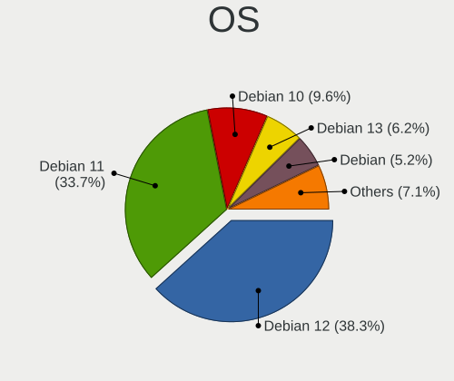

| Name                    | Desktops | Percent |
|-------------------------|----------|---------|
| Debian 12               | 3095     | 38.28%  |
| Debian 11               | 2721     | 33.65%  |
| Debian 10               | 773      | 9.56%   |
| Debian 13               | 498      | 6.16%   |
| Debian                  | 421      | 5.21%   |
| Debian Testing          | 231      | 2.86%   |
| Debian 9                | 153      | 1.89%   |
| Debian Unstable         | 116      | 1.43%   |
| Debian 8                | 28       | 0.35%   |
| Debian 11-updates       | 18       | 0.22%   |
| Debian 23               | 7        | 0.09%   |
| Debian 7                | 6        | 0.07%   |
| Debian Testing/unstable | 4        | 0.05%   |
| Debian 2                | 4        | 0.05%   |
| Debian Sid              | 2        | 0.02%   |
| Debian 6                | 2        | 0.02%   |
| Debian 23100609         | 2        | 0.02%   |
| Debian 24               | 1        | 0.01%   |
| Debian 2025             | 1        | 0.01%   |
| Debian 14               | 1        | 0.01%   |
| Debian 12-updates       | 1        | 0.01%   |
| Debian 1                | 1        | 0.01%   |

OS Family
---------

OS without a version

| Name   | Desktops | Percent |
|--------|----------|---------|
| Debian | 7653     | 100%    |

Kernel
------

Version of the Linux kernel

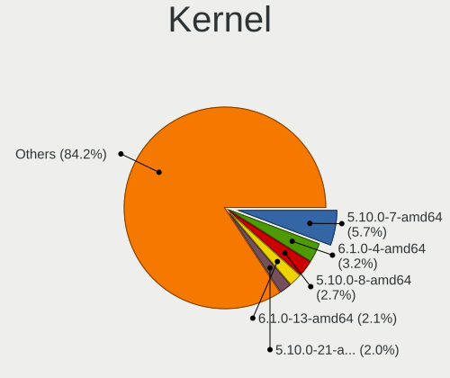

| Version             | Desktops | Percent |
|---------------------|----------|---------|
| 5.10.0-7-amd64      | 515      | 5.74%   |
| 6.1.0-4-amd64       | 287      | 3.2%    |
| 5.10.0-8-amd64      | 240      | 2.67%   |
| 6.1.0-13-amd64      | 192      | 2.14%   |
| 5.10.0-21-amd64     | 180      | 2.01%   |
| 6.1.0-18-amd64      | 171      | 1.91%   |
| 6.1.0-37-amd64      | 148      | 1.65%   |
| 6.12.48+deb13-amd64 | 123      | 1.37%   |
| 5.10.0-9-amd64      | 123      | 1.37%   |
| 6.1.0-21-amd64      | 122      | 1.36%   |
| 6.1.0-17-amd64      | 118      | 1.32%   |
| 5.10.0-2-amd64      | 117      | 1.3%    |
| 6.12.57+deb13-amd64 | 113      | 1.26%   |
| 6.1.0-25-amd64      | 110      | 1.23%   |
| 6.1.0-28-amd64      | 108      | 1.2%    |
| 5.10.0-20-amd64     | 108      | 1.2%    |
| 5.10.0-19-amd64     | 107      | 1.19%   |
| 6.1.0-10-amd64      | 106      | 1.18%   |
| 6.1.0-23-amd64      | 103      | 1.15%   |
| 6.1.0-9-amd64       | 102      | 1.14%   |
| 6.1.0-26-amd64      | 99       | 1.1%    |
| 5.10.0-23-amd64     | 96       | 1.07%   |
| 6.1.0-16-amd64      | 88       | 0.98%   |
| 5.10.0-13-amd64     | 88       | 0.98%   |
| 6.1.0-27-amd64      | 87       | 0.97%   |
| 5.10.0-18-amd64     | 84       | 0.94%   |
| 5.10.0-10-amd64     | 76       | 0.85%   |
| 5.10.0-11-amd64     | 74       | 0.82%   |
| 6.1.0-32-amd64      | 73       | 0.81%   |
| 6.1.0-31-amd64      | 73       | 0.81%   |
| 6.1.0-30-amd64      | 70       | 0.78%   |
| 5.10.0-16-amd64     | 69       | 0.77%   |
| 6.1.0-11-amd64      | 67       | 0.75%   |
| 6.1.0-12-amd64      | 65       | 0.72%   |
| 6.1.0-20-amd64      | 63       | 0.7%    |
| 6.1.0-22-amd64      | 62       | 0.69%   |
| 6.12.43+deb13-amd64 | 57       | 0.64%   |
| 4.19.0-6-amd64      | 57       | 0.64%   |
| 4.19.0-14-amd64     | 54       | 0.6%    |
| 6.12.41+deb13-amd64 | 53       | 0.59%   |

Kernel Family
-------------

Linux kernel without a distro release

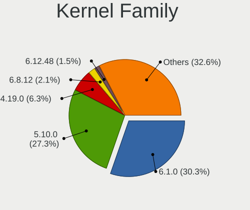

| Version  | Desktops | Percent |
|----------|----------|---------|
| 6.1.0    | 2566     | 30.33%  |
| 5.10.0   | 2306     | 27.25%  |
| 4.19.0   | 529      | 6.25%   |
| 6.8.12   | 175      | 2.07%   |
| 6.12.48  | 123      | 1.45%   |
| 6.12.57  | 118      | 1.39%   |
| 4.9.0    | 111      | 1.31%   |
| 6.0.0    | 94       | 1.11%   |
| 5.18.0   | 79       | 0.93%   |
| 6.5.0    | 77       | 0.91%   |
| 6.12.43  | 60       | 0.71%   |
| 5.9.0    | 59       | 0.7%    |
| 5.16.0   | 59       | 0.7%    |
| 5.15.0   | 57       | 0.67%   |
| 5.8.0    | 55       | 0.65%   |
| 6.2.16   | 54       | 0.64%   |
| 5.7.0    | 54       | 0.64%   |
| 6.12.41  | 53       | 0.63%   |
| 5.6.0    | 48       | 0.57%   |
| 6.5.11   | 45       | 0.53%   |
| 5.4.0    | 44       | 0.52%   |
| 5.13.19  | 44       | 0.52%   |
| 5.19.0   | 41       | 0.48%   |
| 6.8.4    | 37       | 0.44%   |
| 6.4.0    | 37       | 0.44%   |
| 6.12.12  | 37       | 0.44%   |
| 6.12.38  | 34       | 0.4%    |
| 6.11.10  | 34       | 0.4%    |
| 5.14.0   | 34       | 0.4%    |
| 6.7.12   | 29       | 0.34%   |
| 6.5.13   | 29       | 0.34%   |
| 6.14.11  | 28       | 0.33%   |
| 6.8.8    | 26       | 0.31%   |
| 5.17.0   | 26       | 0.31%   |
| 6.6.13   | 25       | 0.3%    |
| 6.12.9   | 22       | 0.26%   |
| 6.12.6   | 20       | 0.24%   |
| 6.10.6   | 20       | 0.24%   |
| 5.15.107 | 20       | 0.24%   |
| 5.15.102 | 20       | 0.24%   |

Kernel Major Ver.
-----------------

Linux kernel major version

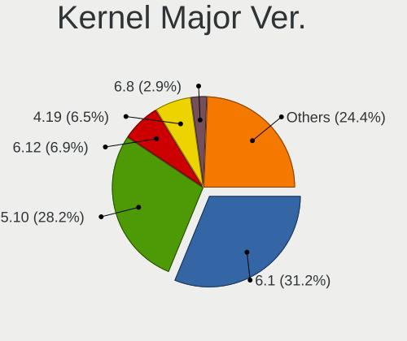

| Version | Desktops | Percent |
|---------|----------|---------|
| 6.1     | 2604     | 31.2%   |
| 5.10    | 2352     | 28.18%  |
| 6.12    | 575      | 6.89%   |
| 4.19    | 543      | 6.51%   |
| 6.8     | 239      | 2.86%   |
| 5.15    | 231      | 2.77%   |
| 6.5     | 153      | 1.83%   |
| 4.9     | 117      | 1.4%    |
| 6.0     | 107      | 1.28%   |
| 5.4     | 103      | 1.23%   |
| 5.18    | 84       | 1.01%   |
| 6.6     | 73       | 0.87%   |
| 6.2     | 72       | 0.86%   |
| 6.11    | 69       | 0.83%   |
| 5.16    | 65       | 0.78%   |
| 6.10    | 64       | 0.77%   |
| 5.9     | 62       | 0.74%   |
| 5.8     | 61       | 0.73%   |
| 6.14    | 60       | 0.72%   |
| 5.7     | 58       | 0.69%   |
| 5.13    | 54       | 0.65%   |
| 5.6     | 52       | 0.62%   |
| 5.19    | 51       | 0.61%   |
| 6.7     | 46       | 0.55%   |
| 6.4     | 46       | 0.55%   |
| 6.17    | 42       | 0.5%    |
| 6.9     | 41       | 0.49%   |
| 6.16    | 39       | 0.47%   |
| 5.14    | 37       | 0.44%   |
| 5.11    | 31       | 0.37%   |
| 5.3     | 30       | 0.36%   |
| 5.17    | 30       | 0.36%   |
| 6.3     | 23       | 0.28%   |
| 5.5     | 17       | 0.2%    |
| 3.16    | 13       | 0.16%   |
| 4.15    | 11       | 0.13%   |
| 4.18    | 10       | 0.12%   |
| 6.18    | 8        | 0.1%    |
| 5.2     | 8        | 0.1%    |
| 5.0     | 8        | 0.1%    |

Arch
----

OS architecture (x86_64, i586, etc.)

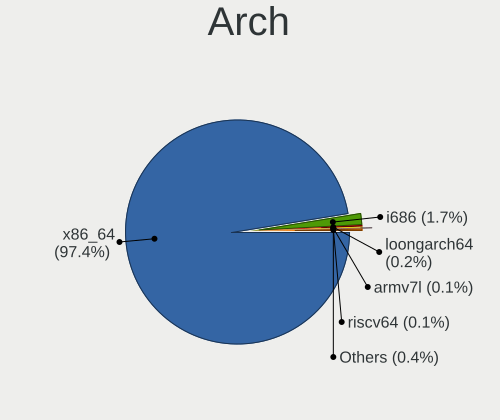

| Name        | Desktops | Percent |
|-------------|----------|---------|
| x86_64      | 7459     | 97.43%  |
| i686        | 132      | 1.72%   |
| loongarch64 | 17       | 0.22%   |
| armv7l      | 11       | 0.14%   |
| riscv64     | 10       | 0.13%   |
| ppc64       | 7        | 0.09%   |
| aarch64     | 4        | 0.05%   |
| ppc64le     | 3        | 0.04%   |
| i586        | 3        | 0.04%   |
| sparc64     | 2        | 0.03%   |
| ppc         | 2        | 0.03%   |
| mips64      | 2        | 0.03%   |
| sh4a        | 1        | 0.01%   |
| mips        | 1        | 0.01%   |
| i486        | 1        | 0.01%   |
| armv6l      | 1        | 0.01%   |

DE
--

Desktop Environment

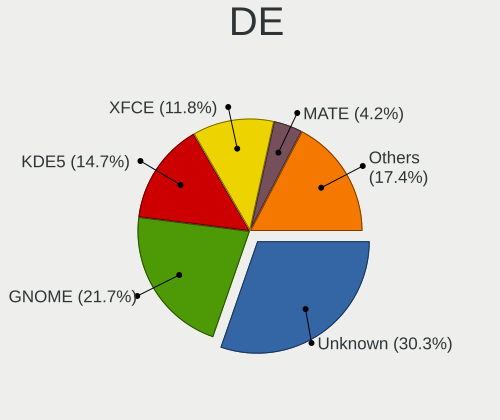

| Name              | Desktops | Percent |
|-------------------|----------|---------|
| Unknown           | 2391     | 30.31%  |
| GNOME             | 1710     | 21.68%  |
| KDE5              | 1156     | 14.66%  |
| XFCE              | 931      | 11.8%   |
| MATE              | 329      | 4.17%   |
| X-Cinnamon        | 315      | 3.99%   |
| LXDE              | 175      | 2.22%   |
| Cinnamon          | 170      | 2.16%   |
| KDE6              | 166      | 2.1%    |
| LXQt              | 126      | 1.6%    |
| KDE               | 114      | 1.45%   |
| i3                | 55       | 0.7%    |
| GNOME Flashback   | 48       | 0.61%   |
| Openbox           | 39       | 0.49%   |
| GNOME Classic     | 27       | 0.34%   |
| lightdm-xsession  | 25       | 0.32%   |
| Trinity           | 24       | 0.3%    |
| Budgie            | 20       | 0.25%   |
| sway              | 9        | 0.11%   |
| awesome           | 7        | 0.09%   |
| Fluxbox           | 6        | 0.08%   |
| icewm             | 5        | 0.06%   |
| dwm               | 5        | 0.06%   |
| default           | 5        | 0.06%   |
| KDE4              | 4        | 0.05%   |
| bspwm             | 4        | 0.05%   |
| Enlightenment     | 3        | 0.04%   |
| Cutefish          | 3        | 0.04%   |
| xmonad            | 1        | 0.01%   |
| x-session-manager | 1        | 0.01%   |
| wlroots           | 1        | 0.01%   |
| WindowMaker       | 1        | 0.01%   |
| Wayfire           | 1        | 0.01%   |
| UKUI              | 1        | 0.01%   |
| sway:GNOME        | 1        | 0.01%   |
| niri              | 1        | 0.01%   |
| labwc:wlroots     | 1        | 0.01%   |
| i3-with-shmlog    | 1        | 0.01%   |
| GNUstep           | 1        | 0.01%   |
| gnome-xorg        | 1        | 0.01%   |

Display Server
--------------

X11 or Wayland

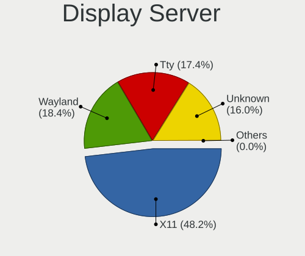

| Name        | Desktops | Percent |
|-------------|----------|---------|
| X11         | 3794     | 48.15%  |
| Wayland     | 1448     | 18.38%  |
| Tty         | 1368     | 17.36%  |
| Unknown     | 1264     | 16.04%  |
| Web         | 3        | 0.04%   |
| Unspecified | 2        | 0.03%   |

Display Manager
---------------

SDDM, LightDM, etc.

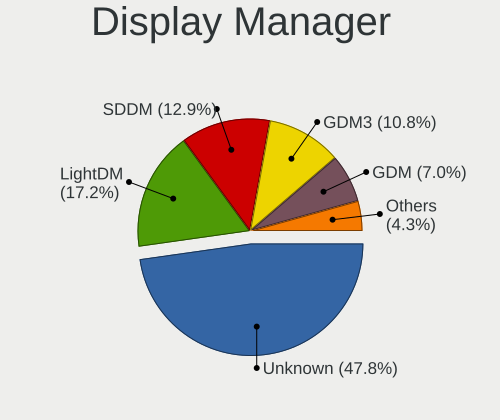

| Name    | Desktops | Percent |
|---------|----------|---------|
| Unknown | 3738     | 47.76%  |
| LightDM | 1345     | 17.19%  |
| SDDM    | 1010     | 12.91%  |
| GDM3    | 849      | 10.85%  |
| GDM     | 545      | 6.96%   |
| TDM     | 254      | 3.25%   |
| SLiM    | 24       | 0.31%   |
| XDM     | 18       | 0.23%   |
| NODM    | 16       | 0.2%    |
| LXDM    | 8        | 0.1%    |
| KDM     | 7        | 0.09%   |
| WDM     | 6        | 0.08%   |
| Ly      | 2        | 0.03%   |
| GREETD  | 2        | 0.03%   |
| SU      | 1        | 0.01%   |
| LDM     | 1        | 0.01%   |

OS Lang
-------

Language

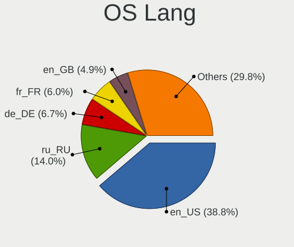

| Lang    | Desktops | Percent |
|---------|----------|---------|
| en_US   | 3004     | 38.76%  |
| ru_RU   | 1086     | 14.01%  |
| de_DE   | 516      | 6.66%   |
| fr_FR   | 462      | 5.96%   |
| en_GB   | 376      | 4.85%   |
| Unknown | 367      | 4.74%   |
| pt_BR   | 236      | 3.05%   |
| es_ES   | 205      | 2.65%   |
| it_IT   | 195      | 2.52%   |
| en_CA   | 126      | 1.63%   |
| C       | 125      | 1.61%   |
| en_AU   | 107      | 1.38%   |
| pl_PL   | 97       | 1.25%   |
| es_AR   | 56       | 0.72%   |
| es_MX   | 49       | 0.63%   |
| en_IE   | 44       | 0.57%   |
| zh_CN   | 43       | 0.55%   |
| en_IN   | 41       | 0.53%   |
| hu_HU   | 40       | 0.52%   |
| nl_NL   | 32       | 0.41%   |
| de_AT   | 31       | 0.4%    |
| es_VE   | 30       | 0.39%   |
| en_ZA   | 30       | 0.39%   |
| ja_JP   | 22       | 0.28%   |
| cs_CZ   | 22       | 0.28%   |
| en_NZ   | 21       | 0.27%   |
| de_CH   | 20       | 0.26%   |
| fr_BE   | 19       | 0.25%   |
| nl_BE   | 17       | 0.22%   |
| pt_PT   | 16       | 0.21%   |
| es_CL   | 16       | 0.21%   |
| sv_SE   | 14       | 0.18%   |
| fr_CA   | 14       | 0.18%   |
| ca_ES   | 14       | 0.18%   |
| tr_TR   | 13       | 0.17%   |
| es_PE   | 12       | 0.15%   |
| en_DK   | 12       | 0.15%   |
| es_CO   | 11       | 0.14%   |
| en_HK   | 10       | 0.13%   |
| el_GR   | 10       | 0.13%   |

Boot Mode
---------

EFI or BIOS

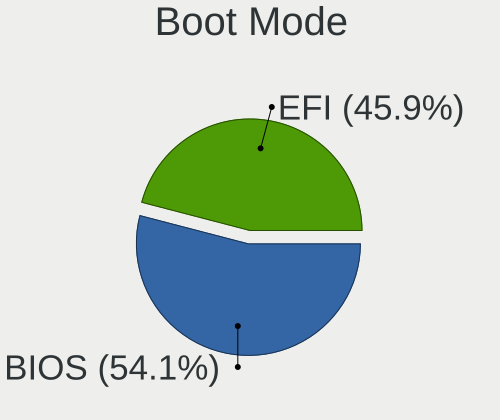

| Mode | Desktops | Percent |
|------|----------|---------|
| BIOS | 4196     | 54.06%  |
| EFI  | 3566     | 45.94%  |

Filesystem
----------

Type of filesystem

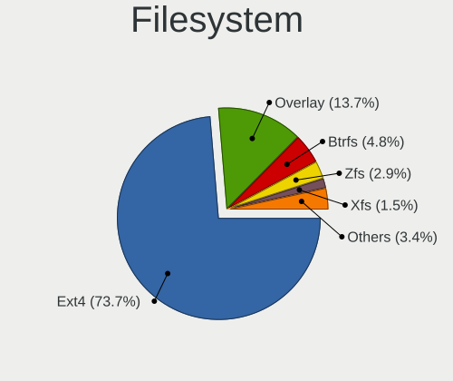

| Type       | Desktops | Percent |
|------------|----------|---------|
| Ext4       | 5713     | 73.68%  |
| Overlay    | 1064     | 13.72%  |
| Btrfs      | 371      | 4.78%   |
| Zfs        | 222      | 2.86%   |
| Xfs        | 119      | 1.53%   |
| Tmpfs      | 98       | 1.26%   |
| Unknown    | 89       | 1.15%   |
| Ext3       | 35       | 0.45%   |
| Rootfs     | 14       | 0.18%   |
| Ext2       | 13       | 0.17%   |
| Aufs       | 6        | 0.08%   |
| F2fs       | 4        | 0.05%   |
| Jfs        | 2        | 0.03%   |
| XXXXXXX    | 1        | 0.01%   |
| XXXXX      | 1        | 0.01%   |
| Reiserfs   | 1        | 0.01%   |
| Fuse.sshfs | 1        | 0.01%   |

Part. scheme
------------

Scheme of partitioning

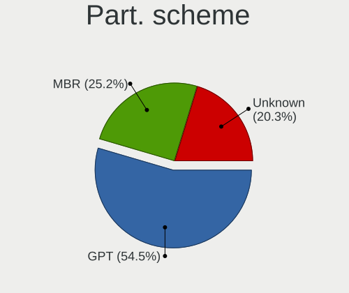

| Type    | Desktops | Percent |
|---------|----------|---------|
| GPT     | 4250     | 54.54%  |
| MBR     | 1961     | 25.17%  |
| Unknown | 1581     | 20.29%  |

Dual Boot with Linux/BSD
------------------------

Hosting more than one Linux/BSD

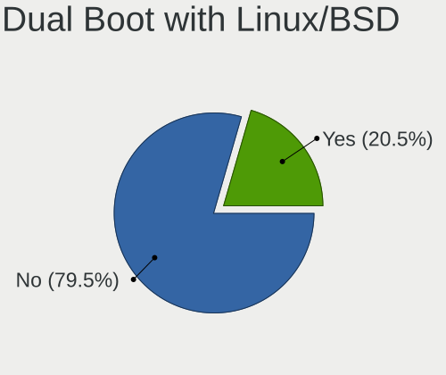

| Dual boot | Desktops | Percent |
|-----------|----------|---------|
| No        | 6207     | 79.48%  |
| Yes       | 1603     | 20.52%  |

Dual Boot (Win)
---------------

Hosting Linux and Windows

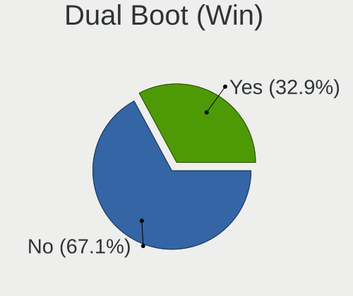

| Dual boot | Desktops | Percent |
|-----------|----------|---------|
| No        | 5207     | 67.13%  |
| Yes       | 2550     | 32.87%  |

Board
-----

Vendor
------

Motherboard manufacturer

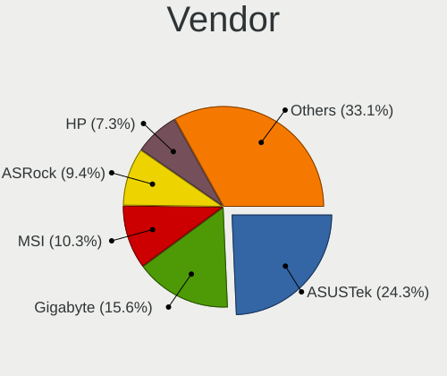

| Name                                 | Desktops | Percent |
|--------------------------------------|----------|---------|
| ASUSTek Computer                     | 1860     | 24.3%   |
| Gigabyte Technology                  | 1194     | 15.6%   |
| MSI                                  | 788      | 10.3%   |
| ASRock                               | 720      | 9.41%   |
| Hewlett-Packard                      | 557      | 7.28%   |
| Dell                                 | 528      | 6.9%    |
| Lenovo                               | 306      | 4%      |
| Intel                                | 242      | 3.16%   |
| Unknown                              | 233      | 3.04%   |
| Fujitsu                              | 95       | 1.24%   |
| Acer                                 | 82       | 1.07%   |
| AZW                                  | 79       | 1.03%   |
| ECS                                  | 73       | 0.95%   |
| Supermicro                           | 61       | 0.8%    |
| Foxconn                              | 61       | 0.8%    |
| Biostar                              | 52       | 0.68%   |
| ASRockRack                           | 49       | 0.64%   |
| Shenzhen Meigao Electronic Equipment | 37       | 0.48%   |
| Pegatron                             | 36       | 0.47%   |
| Huanan                               | 28       | 0.37%   |
| Apple                                | 23       | 0.3%    |
| Inventec                             | 22       | 0.29%   |
| Shuttle                              | 21       | 0.27%   |
| BESSTAR Tech                         | 17       | 0.22%   |
| Medion                               | 16       | 0.21%   |
| Loongson                             | 16       | 0.21%   |
| HC Technology.                       | 16       | 0.21%   |
| Fujitsu Siemens                      | 15       | 0.2%    |
| OEM                                  | 14       | 0.18%   |
| AMI                                  | 14       | 0.18%   |
| Positivo                             | 12       | 0.16%   |
| IceWhale Technology                  | 12       | 0.16%   |
| Google                               | 12       | 0.16%   |
| MACHINIST                            | 10       | 0.13%   |
| Techvision                           | 9        | 0.12%   |
| Alienware                            | 9        | 0.12%   |
| GEEKOM                               | 8        | 0.1%    |
| Packard Bell                         | 7        | 0.09%   |
| HPE                                  | 7        | 0.09%   |
| Hardkernel                           | 7        | 0.09%   |

Model
-----

Motherboard model

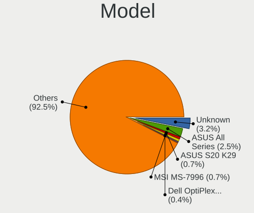

| Name                                              | Desktops | Percent |
|---------------------------------------------------|----------|---------|
| Unknown                                           | 242      | 3.16%   |
| ASUS All Series                                   | 190      | 2.48%   |
| ASUS S20 K29                                      | 55       | 0.72%   |
| MSI MS-7996                                       | 53       | 0.69%   |
| Dell OptiPlex 7010                                | 34       | 0.44%   |
| MSI MS-7817                                       | 31       | 0.41%   |
| ECS G31T-M9                                       | 28       | 0.37%   |
| ASUS TUF Gaming X570-PLUS                         | 28       | 0.37%   |
| Gigabyte B450M DS3H                               | 27       | 0.35%   |
| Gigabyte H81M-S2V                                 | 26       | 0.34%   |
| ASUS PRIME A320M-K                                | 26       | 0.34%   |
| MSI MS-7C56                                       | 25       | 0.33%   |
| AZW MINI S                                        | 24       | 0.31%   |
| Dell OptiPlex 9020                                | 23       | 0.3%    |
| HP ProDesk 400 G2.5 SFF                           | 20       | 0.26%   |
| ASUS PRIME H510M-A                                | 20       | 0.26%   |
| ASRock H470M-HVS                                  | 20       | 0.26%   |
| Shenzhen Meigao Electronic Equipment Venus Series | 19       | 0.25%   |
| MSI MS-7C02                                       | 19       | 0.25%   |
| MSI MS-7B79                                       | 19       | 0.25%   |
| ECS H61H2-M13                                     | 19       | 0.25%   |
| MSI MS-7C91                                       | 18       | 0.24%   |
| ASUS ROG STRIX B550-F GAMING                      | 18       | 0.24%   |
| ASUS PRIME B450M-A                                | 18       | 0.24%   |
| ASUS H110M-R                                      | 18       | 0.24%   |
| MSI MS-7C37                                       | 17       | 0.22%   |
| Intel X99                                         | 17       | 0.22%   |
| Intel Jasper Lake Client Platform                 | 17       | 0.22%   |
| ASUS P8H61-M LX3 R2.0                             | 17       | 0.22%   |
| Lenovo ThinkCentre M55p 8808D8U                   | 16       | 0.21%   |
| HP Z420 Workstation                               | 16       | 0.21%   |
| HP Compaq Elite 8300 SFF                          | 16       | 0.21%   |
| Gigabyte H410M S2H                                | 16       | 0.21%   |
| Dell OptiPlex 3020                                | 16       | 0.21%   |
| ASUS P5QL-CM                                      | 16       | 0.21%   |
| MSI MS-7C95                                       | 15       | 0.2%    |
| MSI MS-7B86                                       | 15       | 0.2%    |
| MSI MS-7A34                                       | 15       | 0.2%    |
| HP ProLiant MicroServer                           | 15       | 0.2%    |
| Gigabyte 970A-DS3P                                | 15       | 0.2%    |

Model Family
------------

Motherboard model prefix

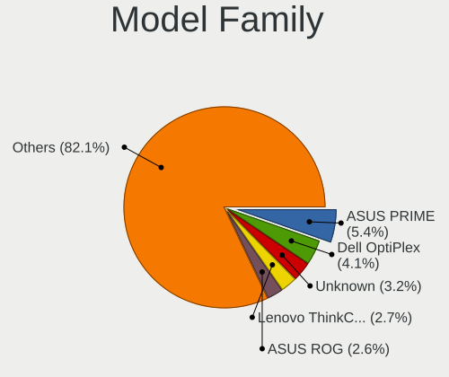

| Name                   | Desktops | Percent |
|------------------------|----------|---------|
| ASUS PRIME             | 411      | 5.37%   |
| Dell OptiPlex          | 311      | 4.06%   |
| Unknown                | 242      | 3.16%   |
| Lenovo ThinkCentre     | 207      | 2.7%    |
| ASUS ROG               | 199      | 2.6%    |
| ASUS All               | 190      | 2.48%   |
| ASUS TUF               | 156      | 2.04%   |
| HP Compaq              | 117      | 1.53%   |
| HP EliteDesk           | 102      | 1.33%   |
| HP ProDesk             | 97       | 1.27%   |
| Dell Precision         | 95       | 1.24%   |
| Gigabyte B450M         | 61       | 0.8%    |
| Gigabyte X570          | 55       | 0.72%   |
| ASUS S20               | 55       | 0.72%   |
| MSI MS-7996            | 53       | 0.69%   |
| Fujitsu ESPRIMO        | 52       | 0.68%   |
| ASUS P8H61-M           | 49       | 0.64%   |
| ASUS PRO               | 48       | 0.63%   |
| HP ProLiant            | 47       | 0.61%   |
| Acer Aspire            | 43       | 0.56%   |
| Lenovo ThinkStation    | 42       | 0.55%   |
| Gigabyte B550          | 42       | 0.55%   |
| Gigabyte B550M         | 41       | 0.54%   |
| Dell Inspiron          | 37       | 0.48%   |
| Gigabyte B450          | 36       | 0.47%   |
| ASRock B450M           | 35       | 0.46%   |
| ASRock B450            | 34       | 0.44%   |
| ASRock X570            | 33       | 0.43%   |
| MSI MS-7817            | 31       | 0.41%   |
| ASUS M5A97             | 31       | 0.41%   |
| Dell XPS               | 29       | 0.38%   |
| ECS G31T-M9            | 28       | 0.37%   |
| Gigabyte H81M-S2V      | 26       | 0.34%   |
| Gigabyte H410M         | 26       | 0.34%   |
| Gigabyte GA-78LMT-USB3 | 26       | 0.34%   |
| Acer Veriton           | 26       | 0.34%   |
| MSI MS-7C56            | 25       | 0.33%   |
| ASUS ProArt            | 25       | 0.33%   |
| AZW MINI               | 24       | 0.31%   |
| ASUS M5A78L-M          | 24       | 0.31%   |

MFG Year
--------

Motherboard manufacture year

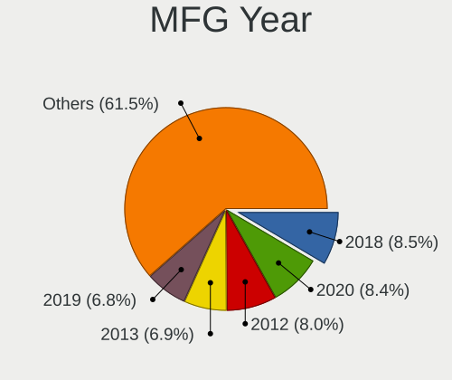

| Year    | Desktops | Percent |
|---------|----------|---------|
| 2018    | 651      | 8.51%   |
| 2020    | 642      | 8.39%   |
| 2012    | 612      | 8%      |
| 2013    | 525      | 6.86%   |
| 2019    | 517      | 6.76%   |
| 2021    | 492      | 6.43%   |
| 2014    | 474      | 6.19%   |
| 2022    | 473      | 6.18%   |
| 2011    | 418      | 5.46%   |
| 2017    | 389      | 5.08%   |
| 2015    | 361      | 4.72%   |
| 2023    | 343      | 4.48%   |
| 2016    | 326      | 4.26%   |
| 2009    | 311      | 4.06%   |
| 2010    | 307      | 4.01%   |
| 2008    | 205      | 2.68%   |
| 2024    | 194      | 2.53%   |
| 2007    | 177      | 2.31%   |
| 2006    | 66       | 0.86%   |
| Unknown | 61       | 0.8%    |
| 2025    | 41       | 0.54%   |
| 2005    | 32       | 0.42%   |
| 2004    | 18       | 0.24%   |
| 2003    | 8        | 0.1%    |
| 2000    | 4        | 0.05%   |
| 2002    | 3        | 0.04%   |
| 2001    | 3        | 0.04%   |

Form Factor
-----------

Physical design of the computer

| Name    | Desktops | Percent |
|---------|----------|---------|
| Desktop | 7653     | 100%    |

Secure Boot
-----------

Enabled or disabled

| State    | Desktops | Percent |
|----------|----------|---------|
| Disabled | 7457     | 97.17%  |
| Enabled  | 217      | 2.83%   |

Coreboot
--------

Have coreboot on board

| Used | Desktops | Percent |
|------|----------|---------|
| No   | 7626     | 99.65%  |
| Yes  | 27       | 0.35%   |

RAM Size
--------

Total RAM memory

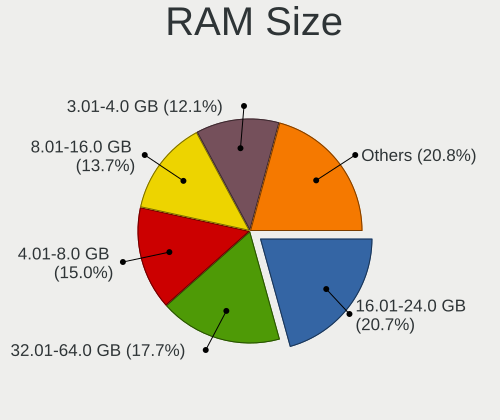

| Size in GB      | Desktops | Percent |
|-----------------|----------|---------|
| 16.01-24.0      | 1619     | 20.71%  |
| 32.01-64.0      | 1387     | 17.74%  |
| 4.01-8.0        | 1169     | 14.95%  |
| 8.01-16.0       | 1074     | 13.74%  |
| 3.01-4.0        | 944      | 12.07%  |
| 64.01-256.0     | 823      | 10.53%  |
| 24.01-32.0      | 308      | 3.94%   |
| 1.01-2.0        | 257      | 3.29%   |
| 2.01-3.0        | 110      | 1.41%   |
| 0.51-1.0        | 48       | 0.61%   |
| More than 256.0 | 38       | 0.49%   |
| 0.01-0.5        | 21       | 0.27%   |
| Unknown         | 18       | 0.23%   |
| 0               | 2        | 0.03%   |

RAM Used
--------

Used RAM memory

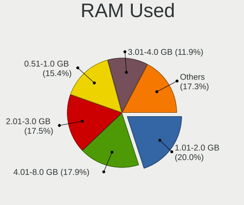

| Used GB         | Desktops | Percent |
|-----------------|----------|---------|
| 1.01-2.0        | 1690     | 20.01%  |
| 4.01-8.0        | 1512     | 17.9%   |
| 2.01-3.0        | 1478     | 17.5%   |
| 0.51-1.0        | 1297     | 15.35%  |
| 3.01-4.0        | 1009     | 11.95%  |
| 8.01-16.0       | 646      | 7.65%   |
| 0.01-0.5        | 282      | 3.34%   |
| 16.01-24.0      | 221      | 2.62%   |
| 32.01-64.0      | 130      | 1.54%   |
| 24.01-32.0      | 106      | 1.25%   |
| 64.01-256.0     | 49       | 0.58%   |
| Unknown         | 23       | 0.27%   |
| More than 256.0 | 3        | 0.04%   |
| 0               | 1        | 0.01%   |

Total Drives
------------

Number of drives on board

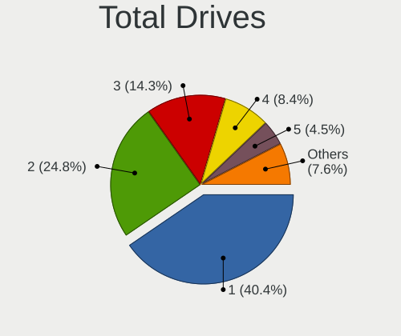

| Drives  | Desktops | Percent |
|---------|----------|---------|
| 1       | 3224     | 40.45%  |
| 2       | 1973     | 24.75%  |
| 3       | 1140     | 14.3%   |
| 4       | 669      | 8.39%   |
| 5       | 362      | 4.54%   |
| 6       | 206      | 2.58%   |
| 7       | 120      | 1.51%   |
| 8       | 69       | 0.87%   |
| 0       | 51       | 0.64%   |
| 9       | 43       | 0.54%   |
| 10      | 25       | 0.31%   |
| 11      | 17       | 0.21%   |
| 12      | 16       | 0.2%    |
| 13      | 11       | 0.14%   |
| 14      | 10       | 0.13%   |
| 19      | 4        | 0.05%   |
| 16      | 4        | 0.05%   |
| 27      | 3        | 0.04%   |
| 21      | 3        | 0.04%   |
| 18      | 3        | 0.04%   |
| 17      | 3        | 0.04%   |
| 15      | 3        | 0.04%   |
| 29      | 2        | 0.03%   |
| 26      | 2        | 0.03%   |
| Unknown | 2        | 0.03%   |
| 46      | 1        | 0.01%   |
| 33      | 1        | 0.01%   |
| 32      | 1        | 0.01%   |
| 30      | 1        | 0.01%   |
| 28      | 1        | 0.01%   |
| 22      | 1        | 0.01%   |

Has CD-ROM
----------

Has CD-ROM on board

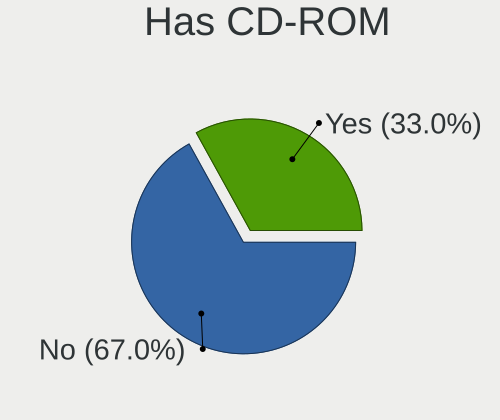

| Presented | Desktops | Percent |
|-----------|----------|---------|
| No        | 5178     | 66.97%  |
| Yes       | 2554     | 33.03%  |

Has Ethernet
------------

Has Ethernet on board

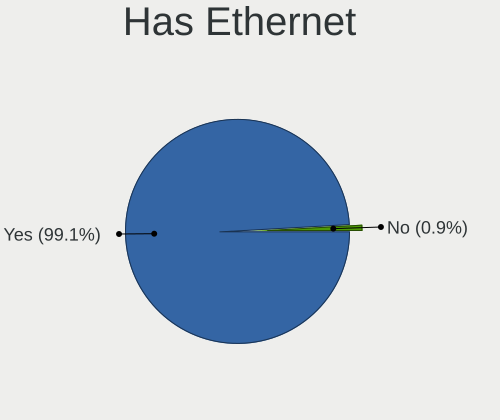

| Presented | Desktops | Percent |
|-----------|----------|---------|
| Yes       | 7584     | 99.1%   |
| No        | 69       | 0.9%    |

Has WiFi
--------

Has WiFi module

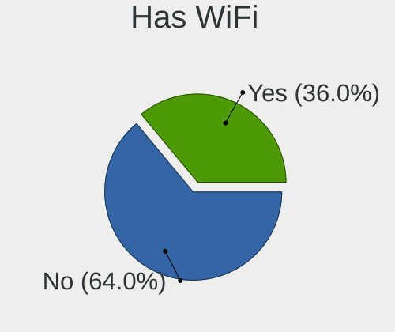

| Presented | Desktops | Percent |
|-----------|----------|---------|
| No        | 4940     | 63.97%  |
| Yes       | 2782     | 36.03%  |

Has Bluetooth
-------------

Has Bluetooth module

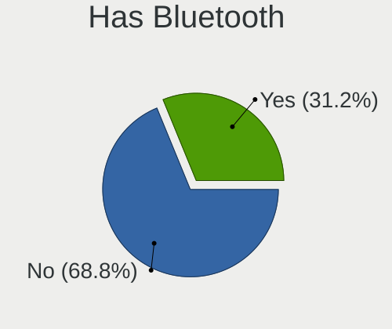

| Presented | Desktops | Percent |
|-----------|----------|---------|
| No        | 5338     | 68.81%  |
| Yes       | 2420     | 31.19%  |

Location
--------

Country
-------

Geographic location (country)

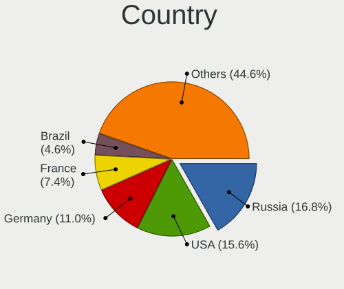

| Country      | Desktops | Percent |
|--------------|----------|---------|
| Russia       | 1288     | 16.78%  |
| USA          | 1200     | 15.63%  |
| Germany      | 842      | 10.97%  |
| France       | 571      | 7.44%   |
| Brazil       | 351      | 4.57%   |
| Italy        | 293      | 3.82%   |
| Spain        | 284      | 3.7%    |
| UK           | 256      | 3.34%   |
| Canada       | 222      | 2.89%   |
| Poland       | 158      | 2.06%   |
| Australia    | 149      | 1.94%   |
| Netherlands  | 131      | 1.71%   |
| China        | 111      | 1.45%   |
| Austria      | 96       | 1.25%   |
| Switzerland  | 89       | 1.16%   |
| Argentina    | 84       | 1.09%   |
| Mexico       | 81       | 1.06%   |
| Belgium      | 81       | 1.06%   |
| Hungary      | 75       | 0.98%   |
| Sweden       | 64       | 0.83%   |
| Finland      | 61       | 0.79%   |
| India        | 58       | 0.76%   |
| Czechia      | 51       | 0.66%   |
| Romania      | 50       | 0.65%   |
| Portugal     | 49       | 0.64%   |
| Ukraine      | 46       | 0.6%    |
| Norway       | 46       | 0.6%    |
| Japan        | 44       | 0.57%   |
| Venezuela    | 41       | 0.53%   |
| Denmark      | 38       | 0.5%    |
| Bulgaria     | 38       | 0.5%    |
| South Africa | 36       | 0.47%   |
| Turkey       | 35       | 0.46%   |
| Greece       | 31       | 0.4%    |
| New Zealand  | 30       | 0.39%   |
| Ireland      | 27       | 0.35%   |
| Slovakia     | 26       | 0.34%   |
| Belarus      | 25       | 0.33%   |
| Taiwan       | 24       | 0.31%   |
| Malaysia     | 24       | 0.31%   |

City
----

Geographic location (city)

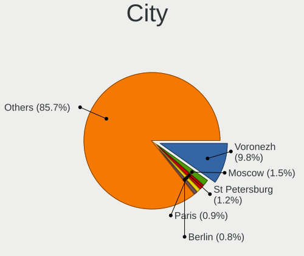

| City              | Desktops | Percent |
|-------------------|----------|---------|
| Voronezh          | 786      | 9.77%   |
| Moscow            | 124      | 1.54%   |
| St Petersburg     | 98       | 1.22%   |
| Paris             | 75       | 0.93%   |
| Berlin            | 67       | 0.83%   |
| Vienna            | 59       | 0.73%   |
| Bagneux           | 53       | 0.66%   |
| Sao Paulo         | 50       | 0.62%   |
| Toronto           | 42       | 0.52%   |
| Amsterdam         | 40       | 0.5%    |
| Madrid            | 39       | 0.49%   |
| Sydney            | 37       | 0.46%   |
| Roubaix           | 37       | 0.46%   |
| Seville           | 34       | 0.42%   |
| Milan             | 34       | 0.42%   |
| Falkenstein       | 34       | 0.42%   |
| Frankfurt am Main | 32       | 0.4%    |
| Barcelona         | 32       | 0.4%    |
| Rio de Janeiro    | 31       | 0.39%   |
| Munich            | 31       | 0.39%   |
| Bangor            | 31       | 0.39%   |
| Melbourne         | 30       | 0.37%   |
| Budapest          | 29       | 0.36%   |
| Beijing           | 29       | 0.36%   |
| Hamburg           | 28       | 0.35%   |
| Yekaterinburg     | 27       | 0.34%   |
| Zurich            | 26       | 0.32%   |
| Warsaw            | 25       | 0.31%   |
| Helsinki          | 24       | 0.3%    |
| New York          | 23       | 0.29%   |
| Cologne           | 23       | 0.29%   |
| Brisbane          | 23       | 0.29%   |
| Prague            | 21       | 0.26%   |
| Los Angeles       | 21       | 0.26%   |
| Chicago           | 21       | 0.26%   |
| Stockholm         | 20       | 0.25%   |
| Perm              | 20       | 0.25%   |
| Stuttgart         | 19       | 0.24%   |
| Sofia             | 19       | 0.24%   |
| Nuremberg         | 19       | 0.24%   |

Drives
------

Drive Vendor
------------

Hard drive vendors

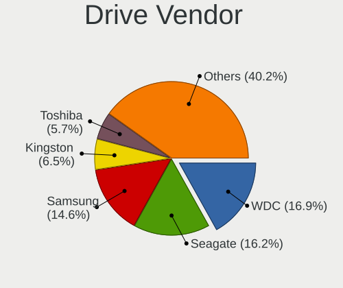

| Vendor                      | Desktops | Drives | Percent |
|-----------------------------|----------|--------|---------|
| WDC                         | 2380     | 4733   | 16.91%  |
| Seagate                     | 2274     | 4373   | 16.15%  |
| Samsung Electronics         | 2050     | 3590   | 14.56%  |
| Kingston                    | 914      | 1359   | 6.49%   |
| Toshiba                     | 807      | 1554   | 5.73%   |
| Crucial                     | 783      | 1124   | 5.56%   |
| SanDisk                     | 591      | 850    | 4.2%    |
| Hitachi                     | 386      | 596    | 2.74%   |
| Intel                       | 230      | 348    | 1.63%   |
| China                       | 224      | 275    | 1.59%   |
| A-DATA Technology           | 207      | 305    | 1.47%   |
| HGST                        | 189      | 408    | 1.34%   |
| Unknown                     | 179      | 307    | 1.27%   |
| SPCC                        | 131      | 149    | 0.93%   |
| SK hynix                    | 120      | 178    | 0.85%   |
| PNY                         | 115      | 189    | 0.82%   |
| Kingston Technology Company | 100      | 135    | 0.71%   |
| Transcend                   | 85       | 130    | 0.6%    |
| Corsair                     | 85       | 111    | 0.6%    |
| Patriot                     | 84       | 117    | 0.6%    |
| Phison                      | 81       | 111    | 0.58%   |
| Micron Technology           | 80       | 113    | 0.57%   |
| Intenso                     | 80       | 109    | 0.57%   |
| Unknown                     | 77       | 100    | 0.55%   |
| Maxtor                      | 69       | 82     | 0.49%   |
| Hewlett-Packard             | 69       | 166    | 0.49%   |
| OCZ                         | 67       | 81     | 0.48%   |
| Netac                       | 62       | 152    | 0.44%   |
| Silicon Motion              | 55       | 64     | 0.39%   |
| Gigabyte Technology         | 55       | 81     | 0.39%   |
| GOODRAM                     | 54       | 102    | 0.38%   |
| MAXIO Technology (Hangzhou) | 49       | 60     | 0.35%   |
| Phison Electronics          | 46       | 73     | 0.33%   |
| Team                        | 43       | 58     | 0.31%   |
| Lexar                       | 42       | 66     | 0.3%    |
| Apacer                      | 42       | 59     | 0.3%    |
| Micron/Crucial Technology   | 41       | 57     | 0.29%   |
| JMicron Technology          | 40       | 43     | 0.28%   |
| XPG                         | 34       | 58     | 0.24%   |
| Fanxiang                    | 33       | 47     | 0.23%   |

Drive Model
-----------

Hard drive models

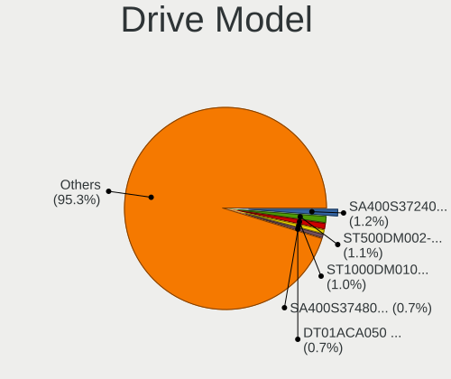

| Model                                              | Desktops | Percent |
|----------------------------------------------------|----------|---------|
| Kingston SA400S37240G 240GB SSD                    | 201      | 1.2%    |
| Seagate ST500DM002-1BD142 500GB                    | 189      | 1.12%   |
| Seagate ST1000DM010-2EP102 1TB                     | 172      | 1.02%   |
| Kingston SA400S37480G 480GB SSD                    | 124      | 0.74%   |
| Toshiba DT01ACA050 500GB                           | 112      | 0.67%   |
| Toshiba DT01ACA100 1TB                             | 108      | 0.64%   |
| Samsung SSD 860 EVO 500GB                          | 108      | 0.64%   |
| Crucial CT480BX500SSD1 480GB                       | 103      | 0.61%   |
| Seagate ST2000DM008-2FR102 2TB                     | 100      | 0.59%   |
| Samsung SSD 850 EVO 250GB                          | 94       | 0.56%   |
| Samsung SSD 850 EVO 500GB                          | 93       | 0.55%   |
| WDC WD10EZEX-08WN4A0 1TB                           | 89       | 0.53%   |
| Crucial CT1000MX500SSD1 1TB                        | 89       | 0.53%   |
| Crucial CT500MX500SSD1 500GB                       | 86       | 0.51%   |
| Kingston SV300S37A120G 120GB SSD                   | 85       | 0.51%   |
| Samsung SSD 860 EVO 1TB                            | 82       | 0.49%   |
| Seagate ST4000DM004-2CV104 4TB                     | 81       | 0.48%   |
| Samsung SSD 970 EVO Plus 1TB                       | 81       | 0.48%   |
| Kingston SA400S37120G 120GB SSD                    | 81       | 0.48%   |
| Crucial CT240BX500SSD1 240GB                       | 81       | 0.48%   |
| Seagate ST1000DM003-1ER162 1TB                     | 79       | 0.47%   |
| SanDisk NVMe SSD Drive 1TB                         | 78       | 0.46%   |
| Samsung NVMe SSD Controller SM981/PM981/PM983 1TB  | 78       | 0.46%   |
| Samsung SSD 860 EVO 250GB                          | 77       | 0.46%   |
| Unknown                                            | 77       | 0.46%   |
| Toshiba HDWD110 1TB                                | 69       | 0.41%   |
| Samsung SSD 970 EVO Plus 500GB                     | 69       | 0.41%   |
| Samsung SSD 870 EVO 500GB                          | 69       | 0.41%   |
| Seagate ST1000DM003-1CH162 1TB                     | 68       | 0.4%    |
| Samsung SSD 980 PRO 1TB                            | 62       | 0.37%   |
| SanDisk NVMe SSD Drive 2TB                         | 57       | 0.34%   |
| WDC WD5000AAKX-60U6AA0 500GB                       | 56       | 0.33%   |
| Toshiba DT01ACA200 2TB                             | 56       | 0.33%   |
| Samsung SSD 980 1TB                                | 52       | 0.31%   |
| Samsung NVMe SSD Controller PM9A1/PM9A3/980PRO 1TB | 51       | 0.3%    |
| Seagate ST2000DM001-1ER164 2TB                     | 50       | 0.3%    |
| Seagate ST3500418AS 500GB                          | 48       | 0.29%   |
| Seagate ST2000DM006-2DM164 2TB                     | 48       | 0.29%   |
| WDC WD20EFRX-68EUZN0 2TB                           | 47       | 0.28%   |
| Samsung SSD 870 EVO 1TB                            | 46       | 0.27%   |

HDD Vendor
----------

Hard disk drive vendors

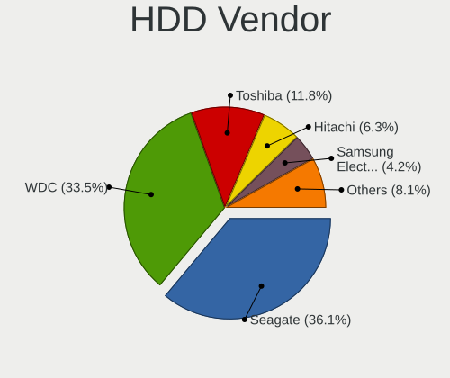

| Vendor              | Desktops | Drives | Percent |
|---------------------|----------|--------|---------|
| Seagate             | 2220     | 4244   | 36.1%   |
| WDC                 | 2059     | 4149   | 33.48%  |
| Toshiba             | 727      | 1429   | 11.82%  |
| Hitachi             | 385      | 594    | 6.26%   |
| Samsung Electronics | 259      | 351    | 4.21%   |
| HGST                | 186      | 404    | 3.02%   |
| Maxtor              | 68       | 81     | 1.11%   |
| Unknown             | 39       | 48     | 0.63%   |
| Hewlett-Packard     | 23       | 94     | 0.37%   |
| JMicron Technology  | 17       | 19     | 0.28%   |
| ASMT                | 16       | 34     | 0.26%   |
| Fujitsu             | 13       | 14     | 0.21%   |
| TO Exter            | 12       | 19     | 0.2%    |
| External            | 11       | 13     | 0.18%   |
| HPE                 | 10       | 27     | 0.16%   |
| Intenso             | 9        | 12     | 0.15%   |
| USB3.0              | 8        | 12     | 0.13%   |
| Apple               | 8        | 9      | 0.13%   |
| QNAP                | 6        | 12     | 0.1%    |
| WD MediaMax         | 4        | 9      | 0.07%   |
| LaCie               | 3        | 3      | 0.05%   |
| ASMedia             | 3        | 3      | 0.05%   |
| Unknown             | 3        | 12     | 0.05%   |
| SSK                 | 2        | 2      | 0.03%   |
| SABRENT             | 2        | 6      | 0.03%   |
| Quantum             | 2        | 2      | 0.03%   |
| QEMU                | 2        | 2      | 0.03%   |
| Inateck             | 2        | 2      | 0.03%   |
| IET                 | 2        | 9      | 0.03%   |
| IBM/Hitachi         | 2        | 2      | 0.03%   |
| IBM-D050            | 2        | 4      | 0.03%   |
| HGST HTS            | 2        | 2      | 0.03%   |
| H/W                 | 2        | 10     | 0.03%   |
| ExcelStor           | 2        | 2      | 0.03%   |
| Elite               | 2        | 3      | 0.03%   |
| XrayDisk            | 1        | 1      | 0.02%   |
| WUH72181            | 1        | 2      | 0.02%   |
| USB 3.1             | 1        | 1      | 0.02%   |
| USB 3.0             | 1        | 2      | 0.02%   |
| USB                 | 1        | 1      | 0.02%   |

SSD Vendor
----------

Solid state drive vendors

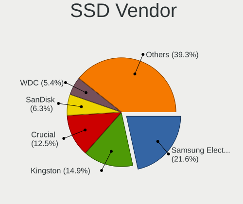

| Vendor              | Desktops | Drives | Percent |
|---------------------|----------|--------|---------|
| Samsung Electronics | 1079     | 1694   | 21.6%   |
| Kingston            | 745      | 1076   | 14.91%  |
| Crucial             | 625      | 877    | 12.51%  |
| SanDisk             | 314      | 437    | 6.29%   |
| WDC                 | 269      | 356    | 5.39%   |
| China               | 217      | 267    | 4.34%   |
| A-DATA Technology   | 144      | 220    | 2.88%   |
| Intel               | 125      | 199    | 2.5%    |
| SPCC                | 106      | 118    | 2.12%   |
| PNY                 | 92       | 157    | 1.84%   |
| Transcend           | 72       | 112    | 1.44%   |
| OCZ                 | 67       | 81     | 1.34%   |
| Intenso             | 67       | 88     | 1.34%   |
| Patriot             | 63       | 90     | 1.26%   |
| Toshiba             | 56       | 74     | 1.12%   |
| Netac               | 54       | 137    | 1.08%   |
| GOODRAM             | 45       | 71     | 0.9%    |
| Micron Technology   | 40       | 49     | 0.8%    |
| Unknown             | 39       | 45     | 0.78%   |
| Apacer              | 35       | 50     | 0.7%    |
| Corsair             | 31       | 36     | 0.62%   |
| Team                | 30       | 37     | 0.6%    |
| SK hynix            | 27       | 31     | 0.54%   |
| Gigabyte Technology | 26       | 31     | 0.52%   |
| Hewlett-Packard     | 24       | 36     | 0.48%   |
| LITEON              | 23       | 39     | 0.46%   |
| Seagate             | 21       | 28     | 0.42%   |
| Fanxiang            | 21       | 28     | 0.42%   |
| Plextor             | 20       | 27     | 0.4%    |
| SABRENT             | 15       | 15     | 0.3%    |
| KingDian            | 15       | 17     | 0.3%    |
| Lexar               | 14       | 21     | 0.28%   |
| Verbatim            | 13       | 17     | 0.26%   |
| KingSpec            | 13       | 16     | 0.26%   |
| KIOXIA-EXCERIA      | 12       | 14     | 0.24%   |
| LITEONIT            | 11       | 27     | 0.22%   |
| Innodisk            | 11       | 11     | 0.22%   |
| T-FORCE             | 10       | 12     | 0.2%    |
| Mushkin             | 10       | 11     | 0.2%    |
| Emtec               | 10       | 10     | 0.2%    |

Drive Kind
----------

HDD or SSD

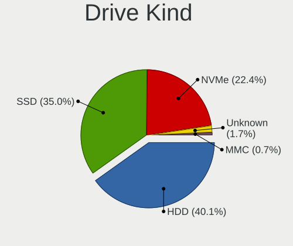

| Kind    | Desktops | Drives | Percent |
|---------|----------|--------|---------|
| HDD     | 4710     | 11709  | 40.15%  |
| SSD     | 4108     | 7142   | 35.02%  |
| NVMe    | 2632     | 4577   | 22.43%  |
| Unknown | 195      | 374    | 1.66%   |
| MMC     | 87       | 108    | 0.74%   |

Drive Connector
---------------

SATA, SAS, NVMe, etc.

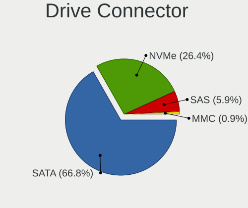

| Type | Desktops | Drives | Percent |
|------|----------|--------|---------|
| SATA | 6615     | 17969  | 66.76%  |
| NVMe | 2619     | 4516   | 26.43%  |
| SAS  | 587      | 1317   | 5.92%   |
| MMC  | 87       | 108    | 0.88%   |

Drive Size
----------

Size of hard drive

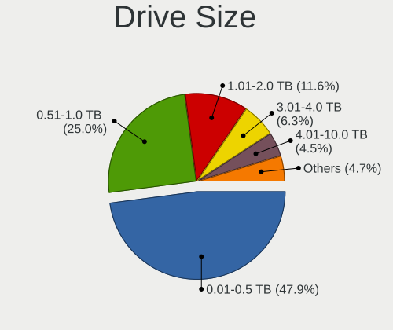

| Size in TB | Desktops | Drives | Percent |
|------------|----------|--------|---------|
| 0.01-0.5   | 4803     | 8381   | 47.92%  |
| 0.51-1.0   | 2503     | 4231   | 24.98%  |
| 1.01-2.0   | 1164     | 2224   | 11.61%  |
| 3.01-4.0   | 631      | 1447   | 6.3%    |
| 4.01-10.0  | 447      | 1297   | 4.46%   |
| 2.01-3.0   | 312      | 629    | 3.11%   |
| 10.01-20.0 | 155      | 631    | 1.55%   |
| 20.01-50.0 | 5        | 10     | 0.05%   |
| 0          | 2        | 1      | 0.02%   |

Space Total
-----------

Amount of disk space available on the file system

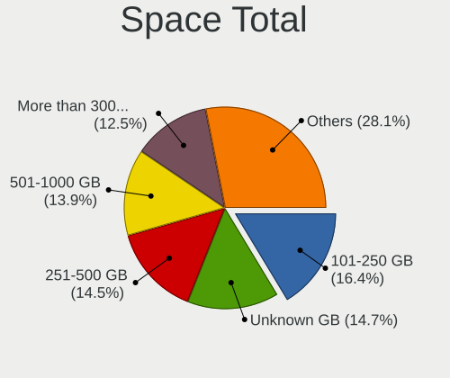

| Size in GB     | Desktops | Percent |
|----------------|----------|---------|
| 101-250        | 1312     | 16.35%  |
| Unknown        | 1179     | 14.69%  |
| 251-500        | 1167     | 14.54%  |
| 501-1000       | 1113     | 13.87%  |
| More than 3000 | 999      | 12.45%  |
| 1001-2000      | 830      | 10.34%  |
| 51-100         | 468      | 5.83%   |
| 2001-3000      | 409      | 5.1%    |
| 1-20           | 323      | 4.03%   |
| 21-50          | 224      | 2.79%   |

Space Used
----------

Amount of used disk space

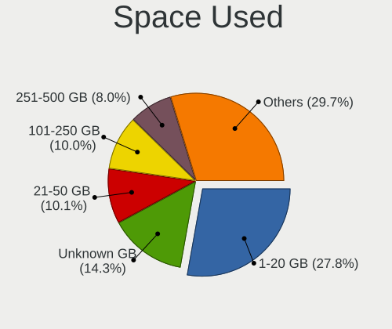

| Used GB        | Desktops | Percent |
|----------------|----------|---------|
| 1-20           | 2289     | 27.81%  |
| Unknown        | 1179     | 14.32%  |
| 21-50          | 834      | 10.13%  |
| 101-250        | 827      | 10.05%  |
| 251-500        | 658      | 7.99%   |
| 51-100         | 644      | 7.82%   |
| 501-1000       | 626      | 7.61%   |
| 1001-2000      | 505      | 6.14%   |
| More than 3000 | 447      | 5.43%   |
| 2001-3000      | 209      | 2.54%   |
| 0              | 13       | 0.16%   |

Malfunc. Drives
---------------

Drive models with a malfunction

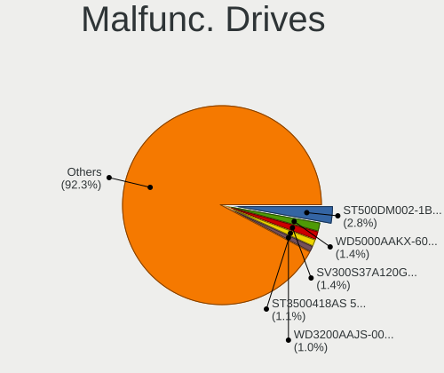

| Model                                 | Desktops | Drives | Percent |
|---------------------------------------|----------|--------|---------|
| Seagate ST500DM002-1BD142 500GB       | 47       | 66     | 2.82%   |
| WDC WD5000AAKX-60U6AA0 500GB          | 24       | 41     | 1.44%   |
| Kingston SV300S37A120G 120GB SSD      | 23       | 27     | 1.38%   |
| Seagate ST3500418AS 500GB             | 19       | 25     | 1.14%   |
| WDC WD3200AAJS-00L7A0 320GB           | 16       | 17     | 0.96%   |
| Seagate ST1000DM003-9YN162 1TB        | 15       | 22     | 0.9%    |
| Hitachi HDS721050CLA362 500GB         | 15       | 17     | 0.9%    |
| WDC WD5000AAKX-08U6AA0 500GB          | 13       | 15     | 0.78%   |
| Seagate ST31000528AS 1TB              | 12       | 14     | 0.72%   |
| WDC WD20EFRX-68EUZN0 2TB              | 11       | 24     | 0.66%   |
| Toshiba DT01ACA050 500GB              | 11       | 12     | 0.66%   |
| Seagate ST3250318AS 250GB             | 11       | 13     | 0.66%   |
| Seagate ST31500341AS 1TB              | 11       | 19     | 0.66%   |
| Seagate ST250DM000-1BD141 250GB       | 11       | 11     | 0.66%   |
| WDC WD20EARX-00PASB0 2TB              | 10       | 15     | 0.6%    |
| Seagate ST3250410AS 250GB             | 10       | 11     | 0.6%    |
| Seagate ST2000DM006-2DM164 2TB        | 10       | 11     | 0.6%    |
| Seagate ST2000DM001-1CH164 2TB        | 10       | 15     | 0.6%    |
| Seagate ST2000DL003-9VT166 2TB        | 10       | 10     | 0.6%    |
| WDC WD20EARS-00MVWB0 2TB              | 9        | 9      | 0.54%   |
| Seagate ST3160815AS 160GB             | 9        | 11     | 0.54%   |
| WDC WD5000AAKX-001CA0 500GB           | 8        | 10     | 0.48%   |
| WDC WD30EFRX-68EUZN0 3TB              | 8        | 11     | 0.48%   |
| WDC WD2002FAEX-007BA0 2TB             | 8        | 9      | 0.48%   |
| Toshiba DT01ACA100 1TB                | 8        | 11     | 0.48%   |
| Seagate ST1000DM003-1CH162 1TB        | 8        | 8      | 0.48%   |
| Samsung Electronics SSD 870 EVO 500GB | 8        | 8      | 0.48%   |
| Samsung Electronics HD103UJ 1TB       | 8        | 10     | 0.48%   |
| WDC WDS240G2G0A-00JH30 240GB SSD      | 7        | 7      | 0.42%   |
| WDC WD40EFRX-68WT0N0 4TB              | 7        | 21     | 0.42%   |
| WDC WD10EZEX-08WN4A0 1TB              | 7        | 7      | 0.42%   |
| WDC WD10EZEX-00BN5A0 1TB              | 7        | 7      | 0.42%   |
| Seagate ST3500413AS 500GB             | 7        | 8      | 0.42%   |
| Seagate ST3320613AS 320GB             | 7        | 7      | 0.42%   |
| Seagate ST1000LM024 HN-M101MBB 1TB    | 7        | 8      | 0.42%   |
| Seagate ST1000DM010-2EP102 1TB        | 7        | 8      | 0.42%   |
| Seagate ST1000DM003-1ER162 1TB        | 7        | 8      | 0.42%   |
| Samsung Electronics SSD 850 EVO 1TB   | 7        | 8      | 0.42%   |
| Hitachi HDS721050DLE630 500GB         | 7        | 12     | 0.42%   |
| Hitachi HDS721010CLA332 1TB           | 7        | 8      | 0.42%   |

Malfunc. Drive Vendor
---------------------

Vendors of faulty drives

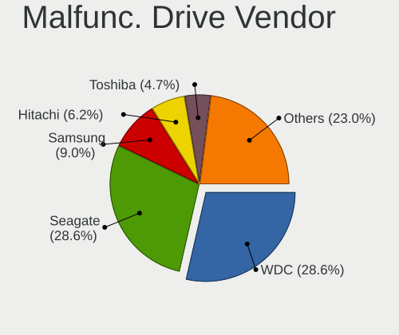

| Vendor              | Desktops | Drives | Percent |
|---------------------|----------|--------|---------|
| WDC                 | 450      | 667    | 28.57%  |
| Seagate             | 450      | 644    | 28.57%  |
| Samsung Electronics | 141      | 171    | 8.95%   |
| Hitachi             | 98       | 140    | 6.22%   |
| Toshiba             | 74       | 106    | 4.7%    |
| Kingston            | 60       | 73     | 3.81%   |
| Intel               | 39       | 49     | 2.48%   |
| Crucial             | 36       | 45     | 2.29%   |
| Maxtor              | 30       | 36     | 1.9%    |
| A-DATA Technology   | 23       | 31     | 1.46%   |
| HGST                | 21       | 39     | 1.33%   |
| SanDisk             | 19       | 23     | 1.21%   |
| China               | 11       | 12     | 0.7%    |
| SK hynix            | 9        | 13     | 0.57%   |
| OCZ                 | 9        | 10     | 0.57%   |
| Micron Technology   | 7        | 7      | 0.44%   |
| Transcend           | 6        | 7      | 0.38%   |
| Hewlett-Packard     | 6        | 7      | 0.38%   |
| Corsair             | 6        | 6      | 0.38%   |
| SPCC                | 5        | 6      | 0.32%   |
| KingDian            | 5        | 5      | 0.32%   |
| PNY                 | 4        | 5      | 0.25%   |
| Netac               | 4        | 6      | 0.25%   |
| Apacer              | 4        | 4      | 0.25%   |
| XPG                 | 3        | 4      | 0.19%   |
| LITEONIT            | 3        | 4      | 0.19%   |
| LITEON              | 3        | 3      | 0.19%   |
| Intenso             | 3        | 3      | 0.19%   |
| ASMT                | 3        | 4      | 0.19%   |
| ShiJi               | 2        | 2      | 0.13%   |
| Realtek             | 2        | 2      | 0.13%   |
| Patriot             | 2        | 2      | 0.13%   |
| Mushkin             | 2        | 2      | 0.13%   |
| KingSpec            | 2        | 2      | 0.13%   |
| HPE                 | 2        | 2      | 0.13%   |
| Fujitsu             | 2        | 3      | 0.13%   |
| Apple               | 2        | 2      | 0.13%   |
| Unknown             | 2        | 2      | 0.13%   |
| ZHITAI              | 1        | 1      | 0.06%   |
| Western Digital     | 1        | 2      | 0.06%   |

Malfunc. HDD Vendor
-------------------

Vendors of faulty HDD drives

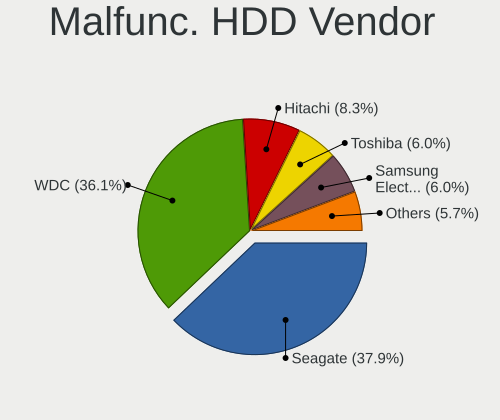

| Vendor              | Desktops | Drives | Percent |
|---------------------|----------|--------|---------|
| Seagate             | 449      | 640    | 37.89%  |
| WDC                 | 428      | 639    | 36.12%  |
| Hitachi             | 98       | 140    | 8.27%   |
| Toshiba             | 71       | 103    | 5.99%   |
| Samsung Electronics | 71       | 83     | 5.99%   |
| Maxtor              | 30       | 36     | 2.53%   |
| HGST                | 21       | 39     | 1.77%   |
| Hewlett-Packard     | 6        | 7      | 0.51%   |
| HPE                 | 2        | 2      | 0.17%   |
| ASMT                | 2        | 3      | 0.17%   |
| Apple               | 2        | 2      | 0.17%   |
| USB3.0              | 1        | 1      | 0.08%   |
| Unknown             | 1        | 1      | 0.08%   |
| IBM                 | 1        | 4      | 0.08%   |
| Fujitsu             | 1        | 2      | 0.08%   |
| ExcelStor           | 1        | 1      | 0.08%   |

Malfunc. Drive Kind
-------------------

Kinds of faulty drives

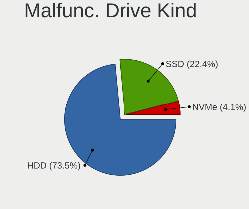

| Kind | Desktops | Drives | Percent |
|------|----------|--------|---------|
| HDD  | 1067     | 1703   | 73.54%  |
| SSD  | 325      | 399    | 22.4%   |
| NVMe | 59       | 78     | 4.07%   |

Failed Drives
-------------

Failed drive models

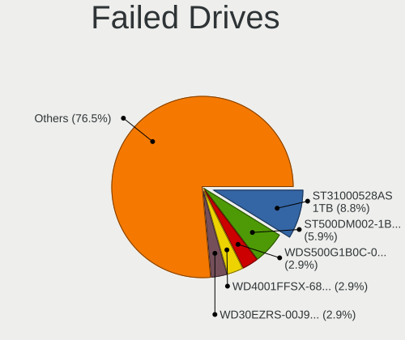

| Model                                            | Desktops | Drives | Percent |
|--------------------------------------------------|----------|--------|---------|
| Seagate ST31000528AS 1TB                         | 3        | 4      | 8.82%   |
| Seagate ST500DM002-1BD142 500GB                  | 2        | 3      | 5.88%   |
| WDC WDS500G1B0C-00S6U0 500GB                     | 1        | 1      | 2.94%   |
| WDC WD4001FFSX-68JNUN0 4TB                       | 1        | 1      | 2.94%   |
| WDC WD30EZRS-00J99B0 3TB                         | 1        | 1      | 2.94%   |
| WDC WD1503FYYS-02W0B0 1TB                        | 1        | 4      | 2.94%   |
| Toshiba MD06ACA800 8TB                           | 1        | 1      | 2.94%   |
| Toshiba DT01ACA300 3TB                           | 1        | 1      | 2.94%   |
| Toshiba DT01ACA200 2TB                           | 1        | 1      | 2.94%   |
| SOLIDIGM SSDSC2KB076TZ 8TB                       | 1        | 1      | 2.94%   |
| Seagate ST500DM005 HD502HJ 500GB                 | 1        | 1      | 2.94%   |
| Seagate ST3500830AS 500GB                        | 1        | 1      | 2.94%   |
| Seagate ST3500630A 500GB                         | 1        | 1      | 2.94%   |
| Seagate ST3500418AS 500GB                        | 1        | 1      | 2.94%   |
| Seagate ST2000NM0011 2TB                         | 1        | 1      | 2.94%   |
| Seagate ST1000NM0011 1TB                         | 1        | 1      | 2.94%   |
| Samsung Electronics SSD PM871 2.5 7mm 128GB      | 1        | 1      | 2.94%   |
| Samsung Electronics SSD 980 1TB                  | 1        | 1      | 2.94%   |
| Samsung Electronics SP0802N 80GB                 | 1        | 1      | 2.94%   |
| Samsung Electronics MZ7LN512HAJQ-00000 512GB SSD | 1        | 2      | 2.94%   |
| Samsung Electronics HD253GJ 250GB                | 1        | 1      | 2.94%   |
| Samsung Electronics HD204UI 2TB                  | 1        | 1      | 2.94%   |
| Samsung Electronics HD103SJ 1TB                  | 1        | 2      | 2.94%   |
| Intel SSDSC2KW256G8 256GB                        | 1        | 1      | 2.94%   |
| Inland SATA SSD 128GB                            | 1        | 1      | 2.94%   |
| HGST HUH728080ALN600 8TB                         | 1        | 1      | 2.94%   |
| HGST HDN724040ALE640 4TB                         | 1        | 1      | 2.94%   |
| Hewlett-Packard SSD S700 500GB                   | 1        | 2      | 2.94%   |
| Gigabyte Technology GP-GSM2NE3256GNTD 256GB      | 1        | 1      | 2.94%   |
| Emtec X300 128GB                                 | 1        | 1      | 2.94%   |
| Crucial CT1000P1SSD8 1TB                         | 1        | 1      | 2.94%   |

Failed Drive Vendor
-------------------

Failed drive vendors

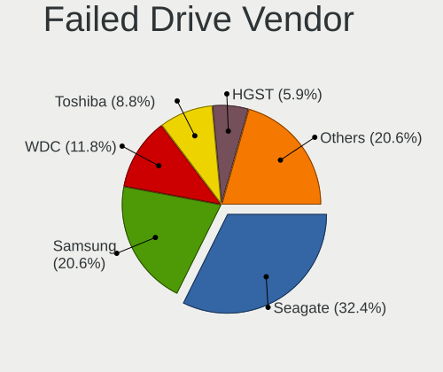

| Vendor              | Desktops | Drives | Percent |
|---------------------|----------|--------|---------|
| Seagate             | 11       | 13     | 32.35%  |
| Samsung Electronics | 7        | 9      | 20.59%  |
| WDC                 | 4        | 7      | 11.76%  |
| Toshiba             | 3        | 3      | 8.82%   |
| HGST                | 2        | 2      | 5.88%   |
| SOLIDIGM            | 1        | 1      | 2.94%   |
| Intel               | 1        | 1      | 2.94%   |
| Inland              | 1        | 1      | 2.94%   |
| Hewlett-Packard     | 1        | 2      | 2.94%   |
| Gigabyte Technology | 1        | 1      | 2.94%   |
| Emtec               | 1        | 1      | 2.94%   |
| Crucial             | 1        | 1      | 2.94%   |

Drive Status
------------

Number of failed and malfunc. drives

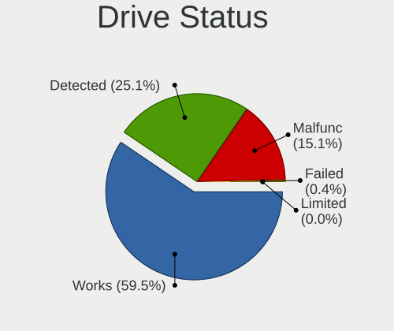

| Status   | Desktops | Drives | Percent |
|----------|----------|--------|---------|
| Works    | 5465     | 15216  | 59.48%  |
| Detected | 2303     | 6470   | 25.07%  |
| Malfunc  | 1384     | 2180   | 15.06%  |
| Failed   | 34       | 42     | 0.37%   |
| Limited  | 2        | 2      | 0.02%   |

Storage controller
------------------

Storage Vendor
--------------

Storage controller vendors

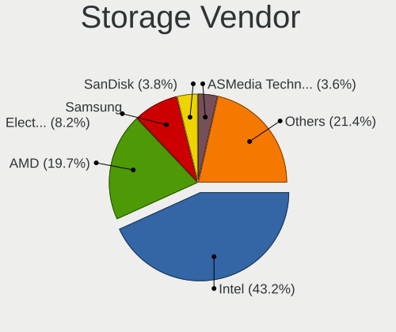

| Vendor                           | Desktops | Percent |
|----------------------------------|----------|---------|
| Intel                            | 5019     | 43.23%  |
| AMD                              | 2288     | 19.71%  |
| Samsung Electronics              | 957      | 8.24%   |
| SanDisk                          | 440      | 3.79%   |
| ASMedia Technology               | 418      | 3.6%    |
| Kingston Technology Company      | 288      | 2.48%   |
| Phison Electronics               | 271      | 2.33%   |
| Marvell Technology Group         | 224      | 1.93%   |
| JMicron Technology               | 201      | 1.73%   |
| Micron/Crucial Technology        | 197      | 1.7%    |
| Nvidia                           | 139      | 1.2%    |
| Silicon Motion                   | 126      | 1.09%   |
| ADATA Technology                 | 103      | 0.89%   |
| MAXIO Technology (Hangzhou)      | 101      | 0.87%   |
| SK hynix                         | 90       | 0.78%   |
| LSI Logic / Symbios Logic        | 77       | 0.66%   |
| Broadcom / LSI                   | 76       | 0.65%   |
| Realtek Semiconductor            | 67       | 0.58%   |
| Micron Technology                | 62       | 0.53%   |
| VIA Technologies                 | 61       | 0.53%   |
| KIOXIA                           | 39       | 0.34%   |
| Toshiba America Info Systems     | 37       | 0.32%   |
| Shenzhen Longsys Electronics     | 37       | 0.32%   |
| Adaptec                          | 35       | 0.3%    |
| Silicon Image                    | 34       | 0.29%   |
| Seagate Technology               | 25       | 0.22%   |
| INNOGRIT                         | 22       | 0.19%   |
| Loongson Technology              | 18       | 0.16%   |
| Lite-On Technology               | 15       | 0.13%   |
| Yangtze Memory Technologies      | 11       | 0.09%   |
| Hewlett-Packard                  | 11       | 0.09%   |
| Biwin Storage Technology         | 11       | 0.09%   |
| Solidigm                         | 9        | 0.08%   |
| Netac Technology                 | 9        | 0.08%   |
| Silicon Integrated Systems [SiS] | 8        | 0.07%   |
| Zhaoxin                          | 7        | 0.06%   |
| Transcend                        | 7        | 0.06%   |
| Integrated Technology Express    | 7        | 0.06%   |
| Hosin Global Electronics         | 7        | 0.06%   |
| IBM                              | 5        | 0.04%   |

Storage Model
-------------

Storage controller models

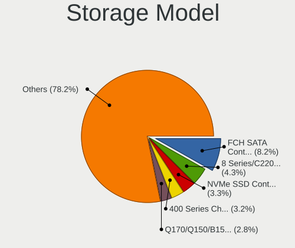

| Model                                                                                   | Desktops | Percent |
|-----------------------------------------------------------------------------------------|----------|---------|
| AMD FCH SATA Controller [AHCI mode]                                                     | 1146     | 8.17%   |
| Intel 8 Series/C220 Series Chipset Family 6-port SATA Controller 1 [AHCI mode]          | 607      | 4.32%   |
| Samsung NVMe SSD Controller SM981/PM981/PM983                                           | 468      | 3.33%   |
| AMD 400 Series Chipset SATA Controller                                                  | 453      | 3.23%   |
| Intel Q170/Q150/B150/H170/H110/Z170/CM236 Chipset SATA Controller [AHCI Mode]           | 390      | 2.78%   |
| Intel 200 Series PCH SATA controller [AHCI mode]                                        | 362      | 2.58%   |
| AMD 500 Series Chipset SATA Controller                                                  | 359      | 2.56%   |
| ASMedia ASM1061/ASM1062 Serial ATA Controller                                           | 345      | 2.46%   |
| Intel 6 Series/C200 Series Chipset Family 6 port Desktop SATA AHCI Controller           | 340      | 2.42%   |
| Intel NM10/ICH7 Family SATA Controller [IDE mode]                                       | 278      | 1.98%   |
| AMD SB7x0/SB8x0/SB9x0 SATA Controller [AHCI mode]                                       | 249      | 1.77%   |
| Intel SATA Controller [RAID mode]                                                       | 237      | 1.69%   |
| Intel 7 Series/C210 Series Chipset Family 6-port SATA Controller [AHCI mode]            | 232      | 1.65%   |
| AMD 600 Series Chipset SATA Controller                                                  | 231      | 1.65%   |
| AMD SB7x0/SB8x0/SB9x0 IDE Controller                                                    | 226      | 1.61%   |
| Samsung NVMe SSD Controller PM9A1/PM9A3/980PRO                                          | 218      | 1.55%   |
| Intel 82801G (ICH7 Family) IDE Controller                                               | 218      | 1.55%   |
| Intel Cannon Lake PCH SATA AHCI Controller                                              | 216      | 1.54%   |
| Intel Alder Lake-S PCH SATA Controller [AHCI Mode]                                      | 183      | 1.3%    |
| Intel 500 Series Chipset Family SATA AHCI Controller                                    | 161      | 1.15%   |
| Intel 6 Series/C200 Series Chipset Family Desktop SATA Controller (IDE mode, ports 4-5) | 147      | 1.05%   |
| Intel 6 Series/C200 Series Chipset Family Desktop SATA Controller (IDE mode, ports 0-3) | 146      | 1.04%   |
| AMD SB7x0/SB8x0/SB9x0 SATA Controller [IDE mode]                                        | 129      | 0.92%   |
| Intel Raptor Lake SATA AHCI Controller                                                  | 127      | 0.9%    |
| Intel Comet Lake SATA AHCI Controller                                                   | 125      | 0.89%   |
| Samsung NVMe SSD Controller 980 (DRAM-less)                                             | 122      | 0.87%   |
| Phison E12 NVMe Controller                                                              | 112      | 0.8%    |
| Intel C610/X99 series chipset 6-Port SATA Controller [AHCI mode]                        | 107      | 0.76%   |
| AMD 300 Series Chipset SATA Controller                                                  | 107      | 0.76%   |
| Micron/Crucial P2 [Nick P2] / P3 / P3 Plus NVMe PCIe SSD (DRAM-less)                    | 101      | 0.72%   |
| Intel 9 Series Chipset Family SATA Controller [AHCI Mode]                               | 101      | 0.72%   |
| Intel C600/X79 series chipset 6-Port SATA AHCI Controller                               | 99       | 0.71%   |
| Silicon Motion SM2263EN/SM2263XT (DRAM-less) NVMe SSD Controllers                       | 98       | 0.7%    |
| Intel Alder Lake-N SATA AHCI Controller                                                 | 97       | 0.69%   |
| Samsung NVMe SSD Controller SM961/PM961/SM963                                           | 96       | 0.68%   |
| Intel 82801JI (ICH10 Family) SATA AHCI Controller                                       | 93       | 0.66%   |
| Intel C610/X99 series chipset sSATA Controller [AHCI mode]                              | 91       | 0.65%   |
| AMD A320 Chipset SATA Controller [AHCI mode]                                            | 91       | 0.65%   |
| Intel Volume Management Device NVMe RAID Controller                                     | 87       | 0.62%   |
| Samsung NVMe SSD Controller S4LV008[Pascal]                                             | 84       | 0.6%    |

Storage Kind
------------

Kind of storage controller (IDE, SATA, NVMe, SAS, ...)

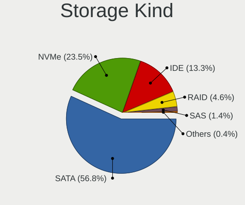

| Kind | Desktops | Percent |
|------|----------|---------|
| SATA | 6335     | 56.81%  |
| NVMe | 2625     | 23.54%  |
| IDE  | 1480     | 13.27%  |
| RAID | 511      | 4.58%   |
| SAS  | 155      | 1.39%   |
| SCSI | 45       | 0.4%    |

Processor
---------

CPU Vendor
----------

Processor vendors

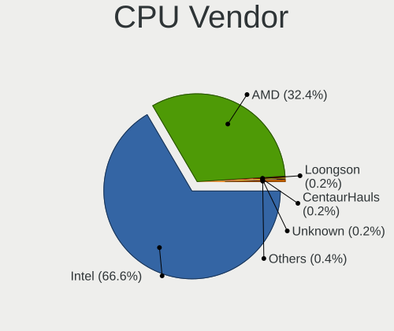

| Vendor                   | Desktops | Percent |
|--------------------------|----------|---------|
| Intel                    | 5094     | 66.56%  |
| AMD                      | 2481     | 32.42%  |
| Loongson                 | 17       | 0.22%   |
| CentaurHauls             | 15       | 0.2%    |
| Unknown                  | 12       | 0.16%   |
| ARM                      | 11       | 0.14%   |
| CHRP IBM,8233-E8B        | 5        | 0.07%   |
| sifive,u74-mc            | 4        | 0.05%   |
| sifive,bullet0           | 3        | 0.04%   |
| Marvell Semiconductor    | 2        | 0.03%   |
| CHRP IBM,9131-52A        | 2        | 0.03%   |
| thead,c906               | 1        | 0.01%   |
| PowerNV FP5466G2         | 1        | 0.01%   |
| PowerNV C829UAG3         | 1        | 0.01%   |
| PowerNV C1P9S01 REV 1.02 | 1        | 0.01%   |
| PowerMac10,1             | 1        | 0.01%   |
| PowerBook3,5             | 1        | 0.01%   |
| MIPS                     | 1        | 0.01%   |

CPU Model
---------

Processor models

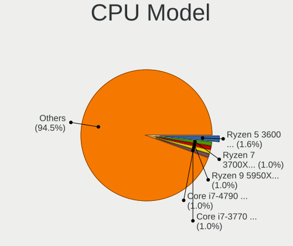

| Model                                       | Desktops | Percent |
|---------------------------------------------|----------|---------|
| AMD Ryzen 5 3600 6-Core Processor           | 120      | 1.56%   |
| AMD Ryzen 7 3700X 8-Core Processor          | 80       | 1.04%   |
| AMD Ryzen 9 5950X 16-Core Processor         | 76       | 0.99%   |
| Intel Core i7-4790 CPU @ 3.60GHz            | 75       | 0.97%   |
| Intel Core i7-3770 CPU @ 3.40GHz            | 75       | 0.97%   |
| Intel Core i5-9400 CPU @ 2.90GHz            | 72       | 0.93%   |
| Intel Core i5-3470 CPU @ 3.20GHz            | 69       | 0.9%    |
| AMD Ryzen 7 5800X 8-Core Processor          | 69       | 0.9%    |
| AMD Ryzen 7 5700G with Radeon Graphics      | 68       | 0.88%   |
| AMD Ryzen 5 5600X 6-Core Processor          | 68       | 0.88%   |
| AMD Ryzen 5 5600G with Radeon Graphics      | 65       | 0.84%   |
| Intel N100                                  | 64       | 0.83%   |
| Intel Core i5-6500 CPU @ 3.20GHz            | 62       | 0.8%    |
| AMD Ryzen 9 3900X 12-Core Processor         | 58       | 0.75%   |
| Intel Pentium CPU G4400 @ 3.30GHz           | 55       | 0.71%   |
| Intel Core i5-10400 CPU @ 2.90GHz           | 55       | 0.71%   |
| Intel Core i5-2400 CPU @ 3.10GHz            | 54       | 0.7%    |
| Intel Core i7-2600 CPU @ 3.40GHz            | 52       | 0.68%   |
| Intel Core 2 Duo CPU E8400 @ 3.00GHz        | 52       | 0.68%   |
| Intel Core 2 Duo CPU E7500 @ 2.93GHz        | 50       | 0.65%   |
| Intel Core i3-4130 CPU @ 3.40GHz            | 49       | 0.64%   |
| AMD Ryzen 9 5900X 12-Core Processor         | 48       | 0.62%   |
| AMD Ryzen 5 2600 Six-Core Processor         | 48       | 0.62%   |
| AMD FX-8350 Eight-Core Processor            | 47       | 0.61%   |
| Intel Core i3-2120 CPU @ 3.30GHz            | 46       | 0.6%    |
| Intel Core i7-8700 CPU @ 3.20GHz            | 44       | 0.57%   |
| Intel Core i7-10700 CPU @ 2.90GHz           | 44       | 0.57%   |
| Intel Celeron N5105 @ 2.00GHz               | 44       | 0.57%   |
| Intel Core i7-6700 CPU @ 3.40GHz            | 43       | 0.56%   |
| Intel Core i5-4460 CPU @ 3.20GHz            | 42       | 0.55%   |
| Intel Core i3-6100 CPU @ 3.70GHz            | 42       | 0.55%   |
| AMD Ryzen 5 3400G with Radeon Vega Graphics | 42       | 0.55%   |
| AMD FX-6300 Six-Core Processor              | 42       | 0.55%   |
| Intel Pentium Dual-Core CPU E6500 @ 2.93GHz | 39       | 0.51%   |
| Intel Pentium CPU G3420 @ 3.20GHz           | 39       | 0.51%   |
| Intel Core i5-4570 CPU @ 3.20GHz            | 39       | 0.51%   |
| Intel Core i3-10100 CPU @ 3.60GHz           | 39       | 0.51%   |
| AMD Ryzen 7 2700X Eight-Core Processor      | 39       | 0.51%   |
| AMD Ryzen 5 1600 Six-Core Processor         | 38       | 0.49%   |
| Intel Core i5-4590 CPU @ 3.30GHz            | 37       | 0.48%   |

CPU Model Family
----------------

Processor model prefix

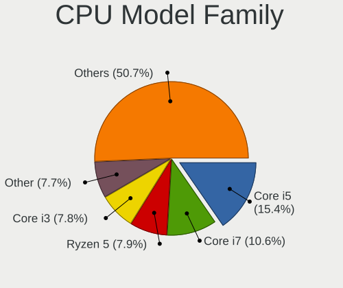

| Model                   | Desktops | Percent |
|-------------------------|----------|---------|
| Intel Core i5           | 1182     | 15.39%  |
| Intel Core i7           | 812      | 10.57%  |
| AMD Ryzen 5             | 607      | 7.9%    |
| Intel Core i3           | 596      | 7.76%   |
| Other                   | 592      | 7.71%   |
| AMD Ryzen 7             | 534      | 6.95%   |
| Intel Xeon              | 513      | 6.68%   |
| Intel Celeron           | 381      | 4.96%   |
| AMD Ryzen 9             | 344      | 4.48%   |
| Intel Pentium           | 304      | 3.96%   |
| Intel Core 2 Duo        | 228      | 2.97%   |
| AMD FX                  | 206      | 2.68%   |
| Intel Pentium Dual-Core | 111      | 1.44%   |
| Intel Core 2 Quad       | 109      | 1.42%   |
| AMD Ryzen 3             | 104      | 1.35%   |
| Intel Atom              | 80       | 1.04%   |
| Intel Core i9           | 71       | 0.92%   |
| AMD Ryzen Threadripper  | 53       | 0.69%   |
| AMD Athlon 64 X2        | 52       | 0.68%   |
| Intel Core 2            | 51       | 0.66%   |
| AMD A10                 | 50       | 0.65%   |
| AMD Athlon II X2        | 47       | 0.61%   |
| AMD Ryzen 5 PRO         | 45       | 0.59%   |
| AMD Phenom II X4        | 45       | 0.59%   |
| AMD Athlon              | 44       | 0.57%   |
| Intel Pentium 4         | 42       | 0.55%   |
| AMD A8                  | 42       | 0.55%   |
| Intel Pentium Gold      | 41       | 0.53%   |
| AMD GX                  | 36       | 0.47%   |
| AMD Phenom II X6        | 26       | 0.34%   |
| AMD Athlon II X4        | 23       | 0.3%    |
| Intel Pentium Dual      | 22       | 0.29%   |
| Intel Pentium Silver    | 20       | 0.26%   |
| AMD A4                  | 20       | 0.26%   |
| AMD Sempron             | 17       | 0.22%   |
| Intel Pentium D         | 16       | 0.21%   |
| AMD A6                  | 16       | 0.21%   |
| AMD G                   | 15       | 0.2%    |
| AMD Phenom              | 14       | 0.18%   |
| AMD E                   | 14       | 0.18%   |

CPU Cores
---------

Number of processor cores

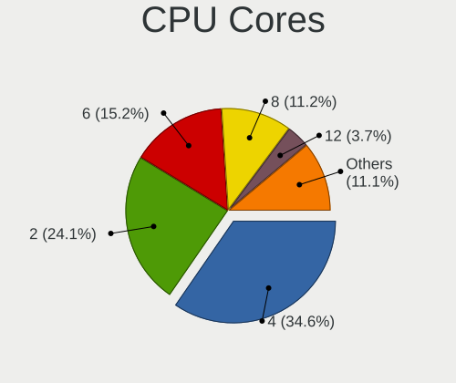

| Number  | Desktops | Percent |
|---------|----------|---------|
| 4       | 2663     | 34.61%  |
| 2       | 1855     | 24.11%  |
| 6       | 1173     | 15.25%  |
| 8       | 864      | 11.23%  |
| 12      | 285      | 3.7%    |
| 16      | 241      | 3.13%   |
| 1       | 194      | 2.52%   |
| 10      | 95       | 1.23%   |
| 3       | 81       | 1.05%   |
| 14      | 71       | 0.92%   |
| 24      | 56       | 0.73%   |
| 20      | 40       | 0.52%   |
| 32      | 21       | 0.27%   |
| Unknown | 14       | 0.18%   |
| 18      | 11       | 0.14%   |
| 36      | 7        | 0.09%   |
| 28      | 6        | 0.08%   |
| 22      | 5        | 0.06%   |
| 5       | 4        | 0.05%   |
| 64      | 3        | 0.04%   |
| 44      | 3        | 0.04%   |
| 56      | 1        | 0.01%   |
| 48      | 1        | 0.01%   |

CPU Sockets
-----------

Number of sockets

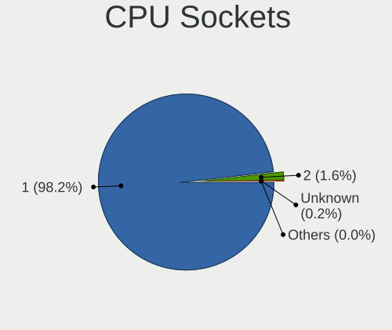

| Number  | Desktops | Percent |
|---------|----------|---------|
| 1       | 7519     | 98.18%  |
| 2       | 123      | 1.61%   |
| Unknown | 12       | 0.16%   |
| 16      | 1        | 0.01%   |
| 14      | 1        | 0.01%   |
| 4       | 1        | 0.01%   |
| 0       | 1        | 0.01%   |

CPU Threads
-----------

Threads per core (Hyper-Threading)

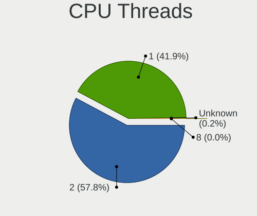

| Number  | Desktops | Percent |
|---------|----------|---------|
| 2       | 4439     | 57.78%  |
| 1       | 3221     | 41.92%  |
| Unknown | 14       | 0.18%   |
| 4       | 8        | 0.1%    |
| 8       | 1        | 0.01%   |

CPU Op-Modes
------------

CPU Operation Modes (32-bit, 64-bit)

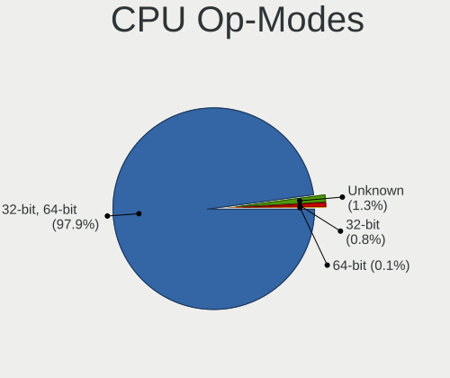

| Op mode        | Desktops | Percent |
|----------------|----------|---------|
| 32-bit, 64-bit | 7497     | 97.86%  |
| Unknown        | 96       | 1.25%   |
| 32-bit         | 61       | 0.8%    |
| 64-bit         | 7        | 0.09%   |

CPU Microcode
-------------

Microcode number

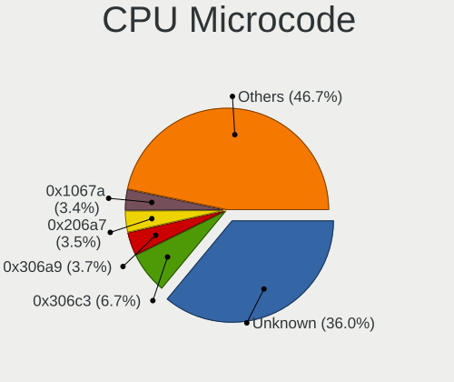

| Number     | Desktops | Percent |
|------------|----------|---------|
| Unknown    | 2861     | 36.03%  |
| 0x306c3    | 533      | 6.71%   |
| 0x306a9    | 296      | 3.73%   |
| 0x206a7    | 275      | 3.46%   |
| 0x1067a    | 267      | 3.36%   |
| 0x506e3    | 252      | 3.17%   |
| 0x906ea    | 195      | 2.46%   |
| 0x08701021 | 161      | 2.03%   |
| 0x906e9    | 134      | 1.69%   |
| 0xa0653    | 121      | 1.52%   |
| 0x08108109 | 83       | 1.05%   |
| 0x0800820d | 82       | 1.03%   |
| 0xa0655    | 77       | 0.97%   |
| 0x90672    | 76       | 0.96%   |
| 0xa0671    | 71       | 0.89%   |
| 0x0a201016 | 69       | 0.87%   |
| 0x06000852 | 64       | 0.81%   |
| 0x0a50000d | 63       | 0.79%   |
| 0x906c0    | 61       | 0.77%   |
| 0x010000c8 | 59       | 0.74%   |
| 0x306f2    | 58       | 0.73%   |
| 0x906ed    | 52       | 0.65%   |
| 0x0a601203 | 52       | 0.65%   |
| 0x08701013 | 50       | 0.63%   |
| 0x306e4    | 49       | 0.62%   |
| 0xb0671    | 48       | 0.6%    |
| 0x906eb    | 48       | 0.6%    |
| 0x06003106 | 44       | 0.55%   |
| 0xb06e0    | 42       | 0.53%   |
| 0x6fd      | 42       | 0.53%   |
| 0x90675    | 41       | 0.52%   |
| 0x6fb      | 41       | 0.52%   |
| 0x0a20120a | 40       | 0.5%    |
| 0x08101016 | 40       | 0.5%    |
| 0x08001138 | 37       | 0.47%   |
| 0x08600106 | 36       | 0.45%   |
| 0x206d7    | 35       | 0.44%   |
| 0x08001137 | 35       | 0.44%   |
| 0x106a5    | 32       | 0.4%    |
| 0x06001119 | 32       | 0.4%    |

CPU Microarch
-------------

Microarchitecture

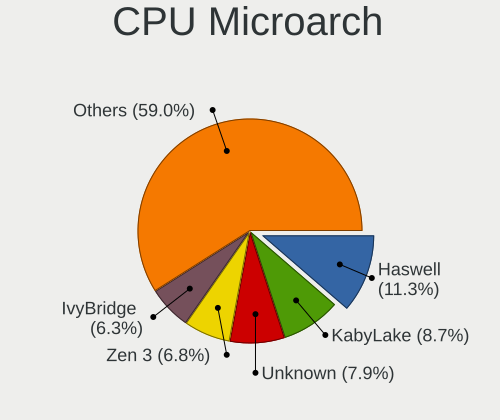

| Name             | Desktops | Percent |
|------------------|----------|---------|
| Haswell          | 873      | 11.34%  |
| KabyLake         | 666      | 8.65%   |
| Unknown          | 610      | 7.92%   |
| Zen 3            | 521      | 6.77%   |
| IvyBridge        | 487      | 6.33%   |
| SandyBridge      | 448      | 5.82%   |
| Zen 2            | 443      | 5.75%   |
| Skylake          | 428      | 5.56%   |
| Penryn           | 408      | 5.3%    |
| Zen+             | 286      | 3.72%   |
| CometLake        | 280      | 3.64%   |
| Alderlake Hybrid | 223      | 2.9%    |
| Zen              | 213      | 2.77%   |
| Piledriver       | 209      | 2.71%   |
| K10              | 199      | 2.59%   |
| Core             | 180      | 2.34%   |
| Westmere         | 112      | 1.45%   |
| Silvermont       | 105      | 1.36%   |
| Nehalem          | 101      | 1.31%   |
| Tremont          | 88       | 1.14%   |
| K8 Hammer        | 81       | 1.05%   |
| Broadwell        | 81       | 1.05%   |
| Gracemont        | 79       | 1.03%   |
| Goldmont plus    | 74       | 0.96%   |
| NetBurst         | 70       | 0.91%   |
| Steamroller      | 59       | 0.77%   |
| Icelake          | 55       | 0.71%   |
| Goldmont         | 47       | 0.61%   |
| Bonnell          | 45       | 0.58%   |
| Excavator        | 44       | 0.57%   |
| Bulldozer        | 44       | 0.57%   |
| Jaguar           | 39       | 0.51%   |
| Bobcat           | 26       | 0.34%   |
| Puma             | 20       | 0.26%   |
| K10 Llano        | 13       | 0.17%   |
| TigerLake        | 12       | 0.16%   |
| P6               | 11       | 0.14%   |
| K6               | 9        | 0.12%   |
| Lunarlake Hybrid | 4        | 0.05%   |
| Sapphire Rapids  | 3        | 0.04%   |

Graphics
--------

GPU Vendor
----------

Vendors of graphics cards

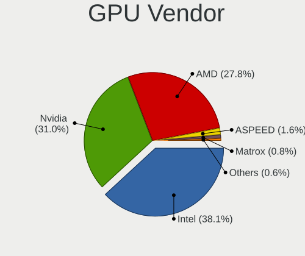

| Vendor                                       | Desktops | Percent |
|----------------------------------------------|----------|---------|
| Intel                                        | 3106     | 38.13%  |
| Nvidia                                       | 2529     | 31.05%  |
| AMD                                          | 2264     | 27.79%  |
| ASPEED Technology                            | 130      | 1.6%    |
| Matrox Electronics Systems                   | 67       | 0.82%   |
| VIA Technologies                             | 15       | 0.18%   |
| Loongson Technology                          | 13       | 0.16%   |
| Zhaoxin                                      | 7        | 0.09%   |
| Silicon Integrated Systems [SiS]             | 4        | 0.05%   |
| Red Hat                                      | 3        | 0.04%   |
| XGI Technology (eXtreme Graphics Innovation) | 2        | 0.02%   |
| Silicon Motion                               | 2        | 0.02%   |
| ATI Technologies                             | 2        | 0.02%   |
| Cirrus Logic                                 | 1        | 0.01%   |
| 3DLabs                                       | 1        | 0.01%   |

GPU Model
---------

Graphics card models

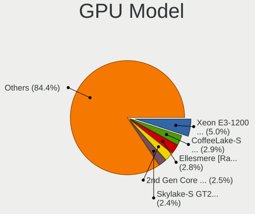

| Model                                                                       | Desktops | Percent |
|-----------------------------------------------------------------------------|----------|---------|
| Intel Xeon E3-1200 v3/4th Gen Core Processor Integrated Graphics Controller | 423      | 5.04%   |
| Intel CoffeeLake-S GT2 [UHD Graphics 630]                                   | 246      | 2.93%   |
| AMD Ellesmere [Radeon RX 470/480/570/570X/580/580X/590]                     | 232      | 2.76%   |
| Intel 2nd Generation Core Processor Family Integrated Graphics Controller   | 213      | 2.54%   |
| Intel Skylake-S GT2 [HD Graphics 530]                                       | 199      | 2.37%   |
| Intel Xeon E3-1200 v2/3rd Gen Core processor Graphics Controller            | 187      | 2.23%   |
| Intel CometLake-S GT2 [UHD Graphics 630]                                    | 152      | 1.81%   |
| Nvidia GK208B [GeForce GT 710]                                              | 147      | 1.75%   |
| AMD Cezanne [Radeon Vega Series / Radeon Vega Mobile Series]                | 146      | 1.74%   |
| Intel 4 Series Chipset Integrated Graphics Controller                       | 141      | 1.68%   |
| AMD Raphael                                                                 | 139      | 1.65%   |
| ASPEED Technology ASPEED Graphics Family                                    | 130      | 1.55%   |
| Nvidia GP107 [GeForce GTX 1050 Ti]                                          | 127      | 1.51%   |
| AMD Picasso/Raven 2 [Radeon Vega Series / Radeon Vega Mobile Series]        | 112      | 1.33%   |
| Intel 4th Generation Core Processor Family Integrated Graphics Controller   | 109      | 1.3%    |
| Intel Kaby Lake-S GT2 [HD Graphics 630]                                     | 108      | 1.29%   |
| Intel 82G33/G31 Express Integrated Graphics Controller                      | 98       | 1.17%   |
| Nvidia GP108 [GeForce GT 1030]                                              | 96       | 1.14%   |
| Intel Alder Lake-N [UHD Graphics]                                           | 96       | 1.14%   |
| AMD Navi 23 [Radeon RX 6600/6600 XT/6600M]                                  | 90       | 1.07%   |
| Intel Alder Lake-S GT1 [UHD Graphics 770]                                   | 88       | 1.05%   |
| Nvidia GP106 [GeForce GTX 1060 6GB]                                         | 86       | 1.02%   |
| Intel JasperLake [UHD Graphics]                                             | 82       | 0.98%   |
| AMD Lexa PRO [Radeon 540/540X/550/550X / RX 540X/550/550X]                  | 81       | 0.96%   |
| AMD Raven Ridge [Radeon Vega Series / Radeon Vega Mobile Series]            | 76       | 0.9%    |
| Nvidia GT218 [GeForce 210]                                                  | 75       | 0.89%   |
| Nvidia GM204 [GeForce GTX 970]                                              | 72       | 0.86%   |
| AMD Navi 10 [Radeon RX 5600 OEM/5600 XT / 5700/5700 XT]                     | 71       | 0.85%   |
| Intel Skylake-S GT1 [HD Graphics 510]                                       | 64       | 0.76%   |
| Nvidia GK208B [GeForce GT 730]                                              | 62       | 0.74%   |
| Intel GeminiLake [UHD Graphics 600]                                         | 62       | 0.74%   |
| Intel IvyBridge GT2 [HD Graphics 4000]                                      | 61       | 0.73%   |
| Nvidia GF108 [GeForce GT 730]                                               | 60       | 0.71%   |
| AMD Navi 22 [Radeon RX 6700/6700 XT/6750 XT / 6800M/6850M XT]               | 60       | 0.71%   |
| Nvidia GM107 [GeForce GTX 750 Ti]                                           | 58       | 0.69%   |
| Intel Atom Processor Z36xxx/Z37xxx Series Graphics & Display                | 54       | 0.64%   |
| AMD Renoir [Radeon Vega Series / Radeon Vega Mobile Series]                 | 54       | 0.64%   |
| Nvidia GA106 [GeForce RTX 3060 Lite Hash Rate]                              | 53       | 0.63%   |
| Intel Raptor Lake-S GT1 [UHD Graphics 770]                                  | 53       | 0.63%   |
| AMD Cedar [Radeon HD 5000/6000/7350/8350 Series]                            | 52       | 0.62%   |

GPU Combo
---------

Combinations of graphics cards

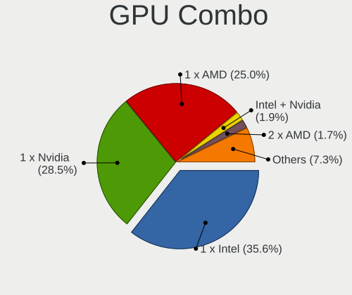

| Name                              | Desktops | Percent |
|-----------------------------------|----------|---------|
| 1 x Intel                         | 2760     | 35.59%  |
| 1 x Nvidia                        | 2211     | 28.51%  |
| 1 x AMD                           | 1936     | 24.96%  |
| Intel + Nvidia                    | 150      | 1.93%   |
| 2 x AMD                           | 135      | 1.74%   |
| AMD + Nvidia                      | 121      | 1.56%   |
| 1 x ASPEED                        | 103      | 1.33%   |
| Other                             | 71       | 0.92%   |
| 1 x Matrox                        | 63       | 0.81%   |
| Intel + AMD                       | 54       | 0.7%    |
| 2 x Intel                         | 34       | 0.44%   |
| 2 x Nvidia                        | 22       | 0.28%   |
| Nvidia + ASPEED                   | 20       | 0.26%   |
| 1 x VIA                           | 15       | 0.19%   |
| 1 x Loongson Technology           | 10       | 0.13%   |
| 1 x Zhaoxin                       | 7        | 0.09%   |
| AMD + ASPEED                      | 6        | 0.08%   |
| 3 x AMD                           | 5        | 0.06%   |
| 1 x SiS                           | 4        | 0.05%   |
| AMD + Matrox                      | 4        | 0.05%   |
| 1 x Red Hat                       | 3        | 0.04%   |
| Intel + 2 x Nvidia                | 3        | 0.04%   |
| 1 x XGI                           | 2        | 0.03%   |
| 1 x Silicon Motion                | 2        | 0.03%   |
| AMD + Loongson Technology         | 2        | 0.03%   |
| 3 x Nvidia                        | 1        | 0.01%   |
| 2 x Nvidia + 1 x ASPEED           | 1        | 0.01%   |
| 2 x Loongson Technology           | 1        | 0.01%   |
| 2 x AMD + 1 x Nvidia + 1 x ASPEED | 1        | 0.01%   |
| 2 x AMD + 1 x Nvidia              | 1        | 0.01%   |
| Nvidia + Matrox                   | 1        | 0.01%   |
| 1 x Intel + 3 x Nvidia            | 1        | 0.01%   |
| Intel + Matrox                    | 1        | 0.01%   |
| 1 x Cirrus Logic                  | 1        | 0.01%   |
| AMD + 2 x Nvidia                  | 1        | 0.01%   |
| AMD + Nvidia + 1 x ASPEED         | 1        | 0.01%   |
| AMD + 3DLabs                      | 1        | 0.01%   |

GPU Driver
----------

Free vs proprietary

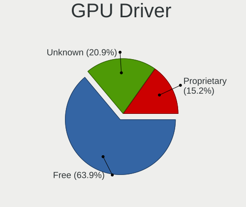

| Driver      | Desktops | Percent |
|-------------|----------|---------|
| Free        | 4970     | 63.9%   |
| Unknown     | 1628     | 20.93%  |
| Proprietary | 1180     | 15.17%  |

GPU Memory
----------

Total video memory

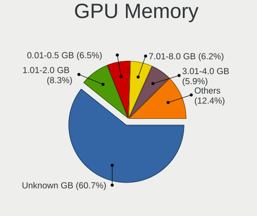

| Size in GB | Desktops | Percent |
|------------|----------|---------|
| Unknown    | 4761     | 60.73%  |
| 1.01-2.0   | 647      | 8.25%   |
| 0.01-0.5   | 513      | 6.54%   |
| 7.01-8.0   | 484      | 6.17%   |
| 3.01-4.0   | 462      | 5.89%   |
| 0.51-1.0   | 432      | 5.51%   |
| 8.01-16.0  | 223      | 2.84%   |
| 5.01-6.0   | 187      | 2.39%   |
| 2.01-3.0   | 64       | 0.82%   |
| 16.01-24.0 | 56       | 0.71%   |
| 4.01-5.0   | 7        | 0.09%   |
| 24.01-32.0 | 2        | 0.03%   |
| 32.01-64.0 | 1        | 0.01%   |

Monitor
-------

Monitor Vendor
--------------

Monitor vendors

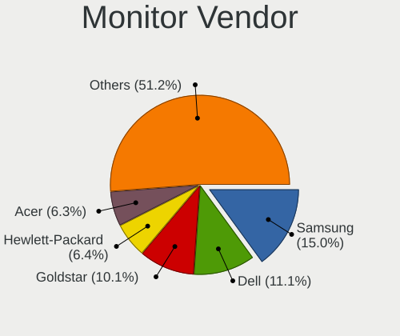

| Vendor               | Desktops | Percent |
|----------------------|----------|---------|
| Samsung Electronics  | 982      | 14.98%  |
| Dell                 | 730      | 11.14%  |
| Goldstar             | 659      | 10.05%  |
| Hewlett-Packard      | 417      | 6.36%   |
| Acer                 | 410      | 6.26%   |
| Philips              | 367      | 5.6%    |
| BenQ                 | 342      | 5.22%   |
| AOC                  | 338      | 5.16%   |
| Ancor Communications | 265      | 4.04%   |
| Iiyama               | 157      | 2.4%    |
| ASUSTek Computer     | 147      | 2.24%   |
| ViewSonic            | 136      | 2.08%   |
| Lenovo               | 122      | 1.86%   |
| Unknown              | 116      | 1.77%   |
| LG Electronics       | 77       | 1.17%   |
| Eizo                 | 67       | 1.02%   |
| Sony                 | 65       | 0.99%   |
| MSI                  | 58       | 0.88%   |
| NEC Computers        | 48       | 0.73%   |
| Unknown              | 47       | 0.72%   |
| Fujitsu Siemens      | 40       | 0.61%   |
| Sceptre Tech         | 38       | 0.58%   |
| Medion               | 30       | 0.46%   |
| Vizio                | 28       | 0.43%   |
| Gigabyte Technology  | 28       | 0.43%   |
| Toshiba              | 26       | 0.4%    |
| Mi                   | 23       | 0.35%   |
| RTK                  | 22       | 0.34%   |
| Panasonic            | 22       | 0.34%   |
| HannStar             | 22       | 0.34%   |
| Hitachi              | 21       | 0.32%   |
| Vestel Elektronik    | 20       | 0.31%   |
| Idek Iiyama          | 14       | 0.21%   |
| HJW                  | 14       | 0.21%   |
| Packard Bell         | 13       | 0.2%    |
| MStar                | 13       | 0.2%    |
| HKC                  | 13       | 0.2%    |
| Denver               | 13       | 0.2%    |
| Apple                | 12       | 0.18%   |
| HUAWEI               | 11       | 0.17%   |

Monitor Model
-------------

Monitor models

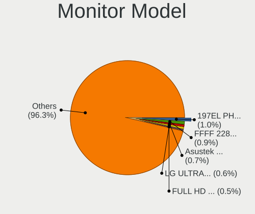

| Model                                                                 | Desktops | Percent |
|-----------------------------------------------------------------------|----------|---------|
| Philips 197EL PHLC08B 1366x768 410x230mm 18.5-inch                    | 69       | 0.98%   |
| Unknown LCD Monitor FFFF 2288x1287 2550x2550mm 142.0-inch             | 66       | 0.94%   |
| Unknown                                                               | 47       | 0.67%   |
| Goldstar LG ULTRAWIDE GSM59F1 2560x1080 670x280mm 28.6-inch           | 44       | 0.63%   |
| Goldstar FULL HD GSM5B55 1920x1080 480x270mm 21.7-inch                | 33       | 0.47%   |
| Samsung Electronics C24F390 SAM0D2C 1920x1080 521x293mm 23.5-inch     | 22       | 0.31%   |
| Ancor Communications ASUS VS229 ACI22D3 1920x1080 475x267mm 21.5-inch | 22       | 0.31%   |
| Dell U2412M DELA07A 1920x1200 518x324mm 24.1-inch                     | 20       | 0.29%   |
| AOC 27G2G4 AOC2702 1920x1080 598x336mm 27.0-inch                      | 20       | 0.29%   |
| Vestel Elektronik 40UHD_LCD_TV VES3700 3840x2160 880x500mm 39.8-inch  | 19       | 0.27%   |
| Samsung Electronics S24F350 SAM0D20 1920x1080 521x293mm 23.5-inch     | 19       | 0.27%   |
| Samsung Electronics C27F390 SAM0D32 1920x1080 598x336mm 27.0-inch     | 19       | 0.27%   |
| Ancor Communications ASUS VS247 ACI249A 1920x1080 521x293mm 23.5-inch | 16       | 0.23%   |
| Philips PHL 243V7 PHLC155 1920x1080 527x296mm 23.8-inch               | 14       | 0.2%    |
| Philips PHL 223V5 PHLC0CF 1920x1080 477x268mm 21.5-inch               | 13       | 0.19%   |
| Goldstar Ultra HD GSM5B09 3840x2160 600x340mm 27.2-inch               | 13       | 0.19%   |
| Goldstar LG IPS FULLHD GSM5AB8 1920x1080 480x270mm 21.7-inch          | 13       | 0.19%   |
| BenQ GW2480 BNQ78E7 1920x1080 527x296mm 23.8-inch                     | 13       | 0.19%   |
| BenQ GW2270 BNQ78DB 1920x1080 476x268mm 21.5-inch                     | 13       | 0.19%   |
| Samsung Electronics U28E590 SAM0C4D 3840x2160 607x345mm 27.5-inch     | 12       | 0.17%   |
| Iiyama PLE2483H IVM6113 1920x1080 531x299mm 24.0-inch                 | 12       | 0.17%   |
| BenQ LCD BNQ801B 2560x1440 527x296mm 23.8-inch                        | 12       | 0.17%   |
| AOC G2460 AOC2460 1920x1080 531x299mm 24.0-inch                       | 12       | 0.17%   |
| AOC 24G2W1G3 AOC2402 1920x1080 527x296mm 23.8-inch                    | 12       | 0.17%   |
| Samsung Electronics SyncMaster SAM01B7 1280x1024 340x270mm 17.1-inch  | 11       | 0.16%   |
| Philips PHL 243V5 PHLC0D1 1920x1080 521x293mm 23.5-inch               | 11       | 0.16%   |
| Mi Monitor XMI23C3 1920x1080 527x293mm 23.7-inch                      | 11       | 0.16%   |
| Goldstar W1943 GSM4BAD 1360x768 406x229mm 18.4-inch                   | 11       | 0.16%   |
| Goldstar HDR 4K GSM7707 3840x2160 600x340mm 27.2-inch                 | 11       | 0.16%   |
| Goldstar HDR 4K GSM7706 3840x2160 600x340mm 27.2-inch                 | 11       | 0.16%   |
| Goldstar 27GL850 GSM5B7F 2560x1440 597x336mm 27.0-inch                | 11       | 0.16%   |
| BenQ PD2700U BNQ802E 3840x2160 597x336mm 27.0-inch                    | 11       | 0.16%   |
| BenQ GL2450H BNQ78A7 1920x1080 531x298mm 24.0-inch                    | 11       | 0.16%   |
| Ancor Communications VE228 ACI22FA 1920x1080 477x268mm 21.5-inch      | 11       | 0.16%   |
| Samsung Electronics LCD Monitor SyncMaster                            | 10       | 0.14%   |
| Philips PHL 221V8 PHLC211 1920x1080 477x268mm 21.5-inch               | 10       | 0.14%   |
| Panasonic TV MEIA296 1920x1080 698x392mm 31.5-inch                    | 10       | 0.14%   |
| MStar Demo MST0030 1920x1080 708x398mm 32.0-inch                      | 10       | 0.14%   |
| Goldstar HDR WFHD GSM7714 2560x1080 798x334mm 34.1-inch               | 10       | 0.14%   |
| Dell U2518D DEL413A 2560x1440 553x311mm 25.0-inch                     | 10       | 0.14%   |

Monitor Resolution
------------------

Monitor screen resolution

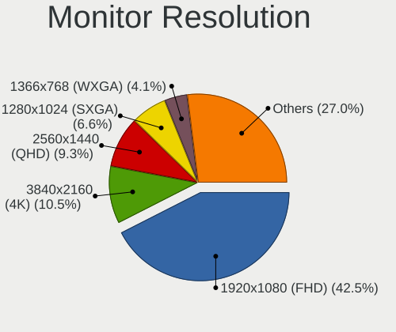

| Resolution         | Desktops | Percent |
|--------------------|----------|---------|
| 1920x1080 (FHD)    | 2738     | 42.5%   |
| 3840x2160 (4K)     | 677      | 10.51%  |
| 2560x1440 (QHD)    | 599      | 9.3%    |
| 1280x1024 (SXGA)   | 425      | 6.6%    |
| 1366x768 (WXGA)    | 267      | 4.14%   |
| 1680x1050 (WSXGA+) | 258      | 4%      |
| 1920x1200 (WUXGA)  | 209      | 3.24%   |
| Unknown            | 175      | 2.72%   |
| 1440x900 (WXGA+)   | 153      | 2.37%   |
| 1600x900 (HD+)     | 152      | 2.36%   |
| 3440x1440          | 130      | 2.02%   |
| 2560x1080          | 104      | 1.61%   |
| 1360x768           | 75       | 1.16%   |
| 3840x1080          | 70       | 1.09%   |
| 2288x1287          | 70       | 1.09%   |
| 1024x768 (XGA)     | 59       | 0.92%   |
| 1600x1200          | 46       | 0.71%   |
| 1920x540           | 27       | 0.42%   |
| 4480x1440          | 15       | 0.23%   |
| 1280x720 (HD)      | 15       | 0.23%   |
| 2560x1600          | 14       | 0.22%   |
| 1400x1050          | 11       | 0.17%   |
| 3840x1600          | 10       | 0.16%   |
| 7680x2160          | 9        | 0.14%   |
| 5760x2160          | 9        | 0.14%   |
| 5760x1080          | 8        | 0.12%   |
| 3200x1080          | 8        | 0.12%   |
| 3840x1200          | 7        | 0.11%   |
| 6400x2160          | 5        | 0.08%   |
| 5360x1440          | 5        | 0.08%   |
| 2048x1536          | 5        | 0.08%   |
| 5120x1440          | 4        | 0.06%   |
| 3600x1080          | 4        | 0.06%   |
| 2048x1152          | 4        | 0.06%   |
| 1280x800 (WXGA)    | 4        | 0.06%   |
| 1280x768           | 4        | 0.06%   |
| 5760x1200          | 3        | 0.05%   |
| 3360x1050          | 3        | 0.05%   |
| 2560x1397          | 3        | 0.05%   |
| 2256x1504          | 3        | 0.05%   |

Monitor Diagonal
----------------

Diagonal size in inches

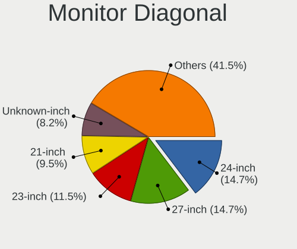

| Inches  | Desktops | Percent |
|---------|----------|---------|
| 24      | 954      | 14.69%  |
| 27      | 952      | 14.66%  |
| 23      | 744      | 11.45%  |
| 21      | 617      | 9.5%    |
| Unknown | 533      | 8.21%   |
| 19      | 370      | 5.7%    |
| 31      | 307      | 4.73%   |
| 18      | 285      | 4.39%   |
| 17      | 199      | 3.06%   |
| 22      | 184      | 2.83%   |
| 34      | 180      | 2.77%   |
| 20      | 169      | 2.6%    |
| 15      | 123      | 1.89%   |
| 84      | 101      | 1.56%   |
| 32      | 92       | 1.42%   |
| 25      | 70       | 1.08%   |
| 142     | 66       | 1.02%   |
| 72      | 55       | 0.85%   |
| 54      | 54       | 0.83%   |
| 40      | 44       | 0.68%   |
| 26      | 32       | 0.49%   |
| 28      | 30       | 0.46%   |
| 52      | 26       | 0.4%    |
| 48      | 24       | 0.37%   |
| 29      | 21       | 0.32%   |
| 43      | 19       | 0.29%   |
| 65      | 17       | 0.26%   |
| 42      | 16       | 0.25%   |
| 13      | 16       | 0.25%   |
| 63      | 15       | 0.23%   |
| 49      | 15       | 0.23%   |
| 46      | 14       | 0.22%   |
| 37      | 13       | 0.2%    |
| 33      | 12       | 0.18%   |
| 16      | 12       | 0.18%   |
| 39      | 11       | 0.17%   |
| 35      | 11       | 0.17%   |
| 14      | 10       | 0.15%   |
| 12      | 10       | 0.15%   |
| 57      | 7        | 0.11%   |

Monitor Width
-------------

Physical width

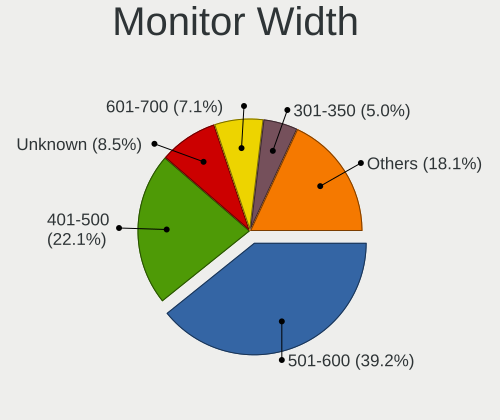

| Width in mm    | Desktops | Percent |
|----------------|----------|---------|
| 501-600        | 2463     | 39.23%  |
| 401-500        | 1389     | 22.12%  |
| Unknown        | 533      | 8.49%   |
| 601-700        | 445      | 7.09%   |
| 301-350        | 313      | 4.98%   |
| 701-800        | 286      | 4.55%   |
| 351-400        | 256      | 4.08%   |
| 1001-1500      | 192      | 3.06%   |
| 1501-2000      | 174      | 2.77%   |
| 801-900        | 83       | 1.32%   |
| More than 2000 | 68       | 1.08%   |
| 901-1000       | 39       | 0.62%   |
| 201-300        | 34       | 0.54%   |
| 101-200        | 4        | 0.06%   |

Aspect Ratio
------------

Proportional relationship between the width and the height

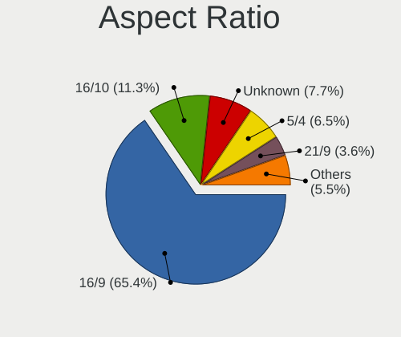

| Ratio   | Desktops | Percent |
|---------|----------|---------|
| 16/9    | 3922     | 65.42%  |
| 16/10   | 675      | 11.26%  |
| Unknown | 464      | 7.74%   |
| 5/4     | 391      | 6.52%   |
| 21/9    | 216      | 3.6%    |
| 4/3     | 145      | 2.42%   |
| 1.00    | 70       | 1.17%   |
| 3/2     | 35       | 0.58%   |
| 32/9    | 33       | 0.55%   |
| 6/5     | 23       | 0.38%   |
| 0.56    | 8        | 0.13%   |
| 1.96    | 3        | 0.05%   |
| 3.20    | 2        | 0.03%   |
| 2.65    | 2        | 0.03%   |
| 2.00    | 2        | 0.03%   |
| 2.51    | 1        | 0.02%   |
| 11/10   | 1        | 0.02%   |
| 0.89    | 1        | 0.02%   |
| 0.25    | 1        | 0.02%   |

Monitor Area
------------

Area in inch²

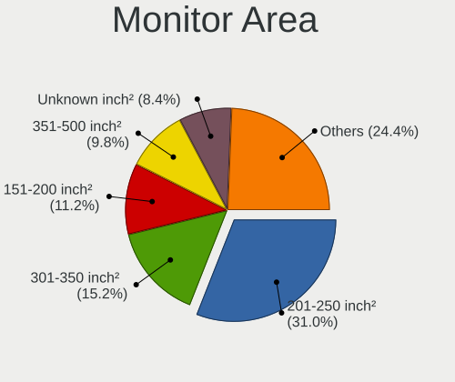

| Area in inch² | Desktops | Percent |
|----------------|----------|---------|
| 201-250        | 1976     | 30.98%  |
| 301-350        | 969      | 15.19%  |
| 151-200        | 717      | 11.24%  |
| 351-500        | 628      | 9.85%   |
| Unknown        | 533      | 8.36%   |
| 141-150        | 412      | 6.46%   |
| 251-300        | 397      | 6.22%   |
| More than 1000 | 388      | 6.08%   |
| 501-1000       | 163      | 2.56%   |
| 101-110        | 107      | 1.68%   |
| 111-120        | 19       | 0.3%    |
| 71-80          | 17       | 0.27%   |
| 131-140        | 17       | 0.27%   |
| 121-130        | 12       | 0.19%   |
| 81-90          | 9        | 0.14%   |
| 91-100         | 7        | 0.11%   |
| 1-40           | 4        | 0.06%   |
| 61-70          | 2        | 0.03%   |
| 41-50          | 1        | 0.02%   |

Pixel Density
-------------

Pixels per inch

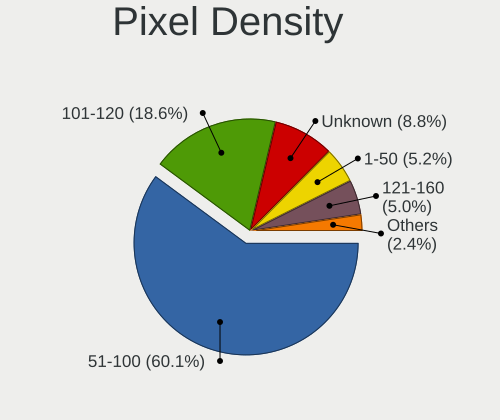

| Density       | Desktops | Percent |
|---------------|----------|---------|
| 51-100        | 3666     | 60.13%  |
| 101-120       | 1132     | 18.57%  |
| Unknown       | 534      | 8.76%   |
| 1-50          | 314      | 5.15%   |
| 121-160       | 306      | 5.02%   |
| 161-240       | 139      | 2.28%   |
| More than 240 | 6        | 0.1%    |

Multiple Monitors
-----------------

Total monitors connected

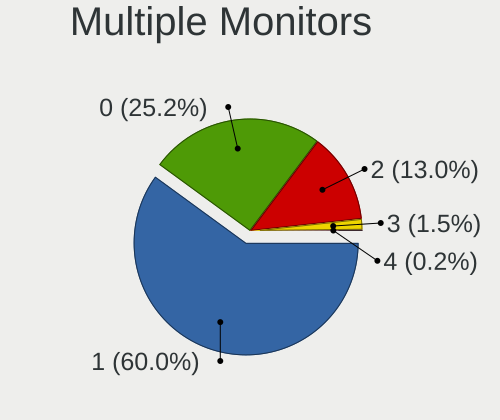

| Total | Desktops | Percent |
|-------|----------|---------|
| 1     | 4696     | 60.04%  |
| 0     | 1973     | 25.22%  |
| 2     | 1018     | 13.01%  |
| 3     | 121      | 1.55%   |
| 4     | 14       | 0.18%   |

Network
-------

Net Controller Vendor
---------------------

Controller vendors

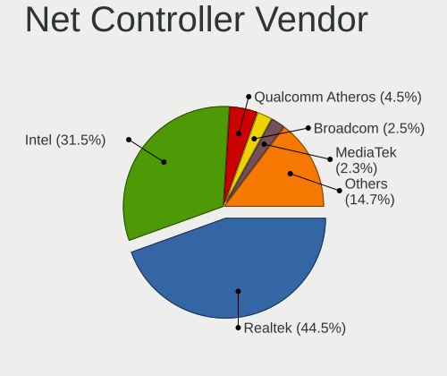

| Vendor                          | Desktops | Percent |
|---------------------------------|----------|---------|
| Realtek Semiconductor           | 4765     | 44.5%   |
| Intel                           | 3371     | 31.48%  |
| Qualcomm Atheros                | 486      | 4.54%   |
| Broadcom                        | 267      | 2.49%   |
| MediaTek                        | 250      | 2.33%   |
| Ralink Technology               | 169      | 1.58%   |
| TP-Link                         | 140      | 1.31%   |
| Nvidia                          | 117      | 1.09%   |
| Aquantia                        | 90       | 0.84%   |
| Ralink                          | 75       | 0.7%    |
| Marvell Technology Group        | 60       | 0.56%   |
| Broadcom Limited                | 54       | 0.5%    |
| ASIX Electronics                | 49       | 0.46%   |
| Mellanox Technologies           | 43       | 0.4%    |
| Samsung Electronics             | 40       | 0.37%   |
| Microsoft                       | 35       | 0.33%   |
| D-Link System                   | 34       | 0.32%   |
| D-Link                          | 32       | 0.3%    |
| Qualcomm Atheros Communications | 31       | 0.29%   |
| ASUSTek Computer                | 31       | 0.29%   |
| VIA Technologies                | 29       | 0.27%   |
| QinHeng Electronics             | 28       | 0.26%   |
| NetGear                         | 27       | 0.25%   |
| Huawei Technologies             | 26       | 0.24%   |
| American Megatrends             | 25       | 0.23%   |
| Xiaomi                          | 24       | 0.22%   |
| Edimax Technology               | 20       | 0.19%   |
| Qualcomm Technologies           | 18       | 0.17%   |
| Sigma Designs                   | 17       | 0.16%   |
| 3Com                            | 14       | 0.13%   |
| Dresden Elektronik              | 11       | 0.1%    |
| DisplayLink                     | 11       | 0.1%    |
| Qualcomm                        | 10       | 0.09%   |
| Motorola PCS                    | 10       | 0.09%   |
| Loongson Technology             | 10       | 0.09%   |
| Linksys                         | 10       | 0.09%   |
| Belkin Components               | 10       | 0.09%   |
| AVM                             | 10       | 0.09%   |
| Gemtek                          | 9        | 0.08%   |
| IMC Networks                    | 8        | 0.07%   |

Net Controller Model
--------------------

Controller models

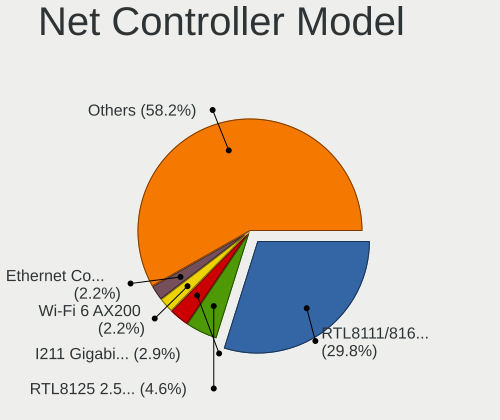

| Model                                                                  | Desktops | Percent |
|------------------------------------------------------------------------|----------|---------|
| Realtek RTL8111/8168/8211/8411 PCI Express Gigabit Ethernet Controller | 3645     | 29.84%  |
| Realtek RTL8125 2.5GbE Controller                                      | 568      | 4.65%   |
| Intel I211 Gigabit Network Connection                                  | 352      | 2.88%   |
| Intel Wi-Fi 6 AX200                                                    | 273      | 2.23%   |
| Intel Ethernet Controller I225-V                                       | 269      | 2.2%    |
| Intel 82579LM Gigabit Network Connection (Lewisville)                  | 241      | 1.97%   |
| Intel Ethernet Connection (2) I219-V                                   | 217      | 1.78%   |
| Intel Ethernet Connection I217-LM                                      | 185      | 1.51%   |
| Realtek RTL810xE PCI Express Fast Ethernet controller                  | 163      | 1.33%   |
| Intel Wi-Fi 6E(802.11ax) AX210/AX1675* 2x2 [Typhoon Peak]              | 156      | 1.28%   |
| Intel Ethernet Controller I226-V                                       | 152      | 1.24%   |
| Intel I210 Gigabit Network Connection                                  | 143      | 1.17%   |
| Intel Dual Band Wireless-AC 3168NGW [Stone Peak]                       | 111      | 0.91%   |
| Intel 82579V Gigabit Network Connection                                | 111      | 0.91%   |
| Intel Ethernet Connection (2) I219-LM                                  | 107      | 0.88%   |
| Intel 82574L Gigabit Network Connection                                | 103      | 0.84%   |
| MediaTek MT7922 802.11ax PCI Express Wireless Network Adapter          | 101      | 0.83%   |
| Realtek RTL8821CE 802.11ac PCIe Wireless Network Adapter               | 99       | 0.81%   |
| Intel Ethernet Connection (7) I219-V                                   | 94       | 0.77%   |
| Intel Ethernet Connection I217-V                                       | 88       | 0.72%   |
| Realtek RTL8153 Gigabit Ethernet Adapter                               | 84       | 0.69%   |
| Realtek 802.11ac NIC                                                   | 84       | 0.69%   |
| Ralink MT7601U Wireless Adapter                                        | 77       | 0.63%   |
| MediaTek MT7921K (RZ608) Wi-Fi 6E 80MHz                                | 69       | 0.56%   |
| Intel Wireless 3165                                                    | 68       | 0.56%   |
| Intel Wi-Fi 5(802.11ac) Wireless-AC 9x6x [Thunder Peak]                | 67       | 0.55%   |
| Nvidia MCP61 Ethernet                                                  | 66       | 0.54%   |
| Intel Ethernet Connection (14) I219-V                                  | 63       | 0.52%   |
| Realtek RTL8852BE PCIe 802.11ax Wireless Network Controller            | 61       | 0.5%    |
| Intel Ethernet Connection (7) I219-LM                                  | 60       | 0.49%   |
| Intel Ethernet Connection (2) I218-V                                   | 60       | 0.49%   |
| Realtek RTL88x2bu [AC1200 Techkey]                                     | 59       | 0.48%   |
| Realtek RTL8188EUS 802.11n Wireless Network Adapter                    | 56       | 0.46%   |
| Intel 700 Series Chipset CNVi WiFi                                     | 56       | 0.46%   |
| Intel Alder Lake-S PCH CNVi WiFi                                       | 55       | 0.45%   |
| Intel I350 Gigabit Network Connection                                  | 53       | 0.43%   |
| Intel 82567LM-3 Gigabit Network Connection                             | 53       | 0.43%   |
| Realtek RTL-8100/8101L/8139 PCI Fast Ethernet Adapter                  | 52       | 0.43%   |
| Intel 82599ES 10-Gigabit SFI/SFP+ Network Connection                   | 50       | 0.41%   |
| Intel Wireless 7260                                                    | 49       | 0.4%    |

Wireless Vendor
---------------

Wireless vendors

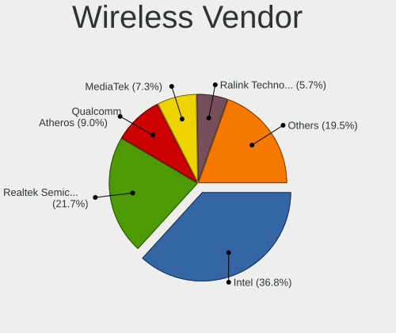

| Vendor                          | Desktops | Percent |
|---------------------------------|----------|---------|
| Intel                           | 1091     | 36.76%  |
| Realtek Semiconductor           | 645      | 21.73%  |
| Qualcomm Atheros                | 267      | 9%      |
| MediaTek                        | 216      | 7.28%   |
| Ralink Technology               | 169      | 5.69%   |
| TP-Link                         | 132      | 4.45%   |
| Broadcom                        | 83       | 2.8%    |
| Ralink                          | 75       | 2.53%   |
| Qualcomm Atheros Communications | 31       | 1.04%   |
| Microsoft                       | 31       | 1.04%   |
| D-Link                          | 31       | 1.04%   |
| ASUSTek Computer                | 30       | 1.01%   |
| NetGear                         | 27       | 0.91%   |
| Edimax Technology               | 20       | 0.67%   |
| D-Link System                   | 15       | 0.51%   |
| Broadcom Limited                | 12       | 0.4%    |
| Linksys                         | 10       | 0.34%   |
| Belkin Components               | 10       | 0.34%   |
| AVM                             | 10       | 0.34%   |
| IMC Networks                    | 8        | 0.27%   |
| Gemtek                          | 7        | 0.24%   |
| Qualcomm Technologies           | 6        | 0.2%    |
| Wilocity                        | 5        | 0.17%   |
| Marvell Technology Group        | 5        | 0.17%   |
| Sitecom Europe                  | 4        | 0.13%   |
| ZyDAS                           | 3        | 0.1%    |
| Mercucys                        | 3        | 0.1%    |
| ZTopInc                         | 2        | 0.07%   |
| Wacom                           | 2        | 0.07%   |
| Realtek                         | 2        | 0.07%   |
| BUFFALO                         | 2        | 0.07%   |
| ZyXEL Communications            | 1        | 0.03%   |
| Zinwell                         | 1        | 0.03%   |
| Xiaomi                          | 1        | 0.03%   |
| VIA Technologies                | 1        | 0.03%   |
| TRENDnet                        | 1        | 0.03%   |
| Tenda                           | 1        | 0.03%   |
| PLANEX                          | 1        | 0.03%   |
| Micro Star International        | 1        | 0.03%   |
| Fiberline                       | 1        | 0.03%   |

Wireless Model
--------------

Wireless models

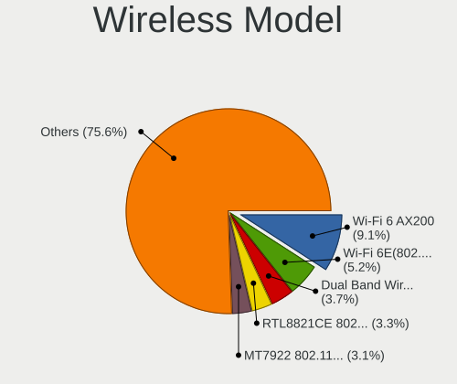

| Model                                                                | Desktops | Percent |
|----------------------------------------------------------------------|----------|---------|
| Intel Wi-Fi 6 AX200                                                  | 273      | 9.12%   |
| Intel Wi-Fi 6E(802.11ax) AX210/AX1675* 2x2 [Typhoon Peak]            | 156      | 5.21%   |
| Intel Dual Band Wireless-AC 3168NGW [Stone Peak]                     | 111      | 3.71%   |
| Realtek RTL8821CE 802.11ac PCIe Wireless Network Adapter             | 99       | 3.31%   |
| MediaTek MT7922 802.11ax PCI Express Wireless Network Adapter        | 93       | 3.11%   |
| Realtek 802.11ac NIC                                                 | 84       | 2.81%   |
| Ralink MT7601U Wireless Adapter                                      | 77       | 2.57%   |
| MediaTek MT7921K (RZ608) Wi-Fi 6E 80MHz                              | 69       | 2.3%    |
| Intel Wireless 3165                                                  | 68       | 2.27%   |
| Intel Wi-Fi 5(802.11ac) Wireless-AC 9x6x [Thunder Peak]              | 67       | 2.24%   |
| Realtek RTL88x2bu [AC1200 Techkey]                                   | 59       | 1.97%   |
| Realtek RTL8188EUS 802.11n Wireless Network Adapter                  | 56       | 1.87%   |
| Intel 700 Series Chipset CNVi WiFi                                   | 56       | 1.87%   |
| Intel Wireless 7260                                                  | 49       | 1.64%   |
| Qualcomm Atheros AR9485 Wireless Network Adapter                     | 46       | 1.54%   |
| Intel Wireless 7265                                                  | 44       | 1.47%   |
| Broadcom BCM4360 802.11ac Dual Band Wireless Network Adapter         | 39       | 1.3%    |
| Realtek RTL8192EE PCIe Wireless Network Adapter                      | 36       | 1.2%    |
| Intel Cannon Lake PCH CNVi WiFi                                      | 35       | 1.17%   |
| Intel Wireless 8260                                                  | 31       | 1.04%   |
| Ralink RT2870/RT3070 Wireless Adapter                                | 29       | 0.97%   |
| Intel Comet Lake PCH CNVi WiFi                                       | 28       | 0.94%   |
| Intel Alder Lake-N PCH CNVi WiFi                                     | 28       | 0.94%   |
| Ralink RT5370 Wireless Adapter                                       | 27       | 0.9%    |
| Intel Alder Lake-S PCH CNVi WiFi                                     | 27       | 0.9%    |
| Realtek RTL8852BE PCIe 802.11ax Wireless Network Controller          | 25       | 0.84%   |
| Qualcomm Atheros QCA6174 802.11ac Wireless Network Adapter           | 25       | 0.84%   |
| MediaTek MT7921 802.11ax PCIe Wireless Network Adapter [Filogic 330] | 25       | 0.84%   |
| Qualcomm Atheros AR9271 802.11n                                      | 24       | 0.8%    |
| Qualcomm Atheros AR93xx Wireless Network Adapter                     | 24       | 0.8%    |
| TP-Link 802.11ac NIC                                                 | 23       | 0.77%   |
| Realtek RTL8822CE 802.11ac PCIe Wireless Network Adapter             | 23       | 0.77%   |
| Realtek RTL8188FTV 802.11b/g/n 1T1R 2.4G WLAN Adapter                | 22       | 0.73%   |
| Qualcomm Atheros AR9287 Wireless Network Adapter (PCI-Express)       | 22       | 0.73%   |
| Qualcomm Atheros QCA9377 802.11ac Wireless Network Adapter           | 21       | 0.7%    |
| Qualcomm Atheros AR9462 Wireless Network Adapter                     | 21       | 0.7%    |
| Qualcomm Atheros AR9227 Wireless Network Adapter                     | 20       | 0.67%   |
| Intel Wireless 8265 / 8275                                           | 20       | 0.67%   |
| Realtek RTL8812AE 802.11ac PCIe Wireless Network Adapter             | 19       | 0.63%   |
| Realtek RTL8188CUS 802.11n WLAN Adapter                              | 19       | 0.63%   |

Ethernet Vendor
---------------

Ethernet vendors

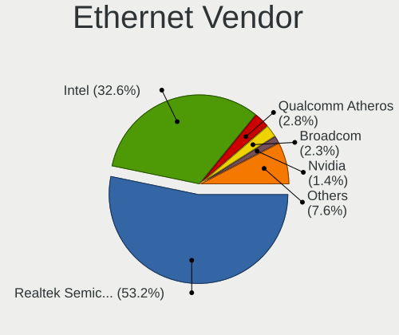

| Vendor                                 | Desktops | Percent |
|----------------------------------------|----------|---------|
| Realtek Semiconductor                  | 4541     | 53.24%  |
| Intel                                  | 2783     | 32.63%  |
| Qualcomm Atheros                       | 241      | 2.83%   |
| Broadcom                               | 197      | 2.31%   |
| Nvidia                                 | 116      | 1.36%   |
| Aquantia                               | 90       | 1.06%   |
| Marvell Technology Group               | 56       | 0.66%   |
| ASIX Electronics                       | 49       | 0.57%   |
| Broadcom Limited                       | 42       | 0.49%   |
| Mellanox Technologies                  | 41       | 0.48%   |
| Samsung Electronics                    | 40       | 0.47%   |
| MediaTek                               | 29       | 0.34%   |
| VIA Technologies                       | 28       | 0.33%   |
| American Megatrends                    | 25       | 0.29%   |
| Xiaomi                                 | 23       | 0.27%   |
| D-Link System                          | 19       | 0.22%   |
| Huawei Technologies                    | 17       | 0.2%    |
| 3Com                                   | 14       | 0.16%   |
| Qualcomm Technologies                  | 12       | 0.14%   |
| DisplayLink                            | 11       | 0.13%   |
| Qualcomm                               | 10       | 0.12%   |
| Motorola PCS                           | 10       | 0.12%   |
| Loongson Technology                    | 10       | 0.12%   |
| TP-Link                                | 8        | 0.09%   |
| Silicon Integrated Systems [SiS]       | 7        | 0.08%   |
| Google                                 | 7        | 0.08%   |
| Emulex                                 | 7        | 0.08%   |
| ADMtek                                 | 7        | 0.08%   |
| Sundance Technology Inc / IC Plus      | 6        | 0.07%   |
| QLogic                                 | 6        | 0.07%   |
| Insyde Software                        | 6        | 0.07%   |
| ICS Advent                             | 6        | 0.07%   |
| OPPO Electronics                       | 5        | 0.06%   |
| JMicron Technology                     | 5        | 0.06%   |
| IBM                                    | 5        | 0.06%   |
| Microsoft                              | 4        | 0.05%   |
| Suzhou Motorcomm Electronic Technology | 3        | 0.04%   |
| Solarflare Communications              | 3        | 0.04%   |
| QinHeng Electronics                    | 3        | 0.04%   |
| Microchip Technology                   | 3        | 0.04%   |

Ethernet Model
--------------

Ethernet models

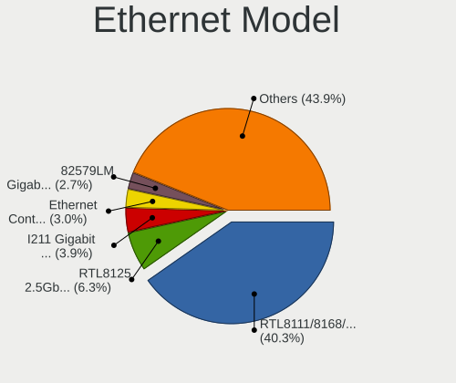

| Model                                                                           | Desktops | Percent |
|---------------------------------------------------------------------------------|----------|---------|
| Realtek RTL8111/8168/8211/8411 PCI Express Gigabit Ethernet Controller          | 3645     | 40.29%  |
| Realtek RTL8125 2.5GbE Controller                                               | 568      | 6.28%   |
| Intel I211 Gigabit Network Connection                                           | 352      | 3.89%   |
| Intel Ethernet Controller I225-V                                                | 269      | 2.97%   |
| Intel 82579LM Gigabit Network Connection (Lewisville)                           | 241      | 2.66%   |
| Intel Ethernet Connection (2) I219-V                                            | 217      | 2.4%    |
| Intel Ethernet Connection I217-LM                                               | 185      | 2.04%   |
| Realtek RTL810xE PCI Express Fast Ethernet controller                           | 163      | 1.8%    |
| Intel Ethernet Controller I226-V                                                | 152      | 1.68%   |
| Intel I210 Gigabit Network Connection                                           | 143      | 1.58%   |
| Intel 82579V Gigabit Network Connection                                         | 111      | 1.23%   |
| Intel Ethernet Connection (2) I219-LM                                           | 107      | 1.18%   |
| Intel 82574L Gigabit Network Connection                                         | 103      | 1.14%   |
| Intel Ethernet Connection (7) I219-V                                            | 94       | 1.04%   |
| Intel Ethernet Connection I217-V                                                | 88       | 0.97%   |
| Realtek RTL8153 Gigabit Ethernet Adapter                                        | 84       | 0.93%   |
| Nvidia MCP61 Ethernet                                                           | 66       | 0.73%   |
| Intel Ethernet Connection (14) I219-V                                           | 63       | 0.7%    |
| Intel Ethernet Connection (7) I219-LM                                           | 60       | 0.66%   |
| Intel Ethernet Connection (2) I218-V                                            | 60       | 0.66%   |
| Intel I350 Gigabit Network Connection                                           | 53       | 0.59%   |
| Intel 82567LM-3 Gigabit Network Connection                                      | 53       | 0.59%   |
| Realtek RTL-8100/8101L/8139 PCI Fast Ethernet Adapter                           | 52       | 0.57%   |
| Intel 82599ES 10-Gigabit SFI/SFP+ Network Connection                            | 50       | 0.55%   |
| Realtek RTL8169 PCI Gigabit Ethernet Controller                                 | 47       | 0.52%   |
| Qualcomm Atheros AR8151 v2.0 Gigabit Ethernet                                   | 41       | 0.45%   |
| ASIX AX88179 Gigabit Ethernet                                                   | 41       | 0.45%   |
| Qualcomm Atheros Killer E220x Gigabit Ethernet Controller                       | 39       | 0.43%   |
| Intel Ethernet Connection (5) I219-LM                                           | 39       | 0.43%   |
| Realtek RTL8852BE PCIe 802.11ax Wireless Network Controller                     | 36       | 0.4%    |
| Realtek RTL8111/8168/8411 PCI Express Gigabit Ethernet Controller               | 35       | 0.39%   |
| Intel Ethernet Connection (11) I219-V                                           | 33       | 0.36%   |
| Broadcom NetXtreme BCM5761 Gigabit Ethernet PCIe                                | 32       | 0.35%   |
| Intel Ethernet Connection (2) I218-LM                                           | 31       | 0.34%   |
| Intel 82566DM-2 Gigabit Network Connection                                      | 31       | 0.34%   |
| Intel Ethernet Connection (17) I219-LM                                          | 30       | 0.33%   |
| Aquantia AQtion AQC113CS NBase-T/IEEE 802.3an Ethernet Controller [Antigua 10G] | 30       | 0.33%   |
| Samsung Galaxy series, misc. (tethering mode)                                   | 29       | 0.32%   |
| Qualcomm Atheros AR8131 Gigabit Ethernet                                        | 28       | 0.31%   |
| Marvell Group 88E8056 PCI-E Gigabit Ethernet Controller                         | 28       | 0.31%   |

Net Controller Kind
-------------------

Ethernet, WiFi or modem

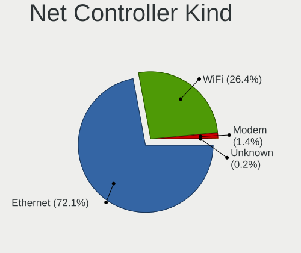

| Kind     | Desktops | Percent |
|----------|----------|---------|
| Ethernet | 7585     | 72.08%  |
| WiFi     | 2773     | 26.35%  |
| Modem    | 147      | 1.4%    |
| Unknown  | 18       | 0.17%   |

Used Controller
---------------

Currently used network controller

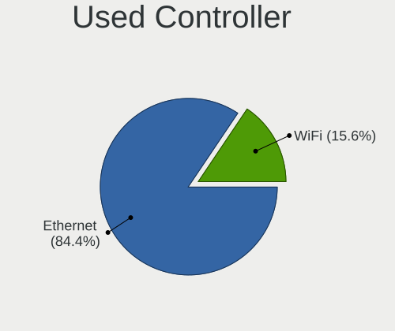

| Kind     | Desktops | Percent |
|----------|----------|---------|
| Ethernet | 6491     | 84.41%  |
| WiFi     | 1199     | 15.59%  |

NICs
----

Total network controllers on board

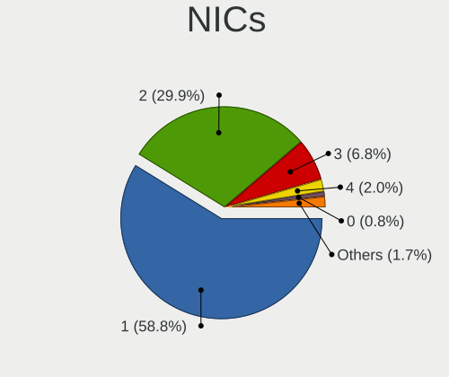

| Total | Desktops | Percent |
|-------|----------|---------|
| 1     | 4537     | 58.82%  |
| 2     | 2309     | 29.93%  |
| 3     | 521      | 6.75%   |
| 4     | 151      | 1.96%   |
| 0     | 62       | 0.8%    |
| 5     | 46       | 0.6%    |
| 6     | 45       | 0.58%   |
| 7     | 14       | 0.18%   |
| 8     | 13       | 0.17%   |
| 9     | 7        | 0.09%   |
| 12    | 3        | 0.04%   |
| 10    | 2        | 0.03%   |
| 33    | 1        | 0.01%   |
| 21    | 1        | 0.01%   |
| 17    | 1        | 0.01%   |
| 13    | 1        | 0.01%   |

IPv6
----

IPv6 vs IPv4

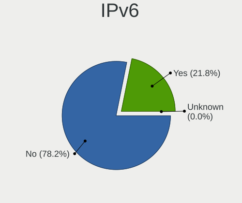

| Used    | Desktops | Percent |
|---------|----------|---------|
| No      | 6074     | 78.15%  |
| Yes     | 1697     | 21.83%  |
| Unknown | 1        | 0.01%   |

Bluetooth
---------

Bluetooth Vendor
----------------

Controller vendors

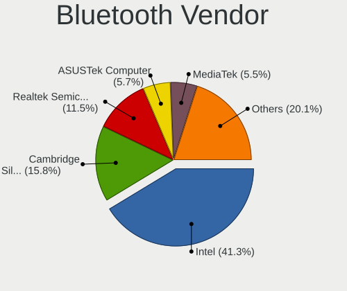

| Vendor                          | Desktops | Percent |
|---------------------------------|----------|---------|
| Intel                           | 1043     | 41.32%  |
| Cambridge Silicon Radio         | 399      | 15.81%  |
| Realtek Semiconductor           | 290      | 11.49%  |
| ASUSTek Computer                | 145      | 5.74%   |
| MediaTek                        | 140      | 5.55%   |
| IMC Networks                    | 98       | 3.88%   |
| Broadcom                        | 85       | 3.37%   |
| Qualcomm Atheros Communications | 75       | 2.97%   |
| Foxconn / Hon Hai               | 74       | 2.93%   |
| TP-Link                         | 50       | 1.98%   |
| Apple                           | 29       | 1.15%   |
| Unknown                         | 13       | 0.52%   |
| Edimax Technology               | 12       | 0.48%   |
| Realtek                         | 11       | 0.44%   |
| Integrated System Solution      | 11       | 0.44%   |
| Actions                         | 9        | 0.36%   |
| Lite-On Technology              | 8        | 0.32%   |
| Belkin Components               | 5        | 0.2%    |
| Micro Star International        | 3        | 0.12%   |
| Dynex                           | 3        | 0.12%   |
| SINO WEALTH                     | 2        | 0.08%   |
| Qcom                            | 2        | 0.08%   |
| HTC (High Tech Computer)        | 2        | 0.08%   |
| Hewlett-Packard                 | 2        | 0.08%   |
| Conwise Technology              | 2        | 0.08%   |
| Toshiba                         | 1        | 0.04%   |
| Sitecom Europe                  | 1        | 0.04%   |
| Roper                           | 1        | 0.04%   |
| Ralink                          | 1        | 0.04%   |
| Quectel Wireless Solutions      | 1        | 0.04%   |
| Mobile Action Technology        | 1        | 0.04%   |
| Microsoft                       | 1        | 0.04%   |
| Logitech                        | 1        | 0.04%   |
| Kensington                      | 1        | 0.04%   |
| Com One                         | 1        | 0.04%   |
| Accel Semiconductor             | 1        | 0.04%   |

Bluetooth Model
---------------

Controller models

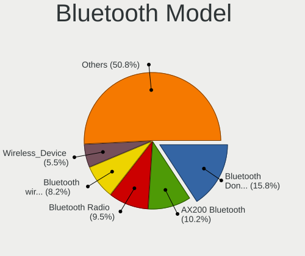

| Model                                                 | Desktops | Percent |
|-------------------------------------------------------|----------|---------|
| Cambridge Silicon Radio Bluetooth Dongle (HCI mode)   | 399      | 15.79%  |
| Intel AX200 Bluetooth                                 | 259      | 10.25%  |
| Realtek Bluetooth Radio                               | 240      | 9.5%    |
| Intel Bluetooth wireless interface                    | 206      | 8.15%   |
| MediaTek Wireless_Device                              | 140      | 5.54%   |
| Intel AX210 Bluetooth                                 | 137      | 5.42%   |
| Intel Wireless-AC 3168 Bluetooth                      | 107      | 4.23%   |
| Intel AX201 Bluetooth                                 | 105      | 4.16%   |
| Intel Bluetooth Device                                | 93       | 3.68%   |
| Intel Wireless-AC 9260 Bluetooth Adapter              | 68       | 2.69%   |
| Intel Bluetooth 9460/9560 Jefferson Peak (JfP)        | 57       | 2.26%   |
| Broadcom BCM20702A0 Bluetooth 4.0                     | 56       | 2.22%   |
| IMC Networks Bluetooth Radio                          | 55       | 2.18%   |
| TP-Link TP-T@- UB500 Adapter                          | 50       | 1.98%   |
| Foxconn / Hon Hai Wireless_Device                     | 43       | 1.7%    |
| ASUS ASUS USB-BT500                                   | 42       | 1.66%   |
| ASUS Broadcom BCM20702A0 Bluetooth                    | 41       | 1.62%   |
| IMC Networks Wireless_Device                          | 32       | 1.27%   |
| Qualcomm Atheros  Bluetooth Device                    | 31       | 1.23%   |
| Foxconn / Hon Hai Bluetooth Device                    | 21       | 0.83%   |
| Realtek Bluetooth 5.3 Radio                           | 18       | 0.71%   |
| Realtek  Bluetooth 4.2 Adapter                        | 17       | 0.67%   |
| Apple Bluetooth Host Controller                       | 17       | 0.67%   |
| ASUS Bluetooth Radio                                  | 16       | 0.63%   |
| ASUS Bluetooth Adapter                                | 15       | 0.59%   |
| Unknown                                               | 13       | 0.51%   |
| Qualcomm Atheros AR9462 Bluetooth                     | 12       | 0.47%   |
| Intel Centrino Bluetooth Wireless Transceiver         | 12       | 0.47%   |
| Realtek Bluetooth Radio                               | 11       | 0.44%   |
| Qualcomm Atheros Bluetooth USB Host Controller        | 10       | 0.4%    |
| ASUS Broadcom BCM20702 Single-Chip Bluetooth 4.0 + LE | 10       | 0.4%    |
| IMC Networks Bluetooth Device                         | 9        | 0.36%   |
| Actions general adapter                               | 9        | 0.36%   |
| Edimax Bluetooth Device                               | 8        | 0.32%   |
| ASUS BCM20702A0                                       | 8        | 0.32%   |
| Apple Built-in Bluetooth 2.0+EDR HCI                  | 8        | 0.32%   |
| Qualcomm Atheros QCA61x4 Bluetooth 4.0                | 7        | 0.28%   |
| Integrated System Solution Bluetooth Device           | 7        | 0.28%   |
| Qualcomm Atheros AR3011 Bluetooth (no firmware)       | 6        | 0.24%   |
| Qualcomm Atheros AR3011 Bluetooth                     | 6        | 0.24%   |

Sound
-----

Sound Vendor
------------

Sound card vendors

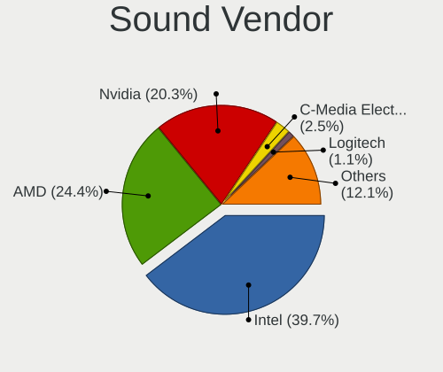

| Vendor                                       | Desktops | Percent |
|----------------------------------------------|----------|---------|
| Intel                                        | 4689     | 39.67%  |
| AMD                                          | 2886     | 24.41%  |
| Nvidia                                       | 2400     | 20.3%   |
| C-Media Electronics                          | 295      | 2.5%    |
| Logitech                                     | 125      | 1.06%   |
| Creative Labs                                | 113      | 0.96%   |
| ASUSTek Computer                             | 90       | 0.76%   |
| Texas Instruments                            | 63       | 0.53%   |
| Micro Star International                     | 63       | 0.53%   |
| Zoran Co. Personal Media Division (Nogatech) | 57       | 0.48%   |
| Generalplus Technology                       | 48       | 0.41%   |
| Creative Technology                          | 47       | 0.4%    |
| Focusrite-Novation                           | 46       | 0.39%   |
| GN Netcom                                    | 44       | 0.37%   |
| JMTek                                        | 42       | 0.36%   |
| VIA Technologies                             | 38       | 0.32%   |
| KTMicro                                      | 38       | 0.32%   |
| Razer USA                                    | 33       | 0.28%   |
| Kingston Technology                          | 33       | 0.28%   |
| SteelSeries ApS                              | 31       | 0.26%   |
| Corsair                                      | 24       | 0.2%    |
| BEHRINGER International                      | 24       | 0.2%    |
| Plantronics                                  | 22       | 0.19%   |
| Jieli Technology                             | 20       | 0.17%   |
| Dell                                         | 20       | 0.17%   |
| Loongson Technology                          | 18       | 0.15%   |
| RODE Microphones                             | 17       | 0.14%   |
| Realtek Semiconductor                        | 17       | 0.14%   |
| Hewlett-Packard                              | 17       | 0.14%   |
| Tenx Technology                              | 16       | 0.14%   |
| Blue Microphones                             | 16       | 0.14%   |
| GYROCOM C&C                                  | 14       | 0.12%   |
| Yamaha                                       | 13       | 0.11%   |
| Giga-Byte Technology                         | 13       | 0.11%   |
| Samson Technologies                          | 12       | 0.1%    |
| Cambridge Silicon Radio                      | 12       | 0.1%    |
| XMOS                                         | 11       | 0.09%   |
| SAVITECH                                     | 11       | 0.09%   |
| PreSonus Audio Electronics                   | 11       | 0.09%   |
| M-Audio                                      | 11       | 0.09%   |

Sound Model
-----------

Sound card models

| Model                                                                      | Desktops | Percent |
|----------------------------------------------------------------------------|----------|---------|
| AMD Ryzen HD Audio Controller                                              | 695      | 4.95%   |
| AMD Starship/Matisse HD Audio Controller                                   | 648      | 4.61%   |
| Intel 8 Series/C220 Series Chipset High Definition Audio Controller        | 638      | 4.54%   |
| Intel Xeon E3-1200 v3/4th Gen Core Processor HD Audio Controller           | 482      | 3.43%   |
| Intel 6 Series/C200 Series Chipset Family High Definition Audio Controller | 469      | 3.34%   |
| Intel 200 Series PCH HD Audio                                              | 382      | 2.72%   |
| Intel 100 Series/C230 Series Chipset Family HD Audio Controller            | 375      | 2.67%   |
| AMD SBx00 Azalia (Intel HDA)                                               | 359      | 2.56%   |
| Intel 7 Series/C216 Chipset Family High Definition Audio Controller        | 289      | 2.06%   |
| Intel NM10/ICH7 Family High Definition Audio Controller                    | 287      | 2.04%   |
| AMD Family 17h (Models 00h-0fh) HD Audio Controller                        | 275      | 1.96%   |
| AMD Renoir/Cezanne HDMI/DP Audio Controller                                | 266      | 1.89%   |
| AMD Ellesmere HDMI Audio [Radeon RX 470/480 / 570/580/590]                 | 259      | 1.84%   |
| AMD Radeon High Definition Audio Controller                                | 236      | 1.68%   |
| AMD Navi 21/23 HDMI/DP Audio Controller                                    | 223      | 1.59%   |
| Nvidia GK208 HDMI/DP Audio Controller                                      | 221      | 1.57%   |
| Intel Cannon Lake PCH cAVS                                                 | 217      | 1.54%   |
| Nvidia GP107GL High Definition Audio Controller                            | 198      | 1.41%   |
| AMD Raven/Raven2/Fenghuang HDMI/DP Audio Controller                        | 178      | 1.27%   |
| AMD FCH Azalia Controller                                                  | 177      | 1.26%   |
| Intel Alder Lake-S HD Audio Controller                                     | 175      | 1.25%   |
| Intel 82801JI (ICH10 Family) HD Audio Controller                           | 159      | 1.13%   |
| AMD Oland/Hainan/Cape Verde/Pitcairn HDMI Audio [Radeon HD 7000 Series]    | 145      | 1.03%   |
| AMD Baffin HDMI/DP Audio [Radeon RX 550 640SP / RX 560/560X]               | 143      | 1.02%   |
| Nvidia GF108 High Definition Audio Controller                              | 141      | 1%      |
| Nvidia GP106 High Definition Audio Controller                              | 138      | 0.98%   |
| Nvidia TU116 High Definition Audio Controller                              | 119      | 0.85%   |
| Nvidia High Definition Audio Controller                                    | 119      | 0.85%   |
| Intel C610/X99 series chipset HD Audio Controller                          | 117      | 0.83%   |
| Intel Raptor Lake High Definition Audio Controller                         | 115      | 0.82%   |
| Intel Comet Lake PCH cAVS                                                  | 115      | 0.82%   |
| Nvidia TU106 High Definition Audio Controller                              | 113      | 0.8%    |
| C-Media Electronics Audio Adapter (Unitek Y-247A)                          | 110      | 0.78%   |
| Nvidia GP104 High Definition Audio Controller                              | 106      | 0.75%   |
| Intel 5 Series/3400 Series Chipset High Definition Audio                   | 105      | 0.75%   |
| Intel C600/X79 series chipset High Definition Audio Controller             | 103      | 0.73%   |
| Intel 9 Series Chipset Family HD Audio Controller                          | 103      | 0.73%   |
| Intel Alder Lake-N PCH High Definition Audio Controller                    | 102      | 0.73%   |
| Nvidia GP108 High Definition Audio Controller                              | 96       | 0.68%   |
| Nvidia GM107 High Definition Audio Controller [GeForce 940MX]              | 91       | 0.65%   |

Memory
------

Memory Vendor
-------------

Memory module vendors

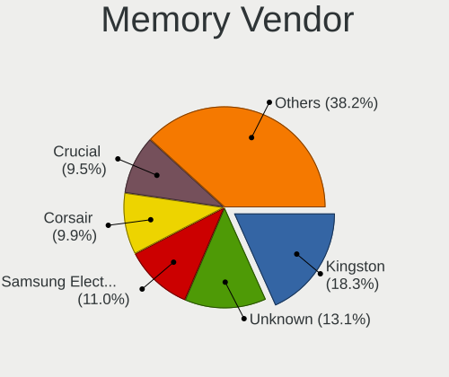

| Vendor                       | Desktops | Percent |
|------------------------------|----------|---------|
| Kingston                     | 1263     | 18.28%  |
| Unknown                      | 908      | 13.14%  |
| Samsung Electronics          | 758      | 10.97%  |
| Corsair                      | 686      | 9.93%   |
| Crucial                      | 654      | 9.46%   |
| SK hynix                     | 602      | 8.71%   |
| G.Skill                      | 482      | 6.98%   |
| Micron Technology            | 330      | 4.78%   |
| A-DATA Technology            | 154      | 2.23%   |
| Unknown                      | 141      | 2.04%   |
| Patriot                      | 122      | 1.77%   |
| Team                         | 75       | 1.09%   |
| Ramaxel Technology           | 51       | 0.74%   |
| Nanya Technology             | 46       | 0.67%   |
| Unknown (ABCD)               | 40       | 0.58%   |
| AMD                          | 39       | 0.56%   |
| Transcend                    | 33       | 0.48%   |
| Elpida                       | 33       | 0.48%   |
| Hikvision                    | 24       | 0.35%   |
| Apacer                       | 24       | 0.35%   |
| Timetec                      | 21       | 0.3%    |
| GOODRAM                      | 20       | 0.29%   |
| Smart                        | 18       | 0.26%   |
| Unknown (0x0E9D)             | 16       | 0.23%   |
| GeIL                         | 15       | 0.22%   |
| Patriot Memory (PDP Systems) | 13       | 0.19%   |
| Avant                        | 13       | 0.19%   |
| PNY                          | 12       | 0.17%   |
| Hewlett-Packard              | 12       | 0.17%   |
| ASint Technology             | 11       | 0.16%   |
| Qimonda                      | 9        | 0.13%   |
| Micro Memory Bank            | 9        | 0.13%   |
| KLEVV                        | 9        | 0.13%   |
| Unknown (0x0B45)             | 7        | 0.1%    |
| Unifosa                      | 7        | 0.1%    |
| Toshiba                      | 7        | 0.1%    |
| Silicon Power                | 7        | 0.1%    |
| Patriot Memory               | 7        | 0.1%    |
| Kingmax                      | 7        | 0.1%    |
| Wodposit                     | 6        | 0.09%   |

Memory Model
------------

Memory module models

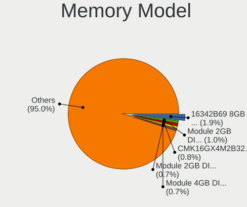

| Model                                                          | Desktops | Percent |
|----------------------------------------------------------------|----------|---------|
| Unknown                                                        | 141      | 1.87%   |
| Unknown RAM Module 2GB DIMM SDRAM                              | 72       | 0.95%   |
| Corsair RAM CMK16GX4M2B3200C16 8GB DIMM DDR4 3600MT/s          | 59       | 0.78%   |
| Unknown RAM Module 2GB DIMM DDR2 800MT/s                       | 54       | 0.72%   |
| Unknown RAM Module 4GB DIMM 1333MT/s                           | 50       | 0.66%   |
| Unknown RAM Module 1GB DIMM SDRAM                              | 47       | 0.62%   |
| Unknown (ABCD) RAM 123456789012345678 2GB DIMM LPDDR4 2133MT/s | 40       | 0.53%   |
| Corsair RAM CMK32GX4M2E3200C16 16GB DIMM DDR4 3600MT/s         | 40       | 0.53%   |
| Kingston RAM 99U5584-010.A00LF 4GB DIMM DDR3 1866MT/s          | 39       | 0.52%   |
| Crucial RAM CT4G4DFS8213.C8FAR2 4GB DIMM DDR4 2133MT/s         | 38       | 0.5%    |
| G.Skill RAM F4-3200C16-16GVK 16GB DIMM DDR4 3600MT/s           | 35       | 0.46%   |
| Kingston RAM KHX1600C10D3/8G 8GB DIMM DDR3 2133MT/s            | 33       | 0.44%   |
| Corsair RAM CMK16GX4M2B3000C15 8GB DIMM DDR4 3600MT/s          | 33       | 0.44%   |
| Crucial RAM CT8G4DFRA266.M16FG 8GB DIMM DDR4 2667MT/s          | 31       | 0.41%   |
| Unknown RAM Module 2GB DIMM 1333MT/s                           | 30       | 0.4%    |
| Kingston RAM KF3200C16D4/16GX 16GB DIMM DDR4 3733MT/s          | 29       | 0.38%   |
| Kingston RAM KHX2666C16/8G 8GiB DIMM DDR4 3466MT/s             | 27       | 0.36%   |
| Kingston RAM KF3200C16D4/8GX 8GiB DIMM DDR4 3600MT/s           | 27       | 0.36%   |
| Kingston RAM KF3200C16D4/32GX 32GB DIMM DDR4 3933MT/s          | 27       | 0.36%   |
| Unknown RAM Module 2GB DIMM 800MT/s                            | 26       | 0.34%   |
| Kingston RAM KHX1600C9D3/4GX 4GB DIMM DDR3 1867MT/s            | 26       | 0.34%   |
| Corsair RAM CMK64GX4M2E3200C16 32GB DIMM DDR4 3600MT/s         | 26       | 0.34%   |
| Corsair RAM CMK32GX4M2B3200C16 16GB DIMM DDR4 3800MT/s         | 26       | 0.34%   |
| Kingston RAM KHX3200C16D4/8GX 8GB DIMM DDR4 3733MT/s           | 24       | 0.32%   |
| Crucial RAM CT8G4DFRA266.C8FN 8GB DIMM DDR4 3600MT/s           | 24       | 0.32%   |
| Unknown RAM Module 8GB DIMM 1333MT/s                           | 22       | 0.29%   |
| SK hynix RAM HMT351U6CFR8C-PB 4GB DIMM DDR3 1800MT/s           | 22       | 0.29%   |
| Samsung RAM M378B5173EB0-YK0 4GB DIMM DDR3 1600MT/s            | 22       | 0.29%   |
| Kingston RAM KHX1866C10D3/8G 8GB DIMM DDR3 1867MT/s            | 22       | 0.29%   |
| Unknown RAM Module 8GB DIMM DDR3 1600MT/s                      | 21       | 0.28%   |
| Unknown RAM Module 8GB DIMM DDR3 1333MT/s                      | 21       | 0.28%   |
| Unknown RAM Module 4GB DIMM DDR3 1333MT/s                      | 21       | 0.28%   |
| Corsair RAM CMK32GX4M2A2666C16 16GB DIMM DDR4 2667MT/s         | 21       | 0.28%   |
| SK hynix RAM HMA82GU6JJR8N-VK 16GB DIMM DDR4 2667MT/s          | 20       | 0.26%   |
| Hikvision RAM HKED4161DAA1D0MA1 16GB DIMM DDR4 2667MT/s        | 20       | 0.26%   |
| Kingston RAM KHX3200C16D4/16GX 16GB DIMM DDR4 3600MT/s         | 19       | 0.25%   |
| G.Skill RAM F4-3000C16-8GISB 8GB DIMM DDR4 3200MT/s            | 19       | 0.25%   |
| Unknown RAM Module 1GB DIMM 800MT/s                            | 18       | 0.24%   |
| SK hynix RAM HMT451U6BFR8A-PB 4GB DIMM DDR3 1600MT/s           | 18       | 0.24%   |
| Samsung RAM M378B5173QH0-CK0 4GB DIMM DDR3                     | 18       | 0.24%   |

Memory Kind
-----------

Memory module kinds

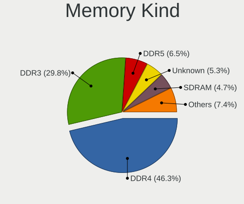

| Kind         | Desktops | Percent |
|--------------|----------|---------|
| DDR4         | 2864     | 46.31%  |
| DDR3         | 1841     | 29.77%  |
| DDR5         | 405      | 6.55%   |
| Unknown      | 325      | 5.26%   |
| SDRAM        | 292      | 4.72%   |
| DDR2         | 283      | 4.58%   |
| LPDDR4       | 66       | 1.07%   |
| DDR          | 56       | 0.91%   |
| LPDDR5       | 23       | 0.37%   |
| DRAM         | 22       | 0.36%   |
| RAM          | 3        | 0.05%   |
| EPROM        | 2        | 0.03%   |
| LPDDR3       | 1        | 0.02%   |
| DDR2 FB-DIMM | 1        | 0.02%   |

Memory Form Factor
------------------

Physical design of the memory module

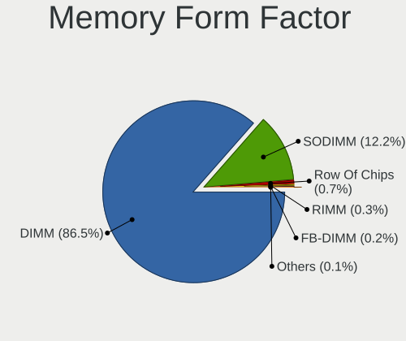

| Name         | Desktops | Percent |
|--------------|----------|---------|
| DIMM         | 5268     | 86.47%  |
| SODIMM       | 741      | 12.16%  |
| Row Of Chips | 45       | 0.74%   |
| RIMM         | 19       | 0.31%   |
| FB-DIMM      | 11       | 0.18%   |
| Unknown      | 7        | 0.11%   |
| Chip         | 1        | 0.02%   |

Memory Size
-----------

Memory module size

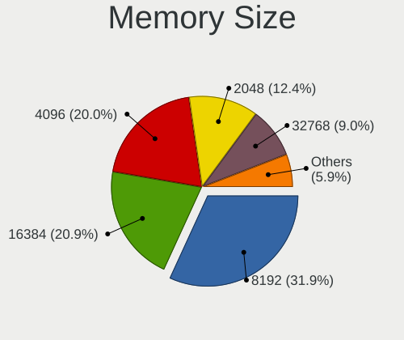

| Size    | Desktops | Percent |
|---------|----------|---------|
| 8192    | 2131     | 31.86%  |
| 16384   | 1395     | 20.86%  |
| 4096    | 1337     | 19.99%  |
| 2048    | 832      | 12.44%  |
| 32768   | 602      | 9%      |
| 1024    | 257      | 3.84%   |
| 512     | 58       | 0.87%   |
| 65536   | 23       | 0.34%   |
| 49152   | 21       | 0.31%   |
| 256     | 10       | 0.15%   |
| 24576   | 6        | 0.09%   |
| 3072    | 5        | 0.07%   |
| 12288   | 4        | 0.06%   |
| 128     | 2        | 0.03%   |
| 8000    | 1        | 0.01%   |
| 6144    | 1        | 0.01%   |
| 1536    | 1        | 0.01%   |
| 64      | 1        | 0.01%   |
| 16      | 1        | 0.01%   |
| Unknown | 1        | 0.01%   |

Memory Speed
------------

Memory module speed

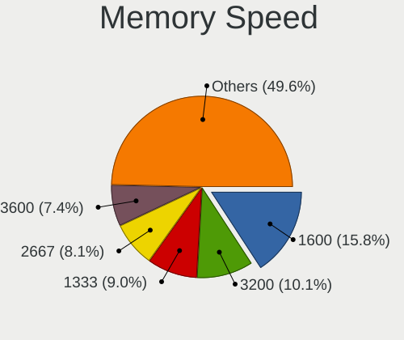

| Speed   | Desktops | Percent |
|---------|----------|---------|
| 1600    | 1068     | 15.8%   |
| 3200    | 684      | 10.12%  |
| 1333    | 607      | 8.98%   |
| 2667    | 549      | 8.12%   |
| 3600    | 498      | 7.37%   |
| 2400    | 418      | 6.18%   |
| 2133    | 365      | 5.4%    |
| 800     | 207      | 3.06%   |
| Unknown | 198      | 2.93%   |
| 667     | 149      | 2.2%    |
| 1866    | 145      | 2.14%   |
| 2666    | 118      | 1.75%   |
| 4800    | 113      | 1.67%   |
| 3733    | 109      | 1.61%   |
| 3800    | 100      | 1.48%   |
| 5600    | 95       | 1.41%   |
| 6000    | 86       | 1.27%   |
| 1867    | 86       | 1.27%   |
| 3000    | 81       | 1.2%    |
| 1066    | 74       | 1.09%   |
| 3400    | 68       | 1.01%   |
| 1800    | 68       | 1.01%   |
| 3466    | 61       | 0.9%    |
| 4000    | 59       | 0.87%   |
| 2933    | 52       | 0.77%   |
| 6400    | 51       | 0.75%   |
| 1067    | 42       | 0.62%   |
| 533     | 34       | 0.5%    |
| 5200    | 31       | 0.46%   |
| 400     | 31       | 0.46%   |
| 3933    | 29       | 0.43%   |
| 3866    | 24       | 0.35%   |
| 1334    | 22       | 0.33%   |
| 3266    | 21       | 0.31%   |
| 3100    | 21       | 0.31%   |
| 4333    | 19       | 0.28%   |
| 3500    | 18       | 0.27%   |
| 2800    | 18       | 0.27%   |
| 2048    | 17       | 0.25%   |
| 1648    | 17       | 0.25%   |

Printers & scanners
-------------------

Printer Vendor
--------------

Printer device vendors

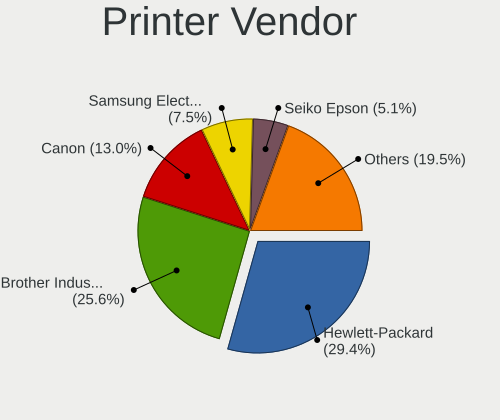

| Vendor                 | Desktops | Percent |
|------------------------|----------|---------|
| Hewlett-Packard        | 86       | 29.35%  |
| Brother Industries     | 75       | 25.6%   |
| Canon                  | 38       | 12.97%  |
| Samsung Electronics    | 22       | 7.51%   |
| Seiko Epson            | 15       | 5.12%   |
| Dymo-CoStar            | 9        | 3.07%   |
| Lexmark International  | 8        | 2.73%   |
| Prolific Technology    | 6        | 2.05%   |
| Zebra                  | 4        | 1.37%   |
| Xerox                  | 4        | 1.37%   |
| Ricoh                  | 4        | 1.37%   |
| QinHeng Electronics    | 4        | 1.37%   |
| Pantum                 | 4        | 1.37%   |
| Kyocera                | 3        | 1.02%   |
| STMicroelectronics     | 2        | 0.68%   |
| Printer                | 1        | 0.34%   |
| Oki Data               | 1        | 0.34%   |
| nemonic                | 1        | 0.34%   |
| Konica Minolta         | 1        | 0.34%   |
| GODEX INTERNATIONAL    | 1        | 0.34%   |
| Dell                   | 1        | 0.34%   |
| Datamax-O'Neil         | 1        | 0.34%   |
| Custom Engineering SPA | 1        | 0.34%   |
| Apple                  | 1        | 0.34%   |

Printer Model
-------------

Printer device models

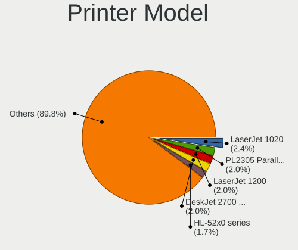

| Model                                                     | Desktops | Percent |
|-----------------------------------------------------------|----------|---------|
| HP LaserJet 1020                                          | 7        | 2.38%   |
| Prolific PL2305 Parallel Port                             | 6        | 2.04%   |
| HP LaserJet 1200                                          | 6        | 2.04%   |
| HP DeskJet 2700 series                                    | 6        | 2.04%   |
| Brother HL-52x0 series                                    | 5        | 1.7%    |
| Samsung ML-1660 Series                                    | 4        | 1.36%   |
| QinHeng CH340S                                            | 4        | 1.36%   |
| HP HP LaserJet M101-M106                                  | 4        | 1.36%   |
| Xerox B205                                                | 3        | 1.02%   |
| Samsung ML-216x Series Laser Printer                      | 3        | 1.02%   |
| Samsung M2020 Series                                      | 3        | 1.02%   |
| HP LaserJet M14-M17                                       | 3        | 1.02%   |
| HP HP LaserJet Pro M404-M405                              | 3        | 1.02%   |
| Dymo-CoStar LabelWriter 450                               | 3        | 1.02%   |
| Canon PIXMA MG3600 Series                                 | 3        | 1.02%   |
| Canon MF4410                                              | 3        | 1.02%   |
| Canon LiDE 400                                            | 3        | 1.02%   |
| Canon LiDE 300                                            | 3        | 1.02%   |
| Brother Printer                                           | 3        | 1.02%   |
| Brother HL-3142CW series                                  | 3        | 1.02%   |
| Brother HL-2030 Laser Printer                             | 3        | 1.02%   |
| STMicroelectronics LED badge -- mini LED display -- 11x44 | 2        | 0.68%   |
| Seiko Epson ET-2710 Series                                | 2        | 0.68%   |
| Samsung SCX-3200 Series                                   | 2        | 0.68%   |
| Samsung M2070 Series                                      | 2        | 0.68%   |
| Pantum P2500W series                                      | 2        | 0.68%   |
| Lexmark International CS417dn                             | 2        | 0.68%   |
| HP OfficeJet 5200 series                                  | 2        | 0.68%   |
| HP Officejet 4500 G510a-f                                 | 2        | 0.68%   |
| HP LaserJet P1005                                         | 2        | 0.68%   |
| HP LaserJet 400 M401dne                                   | 2        | 0.68%   |
| HP LaserJet 1300                                          | 2        | 0.68%   |
| HP ENVY Photo 6200 series                                 | 2        | 0.68%   |
| HP ENVY 5540 series                                       | 2        | 0.68%   |
| HP ENVY 4520 series                                       | 2        | 0.68%   |
| HP ENVY 4500 series                                       | 2        | 0.68%   |
| HP DeskJet Plus 4100 series                               | 2        | 0.68%   |
| HP DeskJet 840c                                           | 2        | 0.68%   |
| HP DeskJet 2130 series                                    | 2        | 0.68%   |
| Dymo-CoStar DYMO LabelWriter 450 Turbo                    | 2        | 0.68%   |

Scanner Vendor
--------------

Scanner device vendors

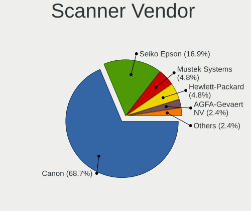

| Vendor             | Desktops | Percent |
|--------------------|----------|---------|
| Canon              | 57       | 68.67%  |
| Seiko Epson        | 14       | 16.87%  |
| Mustek Systems     | 4        | 4.82%   |
| Hewlett-Packard    | 4        | 4.82%   |
| AGFA-Gevaert NV    | 2        | 2.41%   |
| Ultima Electronics | 1        | 1.2%    |
| Plustek            | 1        | 1.2%    |

Scanner Model
-------------

Scanner device models

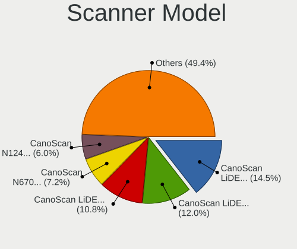

| Model                                                                                 | Desktops | Percent |
|---------------------------------------------------------------------------------------|----------|---------|
| Canon CanoScan LiDE 110                                                               | 12       | 14.46%  |
| Canon CanoScan LiDE 220                                                               | 10       | 12.05%  |
| Canon CanoScan LiDE 210                                                               | 9        | 10.84%  |
| Canon CanoScan N670U/N676U/LiDE 20                                                    | 6        | 7.23%   |
| Canon CanoScan N1240U/LiDE 30                                                         | 5        | 6.02%   |
| Seiko Epson GT-F650 [GT-S600/Perfection V10/V100]                                     | 3        | 3.61%   |
| Canon CanoScan LiDE 50/LiDE 35/LiDE 40                                                | 3        | 3.61%   |
| Seiko Epson GT-F500/GT-F550 [Perfection 2480/2580 PHOTO]                              | 2        | 2.41%   |
| Canon CanoScan LiDE 60                                                                | 2        | 2.41%   |
| Canon CanoScan LIDE 25                                                                | 2        | 2.41%   |
| AGFA-Gevaert NV SnapScan 1212U (?)                                                    | 2        | 2.41%   |
| Ultima Artec Ultima 2000 (GT6801 based)/Lifetec LT9385/ScanMagic 1200 UB Plus Scanner | 1        | 1.2%    |
| Seiko Epson Perfection V37/V370                                                       | 1        | 1.2%    |
| Seiko Epson GT-X900 [Perfection V700/V750 Photo]                                      | 1        | 1.2%    |
| Seiko Epson GT-X770 [Perfection V500]                                                 | 1        | 1.2%    |
| Seiko Epson GT-9700F [Perfection 2450 PHOTO]                                          | 1        | 1.2%    |
| Seiko Epson GT-8700/GT-8700F [Perfection 1640SU/1640SU PHOTO]                         | 1        | 1.2%    |
| Seiko Epson GT-8200U/GT-8200UF [Perfection 1650/1650 PHOTO]                           | 1        | 1.2%    |
| Seiko Epson GT-7700U [Perfection 1240U]                                               | 1        | 1.2%    |
| Seiko Epson GT-7300U [Perfection 1260/1260 PHOTO]                                     | 1        | 1.2%    |
| Seiko Epson GT-6600U [Perfection 610]                                                 | 1        | 1.2%    |
| Plustek 1200dpi USB Scanner                                                           | 1        | 1.2%    |
| Mustek Systems SNAPSCAN e22                                                           | 1        | 1.2%    |
| Mustek Systems ScanExpress 1200 UB                                                    | 1        | 1.2%    |
| Mustek Systems BearPaw 2448 TA Pro                                                    | 1        | 1.2%    |
| Mustek Systems BearPaw 1200 CU Plus                                                   | 1        | 1.2%    |
| HP ScanJet Pro 2500 f1                                                                | 1        | 1.2%    |
| HP ScanJet 82x0C                                                                      | 1        | 1.2%    |
| HP ScanJet 3970c                                                                      | 1        | 1.2%    |
| HP HP Scanjet 300                                                                     | 1        | 1.2%    |
| Canon CanoScan N650U/N656U                                                            | 1        | 1.2%    |
| Canon CanoScan LiDE 700F                                                              | 1        | 1.2%    |
| Canon CanoScan LiDE 120                                                               | 1        | 1.2%    |
| Canon CanoScan 9000F Mark II                                                          | 1        | 1.2%    |
| Canon CanoScan 8800F                                                                  | 1        | 1.2%    |
| Canon CanoScan 5600F                                                                  | 1        | 1.2%    |
| Canon CanoScan 4400F                                                                  | 1        | 1.2%    |
| Canon CanoScan 1220U                                                                  | 1        | 1.2%    |

Camera
------

Camera Vendor
-------------

Camera device vendors

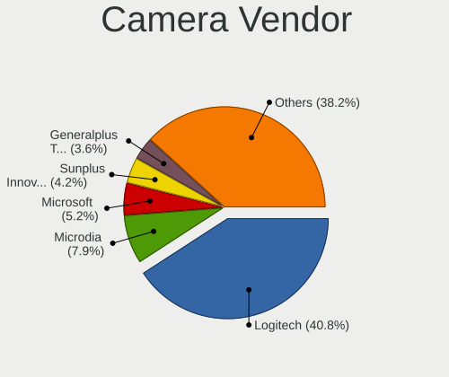

| Vendor                                 | Desktops | Percent |
|----------------------------------------|----------|---------|
| Logitech                               | 471      | 40.85%  |
| Microdia                               | 91       | 7.89%   |
| Microsoft                              | 60       | 5.2%    |
| Sunplus Innovation Technology          | 48       | 4.16%   |
| Generalplus Technology                 | 42       | 3.64%   |
| Samsung Electronics                    | 39       | 3.38%   |
| Creative Technology                    | 26       | 2.25%   |
| Z-Star Microelectronics                | 22       | 1.91%   |
| Apple                                  | 22       | 1.91%   |
| Realtek Semiconductor                  | 19       | 1.65%   |
| KYE Systems (Mouse Systems)            | 18       | 1.56%   |
| ARC International                      | 18       | 1.56%   |
| Jieli Technology                       | 17       | 1.47%   |
| Trust                                  | 14       | 1.21%   |
| MacroSilicon                           | 14       | 1.21%   |
| Chicony Electronics                    | 13       | 1.13%   |
| GEMBIRD                                | 12       | 1.04%   |
| AVerMedia Technologies                 | 9        | 0.78%   |
| Razer USA                              | 8        | 0.69%   |
| Genesys Logic                          | 8        | 0.69%   |
| eMeet                                  | 7        | 0.61%   |
| webcam                                 | 6        | 0.52%   |
| Novatek Microelectronics               | 6        | 0.52%   |
| Huawei Technologies                    | 6        | 0.52%   |
| Hewlett-Packard                        | 6        | 0.52%   |
| Cubeternet                             | 6        | 0.52%   |
| Aveo Technology                        | 6        | 0.52%   |
| Anker PowerConf C200                   | 6        | 0.52%   |
| SunplusIT                              | 5        | 0.43%   |
| IMC Networks                           | 5        | 0.43%   |
| Cheng Uei Precision Industry (Foxlink) | 5        | 0.43%   |
| SHENZHEN EMEET TECHNOLOGY              | 4        | 0.35%   |
| Quanta                                 | 4        | 0.35%   |
| Lenovo                                 | 4        | 0.35%   |
| Google                                 | 4        | 0.35%   |
| Valve Software                         | 3        | 0.26%   |
| Syntek                                 | 3        | 0.26%   |
| Sunplus IT                             | 3        | 0.26%   |
| Ruision                                | 3        | 0.26%   |
| Guillemot                              | 3        | 0.26%   |

Camera Model
------------

Camera device models

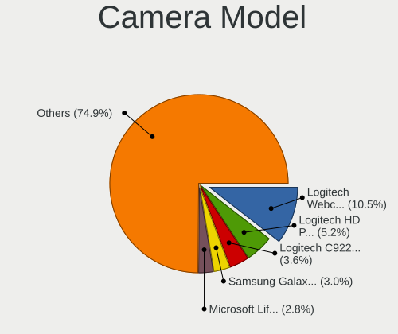

| Model                                                 | Desktops | Percent |
|-------------------------------------------------------|----------|---------|
| Logitech Webcam C270                                  | 122      | 10.54%  |
| Logitech HD Pro Webcam C920                           | 60       | 5.18%   |
| Logitech C922 Pro Stream Webcam                       | 42       | 3.63%   |
| Samsung Galaxy series, misc. (MTP mode)               | 35       | 3.02%   |
| Microsoft LifeCam HD-3000                             | 32       | 2.76%   |
| Logitech C920 PRO HD Webcam                           | 28       | 2.42%   |
| Microdia Webcam Vitade AF                             | 26       | 2.25%   |
| Generalplus GENERAL WEBCAM                            | 26       | 2.25%   |
| Microdia USB 2.0 Camera                               | 25       | 2.16%   |
| Logitech Webcam C310                                  | 25       | 2.16%   |
| Logitech HD Webcam C525                               | 19       | 1.64%   |
| Apple iPhone 5/5C/5S/6/SE/7/8/X                       | 19       | 1.64%   |
| Sunplus Full HD webcam                                | 17       | 1.47%   |
| Logitech Webcam C170                                  | 17       | 1.47%   |
| Logitech HD Webcam C615                               | 15       | 1.3%    |
| Logitech BRIO Ultra HD Webcam                         | 15       | 1.3%    |
| Jieli USB PHY 2.0                                     | 15       | 1.3%    |
| ARC International Camera                              | 14       | 1.21%   |
| Z-Star Venus USB2.0 Camera                            | 12       | 1.04%   |
| Sunplus Integrated Camera                             | 12       | 1.04%   |
| Logitech HD Webcam C910                               | 11       | 0.95%   |
| Generalplus 808 Camera #9 (web-cam mode)              | 11       | 0.95%   |
| Microdia Integrated Camera                            | 10       | 0.86%   |
| Microdia Camera                                       | 9        | 0.78%   |
| Logitech Logitech Webcam C925e                        | 9        | 0.78%   |
| MacroSilicon USB Video                                | 8        | 0.69%   |
| Logitech Webcam C930e                                 | 8        | 0.69%   |
| Logitech StreamCam                                    | 8        | 0.69%   |
| KYE Systems (Mouse Systems) USB 2.0 HD1080P PC Camera | 7        | 0.6%    |
| webcam webcam                                         | 6        | 0.52%   |
| Realtek FULL HD 1080P Webcam                          | 6        | 0.52%   |
| Razer USA Gaming Webcam [Kiyo]                        | 6        | 0.52%   |
| Novatek HP High Definition 2MP Webcam                 | 6        | 0.52%   |
| Microsoft LifeCam HD-5000                             | 6        | 0.52%   |
| Microsoft LifeCam Cinema                              | 6        | 0.52%   |
| Microdia Sonix USB 2.0 Camera                         | 6        | 0.52%   |
| Logitech Webcam C210                                  | 6        | 0.52%   |
| KYE Systems (Mouse Systems) Genius Webcam             | 6        | 0.52%   |
| Huawei HiCamera                                       | 6        | 0.52%   |
| GEMBIRD USB2.0 PC CAMERA                              | 6        | 0.52%   |

Security
--------

Fingerprint Vendor
------------------

Fingerprint sensor vendors

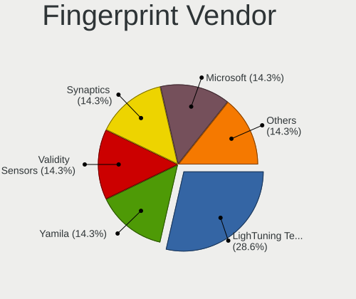

| Vendor                | Desktops | Percent |
|-----------------------|----------|---------|
| LighTuning Technology | 2        | 28.57%  |
| Yamila                | 1        | 14.29%  |
| Validity Sensors      | 1        | 14.29%  |
| Synaptics             | 1        | 14.29%  |
| Microsoft             | 1        | 14.29%  |
| Elan Microelectronics | 1        | 14.29%  |

Fingerprint Model
-----------------

Fingerprint sensor models

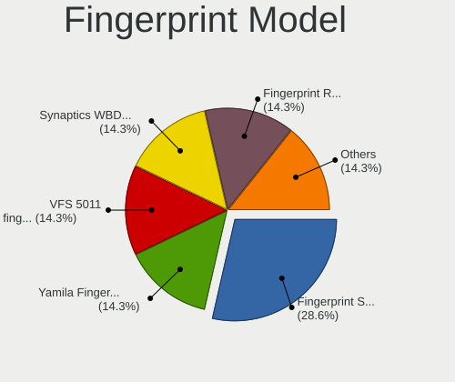

| Model                                        | Desktops | Percent |
|----------------------------------------------|----------|---------|
| LighTuning Fingerprint Sensor                | 2        | 28.57%  |
| Yamila Yamila Fingerprint Device             | 1        | 14.29%  |
| Validity Sensors VFS 5011 fingerprint sensor | 1        | 14.29%  |
| Synaptics  WBDI Fingerprint Reader - USB 052 | 1        | 14.29%  |
| Microsoft Fingerprint Reader                 | 1        | 14.29%  |
| Elan fingerprint sensor [FeinTech FPS00200]  | 1        | 14.29%  |

Chipcard Vendor
---------------

Chipcard module vendors

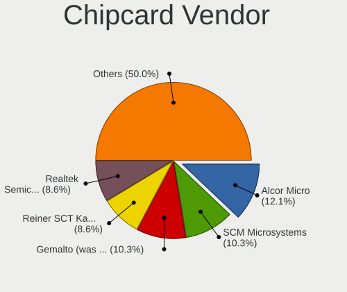

| Vendor                     | Desktops | Percent |
|----------------------------|----------|---------|
| Alcor Micro                | 7        | 12.07%  |
| SCM Microsystems           | 6        | 10.34%  |
| Gemalto (was Gemplus)      | 6        | 10.34%  |
| Reiner SCT Kartensysteme   | 5        | 8.62%   |
| Realtek Semiconductor      | 5        | 8.62%   |
| Chicony Electronics        | 4        | 6.9%    |
| Cherry                     | 4        | 6.9%    |
| Advanced Card Systems      | 4        | 6.9%    |
| Clay Logic                 | 3        | 5.17%   |
| Aladdin Knowledge Systems  | 3        | 5.17%   |
| Yubico.com                 | 2        | 3.45%   |
| OmniKey                    | 2        | 3.45%   |
| NXP Semiconductors         | 1        | 1.72%   |
| Lenovo                     | 1        | 1.72%   |
| Feitian Technologies       | 1        | 1.72%   |
| CREATOR                    | 1        | 1.72%   |
| Bit4id                     | 1        | 1.72%   |
| Athena Smartcard Solutions | 1        | 1.72%   |
| Aktiv                      | 1        | 1.72%   |

Chipcard Model
--------------

Chipcard module models

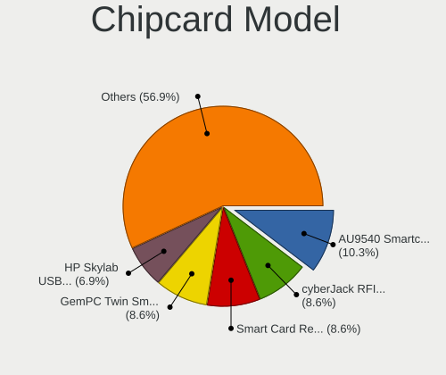

| Model                                                                      | Desktops | Percent |
|----------------------------------------------------------------------------|----------|---------|
| Alcor Micro AU9540 Smartcard Reader                                        | 6        | 10.34%  |
| Reiner SCT Kartensysteme cyberJack RFID basis contactless smartcard reader | 5        | 8.62%   |
| Realtek Semiconductor Smart Card Reader Interface                          | 5        | 8.62%   |
| Gemalto (was Gemplus) GemPC Twin SmartCard Reader                          | 5        | 8.62%   |
| Chicony Electronics HP Skylab USB Smartcard Keyboard                       | 4        | 6.9%    |
| SCM Microsystems SCR331-LC1 / SCR3310 SmartCard Reader                     | 3        | 5.17%   |
| Aladdin Knowledge Systems Token JC                                         | 3        | 5.17%   |
| OmniKey CardMan 3021 / 3121                                                | 2        | 3.45%   |
| Clay Logic Nitrokey Pro                                                    | 2        | 3.45%   |
| Cherry SmartCard Reader Keyboard KC 1000 SC                                | 2        | 3.45%   |
| Advanced Card Systems ACR122U                                              | 2        | 3.45%   |
| Yubico.com Yubikey 4/5 U2F+CCID                                            | 1        | 1.72%   |
| Yubico.com Yubikey 4/5 CCID                                                | 1        | 1.72%   |
| SCM Microsystems uTrust 3512 SAM slot Token                                | 1        | 1.72%   |
| SCM Microsystems SCR335 SmartCard Reader                                   | 1        | 1.72%   |
| SCM Microsystems SCR331 SmartCard Reader                                   | 1        | 1.72%   |
| NXP Semiconductors HUSCR-NFC                                               | 1        | 1.72%   |
| Lenovo Smartcard Keyboard                                                  | 1        | 1.72%   |
| Gemalto (was Gemplus) GemPC Key SmartCard Reader                           | 1        | 1.72%   |
| Feitian Technologies SCR301                                                | 1        | 1.72%   |
| CREATOR CRT-603(CZ1) CCR                                                   | 1        | 1.72%   |
| Clay Logic Nitrokey Start                                                  | 1        | 1.72%   |
| Cherry SmartTerminal XX1X                                                  | 1        | 1.72%   |
| Cherry SECURE BOARD 1.0                                                    | 1        | 1.72%   |
| Bit4id miniLector EVO                                                      | 1        | 1.72%   |
| Athena Smartcard Solutions ASEDrive V3C                                    | 1        | 1.72%   |
| Alcor Micro Watchdata W 1981                                               | 1        | 1.72%   |
| Aktiv Rutoken lite                                                         | 1        | 1.72%   |
| Advanced Card Systems ACR39U                                               | 1        | 1.72%   |
| Advanced Card Systems ACR38 SmartCard Reader                               | 1        | 1.72%   |

Unsupported
-----------

Unsupported Devices
-------------------

Total unsupported devices on board

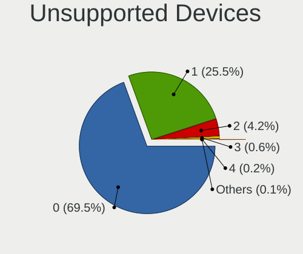

| Total | Desktops | Percent |
|-------|----------|---------|
| 0     | 5419     | 69.46%  |
| 1     | 1993     | 25.54%  |
| 2     | 324      | 4.15%   |
| 3     | 45       | 0.58%   |
| 4     | 13       | 0.17%   |
| 5     | 5        | 0.06%   |
| 6     | 2        | 0.03%   |
| 7     | 1        | 0.01%   |

Unsupported Device Types
------------------------

Types of unsupported devices

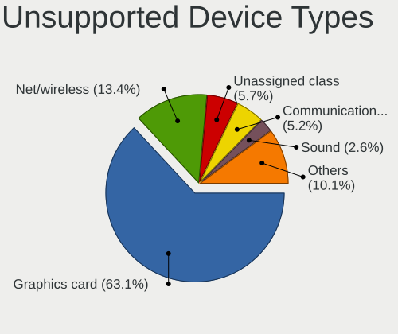

| Type                     | Desktops | Percent |
|--------------------------|----------|---------|
| Graphics card            | 1678     | 63.08%  |
| Net/wireless             | 356      | 13.38%  |
| Unassigned class         | 151      | 5.68%   |
| Communication controller | 138      | 5.19%   |
| Sound                    | 68       | 2.56%   |
| Multimedia controller    | 52       | 1.95%   |
| Bluetooth                | 48       | 1.8%    |
| Net/ethernet             | 36       | 1.35%   |
| Chipcard                 | 26       | 0.98%   |
| Card reader              | 19       | 0.71%   |
| Camera                   | 19       | 0.71%   |
| Network                  | 15       | 0.56%   |
| Storage/raid             | 13       | 0.49%   |
| Modem                    | 9        | 0.34%   |
| Storage/ide              | 8        | 0.3%    |
| Fingerprint reader       | 7        | 0.26%   |
| Dvb card                 | 5        | 0.19%   |
| Tv card                  | 3        | 0.11%   |
| Storage/nvme             | 3        | 0.11%   |
| Wireless                 | 2        | 0.08%   |
| Storage                  | 2        | 0.08%   |
| Video                    | 1        | 0.04%   |
| Firewire controller      | 1        | 0.04%   |

