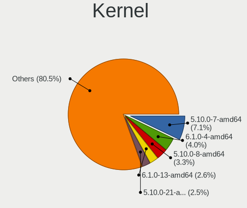
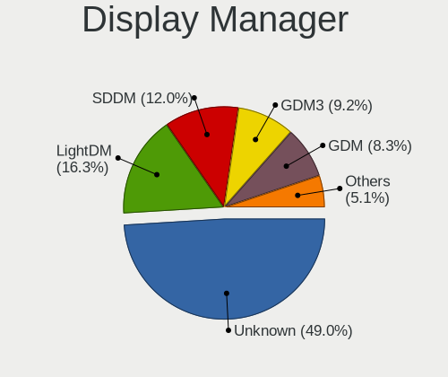
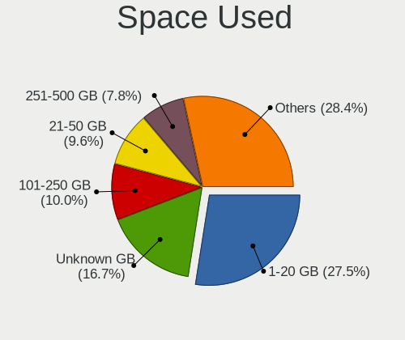
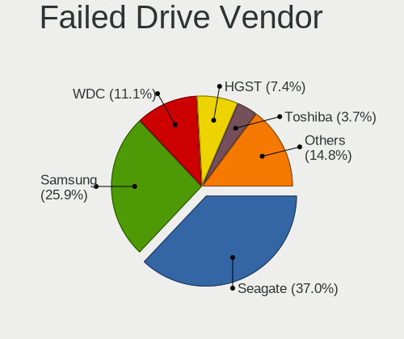
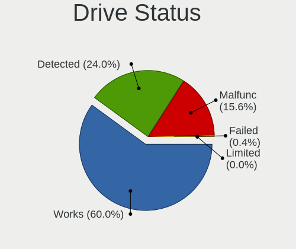
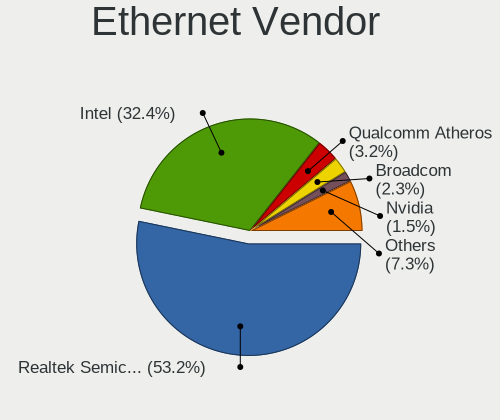

Debian - Tested Hardware & Statistics (Desktops)
------------------------------------------------

A project to collect tested hardware configurations for Debian.

Anyone can contribute to this report by the [hw-probe](https://github.com/linuxhw/hw-probe) tool:

    sudo -E hw-probe -all -upload

Please contribute! Especially if your hardware is rare.

Contents
--------

* [ Test Cases ](#test-cases)

* [ System ](#system)
  - [ OS                       ](#os)
  - [ OS Family                ](#os-family)
  - [ Kernel                   ](#kernel)
  - [ Kernel Family            ](#kernel-family)
  - [ Kernel Major Ver.        ](#kernel-major-ver)
  - [ Arch                     ](#arch)
  - [ DE                       ](#de)
  - [ Display Server           ](#display-server)
  - [ Display Manager          ](#display-manager)
  - [ OS Lang                  ](#os-lang)
  - [ Boot Mode                ](#boot-mode)
  - [ Filesystem               ](#filesystem)
  - [ Part. scheme             ](#part-scheme)
  - [ Dual Boot with Linux/BSD ](#dual-boot-with-linuxbsd)
  - [ Dual Boot (Win)          ](#dual-boot-win)

* [ Board ](#board)
  - [ Vendor                   ](#vendor)
  - [ Model                    ](#model)
  - [ Model Family             ](#model-family)
  - [ MFG Year                 ](#mfg-year)
  - [ Form Factor              ](#form-factor)
  - [ Secure Boot              ](#secure-boot)
  - [ Coreboot                 ](#coreboot)
  - [ RAM Size                 ](#ram-size)
  - [ RAM Used                 ](#ram-used)
  - [ Total Drives             ](#total-drives)
  - [ Has CD-ROM               ](#has-cd-rom)
  - [ Has Ethernet             ](#has-ethernet)
  - [ Has WiFi                 ](#has-wifi)
  - [ Has Bluetooth            ](#has-bluetooth)

* [ Location ](#location)
  - [ Country                  ](#country)
  - [ City                     ](#city)

* [ Drives ](#drives)
  - [ Drive Vendor             ](#drive-vendor)
  - [ Drive Model              ](#drive-model)
  - [ HDD Vendor               ](#hdd-vendor)
  - [ SSD Vendor               ](#ssd-vendor)
  - [ Drive Kind               ](#drive-kind)
  - [ Drive Connector          ](#drive-connector)
  - [ Drive Size               ](#drive-size)
  - [ Space Total              ](#space-total)
  - [ Space Used               ](#space-used)
  - [ Malfunc. Drives          ](#malfunc-drives)
  - [ Malfunc. Drive Vendor    ](#malfunc-drive-vendor)
  - [ Malfunc. HDD Vendor      ](#malfunc-hdd-vendor)
  - [ Malfunc. Drive Kind      ](#malfunc-drive-kind)
  - [ Failed Drives            ](#failed-drives)
  - [ Failed Drive Vendor      ](#failed-drive-vendor)
  - [ Drive Status             ](#drive-status)

* [ Storage controller ](#storage-controller)
  - [ Storage Vendor           ](#storage-vendor)
  - [ Storage Model            ](#storage-model)
  - [ Storage Kind             ](#storage-kind)

* [ Processor ](#processor)
  - [ CPU Vendor               ](#cpu-vendor)
  - [ CPU Model                ](#cpu-model)
  - [ CPU Model Family         ](#cpu-model-family)
  - [ CPU Cores                ](#cpu-cores)
  - [ CPU Sockets              ](#cpu-sockets)
  - [ CPU Threads              ](#cpu-threads)
  - [ CPU Op-Modes             ](#cpu-op-modes)
  - [ CPU Microcode            ](#cpu-microcode)
  - [ CPU Microarch            ](#cpu-microarch)

* [ Graphics ](#graphics)
  - [ GPU Vendor               ](#gpu-vendor)
  - [ GPU Model                ](#gpu-model)
  - [ GPU Combo                ](#gpu-combo)
  - [ GPU Driver               ](#gpu-driver)
  - [ GPU Memory               ](#gpu-memory)

* [ Monitor ](#monitor)
  - [ Monitor Vendor           ](#monitor-vendor)
  - [ Monitor Model            ](#monitor-model)
  - [ Monitor Resolution       ](#monitor-resolution)
  - [ Monitor Diagonal         ](#monitor-diagonal)
  - [ Monitor Width            ](#monitor-width)
  - [ Aspect Ratio             ](#aspect-ratio)
  - [ Monitor Area             ](#monitor-area)
  - [ Pixel Density            ](#pixel-density)
  - [ Multiple Monitors        ](#multiple-monitors)

* [ Network ](#network)
  - [ Net Controller Vendor    ](#net-controller-vendor)
  - [ Net Controller Model     ](#net-controller-model)
  - [ Wireless Vendor          ](#wireless-vendor)
  - [ Wireless Model           ](#wireless-model)
  - [ Ethernet Vendor          ](#ethernet-vendor)
  - [ Ethernet Model           ](#ethernet-model)
  - [ Net Controller Kind      ](#net-controller-kind)
  - [ Used Controller          ](#used-controller)
  - [ NICs                     ](#nics)
  - [ IPv6                     ](#ipv6)

* [ Bluetooth ](#bluetooth)
  - [ Bluetooth Vendor         ](#bluetooth-vendor)
  - [ Bluetooth Model          ](#bluetooth-model)

* [ Sound ](#sound)
  - [ Sound Vendor             ](#sound-vendor)
  - [ Sound Model              ](#sound-model)

* [ Memory ](#memory)
  - [ Memory Vendor            ](#memory-vendor)
  - [ Memory Model             ](#memory-model)
  - [ Memory Kind              ](#memory-kind)
  - [ Memory Form Factor       ](#memory-form-factor)
  - [ Memory Size              ](#memory-size)
  - [ Memory Speed             ](#memory-speed)

* [ Printers & scanners ](#printers--scanners)
  - [ Printer Vendor           ](#printer-vendor)
  - [ Printer Model            ](#printer-model)
  - [ Scanner Vendor           ](#scanner-vendor)
  - [ Scanner Model            ](#scanner-model)

* [ Camera ](#camera)
  - [ Camera Vendor            ](#camera-vendor)
  - [ Camera Model             ](#camera-model)

* [ Security ](#security)
  - [ Fingerprint Vendor       ](#fingerprint-vendor)
  - [ Fingerprint Model        ](#fingerprint-model)
  - [ Chipcard Vendor          ](#chipcard-vendor)
  - [ Chipcard Model           ](#chipcard-model)

* [ Unsupported ](#unsupported)
  - [ Unsupported Devices      ](#unsupported-devices)
  - [ Unsupported Device Types ](#unsupported-device-types)

Test Cases
----------

Total: 3176

| Vendor        | Model                       | Probe                                                      | Date         |
|---------------|-----------------------------|------------------------------------------------------------|--------------|
| ASUSTek       | PRIME B550M-A               | [379c6be15c](https://linux-hardware.org/?probe=379c6be15c) | May 01, 2022 |
| ASUSTek       | PRIME B550M-A               | [620c550b04](https://linux-hardware.org/?probe=620c550b04) | May 01, 2022 |
| MSI           | B560M-A PRO                 | [21dbd84bbc](https://linux-hardware.org/?probe=21dbd84bbc) | Apr 30, 2022 |
| ASRock        | A300M-STX                   | [1c72c0839b](https://linux-hardware.org/?probe=1c72c0839b) | Apr 30, 2022 |
| MSI           | H87I                        | [af4a26a5ea](https://linux-hardware.org/?probe=af4a26a5ea) | Apr 30, 2022 |
| MSI           | MPG X570 GAMING PLUS        | [af01f27647](https://linux-hardware.org/?probe=af01f27647) | Apr 30, 2022 |
| HP            | 18E7                        | [90a161bd80](https://linux-hardware.org/?probe=90a161bd80) | Apr 30, 2022 |
| ASUSTek       | P8Z68-V                     | [e6557824cb](https://linux-hardware.org/?probe=e6557824cb) | Apr 30, 2022 |
| Lenovo        | MAHOBAY NOK                 | [ab21675303](https://linux-hardware.org/?probe=ab21675303) | Apr 29, 2022 |
| Supermicro    | X7DB8                       | [a2dd962374](https://linux-hardware.org/?probe=a2dd962374) | Apr 29, 2022 |
| Supermicro    | X11SSH-F                    | [0d475e91f3](https://linux-hardware.org/?probe=0d475e91f3) | Apr 29, 2022 |
| HARDKERNEL    | ODROID-H2                   | [c3303164ff](https://linux-hardware.org/?probe=c3303164ff) | Apr 29, 2022 |
| MSI           | H110M PRO-VD                | [e750916955](https://linux-hardware.org/?probe=e750916955) | Apr 29, 2022 |
| Gigabyte      | X570 AORUS ULTRA            | [6bb8f4af30](https://linux-hardware.org/?probe=6bb8f4af30) | Apr 29, 2022 |
| Gigabyte      | B450M DS3H V2               | [94a47b7e85](https://linux-hardware.org/?probe=94a47b7e85) | Apr 28, 2022 |
| ASUSTek       | H110M-D D3                  | [e94f15dbb8](https://linux-hardware.org/?probe=e94f15dbb8) | Apr 27, 2022 |
| Dell          | 0M5DCD A00                  | [f420f53eca](https://linux-hardware.org/?probe=f420f53eca) | Apr 27, 2022 |
| Intel         | DH61BF AAG81311-101         | [f40f12b9be](https://linux-hardware.org/?probe=f40f12b9be) | Apr 27, 2022 |
| Dell          | 0M5DCD A00                  | [a8752656c1](https://linux-hardware.org/?probe=a8752656c1) | Apr 27, 2022 |
| ASUSTek       | Z97M-PLUS/BR                | [c82cd4f476](https://linux-hardware.org/?probe=c82cd4f476) | Apr 27, 2022 |
| ASRockRack    | B565D4-V1L                  | [bf0b5a06c9](https://linux-hardware.org/?probe=bf0b5a06c9) | Apr 27, 2022 |
| ASUSTek       | H110M-D D3                  | [abc1b924c9](https://linux-hardware.org/?probe=abc1b924c9) | Apr 27, 2022 |
| ASUSTek       | Z97M-PLUS/BR                | [8dafe7350b](https://linux-hardware.org/?probe=8dafe7350b) | Apr 27, 2022 |
| MSI           | Z370 SLI PLUS               | [75dbc4ddab](https://linux-hardware.org/?probe=75dbc4ddab) | Apr 27, 2022 |
| Gigabyte      | H67MA-USB3-B3               | [f2fb45ef53](https://linux-hardware.org/?probe=f2fb45ef53) | Apr 26, 2022 |
| Gigabyte      | H67MA-USB3-B3               | [d1e23f1023](https://linux-hardware.org/?probe=d1e23f1023) | Apr 26, 2022 |
| ASRock        | G31M-VS2                    | [912aa8341f](https://linux-hardware.org/?probe=912aa8341f) | Apr 25, 2022 |
| ASUSTek       | P5KPL-AM EPU                | [71c83c7998](https://linux-hardware.org/?probe=71c83c7998) | Apr 25, 2022 |
| ASUSTek       | PRO A320M-R WI-FI           | [0cbc3290f0](https://linux-hardware.org/?probe=0cbc3290f0) | Apr 25, 2022 |
| Pegatron      | Narra6                      | [0bfaba2999](https://linux-hardware.org/?probe=0bfaba2999) | Apr 25, 2022 |
| Supermicro    | X7DWT                       | [d7d46c682c](https://linux-hardware.org/?probe=d7d46c682c) | Apr 25, 2022 |
| Supermicro    | X7DWT                       | [4570a2caf7](https://linux-hardware.org/?probe=4570a2caf7) | Apr 25, 2022 |
| Foxconn       | 2ABF                        | [a7f5507dcd](https://linux-hardware.org/?probe=a7f5507dcd) | Apr 24, 2022 |
| Foxconn       | 2ABF                        | [e039df74b3](https://linux-hardware.org/?probe=e039df74b3) | Apr 24, 2022 |
| Gigabyte      | H110M-S2PV-CF               | [d076b5c763](https://linux-hardware.org/?probe=d076b5c763) | Apr 24, 2022 |
| MSI           | E350IA-E45                  | [8271a7f1d5](https://linux-hardware.org/?probe=8271a7f1d5) | Apr 23, 2022 |
| Intel         | X99                         | [1c9a508130](https://linux-hardware.org/?probe=1c9a508130) | Apr 23, 2022 |
| MSI           | E350IA-E45                  | [da7d376e11](https://linux-hardware.org/?probe=da7d376e11) | Apr 23, 2022 |
| Unknown       | Unknown                     | [5d54074527](https://linux-hardware.org/?probe=5d54074527) | Apr 23, 2022 |
| Dell          | 0GY6Y8 A00                  | [cb93a4a05d](https://linux-hardware.org/?probe=cb93a4a05d) | Apr 23, 2022 |
| Supermicro    | X5DP8                       | [991180636d](https://linux-hardware.org/?probe=991180636d) | Apr 22, 2022 |
| Supermicro    | X5DP8                       | [3e50d9b6b4](https://linux-hardware.org/?probe=3e50d9b6b4) | Apr 22, 2022 |
| Dell          | 0HY9JP A00                  | [40d59bce4b](https://linux-hardware.org/?probe=40d59bce4b) | Apr 22, 2022 |
| Biostar       | TB250-BTC                   | [dd7f66f6dc](https://linux-hardware.org/?probe=dd7f66f6dc) | Apr 22, 2022 |
| Dell          | 073MMW A03                  | [f3ecf74145](https://linux-hardware.org/?probe=f3ecf74145) | Apr 22, 2022 |
| MSI           | 970A-G45                    | [35f8f0652d](https://linux-hardware.org/?probe=35f8f0652d) | Apr 21, 2022 |
| ASRock        | H61M-VG4                    | [a2452e4824](https://linux-hardware.org/?probe=a2452e4824) | Apr 21, 2022 |
| Gigabyte      | B550 AORUS ELITE V2         | [cb4bc274b3](https://linux-hardware.org/?probe=cb4bc274b3) | Apr 21, 2022 |
| Unknown       | RS780-SB700                 | [eb3aa5fa60](https://linux-hardware.org/?probe=eb3aa5fa60) | Apr 20, 2022 |
| ASUSTek       | M5A97                       | [8a262ac580](https://linux-hardware.org/?probe=8a262ac580) | Apr 19, 2022 |
| HP            | 18E7                        | [5f675779f1](https://linux-hardware.org/?probe=5f675779f1) | Apr 19, 2022 |
| ASUSTek       | M5A97                       | [3a20d298f9](https://linux-hardware.org/?probe=3a20d298f9) | Apr 19, 2022 |
| Intel         | X79G V2.x                   | [497807c732](https://linux-hardware.org/?probe=497807c732) | Apr 18, 2022 |
| Gigabyte      | B365M DS3H                  | [ed62d97841](https://linux-hardware.org/?probe=ed62d97841) | Apr 18, 2022 |
| ASUSTek       | PRIME H510M-A               | [59fb2af2c2](https://linux-hardware.org/?probe=59fb2af2c2) | Apr 18, 2022 |
| ASUSTek       | PRIME X399-A                | [e595903b64](https://linux-hardware.org/?probe=e595903b64) | Apr 18, 2022 |
| MSI           | G41M-P33 Combo              | [b3c127802c](https://linux-hardware.org/?probe=b3c127802c) | Apr 18, 2022 |
| ASUSTek       | H87-PLUS                    | [10e97d2168](https://linux-hardware.org/?probe=10e97d2168) | Apr 18, 2022 |
| Gigabyte      | A320M-H-CF                  | [6247b19a2f](https://linux-hardware.org/?probe=6247b19a2f) | Apr 18, 2022 |
| ASUSTek       | TUF Z390-PLUS GAMING        | [dddd6b6edd](https://linux-hardware.org/?probe=dddd6b6edd) | Apr 18, 2022 |
| Gigabyte      | M61PME-S2P                  | [c354af5ec4](https://linux-hardware.org/?probe=c354af5ec4) | Apr 17, 2022 |
| J&W           | J1900T                      | [7c87f17ed7](https://linux-hardware.org/?probe=7c87f17ed7) | Apr 17, 2022 |
| ASUSTek       | PRIME X399-A                | [b2fe9a09fd](https://linux-hardware.org/?probe=b2fe9a09fd) | Apr 17, 2022 |
| MSI           | B450I GAMING PLUS MAX WI... | [f0d5c82d74](https://linux-hardware.org/?probe=f0d5c82d74) | Apr 17, 2022 |
| Dell          | 0VHXCD A03                  | [290987223e](https://linux-hardware.org/?probe=290987223e) | Apr 16, 2022 |
| Gigabyte      | B450M DS3H-CF               | [c8161370ea](https://linux-hardware.org/?probe=c8161370ea) | Apr 15, 2022 |
| HP            | 2129                        | [be64efcffd](https://linux-hardware.org/?probe=be64efcffd) | Apr 15, 2022 |
| ASRock        | G41M-VGS3                   | [62f424c896](https://linux-hardware.org/?probe=62f424c896) | Apr 15, 2022 |
| MSI           | B85I GAMING                 | [be865001b9](https://linux-hardware.org/?probe=be865001b9) | Apr 15, 2022 |
| Gigabyte      | B550I AORUS PRO AX          | [14f5389e9e](https://linux-hardware.org/?probe=14f5389e9e) | Apr 15, 2022 |
| ASUSTek       | M5A78L-M LX/BR              | [83dda83cdf](https://linux-hardware.org/?probe=83dda83cdf) | Apr 14, 2022 |
| ASUSTek       | M5A78L-M LX/BR              | [92eaa72b3c](https://linux-hardware.org/?probe=92eaa72b3c) | Apr 14, 2022 |
| Gigabyte      | B85M-D3H                    | [a0c2314e31](https://linux-hardware.org/?probe=a0c2314e31) | Apr 14, 2022 |
| HP            | ProLiant ML330 G6           | [a62736690a](https://linux-hardware.org/?probe=a62736690a) | Apr 14, 2022 |
| Dell          | 0Y2MRG A00                  | [47f495eda5](https://linux-hardware.org/?probe=47f495eda5) | Apr 14, 2022 |
| Lenovo        | 30C9 SDK0J40697 WIN 3305... | [d00bde2a05](https://linux-hardware.org/?probe=d00bde2a05) | Apr 14, 2022 |
| Lenovo        | 30D0 SDK0J40697 WIN 3305... | [91a7810a37](https://linux-hardware.org/?probe=91a7810a37) | Apr 14, 2022 |
| ASUSTek       | Z97-A                       | [df33a057b6](https://linux-hardware.org/?probe=df33a057b6) | Apr 13, 2022 |
| ASUSTek       | PRIME H310M-A R2.0          | [4c86ab8c47](https://linux-hardware.org/?probe=4c86ab8c47) | Apr 13, 2022 |
| ASUSTek       | PRIME B450-PLUS             | [e3cc5e949a](https://linux-hardware.org/?probe=e3cc5e949a) | Apr 13, 2022 |
| ASUSTek       | Z97-A                       | [94783711b3](https://linux-hardware.org/?probe=94783711b3) | Apr 13, 2022 |
| ASRock        | H97 Pro4                    | [0ad016db29](https://linux-hardware.org/?probe=0ad016db29) | Apr 13, 2022 |
| ASUSTek       | PRIME X370-A                | [cb3eb74403](https://linux-hardware.org/?probe=cb3eb74403) | Apr 13, 2022 |
| ASUSTek       | PRIME A520M-K               | [58dab53fb1](https://linux-hardware.org/?probe=58dab53fb1) | Apr 13, 2022 |
| ASRockRack    | ROMED8-2T                   | [600b198520](https://linux-hardware.org/?probe=600b198520) | Apr 13, 2022 |
| MSI           | MAG X570 TOMAHAWK WIFI      | [11ca71a8e4](https://linux-hardware.org/?probe=11ca71a8e4) | Apr 13, 2022 |
| Gigabyte      | X570S I AORUS PRO AX        | [47267431ed](https://linux-hardware.org/?probe=47267431ed) | Apr 13, 2022 |
| Gigabyte      | B150M-D3H-CF                | [33cce38b5e](https://linux-hardware.org/?probe=33cce38b5e) | Apr 13, 2022 |
| ASUSTek       | P9X79                       | [b7a035ea6b](https://linux-hardware.org/?probe=b7a035ea6b) | Apr 13, 2022 |
| ASUSTek       | P8H61-M LX3 PLUS R2.0       | [123febbcd2](https://linux-hardware.org/?probe=123febbcd2) | Apr 13, 2022 |
| Gigabyte      | B560M DS3H V2               | [175d1ee5ad](https://linux-hardware.org/?probe=175d1ee5ad) | Apr 12, 2022 |
| Intel         | DP43TF AAE34878-401         | [69a9b1705c](https://linux-hardware.org/?probe=69a9b1705c) | Apr 12, 2022 |
| ASUSTek       | PRIME H510M-A               | [3cd8b545ab](https://linux-hardware.org/?probe=3cd8b545ab) | Apr 12, 2022 |
| Intel         | DN2820FYK H24582-201        | [401c412e61](https://linux-hardware.org/?probe=401c412e61) | Apr 12, 2022 |
| Gigabyte      | H61M-D2P-B3                 | [a8e2ef2c76](https://linux-hardware.org/?probe=a8e2ef2c76) | Apr 12, 2022 |
| ASRock        | Z97E-ITX/ac                 | [082a102be9](https://linux-hardware.org/?probe=082a102be9) | Apr 12, 2022 |
| ASRockRack    | X470D4U                     | [69fbad2150](https://linux-hardware.org/?probe=69fbad2150) | Apr 12, 2022 |
| ASRock        | AB350 Gaming-ITX/ac         | [b9f39d99ba](https://linux-hardware.org/?probe=b9f39d99ba) | Apr 12, 2022 |
| Intel         | DN2820FYK H24582-201        | [9618216033](https://linux-hardware.org/?probe=9618216033) | Apr 11, 2022 |
| Intel         | DN2820FYK H24582-201        | [10d0131978](https://linux-hardware.org/?probe=10d0131978) | Apr 11, 2022 |
| Intel         | DP43TF AAE34878-401         | [7ddb79a059](https://linux-hardware.org/?probe=7ddb79a059) | Apr 11, 2022 |
| Lenovo        | ThinkCentre M55p 8808D8U    | [7536bcd98d](https://linux-hardware.org/?probe=7536bcd98d) | Apr 11, 2022 |
| Gigabyte      | Z170X-Gaming 3              | [69eac21427](https://linux-hardware.org/?probe=69eac21427) | Apr 11, 2022 |
| MSI           | Z490-A PRO                  | [3e5dde6b49](https://linux-hardware.org/?probe=3e5dde6b49) | Apr 11, 2022 |
| PC Engines    | apu4                        | [601866ecaa](https://linux-hardware.org/?probe=601866ecaa) | Apr 11, 2022 |
| MSI           | MAG X570S TORPEDO MAX       | [8c2362aa24](https://linux-hardware.org/?probe=8c2362aa24) | Apr 11, 2022 |
| eMachines     | EL1850                      | [4c641c8e6a](https://linux-hardware.org/?probe=4c641c8e6a) | Apr 11, 2022 |
| MSI           | N3150I ECO                  | [afe5c622e2](https://linux-hardware.org/?probe=afe5c622e2) | Apr 11, 2022 |
| ASUSTek       | P6T                         | [579a4a7f83](https://linux-hardware.org/?probe=579a4a7f83) | Apr 10, 2022 |
| ASUSTek       | ProArt X570-CREATOR WIFI    | [e4fc7cc2cc](https://linux-hardware.org/?probe=e4fc7cc2cc) | Apr 10, 2022 |
| MSI           | A68HM-E33 V2                | [cfa5407b7f](https://linux-hardware.org/?probe=cfa5407b7f) | Apr 10, 2022 |
| ASRock        | A300M-STX                   | [6d3fe856b8](https://linux-hardware.org/?probe=6d3fe856b8) | Apr 10, 2022 |
| ASUSTek       | PRIME A320M-K               | [9cc7cc23d6](https://linux-hardware.org/?probe=9cc7cc23d6) | Apr 10, 2022 |
| ASUSTek       | PRIME A320M-K               | [3845180872](https://linux-hardware.org/?probe=3845180872) | Apr 10, 2022 |
| Dell          | 0MN1TX A02                  | [cf2e65caf4](https://linux-hardware.org/?probe=cf2e65caf4) | Apr 10, 2022 |
| Gigabyte      | GA-MA78GM-S2H               | [a56209b0c7](https://linux-hardware.org/?probe=a56209b0c7) | Apr 09, 2022 |
| Dell          | 0HY9JP A02                  | [84b46b3236](https://linux-hardware.org/?probe=84b46b3236) | Apr 09, 2022 |
| MACHINIST     | X99-RS9 V2.0                | [862e7ffc88](https://linux-hardware.org/?probe=862e7ffc88) | Apr 09, 2022 |
| MACHINIST     | X99-RS9 V2.0                | [e20b365083](https://linux-hardware.org/?probe=e20b365083) | Apr 09, 2022 |
| MSI           | B550M PRO-VDH               | [9597b0a2d9](https://linux-hardware.org/?probe=9597b0a2d9) | Apr 09, 2022 |
| Supermicro    | X9SRH-7F/7TF                | [ad534e1bb2](https://linux-hardware.org/?probe=ad534e1bb2) | Apr 09, 2022 |
| Fujitsu       | D3219-A1 S26361-D3219-A1    | [53afee4cf6](https://linux-hardware.org/?probe=53afee4cf6) | Apr 08, 2022 |
| ASUSTek       | PRIME H510M-A               | [7a337eb0a8](https://linux-hardware.org/?probe=7a337eb0a8) | Apr 08, 2022 |
| ASRockRack    | B565D4-V1L                  | [12f3bc72ea](https://linux-hardware.org/?probe=12f3bc72ea) | Apr 08, 2022 |
| Acer          | EG43M                       | [cf64046a46](https://linux-hardware.org/?probe=cf64046a46) | Apr 08, 2022 |
| ASUSTek       | H87M-PRO                    | [86b82467fd](https://linux-hardware.org/?probe=86b82467fd) | Apr 08, 2022 |
| Gigabyte      | B550M DS3H                  | [0291e8b387](https://linux-hardware.org/?probe=0291e8b387) | Apr 08, 2022 |
| Gigabyte      | X570 AORUS MASTER           | [40c5824930](https://linux-hardware.org/?probe=40c5824930) | Apr 08, 2022 |
| ASRock        | Z77 Extreme4                | [3524c0ef61](https://linux-hardware.org/?probe=3524c0ef61) | Apr 08, 2022 |
| ASUSTek       | TUF Gaming X570-PLUS        | [d75f38ec35](https://linux-hardware.org/?probe=d75f38ec35) | Apr 08, 2022 |
| MSI           | Z77A-GD65                   | [030e3f6ea9](https://linux-hardware.org/?probe=030e3f6ea9) | Apr 07, 2022 |
| MSI           | H81M-P33                    | [2dc40369ce](https://linux-hardware.org/?probe=2dc40369ce) | Apr 07, 2022 |
| Gigabyte      | B550M DS3H                  | [9f9fb57ade](https://linux-hardware.org/?probe=9f9fb57ade) | Apr 07, 2022 |
| ASUSTek       | PRIME H510M-K               | [3b8c5ecec8](https://linux-hardware.org/?probe=3b8c5ecec8) | Apr 07, 2022 |
| ASUSTek       | PRIME H510M-K               | [311f56085c](https://linux-hardware.org/?probe=311f56085c) | Apr 07, 2022 |
| Gigabyte      | H61M-D2P-B3                 | [686ef53bc5](https://linux-hardware.org/?probe=686ef53bc5) | Apr 07, 2022 |
| ASUSTek       | Z10PG-D16 Series            | [9076954881](https://linux-hardware.org/?probe=9076954881) | Apr 07, 2022 |
| ASRock        | Z390 Phantom Gaming 4S/a... | [836d139ea0](https://linux-hardware.org/?probe=836d139ea0) | Apr 07, 2022 |
| MSI           | B450-A PRO                  | [682206ff84](https://linux-hardware.org/?probe=682206ff84) | Apr 07, 2022 |
| Gigabyte      | H410M S2H                   | [eff608a49e](https://linux-hardware.org/?probe=eff608a49e) | Apr 06, 2022 |
| Gigabyte      | H410M S2H                   | [a2cbf77c20](https://linux-hardware.org/?probe=a2cbf77c20) | Apr 06, 2022 |
| Gigabyte      | H410M S2H                   | [281a36cc7d](https://linux-hardware.org/?probe=281a36cc7d) | Apr 06, 2022 |
| Gigabyte      | H410M S2H                   | [b498ef386c](https://linux-hardware.org/?probe=b498ef386c) | Apr 06, 2022 |
| Gigabyte      | H410M S2H                   | [5f0fbae656](https://linux-hardware.org/?probe=5f0fbae656) | Apr 06, 2022 |
| Gigabyte      | H410M S2H                   | [e543d9b013](https://linux-hardware.org/?probe=e543d9b013) | Apr 06, 2022 |
| Gigabyte      | H410M S2H                   | [0bfc08cf7d](https://linux-hardware.org/?probe=0bfc08cf7d) | Apr 06, 2022 |
| Gigabyte      | H410M S2H                   | [9e22b32d6b](https://linux-hardware.org/?probe=9e22b32d6b) | Apr 06, 2022 |
| Gigabyte      | H410M S2H                   | [d11fa87811](https://linux-hardware.org/?probe=d11fa87811) | Apr 06, 2022 |
| Gigabyte      | H410M S2H                   | [01f4e56f26](https://linux-hardware.org/?probe=01f4e56f26) | Apr 06, 2022 |
| Gigabyte      | H410M S2H                   | [360473d244](https://linux-hardware.org/?probe=360473d244) | Apr 06, 2022 |
| Gigabyte      | H410M S2H                   | [7154fae7e4](https://linux-hardware.org/?probe=7154fae7e4) | Apr 06, 2022 |
| Gigabyte      | H410M S2H                   | [b5dcbdd4b0](https://linux-hardware.org/?probe=b5dcbdd4b0) | Apr 06, 2022 |
| Gigabyte      | H410M S2H                   | [22e3c6f830](https://linux-hardware.org/?probe=22e3c6f830) | Apr 06, 2022 |
| Gigabyte      | H61M-D2P-B3                 | [aad4b24a04](https://linux-hardware.org/?probe=aad4b24a04) | Apr 06, 2022 |
| ASRock        | Z97 Pro3                    | [68397184cf](https://linux-hardware.org/?probe=68397184cf) | Apr 06, 2022 |
| MSI           | 2A9C                        | [d56d880fd1](https://linux-hardware.org/?probe=d56d880fd1) | Apr 05, 2022 |
| ASUSTek       | PRIME H510M-E               | [77b4a03b19](https://linux-hardware.org/?probe=77b4a03b19) | Apr 05, 2022 |
| Dell          | 0DR845                      | [d7fc0864f8](https://linux-hardware.org/?probe=d7fc0864f8) | Apr 05, 2022 |
| Dell          | 0HY9JP A02                  | [ed1cda9998](https://linux-hardware.org/?probe=ed1cda9998) | Apr 05, 2022 |
| Gigabyte      | H410M S2H                   | [0cf5e3004f](https://linux-hardware.org/?probe=0cf5e3004f) | Apr 05, 2022 |
| Lenovo        | 312A SDK0J40700 WIN 3258... | [a645768047](https://linux-hardware.org/?probe=a645768047) | Apr 05, 2022 |
| ASUSTek       | PRIME H510M-A               | [1737ff348a](https://linux-hardware.org/?probe=1737ff348a) | Apr 05, 2022 |
| ASUSTek       | P9X79                       | [d82eb40c27](https://linux-hardware.org/?probe=d82eb40c27) | Apr 05, 2022 |
| Gigabyte      | B450M S2H                   | [046d0eb6c8](https://linux-hardware.org/?probe=046d0eb6c8) | Apr 05, 2022 |
| ASUSTek       | TUF Gaming B560-PLUS WIF... | [db18e71352](https://linux-hardware.org/?probe=db18e71352) | Apr 05, 2022 |
| ASRock        | G31M-VS2                    | [e618635f7e](https://linux-hardware.org/?probe=e618635f7e) | Apr 04, 2022 |
| Acer          | Aspire M1470                | [6612952747](https://linux-hardware.org/?probe=6612952747) | Apr 04, 2022 |
| Lenovo        | ThinkCentre M55p 8808D8U    | [2553eb95aa](https://linux-hardware.org/?probe=2553eb95aa) | Apr 04, 2022 |
| Gigabyte      | H410M S2H                   | [02c8690b96](https://linux-hardware.org/?probe=02c8690b96) | Apr 04, 2022 |
| Gigabyte      | H410M S2H                   | [52cdca6be2](https://linux-hardware.org/?probe=52cdca6be2) | Apr 04, 2022 |
| Gigabyte      | H410M S2H                   | [04078826f9](https://linux-hardware.org/?probe=04078826f9) | Apr 04, 2022 |
| Gigabyte      | H410M S2H                   | [beff3d022a](https://linux-hardware.org/?probe=beff3d022a) | Apr 04, 2022 |
| Gigabyte      | H410M S2H                   | [b50bb2ee16](https://linux-hardware.org/?probe=b50bb2ee16) | Apr 04, 2022 |
| Gigabyte      | H410M S2H                   | [b78fd6db36](https://linux-hardware.org/?probe=b78fd6db36) | Apr 04, 2022 |
| Gigabyte      | H410M S2H                   | [7482990555](https://linux-hardware.org/?probe=7482990555) | Apr 04, 2022 |
| Gigabyte      | H410M S2H                   | [8b9056398a](https://linux-hardware.org/?probe=8b9056398a) | Apr 04, 2022 |
| Gigabyte      | H410M S2H                   | [6243da846e](https://linux-hardware.org/?probe=6243da846e) | Apr 04, 2022 |
| Gigabyte      | H410M S2H                   | [42553daa02](https://linux-hardware.org/?probe=42553daa02) | Apr 04, 2022 |
| Gigabyte      | H410M S2H                   | [f8fa4a854a](https://linux-hardware.org/?probe=f8fa4a854a) | Apr 04, 2022 |
| Gigabyte      | H410M S2H                   | [5e53b0911d](https://linux-hardware.org/?probe=5e53b0911d) | Apr 04, 2022 |
| Gigabyte      | H410M S2H                   | [1029c094d5](https://linux-hardware.org/?probe=1029c094d5) | Apr 04, 2022 |
| Gigabyte      | H410M S2H                   | [fcc9bc2d30](https://linux-hardware.org/?probe=fcc9bc2d30) | Apr 04, 2022 |
| Acer          | Aspire M1470                | [d32d46984e](https://linux-hardware.org/?probe=d32d46984e) | Apr 04, 2022 |
| Gigabyte      | H410M S2H                   | [a88a724049](https://linux-hardware.org/?probe=a88a724049) | Apr 04, 2022 |
| Acer          | Revo RL80                   | [414f1870b3](https://linux-hardware.org/?probe=414f1870b3) | Apr 04, 2022 |
| Dell          | 0NDYHG A01                  | [26629406de](https://linux-hardware.org/?probe=26629406de) | Apr 03, 2022 |
| Packard Be... | Cuba MS-7301                | [1a89e021cd](https://linux-hardware.org/?probe=1a89e021cd) | Apr 03, 2022 |
| Unknown       | Unknown                     | [aac8a6f7e4](https://linux-hardware.org/?probe=aac8a6f7e4) | Apr 03, 2022 |
| Medion        | Z370H4-EM                   | [0f9b0bf367](https://linux-hardware.org/?probe=0f9b0bf367) | Apr 03, 2022 |
| Medion        | Z370H4-EM                   | [64df85bce8](https://linux-hardware.org/?probe=64df85bce8) | Apr 03, 2022 |
| MSI           | A88XM-E35 V2                | [2366707e2c](https://linux-hardware.org/?probe=2366707e2c) | Apr 03, 2022 |
| MSI           | MEG X570 UNIFY              | [0c57600526](https://linux-hardware.org/?probe=0c57600526) | Apr 03, 2022 |
| ASUSTek       | P5KPL-AM-CKD-VISUM-SI       | [42038ab400](https://linux-hardware.org/?probe=42038ab400) | Apr 02, 2022 |
| Lenovo        | QiTianM7150                 | [a6a37565b7](https://linux-hardware.org/?probe=a6a37565b7) | Apr 02, 2022 |
| Fujitsu       | D3221-A1 S26361-D3221-A1    | [981ddceae1](https://linux-hardware.org/?probe=981ddceae1) | Apr 02, 2022 |
| Fujitsu       | D3221-A1 S26361-D3221-A1    | [b88c7aef34](https://linux-hardware.org/?probe=b88c7aef34) | Apr 02, 2022 |
| ASUSTek       | P5KPL-AM-CKD-VISUM-SI       | [ba7a9c106a](https://linux-hardware.org/?probe=ba7a9c106a) | Apr 02, 2022 |
| Wistron       | ProLiant ML110 G5           | [ccea23c3b5](https://linux-hardware.org/?probe=ccea23c3b5) | Apr 01, 2022 |
| Wistron       | ProLiant ML110 G5           | [4c01aec65d](https://linux-hardware.org/?probe=4c01aec65d) | Apr 01, 2022 |
| Gigabyte      | H81M-S1                     | [08db8019f3](https://linux-hardware.org/?probe=08db8019f3) | Apr 01, 2022 |
| ASRock        | G31M-S                      | [33737ec5ba](https://linux-hardware.org/?probe=33737ec5ba) | Apr 01, 2022 |
| Lenovo        | SHARKBAY 0B98401 WIN        | [5215972642](https://linux-hardware.org/?probe=5215972642) | Mar 31, 2022 |
| Lenovo        | ThinkCentre M91p 4524AS3    | [c338f4ffd4](https://linux-hardware.org/?probe=c338f4ffd4) | Mar 31, 2022 |
| Gigabyte      | B360M H                     | [c6d64363b9](https://linux-hardware.org/?probe=c6d64363b9) | Mar 31, 2022 |
| Gigabyte      | H81M-S2V                    | [f2dc785121](https://linux-hardware.org/?probe=f2dc785121) | Mar 31, 2022 |
| Dell          | 0MN1TX A02                  | [f9be94fa9b](https://linux-hardware.org/?probe=f9be94fa9b) | Mar 31, 2022 |
| Dell          | OptiPlex 7010               | [f1167c797e](https://linux-hardware.org/?probe=f1167c797e) | Mar 31, 2022 |
| ASRock        | FM2A88X-ITX+                | [edf21d564c](https://linux-hardware.org/?probe=edf21d564c) | Mar 30, 2022 |
| MSI           | H110M PRO-VD                | [e299a5abe8](https://linux-hardware.org/?probe=e299a5abe8) | Mar 30, 2022 |
| ASUSTek       | H81M-K                      | [cefeb9762e](https://linux-hardware.org/?probe=cefeb9762e) | Mar 30, 2022 |
| Gigabyte      | P35-DS3L                    | [8167ee62f2](https://linux-hardware.org/?probe=8167ee62f2) | Mar 30, 2022 |
| Gigabyte      | Z270-Gaming K3              | [50780eda28](https://linux-hardware.org/?probe=50780eda28) | Mar 30, 2022 |
| Lenovo        | Myrtle CRB SDK0J40700 WI... | [078946745f](https://linux-hardware.org/?probe=078946745f) | Mar 30, 2022 |
| ASUSTek       | TUF Gaming X570-PRO         | [3e182ccdbe](https://linux-hardware.org/?probe=3e182ccdbe) | Mar 30, 2022 |
| ASUSTek       | PRIME B460M-A               | [519c65be70](https://linux-hardware.org/?probe=519c65be70) | Mar 29, 2022 |
| ASUSTek       | PRIME B460M-A               | [f21f3af1ca](https://linux-hardware.org/?probe=f21f3af1ca) | Mar 29, 2022 |
| MSI           | H81M-P33                    | [853b5b2236](https://linux-hardware.org/?probe=853b5b2236) | Mar 29, 2022 |
| Foxconn       | H61MXL-K                    | [50b743dab8](https://linux-hardware.org/?probe=50b743dab8) | Mar 29, 2022 |
| ASUSTek       | PRIME H310M-R R2.0          | [0ff3da859e](https://linux-hardware.org/?probe=0ff3da859e) | Mar 29, 2022 |
| ASUSTek       | P6T                         | [00868ae20c](https://linux-hardware.org/?probe=00868ae20c) | Mar 29, 2022 |
| Gigabyte      | H97M-HD3                    | [9027088a52](https://linux-hardware.org/?probe=9027088a52) | Mar 28, 2022 |
| Gigabyte      | H97M-HD3                    | [fce2591fbd](https://linux-hardware.org/?probe=fce2591fbd) | Mar 28, 2022 |
| ASUSTek       | PRIME H310M-R R2.0          | [7fe672d3a9](https://linux-hardware.org/?probe=7fe672d3a9) | Mar 28, 2022 |
| ASUSTek       | B85-PRO GAMER               | [44913af0e4](https://linux-hardware.org/?probe=44913af0e4) | Mar 27, 2022 |
| Lenovo        | 361A SDK0K17763 WIN         | [334c4c0ff2](https://linux-hardware.org/?probe=334c4c0ff2) | Mar 27, 2022 |
| Lenovo        | ThinkServer TS440           | [a356a33d0a](https://linux-hardware.org/?probe=a356a33d0a) | Mar 27, 2022 |
| ASRock        | B550M-ITX/ac                | [8766d8c04e](https://linux-hardware.org/?probe=8766d8c04e) | Mar 27, 2022 |
| Dell          | 0PC5F7 A03                  | [aeb87f174c](https://linux-hardware.org/?probe=aeb87f174c) | Mar 27, 2022 |
| Gigabyte      | H61M-USB3H                  | [f852a0cb0d](https://linux-hardware.org/?probe=f852a0cb0d) | Mar 26, 2022 |
| ASRock        | FM2A88X-ITX+                | [dc35b742d2](https://linux-hardware.org/?probe=dc35b742d2) | Mar 26, 2022 |
| ASRock        | B550M-ITX/ac                | [156a0ab630](https://linux-hardware.org/?probe=156a0ab630) | Mar 26, 2022 |
| Lenovo        | ThinkCentre M91p 4524AS3    | [7e1b536f6b](https://linux-hardware.org/?probe=7e1b536f6b) | Mar 26, 2022 |
| Biostar       | B450MH                      | [9152345747](https://linux-hardware.org/?probe=9152345747) | Mar 26, 2022 |
| Fujitsu       | D3221-A1 S26361-D3221-A1    | [c8a76eb9ae](https://linux-hardware.org/?probe=c8a76eb9ae) | Mar 25, 2022 |
| Gigabyte      | H510M H                     | [d809ca0f7a](https://linux-hardware.org/?probe=d809ca0f7a) | Mar 25, 2022 |
| Intel         | B75                         | [9f73efdcc8](https://linux-hardware.org/?probe=9f73efdcc8) | Mar 25, 2022 |
| Lenovo        | SHARKBAY SDK0E50510 WIN     | [9da89c589d](https://linux-hardware.org/?probe=9da89c589d) | Mar 24, 2022 |
| ASUSTek       | PRIME H510M-A               | [9590cc2288](https://linux-hardware.org/?probe=9590cc2288) | Mar 24, 2022 |
| Biostar       | G31D-M7                     | [9882f292ea](https://linux-hardware.org/?probe=9882f292ea) | Mar 24, 2022 |
| Dell          | 0Y7WYT A00                  | [2376c46c04](https://linux-hardware.org/?probe=2376c46c04) | Mar 23, 2022 |
| ASUSTek       | TUF B450M-PLUS GAMING       | [847b9e1fbb](https://linux-hardware.org/?probe=847b9e1fbb) | Mar 23, 2022 |
| Lenovo        | SHARKBAY SDK0E50510 WIN     | [7a02e1b55c](https://linux-hardware.org/?probe=7a02e1b55c) | Mar 22, 2022 |
| Gigabyte      | M61PME-S2P                  | [ccb3b312a1](https://linux-hardware.org/?probe=ccb3b312a1) | Mar 22, 2022 |
| HP            | 1589                        | [a97fa22164](https://linux-hardware.org/?probe=a97fa22164) | Mar 22, 2022 |
| Digiboard     | MPxx                        | [b3bb9ff288](https://linux-hardware.org/?probe=b3bb9ff288) | Mar 22, 2022 |
| MSI           | 760GM -E51                  | [fd746ce3ee](https://linux-hardware.org/?probe=fd746ce3ee) | Mar 21, 2022 |
| ASUSTek       | H81M-E                      | [069849c461](https://linux-hardware.org/?probe=069849c461) | Mar 21, 2022 |
| MSI           | B560-A PRO                  | [70f24bb773](https://linux-hardware.org/?probe=70f24bb773) | Mar 21, 2022 |
| MSI           | E350IA-E45                  | [84a19b6203](https://linux-hardware.org/?probe=84a19b6203) | Mar 21, 2022 |
| ASUSTek       | PRIME H510M-A               | [9c0d4c37d8](https://linux-hardware.org/?probe=9c0d4c37d8) | Mar 21, 2022 |
| Gigabyte      | H81M-S2V                    | [d8f482f916](https://linux-hardware.org/?probe=d8f482f916) | Mar 21, 2022 |
| Dell          | 07T4MC A09                  | [ef5f0dcfe7](https://linux-hardware.org/?probe=ef5f0dcfe7) | Mar 21, 2022 |
| HP            | 18E7                        | [727446a2df](https://linux-hardware.org/?probe=727446a2df) | Mar 20, 2022 |
| Gigabyte      | B450M GAMING                | [9cc0fc6cd0](https://linux-hardware.org/?probe=9cc0fc6cd0) | Mar 19, 2022 |
| MSI           | A320M-A PRO MAX             | [b77a3343c9](https://linux-hardware.org/?probe=b77a3343c9) | Mar 19, 2022 |
| Dell          | 0P611C A00                  | [0c433bca90](https://linux-hardware.org/?probe=0c433bca90) | Mar 18, 2022 |
| Gigabyte      | G31M-S2L                    | [b9822ea50b](https://linux-hardware.org/?probe=b9822ea50b) | Mar 18, 2022 |
| ASRock        | Z87 Pro4                    | [7c46cc65dc](https://linux-hardware.org/?probe=7c46cc65dc) | Mar 18, 2022 |
| MSI           | J1900I                      | [991f20b3b8](https://linux-hardware.org/?probe=991f20b3b8) | Mar 17, 2022 |
| ASUSTek       | P5K/EPU                     | [38de085421](https://linux-hardware.org/?probe=38de085421) | Mar 17, 2022 |
| Intel         | DH67BL AAG10189-211         | [90b9116ab3](https://linux-hardware.org/?probe=90b9116ab3) | Mar 17, 2022 |
| ASUSTek       | PRIME H510M-A               | [d71d1c794b](https://linux-hardware.org/?probe=d71d1c794b) | Mar 17, 2022 |
| Gigabyte      | B360M H                     | [3190c29544](https://linux-hardware.org/?probe=3190c29544) | Mar 17, 2022 |
| Unknown       | Unknown                     | [1aaee68ff4](https://linux-hardware.org/?probe=1aaee68ff4) | Mar 16, 2022 |
| MSI           | 760GM -E51                  | [0d9d56531d](https://linux-hardware.org/?probe=0d9d56531d) | Mar 16, 2022 |
| ASUSTek       | PRIME Z690-A                | [228a532955](https://linux-hardware.org/?probe=228a532955) | Mar 16, 2022 |
| Dell          | 0P611C A00                  | [72593cf88a](https://linux-hardware.org/?probe=72593cf88a) | Mar 16, 2022 |
| ASUSTek       | PRIME H510M-A               | [fedff7063c](https://linux-hardware.org/?probe=fedff7063c) | Mar 16, 2022 |
| MSI           | H110M PRO-VD                | [c187336160](https://linux-hardware.org/?probe=c187336160) | Mar 16, 2022 |
| MSI           | MAG X570 TOMAHAWK WIFI      | [11bc08ed1f](https://linux-hardware.org/?probe=11bc08ed1f) | Mar 16, 2022 |
| HP            | ProLiant MicroServer Gen... | [9da39d2356](https://linux-hardware.org/?probe=9da39d2356) | Mar 15, 2022 |
| ASUSTek       | SABERTOOTH 990FX R2.0       | [539ebb7dd9](https://linux-hardware.org/?probe=539ebb7dd9) | Mar 15, 2022 |
| ASUSTek       | B85M-G                      | [aa7912e58f](https://linux-hardware.org/?probe=aa7912e58f) | Mar 15, 2022 |
| Dell          | 0T7D40 A01                  | [192926e183](https://linux-hardware.org/?probe=192926e183) | Mar 14, 2022 |
| ASUSTek       | B85M-G                      | [cc44f7c610](https://linux-hardware.org/?probe=cc44f7c610) | Mar 14, 2022 |
| AQUARIUS      | AQH310CM                    | [e2d2a06fac](https://linux-hardware.org/?probe=e2d2a06fac) | Mar 14, 2022 |
| Supermicro    | A1SRi-2758F                 | [f78973af80](https://linux-hardware.org/?probe=f78973af80) | Mar 14, 2022 |
| Gigabyte      | M68MT-S2                    | [7f4d5a9689](https://linux-hardware.org/?probe=7f4d5a9689) | Mar 14, 2022 |
| ASUSTek       | M5A78L-M LX/BR              | [2e828331f3](https://linux-hardware.org/?probe=2e828331f3) | Mar 14, 2022 |
| ASRock        | Z490 Phantom Gaming 4       | [1a1f571027](https://linux-hardware.org/?probe=1a1f571027) | Mar 14, 2022 |
| Gigabyte      | GA-78LMT-USB3 SEx           | [3a5b71395a](https://linux-hardware.org/?probe=3a5b71395a) | Mar 13, 2022 |
| Gigabyte      | GA-78LMT-USB3 SEx           | [8cfd0e9795](https://linux-hardware.org/?probe=8cfd0e9795) | Mar 13, 2022 |
| MSI           | MPG X570S EDGE MAX WIFI     | [595ba4af42](https://linux-hardware.org/?probe=595ba4af42) | Mar 13, 2022 |
| Lenovo        | MAHOBAY                     | [0141fa64e7](https://linux-hardware.org/?probe=0141fa64e7) | Mar 13, 2022 |
| Lenovo        | MAHOBAY                     | [1dac441515](https://linux-hardware.org/?probe=1dac441515) | Mar 12, 2022 |
| MSI           | B560-A PRO                  | [b3b7fa5c21](https://linux-hardware.org/?probe=b3b7fa5c21) | Mar 12, 2022 |
| ASUSTek       | TUF B450M-PLUS GAMING       | [85920b5b34](https://linux-hardware.org/?probe=85920b5b34) | Mar 12, 2022 |
| MSI           | B450M PRO-VDH MAX           | [2f53098049](https://linux-hardware.org/?probe=2f53098049) | Mar 12, 2022 |
| MSI           | H81M-P33                    | [0f103bcb15](https://linux-hardware.org/?probe=0f103bcb15) | Mar 12, 2022 |
| ASUSTek       | M5A97                       | [a89e3579bb](https://linux-hardware.org/?probe=a89e3579bb) | Mar 12, 2022 |
| Lenovo        | ThinkServer TS440           | [ec0e6e5114](https://linux-hardware.org/?probe=ec0e6e5114) | Mar 11, 2022 |
| ASUSTek       | P5KPL-AM IN/GB              | [927be27436](https://linux-hardware.org/?probe=927be27436) | Mar 11, 2022 |
| MSI           | H81M-P33                    | [304738db66](https://linux-hardware.org/?probe=304738db66) | Mar 11, 2022 |
| Gigabyte      | M61PME-S2P                  | [37c37094b9](https://linux-hardware.org/?probe=37c37094b9) | Mar 11, 2022 |
| Fujitsu       | D3221-A1 S26361-D3221-A1    | [2d3f5f0f14](https://linux-hardware.org/?probe=2d3f5f0f14) | Mar 11, 2022 |
| Fujitsu       | D3221-A1 S26361-D3221-A1    | [11b61d2b8a](https://linux-hardware.org/?probe=11b61d2b8a) | Mar 11, 2022 |
| ECS           | H61H2-M13                   | [c10003c041](https://linux-hardware.org/?probe=c10003c041) | Mar 11, 2022 |
| Gigabyte      | H81M-S2V                    | [db28c629ec](https://linux-hardware.org/?probe=db28c629ec) | Mar 10, 2022 |
| Gigabyte      | M68MT-S2                    | [e3ff8d781a](https://linux-hardware.org/?probe=e3ff8d781a) | Mar 10, 2022 |
| Gigabyte      | M68MT-S2                    | [0b30878d3e](https://linux-hardware.org/?probe=0b30878d3e) | Mar 09, 2022 |
| Gigabyte      | M61PME-S2P                  | [fcde4dafe3](https://linux-hardware.org/?probe=fcde4dafe3) | Mar 09, 2022 |
| MSI           | H81M-P33                    | [cf152def87](https://linux-hardware.org/?probe=cf152def87) | Mar 09, 2022 |
| MSI           | 3664h                       | [e5eaec6553](https://linux-hardware.org/?probe=e5eaec6553) | Mar 08, 2022 |
| MSI           | B550M PRO-VDH WIFI          | [5b31db42d4](https://linux-hardware.org/?probe=5b31db42d4) | Mar 08, 2022 |
| HP            | 1589                        | [5a3c3065d0](https://linux-hardware.org/?probe=5a3c3065d0) | Mar 07, 2022 |
| MSI           | H81M-P33                    | [546746c825](https://linux-hardware.org/?probe=546746c825) | Mar 07, 2022 |
| Gigabyte      | GA-990FXA-D3                | [35e716f504](https://linux-hardware.org/?probe=35e716f504) | Mar 07, 2022 |
| ASUSTek       | X99-A                       | [0a0f830750](https://linux-hardware.org/?probe=0a0f830750) | Mar 07, 2022 |
| MSI           | H81M-P33                    | [493fe1a76a](https://linux-hardware.org/?probe=493fe1a76a) | Mar 07, 2022 |
| HP            | 3399                        | [60fa2f3867](https://linux-hardware.org/?probe=60fa2f3867) | Mar 07, 2022 |
| ASRock        | FM2A88X+ Killer             | [c75eb0d27f](https://linux-hardware.org/?probe=c75eb0d27f) | Mar 07, 2022 |
| Acer          | EG43M                       | [3df7717081](https://linux-hardware.org/?probe=3df7717081) | Mar 06, 2022 |
| Dell          | 0P611C A00                  | [8acced42b7](https://linux-hardware.org/?probe=8acced42b7) | Mar 06, 2022 |
| MSI           | H81M-P33                    | [731850ebaf](https://linux-hardware.org/?probe=731850ebaf) | Mar 06, 2022 |
| ASUSTek       | PRIME H510M-A               | [6381e8c673](https://linux-hardware.org/?probe=6381e8c673) | Mar 06, 2022 |
| Gigabyte      | H110M-S2PV-CF               | [87bffb084f](https://linux-hardware.org/?probe=87bffb084f) | Mar 06, 2022 |
| Gigabyte      | M68MT-S2                    | [b57d637fce](https://linux-hardware.org/?probe=b57d637fce) | Mar 06, 2022 |
| MSI           | B450I GAMING PLUS MAX WI... | [be30358301](https://linux-hardware.org/?probe=be30358301) | Mar 06, 2022 |
| Dell          | 0YXT71 A03                  | [efb5f5ca61](https://linux-hardware.org/?probe=efb5f5ca61) | Mar 05, 2022 |
| Gigabyte      | H110M-S2H-CF                | [2df5098230](https://linux-hardware.org/?probe=2df5098230) | Mar 05, 2022 |
| Foxconn       | 2A8Ch                       | [49093d0be0](https://linux-hardware.org/?probe=49093d0be0) | Mar 05, 2022 |
| ASUSTek       | H87M-PRO                    | [99effa6921](https://linux-hardware.org/?probe=99effa6921) | Mar 05, 2022 |
| MSI           | MPG X570 GAMING PLUS        | [ac671d5e38](https://linux-hardware.org/?probe=ac671d5e38) | Mar 05, 2022 |
| Gigabyte      | Z390 AORUS MASTER-CF        | [90e4cc2972](https://linux-hardware.org/?probe=90e4cc2972) | Mar 05, 2022 |
| Gigabyte      | Z390 AORUS MASTER-CF        | [a786074185](https://linux-hardware.org/?probe=a786074185) | Mar 05, 2022 |
| MSI           | H110M PRO-VD                | [015cea29f4](https://linux-hardware.org/?probe=015cea29f4) | Mar 04, 2022 |
| Dell          | 0YXT71 A03                  | [4ac263a1a4](https://linux-hardware.org/?probe=4ac263a1a4) | Mar 04, 2022 |
| Dell          | 0YXT71 A03                  | [73b9b32509](https://linux-hardware.org/?probe=73b9b32509) | Mar 03, 2022 |
| Gigabyte      | B450M S2H V2                | [000ae29fb1](https://linux-hardware.org/?probe=000ae29fb1) | Mar 03, 2022 |
| Foxconn       | Irvine HP P/N               | [1d37020507](https://linux-hardware.org/?probe=1d37020507) | Mar 03, 2022 |
| ASUSTek       | PRIME H510M-A               | [0195fe9da4](https://linux-hardware.org/?probe=0195fe9da4) | Mar 03, 2022 |
| Dell          | 0RM5DR A00                  | [2a8f42bdc3](https://linux-hardware.org/?probe=2a8f42bdc3) | Mar 03, 2022 |
| ASRock        | B550M Pro4                  | [c67a313947](https://linux-hardware.org/?probe=c67a313947) | Mar 03, 2022 |
| Intel         | DG41CN AAE82429-102         | [0e75969d4d](https://linux-hardware.org/?probe=0e75969d4d) | Mar 03, 2022 |
| Intel         | DG41CN AAE82429-102         | [a4145828e3](https://linux-hardware.org/?probe=a4145828e3) | Mar 02, 2022 |
| Gigabyte      | B85M-D3H                    | [a90b7bb57e](https://linux-hardware.org/?probe=a90b7bb57e) | Mar 02, 2022 |
| Gigabyte      | B85M-D3H                    | [6e98976f1a](https://linux-hardware.org/?probe=6e98976f1a) | Mar 01, 2022 |
| ASUSTek       | PRIME H510M-A               | [e683855566](https://linux-hardware.org/?probe=e683855566) | Mar 01, 2022 |
| ASUSTek       | PRIME H510M-A               | [c5b8c08527](https://linux-hardware.org/?probe=c5b8c08527) | Mar 01, 2022 |
| ASUSTek       | PRIME H510M-A               | [e61dde5545](https://linux-hardware.org/?probe=e61dde5545) | Mar 01, 2022 |
| Lenovo        | MAHOBAY                     | [cd7e96054b](https://linux-hardware.org/?probe=cd7e96054b) | Mar 01, 2022 |
| Gigabyte      | GA-78LMT-S2                 | [87083d1a0f](https://linux-hardware.org/?probe=87083d1a0f) | Feb 28, 2022 |
| ASUSTek       | PRIME H510M-A               | [efcd8651f8](https://linux-hardware.org/?probe=efcd8651f8) | Feb 28, 2022 |
| ASUSTek       | SABERTOOTH 990FX R2.0       | [332a3f936b](https://linux-hardware.org/?probe=332a3f936b) | Feb 28, 2022 |
| ASUSTek       | ROG STRIX Z370-H GAMING     | [0bb471d9a2](https://linux-hardware.org/?probe=0bb471d9a2) | Feb 28, 2022 |
| ASUSTek       | PRIME H510M-A               | [a032cb00cd](https://linux-hardware.org/?probe=a032cb00cd) | Feb 28, 2022 |
| MSI           | H81M-P33                    | [4595a12a77](https://linux-hardware.org/?probe=4595a12a77) | Feb 28, 2022 |
| HP            | 09F8h                       | [19dc89049d](https://linux-hardware.org/?probe=19dc89049d) | Feb 28, 2022 |
| ASRock        | 760GM-HDV                   | [7f7cbc5231](https://linux-hardware.org/?probe=7f7cbc5231) | Feb 28, 2022 |
| Gigabyte      | H61M-DS2                    | [905f4927f5](https://linux-hardware.org/?probe=905f4927f5) | Feb 28, 2022 |
| MSI           | B450I GAMING PLUS MAX WI... | [6c23424026](https://linux-hardware.org/?probe=6c23424026) | Feb 28, 2022 |
| MSI           | A68HM-E33 V2                | [cc8c1aecf0](https://linux-hardware.org/?probe=cc8c1aecf0) | Feb 27, 2022 |
| MSI           | H81M-P33                    | [60e41d668b](https://linux-hardware.org/?probe=60e41d668b) | Feb 27, 2022 |
| Intel         | H81                         | [a62759e3c8](https://linux-hardware.org/?probe=a62759e3c8) | Feb 27, 2022 |
| Intel         | H81                         | [d1f816774f](https://linux-hardware.org/?probe=d1f816774f) | Feb 27, 2022 |
| Digiboard     | MPxx                        | [9ad44a5962](https://linux-hardware.org/?probe=9ad44a5962) | Feb 26, 2022 |
| ASRock        | FM2A88X+ Killer             | [4f5cd3d750](https://linux-hardware.org/?probe=4f5cd3d750) | Feb 26, 2022 |
| ASRock        | FM2A88X+ Killer             | [cc86c9d580](https://linux-hardware.org/?probe=cc86c9d580) | Feb 26, 2022 |
| ASRock        | N68-VS3 UCC                 | [39389b9ddf](https://linux-hardware.org/?probe=39389b9ddf) | Feb 26, 2022 |
| Lenovo        | 3132 SDK0R32862 WIN 3258... | [4492e8dd58](https://linux-hardware.org/?probe=4492e8dd58) | Feb 26, 2022 |
| Lenovo        | 3132 SDK0R32862 WIN 3258... | [6bb6bfa47a](https://linux-hardware.org/?probe=6bb6bfa47a) | Feb 26, 2022 |
| Clientron ... | L700                        | [c2cebca02b](https://linux-hardware.org/?probe=c2cebca02b) | Feb 26, 2022 |
| Gigabyte      | X570 AORUS ELITE            | [7fb770cac8](https://linux-hardware.org/?probe=7fb770cac8) | Feb 25, 2022 |
| Gigabyte      | H61M-DS2                    | [c4d875ab4f](https://linux-hardware.org/?probe=c4d875ab4f) | Feb 25, 2022 |
| MSI           | H81M-P33                    | [647a154bd6](https://linux-hardware.org/?probe=647a154bd6) | Feb 25, 2022 |
| ASUSTek       | PRIME H510M-A               | [50f19dd349](https://linux-hardware.org/?probe=50f19dd349) | Feb 25, 2022 |
| Gigabyte      | 8I945GZME-RH                | [4afdb1534e](https://linux-hardware.org/?probe=4afdb1534e) | Feb 25, 2022 |
| Gigabyte      | B250M-D2V-CF                | [e97bd26a11](https://linux-hardware.org/?probe=e97bd26a11) | Feb 25, 2022 |
| ASUSTek       | P5G41T-M LE                 | [a8f77b99e9](https://linux-hardware.org/?probe=a8f77b99e9) | Feb 25, 2022 |
| ECS           | G31T-M9                     | [4de828bf82](https://linux-hardware.org/?probe=4de828bf82) | Feb 25, 2022 |
| ASUSTek       | P9X79                       | [cd0609e2cc](https://linux-hardware.org/?probe=cd0609e2cc) | Feb 25, 2022 |
| ASUSTek       | P9X79                       | [f576f08ecb](https://linux-hardware.org/?probe=f576f08ecb) | Feb 24, 2022 |
| MSI           | H81M-P33                    | [64955f775b](https://linux-hardware.org/?probe=64955f775b) | Feb 24, 2022 |
| ASUSTek       | PRIME H510M-A               | [0b5555f2ed](https://linux-hardware.org/?probe=0b5555f2ed) | Feb 24, 2022 |
| Gigabyte      | 8I945GZME-RH                | [a7414ad5c1](https://linux-hardware.org/?probe=a7414ad5c1) | Feb 24, 2022 |
| Unknown       | Unknown                     | [be7b7ac530](https://linux-hardware.org/?probe=be7b7ac530) | Feb 24, 2022 |
| MSI           | H110M PRO-VD                | [5e687a3ff4](https://linux-hardware.org/?probe=5e687a3ff4) | Feb 24, 2022 |
| ECS           | G31T-M9                     | [a5898e6474](https://linux-hardware.org/?probe=a5898e6474) | Feb 24, 2022 |
| ASUSTek       | PRIME H510M-A               | [00e3cebb2f](https://linux-hardware.org/?probe=00e3cebb2f) | Feb 24, 2022 |
| ASUSTek       | PRIME H510M-A               | [cbf876b408](https://linux-hardware.org/?probe=cbf876b408) | Feb 24, 2022 |
| Gigabyte      | H410M S2H                   | [71de12f898](https://linux-hardware.org/?probe=71de12f898) | Feb 24, 2022 |
| Clientron ... | L700                        | [0a16915d4f](https://linux-hardware.org/?probe=0a16915d4f) | Feb 23, 2022 |
| Clientron ... | L700                        | [64f361f774](https://linux-hardware.org/?probe=64f361f774) | Feb 23, 2022 |
| Gigabyte      | H410M S2H                   | [399a541ed9](https://linux-hardware.org/?probe=399a541ed9) | Feb 23, 2022 |
| Gigabyte      | B550M AORUS PRO             | [98a6706e6a](https://linux-hardware.org/?probe=98a6706e6a) | Feb 23, 2022 |
| MSI           | Z97 GAMING 5                | [779dfa3e78](https://linux-hardware.org/?probe=779dfa3e78) | Feb 22, 2022 |
| Gigabyte      | G31M-S2L                    | [8580399323](https://linux-hardware.org/?probe=8580399323) | Feb 22, 2022 |
| Gigabyte      | Z390 GAMING X-CF            | [611cfcfbaa](https://linux-hardware.org/?probe=611cfcfbaa) | Feb 22, 2022 |
| ASUSTek       | P6X58D PREMIUM              | [286998a230](https://linux-hardware.org/?probe=286998a230) | Feb 22, 2022 |
| ECS           | G31T-M9                     | [a1c64c22b2](https://linux-hardware.org/?probe=a1c64c22b2) | Feb 21, 2022 |
| Gigabyte      | H81M-DS2V                   | [d4f94f7b98](https://linux-hardware.org/?probe=d4f94f7b98) | Feb 21, 2022 |
| Foxconn       | H61MXL-K                    | [2a9136e1ad](https://linux-hardware.org/?probe=2a9136e1ad) | Feb 21, 2022 |
| Gigabyte      | B250M-DS3H-CF               | [62161a1c28](https://linux-hardware.org/?probe=62161a1c28) | Feb 21, 2022 |
| Gigabyte      | B250M-DS3H-CF               | [aeba2103e0](https://linux-hardware.org/?probe=aeba2103e0) | Feb 21, 2022 |
| ASRock        | B450 Pro4                   | [cf906c0ca1](https://linux-hardware.org/?probe=cf906c0ca1) | Feb 20, 2022 |
| ASUSTek       | PRIME B450M-A II            | [2a57fc9391](https://linux-hardware.org/?probe=2a57fc9391) | Feb 20, 2022 |
| ASRock        | B450 Pro4                   | [807790386b](https://linux-hardware.org/?probe=807790386b) | Feb 20, 2022 |
| MSI           | B350 PC MATE                | [5b9ec4cd6a](https://linux-hardware.org/?probe=5b9ec4cd6a) | Feb 20, 2022 |
| ASRock        | J4205-ITX                   | [e7e09c80fa](https://linux-hardware.org/?probe=e7e09c80fa) | Feb 20, 2022 |
| HP            | 158A                        | [f31e70e834](https://linux-hardware.org/?probe=f31e70e834) | Feb 19, 2022 |
| Dell          | 0PU052                      | [20d5c30034](https://linux-hardware.org/?probe=20d5c30034) | Feb 19, 2022 |
| ASRock        | A320M-HDV                   | [6678e3ba4a](https://linux-hardware.org/?probe=6678e3ba4a) | Feb 18, 2022 |
| Gigabyte      | M52L-S3P                    | [b8aecf78e9](https://linux-hardware.org/?probe=b8aecf78e9) | Feb 18, 2022 |
| MSI           | H81M-P33                    | [ee22059bf7](https://linux-hardware.org/?probe=ee22059bf7) | Feb 18, 2022 |
| ASRock        | H570M-ITX/ac                | [3eb9652b7e](https://linux-hardware.org/?probe=3eb9652b7e) | Feb 18, 2022 |
| MSI           | B250M BAZOOKA               | [a84030753d](https://linux-hardware.org/?probe=a84030753d) | Feb 18, 2022 |
| Gigabyte      | H110M-S2V-CF                | [37b0807b22](https://linux-hardware.org/?probe=37b0807b22) | Feb 18, 2022 |
| Gigabyte      | M61PME-S2                   | [c1b7bc8432](https://linux-hardware.org/?probe=c1b7bc8432) | Feb 18, 2022 |
| HP            | 0AACh                       | [5a45fe2b9b](https://linux-hardware.org/?probe=5a45fe2b9b) | Feb 18, 2022 |
| ASRock        | A320M-HDV                   | [f37110c1d5](https://linux-hardware.org/?probe=f37110c1d5) | Feb 18, 2022 |
| ECS           | G31T-M9                     | [c239ee9817](https://linux-hardware.org/?probe=c239ee9817) | Feb 17, 2022 |
| ASUSTek       | A68HM-K                     | [2024310fec](https://linux-hardware.org/?probe=2024310fec) | Feb 17, 2022 |
| Gigabyte      | M61PME-S2                   | [9dca95891f](https://linux-hardware.org/?probe=9dca95891f) | Feb 17, 2022 |
| ASUSTek       | Z97-A                       | [b1ab92368d](https://linux-hardware.org/?probe=b1ab92368d) | Feb 17, 2022 |
| ASUSTek       | H61M-E                      | [8500cd1a03](https://linux-hardware.org/?probe=8500cd1a03) | Feb 17, 2022 |
| Dell          | 0PTTT9 A01                  | [89cecb62bc](https://linux-hardware.org/?probe=89cecb62bc) | Feb 17, 2022 |
| ASRock        | G41M-VGS3                   | [b0d8f9faed](https://linux-hardware.org/?probe=b0d8f9faed) | Feb 16, 2022 |
| Gigabyte      | P55-UD3L                    | [e7318489dd](https://linux-hardware.org/?probe=e7318489dd) | Feb 16, 2022 |
| HP            | 8433 11                     | [3e76b8876b](https://linux-hardware.org/?probe=3e76b8876b) | Feb 16, 2022 |
| Dell          | 0P611C A00                  | [a1247ab856](https://linux-hardware.org/?probe=a1247ab856) | Feb 16, 2022 |
| ASUSTek       | P8Z68 DELUXE                | [8b588bf90b](https://linux-hardware.org/?probe=8b588bf90b) | Feb 15, 2022 |
| MSI           | MPG X570S CARBON MAX WIF... | [b11d43558e](https://linux-hardware.org/?probe=b11d43558e) | Feb 15, 2022 |
| Dell          | 0CRH6C A02                  | [f014fcba4f](https://linux-hardware.org/?probe=f014fcba4f) | Feb 14, 2022 |
| Gigabyte      | P55-UD3L                    | [bf852c386f](https://linux-hardware.org/?probe=bf852c386f) | Feb 14, 2022 |
| Medion        | Z370H4-EM                   | [254b8351a1](https://linux-hardware.org/?probe=254b8351a1) | Feb 14, 2022 |
| ASRock        | FM2A68M-HD+                 | [c034584d73](https://linux-hardware.org/?probe=c034584d73) | Feb 13, 2022 |
| MSI           | MS-7053                     | [2ee97bf0a8](https://linux-hardware.org/?probe=2ee97bf0a8) | Feb 13, 2022 |
| Lenovo        | MAHOBAY NO DPK              | [d5ba9deed5](https://linux-hardware.org/?probe=d5ba9deed5) | Feb 13, 2022 |
| Gateway       | SX2865 V1.0                 | [890768bebd](https://linux-hardware.org/?probe=890768bebd) | Feb 12, 2022 |
| ASRock        | K8A780LM                    | [4ad26b4255](https://linux-hardware.org/?probe=4ad26b4255) | Feb 12, 2022 |
| ASRock        | K8A780LM                    | [d9641143f2](https://linux-hardware.org/?probe=d9641143f2) | Feb 12, 2022 |
| Gigabyte      | GA-78LMT-USB3 SEx           | [393686a6c4](https://linux-hardware.org/?probe=393686a6c4) | Feb 12, 2022 |
| Gigabyte      | H97M-HD3                    | [46b9019417](https://linux-hardware.org/?probe=46b9019417) | Feb 12, 2022 |
| ASUSTek       | ROG STRIX B560-E GAMING ... | [9b5ea5d470](https://linux-hardware.org/?probe=9b5ea5d470) | Feb 12, 2022 |
| Foxconn       | nT-iBT18/nT-iBT19/nT-iBT... | [51095189f7](https://linux-hardware.org/?probe=51095189f7) | Feb 12, 2022 |
| ASUSTek       | PRIME B460M-A               | [92246486de](https://linux-hardware.org/?probe=92246486de) | Feb 12, 2022 |
| ASRock        | Z68 Pro3 Gen3               | [01677c38f7](https://linux-hardware.org/?probe=01677c38f7) | Feb 11, 2022 |
| Positivo      | POS-EAA75DE                 | [1b14cace5c](https://linux-hardware.org/?probe=1b14cace5c) | Feb 11, 2022 |
| Lenovo        | MAHOBAY NO DPK              | [1b6bf699a8](https://linux-hardware.org/?probe=1b6bf699a8) | Feb 11, 2022 |
| Gigabyte      | B360M H                     | [565dc78c67](https://linux-hardware.org/?probe=565dc78c67) | Feb 11, 2022 |
| HP            | 2B34                        | [1281e2e4dd](https://linux-hardware.org/?probe=1281e2e4dd) | Feb 10, 2022 |
| ASRockRack    | X470D4U2-2T                 | [c462619a26](https://linux-hardware.org/?probe=c462619a26) | Feb 10, 2022 |
| HP            | 83E0                        | [12a6ad4f59](https://linux-hardware.org/?probe=12a6ad4f59) | Feb 10, 2022 |
| Biostar       | A68MHE                      | [d66f9ea911](https://linux-hardware.org/?probe=d66f9ea911) | Feb 10, 2022 |
| ASUSTek       | P8H61-M LX3 R2.0            | [44a8558637](https://linux-hardware.org/?probe=44a8558637) | Feb 10, 2022 |
| Biostar       | A68MHE                      | [edc710a49e](https://linux-hardware.org/?probe=edc710a49e) | Feb 10, 2022 |
| ASUSTek       | P5B SE                      | [cf067d000a](https://linux-hardware.org/?probe=cf067d000a) | Feb 10, 2022 |
| ASUSTek       | EX-A320M-GAMING             | [8e73dc39ab](https://linux-hardware.org/?probe=8e73dc39ab) | Feb 09, 2022 |
| ASRock        | G31M-VS2                    | [9ec5d393d6](https://linux-hardware.org/?probe=9ec5d393d6) | Feb 09, 2022 |
| ASUSTek       | PRIME H510M-A               | [516754657f](https://linux-hardware.org/?probe=516754657f) | Feb 09, 2022 |
| ASUSTek       | H97M-PLUS                   | [75b31509a3](https://linux-hardware.org/?probe=75b31509a3) | Feb 09, 2022 |
| MSI           | G41M-P28                    | [bf1ae3ecc9](https://linux-hardware.org/?probe=bf1ae3ecc9) | Feb 08, 2022 |
| HP            | ProLiant MicroServer Gen... | [0b17c19b0f](https://linux-hardware.org/?probe=0b17c19b0f) | Feb 08, 2022 |
| Intel         | DZ68DB AAG27985-104         | [bc0462d8e3](https://linux-hardware.org/?probe=bc0462d8e3) | Feb 08, 2022 |
| Gigabyte      | H81M-D2V                    | [fb079a5d70](https://linux-hardware.org/?probe=fb079a5d70) | Feb 08, 2022 |
| Gigabyte      | H81M-D2V                    | [99626fa6fd](https://linux-hardware.org/?probe=99626fa6fd) | Feb 08, 2022 |
| ASRock        | J4125M                      | [fa6797fc35](https://linux-hardware.org/?probe=fa6797fc35) | Feb 08, 2022 |
| Gigabyte      | B550M AORUS PRO-P           | [4ceccc2e76](https://linux-hardware.org/?probe=4ceccc2e76) | Feb 07, 2022 |
| Gigabyte      | B660M GAMING DDR4           | [8291648326](https://linux-hardware.org/?probe=8291648326) | Feb 07, 2022 |
| ASUSTek       | B85M-G                      | [7d8714b9f8](https://linux-hardware.org/?probe=7d8714b9f8) | Feb 07, 2022 |
| ASUSTek       | B85M-G                      | [20b4867308](https://linux-hardware.org/?probe=20b4867308) | Feb 07, 2022 |
| ASUSTek       | H97M-PLUS                   | [88fdd17fc6](https://linux-hardware.org/?probe=88fdd17fc6) | Feb 07, 2022 |
| Gigabyte      | B550 GAMING X V2            | [8aef7273dc](https://linux-hardware.org/?probe=8aef7273dc) | Feb 07, 2022 |
| HP            | 81B3                        | [aecaad32ad](https://linux-hardware.org/?probe=aecaad32ad) | Feb 07, 2022 |
| ASUSTek       | TUF GAMING B550M-PLUS       | [72a1b5ae56](https://linux-hardware.org/?probe=72a1b5ae56) | Feb 07, 2022 |
| Gigabyte      | B550M AORUS PRO-P           | [9ac652a7bf](https://linux-hardware.org/?probe=9ac652a7bf) | Feb 06, 2022 |
| Dell          | 06CV2N A00                  | [b3be05cbce](https://linux-hardware.org/?probe=b3be05cbce) | Feb 06, 2022 |
| Gigabyte      | B550 GAMING X V2            | [8ff51e06b8](https://linux-hardware.org/?probe=8ff51e06b8) | Feb 06, 2022 |
| ASRock        | G31M-S                      | [2b4d2d640f](https://linux-hardware.org/?probe=2b4d2d640f) | Feb 05, 2022 |
| Google        | Guado                       | [bfe64f10a1](https://linux-hardware.org/?probe=bfe64f10a1) | Feb 05, 2022 |
| Dell          | 0GY6Y8 A01                  | [f979fa1136](https://linux-hardware.org/?probe=f979fa1136) | Feb 05, 2022 |
| Gigabyte      | B365M DS3H                  | [6d5ae4cd37](https://linux-hardware.org/?probe=6d5ae4cd37) | Feb 05, 2022 |
| Gigabyte      | B365M DS3H                  | [b11a458ecb](https://linux-hardware.org/?probe=b11a458ecb) | Feb 04, 2022 |
| ASUSTek       | P5Q-EM                      | [834bc65728](https://linux-hardware.org/?probe=834bc65728) | Feb 04, 2022 |
| ASUSTek       | P5Q-EM                      | [887e40e6c7](https://linux-hardware.org/?probe=887e40e6c7) | Feb 04, 2022 |
| ASRock        | B450 Steel Legend           | [8c7f779c9f](https://linux-hardware.org/?probe=8c7f779c9f) | Feb 04, 2022 |
| MSI           | H81M-P33                    | [38b8a1408d](https://linux-hardware.org/?probe=38b8a1408d) | Feb 04, 2022 |
| MSI           | X470 GAMING PLUS            | [b0c6fdf764](https://linux-hardware.org/?probe=b0c6fdf764) | Feb 04, 2022 |
| ASUSTek       | PRIME TRX40-PRO S           | [cc04fe990c](https://linux-hardware.org/?probe=cc04fe990c) | Feb 03, 2022 |
| ASRock        | FM2A68M-HD+ R2.0            | [2f5f68141f](https://linux-hardware.org/?probe=2f5f68141f) | Feb 03, 2022 |
| Lenovo        | 3132 SDK0R32862 WIN 3258... | [f8f89a9a55](https://linux-hardware.org/?probe=f8f89a9a55) | Feb 03, 2022 |
| Gigabyte      | GA-78LMT-S2P                | [8c7268f192](https://linux-hardware.org/?probe=8c7268f192) | Feb 03, 2022 |
| Dell          | 0GY6Y8 A01                  | [a3590999f3](https://linux-hardware.org/?probe=a3590999f3) | Feb 03, 2022 |
| MSI           | MS-7309                     | [75c2bc30ee](https://linux-hardware.org/?probe=75c2bc30ee) | Feb 03, 2022 |
| ASRock        | A320M-DGS                   | [c8857db260](https://linux-hardware.org/?probe=c8857db260) | Feb 03, 2022 |
| ASRock        | A320M-DGS                   | [be8b394e63](https://linux-hardware.org/?probe=be8b394e63) | Feb 03, 2022 |
| Dell          | 0HY9JP A00                  | [7795931f5c](https://linux-hardware.org/?probe=7795931f5c) | Feb 02, 2022 |
| Dell          | 0HY9JP A00                  | [bed385cef6](https://linux-hardware.org/?probe=bed385cef6) | Feb 02, 2022 |
| ABIT          | IP35 PRO                    | [fb20f8b8dd](https://linux-hardware.org/?probe=fb20f8b8dd) | Feb 02, 2022 |
| HP            | 1587h                       | [92625959b4](https://linux-hardware.org/?probe=92625959b4) | Feb 02, 2022 |
| Dell          | 0Y1861 A00                  | [cb60a2e337](https://linux-hardware.org/?probe=cb60a2e337) | Feb 02, 2022 |
| Gigabyte      | X570 AORUS PRO              | [55dc5e6e08](https://linux-hardware.org/?probe=55dc5e6e08) | Feb 01, 2022 |
| Dell          | 0Y1861 A00                  | [1a05a6ca0e](https://linux-hardware.org/?probe=1a05a6ca0e) | Feb 01, 2022 |
| Dell          | 0M863N A00                  | [7b6c2d4857](https://linux-hardware.org/?probe=7b6c2d4857) | Feb 01, 2022 |
| Digiboard     | MPxx                        | [1ea5e5205c](https://linux-hardware.org/?probe=1ea5e5205c) | Feb 01, 2022 |
| HP            | 158A                        | [1f77d0f211](https://linux-hardware.org/?probe=1f77d0f211) | Feb 01, 2022 |
| Lenovo        | 374F SDK0R32862 WIN 3258... | [ee7ecf2967](https://linux-hardware.org/?probe=ee7ecf2967) | Jan 31, 2022 |
| EPoX Compu... | nForce3 DDR: 8KDA3I Seri... | [29b8359b05](https://linux-hardware.org/?probe=29b8359b05) | Jan 31, 2022 |
| EPoX Compu... | nForce3 DDR: 8KDA3I Seri... | [c9e2f8c425](https://linux-hardware.org/?probe=c9e2f8c425) | Jan 31, 2022 |
| HP            | 3031h                       | [6d72e2608a](https://linux-hardware.org/?probe=6d72e2608a) | Jan 31, 2022 |
| ASUSTek       | P8H61-M LX3                 | [b80429c5fe](https://linux-hardware.org/?probe=b80429c5fe) | Jan 31, 2022 |
| HP            | 3031h                       | [dcda450860](https://linux-hardware.org/?probe=dcda450860) | Jan 31, 2022 |
| HP            | 158A                        | [da426c258f](https://linux-hardware.org/?probe=da426c258f) | Jan 31, 2022 |
| ASUSTek       | P8H77-V LE                  | [cd91d445e6](https://linux-hardware.org/?probe=cd91d445e6) | Jan 30, 2022 |
| ASUSTek       | P8H77-V LE                  | [c1703ee8ee](https://linux-hardware.org/?probe=c1703ee8ee) | Jan 30, 2022 |
| ASRock        | N68C-S                      | [a53e0201fe](https://linux-hardware.org/?probe=a53e0201fe) | Jan 30, 2022 |
| Inventec      | DQ Class A02                | [a10cf02e71](https://linux-hardware.org/?probe=a10cf02e71) | Jan 30, 2022 |
| Lenovo        | ThinkStation S20 4105L1U    | [f34d9d82dd](https://linux-hardware.org/?probe=f34d9d82dd) | Jan 29, 2022 |
| Gigabyte      | H110M-S2H-CF                | [fe5bd0b5ed](https://linux-hardware.org/?probe=fe5bd0b5ed) | Jan 29, 2022 |
| MSI           | H81M-P33                    | [d06c6f8577](https://linux-hardware.org/?probe=d06c6f8577) | Jan 29, 2022 |
| ASRock        | B550 Taichi                 | [9816a8594b](https://linux-hardware.org/?probe=9816a8594b) | Jan 29, 2022 |
| Lenovo        | ThinkServer TS440           | [eaef3cbdab](https://linux-hardware.org/?probe=eaef3cbdab) | Jan 29, 2022 |
| Gigabyte      | B550 GAMING X V2            | [579b23602f](https://linux-hardware.org/?probe=579b23602f) | Jan 29, 2022 |
| MSI           | A68HM-E33 V2                | [42abbebf28](https://linux-hardware.org/?probe=42abbebf28) | Jan 29, 2022 |
| Gigabyte      | H61M-DS2                    | [efd35e8a46](https://linux-hardware.org/?probe=efd35e8a46) | Jan 28, 2022 |
| Gigabyte      | H61M-DS2                    | [b22a0ac0be](https://linux-hardware.org/?probe=b22a0ac0be) | Jan 28, 2022 |
| ASUSTek       | PRIME H510M-A               | [fa25de8775](https://linux-hardware.org/?probe=fa25de8775) | Jan 27, 2022 |
| ASUSTek       | TUF GAMING B550M-PLUS       | [4ba7714220](https://linux-hardware.org/?probe=4ba7714220) | Jan 27, 2022 |
| ASUSTek       | PRIME H510M-A               | [cf83c49673](https://linux-hardware.org/?probe=cf83c49673) | Jan 27, 2022 |
| ASUSTek       | B85M-G                      | [b994601640](https://linux-hardware.org/?probe=b994601640) | Jan 27, 2022 |
| ASUSTek       | M51BC                       | [b491c2ea72](https://linux-hardware.org/?probe=b491c2ea72) | Jan 27, 2022 |
| ASRock        | ION3D-HT                    | [dc36b83c20](https://linux-hardware.org/?probe=dc36b83c20) | Jan 26, 2022 |
| Gigabyte      | 2AC8                        | [dddbfc539d](https://linux-hardware.org/?probe=dddbfc539d) | Jan 26, 2022 |
| MSI           | H110M PRO-VH PLUS           | [62e942ea94](https://linux-hardware.org/?probe=62e942ea94) | Jan 26, 2022 |
| HP            | 3647h                       | [6d141f0ee8](https://linux-hardware.org/?probe=6d141f0ee8) | Jan 25, 2022 |
| ASUSTek       | PRIME H510M-A               | [f2eb94b9ee](https://linux-hardware.org/?probe=f2eb94b9ee) | Jan 25, 2022 |
| Gigabyte      | H81M-S2V                    | [7500a45a9c](https://linux-hardware.org/?probe=7500a45a9c) | Jan 25, 2022 |
| Biostar       | TA970                       | [cf3df73bc5](https://linux-hardware.org/?probe=cf3df73bc5) | Jan 24, 2022 |
| Gigabyte      | B450M DS3H-CF               | [7b46c1043e](https://linux-hardware.org/?probe=7b46c1043e) | Jan 24, 2022 |
| HP            | 83E2                        | [1f0f221e5b](https://linux-hardware.org/?probe=1f0f221e5b) | Jan 24, 2022 |
| ASUSTek       | TUF GAMING X570-PLUS        | [7f69220928](https://linux-hardware.org/?probe=7f69220928) | Jan 24, 2022 |
| ASUSTek       | B85M-G                      | [d89e0eaac6](https://linux-hardware.org/?probe=d89e0eaac6) | Jan 24, 2022 |
| Gigabyte      | B560M DS3H V2               | [1f1008ad86](https://linux-hardware.org/?probe=1f1008ad86) | Jan 24, 2022 |
| Foxconn       | 2A8Ch                       | [276caa5169](https://linux-hardware.org/?probe=276caa5169) | Jan 23, 2022 |
| ASUSTek       | B85M-G PLUS/USB             | [f02501a8a9](https://linux-hardware.org/?probe=f02501a8a9) | Jan 23, 2022 |
| ASUSTek       | ROG STRIX B560-I GAMING ... | [012cafbe22](https://linux-hardware.org/?probe=012cafbe22) | Jan 22, 2022 |
| ASUSTek       | H97M-PLUS                   | [6612c0119c](https://linux-hardware.org/?probe=6612c0119c) | Jan 22, 2022 |
| ASUSTek       | P8H77-M PRO                 | [c706f6dd55](https://linux-hardware.org/?probe=c706f6dd55) | Jan 21, 2022 |
| Lenovo        | ThinkServer TS440           | [b736a56c19](https://linux-hardware.org/?probe=b736a56c19) | Jan 21, 2022 |
| Lenovo        | ThinkServer TS440           | [1f5146de0a](https://linux-hardware.org/?probe=1f5146de0a) | Jan 21, 2022 |
| MSI           | B350 PC MATE                | [ab31e5f54c](https://linux-hardware.org/?probe=ab31e5f54c) | Jan 21, 2022 |
| Gigabyte      | B560M DS3H V2               | [c2bec0fc16](https://linux-hardware.org/?probe=c2bec0fc16) | Jan 21, 2022 |
| Gigabyte      | B560M DS3H V2               | [16dc35d7f3](https://linux-hardware.org/?probe=16dc35d7f3) | Jan 21, 2022 |
| ASUSTek       | PRIME B450M-A               | [e211c03111](https://linux-hardware.org/?probe=e211c03111) | Jan 21, 2022 |
| ECS           | H61H2-M13                   | [bb336e025c](https://linux-hardware.org/?probe=bb336e025c) | Jan 21, 2022 |
| ASUSTek       | M4A77TD                     | [def5a2ab70](https://linux-hardware.org/?probe=def5a2ab70) | Jan 21, 2022 |
| ASUSTek       | PRIME B450M-A               | [913bcfdde8](https://linux-hardware.org/?probe=913bcfdde8) | Jan 21, 2022 |
| ASUSTek       | PRIME B450M-A               | [0962dc3d31](https://linux-hardware.org/?probe=0962dc3d31) | Jan 21, 2022 |
| ASUSTek       | PRIME B450M-A               | [76589eb682](https://linux-hardware.org/?probe=76589eb682) | Jan 21, 2022 |
| HP            | 158A                        | [98a8d6a378](https://linux-hardware.org/?probe=98a8d6a378) | Jan 21, 2022 |
| HP            | 158A                        | [c889f7be59](https://linux-hardware.org/?probe=c889f7be59) | Jan 21, 2022 |
| ASRock        | Z97 Extreme6                | [4b8a587819](https://linux-hardware.org/?probe=4b8a587819) | Jan 20, 2022 |
| ASRock        | B560M-ITX/ac                | [a09767a55e](https://linux-hardware.org/?probe=a09767a55e) | Jan 20, 2022 |
| MSI           | X470 GAMING PLUS            | [8433f6a685](https://linux-hardware.org/?probe=8433f6a685) | Jan 20, 2022 |
| ASRock        | G31M-S                      | [9d338d58c9](https://linux-hardware.org/?probe=9d338d58c9) | Jan 20, 2022 |
| AZW           | GK55                        | [f7fbdb5987](https://linux-hardware.org/?probe=f7fbdb5987) | Jan 19, 2022 |
| MSI           | B365M PRO-VH                | [8e66dbbe5c](https://linux-hardware.org/?probe=8e66dbbe5c) | Jan 19, 2022 |
| Gigabyte      | H81M-S2V                    | [700b09fbb1](https://linux-hardware.org/?probe=700b09fbb1) | Jan 19, 2022 |
| Lenovo        | 1046 SDK0T08861 WIN 3305... | [fc313a8f4a](https://linux-hardware.org/?probe=fc313a8f4a) | Jan 18, 2022 |
| ASRock        | B450M Pro4                  | [5232d69014](https://linux-hardware.org/?probe=5232d69014) | Jan 18, 2022 |
| ASUSTek       | H81M-C                      | [a28c50c71f](https://linux-hardware.org/?probe=a28c50c71f) | Jan 17, 2022 |
| ASRock        | Z97 Extreme6                | [d897de368d](https://linux-hardware.org/?probe=d897de368d) | Jan 17, 2022 |
| Gigabyte      | Z170X-Gaming 3              | [5052313cdf](https://linux-hardware.org/?probe=5052313cdf) | Jan 17, 2022 |
| MSI           | B550-A PRO                  | [72d6b552aa](https://linux-hardware.org/?probe=72d6b552aa) | Jan 17, 2022 |
| Gigabyte      | H81M-S2V                    | [957331295f](https://linux-hardware.org/?probe=957331295f) | Jan 17, 2022 |
| Gigabyte      | G31M-S2C                    | [07f1a949ab](https://linux-hardware.org/?probe=07f1a949ab) | Jan 16, 2022 |
| ASUSTek       | TUF GAMING X570-PLUS        | [ee6c3d4eef](https://linux-hardware.org/?probe=ee6c3d4eef) | Jan 16, 2022 |
| Intel         | MAHOBAY                     | [86b8b64223](https://linux-hardware.org/?probe=86b8b64223) | Jan 16, 2022 |
| Lenovo        | ThinkServer TS440           | [bae7c1cd50](https://linux-hardware.org/?probe=bae7c1cd50) | Jan 15, 2022 |
| ASUSTek       | P5QL PRO                    | [18abe058ad](https://linux-hardware.org/?probe=18abe058ad) | Jan 15, 2022 |
| Gigabyte      | H81M-S                      | [9418716c6b](https://linux-hardware.org/?probe=9418716c6b) | Jan 14, 2022 |
| ASUSTek       | M4A77TD                     | [f9f3b0fe25](https://linux-hardware.org/?probe=f9f3b0fe25) | Jan 14, 2022 |
| ASUSTek       | ROG STRIX B550-F GAMING     | [57fe150494](https://linux-hardware.org/?probe=57fe150494) | Jan 14, 2022 |
| Gigabyte      | B560M DS3H V2               | [6eea3739a1](https://linux-hardware.org/?probe=6eea3739a1) | Jan 14, 2022 |
| ASRock        | H61M-VG4                    | [ee03e4043a](https://linux-hardware.org/?probe=ee03e4043a) | Jan 14, 2022 |
| MSI           | MS-7255                     | [bf4604061a](https://linux-hardware.org/?probe=bf4604061a) | Jan 14, 2022 |
| Medion        | Z370H4-EM                   | [a4bb231aa7](https://linux-hardware.org/?probe=a4bb231aa7) | Jan 13, 2022 |
| HP            | 1998                        | [54b2e986da](https://linux-hardware.org/?probe=54b2e986da) | Jan 13, 2022 |
| MSI           | MS-7309                     | [b980404ce1](https://linux-hardware.org/?probe=b980404ce1) | Jan 13, 2022 |
| ASRock        | B85M-HDS                    | [77cb3218a8](https://linux-hardware.org/?probe=77cb3218a8) | Jan 12, 2022 |
| MSI           | MPG X570 GAMING PLUS        | [9f68c2c102](https://linux-hardware.org/?probe=9f68c2c102) | Jan 12, 2022 |
| HP            | 82B4                        | [79444cc816](https://linux-hardware.org/?probe=79444cc816) | Jan 12, 2022 |
| Dell          | 0GDG8Y A00                  | [8700fd1193](https://linux-hardware.org/?probe=8700fd1193) | Jan 11, 2022 |
| Gigabyte      | Z77X-D3H                    | [4168195256](https://linux-hardware.org/?probe=4168195256) | Jan 11, 2022 |
| ASUSTek       | ROG STRIX Z390-H GAMING     | [19857c8f84](https://linux-hardware.org/?probe=19857c8f84) | Jan 11, 2022 |
| Lenovo        | 374F SDK0R32862 WIN 3258... | [dcd83fe037](https://linux-hardware.org/?probe=dcd83fe037) | Jan 10, 2022 |
| Medion        | MS-7708                     | [730133d40b](https://linux-hardware.org/?probe=730133d40b) | Jan 10, 2022 |
| ASRock        | H470M-HVS                   | [ec14408cbe](https://linux-hardware.org/?probe=ec14408cbe) | Jan 10, 2022 |
| MSI           | B360M PRO-VDH               | [bd136c19e0](https://linux-hardware.org/?probe=bd136c19e0) | Jan 10, 2022 |
| Gigabyte      | Z77X-D3H                    | [57fc8e39d7](https://linux-hardware.org/?probe=57fc8e39d7) | Jan 10, 2022 |
| ASRock        | H470M-HVS                   | [b874d96145](https://linux-hardware.org/?probe=b874d96145) | Jan 10, 2022 |
| HP            | 1589                        | [fea389a369](https://linux-hardware.org/?probe=fea389a369) | Jan 10, 2022 |
| Intel         | DP55WB AAE64798-205         | [7e26a217f2](https://linux-hardware.org/?probe=7e26a217f2) | Jan 09, 2022 |
| HP            | 1589                        | [402f1722ab](https://linux-hardware.org/?probe=402f1722ab) | Jan 09, 2022 |
| ASRock        | FM2A88X+ Killer             | [fdcf291970](https://linux-hardware.org/?probe=fdcf291970) | Jan 09, 2022 |
| MSI           | 2A9C                        | [723459c124](https://linux-hardware.org/?probe=723459c124) | Jan 09, 2022 |
| Gigabyte      | W480M VISION W              | [dca115751f](https://linux-hardware.org/?probe=dca115751f) | Jan 09, 2022 |
| MSI           | Z490-A PRO                  | [aa059ae8f8](https://linux-hardware.org/?probe=aa059ae8f8) | Jan 09, 2022 |
| ASRock        | B450 Pro4                   | [56ebb4b643](https://linux-hardware.org/?probe=56ebb4b643) | Jan 09, 2022 |
| HP            | 18E7                        | [a46399c837](https://linux-hardware.org/?probe=a46399c837) | Jan 08, 2022 |
| ASUSTek       | ROG STRIX B560-I GAMING ... | [c290fc6fc3](https://linux-hardware.org/?probe=c290fc6fc3) | Jan 08, 2022 |
| ASUSTek       | P8H61-I                     | [261ea10bf8](https://linux-hardware.org/?probe=261ea10bf8) | Jan 08, 2022 |
| MSI           | Z490-A PRO                  | [8401b2859b](https://linux-hardware.org/?probe=8401b2859b) | Jan 08, 2022 |
| Unknown       | Unknown                     | [bccc675fea](https://linux-hardware.org/?probe=bccc675fea) | Jan 08, 2022 |
| ASRock        | FM2A88X+ Killer             | [120f2dd1c4](https://linux-hardware.org/?probe=120f2dd1c4) | Jan 08, 2022 |
| Gigabyte      | GA-890FXA-UD5               | [1f828632ed](https://linux-hardware.org/?probe=1f828632ed) | Jan 07, 2022 |
| HP            | 3396                        | [939dc1ef96](https://linux-hardware.org/?probe=939dc1ef96) | Jan 06, 2022 |
| HP            | 3396                        | [39df16b288](https://linux-hardware.org/?probe=39df16b288) | Jan 06, 2022 |
| MSI           | MS-B0A1                     | [110935722f](https://linux-hardware.org/?probe=110935722f) | Jan 05, 2022 |
| ASUSTek       | ROG Maximus Z690 EXTREME    | [c05eb652bd](https://linux-hardware.org/?probe=c05eb652bd) | Jan 05, 2022 |
| Supermicro    | C7SIM-Q                     | [e4919133a9](https://linux-hardware.org/?probe=e4919133a9) | Jan 05, 2022 |
| ASUSTek       | TUF Z370-PLUS GAMING        | [54f06dc854](https://linux-hardware.org/?probe=54f06dc854) | Jan 04, 2022 |
| ASUSTek       | P5QL-VM DO                  | [924ba5ac94](https://linux-hardware.org/?probe=924ba5ac94) | Jan 04, 2022 |
| Gigabyte      | H81M-S                      | [692274162f](https://linux-hardware.org/?probe=692274162f) | Jan 04, 2022 |
| HP            | 0AACh                       | [fb95b0029a](https://linux-hardware.org/?probe=fb95b0029a) | Jan 04, 2022 |
| Gigabyte      | GA-970A-D3                  | [98280b3f37](https://linux-hardware.org/?probe=98280b3f37) | Jan 04, 2022 |
| Fujitsu       | D3446-S1 S26361-D3446-S1    | [8b38b529e9](https://linux-hardware.org/?probe=8b38b529e9) | Jan 03, 2022 |
| Lenovo        | 3178 NOK                    | [38785dd89c](https://linux-hardware.org/?probe=38785dd89c) | Jan 03, 2022 |
| MSI           | MAG Z490 TOMAHAWK           | [8de00c21aa](https://linux-hardware.org/?probe=8de00c21aa) | Jan 01, 2022 |
| Dell          | 0RW203                      | [7d16607324](https://linux-hardware.org/?probe=7d16607324) | Dec 31, 2021 |
| ASUSTek       | X99-A                       | [aa5ebb90a2](https://linux-hardware.org/?probe=aa5ebb90a2) | Dec 30, 2021 |
| Unknown       | Unknown                     | [cbe80d8c24](https://linux-hardware.org/?probe=cbe80d8c24) | Dec 30, 2021 |
| MSI           | 2A9C                        | [2e51628103](https://linux-hardware.org/?probe=2e51628103) | Dec 30, 2021 |
| Gigabyte      | F2A88XM-DS2                 | [8c6a3cc591](https://linux-hardware.org/?probe=8c6a3cc591) | Dec 30, 2021 |
| HP            | 8906 SMVB                   | [be19f6df45](https://linux-hardware.org/?probe=be19f6df45) | Dec 29, 2021 |
| ASUSTek       | ROG STRIX Z390-H GAMING     | [02f8579bf3](https://linux-hardware.org/?probe=02f8579bf3) | Dec 29, 2021 |
| ASUSTek       | Pro H510M-C                 | [d2544fc8dc](https://linux-hardware.org/?probe=d2544fc8dc) | Dec 29, 2021 |
| MSI           | B460M-A PRO                 | [209e15690e](https://linux-hardware.org/?probe=209e15690e) | Dec 29, 2021 |
| ASRock        | J4105M                      | [37f37bbbfd](https://linux-hardware.org/?probe=37f37bbbfd) | Dec 28, 2021 |
| Gigabyte      | 970A-DS3P                   | [14038ff02e](https://linux-hardware.org/?probe=14038ff02e) | Dec 28, 2021 |
| Intel         | DZ77SL-50K AAG55115-300     | [d644ed8f37](https://linux-hardware.org/?probe=d644ed8f37) | Dec 28, 2021 |
| Fujitsu Si... | D2584-A1 S26361-D2584-A1    | [01df3a24cd](https://linux-hardware.org/?probe=01df3a24cd) | Dec 28, 2021 |
| Gigabyte      | B85M-D3H                    | [4a40c7a706](https://linux-hardware.org/?probe=4a40c7a706) | Dec 28, 2021 |
| ASRock        | X370 Pro4                   | [701f9ae732](https://linux-hardware.org/?probe=701f9ae732) | Dec 28, 2021 |
| ASRock        | X370 Pro4                   | [d6585bd061](https://linux-hardware.org/?probe=d6585bd061) | Dec 28, 2021 |
| ASUSTek       | H61M-K                      | [d02d1bb775](https://linux-hardware.org/?probe=d02d1bb775) | Dec 27, 2021 |
| Gigabyte      | H81M-S2V                    | [eb08ea9851](https://linux-hardware.org/?probe=eb08ea9851) | Dec 27, 2021 |
| ASRock        | X300M-STX                   | [64e387d031](https://linux-hardware.org/?probe=64e387d031) | Dec 27, 2021 |
| MSI           | B450-A PRO MAX              | [2151771a0d](https://linux-hardware.org/?probe=2151771a0d) | Dec 26, 2021 |
| Gigabyte      | F2A88XM-DS2                 | [08fb8fbf82](https://linux-hardware.org/?probe=08fb8fbf82) | Dec 26, 2021 |
| MSI           | B450-A PRO MAX              | [0477f867f5](https://linux-hardware.org/?probe=0477f867f5) | Dec 25, 2021 |
| JGINYUE       | X99-D8 Server V1.0          | [d1548e5cd1](https://linux-hardware.org/?probe=d1548e5cd1) | Dec 25, 2021 |
| Dell          | 07T4MC A09                  | [68af9c7556](https://linux-hardware.org/?probe=68af9c7556) | Dec 25, 2021 |
| ASUSTek       | P5G41T-M LX2/GB             | [7d0eeda884](https://linux-hardware.org/?probe=7d0eeda884) | Dec 24, 2021 |
| ASUSTek       | PRIME B350M-A               | [7843ddc3fb](https://linux-hardware.org/?probe=7843ddc3fb) | Dec 24, 2021 |
| Lenovo        | SHARKBAY 31900058 STD       | [fa1d026542](https://linux-hardware.org/?probe=fa1d026542) | Dec 23, 2021 |
| AZW           | Gemini X45                  | [84dd0d27a1](https://linux-hardware.org/?probe=84dd0d27a1) | Dec 23, 2021 |
| Gigabyte      | Z77X-D3H                    | [1dbb28ea7e](https://linux-hardware.org/?probe=1dbb28ea7e) | Dec 23, 2021 |
| ASRock        | 970M Pro3                   | [d14dc298c0](https://linux-hardware.org/?probe=d14dc298c0) | Dec 23, 2021 |
| MSI           | 870S-C45                    | [ac4454681e](https://linux-hardware.org/?probe=ac4454681e) | Dec 23, 2021 |
| Gigabyte      | B550I AORUS PRO AX          | [b097a62c18](https://linux-hardware.org/?probe=b097a62c18) | Dec 22, 2021 |
| Intel         | DH67BL AAG10189-213         | [5fa9087a0f](https://linux-hardware.org/?probe=5fa9087a0f) | Dec 22, 2021 |
| MSI           | X299 RAIDER                 | [305fffd6f2](https://linux-hardware.org/?probe=305fffd6f2) | Dec 22, 2021 |
| MSI           | B250M BAZOOKA               | [4cb46d89e9](https://linux-hardware.org/?probe=4cb46d89e9) | Dec 22, 2021 |
| Huanan        | X99-8M-F V1.1               | [c56f06be0f](https://linux-hardware.org/?probe=c56f06be0f) | Dec 22, 2021 |
| Huanan        | X99-8M-F V1.1               | [11c6b9c8f3](https://linux-hardware.org/?probe=11c6b9c8f3) | Dec 22, 2021 |
| ASUSTek       | M5A97 LE R2.0               | [60dacbeece](https://linux-hardware.org/?probe=60dacbeece) | Dec 22, 2021 |
| ASUSTek       | M5A78L-M/USB3               | [72ba2d0d17](https://linux-hardware.org/?probe=72ba2d0d17) | Dec 22, 2021 |
| SeeedStudi... | ODYSSEY-X86J41X5 SD-BS-C... | [e6d6c1a347](https://linux-hardware.org/?probe=e6d6c1a347) | Dec 21, 2021 |
| ASUSTek       | M5A97 LE R2.0               | [4bc10ff46d](https://linux-hardware.org/?probe=4bc10ff46d) | Dec 21, 2021 |
| Gigabyte      | B550 AORUS PRO AC           | [fcd4727186](https://linux-hardware.org/?probe=fcd4727186) | Dec 21, 2021 |
| Dell          | 0F6X5P A00                  | [4c0f81d1b6](https://linux-hardware.org/?probe=4c0f81d1b6) | Dec 21, 2021 |
| ASRock        | H470M-HVS                   | [a48a676fb3](https://linux-hardware.org/?probe=a48a676fb3) | Dec 20, 2021 |
| ASRock        | H470M-HVS                   | [655f1beaae](https://linux-hardware.org/?probe=655f1beaae) | Dec 20, 2021 |
| ASRock        | H470M-HVS                   | [ba03646dce](https://linux-hardware.org/?probe=ba03646dce) | Dec 20, 2021 |
| ASRock        | H470M-HVS                   | [18425a0c0d](https://linux-hardware.org/?probe=18425a0c0d) | Dec 20, 2021 |
| ASRock        | H470M-HVS                   | [19ffe60b26](https://linux-hardware.org/?probe=19ffe60b26) | Dec 20, 2021 |
| ASUSTek       | P8Z68-V PRO                 | [ce7e7de4b4](https://linux-hardware.org/?probe=ce7e7de4b4) | Dec 20, 2021 |
| Gigabyte      | Z390 GAMING X-CF            | [8962cfd1c6](https://linux-hardware.org/?probe=8962cfd1c6) | Dec 19, 2021 |
| Dell          | 0KC9NP A01                  | [aa65cbb14e](https://linux-hardware.org/?probe=aa65cbb14e) | Dec 19, 2021 |
| ASRock        | A300M-STX                   | [e94f13d236](https://linux-hardware.org/?probe=e94f13d236) | Dec 19, 2021 |
| MSI           | MAG X570 TOMAHAWK WIFI      | [398e67d90d](https://linux-hardware.org/?probe=398e67d90d) | Dec 19, 2021 |
| HP            | 0B4Ch D                     | [627db696e0](https://linux-hardware.org/?probe=627db696e0) | Dec 18, 2021 |
| Acer          | EG43M                       | [6f5d9e50df](https://linux-hardware.org/?probe=6f5d9e50df) | Dec 17, 2021 |
| ASUSTek       | Pro H510M-C                 | [1e938fa2cb](https://linux-hardware.org/?probe=1e938fa2cb) | Dec 17, 2021 |
| ASRock        | H310CM-DVS                  | [17e733167d](https://linux-hardware.org/?probe=17e733167d) | Dec 17, 2021 |
| ASUSTek       | Pro H510M-C                 | [28d02842a6](https://linux-hardware.org/?probe=28d02842a6) | Dec 17, 2021 |
| Foxconn       | H61MXV/H67MXV               | [dd2a38b869](https://linux-hardware.org/?probe=dd2a38b869) | Dec 17, 2021 |
| Foxconn       | H61MXV/H67MXV               | [218235b0b1](https://linux-hardware.org/?probe=218235b0b1) | Dec 17, 2021 |
| ASRock        | H470M-HVS                   | [080e441056](https://linux-hardware.org/?probe=080e441056) | Dec 17, 2021 |
| ASRock        | H470M-HVS                   | [0470e28c02](https://linux-hardware.org/?probe=0470e28c02) | Dec 17, 2021 |
| ASUSTek       | H81M-K                      | [8ba18843cb](https://linux-hardware.org/?probe=8ba18843cb) | Dec 17, 2021 |
| ASUSTek       | ROG STRIX B550-F GAMING     | [526e490544](https://linux-hardware.org/?probe=526e490544) | Dec 17, 2021 |
| Dell          | 07T4MC A05                  | [c54a28e0a8](https://linux-hardware.org/?probe=c54a28e0a8) | Dec 16, 2021 |
| MSI           | MPG Z490 GAMING PLUS        | [e498196491](https://linux-hardware.org/?probe=e498196491) | Dec 16, 2021 |
| Gigabyte      | H410M S2H V3                | [afff6656ae](https://linux-hardware.org/?probe=afff6656ae) | Dec 16, 2021 |
| Gigabyte      | H81M-S2V                    | [0a7ab91f41](https://linux-hardware.org/?probe=0a7ab91f41) | Dec 16, 2021 |
| Fujitsu       | D3221-A1 S26361-D3221-A1    | [ab117d0139](https://linux-hardware.org/?probe=ab117d0139) | Dec 16, 2021 |
| MSI           | Z490-A PRO                  | [82bd12bcf4](https://linux-hardware.org/?probe=82bd12bcf4) | Dec 15, 2021 |
| HP            | 18E7                        | [c600f1f2bb](https://linux-hardware.org/?probe=c600f1f2bb) | Dec 15, 2021 |
| Fujitsu       | D3221-A1 S26361-D3221-A1    | [14467dd4b9](https://linux-hardware.org/?probe=14467dd4b9) | Dec 15, 2021 |
| Fujitsu       | D3221-A1 S26361-D3221-A1    | [8b1901d7dc](https://linux-hardware.org/?probe=8b1901d7dc) | Dec 15, 2021 |
| Dell          | 042P49 A01                  | [631c0da1c5](https://linux-hardware.org/?probe=631c0da1c5) | Dec 15, 2021 |
| ASUSTek       | Q170M2                      | [83811b886e](https://linux-hardware.org/?probe=83811b886e) | Dec 15, 2021 |
| ASUSTek       | P5G41T-M LX                 | [466da9344c](https://linux-hardware.org/?probe=466da9344c) | Dec 15, 2021 |
| Pegatron      | 2A73h                       | [603a6f5087](https://linux-hardware.org/?probe=603a6f5087) | Dec 15, 2021 |
| Unknown       | CN700-8237                  | [c55be123a1](https://linux-hardware.org/?probe=c55be123a1) | Dec 15, 2021 |
| ASRock        | Z170M Pro4S                 | [cf6c977c87](https://linux-hardware.org/?probe=cf6c977c87) | Dec 14, 2021 |
| ASUSTek       | H110M-R                     | [4f0b004478](https://linux-hardware.org/?probe=4f0b004478) | Dec 14, 2021 |
| Gigabyte      | A520M S2H                   | [ac16731df8](https://linux-hardware.org/?probe=ac16731df8) | Dec 14, 2021 |
| Intel         | Eaglelake Fab D             | [354a223fbd](https://linux-hardware.org/?probe=354a223fbd) | Dec 13, 2021 |
| ASUSTek       | H97M-PLUS                   | [db95299694](https://linux-hardware.org/?probe=db95299694) | Dec 13, 2021 |
| ASRock        | X399 Taichi                 | [1a1ad9435a](https://linux-hardware.org/?probe=1a1ad9435a) | Dec 13, 2021 |
| HP            | 09F8h                       | [c70b669376](https://linux-hardware.org/?probe=c70b669376) | Dec 13, 2021 |
| Huanan        | X58 V1.0                    | [6cb5c8da29](https://linux-hardware.org/?probe=6cb5c8da29) | Dec 12, 2021 |
| MSI           | MAG B365M MORTAR            | [bd72de2067](https://linux-hardware.org/?probe=bd72de2067) | Dec 12, 2021 |
| ASUSTek       | PRIME B250-PRO              | [51dfe24c10](https://linux-hardware.org/?probe=51dfe24c10) | Dec 12, 2021 |
| DFI           | LP DK 790FXB-M2RS           | [3262122e9d](https://linux-hardware.org/?probe=3262122e9d) | Dec 12, 2021 |
| Gigabyte      | Z490 AORUS PRO AX           | [03ba9fdf17](https://linux-hardware.org/?probe=03ba9fdf17) | Dec 11, 2021 |
| HP            | 09F8h                       | [b01b09b7a4](https://linux-hardware.org/?probe=b01b09b7a4) | Dec 10, 2021 |
| Supermicro    | X9SCL/X9SCM                 | [9c415e153b](https://linux-hardware.org/?probe=9c415e153b) | Dec 10, 2021 |
| MSI           | X470 GAMING PLUS            | [7319c92561](https://linux-hardware.org/?probe=7319c92561) | Dec 10, 2021 |
| HP            | 158A                        | [cfb460b3fa](https://linux-hardware.org/?probe=cfb460b3fa) | Dec 10, 2021 |
| HP            | 158A                        | [db518613b6](https://linux-hardware.org/?probe=db518613b6) | Dec 10, 2021 |
| ASRock        | FM2A68M-HD+                 | [a46a3aab04](https://linux-hardware.org/?probe=a46a3aab04) | Dec 10, 2021 |
| ASUSTek       | H61M-K                      | [3cd23b929b](https://linux-hardware.org/?probe=3cd23b929b) | Dec 10, 2021 |
| MSI           | X58M                        | [d962cb3832](https://linux-hardware.org/?probe=d962cb3832) | Dec 10, 2021 |
| Gigabyte      | X570 GAMING X               | [d0f4c6c32f](https://linux-hardware.org/?probe=d0f4c6c32f) | Dec 09, 2021 |
| Gigabyte      | X570 GAMING X               | [c7c63c686c](https://linux-hardware.org/?probe=c7c63c686c) | Dec 09, 2021 |
| ASRock        | B450M Pro4-F                | [877095541e](https://linux-hardware.org/?probe=877095541e) | Dec 09, 2021 |
| Gigabyte      | H81M-S2V                    | [d1d8529d39](https://linux-hardware.org/?probe=d1d8529d39) | Dec 09, 2021 |
| ASUSTek       | PRIME A320M-K               | [f9ada169fd](https://linux-hardware.org/?probe=f9ada169fd) | Dec 09, 2021 |
| HP            | 3048h                       | [b583a7dd31](https://linux-hardware.org/?probe=b583a7dd31) | Dec 09, 2021 |
| ASUSTek       | PRIME A320M-K               | [7d39826b60](https://linux-hardware.org/?probe=7d39826b60) | Dec 09, 2021 |
| MSI           | B550-A PRO                  | [1cea605cac](https://linux-hardware.org/?probe=1cea605cac) | Dec 08, 2021 |
| Dell          | 0WG864                      | [59d9c69b35](https://linux-hardware.org/?probe=59d9c69b35) | Dec 08, 2021 |
| ASRock        | B450M Pro4-F                | [6eab211fad](https://linux-hardware.org/?probe=6eab211fad) | Dec 08, 2021 |
| ECS           | G31T-M9                     | [ec3bb13ae2](https://linux-hardware.org/?probe=ec3bb13ae2) | Dec 08, 2021 |
| HP            | 09F8h                       | [fe41d0247b](https://linux-hardware.org/?probe=fe41d0247b) | Dec 08, 2021 |
| ASRock        | B550M Pro4                  | [c72fc0c384](https://linux-hardware.org/?probe=c72fc0c384) | Dec 08, 2021 |
| Gigabyte      | B75M-D2V                    | [4f0e1458f2](https://linux-hardware.org/?probe=4f0e1458f2) | Dec 07, 2021 |
| ASUSTek       | H81M-K                      | [d7c59ade1e](https://linux-hardware.org/?probe=d7c59ade1e) | Dec 07, 2021 |
| ASUSTek       | H61M-K                      | [0f3fd91a00](https://linux-hardware.org/?probe=0f3fd91a00) | Dec 06, 2021 |
| MSI           | Z390-A PRO                  | [f67e3e407c](https://linux-hardware.org/?probe=f67e3e407c) | Dec 06, 2021 |
| MSI           | X470 GAMING PLUS            | [8a01b0cd81](https://linux-hardware.org/?probe=8a01b0cd81) | Dec 06, 2021 |
| Gigabyte      | P55-USB3                    | [6cbec7b450](https://linux-hardware.org/?probe=6cbec7b450) | Dec 06, 2021 |
| Dell          | 0427JK A00                  | [7f5adb4cb3](https://linux-hardware.org/?probe=7f5adb4cb3) | Dec 06, 2021 |
| Fujitsu       | D3446-S1 S26361-D3446-S1    | [077673c895](https://linux-hardware.org/?probe=077673c895) | Dec 05, 2021 |
| ASRockRack    | C3558D4I-4L                 | [d563eb82ae](https://linux-hardware.org/?probe=d563eb82ae) | Dec 04, 2021 |
| Lenovo        | ThinkStation D30 4223CC9    | [0784c5596b](https://linux-hardware.org/?probe=0784c5596b) | Dec 04, 2021 |
| ASUSTek       | M5A99FX PRO R2.0            | [cdd02a2ffa](https://linux-hardware.org/?probe=cdd02a2ffa) | Dec 04, 2021 |
| Lenovo        | ThinkCentre A58e 0841A2U    | [d8d9d0cf7a](https://linux-hardware.org/?probe=d8d9d0cf7a) | Dec 04, 2021 |
| Dell          | 0VHRW1 A03                  | [ebfaaee6ef](https://linux-hardware.org/?probe=ebfaaee6ef) | Dec 04, 2021 |
| ASUSTek       | PRIME B450M-K               | [a94e228ed4](https://linux-hardware.org/?probe=a94e228ed4) | Dec 03, 2021 |
| Gigabyte      | B450M S2H                   | [4029822099](https://linux-hardware.org/?probe=4029822099) | Dec 03, 2021 |
| Huanan        | X99-F8 V2.0                 | [039bbca776](https://linux-hardware.org/?probe=039bbca776) | Dec 02, 2021 |
| ASUSTek       | PRIME H510M-E               | [6432830846](https://linux-hardware.org/?probe=6432830846) | Dec 02, 2021 |
| Lenovo        | ThinkStation D30 4223CC9    | [50a026d588](https://linux-hardware.org/?probe=50a026d588) | Dec 02, 2021 |
| Lenovo        | MAHOBAY                     | [e6f6525ecd](https://linux-hardware.org/?probe=e6f6525ecd) | Dec 01, 2021 |
| ASRock        | G31M-VS2                    | [477e2949fe](https://linux-hardware.org/?probe=477e2949fe) | Dec 01, 2021 |
| ASRock        | B450M Pro4-F                | [a193d7ccae](https://linux-hardware.org/?probe=a193d7ccae) | Dec 01, 2021 |
| ASUSTek       | B85M-G                      | [8289b6f249](https://linux-hardware.org/?probe=8289b6f249) | Dec 01, 2021 |
| Gigabyte      | G31M-S2L                    | [b12e3b7ad0](https://linux-hardware.org/?probe=b12e3b7ad0) | Dec 01, 2021 |
| MSI           | H110M PRO-VD                | [915ab51632](https://linux-hardware.org/?probe=915ab51632) | Nov 30, 2021 |
| ECS           | G31T-M9                     | [54a394adb1](https://linux-hardware.org/?probe=54a394adb1) | Nov 30, 2021 |
| ASRock        | H470M-HVS                   | [3395298923](https://linux-hardware.org/?probe=3395298923) | Nov 30, 2021 |
| ASRock        | H470M-HVS                   | [427480c39a](https://linux-hardware.org/?probe=427480c39a) | Nov 30, 2021 |
| ASRock        | H470M-HVS                   | [f92e797aea](https://linux-hardware.org/?probe=f92e797aea) | Nov 30, 2021 |
| ASRock        | H470M-HVS                   | [bfe63a9c60](https://linux-hardware.org/?probe=bfe63a9c60) | Nov 30, 2021 |
| ASRock        | H470M-HVS                   | [dc21f1680a](https://linux-hardware.org/?probe=dc21f1680a) | Nov 30, 2021 |
| ECS           | B85H3-M4R                   | [fb85d32462](https://linux-hardware.org/?probe=fb85d32462) | Nov 30, 2021 |
| Foxconn       | 2A8Ch                       | [1f650ebd72](https://linux-hardware.org/?probe=1f650ebd72) | Nov 30, 2021 |
| Dell          | 0VHRW1 A03                  | [19fd4c2057](https://linux-hardware.org/?probe=19fd4c2057) | Nov 30, 2021 |
| Shuttle       | FS81                        | [42fb23de56](https://linux-hardware.org/?probe=42fb23de56) | Nov 29, 2021 |
| Lenovo        | ThinkStation D30 4223CC9    | [7493408721](https://linux-hardware.org/?probe=7493408721) | Nov 29, 2021 |
| Dell          | 0VHRW1 A03                  | [637bba1c58](https://linux-hardware.org/?probe=637bba1c58) | Nov 29, 2021 |
| ASRock        | FM2A68M-HD+                 | [e643c12a79](https://linux-hardware.org/?probe=e643c12a79) | Nov 29, 2021 |
| Foxconn       | H61MXL-K                    | [271670f758](https://linux-hardware.org/?probe=271670f758) | Nov 29, 2021 |
| ASUSTek       | P8H61-M LX3 R2.0            | [592b77242d](https://linux-hardware.org/?probe=592b77242d) | Nov 29, 2021 |
| ASUSTek       | P8H61-M LX3 R2.0            | [d5aae23742](https://linux-hardware.org/?probe=d5aae23742) | Nov 29, 2021 |
| ASUSTek       | P8H61-M LX3 R2.0            | [593d86b4d2](https://linux-hardware.org/?probe=593d86b4d2) | Nov 29, 2021 |
| ASUSTek       | P8H61-M LX3 R2.0            | [70954353f3](https://linux-hardware.org/?probe=70954353f3) | Nov 29, 2021 |
| Gigabyte      | H81M-S2V                    | [4f34b82346](https://linux-hardware.org/?probe=4f34b82346) | Nov 29, 2021 |
| Lenovo        | ThinkCentre A58e 0841A2U    | [123b071e52](https://linux-hardware.org/?probe=123b071e52) | Nov 29, 2021 |
| ASRock        | G31M-S                      | [48ad510e26](https://linux-hardware.org/?probe=48ad510e26) | Nov 29, 2021 |
| ASRock        | G31M-S                      | [5f87bf3b90](https://linux-hardware.org/?probe=5f87bf3b90) | Nov 28, 2021 |
| Lenovo        | ThinkCentre M58p 6137BG5    | [f5f0997eca](https://linux-hardware.org/?probe=f5f0997eca) | Nov 28, 2021 |
| HP            | ProLiant MicroServer        | [af5f461e74](https://linux-hardware.org/?probe=af5f461e74) | Nov 28, 2021 |
| ASUSTek       | P5G41T-M LX2/GB/LPT         | [402d467e5c](https://linux-hardware.org/?probe=402d467e5c) | Nov 28, 2021 |
| Intel         | X79G V2.x                   | [a04ccc0b10](https://linux-hardware.org/?probe=a04ccc0b10) | Nov 28, 2021 |
| Dell          | 06FW8P A02                  | [555032936f](https://linux-hardware.org/?probe=555032936f) | Nov 28, 2021 |
| Unknown       | Unknown                     | [3b55838cb6](https://linux-hardware.org/?probe=3b55838cb6) | Nov 27, 2021 |
| MSI           | B350M MORTAR ARCTIC         | [50608748f0](https://linux-hardware.org/?probe=50608748f0) | Nov 27, 2021 |
| MSI           | MPG Z490 GAMING PLUS        | [46a63cf369](https://linux-hardware.org/?probe=46a63cf369) | Nov 27, 2021 |
| MSI           | MPG Z490 GAMING PLUS        | [d8109a1195](https://linux-hardware.org/?probe=d8109a1195) | Nov 27, 2021 |
| PCWare        | IPMH61R3                    | [9d69282e7a](https://linux-hardware.org/?probe=9d69282e7a) | Nov 26, 2021 |
| ASRock        | H470M-HVS                   | [921493c5de](https://linux-hardware.org/?probe=921493c5de) | Nov 26, 2021 |
| ASRock        | H470M-HVS                   | [372ecff863](https://linux-hardware.org/?probe=372ecff863) | Nov 26, 2021 |
| ASRock        | H470M-HVS                   | [c2e9888262](https://linux-hardware.org/?probe=c2e9888262) | Nov 26, 2021 |
| ASRock        | H470M-HVS                   | [3210708d2b](https://linux-hardware.org/?probe=3210708d2b) | Nov 26, 2021 |
| ASRock        | H470M-HVS                   | [af6a185f57](https://linux-hardware.org/?probe=af6a185f57) | Nov 26, 2021 |
| ASRock        | H470M-HVS                   | [e993ed0b0f](https://linux-hardware.org/?probe=e993ed0b0f) | Nov 26, 2021 |
| ASRock        | H470M-HVS                   | [47f77bc2b9](https://linux-hardware.org/?probe=47f77bc2b9) | Nov 26, 2021 |
| ASRock        | H470M-HVS                   | [d6812643cf](https://linux-hardware.org/?probe=d6812643cf) | Nov 26, 2021 |
| ASRock        | H470M-HVS                   | [96558bdade](https://linux-hardware.org/?probe=96558bdade) | Nov 26, 2021 |
| ASRock        | H470M-HVS                   | [535b83e569](https://linux-hardware.org/?probe=535b83e569) | Nov 26, 2021 |
| ASRock        | H470M-HVS                   | [699315cb63](https://linux-hardware.org/?probe=699315cb63) | Nov 26, 2021 |
| ASRock        | H470M-HVS                   | [d792605965](https://linux-hardware.org/?probe=d792605965) | Nov 26, 2021 |
| ASRock        | H470M-HVS                   | [30a358041c](https://linux-hardware.org/?probe=30a358041c) | Nov 26, 2021 |
| ASRock        | H470M-HVS                   | [64dcda1fa3](https://linux-hardware.org/?probe=64dcda1fa3) | Nov 26, 2021 |
| ASRock        | H470M-HVS                   | [e2b310a3f2](https://linux-hardware.org/?probe=e2b310a3f2) | Nov 26, 2021 |
| ASRock        | H470M-HVS                   | [f5d837e417](https://linux-hardware.org/?probe=f5d837e417) | Nov 26, 2021 |
| ASRock        | H470M-HVS                   | [c525b3d17b](https://linux-hardware.org/?probe=c525b3d17b) | Nov 26, 2021 |
| ASRock        | H470M-HVS                   | [d500b1e29f](https://linux-hardware.org/?probe=d500b1e29f) | Nov 26, 2021 |
| Foxconn       | 2AB1                        | [04c11c5b5f](https://linux-hardware.org/?probe=04c11c5b5f) | Nov 26, 2021 |
| ASRock        | H470M-HVS                   | [474255a405](https://linux-hardware.org/?probe=474255a405) | Nov 26, 2021 |
| MSI           | B450 TOMAHAWK MAX II        | [e9b3a62560](https://linux-hardware.org/?probe=e9b3a62560) | Nov 26, 2021 |
| ASUSTek       | M5A97                       | [00f73ea6c2](https://linux-hardware.org/?probe=00f73ea6c2) | Nov 26, 2021 |
| Gigabyte      | B450M S2H V2                | [caf3c5f8f2](https://linux-hardware.org/?probe=caf3c5f8f2) | Nov 25, 2021 |
| ASRock        | H470M-HVS                   | [88af62cd43](https://linux-hardware.org/?probe=88af62cd43) | Nov 25, 2021 |
| ASRock        | B450M-HDV                   | [fda09c85eb](https://linux-hardware.org/?probe=fda09c85eb) | Nov 25, 2021 |
| ASRock        | H470M-HVS                   | [8fad7fe107](https://linux-hardware.org/?probe=8fad7fe107) | Nov 25, 2021 |
| Intel         | DG41RQ AAE54511-205         | [cd148d2d45](https://linux-hardware.org/?probe=cd148d2d45) | Nov 25, 2021 |
| Acer          | EG43M                       | [328e16606e](https://linux-hardware.org/?probe=328e16606e) | Nov 25, 2021 |
| Gigabyte      | B450M S2H V2                | [ea4dbbbf15](https://linux-hardware.org/?probe=ea4dbbbf15) | Nov 25, 2021 |
| HP            | 8054                        | [28cdc58146](https://linux-hardware.org/?probe=28cdc58146) | Nov 25, 2021 |
| A10 Networ... | TH4435                      | [46267dfe86](https://linux-hardware.org/?probe=46267dfe86) | Nov 25, 2021 |
| ASUSTek       | PRIME H310M-K               | [90d994abcd](https://linux-hardware.org/?probe=90d994abcd) | Nov 24, 2021 |
| ASRock        | B450 Gaming-ITX/ac          | [b9c8e3ec8f](https://linux-hardware.org/?probe=b9c8e3ec8f) | Nov 24, 2021 |
| Intel         | DG41RQ AAE54511-205         | [31c566f4ac](https://linux-hardware.org/?probe=31c566f4ac) | Nov 24, 2021 |
| ASRock        | H470M-HVS                   | [8e627fb473](https://linux-hardware.org/?probe=8e627fb473) | Nov 24, 2021 |
| SixForOne     | 64Megaspeed                 | [f85bf8ab77](https://linux-hardware.org/?probe=f85bf8ab77) | Nov 24, 2021 |
| SixForOne     | 64Megaspeed                 | [1cba9688c0](https://linux-hardware.org/?probe=1cba9688c0) | Nov 24, 2021 |
| ASUSTek       | PRIME H310M-R R2.0          | [ef54a544fc](https://linux-hardware.org/?probe=ef54a544fc) | Nov 24, 2021 |
| ASUSTek       | P8H61-M LE                  | [4e07143fc9](https://linux-hardware.org/?probe=4e07143fc9) | Nov 23, 2021 |
| MSI           | MS-7030                     | [dc2b0207b3](https://linux-hardware.org/?probe=dc2b0207b3) | Nov 23, 2021 |
| ASUSTek       | B85M-G                      | [b01da81848](https://linux-hardware.org/?probe=b01da81848) | Nov 23, 2021 |
| HPE           | ProLiant MicroServer Gen... | [bbb91b2f5f](https://linux-hardware.org/?probe=bbb91b2f5f) | Nov 23, 2021 |
| ASUSTek       | P8B75-M LE                  | [7a8c29f7ba](https://linux-hardware.org/?probe=7a8c29f7ba) | Nov 23, 2021 |
| Lenovo        | 36EB SDK0R32862 WIN 3258... | [ab35c5c468](https://linux-hardware.org/?probe=ab35c5c468) | Nov 23, 2021 |
| ASUSTek       | P5K/EPU                     | [4b0e227f6f](https://linux-hardware.org/?probe=4b0e227f6f) | Nov 22, 2021 |
| ASUSTek       | P5K/EPU                     | [44ed7fe92e](https://linux-hardware.org/?probe=44ed7fe92e) | Nov 22, 2021 |
| ASUSTek       | B85M-G                      | [4f0dc5afbf](https://linux-hardware.org/?probe=4f0dc5afbf) | Nov 22, 2021 |
| MSI           | B450 TOMAHAWK MAX II        | [7aeab73b07](https://linux-hardware.org/?probe=7aeab73b07) | Nov 21, 2021 |
| ASUSTek       | P8Z77-V PRO                 | [22f1f5326e](https://linux-hardware.org/?probe=22f1f5326e) | Nov 21, 2021 |
| Packard Be... | FMP55                       | [13e6b9ef4c](https://linux-hardware.org/?probe=13e6b9ef4c) | Nov 21, 2021 |
| Shuttle       | FS35V4                      | [dc4a084ef6](https://linux-hardware.org/?probe=dc4a084ef6) | Nov 21, 2021 |
| Gigabyte      | P55-UD3                     | [6fbfc34971](https://linux-hardware.org/?probe=6fbfc34971) | Nov 21, 2021 |
| ZOTAC         | Unknown                     | [b151b05476](https://linux-hardware.org/?probe=b151b05476) | Nov 21, 2021 |
| ASUSTek       | ROG STRIX X470-F GAMING     | [c357da262c](https://linux-hardware.org/?probe=c357da262c) | Nov 20, 2021 |
| ASRock        | N68-VS3 UCC                 | [09039121c2](https://linux-hardware.org/?probe=09039121c2) | Nov 20, 2021 |
| MSI           | MEG Z490I UNIFY             | [d8f2089df2](https://linux-hardware.org/?probe=d8f2089df2) | Nov 20, 2021 |
| ASUSTek       | P8H61-I                     | [bb8c25b299](https://linux-hardware.org/?probe=bb8c25b299) | Nov 20, 2021 |
| Dell          | 0KRC95 A00                  | [fa7d35906a](https://linux-hardware.org/?probe=fa7d35906a) | Nov 19, 2021 |
| ECS           | H81H3-M3                    | [019a8bc90a](https://linux-hardware.org/?probe=019a8bc90a) | Nov 19, 2021 |
| Shuttle       | FS81                        | [ac6138c9d7](https://linux-hardware.org/?probe=ac6138c9d7) | Nov 19, 2021 |
| Datto         | SSD                         | [ab058b04af](https://linux-hardware.org/?probe=ab058b04af) | Nov 19, 2021 |
| Unknown       | Unknown                     | [86767db090](https://linux-hardware.org/?probe=86767db090) | Nov 19, 2021 |
| Shuttle       | FS81                        | [d889090212](https://linux-hardware.org/?probe=d889090212) | Nov 18, 2021 |
| Gigabyte      | H110M-S2H-CF                | [b97a7f7688](https://linux-hardware.org/?probe=b97a7f7688) | Nov 18, 2021 |
| ASUSTek       | PRIME X399-A                | [5edbaed472](https://linux-hardware.org/?probe=5edbaed472) | Nov 18, 2021 |
| ASUSTek       | PRIME H310M-R R2.0          | [f3bd0e1fa6](https://linux-hardware.org/?probe=f3bd0e1fa6) | Nov 18, 2021 |
| Gigabyte      | H110M-S2H-CF                | [2b3ac03929](https://linux-hardware.org/?probe=2b3ac03929) | Nov 18, 2021 |
| Gigabyte      | Q270M-D3H                   | [11abeb4513](https://linux-hardware.org/?probe=11abeb4513) | Nov 18, 2021 |
| ASRock        | X570 PG Velocita            | [98a028263b](https://linux-hardware.org/?probe=98a028263b) | Nov 18, 2021 |
| ASUSTek       | H81M-A                      | [c7762271da](https://linux-hardware.org/?probe=c7762271da) | Nov 18, 2021 |
| Gigabyte      | B550M S2H                   | [b242137617](https://linux-hardware.org/?probe=b242137617) | Nov 17, 2021 |
| ASUSTek       | P7P55D PRO                  | [1103284e51](https://linux-hardware.org/?probe=1103284e51) | Nov 17, 2021 |
| Gigabyte      | Z170M-D3H DDR3-CF           | [729de8e04c](https://linux-hardware.org/?probe=729de8e04c) | Nov 17, 2021 |
| Unknown       | Unknown                     | [c0cb61a9fc](https://linux-hardware.org/?probe=c0cb61a9fc) | Nov 17, 2021 |
| ASUSTek       | P8H67-M LE                  | [e8f5452c3a](https://linux-hardware.org/?probe=e8f5452c3a) | Nov 16, 2021 |
| ASUSTek       | P8H67-M LE                  | [4288c7ddbf](https://linux-hardware.org/?probe=4288c7ddbf) | Nov 16, 2021 |
| Lenovo        | 3168 NOK                    | [28a3c13b73](https://linux-hardware.org/?probe=28a3c13b73) | Nov 16, 2021 |
| HP            | 3397                        | [be170ea3c0](https://linux-hardware.org/?probe=be170ea3c0) | Nov 15, 2021 |
| HP            | 3397                        | [33500b1506](https://linux-hardware.org/?probe=33500b1506) | Nov 15, 2021 |
| Gigabyte      | GA-880GM-UD2H               | [3c083fe97c](https://linux-hardware.org/?probe=3c083fe97c) | Nov 15, 2021 |
| Gateway       | SX2185                      | [0e422edb56](https://linux-hardware.org/?probe=0e422edb56) | Nov 15, 2021 |
| Intel         | DH77EB AAG39073-304         | [d1e04ead11](https://linux-hardware.org/?probe=d1e04ead11) | Nov 15, 2021 |
| Gigabyte      | B450M S2H                   | [67a90a8265](https://linux-hardware.org/?probe=67a90a8265) | Nov 14, 2021 |
| ASRock        | Z97 Pro3                    | [1426da30d1](https://linux-hardware.org/?probe=1426da30d1) | Nov 14, 2021 |
| HPE           | ProLiant MicroServer Gen... | [1c302d3d99](https://linux-hardware.org/?probe=1c302d3d99) | Nov 14, 2021 |
| Gigabyte      | H87N-WIFI                   | [b19a68b774](https://linux-hardware.org/?probe=b19a68b774) | Nov 13, 2021 |
| MSI           | X470 GAMING PRO             | [7770ab1870](https://linux-hardware.org/?probe=7770ab1870) | Nov 13, 2021 |
| ASUSTek       | PRIME H570M-PLUS            | [6c1708134f](https://linux-hardware.org/?probe=6c1708134f) | Nov 13, 2021 |
| Datto         | SSD                         | [49001aa936](https://linux-hardware.org/?probe=49001aa936) | Nov 13, 2021 |
| HP            | 821D                        | [4227f76ab4](https://linux-hardware.org/?probe=4227f76ab4) | Nov 12, 2021 |
| Gigabyte      | B550M DS3H                  | [56dd47d979](https://linux-hardware.org/?probe=56dd47d979) | Nov 12, 2021 |
| Gigabyte      | B450M DS3H V2               | [2574fae667](https://linux-hardware.org/?probe=2574fae667) | Nov 12, 2021 |
| Gigabyte      | B85M-D3H                    | [be11374c4b](https://linux-hardware.org/?probe=be11374c4b) | Nov 12, 2021 |
| Intel         | ChiefRiver                  | [4490bddeed](https://linux-hardware.org/?probe=4490bddeed) | Nov 12, 2021 |
| ASUSTek       | TUF GAMING X570-PRO         | [a119684a3e](https://linux-hardware.org/?probe=a119684a3e) | Nov 11, 2021 |
| Gigabyte      | B550M DS3H                  | [8a0bc9c4f8](https://linux-hardware.org/?probe=8a0bc9c4f8) | Nov 11, 2021 |
| MSI           | G41M-P28                    | [2586b84980](https://linux-hardware.org/?probe=2586b84980) | Nov 11, 2021 |
| Intel         | H55                         | [7fc34476de](https://linux-hardware.org/?probe=7fc34476de) | Nov 10, 2021 |
| Intel         | H55                         | [0364a82ed9](https://linux-hardware.org/?probe=0364a82ed9) | Nov 10, 2021 |
| HP            | 1589                        | [789cbfc3fa](https://linux-hardware.org/?probe=789cbfc3fa) | Nov 10, 2021 |
| Dell          | 0KC9NP A01                  | [20898da2a5](https://linux-hardware.org/?probe=20898da2a5) | Nov 10, 2021 |
| Gigabyte      | Q170TN-T20                  | [28a80f5aa9](https://linux-hardware.org/?probe=28a80f5aa9) | Nov 10, 2021 |
| ASUSTek       | PRIME H310M-R R2.0          | [e41c568cf3](https://linux-hardware.org/?probe=e41c568cf3) | Nov 10, 2021 |
| Gigabyte      | Q170TN-T20                  | [8fce727047](https://linux-hardware.org/?probe=8fce727047) | Nov 10, 2021 |
| ASUSTek       | P8H61-M LX3 R2.0            | [689a981891](https://linux-hardware.org/?probe=689a981891) | Nov 10, 2021 |
| ASUSTek       | P8H61-M LX3 R2.0            | [d7635d487f](https://linux-hardware.org/?probe=d7635d487f) | Nov 10, 2021 |
| ASUSTek       | P8H61-M LX3 R2.0            | [2acec5d06c](https://linux-hardware.org/?probe=2acec5d06c) | Nov 10, 2021 |
| ASUSTek       | PRIME H310M-R R2.0          | [e67fcb38c6](https://linux-hardware.org/?probe=e67fcb38c6) | Nov 10, 2021 |
| ASUSTek       | PRIME H310M-R R2.0          | [ed50a31f1a](https://linux-hardware.org/?probe=ed50a31f1a) | Nov 10, 2021 |
| ASUSTek       | M5A97 LE R2.0               | [188d241df7](https://linux-hardware.org/?probe=188d241df7) | Nov 10, 2021 |
| Huanan        | X99-F8 V2.0                 | [7463b38c9c](https://linux-hardware.org/?probe=7463b38c9c) | Nov 10, 2021 |
| ASUSTek       | Z97M-PLUS/BR                | [4427467cb5](https://linux-hardware.org/?probe=4427467cb5) | Nov 10, 2021 |
| Huanan        | X99-F8 V2.0                 | [5b3b6a8e90](https://linux-hardware.org/?probe=5b3b6a8e90) | Nov 10, 2021 |
| ASRockRack    | EPYCD8-2T                   | [0f80e3768e](https://linux-hardware.org/?probe=0f80e3768e) | Nov 09, 2021 |
| MSI           | MAG B560 TOMAHAWK WIFI      | [9b7fba5c1a](https://linux-hardware.org/?probe=9b7fba5c1a) | Nov 09, 2021 |
| Gigabyte      | B360HD3PLM-CF               | [71a272c9a3](https://linux-hardware.org/?probe=71a272c9a3) | Nov 09, 2021 |
| MSI           | H81M-P33                    | [091f7e066b](https://linux-hardware.org/?probe=091f7e066b) | Nov 09, 2021 |
| HP            | 8433 11                     | [737e98b3e9](https://linux-hardware.org/?probe=737e98b3e9) | Nov 09, 2021 |
| Apple         | Mac-F4208DC8 PVT            | [8378557eb5](https://linux-hardware.org/?probe=8378557eb5) | Nov 09, 2021 |
| HP            | 8433 11                     | [ad7a603e07](https://linux-hardware.org/?probe=ad7a603e07) | Nov 09, 2021 |
| ASUSTek       | H97-PLUS                    | [f27ce2e38a](https://linux-hardware.org/?probe=f27ce2e38a) | Nov 09, 2021 |
| Lenovo        | 3102 SDK0J40700 WIN 3258... | [a7ba011636](https://linux-hardware.org/?probe=a7ba011636) | Nov 09, 2021 |
| ASUSTek       | P8H67-M PRO                 | [66654fe284](https://linux-hardware.org/?probe=66654fe284) | Nov 09, 2021 |
| Centrium      | C2018-H310CH5-M2            | [c06bb3991d](https://linux-hardware.org/?probe=c06bb3991d) | Nov 09, 2021 |
| Dell          | 06FW8P A02                  | [72f1028535](https://linux-hardware.org/?probe=72f1028535) | Nov 09, 2021 |
| Apple         | Mac-F4208DC8 PVT            | [2e75320963](https://linux-hardware.org/?probe=2e75320963) | Nov 09, 2021 |
| Dell          | 06FW8P A02                  | [e43d36b3cf](https://linux-hardware.org/?probe=e43d36b3cf) | Nov 09, 2021 |
| Fujitsu       | D3120-A1 S26361-D3120-A1    | [31ffcb5018](https://linux-hardware.org/?probe=31ffcb5018) | Nov 09, 2021 |
| Gigabyte      | GA-78LMT-USB3               | [f59ff36e50](https://linux-hardware.org/?probe=f59ff36e50) | Nov 09, 2021 |
| MSI           | 990XA-GD55                  | [461ac78561](https://linux-hardware.org/?probe=461ac78561) | Nov 08, 2021 |
| MSI           | MS-7369                     | [670cc450d8](https://linux-hardware.org/?probe=670cc450d8) | Nov 08, 2021 |
| ASUSTek       | PRIME Z490-P                | [c25ef7b482](https://linux-hardware.org/?probe=c25ef7b482) | Nov 08, 2021 |
| ASUSTek       | B85M-G                      | [142203c854](https://linux-hardware.org/?probe=142203c854) | Nov 08, 2021 |
| ASUSTek       | B85M-G                      | [e34b11f673](https://linux-hardware.org/?probe=e34b11f673) | Nov 08, 2021 |
| ASUSTek       | B85M-G                      | [87e5aa3c2c](https://linux-hardware.org/?probe=87e5aa3c2c) | Nov 08, 2021 |
| ASUSTek       | B85M-G                      | [58f187feb7](https://linux-hardware.org/?probe=58f187feb7) | Nov 08, 2021 |
| ASUSTek       | B85M-G                      | [2229fe93fb](https://linux-hardware.org/?probe=2229fe93fb) | Nov 08, 2021 |
| Minix         | NEO Z83-4 V1.1              | [c7b52e35cf](https://linux-hardware.org/?probe=c7b52e35cf) | Nov 08, 2021 |
| ASUSTek       | H97M-PLUS                   | [7ce32a26bb](https://linux-hardware.org/?probe=7ce32a26bb) | Nov 08, 2021 |
| HP            | 3031h                       | [66af9f5944](https://linux-hardware.org/?probe=66af9f5944) | Nov 07, 2021 |
| Dell          | 0WWJRX A01                  | [4fa10e9d4b](https://linux-hardware.org/?probe=4fa10e9d4b) | Nov 06, 2021 |
| MSI           | A320M-A PRO MAX             | [bfe89af8ab](https://linux-hardware.org/?probe=bfe89af8ab) | Nov 04, 2021 |
| ASUSTek       | TUF GAMING B550-PLUS        | [28366fcde0](https://linux-hardware.org/?probe=28366fcde0) | Nov 04, 2021 |
| ASUSTek       | ROG ZENITH II EXTREME       | [5fabc60d11](https://linux-hardware.org/?probe=5fabc60d11) | Nov 03, 2021 |
| ASUSTek       | P8H61-M LX3 PLUS R2.0       | [de6899e4dc](https://linux-hardware.org/?probe=de6899e4dc) | Nov 03, 2021 |
| Dell          | 0WWJRX A01                  | [a03dcb58fb](https://linux-hardware.org/?probe=a03dcb58fb) | Nov 01, 2021 |
| ASUSTek       | TUF GAMING X570-PLUS        | [a3fe4bd135](https://linux-hardware.org/?probe=a3fe4bd135) | Nov 01, 2021 |
| ASUSTek       | ROG STRIX B550-F GAMING     | [d68eea1b12](https://linux-hardware.org/?probe=d68eea1b12) | Nov 01, 2021 |
| Acer          | Batman A01                  | [707f27e3e8](https://linux-hardware.org/?probe=707f27e3e8) | Oct 31, 2021 |
| ASRock        | X399 Taichi                 | [70d528a8fc](https://linux-hardware.org/?probe=70d528a8fc) | Oct 31, 2021 |
| Lenovo        | 30BE SDK0J40705 WIN 3425... | [5adc857043](https://linux-hardware.org/?probe=5adc857043) | Oct 31, 2021 |
| Gigabyte      | H110M-S2H-CF                | [fbaa649304](https://linux-hardware.org/?probe=fbaa649304) | Oct 30, 2021 |
| Gigabyte      | B460M DS3H V2               | [83857e3215](https://linux-hardware.org/?probe=83857e3215) | Oct 29, 2021 |
| Gigabyte      | P55M-UD2                    | [b14c0e8dd2](https://linux-hardware.org/?probe=b14c0e8dd2) | Oct 29, 2021 |
| HP            | 1998                        | [b9e492678d](https://linux-hardware.org/?probe=b9e492678d) | Oct 29, 2021 |
| ASUSTek       | P5Q-EM                      | [ce2c332b33](https://linux-hardware.org/?probe=ce2c332b33) | Oct 29, 2021 |
| Acer          | Aspire XC600 v1.0           | [58dfae44e0](https://linux-hardware.org/?probe=58dfae44e0) | Oct 29, 2021 |
| Gigabyte      | H310M S2H x.x               | [83c276ae69](https://linux-hardware.org/?probe=83c276ae69) | Oct 29, 2021 |
| ASUSTek       | M5A97                       | [83a2d81e1c](https://linux-hardware.org/?probe=83a2d81e1c) | Oct 29, 2021 |
| HP            | 0AECh D                     | [15a01d5e13](https://linux-hardware.org/?probe=15a01d5e13) | Oct 28, 2021 |
| HP            | 3047h                       | [eedab3769c](https://linux-hardware.org/?probe=eedab3769c) | Oct 28, 2021 |
| Gigabyte      | Q270M-D3H                   | [6ad4929a33](https://linux-hardware.org/?probe=6ad4929a33) | Oct 28, 2021 |
| Intel         | D945GCCR AAD78647-300       | [d41d75c998](https://linux-hardware.org/?probe=d41d75c998) | Oct 28, 2021 |
| Gigabyte      | G31M-ES2L                   | [369b39d1be](https://linux-hardware.org/?probe=369b39d1be) | Oct 28, 2021 |
| Gigabyte      | Q270M-D3H                   | [08aee040fa](https://linux-hardware.org/?probe=08aee040fa) | Oct 28, 2021 |
| Gigabyte      | G31M-ES2L                   | [5b7faf1cc6](https://linux-hardware.org/?probe=5b7faf1cc6) | Oct 28, 2021 |
| Unknown       | Phitronics H55-M            | [df6d3817cb](https://linux-hardware.org/?probe=df6d3817cb) | Oct 28, 2021 |
| MSI           | MEG X570 UNIFY              | [7c73c4e6f0](https://linux-hardware.org/?probe=7c73c4e6f0) | Oct 27, 2021 |
| AOpen         | i67QMx-HA R1.03 55DE6100... | [96bd4fe29a](https://linux-hardware.org/?probe=96bd4fe29a) | Oct 27, 2021 |
| ASUSTek       | M4A77T                      | [07942589ae](https://linux-hardware.org/?probe=07942589ae) | Oct 27, 2021 |
| MSI           | GF615M-P33                  | [79851e843c](https://linux-hardware.org/?probe=79851e843c) | Oct 27, 2021 |
| Intel         | H55                         | [b32e64a698](https://linux-hardware.org/?probe=b32e64a698) | Oct 27, 2021 |
| ASRock        | X570 PG Velocita            | [f0411fba64](https://linux-hardware.org/?probe=f0411fba64) | Oct 27, 2021 |
| HP            | ProLiant MicroServer        | [e1358c7c92](https://linux-hardware.org/?probe=e1358c7c92) | Oct 26, 2021 |
| Dell          | 06FW8P A02                  | [2f188b606a](https://linux-hardware.org/?probe=2f188b606a) | Oct 25, 2021 |
| ASUSTek       | M5A78L-M/USB3               | [b47e0921b6](https://linux-hardware.org/?probe=b47e0921b6) | Oct 25, 2021 |
| Dell          | 06FW8P A02                  | [3e6b56c5f9](https://linux-hardware.org/?probe=3e6b56c5f9) | Oct 25, 2021 |
| ASRock        | X399 Taichi                 | [88030b7fcb](https://linux-hardware.org/?probe=88030b7fcb) | Oct 25, 2021 |
| ASRock        | X399 Taichi                 | [ae0cd83502](https://linux-hardware.org/?probe=ae0cd83502) | Oct 25, 2021 |
| MSI           | MPG Z490 GAMING PLUS        | [487d0f0e12](https://linux-hardware.org/?probe=487d0f0e12) | Oct 24, 2021 |
| ASUSTek       | PRIME H310M-K               | [fd2f79c5fc](https://linux-hardware.org/?probe=fd2f79c5fc) | Oct 24, 2021 |
| ASUSTek       | P7P55D PRO                  | [8a6b85a2d2](https://linux-hardware.org/?probe=8a6b85a2d2) | Oct 24, 2021 |
| Dell          | 0KRC95 A00                  | [117223995c](https://linux-hardware.org/?probe=117223995c) | Oct 23, 2021 |
| Dell          | 0KRC95 A00                  | [e97646cc2e](https://linux-hardware.org/?probe=e97646cc2e) | Oct 23, 2021 |
| MSI           | FM2-A55M-E33                | [08a5e38790](https://linux-hardware.org/?probe=08a5e38790) | Oct 22, 2021 |
| ASUSTek       | H81M-A                      | [c7a2305704](https://linux-hardware.org/?probe=c7a2305704) | Oct 21, 2021 |
| ASRock        | G31M-VS2                    | [c36147b6a6](https://linux-hardware.org/?probe=c36147b6a6) | Oct 21, 2021 |
| ASUSTek       | H81M-A                      | [8d1ec3a3b6](https://linux-hardware.org/?probe=8d1ec3a3b6) | Oct 21, 2021 |
| ASRock        | G31M-VS2                    | [0c016119e3](https://linux-hardware.org/?probe=0c016119e3) | Oct 21, 2021 |
| ASUSTek       | PRIME B460M-A               | [3cdf9d520e](https://linux-hardware.org/?probe=3cdf9d520e) | Oct 21, 2021 |
| Dell          | 02YRK5 A01                  | [d7c89a5f6a](https://linux-hardware.org/?probe=d7c89a5f6a) | Oct 21, 2021 |
| MSI           | B450 TOMAHAWK MAX II        | [33e45a8fe9](https://linux-hardware.org/?probe=33e45a8fe9) | Oct 21, 2021 |
| ASRock        | B365M Pro4                  | [ec939fb289](https://linux-hardware.org/?probe=ec939fb289) | Oct 20, 2021 |
| American M... | K7S41GX                     | [b5f8d33cc4](https://linux-hardware.org/?probe=b5f8d33cc4) | Oct 20, 2021 |
| American M... | K7S41GX                     | [920a47f107](https://linux-hardware.org/?probe=920a47f107) | Oct 20, 2021 |
| Unknown       | Unknown                     | [2fb1797d3d](https://linux-hardware.org/?probe=2fb1797d3d) | Oct 19, 2021 |
| ASUSTek       | PRIME B460M-A               | [4899fa0cab](https://linux-hardware.org/?probe=4899fa0cab) | Oct 19, 2021 |
| Digiboard     | MPxx                        | [138c2ef6fb](https://linux-hardware.org/?probe=138c2ef6fb) | Oct 19, 2021 |
| Gigabyte      | AX370-Gaming K7             | [018fc7035a](https://linux-hardware.org/?probe=018fc7035a) | Oct 18, 2021 |
| Nvidia        | NF-MCP61                    | [666f204c08](https://linux-hardware.org/?probe=666f204c08) | Oct 18, 2021 |
| ASRock        | B450 Pro4                   | [b5f275b4c4](https://linux-hardware.org/?probe=b5f275b4c4) | Oct 17, 2021 |
| ASUSTek       | TUF B450-PLUS GAMING        | [5c4edf2e8d](https://linux-hardware.org/?probe=5c4edf2e8d) | Oct 17, 2021 |
| MSI           | B450 TOMAHAWK MAX II        | [8f7c7a493b](https://linux-hardware.org/?probe=8f7c7a493b) | Oct 16, 2021 |
| Dell          | 0D6H9T A01                  | [795b03a6f8](https://linux-hardware.org/?probe=795b03a6f8) | Oct 16, 2021 |
| Pegatron      | 2AC2A                       | [b59ab42003](https://linux-hardware.org/?probe=b59ab42003) | Oct 16, 2021 |
| HP            | 3031h                       | [dddc49d7c4](https://linux-hardware.org/?probe=dddc49d7c4) | Oct 15, 2021 |
| Gigabyte      | H61M-S2PV                   | [d54d095b0d](https://linux-hardware.org/?probe=d54d095b0d) | Oct 15, 2021 |
| HP            | 84FD 10                     | [fb32fc7215](https://linux-hardware.org/?probe=fb32fc7215) | Oct 14, 2021 |
| ASRock        | H510M-HDV/M.2               | [3d41f5d139](https://linux-hardware.org/?probe=3d41f5d139) | Oct 14, 2021 |
| Intel         | DP43BF AAE78171-301         | [42df25414b](https://linux-hardware.org/?probe=42df25414b) | Oct 14, 2021 |
| Intel         | DP43BF AAE78171-301         | [b08c85ef1a](https://linux-hardware.org/?probe=b08c85ef1a) | Oct 14, 2021 |
| ASUSTek       | B85M-G                      | [7facc39e0e](https://linux-hardware.org/?probe=7facc39e0e) | Oct 14, 2021 |
| ASUSTek       | B85M-G                      | [65477965f4](https://linux-hardware.org/?probe=65477965f4) | Oct 14, 2021 |
| ASRock        | B550M Pro4                  | [6847e8306e](https://linux-hardware.org/?probe=6847e8306e) | Oct 14, 2021 |
| Gigabyte      | AB350M-DS3H V2-CF           | [6bd5cc2d9b](https://linux-hardware.org/?probe=6bd5cc2d9b) | Oct 14, 2021 |
| Dell          | 0773VG A02                  | [ecd9b7c720](https://linux-hardware.org/?probe=ecd9b7c720) | Oct 14, 2021 |
| Dell          | 0C2KJT A00                  | [0175c5181a](https://linux-hardware.org/?probe=0175c5181a) | Oct 13, 2021 |
| ASRock        | FM2A68M-DG3+                | [eeb6c7bd08](https://linux-hardware.org/?probe=eeb6c7bd08) | Oct 13, 2021 |
| ASUSTek       | PRIME A320M-K               | [82de48bc60](https://linux-hardware.org/?probe=82de48bc60) | Oct 13, 2021 |
| Pegatron      | IPXCR-VN1                   | [695f542c6c](https://linux-hardware.org/?probe=695f542c6c) | Oct 13, 2021 |
| ASUSTek       | PRIME A320M-K               | [e3a92a65f5](https://linux-hardware.org/?probe=e3a92a65f5) | Oct 13, 2021 |
| Unknown       | LakePort                    | [24159c8d9e](https://linux-hardware.org/?probe=24159c8d9e) | Oct 13, 2021 |
| Lenovo        | SHARKBAY 0B98405 STD        | [6d09c42ade](https://linux-hardware.org/?probe=6d09c42ade) | Oct 12, 2021 |
| Gigabyte      | Z590 UD AC                  | [ec7ba8e11a](https://linux-hardware.org/?probe=ec7ba8e11a) | Oct 12, 2021 |
| ASUSTek       | TUF GAMING X570-PRO         | [34774c0428](https://linux-hardware.org/?probe=34774c0428) | Oct 12, 2021 |
| ASUSTek       | B85M-G                      | [34fe4b38c7](https://linux-hardware.org/?probe=34fe4b38c7) | Oct 12, 2021 |
| MSI           | P43 Neo-F                   | [d79f0f85c1](https://linux-hardware.org/?probe=d79f0f85c1) | Oct 12, 2021 |
| MSI           | MPG Z490 GAMING PLUS        | [59f755658e](https://linux-hardware.org/?probe=59f755658e) | Oct 12, 2021 |
| ASUSTek       | Pro WS X570-ACE             | [3638982195](https://linux-hardware.org/?probe=3638982195) | Oct 12, 2021 |
| ASUSTek       | H81M-E                      | [8ab9e5cc4b](https://linux-hardware.org/?probe=8ab9e5cc4b) | Oct 11, 2021 |
| Dell          | 0P611C A00                  | [0693495a61](https://linux-hardware.org/?probe=0693495a61) | Oct 11, 2021 |
| Sun Micros... | Ultra 27 52                 | [144b473603](https://linux-hardware.org/?probe=144b473603) | Oct 11, 2021 |
| ASUSTek       | CROSSHAIR V FORMULA-Z       | [e776648230](https://linux-hardware.org/?probe=e776648230) | Oct 11, 2021 |
| MSI           | MPG Z490 GAMING PLUS        | [46f9cbae92](https://linux-hardware.org/?probe=46f9cbae92) | Oct 11, 2021 |
| HP            | 1589                        | [bb8d8d60cf](https://linux-hardware.org/?probe=bb8d8d60cf) | Oct 10, 2021 |
| ASUSTek       | TUF GAMING B550M-PLUS       | [2a83508f22](https://linux-hardware.org/?probe=2a83508f22) | Oct 10, 2021 |
| ASRock        | FM2A88X-ITX+                | [f6a1aece80](https://linux-hardware.org/?probe=f6a1aece80) | Oct 10, 2021 |
| MSI           | B150M Night Elf             | [ed3f4e9937](https://linux-hardware.org/?probe=ed3f4e9937) | Oct 09, 2021 |
| ASRock        | H110M-ITX/ac                | [261f3477ea](https://linux-hardware.org/?probe=261f3477ea) | Oct 09, 2021 |
| ASRock        | B75 Pro3-M                  | [62522e187a](https://linux-hardware.org/?probe=62522e187a) | Oct 09, 2021 |
| Gigabyte      | B450 AORUS M                | [e709e42b6e](https://linux-hardware.org/?probe=e709e42b6e) | Oct 09, 2021 |
| ASUSTek       | P8P67 PRO                   | [13fbf3ab3d](https://linux-hardware.org/?probe=13fbf3ab3d) | Oct 09, 2021 |
| Dell          | 0RW199                      | [265977f345](https://linux-hardware.org/?probe=265977f345) | Oct 08, 2021 |
| Foxconn       | H61MXL/H61MXL-K             | [d6391c098d](https://linux-hardware.org/?probe=d6391c098d) | Oct 08, 2021 |
| MSI           | B550-A PRO                  | [3c5d005ffb](https://linux-hardware.org/?probe=3c5d005ffb) | Oct 08, 2021 |
| ASUSTek       | TUF GAMING X570-PRO         | [f180e5db7d](https://linux-hardware.org/?probe=f180e5db7d) | Oct 07, 2021 |
| Lenovo        | 3132 SDK0R32862 WIN 3258... | [b8531e8039](https://linux-hardware.org/?probe=b8531e8039) | Oct 07, 2021 |
| HP            | 1998                        | [1a06c2831b](https://linux-hardware.org/?probe=1a06c2831b) | Oct 07, 2021 |
| HP            | 1998                        | [415a7084a2](https://linux-hardware.org/?probe=415a7084a2) | Oct 07, 2021 |
| HP            | 1998                        | [152a505ffd](https://linux-hardware.org/?probe=152a505ffd) | Oct 07, 2021 |
| HP            | 1998                        | [639a06485d](https://linux-hardware.org/?probe=639a06485d) | Oct 07, 2021 |
| Gigabyte      | H61M-S2PV                   | [727cc6a560](https://linux-hardware.org/?probe=727cc6a560) | Oct 07, 2021 |
| Dell          | 06FW8P A02                  | [06efedbf24](https://linux-hardware.org/?probe=06efedbf24) | Oct 07, 2021 |
| Pegatron      | 2A99                        | [10f364b4ef](https://linux-hardware.org/?probe=10f364b4ef) | Oct 07, 2021 |
| ASUSTek       | P5G41T-M LE                 | [9578e01f5b](https://linux-hardware.org/?probe=9578e01f5b) | Oct 06, 2021 |
| ASRock        | AM1B-ITX                    | [417050a11e](https://linux-hardware.org/?probe=417050a11e) | Oct 06, 2021 |
| ASUSTek       | P8B75-V                     | [2615e61a63](https://linux-hardware.org/?probe=2615e61a63) | Oct 05, 2021 |
| ASUSTek       | Rampage IV EXTREME          | [04ad8f47dc](https://linux-hardware.org/?probe=04ad8f47dc) | Oct 05, 2021 |
| Gigabyte      | B75M-D2V                    | [dca9b0f592](https://linux-hardware.org/?probe=dca9b0f592) | Oct 05, 2021 |
| ASUSTek       | H110M-R                     | [95f6633ea0](https://linux-hardware.org/?probe=95f6633ea0) | Oct 04, 2021 |
| MSI           | H81M-P33                    | [a0fffdb381](https://linux-hardware.org/?probe=a0fffdb381) | Oct 04, 2021 |
| ASUSTek       | P8H61-M LX2                 | [69ac6e6156](https://linux-hardware.org/?probe=69ac6e6156) | Oct 04, 2021 |
| Gigabyte      | MZBAYAB-00                  | [3040e45974](https://linux-hardware.org/?probe=3040e45974) | Oct 02, 2021 |
| ASUSTek       | PRIME B450M-K               | [666c41eb03](https://linux-hardware.org/?probe=666c41eb03) | Oct 01, 2021 |
| ASUSTek       | B85M-G                      | [0228744a56](https://linux-hardware.org/?probe=0228744a56) | Oct 01, 2021 |
| ASRock        | FM2A88X+ Killer             | [689bc2e25f](https://linux-hardware.org/?probe=689bc2e25f) | Oct 01, 2021 |
| ASUSTek       | B85M-E/BR                   | [29ae8992b5](https://linux-hardware.org/?probe=29ae8992b5) | Sep 30, 2021 |
| Foxconn       | 2ABF                        | [de498adb08](https://linux-hardware.org/?probe=de498adb08) | Sep 30, 2021 |
| HP            | 3047h                       | [89b3f0a1ad](https://linux-hardware.org/?probe=89b3f0a1ad) | Sep 30, 2021 |
| ASUSTek       | P8H61-M LX3 PLUS R2.0       | [201d45c8e0](https://linux-hardware.org/?probe=201d45c8e0) | Sep 30, 2021 |
| ASUSTek       | P8H61-M LX3 PLUS R2.0       | [508593e110](https://linux-hardware.org/?probe=508593e110) | Sep 30, 2021 |
| ASUSTek       | P8H61-M LX3 PLUS R2.0       | [0a0b3ced3f](https://linux-hardware.org/?probe=0a0b3ced3f) | Sep 30, 2021 |
| ASUSTek       | P8H61-M LX3 PLUS R2.0       | [b083b87cc1](https://linux-hardware.org/?probe=b083b87cc1) | Sep 30, 2021 |
| ASUSTek       | P8H61-M LX3 PLUS R2.0       | [6bf4c617bf](https://linux-hardware.org/?probe=6bf4c617bf) | Sep 30, 2021 |
| ASUSTek       | P8H61-M LX3 PLUS R2.0       | [2891a2fc4e](https://linux-hardware.org/?probe=2891a2fc4e) | Sep 30, 2021 |
| ASUSTek       | P8H61-M LX3 PLUS R2.0       | [1969de09f1](https://linux-hardware.org/?probe=1969de09f1) | Sep 30, 2021 |
| HC            | HCAR357-MI V1.0             | [9b5b92afef](https://linux-hardware.org/?probe=9b5b92afef) | Sep 30, 2021 |
| Intel         | DN2820FYK H24582-201        | [75eb93bbe0](https://linux-hardware.org/?probe=75eb93bbe0) | Sep 29, 2021 |
| MSI           | H81M-P33                    | [c7540ecd61](https://linux-hardware.org/?probe=c7540ecd61) | Sep 29, 2021 |
| ASRock        | X570 Phantom Gaming 4       | [68b6365968](https://linux-hardware.org/?probe=68b6365968) | Sep 28, 2021 |
| ASRock        | C2750D4I                    | [f539ea8a66](https://linux-hardware.org/?probe=f539ea8a66) | Sep 28, 2021 |
| Digiboard     | MPxx                        | [bad4baa7aa](https://linux-hardware.org/?probe=bad4baa7aa) | Sep 28, 2021 |
| ASRock        | B450M Pro4-F                | [997cfe39d2](https://linux-hardware.org/?probe=997cfe39d2) | Sep 28, 2021 |
| ASUSTek       | P8H61-M LE R2.0             | [b633c9e1d1](https://linux-hardware.org/?probe=b633c9e1d1) | Sep 28, 2021 |
| ASUSTek       | Pro WS 565-ACE              | [55315b68ec](https://linux-hardware.org/?probe=55315b68ec) | Sep 28, 2021 |
| ASUSTek       | Pro WS 565-ACE              | [5849e72724](https://linux-hardware.org/?probe=5849e72724) | Sep 28, 2021 |
| ASUSTek       | PRIME X570-PRO              | [299d4c5a32](https://linux-hardware.org/?probe=299d4c5a32) | Sep 28, 2021 |
| ASUSTek       | PRIME X570-PRO              | [150644b98c](https://linux-hardware.org/?probe=150644b98c) | Sep 28, 2021 |
| MSI           | B350 PC MATE                | [b8427dd0a9](https://linux-hardware.org/?probe=b8427dd0a9) | Sep 27, 2021 |
| Dell          | 06FW8P A02                  | [029b85826d](https://linux-hardware.org/?probe=029b85826d) | Sep 27, 2021 |
| ASRockRack    | ROMED8-2T                   | [c0104aa33d](https://linux-hardware.org/?probe=c0104aa33d) | Sep 27, 2021 |
| Dell          | 0X8DXD A00                  | [9870240430](https://linux-hardware.org/?probe=9870240430) | Sep 27, 2021 |
| ASUSTek       | PRIME X470-PRO              | [85925128ef](https://linux-hardware.org/?probe=85925128ef) | Sep 27, 2021 |
| ASUSTek       | P5KPL-AM-CKD-VISUM-SI       | [ee4f0f6f02](https://linux-hardware.org/?probe=ee4f0f6f02) | Sep 27, 2021 |
| Gigabyte      | C246-WU4-CF                 | [536c001e9a](https://linux-hardware.org/?probe=536c001e9a) | Sep 27, 2021 |
| MSI           | B350 PC MATE                | [6500bed04d](https://linux-hardware.org/?probe=6500bed04d) | Sep 26, 2021 |
| ASUSTek       | TUF GAMING H570-PRO         | [97c090583f](https://linux-hardware.org/?probe=97c090583f) | Sep 26, 2021 |
| Gigabyte      | B450 I AORUS PRO WIFI-CF    | [26897714a0](https://linux-hardware.org/?probe=26897714a0) | Sep 26, 2021 |
| Dell          | 018D1Y A00                  | [7ffbeea841](https://linux-hardware.org/?probe=7ffbeea841) | Sep 26, 2021 |
| HP            | ProLiant MicroServer        | [531a56dc7a](https://linux-hardware.org/?probe=531a56dc7a) | Sep 26, 2021 |
| ECS           | G31T-M9                     | [e0cdbe10a3](https://linux-hardware.org/?probe=e0cdbe10a3) | Sep 25, 2021 |
| Gigabyte      | B450M DS3H-CF               | [10ce8f4e5e](https://linux-hardware.org/?probe=10ce8f4e5e) | Sep 25, 2021 |
| Gigabyte      | B450M DS3H-CF               | [b62637ba85](https://linux-hardware.org/?probe=b62637ba85) | Sep 25, 2021 |
| ASUSTek       | P8H77-V LE                  | [76445d703b](https://linux-hardware.org/?probe=76445d703b) | Sep 24, 2021 |
| Dell          | 0DFRFW A01                  | [22132026c3](https://linux-hardware.org/?probe=22132026c3) | Sep 24, 2021 |
| Dell          | 0M017G A00                  | [e21c86fd3e](https://linux-hardware.org/?probe=e21c86fd3e) | Sep 24, 2021 |
| Intel         | DH67CL AAG10212-205         | [652a4e63cd](https://linux-hardware.org/?probe=652a4e63cd) | Sep 24, 2021 |
| Acer          | Revo 70                     | [beb207e679](https://linux-hardware.org/?probe=beb207e679) | Sep 24, 2021 |
| Intel         | DH67CL AAG10212-210         | [5e1a7fc6bc](https://linux-hardware.org/?probe=5e1a7fc6bc) | Sep 24, 2021 |
| ASRock        | AM1B-ITX                    | [5ffe158a0b](https://linux-hardware.org/?probe=5ffe158a0b) | Sep 24, 2021 |
| Dell          | 0DFRFW A01                  | [166930508c](https://linux-hardware.org/?probe=166930508c) | Sep 24, 2021 |
| Lenovo        | ThinkStation S20 4105L1U    | [593eda37d7](https://linux-hardware.org/?probe=593eda37d7) | Sep 23, 2021 |
| Supermicro    | X9SCL/X9SCM                 | [eb152f6d8d](https://linux-hardware.org/?probe=eb152f6d8d) | Sep 23, 2021 |
| Acer          | Revo 70                     | [138db946a6](https://linux-hardware.org/?probe=138db946a6) | Sep 23, 2021 |
| ASUSTek       | P8H67-M                     | [b77c25619c](https://linux-hardware.org/?probe=b77c25619c) | Sep 23, 2021 |
| ASUSTek       | P8H67-M                     | [8d162e55d8](https://linux-hardware.org/?probe=8d162e55d8) | Sep 23, 2021 |
| ASRock        | 760GM-HD                    | [3e95020892](https://linux-hardware.org/?probe=3e95020892) | Sep 23, 2021 |
| ASRock        | 760GM-HD                    | [f43227bf66](https://linux-hardware.org/?probe=f43227bf66) | Sep 23, 2021 |
| ASRock        | AM1B-ITX                    | [5896638049](https://linux-hardware.org/?probe=5896638049) | Sep 22, 2021 |
| Gigabyte      | H81M-H                      | [f214b7efbe](https://linux-hardware.org/?probe=f214b7efbe) | Sep 22, 2021 |
| ASUSTek       | P8H67-M                     | [259707c0a4](https://linux-hardware.org/?probe=259707c0a4) | Sep 22, 2021 |
| ASUSTek       | P8H67-M                     | [50f1e050a8](https://linux-hardware.org/?probe=50f1e050a8) | Sep 22, 2021 |
| ASUSTek       | P8H67-M                     | [37c5e8334c](https://linux-hardware.org/?probe=37c5e8334c) | Sep 22, 2021 |
| ASUSTek       | P8H67-M                     | [581dba008c](https://linux-hardware.org/?probe=581dba008c) | Sep 22, 2021 |
| ASUSTek       | P8H67-M                     | [635bf47b02](https://linux-hardware.org/?probe=635bf47b02) | Sep 22, 2021 |
| ASUSTek       | P8H67-M                     | [8a38fba20f](https://linux-hardware.org/?probe=8a38fba20f) | Sep 22, 2021 |
| ASUSTek       | P8B75-V                     | [84fc3eb5f2](https://linux-hardware.org/?probe=84fc3eb5f2) | Sep 22, 2021 |
| HP            | 8298                        | [5517c4780d](https://linux-hardware.org/?probe=5517c4780d) | Sep 22, 2021 |
| ASUSTek       | H110M-R                     | [09083b7dad](https://linux-hardware.org/?probe=09083b7dad) | Sep 22, 2021 |
| ASUSTek       | P8B75-V                     | [cf5436e8a1](https://linux-hardware.org/?probe=cf5436e8a1) | Sep 22, 2021 |
| ECS           | G31T-M9                     | [92ecc52d2f](https://linux-hardware.org/?probe=92ecc52d2f) | Sep 22, 2021 |
| Gigabyte      | Z97X-Gaming 3               | [0dcd3691cd](https://linux-hardware.org/?probe=0dcd3691cd) | Sep 21, 2021 |
| ASRock        | FM2A68M-HD+                 | [c2a3074723](https://linux-hardware.org/?probe=c2a3074723) | Sep 21, 2021 |
| ASUSTek       | TUF X470-PLUS GAMING        | [8d112d9531](https://linux-hardware.org/?probe=8d112d9531) | Sep 21, 2021 |
| Dell          | 040DDP A01                  | [f2e1fbb30c](https://linux-hardware.org/?probe=f2e1fbb30c) | Sep 21, 2021 |
| ASRock        | B550M Pro4                  | [d6e37b9488](https://linux-hardware.org/?probe=d6e37b9488) | Sep 21, 2021 |
| ASUSTek       | TUF X470-PLUS GAMING        | [b767020eb6](https://linux-hardware.org/?probe=b767020eb6) | Sep 21, 2021 |
| Intel         | DQ35JO AAD82085-800         | [3751d2399e](https://linux-hardware.org/?probe=3751d2399e) | Sep 21, 2021 |
| Gigabyte      | Z390 AORUS ELITE-CF         | [7e46c0bea0](https://linux-hardware.org/?probe=7e46c0bea0) | Sep 20, 2021 |
| ASUSTek       | TUF GAMING X570-PLUS        | [23d68ab2ea](https://linux-hardware.org/?probe=23d68ab2ea) | Sep 20, 2021 |
| Dell          | 0M017G A00                  | [7ccc604345](https://linux-hardware.org/?probe=7ccc604345) | Sep 20, 2021 |
| ASUSTek       | PRIME H410M-E               | [d5776c4fd0](https://linux-hardware.org/?probe=d5776c4fd0) | Sep 20, 2021 |
| ASUSTek       | PRIME H410M-E               | [7be63eda40](https://linux-hardware.org/?probe=7be63eda40) | Sep 20, 2021 |
| HP            | 8433 11                     | [5c7a7c98e8](https://linux-hardware.org/?probe=5c7a7c98e8) | Sep 19, 2021 |
| HP            | 225E                        | [eadad0eb90](https://linux-hardware.org/?probe=eadad0eb90) | Sep 19, 2021 |
| Gigabyte      | GB-BLCE-4105R               | [3a1284b530](https://linux-hardware.org/?probe=3a1284b530) | Sep 19, 2021 |
| ASUSTek       | H81M-PLUS                   | [7a0ce4b17e](https://linux-hardware.org/?probe=7a0ce4b17e) | Sep 19, 2021 |
| Gigabyte      | P35-DS3                     | [32413546ce](https://linux-hardware.org/?probe=32413546ce) | Sep 18, 2021 |
| Dell          | 0M017G A00                  | [b4ecd86a69](https://linux-hardware.org/?probe=b4ecd86a69) | Sep 18, 2021 |
| Gigabyte      | Q270M-D3H                   | [ba0fcedf77](https://linux-hardware.org/?probe=ba0fcedf77) | Sep 18, 2021 |
| ECS           | H61H2-M13                   | [ebc7aac8d2](https://linux-hardware.org/?probe=ebc7aac8d2) | Sep 17, 2021 |
| ECS           | H61H2-M13                   | [cc91d3d293](https://linux-hardware.org/?probe=cc91d3d293) | Sep 17, 2021 |
| ECS           | H61H2-M13                   | [cf7b743325](https://linux-hardware.org/?probe=cf7b743325) | Sep 17, 2021 |
| ECS           | H61H2-M13                   | [58efd773fc](https://linux-hardware.org/?probe=58efd773fc) | Sep 17, 2021 |
| ECS           | H61H2-M13                   | [6f61a4bed1](https://linux-hardware.org/?probe=6f61a4bed1) | Sep 17, 2021 |
| ECS           | H61H2-M13                   | [2847b27014](https://linux-hardware.org/?probe=2847b27014) | Sep 17, 2021 |
| Foxconn       | H61MXL/H61MXL-K             | [f6cde497b4](https://linux-hardware.org/?probe=f6cde497b4) | Sep 17, 2021 |
| ECS           | H61H2-M13                   | [ca5062256b](https://linux-hardware.org/?probe=ca5062256b) | Sep 17, 2021 |
| ECS           | H61H2-M13                   | [8b0908956f](https://linux-hardware.org/?probe=8b0908956f) | Sep 17, 2021 |
| ECS           | H61H2-M13                   | [35b84b3b23](https://linux-hardware.org/?probe=35b84b3b23) | Sep 17, 2021 |
| ECS           | H61H2-M13                   | [fd3abf36d9](https://linux-hardware.org/?probe=fd3abf36d9) | Sep 17, 2021 |
| ECS           | H61H2-M13                   | [49001d8064](https://linux-hardware.org/?probe=49001d8064) | Sep 17, 2021 |
| Gigabyte      | H61M-DS2                    | [3fde672bb3](https://linux-hardware.org/?probe=3fde672bb3) | Sep 17, 2021 |
| Gigabyte      | H61M-DS2                    | [77f32a8e42](https://linux-hardware.org/?probe=77f32a8e42) | Sep 17, 2021 |
| MSI           | Z370 PC PRO                 | [c79178e6db](https://linux-hardware.org/?probe=c79178e6db) | Sep 17, 2021 |
| Dell          | 0X8DXD A00                  | [1fe7a4c597](https://linux-hardware.org/?probe=1fe7a4c597) | Sep 17, 2021 |
| Dell          | 0X8DXD A00                  | [cbe5d18ac2](https://linux-hardware.org/?probe=cbe5d18ac2) | Sep 17, 2021 |
| Libretrend    | LT1000                      | [781fa86fea](https://linux-hardware.org/?probe=781fa86fea) | Sep 17, 2021 |
| Gigabyte      | GA-990FXA-UD3               | [8750af4b33](https://linux-hardware.org/?probe=8750af4b33) | Sep 16, 2021 |
| ECS           | G31T-M9                     | [ba4a294b69](https://linux-hardware.org/?probe=ba4a294b69) | Sep 16, 2021 |
| ASUSTek       | H81M-PLUS                   | [d1a7e38fc8](https://linux-hardware.org/?probe=d1a7e38fc8) | Sep 16, 2021 |
| ASUSTek       | TUF B450-PRO GAMING         | [f8bb575441](https://linux-hardware.org/?probe=f8bb575441) | Sep 16, 2021 |
| ASUSTek       | PRIME X570-P                | [3ef71721e0](https://linux-hardware.org/?probe=3ef71721e0) | Sep 16, 2021 |
| ASUSTek       | H81M-PLUS                   | [e8ac4691b0](https://linux-hardware.org/?probe=e8ac4691b0) | Sep 16, 2021 |
| ASUSTek       | B75M-PLUS                   | [6056c96428](https://linux-hardware.org/?probe=6056c96428) | Sep 16, 2021 |
| ASUSTek       | PRIME B450M-A               | [4bb2af8998](https://linux-hardware.org/?probe=4bb2af8998) | Sep 16, 2021 |
| ASRock        | H470M-HVS                   | [233ad54ef9](https://linux-hardware.org/?probe=233ad54ef9) | Sep 16, 2021 |
| ASRock        | H470M-HVS                   | [d4e804931a](https://linux-hardware.org/?probe=d4e804931a) | Sep 15, 2021 |
| Wistron       | ProLiant ML110 G6           | [7deb832fbd](https://linux-hardware.org/?probe=7deb832fbd) | Sep 14, 2021 |
| Supermicro    | X9SCL/X9SCM                 | [69bf0feb2e](https://linux-hardware.org/?probe=69bf0feb2e) | Sep 14, 2021 |
| ASUSTek       | PRIME A320M-K               | [f6f26d4c8e](https://linux-hardware.org/?probe=f6f26d4c8e) | Sep 14, 2021 |
| ASUSTek       | PRIME A320M-K               | [54e89a0f5a](https://linux-hardware.org/?probe=54e89a0f5a) | Sep 14, 2021 |
| Positivo      | POS-PIQ77CL                 | [87ec217aed](https://linux-hardware.org/?probe=87ec217aed) | Sep 14, 2021 |
| ASUSTek       | P5Q-EM                      | [7f6f4bedd3](https://linux-hardware.org/?probe=7f6f4bedd3) | Sep 14, 2021 |
| MSI           | H81M-P33                    | [b5b64471de](https://linux-hardware.org/?probe=b5b64471de) | Sep 13, 2021 |
| Dell          | 0KC9NP A01                  | [3be45aba31](https://linux-hardware.org/?probe=3be45aba31) | Sep 13, 2021 |
| ASRock        | AM1B-ITX                    | [b15ebc1577](https://linux-hardware.org/?probe=b15ebc1577) | Sep 13, 2021 |
| MSI           | Z170-A PRO                  | [5b702a6c05](https://linux-hardware.org/?probe=5b702a6c05) | Sep 12, 2021 |
| Gigabyte      | H81M-S                      | [8109d84e42](https://linux-hardware.org/?probe=8109d84e42) | Sep 12, 2021 |
| ASUSTek       | M32CD_A_F_K20CD_K31CD       | [cf7cbe9ec0](https://linux-hardware.org/?probe=cf7cbe9ec0) | Sep 12, 2021 |
| MSI           | A68HM-E33 V2                | [1fc1622a64](https://linux-hardware.org/?probe=1fc1622a64) | Sep 12, 2021 |
| HP            | 8704                        | [b26e444f12](https://linux-hardware.org/?probe=b26e444f12) | Sep 12, 2021 |
| MSI           | MEG X299 CREATION           | [f6eed137f3](https://linux-hardware.org/?probe=f6eed137f3) | Sep 12, 2021 |
| Lenovo        | 0x30F617AA SDK0J40697 WI... | [f81450ac96](https://linux-hardware.org/?probe=f81450ac96) | Sep 11, 2021 |
| ASUSTek       | PRIME X570-PRO              | [c9bcb0db96](https://linux-hardware.org/?probe=c9bcb0db96) | Sep 11, 2021 |
| HP            | 1998                        | [4239e6f34c](https://linux-hardware.org/?probe=4239e6f34c) | Sep 11, 2021 |
| Fujitsu Si... | D2608-A1 S26361-D2608-A1    | [0e9729a88b](https://linux-hardware.org/?probe=0e9729a88b) | Sep 11, 2021 |
| Acer          | Aspire M3420                | [dfd381db06](https://linux-hardware.org/?probe=dfd381db06) | Sep 10, 2021 |
| Acer          | Aspire M3420                | [7a4ab56f68](https://linux-hardware.org/?probe=7a4ab56f68) | Sep 10, 2021 |
| Gigabyte      | H61M-DS2                    | [c2b2ebce62](https://linux-hardware.org/?probe=c2b2ebce62) | Sep 09, 2021 |
| Acer          | Aspire M1930                | [b302c41ff0](https://linux-hardware.org/?probe=b302c41ff0) | Sep 09, 2021 |
| ASUSTek       | P6T DELUXE V2               | [3fa68fe391](https://linux-hardware.org/?probe=3fa68fe391) | Sep 09, 2021 |
| Gigabyte      | H61M-DS2                    | [8bc230f7dc](https://linux-hardware.org/?probe=8bc230f7dc) | Sep 09, 2021 |
| Dell          | 0WMJ54 A01                  | [fb3d977ed2](https://linux-hardware.org/?probe=fb3d977ed2) | Sep 09, 2021 |
| ASUSTek       | P6T DELUXE V2               | [488fd18d85](https://linux-hardware.org/?probe=488fd18d85) | Sep 09, 2021 |
| Dell          | 040DDP A01                  | [19d6905d9a](https://linux-hardware.org/?probe=19d6905d9a) | Sep 09, 2021 |
| ASUSTek       | H81-PLUS                    | [4a0b05a3cd](https://linux-hardware.org/?probe=4a0b05a3cd) | Sep 09, 2021 |
| ASUSTek       | P8H67-M PRO                 | [5027b9aa4d](https://linux-hardware.org/?probe=5027b9aa4d) | Sep 09, 2021 |
| Biostar       | A780L3C                     | [65fe5eaa0f](https://linux-hardware.org/?probe=65fe5eaa0f) | Sep 08, 2021 |
| MSI           | MEG X299 CREATION           | [856c31d8d4](https://linux-hardware.org/?probe=856c31d8d4) | Sep 08, 2021 |
| Gigabyte      | M61PME-S2P                  | [0baa540bf5](https://linux-hardware.org/?probe=0baa540bf5) | Sep 08, 2021 |
| Foxconn       | nT-A3000 series FAB         | [9e22d6dc70](https://linux-hardware.org/?probe=9e22d6dc70) | Sep 08, 2021 |
| ASUSTek       | P6T DELUXE V2               | [f8aae7ade2](https://linux-hardware.org/?probe=f8aae7ade2) | Sep 08, 2021 |
| ASUSTek       | B85M-G                      | [a826f2f4c9](https://linux-hardware.org/?probe=a826f2f4c9) | Sep 08, 2021 |
| Gigabyte      | H61M-DS2                    | [5aa6e46608](https://linux-hardware.org/?probe=5aa6e46608) | Sep 08, 2021 |
| Intel         | HASWELLREFRESHDT            | [16682309c1](https://linux-hardware.org/?probe=16682309c1) | Sep 08, 2021 |
| Gigabyte      | M61PME-S2P                  | [2626e29c5f](https://linux-hardware.org/?probe=2626e29c5f) | Sep 08, 2021 |
| ASUSTek       | Z87-A                       | [04ecb299d9](https://linux-hardware.org/?probe=04ecb299d9) | Sep 08, 2021 |
| ASUSTek       | B85M-G                      | [b521805956](https://linux-hardware.org/?probe=b521805956) | Sep 08, 2021 |
| ASUSTek       | B85M-G                      | [c4f6c7da11](https://linux-hardware.org/?probe=c4f6c7da11) | Sep 08, 2021 |
| ASUSTek       | B85M-G                      | [a4acb4b4d7](https://linux-hardware.org/?probe=a4acb4b4d7) | Sep 08, 2021 |
| ASUSTek       | B85M-G                      | [33ae3adcc6](https://linux-hardware.org/?probe=33ae3adcc6) | Sep 08, 2021 |
| Gigabyte      | H81M-S2V                    | [cb2158566c](https://linux-hardware.org/?probe=cb2158566c) | Sep 08, 2021 |
| Dell          | 0X8DXD A00                  | [65e545345d](https://linux-hardware.org/?probe=65e545345d) | Sep 07, 2021 |
| ASUSTek       | PRIME A320M-K               | [ee46f7aa7d](https://linux-hardware.org/?probe=ee46f7aa7d) | Sep 07, 2021 |
| Gigabyte      | M61PME-S2P                  | [41ab6b2f21](https://linux-hardware.org/?probe=41ab6b2f21) | Sep 07, 2021 |
| ASUSTek       | B85M-G                      | [5acaf42867](https://linux-hardware.org/?probe=5acaf42867) | Sep 07, 2021 |
| ASUSTek       | B85M-G                      | [4d6ad821df](https://linux-hardware.org/?probe=4d6ad821df) | Sep 07, 2021 |
| ASUSTek       | B85M-G                      | [511d2e120b](https://linux-hardware.org/?probe=511d2e120b) | Sep 07, 2021 |
| Gigabyte      | H81M-S2V                    | [13256468d1](https://linux-hardware.org/?probe=13256468d1) | Sep 07, 2021 |
| ASUSTek       | P5Q3                        | [3f08e7bf37](https://linux-hardware.org/?probe=3f08e7bf37) | Sep 07, 2021 |
| ASUSTek       | B85M-G                      | [bcd1f7553d](https://linux-hardware.org/?probe=bcd1f7553d) | Sep 07, 2021 |
| ASUSTek       | B85M-G                      | [0c0ccb21d8](https://linux-hardware.org/?probe=0c0ccb21d8) | Sep 07, 2021 |
| ASUSTek       | H81M-C                      | [cf59508b79](https://linux-hardware.org/?probe=cf59508b79) | Sep 07, 2021 |
| ASUSTek       | B85M-G                      | [1c85c31f57](https://linux-hardware.org/?probe=1c85c31f57) | Sep 07, 2021 |
| ASUSTek       | B85M-G                      | [6cf8ebc24c](https://linux-hardware.org/?probe=6cf8ebc24c) | Sep 07, 2021 |
| ASUSTek       | B85M-G                      | [bf328adcb8](https://linux-hardware.org/?probe=bf328adcb8) | Sep 07, 2021 |
| ASUSTek       | B85M-G                      | [09e28c958c](https://linux-hardware.org/?probe=09e28c958c) | Sep 07, 2021 |
| HP            | 212A                        | [7f51e384f7](https://linux-hardware.org/?probe=7f51e384f7) | Sep 07, 2021 |
| HP            | 212A                        | [c89a2196ab](https://linux-hardware.org/?probe=c89a2196ab) | Sep 07, 2021 |
| ASUSTek       | STRIX B250H GAMING          | [265822ee2e](https://linux-hardware.org/?probe=265822ee2e) | Sep 06, 2021 |
| ASUSTek       | P5Q-PRO                     | [a0d1d9b2e6](https://linux-hardware.org/?probe=a0d1d9b2e6) | Sep 06, 2021 |
| ECS           | H61H2-M13                   | [4aec08beef](https://linux-hardware.org/?probe=4aec08beef) | Sep 06, 2021 |
| Unknown       | Phitronics G41-M3           | [56357dd4af](https://linux-hardware.org/?probe=56357dd4af) | Sep 06, 2021 |
| Dell          | 0X8DXD A00                  | [28c59930e4](https://linux-hardware.org/?probe=28c59930e4) | Sep 05, 2021 |
| Gigabyte      | Z77X-UP5 TH-CF              | [20f947223f](https://linux-hardware.org/?probe=20f947223f) | Sep 05, 2021 |
| ASUSTek       | PRIME H410M-E               | [af5a140c2e](https://linux-hardware.org/?probe=af5a140c2e) | Sep 04, 2021 |
| ASRock        | TRX40 Creator               | [0734c9bbd0](https://linux-hardware.org/?probe=0734c9bbd0) | Sep 03, 2021 |
| ASRock        | 960GM/U3S3 FX               | [ced0e47579](https://linux-hardware.org/?probe=ced0e47579) | Sep 02, 2021 |
| ASUSTek       | P8H67-M PRO                 | [33d31c555e](https://linux-hardware.org/?probe=33d31c555e) | Sep 02, 2021 |
| ECS           | G31T-M9                     | [0757de543d](https://linux-hardware.org/?probe=0757de543d) | Sep 02, 2021 |
| Gigabyte      | 8I945P-G                    | [a1eb33a5f1](https://linux-hardware.org/?probe=a1eb33a5f1) | Sep 02, 2021 |
| ASUSTek       | ROG STRIX Z390-E GAMING     | [d4c78cc3c4](https://linux-hardware.org/?probe=d4c78cc3c4) | Sep 02, 2021 |
| AOpen         | D1001 C26361-D1001          | [c9268f550b](https://linux-hardware.org/?probe=c9268f550b) | Sep 01, 2021 |
| AOpen         | D1001 C26361-D1001          | [ff127bc6d7](https://linux-hardware.org/?probe=ff127bc6d7) | Sep 01, 2021 |
| Fujitsu       | D3041-A1 S26361-D3041-A1    | [ca0e00bc0f](https://linux-hardware.org/?probe=ca0e00bc0f) | Sep 01, 2021 |
| ECS           | H61H2-M13                   | [e96ab5fb39](https://linux-hardware.org/?probe=e96ab5fb39) | Sep 01, 2021 |
| MSI           | H110M PRO-VD                | [78fafc3314](https://linux-hardware.org/?probe=78fafc3314) | Sep 01, 2021 |
| MSI           | A88XM-E35                   | [66070c788f](https://linux-hardware.org/?probe=66070c788f) | Sep 01, 2021 |
| Dell          | 0M863N A00                  | [d8083308fc](https://linux-hardware.org/?probe=d8083308fc) | Sep 01, 2021 |
| ASRock        | N68-VS3 FX                  | [450ffd830c](https://linux-hardware.org/?probe=450ffd830c) | Sep 01, 2021 |
| Intel         | DH77KC AAG39641-400         | [dadb397ef1](https://linux-hardware.org/?probe=dadb397ef1) | Sep 01, 2021 |
| Pegatron      | TRUCKEE                     | [68f16e9542](https://linux-hardware.org/?probe=68f16e9542) | Sep 01, 2021 |
| ASRock        | H61M-VG4                    | [6521e0d6be](https://linux-hardware.org/?probe=6521e0d6be) | Aug 31, 2021 |
| Gigabyte      | MCMLUAB-00                  | [ba6aa808a1](https://linux-hardware.org/?probe=ba6aa808a1) | Aug 31, 2021 |
| ASRock        | H470M-HVS                   | [9c31643811](https://linux-hardware.org/?probe=9c31643811) | Aug 31, 2021 |
| ASUSTek       | P7P55D-E                    | [4c05b36e94](https://linux-hardware.org/?probe=4c05b36e94) | Aug 31, 2021 |
| ASRock        | H470M-HVS                   | [37c3e457bc](https://linux-hardware.org/?probe=37c3e457bc) | Aug 31, 2021 |
| ASRock        | H470M-HVS                   | [0d38048f46](https://linux-hardware.org/?probe=0d38048f46) | Aug 31, 2021 |
| Intel         | DH77KC AAG39641-400         | [d7eaf975a0](https://linux-hardware.org/?probe=d7eaf975a0) | Aug 31, 2021 |
| ASRock        | H470M-HVS                   | [df9b303eec](https://linux-hardware.org/?probe=df9b303eec) | Aug 31, 2021 |
| ASRock        | H470M-HVS                   | [d9af23fb86](https://linux-hardware.org/?probe=d9af23fb86) | Aug 31, 2021 |
| AOpen         | D1001 C26361-D1001          | [e27239d870](https://linux-hardware.org/?probe=e27239d870) | Aug 31, 2021 |
| ASUSTek       | B85M-G                      | [1470c8cc7f](https://linux-hardware.org/?probe=1470c8cc7f) | Aug 31, 2021 |
| ASRock        | H470M-HVS                   | [ba7144c0dc](https://linux-hardware.org/?probe=ba7144c0dc) | Aug 31, 2021 |
| ASRock        | H470M-HVS                   | [7204a77b38](https://linux-hardware.org/?probe=7204a77b38) | Aug 31, 2021 |
| ASRock        | H470M-HVS                   | [c6a754129a](https://linux-hardware.org/?probe=c6a754129a) | Aug 30, 2021 |
| ASRock        | H470M-HVS                   | [a251dca266](https://linux-hardware.org/?probe=a251dca266) | Aug 30, 2021 |
| Intel         | DH67BL AAG10189-206         | [b7b3f489f2](https://linux-hardware.org/?probe=b7b3f489f2) | Aug 30, 2021 |
| Gigabyte      | H81M-S2V                    | [d255f48a39](https://linux-hardware.org/?probe=d255f48a39) | Aug 30, 2021 |
| ASRock        | H61M-VG4                    | [dc0abe4fcd](https://linux-hardware.org/?probe=dc0abe4fcd) | Aug 30, 2021 |
| ASRock        | H61M-VG4                    | [fc61c24624](https://linux-hardware.org/?probe=fc61c24624) | Aug 30, 2021 |
| Gigabyte      | H81M-S2V                    | [9d1b86643e](https://linux-hardware.org/?probe=9d1b86643e) | Aug 30, 2021 |
| YANYU         | M9F baytrail                | [0e5100e716](https://linux-hardware.org/?probe=0e5100e716) | Aug 29, 2021 |
| YANYU         | M9F baytrail                | [0bf997753c](https://linux-hardware.org/?probe=0bf997753c) | Aug 29, 2021 |
| ASUSTek       | ROG CROSSHAIR VIII HERO     | [487dc12baa](https://linux-hardware.org/?probe=487dc12baa) | Aug 28, 2021 |
| ASUSTek       | PRIME B550-PLUS             | [b9595196ea](https://linux-hardware.org/?probe=b9595196ea) | Aug 28, 2021 |
| Jetway        | 1.0                         | [9c4b8ad466](https://linux-hardware.org/?probe=9c4b8ad466) | Aug 28, 2021 |
| MSI           | B150A GAMING PRO            | [06de6cd826](https://linux-hardware.org/?probe=06de6cd826) | Aug 27, 2021 |
| ASRock        | H470M-HVS                   | [46eacf8d5c](https://linux-hardware.org/?probe=46eacf8d5c) | Aug 27, 2021 |
| Intel         | DN2820FYK H24582-201        | [06f4334a82](https://linux-hardware.org/?probe=06f4334a82) | Aug 27, 2021 |
| ASUSTek       | WS X299 SAGE                | [7f3a68dd2a](https://linux-hardware.org/?probe=7f3a68dd2a) | Aug 27, 2021 |
| ASRock        | H470M-HVS                   | [2737cfb67d](https://linux-hardware.org/?probe=2737cfb67d) | Aug 27, 2021 |
| ASRock        | H470M-HVS                   | [dc9428d8b4](https://linux-hardware.org/?probe=dc9428d8b4) | Aug 27, 2021 |
| HP            | 0B0Ch                       | [b5933fde35](https://linux-hardware.org/?probe=b5933fde35) | Aug 26, 2021 |
| Fujitsu       | D3219-A1 S26361-D3219-A1    | [f26ade88cd](https://linux-hardware.org/?probe=f26ade88cd) | Aug 26, 2021 |
| Dell          | 0WR7PY A00                  | [cb25b1811b](https://linux-hardware.org/?probe=cb25b1811b) | Aug 26, 2021 |
| Dell          | 0X8DXD A00                  | [8dd8862b4b](https://linux-hardware.org/?probe=8dd8862b4b) | Aug 26, 2021 |
| ASRock        | H470M-HVS                   | [d37f13917f](https://linux-hardware.org/?probe=d37f13917f) | Aug 25, 2021 |
| ASRock        | C2750D4I                    | [6daa3c26bf](https://linux-hardware.org/?probe=6daa3c26bf) | Aug 25, 2021 |
| Gigabyte      | X570 I AORUS PRO WIFI       | [0a79171c9e](https://linux-hardware.org/?probe=0a79171c9e) | Aug 25, 2021 |
| Dell          | 042P49 A02                  | [b3c942c238](https://linux-hardware.org/?probe=b3c942c238) | Aug 25, 2021 |
| ASUSTek       | P5KPL-CM                    | [feed9e2921](https://linux-hardware.org/?probe=feed9e2921) | Aug 25, 2021 |
| Biostar       | Hi-Fi A85W                  | [ffb66dafd4](https://linux-hardware.org/?probe=ffb66dafd4) | Aug 25, 2021 |
| AAEON         | MF-001 V1.0                 | [b06c4079a7](https://linux-hardware.org/?probe=b06c4079a7) | Aug 25, 2021 |
| HP            | 1998                        | [a4616508e5](https://linux-hardware.org/?probe=a4616508e5) | Aug 25, 2021 |
| Dell          | 040DDP A01                  | [557d74beb9](https://linux-hardware.org/?probe=557d74beb9) | Aug 25, 2021 |
| ASRock        | H470M-HVS                   | [e5c92fe4ad](https://linux-hardware.org/?probe=e5c92fe4ad) | Aug 24, 2021 |
| ASRock        | H470M-HVS                   | [441b8b892e](https://linux-hardware.org/?probe=441b8b892e) | Aug 24, 2021 |
| ASRock        | P4i65G                      | [43ce3e711f](https://linux-hardware.org/?probe=43ce3e711f) | Aug 24, 2021 |
| ASRock        | H77 Pro4/MVP                | [c2179206a9](https://linux-hardware.org/?probe=c2179206a9) | Aug 24, 2021 |
| ASRock        | B460 Phantom Gaming 4       | [a7c4764ef4](https://linux-hardware.org/?probe=a7c4764ef4) | Aug 24, 2021 |
| Unknown       | 1.0                         | [5e638360a8](https://linux-hardware.org/?probe=5e638360a8) | Aug 24, 2021 |
| ASUSTek       | GA35DX                      | [3843ea048e](https://linux-hardware.org/?probe=3843ea048e) | Aug 24, 2021 |
| ASRock        | H470M-HVS                   | [e92004f46a](https://linux-hardware.org/?probe=e92004f46a) | Aug 23, 2021 |
| ASRock        | H470M-HVS                   | [06c9a1ed3a](https://linux-hardware.org/?probe=06c9a1ed3a) | Aug 23, 2021 |
| ASUSTek       | P5KPL-CM                    | [06234ebe05](https://linux-hardware.org/?probe=06234ebe05) | Aug 23, 2021 |
| ASUSTek       | P5KPL-CM                    | [a88269301b](https://linux-hardware.org/?probe=a88269301b) | Aug 23, 2021 |
| ASUSTek       | P5KPL-CM                    | [25b17f5647](https://linux-hardware.org/?probe=25b17f5647) | Aug 23, 2021 |
| MSI           | Z270-A PRO                  | [73b14ecca0](https://linux-hardware.org/?probe=73b14ecca0) | Aug 23, 2021 |
| ASUSTek       | TUF GAMING X570-PRO         | [eea45758b7](https://linux-hardware.org/?probe=eea45758b7) | Aug 22, 2021 |
| HP            | 085Ch                       | [2e649d07a0](https://linux-hardware.org/?probe=2e649d07a0) | Aug 21, 2021 |
| HP            | 085Ch                       | [c5b36c5187](https://linux-hardware.org/?probe=c5b36c5187) | Aug 21, 2021 |
| HP            | 1998                        | [d4c54f3c07](https://linux-hardware.org/?probe=d4c54f3c07) | Aug 21, 2021 |
| ASRock        | Z97 Pro3                    | [0f9abf9c63](https://linux-hardware.org/?probe=0f9abf9c63) | Aug 21, 2021 |
| ASUSTek       | TUF GAMING X570-PRO         | [7f83e1b3c8](https://linux-hardware.org/?probe=7f83e1b3c8) | Aug 21, 2021 |
| ASRock        | B460 Phantom Gaming 4       | [e44f0af93a](https://linux-hardware.org/?probe=e44f0af93a) | Aug 21, 2021 |
| ASUSTek       | P5B SE                      | [81634fcb22](https://linux-hardware.org/?probe=81634fcb22) | Aug 21, 2021 |
| MSI           | Z270-A PRO                  | [e59c9482f6](https://linux-hardware.org/?probe=e59c9482f6) | Aug 21, 2021 |
| ASRock        | H470M-HVS                   | [cba7d82942](https://linux-hardware.org/?probe=cba7d82942) | Aug 20, 2021 |
| ASRock        | H470M-HVS                   | [62068f391f](https://linux-hardware.org/?probe=62068f391f) | Aug 20, 2021 |
| HP            | 0A58h                       | [e1d8370cba](https://linux-hardware.org/?probe=e1d8370cba) | Aug 20, 2021 |
| Dell          | 0HY9JP A02                  | [8da5fad507](https://linux-hardware.org/?probe=8da5fad507) | Aug 20, 2021 |
| Supermicro    | X9SCL/X9SCM                 | [6c5e4b5029](https://linux-hardware.org/?probe=6c5e4b5029) | Aug 20, 2021 |
| Supermicro    | X10SRW-FB                   | [115f0bc999](https://linux-hardware.org/?probe=115f0bc999) | Aug 20, 2021 |
| ASRock        | H470M-HVS                   | [c980f2d201](https://linux-hardware.org/?probe=c980f2d201) | Aug 20, 2021 |
| Dell          | 0Y2K8N A01                  | [6b0fd02c91](https://linux-hardware.org/?probe=6b0fd02c91) | Aug 20, 2021 |
| Intel         | DG33BU AAD79951-407         | [17c70c7886](https://linux-hardware.org/?probe=17c70c7886) | Aug 19, 2021 |
| ASUSTek       | M5A97 R2.0                  | [1c59d4f975](https://linux-hardware.org/?probe=1c59d4f975) | Aug 19, 2021 |
| HP            | 339A                        | [57d5bbd1e4](https://linux-hardware.org/?probe=57d5bbd1e4) | Aug 19, 2021 |
| Gigabyte      | A320M-S2H-CF                | [2151b5cdae](https://linux-hardware.org/?probe=2151b5cdae) | Aug 19, 2021 |
| HP            | 1587h                       | [3ddbdb3101](https://linux-hardware.org/?probe=3ddbdb3101) | Aug 19, 2021 |
| ASRock        | H470M-HVS                   | [0489699bc4](https://linux-hardware.org/?probe=0489699bc4) | Aug 19, 2021 |
| MSI           | B450M PRO-M2 MAX            | [cc54b8955c](https://linux-hardware.org/?probe=cc54b8955c) | Aug 19, 2021 |
| ASRock        | H470M-HVS                   | [757e261c56](https://linux-hardware.org/?probe=757e261c56) | Aug 19, 2021 |
| Supermicro    | X10SRW-FB                   | [7921589d07](https://linux-hardware.org/?probe=7921589d07) | Aug 19, 2021 |
| Supermicro    | X10SRW-FB                   | [7005c64171](https://linux-hardware.org/?probe=7005c64171) | Aug 19, 2021 |
| Lenovo        | MAHOBAY                     | [df15656fce](https://linux-hardware.org/?probe=df15656fce) | Aug 19, 2021 |
| Gigabyte      | B560M DS3H                  | [6972f0e79d](https://linux-hardware.org/?probe=6972f0e79d) | Aug 18, 2021 |
| ASUSTek       | ROG STRIX B450-F GAMING     | [6f5485edfc](https://linux-hardware.org/?probe=6f5485edfc) | Aug 18, 2021 |
| ASRock        | B450 Steel Legend           | [c76e5dd087](https://linux-hardware.org/?probe=c76e5dd087) | Aug 18, 2021 |
| ASUSTek       | ROG STRIX B550-E GAMING     | [1fce0ab0e8](https://linux-hardware.org/?probe=1fce0ab0e8) | Aug 18, 2021 |
| Lenovo        | Board                       | [3de8569fe7](https://linux-hardware.org/?probe=3de8569fe7) | Aug 18, 2021 |
| ASUSTek       | H81M-R                      | [8598ad2248](https://linux-hardware.org/?probe=8598ad2248) | Aug 18, 2021 |
| ASUSTek       | B150M-K                     | [3f706a2a69](https://linux-hardware.org/?probe=3f706a2a69) | Aug 18, 2021 |
| ASRock        | B460 Phantom Gaming 4       | [ed9ed9276f](https://linux-hardware.org/?probe=ed9ed9276f) | Aug 18, 2021 |
| ASUSTek       | P7H55-M SI                  | [9f3381d34c](https://linux-hardware.org/?probe=9f3381d34c) | Aug 18, 2021 |
| ASUSTek       | M4N68T V2                   | [6441a522b9](https://linux-hardware.org/?probe=6441a522b9) | Aug 18, 2021 |
| Gigabyte      | H97M-HD3                    | [ab21753ce9](https://linux-hardware.org/?probe=ab21753ce9) | Aug 18, 2021 |
| ASRock        | B460 Phantom Gaming 4       | [85cfabd795](https://linux-hardware.org/?probe=85cfabd795) | Aug 18, 2021 |
| ASUSTek       | P7H55-M SI                  | [765f5d340e](https://linux-hardware.org/?probe=765f5d340e) | Aug 18, 2021 |
| ASRock        | J4205-ITX                   | [30de75d2c8](https://linux-hardware.org/?probe=30de75d2c8) | Aug 18, 2021 |
| ASUSTek       | A68HM-PLUS                  | [b2ed4bc6fe](https://linux-hardware.org/?probe=b2ed4bc6fe) | Aug 18, 2021 |
| Gigabyte      | Z97N-WIFI                   | [be9383850e](https://linux-hardware.org/?probe=be9383850e) | Aug 17, 2021 |
| ASUSTek       | E45M1-I DELUXE              | [d8aaf5c676](https://linux-hardware.org/?probe=d8aaf5c676) | Aug 17, 2021 |
| Lenovo        | SHARKBAY NOK                | [b32d294f8b](https://linux-hardware.org/?probe=b32d294f8b) | Aug 17, 2021 |
| Fujitsu Si... | D2840-A1 S26361-D2840-A1    | [7911fbd6a6](https://linux-hardware.org/?probe=7911fbd6a6) | Aug 17, 2021 |
| MSI           | FM2-A55M-E33                | [6972c43e80](https://linux-hardware.org/?probe=6972c43e80) | Aug 17, 2021 |
| ASUSTek       | P5KC                        | [5e2f61d652](https://linux-hardware.org/?probe=5e2f61d652) | Aug 16, 2021 |
| Intel         | DN2820FYK H24582-201        | [86cf4755a0](https://linux-hardware.org/?probe=86cf4755a0) | Aug 16, 2021 |
| ASRock        | P67 Pro3                    | [fd006189bc](https://linux-hardware.org/?probe=fd006189bc) | Aug 16, 2021 |
| ASRock        | B460 Phantom Gaming 4       | [51f9388874](https://linux-hardware.org/?probe=51f9388874) | Aug 15, 2021 |
| ASUSTek       | STRIX B250H GAMING          | [88160f850f](https://linux-hardware.org/?probe=88160f850f) | Aug 15, 2021 |
| ASUSTek       | M5A99X EVO                  | [53aff8d681](https://linux-hardware.org/?probe=53aff8d681) | Aug 15, 2021 |
| ECS           | KBN-I                       | [bbfe1ba1a2](https://linux-hardware.org/?probe=bbfe1ba1a2) | Aug 15, 2021 |
| ASUSTek       | PRIME B365M-A               | [3c340a79fc](https://linux-hardware.org/?probe=3c340a79fc) | Aug 15, 2021 |
| ASUSTek       | Pro WS X570-ACE             | [987ab1f3bf](https://linux-hardware.org/?probe=987ab1f3bf) | Aug 15, 2021 |
| ASUSTek       | ROG STRIX TRX40-XE GAMIN... | [a6e0859eac](https://linux-hardware.org/?probe=a6e0859eac) | Aug 14, 2021 |
| ASUSTek       | ROG STRIX TRX40-XE GAMIN... | [5ce5d800d3](https://linux-hardware.org/?probe=5ce5d800d3) | Aug 14, 2021 |
| ASUSTek       | PRIME Z390-P                | [dfe51161fe](https://linux-hardware.org/?probe=dfe51161fe) | Aug 14, 2021 |
| ASRock        | Z97 Pro3                    | [0e5746a060](https://linux-hardware.org/?probe=0e5746a060) | Aug 14, 2021 |
| Dell          | 0X9M3X A01                  | [b5b9c80c53](https://linux-hardware.org/?probe=b5b9c80c53) | Aug 14, 2021 |
| HP            | 3397                        | [a3425b956c](https://linux-hardware.org/?probe=a3425b956c) | Aug 14, 2021 |
| ASUSTek       | M5A97 R2.0                  | [69064747f1](https://linux-hardware.org/?probe=69064747f1) | Aug 13, 2021 |
| Gigabyte      | A320M-S2H V2-CF             | [62faddbfaa](https://linux-hardware.org/?probe=62faddbfaa) | Aug 13, 2021 |
| Gigabyte      | Z390 AORUS PRO WIFI-CF      | [ccc387436e](https://linux-hardware.org/?probe=ccc387436e) | Aug 13, 2021 |
| Gigabyte      | Z390 AORUS PRO WIFI-CF      | [fc9d4eb6f9](https://linux-hardware.org/?probe=fc9d4eb6f9) | Aug 13, 2021 |
| ASUSTek       | X99-DELUXE                  | [f59179a579](https://linux-hardware.org/?probe=f59179a579) | Aug 13, 2021 |
| ASUSTek       | Z170-PRO                    | [7f9b5606a5](https://linux-hardware.org/?probe=7f9b5606a5) | Aug 13, 2021 |
| Gigabyte      | H61M-S2PV                   | [3985c521c2](https://linux-hardware.org/?probe=3985c521c2) | Aug 12, 2021 |
| ASUSTek       | ROG Maximus XI HERO         | [345c99ec14](https://linux-hardware.org/?probe=345c99ec14) | Aug 12, 2021 |
| ASRock        | P67 Pro3                    | [e03db50d11](https://linux-hardware.org/?probe=e03db50d11) | Aug 12, 2021 |
| Unknown       | Ionics Carrier Board Adv... | [62a47a18c2](https://linux-hardware.org/?probe=62a47a18c2) | Aug 12, 2021 |
| ASRock        | P67 Pro3                    | [a9d6d51216](https://linux-hardware.org/?probe=a9d6d51216) | Aug 12, 2021 |
| HP            | 3048h                       | [894950911f](https://linux-hardware.org/?probe=894950911f) | Aug 11, 2021 |
| ASRock        | J3160-ITX                   | [682890974b](https://linux-hardware.org/?probe=682890974b) | Aug 11, 2021 |
| Dell          | 0XJ8C4 A00                  | [e92b9a1203](https://linux-hardware.org/?probe=e92b9a1203) | Aug 11, 2021 |
| ASRockRack    | X470D4U2/1N1                | [b037023625](https://linux-hardware.org/?probe=b037023625) | Aug 11, 2021 |
| Gigabyte      | GA-990FXA-D3                | [c59dc746e2](https://linux-hardware.org/?probe=c59dc746e2) | Aug 11, 2021 |
| Gigabyte      | B450 AORUS M                | [2de3749bcf](https://linux-hardware.org/?probe=2de3749bcf) | Aug 11, 2021 |
| Gigabyte      | 970A-DS3P                   | [9b62457757](https://linux-hardware.org/?probe=9b62457757) | Aug 11, 2021 |
| ASUSTek       | PRIME A320M-K               | [40d1d24c90](https://linux-hardware.org/?probe=40d1d24c90) | Aug 11, 2021 |
| HP            | 2AF7                        | [649ed7df8e](https://linux-hardware.org/?probe=649ed7df8e) | Aug 10, 2021 |
| Intel         | DQ45CB AAE30148-207         | [56a573eeed](https://linux-hardware.org/?probe=56a573eeed) | Aug 10, 2021 |
| ASUSTek       | P7H55-M/USB3                | [6f4ad31000](https://linux-hardware.org/?probe=6f4ad31000) | Aug 10, 2021 |
| ASUSTek       | STRIX B250H GAMING          | [78223998b6](https://linux-hardware.org/?probe=78223998b6) | Aug 10, 2021 |
| MSI           | B250M PRO-VDH               | [d6be998202](https://linux-hardware.org/?probe=d6be998202) | Aug 10, 2021 |
| ASUSTek       | PRIME A320M-K               | [7cc269740d](https://linux-hardware.org/?probe=7cc269740d) | Aug 10, 2021 |
| Dell          | 0GXM1W A02                  | [519bd92b01](https://linux-hardware.org/?probe=519bd92b01) | Aug 09, 2021 |
| Dell          | 0GXM1W A02                  | [181a5b6f63](https://linux-hardware.org/?probe=181a5b6f63) | Aug 09, 2021 |
| Dell          | 04MFRM A01                  | [c0094def97](https://linux-hardware.org/?probe=c0094def97) | Aug 09, 2021 |
| MSI           | B450 TOMAHAWK               | [58b4f52cc0](https://linux-hardware.org/?probe=58b4f52cc0) | Aug 09, 2021 |
| ASUSTek       | P7H55-M/USB3                | [7ca1257064](https://linux-hardware.org/?probe=7ca1257064) | Aug 09, 2021 |
| ASUSTek       | P5KC                        | [4fce5e2d88](https://linux-hardware.org/?probe=4fce5e2d88) | Aug 09, 2021 |
| Gigabyte      | A320M-S2H V2-CF             | [fffaf4c700](https://linux-hardware.org/?probe=fffaf4c700) | Aug 09, 2021 |
| Gigabyte      | H470M DS3H                  | [29de4693d8](https://linux-hardware.org/?probe=29de4693d8) | Aug 09, 2021 |
| ASRock        | 970A-G                      | [f1e9959894](https://linux-hardware.org/?probe=f1e9959894) | Aug 09, 2021 |
| Toshiba       | STI 910090 STIJ             | [389ebd7675](https://linux-hardware.org/?probe=389ebd7675) | Aug 08, 2021 |
| ASRock        | X370 Killer SLI             | [8a0885afb6](https://linux-hardware.org/?probe=8a0885afb6) | Aug 08, 2021 |
| MSI           | Z490-A PRO                  | [eac37d633f](https://linux-hardware.org/?probe=eac37d633f) | Aug 08, 2021 |
| Gigabyte      | H170-HD3-CF                 | [71aeb24115](https://linux-hardware.org/?probe=71aeb24115) | Aug 08, 2021 |
| ASRock        | Z97 Pro4                    | [090d12a96f](https://linux-hardware.org/?probe=090d12a96f) | Aug 08, 2021 |
| ASUSTek       | ROG STRIX B350-F GAMING     | [39eb5a1578](https://linux-hardware.org/?probe=39eb5a1578) | Aug 08, 2021 |
| ECS           | H81H3-M4                    | [a595ba80d3](https://linux-hardware.org/?probe=a595ba80d3) | Aug 08, 2021 |
| Toshiba       | STI 005038 G31T-M7          | [faa8f15725](https://linux-hardware.org/?probe=faa8f15725) | Aug 08, 2021 |
| Gigabyte      | Z77-D3H                     | [9dafe47483](https://linux-hardware.org/?probe=9dafe47483) | Aug 07, 2021 |
| MSI           | X470 GAMING PLUS MAX        | [da833ac33e](https://linux-hardware.org/?probe=da833ac33e) | Aug 07, 2021 |
| ASUSTek       | TUF Z370-PLUS GAMING        | [80c7711147](https://linux-hardware.org/?probe=80c7711147) | Aug 07, 2021 |
| Gigabyte      | Z77-D3H                     | [4ff5966d22](https://linux-hardware.org/?probe=4ff5966d22) | Aug 07, 2021 |
| ASUSTek       | PRIME X470-PRO              | [5839492cd8](https://linux-hardware.org/?probe=5839492cd8) | Aug 07, 2021 |
| ASUSTek       | PRIME B460-PLUS             | [733a3e325c](https://linux-hardware.org/?probe=733a3e325c) | Aug 07, 2021 |
| Dell          | 08WKV3 A01                  | [8ab0ff9442](https://linux-hardware.org/?probe=8ab0ff9442) | Aug 07, 2021 |
| HP            | 1791                        | [9de8ddbd32](https://linux-hardware.org/?probe=9de8ddbd32) | Aug 07, 2021 |
| MSI           | MEG X399 CREATION           | [7cada9aaed](https://linux-hardware.org/?probe=7cada9aaed) | Aug 07, 2021 |
| MSI           | B250M PRO-VDH               | [187e4dd872](https://linux-hardware.org/?probe=187e4dd872) | Aug 07, 2021 |
| ASRock        | H470M-HVS                   | [545f7195ab](https://linux-hardware.org/?probe=545f7195ab) | Aug 06, 2021 |
| Gigabyte      | H81M-S2V                    | [9ec5eaeaf9](https://linux-hardware.org/?probe=9ec5eaeaf9) | Aug 06, 2021 |
| HP            | 2AF7                        | [1737071720](https://linux-hardware.org/?probe=1737071720) | Aug 06, 2021 |
| HP            | 2AF7                        | [c504247f44](https://linux-hardware.org/?probe=c504247f44) | Aug 06, 2021 |
| Gigabyte      | GA-78LMT-USB3               | [31d159af99](https://linux-hardware.org/?probe=31d159af99) | Aug 06, 2021 |
| Lenovo        | Board                       | [18138486db](https://linux-hardware.org/?probe=18138486db) | Aug 05, 2021 |
| Intel         | DN2820FYK H24582-201        | [7caf949908](https://linux-hardware.org/?probe=7caf949908) | Aug 05, 2021 |
| Unknown       | Intel X79                   | [fc0dedbb3c](https://linux-hardware.org/?probe=fc0dedbb3c) | Aug 05, 2021 |
| Gigabyte      | H81M-S2V                    | [10e9ef3d45](https://linux-hardware.org/?probe=10e9ef3d45) | Aug 05, 2021 |
| ASUSTek       | P8H61-M LX3 R2.0            | [8a70054744](https://linux-hardware.org/?probe=8a70054744) | Aug 04, 2021 |
| Gigabyte      | 970A-D3                     | [91825066e0](https://linux-hardware.org/?probe=91825066e0) | Aug 04, 2021 |
| HP            | 3047h                       | [6294617672](https://linux-hardware.org/?probe=6294617672) | Aug 03, 2021 |
| ASRock        | FM2A68M-HD+                 | [a7bdbd8ebe](https://linux-hardware.org/?probe=a7bdbd8ebe) | Aug 03, 2021 |
| ASUSTek       | PRIME B450-PLUS             | [55cd593df1](https://linux-hardware.org/?probe=55cd593df1) | Aug 03, 2021 |
| Gigabyte      | X399 AORUS XTREME-CF        | [3a2fd430f6](https://linux-hardware.org/?probe=3a2fd430f6) | Aug 03, 2021 |
| Google        | Zako                        | [f439c69ee5](https://linux-hardware.org/?probe=f439c69ee5) | Aug 03, 2021 |
| Intel         | DH87RL AAG74240-403         | [ec1970f896](https://linux-hardware.org/?probe=ec1970f896) | Aug 02, 2021 |
| MSI           | 760GM-P23                   | [93b6f212af](https://linux-hardware.org/?probe=93b6f212af) | Aug 02, 2021 |
| ASUSTek       | PRIME B350M-K               | [b195a48138](https://linux-hardware.org/?probe=b195a48138) | Aug 02, 2021 |
| Supermicro    | X11SSH-F                    | [641e4fd8ce](https://linux-hardware.org/?probe=641e4fd8ce) | Aug 02, 2021 |
| ASRock        | H310CM-DVS                  | [f84e5eba5a](https://linux-hardware.org/?probe=f84e5eba5a) | Aug 02, 2021 |
| ASUSTek       | M4A785TD-M EVO              | [e90a873ad0](https://linux-hardware.org/?probe=e90a873ad0) | Aug 02, 2021 |
| ASUSTek       | P5QL-E                      | [2894e88095](https://linux-hardware.org/?probe=2894e88095) | Aug 02, 2021 |
| ASUSTek       | A88X-PRO                    | [ed95430eec](https://linux-hardware.org/?probe=ed95430eec) | Aug 02, 2021 |
| HP            | 2187 A01                    | [16bfdd86e3](https://linux-hardware.org/?probe=16bfdd86e3) | Aug 02, 2021 |
| ASUSTek       | P5GC-MX/1333                | [f4572f52ba](https://linux-hardware.org/?probe=f4572f52ba) | Aug 01, 2021 |
| ASUSTek       | P5GC-MX/1333                | [4f034fa5e5](https://linux-hardware.org/?probe=4f034fa5e5) | Aug 01, 2021 |
| Gigabyte      | 970A-DS3P                   | [61886d812f](https://linux-hardware.org/?probe=61886d812f) | Aug 01, 2021 |
| Gigabyte      | GA-78LMT-USB3               | [710ec38bd4](https://linux-hardware.org/?probe=710ec38bd4) | Aug 01, 2021 |
| ASRock        | J1900D2Y                    | [0dc4afc8c4](https://linux-hardware.org/?probe=0dc4afc8c4) | Aug 01, 2021 |
| ASRock        | N68C-S UCC                  | [3da0d57fd5](https://linux-hardware.org/?probe=3da0d57fd5) | Aug 01, 2021 |
| Dell          | 0WVYMC A00                  | [4d2aa42e3c](https://linux-hardware.org/?probe=4d2aa42e3c) | Jul 31, 2021 |
| ASUSTek       | Pro WS WRX80E-SAGE SE WI... | [159ff0ba7f](https://linux-hardware.org/?probe=159ff0ba7f) | Jul 31, 2021 |
| ASRock        | Z370M-ITX/ac                | [30511d93c4](https://linux-hardware.org/?probe=30511d93c4) | Jul 31, 2021 |
| Supermicro    | X10SRW-FB                   | [be3e1efd8c](https://linux-hardware.org/?probe=be3e1efd8c) | Jul 30, 2021 |
| Gigabyte      | H61M-S2PV                   | [766df6d543](https://linux-hardware.org/?probe=766df6d543) | Jul 30, 2021 |
| ASUSTek       | Pro WS WRX80E-SAGE SE WI... | [3f0c3901f6](https://linux-hardware.org/?probe=3f0c3901f6) | Jul 30, 2021 |
| Fujitsu       | D3003-B1 S26361-D3003-B1    | [2a54dde7de](https://linux-hardware.org/?probe=2a54dde7de) | Jul 29, 2021 |
| MSI           | Z490-A PRO                  | [b882a9cf0d](https://linux-hardware.org/?probe=b882a9cf0d) | Jul 29, 2021 |
| MSI           | Q45MDO                      | [ab547f0047](https://linux-hardware.org/?probe=ab547f0047) | Jul 29, 2021 |
| MSI           | Q45MDO                      | [6b5aaa6969](https://linux-hardware.org/?probe=6b5aaa6969) | Jul 29, 2021 |
| Dell          | 0TY915                      | [9cb5aed659](https://linux-hardware.org/?probe=9cb5aed659) | Jul 29, 2021 |
| Gigabyte      | B550M AORUS PRO-P           | [ed7394c65a](https://linux-hardware.org/?probe=ed7394c65a) | Jul 29, 2021 |
| ASUSTek       | LEONITE                     | [3bf9048839](https://linux-hardware.org/?probe=3bf9048839) | Jul 29, 2021 |
| Foxconn       | 2AA9                        | [920a813aaf](https://linux-hardware.org/?probe=920a813aaf) | Jul 29, 2021 |
| ASRock        | B85M Pro4                   | [32e615b538](https://linux-hardware.org/?probe=32e615b538) | Jul 29, 2021 |
| ASRock        | FM2A88X Extreme6+           | [f449b8ce85](https://linux-hardware.org/?probe=f449b8ce85) | Jul 29, 2021 |
| ECS           | H61H2-M12                   | [42050ab984](https://linux-hardware.org/?probe=42050ab984) | Jul 28, 2021 |
| MSI           | B450M PRO-VDH PLUS          | [cccaebb483](https://linux-hardware.org/?probe=cccaebb483) | Jul 28, 2021 |
| Gigabyte      | H61M-DS2                    | [21c6bb9dde](https://linux-hardware.org/?probe=21c6bb9dde) | Jul 28, 2021 |
| Gigabyte      | GA-990FX-GAMING             | [4206886abb](https://linux-hardware.org/?probe=4206886abb) | Jul 28, 2021 |
| Gigabyte      | GA-990FX-GAMING             | [d244dc6763](https://linux-hardware.org/?probe=d244dc6763) | Jul 28, 2021 |
| Intel         | DH55HC AAE70933-504         | [f3a838da1b](https://linux-hardware.org/?probe=f3a838da1b) | Jul 28, 2021 |
| MSI           | MAG X570 TOMAHAWK WIFI      | [f96bcc3ab2](https://linux-hardware.org/?probe=f96bcc3ab2) | Jul 28, 2021 |
| ASUSTek       | PRIME A320M-K               | [64b86da0e0](https://linux-hardware.org/?probe=64b86da0e0) | Jul 28, 2021 |
| Shuttle       | FX79R                       | [6ceba6fc67](https://linux-hardware.org/?probe=6ceba6fc67) | Jul 28, 2021 |
| ASUSTek       | PRIME X570-PRO              | [df0a4b1a0f](https://linux-hardware.org/?probe=df0a4b1a0f) | Jul 27, 2021 |
| ASRockRack    | X570D4U-2L2T                | [7bb34c9dec](https://linux-hardware.org/?probe=7bb34c9dec) | Jul 27, 2021 |
| ASRock        | B450M-HDV R4.0              | [72032bc046](https://linux-hardware.org/?probe=72032bc046) | Jul 27, 2021 |
| ASUSTek       | A88X-PLUS/USB               | [57b54cc925](https://linux-hardware.org/?probe=57b54cc925) | Jul 27, 2021 |
| ASRock        | N68C-GS FX                  | [660f13d25d](https://linux-hardware.org/?probe=660f13d25d) | Jul 27, 2021 |
| ASUSTek       | PRIME Z490-P                | [2e0f5417fc](https://linux-hardware.org/?probe=2e0f5417fc) | Jul 27, 2021 |
| Dell          | 0X8DXD A00                  | [7821dfc370](https://linux-hardware.org/?probe=7821dfc370) | Jul 27, 2021 |
| ASUSTek       | M4A785D-M PRO               | [467d107518](https://linux-hardware.org/?probe=467d107518) | Jul 27, 2021 |
| Foxconn       | 915MH Series                | [6a3ae85dfc](https://linux-hardware.org/?probe=6a3ae85dfc) | Jul 27, 2021 |
| ASRock        | J4105-ITX                   | [ba7a9ed588](https://linux-hardware.org/?probe=ba7a9ed588) | Jul 27, 2021 |
| ASUSTek       | PRIME H310M-R R2.0          | [dc4a709a3b](https://linux-hardware.org/?probe=dc4a709a3b) | Jul 27, 2021 |
| Dell          | 0WMJ54 A01                  | [b24fc8e5f2](https://linux-hardware.org/?probe=b24fc8e5f2) | Jul 27, 2021 |
| ASUSTek       | PRIME H310M-K R2.0          | [1e69873301](https://linux-hardware.org/?probe=1e69873301) | Jul 27, 2021 |
| ASUSTek       | PRIME B350-PLUS             | [7770cf36c7](https://linux-hardware.org/?probe=7770cf36c7) | Jul 27, 2021 |
| Dell          | 0M863N A00                  | [e94bee6137](https://linux-hardware.org/?probe=e94bee6137) | Jul 27, 2021 |
| Gigabyte      | P35C-DS3R                   | [e8ffe8991b](https://linux-hardware.org/?probe=e8ffe8991b) | Jul 27, 2021 |
| MSI           | X399 GAMING PRO CARBON A... | [3c6898fcd8](https://linux-hardware.org/?probe=3c6898fcd8) | Jul 27, 2021 |
| MSI           | MEG X570 UNIFY              | [9d0528280a](https://linux-hardware.org/?probe=9d0528280a) | Jul 26, 2021 |
| ASRock        | Z97 Pro3                    | [8cd14c1874](https://linux-hardware.org/?probe=8cd14c1874) | Jul 26, 2021 |
| MSI           | Z370 SLI PLUS               | [04d84e38b8](https://linux-hardware.org/?probe=04d84e38b8) | Jul 26, 2021 |
| ASUSTek       | PRIME X370-PRO              | [eb6369aac9](https://linux-hardware.org/?probe=eb6369aac9) | Jul 26, 2021 |
| ASRock        | B450 Pro4                   | [0de4a63af4](https://linux-hardware.org/?probe=0de4a63af4) | Jul 26, 2021 |
| HP            | 2B38                        | [be24f3f652](https://linux-hardware.org/?probe=be24f3f652) | Jul 26, 2021 |
| HP            | 2B38                        | [c1198b90f6](https://linux-hardware.org/?probe=c1198b90f6) | Jul 26, 2021 |
| ASRock        | 970 Pro3 R2.0               | [9fd8d25e24](https://linux-hardware.org/?probe=9fd8d25e24) | Jul 26, 2021 |
| ASUSTek       | PRIME B550-PLUS             | [8b0f398a93](https://linux-hardware.org/?probe=8b0f398a93) | Jul 26, 2021 |
| ASUSTek       | PRIME B550-PLUS             | [cd62d88495](https://linux-hardware.org/?probe=cd62d88495) | Jul 26, 2021 |
| ASRock        | X570 Steel Legend           | [b040663b7c](https://linux-hardware.org/?probe=b040663b7c) | Jul 26, 2021 |
| ASUSTek       | PRIME X570-P                | [076f12ebe9](https://linux-hardware.org/?probe=076f12ebe9) | Jul 26, 2021 |
| ASUSTek       | PRIME B350-PLUS             | [36caa67715](https://linux-hardware.org/?probe=36caa67715) | Jul 26, 2021 |
| Gigabyte      | AB350-Gaming 3-CF           | [e9ddc17233](https://linux-hardware.org/?probe=e9ddc17233) | Jul 26, 2021 |
| Gigabyte      | AB350-Gaming 3-CF           | [6623f96b90](https://linux-hardware.org/?probe=6623f96b90) | Jul 26, 2021 |
| ASUSTek       | M5A78L-M LX3                | [2c05790c36](https://linux-hardware.org/?probe=2c05790c36) | Jul 26, 2021 |
| Gigabyte      | B450M DS3H-CF               | [64b4d84778](https://linux-hardware.org/?probe=64b4d84778) | Jul 26, 2021 |
| Supermicro    | X8STi                       | [ace2d84680](https://linux-hardware.org/?probe=ace2d84680) | Jul 26, 2021 |
| ASUSTek       | B85-PRO GAMER               | [fffec5c87f](https://linux-hardware.org/?probe=fffec5c87f) | Jul 26, 2021 |
| ASUSTek       | M5A78L-M LX3                | [0b35b55294](https://linux-hardware.org/?probe=0b35b55294) | Jul 26, 2021 |
| Dell          | 0D28YY A02                  | [71b0f194a3](https://linux-hardware.org/?probe=71b0f194a3) | Jul 26, 2021 |
| ASRock        | H470M-ITX/ac                | [8a3b6cb663](https://linux-hardware.org/?probe=8a3b6cb663) | Jul 26, 2021 |
| MSI           | X570-A PRO                  | [db168e8daa](https://linux-hardware.org/?probe=db168e8daa) | Jul 26, 2021 |
| ASUSTek       | M5A78L-M LX3                | [fcd103f100](https://linux-hardware.org/?probe=fcd103f100) | Jul 26, 2021 |
| ASUSTek       | PRIME B450M-A               | [00d53058e7](https://linux-hardware.org/?probe=00d53058e7) | Jul 26, 2021 |
| MSI           | B450 TOMAHAWK MAX II        | [d09fdc110f](https://linux-hardware.org/?probe=d09fdc110f) | Jul 25, 2021 |
| Gigabyte      | H110M-S2H-CF                | [11c5d6c6d0](https://linux-hardware.org/?probe=11c5d6c6d0) | Jul 25, 2021 |
| Dell          | 0PTTT9 A00                  | [113235448d](https://linux-hardware.org/?probe=113235448d) | Jul 25, 2021 |
| Dell          | 0X8DXD A00                  | [54b46bdd5d](https://linux-hardware.org/?probe=54b46bdd5d) | Jul 25, 2021 |
| ASUSTek       | PRIME H270M-PLUS            | [21b43b8718](https://linux-hardware.org/?probe=21b43b8718) | Jul 25, 2021 |
| Gigabyte      | Z170M-D3H-CF                | [9301420a7b](https://linux-hardware.org/?probe=9301420a7b) | Jul 25, 2021 |
| ASRock        | P67 Pro3                    | [ce711e5011](https://linux-hardware.org/?probe=ce711e5011) | Jul 25, 2021 |
| Supermicro    | A1SA2-2750FA                | [de408d6408](https://linux-hardware.org/?probe=de408d6408) | Jul 25, 2021 |
| Gigabyte      | H87-HD3                     | [a102014ef0](https://linux-hardware.org/?probe=a102014ef0) | Jul 25, 2021 |
| ASUSTek       | ROG STRIX B450-I GAMING     | [dcff1a4a95](https://linux-hardware.org/?probe=dcff1a4a95) | Jul 25, 2021 |
| Gigabyte      | AB350M-DS3H V2-CF           | [8b1c4f962a](https://linux-hardware.org/?probe=8b1c4f962a) | Jul 25, 2021 |
| Dell          | 0Y1057                      | [ac342b01e2](https://linux-hardware.org/?probe=ac342b01e2) | Jul 25, 2021 |
| HP            | ProLiant MicroServer Gen... | [2bcfda70b5](https://linux-hardware.org/?probe=2bcfda70b5) | Jul 25, 2021 |
| ASRock        | B450M Pro4                  | [514f64cef0](https://linux-hardware.org/?probe=514f64cef0) | Jul 25, 2021 |
| ASRock        | Z97 Extreme6                | [84730f7819](https://linux-hardware.org/?probe=84730f7819) | Jul 25, 2021 |
| Lenovo        | 3098 0B98401 PRO            | [a5bb2fb53c](https://linux-hardware.org/?probe=a5bb2fb53c) | Jul 25, 2021 |
| HP            | 1495                        | [5d01240605](https://linux-hardware.org/?probe=5d01240605) | Jul 25, 2021 |
| HP            | 158A                        | [219b010ebb](https://linux-hardware.org/?probe=219b010ebb) | Jul 25, 2021 |
| HP            | 158A                        | [da4016cb27](https://linux-hardware.org/?probe=da4016cb27) | Jul 25, 2021 |
| ASUSTek       | H110M-A/M.2                 | [a98eb4deab](https://linux-hardware.org/?probe=a98eb4deab) | Jul 25, 2021 |
| Gigabyte      | H110N-CF                    | [2a85c9961c](https://linux-hardware.org/?probe=2a85c9961c) | Jul 25, 2021 |
| MSI           | MAG B550M MORTAR            | [b5e7cb3f3d](https://linux-hardware.org/?probe=b5e7cb3f3d) | Jul 25, 2021 |
| Dell          | 0X8DXD A00                  | [dd60e87813](https://linux-hardware.org/?probe=dd60e87813) | Jul 25, 2021 |
| HP            | 2129                        | [8de5bae655](https://linux-hardware.org/?probe=8de5bae655) | Jul 25, 2021 |
| Intel         | DN2800MT AAG23738-600       | [37b38d65e6](https://linux-hardware.org/?probe=37b38d65e6) | Jul 25, 2021 |
| Intel         | DP55WG AAE57269-407         | [fa1be73a3f](https://linux-hardware.org/?probe=fa1be73a3f) | Jul 25, 2021 |
| ASRock        | B85 Anniversary             | [b9bdc402ce](https://linux-hardware.org/?probe=b9bdc402ce) | Jul 25, 2021 |
| Gigabyte      | B550I AORUS PRO AX          | [db0c50510b](https://linux-hardware.org/?probe=db0c50510b) | Jul 25, 2021 |
| Gigabyte      | B550I AORUS PRO AX          | [c873d77069](https://linux-hardware.org/?probe=c873d77069) | Jul 25, 2021 |
| Gigabyte      | Z97X-UD3H-CF                | [6630c7ef27](https://linux-hardware.org/?probe=6630c7ef27) | Jul 25, 2021 |
| ASUSTek       | PRIME Z370-A                | [a54c9831cf](https://linux-hardware.org/?probe=a54c9831cf) | Jul 25, 2021 |
| ASUSTek       | M5A78L-M LX/BR              | [7a88cb266b](https://linux-hardware.org/?probe=7a88cb266b) | Jul 25, 2021 |
| ASUSTek       | PRIME B250M-A               | [b0f56654dc](https://linux-hardware.org/?probe=b0f56654dc) | Jul 25, 2021 |
| ASRock        | B450M Pro4                  | [cd13d1596f](https://linux-hardware.org/?probe=cd13d1596f) | Jul 25, 2021 |
| ASRock        | B450M Pro4                  | [beec8a1c7d](https://linux-hardware.org/?probe=beec8a1c7d) | Jul 25, 2021 |
| Gigabyte      | H61MS                       | [742ede3c3e](https://linux-hardware.org/?probe=742ede3c3e) | Jul 25, 2021 |
| Gigabyte      | H81M-S2H GSM                | [f49c35b208](https://linux-hardware.org/?probe=f49c35b208) | Jul 25, 2021 |
| Dell          | 09KPNV A01                  | [fb6ec7188c](https://linux-hardware.org/?probe=fb6ec7188c) | Jul 25, 2021 |
| ASUSTek       | PRIME A320I-K               | [fca7acc5ee](https://linux-hardware.org/?probe=fca7acc5ee) | Jul 25, 2021 |
| ASUSTek       | H61M-K                      | [1cf0bdeec4](https://linux-hardware.org/?probe=1cf0bdeec4) | Jul 25, 2021 |
| Dell          | 0NK5PH A00                  | [d6444ebf26](https://linux-hardware.org/?probe=d6444ebf26) | Jul 25, 2021 |
| Gigabyte      | Z77-D3H                     | [522d784ace](https://linux-hardware.org/?probe=522d784ace) | Jul 25, 2021 |
| Intel         | DP55WB AAE64798-206         | [9c9e82f80f](https://linux-hardware.org/?probe=9c9e82f80f) | Jul 25, 2021 |
| Protectli     | FW6                         | [0efef10e76](https://linux-hardware.org/?probe=0efef10e76) | Jul 25, 2021 |
| ASUSTek       | ROG STRIX Z390-F GAMING     | [dd3347639f](https://linux-hardware.org/?probe=dd3347639f) | Jul 25, 2021 |
| Gigabyte      | X570 I AORUS PRO WIFI       | [f7c4474b4d](https://linux-hardware.org/?probe=f7c4474b4d) | Jul 25, 2021 |
| ASUSTek       | Z170-DELUXE                 | [df5c29f984](https://linux-hardware.org/?probe=df5c29f984) | Jul 25, 2021 |
| Gigabyte      | 970A-D3P                    | [c564faffdb](https://linux-hardware.org/?probe=c564faffdb) | Jul 25, 2021 |
| Dell          | 0D441T A03                  | [41283af596](https://linux-hardware.org/?probe=41283af596) | Jul 25, 2021 |
| MSI           | H110I PRO AC                | [08094a9121](https://linux-hardware.org/?probe=08094a9121) | Jul 25, 2021 |
| ASUSTek       | PRIME Z370-A                | [c7cf1f5978](https://linux-hardware.org/?probe=c7cf1f5978) | Jul 25, 2021 |
| ASUSTek       | H87-PRO                     | [293b556234](https://linux-hardware.org/?probe=293b556234) | Jul 25, 2021 |
| MSI           | Z77MA-G45                   | [bbc6d96681](https://linux-hardware.org/?probe=bbc6d96681) | Jul 25, 2021 |
| ASRock        | FM2A68M-DG3+                | [884f8f2850](https://linux-hardware.org/?probe=884f8f2850) | Jul 25, 2021 |
| ASUSTek       | ROG STRIX B450-F GAMING     | [1e8f9a7189](https://linux-hardware.org/?probe=1e8f9a7189) | Jul 24, 2021 |
| Gigabyte      | Z390 AORUS ELITE-CF         | [f16cf342a6](https://linux-hardware.org/?probe=f16cf342a6) | Jul 24, 2021 |
| Gigabyte      | Z170X-GamingG1              | [b0ce1bc8f5](https://linux-hardware.org/?probe=b0ce1bc8f5) | Jul 24, 2021 |
| Gigabyte      | B560M D3H                   | [1456f9bf8e](https://linux-hardware.org/?probe=1456f9bf8e) | Jul 23, 2021 |
| ASUSTek       | P8B WS                      | [328f1648f0](https://linux-hardware.org/?probe=328f1648f0) | Jul 23, 2021 |
| Fujitsu       | D3221-A1 S26361-D3221-A1    | [d3a887bf62](https://linux-hardware.org/?probe=d3a887bf62) | Jul 22, 2021 |
| HP            | 1998                        | [4b1cda3233](https://linux-hardware.org/?probe=4b1cda3233) | Jul 22, 2021 |
| Fujitsu       | D3221-A1 S26361-D3221-A1    | [c3aac7e847](https://linux-hardware.org/?probe=c3aac7e847) | Jul 22, 2021 |
| Fujitsu       | D3221-A1 S26361-D3221-A1    | [eeb04ca8d9](https://linux-hardware.org/?probe=eeb04ca8d9) | Jul 22, 2021 |
| ASUSTek       | H170 PRO GAMING             | [8e9fa75ba6](https://linux-hardware.org/?probe=8e9fa75ba6) | Jul 21, 2021 |
| HP            | 097Ch                       | [0fabce4d91](https://linux-hardware.org/?probe=0fabce4d91) | Jul 21, 2021 |
| Gigabyte      | B450M S2H V2                | [650e0a4954](https://linux-hardware.org/?probe=650e0a4954) | Jul 21, 2021 |
| YANYU         | ITX-M51_D2L baytrail        | [92dcf334a1](https://linux-hardware.org/?probe=92dcf334a1) | Jul 21, 2021 |
| Lenovo        | 1036 SDK0Q40104 WIN 3305... | [48145bef99](https://linux-hardware.org/?probe=48145bef99) | Jul 20, 2021 |
| ASRock        | A320M Pro4-F                | [c98085d169](https://linux-hardware.org/?probe=c98085d169) | Jul 20, 2021 |
| ASUSTek       | ROG STRIX Z370-H GAMING     | [8af9716200](https://linux-hardware.org/?probe=8af9716200) | Jul 19, 2021 |
| Lenovo        | 36C5 SDK0Q55724 WIN 3273... | [ccff510db8](https://linux-hardware.org/?probe=ccff510db8) | Jul 19, 2021 |
| ASUSTek       | P8Z68-V                     | [1a60e02aa9](https://linux-hardware.org/?probe=1a60e02aa9) | Jul 19, 2021 |
| MSI           | H97M-G43                    | [ba574c6794](https://linux-hardware.org/?probe=ba574c6794) | Jul 18, 2021 |
| ASUSTek       | TUF GAMING B460M-PLUS       | [da4454b08b](https://linux-hardware.org/?probe=da4454b08b) | Jul 16, 2021 |
| HP            | ProLiant MicroServer        | [ca7c4b4967](https://linux-hardware.org/?probe=ca7c4b4967) | Jul 16, 2021 |
| HP            | 0A58h                       | [91869f8bdf](https://linux-hardware.org/?probe=91869f8bdf) | Jul 15, 2021 |
| Gigabyte      | H61M-DS2                    | [be4679a65b](https://linux-hardware.org/?probe=be4679a65b) | Jul 14, 2021 |
| ASRock        | A75M-HVS                    | [95cf5b47dc](https://linux-hardware.org/?probe=95cf5b47dc) | Jul 14, 2021 |
| MSI           | A68HM-E33 V2                | [983bc90bc7](https://linux-hardware.org/?probe=983bc90bc7) | Jul 14, 2021 |
| Dell          | 0F6X5P A00                  | [ef2cac7e8c](https://linux-hardware.org/?probe=ef2cac7e8c) | Jul 14, 2021 |
| ASUSTek       | TUF GAMING B460M-PLUS       | [6d381a9a63](https://linux-hardware.org/?probe=6d381a9a63) | Jul 13, 2021 |
| ASUSTek       | PRIME B450M-K               | [8691cb3cb9](https://linux-hardware.org/?probe=8691cb3cb9) | Jul 12, 2021 |
| Gigabyte      | AB350M-DS3H V2-CF           | [6c2c692062](https://linux-hardware.org/?probe=6c2c692062) | Jul 11, 2021 |
| Intel         | DH77EB AAG39073-304         | [e1aabfff9e](https://linux-hardware.org/?probe=e1aabfff9e) | Jul 10, 2021 |
| Huanan        | X99-F8 V2.0                 | [776f848ccd](https://linux-hardware.org/?probe=776f848ccd) | Jul 09, 2021 |
| HP            | 2B43                        | [990d8bae5e](https://linux-hardware.org/?probe=990d8bae5e) | Jul 09, 2021 |
| Dell          | 0M863N A00                  | [574671bbb9](https://linux-hardware.org/?probe=574671bbb9) | Jul 09, 2021 |
| ASRock        | H470M-HVS                   | [145ca872cf](https://linux-hardware.org/?probe=145ca872cf) | Jul 09, 2021 |
| MSI           | MPG B550 GAMING PLUS        | [c79b71d033](https://linux-hardware.org/?probe=c79b71d033) | Jul 08, 2021 |
| ASUSTek       | PRIME A320M-K               | [195dc4b2d6](https://linux-hardware.org/?probe=195dc4b2d6) | Jul 08, 2021 |
| ASUSTek       | H81M-E                      | [02c3ce63e7](https://linux-hardware.org/?probe=02c3ce63e7) | Jul 08, 2021 |
| HP            | 2215                        | [b0b56138b2](https://linux-hardware.org/?probe=b0b56138b2) | Jul 08, 2021 |
| ASRock        | H470M-HVS                   | [5ab6c73674](https://linux-hardware.org/?probe=5ab6c73674) | Jul 08, 2021 |
| Gigabyte      | H97M-HD3                    | [1519fb9582](https://linux-hardware.org/?probe=1519fb9582) | Jul 08, 2021 |
| ASRock        | N68-VS3 FX                  | [3bde956fe7](https://linux-hardware.org/?probe=3bde956fe7) | Jul 08, 2021 |
| ASRock        | A300M-STX                   | [315b07d723](https://linux-hardware.org/?probe=315b07d723) | Jul 08, 2021 |
| ASRock        | A300M-STX                   | [88c4424345](https://linux-hardware.org/?probe=88c4424345) | Jul 08, 2021 |
| HP            | 2215                        | [cdf48de6b2](https://linux-hardware.org/?probe=cdf48de6b2) | Jul 07, 2021 |
| ASRock        | G31M-S                      | [dea58c596a](https://linux-hardware.org/?probe=dea58c596a) | Jul 07, 2021 |
| Lenovo        | 1036 SDK0Q40104 WIN 3305... | [37feca7fac](https://linux-hardware.org/?probe=37feca7fac) | Jul 06, 2021 |
| MSI           | MAG Z490 TOMAHAWK           | [55996ad01c](https://linux-hardware.org/?probe=55996ad01c) | Jul 05, 2021 |
| Dell          | Board                       | [a593dfa486](https://linux-hardware.org/?probe=a593dfa486) | Jul 05, 2021 |
| HP            | 3396                        | [28e2f6399c](https://linux-hardware.org/?probe=28e2f6399c) | Jul 05, 2021 |
| ASUSTek       | H87-PRO                     | [97d710a9e8](https://linux-hardware.org/?probe=97d710a9e8) | Jul 05, 2021 |
| Gigabyte      | H61M-DS2                    | [c80bd2ff96](https://linux-hardware.org/?probe=c80bd2ff96) | Jul 05, 2021 |
| Gigabyte      | B85M-D3H                    | [e8da9b3b84](https://linux-hardware.org/?probe=e8da9b3b84) | Jul 05, 2021 |
| MSI           | MS-6712                     | [ced0409e55](https://linux-hardware.org/?probe=ced0409e55) | Jul 04, 2021 |
| ASUSTek       | PRIME B460M-A               | [2e105c41dc](https://linux-hardware.org/?probe=2e105c41dc) | Jul 04, 2021 |
| HP            | 8433 11                     | [a1d7ee077e](https://linux-hardware.org/?probe=a1d7ee077e) | Jul 03, 2021 |
| ASUSTek       | PRIME A320M-K               | [205efc4b09](https://linux-hardware.org/?probe=205efc4b09) | Jul 02, 2021 |
| ASRock        | H77 Pro4-M                  | [8ba58cff9a](https://linux-hardware.org/?probe=8ba58cff9a) | Jul 02, 2021 |
| Gigabyte      | B550I AORUS PRO AX          | [cb62272a68](https://linux-hardware.org/?probe=cb62272a68) | Jul 02, 2021 |
| ASRock        | J4005M                      | [2a5b9e78a8](https://linux-hardware.org/?probe=2a5b9e78a8) | Jul 02, 2021 |
| ASUSTek       | H81M-PLUS                   | [4ff716ad3a](https://linux-hardware.org/?probe=4ff716ad3a) | Jul 02, 2021 |
| Acer          | Aspire TC-780               | [db439f45a3](https://linux-hardware.org/?probe=db439f45a3) | Jul 02, 2021 |
| ASRock        | X570M Pro4                  | [aa62962d75](https://linux-hardware.org/?probe=aa62962d75) | Jul 01, 2021 |
| Gigabyte      | AX370-Gaming K7             | [e325df530d](https://linux-hardware.org/?probe=e325df530d) | Jun 30, 2021 |
| Dell          | 0R230R A00                  | [101517b2a0](https://linux-hardware.org/?probe=101517b2a0) | Jun 30, 2021 |
| ASUSTek       | M5A97 R2.0                  | [04c4ddf9b0](https://linux-hardware.org/?probe=04c4ddf9b0) | Jun 29, 2021 |
| Dell          | 0773VG A02                  | [5b6b35aeed](https://linux-hardware.org/?probe=5b6b35aeed) | Jun 29, 2021 |
| Intel         | DG41RQ AAE54511-205         | [51edb744b9](https://linux-hardware.org/?probe=51edb744b9) | Jun 29, 2021 |
| Biostar       | P4M900-M7 FE Ver:1.0        | [a82bafec08](https://linux-hardware.org/?probe=a82bafec08) | Jun 29, 2021 |
| MSI           | B85M-G43                    | [4598afdf7e](https://linux-hardware.org/?probe=4598afdf7e) | Jun 29, 2021 |
| Intel         | DG33FB AAD81072-306         | [55c7b15db3](https://linux-hardware.org/?probe=55c7b15db3) | Jun 28, 2021 |
| Intel         | DG33FB AAD81072-306         | [5259f5e799](https://linux-hardware.org/?probe=5259f5e799) | Jun 28, 2021 |
| Huanan        | X99-8M-F V1.1               | [8ecfcffbaf](https://linux-hardware.org/?probe=8ecfcffbaf) | Jun 27, 2021 |
| ASRock        | FM2A68M-HD+                 | [f435417b41](https://linux-hardware.org/?probe=f435417b41) | Jun 26, 2021 |
| ASRock        | A300M-STX                   | [709a8c3662](https://linux-hardware.org/?probe=709a8c3662) | Jun 25, 2021 |
| IBM           | Board                       | [5d966df1d5](https://linux-hardware.org/?probe=5d966df1d5) | Jun 24, 2021 |
| ASUSTek       | Maximus VIII GENE           | [dc85bb471a](https://linux-hardware.org/?probe=dc85bb471a) | Jun 24, 2021 |
| Gigabyte      | H61M-DS2                    | [25956c35fb](https://linux-hardware.org/?probe=25956c35fb) | Jun 24, 2021 |
| ASUSTek       | P8B75-M LX                  | [454e6a3f6d](https://linux-hardware.org/?probe=454e6a3f6d) | Jun 24, 2021 |
| Gigabyte      | Z370 AORUS Gaming 5-CF      | [807a4ba37d](https://linux-hardware.org/?probe=807a4ba37d) | Jun 23, 2021 |
| Gigabyte      | Z370 AORUS Gaming 5-CF      | [bc7246038e](https://linux-hardware.org/?probe=bc7246038e) | Jun 23, 2021 |
| ASRock        | B550 Pro4                   | [ef1b7bfb77](https://linux-hardware.org/?probe=ef1b7bfb77) | Jun 23, 2021 |
| ASRock        | X399 Taichi                 | [a664e4cf99](https://linux-hardware.org/?probe=a664e4cf99) | Jun 23, 2021 |
| HARDKERNEL    | ODROID-H2                   | [c9fed56a36](https://linux-hardware.org/?probe=c9fed56a36) | Jun 23, 2021 |
| ASUSTek       | H110M-R                     | [f952173995](https://linux-hardware.org/?probe=f952173995) | Jun 23, 2021 |
| Gigabyte      | B85M-D2V                    | [25f911e59c](https://linux-hardware.org/?probe=25f911e59c) | Jun 23, 2021 |
| Gigabyte      | GA-970A-D3                  | [61460e5cfc](https://linux-hardware.org/?probe=61460e5cfc) | Jun 23, 2021 |
| Gigabyte      | GA-970A-D3                  | [c916e64b0d](https://linux-hardware.org/?probe=c916e64b0d) | Jun 23, 2021 |
| Gigabyte      | B360M H                     | [fcddb198ec](https://linux-hardware.org/?probe=fcddb198ec) | Jun 22, 2021 |
| Gigabyte      | B85M-D2V                    | [a719f039de](https://linux-hardware.org/?probe=a719f039de) | Jun 22, 2021 |
| ASUSTek       | ROG STRIX B450-F GAMING ... | [b3a5333d2a](https://linux-hardware.org/?probe=b3a5333d2a) | Jun 21, 2021 |
| ASUSTek       | P8H61-M LX3 R2.0            | [16cf7bfb30](https://linux-hardware.org/?probe=16cf7bfb30) | Jun 21, 2021 |
| ASUSTek       | H81M-A/BR                   | [7f66c1890d](https://linux-hardware.org/?probe=7f66c1890d) | Jun 21, 2021 |
| Gigabyte      | AB350M-Gaming 3-CF          | [08fc06c75e](https://linux-hardware.org/?probe=08fc06c75e) | Jun 20, 2021 |
| HP            | 8184 X4                     | [429b73d4c9](https://linux-hardware.org/?probe=429b73d4c9) | Jun 20, 2021 |
| HP            | 8184 X4                     | [a7280fe917](https://linux-hardware.org/?probe=a7280fe917) | Jun 20, 2021 |
| HP            | 8184 X4                     | [dd1fa9b71e](https://linux-hardware.org/?probe=dd1fa9b71e) | Jun 20, 2021 |
| ASRock        | B450M/ac                    | [d37b2a101a](https://linux-hardware.org/?probe=d37b2a101a) | Jun 19, 2021 |
| Dell          | 0Y5DDC A00                  | [78557b4cba](https://linux-hardware.org/?probe=78557b4cba) | Jun 19, 2021 |
| MSI           | B450M MORTAR MAX            | [33ffb80782](https://linux-hardware.org/?probe=33ffb80782) | Jun 19, 2021 |
| Acer          | H11H4-AI V:1.0              | [19fb8aa218](https://linux-hardware.org/?probe=19fb8aa218) | Jun 18, 2021 |
| Acer          | H11H4-AI V:1.0              | [a1f50d7038](https://linux-hardware.org/?probe=a1f50d7038) | Jun 18, 2021 |
| Gigabyte      | AB350N-Gaming WIFI-CF       | [5aba9bb92a](https://linux-hardware.org/?probe=5aba9bb92a) | Jun 17, 2021 |
| ASUSTek       | P5KPL-AM IN/ROEM/SI         | [1dc449cb66](https://linux-hardware.org/?probe=1dc449cb66) | Jun 17, 2021 |
| ASUSTek       | ROG STRIX B450-F GAMING ... | [9e3e72ec72](https://linux-hardware.org/?probe=9e3e72ec72) | Jun 17, 2021 |
| ASUSTek       | P8H61-M LX3 R2.0            | [6511e56d8f](https://linux-hardware.org/?probe=6511e56d8f) | Jun 16, 2021 |
| Gigabyte      | B360M H                     | [44fd3744da](https://linux-hardware.org/?probe=44fd3744da) | Jun 16, 2021 |
| ASUSTek       | P7H55                       | [c8abc22ac7](https://linux-hardware.org/?probe=c8abc22ac7) | Jun 15, 2021 |
| ASRock        | B450M Steel Legend          | [f2d49f0b64](https://linux-hardware.org/?probe=f2d49f0b64) | Jun 14, 2021 |
| ASUSTek       | PRIME B450M-A               | [0ccc446224](https://linux-hardware.org/?probe=0ccc446224) | Jun 14, 2021 |
| Dell          | 0R230R A00                  | [11c08ffcb7](https://linux-hardware.org/?probe=11c08ffcb7) | Jun 14, 2021 |
| Dell          | 0R230R A00                  | [d21d1799e3](https://linux-hardware.org/?probe=d21d1799e3) | Jun 14, 2021 |
| Gigabyte      | MCMLUAB-00                  | [99780e8ba8](https://linux-hardware.org/?probe=99780e8ba8) | Jun 13, 2021 |
| ASUSTek       | F2A55-M LK                  | [40ba16d0f3](https://linux-hardware.org/?probe=40ba16d0f3) | Jun 13, 2021 |
| ASUSTek       | P8Z68-V                     | [9f21765a53](https://linux-hardware.org/?probe=9f21765a53) | Jun 13, 2021 |
| ASUSTek       | P8Z68-V                     | [130e8ce51b](https://linux-hardware.org/?probe=130e8ce51b) | Jun 13, 2021 |
| ASUSTek       | PRIME A320M-K               | [f2770a810e](https://linux-hardware.org/?probe=f2770a810e) | Jun 12, 2021 |
| ASUSTek       | F2A85-M PRO                 | [5de7df3860](https://linux-hardware.org/?probe=5de7df3860) | Jun 12, 2021 |
| Dell          | 0WG864                      | [f87d1e613e](https://linux-hardware.org/?probe=f87d1e613e) | Jun 12, 2021 |
| ASUSTek       | P9X79                       | [dc6ae81a40](https://linux-hardware.org/?probe=dc6ae81a40) | Jun 11, 2021 |
| ASUSTek       | P5E                         | [975bd773a1](https://linux-hardware.org/?probe=975bd773a1) | Jun 11, 2021 |
| ASUSTek       | P9X79                       | [359862901e](https://linux-hardware.org/?probe=359862901e) | Jun 11, 2021 |
| ASUSTek       | E35M1-M PRO                 | [ce432dc65a](https://linux-hardware.org/?probe=ce432dc65a) | Jun 11, 2021 |
| QIYIDA        | X99-H9 V2.0                 | [b081ed3973](https://linux-hardware.org/?probe=b081ed3973) | Jun 11, 2021 |
| Gigabyte      | B150M-D3H-CF                | [93f4681a87](https://linux-hardware.org/?probe=93f4681a87) | Jun 10, 2021 |
| Acer          | Aspire X3400                | [8fcc9b6607](https://linux-hardware.org/?probe=8fcc9b6607) | Jun 10, 2021 |
| Dell          | 0Y7WYT A00                  | [8e424773e5](https://linux-hardware.org/?probe=8e424773e5) | Jun 10, 2021 |
| ASRock        | B450M Steel Legend          | [cca24bd3cc](https://linux-hardware.org/?probe=cca24bd3cc) | Jun 10, 2021 |
| ASUSTek       | Z97-AR                      | [709a74c713](https://linux-hardware.org/?probe=709a74c713) | Jun 09, 2021 |
| ASUSTek       | TUF B450-PLUS GAMING        | [cded9fb832](https://linux-hardware.org/?probe=cded9fb832) | Jun 09, 2021 |
| Gigabyte      | H61M-S2PV                   | [50a33d0c01](https://linux-hardware.org/?probe=50a33d0c01) | Jun 09, 2021 |
| ASUSTek       | P5QL-CM                     | [2eb12a165a](https://linux-hardware.org/?probe=2eb12a165a) | Jun 09, 2021 |
| ASUSTek       | H97I-PLUS                   | [430df1214f](https://linux-hardware.org/?probe=430df1214f) | Jun 08, 2021 |
| ASUSTek       | H97I-PLUS                   | [492705ff89](https://linux-hardware.org/?probe=492705ff89) | Jun 08, 2021 |
| ASRock        | B450M Pro4                  | [ee4dfdfde3](https://linux-hardware.org/?probe=ee4dfdfde3) | Jun 08, 2021 |
| Gigabyte      | P43-ES3G                    | [86c3abf0e6](https://linux-hardware.org/?probe=86c3abf0e6) | Jun 07, 2021 |
| ASUSTek       | B85M-G                      | [15fdd98402](https://linux-hardware.org/?probe=15fdd98402) | Jun 07, 2021 |
| ASUSTek       | PRIME A320M-K               | [69dd9fbe20](https://linux-hardware.org/?probe=69dd9fbe20) | Jun 07, 2021 |
| ASRock        | B450M Pro4                  | [0fd993c4dd](https://linux-hardware.org/?probe=0fd993c4dd) | Jun 05, 2021 |
| Gigabyte      | X470 AORUS ULTRA GAMING-... | [204b2a5d7c](https://linux-hardware.org/?probe=204b2a5d7c) | Jun 05, 2021 |
| Dell          | 0WG864                      | [d72c25e601](https://linux-hardware.org/?probe=d72c25e601) | Jun 05, 2021 |
| ASUSTek       | P8H77-V LE                  | [bab2d91b65](https://linux-hardware.org/?probe=bab2d91b65) | Jun 05, 2021 |
| ASRock        | B450 Gaming K4              | [514ff6f90a](https://linux-hardware.org/?probe=514ff6f90a) | Jun 05, 2021 |
| ASRock        | B450M Pro4                  | [74d4cdffc4](https://linux-hardware.org/?probe=74d4cdffc4) | Jun 05, 2021 |
| ASRockRack    | B450D4U-V1L                 | [49a0eec9f5](https://linux-hardware.org/?probe=49a0eec9f5) | Jun 05, 2021 |
| ASRock        | B450M Pro4                  | [d4b005244b](https://linux-hardware.org/?probe=d4b005244b) | Jun 05, 2021 |
| ASRock        | B450 Pro4                   | [eac7f9afec](https://linux-hardware.org/?probe=eac7f9afec) | Jun 05, 2021 |
| ASRock        | X570 Pro4                   | [bb16149062](https://linux-hardware.org/?probe=bb16149062) | Jun 05, 2021 |
| ASRock        | B450M Pro4                  | [c933ca0d6f](https://linux-hardware.org/?probe=c933ca0d6f) | Jun 05, 2021 |
| ASUSTek       | PRIME B365M-A               | [5f426dad05](https://linux-hardware.org/?probe=5f426dad05) | Jun 05, 2021 |
| ASRock        | B450 Pro4                   | [78b9b4f958](https://linux-hardware.org/?probe=78b9b4f958) | Jun 05, 2021 |
| ASUSTek       | PRIME B365M-A               | [4afb5b5059](https://linux-hardware.org/?probe=4afb5b5059) | Jun 05, 2021 |
| ASUSTek       | B150-PRO D3                 | [834a36174f](https://linux-hardware.org/?probe=834a36174f) | Jun 05, 2021 |
| ASUSTek       | P5Q SE                      | [07bc0a042d](https://linux-hardware.org/?probe=07bc0a042d) | Jun 05, 2021 |
| ASRock        | B450M Pro4                  | [d3569d37e9](https://linux-hardware.org/?probe=d3569d37e9) | Jun 05, 2021 |
| ASUSTek       | H87-PRO                     | [a26abf40d6](https://linux-hardware.org/?probe=a26abf40d6) | Jun 04, 2021 |
| ASUSTek       | H170M-PLUS                  | [0b5c7b1cb9](https://linux-hardware.org/?probe=0b5c7b1cb9) | Jun 04, 2021 |
| HP            | 1998                        | [600e1a606b](https://linux-hardware.org/?probe=600e1a606b) | Jun 03, 2021 |
| HP            | 0A04h                       | [8368917bd7](https://linux-hardware.org/?probe=8368917bd7) | Jun 03, 2021 |
| ASUSTek       | M4A88T-M/USB3               | [7483847993](https://linux-hardware.org/?probe=7483847993) | Jun 03, 2021 |
| ASRock        | B450 Steel Legend           | [f1ddb51b58](https://linux-hardware.org/?probe=f1ddb51b58) | Jun 02, 2021 |
| MSI           | H81M-P33                    | [a67e6bcfce](https://linux-hardware.org/?probe=a67e6bcfce) | Jun 02, 2021 |
| Gigabyte      | H61M-DS2                    | [f543bd7919](https://linux-hardware.org/?probe=f543bd7919) | Jun 02, 2021 |
| Dell          | 0YXT71 A02                  | [a45729e01a](https://linux-hardware.org/?probe=a45729e01a) | Jun 01, 2021 |
| ASUSTek       | PRIME B360-PLUS             | [ca61b140f1](https://linux-hardware.org/?probe=ca61b140f1) | Jun 01, 2021 |
| Intel         | DP965LT AAD41694-209        | [64b76f3b3d](https://linux-hardware.org/?probe=64b76f3b3d) | Jun 01, 2021 |
| ASUSTek       | PRIME B550-PLUS             | [21574f62a5](https://linux-hardware.org/?probe=21574f62a5) | Jun 01, 2021 |
| Gigabyte      | H61M-DS2                    | [446457dc79](https://linux-hardware.org/?probe=446457dc79) | Jun 01, 2021 |
| ASUSTek       | P5QL-CM                     | [53e36afc53](https://linux-hardware.org/?probe=53e36afc53) | Jun 01, 2021 |
| Intel         | DG965RY AAD41691-206        | [1b04d7a76f](https://linux-hardware.org/?probe=1b04d7a76f) | Jun 01, 2021 |
| Medion        | MS-7616                     | [c3730db7dd](https://linux-hardware.org/?probe=c3730db7dd) | May 31, 2021 |
| ASUSTek       | P7H55                       | [ac572ef424](https://linux-hardware.org/?probe=ac572ef424) | May 31, 2021 |
| HP            | 8595                        | [36248f1bf0](https://linux-hardware.org/?probe=36248f1bf0) | May 31, 2021 |
| Apple         | Mac-F42C88C8 Proto1         | [a0d316eb3e](https://linux-hardware.org/?probe=a0d316eb3e) | May 31, 2021 |
| ASUSTek       | P5B-Deluxe                  | [926229be87](https://linux-hardware.org/?probe=926229be87) | May 31, 2021 |
| Dell          | 0WG864                      | [3e22711262](https://linux-hardware.org/?probe=3e22711262) | May 31, 2021 |
| HP            | 3048h                       | [39204d22ae](https://linux-hardware.org/?probe=39204d22ae) | May 29, 2021 |
| ASUSTek       | H110M-PLUS                  | [3310677e00](https://linux-hardware.org/?probe=3310677e00) | May 29, 2021 |
| Gigabyte      | B450 AORUS PRO WIFI-CF      | [24d2e85009](https://linux-hardware.org/?probe=24d2e85009) | May 29, 2021 |
| Gigabyte      | B450 I AORUS PRO WIFI-CF    | [f04a4bb553](https://linux-hardware.org/?probe=f04a4bb553) | May 28, 2021 |
| Unknown       | BCM2708                     | [b21ef11378](https://linux-hardware.org/?probe=b21ef11378) | May 27, 2021 |
| ASUSTek       | M5A97 R2.0                  | [f0145b568f](https://linux-hardware.org/?probe=f0145b568f) | May 27, 2021 |
| HP            | 1998                        | [d8309cfecf](https://linux-hardware.org/?probe=d8309cfecf) | May 27, 2021 |
| Gigabyte      | H81M-S2V                    | [e00920532d](https://linux-hardware.org/?probe=e00920532d) | May 27, 2021 |
| Dell          | OptiPlex 980                | [1fe360b027](https://linux-hardware.org/?probe=1fe360b027) | May 26, 2021 |
| MSI           | B250M BAZOOKA               | [fb2eef67f2](https://linux-hardware.org/?probe=fb2eef67f2) | May 26, 2021 |
| MSI           | X570-A PRO                  | [49eb802c2e](https://linux-hardware.org/?probe=49eb802c2e) | May 25, 2021 |
| Gigabyte      | H81M-S1                     | [07fcf530f1](https://linux-hardware.org/?probe=07fcf530f1) | May 24, 2021 |
| MSI           | B450I GAMING PLUS AC        | [2c698534c6](https://linux-hardware.org/?probe=2c698534c6) | May 23, 2021 |
| Gigabyte      | AB350M-D3H-CF               | [1ad175fddc](https://linux-hardware.org/?probe=1ad175fddc) | May 23, 2021 |
| ASRock        | H77M                        | [3a362598fb](https://linux-hardware.org/?probe=3a362598fb) | May 23, 2021 |
| AZW           | AP35                        | [7c30c0c3ca](https://linux-hardware.org/?probe=7c30c0c3ca) | May 22, 2021 |
| MSI           | B450 TOMAHAWK MAX           | [ec7ceee60c](https://linux-hardware.org/?probe=ec7ceee60c) | May 22, 2021 |
| MSI           | B450 TOMAHAWK MAX           | [8861e8ae8e](https://linux-hardware.org/?probe=8861e8ae8e) | May 22, 2021 |
| ASUSTek       | J1900I-C                    | [560fd63326](https://linux-hardware.org/?probe=560fd63326) | May 21, 2021 |
| ASRock        | B365M Pro4-F                | [9b31a1e94f](https://linux-hardware.org/?probe=9b31a1e94f) | May 21, 2021 |
| ASRock        | A320M-HDV R3.0              | [8947349c20](https://linux-hardware.org/?probe=8947349c20) | May 21, 2021 |
| ASUSTek       | ROG CROSSHAIR VII HERO      | [609c071902](https://linux-hardware.org/?probe=609c071902) | May 21, 2021 |
| MSI           | Z77A-G43                    | [ea32add5cd](https://linux-hardware.org/?probe=ea32add5cd) | May 20, 2021 |
| ECS           | H61H2-CM                    | [42960896cb](https://linux-hardware.org/?probe=42960896cb) | May 20, 2021 |
| ECS           | H61H2-CM                    | [4856303cbe](https://linux-hardware.org/?probe=4856303cbe) | May 20, 2021 |
| ASRock        | B450 Steel Legend           | [7ca61ab765](https://linux-hardware.org/?probe=7ca61ab765) | May 20, 2021 |
| Gigabyte      | H81M-S2V                    | [95f4bad7b5](https://linux-hardware.org/?probe=95f4bad7b5) | May 20, 2021 |
| ASUSTek       | Z87-C                       | [90f950c23b](https://linux-hardware.org/?probe=90f950c23b) | May 19, 2021 |
| Gigabyte      | Z170X-GamingG1              | [361469c7d5](https://linux-hardware.org/?probe=361469c7d5) | May 18, 2021 |
| HP            | 1998                        | [29eb2ef3f0](https://linux-hardware.org/?probe=29eb2ef3f0) | May 18, 2021 |
| ASRock        | H61M-VG4                    | [f2d7c64e1c](https://linux-hardware.org/?probe=f2d7c64e1c) | May 18, 2021 |
| ASUSTek       | P5KPL-AM IN/ROEM/SI         | [b471b7cf95](https://linux-hardware.org/?probe=b471b7cf95) | May 18, 2021 |
| Centrium      | C2018-H310CH5-M2            | [835165a55f](https://linux-hardware.org/?probe=835165a55f) | May 18, 2021 |
| Google        | Guado                       | [d60df18545](https://linux-hardware.org/?probe=d60df18545) | May 17, 2021 |
| ASUSTek       | P5B                         | [ff621cb51a](https://linux-hardware.org/?probe=ff621cb51a) | May 17, 2021 |
| Apple         | Mac-F42C88C8 Proto1         | [9eb78f0eaa](https://linux-hardware.org/?probe=9eb78f0eaa) | May 17, 2021 |
| ASUSTek       | TUF B450-PLUS GAMING        | [e67fd76442](https://linux-hardware.org/?probe=e67fd76442) | May 16, 2021 |
| Intel         | DH87RL AAG74240-402         | [cdb24d5d69](https://linux-hardware.org/?probe=cdb24d5d69) | May 16, 2021 |
| ASUSTek       | PRIME X370-PRO              | [d180569750](https://linux-hardware.org/?probe=d180569750) | May 15, 2021 |
| ASRock        | H61M-VG4                    | [1699c8eab5](https://linux-hardware.org/?probe=1699c8eab5) | May 14, 2021 |
| ASRock        | H61M-VG4                    | [bd2a3417a0](https://linux-hardware.org/?probe=bd2a3417a0) | May 14, 2021 |
| ASRock        | H61M-VG4                    | [3a27d20178](https://linux-hardware.org/?probe=3a27d20178) | May 14, 2021 |
| ASRock        | H61M-VG4                    | [17ff2add7a](https://linux-hardware.org/?probe=17ff2add7a) | May 14, 2021 |
| ASUSTek       | M5A78L-M LX/BR              | [e2b7358aa7](https://linux-hardware.org/?probe=e2b7358aa7) | May 14, 2021 |
| Gigabyte      | A320M-S2H-CF                | [07ea2a4b8e](https://linux-hardware.org/?probe=07ea2a4b8e) | May 14, 2021 |
| Dell          | 0T10XW A00                  | [10eeac5c65](https://linux-hardware.org/?probe=10eeac5c65) | May 14, 2021 |
| ASUSTek       | M5A97 R2.0                  | [b1ab9f6fb3](https://linux-hardware.org/?probe=b1ab9f6fb3) | May 13, 2021 |
| ASUSTek       | M5A78L-M LX/BR              | [3bc05945d2](https://linux-hardware.org/?probe=3bc05945d2) | May 13, 2021 |
| Gigabyte      | GA-970A-UD3                 | [1cf830acd9](https://linux-hardware.org/?probe=1cf830acd9) | May 13, 2021 |
| ASUSTek       | ROG STRIX B450-E GAMING     | [e311ba55e3](https://linux-hardware.org/?probe=e311ba55e3) | May 13, 2021 |
| ASRock        | H61M-VG4                    | [823bbbb4ed](https://linux-hardware.org/?probe=823bbbb4ed) | May 12, 2021 |
| ASRock        | G31M-VS2                    | [af6e17ac8c](https://linux-hardware.org/?probe=af6e17ac8c) | May 12, 2021 |
| ASRock        | B450M Pro4-F                | [f6d2299c81](https://linux-hardware.org/?probe=f6d2299c81) | May 12, 2021 |
| Gigabyte      | H61M-DS2                    | [380bf2eacc](https://linux-hardware.org/?probe=380bf2eacc) | May 11, 2021 |
| Huanan        | X99-F8 V2.0                 | [c2569c6c71](https://linux-hardware.org/?probe=c2569c6c71) | May 11, 2021 |
| Gigabyte      | Z77-D3H                     | [71f4ed3e35](https://linux-hardware.org/?probe=71f4ed3e35) | May 11, 2021 |
| HP            | 1998                        | [a2b014bcc6](https://linux-hardware.org/?probe=a2b014bcc6) | May 11, 2021 |
| HP            | 1998                        | [82a8e86126](https://linux-hardware.org/?probe=82a8e86126) | May 11, 2021 |
| Gigabyte      | H81M-DS2                    | [589d53b7ce](https://linux-hardware.org/?probe=589d53b7ce) | May 11, 2021 |
| ASUSTek       | M5A88-M                     | [72f4601752](https://linux-hardware.org/?probe=72f4601752) | May 10, 2021 |
| ASUSTek       | F2A85-M PRO                 | [3e3aa7fe27](https://linux-hardware.org/?probe=3e3aa7fe27) | May 10, 2021 |
| ASUSTek       | M5A88-M                     | [051ffdb177](https://linux-hardware.org/?probe=051ffdb177) | May 10, 2021 |
| HP            | 2B43                        | [354c1b840d](https://linux-hardware.org/?probe=354c1b840d) | May 10, 2021 |
| HP            | 1998                        | [65e926ceb6](https://linux-hardware.org/?probe=65e926ceb6) | May 10, 2021 |
| HP            | 1998                        | [1268db80c5](https://linux-hardware.org/?probe=1268db80c5) | May 10, 2021 |
| faytech       | FTJ1900-192                 | [4e210308e7](https://linux-hardware.org/?probe=4e210308e7) | May 09, 2021 |
| Gigabyte      | Z390 AORUS PRO WIFI-CF      | [b2a98215c7](https://linux-hardware.org/?probe=b2a98215c7) | May 08, 2021 |
| ASUSTek       | ROG STRIX B365-G GAMING     | [0e50c08ab6](https://linux-hardware.org/?probe=0e50c08ab6) | May 08, 2021 |
| Gigabyte      | MZAPLBP-00                  | [7741641346](https://linux-hardware.org/?probe=7741641346) | May 07, 2021 |
| Lenovo        | MAHOBAY                     | [c0b8e99e35](https://linux-hardware.org/?probe=c0b8e99e35) | May 06, 2021 |
| ASUSTek       | ROG STRIX B365-G GAMING     | [25108d77d7](https://linux-hardware.org/?probe=25108d77d7) | May 06, 2021 |
| ASUSTek       | ROG STRIX Z490-F GAMING     | [ae47b37161](https://linux-hardware.org/?probe=ae47b37161) | May 05, 2021 |
| ASUSTek       | H110M-PLUS                  | [4ed02bf7a2](https://linux-hardware.org/?probe=4ed02bf7a2) | May 05, 2021 |
| Intel         | DG965SS AAD41678-308        | [d76e4b9ec3](https://linux-hardware.org/?probe=d76e4b9ec3) | May 04, 2021 |
| Intel         | DN2800MT AAG81515-900       | [ac8e827d44](https://linux-hardware.org/?probe=ac8e827d44) | May 04, 2021 |
| Gigabyte      | X99-UD5 WIFI-CF             | [22d4b9fb7b](https://linux-hardware.org/?probe=22d4b9fb7b) | May 03, 2021 |
| ASUSTek       | M5A78L-M LX/BR              | [e793fa6b76](https://linux-hardware.org/?probe=e793fa6b76) | May 03, 2021 |
| Dell          | 0T10XW A00                  | [1f44313223](https://linux-hardware.org/?probe=1f44313223) | May 03, 2021 |
| ASUSTek       | M3A79-T DELUXE              | [3a7bb902f4](https://linux-hardware.org/?probe=3a7bb902f4) | May 02, 2021 |
| Intel         | DH67BL AAG10189-209         | [61ae6af54a](https://linux-hardware.org/?probe=61ae6af54a) | May 01, 2021 |
| HP            | 3397                        | [52732e2ef7](https://linux-hardware.org/?probe=52732e2ef7) | May 01, 2021 |
| HP            | ProLiant MicroServer        | [caf4e5a1b4](https://linux-hardware.org/?probe=caf4e5a1b4) | May 01, 2021 |
| Foxconn       | H61MXL/H61MXL-K             | [0c87980ed4](https://linux-hardware.org/?probe=0c87980ed4) | Apr 29, 2021 |
| Dell          | 0GXM1W A02                  | [0a78d6a11b](https://linux-hardware.org/?probe=0a78d6a11b) | Apr 28, 2021 |
| Dell          | 042P49 A02                  | [1b4c5aa3eb](https://linux-hardware.org/?probe=1b4c5aa3eb) | Apr 28, 2021 |
| Pegatron      | C15B                        | [54d1d5cde0](https://linux-hardware.org/?probe=54d1d5cde0) | Apr 27, 2021 |
| ASUSTek       | Z170M-PLUS                  | [70cd900750](https://linux-hardware.org/?probe=70cd900750) | Apr 27, 2021 |
| Biostar       | B450MH                      | [f0a1151d81](https://linux-hardware.org/?probe=f0a1151d81) | Apr 27, 2021 |
| Lenovo        | 36EE SDK0J40700 WIN 3258... | [16aa72ef55](https://linux-hardware.org/?probe=16aa72ef55) | Apr 26, 2021 |
| ASRock        | 970M Pro3                   | [89d9898d88](https://linux-hardware.org/?probe=89d9898d88) | Apr 26, 2021 |
| HP            | 3399                        | [4085344b20](https://linux-hardware.org/?probe=4085344b20) | Apr 26, 2021 |
| ASUSTek       | P8Z77-M                     | [8495ecf36e](https://linux-hardware.org/?probe=8495ecf36e) | Apr 26, 2021 |
| Gigabyte      | H97M-HD3                    | [8015be7c06](https://linux-hardware.org/?probe=8015be7c06) | Apr 26, 2021 |
| ASUSTek       | Maximus VI FORMULA          | [353b136c95](https://linux-hardware.org/?probe=353b136c95) | Apr 26, 2021 |
| MSI           | X570-A PRO                  | [1a7d9facd2](https://linux-hardware.org/?probe=1a7d9facd2) | Apr 25, 2021 |
| Dell          | 06FW8P A01                  | [08f4c825cc](https://linux-hardware.org/?probe=08f4c825cc) | Apr 25, 2021 |
| ASUSTek       | Rampage Formula             | [59d0d32d9c](https://linux-hardware.org/?probe=59d0d32d9c) | Apr 24, 2021 |
| ASUSTek       | Rampage Formula             | [3d78d59693](https://linux-hardware.org/?probe=3d78d59693) | Apr 24, 2021 |
| ASUSTek       | PRIME A320M-K               | [1c397e42c6](https://linux-hardware.org/?probe=1c397e42c6) | Apr 23, 2021 |
| ASUSTek       | PRIME B450M-K               | [fc24c1c56f](https://linux-hardware.org/?probe=fc24c1c56f) | Apr 23, 2021 |
| Dell          | 0VHRW1 A03                  | [bc7c3f8c4d](https://linux-hardware.org/?probe=bc7c3f8c4d) | Apr 23, 2021 |
| HP            | 3399                        | [a265b73c37](https://linux-hardware.org/?probe=a265b73c37) | Apr 22, 2021 |
| Gigabyte      | H410M S2H                   | [88f270d1d0](https://linux-hardware.org/?probe=88f270d1d0) | Apr 22, 2021 |
| Lenovo        | ThinkStation D30 4223CC9    | [8d7a62ce1a](https://linux-hardware.org/?probe=8d7a62ce1a) | Apr 20, 2021 |
| Dell          | 06FW8P A02                  | [583acd1f2e](https://linux-hardware.org/?probe=583acd1f2e) | Apr 20, 2021 |
| Dell          | 06FW8P A01                  | [a0b4b692ff](https://linux-hardware.org/?probe=a0b4b692ff) | Apr 20, 2021 |
| Shuttle       | FS81                        | [14e78cfe43](https://linux-hardware.org/?probe=14e78cfe43) | Apr 20, 2021 |
| Gigabyte      | Z390 AORUS PRO WIFI-CF      | [ec7db56ae6](https://linux-hardware.org/?probe=ec7db56ae6) | Apr 20, 2021 |
| Acer          | Aspire TC-895 V:1.0         | [77f6423cc2](https://linux-hardware.org/?probe=77f6423cc2) | Apr 20, 2021 |
| Acer          | Aspire M5910                | [6db90c645b](https://linux-hardware.org/?probe=6db90c645b) | Apr 19, 2021 |
| ASRock        | 990FX Killer                | [09c80fda6c](https://linux-hardware.org/?probe=09c80fda6c) | Apr 19, 2021 |
| Gigabyte      | A320M-S2H-CF                | [6cdd8afad1](https://linux-hardware.org/?probe=6cdd8afad1) | Apr 19, 2021 |
| ECS           | G31T-M7                     | [4e1e8d1c1a](https://linux-hardware.org/?probe=4e1e8d1c1a) | Apr 19, 2021 |
| ECS           | G31T-M7                     | [2ffcd0d78d](https://linux-hardware.org/?probe=2ffcd0d78d) | Apr 19, 2021 |
| Inventec      | R CLASS A02                 | [d678a44af1](https://linux-hardware.org/?probe=d678a44af1) | Apr 18, 2021 |
| MSI           | P35 Platinum                | [751f3faafa](https://linux-hardware.org/?probe=751f3faafa) | Apr 18, 2021 |
| MSI           | X570-A PRO                  | [c4e4afedd6](https://linux-hardware.org/?probe=c4e4afedd6) | Apr 17, 2021 |
| ASUSTek       | J1900I-C                    | [e980e0a528](https://linux-hardware.org/?probe=e980e0a528) | Apr 17, 2021 |
| ASUSTek       | M2N68-VM                    | [611ca83c61](https://linux-hardware.org/?probe=611ca83c61) | Apr 17, 2021 |
| ASUSTek       | M2N68-VM                    | [cc3fcf1a7e](https://linux-hardware.org/?probe=cc3fcf1a7e) | Apr 17, 2021 |
| ASUSTek       | PRIME B450M-GAMING/BR       | [66cce64a3e](https://linux-hardware.org/?probe=66cce64a3e) | Apr 17, 2021 |
| ASUSTek       | PRIME B450M-GAMING/BR       | [f8e204686b](https://linux-hardware.org/?probe=f8e204686b) | Apr 17, 2021 |
| ASUSTek       | P9X79 PRO                   | [28a07ac7f9](https://linux-hardware.org/?probe=28a07ac7f9) | Apr 16, 2021 |
| Gigabyte      | B450M DS3H-CF               | [f09fea93ce](https://linux-hardware.org/?probe=f09fea93ce) | Apr 16, 2021 |
| Gigabyte      | EG41MF-US2H                 | [a2aa6eaec8](https://linux-hardware.org/?probe=a2aa6eaec8) | Apr 16, 2021 |
| Dell          | 02N3WF A02                  | [f7e56af20d](https://linux-hardware.org/?probe=f7e56af20d) | Apr 16, 2021 |
| Lenovo        | ThinkCentre M57p 9196AP8    | [04d11e7b8c](https://linux-hardware.org/?probe=04d11e7b8c) | Apr 16, 2021 |
| HP            | 3399                        | [ae0ed46819](https://linux-hardware.org/?probe=ae0ed46819) | Apr 16, 2021 |
| MSI           | G41M-P28                    | [0b714b1814](https://linux-hardware.org/?probe=0b714b1814) | Apr 16, 2021 |
| ASUSTek       | TUF GAMING X570-PLUS        | [06ee276b08](https://linux-hardware.org/?probe=06ee276b08) | Apr 15, 2021 |
| Intel         | DQ45CB AAE30148-206         | [6a9f891230](https://linux-hardware.org/?probe=6a9f891230) | Apr 15, 2021 |
| Positivo      | POS-VVCN896BD               | [814c427d36](https://linux-hardware.org/?probe=814c427d36) | Apr 15, 2021 |
| Positivo      | POS-VVCN896BD               | [f4be5fdc46](https://linux-hardware.org/?probe=f4be5fdc46) | Apr 15, 2021 |
| HP            | 3048h                       | [65c7aa979f](https://linux-hardware.org/?probe=65c7aa979f) | Apr 15, 2021 |
| Supermicro    | X9SCL/X9SCM                 | [0c8f3dbd46](https://linux-hardware.org/?probe=0c8f3dbd46) | Apr 15, 2021 |
| ASUSTek       | P8H61-M LX3 R2.0            | [7a1d829bbb](https://linux-hardware.org/?probe=7a1d829bbb) | Apr 14, 2021 |
| Gigabyte      | H81M-S2V                    | [97a320e9df](https://linux-hardware.org/?probe=97a320e9df) | Apr 14, 2021 |
| ASRock        | FM2A88M-HD+ R2.0            | [fdac2fa1fd](https://linux-hardware.org/?probe=fdac2fa1fd) | Apr 14, 2021 |
| Gigabyte      | A320M-H-CF                  | [a17c745ab0](https://linux-hardware.org/?probe=a17c745ab0) | Apr 14, 2021 |
| Gigabyte      | Z390 AORUS PRO WIFI-CF      | [e3a7d59495](https://linux-hardware.org/?probe=e3a7d59495) | Apr 12, 2021 |
| ASUSTek       | E45M1-I DELUXE              | [bb6849297b](https://linux-hardware.org/?probe=bb6849297b) | Apr 11, 2021 |
| ASUSTek       | ROG CROSSHAIR VIII HERO     | [401a85d5e0](https://linux-hardware.org/?probe=401a85d5e0) | Apr 11, 2021 |
| ASRock        | X470 Taichi Ultimate        | [7ab07ae1e9](https://linux-hardware.org/?probe=7ab07ae1e9) | Apr 11, 2021 |
| ASRock        | X470 Taichi Ultimate        | [174dc97643](https://linux-hardware.org/?probe=174dc97643) | Apr 11, 2021 |
| ASUSTek       | TUF GAMING X570-PLUS        | [76267fcbda](https://linux-hardware.org/?probe=76267fcbda) | Apr 11, 2021 |
| PC Engines    | APU2                        | [b5e6fc8ba0](https://linux-hardware.org/?probe=b5e6fc8ba0) | Apr 11, 2021 |
| ASUSTek       | E45M1-I DELUXE              | [7352afc8e6](https://linux-hardware.org/?probe=7352afc8e6) | Apr 10, 2021 |
| MSI           | Z97A GAMING 6               | [912f1acf77](https://linux-hardware.org/?probe=912f1acf77) | Apr 10, 2021 |
| ECS           | X79R-AX                     | [53874d702a](https://linux-hardware.org/?probe=53874d702a) | Apr 10, 2021 |
| MSI           | H110M PRO-D                 | [9f79d5f548](https://linux-hardware.org/?probe=9f79d5f548) | Apr 09, 2021 |
| Dell          | 0M858N A00                  | [10d5dd9621](https://linux-hardware.org/?probe=10d5dd9621) | Apr 08, 2021 |
| ASUSTek       | TUF GAMING X570-PLUS        | [2f2f027581](https://linux-hardware.org/?probe=2f2f027581) | Apr 07, 2021 |
| ASUSTek       | P5B                         | [e6f18312ca](https://linux-hardware.org/?probe=e6f18312ca) | Apr 07, 2021 |
| MSI           | AMETHYST-M                  | [e47db7138d](https://linux-hardware.org/?probe=e47db7138d) | Apr 07, 2021 |
| MSI           | AMETHYST-M                  | [d54c5d4ba2](https://linux-hardware.org/?probe=d54c5d4ba2) | Apr 07, 2021 |
| MSI           | H170M PRO-VDH               | [5e5fc38226](https://linux-hardware.org/?probe=5e5fc38226) | Apr 07, 2021 |
| MSI           | H170M PRO-VDH               | [917e8c0220](https://linux-hardware.org/?probe=917e8c0220) | Apr 07, 2021 |
| HP            | 2187 A01                    | [d20795e620](https://linux-hardware.org/?probe=d20795e620) | Apr 07, 2021 |
| ASUSTek       | ROG CROSSHAIR VI HERO       | [649a2a1da2](https://linux-hardware.org/?probe=649a2a1da2) | Apr 06, 2021 |
| Gigabyte      | G41M-ES2L                   | [1ae4d948e8](https://linux-hardware.org/?probe=1ae4d948e8) | Apr 06, 2021 |
| ASUSTek       | P5VD2-MX                    | [21c844675c](https://linux-hardware.org/?probe=21c844675c) | Apr 06, 2021 |
| Lenovo        | ThinkCentre M58 7359A59     | [0784afdde4](https://linux-hardware.org/?probe=0784afdde4) | Apr 05, 2021 |
| Lenovo        | ThinkCentre M58 7359A59     | [3c49f2205f](https://linux-hardware.org/?probe=3c49f2205f) | Apr 05, 2021 |
| MSI           | B350 PC MATE                | [ca96bbf9e2](https://linux-hardware.org/?probe=ca96bbf9e2) | Apr 05, 2021 |
| Gigabyte      | MZBAYAP-00                  | [cdfb323202](https://linux-hardware.org/?probe=cdfb323202) | Apr 04, 2021 |
| ASRock        | J3160M                      | [37dd239a32](https://linux-hardware.org/?probe=37dd239a32) | Apr 04, 2021 |
| Gigabyte      | Z170M-D3H DDR3-CF           | [eab89fcd62](https://linux-hardware.org/?probe=eab89fcd62) | Apr 03, 2021 |
| ASUSTek       | ROG STRIX B460-F GAMING     | [9b055bd98d](https://linux-hardware.org/?probe=9b055bd98d) | Apr 03, 2021 |
| Positivo      | M14                         | [a18117be54](https://linux-hardware.org/?probe=a18117be54) | Apr 02, 2021 |
| ECS           | G31T-M9                     | [769cb653f7](https://linux-hardware.org/?probe=769cb653f7) | Apr 02, 2021 |
| ASRock        | Z270 Pro4                   | [b90dd1b4d2](https://linux-hardware.org/?probe=b90dd1b4d2) | Apr 02, 2021 |
| Dell          | 0WMJ54 A01                  | [92093b07f4](https://linux-hardware.org/?probe=92093b07f4) | Apr 02, 2021 |
| Dell          | 0WMJ54 A01                  | [b5d0cd8ccf](https://linux-hardware.org/?probe=b5d0cd8ccf) | Apr 02, 2021 |
| MSI           | MEG X299 CREATION           | [55cdaf18a6](https://linux-hardware.org/?probe=55cdaf18a6) | Apr 02, 2021 |
| MSI           | H110M PRO-VD                | [6ba14141a6](https://linux-hardware.org/?probe=6ba14141a6) | Apr 01, 2021 |
| ASRock        | B550 Phantom Gaming 4       | [d951bd0b4f](https://linux-hardware.org/?probe=d951bd0b4f) | Apr 01, 2021 |
| MSI           | H110M PRO-VD                | [f2e276c03d](https://linux-hardware.org/?probe=f2e276c03d) | Apr 01, 2021 |
| ASRock        | A300M-STX                   | [87655d962f](https://linux-hardware.org/?probe=87655d962f) | Apr 01, 2021 |
| ASUSTek       | TUF B450-PLUS GAMING        | [b918348580](https://linux-hardware.org/?probe=b918348580) | Mar 31, 2021 |
| Lenovo        | 3140 SDK0J40700 WIN 3258... | [394a2510d4](https://linux-hardware.org/?probe=394a2510d4) | Mar 31, 2021 |
| Intel         | DG33FB AAD81072-303         | [df4527f66c](https://linux-hardware.org/?probe=df4527f66c) | Mar 31, 2021 |
| Gigabyte      | F2A88XM-D3H                 | [0115e62e06](https://linux-hardware.org/?probe=0115e62e06) | Mar 31, 2021 |
| ASRock        | N68-S                       | [402ba6bf05](https://linux-hardware.org/?probe=402ba6bf05) | Mar 30, 2021 |
| Gigabyte      | Z390 AORUS PRO WIFI-CF      | [3515fc5b18](https://linux-hardware.org/?probe=3515fc5b18) | Mar 30, 2021 |
| ASUSTek       | P5K-VM                      | [4c297474dc](https://linux-hardware.org/?probe=4c297474dc) | Mar 30, 2021 |
| ASUSTek       | Z170-K                      | [48b797e6b3](https://linux-hardware.org/?probe=48b797e6b3) | Mar 29, 2021 |
| ASUSTek       | PRIME Z390M-PLUS            | [56de90095b](https://linux-hardware.org/?probe=56de90095b) | Mar 29, 2021 |
| Gigabyte      | M61PME-S2                   | [cd5fb42957](https://linux-hardware.org/?probe=cd5fb42957) | Mar 29, 2021 |
| ASUSTek       | ROG STRIX X570-E GAMING     | [03d1a82735](https://linux-hardware.org/?probe=03d1a82735) | Mar 29, 2021 |
| HP            | 18E5                        | [15dc965007](https://linux-hardware.org/?probe=15dc965007) | Mar 28, 2021 |
| Intel         | X99                         | [0d7ee3a993](https://linux-hardware.org/?probe=0d7ee3a993) | Mar 28, 2021 |
| ASUSTek       | M5A88-M EVO                 | [68d4045b2b](https://linux-hardware.org/?probe=68d4045b2b) | Mar 27, 2021 |
| Lenovo        | SHARKBAY 0B98401 WIN        | [743336069f](https://linux-hardware.org/?probe=743336069f) | Mar 27, 2021 |
| HP            | 8433 11                     | [3a2d54f9ca](https://linux-hardware.org/?probe=3a2d54f9ca) | Mar 26, 2021 |
| ASRock        | A320M-HDV R3.0              | [a2ad3de5d8](https://linux-hardware.org/?probe=a2ad3de5d8) | Mar 25, 2021 |
| ASRock        | B450M Pro4-F                | [c7223020fe](https://linux-hardware.org/?probe=c7223020fe) | Mar 25, 2021 |
| Gigabyte      | M61PME-S2P                  | [246f71ebbb](https://linux-hardware.org/?probe=246f71ebbb) | Mar 25, 2021 |
| Gigabyte      | M61PME-S2P                  | [e03dc458e6](https://linux-hardware.org/?probe=e03dc458e6) | Mar 25, 2021 |
| Intel         | DH87RL AAG74240-403         | [24a18712e2](https://linux-hardware.org/?probe=24a18712e2) | Mar 25, 2021 |
| Lenovo        | 36EE SDK0J40700 WIN 3258... | [cc06351c8c](https://linux-hardware.org/?probe=cc06351c8c) | Mar 24, 2021 |
| Dell          | 0T1D10 A01                  | [75042368b6](https://linux-hardware.org/?probe=75042368b6) | Mar 24, 2021 |
| ASUSTek       | PRIME H310M-K               | [1faa19e424](https://linux-hardware.org/?probe=1faa19e424) | Mar 24, 2021 |
| ASRock        | H61M-GE                     | [acf1f07ce8](https://linux-hardware.org/?probe=acf1f07ce8) | Mar 24, 2021 |
| Gigabyte      | B550M AORUS PRO-P           | [e19e7b3214](https://linux-hardware.org/?probe=e19e7b3214) | Mar 24, 2021 |
| Gigabyte      | F2A68HM-H                   | [1834ba16cf](https://linux-hardware.org/?probe=1834ba16cf) | Mar 22, 2021 |
| Intel         | DQ45CB AAE30148-205         | [6edbd252d4](https://linux-hardware.org/?probe=6edbd252d4) | Mar 22, 2021 |
| ASUSTek       | Z87I-DELUXE                 | [34a8087893](https://linux-hardware.org/?probe=34a8087893) | Mar 22, 2021 |
| ASUSTek       | Z8NA-D6                     | [7167d3456a](https://linux-hardware.org/?probe=7167d3456a) | Mar 22, 2021 |
| Gigabyte      | P55A-UD3                    | [c947af2b99](https://linux-hardware.org/?probe=c947af2b99) | Mar 21, 2021 |
| Lenovo        | 3706 SDK0J40700 WIN 3258... | [3876e9ed84](https://linux-hardware.org/?probe=3876e9ed84) | Mar 21, 2021 |
| ASUSTek       | TUF GAMING Z490-PLUS        | [5849ed10b6](https://linux-hardware.org/?probe=5849ed10b6) | Mar 21, 2021 |
| MSI           | 9871                        | [bc22572b66](https://linux-hardware.org/?probe=bc22572b66) | Mar 20, 2021 |
| ASRock        | Z390 Taichi Ultimate        | [3e2336037f](https://linux-hardware.org/?probe=3e2336037f) | Mar 20, 2021 |
| ASUSTek       | P8H61-M LX2                 | [1fbb1ece7a](https://linux-hardware.org/?probe=1fbb1ece7a) | Mar 20, 2021 |
| ASUSTek       | H81M-K                      | [be20eafb4f](https://linux-hardware.org/?probe=be20eafb4f) | Mar 20, 2021 |
| HP            | 3048h                       | [d0ea460b03](https://linux-hardware.org/?probe=d0ea460b03) | Mar 19, 2021 |
| ASUSTek       | H81M-C                      | [14bd51b76a](https://linux-hardware.org/?probe=14bd51b76a) | Mar 19, 2021 |
| Gigabyte      | H81-D3                      | [a06cd7a709](https://linux-hardware.org/?probe=a06cd7a709) | Mar 19, 2021 |
| ASUSTek       | H81M-K                      | [0dd442a763](https://linux-hardware.org/?probe=0dd442a763) | Mar 19, 2021 |
| ASRock        | X470 Gaming-ITX/ac          | [75cb082ef8](https://linux-hardware.org/?probe=75cb082ef8) | Mar 18, 2021 |
| MSI           | B550-A PRO                  | [e3db062d1b](https://linux-hardware.org/?probe=e3db062d1b) | Mar 17, 2021 |
| MSI           | B450 GAMING PRO CARBON A... | [4a8122af58](https://linux-hardware.org/?probe=4a8122af58) | Mar 17, 2021 |
| ASUSTek       | PRIME A320M-K               | [8ce684e857](https://linux-hardware.org/?probe=8ce684e857) | Mar 17, 2021 |
| ASRock        | B360M Xtreme                | [78cee3b747](https://linux-hardware.org/?probe=78cee3b747) | Mar 17, 2021 |
| Gigabyte      | Z270-Gaming K3              | [1b6cfd046e](https://linux-hardware.org/?probe=1b6cfd046e) | Mar 17, 2021 |
| HP            | 21B4 A01                    | [bab965c49d](https://linux-hardware.org/?probe=bab965c49d) | Mar 17, 2021 |
| ASUSTek       | PRIME B365M-A               | [ce2583be9e](https://linux-hardware.org/?probe=ce2583be9e) | Mar 17, 2021 |
| ASUSTek       | ROG CROSSHAIR VIII HERO     | [36d59387e1](https://linux-hardware.org/?probe=36d59387e1) | Mar 17, 2021 |
| ASRock        | H270 Pro4                   | [417c8cce2b](https://linux-hardware.org/?probe=417c8cce2b) | Mar 17, 2021 |
| ASUSTek       | M2N-MX SE Plus              | [91021b3ef2](https://linux-hardware.org/?probe=91021b3ef2) | Mar 16, 2021 |
| Gigabyte      | B550M DS3H                  | [5d42bbba77](https://linux-hardware.org/?probe=5d42bbba77) | Mar 16, 2021 |
| ASUSTek       | TUF GAMING B550-PLUS        | [7d73263e02](https://linux-hardware.org/?probe=7d73263e02) | Mar 16, 2021 |
| ASUSTek       | TUF GAMING X570-PLUS        | [527e19f019](https://linux-hardware.org/?probe=527e19f019) | Mar 16, 2021 |
| ASRock        | B365M Pro4-F                | [334bf85f9c](https://linux-hardware.org/?probe=334bf85f9c) | Mar 16, 2021 |
| ASRock        | H77M                        | [13d87f3380](https://linux-hardware.org/?probe=13d87f3380) | Mar 16, 2021 |
| Unknown       | Intel X79                   | [a340f9988c](https://linux-hardware.org/?probe=a340f9988c) | Mar 15, 2021 |
| HP            | ProLiant MicroServer Gen... | [e11bd273fa](https://linux-hardware.org/?probe=e11bd273fa) | Mar 14, 2021 |
| ASRock        | H77M                        | [f7f669b943](https://linux-hardware.org/?probe=f7f669b943) | Mar 14, 2021 |
| ASRock        | B365M Pro4-F                | [0c6489fca5](https://linux-hardware.org/?probe=0c6489fca5) | Mar 14, 2021 |
| HP            | 304Bh                       | [8ffb1720d8](https://linux-hardware.org/?probe=8ffb1720d8) | Mar 13, 2021 |
| Gigabyte      | Z87X-UD5H-CF                | [548afbb702](https://linux-hardware.org/?probe=548afbb702) | Mar 13, 2021 |
| Gigabyte      | B550 AORUS PRO              | [34a25d43cd](https://linux-hardware.org/?probe=34a25d43cd) | Mar 11, 2021 |
| Intel         | DH61CR AAG14064-209         | [549b5dc946](https://linux-hardware.org/?probe=549b5dc946) | Mar 11, 2021 |
| Acer          | RS740DVF                    | [f02d784520](https://linux-hardware.org/?probe=f02d784520) | Mar 11, 2021 |
| Acer          | RS740DVF                    | [9acc5ca1d0](https://linux-hardware.org/?probe=9acc5ca1d0) | Mar 11, 2021 |
| ASRock        | X299M Extreme4              | [6565147b81](https://linux-hardware.org/?probe=6565147b81) | Mar 11, 2021 |
| Gigabyte      | Z390 GAMING X-CF            | [f0d57310c5](https://linux-hardware.org/?probe=f0d57310c5) | Mar 10, 2021 |
| Gigabyte      | Z390 GAMING X-CF            | [c1a950bc71](https://linux-hardware.org/?probe=c1a950bc71) | Mar 10, 2021 |
| Gigabyte      | Z390 GAMING X-CF            | [33471c1927](https://linux-hardware.org/?probe=33471c1927) | Mar 10, 2021 |
| Intel         | DE3815TYKH H26998-403       | [d4408f7b0e](https://linux-hardware.org/?probe=d4408f7b0e) | Mar 10, 2021 |
| HPE           | ProLiant MicroServer Gen... | [2f3f591fd0](https://linux-hardware.org/?probe=2f3f591fd0) | Mar 10, 2021 |
| Shuttle       | FN85                        | [ec0a47a301](https://linux-hardware.org/?probe=ec0a47a301) | Mar 09, 2021 |
| Shuttle       | FN85                        | [11b01cfb4e](https://linux-hardware.org/?probe=11b01cfb4e) | Mar 09, 2021 |
| ASUSTek       | PRIME X570-PRO              | [1b9a963c0f](https://linux-hardware.org/?probe=1b9a963c0f) | Mar 09, 2021 |
| ASRock        | AB350 Gaming-ITX/ac         | [26b1d3237f](https://linux-hardware.org/?probe=26b1d3237f) | Mar 09, 2021 |
| Gigabyte      | X570 I AORUS PRO WIFI       | [ae4c33fe91](https://linux-hardware.org/?probe=ae4c33fe91) | Mar 09, 2021 |
| HP            | 829D                        | [df5bbf7aac](https://linux-hardware.org/?probe=df5bbf7aac) | Mar 09, 2021 |
| ASUSTek       | P8Z77-V                     | [f5c0ec7927](https://linux-hardware.org/?probe=f5c0ec7927) | Mar 09, 2021 |
| MSI           | MEG X299 CREATION           | [167dcf290d](https://linux-hardware.org/?probe=167dcf290d) | Mar 09, 2021 |
| MSI           | MEG X299 CREATION           | [974f3ebb6c](https://linux-hardware.org/?probe=974f3ebb6c) | Mar 09, 2021 |
| ASUSTek       | P7F-M                       | [0f02f5a57c](https://linux-hardware.org/?probe=0f02f5a57c) | Mar 06, 2021 |
| Gigabyte      | GA-990XA-UD3                | [47d45dfe93](https://linux-hardware.org/?probe=47d45dfe93) | Mar 06, 2021 |
| Gigabyte      | GA-990XA-UD3                | [e0814ef8ec](https://linux-hardware.org/?probe=e0814ef8ec) | Mar 06, 2021 |
| Gigabyte      | H61M-S1                     | [98d2580d9e](https://linux-hardware.org/?probe=98d2580d9e) | Mar 06, 2021 |
| Unknown       | Unknown                     | [7e8aa7dc5a](https://linux-hardware.org/?probe=7e8aa7dc5a) | Mar 06, 2021 |
| HP            | 8433 11                     | [d4c2e201e1](https://linux-hardware.org/?probe=d4c2e201e1) | Mar 05, 2021 |
| HARDKERNEL    | ODROID-H2                   | [4047711d09](https://linux-hardware.org/?probe=4047711d09) | Mar 05, 2021 |
| Gigabyte      | H61M-S1                     | [91cd908a95](https://linux-hardware.org/?probe=91cd908a95) | Mar 05, 2021 |
| SolidRun      | SolidRun CEX7 Platform      | [66e1d65053](https://linux-hardware.org/?probe=66e1d65053) | Mar 04, 2021 |
| MSI           | MEG X570 UNIFY              | [070a7b98aa](https://linux-hardware.org/?probe=070a7b98aa) | Mar 04, 2021 |
| Intel         | DG31PR AAD97573-301         | [09e15a8c00](https://linux-hardware.org/?probe=09e15a8c00) | Mar 04, 2021 |
| ASUSTek       | M5A97 R2.0                  | [7ab4c4e090](https://linux-hardware.org/?probe=7ab4c4e090) | Mar 03, 2021 |
| Dell          | 0KWVT8 A02                  | [933722f836](https://linux-hardware.org/?probe=933722f836) | Mar 02, 2021 |
| Gigabyte      | X570 AORUS ULTRA            | [836ee383f3](https://linux-hardware.org/?probe=836ee383f3) | Mar 02, 2021 |
| Dell          | 0Y2K8N A00                  | [eca9b9b213](https://linux-hardware.org/?probe=eca9b9b213) | Mar 02, 2021 |
| ASRock        | G41M-VS3                    | [587becd063](https://linux-hardware.org/?probe=587becd063) | Mar 02, 2021 |
| ASUSTek       | PRIME B450M-A II            | [71c4ab6da6](https://linux-hardware.org/?probe=71c4ab6da6) | Mar 01, 2021 |
| ASUSTek       | X99-A                       | [d8025d1213](https://linux-hardware.org/?probe=d8025d1213) | Mar 01, 2021 |
| Intel         | DH61CR AAG14064-207         | [307eff40e3](https://linux-hardware.org/?probe=307eff40e3) | Mar 01, 2021 |
| HP            | 81C5 MVB                    | [9004a65019](https://linux-hardware.org/?probe=9004a65019) | Mar 01, 2021 |
| Intel         | DH61CR AAG14064-207         | [c669652423](https://linux-hardware.org/?probe=c669652423) | Feb 28, 2021 |
| MSI           | Z97 GAMING 9 ACK            | [11e9217472](https://linux-hardware.org/?probe=11e9217472) | Feb 28, 2021 |
| MSI           | MPG Z490 GAMING PLUS        | [36543664dc](https://linux-hardware.org/?probe=36543664dc) | Feb 27, 2021 |
| Gigabyte      | Z370 AORUS Gaming 5-CF      | [ff698cacf3](https://linux-hardware.org/?probe=ff698cacf3) | Feb 27, 2021 |
| Gigabyte      | Z370 AORUS Gaming 5-CF      | [116202ee88](https://linux-hardware.org/?probe=116202ee88) | Feb 27, 2021 |
| Pegatron      | E66                         | [7b2c31fc33](https://linux-hardware.org/?probe=7b2c31fc33) | Feb 27, 2021 |
| MSI           | MPG Z490 GAMING PLUS        | [6becd1cb83](https://linux-hardware.org/?probe=6becd1cb83) | Feb 26, 2021 |
| Intel         | DH77EB AAG39073-304         | [593f5af1ac](https://linux-hardware.org/?probe=593f5af1ac) | Feb 26, 2021 |
| ASUSTek       | PRIME X370-PRO              | [50350be1af](https://linux-hardware.org/?probe=50350be1af) | Feb 25, 2021 |
| Dell          | 0N13T1 A00                  | [5c547729ce](https://linux-hardware.org/?probe=5c547729ce) | Feb 25, 2021 |
| ASUSTek       | H97M-PLUS                   | [bcbcbdf158](https://linux-hardware.org/?probe=bcbcbdf158) | Feb 25, 2021 |
| Intel         | DN2800MT AAG23738-801       | [ed8bf69f6b](https://linux-hardware.org/?probe=ed8bf69f6b) | Feb 25, 2021 |
| Dell          | 0F8096                      | [307334b9d5](https://linux-hardware.org/?probe=307334b9d5) | Feb 24, 2021 |
| Intel         | DH87RL AAG74240-402         | [8c982ba0c4](https://linux-hardware.org/?probe=8c982ba0c4) | Feb 23, 2021 |
| ASRock        | X300M-STX                   | [89f61ec69c](https://linux-hardware.org/?probe=89f61ec69c) | Feb 23, 2021 |
| Pegatron      | E66                         | [866a1cc9be](https://linux-hardware.org/?probe=866a1cc9be) | Feb 22, 2021 |
| ASUSTek       | P9X79 DELUXE                | [fdcfcc10c8](https://linux-hardware.org/?probe=fdcfcc10c8) | Feb 22, 2021 |
| ASUSTek       | ROG CROSSHAIR VI HERO       | [3047e086a8](https://linux-hardware.org/?probe=3047e086a8) | Feb 21, 2021 |
| ASRock        | N68-S3 FX                   | [ef6f9922c0](https://linux-hardware.org/?probe=ef6f9922c0) | Feb 20, 2021 |
| ASUSTek       | P5KPL-CM                    | [c116602ad6](https://linux-hardware.org/?probe=c116602ad6) | Feb 18, 2021 |
| Intel X79     | Unknown                     | [4fe62c374e](https://linux-hardware.org/?probe=4fe62c374e) | Feb 18, 2021 |
| ASUSTek       | H97M-PLUS                   | [b1e9a3d14d](https://linux-hardware.org/?probe=b1e9a3d14d) | Feb 18, 2021 |
| ASUSTek       | H97I-PLUS                   | [68cbefd3ba](https://linux-hardware.org/?probe=68cbefd3ba) | Feb 17, 2021 |
| MSI           | MAG X570 TOMAHAWK WIFI      | [e805b73d7d](https://linux-hardware.org/?probe=e805b73d7d) | Feb 17, 2021 |
| HP            | 21B4 A01                    | [0dab6984ed](https://linux-hardware.org/?probe=0dab6984ed) | Feb 16, 2021 |
| ASRock        | AB350M Pro4                 | [427b038f6c](https://linux-hardware.org/?probe=427b038f6c) | Feb 16, 2021 |
| HP            | 21D0                        | [2505114bad](https://linux-hardware.org/?probe=2505114bad) | Feb 15, 2021 |
| HP            | 8703                        | [5f8e1f5b57](https://linux-hardware.org/?probe=5f8e1f5b57) | Feb 15, 2021 |
| Intel X79     | Unknown                     | [b74cbda521](https://linux-hardware.org/?probe=b74cbda521) | Feb 14, 2021 |
| HP            | 830C                        | [c5cb9d9cd3](https://linux-hardware.org/?probe=c5cb9d9cd3) | Feb 14, 2021 |
| Lenovo        | MAHOBAY                     | [a40dfa6272](https://linux-hardware.org/?probe=a40dfa6272) | Feb 13, 2021 |
| MSI           | MEG X570 UNIFY              | [b80e95dd48](https://linux-hardware.org/?probe=b80e95dd48) | Feb 13, 2021 |
| ASRock        | Z87 Extreme4                | [081e14044d](https://linux-hardware.org/?probe=081e14044d) | Feb 13, 2021 |
| ASUSTek       | PRIME B450-PLUS             | [183a4413fa](https://linux-hardware.org/?probe=183a4413fa) | Feb 12, 2021 |
| HP            | 2B47                        | [fed2a32cca](https://linux-hardware.org/?probe=fed2a32cca) | Feb 12, 2021 |
| ASUSTek       | SABERTOOTH X79              | [fc969f36d0](https://linux-hardware.org/?probe=fc969f36d0) | Feb 11, 2021 |
| Intel X79     | Unknown                     | [e0a4e5c1c4](https://linux-hardware.org/?probe=e0a4e5c1c4) | Feb 11, 2021 |
| Medion        | MS-7797                     | [7e6811c842](https://linux-hardware.org/?probe=7e6811c842) | Feb 10, 2021 |
| Gigabyte      | GA-78LMT-S2P                | [a2bd5bab18](https://linux-hardware.org/?probe=a2bd5bab18) | Feb 10, 2021 |
| Gigabyte      | B75M-D3H                    | [8ff77d6638](https://linux-hardware.org/?probe=8ff77d6638) | Feb 08, 2021 |
| Dell          | 0NNGP2 A00                  | [9be58392b6](https://linux-hardware.org/?probe=9be58392b6) | Feb 08, 2021 |
| MSI           | B550M PRO-VDH WIFI          | [cb81228b5f](https://linux-hardware.org/?probe=cb81228b5f) | Feb 07, 2021 |
| Dell          | 0J37VM A01                  | [3062914f46](https://linux-hardware.org/?probe=3062914f46) | Feb 07, 2021 |
| Dell          | 0J37VM A01                  | [34e1267a80](https://linux-hardware.org/?probe=34e1267a80) | Feb 07, 2021 |
| Alienware     | 0FPV4P A00                  | [bc3b5377f0](https://linux-hardware.org/?probe=bc3b5377f0) | Feb 06, 2021 |
| HP            | 18E5                        | [f78d266260](https://linux-hardware.org/?probe=f78d266260) | Feb 06, 2021 |
| MSI           | B550M PRO-VDH WIFI          | [22640643b3](https://linux-hardware.org/?probe=22640643b3) | Feb 05, 2021 |
| HP            | 18E5                        | [1e1e2ef32b](https://linux-hardware.org/?probe=1e1e2ef32b) | Feb 05, 2021 |
| ASUSTek       | Z97-A                       | [fc8c462cc7](https://linux-hardware.org/?probe=fc8c462cc7) | Feb 04, 2021 |
| ASUSTek       | TUF Z270 MARK 1             | [ebdf056184](https://linux-hardware.org/?probe=ebdf056184) | Feb 04, 2021 |
| MSI           | MS-7329                     | [d67a4df7d0](https://linux-hardware.org/?probe=d67a4df7d0) | Feb 04, 2021 |
| Gigabyte      | H97M-HD3                    | [d7587e51af](https://linux-hardware.org/?probe=d7587e51af) | Feb 03, 2021 |
| Gigabyte      | Z97X-SLI-CF                 | [38ac60e3d1](https://linux-hardware.org/?probe=38ac60e3d1) | Feb 03, 2021 |
| ASUSTek       | TUF GAMING Z490-PLUS        | [793bc77e48](https://linux-hardware.org/?probe=793bc77e48) | Feb 02, 2021 |
| ASRock        | B450 Pro4                   | [ebe6b1d494](https://linux-hardware.org/?probe=ebe6b1d494) | Feb 02, 2021 |
| ASUSTek       | P5KPL-AM SE                 | [9b37eaa9f8](https://linux-hardware.org/?probe=9b37eaa9f8) | Feb 02, 2021 |
| ASRock        | X570 Taichi                 | [96d6904297](https://linux-hardware.org/?probe=96d6904297) | Feb 01, 2021 |
| Gigabyte      | 8LD533                      | [2e7035f5ce](https://linux-hardware.org/?probe=2e7035f5ce) | Feb 01, 2021 |
| ASRock        | AB350M Pro4                 | [f82376b2fc](https://linux-hardware.org/?probe=f82376b2fc) | Feb 01, 2021 |
| ASUSTek       | Z87I-DELUXE                 | [24515ee809](https://linux-hardware.org/?probe=24515ee809) | Jan 31, 2021 |
| Dell          | 0KWVT8 A02                  | [4bff426962](https://linux-hardware.org/?probe=4bff426962) | Jan 31, 2021 |
| ASUSTek       | TUF GAMING B550-PLUS        | [a51a715f7b](https://linux-hardware.org/?probe=a51a715f7b) | Jan 30, 2021 |
| Dell          | 0GXM1W A02                  | [fdca13ca28](https://linux-hardware.org/?probe=fdca13ca28) | Jan 30, 2021 |
| ASRock        | B85M Pro4                   | [d7b5c7e13c](https://linux-hardware.org/?probe=d7b5c7e13c) | Jan 30, 2021 |
| ASUSTek       | P5KPL-SE                    | [58ac4fe903](https://linux-hardware.org/?probe=58ac4fe903) | Jan 30, 2021 |
| ASUSTek       | P5KPL-SE                    | [cecce826bf](https://linux-hardware.org/?probe=cecce826bf) | Jan 29, 2021 |
| Huanan        | X79 INTEL (INTEL Xeon E5... | [acdc6bbb30](https://linux-hardware.org/?probe=acdc6bbb30) | Jan 29, 2021 |
| Huanan        | X79 INTEL (INTEL Xeon E5... | [4bff793925](https://linux-hardware.org/?probe=4bff793925) | Jan 29, 2021 |
| Lenovo        | 30D2 SDK0J40697 WIN 3305... | [dcf453c2da](https://linux-hardware.org/?probe=dcf453c2da) | Jan 29, 2021 |
| Lenovo        | 30D2 SDK0J40697 WIN 3305... | [ecdd27b523](https://linux-hardware.org/?probe=ecdd27b523) | Jan 29, 2021 |
| Medion        | H81M-E34                    | [fd62670499](https://linux-hardware.org/?probe=fd62670499) | Jan 28, 2021 |
| Medion        | H81M-E34                    | [8dd34b06cd](https://linux-hardware.org/?probe=8dd34b06cd) | Jan 28, 2021 |
| ASRock        | B85M DASH/OL R2.0           | [c1c5847225](https://linux-hardware.org/?probe=c1c5847225) | Jan 28, 2021 |
| ASRock        | B85M Pro4                   | [049bd1a01d](https://linux-hardware.org/?probe=049bd1a01d) | Jan 27, 2021 |
| ASUSTek       | P5KPL-AM SE                 | [7d18048067](https://linux-hardware.org/?probe=7d18048067) | Jan 26, 2021 |
| Dell          | 0YH299                      | [6f463264fc](https://linux-hardware.org/?probe=6f463264fc) | Jan 25, 2021 |
| ASUSTek       | B85M-G                      | [e89c5a178e](https://linux-hardware.org/?probe=e89c5a178e) | Jan 25, 2021 |
| ASUSTek       | P7H55D-M EVO                | [cfc6294323](https://linux-hardware.org/?probe=cfc6294323) | Jan 25, 2021 |
| ASUSTek       | ROG ZENITH EXTREME          | [5d23694899](https://linux-hardware.org/?probe=5d23694899) | Jan 24, 2021 |
| ASUSTek       | LEONITE                     | [925edcdddc](https://linux-hardware.org/?probe=925edcdddc) | Jan 24, 2021 |
| HP            | 0AA8h                       | [3a726e28e4](https://linux-hardware.org/?probe=3a726e28e4) | Jan 23, 2021 |
| Dell          | 0YH299                      | [2894a5398e](https://linux-hardware.org/?probe=2894a5398e) | Jan 23, 2021 |
| ASUSTek       | P9X79 DELUXE                | [c6804af0bc](https://linux-hardware.org/?probe=c6804af0bc) | Jan 22, 2021 |
| Gigabyte      | GA-78LMT-USB3               | [6ba43f198a](https://linux-hardware.org/?probe=6ba43f198a) | Jan 22, 2021 |
| Apple         | Mac-F221BEC8                | [63f1b08bde](https://linux-hardware.org/?probe=63f1b08bde) | Jan 22, 2021 |
| ASUSTek       | X99-A                       | [1408add47a](https://linux-hardware.org/?probe=1408add47a) | Jan 21, 2021 |
| Gigabyte      | B75M-D3H                    | [56a51c9c59](https://linux-hardware.org/?probe=56a51c9c59) | Jan 21, 2021 |
| Acer          | Aspire XC-780               | [508d132b40](https://linux-hardware.org/?probe=508d132b40) | Jan 21, 2021 |
| ASUSTek       | Z87-C                       | [2320c57e92](https://linux-hardware.org/?probe=2320c57e92) | Jan 19, 2021 |
| Dell          | 0F8096                      | [27186bb8eb](https://linux-hardware.org/?probe=27186bb8eb) | Jan 18, 2021 |
| ASUSTek       | TUF GAMING B550-PLUS        | [ecb504df58](https://linux-hardware.org/?probe=ecb504df58) | Jan 18, 2021 |
| ASUSTek       | H61M-K                      | [c31f39f48f](https://linux-hardware.org/?probe=c31f39f48f) | Jan 18, 2021 |
| ASRock        | A320M-HDV R3.0              | [ff70c56774](https://linux-hardware.org/?probe=ff70c56774) | Jan 16, 2021 |
| HARDKERNEL    | ODROID-H2                   | [612d77c58d](https://linux-hardware.org/?probe=612d77c58d) | Jan 16, 2021 |
| Intel         | DH87RL AAG74240-402         | [926473c2ac](https://linux-hardware.org/?probe=926473c2ac) | Jan 16, 2021 |
| ASUSTek       | M5A99FX PRO R2.0            | [51b1b87213](https://linux-hardware.org/?probe=51b1b87213) | Jan 16, 2021 |
| MSI           | B550-A PRO                  | [19aff6f710](https://linux-hardware.org/?probe=19aff6f710) | Jan 16, 2021 |
| MSI           | B550-A PRO                  | [9b567554f4](https://linux-hardware.org/?probe=9b567554f4) | Jan 16, 2021 |
| Supermicro    | X9DRi-LN4+/X9DR3-LN4+       | [2b8813f5c4](https://linux-hardware.org/?probe=2b8813f5c4) | Jan 15, 2021 |
| Lenovo        | SHARKBAY SDK0E50515 STD     | [e9acf54209](https://linux-hardware.org/?probe=e9acf54209) | Jan 15, 2021 |
| ASUSTek       | PRIME H310M-A R2.0          | [1f636824b2](https://linux-hardware.org/?probe=1f636824b2) | Jan 15, 2021 |
| ASUSTek       | ROG STRIX B550-F GAMING     | [9bd74368f0](https://linux-hardware.org/?probe=9bd74368f0) | Jan 15, 2021 |
| Intel         | DH87RL AAG74240-402         | [dcbc8e3b20](https://linux-hardware.org/?probe=dcbc8e3b20) | Jan 14, 2021 |
| Intel         | DH87RL AAG74240-402         | [4877506709](https://linux-hardware.org/?probe=4877506709) | Jan 14, 2021 |
| PCWare        | IPMH61R2                    | [7a316c9f35](https://linux-hardware.org/?probe=7a316c9f35) | Jan 13, 2021 |
| ASUSTek       | M2A-VM                      | [054b5e3fd6](https://linux-hardware.org/?probe=054b5e3fd6) | Jan 13, 2021 |
| ASRock        | B450 Gaming-ITX/ac          | [4f66c556fa](https://linux-hardware.org/?probe=4f66c556fa) | Jan 13, 2021 |
| ASRock        | B450 Gaming-ITX/ac          | [04b6596686](https://linux-hardware.org/?probe=04b6596686) | Jan 13, 2021 |
| ASRock        | A320M-HDV R3.0              | [e420985501](https://linux-hardware.org/?probe=e420985501) | Jan 12, 2021 |
| ASUSTek       | ROG CROSSHAIR VI HERO       | [08a002baf3](https://linux-hardware.org/?probe=08a002baf3) | Jan 12, 2021 |
| ASUSTek       | ROG CROSSHAIR VI HERO       | [5ba2ff2f45](https://linux-hardware.org/?probe=5ba2ff2f45) | Jan 12, 2021 |
| MSI           | MAG X570 TOMAHAWK WIFI      | [6d0b6eb155](https://linux-hardware.org/?probe=6d0b6eb155) | Jan 12, 2021 |
| Lenovo        | SHARKBAY SDK0E50515 STD     | [d462b4ca25](https://linux-hardware.org/?probe=d462b4ca25) | Jan 12, 2021 |
| Intel         | DH87RL AAG74240-402         | [5e67f36f68](https://linux-hardware.org/?probe=5e67f36f68) | Jan 12, 2021 |
| Positivo      | POS-VVCN896BD               | [4c32986e5f](https://linux-hardware.org/?probe=4c32986e5f) | Jan 11, 2021 |
| ASRock        | Z77 Extreme4                | [b5c247140f](https://linux-hardware.org/?probe=b5c247140f) | Jan 11, 2021 |
| Dell          | 0R7935 A03                  | [1d936da792](https://linux-hardware.org/?probe=1d936da792) | Jan 09, 2021 |
| Qbex          | H61H2-M2                    | [682a1da8fb](https://linux-hardware.org/?probe=682a1da8fb) | Jan 07, 2021 |
| NEXCOM        | NDIS B322                   | [c2789ca746](https://linux-hardware.org/?probe=c2789ca746) | Jan 06, 2021 |
| ASUSTek       | TUF B450-PLUS GAMING        | [1285858a22](https://linux-hardware.org/?probe=1285858a22) | Jan 06, 2021 |
| Dell          | 0K83V0 A00                  | [54858a0cb0](https://linux-hardware.org/?probe=54858a0cb0) | Jan 06, 2021 |
| ASUSTek       | X99-A                       | [af2a3bcbf5](https://linux-hardware.org/?probe=af2a3bcbf5) | Jan 06, 2021 |
| Gigabyte      | H61M-S2PV                   | [e921311031](https://linux-hardware.org/?probe=e921311031) | Jan 05, 2021 |
| ASRock        | H110M-HDV R3.0              | [2d4610a61e](https://linux-hardware.org/?probe=2d4610a61e) | Jan 04, 2021 |
| Dell          | 0R7935 A03                  | [f62705e219](https://linux-hardware.org/?probe=f62705e219) | Jan 04, 2021 |
| HP            | 3048h                       | [4476c19b01](https://linux-hardware.org/?probe=4476c19b01) | Jan 03, 2021 |
| Lenovo        | 30D2 SDK0J40697 WIN 3305... | [5a214e240a](https://linux-hardware.org/?probe=5a214e240a) | Jan 03, 2021 |
| Lenovo        | SDK0E50510 WIN 262508091... | [29bb6e8f2d](https://linux-hardware.org/?probe=29bb6e8f2d) | Jan 03, 2021 |
| ASRock        | A320M-HDV R3.0              | [763a825c92](https://linux-hardware.org/?probe=763a825c92) | Jan 03, 2021 |
| Gigabyte      | H97M-HD3                    | [be9c255b74](https://linux-hardware.org/?probe=be9c255b74) | Jan 03, 2021 |
| ASUSTek       | TUF GAMING B550-PLUS        | [a3f1faa5db](https://linux-hardware.org/?probe=a3f1faa5db) | Jan 03, 2021 |
| Shuttle       | FX79R                       | [7399beda06](https://linux-hardware.org/?probe=7399beda06) | Jan 03, 2021 |
| ASRock        | X570 PG Velocita            | [1b9fc852a6](https://linux-hardware.org/?probe=1b9fc852a6) | Jan 03, 2021 |
| HP            | ProLiant MicroServer Gen... | [a480941f8c](https://linux-hardware.org/?probe=a480941f8c) | Jan 02, 2021 |
| Apple         | Mac-F60DEB81FF30ACF6 Mac... | [9186cb01bd](https://linux-hardware.org/?probe=9186cb01bd) | Jan 02, 2021 |
| Gigabyte      | F2A78M-HD2                  | [d0530d0741](https://linux-hardware.org/?probe=d0530d0741) | Jan 02, 2021 |
| ASUSTek       | Z87I-DELUXE                 | [d043663b06](https://linux-hardware.org/?probe=d043663b06) | Jan 02, 2021 |
| Dell          | 0R7935 A03                  | [98a37d8ba5](https://linux-hardware.org/?probe=98a37d8ba5) | Jan 01, 2021 |
| ASRock        | ConRoe1333-D667             | [08418bc872](https://linux-hardware.org/?probe=08418bc872) | Jan 01, 2021 |
| ASUSTek       | ROG STRIX B360-I GAMING     | [32aae7f223](https://linux-hardware.org/?probe=32aae7f223) | Dec 31, 2020 |
| ASUSTek       | ROG STRIX B360-I GAMING     | [2331e1bc7b](https://linux-hardware.org/?probe=2331e1bc7b) | Dec 31, 2020 |
| ASUSTek       | PRIME B450-PLUS             | [837dc50ac4](https://linux-hardware.org/?probe=837dc50ac4) | Dec 31, 2020 |
| Dell          | 0K83V0 A00                  | [c4a35bef61](https://linux-hardware.org/?probe=c4a35bef61) | Dec 30, 2020 |
| HP            | 3641h                       | [f53841ba18](https://linux-hardware.org/?probe=f53841ba18) | Dec 30, 2020 |
| Dell          | 0CT017                      | [6affc8f13f](https://linux-hardware.org/?probe=6affc8f13f) | Dec 29, 2020 |
| ASUSTek       | P8Z77-I DELUXE              | [188b144bf8](https://linux-hardware.org/?probe=188b144bf8) | Dec 29, 2020 |
| Dell          | 042P49 A00                  | [5ae2867813](https://linux-hardware.org/?probe=5ae2867813) | Dec 28, 2020 |
| ASUSTek       | PRIME Z370-A                | [c0fe678cd0](https://linux-hardware.org/?probe=c0fe678cd0) | Dec 28, 2020 |
| Gigabyte      | X79-UP4                     | [f591c67467](https://linux-hardware.org/?probe=f591c67467) | Dec 28, 2020 |
| ASRock        | ConRoe945G-DVI              | [c80d106ccc](https://linux-hardware.org/?probe=c80d106ccc) | Dec 28, 2020 |
| Dell          | 042P49 A00                  | [2ce56a62c7](https://linux-hardware.org/?probe=2ce56a62c7) | Dec 28, 2020 |
| ASRock        | A780GMH/128M                | [bf97146186](https://linux-hardware.org/?probe=bf97146186) | Dec 28, 2020 |
| Unknown       | G41 Series                  | [5269381983](https://linux-hardware.org/?probe=5269381983) | Dec 25, 2020 |
| Unknown       | G41 Series                  | [b0a897d878](https://linux-hardware.org/?probe=b0a897d878) | Dec 25, 2020 |
| HP            | 2187 A01                    | [0e816c8ee5](https://linux-hardware.org/?probe=0e816c8ee5) | Dec 25, 2020 |
| ASUSTek       | P6T SE                      | [18ad40e1df](https://linux-hardware.org/?probe=18ad40e1df) | Dec 24, 2020 |
| MSI           | 970 GAMING                  | [c1da0ab577](https://linux-hardware.org/?probe=c1da0ab577) | Dec 24, 2020 |
| ASUSTek       | X99-DELUXE                  | [4c3b88972f](https://linux-hardware.org/?probe=4c3b88972f) | Dec 24, 2020 |
| Gigabyte      | H97N-WIFI                   | [cf825c2b68](https://linux-hardware.org/?probe=cf825c2b68) | Dec 23, 2020 |
| HP            | 2187 A01                    | [c29d5fc9fc](https://linux-hardware.org/?probe=c29d5fc9fc) | Dec 23, 2020 |
| ASUSTek       | ROG STRIX B450-E GAMING     | [e9db8f5ca6](https://linux-hardware.org/?probe=e9db8f5ca6) | Dec 23, 2020 |
| Huanan        | X79 V2.47                   | [ba7f0eaf7f](https://linux-hardware.org/?probe=ba7f0eaf7f) | Dec 22, 2020 |
| ASUSTek       | Rampage IV EXTREME          | [b7660e1e29](https://linux-hardware.org/?probe=b7660e1e29) | Dec 22, 2020 |
| ASUSTek       | PRIME B360M-A               | [b23c248541](https://linux-hardware.org/?probe=b23c248541) | Dec 22, 2020 |
| ASUSTek       | P8Z68-V PRO                 | [3e6e5c0ff2](https://linux-hardware.org/?probe=3e6e5c0ff2) | Dec 21, 2020 |
| Lenovo        | CRESCENTBAY SDK0J40700 W... | [a4d7b52436](https://linux-hardware.org/?probe=a4d7b52436) | Dec 21, 2020 |
| ASUSTek       | Maximus VIII GENE           | [ca0c3d2795](https://linux-hardware.org/?probe=ca0c3d2795) | Dec 21, 2020 |
| ASUSTek       | Maximus VIII GENE           | [97e9570360](https://linux-hardware.org/?probe=97e9570360) | Dec 21, 2020 |
| ASUSTek       | P8Z68-V LE                  | [5a221d9743](https://linux-hardware.org/?probe=5a221d9743) | Dec 20, 2020 |
| Gigabyte      | G41MT-S2PT                  | [6c4fcafbcc](https://linux-hardware.org/?probe=6c4fcafbcc) | Dec 20, 2020 |
| HP            | 18E7                        | [a84ff44872](https://linux-hardware.org/?probe=a84ff44872) | Dec 20, 2020 |
| Fujitsu Si... | D2151-A1 S26361-D2151-A1    | [25895fd0a9](https://linux-hardware.org/?probe=25895fd0a9) | Dec 19, 2020 |
| ASUSTek       | H81M-PLUS                   | [ccb3c7aa09](https://linux-hardware.org/?probe=ccb3c7aa09) | Dec 19, 2020 |
| ASRock        | A320M-HDV R3.0              | [38f82ecb34](https://linux-hardware.org/?probe=38f82ecb34) | Dec 19, 2020 |
| ASUSTek       | P5LD2EB-DHS                 | [d8cb323624](https://linux-hardware.org/?probe=d8cb323624) | Dec 19, 2020 |
| ASRock        | A320M-HDV R3.0              | [a09c3ee698](https://linux-hardware.org/?probe=a09c3ee698) | Dec 18, 2020 |
| Lenovo        | 3140 SDK0J40700 WIN 3258... | [6cff41d0d5](https://linux-hardware.org/?probe=6cff41d0d5) | Dec 18, 2020 |
| Gigabyte      | H55-USB3                    | [1a4be8e99e](https://linux-hardware.org/?probe=1a4be8e99e) | Dec 18, 2020 |
| Pegatron      | 2AC2A                       | [ff38d73778](https://linux-hardware.org/?probe=ff38d73778) | Dec 17, 2020 |
| Intel         | DH61WW AAG23116-204         | [6c869ccb2b](https://linux-hardware.org/?probe=6c869ccb2b) | Dec 17, 2020 |
| ASUSTek       | M2N32-SLI DELUXE            | [b1c0b6230d](https://linux-hardware.org/?probe=b1c0b6230d) | Dec 17, 2020 |
| ASUSTek       | Rampage IV EXTREME          | [75f375567c](https://linux-hardware.org/?probe=75f375567c) | Dec 16, 2020 |
| ASUSTek       | Rampage IV EXTREME          | [2d6a917448](https://linux-hardware.org/?probe=2d6a917448) | Dec 16, 2020 |
| ASUSTek       | Rampage IV EXTREME          | [b77c353ce5](https://linux-hardware.org/?probe=b77c353ce5) | Dec 16, 2020 |
| Unknown       | MYIR YA157C v2 www.myir-... | [ff25232143](https://linux-hardware.org/?probe=ff25232143) | Dec 16, 2020 |
| Unknown       | MYIR YA157C v2 www.myir-... | [05c9576d64](https://linux-hardware.org/?probe=05c9576d64) | Dec 16, 2020 |
| Fujitsu Si... | D2348-A3 S26361-D2348-A3    | [d66bc8959a](https://linux-hardware.org/?probe=d66bc8959a) | Dec 16, 2020 |
| ASRock        | H110M-HDV R3.0              | [828060a4b7](https://linux-hardware.org/?probe=828060a4b7) | Dec 15, 2020 |
| Dell          | 0WMJ54 A01                  | [67ee19cbe2](https://linux-hardware.org/?probe=67ee19cbe2) | Dec 14, 2020 |
| ASUSTek       | Z170I PRO GAMING            | [5e1b23e45c](https://linux-hardware.org/?probe=5e1b23e45c) | Dec 14, 2020 |
| Gigabyte      | B450 AORUS PRO WIFI-CF      | [fed59b1011](https://linux-hardware.org/?probe=fed59b1011) | Dec 11, 2020 |
| AMI           | Cherry Trail CR             | [6ed2c82a03](https://linux-hardware.org/?probe=6ed2c82a03) | Dec 11, 2020 |
| MSI           | H81M-P33                    | [cca3c6312c](https://linux-hardware.org/?probe=cca3c6312c) | Dec 11, 2020 |
| ASUSTek       | P5G41T-M LX2/BR             | [f41192428f](https://linux-hardware.org/?probe=f41192428f) | Dec 10, 2020 |
| ASUSTek       | ROG ZENITH EXTREME          | [2012529d7d](https://linux-hardware.org/?probe=2012529d7d) | Dec 09, 2020 |
| Intel         | DH61WW AAG23116-204         | [73d09a904c](https://linux-hardware.org/?probe=73d09a904c) | Dec 09, 2020 |
| Lenovo        | MAHOBAY                     | [1713ff9b55](https://linux-hardware.org/?probe=1713ff9b55) | Dec 08, 2020 |
| Biostar       | TF570 SLI A2+               | [bceacc1a4c](https://linux-hardware.org/?probe=bceacc1a4c) | Dec 08, 2020 |
| HP            | 198E                        | [d6e4336d03](https://linux-hardware.org/?probe=d6e4336d03) | Dec 08, 2020 |
| Dell          | 0D881F A07                  | [41b6ee9ac8](https://linux-hardware.org/?probe=41b6ee9ac8) | Dec 08, 2020 |
| ASRock        | J4105-ITX                   | [0fe9076bf2](https://linux-hardware.org/?probe=0fe9076bf2) | Dec 08, 2020 |
| ASRock        | X470 Taichi                 | [b6dd602b56](https://linux-hardware.org/?probe=b6dd602b56) | Dec 07, 2020 |
| Gigabyte      | H110M-S2H-CF                | [54986a0bb4](https://linux-hardware.org/?probe=54986a0bb4) | Dec 07, 2020 |
| ASUSTek       | Pro WS X570-ACE             | [8f0e11c580](https://linux-hardware.org/?probe=8f0e11c580) | Dec 07, 2020 |
| Lenovo        | 30C1                        | [fb66b925df](https://linux-hardware.org/?probe=fb66b925df) | Dec 06, 2020 |
| ASRock        | X300M-STX                   | [95c0ecccde](https://linux-hardware.org/?probe=95c0ecccde) | Dec 06, 2020 |
| AZW           | GK55                        | [7c119fa50a](https://linux-hardware.org/?probe=7c119fa50a) | Dec 05, 2020 |
| ASUSTek       | P3V4X                       | [de464659fe](https://linux-hardware.org/?probe=de464659fe) | Dec 05, 2020 |
| MSI           | MPG Z490 GAMING PLUS        | [95b94bfe02](https://linux-hardware.org/?probe=95b94bfe02) | Dec 04, 2020 |
| Lenovo        | 0B98401 PRO                 | [ab06e56856](https://linux-hardware.org/?probe=ab06e56856) | Dec 04, 2020 |
| Fujitsu Si... | D2724-A1 S26361-D2724-A1    | [70ab40ca28](https://linux-hardware.org/?probe=70ab40ca28) | Dec 04, 2020 |
| MSI           | Z77A-GD65                   | [da3b838497](https://linux-hardware.org/?probe=da3b838497) | Dec 04, 2020 |
| ASUSTek       | H97-PLUS                    | [b972d1a282](https://linux-hardware.org/?probe=b972d1a282) | Dec 03, 2020 |
| Gigabyte      | X99-Gaming 7 WIFI           | [02f825c83c](https://linux-hardware.org/?probe=02f825c83c) | Dec 02, 2020 |
| MSI           | X470 GAMING PRO             | [b910c55313](https://linux-hardware.org/?probe=b910c55313) | Dec 01, 2020 |
| ASRock        | J4105-ITX                   | [54f377b79c](https://linux-hardware.org/?probe=54f377b79c) | Dec 01, 2020 |
| Dell          | 0CT017                      | [738fa375a9](https://linux-hardware.org/?probe=738fa375a9) | Nov 30, 2020 |
| ASUSTek       | ROG CROSSHAIR VII HERO      | [aaae63991f](https://linux-hardware.org/?probe=aaae63991f) | Nov 29, 2020 |
| ASUSTek       | P8H77-V LE                  | [a0a0a8b958](https://linux-hardware.org/?probe=a0a0a8b958) | Nov 29, 2020 |
| ASUSTek       | P8H77-V LE                  | [49e0e5afc0](https://linux-hardware.org/?probe=49e0e5afc0) | Nov 29, 2020 |
| ASRock        | X370 Gaming K4              | [7b8b964ce4](https://linux-hardware.org/?probe=7b8b964ce4) | Nov 29, 2020 |
| Gigabyte      | B450M DS3H-CF               | [341ccb93dd](https://linux-hardware.org/?probe=341ccb93dd) | Nov 28, 2020 |
| ASUSTek       | STRIX Z270F GAMING          | [888e9357fa](https://linux-hardware.org/?probe=888e9357fa) | Nov 27, 2020 |
| ASUSTek       | A7N8X-X                     | [e3c769130d](https://linux-hardware.org/?probe=e3c769130d) | Nov 27, 2020 |
| MSI           | A320M-A PRO                 | [ce774acedc](https://linux-hardware.org/?probe=ce774acedc) | Nov 27, 2020 |
| ASRock        | X370 Gaming X               | [97d8b548f4](https://linux-hardware.org/?probe=97d8b548f4) | Nov 26, 2020 |
| ASUSTek       | PRIME X370-PRO              | [45e6832bd6](https://linux-hardware.org/?probe=45e6832bd6) | Nov 26, 2020 |
| Dell          | Board                       | [203f23f8d5](https://linux-hardware.org/?probe=203f23f8d5) | Nov 26, 2020 |
| Gigabyte      | Z87X-UD5H-CF                | [62f7833596](https://linux-hardware.org/?probe=62f7833596) | Nov 26, 2020 |
| Intel         | Q3XXG4-P V1.0               | [45dbb360b0](https://linux-hardware.org/?probe=45dbb360b0) | Nov 26, 2020 |
| Intel         | Q3XXG4-P V1.0               | [21b02a1986](https://linux-hardware.org/?probe=21b02a1986) | Nov 26, 2020 |
| MSI           | B85M-G43                    | [ac6b5ed34e](https://linux-hardware.org/?probe=ac6b5ed34e) | Nov 26, 2020 |
| Gigabyte      | GA-990FXA-D3                | [ef2284e597](https://linux-hardware.org/?probe=ef2284e597) | Nov 25, 2020 |
| Dell          | Board                       | [9c01eac2db](https://linux-hardware.org/?probe=9c01eac2db) | Nov 25, 2020 |
| HP            | 8618                        | [91f724f25b](https://linux-hardware.org/?probe=91f724f25b) | Nov 25, 2020 |
| Foxconn       | 2AB1                        | [e9ab0b7c7c](https://linux-hardware.org/?probe=e9ab0b7c7c) | Nov 25, 2020 |
| Lenovo        | MAHOBAY                     | [a27083d7d3](https://linux-hardware.org/?probe=a27083d7d3) | Nov 25, 2020 |
| Lenovo        | MAHOBAY                     | [2cb396f734](https://linux-hardware.org/?probe=2cb396f734) | Nov 24, 2020 |
| ASUSTek       | A8NE-FM                     | [9dbf5776ed](https://linux-hardware.org/?probe=9dbf5776ed) | Nov 23, 2020 |
| ASRock        | AM2NF6G-VSTA                | [5751926628](https://linux-hardware.org/?probe=5751926628) | Nov 23, 2020 |
| ASRock        | AM2NF6G-VSTA                | [812b2188d4](https://linux-hardware.org/?probe=812b2188d4) | Nov 23, 2020 |
| Dell          | 0R7935 A03                  | [92a6a98f06](https://linux-hardware.org/?probe=92a6a98f06) | Nov 23, 2020 |
| MSI           | B350 PC MATE                | [6ce84b7fcf](https://linux-hardware.org/?probe=6ce84b7fcf) | Nov 22, 2020 |
| Dell          | 0R7935 A03                  | [a826e1045e](https://linux-hardware.org/?probe=a826e1045e) | Nov 22, 2020 |
| Gigabyte      | MZBSWAP-K4                  | [88fb429442](https://linux-hardware.org/?probe=88fb429442) | Nov 22, 2020 |
| MSI           | MS-7368                     | [03a49d47f8](https://linux-hardware.org/?probe=03a49d47f8) | Nov 22, 2020 |
| Pegatron      | Benicia                     | [5022820b4c](https://linux-hardware.org/?probe=5022820b4c) | Nov 22, 2020 |
| ASUSTek       | P8P67                       | [d749f4cb1b](https://linux-hardware.org/?probe=d749f4cb1b) | Nov 22, 2020 |
| ASUSTek       | M5A78L                      | [e91e823d16](https://linux-hardware.org/?probe=e91e823d16) | Nov 22, 2020 |
| Apple         | Mac-F221BEC8                | [99895c527f](https://linux-hardware.org/?probe=99895c527f) | Nov 22, 2020 |
| ASUSTek       | M5A97 LE R2.0               | [37b6972564](https://linux-hardware.org/?probe=37b6972564) | Nov 22, 2020 |
| MSI           | B350 PC MATE                | [9935ba7ce5](https://linux-hardware.org/?probe=9935ba7ce5) | Nov 21, 2020 |
| MSI           | MPG Z490 GAMING EDGE WIF... | [d47b6c6cdb](https://linux-hardware.org/?probe=d47b6c6cdb) | Nov 20, 2020 |
| Unknown       | Unknown                     | [9fc31cde8f](https://linux-hardware.org/?probe=9fc31cde8f) | Nov 20, 2020 |
| Unknown       | Unknown                     | [0c209e45b2](https://linux-hardware.org/?probe=0c209e45b2) | Nov 20, 2020 |
| HP            | 8298                        | [4f8241fbe7](https://linux-hardware.org/?probe=4f8241fbe7) | Nov 20, 2020 |
| Gigabyte      | AB350-Gaming 3-CF           | [701229ee2c](https://linux-hardware.org/?probe=701229ee2c) | Nov 19, 2020 |
| ASUSTek       | M5A97 R2.0                  | [ad85bef2e7](https://linux-hardware.org/?probe=ad85bef2e7) | Nov 19, 2020 |
| Gigabyte      | B550 AORUS ELITE            | [378dee03cd](https://linux-hardware.org/?probe=378dee03cd) | Nov 18, 2020 |
| MSI           | Z270-A PRO                  | [caf24dedc0](https://linux-hardware.org/?probe=caf24dedc0) | Nov 18, 2020 |
| MSI           | Z270-A PRO                  | [f5551f2781](https://linux-hardware.org/?probe=f5551f2781) | Nov 18, 2020 |
| Lenovo        | Remore CRB Win8 STD MM D... | [3fdbcc01bc](https://linux-hardware.org/?probe=3fdbcc01bc) | Nov 17, 2020 |
| ASUSTek       | X99-A                       | [ada76bd3e8](https://linux-hardware.org/?probe=ada76bd3e8) | Nov 17, 2020 |
| Gigabyte      | Z97N-WIFI                   | [fe8412c266](https://linux-hardware.org/?probe=fe8412c266) | Nov 16, 2020 |
| ASRock        | H97M Pro4                   | [11527337b8](https://linux-hardware.org/?probe=11527337b8) | Nov 16, 2020 |
| ASUSTek       | M5A78L-M/USB3               | [2bf4bd6c9a](https://linux-hardware.org/?probe=2bf4bd6c9a) | Nov 15, 2020 |
| ASRock        | 870 Extreme3 R2.0           | [1c146f1cd6](https://linux-hardware.org/?probe=1c146f1cd6) | Nov 15, 2020 |
| ASUSTek       | TUF GAMING X570-PLUS        | [cfe6d18879](https://linux-hardware.org/?probe=cfe6d18879) | Nov 15, 2020 |
| Dell          | 042P49 A00                  | [e88a5663df](https://linux-hardware.org/?probe=e88a5663df) | Nov 15, 2020 |
| ASRock        | X570M Pro4                  | [a898d5f094](https://linux-hardware.org/?probe=a898d5f094) | Nov 13, 2020 |
| ASUSTek       | P5B-V                       | [304644e229](https://linux-hardware.org/?probe=304644e229) | Nov 13, 2020 |
| ASUSTek       | B150M-C                     | [db1931d498](https://linux-hardware.org/?probe=db1931d498) | Nov 13, 2020 |
| Lenovo        | Board                       | [afa9fa19f7](https://linux-hardware.org/?probe=afa9fa19f7) | Nov 13, 2020 |
| Lenovo        | Board                       | [848659f1bb](https://linux-hardware.org/?probe=848659f1bb) | Nov 13, 2020 |
| Gigabyte      | Z97N-WIFI                   | [7b36788150](https://linux-hardware.org/?probe=7b36788150) | Nov 13, 2020 |
| MSI           | Z77A-GD65                   | [ec5dc55eee](https://linux-hardware.org/?probe=ec5dc55eee) | Nov 12, 2020 |
| ASUSTek       | TUF GAMING X570-PLUS        | [6d86d3d7fd](https://linux-hardware.org/?probe=6d86d3d7fd) | Nov 12, 2020 |
| ASUSTek       | M3A32-MVP DELUXE            | [594001cad5](https://linux-hardware.org/?probe=594001cad5) | Nov 11, 2020 |
| ASRock        | A55M-HVS                    | [5ad44f96db](https://linux-hardware.org/?probe=5ad44f96db) | Nov 10, 2020 |
| Dell          | 0VRWRC A00                  | [ab2e2077c1](https://linux-hardware.org/?probe=ab2e2077c1) | Nov 10, 2020 |
| ASUSTek       | F2A85-M                     | [ab0866908c](https://linux-hardware.org/?probe=ab0866908c) | Nov 10, 2020 |
| Wistron       | ProLiant ML110 G6           | [a396b6d4f5](https://linux-hardware.org/?probe=a396b6d4f5) | Nov 10, 2020 |
| HP            | 3048h                       | [432c9753c3](https://linux-hardware.org/?probe=432c9753c3) | Nov 09, 2020 |
| Megaware      | MW-H61H2-M2                 | [5fcb4ebbca](https://linux-hardware.org/?probe=5fcb4ebbca) | Nov 09, 2020 |
| Dell          | 0HN7XN A01                  | [fcb80e4af9](https://linux-hardware.org/?probe=fcb80e4af9) | Nov 09, 2020 |
| Gigabyte      | B250M-D3H-CF                | [7266773030](https://linux-hardware.org/?probe=7266773030) | Nov 08, 2020 |
| ASUSTek       | ROG ZENITH EXTREME          | [e84ecfe5e0](https://linux-hardware.org/?probe=e84ecfe5e0) | Nov 08, 2020 |
| ASUSTek       | ROG ZENITH EXTREME          | [f33a623bd5](https://linux-hardware.org/?probe=f33a623bd5) | Nov 08, 2020 |
| ASUSTek       | PRIME A320M-K               | [6ed5d0f8ea](https://linux-hardware.org/?probe=6ed5d0f8ea) | Nov 07, 2020 |
| ASRock        | J3455-ITX                   | [0766ff09d4](https://linux-hardware.org/?probe=0766ff09d4) | Nov 06, 2020 |
| ASUSTek       | PRIME B450-PLUS             | [78feb68c0c](https://linux-hardware.org/?probe=78feb68c0c) | Nov 06, 2020 |
| Dell          | 0HN7XN A01                  | [cd12fff60a](https://linux-hardware.org/?probe=cd12fff60a) | Nov 06, 2020 |
| ASUSTek       | M4N98TD EVO                 | [6c7624949a](https://linux-hardware.org/?probe=6c7624949a) | Nov 05, 2020 |
| ASRock        | 980DE3/U3S3                 | [be31445735](https://linux-hardware.org/?probe=be31445735) | Nov 05, 2020 |
| ASRock        | 980DE3/U3S3                 | [8083dfc89f](https://linux-hardware.org/?probe=8083dfc89f) | Nov 05, 2020 |
| Gigabyte      | B250M-D3H-CF                | [0a7ea62580](https://linux-hardware.org/?probe=0a7ea62580) | Nov 05, 2020 |
| ASRock        | Z370M Pro4                  | [85e45a95e0](https://linux-hardware.org/?probe=85e45a95e0) | Nov 04, 2020 |
| ASUSTek       | PRIME B350M-A               | [466ec3d79d](https://linux-hardware.org/?probe=466ec3d79d) | Nov 03, 2020 |
| MSI           | B365M PRO-VH                | [2f0b8b27c3](https://linux-hardware.org/?probe=2f0b8b27c3) | Nov 03, 2020 |
| ASUSTek       | P5KPL-CM                    | [0352b345cb](https://linux-hardware.org/?probe=0352b345cb) | Nov 02, 2020 |
| Pegatron      | Benicia                     | [b424851832](https://linux-hardware.org/?probe=b424851832) | Nov 01, 2020 |
| Gigabyte      | 945GCM-S2L                  | [aad577e0e5](https://linux-hardware.org/?probe=aad577e0e5) | Oct 31, 2020 |
| ASUSTek       | P5Q3                        | [23af3cab37](https://linux-hardware.org/?probe=23af3cab37) | Oct 31, 2020 |
| ASRock        | 939A785GMH/128M             | [e5b7c1b0d3](https://linux-hardware.org/?probe=e5b7c1b0d3) | Oct 30, 2020 |
| Pegatron      | IPMIP-GS                    | [c1116faab4](https://linux-hardware.org/?probe=c1116faab4) | Oct 30, 2020 |
| Dell          | 0WX729                      | [e44b28e9c9](https://linux-hardware.org/?probe=e44b28e9c9) | Oct 29, 2020 |
| MSI           | Z87 MPOWER MAX              | [beeb97510d](https://linux-hardware.org/?probe=beeb97510d) | Oct 29, 2020 |
| Gigabyte      | H87N-WIFI                   | [be8f0b83d8](https://linux-hardware.org/?probe=be8f0b83d8) | Oct 28, 2020 |
| ASRockRack    | X399D8A-2T                  | [069e75c80b](https://linux-hardware.org/?probe=069e75c80b) | Oct 28, 2020 |
| ASRockRack    | X399D8A-2T                  | [b8a8dbd1aa](https://linux-hardware.org/?probe=b8a8dbd1aa) | Oct 28, 2020 |
| ASUSTek       | P6T DELUXE V2               | [0283516646](https://linux-hardware.org/?probe=0283516646) | Oct 27, 2020 |
| ASUSTek       | H170M-PLUS                  | [d7ad752c1b](https://linux-hardware.org/?probe=d7ad752c1b) | Oct 27, 2020 |
| Gigabyte      | B550 AORUS ELITE            | [c2f5389d87](https://linux-hardware.org/?probe=c2f5389d87) | Oct 27, 2020 |
| ASUSTek       | H97M-PLUS                   | [0441a81235](https://linux-hardware.org/?probe=0441a81235) | Oct 27, 2020 |
| Gigabyte      | B250M-D3H-CF                | [fb20b8ea23](https://linux-hardware.org/?probe=fb20b8ea23) | Oct 26, 2020 |
| Gigabyte      | B450M S2H                   | [4ef991873c](https://linux-hardware.org/?probe=4ef991873c) | Oct 26, 2020 |
| ASUSTek       | H170M-PLUS                  | [8d34fe6d46](https://linux-hardware.org/?probe=8d34fe6d46) | Oct 26, 2020 |
| ASUSTek       | H170M-PLUS                  | [a22cc27d5f](https://linux-hardware.org/?probe=a22cc27d5f) | Oct 26, 2020 |
| Acer          | JM11-MS                     | [069625e15a](https://linux-hardware.org/?probe=069625e15a) | Oct 25, 2020 |
| ASUSTek       | Z170 PRO GAMING/AURA        | [51a8e7def6](https://linux-hardware.org/?probe=51a8e7def6) | Oct 23, 2020 |
| Gigabyte      | GA-MA74GM-S2                | [0db1128411](https://linux-hardware.org/?probe=0db1128411) | Oct 22, 2020 |
| Intel         | DG31PR AAE58249-302         | [ba629e15c8](https://linux-hardware.org/?probe=ba629e15c8) | Oct 22, 2020 |
| Unknown       | Unknown                     | [4d9dc543e1](https://linux-hardware.org/?probe=4d9dc543e1) | Oct 21, 2020 |
| ASUSTek       | PRIME B460M-A               | [54531ec292](https://linux-hardware.org/?probe=54531ec292) | Oct 21, 2020 |
| ASUSTek       | ROG ZENITH II EXTREME AL... | [3be207a8ab](https://linux-hardware.org/?probe=3be207a8ab) | Oct 20, 2020 |
| Intel         | DG31PR AAE58249-302         | [88150bc6cd](https://linux-hardware.org/?probe=88150bc6cd) | Oct 20, 2020 |
| Gigabyte      | Z77X-UD3H                   | [d3725d6ed3](https://linux-hardware.org/?probe=d3725d6ed3) | Oct 19, 2020 |
| ASUSTek       | PRIME X470-PRO              | [2872b539f1](https://linux-hardware.org/?probe=2872b539f1) | Oct 19, 2020 |
| ASRock        | B450M Pro4                  | [09c5a76d3d](https://linux-hardware.org/?probe=09c5a76d3d) | Oct 18, 2020 |
| ASUSTek       | ROG STRIX H370-I GAMING     | [531f62fbbc](https://linux-hardware.org/?probe=531f62fbbc) | Oct 18, 2020 |
| Positivo      | POS-RIB360EC 11136256       | [267fefb15d](https://linux-hardware.org/?probe=267fefb15d) | Oct 18, 2020 |
| Positivo      | POS-RIB360EC 11136256       | [a45a40ef0b](https://linux-hardware.org/?probe=a45a40ef0b) | Oct 18, 2020 |
| Unknown       | sunxi                       | [ef7e2daedd](https://linux-hardware.org/?probe=ef7e2daedd) | Oct 17, 2020 |
| Intel         | DG31PR AAE58249-302         | [a322976071](https://linux-hardware.org/?probe=a322976071) | Oct 17, 2020 |
| Intel         | DG31PR AAE58249-302         | [02b501a665](https://linux-hardware.org/?probe=02b501a665) | Oct 17, 2020 |
| Unknown       | Wandboard i.MX6 Quad Boa... | [be678ef068](https://linux-hardware.org/?probe=be678ef068) | Oct 17, 2020 |
| HP            | 2820h                       | [8694668041](https://linux-hardware.org/?probe=8694668041) | Oct 17, 2020 |
| MSI           | Z97A GAMING 9 ACK           | [b5e973e4f0](https://linux-hardware.org/?probe=b5e973e4f0) | Oct 16, 2020 |
| Intel         | DH67CL AAG10212-207         | [12e9069f62](https://linux-hardware.org/?probe=12e9069f62) | Oct 16, 2020 |
| ASUSTek       | M2A-VM                      | [1c0ef6e25d](https://linux-hardware.org/?probe=1c0ef6e25d) | Oct 16, 2020 |
| ASUSTek       | M2A-VM                      | [b8a0c6dc95](https://linux-hardware.org/?probe=b8a0c6dc95) | Oct 16, 2020 |
| Foxconn       | 2ABF                        | [bd7a8f0f96](https://linux-hardware.org/?probe=bd7a8f0f96) | Oct 15, 2020 |
| MSI           | 760GM-P23                   | [677c251a9b](https://linux-hardware.org/?probe=677c251a9b) | Oct 15, 2020 |
| ASUSTek       | Z170 PRO GAMING             | [a22472ccb2](https://linux-hardware.org/?probe=a22472ccb2) | Oct 15, 2020 |
| ASUSTek       | Z170 PRO GAMING             | [15a5096b73](https://linux-hardware.org/?probe=15a5096b73) | Oct 15, 2020 |
| Gigabyte      | H87M-HD3                    | [877cf6e54f](https://linux-hardware.org/?probe=877cf6e54f) | Oct 14, 2020 |
| Gigabyte      | X570 AORUS ELITE            | [896ea191ea](https://linux-hardware.org/?probe=896ea191ea) | Oct 14, 2020 |
| Acer          | Aspire X3400                | [4f32e6a1ff](https://linux-hardware.org/?probe=4f32e6a1ff) | Oct 13, 2020 |
| ASRock        | 970 Pro3 R2.0               | [9a27d9f2e3](https://linux-hardware.org/?probe=9a27d9f2e3) | Oct 13, 2020 |
| ASRock        | 970 Pro3 R2.0               | [5eac047586](https://linux-hardware.org/?probe=5eac047586) | Oct 13, 2020 |
| ASUSTek       | PRIME B450-PLUS             | [afa3aae782](https://linux-hardware.org/?probe=afa3aae782) | Oct 13, 2020 |
| Dell          | 08NPPY A00                  | [77ee3ecf22](https://linux-hardware.org/?probe=77ee3ecf22) | Oct 13, 2020 |
| Dell          | 08NPPY A00                  | [fa2e953405](https://linux-hardware.org/?probe=fa2e953405) | Oct 13, 2020 |
| ASUSTek       | P5Q-EM                      | [858523dac6](https://linux-hardware.org/?probe=858523dac6) | Oct 13, 2020 |
| Fujitsu       | D3417-B1 S26361-D3417-B1    | [c8b5ea0da0](https://linux-hardware.org/?probe=c8b5ea0da0) | Oct 13, 2020 |
| Unknown       | SKYBAY                      | [fe4f23059b](https://linux-hardware.org/?probe=fe4f23059b) | Oct 13, 2020 |
| Medion        | MS-7848                     | [7fac92ad6e](https://linux-hardware.org/?probe=7fac92ad6e) | Oct 13, 2020 |
| Gigabyte      | P35-DS3R                    | [a41c7e88a5](https://linux-hardware.org/?probe=a41c7e88a5) | Oct 13, 2020 |
| HP            | 3397                        | [ad8f96cd61](https://linux-hardware.org/?probe=ad8f96cd61) | Oct 12, 2020 |
| Gigabyte      | MZBSWAP-00                  | [5b56790b14](https://linux-hardware.org/?probe=5b56790b14) | Oct 12, 2020 |
| ASUSTek       | P8H61-M LE                  | [cadcc85a1e](https://linux-hardware.org/?probe=cadcc85a1e) | Oct 12, 2020 |
| ASUSTek       | P8H61-M LE                  | [18b0973b17](https://linux-hardware.org/?probe=18b0973b17) | Oct 12, 2020 |
| Intel         | DH55TC AAE70932-206         | [56d9daaa92](https://linux-hardware.org/?probe=56d9daaa92) | Oct 12, 2020 |
| ASUSTek       | P5QL-E                      | [ddbfba67ab](https://linux-hardware.org/?probe=ddbfba67ab) | Oct 12, 2020 |
| Fujitsu Si... | D2587-A1 S26361-D2587-A1    | [aa1a7a9b37](https://linux-hardware.org/?probe=aa1a7a9b37) | Oct 12, 2020 |
| ASUSTek       | TUF GAMING B550-PLUS        | [c735cb6135](https://linux-hardware.org/?probe=c735cb6135) | Oct 11, 2020 |
| MSI           | MEG Z490 UNIFY              | [e9e7233c5d](https://linux-hardware.org/?probe=e9e7233c5d) | Oct 09, 2020 |
| MSI           | MEG Z490 UNIFY              | [a4189eceb8](https://linux-hardware.org/?probe=a4189eceb8) | Oct 09, 2020 |
| Acer          | Aspire X3400                | [d3e4761754](https://linux-hardware.org/?probe=d3e4761754) | Oct 09, 2020 |
| Foxconn       | 2ABF                        | [2c77c76b2b](https://linux-hardware.org/?probe=2c77c76b2b) | Oct 09, 2020 |
| Gigabyte      | 970A-DS3P                   | [943240cc2a](https://linux-hardware.org/?probe=943240cc2a) | Oct 09, 2020 |
| ASRock        | FM2A88M-HD+                 | [a77811a56d](https://linux-hardware.org/?probe=a77811a56d) | Oct 09, 2020 |
| ASUSTek       | M2N                         | [0356749684](https://linux-hardware.org/?probe=0356749684) | Oct 09, 2020 |
| ASUSTek       | ROG STRIX H370-I GAMING     | [750e0f3f0d](https://linux-hardware.org/?probe=750e0f3f0d) | Oct 07, 2020 |
| Intel         | DQ67EP AAG12529-309         | [5ccd8517ea](https://linux-hardware.org/?probe=5ccd8517ea) | Oct 07, 2020 |
| Intel         | DQ67EP AAG12529-309         | [9dda3c79bf](https://linux-hardware.org/?probe=9dda3c79bf) | Oct 07, 2020 |
| ASUSTek       | ROG STRIX H370-I GAMING     | [2f9245f3ab](https://linux-hardware.org/?probe=2f9245f3ab) | Oct 05, 2020 |
| ASUSTek       | M2N-SLI DELUXE              | [fba1eca372](https://linux-hardware.org/?probe=fba1eca372) | Oct 05, 2020 |
| ASRock        | A320M-HDV R3.0              | [c4ccc34194](https://linux-hardware.org/?probe=c4ccc34194) | Oct 05, 2020 |
| Foxconn       | M61PMV FAB A1               | [cb7568786f](https://linux-hardware.org/?probe=cb7568786f) | Oct 05, 2020 |
| ASRock        | B450 Pro4                   | [a931834f5d](https://linux-hardware.org/?probe=a931834f5d) | Oct 05, 2020 |
| Gigabyte      | X570 AORUS ELITE            | [15fd148192](https://linux-hardware.org/?probe=15fd148192) | Oct 04, 2020 |
| HP            | 339A                        | [92af508797](https://linux-hardware.org/?probe=92af508797) | Oct 04, 2020 |
| Intel         | D945GCNL AAD97184-102       | [4a43e3fa8c](https://linux-hardware.org/?probe=4a43e3fa8c) | Oct 03, 2020 |
| Intel         | D945GCNL AAD97184-102       | [db86d15d03](https://linux-hardware.org/?probe=db86d15d03) | Oct 03, 2020 |
| Foxconn       | 2A8C                        | [03d795f5e2](https://linux-hardware.org/?probe=03d795f5e2) | Oct 03, 2020 |
| ASUSTek       | M5A78L-M/USB3               | [605fe21a48](https://linux-hardware.org/?probe=605fe21a48) | Oct 03, 2020 |
| MSI           | B550-A PRO                  | [2f9e637529](https://linux-hardware.org/?probe=2f9e637529) | Oct 02, 2020 |
| ASRockRack    | ROMED8-2T                   | [3c11a0856c](https://linux-hardware.org/?probe=3c11a0856c) | Oct 02, 2020 |
| ASUSTek       | P8P67 LE                    | [ead5ba8555](https://linux-hardware.org/?probe=ead5ba8555) | Oct 02, 2020 |
| MSI           | B550-A PRO                  | [7bd2ed6f01](https://linux-hardware.org/?probe=7bd2ed6f01) | Oct 02, 2020 |
| ASUSTek       | TUF GAMING B550-PLUS        | [14ca158a7c](https://linux-hardware.org/?probe=14ca158a7c) | Oct 01, 2020 |
| Dell          | 06D7TR A00                  | [b03897d3e4](https://linux-hardware.org/?probe=b03897d3e4) | Oct 01, 2020 |
| ASRock        | X570 Steel Legend WiFi a... | [f39b88c6f1](https://linux-hardware.org/?probe=f39b88c6f1) | Oct 01, 2020 |
| ASRock        | X399 Taichi                 | [268a9d5625](https://linux-hardware.org/?probe=268a9d5625) | Oct 01, 2020 |
| ASRock        | FM2A88M-HD+                 | [94f8834aad](https://linux-hardware.org/?probe=94f8834aad) | Oct 01, 2020 |
| ASRockRack    | ROMED8-2T                   | [4249e3c303](https://linux-hardware.org/?probe=4249e3c303) | Oct 01, 2020 |
| ASUSTek       | M4A88TD-M EVO               | [2861f79e5f](https://linux-hardware.org/?probe=2861f79e5f) | Sep 30, 2020 |
| ASUSTek       | Crosshair IV Formula        | [148be00ebb](https://linux-hardware.org/?probe=148be00ebb) | Sep 29, 2020 |
| Gigabyte      | Z87X-UD3H-CF                | [c911a572e9](https://linux-hardware.org/?probe=c911a572e9) | Sep 29, 2020 |
| MSI           | X399 GAMING PRO CARBON A... | [3b92d6cc85](https://linux-hardware.org/?probe=3b92d6cc85) | Sep 29, 2020 |
| ASRockRack    | ROMED8-2T                   | [e8b3d69fd9](https://linux-hardware.org/?probe=e8b3d69fd9) | Sep 29, 2020 |
| ASRockRack    | ROMED8-2T                   | [4347e57fb8](https://linux-hardware.org/?probe=4347e57fb8) | Sep 29, 2020 |
| Gigabyte      | GA-78LMT-USB3 R2 sex        | [629f3ac361](https://linux-hardware.org/?probe=629f3ac361) | Sep 29, 2020 |
| ASRockRack    | ROMED8-2T                   | [9376f42cb2](https://linux-hardware.org/?probe=9376f42cb2) | Sep 29, 2020 |
| Dell          | 096JG8 A01                  | [a7a177814c](https://linux-hardware.org/?probe=a7a177814c) | Sep 28, 2020 |
| ASUSTek       | PRIME B350-PLUS             | [fbe0ec7283](https://linux-hardware.org/?probe=fbe0ec7283) | Sep 28, 2020 |
| WeiBu         | WTGLKC1R120 SD-BS-CJ41G-... | [37b2dd7af9](https://linux-hardware.org/?probe=37b2dd7af9) | Sep 28, 2020 |
| ASRock        | H110M-ITX/ac                | [9c30ba348a](https://linux-hardware.org/?probe=9c30ba348a) | Sep 28, 2020 |
| MSI           | B450 GAMING PRO CARBON A... | [77c33537e5](https://linux-hardware.org/?probe=77c33537e5) | Sep 28, 2020 |
| ASUSTek       | PRIME B350-PLUS             | [103d7e4273](https://linux-hardware.org/?probe=103d7e4273) | Sep 28, 2020 |
| Gigabyte      | X570 AORUS ELITE            | [9edecf1b35](https://linux-hardware.org/?probe=9edecf1b35) | Sep 28, 2020 |
| Gigabyte      | EP41-UD3L                   | [ac9a3861d4](https://linux-hardware.org/?probe=ac9a3861d4) | Sep 28, 2020 |
| MSI           | B75MA-S01                   | [ebdad249a2](https://linux-hardware.org/?probe=ebdad249a2) | Sep 27, 2020 |
| ASUSTek       | M5A97 R2.0                  | [29f824955d](https://linux-hardware.org/?probe=29f824955d) | Sep 24, 2020 |
| Acer          | Aspire TC-895 V:1.0         | [ef107c2500](https://linux-hardware.org/?probe=ef107c2500) | Sep 23, 2020 |
| HP            | 3396                        | [621f4fa508](https://linux-hardware.org/?probe=621f4fa508) | Sep 23, 2020 |
| Lenovo        | 364F SDK0J40700 WIN 3258... | [ff4751f413](https://linux-hardware.org/?probe=ff4751f413) | Sep 22, 2020 |
| Lenovo        | 364F SDK0J40700 WIN 3258... | [1d3784b506](https://linux-hardware.org/?probe=1d3784b506) | Sep 22, 2020 |
| ASRock        | A320M-HDV R3.0              | [70911dd742](https://linux-hardware.org/?probe=70911dd742) | Sep 18, 2020 |
| HP            | 0A64h                       | [f329c9fbec](https://linux-hardware.org/?probe=f329c9fbec) | Sep 16, 2020 |
| ASUSTek       | ROG CROSSHAIR VIII HERO     | [10fd52489e](https://linux-hardware.org/?probe=10fd52489e) | Sep 16, 2020 |
| Intel         | DH87RL AAG74240-403         | [afa08a0ab9](https://linux-hardware.org/?probe=afa08a0ab9) | Sep 16, 2020 |
| Intel         | DH87RL AAG74240-403         | [1f8ed93153](https://linux-hardware.org/?probe=1f8ed93153) | Sep 16, 2020 |
| ASUSTek       | M5A99X EVO R2.0             | [5795f97dfd](https://linux-hardware.org/?probe=5795f97dfd) | Sep 15, 2020 |
| ASUSTek       | ROG STRIX Z370-E GAMING     | [c5148da297](https://linux-hardware.org/?probe=c5148da297) | Sep 15, 2020 |
| HP            | 1497                        | [02645aa87a](https://linux-hardware.org/?probe=02645aa87a) | Sep 15, 2020 |
| ASUSTek       | P5Q-EM                      | [510a70ab34](https://linux-hardware.org/?probe=510a70ab34) | Sep 15, 2020 |
| Intel         | DQ35JO AAD82085-807         | [18f66cd9d7](https://linux-hardware.org/?probe=18f66cd9d7) | Sep 14, 2020 |
| ASUSTek       | TUF B450-PLUS GAMING        | [40ea341aaf](https://linux-hardware.org/?probe=40ea341aaf) | Sep 13, 2020 |
| ASRock        | A300M-STX                   | [7365686a0b](https://linux-hardware.org/?probe=7365686a0b) | Sep 13, 2020 |
| ASRock        | A320M-HDV R3.0              | [c9cdefc34c](https://linux-hardware.org/?probe=c9cdefc34c) | Sep 13, 2020 |
| ASUSTek       | TUF GAMING X570-PLUS        | [09611dd419](https://linux-hardware.org/?probe=09611dd419) | Sep 13, 2020 |
| ASRock        | A320M-HDV R3.0              | [d33962bb92](https://linux-hardware.org/?probe=d33962bb92) | Sep 13, 2020 |
| ASUSTek       | TUF B450-PLUS GAMING        | [e26825872a](https://linux-hardware.org/?probe=e26825872a) | Sep 12, 2020 |
| MSI           | Z68A-G43                    | [55f0c0df73](https://linux-hardware.org/?probe=55f0c0df73) | Sep 11, 2020 |
| Gigabyte      | P67A-UD5-B3                 | [b822c2d996](https://linux-hardware.org/?probe=b822c2d996) | Sep 11, 2020 |
| Biostar       | T41 HD                      | [39b5b4656c](https://linux-hardware.org/?probe=39b5b4656c) | Sep 11, 2020 |
| ASUSTek       | NARRA2                      | [54160f4cb5](https://linux-hardware.org/?probe=54160f4cb5) | Sep 10, 2020 |
| AZW           | Gemini X55                  | [b109444fe7](https://linux-hardware.org/?probe=b109444fe7) | Sep 10, 2020 |
| AZW           | Gemini X55                  | [2ba4c8e41a](https://linux-hardware.org/?probe=2ba4c8e41a) | Sep 09, 2020 |
| ASRock        | 960GM/U3S3 FX               | [68d855db3a](https://linux-hardware.org/?probe=68d855db3a) | Sep 09, 2020 |
| ASUSTek       | X99-PRO/USB                 | [231f0afb76](https://linux-hardware.org/?probe=231f0afb76) | Sep 09, 2020 |
| Lenovo        | 3098 0B98401 PRO            | [ea6ae6b2f9](https://linux-hardware.org/?probe=ea6ae6b2f9) | Sep 08, 2020 |
| ASUSTek       | M4A77                       | [d076f8fe03](https://linux-hardware.org/?probe=d076f8fe03) | Sep 08, 2020 |
| MSI           | X370 GAMING PLUS            | [d36adcb08e](https://linux-hardware.org/?probe=d36adcb08e) | Sep 07, 2020 |
| Lenovo        | Board                       | [43451ccbfa](https://linux-hardware.org/?probe=43451ccbfa) | Sep 06, 2020 |
| Gigabyte      | B550 AORUS PRO AC           | [40c30fec1b](https://linux-hardware.org/?probe=40c30fec1b) | Sep 06, 2020 |
| Gigabyte      | B550 AORUS PRO AC           | [1a1ea49dab](https://linux-hardware.org/?probe=1a1ea49dab) | Sep 06, 2020 |
| AZW           | AP35                        | [57c2508765](https://linux-hardware.org/?probe=57c2508765) | Sep 06, 2020 |
| ASUSTek       | Z97-A                       | [82af1a1adc](https://linux-hardware.org/?probe=82af1a1adc) | Sep 06, 2020 |
| Gigabyte      | Z97N-WIFI                   | [ff047bd5a1](https://linux-hardware.org/?probe=ff047bd5a1) | Sep 06, 2020 |
| Gigabyte      | F2A78M-HD2                  | [07113893e5](https://linux-hardware.org/?probe=07113893e5) | Sep 05, 2020 |
| Gigabyte      | X570 AORUS ELITE            | [0d7d127341](https://linux-hardware.org/?probe=0d7d127341) | Sep 05, 2020 |
| Gigabyte      | AB350-Gaming 3-CF           | [1333ab42d5](https://linux-hardware.org/?probe=1333ab42d5) | Sep 04, 2020 |
| ASUSTek       | NODUSM3                     | [f8d3ca460a](https://linux-hardware.org/?probe=f8d3ca460a) | Sep 04, 2020 |
| Gigabyte      | GA-G41M-ES2L                | [5398d4f86b](https://linux-hardware.org/?probe=5398d4f86b) | Sep 04, 2020 |
| ASRock        | H61M-VG4                    | [f6179be2ef](https://linux-hardware.org/?probe=f6179be2ef) | Sep 04, 2020 |
| Gigabyte      | AM1M-S2H                    | [5c58730771](https://linux-hardware.org/?probe=5c58730771) | Sep 04, 2020 |
| MSI           | X470 GAMING PRO             | [c94bd7b361](https://linux-hardware.org/?probe=c94bd7b361) | Sep 03, 2020 |
| MSI           | B350M MORTAR                | [ebcd809d62](https://linux-hardware.org/?probe=ebcd809d62) | Sep 03, 2020 |
| Acer          | Aspire M3970                | [b2226a5b56](https://linux-hardware.org/?probe=b2226a5b56) | Sep 03, 2020 |
| Gigabyte      | Z87-HD3                     | [488a7a8338](https://linux-hardware.org/?probe=488a7a8338) | Sep 03, 2020 |
| MSI           | B450 TOMAHAWK MAX           | [fcf2bff910](https://linux-hardware.org/?probe=fcf2bff910) | Sep 03, 2020 |
| Gigabyte      | Z97N-WIFI                   | [71bba21fc9](https://linux-hardware.org/?probe=71bba21fc9) | Sep 03, 2020 |
| Supermicro    | X9DRFR                      | [1f3561aa7d](https://linux-hardware.org/?probe=1f3561aa7d) | Sep 03, 2020 |
| Gigabyte      | 970A-DS3P                   | [b5ac73ea6e](https://linux-hardware.org/?probe=b5ac73ea6e) | Sep 03, 2020 |
| ASUSTek       | PRIME X570-PRO              | [b4cdaa4ad8](https://linux-hardware.org/?probe=b4cdaa4ad8) | Sep 03, 2020 |
| Gigabyte      | Z77X-UD3H                   | [000a7af3ea](https://linux-hardware.org/?probe=000a7af3ea) | Sep 03, 2020 |
| ASRock        | B450M Steel Legend          | [b8d61937bc](https://linux-hardware.org/?probe=b8d61937bc) | Sep 03, 2020 |
| Gigabyte      | Z77X-UD3H                   | [d3c695771b](https://linux-hardware.org/?probe=d3c695771b) | Sep 03, 2020 |
| ASUSTek       | M5A97 LE R2.0               | [aa665b8f1f](https://linux-hardware.org/?probe=aa665b8f1f) | Sep 03, 2020 |
| ASUSTek       | TUF X470-PLUS GAMING        | [a153048697](https://linux-hardware.org/?probe=a153048697) | Sep 01, 2020 |
| ASRock        | X570 Pro4                   | [665b7470ff](https://linux-hardware.org/?probe=665b7470ff) | Sep 01, 2020 |
| ASRock        | X570 Pro4                   | [36e059697b](https://linux-hardware.org/?probe=36e059697b) | Aug 31, 2020 |
| ASRock        | X570 Pro4                   | [9afa25f7bb](https://linux-hardware.org/?probe=9afa25f7bb) | Aug 31, 2020 |
| Supermicro    | X10SDE-DF                   | [7b5daea34a](https://linux-hardware.org/?probe=7b5daea34a) | Aug 31, 2020 |
| Fujitsu Si... | D2348-A3 S26361-D2348-A3    | [843ea33bcc](https://linux-hardware.org/?probe=843ea33bcc) | Aug 30, 2020 |
| Dell          | 042P49 A00                  | [3ec693eea3](https://linux-hardware.org/?probe=3ec693eea3) | Aug 29, 2020 |
| Dell          | 042P49 A00                  | [acac2f44bc](https://linux-hardware.org/?probe=acac2f44bc) | Aug 29, 2020 |
| Foxconn       | 2AB1                        | [0a34087eaa](https://linux-hardware.org/?probe=0a34087eaa) | Aug 29, 2020 |
| Foxconn       | 2AB1                        | [ecb7d026d5](https://linux-hardware.org/?probe=ecb7d026d5) | Aug 29, 2020 |
| Biostar       | T41 HD                      | [83871efe98](https://linux-hardware.org/?probe=83871efe98) | Aug 28, 2020 |
| Lenovo        | Board                       | [c072a212c4](https://linux-hardware.org/?probe=c072a212c4) | Aug 28, 2020 |
| Lenovo        | Board                       | [4eae3acb5f](https://linux-hardware.org/?probe=4eae3acb5f) | Aug 28, 2020 |
| Lenovo        | Board                       | [fea8f87952](https://linux-hardware.org/?probe=fea8f87952) | Aug 28, 2020 |
| MSI           | X470 GAMING PLUS MAX        | [344a7a97f7](https://linux-hardware.org/?probe=344a7a97f7) | Aug 27, 2020 |
| MSI           | B350 PC MATE                | [ada44b090c](https://linux-hardware.org/?probe=ada44b090c) | Aug 26, 2020 |
| Biostar       | X370GT7                     | [2b12482c2f](https://linux-hardware.org/?probe=2b12482c2f) | Aug 26, 2020 |
| MSI           | B350 PC MATE                | [64db466b84](https://linux-hardware.org/?probe=64db466b84) | Aug 24, 2020 |
| ASUSTek       | M5A78L-M/USB3               | [5ef7a4cb4f](https://linux-hardware.org/?probe=5ef7a4cb4f) | Aug 24, 2020 |
| MSI           | B350 PC MATE                | [32bcd7769a](https://linux-hardware.org/?probe=32bcd7769a) | Aug 23, 2020 |
| Shuttle       | FH61V                       | [e6c5ae10a4](https://linux-hardware.org/?probe=e6c5ae10a4) | Aug 22, 2020 |
| ASUSTek       | Pro WS X570-ACE             | [6134825d43](https://linux-hardware.org/?probe=6134825d43) | Aug 21, 2020 |
| ASUSTek       | ROG STRIX B450-E GAMING     | [f066f2d645](https://linux-hardware.org/?probe=f066f2d645) | Aug 20, 2020 |
| Unknown       | Unknown                     | [3afed2a8bc](https://linux-hardware.org/?probe=3afed2a8bc) | Aug 20, 2020 |
| ASUSTek       | M5A99X EVO R2.0             | [51e7acfabf](https://linux-hardware.org/?probe=51e7acfabf) | Aug 20, 2020 |
| Gigabyte      | 990FXA-UD3 R5               | [49bb615a77](https://linux-hardware.org/?probe=49bb615a77) | Aug 19, 2020 |
| Dell          | 09M8Y8 A01                  | [0da4fd7184](https://linux-hardware.org/?probe=0da4fd7184) | Aug 19, 2020 |
| ASUSTek       | ROG STRIX B450-I GAMING     | [ae3946e2e4](https://linux-hardware.org/?probe=ae3946e2e4) | Aug 19, 2020 |
| ASRock        | J4105-ITX                   | [48444a47de](https://linux-hardware.org/?probe=48444a47de) | Aug 19, 2020 |
| ASUSTek       | PRIME H310M-K R2.0          | [6fa3c39e79](https://linux-hardware.org/?probe=6fa3c39e79) | Aug 19, 2020 |
| ASRock        | X570 Steel Legend           | [b5a4ca1efe](https://linux-hardware.org/?probe=b5a4ca1efe) | Aug 18, 2020 |
| MSI           | X470 GAMING PLUS MAX        | [ff30cd0d5c](https://linux-hardware.org/?probe=ff30cd0d5c) | Aug 12, 2020 |
| Gigabyte      | AX370-Gaming K3             | [80473753df](https://linux-hardware.org/?probe=80473753df) | Aug 12, 2020 |
| MSI           | X470 GAMING PLUS MAX        | [4219c82d3b](https://linux-hardware.org/?probe=4219c82d3b) | Aug 12, 2020 |
| Fujitsu       | D3401-H1 S26361-D3401-H1    | [6423f78c3c](https://linux-hardware.org/?probe=6423f78c3c) | Aug 11, 2020 |
| Fujitsu       | D3401-H2 S26361-D3401-H2    | [4e39e1ea7a](https://linux-hardware.org/?probe=4e39e1ea7a) | Aug 11, 2020 |
| ASUSTek       | P8H67                       | [bb541dfde4](https://linux-hardware.org/?probe=bb541dfde4) | Aug 11, 2020 |
| Gigabyte      | X570 I AORUS PRO WIFI       | [fd8d68081e](https://linux-hardware.org/?probe=fd8d68081e) | Aug 08, 2020 |
| ASUSTek       | A88XM-A                     | [936b2a7000](https://linux-hardware.org/?probe=936b2a7000) | Aug 08, 2020 |
| MSI           | MAG B365M MORTAR            | [556e62e1a3](https://linux-hardware.org/?probe=556e62e1a3) | Aug 07, 2020 |
| Gigabyte      | X570 I AORUS PRO WIFI       | [30d102a39e](https://linux-hardware.org/?probe=30d102a39e) | Aug 07, 2020 |
| ASUSTek       | P9X79                       | [16796af2c3](https://linux-hardware.org/?probe=16796af2c3) | Aug 06, 2020 |
| ASRock        | FM2A88M Extreme4+           | [5e02d66bbf](https://linux-hardware.org/?probe=5e02d66bbf) | Aug 05, 2020 |
| ASRock        | B360M Xtreme                | [bd7ced093c](https://linux-hardware.org/?probe=bd7ced093c) | Aug 05, 2020 |
| ASUSTek       | P6X58D-E                    | [5c731d7021](https://linux-hardware.org/?probe=5c731d7021) | Aug 04, 2020 |
| ASUSTek       | H81M-C/BR                   | [8308308816](https://linux-hardware.org/?probe=8308308816) | Aug 04, 2020 |
| ASRock        | Wolfdale1333-D667           | [28f833cf16](https://linux-hardware.org/?probe=28f833cf16) | Aug 03, 2020 |
| ASRock        | Wolfdale1333-D667           | [c8ecc77711](https://linux-hardware.org/?probe=c8ecc77711) | Aug 03, 2020 |
| Intel         | D54250WYK H13922-303        | [887f56c31c](https://linux-hardware.org/?probe=887f56c31c) | Aug 01, 2020 |
| MSI           | X99S SLI PLUS               | [887ff8a934](https://linux-hardware.org/?probe=887ff8a934) | Aug 01, 2020 |
| ASUSTek       | M5A78L-M PLUS/USB3          | [e5610b0d56](https://linux-hardware.org/?probe=e5610b0d56) | Jul 31, 2020 |
| ASUSTek       | H81M-K                      | [1747f35b23](https://linux-hardware.org/?probe=1747f35b23) | Jul 29, 2020 |
| ASUSTek       | M5A99X EVO R2.0             | [1daf29847b](https://linux-hardware.org/?probe=1daf29847b) | Jul 29, 2020 |
| ASRock        | X570 Extreme4               | [f946f61a7b](https://linux-hardware.org/?probe=f946f61a7b) | Jul 29, 2020 |
| ASRock        | H97 Anniversary             | [ce5e83f744](https://linux-hardware.org/?probe=ce5e83f744) | Jul 28, 2020 |
| ASUSTek       | M5A99X EVO R2.0             | [d72706d5b2](https://linux-hardware.org/?probe=d72706d5b2) | Jul 27, 2020 |
| ASUSTek       | M5A99X EVO R2.0             | [fe8f0b0ed8](https://linux-hardware.org/?probe=fe8f0b0ed8) | Jul 27, 2020 |
| PCWare        | IPMH81G1                    | [fec3e4c639](https://linux-hardware.org/?probe=fec3e4c639) | Jul 26, 2020 |
| PCWare        | IPMH81G1                    | [5b8888c7c7](https://linux-hardware.org/?probe=5b8888c7c7) | Jul 26, 2020 |
| Gigabyte      | G31M-S2C                    | [ac6ef957ff](https://linux-hardware.org/?probe=ac6ef957ff) | Jul 26, 2020 |
| ASUSTek       | P9X79                       | [b5e0ef963b](https://linux-hardware.org/?probe=b5e0ef963b) | Jul 26, 2020 |
| Gigabyte      | X99-Gaming 7 WIFI           | [e340cdaf55](https://linux-hardware.org/?probe=e340cdaf55) | Jul 26, 2020 |
| Lenovo        | ThinkCentre M58p 6137BG5    | [f34a4c062d](https://linux-hardware.org/?probe=f34a4c062d) | Jul 26, 2020 |
| ASUSTek       | P9X79                       | [def2e542ec](https://linux-hardware.org/?probe=def2e542ec) | Jul 25, 2020 |
| Lenovo        | ThinkCentre M58p 6137BG5    | [1d18d6d402](https://linux-hardware.org/?probe=1d18d6d402) | Jul 25, 2020 |
| Positivo      | POS-EINM10CB NEOPC          | [f5365923ba](https://linux-hardware.org/?probe=f5365923ba) | Jul 25, 2020 |
| Positivo      | POS-EINM10CB NEOPC          | [ff4d854b6d](https://linux-hardware.org/?probe=ff4d854b6d) | Jul 25, 2020 |
| MSI           | MPG X570 GAMING PLUS        | [8b1a09da3b](https://linux-hardware.org/?probe=8b1a09da3b) | Jul 24, 2020 |
| ASUSTek       | M5A78L-M/USB3               | [0fc3d6bbdb](https://linux-hardware.org/?probe=0fc3d6bbdb) | Jul 24, 2020 |
| ASUSTek       | Rampage V EXTREME           | [1e863840a3](https://linux-hardware.org/?probe=1e863840a3) | Jul 24, 2020 |
| Positivo      | POS-AG31AP                  | [bd80e9902a](https://linux-hardware.org/?probe=bd80e9902a) | Jul 24, 2020 |
| ASUSTek       | M2N-SLI DELUXE              | [1cbb1e8894](https://linux-hardware.org/?probe=1cbb1e8894) | Jul 24, 2020 |
| Gigabyte      | H310M M.2 x.x               | [3ddade9fa4](https://linux-hardware.org/?probe=3ddade9fa4) | Jul 24, 2020 |
| ASUSTek       | ET2221I-B85                 | [d2acbc27c0](https://linux-hardware.org/?probe=d2acbc27c0) | Jul 23, 2020 |
| ASUSTek       | ET2221I-B85                 | [351c9c2459](https://linux-hardware.org/?probe=351c9c2459) | Jul 23, 2020 |
| ASUSTek       | SABERTOOTH X79              | [beef04bbd6](https://linux-hardware.org/?probe=beef04bbd6) | Jul 23, 2020 |
| ASUSTek       | SABERTOOTH X79              | [708465059d](https://linux-hardware.org/?probe=708465059d) | Jul 23, 2020 |
| ASRock        | X399 Taichi                 | [fee1e401ad](https://linux-hardware.org/?probe=fee1e401ad) | Jul 23, 2020 |
| Gigabyte      | H67M-D2-B3                  | [4fb81f4249](https://linux-hardware.org/?probe=4fb81f4249) | Jul 22, 2020 |
| ASUSTek       | M5A97 R2.0                  | [6c7b48baff](https://linux-hardware.org/?probe=6c7b48baff) | Jul 22, 2020 |
| Dell          | 06D7TR A00                  | [84faf62b94](https://linux-hardware.org/?probe=84faf62b94) | Jul 21, 2020 |
| ASRock        | H81M-VG4 R2.0               | [c00d0feee3](https://linux-hardware.org/?probe=c00d0feee3) | Jul 21, 2020 |
| Lenovo        | MAHOBAY Win8 STD MM DPK ... | [3434e8ac4d](https://linux-hardware.org/?probe=3434e8ac4d) | Jul 19, 2020 |
| Dell          | 0R230R A00                  | [fcfb060cfe](https://linux-hardware.org/?probe=fcfb060cfe) | Jul 18, 2020 |
| ASUSTek       | P7H55D-M EVO                | [298e558310](https://linux-hardware.org/?probe=298e558310) | Jul 18, 2020 |
| ASUSTek       | ROG STRIX B450-I GAMING     | [dd668ef206](https://linux-hardware.org/?probe=dd668ef206) | Jul 17, 2020 |
| Gigabyte      | B450 I AORUS PRO WIFI-CF    | [6d6af80038](https://linux-hardware.org/?probe=6d6af80038) | Jul 17, 2020 |
| ASUSTek       | P8P67                       | [2fba0d81c7](https://linux-hardware.org/?probe=2fba0d81c7) | Jul 15, 2020 |
| AZW           | AP35                        | [129c6a151a](https://linux-hardware.org/?probe=129c6a151a) | Jul 15, 2020 |
| Gigabyte      | 970A-DS3P                   | [ee918422af](https://linux-hardware.org/?probe=ee918422af) | Jul 14, 2020 |
| Gigabyte      | B250M-D3H-CF                | [c0ff1007eb](https://linux-hardware.org/?probe=c0ff1007eb) | Jul 13, 2020 |
| ASUSTek       | SABERTOOTH X79              | [915bc88656](https://linux-hardware.org/?probe=915bc88656) | Jul 09, 2020 |
| Lenovo        | Board                       | [73e0df5013](https://linux-hardware.org/?probe=73e0df5013) | Jul 09, 2020 |
| Gigabyte      | 990FXA-UD3                  | [0200066f05](https://linux-hardware.org/?probe=0200066f05) | Jul 09, 2020 |
| ASUSTek       | PRIME B450M-A               | [a230cfea66](https://linux-hardware.org/?probe=a230cfea66) | Jul 09, 2020 |
| ASRock        | B450 Gaming-ITX/ac          | [3c4a6330f3](https://linux-hardware.org/?probe=3c4a6330f3) | Jul 08, 2020 |
| Unknown       | K7VT4APro                   | [c72d31c1b4](https://linux-hardware.org/?probe=c72d31c1b4) | Jul 08, 2020 |
| ASUSTek       | H110M-E                     | [9597e47aa0](https://linux-hardware.org/?probe=9597e47aa0) | Jul 08, 2020 |
| HP            | ProLiant ML10 v2            | [b0cc993430](https://linux-hardware.org/?probe=b0cc993430) | Jul 07, 2020 |
| Gigabyte      | B450M DS3H-CF               | [f680a985bf](https://linux-hardware.org/?probe=f680a985bf) | Jul 06, 2020 |
| Gigabyte      | H61M-S2PV                   | [3b240b1ef9](https://linux-hardware.org/?probe=3b240b1ef9) | Jul 06, 2020 |
| ASUSTek       | H110M-E                     | [687f859668](https://linux-hardware.org/?probe=687f859668) | Jul 05, 2020 |
| ASUSTek       | PRIME X370-PRO              | [333fcb65b5](https://linux-hardware.org/?probe=333fcb65b5) | Jul 04, 2020 |
| Gigabyte      | EP45-UD3P                   | [f5fe7c30a0](https://linux-hardware.org/?probe=f5fe7c30a0) | Jul 04, 2020 |
| ASUSTek       | TUF Z270 MARK 1             | [bd34c715b3](https://linux-hardware.org/?probe=bd34c715b3) | Jul 04, 2020 |
| ASUSTek       | K30BF_M32BF_A_F_K31BF_6     | [e349b1c5e0](https://linux-hardware.org/?probe=e349b1c5e0) | Jul 02, 2020 |
| HP            | ProLiant ML10 v2            | [c95159e99f](https://linux-hardware.org/?probe=c95159e99f) | Jul 02, 2020 |
| MSI           | B250M PRO-VDH               | [7c8b71b971](https://linux-hardware.org/?probe=7c8b71b971) | Jul 01, 2020 |
| ASUSTek       | PRIME B450-PLUS             | [d4c35c226e](https://linux-hardware.org/?probe=d4c35c226e) | Jul 01, 2020 |
| ASUSTek       | PRIME B450-PLUS             | [178da315d2](https://linux-hardware.org/?probe=178da315d2) | Jul 01, 2020 |
| Dell          | 0KWVT8 A00                  | [96c2bd275e](https://linux-hardware.org/?probe=96c2bd275e) | Jun 30, 2020 |
| Gigabyte      | 990FXA-UD5                  | [522aee0b0b](https://linux-hardware.org/?probe=522aee0b0b) | Jun 29, 2020 |
| Gigabyte      | G41M-ES2L                   | [a3c9273efd](https://linux-hardware.org/?probe=a3c9273efd) | Jun 27, 2020 |
| Supermicro    | X8SIE 0001                  | [318b1cbacd](https://linux-hardware.org/?probe=318b1cbacd) | Jun 26, 2020 |
| AZW           | AP35                        | [6166c5d0ee](https://linux-hardware.org/?probe=6166c5d0ee) | Jun 25, 2020 |
| ASRock        | AB350M Pro4                 | [14e2fc82a2](https://linux-hardware.org/?probe=14e2fc82a2) | Jun 25, 2020 |
| ASUSTek       | M5A97 R2.0                  | [76531b0e62](https://linux-hardware.org/?probe=76531b0e62) | Jun 24, 2020 |
| ASUSTek       | PRIME X570-PRO              | [69c144a412](https://linux-hardware.org/?probe=69c144a412) | Jun 23, 2020 |
| ASUSTek       | PRIME X570-PRO              | [cf6d004f44](https://linux-hardware.org/?probe=cf6d004f44) | Jun 23, 2020 |
| ASUSTek       | M4A79T Deluxe               | [1feb701fb1](https://linux-hardware.org/?probe=1feb701fb1) | Jun 22, 2020 |
| Unknown       | Unknown                     | [cc020f58cc](https://linux-hardware.org/?probe=cc020f58cc) | Jun 22, 2020 |
| ASUSTek       | P10S-I Series               | [9ef15f5d63](https://linux-hardware.org/?probe=9ef15f5d63) | Jun 21, 2020 |
| ASUSTek       | P10S-I Series               | [a732fadebf](https://linux-hardware.org/?probe=a732fadebf) | Jun 21, 2020 |
| Gigabyte      | G1.Sniper M3-CF             | [8ec3e3431e](https://linux-hardware.org/?probe=8ec3e3431e) | Jun 20, 2020 |
| Gigabyte      | TRX40 AORUS MASTER          | [445689e793](https://linux-hardware.org/?probe=445689e793) | Jun 19, 2020 |
| Gigabyte      | X570 AORUS ELITE            | [eea45be825](https://linux-hardware.org/?probe=eea45be825) | Jun 19, 2020 |
| MSI           | B450I GAMING PLUS AC        | [df679e04aa](https://linux-hardware.org/?probe=df679e04aa) | Jun 18, 2020 |
| Gigabyte      | Z87X-UD5H-CF                | [b6322296ad](https://linux-hardware.org/?probe=b6322296ad) | Jun 18, 2020 |
| Dell          | 0VRWRC A00                  | [9a5bc7742d](https://linux-hardware.org/?probe=9a5bc7742d) | Jun 18, 2020 |
| ASUSTek       | Z87-C                       | [21183e7df5](https://linux-hardware.org/?probe=21183e7df5) | Jun 17, 2020 |
| Dell          | 0GN6JF A01                  | [452e0f2712](https://linux-hardware.org/?probe=452e0f2712) | Jun 16, 2020 |
| Alienware     | 07JNH0 A00                  | [2951b9c787](https://linux-hardware.org/?probe=2951b9c787) | Jun 16, 2020 |
| Gigabyte      | B450 I AORUS PRO WIFI-CF    | [34b79180ca](https://linux-hardware.org/?probe=34b79180ca) | Jun 16, 2020 |
| Gigabyte      | B450 I AORUS PRO WIFI-CF    | [ab1920d3ae](https://linux-hardware.org/?probe=ab1920d3ae) | Jun 16, 2020 |
| Gigabyte      | X570 I AORUS PRO WIFI       | [a01cc45fc9](https://linux-hardware.org/?probe=a01cc45fc9) | Jun 15, 2020 |
| ASUSTek       | STRIX Z270I GAMING          | [663d09fe93](https://linux-hardware.org/?probe=663d09fe93) | Jun 14, 2020 |
| ASUSTek       | P5B                         | [810897c666](https://linux-hardware.org/?probe=810897c666) | Jun 13, 2020 |
| MSI           | B350M GAMING PRO            | [e4e55c9086](https://linux-hardware.org/?probe=e4e55c9086) | Jun 13, 2020 |
| ASRock        | D1800B-ITX                  | [2dd5ff6c79](https://linux-hardware.org/?probe=2dd5ff6c79) | Jun 13, 2020 |
| Gigabyte      | B450M S2H                   | [4e6a9e5117](https://linux-hardware.org/?probe=4e6a9e5117) | Jun 12, 2020 |
| ASRock        | N3160-NUC IPC               | [a0ad92a904](https://linux-hardware.org/?probe=a0ad92a904) | Jun 12, 2020 |
| ASUSTek       | M5A97 R2.0                  | [3f4a6b60a2](https://linux-hardware.org/?probe=3f4a6b60a2) | Jun 11, 2020 |
| HP            | ProLiant ML370 G5           | [177bde5e97](https://linux-hardware.org/?probe=177bde5e97) | Jun 11, 2020 |
| ASRock        | H370M-ITX/ac                | [1013a7bdeb](https://linux-hardware.org/?probe=1013a7bdeb) | Jun 10, 2020 |
| Dell          | 0CT017                      | [cc9a2bc165](https://linux-hardware.org/?probe=cc9a2bc165) | Jun 08, 2020 |
| ASUSTek       | Z97-PRO GAMER               | [2251f26205](https://linux-hardware.org/?probe=2251f26205) | Jun 08, 2020 |
| ASUSTek       | Z97-PRO                     | [f59d1dadad](https://linux-hardware.org/?probe=f59d1dadad) | Jun 07, 2020 |
| Gigabyte      | H170-D3H-CF                 | [103c052e67](https://linux-hardware.org/?probe=103c052e67) | Jun 06, 2020 |
| ASUSTek       | GRYPHON Z97 ARMOR EDITIO... | [4e7221a789](https://linux-hardware.org/?probe=4e7221a789) | Jun 06, 2020 |
| MSI           | B450I GAMING PLUS AC        | [8663ff4db4](https://linux-hardware.org/?probe=8663ff4db4) | Jun 04, 2020 |
| ASUSTek       | M5A97 R2.0                  | [feebe9e438](https://linux-hardware.org/?probe=feebe9e438) | Jun 03, 2020 |
| CCE           | G31T-M7                     | [761d76fe04](https://linux-hardware.org/?probe=761d76fe04) | Jun 02, 2020 |
| MSI           | B450-A PRO                  | [256dd070a0](https://linux-hardware.org/?probe=256dd070a0) | Jun 01, 2020 |
| Gigabyte      | 945GCM-S2L                  | [8250560eee](https://linux-hardware.org/?probe=8250560eee) | May 30, 2020 |
| MSI           | 970A GAMING PRO CARBON      | [7dcb902e34](https://linux-hardware.org/?probe=7dcb902e34) | May 29, 2020 |
| ASUSTek       | M5A97 R2.0                  | [d6fdecb2a8](https://linux-hardware.org/?probe=d6fdecb2a8) | May 29, 2020 |
| ASUSTek       | M5A97 R2.0                  | [fccd6d2acb](https://linux-hardware.org/?probe=fccd6d2acb) | May 29, 2020 |
| ECS           | G41T-M7                     | [60100d83b7](https://linux-hardware.org/?probe=60100d83b7) | May 29, 2020 |
| ASUSTek       | Pro WS X570-ACE             | [652cd0cd19](https://linux-hardware.org/?probe=652cd0cd19) | May 29, 2020 |
| ASUSTek       | P8H61-M LE                  | [d225118544](https://linux-hardware.org/?probe=d225118544) | May 28, 2020 |
| ASUSTek       | P8H61-M LE                  | [cc579e4b79](https://linux-hardware.org/?probe=cc579e4b79) | May 28, 2020 |
| ASUSTek       | SABERTOOTH X79              | [6972e59328](https://linux-hardware.org/?probe=6972e59328) | May 27, 2020 |
| ASUSTek       | SABERTOOTH X79              | [c097d171bd](https://linux-hardware.org/?probe=c097d171bd) | May 27, 2020 |
| ASUSTek       | SABERTOOTH X79              | [da31ab4e5e](https://linux-hardware.org/?probe=da31ab4e5e) | May 27, 2020 |
| Gigabyte      | 945GCM-S2L                  | [a5a38c9887](https://linux-hardware.org/?probe=a5a38c9887) | May 27, 2020 |
| Gigabyte      | Z390 AORUS ELITE-CF         | [570ec797bb](https://linux-hardware.org/?probe=570ec797bb) | May 26, 2020 |
| Lenovo        | SDK0J40705 WIN 342504154... | [1538853c0c](https://linux-hardware.org/?probe=1538853c0c) | May 26, 2020 |
| Gigabyte      | F2A78M-HD2                  | [621ff023c5](https://linux-hardware.org/?probe=621ff023c5) | May 26, 2020 |
| Gigabyte      | GA-78LMT-USB3               | [06a5779a21](https://linux-hardware.org/?probe=06a5779a21) | May 26, 2020 |
| Huanan        | X79 V6.11                   | [d99fd17d12](https://linux-hardware.org/?probe=d99fd17d12) | May 26, 2020 |
| ASUSTek       | P9X79 PRO                   | [8d60a2ddb8](https://linux-hardware.org/?probe=8d60a2ddb8) | May 25, 2020 |
| ASUSTek       | ROG STRIX B365-G GAMING     | [b73fa052b0](https://linux-hardware.org/?probe=b73fa052b0) | May 25, 2020 |
| Lenovo        | 3706 SDK0J40700 WIN 3258... | [e525642f48](https://linux-hardware.org/?probe=e525642f48) | May 24, 2020 |
| ASRock        | Z75 Pro3                    | [b87bd193e6](https://linux-hardware.org/?probe=b87bd193e6) | May 24, 2020 |
| Gigabyte      | EX58-UD4P                   | [e837590e78](https://linux-hardware.org/?probe=e837590e78) | May 23, 2020 |
| Unknown       | Unknown                     | [dd319b8387](https://linux-hardware.org/?probe=dd319b8387) | May 23, 2020 |
| Lenovo        | SDK0J40705 WIN 342504154... | [cdcb59b3fb](https://linux-hardware.org/?probe=cdcb59b3fb) | May 22, 2020 |
| ASUSTek       | K31CD-K                     | [099aab330b](https://linux-hardware.org/?probe=099aab330b) | May 22, 2020 |
| ASUSTek       | ROG STRIX B450-I GAMING     | [365dfa9b0d](https://linux-hardware.org/?probe=365dfa9b0d) | May 21, 2020 |
| Gigabyte      | C1037UN-EU                  | [afe6e909ce](https://linux-hardware.org/?probe=afe6e909ce) | May 20, 2020 |
| Gigabyte      | C1037UN-EU                  | [bfef5156aa](https://linux-hardware.org/?probe=bfef5156aa) | May 20, 2020 |
| Gigabyte      | F2A88XM-D3H                 | [2b1062016d](https://linux-hardware.org/?probe=2b1062016d) | May 20, 2020 |
| ASRock        | B450 Gaming-ITX/ac          | [544b297979](https://linux-hardware.org/?probe=544b297979) | May 18, 2020 |
| Gigabyte      | F2A88XM-D3H                 | [70944d71b9](https://linux-hardware.org/?probe=70944d71b9) | May 18, 2020 |
| ASUSTek       | V-P8H67E                    | [4edb22da2d](https://linux-hardware.org/?probe=4edb22da2d) | May 18, 2020 |
| Dell          | 088DT1 A01                  | [56e4f7c82b](https://linux-hardware.org/?probe=56e4f7c82b) | May 18, 2020 |
| ASRock        | EP2C602-4L/D16              | [00900576c2](https://linux-hardware.org/?probe=00900576c2) | May 17, 2020 |
| ASUSTek       | Pro WS X570-ACE             | [92b2805d92](https://linux-hardware.org/?probe=92b2805d92) | May 16, 2020 |
| Apple         | Mac-F221BEC8                | [54afc0d91b](https://linux-hardware.org/?probe=54afc0d91b) | May 16, 2020 |
| ASRock        | X570 Extreme4               | [f27120c647](https://linux-hardware.org/?probe=f27120c647) | May 15, 2020 |
| Gigabyte      | GA-MA78GM-S2H               | [8558e7f816](https://linux-hardware.org/?probe=8558e7f816) | May 15, 2020 |
| AZW           | AP35                        | [6ff418c22d](https://linux-hardware.org/?probe=6ff418c22d) | May 13, 2020 |
| ASUSTek       | ROG STRIX Z390-E GAMING     | [4316a8db1f](https://linux-hardware.org/?probe=4316a8db1f) | May 13, 2020 |
| AZW           | AP35                        | [5b4d6e509e](https://linux-hardware.org/?probe=5b4d6e509e) | May 10, 2020 |
| AZW           | AP35                        | [6ecbc4dec2](https://linux-hardware.org/?probe=6ecbc4dec2) | May 10, 2020 |
| ASRock        | D1800B-ITX                  | [6fea6011bd](https://linux-hardware.org/?probe=6fea6011bd) | May 10, 2020 |
| ONDA          | A68V+                       | [2e1e0d1c4f](https://linux-hardware.org/?probe=2e1e0d1c4f) | May 08, 2020 |
| ASRock        | B450M Pro4                  | [52e4391769](https://linux-hardware.org/?probe=52e4391769) | May 08, 2020 |
| Gigabyte      | M61SME-S2                   | [e29bc9ac9d](https://linux-hardware.org/?probe=e29bc9ac9d) | May 06, 2020 |
| Gigabyte      | M61SME-S2                   | [d9c2d3f9a9](https://linux-hardware.org/?probe=d9c2d3f9a9) | May 06, 2020 |
| Intel         | DG31PR AAE58249-302         | [5127f7350b](https://linux-hardware.org/?probe=5127f7350b) | May 05, 2020 |
| Intel         | DG31PR AAE58249-302         | [8c708b1e89](https://linux-hardware.org/?probe=8c708b1e89) | May 05, 2020 |
| Intel         | DG31PR AAE58249-302         | [8836afb83c](https://linux-hardware.org/?probe=8836afb83c) | May 05, 2020 |
| ASUSTek       | P5QL                        | [ee2cb4e2d9](https://linux-hardware.org/?probe=ee2cb4e2d9) | May 05, 2020 |
| Gigabyte      | MZBSWBP-00                  | [186b619a5e](https://linux-hardware.org/?probe=186b619a5e) | May 04, 2020 |
| HP            | ProLiant MicroServer Gen... | [d61527d0ac](https://linux-hardware.org/?probe=d61527d0ac) | May 03, 2020 |
| HP            | ProLiant MicroServer        | [03507487c0](https://linux-hardware.org/?probe=03507487c0) | May 02, 2020 |
| ASRock        | D1800B-ITX                  | [962daea530](https://linux-hardware.org/?probe=962daea530) | May 01, 2020 |
| ASRock        | D1800B-ITX                  | [c370b45af1](https://linux-hardware.org/?probe=c370b45af1) | May 01, 2020 |
| ASRock        | D1800B-ITX                  | [30daee76ce](https://linux-hardware.org/?probe=30daee76ce) | May 01, 2020 |
| Gigabyte      | X470 AORUS ULTRA GAMING-... | [30806c27ea](https://linux-hardware.org/?probe=30806c27ea) | May 01, 2020 |
| ASRock        | D1800B-ITX                  | [34050cd220](https://linux-hardware.org/?probe=34050cd220) | May 01, 2020 |
| Dell          | Board                       | [a0bfceb399](https://linux-hardware.org/?probe=a0bfceb399) | May 01, 2020 |
| ASRock        | D1800B-ITX                  | [c6e7ca8fe8](https://linux-hardware.org/?probe=c6e7ca8fe8) | May 01, 2020 |
| Gigabyte      | M61SME-S2                   | [5339f6ea55](https://linux-hardware.org/?probe=5339f6ea55) | Apr 30, 2020 |
| Gigabyte      | M61SME-S2                   | [dd84ddfb9e](https://linux-hardware.org/?probe=dd84ddfb9e) | Apr 30, 2020 |
| Gigabyte      | B450M S2H                   | [0fe3c99d58](https://linux-hardware.org/?probe=0fe3c99d58) | Apr 30, 2020 |
| ASUSTek       | ROG STRIX B450-I GAMING     | [448124df65](https://linux-hardware.org/?probe=448124df65) | Apr 30, 2020 |
| Gigabyte      | X470 AORUS ULTRA GAMING-... | [1d554422a9](https://linux-hardware.org/?probe=1d554422a9) | Apr 29, 2020 |
| Lenovo        | 36E9 SDK0R32862 WIN 3258... | [9717ab3d63](https://linux-hardware.org/?probe=9717ab3d63) | Apr 29, 2020 |
| Gigabyte      | N3050ND3H                   | [3f7cfb988e](https://linux-hardware.org/?probe=3f7cfb988e) | Apr 29, 2020 |
| MSI           | Creator TRX40               | [7539da519d](https://linux-hardware.org/?probe=7539da519d) | Apr 29, 2020 |
| MSI           | Creator TRX40               | [65d990846d](https://linux-hardware.org/?probe=65d990846d) | Apr 29, 2020 |
| MSI           | Creator TRX40               | [e7dffc44c5](https://linux-hardware.org/?probe=e7dffc44c5) | Apr 29, 2020 |
| MSI           | Creator TRX40               | [a363b3b103](https://linux-hardware.org/?probe=a363b3b103) | Apr 29, 2020 |
| Gigabyte      | B450M S2H                   | [d575d16183](https://linux-hardware.org/?probe=d575d16183) | Apr 29, 2020 |
| Gigabyte      | B450M S2H                   | [b5e521462a](https://linux-hardware.org/?probe=b5e521462a) | Apr 29, 2020 |
| Gigabyte      | B450M S2H                   | [8397339175](https://linux-hardware.org/?probe=8397339175) | Apr 29, 2020 |
| Gigabyte      | B450M S2H                   | [8140f69046](https://linux-hardware.org/?probe=8140f69046) | Apr 29, 2020 |
| Gigabyte      | B450M S2H                   | [24b18bdc0f](https://linux-hardware.org/?probe=24b18bdc0f) | Apr 29, 2020 |
| Gigabyte      | B450M S2H                   | [0ce02733c1](https://linux-hardware.org/?probe=0ce02733c1) | Apr 29, 2020 |
| Gigabyte      | B450M S2H                   | [fcf5dd997f](https://linux-hardware.org/?probe=fcf5dd997f) | Apr 28, 2020 |
| Gigabyte      | GA-880GMA-UD2H              | [bddaf3c123](https://linux-hardware.org/?probe=bddaf3c123) | Apr 28, 2020 |
| ASUSTek       | ROG STRIX B450-I GAMING     | [28b81f5ffb](https://linux-hardware.org/?probe=28b81f5ffb) | Apr 27, 2020 |
| MSI           | KA790GX MS-7551             | [0b976bce4c](https://linux-hardware.org/?probe=0b976bce4c) | Apr 27, 2020 |
| ASUSTek       | P6T SE                      | [cb688ef5cb](https://linux-hardware.org/?probe=cb688ef5cb) | Apr 25, 2020 |
| MSI           | Z97 GAMING 9 ACK            | [7b9e17c081](https://linux-hardware.org/?probe=7b9e17c081) | Apr 25, 2020 |
| Gigabyte      | GA-78LMT-USB3 R2 sex        | [1a9077ab60](https://linux-hardware.org/?probe=1a9077ab60) | Apr 24, 2020 |
| HP            | 18E7                        | [12eba05e5a](https://linux-hardware.org/?probe=12eba05e5a) | Apr 23, 2020 |
| Fujitsu Si... | D2314-A3 S26361-D2314-A3    | [f626d15b06](https://linux-hardware.org/?probe=f626d15b06) | Apr 23, 2020 |
| ASRock        | X570 Phantom Gaming-ITX/... | [48acf05b1b](https://linux-hardware.org/?probe=48acf05b1b) | Apr 23, 2020 |
| ASUSTek       | ROG STRIX X470-I GAMING     | [a9c93eb1de](https://linux-hardware.org/?probe=a9c93eb1de) | Apr 22, 2020 |
| ASUSTek       | PRIME H270M-PLUS            | [f0154d9fc9](https://linux-hardware.org/?probe=f0154d9fc9) | Apr 22, 2020 |
| HP            | 18E7                        | [94a4d96ad2](https://linux-hardware.org/?probe=94a4d96ad2) | Apr 21, 2020 |
| HP            | 18E7                        | [746f956b7b](https://linux-hardware.org/?probe=746f956b7b) | Apr 21, 2020 |
| ASUSTek       | Z87-DELUXE/DUAL             | [07707e74b7](https://linux-hardware.org/?probe=07707e74b7) | Apr 21, 2020 |
| ASRock        | X570M Pro4                  | [84162d8ef3](https://linux-hardware.org/?probe=84162d8ef3) | Apr 21, 2020 |
| ASRock        | FM2A88M-HD+ R3.0            | [17a06687d4](https://linux-hardware.org/?probe=17a06687d4) | Apr 20, 2020 |
| ASUSTek       | Z87-DELUXE/DUAL             | [6f8aef578d](https://linux-hardware.org/?probe=6f8aef578d) | Apr 20, 2020 |
| MSI           | B450M MORTAR TITANIUM       | [a90f89123d](https://linux-hardware.org/?probe=a90f89123d) | Apr 20, 2020 |
| ASUSTek       | P5B                         | [436080c949](https://linux-hardware.org/?probe=436080c949) | Apr 20, 2020 |
| Pegatron      | Benicia                     | [8ac933db04](https://linux-hardware.org/?probe=8ac933db04) | Apr 20, 2020 |
| Dell          | 0X7967                      | [265584a6eb](https://linux-hardware.org/?probe=265584a6eb) | Apr 19, 2020 |
| ASUSTek       | CROSSHAIR VI HERO           | [a516406a6a](https://linux-hardware.org/?probe=a516406a6a) | Apr 19, 2020 |
| ASUSTek       | B85M-G                      | [5d58ef4cec](https://linux-hardware.org/?probe=5d58ef4cec) | Apr 19, 2020 |
| ASUSTek       | ROG STRIX B450-E GAMING     | [ebd71cc64d](https://linux-hardware.org/?probe=ebd71cc64d) | Apr 18, 2020 |
| ASUSTek       | ROG STRIX B450-E GAMING     | [bbd20923db](https://linux-hardware.org/?probe=bbd20923db) | Apr 18, 2020 |
| MSI           | H81M-P33                    | [d3fb8c5682](https://linux-hardware.org/?probe=d3fb8c5682) | Apr 18, 2020 |
| MSI           | H81M-P33                    | [af669bec04](https://linux-hardware.org/?probe=af669bec04) | Apr 18, 2020 |
| MSI           | H81M-P33                    | [6873e0a1ef](https://linux-hardware.org/?probe=6873e0a1ef) | Apr 18, 2020 |
| ASUSTek       | M2R-FVM                     | [3bef28de93](https://linux-hardware.org/?probe=3bef28de93) | Apr 17, 2020 |
| ASUSTek       | VC60                        | [54f4ae77f7](https://linux-hardware.org/?probe=54f4ae77f7) | Apr 17, 2020 |
| Gigabyte      | 945GCM-S2L                  | [73d24cd7c3](https://linux-hardware.org/?probe=73d24cd7c3) | Apr 16, 2020 |
| Unknown       | Unknown                     | [4f9ab2d6f2](https://linux-hardware.org/?probe=4f9ab2d6f2) | Apr 14, 2020 |
| Unknown       | Unknown                     | [017b9137d9](https://linux-hardware.org/?probe=017b9137d9) | Apr 14, 2020 |
| Dell          | 0M017G A00                  | [e8b9eefb82](https://linux-hardware.org/?probe=e8b9eefb82) | Apr 13, 2020 |
| Gigabyte      | X79-UD3                     | [90857213fd](https://linux-hardware.org/?probe=90857213fd) | Apr 12, 2020 |
| Gigabyte      | X79-UD3                     | [638d27c6f3](https://linux-hardware.org/?probe=638d27c6f3) | Apr 12, 2020 |
| ASUSTek       | SABERTOOTH X79              | [2a9bc14a46](https://linux-hardware.org/?probe=2a9bc14a46) | Apr 11, 2020 |
| Supermicro    | X10SDE-DF                   | [ae18373146](https://linux-hardware.org/?probe=ae18373146) | Apr 10, 2020 |
| Gigabyte      | X79-UD3                     | [ad22075359](https://linux-hardware.org/?probe=ad22075359) | Apr 10, 2020 |
| Gigabyte      | X79-UD3                     | [ec252a7a6b](https://linux-hardware.org/?probe=ec252a7a6b) | Apr 09, 2020 |
| Intel         | DG31PR AAE58249-302         | [16ba90975a](https://linux-hardware.org/?probe=16ba90975a) | Apr 08, 2020 |
| ASRock        | 990FX Extreme3              | [7f5ca405d8](https://linux-hardware.org/?probe=7f5ca405d8) | Apr 08, 2020 |
| ASRock        | Z390 Extreme4               | [531132b17a](https://linux-hardware.org/?probe=531132b17a) | Apr 08, 2020 |
| ASRock        | Z390 Extreme4               | [23460a3e06](https://linux-hardware.org/?probe=23460a3e06) | Apr 08, 2020 |
| ASUSTek       | Benicia                     | [8006cc7d0b](https://linux-hardware.org/?probe=8006cc7d0b) | Apr 07, 2020 |
| MSI           | Z77A-GD65                   | [216bf075a1](https://linux-hardware.org/?probe=216bf075a1) | Apr 07, 2020 |
| ASUSTek       | B85M-G                      | [c506d10d4d](https://linux-hardware.org/?probe=c506d10d4d) | Apr 07, 2020 |
| Dell          | 0WMJ54 A01                  | [915652c132](https://linux-hardware.org/?probe=915652c132) | Apr 07, 2020 |
| Gigabyte      | B450M S2H                   | [1d19709a92](https://linux-hardware.org/?probe=1d19709a92) | Apr 07, 2020 |
| HP            | 3048h                       | [e136ae12ae](https://linux-hardware.org/?probe=e136ae12ae) | Apr 04, 2020 |
| ASUSTek       | M4A78LT-M-LE                | [8620bfc9e4](https://linux-hardware.org/?probe=8620bfc9e4) | Apr 04, 2020 |
| ASUSTek       | M4A88TD-M/USB3              | [7311926ff2](https://linux-hardware.org/?probe=7311926ff2) | Apr 04, 2020 |
| ASUSTek       | B85M-G                      | [e397d91aee](https://linux-hardware.org/?probe=e397d91aee) | Apr 03, 2020 |
| ASUSTek       | H97M-PLUS                   | [f33249c23f](https://linux-hardware.org/?probe=f33249c23f) | Apr 02, 2020 |
| ASUSTek       | P6X58D-E                    | [3defa9e6eb](https://linux-hardware.org/?probe=3defa9e6eb) | Mar 31, 2020 |
| MSI           | B450M MORTAR TITANIUM       | [5568d1765b](https://linux-hardware.org/?probe=5568d1765b) | Mar 30, 2020 |
| Gigabyte      | AX370-Gaming 5              | [c854817725](https://linux-hardware.org/?probe=c854817725) | Mar 26, 2020 |
| ASUSTek       | B75M-A                      | [4a2b5c5385](https://linux-hardware.org/?probe=4a2b5c5385) | Mar 25, 2020 |
| ASUSTek       | P5KPL-C                     | [5baf2a0615](https://linux-hardware.org/?probe=5baf2a0615) | Mar 20, 2020 |
| ASRock        | FM2A88M Extreme4+           | [97c83d338f](https://linux-hardware.org/?probe=97c83d338f) | Mar 20, 2020 |
| Huanan        | X99-TF                      | [1238d1e4bd](https://linux-hardware.org/?probe=1238d1e4bd) | Mar 20, 2020 |
| ASUSTek       | IVY8                        | [4a3d9f16da](https://linux-hardware.org/?probe=4a3d9f16da) | Mar 20, 2020 |
| Intel         | DH87RL AAG74240-402         | [fce111bb71](https://linux-hardware.org/?probe=fce111bb71) | Mar 19, 2020 |
| ASUSTek       | P5KPL-C                     | [d08bc065dd](https://linux-hardware.org/?probe=d08bc065dd) | Mar 19, 2020 |
| Gigabyte      | Z390 I AORUS PRO WIFI-CF    | [b86a387f8c](https://linux-hardware.org/?probe=b86a387f8c) | Mar 19, 2020 |
| ASUSTek       | F1A75-M LE                  | [e4e783dd0e](https://linux-hardware.org/?probe=e4e783dd0e) | Mar 17, 2020 |
| ASUSTek       | F1A75-M LE                  | [f576b80a67](https://linux-hardware.org/?probe=f576b80a67) | Mar 17, 2020 |
| Biostar       | X370GTN                     | [30089deda0](https://linux-hardware.org/?probe=30089deda0) | Mar 16, 2020 |
| Gigabyte      | Z390 I AORUS PRO WIFI-CF    | [ccdd992f0a](https://linux-hardware.org/?probe=ccdd992f0a) | Mar 14, 2020 |
| Gigabyte      | Z390 I AORUS PRO WIFI-CF    | [b76735071e](https://linux-hardware.org/?probe=b76735071e) | Mar 13, 2020 |
| Gigabyte      | 945GCM-S2L                  | [8ffecb57de](https://linux-hardware.org/?probe=8ffecb57de) | Mar 13, 2020 |
| Gigabyte      | 945GCM-S2L                  | [a61170d9b6](https://linux-hardware.org/?probe=a61170d9b6) | Mar 13, 2020 |
| Gigabyte      | 945GCM-S2L                  | [83f0e4eb31](https://linux-hardware.org/?probe=83f0e4eb31) | Mar 13, 2020 |
| ASUSTek       | IVY8                        | [03cba171e5](https://linux-hardware.org/?probe=03cba171e5) | Mar 11, 2020 |
| ASUSTek       | PRIME B350-PLUS             | [d084073730](https://linux-hardware.org/?probe=d084073730) | Mar 10, 2020 |
| ASUSTek       | PRIME B350-PLUS             | [cae9974b1f](https://linux-hardware.org/?probe=cae9974b1f) | Mar 10, 2020 |
| Gigabyte      | C1037UN-EU                  | [96c7fa2c31](https://linux-hardware.org/?probe=96c7fa2c31) | Mar 10, 2020 |
| ASUSTek       | M4A78 PRO                   | [6c44f6ec75](https://linux-hardware.org/?probe=6c44f6ec75) | Mar 09, 2020 |
| ASRock        | H61M-DGS                    | [007b26edd9](https://linux-hardware.org/?probe=007b26edd9) | Mar 09, 2020 |
| ASRock        | H61M-DGS                    | [96ac9746cc](https://linux-hardware.org/?probe=96ac9746cc) | Mar 09, 2020 |
| ASRock        | FM2A88M Extreme4+           | [5f21af5240](https://linux-hardware.org/?probe=5f21af5240) | Mar 08, 2020 |
| MSI           | X58 Pro-E                   | [0e93eb61f0](https://linux-hardware.org/?probe=0e93eb61f0) | Mar 06, 2020 |
| ASRock        | B450M Pro4                  | [a195b04c6f](https://linux-hardware.org/?probe=a195b04c6f) | Mar 06, 2020 |
| ASUSTek       | A55BM-A/USB3                | [b2b7d123b3](https://linux-hardware.org/?probe=b2b7d123b3) | Mar 06, 2020 |
| Dell          | 0F6X5P A00                  | [e95da966ff](https://linux-hardware.org/?probe=e95da966ff) | Mar 05, 2020 |
| Dell          | 0F6X5P A00                  | [ef99636fb4](https://linux-hardware.org/?probe=ef99636fb4) | Mar 05, 2020 |
| ASUSTek       | M2N68-AM Plus               | [b082fbf211](https://linux-hardware.org/?probe=b082fbf211) | Mar 05, 2020 |
| Dell          | 0F6X5P A00                  | [655fd0eb7c](https://linux-hardware.org/?probe=655fd0eb7c) | Mar 05, 2020 |
| Dell          | 0F6X5P A00                  | [67db7a8824](https://linux-hardware.org/?probe=67db7a8824) | Mar 05, 2020 |
| Gigabyte      | B360HD3PLM-CF               | [34c631206e](https://linux-hardware.org/?probe=34c631206e) | Mar 04, 2020 |
| ONDA          | A68V+                       | [9461b7acb7](https://linux-hardware.org/?probe=9461b7acb7) | Mar 04, 2020 |
| HP            | 304Ah                       | [6b3da5e7b3](https://linux-hardware.org/?probe=6b3da5e7b3) | Mar 02, 2020 |
| Quanta        | 2AF5 011                    | [7d17193eb2](https://linux-hardware.org/?probe=7d17193eb2) | Mar 02, 2020 |
| Quanta        | 2AF5 011                    | [c627d32a50](https://linux-hardware.org/?probe=c627d32a50) | Mar 02, 2020 |
| ASUSTek       | SABERTOOTH X79              | [10186b6eaf](https://linux-hardware.org/?probe=10186b6eaf) | Mar 02, 2020 |
| ASUSTek       | SABERTOOTH X79              | [b3b2e57a0c](https://linux-hardware.org/?probe=b3b2e57a0c) | Mar 02, 2020 |
| ASRock        | H81M-HDS                    | [1a513b0c25](https://linux-hardware.org/?probe=1a513b0c25) | Mar 01, 2020 |
| Dell          | 07PR60 A02                  | [15fdd27177](https://linux-hardware.org/?probe=15fdd27177) | Feb 29, 2020 |
| eMachines     | EL1852G                     | [6dc390f029](https://linux-hardware.org/?probe=6dc390f029) | Feb 28, 2020 |
| Intel         | DQ67OW AAG28716-306         | [07dc216d1d](https://linux-hardware.org/?probe=07dc216d1d) | Feb 28, 2020 |
| ASUSTek       | F2A85-M                     | [9f9146180c](https://linux-hardware.org/?probe=9f9146180c) | Feb 28, 2020 |
| ONDA          | A68V+                       | [d80945fea6](https://linux-hardware.org/?probe=d80945fea6) | Feb 27, 2020 |
| ONDA          | A68V+                       | [7ffc9ef626](https://linux-hardware.org/?probe=7ffc9ef626) | Feb 27, 2020 |
| ONDA          | A68V+                       | [302d697cc7](https://linux-hardware.org/?probe=302d697cc7) | Feb 27, 2020 |
| ASUSTek       | M5A78L-M/USB3               | [54e8f78903](https://linux-hardware.org/?probe=54e8f78903) | Feb 27, 2020 |
| MSI           | Z97 PC Mate                 | [fdbae3b74b](https://linux-hardware.org/?probe=fdbae3b74b) | Feb 26, 2020 |
| ASUSTek       | P5P43TD                     | [6e8447b532](https://linux-hardware.org/?probe=6e8447b532) | Feb 26, 2020 |
| ASUSTek       | H81M-K                      | [6adb3339f8](https://linux-hardware.org/?probe=6adb3339f8) | Feb 26, 2020 |
| ASUSTek       | H81M-K                      | [fd72ac39b0](https://linux-hardware.org/?probe=fd72ac39b0) | Feb 26, 2020 |
| MSI           | B450M PRO-VDH PLUS          | [caac292542](https://linux-hardware.org/?probe=caac292542) | Feb 26, 2020 |
| ASUSTek       | P8B75-M LE                  | [6140664ce7](https://linux-hardware.org/?probe=6140664ce7) | Feb 26, 2020 |
| Gigabyte      | H310M S2H x.x               | [0d5a6662a3](https://linux-hardware.org/?probe=0d5a6662a3) | Feb 26, 2020 |
| HP            | 0B4Ch D                     | [8410360b0c](https://linux-hardware.org/?probe=8410360b0c) | Feb 26, 2020 |
| ASRock        | B450M Pro4                  | [3bb0f856d1](https://linux-hardware.org/?probe=3bb0f856d1) | Feb 25, 2020 |
| Gigabyte      | H310M S2H x.x               | [a174da5ba2](https://linux-hardware.org/?probe=a174da5ba2) | Feb 25, 2020 |
| Apple         | Mac-F42C88C8 Proto1         | [5c72f397a7](https://linux-hardware.org/?probe=5c72f397a7) | Feb 24, 2020 |
| ASUSTek       | PRIME X570-P                | [337075bea3](https://linux-hardware.org/?probe=337075bea3) | Feb 24, 2020 |
| ASUSTek       | P7H55D-M EVO                | [a98e2fc045](https://linux-hardware.org/?probe=a98e2fc045) | Feb 24, 2020 |
| MSI           | 770-C45                     | [d7a1c0c06a](https://linux-hardware.org/?probe=d7a1c0c06a) | Feb 21, 2020 |
| MSI           | MS-7369                     | [ee368df5a0](https://linux-hardware.org/?probe=ee368df5a0) | Feb 21, 2020 |
| ASUSTek       | P5Q-E                       | [b80241f937](https://linux-hardware.org/?probe=b80241f937) | Feb 20, 2020 |
| ASUSTek       | TUF H310M-PLUS GAMING/BR    | [0bb9d36743](https://linux-hardware.org/?probe=0bb9d36743) | Feb 19, 2020 |
| ASRock        | G41M-VS3                    | [1e0ddfe9e3](https://linux-hardware.org/?probe=1e0ddfe9e3) | Feb 16, 2020 |
| ASUSTek       | P5K                         | [b611ac37b9](https://linux-hardware.org/?probe=b611ac37b9) | Feb 16, 2020 |
| Dell          | 091WRN A00                  | [604d4514c7](https://linux-hardware.org/?probe=604d4514c7) | Feb 13, 2020 |
| Gigabyte      | H110M-DS2 DDR3-CF           | [e2a558c35b](https://linux-hardware.org/?probe=e2a558c35b) | Feb 11, 2020 |
| Fujitsu Si... | MS-7304VP-A13               | [4341c61952](https://linux-hardware.org/?probe=4341c61952) | Feb 09, 2020 |
| ASUSTek       | M5A78L-M/USB3               | [1733dc0809](https://linux-hardware.org/?probe=1733dc0809) | Feb 09, 2020 |
| ASUSTek       | M5A78L-M/USB3               | [93aeb6ac0b](https://linux-hardware.org/?probe=93aeb6ac0b) | Feb 07, 2020 |
| ASRock        | J3355B-ITX                  | [f9a4fca055](https://linux-hardware.org/?probe=f9a4fca055) | Feb 07, 2020 |
| MSI           | GF615M-P33                  | [34605f2e7f](https://linux-hardware.org/?probe=34605f2e7f) | Feb 06, 2020 |
| ASUSTek       | Z87-A                       | [7b89c3958a](https://linux-hardware.org/?probe=7b89c3958a) | Feb 06, 2020 |
| Gigabyte      | B450M DS3H-CF               | [e027a09767](https://linux-hardware.org/?probe=e027a09767) | Feb 06, 2020 |
| Gigabyte      | H110M-S2H-CF                | [454849b326](https://linux-hardware.org/?probe=454849b326) | Feb 05, 2020 |
| ASUSTek       | Z97-A                       | [a092caad5f](https://linux-hardware.org/?probe=a092caad5f) | Feb 04, 2020 |
| Acer          | H81H3-AD V:1.0              | [1e00926631](https://linux-hardware.org/?probe=1e00926631) | Feb 04, 2020 |
| Gigabyte      | X470 AORUS ULTRA GAMING-... | [05caf5a068](https://linux-hardware.org/?probe=05caf5a068) | Feb 02, 2020 |
| AZW           | AP35                        | [59c1ca6f4a](https://linux-hardware.org/?probe=59c1ca6f4a) | Feb 02, 2020 |
| Gigabyte      | Z97P-D3                     | [f151961dd1](https://linux-hardware.org/?probe=f151961dd1) | Feb 01, 2020 |
| Gigabyte      | MSH87TN-00                  | [2cbd2a678b](https://linux-hardware.org/?probe=2cbd2a678b) | Jan 31, 2020 |
| ASUSTek       | F2A85-M                     | [09f5a1a44a](https://linux-hardware.org/?probe=09f5a1a44a) | Jan 30, 2020 |
| HARDKERNEL    | ODROID-H2                   | [1f57f70942](https://linux-hardware.org/?probe=1f57f70942) | Jan 29, 2020 |
| Fujitsu       | D3517-A1 S26361-D3517-A1    | [77fb75b9cd](https://linux-hardware.org/?probe=77fb75b9cd) | Jan 29, 2020 |
| ASRock        | Z170M Pro4S                 | [f40bee6644](https://linux-hardware.org/?probe=f40bee6644) | Jan 29, 2020 |
| ASUSTek       | M5A78L-M/USB3               | [2dc2b9614d](https://linux-hardware.org/?probe=2dc2b9614d) | Jan 25, 2020 |
| Gigabyte      | B450M S2H                   | [f97a14ee17](https://linux-hardware.org/?probe=f97a14ee17) | Jan 25, 2020 |
| ASUSTek       | PRIME B350M-A               | [efe2412a0a](https://linux-hardware.org/?probe=efe2412a0a) | Jan 25, 2020 |
| Gigabyte      | X570 AORUS ELITE            | [6eaa1a038c](https://linux-hardware.org/?probe=6eaa1a038c) | Jan 24, 2020 |
| ASUSTek       | P8P67 PRO                   | [3997d65243](https://linux-hardware.org/?probe=3997d65243) | Jan 24, 2020 |
| Gigabyte      | Z87X-UD5H-CF                | [99f06fbf12](https://linux-hardware.org/?probe=99f06fbf12) | Jan 24, 2020 |
| ASUSTek       | Benicia                     | [c53821bc27](https://linux-hardware.org/?probe=c53821bc27) | Jan 23, 2020 |
| HP            | 2B29                        | [a62b5a0459](https://linux-hardware.org/?probe=a62b5a0459) | Jan 20, 2020 |
| Gigabyte      | B75M-D3V                    | [c900d7a6e2](https://linux-hardware.org/?probe=c900d7a6e2) | Jan 20, 2020 |
| ASUSTek       | M5A78L-M/USB3               | [2b226e5881](https://linux-hardware.org/?probe=2b226e5881) | Jan 17, 2020 |
| ASUSTek       | M5A78L-M/USB3               | [c5d53913e0](https://linux-hardware.org/?probe=c5d53913e0) | Jan 14, 2020 |
| Dell          | 0XHGV1 A01                  | [99d194f8e9](https://linux-hardware.org/?probe=99d194f8e9) | Jan 14, 2020 |
| ASUSTek       | M4A785TD-V EVO              | [c3ff0e23b2](https://linux-hardware.org/?probe=c3ff0e23b2) | Jan 11, 2020 |
| ASUSTek       | P5L-MX                      | [fc958b26b5](https://linux-hardware.org/?probe=fc958b26b5) | Jan 10, 2020 |
| ASUSTek       | M5A78L-M/USB3               | [1f6acffa48](https://linux-hardware.org/?probe=1f6acffa48) | Jan 08, 2020 |
| ASRockRack    | X470D4U                     | [272786a2d8](https://linux-hardware.org/?probe=272786a2d8) | Jan 07, 2020 |
| Dell          | 0J4NFV A00                  | [a7880b33ce](https://linux-hardware.org/?probe=a7880b33ce) | Jan 07, 2020 |
| Acer          | Aspire M1930                | [763654d829](https://linux-hardware.org/?probe=763654d829) | Jan 06, 2020 |
| ASRock        | Z77 Pro4-M                  | [dc46658d92](https://linux-hardware.org/?probe=dc46658d92) | Jan 06, 2020 |
| ASRock        | A320M                       | [51d1991329](https://linux-hardware.org/?probe=51d1991329) | Jan 05, 2020 |
| ASUSTek       | PRIME X570-P                | [0d52370067](https://linux-hardware.org/?probe=0d52370067) | Jan 04, 2020 |
| ASUSTek       | PRIME X570-P                | [c87e909a2b](https://linux-hardware.org/?probe=c87e909a2b) | Jan 04, 2020 |
| HP            | 1589                        | [432a651cbe](https://linux-hardware.org/?probe=432a651cbe) | Jan 03, 2020 |
| ASUSTek       | M5A78L-M/USB3               | [3c14e324e0](https://linux-hardware.org/?probe=3c14e324e0) | Jan 02, 2020 |
| ASUSTek       | B75M-A                      | [b360161ff1](https://linux-hardware.org/?probe=b360161ff1) | Jan 02, 2020 |
| ASUSTek       | B75M-A                      | [8b18bc263d](https://linux-hardware.org/?probe=8b18bc263d) | Jan 02, 2020 |
| ASUSTek       | M5A78L-M/USB3               | [092aa285b9](https://linux-hardware.org/?probe=092aa285b9) | Jan 02, 2020 |
| Supermicro    | X8STi                       | [7869a42105](https://linux-hardware.org/?probe=7869a42105) | Jan 01, 2020 |
| Supermicro    | X8SIL                       | [882a0f7a9e](https://linux-hardware.org/?probe=882a0f7a9e) | Jan 01, 2020 |
| ASRock        | B450M-HDV                   | [fb4890a4dd](https://linux-hardware.org/?probe=fb4890a4dd) | Jan 01, 2020 |
| ASUSTek       | Z97-K R2.0                  | [5af92f8051](https://linux-hardware.org/?probe=5af92f8051) | Jan 01, 2020 |
| ASUSTek       | M5A78L-M PLUS/USB3          | [b0c00423bd](https://linux-hardware.org/?probe=b0c00423bd) | Dec 31, 2019 |
| ASUSTek       | Z97-K                       | [77f8792bb7](https://linux-hardware.org/?probe=77f8792bb7) | Dec 30, 2019 |
| Intel         | D915GRO AAC89748-202        | [9f1662ceae](https://linux-hardware.org/?probe=9f1662ceae) | Dec 29, 2019 |
| ASUSTek       | P6X58D-E                    | [310a574e75](https://linux-hardware.org/?probe=310a574e75) | Dec 29, 2019 |
| ASUSTek       | M5A78L-M/USB3               | [b409dc7b35](https://linux-hardware.org/?probe=b409dc7b35) | Dec 29, 2019 |
| ASRock        | X570 Phantom Gaming-ITX/... | [0da4e7552a](https://linux-hardware.org/?probe=0da4e7552a) | Dec 29, 2019 |
| ASRock        | FM2A88M Extreme4+           | [72c6ae6378](https://linux-hardware.org/?probe=72c6ae6378) | Dec 28, 2019 |
| ASRock        | FM2A88M Extreme4+           | [1f48413e22](https://linux-hardware.org/?probe=1f48413e22) | Dec 28, 2019 |
| ASRock        | FM2A88M Extreme4+           | [336a3fd46b](https://linux-hardware.org/?probe=336a3fd46b) | Dec 28, 2019 |
| Intel         | D915GRO AAC89748-202        | [13898c8c68](https://linux-hardware.org/?probe=13898c8c68) | Dec 28, 2019 |
| Intel         | D915GRO AAC89748-202        | [70b8dfbd75](https://linux-hardware.org/?probe=70b8dfbd75) | Dec 28, 2019 |
| Foxconn       | 2ADA                        | [209e0a734d](https://linux-hardware.org/?probe=209e0a734d) | Dec 28, 2019 |
| Foxconn       | 2ADA                        | [e5464bbec7](https://linux-hardware.org/?probe=e5464bbec7) | Dec 27, 2019 |
| Foxconn       | 2ADA                        | [469ba166f8](https://linux-hardware.org/?probe=469ba166f8) | Dec 27, 2019 |
| Shuttle       | FH61V                       | [db21b09521](https://linux-hardware.org/?probe=db21b09521) | Dec 26, 2019 |
| HP            | 158A                        | [baf893b7f3](https://linux-hardware.org/?probe=baf893b7f3) | Dec 26, 2019 |
| ASUSTek       | M5A78L-M/USB3               | [2902dce4ba](https://linux-hardware.org/?probe=2902dce4ba) | Dec 22, 2019 |
| ASUSTek       | M5A78L-M/USB3               | [76f9dd868c](https://linux-hardware.org/?probe=76f9dd868c) | Dec 22, 2019 |
| ASUSTek       | M5A78L-M/USB3               | [b307a63033](https://linux-hardware.org/?probe=b307a63033) | Dec 22, 2019 |
| ASUSTek       | PRIME X370-PRO              | [238ad0f889](https://linux-hardware.org/?probe=238ad0f889) | Dec 20, 2019 |
| ASRockRack    | X470D4U                     | [a14b2c7156](https://linux-hardware.org/?probe=a14b2c7156) | Dec 19, 2019 |
| HP            | 158A                        | [c49edacedc](https://linux-hardware.org/?probe=c49edacedc) | Dec 17, 2019 |
| Gigabyte      | P43-ES3G                    | [6785c105cc](https://linux-hardware.org/?probe=6785c105cc) | Dec 16, 2019 |
| ASRock        | H55M-LE                     | [f0971cd52c](https://linux-hardware.org/?probe=f0971cd52c) | Dec 15, 2019 |
| MSI           | MS-7364                     | [40408157f6](https://linux-hardware.org/?probe=40408157f6) | Dec 15, 2019 |
| HP            | 3397                        | [ff9a2f987d](https://linux-hardware.org/?probe=ff9a2f987d) | Dec 14, 2019 |
| Intel         | DZ77GA-70K AAG39009-401     | [44917a35a9](https://linux-hardware.org/?probe=44917a35a9) | Dec 12, 2019 |
| MSI           | Z97 PC Mate                 | [248e4678d9](https://linux-hardware.org/?probe=248e4678d9) | Dec 11, 2019 |
| ASUSTek       | ROG STRIX B450-I GAMING     | [c0c94d0e3b](https://linux-hardware.org/?probe=c0c94d0e3b) | Dec 11, 2019 |
| ASUSTek       | H81M-C                      | [9079631227](https://linux-hardware.org/?probe=9079631227) | Dec 10, 2019 |
| MSI           | Z370 PC PRO                 | [0aedf779f6](https://linux-hardware.org/?probe=0aedf779f6) | Dec 10, 2019 |
| Gigabyte      | B450M S2H                   | [65309beec0](https://linux-hardware.org/?probe=65309beec0) | Dec 09, 2019 |
| ASRock        | X370 Taichi                 | [a645a0da1d](https://linux-hardware.org/?probe=a645a0da1d) | Dec 08, 2019 |
| MSI           | 760GA-P43                   | [7d28c6551b](https://linux-hardware.org/?probe=7d28c6551b) | Dec 08, 2019 |
| Gigabyte      | GA-MA78GPM-DS2H             | [2a8fb37b8c](https://linux-hardware.org/?probe=2a8fb37b8c) | Dec 08, 2019 |
| Gigabyte      | GA-MA78GPM-DS2H             | [7eb78ec7af](https://linux-hardware.org/?probe=7eb78ec7af) | Dec 08, 2019 |
| Gigabyte      | GA-MA78GPM-DS2H             | [c24e81c893](https://linux-hardware.org/?probe=c24e81c893) | Dec 08, 2019 |
| Lenovo        | SHARKBAY 0B98401 PRO        | [7cc0e44901](https://linux-hardware.org/?probe=7cc0e44901) | Dec 08, 2019 |
| Lenovo        | SHARKBAY 0B98401 PRO        | [6c2647ab1f](https://linux-hardware.org/?probe=6c2647ab1f) | Dec 07, 2019 |
| Gigabyte      | B450M S2H                   | [69cdd45ef3](https://linux-hardware.org/?probe=69cdd45ef3) | Dec 07, 2019 |
| Gigabyte      | B450M S2H                   | [985f0a93d2](https://linux-hardware.org/?probe=985f0a93d2) | Dec 07, 2019 |
| ASUSTek       | P8B75-V                     | [2b573d439e](https://linux-hardware.org/?probe=2b573d439e) | Dec 06, 2019 |
| MSI           | Z97 PC Mate                 | [72bbff1151](https://linux-hardware.org/?probe=72bbff1151) | Dec 06, 2019 |
| ASRock        | X399 Taichi                 | [4fabc3ea5d](https://linux-hardware.org/?probe=4fabc3ea5d) | Dec 05, 2019 |
| MSI           | B350 PC MATE                | [a8017f0e83](https://linux-hardware.org/?probe=a8017f0e83) | Dec 04, 2019 |
| HP            | 3397                        | [ccad1682a7](https://linux-hardware.org/?probe=ccad1682a7) | Dec 04, 2019 |
| ASUSTek       | P8B75-V                     | [0eb25514ee](https://linux-hardware.org/?probe=0eb25514ee) | Dec 04, 2019 |
| ASUSTek       | M5A78L-M LE/USB3            | [1ad00e6974](https://linux-hardware.org/?probe=1ad00e6974) | Dec 03, 2019 |
| ASUSTek       | N3150I-C                    | [693a84c170](https://linux-hardware.org/?probe=693a84c170) | Dec 03, 2019 |
| ASUSTek       | PRIME H310M-R R2.0          | [5ba4edf60f](https://linux-hardware.org/?probe=5ba4edf60f) | Dec 03, 2019 |
| ASRock        | X370 Gaming X               | [e09c342659](https://linux-hardware.org/?probe=e09c342659) | Dec 03, 2019 |
| Gigabyte      | X470 AORUS GAMING 7 WIFI... | [77e21a24b5](https://linux-hardware.org/?probe=77e21a24b5) | Dec 02, 2019 |
| Gigabyte      | B360M DS3H                  | [f5e90d6cee](https://linux-hardware.org/?probe=f5e90d6cee) | Dec 02, 2019 |
| ASUSTek       | P7H55                       | [1b2c09c7d1](https://linux-hardware.org/?probe=1b2c09c7d1) | Dec 02, 2019 |
| ASUSTek       | F2A85-M                     | [958f78d7d3](https://linux-hardware.org/?probe=958f78d7d3) | Dec 02, 2019 |
| ASUSTek       | F2A85-M                     | [19e4815c6d](https://linux-hardware.org/?probe=19e4815c6d) | Dec 02, 2019 |
| ASUSTek       | F2A85-M                     | [c0ac74075c](https://linux-hardware.org/?probe=c0ac74075c) | Dec 02, 2019 |
| Fujitsu       | D3358-A1 S26361-D3358-A1    | [d54dc05beb](https://linux-hardware.org/?probe=d54dc05beb) | Dec 02, 2019 |
| MSI           | X370 XPOWER GAMING TITAN... | [c8bbe43470](https://linux-hardware.org/?probe=c8bbe43470) | Dec 02, 2019 |
| HP            | ProLiant ML330 G6           | [df7a5ac424](https://linux-hardware.org/?probe=df7a5ac424) | Nov 26, 2019 |
| ASRock        | H61M-DGS                    | [40428812fd](https://linux-hardware.org/?probe=40428812fd) | Nov 26, 2019 |
| ASUSTek       | ROG STRIX B450-I GAMING     | [2197ec6bef](https://linux-hardware.org/?probe=2197ec6bef) | Nov 25, 2019 |
| ASUSTek       | ROG STRIX B450-I GAMING     | [98f26bbc86](https://linux-hardware.org/?probe=98f26bbc86) | Nov 24, 2019 |
| Gigabyte      | H110M-S2H-CF                | [a4a2089b96](https://linux-hardware.org/?probe=a4a2089b96) | Nov 24, 2019 |
| Gigabyte      | G31M-ES2L                   | [0a1bc31c2a](https://linux-hardware.org/?probe=0a1bc31c2a) | Nov 19, 2019 |
| Gigabyte      | H110M-S2H-CF                | [c3cec7f804](https://linux-hardware.org/?probe=c3cec7f804) | Nov 19, 2019 |
| Gigabyte      | H110M-S2H-CF                | [ed6c910d4e](https://linux-hardware.org/?probe=ed6c910d4e) | Nov 19, 2019 |
| Intel         | SE7320EP2 D11950-401        | [97cc3c4274](https://linux-hardware.org/?probe=97cc3c4274) | Nov 18, 2019 |
| ASRock        | A300M-STX                   | [a0c2d1a593](https://linux-hardware.org/?probe=a0c2d1a593) | Nov 18, 2019 |
| MSI           | Z370 PC PRO                 | [ace8087779](https://linux-hardware.org/?probe=ace8087779) | Nov 17, 2019 |
| MSI           | Z370 PC PRO                 | [dea8c5693f](https://linux-hardware.org/?probe=dea8c5693f) | Nov 17, 2019 |
| HP            | 0A9Ch                       | [d4c6a5f447](https://linux-hardware.org/?probe=d4c6a5f447) | Nov 14, 2019 |
| MSI           | B450M BAZOOKA PLUS          | [c7998d926e](https://linux-hardware.org/?probe=c7998d926e) | Nov 13, 2019 |
| ASUSTek       | ROG STRIX B450-I GAMING     | [a85e39f174](https://linux-hardware.org/?probe=a85e39f174) | Nov 13, 2019 |
| Gigabyte      | H61M-S2PV                   | [e4374eaa46](https://linux-hardware.org/?probe=e4374eaa46) | Nov 13, 2019 |
| ASUSTek       | PRIME X370-PRO              | [b2332e56ce](https://linux-hardware.org/?probe=b2332e56ce) | Nov 13, 2019 |
| ASUSTek       | ROG STRIX B450-I GAMING     | [e76d7fcdde](https://linux-hardware.org/?probe=e76d7fcdde) | Nov 12, 2019 |
| ASRock        | 870 Extreme3                | [57024648c9](https://linux-hardware.org/?probe=57024648c9) | Nov 12, 2019 |
| Foxconn       | A76ML-K 30                  | [cd69cd71e1](https://linux-hardware.org/?probe=cd69cd71e1) | Nov 12, 2019 |
| ASUSTek       | ROG STRIX B450-I GAMING     | [1e5c05cd70](https://linux-hardware.org/?probe=1e5c05cd70) | Nov 12, 2019 |
| Gigabyte      | F2A55M-DS2                  | [928394be8e](https://linux-hardware.org/?probe=928394be8e) | Nov 11, 2019 |
| MSI           | Z170A PC MATE               | [88221efde1](https://linux-hardware.org/?probe=88221efde1) | Nov 11, 2019 |
| ASUSTek       | P6X58D PREMIUM              | [90ecace588](https://linux-hardware.org/?probe=90ecace588) | Nov 10, 2019 |
| Fujitsu       | D3162-A1 S26361-D3162-A1    | [071e4e8502](https://linux-hardware.org/?probe=071e4e8502) | Nov 10, 2019 |
| HP            | 2B38                        | [c84840828c](https://linux-hardware.org/?probe=c84840828c) | Nov 04, 2019 |
| Gigabyte      | J1800M-D2P-IN               | [1556f5b36d](https://linux-hardware.org/?probe=1556f5b36d) | Oct 30, 2019 |
| Acer          | H81H3-AD V:1.0              | [82baea0360](https://linux-hardware.org/?probe=82baea0360) | Oct 29, 2019 |
| ASUSTek       | PRIME X570-P                | [cdfeec3a5f](https://linux-hardware.org/?probe=cdfeec3a5f) | Oct 28, 2019 |
| ASUSTek       | PRIME X570-P                | [22eab19a71](https://linux-hardware.org/?probe=22eab19a71) | Oct 28, 2019 |
| HP            | 1998                        | [faee0b4ae8](https://linux-hardware.org/?probe=faee0b4ae8) | Oct 23, 2019 |
| ASUSTek       | Z97-A                       | [49ffd48d78](https://linux-hardware.org/?probe=49ffd48d78) | Oct 20, 2019 |
| ASRock        | N68-S3 FX                   | [64980968f9](https://linux-hardware.org/?probe=64980968f9) | Oct 20, 2019 |
| ASUSTek       | PRIME X370-PRO              | [e17422c63b](https://linux-hardware.org/?probe=e17422c63b) | Oct 20, 2019 |
| ASUSTek       | Z97-A                       | [90c6b03b12](https://linux-hardware.org/?probe=90c6b03b12) | Oct 18, 2019 |

...

See full list of test cases in the file [Test_Cases.md](</Dist/Debian/Desktop/Test_Cases.md>).

System
------

OS
--

Installed operating systems

| Name                    | Desktops | Percent |
|-------------------------|----------|---------|
| Debian 11               | 1061     | 47.86%  |
| Debian 10               | 694      | 31.3%   |
| Debian Testing          | 193      | 8.71%   |
| Debian 9                | 141      | 6.36%   |
| Debian Unstable         | 91       | 4.1%    |
| Debian 8                | 19       | 0.86%   |
| Debian 11-updates       | 8        | 0.36%   |
| Debian 7                | 3        | 0.14%   |
| Debian Testing/unstable | 2        | 0.09%   |
| Debian Sid              | 1        | 0.05%   |
| Debian 5                | 1        | 0.05%   |
| Debian 21               | 1        | 0.05%   |
| Debian 16               | 1        | 0.05%   |
| Debian                  | 1        | 0.05%   |

OS Family
---------

OS without a version

| Name   | Desktops | Percent |
|--------|----------|---------|
| Debian | 2154     | 100%    |

Kernel
------

Version of the Linux kernel

| Version              | Desktops | Percent |
|----------------------|----------|---------|
| 5.10.0-7-amd64       | 296      | 12.24%  |
| 5.10.0-8-amd64       | 237      | 9.8%    |
| 5.10.0-9-amd64       | 116      | 4.8%    |
| 5.10.0-2-amd64       | 79       | 3.27%   |
| 5.10.0-11-amd64      | 69       | 2.85%   |
| 5.10.0-10-amd64      | 60       | 2.48%   |
| 5.10.0-13-amd64      | 59       | 2.44%   |
| 4.19.0-6-amd64       | 55       | 2.27%   |
| 4.19.0-16-amd64      | 53       | 2.19%   |
| 4.19.0-14-amd64      | 52       | 2.15%   |
| 4.19.0-9-amd64       | 49       | 2.03%   |
| 4.19.0-13-amd64      | 48       | 1.98%   |
| 4.19.0-17-amd64      | 47       | 1.94%   |
| 4.19.0-8-amd64       | 46       | 1.9%    |
| 4.19.0-12-amd64      | 38       | 1.57%   |
| 5.15.0-2-amd64       | 37       | 1.53%   |
| 4.9.0-8-amd64        | 31       | 1.28%   |
| 4.19.0-10-amd64      | 30       | 1.24%   |
| 5.6.0-2-amd64        | 28       | 1.16%   |
| 5.10.0-12-amd64      | 23       | 0.95%   |
| 5.7.0-1-amd64        | 19       | 0.79%   |
| 5.10.0-6-amd64       | 19       | 0.79%   |
| 4.9.0-9-amd64        | 19       | 0.79%   |
| 5.4.0-4-amd64        | 18       | 0.74%   |
| 4.9.0-11-amd64       | 18       | 0.74%   |
| 4.19.0-5-amd64       | 18       | 0.74%   |
| 5.8.0-2-amd64        | 16       | 0.66%   |
| 4.19.0-11-amd64      | 16       | 0.66%   |
| 5.9.0-1-amd64        | 15       | 0.62%   |
| 5.7.0-2-amd64        | 15       | 0.62%   |
| 5.10.0-4-amd64       | 15       | 0.62%   |
| 5.8.0-3-amd64        | 14       | 0.58%   |
| 5.10.0-0.bpo.3-amd64 | 14       | 0.58%   |
| 5.10.0-5-amd64       | 13       | 0.54%   |
| 5.10.0-3-amd64       | 13       | 0.54%   |
| 4.19.0-18-amd64      | 13       | 0.54%   |
| 5.6.0-1-amd64        | 12       | 0.5%    |
| 5.13.19-2-pve        | 12       | 0.5%    |
| 5.9.0-4-amd64        | 11       | 0.45%   |
| 5.8.0-0.bpo.2-amd64  | 11       | 0.45%   |
| 5.16.0-6-amd64       | 11       | 0.45%   |
| 4.9.0-12-amd64       | 11       | 0.45%   |
| 5.10.0-0.bpo.5-amd64 | 10       | 0.41%   |
| 5.9.0-0.bpo.2-amd64  | 9        | 0.37%   |
| 5.8.0-1-amd64        | 9        | 0.37%   |
| 5.7.0-3-amd64        | 9        | 0.37%   |
| 5.4.106-1-pve        | 9        | 0.37%   |
| 5.13.19-6-pve        | 9        | 0.37%   |
| 5.10.0-1-amd64       | 9        | 0.37%   |
| 5.7.0-0.bpo.2-amd64  | 8        | 0.33%   |
| 5.16.0-5-amd64       | 8        | 0.33%   |
| 5.10.0-0.bpo.7-amd64 | 8        | 0.33%   |
| 5.9.0-5-amd64        | 7        | 0.29%   |
| 5.9.0-3-amd64        | 7        | 0.29%   |
| 5.4.44-2-pve         | 7        | 0.29%   |
| 5.3.0-2-amd64        | 7        | 0.29%   |
| 5.15.0-3-amd64       | 7        | 0.29%   |
| 5.14.0-2-amd64       | 7        | 0.29%   |
| 5.11.22-4-pve        | 7        | 0.29%   |
| 3.16.0-4-amd64       | 7        | 0.29%   |

Kernel Family
-------------

Linux kernel without a distro release

| Version | Desktops | Percent |
|---------|----------|---------|
| 5.10.0  | 1024     | 44.54%  |
| 4.19.0  | 476      | 20.7%   |
| 4.9.0   | 107      | 4.65%   |
| 5.9.0   | 59       | 2.57%   |
| 5.8.0   | 56       | 2.44%   |
| 5.15.0  | 54       | 2.35%   |
| 5.7.0   | 53       | 2.31%   |
| 5.6.0   | 49       | 2.13%   |
| 5.4.0   | 43       | 1.87%   |
| 5.16.0  | 37       | 1.61%   |
| 5.14.0  | 30       | 1.3%    |
| 5.13.19 | 30       | 1.3%    |
| 5.3.0   | 18       | 0.78%   |
| 5.11.22 | 17       | 0.74%   |
| 5.5.0   | 14       | 0.61%   |
| 3.16.0  | 10       | 0.43%   |
| 5.4.106 | 9        | 0.39%   |
| 4.18.0  | 9        | 0.39%   |
| 5.2.0   | 8        | 0.35%   |
| 5.4.44  | 7        | 0.3%    |
| 4.15.18 | 7        | 0.3%    |
| 5.4.65  | 6        | 0.26%   |
| 5.4.78  | 5        | 0.22%   |
| 5.13.0  | 5        | 0.22%   |
| 4.17.0  | 5        | 0.22%   |
| 5.8.16  | 4        | 0.17%   |
| 5.4.41  | 4        | 0.17%   |
| 5.4.119 | 4        | 0.17%   |
| 5.0.21  | 4        | 0.17%   |
| 5.4.28  | 3        | 0.13%   |
| 5.4.114 | 3        | 0.13%   |
| 5.4.103 | 3        | 0.13%   |
| 5.3.6   | 3        | 0.13%   |
| 5.3.13  | 3        | 0.13%   |
| 4.15.0  | 3        | 0.13%   |
| 5.7.9   | 2        | 0.09%   |
| 5.6.10  | 2        | 0.09%   |
| 5.4.73  | 2        | 0.09%   |
| 5.4.60  | 2        | 0.09%   |
| 5.4.1   | 2        | 0.09%   |
| 5.3.18  | 2        | 0.09%   |
| 5.3.10  | 2        | 0.09%   |
| 5.17.0  | 2        | 0.09%   |
| 5.15.19 | 2        | 0.09%   |
| 5.15.12 | 2        | 0.09%   |
| 5.13.13 | 2        | 0.09%   |
| 5.11.2  | 2        | 0.09%   |
| 5.11.17 | 2        | 0.09%   |
| 5.11.0  | 2        | 0.09%   |
| 5.10.81 | 2        | 0.09%   |
| 5.10.70 | 2        | 0.09%   |
| 5.10.10 | 2        | 0.09%   |
| 5.1.2   | 2        | 0.09%   |
| 4.16.0  | 2        | 0.09%   |
| 5.9.8   | 1        | 0.04%   |
| 5.9.7   | 1        | 0.04%   |
| 5.9.3   | 1        | 0.04%   |
| 5.8.12  | 1        | 0.04%   |
| 5.8.10  | 1        | 0.04%   |
| 5.7.3   | 1        | 0.04%   |

Kernel Major Ver.
-----------------

Linux kernel major version

| Version | Desktops | Percent |
|---------|----------|---------|
| 5.10    | 1044     | 45.63%  |
| 4.19    | 479      | 20.94%  |
| 4.9     | 112      | 4.9%    |
| 5.4     | 95       | 4.15%   |
| 5.9     | 62       | 2.71%   |
| 5.8     | 62       | 2.71%   |
| 5.15    | 61       | 2.67%   |
| 5.7     | 57       | 2.49%   |
| 5.6     | 53       | 2.32%   |
| 5.13    | 41       | 1.79%   |
| 5.16    | 39       | 1.7%    |
| 5.14    | 34       | 1.49%   |
| 5.3     | 29       | 1.27%   |
| 5.11    | 28       | 1.22%   |
| 5.5     | 16       | 0.7%    |
| 4.18    | 10       | 0.44%   |
| 4.15    | 10       | 0.44%   |
| 3.16    | 10       | 0.44%   |
| 5.2     | 8        | 0.35%   |
| 5.0     | 8        | 0.35%   |
| 4.17    | 5        | 0.22%   |
| 5.17    | 3        | 0.13%   |
| 5.12    | 3        | 0.13%   |
| 5.1     | 3        | 0.13%   |
| 4.16    | 3        | 0.13%   |
| 4.20    | 2        | 0.09%   |
| 4.14    | 2        | 0.09%   |
| 4.13    | 2        | 0.09%   |
| 4.6     | 1        | 0.04%   |
| 4.5     | 1        | 0.04%   |
| 4.4     | 1        | 0.04%   |
| 4.3     | 1        | 0.04%   |
| 4.2     | 1        | 0.04%   |
| 4.1     | 1        | 0.04%   |
| 3.2     | 1        | 0.04%   |

Arch
----

OS architecture (x86_64, i586, etc.)

| Name    | Desktops | Percent |
|---------|----------|---------|
| x86_64  | 2083     | 96.66%  |
| i686    | 64       | 2.97%   |
| armv7l  | 4        | 0.19%   |
| ppc64   | 1        | 0.05%   |
| mips64  | 1        | 0.05%   |
| armv6l  | 1        | 0.05%   |
| aarch64 | 1        | 0.05%   |

DE
--

Desktop Environment

| Name             | Desktops | Percent |
|------------------|----------|---------|
| Unknown          | 774      | 35.05%  |
| GNOME            | 393      | 17.8%   |
| XFCE             | 270      | 12.23%  |
| KDE5             | 242      | 10.96%  |
| MATE             | 112      | 5.07%   |
| X-Cinnamon       | 74       | 3.35%   |
| KDE              | 74       | 3.35%   |
| Cinnamon         | 71       | 3.22%   |
| LXDE             | 55       | 2.49%   |
| LXQt             | 35       | 1.59%   |
| i3               | 20       | 0.91%   |
| Openbox          | 18       | 0.82%   |
| lightdm-xsession | 14       | 0.63%   |
| GNOME Flashback  | 14       | 0.63%   |
| Trinity          | 9        | 0.41%   |
| Budgie           | 8        | 0.36%   |
| GNOME Classic    | 6        | 0.27%   |
| KDE4             | 4        | 0.18%   |
| fluxbox          | 4        | 0.18%   |
| awesome          | 3        | 0.14%   |
| sway             | 2        | 0.09%   |
| xmonad           | 1        | 0.05%   |
| UKUI             | 1        | 0.05%   |
| i3-with-shmlog   | 1        | 0.05%   |
| GNUstep          | 1        | 0.05%   |
| Enlightenment    | 1        | 0.05%   |
| default          | 1        | 0.05%   |

Display Server
--------------

X11 or Wayland

| Name    | Desktops | Percent |
|---------|----------|---------|
| X11     | 1266     | 57.86%  |
| Unknown | 461      | 21.07%  |
| Tty     | 266      | 12.16%  |
| Wayland | 195      | 8.91%   |

Display Manager
---------------

SDDM, LightDM, etc.

| Name    | Desktops | Percent |
|---------|----------|---------|
| Unknown | 1146     | 52.02%  |
| GDM     | 290      | 13.16%  |
| SDDM    | 243      | 11.03%  |
| LightDM | 238      | 10.8%   |
| TDM     | 227      | 10.3%   |
| GDM3    | 29       | 1.32%   |
| XDM     | 10       | 0.45%   |
| SLiM    | 9        | 0.41%   |
| NODM    | 6        | 0.27%   |
| KDM     | 4        | 0.18%   |
| Ly      | 1        | 0.05%   |

OS Lang
-------

Language

| Lang        | Desktops | Percent |
|-------------|----------|---------|
| en_US       | 675      | 30.88%  |
| ru_RU       | 430      | 19.67%  |
| Unknown     | 251      | 11.48%  |
| de_DE       | 118      | 5.4%    |
| en_GB       | 108      | 4.94%   |
| fr_FR       | 90       | 4.12%   |
| pt_BR       | 87       | 3.98%   |
| es_ES       | 56       | 2.56%   |
| it_IT       | 43       | 1.97%   |
| en_CA       | 34       | 1.56%   |
| en_AU       | 32       | 1.46%   |
| pl_PL       | 22       | 1.01%   |
| C           | 21       | 0.96%   |
| en_IE       | 14       | 0.64%   |
| es_AR       | 13       | 0.59%   |
| en_IN       | 13       | 0.59%   |
| hu_HU       | 12       | 0.55%   |
| pt_PT       | 9        | 0.41%   |
| nl_BE       | 9        | 0.41%   |
| ja_JP       | 9        | 0.41%   |
| de_AT       | 9        | 0.41%   |
| cs_CZ       | 8        | 0.37%   |
| nl_NL       | 7        | 0.32%   |
| es_VE       | 7        | 0.32%   |
| es_MX       | 7        | 0.32%   |
| sv_SE       | 6        | 0.27%   |
| ru_UA       | 6        | 0.27%   |
| de_CH       | 6        | 0.27%   |
| zh_CN       | 5        | 0.23%   |
| uk_UA       | 4        | 0.18%   |
| es_CO       | 4        | 0.18%   |
| es_CL       | 4        | 0.18%   |
| hr_HR       | 3        | 0.14%   |
| fr_CH       | 3        | 0.14%   |
| eu_ES       | 3        | 0.14%   |
| en_ZA       | 3        | 0.14%   |
| en_NZ       | 3        | 0.14%   |
| el_GR       | 3        | 0.14%   |
| ca_ES       | 3        | 0.14%   |
| tt_RU       | 2        | 0.09%   |
| sr_RS       | 2        | 0.09%   |
| ro_RO       | 2        | 0.09%   |
| ko_KR       | 2        | 0.09%   |
| fr_CA       | 2        | 0.09%   |
| fr_BE       | 2        | 0.09%   |
| es_US       | 2        | 0.09%   |
| es_EC       | 2        | 0.09%   |
| en_PH       | 2        | 0.09%   |
| en_IL       | 2        | 0.09%   |
| en_HK       | 2        | 0.09%   |
| en_DK       | 2        | 0.09%   |
| en_DE       | 2        | 0.09%   |
| da_DK       | 2        | 0.09%   |
| bg_BG       | 2        | 0.09%   |
| tr_TR       | 1        | 0.05%   |
| sk_SK       | 1        | 0.05%   |
| nb_NO       | 1        | 0.05%   |
| lt_LT       | 1        | 0.05%   |
| ja_JP.utf-8 | 1        | 0.05%   |
| he_IL       | 1        | 0.05%   |

Boot Mode
---------

EFI or BIOS

| Mode | Desktops | Percent |
|------|----------|---------|
| BIOS | 1485     | 67.72%  |
| EFI  | 708      | 32.28%  |

Filesystem
----------

Type of filesystem

| Type       | Desktops | Percent |
|------------|----------|---------|
| Ext4       | 1537     | 70.73%  |
| Overlay    | 388      | 17.86%  |
| Btrfs      | 89       | 4.1%    |
| Zfs        | 49       | 2.25%   |
| Xfs        | 35       | 1.61%   |
| Unknown    | 29       | 1.33%   |
| Ext3       | 18       | 0.83%   |
| Ext2       | 8        | 0.37%   |
| Tmpfs      | 6        | 0.28%   |
| Rootfs     | 4        | 0.18%   |
| Aufs       | 3        | 0.14%   |
| XXXXXXX    | 2        | 0.09%   |
| Jfs        | 2        | 0.09%   |
| F2fs       | 2        | 0.09%   |
| Fuse.sshfs | 1        | 0.05%   |

Part. scheme
------------

Scheme of partitioning

| Type    | Desktops | Percent |
|---------|----------|---------|
| GPT     | 919      | 41.55%  |
| MBR     | 757      | 34.22%  |
| Unknown | 536      | 24.23%  |

Dual Boot with Linux/BSD
------------------------

Hosting more than one Linux/BSD

| Dual boot | Desktops | Percent |
|-----------|----------|---------|
| No        | 1790     | 82.26%  |
| Yes       | 386      | 17.74%  |

Dual Boot (Win)
---------------

Hosting Linux and Windows

| Dual boot | Desktops | Percent |
|-----------|----------|---------|
| No        | 1372     | 62.88%  |
| Yes       | 810      | 37.12%  |

Board
-----

Vendor
------

Motherboard manufacturer

| Name                | Desktops | Percent |
|---------------------|----------|---------|
| ASUSTek Computer    | 598      | 27.76%  |
| Gigabyte Technology | 368      | 17.08%  |
| ASRock              | 262      | 12.16%  |
| MSI                 | 203      | 9.42%   |
| Dell                | 138      | 6.41%   |
| Hewlett-Packard     | 129      | 5.99%   |
| Intel               | 71       | 3.3%    |
| Lenovo              | 65       | 3.02%   |
| ECS                 | 33       | 1.53%   |
| Unknown             | 30       | 1.39%   |
| Foxconn             | 24       | 1.11%   |
| Acer                | 22       | 1.02%   |
| Supermicro          | 20       | 0.93%   |
| Fujitsu             | 20       | 0.93%   |
| Pegatron            | 13       | 0.6%    |
| Biostar             | 13       | 0.6%    |
| ASRockRack          | 13       | 0.6%    |
| Shuttle             | 9        | 0.42%   |
| Fujitsu Siemens     | 9        | 0.42%   |
| AZW                 | 9        | 0.42%   |
| Positivo            | 8        | 0.37%   |
| Huanan              | 8        | 0.37%   |
| Medion              | 6        | 0.28%   |
| Apple               | 6        | 0.28%   |
| HARDKERNEL          | 4        | 0.19%   |
| Wistron             | 3        | 0.14%   |
| PCWare              | 3        | 0.14%   |
| Google              | 3        | 0.14%   |
| AOpen               | 3        | 0.14%   |
| Alienware           | 3        | 0.14%   |
| YANYU               | 2        | 0.09%   |
| Semp Toshiba        | 2        | 0.09%   |
| Qbex                | 2        | 0.09%   |
| PC Engines          | 2        | 0.09%   |
| Packard Bell        | 2        | 0.09%   |
| Itautec             | 2        | 0.09%   |
| Inventec            | 2        | 0.09%   |
| Intel X79           | 2        | 0.09%   |
| HPE                 | 2        | 0.09%   |
| Gateway             | 2        | 0.09%   |
| eMachines           | 2        | 0.09%   |
| ZOTAC               | 1        | 0.05%   |
| WeiBu               | 1        | 0.05%   |
| Sun Microsystems    | 1        | 0.05%   |
| SolidRun            | 1        | 0.05%   |
| SixForOne           | 1        | 0.05%   |
| SeeedStudio         | 1        | 0.05%   |
| Quanta              | 1        | 0.05%   |
| QIYIDA              | 1        | 0.05%   |
| Protectli           | 1        | 0.05%   |
| ONDA                | 1        | 0.05%   |
| OEM                 | 1        | 0.05%   |
| Nvidia              | 1        | 0.05%   |
| NEXCOM              | 1        | 0.05%   |
| Minix               | 1        | 0.05%   |
| Megaware            | 1        | 0.05%   |
| MACHINIST           | 1        | 0.05%   |
| Libretrend          | 1        | 0.05%   |
| JGINYUE             | 1        | 0.05%   |
| Jetway              | 1        | 0.05%   |

Model
-----

Motherboard model

| Name                             | Desktops | Percent |
|----------------------------------|----------|---------|
| ASUS All Series                  | 96       | 4.46%   |
| Unknown                          | 33       | 1.53%   |
| ASRock H470M-HVS                 | 20       | 0.93%   |
| ASUS PRIME H510M-A               | 17       | 0.79%   |
| Gigabyte H410M S2H               | 16       | 0.74%   |
| ECS H61H2-M13                    | 15       | 0.7%    |
| Dell OptiPlex 7010               | 13       | 0.6%    |
| MSI MS-7817                      | 12       | 0.56%   |
| Gigabyte H81M-S2V                | 11       | 0.51%   |
| ASUS PRIME A320M-K               | 11       | 0.51%   |
| ASUS P8H61-M LX3 R2.0            | 11       | 0.51%   |
| ASUS TUF GAMING X570-PLUS        | 10       | 0.46%   |
| MSI MS-7996                      | 9        | 0.42%   |
| ECS G31T-M9                      | 9        | 0.42%   |
| ASRock H61M-VG4                  | 9        | 0.42%   |
| ASRock B450M Pro4                | 9        | 0.42%   |
| MSI MS-7B79                      | 8        | 0.37%   |
| Gigabyte B450M DS3H              | 8        | 0.37%   |
| ASUS PRIME X370-PRO              | 8        | 0.37%   |
| ASUS P8H61-M LX3 PLUS R2.0       | 8        | 0.37%   |
| ASUS M5A78L-M/USB3               | 8        | 0.37%   |
| ASRock B450 Pro4                 | 8        | 0.37%   |
| MSI MS-7C56                      | 7        | 0.32%   |
| MSI MS-7721                      | 7        | 0.32%   |
| Gigabyte H61M-S2PV               | 7        | 0.32%   |
| Fujitsu ESPRIMO P720             | 7        | 0.32%   |
| ASUS PRIME B450M-A               | 7        | 0.32%   |
| ASUS P8H67-M                     | 7        | 0.32%   |
| MSI MS-7C84                      | 6        | 0.28%   |
| MSI MS-7C75                      | 6        | 0.28%   |
| HP Z420 Workstation              | 6        | 0.28%   |
| HP ProLiant MicroServer Gen8     | 6        | 0.28%   |
| HP ProLiant MicroServer          | 6        | 0.28%   |
| Gigabyte X570 AORUS ELITE        | 6        | 0.28%   |
| Gigabyte B450M S2H               | 6        | 0.28%   |
| Gigabyte 970A-DS3P               | 6        | 0.28%   |
| Dell OptiPlex 390                | 6        | 0.28%   |
| Dell OptiPlex 3020               | 6        | 0.28%   |
| ASUS S20 K29                     | 6        | 0.28%   |
| ASUS PRIME B450-PLUS             | 6        | 0.28%   |
| ASRock G31M-VS2                  | 6        | 0.28%   |
| MSI MS-7C37                      | 5        | 0.23%   |
| MSI MS-7A34                      | 5        | 0.23%   |
| HP Z620 Workstation              | 5        | 0.23%   |
| HP Compaq Elite 8300 SFF         | 5        | 0.23%   |
| Gigabyte X570 I AORUS PRO WIFI   | 5        | 0.23%   |
| Gigabyte H61M-DS2 REV 1.2        | 5        | 0.23%   |
| Gigabyte B85M-D3H                | 5        | 0.23%   |
| Gigabyte B360M H                 | 5        | 0.23%   |
| Dell Precision WorkStation T7500 | 5        | 0.23%   |
| Dell OptiPlex 760                | 5        | 0.23%   |
| Dell OptiPlex 3010               | 5        | 0.23%   |
| AZW AP35                         | 5        | 0.23%   |
| ASUS PRIME X570-PRO              | 5        | 0.23%   |
| ASUS M5A78L-M LX/BR              | 5        | 0.23%   |
| ASRock X399 Taichi               | 5        | 0.23%   |
| ASRock A300M-STX                 | 5        | 0.23%   |
| MSI MS-7C35                      | 4        | 0.19%   |
| Intel Pro, Std, Elt Series       | 4        | 0.19%   |
| Intel DN2820FYK H24582-201       | 4        | 0.19%   |

Model Family
------------

Motherboard model prefix

| Name                    | Desktops | Percent |
|-------------------------|----------|---------|
| ASUS PRIME              | 119      | 5.52%   |
| ASUS All                | 96       | 4.46%   |
| Dell OptiPlex           | 77       | 3.57%   |
| ASUS ROG                | 42       | 1.95%   |
| HP Compaq               | 37       | 1.72%   |
| ASUS TUF                | 34       | 1.58%   |
| Lenovo ThinkCentre      | 33       | 1.53%   |
| Unknown                 | 33       | 1.53%   |
| ASUS P8H61-M            | 25       | 1.16%   |
| Dell Precision          | 24       | 1.11%   |
| ASRock H470M-HVS        | 20       | 0.93%   |
| Gigabyte B450M          | 19       | 0.88%   |
| HP EliteDesk            | 17       | 0.79%   |
| Gigabyte X570           | 17       | 0.79%   |
| Gigabyte H410M          | 17       | 0.79%   |
| ASUS M5A78L-M           | 17       | 0.79%   |
| ASRock B450M            | 17       | 0.79%   |
| HP ProLiant             | 16       | 0.74%   |
| Acer Aspire             | 16       | 0.74%   |
| ECS H61H2-M13           | 15       | 0.7%    |
| ASRock B450             | 14       | 0.65%   |
| MSI MS-7817             | 12       | 0.56%   |
| ASRock X570             | 12       | 0.56%   |
| Gigabyte H81M-S2V       | 11       | 0.51%   |
| Lenovo IdeaCentre       | 10       | 0.46%   |
| Fujitsu ESPRIMO         | 10       | 0.46%   |
| Dell Inspiron           | 10       | 0.46%   |
| ASUS PRO                | 10       | 0.46%   |
| ASUS P8H67-M            | 10       | 0.46%   |
| MSI MS-7996             | 9        | 0.42%   |
| Lenovo ThinkStation     | 9        | 0.42%   |
| HP ProDesk              | 9        | 0.42%   |
| ECS G31T-M9             | 9        | 0.42%   |
| ASUS M5A97              | 9        | 0.42%   |
| ASRock H61M-VG4         | 9        | 0.42%   |
| MSI MS-7B79             | 8        | 0.37%   |
| Gigabyte Z390           | 8        | 0.37%   |
| Gigabyte H61M-DS2       | 8        | 0.37%   |
| Gigabyte GA-78LMT-USB3  | 8        | 0.37%   |
| ASRock X370             | 8        | 0.37%   |
| MSI MS-7C56             | 7        | 0.32%   |
| MSI MS-7721             | 7        | 0.32%   |
| Gigabyte H61M-S2PV      | 7        | 0.32%   |
| Gigabyte B550M          | 7        | 0.32%   |
| Gigabyte B550           | 7        | 0.32%   |
| Gigabyte B450           | 7        | 0.32%   |
| Dell XPS                | 7        | 0.32%   |
| ASUS P6T                | 7        | 0.32%   |
| ASUS P5G41T-M           | 7        | 0.32%   |
| MSI MS-7C84             | 6        | 0.28%   |
| MSI MS-7C75             | 6        | 0.28%   |
| HP Z420                 | 6        | 0.28%   |
| Gigabyte 970A-DS3P      | 6        | 0.28%   |
| Fujitsu Siemens ESPRIMO | 6        | 0.28%   |
| Dell Vostro             | 6        | 0.28%   |
| Dell PowerEdge          | 6        | 0.28%   |
| ASUS S20                | 6        | 0.28%   |
| ASUS P9X79              | 6        | 0.28%   |
| ASUS P8Z68-V            | 6        | 0.28%   |
| ASUS P8P67              | 6        | 0.28%   |

MFG Year
--------

Motherboard manufacture year

| Year    | Desktops | Percent |
|---------|----------|---------|
| 2018    | 225      | 10.45%  |
| 2012    | 222      | 10.31%  |
| 2013    | 199      | 9.24%   |
| 2011    | 177      | 8.22%   |
| 2019    | 175      | 8.12%   |
| 2020    | 167      | 7.75%   |
| 2017    | 138      | 6.41%   |
| 2014    | 134      | 6.22%   |
| 2009    | 127      | 5.9%    |
| 2021    | 100      | 4.64%   |
| 2015    | 99       | 4.6%    |
| 2008    | 92       | 4.27%   |
| 2010    | 88       | 4.09%   |
| 2016    | 81       | 3.76%   |
| 2007    | 64       | 2.97%   |
| 2006    | 29       | 1.35%   |
| 2005    | 14       | 0.65%   |
| 2004    | 6        | 0.28%   |
| Unknown | 6        | 0.28%   |
| 2022    | 5        | 0.23%   |
| 2003    | 3        | 0.14%   |
| 2002    | 1        | 0.05%   |
| 2001    | 1        | 0.05%   |
| 2000    | 1        | 0.05%   |

Form Factor
-----------

Physical design of the computer

| Name    | Desktops | Percent |
|---------|----------|---------|
| Desktop | 2154     | 100%    |

Secure Boot
-----------

Enabled or disabled

| State    | Desktops | Percent |
|----------|----------|---------|
| Disabled | 2136     | 98.93%  |
| Enabled  | 23       | 1.07%   |

Coreboot
--------

Have coreboot on board

| Used | Desktops | Percent |
|------|----------|---------|
| No   | 2146     | 99.63%  |
| Yes  | 8        | 0.37%   |

RAM Size
--------

Total RAM memory

| Size in GB      | Desktops | Percent |
|-----------------|----------|---------|
| 16.01-24.0      | 460      | 21.1%   |
| 8.01-16.0       | 393      | 18.03%  |
| 3.01-4.0        | 363      | 16.65%  |
| 4.01-8.0        | 306      | 14.04%  |
| 32.01-64.0      | 299      | 13.72%  |
| 64.01-256.0     | 147      | 6.74%   |
| 1.01-2.0        | 82       | 3.76%   |
| 24.01-32.0      | 54       | 2.48%   |
| 2.01-3.0        | 44       | 2.02%   |
| 0.51-1.0        | 15       | 0.69%   |
| More than 256.0 | 9        | 0.41%   |
| 0.01-0.5        | 4        | 0.18%   |
| Unknown         | 4        | 0.18%   |

RAM Used
--------

Used RAM memory

| Used GB     | Desktops | Percent |
|-------------|----------|---------|
| 0.51-1.0    | 502      | 21.36%  |
| 1.01-2.0    | 492      | 20.94%  |
| 2.01-3.0    | 392      | 16.68%  |
| 4.01-8.0    | 352      | 14.98%  |
| 3.01-4.0    | 244      | 10.38%  |
| 8.01-16.0   | 158      | 6.72%   |
| 0.01-0.5    | 86       | 3.66%   |
| 16.01-24.0  | 66       | 2.81%   |
| 24.01-32.0  | 24       | 1.02%   |
| 32.01-64.0  | 23       | 0.98%   |
| 64.01-256.0 | 6        | 0.26%   |
| Unknown     | 5        | 0.21%   |

Total Drives
------------

Number of drives on board

| Drives  | Desktops | Percent |
|---------|----------|---------|
| 1       | 902      | 40.74%  |
| 2       | 544      | 24.57%  |
| 3       | 309      | 13.96%  |
| 4       | 207      | 9.35%   |
| 5       | 99       | 4.47%   |
| 6       | 58       | 2.62%   |
| 7       | 28       | 1.26%   |
| 8       | 22       | 0.99%   |
| 0       | 11       | 0.5%    |
| 9       | 10       | 0.45%   |
| 10      | 7        | 0.32%   |
| 11      | 5        | 0.23%   |
| 13      | 3        | 0.14%   |
| 12      | 3        | 0.14%   |
| Unknown | 2        | 0.09%   |
| 28      | 1        | 0.05%   |
| 17      | 1        | 0.05%   |
| 16      | 1        | 0.05%   |
| 14      | 1        | 0.05%   |

Has CD-ROM
----------

Has CD-ROM on board

| Presented | Desktops | Percent |
|-----------|----------|---------|
| No        | 1325     | 61%     |
| Yes       | 847      | 39%     |

Has Ethernet
------------

Has Ethernet on board

| Presented | Desktops | Percent |
|-----------|----------|---------|
| Yes       | 2141     | 99.4%   |
| No        | 13       | 0.6%    |

Has WiFi
--------

Has WiFi module

| Presented | Desktops | Percent |
|-----------|----------|---------|
| No        | 1539     | 70.79%  |
| Yes       | 635      | 29.21%  |

Has Bluetooth
-------------

Has Bluetooth module

| Presented | Desktops | Percent |
|-----------|----------|---------|
| No        | 1688     | 77.4%   |
| Yes       | 493      | 22.6%   |

Location
--------

Country
-------

Geographic location (country)

| Country                | Desktops | Percent |
|------------------------|----------|---------|
| Russia                 | 495      | 22.95%  |
| USA                    | 309      | 14.33%  |
| Germany                | 203      | 9.41%   |
| Brazil                 | 136      | 6.31%   |
| France                 | 121      | 5.61%   |
| Spain                  | 88       | 4.08%   |
| UK                     | 80       | 3.71%   |
| Italy                  | 68       | 3.15%   |
| Canada                 | 49       | 2.27%   |
| Australia              | 41       | 1.9%    |
| Poland                 | 37       | 1.72%   |
| Ukraine                | 34       | 1.58%   |
| Netherlands            | 32       | 1.48%   |
| Switzerland            | 31       | 1.44%   |
| Hungary                | 28       | 1.3%    |
| Austria                | 24       | 1.11%   |
| Sweden                 | 23       | 1.07%   |
| Belgium                | 22       | 1.02%   |
| Finland                | 17       | 0.79%   |
| Argentina              | 17       | 0.79%   |
| Czechia                | 16       | 0.74%   |
| Portugal               | 15       | 0.7%    |
| India                  | 15       | 0.7%    |
| Mexico                 | 14       | 0.65%   |
| Norway                 | 12       | 0.56%   |
| Japan                  | 11       | 0.51%   |
| Bulgaria               | 11       | 0.51%   |
| Venezuela              | 10       | 0.46%   |
| China                  | 10       | 0.46%   |
| Turkey                 | 9        | 0.42%   |
| Romania                | 9        | 0.42%   |
| Pakistan               | 9        | 0.42%   |
| Belarus                | 9        | 0.42%   |
| Greece                 | 8        | 0.37%   |
| Slovakia               | 6        | 0.28%   |
| Serbia                 | 6        | 0.28%   |
| New Zealand            | 6        | 0.28%   |
| Denmark                | 6        | 0.28%   |
| Croatia                | 6        | 0.28%   |
| South Africa           | 5        | 0.23%   |
| Saudi Arabia           | 5        | 0.23%   |
| Israel                 | 5        | 0.23%   |
| Ireland                | 5        | 0.23%   |
| Colombia               | 5        | 0.23%   |
| Chile                  | 5        | 0.23%   |
| Singapore              | 4        | 0.19%   |
| Estonia                | 4        | 0.19%   |
| Ecuador                | 4        | 0.19%   |
| Bosnia and Herzegovina | 4        | 0.19%   |
| Vietnam                | 3        | 0.14%   |
| UAE                    | 3        | 0.14%   |
| Taiwan                 | 3        | 0.14%   |
| South Korea            | 3        | 0.14%   |
| Philippines            | 3        | 0.14%   |
| Morocco                | 3        | 0.14%   |
| Lithuania              | 3        | 0.14%   |
| Indonesia              | 3        | 0.14%   |
| Cyprus                 | 3        | 0.14%   |
| Bangladesh             | 3        | 0.14%   |
| Peru                   | 2        | 0.09%   |

City
----

Geographic location (city)

| City              | Desktops | Percent |
|-------------------|----------|---------|
| Voronezh          | 329      | 14.71%  |
| Moscow            | 38       | 1.7%    |
| St Petersburg     | 37       | 1.65%   |
| Sao Paulo         | 24       | 1.07%   |
| Berlin            | 20       | 0.89%   |
| Paris             | 19       | 0.85%   |
| Vienna            | 17       | 0.76%   |
| Barcelona         | 16       | 0.72%   |
| Rio de Janeiro    | 14       | 0.63%   |
| London            | 14       | 0.63%   |
| Kyiv              | 11       | 0.49%   |
| Warsaw            | 10       | 0.45%   |
| Portland          | 10       | 0.45%   |
| Mlaga         | 10       | 0.45%   |
| Madrid            | 10       | 0.45%   |
| Falkenstein       | 10       | 0.45%   |
| Budapest          | 10       | 0.45%   |
| Zurich            | 9        | 0.4%    |
| New York          | 9        | 0.4%    |
| Milan             | 9        | 0.4%    |
| Amsterdam         | 9        | 0.4%    |
| Yekaterinburg     | 8        | 0.36%   |
| Sydney            | 8        | 0.36%   |
| Rome              | 8        | 0.36%   |
| Perm              | 8        | 0.36%   |
| Melbourne         | 8        | 0.36%   |
| Lahore            | 8        | 0.36%   |
| Hamburg           | 8        | 0.36%   |
| Gladbeck          | 8        | 0.36%   |
| Frankfurt am Main | 8        | 0.36%   |
| Stockholm         | 7        | 0.31%   |
| Springfield       | 7        | 0.31%   |
| Sofia             | 7        | 0.31%   |
| Lyon              | 7        | 0.31%   |
| Dallas            | 7        | 0.31%   |
| Cologne           | 7        | 0.31%   |
| Brisbane          | 7        | 0.31%   |
| Bangor            | 7        | 0.31%   |
| Toronto           | 6        | 0.27%   |
| Ocala             | 6        | 0.27%   |
| Munich            | 6        | 0.27%   |
| Montreal          | 6        | 0.27%   |
| Lisbon            | 6        | 0.27%   |
| Helsinki          | 6        | 0.27%   |
| Belo Horizonte    | 6        | 0.27%   |
| Athens            | 6        | 0.27%   |
| Valencia          | 5        | 0.22%   |
| Prague            | 5        | 0.22%   |
| Porto Alegre      | 5        | 0.22%   |
| Minsk             | 5        | 0.22%   |
| Dairago           | 5        | 0.22%   |
| Curitiba          | 5        | 0.22%   |
| Chicago           | 5        | 0.22%   |
| Chemnitz          | 5        | 0.22%   |
| Auckland          | 5        | 0.22%   |
| Warminster        | 4        | 0.18%   |
| Szeged            | 4        | 0.18%   |
| Riyadh            | 4        | 0.18%   |
| Plano             | 4        | 0.18%   |
| Novosibirsk       | 4        | 0.18%   |

Drives
------

Drive Vendor
------------

Hard drive vendors

| Vendor              | Desktops | Drives | Percent |
|---------------------|----------|--------|---------|
| WDC                 | 770      | 1400   | 19.79%  |
| Seagate             | 749      | 1300   | 19.25%  |
| Samsung Electronics | 556      | 898    | 14.29%  |
| Toshiba             | 267      | 482    | 6.86%   |
| Kingston            | 259      | 330    | 6.66%   |
| Crucial             | 200      | 276    | 5.14%   |
| Hitachi             | 148      | 221    | 3.8%    |
| SanDisk             | 116      | 153    | 2.98%   |
| Intel               | 75       | 104    | 1.93%   |
| A-DATA Technology   | 72       | 100    | 1.85%   |
| HGST                | 55       | 100    | 1.41%   |
| Unknown             | 48       | 71     | 1.23%   |
| OCZ                 | 34       | 44     | 0.87%   |
| Phison              | 33       | 47     | 0.85%   |
| China               | 33       | 37     | 0.85%   |
| MAXTOR              | 32       | 37     | 0.82%   |
| Hewlett-Packard     | 26       | 46     | 0.67%   |
| Transcend           | 24       | 27     | 0.62%   |
| SPCC                | 24       | 25     | 0.62%   |
| Corsair             | 24       | 36     | 0.62%   |
| Netac               | 23       | 55     | 0.59%   |
| Patriot             | 19       | 24     | 0.49%   |
| PNY                 | 17       | 25     | 0.44%   |
| Intenso             | 16       | 24     | 0.41%   |
| Gigabyte Technology | 13       | 18     | 0.33%   |
| GOODRAM             | 12       | 20     | 0.31%   |
| XPG                 | 11       | 15     | 0.28%   |
| SK Hynix            | 11       | 16     | 0.28%   |
| Silicon Motion      | 9        | 11     | 0.23%   |
| PLEXTOR             | 9        | 14     | 0.23%   |
| Micron Technology   | 9        | 13     | 0.23%   |
| KingDian            | 9        | 11     | 0.23%   |
| LITEON              | 7        | 9      | 0.18%   |
| Team                | 6        | 7      | 0.15%   |
| LITEONIT            | 6        | 8      | 0.15%   |
| JMicron             | 6        | 7      | 0.15%   |
| Hajaan              | 6        | 8      | 0.15%   |
| Fujitsu             | 6        | 7      | 0.15%   |
| Mushkin             | 5        | 5      | 0.13%   |
| ASMT                | 5        | 8      | 0.13%   |
| Apple               | 5        | 7      | 0.13%   |
| Apacer              | 5        | 5      | 0.13%   |
| Xinhaike            | 4        | 6      | 0.1%    |
| SABRENT             | 4        | 5      | 0.1%    |
| Lexar               | 4        | 6      | 0.1%    |
| LaCie               | 4        | 4      | 0.1%    |
| FOXLINE             | 4        | 4      | 0.1%    |
| Unknown             | 4        | 4      | 0.1%    |
| TO Exter            | 3        | 3      | 0.08%   |
| Phison Electronics  | 3        | 5      | 0.08%   |
| Lite-On             | 3        | 3      | 0.08%   |
| LDLC                | 3        | 5      | 0.08%   |
| KingSpec            | 3        | 3      | 0.08%   |
| DREVO               | 3        | 3      | 0.08%   |
| ASMedia             | 3        | 3      | 0.08%   |
| Zheino              | 2        | 4      | 0.05%   |
| T-FORCE             | 2        | 2      | 0.05%   |
| Smartbuy            | 2        | 2      | 0.05%   |
| Pioneer             | 2        | 2      | 0.05%   |
| MyDigitalSSD        | 2        | 2      | 0.05%   |

Drive Model
-----------

Hard drive models

| Model                            | Desktops | Percent |
|----------------------------------|----------|---------|
| Seagate ST500DM002-1BD142 500GB  | 71       | 1.54%   |
| Kingston SA400S37240G 240GB SSD  | 69       | 1.49%   |
| Seagate ST1000DM010-2EP102 1TB   | 51       | 1.1%    |
| Toshiba DT01ACA050 500GB         | 41       | 0.89%   |
| Toshiba HDWD110 1TB              | 37       | 0.8%    |
| Samsung SSD 860 EVO 1TB          | 35       | 0.76%   |
| Toshiba DT01ACA100 1TB           | 34       | 0.74%   |
| Samsung SSD 860 EVO 250GB        | 34       | 0.74%   |
| Samsung SSD 850 EVO 250GB        | 34       | 0.74%   |
| WDC WD5000AAKX-60U6AA0 500GB     | 33       | 0.71%   |
| Kingston SA400S37480G 480GB SSD  | 33       | 0.71%   |
| Samsung SSD 970 EVO Plus 500GB   | 32       | 0.69%   |
| Samsung SSD 860 EVO 500GB        | 31       | 0.67%   |
| Kingston SA400S37120G 120GB SSD  | 30       | 0.65%   |
| Kingston SV300S37A120G 120GB SSD | 29       | 0.63%   |
| Seagate ST2000DM008-2FR102 2TB   | 28       | 0.61%   |
| Seagate ST4000DM004-2CV104 4TB   | 27       | 0.58%   |
| Samsung SSD 850 EVO 500GB        | 27       | 0.58%   |
| WDC WD10EZEX-08WN4A0 1TB         | 26       | 0.56%   |
| Seagate ST1000DM003-1ER162 1TB   | 26       | 0.56%   |
| Seagate ST1000DM003-1CH162 1TB   | 26       | 0.56%   |
| Samsung SSD 970 EVO Plus 1TB     | 26       | 0.56%   |
| Crucial CT500MX500SSD1 500GB     | 25       | 0.54%   |
| Seagate ST2000DM001-1ER164 2TB   | 24       | 0.52%   |
| Crucial CT240BX500SSD1 240GB     | 23       | 0.5%    |
| WDC WD20EFRX-68EUZN0 2TB         | 22       | 0.48%   |
| Crucial CT1000MX500SSD1 1TB      | 21       | 0.45%   |
| Toshiba DT01ACA200 2TB           | 20       | 0.43%   |
| Netac SSD 240GB                  | 20       | 0.43%   |
| Hitachi HDS721050CLA362 500GB    | 20       | 0.43%   |
| WDC WD10EZEX-00BN5A0 1TB         | 19       | 0.41%   |
| Seagate ST31000528AS 1TB         | 19       | 0.41%   |
| Seagate ST2000DM006-2DM164 2TB   | 18       | 0.39%   |
| Crucial CT480BX500SSD1 480GB     | 18       | 0.39%   |
| Seagate ST3500418AS 500GB        | 17       | 0.37%   |
| WDC WD40EFRX-68N32N0 4TB         | 16       | 0.35%   |
| Toshiba DT01ACA300 3TB           | 16       | 0.35%   |
| Seagate ST4000DM000-1F2168 4TB   | 16       | 0.35%   |
| Seagate ST3160815AS 160GB        | 16       | 0.35%   |
| Seagate Expansion Desk 4TB       | 16       | 0.35%   |
| Kingston SV300S37A240G 240GB SSD | 16       | 0.35%   |
| Crucial CT250MX500SSD1 250GB     | 16       | 0.35%   |
| WDC WD5000AAKX-00ERMA0 500GB     | 15       | 0.32%   |
| WDC WD30EFRX-68EUZN0 3TB         | 15       | 0.32%   |
| WDC WDS240G2G0A-00JH30 240GB SSD | 14       | 0.3%    |
| Toshiba HDWD120 2TB              | 14       | 0.3%    |
| Seagate ST31000524AS 1TB         | 14       | 0.3%    |
| WDC WD40EZRZ-00GXCB0 4TB         | 13       | 0.28%   |
| WDC WD20EZRZ-00Z5HB0 2TB         | 13       | 0.28%   |
| Seagate ST2000DM001-1CH164 2TB   | 13       | 0.28%   |
| Seagate ST1000DM003-9YN162 1TB   | 13       | 0.28%   |
| Samsung SSD 970 EVO 500GB        | 13       | 0.28%   |
| Samsung SSD 840 PRO Series 256GB | 13       | 0.28%   |
| Kingston SUV400S37120G 120GB SSD | 13       | 0.28%   |
| WDC WDS500G2B0A-00SM50 500GB SSD | 12       | 0.26%   |
| WDC WD20EARX-00PASB0 2TB         | 12       | 0.26%   |
| Seagate ST250DM000-1BD141 250GB  | 12       | 0.26%   |
| Samsung SSD 850 PRO 256GB        | 12       | 0.26%   |
| Samsung SSD 840 EVO 120GB        | 12       | 0.26%   |
| Samsung NVMe SSD Drive 500GB     | 12       | 0.26%   |

HDD Vendor
----------

Hard disk drive vendors

| Vendor              | Desktops | Drives | Percent |
|---------------------|----------|--------|---------|
| Seagate             | 734      | 1271   | 35.63%  |
| WDC                 | 686      | 1255   | 33.3%   |
| Toshiba             | 243      | 443    | 11.8%   |
| Hitachi             | 148      | 221    | 7.18%   |
| Samsung Electronics | 107      | 155    | 5.19%   |
| HGST                | 55       | 100    | 2.67%   |
| MAXTOR              | 32       | 37     | 1.55%   |
| Unknown             | 8        | 11     | 0.39%   |
| Hewlett-Packard     | 8        | 20     | 0.39%   |
| Fujitsu             | 6        | 7      | 0.29%   |
| ASMT                | 5        | 8      | 0.24%   |
| SABRENT             | 4        | 5      | 0.19%   |
| Intenso             | 3        | 3      | 0.15%   |
| Apple               | 3        | 4      | 0.15%   |
| USB 3.0             | 1        | 2      | 0.05%   |
| QUANTUM             | 1        | 1      | 0.05%   |
| Pear 2TB            | 1        | 1      | 0.05%   |
| NAS                 | 1        | 10     | 0.05%   |
| MaxDigital          | 1        | 2      | 0.05%   |
| MARSHAL             | 1        | 1      | 0.05%   |
| Magnetic Data       | 1        | 1      | 0.05%   |
| LIO-ORG             | 1        | 8      | 0.05%   |
| LaCie               | 1        | 1      | 0.05%   |
| JMicron             | 1        | 2      | 0.05%   |
| InnoDisk            | 1        | 1      | 0.05%   |
| Inateck             | 1        | 1      | 0.05%   |
| IBM H0              | 1        | 1      | 0.05%   |
| HPE                 | 1        | 2      | 0.05%   |
| ExcelStor           | 1        | 1      | 0.05%   |
| DAS                 | 1        | 1      | 0.05%   |
| 3ware               | 1        | 4      | 0.05%   |
| 128MB               | 1        | 1      | 0.05%   |

SSD Vendor
----------

Solid state drive vendors

| Vendor              | Desktops | Drives | Percent |
|---------------------|----------|--------|---------|
| Samsung Electronics | 322      | 466    | 23.05%  |
| Kingston            | 243      | 301    | 17.39%  |
| Crucial             | 183      | 250    | 13.1%   |
| SanDisk             | 99       | 129    | 7.09%   |
| WDC                 | 80       | 100    | 5.73%   |
| A-DATA Technology   | 56       | 79     | 4.01%   |
| Intel               | 37       | 45     | 2.65%   |
| OCZ                 | 34       | 44     | 2.43%   |
| China               | 32       | 36     | 2.29%   |
| Netac               | 23       | 55     | 1.65%   |
| Transcend           | 22       | 25     | 1.57%   |
| Toshiba             | 20       | 27     | 1.43%   |
| SPCC                | 19       | 19     | 1.36%   |
| Patriot             | 16       | 20     | 1.15%   |
| PNY                 | 15       | 23     | 1.07%   |
| Intenso             | 11       | 14     | 0.79%   |
| Corsair             | 11       | 13     | 0.79%   |
| GOODRAM             | 10       | 14     | 0.72%   |
| PLEXTOR             | 8        | 13     | 0.57%   |
| KingDian            | 8        | 10     | 0.57%   |
| Gigabyte Technology | 8        | 10     | 0.57%   |
| SK Hynix            | 6        | 6      | 0.43%   |
| Seagate             | 6        | 6      | 0.43%   |
| Micron Technology   | 6        | 10     | 0.43%   |
| LITEONIT            | 6        | 8      | 0.43%   |
| Hewlett-Packard     | 6        | 6      | 0.43%   |
| Hajaan              | 6        | 8      | 0.43%   |
| Unknown             | 5        | 8      | 0.36%   |
| Team                | 5        | 6      | 0.36%   |
| Mushkin             | 5        | 5      | 0.36%   |
| Xinhaike            | 4        | 6      | 0.29%   |
| LITEON              | 4        | 6      | 0.29%   |
| Foxline             | 4        | 4      | 0.29%   |
| Apacer              | 4        | 4      | 0.29%   |
| TO Exter            | 3        | 3      | 0.21%   |
| Lexar               | 3        | 5      | 0.21%   |
| KingSpec            | 3        | 3      | 0.21%   |
| JMicron             | 3        | 3      | 0.21%   |
| Drevo               | 3        | 3      | 0.21%   |
| ASMedia             | 3        | 3      | 0.21%   |
| Unknown             | 3        | 3      | 0.21%   |
| Zheino              | 2        | 4      | 0.14%   |
| Smartbuy            | 2        | 2      | 0.14%   |
| Pioneer             | 2        | 2      | 0.14%   |
| MyDigitalSSD        | 2        | 2      | 0.14%   |
| LDLC                | 2        | 2      | 0.14%   |
| Hoodisk             | 2        | 2      | 0.14%   |
| Apple               | 2        | 3      | 0.14%   |
| walram              | 1        | 1      | 0.07%   |
| Verbatim            | 1        | 2      | 0.07%   |
| Vaseky              | 1        | 1      | 0.07%   |
| VALK                | 1        | 1      | 0.07%   |
| ULTIMATE            | 1        | 2      | 0.07%   |
| THU                 | 1        | 2      | 0.07%   |
| TEXTORM             | 1        | 1      | 0.07%   |
| TCSUNBOW            | 1        | 1      | 0.07%   |
| T-FORCE             | 1        | 1      | 0.07%   |
| StoreJet            | 1        | 1      | 0.07%   |
| SMART               | 1        | 1      | 0.07%   |
| Q200                | 1        | 1      | 0.07%   |

Drive Kind
----------

HDD or SSD

| Kind    | Desktops | Drives | Percent |
|---------|----------|--------|---------|
| HDD     | 1569     | 3581   | 48.46%  |
| SSD     | 1163     | 1859   | 35.92%  |
| NVMe    | 441      | 680    | 13.62%  |
| Unknown | 44       | 86     | 1.36%   |
| MMC     | 21       | 25     | 0.65%   |

Drive Connector
---------------

SATA, SAS, NVMe, etc.

| Type | Desktops | Drives | Percent |
|------|----------|--------|---------|
| SATA | 2010     | 5246   | 77.07%  |
| NVMe | 440      | 679    | 16.87%  |
| SAS  | 137      | 281    | 5.25%   |
| MMC  | 21       | 25     | 0.81%   |

Drive Size
----------

Size of hard drive

| Size in TB | Desktops | Drives  | Percent |
|------------|----------|---------|---------|
| 0.01-0.5   | 1561     | 2646    | 50.91%  |
| 0.51-1.0   | 753      | 1236    | 24.56%  |
| 1.01-2.0   | 334      | 598     | 10.89%  |
| 3.01-4.0   | 185      | 402     | 6.03%   |
| 4.01-10.0  | 109      | 284     | 3.56%   |
| 2.01-3.0   | 102      | 185     | 3.33%   |
| 10.01-20.0 | 21       | 89      | 0.68%   |
| 0          | 1        | Unknown | 0.03%   |

Space Total
-----------

Amount of disk space available on the file system

| Size in GB     | Desktops | Percent |
|----------------|----------|---------|
| Unknown        | 444      | 19.91%  |
| 101-250        | 355      | 15.92%  |
| 251-500        | 287      | 12.87%  |
| More than 3000 | 278      | 12.47%  |
| 501-1000       | 267      | 11.97%  |
| 1001-2000      | 220      | 9.87%   |
| 51-100         | 127      | 5.7%    |
| 2001-3000      | 112      | 5.02%   |
| 1-20           | 82       | 3.68%   |
| 21-50          | 58       | 2.6%    |

Space Used
----------

Amount of used disk space

| Used GB        | Desktops | Percent |
|----------------|----------|---------|
| 1-20           | 510      | 22.33%  |
| Unknown        | 444      | 19.44%  |
| 101-250        | 241      | 10.55%  |
| 251-500        | 197      | 8.63%   |
| 21-50          | 189      | 8.27%   |
| 501-1000       | 186      | 8.14%   |
| 51-100         | 172      | 7.53%   |
| 1001-2000      | 146      | 6.39%   |
| More than 3000 | 130      | 5.69%   |
| 2001-3000      | 64       | 2.8%    |
| 0              | 5        | 0.22%   |

Malfunc. Drives
---------------

Drive models with a malfunction

| Model                               | Desktops | Drives | Percent |
|-------------------------------------|----------|--------|---------|
| WDC WD5000AAKX-60U6AA0 500GB        | 17       | 19     | 3.31%   |
| Seagate ST500DM002-1BD142 500GB     | 16       | 16     | 3.11%   |
| Seagate ST1000DM003-9YN162 1TB      | 7        | 8      | 1.36%   |
| Hitachi HDS721050CLA362 500GB       | 7        | 7      | 1.36%   |
| Seagate ST31500341AS 1TB            | 6        | 11     | 1.17%   |
| Kingston SV300S37A120G 120GB SSD    | 6        | 6      | 1.17%   |
| WDC WD10EADS-00M2B0 1TB             | 5        | 5      | 0.97%   |
| Seagate ST3500418AS 500GB           | 5        | 11     | 0.97%   |
| Seagate ST3160815AS 160GB           | 5        | 7      | 0.97%   |
| Seagate ST31000528AS 1TB            | 5        | 5      | 0.97%   |
| Seagate ST250DM000-1BD141 250GB     | 5        | 5      | 0.97%   |
| Seagate ST1000DM003-1CH162 1TB      | 5        | 5      | 0.97%   |
| Hitachi HDS721050DLE630 500GB       | 5        | 5      | 0.97%   |
| WDC WD20EARS-00MVWB0 2TB            | 4        | 4      | 0.78%   |
| Toshiba DT01ACA100 1TB              | 4        | 5      | 0.78%   |
| Seagate ST3320613AS 320GB           | 4        | 4      | 0.78%   |
| Seagate ST3250318AS 250GB           | 4        | 5      | 0.78%   |
| Seagate ST31000524AS 1TB            | 4        | 4      | 0.78%   |
| A-DATA Technology SU800 256GB SSD   | 4        | 7      | 0.78%   |
| WDC WDS120G2G0A-00JH30 120GB SSD    | 3        | 3      | 0.58%   |
| WDC WD5000AAKX-08U6AA0 500GB        | 3        | 3      | 0.58%   |
| WDC WD5000AAKX-00ERMA0 500GB        | 3        | 4      | 0.58%   |
| WDC WD5000AAKX-001CA0 500GB         | 3        | 4      | 0.58%   |
| WDC WD20EFRX-68EUZN0 2TB            | 3        | 12     | 0.58%   |
| WDC WD2002FAEX-007BA0 2TB           | 3        | 4      | 0.58%   |
| WDC WD10EZEX-08WN4A0 1TB            | 3        | 3      | 0.58%   |
| WDC WD10EARS-00Y5B1 1TB             | 3        | 3      | 0.58%   |
| WDC WD10EADS-65M2B1 1TB             | 3        | 4      | 0.58%   |
| Toshiba DT01ACA050 500GB            | 3        | 3      | 0.58%   |
| Seagate ST9500325AS 500GB           | 3        | 5      | 0.58%   |
| Seagate ST380815AS 80GB             | 3        | 4      | 0.58%   |
| Seagate ST3250410AS 250GB           | 3        | 4      | 0.58%   |
| Seagate ST3250310AS 250GB           | 3        | 4      | 0.58%   |
| Seagate ST3160813AS 160GB           | 3        | 3      | 0.58%   |
| Seagate ST3120827AS 120GB           | 3        | 5      | 0.58%   |
| Seagate ST2000DM001-1CH164 2TB      | 3        | 3      | 0.58%   |
| Samsung Electronics SSD 850 EVO 1TB | 3        | 4      | 0.58%   |
| Samsung Electronics HD103UJ 1TB     | 3        | 4      | 0.58%   |
| Samsung Electronics HD103SI 1TB     | 3        | 3      | 0.58%   |
| MAXTOR STM3250310AS 250GB           | 3        | 3      | 0.58%   |
| Hitachi HDP725050GLA360 500GB       | 3        | 3      | 0.58%   |
| WDC WDS240G2G0A-00JH30 240GB SSD    | 2        | 2      | 0.39%   |
| WDC WD5000AAKX-00U6AA0 500GB        | 2        | 2      | 0.39%   |
| WDC WD5000AAKX-003CA0 500GB         | 2        | 2      | 0.39%   |
| WDC WD3200AAJS-08L7A0 320GB         | 2        | 2      | 0.39%   |
| WDC WD2500AAJS-00B4A0 250GB         | 2        | 2      | 0.39%   |
| WDC WD10EZEX-00BN5A0 1TB            | 2        | 2      | 0.39%   |
| WDC WD10EURS-630AB1 1TB             | 2        | 2      | 0.39%   |
| WDC WD10EALX-009BA0 1TB             | 2        | 3      | 0.39%   |
| WDC WD1001FALS-75J7B0 1TB           | 2        | 2      | 0.39%   |
| Toshiba MQ01ABD100 1TB              | 2        | 2      | 0.39%   |
| Toshiba DT01ACA300 3TB              | 2        | 2      | 0.39%   |
| Seagate ST9500420AS 500GB           | 2        | 2      | 0.39%   |
| Seagate ST500LT012-9WS142 500GB     | 2        | 2      | 0.39%   |
| Seagate ST4000DM000-1F2168 4TB      | 2        | 2      | 0.39%   |
| Seagate ST3750528AS 752GB           | 2        | 2      | 0.39%   |
| Seagate ST3250312AS 250GB           | 2        | 3      | 0.39%   |
| Seagate ST31000524NS 1TB            | 2        | 2      | 0.39%   |
| Seagate ST3000DM001-9YN166 3TB      | 2        | 2      | 0.39%   |
| Seagate ST2000LM003 HN-M201RAD 2TB  | 2        | 2      | 0.39%   |

Malfunc. Drive Vendor
---------------------

Vendors of faulty drives

| Vendor              | Desktops | Drives | Percent |
|---------------------|----------|--------|---------|
| Seagate             | 150      | 206    | 30.8%   |
| WDC                 | 139      | 191    | 28.54%  |
| Samsung Electronics | 43       | 50     | 8.83%   |
| Hitachi             | 39       | 51     | 8.01%   |
| Toshiba             | 18       | 21     | 3.7%    |
| Kingston            | 16       | 16     | 3.29%   |
| Crucial             | 14       | 16     | 2.87%   |
| A-DATA Technology   | 12       | 17     | 2.46%   |
| Intel               | 11       | 13     | 2.26%   |
| MAXTOR              | 10       | 11     | 2.05%   |
| HGST                | 6        | 6      | 1.23%   |
| OCZ                 | 5        | 6      | 1.03%   |
| SanDisk             | 4        | 4      | 0.82%   |
| KingDian            | 4        | 5      | 0.82%   |
| SK Hynix            | 2        | 7      | 0.41%   |
| Micron Technology   | 2        | 2      | 0.41%   |
| LITEONIT            | 2        | 2      | 0.41%   |
| Corsair             | 2        | 2      | 0.41%   |
| PNY                 | 1        | 1      | 0.21%   |
| PLEXTOR             | 1        | 2      | 0.21%   |
| LITEON              | 1        | 1      | 0.21%   |
| Hypertec            | 1        | 1      | 0.21%   |
| Hewlett-Packard     | 1        | 2      | 0.21%   |
| Fujitsu             | 1        | 2      | 0.21%   |
| China               | 1        | 1      | 0.21%   |
| ASMT                | 1        | 2      | 0.21%   |

Malfunc. HDD Vendor
-------------------

Vendors of faulty HDD drives

| Vendor              | Desktops | Drives | Percent |
|---------------------|----------|--------|---------|
| Seagate             | 150      | 206    | 38.27%  |
| WDC                 | 134      | 185    | 34.18%  |
| Hitachi             | 39       | 51     | 9.95%   |
| Samsung Electronics | 32       | 37     | 8.16%   |
| Toshiba             | 18       | 21     | 4.59%   |
| MAXTOR              | 10       | 11     | 2.55%   |
| HGST                | 6        | 6      | 1.53%   |
| Hewlett-Packard     | 1        | 2      | 0.26%   |
| Fujitsu             | 1        | 2      | 0.26%   |
| ASMT                | 1        | 2      | 0.26%   |

Malfunc. Drive Kind
-------------------

Kinds of faulty drives

| Kind | Desktops | Drives | Percent |
|------|----------|--------|---------|
| HDD  | 357      | 523    | 78.81%  |
| SSD  | 86       | 99     | 18.98%  |
| NVMe | 10       | 16     | 2.21%   |

Failed Drives
-------------

Failed drive models

| Model                                            | Desktops | Drives | Percent |
|--------------------------------------------------|----------|--------|---------|
| WDC WD30EZRS-00J99B0 3TB                         | 1        | 1      | 14.29%  |
| Seagate ST500DM005 HD502HJ 500GB                 | 1        | 1      | 14.29%  |
| Seagate ST500DM002-1BD142 500GB                  | 1        | 1      | 14.29%  |
| Seagate ST3500830AS 500GB                        | 1        | 1      | 14.29%  |
| Samsung Electronics MZ7LN512HAJQ-00000 512GB SSD | 1        | 2      | 14.29%  |
| HGST HDN724040ALE640 4TB                         | 1        | 1      | 14.29%  |
| Crucial CT1000P1SSD8 1TB                         | 1        | 1      | 14.29%  |

Failed Drive Vendor
-------------------

Failed drive vendors

| Vendor              | Desktops | Drives | Percent |
|---------------------|----------|--------|---------|
| Seagate             | 3        | 3      | 42.86%  |
| WDC                 | 1        | 1      | 14.29%  |
| Samsung Electronics | 1        | 2      | 14.29%  |
| HGST                | 1        | 1      | 14.29%  |
| Crucial             | 1        | 1      | 14.29%  |

Drive Status
------------

Number of failed and malfunc. drives

| Status   | Desktops | Drives | Percent |
|----------|----------|--------|---------|
| Works    | 1478     | 3783   | 58.03%  |
| Detected | 629      | 1801   | 24.7%   |
| Malfunc  | 432      | 638    | 16.96%  |
| Failed   | 7        | 8      | 0.27%   |
| Limited  | 1        | 1      | 0.04%   |

Storage controller
------------------

Storage Vendor
--------------

Storage controller vendors

| Vendor                           | Desktops | Percent |
|----------------------------------|----------|---------|
| Intel                            | 1437     | 48.65%  |
| AMD                              | 638      | 21.6%   |
| Samsung Electronics              | 201      | 6.8%    |
| ASMedia Technology               | 105      | 3.55%   |
| Marvell Technology Group         | 100      | 3.39%   |
| Phison Electronics               | 65       | 2.2%    |
| JMicron Technology               | 63       | 2.13%   |
| Nvidia                           | 54       | 1.83%   |
| Sandisk                          | 49       | 1.66%   |
| VIA Technologies                 | 30       | 1.02%   |
| Silicon Motion                   | 27       | 0.91%   |
| ADATA Technology                 | 26       | 0.88%   |
| LSI Logic / Symbios Logic        | 25       | 0.85%   |
| Micron/Crucial Technology        | 23       | 0.78%   |
| Kingston Technology Company      | 23       | 0.78%   |
| Broadcom / LSI                   | 18       | 0.61%   |
| Silicon Image                    | 12       | 0.41%   |
| Adaptec                          | 8        | 0.27%   |
| Seagate Technology               | 7        | 0.24%   |
| Toshiba America Info Systems     | 6        | 0.2%    |
| Lite-On Technology               | 6        | 0.2%    |
| Realtek Semiconductor            | 5        | 0.17%   |
| SK Hynix                         | 4        | 0.14%   |
| Micron Technology                | 3        | 0.1%    |
| Integrated Technology Express    | 3        | 0.1%    |
| KIOXIA                           | 2        | 0.07%   |
| Hewlett-Packard                  | 2        | 0.07%   |
| 3ware                            | 2        | 0.07%   |
| Unknown                          | 1        | 0.03%   |
| Tekram Technology                | 1        | 0.03%   |
| Silicon Integrated Systems [SiS] | 1        | 0.03%   |
| OCZ Technology Group             | 1        | 0.03%   |
| Mylex                            | 1        | 0.03%   |
| Loongson Technology              | 1        | 0.03%   |
| HighPoint Technologies           | 1        | 0.03%   |
| Chelsio Communications           | 1        | 0.03%   |
| Broadcom                         | 1        | 0.03%   |
| Biwin Storage Technology         | 1        | 0.03%   |

Storage Model
-------------

Storage controller models

| Model                                                                                   | Desktops | Percent |
|-----------------------------------------------------------------------------------------|----------|---------|
| AMD FCH SATA Controller [AHCI mode]                                                     | 395      | 10.4%   |
| Intel 8 Series/C220 Series Chipset Family 6-port SATA Controller 1 [AHCI mode]          | 203      | 5.35%   |
| AMD 400 Series Chipset SATA Controller                                                  | 142      | 3.74%   |
| Samsung NVMe SSD Controller SM981/PM981/PM983                                           | 139      | 3.66%   |
| Intel 6 Series/C200 Series Chipset Family 6 port Desktop SATA AHCI Controller           | 125      | 3.29%   |
| Intel NM10/ICH7 Family SATA Controller [IDE mode]                                       | 107      | 2.82%   |
| AMD SB7x0/SB8x0/SB9x0 IDE Controller                                                    | 102      | 2.69%   |
| ASMedia ASM1062 Serial ATA Controller                                                   | 95       | 2.5%    |
| Intel Q170/Q150/B150/H170/H110/Z170/CM236 Chipset SATA Controller [AHCI Mode]           | 91       | 2.4%    |
| AMD SB7x0/SB8x0/SB9x0 SATA Controller [AHCI mode]                                       | 91       | 2.4%    |
| Intel 200 Series PCH SATA controller [AHCI mode]                                        | 88       | 2.32%   |
| Intel 82801G (ICH7 Family) IDE Controller                                               | 86       | 2.26%   |
| Intel 7 Series/C210 Series Chipset Family 6-port SATA Controller [AHCI mode]            | 77       | 2.03%   |
| Intel 6 Series/C200 Series Chipset Family Desktop SATA Controller (IDE mode, ports 4-5) | 64       | 1.69%   |
| Intel 6 Series/C200 Series Chipset Family Desktop SATA Controller (IDE mode, ports 0-3) | 63       | 1.66%   |
| AMD SB7x0/SB8x0/SB9x0 SATA Controller [IDE mode]                                        | 58       | 1.53%   |
| Intel SATA Controller [RAID mode]                                                       | 56       | 1.47%   |
| AMD 500 Series Chipset SATA Controller                                                  | 54       | 1.42%   |
| Intel Cannon Lake PCH SATA AHCI Controller                                              | 51       | 1.34%   |
| Intel Comet Lake SATA AHCI Controller                                                   | 42       | 1.11%   |
| Intel 500 Series Chipset Family SATA AHCI Controller                                    | 41       | 1.08%   |
| Intel 9 Series Chipset Family SATA Controller [AHCI Mode]                               | 39       | 1.03%   |
| Intel 82801JI (ICH10 Family) SATA AHCI Controller                                       | 39       | 1.03%   |
| Intel C600/X79 series chipset 6-Port SATA AHCI Controller                               | 38       | 1%      |
| JMicron JMB363 SATA/IDE Controller                                                      | 36       | 0.95%   |
| Phison E12 NVMe Controller                                                              | 33       | 0.87%   |
| AMD X370 Series Chipset SATA Controller                                                 | 33       | 0.87%   |
| Samsung NVMe SSD Controller SM961/PM961/SM963                                           | 32       | 0.84%   |
| Nvidia MCP61 SATA Controller                                                            | 32       | 0.84%   |
| AMD 300 Series Chipset SATA Controller                                                  | 31       | 0.82%   |
| Intel 400 Series Chipset Family SATA AHCI Controller                                    | 30       | 0.79%   |
| AMD FCH SATA Controller D                                                               | 30       | 0.79%   |
| Nvidia MCP61 IDE                                                                        | 29       | 0.76%   |
| ADATA XPG SX8200 Pro PCIe Gen3x4 M.2 2280 Solid State Drive                             | 25       | 0.66%   |
| Intel 5 Series/3400 Series Chipset 6 port SATA AHCI Controller                          | 24       | 0.63%   |
| Marvell Group 88SE9172 SATA 6Gb/s Controller                                            | 23       | 0.61%   |
| Intel C610/X99 series chipset 6-Port SATA Controller [AHCI mode]                        | 22       | 0.58%   |
| Intel 82801I (ICH9 Family) 2 port SATA Controller [IDE mode]                            | 22       | 0.58%   |
| Intel 4 Series Chipset PT IDER Controller                                               | 20       | 0.53%   |
| AMD FCH IDE Controller                                                                  | 20       | 0.53%   |
| Silicon Motion SM2263EN/SM2263XT SSD Controller                                         | 19       | 0.5%    |
| Intel 82801JI (ICH10 Family) 4 port SATA IDE Controller #1                              | 19       | 0.5%    |
| Intel 82801JI (ICH10 Family) 2 port SATA IDE Controller #2                              | 19       | 0.5%    |
| Intel 82801JD/DO (ICH10 Family) SATA AHCI Controller                                    | 19       | 0.5%    |
| Samsung NVMe SSD Controller PM9A1/PM9A3/980PRO                                          | 18       | 0.47%   |
| Intel Celeron/Pentium Silver Processor SATA Controller                                  | 18       | 0.47%   |
| Intel C610/X99 series chipset sSATA Controller [AHCI mode]                              | 18       | 0.47%   |
| Intel Atom Processor E3800 Series SATA AHCI Controller                                  | 18       | 0.47%   |
| Intel 8 Series/C220 Series Chipset Family 4-port SATA Controller 1 [IDE mode]           | 18       | 0.47%   |
| Marvell Group 88SE9215 PCIe 2.0 x1 4-port SATA 6 Gb/s Controller                        | 17       | 0.45%   |
| Intel SSD 660P Series                                                                   | 17       | 0.45%   |
| JMicron JMB368 IDE controller                                                           | 16       | 0.42%   |
| Intel C602 chipset 4-Port SATA Storage Control Unit                                     | 16       | 0.42%   |
| Micron/Crucial P1 NVMe PCIe SSD                                                         | 15       | 0.4%    |
| Kingston Company A2000 NVMe SSD                                                         | 15       | 0.4%    |
| Intel 82801IR/IO/IH (ICH9R/DO/DH) 4 port SATA Controller [IDE mode]                     | 15       | 0.4%    |
| Intel 5 Series/3400 Series Chipset 4 port SATA IDE Controller                           | 15       | 0.4%    |
| Phison E16 PCIe4 NVMe Controller                                                        | 14       | 0.37%   |
| Marvell Group 88SE6101/6102 single-port PATA133 interface                               | 14       | 0.37%   |
| LSI Logic / Symbios Logic SAS2008 PCI-Express Fusion-MPT SAS-2 [Falcon]                 | 14       | 0.37%   |

Storage Kind
------------

Kind of storage controller (IDE, SATA, NVMe, SAS, ...)

| Kind | Desktops | Percent |
|------|----------|---------|
| SATA | 1718     | 58.38%  |
| IDE  | 601      | 20.42%  |
| NVMe | 445      | 15.12%  |
| RAID | 114      | 3.87%   |
| SAS  | 47       | 1.6%    |
| SCSI | 18       | 0.61%   |

Processor
---------

CPU Vendor
----------

Processor vendors

| Vendor            | Desktops | Percent |
|-------------------|----------|---------|
| Intel             | 1446     | 67.13%  |
| AMD               | 695      | 32.27%  |
| CentaurHauls      | 5        | 0.23%   |
| ARM               | 5        | 0.23%   |
| Unknown           | 2        | 0.09%   |
| CHRP IBM,9131-52A | 1        | 0.05%   |

CPU Model
---------

Processor models

| Model                                       | Desktops | Percent |
|---------------------------------------------|----------|---------|
| AMD Ryzen 5 3600 6-Core Processor           | 40       | 1.86%   |
| Intel Pentium CPU G3420 @ 3.20GHz           | 33       | 1.53%   |
| AMD Ryzen 7 3700X 8-Core Processor          | 28       | 1.3%    |
| Intel Core i3-10100 CPU @ 3.60GHz           | 25       | 1.16%   |
| Intel Core i7-10700 CPU @ 2.90GHz           | 24       | 1.11%   |
| Intel Core i5-2400 CPU @ 3.10GHz            | 23       | 1.07%   |
| Intel Core i7-4790 CPU @ 3.60GHz            | 22       | 1.02%   |
| Intel Core 2 Duo CPU E8400 @ 3.00GHz        | 22       | 1.02%   |
| AMD Ryzen 5 3400G with Radeon Vega Graphics | 22       | 1.02%   |
| Intel Core i5-10400 CPU @ 2.90GHz           | 21       | 0.97%   |
| AMD Ryzen 9 3900X 12-Core Processor         | 21       | 0.97%   |
| Intel Core i3-4130 CPU @ 3.40GHz            | 20       | 0.93%   |
| AMD Ryzen 7 2700X Eight-Core Processor      | 20       | 0.93%   |
| Intel Pentium CPU G630 @ 2.70GHz            | 18       | 0.83%   |
| Intel Core i5-3470 CPU @ 3.20GHz            | 18       | 0.83%   |
| AMD FX-8350 Eight-Core Processor            | 18       | 0.83%   |
| Intel Core 2 Duo CPU E7500 @ 2.93GHz        | 17       | 0.79%   |
| AMD Ryzen 5 5600X 6-Core Processor          | 17       | 0.79%   |
| Intel Pentium Dual-Core CPU E6500 @ 2.93GHz | 16       | 0.74%   |
| Intel Core i3-3220 CPU @ 3.30GHz            | 16       | 0.74%   |
| Intel Core i3-2120 CPU @ 3.30GHz            | 16       | 0.74%   |
| AMD Ryzen 5 2600 Six-Core Processor         | 16       | 0.74%   |
| Intel Core i7-8700 CPU @ 3.20GHz            | 15       | 0.7%    |
| AMD Ryzen 5 1600 Six-Core Processor         | 15       | 0.7%    |
| AMD Ryzen 3 3200G with Radeon Vega Graphics | 15       | 0.7%    |
| Intel Pentium CPU G4400 @ 3.30GHz           | 14       | 0.65%   |
| Intel Pentium CPU G3220 @ 3.00GHz           | 14       | 0.65%   |
| Intel Core i7-2600 CPU @ 3.40GHz            | 14       | 0.65%   |
| Intel Core i5-4460 CPU @ 3.20GHz            | 14       | 0.65%   |
| AMD Ryzen 7 2700 Eight-Core Processor       | 14       | 0.65%   |
| Intel Core i7-3770 CPU @ 3.40GHz            | 13       | 0.6%    |
| Intel Core i5-4570 CPU @ 3.20GHz            | 13       | 0.6%    |
| Intel Core i3-2100 CPU @ 3.10GHz            | 13       | 0.6%    |
| Intel Core i7-6700K CPU @ 4.00GHz           | 12       | 0.56%   |
| Intel Core i5-4590 CPU @ 3.30GHz            | 12       | 0.56%   |
| Intel Core i5-3570 CPU @ 3.40GHz            | 12       | 0.56%   |
| Intel Core i3-3240 CPU @ 3.40GHz            | 12       | 0.56%   |
| AMD Ryzen 9 5950X 16-Core Processor         | 12       | 0.56%   |
| AMD Ryzen 7 5800X 8-Core Processor          | 12       | 0.56%   |
| AMD Ryzen 7 1700 Eight-Core Processor       | 12       | 0.56%   |
| AMD FX-6300 Six-Core Processor              | 12       | 0.56%   |
| Intel Core i7-6700 CPU @ 3.40GHz            | 11       | 0.51%   |
| Intel Core i7-4790K CPU @ 4.00GHz           | 11       | 0.51%   |
| Intel Core i5-9400 CPU @ 2.90GHz            | 11       | 0.51%   |
| Intel Core 2 Quad CPU Q6600 @ 2.40GHz       | 11       | 0.51%   |
| AMD Ryzen 7 1700X Eight-Core Processor      | 11       | 0.51%   |
| AMD Ryzen 3 2200G with Radeon Vega Graphics | 11       | 0.51%   |
| Intel Pentium Gold G5400 CPU @ 3.70GHz      | 10       | 0.46%   |
| Intel Core i5-7400 CPU @ 3.00GHz            | 10       | 0.46%   |
| Intel Core i5-6500 CPU @ 3.20GHz            | 10       | 0.46%   |
| Intel Core i5-2500 CPU @ 3.30GHz            | 10       | 0.46%   |
| Intel Core i5-2300 CPU @ 2.80GHz            | 10       | 0.46%   |
| Intel Core i3-7100 CPU @ 3.90GHz            | 10       | 0.46%   |
| Intel Core 2 Duo CPU E7400 @ 2.80GHz        | 10       | 0.46%   |
| AMD Ryzen 5 3600X 6-Core Processor          | 10       | 0.46%   |
| Intel Core i7-7700 CPU @ 3.60GHz            | 9        | 0.42%   |
| Intel Core i7-4770 CPU @ 3.40GHz            | 9        | 0.42%   |
| Intel Core i5-9600K CPU @ 3.70GHz           | 9        | 0.42%   |
| Intel Core i5-6400 CPU @ 2.70GHz            | 9        | 0.42%   |
| Intel Core i5-3570K CPU @ 3.40GHz           | 9        | 0.42%   |

CPU Model Family
----------------

Processor model prefix

| Model                   | Desktops | Percent |
|-------------------------|----------|---------|
| Intel Core i5           | 333      | 15.45%  |
| Intel Core i7           | 250      | 11.6%   |
| Intel Core i3           | 204      | 9.47%   |
| AMD Ryzen 5             | 148      | 6.87%   |
| Intel Xeon              | 139      | 6.45%   |
| Intel Pentium           | 121      | 5.61%   |
| AMD Ryzen 7             | 116      | 5.38%   |
| Intel Core 2 Duo        | 91       | 4.22%   |
| Intel Celeron           | 91       | 4.22%   |
| AMD FX                  | 79       | 3.67%   |
| AMD Ryzen 9             | 53       | 2.46%   |
| Intel Core 2 Quad       | 44       | 2.04%   |
| Intel Pentium Dual-Core | 40       | 1.86%   |
| AMD Ryzen 3             | 40       | 1.86%   |
| Other                   | 35       | 1.62%   |
| AMD Phenom II X4        | 24       | 1.11%   |
| Intel Core 2            | 23       | 1.07%   |
| AMD Ryzen Threadripper  | 23       | 1.07%   |
| AMD A8                  | 22       | 1.02%   |
| AMD Athlon II X2        | 21       | 0.97%   |
| Intel Atom              | 20       | 0.93%   |
| AMD A10                 | 20       | 0.93%   |
| Intel Core i9           | 19       | 0.88%   |
| Intel Pentium 4         | 18       | 0.84%   |
| AMD Athlon 64 X2        | 18       | 0.84%   |
| AMD Athlon              | 17       | 0.79%   |
| Intel Pentium Gold      | 13       | 0.6%    |
| Intel Pentium Dual      | 10       | 0.46%   |
| AMD Sempron             | 10       | 0.46%   |
| AMD Phenom II X6        | 9        | 0.42%   |
| AMD Phenom              | 8        | 0.37%   |
| AMD Athlon 64           | 8        | 0.37%   |
| AMD GX                  | 7        | 0.32%   |
| AMD Athlon X4           | 7        | 0.32%   |
| AMD Athlon II X4        | 7        | 0.32%   |
| AMD A6                  | 7        | 0.32%   |
| AMD E                   | 6        | 0.28%   |
| AMD Turion II Neo       | 5        | 0.23%   |
| AMD A4                  | 5        | 0.23%   |
| Intel Pentium D         | 4        | 0.19%   |
| AMD Phenom II X3        | 4        | 0.19%   |
| AMD E1                  | 4        | 0.19%   |
| CentaurHauls VIA C7     | 3        | 0.14%   |
| AMD Ryzen 5 PRO         | 3        | 0.14%   |
| AMD Ryzen 3 PRO         | 3        | 0.14%   |
| AMD Athlon II X3        | 3        | 0.14%   |
| Intel Pentium Silver    | 2        | 0.09%   |
| CentaurHauls VIA Eden   | 2        | 0.09%   |
| AMD Ryzen 7 PRO         | 2        | 0.09%   |
| AMD PRO A8              | 2        | 0.09%   |
| AMD Athlon XP           | 2        | 0.09%   |
| AMD Athlon Dual Core    | 2        | 0.09%   |
| Intel Pentium III       | 1        | 0.05%   |
| Intel Genuine           | 1        | 0.05%   |
| Intel Core 2 Extreme    | 1        | 0.05%   |
| ARM Allwinner           | 1        | 0.05%   |
| AMD Opteron             | 1        | 0.05%   |
| AMD EPYC                | 1        | 0.05%   |
| AMD Athlon II Neo       | 1        | 0.05%   |
| AMD Athlon II           | 1        | 0.05%   |

CPU Cores
---------

Number of processor cores

| Number  | Desktops | Percent |
|---------|----------|---------|
| 4       | 781      | 36.17%  |
| 2       | 688      | 31.87%  |
| 6       | 263      | 12.18%  |
| 8       | 209      | 9.68%   |
| 1       | 70       | 3.24%   |
| 12      | 49       | 2.27%   |
| 16      | 42       | 1.95%   |
| 3       | 26       | 1.2%    |
| 10      | 10       | 0.46%   |
| 24      | 6        | 0.28%   |
| 32      | 4        | 0.19%   |
| 64      | 2        | 0.09%   |
| 44      | 2        | 0.09%   |
| 18      | 2        | 0.09%   |
| 28      | 1        | 0.05%   |
| 22      | 1        | 0.05%   |
| 20      | 1        | 0.05%   |
| 14      | 1        | 0.05%   |
| Unknown | 1        | 0.05%   |

CPU Sockets
-----------

Number of sockets

| Number  | Desktops | Percent |
|---------|----------|---------|
| 1       | 2114     | 98.1%   |
| 2       | 40       | 1.86%   |
| Unknown | 1        | 0.05%   |

CPU Threads
-----------

Threads per core (Hyper-Threading)

| Number  | Desktops | Percent |
|---------|----------|---------|
| 2       | 1169     | 54.22%  |
| 1       | 986      | 45.73%  |
| Unknown | 1        | 0.05%   |

CPU Op-Modes
------------

CPU Operation Modes (32-bit, 64-bit)

| Op mode        | Desktops | Percent |
|----------------|----------|---------|
| 32-bit, 64-bit | 2072     | 95.88%  |
| Unknown        | 67       | 3.1%    |
| 32-bit         | 22       | 1.02%   |

CPU Microcode
-------------

Microcode number

| Number     | Desktops | Percent |
|------------|----------|---------|
| Unknown    | 557      | 25.07%  |
| 0x306c3    | 207      | 9.32%   |
| 0x206a7    | 131      | 5.9%    |
| 0x306a9    | 104      | 4.68%   |
| 0x1067a    | 101      | 4.55%   |
| 0x08701021 | 77       | 3.47%   |
| 0x506e3    | 63       | 2.84%   |
| 0xa0653    | 54       | 2.43%   |
| 0x906ea    | 48       | 2.16%   |
| 0x906e9    | 42       | 1.89%   |
| 0xa0655    | 40       | 1.8%    |
| 0x0800820d | 39       | 1.76%   |
| 0x08108109 | 36       | 1.62%   |
| 0x08701013 | 29       | 1.31%   |
| 0x010000c8 | 27       | 1.22%   |
| 0x0a201016 | 25       | 1.13%   |
| 0x206d7    | 24       | 1.08%   |
| 0x906ed    | 20       | 0.9%    |
| 0x06003106 | 19       | 0.86%   |
| 0x06000852 | 19       | 0.86%   |
| 0xa0671    | 18       | 0.81%   |
| 0x6fb      | 18       | 0.81%   |
| 0x08001137 | 18       | 0.81%   |
| 0x6fd      | 17       | 0.77%   |
| 0x08101016 | 17       | 0.77%   |
| 0x906eb    | 16       | 0.72%   |
| 0x306e4    | 15       | 0.68%   |
| 0x08001138 | 15       | 0.68%   |
| 0x306f2    | 14       | 0.63%   |
| 0x0a201009 | 14       | 0.63%   |
| 0x06001119 | 14       | 0.63%   |
| 0x106a5    | 13       | 0.59%   |
| 0x206c2    | 12       | 0.54%   |
| 0x10676    | 12       | 0.54%   |
| 0x706a1    | 11       | 0.5%    |
| 0x106e5    | 11       | 0.5%    |
| 0x6f6      | 10       | 0.45%   |
| 0x6f2      | 10       | 0.45%   |
| 0x406c3    | 10       | 0.45%   |
| 0x20655    | 10       | 0.45%   |
| 0x30678    | 9        | 0.41%   |
| 0x20652    | 9        | 0.41%   |
| 0x10677    | 9        | 0.41%   |
| 0x06000822 | 9        | 0.41%   |
| 0x0600063e | 9        | 0.41%   |
| 0x0800820b | 8        | 0.36%   |
| 0x406c4    | 7        | 0.32%   |
| 0x0810100b | 7        | 0.32%   |
| 0x0600081c | 7        | 0.32%   |
| 0x0a50000c | 6        | 0.27%   |
| 0x010000b6 | 6        | 0.27%   |
| 0xf41      | 5        | 0.23%   |
| 0x706a8    | 5        | 0.23%   |
| 0x506c9    | 5        | 0.23%   |
| 0x50654    | 5        | 0.23%   |
| 0x406f1    | 5        | 0.23%   |
| 0x30673    | 5        | 0.23%   |
| 0x106c2    | 5        | 0.23%   |
| 0x08600106 | 5        | 0.23%   |
| 0x08301039 | 5        | 0.23%   |

CPU Microarch
-------------

Microarchitecture

| Name             | Desktops | Percent |
|------------------|----------|---------|
| Haswell          | 289      | 13.41%  |
| SandyBridge      | 189      | 8.77%   |
| KabyLake         | 165      | 7.66%   |
| Penryn           | 154      | 7.15%   |
| IvyBridge        | 150      | 6.96%   |
| Zen 2            | 142      | 6.59%   |
| Zen+             | 118      | 5.48%   |
| CometLake        | 101      | 4.69%   |
| Skylake          | 96       | 4.45%   |
| K10              | 87       | 4.04%   |
| Zen              | 86       | 3.99%   |
| Core             | 79       | 3.67%   |
| Piledriver       | 78       | 3.62%   |
| Zen 3            | 58       | 2.69%   |
| Silvermont       | 41       | 1.9%    |
| Westmere         | 39       | 1.81%   |
| Nehalem          | 38       | 1.76%   |
| K8 Hammer        | 36       | 1.67%   |
| NetBurst         | 29       | 1.35%   |
| Unknown          | 28       | 1.3%    |
| Steamroller      | 27       | 1.25%   |
| Bulldozer        | 19       | 0.88%   |
| Goldmont plus    | 18       | 0.84%   |
| Excavator        | 14       | 0.65%   |
| Broadwell        | 12       | 0.56%   |
| Goldmont         | 11       | 0.51%   |
| Bonnell          | 11       | 0.51%   |
| Jaguar           | 10       | 0.46%   |
| Icelake          | 7        | 0.32%   |
| Bobcat           | 7        | 0.32%   |
| Puma             | 4        | 0.19%   |
| K6               | 4        | 0.19%   |
| K10 Llano        | 4        | 0.19%   |
| Alderlake Hybrid | 2        | 0.09%   |
| Tremont          | 1        | 0.05%   |
| P6               | 1        | 0.05%   |

Graphics
--------

GPU Vendor
----------

Vendors of graphics cards

| Vendor                           | Desktops | Percent |
|----------------------------------|----------|---------|
| Nvidia                           | 812      | 35.85%  |
| Intel                            | 805      | 35.54%  |
| AMD                              | 589      | 26%     |
| ASPEED Technology                | 24       | 1.06%   |
| Matrox Electronics Systems       | 23       | 1.02%   |
| VIA Technologies                 | 8        | 0.35%   |
| Silicon Motion                   | 1        | 0.04%   |
| Silicon Integrated Systems [SiS] | 1        | 0.04%   |
| Loongson Technology              | 1        | 0.04%   |
| ATI Technologies                 | 1        | 0.04%   |

GPU Model
---------

Graphics card models

| Model                                                                                    | Desktops | Percent |
|------------------------------------------------------------------------------------------|----------|---------|
| Intel Xeon E3-1200 v3/4th Gen Core Processor Integrated Graphics Controller              | 137      | 5.91%   |
| AMD Ellesmere [Radeon RX 470/480/570/570X/580/580X/590]                                  | 98       | 4.22%   |
| Intel 2nd Generation Core Processor Family Integrated Graphics Controller                | 76       | 3.28%   |
| Intel Xeon E3-1200 v2/3rd Gen Core processor Graphics Controller                         | 61       | 2.63%   |
| Intel CometLake-S GT2 [UHD Graphics 630]                                                 | 60       | 2.59%   |
| Intel CoffeeLake-S GT2 [UHD Graphics 630]                                                | 55       | 2.37%   |
| Nvidia GP107 [GeForce GTX 1050 Ti]                                                       | 52       | 2.24%   |
| Nvidia GK208B [GeForce GT 710]                                                           | 48       | 2.07%   |
| Intel 4 Series Chipset Integrated Graphics Controller                                    | 48       | 2.07%   |
| AMD Picasso/Raven 2 [Radeon Vega Series / Radeon Vega Mobile Series]                     | 46       | 1.98%   |
| Intel 82G33/G31 Express Integrated Graphics Controller                                   | 41       | 1.77%   |
| Intel 4th Generation Core Processor Family Integrated Graphics Controller                | 38       | 1.64%   |
| Intel HD Graphics 530                                                                    | 36       | 1.55%   |
| Nvidia GT218 [GeForce 210]                                                               | 34       | 1.47%   |
| Nvidia GP106 [GeForce GTX 1060 6GB]                                                      | 34       | 1.47%   |
| Nvidia GF108 [GeForce GT 730]                                                            | 30       | 1.29%   |
| Intel HD Graphics 630                                                                    | 28       | 1.21%   |
| Nvidia TU106 [GeForce RTX 2060 Rev. A]                                                   | 27       | 1.16%   |
| Nvidia GP108 [GeForce GT 1030]                                                           | 27       | 1.16%   |
| AMD Raven Ridge [Radeon Vega Series / Radeon Vega Mobile Series]                         | 25       | 1.08%   |
| ASPEED Technology ASPEED Graphics Family                                                 | 24       | 1.03%   |
| Nvidia GM204 [GeForce GTX 970]                                                           | 23       | 0.99%   |
| AMD Navi 10 [Radeon RX 5600 OEM/5600 XT / 5700/5700 XT]                                  | 22       | 0.95%   |
| Nvidia GM107 [GeForce GTX 750 Ti]                                                        | 21       | 0.91%   |
| Nvidia GF108 [GeForce GT 630]                                                            | 20       | 0.86%   |
| AMD Kaveri [Radeon R7 Graphics]                                                          | 20       | 0.86%   |
| Intel Atom/Celeron/Pentium Processor x5-E8000/J3xxx/N3xxx Integrated Graphics Controller | 19       | 0.82%   |
| Intel Atom Processor Z36xxx/Z37xxx Series Graphics & Display                             | 19       | 0.82%   |
| AMD Cedar [Radeon HD 5000/6000/7350/8350 Series]                                         | 18       | 0.78%   |
| AMD Caicos [Radeon HD 6450/7450/8450 / R5 230 OEM]                                       | 18       | 0.78%   |
| Nvidia GM206 [GeForce GTX 960]                                                           | 17       | 0.73%   |
| Intel IvyBridge GT2 [HD Graphics 4000]                                                   | 17       | 0.73%   |
| Intel GeminiLake [UHD Graphics 600]                                                      | 17       | 0.73%   |
| Intel HD Graphics 510                                                                    | 16       | 0.69%   |
| AMD Lexa PRO [Radeon 540/540X/550/550X / RX 540X/550/550X]                               | 16       | 0.69%   |
| Nvidia GP104 [GeForce GTX 1080]                                                          | 15       | 0.65%   |
| Nvidia GP106 [GeForce GTX 1060 3GB]                                                      | 14       | 0.6%    |
| AMD RS780L [Radeon 3000]                                                                 | 14       | 0.6%    |
| Nvidia GF119 [GeForce GT 610]                                                            | 13       | 0.56%   |
| Nvidia GF108 [GeForce GT 430]                                                            | 13       | 0.56%   |
| Intel Core Processor Integrated Graphics Controller                                      | 13       | 0.56%   |
| Nvidia GP107 [GeForce GTX 1050]                                                          | 12       | 0.52%   |
| Nvidia GP104 [GeForce GTX 1070]                                                          | 12       | 0.52%   |
| Nvidia GF116 [GeForce GTX 550 Ti]                                                        | 12       | 0.52%   |
| Intel 82945G/GZ Integrated Graphics Controller                                           | 12       | 0.52%   |
| AMD Baffin [Radeon RX 550 640SP / RX 560/560X]                                           | 12       | 0.52%   |
| AMD Baffin [Radeon RX 460/560D / Pro 450/455/460/555/555X/560/560X]                      | 12       | 0.52%   |
| Intel CoffeeLake-S GT1 [UHD Graphics 610]                                                | 11       | 0.47%   |
| Nvidia TU116 [GeForce GTX 1660 SUPER]                                                    | 10       | 0.43%   |
| Nvidia GK208B [GeForce GT 730]                                                           | 10       | 0.43%   |
| Nvidia GK106 [GeForce GTX 650 Ti]                                                        | 10       | 0.43%   |
| Nvidia TU116 [GeForce GTX 1650 SUPER]                                                    | 9        | 0.39%   |
| Nvidia GP102 [GeForce GTX 1080 Ti]                                                       | 9        | 0.39%   |
| Nvidia G96C [GeForce 9500 GT]                                                            | 9        | 0.39%   |
| AMD Vega 10 XL/XT [Radeon RX Vega 56/64]                                                 | 9        | 0.39%   |
| Nvidia TU117 [GeForce GTX 1650]                                                          | 8        | 0.34%   |
| Nvidia TU116 [GeForce GTX 1660]                                                          | 8        | 0.34%   |
| Nvidia GK104 [GeForce GTX 760]                                                           | 8        | 0.34%   |
| Nvidia GF108 [GeForce GT 440]                                                            | 8        | 0.34%   |
| Matrox Electronics Systems MGA G200eW WPCM450                                            | 8        | 0.34%   |

GPU Combo
---------

Combinations of graphics cards

| Name                              | Desktops | Percent |
|-----------------------------------|----------|---------|
| 1 x Nvidia                        | 757      | 34.85%  |
| 1 x Intel                         | 714      | 32.87%  |
| 1 x AMD                           | 541      | 24.91%  |
| Intel + Nvidia                    | 34       | 1.57%   |
| 2 x AMD                           | 23       | 1.06%   |
| 1 x Matrox                        | 22       | 1.01%   |
| 1 x ASPEED                        | 18       | 0.83%   |
| Other                             | 17       | 0.78%   |
| AMD + Nvidia                      | 9        | 0.41%   |
| 2 x Nvidia                        | 8        | 0.37%   |
| 1 x VIA                           | 8        | 0.37%   |
| Intel + AMD                       | 8        | 0.37%   |
| AMD + ASPEED                      | 3        | 0.14%   |
| Nvidia + ASPEED                   | 2        | 0.09%   |
| Intel + 2 x Nvidia                | 2        | 0.09%   |
| 3 x AMD                           | 1        | 0.05%   |
| 2 x Loongson Technology           | 1        | 0.05%   |
| 2 x AMD + 1 x Nvidia + 1 x ASPEED | 1        | 0.05%   |
| 1 x SiS                           | 1        | 0.05%   |
| 1 x Silicon Motion                | 1        | 0.05%   |
| AMD + Matrox                      | 1        | 0.05%   |

GPU Driver
----------

Free vs proprietary

| Driver      | Desktops | Percent |
|-------------|----------|---------|
| Free        | 1254     | 57.5%   |
| Unknown     | 492      | 22.56%  |
| Proprietary | 435      | 19.94%  |

GPU Memory
----------

Total video memory

| Size in GB | Desktops | Percent |
|------------|----------|---------|
| Unknown    | 1264     | 57.45%  |
| 1.01-2.0   | 225      | 10.23%  |
| 0.51-1.0   | 186      | 8.45%   |
| 3.01-4.0   | 147      | 6.68%   |
| 0.01-0.5   | 135      | 6.14%   |
| 7.01-8.0   | 122      | 5.55%   |
| 5.01-6.0   | 68       | 3.09%   |
| 2.01-3.0   | 26       | 1.18%   |
| 8.01-16.0  | 23       | 1.05%   |
| 16.01-24.0 | 3        | 0.14%   |
| 24.01-32.0 | 1        | 0.05%   |

Monitor
-------

Monitor Vendor
--------------

Monitor vendors

| Vendor                  | Desktops | Percent |
|-------------------------|----------|---------|
| Samsung Electronics     | 299      | 16.35%  |
| Dell                    | 230      | 12.58%  |
| Goldstar                | 171      | 9.35%   |
| BenQ                    | 118      | 6.45%   |
| Acer                    | 113      | 6.18%   |
| Hewlett-Packard         | 110      | 6.01%   |
| Philips                 | 98       | 5.36%   |
| AOC                     | 90       | 4.92%   |
| Ancor Communications    | 88       | 4.81%   |
| ViewSonic               | 44       | 2.41%   |
| Unknown                 | 44       | 2.41%   |
| Iiyama                  | 43       | 2.35%   |
| LG Electronics          | 28       | 1.53%   |
| Lenovo                  | 27       | 1.48%   |
| Eizo                    | 20       | 1.09%   |
| ASUSTek Computer        | 19       | 1.04%   |
| Sony                    | 17       | 0.93%   |
| NEC Computers           | 15       | 0.82%   |
| Fujitsu Siemens         | 13       | 0.71%   |
| Medion                  | 11       | 0.6%    |
| HannStar                | 8        | 0.44%   |
| Vizio                   | 7        | 0.38%   |
| Vestel Elektronik       | 6        | 0.33%   |
| Idek Iiyama             | 6        | 0.33%   |
| Hitachi                 | 6        | 0.33%   |
| Belinea                 | 6        | 0.33%   |
| Unknown                 | 6        | 0.33%   |
| Sceptre Tech            | 5        | 0.27%   |
| ONN                     | 5        | 0.27%   |
| Apple                   | 5        | 0.27%   |
| MStar                   | 4        | 0.22%   |
| Grundig                 | 4        | 0.22%   |
| CHR                     | 4        | 0.22%   |
| AU Optronics            | 4        | 0.22%   |
| Toshiba                 | 3        | 0.16%   |
| Targa Visionary         | 3        | 0.16%   |
| Panasonic               | 3        | 0.16%   |
| Packard Bell            | 3        | 0.16%   |
| OEM                     | 3        | 0.16%   |
| JVC                     | 3        | 0.16%   |
| INFOTRONIC              | 3        | 0.16%   |
| HPN                     | 3        | 0.16%   |
| Chi Mei Optoelectronics | 3        | 0.16%   |
| AUS                     | 3        | 0.16%   |
| ___                     | 2        | 0.11%   |
| Valve                   | 2        | 0.11%   |
| Unknown (AAA)           | 2        | 0.11%   |
| Sun                     | 2        | 0.11%   |
| SHARP                   | 2        | 0.11%   |
| SGT                     | 2        | 0.11%   |
| Sanyo                   | 2        | 0.11%   |
| PNP                     | 2        | 0.11%   |
| Planar                  | 2        | 0.11%   |
| Orion                   | 2        | 0.11%   |
| Onkyo                   | 2        | 0.11%   |
| MSI                     | 2        | 0.11%   |
| MiTAC                   | 2        | 0.11%   |
| Microstep               | 2        | 0.11%   |
| Mi                      | 2        | 0.11%   |
| Lenovo Group Limited    | 2        | 0.11%   |

Monitor Model
-------------

Monitor models

| Model                                                                 | Desktops | Percent |
|-----------------------------------------------------------------------|----------|---------|
| Goldstar ULTRAWIDE GSM59F1 2560x1080 677x290mm 29.0-inch              | 20       | 1.02%   |
| Unknown LCD Monitor FFFF 2288x1287 2550x2550mm 142.0-inch             | 16       | 0.81%   |
| Goldstar FULL HD GSM5B55 1920x1080 480x270mm 21.7-inch                | 8        | 0.41%   |
| Samsung Electronics SyncMaster SAM01B7 1280x1024 338x270mm 17.0-inch  | 7        | 0.36%   |
| Dell U2412M DELA07B 1920x1200 518x324mm 24.1-inch                     | 7        | 0.36%   |
| BenQ PD2700U BNQ802E 3840x2160 597x336mm 27.0-inch                    | 7        | 0.36%   |
| ViewSonic VG730m VSC951E 1280x1024 338x270mm 17.0-inch                | 6        | 0.31%   |
| Vestel Elektronik 40UHD_LCD_TV VES3700 3840x2160 890x500mm 40.2-inch  | 6        | 0.31%   |
| Samsung Electronics LCD Monitor SyncMaster                            | 6        | 0.31%   |
| Philips PHL 243V5 PHLC0D1 1920x1080 521x293mm 23.5-inch               | 6        | 0.31%   |
| Philips 190SW PHL086D 1440x900 408x255mm 18.9-inch                    | 6        | 0.31%   |
| Dell U2518D DEL413A 2560x1440 553x311mm 25.0-inch                     | 6        | 0.31%   |
| Dell U2412M DELA07A 1920x1200 518x324mm 24.1-inch                     | 6        | 0.31%   |
| BenQ GW2480 BNQ78E7 1920x1080 527x296mm 23.8-inch                     | 6        | 0.31%   |
| Unknown                                                               | 6        | 0.31%   |
| Unknown LCD Monitor SAMSUNG 3840x2160                                 | 5        | 0.25%   |
| Samsung Electronics U28E590 SAM0C4D 3840x2160 610x350mm 27.7-inch     | 5        | 0.25%   |
| Samsung Electronics S24F350 SAM0D20 1920x1080 520x290mm 23.4-inch     | 5        | 0.25%   |
| Samsung Electronics C27F390 SAM0D32 1920x1080 598x336mm 27.0-inch     | 5        | 0.25%   |
| Fujitsu Siemens LL 3190TS FUS07A3 1366x768 430x255mm 19.7-inch        | 5        | 0.25%   |
| Dell U2414H DELA0A4 1920x1080 527x296mm 23.8-inch                     | 5        | 0.25%   |
| Dell E178FP DELA027 1280x1024 338x270mm 17.0-inch                     | 5        | 0.25%   |
| BenQ LCD BNQ801B 2560x1440 527x296mm 23.8-inch                        | 5        | 0.25%   |
| BenQ GW2765 BNQ78D6 2560x1440 597x336mm 27.0-inch                     | 5        | 0.25%   |
| AOC 2350 AOC2350 1920x1080 509x286mm 23.0-inch                        | 5        | 0.25%   |
| Samsung Electronics SyncMaster SAM04D4 1920x1080 531x298mm 24.0-inch  | 4        | 0.2%    |
| Samsung Electronics SyncMaster SAM027F 1680x1050 474x296mm 22.0-inch  | 4        | 0.2%    |
| Samsung Electronics SyncMaster SAM0115 1280x1024 380x300mm 19.1-inch  | 4        | 0.2%    |
| Samsung Electronics S27F350 SAM0D22 1920x1080 598x336mm 27.0-inch     | 4        | 0.2%    |
| Philips PHL 276E8V PHLC18F 1920x1080 597x336mm 27.0-inch              | 4        | 0.2%    |
| ONN 100002487 ONN0101 1920x1080 517x323mm 24.0-inch                   | 4        | 0.2%    |
| Grundig UHD GRU4448 3840x2160 1210x680mm 54.6-inch                    | 4        | 0.2%    |
| Goldstar W2243 GSM56FE 1920x1080 480x270mm 21.7-inch                  | 4        | 0.2%    |
| Goldstar Ultra HD GSM5B09 3780x2160 600x340mm 27.2-inch               | 4        | 0.2%    |
| Goldstar LCD Monitor GSM5AB8 1920x1080 480x270mm 21.7-inch            | 4        | 0.2%    |
| Goldstar L226W GSM566B 1680x1050 474x296mm 22.0-inch                  | 4        | 0.2%    |
| Goldstar 23MP55 GSM5A23 1920x1080 510x290mm 23.1-inch                 | 4        | 0.2%    |
| Dell P2719H DEL4184 1920x1080 598x336mm 27.0-inch                     | 4        | 0.2%    |
| Dell E176FP DELA014 1280x1024 338x270mm 17.0-inch                     | 4        | 0.2%    |
| CHR CH7511B CHR7511 1280x768 519x324mm 24.1-inch                      | 4        | 0.2%    |
| BenQ GW2270 BNQ78DB 1920x1080 476x268mm 21.5-inch                     | 4        | 0.2%    |
| AOC G2460 AOC2460 1920x1080 531x299mm 24.0-inch                       | 4        | 0.2%    |
| AOC 2470W AOC2470 1920x1080 521x293mm 23.5-inch                       | 4        | 0.2%    |
| AOC 1950w AOC1950 1366x768 410x230mm 18.5-inch                        | 4        | 0.2%    |
| Ancor Communications VG248 ACI24E1 1920x1080 531x299mm 24.0-inch      | 4        | 0.2%    |
| Ancor Communications PA248 ACI24B1 1920x1200 546x352mm 25.6-inch      | 4        | 0.2%    |
| Ancor Communications ASUS VS247 ACI249A 1920x1080 521x293mm 23.5-inch | 4        | 0.2%    |
| Ancor Communications ASUS VS228 ACI22FD 1920x1080 476x268mm 21.5-inch | 4        | 0.2%    |
| Acer P235H ACR00D0 1920x1080 510x287mm 23.0-inch                      | 4        | 0.2%    |
| Acer G246HL ACR02FF 1920x1080 531x299mm 24.0-inch                     | 4        | 0.2%    |
| Vizio D39h-D0 VIZ1002 1366x768 853x479mm 38.5-inch                    | 3        | 0.15%   |
| ViewSonic VX2457 VSCB931 1920x1080 521x293mm 23.5-inch                | 3        | 0.15%   |
| Targa Visionary Monitor TAR0C35 1280x1024                             | 3        | 0.15%   |
| Samsung Electronics U28E570 SAM0D6F 3840x2160 610x350mm 27.7-inch     | 3        | 0.15%   |
| Samsung Electronics SyncMaster SAM0587 1920x1200 518x324mm 24.1-inch  | 3        | 0.15%   |
| Samsung Electronics SyncMaster SAM0572 1280x1024 376x301mm 19.0-inch  | 3        | 0.15%   |
| Samsung Electronics SyncMaster SAM01E1 1280x1024 376x301mm 19.0-inch  | 3        | 0.15%   |
| Samsung Electronics SyncMaster SAM011E 1280x1024 338x270mm 17.0-inch  | 3        | 0.15%   |
| Samsung Electronics SMB2430H SAM064D 1920x1080 531x299mm 24.0-inch    | 3        | 0.15%   |
| Samsung Electronics S22D300 SAM0B3F 1920x1080 477x268mm 21.5-inch     | 3        | 0.15%   |

Monitor Resolution
------------------

Monitor screen resolution

| Resolution         | Desktops | Percent |
|--------------------|----------|---------|
| 1920x1080 (FHD)    | 727      | 39.99%  |
| 1280x1024 (SXGA)   | 171      | 9.41%   |
| 3840x2160 (4K)     | 148      | 8.14%   |
| 2560x1440 (QHD)    | 120      | 6.6%    |
| 1680x1050 (WSXGA+) | 109      | 6%      |
| 1920x1200 (WUXGA)  | 84       | 4.62%   |
| 1366x768 (WXGA)    | 69       | 3.8%    |
| Unknown            | 68       | 3.74%   |
| 1440x900 (WXGA+)   | 54       | 2.97%   |
| 1600x900 (HD+)     | 44       | 2.42%   |
| 2560x1080          | 33       | 1.82%   |
| 3440x1440          | 24       | 1.32%   |
| 1360x768           | 19       | 1.05%   |
| 1024x768 (XGA)     | 19       | 1.05%   |
| 1600x1200          | 18       | 0.99%   |
| 3840x1080          | 17       | 0.94%   |
| 2288x1287          | 16       | 0.88%   |
| 1920x540           | 11       | 0.61%   |
| 4480x1440          | 7        | 0.39%   |
| 2560x1600          | 7        | 0.39%   |
| 3200x1080          | 5        | 0.28%   |
| 5760x2160          | 4        | 0.22%   |
| 1280x720 (HD)      | 4        | 0.22%   |
| 7680x2160          | 3        | 0.17%   |
| 5760x1080          | 3        | 0.17%   |
| 3840x1600          | 3        | 0.17%   |
| 3360x1050          | 3        | 0.17%   |
| 5760x1200          | 2        | 0.11%   |
| 5360x1440          | 2        | 0.11%   |
| 2560x1024          | 2        | 0.11%   |
| 2048x1536          | 2        | 0.11%   |
| 7680x4320          | 1        | 0.06%   |
| 7680x1440          | 1        | 0.06%   |
| 6400x2160          | 1        | 0.06%   |
| 5120x2160          | 1        | 0.06%   |
| 5120x1440          | 1        | 0.06%   |
| 5120x1200          | 1        | 0.06%   |
| 5120x1080          | 1        | 0.06%   |
| 4880x1080          | 1        | 0.06%   |
| 4160x1440          | 1        | 0.06%   |
| 3640x1920          | 1        | 0.06%   |
| 3600x1080          | 1        | 0.06%   |
| 3360x1080          | 1        | 0.06%   |
| 3280x1080          | 1        | 0.06%   |
| 3200x900           | 1        | 0.06%   |
| 2880x1620          | 1        | 0.06%   |
| 2880x1440          | 1        | 0.06%   |
| 2880x1200          | 1        | 0.06%   |
| 2048x1152          | 1        | 0.06%   |
| 1800x1440          | 1        | 0.06%   |
| 1024x600           | 1        | 0.06%   |

Monitor Diagonal
----------------

Diagonal size in inches

| Inches  | Desktops | Percent |
|---------|----------|---------|
| 24      | 256      | 14.11%  |
| 27      | 229      | 12.62%  |
| 23      | 217      | 11.96%  |
| Unknown | 199      | 10.97%  |
| 21      | 169      | 9.32%   |
| 19      | 125      | 6.89%   |
| 17      | 85       | 4.69%   |
| 22      | 75       | 4.13%   |
| 18      | 73       | 4.02%   |
| 31      | 52       | 2.87%   |
| 20      | 51       | 2.81%   |
| 34      | 46       | 2.54%   |
| 15      | 41       | 2.26%   |
| 25      | 24       | 1.32%   |
| 84      | 22       | 1.21%   |
| 72      | 17       | 0.94%   |
| 142     | 16       | 0.88%   |
| 54      | 12       | 0.66%   |
| 32      | 11       | 0.61%   |
| 26      | 11       | 0.61%   |
| 52      | 9        | 0.5%    |
| 29      | 9        | 0.5%    |
| 40      | 8        | 0.44%   |
| 28      | 7        | 0.39%   |
| 48      | 5        | 0.28%   |
| 39      | 5        | 0.28%   |
| 16      | 5        | 0.28%   |
| 65      | 4        | 0.22%   |
| 55      | 3        | 0.17%   |
| 49      | 3        | 0.17%   |
| 38      | 3        | 0.17%   |
| 37      | 3        | 0.17%   |
| 13      | 3        | 0.17%   |
| 50      | 2        | 0.11%   |
| 42      | 2        | 0.11%   |
| 35      | 2        | 0.11%   |
| 12      | 2        | 0.11%   |
| 74      | 1        | 0.06%   |
| 47      | 1        | 0.06%   |
| 46      | 1        | 0.06%   |
| 43      | 1        | 0.06%   |
| 36      | 1        | 0.06%   |
| 33      | 1        | 0.06%   |
| 14      | 1        | 0.06%   |
| 10      | 1        | 0.06%   |

Monitor Width
-------------

Physical width

| Width in mm    | Desktops | Percent |
|----------------|----------|---------|
| 501-600        | 660      | 37.61%  |
| 401-500        | 404      | 23.02%  |
| Unknown        | 199      | 11.34%  |
| 301-350        | 122      | 6.95%   |
| 601-700        | 95       | 5.41%   |
| 351-400        | 90       | 5.13%   |
| 701-800        | 58       | 3.3%    |
| 1501-2000      | 40       | 2.28%   |
| 1001-1500      | 40       | 2.28%   |
| 801-900        | 20       | 1.14%   |
| More than 2000 | 16       | 0.91%   |
| 201-300        | 7        | 0.4%    |
| 901-1000       | 4        | 0.23%   |

Aspect Ratio
------------

Proportional relationship between the width and the height

| Ratio   | Desktops | Percent |
|---------|----------|---------|
| 16/9    | 968      | 57.01%  |
| 16/10   | 251      | 14.78%  |
| Unknown | 175      | 10.31%  |
| 5/4     | 156      | 9.19%   |
| 21/9    | 55       | 3.24%   |
| 4/3     | 49       | 2.89%   |
| 1.00    | 17       | 1%      |
| 3/2     | 12       | 0.71%   |
| 6/5     | 6        | 0.35%   |
| 32/9    | 6        | 0.35%   |
| 1.96    | 2        | 0.12%   |
| 2.00    | 1        | 0.06%   |

Monitor Area
------------

Area in inch

| Area in inch | Desktops | Percent |
|----------------|----------|---------|
| 201-250        | 569      | 32.04%  |
| 301-350        | 234      | 13.18%  |
| 151-200        | 226      | 12.73%  |
| Unknown        | 199      | 11.2%   |
| 141-150        | 128      | 7.21%   |
| 351-500        | 122      | 6.87%   |
| 251-300        | 121      | 6.81%   |
| More than 1000 | 89       | 5.01%   |
| 101-110        | 35       | 1.97%   |
| 501-1000       | 29       | 1.63%   |
| 131-140        | 8        | 0.45%   |
| 111-120        | 7        | 0.39%   |
| 71-80          | 3        | 0.17%   |
| 121-130        | 3        | 0.17%   |
| 81-90          | 2        | 0.11%   |
| 41-50          | 1        | 0.06%   |

Pixel Density
-------------

Pixels per inch

| Density       | Desktops | Percent |
|---------------|----------|---------|
| 51-100        | 1042     | 61.26%  |
| 101-120       | 279      | 16.4%   |
| Unknown       | 200      | 11.76%  |
| 121-160       | 72       | 4.23%   |
| 1-50          | 68       | 4%      |
| 161-240       | 39       | 2.29%   |
| More than 240 | 1        | 0.06%   |

Multiple Monitors
-----------------

Total monitors connected

| Total | Desktops | Percent |
|-------|----------|---------|
| 1     | 1249     | 57.27%  |
| 0     | 583      | 26.73%  |
| 2     | 312      | 14.31%  |
| 3     | 33       | 1.51%   |
| 4     | 4        | 0.18%   |

Network
-------

Net Controller Vendor
---------------------

Controller vendors

| Vendor                                 | Desktops | Percent |
|----------------------------------------|----------|---------|
| Realtek Semiconductor                  | 1321     | 46.35%  |
| Intel                                  | 831      | 29.16%  |
| Qualcomm Atheros                       | 180      | 6.32%   |
| Broadcom                               | 91       | 3.19%   |
| Ralink Technology                      | 50       | 1.75%   |
| Nvidia                                 | 43       | 1.51%   |
| Ralink                                 | 26       | 0.91%   |
| TP-Link                                | 24       | 0.84%   |
| Marvell Technology Group               | 24       | 0.84%   |
| Broadcom Limited                       | 22       | 0.77%   |
| Microsoft                              | 15       | 0.53%   |
| D-Link System                          | 14       | 0.49%   |
| Aquantia                               | 13       | 0.46%   |
| VIA Technologies                       | 11       | 0.39%   |
| Qualcomm Atheros Communications        | 10       | 0.35%   |
| Mellanox Technologies                  | 10       | 0.35%   |
| D-Link                                 | 10       | 0.35%   |
| ASUSTek Computer                       | 9        | 0.32%   |
| Samsung Electronics                    | 8        | 0.28%   |
| ASIX Electronics                       | 8        | 0.28%   |
| Huawei Technologies                    | 7        | 0.25%   |
| NetGear                                | 6        | 0.21%   |
| 3Com                                   | 6        | 0.21%   |
| Sundance Technology Inc / IC Plus      | 5        | 0.18%   |
| Edimax Technology                      | 5        | 0.18%   |
| IMC Networks                           | 4        | 0.14%   |
| Gemtek                                 | 4        | 0.14%   |
| Belkin Components                      | 4        | 0.14%   |
| American Megatrends                    | 4        | 0.14%   |
| Xiaomi                                 | 3        | 0.11%   |
| Texas Instruments                      | 3        | 0.11%   |
| Realtek                                | 3        | 0.11%   |
| QLogic                                 | 3        | 0.11%   |
| MEDIATEK                               | 3        | 0.11%   |
| Linksys                                | 3        | 0.11%   |
| Wilocity                               | 2        | 0.07%   |
| Sony Ericsson Mobile Communications AB | 2        | 0.07%   |
| Silicon Integrated Systems [SiS]       | 2        | 0.07%   |
| Sigma Designs                          | 2        | 0.07%   |
| Seeed Technology                       | 2        | 0.07%   |
| Microchip Technology                   | 2        | 0.07%   |
| JMicron Technology                     | 2        | 0.07%   |
| Dresden Elektronik                     | 2        | 0.07%   |
| DisplayLink                            | 2        | 0.07%   |
| ADMtek                                 | 2        | 0.07%   |
| ZTE WCDMA Technologies MSM             | 1        | 0.04%   |
| ZEPHYR                                 | 1        | 0.04%   |
| YiHiEcigar                             | 1        | 0.04%   |
| Xilinx                                 | 1        | 0.04%   |
| UltiMachine (ultimachine.com)          | 1        | 0.04%   |
| TRENDnet                               | 1        | 0.04%   |
| SysKonnect                             | 1        | 0.04%   |
| STMicroelectronics                     | 1        | 0.04%   |
| Spreadtrum Communications              | 1        | 0.04%   |
| Solarflare Communications              | 1        | 0.04%   |
| Sitecom Europe                         | 1        | 0.04%   |
| SEGGER                                 | 1        | 0.04%   |
| Sega                                   | 1        | 0.04%   |
| Qualcomm                               | 1        | 0.04%   |
| QinHeng Electronics                    | 1        | 0.04%   |

Net Controller Model
--------------------

Controller models

| Model                                                             | Desktops | Percent |
|-------------------------------------------------------------------|----------|---------|
| Realtek RTL8111/8168/8411 PCI Express Gigabit Ethernet Controller | 1096     | 34.63%  |
| Intel I211 Gigabit Network Connection                             | 136      | 4.3%    |
| Intel 82579LM Gigabit Network Connection (Lewisville)             | 72       | 2.27%   |
| Realtek RTL810xE PCI Express Fast Ethernet controller             | 67       | 2.12%   |
| Intel Ethernet Connection (2) I219-V                              | 66       | 2.09%   |
| Realtek RTL8125 2.5GbE Controller                                 | 64       | 2.02%   |
| Intel Wi-Fi 6 AX200                                               | 64       | 2.02%   |
| Intel 82579V Gigabit Network Connection                           | 48       | 1.52%   |
| Intel 82574L Gigabit Network Connection                           | 40       | 1.26%   |
| Intel Dual Band Wireless-AC 3168NGW [Stone Peak]                  | 37       | 1.17%   |
| Intel Ethernet Connection I217-LM                                 | 36       | 1.14%   |
| Intel I210 Gigabit Network Connection                             | 33       | 1.04%   |
| Intel Ethernet Connection (2) I218-V                              | 32       | 1.01%   |
| Intel Ethernet Connection I217-V                                  | 30       | 0.95%   |
| Intel Ethernet Connection (7) I219-V                              | 30       | 0.95%   |
| Nvidia MCP61 Ethernet                                             | 29       | 0.92%   |
| Intel Ethernet Connection (14) I219-V                             | 28       | 0.88%   |
| Realtek RTL-8100/8101L/8139 PCI Fast Ethernet Adapter             | 27       | 0.85%   |
| Realtek RTL8169 PCI Gigabit Ethernet Controller                   | 25       | 0.79%   |
| Intel Wireless-AC 9260                                            | 23       | 0.73%   |
| Intel 82567LM-3 Gigabit Network Connection                        | 22       | 0.7%    |
| Ralink MT7601U Wireless Adapter                                   | 21       | 0.66%   |
| Intel Ethernet Connection (2) I219-LM                             | 21       | 0.66%   |
| Qualcomm Atheros AR8151 v2.0 Gigabit Ethernet                     | 19       | 0.6%    |
| Intel Wireless 3165                                               | 17       | 0.54%   |
| Realtek RTL8188EUS 802.11n Wireless Network Adapter               | 15       | 0.47%   |
| Qualcomm Atheros AR9485 Wireless Network Adapter                  | 15       | 0.47%   |
| Marvell Group 88E8056 PCI-E Gigabit Ethernet Controller           | 15       | 0.47%   |
| Intel Wireless 7260                                               | 15       | 0.47%   |
| Intel Ethernet Controller I225-V                                  | 15       | 0.47%   |
| Realtek RTL88x2bu [AC1200 Techkey]                                | 14       | 0.44%   |
| Qualcomm Atheros Killer E220x Gigabit Ethernet Controller         | 14       | 0.44%   |
| Realtek RTL8192EE PCIe Wireless Network Adapter                   | 13       | 0.41%   |
| Qualcomm Atheros QCA6174 802.11ac Wireless Network Adapter        | 13       | 0.41%   |
| Qualcomm Atheros AR8121/AR8113/AR8114 Gigabit or Fast Ethernet    | 13       | 0.41%   |
| Broadcom BCM4360 802.11ac Wireless Network Adapter                | 13       | 0.41%   |
| Qualcomm Atheros AR93xx Wireless Network Adapter                  | 12       | 0.38%   |
| Intel Cannon Lake PCH CNVi WiFi                                   | 12       | 0.38%   |
| Intel 82566DM-2 Gigabit Network Connection                        | 12       | 0.38%   |
| Ralink RT5370 Wireless Adapter                                    | 11       | 0.35%   |
| Intel I350 Gigabit Network Connection                             | 11       | 0.35%   |
| Intel 82599ES 10-Gigabit SFI/SFP+ Network Connection              | 11       | 0.35%   |
| Aquantia AQC107 NBase-T/IEEE 802.3bz Ethernet Controller [AQtion] | 11       | 0.35%   |
| Realtek RTL8153 Gigabit Ethernet Adapter                          | 10       | 0.32%   |
| Realtek 802.11ac NIC                                              | 10       | 0.32%   |
| Intel Ethernet Connection (7) I219-LM                             | 10       | 0.32%   |
| Broadcom NetXtreme BCM5761 Gigabit Ethernet PCIe                  | 10       | 0.32%   |
| Realtek RTL8188FTV 802.11b/g/n 1T1R 2.4G WLAN Adapter             | 9        | 0.28%   |
| Ralink RT2870/RT3070 Wireless Adapter                             | 9        | 0.28%   |
| Qualcomm Atheros AR8161 Gigabit Ethernet                          | 9        | 0.28%   |
| Qualcomm Atheros AR8131 Gigabit Ethernet                          | 9        | 0.28%   |
| Intel Wireless 8260                                               | 9        | 0.28%   |
| Intel Comet Lake PCH CNVi WiFi                                    | 9        | 0.28%   |
| Realtek RTL8822BE 802.11a/b/g/n/ac WiFi adapter                   | 8        | 0.25%   |
| Qualcomm Atheros QCA8171 Gigabit Ethernet                         | 8        | 0.25%   |
| Qualcomm Atheros AR9271 802.11n                                   | 8        | 0.25%   |
| Qualcomm Atheros AR9462 Wireless Network Adapter                  | 8        | 0.25%   |
| Qualcomm Atheros AR9285 Wireless Network Adapter (PCI-Express)    | 8        | 0.25%   |
| Broadcom NetXtreme BCM5723 Gigabit Ethernet PCIe                  | 8        | 0.25%   |
| Broadcom NetXtreme BCM5720 Gigabit Ethernet PCIe                  | 8        | 0.25%   |

Wireless Vendor
---------------

Wireless vendors

| Vendor                                | Desktops | Percent |
|---------------------------------------|----------|---------|
| Intel                                 | 224      | 33.48%  |
| Realtek Semiconductor                 | 137      | 20.48%  |
| Qualcomm Atheros                      | 92       | 13.75%  |
| Ralink Technology                     | 50       | 7.47%   |
| Broadcom                              | 30       | 4.48%   |
| Ralink                                | 26       | 3.89%   |
| TP-Link                               | 22       | 3.29%   |
| Microsoft                             | 12       | 1.79%   |
| Qualcomm Atheros Communications       | 10       | 1.49%   |
| D-Link                                | 10       | 1.49%   |
| ASUSTek Computer                      | 9        | 1.35%   |
| D-Link System                         | 7        | 1.05%   |
| NetGear                               | 6        | 0.9%    |
| Edimax Technology                     | 5        | 0.75%   |
| IMC Networks                          | 4        | 0.6%    |
| Belkin Components                     | 4        | 0.6%    |
| Realtek                               | 3        | 0.45%   |
| Linksys                               | 3        | 0.45%   |
| Wilocity                              | 2        | 0.3%    |
| Gemtek                                | 2        | 0.3%    |
| TRENDnet                              | 1        | 0.15%   |
| Sitecom Europe                        | 1        | 0.15%   |
| PLANEX                                | 1        | 0.15%   |
| Micro Star International              | 1        | 0.15%   |
| MEDIATEK                              | 1        | 0.15%   |
| Marvell Technology Group              | 1        | 0.15%   |
| Fiberline                             | 1        | 0.15%   |
| BUFFALO                               | 1        | 0.15%   |
| Broadcom Limited                      | 1        | 0.15%   |
| AVM                                   | 1        | 0.15%   |
| 802.11g Adapter [Linksys WUSB54GC v3] | 1        | 0.15%   |

Wireless Model
--------------

Wireless models

| Model                                                                | Desktops | Percent |
|----------------------------------------------------------------------|----------|---------|
| Intel Wi-Fi 6 AX200                                                  | 64       | 9.47%   |
| Intel Dual Band Wireless-AC 3168NGW [Stone Peak]                     | 37       | 5.47%   |
| Intel Wireless-AC 9260                                               | 23       | 3.4%    |
| Ralink MT7601U Wireless Adapter                                      | 21       | 3.11%   |
| Intel Wireless 3165                                                  | 17       | 2.51%   |
| Realtek RTL8188EUS 802.11n Wireless Network Adapter                  | 15       | 2.22%   |
| Qualcomm Atheros AR9485 Wireless Network Adapter                     | 15       | 2.22%   |
| Intel Wireless 7260                                                  | 15       | 2.22%   |
| Realtek RTL88x2bu [AC1200 Techkey]                                   | 14       | 2.07%   |
| Realtek RTL8192EE PCIe Wireless Network Adapter                      | 13       | 1.92%   |
| Qualcomm Atheros QCA6174 802.11ac Wireless Network Adapter           | 13       | 1.92%   |
| Broadcom BCM4360 802.11ac Wireless Network Adapter                   | 13       | 1.92%   |
| Qualcomm Atheros AR93xx Wireless Network Adapter                     | 12       | 1.78%   |
| Intel Cannon Lake PCH CNVi WiFi                                      | 12       | 1.78%   |
| Ralink RT5370 Wireless Adapter                                       | 11       | 1.63%   |
| Realtek 802.11ac NIC                                                 | 10       | 1.48%   |
| Realtek RTL8188FTV 802.11b/g/n 1T1R 2.4G WLAN Adapter                | 9        | 1.33%   |
| Ralink RT2870/RT3070 Wireless Adapter                                | 9        | 1.33%   |
| Intel Wireless 8260                                                  | 9        | 1.33%   |
| Intel Comet Lake PCH CNVi WiFi                                       | 9        | 1.33%   |
| Realtek RTL8822BE 802.11a/b/g/n/ac WiFi adapter                      | 8        | 1.18%   |
| Qualcomm Atheros AR9271 802.11n                                      | 8        | 1.18%   |
| Qualcomm Atheros AR9462 Wireless Network Adapter                     | 8        | 1.18%   |
| Qualcomm Atheros AR9285 Wireless Network Adapter (PCI-Express)       | 8        | 1.18%   |
| Microsoft Xbox 360 Wireless Adapter                                  | 7        | 1.04%   |
| Realtek RTL8821CE 802.11ac PCIe Wireless Network Adapter             | 6        | 0.89%   |
| Realtek RTL8812AE 802.11ac PCIe Wireless Network Adapter             | 6        | 0.89%   |
| Realtek RTL8188CUS 802.11n WLAN Adapter                              | 6        | 0.89%   |
| Qualcomm Atheros AR928X Wireless Network Adapter (PCI-Express)       | 6        | 0.89%   |
| Qualcomm Atheros AR9227 Wireless Network Adapter                     | 6        | 0.89%   |
| Intel Wireless 8265 / 8275                                           | 6        | 0.89%   |
| Intel Wi-Fi 6 AX210/AX211/AX411 160MHz                               | 6        | 0.89%   |
| TP-Link TL-WN821N v5/v6 [RTL8192EU]                                  | 5        | 0.74%   |
| Realtek RTL8812AU 802.11a/b/g/n/ac 2T2R DB WLAN Adapter              | 5        | 0.74%   |
| Realtek RTL8192EU 802.11b/g/n WLAN Adapter                           | 5        | 0.74%   |
| Realtek RTL8192CE PCIe Wireless Network Adapter                      | 5        | 0.74%   |
| Realtek RTL8188EE Wireless Network Adapter                           | 5        | 0.74%   |
| Realtek RTL-8185 IEEE 802.11a/b/g Wireless LAN Controller            | 5        | 0.74%   |
| Qualcomm Atheros AR9287 Wireless Network Adapter (PCI-Express)       | 5        | 0.74%   |
| Intel Wireless 3160                                                  | 5        | 0.74%   |
| TP-Link TL-WN823N v2/v3 [Realtek RTL8192EU]                          | 4        | 0.59%   |
| Realtek RTL8821AE 802.11ac PCIe Wireless Network Adapter             | 4        | 0.59%   |
| Ralink RT5372 Wireless Adapter                                       | 4        | 0.59%   |
| Ralink RT3090 Wireless 802.11n 1T/1R PCIe                            | 4        | 0.59%   |
| Qualcomm Atheros QCA9377 802.11ac Wireless Network Adapter           | 4        | 0.59%   |
| Qualcomm Atheros AR2417 Wireless Network Adapter [AR5007G 802.11bg]  | 4        | 0.59%   |
| D-Link System DWA-140 RangeBooster N Adapter(rev.B2) [Ralink RT3072] | 4        | 0.59%   |
| Broadcom BCM43142 802.11b/g/n                                        | 4        | 0.59%   |
| Broadcom BCM4306 802.11b/g Wireless LAN Controller                   | 4        | 0.59%   |
| Realtek RTL8723BE PCIe Wireless Network Adapter                      | 3        | 0.44%   |
| Realtek RTL8192CU 802.11n WLAN Adapter                               | 3        | 0.44%   |
| Realtek 802.11n NIC                                                  | 3        | 0.44%   |
| Ralink RT2561/RT61 rev B 802.11g                                     | 3        | 0.44%   |
| Ralink RT2561/RT61 802.11g PCI                                       | 3        | 0.44%   |
| Qualcomm Atheros QCA9565 / AR9565 Wireless Network Adapter           | 3        | 0.44%   |
| Qualcomm Atheros AR5212/5213/2414 Wireless Network Adapter           | 3        | 0.44%   |
| NetGear A6210                                                        | 3        | 0.44%   |
| Microsoft Wireless XBox Controller Dongle                            | 3        | 0.44%   |
| Intel Wireless 7265                                                  | 3        | 0.44%   |
| Intel Tiger Lake PCH CNVi WiFi                                       | 3        | 0.44%   |

Ethernet Vendor
---------------

Ethernet vendors

| Vendor                                 | Desktops | Percent |
|----------------------------------------|----------|---------|
| Realtek Semiconductor                  | 1269     | 54.05%  |
| Intel                                  | 714      | 30.41%  |
| Qualcomm Atheros                       | 96       | 4.09%   |
| Broadcom                               | 64       | 2.73%   |
| Nvidia                                 | 43       | 1.83%   |
| Marvell Technology Group               | 23       | 0.98%   |
| Broadcom Limited                       | 21       | 0.89%   |
| Aquantia                               | 13       | 0.55%   |
| VIA Technologies                       | 11       | 0.47%   |
| Mellanox Technologies                  | 9        | 0.38%   |
| Samsung Electronics                    | 8        | 0.34%   |
| ASIX Electronics                       | 8        | 0.34%   |
| D-Link System                          | 7        | 0.3%    |
| 3Com                                   | 6        | 0.26%   |
| Sundance Technology Inc / IC Plus      | 5        | 0.21%   |
| Huawei Technologies                    | 5        | 0.21%   |
| American Megatrends                    | 4        | 0.17%   |
| Xiaomi                                 | 3        | 0.13%   |
| QLogic                                 | 3        | 0.13%   |
| Microsoft                              | 3        | 0.13%   |
| TP-Link                                | 2        | 0.09%   |
| Sony Ericsson Mobile Communications AB | 2        | 0.09%   |
| Silicon Integrated Systems [SiS]       | 2        | 0.09%   |
| JMicron Technology                     | 2        | 0.09%   |
| Gemtek                                 | 2        | 0.09%   |
| DisplayLink                            | 2        | 0.09%   |
| ADMtek                                 | 2        | 0.09%   |
| ZTE WCDMA Technologies MSM             | 1        | 0.04%   |
| SysKonnect                             | 1        | 0.04%   |
| Spreadtrum Communications              | 1        | 0.04%   |
| Solarflare Communications              | 1        | 0.04%   |
| Qualcomm                               | 1        | 0.04%   |
| OPPO Electronics                       | 1        | 0.04%   |
| OnePlus Technology (Shenzhen)          | 1        | 0.04%   |
| Motorola PCS                           | 1        | 0.04%   |
| Microchip Technology                   | 1        | 0.04%   |
| MediaTek                               | 1        | 0.04%   |
| Linux 3.4.39 with sunxi_usb_udc        | 1        | 0.04%   |
| Lenovo                                 | 1        | 0.04%   |
| ICS Advent                             | 1        | 0.04%   |
| HTC (High Tech Computer)               | 1        | 0.04%   |
| HMD Global                             | 1        | 0.04%   |
| GCT Semiconductor                      | 1        | 0.04%   |
| Emulex                                 | 1        | 0.04%   |
| Chelsio Communications                 | 1        | 0.04%   |
| Apple                                  | 1        | 0.04%   |

Ethernet Model
--------------

Ethernet models

| Model                                                                         | Desktops | Percent |
|-------------------------------------------------------------------------------|----------|---------|
| Realtek RTL8111/8168/8411 PCI Express Gigabit Ethernet Controller             | 1096     | 44.7%   |
| Intel I211 Gigabit Network Connection                                         | 136      | 5.55%   |
| Intel 82579LM Gigabit Network Connection (Lewisville)                         | 72       | 2.94%   |
| Realtek RTL810xE PCI Express Fast Ethernet controller                         | 67       | 2.73%   |
| Intel Ethernet Connection (2) I219-V                                          | 66       | 2.69%   |
| Realtek RTL8125 2.5GbE Controller                                             | 64       | 2.61%   |
| Intel 82579V Gigabit Network Connection                                       | 48       | 1.96%   |
| Intel 82574L Gigabit Network Connection                                       | 40       | 1.63%   |
| Intel Ethernet Connection I217-LM                                             | 36       | 1.47%   |
| Intel I210 Gigabit Network Connection                                         | 33       | 1.35%   |
| Intel Ethernet Connection (2) I218-V                                          | 32       | 1.31%   |
| Intel Ethernet Connection I217-V                                              | 30       | 1.22%   |
| Intel Ethernet Connection (7) I219-V                                          | 30       | 1.22%   |
| Nvidia MCP61 Ethernet                                                         | 29       | 1.18%   |
| Intel Ethernet Connection (14) I219-V                                         | 28       | 1.14%   |
| Realtek RTL-8100/8101L/8139 PCI Fast Ethernet Adapter                         | 27       | 1.1%    |
| Realtek RTL8169 PCI Gigabit Ethernet Controller                               | 25       | 1.02%   |
| Intel 82567LM-3 Gigabit Network Connection                                    | 22       | 0.9%    |
| Intel Ethernet Connection (2) I219-LM                                         | 21       | 0.86%   |
| Qualcomm Atheros AR8151 v2.0 Gigabit Ethernet                                 | 19       | 0.77%   |
| Marvell Group 88E8056 PCI-E Gigabit Ethernet Controller                       | 15       | 0.61%   |
| Intel Ethernet Controller I225-V                                              | 15       | 0.61%   |
| Qualcomm Atheros Killer E220x Gigabit Ethernet Controller                     | 14       | 0.57%   |
| Qualcomm Atheros AR8121/AR8113/AR8114 Gigabit or Fast Ethernet                | 13       | 0.53%   |
| Intel 82566DM-2 Gigabit Network Connection                                    | 12       | 0.49%   |
| Intel I350 Gigabit Network Connection                                         | 11       | 0.45%   |
| Intel 82599ES 10-Gigabit SFI/SFP+ Network Connection                          | 11       | 0.45%   |
| Aquantia AQC107 NBase-T/IEEE 802.3bz Ethernet Controller [AQtion]             | 11       | 0.45%   |
| Realtek RTL8153 Gigabit Ethernet Adapter                                      | 10       | 0.41%   |
| Intel Ethernet Connection (7) I219-LM                                         | 10       | 0.41%   |
| Broadcom NetXtreme BCM5761 Gigabit Ethernet PCIe                              | 10       | 0.41%   |
| Qualcomm Atheros AR8161 Gigabit Ethernet                                      | 9        | 0.37%   |
| Qualcomm Atheros AR8131 Gigabit Ethernet                                      | 9        | 0.37%   |
| Qualcomm Atheros QCA8171 Gigabit Ethernet                                     | 8        | 0.33%   |
| Broadcom NetXtreme BCM5723 Gigabit Ethernet PCIe                              | 8        | 0.33%   |
| Broadcom NetXtreme BCM5720 Gigabit Ethernet PCIe                              | 8        | 0.33%   |
| Broadcom Limited NetXtreme BCM5751 Gigabit Ethernet PCI Express               | 8        | 0.33%   |
| Intel Ethernet Connection (5) I219-LM                                         | 7        | 0.29%   |
| Intel 80003ES2LAN Gigabit Ethernet Controller (Copper)                        | 7        | 0.29%   |
| VIA VT6102/VT6103 [Rhine-II]                                                  | 6        | 0.24%   |
| Qualcomm Atheros Killer E2500 Gigabit Ethernet Controller                     | 6        | 0.24%   |
| Qualcomm Atheros Attansic L2 Fast Ethernet                                    | 6        | 0.24%   |
| Qualcomm Atheros Attansic L1 Gigabit Ethernet                                 | 6        | 0.24%   |
| Intel Ethernet Controller 10G X550T                                           | 6        | 0.24%   |
| Intel Ethernet Connection (11) I219-V                                         | 6        | 0.24%   |
| Intel 82578DC Gigabit Network Connection                                      | 6        | 0.24%   |
| Intel 82571EB/82571GB Gigabit Ethernet Controller (Copper)                    | 6        | 0.24%   |
| Intel 82566DM Gigabit Network Connection                                      | 6        | 0.24%   |
| Broadcom NetXtreme BCM5754 Gigabit Ethernet PCI Express                       | 6        | 0.24%   |
| Samsung Galaxy series, misc. (tethering mode)                                 | 5        | 0.2%    |
| Intel Ethernet Connection (2) I218-LM                                         | 5        | 0.2%    |
| Intel 82578DM Gigabit Network Connection                                      | 5        | 0.2%    |
| Intel 82567V-2 Gigabit Network Connection                                     | 5        | 0.2%    |
| D-Link System DGE-528T Gigabit Ethernet Adapter                               | 5        | 0.2%    |
| Broadcom Limited NetXtreme BCM5722 Gigabit Ethernet PCI Express               | 5        | 0.2%    |
| ASIX AX88179 Gigabit Ethernet                                                 | 5        | 0.2%    |
| Mellanox MT27500 Family [ConnectX-3]                                          | 4        | 0.16%   |
| Marvell Group 88E8001 Gigabit Ethernet Controller                             | 4        | 0.16%   |
| Intel 82583V Gigabit Network Connection                                       | 4        | 0.16%   |
| Intel 82571EB/82571GB Gigabit Ethernet Controller D0/D1 (copper applications) | 4        | 0.16%   |

Net Controller Kind
-------------------

Ethernet, WiFi or modem

| Kind     | Desktops | Percent |
|----------|----------|---------|
| Ethernet | 2141     | 76.25%  |
| WiFi     | 632      | 22.51%  |
| Modem    | 31       | 1.1%    |
| Unknown  | 4        | 0.14%   |

Used Controller
---------------

Currently used network controller

| Kind     | Desktops | Percent |
|----------|----------|---------|
| Ethernet | 2004     | 82.61%  |
| WiFi     | 420      | 17.31%  |
| Modem    | 1        | 0.04%   |
| Unknown  | 1        | 0.04%   |

NICs
----

Total network controllers on board

| Total | Desktops | Percent |
|-------|----------|---------|
| 1     | 1444     | 66.7%   |
| 2     | 567      | 26.19%  |
| 3     | 98       | 4.53%   |
| 4     | 25       | 1.15%   |
| 0     | 14       | 0.65%   |
| 6     | 8        | 0.37%   |
| 5     | 6        | 0.28%   |
| 21    | 1        | 0.05%   |
| 13    | 1        | 0.05%   |
| 8     | 1        | 0.05%   |

IPv6
----

IPv6 vs IPv4

| Used    | Desktops | Percent |
|---------|----------|---------|
| No      | 1915     | 87.97%  |
| Yes     | 261      | 11.99%  |
| Unknown | 1        | 0.05%   |

Bluetooth
---------

Bluetooth Vendor
----------------

Controller vendors

| Vendor                          | Desktops | Percent |
|---------------------------------|----------|---------|
| Intel                           | 215      | 42.24%  |
| Cambridge Silicon Radio         | 115      | 22.59%  |
| ASUSTek Computer                | 47       | 9.23%   |
| Broadcom                        | 41       | 8.06%   |
| Realtek Semiconductor           | 34       | 6.68%   |
| Qualcomm Atheros Communications | 26       | 5.11%   |
| IMC Networks                    | 9        | 1.77%   |
| Apple                           | 5        | 0.98%   |
| Belkin Components               | 4        | 0.79%   |
| Micro Star International        | 2        | 0.39%   |
| Edimax Technology               | 2        | 0.39%   |
| Toshiba                         | 1        | 0.2%    |
| Sitecom Europe                  | 1        | 0.2%    |
| Realtek                         | 1        | 0.2%    |
| Qcom                            | 1        | 0.2%    |
| MediaTek                        | 1        | 0.2%    |
| Kensington                      | 1        | 0.2%    |
| Integrated System Solution      | 1        | 0.2%    |
| Foxconn / Hon Hai               | 1        | 0.2%    |
| Com One                         | 1        | 0.2%    |

Bluetooth Model
---------------

Controller models

| Model                                                     | Desktops | Percent |
|-----------------------------------------------------------|----------|---------|
| Cambridge Silicon Radio Bluetooth Dongle (HCI mode)       | 115      | 22.55%  |
| Intel AX200 Bluetooth                                     | 65       | 12.75%  |
| Intel Bluetooth wireless interface                        | 52       | 10.2%   |
| Intel Wireless-AC 3168 Bluetooth                          | 35       | 6.86%   |
| Realtek Bluetooth Radio                                   | 27       | 5.29%   |
| Intel Wireless-AC 9260 Bluetooth Adapter                  | 26       | 5.1%    |
| Broadcom BCM20702A0 Bluetooth 4.0                         | 26       | 5.1%    |
| Intel Bluetooth 9460/9560 Jefferson Peak (JfP)            | 17       | 3.33%   |
| ASUS Broadcom BCM20702A0 Bluetooth                        | 14       | 2.75%   |
| Intel Bluetooth Device                                    | 11       | 2.16%   |
| Qualcomm Atheros  Bluetooth Device                        | 10       | 1.96%   |
| ASUS Bluetooth Adapter                                    | 10       | 1.96%   |
| ASUS Bluetooth Radio                                      | 6        | 1.18%   |
| Intel Centrino Bluetooth Wireless Transceiver             | 5        | 0.98%   |
| Intel AX210 Bluetooth                                     | 5        | 0.98%   |
| ASUS Broadcom BCM20702 Single-Chip Bluetooth 4.0 + LE     | 5        | 0.98%   |
| IMC Networks Bluetooth Radio                              | 4        | 0.78%   |
| IMC Networks Bluetooth Device                             | 4        | 0.78%   |
| Broadcom BCM43142A0 Bluetooth 4.0                         | 4        | 0.78%   |
| ASUS BCM20702A0                                           | 4        | 0.78%   |
| Realtek RTL8821A Bluetooth                                | 3        | 0.59%   |
| Realtek  Bluetooth 4.2 Adapter                            | 3        | 0.59%   |
| Qualcomm Atheros QCA61x4 Bluetooth 4.0                    | 3        | 0.59%   |
| Qualcomm Atheros Bluetooth USB Host Controller            | 3        | 0.59%   |
| Qualcomm Atheros AR3012 Bluetooth 4.0                     | 3        | 0.59%   |
| Qualcomm Atheros AR3011 Bluetooth (no firmware)           | 3        | 0.59%   |
| ASUS Qualcomm Bluetooth 4.1                               | 3        | 0.59%   |
| ASUS Bluetooth Device                                     | 3        | 0.59%   |
| Qualcomm Atheros AR9462 Bluetooth                         | 2        | 0.39%   |
| Qualcomm Atheros AR3011 Bluetooth                         | 2        | 0.39%   |
| Broadcom HP Portable Bumble Bee                           | 2        | 0.39%   |
| Broadcom Bluetooth 3.0 Dongle                             | 2        | 0.39%   |
| Broadcom Bluetooth 2.0+eDR dongle                         | 2        | 0.39%   |
| Broadcom BCM92046DG-CL1ROM Bluetooth 2.1 Adapter          | 2        | 0.39%   |
| Belkin Components F8T065BF Mini Bluetooth 4.0 Adapter     | 2        | 0.39%   |
| ASUS ASUS USB-BT500                                       | 2        | 0.39%   |
| Apple Bluetooth USB Host Controller                       | 2        | 0.39%   |
| Apple Bluetooth HCI                                       | 2        | 0.39%   |
| Toshiba Atheros AR3012 Bluetooth                          | 1        | 0.2%    |
| Sitecom Europe Sitecom bluetooth2.0 class 1 dongle CN-521 | 1        | 0.2%    |
| Realtek RTL8822BE Bluetooth 4.2 Adapter                   | 1        | 0.2%    |
| Realtek Bluetooth Radio                                   | 1        | 0.2%    |
| Qcom Bluetooth USB                                        | 1        | 0.2%    |
| Micro Star International Bluetooth EDR Device             | 1        | 0.2%    |
| Micro Star International Bluetooth Device                 | 1        | 0.2%    |
| MediaTek Wireless_Device                                  | 1        | 0.2%    |
| Kensington Bluetooth EDR Dongle                           | 1        | 0.2%    |
| Integrated System Solution Bluetooth Device               | 1        | 0.2%    |
| IMC Networks Bluetooth                                    | 1        | 0.2%    |
| Foxconn / Hon Hai Acer Bluetooth module                   | 1        | 0.2%    |
| Edimax EW-7611ULB 802.11b/g/n and Bluetooth 4.0 Adapter   | 1        | 0.2%    |
| Edimax Bluetooth Adapter                                  | 1        | 0.2%    |
| Com One Bluetooth Device                                  | 1        | 0.2%    |
| Broadcom Bluetooth 3.0 Device                             | 1        | 0.2%    |
| Broadcom BCM2045 Bluetooth                                | 1        | 0.2%    |
| Broadcom BCM2035 Bluetooth dongle                         | 1        | 0.2%    |
| Belkin Components F8T012 Bluetooth Adapter                | 1        | 0.2%    |
| Belkin Components Bluetooth Mini Dongle                   | 1        | 0.2%    |
| Apple Bluetooth HCI MacBookPro (HID mode)                 | 1        | 0.2%    |

Sound
-----

Sound Vendor
------------

Sound card vendors

| Vendor                                       | Desktops | Percent |
|----------------------------------------------|----------|---------|
| Intel                                        | 1320     | 40.28%  |
| AMD                                          | 790      | 24.11%  |
| Nvidia                                       | 763      | 23.28%  |
| C-Media Electronics                          | 69       | 2.11%   |
| Logitech                                     | 38       | 1.16%   |
| Creative Labs                                | 35       | 1.07%   |
| Texas Instruments                            | 15       | 0.46%   |
| Generalplus Technology                       | 15       | 0.46%   |
| VIA Technologies                             | 12       | 0.37%   |
| Plantronics                                  | 12       | 0.37%   |
| JMTek                                        | 12       | 0.37%   |
| GN Netcom                                    | 12       | 0.37%   |
| Creative Technology                          | 12       | 0.37%   |
| ASUSTek Computer                             | 12       | 0.37%   |
| Focusrite-Novation                           | 10       | 0.31%   |
| Kingston Technology                          | 9        | 0.27%   |
| GYROCOM C&C                                  | 8        | 0.24%   |
| RODE Microphones                             | 6        | 0.18%   |
| Dell                                         | 6        | 0.18%   |
| SteelSeries ApS                              | 5        | 0.15%   |
| Sennheiser Communications                    | 5        | 0.15%   |
| Micro Star International                     | 5        | 0.15%   |
| Corsair                                      | 5        | 0.15%   |
| Yamaha                                       | 4        | 0.12%   |
| Unknown                                      | 4        | 0.12%   |
| Samson Technologies                          | 4        | 0.12%   |
| M-Audio                                      | 4        | 0.12%   |
| Cambridge Silicon Radio                      | 4        | 0.12%   |
| Blue Microphones                             | 4        | 0.12%   |
| BEHRINGER International                      | 4        | 0.12%   |
| XMOS                                         | 3        | 0.09%   |
| Samsung Electronics                          | 3        | 0.09%   |
| Musical Fidelity                             | 3        | 0.09%   |
| Microsoft                                    | 3        | 0.09%   |
| Valve Software                               | 2        | 0.06%   |
| Tenx Technology                              | 2        | 0.06%   |
| TEAC                                         | 2        | 0.06%   |
| Studiologic                                  | 2        | 0.06%   |
| ROCCAT                                       | 2        | 0.06%   |
| Razer USA                                    | 2        | 0.06%   |
| EGO SYStems                                  | 2        | 0.06%   |
| DCMT Technology                              | 2        | 0.06%   |
| Astro Gaming                                 | 2        | 0.06%   |
| AKAI Professional M.I.                       | 2        | 0.06%   |
| Zoran Co. Personal Media Division (Nogatech) | 1        | 0.03%   |
| ZOOM                                         | 1        | 0.03%   |
| Xilinx                                       | 1        | 0.03%   |
| www.hirestech.com 2013 Rev 1.3               | 1        | 0.03%   |
| USB MICROPHONE                               | 1        | 0.03%   |
| TerraTec Electronic                          | 1        | 0.03%   |
| Sony                                         | 1        | 0.03%   |
| Silicon Integrated Systems [SiS]             | 1        | 0.03%   |
| Shure                                        | 1        | 0.03%   |
| Shenzhen Riitek Technology                   | 1        | 0.03%   |
| SAVITECH                                     | 1        | 0.03%   |
| Realtek Semiconductor                        | 1        | 0.03%   |
| Quanta                                       | 1        | 0.03%   |
| PreSonus Audio Electronics                   | 1        | 0.03%   |
| ONN                                          | 1        | 0.03%   |
| Numark                                       | 1        | 0.03%   |

Sound Model
-----------

Sound card models

| Model                                                                             | Desktops | Percent |
|-----------------------------------------------------------------------------------|----------|---------|
| Intel 8 Series/C220 Series Chipset High Definition Audio Controller               | 206      | 5.39%   |
| Intel 6 Series/C200 Series Chipset Family High Definition Audio Controller        | 183      | 4.78%   |
| AMD Starship/Matisse HD Audio Controller                                          | 173      | 4.52%   |
| Intel Xeon E3-1200 v3/4th Gen Core Processor HD Audio Controller                  | 157      | 4.1%    |
| AMD SBx00 Azalia (Intel HDA)                                                      | 142      | 3.71%   |
| AMD Family 17h (Models 00h-0fh) HD Audio Controller                               | 117      | 3.06%   |
| Intel NM10/ICH7 Family High Definition Audio Controller                           | 107      | 2.8%    |
| AMD Ellesmere HDMI Audio [Radeon RX 470/480 / 570/580/590]                        | 102      | 2.67%   |
| Intel 7 Series/C216 Chipset Family High Definition Audio Controller               | 91       | 2.38%   |
| Intel 200 Series PCH HD Audio                                                     | 90       | 2.35%   |
| AMD Family 17h/19h HD Audio Controller                                            | 88       | 2.3%    |
| Intel 100 Series/C230 Series Chipset Family HD Audio Controller                   | 87       | 2.27%   |
| Nvidia GF108 High Definition Audio Controller                                     | 74       | 1.93%   |
| AMD Raven/Raven2/Fenghuang HDMI/DP Audio Controller                               | 70       | 1.83%   |
| Nvidia GP107GL High Definition Audio Controller                                   | 68       | 1.78%   |
| AMD FCH Azalia Controller                                                         | 68       | 1.78%   |
| Nvidia GK208 HDMI/DP Audio Controller                                             | 65       | 1.7%    |
| Intel 82801JI (ICH10 Family) HD Audio Controller                                  | 56       | 1.46%   |
| Nvidia High Definition Audio Controller                                           | 54       | 1.41%   |
| Intel Cannon Lake PCH cAVS                                                        | 54       | 1.41%   |
| AMD Oland/Hainan/Cape Verde/Pitcairn HDMI Audio [Radeon HD 7000 Series]           | 53       | 1.39%   |
| Nvidia GP106 High Definition Audio Controller                                     | 52       | 1.36%   |
| Intel Comet Lake PCH cAVS                                                         | 44       | 1.15%   |
| Intel C600/X79 series chipset High Definition Audio Controller                    | 42       | 1.1%    |
| AMD Baffin HDMI/DP Audio [Radeon RX 550 640SP / RX 560/560X]                      | 41       | 1.07%   |
| Nvidia TU106 High Definition Audio Controller                                     | 40       | 1.05%   |
| Intel 9 Series Chipset Family HD Audio Controller                                 | 40       | 1.05%   |
| Intel 82801I (ICH9 Family) HD Audio Controller                                    | 40       | 1.05%   |
| Intel 5 Series/3400 Series Chipset High Definition Audio                          | 37       | 0.97%   |
| Nvidia TU116 High Definition Audio Controller                                     | 35       | 0.92%   |
| Nvidia GP104 High Definition Audio Controller                                     | 33       | 0.86%   |
| Nvidia MCP61 High Definition Audio                                                | 32       | 0.84%   |
| Nvidia GM107 High Definition Audio Controller [GeForce 940MX]                     | 31       | 0.81%   |
| Nvidia GM204 High Definition Audio Controller                                     | 30       | 0.78%   |
| Intel Comet Lake PCH-V cAVS                                                       | 30       | 0.78%   |
| AMD Caicos HDMI Audio [Radeon HD 6450 / 7450/8450/8490 OEM / R5 230/235/235X OEM] | 29       | 0.76%   |
| Nvidia GF119 HDMI Audio Controller                                                | 28       | 0.73%   |
| Nvidia GP108 High Definition Audio Controller                                     | 27       | 0.71%   |
| Intel Audio device                                                                | 27       | 0.71%   |
| AMD Navi 10 HDMI Audio                                                            | 26       | 0.68%   |
| Intel 82801JD/DO (ICH10 Family) HD Audio Controller                               | 24       | 0.63%   |
| Intel C610/X99 series chipset HD Audio Controller                                 | 23       | 0.6%    |
| Nvidia GM206 High Definition Audio Controller                                     | 22       | 0.58%   |
| Nvidia GK107 HDMI Audio Controller                                                | 22       | 0.58%   |
| AMD Kaveri HDMI/DP Audio Controller                                               | 22       | 0.58%   |
| Nvidia GK106 HDMI Audio Controller                                                | 21       | 0.55%   |
| Intel 82801H (ICH8 Family) HD Audio Controller                                    | 21       | 0.55%   |
| Nvidia GK104 HDMI Audio Controller                                                | 20       | 0.52%   |
| AMD Cedar HDMI Audio [Radeon HD 5400/6300/7300 Series]                            | 20       | 0.52%   |
| Nvidia GF116 High Definition Audio Controller                                     | 19       | 0.5%    |
| C-Media Electronics CMI8788 [Oxygen HD Audio]                                     | 19       | 0.5%    |
| AMD Kabini HDMI/DP Audio                                                          | 18       | 0.47%   |
| Intel Celeron/Pentium Silver Processor High Definition Audio                      | 17       | 0.44%   |
| Intel Atom Processor Z36xxx/Z37xxx Series High Definition Audio Controller        | 17       | 0.44%   |
| Nvidia TU104 HD Audio Controller                                                  | 16       | 0.42%   |
| Intel Tiger Lake-H HD Audio Controller                                            | 16       | 0.42%   |
| Generalplus Technology USB Audio Device                                           | 15       | 0.39%   |
| AMD Turks HDMI Audio [Radeon HD 6500/6600 / 6700M Series]                         | 14       | 0.37%   |
| AMD Renoir Radeon High Definition Audio Controller                                | 14       | 0.37%   |
| AMD Navi 21/23 HDMI/DP Audio Controller                                           | 13       | 0.34%   |

Memory
------

Memory Vendor
-------------

Memory module vendors

| Vendor                       | Desktops | Percent |
|------------------------------|----------|---------|
| Kingston                     | 396      | 20.66%  |
| Unknown                      | 323      | 16.85%  |
| Crucial                      | 207      | 10.8%   |
| Samsung Electronics          | 180      | 9.39%   |
| Corsair                      | 171      | 8.92%   |
| SK Hynix                     | 152      | 7.93%   |
| G.Skill                      | 139      | 7.25%   |
| Micron Technology            | 62       | 3.23%   |
| Patriot                      | 57       | 2.97%   |
| A-DATA Technology            | 23       | 1.2%    |
| Hikvision                    | 20       | 1.04%   |
| Team                         | 15       | 0.78%   |
| AMD                          | 15       | 0.78%   |
| Transcend                    | 14       | 0.73%   |
| Ramaxel Technology           | 14       | 0.73%   |
| Nanya Technology             | 13       | 0.68%   |
| Elpida                       | 13       | 0.68%   |
| Unknown (ABCD)               | 9        | 0.47%   |
| Smart                        | 8        | 0.42%   |
| Unknown                      | 8        | 0.42%   |
| Qimonda                      | 5        | 0.26%   |
| Hewlett-Packard              | 5        | 0.26%   |
| Apacer                       | 5        | 0.26%   |
| GOODRAM                      | 4        | 0.21%   |
| GeIL                         | 4        | 0.21%   |
| Silicon Power                | 3        | 0.16%   |
| 48spaces                     | 3        | 0.16%   |
| Wilk Elektronik              | 2        | 0.1%    |
| Unifosa                      | 2        | 0.1%    |
| Toshiba                      | 2        | 0.1%    |
| TIMETEC                      | 2        | 0.1%    |
| Teikon                       | 2        | 0.1%    |
| PNY                          | 2        | 0.1%    |
| Patriot Memory (PDP Systems) | 2        | 0.1%    |
| Kllisre                      | 2        | 0.1%    |
| Kingmax                      | 2        | 0.1%    |
| Avant                        | 2        | 0.1%    |
| Wilk                         | 1        | 0.05%   |
| V-Color                      | 1        | 0.05%   |
| Unknown (AB)                 | 1        | 0.05%   |
| Unknown (8AC8)               | 1        | 0.05%   |
| Unknown (836D)               | 1        | 0.05%   |
| Unknown (0x05F7)             | 1        | 0.05%   |
| Unknown (08C8)               | 1        | 0.05%   |
| TwinMOS                      | 1        | 0.05%   |
| Toshiba-0098                 | 1        | 0.05%   |
| Swissbit                     | 1        | 0.05%   |
| SHARETRONIC                  | 1        | 0.05%   |
| SemsoTai                     | 1        | 0.05%   |
| Qumo                         | 1        | 0.05%   |
| Positivo                     | 1        | 0.05%   |
| OCZ                          | 1        | 0.05%   |
| Neo Forza                    | 1        | 0.05%   |
| Klevv                        | 1        | 0.05%   |
| Kimtigo                      | 1        | 0.05%   |
| KETECH                       | 1        | 0.05%   |
| Infineon                     | 1        | 0.05%   |
| HPE                          | 1        | 0.05%   |
| Goldkey                      | 1        | 0.05%   |
| Foxline                      | 1        | 0.05%   |

Memory Model
------------

Memory module models

| Model                                                          | Desktops | Percent |
|----------------------------------------------------------------|----------|---------|
| Kingston RAM 99U5584-010.A00LF 4GB DIMM DDR3 1866MT/s          | 30       | 1.4%    |
| Unknown RAM Module 2GB DIMM SDRAM                              | 21       | 0.98%   |
| Hikvision RAM HKED4161DAA1D0MA1 16GB DIMM DDR4 2667MT/s        | 20       | 0.93%   |
| SK Hynix RAM HMA82GU6JJR8N-VK 16GB DIMM DDR4 2667MT/s          | 16       | 0.75%   |
| Unknown RAM Module 2048MB DIMM DDR2 800MT/s                    | 15       | 0.7%    |
| Patriot RAM PSD34G160081 4GB DIMM DDR3 1600MT/s                | 15       | 0.7%    |
| Unknown RAM Module 2GB DIMM DDR2 800MT/s                       | 14       | 0.65%   |
| Corsair RAM CMK32GX4M2B3200C16 16GB DIMM DDR4 3400MT/s         | 14       | 0.65%   |
| Unknown RAM Module 4096MB DIMM 1333MT/s                        | 13       | 0.61%   |
| Kingston RAM KHX1600C10D3/8G 8GB DIMM DDR3 1600MT/s            | 13       | 0.61%   |
| Patriot RAM PSD32G13332 2GB DIMM DDR3 1333MT/s                 | 12       | 0.56%   |
| Kingston RAM KHX3200C16D4/32GX 32GB DIMM DDR4 3200MT/s         | 12       | 0.56%   |
| Crucial RAM CT8G4DFRA32A.M4FE 8GB DIMM DDR4 3200MT/s           | 12       | 0.56%   |
| Unknown RAM Module 4GB DIMM 1333MT/s                           | 11       | 0.51%   |
| Unknown RAM Module 1GB DIMM SDRAM                              | 11       | 0.51%   |
| Corsair RAM CMK16GX4M2B3200C16 8GB DIMM DDR4 3600MT/s          | 11       | 0.51%   |
| Unknown RAM Module 2GB DIMM 800MT/s                            | 10       | 0.47%   |
| Unknown RAM Module 2GB DIMM 1333MT/s                           | 10       | 0.47%   |
| Kingston RAM KHX3200C16D4/8GX 8GB DIMM DDR4 3533MT/s           | 10       | 0.47%   |
| Kingston RAM 99U5584-005.A00LF 4096MB DIMM DDR3 1600MT/s       | 10       | 0.47%   |
| Crucial RAM CT102464BA160B.C16 8GB DIMM DDR3 1600MT/s          | 10       | 0.47%   |
| Corsair RAM CMK16GX4M2B3000C15 8GB DIMM DDR4 3000MT/s          | 10       | 0.47%   |
| Unknown RAM Module 2048MB DIMM 800MT/s                         | 9        | 0.42%   |
| Unknown (ABCD) RAM 123456789012345678 2GB DIMM LPDDR3 2400MT/s | 9        | 0.42%   |
| Kingston RAM KHX1866C10D3/8G 8GB DIMM DDR3 1867MT/s            | 9        | 0.42%   |
| G.Skill RAM F4-3200C16-16GVK 16GB DIMM DDR4 3600MT/s           | 9        | 0.42%   |
| Unknown RAM Module 2048MB DIMM DDR 1333MT/s                    | 8        | 0.37%   |
| Kingston RAM 99U5471-054.A00LF 8GB DIMM DDR3 1600MT/s          | 8        | 0.37%   |
| Crucial RAM CT4G4DFS8213.C8FAR2 4GB DIMM DDR4 2133MT/s         | 8        | 0.37%   |
| Unknown                                                        | 8        | 0.37%   |
| Unknown RAM Module 2048MB DIMM SDRAM                           | 7        | 0.33%   |
| Samsung RAM M378B5673FH0-CH9 2GB DIMM DDR3 1600MT/s            | 7        | 0.33%   |
| Kingston RAM KHX2666C16/8G 8GB DIMM DDR4 3466MT/s              | 7        | 0.33%   |
| Kingston RAM KHX2400C15/8G 8GB DIMM DDR4 2933MT/s              | 7        | 0.33%   |
| Kingston RAM KHX2133C14D4/8G 8GB DIMM DDR4 2667MT/s            | 7        | 0.33%   |
| Kingston RAM KHX1600C9D3/4GX 4GB DIMM DDR3 2400MT/s            | 7        | 0.33%   |
| Kingston RAM 99U5474-025.A00LF 2GB DIMM DDR3 1333MT/s          | 7        | 0.33%   |
| Kingston RAM 99U5474-013.A00LF 2GB DIMM DDR3 1600MT/s          | 7        | 0.33%   |
| Kingston RAM 9905474-012.A00LF 2048MB DIMM DDR3 1333MT/s       | 7        | 0.33%   |
| G.Skill RAM F4-3200C16-8GVKB 8192MB DIMM DDR4 3200MT/s         | 7        | 0.33%   |
| G.Skill RAM F4-3000C16-8GISB 8GB DIMM DDR4 3200MT/s            | 7        | 0.33%   |
| Crucial RAM CT25664BA160B.D8FE 2GB DIMM DDR3 1600MT/s          | 7        | 0.33%   |
| Crucial RAM BLS8G3D1609DS1S00. 8192MB DIMM DDR3 1600MT/s       | 7        | 0.33%   |
| Corsair RAM CMZ8GX3M2A1600C9 4096MB DIMM DDR3 1600MT/s         | 7        | 0.33%   |
| Unknown RAM Module 4GB DIMM DDR3 1600MT/s                      | 6        | 0.28%   |
| Unknown RAM Module 2GB DIMM 1066MT/s                           | 6        | 0.28%   |
| Unknown RAM Module 2048MB DIMM 667MT/s                         | 6        | 0.28%   |
| Unknown RAM Module 2048MB DIMM 1066MT/s                        | 6        | 0.28%   |
| Samsung RAM M378B5773DH0-CH9 2GB DIMM DDR3 1333MT/s            | 6        | 0.28%   |
| Samsung RAM M378B5273DH0-CH9 4GB DIMM DDR3 2133MT/s            | 6        | 0.28%   |
| Samsung RAM M378A1K43DB2-CTD 8192MB DIMM DDR4 4333MT/s         | 6        | 0.28%   |
| Patriot RAM PSD38G13332 8GB DIMM DDR3 1333MT/s                 | 6        | 0.28%   |
| Patriot RAM PSD32G133381 2GB DIMM DDR3 1333MT/s                | 6        | 0.28%   |
| Kingston RAM 99U5471-020.A00LF 4GB DIMM DDR3 1600MT/s          | 6        | 0.28%   |
| Kingston RAM 9905471-011.A00LF 4096MB DIMM DDR3 1600MT/s       | 6        | 0.28%   |
| Corsair RAM CMK32GX4M2A2666C16 16GB DIMM DDR4 3100MT/s         | 6        | 0.28%   |
| Unknown RAM Module 8192MB DIMM DDR3 1600MT/s                   | 5        | 0.23%   |
| Unknown RAM Module 4096MB DIMM DDR3 1333MT/s                   | 5        | 0.23%   |
| Unknown RAM Module 2048MB DIMM DDR2 667MT/s                    | 5        | 0.23%   |
| Unknown RAM Module 2048MB DIMM 1333MT/s                        | 5        | 0.23%   |

Memory Kind
-----------

Memory module kinds

| Kind         | Desktops | Percent |
|--------------|----------|---------|
| DDR4         | 697      | 40.45%  |
| DDR3         | 669      | 38.83%  |
| Unknown      | 128      | 7.43%   |
| DDR2         | 113      | 6.56%   |
| SDRAM        | 84       | 4.88%   |
| DDR          | 21       | 1.22%   |
| LPDDR4       | 9        | 0.52%   |
| DRAM         | 1        | 0.06%   |
| DDR2 FB-DIMM | 1        | 0.06%   |

Memory Form Factor
------------------

Physical design of the memory module

| Name    | Desktops | Percent |
|---------|----------|---------|
| DIMM    | 1602     | 94.35%  |
| SODIMM  | 83       | 4.89%   |
| FB-DIMM | 6        | 0.35%   |
| RIMM    | 3        | 0.18%   |
| Unknown | 3        | 0.18%   |
| Chip    | 1        | 0.06%   |

Memory Size
-----------

Memory module size

| Size  | Desktops | Percent |
|-------|----------|---------|
| 8192  | 577      | 30.63%  |
| 4096  | 470      | 24.95%  |
| 2048  | 324      | 17.2%   |
| 16384 | 317      | 16.83%  |
| 1024  | 103      | 5.47%   |
| 32768 | 68       | 3.61%   |
| 512   | 20       | 1.06%   |
| 256   | 3        | 0.16%   |
| 65536 | 1        | 0.05%   |
| 128   | 1        | 0.05%   |

Memory Speed
------------

Memory module speed

| Speed   | Desktops | Percent |
|---------|----------|---------|
| 1600    | 401      | 21.51%  |
| 1333    | 231      | 12.39%  |
| 2667    | 143      | 7.67%   |
| 3200    | 137      | 7.35%   |
| 2400    | 111      | 5.95%   |
| 800     | 89       | 4.77%   |
| 2133    | 88       | 4.72%   |
| 3600    | 83       | 4.45%   |
| 667     | 66       | 3.54%   |
| Unknown | 61       | 3.27%   |
| 1866    | 60       | 3.22%   |
| 2666    | 37       | 1.98%   |
| 3000    | 29       | 1.56%   |
| 2933    | 26       | 1.39%   |
| 1867    | 26       | 1.39%   |
| 3466    | 25       | 1.34%   |
| 1066    | 25       | 1.34%   |
| 3400    | 23       | 1.23%   |
| 1067    | 17       | 0.91%   |
| 3733    | 13       | 0.7%    |
| 1800    | 12       | 0.64%   |
| 400     | 12       | 0.64%   |
| 3800    | 10       | 0.54%   |
| 3533    | 10       | 0.54%   |
| 533     | 10       | 0.54%   |
| 1334    | 9        | 0.48%   |
| 4333    | 6        | 0.32%   |
| 3334    | 6        | 0.32%   |
| 3333    | 6        | 0.32%   |
| 3100    | 6        | 0.32%   |
| 3066    | 6        | 0.32%   |
| 3666    | 5        | 0.27%   |
| 2048    | 5        | 0.27%   |
| 1639    | 5        | 0.27%   |
| 333     | 5        | 0.27%   |
| 3500    | 4        | 0.21%   |
| 2200    | 4        | 0.21%   |
| 266     | 4        | 0.21%   |
| 49926   | 3        | 0.16%   |
| 4199    | 3        | 0.16%   |
| 3866    | 3        | 0.16%   |
| 3151    | 3        | 0.16%   |
| 2800    | 3        | 0.16%   |
| 2465    | 3        | 0.16%   |
| 2134    | 3        | 0.16%   |
| 1400    | 3        | 0.16%   |
| 4000    | 2        | 0.11%   |
| 2733    | 2        | 0.11%   |
| 2000    | 2        | 0.11%   |
| 1332    | 2        | 0.11%   |
| 66      | 2        | 0.11%   |
| 6000    | 1        | 0.05%   |
| 4800    | 1        | 0.05%   |
| 4200    | 1        | 0.05%   |
| 3067    | 1        | 0.05%   |
| 2866    | 1        | 0.05%   |
| 2747    | 1        | 0.05%   |
| 2473    | 1        | 0.05%   |
| 2187    | 1        | 0.05%   |
| 2176    | 1        | 0.05%   |

Printers & scanners
-------------------

Printer Vendor
--------------

Printer device vendors

| Vendor                | Desktops | Percent |
|-----------------------|----------|---------|
| Hewlett-Packard       | 36       | 40%     |
| Brother Industries    | 15       | 16.67%  |
| Canon                 | 9        | 10%     |
| Samsung Electronics   | 8        | 8.89%   |
| Seiko Epson           | 4        | 4.44%   |
| Prolific Technology   | 4        | 4.44%   |
| Zebra                 | 3        | 3.33%   |
| Dymo-CoStar           | 2        | 2.22%   |
| Ricoh                 | 1        | 1.11%   |
| QinHeng Electronics   | 1        | 1.11%   |
| Oki Data              | 1        | 1.11%   |
| Lexmark International | 1        | 1.11%   |
| Kyocera               | 1        | 1.11%   |
| Konica Minolta        | 1        | 1.11%   |
| GODEX INTERNATIONAL   | 1        | 1.11%   |
| Dell                  | 1        | 1.11%   |
| Datamax-O'Neil        | 1        | 1.11%   |

Printer Model
-------------

Printer device models

| Model                                | Desktops | Percent |
|--------------------------------------|----------|---------|
| HP LaserJet 1020                     | 5        | 5.49%   |
| Prolific PL2305 Parallel Port        | 4        | 4.4%    |
| HP LaserJet M101-M106                | 3        | 3.3%    |
| Brother HL-52x0 series               | 3        | 3.3%    |
| Samsung ML-216x Series Laser Printer | 2        | 2.2%    |
| HP LaserJet Pro M404-M405            | 2        | 2.2%    |
| HP LaserJet M14-M17                  | 2        | 2.2%    |
| HP LaserJet 1200                     | 2        | 2.2%    |
| HP ENVY Photo 6200 series            | 2        | 2.2%    |
| HP ENVY 4520 series                  | 2        | 2.2%    |
| Dymo-CoStar LabelWriter 450          | 2        | 2.2%    |
| Brother Printer                      | 2        | 2.2%    |
| Zebra ZTC ZP 500 (ZPL)               | 1        | 1.1%    |
| Zebra ZTC ZD420-203dpi ZPL           | 1        | 1.1%    |
| Zebra ZTC S4M-200dpi ZPL             | 1        | 1.1%    |
| Seiko Epson XP-15000 Series          | 1        | 1.1%    |
| Seiko Epson Printer                  | 1        | 1.1%    |
| Seiko Epson L4150 Series             | 1        | 1.1%    |
| Seiko Epson L395 Series              | 1        | 1.1%    |
| Samsung SCX-4650 4x21S Series        | 1        | 1.1%    |
| Samsung SCX-4600 Series              | 1        | 1.1%    |
| Samsung SCX-4200 series              | 1        | 1.1%    |
| Samsung SCX-3400 Series              | 1        | 1.1%    |
| Samsung SCX-3200 Series              | 1        | 1.1%    |
| Samsung ML-1660 Series               | 1        | 1.1%    |
| Ricoh Aficio SP 100SU                | 1        | 1.1%    |
| QinHeng CH340S                       | 1        | 1.1%    |
| Oki Data USB Device                  | 1        | 1.1%    |
| Lexmark International CS417dn        | 1        | 1.1%    |
| Kyocera FS-1120D                     | 1        | 1.1%    |
| Konica Minolta bizhub 4402P          | 1        | 1.1%    |
| HP PhotoSmart P1000                  | 1        | 1.1%    |
| HP Officejet J4500 series            | 1        | 1.1%    |
| HP Officejet 7110 series             | 1        | 1.1%    |
| HP LaserJet Pro M148f-M149f          | 1        | 1.1%    |
| HP LaserJet P2055 series             | 1        | 1.1%    |
| HP LaserJet P1006                    | 1        | 1.1%    |
| HP LaserJet 400 M401dne              | 1        | 1.1%    |
| HP LaserJet 1300                     | 1        | 1.1%    |
| HP LaserJet 1150                     | 1        | 1.1%    |
| HP LaserJet 1015                     | 1        | 1.1%    |
| HP ENVY 5000 series                  | 1        | 1.1%    |
| HP DeskJet Plus 4100 series          | 1        | 1.1%    |
| HP DeskJet 5850c                     | 1        | 1.1%    |
| HP Deskjet 4640 series               | 1        | 1.1%    |
| HP DeskJet 2700 series               | 1        | 1.1%    |
| HP DeskJet 2620 All-in-One Printer   | 1        | 1.1%    |
| HP DeskJet 2130 series               | 1        | 1.1%    |
| HP Deskjet 1050 J410                 | 1        | 1.1%    |
| GODEX INTERNATIONAL DT2              | 1        | 1.1%    |
| Dell B1160w Mono Laser Printer       | 1        | 1.1%    |
| Datamax-O'Neil Datamax E-4304        | 1        | 1.1%    |
| Canon TS6400 series                  | 1        | 1.1%    |
| Canon PIXMA MP250                    | 1        | 1.1%    |
| Canon PIXMA MG3600 Series            | 1        | 1.1%    |
| Canon PIXMA MG2500 Series            | 1        | 1.1%    |
| Canon PIXMA iP4300 Printer           | 1        | 1.1%    |
| Canon MF4100 series                  | 1        | 1.1%    |
| Canon MF220 Series                   | 1        | 1.1%    |
| Canon MB5300 series                  | 1        | 1.1%    |

Scanner Vendor
--------------

Scanner device vendors

| Vendor             | Desktops | Percent |
|--------------------|----------|---------|
| Canon              | 14       | 53.85%  |
| Seiko Epson        | 5        | 19.23%  |
| Hewlett-Packard    | 4        | 15.38%  |
| Ultima Electronics | 1        | 3.85%   |
| Mustek Systems     | 1        | 3.85%   |
| AGFA-Gevaert NV    | 1        | 3.85%   |

Scanner Model
-------------

Scanner device models

| Model                                                                                 | Desktops | Percent |
|---------------------------------------------------------------------------------------|----------|---------|
| Canon CanoScan LiDE 110                                                               | 7        | 26.92%  |
| Canon CanoScan N670U/N676U/LiDE 20                                                    | 2        | 7.69%   |
| Canon CanoScan LiDE 210                                                               | 2        | 7.69%   |
| Ultima Artec Ultima 2000 (GT6801 based)/Lifetec LT9385/ScanMagic 1200 UB Plus Scanner | 1        | 3.85%   |
| Seiko Epson GT-F650 [GT-S600/Perfection V10/V100]                                     | 1        | 3.85%   |
| Seiko Epson GT-F500/GT-F550 [Perfection 2480/2580 PHOTO]                              | 1        | 3.85%   |
| Seiko Epson GT-9700F [Perfection 2450 PHOTO]                                          | 1        | 3.85%   |
| Seiko Epson GT-8200U/GT-8200UF [Perfection 1650/1650 PHOTO]                           | 1        | 3.85%   |
| Seiko Epson GT-7300U [Perfection 1260/1260 PHOTO]                                     | 1        | 3.85%   |
| Mustek Systems BearPaw 2448 TA Pro                                                    | 1        | 3.85%   |
| HP ScanJet Pro 2500 f1                                                                | 1        | 3.85%   |
| HP ScanJet 82x0C                                                                      | 1        | 3.85%   |
| HP ScanJet 3970c                                                                      | 1        | 3.85%   |
| HP Scanjet 300                                                                        | 1        | 3.85%   |
| Canon CanoScan N1240U/LiDE 30                                                         | 1        | 3.85%   |
| Canon CanoScan LiDE 220                                                               | 1        | 3.85%   |
| Canon CanoScan 9000F Mark II                                                          | 1        | 3.85%   |
| AGFA-Gevaert NV SnapScan 1212U (?)                                                    | 1        | 3.85%   |

Camera
------

Camera Vendor
-------------

Camera device vendors

| Vendor                                 | Desktops | Percent |
|----------------------------------------|----------|---------|
| Logitech                               | 151      | 42.9%   |
| Microdia                               | 34       | 9.66%   |
| Microsoft                              | 21       | 5.97%   |
| Samsung Electronics                    | 18       | 5.11%   |
| Generalplus Technology                 | 16       | 4.55%   |
| Sunplus Innovation Technology          | 13       | 3.69%   |
| Z-Star Microelectronics                | 11       | 3.13%   |
| Creative Technology                    | 9        | 2.56%   |
| Apple                                  | 9        | 2.56%   |
| Jieli Technology                       | 6        | 1.7%    |
| KYE Systems (Mouse Systems)            | 5        | 1.42%   |
| GEMBIRD                                | 5        | 1.42%   |
| ARC International                      | 5        | 1.42%   |
| Genesys Logic                          | 4        | 1.14%   |
| MacroSilicon                           | 3        | 0.85%   |
| Huawei Technologies                    | 3        | 0.85%   |
| Hewlett-Packard                        | 3        | 0.85%   |
| Chicony Electronics                    | 3        | 0.85%   |
| Xiongmai                               | 2        | 0.57%   |
| Realtek Semiconductor                  | 2        | 0.57%   |
| Novatek Microelectronics               | 2        | 0.57%   |
| Cubeternet                             | 2        | 0.57%   |
| Cheng Uei Precision Industry (Foxlink) | 2        | 0.57%   |
| Xiaomi                                 | 1        | 0.28%   |
| Valve Software                         | 1        | 0.28%   |
| Unknown                                | 1        | 0.28%   |
| Trust                                  | 1        | 0.28%   |
| Syntek                                 | 1        | 0.28%   |
| SiGma Micro                            | 1        | 0.28%   |
| Ruision                                | 1        | 0.28%   |
| Razer USA                              | 1        | 0.28%   |
| Quanta                                 | 1        | 0.28%   |
| Pixart Imaging                         | 1        | 0.28%   |
| OmniVision Technologies                | 1        | 0.28%   |
| Nintendo                               | 1        | 0.28%   |
| Mimaki Engineering                     | 1        | 0.28%   |
| Lenovo                                 | 1        | 0.28%   |
| Intel                                  | 1        | 0.28%   |
| Google                                 | 1        | 0.28%   |
| eMPIA Technology                       | 1        | 0.28%   |
| AVerMedia Technologies                 | 1        | 0.28%   |
| Aveo Technology                        | 1        | 0.28%   |
| ASUSTek Computer                       | 1        | 0.28%   |
| Asuscom Network                        | 1        | 0.28%   |
| Arkmicro Technologies                  | 1        | 0.28%   |
| Alcor Micro                            | 1        | 0.28%   |

Camera Model
------------

Camera device models

| Model                                                                | Desktops | Percent |
|----------------------------------------------------------------------|----------|---------|
| Logitech Webcam C270                                                 | 39       | 11.05%  |
| Logitech HD Pro Webcam C920                                          | 23       | 6.52%   |
| Samsung Galaxy A5 (MTP)                                              | 17       | 4.82%   |
| Logitech C922 Pro Stream Webcam                                      | 16       | 4.53%   |
| Microsoft LifeCam HD-3000                                            | 12       | 3.4%    |
| Logitech Webcam C170                                                 | 11       | 3.12%   |
| Generalplus GENERAL WEBCAM                                           | 9        | 2.55%   |
| Apple iPhone 5/5C/5S/6/SE                                            | 9        | 2.55%   |
| Microdia Webcam Vitade AF                                            | 8        | 2.27%   |
| Logitech HD Webcam C910                                              | 8        | 2.27%   |
| Logitech HD Webcam C525                                              | 8        | 2.27%   |
| Z-Star Venus USB2.0 Camera                                           | 6        | 1.7%    |
| Microdia USB 2.0 Camera                                              | 6        | 1.7%    |
| Microdia JP001                                                       | 6        | 1.7%    |
| Logitech HD Webcam C615                                              | 6        | 1.7%    |
| Jieli USB PHY 2.0                                                    | 6        | 1.7%    |
| Logitech Webcam C310                                                 | 5        | 1.42%   |
| Logitech BRIO Ultra HD Webcam                                        | 5        | 1.42%   |
| KYE Systems (Mouse Systems) Genius Webcam                            | 5        | 1.42%   |
| Generalplus 808 Camera #9 (web-cam mode)                             | 5        | 1.42%   |
| Creative Live! Cam Chat HD [VF0700]                                  | 5        | 1.42%   |
| Sunplus Live Camera                                                  | 4        | 1.13%   |
| Microdia Laptop_Integrated_Webcam_FHD                                | 4        | 1.13%   |
| Microdia Camera                                                      | 4        | 1.13%   |
| Microsoft LifeCam VX-500 [1357]                                      | 3        | 0.85%   |
| Microdia Sonix USB 2.0 Camera                                        | 3        | 0.85%   |
| Logitech HD Webcam C510                                              | 3        | 0.85%   |
| Huawei UVC Camera                                                    | 3        | 0.85%   |
| GEMBIRD USB2.0 PC CAMERA                                             | 3        | 0.85%   |
| ARC International Camera                                             | 3        | 0.85%   |
| Z-Star Vimicro USB Camera (Altair)                                   | 2        | 0.57%   |
| Z-Star A4 TECH USB2.0 PC Camera J                                    | 2        | 0.57%   |
| Xiongmai web camera                                                  | 2        | 0.57%   |
| Novatek HP High Definition 2MP Webcam                                | 2        | 0.57%   |
| Microsoft LifeCam HD-5000                                            | 2        | 0.57%   |
| Microdia MSI Starcam Racer                                           | 2        | 0.57%   |
| MacroSilicon USB Video                                               | 2        | 0.57%   |
| Logitech Webcam Pro 9000                                             | 2        | 0.57%   |
| Logitech Webcam C925e                                                | 2        | 0.57%   |
| Logitech Webcam C600                                                 | 2        | 0.57%   |
| Logitech Webcam C210                                                 | 2        | 0.57%   |
| Logitech Webcam C200                                                 | 2        | 0.57%   |
| Logitech QuickCam E 3500                                             | 2        | 0.57%   |
| Logitech Logitech Webcam C160                                        | 2        | 0.57%   |
| Logitech C920 PRO HD Webcam                                          | 2        | 0.57%   |
| HP Webcam 3110                                                       | 2        | 0.57%   |
| Genesys Logic USB2.0 UVC PC Camera                                   | 2        | 0.57%   |
| Genesys Logic Camera                                                 | 2        | 0.57%   |
| Generalplus USB WEBCAM                                               | 2        | 0.57%   |
| GEMBIRD Generic UVC 1.00 camera [AppoTech AX2311]                    | 2        | 0.57%   |
| Cubeternet GL-UPC822 UVC WebCam                                      | 2        | 0.57%   |
| Creative Live! Cam Sync HD [VF0770]                                  | 2        | 0.57%   |
| Cheng Uei Precision Industry (Foxlink) HP High Definition 1MP Webcam | 2        | 0.57%   |
| Z-Star Integrated Camera                                             | 1        | 0.28%   |
| Xiaomi Redmi Note 10 Pro                                             | 1        | 0.28%   |
| Valve Software 3D Camera                                             | 1        | 0.28%   |
| Unknown Konftel Cam20                                                | 1        | 0.28%   |
| Trust WB-6250X Webcam                                                | 1        | 0.28%   |
| Syntek Integrated RGB Camera                                         | 1        | 0.28%   |
| Sunplus USB camera                                                   | 1        | 0.28%   |

Security
--------

Fingerprint Vendor
------------------

Fingerprint sensor vendors

| Vendor                | Desktops | Percent |
|-----------------------|----------|---------|
| Validity Sensors      | 1        | 50%     |
| Elan Microelectronics | 1        | 50%     |

Fingerprint Model
-----------------

Fingerprint sensor models

| Model                                        | Desktops | Percent |
|----------------------------------------------|----------|---------|
| Validity Sensors VFS 5011 fingerprint sensor | 1        | 50%     |
| Elan ELAN:Fingerprint                        | 1        | 50%     |

Chipcard Vendor
---------------

Chipcard module vendors

| Vendor                     | Desktops | Percent |
|----------------------------|----------|---------|
| Alcor Micro                | 4        | 19.05%  |
| Gemalto (was Gemplus)      | 3        | 14.29%  |
| Yubico.com                 | 2        | 9.52%   |
| Clay Logic                 | 2        | 9.52%   |
| Chicony Electronics        | 2        | 9.52%   |
| Aladdin Knowledge Systems  | 2        | 9.52%   |
| SCM Microsystems           | 1        | 4.76%   |
| Reiner SCT Kartensysteme   | 1        | 4.76%   |
| Realtek Semiconductor      | 1        | 4.76%   |
| Cherry                     | 1        | 4.76%   |
| Athena Smartcard Solutions | 1        | 4.76%   |
| Advanced Card Systems      | 1        | 4.76%   |

Chipcard Model
--------------

Chipcard module models

| Model                                                                      | Desktops | Percent |
|----------------------------------------------------------------------------|----------|---------|
| Alcor Micro AU9540 Smartcard Reader                                        | 3        | 14.29%  |
| Gemalto (was Gemplus) GemPC Twin SmartCard Reader                          | 2        | 9.52%   |
| Chicony Electronics HP Skylab USB Smartcard Keyboard                       | 2        | 9.52%   |
| Aladdin Knowledge Systems Token JC                                         | 2        | 9.52%   |
| Yubico.com Yubikey 4/5 U2F+CCID                                            | 1        | 4.76%   |
| Yubico.com Yubikey 4/5 CCID                                                | 1        | 4.76%   |
| SCM Microsystems SCR335 SmartCard Reader                                   | 1        | 4.76%   |
| Reiner SCT Kartensysteme cyberJack RFID basis contactless smartcard reader | 1        | 4.76%   |
| Realtek Semiconductor Smart Card Reader Interface                          | 1        | 4.76%   |
| Gemalto (was Gemplus) GemPC Key SmartCard Reader                           | 1        | 4.76%   |
| Clay Logic Nitrokey Start                                                  | 1        | 4.76%   |
| Clay Logic Nitrokey Pro                                                    | 1        | 4.76%   |
| Cherry Cherry GmbH CHERRY SECURE BOARD 1.0                                 | 1        | 4.76%   |
| Athena Smartcard Solutions ASEDrive CCID                                   | 1        | 4.76%   |
| Alcor Micro Watchdata W 1981                                               | 1        | 4.76%   |
| Advanced Card Systems ACR38 SmartCard Reader                               | 1        | 4.76%   |

Unsupported
-----------

Unsupported Devices
-------------------

Total unsupported devices on board

| Total | Desktops | Percent |
|-------|----------|---------|
| 0     | 1495     | 68.55%  |
| 1     | 589      | 27.01%  |
| 2     | 83       | 3.81%   |
| 3     | 9        | 0.41%   |
| 6     | 2        | 0.09%   |
| 5     | 2        | 0.09%   |
| 4     | 1        | 0.05%   |

Unsupported Device Types
------------------------

Types of unsupported devices

| Type                     | Desktops | Percent |
|--------------------------|----------|---------|
| Graphics card            | 518      | 69.62%  |
| Net/wireless             | 51       | 6.85%   |
| Communication controller | 39       | 5.24%   |
| Unassigned class         | 33       | 4.44%   |
| Multimedia controller    | 18       | 2.42%   |
| Sound                    | 17       | 2.28%   |
| Net/ethernet             | 12       | 1.61%   |
| Card reader              | 10       | 1.34%   |
| Chipcard                 | 9        | 1.21%   |
| Bluetooth                | 9        | 1.21%   |
| Camera                   | 6        | 0.81%   |
| Network                  | 5        | 0.67%   |
| Storage/ide              | 4        | 0.54%   |
| Dvb card                 | 3        | 0.4%    |
| Tv card                  | 2        | 0.27%   |
| Storage/raid             | 2        | 0.27%   |
| Storage                  | 2        | 0.27%   |
| Fingerprint reader       | 2        | 0.27%   |
| Storage/ata              | 1        | 0.13%   |
| Modem                    | 1        | 0.13%   |

