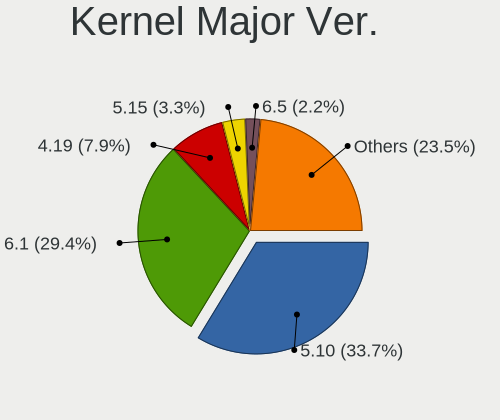
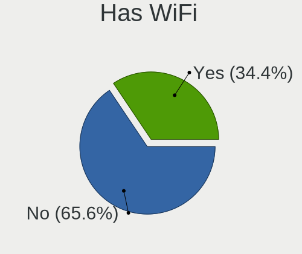
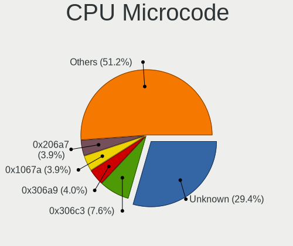

Debian - Tested Hardware & Statistics (Desktops)
------------------------------------------------

A project to collect tested hardware configurations for Debian.

Anyone can contribute to this report by the [hw-probe](https://github.com/linuxhw/hw-probe) tool:

    sudo -E hw-probe -all -upload

Please contribute! Especially if your hardware is rare.

Contents
--------

* [ Test Cases ](#test-cases)

* [ System ](#system)
  - [ OS                       ](#os)
  - [ OS Family                ](#os-family)
  - [ Kernel                   ](#kernel)
  - [ Kernel Family            ](#kernel-family)
  - [ Kernel Major Ver.        ](#kernel-major-ver)
  - [ Arch                     ](#arch)
  - [ DE                       ](#de)
  - [ Display Server           ](#display-server)
  - [ Display Manager          ](#display-manager)
  - [ OS Lang                  ](#os-lang)
  - [ Boot Mode                ](#boot-mode)
  - [ Filesystem               ](#filesystem)
  - [ Part. scheme             ](#part-scheme)
  - [ Dual Boot with Linux/BSD ](#dual-boot-with-linuxbsd)
  - [ Dual Boot (Win)          ](#dual-boot-win)

* [ Board ](#board)
  - [ Vendor                   ](#vendor)
  - [ Model                    ](#model)
  - [ Model Family             ](#model-family)
  - [ MFG Year                 ](#mfg-year)
  - [ Form Factor              ](#form-factor)
  - [ Secure Boot              ](#secure-boot)
  - [ Coreboot                 ](#coreboot)
  - [ RAM Size                 ](#ram-size)
  - [ RAM Used                 ](#ram-used)
  - [ Total Drives             ](#total-drives)
  - [ Has CD-ROM               ](#has-cd-rom)
  - [ Has Ethernet             ](#has-ethernet)
  - [ Has WiFi                 ](#has-wifi)
  - [ Has Bluetooth            ](#has-bluetooth)

* [ Location ](#location)
  - [ Country                  ](#country)
  - [ City                     ](#city)

* [ Drives ](#drives)
  - [ Drive Vendor             ](#drive-vendor)
  - [ Drive Model              ](#drive-model)
  - [ HDD Vendor               ](#hdd-vendor)
  - [ SSD Vendor               ](#ssd-vendor)
  - [ Drive Kind               ](#drive-kind)
  - [ Drive Connector          ](#drive-connector)
  - [ Drive Size               ](#drive-size)
  - [ Space Total              ](#space-total)
  - [ Space Used               ](#space-used)
  - [ Malfunc. Drives          ](#malfunc-drives)
  - [ Malfunc. Drive Vendor    ](#malfunc-drive-vendor)
  - [ Malfunc. HDD Vendor      ](#malfunc-hdd-vendor)
  - [ Malfunc. Drive Kind      ](#malfunc-drive-kind)
  - [ Failed Drives            ](#failed-drives)
  - [ Failed Drive Vendor      ](#failed-drive-vendor)
  - [ Drive Status             ](#drive-status)

* [ Storage controller ](#storage-controller)
  - [ Storage Vendor           ](#storage-vendor)
  - [ Storage Model            ](#storage-model)
  - [ Storage Kind             ](#storage-kind)

* [ Processor ](#processor)
  - [ CPU Vendor               ](#cpu-vendor)
  - [ CPU Model                ](#cpu-model)
  - [ CPU Model Family         ](#cpu-model-family)
  - [ CPU Cores                ](#cpu-cores)
  - [ CPU Sockets              ](#cpu-sockets)
  - [ CPU Threads              ](#cpu-threads)
  - [ CPU Op-Modes             ](#cpu-op-modes)
  - [ CPU Microcode            ](#cpu-microcode)
  - [ CPU Microarch            ](#cpu-microarch)

* [ Graphics ](#graphics)
  - [ GPU Vendor               ](#gpu-vendor)
  - [ GPU Model                ](#gpu-model)
  - [ GPU Combo                ](#gpu-combo)
  - [ GPU Driver               ](#gpu-driver)
  - [ GPU Memory               ](#gpu-memory)

* [ Monitor ](#monitor)
  - [ Monitor Vendor           ](#monitor-vendor)
  - [ Monitor Model            ](#monitor-model)
  - [ Monitor Resolution       ](#monitor-resolution)
  - [ Monitor Diagonal         ](#monitor-diagonal)
  - [ Monitor Width            ](#monitor-width)
  - [ Aspect Ratio             ](#aspect-ratio)
  - [ Monitor Area             ](#monitor-area)
  - [ Pixel Density            ](#pixel-density)
  - [ Multiple Monitors        ](#multiple-monitors)

* [ Network ](#network)
  - [ Net Controller Vendor    ](#net-controller-vendor)
  - [ Net Controller Model     ](#net-controller-model)
  - [ Wireless Vendor          ](#wireless-vendor)
  - [ Wireless Model           ](#wireless-model)
  - [ Ethernet Vendor          ](#ethernet-vendor)
  - [ Ethernet Model           ](#ethernet-model)
  - [ Net Controller Kind      ](#net-controller-kind)
  - [ Used Controller          ](#used-controller)
  - [ NICs                     ](#nics)
  - [ IPv6                     ](#ipv6)

* [ Bluetooth ](#bluetooth)
  - [ Bluetooth Vendor         ](#bluetooth-vendor)
  - [ Bluetooth Model          ](#bluetooth-model)

* [ Sound ](#sound)
  - [ Sound Vendor             ](#sound-vendor)
  - [ Sound Model              ](#sound-model)

* [ Memory ](#memory)
  - [ Memory Vendor            ](#memory-vendor)
  - [ Memory Model             ](#memory-model)
  - [ Memory Kind              ](#memory-kind)
  - [ Memory Form Factor       ](#memory-form-factor)
  - [ Memory Size              ](#memory-size)
  - [ Memory Speed             ](#memory-speed)

* [ Printers & scanners ](#printers--scanners)
  - [ Printer Vendor           ](#printer-vendor)
  - [ Printer Model            ](#printer-model)
  - [ Scanner Vendor           ](#scanner-vendor)
  - [ Scanner Model            ](#scanner-model)

* [ Camera ](#camera)
  - [ Camera Vendor            ](#camera-vendor)
  - [ Camera Model             ](#camera-model)

* [ Security ](#security)
  - [ Fingerprint Vendor       ](#fingerprint-vendor)
  - [ Fingerprint Model        ](#fingerprint-model)
  - [ Chipcard Vendor          ](#chipcard-vendor)
  - [ Chipcard Model           ](#chipcard-model)

* [ Unsupported ](#unsupported)
  - [ Unsupported Devices      ](#unsupported-devices)
  - [ Unsupported Device Types ](#unsupported-device-types)

Test Cases
----------

Total: 7062

| Vendor        | Model                       | Probe                                                      | Date         |
|---------------|-----------------------------|------------------------------------------------------------|--------------|
| ASUSTek       | P7P55D-E                    | [7173101a68](https://linux-hardware.org/?probe=7173101a68) | Feb 02, 2024 |
| Gigabyte      | AB350M-Gaming 3-CF          | [ef41c12950](https://linux-hardware.org/?probe=ef41c12950) | Feb 02, 2024 |
| Sapphire      | PI-AM3RS760G2               | [9b2e938cb4](https://linux-hardware.org/?probe=9b2e938cb4) | Feb 02, 2024 |
| Gigabyte      | B560M H                     | [84e64db583](https://linux-hardware.org/?probe=84e64db583) | Feb 02, 2024 |
| ASRock        | 990FX Extreme4              | [b412a671e4](https://linux-hardware.org/?probe=b412a671e4) | Feb 02, 2024 |
| Lenovo        | 312A NOK                    | [366174cd75](https://linux-hardware.org/?probe=366174cd75) | Feb 02, 2024 |
| HP            | 1998                        | [0056c33526](https://linux-hardware.org/?probe=0056c33526) | Feb 02, 2024 |
| Lenovo        | SHARKBAY NOK                | [f4caef7bf1](https://linux-hardware.org/?probe=f4caef7bf1) | Feb 02, 2024 |
| Dell          | 0G214D A00                  | [2973076de3](https://linux-hardware.org/?probe=2973076de3) | Feb 01, 2024 |
| Lenovo        | ThinkCentre M55p 8808D8U    | [763dd9417b](https://linux-hardware.org/?probe=763dd9417b) | Jan 31, 2024 |
| Gigabyte      | B85M-D3H                    | [059252dc92](https://linux-hardware.org/?probe=059252dc92) | Jan 31, 2024 |
| Dell          | 018D1Y A00                  | [28a3a41219](https://linux-hardware.org/?probe=28a3a41219) | Jan 31, 2024 |
| ASRock        | X99 Taichi                  | [1799faad1e](https://linux-hardware.org/?probe=1799faad1e) | Jan 31, 2024 |
| Unknown       | T3 MRD                      | [744984b9d3](https://linux-hardware.org/?probe=744984b9d3) | Jan 31, 2024 |
| ASUSTek       | PRIME A320M-K               | [348cad0405](https://linux-hardware.org/?probe=348cad0405) | Jan 31, 2024 |
| MSI           | H110M PRO-VD                | [29fd183b3b](https://linux-hardware.org/?probe=29fd183b3b) | Jan 31, 2024 |
| ASRock        | A520M-HDV                   | [fa42ae183a](https://linux-hardware.org/?probe=fa42ae183a) | Jan 31, 2024 |
| ASRock        | A520M-HDV                   | [23be9724fe](https://linux-hardware.org/?probe=23be9724fe) | Jan 31, 2024 |
| Lenovo        | 312A NOK                    | [4cb29324fc](https://linux-hardware.org/?probe=4cb29324fc) | Jan 30, 2024 |
| HP            | 1495                        | [a2017adb28](https://linux-hardware.org/?probe=a2017adb28) | Jan 30, 2024 |
| ASUSTek       | B85M-E/BR                   | [d3a20c90d1](https://linux-hardware.org/?probe=d3a20c90d1) | Jan 30, 2024 |
| Lenovo        | 312A NOK                    | [dea06ca305](https://linux-hardware.org/?probe=dea06ca305) | Jan 30, 2024 |
| Lenovo        | 312A NOK                    | [83eec08588](https://linux-hardware.org/?probe=83eec08588) | Jan 30, 2024 |
| ASRock        | 990FX Extreme4              | [dbb897d3e1](https://linux-hardware.org/?probe=dbb897d3e1) | Jan 30, 2024 |
| Gigabyte      | B550M AORUS ELITE           | [e5435a9682](https://linux-hardware.org/?probe=e5435a9682) | Jan 30, 2024 |
| Dell          | 0D4MD1 A00                  | [9dd5ab2544](https://linux-hardware.org/?probe=9dd5ab2544) | Jan 30, 2024 |
| Lenovo        | SHARKBAY 0B98401 PRO        | [141329c8f3](https://linux-hardware.org/?probe=141329c8f3) | Jan 29, 2024 |
| Huanan        | X99-4MF V1.0                | [63f228ae04](https://linux-hardware.org/?probe=63f228ae04) | Jan 29, 2024 |
| Shenzhen M... | F6BFC                       | [3ecbf7ef23](https://linux-hardware.org/?probe=3ecbf7ef23) | Jan 29, 2024 |
| HP            | 3397                        | [fcbc5b3ac6](https://linux-hardware.org/?probe=fcbc5b3ac6) | Jan 29, 2024 |
| ASRock        | X300TM-ITX                  | [c3277a6c4c](https://linux-hardware.org/?probe=c3277a6c4c) | Jan 29, 2024 |
| MSI           | MS-7060                     | [cfc1584314](https://linux-hardware.org/?probe=cfc1584314) | Jan 29, 2024 |
| HP            | 1495                        | [2bf6b5d794](https://linux-hardware.org/?probe=2bf6b5d794) | Jan 28, 2024 |
| MSI           | MAG X670E TOMAHAWK WIFI     | [e4b1d774f6](https://linux-hardware.org/?probe=e4b1d774f6) | Jan 28, 2024 |
| Intel         | DX58SO AAE29331-503         | [57959fa365](https://linux-hardware.org/?probe=57959fa365) | Jan 28, 2024 |
| ASUSTek       | PRIME X570-P                | [0b1a4a9d6c](https://linux-hardware.org/?probe=0b1a4a9d6c) | Jan 28, 2024 |
| ASUSTek       | PRIME B250M-C               | [5c34879ea0](https://linux-hardware.org/?probe=5c34879ea0) | Jan 28, 2024 |
| ASRock        | B550M Phantom Gaming 4      | [19712e098a](https://linux-hardware.org/?probe=19712e098a) | Jan 28, 2024 |
| ASUSTek       | Z97-K                       | [777446f160](https://linux-hardware.org/?probe=777446f160) | Jan 28, 2024 |
| Gateway       | DS10G                       | [869339de12](https://linux-hardware.org/?probe=869339de12) | Jan 28, 2024 |
| Unknown       | Unknown                     | [52ae8cfe76](https://linux-hardware.org/?probe=52ae8cfe76) | Jan 28, 2024 |
| Unknown       | Unknown                     | [1834dd7444](https://linux-hardware.org/?probe=1834dd7444) | Jan 28, 2024 |
| Gigabyte      | H61M-D2-B3                  | [a177c22fb5](https://linux-hardware.org/?probe=a177c22fb5) | Jan 28, 2024 |
| ASUSTek       | PRIME A320M-K               | [c5777be509](https://linux-hardware.org/?probe=c5777be509) | Jan 28, 2024 |
| ASUSTek       | PRIME A320M-K               | [4fa63d205f](https://linux-hardware.org/?probe=4fa63d205f) | Jan 28, 2024 |
| HP            | 21EF                        | [9fcfe8d663](https://linux-hardware.org/?probe=9fcfe8d663) | Jan 28, 2024 |
| ASUSTek       | TUF Gaming B450-PLUS II     | [08f64cc902](https://linux-hardware.org/?probe=08f64cc902) | Jan 27, 2024 |
| Dell          | 042P49 A01                  | [c419b892e0](https://linux-hardware.org/?probe=c419b892e0) | Jan 27, 2024 |
| Unknown       | Unknown                     | [2bf1eac05d](https://linux-hardware.org/?probe=2bf1eac05d) | Jan 27, 2024 |
| ASUSTek       | TUF Gaming B450-PLUS II     | [a6240580d2](https://linux-hardware.org/?probe=a6240580d2) | Jan 27, 2024 |
| Biostar       | A10N-8800E                  | [6035efec56](https://linux-hardware.org/?probe=6035efec56) | Jan 27, 2024 |
| ASUSTek       | ROG STRIX B550-E GAMING     | [48d7c58756](https://linux-hardware.org/?probe=48d7c58756) | Jan 27, 2024 |
| Biostar       | A10N-8800E                  | [9eab4dee46](https://linux-hardware.org/?probe=9eab4dee46) | Jan 27, 2024 |
| ASUSTek       | ROG STRIX B550-E GAMING     | [ff65cf66c3](https://linux-hardware.org/?probe=ff65cf66c3) | Jan 27, 2024 |
| Medion        | MS-7616                     | [3645021c62](https://linux-hardware.org/?probe=3645021c62) | Jan 27, 2024 |
| Gigabyte      | A520M DS3H V2               | [507d3e9bbf](https://linux-hardware.org/?probe=507d3e9bbf) | Jan 27, 2024 |
| ASUSTek       | ROG STRIX B450-F GAMING     | [f7b37dcead](https://linux-hardware.org/?probe=f7b37dcead) | Jan 27, 2024 |
| HC Technol... | HCAR5000-MI2                | [19a4048799](https://linux-hardware.org/?probe=19a4048799) | Jan 27, 2024 |
| Lenovo        | 1052 SDK0J40697 WIN 3305... | [b0019abd70](https://linux-hardware.org/?probe=b0019abd70) | Jan 26, 2024 |
| MSI           | MPG B550 GAMING PLUS        | [fcdc8fc8e3](https://linux-hardware.org/?probe=fcdc8fc8e3) | Jan 26, 2024 |
| ASUSTek       | Z87-C                       | [a63ba339e5](https://linux-hardware.org/?probe=a63ba339e5) | Jan 26, 2024 |
| ASUSTek       | PRIME X570-P                | [f0eb2463d7](https://linux-hardware.org/?probe=f0eb2463d7) | Jan 26, 2024 |
| ECS           | G31T-M9                     | [8af1e631e7](https://linux-hardware.org/?probe=8af1e631e7) | Jan 26, 2024 |
| MSI           | G31M3 V2                    | [b98a012c0e](https://linux-hardware.org/?probe=b98a012c0e) | Jan 26, 2024 |
| Gigabyte      | H81M-S2V                    | [42abec13ac](https://linux-hardware.org/?probe=42abec13ac) | Jan 26, 2024 |
| HP            | 2AAC                        | [d397b1b3b3](https://linux-hardware.org/?probe=d397b1b3b3) | Jan 26, 2024 |
| ASUSTek       | TUF Gaming B450-PLUS II     | [431bc1335a](https://linux-hardware.org/?probe=431bc1335a) | Jan 26, 2024 |
| ASUSTek       | PRIME B350-PLUS             | [c9df4c296f](https://linux-hardware.org/?probe=c9df4c296f) | Jan 26, 2024 |
| ASRock        | 990FX Extreme4              | [80c0bacde5](https://linux-hardware.org/?probe=80c0bacde5) | Jan 25, 2024 |
| ASRock        | 990FX Extreme4              | [70a0ef842a](https://linux-hardware.org/?probe=70a0ef842a) | Jan 25, 2024 |
| Unknown       | Unknown                     | [a1cdf62b17](https://linux-hardware.org/?probe=a1cdf62b17) | Jan 25, 2024 |
| Unknown       | Unknown                     | [a743ba7b8b](https://linux-hardware.org/?probe=a743ba7b8b) | Jan 24, 2024 |
| ECS           | G31T-M9                     | [87e9fbf4fd](https://linux-hardware.org/?probe=87e9fbf4fd) | Jan 24, 2024 |
| ASUSTek       | Z170 PRO GAMING             | [298f2d1380](https://linux-hardware.org/?probe=298f2d1380) | Jan 24, 2024 |
| ASRock        | G31M-GS                     | [8c46163f5c](https://linux-hardware.org/?probe=8c46163f5c) | Jan 24, 2024 |
| ASRock        | G31M-GS                     | [dbe6d0fdd4](https://linux-hardware.org/?probe=dbe6d0fdd4) | Jan 24, 2024 |
| Foxconn       | G33M03                      | [dd33710847](https://linux-hardware.org/?probe=dd33710847) | Jan 24, 2024 |
| ASUSTek       | P7H55-M LE                  | [a864af0be4](https://linux-hardware.org/?probe=a864af0be4) | Jan 24, 2024 |
| Gigabyte      | H55M-UD2H                   | [10c2d49a41](https://linux-hardware.org/?probe=10c2d49a41) | Jan 24, 2024 |
| Foxconn       | G33M03                      | [bd9087ac07](https://linux-hardware.org/?probe=bd9087ac07) | Jan 24, 2024 |
| ASUSTek       | H110M-R                     | [7ed41d411e](https://linux-hardware.org/?probe=7ed41d411e) | Jan 24, 2024 |
| ASUSTek       | P8H61-M LX3 PLUS R2.0       | [0dc2ae0570](https://linux-hardware.org/?probe=0dc2ae0570) | Jan 24, 2024 |
| MSI           | MAG Z790 TOMAHAWK WIFI      | [8b61369e83](https://linux-hardware.org/?probe=8b61369e83) | Jan 24, 2024 |
| Gigabyte      | H61M-S1                     | [b0ac9a9edd](https://linux-hardware.org/?probe=b0ac9a9edd) | Jan 24, 2024 |
| HP            | 158B                        | [d433cc30c0](https://linux-hardware.org/?probe=d433cc30c0) | Jan 23, 2024 |
| ASUSTek       | Pro WS 565-ACE              | [46ef259c25](https://linux-hardware.org/?probe=46ef259c25) | Jan 23, 2024 |
| ASUSTek       | ROG STRIX B560-A GAMING ... | [6887beeb2a](https://linux-hardware.org/?probe=6887beeb2a) | Jan 23, 2024 |
| ASUSTek       | M2N-E SLI                   | [113665efbe](https://linux-hardware.org/?probe=113665efbe) | Jan 23, 2024 |
| Gigabyte      | H61M-D2-B3                  | [a8315f32a0](https://linux-hardware.org/?probe=a8315f32a0) | Jan 23, 2024 |
| ASUSTek       | B150-PRO D3                 | [1f8cd5afac](https://linux-hardware.org/?probe=1f8cd5afac) | Jan 23, 2024 |
| ASRock        | 990FX Extreme4              | [1a19df4d59](https://linux-hardware.org/?probe=1a19df4d59) | Jan 23, 2024 |
| ASUSTek       | SABERTOOTH 990FX R2.0       | [70551a607e](https://linux-hardware.org/?probe=70551a607e) | Jan 23, 2024 |
| ASRock        | 970M Pro3                   | [f5a09bd7f0](https://linux-hardware.org/?probe=f5a09bd7f0) | Jan 23, 2024 |
| Lenovo        | ThinkCentre M55p 8808D8U    | [f265beb810](https://linux-hardware.org/?probe=f265beb810) | Jan 22, 2024 |
| Intel         | DX58SO AAE29331-503         | [ed61279750](https://linux-hardware.org/?probe=ed61279750) | Jan 22, 2024 |
| MSI           | MEG X570 ACE                | [85c7d79003](https://linux-hardware.org/?probe=85c7d79003) | Jan 22, 2024 |
| ASUSTek       | J1800I-C                    | [6adb9446f3](https://linux-hardware.org/?probe=6adb9446f3) | Jan 22, 2024 |
| ASUSTek       | H81M-R                      | [dd7840e283](https://linux-hardware.org/?probe=dd7840e283) | Jan 22, 2024 |
| MSI           | MPG B460I GAMING EDGE WI... | [2449b6b678](https://linux-hardware.org/?probe=2449b6b678) | Jan 22, 2024 |
| Inventec      | D CLASS A02                 | [25d4886028](https://linux-hardware.org/?probe=25d4886028) | Jan 22, 2024 |
| HC            | HCAR357-MI V1.0             | [1f15fb2119](https://linux-hardware.org/?probe=1f15fb2119) | Jan 22, 2024 |
| ASUSTek       | PRIME B350-PLUS             | [d2c27751fe](https://linux-hardware.org/?probe=d2c27751fe) | Jan 22, 2024 |
| ASRock        | H61M-HVS                    | [3cfc574d2d](https://linux-hardware.org/?probe=3cfc574d2d) | Jan 22, 2024 |
| Gigabyte      | B650 GAMING X AX V2         | [24555759ee](https://linux-hardware.org/?probe=24555759ee) | Jan 22, 2024 |
| MSI           | MS-B1711                    | [0949139f7e](https://linux-hardware.org/?probe=0949139f7e) | Jan 22, 2024 |
| MSI           | PRO B760M-P DDR4            | [75f120a935](https://linux-hardware.org/?probe=75f120a935) | Jan 21, 2024 |
| ASRock        | 990FX Extreme4              | [5722aa300f](https://linux-hardware.org/?probe=5722aa300f) | Jan 21, 2024 |
| MACHINIST     | X99 PR9                     | [2cac18e4ae](https://linux-hardware.org/?probe=2cac18e4ae) | Jan 21, 2024 |
| ASRock        | 990FX Extreme4              | [bc8248af06](https://linux-hardware.org/?probe=bc8248af06) | Jan 21, 2024 |
| Gigabyte      | 945GZM-S2                   | [41c285445b](https://linux-hardware.org/?probe=41c285445b) | Jan 21, 2024 |
| Unknown       | Unknown                     | [8e5e6256ee](https://linux-hardware.org/?probe=8e5e6256ee) | Jan 21, 2024 |
| ASRock        | 990FX Extreme4              | [17f186ad10](https://linux-hardware.org/?probe=17f186ad10) | Jan 20, 2024 |
| Unknown       | Unknown                     | [98da52d37e](https://linux-hardware.org/?probe=98da52d37e) | Jan 20, 2024 |
| Gigabyte      | H110M-S2H-CF                | [d57cdb4371](https://linux-hardware.org/?probe=d57cdb4371) | Jan 20, 2024 |
| ASUSTek       | PRIME B450M-K               | [5e16786940](https://linux-hardware.org/?probe=5e16786940) | Jan 20, 2024 |
| ASRock        | 970M Pro3                   | [37613f1ec6](https://linux-hardware.org/?probe=37613f1ec6) | Jan 20, 2024 |
| IBM           | 830381U                     | [8af6dd9c05](https://linux-hardware.org/?probe=8af6dd9c05) | Jan 20, 2024 |
| ASRock        | N100DC-ITX                  | [dbca9c4ba2](https://linux-hardware.org/?probe=dbca9c4ba2) | Jan 19, 2024 |
| ASUSTek       | TUF Z390-PLUS GAMING        | [a77218f826](https://linux-hardware.org/?probe=a77218f826) | Jan 19, 2024 |
| Gigabyte      | B250M-DS3H-CF               | [b4073d28df](https://linux-hardware.org/?probe=b4073d28df) | Jan 19, 2024 |
| ASUSTek       | Pro WS WRX80E-SAGE SE WI... | [e62243f63a](https://linux-hardware.org/?probe=e62243f63a) | Jan 19, 2024 |
| Intel         | DH77EB AAG39073-304         | [6c6bbd8cc8](https://linux-hardware.org/?probe=6c6bbd8cc8) | Jan 19, 2024 |
| Dell          | 0YJMC0 A02                  | [6dcdea7ca2](https://linux-hardware.org/?probe=6dcdea7ca2) | Jan 19, 2024 |
| ASUSTek       | Z170 PRO GAMING             | [d64ba116db](https://linux-hardware.org/?probe=d64ba116db) | Jan 19, 2024 |
| IceWhale T... | ZimaBoard 832 ZMB           | [5b5d90211c](https://linux-hardware.org/?probe=5b5d90211c) | Jan 18, 2024 |
| ASUSTek       | P5QL-CM                     | [a8adaf0c17](https://linux-hardware.org/?probe=a8adaf0c17) | Jan 18, 2024 |
| ASUSTek       | P5QL-CM                     | [26510e18f5](https://linux-hardware.org/?probe=26510e18f5) | Jan 18, 2024 |
| ASUSTek       | P5QL-CM                     | [4ca7c404f0](https://linux-hardware.org/?probe=4ca7c404f0) | Jan 18, 2024 |
| ASUSTek       | P5QL-CM                     | [a2967a1948](https://linux-hardware.org/?probe=a2967a1948) | Jan 18, 2024 |
| Gigabyte      | H610M H DDR4                | [1d9bce4a06](https://linux-hardware.org/?probe=1d9bce4a06) | Jan 18, 2024 |
| ASUSTek       | P5QL-CM                     | [a0c4c6c96a](https://linux-hardware.org/?probe=a0c4c6c96a) | Jan 18, 2024 |
| ASUSTek       | PRIME H310M-E               | [6674d084a8](https://linux-hardware.org/?probe=6674d084a8) | Jan 18, 2024 |
| Grandstrea... | T3 MRD                      | [21c38a3719](https://linux-hardware.org/?probe=21c38a3719) | Jan 18, 2024 |
| ASUSTek       | P5QL-CM                     | [900d299461](https://linux-hardware.org/?probe=900d299461) | Jan 18, 2024 |
| ASUSTek       | P5QL-CM                     | [56d6cc2713](https://linux-hardware.org/?probe=56d6cc2713) | Jan 18, 2024 |
| ASUSTek       | P5QL-CM                     | [3bc6ca5cba](https://linux-hardware.org/?probe=3bc6ca5cba) | Jan 18, 2024 |
| ASUSTek       | P5QL-CM                     | [a71b94ef53](https://linux-hardware.org/?probe=a71b94ef53) | Jan 18, 2024 |
| ASRock        | H61M                        | [653436b855](https://linux-hardware.org/?probe=653436b855) | Jan 18, 2024 |
| ASUSTek       | P5QL-CM                     | [01d717f8fc](https://linux-hardware.org/?probe=01d717f8fc) | Jan 18, 2024 |
| ASUSTek       | P5QL-CM                     | [12129124f0](https://linux-hardware.org/?probe=12129124f0) | Jan 18, 2024 |
| ASUSTek       | P5QL-CM                     | [6ebd6d855d](https://linux-hardware.org/?probe=6ebd6d855d) | Jan 18, 2024 |
| ASUSTek       | P5QL-CM                     | [362052b28a](https://linux-hardware.org/?probe=362052b28a) | Jan 18, 2024 |
| OEM           | X79G                        | [992b83b632](https://linux-hardware.org/?probe=992b83b632) | Jan 18, 2024 |
| HP            | 1495                        | [0e16d785bc](https://linux-hardware.org/?probe=0e16d785bc) | Jan 18, 2024 |
| ASUSTek       | ROG STRIX X670E-E GAMING... | [9cea75cc3c](https://linux-hardware.org/?probe=9cea75cc3c) | Jan 18, 2024 |
| MSI           | PRO Z790-A WIFI             | [9c84b7f26a](https://linux-hardware.org/?probe=9c84b7f26a) | Jan 17, 2024 |
| HP            | 82A2                        | [2d14e52635](https://linux-hardware.org/?probe=2d14e52635) | Jan 17, 2024 |
| SYWZ          | S210H Series                | [b918a28247](https://linux-hardware.org/?probe=b918a28247) | Jan 17, 2024 |
| ASUSTek       | PRIME H310M-R R2.0          | [2b7eda6458](https://linux-hardware.org/?probe=2b7eda6458) | Jan 17, 2024 |
| MSI           | X470 GAMING PLUS MAX        | [f5e8165d7b](https://linux-hardware.org/?probe=f5e8165d7b) | Jan 17, 2024 |
| ASRock        | 990FX Extreme4              | [99bcba4ae3](https://linux-hardware.org/?probe=99bcba4ae3) | Jan 17, 2024 |
| Intel         | DH77KC AAG39641-400         | [b9c3c9837d](https://linux-hardware.org/?probe=b9c3c9837d) | Jan 17, 2024 |
| IBM           | 830381U                     | [114d68f889](https://linux-hardware.org/?probe=114d68f889) | Jan 17, 2024 |
| ASUSTek       | PRIME A320M-K               | [832ff6a79d](https://linux-hardware.org/?probe=832ff6a79d) | Jan 16, 2024 |
| HP            | ProLiant ML310e Gen8 v2     | [75c345abd6](https://linux-hardware.org/?probe=75c345abd6) | Jan 16, 2024 |
| MSI           | X470 GAMING PLUS MAX        | [60694d3668](https://linux-hardware.org/?probe=60694d3668) | Jan 16, 2024 |
| ASUSTek       | P5Q SE2                     | [e357bf8b25](https://linux-hardware.org/?probe=e357bf8b25) | Jan 16, 2024 |
| ASRock        | 990FX Extreme4              | [196ce97a62](https://linux-hardware.org/?probe=196ce97a62) | Jan 16, 2024 |
| Gigabyte      | B560M DS3H V2               | [01f214a86d](https://linux-hardware.org/?probe=01f214a86d) | Jan 15, 2024 |
| ASRock        | 990FX Extreme4              | [bf7672b4a4](https://linux-hardware.org/?probe=bf7672b4a4) | Jan 15, 2024 |
| HP            | 8105                        | [003cac54c4](https://linux-hardware.org/?probe=003cac54c4) | Jan 15, 2024 |
| HP            | 8062                        | [58b81c8ab8](https://linux-hardware.org/?probe=58b81c8ab8) | Jan 15, 2024 |
| HP            | 8105                        | [36e0151976](https://linux-hardware.org/?probe=36e0151976) | Jan 15, 2024 |
| HP            | 8062                        | [9ff293cb06](https://linux-hardware.org/?probe=9ff293cb06) | Jan 15, 2024 |
| HP            | 8105                        | [2ee1b30f19](https://linux-hardware.org/?probe=2ee1b30f19) | Jan 15, 2024 |
| HP            | 8062                        | [64be9fb79c](https://linux-hardware.org/?probe=64be9fb79c) | Jan 15, 2024 |
| HP            | 8062                        | [502adc9396](https://linux-hardware.org/?probe=502adc9396) | Jan 15, 2024 |
| HP            | 8105                        | [142985ca4f](https://linux-hardware.org/?probe=142985ca4f) | Jan 15, 2024 |
| HP            | 8105                        | [aa402dfc3b](https://linux-hardware.org/?probe=aa402dfc3b) | Jan 15, 2024 |
| HP            | 8105                        | [f508c2b4c4](https://linux-hardware.org/?probe=f508c2b4c4) | Jan 15, 2024 |
| HP            | 8105                        | [eb9adb982e](https://linux-hardware.org/?probe=eb9adb982e) | Jan 15, 2024 |
| HP            | 8105                        | [fc6c21da40](https://linux-hardware.org/?probe=fc6c21da40) | Jan 15, 2024 |
| MSI           | B450M MORTAR MAX            | [6ddfddee65](https://linux-hardware.org/?probe=6ddfddee65) | Jan 15, 2024 |
| ASUSTek       | Z97M-PLUS/BR                | [8c2cab8ef9](https://linux-hardware.org/?probe=8c2cab8ef9) | Jan 15, 2024 |
| Gigabyte      | B550M AORUS PRO             | [a91d050e76](https://linux-hardware.org/?probe=a91d050e76) | Jan 15, 2024 |
| ASRock        | 990FX Extreme4              | [8a02dab1f4](https://linux-hardware.org/?probe=8a02dab1f4) | Jan 15, 2024 |
| ASUSTek       | PRIME A320M-K               | [2ce7044dec](https://linux-hardware.org/?probe=2ce7044dec) | Jan 15, 2024 |
| MSI           | MAG X670E TOMAHAWK WIFI     | [236dc2d07a](https://linux-hardware.org/?probe=236dc2d07a) | Jan 15, 2024 |
| ASRock        | J5040-ITX                   | [1d65e65b24](https://linux-hardware.org/?probe=1d65e65b24) | Jan 14, 2024 |
| AZW           | EQ MINI 10                  | [e702ea54ea](https://linux-hardware.org/?probe=e702ea54ea) | Jan 14, 2024 |
| T-bao Tian... | GOD78                       | [c2f6e2c9e1](https://linux-hardware.org/?probe=c2f6e2c9e1) | Jan 14, 2024 |
| ASRock        | 990FX Extreme4              | [cb5bd1f14f](https://linux-hardware.org/?probe=cb5bd1f14f) | Jan 14, 2024 |
| ASUSTek       | ET1610PT                    | [f71bcea580](https://linux-hardware.org/?probe=f71bcea580) | Jan 14, 2024 |
| ASRock        | 990FX Extreme4              | [439b30f633](https://linux-hardware.org/?probe=439b30f633) | Jan 14, 2024 |
| ASRock        | C2750D4I                    | [c1426b3157](https://linux-hardware.org/?probe=c1426b3157) | Jan 14, 2024 |
| ASRock        | Z68 Extreme3 Gen3           | [9bc7ba0294](https://linux-hardware.org/?probe=9bc7ba0294) | Jan 14, 2024 |
| ASRock        | 990FX Extreme4              | [35533bf402](https://linux-hardware.org/?probe=35533bf402) | Jan 14, 2024 |
| ASUSTek       | PRIME B550M-K               | [3b6eae725e](https://linux-hardware.org/?probe=3b6eae725e) | Jan 13, 2024 |
| ASRock        | 990FX Extreme4              | [783185e5af](https://linux-hardware.org/?probe=783185e5af) | Jan 13, 2024 |
| ASRock        | 990FX Extreme4              | [1742e2e526](https://linux-hardware.org/?probe=1742e2e526) | Jan 13, 2024 |
| ASRock        | 990FX Extreme4              | [43ceb02173](https://linux-hardware.org/?probe=43ceb02173) | Jan 13, 2024 |
| Gigabyte      | X570 AORUS XTREME           | [58771677c3](https://linux-hardware.org/?probe=58771677c3) | Jan 13, 2024 |
| Gigabyte      | B450M S2H                   | [f29e741e2b](https://linux-hardware.org/?probe=f29e741e2b) | Jan 13, 2024 |
| ASRock        | 990FX Extreme4              | [6adea77d15](https://linux-hardware.org/?probe=6adea77d15) | Jan 13, 2024 |
| ASUSTek       | Z87-C                       | [acc914cabd](https://linux-hardware.org/?probe=acc914cabd) | Jan 12, 2024 |
| Biostar       | A320MH                      | [5bec64f55c](https://linux-hardware.org/?probe=5bec64f55c) | Jan 12, 2024 |
| ASRock        | 990FX Extreme4              | [cde9d2553f](https://linux-hardware.org/?probe=cde9d2553f) | Jan 12, 2024 |
| ASRock        | 990FX Extreme4              | [6c82d498ba](https://linux-hardware.org/?probe=6c82d498ba) | Jan 12, 2024 |
| ASUSTek       | ROG STRIX B650E-F GAMING... | [e73c5fda0f](https://linux-hardware.org/?probe=e73c5fda0f) | Jan 12, 2024 |
| HP            | 339A                        | [75faedbb21](https://linux-hardware.org/?probe=75faedbb21) | Jan 12, 2024 |
| Dell          | 0F6X5P A00                  | [bf6a022632](https://linux-hardware.org/?probe=bf6a022632) | Jan 12, 2024 |
| Dell          | 0F6X5P A00                  | [8d2b313d2a](https://linux-hardware.org/?probe=8d2b313d2a) | Jan 12, 2024 |
| Dell          | 0F6X5P A00                  | [6f7cf4ae8d](https://linux-hardware.org/?probe=6f7cf4ae8d) | Jan 12, 2024 |
| ASUSTek       | PRIME B350M-A               | [7eabdfe5d0](https://linux-hardware.org/?probe=7eabdfe5d0) | Jan 12, 2024 |
| HP            | 0B4Ch D                     | [d04339c0dc](https://linux-hardware.org/?probe=d04339c0dc) | Jan 12, 2024 |
| MSI           | H110M PRO-VD                | [10efa0c4e5](https://linux-hardware.org/?probe=10efa0c4e5) | Jan 12, 2024 |
| MSI           | X470 GAMING PLUS MAX        | [95c2b6739c](https://linux-hardware.org/?probe=95c2b6739c) | Jan 12, 2024 |
| ASUSTek       | PRIME B360M-A               | [5fb795a75b](https://linux-hardware.org/?probe=5fb795a75b) | Jan 12, 2024 |
| Lenovo        | SHARKBAY NOK                | [1ece67bdd1](https://linux-hardware.org/?probe=1ece67bdd1) | Jan 12, 2024 |
| MSI           | MS-7318                     | [58f55e6bd3](https://linux-hardware.org/?probe=58f55e6bd3) | Jan 11, 2024 |
| Gigabyte      | H77N-WIFI                   | [aeb566949b](https://linux-hardware.org/?probe=aeb566949b) | Jan 11, 2024 |
| Gigabyte      | MFLP5IP-00                  | [82e2bfd859](https://linux-hardware.org/?probe=82e2bfd859) | Jan 11, 2024 |
| HP            | ProLiant ML310e Gen8 v2     | [d6e4987996](https://linux-hardware.org/?probe=d6e4987996) | Jan 11, 2024 |
| Gigabyte      | GA-M56S-S3                  | [77af17feec](https://linux-hardware.org/?probe=77af17feec) | Jan 11, 2024 |
| ASUSTek       | PRIME B350-PLUS             | [53c94d0753](https://linux-hardware.org/?probe=53c94d0753) | Jan 11, 2024 |
| Phoenix       | 945GM                       | [12f56a36d9](https://linux-hardware.org/?probe=12f56a36d9) | Jan 11, 2024 |
| MSI           | Z97S SLI Krait Edition      | [24a9b78491](https://linux-hardware.org/?probe=24a9b78491) | Jan 11, 2024 |
| MSI           | MS-B1711                    | [dc032b6456](https://linux-hardware.org/?probe=dc032b6456) | Jan 11, 2024 |
| HP            | 8767 A                      | [b8a28f8c5f](https://linux-hardware.org/?probe=b8a28f8c5f) | Jan 10, 2024 |
| Gigabyte      | A520M K V2                  | [3485cdf9ff](https://linux-hardware.org/?probe=3485cdf9ff) | Jan 10, 2024 |
| ASRock        | 990FX Extreme4              | [975fff0a28](https://linux-hardware.org/?probe=975fff0a28) | Jan 10, 2024 |
| ASRock        | 990FX Extreme4              | [4d91095fa0](https://linux-hardware.org/?probe=4d91095fa0) | Jan 10, 2024 |
| Gigabyte      | A520M K V2                  | [2f7bb41141](https://linux-hardware.org/?probe=2f7bb41141) | Jan 10, 2024 |
| ASRock        | 990FX Extreme4              | [6909d543b0](https://linux-hardware.org/?probe=6909d543b0) | Jan 10, 2024 |
| Medion        | MS-7616                     | [c8a2c8be49](https://linux-hardware.org/?probe=c8a2c8be49) | Jan 10, 2024 |
| newplatfor... | NP-1008i.1                  | [3da4bb5017](https://linux-hardware.org/?probe=3da4bb5017) | Jan 09, 2024 |
| Sapphire      | PI-AM3RS760G2               | [e08d38f8a0](https://linux-hardware.org/?probe=e08d38f8a0) | Jan 09, 2024 |
| ASRock        | 990FX Extreme4              | [a3fa43281d](https://linux-hardware.org/?probe=a3fa43281d) | Jan 09, 2024 |
| Intel         | X99H                        | [b0bb3cb105](https://linux-hardware.org/?probe=b0bb3cb105) | Jan 09, 2024 |
| Dell          | 00V62H A01                  | [6f8302ddde](https://linux-hardware.org/?probe=6f8302ddde) | Jan 08, 2024 |
| ASRock        | 990FX Extreme4              | [ddc21e0978](https://linux-hardware.org/?probe=ddc21e0978) | Jan 08, 2024 |
| HP            | 8105                        | [ff8505bc17](https://linux-hardware.org/?probe=ff8505bc17) | Jan 08, 2024 |
| HP            | 8105                        | [7f6df56de0](https://linux-hardware.org/?probe=7f6df56de0) | Jan 08, 2024 |
| HP            | 8105                        | [bff2ea3f8f](https://linux-hardware.org/?probe=bff2ea3f8f) | Jan 08, 2024 |
| HP            | 8105                        | [ca99b2e20d](https://linux-hardware.org/?probe=ca99b2e20d) | Jan 08, 2024 |
| HP            | 8062                        | [4250f0bb2a](https://linux-hardware.org/?probe=4250f0bb2a) | Jan 08, 2024 |
| HP            | 8105                        | [4c3d033a45](https://linux-hardware.org/?probe=4c3d033a45) | Jan 08, 2024 |
| HP            | 8062                        | [2ed973c58e](https://linux-hardware.org/?probe=2ed973c58e) | Jan 08, 2024 |
| HP            | 8062                        | [d644042c15](https://linux-hardware.org/?probe=d644042c15) | Jan 08, 2024 |
| HP            | 8105                        | [e4afcbf22b](https://linux-hardware.org/?probe=e4afcbf22b) | Jan 08, 2024 |
| HP            | 8105                        | [86900314fe](https://linux-hardware.org/?probe=86900314fe) | Jan 08, 2024 |
| HP            | 8105                        | [5eacb006cf](https://linux-hardware.org/?probe=5eacb006cf) | Jan 08, 2024 |
| HP            | 8105                        | [5c691ff566](https://linux-hardware.org/?probe=5c691ff566) | Jan 08, 2024 |
| HP            | 8105                        | [a049370355](https://linux-hardware.org/?probe=a049370355) | Jan 08, 2024 |
| HP            | 8105                        | [98eef698ee](https://linux-hardware.org/?probe=98eef698ee) | Jan 08, 2024 |
| HP            | 8105                        | [6c13f7a773](https://linux-hardware.org/?probe=6c13f7a773) | Jan 08, 2024 |
| Shenzhen M... | F6BFC                       | [5b8c8357ea](https://linux-hardware.org/?probe=5b8c8357ea) | Jan 08, 2024 |
| ASRock        | 990FX Extreme4              | [40407d3445](https://linux-hardware.org/?probe=40407d3445) | Jan 08, 2024 |
| Gigabyte      | 945GZM-S2                   | [931f2e4a0e](https://linux-hardware.org/?probe=931f2e4a0e) | Jan 08, 2024 |
| ASUSTek       | PRIME X670-P WIFI           | [19d6b3732e](https://linux-hardware.org/?probe=19d6b3732e) | Jan 07, 2024 |
| ASRock        | B450 Pro4 R2.0              | [9729786ea6](https://linux-hardware.org/?probe=9729786ea6) | Jan 07, 2024 |
| Dell          | 0NK5PH A00                  | [6a6d55183a](https://linux-hardware.org/?probe=6a6d55183a) | Jan 07, 2024 |
| ASRock        | J5040-ITX                   | [2dc9e2367b](https://linux-hardware.org/?probe=2dc9e2367b) | Jan 07, 2024 |
| ASRock        | 990FX Extreme4              | [cb1ceea0b8](https://linux-hardware.org/?probe=cb1ceea0b8) | Jan 07, 2024 |
| ASRock        | 990FX Extreme4              | [ca81fd63fd](https://linux-hardware.org/?probe=ca81fd63fd) | Jan 07, 2024 |
| HP            | 82F2                        | [eaa0d60c1f](https://linux-hardware.org/?probe=eaa0d60c1f) | Jan 07, 2024 |
| newplatfor... | NP-1004i.1                  | [95788038c5](https://linux-hardware.org/?probe=95788038c5) | Jan 06, 2024 |
| MSI           | X79A-GD65                   | [55c0071638](https://linux-hardware.org/?probe=55c0071638) | Jan 06, 2024 |
| Dell          | 00V62H A01                  | [a44b8f65f6](https://linux-hardware.org/?probe=a44b8f65f6) | Jan 06, 2024 |
| ASUSTek       | PRIME B550M-K               | [7536a68c05](https://linux-hardware.org/?probe=7536a68c05) | Jan 06, 2024 |
| Dell          | 0G919G A00                  | [29eda2d272](https://linux-hardware.org/?probe=29eda2d272) | Jan 06, 2024 |
| ASUSTek       | ROG STRIX X670E-E GAMING... | [af48a525ff](https://linux-hardware.org/?probe=af48a525ff) | Jan 06, 2024 |
| ASUSTek       | PRIME B650M-A WIFI II       | [a7c6792366](https://linux-hardware.org/?probe=a7c6792366) | Jan 05, 2024 |
| ASUSTek       | PRIME B650M-A WIFI II       | [bb1b5c33d2](https://linux-hardware.org/?probe=bb1b5c33d2) | Jan 05, 2024 |
| Sapphire      | PI-AM3RS760G2               | [c192611a71](https://linux-hardware.org/?probe=c192611a71) | Jan 05, 2024 |
| MSI           | Z590 PRO WIFI               | [4cec5133bd](https://linux-hardware.org/?probe=4cec5133bd) | Jan 05, 2024 |
| Sapphire      | PI-AM3RS760G2               | [78696f8410](https://linux-hardware.org/?probe=78696f8410) | Jan 05, 2024 |
| IceWhale T... | ZimaBoard 832 ZMB           | [408830a147](https://linux-hardware.org/?probe=408830a147) | Jan 05, 2024 |
| ASRock        | 990FX Extreme4              | [c4f303d6a1](https://linux-hardware.org/?probe=c4f303d6a1) | Jan 05, 2024 |
| ASRock        | 990FX Extreme4              | [37999c37df](https://linux-hardware.org/?probe=37999c37df) | Jan 05, 2024 |
| ASRock        | 990FX Extreme4              | [1aec475668](https://linux-hardware.org/?probe=1aec475668) | Jan 05, 2024 |
| ASUSTek       | ROG STRIX B650E-F GAMING... | [05f8b32828](https://linux-hardware.org/?probe=05f8b32828) | Jan 05, 2024 |
| Lenovo        | SHARKBAY SDK0E50510 WIN     | [fe773de97b](https://linux-hardware.org/?probe=fe773de97b) | Jan 05, 2024 |
| Dell          | 01XK1W A00                  | [90e3c8644a](https://linux-hardware.org/?probe=90e3c8644a) | Jan 05, 2024 |
| ASRock        | 990FX Extreme4              | [8e8ffbd00e](https://linux-hardware.org/?probe=8e8ffbd00e) | Jan 04, 2024 |
| Dell          | 0PU052                      | [06e3c796ba](https://linux-hardware.org/?probe=06e3c796ba) | Jan 04, 2024 |
| ASRock        | J5040-ITX                   | [18b422e05b](https://linux-hardware.org/?probe=18b422e05b) | Jan 04, 2024 |
| ASUSTek       | PRIME Z270-P                | [e4413dc480](https://linux-hardware.org/?probe=e4413dc480) | Jan 04, 2024 |
| ASRock        | 990FX Extreme4              | [11efc6aeb2](https://linux-hardware.org/?probe=11efc6aeb2) | Jan 04, 2024 |
| Gigabyte      | B650 AORUS ELITE AX         | [74565d105e](https://linux-hardware.org/?probe=74565d105e) | Jan 04, 2024 |
| Gigabyte      | B650 AORUS ELITE AX         | [461cbd9fc4](https://linux-hardware.org/?probe=461cbd9fc4) | Jan 04, 2024 |
| Phoenix Co... | PSB514 A12                  | [424bbc0491](https://linux-hardware.org/?probe=424bbc0491) | Jan 03, 2024 |
| TYAN Compu... | S8030GM2NE 5411T6180004     | [b8716bfb8f](https://linux-hardware.org/?probe=b8716bfb8f) | Jan 03, 2024 |
| Gowin Solu... | GW-MB-U01                   | [9cbf31ad86](https://linux-hardware.org/?probe=9cbf31ad86) | Jan 03, 2024 |
| ASUSTek       | PRIME B760-PLUS             | [59769c2318](https://linux-hardware.org/?probe=59769c2318) | Jan 03, 2024 |
| Dell          | 0C2XKD A01                  | [2db4c37daa](https://linux-hardware.org/?probe=2db4c37daa) | Jan 03, 2024 |
| ASRock        | 990FX Extreme4              | [beb2119db9](https://linux-hardware.org/?probe=beb2119db9) | Jan 03, 2024 |
| ASRock        | 990FX Extreme4              | [8ea5e6198c](https://linux-hardware.org/?probe=8ea5e6198c) | Jan 03, 2024 |
| ASRock        | 990FX Extreme4              | [5744834a9e](https://linux-hardware.org/?probe=5744834a9e) | Jan 03, 2024 |
| Fujitsu       | D3313-A1 S26361-D3313-A1    | [ee8caab1b7](https://linux-hardware.org/?probe=ee8caab1b7) | Jan 03, 2024 |
| Sapphire      | PI-AM3RS760G2               | [4d0fa4b70d](https://linux-hardware.org/?probe=4d0fa4b70d) | Jan 02, 2024 |
| Sapphire      | PI-AM3RS760G2               | [edfe085e75](https://linux-hardware.org/?probe=edfe085e75) | Jan 02, 2024 |
| Acer          | Veriton X2611G V1.0         | [6bd375379c](https://linux-hardware.org/?probe=6bd375379c) | Jan 02, 2024 |
| Acer          | Veriton X2631G V:1.0        | [09ab487a05](https://linux-hardware.org/?probe=09ab487a05) | Jan 02, 2024 |
| Lenovo        | SHARKBAY SDK0E50510 WIN     | [5dc394a7e9](https://linux-hardware.org/?probe=5dc394a7e9) | Jan 02, 2024 |
| Lenovo        | SHARKBAY SDK0E50510 WIN     | [6e68bc0fac](https://linux-hardware.org/?probe=6e68bc0fac) | Jan 02, 2024 |
| HP            | 18E7                        | [e1269783df](https://linux-hardware.org/?probe=e1269783df) | Jan 02, 2024 |
| Lenovo        | SHARKBAY SDK0E50510 WIN     | [acadabf6d3](https://linux-hardware.org/?probe=acadabf6d3) | Jan 02, 2024 |
| Gigabyte      | X570 AORUS ELITE WIFI       | [e5c35b5d54](https://linux-hardware.org/?probe=e5c35b5d54) | Jan 02, 2024 |
| Gigabyte      | B85M-D3H                    | [a146bec6e1](https://linux-hardware.org/?probe=a146bec6e1) | Jan 02, 2024 |
| Lenovo        | SHARKBAY SDK0E50510 WIN     | [b5c2b00a99](https://linux-hardware.org/?probe=b5c2b00a99) | Jan 02, 2024 |
| Lenovo        | SHARKBAY SDK0E50510 WIN     | [a2146214ff](https://linux-hardware.org/?probe=a2146214ff) | Jan 02, 2024 |
| Lenovo        | 30BE SDK0J40697 WIN 3305... | [fd906c174e](https://linux-hardware.org/?probe=fd906c174e) | Jan 02, 2024 |
| Lenovo        | 30BE SDK0J40697 WIN 3305... | [260c5bb8f6](https://linux-hardware.org/?probe=260c5bb8f6) | Jan 02, 2024 |
| HP            | 198E                        | [e7e8af40a6](https://linux-hardware.org/?probe=e7e8af40a6) | Jan 02, 2024 |
| Gigabyte      | X58A-UD3R                   | [757bac1cef](https://linux-hardware.org/?probe=757bac1cef) | Jan 01, 2024 |
| Sapphire      | PI-AM3RS760G2               | [5f34a26ab3](https://linux-hardware.org/?probe=5f34a26ab3) | Jan 01, 2024 |
| HP            | ProLiant ML310e Gen8 v2     | [7271f244c2](https://linux-hardware.org/?probe=7271f244c2) | Jan 01, 2024 |
| ASUSTek       | PRIME Z270-A                | [dea2dc38e4](https://linux-hardware.org/?probe=dea2dc38e4) | Jan 01, 2024 |
| ASUSTek       | TUF Gaming X570-PRO         | [ca2b52b64f](https://linux-hardware.org/?probe=ca2b52b64f) | Dec 31, 2023 |
| ASRock        | 990FX Extreme4              | [edf3eae913](https://linux-hardware.org/?probe=edf3eae913) | Dec 31, 2023 |
| ASUSTek       | ROG STRIX B550-E GAMING     | [eb264efa92](https://linux-hardware.org/?probe=eb264efa92) | Dec 31, 2023 |
| Gigabyte      | B650 AORUS ELITE AX         | [5f1c662ba4](https://linux-hardware.org/?probe=5f1c662ba4) | Dec 31, 2023 |
| Gigabyte      | B650 AORUS ELITE AX         | [fde784b0b5](https://linux-hardware.org/?probe=fde784b0b5) | Dec 31, 2023 |
| ASUSTek       | P11C-I Series               | [b38bcf215d](https://linux-hardware.org/?probe=b38bcf215d) | Dec 30, 2023 |
| Seeed Stud... | ODYSSEY-X86J41X5 SD-BS-C... | [90b5ba3d1e](https://linux-hardware.org/?probe=90b5ba3d1e) | Dec 30, 2023 |
| ASRock        | X300M-STX                   | [7cd1d9d16c](https://linux-hardware.org/?probe=7cd1d9d16c) | Dec 30, 2023 |
| ASRock        | X300M-STX                   | [5fa6e9f755](https://linux-hardware.org/?probe=5fa6e9f755) | Dec 30, 2023 |
| MSI           | H270 GAMING M3              | [92615e0827](https://linux-hardware.org/?probe=92615e0827) | Dec 30, 2023 |
| Gigabyte      | B550M K                     | [8340ced087](https://linux-hardware.org/?probe=8340ced087) | Dec 30, 2023 |
| HP            | 1495                        | [48d0ae2bf5](https://linux-hardware.org/?probe=48d0ae2bf5) | Dec 30, 2023 |
| Apple         | Mac-F4208AC8 PVT            | [11a7c2b836](https://linux-hardware.org/?probe=11a7c2b836) | Dec 30, 2023 |
| HC Technol... | HCAR5000-MI2                | [44a9ba60e7](https://linux-hardware.org/?probe=44a9ba60e7) | Dec 29, 2023 |
| HP            | ProLiant MicroServer        | [30f06f373e](https://linux-hardware.org/?probe=30f06f373e) | Dec 29, 2023 |
| ASRock        | X570S PG Riptide            | [aa3f2ed203](https://linux-hardware.org/?probe=aa3f2ed203) | Dec 29, 2023 |
| ASUSTek       | M5A97 R2.0                  | [c5bc64bc85](https://linux-hardware.org/?probe=c5bc64bc85) | Dec 29, 2023 |
| ASUSTek       | CM6870                      | [529b92f758](https://linux-hardware.org/?probe=529b92f758) | Dec 28, 2023 |
| Dell          | 054KM3 A01                  | [1d078128fe](https://linux-hardware.org/?probe=1d078128fe) | Dec 28, 2023 |
| MACHINIST     | X99 RS9                     | [1e431dc2fc](https://linux-hardware.org/?probe=1e431dc2fc) | Dec 28, 2023 |
| Sapphire      | PI-AM3RS760G2               | [cb13028da5](https://linux-hardware.org/?probe=cb13028da5) | Dec 28, 2023 |
| AZW           | SER V1                      | [9491b3dfb6](https://linux-hardware.org/?probe=9491b3dfb6) | Dec 28, 2023 |
| ASRock        | G41M-VS3                    | [96266413d3](https://linux-hardware.org/?probe=96266413d3) | Dec 28, 2023 |
| MSI           | PRO A620M-E                 | [b2e410ff06](https://linux-hardware.org/?probe=b2e410ff06) | Dec 28, 2023 |
| ASRock        | 990FX Extreme4              | [7345f4357e](https://linux-hardware.org/?probe=7345f4357e) | Dec 28, 2023 |
| ASRock        | 990FX Extreme4              | [de1329753d](https://linux-hardware.org/?probe=de1329753d) | Dec 28, 2023 |
| ASUSTek       | ROG STRIX B550-F GAMING     | [37fe922c9d](https://linux-hardware.org/?probe=37fe922c9d) | Dec 28, 2023 |
| ASRock        | X570 Taichi Razer Editio... | [08d900cdbb](https://linux-hardware.org/?probe=08d900cdbb) | Dec 27, 2023 |
| MSI           | X470 GAMING PLUS MAX        | [758aa4d9a1](https://linux-hardware.org/?probe=758aa4d9a1) | Dec 27, 2023 |
| Biostar       | A68N-5000                   | [19f4961efd](https://linux-hardware.org/?probe=19f4961efd) | Dec 27, 2023 |
| ASRock        | X670E Steel Legend          | [fde01139b9](https://linux-hardware.org/?probe=fde01139b9) | Dec 27, 2023 |
| Gigabyte      | Z370M D3H-CF                | [d73ec66a3a](https://linux-hardware.org/?probe=d73ec66a3a) | Dec 26, 2023 |
| Biostar       | A68N-5000                   | [39703ac1bc](https://linux-hardware.org/?probe=39703ac1bc) | Dec 26, 2023 |
| Lenovo        | 102F SDK0E50510 WIN 2625... | [9227fed37d](https://linux-hardware.org/?probe=9227fed37d) | Dec 26, 2023 |
| Gigabyte      | B75M-D3V                    | [a58934ade1](https://linux-hardware.org/?probe=a58934ade1) | Dec 26, 2023 |
| Gigabyte      | B75M-D3V                    | [8616b021c1](https://linux-hardware.org/?probe=8616b021c1) | Dec 26, 2023 |
| ASRock        | B660M Steel Legend          | [81860bf790](https://linux-hardware.org/?probe=81860bf790) | Dec 26, 2023 |
| HP            | 8876 11                     | [ffec9b5140](https://linux-hardware.org/?probe=ffec9b5140) | Dec 25, 2023 |
| Sapphire      | PI-AM3RS760G2               | [7a4d238793](https://linux-hardware.org/?probe=7a4d238793) | Dec 25, 2023 |
| Gigabyte      | B550 AORUS ELITE V2         | [9a82f5d4ae](https://linux-hardware.org/?probe=9a82f5d4ae) | Dec 25, 2023 |
| Gigabyte      | P55-UD4P                    | [62b547894e](https://linux-hardware.org/?probe=62b547894e) | Dec 25, 2023 |
| MSI           | MPG X570S CARBON MAX WIF... | [463b7572aa](https://linux-hardware.org/?probe=463b7572aa) | Dec 25, 2023 |
| ASUSTek       | Z97-A-USB31                 | [7789aa889f](https://linux-hardware.org/?probe=7789aa889f) | Dec 24, 2023 |
| Intel         | D34010WYK H14771-304        | [95ab790a9c](https://linux-hardware.org/?probe=95ab790a9c) | Dec 24, 2023 |
| MSI           | H110M PRO-VH PLUS           | [3c112941d6](https://linux-hardware.org/?probe=3c112941d6) | Dec 24, 2023 |
| iRU           | LPGR.469559.012             | [0f955d2b87](https://linux-hardware.org/?probe=0f955d2b87) | Dec 24, 2023 |
| ASRock        | 990FX Extreme4              | [d698ea94f5](https://linux-hardware.org/?probe=d698ea94f5) | Dec 24, 2023 |
| ASRock        | 990FX Extreme4              | [bfe0870fab](https://linux-hardware.org/?probe=bfe0870fab) | Dec 24, 2023 |
| ASRock        | 990FX Extreme4              | [d6c1f0d202](https://linux-hardware.org/?probe=d6c1f0d202) | Dec 24, 2023 |
| HP            | 1998                        | [c2e72e513c](https://linux-hardware.org/?probe=c2e72e513c) | Dec 23, 2023 |
| Gigabyte      | M68MT-S2                    | [ba4e48312e](https://linux-hardware.org/?probe=ba4e48312e) | Dec 23, 2023 |
| ASUSTek       | M4A785-M                    | [fe6c638acc](https://linux-hardware.org/?probe=fe6c638acc) | Dec 23, 2023 |
| Gigabyte      | M68MT-S2                    | [e91530e41d](https://linux-hardware.org/?probe=e91530e41d) | Dec 23, 2023 |
| MSI           | MPG B760I EDGE WIFI DDR4    | [58bbd67a73](https://linux-hardware.org/?probe=58bbd67a73) | Dec 23, 2023 |
| T-bao Tian... | GOD78                       | [cd28753d06](https://linux-hardware.org/?probe=cd28753d06) | Dec 23, 2023 |
| eMachines     | EMCP61M                     | [d464b480dd](https://linux-hardware.org/?probe=d464b480dd) | Dec 23, 2023 |
| Gigabyte      | X570 AORUS ELITE WIFI       | [6c9e82db47](https://linux-hardware.org/?probe=6c9e82db47) | Dec 23, 2023 |
| HPE           | ProLiant MicroServer Gen... | [4d38d67af1](https://linux-hardware.org/?probe=4d38d67af1) | Dec 23, 2023 |
| Gigabyte      | X570 AORUS PRO WIFI         | [bbd50ba27b](https://linux-hardware.org/?probe=bbd50ba27b) | Dec 23, 2023 |
| Gigabyte      | B550 AORUS ELITE V2         | [f71924e3e4](https://linux-hardware.org/?probe=f71924e3e4) | Dec 22, 2023 |
| MSI           | B75A-G43                    | [70c44f3ff8](https://linux-hardware.org/?probe=70c44f3ff8) | Dec 22, 2023 |
| ASUSTek       | B150-PRO D3                 | [a686071950](https://linux-hardware.org/?probe=a686071950) | Dec 22, 2023 |
| Gigabyte      | B560M AORUS ELITE           | [82304c2a5f](https://linux-hardware.org/?probe=82304c2a5f) | Dec 21, 2023 |
| ASUSTek       | Maximus VIII RANGER         | [b87a575222](https://linux-hardware.org/?probe=b87a575222) | Dec 21, 2023 |
| ASRock        | B760 Pro RS/D4              | [4b020f53e1](https://linux-hardware.org/?probe=4b020f53e1) | Dec 21, 2023 |
| Dell          | 0NKW6Y A02                  | [d41c926291](https://linux-hardware.org/?probe=d41c926291) | Dec 21, 2023 |
| AZW           | EQ                          | [11b8a012c0](https://linux-hardware.org/?probe=11b8a012c0) | Dec 21, 2023 |
| ASUSTek       | ROG STRIX Z690-E GAMING ... | [47d1d26375](https://linux-hardware.org/?probe=47d1d26375) | Dec 21, 2023 |
| ASUSTek       | TUF Gaming B550M-PLUS       | [d5f60126bb](https://linux-hardware.org/?probe=d5f60126bb) | Dec 20, 2023 |
| HP            | 3396                        | [d0d084ecc8](https://linux-hardware.org/?probe=d0d084ecc8) | Dec 20, 2023 |
| ASUSTek       | TUF Gaming B650M-E WIFI     | [2464a532b8](https://linux-hardware.org/?probe=2464a532b8) | Dec 20, 2023 |
| Dell          | 0D6H9T A00                  | [2c968508ee](https://linux-hardware.org/?probe=2c968508ee) | Dec 20, 2023 |
| Gigabyte      | Z77X-UD3H                   | [25a077d35e](https://linux-hardware.org/?probe=25a077d35e) | Dec 20, 2023 |
| ASUSTek       | V6-P5G31E                   | [83a8408a7e](https://linux-hardware.org/?probe=83a8408a7e) | Dec 20, 2023 |
| Gigabyte      | H370M DS3H-CF               | [4b6f645ef6](https://linux-hardware.org/?probe=4b6f645ef6) | Dec 20, 2023 |
| Unknown       | Unknown                     | [32f0587c3f](https://linux-hardware.org/?probe=32f0587c3f) | Dec 20, 2023 |
| Unknown       | Unknown                     | [2ff77e3571](https://linux-hardware.org/?probe=2ff77e3571) | Dec 20, 2023 |
| Gigabyte      | B85M-D3H                    | [a641f9b41d](https://linux-hardware.org/?probe=a641f9b41d) | Dec 20, 2023 |
| ASUSTek       | PRIME H510M-K               | [b6b4165e86](https://linux-hardware.org/?probe=b6b4165e86) | Dec 20, 2023 |
| ASUSTek       | PRIME A320M-K               | [3eead324a8](https://linux-hardware.org/?probe=3eead324a8) | Dec 19, 2023 |
| ASRock        | 970M Pro3                   | [85233c464d](https://linux-hardware.org/?probe=85233c464d) | Dec 19, 2023 |
| ASUSTek       | H110M-R                     | [ca0eab5d48](https://linux-hardware.org/?probe=ca0eab5d48) | Dec 19, 2023 |
| ASRock        | 970M Pro3                   | [acebee7435](https://linux-hardware.org/?probe=acebee7435) | Dec 19, 2023 |
| Lenovo        | 30BE SDK0J40697 WIN 3305... | [9b8d8ec134](https://linux-hardware.org/?probe=9b8d8ec134) | Dec 19, 2023 |
| Lenovo        | MAHOBAY NOK                 | [7fe77a3476](https://linux-hardware.org/?probe=7fe77a3476) | Dec 19, 2023 |
| Lenovo        | 30BE SDK0J40705 WIN 3425... | [65b6d3dcc0](https://linux-hardware.org/?probe=65b6d3dcc0) | Dec 19, 2023 |
| Lenovo        | 30BE SDK0J40705 WIN 3425... | [ab5bffcf0a](https://linux-hardware.org/?probe=ab5bffcf0a) | Dec 19, 2023 |
| Lenovo        | SHARKBAY 0B98401 PRO        | [9f3471e435](https://linux-hardware.org/?probe=9f3471e435) | Dec 19, 2023 |
| Lenovo        | SKYBAY SDK0J40705 WIN 34... | [752a59a0cc](https://linux-hardware.org/?probe=752a59a0cc) | Dec 19, 2023 |
| Lenovo        | SHARKBAY SDK0E50510 WIN     | [bff7dced45](https://linux-hardware.org/?probe=bff7dced45) | Dec 19, 2023 |
| ASUSTek       | H110M-R                     | [61211b72bb](https://linux-hardware.org/?probe=61211b72bb) | Dec 19, 2023 |
| Lenovo        | SHARKBAY 0B98401 PRO        | [993b9536cf](https://linux-hardware.org/?probe=993b9536cf) | Dec 19, 2023 |
| Lenovo        | 30BE SDK0J40705 WIN 3425... | [782dad2128](https://linux-hardware.org/?probe=782dad2128) | Dec 19, 2023 |
| MSI           | MAG Z790 TOMAHAWK WIFI      | [619bbec719](https://linux-hardware.org/?probe=619bbec719) | Dec 19, 2023 |
| ASUSTek       | ROG STRIX Z690-E GAMING ... | [6a962e40ec](https://linux-hardware.org/?probe=6a962e40ec) | Dec 19, 2023 |
| Biostar       | A55MH                       | [f1106ef8c7](https://linux-hardware.org/?probe=f1106ef8c7) | Dec 19, 2023 |
| MSI           | B450M BAZOOKA               | [0bfcb5be94](https://linux-hardware.org/?probe=0bfcb5be94) | Dec 19, 2023 |
| ASUSTek       | ROG STRIX B560-E GAMING ... | [fd9a0ec0c4](https://linux-hardware.org/?probe=fd9a0ec0c4) | Dec 19, 2023 |
| HP            | 1998                        | [1d45f9958a](https://linux-hardware.org/?probe=1d45f9958a) | Dec 18, 2023 |
| Gigabyte      | B85M-D3H                    | [95d29a0474](https://linux-hardware.org/?probe=95d29a0474) | Dec 18, 2023 |
| Gigabyte      | H510M H V2                  | [3228539880](https://linux-hardware.org/?probe=3228539880) | Dec 18, 2023 |
| Unknown       | Unknown                     | [3764b249f4](https://linux-hardware.org/?probe=3764b249f4) | Dec 18, 2023 |
| MSI           | A75MA-G55                   | [6af3c61744](https://linux-hardware.org/?probe=6af3c61744) | Dec 18, 2023 |
| ASUSTek       | PRIME B660M-A WIFI D4       | [2eb95b1a7c](https://linux-hardware.org/?probe=2eb95b1a7c) | Dec 18, 2023 |
| Gigabyte      | B450 AORUS PRO WIFI-CF      | [79c73e5927](https://linux-hardware.org/?probe=79c73e5927) | Dec 17, 2023 |
| Dell          | 0782GW A00                  | [bb37946b48](https://linux-hardware.org/?probe=bb37946b48) | Dec 17, 2023 |
| Dell          | 0782GW A00                  | [a4753bb26d](https://linux-hardware.org/?probe=a4753bb26d) | Dec 17, 2023 |
| Gigabyte      | X570S UD                    | [058c14cd39](https://linux-hardware.org/?probe=058c14cd39) | Dec 17, 2023 |
| ASUSTek       | TUF H310M-PLUS GAMING/BR    | [b6b44f1b80](https://linux-hardware.org/?probe=b6b44f1b80) | Dec 17, 2023 |
| ASUSTek       | P4P800-VM                   | [8fb6faae11](https://linux-hardware.org/?probe=8fb6faae11) | Dec 17, 2023 |
| Dell          | 06X1TJ A00                  | [b9738c48b0](https://linux-hardware.org/?probe=b9738c48b0) | Dec 17, 2023 |
| ASUSTek       | PRIME A520M-E               | [02e1fcae39](https://linux-hardware.org/?probe=02e1fcae39) | Dec 17, 2023 |
| ASUSTek       | PRIME A520M-E               | [c878de7adb](https://linux-hardware.org/?probe=c878de7adb) | Dec 17, 2023 |
| ASRock        | 990FX Extreme4              | [ad7f762f22](https://linux-hardware.org/?probe=ad7f762f22) | Dec 17, 2023 |
| Gigabyte      | F2A88XN-WIFI                | [90024d365b](https://linux-hardware.org/?probe=90024d365b) | Dec 17, 2023 |
| Gigabyte      | B85M-D3H                    | [4d81e6300c](https://linux-hardware.org/?probe=4d81e6300c) | Dec 17, 2023 |
| ASUSTek       | Pro WS W680M-ACE SE         | [f1b9ec56ea](https://linux-hardware.org/?probe=f1b9ec56ea) | Dec 16, 2023 |
| Gigabyte      | B550 AORUS ELITE V2         | [e8847d53ec](https://linux-hardware.org/?probe=e8847d53ec) | Dec 16, 2023 |
| Fujitsu       | D3513-A1 S26361-D3513-A1    | [6f4f0f65bb](https://linux-hardware.org/?probe=6f4f0f65bb) | Dec 15, 2023 |
| Dell          | 0M5WNK A02                  | [f47a8fcf1f](https://linux-hardware.org/?probe=f47a8fcf1f) | Dec 15, 2023 |
| Fujitsu       | D3233-A1 S26361-D3233-A1    | [a785d6574b](https://linux-hardware.org/?probe=a785d6574b) | Dec 15, 2023 |
| Inventec      | DQ Class A02                | [98e30b12f1](https://linux-hardware.org/?probe=98e30b12f1) | Dec 15, 2023 |
| ASUSTek       | M5A99FX PRO R2.0            | [969d4fd521](https://linux-hardware.org/?probe=969d4fd521) | Dec 15, 2023 |
| ASUSTek       | TUF Gaming Z490-PLUS        | [a80537094f](https://linux-hardware.org/?probe=a80537094f) | Dec 15, 2023 |
| MSI           | PRO B650-P WIFI             | [06ed7608bf](https://linux-hardware.org/?probe=06ed7608bf) | Dec 15, 2023 |
| Biostar       | A32M2                       | [f3fb9d0673](https://linux-hardware.org/?probe=f3fb9d0673) | Dec 15, 2023 |
| Gigabyte      | B250M-D2V-CF                | [e0e94706d7](https://linux-hardware.org/?probe=e0e94706d7) | Dec 15, 2023 |
| ASRock        | 990FX Extreme4              | [46178ea298](https://linux-hardware.org/?probe=46178ea298) | Dec 14, 2023 |
| MSI           | PRO B760-P WIFI DDR4        | [0305f80c2d](https://linux-hardware.org/?probe=0305f80c2d) | Dec 14, 2023 |
| Gigabyte      | P35-DS4                     | [23e146afdc](https://linux-hardware.org/?probe=23e146afdc) | Dec 14, 2023 |
| HP            | 8463                        | [0d01616e1c](https://linux-hardware.org/?probe=0d01616e1c) | Dec 14, 2023 |
| ASUSTek       | SABERTOOTH 990FX R2.0       | [545a3cecbc](https://linux-hardware.org/?probe=545a3cecbc) | Dec 14, 2023 |
| ASRock        | 990FX Extreme4              | [f1860954b3](https://linux-hardware.org/?probe=f1860954b3) | Dec 14, 2023 |
| ASRock        | 990FX Extreme4              | [1ed13ea8f2](https://linux-hardware.org/?probe=1ed13ea8f2) | Dec 14, 2023 |
| ASRock        | 990FX Extreme4              | [eafb9ad287](https://linux-hardware.org/?probe=eafb9ad287) | Dec 14, 2023 |
| ASRock        | 990FX Extreme4              | [3504153caa](https://linux-hardware.org/?probe=3504153caa) | Dec 14, 2023 |
| Gigabyte      | F2A88XM-HD3                 | [f2efee9279](https://linux-hardware.org/?probe=f2efee9279) | Dec 13, 2023 |
| Gigabyte      | F2A88XM-HD3                 | [0e23ff0a06](https://linux-hardware.org/?probe=0e23ff0a06) | Dec 13, 2023 |
| Sapphire      | PI-AM3RS760G2               | [1668553525](https://linux-hardware.org/?probe=1668553525) | Dec 13, 2023 |
| Sapphire      | PI-AM3RS760G2               | [89bef2fed5](https://linux-hardware.org/?probe=89bef2fed5) | Dec 13, 2023 |
| Sapphire      | PI-AM3RS760G2               | [0ed1d85207](https://linux-hardware.org/?probe=0ed1d85207) | Dec 13, 2023 |
| Acer          | Aspire 1510 Rev.A           | [452be93d1b](https://linux-hardware.org/?probe=452be93d1b) | Dec 13, 2023 |
| ASUSTek       | PRIME B450M-A               | [5a65590bed](https://linux-hardware.org/?probe=5a65590bed) | Dec 13, 2023 |
| ASUSTek       | P5G41T-M LE                 | [e6205fb709](https://linux-hardware.org/?probe=e6205fb709) | Dec 13, 2023 |
| ASUSTek       | P8H61                       | [6f5272ea27](https://linux-hardware.org/?probe=6f5272ea27) | Dec 13, 2023 |
| ASUSTek       | P8H77-V                     | [6b62180e3e](https://linux-hardware.org/?probe=6b62180e3e) | Dec 12, 2023 |
| Intel         | JSL MRD                     | [c811c8be03](https://linux-hardware.org/?probe=c811c8be03) | Dec 12, 2023 |
| Dell          | 0MGK50 A01                  | [7471a7b26e](https://linux-hardware.org/?probe=7471a7b26e) | Dec 12, 2023 |
| Dell          | 0VD5HY A10                  | [366f1ac830](https://linux-hardware.org/?probe=366f1ac830) | Dec 12, 2023 |
| MSI           | PRO B760-P WIFI DDR4        | [a9059220f3](https://linux-hardware.org/?probe=a9059220f3) | Dec 12, 2023 |
| Fujitsu       | JIH61Y3                     | [cb566e2fd0](https://linux-hardware.org/?probe=cb566e2fd0) | Dec 12, 2023 |
| Lenovo        | 3140 SDK0J40697 WIN 3305... | [d5500a3830](https://linux-hardware.org/?probe=d5500a3830) | Dec 11, 2023 |
| Gigabyte      | H610M H DDR4                | [88b93b571e](https://linux-hardware.org/?probe=88b93b571e) | Dec 11, 2023 |
| Intel         | DZ77SL-50K AAG55115-300     | [29590179a8](https://linux-hardware.org/?probe=29590179a8) | Dec 11, 2023 |
| Unknown       | Unknown                     | [2c6a120dd2](https://linux-hardware.org/?probe=2c6a120dd2) | Dec 10, 2023 |
| MSI           | B560M PRO-VDH               | [4a2deac69b](https://linux-hardware.org/?probe=4a2deac69b) | Dec 10, 2023 |
| Packard Be... | MCP73PV                     | [9d707e64d4](https://linux-hardware.org/?probe=9d707e64d4) | Dec 10, 2023 |
| HP            | 0968h                       | [b1fb94198e](https://linux-hardware.org/?probe=b1fb94198e) | Dec 10, 2023 |
| MSI           | B350 TOMAHAWK               | [18f6c41058](https://linux-hardware.org/?probe=18f6c41058) | Dec 10, 2023 |
| Dell          | 0HY9JP A02                  | [25d8aaca3c](https://linux-hardware.org/?probe=25d8aaca3c) | Dec 10, 2023 |
| Intel         | DZ77SL-50K AAG55115-300     | [c1d93cb6b2](https://linux-hardware.org/?probe=c1d93cb6b2) | Dec 09, 2023 |
| ASUSTek       | PRIME B450M-K               | [c02997fc15](https://linux-hardware.org/?probe=c02997fc15) | Dec 09, 2023 |
| AZW           | MINI S                      | [2512b54e60](https://linux-hardware.org/?probe=2512b54e60) | Dec 09, 2023 |
| MSI           | Z97S SLI Krait Edition      | [2b1117b052](https://linux-hardware.org/?probe=2b1117b052) | Dec 09, 2023 |
| Lenovo        | 3098 SDK0J40705 WIN 3425... | [647f96ad2c](https://linux-hardware.org/?probe=647f96ad2c) | Dec 08, 2023 |
| ASUSTek       | TUF Gaming B550-PLUS        | [cc6cd166f2](https://linux-hardware.org/?probe=cc6cd166f2) | Dec 08, 2023 |
| ASUSTek       | TUF Z370-PLUS GAMING        | [7ca4962c57](https://linux-hardware.org/?probe=7ca4962c57) | Dec 08, 2023 |
| Shenzhen M... | F6BFC                       | [67371c6af4](https://linux-hardware.org/?probe=67371c6af4) | Dec 08, 2023 |
| MSI           | G31TM-P35                   | [e241cfaeca](https://linux-hardware.org/?probe=e241cfaeca) | Dec 08, 2023 |
| MSI           | MEG X399 CREATION           | [02adc5ef8b](https://linux-hardware.org/?probe=02adc5ef8b) | Dec 08, 2023 |
| Dell          | 0KP561                      | [bd0971e9cc](https://linux-hardware.org/?probe=bd0971e9cc) | Dec 08, 2023 |
| Dell          | 04YP6J A01                  | [186bb25f07](https://linux-hardware.org/?probe=186bb25f07) | Dec 08, 2023 |
| Intel         | JSL MRD                     | [fb3b75c8cc](https://linux-hardware.org/?probe=fb3b75c8cc) | Dec 07, 2023 |
| HP            | 339A                        | [a114886e67](https://linux-hardware.org/?probe=a114886e67) | Dec 07, 2023 |
| ASUSTek       | Pro B560M-C                 | [116dce4b93](https://linux-hardware.org/?probe=116dce4b93) | Dec 07, 2023 |
| ASUSTek       | TUF Gaming X570-PLUS        | [39a966c6da](https://linux-hardware.org/?probe=39a966c6da) | Dec 07, 2023 |
| Intel         | H61                         | [fbc4dc7436](https://linux-hardware.org/?probe=fbc4dc7436) | Dec 06, 2023 |
| Gigabyte      | X570 GAMING X               | [b7070058fb](https://linux-hardware.org/?probe=b7070058fb) | Dec 06, 2023 |
| ASUSTek       | P8H61-M LX3 R2.0            | [7bd10d1922](https://linux-hardware.org/?probe=7bd10d1922) | Dec 05, 2023 |
| Unknown       | Unknown                     | [56dab5d412](https://linux-hardware.org/?probe=56dab5d412) | Dec 04, 2023 |
| ASUSTek       | SABERTOOTH 990FX R2.0       | [76fdeed52e](https://linux-hardware.org/?probe=76fdeed52e) | Dec 04, 2023 |
| Dell          | 0RN474                      | [17392605bb](https://linux-hardware.org/?probe=17392605bb) | Dec 04, 2023 |
| ASUSTek       | P8Z68-V PRO                 | [fde3c9253f](https://linux-hardware.org/?probe=fde3c9253f) | Dec 04, 2023 |
| HP            | 8619                        | [a33e273f33](https://linux-hardware.org/?probe=a33e273f33) | Dec 04, 2023 |
| ASUSTek       | Maximus VIII RANGER         | [830b83bf5c](https://linux-hardware.org/?probe=830b83bf5c) | Dec 03, 2023 |
| ASUSTek       | Maximus VIII RANGER         | [83b954a1cd](https://linux-hardware.org/?probe=83b954a1cd) | Dec 03, 2023 |
| ASUSTek       | Z97-P                       | [c4e675a705](https://linux-hardware.org/?probe=c4e675a705) | Dec 03, 2023 |
| HP            | ProLiant MicroServer Gen... | [47222bf19c](https://linux-hardware.org/?probe=47222bf19c) | Dec 03, 2023 |
| HP            | ProLiant MicroServer Gen... | [5a5296e72f](https://linux-hardware.org/?probe=5a5296e72f) | Dec 03, 2023 |
| Dell          | 0KWVT8 A02                  | [3c6a13271b](https://linux-hardware.org/?probe=3c6a13271b) | Dec 03, 2023 |
| MSI           | MAG Z790 TOMAHAWK WIFI      | [a28372598e](https://linux-hardware.org/?probe=a28372598e) | Dec 03, 2023 |
| ASUSTek       | ROG STRIX X670E-E GAMING... | [bb1b02ee0c](https://linux-hardware.org/?probe=bb1b02ee0c) | Dec 03, 2023 |
| ASUSTek       | TUF Gaming X570-PLUS_BR     | [5aeec2e399](https://linux-hardware.org/?probe=5aeec2e399) | Dec 03, 2023 |
| IceWhale T... | ZimaBoard 832 ZMB           | [a24f117537](https://linux-hardware.org/?probe=a24f117537) | Dec 02, 2023 |
| Intel         | DQ67SW AAG12527-309         | [99293a328c](https://linux-hardware.org/?probe=99293a328c) | Dec 02, 2023 |
| Intel         | DQ67SW AAG12527-309         | [b8e3a992b3](https://linux-hardware.org/?probe=b8e3a992b3) | Dec 02, 2023 |
| Gigabyte      | H97M-HD3                    | [aa52a8ceac](https://linux-hardware.org/?probe=aa52a8ceac) | Dec 02, 2023 |
| Dell          | 02YRK5 A02                  | [73c15b7e61](https://linux-hardware.org/?probe=73c15b7e61) | Dec 02, 2023 |
| Unknown       | Unknown                     | [d0bbc73e29](https://linux-hardware.org/?probe=d0bbc73e29) | Dec 02, 2023 |
| Gigabyte      | H470 HD3                    | [0b9cf3a0a5](https://linux-hardware.org/?probe=0b9cf3a0a5) | Dec 02, 2023 |
| ASUSTek       | Z97-P                       | [109cecbcba](https://linux-hardware.org/?probe=109cecbcba) | Dec 01, 2023 |
| Dell          | 0VRWRC A00                  | [13e072ec20](https://linux-hardware.org/?probe=13e072ec20) | Dec 01, 2023 |
| Gigabyte      | B760M DS3H AX DDR4          | [8a625099b1](https://linux-hardware.org/?probe=8a625099b1) | Dec 01, 2023 |
| HP            | 212B                        | [dc1382e549](https://linux-hardware.org/?probe=dc1382e549) | Dec 01, 2023 |
| ASRock        | 970 Extreme4                | [4ab4cd31f3](https://linux-hardware.org/?probe=4ab4cd31f3) | Nov 30, 2023 |
| MSI           | A78M-E45                    | [fd9a5e65e4](https://linux-hardware.org/?probe=fd9a5e65e4) | Nov 30, 2023 |
| ASUSTek       | P5N-MX                      | [c586157333](https://linux-hardware.org/?probe=c586157333) | Nov 30, 2023 |
| HP            | 8053                        | [a2b9b5d498](https://linux-hardware.org/?probe=a2b9b5d498) | Nov 30, 2023 |
| ASUSTek       | TUF H310M-PLUS GAMING/BR    | [cf7d8fdbf1](https://linux-hardware.org/?probe=cf7d8fdbf1) | Nov 30, 2023 |
| Gigabyte      | B450 AORUS M                | [4bac6b7cd5](https://linux-hardware.org/?probe=4bac6b7cd5) | Nov 30, 2023 |
| Gigabyte      | B450 AORUS M                | [ede8970ea9](https://linux-hardware.org/?probe=ede8970ea9) | Nov 30, 2023 |
| ASUSTek       | ROG STRIX B650E-F GAMING... | [c7b394b498](https://linux-hardware.org/?probe=c7b394b498) | Nov 30, 2023 |
| Dell          | 0427JK A00                  | [38e526321f](https://linux-hardware.org/?probe=38e526321f) | Nov 29, 2023 |
| Dell          | 0PU052                      | [9035e39786](https://linux-hardware.org/?probe=9035e39786) | Nov 29, 2023 |
| MACHINIST     | X99 RS9                     | [722f516451](https://linux-hardware.org/?probe=722f516451) | Nov 29, 2023 |
| HP            | 304Ah                       | [03437e0238](https://linux-hardware.org/?probe=03437e0238) | Nov 29, 2023 |
| HP            | 8643 SMVB                   | [dae10e70d0](https://linux-hardware.org/?probe=dae10e70d0) | Nov 29, 2023 |
| Gigabyte      | G41MT-S2P                   | [6a2c279391](https://linux-hardware.org/?probe=6a2c279391) | Nov 29, 2023 |
| Lenovo        | 1048 SDK0J40697 WIN 3305... | [af727ea890](https://linux-hardware.org/?probe=af727ea890) | Nov 29, 2023 |
| HC Technol... | HCAR5000-MI                 | [7ff2232073](https://linux-hardware.org/?probe=7ff2232073) | Nov 29, 2023 |
| ASUSTek       | PRIME B450-PLUS             | [cf46975c18](https://linux-hardware.org/?probe=cf46975c18) | Nov 28, 2023 |
| ASRock        | B365 Phantom Gaming 4       | [b3de42156e](https://linux-hardware.org/?probe=b3de42156e) | Nov 28, 2023 |
| ASRock        | H61DE/S3                    | [50d5c63e0f](https://linux-hardware.org/?probe=50d5c63e0f) | Nov 28, 2023 |
| MSI           | X299 GAMING PRO CARBON      | [07d105a830](https://linux-hardware.org/?probe=07d105a830) | Nov 28, 2023 |
| Gigabyte      | H470 HD3                    | [0ecb969c2c](https://linux-hardware.org/?probe=0ecb969c2c) | Nov 28, 2023 |
| Inventec      | DQ Class A02                | [760cc39516](https://linux-hardware.org/?probe=760cc39516) | Nov 27, 2023 |
| MSI           | MPG X570 GAMING PLUS        | [2289ab10b3](https://linux-hardware.org/?probe=2289ab10b3) | Nov 27, 2023 |
| AZW           | MINI S                      | [ea6ad73049](https://linux-hardware.org/?probe=ea6ad73049) | Nov 27, 2023 |
| AZW           | MINI S                      | [54b3a350cc](https://linux-hardware.org/?probe=54b3a350cc) | Nov 27, 2023 |
| Gigabyte      | B450M DS3H-CF               | [5d7a20cf12](https://linux-hardware.org/?probe=5d7a20cf12) | Nov 27, 2023 |
| Gigabyte      | X570 GAMING X               | [4609a7f037](https://linux-hardware.org/?probe=4609a7f037) | Nov 27, 2023 |
| ECS           | G31T-M9                     | [fa44ca9239](https://linux-hardware.org/?probe=fa44ca9239) | Nov 27, 2023 |
| Gigabyte      | 970A-DS3P                   | [182a3875c4](https://linux-hardware.org/?probe=182a3875c4) | Nov 27, 2023 |
| Gigabyte      | 970A-DS3P                   | [196be5def7](https://linux-hardware.org/?probe=196be5def7) | Nov 27, 2023 |
| ASUSTek       | P8Z77-M                     | [02ece75e31](https://linux-hardware.org/?probe=02ece75e31) | Nov 27, 2023 |
| Gigabyte      | B550I AORUS PRO AX          | [007cf510b3](https://linux-hardware.org/?probe=007cf510b3) | Nov 26, 2023 |
| ASRock        | B365 Phantom Gaming 4       | [97dfb05d56](https://linux-hardware.org/?probe=97dfb05d56) | Nov 26, 2023 |
| MSI           | B85M-G43                    | [c8c114c2df](https://linux-hardware.org/?probe=c8c114c2df) | Nov 26, 2023 |
| ASUSTek       | ROG STRIX Z370-H GAMING     | [6005ac3fdd](https://linux-hardware.org/?probe=6005ac3fdd) | Nov 26, 2023 |
| ASUSTek       | H97-PLUS                    | [e4c365b554](https://linux-hardware.org/?probe=e4c365b554) | Nov 26, 2023 |
| ASUSTek       | TUF Gaming B650-PLUS WIF... | [aaf90bfd52](https://linux-hardware.org/?probe=aaf90bfd52) | Nov 25, 2023 |
| ASRock        | H61M-GS                     | [b1448b5814](https://linux-hardware.org/?probe=b1448b5814) | Nov 25, 2023 |
| ASUSTek       | P8H77-V                     | [73eebdebc2](https://linux-hardware.org/?probe=73eebdebc2) | Nov 25, 2023 |
| ASUSTek       | PRIME A320M-K               | [e2bbfbaca9](https://linux-hardware.org/?probe=e2bbfbaca9) | Nov 25, 2023 |
| ASUSTek       | PRIME B660M-K D4            | [a6ab0954e0](https://linux-hardware.org/?probe=a6ab0954e0) | Nov 25, 2023 |
| Unknown       | HX90                        | [b4eef50430](https://linux-hardware.org/?probe=b4eef50430) | Nov 25, 2023 |
| ASUSTek       | ROG STRIX B650E-F GAMING... | [84fefe8e38](https://linux-hardware.org/?probe=84fefe8e38) | Nov 25, 2023 |
| Fujitsu       | D3233-A1 S26361-D3233-A1    | [dc456b5cc5](https://linux-hardware.org/?probe=dc456b5cc5) | Nov 24, 2023 |
| ASUSTek       | B85M-G                      | [6497745451](https://linux-hardware.org/?probe=6497745451) | Nov 24, 2023 |
| Acer          | Veriton N4660G              | [2d59329fc6](https://linux-hardware.org/?probe=2d59329fc6) | Nov 24, 2023 |
| AZW           | U59                         | [b03056a1ad](https://linux-hardware.org/?probe=b03056a1ad) | Nov 24, 2023 |
| Gigabyte      | G41MT-S2P                   | [00ef59a95d](https://linux-hardware.org/?probe=00ef59a95d) | Nov 24, 2023 |
| Inventec      | D CLASS A02                 | [d8e9de7c1d](https://linux-hardware.org/?probe=d8e9de7c1d) | Nov 23, 2023 |
| ASUSTek       | PRIME X670-P WIFI           | [9d776a8aa8](https://linux-hardware.org/?probe=9d776a8aa8) | Nov 23, 2023 |
| ASRock        | 4Core1600-GLAN              | [d850b7a222](https://linux-hardware.org/?probe=d850b7a222) | Nov 23, 2023 |
| Acer          | Veriton K8-680G V:1.0       | [415b88184f](https://linux-hardware.org/?probe=415b88184f) | Nov 23, 2023 |
| Gigabyte      | MZBAYAP-00                  | [101c96a0c0](https://linux-hardware.org/?probe=101c96a0c0) | Nov 22, 2023 |
| Gigabyte      | MZBAYAP-00                  | [f990b64367](https://linux-hardware.org/?probe=f990b64367) | Nov 22, 2023 |
| ASRock        | B450M Pro4                  | [1a0c353a8e](https://linux-hardware.org/?probe=1a0c353a8e) | Nov 22, 2023 |
| ASRock        | AB350 Pro4                  | [eff446af17](https://linux-hardware.org/?probe=eff446af17) | Nov 22, 2023 |
| Gigabyte      | X299 AORUS Gaming 7         | [04e88a7e08](https://linux-hardware.org/?probe=04e88a7e08) | Nov 22, 2023 |
| Lenovo        | MAHOBAY NO DPK              | [e0781004e0](https://linux-hardware.org/?probe=e0781004e0) | Nov 22, 2023 |
| Huanan        | X99-F8D PLUS V1.2           | [2edde2bb35](https://linux-hardware.org/?probe=2edde2bb35) | Nov 22, 2023 |
| ASUSTek       | BM2AD_D510MT_D310MT         | [03140aee39](https://linux-hardware.org/?probe=03140aee39) | Nov 22, 2023 |
| Gigabyte      | B450 AORUS M                | [942a2e278a](https://linux-hardware.org/?probe=942a2e278a) | Nov 22, 2023 |
| Gigabyte      | B450 AORUS M                | [11bf0b075f](https://linux-hardware.org/?probe=11bf0b075f) | Nov 22, 2023 |
| Gigabyte      | B85M-D3H                    | [f6c29a55ad](https://linux-hardware.org/?probe=f6c29a55ad) | Nov 22, 2023 |
| MSI           | PRO B760M-P DDR4            | [f892ee3011](https://linux-hardware.org/?probe=f892ee3011) | Nov 21, 2023 |
| Lenovo        | SHARKBAY 0B98401 PRO        | [a38fd35585](https://linux-hardware.org/?probe=a38fd35585) | Nov 21, 2023 |
| ASUSTek       | PRIME X370-PRO              | [26da233e2b](https://linux-hardware.org/?probe=26da233e2b) | Nov 21, 2023 |
| ASRock        | B450M-HDV R4.0              | [a51c296185](https://linux-hardware.org/?probe=a51c296185) | Nov 21, 2023 |
| MSI           | G31M3                       | [d9e2a5683a](https://linux-hardware.org/?probe=d9e2a5683a) | Nov 20, 2023 |
| Dell          | 0D6H9T A02                  | [034fe5ff39](https://linux-hardware.org/?probe=034fe5ff39) | Nov 20, 2023 |
| HP            | ProLiant MicroServer Gen... | [885444b8af](https://linux-hardware.org/?probe=885444b8af) | Nov 20, 2023 |
| HP            | 1905                        | [7718b065fd](https://linux-hardware.org/?probe=7718b065fd) | Nov 20, 2023 |
| MSI           | H110M PRO-VD                | [9fab1b4add](https://linux-hardware.org/?probe=9fab1b4add) | Nov 20, 2023 |
| ASUSTek       | P8H61-M LX3 R2.0            | [7d8f15f875](https://linux-hardware.org/?probe=7d8f15f875) | Nov 20, 2023 |
| Gigabyte      | B75M-D3V                    | [48a562a1b6](https://linux-hardware.org/?probe=48a562a1b6) | Nov 20, 2023 |
| ADLINK Tec... | MXE5400                     | [ae09533003](https://linux-hardware.org/?probe=ae09533003) | Nov 20, 2023 |
| HP            | ProLiant ML310e Gen8 v2     | [eccc68d336](https://linux-hardware.org/?probe=eccc68d336) | Nov 20, 2023 |
| Gigabyte      | B450M DS3H V2               | [ac68da4f7c](https://linux-hardware.org/?probe=ac68da4f7c) | Nov 19, 2023 |
| ASRock        | B550M-ITX/ac                | [c9b5f09ea5](https://linux-hardware.org/?probe=c9b5f09ea5) | Nov 19, 2023 |
| ASRock        | B550M-ITX/ac                | [c76562a6ce](https://linux-hardware.org/?probe=c76562a6ce) | Nov 19, 2023 |
| Gigabyte      | Z790 AORUS ELITE AX DDR4    | [866a100b18](https://linux-hardware.org/?probe=866a100b18) | Nov 19, 2023 |
| ASUSTek       | PRIME Z370-P                | [2ffe9e80d4](https://linux-hardware.org/?probe=2ffe9e80d4) | Nov 19, 2023 |
| Acer          | Predator G3620              | [16a30abb8e](https://linux-hardware.org/?probe=16a30abb8e) | Nov 19, 2023 |
| ASUSTek       | Z170-A                      | [aacf668d6c](https://linux-hardware.org/?probe=aacf668d6c) | Nov 19, 2023 |
| MSI           | PRO Z790-A MAX WIFI         | [674a7d1154](https://linux-hardware.org/?probe=674a7d1154) | Nov 18, 2023 |
| Shuttle       | SW580                       | [31e6c1c2bf](https://linux-hardware.org/?probe=31e6c1c2bf) | Nov 18, 2023 |
| Foxconn       | 2ABF                        | [10abd64eac](https://linux-hardware.org/?probe=10abd64eac) | Nov 18, 2023 |
| Intel         | JSL MRD                     | [fe873e258e](https://linux-hardware.org/?probe=fe873e258e) | Nov 18, 2023 |
| Intel         | JSL MRD                     | [f25d22654a](https://linux-hardware.org/?probe=f25d22654a) | Nov 18, 2023 |
| ASUSTek       | M5A97                       | [e5673cd079](https://linux-hardware.org/?probe=e5673cd079) | Nov 18, 2023 |
| Lenovo        | 1036 SDK0Q40104 WIN 3305... | [1b1258a703](https://linux-hardware.org/?probe=1b1258a703) | Nov 17, 2023 |
| ASUSTek       | ProArt Z790-CREATOR WIFI    | [c475259455](https://linux-hardware.org/?probe=c475259455) | Nov 17, 2023 |
| MSI           | PRO Z790-A MAX WIFI         | [34b83fef89](https://linux-hardware.org/?probe=34b83fef89) | Nov 17, 2023 |
| ASUSTek       | PRIME X299-DELUXE           | [95e4318549](https://linux-hardware.org/?probe=95e4318549) | Nov 17, 2023 |
| SIEMENS       | A5E49569366 RS-AF           | [07d3a028ec](https://linux-hardware.org/?probe=07d3a028ec) | Nov 17, 2023 |
| HPE           | ProLiant MicroServer Gen... | [11a05c0944](https://linux-hardware.org/?probe=11a05c0944) | Nov 17, 2023 |
| HPE           | ProLiant MicroServer Gen... | [3486cc9544](https://linux-hardware.org/?probe=3486cc9544) | Nov 17, 2023 |
| HPE           | ProLiant MicroServer Gen... | [24ea543d99](https://linux-hardware.org/?probe=24ea543d99) | Nov 17, 2023 |
| Gigabyte      | B360M H                     | [05634e2369](https://linux-hardware.org/?probe=05634e2369) | Nov 17, 2023 |
| Gigabyte      | B360M H                     | [bea2b1a0b7](https://linux-hardware.org/?probe=bea2b1a0b7) | Nov 17, 2023 |
| ASUSTek       | TUF B450M-PLUS GAMING       | [04206b8a50](https://linux-hardware.org/?probe=04206b8a50) | Nov 17, 2023 |
| MSI           | PRO B650M-A WIFI            | [2a9ba6fc77](https://linux-hardware.org/?probe=2a9ba6fc77) | Nov 17, 2023 |
| Intel         | DH77KC AAG39641-400         | [9ac3245bda](https://linux-hardware.org/?probe=9ac3245bda) | Nov 16, 2023 |
| Intel         | DH77KC AAG39641-400         | [e66475e9e4](https://linux-hardware.org/?probe=e66475e9e4) | Nov 16, 2023 |
| ASRock        | X570M Pro4                  | [b166167703](https://linux-hardware.org/?probe=b166167703) | Nov 16, 2023 |
| NZXT          | N7 B650E                    | [588de38c13](https://linux-hardware.org/?probe=588de38c13) | Nov 16, 2023 |
| Apple         | Mac-F221BEC8                | [23bd3ec971](https://linux-hardware.org/?probe=23bd3ec971) | Nov 16, 2023 |
| CWWK          | CW-AD4L-N V1                | [494b815098](https://linux-hardware.org/?probe=494b815098) | Nov 16, 2023 |
| ASUSTek       | PRIME B650M-A AX            | [496e69e1e4](https://linux-hardware.org/?probe=496e69e1e4) | Nov 16, 2023 |
| MSI           | H110M PRO-VD PLUS           | [07a1bedd9b](https://linux-hardware.org/?probe=07a1bedd9b) | Nov 15, 2023 |
| MSI           | B450 GAMING PRO CARBON A... | [2e59ea85e9](https://linux-hardware.org/?probe=2e59ea85e9) | Nov 15, 2023 |
| Fujitsu       | D3221-A1 S26361-D3221-A1    | [182484eef8](https://linux-hardware.org/?probe=182484eef8) | Nov 15, 2023 |
| Gigabyte      | X570 AORUS ULTRA            | [1c21a56b5c](https://linux-hardware.org/?probe=1c21a56b5c) | Nov 15, 2023 |
| MSI           | MEG X570 UNIFY              | [d2cafb1814](https://linux-hardware.org/?probe=d2cafb1814) | Nov 15, 2023 |
| ASRock        | B550 Pro4                   | [1063cc1572](https://linux-hardware.org/?probe=1063cc1572) | Nov 15, 2023 |
| ASRock        | B550 Pro4                   | [8ee2dc1361](https://linux-hardware.org/?probe=8ee2dc1361) | Nov 15, 2023 |
| ASUSTek       | ROG STRIX X670E-E GAMING... | [6ff4b2ddd5](https://linux-hardware.org/?probe=6ff4b2ddd5) | Nov 15, 2023 |
| Gigabyte      | B550 AORUS PRO V2           | [e8e0ef7485](https://linux-hardware.org/?probe=e8e0ef7485) | Nov 15, 2023 |
| Shenzhen M... | F7BAA                       | [e91aa41101](https://linux-hardware.org/?probe=e91aa41101) | Nov 15, 2023 |
| MSI           | PRO H610M-G DDR4            | [1d0338a823](https://linux-hardware.org/?probe=1d0338a823) | Nov 14, 2023 |
| ASUSTek       | TUF Gaming X570-PLUS        | [ec3e7b63cb](https://linux-hardware.org/?probe=ec3e7b63cb) | Nov 14, 2023 |
| ASUSTek       | P8B75-M LE                  | [4470b846a0](https://linux-hardware.org/?probe=4470b846a0) | Nov 14, 2023 |
| Gigabyte      | B550M AORUS ELITE           | [c5f890cb08](https://linux-hardware.org/?probe=c5f890cb08) | Nov 14, 2023 |
| Dell          | 02YRK5 A02                  | [c419dad9b3](https://linux-hardware.org/?probe=c419dad9b3) | Nov 14, 2023 |
| Dell          | 0T10XW A00                  | [c505d16c82](https://linux-hardware.org/?probe=c505d16c82) | Nov 14, 2023 |
| Dell          | 0T10XW A00                  | [e0349fcb14](https://linux-hardware.org/?probe=e0349fcb14) | Nov 14, 2023 |
| Dell          | 0T10XW A01                  | [f7a8d7d27e](https://linux-hardware.org/?probe=f7a8d7d27e) | Nov 14, 2023 |
| Dell          | 0T10XW A01                  | [149bf90d88](https://linux-hardware.org/?probe=149bf90d88) | Nov 14, 2023 |
| Dell          | 02YRK5 A02                  | [1b4972f4e1](https://linux-hardware.org/?probe=1b4972f4e1) | Nov 14, 2023 |
| Dell          | 02YRK5 A02                  | [9e2ced6a3b](https://linux-hardware.org/?probe=9e2ced6a3b) | Nov 14, 2023 |
| Dell          | 02YRK5 A02                  | [7d0e39fe9f](https://linux-hardware.org/?probe=7d0e39fe9f) | Nov 14, 2023 |
| Dell          | 02YRK5 A02                  | [a6e2f5e7f9](https://linux-hardware.org/?probe=a6e2f5e7f9) | Nov 14, 2023 |
| Gigabyte      | B450 AORUS PRO-CF           | [edc5aa4d33](https://linux-hardware.org/?probe=edc5aa4d33) | Nov 13, 2023 |
| ASUSTek       | Z170 PRO GAMING             | [63e36c8c1e](https://linux-hardware.org/?probe=63e36c8c1e) | Nov 13, 2023 |
| WanYou        | WanYouChunXiao              | [82c62804fc](https://linux-hardware.org/?probe=82c62804fc) | Nov 13, 2023 |
| ASRock        | 970M Pro3                   | [fe2966d899](https://linux-hardware.org/?probe=fe2966d899) | Nov 13, 2023 |
| ASRock        | QC5000-ITX/PH               | [983df9a44c](https://linux-hardware.org/?probe=983df9a44c) | Nov 13, 2023 |
| Gigabyte      | GA-880GMA-USB3              | [3c0f8e3cdd](https://linux-hardware.org/?probe=3c0f8e3cdd) | Nov 13, 2023 |
| Gigabyte      | Z790 AORUS ELITE AX DDR4    | [27f69cd90a](https://linux-hardware.org/?probe=27f69cd90a) | Nov 12, 2023 |
| Gigabyte      | A320M-S2H V2-CF             | [02a5498c27](https://linux-hardware.org/?probe=02a5498c27) | Nov 12, 2023 |
| Dell          | 0HY9JP A02                  | [d3d9b9a9ba](https://linux-hardware.org/?probe=d3d9b9a9ba) | Nov 12, 2023 |
| Gigabyte      | B85M-D3H                    | [3b86ff657d](https://linux-hardware.org/?probe=3b86ff657d) | Nov 12, 2023 |
| Apple         | Mac-F221BEC8                | [e89b871c81](https://linux-hardware.org/?probe=e89b871c81) | Nov 12, 2023 |
| ASUSTek       | P8Z77-V DELUXE              | [d61e9c84e5](https://linux-hardware.org/?probe=d61e9c84e5) | Nov 12, 2023 |
| Gigabyte      | Z97X-Gaming 5               | [b310ceb608](https://linux-hardware.org/?probe=b310ceb608) | Nov 12, 2023 |
| ASUSTek       | ROG STRIX B450-F GAMING     | [e086a0153d](https://linux-hardware.org/?probe=e086a0153d) | Nov 12, 2023 |
| Dell          | 06X1TJ A00                  | [15601ebf87](https://linux-hardware.org/?probe=15601ebf87) | Nov 12, 2023 |
| Gigabyte      | Z68AP-D3                    | [d15a200351](https://linux-hardware.org/?probe=d15a200351) | Nov 11, 2023 |
| Gigabyte      | Z68AP-D3                    | [a0230d58fd](https://linux-hardware.org/?probe=a0230d58fd) | Nov 11, 2023 |
| ASUSTek       | ROG STRIX B450-F GAMING     | [d49ee32dd4](https://linux-hardware.org/?probe=d49ee32dd4) | Nov 11, 2023 |
| ASRock        | J3455-ITX                   | [29b6fb8a4f](https://linux-hardware.org/?probe=29b6fb8a4f) | Nov 11, 2023 |
| Dell          | 0J4NFV A01                  | [d77b36d8b7](https://linux-hardware.org/?probe=d77b36d8b7) | Nov 11, 2023 |
| ASUSTek       | TS10                        | [c35ca1dadb](https://linux-hardware.org/?probe=c35ca1dadb) | Nov 11, 2023 |
| Wistron       | X3xx A                      | [30dbd2bb2b](https://linux-hardware.org/?probe=30dbd2bb2b) | Nov 11, 2023 |
| Gigabyte      | H61M-DS2                    | [26a111bc63](https://linux-hardware.org/?probe=26a111bc63) | Nov 11, 2023 |
| ASRock        | AM2NF6G-VSTA                | [6ea7323880](https://linux-hardware.org/?probe=6ea7323880) | Nov 11, 2023 |
| ASRock        | AM2NF6G-VSTA                | [71a3f3197c](https://linux-hardware.org/?probe=71a3f3197c) | Nov 11, 2023 |
| Gigabyte      | B85M-D3H                    | [70792a111c](https://linux-hardware.org/?probe=70792a111c) | Nov 10, 2023 |
| Gigabyte      | B450M S2H V2                | [3a7e86a61d](https://linux-hardware.org/?probe=3a7e86a61d) | Nov 10, 2023 |
| ASUSTek       | PRIME B760M-A D4            | [715a6e7831](https://linux-hardware.org/?probe=715a6e7831) | Nov 10, 2023 |
| MSI           | B75A-G43                    | [8dcfda3039](https://linux-hardware.org/?probe=8dcfda3039) | Nov 10, 2023 |
| Acer          | EG43M                       | [53270970b2](https://linux-hardware.org/?probe=53270970b2) | Nov 09, 2023 |
| ASUSTek       | PRIME B550-PLUS             | [4023c4bc2d](https://linux-hardware.org/?probe=4023c4bc2d) | Nov 09, 2023 |
| MSI           | Z170-A PRO                  | [2bdf6b2a2f](https://linux-hardware.org/?probe=2bdf6b2a2f) | Nov 09, 2023 |
| Dell          | 0C27VV A01                  | [cc977cc459](https://linux-hardware.org/?probe=cc977cc459) | Nov 09, 2023 |
| ASUSTek       | X99-A                       | [9c40898369](https://linux-hardware.org/?probe=9c40898369) | Nov 09, 2023 |
| HP            | ProLiant ML310e Gen8 v2     | [280a15fb6e](https://linux-hardware.org/?probe=280a15fb6e) | Nov 09, 2023 |
| Gigabyte      | B450M S2H V2                | [983877d365](https://linux-hardware.org/?probe=983877d365) | Nov 09, 2023 |
| Unknown       | Unknown                     | [ca05ff684b](https://linux-hardware.org/?probe=ca05ff684b) | Nov 09, 2023 |
| ASUSTek       | H110M-R                     | [0cfb1d6280](https://linux-hardware.org/?probe=0cfb1d6280) | Nov 09, 2023 |
| Gigabyte      | B450M S2H                   | [542759f111](https://linux-hardware.org/?probe=542759f111) | Nov 09, 2023 |
| Gigabyte      | B450M DS3H-CF               | [babe4865df](https://linux-hardware.org/?probe=babe4865df) | Nov 09, 2023 |
| Gigabyte      | B450 AORUS ELITE            | [406de45098](https://linux-hardware.org/?probe=406de45098) | Nov 09, 2023 |
| Gigabyte      | B450M S2H V2                | [41bf6a7181](https://linux-hardware.org/?probe=41bf6a7181) | Nov 09, 2023 |
| Gigabyte      | B450M S2H V2                | [606524d77e](https://linux-hardware.org/?probe=606524d77e) | Nov 09, 2023 |
| Gigabyte      | B450M H                     | [d52ce3ac0c](https://linux-hardware.org/?probe=d52ce3ac0c) | Nov 09, 2023 |
| MSI           | 970A-G43                    | [c4aecb23af](https://linux-hardware.org/?probe=c4aecb23af) | Nov 09, 2023 |
| MSI           | 970A-G43                    | [7c748629cb](https://linux-hardware.org/?probe=7c748629cb) | Nov 09, 2023 |
| 3Logic Gro... | DMB-H510-MCA01              | [cddd4ac163](https://linux-hardware.org/?probe=cddd4ac163) | Nov 08, 2023 |
| HPE           | ProLiant MicroServer Gen... | [7461a3b207](https://linux-hardware.org/?probe=7461a3b207) | Nov 08, 2023 |
| MSI           | MEG Z690 UNIFY              | [7cf2301cb1](https://linux-hardware.org/?probe=7cf2301cb1) | Nov 08, 2023 |
| ASRock        | Z77 Extreme4                | [18013e6256](https://linux-hardware.org/?probe=18013e6256) | Nov 07, 2023 |
| Dell          | 0CRH6C A02                  | [a1650d3328](https://linux-hardware.org/?probe=a1650d3328) | Nov 07, 2023 |
| Dell          | 0773VG A00                  | [2ff1e288bf](https://linux-hardware.org/?probe=2ff1e288bf) | Nov 07, 2023 |
| MSI           | X299 RAIDER                 | [a30007c9f1](https://linux-hardware.org/?probe=a30007c9f1) | Nov 07, 2023 |
| Shuttle       | FA76 V10                    | [7007593ff3](https://linux-hardware.org/?probe=7007593ff3) | Nov 07, 2023 |
| Dell          | 0T2HR0 A02                  | [359d864b50](https://linux-hardware.org/?probe=359d864b50) | Nov 07, 2023 |
| ASUSTek       | P4SD-VL                     | [3f224de54f](https://linux-hardware.org/?probe=3f224de54f) | Nov 06, 2023 |
| ASUSTek       | Z170 PRO GAMING             | [240fd7c644](https://linux-hardware.org/?probe=240fd7c644) | Nov 06, 2023 |
| Unknown       | Unknown                     | [5c2d84d61d](https://linux-hardware.org/?probe=5c2d84d61d) | Nov 06, 2023 |
| Gigabyte      | B450 GAMING X               | [83e5c381b2](https://linux-hardware.org/?probe=83e5c381b2) | Nov 06, 2023 |
| Unknown       | Unknown                     | [e84ce1e0d3](https://linux-hardware.org/?probe=e84ce1e0d3) | Nov 06, 2023 |
| Medion        | MS-7708                     | [9170f4dd42](https://linux-hardware.org/?probe=9170f4dd42) | Nov 06, 2023 |
| ASUSTek       | PRIME B450M-A II            | [c8c8d15e25](https://linux-hardware.org/?probe=c8c8d15e25) | Nov 06, 2023 |
| Gigabyte      | B85M-D3H                    | [42cbdffa93](https://linux-hardware.org/?probe=42cbdffa93) | Nov 05, 2023 |
| Shuttle       | FH87                        | [1488ef29c3](https://linux-hardware.org/?probe=1488ef29c3) | Nov 05, 2023 |
| Gigabyte      | Z68XP-UD3                   | [01e74da42d](https://linux-hardware.org/?probe=01e74da42d) | Nov 05, 2023 |
| Gigabyte      | B550 GAMING X V2            | [9213826ac6](https://linux-hardware.org/?probe=9213826ac6) | Nov 05, 2023 |
| HP            | 8643 SMVB                   | [22b09dfb91](https://linux-hardware.org/?probe=22b09dfb91) | Nov 05, 2023 |
| MSI           | PRO B760M-P DDR4            | [5b5425c6d8](https://linux-hardware.org/?probe=5b5425c6d8) | Nov 05, 2023 |
| Dell          | 01XK1W A00                  | [d6cd277a79](https://linux-hardware.org/?probe=d6cd277a79) | Nov 05, 2023 |
| Gigabyte      | B450 AORUS M                | [62798aa8cf](https://linux-hardware.org/?probe=62798aa8cf) | Nov 04, 2023 |
| Lenovo        | 3102 SDK0J40697 WIN 3305... | [dade20f823](https://linux-hardware.org/?probe=dade20f823) | Nov 04, 2023 |
| Apple         | Mac-F221BEC8                | [03f4055831](https://linux-hardware.org/?probe=03f4055831) | Nov 04, 2023 |
| MSI           | MAG B660M MORTAR WIFI DD... | [3521a1f918](https://linux-hardware.org/?probe=3521a1f918) | Nov 04, 2023 |
| ASRock        | H61M-HVS                    | [fbbb34a0cb](https://linux-hardware.org/?probe=fbbb34a0cb) | Nov 03, 2023 |
| ASRock        | H170M Pro4                  | [b87ccd7768](https://linux-hardware.org/?probe=b87ccd7768) | Nov 03, 2023 |
| Acer          | Predator PO3-600 V:1.1      | [9495d53da4](https://linux-hardware.org/?probe=9495d53da4) | Nov 03, 2023 |
| Gigabyte      | B550 AORUS PRO V2           | [18f018a8ae](https://linux-hardware.org/?probe=18f018a8ae) | Nov 03, 2023 |
| HP            | 18E7                        | [212d6dba47](https://linux-hardware.org/?probe=212d6dba47) | Nov 02, 2023 |
| HP            | 18E7                        | [7064df5d87](https://linux-hardware.org/?probe=7064df5d87) | Nov 02, 2023 |
| Unknown       | X99-GT                      | [751ea1add9](https://linux-hardware.org/?probe=751ea1add9) | Nov 02, 2023 |
| MSI           | B450M-A PRO MAX             | [d48f7514df](https://linux-hardware.org/?probe=d48f7514df) | Nov 02, 2023 |
| ASRock        | X570 Taichi                 | [5ce5b321b0](https://linux-hardware.org/?probe=5ce5b321b0) | Nov 02, 2023 |
| ASRock        | Z77 WS                      | [73b9354a1a](https://linux-hardware.org/?probe=73b9354a1a) | Nov 02, 2023 |
| Gigabyte      | A520I AC                    | [2b76c45313](https://linux-hardware.org/?probe=2b76c45313) | Nov 02, 2023 |
| ASRockRack    | X470D4U                     | [553af2a3c2](https://linux-hardware.org/?probe=553af2a3c2) | Nov 02, 2023 |
| Lenovo        | ThinkCentre M58p 6234A1U    | [b684f82e3c](https://linux-hardware.org/?probe=b684f82e3c) | Nov 01, 2023 |
| Gigabyte      | Z97X-Gaming 5               | [1ca6496a6c](https://linux-hardware.org/?probe=1ca6496a6c) | Nov 01, 2023 |
| ASUSTek       | CM6870                      | [ae34108b69](https://linux-hardware.org/?probe=ae34108b69) | Nov 01, 2023 |
| HP            | 83EE                        | [c32478cd8d](https://linux-hardware.org/?probe=c32478cd8d) | Nov 01, 2023 |
| HP            | 83EE                        | [37c7c72156](https://linux-hardware.org/?probe=37c7c72156) | Nov 01, 2023 |
| Fujitsu       | D3233-A1 S26361-D3233-A1    | [0026b681e2](https://linux-hardware.org/?probe=0026b681e2) | Nov 01, 2023 |
| Unknown       | Unknown                     | [c7ce75613c](https://linux-hardware.org/?probe=c7ce75613c) | Nov 01, 2023 |
| Gigabyte      | X570 GAMING X               | [fee5d3eded](https://linux-hardware.org/?probe=fee5d3eded) | Nov 01, 2023 |
| ASUSTek       | ROG STRIX B550-A GAMING     | [34fe4c8733](https://linux-hardware.org/?probe=34fe4c8733) | Nov 01, 2023 |
| Unknown       | Unknown                     | [3c4e0eb4fc](https://linux-hardware.org/?probe=3c4e0eb4fc) | Nov 01, 2023 |
| Fujitsu       | D3313-B1 S26361-D3313-B1    | [2d90a96dfb](https://linux-hardware.org/?probe=2d90a96dfb) | Oct 31, 2023 |
| Gigabyte      | H610M H DDR4                | [6e876b597c](https://linux-hardware.org/?probe=6e876b597c) | Oct 31, 2023 |
| Gigabyte      | H610M H DDR4                | [01f9a9c872](https://linux-hardware.org/?probe=01f9a9c872) | Oct 31, 2023 |
| ASUSTek       | P8H61-M LE                  | [86dd25c85a](https://linux-hardware.org/?probe=86dd25c85a) | Oct 31, 2023 |
| ASUSTek       | P8Z77-M                     | [69cd55a4dc](https://linux-hardware.org/?probe=69cd55a4dc) | Oct 31, 2023 |
| Dell          | 0NW6H5 A00                  | [3f76d752df](https://linux-hardware.org/?probe=3f76d752df) | Oct 31, 2023 |
| ASRock        | H61M-HVS                    | [eccf9444b3](https://linux-hardware.org/?probe=eccf9444b3) | Oct 31, 2023 |
| Gigabyte      | H97M-HD3                    | [0d712d2765](https://linux-hardware.org/?probe=0d712d2765) | Oct 30, 2023 |
| Intel         | X99                         | [426c412f62](https://linux-hardware.org/?probe=426c412f62) | Oct 30, 2023 |
| Dell          | 0NW6H5 A00                  | [51694ddd7c](https://linux-hardware.org/?probe=51694ddd7c) | Oct 30, 2023 |
| ASUSTek       | PRIME A320M-K               | [64bc9621da](https://linux-hardware.org/?probe=64bc9621da) | Oct 30, 2023 |
| Gigabyte      | H170N-WIFI-CF               | [af90b19d11](https://linux-hardware.org/?probe=af90b19d11) | Oct 30, 2023 |
| MSI           | B550-A PRO                  | [fca3ef2e73](https://linux-hardware.org/?probe=fca3ef2e73) | Oct 30, 2023 |
| ASUSTek       | M5A97 R2.0                  | [7f2d93dc09](https://linux-hardware.org/?probe=7f2d93dc09) | Oct 29, 2023 |
| Acer          | Predator PO3-600 V:1.1      | [a7a54fb14a](https://linux-hardware.org/?probe=a7a54fb14a) | Oct 29, 2023 |
| ASUSTek       | M4A88T-M                    | [af4673599a](https://linux-hardware.org/?probe=af4673599a) | Oct 29, 2023 |
| ASUSTek       | M4A89GTD-PRO/USB3           | [9ca810aaa6](https://linux-hardware.org/?probe=9ca810aaa6) | Oct 29, 2023 |
| Fujitsu       | D2912-A1 S26361-D2912-A1    | [e0b8432cdc](https://linux-hardware.org/?probe=e0b8432cdc) | Oct 29, 2023 |
| ASRock        | AM1B-M                      | [098a155bab](https://linux-hardware.org/?probe=098a155bab) | Oct 29, 2023 |
| Apple         | Mac-F221BEC8                | [4db0be5324](https://linux-hardware.org/?probe=4db0be5324) | Oct 29, 2023 |
| ASRock        | B450 Steel Legend           | [967ed7a2b9](https://linux-hardware.org/?probe=967ed7a2b9) | Oct 28, 2023 |
| ASRock        | B550M-ITX/ac                | [1643900d75](https://linux-hardware.org/?probe=1643900d75) | Oct 28, 2023 |
| Intel         | JSL MRD                     | [689d88c57b](https://linux-hardware.org/?probe=689d88c57b) | Oct 28, 2023 |
| ECS           | H61H2-M12                   | [885cbf522c](https://linux-hardware.org/?probe=885cbf522c) | Oct 28, 2023 |
| Shenzhen M... | TH80                        | [22dea9593a](https://linux-hardware.org/?probe=22dea9593a) | Oct 28, 2023 |
| Fujitsu       | D2912-A1 S26361-D2912-A1    | [eb1a1b2e44](https://linux-hardware.org/?probe=eb1a1b2e44) | Oct 27, 2023 |
| Gigabyte      | B550M AORUS ELITE           | [5dac9d85f1](https://linux-hardware.org/?probe=5dac9d85f1) | Oct 27, 2023 |
| ASUSTek       | P6TD DELUXE                 | [46049da51f](https://linux-hardware.org/?probe=46049da51f) | Oct 27, 2023 |
| Dell          | 0VD5HY A07                  | [3db7e99c4a](https://linux-hardware.org/?probe=3db7e99c4a) | Oct 27, 2023 |
| Dell          | 0GTK4K A02                  | [df85a996c9](https://linux-hardware.org/?probe=df85a996c9) | Oct 27, 2023 |
| Supermicro    | X10DAI                      | [11b1e48497](https://linux-hardware.org/?probe=11b1e48497) | Oct 27, 2023 |
| Gigabyte      | F2A68HM-H                   | [607a31a8ef](https://linux-hardware.org/?probe=607a31a8ef) | Oct 27, 2023 |
| Foxconn       | P35A01                      | [e63e8acdaa](https://linux-hardware.org/?probe=e63e8acdaa) | Oct 27, 2023 |
| Dell          | 0K240Y A04                  | [5bf155abe0](https://linux-hardware.org/?probe=5bf155abe0) | Oct 26, 2023 |
| ASUSTek       | P8P67 PRO                   | [a1916cc782](https://linux-hardware.org/?probe=a1916cc782) | Oct 26, 2023 |
| ASUSTek       | P5G41T-M LE                 | [ca332e91ff](https://linux-hardware.org/?probe=ca332e91ff) | Oct 26, 2023 |
| MSI           | B450M PRO-VDH MAX           | [df61e58a34](https://linux-hardware.org/?probe=df61e58a34) | Oct 26, 2023 |
| ASUSTek       | ROG CROSSHAIR X670E HERO    | [f38d8a7556](https://linux-hardware.org/?probe=f38d8a7556) | Oct 26, 2023 |
| MSI           | MEG X570 UNIFY              | [f1bcad7519](https://linux-hardware.org/?probe=f1bcad7519) | Oct 26, 2023 |
| Pegatron      | Benicia                     | [62373f17e0](https://linux-hardware.org/?probe=62373f17e0) | Oct 25, 2023 |
| ASRock        | J4125-ITX                   | [b124e800d6](https://linux-hardware.org/?probe=b124e800d6) | Oct 25, 2023 |
| ASUSTek       | Pro WS WRX80E-SAGE SE WI... | [6ae562130f](https://linux-hardware.org/?probe=6ae562130f) | Oct 25, 2023 |
| Dell          | 0VD5HY A04                  | [36249c99ec](https://linux-hardware.org/?probe=36249c99ec) | Oct 25, 2023 |
| Gigabyte      | B450M H                     | [102b9b2a5b](https://linux-hardware.org/?probe=102b9b2a5b) | Oct 25, 2023 |
| Unknown       | 1.1                         | [4a673ae7d0](https://linux-hardware.org/?probe=4a673ae7d0) | Oct 24, 2023 |
| ASUSTek       | H81M-PLUS                   | [f1ee66826b](https://linux-hardware.org/?probe=f1ee66826b) | Oct 24, 2023 |
| ASUSTek       | H81M-PLUS                   | [0f58ce148b](https://linux-hardware.org/?probe=0f58ce148b) | Oct 24, 2023 |
| ASUSTek       | ROG CROSSHAIR VIII IMPAC... | [889bd1ff38](https://linux-hardware.org/?probe=889bd1ff38) | Oct 24, 2023 |
| MSI           | Z87-G43 GAMING              | [31129675c0](https://linux-hardware.org/?probe=31129675c0) | Oct 24, 2023 |
| Gigabyte      | X570 GAMING X               | [78716080bb](https://linux-hardware.org/?probe=78716080bb) | Oct 24, 2023 |
| MSI           | A320M-A PRO                 | [851db330be](https://linux-hardware.org/?probe=851db330be) | Oct 24, 2023 |
| ASUSTek       | PRIME A320M-K               | [36f77e9a81](https://linux-hardware.org/?probe=36f77e9a81) | Oct 24, 2023 |
| Gigabyte      | H170-D3HP-CF                | [0135013a3b](https://linux-hardware.org/?probe=0135013a3b) | Oct 24, 2023 |
| AZW           | Gemini M                    | [31ec911dd7](https://linux-hardware.org/?probe=31ec911dd7) | Oct 23, 2023 |
| Gigabyte      | MZBSWAP-00                  | [1d274146ba](https://linux-hardware.org/?probe=1d274146ba) | Oct 23, 2023 |
| HP            | 8055                        | [aeee934c45](https://linux-hardware.org/?probe=aeee934c45) | Oct 23, 2023 |
| Biostar       | B450MH                      | [d082b0cf9d](https://linux-hardware.org/?probe=d082b0cf9d) | Oct 23, 2023 |
| Google        | Panther                     | [85ecb9a52b](https://linux-hardware.org/?probe=85ecb9a52b) | Oct 22, 2023 |
| Gigabyte      | B85M-D3H                    | [93e9d3b857](https://linux-hardware.org/?probe=93e9d3b857) | Oct 22, 2023 |
| ASUSTek       | PRIME X670-P WIFI           | [8bc4a56151](https://linux-hardware.org/?probe=8bc4a56151) | Oct 22, 2023 |
| MSI           | B760 GAMING PLUS WIFI       | [817e15f7e6](https://linux-hardware.org/?probe=817e15f7e6) | Oct 22, 2023 |
| ASUSTek       | PRIME X670-P WIFI           | [9908be161f](https://linux-hardware.org/?probe=9908be161f) | Oct 22, 2023 |
| Gigabyte      | Z690 UD AX DDR4             | [6e6e6c3ecf](https://linux-hardware.org/?probe=6e6e6c3ecf) | Oct 22, 2023 |
| Gigabyte      | 990FXA-UD5                  | [c81764ba28](https://linux-hardware.org/?probe=c81764ba28) | Oct 22, 2023 |
| ASUSTek       | TUF Gaming B550M-E          | [3eafc2c647](https://linux-hardware.org/?probe=3eafc2c647) | Oct 21, 2023 |
| ASUSTek       | ProArt X670E-CREATOR WIF... | [ec48996f11](https://linux-hardware.org/?probe=ec48996f11) | Oct 21, 2023 |
| Gigabyte      | 990FXA-UD5                  | [98a242f151](https://linux-hardware.org/?probe=98a242f151) | Oct 21, 2023 |
| Gigabyte      | B650 GAMING X AX            | [eb853298f9](https://linux-hardware.org/?probe=eb853298f9) | Oct 21, 2023 |
| ASRock        | H77 Pro4/MVP                | [102735d7e5](https://linux-hardware.org/?probe=102735d7e5) | Oct 21, 2023 |
| Intel         | DH61HO AAG62445-102         | [b2814c5578](https://linux-hardware.org/?probe=b2814c5578) | Oct 21, 2023 |
| Gigabyte      | 970A-DS3P                   | [10fab00c5f](https://linux-hardware.org/?probe=10fab00c5f) | Oct 21, 2023 |
| Gigabyte      | B85M-D3H                    | [5a47896ccd](https://linux-hardware.org/?probe=5a47896ccd) | Oct 20, 2023 |
| ASUSTek       | PRIME X570-PRO              | [e8216f74dc](https://linux-hardware.org/?probe=e8216f74dc) | Oct 20, 2023 |
| Shuttle       | FH67                        | [8c36120faa](https://linux-hardware.org/?probe=8c36120faa) | Oct 20, 2023 |
| MSI           | B450-A PRO MAX              | [e02418f8c1](https://linux-hardware.org/?probe=e02418f8c1) | Oct 20, 2023 |
| ASRock        | B550 Pro4                   | [0d55c2a6af](https://linux-hardware.org/?probe=0d55c2a6af) | Oct 20, 2023 |
| ASUSTek       | ROG Maximus X HERO          | [d7d89d2b1b](https://linux-hardware.org/?probe=d7d89d2b1b) | Oct 19, 2023 |
| ASUSTek       | PRIME H310M-A R2.0          | [745f21d8bc](https://linux-hardware.org/?probe=745f21d8bc) | Oct 19, 2023 |
| MSI           | H110M PRO-VD                | [d0664cf154](https://linux-hardware.org/?probe=d0664cf154) | Oct 19, 2023 |
| Lenovo        | 3708 NOK                    | [398302b1e5](https://linux-hardware.org/?probe=398302b1e5) | Oct 19, 2023 |
| ASUSTek       | A68HM-K                     | [d8abffeee6](https://linux-hardware.org/?probe=d8abffeee6) | Oct 18, 2023 |
| Gigabyte      | H510M H                     | [a0282a457d](https://linux-hardware.org/?probe=a0282a457d) | Oct 18, 2023 |
| Gigabyte      | G31M-S2L                    | [4d40f6adef](https://linux-hardware.org/?probe=4d40f6adef) | Oct 18, 2023 |
| ASUSTek       | PRIME Z270-P                | [07d65e0ac6](https://linux-hardware.org/?probe=07d65e0ac6) | Oct 18, 2023 |
| ASUSTek       | ROG STRIX X570-I GAMING     | [fb949d7410](https://linux-hardware.org/?probe=fb949d7410) | Oct 18, 2023 |
| ASUSTek       | ROG STRIX B550-F GAMING     | [8f79e82a3a](https://linux-hardware.org/?probe=8f79e82a3a) | Oct 17, 2023 |
| Gigabyte      | X670 AORUS ELITE AX         | [67365133d9](https://linux-hardware.org/?probe=67365133d9) | Oct 17, 2023 |
| Acer          | Aspire TC-886 V:2.0         | [808704ebf0](https://linux-hardware.org/?probe=808704ebf0) | Oct 17, 2023 |
| Gigabyte      | Z270-Gaming K3              | [6827d26220](https://linux-hardware.org/?probe=6827d26220) | Oct 17, 2023 |
| ASUSTek       | PRIME H410M-R               | [aa10d84f78](https://linux-hardware.org/?probe=aa10d84f78) | Oct 17, 2023 |
| ASUSTek       | PRIME H310M-E/BR            | [da5796de02](https://linux-hardware.org/?probe=da5796de02) | Oct 17, 2023 |
| Gigabyte      | H81M-DS2                    | [9240952796](https://linux-hardware.org/?probe=9240952796) | Oct 16, 2023 |
| MSI           | PRO B660-A DDR4             | [506accae39](https://linux-hardware.org/?probe=506accae39) | Oct 16, 2023 |
| Lenovo        | SHARKBAY 31900058 STD       | [d48d54a951](https://linux-hardware.org/?probe=d48d54a951) | Oct 16, 2023 |
| ASUSTek       | PRIME H510M-A               | [bad56db313](https://linux-hardware.org/?probe=bad56db313) | Oct 16, 2023 |
| Dell          | 09KPNV A00                  | [13db34ae64](https://linux-hardware.org/?probe=13db34ae64) | Oct 16, 2023 |
| Lenovo        | MAHOBAY Win8 Pro DPK TPG    | [6b4ccf6ef7](https://linux-hardware.org/?probe=6b4ccf6ef7) | Oct 15, 2023 |
| ASUSTek       | PRIME B350-PLUS             | [e040ec5e03](https://linux-hardware.org/?probe=e040ec5e03) | Oct 15, 2023 |
| ASUSTek       | B85M-E                      | [38155dfb23](https://linux-hardware.org/?probe=38155dfb23) | Oct 15, 2023 |
| Gigabyte      | B450 AORUS M                | [68075a7e8f](https://linux-hardware.org/?probe=68075a7e8f) | Oct 15, 2023 |
| HP            | 2820h                       | [6b9bbe3a64](https://linux-hardware.org/?probe=6b9bbe3a64) | Oct 15, 2023 |
| ASUSTek       | PRIME B550M-A               | [2686ddd07b](https://linux-hardware.org/?probe=2686ddd07b) | Oct 15, 2023 |
| Quantum en... | HackBoard 2                 | [27781c0b8a](https://linux-hardware.org/?probe=27781c0b8a) | Oct 14, 2023 |
| ASUSTek       | PRIME Z370-P                | [c8c0c21213](https://linux-hardware.org/?probe=c8c0c21213) | Oct 14, 2023 |
| Acer          | Aspire XC-1660G V:1.1       | [3954c51f20](https://linux-hardware.org/?probe=3954c51f20) | Oct 14, 2023 |
| HP            | 2B38                        | [24fb745c2e](https://linux-hardware.org/?probe=24fb745c2e) | Oct 14, 2023 |
| Lenovo        | 30FD SDK0J40697 WIN 3305... | [0e5e9d0e0f](https://linux-hardware.org/?probe=0e5e9d0e0f) | Oct 14, 2023 |
| ASRockRack    | X470D4U2-2T                 | [5f59c8dd03](https://linux-hardware.org/?probe=5f59c8dd03) | Oct 14, 2023 |
| ASUSTek       | B75M-PLUS                   | [c1baca90e6](https://linux-hardware.org/?probe=c1baca90e6) | Oct 13, 2023 |
| HP            | 8714                        | [1379aae868](https://linux-hardware.org/?probe=1379aae868) | Oct 13, 2023 |
| Inventec      | D CLASS A02                 | [e978ca79f0](https://linux-hardware.org/?probe=e978ca79f0) | Oct 13, 2023 |
| Gigabyte      | H510M H                     | [f5edac9c7d](https://linux-hardware.org/?probe=f5edac9c7d) | Oct 13, 2023 |
| ASUSTek       | H110M-R                     | [6b5ff499ec](https://linux-hardware.org/?probe=6b5ff499ec) | Oct 13, 2023 |
| Gigabyte      | X570S AORUS ELITE AX        | [71e899c44a](https://linux-hardware.org/?probe=71e899c44a) | Oct 13, 2023 |
| ASUSTek       | PRIME X570-PRO              | [5cf8ab4b64](https://linux-hardware.org/?probe=5cf8ab4b64) | Oct 12, 2023 |
| Gigabyte      | X570S AORUS ELITE AX        | [89197d184c](https://linux-hardware.org/?probe=89197d184c) | Oct 12, 2023 |
| Dell          | 0200DY A01                  | [4e207b6ab6](https://linux-hardware.org/?probe=4e207b6ab6) | Oct 12, 2023 |
| ASRock        | Z790M-ITX WiFi              | [7f65a85252](https://linux-hardware.org/?probe=7f65a85252) | Oct 12, 2023 |
| Dell          | 0T10XW A00                  | [1489eccd85](https://linux-hardware.org/?probe=1489eccd85) | Oct 12, 2023 |
| Dell          | 0CRH6C A02                  | [865292ecae](https://linux-hardware.org/?probe=865292ecae) | Oct 12, 2023 |
| ASUSTek       | PRIME H670-PLUS D4          | [925371c475](https://linux-hardware.org/?probe=925371c475) | Oct 11, 2023 |
| ASUSTek       | TUF Gaming B550-PLUS        | [9972c1fc42](https://linux-hardware.org/?probe=9972c1fc42) | Oct 11, 2023 |
| ASRock        | H61M-DGS                    | [b16ee3559a](https://linux-hardware.org/?probe=b16ee3559a) | Oct 11, 2023 |
| ASUSTek       | TUF Gaming X570-PLUS        | [0cbd266486](https://linux-hardware.org/?probe=0cbd266486) | Oct 11, 2023 |
| MSI           | X470 GAMING PRO             | [24f5b87752](https://linux-hardware.org/?probe=24f5b87752) | Oct 11, 2023 |
| Dell          | 09CKT0 A03                  | [27c33c2ec5](https://linux-hardware.org/?probe=27c33c2ec5) | Oct 11, 2023 |
| ASUSTek       | B85-PLUS                    | [62e3b0f03f](https://linux-hardware.org/?probe=62e3b0f03f) | Oct 11, 2023 |
| HP            | 8714                        | [ab691c5017](https://linux-hardware.org/?probe=ab691c5017) | Oct 11, 2023 |
| ASUSTek       | Z170 PRO GAMING             | [f4bae74275](https://linux-hardware.org/?probe=f4bae74275) | Oct 11, 2023 |
| Fujitsu       | D3222-A1 S26361-D3222-A1    | [8606120535](https://linux-hardware.org/?probe=8606120535) | Oct 10, 2023 |
| Fujitsu       | D3041-A1 S26361-D3041-A1    | [0198bbbc8c](https://linux-hardware.org/?probe=0198bbbc8c) | Oct 10, 2023 |
| Fujitsu       | D3401-A1 S26361-D3401-A1    | [21bc932110](https://linux-hardware.org/?probe=21bc932110) | Oct 10, 2023 |
| Gigabyte      | X570 AORUS PRO WIFI         | [3e2e0d58df](https://linux-hardware.org/?probe=3e2e0d58df) | Oct 10, 2023 |
| Unknown       | Unknown                     | [5e866a9155](https://linux-hardware.org/?probe=5e866a9155) | Oct 10, 2023 |
| Intel         | JSL MRD                     | [52918e7bbc](https://linux-hardware.org/?probe=52918e7bbc) | Oct 10, 2023 |
| Unknown       | Unknown                     | [73219cd20b](https://linux-hardware.org/?probe=73219cd20b) | Oct 10, 2023 |
| ASUSTek       | Z170M-PLUS                  | [dc37b22fc2](https://linux-hardware.org/?probe=dc37b22fc2) | Oct 09, 2023 |
| Centerm       | C32A                        | [8943d70e57](https://linux-hardware.org/?probe=8943d70e57) | Oct 09, 2023 |
| ASUSTek       | P5KPL-AM IN/GB              | [a1db2cd9a7](https://linux-hardware.org/?probe=a1db2cd9a7) | Oct 09, 2023 |
| ASUSTek       | PRIME B450M-K               | [c21d708813](https://linux-hardware.org/?probe=c21d708813) | Oct 09, 2023 |
| Gigabyte      | G41MT-S2P                   | [3988bb6847](https://linux-hardware.org/?probe=3988bb6847) | Oct 09, 2023 |
| ASRock        | H410M-HVS                   | [bf5a178b35](https://linux-hardware.org/?probe=bf5a178b35) | Oct 09, 2023 |
| Gigabyte      | G31M-ES2L                   | [7912f11c78](https://linux-hardware.org/?probe=7912f11c78) | Oct 08, 2023 |
| ASUSTek       | ROG STRIX X570-E GAMING     | [94f6dd97ae](https://linux-hardware.org/?probe=94f6dd97ae) | Oct 08, 2023 |
| Gigabyte      | B150M-HD3-CF                | [6f431b83bd](https://linux-hardware.org/?probe=6f431b83bd) | Oct 08, 2023 |
| Huanan        | X99-F8 GAMING V2.0          | [1756f5ba93](https://linux-hardware.org/?probe=1756f5ba93) | Oct 08, 2023 |
| HP            | 2B29                        | [ce7319c9ca](https://linux-hardware.org/?probe=ce7319c9ca) | Oct 08, 2023 |
| HP            | ProLiant MicroServer        | [1c7c472122](https://linux-hardware.org/?probe=1c7c472122) | Oct 07, 2023 |
| HP            | 0B4Ch D                     | [dfc53e2c91](https://linux-hardware.org/?probe=dfc53e2c91) | Oct 07, 2023 |
| HP            | 2B29                        | [63a83750e6](https://linux-hardware.org/?probe=63a83750e6) | Oct 07, 2023 |
| Apple         | Mac-F60DEB81FF30ACF6 Mac... | [a5904a1aeb](https://linux-hardware.org/?probe=a5904a1aeb) | Oct 07, 2023 |
| ASRock        | X570 Phantom Gaming 4       | [b54dca932a](https://linux-hardware.org/?probe=b54dca932a) | Oct 07, 2023 |
| Gigabyte      | B150M-HD3-CF                | [e524ccbf1b](https://linux-hardware.org/?probe=e524ccbf1b) | Oct 07, 2023 |
| ASUSTek       | M5A78L-M LE/USB3            | [765a6eb640](https://linux-hardware.org/?probe=765a6eb640) | Oct 07, 2023 |
| AWOW          | AL34                        | [8933a81f53](https://linux-hardware.org/?probe=8933a81f53) | Oct 07, 2023 |
| ASUSTek       | ROG STRIX B450-F GAMING     | [e7cd82de49](https://linux-hardware.org/?probe=e7cd82de49) | Oct 07, 2023 |
| ASUSTek       | PRIME B760M-A D4            | [b838717a3d](https://linux-hardware.org/?probe=b838717a3d) | Oct 07, 2023 |
| HP            | 2B38                        | [da8ed40a89](https://linux-hardware.org/?probe=da8ed40a89) | Oct 07, 2023 |
| ASUSTek       | P8Z77-V LX                  | [096a49de1b](https://linux-hardware.org/?probe=096a49de1b) | Oct 06, 2023 |
| ASUSTek       | TUF Gaming X570-PLUS        | [16098f839a](https://linux-hardware.org/?probe=16098f839a) | Oct 06, 2023 |
| ASUSTek       | ROG STRIX X670E-E GAMING... | [5295ac09d9](https://linux-hardware.org/?probe=5295ac09d9) | Oct 06, 2023 |
| Packard Be... | MCP73PV                     | [dc24306f2f](https://linux-hardware.org/?probe=dc24306f2f) | Oct 05, 2023 |
| Biostar       | B450MH                      | [b47659f758](https://linux-hardware.org/?probe=b47659f758) | Oct 05, 2023 |
| ECS           | H61H2-M13                   | [7a5404c2d6](https://linux-hardware.org/?probe=7a5404c2d6) | Oct 05, 2023 |
| Gigabyte      | X570 GAMING X               | [3f46a7499f](https://linux-hardware.org/?probe=3f46a7499f) | Oct 05, 2023 |
| MSI           | MPG X570 GAMING PLUS        | [6ff82127e5](https://linux-hardware.org/?probe=6ff82127e5) | Oct 05, 2023 |
| ASUSTek       | ROG STRIX B550-F GAMING     | [b8a1928378](https://linux-hardware.org/?probe=b8a1928378) | Oct 04, 2023 |
| ASRock        | X370 Pro4                   | [feb4dbcc8a](https://linux-hardware.org/?probe=feb4dbcc8a) | Oct 04, 2023 |
| Gigabyte      | X570S AERO G                | [5ddc45085a](https://linux-hardware.org/?probe=5ddc45085a) | Oct 04, 2023 |
| AZW           | SEi                         | [84632f00e7](https://linux-hardware.org/?probe=84632f00e7) | Oct 04, 2023 |
| 3Logic Gro... | DMB-H510-MCA01              | [a74a8b1c25](https://linux-hardware.org/?probe=a74a8b1c25) | Oct 04, 2023 |
| HP            | 8594                        | [320d02db05](https://linux-hardware.org/?probe=320d02db05) | Oct 04, 2023 |
| Unknown       | Unknown                     | [bceb27e642](https://linux-hardware.org/?probe=bceb27e642) | Oct 04, 2023 |
| ASUSTek       | ROG STRIX Z790-F GAMING ... | [30b0594383](https://linux-hardware.org/?probe=30b0594383) | Oct 04, 2023 |
| Gigabyte      | B550M DS3H                  | [6c95b1e3b2](https://linux-hardware.org/?probe=6c95b1e3b2) | Oct 04, 2023 |
| Packard Be... | MCP73PV                     | [2ecd860fef](https://linux-hardware.org/?probe=2ecd860fef) | Oct 03, 2023 |
| Unknown       | Unknown                     | [3493650868](https://linux-hardware.org/?probe=3493650868) | Oct 03, 2023 |
| Gigabyte      | 5MMSV-RHD                   | [ec5e1c9b31](https://linux-hardware.org/?probe=ec5e1c9b31) | Oct 03, 2023 |
| ASUSTek       | TUF Gaming X570-PLUS        | [c77065abde](https://linux-hardware.org/?probe=c77065abde) | Oct 03, 2023 |
| ECS           | H61H2-M13                   | [df2309fcb0](https://linux-hardware.org/?probe=df2309fcb0) | Oct 03, 2023 |
| Gigabyte      | B85M-D3H                    | [a6aa43cf26](https://linux-hardware.org/?probe=a6aa43cf26) | Oct 03, 2023 |
| Gigabyte      | B450 AORUS PRO WIFI-CF      | [04f08384ff](https://linux-hardware.org/?probe=04f08384ff) | Oct 03, 2023 |
| Gigabyte      | A320M-H-CF                  | [10ebab5a3f](https://linux-hardware.org/?probe=10ebab5a3f) | Oct 02, 2023 |
| ASRock        | X670E Pro RS                | [da95378bd3](https://linux-hardware.org/?probe=da95378bd3) | Oct 02, 2023 |
| HP            | 212B                        | [079a0c34d3](https://linux-hardware.org/?probe=079a0c34d3) | Oct 02, 2023 |
| Gigabyte      | B550 AORUS ELITE            | [49375c2b21](https://linux-hardware.org/?probe=49375c2b21) | Oct 02, 2023 |
| Dell          | 0NDYHG A01                  | [c84e2b4e06](https://linux-hardware.org/?probe=c84e2b4e06) | Oct 02, 2023 |
| MSI           | MEG Z690I UNIFY             | [660b0653a3](https://linux-hardware.org/?probe=660b0653a3) | Oct 02, 2023 |
| Gigabyte      | 970A-DS3P FX                | [8f0d72cf69](https://linux-hardware.org/?probe=8f0d72cf69) | Oct 01, 2023 |
| Pegatron      | 2ACD                        | [a1babb46d5](https://linux-hardware.org/?probe=a1babb46d5) | Oct 01, 2023 |
| ASUSTek       | TUF Gaming B550M-E          | [e9ec306962](https://linux-hardware.org/?probe=e9ec306962) | Oct 01, 2023 |
| ASRock        | J4105-ITX                   | [ee4a3e4056](https://linux-hardware.org/?probe=ee4a3e4056) | Oct 01, 2023 |
| HP            | 8055                        | [260bebafcd](https://linux-hardware.org/?probe=260bebafcd) | Oct 01, 2023 |
| HP            | ProLiant MicroServer Gen... | [aeb0b469c8](https://linux-hardware.org/?probe=aeb0b469c8) | Oct 01, 2023 |
| ASUSTek       | PRIME B365M-A               | [279922964e](https://linux-hardware.org/?probe=279922964e) | Oct 01, 2023 |
| Google        | Jerry                       | [467be71aaf](https://linux-hardware.org/?probe=467be71aaf) | Sep 30, 2023 |
| ASRock        | 4Core1600-GLAN              | [aefbc14017](https://linux-hardware.org/?probe=aefbc14017) | Sep 30, 2023 |
| Lenovo        | 0B98401 PRO                 | [17bb772d78](https://linux-hardware.org/?probe=17bb772d78) | Sep 29, 2023 |
| Gigabyte      | B450M DS3H-CF               | [3473652871](https://linux-hardware.org/?probe=3473652871) | Sep 29, 2023 |
| ASRock        | H81M-HG4                    | [7f2a420ea3](https://linux-hardware.org/?probe=7f2a420ea3) | Sep 29, 2023 |
| ASUSTek       | ROG STRIX X670E-F GAMING... | [5c38fe5e79](https://linux-hardware.org/?probe=5c38fe5e79) | Sep 28, 2023 |
| Pegatron      | JESSE                       | [3f6cf71237](https://linux-hardware.org/?probe=3f6cf71237) | Sep 28, 2023 |
| Huanan        | X99-F8 GAMING V5.0          | [62ba806672](https://linux-hardware.org/?probe=62ba806672) | Sep 28, 2023 |
| ASRock        | B450 Pro4 R2.0              | [82562e75c3](https://linux-hardware.org/?probe=82562e75c3) | Sep 28, 2023 |
| Loongson      | 3A6000-HV-7A2000-1w-EVB-... | [89d08f5ea8](https://linux-hardware.org/?probe=89d08f5ea8) | Sep 28, 2023 |
| Loongson      | 3A6000-HV-7A2000-1w-EVB-... | [576c14796a](https://linux-hardware.org/?probe=576c14796a) | Sep 28, 2023 |
| Shenzhen M... | F7BAA                       | [a59f2cf9f2](https://linux-hardware.org/?probe=a59f2cf9f2) | Sep 28, 2023 |
| ASUSTek       | ROG STRIX X670E-E GAMING... | [47a0a8627c](https://linux-hardware.org/?probe=47a0a8627c) | Sep 27, 2023 |
| MSI           | Z97 PC Mate                 | [15a7321226](https://linux-hardware.org/?probe=15a7321226) | Sep 27, 2023 |
| MSI           | Z97 PC Mate                 | [18bf7cff74](https://linux-hardware.org/?probe=18bf7cff74) | Sep 27, 2023 |
| Unknown       | Unknown                     | [2bf5f64c14](https://linux-hardware.org/?probe=2bf5f64c14) | Sep 27, 2023 |
| Gigabyte      | GA-970A-D3                  | [a4d1820df5](https://linux-hardware.org/?probe=a4d1820df5) | Sep 27, 2023 |
| ASRock        | 970M Pro3                   | [f004fa8e32](https://linux-hardware.org/?probe=f004fa8e32) | Sep 27, 2023 |
| ASRock        | 970M Pro3                   | [3646127006](https://linux-hardware.org/?probe=3646127006) | Sep 27, 2023 |
| Gigabyte      | GA-880GM-USB3L              | [f160911c14](https://linux-hardware.org/?probe=f160911c14) | Sep 27, 2023 |
| Lenovo        | 0B98401 PRO                 | [2cdf3dac45](https://linux-hardware.org/?probe=2cdf3dac45) | Sep 27, 2023 |
| YANYU         | H17SL                       | [5966ae64d0](https://linux-hardware.org/?probe=5966ae64d0) | Sep 26, 2023 |
| ASUSTek       | PRIME B350-PLUS             | [64dcffc72f](https://linux-hardware.org/?probe=64dcffc72f) | Sep 26, 2023 |
| Lenovo        | ThinkServer TS440           | [11efb68800](https://linux-hardware.org/?probe=11efb68800) | Sep 26, 2023 |
| Lenovo        | 102F SDK0E50510 WIN 2625... | [4a36dbb8ff](https://linux-hardware.org/?probe=4a36dbb8ff) | Sep 26, 2023 |
| Intel         | DP35DP AAD81073-206         | [426e9aff0f](https://linux-hardware.org/?probe=426e9aff0f) | Sep 26, 2023 |
| ASUSTek       | M5A78L-M LE/USB3            | [19858af3cd](https://linux-hardware.org/?probe=19858af3cd) | Sep 26, 2023 |
| Gigabyte      | B550 AORUS PRO V2           | [273b056209](https://linux-hardware.org/?probe=273b056209) | Sep 25, 2023 |
| MSI           | MS-7318                     | [0e03a1818a](https://linux-hardware.org/?probe=0e03a1818a) | Sep 24, 2023 |
| Acer          | H11H4-AI V:1.0              | [971f03180e](https://linux-hardware.org/?probe=971f03180e) | Sep 24, 2023 |
| Fujitsu       | D3067-A1 S26361-D3067-A1    | [14c3077129](https://linux-hardware.org/?probe=14c3077129) | Sep 24, 2023 |
| MSI           | Z370-A PRO                  | [77c3039fdc](https://linux-hardware.org/?probe=77c3039fdc) | Sep 24, 2023 |
| Dell          | 0D4MD1 A04                  | [5e6e35397a](https://linux-hardware.org/?probe=5e6e35397a) | Sep 24, 2023 |
| Dell          | 0D4MD1 A04                  | [4d7943532f](https://linux-hardware.org/?probe=4d7943532f) | Sep 24, 2023 |
| Gigabyte      | B85M-D3H                    | [e568bc8439](https://linux-hardware.org/?probe=e568bc8439) | Sep 23, 2023 |
| ASUSTek       | ROG STRIX B550-F GAMING     | [e96b971928](https://linux-hardware.org/?probe=e96b971928) | Sep 23, 2023 |
| Dell          | 0NW6H5 A00                  | [c3221c93ca](https://linux-hardware.org/?probe=c3221c93ca) | Sep 23, 2023 |
| HP            | 1905                        | [786257c0e1](https://linux-hardware.org/?probe=786257c0e1) | Sep 23, 2023 |
| Dell          | 0PC5F7 A01                  | [887558c8f3](https://linux-hardware.org/?probe=887558c8f3) | Sep 23, 2023 |
| Dell          | 03KWTV A02                  | [991ec32c75](https://linux-hardware.org/?probe=991ec32c75) | Sep 23, 2023 |
| Gigabyte      | B250M-Gaming5-CF            | [f18f8ef020](https://linux-hardware.org/?probe=f18f8ef020) | Sep 23, 2023 |
| MSI           | MPG Z590 GAMING PLUS        | [b402f89894](https://linux-hardware.org/?probe=b402f89894) | Sep 22, 2023 |
| Shenzhen M... | F6BFC                       | [9a906f1b75](https://linux-hardware.org/?probe=9a906f1b75) | Sep 22, 2023 |
| Dell          | 0NW6H5 A00                  | [7df92bb8f5](https://linux-hardware.org/?probe=7df92bb8f5) | Sep 22, 2023 |
| MSI           | X470 GAMING PLUS            | [d22a656bef](https://linux-hardware.org/?probe=d22a656bef) | Sep 22, 2023 |
| ASUSTek       | ROG Maximus XII EXTREME     | [2137a7a54b](https://linux-hardware.org/?probe=2137a7a54b) | Sep 22, 2023 |
| ASUSTek       | PRIME B660M-K D4            | [85c3791741](https://linux-hardware.org/?probe=85c3791741) | Sep 21, 2023 |
| ASUSTek       | P7P55D                      | [ff8d00073e](https://linux-hardware.org/?probe=ff8d00073e) | Sep 21, 2023 |
| Gigabyte      | Z77X-UD3H                   | [f870f9e3ac](https://linux-hardware.org/?probe=f870f9e3ac) | Sep 21, 2023 |
| MSI           | MS-7318                     | [38f011e50d](https://linux-hardware.org/?probe=38f011e50d) | Sep 21, 2023 |
| Gigabyte      | B550 AORUS PRO              | [81d1af1a96](https://linux-hardware.org/?probe=81d1af1a96) | Sep 20, 2023 |
| NetGear       | ReadyDATA 5200              | [c96e63c738](https://linux-hardware.org/?probe=c96e63c738) | Sep 20, 2023 |
| Gigabyte      | Z790 AERO G                 | [0c99fa225e](https://linux-hardware.org/?probe=0c99fa225e) | Sep 20, 2023 |
| iEi           | SAT3 V1.03                  | [d303736416](https://linux-hardware.org/?probe=d303736416) | Sep 20, 2023 |
| Gigabyte      | Z270-Gaming K3              | [63bebc9690](https://linux-hardware.org/?probe=63bebc9690) | Sep 20, 2023 |
| CWWK          | MINIPC-G12                  | [003a19cc19](https://linux-hardware.org/?probe=003a19cc19) | Sep 20, 2023 |
| Gigabyte      | Z790 AERO G                 | [6ded2501bf](https://linux-hardware.org/?probe=6ded2501bf) | Sep 20, 2023 |
| BESSTAR Te... | HM90                        | [bbb35ce98b](https://linux-hardware.org/?probe=bbb35ce98b) | Sep 20, 2023 |
| ASRock        | X399 Taichi                 | [ff02c716c1](https://linux-hardware.org/?probe=ff02c716c1) | Sep 19, 2023 |
| ASUSTek       | PRIME B450M-GAMING/BR       | [6d9002e7e3](https://linux-hardware.org/?probe=6d9002e7e3) | Sep 19, 2023 |
| ASUSTek       | PRIME B450M-GAMING/BR       | [c53d44303e](https://linux-hardware.org/?probe=c53d44303e) | Sep 19, 2023 |
| MSI           | MPG B760I EDGE WIFI DDR4    | [5a6ff779bd](https://linux-hardware.org/?probe=5a6ff779bd) | Sep 19, 2023 |
| Gigabyte      | H81M-DS2                    | [85d35b008d](https://linux-hardware.org/?probe=85d35b008d) | Sep 19, 2023 |
| MSI           | A320M-A PRO                 | [03da63d741](https://linux-hardware.org/?probe=03da63d741) | Sep 19, 2023 |
| ASUSTek       | ROG STRIX B650E-I GAMING... | [b06b302844](https://linux-hardware.org/?probe=b06b302844) | Sep 19, 2023 |
| Gigabyte      | 970A-DS3P                   | [0ddcc2944f](https://linux-hardware.org/?probe=0ddcc2944f) | Sep 19, 2023 |
| ASRock        | B550 Pro4                   | [af2217289d](https://linux-hardware.org/?probe=af2217289d) | Sep 19, 2023 |

...

See full list of test cases in the file [Test_Cases.md](</Dist/Debian/Desktop/Test_Cases.md>).

System
------

OS
--

Installed operating systems

| Name                    | Desktops | Percent |
|-------------------------|----------|---------|
| Debian 11               | 2555     | 50.02%  |
| Debian 12               | 1073     | 21.01%  |
| Debian 10               | 754      | 14.76%  |
| Debian Testing          | 231      | 4.52%   |
| Debian                  | 172      | 3.37%   |
| Debian 9                | 149      | 2.92%   |
| Debian Unstable         | 116      | 2.27%   |
| Debian 8                | 25       | 0.49%   |
| Debian 11-updates       | 16       | 0.31%   |
| Debian 7                | 5        | 0.1%    |
| Debian Testing/unstable | 4        | 0.08%   |
| Debian Sid              | 2        | 0.04%   |
| Debian 6                | 2        | 0.04%   |
| Debian 23               | 2        | 0.04%   |
| Debian 23100609         | 1        | 0.02%   |
| Debian 12-updates       | 1        | 0.02%   |

OS Family
---------

OS without a version

| Name   | Desktops | Percent |
|--------|----------|---------|
| Debian | 4848     | 100%    |

Kernel
------

Version of the Linux kernel

| Version         | Desktops | Percent |
|-----------------|----------|---------|
| 5.10.0-7-amd64  | 513      | 9.25%   |
| 5.10.0-8-amd64  | 240      | 4.33%   |
| 6.1.0-4-amd64   | 204      | 3.68%   |
| 5.10.0-21-amd64 | 181      | 3.26%   |
| 6.1.0-13-amd64  | 179      | 3.23%   |
| 5.10.0-9-amd64  | 123      | 2.22%   |
| 5.10.0-2-amd64  | 117      | 2.11%   |
| 5.10.0-19-amd64 | 106      | 1.91%   |
| 5.10.0-20-amd64 | 104      | 1.88%   |
| 6.1.0-9-amd64   | 97       | 1.75%   |
| 6.1.0-10-amd64  | 97       | 1.75%   |
| 5.10.0-23-amd64 | 93       | 1.68%   |
| 5.10.0-13-amd64 | 87       | 1.57%   |
| 6.1.0-16-amd64  | 86       | 1.55%   |
| 5.10.0-18-amd64 | 83       | 1.5%    |
| 5.10.0-10-amd64 | 74       | 1.33%   |
| 5.10.0-11-amd64 | 73       | 1.32%   |
| 5.10.0-16-amd64 | 69       | 1.24%   |
| 6.1.0-11-amd64  | 67       | 1.21%   |
| 6.1.0-17-amd64  | 66       | 1.19%   |
| 6.1.0-12-amd64  | 63       | 1.14%   |
| 4.19.0-6-amd64  | 56       | 1.01%   |
| 4.19.0-16-amd64 | 52       | 0.94%   |
| 4.19.0-14-amd64 | 52       | 0.94%   |
| 5.10.0-14-amd64 | 51       | 0.92%   |
| 4.19.0-13-amd64 | 50       | 0.9%    |
| 4.19.0-9-amd64  | 48       | 0.87%   |
| 4.19.0-17-amd64 | 48       | 0.87%   |
| 4.19.0-8-amd64  | 47       | 0.85%   |
| 5.10.0-15-amd64 | 44       | 0.79%   |
| 5.10.0-22-amd64 | 43       | 0.78%   |
| 5.10.0-17-amd64 | 43       | 0.78%   |
| 4.19.0-12-amd64 | 38       | 0.69%   |
| 5.15.0-2-amd64  | 37       | 0.67%   |
| 4.19.0-10-amd64 | 34       | 0.61%   |
| 4.9.0-8-amd64   | 31       | 0.56%   |
| 6.1.0-7-amd64   | 30       | 0.54%   |
| 5.10.0-26-amd64 | 30       | 0.54%   |
| 5.10.0-12-amd64 | 29       | 0.52%   |
| 5.6.0-2-amd64   | 28       | 0.51%   |

Kernel Family
-------------

Linux kernel without a distro release

| Version  | Desktops | Percent |
|----------|----------|---------|
| 5.10.0   | 2169     | 41.02%  |
| 6.1.0    | 997      | 18.85%  |
| 4.19.0   | 521      | 9.85%   |
| 4.9.0    | 110      | 2.08%   |
| 6.0.0    | 94       | 1.78%   |
| 5.18.0   | 79       | 1.49%   |
| 6.5.0    | 63       | 1.19%   |
| 5.9.0    | 59       | 1.12%   |
| 5.16.0   | 59       | 1.12%   |
| 5.15.0   | 59       | 1.12%   |
| 5.8.0    | 55       | 1.04%   |
| 5.7.0    | 54       | 1.02%   |
| 6.2.16   | 49       | 0.93%   |
| 5.6.0    | 48       | 0.91%   |
| 5.4.0    | 44       | 0.83%   |
| 5.13.19  | 44       | 0.83%   |
| 5.19.0   | 41       | 0.78%   |
| 6.4.0    | 35       | 0.66%   |
| 5.14.0   | 33       | 0.62%   |
| 6.5.11   | 25       | 0.47%   |
| 5.17.0   | 25       | 0.47%   |
| 5.15.107 | 19       | 0.36%   |
| 5.15.102 | 19       | 0.36%   |
| 5.11.22  | 19       | 0.36%   |
| 6.3.0    | 18       | 0.34%   |
| 5.3.0    | 18       | 0.34%   |
| 5.15.74  | 15       | 0.28%   |
| 5.5.0    | 14       | 0.26%   |
| 5.15.83  | 14       | 0.26%   |
| 5.15.39  | 13       | 0.25%   |
| 5.15.35  | 13       | 0.25%   |
| 5.15.85  | 12       | 0.23%   |
| 5.15.53  | 11       | 0.21%   |
| 5.15.30  | 11       | 0.21%   |
| 3.16.0   | 11       | 0.21%   |
| 5.4.106  | 10       | 0.19%   |
| 5.15.108 | 9        | 0.17%   |
| 4.18.0   | 9        | 0.17%   |
| 5.2.0    | 8        | 0.15%   |
| 5.15.104 | 8        | 0.15%   |

Kernel Major Ver.
-----------------

Linux kernel major version

| Version | Desktops | Percent |
|---------|----------|---------|
| 5.10    | 2205     | 41.98%  |
| 6.1     | 1017     | 19.36%  |
| 4.19    | 532      | 10.13%  |
| 5.15    | 216      | 4.11%   |
| 4.9     | 116      | 2.21%   |
| 6.0     | 106      | 2.02%   |
| 5.4     | 99       | 1.88%   |
| 6.5     | 93       | 1.77%   |
| 5.18    | 84       | 1.6%    |
| 6.2     | 67       | 1.28%   |
| 5.16    | 64       | 1.22%   |
| 5.9     | 62       | 1.18%   |
| 5.8     | 61       | 1.16%   |
| 5.7     | 58       | 1.1%    |
| 5.13    | 54       | 1.03%   |
| 5.6     | 52       | 0.99%   |
| 5.19    | 49       | 0.93%   |
| 6.4     | 44       | 0.84%   |
| 5.14    | 36       | 0.69%   |
| 5.11    | 31       | 0.59%   |
| 5.3     | 30       | 0.57%   |
| 5.17    | 29       | 0.55%   |
| 6.3     | 22       | 0.42%   |
| 6.6     | 18       | 0.34%   |
| 5.5     | 17       | 0.32%   |
| 4.15    | 11       | 0.21%   |
| 3.16    | 11       | 0.21%   |
| 4.18    | 10       | 0.19%   |
| 5.2     | 8        | 0.15%   |
| 5.0     | 8        | 0.15%   |
| 4.1     | 7        | 0.13%   |
| 4.17    | 5        | 0.1%    |
| 6.7     | 4        | 0.08%   |
| 5.12    | 3        | 0.06%   |
| 5.1     | 3        | 0.06%   |
| 4.16    | 3        | 0.06%   |
| 2.6     | 3        | 0.06%   |
| 4.20    | 2        | 0.04%   |
| 4.14    | 2        | 0.04%   |
| 4.13    | 2        | 0.04%   |

Arch
----

OS architecture (x86_64, i586, etc.)

| Name        | Desktops | Percent |
|-------------|----------|---------|
| x86_64      | 4706     | 97.03%  |
| i686        | 104      | 2.14%   |
| riscv64     | 9        | 0.19%   |
| armv7l      | 8        | 0.16%   |
| ppc64       | 7        | 0.14%   |
| aarch64     | 3        | 0.06%   |
| ppc64le     | 2        | 0.04%   |
| mips64      | 2        | 0.04%   |
| loongarch64 | 2        | 0.04%   |
| i586        | 2        | 0.04%   |
| sparc64     | 1        | 0.02%   |
| sh4a        | 1        | 0.02%   |
| ppc         | 1        | 0.02%   |
| i486        | 1        | 0.02%   |
| armv6l      | 1        | 0.02%   |

DE
--

Desktop Environment

| Name              | Desktops | Percent |
|-------------------|----------|---------|
| Unknown           | 1717     | 34.56%  |
| GNOME             | 1008     | 20.29%  |
| KDE5              | 648      | 13.04%  |
| XFCE              | 570      | 11.47%  |
| MATE              | 226      | 4.55%   |
| X-Cinnamon        | 180      | 3.62%   |
| Cinnamon          | 128      | 2.58%   |
| LXDE              | 122      | 2.46%   |
| LXQt              | 83       | 1.67%   |
| KDE               | 82       | 1.65%   |
| i3                | 40       | 0.81%   |
| Openbox           | 36       | 0.72%   |
| GNOME Flashback   | 28       | 0.56%   |
| lightdm-xsession  | 18       | 0.36%   |
| GNOME Classic     | 16       | 0.32%   |
| Trinity           | 15       | 0.3%    |
| Budgie            | 15       | 0.3%    |
| sway              | 6        | 0.12%   |
| awesome           | 5        | 0.1%    |
| KDE4              | 4        | 0.08%   |
| fluxbox           | 4        | 0.08%   |
| ICEWM             | 2        | 0.04%   |
| Enlightenment     | 2        | 0.04%   |
| dwm               | 2        | 0.04%   |
| xmonad            | 1        | 0.02%   |
| x-session-manager | 1        | 0.02%   |
| UKUI              | 1        | 0.02%   |
| sway:GNOME        | 1        | 0.02%   |
| i3-with-shmlog    | 1        | 0.02%   |
| GNUstep           | 1        | 0.02%   |
| gnome-xorg        | 1        | 0.02%   |
| e16-session       | 1        | 0.02%   |
| default           | 1        | 0.02%   |
| Cutefish          | 1        | 0.02%   |
| /etc/X11/Xsession | 1        | 0.02%   |

Display Server
--------------

X11 or Wayland

| Name        | Desktops | Percent |
|-------------|----------|---------|
| X11         | 2511     | 50.77%  |
| Unknown     | 1006     | 20.34%  |
| Tty         | 770      | 15.57%  |
| Wayland     | 654      | 13.22%  |
| Web         | 3        | 0.06%   |
| Unspecified | 2        | 0.04%   |

Display Manager
---------------

SDDM, LightDM, etc.

| Name    | Desktops | Percent |
|---------|----------|---------|
| Unknown | 2469     | 49.88%  |
| LightDM | 778      | 15.72%  |
| SDDM    | 559      | 11.29%  |
| GDM     | 502      | 10.14%  |
| GDM3    | 324      | 6.55%   |
| TDM     | 250      | 5.05%   |
| XDM     | 17       | 0.34%   |
| SLiM    | 17       | 0.34%   |
| NODM    | 14       | 0.28%   |
| KDM     | 7        | 0.14%   |
| LXDM    | 6        | 0.12%   |
| WDM     | 3        | 0.06%   |
| Ly      | 2        | 0.04%   |
| SU      | 1        | 0.02%   |
| LDM     | 1        | 0.02%   |

OS Lang
-------

Language

| Lang    | Desktops | Percent |
|---------|----------|---------|
| en_US   | 1738     | 35.41%  |
| ru_RU   | 922      | 18.79%  |
| Unknown | 317      | 6.46%   |
| de_DE   | 297      | 6.05%   |
| fr_FR   | 276      | 5.62%   |
| en_GB   | 223      | 4.54%   |
| pt_BR   | 147      | 3%      |
| es_ES   | 139      | 2.83%   |
| it_IT   | 101      | 2.06%   |
| en_CA   | 74       | 1.51%   |
| C       | 69       | 1.41%   |
| en_AU   | 66       | 1.34%   |
| pl_PL   | 47       | 0.96%   |
| es_AR   | 26       | 0.53%   |
| en_IN   | 26       | 0.53%   |
| en_IE   | 26       | 0.53%   |
| zh_CN   | 25       | 0.51%   |
| hu_HU   | 23       | 0.47%   |
| es_MX   | 22       | 0.45%   |
| en_ZA   | 21       | 0.43%   |
| es_VE   | 19       | 0.39%   |
| ja_JP   | 18       | 0.37%   |
| de_AT   | 18       | 0.37%   |
| nl_BE   | 15       | 0.31%   |
| pt_PT   | 14       | 0.29%   |
| nl_NL   | 13       | 0.26%   |
| de_CH   | 13       | 0.26%   |
| fr_BE   | 11       | 0.22%   |
| es_CL   | 11       | 0.22%   |
| cs_CZ   | 11       | 0.22%   |
| en_NZ   | 10       | 0.2%    |
| en_DK   | 9        | 0.18%   |
| sv_SE   | 8        | 0.16%   |
| fi_FI   | 8        | 0.16%   |
| en_HK   | 7        | 0.14%   |
| ca_ES   | 7        | 0.14%   |
| ru_UA   | 6        | 0.12%   |
| es_PE   | 6        | 0.12%   |
| el_GR   | 6        | 0.12%   |
| uk_UA   | 5        | 0.1%    |

Boot Mode
---------

EFI or BIOS

| Mode | Desktops | Percent |
|------|----------|---------|
| BIOS | 2939     | 59.8%   |
| EFI  | 1976     | 40.2%   |

Filesystem
----------

Type of filesystem

| Type       | Desktops | Percent |
|------------|----------|---------|
| Ext4       | 3450     | 70.32%  |
| Overlay    | 870      | 17.73%  |
| Btrfs      | 204      | 4.16%   |
| Zfs        | 125      | 2.55%   |
| Unknown    | 84       | 1.71%   |
| Xfs        | 75       | 1.53%   |
| Tmpfs      | 35       | 0.71%   |
| Ext3       | 28       | 0.57%   |
| Rootfs     | 12       | 0.24%   |
| Ext2       | 10       | 0.2%    |
| Aufs       | 4        | 0.08%   |
| F2fs       | 3        | 0.06%   |
| XXXXXXX    | 2        | 0.04%   |
| Jfs        | 2        | 0.04%   |
| XXXXX      | 1        | 0.02%   |
| Fuse.sshfs | 1        | 0.02%   |

Part. scheme
------------

Scheme of partitioning

| Type    | Desktops | Percent |
|---------|----------|---------|
| GPT     | 2444     | 49.48%  |
| MBR     | 1540     | 31.18%  |
| Unknown | 955      | 19.34%  |

Dual Boot with Linux/BSD
------------------------

Hosting more than one Linux/BSD

| Dual boot | Desktops | Percent |
|-----------|----------|---------|
| No        | 3950     | 80.22%  |
| Yes       | 974      | 19.78%  |

Dual Boot (Win)
---------------

Hosting Linux and Windows

| Dual boot | Desktops | Percent |
|-----------|----------|---------|
| No        | 3123     | 63.71%  |
| Yes       | 1779     | 36.29%  |

Board
-----

Vendor
------

Motherboard manufacturer

| Name                                 | Desktops | Percent |
|--------------------------------------|----------|---------|
| ASUSTek Computer                     | 1283     | 26.46%  |
| Gigabyte Technology                  | 795      | 16.4%   |
| MSI                                  | 509      | 10.5%   |
| ASRock                               | 462      | 9.53%   |
| Dell                                 | 323      | 6.66%   |
| Hewlett-Packard                      | 321      | 6.62%   |
| Lenovo                               | 172      | 3.55%   |
| Intel                                | 147      | 3.03%   |
| Unknown                              | 117      | 2.41%   |
| ECS                                  | 60       | 1.24%   |
| Fujitsu                              | 58       | 1.2%    |
| AZW                                  | 47       | 0.97%   |
| Foxconn                              | 46       | 0.95%   |
| Acer                                 | 45       | 0.93%   |
| Supermicro                           | 40       | 0.83%   |
| ASRockRack                           | 36       | 0.74%   |
| Biostar                              | 32       | 0.66%   |
| Pegatron                             | 24       | 0.5%    |
| Huanan                               | 18       | 0.37%   |
| Shuttle                              | 17       | 0.35%   |
| Inventec                             | 15       | 0.31%   |
| Apple                                | 15       | 0.31%   |
| BESSTAR Tech                         | 12       | 0.25%   |
| Shenzhen Meigao Electronic Equipment | 11       | 0.23%   |
| Medion                               | 11       | 0.23%   |
| Google                               | 11       | 0.23%   |
| Fujitsu Siemens                      | 11       | 0.23%   |
| Positivo                             | 10       | 0.21%   |
| IceWhale Technology                  | 7        | 0.14%   |
| HPE                                  | 6        | 0.12%   |
| Packard Bell                         | 5        | 0.1%    |
| Hardkernel                           | 5        | 0.1%    |
| Gateway                              | 5        | 0.1%    |
| AMI                                  | 5        | 0.1%    |
| Wistron                              | 4        | 0.08%   |
| Techvision                           | 4        | 0.08%   |
| PCWare                               | 4        | 0.08%   |
| OEM                                  | 4        | 0.08%   |
| MACHINIST                            | 4        | 0.08%   |
| HC Technology.                       | 4        | 0.08%   |

Model
-----

Motherboard model

| Name                              | Desktops | Percent |
|-----------------------------------|----------|---------|
| ASUS All Series                   | 145      | 2.99%   |
| Unknown                           | 124      | 2.56%   |
| ASUS S20 K29                      | 55       | 1.13%   |
| MSI MS-7996                       | 47       | 0.97%   |
| MSI MS-7817                       | 27       | 0.56%   |
| ECS G31T-M9                       | 26       | 0.54%   |
| Gigabyte H81M-S2V                 | 25       | 0.52%   |
| Dell OptiPlex 7010                | 21       | 0.43%   |
| HP ProDesk 400 G2.5 SFF           | 20       | 0.41%   |
| ASUS PRIME H510M-A                | 20       | 0.41%   |
| ASUS PRIME A320M-K                | 20       | 0.41%   |
| ASRock H470M-HVS                  | 20       | 0.41%   |
| Gigabyte B450M DS3H               | 19       | 0.39%   |
| ASUS TUF Gaming X570-PLUS         | 19       | 0.39%   |
| MSI MS-7B79                       | 17       | 0.35%   |
| ECS H61H2-M13                     | 17       | 0.35%   |
| ASUS H110M-R                      | 17       | 0.35%   |
| Lenovo ThinkCentre M55p 8808D8U   | 16       | 0.33%   |
| Gigabyte H410M S2H                | 16       | 0.33%   |
| ASUS P8H61-M LX3 R2.0             | 16       | 0.33%   |
| MSI MS-7C56                       | 15       | 0.31%   |
| ASUS PRIME B450M-A                | 15       | 0.31%   |
| ASRock B450M Pro4                 | 15       | 0.31%   |
| AZW MINI S                        | 14       | 0.29%   |
| ASUS PRIME B450M-K                | 14       | 0.29%   |
| ASUS P5QL-CM                      | 14       | 0.29%   |
| Dell OptiPlex 3010                | 13       | 0.27%   |
| AZW U59                           | 13       | 0.27%   |
| MSI MS-7C02                       | 12       | 0.25%   |
| MSI MS-7A34                       | 12       | 0.25%   |
| HP ProLiant MicroServer Gen8      | 12       | 0.25%   |
| Gigabyte B450M S2H                | 12       | 0.25%   |
| Dell OptiPlex 9020                | 12       | 0.25%   |
| ASUS PRIME B450-PLUS              | 12       | 0.25%   |
| MSI MS-7C91                       | 11       | 0.23%   |
| Intel Jasper Lake Client Platform | 11       | 0.23%   |
| HP Z420 Workstation               | 11       | 0.23%   |
| HP Compaq Elite 8300 SFF          | 11       | 0.23%   |
| ASUS PRIME X370-PRO               | 11       | 0.23%   |
| ASUS P8H67-M                      | 11       | 0.23%   |

Model Family
------------

Motherboard model prefix

| Name                   | Desktops | Percent |
|------------------------|----------|---------|
| ASUS PRIME             | 283      | 5.84%   |
| Dell OptiPlex          | 177      | 3.65%   |
| ASUS All               | 145      | 2.99%   |
| ASUS ROG               | 125      | 2.58%   |
| Unknown                | 124      | 2.56%   |
| Lenovo ThinkCentre     | 105      | 2.17%   |
| ASUS TUF               | 84       | 1.73%   |
| HP Compaq              | 77       | 1.59%   |
| Dell Precision         | 62       | 1.28%   |
| HP ProDesk             | 55       | 1.13%   |
| ASUS S20               | 55       | 1.13%   |
| MSI MS-7996            | 47       | 0.97%   |
| Gigabyte B450M         | 46       | 0.95%   |
| HP EliteDesk           | 42       | 0.87%   |
| ASUS P8H61-M           | 38       | 0.78%   |
| Gigabyte X570          | 35       | 0.72%   |
| HP ProLiant            | 33       | 0.68%   |
| Fujitsu ESPRIMO        | 32       | 0.66%   |
| Lenovo ThinkStation    | 30       | 0.62%   |
| ASUS PRO               | 30       | 0.62%   |
| MSI MS-7817            | 27       | 0.56%   |
| Gigabyte B550          | 27       | 0.56%   |
| ECS G31T-M9            | 26       | 0.54%   |
| Acer Aspire            | 26       | 0.54%   |
| Gigabyte H81M-S2V      | 25       | 0.52%   |
| Gigabyte B450          | 25       | 0.52%   |
| ASRock B450M           | 25       | 0.52%   |
| ASRock B450            | 22       | 0.45%   |
| Gigabyte H410M         | 21       | 0.43%   |
| Gigabyte B550M         | 21       | 0.43%   |
| Dell Inspiron          | 21       | 0.43%   |
| Dell XPS               | 20       | 0.41%   |
| ASRock H470M-HVS       | 20       | 0.41%   |
| Gigabyte GA-78LMT-USB3 | 19       | 0.39%   |
| ASUS P5G41T-M          | 19       | 0.39%   |
| ASUS M5A78L-M          | 19       | 0.39%   |
| Gigabyte A320M-S2H     | 18       | 0.37%   |
| Dell Vostro            | 18       | 0.37%   |
| MSI MS-7B79            | 17       | 0.35%   |
| ECS H61H2-M13          | 17       | 0.35%   |

MFG Year
--------

Motherboard manufacture year

| Year    | Desktops | Percent |
|---------|----------|---------|
| 2018    | 450      | 9.28%   |
| 2020    | 443      | 9.14%   |
| 2012    | 424      | 8.75%   |
| 2013    | 370      | 7.63%   |
| 2019    | 339      | 6.99%   |
| 2021    | 328      | 6.77%   |
| 2011    | 289      | 5.96%   |
| 2014    | 288      | 5.94%   |
| 2017    | 253      | 5.22%   |
| 2022    | 244      | 5.03%   |
| 2015    | 239      | 4.93%   |
| 2009    | 233      | 4.81%   |
| 2010    | 214      | 4.41%   |
| 2016    | 204      | 4.21%   |
| 2008    | 169      | 3.49%   |
| 2007    | 135      | 2.78%   |
| 2023    | 87       | 1.79%   |
| 2006    | 49       | 1.01%   |
| Unknown | 35       | 0.72%   |
| 2005    | 26       | 0.54%   |
| 2004    | 14       | 0.29%   |
| 2003    | 6        | 0.12%   |
| 2001    | 3        | 0.06%   |
| 2024    | 2        | 0.04%   |
| 2002    | 2        | 0.04%   |
| 2000    | 2        | 0.04%   |

Form Factor
-----------

Physical design of the computer

| Name    | Desktops | Percent |
|---------|----------|---------|
| Desktop | 4848     | 100%    |

Secure Boot
-----------

Enabled or disabled

| State    | Desktops | Percent |
|----------|----------|---------|
| Disabled | 4763     | 98.06%  |
| Enabled  | 94       | 1.94%   |

Coreboot
--------

Have coreboot on board

| Used | Desktops | Percent |
|------|----------|---------|
| No   | 4827     | 99.57%  |
| Yes  | 21       | 0.43%   |

RAM Size
--------

Total RAM memory

| Size in GB      | Desktops | Percent |
|-----------------|----------|---------|
| 16.01-24.0      | 982      | 19.89%  |
| 4.01-8.0        | 784      | 15.88%  |
| 32.01-64.0      | 747      | 15.13%  |
| 8.01-16.0       | 742      | 15.03%  |
| 3.01-4.0        | 735      | 14.89%  |
| 64.01-256.0     | 436      | 8.83%   |
| 1.01-2.0        | 194      | 3.93%   |
| 24.01-32.0      | 144      | 2.92%   |
| 2.01-3.0        | 81       | 1.64%   |
| 0.51-1.0        | 33       | 0.67%   |
| More than 256.0 | 25       | 0.51%   |
| Unknown         | 16       | 0.32%   |
| 0.01-0.5        | 15       | 0.3%    |
| 0               | 2        | 0.04%   |

RAM Used
--------

Used RAM memory

| Used GB         | Desktops | Percent |
|-----------------|----------|---------|
| 1.01-2.0        | 1095     | 20.76%  |
| 0.51-1.0        | 1066     | 20.21%  |
| 2.01-3.0        | 871      | 16.51%  |
| 4.01-8.0        | 839      | 15.91%  |
| 3.01-4.0        | 547      | 10.37%  |
| 8.01-16.0       | 350      | 6.64%   |
| 0.01-0.5        | 211      | 4%      |
| 16.01-24.0      | 130      | 2.46%   |
| 32.01-64.0      | 69       | 1.31%   |
| 24.01-32.0      | 51       | 0.97%   |
| 64.01-256.0     | 24       | 0.46%   |
| Unknown         | 20       | 0.38%   |
| More than 256.0 | 1        | 0.02%   |

Total Drives
------------

Number of drives on board

| Drives  | Desktops | Percent |
|---------|----------|---------|
| 1       | 2161     | 43.13%  |
| 2       | 1161     | 23.17%  |
| 3       | 673      | 13.43%  |
| 4       | 442      | 8.82%   |
| 5       | 203      | 4.05%   |
| 6       | 135      | 2.69%   |
| 7       | 66       | 1.32%   |
| 8       | 47       | 0.94%   |
| 0       | 32       | 0.64%   |
| 9       | 27       | 0.54%   |
| 10      | 16       | 0.32%   |
| 11      | 11       | 0.22%   |
| 13      | 7        | 0.14%   |
| 12      | 7        | 0.14%   |
| 19      | 3        | 0.06%   |
| 29      | 2        | 0.04%   |
| 27      | 2        | 0.04%   |
| 21      | 2        | 0.04%   |
| 17      | 2        | 0.04%   |
| 16      | 2        | 0.04%   |
| 14      | 2        | 0.04%   |
| Unknown | 2        | 0.04%   |
| 46      | 1        | 0.02%   |
| 32      | 1        | 0.02%   |
| 28      | 1        | 0.02%   |
| 22      | 1        | 0.02%   |
| 18      | 1        | 0.02%   |
| 15      | 1        | 0.02%   |

Has CD-ROM
----------

Has CD-ROM on board

| Presented | Desktops | Percent |
|-----------|----------|---------|
| No        | 3170     | 64.8%   |
| Yes       | 1722     | 35.2%   |

Has Ethernet
------------

Has Ethernet on board

| Presented | Desktops | Percent |
|-----------|----------|---------|
| Yes       | 4803     | 99.07%  |
| No        | 45       | 0.93%   |

Has WiFi
--------

Has WiFi module

| Presented | Desktops | Percent |
|-----------|----------|---------|
| No        | 3285     | 67.22%  |
| Yes       | 1602     | 32.78%  |

Has Bluetooth
-------------

Has Bluetooth module

| Presented | Desktops | Percent |
|-----------|----------|---------|
| No        | 3590     | 73.22%  |
| Yes       | 1313     | 26.78%  |

Location
--------

Country
-------

Geographic location (country)

| Country      | Desktops | Percent |
|--------------|----------|---------|
| Russia       | 1051     | 21.63%  |
| USA          | 730      | 15.02%  |
| Germany      | 496      | 10.21%  |
| France       | 336      | 6.92%   |
| Brazil       | 228      | 4.69%   |
| Spain        | 196      | 4.03%   |
| Italy        | 162      | 3.33%   |
| UK           | 155      | 3.19%   |
| Canada       | 129      | 2.65%   |
| Australia    | 93       | 1.91%   |
| Poland       | 85       | 1.75%   |
| Netherlands  | 77       | 1.58%   |
| China        | 57       | 1.17%   |
| Switzerland  | 56       | 1.15%   |
| Austria      | 52       | 1.07%   |
| Mexico       | 49       | 1.01%   |
| Belgium      | 49       | 1.01%   |
| Hungary      | 44       | 0.91%   |
| Argentina    | 43       | 0.88%   |
| Ukraine      | 38       | 0.78%   |
| Finland      | 38       | 0.78%   |
| Sweden       | 37       | 0.76%   |
| India        | 34       | 0.7%    |
| Czechia      | 31       | 0.64%   |
| Portugal     | 30       | 0.62%   |
| Romania      | 28       | 0.58%   |
| Norway       | 28       | 0.58%   |
| Japan        | 26       | 0.54%   |
| Venezuela    | 24       | 0.49%   |
| South Africa | 24       | 0.49%   |
| Bulgaria     | 24       | 0.49%   |
| Denmark      | 22       | 0.45%   |
| Greece       | 19       | 0.39%   |
| Malaysia     | 18       | 0.37%   |
| Turkey       | 17       | 0.35%   |
| Belarus      | 16       | 0.33%   |
| Taiwan       | 15       | 0.31%   |
| Hong Kong    | 15       | 0.31%   |
| Slovakia     | 14       | 0.29%   |
| New Zealand  | 13       | 0.27%   |

City
----

Geographic location (city)

| City              | Desktops | Percent |
|-------------------|----------|---------|
| Voronezh          | 711      | 14.09%  |
| Moscow            | 84       | 1.66%   |
| St Petersburg     | 62       | 1.23%   |
| Vienna            | 39       | 0.77%   |
| Paris             | 38       | 0.75%   |
| Sao Paulo         | 34       | 0.67%   |
| Roubaix           | 34       | 0.67%   |
| Berlin            | 34       | 0.67%   |
| Bangor            | 29       | 0.57%   |
| Falkenstein       | 27       | 0.53%   |
| Madrid            | 26       | 0.52%   |
| Seville           | 23       | 0.46%   |
| Rio de Janeiro    | 23       | 0.46%   |
| Barcelona         | 23       | 0.46%   |
| Toronto           | 22       | 0.44%   |
| Frankfurt am Main | 21       | 0.42%   |
| Sydney            | 20       | 0.4%    |
| Melbourne         | 20       | 0.4%    |
| Amsterdam         | 20       | 0.4%    |
| Milan             | 18       | 0.36%   |
| Zurich            | 17       | 0.34%   |
| Brisbane          | 17       | 0.34%   |
| Budapest          | 16       | 0.32%   |
| Bagneux           | 16       | 0.32%   |
| Yekaterinburg     | 15       | 0.3%    |
| Warsaw            | 15       | 0.3%    |
| Perm              | 15       | 0.3%    |
| Munich            | 15       | 0.3%    |
| Hamburg           | 15       | 0.3%    |
| Valencia          | 13       | 0.26%   |
| New York          | 13       | 0.26%   |
| Kuala Lumpur      | 13       | 0.26%   |
| Cologne           | 13       | 0.26%   |
| Chicago           | 13       | 0.26%   |
| Athens            | 13       | 0.26%   |
| Ufa               | 12       | 0.24%   |
| Stuttgart         | 12       | 0.24%   |
| Stockholm         | 12       | 0.24%   |
| Nuremberg         | 12       | 0.24%   |
| Kyiv              | 12       | 0.24%   |

Drives
------

Drive Vendor
------------

Hard drive vendors

| Vendor                      | Desktops | Drives | Percent |
|-----------------------------|----------|--------|---------|
| WDC                         | 1591     | 3027   | 18.38%  |
| Seagate                     | 1500     | 2768   | 17.33%  |
| Samsung Electronics         | 1252     | 2064   | 14.47%  |
| Kingston                    | 594      | 796    | 6.86%   |
| Toshiba                     | 540      | 992    | 6.24%   |
| Crucial                     | 491      | 693    | 5.67%   |
| SanDisk                     | 308      | 424    | 3.56%   |
| Hitachi                     | 295      | 436    | 3.41%   |
| Intel                       | 154      | 216    | 1.78%   |
| A-DATA Technology           | 131      | 176    | 1.51%   |
| HGST                        | 128      | 272    | 1.48%   |
| China                       | 124      | 148    | 1.43%   |
| Unknown                     | 111      | 189    | 1.28%   |
| SPCC                        | 70       | 78     | 0.81%   |
| Corsair                     | 59       | 81     | 0.68%   |
| PNY                         | 58       | 110    | 0.67%   |
| Transcend                   | 57       | 70     | 0.66%   |
| Phison                      | 57       | 83     | 0.66%   |
| OCZ                         | 55       | 66     | 0.64%   |
| Maxtor                      | 55       | 63     | 0.64%   |
| Patriot                     | 48       | 62     | 0.55%   |
| Hewlett-Packard             | 46       | 79     | 0.53%   |
| Micron Technology           | 41       | 51     | 0.47%   |
| Netac                       | 38       | 118    | 0.44%   |
| SK hynix                    | 36       | 61     | 0.42%   |
| Intenso                     | 36       | 50     | 0.42%   |
| Gigabyte Technology         | 35       | 41     | 0.4%    |
| GOODRAM                     | 31       | 63     | 0.36%   |
| Unknown                     | 31       | 32     | 0.36%   |
| Kingston Technology Company | 29       | 40     | 0.34%   |
| Silicon Motion              | 28       | 35     | 0.32%   |
| Micron/Crucial Technology   | 22       | 30     | 0.25%   |
| Plextor                     | 21       | 27     | 0.24%   |
| JMicron Technology          | 21       | 23     | 0.24%   |
| Apacer                      | 21       | 29     | 0.24%   |
| XPG                         | 20       | 35     | 0.23%   |
| Phison Electronics          | 20       | 34     | 0.23%   |
| Team                        | 17       | 25     | 0.2%    |
| LITEON                      | 16       | 20     | 0.18%   |
| Mushkin                     | 12       | 14     | 0.14%   |

Drive Model
-----------

Hard drive models

| Model                            | Desktops | Percent |
|----------------------------------|----------|---------|
| Kingston SA400S37240G 240GB SSD  | 144      | 1.39%   |
| Seagate ST500DM002-1BD142 500GB  | 141      | 1.36%   |
| Seagate ST1000DM010-2EP102 1TB   | 111      | 1.07%   |
| Toshiba DT01ACA050 500GB         | 93       | 0.9%    |
| Crucial CT480BX500SSD1 480GB     | 91       | 0.88%   |
| Kingston SA400S37480G 480GB SSD  | 76       | 0.73%   |
| Toshiba DT01ACA100 1TB           | 73       | 0.71%   |
| Samsung SSD 860 EVO 500GB        | 70       | 0.68%   |
| Kingston SV300S37A120G 120GB SSD | 69       | 0.67%   |
| Samsung SSD 850 EVO 250GB        | 66       | 0.64%   |
| WDC WD10EZEX-08WN4A0 1TB         | 65       | 0.63%   |
| Samsung SSD 860 EVO 250GB        | 64       | 0.62%   |
| Kingston SA400S37120G 120GB SSD  | 63       | 0.61%   |
| Seagate ST2000DM008-2FR102 2TB   | 62       | 0.6%    |
| Crucial CT500MX500SSD1 500GB     | 62       | 0.6%    |
| Seagate ST1000DM003-1ER162 1TB   | 60       | 0.58%   |
| Samsung SSD 860 EVO 1TB          | 60       | 0.58%   |
| Samsung SSD 970 EVO Plus 1TB     | 59       | 0.57%   |
| Crucial CT240BX500SSD1 240GB     | 56       | 0.54%   |
| Samsung SSD 970 EVO Plus 500GB   | 55       | 0.53%   |
| Samsung SSD 850 EVO 500GB        | 55       | 0.53%   |
| Crucial CT1000MX500SSD1 1TB      | 55       | 0.53%   |
| Seagate ST4000DM004-2CV104 4TB   | 53       | 0.51%   |
| Seagate ST1000DM003-1CH162 1TB   | 51       | 0.49%   |
| Toshiba HDWD110 1TB              | 48       | 0.46%   |
| WDC WD5000AAKX-60U6AA0 500GB     | 43       | 0.42%   |
| Samsung SSD 980 PRO 1TB          | 42       | 0.41%   |
| Hitachi HDS721050CLA362 500GB    | 42       | 0.41%   |
| Seagate ST3500418AS 500GB        | 37       | 0.36%   |
| Seagate ST2000DM006-2DM164 2TB   | 37       | 0.36%   |
| WDC WD20EFRX-68EUZN0 2TB         | 36       | 0.35%   |
| Toshiba DT01ACA200 2TB           | 36       | 0.35%   |
| SanDisk NVMe SSD Drive 1TB       | 36       | 0.35%   |
| Samsung SSD 870 EVO 500GB        | 36       | 0.35%   |
| WDC WD10EZEX-00BN5A0 1TB         | 35       | 0.34%   |
| Seagate ST2000DM001-1ER164 2TB   | 32       | 0.31%   |
| WDC WD40EFRX-68N32N0 4TB         | 31       | 0.3%    |
| Crucial CT250MX500SSD1 250GB     | 31       | 0.3%    |
| Unknown                          | 31       | 0.3%    |
| Seagate ST1000DM003-1SB102 1TB   | 30       | 0.29%   |

HDD Vendor
----------

Hard disk drive vendors

| Vendor              | Desktops | Drives | Percent |
|---------------------|----------|--------|---------|
| Seagate             | 1470     | 2693   | 35.59%  |
| WDC                 | 1390     | 2670   | 33.66%  |
| Toshiba             | 491      | 913    | 11.89%  |
| Hitachi             | 295      | 436    | 7.14%   |
| Samsung Electronics | 177      | 238    | 4.29%   |
| HGST                | 127      | 271    | 3.08%   |
| Maxtor              | 54       | 62     | 1.31%   |
| Unknown             | 23       | 30     | 0.56%   |
| JMicron Technology  | 12       | 14     | 0.29%   |
| Hewlett-Packard     | 11       | 28     | 0.27%   |
| Fujitsu             | 7        | 8      | 0.17%   |
| Apple               | 7        | 8      | 0.17%   |
| ASMT                | 6        | 18     | 0.15%   |
| TO Exter            | 4        | 4      | 0.1%    |
| Intenso             | 4        | 5      | 0.1%    |
| HPE                 | 4        | 9      | 0.1%    |
| External            | 4        | 6      | 0.1%    |
| ASMedia             | 3        | 3      | 0.07%   |
| Unknown (CF)        | 2        | 2      | 0.05%   |
| StoreJet            | 2        | 2      | 0.05%   |
| QNAP                | 2        | 3      | 0.05%   |
| Inateck             | 2        | 2      | 0.05%   |
| H/W                 | 2        | 10     | 0.05%   |
| WD MediaMax         | 1        | 6      | 0.02%   |
| USB 3.0             | 1        | 2      | 0.02%   |
| USB                 | 1        | 1      | 0.02%   |
| Synology            | 1        | 1      | 0.02%   |
| SSK                 | 1        | 1      | 0.02%   |
| SD                  | 1        | 1      | 0.02%   |
| SABRENT             | 1        | 2      | 0.02%   |
| RSH-319             | 1        | 1      | 0.02%   |
| Quantum             | 1        | 1      | 0.02%   |
| pqi                 | 1        | 1      | 0.02%   |
| Pear 2TB            | 1        | 1      | 0.02%   |
| NAS                 | 1        | 10     | 0.02%   |
| MaxDigital          | 1        | 4      | 0.02%   |
| MARSHAL             | 1        | 1      | 0.02%   |
| Magnetic Data       | 1        | 1      | 0.02%   |
| LIO-ORG             | 1        | 8      | 0.02%   |
| LaCie               | 1        | 1      | 0.02%   |

SSD Vendor
----------

Solid state drive vendors

| Vendor              | Desktops | Drives | Percent |
|---------------------|----------|--------|---------|
| Samsung Electronics | 682      | 1010   | 21.82%  |
| Kingston            | 520      | 682    | 16.63%  |
| Crucial             | 427      | 595    | 13.66%  |
| SanDisk             | 195      | 262    | 6.24%   |
| WDC                 | 178      | 227    | 5.69%   |
| China               | 121      | 145    | 3.87%   |
| A-DATA Technology   | 92       | 120    | 2.94%   |
| Intel               | 84       | 114    | 2.69%   |
| SPCC                | 60       | 65     | 1.92%   |
| OCZ                 | 55       | 66     | 1.76%   |
| Transcend           | 50       | 62     | 1.6%    |
| PNY                 | 46       | 95     | 1.47%   |
| Patriot             | 37       | 45     | 1.18%   |
| Toshiba             | 36       | 46     | 1.15%   |
| Netac               | 35       | 115    | 1.12%   |
| Intenso             | 30       | 40     | 0.96%   |
| GOODRAM             | 28       | 45     | 0.9%    |
| Micron Technology   | 24       | 30     | 0.77%   |
| Corsair             | 23       | 28     | 0.74%   |
| Hewlett-Packard     | 17       | 23     | 0.54%   |
| Gigabyte Technology | 17       | 19     | 0.54%   |
| Apacer              | 17       | 23     | 0.54%   |
| Plextor             | 16       | 22     | 0.51%   |
| Team                | 13       | 17     | 0.42%   |
| Unknown             | 13       | 14     | 0.42%   |
| Seagate             | 12       | 15     | 0.38%   |
| LITEON              | 12       | 16     | 0.38%   |
| SK hynix            | 11       | 13     | 0.35%   |
| KingDian            | 11       | 12     | 0.35%   |
| SABRENT             | 9        | 9      | 0.29%   |
| Mushkin             | 9        | 10     | 0.29%   |
| Unknown             | 8        | 11     | 0.26%   |
| LITEONIT            | 8        | 13     | 0.26%   |
| Innodisk            | 8        | 8      | 0.26%   |
| Hajaan              | 8        | 11     | 0.26%   |
| Fanxiang            | 8        | 10     | 0.26%   |
| NGFF                | 7        | 7      | 0.22%   |
| Lexar               | 7        | 9      | 0.22%   |
| T-FORCE             | 6        | 8      | 0.19%   |
| KingSpec            | 6        | 7      | 0.19%   |

Drive Kind
----------

HDD or SSD

| Kind    | Desktops | Drives | Percent |
|---------|----------|--------|---------|
| HDD     | 3176     | 7495   | 43.89%  |
| SSD     | 2587     | 4283   | 35.75%  |
| NVMe    | 1318     | 2172   | 18.21%  |
| Unknown | 98       | 204    | 1.35%   |
| MMC     | 57       | 69     | 0.79%   |

Drive Connector
---------------

SATA, SAS, NVMe, etc.

| Type | Desktops | Drives | Percent |
|------|----------|--------|---------|
| SATA | 4331     | 11246  | 72.03%  |
| NVMe | 1314     | 2155   | 21.85%  |
| SAS  | 311      | 753    | 5.17%   |
| MMC  | 57       | 69     | 0.95%   |

Drive Size
----------

Size of hard drive

| Size in TB | Desktops | Drives  | Percent |
|------------|----------|---------|---------|
| 0.01-0.5   | 3280     | 5533    | 50.61%  |
| 0.51-1.0   | 1589     | 2686    | 24.52%  |
| 1.01-2.0   | 688      | 1254    | 10.62%  |
| 3.01-4.0   | 350      | 786     | 5.4%    |
| 4.01-10.0  | 275      | 801     | 4.24%   |
| 2.01-3.0   | 219      | 426     | 3.38%   |
| 10.01-20.0 | 78       | 291     | 1.2%    |
| 20.01-50.0 | 1        | 1       | 0.02%   |
| 0          | 1        | Unknown | 0.02%   |

Space Total
-----------

Amount of disk space available on the file system

| Size in GB     | Desktops | Percent |
|----------------|----------|---------|
| Unknown        | 972      | 19.27%  |
| 101-250        | 790      | 15.67%  |
| 251-500        | 715      | 14.18%  |
| 501-1000       | 670      | 13.29%  |
| More than 3000 | 586      | 11.62%  |
| 1001-2000      | 461      | 9.14%   |
| 51-100         | 274      | 5.43%   |
| 2001-3000      | 249      | 4.94%   |
| 1-20           | 185      | 3.67%   |
| 21-50          | 141      | 2.8%    |

Space Used
----------

Amount of used disk space

| Used GB        | Desktops | Percent |
|----------------|----------|---------|
| 1-20           | 1348     | 26.14%  |
| Unknown        | 972      | 18.85%  |
| 101-250        | 520      | 10.09%  |
| 21-50          | 467      | 9.06%   |
| 251-500        | 403      | 7.82%   |
| 501-1000       | 379      | 7.35%   |
| 51-100         | 378      | 7.33%   |
| 1001-2000      | 287      | 5.57%   |
| More than 3000 | 263      | 5.1%    |
| 2001-3000      | 129      | 2.5%    |
| 0              | 10       | 0.19%   |

Malfunc. Drives
---------------

Drive models with a malfunction

| Model                            | Desktops | Drives | Percent |
|----------------------------------|----------|--------|---------|
| Seagate ST500DM002-1BD142 500GB  | 35       | 50     | 3.08%   |
| WDC WD5000AAKX-60U6AA0 500GB     | 21       | 37     | 1.85%   |
| Kingston SV300S37A120G 120GB SSD | 20       | 22     | 1.76%   |
| WDC WD3200AAJS-00L7A0 320GB      | 14       | 15     | 1.23%   |
| Hitachi HDS721050CLA362 500GB    | 13       | 15     | 1.15%   |
| Seagate ST3500418AS 500GB        | 12       | 18     | 1.06%   |
| Seagate ST1000DM003-9YN162 1TB   | 12       | 14     | 1.06%   |
| WDC WD5000AAKX-08U6AA0 500GB     | 10       | 10     | 0.88%   |
| Seagate ST31000528AS 1TB         | 10       | 12     | 0.88%   |
| Seagate ST3250318AS 250GB        | 9        | 10     | 0.79%   |
| WDC WD20EARS-00MVWB0 2TB         | 8        | 8      | 0.7%    |
| Seagate ST3250410AS 250GB        | 8        | 9      | 0.7%    |
| Seagate ST3160815AS 160GB        | 8        | 10     | 0.7%    |
| Seagate ST31500341AS 1TB         | 8        | 14     | 0.7%    |
| Seagate ST250DM000-1BD141 250GB  | 8        | 8      | 0.7%    |
| Seagate ST2000DM006-2DM164 2TB   | 8        | 9      | 0.7%    |
| WDC WD20EFRX-68EUZN0 2TB         | 7        | 18     | 0.62%   |
| WDC WD20EARX-00PASB0 2TB         | 7        | 10     | 0.62%   |
| Toshiba DT01ACA100 1TB           | 7        | 9      | 0.62%   |
| Toshiba DT01ACA050 500GB         | 7        | 8      | 0.62%   |
| Seagate ST3320613AS 320GB        | 7        | 7      | 0.62%   |
| Seagate ST1000DM003-1CH162 1TB   | 7        | 7      | 0.62%   |
| WDC WD5000AAKX-001CA0 500GB      | 6        | 8      | 0.53%   |
| WDC WD10EZEX-08WN4A0 1TB         | 6        | 6      | 0.53%   |
| Seagate ST2000DM001-1CH164 2TB   | 6        | 9      | 0.53%   |
| Hitachi HDS721050DLE630 500GB    | 6        | 11     | 0.53%   |
| WDC WDS240G2G0A-00JH30 240GB SSD | 5        | 5      | 0.44%   |
| WDC WD5000AAKX-00ERMA0 500GB     | 5        | 6      | 0.44%   |
| WDC WD10EARS-00Y5B1 1TB          | 5        | 5      | 0.44%   |
| WDC WD10EADS-00M2B0 1TB          | 5        | 5      | 0.44%   |
| Seagate ST3500413AS 500GB        | 5        | 6      | 0.44%   |
| Seagate ST31000524AS 1TB         | 5        | 5      | 0.44%   |
| Seagate ST1000DM010-2EP102 1TB   | 5        | 6      | 0.44%   |
| Seagate ST1000DM003-1ER162 1TB   | 5        | 6      | 0.44%   |
| Samsung Electronics HD103UJ 1TB  | 5        | 6      | 0.44%   |
| WDC WDS120G2G0A-00JH30 120GB SSD | 4        | 4      | 0.35%   |
| WDC WD40EFRX-68WT0N0 4TB         | 4        | 13     | 0.35%   |
| WDC WD30EFRX-68EUZN0 3TB         | 4        | 4      | 0.35%   |
| WDC WD2500AAJS-00YZCA0 250GB     | 4        | 4      | 0.35%   |
| WDC WD2500AAJS-00L7A0 250GB      | 4        | 4      | 0.35%   |

Malfunc. Drive Vendor
---------------------

Vendors of faulty drives

| Vendor              | Desktops | Drives | Percent |
|---------------------|----------|--------|---------|
| Seagate             | 318      | 447    | 29.61%  |
| WDC                 | 308      | 449    | 28.68%  |
| Samsung Electronics | 97       | 111    | 9.03%   |
| Hitachi             | 76       | 104    | 7.08%   |
| Toshiba             | 50       | 66     | 4.66%   |
| Kingston            | 44       | 53     | 4.1%    |
| Intel               | 25       | 33     | 2.33%   |
| Crucial             | 23       | 30     | 2.14%   |
| Maxtor              | 22       | 24     | 2.05%   |
| A-DATA Technology   | 18       | 25     | 1.68%   |
| SanDisk             | 12       | 15     | 1.12%   |
| HGST                | 10       | 11     | 0.93%   |
| OCZ                 | 8        | 9      | 0.74%   |
| China               | 6        | 7      | 0.56%   |
| Corsair             | 5        | 5      | 0.47%   |
| SK hynix            | 4        | 8      | 0.37%   |
| Micron Technology   | 4        | 4      | 0.37%   |
| KingDian            | 4        | 4      | 0.37%   |
| SPCC                | 3        | 3      | 0.28%   |
| Transcend           | 2        | 2      | 0.19%   |
| LITEONIT            | 2        | 2      | 0.19%   |
| LITEON              | 2        | 2      | 0.19%   |
| Hewlett-Packard     | 2        | 3      | 0.19%   |
| ASMT                | 2        | 3      | 0.19%   |
| Apple               | 2        | 2      | 0.19%   |
| Apacer              | 2        | 2      | 0.19%   |
| ZHITAI              | 1        | 1      | 0.09%   |
| XPG                 | 1        | 1      | 0.09%   |
| Western Digital     | 1        | 2      | 0.09%   |
| Unknown             | 1        | 1      | 0.09%   |
| Teclast             | 1        | 1      | 0.09%   |
| SSSTC               | 1        | 1      | 0.09%   |
| ShiJi               | 1        | 1      | 0.09%   |
| PNY                 | 1        | 1      | 0.09%   |
| Plextor             | 1        | 2      | 0.09%   |
| Patriot             | 1        | 1      | 0.09%   |
| Netac               | 1        | 2      | 0.09%   |
| Mushkin             | 1        | 1      | 0.09%   |
| Lenovo              | 1        | 1      | 0.09%   |
| KingSpec            | 1        | 1      | 0.09%   |

Malfunc. HDD Vendor
-------------------

Vendors of faulty HDD drives

| Vendor              | Desktops | Drives | Percent |
|---------------------|----------|--------|---------|
| Seagate             | 318      | 447    | 38.27%  |
| WDC                 | 295      | 434    | 35.5%   |
| Hitachi             | 76       | 104    | 9.15%   |
| Samsung Electronics | 54       | 60     | 6.5%    |
| Toshiba             | 48       | 64     | 5.78%   |
| Maxtor              | 22       | 24     | 2.65%   |
| HGST                | 10       | 11     | 1.2%    |
| Hewlett-Packard     | 2        | 3      | 0.24%   |
| Apple               | 2        | 2      | 0.24%   |
| Unknown             | 1        | 1      | 0.12%   |
| IBM                 | 1        | 1      | 0.12%   |
| Fujitsu             | 1        | 2      | 0.12%   |
| ASMT                | 1        | 2      | 0.12%   |

Malfunc. Drive Kind
-------------------

Kinds of faulty drives

| Kind | Desktops | Drives | Percent |
|------|----------|--------|---------|
| HDD  | 750      | 1155   | 75.68%  |
| SSD  | 207      | 250    | 20.89%  |
| NVMe | 34       | 46     | 3.43%   |

Failed Drives
-------------

Failed drive models

| Model                                            | Desktops | Drives | Percent |
|--------------------------------------------------|----------|--------|---------|
| Seagate ST500DM002-1BD142 500GB                  | 2        | 3      | 9.52%   |
| WDC WD4001FFSX-68JNUN0 4TB                       | 1        | 1      | 4.76%   |
| WDC WD30EZRS-00J99B0 3TB                         | 1        | 1      | 4.76%   |
| Seagate ST500DM005 HD502HJ 500GB                 | 1        | 1      | 4.76%   |
| Seagate ST3500830AS 500GB                        | 1        | 1      | 4.76%   |
| Seagate ST3500630A 500GB                         | 1        | 1      | 4.76%   |
| Seagate ST31000528AS 1TB                         | 1        | 1      | 4.76%   |
| Seagate ST2000NM0011 2TB                         | 1        | 1      | 4.76%   |
| Samsung Electronics SSD PM871 2.5 7mm 128GB      | 1        | 1      | 4.76%   |
| Samsung Electronics SSD 980 1TB                  | 1        | 1      | 4.76%   |
| Samsung Electronics SP0802N 80GB                 | 1        | 1      | 4.76%   |
| Samsung Electronics MZ7LN512HAJQ-00000 512GB SSD | 1        | 2      | 4.76%   |
| Samsung Electronics HD253GJ 250GB                | 1        | 1      | 4.76%   |
| Samsung Electronics HD103SJ 1TB                  | 1        | 2      | 4.76%   |
| Intel SSDSC2KW256G8 256GB                        | 1        | 1      | 4.76%   |
| Inland SATA SSD 128GB                            | 1        | 1      | 4.76%   |
| HGST HUH728080ALN600 8TB                         | 1        | 1      | 4.76%   |
| HGST HDN724040ALE640 4TB                         | 1        | 1      | 4.76%   |
| Hewlett-Packard SSD S700 500GB                   | 1        | 2      | 4.76%   |
| Crucial CT1000P1SSD8 1TB                         | 1        | 1      | 4.76%   |

Failed Drive Vendor
-------------------

Failed drive vendors

| Vendor              | Desktops | Drives | Percent |
|---------------------|----------|--------|---------|
| Seagate             | 7        | 8      | 33.33%  |
| Samsung Electronics | 6        | 8      | 28.57%  |
| WDC                 | 2        | 2      | 9.52%   |
| HGST                | 2        | 2      | 9.52%   |
| Intel               | 1        | 1      | 4.76%   |
| Inland              | 1        | 1      | 4.76%   |
| Hewlett-Packard     | 1        | 2      | 4.76%   |
| Crucial             | 1        | 1      | 4.76%   |

Drive Status
------------

Number of failed and malfunc. drives

| Status   | Desktops | Drives | Percent |
|----------|----------|--------|---------|
| Works    | 3476     | 9047   | 60.53%  |
| Detected | 1293     | 3698   | 22.51%  |
| Malfunc  | 951      | 1451   | 16.56%  |
| Failed   | 21       | 25     | 0.37%   |
| Limited  | 2        | 2      | 0.03%   |

Storage controller
------------------

Storage Vendor
--------------

Storage controller vendors

| Vendor                           | Desktops | Percent |
|----------------------------------|----------|---------|
| Intel                            | 3209     | 45.8%   |
| AMD                              | 1442     | 20.58%  |
| Samsung Electronics              | 542      | 7.74%   |
| ASMedia Technology               | 270      | 3.85%   |
| SanDisk                          | 206      | 2.94%   |
| Marvell Technology Group         | 172      | 2.45%   |
| Phison Electronics               | 159      | 2.27%   |
| JMicron Technology               | 145      | 2.07%   |
| Kingston Technology Company      | 115      | 1.64%   |
| Nvidia                           | 103      | 1.47%   |
| Micron/Crucial Technology        | 97       | 1.38%   |
| Silicon Motion                   | 62       | 0.88%   |
| ADATA Technology                 | 59       | 0.84%   |
| LSI Logic / Symbios Logic        | 56       | 0.8%    |
| VIA Technologies                 | 48       | 0.69%   |
| Broadcom / LSI                   | 46       | 0.66%   |
| Silicon Image                    | 26       | 0.37%   |
| Toshiba America Info Systems     | 25       | 0.36%   |
| MAXIO Technology (Hangzhou)      | 24       | 0.34%   |
| Adaptec                          | 23       | 0.33%   |
| SK hynix                         | 22       | 0.31%   |
| Realtek Semiconductor            | 18       | 0.26%   |
| Micron Technology                | 18       | 0.26%   |
| KIOXIA                           | 17       | 0.24%   |
| Seagate Technology               | 13       | 0.19%   |
| Lite-On Technology               | 10       | 0.14%   |
| INNOGRIT                         | 8        | 0.11%   |
| Shenzhen Longsys Electronics     | 7        | 0.1%    |
| Hewlett-Packard                  | 6        | 0.09%   |
| Yangtze Memory Technologies      | 5        | 0.07%   |
| Silicon Integrated Systems [SiS] | 5        | 0.07%   |
| IBM                              | 5        | 0.07%   |
| Biwin Storage Technology         | 5        | 0.07%   |
| Integrated Technology Express    | 4        | 0.06%   |
| HighPoint Technologies           | 4        | 0.06%   |
| Transcend                        | 3        | 0.04%   |
| Solidigm                         | 3        | 0.04%   |
| Loongson Technology              | 3        | 0.04%   |
| 3ware                            | 3        | 0.04%   |
| Swissbit                         | 2        | 0.03%   |

Storage Model
-------------

Storage controller models

| Model                                                                                   | Desktops | Percent |
|-----------------------------------------------------------------------------------------|----------|---------|
| AMD FCH SATA Controller [AHCI mode]                                                     | 797      | 9.17%   |
| Intel 8 Series/C220 Series Chipset Family 6-port SATA Controller 1 [AHCI mode]          | 407      | 4.68%   |
| AMD 400 Series Chipset SATA Controller                                                  | 315      | 3.62%   |
| Samsung NVMe SSD Controller SM981/PM981/PM983                                           | 301      | 3.46%   |
| Intel Q170/Q150/B150/H170/H110/Z170/CM236 Chipset SATA Controller [AHCI Mode]           | 249      | 2.87%   |
| Intel 200 Series PCH SATA controller [AHCI mode]                                        | 242      | 2.78%   |
| Intel 6 Series/C200 Series Chipset Family 6 port Desktop SATA AHCI Controller           | 236      | 2.72%   |
| ASMedia ASM1061/ASM1062 Serial ATA Controller                                           | 234      | 2.69%   |
| Intel NM10/ICH7 Family SATA Controller [IDE mode]                                       | 224      | 2.58%   |
| AMD 500 Series Chipset SATA Controller                                                  | 192      | 2.21%   |
| Intel 82801G (ICH7 Family) IDE Controller                                               | 174      | 2%      |
| AMD SB7x0/SB8x0/SB9x0 SATA Controller [AHCI mode]                                       | 173      | 1.99%   |
| AMD SB7x0/SB8x0/SB9x0 IDE Controller                                                    | 171      | 1.97%   |
| Intel 7 Series/C210 Series Chipset Family 6-port SATA Controller [AHCI mode]            | 155      | 1.78%   |
| Intel SATA Controller [RAID mode]                                                       | 145      | 1.67%   |
| Samsung NVMe SSD Controller PM9A1/PM9A3/980PRO                                          | 122      | 1.4%    |
| Intel Cannon Lake PCH SATA AHCI Controller                                              | 118      | 1.36%   |
| Intel 500 Series Chipset Family SATA AHCI Controller                                    | 110      | 1.27%   |
| Intel 6 Series/C200 Series Chipset Family Desktop SATA Controller (IDE mode, ports 4-5) | 107      | 1.23%   |
| Intel 6 Series/C200 Series Chipset Family Desktop SATA Controller (IDE mode, ports 0-3) | 106      | 1.22%   |
| AMD SB7x0/SB8x0/SB9x0 SATA Controller [IDE mode]                                        | 99       | 1.14%   |
| Intel Alder Lake-S PCH SATA Controller [AHCI Mode]                                      | 86       | 0.99%   |
| Intel Comet Lake SATA AHCI Controller                                                   | 81       | 0.93%   |
| Phison E12 NVMe Controller                                                              | 78       | 0.9%    |
| AMD 300 Series Chipset SATA Controller                                                  | 71       | 0.82%   |
| Intel 9 Series Chipset Family SATA Controller [AHCI Mode]                               | 69       | 0.79%   |
| Intel 82801JI (ICH10 Family) SATA AHCI Controller                                       | 67       | 0.77%   |
| AMD FCH SATA Controller D                                                               | 67       | 0.77%   |
| Intel C600/X79 series chipset 6-Port SATA AHCI Controller                               | 65       | 0.75%   |
| Samsung NVMe SSD Controller 980 (DRAM-less)                                             | 64       | 0.74%   |
| AMD 600 Series Chipset SATA Controller                                                  | 62       | 0.71%   |
| JMicron JMB363 SATA/IDE Controller                                                      | 61       | 0.7%    |
| Samsung NVMe SSD Controller SM961/PM961/SM963                                           | 60       | 0.69%   |
| Micron/Crucial P2 [Nick P2] / P3 / P3 Plus NVMe PCIe SSD (DRAM-less)                    | 59       | 0.68%   |
| Intel C610/X99 series chipset 6-Port SATA Controller [AHCI mode]                        | 57       | 0.66%   |
| Nvidia MCP61 SATA Controller                                                            | 53       | 0.61%   |
| Intel Jasper Lake SATA AHCI Controller                                                  | 51       | 0.59%   |
| JMicron JMB368 IDE controller                                                           | 49       | 0.56%   |
| ADATA XPG SX8200 Pro PCIe Gen3x4 M.2 2280 Solid State Drive                             | 49       | 0.56%   |
| Intel Celeron/Pentium Silver Processor SATA Controller                                  | 48       | 0.55%   |

Storage Kind
------------

Kind of storage controller (IDE, SATA, NVMe, SAS, ...)

| Kind | Desktops | Percent |
|------|----------|---------|
| SATA | 3944     | 57.8%   |
| NVMe | 1318     | 19.32%  |
| IDE  | 1118     | 16.39%  |
| RAID | 305      | 4.47%   |
| SAS  | 104      | 1.52%   |
| SCSI | 34       | 0.5%    |

Processor
---------

CPU Vendor
----------

Processor vendors

| Vendor                | Desktops | Percent |
|-----------------------|----------|---------|
| Intel                 | 3245     | 66.93%  |
| AMD                   | 1558     | 32.14%  |
| ARM                   | 8        | 0.17%   |
| Unknown               | 8        | 0.17%   |
| CentaurHauls          | 7        | 0.14%   |
| CHRP IBM,8233-E8B     | 5        | 0.1%    |
| sifive,u74-mc         | 4        | 0.08%   |
| sifive,bullet0        | 3        | 0.06%   |
| Marvell Semiconductor | 2        | 0.04%   |
| Loongson              | 2        | 0.04%   |
| CHRP IBM,9131-52A     | 2        | 0.04%   |
| thead,c906            | 1        | 0.02%   |
| PowerNV FP5466G2      | 1        | 0.02%   |
| PowerNV C829UAG3      | 1        | 0.02%   |
| PowerBook3,5          | 1        | 0.02%   |

CPU Model
---------

Processor models

| Model                                       | Desktops | Percent |
|---------------------------------------------|----------|---------|
| AMD Ryzen 5 3600 6-Core Processor           | 80       | 1.64%   |
| Intel Core i5-9400 CPU @ 2.90GHz            | 67       | 1.37%   |
| AMD Ryzen 7 3700X 8-Core Processor          | 55       | 1.13%   |
| AMD Ryzen 9 5950X 16-Core Processor         | 50       | 1.03%   |
| Intel Pentium CPU G4400 @ 3.30GHz           | 48       | 0.99%   |
| AMD Ryzen 5 5600X 6-Core Processor          | 48       | 0.99%   |
| AMD Ryzen 9 3900X 12-Core Processor         | 46       | 0.94%   |
| Intel Core i7-4790 CPU @ 3.60GHz            | 44       | 0.9%    |
| Intel Core i5-3470 CPU @ 3.20GHz            | 43       | 0.88%   |
| Intel Core i3-4130 CPU @ 3.40GHz            | 42       | 0.86%   |
| Intel Core 2 Duo CPU E8400 @ 3.00GHz        | 42       | 0.86%   |
| Intel Pentium CPU G3420 @ 3.20GHz           | 39       | 0.8%    |
| Intel Core i5-10400 CPU @ 2.90GHz           | 39       | 0.8%    |
| AMD Ryzen 7 5700G with Radeon Graphics      | 39       | 0.8%    |
| AMD Ryzen 7 5800X 8-Core Processor          | 38       | 0.78%   |
| AMD Ryzen 5 5600G with Radeon Graphics      | 38       | 0.78%   |
| Intel Core i7-3770 CPU @ 3.40GHz            | 37       | 0.76%   |
| Intel Pentium Dual-Core CPU E6500 @ 2.93GHz | 36       | 0.74%   |
| AMD Ryzen 5 3400G with Radeon Vega Graphics | 36       | 0.74%   |
| AMD Ryzen 5 2600 Six-Core Processor         | 36       | 0.74%   |
| Intel Core i5-2400 CPU @ 3.10GHz            | 35       | 0.72%   |
| Intel Core 2 Duo CPU E7500 @ 2.93GHz        | 35       | 0.72%   |
| Intel Core i3-6100 CPU @ 3.70GHz            | 33       | 0.68%   |
| Intel Core i7-10700 CPU @ 2.90GHz           | 32       | 0.66%   |
| AMD FX-8350 Eight-Core Processor            | 32       | 0.66%   |
| Intel Core i3-2120 CPU @ 3.30GHz            | 31       | 0.64%   |
| AMD Ryzen 7 2700X Eight-Core Processor      | 31       | 0.64%   |
| Intel Core i5-6500 CPU @ 3.20GHz            | 30       | 0.62%   |
| Intel Core i3-10100 CPU @ 3.60GHz           | 30       | 0.62%   |
| Intel Core 2 Duo CPU E7400 @ 2.80GHz        | 30       | 0.62%   |
| Intel Core i7-8700 CPU @ 3.20GHz            | 29       | 0.6%    |
| Intel Core i7-2600 CPU @ 3.40GHz            | 29       | 0.6%    |
| Intel Celeron N5105 @ 2.00GHz               | 29       | 0.6%    |
| Intel Pentium CPU G3220 @ 3.00GHz           | 28       | 0.57%   |
| AMD Ryzen 5 1600 Six-Core Processor         | 28       | 0.57%   |
| AMD Ryzen 9 5900X 12-Core Processor         | 27       | 0.55%   |
| AMD Ryzen 3 3200G with Radeon Vega Graphics | 27       | 0.55%   |
| AMD Ryzen 3 2200G with Radeon Vega Graphics | 27       | 0.55%   |
| Intel Core i3-3240 CPU @ 3.40GHz            | 26       | 0.53%   |
| Intel Core i5-4590 CPU @ 3.30GHz            | 25       | 0.51%   |

CPU Model Family
----------------

Processor model prefix

| Model                   | Desktops | Percent |
|-------------------------|----------|---------|
| Intel Core i5           | 729      | 14.99%  |
| Intel Core i7           | 473      | 9.72%   |
| Intel Core i3           | 408      | 8.39%   |
| AMD Ryzen 5             | 372      | 7.65%   |
| Intel Xeon              | 319      | 6.56%   |
| AMD Ryzen 7             | 296      | 6.09%   |
| Intel Celeron           | 262      | 5.39%   |
| Other                   | 257      | 5.28%   |
| Intel Pentium           | 251      | 5.16%   |
| AMD Ryzen 9             | 186      | 3.82%   |
| Intel Core 2 Duo        | 185      | 3.8%    |
| AMD FX                  | 141      | 2.9%    |
| Intel Pentium Dual-Core | 85       | 1.75%   |
| AMD Ryzen 3             | 78       | 1.6%    |
| Intel Core 2 Quad       | 76       | 1.56%   |
| Intel Atom              | 51       | 1.05%   |
| Intel Core i9           | 44       | 0.9%    |
| Intel Core 2            | 42       | 0.86%   |
| AMD Ryzen Threadripper  | 41       | 0.84%   |
| AMD Athlon 64 X2        | 38       | 0.78%   |
| AMD Phenom II X4        | 37       | 0.76%   |
| AMD Athlon II X2        | 35       | 0.72%   |
| AMD Athlon              | 34       | 0.7%    |
| AMD A10                 | 33       | 0.68%   |
| Intel Pentium 4         | 32       | 0.66%   |
| AMD A8                  | 31       | 0.64%   |
| Intel Pentium Gold      | 29       | 0.6%    |
| AMD Ryzen 5 PRO         | 24       | 0.49%   |
| AMD GX                  | 23       | 0.47%   |
| AMD Phenom II X6        | 20       | 0.41%   |
| Intel Pentium Dual      | 17       | 0.35%   |
| AMD Athlon II X4        | 17       | 0.35%   |
| AMD A4                  | 15       | 0.31%   |
| Intel Pentium Silver    | 14       | 0.29%   |
| AMD Sempron             | 13       | 0.27%   |
| Intel Pentium D         | 12       | 0.25%   |
| AMD A6                  | 12       | 0.25%   |
| AMD Phenom              | 11       | 0.23%   |
| AMD Athlon 64           | 11       | 0.23%   |
| AMD G                   | 10       | 0.21%   |

CPU Cores
---------

Number of processor cores

| Number  | Desktops | Percent |
|---------|----------|---------|
| 4       | 1651     | 33.93%  |
| 2       | 1375     | 28.26%  |
| 6       | 709      | 14.57%  |
| 8       | 490      | 10.07%  |
| 12      | 163      | 3.35%   |
| 1       | 148      | 3.04%   |
| 16      | 141      | 2.9%    |
| 3       | 53       | 1.09%   |
| 10      | 42       | 0.86%   |
| 24      | 28       | 0.58%   |
| 32      | 15       | 0.31%   |
| 14      | 13       | 0.27%   |
| Unknown | 13       | 0.27%   |
| 18      | 6        | 0.12%   |
| 22      | 4        | 0.08%   |
| 20      | 4        | 0.08%   |
| 64      | 3        | 0.06%   |
| 44      | 3        | 0.06%   |
| 36      | 2        | 0.04%   |
| 28      | 2        | 0.04%   |
| 5       | 1        | 0.02%   |

CPU Sockets
-----------

Number of sockets

| Number  | Desktops | Percent |
|---------|----------|---------|
| 1       | 4755     | 98.02%  |
| 2       | 82       | 1.69%   |
| Unknown | 12       | 0.25%   |
| 16      | 1        | 0.02%   |
| 0       | 1        | 0.02%   |

CPU Threads
-----------

Threads per core (Hyper-Threading)

| Number  | Desktops | Percent |
|---------|----------|---------|
| 2       | 2664     | 54.85%  |
| 1       | 2173     | 44.74%  |
| Unknown | 13       | 0.27%   |
| 4       | 6        | 0.12%   |
| 8       | 1        | 0.02%   |

CPU Op-Modes
------------

CPU Operation Modes (32-bit, 64-bit)

| Op mode        | Desktops | Percent |
|----------------|----------|---------|
| 32-bit, 64-bit | 4719     | 97.22%  |
| Unknown        | 88       | 1.81%   |
| 32-bit         | 47       | 0.97%   |

CPU Microcode
-------------

Microcode number

| Number     | Desktops | Percent |
|------------|----------|---------|
| Unknown    | 1219     | 24.39%  |
| 0x306c3    | 403      | 8.06%   |
| 0x1067a    | 224      | 4.48%   |
| 0x306a9    | 218      | 4.36%   |
| 0x206a7    | 217      | 4.34%   |
| 0x506e3    | 182      | 3.64%   |
| 0x906ea    | 146      | 2.92%   |
| 0x08701021 | 138      | 2.76%   |
| 0x906e9    | 104      | 2.08%   |
| 0xa0653    | 94       | 1.88%   |
| 0x08108109 | 73       | 1.46%   |
| 0x0800820d | 73       | 1.46%   |
| 0x0a201016 | 64       | 1.28%   |
| 0xa0655    | 57       | 1.14%   |
| 0xa0671    | 53       | 1.06%   |
| 0x906c0    | 51       | 1.02%   |
| 0x90672    | 48       | 0.96%   |
| 0x0a50000d | 48       | 0.96%   |
| 0x010000c8 | 47       | 0.94%   |
| 0x08701013 | 42       | 0.84%   |
| 0x906ed    | 41       | 0.82%   |
| 0x0a601203 | 41       | 0.82%   |
| 0x06000852 | 38       | 0.76%   |
| 0x306f2    | 37       | 0.74%   |
| 0x08101016 | 35       | 0.7%    |
| 0x6fd      | 34       | 0.68%   |
| 0x206d7    | 32       | 0.64%   |
| 0x6fb      | 31       | 0.62%   |
| 0x306e4    | 31       | 0.62%   |
| 0x08001137 | 31       | 0.62%   |
| 0x08600106 | 30       | 0.6%    |
| 0x08001138 | 30       | 0.6%    |
| 0x06003106 | 30       | 0.6%    |
| 0x906eb    | 29       | 0.58%   |
| 0x0a20120a | 29       | 0.58%   |
| 0x10676    | 27       | 0.54%   |
| 0x0a50000c | 26       | 0.52%   |
| 0x106a5    | 25       | 0.5%    |
| 0x6f2      | 24       | 0.48%   |
| 0x0a201009 | 23       | 0.46%   |

CPU Microarch
-------------

Microarchitecture

| Name             | Desktops | Percent |
|------------------|----------|---------|
| Haswell          | 584      | 11.99%  |
| KabyLake         | 429      | 8.81%   |
| SandyBridge      | 318      | 6.53%   |
| Penryn           | 314      | 6.45%   |
| IvyBridge        | 313      | 6.43%   |
| Zen 2            | 307      | 6.3%    |
| Zen 3            | 284      | 5.83%   |
| Skylake          | 261      | 5.36%   |
| Zen+             | 222      | 4.56%   |
| Unknown          | 217      | 4.45%   |
| CometLake        | 187      | 3.84%   |
| Zen              | 156      | 3.2%    |
| K10              | 151      | 3.1%    |
| Core             | 145      | 2.98%   |
| Piledriver       | 137      | 2.81%   |
| Alderlake Hybrid | 78       | 1.6%    |
| Westmere         | 77       | 1.58%   |
| Silvermont       | 66       | 1.35%   |
| Nehalem          | 66       | 1.35%   |
| Tremont          | 65       | 1.33%   |
| K8 Hammer        | 63       | 1.29%   |
| NetBurst         | 54       | 1.11%   |
| Goldmont plus    | 48       | 0.99%   |
| Steamroller      | 40       | 0.82%   |
| Bulldozer        | 35       | 0.72%   |
| Broadwell        | 35       | 0.72%   |
| Goldmont         | 32       | 0.66%   |
| Bonnell          | 31       | 0.64%   |
| Icelake          | 29       | 0.6%    |
| Jaguar           | 26       | 0.53%   |
| Excavator        | 26       | 0.53%   |
| Bobcat           | 21       | 0.43%   |
| Puma             | 12       | 0.25%   |
| Gracemont        | 12       | 0.25%   |
| TigerLake        | 8        | 0.16%   |
| K10 Llano        | 8        | 0.16%   |
| K6               | 7        | 0.14%   |
| P6               | 6        | 0.12%   |
| Geode            | 1        | 0.02%   |

Graphics
--------

GPU Vendor
----------

Vendors of graphics cards

| Vendor                                       | Desktops | Percent |
|----------------------------------------------|----------|---------|
| Intel                                        | 1969     | 38.4%   |
| Nvidia                                       | 1624     | 31.68%  |
| AMD                                          | 1370     | 26.72%  |
| ASPEED Technology                            | 92       | 1.79%   |
| Matrox Electronics Systems                   | 50       | 0.98%   |
| VIA Technologies                             | 11       | 0.21%   |
| Silicon Integrated Systems [SiS]             | 3        | 0.06%   |
| Loongson Technology                          | 3        | 0.06%   |
| XGI Technology (eXtreme Graphics Innovation) | 1        | 0.02%   |
| Silicon Motion                               | 1        | 0.02%   |
| Cirrus Logic                                 | 1        | 0.02%   |
| ATI Technologies                             | 1        | 0.02%   |
| 3DLabs                                       | 1        | 0.02%   |

GPU Model
---------

Graphics card models

| Model                                                                       | Desktops | Percent |
|-----------------------------------------------------------------------------|----------|---------|
| Intel Xeon E3-1200 v3/4th Gen Core Processor Integrated Graphics Controller | 276      | 5.25%   |
| Intel CoffeeLake-S GT2 [UHD Graphics 630]                                   | 166      | 3.16%   |
| AMD Ellesmere [Radeon RX 470/480/570/570X/580/580X/590]                     | 159      | 3.03%   |
| Intel 2nd Generation Core Processor Family Integrated Graphics Controller   | 145      | 2.76%   |
| Intel Xeon E3-1200 v2/3rd Gen Core processor Graphics Controller            | 128      | 2.44%   |
| Intel CometLake-S GT2 [UHD Graphics 630]                                    | 110      | 2.09%   |
| Intel 4 Series Chipset Integrated Graphics Controller                       | 102      | 1.94%   |
| Intel HD Graphics 530                                                       | 101      | 1.92%   |
| Nvidia GK208B [GeForce GT 710]                                              | 97       | 1.85%   |
| ASPEED Technology ASPEED Graphics Family                                    | 92       | 1.75%   |
| Nvidia GP107 [GeForce GTX 1050 Ti]                                          | 87       | 1.66%   |
| Intel 82G33/G31 Express Integrated Graphics Controller                      | 87       | 1.66%   |
| Intel 4th Generation Core Processor Family Integrated Graphics Controller   | 86       | 1.64%   |
| AMD Picasso/Raven 2 [Radeon Vega Series / Radeon Vega Mobile Series]        | 86       | 1.64%   |
| AMD Cezanne [Radeon Vega Series / Radeon Vega Mobile Series]                | 75       | 1.43%   |
| Intel HD Graphics 630                                                       | 70       | 1.33%   |
| Nvidia GP108 [GeForce GT 1030]                                              | 63       | 1.2%    |
| Nvidia GP106 [GeForce GTX 1060 6GB]                                         | 58       | 1.1%    |
| AMD Raven Ridge [Radeon Vega Series / Radeon Vega Mobile Series]            | 56       | 1.07%   |
| AMD Raphael                                                                 | 56       | 1.07%   |
| Nvidia GF108 [GeForce GT 730]                                               | 54       | 1.03%   |
| Intel JasperLake [UHD Graphics]                                             | 54       | 1.03%   |
| Intel HD Graphics 510                                                       | 53       | 1.01%   |
| AMD Navi 10 [Radeon RX 5600 OEM/5600 XT / 5700/5700 XT]                     | 48       | 0.91%   |
| Nvidia GT218 [GeForce 210]                                                  | 47       | 0.89%   |
| AMD Navi 23 [Radeon RX 6600/6600 XT/6600M]                                  | 43       | 0.82%   |
| Nvidia GM107 [GeForce GTX 750 Ti]                                           | 41       | 0.78%   |
| Intel GeminiLake [UHD Graphics 600]                                         | 40       | 0.76%   |
| Nvidia GM204 [GeForce GTX 970]                                              | 39       | 0.74%   |
| Intel IvyBridge GT2 [HD Graphics 4000]                                      | 39       | 0.74%   |
| AMD Lexa PRO [Radeon 540/540X/550/550X / RX 540X/550/550X]                  | 39       | 0.74%   |
| AMD Cedar [Radeon HD 5000/6000/7350/8350 Series]                            | 38       | 0.72%   |
| Nvidia TU106 [GeForce RTX 2060 Rev. A]                                      | 37       | 0.7%    |
| Intel AlderLake-S GT1                                                       | 37       | 0.7%    |
| AMD Renoir [Radeon RX Vega 6 (Ryzen 4000/5000 Mobile Series)]               | 37       | 0.7%    |
| Nvidia GK208B [GeForce GT 730]                                              | 36       | 0.69%   |
| AMD Caicos [Radeon HD 6450/7450/8450 / R5 230 OEM]                          | 36       | 0.69%   |
| Nvidia GF108 [GeForce GT 630]                                               | 34       | 0.65%   |
| Nvidia TU117 [GeForce GTX 1650]                                             | 31       | 0.59%   |
| Nvidia GP106 [GeForce GTX 1060 3GB]                                         | 31       | 0.59%   |

GPU Combo
---------

Combinations of graphics cards

| Name                              | Desktops | Percent |
|-----------------------------------|----------|---------|
| 1 x Intel                         | 1758     | 35.84%  |
| 1 x Nvidia                        | 1457     | 29.7%   |
| 1 x AMD                           | 1218     | 24.83%  |
| Intel + Nvidia                    | 85       | 1.73%   |
| 1 x ASPEED                        | 72       | 1.47%   |
| 2 x AMD                           | 62       | 1.26%   |
| Other                             | 52       | 1.06%   |
| 1 x Matrox                        | 48       | 0.98%   |
| AMD + Nvidia                      | 47       | 0.96%   |
| Intel + AMD                       | 26       | 0.53%   |
| 2 x Nvidia                        | 17       | 0.35%   |
| Nvidia + ASPEED                   | 13       | 0.27%   |
| 2 x Intel                         | 12       | 0.24%   |
| 1 x VIA                           | 11       | 0.22%   |
| AMD + ASPEED                      | 6        | 0.12%   |
| AMD + Matrox                      | 4        | 0.08%   |
| 1 x SiS                           | 3        | 0.06%   |
| Intel + 2 x Nvidia                | 3        | 0.06%   |
| 3 x AMD                           | 2        | 0.04%   |
| 2 x Nvidia + 1 x ASPEED           | 1        | 0.02%   |
| 2 x Loongson Technology           | 1        | 0.02%   |
| 2 x AMD + 1 x Nvidia + 1 x ASPEED | 1        | 0.02%   |
| 1 x XGI                           | 1        | 0.02%   |
| 1 x Silicon Motion                | 1        | 0.02%   |
| 1 x Loongson Technology           | 1        | 0.02%   |
| 1 x Cirrus Logic                  | 1        | 0.02%   |
| AMD + Loongson Technology         | 1        | 0.02%   |
| AMD + 3DLabs                      | 1        | 0.02%   |

GPU Driver
----------

Free vs proprietary

| Driver      | Desktops | Percent |
|-------------|----------|---------|
| Free        | 2902     | 59.15%  |
| Unknown     | 1200     | 24.46%  |
| Proprietary | 804      | 16.39%  |

GPU Memory
----------

Total video memory

| Size in GB | Desktops | Percent |
|------------|----------|---------|
| Unknown    | 3019     | 60.89%  |
| 1.01-2.0   | 440      | 8.87%   |
| 0.01-0.5   | 319      | 6.43%   |
| 0.51-1.0   | 317      | 6.39%   |
| 3.01-4.0   | 294      | 5.93%   |
| 7.01-8.0   | 280      | 5.65%   |
| 5.01-6.0   | 128      | 2.58%   |
| 8.01-16.0  | 86       | 1.73%   |
| 2.01-3.0   | 46       | 0.93%   |
| 16.01-24.0 | 21       | 0.42%   |
| 4.01-5.0   | 6        | 0.12%   |
| 32.01-64.0 | 1        | 0.02%   |
| 24.01-32.0 | 1        | 0.02%   |

Monitor
-------

Monitor Vendor
--------------

Monitor vendors

| Vendor               | Desktops | Percent |
|----------------------|----------|---------|
| Samsung Electronics  | 601      | 15.3%   |
| Dell                 | 470      | 11.96%  |
| Goldstar             | 383      | 9.75%   |
| Hewlett-Packard      | 247      | 6.29%   |
| Acer                 | 244      | 6.21%   |
| Philips              | 239      | 6.08%   |
| BenQ                 | 227      | 5.78%   |
| AOC                  | 188      | 4.78%   |
| Ancor Communications | 177      | 4.5%    |
| Iiyama               | 89       | 2.27%   |
| ViewSonic            | 87       | 2.21%   |
| Unknown              | 80       | 2.04%   |
| ASUSTek Computer     | 77       | 1.96%   |
| Lenovo               | 68       | 1.73%   |
| LG Electronics       | 54       | 1.37%   |
| Eizo                 | 42       | 1.07%   |
| Sony                 | 38       | 0.97%   |
| NEC Computers        | 32       | 0.81%   |
| Unknown              | 28       | 0.71%   |
| Fujitsu Siemens      | 22       | 0.56%   |
| Medion               | 20       | 0.51%   |
| Sceptre Tech         | 19       | 0.48%   |
| Vizio                | 16       | 0.41%   |
| Vestel Elektronik    | 13       | 0.33%   |
| MSI                  | 13       | 0.33%   |
| HannStar             | 13       | 0.33%   |
| Panasonic            | 11       | 0.28%   |
| Hitachi              | 11       | 0.28%   |
| RTK                  | 10       | 0.25%   |
| Idek Iiyama          | 10       | 0.25%   |
| Belinea              | 10       | 0.25%   |
| Mi                   | 9        | 0.23%   |
| HPN                  | 9        | 0.23%   |
| Apple                | 9        | 0.23%   |
| Toshiba              | 8        | 0.2%    |
| MStar                | 8        | 0.2%    |
| HKC                  | 8        | 0.2%    |
| CHR                  | 8        | 0.2%    |
| Packard Bell         | 7        | 0.18%   |
| ONN                  | 6        | 0.15%   |

Monitor Model
-------------

Monitor models

| Model                                                                 | Desktops | Percent |
|-----------------------------------------------------------------------|----------|---------|
| Philips 197EL PHLC08B 1366x768 410x230mm 18.5-inch                    | 44       | 1.05%   |
| Unknown LCD Monitor FFFF 2288x1287 2550x2550mm 142.0-inch             | 40       | 0.95%   |
| Goldstar ULTRAWIDE GSM59F1 2560x1080 673x284mm 28.8-inch              | 35       | 0.83%   |
| Unknown                                                               | 28       | 0.67%   |
| Ancor Communications ASUS VS229 ACI22D3 1920x1080 475x267mm 21.5-inch | 18       | 0.43%   |
| Goldstar FULL HD GSM5B55 1920x1080 480x270mm 21.7-inch                | 16       | 0.38%   |
| Samsung Electronics C27F390 SAM0D32 1920x1080 598x336mm 27.0-inch     | 13       | 0.31%   |
| Samsung Electronics C24F390 SAM0D2C 1920x1080 521x293mm 23.5-inch     | 13       | 0.31%   |
| Vestel Elektronik 32FHD_LCD_TV VES3700 1920x1080 700x400mm 31.7-inch  | 12       | 0.29%   |
| Samsung Electronics S24F350 SAM0D20 1920x1080 521x293mm 23.5-inch     | 12       | 0.29%   |
| Dell U2412M DELA07A 1920x1200 518x324mm 24.1-inch                     | 12       | 0.29%   |
| Samsung Electronics U28E590 SAM0C4D 3840x2160 607x345mm 27.5-inch     | 11       | 0.26%   |
| Samsung Electronics SyncMaster SAM01B7 1280x1024 338x270mm 17.0-inch  | 11       | 0.26%   |
| Samsung Electronics LCD Monitor SyncMaster                            | 10       | 0.24%   |
| Philips PHL 243V5 PHLC0D1 1920x1080 521x293mm 23.5-inch               | 10       | 0.24%   |
| BenQ PD2700U BNQ802E 3840x2160 597x336mm 27.0-inch                    | 10       | 0.24%   |
| BenQ LCD BNQ801B 2560x1440 527x296mm 23.8-inch                        | 10       | 0.24%   |
| Philips PHL 243V7 PHLC155 1920x1080 527x296mm 23.8-inch               | 9        | 0.21%   |
| Philips PHL 221V8 PHLC211 1920x1080 477x268mm 21.5-inch               | 9        | 0.21%   |
| BenQ GW2270 BNQ78DB 1920x1080 480x270mm 21.7-inch                     | 9        | 0.21%   |
| Ancor Communications VE228 ACI22FA 1920x1080 531x299mm 24.0-inch      | 9        | 0.21%   |
| Ancor Communications ASUS VS247 ACI249A 1920x1080 521x293mm 23.5-inch | 9        | 0.21%   |
| ViewSonic VG730m VSC951E 1280x1024 338x270mm 17.0-inch                | 8        | 0.19%   |
| Philips 190SW PHL086D 1440x900 408x255mm 18.9-inch                    | 8        | 0.19%   |
| Goldstar Ultra HD GSM5B09 3840x2160 600x340mm 27.2-inch               | 8        | 0.19%   |
| BenQ GW2480 BNQ78E7 1920x1080 527x296mm 23.8-inch                     | 8        | 0.19%   |
| AOC 2460 AOC2460 1920x1080 531x299mm 24.0-inch                        | 8        | 0.19%   |
| AOC 1950W AOC1950 1366x768 410x230mm 18.5-inch                        | 8        | 0.19%   |
| Unknown LCD Monitor SAMSUNG 3840x2160                                 | 7        | 0.17%   |
| Samsung Electronics SyncMaster SAM027F 1680x1050 474x296mm 22.0-inch  | 7        | 0.17%   |
| Samsung Electronics LCD Monitor SAM0A7A 1920x1080 480x270mm 21.7-inch | 7        | 0.17%   |
| Philips PHL 223V5 PHLC0CF 1920x1080 477x268mm 21.5-inch               | 7        | 0.17%   |
| Mi Monitor XMI23C3 1920x1080 527x293mm 23.7-inch                      | 7        | 0.17%   |
| Goldstar W1943 GSM4BAD 1360x768 406x229mm 18.4-inch                   | 7        | 0.17%   |
| Dell U2518D DEL413A 2560x1440 553x311mm 25.0-inch                     | 7        | 0.17%   |
| Dell U2414H DELA0A4 1920x1080 530x300mm 24.0-inch                     | 7        | 0.17%   |
| CHR LCD Monitor CHR7511 1920x1080 519x324mm 24.1-inch                 | 7        | 0.17%   |
| BenQ G2220HD BNQ7821 1920x1080 477x268mm 21.5-inch                    | 7        | 0.17%   |
| AOC 2470W AOC2470 1920x1080 521x293mm 23.5-inch                       | 7        | 0.17%   |
| Ancor Communications VS278 ACI27A1 1920x1080 598x336mm 27.0-inch      | 7        | 0.17%   |

Monitor Resolution
------------------

Monitor screen resolution

| Resolution         | Desktops | Percent |
|--------------------|----------|---------|
| 1920x1080 (FHD)    | 1616     | 41.66%  |
| 3840x2160 (4K)     | 363      | 9.36%   |
| 1280x1024 (SXGA)   | 308      | 7.94%   |
| 2560x1440 (QHD)    | 304      | 7.84%   |
| 1680x1050 (WSXGA+) | 186      | 4.8%    |
| 1366x768 (WXGA)    | 160      | 4.12%   |
| 1920x1200 (WUXGA)  | 132      | 3.4%    |
| Unknown            | 129      | 3.33%   |
| 1600x900 (HD+)     | 101      | 2.6%    |
| 1440x900 (WXGA+)   | 101      | 2.6%    |
| 2560x1080          | 72       | 1.86%   |
| 3440x1440          | 64       | 1.65%   |
| 3840x1080          | 44       | 1.13%   |
| 1360x768           | 44       | 1.13%   |
| 2288x1287          | 42       | 1.08%   |
| 1024x768 (XGA)     | 39       | 1.01%   |
| 1600x1200          | 31       | 0.8%    |
| 1920x540           | 16       | 0.41%   |
| 4480x1440          | 12       | 0.31%   |
| 2560x1600          | 10       | 0.26%   |
| 5760x2160          | 8        | 0.21%   |
| 3840x1600          | 8        | 0.21%   |
| 3200x1080          | 7        | 0.18%   |
| 1280x720 (HD)      | 7        | 0.18%   |
| 5760x1080          | 6        | 0.15%   |
| 7680x2160          | 5        | 0.13%   |
| 3840x1200          | 4        | 0.1%    |
| 2048x1152          | 4        | 0.1%    |
| 1400x1050          | 4        | 0.1%    |
| 3360x1050          | 3        | 0.08%   |
| 6400x2160          | 2        | 0.05%   |
| 5760x1200          | 2        | 0.05%   |
| 5360x1440          | 2        | 0.05%   |
| 5120x1440          | 2        | 0.05%   |
| 3600x1080          | 2        | 0.05%   |
| 2720x768           | 2        | 0.05%   |
| 2560x1024          | 2        | 0.05%   |
| 2048x1536          | 2        | 0.05%   |
| 1280x800 (WXGA)    | 2        | 0.05%   |
| 7680x4320          | 1        | 0.03%   |

Monitor Diagonal
----------------

Diagonal size in inches

| Inches  | Desktops | Percent |
|---------|----------|---------|
| 24      | 567      | 14.62%  |
| 27      | 514      | 13.25%  |
| 23      | 441      | 11.37%  |
| 21      | 392      | 10.11%  |
| Unknown | 383      | 9.87%   |
| 19      | 240      | 6.19%   |
| 18      | 181      | 4.67%   |
| 17      | 152      | 3.92%   |
| 31      | 138      | 3.56%   |
| 22      | 121      | 3.12%   |
| 20      | 115      | 2.96%   |
| 34      | 100      | 2.58%   |
| 15      | 78       | 2.01%   |
| 84      | 54       | 1.39%   |
| 142     | 40       | 1.03%   |
| 25      | 37       | 0.95%   |
| 32      | 36       | 0.93%   |
| 72      | 33       | 0.85%   |
| 54      | 30       | 0.77%   |
| 40      | 26       | 0.67%   |
| 28      | 20       | 0.52%   |
| 26      | 20       | 0.52%   |
| 52      | 16       | 0.41%   |
| 48      | 12       | 0.31%   |
| 29      | 12       | 0.31%   |
| 39      | 9        | 0.23%   |
| 33      | 9        | 0.23%   |
| 65      | 8        | 0.21%   |
| 35      | 8        | 0.21%   |
| 16      | 8        | 0.21%   |
| 13      | 8        | 0.21%   |
| 43      | 7        | 0.18%   |
| 42      | 6        | 0.15%   |
| 37      | 6        | 0.15%   |
| 36      | 6        | 0.15%   |
| 46      | 5        | 0.13%   |
| 12      | 5        | 0.13%   |
| 49      | 4        | 0.1%    |
| 38      | 4        | 0.1%    |
| 60      | 3        | 0.08%   |

Monitor Width
-------------

Physical width

| Width in mm    | Desktops | Percent |
|----------------|----------|---------|
| 501-600        | 1411     | 37.53%  |
| 401-500        | 894      | 23.78%  |
| Unknown        | 383      | 10.19%  |
| 601-700        | 229      | 6.09%   |
| 301-350        | 221      | 5.88%   |
| 351-400        | 168      | 4.47%   |
| 701-800        | 148      | 3.94%   |
| 1501-2000      | 92       | 2.45%   |
| 1001-1500      | 87       | 2.31%   |
| 801-900        | 50       | 1.33%   |
| More than 2000 | 41       | 1.09%   |
| 201-300        | 17       | 0.45%   |
| 901-1000       | 17       | 0.45%   |
| 101-200        | 2        | 0.05%   |

Aspect Ratio
------------

Proportional relationship between the width and the height

| Ratio   | Desktops | Percent |
|---------|----------|---------|
| 16/9    | 2243     | 61.96%  |
| 16/10   | 428      | 11.82%  |
| Unknown | 337      | 9.31%   |
| 5/4     | 285      | 7.87%   |
| 21/9    | 129      | 3.56%   |
| 4/3     | 92       | 2.54%   |
| 1.00    | 43       | 1.19%   |
| 3/2     | 28       | 0.77%   |
| 6/5     | 15       | 0.41%   |
| 32/9    | 11       | 0.3%    |
| 2.65    | 2        | 0.06%   |
| 2.00    | 2        | 0.06%   |
| 1.96    | 2        | 0.06%   |
| 0.56    | 2        | 0.06%   |
| 11/10   | 1        | 0.03%   |

Monitor Area
------------

Area in inch

| Area in inch | Desktops | Percent |
|----------------|----------|---------|
| 201-250        | 1220     | 32.02%  |
| 301-350        | 525      | 13.78%  |
| 151-200        | 459      | 12.05%  |
| Unknown        | 383      | 10.05%  |
| 351-500        | 313      | 8.22%   |
| 141-150        | 284      | 7.45%   |
| 251-300        | 227      | 5.96%   |
| More than 1000 | 206      | 5.41%   |
| 501-1000       | 76       | 1.99%   |
| 101-110        | 66       | 1.73%   |
| 131-140        | 14       | 0.37%   |
| 111-120        | 11       | 0.29%   |
| 71-80          | 9        | 0.24%   |
| 121-130        | 7        | 0.18%   |
| 81-90          | 4        | 0.1%    |
| 91-100         | 3        | 0.08%   |
| 1-40           | 2        | 0.05%   |
| 41-50          | 1        | 0.03%   |

Pixel Density
-------------

Pixels per inch

| Density       | Desktops | Percent |
|---------------|----------|---------|
| 51-100        | 2182     | 60.01%  |
| 101-120       | 649      | 17.85%  |
| Unknown       | 384      | 10.56%  |
| 121-160       | 186      | 5.12%   |
| 1-50          | 158      | 4.35%   |
| 161-240       | 74       | 2.04%   |
| More than 240 | 3        | 0.08%   |

Multiple Monitors
-----------------

Total monitors connected

| Total | Desktops | Percent |
|-------|----------|---------|
| 1     | 2810     | 57.01%  |
| 0     | 1422     | 28.85%  |
| 2     | 620      | 12.58%  |
| 3     | 72       | 1.46%   |
| 4     | 5        | 0.1%    |

Network
-------

Net Controller Vendor
---------------------

Controller vendors

| Vendor                            | Desktops | Percent |
|-----------------------------------|----------|---------|
| Realtek Semiconductor             | 3000     | 45.46%  |
| Intel                             | 2018     | 30.58%  |
| Qualcomm Atheros                  | 348      | 5.27%   |
| Broadcom                          | 179      | 2.71%   |
| Ralink Technology                 | 113      | 1.71%   |
| MediaTek                          | 89       | 1.35%   |
| Nvidia                            | 86       | 1.3%    |
| TP-Link                           | 78       | 1.18%   |
| Ralink                            | 48       | 0.73%   |
| Aquantia                          | 43       | 0.65%   |
| Marvell Technology Group          | 41       | 0.62%   |
| Broadcom Limited                  | 41       | 0.62%   |
| Mellanox Technologies             | 27       | 0.41%   |
| ASIX Electronics                  | 27       | 0.41%   |
| D-Link System                     | 26       | 0.39%   |
| Qualcomm Atheros Communications   | 24       | 0.36%   |
| Samsung Electronics               | 23       | 0.35%   |
| Microsoft                         | 21       | 0.32%   |
| ASUSTek Computer                  | 20       | 0.3%    |
| D-Link                            | 19       | 0.29%   |
| VIA Technologies                  | 18       | 0.27%   |
| Huawei Technologies               | 17       | 0.26%   |
| American Megatrends               | 16       | 0.24%   |
| NetGear                           | 15       | 0.23%   |
| Edimax Technology                 | 14       | 0.21%   |
| QinHeng Electronics               | 12       | 0.18%   |
| 3Com                              | 12       | 0.18%   |
| Sigma Designs                     | 11       | 0.17%   |
| Xiaomi                            | 10       | 0.15%   |
| Gemtek                            | 8        | 0.12%   |
| Belkin Components                 | 8        | 0.12%   |
| IMC Networks                      | 6        | 0.09%   |
| Dresden Elektronik                | 6        | 0.09%   |
| DisplayLink                       | 6        | 0.09%   |
| Wilocity                          | 5        | 0.08%   |
| Texas Instruments                 | 5        | 0.08%   |
| Sundance Technology Inc / IC Plus | 5        | 0.08%   |
| Linksys                           | 5        | 0.08%   |
| ICS Advent                        | 5        | 0.08%   |
| IBM                               | 5        | 0.08%   |

Net Controller Model
--------------------

Controller models

| Model                                                                  | Desktops | Percent |
|------------------------------------------------------------------------|----------|---------|
| Realtek RTL8111/8168/8211/8411 PCI Express Gigabit Ethernet Controller | 2396     | 32.22%  |
| Realtek RTL8125 2.5GbE Controller                                      | 260      | 3.5%    |
| Intel I211 Gigabit Network Connection                                  | 245      | 3.29%   |
| Intel Wi-Fi 6 AX200                                                    | 171      | 2.3%    |
| Intel Ethernet Controller I225-V                                       | 150      | 2.02%   |
| Intel 82579LM Gigabit Network Connection (Lewisville)                  | 145      | 1.95%   |
| Intel Ethernet Connection (2) I219-V                                   | 141      | 1.9%    |
| Realtek RTL810xE PCI Express Fast Ethernet controller                  | 121      | 1.63%   |
| Intel Ethernet Connection I217-LM                                      | 114      | 1.53%   |
| Intel I210 Gigabit Network Connection                                  | 92       | 1.24%   |
| Intel 82579V Gigabit Network Connection                                | 81       | 1.09%   |
| Intel 82574L Gigabit Network Connection                                | 72       | 0.97%   |
| Intel Wi-Fi 6E(802.11ax) AX210/AX1675* 2x2 [Typhoon Peak]              | 71       | 0.95%   |
| Intel Dual Band Wireless-AC 3168NGW [Stone Peak]                       | 69       | 0.93%   |
| Intel Ethernet Connection (7) I219-V                                   | 58       | 0.78%   |
| Intel Ethernet Connection (2) I219-LM                                  | 53       | 0.71%   |
| Intel Wireless 3165                                                    | 52       | 0.7%    |
| Nvidia MCP61 Ethernet                                                  | 48       | 0.65%   |
| Intel Ethernet Connection (14) I219-V                                  | 48       | 0.65%   |
| Intel Wi-Fi 5(802.11ac) Wireless-AC 9x6x [Thunder Peak]                | 46       | 0.62%   |
| Ralink MT7601U Wireless Adapter                                        | 45       | 0.61%   |
| Intel Ethernet Connection I217-V                                       | 45       | 0.61%   |
| Realtek RTL-8100/8101L/8139 PCI Fast Ethernet Adapter                  | 43       | 0.58%   |
| MediaTek MT7921K (RZ608) Wi-Fi 6E 80MHz                                | 43       | 0.58%   |
| Intel Ethernet Connection (2) I218-V                                   | 43       | 0.58%   |
| Intel 82567LM-3 Gigabit Network Connection                             | 42       | 0.56%   |
| Realtek RTL8821CE 802.11ac PCIe Wireless Network Adapter               | 41       | 0.55%   |
| Realtek RTL8169 PCI Gigabit Ethernet Controller                        | 40       | 0.54%   |
| Realtek RTL8153 Gigabit Ethernet Adapter                               | 40       | 0.54%   |
| Realtek RTL88x2bu [AC1200 Techkey]                                     | 36       | 0.48%   |
| Intel I350 Gigabit Network Connection                                  | 36       | 0.48%   |
| Qualcomm Atheros AR8151 v2.0 Gigabit Ethernet                          | 35       | 0.47%   |
| Realtek 802.11ac NIC                                                   | 34       | 0.46%   |
| Intel Alder Lake-S PCH CNVi WiFi                                       | 34       | 0.46%   |
| Intel 82599ES 10-Gigabit SFI/SFP+ Network Connection                   | 34       | 0.46%   |
| Intel Ethernet Controller I226-V                                       | 33       | 0.44%   |
| Realtek RTL8188EUS 802.11n Wireless Network Adapter                    | 31       | 0.42%   |
| Qualcomm Atheros Killer E220x Gigabit Ethernet Controller              | 28       | 0.38%   |
| Intel Wireless 7260                                                    | 28       | 0.38%   |
| Qualcomm Atheros AR9485 Wireless Network Adapter                       | 27       | 0.36%   |

Wireless Vendor
---------------

Wireless vendors

| Vendor                                | Desktops | Percent |
|---------------------------------------|----------|---------|
| Intel                                 | 641      | 37.6%   |
| Realtek Semiconductor                 | 339      | 19.88%  |
| Qualcomm Atheros                      | 178      | 10.44%  |
| Ralink Technology                     | 113      | 6.63%   |
| MediaTek                              | 82       | 4.81%   |
| TP-Link                               | 72       | 4.22%   |
| Broadcom                              | 53       | 3.11%   |
| Ralink                                | 48       | 2.82%   |
| Qualcomm Atheros Communications       | 24       | 1.41%   |
| ASUSTek Computer                      | 20       | 1.17%   |
| D-Link                                | 19       | 1.11%   |
| Microsoft                             | 17       | 1%      |
| NetGear                               | 15       | 0.88%   |
| Edimax Technology                     | 14       | 0.82%   |
| D-Link System                         | 12       | 0.7%    |
| Belkin Components                     | 8        | 0.47%   |
| Broadcom Limited                      | 7        | 0.41%   |
| IMC Networks                          | 6        | 0.35%   |
| Gemtek                                | 6        | 0.35%   |
| Wilocity                              | 5        | 0.29%   |
| Linksys                               | 5        | 0.29%   |
| Marvell Technology Group              | 4        | 0.23%   |
| AVM                                   | 4        | 0.23%   |
| ZyDAS                                 | 1        | 0.06%   |
| Xiaomi                                | 1        | 0.06%   |
| TRENDnet                              | 1        | 0.06%   |
| Tenda                                 | 1        | 0.06%   |
| Sitecom Europe                        | 1        | 0.06%   |
| PLANEX                                | 1        | 0.06%   |
| Micro Star International              | 1        | 0.06%   |
| Fiberline                             | 1        | 0.06%   |
| Encore Electronics                    | 1        | 0.06%   |
| Dell                                  | 1        | 0.06%   |
| CyberTAN Technology                   | 1        | 0.06%   |
| BUFFALO                               | 1        | 0.06%   |
| 802.11g Adapter [Linksys WUSB54GC v3] | 1        | 0.06%   |

Wireless Model
--------------

Wireless models

| Model                                                          | Desktops | Percent |
|----------------------------------------------------------------|----------|---------|
| Intel Wi-Fi 6 AX200                                            | 171      | 9.94%   |
| Intel Wi-Fi 6E(802.11ax) AX210/AX1675* 2x2 [Typhoon Peak]      | 71       | 4.13%   |
| Intel Dual Band Wireless-AC 3168NGW [Stone Peak]               | 69       | 4.01%   |
| Intel Wireless 3165                                            | 52       | 3.02%   |
| Intel Wi-Fi 5(802.11ac) Wireless-AC 9x6x [Thunder Peak]        | 46       | 2.67%   |
| Ralink MT7601U Wireless Adapter                                | 45       | 2.62%   |
| MediaTek MT7921K (RZ608) Wi-Fi 6E 80MHz                        | 43       | 2.5%    |
| Realtek RTL8821CE 802.11ac PCIe Wireless Network Adapter       | 41       | 2.38%   |
| Realtek RTL88x2bu [AC1200 Techkey]                             | 36       | 2.09%   |
| Realtek 802.11ac NIC                                           | 34       | 1.98%   |
| Intel Alder Lake-S PCH CNVi WiFi                               | 34       | 1.98%   |
| Realtek RTL8188EUS 802.11n Wireless Network Adapter            | 31       | 1.8%    |
| Intel Wireless 7260                                            | 28       | 1.63%   |
| Qualcomm Atheros AR9485 Wireless Network Adapter               | 27       | 1.57%   |
| MediaTek MT7922 802.11ax PCI Express Wireless Network Adapter  | 27       | 1.57%   |
| Intel Wireless 7265                                            | 25       | 1.45%   |
| Ralink RT5370 Wireless Adapter                                 | 23       | 1.34%   |
| Ralink RT2870/RT3070 Wireless Adapter                          | 23       | 1.34%   |
| Broadcom BCM4360 802.11ac Dual Band Wireless Network Adapter   | 23       | 1.34%   |
| Realtek RTL8192EE PCIe Wireless Network Adapter                | 21       | 1.22%   |
| Qualcomm Atheros AR9271 802.11n                                | 21       | 1.22%   |
| Intel Raptor Lake-S PCH CNVi WiFi                              | 20       | 1.16%   |
| Qualcomm Atheros QCA6174 802.11ac Wireless Network Adapter     | 19       | 1.1%    |
| Intel Wireless 8260                                            | 19       | 1.1%    |
| Qualcomm Atheros AR93xx Wireless Network Adapter               | 18       | 1.05%   |
| Intel Comet Lake PCH CNVi WiFi                                 | 18       | 1.05%   |
| Realtek RTL8852BE PCIe 802.11ax Wireless Network Controller    | 16       | 0.93%   |
| Realtek RTL8188FTV 802.11b/g/n 1T1R 2.4G WLAN Adapter          | 16       | 0.93%   |
| Intel Cannon Lake PCH CNVi WiFi                                | 16       | 0.93%   |
| Realtek RTL8812AE 802.11ac PCIe Wireless Network Adapter       | 15       | 0.87%   |
| Qualcomm Atheros AR9462 Wireless Network Adapter               | 15       | 0.87%   |
| Qualcomm Atheros AR9287 Wireless Network Adapter (PCI-Express) | 15       | 0.87%   |
| Qualcomm Atheros QCA9565 / AR9565 Wireless Network Adapter     | 14       | 0.81%   |
| Qualcomm Atheros AR9227 Wireless Network Adapter               | 14       | 0.81%   |
| Realtek RTL8188EE Wireless Network Adapter                     | 13       | 0.76%   |
| Qualcomm Atheros AR9285 Wireless Network Adapter (PCI-Express) | 13       | 0.76%   |
| Intel Tiger Lake PCH CNVi WiFi                                 | 13       | 0.76%   |
| Realtek RTL8188CUS 802.11n WLAN Adapter                        | 12       | 0.7%    |
| TP-Link 802.11ac NIC                                           | 11       | 0.64%   |
| Realtek RTL8812AU 802.11a/b/g/n/ac 2T2R DB WLAN Adapter        | 11       | 0.64%   |

Ethernet Vendor
---------------

Ethernet vendors

| Vendor                                 | Desktops | Percent |
|----------------------------------------|----------|---------|
| Realtek Semiconductor                  | 2882     | 54.01%  |
| Intel                                  | 1674     | 31.37%  |
| Qualcomm Atheros                       | 187      | 3.5%    |
| Broadcom                               | 132      | 2.47%   |
| Nvidia                                 | 85       | 1.59%   |
| Aquantia                               | 43       | 0.81%   |
| Marvell Technology Group               | 38       | 0.71%   |
| Broadcom Limited                       | 34       | 0.64%   |
| ASIX Electronics                       | 27       | 0.51%   |
| Mellanox Technologies                  | 25       | 0.47%   |
| Samsung Electronics                    | 23       | 0.43%   |
| VIA Technologies                       | 18       | 0.34%   |
| American Megatrends                    | 16       | 0.3%    |
| D-Link System                          | 14       | 0.26%   |
| Huawei Technologies                    | 12       | 0.22%   |
| 3Com                                   | 12       | 0.22%   |
| Xiaomi                                 | 9        | 0.17%   |
| TP-Link                                | 6        | 0.11%   |
| MediaTek                               | 6        | 0.11%   |
| DisplayLink                            | 6        | 0.11%   |
| Sundance Technology Inc / IC Plus      | 5        | 0.09%   |
| ICS Advent                             | 5        | 0.09%   |
| IBM                                    | 5        | 0.09%   |
| Google                                 | 5        | 0.09%   |
| Emulex                                 | 5        | 0.09%   |
| Silicon Integrated Systems [SiS]       | 4        | 0.07%   |
| Qualcomm                               | 4        | 0.07%   |
| QLogic                                 | 4        | 0.07%   |
| Motorola PCS                           | 4        | 0.07%   |
| Microsoft                              | 4        | 0.07%   |
| ADMtek                                 | 4        | 0.07%   |
| OPPO Electronics                       | 3        | 0.06%   |
| JMicron Technology                     | 3        | 0.06%   |
| Insyde Software                        | 3        | 0.06%   |
| ZTE WCDMA Technologies MSM             | 2        | 0.04%   |
| SysKonnect                             | 2        | 0.04%   |
| Sony Ericsson Mobile Communications AB | 2        | 0.04%   |
| Solarflare Communications              | 2        | 0.04%   |
| Microchip Technology                   | 2        | 0.04%   |
| Loongson Technology                    | 2        | 0.04%   |

Ethernet Model
--------------

Ethernet models

| Model                                                                          | Desktops | Percent |
|--------------------------------------------------------------------------------|----------|---------|
| Realtek RTL8111/8168/8211/8411 PCI Express Gigabit Ethernet Controller         | 2396     | 42.69%  |
| Realtek RTL8125 2.5GbE Controller                                              | 260      | 4.63%   |
| Intel I211 Gigabit Network Connection                                          | 245      | 4.36%   |
| Intel Ethernet Controller I225-V                                               | 150      | 2.67%   |
| Intel 82579LM Gigabit Network Connection (Lewisville)                          | 145      | 2.58%   |
| Intel Ethernet Connection (2) I219-V                                           | 141      | 2.51%   |
| Realtek RTL810xE PCI Express Fast Ethernet controller                          | 121      | 2.16%   |
| Intel Ethernet Connection I217-LM                                              | 114      | 2.03%   |
| Intel I210 Gigabit Network Connection                                          | 92       | 1.64%   |
| Intel 82579V Gigabit Network Connection                                        | 81       | 1.44%   |
| Intel 82574L Gigabit Network Connection                                        | 72       | 1.28%   |
| Intel Ethernet Connection (7) I219-V                                           | 58       | 1.03%   |
| Intel Ethernet Connection (2) I219-LM                                          | 53       | 0.94%   |
| Nvidia MCP61 Ethernet                                                          | 48       | 0.86%   |
| Intel Ethernet Connection (14) I219-V                                          | 48       | 0.86%   |
| Intel Ethernet Connection I217-V                                               | 45       | 0.8%    |
| Realtek RTL-8100/8101L/8139 PCI Fast Ethernet Adapter                          | 43       | 0.77%   |
| Intel Ethernet Connection (2) I218-V                                           | 43       | 0.77%   |
| Intel 82567LM-3 Gigabit Network Connection                                     | 42       | 0.75%   |
| Realtek RTL8169 PCI Gigabit Ethernet Controller                                | 40       | 0.71%   |
| Realtek RTL8153 Gigabit Ethernet Adapter                                       | 40       | 0.71%   |
| Intel I350 Gigabit Network Connection                                          | 36       | 0.64%   |
| Qualcomm Atheros AR8151 v2.0 Gigabit Ethernet                                  | 35       | 0.62%   |
| Intel 82599ES 10-Gigabit SFI/SFP+ Network Connection                           | 34       | 0.61%   |
| Intel Ethernet Controller I226-V                                               | 33       | 0.59%   |
| Qualcomm Atheros Killer E220x Gigabit Ethernet Controller                      | 28       | 0.5%    |
| Intel 82566DM-2 Gigabit Network Connection                                     | 25       | 0.45%   |
| Realtek RTL8111/8168/8411 PCI Express Gigabit Ethernet Controller              | 24       | 0.43%   |
| Qualcomm Atheros AR8131 Gigabit Ethernet                                       | 24       | 0.43%   |
| Broadcom NetXtreme BCM5761 Gigabit Ethernet PCIe                               | 24       | 0.43%   |
| Marvell Group 88E8056 PCI-E Gigabit Ethernet Controller                        | 23       | 0.41%   |
| Intel Ethernet Connection (7) I219-LM                                          | 23       | 0.41%   |
| Aquantia AQtion AQC107 NBase-T/IEEE 802.3an Ethernet Controller [Atlantic 10G] | 23       | 0.41%   |
| Qualcomm Atheros AR8121/AR8113/AR8114 Gigabit or Fast Ethernet                 | 22       | 0.39%   |
| Realtek RTL8152 Fast Ethernet Adapter                                          | 21       | 0.37%   |
| Intel Ethernet Controller X550                                                 | 21       | 0.37%   |
| Intel 82566DM Gigabit Network Connection                                       | 20       | 0.36%   |
| Broadcom NetXtreme BCM5720 Gigabit Ethernet PCIe                               | 20       | 0.36%   |
| ASIX AX88179 Gigabit Ethernet                                                  | 20       | 0.36%   |
| Samsung Galaxy series, misc. (tethering mode)                                  | 17       | 0.3%    |

Net Controller Kind
-------------------

Ethernet, WiFi or modem

| Kind     | Desktops | Percent |
|----------|----------|---------|
| Ethernet | 4804     | 73.92%  |
| WiFi     | 1596     | 24.56%  |
| Modem    | 86       | 1.32%   |
| Unknown  | 13       | 0.2%    |

Used Controller
---------------

Currently used network controller

| Kind     | Desktops | Percent |
|----------|----------|---------|
| Ethernet | 4188     | 86.03%  |
| WiFi     | 680      | 13.97%  |

NICs
----

Total network controllers on board

| Total | Desktops | Percent |
|-------|----------|---------|
| 1     | 3047     | 62.43%  |
| 2     | 1348     | 27.62%  |
| 3     | 276      | 5.65%   |
| 4     | 82       | 1.68%   |
| 0     | 46       | 0.94%   |
| 6     | 31       | 0.64%   |
| 5     | 24       | 0.49%   |
| 8     | 9        | 0.18%   |
| 7     | 7        | 0.14%   |
| 9     | 4        | 0.08%   |
| 12    | 3        | 0.06%   |
| 33    | 1        | 0.02%   |
| 21    | 1        | 0.02%   |
| 17    | 1        | 0.02%   |
| 13    | 1        | 0.02%   |

IPv6
----

IPv6 vs IPv4

| Used    | Desktops | Percent |
|---------|----------|---------|
| No      | 4040     | 82.26%  |
| Yes     | 870      | 17.72%  |
| Unknown | 1        | 0.02%   |

Bluetooth
---------

Bluetooth Vendor
----------------

Controller vendors

| Vendor                          | Desktops | Percent |
|---------------------------------|----------|---------|
| Intel                           | 598      | 44.04%  |
| Cambridge Silicon Radio         | 265      | 19.51%  |
| Realtek Semiconductor           | 118      | 8.69%   |
| ASUSTek Computer                | 89       | 6.55%   |
| Broadcom                        | 64       | 4.71%   |
| MediaTek                        | 59       | 4.34%   |
| Qualcomm Atheros Communications | 50       | 3.68%   |
| IMC Networks                    | 30       | 2.21%   |
| TP-Link                         | 18       | 1.33%   |
| Foxconn / Hon Hai               | 15       | 1.1%    |
| Apple                           | 14       | 1.03%   |
| Realtek                         | 5        | 0.37%   |
| Lite-On Technology              | 4        | 0.29%   |
| Integrated System Solution      | 4        | 0.29%   |
| Belkin Components               | 4        | 0.29%   |
| Edimax Technology               | 3        | 0.22%   |
| Dynex                           | 3        | 0.22%   |
| Actions                         | 3        | 0.22%   |
| Micro Star International        | 2        | 0.15%   |
| Toshiba                         | 1        | 0.07%   |
| Sitecom Europe                  | 1        | 0.07%   |
| SINO WEALTH                     | 1        | 0.07%   |
| Qcom                            | 1        | 0.07%   |
| Microsoft                       | 1        | 0.07%   |
| Kensington                      | 1        | 0.07%   |
| HTC (High Tech Computer)        | 1        | 0.07%   |
| Hewlett-Packard                 | 1        | 0.07%   |
| Com One                         | 1        | 0.07%   |
| Unknown                         | 1        | 0.07%   |

Bluetooth Model
---------------

Controller models

| Model                                                 | Desktops | Percent |
|-------------------------------------------------------|----------|---------|
| Cambridge Silicon Radio Bluetooth Dongle (HCI mode)   | 265      | 19.5%   |
| Intel AX200 Bluetooth                                 | 162      | 11.92%  |
| Intel Bluetooth wireless interface                    | 134      | 9.86%   |
| Realtek Bluetooth Radio                               | 105      | 7.73%   |
| Intel Wireless-AC 3168 Bluetooth                      | 66       | 4.86%   |
| Intel AX210 Bluetooth                                 | 61       | 4.49%   |
| MediaTek Wireless_Device                              | 59       | 4.34%   |
| Intel AX201 Bluetooth                                 | 52       | 3.83%   |
| Intel Wireless-AC 9260 Bluetooth Adapter              | 48       | 3.53%   |
| Broadcom BCM20702A0 Bluetooth 4.0                     | 43       | 3.16%   |
| Intel Bluetooth Device                                | 38       | 2.8%    |
| Intel Bluetooth 9460/9560 Jefferson Peak (JfP)        | 29       | 2.13%   |
| ASUS Broadcom BCM20702A0 Bluetooth                    | 29       | 2.13%   |
| Qualcomm Atheros  Bluetooth Device                    | 19       | 1.4%    |
| TP-Link UB500 Adapter                                 | 18       | 1.32%   |
| IMC Networks Bluetooth Radio                          | 18       | 1.32%   |
| ASUS ASUS USB-BT500                                   | 16       | 1.18%   |
| ASUS Bluetooth Adapter                                | 12       | 0.88%   |
| Realtek  Bluetooth 4.2 Adapter                        | 11       | 0.81%   |
| Foxconn / Hon Hai Wireless_Device                     | 11       | 0.81%   |
| ASUS Bluetooth Radio                                  | 10       | 0.74%   |
| Qualcomm Atheros AR9462 Bluetooth                     | 9        | 0.66%   |
| Intel Centrino Bluetooth Wireless Transceiver         | 9        | 0.66%   |
| IMC Networks Bluetooth Device                         | 7        | 0.52%   |
| ASUS Broadcom BCM20702 Single-Chip Bluetooth 4.0 + LE | 7        | 0.52%   |
| Qualcomm Atheros Bluetooth USB Host Controller        | 6        | 0.44%   |
| ASUS BCM20702A0                                       | 6        | 0.44%   |
| Apple Bluetooth Host Controller                       | 6        | 0.44%   |
| Realtek Bluetooth Radio                               | 5        | 0.37%   |
| Qualcomm Atheros QCA61x4 Bluetooth 4.0                | 5        | 0.37%   |
| Qualcomm Atheros AR3011 Bluetooth (no firmware)       | 5        | 0.37%   |
| Broadcom BCM43142A0 Bluetooth 4.0                     | 5        | 0.37%   |
| ASUS Bluetooth Device                                 | 5        | 0.37%   |
| Apple Built-in Bluetooth 2.0+EDR HCI                  | 5        | 0.37%   |
| IMC Networks Wireless_Device                          | 4        | 0.29%   |
| ASUS Qualcomm Bluetooth 4.1                           | 4        | 0.29%   |
| Qualcomm Atheros AR3012 Bluetooth 4.0                 | 3        | 0.22%   |
| Qualcomm Atheros AR3011 Bluetooth                     | 3        | 0.22%   |
| Lite-On Bluetooth Device                              | 3        | 0.22%   |
| Integrated System Solution Bluetooth Device           | 3        | 0.22%   |

Sound
-----

Sound Vendor
------------

Sound card vendors

| Vendor                                       | Desktops | Percent |
|----------------------------------------------|----------|---------|
| Intel                                        | 2971     | 40.69%  |
| AMD                                          | 1790     | 24.52%  |
| Nvidia                                       | 1527     | 20.91%  |
| C-Media Electronics                          | 169      | 2.31%   |
| Logitech                                     | 78       | 1.07%   |
| Creative Labs                                | 75       | 1.03%   |
| ASUSTek Computer                             | 56       | 0.77%   |
| Micro Star International                     | 34       | 0.47%   |
| Texas Instruments                            | 31       | 0.42%   |
| Generalplus Technology                       | 31       | 0.42%   |
| KTMicro                                      | 30       | 0.41%   |
| JMTek                                        | 26       | 0.36%   |
| Focusrite-Novation                           | 26       | 0.36%   |
| GN Netcom                                    | 25       | 0.34%   |
| VIA Technologies                             | 22       | 0.3%    |
| Creative Technology                          | 21       | 0.29%   |
| SteelSeries ApS                              | 20       | 0.27%   |
| Kingston Technology                          | 20       | 0.27%   |
| Zoran Co. Personal Media Division (Nogatech) | 18       | 0.25%   |
| Plantronics                                  | 16       | 0.22%   |
| Dell                                         | 13       | 0.18%   |
| Corsair                                      | 13       | 0.18%   |
| Realtek Semiconductor                        | 12       | 0.16%   |
| Razer USA                                    | 12       | 0.16%   |
| Blue Microphones                             | 12       | 0.16%   |
| BEHRINGER International                      | 12       | 0.16%   |
| GYROCOM C&C                                  | 11       | 0.15%   |
| RODE Microphones                             | 9        | 0.12%   |
| M-Audio                                      | 8        | 0.11%   |
| Cambridge Silicon Radio                      | 8        | 0.11%   |
| Yamaha                                       | 7        | 0.1%    |
| Giga-Byte Technology                         | 7        | 0.1%    |
| BR23                                         | 7        | 0.1%    |
| Tenx Technology                              | 6        | 0.08%   |
| Samson Technologies                          | 6        | 0.08%   |
| Silicon Integrated Systems [SiS]             | 5        | 0.07%   |
| Sennheiser Communications                    | 5        | 0.07%   |
| Microsoft                                    | 5        | 0.07%   |
| DSEA A/S                                     | 5        | 0.07%   |
| XMOS                                         | 4        | 0.05%   |

Sound Model
-----------

Sound card models

| Model                                                                      | Desktops | Percent |
|----------------------------------------------------------------------------|----------|---------|
| Intel 8 Series/C220 Series Chipset High Definition Audio Controller        | 431      | 5.01%   |
| AMD Starship/Matisse HD Audio Controller                                   | 415      | 4.83%   |
| AMD Family 17h/19h HD Audio Controller                                     | 340      | 3.95%   |
| Intel Xeon E3-1200 v3/4th Gen Core Processor HD Audio Controller           | 329      | 3.83%   |
| Intel 6 Series/C200 Series Chipset Family High Definition Audio Controller | 325      | 3.78%   |
| AMD SBx00 Azalia (Intel HDA)                                               | 262      | 3.05%   |
| Intel 200 Series PCH HD Audio                                              | 252      | 2.93%   |
| Intel 100 Series/C230 Series Chipset Family HD Audio Controller            | 236      | 2.74%   |
| Intel NM10/ICH7 Family High Definition Audio Controller                    | 228      | 2.65%   |
| AMD Family 17h (Models 00h-0fh) HD Audio Controller                        | 208      | 2.42%   |
| Intel 7 Series/C216 Chipset Family High Definition Audio Controller        | 186      | 2.16%   |
| AMD Ellesmere HDMI Audio [Radeon RX 470/480 / 570/580/590]                 | 171      | 1.99%   |
| Nvidia GK208 HDMI/DP Audio Controller                                      | 143      | 1.66%   |
| AMD Renoir Radeon High Definition Audio Controller                         | 138      | 1.6%    |
| AMD Raven/Raven2/Fenghuang HDMI/DP Audio Controller                        | 132      | 1.53%   |
| Nvidia GP107GL High Definition Audio Controller                            | 129      | 1.5%    |
| AMD FCH Azalia Controller                                                  | 121      | 1.41%   |
| Nvidia GF108 High Definition Audio Controller                              | 119      | 1.38%   |
| Intel Cannon Lake PCH cAVS                                                 | 116      | 1.35%   |
| Intel 82801JI (ICH10 Family) HD Audio Controller                           | 112      | 1.3%    |
| Nvidia GP106 High Definition Audio Controller                              | 100      | 1.16%   |
| AMD Navi 21/23 HDMI/DP Audio Controller                                    | 100      | 1.16%   |
| AMD Oland/Hainan/Cape Verde/Pitcairn HDMI Audio [Radeon HD 7000 Series]    | 99       | 1.15%   |
| AMD Baffin HDMI/DP Audio [Radeon RX 550 640SP / RX 560/560X]               | 81       | 0.94%   |
| Nvidia High Definition Audio Controller                                    | 80       | 0.93%   |
| Intel Alder Lake-S HD Audio Controller                                     | 78       | 0.91%   |
| Intel Comet Lake PCH cAVS                                                  | 75       | 0.87%   |
| Nvidia TU116 High Definition Audio Controller                              | 74       | 0.86%   |
| Intel 82801I (ICH9 Family) HD Audio Controller                             | 72       | 0.84%   |
| Intel 9 Series Chipset Family HD Audio Controller                          | 70       | 0.81%   |
| Nvidia GP104 High Definition Audio Controller                              | 68       | 0.79%   |
| Intel 5 Series/3400 Series Chipset High Definition Audio                   | 68       | 0.79%   |
| Intel C600/X79 series chipset High Definition Audio Controller             | 67       | 0.78%   |
| Nvidia TU106 High Definition Audio Controller                              | 64       | 0.74%   |
| Nvidia GP108 High Definition Audio Controller                              | 63       | 0.73%   |
| Intel C610/X99 series chipset HD Audio Controller                          | 63       | 0.73%   |
| AMD Rembrandt Radeon High Definition Audio Controller                      | 62       | 0.72%   |
| AMD Navi 10 HDMI Audio                                                     | 62       | 0.72%   |
| Nvidia GM107 High Definition Audio Controller [GeForce 940MX]              | 60       | 0.7%    |
| C-Media Electronics Audio Adapter (Unitek Y-247A)                          | 59       | 0.69%   |

Memory
------

Memory Vendor
-------------

Memory module vendors

| Vendor                       | Desktops | Percent |
|------------------------------|----------|---------|
| Kingston                     | 836      | 18.77%  |
| Unknown                      | 689      | 15.47%  |
| Samsung Electronics          | 480      | 10.78%  |
| Crucial                      | 467      | 10.48%  |
| Corsair                      | 401      | 9%      |
| SK hynix                     | 365      | 8.19%   |
| G.Skill                      | 311      | 6.98%   |
| Micron Technology            | 172      | 3.86%   |
| Patriot                      | 93       | 2.09%   |
| A-DATA Technology            | 89       | 2%      |
| Unknown                      | 66       | 1.48%   |
| Team                         | 41       | 0.92%   |
| Ramaxel Technology           | 37       | 0.83%   |
| Unknown (ABCD)               | 32       | 0.72%   |
| AMD                          | 30       | 0.67%   |
| Nanya Technology             | 28       | 0.63%   |
| Elpida                       | 23       | 0.52%   |
| Transcend                    | 22       | 0.49%   |
| Hikvision                    | 21       | 0.47%   |
| Smart                        | 16       | 0.36%   |
| Apacer                       | 12       | 0.27%   |
| Goodram                      | 11       | 0.25%   |
| Hewlett-Packard              | 10       | 0.22%   |
| GeIL                         | 10       | 0.22%   |
| Avant                        | 10       | 0.22%   |
| Micro Memory Bank            | 9        | 0.2%    |
| Timetec                      | 8        | 0.18%   |
| Qimonda                      | 7        | 0.16%   |
| Unknown (0x5846)             | 6        | 0.13%   |
| Patriot Memory (PDP Systems) | 6        | 0.13%   |
| Toshiba                      | 5        | 0.11%   |
| PNY                          | 5        | 0.11%   |
| Kingmax                      | 5        | 0.11%   |
| Unknown (AB)                 | 4        | 0.09%   |
| Unknown (0x0DD5)             | 4        | 0.09%   |
| Unifosa                      | 4        | 0.09%   |
| KLEVV                        | 4        | 0.09%   |
| ASint Technology             | 4        | 0.09%   |
| 48spaces                     | 4        | 0.09%   |
| V-Color                      | 3        | 0.07%   |

Memory Model
------------

Memory module models

| Model                                                          | Desktops | Percent |
|----------------------------------------------------------------|----------|---------|
| Unknown                                                        | 66       | 1.35%   |
| Unknown RAM Module 2GB DIMM SDRAM                              | 57       | 1.16%   |
| Unknown RAM Module 2GB DIMM DDR2 800MT/s                       | 44       | 0.9%    |
| Corsair RAM CMK16GX4M2B3200C16 8GB DIMM DDR4 3600MT/s          | 39       | 0.8%    |
| Kingston RAM 99U5584-010.A00LF 4096MB DIMM DDR3 1866MT/s       | 38       | 0.78%   |
| Crucial RAM CT4G4DFS8213.C8FAR2 4GB DIMM DDR4 2133MT/s         | 38       | 0.78%   |
| Unknown RAM Module 1GB DIMM SDRAM                              | 36       | 0.74%   |
| Unknown RAM Module 4GB DIMM 1333MT/s                           | 32       | 0.65%   |
| Unknown (ABCD) RAM 123456789012345678 2GB DIMM LPDDR4 2400MT/s | 32       | 0.65%   |
| Crucial RAM CT8G4DFRA266.M16FG 8GB DIMM DDR4 2666MT/s          | 31       | 0.63%   |
| Unknown RAM Module 2GB DIMM 1333MT/s                           | 26       | 0.53%   |
| Unknown RAM Module 2GB DIMM 800MT/s                            | 24       | 0.49%   |
| G.Skill RAM F4-3200C16-16GVK 16GB DIMM DDR4 3600MT/s           | 24       | 0.49%   |
| Crucial RAM CT8G4DFRA266.C8FN 8GB DIMM DDR4 2866MT/s           | 24       | 0.49%   |
| Kingston RAM KHX1600C10D3/8G 8GB DIMM DDR3 1648MT/s            | 22       | 0.45%   |
| Samsung RAM M378B5173EB0-YK0 4GB DIMM DDR3 1600MT/s            | 20       | 0.41%   |
| Hikvision RAM HKED4161DAA1D0MA1 16GB DIMM DDR4 2667MT/s        | 20       | 0.41%   |
| SK hynix RAM HMA82GU6JJR8N-VK 16GB DIMM DDR4 2667MT/s          | 19       | 0.39%   |
| Kingston RAM KF3200C16D4/16GX 16GB DIMM DDR4 3200MT/s          | 19       | 0.39%   |
| Corsair RAM CMK16GX4M2B3000C15 8GB DIMM DDR4 3533MT/s          | 19       | 0.39%   |
| Kingston RAM KHX2666C16/8G 8GB DIMM DDR4 3466MT/s              | 18       | 0.37%   |
| Corsair RAM CMK32GX4M2B3200C16 16GB DIMM DDR4 3800MT/s         | 18       | 0.37%   |
| Patriot RAM PSD34G160081 4GB DIMM DDR3 1600MT/s                | 17       | 0.35%   |
| Unknown RAM Module 1GB DIMM 800MT/s                            | 16       | 0.33%   |
| Samsung RAM M378A1K43DB2-CTD 8GB DIMM DDR4 4333MT/s            | 16       | 0.33%   |
| Kingston RAM KHX3200C16D4/8GX 8GB DIMM DDR4 3733MT/s           | 16       | 0.33%   |
| Kingston RAM KHX1600C9D3/4GX 4GB DIMM DDR3 1600MT/s            | 16       | 0.33%   |
| Corsair RAM CMK32GX4M2A2666C16 16GB DIMM DDR4 3100MT/s         | 16       | 0.33%   |
| Unknown RAM Module 4GB DIMM DDR3 1333MT/s                      | 15       | 0.31%   |
| Unknown RAM Module 2048MB DIMM DDR2 800MT/s                    | 15       | 0.31%   |
| Unknown RAM DDR4 NB 8G 2666 8GB SODIMM DDR4 2667MT/s           | 15       | 0.31%   |
| SK hynix RAM HMT351U6CFR8C-PB 4GB DIMM DDR3 1800MT/s           | 15       | 0.31%   |
| Patriot RAM PSD32G13332 2GB DIMM DDR3 1333MT/s                 | 15       | 0.31%   |
| Kingston RAM KHX2400C15/8G 8GB DIMM DDR4 3400MT/s              | 15       | 0.31%   |
| Kingston RAM KHX1866C10D3/8G 8GB DIMM DDR3 2133MT/s            | 15       | 0.31%   |
| Kingston RAM KF3200C16D4/32GX 32GB DIMM DDR4 3933MT/s          | 15       | 0.31%   |
| Kingston RAM 99U5584-005.A00LF 4GB DIMM DDR3 1600MT/s          | 15       | 0.31%   |
| Crucial RAM CT102464BA160B.C16 8GB DIMM DDR3 1600MT/s          | 15       | 0.31%   |
| Corsair RAM CMK32GX4M2E3200C16 16GB DIMM DDR4 3534MT/s         | 15       | 0.31%   |
| A-DATA RAM DDR4 3200 8GB DIMM DDR4 3600MT/s                    | 15       | 0.31%   |

Memory Kind
-----------

Memory module kinds

| Kind         | Desktops | Percent |
|--------------|----------|---------|
| DDR4         | 1812     | 45.25%  |
| DDR3         | 1292     | 32.27%  |
| Unknown      | 264      | 6.59%   |
| DDR2         | 224      | 5.59%   |
| SDRAM        | 202      | 5.04%   |
| DDR5         | 98       | 2.45%   |
| LPDDR4       | 49       | 1.22%   |
| DDR          | 44       | 1.1%    |
| DRAM         | 10       | 0.25%   |
| LPDDR5       | 5        | 0.12%   |
| EPROM        | 2        | 0.05%   |
| LPDDR3       | 1        | 0.02%   |
| DDR2 FB-DIMM | 1        | 0.02%   |

Memory Form Factor
------------------

Physical design of the memory module

| Name         | Desktops | Percent |
|--------------|----------|---------|
| DIMM         | 3540     | 89.69%  |
| SODIMM       | 355      | 8.99%   |
| Row Of Chips | 22       | 0.56%   |
| RIMM         | 13       | 0.33%   |
| FB-DIMM      | 10       | 0.25%   |
| Unknown      | 6        | 0.15%   |
| Chip         | 1        | 0.03%   |

Memory Size
-----------

Memory module size

| Size    | Desktops | Percent |
|---------|----------|---------|
| 8192    | 1395     | 32.1%   |
| 4096    | 980      | 22.55%  |
| 16384   | 737      | 16.96%  |
| 2048    | 651      | 14.98%  |
| 32768   | 311      | 7.16%   |
| 1024    | 203      | 4.67%   |
| 512     | 46       | 1.06%   |
| 256     | 7        | 0.16%   |
| 65536   | 5        | 0.12%   |
| 3072    | 2        | 0.05%   |
| 128     | 2        | 0.05%   |
| 49152   | 1        | 0.02%   |
| 24576   | 1        | 0.02%   |
| 6144    | 1        | 0.02%   |
| 1536    | 1        | 0.02%   |
| 64      | 1        | 0.02%   |
| 16      | 1        | 0.02%   |
| Unknown | 1        | 0.02%   |

Memory Speed
------------

Memory module speed

| Speed   | Desktops | Percent |
|---------|----------|---------|
| 1600    | 758      | 17.43%  |
| 1333    | 436      | 10.02%  |
| 3200    | 405      | 9.31%   |
| 2667    | 323      | 7.43%   |
| 2400    | 268      | 6.16%   |
| 3600    | 240      | 5.52%   |
| 2133    | 235      | 5.4%    |
| 800     | 185      | 4.25%   |
| Unknown | 149      | 3.43%   |
| 667     | 119      | 2.74%   |
| 1866    | 106      | 2.44%   |
| 2666    | 91       | 2.09%   |
| 1867    | 71       | 1.63%   |
| 3733    | 60       | 1.38%   |
| 3800    | 54       | 1.24%   |
| 1066    | 54       | 1.24%   |
| 1800    | 53       | 1.22%   |
| 2933    | 51       | 1.17%   |
| 3000    | 50       | 1.15%   |
| 3400    | 48       | 1.1%    |
| 4800    | 45       | 1.03%   |
| 1067    | 34       | 0.78%   |
| 2866    | 27       | 0.62%   |
| 3466    | 26       | 0.6%    |
| 6000    | 24       | 0.55%   |
| 400     | 24       | 0.55%   |
| 3533    | 20       | 0.46%   |
| 533     | 20       | 0.46%   |
| 1334    | 19       | 0.44%   |
| 3866    | 17       | 0.39%   |
| 4333    | 16       | 0.37%   |
| 3666    | 16       | 0.37%   |
| 3100    | 16       | 0.37%   |
| 3933    | 15       | 0.34%   |
| 3534    | 15       | 0.34%   |
| 3266    | 14       | 0.32%   |
| 2048    | 14       | 0.32%   |
| 1648    | 14       | 0.32%   |
| 6400    | 13       | 0.3%    |
| 3066    | 12       | 0.28%   |

Printers & scanners
-------------------

Printer Vendor
--------------

Printer device vendors

| Vendor                | Desktops | Percent |
|-----------------------|----------|---------|
| Hewlett-Packard       | 57       | 30.32%  |
| Brother Industries    | 40       | 21.28%  |
| Canon                 | 25       | 13.3%   |
| Samsung Electronics   | 14       | 7.45%   |
| Seiko Epson           | 8        | 4.26%   |
| Dymo-CoStar           | 7        | 3.72%   |
| Prolific Technology   | 5        | 2.66%   |
| Lexmark International | 5        | 2.66%   |
| Zebra                 | 4        | 2.13%   |
| Xerox                 | 4        | 2.13%   |
| Pantum                | 4        | 2.13%   |
| QinHeng Electronics   | 3        | 1.6%    |
| Kyocera               | 2        | 1.06%   |
| STMicroelectronics    | 1        | 0.53%   |
| Ricoh                 | 1        | 0.53%   |
| Printer               | 1        | 0.53%   |
| Oki Data              | 1        | 0.53%   |
| nemonic               | 1        | 0.53%   |
| Konica Minolta        | 1        | 0.53%   |
| GODEX INTERNATIONAL   | 1        | 0.53%   |
| Dell                  | 1        | 0.53%   |
| Datamax-O'Neil        | 1        | 0.53%   |
| Apple                 | 1        | 0.53%   |

Printer Model
-------------

Printer device models

| Model                                                     | Desktops | Percent |
|-----------------------------------------------------------|----------|---------|
| HP LaserJet 1020                                          | 6        | 3.19%   |
| Prolific PL2305 Parallel Port                             | 5        | 2.66%   |
| HP LaserJet 1200                                          | 5        | 2.66%   |
| Xerox B205                                                | 3        | 1.6%    |
| Samsung ML-1660 Series                                    | 3        | 1.6%    |
| QinHeng CH340S                                            | 3        | 1.6%    |
| HP LaserJet M101-M106                                     | 3        | 1.6%    |
| Canon LiDE 400                                            | 3        | 1.6%    |
| Brother HL-52x0 series                                    | 3        | 1.6%    |
| Samsung ML-216x Series Laser Printer                      | 2        | 1.06%   |
| Samsung M2020 Series                                      | 2        | 1.06%   |
| Pantum P2500W series                                      | 2        | 1.06%   |
| Lexmark International CS417dn                             | 2        | 1.06%   |
| HP LaserJet Pro M404-M405                                 | 2        | 1.06%   |
| HP LaserJet P1005                                         | 2        | 1.06%   |
| HP LaserJet 400 M401dn                                    | 2        | 1.06%   |
| HP HP LaserJet M14-M17                                    | 2        | 1.06%   |
| HP ENVY Photo 6200 series                                 | 2        | 1.06%   |
| HP ENVY 4520 series                                       | 2        | 1.06%   |
| HP DeskJet 2700 series                                    | 2        | 1.06%   |
| HP DeskJet 2130 series                                    | 2        | 1.06%   |
| Dymo-CoStar LabelWriter 450                               | 2        | 1.06%   |
| Dymo-CoStar DYMO LabelWriter 450 Turbo                    | 2        | 1.06%   |
| Canon PIXMA MG3600 Series                                 | 2        | 1.06%   |
| Canon MF4410                                              | 2        | 1.06%   |
| Canon MF3010                                              | 2        | 1.06%   |
| Brother MFC-7460DN                                        | 2        | 1.06%   |
| Brother HL-3040CN series                                  | 2        | 1.06%   |
| Brother HL-1110 series                                    | 2        | 1.06%   |
| Zebra ZTC ZP 500 (ZPL)                                    | 1        | 0.53%   |
| Zebra ZTC ZD420-203dpi ZPL                                | 1        | 0.53%   |
| Zebra ZTC S4M-200dpi ZPL                                  | 1        | 0.53%   |
| Zebra Thrmal 2844                                         | 1        | 0.53%   |
| Xerox Phaser 3260                                         | 1        | 0.53%   |
| STMicroelectronics LED badge -- mini LED display -- 11x44 | 1        | 0.53%   |
| Seiko Epson XP-200 Series                                 | 1        | 0.53%   |
| Seiko Epson XP-15000 Series                               | 1        | 0.53%   |
| Seiko Epson Printer                                       | 1        | 0.53%   |
| Seiko Epson M105 Series                                   | 1        | 0.53%   |
| Seiko Epson L3150 Series                                  | 1        | 0.53%   |

Scanner Vendor
--------------

Scanner device vendors

| Vendor             | Desktops | Percent |
|--------------------|----------|---------|
| Canon              | 35       | 64.81%  |
| Seiko Epson        | 10       | 18.52%  |
| Hewlett-Packard    | 4        | 7.41%   |
| AGFA-Gevaert NV    | 2        | 3.7%    |
| Ultima Electronics | 1        | 1.85%   |
| Plustek            | 1        | 1.85%   |
| Mustek Systems     | 1        | 1.85%   |

Scanner Model
-------------

Scanner device models

| Model                                                                                 | Desktops | Percent |
|---------------------------------------------------------------------------------------|----------|---------|
| Canon CanoScan LiDE 110                                                               | 7        | 12.96%  |
| Canon CanoScan N670U/N676U/LiDE 20                                                    | 6        | 11.11%  |
| Canon CanoScan LiDE 210                                                               | 6        | 11.11%  |
| Canon CanoScan LiDE 220                                                               | 4        | 7.41%   |
| Seiko Epson GT-F650 [GT-S600/Perfection V10/V100]                                     | 3        | 5.56%   |
| Canon CanoScan N1240U/LiDE 30                                                         | 2        | 3.7%    |
| Canon CanoScan LiDE 60                                                                | 2        | 3.7%    |
| Canon CanoScan LiDE 50/LiDE 35/LiDE 40                                                | 2        | 3.7%    |
| Canon CanoScan LIDE 25                                                                | 2        | 3.7%    |
| AGFA-Gevaert NV SnapScan 1212U (?)                                                    | 2        | 3.7%    |
| Ultima Artec Ultima 2000 (GT6801 based)/Lifetec LT9385/ScanMagic 1200 UB Plus Scanner | 1        | 1.85%   |
| Seiko Epson GT-X770 [Perfection V500]                                                 | 1        | 1.85%   |
| Seiko Epson GT-F500/GT-F550 [Perfection 2480/2580 PHOTO]                              | 1        | 1.85%   |
| Seiko Epson GT-9700F [Perfection 2450 PHOTO]                                          | 1        | 1.85%   |
| Seiko Epson GT-8700/GT-8700F [Perfection 1640SU/1640SU PHOTO]                         | 1        | 1.85%   |
| Seiko Epson GT-8200U/GT-8200UF [Perfection 1650/1650 PHOTO]                           | 1        | 1.85%   |
| Seiko Epson GT-7300U [Perfection 1260/1260 PHOTO]                                     | 1        | 1.85%   |
| Seiko Epson GT-6600U [Perfection 610]                                                 | 1        | 1.85%   |
| Plustek 1200dpi USB Scanner                                                           | 1        | 1.85%   |
| Mustek Systems BearPaw 2448 TA Pro                                                    | 1        | 1.85%   |
| HP ScanJet Pro 2500 f1                                                                | 1        | 1.85%   |
| HP ScanJet 82x0C                                                                      | 1        | 1.85%   |
| HP ScanJet 3970c                                                                      | 1        | 1.85%   |
| HP Scanjet 300                                                                        | 1        | 1.85%   |
| Canon CanoScan 9000F Mark II                                                          | 1        | 1.85%   |
| Canon CanoScan 8800F                                                                  | 1        | 1.85%   |
| Canon CanoScan 5600F                                                                  | 1        | 1.85%   |
| Canon CanoScan 4400F                                                                  | 1        | 1.85%   |

Camera
------

Camera Vendor
-------------

Camera device vendors

| Vendor                                 | Desktops | Percent |
|----------------------------------------|----------|---------|
| Logitech                               | 308      | 42.02%  |
| Microdia                               | 58       | 7.91%   |
| Microsoft                              | 46       | 6.28%   |
| Sunplus Innovation Technology          | 30       | 4.09%   |
| Samsung Electronics                    | 29       | 3.96%   |
| Generalplus Technology                 | 29       | 3.96%   |
| Creative Technology                    | 17       | 2.32%   |
| Apple                                  | 16       | 2.18%   |
| Jieli Technology                       | 15       | 2.05%   |
| Z-Star Microelectronics                | 14       | 1.91%   |
| KYE Systems (Mouse Systems)            | 14       | 1.91%   |
| GEMBIRD                                | 11       | 1.5%    |
| ARC International                      | 10       | 1.36%   |
| Chicony Electronics                    | 9        | 1.23%   |
| Realtek Semiconductor                  | 8        | 1.09%   |
| MacroSilicon                           | 6        | 0.82%   |
| Huawei Technologies                    | 5        | 0.68%   |
| Hewlett-Packard                        | 5        | 0.68%   |
| webcamvendor                           | 4        | 0.55%   |
| Trust                                  | 4        | 0.55%   |
| Razer USA                              | 4        | 0.55%   |
| Genesys Logic                          | 4        | 0.55%   |
| Cubeternet                             | 4        | 0.55%   |
| Cheng Uei Precision Industry (Foxlink) | 4        | 0.55%   |
| AVerMedia Technologies                 | 4        | 0.55%   |
| Aveo Technology                        | 4        | 0.55%   |
| Quanta                                 | 3        | 0.41%   |
| Novatek Microelectronics               | 3        | 0.41%   |
| IMC Networks                           | 3        | 0.41%   |
| Google                                 | 3        | 0.41%   |
| Xiongmai                               | 2        | 0.27%   |
| Valve Software                         | 2        | 0.27%   |
| ValueHD                                | 2        | 0.27%   |
| Tobii Technology AB                    | 2        | 0.27%   |
| Syntek                                 | 2        | 0.27%   |
| Sunplus IT                             | 2        | 0.27%   |
| Ruision                                | 2        | 0.27%   |
| Nintendo                               | 2        | 0.27%   |
| Lenovo                                 | 2        | 0.27%   |
| Guillemot                              | 2        | 0.27%   |

Camera Model
------------

Camera device models

| Model                                             | Desktops | Percent |
|---------------------------------------------------|----------|---------|
| Logitech Webcam C270                              | 81       | 10.98%  |
| Logitech HD Pro Webcam C920                       | 43       | 5.83%   |
| Logitech C922 Pro Stream Webcam                   | 31       | 4.2%    |
| Samsung Galaxy series, misc. (MTP mode)           | 28       | 3.79%   |
| Microsoft LifeCam HD-3000                         | 25       | 3.39%   |
| Generalplus GENERAL WEBCAM                        | 22       | 2.98%   |
| Microdia USB 2.0 Camera                           | 21       | 2.85%   |
| Logitech Webcam C170                              | 16       | 2.17%   |
| Logitech HD Webcam C525                           | 16       | 2.17%   |
| Microdia Webcam Vitade AF                         | 15       | 2.03%   |
| Jieli USB PHY 2.0                                 | 15       | 2.03%   |
| Apple iPhone 5/5C/5S/6/SE/7/8/X/XR                | 15       | 2.03%   |
| Logitech Webcam C310                              | 14       | 1.9%    |
| Logitech C920 PRO HD Webcam                       | 13       | 1.76%   |
| KYE Systems (Mouse Systems) Genius Webcam         | 11       | 1.49%   |
| Sunplus FHD Camera Microphone                     | 10       | 1.36%   |
| Logitech HD Webcam C615                           | 10       | 1.36%   |
| Logitech HD Webcam C910                           | 9        | 1.22%   |
| Z-Star Venus USB2.0 Camera                        | 8        | 1.08%   |
| Sunplus Full HD webcam                            | 8        | 1.08%   |
| Logitech BRIO Ultra HD Webcam                     | 8        | 1.08%   |
| Generalplus 808 Camera                            | 7        | 0.95%   |
| ARC International Camera                          | 7        | 0.95%   |
| Microdia Integrated Camera                        | 6        | 0.81%   |
| Microdia Camera                                   | 6        | 0.81%   |
| Logitech Webcam C925e                             | 6        | 0.81%   |
| GEMBIRD USB2.0 PC CAMERA                          | 6        | 0.81%   |
| Microsoft LifeCam HD-5000                         | 5        | 0.68%   |
| MacroSilicon USB3. 0 capture                      | 5        | 0.68%   |
| Huawei HiCamera                                   | 5        | 0.68%   |
| webcamvendor webcamproduct                        | 4        | 0.54%   |
| Razer USA Gaming Webcam [Kiyo]                    | 4        | 0.54%   |
| Microdia Sonix USB 2.0 Camera                     | 4        | 0.54%   |
| Logitech Webcam C210                              | 4        | 0.54%   |
| Logitech QuickCam Pro 9000                        | 4        | 0.54%   |
| Logitech HD Webcam C510                           | 4        | 0.54%   |
| GEMBIRD Generic UVC 1.00 camera [AppoTech AX2311] | 4        | 0.54%   |
| Creative Live! Cam Chat HD [VF0700]               | 4        | 0.54%   |
| Creative Live! Cam Chat HD [VF0700/VF0790]        | 4        | 0.54%   |
| Z-Star A4 TECH USB2.0 PC Camera E                 | 3        | 0.41%   |

Security
--------

Fingerprint Vendor
------------------

Fingerprint sensor vendors

| Vendor                | Desktops | Percent |
|-----------------------|----------|---------|
| Validity Sensors      | 1        | 33.33%  |
| Synaptics             | 1        | 33.33%  |
| Elan Microelectronics | 1        | 33.33%  |

Fingerprint Model
-----------------

Fingerprint sensor models

| Model                                        | Desktops | Percent |
|----------------------------------------------|----------|---------|
| Validity Sensors VFS 5011 fingerprint sensor | 1        | 33.33%  |
| Synaptics  WBDI Fingerprint Reader - USB 052 | 1        | 33.33%  |
| Elan fingerprint sensor [FeinTech FPS00200]  | 1        | 33.33%  |

Chipcard Vendor
---------------

Chipcard module vendors

| Vendor                     | Desktops | Percent |
|----------------------------|----------|---------|
| SCM Microsystems           | 6        | 13.33%  |
| Gemalto (was Gemplus)      | 5        | 11.11%  |
| Alcor Micro                | 5        | 11.11%  |
| Realtek Semiconductor      | 4        | 8.89%   |
| Chicony Electronics        | 4        | 8.89%   |
| Cherry                     | 4        | 8.89%   |
| Advanced Card Systems      | 4        | 8.89%   |
| Clay Logic                 | 3        | 6.67%   |
| Yubico.com                 | 2        | 4.44%   |
| Reiner SCT Kartensysteme   | 2        | 4.44%   |
| Aladdin Knowledge Systems  | 2        | 4.44%   |
| OmniKey                    | 1        | 2.22%   |
| Lenovo                     | 1        | 2.22%   |
| Feitian Technologies       | 1        | 2.22%   |
| Athena Smartcard Solutions | 1        | 2.22%   |

Chipcard Model
--------------

Chipcard module models

| Model                                                                      | Desktops | Percent |
|----------------------------------------------------------------------------|----------|---------|
| Realtek Semiconductor Smart Card Reader Interface                          | 4        | 8.89%   |
| Gemalto (was Gemplus) GemPC Twin SmartCard Reader                          | 4        | 8.89%   |
| Chicony Electronics HP Skylab USB Smartcard Keyboard                       | 4        | 8.89%   |
| Alcor Micro AU9540 Smartcard Reader                                        | 4        | 8.89%   |
| SCM Microsystems SCR331-LC1 / SCR3310 SmartCard Reader                     | 3        | 6.67%   |
| Reiner SCT Kartensysteme cyberJack RFID basis contactless smartcard reader | 2        | 4.44%   |
| Clay Logic Nitrokey Pro                                                    | 2        | 4.44%   |
| Cherry SmartCard Reader Keyboard KC 1000 SC                                | 2        | 4.44%   |
| Aladdin Knowledge Systems Token JC                                         | 2        | 4.44%   |
| Advanced Card Systems ACR122U                                              | 2        | 4.44%   |
| Yubico.com Yubikey 4/5 U2F+CCID                                            | 1        | 2.22%   |
| Yubico.com Yubikey 4/5 CCID                                                | 1        | 2.22%   |
| SCM Microsystems uTrust 3512 SAM slot Token                                | 1        | 2.22%   |
| SCM Microsystems SCR335 SmartCard Reader                                   | 1        | 2.22%   |
| SCM Microsystems SCR331 SmartCard Reader                                   | 1        | 2.22%   |
| OmniKey CardMan 3021 / 3121                                                | 1        | 2.22%   |
| Lenovo Smartcard Keyboard                                                  | 1        | 2.22%   |
| Gemalto (was Gemplus) GemPC Key SmartCard Reader                           | 1        | 2.22%   |
| Feitian Technologies SCR301                                                | 1        | 2.22%   |
| Clay Logic Nitrokey Start                                                  | 1        | 2.22%   |
| Cherry SmartTerminal XX1X                                                  | 1        | 2.22%   |
| Cherry Cherry GmbH CHERRY SECURE BOARD 1.0                                 | 1        | 2.22%   |
| Athena Smartcard Solutions ASEDrive CCID                                   | 1        | 2.22%   |
| Alcor Micro Watchdata W 1981                                               | 1        | 2.22%   |
| Advanced Card Systems ACR39U                                               | 1        | 2.22%   |
| Advanced Card Systems ACR38 SmartCard Reader                               | 1        | 2.22%   |

Unsupported
-----------

Unsupported Devices
-------------------

Total unsupported devices on board

| Total | Desktops | Percent |
|-------|----------|---------|
| 0     | 3239     | 65.78%  |
| 1     | 1440     | 29.24%  |
| 2     | 211      | 4.29%   |
| 3     | 23       | 0.47%   |
| 5     | 4        | 0.08%   |
| 4     | 4        | 0.08%   |
| 6     | 2        | 0.04%   |
| 7     | 1        | 0.02%   |

Unsupported Device Types
------------------------

Types of unsupported devices

| Type                     | Desktops | Percent |
|--------------------------|----------|---------|
| Graphics card            | 1273     | 68.55%  |
| Net/wireless             | 190      | 10.23%  |
| Communication controller | 90       | 4.85%   |
| Unassigned class         | 85       | 4.58%   |
| Sound                    | 39       | 2.1%    |
| Multimedia controller    | 35       | 1.88%   |
| Bluetooth                | 30       | 1.62%   |
| Chipcard                 | 20       | 1.08%   |
| Net/ethernet             | 19       | 1.02%   |
| Camera                   | 18       | 0.97%   |
| Card reader              | 12       | 0.65%   |
| Storage/raid             | 10       | 0.54%   |
| Network                  | 8        | 0.43%   |
| Storage/ide              | 7        | 0.38%   |
| Modem                    | 5        | 0.27%   |
| Dvb card                 | 4        | 0.22%   |
| Tv card                  | 3        | 0.16%   |
| Fingerprint reader       | 3        | 0.16%   |
| Wireless                 | 2        | 0.11%   |
| Storage/nvme             | 2        | 0.11%   |
| Storage                  | 2        | 0.11%   |

