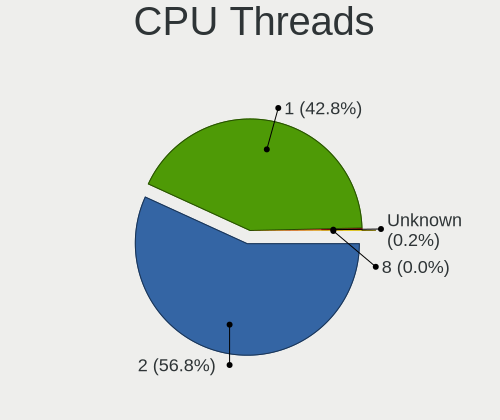
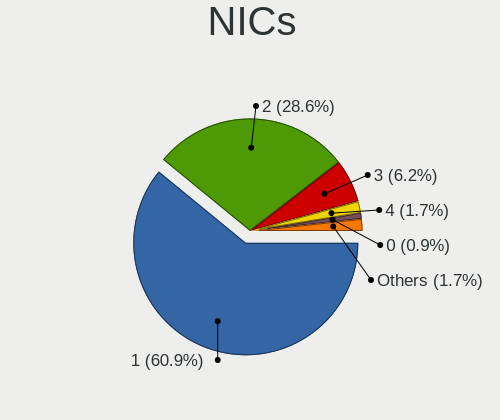
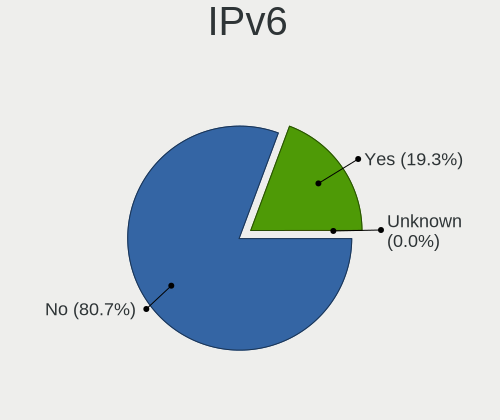
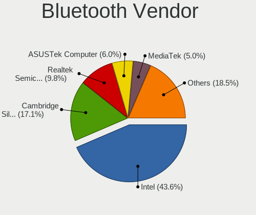
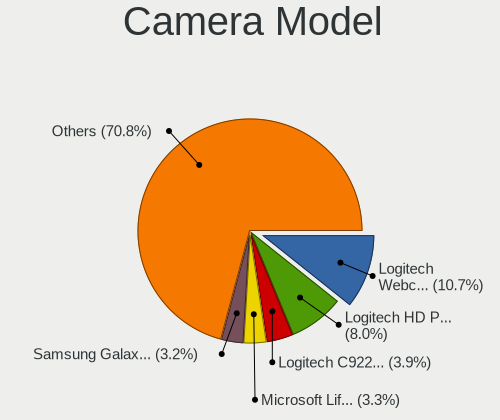

Debian - Tested Hardware & Statistics (Desktops)
------------------------------------------------

A project to collect tested hardware configurations for Debian.

Anyone can contribute to this report by the [hw-probe](https://github.com/linuxhw/hw-probe) tool:

    sudo -E hw-probe -all -upload

Please contribute! Especially if your hardware is rare.

Contents
--------

* [ Test Cases ](#test-cases)

* [ System ](#system)
  - [ OS                       ](#os)
  - [ OS Family                ](#os-family)
  - [ Kernel                   ](#kernel)
  - [ Kernel Family            ](#kernel-family)
  - [ Kernel Major Ver.        ](#kernel-major-ver)
  - [ Arch                     ](#arch)
  - [ DE                       ](#de)
  - [ Display Server           ](#display-server)
  - [ Display Manager          ](#display-manager)
  - [ OS Lang                  ](#os-lang)
  - [ Boot Mode                ](#boot-mode)
  - [ Filesystem               ](#filesystem)
  - [ Part. scheme             ](#part-scheme)
  - [ Dual Boot with Linux/BSD ](#dual-boot-with-linuxbsd)
  - [ Dual Boot (Win)          ](#dual-boot-win)

* [ Board ](#board)
  - [ Vendor                   ](#vendor)
  - [ Model                    ](#model)
  - [ Model Family             ](#model-family)
  - [ MFG Year                 ](#mfg-year)
  - [ Form Factor              ](#form-factor)
  - [ Secure Boot              ](#secure-boot)
  - [ Coreboot                 ](#coreboot)
  - [ RAM Size                 ](#ram-size)
  - [ RAM Used                 ](#ram-used)
  - [ Total Drives             ](#total-drives)
  - [ Has CD-ROM               ](#has-cd-rom)
  - [ Has Ethernet             ](#has-ethernet)
  - [ Has WiFi                 ](#has-wifi)
  - [ Has Bluetooth            ](#has-bluetooth)

* [ Location ](#location)
  - [ Country                  ](#country)
  - [ City                     ](#city)

* [ Drives ](#drives)
  - [ Drive Vendor             ](#drive-vendor)
  - [ Drive Model              ](#drive-model)
  - [ HDD Vendor               ](#hdd-vendor)
  - [ SSD Vendor               ](#ssd-vendor)
  - [ Drive Kind               ](#drive-kind)
  - [ Drive Connector          ](#drive-connector)
  - [ Drive Size               ](#drive-size)
  - [ Space Total              ](#space-total)
  - [ Space Used               ](#space-used)
  - [ Malfunc. Drives          ](#malfunc-drives)
  - [ Malfunc. Drive Vendor    ](#malfunc-drive-vendor)
  - [ Malfunc. HDD Vendor      ](#malfunc-hdd-vendor)
  - [ Malfunc. Drive Kind      ](#malfunc-drive-kind)
  - [ Failed Drives            ](#failed-drives)
  - [ Failed Drive Vendor      ](#failed-drive-vendor)
  - [ Drive Status             ](#drive-status)

* [ Storage controller ](#storage-controller)
  - [ Storage Vendor           ](#storage-vendor)
  - [ Storage Model            ](#storage-model)
  - [ Storage Kind             ](#storage-kind)

* [ Processor ](#processor)
  - [ CPU Vendor               ](#cpu-vendor)
  - [ CPU Model                ](#cpu-model)
  - [ CPU Model Family         ](#cpu-model-family)
  - [ CPU Cores                ](#cpu-cores)
  - [ CPU Sockets              ](#cpu-sockets)
  - [ CPU Threads              ](#cpu-threads)
  - [ CPU Op-Modes             ](#cpu-op-modes)
  - [ CPU Microcode            ](#cpu-microcode)
  - [ CPU Microarch            ](#cpu-microarch)

* [ Graphics ](#graphics)
  - [ GPU Vendor               ](#gpu-vendor)
  - [ GPU Model                ](#gpu-model)
  - [ GPU Combo                ](#gpu-combo)
  - [ GPU Driver               ](#gpu-driver)
  - [ GPU Memory               ](#gpu-memory)

* [ Monitor ](#monitor)
  - [ Monitor Vendor           ](#monitor-vendor)
  - [ Monitor Model            ](#monitor-model)
  - [ Monitor Resolution       ](#monitor-resolution)
  - [ Monitor Diagonal         ](#monitor-diagonal)
  - [ Monitor Width            ](#monitor-width)
  - [ Aspect Ratio             ](#aspect-ratio)
  - [ Monitor Area             ](#monitor-area)
  - [ Pixel Density            ](#pixel-density)
  - [ Multiple Monitors        ](#multiple-monitors)

* [ Network ](#network)
  - [ Net Controller Vendor    ](#net-controller-vendor)
  - [ Net Controller Model     ](#net-controller-model)
  - [ Wireless Vendor          ](#wireless-vendor)
  - [ Wireless Model           ](#wireless-model)
  - [ Ethernet Vendor          ](#ethernet-vendor)
  - [ Ethernet Model           ](#ethernet-model)
  - [ Net Controller Kind      ](#net-controller-kind)
  - [ Used Controller          ](#used-controller)
  - [ NICs                     ](#nics)
  - [ IPv6                     ](#ipv6)

* [ Bluetooth ](#bluetooth)
  - [ Bluetooth Vendor         ](#bluetooth-vendor)
  - [ Bluetooth Model          ](#bluetooth-model)

* [ Sound ](#sound)
  - [ Sound Vendor             ](#sound-vendor)
  - [ Sound Model              ](#sound-model)

* [ Memory ](#memory)
  - [ Memory Vendor            ](#memory-vendor)
  - [ Memory Model             ](#memory-model)
  - [ Memory Kind              ](#memory-kind)
  - [ Memory Form Factor       ](#memory-form-factor)
  - [ Memory Size              ](#memory-size)
  - [ Memory Speed             ](#memory-speed)

* [ Printers & scanners ](#printers--scanners)
  - [ Printer Vendor           ](#printer-vendor)
  - [ Printer Model            ](#printer-model)
  - [ Scanner Vendor           ](#scanner-vendor)
  - [ Scanner Model            ](#scanner-model)

* [ Camera ](#camera)
  - [ Camera Vendor            ](#camera-vendor)
  - [ Camera Model             ](#camera-model)

* [ Security ](#security)
  - [ Fingerprint Vendor       ](#fingerprint-vendor)
  - [ Fingerprint Model        ](#fingerprint-model)
  - [ Chipcard Vendor          ](#chipcard-vendor)
  - [ Chipcard Model           ](#chipcard-model)

* [ Unsupported ](#unsupported)
  - [ Unsupported Devices      ](#unsupported-devices)
  - [ Unsupported Device Types ](#unsupported-device-types)

Test Cases
----------

Total: 4693

| Vendor        | Model                       | Probe                                                      | Date         |
|---------------|-----------------------------|------------------------------------------------------------|--------------|
| Medion        | TJ4125                      | [2024916642](https://linux-hardware.org/?probe=2024916642) | Feb 28, 2023 |
| CWWK          | CW-J6-6L                    | [46c17d2c14](https://linux-hardware.org/?probe=46c17d2c14) | Feb 28, 2023 |
| ASUSTek       | AT4NM10T-I                  | [921aebe62a](https://linux-hardware.org/?probe=921aebe62a) | Feb 28, 2023 |
| Unknown       | Unknown                     | [89822406cc](https://linux-hardware.org/?probe=89822406cc) | Feb 28, 2023 |
| HP            | 83E2                        | [fdbe4ec1cb](https://linux-hardware.org/?probe=fdbe4ec1cb) | Feb 28, 2023 |
| Gigabyte      | A320M-S2H-CF                | [19fd766ea6](https://linux-hardware.org/?probe=19fd766ea6) | Feb 28, 2023 |
| ASUSTek       | P8B75-V                     | [17fcfc2758](https://linux-hardware.org/?probe=17fcfc2758) | Feb 28, 2023 |
| AZW           | MINI S                      | [e65b0d1ef6](https://linux-hardware.org/?probe=e65b0d1ef6) | Feb 28, 2023 |
| Gigabyte      | H61M-DS2                    | [49205269e7](https://linux-hardware.org/?probe=49205269e7) | Feb 28, 2023 |
| Intel         | D945GCPE AAD97209-201       | [672684e416](https://linux-hardware.org/?probe=672684e416) | Feb 28, 2023 |
| ASUSTek       | AT4NM10T-I                  | [fa2df8125a](https://linux-hardware.org/?probe=fa2df8125a) | Feb 28, 2023 |
| ASUSTek       | M5A78L-M PLUS/USB3          | [8cadddf432](https://linux-hardware.org/?probe=8cadddf432) | Feb 28, 2023 |
| Intel         | D945GCPE AAD97209-201       | [edf2240a74](https://linux-hardware.org/?probe=edf2240a74) | Feb 28, 2023 |
| ASRock        | N68C-S UCC                  | [a5469adf59](https://linux-hardware.org/?probe=a5469adf59) | Feb 28, 2023 |
| ASRockRack    | X470D4U2-2T                 | [4d3d5e02a1](https://linux-hardware.org/?probe=4d3d5e02a1) | Feb 28, 2023 |
| ASRock        | X370 Professional Gaming    | [3a670fbd63](https://linux-hardware.org/?probe=3a670fbd63) | Feb 27, 2023 |
| HP            | 3397                        | [8081d24eb1](https://linux-hardware.org/?probe=8081d24eb1) | Feb 27, 2023 |
| Dell          | 0MH651                      | [7921e9f8bc](https://linux-hardware.org/?probe=7921e9f8bc) | Feb 27, 2023 |
| Aquarius      | AQH310CM                    | [a2f4d0f77e](https://linux-hardware.org/?probe=a2f4d0f77e) | Feb 27, 2023 |
| ASUSTek       | P8B75-V                     | [7a8e478900](https://linux-hardware.org/?probe=7a8e478900) | Feb 27, 2023 |
| ASUSTek       | H61M-E                      | [ee5b36d127](https://linux-hardware.org/?probe=ee5b36d127) | Feb 27, 2023 |
| Dell          | 0NW6H5 A00                  | [b4485b65b3](https://linux-hardware.org/?probe=b4485b65b3) | Feb 27, 2023 |
| Dell          | 0NW6H5 A00                  | [a52e16df32](https://linux-hardware.org/?probe=a52e16df32) | Feb 27, 2023 |
| ASRock        | 970M Pro3                   | [787ddfd44c](https://linux-hardware.org/?probe=787ddfd44c) | Feb 26, 2023 |
| Gigabyte      | B550 GAMING X V2            | [9c64d6366e](https://linux-hardware.org/?probe=9c64d6366e) | Feb 26, 2023 |
| ASUSTek       | PRIME X370-PRO              | [aaa112feae](https://linux-hardware.org/?probe=aaa112feae) | Feb 26, 2023 |
| MSI           | B85M-E45                    | [a7748c0e8b](https://linux-hardware.org/?probe=a7748c0e8b) | Feb 25, 2023 |
| Medion        | TJ4125                      | [bde9228741](https://linux-hardware.org/?probe=bde9228741) | Feb 25, 2023 |
| Unknown       | Unknown                     | [3d8e9cb31b](https://linux-hardware.org/?probe=3d8e9cb31b) | Feb 24, 2023 |
| Intel         | JSL MRD                     | [84a33f3c84](https://linux-hardware.org/?probe=84a33f3c84) | Feb 24, 2023 |
| ASUSTek       | TUF Gaming X570-PLUS        | [7fe6e0dcde](https://linux-hardware.org/?probe=7fe6e0dcde) | Feb 24, 2023 |
| Fujitsu Si... | D2824-A1 S26361-D2824-A1    | [f5b4a5da72](https://linux-hardware.org/?probe=f5b4a5da72) | Feb 24, 2023 |
| HP            | 82F2 A01                    | [efc9b2fdbf](https://linux-hardware.org/?probe=efc9b2fdbf) | Feb 24, 2023 |
| HP            | 82F2 A01                    | [24dc4341d3](https://linux-hardware.org/?probe=24dc4341d3) | Feb 24, 2023 |
| Unknown       | Unknown                     | [5070b384cc](https://linux-hardware.org/?probe=5070b384cc) | Feb 24, 2023 |
| Seeed Stud... | ODYSSEY-X86J4105 SD-BS-C... | [1989031eb6](https://linux-hardware.org/?probe=1989031eb6) | Feb 24, 2023 |
| Dell          | 0CNWVK A02                  | [1fd825c3df](https://linux-hardware.org/?probe=1fd825c3df) | Feb 24, 2023 |
| MSI           | MPG Z690 CARBON WIFI        | [52b14c9235](https://linux-hardware.org/?probe=52b14c9235) | Feb 24, 2023 |
| MSI           | MPG Z690 CARBON WIFI        | [a09d17dd16](https://linux-hardware.org/?probe=a09d17dd16) | Feb 24, 2023 |
| Dell          | 0GY6Y8 A01                  | [0806dcb9ca](https://linux-hardware.org/?probe=0806dcb9ca) | Feb 24, 2023 |
| Dell          | 0GY6Y8 A01                  | [e3cdd0b411](https://linux-hardware.org/?probe=e3cdd0b411) | Feb 24, 2023 |
| Gigabyte      | H610M S2H DDR4              | [e44618f1c3](https://linux-hardware.org/?probe=e44618f1c3) | Feb 23, 2023 |
| ASUSTek       | KRPA-U16 Series             | [e417ffd8e7](https://linux-hardware.org/?probe=e417ffd8e7) | Feb 23, 2023 |
| ASUSTek       | PRIME B560-PLUS             | [4f19f71811](https://linux-hardware.org/?probe=4f19f71811) | Feb 23, 2023 |
| ASUSTek       | P8H67-M                     | [a3ea522d78](https://linux-hardware.org/?probe=a3ea522d78) | Feb 23, 2023 |
| Intel         | H61                         | [de757dd659](https://linux-hardware.org/?probe=de757dd659) | Feb 23, 2023 |
| AZW           | U59                         | [9289537f45](https://linux-hardware.org/?probe=9289537f45) | Feb 22, 2023 |
| ASRockRack    | X470D4U2-2T                 | [9d233c96b5](https://linux-hardware.org/?probe=9d233c96b5) | Feb 22, 2023 |
| ASUSTek       | P8B75-V                     | [fb050eaf3c](https://linux-hardware.org/?probe=fb050eaf3c) | Feb 22, 2023 |
| Gigabyte      | B360 AORUS GAMING 3 WIFI... | [1d2132b142](https://linux-hardware.org/?probe=1d2132b142) | Feb 22, 2023 |
| AZW           | U59                         | [368562790b](https://linux-hardware.org/?probe=368562790b) | Feb 22, 2023 |
| ASUSTek       | PRIME X399-A                | [4009d82fc8](https://linux-hardware.org/?probe=4009d82fc8) | Feb 22, 2023 |
| Unknown       | Unknown                     | [5cf4127d47](https://linux-hardware.org/?probe=5cf4127d47) | Feb 21, 2023 |
| MSI           | MAG Z590 TORPEDO            | [30f09c71a1](https://linux-hardware.org/?probe=30f09c71a1) | Feb 21, 2023 |
| ASUSTek       | P8B75-V                     | [de56e36164](https://linux-hardware.org/?probe=de56e36164) | Feb 21, 2023 |
| HP            | ProLiant ML110 G7           | [56cbaf4274](https://linux-hardware.org/?probe=56cbaf4274) | Feb 21, 2023 |
| ASUSTek       | PRIME H310M-K R2.0          | [211cd972f0](https://linux-hardware.org/?probe=211cd972f0) | Feb 20, 2023 |
| Lenovo        | ThinkCentre M58e 7269E3S    | [6b30da3a31](https://linux-hardware.org/?probe=6b30da3a31) | Feb 20, 2023 |
| Dell          | 073MMW A02                  | [aa198228bc](https://linux-hardware.org/?probe=aa198228bc) | Feb 19, 2023 |
| Dell          | 0T065F A01                  | [c8b1f8651a](https://linux-hardware.org/?probe=c8b1f8651a) | Feb 19, 2023 |
| Gigabyte      | X299 UD4 Pro-CF             | [d442995b00](https://linux-hardware.org/?probe=d442995b00) | Feb 19, 2023 |
| Lenovo        | 3178 SDK0J40697 WIN 3305... | [34681494ec](https://linux-hardware.org/?probe=34681494ec) | Feb 18, 2023 |
| Pegatron      | 2AB6                        | [537c2d1b64](https://linux-hardware.org/?probe=537c2d1b64) | Feb 18, 2023 |
| Intel         | JSL MRD                     | [5e021f6a92](https://linux-hardware.org/?probe=5e021f6a92) | Feb 18, 2023 |
| Lenovo        | 3178 SDK0J40697 WIN 3305... | [a2cdf7d471](https://linux-hardware.org/?probe=a2cdf7d471) | Feb 18, 2023 |
| Gigabyte      | GA-A55M-DS2                 | [3159aede6c](https://linux-hardware.org/?probe=3159aede6c) | Feb 17, 2023 |
| ASUSTek       | H110M-R                     | [bd6636c99d](https://linux-hardware.org/?probe=bd6636c99d) | Feb 17, 2023 |
| Intel         | H61                         | [90e4a9358f](https://linux-hardware.org/?probe=90e4a9358f) | Feb 17, 2023 |
| MSI           | X399 SLI PLUS               | [8741094cd9](https://linux-hardware.org/?probe=8741094cd9) | Feb 17, 2023 |
| Lenovo        | 3164 NOK                    | [f69ff4a8c8](https://linux-hardware.org/?probe=f69ff4a8c8) | Feb 16, 2023 |
| MSI           | Z270 TOMAHAWK ARCTIC        | [cfdcc68921](https://linux-hardware.org/?probe=cfdcc68921) | Feb 16, 2023 |
| MSI           | Z270 TOMAHAWK ARCTIC        | [7bb3c6268f](https://linux-hardware.org/?probe=7bb3c6268f) | Feb 16, 2023 |
| Gigabyte      | B550 AORUS PRO V2           | [8f202b88fa](https://linux-hardware.org/?probe=8f202b88fa) | Feb 16, 2023 |
| ASRock        | B550 Pro4                   | [9ad890517a](https://linux-hardware.org/?probe=9ad890517a) | Feb 16, 2023 |
| ASRock        | X370 Gaming X               | [cda38b5b9b](https://linux-hardware.org/?probe=cda38b5b9b) | Feb 16, 2023 |
| ASUSTek       | P7H55-M SI                  | [387881f288](https://linux-hardware.org/?probe=387881f288) | Feb 16, 2023 |
| ASUSTek       | TUF Gaming B550-PLUS        | [bbce6ba3b1](https://linux-hardware.org/?probe=bbce6ba3b1) | Feb 16, 2023 |
| Lenovo        | 1030 SDK0J40705 WIN 3425... | [daed0124f0](https://linux-hardware.org/?probe=daed0124f0) | Feb 16, 2023 |
| Gigabyte      | H270M-D3H-CF                | [7a58ceb644](https://linux-hardware.org/?probe=7a58ceb644) | Feb 15, 2023 |
| ASUSTek       | F2A85-M PRO                 | [c5b8952fdb](https://linux-hardware.org/?probe=c5b8952fdb) | Feb 15, 2023 |
| ASRock        | X300M-STX                   | [2b25f214e9](https://linux-hardware.org/?probe=2b25f214e9) | Feb 15, 2023 |
| ASRock        | X300M-STX                   | [5bf8aa635c](https://linux-hardware.org/?probe=5bf8aa635c) | Feb 15, 2023 |
| Gigabyte      | EP43-S3L                    | [82730ed699](https://linux-hardware.org/?probe=82730ed699) | Feb 15, 2023 |
| Itautec       | ST 4265                     | [84023fa8ac](https://linux-hardware.org/?probe=84023fa8ac) | Feb 15, 2023 |
| ASUSTek       | P5GD1 PRO                   | [043021ca86](https://linux-hardware.org/?probe=043021ca86) | Feb 15, 2023 |
| ASRock        | Z77 Extreme6                | [48328ab864](https://linux-hardware.org/?probe=48328ab864) | Feb 15, 2023 |
| Unknown       | Unknown                     | [fe12f077df](https://linux-hardware.org/?probe=fe12f077df) | Feb 15, 2023 |
| Gigabyte      | B450M H                     | [5ebd73227b](https://linux-hardware.org/?probe=5ebd73227b) | Feb 14, 2023 |
| Unknown       | Unknown                     | [0ac84e31dd](https://linux-hardware.org/?probe=0ac84e31dd) | Feb 14, 2023 |
| Dell          | 0RN474                      | [5c1bf45372](https://linux-hardware.org/?probe=5c1bf45372) | Feb 14, 2023 |
| Gigabyte      | B550 AORUS PRO V2           | [27fa84ce56](https://linux-hardware.org/?probe=27fa84ce56) | Feb 14, 2023 |
| ASUSTek       | Pro WS WRX80E-SAGE SE WI... | [8895a873ab](https://linux-hardware.org/?probe=8895a873ab) | Feb 14, 2023 |
| ASUSTek       | Pro WS WRX80E-SAGE SE WI... | [fb00615692](https://linux-hardware.org/?probe=fb00615692) | Feb 14, 2023 |
| Gigabyte      | X570 UD                     | [ae563f7bfe](https://linux-hardware.org/?probe=ae563f7bfe) | Feb 14, 2023 |
| HP            | 3648h                       | [18eb122bc9](https://linux-hardware.org/?probe=18eb122bc9) | Feb 14, 2023 |
| Shenzhen M... | F6BFC                       | [67b141272c](https://linux-hardware.org/?probe=67b141272c) | Feb 14, 2023 |
| LORD ELECT... | LORD G4x 775 ICH7 8712 A... | [c69ee15636](https://linux-hardware.org/?probe=c69ee15636) | Feb 14, 2023 |
| Dell          | 0RN474                      | [20f3c37dc2](https://linux-hardware.org/?probe=20f3c37dc2) | Feb 14, 2023 |
| Lenovo        | 36F7 SDK0J40700 WIN 3258... | [34ad4bac16](https://linux-hardware.org/?probe=34ad4bac16) | Feb 13, 2023 |
| IceWhale T... | ZimaBoard 832 ZMB           | [55e684c121](https://linux-hardware.org/?probe=55e684c121) | Feb 13, 2023 |
| Unknown       | Unknown                     | [c49317ce12](https://linux-hardware.org/?probe=c49317ce12) | Feb 13, 2023 |
| MSI           | H97 GAMING 3                | [855634fadc](https://linux-hardware.org/?probe=855634fadc) | Feb 13, 2023 |
| Unknown       | Unknown                     | [b1d1f36f51](https://linux-hardware.org/?probe=b1d1f36f51) | Feb 13, 2023 |
| ASUSTek       | CROSSHAIR V FORMULA-Z       | [517a5a9e81](https://linux-hardware.org/?probe=517a5a9e81) | Feb 13, 2023 |
| ASUSTek       | TUF Gaming B550-PRO         | [e83cd923a5](https://linux-hardware.org/?probe=e83cd923a5) | Feb 13, 2023 |
| Gigabyte      | B450M H                     | [124d65cd04](https://linux-hardware.org/?probe=124d65cd04) | Feb 12, 2023 |
| Gigabyte      | H81M-S2V                    | [09dff429cd](https://linux-hardware.org/?probe=09dff429cd) | Feb 12, 2023 |
| ASUSTek       | TUF Gaming B550-PRO         | [52674d23ad](https://linux-hardware.org/?probe=52674d23ad) | Feb 12, 2023 |
| ASRock        | X300M-STX                   | [4829b991be](https://linux-hardware.org/?probe=4829b991be) | Feb 12, 2023 |
| ASRock        | A320M-DVS R4.0              | [1589cfe790](https://linux-hardware.org/?probe=1589cfe790) | Feb 11, 2023 |
| ASRock        | A320M-DVS R4.0              | [22fdde82eb](https://linux-hardware.org/?probe=22fdde82eb) | Feb 11, 2023 |
| ASUSTek       | PRIME H310M-K R2.0          | [ed3233c97b](https://linux-hardware.org/?probe=ed3233c97b) | Feb 11, 2023 |
| ASUSTek       | P5VD2-X                     | [32a509e760](https://linux-hardware.org/?probe=32a509e760) | Feb 11, 2023 |
| ASUSTek       | PRIME H310M-K R2.0          | [2695a9350a](https://linux-hardware.org/?probe=2695a9350a) | Feb 11, 2023 |
| ASUSTek       | ROG STRIX Z690-A GAMING ... | [d003016397](https://linux-hardware.org/?probe=d003016397) | Feb 11, 2023 |
| AZW           | U59                         | [24ccf521f0](https://linux-hardware.org/?probe=24ccf521f0) | Feb 11, 2023 |
| Dell          | 0J3C2F A00                  | [a3f08d08aa](https://linux-hardware.org/?probe=a3f08d08aa) | Feb 11, 2023 |
| MSI           | H110M PRO-VD                | [5483d83053](https://linux-hardware.org/?probe=5483d83053) | Feb 11, 2023 |
| Lenovo        | SHARKBAY 0B98401 WIN        | [7b6a31ec69](https://linux-hardware.org/?probe=7b6a31ec69) | Feb 11, 2023 |
| AMD           | CM-iGLX Platform Board R... | [c256a73072](https://linux-hardware.org/?probe=c256a73072) | Feb 11, 2023 |
| Maxtang       | EHL30 V1.0                  | [4d133c615c](https://linux-hardware.org/?probe=4d133c615c) | Feb 10, 2023 |
| ASRockRack    | X570D4U                     | [bb2c98768e](https://linux-hardware.org/?probe=bb2c98768e) | Feb 10, 2023 |
| ASUSTek       | TUF Gaming B550M-PLUS       | [65e66dbf71](https://linux-hardware.org/?probe=65e66dbf71) | Feb 10, 2023 |
| Intel         | H61                         | [e07896a0a6](https://linux-hardware.org/?probe=e07896a0a6) | Feb 10, 2023 |
| ASUSTek       | M4N78                       | [34ddf02a41](https://linux-hardware.org/?probe=34ddf02a41) | Feb 10, 2023 |
| Gigabyte      | B550 GAMING X V2            | [8c4ab545de](https://linux-hardware.org/?probe=8c4ab545de) | Feb 09, 2023 |
| Acer          | Veriton N4630G              | [262d8ec347](https://linux-hardware.org/?probe=262d8ec347) | Feb 09, 2023 |
| MSI           | H97 GAMING 3                | [209d4693fe](https://linux-hardware.org/?probe=209d4693fe) | Feb 09, 2023 |
| ASUSTek       | SABERTOOTH 990FX R2.0       | [82173d3b08](https://linux-hardware.org/?probe=82173d3b08) | Feb 09, 2023 |
| ASUSTek       | PRIME B660-PLUS D4          | [a0132107aa](https://linux-hardware.org/?probe=a0132107aa) | Feb 08, 2023 |
| ASUSTek       | PRIME B660-PLUS D4          | [6231dbe6d4](https://linux-hardware.org/?probe=6231dbe6d4) | Feb 08, 2023 |
| Gigabyte      | GA-MA78GM-S2H               | [bbaa8165e4](https://linux-hardware.org/?probe=bbaa8165e4) | Feb 08, 2023 |
| Lenovo        | 3164 NOK                    | [750d30cb48](https://linux-hardware.org/?probe=750d30cb48) | Feb 08, 2023 |
| Intel         | DH67CL AAG10212-208         | [e53a89d83d](https://linux-hardware.org/?probe=e53a89d83d) | Feb 08, 2023 |
| Lenovo        | 3178 SDK0J40697 WIN 3305... | [8fb3a20b27](https://linux-hardware.org/?probe=8fb3a20b27) | Feb 08, 2023 |
| ASUSTek       | PRIME H610M-A WIFI D4       | [69f96bffa5](https://linux-hardware.org/?probe=69f96bffa5) | Feb 07, 2023 |
| Lenovo        | 3178 SDK0J40697 WIN 3305... | [83380dcad6](https://linux-hardware.org/?probe=83380dcad6) | Feb 07, 2023 |
| ASUSTek       | Pro WS X570-ACE             | [4b19274da1](https://linux-hardware.org/?probe=4b19274da1) | Feb 06, 2023 |
| ASUSTek       | ROG Maximus Z690 FORMULA    | [bc5b9a2c5d](https://linux-hardware.org/?probe=bc5b9a2c5d) | Feb 06, 2023 |
| HP            | 3397                        | [2fb7638874](https://linux-hardware.org/?probe=2fb7638874) | Feb 06, 2023 |
| Intel         | DH77EB AAG39073-304         | [b3169f788f](https://linux-hardware.org/?probe=b3169f788f) | Feb 06, 2023 |
| AZW           | U59                         | [b97c4f6277](https://linux-hardware.org/?probe=b97c4f6277) | Feb 06, 2023 |
| MSI           | MPG Z690 CARBON WIFI        | [db292bc714](https://linux-hardware.org/?probe=db292bc714) | Feb 05, 2023 |
| HP            | 0A64h                       | [40ef639345](https://linux-hardware.org/?probe=40ef639345) | Feb 05, 2023 |
| Huanan        | X99-T8D V1.2                | [cb7e750cee](https://linux-hardware.org/?probe=cb7e750cee) | Feb 05, 2023 |
| ASUSTek       | ROG Maximus Z690 FORMULA    | [55402fea35](https://linux-hardware.org/?probe=55402fea35) | Feb 05, 2023 |
| Gigabyte      | H61MA-D2V                   | [b708cdc12f](https://linux-hardware.org/?probe=b708cdc12f) | Feb 05, 2023 |
| Gigabyte      | B450M S2H                   | [c3891f43b5](https://linux-hardware.org/?probe=c3891f43b5) | Feb 05, 2023 |
| Gigabyte      | Z77X-UD3H                   | [6023defc83](https://linux-hardware.org/?probe=6023defc83) | Feb 05, 2023 |
| HP            | 2B36                        | [dde1352d90](https://linux-hardware.org/?probe=dde1352d90) | Feb 05, 2023 |
| Unknown       | Unknown                     | [5a491991ef](https://linux-hardware.org/?probe=5a491991ef) | Feb 05, 2023 |
| MSI           | A320M PRO-M2                | [3fa2ac81f2](https://linux-hardware.org/?probe=3fa2ac81f2) | Feb 05, 2023 |
| Dell          | 0D4MD1 A00                  | [7198c3d131](https://linux-hardware.org/?probe=7198c3d131) | Feb 05, 2023 |
| ECS           | H61H2-MV                    | [e0a93d257b](https://linux-hardware.org/?probe=e0a93d257b) | Feb 05, 2023 |
| OEM           | Intel H81                   | [806280459d](https://linux-hardware.org/?probe=806280459d) | Feb 05, 2023 |
| Lenovo        | 3178 SDK0J40697 WIN 3305... | [f2423d1d75](https://linux-hardware.org/?probe=f2423d1d75) | Feb 05, 2023 |
| ASUSTek       | PRIME Z690-P WIFI D4        | [2543adebba](https://linux-hardware.org/?probe=2543adebba) | Feb 05, 2023 |
| HP            | 1589                        | [7b3a0cf51b](https://linux-hardware.org/?probe=7b3a0cf51b) | Feb 04, 2023 |
| ASRock        | 4X4-4000 Series             | [4ed27fe851](https://linux-hardware.org/?probe=4ed27fe851) | Feb 04, 2023 |
| Gigabyte      | MZBSWMP-00                  | [018b3728ea](https://linux-hardware.org/?probe=018b3728ea) | Feb 04, 2023 |
| Gigabyte      | MZBSWMP-00                  | [52bb20e0b2](https://linux-hardware.org/?probe=52bb20e0b2) | Feb 04, 2023 |
| ECS           | A780GM-A                    | [2cb7086ff1](https://linux-hardware.org/?probe=2cb7086ff1) | Feb 04, 2023 |
| ECS           | A780GM-A                    | [6f6599f880](https://linux-hardware.org/?probe=6f6599f880) | Feb 04, 2023 |
| HP            | 3048h                       | [03b28af2be](https://linux-hardware.org/?probe=03b28af2be) | Feb 03, 2023 |
| AZW           | MINI S                      | [6c746a5f95](https://linux-hardware.org/?probe=6c746a5f95) | Feb 03, 2023 |
| ASUSTek       | M5A97 R2.0                  | [c0c511ec65](https://linux-hardware.org/?probe=c0c511ec65) | Feb 03, 2023 |
| Dell          | 05WNJ2 A02                  | [4619f572c5](https://linux-hardware.org/?probe=4619f572c5) | Feb 03, 2023 |
| BESSTAR Te... | TH50                        | [6d39ef2792](https://linux-hardware.org/?probe=6d39ef2792) | Feb 03, 2023 |
| Intel         | SKYBAY                      | [a75cb78ad9](https://linux-hardware.org/?probe=a75cb78ad9) | Feb 02, 2023 |
| NEC Comput... | MS9666 011                  | [26a38770fe](https://linux-hardware.org/?probe=26a38770fe) | Feb 02, 2023 |
| ASUSTek       | Z170-DELUXE                 | [2cb0ec3b98](https://linux-hardware.org/?probe=2cb0ec3b98) | Feb 01, 2023 |
| Lenovo        | MAHOBAY Win8 STD MM DPK ... | [203e3fe693](https://linux-hardware.org/?probe=203e3fe693) | Feb 01, 2023 |
| ASUSTek       | P9X79                       | [01e8662b39](https://linux-hardware.org/?probe=01e8662b39) | Feb 01, 2023 |
| Gigabyte      | X299 AORUS Gaming 3-CF      | [775a993b3a](https://linux-hardware.org/?probe=775a993b3a) | Feb 01, 2023 |
| MSI           | MAG B550 TOMAHAWK           | [142f5fcb2d](https://linux-hardware.org/?probe=142f5fcb2d) | Feb 01, 2023 |
| ASRock        | X570 Pro4                   | [81b19ff917](https://linux-hardware.org/?probe=81b19ff917) | Feb 01, 2023 |
| Gigabyte      | Z690M DS3H DDR4             | [8f858cb9b9](https://linux-hardware.org/?probe=8f858cb9b9) | Jan 31, 2023 |
| MSI           | 870A-G54                    | [0aaa012de5](https://linux-hardware.org/?probe=0aaa012de5) | Jan 31, 2023 |
| Gigabyte      | P85-D3                      | [7e25d19fae](https://linux-hardware.org/?probe=7e25d19fae) | Jan 31, 2023 |
| Gigabyte      | B450 AORUS ELITE            | [a2c87504d6](https://linux-hardware.org/?probe=a2c87504d6) | Jan 31, 2023 |
| ASRock        | G31M-VS2                    | [e12dd528ea](https://linux-hardware.org/?probe=e12dd528ea) | Jan 31, 2023 |
| MSI           | H81M-E34                    | [19b8f90522](https://linux-hardware.org/?probe=19b8f90522) | Jan 31, 2023 |
| ASUSTek       | PRIME B250-A                | [c686d3d123](https://linux-hardware.org/?probe=c686d3d123) | Jan 31, 2023 |
| ASRock        | X570 Pro4                   | [37999411ed](https://linux-hardware.org/?probe=37999411ed) | Jan 31, 2023 |
| ASUSTek       | H61M-A/BR                   | [b6a73bd22e](https://linux-hardware.org/?probe=b6a73bd22e) | Jan 30, 2023 |
| ASUSTek       | H61M-A/BR                   | [0ae96c2bbc](https://linux-hardware.org/?probe=0ae96c2bbc) | Jan 30, 2023 |
| NetGear       | ReadyDATA 5200              | [74a68eba33](https://linux-hardware.org/?probe=74a68eba33) | Jan 30, 2023 |
| ASUSTek       | P8H61-MX                    | [f13f4da766](https://linux-hardware.org/?probe=f13f4da766) | Jan 30, 2023 |
| HP            | 0A64h                       | [da7b36ad47](https://linux-hardware.org/?probe=da7b36ad47) | Jan 30, 2023 |
| Dell          | 02YRK5 A02                  | [d6faeebd74](https://linux-hardware.org/?probe=d6faeebd74) | Jan 29, 2023 |
| Gigabyte      | Z270X-Ultra Gaming-CF       | [55c3e9597c](https://linux-hardware.org/?probe=55c3e9597c) | Jan 29, 2023 |
| ASUSTek       | ROG Maximus XIII HERO       | [6b634c85e8](https://linux-hardware.org/?probe=6b634c85e8) | Jan 29, 2023 |
| ASUSTek       | P8H67                       | [c6163491b5](https://linux-hardware.org/?probe=c6163491b5) | Jan 29, 2023 |
| Medion        | TJ4125                      | [5fb5d01ae9](https://linux-hardware.org/?probe=5fb5d01ae9) | Jan 29, 2023 |
| Gigabyte      | 8IPE1000-G/L                | [6f83e8b57d](https://linux-hardware.org/?probe=6f83e8b57d) | Jan 29, 2023 |
| MSI           | MAG B550M MORTAR WIFI       | [eb551b5ec0](https://linux-hardware.org/?probe=eb551b5ec0) | Jan 29, 2023 |
| Gigabyte      | M61PME-S2                   | [8227150e0d](https://linux-hardware.org/?probe=8227150e0d) | Jan 29, 2023 |
| Gigabyte      | M61PME-S2                   | [813f01976d](https://linux-hardware.org/?probe=813f01976d) | Jan 29, 2023 |
| ASRock        | B550 Pro4                   | [eaed78d213](https://linux-hardware.org/?probe=eaed78d213) | Jan 28, 2023 |
| Dell          | 0F8098                      | [d6066c739e](https://linux-hardware.org/?probe=d6066c739e) | Jan 28, 2023 |
| Gigabyte      | Z97M-DS3H                   | [e9fc2c87df](https://linux-hardware.org/?probe=e9fc2c87df) | Jan 28, 2023 |
| ASRock        | B550 Pro4                   | [5fa28ba14d](https://linux-hardware.org/?probe=5fa28ba14d) | Jan 28, 2023 |
| ASUSTek       | Pro WS X570-ACE             | [6e55ab69b8](https://linux-hardware.org/?probe=6e55ab69b8) | Jan 28, 2023 |
| HP            | 1998                        | [81da484cc4](https://linux-hardware.org/?probe=81da484cc4) | Jan 28, 2023 |
| ASUSTek       | B85M-G                      | [4a83dc2dc2](https://linux-hardware.org/?probe=4a83dc2dc2) | Jan 27, 2023 |
| MSI           | B365M PRO-VDH               | [d5bbfc18d5](https://linux-hardware.org/?probe=d5bbfc18d5) | Jan 27, 2023 |
| AZW           | MINI S                      | [ce5e6b1504](https://linux-hardware.org/?probe=ce5e6b1504) | Jan 26, 2023 |
| ASUSTek       | Pro WS X570-ACE             | [0093f9df93](https://linux-hardware.org/?probe=0093f9df93) | Jan 26, 2023 |
| HP            | 805D                        | [b1996094a9](https://linux-hardware.org/?probe=b1996094a9) | Jan 26, 2023 |
| Inventec      | D CLASS A02                 | [2e70086887](https://linux-hardware.org/?probe=2e70086887) | Jan 25, 2023 |
| ASUSTek       | P8H61-M LX2                 | [dee0143024](https://linux-hardware.org/?probe=dee0143024) | Jan 25, 2023 |
| Gigabyte      | B450M DS3H V2               | [90d383c54e](https://linux-hardware.org/?probe=90d383c54e) | Jan 25, 2023 |
| ASUSTek       | H110M-R                     | [e4b50b33a2](https://linux-hardware.org/?probe=e4b50b33a2) | Jan 25, 2023 |
| MSI           | H110M PRO-VD                | [e0eefbde94](https://linux-hardware.org/?probe=e0eefbde94) | Jan 25, 2023 |
| Gigabyte      | B450M DS3H-CF               | [e2d354b9c5](https://linux-hardware.org/?probe=e2d354b9c5) | Jan 25, 2023 |
| Dell          | 0K3CM7 A00                  | [d3cc219bf7](https://linux-hardware.org/?probe=d3cc219bf7) | Jan 24, 2023 |
| MSI           | H97 PC Mate                 | [d00ec3c042](https://linux-hardware.org/?probe=d00ec3c042) | Jan 24, 2023 |
| ECS           | G31T-M9                     | [59747c81ca](https://linux-hardware.org/?probe=59747c81ca) | Jan 24, 2023 |
| HP            | 82B4                        | [29e2d03c1a](https://linux-hardware.org/?probe=29e2d03c1a) | Jan 24, 2023 |
| HP            | 82B4                        | [3df98736a1](https://linux-hardware.org/?probe=3df98736a1) | Jan 24, 2023 |
| ASRock        | 990FX Killer                | [b6bd3a3bdb](https://linux-hardware.org/?probe=b6bd3a3bdb) | Jan 23, 2023 |
| MSI           | 870A-G54                    | [b1baf04990](https://linux-hardware.org/?probe=b1baf04990) | Jan 23, 2023 |
| Dell          | 09M8Y8 A01                  | [3f3b6c888d](https://linux-hardware.org/?probe=3f3b6c888d) | Jan 23, 2023 |
| Gigabyte      | P85-D3                      | [69164f2a61](https://linux-hardware.org/?probe=69164f2a61) | Jan 23, 2023 |
| ASUSTek       | PRIME X399-A                | [4687e8d062](https://linux-hardware.org/?probe=4687e8d062) | Jan 22, 2023 |
| Intel         | JSL MRD                     | [39dc5a7f96](https://linux-hardware.org/?probe=39dc5a7f96) | Jan 22, 2023 |
| Lenovo        | ThinkCentre M57e 7066W57    | [3ddcdbb616](https://linux-hardware.org/?probe=3ddcdbb616) | Jan 22, 2023 |
| MSI           | B350 TOMAHAWK               | [91ef58d8a0](https://linux-hardware.org/?probe=91ef58d8a0) | Jan 22, 2023 |
| MSI           | MPG X570 GAMING PLUS        | [0c65146f4c](https://linux-hardware.org/?probe=0c65146f4c) | Jan 21, 2023 |
| Dell          | 0KRC95 A02                  | [ef532b60e6](https://linux-hardware.org/?probe=ef532b60e6) | Jan 21, 2023 |
| Biostar       | H310MHP                     | [21de314a44](https://linux-hardware.org/?probe=21de314a44) | Jan 21, 2023 |
| ASUSTek       | H170I-PLUS D3               | [b8d373b07e](https://linux-hardware.org/?probe=b8d373b07e) | Jan 21, 2023 |
| ASRock        | H61M-VG3                    | [c9d6e1cbb1](https://linux-hardware.org/?probe=c9d6e1cbb1) | Jan 21, 2023 |
| ASUSTek       | TUF Gaming B450M-PRO S      | [046504c970](https://linux-hardware.org/?probe=046504c970) | Jan 21, 2023 |
| DFI           | CR101-CST                   | [604ce5b10f](https://linux-hardware.org/?probe=604ce5b10f) | Jan 21, 2023 |
| ASUSTek       | P5QL PRO                    | [9f700f7e19](https://linux-hardware.org/?probe=9f700f7e19) | Jan 21, 2023 |
| Intel         | DH77EB AAG39073-304         | [4af2ea2f7f](https://linux-hardware.org/?probe=4af2ea2f7f) | Jan 20, 2023 |
| Dell          | 0VC8RJ X02                  | [313ea92e9c](https://linux-hardware.org/?probe=313ea92e9c) | Jan 20, 2023 |
| Gigabyte      | H410M H V2                  | [5767b63675](https://linux-hardware.org/?probe=5767b63675) | Jan 20, 2023 |
| Gigabyte      | P85-D3                      | [28e6aeb27a](https://linux-hardware.org/?probe=28e6aeb27a) | Jan 20, 2023 |
| Gigabyte      | P85-D3                      | [beec5d3864](https://linux-hardware.org/?probe=beec5d3864) | Jan 20, 2023 |
| Gigabyte      | P85-D3                      | [6ff84d12be](https://linux-hardware.org/?probe=6ff84d12be) | Jan 20, 2023 |
| Gigabyte      | P85-D3                      | [002a38370c](https://linux-hardware.org/?probe=002a38370c) | Jan 20, 2023 |
| Gigabyte      | P85-D3                      | [bbfb85788c](https://linux-hardware.org/?probe=bbfb85788c) | Jan 20, 2023 |
| Gigabyte      | P85-D3                      | [9d6c73b1c1](https://linux-hardware.org/?probe=9d6c73b1c1) | Jan 20, 2023 |
| HP            | 3397                        | [39391f23c4](https://linux-hardware.org/?probe=39391f23c4) | Jan 20, 2023 |
| HP            | 3397                        | [7b05c1fdf9](https://linux-hardware.org/?probe=7b05c1fdf9) | Jan 20, 2023 |
| AZW           | SEi                         | [257b104c3a](https://linux-hardware.org/?probe=257b104c3a) | Jan 20, 2023 |
| Gigabyte      | Z690I A ULTRA LITE D4       | [f7cac38f4a](https://linux-hardware.org/?probe=f7cac38f4a) | Jan 20, 2023 |
| AZW           | SEi                         | [481932390b](https://linux-hardware.org/?probe=481932390b) | Jan 20, 2023 |
| ASUSTek       | P5KPL-CM                    | [b9f1f115ba](https://linux-hardware.org/?probe=b9f1f115ba) | Jan 20, 2023 |
| Gigabyte      | Z690I A ULTRA LITE D4       | [abcfca9ea7](https://linux-hardware.org/?probe=abcfca9ea7) | Jan 20, 2023 |
| Lenovo        | 7033EW4                     | [fd4303de2e](https://linux-hardware.org/?probe=fd4303de2e) | Jan 20, 2023 |
| Gigabyte      | H81M-S2V                    | [76be7bde5d](https://linux-hardware.org/?probe=76be7bde5d) | Jan 19, 2023 |
| ASUSTek       | P6T                         | [ac42d5a147](https://linux-hardware.org/?probe=ac42d5a147) | Jan 19, 2023 |
| Gigabyte      | B85M-D3V                    | [285dc35475](https://linux-hardware.org/?probe=285dc35475) | Jan 19, 2023 |
| ASUSTek       | P5AD2-E-Premium             | [285c0f23f1](https://linux-hardware.org/?probe=285c0f23f1) | Jan 19, 2023 |
| ASUSTek       | ROG STRIX B650-A GAMING ... | [e3d0558aee](https://linux-hardware.org/?probe=e3d0558aee) | Jan 19, 2023 |
| ASUSTek       | P8H61-M                     | [1ffe9344ff](https://linux-hardware.org/?probe=1ffe9344ff) | Jan 18, 2023 |
| Medion        | TJ4125                      | [b4f48c3140](https://linux-hardware.org/?probe=b4f48c3140) | Jan 18, 2023 |
| Lenovo        | 7033EW4                     | [df0d8cd728](https://linux-hardware.org/?probe=df0d8cd728) | Jan 18, 2023 |
| ASRock        | A300M-STX                   | [4d726dcf9b](https://linux-hardware.org/?probe=4d726dcf9b) | Jan 17, 2023 |
| Huanan        | B75 V10.1 376               | [2703c87348](https://linux-hardware.org/?probe=2703c87348) | Jan 17, 2023 |
| ASUSTek       | PRIME H510M-K               | [f9f926e910](https://linux-hardware.org/?probe=f9f926e910) | Jan 17, 2023 |
| MSI           | H81M-E34                    | [db4a6791a0](https://linux-hardware.org/?probe=db4a6791a0) | Jan 17, 2023 |
| ASUSTek       | P5G41T-M LE                 | [31b369770d](https://linux-hardware.org/?probe=31b369770d) | Jan 17, 2023 |
| Foxconn       | nT-A3000 series FAB         | [0bdefb0a4f](https://linux-hardware.org/?probe=0bdefb0a4f) | Jan 17, 2023 |
| ASUSTek       | M2N-SLI DELUXE              | [d31aea19b2](https://linux-hardware.org/?probe=d31aea19b2) | Jan 16, 2023 |
| Intel         | DH67BL AAG10189-206         | [23e07704eb](https://linux-hardware.org/?probe=23e07704eb) | Jan 16, 2023 |
| ASRock        | J3455-ITX                   | [6746dfae39](https://linux-hardware.org/?probe=6746dfae39) | Jan 16, 2023 |
| Intel         | JSL MRD                     | [edbaf7bb5d](https://linux-hardware.org/?probe=edbaf7bb5d) | Jan 16, 2023 |
| Lenovo        | 370A SDK0J40697 WIN 3305... | [deb2b560bc](https://linux-hardware.org/?probe=deb2b560bc) | Jan 16, 2023 |
| ASRock        | J3455-ITX                   | [457c7ea5a4](https://linux-hardware.org/?probe=457c7ea5a4) | Jan 16, 2023 |
| Intel         | DH77EB AAG39073-304         | [cb3c4b1eb4](https://linux-hardware.org/?probe=cb3c4b1eb4) | Jan 16, 2023 |
| HP            | 8643 SMVB                   | [4572999070](https://linux-hardware.org/?probe=4572999070) | Jan 16, 2023 |
| MSI           | B450 TOMAHAWK MAX           | [3b4a530695](https://linux-hardware.org/?probe=3b4a530695) | Jan 15, 2023 |
| MSI           | MS-B1711                    | [730b1e7f90](https://linux-hardware.org/?probe=730b1e7f90) | Jan 15, 2023 |
| Lenovo        | SHARKBAY SDK0E50510 WIN     | [202535bce7](https://linux-hardware.org/?probe=202535bce7) | Jan 15, 2023 |
| ASUSTek       | PRIME X570-P                | [ab5933911d](https://linux-hardware.org/?probe=ab5933911d) | Jan 15, 2023 |
| ASUSTek       | TUF Gaming B460M-PLUS       | [d1e2f08907](https://linux-hardware.org/?probe=d1e2f08907) | Jan 14, 2023 |
| HP            | ProLiant MicroServer Gen... | [8a79dd9e27](https://linux-hardware.org/?probe=8a79dd9e27) | Jan 13, 2023 |
| ASRock        | H110M-HDV R3.0              | [bed628ce8a](https://linux-hardware.org/?probe=bed628ce8a) | Jan 13, 2023 |
| Lenovo        | ThinkCentre M58p 6234A1U    | [63d74a9021](https://linux-hardware.org/?probe=63d74a9021) | Jan 13, 2023 |
| MSI           | PRO X670-P WIFI             | [8cffa1360f](https://linux-hardware.org/?probe=8cffa1360f) | Jan 13, 2023 |
| ASRock        | 970M Pro3                   | [ed62a9383e](https://linux-hardware.org/?probe=ed62a9383e) | Jan 13, 2023 |
| Medion        | TJ4125                      | [700f862aa6](https://linux-hardware.org/?probe=700f862aa6) | Jan 13, 2023 |
| HC            | HCAR357-MI V1.0             | [516f1ed052](https://linux-hardware.org/?probe=516f1ed052) | Jan 13, 2023 |
| Vestel        | 14MB24A                     | [56ee8713e8](https://linux-hardware.org/?probe=56ee8713e8) | Jan 13, 2023 |
| Vestel        | 14MB24A                     | [02c99c8c38](https://linux-hardware.org/?probe=02c99c8c38) | Jan 13, 2023 |
| ASUSTek       | PRIME Z790-P                | [a4fb531cc9](https://linux-hardware.org/?probe=a4fb531cc9) | Jan 13, 2023 |
| Lenovo        | SHARKBAY SDK0E50510 WIN     | [d7c612580f](https://linux-hardware.org/?probe=d7c612580f) | Jan 13, 2023 |
| AZW           | Green G3                    | [be99013601](https://linux-hardware.org/?probe=be99013601) | Jan 13, 2023 |
| HP            | 21EF                        | [0d5e3a9354](https://linux-hardware.org/?probe=0d5e3a9354) | Jan 12, 2023 |
| HP            | 21EF                        | [cdeab03273](https://linux-hardware.org/?probe=cdeab03273) | Jan 12, 2023 |
| ASUSTek       | P5G41T-M LX V2              | [36a8e226c5](https://linux-hardware.org/?probe=36a8e226c5) | Jan 12, 2023 |
| ASUSTek       | PRIME Z690M-PLUS D4         | [4687ae7d43](https://linux-hardware.org/?probe=4687ae7d43) | Jan 12, 2023 |
| Gigabyte      | X570 GAMING X               | [bb85f0bdc7](https://linux-hardware.org/?probe=bb85f0bdc7) | Jan 12, 2023 |
| ASUSTek       | ROG STRIX B550-F GAMING     | [d93218978e](https://linux-hardware.org/?probe=d93218978e) | Jan 12, 2023 |
| MSI           | B350 PC MATE                | [f235ff785b](https://linux-hardware.org/?probe=f235ff785b) | Jan 12, 2023 |
| ASUSTek       | ROG STRIX Z390-E GAMING     | [25bd789598](https://linux-hardware.org/?probe=25bd789598) | Jan 12, 2023 |
| ASUSTek       | ROG STRIX Z390-E GAMING     | [c040acffcf](https://linux-hardware.org/?probe=c040acffcf) | Jan 12, 2023 |
| MSI           | X470 GAMING PLUS            | [ba153350d8](https://linux-hardware.org/?probe=ba153350d8) | Jan 11, 2023 |
| ASRock        | X300-ITX                    | [9e74676ba4](https://linux-hardware.org/?probe=9e74676ba4) | Jan 11, 2023 |
| ASRockRack    | X470D4U                     | [b60a38ae60](https://linux-hardware.org/?probe=b60a38ae60) | Jan 11, 2023 |
| Gigabyte      | X570 GAMING X               | [204a5e8a8e](https://linux-hardware.org/?probe=204a5e8a8e) | Jan 11, 2023 |
| ASRockRack    | X470D4U2/1N1                | [ee2147214c](https://linux-hardware.org/?probe=ee2147214c) | Jan 11, 2023 |
| Dell          | 01XK1W A00                  | [54793acf7e](https://linux-hardware.org/?probe=54793acf7e) | Jan 11, 2023 |
| Medion        | TJ4125                      | [a82000e2e9](https://linux-hardware.org/?probe=a82000e2e9) | Jan 10, 2023 |
| Gigabyte      | H510M H                     | [81a8002b99](https://linux-hardware.org/?probe=81a8002b99) | Jan 10, 2023 |
| Gigabyte      | H61M-DS2                    | [69ceed18f7](https://linux-hardware.org/?probe=69ceed18f7) | Jan 10, 2023 |
| Gigabyte      | H510M H                     | [286d590fda](https://linux-hardware.org/?probe=286d590fda) | Jan 10, 2023 |
| Lenovo        | 1059 SDK0T76538 WIN 3556... | [a2660dcbfb](https://linux-hardware.org/?probe=a2660dcbfb) | Jan 09, 2023 |
| ASUSTek       | M2N-E                       | [2a7342c2cb](https://linux-hardware.org/?probe=2a7342c2cb) | Jan 09, 2023 |
| ASUSTek       | P8H61-MX R2.0               | [d5c81ffaec](https://linux-hardware.org/?probe=d5c81ffaec) | Jan 09, 2023 |
| Techvision    | TVI7309X B0                 | [e336a260d6](https://linux-hardware.org/?probe=e336a260d6) | Jan 09, 2023 |
| Techvision    | TVI7309X B0                 | [43cc06ef1d](https://linux-hardware.org/?probe=43cc06ef1d) | Jan 09, 2023 |
| ASRockRack    | X470D4U                     | [0e51eb7caa](https://linux-hardware.org/?probe=0e51eb7caa) | Jan 09, 2023 |
| Dell          | 0HD5W2 A01                  | [a14e62fdf8](https://linux-hardware.org/?probe=a14e62fdf8) | Jan 09, 2023 |
| Acer          | Predator G3-710             | [d47ca88192](https://linux-hardware.org/?probe=d47ca88192) | Jan 09, 2023 |
| HP            | 8053                        | [b377deb121](https://linux-hardware.org/?probe=b377deb121) | Jan 09, 2023 |
| ASUSTek       | TUF Gaming X570-PRO         | [92205d303f](https://linux-hardware.org/?probe=92205d303f) | Jan 08, 2023 |
| Gigabyte      | B365M DS3H                  | [0e302b3507](https://linux-hardware.org/?probe=0e302b3507) | Jan 08, 2023 |
| Gigabyte      | X570S I AORUS PRO AX        | [2b8206db29](https://linux-hardware.org/?probe=2b8206db29) | Jan 08, 2023 |
| Gigabyte      | X570S I AORUS PRO AX        | [68fe02a04c](https://linux-hardware.org/?probe=68fe02a04c) | Jan 08, 2023 |
| ASUSTek       | TUF Gaming B450-PLUS II     | [0f0b86d738](https://linux-hardware.org/?probe=0f0b86d738) | Jan 07, 2023 |
| ASRock        | Q1900-ITX                   | [ac7df499e8](https://linux-hardware.org/?probe=ac7df499e8) | Jan 07, 2023 |
| Gigabyte      | GA-78LMT-USB3               | [4ceeb719c2](https://linux-hardware.org/?probe=4ceeb719c2) | Jan 06, 2023 |
| Gigabyte      | GA-78LMT-USB3               | [d930da3de0](https://linux-hardware.org/?probe=d930da3de0) | Jan 06, 2023 |
| ASUSTek       | ROG CROSSHAIR VIII HERO     | [1608711aa0](https://linux-hardware.org/?probe=1608711aa0) | Jan 06, 2023 |
| MSI           | Z97 GAMING 5                | [1edff66d1a](https://linux-hardware.org/?probe=1edff66d1a) | Jan 06, 2023 |
| ASUSTek       | M5A97 R2.0                  | [982de9c98d](https://linux-hardware.org/?probe=982de9c98d) | Jan 06, 2023 |
| Dell          | 01XK1W A00                  | [bb487db79f](https://linux-hardware.org/?probe=bb487db79f) | Jan 05, 2023 |
| ASUSTek       | ROG STRIX B350-F GAMING     | [b063be9f2e](https://linux-hardware.org/?probe=b063be9f2e) | Jan 04, 2023 |
| ASUSTek       | PRIME B650M-A AX            | [872a58377f](https://linux-hardware.org/?probe=872a58377f) | Jan 04, 2023 |
| ASUSTek       | ROG CROSSHAIR VIII HERO     | [8f519746c2](https://linux-hardware.org/?probe=8f519746c2) | Jan 04, 2023 |
| ELSKY         | M219FN-6C                   | [95862529f8](https://linux-hardware.org/?probe=95862529f8) | Jan 04, 2023 |
| Lenovo        | 310B SDK0J40697 WIN 3305... | [b1771ee07c](https://linux-hardware.org/?probe=b1771ee07c) | Jan 03, 2023 |
| MSI           | MS-7519                     | [3239304aa0](https://linux-hardware.org/?probe=3239304aa0) | Jan 03, 2023 |
| Pegatron      | Maureen                     | [071cde04e9](https://linux-hardware.org/?probe=071cde04e9) | Jan 03, 2023 |
| ASUSTek       | Z170-DELUXE                 | [4a37b87ecf](https://linux-hardware.org/?probe=4a37b87ecf) | Jan 02, 2023 |
| ASUSTek       | TUF Gaming B550M-PLUS       | [c96c7d74fe](https://linux-hardware.org/?probe=c96c7d74fe) | Jan 02, 2023 |
| Gigabyte      | AX370-Gaming K5-CF          | [8b0b477726](https://linux-hardware.org/?probe=8b0b477726) | Jan 02, 2023 |
| Lenovo        | SHARKBAY NOK                | [7c72451666](https://linux-hardware.org/?probe=7c72451666) | Jan 01, 2023 |
| MSI           | B450M-A PRO MAX             | [8726e38f02](https://linux-hardware.org/?probe=8726e38f02) | Jan 01, 2023 |
| ASUSTek       | TUF Gaming B650-PLUS WIF... | [b1dc879a16](https://linux-hardware.org/?probe=b1dc879a16) | Jan 01, 2023 |
| ASUSTek       | TUF Z390-PRO GAMING         | [de65f4b654](https://linux-hardware.org/?probe=de65f4b654) | Dec 31, 2022 |
| Google        | Teemo                       | [6f6671a40e](https://linux-hardware.org/?probe=6f6671a40e) | Dec 31, 2022 |
| Gigabyte      | AB350-Gaming 3-CF           | [500ce7ae28](https://linux-hardware.org/?probe=500ce7ae28) | Dec 31, 2022 |
| Google        | Teemo                       | [e3c39f29da](https://linux-hardware.org/?probe=e3c39f29da) | Dec 31, 2022 |
| ASRock        | A320M-DGS                   | [a9df519d4f](https://linux-hardware.org/?probe=a9df519d4f) | Dec 31, 2022 |
| MSI           | MAG B650 TOMAHAWK WIFI      | [b1220a23ad](https://linux-hardware.org/?probe=b1220a23ad) | Dec 31, 2022 |
| MSI           | MAG B650 TOMAHAWK WIFI      | [31343e35f0](https://linux-hardware.org/?probe=31343e35f0) | Dec 31, 2022 |
| Gigabyte      | H61M-DS2                    | [dff8a56537](https://linux-hardware.org/?probe=dff8a56537) | Dec 30, 2022 |
| ASRock        | J3455-ITX                   | [4f45d532ac](https://linux-hardware.org/?probe=4f45d532ac) | Dec 30, 2022 |
| Gigabyte      | H61M-DS2                    | [4ea88219d8](https://linux-hardware.org/?probe=4ea88219d8) | Dec 30, 2022 |
| Lenovo        | ThinkStation C20 4263BA7    | [7b55955e2a](https://linux-hardware.org/?probe=7b55955e2a) | Dec 30, 2022 |
| HP            | 339A                        | [8e0b785427](https://linux-hardware.org/?probe=8e0b785427) | Dec 29, 2022 |
| ASUSTek       | PRIME B360M-C               | [c38ca6386e](https://linux-hardware.org/?probe=c38ca6386e) | Dec 29, 2022 |
| Gigabyte      | H61M-DS2                    | [50149bf9e3](https://linux-hardware.org/?probe=50149bf9e3) | Dec 29, 2022 |
| Gigabyte      | H61M-DS2                    | [b0a40a3ac0](https://linux-hardware.org/?probe=b0a40a3ac0) | Dec 29, 2022 |
| Unknown       | Unknown                     | [34b6109940](https://linux-hardware.org/?probe=34b6109940) | Dec 29, 2022 |
| ASRock        | X570 Taichi                 | [c1e5e82fbb](https://linux-hardware.org/?probe=c1e5e82fbb) | Dec 29, 2022 |
| HP            | ProLiant ML30 Gen9          | [174e7e831b](https://linux-hardware.org/?probe=174e7e831b) | Dec 28, 2022 |
| ASUSTek       | PRIME B450M-A               | [422238387a](https://linux-hardware.org/?probe=422238387a) | Dec 28, 2022 |
| HP            | 158A                        | [c80bfd7c30](https://linux-hardware.org/?probe=c80bfd7c30) | Dec 28, 2022 |
| ASRock        | X470 Gaming-ITX/ac          | [c4d1d971d1](https://linux-hardware.org/?probe=c4d1d971d1) | Dec 28, 2022 |
| Lenovo        | 0B98401 WIN                 | [0f71bbaf67](https://linux-hardware.org/?probe=0f71bbaf67) | Dec 28, 2022 |
| ASRock        | J3455-ITX                   | [6e628aeb01](https://linux-hardware.org/?probe=6e628aeb01) | Dec 28, 2022 |
| ASUSTek       | PRIME B360M-K               | [48f161dfc8](https://linux-hardware.org/?probe=48f161dfc8) | Dec 27, 2022 |
| Dell          | 0M017G A00                  | [5c41315695](https://linux-hardware.org/?probe=5c41315695) | Dec 27, 2022 |
| ASRock        | H470M-HVS                   | [210f0c0375](https://linux-hardware.org/?probe=210f0c0375) | Dec 27, 2022 |
| Gigabyte      | 990FXA-UD3 R5               | [734c3742b1](https://linux-hardware.org/?probe=734c3742b1) | Dec 27, 2022 |
| Gigabyte      | 990FXA-UD3 R5               | [bb6dddc780](https://linux-hardware.org/?probe=bb6dddc780) | Dec 27, 2022 |
| ASRock        | Brazos                      | [f5183b395b](https://linux-hardware.org/?probe=f5183b395b) | Dec 27, 2022 |
| Dell          | 02YRK5 A02                  | [56dc5ff1b9](https://linux-hardware.org/?probe=56dc5ff1b9) | Dec 26, 2022 |
| Gigabyte      | B660M GAMING DDR4           | [2618b85414](https://linux-hardware.org/?probe=2618b85414) | Dec 26, 2022 |
| Lenovo        | ThinkStation D30 42234T7    | [6ad649ad46](https://linux-hardware.org/?probe=6ad649ad46) | Dec 26, 2022 |
| Gigabyte      | B360M H                     | [2f0d1b1c8d](https://linux-hardware.org/?probe=2f0d1b1c8d) | Dec 26, 2022 |
| ASUSTek       | PRIME A320M-K               | [d90a9cdcd3](https://linux-hardware.org/?probe=d90a9cdcd3) | Dec 26, 2022 |
| ASUSTek       | PRIME A320M-K               | [fc0eac877c](https://linux-hardware.org/?probe=fc0eac877c) | Dec 26, 2022 |
| ASUSTek       | M3A32-MVP DELUXE            | [0fa5809533](https://linux-hardware.org/?probe=0fa5809533) | Dec 26, 2022 |
| Matrox Ele... | 4GPMOBIL 7449-03-0          | [c02a37a124](https://linux-hardware.org/?probe=c02a37a124) | Dec 26, 2022 |
| Lenovo        | ThinkStation D30 42234T7    | [6ac63aca4f](https://linux-hardware.org/?probe=6ac63aca4f) | Dec 25, 2022 |
| Fujitsu       | D3221-A1 S26361-D3221-A1    | [8855d29d69](https://linux-hardware.org/?probe=8855d29d69) | Dec 25, 2022 |
| ASUSTek       | ROG Maximus Z690 EXTREME    | [4d19273307](https://linux-hardware.org/?probe=4d19273307) | Dec 24, 2022 |
| HP            | ProLiant MicroServer        | [b95892f2dc](https://linux-hardware.org/?probe=b95892f2dc) | Dec 24, 2022 |
| ASUSTek       | WS C422 DC                  | [7be7c81575](https://linux-hardware.org/?probe=7be7c81575) | Dec 24, 2022 |
| ASUSTek       | WS C422 DC                  | [526414fd8f](https://linux-hardware.org/?probe=526414fd8f) | Dec 24, 2022 |
| ASRock        | B450 Pro4                   | [70ff83271a](https://linux-hardware.org/?probe=70ff83271a) | Dec 24, 2022 |
| HP            | 876C SMVB                   | [988b03aae5](https://linux-hardware.org/?probe=988b03aae5) | Dec 23, 2022 |
| MSI           | B550-A PRO                  | [a54a0884ce](https://linux-hardware.org/?probe=a54a0884ce) | Dec 23, 2022 |
| ASRock        | X300M-STX                   | [3d90b10b72](https://linux-hardware.org/?probe=3d90b10b72) | Dec 22, 2022 |
| Gigabyte      | B450M DS3H-CF               | [fe4ef75450](https://linux-hardware.org/?probe=fe4ef75450) | Dec 21, 2022 |
| HP            | ProLiant MicroServer Gen... | [57182d09ed](https://linux-hardware.org/?probe=57182d09ed) | Dec 21, 2022 |
| Intel         | DQ77CP AAG67261-300         | [908f619aa7](https://linux-hardware.org/?probe=908f619aa7) | Dec 21, 2022 |
| Gigabyte      | M68MT-S2P                   | [363c106fa2](https://linux-hardware.org/?probe=363c106fa2) | Dec 21, 2022 |
| Gigabyte      | M68MT-S2P                   | [ed29442d39](https://linux-hardware.org/?probe=ed29442d39) | Dec 21, 2022 |
| Fujitsu       | D3222-A1 S26361-D3222-A1    | [c4719bd0ac](https://linux-hardware.org/?probe=c4719bd0ac) | Dec 21, 2022 |
| MSI           | MS-7318                     | [4622016059](https://linux-hardware.org/?probe=4622016059) | Dec 21, 2022 |
| Gigabyte      | B450M DS3H-CF               | [827c7f9bd3](https://linux-hardware.org/?probe=827c7f9bd3) | Dec 21, 2022 |
| Intel         | DG35EC AAE29266-205         | [3cee3ad865](https://linux-hardware.org/?probe=3cee3ad865) | Dec 20, 2022 |
| Dell          | 0MN1TX A00                  | [f2ae430663](https://linux-hardware.org/?probe=f2ae430663) | Dec 20, 2022 |
| Gigabyte      | P75-D3P                     | [ff2420e759](https://linux-hardware.org/?probe=ff2420e759) | Dec 19, 2022 |
| Dell          | 09KPNV A01                  | [a4c5e58eec](https://linux-hardware.org/?probe=a4c5e58eec) | Dec 19, 2022 |
| ASRock        | B550M Pro4                  | [6bfb0295df](https://linux-hardware.org/?probe=6bfb0295df) | Dec 19, 2022 |
| ASRock        | N68-GS3 UCC                 | [19dad9b5b2](https://linux-hardware.org/?probe=19dad9b5b2) | Dec 19, 2022 |
| Gigabyte      | G41MT-ES2L                  | [d23b58b5da](https://linux-hardware.org/?probe=d23b58b5da) | Dec 19, 2022 |
| MSI           | A320M-A PRO MAX             | [30aec905c0](https://linux-hardware.org/?probe=30aec905c0) | Dec 19, 2022 |
| GIFA Indus... | TM-J3355-2G2L               | [526697a9d0](https://linux-hardware.org/?probe=526697a9d0) | Dec 19, 2022 |
| Apple         | Mac-F221BEC8                | [493ddb6998](https://linux-hardware.org/?probe=493ddb6998) | Dec 19, 2022 |
| IceWhale T... | ZimaBoard 216 ZMB           | [647bf0e2a7](https://linux-hardware.org/?probe=647bf0e2a7) | Dec 19, 2022 |
| Dell          | 0UY894 A02                  | [904ee2bb12](https://linux-hardware.org/?probe=904ee2bb12) | Dec 18, 2022 |
| Dell          | 06JWJY A00                  | [89ac693c2c](https://linux-hardware.org/?probe=89ac693c2c) | Dec 18, 2022 |
| ASUSTek       | M51BC                       | [78a6f49d22](https://linux-hardware.org/?probe=78a6f49d22) | Dec 18, 2022 |
| ASUSTek       | ROG Maximus Z690 FORMULA    | [0886e650a3](https://linux-hardware.org/?probe=0886e650a3) | Dec 18, 2022 |
| Gigabyte      | X570S AERO G                | [1ec932aa3a](https://linux-hardware.org/?probe=1ec932aa3a) | Dec 17, 2022 |
| ASUSTek       | P8H67-M                     | [cf6fc033d6](https://linux-hardware.org/?probe=cf6fc033d6) | Dec 17, 2022 |
| Dell          | 0V8F20 A01                  | [d9e3649f12](https://linux-hardware.org/?probe=d9e3649f12) | Dec 16, 2022 |
| ASUSTek       | PRIME B560M-A               | [abfa3437b3](https://linux-hardware.org/?probe=abfa3437b3) | Dec 16, 2022 |
| Gigabyte      | B550M DS3H                  | [7b3f9b5af0](https://linux-hardware.org/?probe=7b3f9b5af0) | Dec 16, 2022 |
| Dell          | 0M5DCD A00                  | [f58cc5bcba](https://linux-hardware.org/?probe=f58cc5bcba) | Dec 16, 2022 |
| ASUSTek       | PRIME B560M-A               | [f43049fe6d](https://linux-hardware.org/?probe=f43049fe6d) | Dec 16, 2022 |
| HP            | 876C SMVB                   | [e214378eea](https://linux-hardware.org/?probe=e214378eea) | Dec 16, 2022 |
| ASUSTek       | Z170-DELUXE                 | [3a524796f6](https://linux-hardware.org/?probe=3a524796f6) | Dec 16, 2022 |
| ASUSTek       | TUF Gaming X570-PLUS        | [138cbfa0ba](https://linux-hardware.org/?probe=138cbfa0ba) | Dec 16, 2022 |
| MSI           | AM1I                        | [0ebd00e848](https://linux-hardware.org/?probe=0ebd00e848) | Dec 16, 2022 |
| MSI           | AM1I                        | [97dfa5ebf8](https://linux-hardware.org/?probe=97dfa5ebf8) | Dec 16, 2022 |
| ASRock        | X570 Pro4                   | [713a2bcaf4](https://linux-hardware.org/?probe=713a2bcaf4) | Dec 15, 2022 |
| HP            | 876C SMVB                   | [c704265799](https://linux-hardware.org/?probe=c704265799) | Dec 15, 2022 |
| HP            | 876C SMVB                   | [3a6fdcc184](https://linux-hardware.org/?probe=3a6fdcc184) | Dec 15, 2022 |
| ASRock        | H470M-HVS                   | [3c6c7c5eb5](https://linux-hardware.org/?probe=3c6c7c5eb5) | Dec 15, 2022 |
| Fujitsu       | D3313-G1 S26361-D3313-G1    | [4651fa0db3](https://linux-hardware.org/?probe=4651fa0db3) | Dec 14, 2022 |
| ASRockRack    | X470D4U2-2T                 | [47c18717db](https://linux-hardware.org/?probe=47c18717db) | Dec 14, 2022 |
| ASRock        | B550M Steel Legend          | [516d6f7f12](https://linux-hardware.org/?probe=516d6f7f12) | Dec 14, 2022 |
| Dell          | 0N185P A02                  | [32d47ba775](https://linux-hardware.org/?probe=32d47ba775) | Dec 14, 2022 |
| Dell          | 0N185P A02                  | [ee28e5efa8](https://linux-hardware.org/?probe=ee28e5efa8) | Dec 14, 2022 |
| Gigabyte      | GA-MA785GMT-UD2H            | [9e8ad3aefd](https://linux-hardware.org/?probe=9e8ad3aefd) | Dec 14, 2022 |
| Dell          | 0H8367                      | [7fff4bfffc](https://linux-hardware.org/?probe=7fff4bfffc) | Dec 14, 2022 |
| Gigabyte      | GA-MA785GMT-UD2H            | [bdbf3d8792](https://linux-hardware.org/?probe=bdbf3d8792) | Dec 14, 2022 |
| ASUSTek       | P8H61-M LX3 R2.0            | [049fef0294](https://linux-hardware.org/?probe=049fef0294) | Dec 14, 2022 |
| Pro-B         | INSYS                       | [40650eefcc](https://linux-hardware.org/?probe=40650eefcc) | Dec 14, 2022 |
| Gigabyte      | Z87M-D3H                    | [88c6ca8956](https://linux-hardware.org/?probe=88c6ca8956) | Dec 14, 2022 |
| MSI           | MS-7318                     | [420ae8857b](https://linux-hardware.org/?probe=420ae8857b) | Dec 13, 2022 |
| ASUSTek       | A88XM-A                     | [64176404e2](https://linux-hardware.org/?probe=64176404e2) | Dec 13, 2022 |
| MSI           | MS-B1591                    | [33cb107fb9](https://linux-hardware.org/?probe=33cb107fb9) | Dec 13, 2022 |
| ASUSTek       | P7H55-M SI                  | [973e367765](https://linux-hardware.org/?probe=973e367765) | Dec 13, 2022 |
| AZW           | SEi                         | [1ae245a379](https://linux-hardware.org/?probe=1ae245a379) | Dec 13, 2022 |
| AZW           | SEi                         | [18219c432d](https://linux-hardware.org/?probe=18219c432d) | Dec 13, 2022 |
| NetGear       | ReadyDATA 5200              | [2db45cfb13](https://linux-hardware.org/?probe=2db45cfb13) | Dec 13, 2022 |
| Fujitsu       | D3417-B1 S26361-D3417-B1    | [fd77b80943](https://linux-hardware.org/?probe=fd77b80943) | Dec 12, 2022 |
| ASUSTek       | STRIX H270F GAMING          | [3b9b8bb589](https://linux-hardware.org/?probe=3b9b8bb589) | Dec 12, 2022 |
| ASUSTek       | CM6330_CM6630_CM6730_CM6... | [d1b0bc1c03](https://linux-hardware.org/?probe=d1b0bc1c03) | Dec 12, 2022 |
| HP            | 1850                        | [af4f26481a](https://linux-hardware.org/?probe=af4f26481a) | Dec 11, 2022 |
| HP            | 1850                        | [28b194e897](https://linux-hardware.org/?probe=28b194e897) | Dec 11, 2022 |
| Gigabyte      | A320M-H-CF                  | [7d4b5e1c20](https://linux-hardware.org/?probe=7d4b5e1c20) | Dec 11, 2022 |
| ASUSTek       | PRIME B450-PLUS             | [822e79aa3e](https://linux-hardware.org/?probe=822e79aa3e) | Dec 11, 2022 |
| ASUSTek       | ROG STRIX B550-F GAMING ... | [e3cecbe4be](https://linux-hardware.org/?probe=e3cecbe4be) | Dec 11, 2022 |
| ASUSTek       | CM6330_CM6630_CM6730_CM6... | [32e7431c24](https://linux-hardware.org/?probe=32e7431c24) | Dec 11, 2022 |
| Supermicro    | C7SIM-Q                     | [76cf2b62db](https://linux-hardware.org/?probe=76cf2b62db) | Dec 11, 2022 |
| ASRock        | X370 Killer SLI/ac          | [83fc85f9e5](https://linux-hardware.org/?probe=83fc85f9e5) | Dec 10, 2022 |
| Dell          | 0VHWTR A02                  | [b489057ccc](https://linux-hardware.org/?probe=b489057ccc) | Dec 10, 2022 |
| HP            | 1998                        | [b5e04c4f4c](https://linux-hardware.org/?probe=b5e04c4f4c) | Dec 10, 2022 |
| HP            | 876C SMVB                   | [d6211ccceb](https://linux-hardware.org/?probe=d6211ccceb) | Dec 10, 2022 |
| ASUSTek       | ROG STRIX X570-I GAMING     | [9a14eb6994](https://linux-hardware.org/?probe=9a14eb6994) | Dec 10, 2022 |
| ASUSTek       | ROG STRIX X570-I GAMING     | [7c41dddf3f](https://linux-hardware.org/?probe=7c41dddf3f) | Dec 10, 2022 |
| HP            | 339A                        | [ca1d494630](https://linux-hardware.org/?probe=ca1d494630) | Dec 10, 2022 |
| ASUSTek       | PRIME B550-PLUS             | [a80714c4ec](https://linux-hardware.org/?probe=a80714c4ec) | Dec 09, 2022 |
| ASRock        | X570 Pro4                   | [347fc5c7ec](https://linux-hardware.org/?probe=347fc5c7ec) | Dec 09, 2022 |
| Gigabyte      | B450 AORUS M                | [bb3d3b636f](https://linux-hardware.org/?probe=bb3d3b636f) | Dec 09, 2022 |
| Gigabyte      | 990FXA-UD3                  | [b2aa17a680](https://linux-hardware.org/?probe=b2aa17a680) | Dec 09, 2022 |
| Gigabyte      | 990FXA-UD3                  | [416ad70d66](https://linux-hardware.org/?probe=416ad70d66) | Dec 08, 2022 |
| Acer          | Veriton N2620G              | [2c4bd5a093](https://linux-hardware.org/?probe=2c4bd5a093) | Dec 08, 2022 |
| Dell          | 0VHWTR A02                  | [5b85a90055](https://linux-hardware.org/?probe=5b85a90055) | Dec 08, 2022 |
| ASRock        | H470M-HVS                   | [2f4b3b1185](https://linux-hardware.org/?probe=2f4b3b1185) | Dec 08, 2022 |
| Unknown       | Unknown                     | [3a5aa82738](https://linux-hardware.org/?probe=3a5aa82738) | Dec 07, 2022 |
| Dell          | 0RM5DR A00                  | [cd67b584bb](https://linux-hardware.org/?probe=cd67b584bb) | Dec 07, 2022 |
| ASUSTek       | ProArt Z690-CREATOR WIFI    | [611fd80398](https://linux-hardware.org/?probe=611fd80398) | Dec 07, 2022 |
| Unknown       | Unknown                     | [4d8d2c3a47](https://linux-hardware.org/?probe=4d8d2c3a47) | Dec 07, 2022 |
| ASUSTek       | STRIX Z270F GAMING          | [7766e8d043](https://linux-hardware.org/?probe=7766e8d043) | Dec 07, 2022 |
| MSI           | B550-A PRO                  | [eb1b8bc98a](https://linux-hardware.org/?probe=eb1b8bc98a) | Dec 06, 2022 |
| ASUSTek       | PRIME B450M-K II            | [2a7f909902](https://linux-hardware.org/?probe=2a7f909902) | Dec 06, 2022 |
| ASRock        | B75M R2.0                   | [93dc9d7b3e](https://linux-hardware.org/?probe=93dc9d7b3e) | Dec 06, 2022 |
| Dell          | 0XHGV1 A00                  | [9b9778c525](https://linux-hardware.org/?probe=9b9778c525) | Dec 06, 2022 |
| ASUSTek       | P5K                         | [8e3fef0d6b](https://linux-hardware.org/?probe=8e3fef0d6b) | Dec 06, 2022 |
| ASUSTek       | CM1530                      | [3990cff263](https://linux-hardware.org/?probe=3990cff263) | Dec 06, 2022 |
| Dell          | 01XK1W A00                  | [e2ec28bd7c](https://linux-hardware.org/?probe=e2ec28bd7c) | Dec 06, 2022 |
| MSI           | H110M PRO-VD                | [64c80c03cf](https://linux-hardware.org/?probe=64c80c03cf) | Dec 05, 2022 |
| Gigabyte      | Z97-HD3                     | [9b7999b50d](https://linux-hardware.org/?probe=9b7999b50d) | Dec 05, 2022 |
| ASUSTek       | ROG STRIX B550-I GAMING     | [b7b2f976e8](https://linux-hardware.org/?probe=b7b2f976e8) | Dec 05, 2022 |
| ASUSTek       | ROG STRIX B450-F GAMING     | [4d38cbb41a](https://linux-hardware.org/?probe=4d38cbb41a) | Dec 04, 2022 |
| ASUSTek       | ROG STRIX B450-F GAMING     | [7428311d73](https://linux-hardware.org/?probe=7428311d73) | Dec 04, 2022 |
| BESSTAR Te... | HM90                        | [b53efc176f](https://linux-hardware.org/?probe=b53efc176f) | Dec 04, 2022 |
| Dell          | 0K3CM7 A00                  | [9ee4df50e7](https://linux-hardware.org/?probe=9ee4df50e7) | Dec 04, 2022 |
| ASUSTek       | LEUCITE3                    | [4f28bb5933](https://linux-hardware.org/?probe=4f28bb5933) | Dec 04, 2022 |
| HP            | 339A                        | [91ed08d2a9](https://linux-hardware.org/?probe=91ed08d2a9) | Dec 04, 2022 |
| ASUSTek       | PRIME A320M-A               | [91d50f0379](https://linux-hardware.org/?probe=91d50f0379) | Dec 03, 2022 |
| Lenovo        | SHARKBAY NOK                | [c7cf7a1604](https://linux-hardware.org/?probe=c7cf7a1604) | Dec 03, 2022 |
| Lenovo        | SHARKBAY NOK                | [67c278b32e](https://linux-hardware.org/?probe=67c278b32e) | Dec 03, 2022 |
| MSI           | B450M BAZOOKA PLUS          | [dc890ad363](https://linux-hardware.org/?probe=dc890ad363) | Dec 03, 2022 |
| MSI           | B450M BAZOOKA PLUS          | [a087ddb18f](https://linux-hardware.org/?probe=a087ddb18f) | Dec 03, 2022 |
| ASUSTek       | ROG STRIX X670E-E GAMING... | [61e955b5a6](https://linux-hardware.org/?probe=61e955b5a6) | Dec 03, 2022 |
| ASUSTek       | ROG STRIX X670E-E GAMING... | [dc9c0686e7](https://linux-hardware.org/?probe=dc9c0686e7) | Dec 03, 2022 |
| Dell          | 0GY6Y8 A01                  | [f86e02dee0](https://linux-hardware.org/?probe=f86e02dee0) | Dec 03, 2022 |
| ASUSTek       | Z170I PRO GAMING            | [bf8f5e2683](https://linux-hardware.org/?probe=bf8f5e2683) | Dec 03, 2022 |
| Intel         | DP45SG AAE27733-401         | [bc19b3f6a3](https://linux-hardware.org/?probe=bc19b3f6a3) | Dec 02, 2022 |
| Lenovo        | 3753 SDK0T76479 WIN 3423... | [5476b73cb7](https://linux-hardware.org/?probe=5476b73cb7) | Dec 02, 2022 |
| Lenovo        | 3753 SDK0T76479 WIN 3423... | [6d07106192](https://linux-hardware.org/?probe=6d07106192) | Dec 02, 2022 |
| MSI           | MAG B550 TOMAHAWK MAX WI... | [51cf6d10e7](https://linux-hardware.org/?probe=51cf6d10e7) | Dec 01, 2022 |
| Lenovo        | SHARKBAY NOK                | [e03c6b53ed](https://linux-hardware.org/?probe=e03c6b53ed) | Dec 01, 2022 |
| ASUSTek       | P5B                         | [44f13beada](https://linux-hardware.org/?probe=44f13beada) | Dec 01, 2022 |
| Gigabyte      | F2A88XM-D3H                 | [f5a5a30379](https://linux-hardware.org/?probe=f5a5a30379) | Dec 01, 2022 |
| ASUSTek       | ROG STRIX B550-F GAMING     | [0f27e558f3](https://linux-hardware.org/?probe=0f27e558f3) | Dec 01, 2022 |
| Gigabyte      | Z390 M GAMING-CF            | [f0dba35258](https://linux-hardware.org/?probe=f0dba35258) | Dec 01, 2022 |
| Gigabyte      | Z390 M GAMING-CF            | [baa969bf8b](https://linux-hardware.org/?probe=baa969bf8b) | Nov 30, 2022 |
| Pegatron      | BYT-X1                      | [edadb85201](https://linux-hardware.org/?probe=edadb85201) | Nov 30, 2022 |
| Pegatron      | BYT-X1                      | [b248df8671](https://linux-hardware.org/?probe=b248df8671) | Nov 30, 2022 |
| ASUSTek       | ROG STRIX Z490-A GAMING     | [dc5ec6eb84](https://linux-hardware.org/?probe=dc5ec6eb84) | Nov 30, 2022 |
| ASUSTek       | ROG STRIX Z690-A GAMING ... | [6b21f343c3](https://linux-hardware.org/?probe=6b21f343c3) | Nov 30, 2022 |
| Gigabyte      | B450M DS3H-CF               | [952c3681c0](https://linux-hardware.org/?probe=952c3681c0) | Nov 30, 2022 |
| Gigabyte      | B450 AORUS M                | [3e3ccd1471](https://linux-hardware.org/?probe=3e3ccd1471) | Nov 30, 2022 |
| MSI           | B560M-A PRO                 | [81bf84e7e5](https://linux-hardware.org/?probe=81bf84e7e5) | Nov 29, 2022 |
| ASUSTek       | M4A89GTD-PRO/USB3           | [9dd6019148](https://linux-hardware.org/?probe=9dd6019148) | Nov 29, 2022 |
| BESSTAR Te... | UM700                       | [a97334be81](https://linux-hardware.org/?probe=a97334be81) | Nov 29, 2022 |
| Gigabyte      | B450M DS3H-CF               | [eae94e440a](https://linux-hardware.org/?probe=eae94e440a) | Nov 29, 2022 |
| ASUSTek       | P5KPL-CM                    | [a20e18af73](https://linux-hardware.org/?probe=a20e18af73) | Nov 29, 2022 |
| ASRock        | H510M-HDV                   | [03a1675c85](https://linux-hardware.org/?probe=03a1675c85) | Nov 29, 2022 |
| ASUSTek       | ROG STRIX B550-F GAMING     | [a95de3b373](https://linux-hardware.org/?probe=a95de3b373) | Nov 29, 2022 |
| ASUSTek       | PRIME Z690-P WIFI D4        | [262228b1fb](https://linux-hardware.org/?probe=262228b1fb) | Nov 29, 2022 |
| Gigabyte      | F2A55M-HD2                  | [8b3da34947](https://linux-hardware.org/?probe=8b3da34947) | Nov 28, 2022 |
| ASRock        | B450M Pro4-F                | [8d0514a0df](https://linux-hardware.org/?probe=8d0514a0df) | Nov 28, 2022 |
| ECS           | H61H2-M13                   | [88988d4d0d](https://linux-hardware.org/?probe=88988d4d0d) | Nov 28, 2022 |
| Dell          | 0K3CM7 A00                  | [076eeadd80](https://linux-hardware.org/?probe=076eeadd80) | Nov 28, 2022 |
| HP            | 212B                        | [53471968c2](https://linux-hardware.org/?probe=53471968c2) | Nov 28, 2022 |
| Dell          | 05XGC8 A00                  | [e0e0efb9be](https://linux-hardware.org/?probe=e0e0efb9be) | Nov 27, 2022 |
| Dell          | 0D24M8 A00                  | [c58c83e367](https://linux-hardware.org/?probe=c58c83e367) | Nov 26, 2022 |
| Dell          | 0D24M8 A00                  | [85b508d6d3](https://linux-hardware.org/?probe=85b508d6d3) | Nov 26, 2022 |
| Dell          | 05XGC8 A00                  | [6ea1a60122](https://linux-hardware.org/?probe=6ea1a60122) | Nov 26, 2022 |
| Gigabyte      | B550 AORUS ELITE V2         | [68e1087fde](https://linux-hardware.org/?probe=68e1087fde) | Nov 25, 2022 |
| Gigabyte      | B250-FinTech-CF             | [fcc81ea02b](https://linux-hardware.org/?probe=fcc81ea02b) | Nov 24, 2022 |
| Gigabyte      | A320M-S2H-CF                | [4246d4813a](https://linux-hardware.org/?probe=4246d4813a) | Nov 24, 2022 |
| Gigabyte      | A320M-S2H-CF                | [76f6ba932f](https://linux-hardware.org/?probe=76f6ba932f) | Nov 24, 2022 |
| ASUSTek       | ROG ZENITH EXTREME ALPHA    | [1d224863f2](https://linux-hardware.org/?probe=1d224863f2) | Nov 24, 2022 |
| ASUSTek       | P5Q3                        | [655065ee03](https://linux-hardware.org/?probe=655065ee03) | Nov 24, 2022 |
| Lenovo        | 312A NOK                    | [94cdaff2c9](https://linux-hardware.org/?probe=94cdaff2c9) | Nov 24, 2022 |
| Gigabyte      | 990FXA-UD3                  | [38aca80776](https://linux-hardware.org/?probe=38aca80776) | Nov 24, 2022 |
| MSI           | MAG X570 TOMAHAWK WIFI      | [c0ce9a3ff3](https://linux-hardware.org/?probe=c0ce9a3ff3) | Nov 23, 2022 |
| ASUSTek       | PRIME B450-PLUS             | [6c797b4554](https://linux-hardware.org/?probe=6c797b4554) | Nov 23, 2022 |
| MSI           | MAG B550 TORPEDO            | [ca3bcfa403](https://linux-hardware.org/?probe=ca3bcfa403) | Nov 23, 2022 |
| Gigabyte      | G31M-ES2L                   | [e8ab5ad410](https://linux-hardware.org/?probe=e8ab5ad410) | Nov 23, 2022 |
| ASRock        | H410M-HVS R2.0              | [3f381f9fa3](https://linux-hardware.org/?probe=3f381f9fa3) | Nov 23, 2022 |
| Gigabyte      | B650M DS3H                  | [fc9449798a](https://linux-hardware.org/?probe=fc9449798a) | Nov 23, 2022 |
| Lenovo        | SHARKBAY 0B98401 PRO        | [9cbe89c328](https://linux-hardware.org/?probe=9cbe89c328) | Nov 22, 2022 |
| ASUSTek       | PRIME Z270-P                | [0e778da8b6](https://linux-hardware.org/?probe=0e778da8b6) | Nov 22, 2022 |
| ECS           | H61H2-M13                   | [6d50058ef8](https://linux-hardware.org/?probe=6d50058ef8) | Nov 22, 2022 |
| ECS           | H61H2-M13                   | [f6a783a27a](https://linux-hardware.org/?probe=f6a783a27a) | Nov 22, 2022 |
| ECS           | H61H2-M13                   | [423fbc1fa0](https://linux-hardware.org/?probe=423fbc1fa0) | Nov 22, 2022 |
| ECS           | H61H2-M13                   | [debc5b7ab9](https://linux-hardware.org/?probe=debc5b7ab9) | Nov 22, 2022 |
| ECS           | H61H2-M13                   | [dc53077baa](https://linux-hardware.org/?probe=dc53077baa) | Nov 22, 2022 |
| ECS           | H61H2-M13                   | [856bb3def2](https://linux-hardware.org/?probe=856bb3def2) | Nov 22, 2022 |
| Foxconn       | H61MXL/H61MXL-K             | [d140a0f503](https://linux-hardware.org/?probe=d140a0f503) | Nov 22, 2022 |
| ECS           | H61H2-M13                   | [ee55108218](https://linux-hardware.org/?probe=ee55108218) | Nov 22, 2022 |
| ECS           | H61H2-M13                   | [ec03d1b050](https://linux-hardware.org/?probe=ec03d1b050) | Nov 22, 2022 |
| ECS           | H61H2-M13                   | [1f2a4089cc](https://linux-hardware.org/?probe=1f2a4089cc) | Nov 22, 2022 |
| Intel         | JSL MRD                     | [31ffd9d911](https://linux-hardware.org/?probe=31ffd9d911) | Nov 22, 2022 |
| ECS           | H61H2-M13                   | [4190bbb2d8](https://linux-hardware.org/?probe=4190bbb2d8) | Nov 22, 2022 |
| ECS           | H61H2-M13                   | [570a11d74b](https://linux-hardware.org/?probe=570a11d74b) | Nov 22, 2022 |
| Gigabyte      | G41M-ES2L                   | [404927f4cc](https://linux-hardware.org/?probe=404927f4cc) | Nov 22, 2022 |
| ASUSTek       | M4A78T-E                    | [aef32a0e69](https://linux-hardware.org/?probe=aef32a0e69) | Nov 22, 2022 |
| Dell          | 05DN3X A00                  | [f15eef78fa](https://linux-hardware.org/?probe=f15eef78fa) | Nov 22, 2022 |
| Gigabyte      | B450 AORUS ELITE            | [910d921a9d](https://linux-hardware.org/?probe=910d921a9d) | Nov 20, 2022 |
| Gigabyte      | GA-78LMT-USB3               | [dba99c363e](https://linux-hardware.org/?probe=dba99c363e) | Nov 20, 2022 |
| Intel         | JSL MRD                     | [469567b71f](https://linux-hardware.org/?probe=469567b71f) | Nov 20, 2022 |
| Dell          | 0WPMFG A00                  | [8b3a3dc37f](https://linux-hardware.org/?probe=8b3a3dc37f) | Nov 20, 2022 |
| Acer          | Nitro N50-620               | [ecd8e9ec1b](https://linux-hardware.org/?probe=ecd8e9ec1b) | Nov 20, 2022 |
| Intel         | JSL MRD                     | [e8171566d3](https://linux-hardware.org/?probe=e8171566d3) | Nov 19, 2022 |
| Gigabyte      | G31M-ES2L                   | [3e3d8f727c](https://linux-hardware.org/?probe=3e3d8f727c) | Nov 19, 2022 |
| ASRock        | Z790 PG Riptide             | [c852740256](https://linux-hardware.org/?probe=c852740256) | Nov 19, 2022 |
| Dell          | 02YRK5 A02                  | [da08e08dec](https://linux-hardware.org/?probe=da08e08dec) | Nov 18, 2022 |
| MSI           | H510M-A PRO                 | [e913feb821](https://linux-hardware.org/?probe=e913feb821) | Nov 18, 2022 |
| MSI           | MAG B550M MORTAR            | [57c6327e27](https://linux-hardware.org/?probe=57c6327e27) | Nov 18, 2022 |
| ASUSTek       | TUF Gaming X570-PLUS        | [d1d9ddf9f3](https://linux-hardware.org/?probe=d1d9ddf9f3) | Nov 18, 2022 |
| MSI           | B550M PRO-VDH WIFI          | [da04bee118](https://linux-hardware.org/?probe=da04bee118) | Nov 18, 2022 |
| ASUSTek       | PRIME Z690-A                | [06a234be2c](https://linux-hardware.org/?probe=06a234be2c) | Nov 17, 2022 |
| ASUSTek       | P6T DELUXE V2               | [550bd99088](https://linux-hardware.org/?probe=550bd99088) | Nov 17, 2022 |
| ASUSTek       | Pro WS WRX80E-SAGE SE WI... | [b3e809f3d2](https://linux-hardware.org/?probe=b3e809f3d2) | Nov 17, 2022 |
| Dell          | 09KPNV A01                  | [b21e07c887](https://linux-hardware.org/?probe=b21e07c887) | Nov 16, 2022 |
| GuoGuang      | IC2M1028N-3                 | [32351ceb62](https://linux-hardware.org/?probe=32351ceb62) | Nov 16, 2022 |
| Gigabyte      | H61M-DS2                    | [757a1066ff](https://linux-hardware.org/?probe=757a1066ff) | Nov 16, 2022 |
| ASUSTek       | P8Z68-V LX                  | [a3c41dcc96](https://linux-hardware.org/?probe=a3c41dcc96) | Nov 16, 2022 |
| Gigabyte      | P75-D3                      | [02bdf99508](https://linux-hardware.org/?probe=02bdf99508) | Nov 16, 2022 |
| ASRock        | J3455-ITX                   | [71c99edeb1](https://linux-hardware.org/?probe=71c99edeb1) | Nov 16, 2022 |
| ASRock        | FM2A68M-HD+                 | [e907b4c718](https://linux-hardware.org/?probe=e907b4c718) | Nov 15, 2022 |
| Gigabyte      | A320M-S2H-CF                | [c3cacc3ed6](https://linux-hardware.org/?probe=c3cacc3ed6) | Nov 15, 2022 |
| Gigabyte      | GA-78LMT-S2P                | [ee8a80240d](https://linux-hardware.org/?probe=ee8a80240d) | Nov 15, 2022 |
| ASRock        | B450M-HDV R4.0              | [a46c1d62cf](https://linux-hardware.org/?probe=a46c1d62cf) | Nov 15, 2022 |
| ASUSTek       | X79-DELUXE                  | [3005933159](https://linux-hardware.org/?probe=3005933159) | Nov 15, 2022 |
| ASRock        | H470M-HVS                   | [e69c2f0da4](https://linux-hardware.org/?probe=e69c2f0da4) | Nov 15, 2022 |
| Intel         | DH77KC AAG39641-400         | [137906fffe](https://linux-hardware.org/?probe=137906fffe) | Nov 15, 2022 |
| ASUSTek       | B85M-G                      | [2029195495](https://linux-hardware.org/?probe=2029195495) | Nov 14, 2022 |
| Lenovo        | ThinkServer TS440           | [9fe9bc94a0](https://linux-hardware.org/?probe=9fe9bc94a0) | Nov 14, 2022 |
| ASUSTek       | M4A89GTD-PRO/USB3           | [28df02c741](https://linux-hardware.org/?probe=28df02c741) | Nov 14, 2022 |
| Gigabyte      | P75-D3                      | [37f9da1b7f](https://linux-hardware.org/?probe=37f9da1b7f) | Nov 14, 2022 |
| ASUSTek       | B85M-G                      | [277739769b](https://linux-hardware.org/?probe=277739769b) | Nov 14, 2022 |
| ASUSTek       | PRIME H310M-R R2.0          | [53a532435e](https://linux-hardware.org/?probe=53a532435e) | Nov 14, 2022 |
| ASUSTek       | PRIME H310M-A R2.0          | [80cce966ce](https://linux-hardware.org/?probe=80cce966ce) | Nov 14, 2022 |
| Gigabyte      | A320M-H-CF                  | [2a6473f450](https://linux-hardware.org/?probe=2a6473f450) | Nov 13, 2022 |
| ASUSTek       | H81M-K                      | [d7ae86ad73](https://linux-hardware.org/?probe=d7ae86ad73) | Nov 13, 2022 |
| Gigabyte      | GA-MA770-UD3                | [d31168230f](https://linux-hardware.org/?probe=d31168230f) | Nov 13, 2022 |
| ASUSTek       | PRIME H310M-A R2.0          | [4788a2a91d](https://linux-hardware.org/?probe=4788a2a91d) | Nov 13, 2022 |
| Gigabyte      | Z590 UD AC                  | [57952c1512](https://linux-hardware.org/?probe=57952c1512) | Nov 13, 2022 |
| Gigabyte      | GA-78LMT-USB3               | [dc2a41e0ee](https://linux-hardware.org/?probe=dc2a41e0ee) | Nov 12, 2022 |
| Intel         | DG41WV AAE90316-102         | [7af4696c1b](https://linux-hardware.org/?probe=7af4696c1b) | Nov 12, 2022 |
| MSI           | B450 TOMAHAWK MAX           | [e69a98ce67](https://linux-hardware.org/?probe=e69a98ce67) | Nov 11, 2022 |
| ASRock        | H470M-HVS                   | [b81b19a472](https://linux-hardware.org/?probe=b81b19a472) | Nov 11, 2022 |
| Gigabyte      | H61M-D2-B3                  | [46ee069dd8](https://linux-hardware.org/?probe=46ee069dd8) | Nov 11, 2022 |
| Gigabyte      | GA-78LMT-USB3               | [524b1115eb](https://linux-hardware.org/?probe=524b1115eb) | Nov 11, 2022 |
| Apple         | Mac-F4208DC8 PVT            | [45dc316bea](https://linux-hardware.org/?probe=45dc316bea) | Nov 10, 2022 |
| ASUSTek       | M4A78T-E                    | [a885b61478](https://linux-hardware.org/?probe=a885b61478) | Nov 10, 2022 |
| ASUSTek       | M4A78T-E                    | [475ad820cd](https://linux-hardware.org/?probe=475ad820cd) | Nov 10, 2022 |
| Gigabyte      | B75M-D3H                    | [6dd51f8707](https://linux-hardware.org/?probe=6dd51f8707) | Nov 10, 2022 |
| Dell          | 0CNWVK A02                  | [726074bce6](https://linux-hardware.org/?probe=726074bce6) | Nov 09, 2022 |
| ASUSTek       | H97M-PLUS                   | [dc9837cefc](https://linux-hardware.org/?probe=dc9837cefc) | Nov 09, 2022 |
| Dell          | 0CNWVK A02                  | [3ac38eb9be](https://linux-hardware.org/?probe=3ac38eb9be) | Nov 09, 2022 |
| Gigabyte      | X570 UD                     | [29641e8b7c](https://linux-hardware.org/?probe=29641e8b7c) | Nov 09, 2022 |
| ASUSTek       | A88XM-PLUS                  | [e6eee311ea](https://linux-hardware.org/?probe=e6eee311ea) | Nov 08, 2022 |
| ASRock        | FM2A68M-HD+                 | [a90c14df17](https://linux-hardware.org/?probe=a90c14df17) | Nov 08, 2022 |
| ASRock        | B550 Steel Legend           | [8c775416b9](https://linux-hardware.org/?probe=8c775416b9) | Nov 08, 2022 |
| Unknown       | Unknown                     | [ff3d968ae9](https://linux-hardware.org/?probe=ff3d968ae9) | Nov 08, 2022 |
| Gigabyte      | F2A88XM-D3H                 | [0fa75a005b](https://linux-hardware.org/?probe=0fa75a005b) | Nov 08, 2022 |
| ASUSTek       | P8H67-M LX                  | [277212bfc3](https://linux-hardware.org/?probe=277212bfc3) | Nov 08, 2022 |
| Gigabyte      | GA-78LMT-USB3               | [3469b1e624](https://linux-hardware.org/?probe=3469b1e624) | Nov 07, 2022 |
| IBM           | M97IP SIT                   | [78703d62ae](https://linux-hardware.org/?probe=78703d62ae) | Nov 07, 2022 |
| IBM           | M97IP SIT                   | [0301b99674](https://linux-hardware.org/?probe=0301b99674) | Nov 07, 2022 |
| ASUSTek       | H110-PLUS                   | [4d260267d7](https://linux-hardware.org/?probe=4d260267d7) | Nov 06, 2022 |
| ASUSTek       | H110-PLUS                   | [789df18cfb](https://linux-hardware.org/?probe=789df18cfb) | Nov 06, 2022 |
| Intel         | DQ67SW AAG12527-310         | [97d0b022d2](https://linux-hardware.org/?probe=97d0b022d2) | Nov 05, 2022 |
| Foxconn       | A88GMV                      | [1391b33f62](https://linux-hardware.org/?probe=1391b33f62) | Nov 05, 2022 |
| Unknown       | Unknown                     | [2032d5239e](https://linux-hardware.org/?probe=2032d5239e) | Nov 05, 2022 |
| Dell          | 0M863N A00                  | [3e390c5fb3](https://linux-hardware.org/?probe=3e390c5fb3) | Nov 04, 2022 |
| Unknown       | Unknown                     | [aa1a843244](https://linux-hardware.org/?probe=aa1a843244) | Nov 04, 2022 |
| Unknown       | Unknown                     | [0a55753066](https://linux-hardware.org/?probe=0a55753066) | Nov 04, 2022 |
| Unknown       | Unknown                     | [0e60d35498](https://linux-hardware.org/?probe=0e60d35498) | Nov 04, 2022 |
| ASUSTek       | X99-DELUXE                  | [ab4089c760](https://linux-hardware.org/?probe=ab4089c760) | Nov 04, 2022 |
| Intel         | ChiefRiver                  | [1e1f44f251](https://linux-hardware.org/?probe=1e1f44f251) | Nov 04, 2022 |
| Dell          | 0CNWVK A02                  | [9017e31507](https://linux-hardware.org/?probe=9017e31507) | Nov 04, 2022 |
| Intel         | ChiefRiver                  | [64e4630da2](https://linux-hardware.org/?probe=64e4630da2) | Nov 04, 2022 |
| ASUSTek       | X99-E WS/USB                | [7a65820be2](https://linux-hardware.org/?probe=7a65820be2) | Nov 04, 2022 |
| MSI           | MPG X570 GAMING PRO CARB... | [acb00ae29c](https://linux-hardware.org/?probe=acb00ae29c) | Nov 03, 2022 |
| Dell          | 0200DY A01                  | [a473b71b4e](https://linux-hardware.org/?probe=a473b71b4e) | Nov 03, 2022 |
| Unknown       | Unknown                     | [4457bb7b7e](https://linux-hardware.org/?probe=4457bb7b7e) | Nov 03, 2022 |
| MSI           | H510M PRO-E                 | [23fa7a2cf8](https://linux-hardware.org/?probe=23fa7a2cf8) | Nov 03, 2022 |
| Foxconn       | 2A92                        | [927cf971e9](https://linux-hardware.org/?probe=927cf971e9) | Nov 02, 2022 |
| Gigabyte      | B560M DS3H V2               | [36612b5e01](https://linux-hardware.org/?probe=36612b5e01) | Nov 02, 2022 |
| Shenzhen a... | AC1-DP                      | [754335ffe9](https://linux-hardware.org/?probe=754335ffe9) | Nov 02, 2022 |
| Dell          | 0JGM7F A00                  | [28f4800b2b](https://linux-hardware.org/?probe=28f4800b2b) | Nov 02, 2022 |
| Lenovo        | 3132 SDK0R32862 WIN 3258... | [f8708425a1](https://linux-hardware.org/?probe=f8708425a1) | Nov 02, 2022 |
| MSI           | H110M PRO-VD                | [1fb0a79791](https://linux-hardware.org/?probe=1fb0a79791) | Nov 02, 2022 |
| Unknown       | Unknown                     | [bc4f9a5a35](https://linux-hardware.org/?probe=bc4f9a5a35) | Nov 02, 2022 |
| Foxconn       | 2A92                        | [0898482b18](https://linux-hardware.org/?probe=0898482b18) | Nov 02, 2022 |
| ASUSTek       | PRO B460M-C                 | [dcf7112b3d](https://linux-hardware.org/?probe=dcf7112b3d) | Nov 01, 2022 |
| ASUSTek       | PRO B460M-C                 | [a333f47ffa](https://linux-hardware.org/?probe=a333f47ffa) | Nov 01, 2022 |
| Phoenix       | POULSBO                     | [177f05205b](https://linux-hardware.org/?probe=177f05205b) | Nov 01, 2022 |
| MSI           | H61M-P31                    | [819c124b25](https://linux-hardware.org/?probe=819c124b25) | Nov 01, 2022 |
| Gigabyte      | H610M H DDR4                | [b726668f90](https://linux-hardware.org/?probe=b726668f90) | Nov 01, 2022 |
| Unknown       | Unknown                     | [f87c0b1010](https://linux-hardware.org/?probe=f87c0b1010) | Nov 01, 2022 |
| Gigabyte      | X570S AERO G                | [92fccb6716](https://linux-hardware.org/?probe=92fccb6716) | Nov 01, 2022 |
| MSI           | Z390-A PRO                  | [3eea020596](https://linux-hardware.org/?probe=3eea020596) | Nov 01, 2022 |
| MSI           | MEG Z590 ACE                | [1082f00d60](https://linux-hardware.org/?probe=1082f00d60) | Oct 31, 2022 |
| ASRock        | 960GM-VGS3 FX               | [f31f613901](https://linux-hardware.org/?probe=f31f613901) | Oct 31, 2022 |
| Intel         | DG41AN AAE92991-401         | [cd670cef3d](https://linux-hardware.org/?probe=cd670cef3d) | Oct 31, 2022 |
| Unknown       | Unknown                     | [0e92fb8c99](https://linux-hardware.org/?probe=0e92fb8c99) | Oct 31, 2022 |
| ASUSTek       | M5A99FX PRO R2.0            | [4179fe16d6](https://linux-hardware.org/?probe=4179fe16d6) | Oct 31, 2022 |
| ASUSTek       | PRIME X570-PRO              | [3fbcca75d5](https://linux-hardware.org/?probe=3fbcca75d5) | Oct 30, 2022 |
| HP            | 158B                        | [9c02b7fe58](https://linux-hardware.org/?probe=9c02b7fe58) | Oct 30, 2022 |
| Unknown       | Unknown                     | [673c23713c](https://linux-hardware.org/?probe=673c23713c) | Oct 30, 2022 |
| ASUSTek       | PRIME B560M-K               | [416db8870a](https://linux-hardware.org/?probe=416db8870a) | Oct 30, 2022 |
| Foxconn       | 2ADA                        | [16815dacc1](https://linux-hardware.org/?probe=16815dacc1) | Oct 29, 2022 |
| Gigabyte      | H77-DS3H                    | [4457c6182e](https://linux-hardware.org/?probe=4457c6182e) | Oct 29, 2022 |
| Unknown       | 775V88+                     | [f1a685b497](https://linux-hardware.org/?probe=f1a685b497) | Oct 28, 2022 |
| HP            | 3396                        | [d42479acb8](https://linux-hardware.org/?probe=d42479acb8) | Oct 28, 2022 |
| ASUSTek       | PRIME X370-PRO              | [d3cf194e94](https://linux-hardware.org/?probe=d3cf194e94) | Oct 28, 2022 |
| ASUSTek       | PRIME Z690-P WIFI D4        | [327ee3d5b0](https://linux-hardware.org/?probe=327ee3d5b0) | Oct 28, 2022 |
| Apple         | Mac-F221BEC8                | [0bf03c49f7](https://linux-hardware.org/?probe=0bf03c49f7) | Oct 27, 2022 |
| MSI           | B450 TOMAHAWK MAX           | [b682a38061](https://linux-hardware.org/?probe=b682a38061) | Oct 27, 2022 |
| MSI           | H110M PRO-VD                | [175f39979c](https://linux-hardware.org/?probe=175f39979c) | Oct 27, 2022 |
| Huanan        | X99-QD4 V1.0                | [2e4c04ada0](https://linux-hardware.org/?probe=2e4c04ada0) | Oct 27, 2022 |
| Gigabyte      | 970A-DS3P                   | [1bc5db124b](https://linux-hardware.org/?probe=1bc5db124b) | Oct 27, 2022 |
| Huanan        | X99-QD4 V1.0                | [cb31f9ab8b](https://linux-hardware.org/?probe=cb31f9ab8b) | Oct 26, 2022 |
| Unknown       | Unknown                     | [79b9335389](https://linux-hardware.org/?probe=79b9335389) | Oct 26, 2022 |
| Unknown       | Unknown                     | [07a0af33a1](https://linux-hardware.org/?probe=07a0af33a1) | Oct 26, 2022 |
| Gigabyte      | H410M S2H V3                | [9e8ec19352](https://linux-hardware.org/?probe=9e8ec19352) | Oct 26, 2022 |
| Lenovo        | ThinkServer TS440           | [acdfb9b02e](https://linux-hardware.org/?probe=acdfb9b02e) | Oct 26, 2022 |
| ASUSTek       | B85M-G                      | [0d3545c6aa](https://linux-hardware.org/?probe=0d3545c6aa) | Oct 26, 2022 |
| Fujitsu       | D2679-B1 S26361-D2679-Bx... | [8e957f305e](https://linux-hardware.org/?probe=8e957f305e) | Oct 26, 2022 |
| ASUSTek       | B85M-G                      | [0b8dc998a9](https://linux-hardware.org/?probe=0b8dc998a9) | Oct 26, 2022 |
| ASUSTek       | PRIME H310M-R R2.0          | [c1067e423b](https://linux-hardware.org/?probe=c1067e423b) | Oct 26, 2022 |
| ASRock        | AB350 Pro4                  | [82ee095168](https://linux-hardware.org/?probe=82ee095168) | Oct 25, 2022 |
| MSI           | Z170A GAMING M5             | [b5dcdb6844](https://linux-hardware.org/?probe=b5dcdb6844) | Oct 25, 2022 |
| Pegatron      | Benicia                     | [3735dca311](https://linux-hardware.org/?probe=3735dca311) | Oct 25, 2022 |
| MSI           | H81M-P33                    | [b0f36ae0c5](https://linux-hardware.org/?probe=b0f36ae0c5) | Oct 25, 2022 |
| MSI           | B450 TOMAHAWK MAX           | [7b59865f68](https://linux-hardware.org/?probe=7b59865f68) | Oct 25, 2022 |
| MSI           | H110M PRO-VD                | [f8466185a4](https://linux-hardware.org/?probe=f8466185a4) | Oct 25, 2022 |
| Dell          | 0YJPT1 A00                  | [bb1a7da646](https://linux-hardware.org/?probe=bb1a7da646) | Oct 25, 2022 |
| Dell          | 01XK1W A00                  | [c0fb49f07a](https://linux-hardware.org/?probe=c0fb49f07a) | Oct 25, 2022 |
| Gigabyte      | GA-MA78GM-S2H               | [a0e0f661af](https://linux-hardware.org/?probe=a0e0f661af) | Oct 24, 2022 |
| ASUSTek       | ROG CROSSHAIR X670E HERO    | [54710cefe5](https://linux-hardware.org/?probe=54710cefe5) | Oct 24, 2022 |
| ASUSTek       | H81M-C                      | [1deed99314](https://linux-hardware.org/?probe=1deed99314) | Oct 24, 2022 |
| ASUSTek       | M4A78T-E                    | [ee86cdac2a](https://linux-hardware.org/?probe=ee86cdac2a) | Oct 24, 2022 |
| Dell          | 0M5WNK A00                  | [fad0f2f50e](https://linux-hardware.org/?probe=fad0f2f50e) | Oct 24, 2022 |
| Lenovo        | 0x36C017AA SDK0J40700 WI... | [0d21d658ee](https://linux-hardware.org/?probe=0d21d658ee) | Oct 24, 2022 |
| Gigabyte      | E350N WIN8                  | [bff16c4d6c](https://linux-hardware.org/?probe=bff16c4d6c) | Oct 24, 2022 |
| Inventec      | DQ Class A02                | [f64d3223c5](https://linux-hardware.org/?probe=f64d3223c5) | Oct 24, 2022 |
| Inventec      | DQ Class A02                | [c4fddde4b6](https://linux-hardware.org/?probe=c4fddde4b6) | Oct 24, 2022 |
| Dell          | 040DDP A01                  | [083b2c218e](https://linux-hardware.org/?probe=083b2c218e) | Oct 24, 2022 |
| Biostar       | B450MH                      | [048cd18957](https://linux-hardware.org/?probe=048cd18957) | Oct 24, 2022 |
| ASUSTek       | STRIX Z270F GAMING          | [ce3e956a0a](https://linux-hardware.org/?probe=ce3e956a0a) | Oct 24, 2022 |
| ASRock        | Z97 Anniversary             | [9c94714d56](https://linux-hardware.org/?probe=9c94714d56) | Oct 24, 2022 |
| Dell          | 01XK1W A00                  | [86e8f9141a](https://linux-hardware.org/?probe=86e8f9141a) | Oct 24, 2022 |
| ASRock        | H81M-HG4 R4.0               | [da9c01eb20](https://linux-hardware.org/?probe=da9c01eb20) | Oct 23, 2022 |
| ASUSTek       | PRIME Z690-P WIFI D4        | [f82a2d8d8e](https://linux-hardware.org/?probe=f82a2d8d8e) | Oct 23, 2022 |
| ASUSTek       | PRIME Z690-P WIFI D4        | [25295c680c](https://linux-hardware.org/?probe=25295c680c) | Oct 23, 2022 |
| Gigabyte      | G41MT-S2P                   | [9d2d49b8e4](https://linux-hardware.org/?probe=9d2d49b8e4) | Oct 23, 2022 |
| HP            | 8906 SMVB                   | [3e86b56fb8](https://linux-hardware.org/?probe=3e86b56fb8) | Oct 23, 2022 |
| ASUSTek       | ROG STRIX B550-I GAMING     | [50b6612f7d](https://linux-hardware.org/?probe=50b6612f7d) | Oct 23, 2022 |
| ASRock        | G31M-S                      | [5f1ca232ea](https://linux-hardware.org/?probe=5f1ca232ea) | Oct 23, 2022 |
| HP            | 3397                        | [6f58590d3d](https://linux-hardware.org/?probe=6f58590d3d) | Oct 23, 2022 |
| Dell          | 0YJPT1 A00                  | [678916671d](https://linux-hardware.org/?probe=678916671d) | Oct 23, 2022 |
| Unknown       | Unknown                     | [dcb8b694a7](https://linux-hardware.org/?probe=dcb8b694a7) | Oct 23, 2022 |
| ASRock        | FM2A68M-HD+                 | [1a49be478c](https://linux-hardware.org/?probe=1a49be478c) | Oct 22, 2022 |
| ASUSTek       | M4A89GTD-PRO/USB3           | [168cbb8438](https://linux-hardware.org/?probe=168cbb8438) | Oct 21, 2022 |
| MSI           | H81M-P33                    | [efbd4959b8](https://linux-hardware.org/?probe=efbd4959b8) | Oct 21, 2022 |
| MSI           | H81M-P33                    | [a59f545a7b](https://linux-hardware.org/?probe=a59f545a7b) | Oct 21, 2022 |
| Gigabyte      | H61M-S2PV                   | [f60716afd0](https://linux-hardware.org/?probe=f60716afd0) | Oct 20, 2022 |
| ASRock        | Q1900-ITX                   | [c9d76cd138](https://linux-hardware.org/?probe=c9d76cd138) | Oct 20, 2022 |
| Gigabyte      | GA-6LXSV 00000001           | [ac15415eca](https://linux-hardware.org/?probe=ac15415eca) | Oct 20, 2022 |
| Dell          | 0D4MD1 A02                  | [becbded076](https://linux-hardware.org/?probe=becbded076) | Oct 20, 2022 |
| ASUSTek       | Pro WS WRX80E-SAGE SE WI... | [e7875c59bc](https://linux-hardware.org/?probe=e7875c59bc) | Oct 20, 2022 |
| Gigabyte      | B360M AORUS Gaming 3-CF     | [7799fd6266](https://linux-hardware.org/?probe=7799fd6266) | Oct 20, 2022 |
| ASUSTek       | M4A89GTD-PRO/USB3           | [565e5d5e3b](https://linux-hardware.org/?probe=565e5d5e3b) | Oct 20, 2022 |
| Dell          | 0782GW A00                  | [d54932d557](https://linux-hardware.org/?probe=d54932d557) | Oct 19, 2022 |
| ASUSTek       | P9X79                       | [285e78cfbe](https://linux-hardware.org/?probe=285e78cfbe) | Oct 19, 2022 |
| HP            | 876C SMVB                   | [384313312d](https://linux-hardware.org/?probe=384313312d) | Oct 19, 2022 |
| MSI           | H81M-P33                    | [784b068521](https://linux-hardware.org/?probe=784b068521) | Oct 19, 2022 |
| ASUSTek       | B85M-G                      | [42a1bedb35](https://linux-hardware.org/?probe=42a1bedb35) | Oct 19, 2022 |
| HP            | 8061                        | [8692ad745b](https://linux-hardware.org/?probe=8692ad745b) | Oct 19, 2022 |
| ASUSTek       | P5G41T-M LX2/BR             | [46a99f3d0e](https://linux-hardware.org/?probe=46a99f3d0e) | Oct 18, 2022 |
| HP            | 0A58h                       | [4c8d533bb0](https://linux-hardware.org/?probe=4c8d533bb0) | Oct 18, 2022 |
| HP            | 3047h                       | [c1716b926a](https://linux-hardware.org/?probe=c1716b926a) | Oct 18, 2022 |
| Giga-Byte ... | i440BX-W977                 | [018daa60e1](https://linux-hardware.org/?probe=018daa60e1) | Oct 18, 2022 |
| ASUSTek       | B85M-G                      | [86b92cdc50](https://linux-hardware.org/?probe=86b92cdc50) | Oct 18, 2022 |
| Dell          | 0DFRFW A01                  | [dd4ada0631](https://linux-hardware.org/?probe=dd4ada0631) | Oct 18, 2022 |
| MSI           | B450 TOMAHAWK MAX           | [db3ce64578](https://linux-hardware.org/?probe=db3ce64578) | Oct 18, 2022 |
| MSI           | B450 TOMAHAWK MAX           | [621cca0fca](https://linux-hardware.org/?probe=621cca0fca) | Oct 18, 2022 |
| Gigabyte      | B450M DS3H-CF               | [e61760eab3](https://linux-hardware.org/?probe=e61760eab3) | Oct 18, 2022 |
| Dell          | 0WG864                      | [2feb42b3cf](https://linux-hardware.org/?probe=2feb42b3cf) | Oct 17, 2022 |
| HP            | 1589                        | [a6be3ee931](https://linux-hardware.org/?probe=a6be3ee931) | Oct 17, 2022 |
| ASRock        | B450M-HDV                   | [6a523a41da](https://linux-hardware.org/?probe=6a523a41da) | Oct 17, 2022 |
| Dell          | 01XK1W A00                  | [d86b86e8a8](https://linux-hardware.org/?probe=d86b86e8a8) | Oct 17, 2022 |
| HP            | 1589                        | [c36aa260eb](https://linux-hardware.org/?probe=c36aa260eb) | Oct 17, 2022 |
| Acer          | MCP7A                       | [32f914d009](https://linux-hardware.org/?probe=32f914d009) | Oct 17, 2022 |
| ASRock        | B450M Pro4                  | [d55b50c6c7](https://linux-hardware.org/?probe=d55b50c6c7) | Oct 16, 2022 |
| ASRock        | B450M Pro4                  | [4af4c60051](https://linux-hardware.org/?probe=4af4c60051) | Oct 16, 2022 |
| Gigabyte      | C246N-WU2-CF                | [cb7ca4eb5a](https://linux-hardware.org/?probe=cb7ca4eb5a) | Oct 16, 2022 |
| ASUSTek       | PRIME B250M-PLUS            | [c0feb12708](https://linux-hardware.org/?probe=c0feb12708) | Oct 16, 2022 |
| ASUSTek       | PRIME Z690-P WIFI D4        | [f26592e956](https://linux-hardware.org/?probe=f26592e956) | Oct 16, 2022 |
| Dell          | 0782GW A00                  | [6a6f7314c0](https://linux-hardware.org/?probe=6a6f7314c0) | Oct 15, 2022 |
| Gigabyte      | H61M-S2PV                   | [f9568da63c](https://linux-hardware.org/?probe=f9568da63c) | Oct 15, 2022 |
| Gigabyte      | H61M-S2PV                   | [b226135430](https://linux-hardware.org/?probe=b226135430) | Oct 15, 2022 |
| Dell          | 0M863N A00                  | [870d58dd75](https://linux-hardware.org/?probe=870d58dd75) | Oct 15, 2022 |
| Dell          | 0M863N A00                  | [27e1ded122](https://linux-hardware.org/?probe=27e1ded122) | Oct 15, 2022 |
| ASRock        | J5040-ITX                   | [aee52607f0](https://linux-hardware.org/?probe=aee52607f0) | Oct 14, 2022 |
| MSI           | G31TM-P21                   | [ea0fc2d497](https://linux-hardware.org/?probe=ea0fc2d497) | Oct 14, 2022 |
| ASRockRack    | X470D4U2-2T                 | [ebada4e791](https://linux-hardware.org/?probe=ebada4e791) | Oct 14, 2022 |
| Dell          | 0N4YC8 A00                  | [85766540b3](https://linux-hardware.org/?probe=85766540b3) | Oct 14, 2022 |
| Dell          | 0GY6Y8 A01                  | [06e46e98b4](https://linux-hardware.org/?probe=06e46e98b4) | Oct 14, 2022 |
| Fujitsu       | D3221-A1 S26361-D3221-A1    | [9554b1f29a](https://linux-hardware.org/?probe=9554b1f29a) | Oct 14, 2022 |
| ASUSTek       | P5QL-CM                     | [34c01c8045](https://linux-hardware.org/?probe=34c01c8045) | Oct 14, 2022 |
| MSI           | PRO B550-VC                 | [0141458d01](https://linux-hardware.org/?probe=0141458d01) | Oct 14, 2022 |
| Gigabyte      | B450M DS3H-CF               | [ede8c7fa36](https://linux-hardware.org/?probe=ede8c7fa36) | Oct 13, 2022 |
| ASRock        | AM2NF6G-VSTA                | [6a810d253c](https://linux-hardware.org/?probe=6a810d253c) | Oct 13, 2022 |
| ASUSTek       | TUF Gaming X570-PLUS        | [1e2eda446c](https://linux-hardware.org/?probe=1e2eda446c) | Oct 13, 2022 |
| HP            | ProLiant MicroServer        | [067097bef8](https://linux-hardware.org/?probe=067097bef8) | Oct 13, 2022 |
| HP            | 158A                        | [6b1d53174a](https://linux-hardware.org/?probe=6b1d53174a) | Oct 12, 2022 |
| ASRock        | Z97 Extreme6                | [9d2cf83f81](https://linux-hardware.org/?probe=9d2cf83f81) | Oct 12, 2022 |
| ASRock        | Z97 Extreme6                | [feb997ebfc](https://linux-hardware.org/?probe=feb997ebfc) | Oct 12, 2022 |
| HP            | 3047h                       | [ba7f593887](https://linux-hardware.org/?probe=ba7f593887) | Oct 12, 2022 |
| Gigabyte      | 970A-DS3P                   | [744091dcaa](https://linux-hardware.org/?probe=744091dcaa) | Oct 12, 2022 |
| Gigabyte      | B450 AORUS PRO WIFI-CF      | [55bb52409c](https://linux-hardware.org/?probe=55bb52409c) | Oct 12, 2022 |
| MSI           | B550M PRO-VDH WIFI          | [300975f708](https://linux-hardware.org/?probe=300975f708) | Oct 11, 2022 |
| ASRock        | H570M-ITX/ac                | [eac6add22e](https://linux-hardware.org/?probe=eac6add22e) | Oct 11, 2022 |
| Gigabyte      | GA-880GM-D2H                | [6a9fe776d8](https://linux-hardware.org/?probe=6a9fe776d8) | Oct 10, 2022 |
| MSI           | MAG Z490 TOMAHAWK           | [97bbb3b52b](https://linux-hardware.org/?probe=97bbb3b52b) | Oct 09, 2022 |
| Unknown       | Seagate Personal Cloud (... | [40ea197650](https://linux-hardware.org/?probe=40ea197650) | Oct 09, 2022 |
| ASUSTek       | PRIME B450M-A               | [bef5f7f7d7](https://linux-hardware.org/?probe=bef5f7f7d7) | Oct 09, 2022 |
| Dell          | 01XK1W A00                  | [ce045937bc](https://linux-hardware.org/?probe=ce045937bc) | Oct 09, 2022 |
| Dell          | 01XK1W A00                  | [939e426600](https://linux-hardware.org/?probe=939e426600) | Oct 08, 2022 |
| Dell          | 003KPJ A00                  | [e151f6645b](https://linux-hardware.org/?probe=e151f6645b) | Oct 08, 2022 |
| MSI           | H81M-E34                    | [154cb109bf](https://linux-hardware.org/?probe=154cb109bf) | Oct 08, 2022 |
| ASUSTek       | V-P8H67E                    | [b4f0f561d2](https://linux-hardware.org/?probe=b4f0f561d2) | Oct 08, 2022 |
| ASUSTek       | TUF B450-PLUS GAMING        | [1798b09b89](https://linux-hardware.org/?probe=1798b09b89) | Oct 08, 2022 |
| ASRockRack    | X470D4U2-2T                 | [5b543dbd16](https://linux-hardware.org/?probe=5b543dbd16) | Oct 08, 2022 |
| Shuttle       | FS81                        | [ba7c22e135](https://linux-hardware.org/?probe=ba7c22e135) | Oct 07, 2022 |
| Shuttle       | FS81                        | [63ec5c8971](https://linux-hardware.org/?probe=63ec5c8971) | Oct 07, 2022 |
| Fujitsu       | D3417-B1 S26361-D3417-B1    | [aa89234022](https://linux-hardware.org/?probe=aa89234022) | Oct 07, 2022 |
| ASRock        | Z68 Extreme4                | [6b96459f0a](https://linux-hardware.org/?probe=6b96459f0a) | Oct 07, 2022 |
| ASUSTek       | PRIME H270-PRO              | [bbf95bf34d](https://linux-hardware.org/?probe=bbf95bf34d) | Oct 06, 2022 |
| ASUSTek       | P5GDC Pro                   | [25ac480f76](https://linux-hardware.org/?probe=25ac480f76) | Oct 06, 2022 |
| ASUSTek       | M4A88TD-M/USB3              | [ba05383ec5](https://linux-hardware.org/?probe=ba05383ec5) | Oct 06, 2022 |
| Techvision    | TVI7309X B0                 | [a12d335502](https://linux-hardware.org/?probe=a12d335502) | Oct 06, 2022 |
| Techvision    | TVI7309X B0                 | [fd49fda31a](https://linux-hardware.org/?probe=fd49fda31a) | Oct 06, 2022 |
| ASRock        | B450M Pro4                  | [0432411e08](https://linux-hardware.org/?probe=0432411e08) | Oct 05, 2022 |
| ASRock        | B450M Pro4                  | [c287d961f7](https://linux-hardware.org/?probe=c287d961f7) | Oct 05, 2022 |
| MSI           | X399 GAMING PRO CARBON A... | [1b399dcbb2](https://linux-hardware.org/?probe=1b399dcbb2) | Oct 05, 2022 |
| Fujitsu       | D3221-A1 S26361-D3221-A1    | [bbea875fdc](https://linux-hardware.org/?probe=bbea875fdc) | Oct 05, 2022 |
| Lenovo        | ThinkStation S30 0569BE3    | [026d1ee25e](https://linux-hardware.org/?probe=026d1ee25e) | Oct 05, 2022 |
| ASUSTek       | ROG STRIX X570-E GAMING     | [93698d1670](https://linux-hardware.org/?probe=93698d1670) | Oct 05, 2022 |
| MSI           | MPG X570S EDGE MAX WIFI     | [3a644dd82f](https://linux-hardware.org/?probe=3a644dd82f) | Oct 04, 2022 |
| ASRock        | 970M Pro3                   | [a9e9513b41](https://linux-hardware.org/?probe=a9e9513b41) | Oct 04, 2022 |
| Dell          | 0D4MD1 A00                  | [9ab1446c27](https://linux-hardware.org/?probe=9ab1446c27) | Oct 04, 2022 |
| Inventec      | D CLASS A02                 | [851214001a](https://linux-hardware.org/?probe=851214001a) | Oct 04, 2022 |
| ASUSTek       | P6T DELUXE V2               | [1c6fd70d5f](https://linux-hardware.org/?probe=1c6fd70d5f) | Oct 04, 2022 |
| HP            | 1906                        | [a6f705f119](https://linux-hardware.org/?probe=a6f705f119) | Oct 03, 2022 |
| Dell          | 0T7D40 A01                  | [1fb6d9ec64](https://linux-hardware.org/?probe=1fb6d9ec64) | Oct 03, 2022 |
| Gigabyte      | D525TUD                     | [47d31ff25c](https://linux-hardware.org/?probe=47d31ff25c) | Oct 03, 2022 |
| Lenovo        | ThinkServer TS440           | [1031dfcd50](https://linux-hardware.org/?probe=1031dfcd50) | Oct 03, 2022 |
| Pegatron      | 2AC3                        | [0ea51f0746](https://linux-hardware.org/?probe=0ea51f0746) | Oct 03, 2022 |
| ASUSTek       | M4A89GTD-PRO/USB3           | [e3a783a839](https://linux-hardware.org/?probe=e3a783a839) | Oct 02, 2022 |
| ASUSTek       | PRIME B550M-K               | [31dcf67714](https://linux-hardware.org/?probe=31dcf67714) | Oct 02, 2022 |
| ASUSTek       | PRIME B550M-K               | [97afbe98b8](https://linux-hardware.org/?probe=97afbe98b8) | Oct 02, 2022 |
| ASUSTek       | M5A97 R2.0                  | [78ff851478](https://linux-hardware.org/?probe=78ff851478) | Oct 02, 2022 |
| MSI           | 2A9C                        | [a933ad6bca](https://linux-hardware.org/?probe=a933ad6bca) | Oct 01, 2022 |
| MSI           | X470 GAMING PRO             | [53e99a8ce6](https://linux-hardware.org/?probe=53e99a8ce6) | Oct 01, 2022 |
| Dell          | 0KJCC5 A00                  | [7915b298b2](https://linux-hardware.org/?probe=7915b298b2) | Oct 01, 2022 |
| Dell          | 01XK1W A00                  | [29c4292c62](https://linux-hardware.org/?probe=29c4292c62) | Oct 01, 2022 |
| Gigabyte      | H81M-D2V                    | [21a601e10a](https://linux-hardware.org/?probe=21a601e10a) | Sep 30, 2022 |
| HP            | 859C                        | [08161b9516](https://linux-hardware.org/?probe=08161b9516) | Sep 30, 2022 |
| ASRock        | X570 Steel Legend           | [40e65e38cf](https://linux-hardware.org/?probe=40e65e38cf) | Sep 30, 2022 |
| ECS           | G31T-M9                     | [45b25aaf8c](https://linux-hardware.org/?probe=45b25aaf8c) | Sep 29, 2022 |
| Biostar       | H55 HD                      | [bde8e0a133](https://linux-hardware.org/?probe=bde8e0a133) | Sep 28, 2022 |
| BESSTAR Te... | TH50                        | [2045e665b1](https://linux-hardware.org/?probe=2045e665b1) | Sep 28, 2022 |
| ASUSTek       | M5A97 EVO R2.0              | [6d92b99f8e](https://linux-hardware.org/?probe=6d92b99f8e) | Sep 28, 2022 |
| HP            | 339A                        | [5c961ef93f](https://linux-hardware.org/?probe=5c961ef93f) | Sep 28, 2022 |
| HP            | 339A                        | [ac9538b489](https://linux-hardware.org/?probe=ac9538b489) | Sep 28, 2022 |
| ASUSTek       | P8H61-M LX3 R2.0            | [82b108b3b8](https://linux-hardware.org/?probe=82b108b3b8) | Sep 28, 2022 |
| ASUSTek       | TUF Gaming X570-PLUS        | [0031772f40](https://linux-hardware.org/?probe=0031772f40) | Sep 27, 2022 |
| MSI           | B365M PRO-VDH               | [45e07c7119](https://linux-hardware.org/?probe=45e07c7119) | Sep 27, 2022 |
| Medion        | MS-7728                     | [0b9b2ca570](https://linux-hardware.org/?probe=0b9b2ca570) | Sep 27, 2022 |
| HP            | 339A                        | [25ef7556cc](https://linux-hardware.org/?probe=25ef7556cc) | Sep 27, 2022 |
| ASUSTek       | TUF Gaming B660M-PLUS D4    | [757d465447](https://linux-hardware.org/?probe=757d465447) | Sep 27, 2022 |
| ASUSTek       | TUF Gaming Z690-PLUS WIF... | [e3826dca71](https://linux-hardware.org/?probe=e3826dca71) | Sep 27, 2022 |
| Gigabyte      | H81M-S2PV                   | [76a7224818](https://linux-hardware.org/?probe=76a7224818) | Sep 26, 2022 |
| HP            | 339A                        | [07986ca95e](https://linux-hardware.org/?probe=07986ca95e) | Sep 26, 2022 |
| Gigabyte      | F2A88XM-D3H                 | [f750ea8b83](https://linux-hardware.org/?probe=f750ea8b83) | Sep 26, 2022 |
| HP            | 0B40h                       | [d72bb749ff](https://linux-hardware.org/?probe=d72bb749ff) | Sep 26, 2022 |
| Lenovo        | Myrtle CRB SDK0J40700 WI... | [508c873693](https://linux-hardware.org/?probe=508c873693) | Sep 26, 2022 |
| Dell          | 01XK1W A00                  | [4e228116be](https://linux-hardware.org/?probe=4e228116be) | Sep 25, 2022 |
| ASUSTek       | TUF Gaming X570-PLUS        | [6c9c3f13d0](https://linux-hardware.org/?probe=6c9c3f13d0) | Sep 25, 2022 |
| ASRockRack    | X570D4U-2L2T                | [779faa3cfd](https://linux-hardware.org/?probe=779faa3cfd) | Sep 25, 2022 |
| ASUSTek       | ROG STRIX B550-F GAMING     | [65d54e7273](https://linux-hardware.org/?probe=65d54e7273) | Sep 25, 2022 |
| Google        | Teemo                       | [5ddc8b97b8](https://linux-hardware.org/?probe=5ddc8b97b8) | Sep 24, 2022 |
| MSI           | H81M-P33                    | [7e4f539e70](https://linux-hardware.org/?probe=7e4f539e70) | Sep 24, 2022 |
| MSI           | H81M-P33                    | [64cd74457e](https://linux-hardware.org/?probe=64cd74457e) | Sep 24, 2022 |
| Foxconn       | 2ADA                        | [8a734f0799](https://linux-hardware.org/?probe=8a734f0799) | Sep 24, 2022 |
| ASUSTek       | P8B75-M                     | [0299e4f7b1](https://linux-hardware.org/?probe=0299e4f7b1) | Sep 24, 2022 |
| ASUSTek       | P8B75-M                     | [cad0f6f375](https://linux-hardware.org/?probe=cad0f6f375) | Sep 24, 2022 |
| MSI           | C236A WORKSTATION           | [67432a461e](https://linux-hardware.org/?probe=67432a461e) | Sep 24, 2022 |
| ASUSTek       | P8B75-M                     | [91d179670c](https://linux-hardware.org/?probe=91d179670c) | Sep 23, 2022 |
| ASUSTek       | PRIME X570-P                | [5f1b4b1679](https://linux-hardware.org/?probe=5f1b4b1679) | Sep 23, 2022 |
| ECS           | H61H2-CM                    | [13ad69a13e](https://linux-hardware.org/?probe=13ad69a13e) | Sep 23, 2022 |
| ASUSTek       | P5QPL-VM EPU                | [8a4819f23d](https://linux-hardware.org/?probe=8a4819f23d) | Sep 23, 2022 |
| Gigabyte      | H81M-S2V                    | [6c884d4968](https://linux-hardware.org/?probe=6c884d4968) | Sep 23, 2022 |
| Gigabyte      | H81M-S2V                    | [39a94459dc](https://linux-hardware.org/?probe=39a94459dc) | Sep 23, 2022 |
| ASUSTek       | H110M-R                     | [c9f00bec8e](https://linux-hardware.org/?probe=c9f00bec8e) | Sep 23, 2022 |
| HP            | 876C SMVB                   | [c6fbf7c631](https://linux-hardware.org/?probe=c6fbf7c631) | Sep 23, 2022 |
| ASUSTek       | ROG STRIX B550-F GAMING ... | [c0cc0dc101](https://linux-hardware.org/?probe=c0cc0dc101) | Sep 21, 2022 |
| Lenovo        | ThinkCentre A70z 0401R6U    | [2a93ca040a](https://linux-hardware.org/?probe=2a93ca040a) | Sep 21, 2022 |
| Thecus        | N2810 0001                  | [f54df3994c](https://linux-hardware.org/?probe=f54df3994c) | Sep 21, 2022 |
| ECS           | G31T-M9                     | [6e67780df1](https://linux-hardware.org/?probe=6e67780df1) | Sep 21, 2022 |
| Gigabyte      | H61M-DS2                    | [a9e18191f7](https://linux-hardware.org/?probe=a9e18191f7) | Sep 21, 2022 |
| ASRock        | H470M-HVS                   | [e267d78b42](https://linux-hardware.org/?probe=e267d78b42) | Sep 21, 2022 |
| ECS           | G31T-M9                     | [46fd18ee44](https://linux-hardware.org/?probe=46fd18ee44) | Sep 21, 2022 |
| ASUSTek       | M3N78-VM                    | [03e6d4f5bc](https://linux-hardware.org/?probe=03e6d4f5bc) | Sep 21, 2022 |
| ASUSTek       | M3N78-VM                    | [658141844b](https://linux-hardware.org/?probe=658141844b) | Sep 21, 2022 |
| Lenovo        | ThinkCentre M57 6072WMD     | [eb8221088f](https://linux-hardware.org/?probe=eb8221088f) | Sep 21, 2022 |
| HP            | 158A                        | [428326af76](https://linux-hardware.org/?probe=428326af76) | Sep 21, 2022 |
| Supermicro    | X9DR3-F                     | [da32f7dbfb](https://linux-hardware.org/?probe=da32f7dbfb) | Sep 21, 2022 |
| ASUSTek       | G20CB                       | [34f4d43b97](https://linux-hardware.org/?probe=34f4d43b97) | Sep 20, 2022 |
| Shuttle       | FS81                        | [4c1fb942aa](https://linux-hardware.org/?probe=4c1fb942aa) | Sep 20, 2022 |
| Gigabyte      | A320M-S2H-CF                | [172fd1874d](https://linux-hardware.org/?probe=172fd1874d) | Sep 20, 2022 |
| Dell          | 0KY237 A01                  | [e1258b712e](https://linux-hardware.org/?probe=e1258b712e) | Sep 20, 2022 |
| Dell          | 0KY237 A01                  | [6f2ce8e794](https://linux-hardware.org/?probe=6f2ce8e794) | Sep 20, 2022 |
| ASUSTek       | B85M-G                      | [f9fa37f0d2](https://linux-hardware.org/?probe=f9fa37f0d2) | Sep 20, 2022 |
| Gigabyte      | GA-M56S-S3                  | [ecd62e14f4](https://linux-hardware.org/?probe=ecd62e14f4) | Sep 20, 2022 |
| Unknown       | 1.0                         | [1ef071c553](https://linux-hardware.org/?probe=1ef071c553) | Sep 20, 2022 |
| MSI           | Z370 PC PRO                 | [7967e43f1d](https://linux-hardware.org/?probe=7967e43f1d) | Sep 20, 2022 |
| Lenovo        | SKYBAY SDK0J40700 WIN 32... | [37fcfc48c5](https://linux-hardware.org/?probe=37fcfc48c5) | Sep 20, 2022 |
| Gigabyte      | EP45T-UD3R                  | [979765d106](https://linux-hardware.org/?probe=979765d106) | Sep 20, 2022 |
| Gigabyte      | GA-78LMT-USB3               | [a0a61b5d8c](https://linux-hardware.org/?probe=a0a61b5d8c) | Sep 20, 2022 |
| Gigabyte      | GA-78LMT-USB3               | [bb8e3ae62a](https://linux-hardware.org/?probe=bb8e3ae62a) | Sep 20, 2022 |
| ASUSTek       | M5A97 R2.0                  | [96e0712ca0](https://linux-hardware.org/?probe=96e0712ca0) | Sep 19, 2022 |
| Gigabyte      | B550 VISION D-P             | [b1f764b4ca](https://linux-hardware.org/?probe=b1f764b4ca) | Sep 19, 2022 |
| ASRock        | H470M-HVS                   | [ee235bf98c](https://linux-hardware.org/?probe=ee235bf98c) | Sep 19, 2022 |
| Gigabyte      | B550 VISION D-P             | [9457acbe13](https://linux-hardware.org/?probe=9457acbe13) | Sep 19, 2022 |
| ASUSTek       | P5G41T-M LX                 | [74e31be1be](https://linux-hardware.org/?probe=74e31be1be) | Sep 19, 2022 |
| AZW           | GK55                        | [9a9019eee6](https://linux-hardware.org/?probe=9a9019eee6) | Sep 19, 2022 |
| ASRock        | Z590M-ITX/ax                | [d202b0a504](https://linux-hardware.org/?probe=d202b0a504) | Sep 19, 2022 |
| Supermicro    | X10DRi-T4+                  | [1f507cde8c](https://linux-hardware.org/?probe=1f507cde8c) | Sep 19, 2022 |
| HP            | 1998                        | [14eeedb712](https://linux-hardware.org/?probe=14eeedb712) | Sep 18, 2022 |
| Dell          | 0KY237 A01                  | [8b2d50f5d1](https://linux-hardware.org/?probe=8b2d50f5d1) | Sep 18, 2022 |
| MSI           | J1800I                      | [ff28c29a3e](https://linux-hardware.org/?probe=ff28c29a3e) | Sep 18, 2022 |
| Dell          | 0G785M A00                  | [c1045050d6](https://linux-hardware.org/?probe=c1045050d6) | Sep 17, 2022 |
| Gigabyte      | B365M DS3H                  | [e552983263](https://linux-hardware.org/?probe=e552983263) | Sep 17, 2022 |
| Dell          | 0T2HR0 A02                  | [46dd4dfa8f](https://linux-hardware.org/?probe=46dd4dfa8f) | Sep 17, 2022 |
| AZW           | Gemini T34-M                | [baafe96fc5](https://linux-hardware.org/?probe=baafe96fc5) | Sep 17, 2022 |
| Gigabyte      | Z370 AORUS Gaming 7         | [968c24205d](https://linux-hardware.org/?probe=968c24205d) | Sep 17, 2022 |
| ASUSTek       | P8Z77-V                     | [3ace24ebfc](https://linux-hardware.org/?probe=3ace24ebfc) | Sep 16, 2022 |
| ASUSTek       | LITHIUM                     | [3aab1aa49f](https://linux-hardware.org/?probe=3aab1aa49f) | Sep 16, 2022 |
| ASUSTek       | KCMA-D8                     | [dc8ecec94f](https://linux-hardware.org/?probe=dc8ecec94f) | Sep 16, 2022 |
| Gigabyte      | B150M-D3P-WG-CF             | [e37ff8fec3](https://linux-hardware.org/?probe=e37ff8fec3) | Sep 16, 2022 |
| ASRock        | H470M-HVS                   | [205e3937a8](https://linux-hardware.org/?probe=205e3937a8) | Sep 16, 2022 |
| MSI           | B450-A PRO MAX              | [c63f6d45b4](https://linux-hardware.org/?probe=c63f6d45b4) | Sep 16, 2022 |
| Gigabyte      | F2A88XM-D3H                 | [4dce87f7fa](https://linux-hardware.org/?probe=4dce87f7fa) | Sep 16, 2022 |
| ASUSTek       | M4A89GTD-PRO/USB3           | [00ca986a4c](https://linux-hardware.org/?probe=00ca986a4c) | Sep 16, 2022 |
| Unknown       | Unknown                     | [c292f41bc5](https://linux-hardware.org/?probe=c292f41bc5) | Sep 15, 2022 |
| MSI           | H110M PRO-VD                | [23194305f6](https://linux-hardware.org/?probe=23194305f6) | Sep 15, 2022 |
| ASUSTek       | B85M-G                      | [9f2a08c261](https://linux-hardware.org/?probe=9f2a08c261) | Sep 15, 2022 |
| Gigabyte      | EP45T-UD3R                  | [007e9d4205](https://linux-hardware.org/?probe=007e9d4205) | Sep 15, 2022 |
| MSI           | B450M PRO-VDH MAX           | [15d3d95ab2](https://linux-hardware.org/?probe=15d3d95ab2) | Sep 15, 2022 |
| HP            | 876C SMVB                   | [adc81b2fd5](https://linux-hardware.org/?probe=adc81b2fd5) | Sep 15, 2022 |
| Gigabyte      | B560M DS3H V2               | [af4b9d7add](https://linux-hardware.org/?probe=af4b9d7add) | Sep 14, 2022 |
| ASRock        | H470M-HVS                   | [01d92ffc28](https://linux-hardware.org/?probe=01d92ffc28) | Sep 14, 2022 |
| ASRock        | H470M-HVS                   | [c04d19fe27](https://linux-hardware.org/?probe=c04d19fe27) | Sep 14, 2022 |
| ASRock        | H470M-HVS                   | [ad0ac85a1c](https://linux-hardware.org/?probe=ad0ac85a1c) | Sep 14, 2022 |
| ASRock        | H470M-HVS                   | [6cb46b9558](https://linux-hardware.org/?probe=6cb46b9558) | Sep 14, 2022 |
| ASRock        | H470M-HVS                   | [bec6da09ae](https://linux-hardware.org/?probe=bec6da09ae) | Sep 14, 2022 |
| ASRock        | H470M-HVS                   | [0366b6294c](https://linux-hardware.org/?probe=0366b6294c) | Sep 14, 2022 |
| ASRock        | H470M-HVS                   | [a914907c0f](https://linux-hardware.org/?probe=a914907c0f) | Sep 14, 2022 |
| ASRock        | H470M-HVS                   | [662117584a](https://linux-hardware.org/?probe=662117584a) | Sep 14, 2022 |
| ASRock        | H470M-HVS                   | [272b6ec971](https://linux-hardware.org/?probe=272b6ec971) | Sep 14, 2022 |
| ASRock        | H470M-HVS                   | [2528bbb7ac](https://linux-hardware.org/?probe=2528bbb7ac) | Sep 14, 2022 |
| ASRock        | H470M-HVS                   | [212a063241](https://linux-hardware.org/?probe=212a063241) | Sep 14, 2022 |
| ASRock        | H470M-HVS                   | [2b6d3fc6f0](https://linux-hardware.org/?probe=2b6d3fc6f0) | Sep 14, 2022 |
| ASRock        | H470M-HVS                   | [9bc2776801](https://linux-hardware.org/?probe=9bc2776801) | Sep 14, 2022 |
| ASRock        | H470M-HVS                   | [4048396126](https://linux-hardware.org/?probe=4048396126) | Sep 14, 2022 |
| ASRock        | H470M-HVS                   | [7036d4bc55](https://linux-hardware.org/?probe=7036d4bc55) | Sep 14, 2022 |
| ASRock        | H470M-HVS                   | [e4147da882](https://linux-hardware.org/?probe=e4147da882) | Sep 14, 2022 |
| ASRock        | H470M-HVS                   | [f85ab5e109](https://linux-hardware.org/?probe=f85ab5e109) | Sep 14, 2022 |
| Lenovo        | SHARKBAY 0C48431 WIN        | [4598920e84](https://linux-hardware.org/?probe=4598920e84) | Sep 13, 2022 |
| HP            | 876C SMVB                   | [15ec81ce9d](https://linux-hardware.org/?probe=15ec81ce9d) | Sep 13, 2022 |
| Biostar       | NF560-A2G                   | [96c296c2f3](https://linux-hardware.org/?probe=96c296c2f3) | Sep 13, 2022 |
| ASRock        | H470M-HDV                   | [41977548bc](https://linux-hardware.org/?probe=41977548bc) | Sep 13, 2022 |
| Positivo      | POS-EINM10CB POSITIVO       | [7c876e560b](https://linux-hardware.org/?probe=7c876e560b) | Sep 13, 2022 |
| ASUSTek       | P5Q SE2                     | [1552e587a8](https://linux-hardware.org/?probe=1552e587a8) | Sep 13, 2022 |
| HP            | 8464                        | [fcc16a5a56](https://linux-hardware.org/?probe=fcc16a5a56) | Sep 12, 2022 |
| Gigabyte      | H410M S2H                   | [31ca5d0add](https://linux-hardware.org/?probe=31ca5d0add) | Sep 12, 2022 |
| Gigabyte      | H410M S2H                   | [d76d427a61](https://linux-hardware.org/?probe=d76d427a61) | Sep 12, 2022 |
| Gigabyte      | H410M S2H                   | [c996d652d3](https://linux-hardware.org/?probe=c996d652d3) | Sep 12, 2022 |
| Gigabyte      | H410M S2H                   | [d08cb8e35b](https://linux-hardware.org/?probe=d08cb8e35b) | Sep 12, 2022 |
| Gigabyte      | H410M S2H                   | [0c2d66313e](https://linux-hardware.org/?probe=0c2d66313e) | Sep 12, 2022 |
| Gigabyte      | H410M S2H                   | [5461cdbf3b](https://linux-hardware.org/?probe=5461cdbf3b) | Sep 12, 2022 |
| Gigabyte      | H410M S2H                   | [c055d82971](https://linux-hardware.org/?probe=c055d82971) | Sep 12, 2022 |
| Gigabyte      | H410M S2H                   | [8c0d419ac8](https://linux-hardware.org/?probe=8c0d419ac8) | Sep 12, 2022 |
| ASUSTek       | PRIME B450M-A               | [2af6edb7a0](https://linux-hardware.org/?probe=2af6edb7a0) | Sep 12, 2022 |
| ASUSTek       | G20CB                       | [a52ff97f3b](https://linux-hardware.org/?probe=a52ff97f3b) | Sep 12, 2022 |
| ASUSTek       | G20CB                       | [2d737743f4](https://linux-hardware.org/?probe=2d737743f4) | Sep 12, 2022 |
| ASUSTek       | Pro WS 565-ACE              | [e8da6da2b0](https://linux-hardware.org/?probe=e8da6da2b0) | Sep 12, 2022 |
| Inventec      | C CLASS A01                 | [613f741235](https://linux-hardware.org/?probe=613f741235) | Sep 12, 2022 |
| Dell          | 01XK1W A00                  | [09d0fcce0e](https://linux-hardware.org/?probe=09d0fcce0e) | Sep 12, 2022 |
| Lenovo        | 36EB SDK0J40700 WIN 3258... | [e007728e0a](https://linux-hardware.org/?probe=e007728e0a) | Sep 11, 2022 |
| Inventec      | C CLASS A01                 | [21ae14e7a0](https://linux-hardware.org/?probe=21ae14e7a0) | Sep 11, 2022 |
| Inventec      | C CLASS A01                 | [3ddd0d7aa0](https://linux-hardware.org/?probe=3ddd0d7aa0) | Sep 11, 2022 |
| Dell          | 01XK1W A00                  | [41b9796681](https://linux-hardware.org/?probe=41b9796681) | Sep 10, 2022 |
| HP            | 1998                        | [37cd896e72](https://linux-hardware.org/?probe=37cd896e72) | Sep 10, 2022 |
| HP            | 1998                        | [3da9c3ef8e](https://linux-hardware.org/?probe=3da9c3ef8e) | Sep 10, 2022 |
| Lenovo        | ThinkServer TS440           | [cf028f9b8c](https://linux-hardware.org/?probe=cf028f9b8c) | Sep 10, 2022 |
| Lenovo        | ThinkCentre A70 7099A5G     | [102cf248e9](https://linux-hardware.org/?probe=102cf248e9) | Sep 10, 2022 |
| Unknown       | Unknown                     | [a0c1db14a0](https://linux-hardware.org/?probe=a0c1db14a0) | Sep 09, 2022 |
| Biostar       | NF560-A2G                   | [68ffa42095](https://linux-hardware.org/?probe=68ffa42095) | Sep 09, 2022 |
| ASRock        | H310CM-HDV                  | [4f0ec780ee](https://linux-hardware.org/?probe=4f0ec780ee) | Sep 09, 2022 |
| Gigabyte      | A320M-S2H-CF                | [e4d2c1c120](https://linux-hardware.org/?probe=e4d2c1c120) | Sep 09, 2022 |
| Gigabyte      | A320M-S2H-CF                | [d28677add3](https://linux-hardware.org/?probe=d28677add3) | Sep 09, 2022 |
| Gigabyte      | M61PME-S2                   | [2557dd83ce](https://linux-hardware.org/?probe=2557dd83ce) | Sep 09, 2022 |
| ASRock        | Q1900M                      | [aadbe54f8d](https://linux-hardware.org/?probe=aadbe54f8d) | Sep 08, 2022 |
| ASUSTek       | P8H61-MX R2.0               | [17675b7bc8](https://linux-hardware.org/?probe=17675b7bc8) | Sep 08, 2022 |
| Gigabyte      | M61PME-S2                   | [1c48e52b18](https://linux-hardware.org/?probe=1c48e52b18) | Sep 08, 2022 |
| HP            | 2175                        | [97d08b25c7](https://linux-hardware.org/?probe=97d08b25c7) | Sep 08, 2022 |
| Gigabyte      | GA-M56S-S3                  | [b090ccb8fe](https://linux-hardware.org/?probe=b090ccb8fe) | Sep 07, 2022 |
| ASUSTek       | P5G41T-M LE                 | [6949fd04b7](https://linux-hardware.org/?probe=6949fd04b7) | Sep 07, 2022 |
| ASUSTek       | X99-E WS                    | [fcf815d38f](https://linux-hardware.org/?probe=fcf815d38f) | Sep 07, 2022 |
| MSI           | H110M PRO-VD                | [754b9daf74](https://linux-hardware.org/?probe=754b9daf74) | Sep 07, 2022 |
| ASUSTek       | H81M-PLUS                   | [ca8d36ee7e](https://linux-hardware.org/?probe=ca8d36ee7e) | Sep 07, 2022 |
| MSI           | MPG X570 GAMING PLUS        | [611d7b9001](https://linux-hardware.org/?probe=611d7b9001) | Sep 07, 2022 |
| Gigabyte      | GA-M56S-S3                  | [9012dd4a5d](https://linux-hardware.org/?probe=9012dd4a5d) | Sep 06, 2022 |
| Foxconn       | H61MXL/H61MXL-K             | [92af2339e3](https://linux-hardware.org/?probe=92af2339e3) | Sep 06, 2022 |
| ECS           | G31T-M9                     | [5005d8382e](https://linux-hardware.org/?probe=5005d8382e) | Sep 06, 2022 |
| ASUSTek       | P8H61-M LX3 R2.0            | [f7b09fb3e3](https://linux-hardware.org/?probe=f7b09fb3e3) | Sep 06, 2022 |
| ASUSTek       | PRIME H310M-R R2.0          | [dacafc4729](https://linux-hardware.org/?probe=dacafc4729) | Sep 06, 2022 |
| ASUSTek       | PRIME Z690M-HZ              | [2c5b0be3af](https://linux-hardware.org/?probe=2c5b0be3af) | Sep 06, 2022 |
| Gigabyte      | G41M-ES2L                   | [4071a8ff9b](https://linux-hardware.org/?probe=4071a8ff9b) | Sep 05, 2022 |
| ASUSTek       | PRIME X370-PRO              | [312e33b434](https://linux-hardware.org/?probe=312e33b434) | Sep 05, 2022 |
| Gigabyte      | Z390 GAMING X-CF            | [26e63d2357](https://linux-hardware.org/?probe=26e63d2357) | Sep 05, 2022 |

...

See full list of test cases in the file [Test_Cases.md](</Dist/Debian/Desktop/Test_Cases.md>).

System
------

OS
--

Installed operating systems

| Name                    | Desktops | Percent |
|-------------------------|----------|---------|
| Debian 11               | 2043     | 60.28%  |
| Debian 10               | 728      | 21.48%  |
| Debian Testing          | 231      | 6.82%   |
| Debian 9                | 146      | 4.31%   |
| Debian Unstable         | 116      | 3.42%   |
| Debian                  | 76       | 2.24%   |
| Debian 8                | 24       | 0.71%   |
| Debian 11-updates       | 16       | 0.47%   |
| Debian 7                | 5        | 0.15%   |
| Debian Testing/unstable | 2        | 0.06%   |
| Debian Sid              | 1        | 0.03%   |
| Debian 6                | 1        | 0.03%   |

OS Family
---------

OS without a version

| Name   | Desktops | Percent |
|--------|----------|---------|
| Debian | 3291     | 100%    |

Kernel
------

Version of the Linux kernel

| Version              | Desktops | Percent |
|----------------------|----------|---------|
| 5.10.0-7-amd64       | 513      | 13.85%  |
| 5.10.0-8-amd64       | 240      | 6.48%   |
| 5.10.0-9-amd64       | 122      | 3.29%   |
| 5.10.0-2-amd64       | 110      | 2.97%   |
| 5.10.0-19-amd64      | 101      | 2.73%   |
| 5.10.0-13-amd64      | 85       | 2.29%   |
| 5.10.0-18-amd64      | 79       | 2.13%   |
| 5.10.0-20-amd64      | 78       | 2.11%   |
| 5.10.0-11-amd64      | 73       | 1.97%   |
| 5.10.0-10-amd64      | 71       | 1.92%   |
| 5.10.0-16-amd64      | 68       | 1.84%   |
| 5.10.0-21-amd64      | 61       | 1.65%   |
| 4.19.0-6-amd64       | 56       | 1.51%   |
| 4.19.0-16-amd64      | 52       | 1.4%    |
| 4.19.0-14-amd64      | 52       | 1.4%    |
| 5.10.0-14-amd64      | 50       | 1.35%   |
| 4.19.0-13-amd64      | 50       | 1.35%   |
| 4.19.0-9-amd64       | 48       | 1.3%    |
| 4.19.0-17-amd64      | 48       | 1.3%    |
| 4.19.0-8-amd64       | 47       | 1.27%   |
| 5.10.0-17-amd64      | 42       | 1.13%   |
| 5.10.0-15-amd64      | 38       | 1.03%   |
| 4.19.0-12-amd64      | 38       | 1.03%   |
| 5.15.0-2-amd64       | 36       | 0.97%   |
| 4.9.0-8-amd64        | 31       | 0.84%   |
| 5.10.0-12-amd64      | 29       | 0.78%   |
| 4.19.0-10-amd64      | 29       | 0.78%   |
| 5.6.0-2-amd64        | 28       | 0.76%   |
| 5.18.0-2-amd64       | 20       | 0.54%   |
| 5.7.0-1-amd64        | 19       | 0.51%   |
| 5.10.0-6-amd64       | 19       | 0.51%   |
| 4.9.0-9-amd64        | 19       | 0.51%   |
| 5.4.0-4-amd64        | 18       | 0.49%   |
| 5.13.19-6-pve        | 18       | 0.49%   |
| 4.9.0-11-amd64       | 18       | 0.49%   |
| 4.19.0-5-amd64       | 18       | 0.49%   |
| 6.0.0-6-amd64        | 17       | 0.46%   |
| 6.0.0-2-amd64        | 16       | 0.43%   |
| 5.8.0-2-amd64        | 16       | 0.43%   |
| 5.18.0-0.bpo.1-amd64 | 16       | 0.43%   |

Kernel Family
-------------

Linux kernel without a distro release

| Version | Desktops | Percent |
|---------|----------|---------|
| 5.10.0  | 1810     | 51.39%  |
| 4.19.0  | 501      | 14.22%  |
| 4.9.0   | 109      | 3.09%   |
| 5.18.0  | 78       | 2.21%   |
| 6.0.0   | 75       | 2.13%   |
| 5.9.0   | 59       | 1.68%   |
| 5.8.0   | 56       | 1.59%   |
| 5.15.0  | 56       | 1.59%   |
| 5.16.0  | 55       | 1.56%   |
| 5.7.0   | 54       | 1.53%   |
| 5.6.0   | 49       | 1.39%   |
| 5.4.0   | 45       | 1.28%   |
| 5.13.19 | 43       | 1.22%   |
| 5.19.0  | 39       | 1.11%   |
| 5.14.0  | 32       | 0.91%   |
| 6.1.0   | 26       | 0.74%   |
| 5.17.0  | 25       | 0.71%   |
| 5.11.22 | 19       | 0.54%   |
| 5.3.0   | 18       | 0.51%   |
| 5.5.0   | 14       | 0.4%    |
| 5.15.39 | 13       | 0.37%   |
| 5.15.35 | 13       | 0.37%   |
| 5.15.74 | 11       | 0.31%   |
| 5.15.53 | 10       | 0.28%   |
| 5.15.30 | 10       | 0.28%   |
| 3.16.0  | 10       | 0.28%   |
| 5.4.106 | 9        | 0.26%   |
| 4.18.0  | 9        | 0.26%   |
| 5.2.0   | 8        | 0.23%   |
| 5.4.44  | 7        | 0.2%    |
| 5.15.83 | 7        | 0.2%    |
| 4.15.18 | 7        | 0.2%    |
| 4.1.42  | 7        | 0.2%    |
| 5.4.65  | 6        | 0.17%   |
| 4.17.0  | 5        | 0.14%   |
| 6.0.8   | 4        | 0.11%   |
| 5.8.16  | 4        | 0.11%   |
| 5.4.78  | 4        | 0.11%   |
| 5.4.41  | 4        | 0.11%   |
| 5.4.119 | 4        | 0.11%   |

Kernel Major Ver.
-----------------

Linux kernel major version

| Version | Desktops | Percent |
|---------|----------|---------|
| 5.10    | 1838     | 52.42%  |
| 4.19    | 510      | 14.55%  |
| 5.15    | 133      | 3.79%   |
| 4.9     | 115      | 3.28%   |
| 5.4     | 98       | 2.8%    |
| 6.0     | 83       | 2.37%   |
| 5.18    | 83       | 2.37%   |
| 5.9     | 62       | 1.77%   |
| 5.8     | 62       | 1.77%   |
| 5.16    | 60       | 1.71%   |
| 5.7     | 58       | 1.65%   |
| 5.6     | 53       | 1.51%   |
| 5.13    | 53       | 1.51%   |
| 5.19    | 46       | 1.31%   |
| 5.14    | 35       | 1%      |
| 5.11    | 31       | 0.88%   |
| 6.1     | 29       | 0.83%   |
| 5.3     | 29       | 0.83%   |
| 5.17    | 29       | 0.83%   |
| 5.5     | 17       | 0.48%   |
| 4.15    | 11       | 0.31%   |
| 4.18    | 10       | 0.29%   |
| 3.16    | 10       | 0.29%   |
| 5.2     | 8        | 0.23%   |
| 5.0     | 8        | 0.23%   |
| 4.1     | 7        | 0.2%    |
| 4.17    | 5        | 0.14%   |
| 5.12    | 3        | 0.09%   |
| 5.1     | 3        | 0.09%   |
| 4.16    | 3        | 0.09%   |
| 4.20    | 2        | 0.06%   |
| 4.14    | 2        | 0.06%   |
| 4.13    | 2        | 0.06%   |
| 4.6     | 1        | 0.03%   |
| 4.5     | 1        | 0.03%   |
| 4.4     | 1        | 0.03%   |
| 4.3     | 1        | 0.03%   |
| 4.2     | 1        | 0.03%   |
| 3.4     | 1        | 0.03%   |
| 3.2     | 1        | 0.03%   |

Arch
----

OS architecture (x86_64, i586, etc.)

| Name    | Desktops | Percent |
|---------|----------|---------|
| x86_64  | 3178     | 96.54%  |
| i686    | 86       | 2.61%   |
| ppc64   | 7        | 0.21%   |
| riscv64 | 6        | 0.18%   |
| armv7l  | 5        | 0.15%   |
| ppc64le | 2        | 0.06%   |
| mips64  | 2        | 0.06%   |
| i586    | 2        | 0.06%   |
| sparc64 | 1        | 0.03%   |
| sh4a    | 1        | 0.03%   |
| armv6l  | 1        | 0.03%   |
| aarch64 | 1        | 0.03%   |

DE
--

Desktop Environment

| Name              | Desktops | Percent |
|-------------------|----------|---------|
| Unknown           | 1236     | 36.64%  |
| GNOME             | 593      | 17.58%  |
| XFCE              | 414      | 12.27%  |
| KDE5              | 384      | 11.38%  |
| MATE              | 161      | 4.77%   |
| X-Cinnamon        | 117      | 3.47%   |
| Cinnamon          | 97       | 2.88%   |
| LXDE              | 84       | 2.49%   |
| KDE               | 78       | 2.31%   |
| LXQt              | 54       | 1.6%    |
| openbox           | 30       | 0.89%   |
| i3                | 28       | 0.83%   |
| lightdm-xsession  | 18       | 0.53%   |
| GNOME Flashback   | 18       | 0.53%   |
| trinity           | 12       | 0.36%   |
| GNOME Classic     | 11       | 0.33%   |
| Budgie            | 11       | 0.33%   |
| awesome           | 5        | 0.15%   |
| KDE4              | 4        | 0.12%   |
| fluxbox           | 4        | 0.12%   |
| sway              | 3        | 0.09%   |
| Enlightenment     | 2        | 0.06%   |
| xmonad            | 1        | 0.03%   |
| UKUI              | 1        | 0.03%   |
| i3-with-shmlog    | 1        | 0.03%   |
| GNUstep           | 1        | 0.03%   |
| gnome-xorg        | 1        | 0.03%   |
| e16-session       | 1        | 0.03%   |
| DWM               | 1        | 0.03%   |
| default           | 1        | 0.03%   |
| /etc/X11/Xsession | 1        | 0.03%   |

Display Server
--------------

X11 or Wayland

| Name    | Desktops | Percent |
|---------|----------|---------|
| X11     | 1797     | 53.72%  |
| Unknown | 761      | 22.75%  |
| Tty     | 474      | 14.17%  |
| Wayland | 312      | 9.33%   |
| Web     | 1        | 0.03%   |

Display Manager
---------------

SDDM, LightDM, etc.

| Name    | Desktops | Percent |
|---------|----------|---------|
| Unknown | 1729     | 51.47%  |
| LightDM | 474      | 14.11%  |
| GDM     | 411      | 12.24%  |
| SDDM    | 367      | 10.93%  |
| TDM     | 249      | 7.41%   |
| GDM3    | 87       | 2.59%   |
| XDM     | 14       | 0.42%   |
| SLiM    | 12       | 0.36%   |
| NODM    | 7        | 0.21%   |
| KDM     | 5        | 0.15%   |
| LXDM    | 2        | 0.06%   |
| WDM     | 1        | 0.03%   |
| Ly      | 1        | 0.03%   |

OS Lang
-------

Language

| Lang    | Desktops | Percent |
|---------|----------|---------|
| en_US   | 1080     | 32.38%  |
| ru_RU   | 729      | 21.86%  |
| Unknown | 271      | 8.13%   |
| de_DE   | 177      | 5.31%   |
| fr_FR   | 153      | 4.59%   |
| en_GB   | 153      | 4.59%   |
| pt_BR   | 107      | 3.21%   |
| es_ES   | 89       | 2.67%   |
| it_IT   | 70       | 2.1%    |
| en_CA   | 51       | 1.53%   |
| en_AU   | 49       | 1.47%   |
| C       | 48       | 1.44%   |
| pl_PL   | 31       | 0.93%   |
| en_IN   | 17       | 0.51%   |
| en_IE   | 17       | 0.51%   |
| zh_CN   | 16       | 0.48%   |
| ja_JP   | 16       | 0.48%   |
| hu_HU   | 16       | 0.48%   |
| es_AR   | 16       | 0.48%   |
| de_AT   | 16       | 0.48%   |
| es_VE   | 13       | 0.39%   |
| es_MX   | 12       | 0.36%   |
| pt_PT   | 11       | 0.33%   |
| nl_BE   | 11       | 0.33%   |
| cs_CZ   | 10       | 0.3%    |
| nl_NL   | 8        | 0.24%   |
| en_ZA   | 7        | 0.21%   |
| en_NZ   | 7        | 0.21%   |
| de_CH   | 7        | 0.21%   |
| sv_SE   | 6        | 0.18%   |
| ru_UA   | 6        | 0.18%   |
| es_CL   | 6        | 0.18%   |
| uk_UA   | 5        | 0.15%   |
| fr_BE   | 5        | 0.15%   |
| ca_ES   | 5        | 0.15%   |
| ro_RO   | 4        | 0.12%   |
| hr_HR   | 4        | 0.12%   |
| fr_CH   | 4        | 0.12%   |
| eu_ES   | 4        | 0.12%   |
| es_CO   | 4        | 0.12%   |

Boot Mode
---------

EFI or BIOS

| Mode | Desktops | Percent |
|------|----------|---------|
| BIOS | 2168     | 64.81%  |
| EFI  | 1177     | 35.19%  |

Filesystem
----------

Type of filesystem

| Type       | Desktops | Percent |
|------------|----------|---------|
| Ext4       | 2270     | 68.19%  |
| Overlay    | 662      | 19.89%  |
| Btrfs      | 135      | 4.06%   |
| Unknown    | 81       | 2.43%   |
| Zfs        | 76       | 2.28%   |
| Xfs        | 52       | 1.56%   |
| Ext3       | 21       | 0.63%   |
| Ext2       | 9        | 0.27%   |
| Rootfs     | 7        | 0.21%   |
| Tmpfs      | 6        | 0.18%   |
| Aufs       | 3        | 0.09%   |
| XXXXXXX    | 2        | 0.06%   |
| Jfs        | 2        | 0.06%   |
| F2fs       | 2        | 0.06%   |
| Fuse.sshfs | 1        | 0.03%   |

Part. scheme
------------

Scheme of partitioning

| Type    | Desktops | Percent |
|---------|----------|---------|
| GPT     | 1496     | 44.4%   |
| MBR     | 1191     | 35.35%  |
| Unknown | 682      | 20.24%  |

Dual Boot with Linux/BSD
------------------------

Hosting more than one Linux/BSD

| Dual boot | Desktops | Percent |
|-----------|----------|---------|
| No        | 2676     | 80.34%  |
| Yes       | 655      | 19.66%  |

Dual Boot (Win)
---------------

Hosting Linux and Windows

| Dual boot | Desktops | Percent |
|-----------|----------|---------|
| No        | 2035     | 61.11%  |
| Yes       | 1295     | 38.89%  |

Board
-----

Vendor
------

Motherboard manufacturer

| Name                | Desktops | Percent |
|---------------------|----------|---------|
| ASUSTek Computer    | 919      | 27.92%  |
| Gigabyte Technology | 563      | 17.11%  |
| ASRock              | 346      | 10.51%  |
| MSI                 | 339      | 10.3%   |
| Dell                | 219      | 6.65%   |
| Hewlett-Packard     | 189      | 5.74%   |
| Intel               | 107      | 3.25%   |
| Lenovo              | 97       | 2.95%   |
| Unknown             | 59       | 1.79%   |
| ECS                 | 51       | 1.55%   |
| Foxconn             | 37       | 1.12%   |
| Fujitsu             | 30       | 0.91%   |
| Acer                | 28       | 0.85%   |
| ASRockRack          | 24       | 0.73%   |
| Supermicro          | 23       | 0.7%    |
| AZW                 | 22       | 0.67%   |
| Pegatron            | 19       | 0.58%   |
| Biostar             | 19       | 0.58%   |
| Huanan              | 12       | 0.36%   |
| Positivo            | 10       | 0.3%    |
| Fujitsu Siemens     | 10       | 0.3%    |
| Apple               | 10       | 0.3%    |
| Shuttle             | 9        | 0.27%   |
| Medion              | 8        | 0.24%   |
| Inventec            | 7        | 0.21%   |
| Google              | 6        | 0.18%   |
| BESSTAR Tech        | 6        | 0.18%   |
| Packard Bell        | 4        | 0.12%   |
| Hardkernel          | 4        | 0.12%   |
| Gateway             | 4        | 0.12%   |
| Alienware           | 4        | 0.12%   |
| Wistron             | 3        | 0.09%   |
| PCWare              | 3        | 0.09%   |
| PC Engines          | 3        | 0.09%   |
| Itautec             | 3        | 0.09%   |
| IceWhale Technology | 3        | 0.09%   |
| Aquarius            | 3        | 0.09%   |
| AOpen               | 3        | 0.09%   |
| YANYU               | 2        | 0.06%   |
| Thecus              | 2        | 0.06%   |

Model
-----

Motherboard model

| Name                         | Desktops | Percent |
|------------------------------|----------|---------|
| ASUS All Series              | 115      | 3.49%   |
| Unknown                      | 63       | 1.91%   |
| ASUS S20 K29                 | 55       | 1.67%   |
| MSI MS-7996                  | 38       | 1.15%   |
| MSI MS-7817                  | 23       | 0.7%    |
| ECS G31T-M9                  | 21       | 0.64%   |
| ASRock H470M-HVS             | 20       | 0.61%   |
| Dell OptiPlex 7010           | 19       | 0.58%   |
| ASUS PRIME H510M-A           | 19       | 0.58%   |
| Gigabyte H81M-S2V            | 18       | 0.55%   |
| Gigabyte H410M S2H           | 16       | 0.49%   |
| Gigabyte B450M DS3H          | 16       | 0.49%   |
| ECS H61H2-M13                | 16       | 0.49%   |
| ASUS P8H61-M LX3 R2.0        | 15       | 0.46%   |
| ASUS TUF Gaming X570-PLUS    | 14       | 0.43%   |
| ASUS PRIME A320M-K           | 13       | 0.4%    |
| ASRock B450M Pro4            | 13       | 0.4%    |
| MSI MS-7C56                  | 12       | 0.36%   |
| ASUS PRIME B450M-A           | 12       | 0.36%   |
| Gigabyte B450M S2H           | 11       | 0.33%   |
| ASUS PRIME X370-PRO          | 10       | 0.3%    |
| ASUS H110M-R                 | 10       | 0.3%    |
| MSI MS-7B79                  | 9        | 0.27%   |
| HP ProLiant MicroServer      | 9        | 0.27%   |
| HP Compaq Elite 8300 SFF     | 9        | 0.27%   |
| Gigabyte H61M-S2PV           | 9        | 0.27%   |
| Gigabyte GA-78LMT-USB3       | 9        | 0.27%   |
| ASUS P8H67-M                 | 9        | 0.27%   |
| ASRock H61M-VG4              | 9        | 0.27%   |
| ASRock B450 Pro4             | 9        | 0.27%   |
| MSI MS-7C84                  | 8        | 0.24%   |
| MSI MS-7C02                  | 8        | 0.24%   |
| MSI MS-7A34                  | 8        | 0.24%   |
| MSI MS-7721                  | 8        | 0.24%   |
| HP Z420 Workstation          | 8        | 0.24%   |
| HP ProLiant MicroServer Gen8 | 8        | 0.24%   |
| Gigabyte B360M H             | 8        | 0.24%   |
| Gigabyte A320M-S2H           | 8        | 0.24%   |
| Gigabyte 970A-DS3P           | 8        | 0.24%   |
| Dell OptiPlex 3020           | 8        | 0.24%   |

Model Family
------------

Motherboard model prefix

| Name                   | Desktops | Percent |
|------------------------|----------|---------|
| ASUS PRIME             | 178      | 5.41%   |
| Dell OptiPlex          | 119      | 3.62%   |
| ASUS All               | 115      | 3.49%   |
| ASUS ROG               | 71       | 2.16%   |
| Unknown                | 63       | 1.91%   |
| HP Compaq              | 55       | 1.67%   |
| ASUS S20               | 55       | 1.67%   |
| ASUS TUF               | 53       | 1.61%   |
| Lenovo ThinkCentre     | 51       | 1.55%   |
| Dell Precision         | 41       | 1.25%   |
| MSI MS-7996            | 38       | 1.15%   |
| Gigabyte B450M         | 36       | 1.09%   |
| ASUS P8H61-M           | 34       | 1.03%   |
| HP ProLiant            | 25       | 0.76%   |
| ASUS PRO               | 24       | 0.73%   |
| MSI MS-7817            | 23       | 0.7%    |
| HP EliteDesk           | 22       | 0.67%   |
| Gigabyte X570          | 22       | 0.67%   |
| ASRock B450M           | 22       | 0.67%   |
| ECS G31T-M9            | 21       | 0.64%   |
| ASRock H470M-HVS       | 20       | 0.61%   |
| Gigabyte H410M         | 19       | 0.58%   |
| Gigabyte H81M-S2V      | 18       | 0.55%   |
| ASUS M5A78L-M          | 18       | 0.55%   |
| Acer Aspire            | 18       | 0.55%   |
| ASRock B450            | 17       | 0.52%   |
| Lenovo ThinkStation    | 16       | 0.49%   |
| ECS H61H2-M13          | 16       | 0.49%   |
| HP ProDesk             | 14       | 0.43%   |
| Gigabyte GA-78LMT-USB3 | 14       | 0.43%   |
| Fujitsu ESPRIMO        | 14       | 0.43%   |
| Dell Vostro            | 14       | 0.43%   |
| ASUS P5G41T-M          | 14       | 0.43%   |
| ASRock X570            | 14       | 0.43%   |
| Lenovo IdeaCentre      | 13       | 0.4%    |
| Dell XPS               | 13       | 0.4%    |
| Dell Inspiron          | 13       | 0.4%    |
| ASUS P8H67-M           | 13       | 0.4%    |
| ASUS M5A97             | 13       | 0.4%    |
| MSI MS-7C56            | 12       | 0.36%   |

MFG Year
--------

Motherboard manufacture year

| Year    | Desktops | Percent |
|---------|----------|---------|
| 2012    | 322      | 9.78%   |
| 2018    | 318      | 9.66%   |
| 2020    | 314      | 9.54%   |
| 2013    | 278      | 8.45%   |
| 2019    | 240      | 7.29%   |
| 2011    | 220      | 6.68%   |
| 2021    | 206      | 6.26%   |
| 2014    | 186      | 5.65%   |
| 2017    | 185      | 5.62%   |
| 2009    | 180      | 5.47%   |
| 2015    | 167      | 5.07%   |
| 2010    | 150      | 4.56%   |
| 2016    | 129      | 3.92%   |
| 2008    | 124      | 3.77%   |
| 2007    | 89       | 2.7%    |
| 2022    | 72       | 2.19%   |
| 2006    | 44       | 1.34%   |
| Unknown | 25       | 0.76%   |
| 2005    | 23       | 0.7%    |
| 2004    | 8        | 0.24%   |
| 2003    | 5        | 0.15%   |
| 2001    | 3        | 0.09%   |
| 2000    | 2        | 0.06%   |
| 2002    | 1        | 0.03%   |

Form Factor
-----------

Physical design of the computer

| Name    | Desktops | Percent |
|---------|----------|---------|
| Desktop | 3291     | 100%    |

Secure Boot
-----------

Enabled or disabled

| State    | Desktops | Percent |
|----------|----------|---------|
| Disabled | 3252     | 98.58%  |
| Enabled  | 47       | 1.42%   |

Coreboot
--------

Have coreboot on board

| Used | Desktops | Percent |
|------|----------|---------|
| No   | 3277     | 99.57%  |
| Yes  | 14       | 0.43%   |

RAM Size
--------

Total RAM memory

| Size in GB      | Desktops | Percent |
|-----------------|----------|---------|
| 16.01-24.0      | 658      | 19.73%  |
| 4.01-8.0        | 542      | 16.25%  |
| 3.01-4.0        | 540      | 16.19%  |
| 8.01-16.0       | 534      | 16.01%  |
| 32.01-64.0      | 460      | 13.79%  |
| 64.01-256.0     | 254      | 7.62%   |
| 1.01-2.0        | 137      | 4.11%   |
| 24.01-32.0      | 85       | 2.55%   |
| 2.01-3.0        | 59       | 1.77%   |
| 0.51-1.0        | 22       | 0.66%   |
| More than 256.0 | 16       | 0.48%   |
| Unknown         | 15       | 0.45%   |
| 0.01-0.5        | 12       | 0.36%   |
| 0               | 1        | 0.03%   |

RAM Used
--------

Used RAM memory

| Used GB     | Desktops | Percent |
|-------------|----------|---------|
| 0.51-1.0    | 834      | 23.41%  |
| 1.01-2.0    | 722      | 20.26%  |
| 2.01-3.0    | 581      | 16.31%  |
| 4.01-8.0    | 522      | 14.65%  |
| 3.01-4.0    | 340      | 9.54%   |
| 8.01-16.0   | 229      | 6.43%   |
| 0.01-0.5    | 138      | 3.87%   |
| 16.01-24.0  | 97       | 2.72%   |
| 32.01-64.0  | 41       | 1.15%   |
| 24.01-32.0  | 28       | 0.79%   |
| Unknown     | 18       | 0.51%   |
| 64.01-256.0 | 13       | 0.36%   |

Total Drives
------------

Number of drives on board

| Drives  | Desktops | Percent |
|---------|----------|---------|
| 1       | 1485     | 43.78%  |
| 2       | 774      | 22.82%  |
| 3       | 453      | 13.35%  |
| 4       | 304      | 8.96%   |
| 5       | 143      | 4.22%   |
| 6       | 82       | 2.42%   |
| 7       | 46       | 1.36%   |
| 8       | 34       | 1%      |
| 0       | 19       | 0.56%   |
| 9       | 14       | 0.41%   |
| 10      | 13       | 0.38%   |
| 11      | 6        | 0.18%   |
| 13      | 4        | 0.12%   |
| 12      | 4        | 0.12%   |
| 14      | 2        | 0.06%   |
| Unknown | 2        | 0.06%   |
| 46      | 1        | 0.03%   |
| 28      | 1        | 0.03%   |
| 27      | 1        | 0.03%   |
| 21      | 1        | 0.03%   |
| 18      | 1        | 0.03%   |
| 17      | 1        | 0.03%   |
| 16      | 1        | 0.03%   |

Has CD-ROM
----------

Has CD-ROM on board

| Presented | Desktops | Percent |
|-----------|----------|---------|
| No        | 2095     | 63.1%   |
| Yes       | 1225     | 36.9%   |

Has Ethernet
------------

Has Ethernet on board

| Presented | Desktops | Percent |
|-----------|----------|---------|
| Yes       | 3264     | 99.18%  |
| No        | 27       | 0.82%   |

Has WiFi
--------

Has WiFi module

| Presented | Desktops | Percent |
|-----------|----------|---------|
| No        | 2336     | 70.45%  |
| Yes       | 980      | 29.55%  |

Has Bluetooth
-------------

Has Bluetooth module

| Presented | Desktops | Percent |
|-----------|----------|---------|
| No        | 2544     | 76.51%  |
| Yes       | 781      | 23.49%  |

Location
--------

Country
-------

Geographic location (country)

| Country      | Desktops | Percent |
|--------------|----------|---------|
| Russia       | 804      | 24.39%  |
| USA          | 467      | 14.17%  |
| Germany      | 309      | 9.38%   |
| France       | 200      | 6.07%   |
| Brazil       | 169      | 5.13%   |
| Spain        | 132      | 4%      |
| UK           | 109      | 3.31%   |
| Italy        | 109      | 3.31%   |
| Canada       | 82       | 2.49%   |
| Australia    | 65       | 1.97%   |
| Poland       | 56       | 1.7%    |
| Netherlands  | 48       | 1.46%   |
| Switzerland  | 40       | 1.21%   |
| China        | 39       | 1.18%   |
| Austria      | 36       | 1.09%   |
| Ukraine      | 35       | 1.06%   |
| Hungary      | 34       | 1.03%   |
| Belgium      | 34       | 1.03%   |
| Finland      | 27       | 0.82%   |
| Sweden       | 25       | 0.76%   |
| Argentina    | 24       | 0.73%   |
| Mexico       | 23       | 0.7%    |
| India        | 22       | 0.67%   |
| Czechia      | 22       | 0.67%   |
| Romania      | 21       | 0.64%   |
| Portugal     | 21       | 0.64%   |
| Japan        | 19       | 0.58%   |
| Bulgaria     | 18       | 0.55%   |
| Venezuela    | 17       | 0.52%   |
| Norway       | 16       | 0.49%   |
| Belarus      | 14       | 0.42%   |
| Turkey       | 13       | 0.39%   |
| Denmark      | 13       | 0.39%   |
| South Africa | 11       | 0.33%   |
| New Zealand  | 10       | 0.3%    |
| Malaysia     | 10       | 0.3%    |
| Taiwan       | 9        | 0.27%   |
| Pakistan     | 9        | 0.27%   |
| Greece       | 9        | 0.27%   |
| Croatia      | 9        | 0.27%   |

City
----

Geographic location (city)

| City              | Desktops | Percent |
|-------------------|----------|---------|
| Voronezh          | 572      | 16.78%  |
| Moscow            | 58       | 1.7%    |
| St Petersburg     | 44       | 1.29%   |
| Sao Paulo         | 28       | 0.82%   |
| Vienna            | 27       | 0.79%   |
| Paris             | 25       | 0.73%   |
| Berlin            | 23       | 0.67%   |
| Falkenstein       | 20       | 0.59%   |
| Seville           | 19       | 0.56%   |
| Barcelona         | 18       | 0.53%   |
| Rio de Janeiro    | 17       | 0.5%    |
| Madrid            | 17       | 0.5%    |
| Amsterdam         | 15       | 0.44%   |
| Toronto           | 13       | 0.38%   |
| Sydney            | 13       | 0.38%   |
| Milan             | 13       | 0.38%   |
| Budapest          | 13       | 0.38%   |
| Brisbane          | 13       | 0.38%   |
| Zurich            | 12       | 0.35%   |
| Yekaterinburg     | 12       | 0.35%   |
| Warsaw            | 12       | 0.35%   |
| Melbourne         | 12       | 0.35%   |
| Bangor            | 12       | 0.35%   |
| Perm              | 11       | 0.32%   |
| New York          | 11       | 0.32%   |
| Munich            | 11       | 0.32%   |
| London            | 11       | 0.32%   |
| Hamburg           | 11       | 0.32%   |
| Dallas            | 11       | 0.32%   |
| Chicago           | 11       | 0.32%   |
| Kyiv              | 10       | 0.29%   |
| Dover-Foxcroft    | 10       | 0.29%   |
| Cologne           | 10       | 0.29%   |
| Minsk             | 9        | 0.26%   |
| Gladbeck          | 9        | 0.26%   |
| Frankfurt am Main | 9        | 0.26%   |
| Stockholm         | 8        | 0.23%   |
| Sofia             | 8        | 0.23%   |
| Nanhao            | 8        | 0.23%   |
| Kuala Lumpur      | 8        | 0.23%   |

Drives
------

Drive Vendor
------------

Hard drive vendors

| Vendor                    | Desktops | Drives | Percent |
|---------------------------|----------|--------|---------|
| WDC                       | 1105     | 1997   | 18.9%   |
| Seagate                   | 1086     | 1920   | 18.57%  |
| Samsung Electronics       | 842      | 1348   | 14.4%   |
| Kingston                  | 410      | 540    | 7.01%   |
| Toshiba                   | 389      | 709    | 6.65%   |
| Crucial                   | 330      | 443    | 5.64%   |
| Hitachi                   | 210      | 311    | 3.59%   |
| SanDisk                   | 190      | 264    | 3.25%   |
| Intel                     | 108      | 153    | 1.85%   |
| A-DATA Technology         | 94       | 126    | 1.61%   |
| HGST                      | 76       | 143    | 1.3%    |
| Unknown                   | 73       | 109    | 1.25%   |
| China                     | 73       | 88     | 1.25%   |
| SPCC                      | 49       | 54     | 0.84%   |
| OCZ                       | 43       | 54     | 0.74%   |
| Maxtor                    | 42       | 49     | 0.72%   |
| Phison                    | 41       | 61     | 0.7%    |
| Corsair                   | 40       | 60     | 0.68%   |
| Transcend                 | 36       | 39     | 0.62%   |
| Hewlett-Packard           | 35       | 61     | 0.6%    |
| PNY                       | 33       | 53     | 0.56%   |
| Patriot                   | 27       | 34     | 0.46%   |
| Netac                     | 25       | 84     | 0.43%   |
| Intenso                   | 24       | 32     | 0.41%   |
| Micron Technology         | 23       | 29     | 0.39%   |
| Gigabyte Technology       | 23       | 28     | 0.39%   |
| SK hynix                  | 22       | 34     | 0.38%   |
| GOODRAM                   | 18       | 31     | 0.31%   |
| XPG                       | 15       | 24     | 0.26%   |
| Apacer                    | 14       | 16     | 0.24%   |
| Unknown                   | 13       | 14     | 0.22%   |
| Silicon Motion            | 12       | 17     | 0.21%   |
| Plextor                   | 12       | 18     | 0.21%   |
| KingDian                  | 12       | 13     | 0.21%   |
| JMicron Technology        | 12       | 13     | 0.21%   |
| LITEON                    | 10       | 12     | 0.17%   |
| Team                      | 9        | 11     | 0.15%   |
| Micron/Crucial Technology | 8        | 12     | 0.14%   |
| Hajaan                    | 8        | 12     | 0.14%   |
| ASMT                      | 8        | 11     | 0.14%   |

Drive Model
-----------

Hard drive models

| Model                            | Desktops | Percent |
|----------------------------------|----------|---------|
| Seagate ST500DM002-1BD142 500GB  | 105      | 1.52%   |
| Kingston SA400S37240G 240GB SSD  | 94       | 1.36%   |
| Seagate ST1000DM010-2EP102 1TB   | 76       | 1.1%    |
| Crucial CT480BX500SSD1 480GB     | 73       | 1.05%   |
| Toshiba DT01ACA050 500GB         | 69       | 1%      |
| Kingston SV300S37A120G 120GB SSD | 53       | 0.77%   |
| Kingston SA400S37480G 480GB SSD  | 52       | 0.75%   |
| Toshiba DT01ACA100 1TB           | 50       | 0.72%   |
| Samsung SSD 860 EVO 1TB          | 50       | 0.72%   |
| Samsung SSD 860 EVO 500GB        | 49       | 0.71%   |
| WDC WD10EZEX-08WN4A0 1TB         | 46       | 0.66%   |
| Samsung SSD 860 EVO 250GB        | 46       | 0.66%   |
| Kingston SA400S37120G 120GB SSD  | 46       | 0.66%   |
| Toshiba HDWD110 1TB              | 45       | 0.65%   |
| Samsung SSD 850 EVO 250GB        | 42       | 0.61%   |
| Samsung SSD 970 EVO Plus 500GB   | 41       | 0.59%   |
| Seagate ST2000DM008-2FR102 2TB   | 40       | 0.58%   |
| WDC WD5000AAKX-60U6AA0 500GB     | 39       | 0.56%   |
| Seagate ST1000DM003-1ER162 1TB   | 38       | 0.55%   |
| Seagate ST1000DM003-1CH162 1TB   | 38       | 0.55%   |
| Samsung SSD 970 EVO Plus 1TB     | 37       | 0.53%   |
| Samsung SSD 850 EVO 500GB        | 37       | 0.53%   |
| Hitachi HDS721050CLA362 500GB    | 36       | 0.52%   |
| Crucial CT500MX500SSD1 500GB     | 36       | 0.52%   |
| Crucial CT240BX500SSD1 240GB     | 36       | 0.52%   |
| Seagate ST4000DM004-2CV104 4TB   | 33       | 0.48%   |
| Crucial CT1000MX500SSD1 1TB      | 33       | 0.48%   |
| Seagate ST2000DM001-1ER164 2TB   | 29       | 0.42%   |
| Toshiba DT01ACA200 2TB           | 28       | 0.4%    |
| Seagate ST3500418AS 500GB        | 27       | 0.39%   |
| WDC WD20EFRX-68EUZN0 2TB         | 24       | 0.35%   |
| Seagate ST2000DM006-2DM164 2TB   | 24       | 0.35%   |
| Samsung SSD 980 PRO 1TB          | 23       | 0.33%   |
| Crucial CT250MX500SSD1 250GB     | 23       | 0.33%   |
| WDC WD40EFRX-68N32N0 4TB         | 22       | 0.32%   |
| WDC WD10EZEX-00BN5A0 1TB         | 22       | 0.32%   |
| Toshiba DT01ACA300 3TB           | 22       | 0.32%   |
| WDC WDS500G2B0A-00SM50 500GB SSD | 21       | 0.3%    |
| Seagate ST31000528AS 1TB         | 21       | 0.3%    |
| Kingston SUV400S37120G 120GB SSD | 21       | 0.3%    |

HDD Vendor
----------

Hard disk drive vendors

| Vendor              | Desktops | Drives | Percent |
|---------------------|----------|--------|---------|
| Seagate             | 1065     | 1868   | 36.05%  |
| WDC                 | 975      | 1774   | 33.01%  |
| Toshiba             | 355      | 654    | 12.02%  |
| Hitachi             | 210      | 311    | 7.11%   |
| Samsung Electronics | 141      | 193    | 4.77%   |
| HGST                | 76       | 143    | 2.57%   |
| Maxtor              | 42       | 49     | 1.42%   |
| Unknown             | 15       | 22     | 0.51%   |
| JMicron Technology  | 8        | 9      | 0.27%   |
| Hewlett-Packard     | 8        | 22     | 0.27%   |
| SABRENT             | 7        | 8      | 0.24%   |
| Fujitsu             | 6        | 7      | 0.2%    |
| ASMT                | 6        | 9      | 0.2%    |
| Intenso             | 4        | 5      | 0.14%   |
| HPE                 | 4        | 9      | 0.14%   |
| Apple               | 4        | 5      | 0.14%   |
| ASMedia             | 3        | 3      | 0.1%    |
| USB 3.0             | 1        | 2      | 0.03%   |
| Synology            | 1        | 1      | 0.03%   |
| StoreJet            | 1        | 1      | 0.03%   |
| RSH-319             | 1        | 1      | 0.03%   |
| Quantum             | 1        | 1      | 0.03%   |
| QNAP                | 1        | 1      | 0.03%   |
| pqi                 | 1        | 1      | 0.03%   |
| Pear 2TB            | 1        | 1      | 0.03%   |
| NAS                 | 1        | 10     | 0.03%   |
| MaxDigital          | 1        | 4      | 0.03%   |
| MARSHAL             | 1        | 1      | 0.03%   |
| Magnetic Data       | 1        | 1      | 0.03%   |
| LIO-ORG             | 1        | 8      | 0.03%   |
| LaCie               | 1        | 1      | 0.03%   |
| Innodisk            | 1        | 1      | 0.03%   |
| IBM/Hitachi         | 1        | 1      | 0.03%   |
| IBM H0              | 1        | 1      | 0.03%   |
| Hajaan              | 1        | 1      | 0.03%   |
| ExcelStor           | 1        | 1      | 0.03%   |
| DAS                 | 1        | 1      | 0.03%   |
| China               | 1        | 1      | 0.03%   |
| AMP                 | 1        | 1      | 0.03%   |
| Advantech           | 1        | 1      | 0.03%   |

SSD Vendor
----------

Solid state drive vendors

| Vendor              | Desktops | Drives | Percent |
|---------------------|----------|--------|---------|
| Samsung Electronics | 474      | 685    | 22.27%  |
| Kingston            | 367      | 475    | 17.25%  |
| Crucial             | 300      | 399    | 14.1%   |
| SanDisk             | 141      | 193    | 6.63%   |
| WDC                 | 118      | 144    | 5.55%   |
| A-DATA Technology   | 72       | 96     | 3.38%   |
| China               | 71       | 86     | 3.34%   |
| Intel               | 58       | 77     | 2.73%   |
| OCZ                 | 43       | 54     | 2.02%   |
| SPCC                | 42       | 45     | 1.97%   |
| Transcend           | 32       | 35     | 1.5%    |
| Toshiba             | 31       | 39     | 1.46%   |
| PNY                 | 26       | 45     | 1.22%   |
| Netac               | 25       | 84     | 1.17%   |
| Patriot             | 20       | 24     | 0.94%   |
| Intenso             | 18       | 23     | 0.85%   |
| GOODRAM             | 16       | 23     | 0.75%   |
| Corsair             | 16       | 21     | 0.75%   |
| Micron Technology   | 15       | 19     | 0.7%    |
| Gigabyte Technology | 12       | 14     | 0.56%   |
| KingDian            | 11       | 12     | 0.52%   |
| Hewlett-Packard     | 11       | 15     | 0.52%   |
| Seagate             | 10       | 11     | 0.47%   |
| Plextor             | 10       | 16     | 0.47%   |
| Apacer              | 10       | 10     | 0.47%   |
| Unknown             | 8        | 11     | 0.38%   |
| SK hynix            | 8        | 9      | 0.38%   |
| Hajaan              | 8        | 11     | 0.38%   |
| Unknown             | 8        | 9      | 0.38%   |
| Team                | 7        | 8      | 0.33%   |
| Mushkin             | 7        | 8      | 0.33%   |
| LITEONIT            | 6        | 9      | 0.28%   |
| LITEON              | 6        | 8      | 0.28%   |
| Xinhaike            | 4        | 6      | 0.19%   |
| T-FORCE             | 4        | 5      | 0.19%   |
| Smartbuy            | 4        | 4      | 0.19%   |
| Hoodisk             | 4        | 4      | 0.19%   |
| Foxline             | 4        | 4      | 0.19%   |
| Drevo               | 4        | 4      | 0.19%   |
| Zheino              | 3        | 5      | 0.14%   |

Drive Kind
----------

HDD or SSD

| Kind    | Desktops | Drives | Percent |
|---------|----------|--------|---------|
| HDD     | 2261     | 5139   | 46.21%  |
| SSD     | 1777     | 2862   | 36.32%  |
| NVMe    | 756      | 1196   | 15.45%  |
| Unknown | 65       | 123    | 1.33%   |
| MMC     | 34       | 41     | 0.69%   |

Drive Connector
---------------

SATA, SAS, NVMe, etc.

| Type | Desktops | Drives | Percent |
|------|----------|--------|---------|
| SATA | 3017     | 7684   | 75.2%   |
| NVMe | 754      | 1190   | 18.79%  |
| SAS  | 207      | 446    | 5.16%   |
| MMC  | 34       | 41     | 0.85%   |

Drive Size
----------

Size of hard drive

| Size in TB | Desktops | Drives  | Percent |
|------------|----------|---------|---------|
| 0.01-0.5   | 2359     | 3982    | 52.28%  |
| 0.51-1.0   | 1082     | 1787    | 23.98%  |
| 1.01-2.0   | 457      | 791     | 10.13%  |
| 3.01-4.0   | 233      | 495     | 5.16%   |
| 4.01-10.0  | 189      | 501     | 4.19%   |
| 2.01-3.0   | 146      | 266     | 3.24%   |
| 10.01-20.0 | 44       | 178     | 0.98%   |
| 20.01-50.0 | 1        | 1       | 0.02%   |
| 0          | 1        | Unknown | 0.02%   |

Space Total
-----------

Amount of disk space available on the file system

| Size in GB     | Desktops | Percent |
|----------------|----------|---------|
| Unknown        | 737      | 21.58%  |
| 101-250        | 531      | 15.55%  |
| 251-500        | 450      | 13.18%  |
| 501-1000       | 425      | 12.45%  |
| More than 3000 | 393      | 11.51%  |
| 1001-2000      | 313      | 9.17%   |
| 51-100         | 180      | 5.27%   |
| 2001-3000      | 164      | 4.8%    |
| 1-20           | 121      | 3.54%   |
| 21-50          | 101      | 2.96%   |

Space Used
----------

Amount of used disk space

| Used GB        | Desktops | Percent |
|----------------|----------|---------|
| 1-20           | 840      | 24.06%  |
| Unknown        | 737      | 21.11%  |
| 101-250        | 349      | 10%     |
| 21-50          | 283      | 8.11%   |
| 251-500        | 273      | 7.82%   |
| 501-1000       | 262      | 7.51%   |
| 51-100         | 261      | 7.48%   |
| 1001-2000      | 203      | 5.81%   |
| More than 3000 | 177      | 5.07%   |
| 2001-3000      | 97       | 2.78%   |
| 0              | 9        | 0.26%   |

Malfunc. Drives
---------------

Drive models with a malfunction

| Model                             | Desktops | Drives | Percent |
|-----------------------------------|----------|--------|---------|
| Seagate ST500DM002-1BD142 500GB   | 26       | 30     | 3.32%   |
| WDC WD5000AAKX-60U6AA0 500GB      | 20       | 23     | 2.55%   |
| Kingston SV300S37A120G 120GB SSD  | 18       | 18     | 2.3%    |
| Hitachi HDS721050CLA362 500GB     | 10       | 10     | 1.28%   |
| Seagate ST1000DM003-9YN162 1TB    | 9        | 10     | 1.15%   |
| WDC WD5000AAKX-08U6AA0 500GB      | 8        | 8      | 1.02%   |
| Seagate ST31500341AS 1TB          | 8        | 14     | 1.02%   |
| Toshiba DT01ACA100 1TB            | 7        | 8      | 0.89%   |
| Seagate ST3500418AS 500GB         | 7        | 11     | 0.89%   |
| Seagate ST3250318AS 250GB         | 7        | 8      | 0.89%   |
| Seagate ST250DM000-1BD141 250GB   | 7        | 7      | 0.89%   |
| Seagate ST1000DM003-1CH162 1TB    | 7        | 7      | 0.89%   |
| WDC WD5000AAKX-001CA0 500GB       | 6        | 8      | 0.77%   |
| Toshiba DT01ACA050 500GB          | 6        | 7      | 0.77%   |
| Seagate ST3160815AS 160GB         | 6        | 8      | 0.77%   |
| Seagate ST31000528AS 1TB          | 6        | 6      | 0.77%   |
| Hitachi HDS721050DLE630 500GB     | 6        | 11     | 0.77%   |
| WDC WD5000AAKX-00ERMA0 500GB      | 5        | 6      | 0.64%   |
| WDC WD20EFRX-68EUZN0 2TB          | 5        | 16     | 0.64%   |
| WDC WD10EZEX-08WN4A0 1TB          | 5        | 5      | 0.64%   |
| WDC WD10EARS-00Y5B1 1TB           | 5        | 5      | 0.64%   |
| WDC WD10EADS-00M2B0 1TB           | 5        | 5      | 0.64%   |
| Seagate ST3500413AS 500GB         | 5        | 6      | 0.64%   |
| Seagate ST3320613AS 320GB         | 5        | 5      | 0.64%   |
| Seagate ST31000524AS 1TB          | 5        | 5      | 0.64%   |
| Samsung Electronics HD103UJ 1TB   | 5        | 6      | 0.64%   |
| WDC WDS120G2G0A-00JH30 120GB SSD  | 4        | 4      | 0.51%   |
| WDC WD20EARX-00PASB0 2TB          | 4        | 5      | 0.51%   |
| WDC WD20EARS-00MVWB0 2TB          | 4        | 4      | 0.51%   |
| Seagate ST3320620AS 320GB         | 4        | 6      | 0.51%   |
| Seagate ST2000DM001-1ER164 2TB    | 4        | 4      | 0.51%   |
| Seagate ST2000DM001-1CH164 2TB    | 4        | 5      | 0.51%   |
| Seagate ST1000DM010-2EP102 1TB    | 4        | 5      | 0.51%   |
| Maxtor STM3250310AS 250GB         | 4        | 4      | 0.51%   |
| A-DATA Technology SU800 256GB SSD | 4        | 7      | 0.51%   |
| WDC WDS240G2G0A-00JH30 240GB SSD  | 3        | 3      | 0.38%   |
| WDC WD40EFRX-68N32N0 4TB          | 3        | 5      | 0.38%   |
| WDC WD3200AAJS-08L7A0 320GB       | 3        | 3      | 0.38%   |
| WDC WD2500AAKX-001CA0 250GB       | 3        | 3      | 0.38%   |
| WDC WD2500AAJS-00YZCA0 250GB      | 3        | 3      | 0.38%   |

Malfunc. Drive Vendor
---------------------

Vendors of faulty drives

| Vendor              | Desktops | Drives | Percent |
|---------------------|----------|--------|---------|
| Seagate             | 230      | 313    | 30.83%  |
| WDC                 | 214      | 289    | 28.69%  |
| Samsung Electronics | 67       | 75     | 8.98%   |
| Hitachi             | 52       | 74     | 6.97%   |
| Kingston            | 35       | 40     | 4.69%   |
| Toshiba             | 31       | 40     | 4.16%   |
| Intel               | 20       | 23     | 2.68%   |
| Maxtor              | 14       | 15     | 1.88%   |
| Crucial             | 14       | 18     | 1.88%   |
| A-DATA Technology   | 14       | 21     | 1.88%   |
| SanDisk             | 8        | 11     | 1.07%   |
| HGST                | 8        | 9      | 1.07%   |
| OCZ                 | 7        | 8      | 0.94%   |
| KingDian            | 4        | 4      | 0.54%   |
| China               | 4        | 4      | 0.54%   |
| SK hynix            | 3        | 7      | 0.4%    |
| Micron Technology   | 3        | 3      | 0.4%    |
| LITEONIT            | 2        | 2      | 0.27%   |
| Hewlett-Packard     | 2        | 3      | 0.27%   |
| Corsair             | 2        | 2      | 0.27%   |
| Apacer              | 2        | 2      | 0.27%   |
| Unknown             | 1        | 1      | 0.13%   |
| Teclast             | 1        | 1      | 0.13%   |
| SPCC                | 1        | 1      | 0.13%   |
| PNY                 | 1        | 1      | 0.13%   |
| Plextor             | 1        | 2      | 0.13%   |
| LITEON              | 1        | 1      | 0.13%   |
| Hypertec            | 1        | 1      | 0.13%   |
| HP Phison           | 1        | 1      | 0.13%   |
| Fujitsu             | 1        | 2      | 0.13%   |
| ASMT                | 1        | 2      | 0.13%   |

Malfunc. HDD Vendor
-------------------

Vendors of faulty HDD drives

| Vendor              | Desktops | Drives | Percent |
|---------------------|----------|--------|---------|
| Seagate             | 230      | 313    | 39.12%  |
| WDC                 | 207      | 281    | 35.2%   |
| Hitachi             | 52       | 74     | 8.84%   |
| Samsung Electronics | 42       | 47     | 7.14%   |
| Toshiba             | 30       | 39     | 5.1%    |
| Maxtor              | 14       | 15     | 2.38%   |
| HGST                | 8        | 9      | 1.36%   |
| Hewlett-Packard     | 2        | 3      | 0.34%   |
| Unknown             | 1        | 1      | 0.17%   |
| Fujitsu             | 1        | 2      | 0.17%   |
| ASMT                | 1        | 2      | 0.17%   |

Malfunc. Drive Kind
-------------------

Kinds of faulty drives

| Kind | Desktops | Drives | Percent |
|------|----------|--------|---------|
| HDD  | 535      | 786    | 77.2%   |
| SSD  | 141      | 168    | 20.35%  |
| NVMe | 17       | 22     | 2.45%   |

Failed Drives
-------------

Failed drive models

| Model                                            | Desktops | Drives | Percent |
|--------------------------------------------------|----------|--------|---------|
| Seagate ST500DM002-1BD142 500GB                  | 2        | 3      | 12.5%   |
| WDC WD4001FFSX-68JNUN0 4TB                       | 1        | 1      | 6.25%   |
| WDC WD30EZRS-00J99B0 3TB                         | 1        | 1      | 6.25%   |
| Seagate ST500DM005 HD502HJ 500GB                 | 1        | 1      | 6.25%   |
| Seagate ST3500830AS 500GB                        | 1        | 1      | 6.25%   |
| Seagate ST3500630A 500GB                         | 1        | 1      | 6.25%   |
| Samsung Electronics SSD 980 1TB                  | 1        | 1      | 6.25%   |
| Samsung Electronics SP0802N 80GB                 | 1        | 1      | 6.25%   |
| Samsung Electronics MZ7LN512HAJQ-00000 512GB SSD | 1        | 2      | 6.25%   |
| Samsung Electronics HD253GJ 250GB                | 1        | 1      | 6.25%   |
| Samsung Electronics HD103SJ 1TB                  | 1        | 1      | 6.25%   |
| HGST HUH728080ALN600 8TB                         | 1        | 1      | 6.25%   |
| HGST HDN724040ALE640 4TB                         | 1        | 1      | 6.25%   |
| Hewlett-Packard SSD S700 500GB                   | 1        | 2      | 6.25%   |
| Crucial CT1000P1SSD8 1TB                         | 1        | 1      | 6.25%   |

Failed Drive Vendor
-------------------

Failed drive vendors

| Vendor              | Desktops | Drives | Percent |
|---------------------|----------|--------|---------|
| Seagate             | 5        | 6      | 31.25%  |
| Samsung Electronics | 5        | 6      | 31.25%  |
| WDC                 | 2        | 2      | 12.5%   |
| HGST                | 2        | 2      | 12.5%   |
| Hewlett-Packard     | 1        | 2      | 6.25%   |
| Crucial             | 1        | 1      | 6.25%   |

Drive Status
------------

Number of failed and malfunc. drives

| Status   | Desktops | Drives | Percent |
|----------|----------|--------|---------|
| Works    | 2354     | 5893   | 60.42%  |
| Detected | 863      | 2472   | 22.15%  |
| Malfunc  | 662      | 976    | 16.99%  |
| Failed   | 16       | 19     | 0.41%   |
| Limited  | 1        | 1      | 0.03%   |

Storage controller
------------------

Storage Vendor
--------------

Storage controller vendors

| Vendor                           | Desktops | Percent |
|----------------------------------|----------|---------|
| Intel                            | 2196     | 47.83%  |
| AMD                              | 956      | 20.82%  |
| Samsung Electronics              | 324      | 7.06%   |
| ASMedia Technology               | 176      | 3.83%   |
| Marvell Technology Group         | 130      | 2.83%   |
| SanDisk                          | 110      | 2.4%    |
| Phison Electronics               | 102      | 2.22%   |
| JMicron Technology               | 94       | 2.05%   |
| Nvidia                           | 83       | 1.81%   |
| Kingston Technology Company      | 54       | 1.18%   |
| Micron/Crucial Technology        | 44       | 0.96%   |
| LSI Logic / Symbios Logic        | 40       | 0.87%   |
| VIA Technologies                 | 39       | 0.85%   |
| Silicon Motion                   | 38       | 0.83%   |
| ADATA Technology                 | 36       | 0.78%   |
| Broadcom / LSI                   | 28       | 0.61%   |
| Silicon Image                    | 19       | 0.41%   |
| Adaptec                          | 14       | 0.3%    |
| SK hynix                         | 13       | 0.28%   |
| Toshiba America Info Systems     | 12       | 0.26%   |
| Seagate Technology               | 10       | 0.22%   |
| KIOXIA                           | 10       | 0.22%   |
| Realtek Semiconductor            | 9        | 0.2%    |
| Micron Technology                | 9        | 0.2%    |
| Lite-On Technology               | 8        | 0.17%   |
| IBM                              | 5        | 0.11%   |
| MAXIO Technology (Hangzhou)      | 4        | 0.09%   |
| Integrated Technology Express    | 4        | 0.09%   |
| Silicon Integrated Systems [SiS] | 3        | 0.07%   |
| Hewlett-Packard                  | 3        | 0.07%   |
| Mylex                            | 2        | 0.04%   |
| INNOGRIT                         | 2        | 0.04%   |
| HighPoint Technologies           | 2        | 0.04%   |
| Biwin Storage Technology         | 2        | 0.04%   |
| 3ware                            | 2        | 0.04%   |
| ULi Electronics                  | 1        | 0.02%   |
| Tekram Technology                | 1        | 0.02%   |
| Shenzhen Longsys Electronics     | 1        | 0.02%   |
| OCZ Technology Group             | 1        | 0.02%   |
| Loongson Technology              | 1        | 0.02%   |

Storage Model
-------------

Storage controller models

| Model                                                                                   | Desktops | Percent |
|-----------------------------------------------------------------------------------------|----------|---------|
| AMD FCH SATA Controller [AHCI mode]                                                     | 561      | 9.66%   |
| Intel 8 Series/C220 Series Chipset Family 6-port SATA Controller 1 [AHCI mode]          | 271      | 4.66%   |
| AMD 400 Series Chipset SATA Controller                                                  | 210      | 3.61%   |
| Samsung NVMe SSD Controller SM981/PM981/PM983                                           | 203      | 3.49%   |
| Intel 200 Series PCH SATA controller [AHCI mode]                                        | 178      | 3.06%   |
| Intel 6 Series/C200 Series Chipset Family 6 port Desktop SATA AHCI Controller           | 176      | 3.03%   |
| Intel NM10/ICH7 Family SATA Controller [IDE mode]                                       | 171      | 2.94%   |
| Intel Q170/Q150/B150/H170/H110/Z170/CM236 Chipset SATA Controller [AHCI Mode]           | 163      | 2.81%   |
| ASMedia ASM1062 Serial ATA Controller                                                   | 156      | 2.69%   |
| AMD SB7x0/SB8x0/SB9x0 IDE Controller                                                    | 137      | 2.36%   |
| Intel 82801G (ICH7 Family) IDE Controller                                               | 132      | 2.27%   |
| AMD SB7x0/SB8x0/SB9x0 SATA Controller [AHCI mode]                                       | 130      | 2.24%   |
| Intel 7 Series/C210 Series Chipset Family 6-port SATA Controller [AHCI mode]            | 115      | 1.98%   |
| AMD 500 Series Chipset SATA Controller                                                  | 108      | 1.86%   |
| Intel SATA Controller [RAID mode]                                                       | 84       | 1.45%   |
| Intel 6 Series/C200 Series Chipset Family Desktop SATA Controller (IDE mode, ports 4-5) | 84       | 1.45%   |
| Intel 6 Series/C200 Series Chipset Family Desktop SATA Controller (IDE mode, ports 0-3) | 83       | 1.43%   |
| AMD SB7x0/SB8x0/SB9x0 SATA Controller [IDE mode]                                        | 78       | 1.34%   |
| Intel Cannon Lake PCH SATA AHCI Controller                                              | 76       | 1.31%   |
| Intel 500 Series Chipset Family SATA AHCI Controller                                    | 72       | 1.24%   |
| Intel Comet Lake SATA AHCI Controller                                                   | 61       | 1.05%   |
| Samsung NVMe SSD Controller PM9A1/PM9A3/980PRO                                          | 56       | 0.96%   |
| Intel 82801JI (ICH10 Family) SATA AHCI Controller                                       | 54       | 0.93%   |
| Intel 9 Series Chipset Family SATA Controller [AHCI Mode]                               | 52       | 0.9%    |
| Phison E12 NVMe Controller                                                              | 51       | 0.88%   |
| Intel C600/X79 series chipset 6-Port SATA AHCI Controller                               | 49       | 0.84%   |
| JMicron JMB363 SATA/IDE Controller                                                      | 48       | 0.83%   |
| AMD FCH SATA Controller D                                                               | 48       | 0.83%   |
| Nvidia MCP61 SATA Controller                                                            | 46       | 0.79%   |
| Samsung NVMe SSD Controller SM961/PM961/SM963                                           | 43       | 0.74%   |
| Nvidia MCP61 IDE                                                                        | 41       | 0.71%   |
| AMD 300 Series Chipset SATA Controller                                                  | 41       | 0.71%   |
| AMD X370 Series Chipset SATA Controller                                                 | 39       | 0.67%   |
| Intel 400 Series Chipset Family SATA AHCI Controller                                    | 37       | 0.64%   |
| Intel Alder Lake-S PCH SATA Controller [AHCI Mode]                                      | 36       | 0.62%   |
| Intel C610/X99 series chipset 6-Port SATA Controller [AHCI mode]                        | 35       | 0.6%    |
| ADATA XPG SX8200 Pro PCIe Gen3x4 M.2 2280 Solid State Drive                             | 35       | 0.6%    |
| Intel C610/X99 series chipset sSATA Controller [AHCI mode]                              | 32       | 0.55%   |
| Marvell Group 88SE9172 SATA 6Gb/s Controller                                            | 30       | 0.52%   |
| Intel Celeron/Pentium Silver Processor SATA Controller                                  | 30       | 0.52%   |

Storage Kind
------------

Kind of storage controller (IDE, SATA, NVMe, SAS, ...)

| Kind | Desktops | Percent |
|------|----------|---------|
| SATA | 2631     | 57.88%  |
| IDE  | 861      | 18.94%  |
| NVMe | 758      | 16.67%  |
| RAID | 201      | 4.42%   |
| SAS  | 67       | 1.47%   |
| SCSI | 28       | 0.62%   |

Processor
---------

CPU Vendor
----------

Processor vendors

| Vendor                | Desktops | Percent |
|-----------------------|----------|---------|
| Intel                 | 2215     | 67.3%   |
| AMD                   | 1044     | 31.72%  |
| CentaurHauls          | 6        | 0.18%   |
| Unknown               | 6        | 0.18%   |
| CHRP IBM,8233-E8B     | 5        | 0.15%   |
| ARM                   | 5        | 0.15%   |
| sifive,bullet0        | 3        | 0.09%   |
| sifive,u74-mc         | 2        | 0.06%   |
| CHRP IBM,9131-52A     | 2        | 0.06%   |
| PowerNV FP5466G2      | 1        | 0.03%   |
| PowerNV C829UAG3      | 1        | 0.03%   |
| Marvell Semiconductor | 1        | 0.03%   |

CPU Model
---------

Processor models

| Model                                       | Desktops | Percent |
|---------------------------------------------|----------|---------|
| Intel Core i5-9400 CPU @ 2.90GHz            | 64       | 1.94%   |
| AMD Ryzen 5 3600 6-Core Processor           | 57       | 1.73%   |
| Intel Pentium CPU G3420 @ 3.20GHz           | 37       | 1.12%   |
| AMD Ryzen 7 3700X 8-Core Processor          | 35       | 1.06%   |
| Intel Pentium CPU G4400 @ 3.30GHz           | 33       | 1%      |
| AMD Ryzen 9 5950X 16-Core Processor         | 33       | 1%      |
| Intel Core 2 Duo CPU E8400 @ 3.00GHz        | 31       | 0.94%   |
| AMD Ryzen 9 3900X 12-Core Processor         | 31       | 0.94%   |
| AMD Ryzen 5 5600X 6-Core Processor          | 30       | 0.91%   |
| AMD Ryzen 5 3400G with Radeon Vega Graphics | 30       | 0.91%   |
| Intel Core i7-4790 CPU @ 3.60GHz            | 29       | 0.88%   |
| Intel Core 2 Duo CPU E7500 @ 2.93GHz        | 29       | 0.88%   |
| Intel Pentium Dual-Core CPU E6500 @ 2.93GHz | 28       | 0.85%   |
| Intel Core i7-10700 CPU @ 2.90GHz           | 28       | 0.85%   |
| Intel Core i5-3470 CPU @ 3.20GHz            | 28       | 0.85%   |
| Intel Core i5-10400 CPU @ 2.90GHz           | 28       | 0.85%   |
| Intel Core i3-10100 CPU @ 3.60GHz           | 28       | 0.85%   |
| Intel Core i5-2400 CPU @ 3.10GHz            | 27       | 0.82%   |
| Intel Core i3-4130 CPU @ 3.40GHz            | 27       | 0.82%   |
| Intel Core i3-2120 CPU @ 3.30GHz            | 26       | 0.79%   |
| AMD FX-8350 Eight-Core Processor            | 26       | 0.79%   |
| AMD Ryzen 7 5800X 8-Core Processor          | 24       | 0.73%   |
| Intel Pentium CPU G3220 @ 3.00GHz           | 23       | 0.7%    |
| Intel Core i7-3770 CPU @ 3.40GHz            | 23       | 0.7%    |
| AMD Ryzen 7 2700X Eight-Core Processor      | 23       | 0.7%    |
| AMD Ryzen 5 2600 Six-Core Processor         | 23       | 0.7%    |
| Intel Pentium CPU G630 @ 2.70GHz            | 22       | 0.67%   |
| Intel Core i3-3220 CPU @ 3.30GHz            | 22       | 0.67%   |
| Intel Core i7-8700 CPU @ 3.20GHz            | 21       | 0.64%   |
| Intel Core i5-4460 CPU @ 3.20GHz            | 21       | 0.64%   |
| Intel Core i3-6100 CPU @ 3.70GHz            | 21       | 0.64%   |
| AMD Ryzen 5 1600 Six-Core Processor         | 21       | 0.64%   |
| Intel Core i5-6500 CPU @ 3.20GHz            | 20       | 0.61%   |
| AMD Ryzen 7 2700 Eight-Core Processor       | 20       | 0.61%   |
| Intel Core i3-3240 CPU @ 3.40GHz            | 19       | 0.58%   |
| AMD Ryzen 7 5700G with Radeon Graphics      | 19       | 0.58%   |
| Intel Core i7-7700 CPU @ 3.60GHz            | 18       | 0.55%   |
| Intel Core i5-4570 CPU @ 3.20GHz            | 18       | 0.55%   |
| Intel Core i5-3570 CPU @ 3.40GHz            | 18       | 0.55%   |
| AMD Ryzen 7 1700 Eight-Core Processor       | 18       | 0.55%   |

CPU Model Family
----------------

Processor model prefix

| Model                   | Desktops | Percent |
|-------------------------|----------|---------|
| Intel Core i5           | 518      | 15.73%  |
| Intel Core i7           | 334      | 10.14%  |
| Intel Core i3           | 299      | 9.08%   |
| AMD Ryzen 5             | 228      | 6.92%   |
| Intel Xeon              | 208      | 6.31%   |
| Intel Pentium           | 185      | 5.62%   |
| AMD Ryzen 7             | 177      | 5.37%   |
| Intel Celeron           | 167      | 5.07%   |
| Intel Core 2 Duo        | 133      | 4.04%   |
| Other                   | 107      | 3.25%   |
| AMD FX                  | 107      | 3.25%   |
| AMD Ryzen 9             | 99       | 3.01%   |
| Intel Pentium Dual-Core | 63       | 1.91%   |
| Intel Core 2 Quad       | 58       | 1.76%   |
| AMD Ryzen 3             | 53       | 1.61%   |
| AMD Ryzen Threadripper  | 36       | 1.09%   |
| Intel Atom              | 32       | 0.97%   |
| AMD Athlon II X2        | 31       | 0.94%   |
| AMD Athlon 64 X2        | 31       | 0.94%   |
| Intel Core i9           | 30       | 0.91%   |
| AMD Phenom II X4        | 30       | 0.91%   |
| AMD Athlon              | 27       | 0.82%   |
| Intel Core 2            | 26       | 0.79%   |
| Intel Pentium 4         | 25       | 0.76%   |
| AMD A10                 | 25       | 0.76%   |
| Intel Pentium Gold      | 24       | 0.73%   |
| AMD A8                  | 23       | 0.7%    |
| AMD Phenom II X6        | 16       | 0.49%   |
| Intel Pentium Dual      | 14       | 0.43%   |
| AMD GX                  | 14       | 0.43%   |
| AMD Ryzen 5 PRO         | 13       | 0.39%   |
| AMD Sempron             | 12       | 0.36%   |
| Intel Pentium D         | 11       | 0.33%   |
| AMD Phenom              | 11       | 0.33%   |
| AMD Athlon II X4        | 11       | 0.33%   |
| AMD Athlon 64           | 10       | 0.3%    |
| AMD E                   | 9        | 0.27%   |
| AMD A4                  | 9        | 0.27%   |
| AMD Turion II Neo       | 8        | 0.24%   |
| AMD Athlon X4           | 8        | 0.24%   |

CPU Cores
---------

Number of processor cores

| Number  | Desktops | Percent |
|---------|----------|---------|
| 4       | 1112     | 33.73%  |
| 2       | 1018     | 30.88%  |
| 6       | 465      | 14.1%   |
| 8       | 308      | 9.34%   |
| 1       | 115      | 3.49%   |
| 16      | 88       | 2.67%   |
| 12      | 85       | 2.58%   |
| 3       | 38       | 1.15%   |
| 10      | 24       | 0.73%   |
| 32      | 13       | 0.39%   |
| 24      | 8        | 0.24%   |
| Unknown | 8        | 0.24%   |
| 18      | 4        | 0.12%   |
| 44      | 3        | 0.09%   |
| 64      | 2        | 0.06%   |
| 22      | 2        | 0.06%   |
| 20      | 2        | 0.06%   |
| 28      | 1        | 0.03%   |
| 14      | 1        | 0.03%   |

CPU Sockets
-----------

Number of sockets

| Number  | Desktops | Percent |
|---------|----------|---------|
| 1       | 3229     | 98.06%  |
| 2       | 56       | 1.7%    |
| Unknown | 8        | 0.24%   |

CPU Threads
-----------

Threads per core (Hyper-Threading)

| Number  | Desktops | Percent |
|---------|----------|---------|
| 2       | 1755     | 53.25%  |
| 1       | 1526     | 46.3%   |
| Unknown | 8        | 0.24%   |
| 4       | 6        | 0.18%   |
| 8       | 1        | 0.03%   |

CPU Op-Modes
------------

CPU Operation Modes (32-bit, 64-bit)

| Op mode        | Desktops | Percent |
|----------------|----------|---------|
| 32-bit, 64-bit | 3183     | 96.54%  |
| Unknown        | 78       | 2.37%   |
| 32-bit         | 36       | 1.09%   |

CPU Microcode
-------------

Microcode number

| Number     | Desktops | Percent |
|------------|----------|---------|
| Unknown    | 753      | 22.28%  |
| 0x306c3    | 281      | 8.31%   |
| 0x206a7    | 178      | 5.27%   |
| 0x1067a    | 166      | 4.91%   |
| 0x306a9    | 163      | 4.82%   |
| 0x506e3    | 126      | 3.73%   |
| 0x906ea    | 119      | 3.52%   |
| 0x08701021 | 110      | 3.25%   |
| 0xa0653    | 78       | 2.31%   |
| 0x906e9    | 69       | 2.04%   |
| 0x0800820d | 58       | 1.72%   |
| 0xa0655    | 51       | 1.51%   |
| 0x08108109 | 50       | 1.48%   |
| 0x0a201016 | 48       | 1.42%   |
| 0x08701013 | 38       | 1.12%   |
| 0x010000c8 | 38       | 1.12%   |
| 0xa0671    | 34       | 1.01%   |
| 0x206d7    | 29       | 0.86%   |
| 0x906ed    | 27       | 0.8%    |
| 0x6fd      | 26       | 0.77%   |
| 0x06000852 | 26       | 0.77%   |
| 0x306f2    | 24       | 0.71%   |
| 0x08101016 | 24       | 0.71%   |
| 0x08001137 | 24       | 0.71%   |
| 0x06003106 | 24       | 0.71%   |
| 0x6fb      | 23       | 0.68%   |
| 0x906eb    | 22       | 0.65%   |
| 0x306e4    | 22       | 0.65%   |
| 0x90672    | 21       | 0.62%   |
| 0x206c2    | 19       | 0.56%   |
| 0x0a201009 | 19       | 0.56%   |
| 0x906c0    | 18       | 0.53%   |
| 0x0a50000c | 18       | 0.53%   |
| 0x08001138 | 18       | 0.53%   |
| 0x06001119 | 18       | 0.53%   |
| 0x20655    | 17       | 0.5%    |
| 0x106a5    | 17       | 0.5%    |
| 0x10676    | 16       | 0.47%   |
| 0x08600106 | 16       | 0.47%   |
| 0x06000822 | 16       | 0.47%   |

CPU Microarch
-------------

Microarchitecture

| Name             | Desktops | Percent |
|------------------|----------|---------|
| Haswell          | 397      | 12.04%  |
| KabyLake         | 297      | 9.01%   |
| SandyBridge      | 250      | 7.58%   |
| Penryn           | 229      | 6.95%   |
| IvyBridge        | 226      | 6.85%   |
| Zen 2            | 214      | 6.49%   |
| Skylake          | 175      | 5.31%   |
| Zen+             | 162      | 4.91%   |
| CometLake        | 146      | 4.43%   |
| Zen 3            | 143      | 4.34%   |
| K10              | 124      | 3.76%   |
| Zen              | 112      | 3.4%    |
| Core             | 104      | 3.15%   |
| Piledriver       | 102      | 3.09%   |
| Unknown          | 95       | 2.88%   |
| Westmere         | 56       | 1.7%    |
| Silvermont       | 53       | 1.61%   |
| K8 Hammer        | 53       | 1.61%   |
| Nehalem          | 45       | 1.36%   |
| NetBurst         | 44       | 1.33%   |
| Steamroller      | 32       | 0.97%   |
| Goldmont plus    | 30       | 0.91%   |
| Bulldozer        | 29       | 0.88%   |
| Bonnell          | 24       | 0.73%   |
| Tremont          | 20       | 0.61%   |
| Goldmont         | 19       | 0.58%   |
| Broadwell        | 19       | 0.58%   |
| Jaguar           | 17       | 0.52%   |
| Alderlake Hybrid | 16       | 0.49%   |
| Excavator        | 15       | 0.45%   |
| Bobcat           | 13       | 0.39%   |
| Icelake          | 11       | 0.33%   |
| Puma             | 7        | 0.21%   |
| K6               | 6        | 0.18%   |
| K10 Llano        | 5        | 0.15%   |
| P6               | 4        | 0.12%   |
| TigerLake        | 2        | 0.06%   |
| Geode            | 1        | 0.03%   |

Graphics
--------

GPU Vendor
----------

Vendors of graphics cards

| Vendor                           | Desktops | Percent |
|----------------------------------|----------|---------|
| Intel                            | 1329     | 38.3%   |
| Nvidia                           | 1166     | 33.6%   |
| AMD                              | 869      | 25.04%  |
| ASPEED Technology                | 56       | 1.61%   |
| Matrox Electronics Systems       | 35       | 1.01%   |
| VIA Technologies                 | 9        | 0.26%   |
| Silicon Integrated Systems [SiS] | 2        | 0.06%   |
| Silicon Motion                   | 1        | 0.03%   |
| Loongson Technology              | 1        | 0.03%   |
| Cirrus Logic                     | 1        | 0.03%   |
| ATI Technologies                 | 1        | 0.03%   |

GPU Model
---------

Graphics card models

| Model                                                                                    | Desktops | Percent |
|------------------------------------------------------------------------------------------|----------|---------|
| Intel Xeon E3-1200 v3/4th Gen Core Processor Integrated Graphics Controller              | 193      | 5.43%   |
| Intel CoffeeLake-S GT2 [UHD Graphics 630]                                                | 126      | 3.54%   |
| AMD Ellesmere [Radeon RX 470/480/570/570X/580/580X/590]                                  | 124      | 3.49%   |
| Intel 2nd Generation Core Processor Family Integrated Graphics Controller                | 117      | 3.29%   |
| Intel Xeon E3-1200 v2/3rd Gen Core processor Graphics Controller                         | 93       | 2.61%   |
| Intel CometLake-S GT2 [UHD Graphics 630]                                                 | 84       | 2.36%   |
| Intel 4 Series Chipset Integrated Graphics Controller                                    | 82       | 2.31%   |
| Nvidia GK208B [GeForce GT 710]                                                           | 69       | 1.94%   |
| Nvidia GP107 [GeForce GTX 1050 Ti]                                                       | 68       | 1.91%   |
| Intel HD Graphics 530                                                                    | 64       | 1.8%    |
| Intel 82G33/G31 Express Integrated Graphics Controller                                   | 64       | 1.8%    |
| AMD Picasso/Raven 2 [Radeon Vega Series / Radeon Vega Mobile Series]                     | 59       | 1.66%   |
| ASPEED Technology ASPEED Graphics Family                                                 | 56       | 1.57%   |
| Intel 4th Generation Core Processor Family Integrated Graphics Controller                | 55       | 1.55%   |
| Intel HD Graphics 630                                                                    | 48       | 1.35%   |
| Nvidia GP108 [GeForce GT 1030]                                                           | 42       | 1.18%   |
| Nvidia GP106 [GeForce GTX 1060 6GB]                                                      | 42       | 1.18%   |
| Nvidia GT218 [GeForce 210]                                                               | 41       | 1.15%   |
| Nvidia GF108 [GeForce GT 730]                                                            | 41       | 1.15%   |
| AMD Raven Ridge [Radeon Vega Series / Radeon Vega Mobile Series]                         | 38       | 1.07%   |
| Intel HD Graphics 510                                                                    | 37       | 1.04%   |
| AMD Navi 10 [Radeon RX 5600 OEM/5600 XT / 5700/5700 XT]                                  | 32       | 0.9%    |
| Nvidia TU106 [GeForce RTX 2060 Rev. A]                                                   | 31       | 0.87%   |
| Nvidia GM204 [GeForce GTX 970]                                                           | 30       | 0.84%   |
| AMD Cezanne [Radeon Vega Series / Radeon Vega Mobile Series]                             | 30       | 0.84%   |
| Intel IvyBridge GT2 [HD Graphics 4000]                                                   | 29       | 0.82%   |
| Nvidia GM107 [GeForce GTX 750 Ti]                                                        | 27       | 0.76%   |
| Nvidia GF108 [GeForce GT 630]                                                            | 27       | 0.76%   |
| AMD Cedar [Radeon HD 5000/6000/7350/8350 Series]                                         | 27       | 0.76%   |
| Intel GeminiLake [UHD Graphics 600]                                                      | 26       | 0.73%   |
| Intel Atom Processor Z36xxx/Z37xxx Series Graphics & Display                             | 26       | 0.73%   |
| Nvidia GM206 [GeForce GTX 960]                                                           | 25       | 0.7%    |
| AMD Lexa PRO [Radeon 540/540X/550/550X / RX 540X/550/550X]                               | 24       | 0.67%   |
| Intel Atom/Celeron/Pentium Processor x5-E8000/J3xxx/N3xxx Integrated Graphics Controller | 23       | 0.65%   |
| AMD Kaveri [Radeon R7 Graphics]                                                          | 23       | 0.65%   |
| AMD Caicos [Radeon HD 6450/7450/8450 / R5 230 OEM]                                       | 23       | 0.65%   |
| Nvidia GP104 [GeForce GTX 1080]                                                          | 22       | 0.62%   |
| Nvidia GP106 [GeForce GTX 1060 3GB]                                                      | 21       | 0.59%   |
| Nvidia GP104 [GeForce GTX 1070]                                                          | 21       | 0.59%   |
| Nvidia GK208B [GeForce GT 730]                                                           | 20       | 0.56%   |

GPU Combo
---------

Combinations of graphics cards

| Name                              | Desktops | Percent |
|-----------------------------------|----------|---------|
| 1 x Intel                         | 1195     | 35.91%  |
| 1 x Nvidia                        | 1070     | 32.15%  |
| 1 x AMD                           | 779      | 23.41%  |
| Intel + Nvidia                    | 48       | 1.44%   |
| 2 x AMD                           | 41       | 1.23%   |
| 1 x ASPEED                        | 40       | 1.2%    |
| 1 x Matrox                        | 33       | 0.99%   |
| Other                             | 32       | 0.96%   |
| AMD + Nvidia                      | 21       | 0.63%   |
| Intel + AMD                       | 18       | 0.54%   |
| 2 x Nvidia                        | 13       | 0.39%   |
| 1 x VIA                           | 9        | 0.27%   |
| Nvidia + ASPEED                   | 9        | 0.27%   |
| AMD + ASPEED                      | 5        | 0.15%   |
| Intel + 2 x Nvidia                | 3        | 0.09%   |
| 2 x Intel                         | 2        | 0.06%   |
| 1 x SiS                           | 2        | 0.06%   |
| AMD + Matrox                      | 2        | 0.06%   |
| 3 x AMD                           | 1        | 0.03%   |
| 2 x Nvidia + 1 x ASPEED           | 1        | 0.03%   |
| 2 x Loongson Technology           | 1        | 0.03%   |
| 2 x AMD + 1 x Nvidia + 1 x ASPEED | 1        | 0.03%   |
| 1 x Silicon Motion                | 1        | 0.03%   |
| 1 x Cirrus Logic                  | 1        | 0.03%   |

GPU Driver
----------

Free vs proprietary

| Driver      | Desktops | Percent |
|-------------|----------|---------|
| Free        | 1864     | 55.99%  |
| Unknown     | 872      | 26.19%  |
| Proprietary | 593      | 17.81%  |

GPU Memory
----------

Total video memory

| Size in GB | Desktops | Percent |
|------------|----------|---------|
| Unknown    | 2006     | 59.63%  |
| 1.01-2.0   | 316      | 9.39%   |
| 0.51-1.0   | 250      | 7.43%   |
| 0.01-0.5   | 213      | 6.33%   |
| 3.01-4.0   | 205      | 6.09%   |
| 7.01-8.0   | 187      | 5.56%   |
| 5.01-6.0   | 91       | 2.71%   |
| 8.01-16.0  | 46       | 1.37%   |
| 2.01-3.0   | 36       | 1.07%   |
| 16.01-24.0 | 11       | 0.33%   |
| 4.01-5.0   | 2        | 0.06%   |
| 24.01-32.0 | 1        | 0.03%   |

Monitor
-------

Monitor Vendor
--------------

Monitor vendors

| Vendor               | Desktops | Percent |
|----------------------|----------|---------|
| Samsung Electronics  | 419      | 15.85%  |
| Dell                 | 313      | 11.84%  |
| Goldstar             | 264      | 9.99%   |
| BenQ                 | 168      | 6.36%   |
| Acer                 | 166      | 6.28%   |
| Hewlett-Packard      | 163      | 6.17%   |
| Philips              | 138      | 5.22%   |
| AOC                  | 133      | 5.03%   |
| Ancor Communications | 113      | 4.28%   |
| Iiyama               | 70       | 2.65%   |
| ViewSonic            | 59       | 2.23%   |
| Unknown              | 57       | 2.16%   |
| ASUSTek Computer     | 42       | 1.59%   |
| Lenovo               | 39       | 1.48%   |
| LG Electronics       | 36       | 1.36%   |
| Eizo                 | 32       | 1.21%   |
| Sony                 | 22       | 0.83%   |
| NEC Computers        | 20       | 0.76%   |
| Fujitsu Siemens      | 16       | 0.61%   |
| Medion               | 15       | 0.57%   |
| Vestel Elektronik    | 13       | 0.49%   |
| Vizio                | 10       | 0.38%   |
| MSI                  | 10       | 0.38%   |
| Unknown              | 10       | 0.38%   |
| Toshiba              | 8        | 0.3%    |
| HannStar             | 8        | 0.3%    |
| Belinea              | 8        | 0.3%    |
| Idek Iiyama          | 7        | 0.26%   |
| HPN                  | 7        | 0.26%   |
| Hitachi              | 7        | 0.26%   |
| Apple                | 7        | 0.26%   |
| Sceptre Tech         | 6        | 0.23%   |
| Panasonic            | 6        | 0.23%   |
| ONN                  | 6        | 0.23%   |
| Targa Visionary      | 5        | 0.19%   |
| RTK                  | 5        | 0.19%   |
| CHR                  | 5        | 0.19%   |
| AUS                  | 5        | 0.19%   |
| ___                  | 4        | 0.15%   |
| SGT                  | 4        | 0.15%   |

Monitor Model
-------------

Monitor models

| Model                                                                 | Desktops | Percent |
|-----------------------------------------------------------------------|----------|---------|
| Unknown LCD Monitor FFFF 2288x1287 2550x2550mm 142.0-inch             | 24       | 0.85%   |
| Goldstar ULTRAWIDE GSM59F1 2560x1080 798x334mm 34.1-inch              | 24       | 0.85%   |
| Vestel Elektronik 42 FHD_LCD-TV VES3700 1920x540                      | 12       | 0.42%   |
| Goldstar FULL HD GSM5B55 1920x1080 480x270mm 21.7-inch                | 12       | 0.42%   |
| Samsung Electronics S24F350 SAM0D20 1920x1080 521x293mm 23.5-inch     | 10       | 0.35%   |
| Unknown                                                               | 10       | 0.35%   |
| Samsung Electronics U28E590 SAM0C4D 3840x2160 607x345mm 27.5-inch     | 9        | 0.32%   |
| Samsung Electronics SyncMaster SAM01B7 1280x1024 338x270mm 17.0-inch  | 9        | 0.32%   |
| Goldstar HDR 4K GSM7707 3840x2160 600x340mm 27.2-inch                 | 9        | 0.32%   |
| Samsung Electronics C27F390 SAM0D32 1920x1080 598x336mm 27.0-inch     | 8        | 0.28%   |
| Dell U2412M DELA07A 1920x1200 518x324mm 24.1-inch                     | 8        | 0.28%   |
| BenQ PD2700U BNQ802E 3840x2160 597x336mm 27.0-inch                    | 8        | 0.28%   |
| ViewSonic VG730m VSC951E 1280x1024 338x270mm 17.0-inch                | 7        | 0.25%   |
| Samsung Electronics LCD Monitor SyncMaster                            | 7        | 0.25%   |
| Samsung Electronics C24F390 SAM0D2C 1920x1080 521x293mm 23.5-inch     | 7        | 0.25%   |
| Philips PHL 243V5 PHLC0D1 1920x1080 521x293mm 23.5-inch               | 7        | 0.25%   |
| Philips 190SW PHL086D 1440x900 408x255mm 18.9-inch                    | 7        | 0.25%   |
| Dell U2518D DEL413A 2560x1440 550x310mm 24.9-inch                     | 7        | 0.25%   |
| Dell U2412M DELA07B 1920x1200 518x324mm 24.1-inch                     | 7        | 0.25%   |
| BenQ LCD BNQ801B 2560x1440 527x296mm 23.8-inch                        | 7        | 0.25%   |
| Ancor Communications VE228 ACI22FA 1920x1080 477x268mm 21.5-inch      | 7        | 0.25%   |
| Samsung Electronics SyncMaster SAM027F 1680x1050 474x296mm 22.0-inch  | 6        | 0.21%   |
| Dell U2414H DELA0A4 1920x1080 527x296mm 23.8-inch                     | 6        | 0.21%   |
| BenQ GW2480 BNQ78E7 1920x1080 527x296mm 23.8-inch                     | 6        | 0.21%   |
| BenQ G2220HD BNQ7821 1920x1080 480x270mm 21.7-inch                    | 6        | 0.21%   |
| AOC 2470W AOC2470 1920x1080 521x293mm 23.5-inch                       | 6        | 0.21%   |
| AOC 1950W AOC1950 1366x768 410x230mm 18.5-inch                        | 6        | 0.21%   |
| Ancor Communications VE248 ACI2494 1920x1080 531x299mm 24.0-inch      | 6        | 0.21%   |
| Ancor Communications ASUS VS228 ACI22FD 1920x1080 476x268mm 21.5-inch | 6        | 0.21%   |
| Unknown LCD Monitor SAMSUNG 3840x2160                                 | 5        | 0.18%   |
| Samsung Electronics SyncMaster SAM01E1 1280x1024 376x301mm 19.0-inch  | 5        | 0.18%   |
| Goldstar HDR WFHD GSM7714 2560x1080 798x334mm 34.1-inch               | 5        | 0.18%   |
| Goldstar HDR 4K GSM7706 3840x2160 600x340mm 27.2-inch                 | 5        | 0.18%   |
| Fujitsu Siemens LL 3190T FUS07A3 1366x768 430x255mm 19.7-inch         | 5        | 0.18%   |
| Dell E178FP DELA027 1280x1024 338x270mm 17.0-inch                     | 5        | 0.18%   |
| Dell E176FP DELA014 1280x1024 338x270mm 17.0-inch                     | 5        | 0.18%   |
| Dell 1905FP DEL400D 1280x1024 376x301mm 19.0-inch                     | 5        | 0.18%   |
| CHR M215HW01 VB CHR7511 1920x1080 527x297mm 23.8-inch                 | 5        | 0.18%   |
| BenQ GW2765 BNQ78D6 2560x1440 597x336mm 27.0-inch                     | 5        | 0.18%   |
| BenQ GL2460 BNQ78CE 1920x1080 531x299mm 24.0-inch                     | 5        | 0.18%   |

Monitor Resolution
------------------

Monitor screen resolution

| Resolution         | Desktops | Percent |
|--------------------|----------|---------|
| 1920x1080 (FHD)    | 1062     | 40.53%  |
| 1280x1024 (SXGA)   | 241      | 9.2%    |
| 3840x2160 (4K)     | 233      | 8.89%   |
| 2560x1440 (QHD)    | 187      | 7.14%   |
| 1680x1050 (WSXGA+) | 144      | 5.5%    |
| 1920x1200 (WUXGA)  | 108      | 4.12%   |
| Unknown            | 91       | 3.47%   |
| 1366x768 (WXGA)    | 88       | 3.36%   |
| 1440x900 (WXGA+)   | 72       | 2.75%   |
| 1600x900 (HD+)     | 68       | 2.6%    |
| 2560x1080          | 47       | 1.79%   |
| 3440x1440          | 37       | 1.41%   |
| 3840x1080          | 32       | 1.22%   |
| 1360x768           | 29       | 1.11%   |
| 2288x1287          | 26       | 0.99%   |
| 1024x768 (XGA)     | 26       | 0.99%   |
| 1600x1200          | 25       | 0.95%   |
| 1920x540           | 13       | 0.5%    |
| 2560x1600          | 9        | 0.34%   |
| 4480x1440          | 8        | 0.31%   |
| 5760x2160          | 6        | 0.23%   |
| 5760x1080          | 6        | 0.23%   |
| 3200x1080          | 6        | 0.23%   |
| 1280x720 (HD)      | 6        | 0.23%   |
| 7680x2160          | 4        | 0.15%   |
| 3840x1600          | 4        | 0.15%   |
| 3360x1050          | 3        | 0.11%   |
| 1400x1050          | 3        | 0.11%   |
| 5760x1200          | 2        | 0.08%   |
| 5360x1440          | 2        | 0.08%   |
| 2560x1024          | 2        | 0.08%   |
| 2048x1536          | 2        | 0.08%   |
| 2048x1152          | 2        | 0.08%   |
| 1280x800 (WXGA)    | 2        | 0.08%   |
| 7680x4320          | 1        | 0.04%   |
| 7680x1440          | 1        | 0.04%   |
| 6400x2160          | 1        | 0.04%   |
| 5120x2160          | 1        | 0.04%   |
| 5120x1440          | 1        | 0.04%   |
| 5120x1200          | 1        | 0.04%   |

Monitor Diagonal
----------------

Diagonal size in inches

| Inches  | Desktops | Percent |
|---------|----------|---------|
| 24      | 382      | 14.63%  |
| 27      | 336      | 12.87%  |
| 23      | 307      | 11.76%  |
| Unknown | 265      | 10.15%  |
| 21      | 246      | 9.42%   |
| 19      | 183      | 7.01%   |
| 17      | 116      | 4.44%   |
| 18      | 100      | 3.83%   |
| 22      | 97       | 3.72%   |
| 31      | 86       | 3.29%   |
| 20      | 79       | 3.03%   |
| 34      | 65       | 2.49%   |
| 15      | 56       | 2.14%   |
| 84      | 37       | 1.42%   |
| 25      | 30       | 1.15%   |
| 142     | 24       | 0.92%   |
| 72      | 24       | 0.92%   |
| 32      | 19       | 0.73%   |
| 54      | 17       | 0.65%   |
| 26      | 17       | 0.65%   |
| 40      | 15       | 0.57%   |
| 52      | 10       | 0.38%   |
| 29      | 10       | 0.38%   |
| 28      | 9        | 0.34%   |
| 48      | 7        | 0.27%   |
| 39      | 6        | 0.23%   |
| 65      | 5        | 0.19%   |
| 42      | 5        | 0.19%   |
| 35      | 5        | 0.19%   |
| 16      | 5        | 0.19%   |
| 13      | 5        | 0.19%   |
| 49      | 4        | 0.15%   |
| 43      | 4        | 0.15%   |
| 37      | 4        | 0.15%   |
| 38      | 3        | 0.11%   |
| 36      | 3        | 0.11%   |
| 33      | 3        | 0.11%   |
| 55      | 2        | 0.08%   |
| 50      | 2        | 0.08%   |
| 47      | 2        | 0.08%   |

Monitor Width
-------------

Physical width

| Width in mm    | Desktops | Percent |
|----------------|----------|---------|
| 501-600        | 949      | 37.5%   |
| 401-500        | 584      | 23.07%  |
| Unknown        | 265      | 10.47%  |
| 301-350        | 166      | 6.56%   |
| 601-700        | 153      | 6.05%   |
| 351-400        | 131      | 5.18%   |
| 701-800        | 88       | 3.48%   |
| 1501-2000      | 63       | 2.49%   |
| 1001-1500      | 55       | 2.17%   |
| 801-900        | 32       | 1.26%   |
| More than 2000 | 24       | 0.95%   |
| 901-1000       | 10       | 0.4%    |
| 201-300        | 9        | 0.36%   |
| 101-200        | 2        | 0.08%   |

Aspect Ratio
------------

Proportional relationship between the width and the height

| Ratio   | Desktops | Percent |
|---------|----------|---------|
| 16/9    | 1437     | 58.92%  |
| 16/10   | 329      | 13.49%  |
| Unknown | 233      | 9.55%   |
| 5/4     | 222      | 9.1%    |
| 21/9    | 79       | 3.24%   |
| 4/3     | 69       | 2.83%   |
| 1.00    | 26       | 1.07%   |
| 3/2     | 20       | 0.82%   |
| 6/5     | 11       | 0.45%   |
| 32/9    | 8        | 0.33%   |
| 2.00    | 2        | 0.08%   |
| 1.96    | 2        | 0.08%   |
| 2.65    | 1        | 0.04%   |

Monitor Area
------------

Area in inch

| Area in inch | Desktops | Percent |
|----------------|----------|---------|
| 201-250        | 819      | 32.04%  |
| 301-350        | 346      | 13.54%  |
| 151-200        | 335      | 13.11%  |
| Unknown        | 265      | 10.37%  |
| 351-500        | 192      | 7.51%   |
| 141-150        | 177      | 6.92%   |
| 251-300        | 162      | 6.34%   |
| More than 1000 | 131      | 5.13%   |
| 501-1000       | 49       | 1.92%   |
| 101-110        | 47       | 1.84%   |
| 131-140        | 9        | 0.35%   |
| 111-120        | 9        | 0.35%   |
| 71-80          | 5        | 0.2%    |
| 121-130        | 4        | 0.16%   |
| 81-90          | 2        | 0.08%   |
| 1-40           | 2        | 0.08%   |
| 41-50          | 1        | 0.04%   |
| 91-100         | 1        | 0.04%   |

Pixel Density
-------------

Pixels per inch

| Density       | Desktops | Percent |
|---------------|----------|---------|
| 51-100        | 1484     | 60.99%  |
| 101-120       | 409      | 16.81%  |
| Unknown       | 266      | 10.93%  |
| 121-160       | 114      | 4.69%   |
| 1-50          | 103      | 4.23%   |
| 161-240       | 55       | 2.26%   |
| More than 240 | 2        | 0.08%   |

Multiple Monitors
-----------------

Total monitors connected

| Total | Desktops | Percent |
|-------|----------|---------|
| 1     | 1826     | 54.62%  |
| 0     | 1023     | 30.6%   |
| 2     | 440      | 13.16%  |
| 3     | 50       | 1.5%    |
| 4     | 4        | 0.12%   |

Network
-------

Net Controller Vendor
---------------------

Controller vendors

| Vendor                            | Desktops | Percent |
|-----------------------------------|----------|---------|
| Realtek Semiconductor             | 2018     | 46.14%  |
| Intel                             | 1294     | 29.58%  |
| Qualcomm Atheros                  | 260      | 5.94%   |
| Broadcom                          | 125      | 2.86%   |
| Ralink Technology                 | 81       | 1.85%   |
| Nvidia                            | 70       | 1.6%    |
| TP-Link                           | 41       | 0.94%   |
| Ralink                            | 37       | 0.85%   |
| Broadcom Limited                  | 35       | 0.8%    |
| Marvell Technology Group          | 31       | 0.71%   |
| Aquantia                          | 25       | 0.57%   |
| MediaTek                          | 22       | 0.5%    |
| D-Link System                     | 20       | 0.46%   |
| Mellanox Technologies             | 18       | 0.41%   |
| Samsung Electronics               | 16       | 0.37%   |
| Qualcomm Atheros Communications   | 16       | 0.37%   |
| ASIX Electronics                  | 16       | 0.37%   |
| VIA Technologies                  | 15       | 0.34%   |
| Microsoft                         | 15       | 0.34%   |
| Huawei Technologies               | 12       | 0.27%   |
| D-Link                            | 12       | 0.27%   |
| ASUSTek Computer                  | 12       | 0.27%   |
| NetGear                           | 10       | 0.23%   |
| American Megatrends               | 10       | 0.23%   |
| 3Com                              | 8        | 0.18%   |
| Gemtek                            | 7        | 0.16%   |
| Edimax Technology                 | 7        | 0.16%   |
| Belkin Components                 | 6        | 0.14%   |
| Xiaomi                            | 5        | 0.11%   |
| Sundance Technology Inc / IC Plus | 5        | 0.11%   |
| IMC Networks                      | 5        | 0.11%   |
| IBM                               | 5        | 0.11%   |
| Texas Instruments                 | 4        | 0.09%   |
| Sigma Designs                     | 4        | 0.09%   |
| Linksys                           | 4        | 0.09%   |
| Dresden Elektronik                | 4        | 0.09%   |
| DisplayLink                       | 4        | 0.09%   |
| ZTE WCDMA Technologies MSM        | 3        | 0.07%   |
| Silicon Integrated Systems [SiS]  | 3        | 0.07%   |
| Seeed Technology                  | 3        | 0.07%   |

Net Controller Model
--------------------

Controller models

| Model                                                             | Desktops | Percent |
|-------------------------------------------------------------------|----------|---------|
| Realtek RTL8111/8168/8411 PCI Express Gigabit Ethernet Controller | 1667     | 34.26%  |
| Intel I211 Gigabit Network Connection                             | 182      | 3.74%   |
| Realtek RTL8125 2.5GbE Controller                                 | 123      | 2.53%   |
| Intel Wi-Fi 6 AX200                                               | 105      | 2.16%   |
| Intel 82579LM Gigabit Network Connection (Lewisville)             | 102      | 2.1%    |
| Realtek RTL810xE PCI Express Fast Ethernet controller             | 97       | 1.99%   |
| Intel Ethernet Connection (2) I219-V                              | 96       | 1.97%   |
| Intel 82579V Gigabit Network Connection                           | 65       | 1.34%   |
| Intel I210 Gigabit Network Connection                             | 64       | 1.32%   |
| Intel Ethernet Controller I225-V                                  | 59       | 1.21%   |
| Intel 82574L Gigabit Network Connection                           | 56       | 1.15%   |
| Intel Ethernet Connection I217-LM                                 | 54       | 1.11%   |
| Intel Dual Band Wireless-AC 3168NGW [Stone Peak]                  | 47       | 0.97%   |
| Intel Ethernet Connection (7) I219-V                              | 46       | 0.95%   |
| Nvidia MCP61 Ethernet                                             | 43       | 0.88%   |
| Intel Ethernet Connection (14) I219-V                             | 40       | 0.82%   |
| Intel Ethernet Connection (2) I218-V                              | 39       | 0.8%    |
| Intel Wireless-AC 9260                                            | 38       | 0.78%   |
| Intel Ethernet Connection I217-V                                  | 38       | 0.78%   |
| Intel Wireless 3165                                               | 34       | 0.7%    |
| Intel Ethernet Connection (2) I219-LM                             | 34       | 0.7%    |
| Realtek RTL-8100/8101L/8139 PCI Fast Ethernet Adapter             | 33       | 0.68%   |
| Realtek RTL8169 PCI Gigabit Ethernet Controller                   | 32       | 0.66%   |
| Intel 82567LM-3 Gigabit Network Connection                        | 32       | 0.66%   |
| Ralink MT7601U Wireless Adapter                                   | 31       | 0.64%   |
| Qualcomm Atheros AR8151 v2.0 Gigabit Ethernet                     | 27       | 0.55%   |
| Intel Wi-Fi 6 AX210/AX211/AX411 160MHz                            | 27       | 0.55%   |
| Realtek RTL88x2bu [AC1200 Techkey]                                | 26       | 0.53%   |
| Qualcomm Atheros AR9485 Wireless Network Adapter                  | 22       | 0.45%   |
| Intel I350 Gigabit Network Connection                             | 21       | 0.43%   |
| Qualcomm Atheros Killer E220x Gigabit Ethernet Controller         | 20       | 0.41%   |
| Broadcom BCM4360 802.11ac Wireless Network Adapter                | 20       | 0.41%   |
| Realtek RTL8188EUS 802.11n Wireless Network Adapter               | 19       | 0.39%   |
| Ralink RT5370 Wireless Adapter                                    | 19       | 0.39%   |
| Qualcomm Atheros AR8131 Gigabit Ethernet                          | 19       | 0.39%   |
| Qualcomm Atheros AR8121/AR8113/AR8114 Gigabit or Fast Ethernet    | 19       | 0.39%   |
| Realtek RTL8821CE 802.11ac PCIe Wireless Network Adapter          | 18       | 0.37%   |
| Realtek 802.11ac NIC                                              | 18       | 0.37%   |
| Marvell Group 88E8056 PCI-E Gigabit Ethernet Controller           | 18       | 0.37%   |
| Intel Wireless 7260                                               | 18       | 0.37%   |

Wireless Vendor
---------------

Wireless vendors

| Vendor                                | Desktops | Percent |
|---------------------------------------|----------|---------|
| Intel                                 | 371      | 35.91%  |
| Realtek Semiconductor                 | 204      | 19.75%  |
| Qualcomm Atheros                      | 125      | 12.1%   |
| Ralink Technology                     | 81       | 7.84%   |
| Broadcom                              | 40       | 3.87%   |
| TP-Link                               | 37       | 3.58%   |
| Ralink                                | 37       | 3.58%   |
| MediaTek                              | 19       | 1.84%   |
| Qualcomm Atheros Communications       | 16       | 1.55%   |
| Microsoft                             | 12       | 1.16%   |
| D-Link                                | 12       | 1.16%   |
| ASUSTek Computer                      | 12       | 1.16%   |
| D-Link System                         | 11       | 1.06%   |
| NetGear                               | 10       | 0.97%   |
| Edimax Technology                     | 7        | 0.68%   |
| Belkin Components                     | 6        | 0.58%   |
| IMC Networks                          | 5        | 0.48%   |
| Gemtek                                | 5        | 0.48%   |
| Broadcom Limited                      | 5        | 0.48%   |
| Linksys                               | 4        | 0.39%   |
| Wilocity                              | 2        | 0.19%   |
| Marvell Technology Group              | 2        | 0.19%   |
| AVM                                   | 2        | 0.19%   |
| TRENDnet                              | 1        | 0.1%    |
| Sitecom Europe                        | 1        | 0.1%    |
| PLANEX                                | 1        | 0.1%    |
| Micro Star International              | 1        | 0.1%    |
| Fiberline                             | 1        | 0.1%    |
| CyberTAN Technology                   | 1        | 0.1%    |
| BUFFALO                               | 1        | 0.1%    |
| 802.11g Adapter [Linksys WUSB54GC v3] | 1        | 0.1%    |

Wireless Model
--------------

Wireless models

| Model                                                          | Desktops | Percent |
|----------------------------------------------------------------|----------|---------|
| Intel Wi-Fi 6 AX200                                            | 105      | 10.09%  |
| Intel Dual Band Wireless-AC 3168NGW [Stone Peak]               | 47       | 4.51%   |
| Intel Wireless-AC 9260                                         | 38       | 3.65%   |
| Intel Wireless 3165                                            | 34       | 3.27%   |
| Ralink MT7601U Wireless Adapter                                | 31       | 2.98%   |
| Intel Wi-Fi 6 AX210/AX211/AX411 160MHz                         | 27       | 2.59%   |
| Realtek RTL88x2bu [AC1200 Techkey]                             | 26       | 2.5%    |
| Qualcomm Atheros AR9485 Wireless Network Adapter               | 22       | 2.11%   |
| Broadcom BCM4360 802.11ac Wireless Network Adapter             | 20       | 1.92%   |
| Realtek RTL8188EUS 802.11n Wireless Network Adapter            | 19       | 1.83%   |
| Ralink RT5370 Wireless Adapter                                 | 19       | 1.83%   |
| Realtek RTL8821CE 802.11ac PCIe Wireless Network Adapter       | 18       | 1.73%   |
| Realtek 802.11ac NIC                                           | 18       | 1.73%   |
| Intel Wireless 7260                                            | 18       | 1.73%   |
| Realtek RTL8192EE PCIe Wireless Network Adapter                | 16       | 1.54%   |
| Ralink RT2870/RT3070 Wireless Adapter                          | 16       | 1.54%   |
| Qualcomm Atheros QCA6174 802.11ac Wireless Network Adapter     | 15       | 1.44%   |
| Qualcomm Atheros AR93xx Wireless Network Adapter               | 15       | 1.44%   |
| MediaTek MT7921K (RZ608) Wi-Fi 6E 80MHz                        | 14       | 1.34%   |
| Intel Cannon Lake PCH CNVi WiFi                                | 14       | 1.34%   |
| Qualcomm Atheros AR9271 802.11n                                | 13       | 1.25%   |
| Intel Comet Lake PCH CNVi WiFi                                 | 13       | 1.25%   |
| Realtek RTL8812AE 802.11ac PCIe Wireless Network Adapter       | 12       | 1.15%   |
| Realtek RTL8188FTV 802.11b/g/n 1T1R 2.4G WLAN Adapter          | 12       | 1.15%   |
| Intel Alder Lake-S PCH CNVi WiFi                               | 12       | 1.15%   |
| Intel Wireless 8260                                            | 11       | 1.06%   |
| Intel Wireless 7265                                            | 11       | 1.06%   |
| Qualcomm Atheros AR9462 Wireless Network Adapter               | 10       | 0.96%   |
| Qualcomm Atheros AR9285 Wireless Network Adapter (PCI-Express) | 10       | 0.96%   |
| Realtek RTL8822BE 802.11a/b/g/n/ac WiFi adapter                | 9        | 0.86%   |
| Realtek RTL8188CUS 802.11n WLAN Adapter                        | 9        | 0.86%   |
| Qualcomm Atheros QCA9565 / AR9565 Wireless Network Adapter     | 8        | 0.77%   |
| Qualcomm Atheros AR9287 Wireless Network Adapter (PCI-Express) | 8        | 0.77%   |
| Qualcomm Atheros AR9227 Wireless Network Adapter               | 8        | 0.77%   |
| Intel Wireless 8265 / 8275                                     | 8        | 0.77%   |
| Realtek RTL8192CE PCIe Wireless Network Adapter                | 7        | 0.67%   |
| Ralink RT5372 Wireless Adapter                                 | 7        | 0.67%   |
| Ralink RT3090 Wireless 802.11n 1T/1R PCIe                      | 7        | 0.67%   |
| Qualcomm Atheros AR928X Wireless Network Adapter (PCI-Express) | 7        | 0.67%   |
| Microsoft Xbox 360 Wireless Adapter                            | 7        | 0.67%   |

Ethernet Vendor
---------------

Ethernet vendors

| Vendor                                 | Desktops | Percent |
|----------------------------------------|----------|---------|
| Realtek Semiconductor                  | 1940     | 53.95%  |
| Intel                                  | 1094     | 30.42%  |
| Qualcomm Atheros                       | 146      | 4.06%   |
| Broadcom                               | 89       | 2.47%   |
| Nvidia                                 | 70       | 1.95%   |
| Marvell Technology Group               | 30       | 0.83%   |
| Broadcom Limited                       | 30       | 0.83%   |
| Aquantia                               | 25       | 0.7%    |
| Mellanox Technologies                  | 17       | 0.47%   |
| Samsung Electronics                    | 16       | 0.44%   |
| ASIX Electronics                       | 16       | 0.44%   |
| VIA Technologies                       | 15       | 0.42%   |
| American Megatrends                    | 10       | 0.28%   |
| Huawei Technologies                    | 9        | 0.25%   |
| D-Link System                          | 9        | 0.25%   |
| 3Com                                   | 8        | 0.22%   |
| Xiaomi                                 | 5        | 0.14%   |
| Sundance Technology Inc / IC Plus      | 5        | 0.14%   |
| IBM                                    | 5        | 0.14%   |
| TP-Link                                | 4        | 0.11%   |
| DisplayLink                            | 4        | 0.11%   |
| Silicon Integrated Systems [SiS]       | 3        | 0.08%   |
| Qualcomm                               | 3        | 0.08%   |
| QLogic                                 | 3        | 0.08%   |
| Microsoft                              | 3        | 0.08%   |
| ZTE WCDMA Technologies MSM             | 2        | 0.06%   |
| Sony Ericsson Mobile Communications AB | 2        | 0.06%   |
| OPPO                                   | 2        | 0.06%   |
| Motorola PCS                           | 2        | 0.06%   |
| MediaTek                               | 2        | 0.06%   |
| JMicron Technology                     | 2        | 0.06%   |
| ICS Advent                             | 2        | 0.06%   |
| Google                                 | 2        | 0.06%   |
| Gemtek                                 | 2        | 0.06%   |
| Emulex                                 | 2        | 0.06%   |
| ADMtek                                 | 2        | 0.06%   |
| Tehuti Networks                        | 1        | 0.03%   |
| SysKonnect                             | 1        | 0.03%   |
| Spreadtrum Communications              | 1        | 0.03%   |
| Solarflare Communications              | 1        | 0.03%   |

Ethernet Model
--------------

Ethernet models

| Model                                                             | Desktops | Percent |
|-------------------------------------------------------------------|----------|---------|
| Realtek RTL8111/8168/8411 PCI Express Gigabit Ethernet Controller | 1667     | 44.3%   |
| Intel I211 Gigabit Network Connection                             | 182      | 4.84%   |
| Realtek RTL8125 2.5GbE Controller                                 | 123      | 3.27%   |
| Intel 82579LM Gigabit Network Connection (Lewisville)             | 102      | 2.71%   |
| Realtek RTL810xE PCI Express Fast Ethernet controller             | 97       | 2.58%   |
| Intel Ethernet Connection (2) I219-V                              | 96       | 2.55%   |
| Intel 82579V Gigabit Network Connection                           | 65       | 1.73%   |
| Intel I210 Gigabit Network Connection                             | 64       | 1.7%    |
| Intel Ethernet Controller I225-V                                  | 59       | 1.57%   |
| Intel 82574L Gigabit Network Connection                           | 56       | 1.49%   |
| Intel Ethernet Connection I217-LM                                 | 54       | 1.44%   |
| Intel Ethernet Connection (7) I219-V                              | 46       | 1.22%   |
| Nvidia MCP61 Ethernet                                             | 43       | 1.14%   |
| Intel Ethernet Connection (14) I219-V                             | 40       | 1.06%   |
| Intel Ethernet Connection (2) I218-V                              | 39       | 1.04%   |
| Intel Ethernet Connection I217-V                                  | 38       | 1.01%   |
| Intel Ethernet Connection (2) I219-LM                             | 34       | 0.9%    |
| Realtek RTL-8100/8101L/8139 PCI Fast Ethernet Adapter             | 33       | 0.88%   |
| Realtek RTL8169 PCI Gigabit Ethernet Controller                   | 32       | 0.85%   |
| Intel 82567LM-3 Gigabit Network Connection                        | 32       | 0.85%   |
| Qualcomm Atheros AR8151 v2.0 Gigabit Ethernet                     | 27       | 0.72%   |
| Intel I350 Gigabit Network Connection                             | 21       | 0.56%   |
| Qualcomm Atheros Killer E220x Gigabit Ethernet Controller         | 20       | 0.53%   |
| Qualcomm Atheros AR8131 Gigabit Ethernet                          | 19       | 0.5%    |
| Qualcomm Atheros AR8121/AR8113/AR8114 Gigabit or Fast Ethernet    | 19       | 0.5%    |
| Marvell Group 88E8056 PCI-E Gigabit Ethernet Controller           | 18       | 0.48%   |
| Aquantia AQC107 NBase-T/IEEE 802.3bz Ethernet Controller [AQtion] | 18       | 0.48%   |
| Realtek RTL8153 Gigabit Ethernet Adapter                          | 16       | 0.43%   |
| Intel Ethernet Controller X550                                    | 16       | 0.43%   |
| Intel 82599ES 10-Gigabit SFI/SFP+ Network Connection              | 16       | 0.43%   |
| Intel 82566DM-2 Gigabit Network Connection                        | 16       | 0.43%   |
| Qualcomm Atheros AR8161 Gigabit Ethernet                          | 14       | 0.37%   |
| Intel Ethernet Connection (5) I219-LM                             | 14       | 0.37%   |
| Broadcom NetXtreme BCM5761 Gigabit Ethernet PCIe                  | 14       | 0.37%   |
| Samsung Galaxy series, misc. (tethering mode)                     | 11       | 0.29%   |
| Intel Ethernet Connection (7) I219-LM                             | 11       | 0.29%   |
| Intel Ethernet Connection (2) I218-LM                             | 11       | 0.29%   |
| Broadcom NetXtreme BCM5720 Gigabit Ethernet PCIe                  | 11       | 0.29%   |
| Broadcom Limited NetXtreme BCM5751 Gigabit Ethernet PCI Express   | 11       | 0.29%   |
| Qualcomm Atheros Attansic L1 Gigabit Ethernet                     | 10       | 0.27%   |

Net Controller Kind
-------------------

Ethernet, WiFi or modem

| Kind     | Desktops | Percent |
|----------|----------|---------|
| Ethernet | 3264     | 75.92%  |
| WiFi     | 976      | 22.7%   |
| Modem    | 53       | 1.23%   |
| Unknown  | 6        | 0.14%   |

Used Controller
---------------

Currently used network controller

| Kind     | Desktops | Percent |
|----------|----------|---------|
| Ethernet | 2876     | 87.1%   |
| WiFi     | 426      | 12.9%   |

NICs
----

Total network controllers on board

| Total | Desktops | Percent |
|-------|----------|---------|
| 1     | 2177     | 65.85%  |
| 2     | 842      | 25.47%  |
| 3     | 177      | 5.35%   |
| 4     | 37       | 1.12%   |
| 0     | 28       | 0.85%   |
| 6     | 17       | 0.51%   |
| 5     | 16       | 0.48%   |
| 8     | 5        | 0.15%   |
| 9     | 2        | 0.06%   |
| 7     | 2        | 0.06%   |
| 21    | 1        | 0.03%   |
| 13    | 1        | 0.03%   |
| 12    | 1        | 0.03%   |

IPv6
----

IPv6 vs IPv4

| Used    | Desktops | Percent |
|---------|----------|---------|
| No      | 2845     | 85.54%  |
| Yes     | 480      | 14.43%  |
| Unknown | 1        | 0.03%   |

Bluetooth
---------

Bluetooth Vendor
----------------

Controller vendors

| Vendor                          | Desktops | Percent |
|---------------------------------|----------|---------|
| Intel                           | 353      | 43.63%  |
| Cambridge Silicon Radio         | 183      | 22.62%  |
| ASUSTek Computer                | 63       | 7.79%   |
| Realtek Semiconductor           | 53       | 6.55%   |
| Broadcom                        | 53       | 6.55%   |
| Qualcomm Atheros Communications | 34       | 4.2%    |
| IMC Networks                    | 16       | 1.98%   |
| MediaTek                        | 15       | 1.85%   |
| Apple                           | 9        | 1.11%   |
| TP-Link                         | 5        | 0.62%   |
| Belkin Components               | 4        | 0.49%   |
| Foxconn / Hon Hai               | 3        | 0.37%   |
| Micro Star International        | 2        | 0.25%   |
| Lite-On Technology              | 2        | 0.25%   |
| Integrated System Solution      | 2        | 0.25%   |
| Edimax Technology               | 2        | 0.25%   |
| Toshiba                         | 1        | 0.12%   |
| Sitecom Europe                  | 1        | 0.12%   |
| Realtek                         | 1        | 0.12%   |
| Qcom                            | 1        | 0.12%   |
| Microsoft                       | 1        | 0.12%   |
| Kensington                      | 1        | 0.12%   |
| Hewlett-Packard                 | 1        | 0.12%   |
| Dynex                           | 1        | 0.12%   |
| Com One                         | 1        | 0.12%   |
| Unknown                         | 1        | 0.12%   |

Bluetooth Model
---------------

Controller models

| Model                                                 | Desktops | Percent |
|-------------------------------------------------------|----------|---------|
| Cambridge Silicon Radio Bluetooth Dongle (HCI mode)   | 183      | 22.59%  |
| Intel AX200 Bluetooth                                 | 103      | 12.72%  |
| Intel Bluetooth wireless interface                    | 85       | 10.49%  |
| Intel Wireless-AC 3168 Bluetooth                      | 46       | 5.68%   |
| Realtek Bluetooth Radio                               | 44       | 5.43%   |
| Intel Wireless-AC 9260 Bluetooth Adapter              | 39       | 4.81%   |
| Broadcom BCM20702A0 Bluetooth 4.0                     | 35       | 4.32%   |
| Intel AX210 Bluetooth                                 | 25       | 3.09%   |
| Intel Bluetooth 9460/9560 Jefferson Peak (JfP)        | 23       | 2.84%   |
| Intel AX201 Bluetooth                                 | 23       | 2.84%   |
| ASUS Broadcom BCM20702A0 Bluetooth                    | 19       | 2.35%   |
| MediaTek Wireless_Device                              | 15       | 1.85%   |
| Qualcomm Atheros  Bluetooth Device                    | 13       | 1.6%    |
| ASUS Bluetooth Adapter                                | 11       | 1.36%   |
| ASUS Bluetooth Radio                                  | 8        | 0.99%   |
| IMC Networks Bluetooth Radio                          | 7        | 0.86%   |
| ASUS Broadcom BCM20702 Single-Chip Bluetooth 4.0 + LE | 7        | 0.86%   |
| ASUS ASUS USB-BT500                                   | 7        | 0.86%   |
| Intel Centrino Bluetooth Wireless Transceiver         | 6        | 0.74%   |
| TP-Link TPuLink UB500 Adapter                         | 5        | 0.62%   |
| Realtek  Bluetooth 4.2 Adapter                        | 5        | 0.62%   |
| Qualcomm Atheros AR9462 Bluetooth                     | 5        | 0.62%   |
| IMC Networks Bluetooth Device                         | 5        | 0.62%   |
| Qualcomm Atheros Bluetooth USB Host Controller        | 4        | 0.49%   |
| Intel Bluetooth Device                                | 4        | 0.49%   |
| Broadcom BCM43142A0 Bluetooth 4.0                     | 4        | 0.49%   |
| ASUS Qualcomm Bluetooth 4.1                           | 4        | 0.49%   |
| ASUS BCM20702A0                                       | 4        | 0.49%   |
| Apple Bluetooth USB Host Controller                   | 4        | 0.49%   |
| Realtek RTL8821A Bluetooth                            | 3        | 0.37%   |
| Qualcomm Atheros QCA61x4 Bluetooth 4.0                | 3        | 0.37%   |
| Qualcomm Atheros AR3012 Bluetooth 4.0                 | 3        | 0.37%   |
| Qualcomm Atheros AR3011 Bluetooth (no firmware)       | 3        | 0.37%   |
| Qualcomm Atheros AR3011 Bluetooth                     | 3        | 0.37%   |
| Broadcom Bluetooth 3.0 Dongle                         | 3        | 0.37%   |
| ASUS Bluetooth Device                                 | 3        | 0.37%   |
| IMC Networks Wireless_Device                          | 2        | 0.25%   |
| Broadcom HP Portable Bumble Bee                       | 2        | 0.25%   |
| Broadcom Bluetooth 2.0+eDR dongle                     | 2        | 0.25%   |
| Broadcom BCM92046DG-CL1ROM Bluetooth 2.1 Adapter      | 2        | 0.25%   |

Sound
-----

Sound Vendor
------------

Sound card vendors

| Vendor                           | Desktops | Percent |
|----------------------------------|----------|---------|
| Intel                            | 2025     | 41.11%  |
| AMD                              | 1177     | 23.89%  |
| Nvidia                           | 1088     | 22.09%  |
| C-Media Electronics              | 106      | 2.15%   |
| Creative Labs                    | 55       | 1.12%   |
| Logitech                         | 50       | 1.02%   |
| ASUSTek Computer                 | 29       | 0.59%   |
| Texas Instruments                | 23       | 0.47%   |
| Generalplus Technology           | 20       | 0.41%   |
| GN Netcom                        | 19       | 0.39%   |
| VIA Technologies                 | 17       | 0.35%   |
| JMTek                            | 17       | 0.35%   |
| Focusrite-Novation               | 17       | 0.35%   |
| Kingston Technology              | 16       | 0.32%   |
| Creative Technology              | 16       | 0.32%   |
| Micro Star International         | 15       | 0.3%    |
| Plantronics                      | 14       | 0.28%   |
| Dell                             | 10       | 0.2%    |
| SteelSeries ApS                  | 9        | 0.18%   |
| KTMicro                          | 9        | 0.18%   |
| GYROCOM C&C                      | 9        | 0.18%   |
| BEHRINGER International          | 9        | 0.18%   |
| RODE Microphones                 | 8        | 0.16%   |
| Blue Microphones                 | 8        | 0.16%   |
| Razer USA                        | 7        | 0.14%   |
| Corsair                          | 7        | 0.14%   |
| Yamaha                           | 6        | 0.12%   |
| Cambridge Silicon Radio          | 6        | 0.12%   |
| Tenx Technology                  | 5        | 0.1%    |
| Samson Technologies              | 5        | 0.1%    |
| Microsoft                        | 5        | 0.1%    |
| M-Audio                          | 5        | 0.1%    |
| DSEA A/S                         | 5        | 0.1%    |
| Unknown                          | 4        | 0.08%   |
| Samsung Electronics              | 4        | 0.08%   |
| XMOS                             | 3        | 0.06%   |
| TerraTec Electronic              | 3        | 0.06%   |
| Silicon Integrated Systems [SiS] | 3        | 0.06%   |
| ROCCAT                           | 3        | 0.06%   |
| Realtek Semiconductor            | 3        | 0.06%   |

Sound Model
-----------

Sound card models

| Model                                                                             | Desktops | Percent |
|-----------------------------------------------------------------------------------|----------|---------|
| Intel 8 Series/C220 Series Chipset High Definition Audio Controller               | 285      | 4.96%   |
| AMD Starship/Matisse HD Audio Controller                                          | 276      | 4.81%   |
| Intel 6 Series/C200 Series Chipset Family High Definition Audio Controller        | 247      | 4.3%    |
| Intel Xeon E3-1200 v3/4th Gen Core Processor HD Audio Controller                  | 224      | 3.9%    |
| AMD SBx00 Azalia (Intel HDA)                                                      | 204      | 3.55%   |
| Intel 200 Series PCH HD Audio                                                     | 183      | 3.19%   |
| Intel NM10/ICH7 Family High Definition Audio Controller                           | 173      | 3.01%   |
| AMD Family 17h/19h HD Audio Controller                                            | 166      | 2.89%   |
| Intel 100 Series/C230 Series Chipset Family HD Audio Controller                   | 160      | 2.79%   |
| AMD Family 17h (Models 00h-0fh) HD Audio Controller                               | 155      | 2.7%    |
| Intel 7 Series/C216 Chipset Family High Definition Audio Controller               | 138      | 2.4%    |
| AMD Ellesmere HDMI Audio [Radeon RX 470/480 / 570/580/590]                        | 129      | 2.25%   |
| Nvidia GP107GL High Definition Audio Controller                                   | 97       | 1.69%   |
| Nvidia GK208 HDMI/DP Audio Controller                                             | 97       | 1.69%   |
| AMD Raven/Raven2/Fenghuang HDMI/DP Audio Controller                               | 96       | 1.67%   |
| Nvidia GF108 High Definition Audio Controller                                     | 95       | 1.65%   |
| AMD FCH Azalia Controller                                                         | 86       | 1.5%    |
| Intel Cannon Lake PCH cAVS                                                        | 78       | 1.36%   |
| Intel 82801JI (ICH10 Family) HD Audio Controller                                  | 77       | 1.34%   |
| AMD Oland/Hainan/Cape Verde/Pitcairn HDMI Audio [Radeon HD 7000 Series]           | 71       | 1.24%   |
| Nvidia GP106 High Definition Audio Controller                                     | 69       | 1.2%    |
| Nvidia High Definition Audio Controller                                           | 66       | 1.15%   |
| Intel Comet Lake PCH cAVS                                                         | 62       | 1.08%   |
| AMD Renoir Radeon High Definition Audio Controller                                | 57       | 0.99%   |
| AMD Baffin HDMI/DP Audio [Radeon RX 550 640SP / RX 560/560X]                      | 57       | 0.99%   |
| Nvidia GP104 High Definition Audio Controller                                     | 54       | 0.94%   |
| Intel C600/X79 series chipset High Definition Audio Controller                    | 54       | 0.94%   |
| Intel 9 Series Chipset Family HD Audio Controller                                 | 54       | 0.94%   |
| Nvidia TU116 High Definition Audio Controller                                     | 52       | 0.91%   |
| Nvidia TU106 High Definition Audio Controller                                     | 49       | 0.85%   |
| Intel 82801I (ICH9 Family) HD Audio Controller                                    | 49       | 0.85%   |
| Intel Audio device                                                                | 47       | 0.82%   |
| Intel 5 Series/3400 Series Chipset High Definition Audio                          | 47       | 0.82%   |
| Nvidia MCP61 High Definition Audio                                                | 44       | 0.77%   |
| Nvidia GP108 High Definition Audio Controller                                     | 42       | 0.73%   |
| AMD Navi 21/23 HDMI/DP Audio Controller                                           | 42       | 0.73%   |
| AMD Navi 10 HDMI Audio                                                            | 42       | 0.73%   |
| Nvidia GM107 High Definition Audio Controller [GeForce 940MX]                     | 40       | 0.7%    |
| Nvidia GM204 High Definition Audio Controller                                     | 39       | 0.68%   |
| AMD Caicos HDMI Audio [Radeon HD 6450 / 7450/8450/8490 OEM / R5 230/235/235X OEM] | 39       | 0.68%   |

Memory
------

Memory Vendor
-------------

Memory module vendors

| Vendor                       | Desktops | Percent |
|------------------------------|----------|---------|
| Kingston                     | 581      | 19.11%  |
| Unknown                      | 500      | 16.44%  |
| Crucial                      | 356      | 11.71%  |
| Samsung Electronics          | 290      | 9.54%   |
| Corsair                      | 272      | 8.94%   |
| SK hynix                     | 242      | 7.96%   |
| G.Skill                      | 202      | 6.64%   |
| Micron Technology            | 116      | 3.81%   |
| Patriot                      | 75       | 2.47%   |
| A-DATA Technology            | 50       | 1.64%   |
| Unknown                      | 32       | 1.05%   |
| Team                         | 25       | 0.82%   |
| Ramaxel Technology           | 24       | 0.79%   |
| AMD                          | 23       | 0.76%   |
| Hikvision                    | 21       | 0.69%   |
| Unknown (ABCD)               | 20       | 0.66%   |
| Nanya Technology             | 20       | 0.66%   |
| Transcend                    | 17       | 0.56%   |
| Elpida                       | 17       | 0.56%   |
| Smart                        | 12       | 0.39%   |
| GOODRAM                      | 9        | 0.3%    |
| Apacer                       | 9        | 0.3%    |
| Hewlett-Packard              | 8        | 0.26%   |
| GeIL                         | 8        | 0.26%   |
| Qimonda                      | 6        | 0.2%    |
| Timetec                      | 5        | 0.16%   |
| Toshiba                      | 3        | 0.1%    |
| Silicon Power                | 3        | 0.1%    |
| PNY                          | 3        | 0.1%    |
| Patriot Memory (PDP Systems) | 3        | 0.1%    |
| Kingmax                      | 3        | 0.1%    |
| Kimtigo                      | 3        | 0.1%    |
| Goldkey                      | 3        | 0.1%    |
| Avant                        | 3        | 0.1%    |
| 48spaces                     | 3        | 0.1%    |
| Wilk Elektronik              | 2        | 0.07%   |
| V-Color                      | 2        | 0.07%   |
| Unknown (AB)                 | 2        | 0.07%   |
| Unknown (0x5846)             | 2        | 0.07%   |
| Unifosa                      | 2        | 0.07%   |

Memory Model
------------

Memory module models

| Model                                                          | Desktops | Percent |
|----------------------------------------------------------------|----------|---------|
| Unknown RAM Module 2GB DIMM SDRAM                              | 42       | 1.25%   |
| Kingston RAM 99U5584-010.A00LF 4GB DIMM DDR3 1866MT/s          | 36       | 1.07%   |
| Unknown                                                        | 32       | 0.95%   |
| Crucial RAM CT8G4DFRA266.M16FG 8GB DIMM DDR4 2666MT/s          | 31       | 0.92%   |
| Crucial RAM CT4G4DFS8213.C8FAR2 4GB DIMM DDR4 2133MT/s         | 28       | 0.83%   |
| Crucial RAM CT8G4DFRA266.C8FN 8GB DIMM DDR4 2866MT/s           | 24       | 0.71%   |
| Corsair RAM CMK16GX4M2B3200C16 8GB DIMM DDR4 3600MT/s          | 24       | 0.71%   |
| Unknown RAM Module 2GB DIMM DDR2 800MT/s                       | 22       | 0.65%   |
| Unknown RAM Module 1GB DIMM SDRAM                              | 22       | 0.65%   |
| Unknown RAM Module 4GB DIMM 1333MT/s                           | 20       | 0.6%    |
| Unknown RAM Module 2GB DIMM 800MT/s                            | 20       | 0.6%    |
| Unknown (ABCD) RAM 123456789012345678 2GB DIMM LPDDR4 2400MT/s | 20       | 0.6%    |
| Hikvision RAM HKED4161DAA1D0MA1 16GB DIMM DDR4 2667MT/s        | 20       | 0.6%    |
| SK hynix RAM HMA82GU6JJR8N-VK 16GB DIMM DDR4 2667MT/s          | 18       | 0.54%   |
| Unknown RAM Module 2GB DIMM 1333MT/s                           | 17       | 0.51%   |
| Patriot RAM PSD34G160081 4GB DIMM DDR3 1600MT/s                | 16       | 0.48%   |
| Unknown RAM Module 2048MB DIMM DDR2 800MT/s                    | 15       | 0.45%   |
| Unknown RAM Module 1GB DIMM 800MT/s                            | 15       | 0.45%   |
| Patriot RAM PSD32G13332 2GB DIMM DDR3 1333MT/s                 | 15       | 0.45%   |
| Kingston RAM KHX2666C16/8G 8GB DIMM DDR4 3466MT/s              | 15       | 0.45%   |
| Kingston RAM KHX1600C10D3/8G 8GB DIMM DDR3 1600MT/s            | 15       | 0.45%   |
| Kingston RAM 99U5584-005.A00LF 4096MB DIMM DDR3 1600MT/s       | 15       | 0.45%   |
| Corsair RAM CMK16GX4M2B3000C15 8GB DIMM DDR4 3200MT/s          | 15       | 0.45%   |
| Kingston RAM KHX3200C16D4/32GX 32GB DIMM DDR4 3200MT/s         | 14       | 0.42%   |
| Corsair RAM CMK32GX4M2B3200C16 16GB DIMM DDR4 3400MT/s         | 14       | 0.42%   |
| Unknown RAM Module 4096MB DIMM 1333MT/s                        | 13       | 0.39%   |
| Crucial RAM CT102464BA160B.C16 8GB DIMM DDR3 1600MT/s          | 13       | 0.39%   |
| Kingston RAM KHX1600C9D3/4GX 4GB DIMM DDR3 1600MT/s            | 12       | 0.36%   |
| G.Skill RAM F4-3200C16-16GVK 16GB DIMM DDR4 3600MT/s           | 12       | 0.36%   |
| Crucial RAM CT8G4DFRA32A.M4FE 8GB DIMM DDR4 3200MT/s           | 12       | 0.36%   |
| Unknown RAM Module 2GB DIMM 1066MT/s                           | 11       | 0.33%   |
| Samsung RAM M378B5673FH0-CH9 2GB DIMM 1600MT/s                 | 11       | 0.33%   |
| Kingston RAM KHX3200C16D4/8GX 8GB DIMM DDR4 3600MT/s           | 11       | 0.33%   |
| Kingston RAM KHX2400C15/8G 8GB DIMM DDR4 3400MT/s              | 11       | 0.33%   |
| Kingston RAM KHX1866C10D3/8G 8GB DIMM DDR3 2133MT/s            | 11       | 0.33%   |
| Kingston RAM 99U5471-054.A00LF 8GB DIMM DDR3 1600MT/s          | 11       | 0.33%   |
| Unknown RAM Module 4GB DIMM DDR3 1600MT/s                      | 10       | 0.3%    |
| Samsung RAM M378B5773DH0-CH9 2GB DIMM DDR3 1333MT/s            | 10       | 0.3%    |
| G.Skill RAM F4-3200C16-8GVKB 8GB DIMM DDR4 3866MT/s            | 10       | 0.3%    |
| Crucial RAM CT8G4DFD8213.C16FAR2 8GB DIMM DDR4 2133MT/s        | 10       | 0.3%    |

Memory Kind
-----------

Memory module kinds

| Kind         | Desktops | Percent |
|--------------|----------|---------|
| DDR4         | 1195     | 43.87%  |
| DDR3         | 949      | 34.84%  |
| Unknown      | 195      | 7.16%   |
| DDR2         | 157      | 5.76%   |
| SDRAM        | 145      | 5.32%   |
| DDR          | 33       | 1.21%   |
| LPDDR4       | 25       | 0.92%   |
| DDR5         | 20       | 0.73%   |
| DRAM         | 4        | 0.15%   |
| DDR2 FB-DIMM | 1        | 0.04%   |

Memory Form Factor
------------------

Physical design of the memory module

| Name         | Desktops | Percent |
|--------------|----------|---------|
| DIMM         | 2495     | 92.89%  |
| SODIMM       | 169      | 6.29%   |
| FB-DIMM      | 8        | 0.3%    |
| Row Of Chips | 5        | 0.19%   |
| RIMM         | 4        | 0.15%   |
| Unknown      | 4        | 0.15%   |
| Chip         | 1        | 0.04%   |

Memory Size
-----------

Memory module size

| Size    | Desktops | Percent |
|---------|----------|---------|
| 8192    | 937      | 31.58%  |
| 4096    | 705      | 23.76%  |
| 2048    | 494      | 16.65%  |
| 16384   | 471      | 15.87%  |
| 32768   | 163      | 5.49%   |
| 1024    | 152      | 5.12%   |
| 512     | 31       | 1.04%   |
| 256     | 6        | 0.2%    |
| 65536   | 4        | 0.13%   |
| 128     | 2        | 0.07%   |
| 1536    | 1        | 0.03%   |
| Unknown | 1        | 0.03%   |

Memory Speed
------------

Memory module speed

| Speed   | Desktops | Percent |
|---------|----------|---------|
| 1600    | 568      | 19.2%   |
| 1333    | 336      | 11.36%  |
| 3200    | 223      | 7.54%   |
| 2667    | 205      | 6.93%   |
| 2400    | 178      | 6.02%   |
| 2133    | 160      | 5.41%   |
| 3600    | 147      | 4.97%   |
| 800     | 141      | 4.77%   |
| Unknown | 103      | 3.48%   |
| 667     | 87       | 2.94%   |
| 2666    | 78       | 2.64%   |
| 1866    | 78       | 2.64%   |
| 3400    | 53       | 1.79%   |
| 3000    | 45       | 1.52%   |
| 2933    | 40       | 1.35%   |
| 1867    | 40       | 1.35%   |
| 1066    | 39       | 1.32%   |
| 3466    | 32       | 1.08%   |
| 3733    | 29       | 0.98%   |
| 2866    | 27       | 0.91%   |
| 1067    | 26       | 0.88%   |
| 3266    | 22       | 0.74%   |
| 1800    | 22       | 0.74%   |
| 3800    | 20       | 0.68%   |
| 533     | 20       | 0.68%   |
| 400     | 18       | 0.61%   |
| 1334    | 15       | 0.51%   |
| 3866    | 14       | 0.47%   |
| 3666    | 9        | 0.3%    |
| 3534    | 9        | 0.3%    |
| 3100    | 9        | 0.3%    |
| 2800    | 9        | 0.3%    |
| 2048    | 9        | 0.3%    |
| 4800    | 8        | 0.27%   |
| 333     | 8        | 0.27%   |
| 4333    | 7        | 0.24%   |
| 3500    | 7        | 0.24%   |
| 3334    | 7        | 0.24%   |
| 3333    | 7        | 0.24%   |
| 3066    | 7        | 0.24%   |

Printers & scanners
-------------------

Printer Vendor
--------------

Printer device vendors

| Vendor                | Desktops | Percent |
|-----------------------|----------|---------|
| Hewlett-Packard       | 44       | 32.59%  |
| Brother Industries    | 31       | 22.96%  |
| Canon                 | 16       | 11.85%  |
| Samsung Electronics   | 9        | 6.67%   |
| Seiko Epson           | 6        | 4.44%   |
| Prolific Technology   | 4        | 2.96%   |
| Dymo-CoStar           | 4        | 2.96%   |
| Zebra                 | 3        | 2.22%   |
| Xerox                 | 3        | 2.22%   |
| Pantum                | 2        | 1.48%   |
| Lexmark International | 2        | 1.48%   |
| Kyocera               | 2        | 1.48%   |
| STMicroelectronics    | 1        | 0.74%   |
| Ricoh                 | 1        | 0.74%   |
| QinHeng Electronics   | 1        | 0.74%   |
| Oki Data              | 1        | 0.74%   |
| Konica Minolta        | 1        | 0.74%   |
| GODEX INTERNATIONAL   | 1        | 0.74%   |
| Dell                  | 1        | 0.74%   |
| Datamax-O'Neil        | 1        | 0.74%   |
| Apple                 | 1        | 0.74%   |

Printer Model
-------------

Printer device models

| Model                                                     | Desktops | Percent |
|-----------------------------------------------------------|----------|---------|
| HP LaserJet 1020                                          | 6        | 4.41%   |
| Prolific PL2305 Parallel Port                             | 4        | 2.94%   |
| Xerox B205                                                | 3        | 2.21%   |
| HP LaserJet M101-M106                                     | 3        | 2.21%   |
| HP LaserJet 1200                                          | 3        | 2.21%   |
| Brother HL-52x0 series                                    | 3        | 2.21%   |
| Samsung ML-216x Series Laser Printer                      | 2        | 1.47%   |
| Samsung ML-1660 Series                                    | 2        | 1.47%   |
| Lexmark International CS417dn                             | 2        | 1.47%   |
| HP LaserJet Pro M404-M405                                 | 2        | 1.47%   |
| HP LaserJet P1005                                         | 2        | 1.47%   |
| HP LaserJet M14-M17                                       | 2        | 1.47%   |
| HP LaserJet 400 M401n                                     | 2        | 1.47%   |
| HP ENVY Photo 6200 series                                 | 2        | 1.47%   |
| HP ENVY 4520 series                                       | 2        | 1.47%   |
| Dymo-CoStar LabelWriter 450                               | 2        | 1.47%   |
| Canon MF4410                                              | 2        | 1.47%   |
| Brother Printer                                           | 2        | 1.47%   |
| Brother HL-3040CN series                                  | 2        | 1.47%   |
| Zebra ZTC ZP 500 (ZPL)                                    | 1        | 0.74%   |
| Zebra ZTC ZD420-203dpi ZPL                                | 1        | 0.74%   |
| Zebra ZTC S4M-200dpi ZPL                                  | 1        | 0.74%   |
| STMicroelectronics LED badge -- mini LED display -- 11x44 | 1        | 0.74%   |
| Seiko Epson XP-200 Series                                 | 1        | 0.74%   |
| Seiko Epson XP-15000 Series                               | 1        | 0.74%   |
| Seiko Epson Printer                                       | 1        | 0.74%   |
| Seiko Epson L396 Series                                   | 1        | 0.74%   |
| Seiko Epson ET-2710 Series                                | 1        | 0.74%   |
| Seiko Epson ET-2700 Series                                | 1        | 0.74%   |
| Samsung SCX-4650 4x21S Series                             | 1        | 0.74%   |
| Samsung SCX-4600 Series                                   | 1        | 0.74%   |
| Samsung SCX-4200 series                                   | 1        | 0.74%   |
| Samsung SCX-3400 Series                                   | 1        | 0.74%   |
| Samsung SCX-3200 Series                                   | 1        | 0.74%   |
| Ricoh Aficio SP 100SU                                     | 1        | 0.74%   |
| QinHeng CH340S                                            | 1        | 0.74%   |
| Pantum P2500W series                                      | 1        | 0.74%   |
| Pantum M6500-series                                       | 1        | 0.74%   |
| Oki Data USB Device                                       | 1        | 0.74%   |
| Kyocera FS-1120D                                          | 1        | 0.74%   |

Scanner Vendor
--------------

Scanner device vendors

| Vendor             | Desktops | Percent |
|--------------------|----------|---------|
| Canon              | 24       | 61.54%  |
| Seiko Epson        | 7        | 17.95%  |
| Hewlett-Packard    | 4        | 10.26%  |
| AGFA-Gevaert NV    | 2        | 5.13%   |
| Ultima Electronics | 1        | 2.56%   |
| Mustek Systems     | 1        | 2.56%   |

Scanner Model
-------------

Scanner device models

| Model                                                                                 | Desktops | Percent |
|---------------------------------------------------------------------------------------|----------|---------|
| Canon CanoScan LiDE 110                                                               | 7        | 17.95%  |
| Canon CanoScan N670U/N676U/LiDE 20                                                    | 5        | 12.82%  |
| Canon CanoScan LiDE 220                                                               | 3        | 7.69%   |
| Canon CanoScan N1240U/LiDE 30                                                         | 2        | 5.13%   |
| Canon CanoScan LiDE 210                                                               | 2        | 5.13%   |
| AGFA-Gevaert NV SnapScan 1212U (?)                                                    | 2        | 5.13%   |
| Ultima Artec Ultima 2000 (GT6801 based)/Lifetec LT9385/ScanMagic 1200 UB Plus Scanner | 1        | 2.56%   |
| Seiko Epson GT-X770 [Perfection V500]                                                 | 1        | 2.56%   |
| Seiko Epson GT-F650 [GT-S600/Perfection V10/V100]                                     | 1        | 2.56%   |
| Seiko Epson GT-F500/GT-F550 [Perfection 2480/2580 PHOTO]                              | 1        | 2.56%   |
| Seiko Epson GT-9700F [Perfection 2450 PHOTO]                                          | 1        | 2.56%   |
| Seiko Epson GT-8700/GT-8700F [Perfection 1640SU/1640SU PHOTO]                         | 1        | 2.56%   |
| Seiko Epson GT-8200U/GT-8200UF [Perfection 1650/1650 PHOTO]                           | 1        | 2.56%   |
| Seiko Epson GT-7300U [Perfection 1260/1260 PHOTO]                                     | 1        | 2.56%   |
| Mustek Systems BearPaw 2448 TA Pro                                                    | 1        | 2.56%   |
| HP ScanJet Pro 2500 f1                                                                | 1        | 2.56%   |
| HP ScanJet 82x0C                                                                      | 1        | 2.56%   |
| HP ScanJet 3970c                                                                      | 1        | 2.56%   |
| HP Scanjet 300                                                                        | 1        | 2.56%   |
| Canon CanoScan LiDE 50/LiDE 35/LiDE 40                                                | 1        | 2.56%   |
| Canon CanoScan LIDE 25                                                                | 1        | 2.56%   |
| Canon CanoScan 9000F Mark II                                                          | 1        | 2.56%   |
| Canon CanoScan 8800F                                                                  | 1        | 2.56%   |
| Canon CanoScan 5600F                                                                  | 1        | 2.56%   |

Camera
------

Camera Vendor
-------------

Camera device vendors

| Vendor                                 | Desktops | Percent |
|----------------------------------------|----------|---------|
| Logitech                               | 220      | 43.82%  |
| Microdia                               | 40       | 7.97%   |
| Microsoft                              | 27       | 5.38%   |
| Samsung Electronics                    | 21       | 4.18%   |
| Generalplus Technology                 | 20       | 3.98%   |
| Sunplus Innovation Technology          | 19       | 3.78%   |
| Creative Technology                    | 14       | 2.79%   |
| Z-Star Microelectronics                | 11       | 2.19%   |
| Apple                                  | 11       | 2.19%   |
| Jieli Technology                       | 10       | 1.99%   |
| KYE Systems (Mouse Systems)            | 9        | 1.79%   |
| ARC International                      | 9        | 1.79%   |
| GEMBIRD                                | 8        | 1.59%   |
| Chicony Electronics                    | 5        | 1%      |
| Realtek Semiconductor                  | 4        | 0.8%    |
| MacroSilicon                           | 4        | 0.8%    |
| Hewlett-Packard                        | 4        | 0.8%    |
| Genesys Logic                          | 4        | 0.8%    |
| Cubeternet                             | 4        | 0.8%    |
| Novatek Microelectronics               | 3        | 0.6%    |
| Huawei Technologies                    | 3        | 0.6%    |
| Xiongmai                               | 2        | 0.4%    |
| Unknown                                | 2        | 0.4%    |
| Trust                                  | 2        | 0.4%    |
| Syntek                                 | 2        | 0.4%    |
| Sunplus IT                             | 2        | 0.4%    |
| Razer USA                              | 2        | 0.4%    |
| Nintendo                               | 2        | 0.4%    |
| Google                                 | 2        | 0.4%    |
| Cheng Uei Precision Industry (Foxlink) | 2        | 0.4%    |
| AVerMedia Technologies                 | 2        | 0.4%    |
| Aveo Technology                        | 2        | 0.4%    |
| Arkmicro Technologies                  | 2        | 0.4%    |
| 2M UVC CAMERA                          | 2        | 0.4%    |
| Xiaomi                                 | 1        | 0.2%    |
| WaveRider Communications               | 1        | 0.2%    |
| Valve Software                         | 1        | 0.2%    |
| SunplusIT                              | 1        | 0.2%    |
| Silicon Motion                         | 1        | 0.2%    |
| SiGma Micro                            | 1        | 0.2%    |

Camera Model
------------

Camera device models

| Model                                             | Desktops | Percent |
|---------------------------------------------------|----------|---------|
| Logitech Webcam C270                              | 61       | 12.08%  |
| Logitech HD Pro Webcam C920                       | 30       | 5.94%   |
| Samsung Galaxy A5 (MTP)                           | 20       | 3.96%   |
| Logitech C922 Pro Stream Webcam                   | 20       | 3.96%   |
| Microsoft LifeCam HD-3000                         | 16       | 3.17%   |
| Logitech Webcam C170                              | 14       | 2.77%   |
| Generalplus GENERAL WEBCAM                        | 12       | 2.38%   |
| Microdia Webcam Vitade AF                         | 11       | 2.18%   |
| Logitech HD Webcam C525                           | 11       | 2.18%   |
| Apple iPhone 5/5C/5S/6/SE                         | 11       | 2.18%   |
| Logitech Webcam C310                              | 10       | 1.98%   |
| Jieli USB PHY 2.0                                 | 10       | 1.98%   |
| Microdia CameraA                                  | 9        | 1.78%   |
| Logitech HD Webcam C910                           | 8        | 1.58%   |
| Logitech HD Webcam C615                           | 7        | 1.39%   |
| Creative Live! Cam Chat HD [VF0700]               | 7        | 1.39%   |
| Z-Star Venus USB2.0 Camera                        | 6        | 1.19%   |
| Microdia USB 2.0 Camera                           | 6        | 1.19%   |
| Logitech C920 PRO HD Webcam                       | 6        | 1.19%   |
| Generalplus 808 Camera                            | 6        | 1.19%   |
| ARC International Camera                          | 6        | 1.19%   |
| Sunplus Full HD webcam                            | 5        | 0.99%   |
| Logitech BRIO Ultra HD Webcam                     | 5        | 0.99%   |
| KYE Systems (Mouse Systems) JOYACCESS JA-Webcam   | 5        | 0.99%   |
| Microdia Integrated Camera                        | 4        | 0.79%   |
| Microdia Camera                                   | 4        | 0.79%   |
| Logitech Webcam C925e                             | 4        | 0.79%   |
| Logitech Webcam C210                              | 4        | 0.79%   |
| GEMBIRD USB2.0 PC CAMERA                          | 4        | 0.79%   |
| GEMBIRD Generic UVC 1.00 camera [AppoTech AX2311] | 4        | 0.79%   |
| Sunplus FHD Camera Microphone                     | 3        | 0.59%   |
| Novatek HP High Definition 2MP Webcam             | 3        | 0.59%   |
| Microsoft LifeCam VX-500 [1357]                   | 3        | 0.59%   |
| Microsoft LifeCam HD-5000                         | 3        | 0.59%   |
| Microdia Sonix USB 2.0 Camera                     | 3        | 0.59%   |
| MacroSilicon USB Video                            | 3        | 0.59%   |
| Logitech Webcam Pro 9000                          | 3        | 0.59%   |
| Logitech QuickCam Pro 9000                        | 3        | 0.59%   |
| Logitech Logi Webcam C920e                        | 3        | 0.59%   |
| Logitech HD Webcam C510                           | 3        | 0.59%   |

Security
--------

Fingerprint Vendor
------------------

Fingerprint sensor vendors

| Vendor                | Desktops | Percent |
|-----------------------|----------|---------|
| Validity Sensors      | 1        | 50%     |
| Elan Microelectronics | 1        | 50%     |

Fingerprint Model
-----------------

Fingerprint sensor models

| Model                                        | Desktops | Percent |
|----------------------------------------------|----------|---------|
| Validity Sensors VFS 5011 fingerprint sensor | 1        | 50%     |
| Elan fingerprint sensor [FeinTech FPS00200]  | 1        | 50%     |

Chipcard Vendor
---------------

Chipcard module vendors

| Vendor                     | Desktops | Percent |
|----------------------------|----------|---------|
| SCM Microsystems           | 5        | 14.71%  |
| Alcor Micro                | 5        | 14.71%  |
| Gemalto (was Gemplus)      | 4        | 11.76%  |
| Clay Logic                 | 3        | 8.82%   |
| Cherry                     | 3        | 8.82%   |
| Yubico.com                 | 2        | 5.88%   |
| Realtek Semiconductor      | 2        | 5.88%   |
| Chicony Electronics        | 2        | 5.88%   |
| Aladdin Knowledge Systems  | 2        | 5.88%   |
| Advanced Card Systems      | 2        | 5.88%   |
| Reiner SCT Kartensysteme   | 1        | 2.94%   |
| Lenovo                     | 1        | 2.94%   |
| Feitian Technologies       | 1        | 2.94%   |
| Athena Smartcard Solutions | 1        | 2.94%   |

Chipcard Model
--------------

Chipcard module models

| Model                                                                      | Desktops | Percent |
|----------------------------------------------------------------------------|----------|---------|
| Alcor Micro AU9540 Smartcard Reader                                        | 4        | 11.76%  |
| SCM Microsystems SCR331-LC1 / SCR3310 SmartCard Reader                     | 3        | 8.82%   |
| Gemalto (was Gemplus) GemPC Twin SmartCard Reader                          | 3        | 8.82%   |
| Realtek Semiconductor Smart Card Reader Interface                          | 2        | 5.88%   |
| Clay Logic Nitrokey Pro                                                    | 2        | 5.88%   |
| Chicony Electronics HP Skylab USB Smartcard Keyboard                       | 2        | 5.88%   |
| Aladdin Knowledge Systems Token JC                                         | 2        | 5.88%   |
| Yubico.com Yubikey 4/5 CCID                                                | 1        | 2.94%   |
| Yubico.com Yubikey 4 U2F+CCID                                              | 1        | 2.94%   |
| SCM Microsystems uTrust 3512 SAM slot Token                                | 1        | 2.94%   |
| SCM Microsystems SCR335 SmartCard Reader                                   | 1        | 2.94%   |
| Reiner SCT Kartensysteme cyberJack RFID basis contactless smartcard reader | 1        | 2.94%   |
| Lenovo Smartcard Keyboard                                                  | 1        | 2.94%   |
| Gemalto (was Gemplus) GemPC Key SmartCard Reader                           | 1        | 2.94%   |
| Feitian Technologies SCR301                                                | 1        | 2.94%   |
| Clay Logic Nitrokey Start                                                  | 1        | 2.94%   |
| Cherry SmartTerminal XX1X                                                  | 1        | 2.94%   |
| Cherry SmartCard Reader Keyboard KC 1000 SC                                | 1        | 2.94%   |
| Cherry Cherry GmbH CHERRY SECURE BOARD 1.0                                 | 1        | 2.94%   |
| Athena Smartcard Solutions ASEDrive CCID                                   | 1        | 2.94%   |
| Alcor Micro Watchdata W 1981                                               | 1        | 2.94%   |
| Advanced Card Systems ACR39U                                               | 1        | 2.94%   |
| Advanced Card Systems ACR38 SmartCard Reader                               | 1        | 2.94%   |

Unsupported
-----------

Unsupported Devices
-------------------

Total unsupported devices on board

| Total | Desktops | Percent |
|-------|----------|---------|
| 0     | 2171     | 65.14%  |
| 1     | 1004     | 30.12%  |
| 2     | 139      | 4.17%   |
| 3     | 12       | 0.36%   |
| 6     | 2        | 0.06%   |
| 5     | 2        | 0.06%   |
| 4     | 2        | 0.06%   |
| 7     | 1        | 0.03%   |

Unsupported Device Types
------------------------

Types of unsupported devices

| Type                     | Desktops | Percent |
|--------------------------|----------|---------|
| Graphics card            | 910      | 71.82%  |
| Net/wireless             | 94       | 7.42%   |
| Communication controller | 59       | 4.66%   |
| Unassigned class         | 55       | 4.34%   |
| Multimedia controller    | 27       | 2.13%   |
| Sound                    | 24       | 1.89%   |
| Net/ethernet             | 16       | 1.26%   |
| Chipcard                 | 15       | 1.18%   |
| Camera                   | 13       | 1.03%   |
| Bluetooth                | 13       | 1.03%   |
| Card reader              | 10       | 0.79%   |
| Storage/raid             | 6        | 0.47%   |
| Storage/ide              | 5        | 0.39%   |
| Network                  | 5        | 0.39%   |
| Modem                    | 4        | 0.32%   |
| Tv card                  | 3        | 0.24%   |
| Dvb card                 | 3        | 0.24%   |
| Storage                  | 2        | 0.16%   |
| Fingerprint reader       | 2        | 0.16%   |
| Storage/ata              | 1        | 0.08%   |

