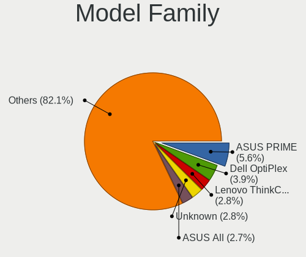
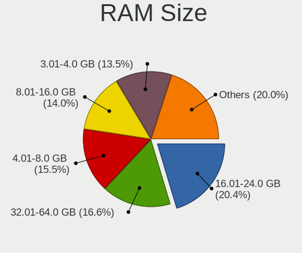

Debian - Tested Hardware & Statistics (Desktops)
------------------------------------------------

A project to collect tested hardware configurations for Debian.

Anyone can contribute to this report by the [hw-probe](https://github.com/linuxhw/hw-probe) tool:

    sudo -E hw-probe -all -upload

Please contribute! Especially if your hardware is rare.

Contents
--------

* [ Test Cases ](#test-cases)

* [ System ](#system)
  - [ OS                       ](#os)
  - [ OS Family                ](#os-family)
  - [ Kernel                   ](#kernel)
  - [ Kernel Family            ](#kernel-family)
  - [ Kernel Major Ver.        ](#kernel-major-ver)
  - [ Arch                     ](#arch)
  - [ DE                       ](#de)
  - [ Display Server           ](#display-server)
  - [ Display Manager          ](#display-manager)
  - [ OS Lang                  ](#os-lang)
  - [ Boot Mode                ](#boot-mode)
  - [ Filesystem               ](#filesystem)
  - [ Part. scheme             ](#part-scheme)
  - [ Dual Boot with Linux/BSD ](#dual-boot-with-linuxbsd)
  - [ Dual Boot (Win)          ](#dual-boot-win)

* [ Board ](#board)
  - [ Vendor                   ](#vendor)
  - [ Model                    ](#model)
  - [ Model Family             ](#model-family)
  - [ MFG Year                 ](#mfg-year)
  - [ Form Factor              ](#form-factor)
  - [ Secure Boot              ](#secure-boot)
  - [ Coreboot                 ](#coreboot)
  - [ RAM Size                 ](#ram-size)
  - [ RAM Used                 ](#ram-used)
  - [ Total Drives             ](#total-drives)
  - [ Has CD-ROM               ](#has-cd-rom)
  - [ Has Ethernet             ](#has-ethernet)
  - [ Has WiFi                 ](#has-wifi)
  - [ Has Bluetooth            ](#has-bluetooth)

* [ Location ](#location)
  - [ Country                  ](#country)
  - [ City                     ](#city)

* [ Drives ](#drives)
  - [ Drive Vendor             ](#drive-vendor)
  - [ Drive Model              ](#drive-model)
  - [ HDD Vendor               ](#hdd-vendor)
  - [ SSD Vendor               ](#ssd-vendor)
  - [ Drive Kind               ](#drive-kind)
  - [ Drive Connector          ](#drive-connector)
  - [ Drive Size               ](#drive-size)
  - [ Space Total              ](#space-total)
  - [ Space Used               ](#space-used)
  - [ Malfunc. Drives          ](#malfunc-drives)
  - [ Malfunc. Drive Vendor    ](#malfunc-drive-vendor)
  - [ Malfunc. HDD Vendor      ](#malfunc-hdd-vendor)
  - [ Malfunc. Drive Kind      ](#malfunc-drive-kind)
  - [ Failed Drives            ](#failed-drives)
  - [ Failed Drive Vendor      ](#failed-drive-vendor)
  - [ Drive Status             ](#drive-status)

* [ Storage controller ](#storage-controller)
  - [ Storage Vendor           ](#storage-vendor)
  - [ Storage Model            ](#storage-model)
  - [ Storage Kind             ](#storage-kind)

* [ Processor ](#processor)
  - [ CPU Vendor               ](#cpu-vendor)
  - [ CPU Model                ](#cpu-model)
  - [ CPU Model Family         ](#cpu-model-family)
  - [ CPU Cores                ](#cpu-cores)
  - [ CPU Sockets              ](#cpu-sockets)
  - [ CPU Threads              ](#cpu-threads)
  - [ CPU Op-Modes             ](#cpu-op-modes)
  - [ CPU Microcode            ](#cpu-microcode)
  - [ CPU Microarch            ](#cpu-microarch)

* [ Graphics ](#graphics)
  - [ GPU Vendor               ](#gpu-vendor)
  - [ GPU Model                ](#gpu-model)
  - [ GPU Combo                ](#gpu-combo)
  - [ GPU Driver               ](#gpu-driver)
  - [ GPU Memory               ](#gpu-memory)

* [ Monitor ](#monitor)
  - [ Monitor Vendor           ](#monitor-vendor)
  - [ Monitor Model            ](#monitor-model)
  - [ Monitor Resolution       ](#monitor-resolution)
  - [ Monitor Diagonal         ](#monitor-diagonal)
  - [ Monitor Width            ](#monitor-width)
  - [ Aspect Ratio             ](#aspect-ratio)
  - [ Monitor Area             ](#monitor-area)
  - [ Pixel Density            ](#pixel-density)
  - [ Multiple Monitors        ](#multiple-monitors)

* [ Network ](#network)
  - [ Net Controller Vendor    ](#net-controller-vendor)
  - [ Net Controller Model     ](#net-controller-model)
  - [ Wireless Vendor          ](#wireless-vendor)
  - [ Wireless Model           ](#wireless-model)
  - [ Ethernet Vendor          ](#ethernet-vendor)
  - [ Ethernet Model           ](#ethernet-model)
  - [ Net Controller Kind      ](#net-controller-kind)
  - [ Used Controller          ](#used-controller)
  - [ NICs                     ](#nics)
  - [ IPv6                     ](#ipv6)

* [ Bluetooth ](#bluetooth)
  - [ Bluetooth Vendor         ](#bluetooth-vendor)
  - [ Bluetooth Model          ](#bluetooth-model)

* [ Sound ](#sound)
  - [ Sound Vendor             ](#sound-vendor)
  - [ Sound Model              ](#sound-model)

* [ Memory ](#memory)
  - [ Memory Vendor            ](#memory-vendor)
  - [ Memory Model             ](#memory-model)
  - [ Memory Kind              ](#memory-kind)
  - [ Memory Form Factor       ](#memory-form-factor)
  - [ Memory Size              ](#memory-size)
  - [ Memory Speed             ](#memory-speed)

* [ Printers & scanners ](#printers--scanners)
  - [ Printer Vendor           ](#printer-vendor)
  - [ Printer Model            ](#printer-model)
  - [ Scanner Vendor           ](#scanner-vendor)
  - [ Scanner Model            ](#scanner-model)

* [ Camera ](#camera)
  - [ Camera Vendor            ](#camera-vendor)
  - [ Camera Model             ](#camera-model)

* [ Security ](#security)
  - [ Fingerprint Vendor       ](#fingerprint-vendor)
  - [ Fingerprint Model        ](#fingerprint-model)
  - [ Chipcard Vendor          ](#chipcard-vendor)
  - [ Chipcard Model           ](#chipcard-model)

* [ Unsupported ](#unsupported)
  - [ Unsupported Devices      ](#unsupported-devices)
  - [ Unsupported Device Types ](#unsupported-device-types)

Test Cases
----------

Total: 4188

| Vendor        | Model                       | Probe                                                      | Date         |
|---------------|-----------------------------|------------------------------------------------------------|--------------|
| MSI           | MAG B550 TOMAHAWK MAX WI... | [51cf6d10e7](https://linux-hardware.org/?probe=51cf6d10e7) | Dec 01, 2022 |
| Lenovo        | SHARKBAY NOK                | [e03c6b53ed](https://linux-hardware.org/?probe=e03c6b53ed) | Dec 01, 2022 |
| ASUSTek       | P5B                         | [44f13beada](https://linux-hardware.org/?probe=44f13beada) | Dec 01, 2022 |
| Gigabyte      | F2A88XM-D3H                 | [f5a5a30379](https://linux-hardware.org/?probe=f5a5a30379) | Dec 01, 2022 |
| ASUSTek       | ROG STRIX B550-F GAMING     | [0f27e558f3](https://linux-hardware.org/?probe=0f27e558f3) | Dec 01, 2022 |
| Gigabyte      | Z390 M GAMING-CF            | [f0dba35258](https://linux-hardware.org/?probe=f0dba35258) | Dec 01, 2022 |
| Gigabyte      | Z390 M GAMING-CF            | [baa969bf8b](https://linux-hardware.org/?probe=baa969bf8b) | Nov 30, 2022 |
| Pegatron      | BYT-X1                      | [edadb85201](https://linux-hardware.org/?probe=edadb85201) | Nov 30, 2022 |
| Pegatron      | BYT-X1                      | [b248df8671](https://linux-hardware.org/?probe=b248df8671) | Nov 30, 2022 |
| ASUSTek       | ROG STRIX Z490-A GAMING     | [dc5ec6eb84](https://linux-hardware.org/?probe=dc5ec6eb84) | Nov 30, 2022 |
| ASUSTek       | ROG STRIX Z690-A GAMING ... | [6b21f343c3](https://linux-hardware.org/?probe=6b21f343c3) | Nov 30, 2022 |
| Gigabyte      | B450M DS3H-CF               | [952c3681c0](https://linux-hardware.org/?probe=952c3681c0) | Nov 30, 2022 |
| Gigabyte      | B450 AORUS M                | [3e3ccd1471](https://linux-hardware.org/?probe=3e3ccd1471) | Nov 30, 2022 |
| MSI           | B560M-A PRO                 | [81bf84e7e5](https://linux-hardware.org/?probe=81bf84e7e5) | Nov 29, 2022 |
| ASUSTek       | M4A89GTD-PRO/USB3           | [9dd6019148](https://linux-hardware.org/?probe=9dd6019148) | Nov 29, 2022 |
| BESSTAR Te... | UM700                       | [a97334be81](https://linux-hardware.org/?probe=a97334be81) | Nov 29, 2022 |
| Gigabyte      | B450M DS3H-CF               | [eae94e440a](https://linux-hardware.org/?probe=eae94e440a) | Nov 29, 2022 |
| ASUSTek       | P5KPL-CM                    | [a20e18af73](https://linux-hardware.org/?probe=a20e18af73) | Nov 29, 2022 |
| ASRock        | H510M-HDV                   | [03a1675c85](https://linux-hardware.org/?probe=03a1675c85) | Nov 29, 2022 |
| ASUSTek       | ROG STRIX B550-F GAMING     | [a95de3b373](https://linux-hardware.org/?probe=a95de3b373) | Nov 29, 2022 |
| ASUSTek       | PRIME Z690-P WIFI D4        | [262228b1fb](https://linux-hardware.org/?probe=262228b1fb) | Nov 29, 2022 |
| Gigabyte      | F2A55M-HD2                  | [8b3da34947](https://linux-hardware.org/?probe=8b3da34947) | Nov 28, 2022 |
| ASRock        | B450M Pro4-F                | [8d0514a0df](https://linux-hardware.org/?probe=8d0514a0df) | Nov 28, 2022 |
| ECS           | H61H2-M13                   | [88988d4d0d](https://linux-hardware.org/?probe=88988d4d0d) | Nov 28, 2022 |
| Dell          | 0K3CM7 A00                  | [076eeadd80](https://linux-hardware.org/?probe=076eeadd80) | Nov 28, 2022 |
| HP            | 212B                        | [53471968c2](https://linux-hardware.org/?probe=53471968c2) | Nov 28, 2022 |
| Dell          | 05XGC8 A00                  | [e0e0efb9be](https://linux-hardware.org/?probe=e0e0efb9be) | Nov 27, 2022 |
| Dell          | 0D24M8 A00                  | [c58c83e367](https://linux-hardware.org/?probe=c58c83e367) | Nov 26, 2022 |
| Dell          | 0D24M8 A00                  | [85b508d6d3](https://linux-hardware.org/?probe=85b508d6d3) | Nov 26, 2022 |
| Dell          | 05XGC8 A00                  | [6ea1a60122](https://linux-hardware.org/?probe=6ea1a60122) | Nov 26, 2022 |
| Gigabyte      | B550 AORUS ELITE V2         | [68e1087fde](https://linux-hardware.org/?probe=68e1087fde) | Nov 25, 2022 |
| Gigabyte      | B250-FinTech-CF             | [fcc81ea02b](https://linux-hardware.org/?probe=fcc81ea02b) | Nov 24, 2022 |
| Gigabyte      | A320M-S2H-CF                | [4246d4813a](https://linux-hardware.org/?probe=4246d4813a) | Nov 24, 2022 |
| Gigabyte      | A320M-S2H-CF                | [76f6ba932f](https://linux-hardware.org/?probe=76f6ba932f) | Nov 24, 2022 |
| ASUSTek       | ROG ZENITH EXTREME ALPHA    | [1d224863f2](https://linux-hardware.org/?probe=1d224863f2) | Nov 24, 2022 |
| ASUSTek       | P5Q3                        | [655065ee03](https://linux-hardware.org/?probe=655065ee03) | Nov 24, 2022 |
| Lenovo        | 312A NOK                    | [94cdaff2c9](https://linux-hardware.org/?probe=94cdaff2c9) | Nov 24, 2022 |
| Gigabyte      | 990FXA-UD3                  | [38aca80776](https://linux-hardware.org/?probe=38aca80776) | Nov 24, 2022 |
| MSI           | MAG X570 TOMAHAWK WIFI      | [c0ce9a3ff3](https://linux-hardware.org/?probe=c0ce9a3ff3) | Nov 23, 2022 |
| ASUSTek       | PRIME B450-PLUS             | [6c797b4554](https://linux-hardware.org/?probe=6c797b4554) | Nov 23, 2022 |
| MSI           | MAG B550 TORPEDO            | [ca3bcfa403](https://linux-hardware.org/?probe=ca3bcfa403) | Nov 23, 2022 |
| Gigabyte      | G31M-ES2L                   | [e8ab5ad410](https://linux-hardware.org/?probe=e8ab5ad410) | Nov 23, 2022 |
| ASRock        | H410M-HVS R2.0              | [3f381f9fa3](https://linux-hardware.org/?probe=3f381f9fa3) | Nov 23, 2022 |
| Gigabyte      | B650M DS3H                  | [fc9449798a](https://linux-hardware.org/?probe=fc9449798a) | Nov 23, 2022 |
| Lenovo        | SHARKBAY 0B98401 PRO        | [9cbe89c328](https://linux-hardware.org/?probe=9cbe89c328) | Nov 22, 2022 |
| ASUSTek       | PRIME Z270-P                | [0e778da8b6](https://linux-hardware.org/?probe=0e778da8b6) | Nov 22, 2022 |
| ECS           | H61H2-M13                   | [6d50058ef8](https://linux-hardware.org/?probe=6d50058ef8) | Nov 22, 2022 |
| ECS           | H61H2-M13                   | [f6a783a27a](https://linux-hardware.org/?probe=f6a783a27a) | Nov 22, 2022 |
| ECS           | H61H2-M13                   | [423fbc1fa0](https://linux-hardware.org/?probe=423fbc1fa0) | Nov 22, 2022 |
| ECS           | H61H2-M13                   | [debc5b7ab9](https://linux-hardware.org/?probe=debc5b7ab9) | Nov 22, 2022 |
| ECS           | H61H2-M13                   | [dc53077baa](https://linux-hardware.org/?probe=dc53077baa) | Nov 22, 2022 |
| ECS           | H61H2-M13                   | [856bb3def2](https://linux-hardware.org/?probe=856bb3def2) | Nov 22, 2022 |
| Foxconn       | H61MXL/H61MXL-K             | [d140a0f503](https://linux-hardware.org/?probe=d140a0f503) | Nov 22, 2022 |
| ECS           | H61H2-M13                   | [ee55108218](https://linux-hardware.org/?probe=ee55108218) | Nov 22, 2022 |
| ECS           | H61H2-M13                   | [ec03d1b050](https://linux-hardware.org/?probe=ec03d1b050) | Nov 22, 2022 |
| ECS           | H61H2-M13                   | [1f2a4089cc](https://linux-hardware.org/?probe=1f2a4089cc) | Nov 22, 2022 |
| Intel         | JSL MRD                     | [31ffd9d911](https://linux-hardware.org/?probe=31ffd9d911) | Nov 22, 2022 |
| ECS           | H61H2-M13                   | [4190bbb2d8](https://linux-hardware.org/?probe=4190bbb2d8) | Nov 22, 2022 |
| ECS           | H61H2-M13                   | [570a11d74b](https://linux-hardware.org/?probe=570a11d74b) | Nov 22, 2022 |
| Gigabyte      | G41M-ES2L                   | [404927f4cc](https://linux-hardware.org/?probe=404927f4cc) | Nov 22, 2022 |
| ASUSTek       | M4A78T-E                    | [aef32a0e69](https://linux-hardware.org/?probe=aef32a0e69) | Nov 22, 2022 |
| Dell          | 05DN3X A00                  | [f15eef78fa](https://linux-hardware.org/?probe=f15eef78fa) | Nov 22, 2022 |
| Gigabyte      | B450 AORUS ELITE            | [910d921a9d](https://linux-hardware.org/?probe=910d921a9d) | Nov 20, 2022 |
| Gigabyte      | GA-78LMT-USB3               | [dba99c363e](https://linux-hardware.org/?probe=dba99c363e) | Nov 20, 2022 |
| Intel         | JSL MRD                     | [469567b71f](https://linux-hardware.org/?probe=469567b71f) | Nov 20, 2022 |
| Dell          | 0WPMFG A00                  | [8b3a3dc37f](https://linux-hardware.org/?probe=8b3a3dc37f) | Nov 20, 2022 |
| Acer          | Nitro N50-620               | [ecd8e9ec1b](https://linux-hardware.org/?probe=ecd8e9ec1b) | Nov 20, 2022 |
| Intel         | JSL MRD                     | [e8171566d3](https://linux-hardware.org/?probe=e8171566d3) | Nov 19, 2022 |
| Gigabyte      | G31M-ES2L                   | [3e3d8f727c](https://linux-hardware.org/?probe=3e3d8f727c) | Nov 19, 2022 |
| ASRock        | Z790 PG Riptide             | [c852740256](https://linux-hardware.org/?probe=c852740256) | Nov 19, 2022 |
| Dell          | 02YRK5 A02                  | [da08e08dec](https://linux-hardware.org/?probe=da08e08dec) | Nov 18, 2022 |
| MSI           | H510M-A PRO                 | [e913feb821](https://linux-hardware.org/?probe=e913feb821) | Nov 18, 2022 |
| MSI           | MAG B550M MORTAR            | [57c6327e27](https://linux-hardware.org/?probe=57c6327e27) | Nov 18, 2022 |
| ASUSTek       | TUF Gaming X570-PLUS        | [d1d9ddf9f3](https://linux-hardware.org/?probe=d1d9ddf9f3) | Nov 18, 2022 |
| MSI           | B550M PRO-VDH WIFI          | [da04bee118](https://linux-hardware.org/?probe=da04bee118) | Nov 18, 2022 |
| ASUSTek       | PRIME Z690-A                | [06a234be2c](https://linux-hardware.org/?probe=06a234be2c) | Nov 17, 2022 |
| ASUSTek       | P6T DELUXE V2               | [550bd99088](https://linux-hardware.org/?probe=550bd99088) | Nov 17, 2022 |
| ASUSTek       | Pro WS WRX80E-SAGE SE WI... | [b3e809f3d2](https://linux-hardware.org/?probe=b3e809f3d2) | Nov 17, 2022 |
| Dell          | 09KPNV A01                  | [b21e07c887](https://linux-hardware.org/?probe=b21e07c887) | Nov 16, 2022 |
| GuoGuang      | IC2M1028N-3                 | [32351ceb62](https://linux-hardware.org/?probe=32351ceb62) | Nov 16, 2022 |
| Gigabyte      | H61M-DS2                    | [757a1066ff](https://linux-hardware.org/?probe=757a1066ff) | Nov 16, 2022 |
| ASUSTek       | P8Z68-V LX                  | [a3c41dcc96](https://linux-hardware.org/?probe=a3c41dcc96) | Nov 16, 2022 |
| Gigabyte      | P75-D3                      | [02bdf99508](https://linux-hardware.org/?probe=02bdf99508) | Nov 16, 2022 |
| ASRock        | J3455-ITX                   | [71c99edeb1](https://linux-hardware.org/?probe=71c99edeb1) | Nov 16, 2022 |
| ASRock        | FM2A68M-HD+                 | [e907b4c718](https://linux-hardware.org/?probe=e907b4c718) | Nov 15, 2022 |
| Gigabyte      | A320M-S2H-CF                | [c3cacc3ed6](https://linux-hardware.org/?probe=c3cacc3ed6) | Nov 15, 2022 |
| Gigabyte      | GA-78LMT-S2P                | [ee8a80240d](https://linux-hardware.org/?probe=ee8a80240d) | Nov 15, 2022 |
| ASRock        | B450M-HDV R4.0              | [a46c1d62cf](https://linux-hardware.org/?probe=a46c1d62cf) | Nov 15, 2022 |
| ASUSTek       | X79-DELUXE                  | [3005933159](https://linux-hardware.org/?probe=3005933159) | Nov 15, 2022 |
| ASRock        | H470M-HVS                   | [e69c2f0da4](https://linux-hardware.org/?probe=e69c2f0da4) | Nov 15, 2022 |
| Intel         | DH77KC AAG39641-400         | [137906fffe](https://linux-hardware.org/?probe=137906fffe) | Nov 15, 2022 |
| ASUSTek       | B85M-G                      | [2029195495](https://linux-hardware.org/?probe=2029195495) | Nov 14, 2022 |
| Lenovo        | ThinkServer TS440           | [9fe9bc94a0](https://linux-hardware.org/?probe=9fe9bc94a0) | Nov 14, 2022 |
| ASUSTek       | M4A89GTD-PRO/USB3           | [28df02c741](https://linux-hardware.org/?probe=28df02c741) | Nov 14, 2022 |
| Gigabyte      | P75-D3                      | [37f9da1b7f](https://linux-hardware.org/?probe=37f9da1b7f) | Nov 14, 2022 |
| ASUSTek       | B85M-G                      | [277739769b](https://linux-hardware.org/?probe=277739769b) | Nov 14, 2022 |
| ASUSTek       | PRIME H310M-R R2.0          | [53a532435e](https://linux-hardware.org/?probe=53a532435e) | Nov 14, 2022 |
| ASUSTek       | PRIME H310M-A R2.0          | [80cce966ce](https://linux-hardware.org/?probe=80cce966ce) | Nov 14, 2022 |
| Gigabyte      | A320M-H-CF                  | [2a6473f450](https://linux-hardware.org/?probe=2a6473f450) | Nov 13, 2022 |
| ASUSTek       | H81M-K                      | [d7ae86ad73](https://linux-hardware.org/?probe=d7ae86ad73) | Nov 13, 2022 |
| Gigabyte      | GA-MA770-UD3                | [d31168230f](https://linux-hardware.org/?probe=d31168230f) | Nov 13, 2022 |
| ASUSTek       | PRIME H310M-A R2.0          | [4788a2a91d](https://linux-hardware.org/?probe=4788a2a91d) | Nov 13, 2022 |
| Gigabyte      | Z590 UD AC                  | [57952c1512](https://linux-hardware.org/?probe=57952c1512) | Nov 13, 2022 |
| Gigabyte      | GA-78LMT-USB3               | [dc2a41e0ee](https://linux-hardware.org/?probe=dc2a41e0ee) | Nov 12, 2022 |
| Intel         | DG41WV AAE90316-102         | [7af4696c1b](https://linux-hardware.org/?probe=7af4696c1b) | Nov 12, 2022 |
| MSI           | B450 TOMAHAWK MAX           | [e69a98ce67](https://linux-hardware.org/?probe=e69a98ce67) | Nov 11, 2022 |
| ASRock        | H470M-HVS                   | [b81b19a472](https://linux-hardware.org/?probe=b81b19a472) | Nov 11, 2022 |
| Gigabyte      | H61M-D2-B3                  | [46ee069dd8](https://linux-hardware.org/?probe=46ee069dd8) | Nov 11, 2022 |
| Gigabyte      | GA-78LMT-USB3               | [524b1115eb](https://linux-hardware.org/?probe=524b1115eb) | Nov 11, 2022 |
| Apple         | Mac-F4208DC8 PVT            | [45dc316bea](https://linux-hardware.org/?probe=45dc316bea) | Nov 10, 2022 |
| ASUSTek       | M4A78T-E                    | [a885b61478](https://linux-hardware.org/?probe=a885b61478) | Nov 10, 2022 |
| ASUSTek       | M4A78T-E                    | [475ad820cd](https://linux-hardware.org/?probe=475ad820cd) | Nov 10, 2022 |
| Gigabyte      | B75M-D3H                    | [6dd51f8707](https://linux-hardware.org/?probe=6dd51f8707) | Nov 10, 2022 |
| Dell          | 0ND1Y4 A02                  | [726074bce6](https://linux-hardware.org/?probe=726074bce6) | Nov 09, 2022 |
| ASUSTek       | H97M-PLUS                   | [dc9837cefc](https://linux-hardware.org/?probe=dc9837cefc) | Nov 09, 2022 |
| Dell          | 0ND1Y4 A02                  | [3ac38eb9be](https://linux-hardware.org/?probe=3ac38eb9be) | Nov 09, 2022 |
| Gigabyte      | X570 UD                     | [29641e8b7c](https://linux-hardware.org/?probe=29641e8b7c) | Nov 09, 2022 |
| ASUSTek       | A88XM-PLUS                  | [e6eee311ea](https://linux-hardware.org/?probe=e6eee311ea) | Nov 08, 2022 |
| ASRock        | FM2A68M-HD+                 | [a90c14df17](https://linux-hardware.org/?probe=a90c14df17) | Nov 08, 2022 |
| ASRock        | B550 Steel Legend           | [8c775416b9](https://linux-hardware.org/?probe=8c775416b9) | Nov 08, 2022 |
| Unknown       | Unknown                     | [ff3d968ae9](https://linux-hardware.org/?probe=ff3d968ae9) | Nov 08, 2022 |
| Gigabyte      | F2A88XM-D3H                 | [0fa75a005b](https://linux-hardware.org/?probe=0fa75a005b) | Nov 08, 2022 |
| ASUSTek       | P8H67-M LX                  | [277212bfc3](https://linux-hardware.org/?probe=277212bfc3) | Nov 08, 2022 |
| Gigabyte      | GA-78LMT-USB3               | [3469b1e624](https://linux-hardware.org/?probe=3469b1e624) | Nov 07, 2022 |
| IBM           | M97IP SIT                   | [78703d62ae](https://linux-hardware.org/?probe=78703d62ae) | Nov 07, 2022 |
| IBM           | M97IP SIT                   | [0301b99674](https://linux-hardware.org/?probe=0301b99674) | Nov 07, 2022 |
| ASUSTek       | H110-PLUS                   | [4d260267d7](https://linux-hardware.org/?probe=4d260267d7) | Nov 06, 2022 |
| ASUSTek       | H110-PLUS                   | [789df18cfb](https://linux-hardware.org/?probe=789df18cfb) | Nov 06, 2022 |
| Intel         | DQ67SW AAG12527-310         | [97d0b022d2](https://linux-hardware.org/?probe=97d0b022d2) | Nov 05, 2022 |
| Foxconn       | A88GMV                      | [1391b33f62](https://linux-hardware.org/?probe=1391b33f62) | Nov 05, 2022 |
| Unknown       | Unknown                     | [2032d5239e](https://linux-hardware.org/?probe=2032d5239e) | Nov 05, 2022 |
| Dell          | 0M863N A00                  | [3e390c5fb3](https://linux-hardware.org/?probe=3e390c5fb3) | Nov 04, 2022 |
| Unknown       | Unknown                     | [aa1a843244](https://linux-hardware.org/?probe=aa1a843244) | Nov 04, 2022 |
| Unknown       | Unknown                     | [0a55753066](https://linux-hardware.org/?probe=0a55753066) | Nov 04, 2022 |
| Unknown       | Unknown                     | [0e60d35498](https://linux-hardware.org/?probe=0e60d35498) | Nov 04, 2022 |
| ASUSTek       | X99-DELUXE                  | [ab4089c760](https://linux-hardware.org/?probe=ab4089c760) | Nov 04, 2022 |
| Intel         | ChiefRiver                  | [1e1f44f251](https://linux-hardware.org/?probe=1e1f44f251) | Nov 04, 2022 |
| Dell          | 0ND1Y4 A02                  | [9017e31507](https://linux-hardware.org/?probe=9017e31507) | Nov 04, 2022 |
| Intel         | ChiefRiver                  | [64e4630da2](https://linux-hardware.org/?probe=64e4630da2) | Nov 04, 2022 |
| ASUSTek       | X99-E WS/USB                | [7a65820be2](https://linux-hardware.org/?probe=7a65820be2) | Nov 04, 2022 |
| MSI           | MPG X570 GAMING PRO CARB... | [acb00ae29c](https://linux-hardware.org/?probe=acb00ae29c) | Nov 03, 2022 |
| Dell          | 0200DY A01                  | [a473b71b4e](https://linux-hardware.org/?probe=a473b71b4e) | Nov 03, 2022 |
| Unknown       | Unknown                     | [4457bb7b7e](https://linux-hardware.org/?probe=4457bb7b7e) | Nov 03, 2022 |
| MSI           | H510M PRO-E                 | [23fa7a2cf8](https://linux-hardware.org/?probe=23fa7a2cf8) | Nov 03, 2022 |
| Foxconn       | 2A92                        | [927cf971e9](https://linux-hardware.org/?probe=927cf971e9) | Nov 02, 2022 |
| Gigabyte      | B560M DS3H V2               | [36612b5e01](https://linux-hardware.org/?probe=36612b5e01) | Nov 02, 2022 |
| Shenzhen a... | AC1-DP                      | [754335ffe9](https://linux-hardware.org/?probe=754335ffe9) | Nov 02, 2022 |
| Dell          | 0JGM7F A00                  | [28f4800b2b](https://linux-hardware.org/?probe=28f4800b2b) | Nov 02, 2022 |
| Lenovo        | 3132 SDK0R32862 WIN 3258... | [f8708425a1](https://linux-hardware.org/?probe=f8708425a1) | Nov 02, 2022 |
| MSI           | H110M PRO-VD                | [1fb0a79791](https://linux-hardware.org/?probe=1fb0a79791) | Nov 02, 2022 |
| Unknown       | Unknown                     | [bc4f9a5a35](https://linux-hardware.org/?probe=bc4f9a5a35) | Nov 02, 2022 |
| Foxconn       | 2A92                        | [0898482b18](https://linux-hardware.org/?probe=0898482b18) | Nov 02, 2022 |
| ASUSTek       | PRO B460M-C                 | [dcf7112b3d](https://linux-hardware.org/?probe=dcf7112b3d) | Nov 01, 2022 |
| ASUSTek       | PRO B460M-C                 | [a333f47ffa](https://linux-hardware.org/?probe=a333f47ffa) | Nov 01, 2022 |
| Phoenix       | POULSBO                     | [177f05205b](https://linux-hardware.org/?probe=177f05205b) | Nov 01, 2022 |
| MSI           | H61M-P31                    | [819c124b25](https://linux-hardware.org/?probe=819c124b25) | Nov 01, 2022 |
| Gigabyte      | H610M H DDR4                | [b726668f90](https://linux-hardware.org/?probe=b726668f90) | Nov 01, 2022 |
| Unknown       | Unknown                     | [f87c0b1010](https://linux-hardware.org/?probe=f87c0b1010) | Nov 01, 2022 |
| Gigabyte      | X570S AERO G                | [92fccb6716](https://linux-hardware.org/?probe=92fccb6716) | Nov 01, 2022 |
| MSI           | Z390-A PRO                  | [3eea020596](https://linux-hardware.org/?probe=3eea020596) | Nov 01, 2022 |
| MSI           | MEG Z590 ACE                | [1082f00d60](https://linux-hardware.org/?probe=1082f00d60) | Oct 31, 2022 |
| ASRock        | 960GM-VGS3 FX               | [f31f613901](https://linux-hardware.org/?probe=f31f613901) | Oct 31, 2022 |
| Intel         | DG41AN AAE92991-401         | [cd670cef3d](https://linux-hardware.org/?probe=cd670cef3d) | Oct 31, 2022 |
| Unknown       | Unknown                     | [0e92fb8c99](https://linux-hardware.org/?probe=0e92fb8c99) | Oct 31, 2022 |
| ASUSTek       | M5A99FX PRO R2.0            | [4179fe16d6](https://linux-hardware.org/?probe=4179fe16d6) | Oct 31, 2022 |
| ASUSTek       | PRIME X570-PRO              | [3fbcca75d5](https://linux-hardware.org/?probe=3fbcca75d5) | Oct 30, 2022 |
| HP            | 158B                        | [9c02b7fe58](https://linux-hardware.org/?probe=9c02b7fe58) | Oct 30, 2022 |
| Unknown       | Unknown                     | [673c23713c](https://linux-hardware.org/?probe=673c23713c) | Oct 30, 2022 |
| ASUSTek       | PRIME B560M-K               | [416db8870a](https://linux-hardware.org/?probe=416db8870a) | Oct 30, 2022 |
| Foxconn       | 2ADA                        | [16815dacc1](https://linux-hardware.org/?probe=16815dacc1) | Oct 29, 2022 |
| Gigabyte      | H77-DS3H                    | [4457c6182e](https://linux-hardware.org/?probe=4457c6182e) | Oct 29, 2022 |
| Unknown       | 775V88+                     | [f1a685b497](https://linux-hardware.org/?probe=f1a685b497) | Oct 28, 2022 |
| HP            | 3396                        | [d42479acb8](https://linux-hardware.org/?probe=d42479acb8) | Oct 28, 2022 |
| ASUSTek       | PRIME X370-PRO              | [d3cf194e94](https://linux-hardware.org/?probe=d3cf194e94) | Oct 28, 2022 |
| ASUSTek       | PRIME Z690-P WIFI D4        | [327ee3d5b0](https://linux-hardware.org/?probe=327ee3d5b0) | Oct 28, 2022 |
| Apple         | Mac-F221BEC8                | [0bf03c49f7](https://linux-hardware.org/?probe=0bf03c49f7) | Oct 27, 2022 |
| MSI           | B450 TOMAHAWK MAX           | [b682a38061](https://linux-hardware.org/?probe=b682a38061) | Oct 27, 2022 |
| MSI           | H110M PRO-VD                | [175f39979c](https://linux-hardware.org/?probe=175f39979c) | Oct 27, 2022 |
| Huanan        | X99-QD4 V1.0                | [2e4c04ada0](https://linux-hardware.org/?probe=2e4c04ada0) | Oct 27, 2022 |
| Gigabyte      | 970A-DS3P                   | [1bc5db124b](https://linux-hardware.org/?probe=1bc5db124b) | Oct 27, 2022 |
| Huanan        | X99-QD4 V1.0                | [cb31f9ab8b](https://linux-hardware.org/?probe=cb31f9ab8b) | Oct 26, 2022 |
| Unknown       | Unknown                     | [79b9335389](https://linux-hardware.org/?probe=79b9335389) | Oct 26, 2022 |
| Unknown       | Unknown                     | [07a0af33a1](https://linux-hardware.org/?probe=07a0af33a1) | Oct 26, 2022 |
| Gigabyte      | H410M S2H V3                | [9e8ec19352](https://linux-hardware.org/?probe=9e8ec19352) | Oct 26, 2022 |
| Lenovo        | ThinkServer TS440           | [acdfb9b02e](https://linux-hardware.org/?probe=acdfb9b02e) | Oct 26, 2022 |
| ASUSTek       | B85M-G                      | [0d3545c6aa](https://linux-hardware.org/?probe=0d3545c6aa) | Oct 26, 2022 |
| Fujitsu       | D2679-B1 S26361-D2679-Bx... | [8e957f305e](https://linux-hardware.org/?probe=8e957f305e) | Oct 26, 2022 |
| ASUSTek       | B85M-G                      | [0b8dc998a9](https://linux-hardware.org/?probe=0b8dc998a9) | Oct 26, 2022 |
| ASUSTek       | PRIME H310M-R R2.0          | [c1067e423b](https://linux-hardware.org/?probe=c1067e423b) | Oct 26, 2022 |
| ASRock        | AB350 Pro4                  | [82ee095168](https://linux-hardware.org/?probe=82ee095168) | Oct 25, 2022 |
| MSI           | Z170A GAMING M5             | [b5dcdb6844](https://linux-hardware.org/?probe=b5dcdb6844) | Oct 25, 2022 |
| Pegatron      | Benicia                     | [3735dca311](https://linux-hardware.org/?probe=3735dca311) | Oct 25, 2022 |
| MSI           | H81M-P33                    | [b0f36ae0c5](https://linux-hardware.org/?probe=b0f36ae0c5) | Oct 25, 2022 |
| MSI           | B450 TOMAHAWK MAX           | [7b59865f68](https://linux-hardware.org/?probe=7b59865f68) | Oct 25, 2022 |
| MSI           | H110M PRO-VD                | [f8466185a4](https://linux-hardware.org/?probe=f8466185a4) | Oct 25, 2022 |
| Dell          | 0YJPT1 A00                  | [bb1a7da646](https://linux-hardware.org/?probe=bb1a7da646) | Oct 25, 2022 |
| Dell          | 01XK1W A00                  | [c0fb49f07a](https://linux-hardware.org/?probe=c0fb49f07a) | Oct 25, 2022 |
| Gigabyte      | GA-MA78GM-S2H               | [a0e0f661af](https://linux-hardware.org/?probe=a0e0f661af) | Oct 24, 2022 |
| ASUSTek       | ROG CROSSHAIR X670E HERO    | [54710cefe5](https://linux-hardware.org/?probe=54710cefe5) | Oct 24, 2022 |
| ASUSTek       | H81M-C                      | [1deed99314](https://linux-hardware.org/?probe=1deed99314) | Oct 24, 2022 |
| ASUSTek       | M4A78T-E                    | [ee86cdac2a](https://linux-hardware.org/?probe=ee86cdac2a) | Oct 24, 2022 |
| Dell          | 0M5WNK A00                  | [fad0f2f50e](https://linux-hardware.org/?probe=fad0f2f50e) | Oct 24, 2022 |
| Lenovo        | 0x36C017AA SDK0J40700 WI... | [0d21d658ee](https://linux-hardware.org/?probe=0d21d658ee) | Oct 24, 2022 |
| Gigabyte      | E350N WIN8                  | [bff16c4d6c](https://linux-hardware.org/?probe=bff16c4d6c) | Oct 24, 2022 |
| Inventec      | DQ Class A02                | [f64d3223c5](https://linux-hardware.org/?probe=f64d3223c5) | Oct 24, 2022 |
| Inventec      | DQ Class A02                | [c4fddde4b6](https://linux-hardware.org/?probe=c4fddde4b6) | Oct 24, 2022 |
| Dell          | 040DDP A01                  | [083b2c218e](https://linux-hardware.org/?probe=083b2c218e) | Oct 24, 2022 |
| Biostar       | B450MH                      | [048cd18957](https://linux-hardware.org/?probe=048cd18957) | Oct 24, 2022 |
| ASUSTek       | STRIX Z270F GAMING          | [ce3e956a0a](https://linux-hardware.org/?probe=ce3e956a0a) | Oct 24, 2022 |
| ASRock        | Z97 Anniversary             | [9c94714d56](https://linux-hardware.org/?probe=9c94714d56) | Oct 24, 2022 |
| Dell          | 01XK1W A00                  | [86e8f9141a](https://linux-hardware.org/?probe=86e8f9141a) | Oct 24, 2022 |
| ASRock        | H81M-HG4 R4.0               | [da9c01eb20](https://linux-hardware.org/?probe=da9c01eb20) | Oct 23, 2022 |
| ASUSTek       | PRIME Z690-P WIFI D4        | [f82a2d8d8e](https://linux-hardware.org/?probe=f82a2d8d8e) | Oct 23, 2022 |
| ASUSTek       | PRIME Z690-P WIFI D4        | [25295c680c](https://linux-hardware.org/?probe=25295c680c) | Oct 23, 2022 |
| Gigabyte      | G41MT-S2P                   | [9d2d49b8e4](https://linux-hardware.org/?probe=9d2d49b8e4) | Oct 23, 2022 |
| HP            | 8906 SMVB                   | [3e86b56fb8](https://linux-hardware.org/?probe=3e86b56fb8) | Oct 23, 2022 |
| ASUSTek       | ROG STRIX B550-I GAMING     | [50b6612f7d](https://linux-hardware.org/?probe=50b6612f7d) | Oct 23, 2022 |
| ASRock        | G31M-S                      | [5f1ca232ea](https://linux-hardware.org/?probe=5f1ca232ea) | Oct 23, 2022 |
| HP            | 3397                        | [6f58590d3d](https://linux-hardware.org/?probe=6f58590d3d) | Oct 23, 2022 |
| Dell          | 0YJPT1 A00                  | [678916671d](https://linux-hardware.org/?probe=678916671d) | Oct 23, 2022 |
| Unknown       | Unknown                     | [dcb8b694a7](https://linux-hardware.org/?probe=dcb8b694a7) | Oct 23, 2022 |
| ASRock        | FM2A68M-HD+                 | [1a49be478c](https://linux-hardware.org/?probe=1a49be478c) | Oct 22, 2022 |
| ASUSTek       | M4A89GTD-PRO/USB3           | [168cbb8438](https://linux-hardware.org/?probe=168cbb8438) | Oct 21, 2022 |
| MSI           | H81M-P33                    | [efbd4959b8](https://linux-hardware.org/?probe=efbd4959b8) | Oct 21, 2022 |
| MSI           | H81M-P33                    | [a59f545a7b](https://linux-hardware.org/?probe=a59f545a7b) | Oct 21, 2022 |
| Gigabyte      | H61M-S2PV                   | [f60716afd0](https://linux-hardware.org/?probe=f60716afd0) | Oct 20, 2022 |
| ASRock        | Q1900-ITX                   | [c9d76cd138](https://linux-hardware.org/?probe=c9d76cd138) | Oct 20, 2022 |
| Gigabyte      | GA-6LXSV 00000001           | [ac15415eca](https://linux-hardware.org/?probe=ac15415eca) | Oct 20, 2022 |
| Dell          | 0D4MD1 A02                  | [becbded076](https://linux-hardware.org/?probe=becbded076) | Oct 20, 2022 |
| ASUSTek       | Pro WS WRX80E-SAGE SE WI... | [e7875c59bc](https://linux-hardware.org/?probe=e7875c59bc) | Oct 20, 2022 |
| Gigabyte      | B360M AORUS Gaming 3-CF     | [7799fd6266](https://linux-hardware.org/?probe=7799fd6266) | Oct 20, 2022 |
| ASUSTek       | M4A89GTD-PRO/USB3           | [565e5d5e3b](https://linux-hardware.org/?probe=565e5d5e3b) | Oct 20, 2022 |
| Dell          | 0782GW A00                  | [d54932d557](https://linux-hardware.org/?probe=d54932d557) | Oct 19, 2022 |
| ASUSTek       | P9X79                       | [285e78cfbe](https://linux-hardware.org/?probe=285e78cfbe) | Oct 19, 2022 |
| HP            | 876C SMVB                   | [384313312d](https://linux-hardware.org/?probe=384313312d) | Oct 19, 2022 |
| MSI           | H81M-P33                    | [784b068521](https://linux-hardware.org/?probe=784b068521) | Oct 19, 2022 |
| ASUSTek       | B85M-G                      | [42a1bedb35](https://linux-hardware.org/?probe=42a1bedb35) | Oct 19, 2022 |
| HP            | 8061                        | [8692ad745b](https://linux-hardware.org/?probe=8692ad745b) | Oct 19, 2022 |
| ASUSTek       | P5G41T-M LX2/BR             | [46a99f3d0e](https://linux-hardware.org/?probe=46a99f3d0e) | Oct 18, 2022 |
| HP            | 0A58h                       | [4c8d533bb0](https://linux-hardware.org/?probe=4c8d533bb0) | Oct 18, 2022 |
| HP            | 3047h                       | [c1716b926a](https://linux-hardware.org/?probe=c1716b926a) | Oct 18, 2022 |
| Giga-Byte ... | i440BX-W977                 | [018daa60e1](https://linux-hardware.org/?probe=018daa60e1) | Oct 18, 2022 |
| ASUSTek       | B85M-G                      | [86b92cdc50](https://linux-hardware.org/?probe=86b92cdc50) | Oct 18, 2022 |
| Dell          | 0DFRFW A01                  | [dd4ada0631](https://linux-hardware.org/?probe=dd4ada0631) | Oct 18, 2022 |
| MSI           | B450 TOMAHAWK MAX           | [db3ce64578](https://linux-hardware.org/?probe=db3ce64578) | Oct 18, 2022 |
| MSI           | B450 TOMAHAWK MAX           | [621cca0fca](https://linux-hardware.org/?probe=621cca0fca) | Oct 18, 2022 |
| Gigabyte      | B450M DS3H-CF               | [e61760eab3](https://linux-hardware.org/?probe=e61760eab3) | Oct 18, 2022 |
| Dell          | 0WG864                      | [2feb42b3cf](https://linux-hardware.org/?probe=2feb42b3cf) | Oct 17, 2022 |
| HP            | 1589                        | [a6be3ee931](https://linux-hardware.org/?probe=a6be3ee931) | Oct 17, 2022 |
| ASRock        | B450M-HDV                   | [6a523a41da](https://linux-hardware.org/?probe=6a523a41da) | Oct 17, 2022 |
| Dell          | 01XK1W A00                  | [d86b86e8a8](https://linux-hardware.org/?probe=d86b86e8a8) | Oct 17, 2022 |
| HP            | 1589                        | [c36aa260eb](https://linux-hardware.org/?probe=c36aa260eb) | Oct 17, 2022 |
| Acer          | MCP7A                       | [32f914d009](https://linux-hardware.org/?probe=32f914d009) | Oct 17, 2022 |
| ASRock        | B450M Pro4                  | [d55b50c6c7](https://linux-hardware.org/?probe=d55b50c6c7) | Oct 16, 2022 |
| ASRock        | B450M Pro4                  | [4af4c60051](https://linux-hardware.org/?probe=4af4c60051) | Oct 16, 2022 |
| Gigabyte      | C246N-WU2-CF                | [cb7ca4eb5a](https://linux-hardware.org/?probe=cb7ca4eb5a) | Oct 16, 2022 |
| ASUSTek       | PRIME B250M-PLUS            | [c0feb12708](https://linux-hardware.org/?probe=c0feb12708) | Oct 16, 2022 |
| ASUSTek       | PRIME Z690-P WIFI D4        | [f26592e956](https://linux-hardware.org/?probe=f26592e956) | Oct 16, 2022 |
| Dell          | 0782GW A00                  | [6a6f7314c0](https://linux-hardware.org/?probe=6a6f7314c0) | Oct 15, 2022 |
| Gigabyte      | H61M-S2PV                   | [f9568da63c](https://linux-hardware.org/?probe=f9568da63c) | Oct 15, 2022 |
| Gigabyte      | H61M-S2PV                   | [b226135430](https://linux-hardware.org/?probe=b226135430) | Oct 15, 2022 |
| Dell          | 0M863N A00                  | [870d58dd75](https://linux-hardware.org/?probe=870d58dd75) | Oct 15, 2022 |
| Dell          | 0M863N A00                  | [27e1ded122](https://linux-hardware.org/?probe=27e1ded122) | Oct 15, 2022 |
| ASRock        | J5040-ITX                   | [aee52607f0](https://linux-hardware.org/?probe=aee52607f0) | Oct 14, 2022 |
| MSI           | G31TM-P21                   | [ea0fc2d497](https://linux-hardware.org/?probe=ea0fc2d497) | Oct 14, 2022 |
| ASRockRack    | X470D4U2-2T                 | [ebada4e791](https://linux-hardware.org/?probe=ebada4e791) | Oct 14, 2022 |
| Dell          | 0N4YC8 A00                  | [85766540b3](https://linux-hardware.org/?probe=85766540b3) | Oct 14, 2022 |
| Dell          | 0GY6Y8 A01                  | [06e46e98b4](https://linux-hardware.org/?probe=06e46e98b4) | Oct 14, 2022 |
| Fujitsu       | D3221-A1 S26361-D3221-A1    | [9554b1f29a](https://linux-hardware.org/?probe=9554b1f29a) | Oct 14, 2022 |
| ASUSTek       | P5QL-CM                     | [34c01c8045](https://linux-hardware.org/?probe=34c01c8045) | Oct 14, 2022 |
| MSI           | PRO B550-VC                 | [0141458d01](https://linux-hardware.org/?probe=0141458d01) | Oct 14, 2022 |
| Gigabyte      | B450M DS3H-CF               | [ede8c7fa36](https://linux-hardware.org/?probe=ede8c7fa36) | Oct 13, 2022 |
| ASRock        | AM2NF6G-VSTA                | [6a810d253c](https://linux-hardware.org/?probe=6a810d253c) | Oct 13, 2022 |
| ASUSTek       | TUF Gaming X570-PLUS        | [1e2eda446c](https://linux-hardware.org/?probe=1e2eda446c) | Oct 13, 2022 |
| HP            | ProLiant MicroServer        | [067097bef8](https://linux-hardware.org/?probe=067097bef8) | Oct 13, 2022 |
| HP            | 158A                        | [6b1d53174a](https://linux-hardware.org/?probe=6b1d53174a) | Oct 12, 2022 |
| ASRock        | Z97 Extreme6                | [9d2cf83f81](https://linux-hardware.org/?probe=9d2cf83f81) | Oct 12, 2022 |
| ASRock        | Z97 Extreme6                | [feb997ebfc](https://linux-hardware.org/?probe=feb997ebfc) | Oct 12, 2022 |
| HP            | 3047h                       | [ba7f593887](https://linux-hardware.org/?probe=ba7f593887) | Oct 12, 2022 |
| Gigabyte      | 970A-DS3P                   | [744091dcaa](https://linux-hardware.org/?probe=744091dcaa) | Oct 12, 2022 |
| Gigabyte      | B450 AORUS PRO WIFI-CF      | [55bb52409c](https://linux-hardware.org/?probe=55bb52409c) | Oct 12, 2022 |
| MSI           | B550M PRO-VDH WIFI          | [300975f708](https://linux-hardware.org/?probe=300975f708) | Oct 11, 2022 |
| ASRock        | H570M-ITX/ac                | [eac6add22e](https://linux-hardware.org/?probe=eac6add22e) | Oct 11, 2022 |
| Gigabyte      | GA-880GM-D2H                | [6a9fe776d8](https://linux-hardware.org/?probe=6a9fe776d8) | Oct 10, 2022 |
| MSI           | MAG Z490 TOMAHAWK           | [97bbb3b52b](https://linux-hardware.org/?probe=97bbb3b52b) | Oct 09, 2022 |
| Unknown       | Seagate Personal Cloud (... | [40ea197650](https://linux-hardware.org/?probe=40ea197650) | Oct 09, 2022 |
| ASUSTek       | PRIME B450M-A               | [bef5f7f7d7](https://linux-hardware.org/?probe=bef5f7f7d7) | Oct 09, 2022 |
| Dell          | 01XK1W A00                  | [ce045937bc](https://linux-hardware.org/?probe=ce045937bc) | Oct 09, 2022 |
| Dell          | 01XK1W A00                  | [939e426600](https://linux-hardware.org/?probe=939e426600) | Oct 08, 2022 |
| Dell          | 003KPJ A00                  | [e151f6645b](https://linux-hardware.org/?probe=e151f6645b) | Oct 08, 2022 |
| MSI           | H81M-E34                    | [154cb109bf](https://linux-hardware.org/?probe=154cb109bf) | Oct 08, 2022 |
| ASUSTek       | V-P8H67E                    | [b4f0f561d2](https://linux-hardware.org/?probe=b4f0f561d2) | Oct 08, 2022 |
| ASUSTek       | TUF B450-PLUS GAMING        | [1798b09b89](https://linux-hardware.org/?probe=1798b09b89) | Oct 08, 2022 |
| ASRockRack    | X470D4U2-2T                 | [5b543dbd16](https://linux-hardware.org/?probe=5b543dbd16) | Oct 08, 2022 |
| Shuttle       | FS81                        | [ba7c22e135](https://linux-hardware.org/?probe=ba7c22e135) | Oct 07, 2022 |
| Shuttle       | FS81                        | [63ec5c8971](https://linux-hardware.org/?probe=63ec5c8971) | Oct 07, 2022 |
| Fujitsu       | D3417-B1 S26361-D3417-B1    | [aa89234022](https://linux-hardware.org/?probe=aa89234022) | Oct 07, 2022 |
| ASRock        | Z68 Extreme4                | [6b96459f0a](https://linux-hardware.org/?probe=6b96459f0a) | Oct 07, 2022 |
| ASUSTek       | PRIME H270-PRO              | [bbf95bf34d](https://linux-hardware.org/?probe=bbf95bf34d) | Oct 06, 2022 |
| ASUSTek       | P5GDC Pro                   | [25ac480f76](https://linux-hardware.org/?probe=25ac480f76) | Oct 06, 2022 |
| ASUSTek       | M4A88TD-M/USB3              | [ba05383ec5](https://linux-hardware.org/?probe=ba05383ec5) | Oct 06, 2022 |
| Techvision    | TVI7309X B0                 | [a12d335502](https://linux-hardware.org/?probe=a12d335502) | Oct 06, 2022 |
| Techvision    | TVI7309X B0                 | [fd49fda31a](https://linux-hardware.org/?probe=fd49fda31a) | Oct 06, 2022 |
| ASRock        | B450M Pro4                  | [0432411e08](https://linux-hardware.org/?probe=0432411e08) | Oct 05, 2022 |
| ASRock        | B450M Pro4                  | [c287d961f7](https://linux-hardware.org/?probe=c287d961f7) | Oct 05, 2022 |
| MSI           | X399 GAMING PRO CARBON A... | [1b399dcbb2](https://linux-hardware.org/?probe=1b399dcbb2) | Oct 05, 2022 |
| Fujitsu       | D3221-A1 S26361-D3221-A1    | [bbea875fdc](https://linux-hardware.org/?probe=bbea875fdc) | Oct 05, 2022 |
| Lenovo        | ThinkStation S30 0569BE3    | [026d1ee25e](https://linux-hardware.org/?probe=026d1ee25e) | Oct 05, 2022 |
| ASUSTek       | ROG STRIX X570-E GAMING     | [93698d1670](https://linux-hardware.org/?probe=93698d1670) | Oct 05, 2022 |
| MSI           | MPG X570S EDGE MAX WIFI     | [3a644dd82f](https://linux-hardware.org/?probe=3a644dd82f) | Oct 04, 2022 |
| ASRock        | 970M Pro3                   | [a9e9513b41](https://linux-hardware.org/?probe=a9e9513b41) | Oct 04, 2022 |
| Dell          | 0D4MD1 A00                  | [9ab1446c27](https://linux-hardware.org/?probe=9ab1446c27) | Oct 04, 2022 |
| Inventec      | D CLASS A02                 | [851214001a](https://linux-hardware.org/?probe=851214001a) | Oct 04, 2022 |
| ASUSTek       | P6T DELUXE V2               | [1c6fd70d5f](https://linux-hardware.org/?probe=1c6fd70d5f) | Oct 04, 2022 |
| HP            | 1906                        | [a6f705f119](https://linux-hardware.org/?probe=a6f705f119) | Oct 03, 2022 |
| Dell          | 0T7D40 A01                  | [1fb6d9ec64](https://linux-hardware.org/?probe=1fb6d9ec64) | Oct 03, 2022 |
| Gigabyte      | D525TUD                     | [47d31ff25c](https://linux-hardware.org/?probe=47d31ff25c) | Oct 03, 2022 |
| Lenovo        | ThinkServer TS440           | [1031dfcd50](https://linux-hardware.org/?probe=1031dfcd50) | Oct 03, 2022 |
| Pegatron      | 2AC3                        | [0ea51f0746](https://linux-hardware.org/?probe=0ea51f0746) | Oct 03, 2022 |
| ASUSTek       | M4A89GTD-PRO/USB3           | [e3a783a839](https://linux-hardware.org/?probe=e3a783a839) | Oct 02, 2022 |
| ASUSTek       | PRIME B550M-K               | [31dcf67714](https://linux-hardware.org/?probe=31dcf67714) | Oct 02, 2022 |
| ASUSTek       | PRIME B550M-K               | [97afbe98b8](https://linux-hardware.org/?probe=97afbe98b8) | Oct 02, 2022 |
| ASUSTek       | M5A97 R2.0                  | [78ff851478](https://linux-hardware.org/?probe=78ff851478) | Oct 02, 2022 |
| MSI           | 2A9C                        | [a933ad6bca](https://linux-hardware.org/?probe=a933ad6bca) | Oct 01, 2022 |
| MSI           | X470 GAMING PRO             | [53e99a8ce6](https://linux-hardware.org/?probe=53e99a8ce6) | Oct 01, 2022 |
| Dell          | 0KJCC5 A00                  | [7915b298b2](https://linux-hardware.org/?probe=7915b298b2) | Oct 01, 2022 |
| Dell          | 01XK1W A00                  | [29c4292c62](https://linux-hardware.org/?probe=29c4292c62) | Oct 01, 2022 |
| Gigabyte      | H81M-D2V                    | [21a601e10a](https://linux-hardware.org/?probe=21a601e10a) | Sep 30, 2022 |
| HP            | 859C                        | [08161b9516](https://linux-hardware.org/?probe=08161b9516) | Sep 30, 2022 |
| ASRock        | X570 Steel Legend           | [40e65e38cf](https://linux-hardware.org/?probe=40e65e38cf) | Sep 30, 2022 |
| ECS           | G31T-M9                     | [45b25aaf8c](https://linux-hardware.org/?probe=45b25aaf8c) | Sep 29, 2022 |
| Biostar       | H55 HD                      | [bde8e0a133](https://linux-hardware.org/?probe=bde8e0a133) | Sep 28, 2022 |
| BESSTAR Te... | TH50                        | [2045e665b1](https://linux-hardware.org/?probe=2045e665b1) | Sep 28, 2022 |
| ASUSTek       | M5A97 EVO R2.0              | [6d92b99f8e](https://linux-hardware.org/?probe=6d92b99f8e) | Sep 28, 2022 |
| HP            | 339A                        | [5c961ef93f](https://linux-hardware.org/?probe=5c961ef93f) | Sep 28, 2022 |
| HP            | 339A                        | [ac9538b489](https://linux-hardware.org/?probe=ac9538b489) | Sep 28, 2022 |
| ASUSTek       | P8H61-M LX3 R2.0            | [82b108b3b8](https://linux-hardware.org/?probe=82b108b3b8) | Sep 28, 2022 |
| ASUSTek       | TUF Gaming X570-PLUS        | [0031772f40](https://linux-hardware.org/?probe=0031772f40) | Sep 27, 2022 |
| MSI           | B365M PRO-VDH               | [45e07c7119](https://linux-hardware.org/?probe=45e07c7119) | Sep 27, 2022 |
| Medion        | MS-7728                     | [0b9b2ca570](https://linux-hardware.org/?probe=0b9b2ca570) | Sep 27, 2022 |
| HP            | 339A                        | [25ef7556cc](https://linux-hardware.org/?probe=25ef7556cc) | Sep 27, 2022 |
| ASUSTek       | TUF Gaming B660M-PLUS D4    | [757d465447](https://linux-hardware.org/?probe=757d465447) | Sep 27, 2022 |
| ASUSTek       | TUF Gaming Z690-PLUS WIF... | [e3826dca71](https://linux-hardware.org/?probe=e3826dca71) | Sep 27, 2022 |
| Gigabyte      | H81M-S2PV                   | [76a7224818](https://linux-hardware.org/?probe=76a7224818) | Sep 26, 2022 |
| HP            | 339A                        | [07986ca95e](https://linux-hardware.org/?probe=07986ca95e) | Sep 26, 2022 |
| Gigabyte      | F2A88XM-D3H                 | [f750ea8b83](https://linux-hardware.org/?probe=f750ea8b83) | Sep 26, 2022 |
| HP            | 0B40h                       | [d72bb749ff](https://linux-hardware.org/?probe=d72bb749ff) | Sep 26, 2022 |
| Lenovo        | Myrtle CRB SDK0J40700 WI... | [508c873693](https://linux-hardware.org/?probe=508c873693) | Sep 26, 2022 |
| Dell          | 01XK1W A00                  | [4e228116be](https://linux-hardware.org/?probe=4e228116be) | Sep 25, 2022 |
| ASUSTek       | TUF Gaming X570-PLUS        | [6c9c3f13d0](https://linux-hardware.org/?probe=6c9c3f13d0) | Sep 25, 2022 |
| ASRockRack    | X570D4U-2L2T                | [779faa3cfd](https://linux-hardware.org/?probe=779faa3cfd) | Sep 25, 2022 |
| ASUSTek       | ROG STRIX B550-F GAMING     | [65d54e7273](https://linux-hardware.org/?probe=65d54e7273) | Sep 25, 2022 |
| Google        | Teemo                       | [5ddc8b97b8](https://linux-hardware.org/?probe=5ddc8b97b8) | Sep 24, 2022 |
| MSI           | H81M-P33                    | [7e4f539e70](https://linux-hardware.org/?probe=7e4f539e70) | Sep 24, 2022 |
| MSI           | H81M-P33                    | [64cd74457e](https://linux-hardware.org/?probe=64cd74457e) | Sep 24, 2022 |
| Foxconn       | 2ADA                        | [8a734f0799](https://linux-hardware.org/?probe=8a734f0799) | Sep 24, 2022 |
| ASUSTek       | P8B75-M                     | [0299e4f7b1](https://linux-hardware.org/?probe=0299e4f7b1) | Sep 24, 2022 |
| ASUSTek       | P8B75-M                     | [cad0f6f375](https://linux-hardware.org/?probe=cad0f6f375) | Sep 24, 2022 |
| MSI           | C236A WORKSTATION           | [67432a461e](https://linux-hardware.org/?probe=67432a461e) | Sep 24, 2022 |
| ASUSTek       | P8B75-M                     | [91d179670c](https://linux-hardware.org/?probe=91d179670c) | Sep 23, 2022 |
| ASUSTek       | PRIME X570-P                | [5f1b4b1679](https://linux-hardware.org/?probe=5f1b4b1679) | Sep 23, 2022 |
| ECS           | H61H2-CM                    | [13ad69a13e](https://linux-hardware.org/?probe=13ad69a13e) | Sep 23, 2022 |
| ASUSTek       | P5QPL-VM EPU                | [8a4819f23d](https://linux-hardware.org/?probe=8a4819f23d) | Sep 23, 2022 |
| Gigabyte      | H81M-S2V                    | [6c884d4968](https://linux-hardware.org/?probe=6c884d4968) | Sep 23, 2022 |
| Gigabyte      | H81M-S2V                    | [39a94459dc](https://linux-hardware.org/?probe=39a94459dc) | Sep 23, 2022 |
| ASUSTek       | H110M-R                     | [c9f00bec8e](https://linux-hardware.org/?probe=c9f00bec8e) | Sep 23, 2022 |
| HP            | 876C SMVB                   | [c6fbf7c631](https://linux-hardware.org/?probe=c6fbf7c631) | Sep 23, 2022 |
| Pegatron      | 2ACD                        | [31c266d23c](https://linux-hardware.org/?probe=31c266d23c) | Sep 22, 2022 |
| ASUSTek       | ROG STRIX B550-F GAMING ... | [c0cc0dc101](https://linux-hardware.org/?probe=c0cc0dc101) | Sep 21, 2022 |
| Lenovo        | ThinkCentre A70z 0401R6U    | [2a93ca040a](https://linux-hardware.org/?probe=2a93ca040a) | Sep 21, 2022 |
| Thecus        | N2810 0001                  | [f54df3994c](https://linux-hardware.org/?probe=f54df3994c) | Sep 21, 2022 |
| ECS           | G31T-M9                     | [6e67780df1](https://linux-hardware.org/?probe=6e67780df1) | Sep 21, 2022 |
| Gigabyte      | H61M-DS2                    | [a9e18191f7](https://linux-hardware.org/?probe=a9e18191f7) | Sep 21, 2022 |
| ASRock        | H470M-HVS                   | [e267d78b42](https://linux-hardware.org/?probe=e267d78b42) | Sep 21, 2022 |
| ECS           | G31T-M9                     | [46fd18ee44](https://linux-hardware.org/?probe=46fd18ee44) | Sep 21, 2022 |
| ASUSTek       | M3N78-VM                    | [03e6d4f5bc](https://linux-hardware.org/?probe=03e6d4f5bc) | Sep 21, 2022 |
| ASUSTek       | M3N78-VM                    | [658141844b](https://linux-hardware.org/?probe=658141844b) | Sep 21, 2022 |
| Lenovo        | ThinkCentre M57 6072WMD     | [eb8221088f](https://linux-hardware.org/?probe=eb8221088f) | Sep 21, 2022 |
| HP            | 158A                        | [428326af76](https://linux-hardware.org/?probe=428326af76) | Sep 21, 2022 |
| Supermicro    | X9DR3-F                     | [da32f7dbfb](https://linux-hardware.org/?probe=da32f7dbfb) | Sep 21, 2022 |
| ASUSTek       | G20CB                       | [34f4d43b97](https://linux-hardware.org/?probe=34f4d43b97) | Sep 20, 2022 |
| Shuttle       | FS81                        | [4c1fb942aa](https://linux-hardware.org/?probe=4c1fb942aa) | Sep 20, 2022 |
| Gigabyte      | A320M-S2H-CF                | [172fd1874d](https://linux-hardware.org/?probe=172fd1874d) | Sep 20, 2022 |
| Dell          | 0KY237 A01                  | [e1258b712e](https://linux-hardware.org/?probe=e1258b712e) | Sep 20, 2022 |
| Dell          | 0KY237 A01                  | [6f2ce8e794](https://linux-hardware.org/?probe=6f2ce8e794) | Sep 20, 2022 |
| ASUSTek       | B85M-G                      | [f9fa37f0d2](https://linux-hardware.org/?probe=f9fa37f0d2) | Sep 20, 2022 |
| Gigabyte      | GA-M56S-S3                  | [ecd62e14f4](https://linux-hardware.org/?probe=ecd62e14f4) | Sep 20, 2022 |
| Unknown       | 1.0                         | [1ef071c553](https://linux-hardware.org/?probe=1ef071c553) | Sep 20, 2022 |
| MSI           | Z370 PC PRO                 | [7967e43f1d](https://linux-hardware.org/?probe=7967e43f1d) | Sep 20, 2022 |
| Lenovo        | SKYBAY SDK0J40700 WIN 32... | [37fcfc48c5](https://linux-hardware.org/?probe=37fcfc48c5) | Sep 20, 2022 |
| Gigabyte      | EP45T-UD3R                  | [979765d106](https://linux-hardware.org/?probe=979765d106) | Sep 20, 2022 |
| Gigabyte      | GA-78LMT-USB3               | [a0a61b5d8c](https://linux-hardware.org/?probe=a0a61b5d8c) | Sep 20, 2022 |
| Gigabyte      | GA-78LMT-USB3               | [bb8e3ae62a](https://linux-hardware.org/?probe=bb8e3ae62a) | Sep 20, 2022 |
| ASUSTek       | M5A97 R2.0                  | [96e0712ca0](https://linux-hardware.org/?probe=96e0712ca0) | Sep 19, 2022 |
| Gigabyte      | B550 VISION D-P             | [b1f764b4ca](https://linux-hardware.org/?probe=b1f764b4ca) | Sep 19, 2022 |
| ASRock        | H470M-HVS                   | [ee235bf98c](https://linux-hardware.org/?probe=ee235bf98c) | Sep 19, 2022 |
| Gigabyte      | B550 VISION D-P             | [9457acbe13](https://linux-hardware.org/?probe=9457acbe13) | Sep 19, 2022 |
| ASUSTek       | P5G41T-M LX                 | [74e31be1be](https://linux-hardware.org/?probe=74e31be1be) | Sep 19, 2022 |
| AZW           | GK55                        | [9a9019eee6](https://linux-hardware.org/?probe=9a9019eee6) | Sep 19, 2022 |
| ASRock        | Z590M-ITX/ax                | [d202b0a504](https://linux-hardware.org/?probe=d202b0a504) | Sep 19, 2022 |
| Supermicro    | X10DRi-T4+                  | [1f507cde8c](https://linux-hardware.org/?probe=1f507cde8c) | Sep 19, 2022 |
| HP            | 1998                        | [14eeedb712](https://linux-hardware.org/?probe=14eeedb712) | Sep 18, 2022 |
| Dell          | 0KY237 A01                  | [8b2d50f5d1](https://linux-hardware.org/?probe=8b2d50f5d1) | Sep 18, 2022 |
| MSI           | J1800I                      | [ff28c29a3e](https://linux-hardware.org/?probe=ff28c29a3e) | Sep 18, 2022 |
| Dell          | 0G785M A00                  | [c1045050d6](https://linux-hardware.org/?probe=c1045050d6) | Sep 17, 2022 |
| Gigabyte      | B365M DS3H                  | [e552983263](https://linux-hardware.org/?probe=e552983263) | Sep 17, 2022 |
| Dell          | 0T2HR0 A02                  | [46dd4dfa8f](https://linux-hardware.org/?probe=46dd4dfa8f) | Sep 17, 2022 |
| AZW           | Gemini T34-M                | [baafe96fc5](https://linux-hardware.org/?probe=baafe96fc5) | Sep 17, 2022 |
| Gigabyte      | Z370 AORUS Gaming 7         | [968c24205d](https://linux-hardware.org/?probe=968c24205d) | Sep 17, 2022 |
| ASUSTek       | P8Z77-V                     | [3ace24ebfc](https://linux-hardware.org/?probe=3ace24ebfc) | Sep 16, 2022 |
| ASUSTek       | LITHIUM                     | [3aab1aa49f](https://linux-hardware.org/?probe=3aab1aa49f) | Sep 16, 2022 |
| ASUSTek       | KCMA-D8                     | [dc8ecec94f](https://linux-hardware.org/?probe=dc8ecec94f) | Sep 16, 2022 |
| Gigabyte      | B150M-D3P-WG-CF             | [e37ff8fec3](https://linux-hardware.org/?probe=e37ff8fec3) | Sep 16, 2022 |
| ASRock        | H470M-HVS                   | [205e3937a8](https://linux-hardware.org/?probe=205e3937a8) | Sep 16, 2022 |
| MSI           | B450-A PRO MAX              | [c63f6d45b4](https://linux-hardware.org/?probe=c63f6d45b4) | Sep 16, 2022 |
| Gigabyte      | F2A88XM-D3H                 | [4dce87f7fa](https://linux-hardware.org/?probe=4dce87f7fa) | Sep 16, 2022 |
| ASUSTek       | M4A89GTD-PRO/USB3           | [00ca986a4c](https://linux-hardware.org/?probe=00ca986a4c) | Sep 16, 2022 |
| Unknown       | Unknown                     | [c292f41bc5](https://linux-hardware.org/?probe=c292f41bc5) | Sep 15, 2022 |
| MSI           | H110M PRO-VD                | [23194305f6](https://linux-hardware.org/?probe=23194305f6) | Sep 15, 2022 |
| ASUSTek       | B85M-G                      | [9f2a08c261](https://linux-hardware.org/?probe=9f2a08c261) | Sep 15, 2022 |
| Gigabyte      | EP45T-UD3R                  | [007e9d4205](https://linux-hardware.org/?probe=007e9d4205) | Sep 15, 2022 |
| MSI           | B450M PRO-VDH MAX           | [15d3d95ab2](https://linux-hardware.org/?probe=15d3d95ab2) | Sep 15, 2022 |
| HP            | 876C SMVB                   | [adc81b2fd5](https://linux-hardware.org/?probe=adc81b2fd5) | Sep 15, 2022 |
| Gigabyte      | B560M DS3H V2               | [af4b9d7add](https://linux-hardware.org/?probe=af4b9d7add) | Sep 14, 2022 |
| ASRock        | H470M-HVS                   | [01d92ffc28](https://linux-hardware.org/?probe=01d92ffc28) | Sep 14, 2022 |
| ASRock        | H470M-HVS                   | [c04d19fe27](https://linux-hardware.org/?probe=c04d19fe27) | Sep 14, 2022 |
| ASRock        | H470M-HVS                   | [ad0ac85a1c](https://linux-hardware.org/?probe=ad0ac85a1c) | Sep 14, 2022 |
| ASRock        | H470M-HVS                   | [6cb46b9558](https://linux-hardware.org/?probe=6cb46b9558) | Sep 14, 2022 |
| ASRock        | H470M-HVS                   | [bec6da09ae](https://linux-hardware.org/?probe=bec6da09ae) | Sep 14, 2022 |
| ASRock        | H470M-HVS                   | [0366b6294c](https://linux-hardware.org/?probe=0366b6294c) | Sep 14, 2022 |
| ASRock        | H470M-HVS                   | [a914907c0f](https://linux-hardware.org/?probe=a914907c0f) | Sep 14, 2022 |
| ASRock        | H470M-HVS                   | [662117584a](https://linux-hardware.org/?probe=662117584a) | Sep 14, 2022 |
| ASRock        | H470M-HVS                   | [272b6ec971](https://linux-hardware.org/?probe=272b6ec971) | Sep 14, 2022 |
| ASRock        | H470M-HVS                   | [2528bbb7ac](https://linux-hardware.org/?probe=2528bbb7ac) | Sep 14, 2022 |
| ASRock        | H470M-HVS                   | [212a063241](https://linux-hardware.org/?probe=212a063241) | Sep 14, 2022 |
| ASRock        | H470M-HVS                   | [2b6d3fc6f0](https://linux-hardware.org/?probe=2b6d3fc6f0) | Sep 14, 2022 |
| ASRock        | H470M-HVS                   | [9bc2776801](https://linux-hardware.org/?probe=9bc2776801) | Sep 14, 2022 |
| ASRock        | H470M-HVS                   | [4048396126](https://linux-hardware.org/?probe=4048396126) | Sep 14, 2022 |
| ASRock        | H470M-HVS                   | [7036d4bc55](https://linux-hardware.org/?probe=7036d4bc55) | Sep 14, 2022 |
| ASRock        | H470M-HVS                   | [e4147da882](https://linux-hardware.org/?probe=e4147da882) | Sep 14, 2022 |
| ASRock        | H470M-HVS                   | [f85ab5e109](https://linux-hardware.org/?probe=f85ab5e109) | Sep 14, 2022 |
| Lenovo        | SHARKBAY 0C48431 WIN        | [4598920e84](https://linux-hardware.org/?probe=4598920e84) | Sep 13, 2022 |
| HP            | 876C SMVB                   | [15ec81ce9d](https://linux-hardware.org/?probe=15ec81ce9d) | Sep 13, 2022 |
| Biostar       | NF560-A2G                   | [96c296c2f3](https://linux-hardware.org/?probe=96c296c2f3) | Sep 13, 2022 |
| ASRock        | H470M-HDV                   | [41977548bc](https://linux-hardware.org/?probe=41977548bc) | Sep 13, 2022 |
| Positivo      | POS-EINM10CB POSITIVO       | [7c876e560b](https://linux-hardware.org/?probe=7c876e560b) | Sep 13, 2022 |
| ASUSTek       | P5Q SE2                     | [1552e587a8](https://linux-hardware.org/?probe=1552e587a8) | Sep 13, 2022 |
| HP            | 8464                        | [fcc16a5a56](https://linux-hardware.org/?probe=fcc16a5a56) | Sep 12, 2022 |
| Gigabyte      | H410M S2H                   | [31ca5d0add](https://linux-hardware.org/?probe=31ca5d0add) | Sep 12, 2022 |
| Gigabyte      | H410M S2H                   | [d76d427a61](https://linux-hardware.org/?probe=d76d427a61) | Sep 12, 2022 |
| Gigabyte      | H410M S2H                   | [c996d652d3](https://linux-hardware.org/?probe=c996d652d3) | Sep 12, 2022 |
| Gigabyte      | H410M S2H                   | [d08cb8e35b](https://linux-hardware.org/?probe=d08cb8e35b) | Sep 12, 2022 |
| Gigabyte      | H410M S2H                   | [0c2d66313e](https://linux-hardware.org/?probe=0c2d66313e) | Sep 12, 2022 |
| Gigabyte      | H410M S2H                   | [5461cdbf3b](https://linux-hardware.org/?probe=5461cdbf3b) | Sep 12, 2022 |
| Gigabyte      | H410M S2H                   | [c055d82971](https://linux-hardware.org/?probe=c055d82971) | Sep 12, 2022 |
| Gigabyte      | H410M S2H                   | [8c0d419ac8](https://linux-hardware.org/?probe=8c0d419ac8) | Sep 12, 2022 |
| ASUSTek       | PRIME B450M-A               | [2af6edb7a0](https://linux-hardware.org/?probe=2af6edb7a0) | Sep 12, 2022 |
| ASUSTek       | G20CB                       | [a52ff97f3b](https://linux-hardware.org/?probe=a52ff97f3b) | Sep 12, 2022 |
| ASUSTek       | G20CB                       | [2d737743f4](https://linux-hardware.org/?probe=2d737743f4) | Sep 12, 2022 |
| ASUSTek       | Pro WS 565-ACE              | [e8da6da2b0](https://linux-hardware.org/?probe=e8da6da2b0) | Sep 12, 2022 |
| Inventec      | C CLASS A01                 | [613f741235](https://linux-hardware.org/?probe=613f741235) | Sep 12, 2022 |
| Dell          | 01XK1W A00                  | [09d0fcce0e](https://linux-hardware.org/?probe=09d0fcce0e) | Sep 12, 2022 |
| Lenovo        | 36EB SDK0J40700 WIN 3258... | [e007728e0a](https://linux-hardware.org/?probe=e007728e0a) | Sep 11, 2022 |
| Inventec      | C CLASS A01                 | [21ae14e7a0](https://linux-hardware.org/?probe=21ae14e7a0) | Sep 11, 2022 |
| Inventec      | C CLASS A01                 | [3ddd0d7aa0](https://linux-hardware.org/?probe=3ddd0d7aa0) | Sep 11, 2022 |
| Dell          | 01XK1W A00                  | [41b9796681](https://linux-hardware.org/?probe=41b9796681) | Sep 10, 2022 |
| HP            | 1998                        | [37cd896e72](https://linux-hardware.org/?probe=37cd896e72) | Sep 10, 2022 |
| HP            | 1998                        | [3da9c3ef8e](https://linux-hardware.org/?probe=3da9c3ef8e) | Sep 10, 2022 |
| Lenovo        | ThinkServer TS440           | [cf028f9b8c](https://linux-hardware.org/?probe=cf028f9b8c) | Sep 10, 2022 |
| Lenovo        | ThinkCentre A70 7099A5G     | [102cf248e9](https://linux-hardware.org/?probe=102cf248e9) | Sep 10, 2022 |
| Unknown       | Unknown                     | [a0c1db14a0](https://linux-hardware.org/?probe=a0c1db14a0) | Sep 09, 2022 |
| Biostar       | NF560-A2G                   | [68ffa42095](https://linux-hardware.org/?probe=68ffa42095) | Sep 09, 2022 |
| ASRock        | H310CM-HDV                  | [4f0ec780ee](https://linux-hardware.org/?probe=4f0ec780ee) | Sep 09, 2022 |
| Gigabyte      | A320M-S2H-CF                | [e4d2c1c120](https://linux-hardware.org/?probe=e4d2c1c120) | Sep 09, 2022 |
| Gigabyte      | A320M-S2H-CF                | [d28677add3](https://linux-hardware.org/?probe=d28677add3) | Sep 09, 2022 |
| Gigabyte      | M61PME-S2                   | [2557dd83ce](https://linux-hardware.org/?probe=2557dd83ce) | Sep 09, 2022 |
| ASRock        | Q1900M                      | [aadbe54f8d](https://linux-hardware.org/?probe=aadbe54f8d) | Sep 08, 2022 |
| ASUSTek       | P8H61-MX R2.0               | [17675b7bc8](https://linux-hardware.org/?probe=17675b7bc8) | Sep 08, 2022 |
| Gigabyte      | M61PME-S2                   | [1c48e52b18](https://linux-hardware.org/?probe=1c48e52b18) | Sep 08, 2022 |
| HP            | 2175                        | [97d08b25c7](https://linux-hardware.org/?probe=97d08b25c7) | Sep 08, 2022 |
| Gigabyte      | GA-M56S-S3                  | [b090ccb8fe](https://linux-hardware.org/?probe=b090ccb8fe) | Sep 07, 2022 |
| ASUSTek       | P5G41T-M LE                 | [6949fd04b7](https://linux-hardware.org/?probe=6949fd04b7) | Sep 07, 2022 |
| ASUSTek       | X99-E WS                    | [fcf815d38f](https://linux-hardware.org/?probe=fcf815d38f) | Sep 07, 2022 |
| MSI           | H110M PRO-VD                | [754b9daf74](https://linux-hardware.org/?probe=754b9daf74) | Sep 07, 2022 |
| ASUSTek       | H81M-PLUS                   | [ca8d36ee7e](https://linux-hardware.org/?probe=ca8d36ee7e) | Sep 07, 2022 |
| MSI           | MPG X570 GAMING PLUS        | [611d7b9001](https://linux-hardware.org/?probe=611d7b9001) | Sep 07, 2022 |
| Gigabyte      | GA-M56S-S3                  | [9012dd4a5d](https://linux-hardware.org/?probe=9012dd4a5d) | Sep 06, 2022 |
| Foxconn       | H61MXL/H61MXL-K             | [92af2339e3](https://linux-hardware.org/?probe=92af2339e3) | Sep 06, 2022 |
| ECS           | G31T-M9                     | [5005d8382e](https://linux-hardware.org/?probe=5005d8382e) | Sep 06, 2022 |
| ASUSTek       | P8H61-M LX3 R2.0            | [f7b09fb3e3](https://linux-hardware.org/?probe=f7b09fb3e3) | Sep 06, 2022 |
| ASUSTek       | PRIME H310M-R R2.0          | [dacafc4729](https://linux-hardware.org/?probe=dacafc4729) | Sep 06, 2022 |
| ASUSTek       | PRIME Z690M-HZ              | [2c5b0be3af](https://linux-hardware.org/?probe=2c5b0be3af) | Sep 06, 2022 |
| Gigabyte      | G41M-ES2L                   | [4071a8ff9b](https://linux-hardware.org/?probe=4071a8ff9b) | Sep 05, 2022 |
| ASUSTek       | PRIME X370-PRO              | [312e33b434](https://linux-hardware.org/?probe=312e33b434) | Sep 05, 2022 |
| Gigabyte      | Z390 GAMING X-CF            | [26e63d2357](https://linux-hardware.org/?probe=26e63d2357) | Sep 05, 2022 |
| HP            | 805D                        | [fdf50a9e36](https://linux-hardware.org/?probe=fdf50a9e36) | Sep 05, 2022 |
| Dell          | 06FW8P A00                  | [6023e5aa76](https://linux-hardware.org/?probe=6023e5aa76) | Sep 05, 2022 |
| ASUSTek       | Z97-PRO                     | [b9f3857d65](https://linux-hardware.org/?probe=b9f3857d65) | Sep 04, 2022 |
| ASRock        | Q1900M                      | [55a86f60b9](https://linux-hardware.org/?probe=55a86f60b9) | Sep 04, 2022 |
| Gigabyte      | Z87X-UD4H-CF                | [8ffe312747](https://linux-hardware.org/?probe=8ffe312747) | Sep 04, 2022 |
| ASUSTek       | PRIME A320M-K               | [878661705c](https://linux-hardware.org/?probe=878661705c) | Sep 04, 2022 |
| MSI           | H510M-A PRO                 | [eb29524a90](https://linux-hardware.org/?probe=eb29524a90) | Sep 03, 2022 |
| ASUSTek       | Pro WS 565-ACE              | [3a599be2f2](https://linux-hardware.org/?probe=3a599be2f2) | Sep 03, 2022 |
| ASUSTek       | P8H61 PRO                   | [082520f2d8](https://linux-hardware.org/?probe=082520f2d8) | Sep 03, 2022 |
| MSI           | B450 TOMAHAWK MAX           | [9b8eef74b8](https://linux-hardware.org/?probe=9b8eef74b8) | Sep 03, 2022 |
| ASUSTek       | PRIME H270-PRO              | [5c0b32f572](https://linux-hardware.org/?probe=5c0b32f572) | Sep 03, 2022 |
| ASRockRack    | X470D4U2/1N1                | [0be6c5963d](https://linux-hardware.org/?probe=0be6c5963d) | Sep 02, 2022 |
| ASRock        | J3455-ITX                   | [262c6222d1](https://linux-hardware.org/?probe=262c6222d1) | Sep 02, 2022 |
| Gigabyte      | B550M DS3H                  | [acdd27f635](https://linux-hardware.org/?probe=acdd27f635) | Sep 02, 2022 |
| ASUSTek       | PRIME H310M-R R2.0          | [3870423379](https://linux-hardware.org/?probe=3870423379) | Sep 02, 2022 |
| Lenovo        | SDK0J40705 WIN 342504154... | [4feb69184d](https://linux-hardware.org/?probe=4feb69184d) | Sep 02, 2022 |
| Lenovo        | SDK0J40705 WIN 342504154... | [bfee1a862f](https://linux-hardware.org/?probe=bfee1a862f) | Sep 02, 2022 |
| Gigabyte      | H77-DS3H                    | [11f9e9fa68](https://linux-hardware.org/?probe=11f9e9fa68) | Sep 02, 2022 |
| HP            | 8767 A                      | [62e70ef3e8](https://linux-hardware.org/?probe=62e70ef3e8) | Sep 02, 2022 |
| Gigabyte      | GA-970A-UD3                 | [e9f6cafc6c](https://linux-hardware.org/?probe=e9f6cafc6c) | Sep 02, 2022 |
| Gigabyte      | Z590 UD AC                  | [6c7b47158f](https://linux-hardware.org/?probe=6c7b47158f) | Sep 02, 2022 |
| Dell          | 02YRK5 A02                  | [bc316a8d3f](https://linux-hardware.org/?probe=bc316a8d3f) | Sep 01, 2022 |
| MSI           | H81M-P33                    | [8d15799ff9](https://linux-hardware.org/?probe=8d15799ff9) | Sep 01, 2022 |
| ASUSTek       | PRIME H310M-R R2.0          | [b226dd8bc2](https://linux-hardware.org/?probe=b226dd8bc2) | Sep 01, 2022 |
| Gigabyte      | M68MT-S2                    | [29b9669488](https://linux-hardware.org/?probe=29b9669488) | Aug 31, 2022 |
| SZMZ          | X99M-G2                     | [eff1231310](https://linux-hardware.org/?probe=eff1231310) | Aug 31, 2022 |
| ASRock        | B450M-HDV R4.0              | [9c9e1d1ff1](https://linux-hardware.org/?probe=9c9e1d1ff1) | Aug 31, 2022 |
| ASRock        | N68-VS3 UCC                 | [688dcf88c9](https://linux-hardware.org/?probe=688dcf88c9) | Aug 30, 2022 |
| ASRock        | N68-VS3 UCC                 | [4ccef99860](https://linux-hardware.org/?probe=4ccef99860) | Aug 30, 2022 |
| ASUSTek       | PRIME H310M-R R2.0          | [28f3abde34](https://linux-hardware.org/?probe=28f3abde34) | Aug 30, 2022 |
| ASUSTek       | ROG Maximus XII EXTREME     | [a77d5e141e](https://linux-hardware.org/?probe=a77d5e141e) | Aug 30, 2022 |
| Fujitsu       | D3348-B1 S26361-D3348-B1    | [9721d1f81d](https://linux-hardware.org/?probe=9721d1f81d) | Aug 30, 2022 |
| Unknown       | Unknown                     | [fd4ab67b77](https://linux-hardware.org/?probe=fd4ab67b77) | Aug 29, 2022 |
| Dell          | 09KPNV A00                  | [7e03afa646](https://linux-hardware.org/?probe=7e03afa646) | Aug 28, 2022 |
| Unknown       | Unknown                     | [ef43339df1](https://linux-hardware.org/?probe=ef43339df1) | Aug 28, 2022 |
| Pegatron      | VIOLET6                     | [f17bcbfc4b](https://linux-hardware.org/?probe=f17bcbfc4b) | Aug 28, 2022 |
| Pegatron      | VIOLET6                     | [4960a57d91](https://linux-hardware.org/?probe=4960a57d91) | Aug 28, 2022 |
| MSI           | E350IA-E45                  | [d1d570a455](https://linux-hardware.org/?probe=d1d570a455) | Aug 28, 2022 |
| Gigabyte      | B450 AORUS ELITE            | [859b3cb78a](https://linux-hardware.org/?probe=859b3cb78a) | Aug 28, 2022 |
| ASRock        | 990FX Extreme9              | [1a472eb51c](https://linux-hardware.org/?probe=1a472eb51c) | Aug 27, 2022 |
| ASUSTek       | Z170 PRO GAMING             | [e0fedafd62](https://linux-hardware.org/?probe=e0fedafd62) | Aug 27, 2022 |
| ASRock        | Z68 Pro3 Gen3               | [186a63fa9e](https://linux-hardware.org/?probe=186a63fa9e) | Aug 27, 2022 |
| ASUSTek       | P5G41T-M LX V2              | [3c63953ca6](https://linux-hardware.org/?probe=3c63953ca6) | Aug 27, 2022 |
| MSI           | MAG B550 TOMAHAWK MAX WI... | [fbfc58655a](https://linux-hardware.org/?probe=fbfc58655a) | Aug 26, 2022 |
| Dell          | 01XK1W A00                  | [7728612d53](https://linux-hardware.org/?probe=7728612d53) | Aug 26, 2022 |
| Dell          | 01XK1W A00                  | [ee6cec5f61](https://linux-hardware.org/?probe=ee6cec5f61) | Aug 26, 2022 |
| Gigabyte      | B250M-DS3H-CF               | [5d4e41a441](https://linux-hardware.org/?probe=5d4e41a441) | Aug 26, 2022 |
| Intel         | X79G V2.x                   | [8418a8e83c](https://linux-hardware.org/?probe=8418a8e83c) | Aug 26, 2022 |
| ASUSTek       | IPN73-BA                    | [89f8b175e2](https://linux-hardware.org/?probe=89f8b175e2) | Aug 26, 2022 |
| Foxconn       | 2ABF                        | [46efca142c](https://linux-hardware.org/?probe=46efca142c) | Aug 26, 2022 |
| HP            | 18E5                        | [9196bf639b](https://linux-hardware.org/?probe=9196bf639b) | Aug 26, 2022 |
| Lenovo        | 7033EW4                     | [54417ae55f](https://linux-hardware.org/?probe=54417ae55f) | Aug 26, 2022 |
| Gigabyte      | X399 AORUS PRO-CF           | [5769de3299](https://linux-hardware.org/?probe=5769de3299) | Aug 25, 2022 |
| Gigabyte      | M61SME-S2                   | [2ee74a388d](https://linux-hardware.org/?probe=2ee74a388d) | Aug 25, 2022 |
| Dell          | 0D4MD1 A02                  | [7a06622253](https://linux-hardware.org/?probe=7a06622253) | Aug 25, 2022 |
| Dell          | 0WG864                      | [a333ec7f99](https://linux-hardware.org/?probe=a333ec7f99) | Aug 25, 2022 |
| ASUSTek       | PRIME H510M-E               | [c1c6b26e42](https://linux-hardware.org/?probe=c1c6b26e42) | Aug 25, 2022 |
| ASUSTek       | A7N8X2.0                    | [f063b3e61a](https://linux-hardware.org/?probe=f063b3e61a) | Aug 25, 2022 |
| MSI           | H310M PRO-VDH PLUS          | [0bcf6f0268](https://linux-hardware.org/?probe=0bcf6f0268) | Aug 25, 2022 |
| Gigabyte      | G41MT-S2                    | [42cd205688](https://linux-hardware.org/?probe=42cd205688) | Aug 25, 2022 |
| ASUSTek       | IPN73-BA                    | [da7e1db516](https://linux-hardware.org/?probe=da7e1db516) | Aug 25, 2022 |
| Dell          | 01XK1W A00                  | [604a0a7789](https://linux-hardware.org/?probe=604a0a7789) | Aug 25, 2022 |
| ASUSTek       | ROG STRIX X570-E GAMING     | [413cc5a3c3](https://linux-hardware.org/?probe=413cc5a3c3) | Aug 24, 2022 |
| HP            | 339A                        | [961ac650aa](https://linux-hardware.org/?probe=961ac650aa) | Aug 24, 2022 |
| ASUSTek       | H97M-PLUS                   | [6bcc6b550f](https://linux-hardware.org/?probe=6bcc6b550f) | Aug 24, 2022 |
| Dell          | 0D4MD1 A02                  | [b634bcdfa9](https://linux-hardware.org/?probe=b634bcdfa9) | Aug 24, 2022 |
| Huanan        | X99-F8D V2.4                | [11cfa7a502](https://linux-hardware.org/?probe=11cfa7a502) | Aug 24, 2022 |
| ASUSTek       | Pro B550M-C                 | [f0691dc9d8](https://linux-hardware.org/?probe=f0691dc9d8) | Aug 23, 2022 |
| Aquarius      | AQH310CM                    | [5e7e2820f4](https://linux-hardware.org/?probe=5e7e2820f4) | Aug 23, 2022 |
| ASUSTek       | A7N8X2.0                    | [56416fa002](https://linux-hardware.org/?probe=56416fa002) | Aug 23, 2022 |
| Dell          | 0MWYPT A02                  | [017af6f58d](https://linux-hardware.org/?probe=017af6f58d) | Aug 23, 2022 |
| retsamarre... | Unknown                     | [5bc4dd4776](https://linux-hardware.org/?probe=5bc4dd4776) | Aug 23, 2022 |
| retsamarre... | Unknown                     | [8f8e0f49df](https://linux-hardware.org/?probe=8f8e0f49df) | Aug 23, 2022 |
| Dell          | 0WG864                      | [e199a1a176](https://linux-hardware.org/?probe=e199a1a176) | Aug 23, 2022 |
| MSI           | H110M PRO-VD                | [7652f87b3a](https://linux-hardware.org/?probe=7652f87b3a) | Aug 22, 2022 |
| HP            | 2187 A01                    | [ab44144f07](https://linux-hardware.org/?probe=ab44144f07) | Aug 22, 2022 |
| ASUSTek       | Z10PA-U8 Series             | [3e560a4018](https://linux-hardware.org/?probe=3e560a4018) | Aug 22, 2022 |
| Fujitsu       | D3220-A1 S26361-D3220-A1    | [5cf178d7ac](https://linux-hardware.org/?probe=5cf178d7ac) | Aug 22, 2022 |
| ASUSTek       | Z170-A                      | [35270005d4](https://linux-hardware.org/?probe=35270005d4) | Aug 22, 2022 |
| Biostar       | A68N-5100                   | [2c6df92279](https://linux-hardware.org/?probe=2c6df92279) | Aug 22, 2022 |
| Foxconn       | 2ABF                        | [3eed86b908](https://linux-hardware.org/?probe=3eed86b908) | Aug 21, 2022 |
| ASRock        | Z77 Extreme6                | [660091e5bb](https://linux-hardware.org/?probe=660091e5bb) | Aug 20, 2022 |
| MSI           | G31M3                       | [3bb7906f56](https://linux-hardware.org/?probe=3bb7906f56) | Aug 20, 2022 |
| Google        | Teemo                       | [4cc9295e6d](https://linux-hardware.org/?probe=4cc9295e6d) | Aug 20, 2022 |
| MSI           | Z370 PC PRO                 | [9131aa23c4](https://linux-hardware.org/?probe=9131aa23c4) | Aug 20, 2022 |
| Gigabyte      | B460M DS3H V2               | [e5e74eea07](https://linux-hardware.org/?probe=e5e74eea07) | Aug 19, 2022 |
| Intel         | DN2820FYK H24582-201        | [a67c5b1926](https://linux-hardware.org/?probe=a67c5b1926) | Aug 19, 2022 |
| ASRock        | B450M-HDV R4.0              | [2f99e182f6](https://linux-hardware.org/?probe=2f99e182f6) | Aug 19, 2022 |
| MSI           | X99A GAMING PRO CARBON      | [f526447f78](https://linux-hardware.org/?probe=f526447f78) | Aug 19, 2022 |
| Gigabyte      | A320M-S2H V2-CF             | [38eed67854](https://linux-hardware.org/?probe=38eed67854) | Aug 18, 2022 |
| Gateway       | DS50                        | [3d4faf13bb](https://linux-hardware.org/?probe=3d4faf13bb) | Aug 18, 2022 |
| ASUSTek       | ROG STRIX B660-I GAMING ... | [58b22885a8](https://linux-hardware.org/?probe=58b22885a8) | Aug 18, 2022 |
| Gigabyte      | B560M DS3H AC               | [84e861fd2c](https://linux-hardware.org/?probe=84e861fd2c) | Aug 18, 2022 |
| ECS           | H61H2-M13                   | [fb83ed3720](https://linux-hardware.org/?probe=fb83ed3720) | Aug 18, 2022 |
| ECS           | G31T-M9                     | [d5b3edd559](https://linux-hardware.org/?probe=d5b3edd559) | Aug 18, 2022 |
| Lenovo        | ThinkStation D30 4223CC9    | [16e54152fd](https://linux-hardware.org/?probe=16e54152fd) | Aug 18, 2022 |
| Lenovo        | ThinkStation D30 4223CC9    | [e0208cab99](https://linux-hardware.org/?probe=e0208cab99) | Aug 18, 2022 |
| MSI           | B85M-E45                    | [cb991c0789](https://linux-hardware.org/?probe=cb991c0789) | Aug 17, 2022 |
| MSI           | X470 GAMING PRO             | [b648d56b04](https://linux-hardware.org/?probe=b648d56b04) | Aug 17, 2022 |
| Gigabyte      | H61M-DS2                    | [d066e1bcdf](https://linux-hardware.org/?probe=d066e1bcdf) | Aug 17, 2022 |
| ECS           | G31T-M9                     | [6192258c32](https://linux-hardware.org/?probe=6192258c32) | Aug 17, 2022 |
| Gigabyte      | D525TUD                     | [125fdc6af1](https://linux-hardware.org/?probe=125fdc6af1) | Aug 17, 2022 |
| Dell          | 0F6X5P A00                  | [47ecca331e](https://linux-hardware.org/?probe=47ecca331e) | Aug 16, 2022 |
| ASUSTek       | ROG STRIX X570-I GAMING     | [1999369ff0](https://linux-hardware.org/?probe=1999369ff0) | Aug 16, 2022 |
| Dell          | 02YRK5 A02                  | [959d35921a](https://linux-hardware.org/?probe=959d35921a) | Aug 15, 2022 |
| HP            | 3047h                       | [bba72086af](https://linux-hardware.org/?probe=bba72086af) | Aug 15, 2022 |
| ASUSTek       | P6T WS PRO                  | [155ba78790](https://linux-hardware.org/?probe=155ba78790) | Aug 15, 2022 |
| ASUSTek       | WS C422 DC                  | [92d816348a](https://linux-hardware.org/?probe=92d816348a) | Aug 15, 2022 |
| Gigabyte      | GA-970A-UD3                 | [9a1ff39910](https://linux-hardware.org/?probe=9a1ff39910) | Aug 15, 2022 |
| Gigabyte      | H110M-S2-CF                 | [265b666497](https://linux-hardware.org/?probe=265b666497) | Aug 14, 2022 |
| ASRock        | AB350 Gaming K4             | [8a6141848a](https://linux-hardware.org/?probe=8a6141848a) | Aug 13, 2022 |
| Dell          | 0WWJRX A00                  | [c9a3a6e952](https://linux-hardware.org/?probe=c9a3a6e952) | Aug 13, 2022 |
| ASUSTek       | ROG STRIX B550-F GAMING     | [8c792d555c](https://linux-hardware.org/?probe=8c792d555c) | Aug 12, 2022 |
| System76      | Thelio thelio-r1            | [5b24d3e87b](https://linux-hardware.org/?probe=5b24d3e87b) | Aug 12, 2022 |
| Dell          | 0WG864                      | [de74f89735](https://linux-hardware.org/?probe=de74f89735) | Aug 12, 2022 |
| Unknown       | Unknown                     | [ed94063eb8](https://linux-hardware.org/?probe=ed94063eb8) | Aug 12, 2022 |
| Gigabyte      | H270-Gaming 3               | [434ba505a3](https://linux-hardware.org/?probe=434ba505a3) | Aug 12, 2022 |
| ASUSTek       | PRIME Z370-P                | [7afaba2067](https://linux-hardware.org/?probe=7afaba2067) | Aug 12, 2022 |
| MSI           | H110M PRO-VD                | [57be8a8829](https://linux-hardware.org/?probe=57be8a8829) | Aug 12, 2022 |
| MSI           | B450M PRO-VDH MAX           | [059e0786bf](https://linux-hardware.org/?probe=059e0786bf) | Aug 11, 2022 |
| ASRock        | H110M-DGS R3.0              | [934583e785](https://linux-hardware.org/?probe=934583e785) | Aug 11, 2022 |
| Aquarius      | AQH310CM                    | [4084737708](https://linux-hardware.org/?probe=4084737708) | Aug 11, 2022 |
| MSI           | H110M PRO-VD                | [830489f44c](https://linux-hardware.org/?probe=830489f44c) | Aug 11, 2022 |
| Gigabyte      | B360M HD3                   | [d8432224a8](https://linux-hardware.org/?probe=d8432224a8) | Aug 11, 2022 |
| Gigabyte      | B360M HD3                   | [1325d40c4e](https://linux-hardware.org/?probe=1325d40c4e) | Aug 11, 2022 |
| ASRock        | H61M/U3S3                   | [be0d853621](https://linux-hardware.org/?probe=be0d853621) | Aug 11, 2022 |
| Gigabyte      | B450M DS3H V2               | [33dc68fe04](https://linux-hardware.org/?probe=33dc68fe04) | Aug 11, 2022 |
| ASUSTek       | H81T                        | [4049aa824c](https://linux-hardware.org/?probe=4049aa824c) | Aug 11, 2022 |
| ASUSTek       | PRIME X570-PRO              | [49098497d4](https://linux-hardware.org/?probe=49098497d4) | Aug 11, 2022 |
| ASRock        | G31M-S                      | [335a6f8616](https://linux-hardware.org/?probe=335a6f8616) | Aug 10, 2022 |
| MSI           | H81M-P33                    | [fd910dc3ca](https://linux-hardware.org/?probe=fd910dc3ca) | Aug 10, 2022 |
| MSI           | G41M-P28                    | [c20d54489d](https://linux-hardware.org/?probe=c20d54489d) | Aug 10, 2022 |
| Intel         | DP35DP AAD81073-207         | [3f55eb1ae4](https://linux-hardware.org/?probe=3f55eb1ae4) | Aug 10, 2022 |
| Intel         | DH87RL AAG74240-402         | [a83fd820d4](https://linux-hardware.org/?probe=a83fd820d4) | Aug 10, 2022 |
| MSI           | H81M-P33                    | [243392c01f](https://linux-hardware.org/?probe=243392c01f) | Aug 10, 2022 |
| ASUSTek       | Pro WS 565-ACE              | [ea9b6a4757](https://linux-hardware.org/?probe=ea9b6a4757) | Aug 10, 2022 |
| ASUSTek       | Pro WS 565-ACE              | [4e9256cf7f](https://linux-hardware.org/?probe=4e9256cf7f) | Aug 10, 2022 |
| Intel         | DH87RL AAG74240-402         | [8ea693190b](https://linux-hardware.org/?probe=8ea693190b) | Aug 09, 2022 |
| MSI           | MPG X570S EDGE MAX WIFI     | [346b22a42e](https://linux-hardware.org/?probe=346b22a42e) | Aug 09, 2022 |
| HP            | 1998                        | [d4dcaf27a2](https://linux-hardware.org/?probe=d4dcaf27a2) | Aug 09, 2022 |
| ASUSTek       | P8H61-M LX3                 | [19346d16de](https://linux-hardware.org/?probe=19346d16de) | Aug 09, 2022 |
| MSI           | MAG B550 TOMAHAWK           | [1713317338](https://linux-hardware.org/?probe=1713317338) | Aug 09, 2022 |
| Gigabyte      | Z270-Gaming K3              | [b73567b27b](https://linux-hardware.org/?probe=b73567b27b) | Aug 09, 2022 |
| Gigabyte      | B550 AORUS ELITE V2         | [18b6026d87](https://linux-hardware.org/?probe=18b6026d87) | Aug 09, 2022 |
| ASUSTek       | Z97M-PLUS/BR                | [b66253f362](https://linux-hardware.org/?probe=b66253f362) | Aug 09, 2022 |
| Gigabyte      | B550 GAMING X V2            | [fb01a8303f](https://linux-hardware.org/?probe=fb01a8303f) | Aug 08, 2022 |
| ASUSTek       | M5A88-V EVO                 | [b07157a232](https://linux-hardware.org/?probe=b07157a232) | Aug 08, 2022 |
| Unknown       | Unknown                     | [49c2378f28](https://linux-hardware.org/?probe=49c2378f28) | Aug 08, 2022 |
| Unknown       | Unknown                     | [9943b58e25](https://linux-hardware.org/?probe=9943b58e25) | Aug 08, 2022 |
| Foxconn       | G41MXP/G41MXP-V             | [91fb10e9c6](https://linux-hardware.org/?probe=91fb10e9c6) | Aug 08, 2022 |
| ECS           | G31T-M9                     | [6d24097613](https://linux-hardware.org/?probe=6d24097613) | Aug 08, 2022 |
| MSI           | B550-A PRO                  | [94d50a1c56](https://linux-hardware.org/?probe=94d50a1c56) | Aug 08, 2022 |
| ASUSTek       | P8Z77-V                     | [18935d4aff](https://linux-hardware.org/?probe=18935d4aff) | Aug 07, 2022 |
| Gigabyte      | MZGLKAP-00                  | [5a349b05d2](https://linux-hardware.org/?probe=5a349b05d2) | Aug 07, 2022 |
| ASUSTek       | PRIME Z690M-HZ              | [67934f8ed6](https://linux-hardware.org/?probe=67934f8ed6) | Aug 07, 2022 |
| ASUSTek       | PRIME Z690M-HZ              | [d6d5cc239f](https://linux-hardware.org/?probe=d6d5cc239f) | Aug 07, 2022 |
| Unknown       | Unknown                     | [dbafe167dc](https://linux-hardware.org/?probe=dbafe167dc) | Aug 06, 2022 |
| ASUSTek       | TUF Gaming X570-PRO         | [468c10942e](https://linux-hardware.org/?probe=468c10942e) | Aug 06, 2022 |
| Biostar       | A780L3G                     | [a5ff2b3147](https://linux-hardware.org/?probe=a5ff2b3147) | Aug 05, 2022 |
| ECS           | G31T-M9                     | [8cdebd57de](https://linux-hardware.org/?probe=8cdebd57de) | Aug 05, 2022 |
| Gigabyte      | H81M-S2V                    | [696740d407](https://linux-hardware.org/?probe=696740d407) | Aug 05, 2022 |
| Lenovo        | 102F NO DPK                 | [1a040c2717](https://linux-hardware.org/?probe=1a040c2717) | Aug 04, 2022 |
| Intel         | X99                         | [33e0d23783](https://linux-hardware.org/?probe=33e0d23783) | Aug 04, 2022 |
| Foxconn       | 2AB1                        | [a2ebd67b7b](https://linux-hardware.org/?probe=a2ebd67b7b) | Aug 04, 2022 |
| ASUSTek       | P8H61-M LX3                 | [3d945110f8](https://linux-hardware.org/?probe=3d945110f8) | Aug 03, 2022 |
| ASUSTek       | Pro WS 565-ACE              | [d5e820b393](https://linux-hardware.org/?probe=d5e820b393) | Aug 03, 2022 |
| HP            | 8876 11                     | [150fcb8977](https://linux-hardware.org/?probe=150fcb8977) | Aug 03, 2022 |
| HP            | 8876 11                     | [029813dfc5](https://linux-hardware.org/?probe=029813dfc5) | Aug 03, 2022 |
| ASUSTek       | M5A97 EVO R2.0              | [ca1d7dd61b](https://linux-hardware.org/?probe=ca1d7dd61b) | Aug 03, 2022 |
| Foxconn       | 2AB1                        | [74cd42b826](https://linux-hardware.org/?probe=74cd42b826) | Aug 03, 2022 |
| Lenovo        | 102F SDK0E50510 WIN 2625... | [80512402c0](https://linux-hardware.org/?probe=80512402c0) | Aug 02, 2022 |
| MSI           | Z97 GAMING 5                | [d2c534d06f](https://linux-hardware.org/?probe=d2c534d06f) | Aug 02, 2022 |
| ASUSTek       | P5G41T-M LE                 | [80c0577159](https://linux-hardware.org/?probe=80c0577159) | Aug 02, 2022 |
| Gigabyte      | H110M-Gaming3-CF            | [99a140d79b](https://linux-hardware.org/?probe=99a140d79b) | Aug 01, 2022 |
| MSI           | MAG B550 TOMAHAWK           | [0d7342cca0](https://linux-hardware.org/?probe=0d7342cca0) | Aug 01, 2022 |
| ASRock        | H470M-HVS                   | [5282e92d2c](https://linux-hardware.org/?probe=5282e92d2c) | Aug 01, 2022 |
| ASUSTek       | P9X79                       | [4a518ab792](https://linux-hardware.org/?probe=4a518ab792) | Jul 31, 2022 |
| Gigabyte      | Z590 UD AC                  | [12cf4f1c81](https://linux-hardware.org/?probe=12cf4f1c81) | Jul 31, 2022 |
| Lenovo        | 3106 SDK0J40697 WIN 3305... | [cc1944f4a3](https://linux-hardware.org/?probe=cc1944f4a3) | Jul 31, 2022 |
| Gigabyte      | A320M-H-CF                  | [5facb7723f](https://linux-hardware.org/?probe=5facb7723f) | Jul 30, 2022 |
| MSI           | MS-7418 100                 | [c17e48cc2b](https://linux-hardware.org/?probe=c17e48cc2b) | Jul 30, 2022 |
| MSI           | MS-7418 100                 | [4644e4eaa8](https://linux-hardware.org/?probe=4644e4eaa8) | Jul 30, 2022 |
| ASUSTek       | P8B75-M                     | [ddf26da899](https://linux-hardware.org/?probe=ddf26da899) | Jul 30, 2022 |
| ASUSTek       | P8H61-M LX3                 | [0cdabe4b69](https://linux-hardware.org/?probe=0cdabe4b69) | Jul 30, 2022 |
| Gigabyte      | B450M DS3H-CF               | [e3a44e4c5b](https://linux-hardware.org/?probe=e3a44e4c5b) | Jul 30, 2022 |
| ASUSTek       | STRIX Z270F GAMING          | [3b1f863612](https://linux-hardware.org/?probe=3b1f863612) | Jul 30, 2022 |
| Intel         | TR440BXA A16643-311         | [e6245255f4](https://linux-hardware.org/?probe=e6245255f4) | Jul 29, 2022 |
| ASUSTek       | TUF B360M-PLUS GAMING/BR    | [8c57fbc9e8](https://linux-hardware.org/?probe=8c57fbc9e8) | Jul 29, 2022 |
| MSI           | H110M PRO-VD                | [675b1fa2ff](https://linux-hardware.org/?probe=675b1fa2ff) | Jul 29, 2022 |
| ASUSTek       | B85M-E/DASH                 | [2ebbaa4052](https://linux-hardware.org/?probe=2ebbaa4052) | Jul 29, 2022 |
| Fujitsu       | D3313-A1 S26361-D3313-A1    | [902ee3b350](https://linux-hardware.org/?probe=902ee3b350) | Jul 29, 2022 |
| AZW           | MINI S                      | [53ba28d9c3](https://linux-hardware.org/?probe=53ba28d9c3) | Jul 28, 2022 |
| AZW           | MINI S                      | [46216b2db1](https://linux-hardware.org/?probe=46216b2db1) | Jul 28, 2022 |
| MSI           | Z370 GAMING M5              | [b9ec9e3dd4](https://linux-hardware.org/?probe=b9ec9e3dd4) | Jul 28, 2022 |
| MSI           | X470 GAMING PLUS            | [8415a45799](https://linux-hardware.org/?probe=8415a45799) | Jul 28, 2022 |
| MSI           | PRO Z690-A DDR4             | [b5b5f049d0](https://linux-hardware.org/?probe=b5b5f049d0) | Jul 28, 2022 |
| HP            | ProLiant MicroServer        | [8104eee56e](https://linux-hardware.org/?probe=8104eee56e) | Jul 28, 2022 |
| Gigabyte      | A520M DS3H                  | [900a5b4f7f](https://linux-hardware.org/?probe=900a5b4f7f) | Jul 28, 2022 |
| ASUSTek       | P7P55D                      | [0c9828e226](https://linux-hardware.org/?probe=0c9828e226) | Jul 28, 2022 |
| Intel         | DH61AG AAG23736-505         | [7fd3a18899](https://linux-hardware.org/?probe=7fd3a18899) | Jul 28, 2022 |
| ASUSTek       | H97-PRO                     | [ca77f59b41](https://linux-hardware.org/?probe=ca77f59b41) | Jul 28, 2022 |
| MSI           | H110M PRO-VD                | [33961c087b](https://linux-hardware.org/?probe=33961c087b) | Jul 28, 2022 |
| HP            | 3048h                       | [01d1b1e99a](https://linux-hardware.org/?probe=01d1b1e99a) | Jul 28, 2022 |
| MSI           | H110I PRO                   | [1dcc4b694a](https://linux-hardware.org/?probe=1dcc4b694a) | Jul 28, 2022 |
| MSI           | X470 GAMING PLUS            | [88ac64a1bd](https://linux-hardware.org/?probe=88ac64a1bd) | Jul 28, 2022 |
| Gigabyte      | B660M GAMING DDR4           | [661a4a67d4](https://linux-hardware.org/?probe=661a4a67d4) | Jul 27, 2022 |
| ECS           | G31T-M9                     | [5537dcbed3](https://linux-hardware.org/?probe=5537dcbed3) | Jul 27, 2022 |
| MSI           | MPG X570S EDGE MAX WIFI     | [29780cf747](https://linux-hardware.org/?probe=29780cf747) | Jul 27, 2022 |
| Medion        | MS-7728                     | [662e3948f2](https://linux-hardware.org/?probe=662e3948f2) | Jul 27, 2022 |
| Gigabyte      | H470M DS3H                  | [5f90ec9763](https://linux-hardware.org/?probe=5f90ec9763) | Jul 27, 2022 |
| HP            | 0AACh                       | [d7df31df8c](https://linux-hardware.org/?probe=d7df31df8c) | Jul 26, 2022 |
| HP            | 0AACh                       | [357aa343ec](https://linux-hardware.org/?probe=357aa343ec) | Jul 26, 2022 |
| ASUSTek       | PRIME H310M-K               | [ba71ad5870](https://linux-hardware.org/?probe=ba71ad5870) | Jul 26, 2022 |
| ASRock        | H510M-HDV/M.2               | [e7672c215b](https://linux-hardware.org/?probe=e7672c215b) | Jul 26, 2022 |
| Gigabyte      | H61M-S1                     | [5e8e9fbd71](https://linux-hardware.org/?probe=5e8e9fbd71) | Jul 26, 2022 |
| ASUSTek       | P8B75-M                     | [46e85f96ca](https://linux-hardware.org/?probe=46e85f96ca) | Jul 26, 2022 |
| ASUSTek       | AT5NM10T-I                  | [9738c4bebc](https://linux-hardware.org/?probe=9738c4bebc) | Jul 26, 2022 |
| ASUSTek       | PRIME Z690M-HZ              | [9d3da43bea](https://linux-hardware.org/?probe=9d3da43bea) | Jul 25, 2022 |
| Dell          | 03NVJ6 A01                  | [3998c390f0](https://linux-hardware.org/?probe=3998c390f0) | Jul 25, 2022 |
| ASRock        | H470M Pro4                  | [5a709f059c](https://linux-hardware.org/?probe=5a709f059c) | Jul 25, 2022 |
| ASRockRack    | B565D4-V1L                  | [1301ad9bd0](https://linux-hardware.org/?probe=1301ad9bd0) | Jul 25, 2022 |
| Gigabyte      | B365M DS3H                  | [571655453a](https://linux-hardware.org/?probe=571655453a) | Jul 24, 2022 |
| AZW           | U59                         | [82e7dfdca5](https://linux-hardware.org/?probe=82e7dfdca5) | Jul 24, 2022 |
| ASUSTek       | TUF Gaming H570-PRO         | [36edefbce1](https://linux-hardware.org/?probe=36edefbce1) | Jul 24, 2022 |
| ASUSTek       | TUF Gaming B550-PLUS        | [de6f28d0f7](https://linux-hardware.org/?probe=de6f28d0f7) | Jul 24, 2022 |
| ASRock        | J5005-ITX                   | [8fdd045c35](https://linux-hardware.org/?probe=8fdd045c35) | Jul 24, 2022 |
| ASUSTek       | PRIME Z390-A                | [9a3ffce1a4](https://linux-hardware.org/?probe=9a3ffce1a4) | Jul 24, 2022 |
| ECS           | G31T-M9                     | [f7489c3b16](https://linux-hardware.org/?probe=f7489c3b16) | Jul 22, 2022 |
| MSI           | H110M PRO-VD                | [ffd65c627e](https://linux-hardware.org/?probe=ffd65c627e) | Jul 22, 2022 |
| IceWhale T... | ZimaBoard 832 ZMB           | [7cd95094de](https://linux-hardware.org/?probe=7cd95094de) | Jul 21, 2022 |
| IceWhale T... | ZimaBoard 832 ZMB           | [4655fe2442](https://linux-hardware.org/?probe=4655fe2442) | Jul 21, 2022 |
| MSI           | H110M PRO-VD                | [ffcc0670ba](https://linux-hardware.org/?probe=ffcc0670ba) | Jul 21, 2022 |
| Gigabyte      | M68MT-S2                    | [e505d3e2da](https://linux-hardware.org/?probe=e505d3e2da) | Jul 21, 2022 |
| MSI           | B150M BAZOOKA               | [41053f8c0e](https://linux-hardware.org/?probe=41053f8c0e) | Jul 21, 2022 |
| MSI           | G31TM-P21                   | [34b4e0a6ea](https://linux-hardware.org/?probe=34b4e0a6ea) | Jul 21, 2022 |
| Gigabyte      | M68MT-S2                    | [de41a6c75f](https://linux-hardware.org/?probe=de41a6c75f) | Jul 21, 2022 |
| Intel         | DH67BL AAG10189-209         | [8b924d9018](https://linux-hardware.org/?probe=8b924d9018) | Jul 21, 2022 |
| Dell          | 0HD5W2 A01                  | [e2eca7122c](https://linux-hardware.org/?probe=e2eca7122c) | Jul 21, 2022 |
| Intel         | DH67BL AAG10189-209         | [d9ce312767](https://linux-hardware.org/?probe=d9ce312767) | Jul 20, 2022 |
| ASUSTek       | M4A89GTD-PRO/USB3           | [8ad4c64b76](https://linux-hardware.org/?probe=8ad4c64b76) | Jul 20, 2022 |
| MSI           | MS-7236                     | [e824199021](https://linux-hardware.org/?probe=e824199021) | Jul 20, 2022 |
| ASUSTek       | Pro WS 565-ACE              | [b35dabeb45](https://linux-hardware.org/?probe=b35dabeb45) | Jul 20, 2022 |
| Acer          | Aspire TC-120               | [2625b243eb](https://linux-hardware.org/?probe=2625b243eb) | Jul 20, 2022 |
| Acer          | Aspire TC-120               | [25728e964b](https://linux-hardware.org/?probe=25728e964b) | Jul 20, 2022 |
| Thecus        | N2810 0001                  | [dd4d9fb1d5](https://linux-hardware.org/?probe=dd4d9fb1d5) | Jul 20, 2022 |
| Dell          | 07T4MC A11                  | [61d394116d](https://linux-hardware.org/?probe=61d394116d) | Jul 20, 2022 |
| Gigabyte      | B365M DS3H                  | [27bf18a32e](https://linux-hardware.org/?probe=27bf18a32e) | Jul 20, 2022 |
| Gigabyte      | H61M-S2PV                   | [44b9b405c2](https://linux-hardware.org/?probe=44b9b405c2) | Jul 20, 2022 |
| MSI           | MPG X570S EDGE MAX WIFI     | [fdc7518bfd](https://linux-hardware.org/?probe=fdc7518bfd) | Jul 19, 2022 |
| Intel         | DH67BL AAG10189-209         | [ff8bfdfce1](https://linux-hardware.org/?probe=ff8bfdfce1) | Jul 19, 2022 |
| ASUSTek       | PRIME H510M-A               | [6e29d1e7e1](https://linux-hardware.org/?probe=6e29d1e7e1) | Jul 19, 2022 |
| MSI           | H110M PRO-VD                | [ecf613ee2c](https://linux-hardware.org/?probe=ecf613ee2c) | Jul 19, 2022 |
| ASRock        | H470M-HVS                   | [2ccd5ab488](https://linux-hardware.org/?probe=2ccd5ab488) | Jul 19, 2022 |
| MSI           | H110M PRO-VD                | [069d79d670](https://linux-hardware.org/?probe=069d79d670) | Jul 19, 2022 |
| ASUSTek       | Z170M-PLUS                  | [85df5dd7a2](https://linux-hardware.org/?probe=85df5dd7a2) | Jul 19, 2022 |
| ASUSTek       | M4A89GTD-PRO/USB3           | [4f256f41a7](https://linux-hardware.org/?probe=4f256f41a7) | Jul 19, 2022 |
| Gigabyte      | GA-880GM-UD2H               | [a5082efd70](https://linux-hardware.org/?probe=a5082efd70) | Jul 19, 2022 |
| Compaq        | 07A8h                       | [329d1b25c3](https://linux-hardware.org/?probe=329d1b25c3) | Jul 18, 2022 |
| MSI           | H110M PRO-VD                | [b9799fcb96](https://linux-hardware.org/?probe=b9799fcb96) | Jul 18, 2022 |
| ASUSTek       | P5K SE/EPU                  | [b2b12a6837](https://linux-hardware.org/?probe=b2b12a6837) | Jul 18, 2022 |
| ASUSTek       | P5K                         | [f3c730853e](https://linux-hardware.org/?probe=f3c730853e) | Jul 18, 2022 |
| ASUSTek       | P5K                         | [581ed01922](https://linux-hardware.org/?probe=581ed01922) | Jul 18, 2022 |
| ASUSTek       | P8Z77-V                     | [bb9f40d075](https://linux-hardware.org/?probe=bb9f40d075) | Jul 18, 2022 |
| ASRock        | X300M-STX                   | [150da602c4](https://linux-hardware.org/?probe=150da602c4) | Jul 17, 2022 |
| ASRock        | X300M-STX                   | [a46f6b3901](https://linux-hardware.org/?probe=a46f6b3901) | Jul 17, 2022 |
| Gigabyte      | F2A78M-DS2                  | [00a709911c](https://linux-hardware.org/?probe=00a709911c) | Jul 17, 2022 |
| Unknown       | Unknown                     | [e862207f95](https://linux-hardware.org/?probe=e862207f95) | Jul 15, 2022 |
| Gigabyte      | B450M S2H                   | [2fcccdc54a](https://linux-hardware.org/?probe=2fcccdc54a) | Jul 15, 2022 |
| HP            | 0B4Ch D                     | [a27d53815e](https://linux-hardware.org/?probe=a27d53815e) | Jul 15, 2022 |
| Gateway       | SX2803                      | [e92bbb285f](https://linux-hardware.org/?probe=e92bbb285f) | Jul 15, 2022 |
| Gigabyte      | X570 AORUS MASTER           | [aa2a721361](https://linux-hardware.org/?probe=aa2a721361) | Jul 15, 2022 |
| ASUSTek       | P8H61/USB3 R2.0             | [e53d3eb407](https://linux-hardware.org/?probe=e53d3eb407) | Jul 15, 2022 |
| Gigabyte      | B250M-DS3H-CF               | [85f6b3a720](https://linux-hardware.org/?probe=85f6b3a720) | Jul 14, 2022 |
| Intel         | DH67BL AAG10189-209         | [15c0aec8fc](https://linux-hardware.org/?probe=15c0aec8fc) | Jul 14, 2022 |
| Gigabyte      | H61M-DS2                    | [d0f1a65579](https://linux-hardware.org/?probe=d0f1a65579) | Jul 14, 2022 |
| Dell          | 09D2HH A00                  | [aadb1249e7](https://linux-hardware.org/?probe=aadb1249e7) | Jul 13, 2022 |
| Gigabyte      | H61M-DS2                    | [d581679f95](https://linux-hardware.org/?probe=d581679f95) | Jul 13, 2022 |
| Gigabyte      | B550M AORUS PRO-P           | [0c4f85c70e](https://linux-hardware.org/?probe=0c4f85c70e) | Jul 13, 2022 |
| ASUSTek       | H110M-R                     | [b1ec1ae2ba](https://linux-hardware.org/?probe=b1ec1ae2ba) | Jul 13, 2022 |
| ASRock        | H470M-HVS                   | [8f07cb2956](https://linux-hardware.org/?probe=8f07cb2956) | Jul 13, 2022 |
| Intel         | D946GZIS AAD66165-301       | [3d3076977a](https://linux-hardware.org/?probe=3d3076977a) | Jul 12, 2022 |
| Gigabyte      | B450M S2H                   | [0287348f80](https://linux-hardware.org/?probe=0287348f80) | Jul 12, 2022 |
| ASUSTek       | Maximus VIII HERO           | [491e37bdfb](https://linux-hardware.org/?probe=491e37bdfb) | Jul 12, 2022 |
| Dell          | 0N4YC8 A00                  | [7bee96ebd2](https://linux-hardware.org/?probe=7bee96ebd2) | Jul 12, 2022 |
| ECS           | G31T-M9                     | [3465370e70](https://linux-hardware.org/?probe=3465370e70) | Jul 11, 2022 |
| MSI           | H110M PRO-VD                | [4fd6d22bdc](https://linux-hardware.org/?probe=4fd6d22bdc) | Jul 11, 2022 |
| ASRock        | H470M-HVS                   | [d670acc906](https://linux-hardware.org/?probe=d670acc906) | Jul 11, 2022 |
| ASUSTek       | TUF B450M-PRO GAMING        | [33c06e2d9c](https://linux-hardware.org/?probe=33c06e2d9c) | Jul 11, 2022 |
| MSI           | H110M PRO-VD                | [56a2a5762d](https://linux-hardware.org/?probe=56a2a5762d) | Jul 11, 2022 |
| MSI           | B350 GAMING PLUS            | [778b1989d4](https://linux-hardware.org/?probe=778b1989d4) | Jul 11, 2022 |
| ASUSTek       | PRIME Z690M-HZ              | [abf6dfebe1](https://linux-hardware.org/?probe=abf6dfebe1) | Jul 11, 2022 |
| ASUSTek       | PRIME Z690M-HZ              | [6aeac582a4](https://linux-hardware.org/?probe=6aeac582a4) | Jul 11, 2022 |
| Dell          | 042P49 A00                  | [58ae3712ed](https://linux-hardware.org/?probe=58ae3712ed) | Jul 10, 2022 |
| ASUSTek       | PRIME H510M-A WIFI          | [7b4eeea730](https://linux-hardware.org/?probe=7b4eeea730) | Jul 10, 2022 |
| ASRock        | 990FX Killer                | [397d8bb63f](https://linux-hardware.org/?probe=397d8bb63f) | Jul 10, 2022 |
| ASRock        | Z77 Extreme6                | [fd8bd29c03](https://linux-hardware.org/?probe=fd8bd29c03) | Jul 09, 2022 |
| Lenovo        | 3132 SDK0R32862 WIN 3258... | [8c3180c6f5](https://linux-hardware.org/?probe=8c3180c6f5) | Jul 09, 2022 |
| Dell          | 0N4YC8 A00                  | [f83cbbc674](https://linux-hardware.org/?probe=f83cbbc674) | Jul 08, 2022 |
| Dell          | 0N4YC8 A00                  | [dbda4f9266](https://linux-hardware.org/?probe=dbda4f9266) | Jul 08, 2022 |
| ASRock        | H470M-HVS                   | [ec73826821](https://linux-hardware.org/?probe=ec73826821) | Jul 08, 2022 |
| ASRock        | H470M-HVS                   | [d6274d6dbb](https://linux-hardware.org/?probe=d6274d6dbb) | Jul 08, 2022 |
| ASRock        | H470M-HVS                   | [0d57ba971f](https://linux-hardware.org/?probe=0d57ba971f) | Jul 08, 2022 |
| ASRock        | H470M-HVS                   | [1d775a2c62](https://linux-hardware.org/?probe=1d775a2c62) | Jul 08, 2022 |
| ASRock        | H470M-HVS                   | [74b436de8d](https://linux-hardware.org/?probe=74b436de8d) | Jul 08, 2022 |
| ASRock        | H470M-HVS                   | [8a7a7fc746](https://linux-hardware.org/?probe=8a7a7fc746) | Jul 08, 2022 |
| ASRock        | H470M-HVS                   | [cfbc35dc7d](https://linux-hardware.org/?probe=cfbc35dc7d) | Jul 08, 2022 |
| ASRock        | M3A UCC                     | [a7ffeac935](https://linux-hardware.org/?probe=a7ffeac935) | Jul 08, 2022 |
| Intel         | DH61CR AAG14064-204         | [0ebf0eb484](https://linux-hardware.org/?probe=0ebf0eb484) | Jul 08, 2022 |
| ASUSTek       | P8H61-M LX3 R2.0            | [28a59cd061](https://linux-hardware.org/?probe=28a59cd061) | Jul 07, 2022 |
| Intel         | DQ35MP AAD82086-801         | [1f861ad92a](https://linux-hardware.org/?probe=1f861ad92a) | Jul 07, 2022 |
| Supermicro    | X9SCL/X9SCM                 | [b806c8fc09](https://linux-hardware.org/?probe=b806c8fc09) | Jul 07, 2022 |
| Supermicro    | X10SRW-FB                   | [17c2ecc642](https://linux-hardware.org/?probe=17c2ecc642) | Jul 07, 2022 |
| ASRock        | B450M Pro4                  | [ff75212757](https://linux-hardware.org/?probe=ff75212757) | Jul 07, 2022 |
| Inventec      | D CLASS A02                 | [0fecc82851](https://linux-hardware.org/?probe=0fecc82851) | Jul 06, 2022 |
| congatec      | TS170 B.0                   | [b9469e26f8](https://linux-hardware.org/?probe=b9469e26f8) | Jul 06, 2022 |
| Gigabyte      | X99-UD4-CF                  | [5ac5b5f182](https://linux-hardware.org/?probe=5ac5b5f182) | Jul 06, 2022 |
| ECS           | G31T-M9                     | [f075057e96](https://linux-hardware.org/?probe=f075057e96) | Jul 06, 2022 |
| ASRockRack    | B565D4-V1L                  | [a363492ad6](https://linux-hardware.org/?probe=a363492ad6) | Jul 06, 2022 |
| Gigabyte      | B450M S2H V2                | [5da0f57567](https://linux-hardware.org/?probe=5da0f57567) | Jul 06, 2022 |
| MSI           | Creator TRX40               | [8d512a1405](https://linux-hardware.org/?probe=8d512a1405) | Jul 06, 2022 |
| Unknown       | Unknown                     | [7b1c72c3e7](https://linux-hardware.org/?probe=7b1c72c3e7) | Jul 06, 2022 |
| ASRock        | K10N78D                     | [650465a972](https://linux-hardware.org/?probe=650465a972) | Jul 06, 2022 |
| Gigabyte      | B450M DS3H-CF               | [5636dc957a](https://linux-hardware.org/?probe=5636dc957a) | Jul 05, 2022 |
| HP            | 8433 11                     | [308e487f48](https://linux-hardware.org/?probe=308e487f48) | Jul 05, 2022 |
| MSI           | H61M-P31/W8                 | [ae5c00cbd0](https://linux-hardware.org/?probe=ae5c00cbd0) | Jul 05, 2022 |
| MSI           | H110M PRO-VD                | [cf4ef3e43e](https://linux-hardware.org/?probe=cf4ef3e43e) | Jul 05, 2022 |
| MSI           | H510M-A PRO                 | [f87b1f0fb5](https://linux-hardware.org/?probe=f87b1f0fb5) | Jul 05, 2022 |
| ASRock        | A300M-STX                   | [0e77b5637c](https://linux-hardware.org/?probe=0e77b5637c) | Jul 04, 2022 |
| ASUSTek       | H97-PLUS                    | [07a45bcfef](https://linux-hardware.org/?probe=07a45bcfef) | Jul 04, 2022 |
| Intel         | MAHOBAY                     | [39c0379cee](https://linux-hardware.org/?probe=39c0379cee) | Jul 04, 2022 |
| MSI           | H510M-A PRO                 | [12a1f193b8](https://linux-hardware.org/?probe=12a1f193b8) | Jul 04, 2022 |
| Gigabyte      | X570 AORUS ELITE            | [9fd928b97f](https://linux-hardware.org/?probe=9fd928b97f) | Jul 03, 2022 |
| Gigabyte      | 945GCM-S2L                  | [2d627ba67d](https://linux-hardware.org/?probe=2d627ba67d) | Jul 03, 2022 |
| BESSTAR Te... | HM90                        | [064e176be8](https://linux-hardware.org/?probe=064e176be8) | Jul 02, 2022 |
| ASUSTek       | H97-PLUS                    | [85de5cfaff](https://linux-hardware.org/?probe=85de5cfaff) | Jul 02, 2022 |
| MSI           | 880GMA-E35                  | [8bcc34797b](https://linux-hardware.org/?probe=8bcc34797b) | Jul 02, 2022 |
| ASRock        | B450M Pro4                  | [64eae559ae](https://linux-hardware.org/?probe=64eae559ae) | Jul 02, 2022 |
| Gigabyte      | H81M-DS2V                   | [5f35ee7109](https://linux-hardware.org/?probe=5f35ee7109) | Jul 01, 2022 |
| ASUSTek       | PRIME H310M-R R2.0          | [d7d9387e6d](https://linux-hardware.org/?probe=d7d9387e6d) | Jul 01, 2022 |
| Gigabyte      | B85M-D3H                    | [d0d9e7b5c7](https://linux-hardware.org/?probe=d0d9e7b5c7) | Jul 01, 2022 |
| MSI           | B75MA-E33                   | [482aec0a52](https://linux-hardware.org/?probe=482aec0a52) | Jun 30, 2022 |
| ASUSTek       | P5KPL-E                     | [c969c7cce8](https://linux-hardware.org/?probe=c969c7cce8) | Jun 30, 2022 |
| Dell          | 0D441T A01                  | [b205bc201e](https://linux-hardware.org/?probe=b205bc201e) | Jun 29, 2022 |
| Dell          | 0M858N A01                  | [6cc8dcd51e](https://linux-hardware.org/?probe=6cc8dcd51e) | Jun 29, 2022 |
| Gigabyte      | B150-HD3 DDR3-CF            | [3fe71d66c6](https://linux-hardware.org/?probe=3fe71d66c6) | Jun 28, 2022 |
| ECS           | G41T-M16                    | [5a3363d66f](https://linux-hardware.org/?probe=5a3363d66f) | Jun 28, 2022 |
| Intel         | D945PLRN AAD32731-404       | [d9519690b8](https://linux-hardware.org/?probe=d9519690b8) | Jun 28, 2022 |
| ASUSTek       | B85M-G                      | [642e677d05](https://linux-hardware.org/?probe=642e677d05) | Jun 27, 2022 |
| ASUSTek       | H81M-P PLUS                 | [6c18625cb3](https://linux-hardware.org/?probe=6c18625cb3) | Jun 27, 2022 |
| ASUSTek       | PRIME B450M-A               | [60810eb934](https://linux-hardware.org/?probe=60810eb934) | Jun 27, 2022 |
| ASUSTek       | P5K                         | [e401eb71bc](https://linux-hardware.org/?probe=e401eb71bc) | Jun 27, 2022 |
| ASUSTek       | PRIME B450M-A               | [6ab12fa31e](https://linux-hardware.org/?probe=6ab12fa31e) | Jun 27, 2022 |
| EVGA          | 151-HE-E999                 | [2725b53d0c](https://linux-hardware.org/?probe=2725b53d0c) | Jun 27, 2022 |
| MSI           | Z170A GAMING PRO            | [70e3e75c86](https://linux-hardware.org/?probe=70e3e75c86) | Jun 27, 2022 |
| MSI           | 2A9C                        | [c4d999a9a5](https://linux-hardware.org/?probe=c4d999a9a5) | Jun 26, 2022 |
| Maxtang       | FP30 V1.0                   | [6d86a132d4](https://linux-hardware.org/?probe=6d86a132d4) | Jun 26, 2022 |
| ASUSTek       | P8Z77-V PRO                 | [838a928e6a](https://linux-hardware.org/?probe=838a928e6a) | Jun 26, 2022 |
| ASUSTek       | PRIME X570-PRO              | [c2e6e05eea](https://linux-hardware.org/?probe=c2e6e05eea) | Jun 25, 2022 |
| Unknown       | Unknown                     | [b3def4c8ad](https://linux-hardware.org/?probe=b3def4c8ad) | Jun 25, 2022 |
| Gigabyte      | M52LT-D3                    | [6c650dabf3](https://linux-hardware.org/?probe=6c650dabf3) | Jun 24, 2022 |
| Gigabyte      | B150-HD3P-CF                | [c62062eac9](https://linux-hardware.org/?probe=c62062eac9) | Jun 24, 2022 |
| Intel         | MAHOBAY                     | [c292904665](https://linux-hardware.org/?probe=c292904665) | Jun 24, 2022 |
| Lenovo        | ThinkServer TS440           | [e68364c28e](https://linux-hardware.org/?probe=e68364c28e) | Jun 24, 2022 |
| Gigabyte      | H470M DS3H                  | [624ad307fc](https://linux-hardware.org/?probe=624ad307fc) | Jun 24, 2022 |
| ASUSTek       | ROG STRIX B550-I GAMING     | [cf76d2d9a4](https://linux-hardware.org/?probe=cf76d2d9a4) | Jun 23, 2022 |
| HP            | 830C                        | [7e34e5c70d](https://linux-hardware.org/?probe=7e34e5c70d) | Jun 23, 2022 |
| ASUSTek       | PRIME A320M-K/BR            | [c44391986b](https://linux-hardware.org/?probe=c44391986b) | Jun 23, 2022 |
| MSI           | MPG X570S EDGE MAX WIFI     | [2c1f55aa8f](https://linux-hardware.org/?probe=2c1f55aa8f) | Jun 23, 2022 |
| ECS           | G31T-M9                     | [79e0e345f0](https://linux-hardware.org/?probe=79e0e345f0) | Jun 23, 2022 |
| Dell          | 0J8885                      | [06e5e2fe54](https://linux-hardware.org/?probe=06e5e2fe54) | Jun 23, 2022 |
| HP            | 3397                        | [3c7afd0ee2](https://linux-hardware.org/?probe=3c7afd0ee2) | Jun 23, 2022 |
| Gigabyte      | B450 AORUS PRO-CF           | [989b450d8b](https://linux-hardware.org/?probe=989b450d8b) | Jun 23, 2022 |
| ASUSTek       | ProArt X570-CREATOR WIFI    | [39cc29c976](https://linux-hardware.org/?probe=39cc29c976) | Jun 23, 2022 |
| ASUSTek       | STRIX Z270F GAMING          | [d5d735e981](https://linux-hardware.org/?probe=d5d735e981) | Jun 22, 2022 |
| ASUSTek       | H81M-P PLUS                 | [b91a1b0ded](https://linux-hardware.org/?probe=b91a1b0ded) | Jun 22, 2022 |
| Gigabyte      | B660M GAMING X DDR4         | [d2d5590419](https://linux-hardware.org/?probe=d2d5590419) | Jun 22, 2022 |
| MSI           | H110M PRO-VD                | [a46ae32016](https://linux-hardware.org/?probe=a46ae32016) | Jun 22, 2022 |
| Gigabyte      | H97M-D3H                    | [1529cf29a5](https://linux-hardware.org/?probe=1529cf29a5) | Jun 22, 2022 |
| Gigabyte      | H97M-D3H                    | [4a2493f02c](https://linux-hardware.org/?probe=4a2493f02c) | Jun 22, 2022 |
| Unknown       | Unknown                     | [6024015ecc](https://linux-hardware.org/?probe=6024015ecc) | Jun 21, 2022 |
| ASUSTek       | M5A78L-M/USB3               | [273f19137a](https://linux-hardware.org/?probe=273f19137a) | Jun 21, 2022 |
| ASUSTek       | H110M-R                     | [49fca67e16](https://linux-hardware.org/?probe=49fca67e16) | Jun 21, 2022 |
| ASUSTek       | P5KPL-AM SE                 | [fd01dae061](https://linux-hardware.org/?probe=fd01dae061) | Jun 21, 2022 |
| Gigabyte      | B360M H                     | [3b3898bab6](https://linux-hardware.org/?probe=3b3898bab6) | Jun 21, 2022 |
| Lenovo        | ThinkStation S20 4105J6G    | [3182b17f83](https://linux-hardware.org/?probe=3182b17f83) | Jun 21, 2022 |
| ASUSTek       | P5G41T-M LE                 | [2ff86ed754](https://linux-hardware.org/?probe=2ff86ed754) | Jun 21, 2022 |
| Intel         | CD952                       | [da181703fa](https://linux-hardware.org/?probe=da181703fa) | Jun 21, 2022 |
| Unknown       | Unknown                     | [604913c4e4](https://linux-hardware.org/?probe=604913c4e4) | Jun 20, 2022 |
| ASUSTek       | P5GC-MX/1333                | [e7527331d5](https://linux-hardware.org/?probe=e7527331d5) | Jun 20, 2022 |
| Foxconn       | G33M03                      | [e66dc33431](https://linux-hardware.org/?probe=e66dc33431) | Jun 20, 2022 |
| HP            | ProLiant ML350 G5           | [57a6a7a493](https://linux-hardware.org/?probe=57a6a7a493) | Jun 20, 2022 |
| ASUSTek       | PRIME H310M-R R2.0          | [e6bd544051](https://linux-hardware.org/?probe=e6bd544051) | Jun 20, 2022 |
| Gigabyte      | B450M S2H                   | [deae1c7af7](https://linux-hardware.org/?probe=deae1c7af7) | Jun 19, 2022 |
| Lenovo        | ThinkServer TS440           | [42bf4b080d](https://linux-hardware.org/?probe=42bf4b080d) | Jun 19, 2022 |
| Lenovo        | 3132 SDK0R32862 WIN 3258... | [473e2262b2](https://linux-hardware.org/?probe=473e2262b2) | Jun 19, 2022 |
| Lenovo        | 3132 SDK0R32862 WIN 3258... | [83858f351b](https://linux-hardware.org/?probe=83858f351b) | Jun 19, 2022 |
| Dell          | 00V62H A00                  | [b902ece510](https://linux-hardware.org/?probe=b902ece510) | Jun 19, 2022 |
| ASUSTek       | KGPE-D16                    | [8a0bcff648](https://linux-hardware.org/?probe=8a0bcff648) | Jun 19, 2022 |
| ASUSTek       | KGPE-D16                    | [2ce805f758](https://linux-hardware.org/?probe=2ce805f758) | Jun 19, 2022 |
| ASUSTek       | Z77-A                       | [b416c587af](https://linux-hardware.org/?probe=b416c587af) | Jun 18, 2022 |
| ASUSTek       | P9X79 DELUXE                | [a6cb0e21fc](https://linux-hardware.org/?probe=a6cb0e21fc) | Jun 17, 2022 |
| Dell          | 0P9XHK A00                  | [e167c05dd2](https://linux-hardware.org/?probe=e167c05dd2) | Jun 17, 2022 |
| ASUSTek       | H110M-R                     | [575d907137](https://linux-hardware.org/?probe=575d907137) | Jun 17, 2022 |
| ASUSTek       | P5G41T-M LE                 | [9f392efe48](https://linux-hardware.org/?probe=9f392efe48) | Jun 17, 2022 |
| ASUSTek       | A7N8X2.0                    | [0078dfa592](https://linux-hardware.org/?probe=0078dfa592) | Jun 17, 2022 |
| Fujitsu       | D3221-A1 S26361-D3221-A1    | [eb011c0886](https://linux-hardware.org/?probe=eb011c0886) | Jun 17, 2022 |
| MSI           | A68HM-E33 V2                | [244067b8a7](https://linux-hardware.org/?probe=244067b8a7) | Jun 17, 2022 |
| Dell          | 0NDYHG A01                  | [c4ed1ece70](https://linux-hardware.org/?probe=c4ed1ece70) | Jun 16, 2022 |
| Gigabyte      | B75-D3V                     | [3de9ecfb70](https://linux-hardware.org/?probe=3de9ecfb70) | Jun 16, 2022 |
| Gigabyte      | H81M-S2V                    | [de482da93c](https://linux-hardware.org/?probe=de482da93c) | Jun 15, 2022 |
| Gigabyte      | H81M-S2V                    | [2af43ca43d](https://linux-hardware.org/?probe=2af43ca43d) | Jun 15, 2022 |
| ASUSTek       | PRIME B450M-A               | [16a9126560](https://linux-hardware.org/?probe=16a9126560) | Jun 15, 2022 |
| MSI           | H110M PRO-VD                | [9ac46f589f](https://linux-hardware.org/?probe=9ac46f589f) | Jun 14, 2022 |
| ASUSTek       | PRIME H310M-R R2.0          | [0c8ec2807f](https://linux-hardware.org/?probe=0c8ec2807f) | Jun 14, 2022 |
| ASUSTek       | PRIME B360M-C               | [c250d3b2e0](https://linux-hardware.org/?probe=c250d3b2e0) | Jun 14, 2022 |
| ASUSTek       | PRIME H310M-R R2.0          | [54800ad012](https://linux-hardware.org/?probe=54800ad012) | Jun 14, 2022 |
| ASUSTek       | P8Z68-V GEN3                | [863fc6a3bd](https://linux-hardware.org/?probe=863fc6a3bd) | Jun 14, 2022 |
| ASUSTek       | SABERTOOTH 990FX R2.0       | [cdbe0685be](https://linux-hardware.org/?probe=cdbe0685be) | Jun 13, 2022 |
| ASUSTek       | P8H77-M PRO                 | [674cb88747](https://linux-hardware.org/?probe=674cb88747) | Jun 13, 2022 |
| Supermicro    | X8STi                       | [d99d775afe](https://linux-hardware.org/?probe=d99d775afe) | Jun 12, 2022 |
| MSI           | MAG X570 TOMAHAWK WIFI      | [3ddbde438b](https://linux-hardware.org/?probe=3ddbde438b) | Jun 12, 2022 |
| ASUSTek       | PRIME H310M-R R2.0          | [b15a9cd9ec](https://linux-hardware.org/?probe=b15a9cd9ec) | Jun 11, 2022 |
| ASUSTek       | PRIME H310M-R R2.0          | [530d14088b](https://linux-hardware.org/?probe=530d14088b) | Jun 11, 2022 |
| ASUSTek       | PRIME B350-PLUS             | [55be0755f9](https://linux-hardware.org/?probe=55be0755f9) | Jun 11, 2022 |
| ASUSTek       | PRIME H310M-R R2.0          | [288ab3a8ad](https://linux-hardware.org/?probe=288ab3a8ad) | Jun 11, 2022 |
| ASUSTek       | PRIME H310M-R R2.0          | [e7931e1d59](https://linux-hardware.org/?probe=e7931e1d59) | Jun 11, 2022 |
| ASUSTek       | PRIME H310M-R R2.0          | [4624e51d0d](https://linux-hardware.org/?probe=4624e51d0d) | Jun 11, 2022 |
| ASUSTek       | PRIME H310M-R R2.0          | [4d5e823219](https://linux-hardware.org/?probe=4d5e823219) | Jun 11, 2022 |
| ASUSTek       | PRIME H310M-R R2.0          | [d185e26655](https://linux-hardware.org/?probe=d185e26655) | Jun 11, 2022 |
| ASUSTek       | PRIME H310M-R R2.0          | [c184039865](https://linux-hardware.org/?probe=c184039865) | Jun 11, 2022 |
| ASUSTek       | PRIME H310M-R R2.0          | [96026aee3c](https://linux-hardware.org/?probe=96026aee3c) | Jun 11, 2022 |
| ASUSTek       | PRIME H310M-R R2.0          | [a7feb8b173](https://linux-hardware.org/?probe=a7feb8b173) | Jun 11, 2022 |
| ASUSTek       | PRIME H310M-R R2.0          | [8cf2ab21a1](https://linux-hardware.org/?probe=8cf2ab21a1) | Jun 11, 2022 |
| ASUSTek       | PRIME H310M-R R2.0          | [361ad1fd01](https://linux-hardware.org/?probe=361ad1fd01) | Jun 11, 2022 |
| ASUSTek       | PRIME H310M-R R2.0          | [2f0948a486](https://linux-hardware.org/?probe=2f0948a486) | Jun 11, 2022 |
| ASUSTek       | PRIME H310M-R R2.0          | [cbe79f811b](https://linux-hardware.org/?probe=cbe79f811b) | Jun 11, 2022 |
| ASUSTek       | PRIME H310M-R R2.0          | [128a4f95b3](https://linux-hardware.org/?probe=128a4f95b3) | Jun 11, 2022 |
| ASUSTek       | PRIME H310M-R R2.0          | [62c847aae6](https://linux-hardware.org/?probe=62c847aae6) | Jun 11, 2022 |
| ASUSTek       | PRIME H310M-R R2.0          | [0cdb0bc0ec](https://linux-hardware.org/?probe=0cdb0bc0ec) | Jun 11, 2022 |
| ASUSTek       | PRIME H310M-R R2.0          | [c6ea351f57](https://linux-hardware.org/?probe=c6ea351f57) | Jun 11, 2022 |
| ASUSTek       | PRIME H310M-R R2.0          | [a9a0fd0187](https://linux-hardware.org/?probe=a9a0fd0187) | Jun 11, 2022 |
| ASUSTek       | PRIME H310M-R R2.0          | [e0610fc3ee](https://linux-hardware.org/?probe=e0610fc3ee) | Jun 11, 2022 |
| ASUSTek       | PRIME H310M-R R2.0          | [17e9ad5909](https://linux-hardware.org/?probe=17e9ad5909) | Jun 11, 2022 |
| ASUSTek       | PRIME H310M-R R2.0          | [3ddd67d79c](https://linux-hardware.org/?probe=3ddd67d79c) | Jun 11, 2022 |
| ASUSTek       | PRIME H310M-R R2.0          | [52b1a2ddcc](https://linux-hardware.org/?probe=52b1a2ddcc) | Jun 11, 2022 |
| ASUSTek       | PRIME H310M-R R2.0          | [855eccf466](https://linux-hardware.org/?probe=855eccf466) | Jun 11, 2022 |
| ASUSTek       | PRIME H310M-R R2.0          | [8e97ffd0ce](https://linux-hardware.org/?probe=8e97ffd0ce) | Jun 11, 2022 |
| ASUSTek       | PRIME H310M-R R2.0          | [4c0f195f39](https://linux-hardware.org/?probe=4c0f195f39) | Jun 11, 2022 |
| ASUSTek       | PRIME H310M-R R2.0          | [e525f8832b](https://linux-hardware.org/?probe=e525f8832b) | Jun 11, 2022 |
| ASUSTek       | PRIME H310M-R R2.0          | [8511f3e652](https://linux-hardware.org/?probe=8511f3e652) | Jun 11, 2022 |
| ASUSTek       | PRIME H310M-R R2.0          | [44e4fe183c](https://linux-hardware.org/?probe=44e4fe183c) | Jun 11, 2022 |
| ASUSTek       | PRIME H310M-R R2.0          | [f8f771b95b](https://linux-hardware.org/?probe=f8f771b95b) | Jun 11, 2022 |
| ASUSTek       | PRIME H310M-R R2.0          | [3c70a63df1](https://linux-hardware.org/?probe=3c70a63df1) | Jun 11, 2022 |
| ASUSTek       | PRIME H310M-R R2.0          | [ea7ec909e0](https://linux-hardware.org/?probe=ea7ec909e0) | Jun 11, 2022 |
| Dell          | 0TDG4V A01                  | [3da09dbe5d](https://linux-hardware.org/?probe=3da09dbe5d) | Jun 10, 2022 |
| ASRock        | G31M-VS2                    | [8da76dfd88](https://linux-hardware.org/?probe=8da76dfd88) | Jun 10, 2022 |
| Gigabyte      | H81M-DS2                    | [8f6316f63d](https://linux-hardware.org/?probe=8f6316f63d) | Jun 10, 2022 |
| ASUSTek       | PRIME H310M-R R2.0          | [25b0162512](https://linux-hardware.org/?probe=25b0162512) | Jun 10, 2022 |
| ASUSTek       | PRIME H310M-R R2.0          | [dec67b7ea7](https://linux-hardware.org/?probe=dec67b7ea7) | Jun 10, 2022 |
| ASUSTek       | PRIME H310M-R R2.0          | [a1af74a271](https://linux-hardware.org/?probe=a1af74a271) | Jun 10, 2022 |
| ASUSTek       | PRIME H310M-R R2.0          | [5863863487](https://linux-hardware.org/?probe=5863863487) | Jun 10, 2022 |
| ASUSTek       | PRIME H310M-R R2.0          | [4dd447cf4a](https://linux-hardware.org/?probe=4dd447cf4a) | Jun 10, 2022 |
| ASUSTek       | PRIME H310M-R R2.0          | [b248c80824](https://linux-hardware.org/?probe=b248c80824) | Jun 10, 2022 |
| ASUSTek       | PRIME H310M-R R2.0          | [ec484ac5f1](https://linux-hardware.org/?probe=ec484ac5f1) | Jun 10, 2022 |
| ASUSTek       | PRIME H310M-R R2.0          | [fbfb5f5567](https://linux-hardware.org/?probe=fbfb5f5567) | Jun 10, 2022 |
| ASUSTek       | PRIME H310M-R R2.0          | [69177b9dd1](https://linux-hardware.org/?probe=69177b9dd1) | Jun 10, 2022 |
| ASUSTek       | PRIME H310M-R R2.0          | [7b37f934d9](https://linux-hardware.org/?probe=7b37f934d9) | Jun 10, 2022 |
| ASUSTek       | PRIME H310M-R R2.0          | [f81bbaa809](https://linux-hardware.org/?probe=f81bbaa809) | Jun 10, 2022 |
| ASUSTek       | PRIME H310M-R R2.0          | [53cde78383](https://linux-hardware.org/?probe=53cde78383) | Jun 10, 2022 |
| Gigabyte      | H410M S2H                   | [958add1814](https://linux-hardware.org/?probe=958add1814) | Jun 10, 2022 |
| Gigabyte      | H410M S2H                   | [0045fbc083](https://linux-hardware.org/?probe=0045fbc083) | Jun 10, 2022 |
| Gigabyte      | H410M S2H                   | [4e319d922b](https://linux-hardware.org/?probe=4e319d922b) | Jun 10, 2022 |
| Gigabyte      | H410M S2H                   | [6d0ab85ca8](https://linux-hardware.org/?probe=6d0ab85ca8) | Jun 10, 2022 |
| Gigabyte      | H410M S2H                   | [057d965770](https://linux-hardware.org/?probe=057d965770) | Jun 10, 2022 |
| Gigabyte      | H410M S2H                   | [e6c10e7c75](https://linux-hardware.org/?probe=e6c10e7c75) | Jun 10, 2022 |
| Gigabyte      | H410M S2H                   | [aa239405c6](https://linux-hardware.org/?probe=aa239405c6) | Jun 10, 2022 |
| Gigabyte      | H410M S2H                   | [c581adfc75](https://linux-hardware.org/?probe=c581adfc75) | Jun 10, 2022 |
| Gigabyte      | H410M S2H                   | [495a331678](https://linux-hardware.org/?probe=495a331678) | Jun 10, 2022 |
| Gigabyte      | H410M S2H                   | [50d4873224](https://linux-hardware.org/?probe=50d4873224) | Jun 10, 2022 |
| Dell          | 0X75JG A01                  | [04a5e20d9e](https://linux-hardware.org/?probe=04a5e20d9e) | Jun 10, 2022 |
| MSI           | X99S GAMING 7               | [d36fec156a](https://linux-hardware.org/?probe=d36fec156a) | Jun 10, 2022 |
| ASRock        | 970 Performance             | [d017602bb8](https://linux-hardware.org/?probe=d017602bb8) | Jun 10, 2022 |
| ASRock        | 970 Performance             | [a2afdf2651](https://linux-hardware.org/?probe=a2afdf2651) | Jun 10, 2022 |
| ASRockRack    | X470D4U                     | [bdf16fa487](https://linux-hardware.org/?probe=bdf16fa487) | Jun 09, 2022 |
| MSI           | B550-A PRO                  | [f549e0407f](https://linux-hardware.org/?probe=f549e0407f) | Jun 09, 2022 |
| Gigabyte      | B360M H                     | [94843ffed7](https://linux-hardware.org/?probe=94843ffed7) | Jun 09, 2022 |
| MSI           | H110M PRO-VD                | [d731f8ac03](https://linux-hardware.org/?probe=d731f8ac03) | Jun 09, 2022 |
| ASUSTek       | P5G41T-M LE                 | [6ae73c0b67](https://linux-hardware.org/?probe=6ae73c0b67) | Jun 09, 2022 |
| HP            | 085Ch                       | [357911a814](https://linux-hardware.org/?probe=357911a814) | Jun 08, 2022 |
| ASRock        | B450 Gaming-ITX/ac          | [6daae3f4db](https://linux-hardware.org/?probe=6daae3f4db) | Jun 08, 2022 |
| MSI           | H110M PRO-VD                | [aac1519759](https://linux-hardware.org/?probe=aac1519759) | Jun 08, 2022 |
| ASRock        | H470M-HVS                   | [0de4237fba](https://linux-hardware.org/?probe=0de4237fba) | Jun 08, 2022 |
| MSI           | H110M PRO-VD                | [0f1129c5f3](https://linux-hardware.org/?probe=0f1129c5f3) | Jun 08, 2022 |
| ASUSTek       | H110M-R                     | [75c023ebe1](https://linux-hardware.org/?probe=75c023ebe1) | Jun 08, 2022 |
| MSI           | H110M PRO-VH                | [ceae668577](https://linux-hardware.org/?probe=ceae668577) | Jun 07, 2022 |
| Gigabyte      | H81M-S2H                    | [4ca91078a2](https://linux-hardware.org/?probe=4ca91078a2) | Jun 07, 2022 |
| ASRock        | B365M Pro4-F                | [90b2505b78](https://linux-hardware.org/?probe=90b2505b78) | Jun 07, 2022 |
| MSI           | H110M PRO-VD                | [dbea5c81f2](https://linux-hardware.org/?probe=dbea5c81f2) | Jun 07, 2022 |
| ASUSTek       | B85M-G                      | [67662acc02](https://linux-hardware.org/?probe=67662acc02) | Jun 07, 2022 |
| MSI           | H81M-E33                    | [b2ce1d66a3](https://linux-hardware.org/?probe=b2ce1d66a3) | Jun 07, 2022 |
| ASRock        | B85M Pro3                   | [929408f1cd](https://linux-hardware.org/?probe=929408f1cd) | Jun 07, 2022 |
| Dell          | 040DDP A01                  | [94cce73a9d](https://linux-hardware.org/?probe=94cce73a9d) | Jun 07, 2022 |
| ASRock        | B365M Pro4-F                | [722cfa9375](https://linux-hardware.org/?probe=722cfa9375) | Jun 06, 2022 |
| PC Engines    | APU2                        | [269fa69513](https://linux-hardware.org/?probe=269fa69513) | Jun 06, 2022 |
| ASUSTek       | P8H61-MX                    | [a1b3220a4e](https://linux-hardware.org/?probe=a1b3220a4e) | Jun 06, 2022 |
| Foxconn       | 2ADA                        | [1242ad2894](https://linux-hardware.org/?probe=1242ad2894) | Jun 06, 2022 |

...

See full list of test cases in the file [Test_Cases.md](</Dist/Debian/Desktop/Test_Cases.md>).

System
------

OS
--

Installed operating systems

| Name                    | Desktops | Percent |
|-------------------------|----------|---------|
| Debian 11               | 1747     | 57.66%  |
| Debian 10               | 721      | 23.8%   |
| Debian Testing          | 231      | 7.62%   |
| Debian 9                | 144      | 4.75%   |
| Debian Unstable         | 115      | 3.8%    |
| Debian 8                | 24       | 0.79%   |
| Debian                  | 24       | 0.79%   |
| Debian 11-updates       | 13       | 0.43%   |
| Debian 7                | 4        | 0.13%   |
| Debian Testing/unstable | 2        | 0.07%   |
| Debian 21               | 2        | 0.07%   |
| Debian Sid              | 1        | 0.03%   |
| Debian 6                | 1        | 0.03%   |
| Debian 16               | 1        | 0.03%   |

OS Family
---------

OS without a version

| Name   | Desktops | Percent |
|--------|----------|---------|
| Debian | 2943     | 100%    |

Kernel
------

Version of the Linux kernel

| Version              | Desktops | Percent |
|----------------------|----------|---------|
| 5.10.0-7-amd64       | 505      | 15.25%  |
| 5.10.0-8-amd64       | 238      | 7.19%   |
| 5.10.0-9-amd64       | 119      | 3.59%   |
| 5.10.0-13-amd64      | 84       | 2.54%   |
| 5.10.0-2-amd64       | 79       | 2.39%   |
| 5.10.0-11-amd64      | 72       | 2.17%   |
| 5.10.0-18-amd64      | 70       | 2.11%   |
| 5.10.0-10-amd64      | 70       | 2.11%   |
| 5.10.0-16-amd64      | 67       | 2.02%   |
| 5.10.0-19-amd64      | 60       | 1.81%   |
| 4.19.0-6-amd64       | 55       | 1.66%   |
| 4.19.0-16-amd64      | 52       | 1.57%   |
| 4.19.0-14-amd64      | 52       | 1.57%   |
| 4.19.0-13-amd64      | 49       | 1.48%   |
| 4.19.0-9-amd64       | 48       | 1.45%   |
| 4.19.0-17-amd64      | 48       | 1.45%   |
| 5.10.0-14-amd64      | 47       | 1.42%   |
| 4.19.0-8-amd64       | 47       | 1.42%   |
| 5.10.0-17-amd64      | 42       | 1.27%   |
| 4.19.0-12-amd64      | 38       | 1.15%   |
| 5.15.0-2-amd64       | 36       | 1.09%   |
| 4.9.0-8-amd64        | 31       | 0.94%   |
| 5.10.0-15-amd64      | 30       | 0.91%   |
| 5.10.0-12-amd64      | 29       | 0.88%   |
| 4.19.0-10-amd64      | 29       | 0.88%   |
| 5.6.0-2-amd64        | 28       | 0.85%   |
| 5.18.0-2-amd64       | 20       | 0.6%    |
| 5.7.0-1-amd64        | 19       | 0.57%   |
| 5.10.0-6-amd64       | 19       | 0.57%   |
| 4.9.0-9-amd64        | 19       | 0.57%   |
| 5.4.0-4-amd64        | 18       | 0.54%   |
| 4.9.0-11-amd64       | 18       | 0.54%   |
| 4.19.0-5-amd64       | 18       | 0.54%   |
| 5.8.0-2-amd64        | 16       | 0.48%   |
| 4.19.0-11-amd64      | 16       | 0.48%   |
| 5.9.0-1-amd64        | 15       | 0.45%   |
| 5.18.0-0.bpo.1-amd64 | 15       | 0.45%   |
| 5.16.0-0.bpo.4-amd64 | 15       | 0.45%   |
| 5.10.0-4-amd64       | 15       | 0.45%   |
| 5.8.0-3-amd64        | 14       | 0.42%   |

Kernel Family
-------------

Linux kernel without a distro release

| Version  | Desktops | Percent |
|----------|----------|---------|
| 5.10.0   | 1575     | 50%     |
| 4.19.0   | 494      | 15.68%  |
| 4.9.0    | 108      | 3.43%   |
| 5.18.0   | 75       | 2.38%   |
| 5.9.0    | 59       | 1.87%   |
| 5.8.0    | 56       | 1.78%   |
| 5.7.0    | 54       | 1.71%   |
| 5.16.0   | 54       | 1.71%   |
| 5.15.0   | 54       | 1.71%   |
| 5.6.0    | 49       | 1.56%   |
| 5.4.0    | 44       | 1.4%    |
| 5.13.19  | 38       | 1.21%   |
| 5.19.0   | 36       | 1.14%   |
| 5.14.0   | 31       | 0.98%   |
| 6.0.0    | 26       | 0.83%   |
| 5.17.0   | 25       | 0.79%   |
| 5.11.22  | 19       | 0.6%    |
| 5.3.0    | 18       | 0.57%   |
| 5.5.0    | 14       | 0.44%   |
| 5.15.39  | 13       | 0.41%   |
| 5.15.35  | 13       | 0.41%   |
| 5.15.53  | 10       | 0.32%   |
| 3.16.0   | 10       | 0.32%   |
| 5.4.106  | 9        | 0.29%   |
| 5.15.30  | 9        | 0.29%   |
| 4.18.0   | 9        | 0.29%   |
| 5.2.0    | 8        | 0.25%   |
| 5.4.44   | 7        | 0.22%   |
| 4.15.18  | 7        | 0.22%   |
| 5.4.65   | 6        | 0.19%   |
| 4.1.42   | 6        | 0.19%   |
| 5.13.0   | 5        | 0.16%   |
| 4.17.0   | 5        | 0.16%   |
| 6.0.8    | 4        | 0.13%   |
| 5.8.16   | 4        | 0.13%   |
| 5.4.78   | 4        | 0.13%   |
| 5.4.41   | 4        | 0.13%   |
| 5.4.119  | 4        | 0.13%   |
| 5.0.21   | 4        | 0.13%   |
| 4.19.147 | 4        | 0.13%   |

Kernel Major Ver.
-----------------

Linux kernel major version

| Version | Desktops | Percent |
|---------|----------|---------|
| 5.10    | 1601     | 51.04%  |
| 4.19    | 501      | 15.97%  |
| 4.9     | 113      | 3.6%    |
| 5.15    | 108      | 3.44%   |
| 5.4     | 97       | 3.09%   |
| 5.18    | 80       | 2.55%   |
| 5.9     | 62       | 1.98%   |
| 5.8     | 62       | 1.98%   |
| 5.16    | 59       | 1.88%   |
| 5.7     | 58       | 1.85%   |
| 5.6     | 53       | 1.69%   |
| 5.13    | 49       | 1.56%   |
| 5.19    | 39       | 1.24%   |
| 5.14    | 34       | 1.08%   |
| 6.0     | 33       | 1.05%   |
| 5.11    | 31       | 0.99%   |
| 5.3     | 29       | 0.92%   |
| 5.17    | 29       | 0.92%   |
| 5.5     | 17       | 0.54%   |
| 4.15    | 11       | 0.35%   |
| 4.18    | 10       | 0.32%   |
| 3.16    | 10       | 0.32%   |
| 5.2     | 8        | 0.26%   |
| 5.0     | 8        | 0.26%   |
| 4.1     | 6        | 0.19%   |
| 4.17    | 5        | 0.16%   |
| 5.12    | 3        | 0.1%    |
| 5.1     | 3        | 0.1%    |
| 4.16    | 3        | 0.1%    |
| 4.20    | 2        | 0.06%   |
| 4.14    | 2        | 0.06%   |
| 4.13    | 2        | 0.06%   |
| 6.1     | 1        | 0.03%   |
| 4.6     | 1        | 0.03%   |
| 4.5     | 1        | 0.03%   |
| 4.4     | 1        | 0.03%   |
| 4.3     | 1        | 0.03%   |
| 4.2     | 1        | 0.03%   |
| 3.4     | 1        | 0.03%   |
| 3.2     | 1        | 0.03%   |

Arch
----

OS architecture (x86_64, i586, etc.)

| Name    | Desktops | Percent |
|---------|----------|---------|
| x86_64  | 2841     | 96.5%   |
| i686    | 81       | 2.75%   |
| ppc64   | 6        | 0.2%    |
| riscv64 | 5        | 0.17%   |
| armv7l  | 5        | 0.17%   |
| sh4a    | 1        | 0.03%   |
| ppc64le | 1        | 0.03%   |
| mips64  | 1        | 0.03%   |
| i586    | 1        | 0.03%   |
| armv6l  | 1        | 0.03%   |
| aarch64 | 1        | 0.03%   |

DE
--

Desktop Environment

| Name             | Desktops | Percent |
|------------------|----------|---------|
| Unknown          | 1123     | 37.22%  |
| GNOME            | 524      | 17.37%  |
| XFCE             | 364      | 12.06%  |
| KDE5             | 341      | 11.3%   |
| MATE             | 144      | 4.77%   |
| X-Cinnamon       | 100      | 3.31%   |
| Cinnamon         | 88       | 2.92%   |
| KDE              | 76       | 2.52%   |
| LXDE             | 70       | 2.32%   |
| LXQt             | 46       | 1.52%   |
| Openbox          | 24       | 0.8%    |
| i3               | 24       | 0.8%    |
| GNOME Flashback  | 18       | 0.6%    |
| lightdm-xsession | 17       | 0.56%   |
| Trinity          | 12       | 0.4%    |
| Budgie           | 11       | 0.36%   |
| GNOME Classic    | 10       | 0.33%   |
| awesome          | 5        | 0.17%   |
| KDE4             | 4        | 0.13%   |
| fluxbox          | 4        | 0.13%   |
| sway             | 3        | 0.1%    |
| Enlightenment    | 2        | 0.07%   |
| xmonad           | 1        | 0.03%   |
| UKUI             | 1        | 0.03%   |
| i3-with-shmlog   | 1        | 0.03%   |
| GNUstep          | 1        | 0.03%   |
| e16-session      | 1        | 0.03%   |
| DWM              | 1        | 0.03%   |
| default          | 1        | 0.03%   |

Display Server
--------------

X11 or Wayland

| Name    | Desktops | Percent |
|---------|----------|---------|
| X11     | 1617     | 54.04%  |
| Unknown | 704      | 23.53%  |
| Tty     | 399      | 13.34%  |
| Wayland | 271      | 9.06%   |
| Web     | 1        | 0.03%   |

Display Manager
---------------

SDDM, LightDM, etc.

| Name    | Desktops | Percent |
|---------|----------|---------|
| Unknown | 1577     | 52.46%  |
| LightDM | 378      | 12.57%  |
| GDM     | 369      | 12.28%  |
| SDDM    | 326      | 10.84%  |
| TDM     | 249      | 8.28%   |
| GDM3    | 71       | 2.36%   |
| XDM     | 12       | 0.4%    |
| SLiM    | 11       | 0.37%   |
| NODM    | 7        | 0.23%   |
| KDM     | 4        | 0.13%   |
| WDM     | 1        | 0.03%   |
| Ly      | 1        | 0.03%   |

OS Lang
-------

Language

| Lang    | Desktops | Percent |
|---------|----------|---------|
| en_US   | 932      | 31.23%  |
| ru_RU   | 674      | 22.59%  |
| Unknown | 265      | 8.88%   |
| de_DE   | 156      | 5.23%   |
| fr_FR   | 134      | 4.49%   |
| en_GB   | 134      | 4.49%   |
| pt_BR   | 99       | 3.32%   |
| es_ES   | 76       | 2.55%   |
| it_IT   | 62       | 2.08%   |
| en_AU   | 49       | 1.64%   |
| C       | 43       | 1.44%   |
| en_CA   | 41       | 1.37%   |
| pl_PL   | 25       | 0.84%   |
| es_AR   | 16       | 0.54%   |
| en_IN   | 16       | 0.54%   |
| en_IE   | 16       | 0.54%   |
| ja_JP   | 15       | 0.5%    |
| hu_HU   | 15       | 0.5%    |
| zh_CN   | 13       | 0.44%   |
| es_VE   | 13       | 0.44%   |
| de_AT   | 12       | 0.4%    |
| pt_PT   | 11       | 0.37%   |
| nl_BE   | 10       | 0.34%   |
| es_MX   | 10       | 0.34%   |
| cs_CZ   | 9        | 0.3%    |
| nl_NL   | 7        | 0.23%   |
| en_ZA   | 7        | 0.23%   |
| de_CH   | 7        | 0.23%   |
| sv_SE   | 6        | 0.2%    |
| ru_UA   | 6        | 0.2%    |
| es_CL   | 6        | 0.2%    |
| uk_UA   | 5        | 0.17%   |
| en_NZ   | 5        | 0.17%   |
| hr_HR   | 4        | 0.13%   |
| fr_CH   | 4        | 0.13%   |
| fr_BE   | 4        | 0.13%   |
| eu_ES   | 4        | 0.13%   |
| es_CO   | 4        | 0.13%   |
| el_GR   | 4        | 0.13%   |
| ca_ES   | 4        | 0.13%   |

Boot Mode
---------

EFI or BIOS

| Mode | Desktops | Percent |
|------|----------|---------|
| BIOS | 1987     | 66.39%  |
| EFI  | 1006     | 33.61%  |

Filesystem
----------

Type of filesystem

| Type       | Desktops | Percent |
|------------|----------|---------|
| Ext4       | 1999     | 67.08%  |
| Overlay    | 613      | 20.57%  |
| Btrfs      | 125      | 4.19%   |
| Unknown    | 81       | 2.72%   |
| Zfs        | 63       | 2.11%   |
| Xfs        | 48       | 1.61%   |
| Ext3       | 20       | 0.67%   |
| Ext2       | 9        | 0.3%    |
| Tmpfs      | 6        | 0.2%    |
| Rootfs     | 6        | 0.2%    |
| Aufs       | 3        | 0.1%    |
| XXXXXXX    | 2        | 0.07%   |
| Jfs        | 2        | 0.07%   |
| F2fs       | 2        | 0.07%   |
| Fuse.sshfs | 1        | 0.03%   |

Part. scheme
------------

Scheme of partitioning

| Type    | Desktops | Percent |
|---------|----------|---------|
| GPT     | 1285     | 42.58%  |
| MBR     | 1095     | 36.28%  |
| Unknown | 638      | 21.14%  |

Dual Boot with Linux/BSD
------------------------

Hosting more than one Linux/BSD

| Dual boot | Desktops | Percent |
|-----------|----------|---------|
| No        | 2387     | 80.18%  |
| Yes       | 590      | 19.82%  |

Dual Boot (Win)
---------------

Hosting Linux and Windows

| Dual boot | Desktops | Percent |
|-----------|----------|---------|
| No        | 1799     | 60.37%  |
| Yes       | 1181     | 39.63%  |

Board
-----

Vendor
------

Motherboard manufacturer

| Name                | Desktops | Percent |
|---------------------|----------|---------|
| ASUSTek Computer    | 825      | 28.03%  |
| Gigabyte Technology | 509      | 17.3%   |
| ASRock              | 318      | 10.81%  |
| MSI                 | 308      | 10.47%  |
| Dell                | 191      | 6.49%   |
| Hewlett-Packard     | 168      | 5.71%   |
| Intel               | 93       | 3.16%   |
| Lenovo              | 81       | 2.75%   |
| Unknown             | 50       | 1.7%    |
| ECS                 | 48       | 1.63%   |
| Foxconn             | 36       | 1.22%   |
| Fujitsu             | 26       | 0.88%   |
| Acer                | 25       | 0.85%   |
| Supermicro          | 23       | 0.78%   |
| Biostar             | 19       | 0.65%   |
| ASRockRack          | 19       | 0.65%   |
| Pegatron            | 18       | 0.61%   |
| AZW                 | 13       | 0.44%   |
| Positivo            | 10       | 0.34%   |
| Huanan              | 10       | 0.34%   |
| Shuttle             | 9        | 0.31%   |
| Fujitsu Siemens     | 9        | 0.31%   |
| Apple               | 9        | 0.31%   |
| Medion              | 7        | 0.24%   |
| Inventec            | 6        | 0.2%    |
| Google              | 5        | 0.17%   |
| BESSTAR Tech        | 5        | 0.17%   |
| Packard Bell        | 4        | 0.14%   |
| Hardkernel          | 4        | 0.14%   |
| Gateway             | 4        | 0.14%   |
| Alienware           | 4        | 0.14%   |
| Wistron             | 3        | 0.1%    |
| PCWare              | 3        | 0.1%    |
| PC Engines          | 3        | 0.1%    |
| AOpen               | 3        | 0.1%    |
| YANYU               | 2        | 0.07%   |
| Thecus              | 2        | 0.07%   |
| Semp Toshiba        | 2        | 0.07%   |
| Qbex                | 2        | 0.07%   |
| Itautec             | 2        | 0.07%   |

Model
-----

Motherboard model

| Name                       | Desktops | Percent |
|----------------------------|----------|---------|
| ASUS All Series            | 115      | 3.91%   |
| ASUS S20 K29               | 55       | 1.87%   |
| Unknown                    | 54       | 1.83%   |
| MSI MS-7996                | 36       | 1.22%   |
| MSI MS-7817                | 21       | 0.71%   |
| ECS G31T-M9                | 20       | 0.68%   |
| ASRock H470M-HVS           | 20       | 0.68%   |
| ASUS PRIME H510M-A         | 19       | 0.65%   |
| Gigabyte H81M-S2V          | 17       | 0.58%   |
| Gigabyte H410M S2H         | 16       | 0.54%   |
| ECS H61H2-M13              | 16       | 0.54%   |
| Dell OptiPlex 7010         | 16       | 0.54%   |
| ASUS P8H61-M LX3 R2.0      | 14       | 0.48%   |
| Gigabyte B450M DS3H        | 13       | 0.44%   |
| ASRock B450M Pro4          | 13       | 0.44%   |
| ASUS TUF Gaming X570-PLUS  | 12       | 0.41%   |
| ASUS PRIME A320M-K         | 12       | 0.41%   |
| MSI MS-7C56                | 11       | 0.37%   |
| ASUS PRIME B450M-A         | 11       | 0.37%   |
| Gigabyte B450M S2H         | 10       | 0.34%   |
| ASUS PRIME X370-PRO        | 10       | 0.34%   |
| MSI MS-7B79                | 9        | 0.31%   |
| Gigabyte H61M-S2PV         | 9        | 0.31%   |
| Gigabyte 970A-DS3P         | 9        | 0.31%   |
| ASRock H61M-VG4            | 9        | 0.31%   |
| MSI MS-7C84                | 8        | 0.27%   |
| MSI MS-7721                | 8        | 0.27%   |
| HP ProLiant MicroServer    | 8        | 0.27%   |
| Gigabyte GA-78LMT-USB3     | 8        | 0.27%   |
| ASUS PRIME X570-PRO        | 8        | 0.27%   |
| ASUS P8H61-M LX3 PLUS R2.0 | 8        | 0.27%   |
| ASUS M5A78L-M/USB3         | 8        | 0.27%   |
| ASUS H110M-R               | 8        | 0.27%   |
| ASRock B450 Pro4           | 8        | 0.27%   |
| MSI MS-7C02                | 7        | 0.24%   |
| HP Z620 Workstation        | 7        | 0.24%   |
| HP Z420 Workstation        | 7        | 0.24%   |
| HP Compaq Elite 8300 SFF   | 7        | 0.24%   |
| Gigabyte X570 AORUS ELITE  | 7        | 0.24%   |
| Gigabyte B360M H           | 7        | 0.24%   |

Model Family
------------

Motherboard model prefix

| Name                   | Desktops | Percent |
|------------------------|----------|---------|
| ASUS PRIME             | 156      | 5.3%    |
| ASUS All               | 115      | 3.91%   |
| Dell OptiPlex          | 105      | 3.57%   |
| ASUS ROG               | 58       | 1.97%   |
| ASUS S20               | 55       | 1.87%   |
| Unknown                | 54       | 1.83%   |
| HP Compaq              | 47       | 1.6%    |
| Lenovo ThinkCentre     | 42       | 1.43%   |
| ASUS TUF               | 42       | 1.43%   |
| MSI MS-7996            | 36       | 1.22%   |
| Dell Precision         | 35       | 1.19%   |
| ASUS P8H61-M           | 31       | 1.05%   |
| Gigabyte B450M         | 30       | 1.02%   |
| ASRock B450M           | 22       | 0.75%   |
| MSI MS-7817            | 21       | 0.71%   |
| HP EliteDesk           | 21       | 0.71%   |
| Gigabyte X570          | 21       | 0.71%   |
| ASUS PRO               | 21       | 0.71%   |
| HP ProLiant            | 20       | 0.68%   |
| ECS G31T-M9            | 20       | 0.68%   |
| ASRock H470M-HVS       | 20       | 0.68%   |
| Gigabyte H410M         | 18       | 0.61%   |
| Acer Aspire            | 18       | 0.61%   |
| Gigabyte H81M-S2V      | 17       | 0.58%   |
| ASUS M5A78L-M          | 17       | 0.58%   |
| ECS H61H2-M13          | 16       | 0.54%   |
| ASRock B450            | 16       | 0.54%   |
| Lenovo ThinkStation    | 13       | 0.44%   |
| Gigabyte GA-78LMT-USB3 | 13       | 0.44%   |
| Dell XPS               | 13       | 0.44%   |
| ASUS P5G41T-M          | 13       | 0.44%   |
| Lenovo IdeaCentre      | 12       | 0.41%   |
| HP ProDesk             | 12       | 0.41%   |
| Fujitsu ESPRIMO        | 12       | 0.41%   |
| ASUS M5A97             | 12       | 0.41%   |
| ASRock X570            | 12       | 0.41%   |
| MSI MS-7C56            | 11       | 0.37%   |
| Gigabyte B450          | 11       | 0.37%   |
| Dell Inspiron          | 11       | 0.37%   |
| ASUS P8H67-M           | 11       | 0.37%   |

MFG Year
--------

Motherboard manufacture year

| Year    | Desktops | Percent |
|---------|----------|---------|
| 2012    | 294      | 9.99%   |
| 2018    | 293      | 9.96%   |
| 2020    | 276      | 9.38%   |
| 2013    | 248      | 8.43%   |
| 2019    | 220      | 7.48%   |
| 2011    | 215      | 7.31%   |
| 2021    | 174      | 5.91%   |
| 2014    | 170      | 5.78%   |
| 2009    | 166      | 5.64%   |
| 2017    | 163      | 5.54%   |
| 2015    | 152      | 5.16%   |
| 2010    | 132      | 4.49%   |
| 2016    | 116      | 3.94%   |
| 2008    | 113      | 3.84%   |
| 2007    | 81       | 2.75%   |
| 2006    | 38       | 1.29%   |
| 2022    | 35       | 1.19%   |
| Unknown | 20       | 0.68%   |
| 2005    | 18       | 0.61%   |
| 2004    | 8        | 0.27%   |
| 2003    | 5        | 0.17%   |
| 2001    | 3        | 0.1%    |
| 2000    | 2        | 0.07%   |
| 2002    | 1        | 0.03%   |

Form Factor
-----------

Physical design of the computer

| Name    | Desktops | Percent |
|---------|----------|---------|
| Desktop | 2943     | 100%    |

Secure Boot
-----------

Enabled or disabled

| State    | Desktops | Percent |
|----------|----------|---------|
| Disabled | 2914     | 98.78%  |
| Enabled  | 36       | 1.22%   |

Coreboot
--------

Have coreboot on board

| Used | Desktops | Percent |
|------|----------|---------|
| No   | 2930     | 99.56%  |
| Yes  | 13       | 0.44%   |

RAM Size
--------

Total RAM memory

| Size in GB      | Desktops | Percent |
|-----------------|----------|---------|
| 16.01-24.0      | 591      | 19.83%  |
| 4.01-8.0        | 494      | 16.58%  |
| 8.01-16.0       | 486      | 16.31%  |
| 3.01-4.0        | 484      | 16.24%  |
| 32.01-64.0      | 391      | 13.12%  |
| 64.01-256.0     | 220      | 7.38%   |
| 1.01-2.0        | 122      | 4.09%   |
| 24.01-32.0      | 76       | 2.55%   |
| 2.01-3.0        | 57       | 1.91%   |
| 0.51-1.0        | 21       | 0.7%    |
| More than 256.0 | 15       | 0.5%    |
| Unknown         | 12       | 0.4%    |
| 0.01-0.5        | 10       | 0.34%   |
| 0               | 1        | 0.03%   |

RAM Used
--------

Used RAM memory

| Used GB     | Desktops | Percent |
|-------------|----------|---------|
| 0.51-1.0    | 759      | 23.8%   |
| 1.01-2.0    | 641      | 20.1%   |
| 2.01-3.0    | 525      | 16.46%  |
| 4.01-8.0    | 464      | 14.55%  |
| 3.01-4.0    | 308      | 9.66%   |
| 8.01-16.0   | 204      | 6.4%    |
| 0.01-0.5    | 118      | 3.7%    |
| 16.01-24.0  | 84       | 2.63%   |
| 32.01-64.0  | 35       | 1.1%    |
| 24.01-32.0  | 25       | 0.78%   |
| Unknown     | 15       | 0.47%   |
| 64.01-256.0 | 11       | 0.34%   |

Total Drives
------------

Number of drives on board

| Drives  | Desktops | Percent |
|---------|----------|---------|
| 1       | 1332     | 43.96%  |
| 2       | 686      | 22.64%  |
| 3       | 412      | 13.6%   |
| 4       | 270      | 8.91%   |
| 5       | 129      | 4.26%   |
| 6       | 71       | 2.34%   |
| 7       | 38       | 1.25%   |
| 8       | 30       | 0.99%   |
| 0       | 16       | 0.53%   |
| 9       | 13       | 0.43%   |
| 10      | 11       | 0.36%   |
| 11      | 6        | 0.2%    |
| 12      | 4        | 0.13%   |
| 13      | 3        | 0.1%    |
| 14      | 2        | 0.07%   |
| Unknown | 2        | 0.07%   |
| 46      | 1        | 0.03%   |
| 28      | 1        | 0.03%   |
| 27      | 1        | 0.03%   |
| 17      | 1        | 0.03%   |
| 16      | 1        | 0.03%   |

Has CD-ROM
----------

Has CD-ROM on board

| Presented | Desktops | Percent |
|-----------|----------|---------|
| No        | 1862     | 62.67%  |
| Yes       | 1109     | 37.33%  |

Has Ethernet
------------

Has Ethernet on board

| Presented | Desktops | Percent |
|-----------|----------|---------|
| Yes       | 2919     | 99.18%  |
| No        | 24       | 0.82%   |

Has WiFi
--------

Has WiFi module

| Presented | Desktops | Percent |
|-----------|----------|---------|
| No        | 2105     | 70.95%  |
| Yes       | 862      | 29.05%  |

Has Bluetooth
-------------

Has Bluetooth module

| Presented | Desktops | Percent |
|-----------|----------|---------|
| No        | 2303     | 77.41%  |
| Yes       | 672      | 22.59%  |

Location
--------

Country
-------

Geographic location (country)

| Country      | Desktops | Percent |
|--------------|----------|---------|
| Russia       | 748      | 25.37%  |
| USA          | 420      | 14.25%  |
| Germany      | 269      | 9.12%   |
| France       | 175      | 5.94%   |
| Brazil       | 153      | 5.19%   |
| Spain        | 115      | 3.9%    |
| UK           | 96       | 3.26%   |
| Italy        | 95       | 3.22%   |
| Canada       | 65       | 2.2%    |
| Australia    | 62       | 2.1%    |
| Poland       | 46       | 1.56%   |
| Netherlands  | 41       | 1.39%   |
| Switzerland  | 37       | 1.26%   |
| Ukraine      | 35       | 1.19%   |
| China        | 35       | 1.19%   |
| Hungary      | 32       | 1.09%   |
| Austria      | 30       | 1.02%   |
| Belgium      | 29       | 0.98%   |
| Finland      | 25       | 0.85%   |
| Sweden       | 24       | 0.81%   |
| Argentina    | 24       | 0.81%   |
| Portugal     | 21       | 0.71%   |
| Mexico       | 21       | 0.71%   |
| India        | 19       | 0.64%   |
| Czechia      | 19       | 0.64%   |
| Japan        | 18       | 0.61%   |
| Venezuela    | 17       | 0.58%   |
| Bulgaria     | 16       | 0.54%   |
| Romania      | 15       | 0.51%   |
| Norway       | 14       | 0.47%   |
| Turkey       | 11       | 0.37%   |
| South Africa | 11       | 0.37%   |
| Denmark      | 10       | 0.34%   |
| Belarus      | 10       | 0.34%   |
| Pakistan     | 9        | 0.31%   |
| Greece       | 9        | 0.31%   |
| New Zealand  | 8        | 0.27%   |
| Israel       | 8        | 0.27%   |
| Croatia      | 8        | 0.27%   |
| Slovakia     | 7        | 0.24%   |

City
----

Geographic location (city)

| City              | Desktops | Percent |
|-------------------|----------|---------|
| Voronezh          | 535      | 17.58%  |
| Moscow            | 50       | 1.64%   |
| St Petersburg     | 44       | 1.45%   |
| Sao Paulo         | 27       | 0.89%   |
| Vienna            | 23       | 0.76%   |
| Paris             | 22       | 0.72%   |
| Berlin            | 18       | 0.59%   |
| Falkenstein       | 17       | 0.56%   |
| Barcelona         | 17       | 0.56%   |
| Seville           | 16       | 0.53%   |
| Rio de Janeiro    | 16       | 0.53%   |
| Madrid            | 15       | 0.49%   |
| Milan             | 13       | 0.43%   |
| Brisbane          | 13       | 0.43%   |
| Amsterdam         | 13       | 0.43%   |
| Sydney            | 12       | 0.39%   |
| Budapest          | 12       | 0.39%   |
| Bangor            | 12       | 0.39%   |
| Yekaterinburg     | 11       | 0.36%   |
| Perm              | 11       | 0.36%   |
| Munich            | 11       | 0.36%   |
| Melbourne         | 11       | 0.36%   |
| Zurich            | 10       | 0.33%   |
| Warsaw            | 10       | 0.33%   |
| Kyiv              | 10       | 0.33%   |
| Dover-Foxcroft    | 10       | 0.33%   |
| Dallas            | 10       | 0.33%   |
| Cologne           | 10       | 0.33%   |
| Toronto           | 9        | 0.3%    |
| New York          | 9        | 0.3%    |
| Gladbeck          | 9        | 0.3%    |
| Frankfurt am Main | 9        | 0.3%    |
| Chicago           | 9        | 0.3%    |
| Stockholm         | 8        | 0.26%   |
| Sofia             | 8        | 0.26%   |
| Nanhao            | 8        | 0.26%   |
| London            | 8        | 0.26%   |
| Helsinki          | 8        | 0.26%   |
| Hamburg           | 8        | 0.26%   |
| Caracas           | 8        | 0.26%   |

Drives
------

Drive Vendor
------------

Hard drive vendors

| Vendor              | Desktops | Drives | Percent |
|---------------------|----------|--------|---------|
| WDC                 | 1004     | 1817   | 19.23%  |
| Seagate             | 972      | 1712   | 18.62%  |
| Samsung Electronics | 743      | 1189   | 14.23%  |
| Kingston            | 364      | 482    | 6.97%   |
| Toshiba             | 354      | 631    | 6.78%   |
| Crucial             | 306      | 410    | 5.86%   |
| Hitachi             | 190      | 282    | 3.64%   |
| SanDisk             | 160      | 220    | 3.06%   |
| Intel               | 95       | 131    | 1.82%   |
| A-DATA Technology   | 89       | 120    | 1.7%    |
| HGST                | 69       | 127    | 1.32%   |
| Unknown             | 66       | 102    | 1.26%   |
| China               | 57       | 66     | 1.09%   |
| SPCC                | 45       | 48     | 0.86%   |
| Maxtor              | 41       | 48     | 0.79%   |
| OCZ                 | 39       | 49     | 0.75%   |
| Phison              | 38       | 55     | 0.73%   |
| Corsair             | 33       | 49     | 0.63%   |
| Hewlett-Packard     | 31       | 56     | 0.59%   |
| Transcend           | 27       | 30     | 0.52%   |
| Patriot             | 27       | 34     | 0.52%   |
| PNY                 | 26       | 36     | 0.5%    |
| Netac               | 24       | 81     | 0.46%   |
| Intenso             | 22       | 29     | 0.42%   |
| Gigabyte Technology | 21       | 26     | 0.4%    |
| Micron Technology   | 19       | 25     | 0.36%   |
| SK hynix            | 16       | 23     | 0.31%   |
| GOODRAM             | 16       | 26     | 0.31%   |
| XPG                 | 14       | 23     | 0.27%   |
| Unknown             | 13       | 14     | 0.25%   |
| Plextor             | 11       | 17     | 0.21%   |
| Silicon Motion      | 10       | 15     | 0.19%   |
| LITEON              | 10       | 12     | 0.19%   |
| KingDian            | 10       | 11     | 0.19%   |
| JMicron Technology  | 9        | 10     | 0.17%   |
| Team                | 8        | 10     | 0.15%   |
| Hajaan              | 8        | 12     | 0.15%   |
| Apacer              | 8        | 8      | 0.15%   |
| ASMT                | 7        | 10     | 0.13%   |
| SABRENT             | 6        | 7      | 0.11%   |

Drive Model
-----------

Hard drive models

| Model                            | Desktops | Percent |
|----------------------------------|----------|---------|
| Seagate ST500DM002-1BD142 500GB  | 93       | 1.51%   |
| Kingston SA400S37240G 240GB SSD  | 89       | 1.44%   |
| Seagate ST1000DM010-2EP102 1TB   | 72       | 1.17%   |
| Crucial CT480BX500SSD1 480GB     | 72       | 1.17%   |
| Toshiba DT01ACA050 500GB         | 60       | 0.97%   |
| Samsung SSD 860 EVO 1TB          | 47       | 0.76%   |
| Kingston SV300S37A120G 120GB SSD | 46       | 0.75%   |
| Toshiba DT01ACA100 1TB           | 45       | 0.73%   |
| Samsung SSD 860 EVO 500GB        | 45       | 0.73%   |
| Samsung SSD 860 EVO 250GB        | 44       | 0.71%   |
| Toshiba HDWD110 1TB              | 43       | 0.7%    |
| WDC WD10EZEX-08WN4A0 1TB         | 42       | 0.68%   |
| Kingston SA400S37480G 480GB SSD  | 42       | 0.68%   |
| Samsung SSD 850 EVO 250GB        | 41       | 0.66%   |
| Kingston SA400S37120G 120GB SSD  | 40       | 0.65%   |
| WDC WD5000AAKX-60U6AA0 500GB     | 38       | 0.62%   |
| Samsung SSD 970 EVO Plus 500GB   | 38       | 0.62%   |
| Seagate ST2000DM008-2FR102 2TB   | 36       | 0.58%   |
| Seagate ST1000DM003-1CH162 1TB   | 36       | 0.58%   |
| Seagate ST1000DM003-1ER162 1TB   | 34       | 0.55%   |
| Seagate ST4000DM004-2CV104 4TB   | 33       | 0.53%   |
| Hitachi HDS721050CLA362 500GB    | 33       | 0.53%   |
| Crucial CT500MX500SSD1 500GB     | 33       | 0.53%   |
| Samsung SSD 850 EVO 500GB        | 32       | 0.52%   |
| Crucial CT1000MX500SSD1 1TB      | 32       | 0.52%   |
| Samsung SSD 970 EVO Plus 1TB     | 31       | 0.5%    |
| Crucial CT240BX500SSD1 240GB     | 31       | 0.5%    |
| Seagate ST2000DM001-1ER164 2TB   | 27       | 0.44%   |
| Seagate ST3500418AS 500GB        | 26       | 0.42%   |
| WDC WD20EFRX-68EUZN0 2TB         | 24       | 0.39%   |
| Toshiba DT01ACA200 2TB           | 24       | 0.39%   |
| Crucial CT250MX500SSD1 250GB     | 23       | 0.37%   |
| Toshiba DT01ACA300 3TB           | 22       | 0.36%   |
| WDC WD10EZEX-00BN5A0 1TB         | 21       | 0.34%   |
| Seagate ST2000DM006-2DM164 2TB   | 21       | 0.34%   |
| Seagate ST31000528AS 1TB         | 20       | 0.32%   |
| Netac SSD 240GB                  | 20       | 0.32%   |
| WDC WDS500G2B0A-00SM50 500GB SSD | 19       | 0.31%   |
| Seagate ST3250318AS 250GB        | 19       | 0.31%   |
| Kingston SUV400S37120G 120GB SSD | 19       | 0.31%   |

HDD Vendor
----------

Hard disk drive vendors

| Vendor              | Desktops | Drives | Percent |
|---------------------|----------|--------|---------|
| Seagate             | 952      | 1670   | 35.76%  |
| WDC                 | 891      | 1623   | 33.47%  |
| Toshiba             | 320      | 581    | 12.02%  |
| Hitachi             | 190      | 282    | 7.14%   |
| Samsung Electronics | 129      | 179    | 4.85%   |
| HGST                | 69       | 127    | 2.59%   |
| Maxtor              | 41       | 48     | 1.54%   |
| Unknown             | 13       | 20     | 0.49%   |
| Hewlett-Packard     | 8        | 22     | 0.3%    |
| ASMT                | 7        | 10     | 0.26%   |
| Fujitsu             | 6        | 7      | 0.23%   |
| Intenso             | 4        | 4      | 0.15%   |
| HPE                 | 3        | 8      | 0.11%   |
| Apple               | 3        | 4      | 0.11%   |
| USB 3.0             | 1        | 2      | 0.04%   |
| Synology            | 1        | 1      | 0.04%   |
| SABRENT             | 1        | 2      | 0.04%   |
| RSH-319             | 1        | 1      | 0.04%   |
| Quantum             | 1        | 1      | 0.04%   |
| QNAP                | 1        | 1      | 0.04%   |
| pqi                 | 1        | 1      | 0.04%   |
| Pear 2TB            | 1        | 1      | 0.04%   |
| NAS                 | 1        | 10     | 0.04%   |
| MaxDigital          | 1        | 4      | 0.04%   |
| MARSHAL             | 1        | 1      | 0.04%   |
| Magnetic Data       | 1        | 1      | 0.04%   |
| LIO-ORG             | 1        | 8      | 0.04%   |
| LaCie               | 1        | 1      | 0.04%   |
| JMicron Technology  | 1        | 2      | 0.04%   |
| Innodisk            | 1        | 1      | 0.04%   |
| Inateck             | 1        | 1      | 0.04%   |
| IBM/Hitachi         | 1        | 1      | 0.04%   |
| IBM H0              | 1        | 1      | 0.04%   |
| Hajaan              | 1        | 1      | 0.04%   |
| ExcelStor           | 1        | 1      | 0.04%   |
| DAS                 | 1        | 1      | 0.04%   |
| AMP                 | 1        | 1      | 0.04%   |
| Advantech           | 1        | 1      | 0.04%   |
| 3ware               | 1        | 4      | 0.04%   |
| 128MB               | 1        | 1      | 0.04%   |

SSD Vendor
----------

Solid state drive vendors

| Vendor              | Desktops | Drives | Percent |
|---------------------|----------|--------|---------|
| Samsung Electronics | 425      | 623    | 22.26%  |
| Kingston            | 328      | 426    | 17.18%  |
| Crucial             | 281      | 372    | 14.72%  |
| SanDisk             | 126      | 171    | 6.6%    |
| WDC                 | 102      | 124    | 5.34%   |
| A-DATA Technology   | 70       | 94     | 3.67%   |
| China               | 56       | 65     | 2.93%   |
| Intel               | 51       | 65     | 2.67%   |
| SPCC                | 39       | 40     | 2.04%   |
| OCZ                 | 39       | 49     | 2.04%   |
| Toshiba             | 28       | 35     | 1.47%   |
| Transcend           | 25       | 28     | 1.31%   |
| Netac               | 24       | 81     | 1.26%   |
| PNY                 | 21       | 30     | 1.1%    |
| Patriot             | 21       | 25     | 1.1%    |
| Intenso             | 16       | 21     | 0.84%   |
| Corsair             | 15       | 19     | 0.79%   |
| GOODRAM             | 14       | 20     | 0.73%   |
| Micron Technology   | 12       | 16     | 0.63%   |
| Gigabyte Technology | 11       | 13     | 0.58%   |
| Plextor             | 10       | 16     | 0.52%   |
| Seagate             | 9        | 10     | 0.47%   |
| KingDian            | 9        | 10     | 0.47%   |
| Hewlett-Packard     | 9        | 12     | 0.47%   |
| Unknown             | 9        | 10     | 0.47%   |
| Hajaan              | 8        | 11     | 0.42%   |
| Unknown             | 7        | 10     | 0.37%   |
| Team                | 6        | 7      | 0.31%   |
| SK hynix            | 6        | 7      | 0.31%   |
| Mushkin             | 6        | 7      | 0.31%   |
| LITEONIT            | 6        | 9      | 0.31%   |
| LITEON              | 6        | 8      | 0.31%   |
| Apacer              | 6        | 6      | 0.31%   |
| JMicron Technology  | 5        | 5      | 0.26%   |
| Xinhaike            | 4        | 6      | 0.21%   |
| Smartbuy            | 4        | 4      | 0.21%   |
| Foxline             | 4        | 4      | 0.21%   |
| Zheino              | 3        | 5      | 0.16%   |
| TO Exter            | 3        | 3      | 0.16%   |
| Supermicro          | 3        | 4      | 0.16%   |

Drive Kind
----------

HDD or SSD

| Kind    | Desktops | Drives | Percent |
|---------|----------|--------|---------|
| HDD     | 2045     | 4636   | 46.84%  |
| SSD     | 1589     | 2570   | 36.39%  |
| NVMe    | 641      | 993    | 14.68%  |
| Unknown | 60       | 111    | 1.37%   |
| MMC     | 31       | 38     | 0.71%   |

Drive Connector
---------------

SATA, SAS, NVMe, etc.

| Type | Desktops | Drives | Percent |
|------|----------|--------|---------|
| SATA | 2717     | 6939   | 76.15%  |
| NVMe | 635      | 982    | 17.8%   |
| SAS  | 185      | 389    | 5.18%   |
| MMC  | 31       | 38     | 0.87%   |

Drive Size
----------

Size of hard drive

| Size in TB | Desktops | Drives  | Percent |
|------------|----------|---------|---------|
| 0.01-0.5   | 2122     | 3594    | 52.28%  |
| 0.51-1.0   | 978      | 1604    | 24.09%  |
| 1.01-2.0   | 405      | 706     | 9.98%   |
| 3.01-4.0   | 211      | 459     | 5.2%    |
| 4.01-10.0  | 170      | 461     | 4.19%   |
| 2.01-3.0   | 129      | 226     | 3.18%   |
| 10.01-20.0 | 42       | 154     | 1.03%   |
| 20.01-50.0 | 1        | 2       | 0.02%   |
| 0          | 1        | Unknown | 0.02%   |

Space Total
-----------

Amount of disk space available on the file system

| Size in GB     | Desktops | Percent |
|----------------|----------|---------|
| Unknown        | 683      | 22.39%  |
| 101-250        | 463      | 15.18%  |
| 251-500        | 391      | 12.82%  |
| 501-1000       | 377      | 12.36%  |
| More than 3000 | 354      | 11.61%  |
| 1001-2000      | 280      | 9.18%   |
| 51-100         | 163      | 5.34%   |
| 2001-3000      | 145      | 4.75%   |
| 1-20           | 106      | 3.48%   |
| 21-50          | 88       | 2.89%   |

Space Used
----------

Amount of used disk space

| Used GB        | Desktops | Percent |
|----------------|----------|---------|
| 1-20           | 707      | 22.65%  |
| Unknown        | 683      | 21.88%  |
| 101-250        | 315      | 10.09%  |
| 21-50          | 256      | 8.2%    |
| 251-500        | 254      | 8.14%   |
| 501-1000       | 236      | 7.56%   |
| 51-100         | 235      | 7.53%   |
| 1001-2000      | 176      | 5.64%   |
| More than 3000 | 165      | 5.29%   |
| 2001-3000      | 89       | 2.85%   |
| 0              | 6        | 0.19%   |

Malfunc. Drives
---------------

Drive models with a malfunction

| Model                             | Desktops | Drives | Percent |
|-----------------------------------|----------|--------|---------|
| Seagate ST500DM002-1BD142 500GB   | 22       | 22     | 3.2%    |
| WDC WD5000AAKX-60U6AA0 500GB      | 20       | 23     | 2.91%   |
| Kingston SV300S37A120G 120GB SSD  | 15       | 15     | 2.18%   |
| Hitachi HDS721050CLA362 500GB     | 10       | 10     | 1.45%   |
| Seagate ST3500418AS 500GB         | 7        | 11     | 1.02%   |
| Seagate ST31500341AS 1TB          | 7        | 13     | 1.02%   |
| Seagate ST1000DM003-9YN162 1TB    | 7        | 8      | 1.02%   |
| WDC WD5000AAKX-08U6AA0 500GB      | 6        | 6      | 0.87%   |
| WDC WD5000AAKX-001CA0 500GB       | 6        | 8      | 0.87%   |
| Toshiba DT01ACA100 1TB            | 6        | 7      | 0.87%   |
| Seagate ST3250318AS 250GB         | 6        | 7      | 0.87%   |
| Seagate ST3160815AS 160GB         | 6        | 8      | 0.87%   |
| Seagate ST31000528AS 1TB          | 6        | 6      | 0.87%   |
| Seagate ST1000DM003-1CH162 1TB    | 6        | 6      | 0.87%   |
| WDC WD20EFRX-68EUZN0 2TB          | 5        | 16     | 0.73%   |
| WDC WD10EADS-00M2B0 1TB           | 5        | 5      | 0.73%   |
| Toshiba DT01ACA050 500GB          | 5        | 6      | 0.73%   |
| Seagate ST3320613AS 320GB         | 5        | 5      | 0.73%   |
| Seagate ST31000524AS 1TB          | 5        | 5      | 0.73%   |
| Seagate ST250DM000-1BD141 250GB   | 5        | 5      | 0.73%   |
| Samsung Electronics HD103UJ 1TB   | 5        | 6      | 0.73%   |
| Hitachi HDS721050DLE630 500GB     | 5        | 10     | 0.73%   |
| WDC WD20EARS-00MVWB0 2TB          | 4        | 4      | 0.58%   |
| WDC WD10EZEX-08WN4A0 1TB          | 4        | 4      | 0.58%   |
| WDC WD10EARS-00Y5B1 1TB           | 4        | 4      | 0.58%   |
| Seagate ST2000DM001-1ER164 2TB    | 4        | 4      | 0.58%   |
| Seagate ST1000DM010-2EP102 1TB    | 4        | 5      | 0.58%   |
| Maxtor STM3250310AS 250GB         | 4        | 4      | 0.58%   |
| A-DATA Technology SU800 256GB SSD | 4        | 7      | 0.58%   |
| WDC WDS240G2G0A-00JH30 240GB SSD  | 3        | 3      | 0.44%   |
| WDC WDS120G2G0A-00JH30 120GB SSD  | 3        | 3      | 0.44%   |
| WDC WD5000AAKX-00ERMA0 500GB      | 3        | 4      | 0.44%   |
| WDC WD3200AAJS-08L7A0 320GB       | 3        | 3      | 0.44%   |
| WDC WD2500AAJS-00YZCA0 250GB      | 3        | 3      | 0.44%   |
| WDC WD2500AAJS-00B4A0 250GB       | 3        | 3      | 0.44%   |
| WDC WD20EARX-00PASB0 2TB          | 3        | 4      | 0.44%   |
| WDC WD2002FAEX-007BA0 2TB         | 3        | 4      | 0.44%   |
| WDC WD10EADS-65M2B1 1TB           | 3        | 4      | 0.44%   |
| Toshiba DT01ACA300 3TB            | 3        | 3      | 0.44%   |
| Seagate ST9500325AS 500GB         | 3        | 5      | 0.44%   |

Malfunc. Drive Vendor
---------------------

Vendors of faulty drives

| Vendor              | Desktops | Drives | Percent |
|---------------------|----------|--------|---------|
| Seagate             | 197      | 267    | 30.08%  |
| WDC                 | 193      | 261    | 29.47%  |
| Samsung Electronics | 61       | 69     | 9.31%   |
| Hitachi             | 49       | 68     | 7.48%   |
| Kingston            | 29       | 34     | 4.43%   |
| Toshiba             | 26       | 35     | 3.97%   |
| Intel               | 15       | 18     | 2.29%   |
| Maxtor              | 14       | 15     | 2.14%   |
| Crucial             | 14       | 18     | 2.14%   |
| A-DATA Technology   | 14       | 21     | 2.14%   |
| SanDisk             | 7        | 10     | 1.07%   |
| HGST                | 6        | 7      | 0.92%   |
| OCZ                 | 5        | 6      | 0.76%   |
| KingDian            | 4        | 4      | 0.61%   |
| China               | 3        | 3      | 0.46%   |
| SK hynix            | 2        | 6      | 0.31%   |
| Micron Technology   | 2        | 2      | 0.31%   |
| LITEONIT            | 2        | 2      | 0.31%   |
| Hewlett-Packard     | 2        | 3      | 0.31%   |
| Corsair             | 2        | 2      | 0.31%   |
| Unknown             | 1        | 1      | 0.15%   |
| PNY                 | 1        | 1      | 0.15%   |
| Plextor             | 1        | 2      | 0.15%   |
| LITEON              | 1        | 1      | 0.15%   |
| Hypertec            | 1        | 1      | 0.15%   |
| HP Phison           | 1        | 1      | 0.15%   |
| Fujitsu             | 1        | 2      | 0.15%   |
| ASMT                | 1        | 2      | 0.15%   |

Malfunc. HDD Vendor
-------------------

Vendors of faulty HDD drives

| Vendor              | Desktops | Drives | Percent |
|---------------------|----------|--------|---------|
| Seagate             | 197      | 267    | 37.67%  |
| WDC                 | 187      | 254    | 35.76%  |
| Hitachi             | 49       | 68     | 9.37%   |
| Samsung Electronics | 39       | 44     | 7.46%   |
| Toshiba             | 26       | 35     | 4.97%   |
| Maxtor              | 14       | 15     | 2.68%   |
| HGST                | 6        | 7      | 1.15%   |
| Hewlett-Packard     | 2        | 3      | 0.38%   |
| Unknown             | 1        | 1      | 0.19%   |
| Fujitsu             | 1        | 2      | 0.19%   |
| ASMT                | 1        | 2      | 0.19%   |

Malfunc. Drive Kind
-------------------

Kinds of faulty drives

| Kind | Desktops | Drives | Percent |
|------|----------|--------|---------|
| HDD  | 478      | 698    | 78.23%  |
| SSD  | 117      | 143    | 19.15%  |
| NVMe | 16       | 21     | 2.62%   |

Failed Drives
-------------

Failed drive models

| Model                                            | Desktops | Drives | Percent |
|--------------------------------------------------|----------|--------|---------|
| Seagate ST500DM002-1BD142 500GB                  | 2        | 3      | 14.29%  |
| WDC WD4001FFSX-68JNUN0 4TB                       | 1        | 1      | 7.14%   |
| WDC WD30EZRS-00J99B0 3TB                         | 1        | 1      | 7.14%   |
| Seagate ST500DM005 HD502HJ 500GB                 | 1        | 1      | 7.14%   |
| Seagate ST3500830AS 500GB                        | 1        | 1      | 7.14%   |
| Seagate ST3500630A 500GB                         | 1        | 1      | 7.14%   |
| Samsung Electronics MZ7LN512HAJQ-00000 512GB SSD | 1        | 2      | 7.14%   |
| Samsung Electronics HD253GJ 250GB                | 1        | 1      | 7.14%   |
| Samsung Electronics HD103SJ 1TB                  | 1        | 1      | 7.14%   |
| HGST HUH728080ALN600 8TB                         | 1        | 1      | 7.14%   |
| HGST HDN724040ALE640 4TB                         | 1        | 1      | 7.14%   |
| Hewlett-Packard SSD S700 500GB                   | 1        | 2      | 7.14%   |
| Crucial CT1000P1SSD8 1TB                         | 1        | 1      | 7.14%   |

Failed Drive Vendor
-------------------

Failed drive vendors

| Vendor              | Desktops | Drives | Percent |
|---------------------|----------|--------|---------|
| Seagate             | 5        | 6      | 35.71%  |
| Samsung Electronics | 3        | 4      | 21.43%  |
| WDC                 | 2        | 2      | 14.29%  |
| HGST                | 2        | 2      | 14.29%  |
| Hewlett-Packard     | 1        | 2      | 7.14%   |
| Crucial             | 1        | 1      | 7.14%   |

Drive Status
------------

Number of failed and malfunc. drives

| Status   | Desktops | Drives | Percent |
|----------|----------|--------|---------|
| Works    | 2091     | 5271   | 60.22%  |
| Detected | 781      | 2197   | 22.49%  |
| Malfunc  | 585      | 862    | 16.85%  |
| Failed   | 14       | 17     | 0.4%    |
| Limited  | 1        | 1      | 0.03%   |

Storage controller
------------------

Storage Vendor
--------------

Storage controller vendors

| Vendor                           | Desktops | Percent |
|----------------------------------|----------|---------|
| Intel                            | 1977     | 48.77%  |
| AMD                              | 844      | 20.82%  |
| Samsung Electronics              | 277      | 6.83%   |
| ASMedia Technology               | 152      | 3.75%   |
| Marvell Technology Group         | 120      | 2.96%   |
| SanDisk                          | 86       | 2.12%   |
| Phison Electronics               | 86       | 2.12%   |
| JMicron Technology               | 81       | 2%      |
| Nvidia                           | 75       | 1.85%   |
| Kingston Technology Company      | 46       | 1.13%   |
| LSI Logic / Symbios Logic        | 36       | 0.89%   |
| Micron/Crucial Technology        | 35       | 0.86%   |
| VIA Technologies                 | 34       | 0.84%   |
| Silicon Motion                   | 33       | 0.81%   |
| ADATA Technology                 | 31       | 0.76%   |
| Broadcom / LSI                   | 24       | 0.59%   |
| Silicon Image                    | 17       | 0.42%   |
| Toshiba America Info Systems     | 11       | 0.27%   |
| Adaptec                          | 11       | 0.27%   |
| Seagate Technology               | 10       | 0.25%   |
| SK hynix                         | 9        | 0.22%   |
| Realtek Semiconductor            | 8        | 0.2%    |
| Micron Technology                | 8        | 0.2%    |
| KIOXIA                           | 8        | 0.2%    |
| Lite-On Technology               | 7        | 0.17%   |
| IBM                              | 4        | 0.1%    |
| Integrated Technology Express    | 3        | 0.07%   |
| Hewlett-Packard                  | 3        | 0.07%   |
| Silicon Integrated Systems [SiS] | 2        | 0.05%   |
| Mylex                            | 2        | 0.05%   |
| HighPoint Technologies           | 2        | 0.05%   |
| 3ware                            | 2        | 0.05%   |
| Tekram Technology                | 1        | 0.02%   |
| Shenzhen Longsys Electronics     | 1        | 0.02%   |
| OCZ Technology Group             | 1        | 0.02%   |
| MAXIO Technology (Hangzhou)      | 1        | 0.02%   |
| Loongson Technology              | 1        | 0.02%   |
| INNOGRIT                         | 1        | 0.02%   |
| Chelsio Communications           | 1        | 0.02%   |
| Broadcom                         | 1        | 0.02%   |

Storage Model
-------------

Storage controller models

| Model                                                                                   | Desktops | Percent |
|-----------------------------------------------------------------------------------------|----------|---------|
| AMD FCH SATA Controller [AHCI mode]                                                     | 500      | 9.72%   |
| Intel 8 Series/C220 Series Chipset Family 6-port SATA Controller 1 [AHCI mode]          | 250      | 4.86%   |
| AMD 400 Series Chipset SATA Controller                                                  | 186      | 3.62%   |
| Samsung NVMe SSD Controller SM981/PM981/PM983                                           | 179      | 3.48%   |
| Intel NM10/ICH7 Family SATA Controller [IDE mode]                                       | 162      | 3.15%   |
| Intel 6 Series/C200 Series Chipset Family 6 port Desktop SATA AHCI Controller           | 162      | 3.15%   |
| Intel 200 Series PCH SATA controller [AHCI mode]                                        | 161      | 3.13%   |
| Intel Q170/Q150/B150/H170/H110/Z170/CM236 Chipset SATA Controller [AHCI Mode]           | 152      | 2.95%   |
| ASMedia ASM1062 Serial ATA Controller                                                   | 136      | 2.64%   |
| AMD SB7x0/SB8x0/SB9x0 IDE Controller                                                    | 127      | 2.47%   |
| Intel 82801G (ICH7 Family) IDE Controller                                               | 126      | 2.45%   |
| AMD SB7x0/SB8x0/SB9x0 SATA Controller [AHCI mode]                                       | 120      | 2.33%   |
| Intel 7 Series/C210 Series Chipset Family 6-port SATA Controller [AHCI mode]            | 101      | 1.96%   |
| AMD 500 Series Chipset SATA Controller                                                  | 92       | 1.79%   |
| Intel SATA Controller [RAID mode]                                                       | 79       | 1.54%   |
| AMD SB7x0/SB8x0/SB9x0 SATA Controller [IDE mode]                                        | 74       | 1.44%   |
| Intel 6 Series/C200 Series Chipset Family Desktop SATA Controller (IDE mode, ports 4-5) | 73       | 1.42%   |
| Intel 6 Series/C200 Series Chipset Family Desktop SATA Controller (IDE mode, ports 0-3) | 72       | 1.4%    |
| Intel Cannon Lake PCH SATA AHCI Controller                                              | 69       | 1.34%   |
| Intel 500 Series Chipset Family SATA AHCI Controller                                    | 66       | 1.28%   |
| Intel Comet Lake SATA AHCI Controller                                                   | 57       | 1.11%   |
| Intel 82801JI (ICH10 Family) SATA AHCI Controller                                       | 50       | 0.97%   |
| Intel C600/X79 series chipset 6-Port SATA AHCI Controller                               | 46       | 0.89%   |
| Intel 9 Series Chipset Family SATA Controller [AHCI Mode]                               | 46       | 0.89%   |
| JMicron JMB363 SATA/IDE Controller                                                      | 44       | 0.86%   |
| Phison E12 NVMe Controller                                                              | 42       | 0.82%   |
| Nvidia MCP61 SATA Controller                                                            | 42       | 0.82%   |
| AMD FCH SATA Controller D                                                               | 41       | 0.8%    |
| Samsung NVMe SSD Controller SM961/PM961/SM963                                           | 38       | 0.74%   |
| Samsung NVMe SSD Controller PM9A1/PM9A3/980PRO                                          | 38       | 0.74%   |
| Nvidia MCP61 IDE                                                                        | 38       | 0.74%   |
| AMD 300 Series Chipset SATA Controller                                                  | 37       | 0.72%   |
| Intel 400 Series Chipset Family SATA AHCI Controller                                    | 35       | 0.68%   |
| AMD X370 Series Chipset SATA Controller                                                 | 35       | 0.68%   |
| Intel C610/X99 series chipset 6-Port SATA Controller [AHCI mode]                        | 33       | 0.64%   |
| Intel C610/X99 series chipset sSATA Controller [AHCI mode]                              | 31       | 0.6%    |
| ADATA XPG SX8200 Pro PCIe Gen3x4 M.2 2280 Solid State Drive                             | 30       | 0.58%   |
| Intel 5 Series/3400 Series Chipset 6 port SATA AHCI Controller                          | 28       | 0.54%   |
| Intel Celeron/Pentium Silver Processor SATA Controller                                  | 27       | 0.52%   |
| Intel 82801JD/DO (ICH10 Family) SATA AHCI Controller                                    | 26       | 0.51%   |

Storage Kind
------------

Kind of storage controller (IDE, SATA, NVMe, SAS, ...)

| Kind | Desktops | Percent |
|------|----------|---------|
| SATA | 2349     | 58.36%  |
| IDE  | 778      | 19.33%  |
| NVMe | 640      | 15.9%   |
| RAID | 173      | 4.3%    |
| SAS  | 61       | 1.52%   |
| SCSI | 24       | 0.6%    |

Processor
---------

CPU Vendor
----------

Processor vendors

| Vendor                | Desktops | Percent |
|-----------------------|----------|---------|
| Intel                 | 1993     | 67.72%  |
| AMD                   | 923      | 31.36%  |
| CentaurHauls          | 6        | 0.2%    |
| ARM                   | 5        | 0.17%   |
| CHRP IBM,8233-E8B     | 4        | 0.14%   |
| Unknown               | 4        | 0.14%   |
| sifive,bullet0        | 3        | 0.1%    |
| CHRP IBM,9131-52A     | 2        | 0.07%   |
| sifive,u74-mc         | 1        | 0.03%   |
| PowerNV FP5466G2      | 1        | 0.03%   |
| Marvell Semiconductor | 1        | 0.03%   |

CPU Model
---------

Processor models

| Model                                       | Desktops | Percent |
|---------------------------------------------|----------|---------|
| Intel Core i5-9400 CPU @ 2.90GHz            | 62       | 2.1%    |
| AMD Ryzen 5 3600 6-Core Processor           | 53       | 1.8%    |
| Intel Pentium CPU G3420 @ 3.20GHz           | 37       | 1.26%   |
| AMD Ryzen 7 3700X 8-Core Processor          | 33       | 1.12%   |
| Intel Pentium CPU G4400 @ 3.30GHz           | 31       | 1.05%   |
| Intel Pentium Dual-Core CPU E6500 @ 2.93GHz | 28       | 0.95%   |
| Intel Core i7-4790 CPU @ 3.60GHz            | 28       | 0.95%   |
| Intel Core i3-10100 CPU @ 3.60GHz           | 28       | 0.95%   |
| Intel Core 2 Duo CPU E8400 @ 3.00GHz        | 28       | 0.95%   |
| AMD Ryzen 5 3400G with Radeon Vega Graphics | 28       | 0.95%   |
| Intel Core i5-2400 CPU @ 3.10GHz            | 27       | 0.92%   |
| Intel Core 2 Duo CPU E7500 @ 2.93GHz        | 27       | 0.92%   |
| AMD Ryzen 9 5950X 16-Core Processor         | 27       | 0.92%   |
| AMD Ryzen 9 3900X 12-Core Processor         | 27       | 0.92%   |
| Intel Core i7-10700 CPU @ 2.90GHz           | 26       | 0.88%   |
| Intel Core i5-10400 CPU @ 2.90GHz           | 25       | 0.85%   |
| Intel Core i3-4130 CPU @ 3.40GHz            | 25       | 0.85%   |
| AMD Ryzen 5 5600X 6-Core Processor          | 24       | 0.81%   |
| AMD FX-8350 Eight-Core Processor            | 24       | 0.81%   |
| Intel Core i5-3470 CPU @ 3.20GHz            | 23       | 0.78%   |
| AMD Ryzen 7 2700X Eight-Core Processor      | 23       | 0.78%   |
| Intel Pentium CPU G630 @ 2.70GHz            | 22       | 0.75%   |
| Intel Core i3-2120 CPU @ 3.30GHz            | 22       | 0.75%   |
| AMD Ryzen 7 5800X 8-Core Processor          | 21       | 0.71%   |
| Intel Pentium CPU G3220 @ 3.00GHz           | 20       | 0.68%   |
| Intel Core i7-8700 CPU @ 3.20GHz            | 20       | 0.68%   |
| AMD Ryzen 5 2600 Six-Core Processor         | 20       | 0.68%   |
| AMD Ryzen 5 1600 Six-Core Processor         | 20       | 0.68%   |
| Intel Core i7-3770 CPU @ 3.40GHz            | 19       | 0.64%   |
| Intel Core i3-6100 CPU @ 3.70GHz            | 19       | 0.64%   |
| Intel Core i5-4460 CPU @ 3.20GHz            | 18       | 0.61%   |
| Intel Core i3-3220 CPU @ 3.30GHz            | 18       | 0.61%   |
| Intel Core i5-6500 CPU @ 3.20GHz            | 17       | 0.58%   |
| AMD Ryzen 7 2700 Eight-Core Processor       | 17       | 0.58%   |
| AMD Ryzen 3 3200G with Radeon Vega Graphics | 17       | 0.58%   |
| Intel Core i7-2600 CPU @ 3.40GHz            | 16       | 0.54%   |
| Intel Core i5-4590 CPU @ 3.30GHz            | 16       | 0.54%   |
| Intel Core i5-3570 CPU @ 3.40GHz            | 16       | 0.54%   |
| Intel Core i3-3240 CPU @ 3.40GHz            | 16       | 0.54%   |
| AMD FX-6300 Six-Core Processor              | 16       | 0.54%   |

CPU Model Family
----------------

Processor model prefix

| Model                   | Desktops | Percent |
|-------------------------|----------|---------|
| Intel Core i5           | 471      | 16%     |
| Intel Core i7           | 306      | 10.39%  |
| Intel Core i3           | 272      | 9.24%   |
| AMD Ryzen 5             | 200      | 6.79%   |
| Intel Xeon              | 192      | 6.52%   |
| Intel Pentium           | 171      | 5.81%   |
| AMD Ryzen 7             | 149      | 5.06%   |
| Intel Celeron           | 137      | 4.65%   |
| Intel Core 2 Duo        | 120      | 4.08%   |
| AMD FX                  | 101      | 3.43%   |
| Other                   | 81       | 2.75%   |
| AMD Ryzen 9             | 80       | 2.72%   |
| Intel Pentium Dual-Core | 61       | 2.07%   |
| Intel Core 2 Quad       | 52       | 1.77%   |
| AMD Ryzen 3             | 51       | 1.73%   |
| AMD Ryzen Threadripper  | 31       | 1.05%   |
| Intel Atom              | 29       | 0.99%   |
| AMD Athlon 64 X2        | 28       | 0.95%   |
| Intel Core i9           | 27       | 0.92%   |
| AMD Phenom II X4        | 27       | 0.92%   |
| AMD Athlon II X2        | 27       | 0.92%   |
| AMD Athlon              | 25       | 0.85%   |
| Intel Core 2            | 24       | 0.82%   |
| AMD A10                 | 24       | 0.82%   |
| AMD A8                  | 23       | 0.78%   |
| Intel Pentium 4         | 22       | 0.75%   |
| Intel Pentium Gold      | 21       | 0.71%   |
| Intel Pentium Dual      | 14       | 0.48%   |
| AMD Phenom II X6        | 14       | 0.48%   |
| AMD Sempron             | 12       | 0.41%   |
| AMD GX                  | 12       | 0.41%   |
| AMD Ryzen 5 PRO         | 10       | 0.34%   |
| AMD Athlon II X4        | 10       | 0.34%   |
| AMD Athlon 64           | 10       | 0.34%   |
| AMD Phenom              | 9        | 0.31%   |
| AMD A6                  | 9        | 0.31%   |
| Intel Pentium D         | 8        | 0.27%   |
| AMD Athlon X4           | 8        | 0.27%   |
| AMD Turion II Neo       | 7        | 0.24%   |
| AMD E                   | 7        | 0.24%   |

CPU Cores
---------

Number of processor cores

| Number  | Desktops | Percent |
|---------|----------|---------|
| 4       | 1003     | 34.02%  |
| 2       | 925      | 31.38%  |
| 6       | 415      | 14.08%  |
| 8       | 271      | 9.19%   |
| 1       | 103      | 3.49%   |
| 16      | 70       | 2.37%   |
| 12      | 67       | 2.27%   |
| 3       | 37       | 1.26%   |
| 10      | 19       | 0.64%   |
| 32      | 12       | 0.41%   |
| 24      | 7        | 0.24%   |
| Unknown | 7        | 0.24%   |
| 44      | 3        | 0.1%    |
| 64      | 2        | 0.07%   |
| 20      | 2        | 0.07%   |
| 18      | 2        | 0.07%   |
| 28      | 1        | 0.03%   |
| 22      | 1        | 0.03%   |
| 14      | 1        | 0.03%   |

CPU Sockets
-----------

Number of sockets

| Number  | Desktops | Percent |
|---------|----------|---------|
| 1       | 2886     | 98%     |
| 2       | 52       | 1.77%   |
| Unknown | 7        | 0.24%   |

CPU Threads
-----------

Threads per core (Hyper-Threading)

| Number  | Desktops | Percent |
|---------|----------|---------|
| 2       | 1562     | 53.04%  |
| 1       | 1371     | 46.55%  |
| Unknown | 7        | 0.24%   |
| 4       | 5        | 0.17%   |

CPU Op-Modes
------------

CPU Operation Modes (32-bit, 64-bit)

| Op mode        | Desktops | Percent |
|----------------|----------|---------|
| 32-bit, 64-bit | 2841     | 96.34%  |
| Unknown        | 75       | 2.54%   |
| 32-bit         | 33       | 1.12%   |

CPU Microcode
-------------

Microcode number

| Number     | Desktops | Percent |
|------------|----------|---------|
| Unknown    | 691      | 22.87%  |
| 0x306c3    | 256      | 8.47%   |
| 0x206a7    | 161      | 5.33%   |
| 0x1067a    | 151      | 5%      |
| 0x306a9    | 139      | 4.6%    |
| 0x506e3    | 115      | 3.81%   |
| 0x906ea    | 111      | 3.67%   |
| 0x08701021 | 102      | 3.38%   |
| 0xa0653    | 71       | 2.35%   |
| 0x906e9    | 58       | 1.92%   |
| 0x0800820d | 53       | 1.75%   |
| 0xa0655    | 50       | 1.65%   |
| 0x08108109 | 46       | 1.52%   |
| 0x0a201016 | 39       | 1.29%   |
| 0x08701013 | 34       | 1.13%   |
| 0x010000c8 | 33       | 1.09%   |
| 0xa0671    | 31       | 1.03%   |
| 0x206d7    | 28       | 0.93%   |
| 0x6fd      | 24       | 0.79%   |
| 0x306f2    | 24       | 0.79%   |
| 0x08101016 | 24       | 0.79%   |
| 0x906ed    | 23       | 0.76%   |
| 0x06003106 | 23       | 0.76%   |
| 0x06000852 | 23       | 0.76%   |
| 0x906eb    | 22       | 0.73%   |
| 0x6fb      | 22       | 0.73%   |
| 0x306e4    | 20       | 0.66%   |
| 0x08001137 | 20       | 0.66%   |
| 0x206c2    | 18       | 0.6%    |
| 0x06001119 | 17       | 0.56%   |
| 0x106a5    | 16       | 0.53%   |
| 0x0a201009 | 16       | 0.53%   |
| 0x08001138 | 16       | 0.53%   |
| 0x10676    | 15       | 0.5%    |
| 0x20655    | 14       | 0.46%   |
| 0x06000822 | 14       | 0.46%   |
| 0x706a1    | 13       | 0.43%   |
| 0x0a50000c | 13       | 0.43%   |
| 0x08600106 | 13       | 0.43%   |
| 0x0600063e | 13       | 0.43%   |

CPU Microarch
-------------

Microarchitecture

| Name             | Desktops | Percent |
|------------------|----------|---------|
| Haswell          | 365      | 12.39%  |
| KabyLake         | 270      | 9.17%   |
| SandyBridge      | 230      | 7.81%   |
| Penryn           | 211      | 7.16%   |
| IvyBridge        | 195      | 6.62%   |
| Zen 2            | 191      | 6.49%   |
| Skylake          | 157      | 5.33%   |
| Zen+             | 150      | 5.09%   |
| CometLake        | 135      | 4.58%   |
| K10              | 111      | 3.77%   |
| Zen 3            | 106      | 3.6%    |
| Zen              | 101      | 3.43%   |
| Core             | 98       | 3.33%   |
| Piledriver       | 96       | 3.26%   |
| Unknown          | 67       | 2.28%   |
| Westmere         | 53       | 1.8%    |
| Silvermont       | 50       | 1.7%    |
| K8 Hammer        | 49       | 1.66%   |
| Nehalem          | 43       | 1.46%   |
| NetBurst         | 37       | 1.26%   |
| Steamroller      | 31       | 1.05%   |
| Bulldozer        | 28       | 0.95%   |
| Goldmont plus    | 27       | 0.92%   |
| Bonnell          | 21       | 0.71%   |
| Broadwell        | 19       | 0.65%   |
| Jaguar           | 16       | 0.54%   |
| Goldmont         | 16       | 0.54%   |
| Excavator        | 15       | 0.51%   |
| Bobcat           | 10       | 0.34%   |
| Alderlake Hybrid | 10       | 0.34%   |
| Icelake          | 9        | 0.31%   |
| Tremont          | 6        | 0.2%    |
| K6               | 6        | 0.2%    |
| Puma             | 5        | 0.17%   |
| K10 Llano        | 5        | 0.17%   |
| P6               | 4        | 0.14%   |
| TigerLake        | 2        | 0.07%   |

Graphics
--------

GPU Vendor
----------

Vendors of graphics cards

| Vendor                           | Desktops | Percent |
|----------------------------------|----------|---------|
| Intel                            | 1181     | 38.15%  |
| Nvidia                           | 1056     | 34.11%  |
| AMD                              | 771      | 24.9%   |
| ASPEED Technology                | 44       | 1.42%   |
| Matrox Electronics Systems       | 30       | 0.97%   |
| VIA Technologies                 | 9        | 0.29%   |
| Silicon Motion                   | 1        | 0.03%   |
| Silicon Integrated Systems [SiS] | 1        | 0.03%   |
| Loongson Technology              | 1        | 0.03%   |
| Cirrus Logic                     | 1        | 0.03%   |
| ATI Technologies                 | 1        | 0.03%   |

GPU Model
---------

Graphics card models

| Model                                                                                    | Desktops | Percent |
|------------------------------------------------------------------------------------------|----------|---------|
| Intel Xeon E3-1200 v3/4th Gen Core Processor Integrated Graphics Controller              | 174      | 5.48%   |
| Intel CoffeeLake-S GT2 [UHD Graphics 630]                                                | 121      | 3.81%   |
| AMD Ellesmere [Radeon RX 470/480/570/570X/580/580X/590]                                  | 118      | 3.72%   |
| Intel 2nd Generation Core Processor Family Integrated Graphics Controller                | 103      | 3.24%   |
| Intel Xeon E3-1200 v2/3rd Gen Core processor Graphics Controller                         | 79       | 2.49%   |
| Intel CometLake-S GT2 [UHD Graphics 630]                                                 | 78       | 2.46%   |
| Intel 4 Series Chipset Integrated Graphics Controller                                    | 74       | 2.33%   |
| Nvidia GP107 [GeForce GTX 1050 Ti]                                                       | 63       | 1.98%   |
| Nvidia GK208B [GeForce GT 710]                                                           | 63       | 1.98%   |
| Intel 82G33/G31 Express Integrated Graphics Controller                                   | 61       | 1.92%   |
| Intel HD Graphics 530                                                                    | 57       | 1.8%    |
| AMD Picasso/Raven 2 [Radeon Vega Series / Radeon Vega Mobile Series]                     | 56       | 1.76%   |
| Intel 4th Generation Core Processor Family Integrated Graphics Controller                | 51       | 1.61%   |
| ASPEED Technology ASPEED Graphics Family                                                 | 44       | 1.39%   |
| Intel HD Graphics 630                                                                    | 41       | 1.29%   |
| Nvidia GP106 [GeForce GTX 1060 6GB]                                                      | 39       | 1.23%   |
| Nvidia GF108 [GeForce GT 730]                                                            | 39       | 1.23%   |
| Nvidia GT218 [GeForce 210]                                                               | 38       | 1.2%    |
| Nvidia GP108 [GeForce GT 1030]                                                           | 37       | 1.17%   |
| AMD Raven Ridge [Radeon Vega Series / Radeon Vega Mobile Series]                         | 36       | 1.13%   |
| Intel HD Graphics 510                                                                    | 33       | 1.04%   |
| Nvidia TU106 [GeForce RTX 2060 Rev. A]                                                   | 29       | 0.91%   |
| Nvidia GM204 [GeForce GTX 970]                                                           | 29       | 0.91%   |
| AMD Cedar [Radeon HD 5000/6000/7350/8350 Series]                                         | 27       | 0.85%   |
| Intel IvyBridge GT2 [HD Graphics 4000]                                                   | 26       | 0.82%   |
| AMD Navi 10 [Radeon RX 5600 OEM/5600 XT / 5700/5700 XT]                                  | 26       | 0.82%   |
| Nvidia GM107 [GeForce GTX 750 Ti]                                                        | 25       | 0.79%   |
| Nvidia GF108 [GeForce GT 630]                                                            | 24       | 0.76%   |
| Intel GeminiLake [UHD Graphics 600]                                                      | 24       | 0.76%   |
| Intel Atom Processor Z36xxx/Z37xxx Series Graphics & Display                             | 24       | 0.76%   |
| Nvidia GM206 [GeForce GTX 960]                                                           | 23       | 0.72%   |
| AMD Lexa PRO [Radeon 540/540X/550/550X / RX 540X/550/550X]                               | 23       | 0.72%   |
| Intel Atom/Celeron/Pentium Processor x5-E8000/J3xxx/N3xxx Integrated Graphics Controller | 22       | 0.69%   |
| AMD Kaveri [Radeon R7 Graphics]                                                          | 22       | 0.69%   |
| Nvidia GP106 [GeForce GTX 1060 3GB]                                                      | 20       | 0.63%   |
| Nvidia GK208B [GeForce GT 730]                                                           | 20       | 0.63%   |
| AMD Caicos [Radeon HD 6450/7450/8450 / R5 230 OEM]                                       | 20       | 0.63%   |
| Nvidia GP104 [GeForce GTX 1070]                                                          | 18       | 0.57%   |
| AMD RS780L [Radeon 3000]                                                                 | 18       | 0.57%   |
| AMD Cezanne [Radeon Vega Series / Radeon Vega Mobile Series]                             | 18       | 0.57%   |

GPU Combo
---------

Combinations of graphics cards

| Name                              | Desktops | Percent |
|-----------------------------------|----------|---------|
| 1 x Intel                         | 1061     | 35.65%  |
| 1 x Nvidia                        | 977      | 32.83%  |
| 1 x AMD                           | 701      | 23.56%  |
| Intel + Nvidia                    | 44       | 1.48%   |
| 2 x AMD                           | 36       | 1.21%   |
| 1 x ASPEED                        | 32       | 1.08%   |
| Other                             | 28       | 0.94%   |
| 1 x Matrox                        | 28       | 0.94%   |
| Intel + AMD                       | 13       | 0.44%   |
| AMD + Nvidia                      | 12       | 0.4%    |
| 2 x Nvidia                        | 11       | 0.37%   |
| 1 x VIA                           | 9        | 0.3%    |
| Nvidia + ASPEED                   | 6        | 0.2%    |
| AMD + ASPEED                      | 4        | 0.13%   |
| Intel + 2 x Nvidia                | 3        | 0.1%    |
| 2 x Intel                         | 2        | 0.07%   |
| AMD + Matrox                      | 2        | 0.07%   |
| 3 x AMD                           | 1        | 0.03%   |
| 2 x Nvidia + 1 x ASPEED           | 1        | 0.03%   |
| 2 x Loongson Technology           | 1        | 0.03%   |
| 2 x AMD + 1 x Nvidia + 1 x ASPEED | 1        | 0.03%   |
| 1 x SiS                           | 1        | 0.03%   |
| 1 x Silicon Motion                | 1        | 0.03%   |
| 1 x Cirrus Logic                  | 1        | 0.03%   |

GPU Driver
----------

Free vs proprietary

| Driver      | Desktops | Percent |
|-------------|----------|---------|
| Free        | 1653     | 55.51%  |
| Unknown     | 780      | 26.19%  |
| Proprietary | 545      | 18.3%   |

GPU Memory
----------

Total video memory

| Size in GB | Desktops | Percent |
|------------|----------|---------|
| Unknown    | 1781     | 59.21%  |
| 1.01-2.0   | 296      | 9.84%   |
| 0.51-1.0   | 234      | 7.78%   |
| 3.01-4.0   | 188      | 6.25%   |
| 0.01-0.5   | 182      | 6.05%   |
| 7.01-8.0   | 165      | 5.49%   |
| 5.01-6.0   | 83       | 2.76%   |
| 8.01-16.0  | 35       | 1.16%   |
| 2.01-3.0   | 33       | 1.1%    |
| 16.01-24.0 | 8        | 0.27%   |
| 4.01-5.0   | 2        | 0.07%   |
| 24.01-32.0 | 1        | 0.03%   |

Monitor
-------

Monitor Vendor
--------------

Monitor vendors

| Vendor               | Desktops | Percent |
|----------------------|----------|---------|
| Samsung Electronics  | 382      | 16.06%  |
| Dell                 | 286      | 12.03%  |
| Goldstar             | 236      | 9.92%   |
| BenQ                 | 152      | 6.39%   |
| Hewlett-Packard      | 148      | 6.22%   |
| Acer                 | 147      | 6.18%   |
| Philips              | 124      | 5.21%   |
| AOC                  | 123      | 5.17%   |
| Ancor Communications | 104      | 4.37%   |
| Iiyama               | 61       | 2.57%   |
| ViewSonic            | 55       | 2.31%   |
| Unknown              | 49       | 2.06%   |
| Lenovo               | 35       | 1.47%   |
| ASUSTek Computer     | 35       | 1.47%   |
| LG Electronics       | 33       | 1.39%   |
| Eizo                 | 30       | 1.26%   |
| Sony                 | 20       | 0.84%   |
| NEC Computers        | 19       | 0.8%    |
| Medion               | 14       | 0.59%   |
| Fujitsu Siemens      | 14       | 0.59%   |
| Vizio                | 9        | 0.38%   |
| Vestel Elektronik    | 9        | 0.38%   |
| HannStar             | 8        | 0.34%   |
| Toshiba              | 7        | 0.29%   |
| Idek Iiyama          | 7        | 0.29%   |
| Hitachi              | 7        | 0.29%   |
| Belinea              | 7        | 0.29%   |
| Apple                | 7        | 0.29%   |
| Unknown              | 7        | 0.29%   |
| Sceptre Tech         | 6        | 0.25%   |
| ONN                  | 6        | 0.25%   |
| Targa Visionary      | 5        | 0.21%   |
| Panasonic            | 5        | 0.21%   |
| MSI                  | 5        | 0.21%   |
| HPN                  | 5        | 0.21%   |
| CHR                  | 5        | 0.21%   |
| SGT                  | 4        | 0.17%   |
| RTK                  | 4        | 0.17%   |
| OEM                  | 4        | 0.17%   |
| MStar                | 4        | 0.17%   |

Monitor Model
-------------

Monitor models

| Model                                                                  | Desktops | Percent |
|------------------------------------------------------------------------|----------|---------|
| Goldstar LG ULTRAWIDE GSM59F1 2560x1080 670x280mm 28.6-inch            | 23       | 0.9%    |
| Unknown LCD Monitor FFFF 2288x1287 2550x2550mm 142.0-inch              | 17       | 0.67%   |
| Goldstar FULL HD GSM5B55 1920x1080 480x270mm 21.7-inch                 | 10       | 0.39%   |
| Vestel Elektronik 55UHD_LCD_TV VES3700 3840x2160 1872x1053mm 84.6-inch | 9        | 0.35%   |
| Samsung Electronics SyncMaster SAM01B7 1280x1024 338x270mm 17.0-inch   | 9        | 0.35%   |
| Samsung Electronics C27F390 SAM0D32 1920x1080 598x336mm 27.0-inch      | 8        | 0.31%   |
| Dell U2412M DELA07A 1920x1200 518x324mm 24.1-inch                      | 8        | 0.31%   |
| BenQ PD2700U BNQ802E 3840x2160 597x336mm 27.0-inch                     | 8        | 0.31%   |
| ViewSonic VG730m VSC951E 1280x1024 338x270mm 17.0-inch                 | 7        | 0.27%   |
| Samsung Electronics U28E590 SAM0C4D 3840x2160 610x350mm 27.7-inch      | 7        | 0.27%   |
| Philips 190SW PHL086D 1440x900 408x255mm 18.9-inch                     | 7        | 0.27%   |
| Dell U2412M DELA07B 1920x1200 518x324mm 24.1-inch                      | 7        | 0.27%   |
| BenQ LCD BNQ801B 2560x1440 527x296mm 23.8-inch                         | 7        | 0.27%   |
| Unknown                                                                | 7        | 0.27%   |
| Samsung Electronics S24F350 SAM0D20 1920x1080 521x293mm 23.5-inch      | 6        | 0.24%   |
| Samsung Electronics LCD Monitor SyncMaster                             | 6        | 0.24%   |
| Samsung Electronics C24F390 SAM0D2C 1920x1080 520x290mm 23.4-inch      | 6        | 0.24%   |
| Philips PHL 243V5 PHLC0D1 1920x1080 521x293mm 23.5-inch                | 6        | 0.24%   |
| Goldstar HDR 4K GSM7707 3840x2160 600x340mm 27.2-inch                  | 6        | 0.24%   |
| Dell U2518D DEL413A 2560x1440 553x311mm 25.0-inch                      | 6        | 0.24%   |
| Dell U2414H DELA0A4 1920x1080 527x296mm 23.8-inch                      | 6        | 0.24%   |
| BenQ GW2480 BNQ78E7 1920x1080 527x296mm 23.8-inch                      | 6        | 0.24%   |
| AOC 2470W AOC2470 1920x1080 521x293mm 23.5-inch                        | 6        | 0.24%   |
| AOC 1950w AOC1950 1366x768 410x230mm 18.5-inch                         | 6        | 0.24%   |
| Ancor Communications ASUS VS228 ACI22FD 1920x1080 476x268mm 21.5-inch  | 6        | 0.24%   |
| Unknown LCD Monitor SAMSUNG 3840x2160                                  | 5        | 0.2%    |
| Samsung Electronics SyncMaster SAM027F 1680x1050 474x296mm 22.0-inch   | 5        | 0.2%    |
| Goldstar HDR 4K GSM7706 3840x2160 600x340mm 27.2-inch                  | 5        | 0.2%    |
| Fujitsu Siemens LL 3190T FUS07A3 1366x768 430x255mm 19.7-inch          | 5        | 0.2%    |
| Dell E178FP DELA027 1280x1024 338x270mm 17.0-inch                      | 5        | 0.2%    |
| Dell E176FP DELA014 1280x1024 338x270mm 17.0-inch                      | 5        | 0.2%    |
| CHR CH7511B CHR7511 1920x1080 519x324mm 24.1-inch                      | 5        | 0.2%    |
| BenQ GW2765 BNQ78D6 2560x1440 597x336mm 27.0-inch                      | 5        | 0.2%    |
| BenQ G2220HD BNQ7821 1920x1080 477x268mm 21.5-inch                     | 5        | 0.2%    |
| AOC 2350 AOC2350 1920x1080 509x286mm 23.0-inch                         | 5        | 0.2%    |
| Ancor Communications VG248 ACI24E1 1920x1080 531x299mm 24.0-inch       | 5        | 0.2%    |
| Ancor Communications VE228 ACI22FA 1920x1080 531x299mm 24.0-inch       | 5        | 0.2%    |
| Ancor Communications ASUS VS247 ACI249A 1920x1080 520x290mm 23.4-inch  | 5        | 0.2%    |
| Acer K242HL ACR03E3 1920x1080 531x299mm 24.0-inch                      | 5        | 0.2%    |
| Acer G246HL ACR02FF 1920x1080 531x299mm 24.0-inch                      | 5        | 0.2%    |

Monitor Resolution
------------------

Monitor screen resolution

| Resolution         | Desktops | Percent |
|--------------------|----------|---------|
| 1920x1080 (FHD)    | 964      | 40.88%  |
| 1280x1024 (SXGA)   | 214      | 9.08%   |
| 3840x2160 (4K)     | 200      | 8.48%   |
| 2560x1440 (QHD)    | 167      | 7.08%   |
| 1680x1050 (WSXGA+) | 129      | 5.47%   |
| 1920x1200 (WUXGA)  | 102      | 4.33%   |
| 1366x768 (WXGA)    | 84       | 3.56%   |
| Unknown            | 83       | 3.52%   |
| 1440x900 (WXGA+)   | 68       | 2.88%   |
| 1600x900 (HD+)     | 58       | 2.46%   |
| 2560x1080          | 41       | 1.74%   |
| 3440x1440          | 32       | 1.36%   |
| 3840x1080          | 30       | 1.27%   |
| 1360x768           | 26       | 1.1%    |
| 1600x1200          | 25       | 1.06%   |
| 1024x768 (XGA)     | 24       | 1.02%   |
| 2288x1287          | 18       | 0.76%   |
| 1920x540           | 14       | 0.59%   |
| 2560x1600          | 8        | 0.34%   |
| 4480x1440          | 7        | 0.3%    |
| 3200x1080          | 6        | 0.25%   |
| 1280x720 (HD)      | 6        | 0.25%   |
| 5760x2160          | 4        | 0.17%   |
| 5760x1080          | 4        | 0.17%   |
| 7680x2160          | 3        | 0.13%   |
| 3840x1600          | 3        | 0.13%   |
| 3360x1050          | 3        | 0.13%   |
| 5760x1200          | 2        | 0.08%   |
| 5360x1440          | 2        | 0.08%   |
| 2560x1024          | 2        | 0.08%   |
| 2048x1536          | 2        | 0.08%   |
| 1400x1050          | 2        | 0.08%   |
| 7680x4320          | 1        | 0.04%   |
| 7680x1440          | 1        | 0.04%   |
| 6400x2160          | 1        | 0.04%   |
| 5120x2160          | 1        | 0.04%   |
| 5120x1440          | 1        | 0.04%   |
| 5120x1200          | 1        | 0.04%   |
| 5120x1080          | 1        | 0.04%   |
| 4880x1080          | 1        | 0.04%   |

Monitor Diagonal
----------------

Diagonal size in inches

| Inches  | Desktops | Percent |
|---------|----------|---------|
| 24      | 345      | 14.67%  |
| 27      | 310      | 13.18%  |
| 23      | 284      | 12.07%  |
| Unknown | 244      | 10.37%  |
| 21      | 220      | 9.35%   |
| 19      | 160      | 6.8%    |
| 17      | 105      | 4.46%   |
| 18      | 94       | 4%      |
| 22      | 91       | 3.87%   |
| 31      | 80       | 3.4%    |
| 20      | 65       | 2.76%   |
| 34      | 55       | 2.34%   |
| 15      | 54       | 2.3%    |
| 84      | 31       | 1.32%   |
| 25      | 27       | 1.15%   |
| 72      | 22       | 0.94%   |
| 142     | 17       | 0.72%   |
| 32      | 15       | 0.64%   |
| 26      | 14       | 0.6%    |
| 54      | 12       | 0.51%   |
| 52      | 10       | 0.43%   |
| 29      | 10       | 0.43%   |
| 28      | 9        | 0.38%   |
| 48      | 7        | 0.3%    |
| 40      | 7        | 0.3%    |
| 39      | 6        | 0.26%   |
| 65      | 5        | 0.21%   |
| 35      | 5        | 0.21%   |
| 16      | 5        | 0.21%   |
| 13      | 5        | 0.21%   |
| 42      | 4        | 0.17%   |
| 49      | 3        | 0.13%   |
| 43      | 3        | 0.13%   |
| 38      | 3        | 0.13%   |
| 37      | 3        | 0.13%   |
| 33      | 3        | 0.13%   |
| 55      | 2        | 0.09%   |
| 50      | 2        | 0.09%   |
| 47      | 2        | 0.09%   |
| 46      | 2        | 0.09%   |

Monitor Width
-------------

Physical width

| Width in mm    | Desktops | Percent |
|----------------|----------|---------|
| 501-600        | 868      | 38.12%  |
| 401-500        | 525      | 23.06%  |
| Unknown        | 244      | 10.72%  |
| 301-350        | 154      | 6.76%   |
| 601-700        | 142      | 6.24%   |
| 351-400        | 113      | 4.96%   |
| 701-800        | 72       | 3.16%   |
| 1501-2000      | 55       | 2.42%   |
| 1001-1500      | 46       | 2.02%   |
| 801-900        | 23       | 1.01%   |
| More than 2000 | 17       | 0.75%   |
| 201-300        | 9        | 0.4%    |
| 901-1000       | 8        | 0.35%   |
| 101-200        | 1        | 0.04%   |

Aspect Ratio
------------

Proportional relationship between the width and the height

| Ratio   | Desktops | Percent |
|---------|----------|---------|
| 16/9    | 1289     | 58.8%   |
| 16/10   | 304      | 13.87%  |
| Unknown | 214      | 9.76%   |
| 5/4     | 196      | 8.94%   |
| 21/9    | 68       | 3.1%    |
| 4/3     | 65       | 2.97%   |
| 1.00    | 19       | 0.87%   |
| 3/2     | 18       | 0.82%   |
| 6/5     | 8        | 0.36%   |
| 32/9    | 7        | 0.32%   |
| 1.96    | 2        | 0.09%   |
| 2.65    | 1        | 0.05%   |
| 2.00    | 1        | 0.05%   |

Monitor Area
------------

Area in inch

| Area in inch | Desktops | Percent |
|----------------|----------|---------|
| 201-250        | 744      | 32.33%  |
| 301-350        | 318      | 13.82%  |
| 151-200        | 293      | 12.73%  |
| Unknown        | 244      | 10.6%   |
| 351-500        | 171      | 7.43%   |
| 141-150        | 163      | 7.08%   |
| 251-300        | 148      | 6.43%   |
| More than 1000 | 108      | 4.69%   |
| 101-110        | 46       | 2%      |
| 501-1000       | 36       | 1.56%   |
| 131-140        | 9        | 0.39%   |
| 111-120        | 8        | 0.35%   |
| 71-80          | 5        | 0.22%   |
| 121-130        | 3        | 0.13%   |
| 81-90          | 2        | 0.09%   |
| 41-50          | 1        | 0.04%   |
| 1-40           | 1        | 0.04%   |
| 91-100         | 1        | 0.04%   |

Pixel Density
-------------

Pixels per inch

| Density       | Desktops | Percent |
|---------------|----------|---------|
| 51-100        | 1352     | 61.54%  |
| 101-120       | 366      | 16.66%  |
| Unknown       | 245      | 11.15%  |
| 121-160       | 98       | 4.46%   |
| 1-50          | 85       | 3.87%   |
| 161-240       | 50       | 2.28%   |
| More than 240 | 1        | 0.05%   |

Multiple Monitors
-----------------

Total monitors connected

| Total | Desktops | Percent |
|-------|----------|---------|
| 1     | 1636     | 54.75%  |
| 0     | 905      | 30.29%  |
| 2     | 399      | 13.35%  |
| 3     | 44       | 1.47%   |
| 4     | 4        | 0.13%   |

Network
-------

Net Controller Vendor
---------------------

Controller vendors

| Vendor                            | Desktops | Percent |
|-----------------------------------|----------|---------|
| Realtek Semiconductor             | 1808     | 46.39%  |
| Intel                             | 1136     | 29.15%  |
| Qualcomm Atheros                  | 243      | 6.24%   |
| Broadcom                          | 112      | 2.87%   |
| Ralink Technology                 | 72       | 1.85%   |
| Nvidia                            | 63       | 1.62%   |
| TP-Link                           | 38       | 0.98%   |
| Ralink                            | 35       | 0.9%    |
| Broadcom Limited                  | 28       | 0.72%   |
| Marvell Technology Group          | 27       | 0.69%   |
| Aquantia                          | 21       | 0.54%   |
| D-Link System                     | 18       | 0.46%   |
| Qualcomm Atheros Communications   | 16       | 0.41%   |
| Mellanox Technologies             | 16       | 0.41%   |
| Microsoft                         | 15       | 0.38%   |
| MediaTek                          | 15       | 0.38%   |
| ASIX Electronics                  | 15       | 0.38%   |
| VIA Technologies                  | 14       | 0.36%   |
| Samsung Electronics               | 14       | 0.36%   |
| D-Link                            | 12       | 0.31%   |
| ASUSTek Computer                  | 12       | 0.31%   |
| Huawei Technologies               | 11       | 0.28%   |
| NetGear                           | 8        | 0.21%   |
| Gemtek                            | 7        | 0.18%   |
| Edimax Technology                 | 6        | 0.15%   |
| American Megatrends               | 6        | 0.15%   |
| 3Com                              | 6        | 0.15%   |
| Sundance Technology Inc / IC Plus | 5        | 0.13%   |
| IMC Networks                      | 5        | 0.13%   |
| Xiaomi                            | 4        | 0.1%    |
| Texas Instruments                 | 4        | 0.1%    |
| IBM                               | 4        | 0.1%    |
| Dresden Elektronik                | 4        | 0.1%    |
| Belkin Components                 | 4        | 0.1%    |
| Silicon Integrated Systems [SiS]  | 3        | 0.08%   |
| Qualcomm                          | 3        | 0.08%   |
| QLogic                            | 3        | 0.08%   |
| Linksys                           | 3        | 0.08%   |
| InterBiometrics                   | 3        | 0.08%   |
| Wilocity                          | 2        | 0.05%   |

Net Controller Model
--------------------

Controller models

| Model                                                             | Desktops | Percent |
|-------------------------------------------------------------------|----------|---------|
| Realtek RTL8111/8168/8411 PCI Express Gigabit Ethernet Controller | 1496     | 34.54%  |
| Intel I211 Gigabit Network Connection                             | 162      | 3.74%   |
| Realtek RTL8125 2.5GbE Controller                                 | 103      | 2.38%   |
| Intel Wi-Fi 6 AX200                                               | 95       | 2.19%   |
| Realtek RTL810xE PCI Express Fast Ethernet controller             | 92       | 2.12%   |
| Intel 82579LM Gigabit Network Connection (Lewisville)             | 90       | 2.08%   |
| Intel Ethernet Connection (2) I219-V                              | 85       | 1.96%   |
| Intel 82579V Gigabit Network Connection                           | 60       | 1.39%   |
| Intel I210 Gigabit Network Connection                             | 55       | 1.27%   |
| Intel 82574L Gigabit Network Connection                           | 53       | 1.22%   |
| Intel Ethernet Connection I217-LM                                 | 50       | 1.15%   |
| Intel Ethernet Controller I225-V                                  | 43       | 0.99%   |
| Intel Ethernet Connection (7) I219-V                              | 43       | 0.99%   |
| Intel Dual Band Wireless-AC 3168NGW [Stone Peak]                  | 42       | 0.97%   |
| Nvidia MCP61 Ethernet                                             | 39       | 0.9%    |
| Intel Ethernet Connection (2) I218-V                              | 39       | 0.9%    |
| Intel Ethernet Connection (14) I219-V                             | 36       | 0.83%   |
| Intel Ethernet Connection I217-V                                  | 35       | 0.81%   |
| Intel Wireless-AC 9260                                            | 34       | 0.79%   |
| Realtek RTL-8100/8101L/8139 PCI Fast Ethernet Adapter             | 30       | 0.69%   |
| Realtek RTL8169 PCI Gigabit Ethernet Controller                   | 29       | 0.67%   |
| Ralink MT7601U Wireless Adapter                                   | 29       | 0.67%   |
| Intel Ethernet Connection (2) I219-LM                             | 29       | 0.67%   |
| Intel 82567LM-3 Gigabit Network Connection                        | 29       | 0.67%   |
| Qualcomm Atheros AR8151 v2.0 Gigabit Ethernet                     | 27       | 0.62%   |
| Intel Wireless 3165                                               | 23       | 0.53%   |
| Realtek RTL88x2bu [AC1200 Techkey]                                | 21       | 0.48%   |
| Qualcomm Atheros AR9485 Wireless Network Adapter                  | 20       | 0.46%   |
| Intel Wi-Fi 6 AX210/AX211/AX411 160MHz                            | 20       | 0.46%   |
| Realtek RTL8188EUS 802.11n Wireless Network Adapter               | 19       | 0.44%   |
| Ralink RT5370 Wireless Adapter                                    | 18       | 0.42%   |
| Qualcomm Atheros AR8131 Gigabit Ethernet                          | 18       | 0.42%   |
| Broadcom BCM4360 802.11ac Wireless Network Adapter                | 18       | 0.42%   |
| Aquantia AQC107 NBase-T/IEEE 802.3bz Ethernet Controller [AQtion] | 18       | 0.42%   |
| Qualcomm Atheros Killer E220x Gigabit Ethernet Controller         | 17       | 0.39%   |
| Qualcomm Atheros AR8121/AR8113/AR8114 Gigabit or Fast Ethernet    | 17       | 0.39%   |
| Marvell Group 88E8056 PCI-E Gigabit Ethernet Controller           | 17       | 0.39%   |
| Intel I350 Gigabit Network Connection                             | 17       | 0.39%   |
| Realtek 802.11ac NIC                                              | 16       | 0.37%   |
| Intel 82566DM-2 Gigabit Network Connection                        | 16       | 0.37%   |

Wireless Vendor
---------------

Wireless vendors

| Vendor                                | Desktops | Percent |
|---------------------------------------|----------|---------|
| Intel                                 | 315      | 34.58%  |
| Realtek Semiconductor                 | 182      | 19.98%  |
| Qualcomm Atheros                      | 116      | 12.73%  |
| Ralink Technology                     | 72       | 7.9%    |
| Broadcom                              | 37       | 4.06%   |
| Ralink                                | 35       | 3.84%   |
| TP-Link                               | 34       | 3.73%   |
| Qualcomm Atheros Communications       | 16       | 1.76%   |
| Microsoft                             | 12       | 1.32%   |
| MediaTek                              | 12       | 1.32%   |
| ASUSTek Computer                      | 12       | 1.32%   |
| D-Link                                | 11       | 1.21%   |
| D-Link System                         | 10       | 1.1%    |
| NetGear                               | 8        | 0.88%   |
| Edimax Technology                     | 6        | 0.66%   |
| IMC Networks                          | 5        | 0.55%   |
| Gemtek                                | 5        | 0.55%   |
| Broadcom Limited                      | 4        | 0.44%   |
| Belkin Components                     | 4        | 0.44%   |
| Linksys                               | 3        | 0.33%   |
| Wilocity                              | 2        | 0.22%   |
| AVM                                   | 2        | 0.22%   |
| TRENDnet                              | 1        | 0.11%   |
| Sitecom Europe                        | 1        | 0.11%   |
| PLANEX                                | 1        | 0.11%   |
| Micro Star International              | 1        | 0.11%   |
| Marvell Technology Group              | 1        | 0.11%   |
| Fiberline                             | 1        | 0.11%   |
| BUFFALO                               | 1        | 0.11%   |
| 802.11g Adapter [Linksys WUSB54GC v3] | 1        | 0.11%   |

Wireless Model
--------------

Wireless models

| Model                                                          | Desktops | Percent |
|----------------------------------------------------------------|----------|---------|
| Intel Wi-Fi 6 AX200                                            | 95       | 10.34%  |
| Intel Dual Band Wireless-AC 3168NGW [Stone Peak]               | 42       | 4.57%   |
| Intel Wireless-AC 9260                                         | 34       | 3.7%    |
| Ralink MT7601U Wireless Adapter                                | 29       | 3.16%   |
| Intel Wireless 3165                                            | 23       | 2.5%    |
| Realtek RTL88x2bu [AC1200 Techkey]                             | 21       | 2.29%   |
| Qualcomm Atheros AR9485 Wireless Network Adapter               | 20       | 2.18%   |
| Intel Wi-Fi 6 AX210/AX211/AX411 160MHz                         | 20       | 2.18%   |
| Realtek RTL8188EUS 802.11n Wireless Network Adapter            | 19       | 2.07%   |
| Ralink RT5370 Wireless Adapter                                 | 18       | 1.96%   |
| Broadcom BCM4360 802.11ac Wireless Network Adapter             | 18       | 1.96%   |
| Realtek 802.11ac NIC                                           | 16       | 1.74%   |
| Realtek RTL8192EE PCIe Wireless Network Adapter                | 15       | 1.63%   |
| Qualcomm Atheros AR93xx Wireless Network Adapter               | 15       | 1.63%   |
| Intel Wireless 7260                                            | 15       | 1.63%   |
| Realtek RTL8821CE 802.11ac PCIe Wireless Network Adapter       | 13       | 1.41%   |
| Ralink RT2870/RT3070 Wireless Adapter                          | 13       | 1.41%   |
| Qualcomm Atheros QCA6174 802.11ac Wireless Network Adapter     | 13       | 1.41%   |
| Qualcomm Atheros AR9271 802.11n                                | 13       | 1.41%   |
| Intel Comet Lake PCH CNVi WiFi                                 | 13       | 1.41%   |
| Realtek 802.11n                                                | 12       | 1.31%   |
| Intel Cannon Lake PCH CNVi WiFi                                | 12       | 1.31%   |
| Realtek RTL8812AE 802.11ac PCIe Wireless Network Adapter       | 11       | 1.2%    |
| MediaTek MT7921K (RZ608) Wi-Fi 6E 80MHz                        | 11       | 1.2%    |
| Intel Wireless 8260                                            | 11       | 1.2%    |
| Qualcomm Atheros AR9285 Wireless Network Adapter (PCI-Express) | 10       | 1.09%   |
| Qualcomm Atheros AR9462 Wireless Network Adapter               | 9        | 0.98%   |
| Realtek RTL8822BE 802.11a/b/g/n/ac WiFi adapter                | 8        | 0.87%   |
| Realtek RTL8188CUS 802.11n WLAN Adapter                        | 8        | 0.87%   |
| Intel Wireless 7265                                            | 8        | 0.87%   |
| Qualcomm Atheros AR928X Wireless Network Adapter (PCI-Express) | 7        | 0.76%   |
| Qualcomm Atheros AR9287 Wireless Network Adapter (PCI-Express) | 7        | 0.76%   |
| Qualcomm Atheros AR9227 Wireless Network Adapter               | 7        | 0.76%   |
| Microsoft Xbox 360 Wireless Adapter                            | 7        | 0.76%   |
| Intel Wireless 8265 / 8275                                     | 7        | 0.76%   |
| Intel Tiger Lake PCH CNVi WiFi                                 | 7        | 0.76%   |
| Realtek RTL8192EU 802.11b/g/n WLAN Adapter                     | 6        | 0.65%   |
| Realtek RTL8192CE PCIe Wireless Network Adapter                | 6        | 0.65%   |
| Realtek RTL8188EE Wireless Network Adapter                     | 6        | 0.65%   |
| Ralink RT5372 Wireless Adapter                                 | 6        | 0.65%   |

Ethernet Vendor
---------------

Ethernet vendors

| Vendor                                 | Desktops | Percent |
|----------------------------------------|----------|---------|
| Realtek Semiconductor                  | 1738     | 54.13%  |
| Intel                                  | 970      | 30.21%  |
| Qualcomm Atheros                       | 138      | 4.3%    |
| Broadcom                               | 79       | 2.46%   |
| Nvidia                                 | 63       | 1.96%   |
| Marvell Technology Group               | 26       | 0.81%   |
| Broadcom Limited                       | 24       | 0.75%   |
| Aquantia                               | 21       | 0.65%   |
| Mellanox Technologies                  | 15       | 0.47%   |
| ASIX Electronics                       | 15       | 0.47%   |
| VIA Technologies                       | 14       | 0.44%   |
| Samsung Electronics                    | 14       | 0.44%   |
| Huawei Technologies                    | 8        | 0.25%   |
| D-Link System                          | 8        | 0.25%   |
| American Megatrends                    | 6        | 0.19%   |
| 3Com                                   | 6        | 0.19%   |
| Sundance Technology Inc / IC Plus      | 5        | 0.16%   |
| Xiaomi                                 | 4        | 0.12%   |
| TP-Link                                | 4        | 0.12%   |
| IBM                                    | 4        | 0.12%   |
| Silicon Integrated Systems [SiS]       | 3        | 0.09%   |
| Qualcomm                               | 3        | 0.09%   |
| QLogic                                 | 3        | 0.09%   |
| Microsoft                              | 3        | 0.09%   |
| Sony Ericsson Mobile Communications AB | 2        | 0.06%   |
| Motorola PCS                           | 2        | 0.06%   |
| MediaTek                               | 2        | 0.06%   |
| JMicron Technology                     | 2        | 0.06%   |
| ICS Advent                             | 2        | 0.06%   |
| Google                                 | 2        | 0.06%   |
| Gemtek                                 | 2        | 0.06%   |
| DisplayLink                            | 2        | 0.06%   |
| ADMtek                                 | 2        | 0.06%   |
| ZTE WCDMA Technologies MSM             | 1        | 0.03%   |
| Tehuti Networks                        | 1        | 0.03%   |
| SysKonnect                             | 1        | 0.03%   |
| Spreadtrum Communications              | 1        | 0.03%   |
| Solarflare Communications              | 1        | 0.03%   |
| OPPO Electronics                       | 1        | 0.03%   |
| OnePlus Technology (Shenzhen)          | 1        | 0.03%   |

Ethernet Model
--------------

Ethernet models

| Model                                                             | Desktops | Percent |
|-------------------------------------------------------------------|----------|---------|
| Realtek RTL8111/8168/8411 PCI Express Gigabit Ethernet Controller | 1496     | 44.56%  |
| Intel I211 Gigabit Network Connection                             | 162      | 4.83%   |
| Realtek RTL8125 2.5GbE Controller                                 | 103      | 3.07%   |
| Realtek RTL810xE PCI Express Fast Ethernet controller             | 92       | 2.74%   |
| Intel 82579LM Gigabit Network Connection (Lewisville)             | 90       | 2.68%   |
| Intel Ethernet Connection (2) I219-V                              | 85       | 2.53%   |
| Intel 82579V Gigabit Network Connection                           | 60       | 1.79%   |
| Intel I210 Gigabit Network Connection                             | 55       | 1.64%   |
| Intel 82574L Gigabit Network Connection                           | 53       | 1.58%   |
| Intel Ethernet Connection I217-LM                                 | 50       | 1.49%   |
| Intel Ethernet Controller I225-V                                  | 43       | 1.28%   |
| Intel Ethernet Connection (7) I219-V                              | 43       | 1.28%   |
| Nvidia MCP61 Ethernet                                             | 39       | 1.16%   |
| Intel Ethernet Connection (2) I218-V                              | 39       | 1.16%   |
| Intel Ethernet Connection (14) I219-V                             | 36       | 1.07%   |
| Intel Ethernet Connection I217-V                                  | 35       | 1.04%   |
| Realtek RTL-8100/8101L/8139 PCI Fast Ethernet Adapter             | 30       | 0.89%   |
| Realtek RTL8169 PCI Gigabit Ethernet Controller                   | 29       | 0.86%   |
| Intel Ethernet Connection (2) I219-LM                             | 29       | 0.86%   |
| Intel 82567LM-3 Gigabit Network Connection                        | 29       | 0.86%   |
| Qualcomm Atheros AR8151 v2.0 Gigabit Ethernet                     | 27       | 0.8%    |
| Qualcomm Atheros AR8131 Gigabit Ethernet                          | 18       | 0.54%   |
| Aquantia AQC107 NBase-T/IEEE 802.3bz Ethernet Controller [AQtion] | 18       | 0.54%   |
| Qualcomm Atheros Killer E220x Gigabit Ethernet Controller         | 17       | 0.51%   |
| Qualcomm Atheros AR8121/AR8113/AR8114 Gigabit or Fast Ethernet    | 17       | 0.51%   |
| Marvell Group 88E8056 PCI-E Gigabit Ethernet Controller           | 17       | 0.51%   |
| Intel I350 Gigabit Network Connection                             | 17       | 0.51%   |
| Intel 82566DM-2 Gigabit Network Connection                        | 16       | 0.48%   |
| Intel 82599ES 10-Gigabit SFI/SFP+ Network Connection              | 14       | 0.42%   |
| Broadcom NetXtreme BCM5761 Gigabit Ethernet PCIe                  | 14       | 0.42%   |
| Qualcomm Atheros AR8161 Gigabit Ethernet                          | 13       | 0.39%   |
| Realtek RTL8153 Gigabit Ethernet Adapter                          | 12       | 0.36%   |
| Intel Ethernet Controller X550                                    | 11       | 0.33%   |
| Intel Ethernet Connection (7) I219-LM                             | 11       | 0.33%   |
| Samsung Galaxy series, misc. (tethering mode)                     | 10       | 0.3%    |
| Intel Ethernet Connection (5) I219-LM                             | 10       | 0.3%    |
| Intel Ethernet Connection (2) I218-LM                             | 10       | 0.3%    |
| Intel Ethernet Connection (11) I219-V                             | 10       | 0.3%    |
| Qualcomm Atheros QCA8171 Gigabit Ethernet                         | 9        | 0.27%   |
| Qualcomm Atheros Killer E2500 Gigabit Ethernet Controller         | 9        | 0.27%   |

Net Controller Kind
-------------------

Ethernet, WiFi or modem

| Kind     | Desktops | Percent |
|----------|----------|---------|
| Ethernet | 2919     | 76.21%  |
| WiFi     | 859      | 22.43%  |
| Modem    | 47       | 1.23%   |
| Unknown  | 5        | 0.13%   |

Used Controller
---------------

Currently used network controller

| Kind     | Desktops | Percent |
|----------|----------|---------|
| Ethernet | 2569     | 86.88%  |
| WiFi     | 388      | 13.12%  |

NICs
----

Total network controllers on board

| Total | Desktops | Percent |
|-------|----------|---------|
| 1     | 1975     | 66.79%  |
| 2     | 738      | 24.96%  |
| 3     | 150      | 5.07%   |
| 4     | 33       | 1.12%   |
| 0     | 25       | 0.85%   |
| 6     | 13       | 0.44%   |
| 5     | 13       | 0.44%   |
| 8     | 4        | 0.14%   |
| 7     | 2        | 0.07%   |
| 21    | 1        | 0.03%   |
| 13    | 1        | 0.03%   |
| 12    | 1        | 0.03%   |
| 9     | 1        | 0.03%   |

IPv6
----

IPv6 vs IPv4

| Used    | Desktops | Percent |
|---------|----------|---------|
| No      | 2561     | 86.17%  |
| Yes     | 410      | 13.8%   |
| Unknown | 1        | 0.03%   |

Bluetooth
---------

Bluetooth Vendor
----------------

Controller vendors

| Vendor                          | Desktops | Percent |
|---------------------------------|----------|---------|
| Intel                           | 298      | 42.94%  |
| Cambridge Silicon Radio         | 161      | 23.2%   |
| ASUSTek Computer                | 54       | 7.78%   |
| Broadcom                        | 49       | 7.06%   |
| Realtek Semiconductor           | 46       | 6.63%   |
| Qualcomm Atheros Communications | 32       | 4.61%   |
| IMC Networks                    | 12       | 1.73%   |
| MediaTek                        | 10       | 1.44%   |
| Apple                           | 8        | 1.15%   |
| Belkin Components               | 4        | 0.58%   |
| Integrated System Solution      | 3        | 0.43%   |
| Micro Star International        | 2        | 0.29%   |
| Foxconn / Hon Hai               | 2        | 0.29%   |
| Edimax Technology               | 2        | 0.29%   |
| TP-Link                         | 1        | 0.14%   |
| Toshiba                         | 1        | 0.14%   |
| Sitecom Europe                  | 1        | 0.14%   |
| Realtek                         | 1        | 0.14%   |
| Qcom                            | 1        | 0.14%   |
| Microsoft                       | 1        | 0.14%   |
| Lite-On Technology              | 1        | 0.14%   |
| Kensington                      | 1        | 0.14%   |
| Dynex                           | 1        | 0.14%   |
| Com One                         | 1        | 0.14%   |
| Unknown                         | 1        | 0.14%   |

Bluetooth Model
---------------

Controller models

| Model                                                 | Desktops | Percent |
|-------------------------------------------------------|----------|---------|
| Cambridge Silicon Radio Bluetooth Dongle (HCI mode)   | 161      | 23.17%  |
| Intel AX200 Bluetooth                                 | 92       | 13.24%  |
| Intel Bluetooth wireless interface                    | 67       | 9.64%   |
| Intel Wireless-AC 3168 Bluetooth                      | 41       | 5.9%    |
| Realtek Bluetooth Radio                               | 36       | 5.18%   |
| Intel Wireless-AC 9260 Bluetooth Adapter              | 35       | 5.04%   |
| Broadcom BCM20702A0 Bluetooth 4.0                     | 32       | 4.6%    |
| Intel Bluetooth 9460/9560 Jefferson Peak (JfP)        | 20       | 2.88%   |
| Intel AX201 Bluetooth                                 | 19       | 2.73%   |
| Intel AX210 Bluetooth                                 | 18       | 2.59%   |
| ASUS Broadcom BCM20702A0 Bluetooth                    | 16       | 2.3%    |
| Qualcomm Atheros  Bluetooth Device                    | 13       | 1.87%   |
| ASUS Bluetooth Adapter                                | 11       | 1.58%   |
| MediaTek Wireless_Device                              | 10       | 1.44%   |
| ASUS Bluetooth Radio                                  | 7        | 1.01%   |
| Intel Centrino Bluetooth Wireless Transceiver         | 6        | 0.86%   |
| IMC Networks Bluetooth Radio                          | 6        | 0.86%   |
| ASUS Broadcom BCM20702 Single-Chip Bluetooth 4.0 + LE | 6        | 0.86%   |
| Realtek  Bluetooth 4.2 Adapter                        | 5        | 0.72%   |
| IMC Networks Bluetooth Device                         | 5        | 0.72%   |
| Qualcomm Atheros Bluetooth USB Host Controller        | 4        | 0.58%   |
| Broadcom BCM43142A0 Bluetooth 4.0                     | 4        | 0.58%   |
| ASUS BCM20702A0                                       | 4        | 0.58%   |
| ASUS ASUS USB-BT500                                   | 4        | 0.58%   |
| Apple Bluetooth USB Host Controller                   | 4        | 0.58%   |
| Realtek RTL8821A Bluetooth                            | 3        | 0.43%   |
| Qualcomm Atheros QCA61x4 Bluetooth 4.0                | 3        | 0.43%   |
| Qualcomm Atheros AR9462 Bluetooth                     | 3        | 0.43%   |
| Qualcomm Atheros AR3012 Bluetooth 4.0                 | 3        | 0.43%   |
| Qualcomm Atheros AR3011 Bluetooth (no firmware)       | 3        | 0.43%   |
| Qualcomm Atheros AR3011 Bluetooth                     | 3        | 0.43%   |
| Broadcom Bluetooth 3.0 Dongle                         | 3        | 0.43%   |
| ASUS Qualcomm Bluetooth 4.1                           | 3        | 0.43%   |
| ASUS Bluetooth Device                                 | 3        | 0.43%   |
| Realtek Bluetooth 5.1 Radio                           | 2        | 0.29%   |
| Integrated System Solution KY-BT100 Bluetooth Adapter | 2        | 0.29%   |
| Broadcom HP Portable Bumble Bee                       | 2        | 0.29%   |
| Broadcom Bluetooth 2.0+eDR dongle                     | 2        | 0.29%   |
| Broadcom BCM92046DG-CL1ROM Bluetooth 2.1 Adapter      | 2        | 0.29%   |
| Belkin Components F8T065BF Mini Bluetooth 4.0 Adapter | 2        | 0.29%   |

Sound
-----

Sound Vendor
------------

Sound card vendors

| Vendor                                       | Desktops | Percent |
|----------------------------------------------|----------|---------|
| Intel                                        | 1820     | 41.46%  |
| AMD                                          | 1038     | 23.64%  |
| Nvidia                                       | 985      | 22.44%  |
| C-Media Electronics                          | 90       | 2.05%   |
| Creative Labs                                | 48       | 1.09%   |
| Logitech                                     | 45       | 1.03%   |
| Texas Instruments                            | 22       | 0.5%    |
| ASUSTek Computer                             | 20       | 0.46%   |
| Generalplus Technology                       | 19       | 0.43%   |
| JMTek                                        | 17       | 0.39%   |
| Kingston Technology                          | 16       | 0.36%   |
| GN Netcom                                    | 16       | 0.36%   |
| VIA Technologies                             | 15       | 0.34%   |
| Creative Technology                          | 15       | 0.34%   |
| Plantronics                                  | 14       | 0.32%   |
| Focusrite-Novation                           | 14       | 0.32%   |
| Micro Star International                     | 10       | 0.23%   |
| GYROCOM C&C                                  | 9        | 0.21%   |
| Dell                                         | 8        | 0.18%   |
| BEHRINGER International                      | 8        | 0.18%   |
| SteelSeries ApS                              | 7        | 0.16%   |
| RODE Microphones                             | 7        | 0.16%   |
| Corsair                                      | 6        | 0.14%   |
| Cambridge Silicon Radio                      | 6        | 0.14%   |
| Blue Microphones                             | 6        | 0.14%   |
| Yamaha                                       | 5        | 0.11%   |
| Sennheiser Communications                    | 5        | 0.11%   |
| Razer USA                                    | 5        | 0.11%   |
| M-Audio                                      | 5        | 0.11%   |
| Unknown                                      | 4        | 0.09%   |
| Tenx Technology                              | 4        | 0.09%   |
| Samson Technologies                          | 4        | 0.09%   |
| Microsoft                                    | 4        | 0.09%   |
| XMOS                                         | 3        | 0.07%   |
| Samsung Electronics                          | 3        | 0.07%   |
| ROCCAT                                       | 3        | 0.07%   |
| Realtek Semiconductor                        | 3        | 0.07%   |
| Musical Fidelity                             | 3        | 0.07%   |
| Zoran Co. Personal Media Division (Nogatech) | 2        | 0.05%   |
| Valve Software                               | 2        | 0.05%   |

Sound Model
-----------

Sound card models

| Model                                                                      | Desktops | Percent |
|----------------------------------------------------------------------------|----------|---------|
| Intel 8 Series/C220 Series Chipset High Definition Audio Controller        | 262      | 5.12%   |
| AMD Starship/Matisse HD Audio Controller                                   | 238      | 4.65%   |
| Intel 6 Series/C200 Series Chipset Family High Definition Audio Controller | 223      | 4.36%   |
| Intel Xeon E3-1200 v3/4th Gen Core Processor HD Audio Controller           | 202      | 3.95%   |
| AMD SBx00 Azalia (Intel HDA)                                               | 187      | 3.66%   |
| Intel 200 Series PCH HD Audio                                              | 166      | 3.25%   |
| Intel NM10/ICH7 Family High Definition Audio Controller                    | 163      | 3.19%   |
| Intel 100 Series/C230 Series Chipset Family HD Audio Controller            | 149      | 2.91%   |
| AMD Family 17h (Models 00h-0fh) HD Audio Controller                        | 140      | 2.74%   |
| AMD Family 17h/19h HD Audio Controller                                     | 136      | 2.66%   |
| AMD Ellesmere HDMI Audio [Radeon RX 470/480 / 570/580/590]                 | 122      | 2.39%   |
| Intel 7 Series/C216 Chipset Family High Definition Audio Controller        | 119      | 2.33%   |
| AMD Raven/Raven2/Fenghuang HDMI/DP Audio Controller                        | 91       | 1.78%   |
| Nvidia GK208 HDMI/DP Audio Controller                                      | 90       | 1.76%   |
| Nvidia GF108 High Definition Audio Controller                              | 90       | 1.76%   |
| Nvidia GP107GL High Definition Audio Controller                            | 87       | 1.7%    |
| AMD FCH Azalia Controller                                                  | 81       | 1.58%   |
| Intel Cannon Lake PCH cAVS                                                 | 72       | 1.41%   |
| Intel 82801JI (ICH10 Family) HD Audio Controller                           | 69       | 1.35%   |
| AMD Oland/Hainan/Cape Verde/Pitcairn HDMI Audio [Radeon HD 7000 Series]    | 68       | 1.33%   |
| Nvidia GP106 High Definition Audio Controller                              | 65       | 1.27%   |
| Nvidia High Definition Audio Controller                                    | 59       | 1.15%   |
| Intel Comet Lake PCH cAVS                                                  | 59       | 1.15%   |
| AMD Baffin HDMI/DP Audio [Radeon RX 550 640SP / RX 560/560X]               | 54       | 1.06%   |
| Intel C600/X79 series chipset High Definition Audio Controller             | 50       | 0.98%   |
| Intel 9 Series Chipset Family HD Audio Controller                          | 48       | 0.94%   |
| Nvidia GP104 High Definition Audio Controller                              | 46       | 0.9%    |
| Intel 82801I (ICH9 Family) HD Audio Controller                             | 46       | 0.9%    |
| Nvidia TU116 High Definition Audio Controller                              | 45       | 0.88%   |
| Nvidia TU106 High Definition Audio Controller                              | 45       | 0.88%   |
| Intel 5 Series/3400 Series Chipset High Definition Audio                   | 44       | 0.86%   |
| Intel Audio device                                                         | 42       | 0.82%   |
| Nvidia MCP61 High Definition Audio                                         | 41       | 0.8%    |
| AMD Renoir Radeon High Definition Audio Controller                         | 39       | 0.76%   |
| Nvidia GM204 High Definition Audio Controller                              | 38       | 0.74%   |
| Nvidia GP108 High Definition Audio Controller                              | 37       | 0.72%   |
| Nvidia GM107 High Definition Audio Controller [GeForce 940MX]              | 37       | 0.72%   |
| Intel C610/X99 series chipset HD Audio Controller                          | 36       | 0.7%    |
| Nvidia GF119 HDMI Audio Controller                                         | 34       | 0.66%   |
| AMD Navi 10 HDMI Audio                                                     | 34       | 0.66%   |

Memory
------

Memory Vendor
-------------

Memory module vendors

| Vendor                       | Desktops | Percent |
|------------------------------|----------|---------|
| Kingston                     | 529      | 19.65%  |
| Unknown                      | 445      | 16.53%  |
| Crucial                      | 333      | 12.37%  |
| Samsung Electronics          | 248      | 9.21%   |
| Corsair                      | 235      | 8.73%   |
| SK hynix                     | 215      | 7.99%   |
| G.Skill                      | 179      | 6.65%   |
| Micron Technology            | 98       | 3.64%   |
| Patriot                      | 70       | 2.6%    |
| A-DATA Technology            | 37       | 1.37%   |
| Team                         | 22       | 0.82%   |
| Ramaxel Technology           | 22       | 0.82%   |
| Unknown                      | 22       | 0.82%   |
| Hikvision                    | 21       | 0.78%   |
| AMD                          | 20       | 0.74%   |
| Nanya Technology             | 19       | 0.71%   |
| Unknown (ABCD)               | 16       | 0.59%   |
| Transcend                    | 16       | 0.59%   |
| Elpida                       | 15       | 0.56%   |
| Smart                        | 10       | 0.37%   |
| GeIL                         | 7        | 0.26%   |
| Qimonda                      | 6        | 0.22%   |
| Hewlett-Packard              | 6        | 0.22%   |
| GOODRAM                      | 6        | 0.22%   |
| Timetec                      | 5        | 0.19%   |
| Apacer                       | 5        | 0.19%   |
| Toshiba                      | 3        | 0.11%   |
| Silicon Power                | 3        | 0.11%   |
| Kingmax                      | 3        | 0.11%   |
| Kimtigo                      | 3        | 0.11%   |
| 48spaces                     | 3        | 0.11%   |
| Wilk Elektronik              | 2        | 0.07%   |
| V-Color                      | 2        | 0.07%   |
| Unifosa                      | 2        | 0.07%   |
| Teikon                       | 2        | 0.07%   |
| PNY                          | 2        | 0.07%   |
| Patriot Memory (PDP Systems) | 2        | 0.07%   |
| Kllisre                      | 2        | 0.07%   |
| KLEVV                        | 2        | 0.07%   |
| KETECH                       | 2        | 0.07%   |

Memory Model
------------

Memory module models

| Model                                                        | Desktops | Percent |
|--------------------------------------------------------------|----------|---------|
| Unknown RAM Module 2GB DIMM SDRAM                            | 39       | 1.31%   |
| Kingston RAM 99U5584-010.A00LF 4GB DIMM DDR3 1866MT/s        | 34       | 1.14%   |
| Crucial RAM CT8G4DFRA266.M16FG 8GB DIMM DDR4 2666MT/s        | 31       | 1.04%   |
| Crucial RAM CT4G4DFS8213.C8FAR2 4GB DIMM DDR4 2133MT/s       | 26       | 0.87%   |
| Crucial RAM CT8G4DFRA266.C8FN 8GB DIMM DDR4 2866MT/s         | 24       | 0.8%    |
| Unknown                                                      | 22       | 0.74%   |
| Unknown RAM Module 2GB DIMM 800MT/s                          | 20       | 0.67%   |
| Hikvision RAM HKED4161DAA1D0MA1 16GB DIMM DDR4 2667MT/s      | 20       | 0.67%   |
| Unknown RAM Module 4GB DIMM 1333MT/s                         | 19       | 0.64%   |
| Unknown RAM Module 2GB DIMM DDR2 800MT/s                     | 19       | 0.64%   |
| Unknown RAM Module 1GB DIMM SDRAM                            | 19       | 0.64%   |
| Corsair RAM CMK16GX4M2B3200C16 8GB DIMM DDR4 3600MT/s        | 19       | 0.64%   |
| SK hynix RAM HMA82GU6JJR8N-VK 16GB DIMM DDR4 2667MT/s        | 18       | 0.6%    |
| Unknown (ABCD) RAM 123456789012345678 4GB DIMM DDR4 2400MT/s | 16       | 0.54%   |
| Patriot RAM PSD34G160081 4096MB DIMM DDR3 1600MT/s           | 16       | 0.54%   |
| Unknown RAM Module 2GB DIMM 1333MT/s                         | 15       | 0.5%    |
| Unknown RAM Module 2048MB DIMM DDR2 800MT/s                  | 15       | 0.5%    |
| Patriot RAM PSD32G13332 2GB DIMM DDR3 1333MT/s               | 14       | 0.47%   |
| Kingston RAM KHX3200C16D4/32GX 32GB DIMM DDR4 3200MT/s       | 14       | 0.47%   |
| Kingston RAM KHX2666C16/8G 8GB DIMM DDR4 3466MT/s            | 14       | 0.47%   |
| Kingston RAM KHX1600C10D3/8G 8192MB DIMM DDR3 1600MT/s       | 14       | 0.47%   |
| Corsair RAM CMK32GX4M2B3200C16 16GB DIMM DDR4 3400MT/s       | 14       | 0.47%   |
| Unknown RAM Module 4096MB DIMM 1333MT/s                      | 13       | 0.44%   |
| Unknown RAM Module 1GB DIMM 800MT/s                          | 13       | 0.44%   |
| Crucial RAM CT102464BA160B.C16 8192MB DIMM DDR3 1600MT/s     | 13       | 0.44%   |
| Corsair RAM CMK16GX4M2B3000C15 8GB DIMM DDR4 3200MT/s        | 13       | 0.44%   |
| Kingston RAM KHX1600C9D3/4GX 4GB DIMM DDR3 2400MT/s          | 12       | 0.4%    |
| Kingston RAM 99U5584-005.A00LF 4GB DIMM DDR3 1600MT/s        | 12       | 0.4%    |
| Crucial RAM CT8G4DFRA32A.M4FE 8GB DIMM DDR4 3200MT/s         | 12       | 0.4%    |
| Kingston RAM KHX3200C16D4/8GX 8192MB DIMM DDR4 3600MT/s      | 11       | 0.37%   |
| G.Skill RAM F4-3200C16-16GVK 16GB DIMM DDR4 3600MT/s         | 11       | 0.37%   |
| Samsung RAM M378B5773DH0-CH9 2GB DIMM DDR3 1333MT/s          | 10       | 0.34%   |
| Samsung RAM M378B5673FH0-CH9 2GB DIMM 1600MT/s               | 10       | 0.34%   |
| Kingston RAM KHX2400C15/8G 8GB DIMM DDR4 3400MT/s            | 10       | 0.34%   |
| Kingston RAM 99U5471-054.A00LF 8GB DIMM DDR3 1600MT/s        | 10       | 0.34%   |
| Crucial RAM CT8G4DFD8213.C16FAR2 8GB DIMM DDR4 2133MT/s      | 10       | 0.34%   |
| Unknown RAM Module 2GB DIMM 1066MT/s                         | 9        | 0.3%    |
| Unknown RAM Module 2048MB DIMM 800MT/s                       | 9        | 0.3%    |
| Samsung RAM M378B5173QH0-CK0 4096MB DIMM DDR3 1600MT/s       | 9        | 0.3%    |
| Kingston RAM KHX1866C10D3/8G 8GB DIMM DDR3 2133MT/s          | 9        | 0.3%    |

Memory Kind
-----------

Memory module kinds

| Kind         | Desktops | Percent |
|--------------|----------|---------|
| DDR4         | 1048     | 43.4%   |
| DDR3         | 856      | 35.45%  |
| Unknown      | 179      | 7.41%   |
| DDR2         | 143      | 5.92%   |
| SDRAM        | 130      | 5.38%   |
| DDR          | 29       | 1.2%    |
| LPDDR4       | 19       | 0.79%   |
| DDR5         | 6        | 0.25%   |
| DRAM         | 4        | 0.17%   |
| DDR2 FB-DIMM | 1        | 0.04%   |

Memory Form Factor
------------------

Physical design of the memory module

| Name         | Desktops | Percent |
|--------------|----------|---------|
| DIMM         | 2239     | 94%     |
| SODIMM       | 124      | 5.21%   |
| FB-DIMM      | 8        | 0.34%   |
| RIMM         | 4        | 0.17%   |
| Row Of Chips | 3        | 0.13%   |
| Unknown      | 3        | 0.13%   |
| Chip         | 1        | 0.04%   |

Memory Size
-----------

Memory module size

| Size  | Desktops | Percent |
|-------|----------|---------|
| 8192  | 845      | 32.13%  |
| 4096  | 630      | 23.95%  |
| 2048  | 442      | 16.81%  |
| 16384 | 407      | 15.48%  |
| 1024  | 137      | 5.21%   |
| 32768 | 128      | 4.87%   |
| 512   | 29       | 1.1%    |
| 256   | 6        | 0.23%   |
| 65536 | 3        | 0.11%   |
| 128   | 2        | 0.08%   |
| 1536  | 1        | 0.04%   |

Memory Speed
------------

Memory module speed

| Speed   | Desktops | Percent |
|---------|----------|---------|
| 1600    | 507      | 19.4%   |
| 1333    | 303      | 11.59%  |
| 3200    | 203      | 7.77%   |
| 2667    | 182      | 6.96%   |
| 2400    | 164      | 6.27%   |
| 2133    | 145      | 5.55%   |
| 3600    | 134      | 5.13%   |
| 800     | 124      | 4.74%   |
| Unknown | 94       | 3.6%    |
| 667     | 82       | 3.14%   |
| 1866    | 73       | 2.79%   |
| 2666    | 71       | 2.72%   |
| 3400    | 43       | 1.64%   |
| 3000    | 41       | 1.57%   |
| 1867    | 37       | 1.42%   |
| 1066    | 35       | 1.34%   |
| 2933    | 30       | 1.15%   |
| 3466    | 29       | 1.11%   |
| 2866    | 26       | 0.99%   |
| 1067    | 23       | 0.88%   |
| 3733    | 21       | 0.8%    |
| 1800    | 21       | 0.8%    |
| 533     | 17       | 0.65%   |
| 400     | 17       | 0.65%   |
| 3800    | 15       | 0.57%   |
| 1334    | 14       | 0.54%   |
| 3866    | 13       | 0.5%    |
| 3100    | 9        | 0.34%   |
| 2048    | 8        | 0.31%   |
| 4333    | 7        | 0.27%   |
| 3334    | 7        | 0.27%   |
| 3333    | 7        | 0.27%   |
| 3066    | 7        | 0.27%   |
| 2800    | 7        | 0.27%   |
| 333     | 7        | 0.27%   |
| 3666    | 6        | 0.23%   |
| 3500    | 6        | 0.23%   |
| 4800    | 5        | 0.19%   |
| 1648    | 5        | 0.19%   |
| 1639    | 5        | 0.19%   |

Printers & scanners
-------------------

Printer Vendor
--------------

Printer device vendors

| Vendor                | Desktops | Percent |
|-----------------------|----------|---------|
| Hewlett-Packard       | 43       | 35.25%  |
| Brother Industries    | 24       | 19.67%  |
| Canon                 | 12       | 9.84%   |
| Samsung Electronics   | 9        | 7.38%   |
| Seiko Epson           | 5        | 4.1%    |
| Prolific Technology   | 4        | 3.28%   |
| Dymo-CoStar           | 4        | 3.28%   |
| Zebra                 | 3        | 2.46%   |
| Xerox                 | 3        | 2.46%   |
| Pantum                | 2        | 1.64%   |
| Lexmark International | 2        | 1.64%   |
| Kyocera               | 2        | 1.64%   |
| STMicroelectronics    | 1        | 0.82%   |
| Ricoh                 | 1        | 0.82%   |
| QinHeng Electronics   | 1        | 0.82%   |
| Oki Data              | 1        | 0.82%   |
| Konica Minolta        | 1        | 0.82%   |
| GODEX INTERNATIONAL   | 1        | 0.82%   |
| Dell                  | 1        | 0.82%   |
| Datamax-O'Neil        | 1        | 0.82%   |
| Apple                 | 1        | 0.82%   |

Printer Model
-------------

Printer device models

| Model                                                     | Desktops | Percent |
|-----------------------------------------------------------|----------|---------|
| HP LaserJet 1020                                          | 6        | 4.88%   |
| Prolific PL2305 Parallel Port                             | 4        | 3.25%   |
| Xerox B205                                                | 3        | 2.44%   |
| HP LaserJet M101-M106                                     | 3        | 2.44%   |
| HP LaserJet 1200                                          | 3        | 2.44%   |
| Brother HL-52x0 series                                    | 3        | 2.44%   |
| Samsung ML-216x Series Laser Printer                      | 2        | 1.63%   |
| Samsung ML-1660 Series                                    | 2        | 1.63%   |
| Lexmark International CS417dn                             | 2        | 1.63%   |
| HP LaserJet Pro M404-M405                                 | 2        | 1.63%   |
| HP LaserJet P1005                                         | 2        | 1.63%   |
| HP LaserJet M14-M17                                       | 2        | 1.63%   |
| HP LaserJet 400 M401dne                                   | 2        | 1.63%   |
| HP ENVY Photo 6200 series                                 | 2        | 1.63%   |
| HP ENVY 4520 series                                       | 2        | 1.63%   |
| Dymo-CoStar LabelWriter 450                               | 2        | 1.63%   |
| Brother Printer                                           | 2        | 1.63%   |
| Zebra ZTC ZP 500 (ZPL)                                    | 1        | 0.81%   |
| Zebra ZTC ZD420-203dpi ZPL                                | 1        | 0.81%   |
| Zebra ZTC S4M-200dpi ZPL                                  | 1        | 0.81%   |
| STMicroelectronics LED badge -- mini LED display -- 11x44 | 1        | 0.81%   |
| Seiko Epson XP-200 Series                                 | 1        | 0.81%   |
| Seiko Epson XP-15000 Series                               | 1        | 0.81%   |
| Seiko Epson Printer                                       | 1        | 0.81%   |
| Seiko Epson L4150 Series                                  | 1        | 0.81%   |
| Seiko Epson ET-2600 Series                                | 1        | 0.81%   |
| Samsung SCX-4650 4x21S Series                             | 1        | 0.81%   |
| Samsung SCX-4600 Series                                   | 1        | 0.81%   |
| Samsung SCX-4200 series                                   | 1        | 0.81%   |
| Samsung SCX-3400 Series                                   | 1        | 0.81%   |
| Samsung SCX-3200 Series                                   | 1        | 0.81%   |
| Ricoh Aficio SP 100SU                                     | 1        | 0.81%   |
| QinHeng CH340S                                            | 1        | 0.81%   |
| Pantum P2500W series                                      | 1        | 0.81%   |
| Pantum M6500-series                                       | 1        | 0.81%   |
| Oki Data USB Device                                       | 1        | 0.81%   |
| Kyocera FS-1120D                                          | 1        | 0.81%   |
| Kyocera ECOSYS M5521cdn                                   | 1        | 0.81%   |
| Konica Minolta bizhub 4402P                               | 1        | 0.81%   |
| HP PhotoSmart P1000                                       | 1        | 0.81%   |

Scanner Vendor
--------------

Scanner device vendors

| Vendor             | Desktops | Percent |
|--------------------|----------|---------|
| Canon              | 22       | 61.11%  |
| Seiko Epson        | 6        | 16.67%  |
| Hewlett-Packard    | 4        | 11.11%  |
| AGFA-Gevaert NV    | 2        | 5.56%   |
| Ultima Electronics | 1        | 2.78%   |
| Mustek Systems     | 1        | 2.78%   |

Scanner Model
-------------

Scanner device models

| Model                                                                                 | Desktops | Percent |
|---------------------------------------------------------------------------------------|----------|---------|
| Canon CanoScan LiDE 110                                                               | 7        | 19.44%  |
| Canon CanoScan N670U/N676U/LiDE 20                                                    | 4        | 11.11%  |
| Canon CanoScan LiDE 220                                                               | 3        | 8.33%   |
| Canon CanoScan N1240U/LiDE 30                                                         | 2        | 5.56%   |
| Canon CanoScan LiDE 210                                                               | 2        | 5.56%   |
| AGFA-Gevaert NV SnapScan 1212U (?)                                                    | 2        | 5.56%   |
| Ultima Artec Ultima 2000 (GT6801 based)/Lifetec LT9385/ScanMagic 1200 UB Plus Scanner | 1        | 2.78%   |
| Seiko Epson GT-F650 [GT-S600/Perfection V10/V100]                                     | 1        | 2.78%   |
| Seiko Epson GT-F500/GT-F550 [Perfection 2480/2580 PHOTO]                              | 1        | 2.78%   |
| Seiko Epson GT-9700F [Perfection 2450 PHOTO]                                          | 1        | 2.78%   |
| Seiko Epson GT-8700/GT-8700F [Perfection 1640SU/1640SU PHOTO]                         | 1        | 2.78%   |
| Seiko Epson GT-8200U/GT-8200UF [Perfection 1650/1650 PHOTO]                           | 1        | 2.78%   |
| Seiko Epson GT-7300U [Perfection 1260/1260 PHOTO]                                     | 1        | 2.78%   |
| Mustek Systems BearPaw 2448 TA Pro                                                    | 1        | 2.78%   |
| HP ScanJet Pro 2500 f1                                                                | 1        | 2.78%   |
| HP ScanJet 82x0C                                                                      | 1        | 2.78%   |
| HP ScanJet 3970c                                                                      | 1        | 2.78%   |
| HP Scanjet 300                                                                        | 1        | 2.78%   |
| Canon CanoScan LIDE 25                                                                | 1        | 2.78%   |
| Canon CanoScan 9000F Mark II                                                          | 1        | 2.78%   |
| Canon CanoScan 8800F                                                                  | 1        | 2.78%   |
| Canon CanoScan 5600F                                                                  | 1        | 2.78%   |

Camera
------

Camera Vendor
-------------

Camera device vendors

| Vendor                                 | Desktops | Percent |
|----------------------------------------|----------|---------|
| Logitech                               | 195      | 44.12%  |
| Microdia                               | 37       | 8.37%   |
| Microsoft                              | 23       | 5.2%    |
| Samsung Electronics                    | 20       | 4.52%   |
| Generalplus Technology                 | 19       | 4.3%    |
| Sunplus Innovation Technology          | 17       | 3.85%   |
| Z-Star Microelectronics                | 11       | 2.49%   |
| Creative Technology                    | 11       | 2.49%   |
| Apple                                  | 10       | 2.26%   |
| KYE Systems (Mouse Systems)            | 8        | 1.81%   |
| Jieli Technology                       | 8        | 1.81%   |
| ARC International                      | 8        | 1.81%   |
| GEMBIRD                                | 7        | 1.58%   |
| MacroSilicon                           | 4        | 0.9%    |
| Hewlett-Packard                        | 4        | 0.9%    |
| Genesys Logic                          | 4        | 0.9%    |
| Chicony Electronics                    | 4        | 0.9%    |
| Realtek Semiconductor                  | 3        | 0.68%   |
| Novatek Microelectronics               | 3        | 0.68%   |
| Huawei Technologies                    | 3        | 0.68%   |
| Cubeternet                             | 3        | 0.68%   |
| Xiongmai                               | 2        | 0.45%   |
| Trust                                  | 2        | 0.45%   |
| Nintendo                               | 2        | 0.45%   |
| Cheng Uei Precision Industry (Foxlink) | 2        | 0.45%   |
| AVerMedia Technologies                 | 2        | 0.45%   |
| Xiaomi                                 | 1        | 0.23%   |
| WaveRider Communications               | 1        | 0.23%   |
| Valve Software                         | 1        | 0.23%   |
| Unknown                                | 1        | 0.23%   |
| Syntek                                 | 1        | 0.23%   |
| SunplusIT                              | 1        | 0.23%   |
| Sunplus IT                             | 1        | 0.23%   |
| SiGma Micro                            | 1        | 0.23%   |
| Ruision                                | 1        | 0.23%   |
| Razer USA                              | 1        | 0.23%   |
| Quanta                                 | 1        | 0.23%   |
| Pixart Imaging                         | 1        | 0.23%   |
| Philips (or NXP)                       | 1        | 0.23%   |
| OmniVision Technologies                | 1        | 0.23%   |

Camera Model
------------

Camera device models

| Model                                             | Desktops | Percent |
|---------------------------------------------------|----------|---------|
| Logitech Webcam C270                              | 55       | 12.36%  |
| Logitech HD Pro Webcam C920                       | 26       | 5.84%   |
| Logitech C922 Pro Stream Webcam                   | 20       | 4.49%   |
| Samsung Galaxy series, misc. (MTP mode)           | 19       | 4.27%   |
| Microsoft LifeCam HD-3000                         | 13       | 2.92%   |
| Logitech Webcam C170                              | 13       | 2.92%   |
| Generalplus GENERAL WEBCAM                        | 11       | 2.47%   |
| Microdia Webcam Vitade AF                         | 10       | 2.25%   |
| Logitech HD Webcam C525                           | 10       | 2.25%   |
| Apple iPhone 5/5C/5S/6/SE                         | 10       | 2.25%   |
| Logitech HD Webcam C910                           | 8        | 1.8%    |
| Jieli USB PHY 2.0                                 | 8        | 1.8%    |
| Microdia Hy-HD-Camera                             | 7        | 1.57%   |
| Logitech Webcam C310                              | 7        | 1.57%   |
| Z-Star Venus USB2.0 Camera                        | 6        | 1.35%   |
| Microdia USB 2.0 Camera                           | 6        | 1.35%   |
| Logitech HD Webcam C615                           | 6        | 1.35%   |
| Generalplus 808 Camera                            | 6        | 1.35%   |
| Sunplus Full HD webcam                            | 5        | 1.12%   |
| Logitech BRIO                                     | 5        | 1.12%   |
| KYE Systems (Mouse Systems) Genius Webcam         | 5        | 1.12%   |
| Creative Live! Cam Chat HD [VF0700]               | 5        | 1.12%   |
| ARC International Camera                          | 5        | 1.12%   |
| Microdia Integrated Camera                        | 4        | 0.9%    |
| Microdia Camera                                   | 4        | 0.9%    |
| Logitech C920 PRO HD Webcam                       | 4        | 0.9%    |
| GEMBIRD USB2.0 PC CAMERA                          | 4        | 0.9%    |
| Sunplus FHD Camera Microphone                     | 3        | 0.67%   |
| Novatek HP High Definition 2MP Webcam             | 3        | 0.67%   |
| Microsoft LifeCam VX-500 [1357]                   | 3        | 0.67%   |
| Microdia Sonix USB 2.0 Camera                     | 3        | 0.67%   |
| MacroSilicon USB Video                            | 3        | 0.67%   |
| Logitech Webcam Pro 9000                          | 3        | 0.67%   |
| Logitech Webcam C925e                             | 3        | 0.67%   |
| Logitech Webcam C210                              | 3        | 0.67%   |
| Logitech Logi Webcam C920e                        | 3        | 0.67%   |
| Logitech HD Webcam C510                           | 3        | 0.67%   |
| Huawei HiCamera                                   | 3        | 0.67%   |
| GEMBIRD Generic UVC 1.00 camera [AppoTech AX2311] | 3        | 0.67%   |
| Cubeternet GL-UPC822 UVC WebCam                   | 3        | 0.67%   |

Security
--------

Fingerprint Vendor
------------------

Fingerprint sensor vendors

| Vendor                | Desktops | Percent |
|-----------------------|----------|---------|
| Validity Sensors      | 1        | 50%     |
| Elan Microelectronics | 1        | 50%     |

Fingerprint Model
-----------------

Fingerprint sensor models

| Model                                        | Desktops | Percent |
|----------------------------------------------|----------|---------|
| Validity Sensors VFS 5011 fingerprint sensor | 1        | 50%     |
| Elan fingerprint sensor [FeinTech FPS00200]  | 1        | 50%     |

Chipcard Vendor
---------------

Chipcard module vendors

| Vendor                     | Desktops | Percent |
|----------------------------|----------|---------|
| Alcor Micro                | 5        | 17.24%  |
| Gemalto (was Gemplus)      | 4        | 13.79%  |
| SCM Microsystems           | 3        | 10.34%  |
| Clay Logic                 | 3        | 10.34%  |
| Cherry                     | 3        | 10.34%  |
| Yubico.com                 | 2        | 6.9%    |
| Chicony Electronics        | 2        | 6.9%    |
| Aladdin Knowledge Systems  | 2        | 6.9%    |
| Reiner SCT Kartensysteme   | 1        | 3.45%   |
| Realtek Semiconductor      | 1        | 3.45%   |
| Lenovo                     | 1        | 3.45%   |
| Athena Smartcard Solutions | 1        | 3.45%   |
| Advanced Card Systems      | 1        | 3.45%   |

Chipcard Model
--------------

Chipcard module models

| Model                                                                      | Desktops | Percent |
|----------------------------------------------------------------------------|----------|---------|
| Alcor Micro AU9540 Smartcard Reader                                        | 4        | 13.79%  |
| Gemalto (was Gemplus) GemPC Twin SmartCard Reader                          | 3        | 10.34%  |
| Clay Logic Nitrokey Pro                                                    | 2        | 6.9%    |
| Chicony Electronics HP Skylab USB Smartcard Keyboard                       | 2        | 6.9%    |
| Aladdin Knowledge Systems Token JC                                         | 2        | 6.9%    |
| Yubico.com Yubikey 4/5 U2F+CCID                                            | 1        | 3.45%   |
| Yubico.com Yubikey 4/5 CCID                                                | 1        | 3.45%   |
| SCM Microsystems uTrust 3512 SAM slot Token                                | 1        | 3.45%   |
| SCM Microsystems SCR335 SmartCard Reader                                   | 1        | 3.45%   |
| SCM Microsystems SCR331-LC1 / SCR3310 SmartCard Reader                     | 1        | 3.45%   |
| Reiner SCT Kartensysteme cyberJack RFID basis contactless smartcard reader | 1        | 3.45%   |
| Realtek Semiconductor Smart Card Reader Interface                          | 1        | 3.45%   |
| Lenovo Smartcard Keyboard                                                  | 1        | 3.45%   |
| Gemalto (was Gemplus) GemPC Key SmartCard Reader                           | 1        | 3.45%   |
| Clay Logic Nitrokey Start                                                  | 1        | 3.45%   |
| Cherry SmartTerminal XX1X                                                  | 1        | 3.45%   |
| Cherry SmartCard Reader Keyboard KC 1000 SC                                | 1        | 3.45%   |
| Cherry Cherry GmbH CHERRY SECURE BOARD 1.0                                 | 1        | 3.45%   |
| Athena Smartcard Solutions ASEDrive CCID                                   | 1        | 3.45%   |
| Alcor Micro Watchdata W 1981                                               | 1        | 3.45%   |
| Advanced Card Systems ACR38 SmartCard Reader                               | 1        | 3.45%   |

Unsupported
-----------

Unsupported Devices
-------------------

Total unsupported devices on board

| Total | Desktops | Percent |
|-------|----------|---------|
| 0     | 1945     | 65.27%  |
| 1     | 903      | 30.3%   |
| 2     | 114      | 3.83%   |
| 3     | 11       | 0.37%   |
| 6     | 2        | 0.07%   |
| 5     | 2        | 0.07%   |
| 4     | 2        | 0.07%   |
| 7     | 1        | 0.03%   |

Unsupported Device Types
------------------------

Types of unsupported devices

| Type                     | Desktops | Percent |
|--------------------------|----------|---------|
| Graphics card            | 813      | 72.33%  |
| Net/wireless             | 78       | 6.94%   |
| Communication controller | 53       | 4.72%   |
| Unassigned class         | 51       | 4.54%   |
| Multimedia controller    | 25       | 2.22%   |
| Sound                    | 22       | 1.96%   |
| Net/ethernet             | 15       | 1.33%   |
| Chipcard                 | 12       | 1.07%   |
| Bluetooth                | 11       | 0.98%   |
| Card reader              | 10       | 0.89%   |
| Camera                   | 7        | 0.62%   |
| Network                  | 5        | 0.44%   |
| Storage/raid             | 4        | 0.36%   |
| Storage/ide              | 4        | 0.36%   |
| Modem                    | 4        | 0.36%   |
| Dvb card                 | 3        | 0.27%   |
| Tv card                  | 2        | 0.18%   |
| Storage                  | 2        | 0.18%   |
| Fingerprint reader       | 2        | 0.18%   |
| Storage/ata              | 1        | 0.09%   |

