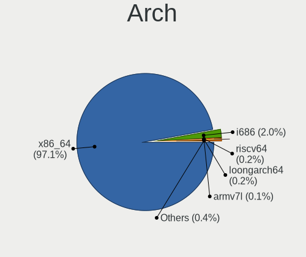
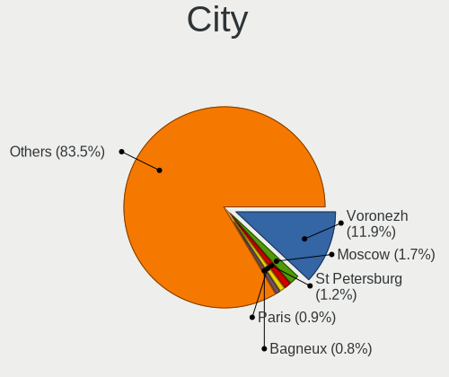
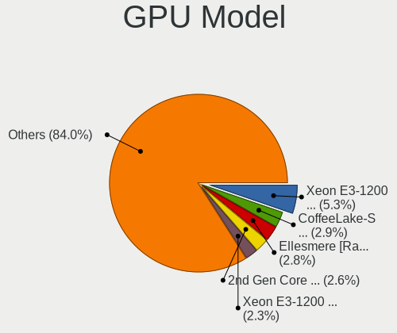
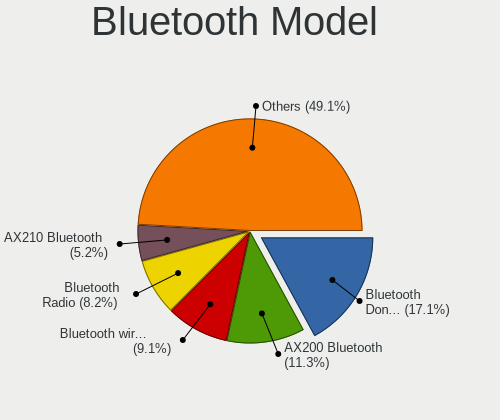
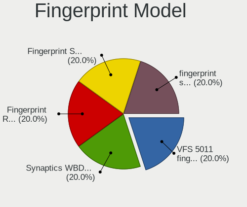

Debian - Tested Hardware & Statistics (Desktops)
------------------------------------------------

A project to collect tested hardware configurations for Debian.

Anyone can contribute to this report by the [hw-probe](https://github.com/linuxhw/hw-probe) tool:

    sudo -E hw-probe -all -upload

Please contribute! Especially if your hardware is rare.

Contents
--------

* [ Test Cases ](#test-cases)

* [ System ](#system)
  - [ OS                       ](#os)
  - [ OS Family                ](#os-family)
  - [ Kernel                   ](#kernel)
  - [ Kernel Family            ](#kernel-family)
  - [ Kernel Major Ver.        ](#kernel-major-ver)
  - [ Arch                     ](#arch)
  - [ DE                       ](#de)
  - [ Display Server           ](#display-server)
  - [ Display Manager          ](#display-manager)
  - [ OS Lang                  ](#os-lang)
  - [ Boot Mode                ](#boot-mode)
  - [ Filesystem               ](#filesystem)
  - [ Part. scheme             ](#part-scheme)
  - [ Dual Boot with Linux/BSD ](#dual-boot-with-linuxbsd)
  - [ Dual Boot (Win)          ](#dual-boot-win)

* [ Board ](#board)
  - [ Vendor                   ](#vendor)
  - [ Model                    ](#model)
  - [ Model Family             ](#model-family)
  - [ MFG Year                 ](#mfg-year)
  - [ Form Factor              ](#form-factor)
  - [ Secure Boot              ](#secure-boot)
  - [ Coreboot                 ](#coreboot)
  - [ RAM Size                 ](#ram-size)
  - [ RAM Used                 ](#ram-used)
  - [ Total Drives             ](#total-drives)
  - [ Has CD-ROM               ](#has-cd-rom)
  - [ Has Ethernet             ](#has-ethernet)
  - [ Has WiFi                 ](#has-wifi)
  - [ Has Bluetooth            ](#has-bluetooth)

* [ Location ](#location)
  - [ Country                  ](#country)
  - [ City                     ](#city)

* [ Drives ](#drives)
  - [ Drive Vendor             ](#drive-vendor)
  - [ Drive Model              ](#drive-model)
  - [ HDD Vendor               ](#hdd-vendor)
  - [ SSD Vendor               ](#ssd-vendor)
  - [ Drive Kind               ](#drive-kind)
  - [ Drive Connector          ](#drive-connector)
  - [ Drive Size               ](#drive-size)
  - [ Space Total              ](#space-total)
  - [ Space Used               ](#space-used)
  - [ Malfunc. Drives          ](#malfunc-drives)
  - [ Malfunc. Drive Vendor    ](#malfunc-drive-vendor)
  - [ Malfunc. HDD Vendor      ](#malfunc-hdd-vendor)
  - [ Malfunc. Drive Kind      ](#malfunc-drive-kind)
  - [ Failed Drives            ](#failed-drives)
  - [ Failed Drive Vendor      ](#failed-drive-vendor)
  - [ Drive Status             ](#drive-status)

* [ Storage controller ](#storage-controller)
  - [ Storage Vendor           ](#storage-vendor)
  - [ Storage Model            ](#storage-model)
  - [ Storage Kind             ](#storage-kind)

* [ Processor ](#processor)
  - [ CPU Vendor               ](#cpu-vendor)
  - [ CPU Model                ](#cpu-model)
  - [ CPU Model Family         ](#cpu-model-family)
  - [ CPU Cores                ](#cpu-cores)
  - [ CPU Sockets              ](#cpu-sockets)
  - [ CPU Threads              ](#cpu-threads)
  - [ CPU Op-Modes             ](#cpu-op-modes)
  - [ CPU Microcode            ](#cpu-microcode)
  - [ CPU Microarch            ](#cpu-microarch)

* [ Graphics ](#graphics)
  - [ GPU Vendor               ](#gpu-vendor)
  - [ GPU Model                ](#gpu-model)
  - [ GPU Combo                ](#gpu-combo)
  - [ GPU Driver               ](#gpu-driver)
  - [ GPU Memory               ](#gpu-memory)

* [ Monitor ](#monitor)
  - [ Monitor Vendor           ](#monitor-vendor)
  - [ Monitor Model            ](#monitor-model)
  - [ Monitor Resolution       ](#monitor-resolution)
  - [ Monitor Diagonal         ](#monitor-diagonal)
  - [ Monitor Width            ](#monitor-width)
  - [ Aspect Ratio             ](#aspect-ratio)
  - [ Monitor Area             ](#monitor-area)
  - [ Pixel Density            ](#pixel-density)
  - [ Multiple Monitors        ](#multiple-monitors)

* [ Network ](#network)
  - [ Net Controller Vendor    ](#net-controller-vendor)
  - [ Net Controller Model     ](#net-controller-model)
  - [ Wireless Vendor          ](#wireless-vendor)
  - [ Wireless Model           ](#wireless-model)
  - [ Ethernet Vendor          ](#ethernet-vendor)
  - [ Ethernet Model           ](#ethernet-model)
  - [ Net Controller Kind      ](#net-controller-kind)
  - [ Used Controller          ](#used-controller)
  - [ NICs                     ](#nics)
  - [ IPv6                     ](#ipv6)

* [ Bluetooth ](#bluetooth)
  - [ Bluetooth Vendor         ](#bluetooth-vendor)
  - [ Bluetooth Model          ](#bluetooth-model)

* [ Sound ](#sound)
  - [ Sound Vendor             ](#sound-vendor)
  - [ Sound Model              ](#sound-model)

* [ Memory ](#memory)
  - [ Memory Vendor            ](#memory-vendor)
  - [ Memory Model             ](#memory-model)
  - [ Memory Kind              ](#memory-kind)
  - [ Memory Form Factor       ](#memory-form-factor)
  - [ Memory Size              ](#memory-size)
  - [ Memory Speed             ](#memory-speed)

* [ Printers & scanners ](#printers--scanners)
  - [ Printer Vendor           ](#printer-vendor)
  - [ Printer Model            ](#printer-model)
  - [ Scanner Vendor           ](#scanner-vendor)
  - [ Scanner Model            ](#scanner-model)

* [ Camera ](#camera)
  - [ Camera Vendor            ](#camera-vendor)
  - [ Camera Model             ](#camera-model)

* [ Security ](#security)
  - [ Fingerprint Vendor       ](#fingerprint-vendor)
  - [ Fingerprint Model        ](#fingerprint-model)
  - [ Chipcard Vendor          ](#chipcard-vendor)
  - [ Chipcard Model           ](#chipcard-model)

* [ Unsupported ](#unsupported)
  - [ Unsupported Devices      ](#unsupported-devices)
  - [ Unsupported Device Types ](#unsupported-device-types)

Test Cases
----------

Total: 6124

| Vendor        | Model                       | Probe                                                      | Date         |
|---------------|-----------------------------|------------------------------------------------------------|--------------|
| HP            | ProLiant MicroServer Gen... | [aeb0b469c8](https://linux-hardware.org/?probe=aeb0b469c8) | Oct 01, 2023 |
| ASUSTek       | PRIME B365M-A               | [279922964e](https://linux-hardware.org/?probe=279922964e) | Oct 01, 2023 |
| Google        | Jerry                       | [467be71aaf](https://linux-hardware.org/?probe=467be71aaf) | Sep 30, 2023 |
| ASRock        | 4Core1600-GLAN              | [aefbc14017](https://linux-hardware.org/?probe=aefbc14017) | Sep 30, 2023 |
| Lenovo        | 0B98401 PRO                 | [17bb772d78](https://linux-hardware.org/?probe=17bb772d78) | Sep 29, 2023 |
| Gigabyte      | B450M DS3H-CF               | [3473652871](https://linux-hardware.org/?probe=3473652871) | Sep 29, 2023 |
| ASRock        | H81M-HG4                    | [7f2a420ea3](https://linux-hardware.org/?probe=7f2a420ea3) | Sep 29, 2023 |
| ASUSTek       | ROG STRIX X670E-F GAMING... | [5c38fe5e79](https://linux-hardware.org/?probe=5c38fe5e79) | Sep 28, 2023 |
| Pegatron      | JESSE                       | [3f6cf71237](https://linux-hardware.org/?probe=3f6cf71237) | Sep 28, 2023 |
| Huanan        | X99-F8 GAMING V5.0          | [62ba806672](https://linux-hardware.org/?probe=62ba806672) | Sep 28, 2023 |
| ASRock        | B450 Pro4 R2.0              | [82562e75c3](https://linux-hardware.org/?probe=82562e75c3) | Sep 28, 2023 |
| Loongson      | LS3A6000-7A2000-1w-EVB-V... | [89d08f5ea8](https://linux-hardware.org/?probe=89d08f5ea8) | Sep 28, 2023 |
| Loongson      | LS3A6000-7A2000-1w-EVB-V... | [576c14796a](https://linux-hardware.org/?probe=576c14796a) | Sep 28, 2023 |
| Shenzhen M... | F7BAA                       | [a59f2cf9f2](https://linux-hardware.org/?probe=a59f2cf9f2) | Sep 28, 2023 |
| ASUSTek       | ROG STRIX X670E-E GAMING... | [47a0a8627c](https://linux-hardware.org/?probe=47a0a8627c) | Sep 27, 2023 |
| MSI           | Z97 PC Mate                 | [15a7321226](https://linux-hardware.org/?probe=15a7321226) | Sep 27, 2023 |
| MSI           | Z97 PC Mate                 | [18bf7cff74](https://linux-hardware.org/?probe=18bf7cff74) | Sep 27, 2023 |
| Unknown       | Unknown                     | [2bf5f64c14](https://linux-hardware.org/?probe=2bf5f64c14) | Sep 27, 2023 |
| Gigabyte      | GA-970A-D3                  | [a4d1820df5](https://linux-hardware.org/?probe=a4d1820df5) | Sep 27, 2023 |
| ASRock        | 970M Pro3                   | [f004fa8e32](https://linux-hardware.org/?probe=f004fa8e32) | Sep 27, 2023 |
| ASRock        | 970M Pro3                   | [3646127006](https://linux-hardware.org/?probe=3646127006) | Sep 27, 2023 |
| Gigabyte      | GA-880GM-USB3L              | [f160911c14](https://linux-hardware.org/?probe=f160911c14) | Sep 27, 2023 |
| Lenovo        | 0B98401 PRO                 | [2cdf3dac45](https://linux-hardware.org/?probe=2cdf3dac45) | Sep 27, 2023 |
| YANYU         | H17SL                       | [5966ae64d0](https://linux-hardware.org/?probe=5966ae64d0) | Sep 26, 2023 |
| ASUSTek       | PRIME B350-PLUS             | [64dcffc72f](https://linux-hardware.org/?probe=64dcffc72f) | Sep 26, 2023 |
| Lenovo        | ThinkServer TS440           | [11efb68800](https://linux-hardware.org/?probe=11efb68800) | Sep 26, 2023 |
| Lenovo        | 102F SDK0E50510 WIN 2625... | [4a36dbb8ff](https://linux-hardware.org/?probe=4a36dbb8ff) | Sep 26, 2023 |
| Intel         | DP35DP AAD81073-206         | [426e9aff0f](https://linux-hardware.org/?probe=426e9aff0f) | Sep 26, 2023 |
| ASUSTek       | M5A78L-M LE/USB3            | [19858af3cd](https://linux-hardware.org/?probe=19858af3cd) | Sep 26, 2023 |
| Gigabyte      | B550 AORUS PRO V2           | [273b056209](https://linux-hardware.org/?probe=273b056209) | Sep 25, 2023 |
| MSI           | MS-7318                     | [0e03a1818a](https://linux-hardware.org/?probe=0e03a1818a) | Sep 24, 2023 |
| Acer          | H11H4-AI V:1.0              | [971f03180e](https://linux-hardware.org/?probe=971f03180e) | Sep 24, 2023 |
| Fujitsu       | D3067-A1 S26361-D3067-A1    | [14c3077129](https://linux-hardware.org/?probe=14c3077129) | Sep 24, 2023 |
| MSI           | Z370-A PRO                  | [77c3039fdc](https://linux-hardware.org/?probe=77c3039fdc) | Sep 24, 2023 |
| Dell          | 0D4MD1 A04                  | [5e6e35397a](https://linux-hardware.org/?probe=5e6e35397a) | Sep 24, 2023 |
| Dell          | 0D4MD1 A04                  | [4d7943532f](https://linux-hardware.org/?probe=4d7943532f) | Sep 24, 2023 |
| Gigabyte      | B85M-D3H                    | [e568bc8439](https://linux-hardware.org/?probe=e568bc8439) | Sep 23, 2023 |
| ASUSTek       | ROG STRIX B550-F GAMING     | [e96b971928](https://linux-hardware.org/?probe=e96b971928) | Sep 23, 2023 |
| Dell          | 0NW6H5 A00                  | [c3221c93ca](https://linux-hardware.org/?probe=c3221c93ca) | Sep 23, 2023 |
| HP            | 1905                        | [786257c0e1](https://linux-hardware.org/?probe=786257c0e1) | Sep 23, 2023 |
| Dell          | 0PC5F7 A01                  | [887558c8f3](https://linux-hardware.org/?probe=887558c8f3) | Sep 23, 2023 |
| Dell          | 03KWTV A02                  | [991ec32c75](https://linux-hardware.org/?probe=991ec32c75) | Sep 23, 2023 |
| Gigabyte      | B250M-Gaming5-CF            | [f18f8ef020](https://linux-hardware.org/?probe=f18f8ef020) | Sep 23, 2023 |
| MSI           | MPG Z590 GAMING PLUS        | [b402f89894](https://linux-hardware.org/?probe=b402f89894) | Sep 22, 2023 |
| Shenzhen M... | F6BFC                       | [9a906f1b75](https://linux-hardware.org/?probe=9a906f1b75) | Sep 22, 2023 |
| Dell          | 0NW6H5 A00                  | [7df92bb8f5](https://linux-hardware.org/?probe=7df92bb8f5) | Sep 22, 2023 |
| MSI           | X470 GAMING PLUS            | [d22a656bef](https://linux-hardware.org/?probe=d22a656bef) | Sep 22, 2023 |
| ASUSTek       | ROG Maximus XII EXTREME     | [2137a7a54b](https://linux-hardware.org/?probe=2137a7a54b) | Sep 22, 2023 |
| ASUSTek       | PRIME B660M-K D4            | [85c3791741](https://linux-hardware.org/?probe=85c3791741) | Sep 21, 2023 |
| ASUSTek       | P7P55D                      | [ff8d00073e](https://linux-hardware.org/?probe=ff8d00073e) | Sep 21, 2023 |
| Gigabyte      | Z77X-UD3H                   | [f870f9e3ac](https://linux-hardware.org/?probe=f870f9e3ac) | Sep 21, 2023 |
| MSI           | MS-7318                     | [38f011e50d](https://linux-hardware.org/?probe=38f011e50d) | Sep 21, 2023 |
| Gigabyte      | B550 AORUS PRO              | [81d1af1a96](https://linux-hardware.org/?probe=81d1af1a96) | Sep 20, 2023 |
| NetGear       | ReadyDATA 5200              | [c96e63c738](https://linux-hardware.org/?probe=c96e63c738) | Sep 20, 2023 |
| Gigabyte      | Z790 AERO G                 | [0c99fa225e](https://linux-hardware.org/?probe=0c99fa225e) | Sep 20, 2023 |
| iEi           | SAT3 V1.03                  | [d303736416](https://linux-hardware.org/?probe=d303736416) | Sep 20, 2023 |
| Gigabyte      | Z270-Gaming K3              | [63bebc9690](https://linux-hardware.org/?probe=63bebc9690) | Sep 20, 2023 |
| CWWK          | MINIPC-G12                  | [003a19cc19](https://linux-hardware.org/?probe=003a19cc19) | Sep 20, 2023 |
| Gigabyte      | Z790 AERO G                 | [6ded2501bf](https://linux-hardware.org/?probe=6ded2501bf) | Sep 20, 2023 |
| BESSTAR Te... | HM90                        | [bbb35ce98b](https://linux-hardware.org/?probe=bbb35ce98b) | Sep 20, 2023 |
| ASRock        | X399 Taichi                 | [ff02c716c1](https://linux-hardware.org/?probe=ff02c716c1) | Sep 19, 2023 |
| ASUSTek       | PRIME B450M-GAMING/BR       | [6d9002e7e3](https://linux-hardware.org/?probe=6d9002e7e3) | Sep 19, 2023 |
| ASUSTek       | PRIME B450M-GAMING/BR       | [c53d44303e](https://linux-hardware.org/?probe=c53d44303e) | Sep 19, 2023 |
| MSI           | MPG B760I EDGE WIFI DDR4    | [5a6ff779bd](https://linux-hardware.org/?probe=5a6ff779bd) | Sep 19, 2023 |
| Gigabyte      | H81M-DS2                    | [85d35b008d](https://linux-hardware.org/?probe=85d35b008d) | Sep 19, 2023 |
| MSI           | A320M-A PRO                 | [03da63d741](https://linux-hardware.org/?probe=03da63d741) | Sep 19, 2023 |
| ASUSTek       | ROG STRIX B650E-I GAMING... | [b06b302844](https://linux-hardware.org/?probe=b06b302844) | Sep 19, 2023 |
| Gigabyte      | 970A-DS3P                   | [0ddcc2944f](https://linux-hardware.org/?probe=0ddcc2944f) | Sep 19, 2023 |
| ASRock        | B550 Pro4                   | [af2217289d](https://linux-hardware.org/?probe=af2217289d) | Sep 19, 2023 |
| HP            | 82A2                        | [cc179a17a8](https://linux-hardware.org/?probe=cc179a17a8) | Sep 18, 2023 |
| ASUSTek       | TUF B450-PLUS GAMING        | [a64dc1766a](https://linux-hardware.org/?probe=a64dc1766a) | Sep 18, 2023 |
| MSI           | MS-7366                     | [96731b6fc6](https://linux-hardware.org/?probe=96731b6fc6) | Sep 18, 2023 |
| ASUSTek       | J1800I-C                    | [970e148d8d](https://linux-hardware.org/?probe=970e148d8d) | Sep 18, 2023 |
| MSI           | H81M-P33                    | [d0287bbd0f](https://linux-hardware.org/?probe=d0287bbd0f) | Sep 18, 2023 |
| ASUSTek       | TUF B450-PLUS GAMING        | [3faff3c0aa](https://linux-hardware.org/?probe=3faff3c0aa) | Sep 18, 2023 |
| Gigabyte      | H55N-USB3                   | [afefe4b055](https://linux-hardware.org/?probe=afefe4b055) | Sep 18, 2023 |
| Gigabyte      | GA-78LMT-USB3               | [cfa7fbd3fe](https://linux-hardware.org/?probe=cfa7fbd3fe) | Sep 18, 2023 |
| MSI           | X79A-GD45                   | [85a9bad81b](https://linux-hardware.org/?probe=85a9bad81b) | Sep 17, 2023 |
| AZW           | U59                         | [2bc9b4b184](https://linux-hardware.org/?probe=2bc9b4b184) | Sep 17, 2023 |
| Gigabyte      | H97-HD3                     | [ac1361d323](https://linux-hardware.org/?probe=ac1361d323) | Sep 17, 2023 |
| Supermicro    | X9DR3-F                     | [c2f0532df1](https://linux-hardware.org/?probe=c2f0532df1) | Sep 17, 2023 |
| HP            | 1905                        | [688c5ddf16](https://linux-hardware.org/?probe=688c5ddf16) | Sep 17, 2023 |
| ASUSTek       | ROG Maximus XIII HERO       | [b07ec8f845](https://linux-hardware.org/?probe=b07ec8f845) | Sep 17, 2023 |
| HP            | 1905                        | [562179ca0e](https://linux-hardware.org/?probe=562179ca0e) | Sep 17, 2023 |
| Gigabyte      | X570 GAMING X               | [8af23c2e56](https://linux-hardware.org/?probe=8af23c2e56) | Sep 17, 2023 |
| MSI           | X470 GAMING PLUS            | [35d0dc4629](https://linux-hardware.org/?probe=35d0dc4629) | Sep 17, 2023 |
| Gigabyte      | X570 GAMING X               | [50bfb485e5](https://linux-hardware.org/?probe=50bfb485e5) | Sep 17, 2023 |
| Gigabyte      | X570 GAMING X               | [d795a474b2](https://linux-hardware.org/?probe=d795a474b2) | Sep 16, 2023 |
| MSI           | B460M-A PRO                 | [b2d52a5d1c](https://linux-hardware.org/?probe=b2d52a5d1c) | Sep 16, 2023 |
| ASUSTek       | ROG STRIX B550-I GAMING     | [6a908941cd](https://linux-hardware.org/?probe=6a908941cd) | Sep 16, 2023 |
| ASRock        | B450M Pro4                  | [3974827c3e](https://linux-hardware.org/?probe=3974827c3e) | Sep 16, 2023 |
| Fujitsu       | D3220-A1 S26361-D3220-A1    | [effa0104c0](https://linux-hardware.org/?probe=effa0104c0) | Sep 16, 2023 |
| Fujitsu       | D3220-A1 S26361-D3220-A1    | [72ec01815f](https://linux-hardware.org/?probe=72ec01815f) | Sep 16, 2023 |
| ASUSTek       | P5G41T-M LX                 | [020deea6d9](https://linux-hardware.org/?probe=020deea6d9) | Sep 15, 2023 |
| ASUSTek       | M5A78L-M LE/USB3            | [923d176004](https://linux-hardware.org/?probe=923d176004) | Sep 15, 2023 |
| MSI           | MPG B760I EDGE WIFI DDR4    | [bd389fb2a0](https://linux-hardware.org/?probe=bd389fb2a0) | Sep 15, 2023 |
| MSI           | B450 GAMING PRO CARBON M... | [caba916cf4](https://linux-hardware.org/?probe=caba916cf4) | Sep 15, 2023 |
| Supermicro    | X11SSH-F                    | [2f12035902](https://linux-hardware.org/?probe=2f12035902) | Sep 15, 2023 |
| Supermicro    | X11SSH-F                    | [c46a08bb48](https://linux-hardware.org/?probe=c46a08bb48) | Sep 15, 2023 |
| Supermicro    | X11SSH-F                    | [aa351597ea](https://linux-hardware.org/?probe=aa351597ea) | Sep 15, 2023 |
| Gigabyte      | B250M-D3H-CF                | [e9d6d94486](https://linux-hardware.org/?probe=e9d6d94486) | Sep 15, 2023 |
| JINGSHA       | X99-D8I                     | [2865a9b1e6](https://linux-hardware.org/?probe=2865a9b1e6) | Sep 15, 2023 |
| ASUSTek       | PRIME H510M-A               | [b66654e80e](https://linux-hardware.org/?probe=b66654e80e) | Sep 14, 2023 |
| ASUSTek       | P8H61/USB3                  | [cf48b0b959](https://linux-hardware.org/?probe=cf48b0b959) | Sep 14, 2023 |
| Lenovo        | ThinkServer TS440           | [8ffd465a75](https://linux-hardware.org/?probe=8ffd465a75) | Sep 14, 2023 |
| ASUSTek       | ROG Maximus XIII HERO       | [5923e88c3b](https://linux-hardware.org/?probe=5923e88c3b) | Sep 13, 2023 |
| SolidRun      | CEX7 Platform               | [2a695cf7f9](https://linux-hardware.org/?probe=2a695cf7f9) | Sep 13, 2023 |
| AZW           | MINI S 10                   | [f6bc099f62](https://linux-hardware.org/?probe=f6bc099f62) | Sep 13, 2023 |
| SolidRun      | CEX7 Platform               | [06b4774756](https://linux-hardware.org/?probe=06b4774756) | Sep 13, 2023 |
| ASUSTek       | H110M-R                     | [3530c6e606](https://linux-hardware.org/?probe=3530c6e606) | Sep 13, 2023 |
| Supermicro    | X11SSH-F                    | [3a9630bdc5](https://linux-hardware.org/?probe=3a9630bdc5) | Sep 13, 2023 |
| Dell          | 01XK1W A00                  | [07e5f3eb14](https://linux-hardware.org/?probe=07e5f3eb14) | Sep 13, 2023 |
| Gigabyte      | H110M-H-CF                  | [31cc220aae](https://linux-hardware.org/?probe=31cc220aae) | Sep 12, 2023 |
| Dell          | 02N3WF A01                  | [9bd19e6fbf](https://linux-hardware.org/?probe=9bd19e6fbf) | Sep 12, 2023 |
| MSI           | PRO B760M-A WIFI            | [87577c165a](https://linux-hardware.org/?probe=87577c165a) | Sep 12, 2023 |
| ASUSTek       | H110M-K                     | [ba05e7b3a7](https://linux-hardware.org/?probe=ba05e7b3a7) | Sep 12, 2023 |
| MSI           | H510M-A PRO                 | [f1a2a6d936](https://linux-hardware.org/?probe=f1a2a6d936) | Sep 12, 2023 |
| Gigabyte      | GA-870A-UD3                 | [b3acd03fb0](https://linux-hardware.org/?probe=b3acd03fb0) | Sep 12, 2023 |
| Dell          | 0GM819                      | [9917a9587a](https://linux-hardware.org/?probe=9917a9587a) | Sep 12, 2023 |
| ASRock        | B560M-HDV                   | [4df04c540a](https://linux-hardware.org/?probe=4df04c540a) | Sep 11, 2023 |
| Gigabyte      | M68MT-S2                    | [cb129260e1](https://linux-hardware.org/?probe=cb129260e1) | Sep 11, 2023 |
| ECS           | G31T-M9                     | [9d2ba7fe88](https://linux-hardware.org/?probe=9d2ba7fe88) | Sep 11, 2023 |
| Gigabyte      | GA-M56S-S3                  | [df2602c134](https://linux-hardware.org/?probe=df2602c134) | Sep 11, 2023 |
| Gigabyte      | P85-D3                      | [f090137faf](https://linux-hardware.org/?probe=f090137faf) | Sep 11, 2023 |
| MSI           | MS-B9091                    | [5b1250945b](https://linux-hardware.org/?probe=5b1250945b) | Sep 11, 2023 |
| ASUSTek       | P8H61/USB3                  | [d93600fc7c](https://linux-hardware.org/?probe=d93600fc7c) | Sep 11, 2023 |
| MSI           | MPG X570 GAMING PLUS        | [7d22cd1af1](https://linux-hardware.org/?probe=7d22cd1af1) | Sep 11, 2023 |
| HP            | 8643 SMVB                   | [867d0c64be](https://linux-hardware.org/?probe=867d0c64be) | Sep 11, 2023 |
| MSI           | 970A-G46                    | [722b900724](https://linux-hardware.org/?probe=722b900724) | Sep 11, 2023 |
| MSI           | MPG Z590 GAMING PLUS        | [6db516900f](https://linux-hardware.org/?probe=6db516900f) | Sep 10, 2023 |
| ASRock        | H81M-HG4                    | [7398d477e4](https://linux-hardware.org/?probe=7398d477e4) | Sep 10, 2023 |
| MSI           | Z370-A PRO                  | [b23d13eddc](https://linux-hardware.org/?probe=b23d13eddc) | Sep 10, 2023 |
| HP            | 876C SMVB                   | [f122d202cc](https://linux-hardware.org/?probe=f122d202cc) | Sep 10, 2023 |
| Shenzhen M... | HX90G                       | [fda84a9c7c](https://linux-hardware.org/?probe=fda84a9c7c) | Sep 10, 2023 |
| ASUSTek       | TS10                        | [ad867c5e25](https://linux-hardware.org/?probe=ad867c5e25) | Sep 10, 2023 |
| MSI           | B350 TOMAHAWK               | [2a7d4dfb14](https://linux-hardware.org/?probe=2a7d4dfb14) | Sep 09, 2023 |
| Gigabyte      | B85M-D3H                    | [9e26f5a8d3](https://linux-hardware.org/?probe=9e26f5a8d3) | Sep 09, 2023 |
| MSI           | MAG B650M MORTAR WIFI       | [b3957e19eb](https://linux-hardware.org/?probe=b3957e19eb) | Sep 09, 2023 |
| AZW           | U59                         | [e199a9df01](https://linux-hardware.org/?probe=e199a9df01) | Sep 09, 2023 |
| ASRock        | J3455-ITX                   | [724826d84b](https://linux-hardware.org/?probe=724826d84b) | Sep 09, 2023 |
| MSI           | MS-B9091                    | [226300a88d](https://linux-hardware.org/?probe=226300a88d) | Sep 09, 2023 |
| Gigabyte      | GA-78LMT-USB3 SEx           | [5e9fc2a82f](https://linux-hardware.org/?probe=5e9fc2a82f) | Sep 09, 2023 |
| ASRock        | AB350 Gaming-ITX/ac         | [a4e0bc39ba](https://linux-hardware.org/?probe=a4e0bc39ba) | Sep 09, 2023 |
| ASUSTek       | ROG Maximus XI EXTREME      | [9b24a3d874](https://linux-hardware.org/?probe=9b24a3d874) | Sep 09, 2023 |
| ASUSTek       | PRIME Z370-P                | [9ce78af6e9](https://linux-hardware.org/?probe=9ce78af6e9) | Sep 08, 2023 |
| MSI           | MS-B1711                    | [4c68221aae](https://linux-hardware.org/?probe=4c68221aae) | Sep 08, 2023 |
| HP            | 83E0                        | [44faaa5738](https://linux-hardware.org/?probe=44faaa5738) | Sep 08, 2023 |
| Acer          | Veriton M2632G V:1.0        | [a0363f72e3](https://linux-hardware.org/?probe=a0363f72e3) | Sep 08, 2023 |
| ASUSTek       | CROSSHAIR V FORMULA-Z       | [e30ef028b9](https://linux-hardware.org/?probe=e30ef028b9) | Sep 08, 2023 |
| ASUSTek       | CROSSHAIR V FORMULA-Z       | [69c2d2f0d0](https://linux-hardware.org/?probe=69c2d2f0d0) | Sep 08, 2023 |
| Lenovo        | 1048 SDK0J40697 WIN 3305... | [8a5a4accb2](https://linux-hardware.org/?probe=8a5a4accb2) | Sep 08, 2023 |
| Gigabyte      | H610M H DDR4                | [72516e7752](https://linux-hardware.org/?probe=72516e7752) | Sep 07, 2023 |
| Intel         | HM570                       | [ea25bde02e](https://linux-hardware.org/?probe=ea25bde02e) | Sep 07, 2023 |
| ASUSTek       | Z170 PRO GAMING             | [7684d60e85](https://linux-hardware.org/?probe=7684d60e85) | Sep 07, 2023 |
| Gigabyte      | Z790 UD                     | [3f67617c93](https://linux-hardware.org/?probe=3f67617c93) | Sep 07, 2023 |
| ASRock        | Z97 Killer                  | [a1537a06ee](https://linux-hardware.org/?probe=a1537a06ee) | Sep 07, 2023 |
| JGINYUE       | X79M-PLUS V2.2              | [602bfb550f](https://linux-hardware.org/?probe=602bfb550f) | Sep 06, 2023 |
| JGINYUE       | X79M-PLUS V2.2              | [1535be8e5f](https://linux-hardware.org/?probe=1535be8e5f) | Sep 06, 2023 |
| Intel         | DN2800MT AAG23738-803       | [8bdf13908a](https://linux-hardware.org/?probe=8bdf13908a) | Sep 06, 2023 |
| ASRock        | Z97M OC Formula             | [1f2c20e8cf](https://linux-hardware.org/?probe=1f2c20e8cf) | Sep 06, 2023 |
| MSI           | Z370-A PRO                  | [19dc657d04](https://linux-hardware.org/?probe=19dc657d04) | Sep 06, 2023 |
| MSI           | X470 GAMING PLUS            | [f20b630cf8](https://linux-hardware.org/?probe=f20b630cf8) | Sep 06, 2023 |
| MSI           | X470 GAMING PLUS            | [2b9d42ccc9](https://linux-hardware.org/?probe=2b9d42ccc9) | Sep 06, 2023 |
| ASRockRack    | B565D4-V1L                  | [ff236ef40e](https://linux-hardware.org/?probe=ff236ef40e) | Sep 06, 2023 |
| Intel         | D33217GKE G76540-205        | [98630bd8bd](https://linux-hardware.org/?probe=98630bd8bd) | Sep 05, 2023 |
| MSI           | Z370-A PRO                  | [8415f054e5](https://linux-hardware.org/?probe=8415f054e5) | Sep 05, 2023 |
| Gigabyte      | GA-790FXTA-UD5              | [a97cdf671b](https://linux-hardware.org/?probe=a97cdf671b) | Sep 05, 2023 |
| Techvision    | TVI7309X B0                 | [846d8027c3](https://linux-hardware.org/?probe=846d8027c3) | Sep 05, 2023 |
| ASUSTek       | TUF Gaming B660-PLUS WIF... | [0874ee1444](https://linux-hardware.org/?probe=0874ee1444) | Sep 05, 2023 |
| ASRock        | B550 Phantom Gaming-ITX/... | [5a4f7a4641](https://linux-hardware.org/?probe=5a4f7a4641) | Sep 05, 2023 |
| Fujitsu       | D3183-A1 S26361-D3183-A1    | [85e1b123db](https://linux-hardware.org/?probe=85e1b123db) | Sep 04, 2023 |
| Gigabyte      | GA-790FXTA-UD5              | [6c90c83d67](https://linux-hardware.org/?probe=6c90c83d67) | Sep 04, 2023 |
| Dell          | 0Y2MRG A00                  | [893bd8a261](https://linux-hardware.org/?probe=893bd8a261) | Sep 04, 2023 |
| MSI           | Z370-A PRO                  | [b670e69634](https://linux-hardware.org/?probe=b670e69634) | Sep 04, 2023 |
| Fujitsu       | D3400-A1 S26361-D3400-A1    | [49e3c842c1](https://linux-hardware.org/?probe=49e3c842c1) | Sep 04, 2023 |
| Unknown       | Unknown                     | [0c53c2df55](https://linux-hardware.org/?probe=0c53c2df55) | Sep 04, 2023 |
| ASRockRack    | X470D4U                     | [d38e269d11](https://linux-hardware.org/?probe=d38e269d11) | Sep 04, 2023 |
| MSI           | PRO X670-P WIFI             | [326596a962](https://linux-hardware.org/?probe=326596a962) | Sep 04, 2023 |
| Dell          | 0CU409                      | [ca461ddc28](https://linux-hardware.org/?probe=ca461ddc28) | Sep 04, 2023 |
| Gigabyte      | B450 AORUS ELITE V2         | [2292824064](https://linux-hardware.org/?probe=2292824064) | Sep 04, 2023 |
| Gigabyte      | B85M-D3H                    | [9d4d9e6ffa](https://linux-hardware.org/?probe=9d4d9e6ffa) | Sep 03, 2023 |
| HP            | 1825                        | [38d038d2ad](https://linux-hardware.org/?probe=38d038d2ad) | Sep 03, 2023 |
| MEGA          | G41T-M7 LGT                 | [8d645686ff](https://linux-hardware.org/?probe=8d645686ff) | Sep 02, 2023 |
| ASUSTek       | Pro WS X570-ACE             | [c3dc3fd84b](https://linux-hardware.org/?probe=c3dc3fd84b) | Sep 02, 2023 |
| Gigabyte      | B550 GAMING X V2            | [9259a8f3f3](https://linux-hardware.org/?probe=9259a8f3f3) | Sep 02, 2023 |
| Gigabyte      | Z87X-UD4H-CF                | [213b7c59de](https://linux-hardware.org/?probe=213b7c59de) | Sep 02, 2023 |
| MSI           | MPG B650I EDGE WIFI         | [3ea725d275](https://linux-hardware.org/?probe=3ea725d275) | Sep 02, 2023 |
| ASRock        | B650M PG Riptide            | [0f1a250c7f](https://linux-hardware.org/?probe=0f1a250c7f) | Sep 02, 2023 |
| ASUSTek       | TUF Gaming B550M-PLUS       | [7e93b2a981](https://linux-hardware.org/?probe=7e93b2a981) | Sep 02, 2023 |
| ASUSTek       | ROG Maximus XIII HERO       | [91d7a53a1b](https://linux-hardware.org/?probe=91d7a53a1b) | Sep 01, 2023 |
| Lenovo        | 36EE SDK0J40700 WIN 3258... | [0075af1992](https://linux-hardware.org/?probe=0075af1992) | Sep 01, 2023 |
| Gigabyte      | H110M-H-CF                  | [ec5d9509f6](https://linux-hardware.org/?probe=ec5d9509f6) | Sep 01, 2023 |
| ASUSTek       | P8Q77-M                     | [0192700365](https://linux-hardware.org/?probe=0192700365) | Sep 01, 2023 |
| Unknown       | Unknown                     | [3e3433226b](https://linux-hardware.org/?probe=3e3433226b) | Sep 01, 2023 |
| Dell          | 0GM819                      | [8144006f85](https://linux-hardware.org/?probe=8144006f85) | Aug 31, 2023 |
| Dell          | 0GM819                      | [f7c99aa51b](https://linux-hardware.org/?probe=f7c99aa51b) | Aug 31, 2023 |
| HP            | 1495                        | [09b1cf815c](https://linux-hardware.org/?probe=09b1cf815c) | Aug 31, 2023 |
| Gigabyte      | X570S AERO G                | [f367356391](https://linux-hardware.org/?probe=f367356391) | Aug 30, 2023 |
| ASUSTek       | PRIME Z790-P D4             | [1cea30e36a](https://linux-hardware.org/?probe=1cea30e36a) | Aug 30, 2023 |
| ASUSTek       | PRIME Z790-P D4             | [20b35a5d4f](https://linux-hardware.org/?probe=20b35a5d4f) | Aug 30, 2023 |
| Intel         | DG41TY AAE47335-301         | [1f8897e1a2](https://linux-hardware.org/?probe=1f8897e1a2) | Aug 29, 2023 |
| Lenovo        | 102F SDK0Q40081 WIN 3305... | [b6478eb429](https://linux-hardware.org/?probe=b6478eb429) | Aug 29, 2023 |
| Dell          | 0T10XW A00                  | [cc093c964f](https://linux-hardware.org/?probe=cc093c964f) | Aug 29, 2023 |
| HP            | 82A2                        | [44e0a72dad](https://linux-hardware.org/?probe=44e0a72dad) | Aug 28, 2023 |
| BESSTAR Te... | TH50                        | [816347743d](https://linux-hardware.org/?probe=816347743d) | Aug 28, 2023 |
| Dell          | 0JP3NX A01                  | [f52ee2433e](https://linux-hardware.org/?probe=f52ee2433e) | Aug 28, 2023 |
| Gigabyte      | X570 AORUS MASTER           | [89e3ba3d7d](https://linux-hardware.org/?probe=89e3ba3d7d) | Aug 28, 2023 |
| Gigabyte      | X570 AORUS MASTER           | [0150e826ac](https://linux-hardware.org/?probe=0150e826ac) | Aug 28, 2023 |
| Gigabyte      | H410M S2H V3                | [c772f3df30](https://linux-hardware.org/?probe=c772f3df30) | Aug 28, 2023 |
| ASUSTek       | PRIME X470-PRO              | [eef69bf730](https://linux-hardware.org/?probe=eef69bf730) | Aug 28, 2023 |
| langchao      | IPM41-D3                    | [a6b482f110](https://linux-hardware.org/?probe=a6b482f110) | Aug 27, 2023 |
| ASUSTek       | Z170-A                      | [eadbc95dc7](https://linux-hardware.org/?probe=eadbc95dc7) | Aug 27, 2023 |
| Gigabyte      | GA-MA78GM-S2H               | [8ee437beac](https://linux-hardware.org/?probe=8ee437beac) | Aug 27, 2023 |
| HP            | 1495                        | [86b148e011](https://linux-hardware.org/?probe=86b148e011) | Aug 26, 2023 |
| Essentiel ... | MS-7848                     | [228bdfda30](https://linux-hardware.org/?probe=228bdfda30) | Aug 26, 2023 |
| Essentiel ... | MS-7848                     | [9ce89a0c87](https://linux-hardware.org/?probe=9ce89a0c87) | Aug 26, 2023 |
| MSI           | MPG X670E CARBON WIFI       | [3add2f8945](https://linux-hardware.org/?probe=3add2f8945) | Aug 25, 2023 |
| ASUSTek       | ProArt X670E-CREATOR WIF... | [3067310cf8](https://linux-hardware.org/?probe=3067310cf8) | Aug 25, 2023 |
| ASUSTek       | PRIME H310M-R R2.0          | [0cc7a0f138](https://linux-hardware.org/?probe=0cc7a0f138) | Aug 25, 2023 |
| Shenzhen M... | F7BAA                       | [3ac1398c61](https://linux-hardware.org/?probe=3ac1398c61) | Aug 25, 2023 |
| Unknown       | Unknown                     | [7e6d5fa7bc](https://linux-hardware.org/?probe=7e6d5fa7bc) | Aug 25, 2023 |
| ASUSTek       | PRIME H310M-R R2.0          | [241fead3e6](https://linux-hardware.org/?probe=241fead3e6) | Aug 25, 2023 |
| HP            | 158A                        | [e154a48901](https://linux-hardware.org/?probe=e154a48901) | Aug 25, 2023 |
| ASUSTek       | ROG Maximus XII EXTREME     | [815a77392c](https://linux-hardware.org/?probe=815a77392c) | Aug 25, 2023 |
| HP            | 18E4                        | [e209d700ef](https://linux-hardware.org/?probe=e209d700ef) | Aug 25, 2023 |
| Dell          | 03NVJ6 A01                  | [71102ac92b](https://linux-hardware.org/?probe=71102ac92b) | Aug 24, 2023 |
| Acer          | Aspire XC-780               | [e154995d9e](https://linux-hardware.org/?probe=e154995d9e) | Aug 24, 2023 |
| Unknown       | Unknown                     | [0e86c5864d](https://linux-hardware.org/?probe=0e86c5864d) | Aug 24, 2023 |
| Dell          | 06D7TR A02                  | [d0b04a9056](https://linux-hardware.org/?probe=d0b04a9056) | Aug 24, 2023 |
| Intel         | DN2820FYK H24582-201        | [bb1402894c](https://linux-hardware.org/?probe=bb1402894c) | Aug 24, 2023 |
| ASUSTek       | STRIX H270F GAMING          | [eeff109a12](https://linux-hardware.org/?probe=eeff109a12) | Aug 24, 2023 |
| HC Technol... | HCAR357-NR                  | [3cd017db11](https://linux-hardware.org/?probe=3cd017db11) | Aug 24, 2023 |
| MSI           | MAG B560 TORPEDO            | [a3ec958f0c](https://linux-hardware.org/?probe=a3ec958f0c) | Aug 23, 2023 |
| ASUSTek       | ROG STRIX B550-F GAMING     | [acc3f87d28](https://linux-hardware.org/?probe=acc3f87d28) | Aug 23, 2023 |
| ASRock        | FM2A68M-HD+                 | [6811a2231b](https://linux-hardware.org/?probe=6811a2231b) | Aug 23, 2023 |
| MSI           | MAG B560 TORPEDO            | [79db65495a](https://linux-hardware.org/?probe=79db65495a) | Aug 23, 2023 |
| HP            | 8835                        | [6d48f6a632](https://linux-hardware.org/?probe=6d48f6a632) | Aug 23, 2023 |
| HP            | 8835                        | [01d495ff7c](https://linux-hardware.org/?probe=01d495ff7c) | Aug 23, 2023 |
| Gigabyte      | B550 GAMING X V2            | [5663c30e5e](https://linux-hardware.org/?probe=5663c30e5e) | Aug 23, 2023 |
| ASUSTek       | PRIME X299-DELUXE           | [266edae3d0](https://linux-hardware.org/?probe=266edae3d0) | Aug 23, 2023 |
| MSI           | Z270 GAMING PRO CARBON      | [78bfc9060d](https://linux-hardware.org/?probe=78bfc9060d) | Aug 23, 2023 |
| Gigabyte      | B550 GAMING X V2            | [5a9553b9a2](https://linux-hardware.org/?probe=5a9553b9a2) | Aug 22, 2023 |
| Supermicro    | H12SSL-i                    | [0981b40b5c](https://linux-hardware.org/?probe=0981b40b5c) | Aug 22, 2023 |
| ASUSTek       | E35M1-M                     | [5b3a30e3bc](https://linux-hardware.org/?probe=5b3a30e3bc) | Aug 22, 2023 |
| ASRock        | J4125B-ITX                  | [93853db701](https://linux-hardware.org/?probe=93853db701) | Aug 21, 2023 |
| ASRock        | J4125B-ITX                  | [f9058bcea1](https://linux-hardware.org/?probe=f9058bcea1) | Aug 21, 2023 |
| Inspur        | H110H4-EM                   | [75ce94f0f9](https://linux-hardware.org/?probe=75ce94f0f9) | Aug 21, 2023 |
| ASUSTek       | E35M1-M                     | [c3207e25fd](https://linux-hardware.org/?probe=c3207e25fd) | Aug 21, 2023 |
| Unknown       | Unknown                     | [4d4fcc02f3](https://linux-hardware.org/?probe=4d4fcc02f3) | Aug 21, 2023 |
| Dell          | 06X1TJ A00                  | [85ba56b138](https://linux-hardware.org/?probe=85ba56b138) | Aug 20, 2023 |
| MSI           | PRO B760M-A WIFI DDR4       | [109c0dbb17](https://linux-hardware.org/?probe=109c0dbb17) | Aug 20, 2023 |
| MSI           | B450M BAZOOKA               | [569655b0f2](https://linux-hardware.org/?probe=569655b0f2) | Aug 20, 2023 |
| ASRockRack    | EP2C612D16C-4L              | [61802adf5b](https://linux-hardware.org/?probe=61802adf5b) | Aug 19, 2023 |
| MSI           | B350 TOMAHAWK               | [8b6ec2d9e2](https://linux-hardware.org/?probe=8b6ec2d9e2) | Aug 19, 2023 |
| ASRockRack    | EP2C612D16C-4L              | [52d818cdbd](https://linux-hardware.org/?probe=52d818cdbd) | Aug 19, 2023 |
| MSI           | KA790GX-M                   | [050157c33b](https://linux-hardware.org/?probe=050157c33b) | Aug 19, 2023 |
| MSI           | B350 TOMAHAWK               | [cf83ce90b0](https://linux-hardware.org/?probe=cf83ce90b0) | Aug 19, 2023 |
| Medion        | MS-7728                     | [f548540f0c](https://linux-hardware.org/?probe=f548540f0c) | Aug 19, 2023 |
| Dell          | 06X1TJ A00                  | [9580f6451c](https://linux-hardware.org/?probe=9580f6451c) | Aug 19, 2023 |
| HP            | 8266                        | [22a06599a1](https://linux-hardware.org/?probe=22a06599a1) | Aug 19, 2023 |
| Dell          | 0PU052                      | [2b5816a194](https://linux-hardware.org/?probe=2b5816a194) | Aug 19, 2023 |
| ASUSTek       | TUF Gaming X570-PRO         | [c3d45a0b50](https://linux-hardware.org/?probe=c3d45a0b50) | Aug 18, 2023 |
| HP            | 3047h                       | [a6a9afac2a](https://linux-hardware.org/?probe=a6a9afac2a) | Aug 18, 2023 |
| HP            | 3047h                       | [762697d775](https://linux-hardware.org/?probe=762697d775) | Aug 18, 2023 |
| ASUSTek       | ROG STRIX Z690-A GAMING ... | [5f5f5280d8](https://linux-hardware.org/?probe=5f5f5280d8) | Aug 18, 2023 |
| Gigabyte      | B450 AORUS ELITE            | [097825338b](https://linux-hardware.org/?probe=097825338b) | Aug 18, 2023 |
| ASUSTek       | ROG STRIX Z690-F GAMING ... | [7911ff1df6](https://linux-hardware.org/?probe=7911ff1df6) | Aug 18, 2023 |
| ASUSTek       | CM1630                      | [c1fd29e307](https://linux-hardware.org/?probe=c1fd29e307) | Aug 18, 2023 |
| Intel         | X99H                        | [ee1fff7602](https://linux-hardware.org/?probe=ee1fff7602) | Aug 17, 2023 |
| ASUSTek       | ROG Maximus XII EXTREME     | [1742c682fc](https://linux-hardware.org/?probe=1742c682fc) | Aug 16, 2023 |
| Apple         | Mac-F221BEC8                | [2db998a2ca](https://linux-hardware.org/?probe=2db998a2ca) | Aug 16, 2023 |
| Lenovo        | 1036 NO DPK                 | [61eb0b10f6](https://linux-hardware.org/?probe=61eb0b10f6) | Aug 16, 2023 |
| ASUSTek       | PRIME A320M-R               | [0e1d37c108](https://linux-hardware.org/?probe=0e1d37c108) | Aug 16, 2023 |
| PCWare        | IPMH110G                    | [c07caba6a9](https://linux-hardware.org/?probe=c07caba6a9) | Aug 16, 2023 |
| ASUSTek       | Pro WS X570-ACE             | [a247bcbeb2](https://linux-hardware.org/?probe=a247bcbeb2) | Aug 16, 2023 |
| Gigabyte      | B450M DS3H-CF               | [ec0576c5aa](https://linux-hardware.org/?probe=ec0576c5aa) | Aug 15, 2023 |
| ASUSTek       | TUF Gaming Z790-PLUS WIF... | [780b9a9e3a](https://linux-hardware.org/?probe=780b9a9e3a) | Aug 15, 2023 |
| ASUSTek       | ROG ZENITH EXTREME          | [48ae062db8](https://linux-hardware.org/?probe=48ae062db8) | Aug 15, 2023 |
| MSI           | X470 GAMING PLUS            | [5297d177b4](https://linux-hardware.org/?probe=5297d177b4) | Aug 14, 2023 |
| ASUSTek       | TUF Gaming B550-PLUS        | [c5ad691377](https://linux-hardware.org/?probe=c5ad691377) | Aug 14, 2023 |
| Dell          | 0CT017                      | [0800c86065](https://linux-hardware.org/?probe=0800c86065) | Aug 14, 2023 |
| Lenovo        | ThinkCentre M58p 7220AR1    | [2bc1532fb7](https://linux-hardware.org/?probe=2bc1532fb7) | Aug 14, 2023 |
| Unknown       | CN700-8237                  | [5890f075f7](https://linux-hardware.org/?probe=5890f075f7) | Aug 13, 2023 |
| ECS           | H61H2-CM                    | [7e33e0f06c](https://linux-hardware.org/?probe=7e33e0f06c) | Aug 13, 2023 |
| MSI           | B450 TOMAHAWK MAX II        | [493f1773eb](https://linux-hardware.org/?probe=493f1773eb) | Aug 13, 2023 |
| ECS           | H61H2-CM                    | [2656581f21](https://linux-hardware.org/?probe=2656581f21) | Aug 13, 2023 |
| Gigabyte      | B360HD3PLM-CF               | [650f840aa5](https://linux-hardware.org/?probe=650f840aa5) | Aug 13, 2023 |
| Gigabyte      | B85M-D3H                    | [448534f935](https://linux-hardware.org/?probe=448534f935) | Aug 13, 2023 |
| ASRock        | B550M PG Riptide            | [642c45af5d](https://linux-hardware.org/?probe=642c45af5d) | Aug 13, 2023 |
| ASRock        | B85M Pro4                   | [108dae1eae](https://linux-hardware.org/?probe=108dae1eae) | Aug 12, 2023 |
| CWWK          | CW-J6-6L                    | [8321dcc5ea](https://linux-hardware.org/?probe=8321dcc5ea) | Aug 12, 2023 |
| ASUSTek       | PRIME B660M-K D4            | [dad31fab00](https://linux-hardware.org/?probe=dad31fab00) | Aug 12, 2023 |
| ASUSTek       | ProArt X670E-CREATOR WIF... | [4f6d84a4dd](https://linux-hardware.org/?probe=4f6d84a4dd) | Aug 12, 2023 |
| ASRock        | J4125B-ITX                  | [fa9ebd523f](https://linux-hardware.org/?probe=fa9ebd523f) | Aug 11, 2023 |
| MSI           | G33M                        | [65de454e8b](https://linux-hardware.org/?probe=65de454e8b) | Aug 11, 2023 |
| Dell          | 06X1TJ A00                  | [91ecb8253e](https://linux-hardware.org/?probe=91ecb8253e) | Aug 11, 2023 |
| Lenovo        | 3740 NOK                    | [9964e9a820](https://linux-hardware.org/?probe=9964e9a820) | Aug 11, 2023 |
| ASUSTek       | ROG Maximus XII EXTREME     | [a0350a164c](https://linux-hardware.org/?probe=a0350a164c) | Aug 10, 2023 |
| Dell          | 0VXN67 A01                  | [4fbd39d860](https://linux-hardware.org/?probe=4fbd39d860) | Aug 10, 2023 |
| ASRock        | Z68 Pro3                    | [f949a6e2a5](https://linux-hardware.org/?probe=f949a6e2a5) | Aug 09, 2023 |
| ASUSTek       | Pro WS 565-ACE              | [3d9112e038](https://linux-hardware.org/?probe=3d9112e038) | Aug 09, 2023 |
| ASUSTek       | ROG STRIX B450-F GAMING     | [2be2a9d5f4](https://linux-hardware.org/?probe=2be2a9d5f4) | Aug 09, 2023 |
| HP            | 8433 11                     | [93432b3df2](https://linux-hardware.org/?probe=93432b3df2) | Aug 09, 2023 |
| Unknown       | AB07H                       | [d0b6bc1fce](https://linux-hardware.org/?probe=d0b6bc1fce) | Aug 09, 2023 |
| ASUSTek       | B85M-G                      | [9fcf84ff7c](https://linux-hardware.org/?probe=9fcf84ff7c) | Aug 09, 2023 |
| Supermicro    | X8ST3                       | [13099babf6](https://linux-hardware.org/?probe=13099babf6) | Aug 09, 2023 |
| ASUSTek       | P5LD2-SE                    | [04d19635d5](https://linux-hardware.org/?probe=04d19635d5) | Aug 08, 2023 |
| ASUSTek       | P5LD2-SE                    | [671a686166](https://linux-hardware.org/?probe=671a686166) | Aug 08, 2023 |
| ASUSTek       | STRIX H270F GAMING          | [ab74b5c684](https://linux-hardware.org/?probe=ab74b5c684) | Aug 08, 2023 |
| ASUSTek       | STRIX H270F GAMING          | [85ffbedac4](https://linux-hardware.org/?probe=85ffbedac4) | Aug 08, 2023 |
| Unknown       | Unknown                     | [14114ca4aa](https://linux-hardware.org/?probe=14114ca4aa) | Aug 07, 2023 |
| Gigabyte      | H81M-S2H                    | [f895d0afe3](https://linux-hardware.org/?probe=f895d0afe3) | Aug 07, 2023 |
| Unknown       | Unknown                     | [946d81eb9d](https://linux-hardware.org/?probe=946d81eb9d) | Aug 07, 2023 |
| Acer          | Aspire TC-605               | [f3bac278d5](https://linux-hardware.org/?probe=f3bac278d5) | Aug 07, 2023 |
| ASRock        | B460M Pro4                  | [66f1fd8cc5](https://linux-hardware.org/?probe=66f1fd8cc5) | Aug 07, 2023 |
| Foxconn       | 2ADA                        | [17d44b6d2c](https://linux-hardware.org/?probe=17d44b6d2c) | Aug 06, 2023 |
| ASRock        | Q1900M                      | [51f69dffd5](https://linux-hardware.org/?probe=51f69dffd5) | Aug 06, 2023 |
| Biostar       | B365MHC                     | [1a7d051f1e](https://linux-hardware.org/?probe=1a7d051f1e) | Aug 06, 2023 |
| Lenovo        | 1036 NO DPK                 | [d039bb9d5c](https://linux-hardware.org/?probe=d039bb9d5c) | Aug 06, 2023 |
| Gigabyte      | 990FXA-UD3                  | [4b57f7d6ea](https://linux-hardware.org/?probe=4b57f7d6ea) | Aug 06, 2023 |
| Gigabyte      | B85M-D3H                    | [ed642341d8](https://linux-hardware.org/?probe=ed642341d8) | Aug 06, 2023 |
| MSI           | B450M MORTAR MAX            | [456ac6507d](https://linux-hardware.org/?probe=456ac6507d) | Aug 05, 2023 |
| Gigabyte      | GA-880GM-UD2H               | [6622cd2887](https://linux-hardware.org/?probe=6622cd2887) | Aug 05, 2023 |
| MSI           | B350 TOMAHAWK               | [3aa0e077c0](https://linux-hardware.org/?probe=3aa0e077c0) | Aug 05, 2023 |
| Shenzhen M... | HX90G                       | [04a083671d](https://linux-hardware.org/?probe=04a083671d) | Aug 05, 2023 |
| ASRockRack    | X470D4U                     | [3c7626751d](https://linux-hardware.org/?probe=3c7626751d) | Aug 04, 2023 |
| Acer          | Veriton M2632G V:1.0        | [b66051af86](https://linux-hardware.org/?probe=b66051af86) | Aug 04, 2023 |
| Gigabyte      | B85M-D3H                    | [5157c58f81](https://linux-hardware.org/?probe=5157c58f81) | Aug 04, 2023 |
| ASUSTek       | H81M-C                      | [cd16d74fc1](https://linux-hardware.org/?probe=cd16d74fc1) | Aug 04, 2023 |
| ASRock        | FM2A68M-DG3+                | [d930261042](https://linux-hardware.org/?probe=d930261042) | Aug 04, 2023 |
| Dell          | 06X1TJ A00                  | [ac23fbd687](https://linux-hardware.org/?probe=ac23fbd687) | Aug 04, 2023 |
| ASUSTek       | P5K SE/EPU                  | [c125911c18](https://linux-hardware.org/?probe=c125911c18) | Aug 04, 2023 |
| ASUSTek       | M4A785T-M                   | [f297c8efa8](https://linux-hardware.org/?probe=f297c8efa8) | Aug 04, 2023 |
| Gigabyte      | B250M-DS3H-CF               | [701c63b20d](https://linux-hardware.org/?probe=701c63b20d) | Aug 04, 2023 |
| Dell          | 0K095G A01                  | [ee2fb87d2f](https://linux-hardware.org/?probe=ee2fb87d2f) | Aug 04, 2023 |
| ASUSTek       | TUF Gaming B450M-PLUS II    | [18f95b58ac](https://linux-hardware.org/?probe=18f95b58ac) | Aug 04, 2023 |
| ASUSTek       | TUF Gaming B450M-PLUS II    | [349de8928b](https://linux-hardware.org/?probe=349de8928b) | Aug 04, 2023 |
| Lenovo        | 1036 NO DPK                 | [a3f6a98176](https://linux-hardware.org/?probe=a3f6a98176) | Aug 03, 2023 |
| Lenovo        | 1036 NO DPK                 | [3aa878541c](https://linux-hardware.org/?probe=3aa878541c) | Aug 03, 2023 |
| ASUSTek       | P8B75-M LX                  | [6d7ac5bfd2](https://linux-hardware.org/?probe=6d7ac5bfd2) | Aug 03, 2023 |
| Intel         | H61                         | [7b2774c1a1](https://linux-hardware.org/?probe=7b2774c1a1) | Aug 03, 2023 |
| Intel         | H61                         | [8d450f7e6e](https://linux-hardware.org/?probe=8d450f7e6e) | Aug 03, 2023 |
| Gigabyte      | H510M H                     | [d74aab937a](https://linux-hardware.org/?probe=d74aab937a) | Aug 02, 2023 |
| Gigabyte      | B450M DS3H V2               | [909896213c](https://linux-hardware.org/?probe=909896213c) | Aug 02, 2023 |
| MSI           | MAG B650M MORTAR WIFI       | [fd259f2acd](https://linux-hardware.org/?probe=fd259f2acd) | Aug 02, 2023 |
| Gigabyte      | B85M-D3H                    | [4e092275e4](https://linux-hardware.org/?probe=4e092275e4) | Aug 02, 2023 |
| Dell          | 06X1TJ A00                  | [5f9df619f5](https://linux-hardware.org/?probe=5f9df619f5) | Aug 02, 2023 |
| ASUSTek       | ROG STRIX Z370-H GAMING     | [e0c07e2d0c](https://linux-hardware.org/?probe=e0c07e2d0c) | Aug 02, 2023 |
| ASUSTek       | Z170-A                      | [3367a6e149](https://linux-hardware.org/?probe=3367a6e149) | Aug 01, 2023 |
| Fujitsu       | D3543-A1 S26361-D3543-A1... | [30389578ca](https://linux-hardware.org/?probe=30389578ca) | Aug 01, 2023 |
| ASRock        | X300-ITX                    | [70a181c62b](https://linux-hardware.org/?probe=70a181c62b) | Jul 31, 2023 |
| Intel         | DH55HC AAE70933-502         | [e849da706a](https://linux-hardware.org/?probe=e849da706a) | Jul 31, 2023 |
| ASUSTek       | TUF Gaming B550M-E WIFI     | [54462345a7](https://linux-hardware.org/?probe=54462345a7) | Jul 31, 2023 |
| Unknown       | Unknown                     | [11d7923fa3](https://linux-hardware.org/?probe=11d7923fa3) | Jul 31, 2023 |
| ASUSTek       | H97M-PLUS                   | [940e14c90d](https://linux-hardware.org/?probe=940e14c90d) | Jul 31, 2023 |
| ASUSTek       | M4N78-AM                    | [a4740d2b14](https://linux-hardware.org/?probe=a4740d2b14) | Jul 31, 2023 |
| Gigabyte      | B550M K                     | [139e314619](https://linux-hardware.org/?probe=139e314619) | Jul 31, 2023 |
| Dell          | 0K240Y A01                  | [80b81f5eff](https://linux-hardware.org/?probe=80b81f5eff) | Jul 30, 2023 |
| Unknown       | Unknown                     | [a15a3cfa70](https://linux-hardware.org/?probe=a15a3cfa70) | Jul 30, 2023 |
| Dell          | 0Y5DDC A00                  | [43624df7d4](https://linux-hardware.org/?probe=43624df7d4) | Jul 30, 2023 |
| MSI           | B250 PC MATE                | [9163341ff4](https://linux-hardware.org/?probe=9163341ff4) | Jul 30, 2023 |
| Gigabyte      | GA-MA78GM-S2H               | [37e282ff80](https://linux-hardware.org/?probe=37e282ff80) | Jul 30, 2023 |
| ASRockRack    | X470D4U                     | [532a72a722](https://linux-hardware.org/?probe=532a72a722) | Jul 29, 2023 |
| Dell          | 0HD5W2 A01                  | [76394a9fc7](https://linux-hardware.org/?probe=76394a9fc7) | Jul 29, 2023 |
| ASRock        | A620M-HDV/M.2+              | [ea91ff9db6](https://linux-hardware.org/?probe=ea91ff9db6) | Jul 28, 2023 |
| Lenovo        | MAHOBAY NO DPK              | [f591b4a83a](https://linux-hardware.org/?probe=f591b4a83a) | Jul 28, 2023 |
| Dell          | 05GD68 A00                  | [47759e14b4](https://linux-hardware.org/?probe=47759e14b4) | Jul 28, 2023 |
| IceWhale T... | ZimaBoard 832 ZMB           | [4cbba6622f](https://linux-hardware.org/?probe=4cbba6622f) | Jul 28, 2023 |
| Gigabyte      | B550M AORUS PRO AX          | [f53eed4658](https://linux-hardware.org/?probe=f53eed4658) | Jul 28, 2023 |
| IceWhale T... | ZimaBoard 832 ZMB           | [8cf3decf30](https://linux-hardware.org/?probe=8cf3decf30) | Jul 28, 2023 |
| Gigabyte      | A320M-H-CF                  | [2e2b9a12a6](https://linux-hardware.org/?probe=2e2b9a12a6) | Jul 28, 2023 |
| Gigabyte      | P55-UD3L                    | [82a3947c74](https://linux-hardware.org/?probe=82a3947c74) | Jul 28, 2023 |
| AZW           | MINI S 10                   | [3501ec2e9a](https://linux-hardware.org/?probe=3501ec2e9a) | Jul 28, 2023 |
| ASUSTek       | PRIME B350M-A               | [d52776a0a8](https://linux-hardware.org/?probe=d52776a0a8) | Jul 28, 2023 |
| Gigabyte      | H610M H DDR4                | [1950bcc818](https://linux-hardware.org/?probe=1950bcc818) | Jul 28, 2023 |
| Unknown       | Unknown                     | [d9c029afa4](https://linux-hardware.org/?probe=d9c029afa4) | Jul 28, 2023 |
| Dell          | 06X1TJ A00                  | [e873051e73](https://linux-hardware.org/?probe=e873051e73) | Jul 27, 2023 |
| ASRock        | H470M-HVS                   | [23183da982](https://linux-hardware.org/?probe=23183da982) | Jul 27, 2023 |
| ASRock        | H470M-HVS                   | [77d42f4b5c](https://linux-hardware.org/?probe=77d42f4b5c) | Jul 27, 2023 |
| ASRock        | H470M-HVS                   | [e8abbb213e](https://linux-hardware.org/?probe=e8abbb213e) | Jul 27, 2023 |
| ASRock        | H470M-HVS                   | [bb4812527c](https://linux-hardware.org/?probe=bb4812527c) | Jul 27, 2023 |
| ASRock        | H470M-HVS                   | [2b7085bd2b](https://linux-hardware.org/?probe=2b7085bd2b) | Jul 27, 2023 |
| MSI           | Z97A GAMING 7               | [cf2d32f045](https://linux-hardware.org/?probe=cf2d32f045) | Jul 27, 2023 |
| Intel         | X99H                        | [1e85498a86](https://linux-hardware.org/?probe=1e85498a86) | Jul 27, 2023 |
| ABIT          | NF7-S/NF7,NF7-V,1.0         | [f5184af4e0](https://linux-hardware.org/?probe=f5184af4e0) | Jul 27, 2023 |
| ASRock        | H470M-HVS                   | [a375e21964](https://linux-hardware.org/?probe=a375e21964) | Jul 26, 2023 |
| ASRock        | H470M-HVS                   | [d0e6321772](https://linux-hardware.org/?probe=d0e6321772) | Jul 26, 2023 |
| ASRock        | H470M-HVS                   | [28ea1c85d1](https://linux-hardware.org/?probe=28ea1c85d1) | Jul 26, 2023 |
| ASRock        | H470M-HVS                   | [3fd18c9a77](https://linux-hardware.org/?probe=3fd18c9a77) | Jul 26, 2023 |
| ASRock        | H470M-HVS                   | [d974298840](https://linux-hardware.org/?probe=d974298840) | Jul 26, 2023 |
| ASRock        | H470M-HVS                   | [b06f493001](https://linux-hardware.org/?probe=b06f493001) | Jul 26, 2023 |
| ASRock        | H470M-HVS                   | [894bb319dc](https://linux-hardware.org/?probe=894bb319dc) | Jul 26, 2023 |
| ASRock        | H470M-HVS                   | [7ec6d64d2f](https://linux-hardware.org/?probe=7ec6d64d2f) | Jul 26, 2023 |
| ASRock        | H470M-HVS                   | [09662b0f5d](https://linux-hardware.org/?probe=09662b0f5d) | Jul 26, 2023 |
| ASRock        | H470M-HVS                   | [3c8721254c](https://linux-hardware.org/?probe=3c8721254c) | Jul 26, 2023 |
| ASRock        | H470M-HVS                   | [7dfa96789f](https://linux-hardware.org/?probe=7dfa96789f) | Jul 26, 2023 |
| ASRock        | H470M-HVS                   | [c538742db7](https://linux-hardware.org/?probe=c538742db7) | Jul 26, 2023 |
| ASRock        | H470M-HVS                   | [9da53986f9](https://linux-hardware.org/?probe=9da53986f9) | Jul 26, 2023 |
| ASRock        | H470M-HVS                   | [c950f7dbc1](https://linux-hardware.org/?probe=c950f7dbc1) | Jul 26, 2023 |
| ASRock        | H470M-HVS                   | [dcf4ead958](https://linux-hardware.org/?probe=dcf4ead958) | Jul 26, 2023 |
| ASRock        | N68C-GS FX                  | [6b35cdc0ae](https://linux-hardware.org/?probe=6b35cdc0ae) | Jul 26, 2023 |
| Gigabyte      | A320M-S2H V2-CF             | [759b0f997f](https://linux-hardware.org/?probe=759b0f997f) | Jul 26, 2023 |
| Gigabyte      | A320M-S2H V2-CF             | [a1ef57fb8e](https://linux-hardware.org/?probe=a1ef57fb8e) | Jul 26, 2023 |
| ASRock        | A320M Pro4                  | [9ecdd1e4d3](https://linux-hardware.org/?probe=9ecdd1e4d3) | Jul 26, 2023 |
| Gigabyte      | A320M-S2H V2-CF             | [f45c4baaa3](https://linux-hardware.org/?probe=f45c4baaa3) | Jul 26, 2023 |
| Gigabyte      | A320M-S2H V2-CF             | [7abbda5ed3](https://linux-hardware.org/?probe=7abbda5ed3) | Jul 26, 2023 |
| Gigabyte      | A320M-S2H V2-CF             | [67036356d3](https://linux-hardware.org/?probe=67036356d3) | Jul 26, 2023 |
| Gigabyte      | A320M-S2H V2-CF             | [5a134aede2](https://linux-hardware.org/?probe=5a134aede2) | Jul 26, 2023 |
| Gigabyte      | A320M-S2H V2-CF             | [28c92b6f8d](https://linux-hardware.org/?probe=28c92b6f8d) | Jul 26, 2023 |
| MSI           | H110M PRO-VD                | [808dae186a](https://linux-hardware.org/?probe=808dae186a) | Jul 26, 2023 |
| MSI           | H110M PRO-VD                | [b45586c5cf](https://linux-hardware.org/?probe=b45586c5cf) | Jul 26, 2023 |
| Lenovo        | 1036 NO DPK                 | [725aae77c4](https://linux-hardware.org/?probe=725aae77c4) | Jul 26, 2023 |
| Gigabyte      | X570 GAMING X               | [f67be57cba](https://linux-hardware.org/?probe=f67be57cba) | Jul 26, 2023 |
| Dell          | 01XK1W A00                  | [9793da4c20](https://linux-hardware.org/?probe=9793da4c20) | Jul 26, 2023 |
| ASRock        | X570 PG Velocita            | [64d86600a4](https://linux-hardware.org/?probe=64d86600a4) | Jul 26, 2023 |
| Gigabyte      | Z77X-UD3H                   | [b75ed54995](https://linux-hardware.org/?probe=b75ed54995) | Jul 25, 2023 |
| ASUSTek       | Pro WS X570-ACE             | [d60f3de4c7](https://linux-hardware.org/?probe=d60f3de4c7) | Jul 25, 2023 |
| MSI           | PRO B660M-A WIFI DDR4       | [bf88e1114e](https://linux-hardware.org/?probe=bf88e1114e) | Jul 25, 2023 |
| MSI           | PRO B660M-A WIFI DDR4       | [69b707119e](https://linux-hardware.org/?probe=69b707119e) | Jul 25, 2023 |
| MSI           | Z77A-GD65                   | [4df7cd69af](https://linux-hardware.org/?probe=4df7cd69af) | Jul 25, 2023 |
| Phoenix Co... | PSB514 A11                  | [9791c84b0d](https://linux-hardware.org/?probe=9791c84b0d) | Jul 25, 2023 |
| Lenovo        | ThinkServer TS140           | [24b688cbfd](https://linux-hardware.org/?probe=24b688cbfd) | Jul 25, 2023 |
| Intel         | D34010WYK H14771-304        | [c5960175bc](https://linux-hardware.org/?probe=c5960175bc) | Jul 25, 2023 |
| Phoenix Co... | PSB514 A11                  | [8e271c334d](https://linux-hardware.org/?probe=8e271c334d) | Jul 24, 2023 |
| MSI           | H110M PRO-VD                | [7076b096fd](https://linux-hardware.org/?probe=7076b096fd) | Jul 24, 2023 |
| Lenovo        | 1036 NO DPK                 | [15c9141aa3](https://linux-hardware.org/?probe=15c9141aa3) | Jul 24, 2023 |
| MSI           | B450-A PRO MAX              | [b54465e0da](https://linux-hardware.org/?probe=b54465e0da) | Jul 23, 2023 |
| Lenovo        | ThinkCentre M58 7360W1J     | [1e1e565ac4](https://linux-hardware.org/?probe=1e1e565ac4) | Jul 23, 2023 |
| Dell          | OptiPlex 755                | [9297c88bef](https://linux-hardware.org/?probe=9297c88bef) | Jul 23, 2023 |
| ASUSTek       | PRIME B650M-A WIFI II       | [f2e2436cf1](https://linux-hardware.org/?probe=f2e2436cf1) | Jul 23, 2023 |
| Dell          | OptiPlex 755                | [15827e6939](https://linux-hardware.org/?probe=15827e6939) | Jul 23, 2023 |
| Lenovo        | ThinkServer TS140           | [8c41263814](https://linux-hardware.org/?probe=8c41263814) | Jul 23, 2023 |
| ASUSTek       | ProArt X670E-CREATOR WIF... | [8dbf2477d3](https://linux-hardware.org/?probe=8dbf2477d3) | Jul 22, 2023 |
| ASUSTek       | ProArt X670E-CREATOR WIF... | [4bd62a58b8](https://linux-hardware.org/?probe=4bd62a58b8) | Jul 22, 2023 |
| Fujitsu       | D3313-A1 S26361-D3313-A1    | [97edd15b78](https://linux-hardware.org/?probe=97edd15b78) | Jul 21, 2023 |
| HP            | ProLiant MicroServer Gen... | [a9214c4672](https://linux-hardware.org/?probe=a9214c4672) | Jul 21, 2023 |
| ASUSTek       | P5Q-PRO                     | [cc299998bb](https://linux-hardware.org/?probe=cc299998bb) | Jul 20, 2023 |
| Dell          | 0KWVT8 A03                  | [77fd7def41](https://linux-hardware.org/?probe=77fd7def41) | Jul 20, 2023 |
| ASUSTek       | ROG CROSSHAIR VIII DARK ... | [cb0ad6375e](https://linux-hardware.org/?probe=cb0ad6375e) | Jul 20, 2023 |
| ASRock        | B550M Steel Legend          | [6e0eb8c7f5](https://linux-hardware.org/?probe=6e0eb8c7f5) | Jul 19, 2023 |
| AAEON         | GENE-CML5 V1.0              | [4120e07431](https://linux-hardware.org/?probe=4120e07431) | Jul 19, 2023 |
| Unknown       | Unknown                     | [32816fb789](https://linux-hardware.org/?probe=32816fb789) | Jul 19, 2023 |
| Gigabyte      | X570 AORUS MASTER           | [98cddbfe0e](https://linux-hardware.org/?probe=98cddbfe0e) | Jul 18, 2023 |
| Unknown       | Unknown                     | [ce80e4d17f](https://linux-hardware.org/?probe=ce80e4d17f) | Jul 18, 2023 |
| ASUSTek       | H81M-K                      | [5facab887b](https://linux-hardware.org/?probe=5facab887b) | Jul 18, 2023 |
| ASUSTek       | P8H61-MX                    | [c68138ca5c](https://linux-hardware.org/?probe=c68138ca5c) | Jul 18, 2023 |
| ASUSTek       | B85M-E/BR                   | [c2ac257f6e](https://linux-hardware.org/?probe=c2ac257f6e) | Jul 18, 2023 |
| ASUSTek       | TUF Gaming Z590-PLUS WIF... | [a6c81d2b9e](https://linux-hardware.org/?probe=a6c81d2b9e) | Jul 18, 2023 |
| ASUSTek       | Z87-C                       | [5324c1542f](https://linux-hardware.org/?probe=5324c1542f) | Jul 18, 2023 |
| ASRockRack    | X470D4U                     | [9bd188ee9b](https://linux-hardware.org/?probe=9bd188ee9b) | Jul 18, 2023 |
| Gigabyte      | A520M S2H                   | [801b25d335](https://linux-hardware.org/?probe=801b25d335) | Jul 18, 2023 |
| Foxconn       | 2A8C                        | [539fb9855b](https://linux-hardware.org/?probe=539fb9855b) | Jul 18, 2023 |
| HP            | 805A                        | [d4e6fca09f](https://linux-hardware.org/?probe=d4e6fca09f) | Jul 17, 2023 |
| ASUSTek       | H81M-C                      | [d75cfffdca](https://linux-hardware.org/?probe=d75cfffdca) | Jul 17, 2023 |
| MSI           | 2A9C                        | [676f61f0c9](https://linux-hardware.org/?probe=676f61f0c9) | Jul 17, 2023 |
| ASUSTek       | B85M-G                      | [fc5b33ac00](https://linux-hardware.org/?probe=fc5b33ac00) | Jul 17, 2023 |
| ASUSTek       | M5A78L/USB3                 | [a8b082a8be](https://linux-hardware.org/?probe=a8b082a8be) | Jul 17, 2023 |
| MSI           | 2A9C                        | [87dd24dabe](https://linux-hardware.org/?probe=87dd24dabe) | Jul 17, 2023 |
| MSI           | H81M-P33                    | [0d3af45e51](https://linux-hardware.org/?probe=0d3af45e51) | Jul 16, 2023 |
| Biostar       | B450MH                      | [22909715b3](https://linux-hardware.org/?probe=22909715b3) | Jul 16, 2023 |
| ASUSTek       | ROG STRIX Z790-E GAMING ... | [0c592730d7](https://linux-hardware.org/?probe=0c592730d7) | Jul 16, 2023 |
| Unknown       | Unknown                     | [29ed3e238d](https://linux-hardware.org/?probe=29ed3e238d) | Jul 16, 2023 |
| Unknown       | Unknown                     | [1073620f0c](https://linux-hardware.org/?probe=1073620f0c) | Jul 16, 2023 |
| GEEKOM        | Mini IT 8                   | [4754a5fc1b](https://linux-hardware.org/?probe=4754a5fc1b) | Jul 16, 2023 |
| Dell          | Dimension 4500S             | [f10ee5f25d](https://linux-hardware.org/?probe=f10ee5f25d) | Jul 16, 2023 |
| MSI           | MPG B550 GAMING EDGE WIF... | [151797320d](https://linux-hardware.org/?probe=151797320d) | Jul 16, 2023 |
| MSI           | MPG B550 GAMING EDGE WIF... | [e760f4570f](https://linux-hardware.org/?probe=e760f4570f) | Jul 16, 2023 |
| Google        | Guado                       | [4216aa46a6](https://linux-hardware.org/?probe=4216aa46a6) | Jul 16, 2023 |
| MSI           | MAG B550M MORTAR            | [74239bf89d](https://linux-hardware.org/?probe=74239bf89d) | Jul 16, 2023 |
| Lenovo        | 30BE SDK0J40697 WIN 3305... | [9161db3013](https://linux-hardware.org/?probe=9161db3013) | Jul 15, 2023 |
| ASUSTek       | Z87-C                       | [33e96d6f34](https://linux-hardware.org/?probe=33e96d6f34) | Jul 15, 2023 |
| Gigabyte      | H81M-HD3                    | [4a6f56c54a](https://linux-hardware.org/?probe=4a6f56c54a) | Jul 15, 2023 |
| Google        | Guado                       | [9a3e217e78](https://linux-hardware.org/?probe=9a3e217e78) | Jul 15, 2023 |
| Dell          | 06X1TJ A00                  | [8ca31a1cfb](https://linux-hardware.org/?probe=8ca31a1cfb) | Jul 15, 2023 |
| Gigabyte      | X79-UD3                     | [ce378ce93b](https://linux-hardware.org/?probe=ce378ce93b) | Jul 15, 2023 |
| Gigabyte      | Z490M GAMING X              | [fc51c8fd14](https://linux-hardware.org/?probe=fc51c8fd14) | Jul 15, 2023 |
| Gigabyte      | Z490M GAMING X              | [1222689443](https://linux-hardware.org/?probe=1222689443) | Jul 15, 2023 |
| Biostar       | FX9830M                     | [db3c95d18d](https://linux-hardware.org/?probe=db3c95d18d) | Jul 15, 2023 |
| Huanan        | X99-F8 GAMING V2.0          | [de6db92e0a](https://linux-hardware.org/?probe=de6db92e0a) | Jul 14, 2023 |
| Dell          | 0NDYHG A01                  | [f3723937e1](https://linux-hardware.org/?probe=f3723937e1) | Jul 14, 2023 |
| ASRock        | B550M Steel Legend          | [c353f8ceea](https://linux-hardware.org/?probe=c353f8ceea) | Jul 14, 2023 |
| ASRock        | FM2A68M-DG3+                | [19fdd69149](https://linux-hardware.org/?probe=19fdd69149) | Jul 14, 2023 |
| MSI           | MAG B650 TOMAHAWK WIFI      | [9404c94281](https://linux-hardware.org/?probe=9404c94281) | Jul 14, 2023 |
| Unknown       | Unknown                     | [a63f044df1](https://linux-hardware.org/?probe=a63f044df1) | Jul 14, 2023 |
| MSI           | B450M PRO-M2 MAX            | [dc3059f5b9](https://linux-hardware.org/?probe=dc3059f5b9) | Jul 14, 2023 |
| MSI           | MPG Z590 GAMING CARBON W... | [7e1752f29c](https://linux-hardware.org/?probe=7e1752f29c) | Jul 14, 2023 |
| ASUSTek       | H110M-R                     | [b52ebf4fc9](https://linux-hardware.org/?probe=b52ebf4fc9) | Jul 13, 2023 |
| ASUSTek       | PRIME Z390-A                | [2551062f30](https://linux-hardware.org/?probe=2551062f30) | Jul 13, 2023 |
| MSI           | H170M PRO-VDH               | [ce0a8a33fb](https://linux-hardware.org/?probe=ce0a8a33fb) | Jul 13, 2023 |
| ASUSTek       | P10S-I Series               | [109d52a9be](https://linux-hardware.org/?probe=109d52a9be) | Jul 13, 2023 |
| ASRockRack    | ROMED8QM-2T                 | [a4fe5ea9c9](https://linux-hardware.org/?probe=a4fe5ea9c9) | Jul 13, 2023 |
| HP            | 8643 SMVB                   | [1d6544e56b](https://linux-hardware.org/?probe=1d6544e56b) | Jul 12, 2023 |
| Dell          | 0D28YY A00                  | [1976f92f56](https://linux-hardware.org/?probe=1976f92f56) | Jul 12, 2023 |
| MSI           | MAG B550M MORTAR            | [b9ff94a143](https://linux-hardware.org/?probe=b9ff94a143) | Jul 12, 2023 |
| Lenovo        | SHARKBAY NOK                | [66c5696981](https://linux-hardware.org/?probe=66c5696981) | Jul 12, 2023 |
| ASUSTek       | PRIME B360M-K               | [3a06b254a5](https://linux-hardware.org/?probe=3a06b254a5) | Jul 12, 2023 |
| Apple         | Mac-F221BEC8                | [83e08e8aca](https://linux-hardware.org/?probe=83e08e8aca) | Jul 12, 2023 |
| Unknown       | i855-W83627HF               | [b330e5c4fb](https://linux-hardware.org/?probe=b330e5c4fb) | Jul 12, 2023 |
| Unknown       | i855-W83627HF               | [c0fb949fdc](https://linux-hardware.org/?probe=c0fb949fdc) | Jul 12, 2023 |
| Dell          | 0Y2MRG A00                  | [3866c4a7ff](https://linux-hardware.org/?probe=3866c4a7ff) | Jul 12, 2023 |
| Gigabyte      | X570 AORUS PRO              | [e49876314d](https://linux-hardware.org/?probe=e49876314d) | Jul 11, 2023 |
| ASRock        | 4Core1600-GLAN              | [3e733151f2](https://linux-hardware.org/?probe=3e733151f2) | Jul 11, 2023 |
| Foxconn       | G33M03                      | [487435e6e7](https://linux-hardware.org/?probe=487435e6e7) | Jul 11, 2023 |
| Dell          | 0T10XW A01                  | [58fb207824](https://linux-hardware.org/?probe=58fb207824) | Jul 11, 2023 |
| ASUSTek       | A88XM-A                     | [544563aaae](https://linux-hardware.org/?probe=544563aaae) | Jul 11, 2023 |
| ASUSTek       | Z170-A                      | [cbcf43d3dd](https://linux-hardware.org/?probe=cbcf43d3dd) | Jul 11, 2023 |
| ASUSTek       | CROSSHAIR VI HERO           | [84088522ca](https://linux-hardware.org/?probe=84088522ca) | Jul 11, 2023 |
| Fujitsu       | D3230-A1 S26361-D3230-A1    | [eda9b7d2e8](https://linux-hardware.org/?probe=eda9b7d2e8) | Jul 10, 2023 |
| ASUSTek       | PRIME Z590-P                | [8d33346009](https://linux-hardware.org/?probe=8d33346009) | Jul 10, 2023 |
| Fujitsu       | D3220-A1 S26361-D3220-A1    | [0ae95a7985](https://linux-hardware.org/?probe=0ae95a7985) | Jul 10, 2023 |
| Lenovo        | SHARKBAY SDK0E50510 WIN     | [73b13fd5eb](https://linux-hardware.org/?probe=73b13fd5eb) | Jul 10, 2023 |
| Loongson      | LS3A5000-7A2000-1w-EVB-V... | [97348ef480](https://linux-hardware.org/?probe=97348ef480) | Jul 10, 2023 |
| ASUSTek       | H81M-K                      | [6593286092](https://linux-hardware.org/?probe=6593286092) | Jul 10, 2023 |
| ASUSTek       | Maximus VI IMPACT           | [ce682089cb](https://linux-hardware.org/?probe=ce682089cb) | Jul 10, 2023 |
| Dell          | 01XK1W A00                  | [16aac702d5](https://linux-hardware.org/?probe=16aac702d5) | Jul 10, 2023 |
| Dell          | 09KPNV A01                  | [596389ea27](https://linux-hardware.org/?probe=596389ea27) | Jul 10, 2023 |
| HP            | 2B38                        | [94e5178425](https://linux-hardware.org/?probe=94e5178425) | Jul 10, 2023 |
| Dell          | 0M5DCD A00                  | [ae3e8910bf](https://linux-hardware.org/?probe=ae3e8910bf) | Jul 10, 2023 |
| Gigabyte      | B560 HD3                    | [437e2c44d9](https://linux-hardware.org/?probe=437e2c44d9) | Jul 09, 2023 |
| Gigabyte      | X570S AORUS ELITE           | [6381f6da84](https://linux-hardware.org/?probe=6381f6da84) | Jul 09, 2023 |
| Gigabyte      | B650 GAMING X AX            | [64e129ec04](https://linux-hardware.org/?probe=64e129ec04) | Jul 09, 2023 |
| Unknown       | Unknown                     | [89a5a4461f](https://linux-hardware.org/?probe=89a5a4461f) | Jul 09, 2023 |
| ASUSTek       | ROG CROSSHAIR VIII DARK ... | [1e27d93bb4](https://linux-hardware.org/?probe=1e27d93bb4) | Jul 09, 2023 |
| ASUSTek       | M4A88TD-V EVO/USB3          | [003c30f690](https://linux-hardware.org/?probe=003c30f690) | Jul 09, 2023 |
| Dell          | 0V8WGR A00                  | [89e81df1b9](https://linux-hardware.org/?probe=89e81df1b9) | Jul 08, 2023 |
| Dell          | 0V8WGR A00                  | [0eaaaced27](https://linux-hardware.org/?probe=0eaaaced27) | Jul 08, 2023 |
| Dell          | 0V8WGR A00                  | [a208acb623](https://linux-hardware.org/?probe=a208acb623) | Jul 08, 2023 |
| Dell          | 096JG8 A01                  | [3bf9689ee5](https://linux-hardware.org/?probe=3bf9689ee5) | Jul 08, 2023 |
| AZW           | U59                         | [5cf3ddbe4b](https://linux-hardware.org/?probe=5cf3ddbe4b) | Jul 08, 2023 |
| AZW           | U59                         | [ea367423d1](https://linux-hardware.org/?probe=ea367423d1) | Jul 08, 2023 |
| Dell          | 0CU409                      | [196ea8332b](https://linux-hardware.org/?probe=196ea8332b) | Jul 08, 2023 |
| AZW           | MINI S                      | [b13eb96728](https://linux-hardware.org/?probe=b13eb96728) | Jul 08, 2023 |
| ASUSTek       | CROSSHAIR VI HERO           | [59c2893e1a](https://linux-hardware.org/?probe=59c2893e1a) | Jul 08, 2023 |
| ASRock        | B550 Taichi Razer Editio... | [c5578cae9e](https://linux-hardware.org/?probe=c5578cae9e) | Jul 07, 2023 |
| HP            | 2B4B                        | [9b9e0f8037](https://linux-hardware.org/?probe=9b9e0f8037) | Jul 07, 2023 |
| ASUSTek       | PRIME A320M-K               | [e9709930a9](https://linux-hardware.org/?probe=e9709930a9) | Jul 07, 2023 |
| HP            | 2B4B                        | [9198ca9615](https://linux-hardware.org/?probe=9198ca9615) | Jul 07, 2023 |
| MSI           | B450 GAMING PRO CARBON A... | [e177e22bff](https://linux-hardware.org/?probe=e177e22bff) | Jul 07, 2023 |
| MSI           | B250M PRO-VDH               | [5b085b711b](https://linux-hardware.org/?probe=5b085b711b) | Jul 06, 2023 |
| ASUSTek       | ROG CROSSHAIR VIII DARK ... | [f99a1ccf8f](https://linux-hardware.org/?probe=f99a1ccf8f) | Jul 06, 2023 |
| HP            | 8860 A                      | [5bc7810c4b](https://linux-hardware.org/?probe=5bc7810c4b) | Jul 06, 2023 |
| Gigabyte      | Z170-HD3P-CF                | [6afd29fd20](https://linux-hardware.org/?probe=6afd29fd20) | Jul 06, 2023 |
| Gigabyte      | H61M-DS2                    | [b0c1a875c3](https://linux-hardware.org/?probe=b0c1a875c3) | Jul 06, 2023 |
| Lenovo        | SHARKBAY 0B98401 PRO        | [d58bb46843](https://linux-hardware.org/?probe=d58bb46843) | Jul 05, 2023 |
| HP            | 895C                        | [8a7f102530](https://linux-hardware.org/?probe=8a7f102530) | Jul 05, 2023 |
| ASUSTek       | P6X58D PREMIUM              | [7e3ad6f5a7](https://linux-hardware.org/?probe=7e3ad6f5a7) | Jul 05, 2023 |
| Gigabyte      | MZBSWAP-00                  | [4e61ff196e](https://linux-hardware.org/?probe=4e61ff196e) | Jul 05, 2023 |
| ASRock        | 990FX Killer                | [696e4c24d1](https://linux-hardware.org/?probe=696e4c24d1) | Jul 05, 2023 |
| ASUSTek       | ROG CROSSHAIR VIII DARK ... | [3707ca3e1d](https://linux-hardware.org/?probe=3707ca3e1d) | Jul 05, 2023 |
| MSI           | MAG B560 TORPEDO            | [1327fb98ac](https://linux-hardware.org/?probe=1327fb98ac) | Jul 04, 2023 |
| ASUSTek       | P6X58D PREMIUM              | [8c224974f3](https://linux-hardware.org/?probe=8c224974f3) | Jul 04, 2023 |
| MSI           | Z170A GAMING M3             | [ebd5d13804](https://linux-hardware.org/?probe=ebd5d13804) | Jul 04, 2023 |
| Dell          | 0KYWH7 A00                  | [0c16b66976](https://linux-hardware.org/?probe=0c16b66976) | Jul 04, 2023 |
| Dell          | 0KWVT8 A02                  | [234e7f985d](https://linux-hardware.org/?probe=234e7f985d) | Jul 04, 2023 |
| iEi           | SAT3 V1.03                  | [fa5767b5f5](https://linux-hardware.org/?probe=fa5767b5f5) | Jul 03, 2023 |
| Lenovo        | 3706 SDK0J40697 WIN 3305... | [35e0dd6624](https://linux-hardware.org/?probe=35e0dd6624) | Jul 03, 2023 |
| HP            | 0AECh D                     | [bd8035963a](https://linux-hardware.org/?probe=bd8035963a) | Jul 03, 2023 |
| ASUSTek       | Z87-A                       | [e000de29fe](https://linux-hardware.org/?probe=e000de29fe) | Jul 03, 2023 |
| Dell          | 0D24M8 A01                  | [8ad2509708](https://linux-hardware.org/?probe=8ad2509708) | Jul 03, 2023 |
| EPoX Compu... | Intel I945 DDR2 : 5P945-... | [5aa77af58f](https://linux-hardware.org/?probe=5aa77af58f) | Jul 03, 2023 |
| ASUSTek       | CROSSHAIR VI HERO           | [cac603cdf3](https://linux-hardware.org/?probe=cac603cdf3) | Jul 03, 2023 |
| Fujitsu       | D3162-A1 S26361-D3162-A1    | [5f6fc07aaa](https://linux-hardware.org/?probe=5f6fc07aaa) | Jul 03, 2023 |
| Unknown       | AB07H                       | [868ad2b334](https://linux-hardware.org/?probe=868ad2b334) | Jul 03, 2023 |
| Gigabyte      | B550 UD AC                  | [8e758ec922](https://linux-hardware.org/?probe=8e758ec922) | Jul 03, 2023 |
| IceWhale T... | ZimaBoard 432 ZMB           | [f17cce1847](https://linux-hardware.org/?probe=f17cce1847) | Jul 02, 2023 |
| ASRock        | B450 Pro4                   | [304cab93f1](https://linux-hardware.org/?probe=304cab93f1) | Jul 02, 2023 |
| Shenzhen M... | F6BFC                       | [61bc4ee589](https://linux-hardware.org/?probe=61bc4ee589) | Jul 02, 2023 |
| Lenovo        | 1036 NO DPK                 | [12a82e799d](https://linux-hardware.org/?probe=12a82e799d) | Jul 01, 2023 |
| MSI           | Z490-A PRO                  | [eb4b65c767](https://linux-hardware.org/?probe=eb4b65c767) | Jul 01, 2023 |
| Supermicro    | X8ST3                       | [91e094e5c8](https://linux-hardware.org/?probe=91e094e5c8) | Jul 01, 2023 |
| Supermicro    | X8ST3                       | [bac142132d](https://linux-hardware.org/?probe=bac142132d) | Jul 01, 2023 |
| Supermicro    | X8ST3                       | [f1eddf9437](https://linux-hardware.org/?probe=f1eddf9437) | Jul 01, 2023 |
| ASUSTek       | Z170-A                      | [24adbf0475](https://linux-hardware.org/?probe=24adbf0475) | Jul 01, 2023 |
| NetGear       | ReadyDATA 5200              | [b89ca471ef](https://linux-hardware.org/?probe=b89ca471ef) | Jul 01, 2023 |
| ASRock        | A320M-HD                    | [1df7c65f40](https://linux-hardware.org/?probe=1df7c65f40) | Jul 01, 2023 |
| Gigabyte      | Z77X-UD5H                   | [eea1d9623c](https://linux-hardware.org/?probe=eea1d9623c) | Jun 30, 2023 |
| ASUSTek       | P6X58D PREMIUM              | [b2d81d6e67](https://linux-hardware.org/?probe=b2d81d6e67) | Jun 30, 2023 |
| Gigabyte      | H55M-UD2H                   | [befac7b8de](https://linux-hardware.org/?probe=befac7b8de) | Jun 30, 2023 |
| Gigabyte      | Z170XP-SLI-CF               | [ed171ca808](https://linux-hardware.org/?probe=ed171ca808) | Jun 30, 2023 |
| ASRock        | Z68 Pro3 Gen3               | [9fc143ab80](https://linux-hardware.org/?probe=9fc143ab80) | Jun 30, 2023 |
| ASRock        | G31M-GS                     | [3bd67e0f9f](https://linux-hardware.org/?probe=3bd67e0f9f) | Jun 30, 2023 |
| ASUSTek       | P8Z68-V PRO                 | [a3de72d73c](https://linux-hardware.org/?probe=a3de72d73c) | Jun 29, 2023 |
| Dell          | 0PU052                      | [b4fde65c68](https://linux-hardware.org/?probe=b4fde65c68) | Jun 29, 2023 |
| Gigabyte      | B365M D3H-CF                | [f40af0020a](https://linux-hardware.org/?probe=f40af0020a) | Jun 29, 2023 |
| ASUSTek       | TUF Gaming Z690-PLUS WIF... | [a996f391dc](https://linux-hardware.org/?probe=a996f391dc) | Jun 29, 2023 |
| Supermicro    | X8ST3                       | [305a3e3c1a](https://linux-hardware.org/?probe=305a3e3c1a) | Jun 29, 2023 |
| Shuttle       | FS61                        | [a67d2edea8](https://linux-hardware.org/?probe=a67d2edea8) | Jun 28, 2023 |
| ASUSTek       | PRIME B550M-A               | [d6823d5ec7](https://linux-hardware.org/?probe=d6823d5ec7) | Jun 28, 2023 |
| HP            | 21B4 A01                    | [50656fb7ec](https://linux-hardware.org/?probe=50656fb7ec) | Jun 28, 2023 |
| HP            | 21B4 A01                    | [4d9322819d](https://linux-hardware.org/?probe=4d9322819d) | Jun 28, 2023 |
| OEM           | Unknown                     | [0448bbee67](https://linux-hardware.org/?probe=0448bbee67) | Jun 28, 2023 |
| ASUSTek       | X99-WS/IPMI                 | [fff4bc4f46](https://linux-hardware.org/?probe=fff4bc4f46) | Jun 28, 2023 |
| ASUSTek       | PRIME A320I-K               | [bc9d733b89](https://linux-hardware.org/?probe=bc9d733b89) | Jun 27, 2023 |
| AMI           | Cherry Trail CR             | [65fb07ed8d](https://linux-hardware.org/?probe=65fb07ed8d) | Jun 27, 2023 |
| Lenovo        | 1048 SDK0K17763 WIN 1801... | [d903758323](https://linux-hardware.org/?probe=d903758323) | Jun 27, 2023 |
| Gigabyte      | B550 AORUS PRO V2           | [1143a7eebc](https://linux-hardware.org/?probe=1143a7eebc) | Jun 27, 2023 |
| Gigabyte      | GA-78LMT-USB3 x.x           | [baf77629c1](https://linux-hardware.org/?probe=baf77629c1) | Jun 26, 2023 |
| Dell          | 0PU052                      | [34eaa7185d](https://linux-hardware.org/?probe=34eaa7185d) | Jun 26, 2023 |
| ASUSTek       | M4A78T-E                    | [7b60ea1445](https://linux-hardware.org/?probe=7b60ea1445) | Jun 26, 2023 |
| Gigabyte      | H310MD2P-CF                 | [1ad319cfc7](https://linux-hardware.org/?probe=1ad319cfc7) | Jun 26, 2023 |
| BESSTAR Te... | B550                        | [87962635d3](https://linux-hardware.org/?probe=87962635d3) | Jun 26, 2023 |
| Gigabyte      | B75M-D3H                    | [aeb1c6b8d2](https://linux-hardware.org/?probe=aeb1c6b8d2) | Jun 26, 2023 |
| ASUSTek       | ROG STRIX B760-F GAMING ... | [117bfb7088](https://linux-hardware.org/?probe=117bfb7088) | Jun 25, 2023 |
| JINGSHA       | Unknown                     | [2ae6ac9599](https://linux-hardware.org/?probe=2ae6ac9599) | Jun 25, 2023 |
| Biostar       | X370GTN                     | [80b2b1d180](https://linux-hardware.org/?probe=80b2b1d180) | Jun 25, 2023 |
| ASRock        | H61M-HVS                    | [a65485d236](https://linux-hardware.org/?probe=a65485d236) | Jun 25, 2023 |
| Intel         | H55                         | [993c041483](https://linux-hardware.org/?probe=993c041483) | Jun 25, 2023 |
| Biostar       | TH55B HD                    | [5fbef8b11a](https://linux-hardware.org/?probe=5fbef8b11a) | Jun 25, 2023 |
| Gigabyte      | EP45C-DS3R                  | [655d9d950d](https://linux-hardware.org/?probe=655d9d950d) | Jun 24, 2023 |
| Dell          | 01XK1W A00                  | [53dbc2e799](https://linux-hardware.org/?probe=53dbc2e799) | Jun 24, 2023 |
| ASUSTek       | K30BF_M32BF                 | [46a7aaf9f1](https://linux-hardware.org/?probe=46a7aaf9f1) | Jun 23, 2023 |
| ASRockRack    | X470D4U                     | [2d49269787](https://linux-hardware.org/?probe=2d49269787) | Jun 23, 2023 |
| ASRockRack    | X470D4U2-2T                 | [4a11a4190a](https://linux-hardware.org/?probe=4a11a4190a) | Jun 23, 2023 |
| Foxconn       | G31MXP FAB:1.1              | [9ed9153958](https://linux-hardware.org/?probe=9ed9153958) | Jun 23, 2023 |
| Gigabyte      | B250M-DS3H-CF               | [1ca06fb3a9](https://linux-hardware.org/?probe=1ca06fb3a9) | Jun 23, 2023 |
| HP            | 3397                        | [8c9be2f4c0](https://linux-hardware.org/?probe=8c9be2f4c0) | Jun 23, 2023 |
| Foxconn       | nT-iBT18/nT-iBT19/nT-iBT... | [51b5eb0fa2](https://linux-hardware.org/?probe=51b5eb0fa2) | Jun 23, 2023 |
| ASUSTek       | K30BF_M32BF                 | [655b20a34b](https://linux-hardware.org/?probe=655b20a34b) | Jun 23, 2023 |
| ASRockRack    | X470D4U                     | [d419086209](https://linux-hardware.org/?probe=d419086209) | Jun 22, 2023 |
| ASRock        | FM2A58M-VG3+ R2.0           | [9ab87d56a7](https://linux-hardware.org/?probe=9ab87d56a7) | Jun 22, 2023 |
| HP            | 3397                        | [a47ce0d4dc](https://linux-hardware.org/?probe=a47ce0d4dc) | Jun 22, 2023 |
| Acer          | Aspire X1700                | [aac17ef2f2](https://linux-hardware.org/?probe=aac17ef2f2) | Jun 22, 2023 |
| AMI           | Intel                       | [1a4a632d56](https://linux-hardware.org/?probe=1a4a632d56) | Jun 22, 2023 |
| ASUSTek       | ROG CROSSHAIR VIII DARK ... | [abbb1b897d](https://linux-hardware.org/?probe=abbb1b897d) | Jun 22, 2023 |
| ASRock        | NUC-TGL                     | [6dcb1eb43d](https://linux-hardware.org/?probe=6dcb1eb43d) | Jun 22, 2023 |
| ASRock        | X670E PG Lightning          | [b8e19a16f9](https://linux-hardware.org/?probe=b8e19a16f9) | Jun 22, 2023 |
| ASUSTek       | TUF Gaming X570-PLUS        | [7117d51b53](https://linux-hardware.org/?probe=7117d51b53) | Jun 21, 2023 |
| Gigabyte      | B550M DS3H                  | [2e32510f57](https://linux-hardware.org/?probe=2e32510f57) | Jun 21, 2023 |
| HP            | 1998                        | [efcccef24e](https://linux-hardware.org/?probe=efcccef24e) | Jun 21, 2023 |
| MSI           | H110M PRO-D                 | [b652abc634](https://linux-hardware.org/?probe=b652abc634) | Jun 21, 2023 |
| HP            | 1998                        | [71bee9f013](https://linux-hardware.org/?probe=71bee9f013) | Jun 21, 2023 |
| HP            | 1588h                       | [abe5412cf6](https://linux-hardware.org/?probe=abe5412cf6) | Jun 21, 2023 |
| HP            | 1588h                       | [f08e230cd3](https://linux-hardware.org/?probe=f08e230cd3) | Jun 21, 2023 |
| ASRockRack    | X470D4U                     | [9e0ba5032b](https://linux-hardware.org/?probe=9e0ba5032b) | Jun 21, 2023 |
| ASRock        | X570 Extreme4               | [3ff2c9e4cc](https://linux-hardware.org/?probe=3ff2c9e4cc) | Jun 21, 2023 |
| ASRock        | B760 Pro RS/D4              | [bf19dd1c4b](https://linux-hardware.org/?probe=bf19dd1c4b) | Jun 20, 2023 |
| ASUSTek       | PRIME H310M-K               | [1742a525de](https://linux-hardware.org/?probe=1742a525de) | Jun 20, 2023 |
| MSI           | H81M-P33                    | [62fb9cda50](https://linux-hardware.org/?probe=62fb9cda50) | Jun 20, 2023 |
| Dell          | 06FW8P A02                  | [f65ec61ffc](https://linux-hardware.org/?probe=f65ec61ffc) | Jun 20, 2023 |
| ASUSTek       | PRIME H310M-K               | [cfc9cd338e](https://linux-hardware.org/?probe=cfc9cd338e) | Jun 20, 2023 |
| Dell          | 0RW203                      | [6872d8e6c5](https://linux-hardware.org/?probe=6872d8e6c5) | Jun 20, 2023 |
| Dell          | 0PU052                      | [2eb6dceca9](https://linux-hardware.org/?probe=2eb6dceca9) | Jun 19, 2023 |
| ASUSTek       | PRIME A320M-K               | [3eab70981f](https://linux-hardware.org/?probe=3eab70981f) | Jun 19, 2023 |
| ASUSTek       | P8H67-M                     | [4c2f50a608](https://linux-hardware.org/?probe=4c2f50a608) | Jun 19, 2023 |
| MSI           | B350M MORTAR                | [dde719cb99](https://linux-hardware.org/?probe=dde719cb99) | Jun 19, 2023 |
| MSI           | B550-A PRO                  | [b0f066ab7e](https://linux-hardware.org/?probe=b0f066ab7e) | Jun 18, 2023 |
| Intel         | H81                         | [5cda43eb30](https://linux-hardware.org/?probe=5cda43eb30) | Jun 18, 2023 |
| AZW           | U59                         | [6f1191e5e2](https://linux-hardware.org/?probe=6f1191e5e2) | Jun 18, 2023 |
| Gigabyte      | B550M DS3H                  | [e7fdb650cd](https://linux-hardware.org/?probe=e7fdb650cd) | Jun 18, 2023 |
| Dell          | 01XK1W A00                  | [f431c0b66f](https://linux-hardware.org/?probe=f431c0b66f) | Jun 18, 2023 |
| ASUSTek       | P8H61-M LX                  | [fe3b7abf1d](https://linux-hardware.org/?probe=fe3b7abf1d) | Jun 17, 2023 |
| HP            | 2B38                        | [b84e03e083](https://linux-hardware.org/?probe=b84e03e083) | Jun 17, 2023 |
| ASUSTek       | P5K Premium                 | [dddb2b8bdf](https://linux-hardware.org/?probe=dddb2b8bdf) | Jun 17, 2023 |
| ASRock        | B760 Pro RS/D4              | [6767dd6968](https://linux-hardware.org/?probe=6767dd6968) | Jun 16, 2023 |
| Unknown       | NETGEAR ReadyNAS 104        | [99df077926](https://linux-hardware.org/?probe=99df077926) | Jun 16, 2023 |
| ASRock        | B450 Gaming-ITX/ac          | [d10c160695](https://linux-hardware.org/?probe=d10c160695) | Jun 16, 2023 |
| MSI           | MAG B550M MORTAR MAX WIF... | [9994571651](https://linux-hardware.org/?probe=9994571651) | Jun 15, 2023 |
| HP            | 1589                        | [6bfe1d5b63](https://linux-hardware.org/?probe=6bfe1d5b63) | Jun 15, 2023 |
| ASUSTek       | PRIME H310T R2.0            | [5fe5f59145](https://linux-hardware.org/?probe=5fe5f59145) | Jun 15, 2023 |
| ASUSTek       | PRIME H310T R2.0            | [7974c3961d](https://linux-hardware.org/?probe=7974c3961d) | Jun 15, 2023 |
| ASUSTek       | PRIME B450M-A               | [91787f8dfb](https://linux-hardware.org/?probe=91787f8dfb) | Jun 15, 2023 |
| ASUSTek       | M4A78T-E                    | [5ec4b74af2](https://linux-hardware.org/?probe=5ec4b74af2) | Jun 15, 2023 |
| Gigabyte      | GA-M56S-S3                  | [a708d51992](https://linux-hardware.org/?probe=a708d51992) | Jun 15, 2023 |
| HP            | 2820h                       | [77b54a0343](https://linux-hardware.org/?probe=77b54a0343) | Jun 14, 2023 |
| HP            | 2820h                       | [40e65d7a30](https://linux-hardware.org/?probe=40e65d7a30) | Jun 14, 2023 |
| Gigabyte      | Z370M D3H-CF                | [d704e4a5d3](https://linux-hardware.org/?probe=d704e4a5d3) | Jun 14, 2023 |
| Intel         | DG41TY AAE47335-203         | [4f1d844d48](https://linux-hardware.org/?probe=4f1d844d48) | Jun 14, 2023 |
| Lenovo        | ThinkCentre M55p 8808D8U    | [3117d89b20](https://linux-hardware.org/?probe=3117d89b20) | Jun 14, 2023 |
| MSI           | MAG B550 TOMAHAWK MAX WI... | [6e241e56cf](https://linux-hardware.org/?probe=6e241e56cf) | Jun 14, 2023 |
| Lenovo        | ThinkCentre M55p 8808D8U    | [3feaf0bd19](https://linux-hardware.org/?probe=3feaf0bd19) | Jun 14, 2023 |
| Lenovo        | ThinkCentre M55p 8808D8U    | [5fc5be3367](https://linux-hardware.org/?probe=5fc5be3367) | Jun 14, 2023 |
| Lenovo        | ThinkCentre M55p 8808D8U    | [aba284328c](https://linux-hardware.org/?probe=aba284328c) | Jun 14, 2023 |
| Lenovo        | ThinkCentre M55p 8808D8U    | [b899120507](https://linux-hardware.org/?probe=b899120507) | Jun 14, 2023 |
| ASUSTek       | PRIME B350-PLUS             | [f9ebdca1bd](https://linux-hardware.org/?probe=f9ebdca1bd) | Jun 14, 2023 |
| ASUSTek       | ROG CROSSHAIR VIII DARK ... | [051cebacd1](https://linux-hardware.org/?probe=051cebacd1) | Jun 14, 2023 |
| Lenovo        | ThinkCentre M55p 8808D8U    | [221a4431e2](https://linux-hardware.org/?probe=221a4431e2) | Jun 13, 2023 |
| Lenovo        | ThinkCentre M55p 8808D8U    | [85abf9e475](https://linux-hardware.org/?probe=85abf9e475) | Jun 13, 2023 |
| Lenovo        | ThinkCentre M55p 8808D8U    | [40df819ebb](https://linux-hardware.org/?probe=40df819ebb) | Jun 13, 2023 |
| Lenovo        | ThinkCentre M55p 8808D8U    | [9ed186ba56](https://linux-hardware.org/?probe=9ed186ba56) | Jun 13, 2023 |
| Lenovo        | ThinkCentre M55p 8808D8U    | [2a4d82175c](https://linux-hardware.org/?probe=2a4d82175c) | Jun 13, 2023 |
| Lenovo        | ThinkCentre M55p 8808D8U    | [1df32db310](https://linux-hardware.org/?probe=1df32db310) | Jun 13, 2023 |
| HP            | 2AED                        | [2550c16272](https://linux-hardware.org/?probe=2550c16272) | Jun 13, 2023 |
| Lenovo        | ThinkCentre M55p 8808D8U    | [9949220d98](https://linux-hardware.org/?probe=9949220d98) | Jun 13, 2023 |
| Lenovo        | ThinkCentre M55p 8808D8U    | [d801927769](https://linux-hardware.org/?probe=d801927769) | Jun 13, 2023 |
| Shuttle       | FM10 V10                    | [f1396e2cce](https://linux-hardware.org/?probe=f1396e2cce) | Jun 13, 2023 |
| Gigabyte      | B550I AORUS PRO AX          | [d85ad203ff](https://linux-hardware.org/?probe=d85ad203ff) | Jun 13, 2023 |
| Gigabyte      | H61M-DS2                    | [06c6c417c9](https://linux-hardware.org/?probe=06c6c417c9) | Jun 13, 2023 |
| ECS           | G31T-M9                     | [ba2a738c96](https://linux-hardware.org/?probe=ba2a738c96) | Jun 13, 2023 |
| MSI           | Z270 TOMAHAWK ARCTIC        | [86ab821b84](https://linux-hardware.org/?probe=86ab821b84) | Jun 13, 2023 |
| Intel         | JSL MRD                     | [8943f697bc](https://linux-hardware.org/?probe=8943f697bc) | Jun 13, 2023 |
| Intel         | JSL MRD                     | [764e533752](https://linux-hardware.org/?probe=764e533752) | Jun 13, 2023 |
| ASUSTek       | PRIME B365M-K               | [dad1ea59a4](https://linux-hardware.org/?probe=dad1ea59a4) | Jun 12, 2023 |
| ASRock        | H310CM-HDV                  | [a810b267ef](https://linux-hardware.org/?probe=a810b267ef) | Jun 12, 2023 |
| ASUSTek       | PRIME B650M-A AX            | [f39a1874f7](https://linux-hardware.org/?probe=f39a1874f7) | Jun 12, 2023 |
| ASUSTek       | A68HM-PLUS                  | [6b1f9dec93](https://linux-hardware.org/?probe=6b1f9dec93) | Jun 11, 2023 |
| ASUSTek       | H110M-A/M.2                 | [f30be06897](https://linux-hardware.org/?probe=f30be06897) | Jun 11, 2023 |
| Gigabyte      | B450 AORUS ELITE            | [59a9e7e2e8](https://linux-hardware.org/?probe=59a9e7e2e8) | Jun 11, 2023 |
| Gigabyte      | 990FXA-UD3                  | [756a317dd6](https://linux-hardware.org/?probe=756a317dd6) | Jun 11, 2023 |
| MSI           | MPG X570 GAMING PLUS        | [0aeb6a400a](https://linux-hardware.org/?probe=0aeb6a400a) | Jun 11, 2023 |
| Intel         | SHARKBAY                    | [8772d55075](https://linux-hardware.org/?probe=8772d55075) | Jun 10, 2023 |
| ASUSTek       | P7H55D-M PRO                | [6049b3d69d](https://linux-hardware.org/?probe=6049b3d69d) | Jun 10, 2023 |
| MSI           | MAG B760 TOMAHAWK WIFI      | [88955e82f2](https://linux-hardware.org/?probe=88955e82f2) | Jun 10, 2023 |
| MSI           | B450M PRO-VDH MAX           | [4dcc51e897](https://linux-hardware.org/?probe=4dcc51e897) | Jun 10, 2023 |
| ASRock        | B365M Pro4-F                | [e54f1a9447](https://linux-hardware.org/?probe=e54f1a9447) | Jun 10, 2023 |
| ASUSTek       | K30BF_M32BF                 | [65b3c16165](https://linux-hardware.org/?probe=65b3c16165) | Jun 10, 2023 |
| ASUSTek       | P5GC-MX/1333                | [b47fab6285](https://linux-hardware.org/?probe=b47fab6285) | Jun 09, 2023 |
| Gigabyte      | B550M DS3H                  | [ea724e204b](https://linux-hardware.org/?probe=ea724e204b) | Jun 09, 2023 |
| Dell          | 0XCR8D A03                  | [e37bceb6fb](https://linux-hardware.org/?probe=e37bceb6fb) | Jun 09, 2023 |
| ECS           | G31T-M9                     | [d8ca98b733](https://linux-hardware.org/?probe=d8ca98b733) | Jun 09, 2023 |
| Gigabyte      | B450M S2H V2                | [fb883c82bc](https://linux-hardware.org/?probe=fb883c82bc) | Jun 09, 2023 |
| Gigabyte      | B450 AORUS ELITE            | [b2c39972c2](https://linux-hardware.org/?probe=b2c39972c2) | Jun 09, 2023 |
| Gigabyte      | B450M H                     | [e54b5ce7da](https://linux-hardware.org/?probe=e54b5ce7da) | Jun 09, 2023 |
| Gigabyte      | GA-78LMT-USB3 R2 sex        | [bcad738da6](https://linux-hardware.org/?probe=bcad738da6) | Jun 09, 2023 |
| Gigabyte      | X570 GAMING X               | [576a624a1b](https://linux-hardware.org/?probe=576a624a1b) | Jun 09, 2023 |
| Inventec      | VXC Class A02               | [c2bc26120f](https://linux-hardware.org/?probe=c2bc26120f) | Jun 08, 2023 |
| ASUSTek       | M4A78T-E                    | [fa22309a62](https://linux-hardware.org/?probe=fa22309a62) | Jun 08, 2023 |
| MSI           | B450M-A PRO MAX             | [230465c003](https://linux-hardware.org/?probe=230465c003) | Jun 08, 2023 |
| Gigabyte      | GA-M56S-S3                  | [b2c6247a0e](https://linux-hardware.org/?probe=b2c6247a0e) | Jun 07, 2023 |
| ASRock        | B365M Pro4-F                | [7ed0f0346c](https://linux-hardware.org/?probe=7ed0f0346c) | Jun 07, 2023 |
| ASUSTek       | H97M-E                      | [97140e9688](https://linux-hardware.org/?probe=97140e9688) | Jun 07, 2023 |
| Lenovo        | ThinkCentre A58e 0841B4Y    | [fe410cd5db](https://linux-hardware.org/?probe=fe410cd5db) | Jun 07, 2023 |
| Gigabyte      | M68MT-S2                    | [2ff7b71aed](https://linux-hardware.org/?probe=2ff7b71aed) | Jun 06, 2023 |
| ASUSTek       | TUF Gaming B650-PLUS WIF... | [db42ab94ee](https://linux-hardware.org/?probe=db42ab94ee) | Jun 06, 2023 |
| Gigabyte      | H61M-DS2                    | [10ecbb2117](https://linux-hardware.org/?probe=10ecbb2117) | Jun 06, 2023 |
| ASUSTek       | ROG STRIX X570-E GAMING     | [d288737b23](https://linux-hardware.org/?probe=d288737b23) | Jun 05, 2023 |
| ECS           | G31T-M9                     | [8bb444bdd6](https://linux-hardware.org/?probe=8bb444bdd6) | Jun 05, 2023 |
| Gigabyte      | M68MT-S2                    | [2ec944c5d0](https://linux-hardware.org/?probe=2ec944c5d0) | Jun 05, 2023 |
| Gigabyte      | GA-M56S-S3                  | [8896a460d4](https://linux-hardware.org/?probe=8896a460d4) | Jun 05, 2023 |
| Gigabyte      | M68MT-S2                    | [d392dff6bb](https://linux-hardware.org/?probe=d392dff6bb) | Jun 05, 2023 |
| ECS           | G31T-M9                     | [630360ab38](https://linux-hardware.org/?probe=630360ab38) | Jun 05, 2023 |
| ASUSTek       | TUF Gaming X670E-PLUS WI... | [3a1c1daa3d](https://linux-hardware.org/?probe=3a1c1daa3d) | Jun 05, 2023 |
| Gigabyte      | M68MT-S2                    | [991c5472ac](https://linux-hardware.org/?probe=991c5472ac) | Jun 05, 2023 |
| Gigabyte      | H470M DS3H                  | [e7bbac1b14](https://linux-hardware.org/?probe=e7bbac1b14) | Jun 04, 2023 |
| Gigabyte      | B360M HD3                   | [fcb1b60578](https://linux-hardware.org/?probe=fcb1b60578) | Jun 04, 2023 |
| MSI           | H81M-E34                    | [4c5f5c7903](https://linux-hardware.org/?probe=4c5f5c7903) | Jun 04, 2023 |
| Gigabyte      | B660M GAMING X DDR4         | [0bd883cae2](https://linux-hardware.org/?probe=0bd883cae2) | Jun 04, 2023 |
| Dell          | 01XK1W A00                  | [8690705151](https://linux-hardware.org/?probe=8690705151) | Jun 04, 2023 |
| HP            | 843C                        | [e69fbf77e4](https://linux-hardware.org/?probe=e69fbf77e4) | Jun 04, 2023 |
| HP            | 843C                        | [21751c1221](https://linux-hardware.org/?probe=21751c1221) | Jun 04, 2023 |
| Lenovo        | ThinkStation D30 42234T7    | [18cb6a946b](https://linux-hardware.org/?probe=18cb6a946b) | Jun 03, 2023 |
| ASUSTek       | PRIME H310M-R R2.0          | [5387bcbf7d](https://linux-hardware.org/?probe=5387bcbf7d) | Jun 03, 2023 |
| ASUSTek       | PRIME H310M-R R2.0          | [881df8f45c](https://linux-hardware.org/?probe=881df8f45c) | Jun 03, 2023 |
| ASUSTek       | PRIME H310M-R R2.0          | [0dd3be3300](https://linux-hardware.org/?probe=0dd3be3300) | Jun 03, 2023 |
| ASUSTek       | SABERTOOTH 990FX R2.0       | [8d4d1f7313](https://linux-hardware.org/?probe=8d4d1f7313) | Jun 03, 2023 |
| Gigabyte      | P75-D3                      | [a56c3ceb55](https://linux-hardware.org/?probe=a56c3ceb55) | Jun 02, 2023 |
| ASUSTek       | TUF Gaming X570-PLUS        | [d6561ecd7b](https://linux-hardware.org/?probe=d6561ecd7b) | Jun 02, 2023 |
| HC Technol... | HCAR357-NR                  | [58f698b10a](https://linux-hardware.org/?probe=58f698b10a) | Jun 02, 2023 |
| MSI           | G31TM-P21                   | [964377db0b](https://linux-hardware.org/?probe=964377db0b) | Jun 02, 2023 |
| ASRockRack    | X470D4U2-2T                 | [43901d3db7](https://linux-hardware.org/?probe=43901d3db7) | Jun 02, 2023 |
| ASUSTek       | PRIME B450M-K               | [853bd25ca5](https://linux-hardware.org/?probe=853bd25ca5) | Jun 02, 2023 |
| ASUSTek       | PRIME B450M-K               | [3a9fb692f1](https://linux-hardware.org/?probe=3a9fb692f1) | Jun 02, 2023 |
| ASUSTek       | PRIME B450M-K               | [9b549fe65a](https://linux-hardware.org/?probe=9b549fe65a) | Jun 02, 2023 |
| ASUSTek       | PRIME B450M-K               | [db685837d0](https://linux-hardware.org/?probe=db685837d0) | Jun 02, 2023 |
| ASUSTek       | PRIME B450M-K               | [968b38e0b9](https://linux-hardware.org/?probe=968b38e0b9) | Jun 02, 2023 |
| ASUSTek       | PRIME B450M-K               | [c9a04d8da0](https://linux-hardware.org/?probe=c9a04d8da0) | Jun 02, 2023 |
| ASUSTek       | PRIME B450M-K               | [238931757a](https://linux-hardware.org/?probe=238931757a) | Jun 02, 2023 |
| ASUSTek       | PRIME B450M-K               | [e190e991a6](https://linux-hardware.org/?probe=e190e991a6) | Jun 02, 2023 |
| ASUSTek       | PRIME B450M-K               | [0816e77499](https://linux-hardware.org/?probe=0816e77499) | Jun 02, 2023 |
| ASUSTek       | PRIME B450M-K               | [ff143ac918](https://linux-hardware.org/?probe=ff143ac918) | Jun 02, 2023 |
| ASUSTek       | Z87-C                       | [20242d8299](https://linux-hardware.org/?probe=20242d8299) | Jun 02, 2023 |
| ASUSTek       | P8H61                       | [7e9f999121](https://linux-hardware.org/?probe=7e9f999121) | Jun 02, 2023 |
| Dell          | 01XK1W A00                  | [5846820609](https://linux-hardware.org/?probe=5846820609) | Jun 02, 2023 |
| Lenovo        | SHARKBAY SDK0E50510 WIN     | [07e5342fb8](https://linux-hardware.org/?probe=07e5342fb8) | Jun 02, 2023 |
| Intel         | DH61WW AAG23116-204         | [2bfe32ef05](https://linux-hardware.org/?probe=2bfe32ef05) | Jun 02, 2023 |
| Gigabyte      | H61M-DS2                    | [f3b666f725](https://linux-hardware.org/?probe=f3b666f725) | Jun 01, 2023 |
| ChangWang     | CW56-58                     | [e00e626ea6](https://linux-hardware.org/?probe=e00e626ea6) | Jun 01, 2023 |
| MSI           | H510M-A PRO                 | [8557cd4efa](https://linux-hardware.org/?probe=8557cd4efa) | Jun 01, 2023 |
| Gigabyte      | H61M-DS2                    | [1cf7ec0aa5](https://linux-hardware.org/?probe=1cf7ec0aa5) | Jun 01, 2023 |
| Gigabyte      | H61M-DS2                    | [7f9d81bd57](https://linux-hardware.org/?probe=7f9d81bd57) | Jun 01, 2023 |
| Gigabyte      | H410M S2H V3                | [78e4d7a22b](https://linux-hardware.org/?probe=78e4d7a22b) | Jun 01, 2023 |
| ASUSTek       | H81M-C                      | [5fc6ec135b](https://linux-hardware.org/?probe=5fc6ec135b) | Jun 01, 2023 |
| Supermicro    | X11SCD-F                    | [4646e2fe85](https://linux-hardware.org/?probe=4646e2fe85) | Jun 01, 2023 |
| Supermicro    | X11SCD-F                    | [80072f2519](https://linux-hardware.org/?probe=80072f2519) | Jun 01, 2023 |
| Supermicro    | X11SCD-F                    | [365eeba4c9](https://linux-hardware.org/?probe=365eeba4c9) | Jun 01, 2023 |
| Supermicro    | X12STD-F                    | [df7c4a738e](https://linux-hardware.org/?probe=df7c4a738e) | Jun 01, 2023 |
| Supermicro    | X12STD-F                    | [8511ce89ad](https://linux-hardware.org/?probe=8511ce89ad) | Jun 01, 2023 |
| ASRock        | J4125-ITX                   | [31e0f624be](https://linux-hardware.org/?probe=31e0f624be) | Jun 01, 2023 |
| Gigabyte      | Z790 AORUS ELITE AX DDR4    | [5f1045564e](https://linux-hardware.org/?probe=5f1045564e) | Jun 01, 2023 |
| Inventec      | D CLASS A02                 | [433df815db](https://linux-hardware.org/?probe=433df815db) | Jun 01, 2023 |
| Intel         | DB75EN AAG39650-302         | [9872e0cb5c](https://linux-hardware.org/?probe=9872e0cb5c) | May 31, 2023 |
| ASUSTek       | ROG STRIX Z690-G GAMING ... | [32a85827df](https://linux-hardware.org/?probe=32a85827df) | May 31, 2023 |
| ASRock        | H110M-HDV R3.0              | [670044aef5](https://linux-hardware.org/?probe=670044aef5) | May 31, 2023 |
| ECS           | G31T-M9                     | [f227323587](https://linux-hardware.org/?probe=f227323587) | May 31, 2023 |
| ASUSTek       | Maximus VIII RANGER         | [354e883340](https://linux-hardware.org/?probe=354e883340) | May 31, 2023 |
| ASRock        | G41M-VS3                    | [166031ba4d](https://linux-hardware.org/?probe=166031ba4d) | May 31, 2023 |
| ASRock        | G41M-VS3                    | [8f55c9aa98](https://linux-hardware.org/?probe=8f55c9aa98) | May 31, 2023 |
| Dell          | 01XK1W A00                  | [8a18b7bada](https://linux-hardware.org/?probe=8a18b7bada) | May 31, 2023 |
| Dell          | 01XK1W A00                  | [611cf59f44](https://linux-hardware.org/?probe=611cf59f44) | May 31, 2023 |
| Intel         | X99                         | [cef654d9c5](https://linux-hardware.org/?probe=cef654d9c5) | May 30, 2023 |
| ASUSTek       | P4S8L                       | [c26269028e](https://linux-hardware.org/?probe=c26269028e) | May 30, 2023 |
| ASUSTek       | PRIME B550-PLUS             | [698e3b5e35](https://linux-hardware.org/?probe=698e3b5e35) | May 30, 2023 |
| Gigabyte      | M68MT-S2                    | [c56271ea6a](https://linux-hardware.org/?probe=c56271ea6a) | May 30, 2023 |
| Gigabyte      | M68MT-S2                    | [a0ffb7fd40](https://linux-hardware.org/?probe=a0ffb7fd40) | May 30, 2023 |
| Gigabyte      | H61M-S2PV                   | [446d026ac1](https://linux-hardware.org/?probe=446d026ac1) | May 30, 2023 |
| Supermicro    | X9DR3-F                     | [afcfc0fdf3](https://linux-hardware.org/?probe=afcfc0fdf3) | May 30, 2023 |
| MSI           | H55M-ED55                   | [a89bdc8ec0](https://linux-hardware.org/?probe=a89bdc8ec0) | May 30, 2023 |
| ASRock        | H310CM-HDV                  | [e6e310a9b4](https://linux-hardware.org/?probe=e6e310a9b4) | May 29, 2023 |
| ASRock        | H310CM-HDV                  | [84e791ec5e](https://linux-hardware.org/?probe=84e791ec5e) | May 29, 2023 |
| Inventec      | VXC Class A02               | [0befe25313](https://linux-hardware.org/?probe=0befe25313) | May 29, 2023 |
| Inventec      | VXC Class A02               | [363827ad8c](https://linux-hardware.org/?probe=363827ad8c) | May 29, 2023 |
| Gigabyte      | M68MT-S2                    | [80c2e03e4e](https://linux-hardware.org/?probe=80c2e03e4e) | May 29, 2023 |
| ECS           | G31T-M9                     | [8f4cd5b132](https://linux-hardware.org/?probe=8f4cd5b132) | May 29, 2023 |
| MSI           | Z390-A PRO                  | [c797a10bff](https://linux-hardware.org/?probe=c797a10bff) | May 29, 2023 |
| Gigabyte      | M68MT-S2                    | [ffe8469edc](https://linux-hardware.org/?probe=ffe8469edc) | May 29, 2023 |
| ASUSTek       | Z10PA-D8 Series             | [02821a3220](https://linux-hardware.org/?probe=02821a3220) | May 29, 2023 |
| Gigabyte      | GA-M56S-S3                  | [e9f274ad89](https://linux-hardware.org/?probe=e9f274ad89) | May 29, 2023 |
| Dell          | 040DDP A01                  | [bce6b61241](https://linux-hardware.org/?probe=bce6b61241) | May 29, 2023 |
| Gigabyte      | M68MT-S2                    | [62a5559050](https://linux-hardware.org/?probe=62a5559050) | May 29, 2023 |
| Gigabyte      | GA-M56S-S3                  | [a9c147d701](https://linux-hardware.org/?probe=a9c147d701) | May 29, 2023 |
| ASRock        | J4105-ITX                   | [570bc894da](https://linux-hardware.org/?probe=570bc894da) | May 29, 2023 |
| ASUSTek       | TUF Gaming B550-PLUS        | [9e0fc265de](https://linux-hardware.org/?probe=9e0fc265de) | May 29, 2023 |
| Unknown       | Unknown                     | [81e905b8bf](https://linux-hardware.org/?probe=81e905b8bf) | May 29, 2023 |
| MSI           | PRO Z690-A DDR4             | [b0be576b32](https://linux-hardware.org/?probe=b0be576b32) | May 28, 2023 |
| Intel         | X99                         | [70895d913f](https://linux-hardware.org/?probe=70895d913f) | May 28, 2023 |
| Dell          | 01XK1W A00                  | [a81daffe89](https://linux-hardware.org/?probe=a81daffe89) | May 28, 2023 |
| Dell          | 01XK1W A00                  | [ef918dfbfa](https://linux-hardware.org/?probe=ef918dfbfa) | May 28, 2023 |
| Gigabyte      | Z690 AERO G                 | [5d4d7c7ef4](https://linux-hardware.org/?probe=5d4d7c7ef4) | May 27, 2023 |
| AZW           | MINI S                      | [55c17a6700](https://linux-hardware.org/?probe=55c17a6700) | May 27, 2023 |
| Gigabyte      | H81M-S2V                    | [bcdfc5a2bf](https://linux-hardware.org/?probe=bcdfc5a2bf) | May 27, 2023 |
| Gigabyte      | H81M-S2V                    | [68cb8bdf49](https://linux-hardware.org/?probe=68cb8bdf49) | May 27, 2023 |
| MSI           | H55M-ED55                   | [61e1fc3841](https://linux-hardware.org/?probe=61e1fc3841) | May 27, 2023 |
| ASUSTek       | K30BF_M32BF                 | [a262345925](https://linux-hardware.org/?probe=a262345925) | May 27, 2023 |
| HP            | 2B38                        | [528dfa2310](https://linux-hardware.org/?probe=528dfa2310) | May 27, 2023 |
| Biostar       | A10N-8800E                  | [6b8c135c5d](https://linux-hardware.org/?probe=6b8c135c5d) | May 27, 2023 |
| MSI           | MAG B460M MORTAR            | [ac03083cbd](https://linux-hardware.org/?probe=ac03083cbd) | May 27, 2023 |
| HP            | 895C                        | [f0986c3613](https://linux-hardware.org/?probe=f0986c3613) | May 26, 2023 |
| ASRock        | B450 Gaming-ITX/ac          | [4862d28e3f](https://linux-hardware.org/?probe=4862d28e3f) | May 26, 2023 |
| ASUSTek       | B85M-G                      | [92836191e9](https://linux-hardware.org/?probe=92836191e9) | May 26, 2023 |
| ASUSTek       | B85M-G                      | [0d449702e3](https://linux-hardware.org/?probe=0d449702e3) | May 26, 2023 |
| ASUSTek       | B85M-G                      | [a5fbe0c1ba](https://linux-hardware.org/?probe=a5fbe0c1ba) | May 26, 2023 |
| ASUSTek       | B85M-G                      | [f9fd99a8b7](https://linux-hardware.org/?probe=f9fd99a8b7) | May 26, 2023 |
| ASUSTek       | B85M-G                      | [6c87853f8c](https://linux-hardware.org/?probe=6c87853f8c) | May 26, 2023 |
| ASUSTek       | H81M-C                      | [138348e6eb](https://linux-hardware.org/?probe=138348e6eb) | May 26, 2023 |
| ASUSTek       | B85M-G                      | [388eed2f8e](https://linux-hardware.org/?probe=388eed2f8e) | May 26, 2023 |
| ASUSTek       | B85M-G                      | [1bc02afebc](https://linux-hardware.org/?probe=1bc02afebc) | May 26, 2023 |
| ASUSTek       | B85M-G                      | [485617123a](https://linux-hardware.org/?probe=485617123a) | May 26, 2023 |
| ASUSTek       | B85M-G                      | [d1933e40f4](https://linux-hardware.org/?probe=d1933e40f4) | May 26, 2023 |
| ASUSTek       | B85M-G                      | [db84f366d0](https://linux-hardware.org/?probe=db84f366d0) | May 26, 2023 |
| ASUSTek       | B85M-G                      | [4d7f19ec5b](https://linux-hardware.org/?probe=4d7f19ec5b) | May 26, 2023 |
| ASUSTek       | B85M-G                      | [adb7acad13](https://linux-hardware.org/?probe=adb7acad13) | May 26, 2023 |
| ASUSTek       | B85M-G                      | [897503110a](https://linux-hardware.org/?probe=897503110a) | May 26, 2023 |
| ASUSTek       | B85M-G                      | [7ddbfedd32](https://linux-hardware.org/?probe=7ddbfedd32) | May 26, 2023 |
| Gigabyte      | H81M-S2V                    | [96202d100a](https://linux-hardware.org/?probe=96202d100a) | May 26, 2023 |
| Gigabyte      | H81M-S2V                    | [faa830a26c](https://linux-hardware.org/?probe=faa830a26c) | May 26, 2023 |
| Gigabyte      | H81M-S2V                    | [03d0e0d8d7](https://linux-hardware.org/?probe=03d0e0d8d7) | May 26, 2023 |
| Gigabyte      | H81M-S2V                    | [f76e433d68](https://linux-hardware.org/?probe=f76e433d68) | May 26, 2023 |
| Gigabyte      | H81M-S2V                    | [610a5f2bb3](https://linux-hardware.org/?probe=610a5f2bb3) | May 26, 2023 |
| Gigabyte      | H81M-S2V                    | [f10a5bd0f9](https://linux-hardware.org/?probe=f10a5bd0f9) | May 26, 2023 |
| Gigabyte      | GA-M56S-S3                  | [7a40f97a17](https://linux-hardware.org/?probe=7a40f97a17) | May 26, 2023 |
| ASUSTek       | P4S8L                       | [75096a0d55](https://linux-hardware.org/?probe=75096a0d55) | May 25, 2023 |
| ASRock        | H61M-VG4                    | [4a6c3586fa](https://linux-hardware.org/?probe=4a6c3586fa) | May 25, 2023 |
| ASUSTek       | PRIME H270-PRO              | [2a14c05edc](https://linux-hardware.org/?probe=2a14c05edc) | May 25, 2023 |
| MSI           | H110M PRO-VD                | [387793dfb2](https://linux-hardware.org/?probe=387793dfb2) | May 25, 2023 |
| ASUSTek       | P9X79                       | [142c9c4384](https://linux-hardware.org/?probe=142c9c4384) | May 25, 2023 |
| ASUSTek       | P8H67-M                     | [7b4b86c1ea](https://linux-hardware.org/?probe=7b4b86c1ea) | May 25, 2023 |
| ASUSTek       | P8H67-M                     | [15c2f741bf](https://linux-hardware.org/?probe=15c2f741bf) | May 25, 2023 |
| Acer          | EG31M R01-A4                | [447645dad3](https://linux-hardware.org/?probe=447645dad3) | May 25, 2023 |
| ASUSTek       | PRIME B450M-GAMING/BR       | [2a3382aa0c](https://linux-hardware.org/?probe=2a3382aa0c) | May 25, 2023 |
| Unknown       | SKYBAY                      | [7884ad9bf4](https://linux-hardware.org/?probe=7884ad9bf4) | May 25, 2023 |
| ASUSTek       | PRIME B760M-A D4            | [95321eedeb](https://linux-hardware.org/?probe=95321eedeb) | May 25, 2023 |
| Lenovo        | SHARKBAY SDK0E50510 PRO ... | [24d62f2da3](https://linux-hardware.org/?probe=24d62f2da3) | May 25, 2023 |
| ASRock        | B450 Gaming-ITX/ac          | [ac28804681](https://linux-hardware.org/?probe=ac28804681) | May 25, 2023 |
| ASUSTek       | Berkeley                    | [c3e5448952](https://linux-hardware.org/?probe=c3e5448952) | May 24, 2023 |
| Fujitsu       | D3233-A1 S26361-D3233-A1    | [4f91b6897e](https://linux-hardware.org/?probe=4f91b6897e) | May 24, 2023 |
| HP            | 1496                        | [2edc574902](https://linux-hardware.org/?probe=2edc574902) | May 24, 2023 |
| ASUSTek       | PRIME Z370-A II             | [e1681daf09](https://linux-hardware.org/?probe=e1681daf09) | May 24, 2023 |
| ASUSTek       | E35M1-M                     | [c62d813dd9](https://linux-hardware.org/?probe=c62d813dd9) | May 24, 2023 |
| Gigabyte      | GA-M56S-S3                  | [3898315bde](https://linux-hardware.org/?probe=3898315bde) | May 24, 2023 |
| ASRock        | B760M Pro RS/D4 WiFi        | [05a334c56f](https://linux-hardware.org/?probe=05a334c56f) | May 24, 2023 |
| ASUSTek       | Z87M-PLUS                   | [f20bf1430d](https://linux-hardware.org/?probe=f20bf1430d) | May 24, 2023 |
| Gigabyte      | M61PME-S2                   | [e147bb9d5e](https://linux-hardware.org/?probe=e147bb9d5e) | May 23, 2023 |
| ASUSTek       | H81M-K                      | [17f5577d63](https://linux-hardware.org/?probe=17f5577d63) | May 23, 2023 |
| ASUSTek       | H81M-K                      | [d06b734926](https://linux-hardware.org/?probe=d06b734926) | May 23, 2023 |
| Gigabyte      | B250M-DS3H-CF               | [3ee24557f7](https://linux-hardware.org/?probe=3ee24557f7) | May 23, 2023 |
| ASUSTek       | P5KPL-AM IN/ROEM/SI         | [266235dc3b](https://linux-hardware.org/?probe=266235dc3b) | May 23, 2023 |
| ASRock        | H270 Performance            | [b3f7fdc329](https://linux-hardware.org/?probe=b3f7fdc329) | May 23, 2023 |
| Lenovo        | 3132 SDK0J40697 WIN 3305... | [8ae80f0665](https://linux-hardware.org/?probe=8ae80f0665) | May 23, 2023 |
| ASUSTek       | PRIME H410M-D               | [584c6658c6](https://linux-hardware.org/?probe=584c6658c6) | May 23, 2023 |
| ASUSTek       | PRIME H410M-D               | [e7d7c8f7d8](https://linux-hardware.org/?probe=e7d7c8f7d8) | May 23, 2023 |
| ASRock        | B760M Pro RS/D4 WiFi        | [c5d225afe1](https://linux-hardware.org/?probe=c5d225afe1) | May 23, 2023 |
| ASUSTek       | PRIME B760M-A D4            | [6ba02717d9](https://linux-hardware.org/?probe=6ba02717d9) | May 22, 2023 |
| ASUSTek       | F2A85-M                     | [9532d524c9](https://linux-hardware.org/?probe=9532d524c9) | May 22, 2023 |
| Unknown       | Unknown                     | [aec9e5a959](https://linux-hardware.org/?probe=aec9e5a959) | May 22, 2023 |
| ASUSTek       | H81M-K                      | [91aa0c376a](https://linux-hardware.org/?probe=91aa0c376a) | May 22, 2023 |
| ASUSTek       | H81M-K                      | [98f94bccb6](https://linux-hardware.org/?probe=98f94bccb6) | May 22, 2023 |
| AZW           | U59                         | [59edf1c8a6](https://linux-hardware.org/?probe=59edf1c8a6) | May 22, 2023 |
| AZW           | U59                         | [b365dbf63a](https://linux-hardware.org/?probe=b365dbf63a) | May 22, 2023 |
| Gigabyte      | B250M-D2V-CF                | [71fc64d684](https://linux-hardware.org/?probe=71fc64d684) | May 22, 2023 |
| Gigabyte      | B450M DS3H-CF               | [2b2367f9b1](https://linux-hardware.org/?probe=2b2367f9b1) | May 22, 2023 |
| ASUSTek       | K30BF_M32BF                 | [243f08edd7](https://linux-hardware.org/?probe=243f08edd7) | May 22, 2023 |
| Dell          | 0J1C3P A00                  | [5f3d8a94e6](https://linux-hardware.org/?probe=5f3d8a94e6) | May 22, 2023 |
| HP            | 2B38                        | [b45d316c65](https://linux-hardware.org/?probe=b45d316c65) | May 21, 2023 |
| HP            | 2B38                        | [c2ab5ab32a](https://linux-hardware.org/?probe=c2ab5ab32a) | May 21, 2023 |
| Gigabyte      | B550I AORUS PRO AX          | [e2d9f2e00f](https://linux-hardware.org/?probe=e2d9f2e00f) | May 21, 2023 |
| MSI           | A320M PRO-VD/S V2           | [f573a9cfae](https://linux-hardware.org/?probe=f573a9cfae) | May 21, 2023 |
| ASUSTek       | PRIME B450-PLUS             | [d4460792c6](https://linux-hardware.org/?probe=d4460792c6) | May 21, 2023 |
| MSI           | Z170A SLI PLUS              | [a28c25cf6a](https://linux-hardware.org/?probe=a28c25cf6a) | May 21, 2023 |
| BESSTAR Te... | HM90                        | [874345ef99](https://linux-hardware.org/?probe=874345ef99) | May 21, 2023 |
| Gigabyte      | B450 AORUS ELITE            | [a4528c4521](https://linux-hardware.org/?probe=a4528c4521) | May 20, 2023 |
| Dell          | 09KPNV A00                  | [118adf4d65](https://linux-hardware.org/?probe=118adf4d65) | May 20, 2023 |
| ASRock        | H470M-HVS                   | [919ed7f9e1](https://linux-hardware.org/?probe=919ed7f9e1) | May 20, 2023 |
| MSI           | X99S SLI PLUS               | [35b5231ed2](https://linux-hardware.org/?probe=35b5231ed2) | May 20, 2023 |
| ASRock        | Z390 Phantom Gaming SLI     | [d17f4a61d7](https://linux-hardware.org/?probe=d17f4a61d7) | May 20, 2023 |
| ASRock        | Z390 Phantom Gaming SLI     | [0362a8829c](https://linux-hardware.org/?probe=0362a8829c) | May 20, 2023 |
| HP            | 1905                        | [1ce2caa771](https://linux-hardware.org/?probe=1ce2caa771) | May 19, 2023 |
| HP            | 1905                        | [de8cea1b10](https://linux-hardware.org/?probe=de8cea1b10) | May 19, 2023 |
| Gigabyte      | B550M AORUS PRO             | [0f034f50a0](https://linux-hardware.org/?probe=0f034f50a0) | May 19, 2023 |
| Gigabyte      | B550M AORUS PRO             | [cdb86f0326](https://linux-hardware.org/?probe=cdb86f0326) | May 19, 2023 |
| MSI           | 2AE0                        | [5f47fbb9cb](https://linux-hardware.org/?probe=5f47fbb9cb) | May 19, 2023 |
| MSI           | 2AE0                        | [c14f84a498](https://linux-hardware.org/?probe=c14f84a498) | May 19, 2023 |
| ASRock        | X299 Taichi XE              | [deae8ee190](https://linux-hardware.org/?probe=deae8ee190) | May 19, 2023 |
| ASUSTek       | P5G41T-M LE                 | [8c80042f1e](https://linux-hardware.org/?probe=8c80042f1e) | May 19, 2023 |
| ASUSTek       | P8Z68-V PRO                 | [875d854ec4](https://linux-hardware.org/?probe=875d854ec4) | May 18, 2023 |
| ASRock        | X370 Taichi                 | [94bf603662](https://linux-hardware.org/?probe=94bf603662) | May 18, 2023 |
| MSI           | 760GM-P23                   | [05c4685974](https://linux-hardware.org/?probe=05c4685974) | May 18, 2023 |
| ASUSTek       | ROG STRIX X570-E GAMING     | [5e003a073d](https://linux-hardware.org/?probe=5e003a073d) | May 18, 2023 |
| Gigabyte      | Z270-Gaming K3              | [058907d9d3](https://linux-hardware.org/?probe=058907d9d3) | May 18, 2023 |
| HP            | 8076                        | [fe142eecf2](https://linux-hardware.org/?probe=fe142eecf2) | May 18, 2023 |
| Intel         | DB75EN AAG39650-302         | [2f6a330442](https://linux-hardware.org/?probe=2f6a330442) | May 17, 2023 |
| ASUSTek       | P5B-VM SE                   | [dce4e8be7c](https://linux-hardware.org/?probe=dce4e8be7c) | May 17, 2023 |
| Gigabyte      | B560 HD3                    | [2a6dcbf826](https://linux-hardware.org/?probe=2a6dcbf826) | May 17, 2023 |
| ASUSTek       | PRIME B365-PLUS             | [d43fc4e5b9](https://linux-hardware.org/?probe=d43fc4e5b9) | May 17, 2023 |
| ASUSTek       | PRIME B350-PLUS             | [863f20642f](https://linux-hardware.org/?probe=863f20642f) | May 17, 2023 |
| ASUSTek       | B150-PLUS                   | [41b19667a8](https://linux-hardware.org/?probe=41b19667a8) | May 17, 2023 |
| MSI           | H510M-A PRO                 | [94ee6e64c4](https://linux-hardware.org/?probe=94ee6e64c4) | May 17, 2023 |
| AMI           | Cherry Trail CR             | [60abe2cf78](https://linux-hardware.org/?probe=60abe2cf78) | May 17, 2023 |
| ASUSTek       | P5G41T-M LX                 | [b9410e67b1](https://linux-hardware.org/?probe=b9410e67b1) | May 17, 2023 |
| ASUSTek       | P8Z68-V PRO                 | [84ee42ec2e](https://linux-hardware.org/?probe=84ee42ec2e) | May 17, 2023 |
| Dell          | 0D883F A04                  | [62cee990ff](https://linux-hardware.org/?probe=62cee990ff) | May 17, 2023 |
| Pegatron      | Yangtze                     | [4e3ce38e7b](https://linux-hardware.org/?probe=4e3ce38e7b) | May 17, 2023 |
| ASUSTek       | K30BF_M32BF                 | [6ce8f784b0](https://linux-hardware.org/?probe=6ce8f784b0) | May 17, 2023 |
| Dell          | 07KY25 A00                  | [16e4096f62](https://linux-hardware.org/?probe=16e4096f62) | May 16, 2023 |
| Dell          | 0782GW A00                  | [3699048599](https://linux-hardware.org/?probe=3699048599) | May 16, 2023 |
| Dell          | 0D24M8 A01                  | [4dcf0cf794](https://linux-hardware.org/?probe=4dcf0cf794) | May 16, 2023 |
| Gigabyte      | H61M-DS2                    | [9505c6130c](https://linux-hardware.org/?probe=9505c6130c) | May 16, 2023 |
| Intel         | DB75EN AAG39650-302         | [db27da6896](https://linux-hardware.org/?probe=db27da6896) | May 15, 2023 |
| Gigabyte      | B760 AORUS ELITE AX         | [b1ab3ebdd4](https://linux-hardware.org/?probe=b1ab3ebdd4) | May 15, 2023 |
| ASUSTek       | PRIME B550M-K               | [61e6c3f5f1](https://linux-hardware.org/?probe=61e6c3f5f1) | May 15, 2023 |
| ASUSTek       | PRIME H310-PLUS R2.0        | [4ef8752290](https://linux-hardware.org/?probe=4ef8752290) | May 15, 2023 |
| ASUSTek       | PRIME H310-PLUS R2.0        | [b5c9664f50](https://linux-hardware.org/?probe=b5c9664f50) | May 15, 2023 |
| ASRock        | H470M-HVS                   | [36cb64f82a](https://linux-hardware.org/?probe=36cb64f82a) | May 15, 2023 |
| HP            | 339A                        | [4c56331906](https://linux-hardware.org/?probe=4c56331906) | May 14, 2023 |
| Intel         | D510MO AAE76523-404         | [03221e90c1](https://linux-hardware.org/?probe=03221e90c1) | May 14, 2023 |
| Gigabyte      | X570 AORUS ELITE            | [878a94a7c7](https://linux-hardware.org/?probe=878a94a7c7) | May 13, 2023 |
| Dell          | 01XK1W A00                  | [b15a6ee63f](https://linux-hardware.org/?probe=b15a6ee63f) | May 13, 2023 |
| Gigabyte      | Z690 AERO G                 | [a199ff9b72](https://linux-hardware.org/?probe=a199ff9b72) | May 13, 2023 |
| ASRock        | B450 Gaming-ITX/ac          | [921f919bb6](https://linux-hardware.org/?probe=921f919bb6) | May 12, 2023 |
| ASUSTek       | ROG STRIX B450-I GAMING     | [a2a47b4c35](https://linux-hardware.org/?probe=a2a47b4c35) | May 12, 2023 |
| ASUSTek       | SABERTOOTH 990FX            | [b56358c287](https://linux-hardware.org/?probe=b56358c287) | May 12, 2023 |
| Gigabyte      | H61M-DS2                    | [de18c72638](https://linux-hardware.org/?probe=de18c72638) | May 12, 2023 |
| ASUSTek       | ROG CROSSHAIR VIII HERO     | [2a1dfd0d0c](https://linux-hardware.org/?probe=2a1dfd0d0c) | May 12, 2023 |
| HP            | 1632                        | [d3a5a15faa](https://linux-hardware.org/?probe=d3a5a15faa) | May 12, 2023 |
| Dell          | 0K240Y A01                  | [cbc84d049a](https://linux-hardware.org/?probe=cbc84d049a) | May 12, 2023 |
| Dell          | 0HHV7N A00                  | [c458dad4b3](https://linux-hardware.org/?probe=c458dad4b3) | May 12, 2023 |
| ASUSTek       | Rampage IV FORMULA          | [b44dd1286b](https://linux-hardware.org/?probe=b44dd1286b) | May 12, 2023 |
| Dell          | 0K240Y A02                  | [c51d42778d](https://linux-hardware.org/?probe=c51d42778d) | May 12, 2023 |
| Dell          | 0K240Y A02                  | [e65b0be462](https://linux-hardware.org/?probe=e65b0be462) | May 12, 2023 |
| ASUSTek       | ROG CROSSHAIR VIII DARK ... | [6c61b581ba](https://linux-hardware.org/?probe=6c61b581ba) | May 12, 2023 |
| Gigabyte      | GA-970A-D3                  | [2302fc6860](https://linux-hardware.org/?probe=2302fc6860) | May 12, 2023 |
| Fujitsu       | D3313-A1 S26361-D3313-A1    | [92a39a22a2](https://linux-hardware.org/?probe=92a39a22a2) | May 12, 2023 |
| AZW           | Green G3                    | [e11013e93f](https://linux-hardware.org/?probe=e11013e93f) | May 11, 2023 |
| HP            | 1998                        | [42824285c0](https://linux-hardware.org/?probe=42824285c0) | May 11, 2023 |
| Intel         | DB75EN AAG39650-302         | [e0ebf9fa8a](https://linux-hardware.org/?probe=e0ebf9fa8a) | May 11, 2023 |
| Fujitsu       | D3224-A1 S26361-D3224-A1    | [4b5279de3c](https://linux-hardware.org/?probe=4b5279de3c) | May 11, 2023 |
| Unknown       | Unknown                     | [661a7cf306](https://linux-hardware.org/?probe=661a7cf306) | May 11, 2023 |
| ASRock        | H470M-HVS                   | [72aed73d34](https://linux-hardware.org/?probe=72aed73d34) | May 11, 2023 |
| ASUSTek       | ROG STRIX B650E-F GAMING... | [0625860f59](https://linux-hardware.org/?probe=0625860f59) | May 10, 2023 |
| ECS           | G31T-M9                     | [25fd5432f0](https://linux-hardware.org/?probe=25fd5432f0) | May 10, 2023 |
| MSI           | H81M-P33                    | [c3902a3649](https://linux-hardware.org/?probe=c3902a3649) | May 10, 2023 |
| ASRockRack    | X470D4U2-2T                 | [25b993b097](https://linux-hardware.org/?probe=25b993b097) | May 10, 2023 |
| ASRock        | H470M-HVS                   | [e61f99e96e](https://linux-hardware.org/?probe=e61f99e96e) | May 10, 2023 |
| Dell          | 0C1R19 A01                  | [8a436329aa](https://linux-hardware.org/?probe=8a436329aa) | May 09, 2023 |
| ASUSTek       | PRIME H310-PLUS R2.0        | [bcb5863b0a](https://linux-hardware.org/?probe=bcb5863b0a) | May 09, 2023 |
| MSI           | MAG B550 TOMAHAWK           | [99dfb3e933](https://linux-hardware.org/?probe=99dfb3e933) | May 09, 2023 |
| ASUSTek       | SABERTOOTH 990FX            | [e98eff32d6](https://linux-hardware.org/?probe=e98eff32d6) | May 08, 2023 |
| ASRock        | N68-VS3 FX                  | [26e8efdd69](https://linux-hardware.org/?probe=26e8efdd69) | May 08, 2023 |
| HP            | 0AA8h                       | [05689fe634](https://linux-hardware.org/?probe=05689fe634) | May 08, 2023 |
| ASUSTek       | ROG STRIX Z690-A GAMING ... | [401db07b93](https://linux-hardware.org/?probe=401db07b93) | May 08, 2023 |
| ASRock        | B760 Pro RS/D4              | [cf7cf903c0](https://linux-hardware.org/?probe=cf7cf903c0) | May 08, 2023 |
| ASUSTek       | PRIME X570-PRO              | [4a8c2101e8](https://linux-hardware.org/?probe=4a8c2101e8) | May 08, 2023 |
| HP            | 3031h                       | [dc7b257f83](https://linux-hardware.org/?probe=dc7b257f83) | May 08, 2023 |
| MSI           | H61M-E23                    | [22cdfbec52](https://linux-hardware.org/?probe=22cdfbec52) | May 08, 2023 |
| Lenovo        | 0x36C017AA SDK0J40700 WI... | [2a26d32cc3](https://linux-hardware.org/?probe=2a26d32cc3) | May 07, 2023 |
| HP            | 1589                        | [be15d33d32](https://linux-hardware.org/?probe=be15d33d32) | May 07, 2023 |
| Lenovo        | MAHOBAY NO DPK              | [0fa7cb39ce](https://linux-hardware.org/?probe=0fa7cb39ce) | May 07, 2023 |
| Unknown       | Unknown                     | [18dcba612c](https://linux-hardware.org/?probe=18dcba612c) | May 07, 2023 |
| Gigabyte      | Z590 AORUS ULTRA            | [6ec1762e12](https://linux-hardware.org/?probe=6ec1762e12) | May 07, 2023 |
| Gigabyte      | Z590 AORUS ULTRA            | [6816b3dddd](https://linux-hardware.org/?probe=6816b3dddd) | May 07, 2023 |
| Gigabyte      | Z370 HD3P-CF                | [e40d8038da](https://linux-hardware.org/?probe=e40d8038da) | May 07, 2023 |
| ASUSTek       | E3 PRO GAMING V5            | [507036954e](https://linux-hardware.org/?probe=507036954e) | May 07, 2023 |
| Dell          | 0N4YC8 A00                  | [e3dc4ed549](https://linux-hardware.org/?probe=e3dc4ed549) | May 06, 2023 |
| Supermicro    | X9DRi-LN4+/X9DR3-LN4+       | [701907636a](https://linux-hardware.org/?probe=701907636a) | May 06, 2023 |
| HP            | 1998                        | [59c2c05cdb](https://linux-hardware.org/?probe=59c2c05cdb) | May 05, 2023 |
| Gigabyte      | B550I AORUS PRO AX          | [808f3370fc](https://linux-hardware.org/?probe=808f3370fc) | May 05, 2023 |
| ASUSTek       | PRIME B550M-A               | [be7c8943ce](https://linux-hardware.org/?probe=be7c8943ce) | May 05, 2023 |
| Dell          | 0RN474                      | [b638694274](https://linux-hardware.org/?probe=b638694274) | May 05, 2023 |
| MSI           | MAG Z690 TOMAHAWK WIFI D... | [4cc44f819d](https://linux-hardware.org/?probe=4cc44f819d) | May 05, 2023 |
| Unknown       | Unknown                     | [e7f4d1fdda](https://linux-hardware.org/?probe=e7f4d1fdda) | May 05, 2023 |
| ASRock        | N68-VS3 FX                  | [417be33443](https://linux-hardware.org/?probe=417be33443) | May 05, 2023 |
| MSI           | MPG X570 GAMING PLUS        | [4ecbee26b1](https://linux-hardware.org/?probe=4ecbee26b1) | May 04, 2023 |
| Lenovo        | 314F SDK0T08861 WIN 3305... | [4e80f798e2](https://linux-hardware.org/?probe=4e80f798e2) | May 04, 2023 |

...

See full list of test cases in the file [Test_Cases.md](</Dist/Debian/Desktop/Test_Cases.md>).

System
------

OS
--

Installed operating systems

| Name                    | Desktops | Percent |
|-------------------------|----------|---------|
| Debian 11               | 2479     | 56.01%  |
| Debian 10               | 750      | 16.95%  |
| Debian 12               | 543      | 12.27%  |
| Debian Testing          | 231      | 5.22%   |
| Debian 9                | 147      | 3.32%   |
| Debian Unstable         | 116      | 2.62%   |
| Debian                  | 109      | 2.46%   |
| Debian 8                | 25       | 0.56%   |
| Debian 11-updates       | 16       | 0.36%   |
| Debian 7                | 5        | 0.11%   |
| Debian Testing/unstable | 2        | 0.05%   |
| Debian Sid              | 1        | 0.02%   |
| Debian 6                | 1        | 0.02%   |
| Debian 23               | 1        | 0.02%   |

OS Family
---------

OS without a version

| Name   | Desktops | Percent |
|--------|----------|---------|
| Debian | 4213     | 100%    |

Kernel
------

Version of the Linux kernel

| Version               | Desktops | Percent |
|-----------------------|----------|---------|
| 5.10.0-7-amd64        | 513      | 10.65%  |
| 5.10.0-8-amd64        | 240      | 4.98%   |
| 5.10.0-21-amd64       | 180      | 3.74%   |
| 6.1.0-4-amd64         | 141      | 2.93%   |
| 5.10.0-9-amd64        | 123      | 2.55%   |
| 5.10.0-2-amd64        | 118      | 2.45%   |
| 5.10.0-20-amd64       | 103      | 2.14%   |
| 5.10.0-19-amd64       | 102      | 2.12%   |
| 6.1.0-9-amd64         | 93       | 1.93%   |
| 5.10.0-23-amd64       | 90       | 1.87%   |
| 6.1.0-10-amd64        | 88       | 1.83%   |
| 5.10.0-13-amd64       | 87       | 1.81%   |
| 5.10.0-18-amd64       | 83       | 1.72%   |
| 5.10.0-10-amd64       | 74       | 1.54%   |
| 5.10.0-11-amd64       | 73       | 1.52%   |
| 5.10.0-16-amd64       | 69       | 1.43%   |
| 6.1.0-11-amd64        | 65       | 1.35%   |
| 4.19.0-6-amd64        | 56       | 1.16%   |
| 4.19.0-16-amd64       | 52       | 1.08%   |
| 4.19.0-14-amd64       | 52       | 1.08%   |
| 5.10.0-14-amd64       | 50       | 1.04%   |
| 4.19.0-13-amd64       | 50       | 1.04%   |
| 4.19.0-9-amd64        | 48       | 1%      |
| 4.19.0-17-amd64       | 48       | 1%      |
| 4.19.0-8-amd64        | 47       | 0.98%   |
| 5.10.0-17-amd64       | 43       | 0.89%   |
| 5.10.0-15-amd64       | 43       | 0.89%   |
| 5.10.0-22-amd64       | 42       | 0.87%   |
| 4.19.0-12-amd64       | 38       | 0.79%   |
| 5.15.0-2-amd64        | 37       | 0.77%   |
| 4.19.0-10-amd64       | 34       | 0.71%   |
| 6.1.0-12-amd64        | 33       | 0.69%   |
| 4.9.0-8-amd64         | 31       | 0.64%   |
| 6.1.0-7-amd64         | 30       | 0.62%   |
| 5.10.0-12-amd64       | 29       | 0.6%    |
| 5.6.0-2-amd64         | 28       | 0.58%   |
| 6.0.0-6-amd64         | 20       | 0.42%   |
| 5.18.0-2-amd64        | 20       | 0.42%   |
| 5.16.0-0.bpo.4-amd64  | 20       | 0.42%   |
| 6.0.0-0.deb11.6-amd64 | 19       | 0.39%   |

Kernel Family
-------------

Linux kernel without a distro release

| Version  | Desktops | Percent |
|----------|----------|---------|
| 5.10.0   | 2118     | 46.12%  |
| 6.1.0    | 520      | 11.32%  |
| 4.19.0   | 520      | 11.32%  |
| 4.9.0    | 110      | 2.4%    |
| 6.0.0    | 93       | 2.03%   |
| 5.18.0   | 79       | 1.72%   |
| 5.9.0    | 59       | 1.28%   |
| 5.16.0   | 59       | 1.28%   |
| 5.15.0   | 57       | 1.24%   |
| 5.8.0    | 55       | 1.2%    |
| 5.7.0    | 54       | 1.18%   |
| 5.6.0    | 48       | 1.05%   |
| 5.4.0    | 44       | 0.96%   |
| 5.13.19  | 44       | 0.96%   |
| 5.19.0   | 41       | 0.89%   |
| 5.14.0   | 33       | 0.72%   |
| 6.4.0    | 28       | 0.61%   |
| 5.17.0   | 25       | 0.54%   |
| 6.2.16   | 24       | 0.52%   |
| 5.15.107 | 19       | 0.41%   |
| 5.15.102 | 19       | 0.41%   |
| 5.11.22  | 19       | 0.41%   |
| 5.3.0    | 18       | 0.39%   |
| 6.3.0    | 17       | 0.37%   |
| 5.15.74  | 15       | 0.33%   |
| 5.5.0    | 14       | 0.3%    |
| 5.15.83  | 14       | 0.3%    |
| 5.15.39  | 13       | 0.28%   |
| 5.15.35  | 13       | 0.28%   |
| 5.15.85  | 12       | 0.26%   |
| 5.15.30  | 11       | 0.24%   |
| 5.15.53  | 10       | 0.22%   |
| 3.16.0   | 10       | 0.22%   |
| 5.4.106  | 9        | 0.2%    |
| 5.15.108 | 9        | 0.2%    |
| 4.18.0   | 9        | 0.2%    |
| 5.2.0    | 8        | 0.17%   |
| 5.15.104 | 8        | 0.17%   |
| 5.4.44   | 7        | 0.15%   |
| 4.15.18  | 7        | 0.15%   |

Kernel Major Ver.
-----------------

Linux kernel major version

| Version  | Desktops | Percent |
|----------|----------|---------|
| 5.10     | 2150     | 47.13%  |
| 6.1      | 535      | 11.73%  |
| 4.19     | 531      | 11.64%  |
| 5.15     | 209      | 4.58%   |
| 4.9      | 116      | 2.54%   |
| 6.0      | 105      | 2.3%    |
| 5.4      | 97       | 2.13%   |
| 5.18     | 84       | 1.84%   |
| 5.16     | 64       | 1.4%    |
| 5.9      | 62       | 1.36%   |
| 5.8      | 61       | 1.34%   |
| 5.7      | 58       | 1.27%   |
| 5.13     | 54       | 1.18%   |
| 5.6      | 52       | 1.14%   |
| 5.19     | 49       | 1.07%   |
| 6.2      | 42       | 0.92%   |
| 6.4      | 37       | 0.81%   |
| 5.14     | 36       | 0.79%   |
| 5.11     | 31       | 0.68%   |
| 5.3      | 30       | 0.66%   |
| 5.17     | 29       | 0.64%   |
| 6.3      | 21       | 0.46%   |
| 5.5      | 17       | 0.37%   |
| 4.15     | 11       | 0.24%   |
| 4.18     | 10       | 0.22%   |
| 3.16     | 10       | 0.22%   |
| 5.2      | 8        | 0.18%   |
| 5.0      | 8        | 0.18%   |
| 6.5      | 7        | 0.15%   |
| 4.1      | 7        | 0.15%   |
| 4.17     | 5        | 0.11%   |
| 5.12     | 3        | 0.07%   |
| 5.1      | 3        | 0.07%   |
| 4.16     | 3        | 0.07%   |
| 4.20     | 2        | 0.04%   |
| 4.14     | 2        | 0.04%   |
| 4.13     | 2        | 0.04%   |
| 2.6      | 2        | 0.04%   |
| 6.6      | 1        | 0.02%   |
| 5.10.164 | 1        | 0.02%   |

Arch
----

OS architecture (x86_64, i586, etc.)

| Name        | Desktops | Percent |
|-------------|----------|---------|
| x86_64      | 4084     | 96.92%  |
| i686        | 96       | 2.28%   |
| ppc64       | 7        | 0.17%   |
| armv7l      | 7        | 0.17%   |
| riscv64     | 6        | 0.14%   |
| aarch64     | 3        | 0.07%   |
| ppc64le     | 2        | 0.05%   |
| mips64      | 2        | 0.05%   |
| loongarch64 | 2        | 0.05%   |
| i586        | 2        | 0.05%   |
| sparc64     | 1        | 0.02%   |
| sh4a        | 1        | 0.02%   |
| armv6l      | 1        | 0.02%   |

DE
--

Desktop Environment

| Name              | Desktops | Percent |
|-------------------|----------|---------|
| Unknown           | 1544     | 35.82%  |
| GNOME             | 827      | 19.19%  |
| KDE5              | 520      | 12.06%  |
| XFCE              | 510      | 11.83%  |
| MATE              | 201      | 4.66%   |
| X-Cinnamon        | 161      | 3.74%   |
| Cinnamon          | 111      | 2.58%   |
| LXDE              | 108      | 2.51%   |
| KDE               | 78       | 1.81%   |
| LXQt              | 71       | 1.65%   |
| i3                | 36       | 0.84%   |
| Openbox           | 33       | 0.77%   |
| GNOME Flashback   | 21       | 0.49%   |
| lightdm-xsession  | 18       | 0.42%   |
| Trinity           | 14       | 0.32%   |
| GNOME Classic     | 14       | 0.32%   |
| Budgie            | 14       | 0.32%   |
| awesome           | 5        | 0.12%   |
| KDE4              | 4        | 0.09%   |
| fluxbox           | 4        | 0.09%   |
| sway              | 3        | 0.07%   |
| Enlightenment     | 2        | 0.05%   |
| dwm               | 2        | 0.05%   |
| xmonad            | 1        | 0.02%   |
| UKUI              | 1        | 0.02%   |
| i3-with-shmlog    | 1        | 0.02%   |
| GNUstep           | 1        | 0.02%   |
| gnome-xorg        | 1        | 0.02%   |
| e16-session       | 1        | 0.02%   |
| default           | 1        | 0.02%   |
| Cutefish          | 1        | 0.02%   |
| /etc/X11/Xsession | 1        | 0.02%   |

Display Server
--------------

X11 or Wayland

| Name        | Desktops | Percent |
|-------------|----------|---------|
| X11         | 2238     | 52.16%  |
| Unknown     | 921      | 21.46%  |
| Tty         | 652      | 15.19%  |
| Wayland     | 476      | 11.09%  |
| Web         | 2        | 0.05%   |
| Unspecified | 2        | 0.05%   |

Display Manager
---------------

SDDM, LightDM, etc.

| Name    | Desktops | Percent |
|---------|----------|---------|
| Unknown | 2184     | 50.79%  |
| LightDM | 670      | 15.58%  |
| GDM     | 491      | 11.42%  |
| SDDM    | 472      | 10.98%  |
| TDM     | 250      | 5.81%   |
| GDM3    | 177      | 4.12%   |
| SLiM    | 17       | 0.4%    |
| XDM     | 16       | 0.37%   |
| NODM    | 9        | 0.21%   |
| KDM     | 5        | 0.12%   |
| WDM     | 3        | 0.07%   |
| LXDM    | 3        | 0.07%   |
| Ly      | 2        | 0.05%   |
| SU      | 1        | 0.02%   |

OS Lang
-------

Language

| Lang    | Desktops | Percent |
|---------|----------|---------|
| en_US   | 1470     | 34.44%  |
| ru_RU   | 849      | 19.89%  |
| Unknown | 303      | 7.1%    |
| de_DE   | 259      | 6.07%   |
| fr_FR   | 205      | 4.8%    |
| en_GB   | 197      | 4.62%   |
| pt_BR   | 130      | 3.05%   |
| es_ES   | 119      | 2.79%   |
| it_IT   | 81       | 1.9%    |
| en_CA   | 66       | 1.55%   |
| C       | 61       | 1.43%   |
| en_AU   | 60       | 1.41%   |
| pl_PL   | 41       | 0.96%   |
| es_AR   | 25       | 0.59%   |
| zh_CN   | 23       | 0.54%   |
| en_IN   | 23       | 0.54%   |
| en_IE   | 21       | 0.49%   |
| hu_HU   | 19       | 0.45%   |
| es_VE   | 18       | 0.42%   |
| ja_JP   | 17       | 0.4%    |
| es_MX   | 17       | 0.4%    |
| de_AT   | 17       | 0.4%    |
| en_ZA   | 14       | 0.33%   |
| nl_BE   | 13       | 0.3%    |
| nl_NL   | 12       | 0.28%   |
| pt_PT   | 11       | 0.26%   |
| cs_CZ   | 11       | 0.26%   |
| de_CH   | 10       | 0.23%   |
| en_NZ   | 9        | 0.21%   |
| sv_SE   | 8        | 0.19%   |
| fr_BE   | 8        | 0.19%   |
| fi_FI   | 8        | 0.19%   |
| es_CL   | 8        | 0.19%   |
| en_DK   | 7        | 0.16%   |
| ru_UA   | 6        | 0.14%   |
| en_HK   | 6        | 0.14%   |
| el_GR   | 6        | 0.14%   |
| ca_ES   | 6        | 0.14%   |
| uk_UA   | 5        | 0.12%   |
| es_PE   | 5        | 0.12%   |

Boot Mode
---------

EFI or BIOS

| Mode | Desktops | Percent |
|------|----------|---------|
| BIOS | 2637     | 61.7%   |
| EFI  | 1637     | 38.3%   |

Filesystem
----------

Type of filesystem

| Type       | Desktops | Percent |
|------------|----------|---------|
| Ext4       | 2954     | 69.29%  |
| Overlay    | 798      | 18.72%  |
| Btrfs      | 183      | 4.29%   |
| Zfs        | 104      | 2.44%   |
| Unknown    | 81       | 1.9%    |
| Xfs        | 69       | 1.62%   |
| Ext3       | 25       | 0.59%   |
| Tmpfs      | 19       | 0.45%   |
| Ext2       | 10       | 0.23%   |
| Rootfs     | 8        | 0.19%   |
| Aufs       | 4        | 0.09%   |
| F2fs       | 3        | 0.07%   |
| XXXXXXX    | 2        | 0.05%   |
| Jfs        | 2        | 0.05%   |
| Fuse.sshfs | 1        | 0.02%   |

Part. scheme
------------

Scheme of partitioning

| Type    | Desktops | Percent |
|---------|----------|---------|
| GPT     | 2062     | 47.94%  |
| MBR     | 1402     | 32.6%   |
| Unknown | 837      | 19.46%  |

Dual Boot with Linux/BSD
------------------------

Hosting more than one Linux/BSD

| Dual boot | Desktops | Percent |
|-----------|----------|---------|
| No        | 3423     | 80.15%  |
| Yes       | 848      | 19.85%  |

Dual Boot (Win)
---------------

Hosting Linux and Windows

| Dual boot | Desktops | Percent |
|-----------|----------|---------|
| No        | 2660     | 62.46%  |
| Yes       | 1599     | 37.54%  |

Board
-----

Vendor
------

Motherboard manufacturer

| Name                                 | Desktops | Percent |
|--------------------------------------|----------|---------|
| ASUSTek Computer                     | 1129     | 26.8%   |
| Gigabyte Technology                  | 703      | 16.69%  |
| MSI                                  | 449      | 10.66%  |
| ASRock                               | 415      | 9.85%   |
| Dell                                 | 278      | 6.6%    |
| Hewlett-Packard                      | 255      | 6.05%   |
| Lenovo                               | 138      | 3.28%   |
| Intel                                | 134      | 3.18%   |
| Unknown                              | 94       | 2.23%   |
| ECS                                  | 57       | 1.35%   |
| Fujitsu                              | 46       | 1.09%   |
| Foxconn                              | 42       | 1%      |
| Supermicro                           | 39       | 0.93%   |
| AZW                                  | 39       | 0.93%   |
| ASRockRack                           | 35       | 0.83%   |
| Acer                                 | 35       | 0.83%   |
| Biostar                              | 26       | 0.62%   |
| Pegatron                             | 23       | 0.55%   |
| Huanan                               | 15       | 0.36%   |
| Shuttle                              | 13       | 0.31%   |
| Inventec                             | 12       | 0.28%   |
| BESSTAR Tech                         | 12       | 0.28%   |
| Apple                                | 12       | 0.28%   |
| Fujitsu Siemens                      | 11       | 0.26%   |
| Positivo                             | 10       | 0.24%   |
| Medion                               | 10       | 0.24%   |
| Google                               | 10       | 0.24%   |
| Shenzhen Meigao Electronic Equipment | 8        | 0.19%   |
| IceWhale Technology                  | 6        | 0.14%   |
| Hardkernel                           | 5        | 0.12%   |
| AMI                                  | 5        | 0.12%   |
| Techvision                           | 4        | 0.09%   |
| PCWare                               | 4        | 0.09%   |
| Packard Bell                         | 4        | 0.09%   |
| Gateway                              | 4        | 0.09%   |
| Alienware                            | 4        | 0.09%   |
| YANYU                                | 3        | 0.07%   |
| Wistron                              | 3        | 0.07%   |
| PC Engines                           | 3        | 0.07%   |
| OEM                                  | 3        | 0.07%   |

Model
-----

Motherboard model

| Name                            | Desktops | Percent |
|---------------------------------|----------|---------|
| ASUS All Series                 | 135      | 3.2%    |
| Unknown                         | 101      | 2.4%    |
| ASUS S20 K29                    | 55       | 1.31%   |
| MSI MS-7996                     | 44       | 1.04%   |
| MSI MS-7817                     | 27       | 0.64%   |
| ECS G31T-M9                     | 25       | 0.59%   |
| Gigabyte H81M-S2V               | 24       | 0.57%   |
| Dell OptiPlex 7010              | 20       | 0.47%   |
| ASUS PRIME H510M-A              | 20       | 0.47%   |
| ASRock H470M-HVS                | 20       | 0.47%   |
| Gigabyte B450M DS3H             | 18       | 0.43%   |
| Gigabyte H410M S2H              | 16       | 0.38%   |
| ECS H61H2-M13                   | 16       | 0.38%   |
| ASUS TUF Gaming X570-PLUS       | 16       | 0.38%   |
| ASUS PRIME A320M-K              | 16       | 0.38%   |
| ASUS P8H61-M LX3 R2.0           | 15       | 0.36%   |
| Lenovo ThinkCentre M55p 8808D8U | 14       | 0.33%   |
| ASUS PRIME B450M-A              | 14       | 0.33%   |
| ASRock B450M Pro4               | 14       | 0.33%   |
| MSI MS-7C56                     | 13       | 0.31%   |
| MSI MS-7B79                     | 13       | 0.31%   |
| MSI MS-7C02                     | 12       | 0.28%   |
| AZW U59                         | 12       | 0.28%   |
| AZW MINI S                      | 12       | 0.28%   |
| ASUS PRIME B450M-K              | 12       | 0.28%   |
| ASUS H110M-R                    | 12       | 0.28%   |
| MSI MS-7C91                     | 11       | 0.26%   |
| MSI MS-7A34                     | 11       | 0.26%   |
| HP Z420 Workstation             | 11       | 0.26%   |
| HP ProLiant MicroServer Gen8    | 11       | 0.26%   |
| Gigabyte B450M S2H              | 11       | 0.26%   |
| ASUS PRIME B450-PLUS            | 11       | 0.26%   |
| ASUS P8H67-M                    | 11       | 0.26%   |
| ASRock B450 Pro4                | 11       | 0.26%   |
| HP Compaq Elite 8300 SFF        | 10       | 0.24%   |
| Gigabyte GA-78LMT-USB3          | 10       | 0.24%   |
| Dell OptiPlex 9020              | 10       | 0.24%   |
| ASUS PRIME X370-PRO             | 10       | 0.24%   |
| ASRock H61M-VG4                 | 10       | 0.24%   |
| MSI MS-7C37                     | 9        | 0.21%   |

Model Family
------------

Motherboard model prefix

| Name                   | Desktops | Percent |
|------------------------|----------|---------|
| ASUS PRIME             | 243      | 5.77%   |
| Dell OptiPlex          | 152      | 3.61%   |
| ASUS All               | 135      | 3.2%    |
| Unknown                | 101      | 2.4%    |
| ASUS ROG               | 100      | 2.37%   |
| Lenovo ThinkCentre     | 78       | 1.85%   |
| ASUS TUF               | 68       | 1.61%   |
| HP Compaq              | 67       | 1.59%   |
| Dell Precision         | 56       | 1.33%   |
| ASUS S20               | 55       | 1.31%   |
| MSI MS-7996            | 44       | 1.04%   |
| Gigabyte B450M         | 40       | 0.95%   |
| HP EliteDesk           | 35       | 0.83%   |
| ASUS P8H61-M           | 35       | 0.83%   |
| HP ProLiant            | 30       | 0.71%   |
| Gigabyte X570          | 30       | 0.71%   |
| MSI MS-7817            | 27       | 0.64%   |
| Lenovo ThinkStation    | 26       | 0.62%   |
| ASUS PRO               | 26       | 0.62%   |
| ECS G31T-M9            | 25       | 0.59%   |
| Gigabyte H81M-S2V      | 24       | 0.57%   |
| ASRock B450M           | 24       | 0.57%   |
| Gigabyte B550          | 23       | 0.55%   |
| Fujitsu ESPRIMO        | 23       | 0.55%   |
| Acer Aspire            | 22       | 0.52%   |
| HP ProDesk             | 21       | 0.5%    |
| Gigabyte H410M         | 21       | 0.5%    |
| ASRock B450            | 21       | 0.5%    |
| ASRock H470M-HVS       | 20       | 0.47%   |
| Gigabyte GA-78LMT-USB3 | 19       | 0.45%   |
| ASUS M5A78L-M          | 19       | 0.45%   |
| Gigabyte B450          | 17       | 0.4%    |
| Gigabyte A320M-S2H     | 17       | 0.4%    |
| Dell XPS               | 17       | 0.4%    |
| Dell Vostro            | 17       | 0.4%    |
| ASUS P5G41T-M          | 17       | 0.4%    |
| Gigabyte B550M         | 16       | 0.38%   |
| ECS H61H2-M13          | 16       | 0.38%   |
| Dell Inspiron          | 15       | 0.36%   |
| ASUS P8H67-M           | 15       | 0.36%   |

MFG Year
--------

Motherboard manufacture year

| Year    | Desktops | Percent |
|---------|----------|---------|
| 2018    | 404      | 9.59%   |
| 2020    | 389      | 9.23%   |
| 2012    | 370      | 8.78%   |
| 2013    | 335      | 7.95%   |
| 2019    | 296      | 7.03%   |
| 2021    | 285      | 6.76%   |
| 2011    | 266      | 6.31%   |
| 2014    | 249      | 5.91%   |
| 2017    | 226      | 5.36%   |
| 2009    | 211      | 5.01%   |
| 2015    | 199      | 4.72%   |
| 2010    | 189      | 4.49%   |
| 2022    | 184      | 4.37%   |
| 2016    | 174      | 4.13%   |
| 2008    | 149      | 3.54%   |
| 2007    | 121      | 2.87%   |
| 2006    | 47       | 1.12%   |
| 2023    | 40       | 0.95%   |
| Unknown | 31       | 0.74%   |
| 2005    | 25       | 0.59%   |
| 2004    | 10       | 0.24%   |
| 2003    | 6        | 0.14%   |
| 2001    | 3        | 0.07%   |
| 2002    | 2        | 0.05%   |
| 2000    | 2        | 0.05%   |

Form Factor
-----------

Physical design of the computer

| Name    | Desktops | Percent |
|---------|----------|---------|
| Desktop | 4213     | 100%    |

Secure Boot
-----------

Enabled or disabled

| State    | Desktops | Percent |
|----------|----------|---------|
| Disabled | 4144     | 98.15%  |
| Enabled  | 78       | 1.85%   |

Coreboot
--------

Have coreboot on board

| Used | Desktops | Percent |
|------|----------|---------|
| No   | 4195     | 99.57%  |
| Yes  | 18       | 0.43%   |

RAM Size
--------

Total RAM memory

| Size in GB      | Desktops | Percent |
|-----------------|----------|---------|
| 16.01-24.0      | 855      | 19.95%  |
| 4.01-8.0        | 676      | 15.78%  |
| 8.01-16.0       | 660      | 15.4%   |
| 32.01-64.0      | 646      | 15.08%  |
| 3.01-4.0        | 636      | 14.84%  |
| 64.01-256.0     | 373      | 8.7%    |
| 1.01-2.0        | 168      | 3.92%   |
| 24.01-32.0      | 119      | 2.78%   |
| 2.01-3.0        | 71       | 1.66%   |
| 0.51-1.0        | 31       | 0.72%   |
| More than 256.0 | 20       | 0.47%   |
| Unknown         | 15       | 0.35%   |
| 0.01-0.5        | 14       | 0.33%   |
| 0               | 1        | 0.02%   |

RAM Used
--------

Used RAM memory

| Used GB         | Desktops | Percent |
|-----------------|----------|---------|
| 0.51-1.0        | 984      | 21.5%   |
| 1.01-2.0        | 943      | 20.6%   |
| 2.01-3.0        | 760      | 16.6%   |
| 4.01-8.0        | 708      | 15.47%  |
| 3.01-4.0        | 452      | 9.88%   |
| 8.01-16.0       | 293      | 6.4%    |
| 0.01-0.5        | 181      | 3.95%   |
| 16.01-24.0      | 114      | 2.49%   |
| 32.01-64.0      | 60       | 1.31%   |
| 24.01-32.0      | 44       | 0.96%   |
| 64.01-256.0     | 19       | 0.42%   |
| Unknown         | 18       | 0.39%   |
| More than 256.0 | 1        | 0.02%   |

Total Drives
------------

Number of drives on board

| Drives  | Desktops | Percent |
|---------|----------|---------|
| 1       | 1877     | 43.17%  |
| 2       | 1012     | 23.28%  |
| 3       | 584      | 13.43%  |
| 4       | 380      | 8.74%   |
| 5       | 179      | 4.12%   |
| 6       | 113      | 2.6%    |
| 7       | 57       | 1.31%   |
| 8       | 44       | 1.01%   |
| 0       | 26       | 0.6%    |
| 9       | 22       | 0.51%   |
| 10      | 15       | 0.34%   |
| 11      | 8        | 0.18%   |
| 13      | 6        | 0.14%   |
| 12      | 6        | 0.14%   |
| 29      | 2        | 0.05%   |
| 27      | 2        | 0.05%   |
| 19      | 2        | 0.05%   |
| 16      | 2        | 0.05%   |
| 14      | 2        | 0.05%   |
| Unknown | 2        | 0.05%   |
| 46      | 1        | 0.02%   |
| 32      | 1        | 0.02%   |
| 28      | 1        | 0.02%   |
| 22      | 1        | 0.02%   |
| 21      | 1        | 0.02%   |
| 18      | 1        | 0.02%   |
| 17      | 1        | 0.02%   |

Has CD-ROM
----------

Has CD-ROM on board

| Presented | Desktops | Percent |
|-----------|----------|---------|
| No        | 2750     | 64.66%  |
| Yes       | 1503     | 35.34%  |

Has Ethernet
------------

Has Ethernet on board

| Presented | Desktops | Percent |
|-----------|----------|---------|
| Yes       | 4174     | 99.07%  |
| No        | 39       | 0.93%   |

Has WiFi
--------

Has WiFi module

| Presented | Desktops | Percent |
|-----------|----------|---------|
| No        | 2888     | 68.05%  |
| Yes       | 1356     | 31.95%  |

Has Bluetooth
-------------

Has Bluetooth module

| Presented | Desktops | Percent |
|-----------|----------|---------|
| No        | 3163     | 74.27%  |
| Yes       | 1096     | 25.73%  |

Location
--------

Country
-------

Geographic location (country)

| Country      | Desktops | Percent |
|--------------|----------|---------|
| Russia       | 955      | 22.62%  |
| USA          | 630      | 14.92%  |
| Germany      | 431      | 10.21%  |
| France       | 258      | 6.11%   |
| Brazil       | 202      | 4.78%   |
| Spain        | 170      | 4.03%   |
| UK           | 138      | 3.27%   |
| Italy        | 133      | 3.15%   |
| Canada       | 110      | 2.61%   |
| Australia    | 85       | 2.01%   |
| Poland       | 72       | 1.71%   |
| Netherlands  | 66       | 1.56%   |
| China        | 51       | 1.21%   |
| Switzerland  | 47       | 1.11%   |
| Austria      | 44       | 1.04%   |
| Belgium      | 41       | 0.97%   |
| Argentina    | 41       | 0.97%   |
| Hungary      | 38       | 0.9%    |
| Ukraine      | 37       | 0.88%   |
| Sweden       | 36       | 0.85%   |
| Finland      | 35       | 0.83%   |
| Mexico       | 31       | 0.73%   |
| India        | 30       | 0.71%   |
| Czechia      | 28       | 0.66%   |
| Portugal     | 25       | 0.59%   |
| Norway       | 25       | 0.59%   |
| Venezuela    | 23       | 0.54%   |
| Romania      | 23       | 0.54%   |
| Bulgaria     | 22       | 0.52%   |
| Japan        | 21       | 0.5%    |
| Turkey       | 17       | 0.4%    |
| South Africa | 17       | 0.4%    |
| Denmark      | 17       | 0.4%    |
| Malaysia     | 15       | 0.36%   |
| Belarus      | 15       | 0.36%   |
| Taiwan       | 13       | 0.31%   |
| Slovakia     | 13       | 0.31%   |
| Greece       | 13       | 0.31%   |
| New Zealand  | 12       | 0.28%   |
| Ireland      | 12       | 0.28%   |

City
----

Geographic location (city)

| City              | Desktops | Percent |
|-------------------|----------|---------|
| Voronezh          | 658      | 15.04%  |
| Moscow            | 73       | 1.67%   |
| St Petersburg     | 52       | 1.19%   |
| Paris             | 35       | 0.8%    |
| Vienna            | 33       | 0.75%   |
| Sao Paulo         | 29       | 0.66%   |
| Berlin            | 29       | 0.66%   |
| Falkenstein       | 26       | 0.59%   |
| Bangor            | 26       | 0.59%   |
| Madrid            | 23       | 0.53%   |
| Rio de Janeiro    | 22       | 0.5%    |
| Seville           | 21       | 0.48%   |
| Barcelona         | 21       | 0.48%   |
| Amsterdam         | 19       | 0.43%   |
| Toronto           | 18       | 0.41%   |
| Sydney            | 18       | 0.41%   |
| Melbourne         | 18       | 0.41%   |
| Frankfurt am Main | 18       | 0.41%   |
| Milan             | 16       | 0.37%   |
| Brisbane          | 16       | 0.37%   |
| Yekaterinburg     | 15       | 0.34%   |
| Budapest          | 15       | 0.34%   |
| Zurich            | 14       | 0.32%   |
| Munich            | 14       | 0.32%   |
| Hamburg           | 14       | 0.32%   |
| Chicago           | 13       | 0.3%    |
| Warsaw            | 12       | 0.27%   |
| Ufa               | 12       | 0.27%   |
| Kyiv              | 12       | 0.27%   |
| Cologne           | 12       | 0.27%   |
| Beijing           | 12       | 0.27%   |
| Stockholm         | 11       | 0.25%   |
| Perm              | 11       | 0.25%   |
| Nuremberg         | 11       | 0.25%   |
| New York          | 11       | 0.25%   |
| London            | 11       | 0.25%   |
| Kuala Lumpur      | 11       | 0.25%   |
| Helsinki          | 11       | 0.25%   |
| Dallas            | 11       | 0.25%   |
| Buenos Aires      | 11       | 0.25%   |

Drives
------

Drive Vendor
------------

Hard drive vendors

| Vendor                      | Desktops | Drives | Percent |
|-----------------------------|----------|--------|---------|
| WDC                         | 1392     | 2645   | 18.51%  |
| Seagate                     | 1326     | 2432   | 17.64%  |
| Samsung Electronics         | 1091     | 1765   | 14.51%  |
| Kingston                    | 517      | 673    | 6.88%   |
| Toshiba                     | 477      | 878    | 6.34%   |
| Crucial                     | 438      | 596    | 5.83%   |
| SanDisk                     | 263      | 361    | 3.5%    |
| Hitachi                     | 258      | 375    | 3.43%   |
| Intel                       | 140      | 196    | 1.86%   |
| A-DATA Technology           | 114      | 153    | 1.52%   |
| HGST                        | 112      | 236    | 1.49%   |
| China                       | 103      | 121    | 1.37%   |
| Unknown                     | 93       | 140    | 1.24%   |
| SPCC                        | 64       | 71     | 0.85%   |
| Transcend                   | 53       | 61     | 0.7%    |
| Phison                      | 52       | 74     | 0.69%   |
| PNY                         | 51       | 93     | 0.68%   |
| Corsair                     | 50       | 69     | 0.66%   |
| Maxtor                      | 49       | 57     | 0.65%   |
| OCZ                         | 47       | 58     | 0.63%   |
| Hewlett-Packard             | 43       | 75     | 0.57%   |
| Micron Technology           | 35       | 44     | 0.47%   |
| Patriot                     | 34       | 45     | 0.45%   |
| Netac                       | 32       | 111    | 0.43%   |
| SK hynix                    | 30       | 51     | 0.4%    |
| Intenso                     | 30       | 42     | 0.4%    |
| Gigabyte Technology         | 29       | 33     | 0.39%   |
| GOODRAM                     | 28       | 54     | 0.37%   |
| Unknown                     | 23       | 24     | 0.31%   |
| Kingston Technology Company | 21       | 28     | 0.28%   |
| Silicon Motion              | 20       | 25     | 0.27%   |
| Plextor                     | 18       | 24     | 0.24%   |
| Apacer                      | 18       | 20     | 0.24%   |
| XPG                         | 17       | 30     | 0.23%   |
| JMicron Technology          | 17       | 19     | 0.23%   |
| LITEON                      | 16       | 20     | 0.21%   |
| Micron/Crucial Technology   | 15       | 20     | 0.2%    |
| Phison Electronics          | 14       | 25     | 0.19%   |
| Team                        | 13       | 20     | 0.17%   |
| KingDian                    | 12       | 13     | 0.16%   |

Drive Model
-----------

Hard drive models

| Model                            | Desktops | Percent |
|----------------------------------|----------|---------|
| Kingston SA400S37240G 240GB SSD  | 124      | 1.38%   |
| Seagate ST500DM002-1BD142 500GB  | 115      | 1.28%   |
| Seagate ST1000DM010-2EP102 1TB   | 91       | 1.01%   |
| Crucial CT480BX500SSD1 480GB     | 85       | 0.95%   |
| Toshiba DT01ACA050 500GB         | 80       | 0.89%   |
| Kingston SA400S37480G 480GB SSD  | 65       | 0.72%   |
| Kingston SV300S37A120G 120GB SSD | 64       | 0.71%   |
| Toshiba DT01ACA100 1TB           | 62       | 0.69%   |
| Samsung SSD 860 EVO 500GB        | 60       | 0.67%   |
| Samsung SSD 860 EVO 1TB          | 58       | 0.65%   |
| Kingston SA400S37120G 120GB SSD  | 57       | 0.64%   |
| Samsung SSD 860 EVO 250GB        | 56       | 0.62%   |
| Samsung SSD 850 EVO 250GB        | 55       | 0.61%   |
| WDC WD10EZEX-08WN4A0 1TB         | 54       | 0.6%    |
| Seagate ST2000DM008-2FR102 2TB   | 54       | 0.6%    |
| Crucial CT500MX500SSD1 500GB     | 54       | 0.6%    |
| Seagate ST1000DM003-1ER162 1TB   | 53       | 0.59%   |
| Crucial CT240BX500SSD1 240GB     | 53       | 0.59%   |
| Samsung SSD 970 EVO Plus 1TB     | 52       | 0.58%   |
| Samsung SSD 970 EVO Plus 500GB   | 51       | 0.57%   |
| Samsung SSD 850 EVO 500GB        | 51       | 0.57%   |
| Crucial CT1000MX500SSD1 1TB      | 49       | 0.55%   |
| Seagate ST4000DM004-2CV104 4TB   | 48       | 0.54%   |
| Toshiba HDWD110 1TB              | 46       | 0.51%   |
| Seagate ST1000DM003-1CH162 1TB   | 44       | 0.49%   |
| WDC WD5000AAKX-60U6AA0 500GB     | 40       | 0.45%   |
| Hitachi HDS721050CLA362 500GB    | 40       | 0.45%   |
| Samsung SSD 980 PRO 1TB          | 37       | 0.41%   |
| Samsung SSD 870 EVO 500GB        | 34       | 0.38%   |
| Seagate ST2000DM006-2DM164 2TB   | 32       | 0.36%   |
| WDC WD20EFRX-68EUZN0 2TB         | 31       | 0.35%   |
| Toshiba DT01ACA200 2TB           | 31       | 0.35%   |
| Seagate ST2000DM001-1ER164 2TB   | 31       | 0.35%   |
| Seagate ST3500418AS 500GB        | 30       | 0.33%   |
| SanDisk NVMe SSD Drive 1TB       | 30       | 0.33%   |
| WDC WD10EZEX-00BN5A0 1TB         | 29       | 0.32%   |
| Crucial CT250MX500SSD1 250GB     | 28       | 0.31%   |
| WDC WD40EFRX-68N32N0 4TB         | 27       | 0.3%    |
| WDC WD30EFRX-68EUZN0 3TB         | 27       | 0.3%    |
| Toshiba DT01ACA300 3TB           | 27       | 0.3%    |

HDD Vendor
----------

Hard disk drive vendors

| Vendor              | Desktops | Drives | Percent |
|---------------------|----------|--------|---------|
| Seagate             | 1302     | 2367   | 35.82%  |
| WDC                 | 1215     | 2327   | 33.43%  |
| Toshiba             | 434      | 806    | 11.94%  |
| Hitachi             | 258      | 375    | 7.1%    |
| Samsung Electronics | 161      | 217    | 4.43%   |
| HGST                | 112      | 236    | 3.08%   |
| Maxtor              | 48       | 56     | 1.32%   |
| Unknown             | 21       | 28     | 0.58%   |
| Hewlett-Packard     | 10       | 26     | 0.28%   |
| SABRENT             | 9        | 10     | 0.25%   |
| Fujitsu             | 6        | 7      | 0.17%   |
| ASMT                | 5        | 8      | 0.14%   |
| Apple               | 5        | 6      | 0.14%   |
| Intenso             | 4        | 5      | 0.11%   |
| HPE                 | 4        | 9      | 0.11%   |
| External            | 4        | 6      | 0.11%   |
| ASMedia             | 3        | 3      | 0.08%   |
| QNAP                | 2        | 3      | 0.06%   |
| WD MediaMax         | 1        | 6      | 0.03%   |
| USB 3.0             | 1        | 2      | 0.03%   |
| USB                 | 1        | 1      | 0.03%   |
| Synology            | 1        | 1      | 0.03%   |
| StoreJet            | 1        | 1      | 0.03%   |
| SSK                 | 1        | 1      | 0.03%   |
| SD                  | 1        | 1      | 0.03%   |
| RSH-319             | 1        | 1      | 0.03%   |
| Quantum             | 1        | 1      | 0.03%   |
| pqi                 | 1        | 1      | 0.03%   |
| Pear 2TB            | 1        | 1      | 0.03%   |
| NAS                 | 1        | 10     | 0.03%   |
| MaxDigital          | 1        | 4      | 0.03%   |
| MARSHAL             | 1        | 1      | 0.03%   |
| Magnetic Data       | 1        | 1      | 0.03%   |
| LIO-ORG             | 1        | 8      | 0.03%   |
| LaCie               | 1        | 1      | 0.03%   |
| JMicron Technology  | 1        | 2      | 0.03%   |
| Innodisk            | 1        | 1      | 0.03%   |
| IBM/Hitachi         | 1        | 1      | 0.03%   |
| IBM H0              | 1        | 1      | 0.03%   |
| IBM                 | 1        | 1      | 0.03%   |

SSD Vendor
----------

Solid state drive vendors

| Vendor              | Desktops | Drives | Percent |
|---------------------|----------|--------|---------|
| Samsung Electronics | 605      | 887    | 22.01%  |
| Kingston            | 461      | 591    | 16.77%  |
| Crucial             | 385      | 518    | 14.01%  |
| SanDisk             | 174      | 237    | 6.33%   |
| WDC                 | 158      | 204    | 5.75%   |
| China               | 101      | 119    | 3.67%   |
| A-DATA Technology   | 84       | 110    | 3.06%   |
| Intel               | 76       | 102    | 2.76%   |
| SPCC                | 55       | 59     | 2%      |
| Transcend           | 47       | 54     | 1.71%   |
| OCZ                 | 47       | 58     | 1.71%   |
| PNY                 | 39       | 78     | 1.42%   |
| Toshiba             | 33       | 43     | 1.2%    |
| Netac               | 30       | 109    | 1.09%   |
| Patriot             | 26       | 31     | 0.95%   |
| GOODRAM             | 25       | 38     | 0.91%   |
| Intenso             | 24       | 32     | 0.87%   |
| Micron Technology   | 21       | 26     | 0.76%   |
| Corsair             | 18       | 23     | 0.65%   |
| Hewlett-Packard     | 16       | 22     | 0.58%   |
| Gigabyte Technology | 15       | 17     | 0.55%   |
| Plextor             | 14       | 20     | 0.51%   |
| Apacer              | 14       | 14     | 0.51%   |
| LITEON              | 12       | 16     | 0.44%   |
| Team                | 11       | 15     | 0.4%    |
| KingDian            | 11       | 12     | 0.4%    |
| SK hynix            | 10       | 12     | 0.36%   |
| Seagate             | 10       | 12     | 0.36%   |
| JMicron Technology  | 10       | 11     | 0.36%   |
| Unknown             | 10       | 11     | 0.36%   |
| Unknown             | 8        | 11     | 0.29%   |
| Mushkin             | 8        | 9      | 0.29%   |
| Hajaan              | 8        | 11     | 0.29%   |
| LITEONIT            | 7        | 12     | 0.25%   |
| NGFF                | 6        | 6      | 0.22%   |
| Xinhaike            | 5        | 8      | 0.18%   |
| T-FORCE             | 5        | 7      | 0.18%   |
| Hoodisk             | 5        | 5      | 0.18%   |
| Drevo               | 5        | 5      | 0.18%   |
| TO Exter            | 4        | 4      | 0.15%   |

Drive Kind
----------

HDD or SSD

| Kind    | Desktops | Drives | Percent |
|---------|----------|--------|---------|
| HDD     | 2787     | 6558   | 44.36%  |
| SSD     | 2278     | 3734   | 36.26%  |
| NVMe    | 1089     | 1750   | 17.33%  |
| Unknown | 81       | 156    | 1.29%   |
| MMC     | 48       | 58     | 0.76%   |

Drive Connector
---------------

SATA, SAS, NVMe, etc.

| Type | Desktops | Drives | Percent |
|------|----------|--------|---------|
| SATA | 3789     | 9834   | 72.94%  |
| NVMe | 1086     | 1741   | 20.9%   |
| SAS  | 272      | 623    | 5.24%   |
| MMC  | 48       | 58     | 0.92%   |

Drive Size
----------

Size of hard drive

| Size in TB | Desktops | Drives  | Percent |
|------------|----------|---------|---------|
| 0.01-0.5   | 2906     | 4925    | 50.92%  |
| 0.51-1.0   | 1386     | 2318    | 24.29%  |
| 1.01-2.0   | 595      | 1063    | 10.43%  |
| 3.01-4.0   | 311      | 669     | 5.45%   |
| 4.01-10.0  | 249      | 694     | 4.36%   |
| 2.01-3.0   | 192      | 367     | 3.36%   |
| 10.01-20.0 | 66       | 255     | 1.16%   |
| 20.01-50.0 | 1        | 1       | 0.02%   |
| 0          | 1        | Unknown | 0.02%   |

Space Total
-----------

Amount of disk space available on the file system

| Size in GB     | Desktops | Percent |
|----------------|----------|---------|
| Unknown        | 885      | 20.23%  |
| 101-250        | 694      | 15.86%  |
| 251-500        | 583      | 13.33%  |
| 501-1000       | 566      | 12.94%  |
| More than 3000 | 513      | 11.73%  |
| 1001-2000      | 394      | 9.01%   |
| 51-100         | 236      | 5.39%   |
| 2001-3000      | 213      | 4.87%   |
| 1-20           | 160      | 3.66%   |
| 21-50          | 131      | 2.99%   |

Space Used
----------

Amount of used disk space

| Used GB        | Desktops | Percent |
|----------------|----------|---------|
| 1-20           | 1145     | 25.6%   |
| Unknown        | 885      | 19.79%  |
| 101-250        | 453      | 10.13%  |
| 21-50          | 384      | 8.58%   |
| 251-500        | 349      | 7.8%    |
| 51-100         | 323      | 7.22%   |
| 501-1000       | 320      | 7.15%   |
| 1001-2000      | 258      | 5.77%   |
| More than 3000 | 230      | 5.14%   |
| 2001-3000      | 117      | 2.62%   |
| 0              | 9        | 0.2%    |

Malfunc. Drives
---------------

Drive models with a malfunction

| Model                            | Desktops | Drives | Percent |
|----------------------------------|----------|--------|---------|
| Seagate ST500DM002-1BD142 500GB  | 29       | 44     | 2.91%   |
| WDC WD5000AAKX-60U6AA0 500GB     | 20       | 36     | 2.01%   |
| Kingston SV300S37A120G 120GB SSD | 20       | 21     | 2.01%   |
| Hitachi HDS721050CLA362 500GB    | 12       | 14     | 1.21%   |
| Seagate ST1000DM003-9YN162 1TB   | 10       | 11     | 1.01%   |
| WDC WD5000AAKX-08U6AA0 500GB     | 9        | 9      | 0.9%    |
| Seagate ST3500418AS 500GB        | 9        | 15     | 0.9%    |
| Seagate ST31000528AS 1TB         | 9        | 11     | 0.9%    |
| Seagate ST3250318AS 250GB        | 8        | 9      | 0.8%    |
| Seagate ST31500341AS 1TB         | 8        | 14     | 0.8%    |
| Toshiba DT01ACA100 1TB           | 7        | 9      | 0.7%    |
| Toshiba DT01ACA050 500GB         | 7        | 8      | 0.7%    |
| Seagate ST3160815AS 160GB        | 7        | 9      | 0.7%    |
| Seagate ST250DM000-1BD141 250GB  | 7        | 7      | 0.7%    |
| Seagate ST1000DM003-1CH162 1TB   | 7        | 7      | 0.7%    |
| WDC WD5000AAKX-001CA0 500GB      | 6        | 8      | 0.6%    |
| WDC WD3200AAJS-00L7A0 320GB      | 6        | 6      | 0.6%    |
| WDC WD20EARX-00PASB0 2TB         | 6        | 8      | 0.6%    |
| WDC WD20EARS-00MVWB0 2TB         | 6        | 6      | 0.6%    |
| Seagate ST3320613AS 320GB        | 6        | 6      | 0.6%    |
| Seagate ST3250410AS 250GB        | 6        | 7      | 0.6%    |
| Hitachi HDS721050DLE630 500GB    | 6        | 11     | 0.6%    |
| WDC WDS240G2G0A-00JH30 240GB SSD | 5        | 5      | 0.5%    |
| WDC WD5000AAKX-00ERMA0 500GB     | 5        | 6      | 0.5%    |
| WDC WD20EFRX-68EUZN0 2TB         | 5        | 16     | 0.5%    |
| WDC WD10EZEX-08WN4A0 1TB         | 5        | 5      | 0.5%    |
| WDC WD10EARS-00Y5B1 1TB          | 5        | 5      | 0.5%    |
| WDC WD10EADS-00M2B0 1TB          | 5        | 5      | 0.5%    |
| Seagate ST3500413AS 500GB        | 5        | 6      | 0.5%    |
| Seagate ST31000524AS 1TB         | 5        | 5      | 0.5%    |
| Seagate ST2000DM001-1CH164 2TB   | 5        | 7      | 0.5%    |
| Samsung Electronics HD103UJ 1TB  | 5        | 6      | 0.5%    |
| WDC WDS120G2G0A-00JH30 120GB SSD | 4        | 4      | 0.4%    |
| WDC WD40EFRX-68WT0N0 4TB         | 4        | 13     | 0.4%    |
| WDC WD30EFRX-68EUZN0 3TB         | 4        | 4      | 0.4%    |
| WDC WD2500AAJS-00YZCA0 250GB     | 4        | 4      | 0.4%    |
| WDC WD2002FAEX-007BA0 2TB        | 4        | 5      | 0.4%    |
| WDC WD10EALX-009BA0 1TB          | 4        | 5      | 0.4%    |
| Seagate ST9500325AS 500GB        | 4        | 6      | 0.4%    |
| Seagate ST380815AS 80GB          | 4        | 5      | 0.4%    |

Malfunc. Drive Vendor
---------------------

Vendors of faulty drives

| Vendor              | Desktops | Drives | Percent |
|---------------------|----------|--------|---------|
| Seagate             | 283      | 403    | 29.98%  |
| WDC                 | 269      | 385    | 28.5%   |
| Samsung Electronics | 85       | 98     | 9%      |
| Hitachi             | 65       | 89     | 6.89%   |
| Toshiba             | 43       | 54     | 4.56%   |
| Kingston            | 41       | 48     | 4.34%   |
| Intel               | 24       | 30     | 2.54%   |
| Crucial             | 21       | 27     | 2.22%   |
| Maxtor              | 18       | 20     | 1.91%   |
| A-DATA Technology   | 18       | 25     | 1.91%   |
| SanDisk             | 12       | 15     | 1.27%   |
| HGST                | 9        | 10     | 0.95%   |
| OCZ                 | 7        | 8      | 0.74%   |
| SK hynix            | 4        | 8      | 0.42%   |
| KingDian            | 4        | 4      | 0.42%   |
| China               | 4        | 4      | 0.42%   |
| SPCC                | 3        | 3      | 0.32%   |
| Micron Technology   | 3        | 3      | 0.32%   |
| Transcend           | 2        | 2      | 0.21%   |
| LITEONIT            | 2        | 2      | 0.21%   |
| LITEON              | 2        | 2      | 0.21%   |
| Hewlett-Packard     | 2        | 3      | 0.21%   |
| Corsair             | 2        | 2      | 0.21%   |
| Apacer              | 2        | 2      | 0.21%   |
| ZHITAI              | 1        | 1      | 0.11%   |
| Western Digital     | 1        | 2      | 0.11%   |
| Unknown             | 1        | 1      | 0.11%   |
| Teclast             | 1        | 1      | 0.11%   |
| SSSTC               | 1        | 1      | 0.11%   |
| ShiJi               | 1        | 1      | 0.11%   |
| PNY                 | 1        | 1      | 0.11%   |
| Plextor             | 1        | 2      | 0.11%   |
| Patriot             | 1        | 1      | 0.11%   |
| Mushkin             | 1        | 1      | 0.11%   |
| KingSpec            | 1        | 1      | 0.11%   |
| Intenso             | 1        | 1      | 0.11%   |
| IBM                 | 1        | 1      | 0.11%   |
| Hypertec            | 1        | 1      | 0.11%   |
| HP Phison           | 1        | 1      | 0.11%   |
| Fujitsu             | 1        | 2      | 0.11%   |

Malfunc. HDD Vendor
-------------------

Vendors of faulty HDD drives

| Vendor              | Desktops | Drives | Percent |
|---------------------|----------|--------|---------|
| Seagate             | 283      | 403    | 38.82%  |
| WDC                 | 257      | 371    | 35.25%  |
| Hitachi             | 65       | 89     | 8.92%   |
| Samsung Electronics | 49       | 55     | 6.72%   |
| Toshiba             | 41       | 52     | 5.62%   |
| Maxtor              | 18       | 20     | 2.47%   |
| HGST                | 9        | 10     | 1.23%   |
| Hewlett-Packard     | 2        | 3      | 0.27%   |
| Unknown             | 1        | 1      | 0.14%   |
| IBM                 | 1        | 1      | 0.14%   |
| Fujitsu             | 1        | 2      | 0.14%   |
| ASMT                | 1        | 2      | 0.14%   |
| Apple               | 1        | 1      | 0.14%   |

Malfunc. Drive Kind
-------------------

Kinds of faulty drives

| Kind | Desktops | Drives | Percent |
|------|----------|--------|---------|
| HDD  | 658      | 1010   | 75.55%  |
| SSD  | 185      | 221    | 21.24%  |
| NVMe | 28       | 39     | 3.21%   |

Failed Drives
-------------

Failed drive models

| Model                                            | Desktops | Drives | Percent |
|--------------------------------------------------|----------|--------|---------|
| Seagate ST500DM002-1BD142 500GB                  | 2        | 3      | 10%     |
| WDC WD4001FFSX-68JNUN0 4TB                       | 1        | 1      | 5%      |
| WDC WD30EZRS-00J99B0 3TB                         | 1        | 1      | 5%      |
| Seagate ST500DM005 HD502HJ 500GB                 | 1        | 1      | 5%      |
| Seagate ST3500830AS 500GB                        | 1        | 1      | 5%      |
| Seagate ST3500630A 500GB                         | 1        | 1      | 5%      |
| Seagate ST31000528AS 1TB                         | 1        | 1      | 5%      |
| Samsung Electronics SSD PM871 2.5 7mm 128GB      | 1        | 1      | 5%      |
| Samsung Electronics SSD 980 1TB                  | 1        | 1      | 5%      |
| Samsung Electronics SP0802N 80GB                 | 1        | 1      | 5%      |
| Samsung Electronics MZ7LN512HAJQ-00000 512GB SSD | 1        | 2      | 5%      |
| Samsung Electronics HD253GJ 250GB                | 1        | 1      | 5%      |
| Samsung Electronics HD103SJ 1TB                  | 1        | 2      | 5%      |
| Intel SSDSC2KW256G8 256GB                        | 1        | 1      | 5%      |
| Inland SATA SSD 128GB                            | 1        | 1      | 5%      |
| HGST HUH728080ALN600 8TB                         | 1        | 1      | 5%      |
| HGST HDN724040ALE640 4TB                         | 1        | 1      | 5%      |
| Hewlett-Packard SSD S700 500GB                   | 1        | 2      | 5%      |
| Crucial CT1000P1SSD8 1TB                         | 1        | 1      | 5%      |

Failed Drive Vendor
-------------------

Failed drive vendors

| Vendor              | Desktops | Drives | Percent |
|---------------------|----------|--------|---------|
| Seagate             | 6        | 7      | 30%     |
| Samsung Electronics | 6        | 8      | 30%     |
| WDC                 | 2        | 2      | 10%     |
| HGST                | 2        | 2      | 10%     |
| Intel               | 1        | 1      | 5%      |
| Inland              | 1        | 1      | 5%      |
| Hewlett-Packard     | 1        | 2      | 5%      |
| Crucial             | 1        | 1      | 5%      |

Drive Status
------------

Number of failed and malfunc. drives

| Status   | Desktops | Drives | Percent |
|----------|----------|--------|---------|
| Works    | 3033     | 7784   | 60.64%  |
| Detected | 1114     | 3176   | 22.27%  |
| Malfunc  | 833      | 1270   | 16.65%  |
| Failed   | 20       | 24     | 0.4%    |
| Limited  | 2        | 2      | 0.04%   |

Storage controller
------------------

Storage Vendor
--------------

Storage controller vendors

| Vendor                           | Desktops | Percent |
|----------------------------------|----------|---------|
| Intel                            | 2790     | 46.35%  |
| AMD                              | 1246     | 20.7%   |
| Samsung Electronics              | 452      | 7.51%   |
| ASMedia Technology               | 231      | 3.84%   |
| SanDisk                          | 174      | 2.89%   |
| Marvell Technology Group         | 152      | 2.53%   |
| Phison Electronics               | 142      | 2.36%   |
| JMicron Technology               | 119      | 1.98%   |
| Nvidia                           | 96       | 1.59%   |
| Kingston Technology Company      | 87       | 1.45%   |
| Micron/Crucial Technology        | 77       | 1.28%   |
| Silicon Motion                   | 51       | 0.85%   |
| LSI Logic / Symbios Logic        | 50       | 0.83%   |
| VIA Technologies                 | 47       | 0.78%   |
| ADATA Technology                 | 46       | 0.76%   |
| Broadcom / LSI                   | 41       | 0.68%   |
| Silicon Image                    | 24       | 0.4%    |
| Toshiba America Info Systems     | 21       | 0.35%   |
| Adaptec                          | 19       | 0.32%   |
| SK hynix                         | 17       | 0.28%   |
| Micron Technology                | 15       | 0.25%   |
| KIOXIA                           | 15       | 0.25%   |
| Realtek Semiconductor            | 14       | 0.23%   |
| MAXIO Technology (Hangzhou)      | 14       | 0.23%   |
| Seagate Technology               | 11       | 0.18%   |
| Lite-On Technology               | 9        | 0.15%   |
| Silicon Integrated Systems [SiS] | 5        | 0.08%   |
| IBM                              | 5        | 0.08%   |
| Hewlett-Packard                  | 5        | 0.08%   |
| Biwin Storage Technology         | 5        | 0.08%   |
| Integrated Technology Express    | 4        | 0.07%   |
| INNOGRIT                         | 4        | 0.07%   |
| Yangtze Memory Technologies      | 3        | 0.05%   |
| Loongson Technology              | 3        | 0.05%   |
| HighPoint Technologies           | 3        | 0.05%   |
| 3ware                            | 3        | 0.05%   |
| Transcend                        | 2        | 0.03%   |
| Shenzhen Longsys Electronics     | 2        | 0.03%   |
| Netac Technology                 | 2        | 0.03%   |
| Mylex                            | 2        | 0.03%   |

Storage Model
-------------

Storage controller models

| Model                                                                                   | Desktops | Percent |
|-----------------------------------------------------------------------------------------|----------|---------|
| AMD FCH SATA Controller [AHCI mode]                                                     | 736      | 9.77%   |
| Intel 8 Series/C220 Series Chipset Family 6-port SATA Controller 1 [AHCI mode]          | 339      | 4.5%    |
| AMD 400 Series Chipset SATA Controller                                                  | 275      | 3.65%   |
| Samsung NVMe SSD Controller SM981/PM981/PM983                                           | 256      | 3.4%    |
| Intel 200 Series PCH SATA controller [AHCI mode]                                        | 222      | 2.95%   |
| Intel Q170/Q150/B150/H170/H110/Z170/CM236 Chipset SATA Controller [AHCI Mode]           | 210      | 2.79%   |
| Intel 6 Series/C200 Series Chipset Family 6 port Desktop SATA AHCI Controller           | 209      | 2.77%   |
| Intel NM10/ICH7 Family SATA Controller [IDE mode]                                       | 205      | 2.72%   |
| ASMedia ASM1062 Serial ATA Controller                                                   | 205      | 2.72%   |
| AMD SB7x0/SB8x0/SB9x0 IDE Controller                                                    | 164      | 2.18%   |
| Intel 82801G (ICH7 Family) IDE Controller                                               | 161      | 2.14%   |
| AMD 500 Series Chipset SATA Controller                                                  | 158      | 2.1%    |
| AMD SB7x0/SB8x0/SB9x0 SATA Controller [AHCI mode]                                       | 155      | 2.06%   |
| Intel 7 Series/C210 Series Chipset Family 6-port SATA Controller [AHCI mode]            | 131      | 1.74%   |
| Intel Cannon Lake PCH SATA AHCI Controller                                              | 104      | 1.38%   |
| Intel SATA Controller [RAID mode]                                                       | 99       | 1.31%   |
| Samsung NVMe SSD Controller PM9A1/PM9A3/980PRO                                          | 98       | 1.3%    |
| Intel 6 Series/C200 Series Chipset Family Desktop SATA Controller (IDE mode, ports 4-5) | 98       | 1.3%    |
| Intel 6 Series/C200 Series Chipset Family Desktop SATA Controller (IDE mode, ports 0-3) | 97       | 1.29%   |
| Intel 500 Series Chipset Family SATA AHCI Controller                                    | 96       | 1.27%   |
| AMD SB7x0/SB8x0/SB9x0 SATA Controller [IDE mode]                                        | 96       | 1.27%   |
| Intel Comet Lake SATA AHCI Controller                                                   | 72       | 0.96%   |
| Intel Alder Lake-S PCH SATA Controller [AHCI Mode]                                      | 72       | 0.96%   |
| Phison E12 NVMe Controller                                                              | 71       | 0.94%   |
| Intel C600/X79 series chipset 6-Port SATA AHCI Controller                               | 63       | 0.84%   |
| Intel 9 Series Chipset Family SATA Controller [AHCI Mode]                               | 62       | 0.82%   |
| AMD 300 Series Chipset SATA Controller                                                  | 62       | 0.82%   |
| Intel 82801JI (ICH10 Family) SATA AHCI Controller                                       | 61       | 0.81%   |
| AMD FCH SATA Controller D                                                               | 59       | 0.78%   |
| JMicron JMB363 SATA/IDE Controller                                                      | 56       | 0.74%   |
| Samsung NVMe SSD Controller SM961/PM961/SM963                                           | 55       | 0.73%   |
| Samsung NVMe SSD Controller 980                                                         | 51       | 0.68%   |
| Nvidia MCP61 SATA Controller                                                            | 50       | 0.66%   |
| Intel C610/X99 series chipset 6-Port SATA Controller [AHCI mode]                        | 48       | 0.64%   |
| Nvidia MCP61 IDE                                                                        | 44       | 0.58%   |
| Intel Jasper Lake SATA AHCI Controller                                                  | 44       | 0.58%   |
| Intel 400 Series Chipset Family SATA AHCI Controller                                    | 43       | 0.57%   |
| AMD X370 Series Chipset SATA Controller                                                 | 43       | 0.57%   |
| ADATA XPG SX8200 Pro PCIe Gen3x4 M.2 2280 Solid State Drive                             | 43       | 0.57%   |
| Intel C610/X99 series chipset sSATA Controller [AHCI mode]                              | 42       | 0.56%   |

Storage Kind
------------

Kind of storage controller (IDE, SATA, NVMe, SAS, ...)

| Kind | Desktops | Percent |
|------|----------|---------|
| SATA | 3410     | 57.76%  |
| NVMe | 1083     | 18.34%  |
| IDE  | 1025     | 17.36%  |
| RAID | 262      | 4.44%   |
| SAS  | 92       | 1.56%   |
| SCSI | 32       | 0.54%   |

Processor
---------

CPU Vendor
----------

Processor vendors

| Vendor                | Desktops | Percent |
|-----------------------|----------|---------|
| Intel                 | 2820     | 66.94%  |
| AMD                   | 1354     | 32.14%  |
| CentaurHauls          | 7        | 0.17%   |
| ARM                   | 7        | 0.17%   |
| Unknown               | 7        | 0.17%   |
| CHRP IBM,8233-E8B     | 5        | 0.12%   |
| sifive,bullet0        | 3        | 0.07%   |
| sifive,u74-mc         | 2        | 0.05%   |
| Marvell Semiconductor | 2        | 0.05%   |
| Loongson              | 2        | 0.05%   |
| CHRP IBM,9131-52A     | 2        | 0.05%   |
| PowerNV FP5466G2      | 1        | 0.02%   |
| PowerNV C829UAG3      | 1        | 0.02%   |

CPU Model
---------

Processor models

| Model                                       | Desktops | Percent |
|---------------------------------------------|----------|---------|
| AMD Ryzen 5 3600 6-Core Processor           | 70       | 1.65%   |
| Intel Core i5-9400 CPU @ 2.90GHz            | 67       | 1.58%   |
| AMD Ryzen 7 3700X 8-Core Processor          | 50       | 1.18%   |
| AMD Ryzen 9 5950X 16-Core Processor         | 43       | 1.02%   |
| AMD Ryzen 5 5600X 6-Core Processor          | 41       | 0.97%   |
| AMD Ryzen 9 3900X 12-Core Processor         | 40       | 0.95%   |
| Intel Pentium CPU G4400 @ 3.30GHz           | 39       | 0.92%   |
| Intel Pentium CPU G3420 @ 3.20GHz           | 39       | 0.92%   |
| Intel Core i7-4790 CPU @ 3.60GHz            | 39       | 0.92%   |
| Intel Core i3-4130 CPU @ 3.40GHz            | 37       | 0.87%   |
| Intel Core i5-10400 CPU @ 2.90GHz           | 35       | 0.83%   |
| Intel Core 2 Duo CPU E8400 @ 3.00GHz        | 35       | 0.83%   |
| Intel Pentium Dual-Core CPU E6500 @ 2.93GHz | 34       | 0.8%    |
| Intel Core i5-3470 CPU @ 3.20GHz            | 33       | 0.78%   |
| AMD Ryzen 7 5800X 8-Core Processor          | 33       | 0.78%   |
| AMD Ryzen 5 3400G with Radeon Vega Graphics | 33       | 0.78%   |
| Intel Core 2 Duo CPU E7500 @ 2.93GHz        | 32       | 0.76%   |
| Intel Core i7-3770 CPU @ 3.40GHz            | 31       | 0.73%   |
| Intel Core i5-2400 CPU @ 3.10GHz            | 31       | 0.73%   |
| AMD Ryzen 7 5700G with Radeon Graphics      | 31       | 0.73%   |
| Intel Core i7-10700 CPU @ 2.90GHz           | 30       | 0.71%   |
| AMD Ryzen 5 2600 Six-Core Processor         | 30       | 0.71%   |
| Intel Core i3-2120 CPU @ 3.30GHz            | 29       | 0.69%   |
| Intel Core i3-10100 CPU @ 3.60GHz           | 29       | 0.69%   |
| AMD Ryzen 7 2700X Eight-Core Processor      | 28       | 0.66%   |
| AMD FX-8350 Eight-Core Processor            | 28       | 0.66%   |
| Intel Core i7-2600 CPU @ 3.40GHz            | 27       | 0.64%   |
| Intel Core i5-6500 CPU @ 3.20GHz            | 27       | 0.64%   |
| AMD Ryzen 3 2200G with Radeon Vega Graphics | 27       | 0.64%   |
| AMD Ryzen 5 1600 Six-Core Processor         | 26       | 0.61%   |
| Intel Pentium CPU G3220 @ 3.00GHz           | 25       | 0.59%   |
| Intel Core i7-8700 CPU @ 3.20GHz            | 25       | 0.59%   |
| Intel Celeron N5105 @ 2.00GHz               | 25       | 0.59%   |
| AMD Ryzen 9 5900X 12-Core Processor         | 25       | 0.59%   |
| Intel Core i5-4460 CPU @ 3.20GHz            | 24       | 0.57%   |
| AMD Ryzen 5 5600G with Radeon Graphics      | 24       | 0.57%   |
| Intel Core i5-4590 CPU @ 3.30GHz            | 23       | 0.54%   |
| Intel Core i3-6100 CPU @ 3.70GHz            | 23       | 0.54%   |
| Intel Core i3-3240 CPU @ 3.40GHz            | 23       | 0.54%   |
| AMD FX-6300 Six-Core Processor              | 23       | 0.54%   |

CPU Model Family
----------------

Processor model prefix

| Model                   | Desktops | Percent |
|-------------------------|----------|---------|
| Intel Core i5           | 646      | 15.3%   |
| Intel Core i7           | 418      | 9.9%    |
| Intel Core i3           | 346      | 8.19%   |
| AMD Ryzen 5             | 304      | 7.2%    |
| Intel Xeon              | 281      | 6.65%   |
| AMD Ryzen 7             | 254      | 6.01%   |
| Intel Celeron           | 228      | 5.4%    |
| Intel Pentium           | 217      | 5.14%   |
| Other                   | 198      | 4.69%   |
| Intel Core 2 Duo        | 156      | 3.69%   |
| AMD Ryzen 9             | 154      | 3.65%   |
| AMD FX                  | 129      | 3.05%   |
| Intel Pentium Dual-Core | 79       | 1.87%   |
| Intel Core 2 Quad       | 70       | 1.66%   |
| AMD Ryzen 3             | 69       | 1.63%   |
| Intel Atom              | 42       | 0.99%   |
| Intel Core 2            | 39       | 0.92%   |
| AMD Ryzen Threadripper  | 39       | 0.92%   |
| AMD Phenom II X4        | 37       | 0.88%   |
| Intel Core i9           | 36       | 0.85%   |
| AMD Athlon 64 X2        | 35       | 0.83%   |
| AMD Athlon II X2        | 34       | 0.81%   |
| AMD Athlon              | 32       | 0.76%   |
| AMD A10                 | 31       | 0.73%   |
| Intel Pentium 4         | 28       | 0.66%   |
| Intel Pentium Gold      | 27       | 0.64%   |
| AMD A8                  | 26       | 0.62%   |
| AMD Ryzen 5 PRO         | 20       | 0.47%   |
| AMD GX                  | 19       | 0.45%   |
| AMD Phenom II X6        | 18       | 0.43%   |
| Intel Pentium Dual      | 16       | 0.38%   |
| AMD Athlon II X4        | 15       | 0.36%   |
| AMD Sempron             | 13       | 0.31%   |
| Intel Pentium D         | 12       | 0.28%   |
| AMD A4                  | 12       | 0.28%   |
| Intel Pentium Silver    | 11       | 0.26%   |
| AMD Phenom              | 11       | 0.26%   |
| AMD A6                  | 11       | 0.26%   |
| AMD E                   | 10       | 0.24%   |
| AMD Athlon 64           | 10       | 0.24%   |

CPU Cores
---------

Number of processor cores

| Number  | Desktops | Percent |
|---------|----------|---------|
| 4       | 1438     | 34.02%  |
| 2       | 1211     | 28.65%  |
| 6       | 605      | 14.31%  |
| 8       | 425      | 10.05%  |
| 1       | 138      | 3.26%   |
| 12      | 133      | 3.15%   |
| 16      | 121      | 2.86%   |
| 3       | 49       | 1.16%   |
| 10      | 35       | 0.83%   |
| 24      | 23       | 0.54%   |
| 32      | 14       | 0.33%   |
| Unknown | 8        | 0.19%   |
| 14      | 6        | 0.14%   |
| 18      | 5        | 0.12%   |
| 22      | 4        | 0.09%   |
| 64      | 3        | 0.07%   |
| 44      | 3        | 0.07%   |
| 20      | 3        | 0.07%   |
| 36      | 1        | 0.02%   |
| 28      | 1        | 0.02%   |
| 5       | 1        | 0.02%   |

CPU Sockets
-----------

Number of sockets

| Number  | Desktops | Percent |
|---------|----------|---------|
| 1       | 4129     | 97.96%  |
| 2       | 76       | 1.8%    |
| Unknown | 8        | 0.19%   |
| 16      | 1        | 0.02%   |
| 0       | 1        | 0.02%   |

CPU Threads
-----------

Threads per core (Hyper-Threading)

| Number  | Desktops | Percent |
|---------|----------|---------|
| 2       | 2297     | 54.44%  |
| 1       | 1907     | 45.2%   |
| Unknown | 8        | 0.19%   |
| 4       | 6        | 0.14%   |
| 8       | 1        | 0.02%   |

CPU Op-Modes
------------

CPU Operation Modes (32-bit, 64-bit)

| Op mode        | Desktops | Percent |
|----------------|----------|---------|
| 32-bit, 64-bit | 4094     | 97.04%  |
| Unknown        | 82       | 1.94%   |
| 32-bit         | 43       | 1.02%   |

CPU Microcode
-------------

Microcode number

| Number     | Desktops | Percent |
|------------|----------|---------|
| Unknown    | 1001     | 23.05%  |
| 0x306c3    | 346      | 7.97%   |
| 0x206a7    | 202      | 4.65%   |
| 0x1067a    | 196      | 4.51%   |
| 0x306a9    | 190      | 4.38%   |
| 0x506e3    | 156      | 3.59%   |
| 0x906ea    | 139      | 3.2%    |
| 0x08701021 | 130      | 2.99%   |
| 0x906e9    | 91       | 2.1%    |
| 0xa0653    | 87       | 2%      |
| 0x0800820d | 68       | 1.57%   |
| 0x08108109 | 65       | 1.5%    |
| 0x0a201016 | 60       | 1.38%   |
| 0xa0655    | 53       | 1.22%   |
| 0xa0671    | 47       | 1.08%   |
| 0x906c0    | 45       | 1.04%   |
| 0x010000c8 | 44       | 1.01%   |
| 0x90672    | 42       | 0.97%   |
| 0x08701013 | 40       | 0.92%   |
| 0x906ed    | 37       | 0.85%   |
| 0x08101016 | 35       | 0.81%   |
| 0x06000852 | 35       | 0.81%   |
| 0x0a50000d | 34       | 0.78%   |
| 0x306f2    | 31       | 0.71%   |
| 0x206d7    | 31       | 0.71%   |
| 0x0a601203 | 31       | 0.71%   |
| 0x6fd      | 30       | 0.69%   |
| 0x08001137 | 30       | 0.69%   |
| 0x6fb      | 29       | 0.67%   |
| 0x306e4    | 29       | 0.67%   |
| 0x06003106 | 29       | 0.67%   |
| 0x0a20120a | 27       | 0.62%   |
| 0x906eb    | 26       | 0.6%    |
| 0x08001138 | 25       | 0.58%   |
| 0x08600106 | 24       | 0.55%   |
| 0x6f2      | 22       | 0.51%   |
| 0x106a5    | 22       | 0.51%   |
| 0x10676    | 22       | 0.51%   |
| 0x0a201009 | 22       | 0.51%   |
| 0x206c2    | 21       | 0.48%   |

CPU Microarch
-------------

Microarchitecture

| Name             | Desktops | Percent |
|------------------|----------|---------|
| Haswell          | 495      | 11.7%   |
| KabyLake         | 384      | 9.08%   |
| SandyBridge      | 294      | 6.95%   |
| Penryn           | 273      | 6.45%   |
| Zen 2            | 271      | 6.41%   |
| IvyBridge        | 270      | 6.38%   |
| Zen 3            | 226      | 5.34%   |
| Skylake          | 220      | 5.2%    |
| Zen+             | 198      | 4.68%   |
| CometLake        | 169      | 3.99%   |
| Unknown          | 166      | 3.92%   |
| Zen              | 144      | 3.4%    |
| K10              | 144      | 3.4%    |
| Core             | 134      | 3.17%   |
| Piledriver       | 128      | 3.03%   |
| Westmere         | 70       | 1.65%   |
| Silvermont       | 61       | 1.44%   |
| K8 Hammer        | 58       | 1.37%   |
| Nehalem          | 56       | 1.32%   |
| Alderlake Hybrid | 56       | 1.32%   |
| Tremont          | 53       | 1.25%   |
| NetBurst         | 50       | 1.18%   |
| Goldmont plus    | 38       | 0.9%    |
| Steamroller      | 37       | 0.87%   |
| Bulldozer        | 31       | 0.73%   |
| Broadwell        | 29       | 0.69%   |
| Bonnell          | 29       | 0.69%   |
| Goldmont         | 28       | 0.66%   |
| Excavator        | 21       | 0.5%    |
| Jaguar           | 20       | 0.47%   |
| Icelake          | 19       | 0.45%   |
| Bobcat           | 19       | 0.45%   |
| Puma             | 10       | 0.24%   |
| TigerLake        | 8        | 0.19%   |
| K6               | 7        | 0.17%   |
| P6               | 6        | 0.14%   |
| K10 Llano        | 5        | 0.12%   |
| Gracemont        | 3        | 0.07%   |
| Geode            | 1        | 0.02%   |

Graphics
--------

GPU Vendor
----------

Vendors of graphics cards

| Vendor                           | Desktops | Percent |
|----------------------------------|----------|---------|
| Intel                            | 1691     | 37.93%  |
| Nvidia                           | 1449     | 32.5%   |
| AMD                              | 1166     | 26.16%  |
| ASPEED Technology                | 84       | 1.88%   |
| Matrox Electronics Systems       | 47       | 1.05%   |
| VIA Technologies                 | 11       | 0.25%   |
| Silicon Integrated Systems [SiS] | 3        | 0.07%   |
| Loongson Technology              | 3        | 0.07%   |
| Silicon Motion                   | 1        | 0.02%   |
| Cirrus Logic                     | 1        | 0.02%   |
| ATI Technologies                 | 1        | 0.02%   |
| 3DLabs                           | 1        | 0.02%   |

GPU Model
---------

Graphics card models

| Model                                                                                    | Desktops | Percent |
|------------------------------------------------------------------------------------------|----------|---------|
| Intel Xeon E3-1200 v3/4th Gen Core Processor Integrated Graphics Controller              | 237      | 5.19%   |
| Intel CoffeeLake-S GT2 [UHD Graphics 630]                                                | 156      | 3.41%   |
| AMD Ellesmere [Radeon RX 470/480/570/570X/580/580X/590]                                  | 151      | 3.3%    |
| Intel 2nd Generation Core Processor Family Integrated Graphics Controller                | 131      | 2.87%   |
| Intel Xeon E3-1200 v2/3rd Gen Core processor Graphics Controller                         | 103      | 2.25%   |
| Intel CometLake-S GT2 [UHD Graphics 630]                                                 | 98       | 2.14%   |
| Intel 4 Series Chipset Integrated Graphics Controller                                    | 92       | 2.01%   |
| Nvidia GK208B [GeForce GT 710]                                                           | 88       | 1.93%   |
| ASPEED Technology ASPEED Graphics Family                                                 | 84       | 1.84%   |
| Nvidia GP107 [GeForce GTX 1050 Ti]                                                       | 82       | 1.79%   |
| Intel HD Graphics 530                                                                    | 81       | 1.77%   |
| AMD Picasso/Raven 2 [Radeon Vega Series / Radeon Vega Mobile Series]                     | 76       | 1.66%   |
| Intel 82G33/G31 Express Integrated Graphics Controller                                   | 75       | 1.64%   |
| Intel 4th Generation Core Processor Family Integrated Graphics Controller                | 68       | 1.49%   |
| Intel HD Graphics 630                                                                    | 61       | 1.34%   |
| Nvidia GP108 [GeForce GT 1030]                                                           | 57       | 1.25%   |
| AMD Raven Ridge [Radeon Vega Series / Radeon Vega Mobile Series]                         | 55       | 1.2%    |
| AMD Cezanne [Radeon Vega Series / Radeon Vega Mobile Series]                             | 54       | 1.18%   |
| Nvidia GP106 [GeForce GTX 1060 6GB]                                                      | 52       | 1.14%   |
| Nvidia GF108 [GeForce GT 730]                                                            | 52       | 1.14%   |
| Nvidia GT218 [GeForce 210]                                                               | 47       | 1.03%   |
| Intel JasperLake [UHD Graphics]                                                          | 47       | 1.03%   |
| Intel HD Graphics 510                                                                    | 43       | 0.94%   |
| AMD Navi 10 [Radeon RX 5600 OEM/5600 XT / 5700/5700 XT]                                  | 41       | 0.9%    |
| AMD Lexa PRO [Radeon 540/540X/550/550X / RX 540X/550/550X]                               | 38       | 0.83%   |
| AMD Navi 23 [Radeon RX 6600/6600 XT/6600M]                                               | 36       | 0.79%   |
| AMD Cedar [Radeon HD 5000/6000/7350/8350 Series]                                         | 36       | 0.79%   |
| Nvidia TU106 [GeForce RTX 2060 Rev. A]                                                   | 35       | 0.77%   |
| Nvidia GM204 [GeForce GTX 970]                                                           | 35       | 0.77%   |
| Nvidia GM107 [GeForce GTX 750 Ti]                                                        | 35       | 0.77%   |
| Intel IvyBridge GT2 [HD Graphics 4000]                                                   | 35       | 0.77%   |
| Nvidia GF108 [GeForce GT 630]                                                            | 33       | 0.72%   |
| Intel GeminiLake [UHD Graphics 600]                                                      | 33       | 0.72%   |
| Nvidia GK208B [GeForce GT 730]                                                           | 32       | 0.7%    |
| AMD Caicos [Radeon HD 6450/7450/8450 / R5 230 OEM]                                       | 32       | 0.7%    |
| AMD Raphael                                                                              | 31       | 0.68%   |
| Intel AlderLake-S GT1                                                                    | 30       | 0.66%   |
| Intel Atom Processor Z36xxx/Z37xxx Series Graphics & Display                             | 29       | 0.63%   |
| AMD Renoir                                                                               | 29       | 0.63%   |
| Intel Atom/Celeron/Pentium Processor x5-E8000/J3xxx/N3xxx Integrated Graphics Controller | 28       | 0.61%   |

GPU Combo
---------

Combinations of graphics cards

| Name                              | Desktops | Percent |
|-----------------------------------|----------|---------|
| 1 x Intel                         | 1511     | 35.44%  |
| 1 x Nvidia                        | 1308     | 30.68%  |
| 1 x AMD                           | 1036     | 24.3%   |
| Intel + Nvidia                    | 73       | 1.71%   |
| 1 x ASPEED                        | 66       | 1.55%   |
| 2 x AMD                           | 54       | 1.27%   |
| 1 x Matrox                        | 45       | 1.06%   |
| Other                             | 43       | 1.01%   |
| AMD + Nvidia                      | 35       | 0.82%   |
| Intel + AMD                       | 24       | 0.56%   |
| 2 x Nvidia                        | 16       | 0.38%   |
| 1 x VIA                           | 11       | 0.26%   |
| Nvidia + ASPEED                   | 11       | 0.26%   |
| AMD + ASPEED                      | 6        | 0.14%   |
| 2 x Intel                         | 5        | 0.12%   |
| AMD + Matrox                      | 4        | 0.09%   |
| 1 x SiS                           | 3        | 0.07%   |
| Intel + 2 x Nvidia                | 3        | 0.07%   |
| 3 x AMD                           | 1        | 0.02%   |
| 2 x Nvidia + 1 x ASPEED           | 1        | 0.02%   |
| 2 x Loongson Technology           | 1        | 0.02%   |
| 2 x AMD + 1 x Nvidia + 1 x ASPEED | 1        | 0.02%   |
| 1 x Silicon Motion                | 1        | 0.02%   |
| 1 x Loongson Technology           | 1        | 0.02%   |
| 1 x Cirrus Logic                  | 1        | 0.02%   |
| AMD + Loongson Technology         | 1        | 0.02%   |
| AMD + 3DLabs                      | 1        | 0.02%   |

GPU Driver
----------

Free vs proprietary

| Driver      | Desktops | Percent |
|-------------|----------|---------|
| Free        | 2462     | 57.75%  |
| Unknown     | 1079     | 25.31%  |
| Proprietary | 722      | 16.94%  |

GPU Memory
----------

Total video memory

| Size in GB | Desktops | Percent |
|------------|----------|---------|
| Unknown    | 2586     | 60.06%  |
| 1.01-2.0   | 385      | 8.94%   |
| 0.51-1.0   | 292      | 6.78%   |
| 0.01-0.5   | 278      | 6.46%   |
| 3.01-4.0   | 260      | 6.04%   |
| 7.01-8.0   | 247      | 5.74%   |
| 5.01-6.0   | 112      | 2.6%    |
| 8.01-16.0  | 77       | 1.79%   |
| 2.01-3.0   | 43       | 1%      |
| 16.01-24.0 | 18       | 0.42%   |
| 4.01-5.0   | 6        | 0.14%   |
| 32.01-64.0 | 1        | 0.02%   |
| 24.01-32.0 | 1        | 0.02%   |

Monitor
-------

Monitor Vendor
--------------

Monitor vendors

| Vendor               | Desktops | Percent |
|----------------------|----------|---------|
| Samsung Electronics  | 530      | 15.65%  |
| Dell                 | 392      | 11.58%  |
| Goldstar             | 334      | 9.86%   |
| Hewlett-Packard      | 218      | 6.44%   |
| Acer                 | 212      | 6.26%   |
| BenQ                 | 202      | 5.97%   |
| Philips              | 167      | 4.93%   |
| AOC                  | 166      | 4.9%    |
| Ancor Communications | 155      | 4.58%   |
| Iiyama               | 82       | 2.42%   |
| ViewSonic            | 75       | 2.22%   |
| Unknown              | 72       | 2.13%   |
| ASUSTek Computer     | 58       | 1.71%   |
| Lenovo               | 57       | 1.68%   |
| LG Electronics       | 50       | 1.48%   |
| Eizo                 | 38       | 1.12%   |
| Sony                 | 32       | 0.95%   |
| NEC Computers        | 27       | 0.8%    |
| Fujitsu Siemens      | 22       | 0.65%   |
| Unknown              | 19       | 0.56%   |
| Medion               | 18       | 0.53%   |
| Vizio                | 15       | 0.44%   |
| Vestel Elektronik    | 13       | 0.38%   |
| Sceptre Tech         | 13       | 0.38%   |
| HannStar             | 13       | 0.38%   |
| MSI                  | 12       | 0.35%   |
| Hitachi              | 10       | 0.3%    |
| Belinea              | 10       | 0.3%    |
| Panasonic            | 9        | 0.27%   |
| Idek Iiyama          | 9        | 0.27%   |
| HPN                  | 9        | 0.27%   |
| Toshiba              | 8        | 0.24%   |
| RTK                  | 8        | 0.24%   |
| HKC                  | 8        | 0.24%   |
| CHR                  | 8        | 0.24%   |
| Apple                | 8        | 0.24%   |
| Packard Bell         | 6        | 0.18%   |
| ONN                  | 6        | 0.18%   |
| MStar                | 6        | 0.18%   |
| Mi                   | 6        | 0.18%   |

Monitor Model
-------------

Monitor models

| Model                                                                 | Desktops | Percent |
|-----------------------------------------------------------------------|----------|---------|
| Unknown LCD Monitor FFFF 2288x1287 2550x2550mm 142.0-inch             | 34       | 0.94%   |
| Goldstar ULTRAWIDE GSM59F1 2560x1080 673x284mm 28.8-inch              | 31       | 0.86%   |
| Unknown                                                               | 19       | 0.52%   |
| Ancor Communications ASUS VS229 ACI22D3 1920x1080 475x267mm 21.5-inch | 15       | 0.41%   |
| Goldstar FULL HD GSM5B55 1920x1080 480x270mm 21.7-inch                | 14       | 0.39%   |
| Vestel Elektronik 32W_LCD_TV VES3700 1920x1080 710x400mm 32.1-inch    | 12       | 0.33%   |
| Samsung Electronics C27F390 SAM0D32 1920x1080 598x336mm 27.0-inch     | 12       | 0.33%   |
| Samsung Electronics U28E590 SAM0C4D 3840x2160 610x350mm 27.7-inch     | 11       | 0.3%    |
| Samsung Electronics S24F350 SAM0D20 1920x1080 521x293mm 23.5-inch     | 11       | 0.3%    |
| BenQ PD2700U BNQ802E 3840x2160 597x336mm 27.0-inch                    | 10       | 0.28%   |
| Samsung Electronics SyncMaster SAM01B7 1280x1024 338x270mm 17.0-inch  | 9        | 0.25%   |
| Samsung Electronics LCD Monitor SyncMaster                            | 9        | 0.25%   |
| Samsung Electronics C24F390 SAM0D2C 1920x1080 521x293mm 23.5-inch     | 9        | 0.25%   |
| Philips PHL 243V5 PHLC0D1 1920x1080 521x293mm 23.5-inch               | 9        | 0.25%   |
| Dell U2412M DELA07A 1920x1200 518x324mm 24.1-inch                     | 9        | 0.25%   |
| BenQ GW2270 BNQ78DB 1920x1080 476x268mm 21.5-inch                     | 9        | 0.25%   |
| ViewSonic VG730m VSC951E 1280x1024 338x270mm 17.0-inch                | 8        | 0.22%   |
| BenQ LCD BNQ801B 2560x1440 527x296mm 23.8-inch                        | 8        | 0.22%   |
| BenQ GW2480 BNQ78E7 1920x1080 527x296mm 23.8-inch                     | 8        | 0.22%   |
| AOC 1950w AOC1950 1366x768 410x230mm 18.5-inch                        | 8        | 0.22%   |
| Ancor Communications VE228 ACI22FA 1920x1080 531x299mm 24.0-inch      | 8        | 0.22%   |
| Ancor Communications ASUS VS247 ACI249A 1920x1080 521x293mm 23.5-inch | 8        | 0.22%   |
| Unknown LCD Monitor SAMSUNG 3840x2160                                 | 7        | 0.19%   |
| Samsung Electronics SyncMaster SAM027F 1680x1050 470x300mm 22.0-inch  | 7        | 0.19%   |
| Philips PHL 223V5 PHLC0CF 1920x1080 477x268mm 21.5-inch               | 7        | 0.19%   |
| Philips 190SW PHL086D 1440x900 400x250mm 18.6-inch                    | 7        | 0.19%   |
| Dell U2518D DEL413A 2560x1440 553x311mm 25.0-inch                     | 7        | 0.19%   |
| CHR CH7511B CHR7511 1920x1080 519x324mm 24.1-inch                     | 7        | 0.19%   |
| AOC 2470W AOC2470 1920x1080 521x293mm 23.5-inch                       | 7        | 0.19%   |
| Ancor Communications ASUS VS228 ACI22FD 1920x1080 476x268mm 21.5-inch | 7        | 0.19%   |
| Philips PHL 243V7 PHLC155 1920x1080 527x296mm 23.8-inch               | 6        | 0.17%   |
| Philips PHL 221V8 PHLC211 1920x1080 477x268mm 21.5-inch               | 6        | 0.17%   |
| Goldstar W1943 GSM4BAD 1360x768 406x229mm 18.4-inch                   | 6        | 0.17%   |
| Goldstar Ultra HD GSM5B09 3840x2160 600x340mm 27.2-inch               | 6        | 0.17%   |
| Goldstar IPS FULLHD GSM5AB8 1920x1080 480x270mm 21.7-inch             | 6        | 0.17%   |
| Dell U2414H DELA0A4 1920x1080 527x296mm 23.8-inch                     | 6        | 0.17%   |
| Dell E178FP DELA027 1280x1024 338x270mm 17.0-inch                     | 6        | 0.17%   |
| Dell E176FP DELA014 1280x1024 338x270mm 17.0-inch                     | 6        | 0.17%   |
| BenQ G2220HD BNQ7821 1920x1080 477x268mm 21.5-inch                    | 6        | 0.17%   |
| AOC 2460G4 AOC2460 1920x1080 531x299mm 24.0-inch                      | 6        | 0.17%   |

Monitor Resolution
------------------

Monitor screen resolution

| Resolution         | Desktops | Percent |
|--------------------|----------|---------|
| 1920x1080 (FHD)    | 1383     | 41.33%  |
| 3840x2160 (4K)     | 320      | 9.56%   |
| 1280x1024 (SXGA)   | 279      | 8.34%   |
| 2560x1440 (QHD)    | 252      | 7.53%   |
| 1680x1050 (WSXGA+) | 165      | 4.93%   |
| 1920x1200 (WUXGA)  | 122      | 3.65%   |
| Unknown            | 120      | 3.59%   |
| 1366x768 (WXGA)    | 111      | 3.32%   |
| 1600x900 (HD+)     | 89       | 2.66%   |
| 1440x900 (WXGA+)   | 89       | 2.66%   |
| 2560x1080          | 59       | 1.76%   |
| 3440x1440          | 52       | 1.55%   |
| 3840x1080          | 38       | 1.14%   |
| 1360x768           | 38       | 1.14%   |
| 2288x1287          | 36       | 1.08%   |
| 1024x768 (XGA)     | 32       | 0.96%   |
| 1600x1200          | 29       | 0.87%   |
| 1920x540           | 16       | 0.48%   |
| 4480x1440          | 12       | 0.36%   |
| 2560x1600          | 10       | 0.3%    |
| 3200x1080          | 7        | 0.21%   |
| 5760x2160          | 6        | 0.18%   |
| 5760x1080          | 6        | 0.18%   |
| 3840x1600          | 6        | 0.18%   |
| 1280x720 (HD)      | 6        | 0.18%   |
| 7680x2160          | 5        | 0.15%   |
| 3840x1200          | 4        | 0.12%   |
| 1400x1050          | 4        | 0.12%   |
| 3360x1050          | 3        | 0.09%   |
| 2048x1152          | 3        | 0.09%   |
| 6400x2160          | 2        | 0.06%   |
| 5760x1200          | 2        | 0.06%   |
| 5360x1440          | 2        | 0.06%   |
| 3600x1080          | 2        | 0.06%   |
| 2560x1024          | 2        | 0.06%   |
| 2048x1536          | 2        | 0.06%   |
| 1280x800 (WXGA)    | 2        | 0.06%   |
| 7680x4320          | 1        | 0.03%   |
| 7680x1440          | 1        | 0.03%   |
| 7280x2160          | 1        | 0.03%   |

Monitor Diagonal
----------------

Diagonal size in inches

| Inches  | Desktops | Percent |
|---------|----------|---------|
| 24      | 475      | 14.22%  |
| 27      | 445      | 13.32%  |
| 23      | 392      | 11.74%  |
| Unknown | 347      | 10.39%  |
| 21      | 337      | 10.09%  |
| 19      | 209      | 6.26%   |
| 17      | 141      | 4.22%   |
| 18      | 129      | 3.86%   |
| 31      | 115      | 3.44%   |
| 22      | 108      | 3.23%   |
| 20      | 104      | 3.11%   |
| 34      | 83       | 2.49%   |
| 15      | 66       | 1.98%   |
| 84      | 50       | 1.5%    |
| 142     | 34       | 1.02%   |
| 25      | 32       | 0.96%   |
| 72      | 28       | 0.84%   |
| 32      | 28       | 0.84%   |
| 54      | 24       | 0.72%   |
| 40      | 21       | 0.63%   |
| 26      | 18       | 0.54%   |
| 28      | 16       | 0.48%   |
| 52      | 13       | 0.39%   |
| 48      | 10       | 0.3%    |
| 29      | 10       | 0.3%    |
| 39      | 8        | 0.24%   |
| 35      | 8        | 0.24%   |
| 16      | 8        | 0.24%   |
| 13      | 8        | 0.24%   |
| 65      | 6        | 0.18%   |
| 43      | 6        | 0.18%   |
| 42      | 6        | 0.18%   |
| 37      | 5        | 0.15%   |
| 33      | 5        | 0.15%   |
| 12      | 5        | 0.15%   |
| 46      | 4        | 0.12%   |
| 38      | 4        | 0.12%   |
| 36      | 4        | 0.12%   |
| 75      | 3        | 0.09%   |
| 49      | 3        | 0.09%   |

Monitor Width
-------------

Physical width

| Width in mm    | Desktops | Percent |
|----------------|----------|---------|
| 501-600        | 1211     | 37.43%  |
| 401-500        | 747      | 23.09%  |
| Unknown        | 347      | 10.73%  |
| 301-350        | 198      | 6.12%   |
| 601-700        | 197      | 6.09%   |
| 351-400        | 152      | 4.7%    |
| 701-800        | 118      | 3.65%   |
| 1501-2000      | 83       | 2.57%   |
| 1001-1500      | 69       | 2.13%   |
| 801-900        | 44       | 1.36%   |
| More than 2000 | 35       | 1.08%   |
| 201-300        | 17       | 0.53%   |
| 901-1000       | 15       | 0.46%   |
| 101-200        | 2        | 0.06%   |

Aspect Ratio
------------

Proportional relationship between the width and the height

| Ratio   | Desktops | Percent |
|---------|----------|---------|
| 16/9    | 1888     | 60.67%  |
| 16/10   | 378      | 12.15%  |
| Unknown | 307      | 9.87%   |
| 5/4     | 258      | 8.29%   |
| 21/9    | 106      | 3.41%   |
| 4/3     | 82       | 2.63%   |
| 1.00    | 36       | 1.16%   |
| 3/2     | 25       | 0.8%    |
| 6/5     | 15       | 0.48%   |
| 32/9    | 9        | 0.29%   |
| 2.00    | 2        | 0.06%   |
| 1.96    | 2        | 0.06%   |
| 0.56    | 2        | 0.06%   |
| 2.65    | 1        | 0.03%   |
| 11/10   | 1        | 0.03%   |

Monitor Area
------------

Area in inch

| Area in inch | Desktops | Percent |
|----------------|----------|---------|
| 201-250        | 1055     | 32.19%  |
| 301-350        | 455      | 13.88%  |
| 151-200        | 405      | 12.36%  |
| Unknown        | 347      | 10.59%  |
| 351-500        | 260      | 7.93%   |
| 141-150        | 222      | 6.77%   |
| 251-300        | 188      | 5.74%   |
| More than 1000 | 177      | 5.4%    |
| 501-1000       | 63       | 1.92%   |
| 101-110        | 57       | 1.74%   |
| 131-140        | 14       | 0.43%   |
| 111-120        | 10       | 0.31%   |
| 71-80          | 9        | 0.27%   |
| 121-130        | 7        | 0.21%   |
| 81-90          | 4        | 0.12%   |
| 1-40           | 2        | 0.06%   |
| 41-50          | 1        | 0.03%   |
| 91-100         | 1        | 0.03%   |

Pixel Density
-------------

Pixels per inch

| Density       | Desktops | Percent |
|---------------|----------|---------|
| 51-100        | 1867     | 59.76%  |
| 101-120       | 553      | 17.7%   |
| Unknown       | 348      | 11.14%  |
| 121-160       | 153      | 4.9%    |
| 1-50          | 129      | 4.13%   |
| 161-240       | 71       | 2.27%   |
| More than 240 | 3        | 0.1%    |

Multiple Monitors
-----------------

Total monitors connected

| Total | Desktops | Percent |
|-------|----------|---------|
| 1     | 2388     | 55.79%  |
| 0     | 1271     | 29.7%   |
| 2     | 554      | 12.94%  |
| 3     | 62       | 1.45%   |
| 4     | 5        | 0.12%   |

Network
-------

Net Controller Vendor
---------------------

Controller vendors

| Vendor                            | Desktops | Percent |
|-----------------------------------|----------|---------|
| Realtek Semiconductor             | 2591     | 45.29%  |
| Intel                             | 1735     | 30.33%  |
| Qualcomm Atheros                  | 315      | 5.51%   |
| Broadcom                          | 156      | 2.73%   |
| Ralink Technology                 | 102      | 1.78%   |
| Nvidia                            | 80       | 1.4%    |
| TP-Link                           | 65       | 1.14%   |
| MediaTek                          | 64       | 1.12%   |
| Ralink                            | 45       | 0.79%   |
| Broadcom Limited                  | 39       | 0.68%   |
| Marvell Technology Group          | 38       | 0.66%   |
| Aquantia                          | 37       | 0.65%   |
| Mellanox Technologies             | 24       | 0.42%   |
| D-Link System                     | 24       | 0.42%   |
| ASIX Electronics                  | 24       | 0.42%   |
| Samsung Electronics               | 22       | 0.38%   |
| Qualcomm Atheros Communications   | 22       | 0.38%   |
| Microsoft                         | 18       | 0.31%   |
| VIA Technologies                  | 17       | 0.3%    |
| Huawei Technologies               | 17       | 0.3%    |
| ASUSTek Computer                  | 17       | 0.3%    |
| D-Link                            | 16       | 0.28%   |
| American Megatrends               | 15       | 0.26%   |
| Edimax Technology                 | 13       | 0.23%   |
| NetGear                           | 12       | 0.21%   |
| 3Com                              | 11       | 0.19%   |
| Xiaomi                            | 8        | 0.14%   |
| Gemtek                            | 8        | 0.14%   |
| Belkin Components                 | 8        | 0.14%   |
| Sigma Designs                     | 7        | 0.12%   |
| QinHeng Electronics               | 7        | 0.12%   |
| Texas Instruments                 | 5        | 0.09%   |
| Sundance Technology Inc / IC Plus | 5        | 0.09%   |
| Linksys                           | 5        | 0.09%   |
| IMC Networks                      | 5        | 0.09%   |
| IBM                               | 5        | 0.09%   |
| Emulex                            | 5        | 0.09%   |
| DisplayLink                       | 5        | 0.09%   |
| ZTE WCDMA Technologies MSM        | 4        | 0.07%   |
| Wilocity                          | 4        | 0.07%   |

Net Controller Model
--------------------

Controller models

| Model                                                             | Desktops | Percent |
|-------------------------------------------------------------------|----------|---------|
| Realtek RTL8111/8168/8411 PCI Express Gigabit Ethernet Controller | 2084     | 32.51%  |
| Intel I211 Gigabit Network Connection                             | 217      | 3.38%   |
| Realtek RTL8125 2.5GbE Controller                                 | 214      | 3.34%   |
| Intel Wi-Fi 6 AX200                                               | 147      | 2.29%   |
| Intel 82579LM Gigabit Network Connection (Lewisville)             | 130      | 2.03%   |
| Intel Ethernet Connection (2) I219-V                              | 123      | 1.92%   |
| Intel Ethernet Controller I225-V                                  | 116      | 1.81%   |
| Realtek RTL810xE PCI Express Fast Ethernet controller             | 115      | 1.79%   |
| Intel Ethernet Connection I217-LM                                 | 87       | 1.36%   |
| Intel I210 Gigabit Network Connection                             | 83       | 1.29%   |
| Intel 82579V Gigabit Network Connection                           | 73       | 1.14%   |
| Intel 82574L Gigabit Network Connection                           | 66       | 1.03%   |
| Intel Dual Band Wireless-AC 3168NGW [Stone Peak]                  | 58       | 0.9%    |
| Intel Ethernet Connection (7) I219-V                              | 52       | 0.81%   |
| Intel Wireless 3165                                               | 47       | 0.73%   |
| Intel Wi-Fi 6 AX210/AX211/AX411 160MHz                            | 47       | 0.73%   |
| Nvidia MCP61 Ethernet                                             | 46       | 0.72%   |
| Intel Ethernet Connection (14) I219-V                             | 44       | 0.69%   |
| Intel Ethernet Connection I217-V                                  | 43       | 0.67%   |
| Intel Ethernet Connection (2) I219-LM                             | 43       | 0.67%   |
| Intel Wireless-AC 9260                                            | 42       | 0.66%   |
| Intel Ethernet Connection (2) I218-V                              | 41       | 0.64%   |
| Ralink MT7601U Wireless Adapter                                   | 40       | 0.62%   |
| Realtek RTL8169 PCI Gigabit Ethernet Controller                   | 38       | 0.59%   |
| Realtek RTL-8100/8101L/8139 PCI Fast Ethernet Adapter             | 38       | 0.59%   |
| Intel 82567LM-3 Gigabit Network Connection                        | 37       | 0.58%   |
| Intel I350 Gigabit Network Connection                             | 35       | 0.55%   |
| MediaTek MT7921K (RZ608) Wi-Fi 6E 80MHz                           | 33       | 0.51%   |
| Realtek RTL88x2bu [AC1200 Techkey]                                | 32       | 0.5%    |
| Qualcomm Atheros AR8151 v2.0 Gigabit Ethernet                     | 32       | 0.5%    |
| Realtek RTL8821CE 802.11ac PCIe Wireless Network Adapter          | 31       | 0.48%   |
| Realtek RTL8153 Gigabit Ethernet Adapter                          | 31       | 0.48%   |
| Intel Alder Lake-S PCH CNVi WiFi                                  | 30       | 0.47%   |
| Intel 82599ES 10-Gigabit SFI/SFP+ Network Connection              | 30       | 0.47%   |
| Realtek 802.11ac NIC                                              | 29       | 0.45%   |
| Qualcomm Atheros Killer E220x Gigabit Ethernet Controller         | 26       | 0.41%   |
| Qualcomm Atheros AR9485 Wireless Network Adapter                  | 26       | 0.41%   |
| Intel Wireless 7260                                               | 26       | 0.41%   |
| Realtek RTL8188EUS 802.11n Wireless Network Adapter               | 25       | 0.39%   |
| Intel 82566DM-2 Gigabit Network Connection                        | 23       | 0.36%   |

Wireless Vendor
---------------

Wireless vendors

| Vendor                                | Desktops | Percent |
|---------------------------------------|----------|---------|
| Intel                                 | 531      | 36.75%  |
| Realtek Semiconductor                 | 281      | 19.45%  |
| Qualcomm Atheros                      | 160      | 11.07%  |
| Ralink Technology                     | 102      | 7.06%   |
| TP-Link                               | 60       | 4.15%   |
| MediaTek                              | 59       | 4.08%   |
| Broadcom                              | 47       | 3.25%   |
| Ralink                                | 45       | 3.11%   |
| Qualcomm Atheros Communications       | 22       | 1.52%   |
| ASUSTek Computer                      | 17       | 1.18%   |
| D-Link                                | 16       | 1.11%   |
| Microsoft                             | 15       | 1.04%   |
| Edimax Technology                     | 13       | 0.9%    |
| NetGear                               | 12       | 0.83%   |
| D-Link System                         | 12       | 0.83%   |
| Belkin Components                     | 8        | 0.55%   |
| Broadcom Limited                      | 7        | 0.48%   |
| Gemtek                                | 6        | 0.42%   |
| Linksys                               | 5        | 0.35%   |
| IMC Networks                          | 5        | 0.35%   |
| Wilocity                              | 4        | 0.28%   |
| Marvell Technology Group              | 3        | 0.21%   |
| AVM                                   | 3        | 0.21%   |
| ZyDAS                                 | 1        | 0.07%   |
| Xiaomi                                | 1        | 0.07%   |
| TRENDnet                              | 1        | 0.07%   |
| Tenda                                 | 1        | 0.07%   |
| Sitecom Europe                        | 1        | 0.07%   |
| PLANEX                                | 1        | 0.07%   |
| Micro Star International              | 1        | 0.07%   |
| Fiberline                             | 1        | 0.07%   |
| Encore Electronics                    | 1        | 0.07%   |
| CyberTAN Technology                   | 1        | 0.07%   |
| BUFFALO                               | 1        | 0.07%   |
| 802.11g Adapter [Linksys WUSB54GC v3] | 1        | 0.07%   |

Wireless Model
--------------

Wireless models

| Model                                                          | Desktops | Percent |
|----------------------------------------------------------------|----------|---------|
| Intel Wi-Fi 6 AX200                                            | 147      | 10.09%  |
| Intel Dual Band Wireless-AC 3168NGW [Stone Peak]               | 58       | 3.98%   |
| Intel Wireless 3165                                            | 47       | 3.23%   |
| Intel Wi-Fi 6 AX210/AX211/AX411 160MHz                         | 47       | 3.23%   |
| Intel Wireless-AC 9260                                         | 42       | 2.88%   |
| Ralink MT7601U Wireless Adapter                                | 40       | 2.75%   |
| MediaTek MT7921K (RZ608) Wi-Fi 6E 80MHz                        | 33       | 2.26%   |
| Realtek RTL88x2bu [AC1200 Techkey]                             | 32       | 2.2%    |
| Realtek RTL8821CE 802.11ac PCIe Wireless Network Adapter       | 31       | 2.13%   |
| Intel Alder Lake-S PCH CNVi WiFi                               | 30       | 2.06%   |
| Realtek 802.11ac NIC                                           | 29       | 1.99%   |
| Qualcomm Atheros AR9485 Wireless Network Adapter               | 26       | 1.78%   |
| Intel Wireless 7260                                            | 26       | 1.78%   |
| Realtek RTL8188EUS 802.11n Wireless Network Adapter            | 25       | 1.72%   |
| Ralink RT5370 Wireless Adapter                                 | 22       | 1.51%   |
| Broadcom BCM4360 802.11ac Wireless Network Adapter             | 21       | 1.44%   |
| Ralink RT2870/RT3070 Wireless Adapter                          | 20       | 1.37%   |
| Realtek RTL8192EE PCIe Wireless Network Adapter                | 19       | 1.3%    |
| Qualcomm Atheros AR9271 802.11n                                | 19       | 1.3%    |
| Intel Wireless 7265                                            | 19       | 1.3%    |
| MediaTek MT7922 802.11ax PCI Express Wireless Network Adapter  | 18       | 1.24%   |
| Qualcomm Atheros QCA6174 802.11ac Wireless Network Adapter     | 17       | 1.17%   |
| Qualcomm Atheros AR93xx Wireless Network Adapter               | 17       | 1.17%   |
| Intel Wireless 8260                                            | 16       | 1.1%    |
| Intel Cannon Lake PCH CNVi WiFi                                | 15       | 1.03%   |
| Realtek RTL8188FTV 802.11b/g/n 1T1R 2.4G WLAN Adapter          | 14       | 0.96%   |
| Qualcomm Atheros AR9462 Wireless Network Adapter               | 14       | 0.96%   |
| Intel Comet Lake PCH CNVi WiFi                                 | 14       | 0.96%   |
| Realtek RTL8812AE 802.11ac PCIe Wireless Network Adapter       | 13       | 0.89%   |
| Qualcomm Atheros AR9287 Wireless Network Adapter (PCI-Express) | 12       | 0.82%   |
| Qualcomm Atheros AR9285 Wireless Network Adapter (PCI-Express) | 12       | 0.82%   |
| Qualcomm Atheros AR9227 Wireless Network Adapter               | 12       | 0.82%   |
| Intel 700 Series Chipset Family Wi-Fi                          | 12       | 0.82%   |
| Realtek RTL8852BE PCIe 802.11ax Wireless Network Controller    | 11       | 0.75%   |
| Realtek RTL8188CUS 802.11n WLAN Adapter                        | 11       | 0.75%   |
| Realtek RTL8822BE 802.11a/b/g/n/ac WiFi adapter                | 10       | 0.69%   |
| Qualcomm Atheros QCA9377 802.11ac Wireless Network Adapter     | 10       | 0.69%   |
| Intel Wireless 8265 / 8275                                     | 10       | 0.69%   |
| Intel Tiger Lake PCH CNVi WiFi                                 | 10       | 0.69%   |
| TP-Link TL-WN823N v2/v3 [Realtek RTL8192EU]                    | 9        | 0.62%   |

Ethernet Vendor
---------------

Ethernet vendors

| Vendor                                 | Desktops | Percent |
|----------------------------------------|----------|---------|
| Realtek Semiconductor                  | 2491     | 53.65%  |
| Intel                                  | 1451     | 31.25%  |
| Qualcomm Atheros                       | 169      | 3.64%   |
| Broadcom                               | 113      | 2.43%   |
| Nvidia                                 | 80       | 1.72%   |
| Aquantia                               | 37       | 0.8%    |
| Marvell Technology Group               | 36       | 0.78%   |
| Broadcom Limited                       | 32       | 0.69%   |
| ASIX Electronics                       | 24       | 0.52%   |
| Samsung Electronics                    | 22       | 0.47%   |
| Mellanox Technologies                  | 22       | 0.47%   |
| VIA Technologies                       | 17       | 0.37%   |
| American Megatrends                    | 15       | 0.32%   |
| Huawei Technologies                    | 12       | 0.26%   |
| D-Link System                          | 12       | 0.26%   |
| 3Com                                   | 11       | 0.24%   |
| Xiaomi                                 | 7        | 0.15%   |
| TP-Link                                | 5        | 0.11%   |
| Sundance Technology Inc / IC Plus      | 5        | 0.11%   |
| IBM                                    | 5        | 0.11%   |
| Emulex                                 | 5        | 0.11%   |
| DisplayLink                            | 5        | 0.11%   |
| Silicon Integrated Systems [SiS]       | 4        | 0.09%   |
| Qualcomm                               | 4        | 0.09%   |
| QLogic                                 | 4        | 0.09%   |
| Motorola PCS                           | 4        | 0.09%   |
| MediaTek                               | 4        | 0.09%   |
| OPPO Electronics                       | 3        | 0.06%   |
| Microsoft                              | 3        | 0.06%   |
| Insyde Software                        | 3        | 0.06%   |
| ICS Advent                             | 3        | 0.06%   |
| Google                                 | 3        | 0.06%   |
| ZTE WCDMA Technologies MSM             | 2        | 0.04%   |
| SysKonnect                             | 2        | 0.04%   |
| Sony Ericsson Mobile Communications AB | 2        | 0.04%   |
| Solarflare Communications              | 2        | 0.04%   |
| Microchip Technology                   | 2        | 0.04%   |
| Loongson Technology                    | 2        | 0.04%   |
| Lenovo                                 | 2        | 0.04%   |
| JMicron Technology                     | 2        | 0.04%   |

Ethernet Model
--------------

Ethernet models

| Model                                                             | Desktops | Percent |
|-------------------------------------------------------------------|----------|---------|
| Realtek RTL8111/8168/8411 PCI Express Gigabit Ethernet Controller | 2084     | 42.79%  |
| Intel I211 Gigabit Network Connection                             | 217      | 4.46%   |
| Realtek RTL8125 2.5GbE Controller                                 | 214      | 4.39%   |
| Intel 82579LM Gigabit Network Connection (Lewisville)             | 130      | 2.67%   |
| Intel Ethernet Connection (2) I219-V                              | 123      | 2.53%   |
| Intel Ethernet Controller I225-V                                  | 116      | 2.38%   |
| Realtek RTL810xE PCI Express Fast Ethernet controller             | 115      | 2.36%   |
| Intel Ethernet Connection I217-LM                                 | 87       | 1.79%   |
| Intel I210 Gigabit Network Connection                             | 83       | 1.7%    |
| Intel 82579V Gigabit Network Connection                           | 73       | 1.5%    |
| Intel 82574L Gigabit Network Connection                           | 66       | 1.36%   |
| Intel Ethernet Connection (7) I219-V                              | 52       | 1.07%   |
| Nvidia MCP61 Ethernet                                             | 46       | 0.94%   |
| Intel Ethernet Connection (14) I219-V                             | 44       | 0.9%    |
| Intel Ethernet Connection I217-V                                  | 43       | 0.88%   |
| Intel Ethernet Connection (2) I219-LM                             | 43       | 0.88%   |
| Intel Ethernet Connection (2) I218-V                              | 41       | 0.84%   |
| Realtek RTL8169 PCI Gigabit Ethernet Controller                   | 38       | 0.78%   |
| Realtek RTL-8100/8101L/8139 PCI Fast Ethernet Adapter             | 38       | 0.78%   |
| Intel 82567LM-3 Gigabit Network Connection                        | 37       | 0.76%   |
| Intel I350 Gigabit Network Connection                             | 35       | 0.72%   |
| Qualcomm Atheros AR8151 v2.0 Gigabit Ethernet                     | 32       | 0.66%   |
| Realtek RTL8153 Gigabit Ethernet Adapter                          | 31       | 0.64%   |
| Intel 82599ES 10-Gigabit SFI/SFP+ Network Connection              | 30       | 0.62%   |
| Qualcomm Atheros Killer E220x Gigabit Ethernet Controller         | 26       | 0.53%   |
| Intel 82566DM-2 Gigabit Network Connection                        | 23       | 0.47%   |
| Marvell Group 88E8056 PCI-E Gigabit Ethernet Controller           | 22       | 0.45%   |
| Aquantia AQC107 NBase-T/IEEE 802.3bz Ethernet Controller [AQtion] | 22       | 0.45%   |
| Qualcomm Atheros AR8131 Gigabit Ethernet                          | 21       | 0.43%   |
| Qualcomm Atheros AR8121/AR8113/AR8114 Gigabit or Fast Ethernet    | 21       | 0.43%   |
| Intel Ethernet Controller I226-V                                  | 21       | 0.43%   |
| Intel Ethernet Connection (7) I219-LM                             | 20       | 0.41%   |
| Broadcom NetXtreme BCM5761 Gigabit Ethernet PCIe                  | 20       | 0.41%   |
| Intel Ethernet Controller X550                                    | 19       | 0.39%   |
| Realtek RTL8152 Fast Ethernet Adapter                             | 18       | 0.37%   |
| Intel 82566DM Gigabit Network Connection                          | 18       | 0.37%   |
| ASIX AX88179 Gigabit Ethernet                                     | 17       | 0.35%   |
| Samsung Galaxy series, misc. (tethering mode)                     | 16       | 0.33%   |
| Intel Ethernet Connection (5) I219-LM                             | 16       | 0.33%   |
| Broadcom NetXtreme BCM5720 Gigabit Ethernet PCIe                  | 16       | 0.33%   |

Net Controller Kind
-------------------

Ethernet, WiFi or modem

| Kind     | Desktops | Percent |
|----------|----------|---------|
| Ethernet | 4174     | 74.47%  |
| WiFi     | 1351     | 24.1%   |
| Modem    | 70       | 1.25%   |
| Unknown  | 10       | 0.18%   |

Used Controller
---------------

Currently used network controller

| Kind     | Desktops | Percent |
|----------|----------|---------|
| Ethernet | 3646     | 86.23%  |
| WiFi     | 582      | 13.77%  |

NICs
----

Total network controllers on board

| Total | Desktops | Percent |
|-------|----------|---------|
| 1     | 2683     | 63.23%  |
| 2     | 1147     | 27.03%  |
| 3     | 238      | 5.61%   |
| 4     | 68       | 1.6%    |
| 0     | 34       | 0.8%    |
| 6     | 27       | 0.64%   |
| 5     | 22       | 0.52%   |
| 7     | 7        | 0.16%   |
| 8     | 6        | 0.14%   |
| 9     | 4        | 0.09%   |
| 12    | 3        | 0.07%   |
| 33    | 1        | 0.02%   |
| 21    | 1        | 0.02%   |
| 17    | 1        | 0.02%   |
| 13    | 1        | 0.02%   |

IPv6
----

IPv6 vs IPv4

| Used    | Desktops | Percent |
|---------|----------|---------|
| No      | 3570     | 83.67%  |
| Yes     | 696      | 16.31%  |
| Unknown | 1        | 0.02%   |

Bluetooth
---------

Bluetooth Vendor
----------------

Controller vendors

| Vendor                          | Desktops | Percent |
|---------------------------------|----------|---------|
| Intel                           | 492      | 43.35%  |
| Cambridge Silicon Radio         | 235      | 20.7%   |
| Realtek Semiconductor           | 92       | 8.11%   |
| ASUSTek Computer                | 77       | 6.78%   |
| Broadcom                        | 61       | 5.37%   |
| Qualcomm Atheros Communications | 44       | 3.88%   |
| MediaTek                        | 42       | 3.7%    |
| IMC Networks                    | 24       | 2.11%   |
| TP-Link                         | 12       | 1.06%   |
| Apple                           | 12       | 1.06%   |
| Foxconn / Hon Hai               | 11       | 0.97%   |
| Lite-On Technology              | 4        | 0.35%   |
| Integrated System Solution      | 4        | 0.35%   |
| Belkin Components               | 4        | 0.35%   |
| Edimax Technology               | 3        | 0.26%   |
| Realtek                         | 2        | 0.18%   |
| Micro Star International        | 2        | 0.18%   |
| Dynex                           | 2        | 0.18%   |
| Actions                         | 2        | 0.18%   |
| Toshiba                         | 1        | 0.09%   |
| Sitecom Europe                  | 1        | 0.09%   |
| SINO WEALTH                     | 1        | 0.09%   |
| Qcom                            | 1        | 0.09%   |
| Microsoft                       | 1        | 0.09%   |
| Kensington                      | 1        | 0.09%   |
| HTC (High Tech Computer)        | 1        | 0.09%   |
| Hewlett-Packard                 | 1        | 0.09%   |
| Com One                         | 1        | 0.09%   |
| Unknown                         | 1        | 0.09%   |

Bluetooth Model
---------------

Controller models

| Model                                                 | Desktops | Percent |
|-------------------------------------------------------|----------|---------|
| Cambridge Silicon Radio Bluetooth Dongle (HCI mode)   | 235      | 20.69%  |
| Intel AX200 Bluetooth                                 | 141      | 12.41%  |
| Intel Bluetooth wireless interface                    | 117      | 10.3%   |
| Realtek Bluetooth Radio                               | 78       | 6.87%   |
| Intel Wireless-AC 3168 Bluetooth                      | 55       | 4.84%   |
| Intel Wireless-AC 9260 Bluetooth Adapter              | 43       | 3.79%   |
| MediaTek Wireless_Device                              | 42       | 3.7%    |
| Intel AX201 Bluetooth                                 | 41       | 3.61%   |
| Broadcom BCM20702A0 Bluetooth 4.0                     | 41       | 3.61%   |
| Intel AX210 Bluetooth                                 | 37       | 3.26%   |
| Intel Bluetooth Device                                | 26       | 2.29%   |
| Intel Bluetooth 9460/9560 Jefferson Peak (JfP)        | 26       | 2.29%   |
| ASUS Broadcom BCM20702A0 Bluetooth                    | 25       | 2.2%    |
| Qualcomm Atheros  Bluetooth Device                    | 18       | 1.58%   |
| IMC Networks Bluetooth Radio                          | 14       | 1.23%   |
| TP-Link UB5A Adapter                                  | 12       | 1.06%   |
| ASUS Bluetooth Adapter                                | 11       | 0.97%   |
| ASUS ASUS USB-BT500                                   | 11       | 0.97%   |
| Realtek  Bluetooth 4.2 Adapter                        | 10       | 0.88%   |
| ASUS Bluetooth Radio                                  | 10       | 0.88%   |
| Foxconn / Hon Hai Wireless_Device                     | 8        | 0.7%    |
| Intel Centrino Bluetooth Wireless Transceiver         | 7        | 0.62%   |
| ASUS Broadcom BCM20702 Single-Chip Bluetooth 4.0 + LE | 7        | 0.62%   |
| Qualcomm Atheros Bluetooth USB Host Controller        | 6        | 0.53%   |
| IMC Networks Bluetooth Device                         | 6        | 0.53%   |
| Qualcomm Atheros AR9462 Bluetooth                     | 5        | 0.44%   |
| Qualcomm Atheros AR3011 Bluetooth (no firmware)       | 5        | 0.44%   |
| Broadcom BCM43142A0 Bluetooth 4.0                     | 5        | 0.44%   |
| ASUS BCM20702A0                                       | 5        | 0.44%   |
| Apple Bluetooth Host Controller                       | 5        | 0.44%   |
| Qualcomm Atheros QCA61x4 Bluetooth 4.0                | 4        | 0.35%   |
| ASUS Qualcomm Bluetooth 4.1                           | 4        | 0.35%   |
| ASUS Bluetooth Device                                 | 4        | 0.35%   |
| Apple Built-in Bluetooth 2.0+EDR HCI                  | 4        | 0.35%   |
| Realtek RTL8821A Bluetooth                            | 3        | 0.26%   |
| Qualcomm Atheros AR3012 Bluetooth 4.0                 | 3        | 0.26%   |
| Qualcomm Atheros AR3011 Bluetooth                     | 3        | 0.26%   |
| Lite-On Bluetooth Device                              | 3        | 0.26%   |
| Integrated System Solution Bluetooth Device           | 3        | 0.26%   |
| Broadcom Bluetooth 3.0 Dongle                         | 3        | 0.26%   |

Sound
-----

Sound Vendor
------------

Sound card vendors

| Vendor                                       | Desktops | Percent |
|----------------------------------------------|----------|---------|
| Intel                                        | 2572     | 40.64%  |
| AMD                                          | 1542     | 24.37%  |
| Nvidia                                       | 1359     | 21.48%  |
| C-Media Electronics                          | 144      | 2.28%   |
| Creative Labs                                | 68       | 1.07%   |
| Logitech                                     | 65       | 1.03%   |
| ASUSTek Computer                             | 41       | 0.65%   |
| Texas Instruments                            | 28       | 0.44%   |
| Micro Star International                     | 27       | 0.43%   |
| Generalplus Technology                       | 26       | 0.41%   |
| Focusrite-Novation                           | 24       | 0.38%   |
| KTMicro                                      | 23       | 0.36%   |
| GN Netcom                                    | 23       | 0.36%   |
| VIA Technologies                             | 21       | 0.33%   |
| JMTek                                        | 21       | 0.33%   |
| Creative Technology                          | 20       | 0.32%   |
| Kingston Technology                          | 18       | 0.28%   |
| Plantronics                                  | 15       | 0.24%   |
| SteelSeries ApS                              | 13       | 0.21%   |
| Dell                                         | 12       | 0.19%   |
| Corsair                                      | 12       | 0.19%   |
| Realtek Semiconductor                        | 11       | 0.17%   |
| BEHRINGER International                      | 11       | 0.17%   |
| Zoran Co. Personal Media Division (Nogatech) | 10       | 0.16%   |
| Razer USA                                    | 10       | 0.16%   |
| Blue Microphones                             | 10       | 0.16%   |
| GYROCOM C&C                                  | 9        | 0.14%   |
| RODE Microphones                             | 8        | 0.13%   |
| Yamaha                                       | 7        | 0.11%   |
| Giga-Byte Technology                         | 7        | 0.11%   |
| Samson Technologies                          | 6        | 0.09%   |
| M-Audio                                      | 6        | 0.09%   |
| Tenx Technology                              | 5        | 0.08%   |
| Silicon Integrated Systems [SiS]             | 5        | 0.08%   |
| Sennheiser Communications                    | 5        | 0.08%   |
| Microsoft                                    | 5        | 0.08%   |
| Cambridge Silicon Radio                      | 5        | 0.08%   |
| Samsung Electronics                          | 4        | 0.06%   |
| Musical Fidelity                             | 4        | 0.06%   |
| BR23                                         | 4        | 0.06%   |

Sound Model
-----------

Sound card models

| Model                                                                             | Desktops | Percent |
|-----------------------------------------------------------------------------------|----------|---------|
| AMD Starship/Matisse HD Audio Controller                                          | 366      | 4.93%   |
| Intel 8 Series/C220 Series Chipset High Definition Audio Controller               | 358      | 4.82%   |
| Intel 6 Series/C200 Series Chipset Family High Definition Audio Controller        | 291      | 3.92%   |
| Intel Xeon E3-1200 v3/4th Gen Core Processor HD Audio Controller                  | 276      | 3.71%   |
| AMD Family 17h/19h HD Audio Controller                                            | 270      | 3.63%   |
| AMD SBx00 Azalia (Intel HDA)                                                      | 244      | 3.28%   |
| Intel 200 Series PCH HD Audio                                                     | 227      | 3.06%   |
| Intel NM10/ICH7 Family High Definition Audio Controller                           | 208      | 2.8%    |
| Intel 100 Series/C230 Series Chipset Family HD Audio Controller                   | 198      | 2.66%   |
| AMD Family 17h (Models 00h-0fh) HD Audio Controller                               | 187      | 2.52%   |
| Intel 7 Series/C216 Chipset Family High Definition Audio Controller               | 159      | 2.14%   |
| AMD Ellesmere HDMI Audio [Radeon RX 470/480 / 570/580/590]                        | 158      | 2.13%   |
| Nvidia GK208 HDMI/DP Audio Controller                                             | 129      | 1.74%   |
| AMD Raven/Raven2/Fenghuang HDMI/DP Audio Controller                               | 121      | 1.63%   |
| Nvidia GP107GL High Definition Audio Controller                                   | 116      | 1.56%   |
| Nvidia GF108 High Definition Audio Controller                                     | 114      | 1.53%   |
| AMD FCH Azalia Controller                                                         | 105      | 1.41%   |
| Intel Cannon Lake PCH cAVS                                                        | 101      | 1.36%   |
| AMD Renoir Radeon High Definition Audio Controller                                | 98       | 1.32%   |
| Nvidia GP106 High Definition Audio Controller                                     | 90       | 1.21%   |
| Intel 82801JI (ICH10 Family) HD Audio Controller                                  | 89       | 1.2%    |
| AMD Oland/Hainan/Cape Verde/Pitcairn HDMI Audio [Radeon HD 7000 Series]           | 86       | 1.16%   |
| AMD Navi 21/23 HDMI/DP Audio Controller                                           | 85       | 1.14%   |
| Nvidia High Definition Audio Controller                                           | 77       | 1.04%   |
| AMD Baffin HDMI/DP Audio [Radeon RX 550 640SP / RX 560/560X]                      | 73       | 0.98%   |
| Intel Comet Lake PCH cAVS                                                         | 70       | 0.94%   |
| Intel Alder Lake-S HD Audio Controller                                            | 66       | 0.89%   |
| Intel 82801I (ICH9 Family) HD Audio Controller                                    | 65       | 0.87%   |
| Nvidia GP104 High Definition Audio Controller                                     | 63       | 0.85%   |
| Intel C600/X79 series chipset High Definition Audio Controller                    | 63       | 0.85%   |
| Intel 9 Series Chipset Family HD Audio Controller                                 | 63       | 0.85%   |
| Nvidia TU116 High Definition Audio Controller                                     | 62       | 0.83%   |
| Intel 5 Series/3400 Series Chipset High Definition Audio                          | 60       | 0.81%   |
| Nvidia TU106 High Definition Audio Controller                                     | 58       | 0.78%   |
| Nvidia GP108 High Definition Audio Controller                                     | 57       | 0.77%   |
| Intel C610/X99 series chipset HD Audio Controller                                 | 54       | 0.73%   |
| Nvidia GM107 High Definition Audio Controller [GeForce 940MX]                     | 53       | 0.71%   |
| AMD Navi 10 HDMI Audio                                                            | 52       | 0.7%    |
| Intel Smart Sound Technology (SST) Audio Controller                               | 50       | 0.67%   |
| AMD Caicos HDMI Audio [Radeon HD 6450 / 7450/8450/8490 OEM / R5 230/235/235X OEM] | 50       | 0.67%   |

Memory
------

Memory Vendor
-------------

Memory module vendors

| Vendor                       | Desktops | Percent |
|------------------------------|----------|---------|
| Kingston                     | 747      | 19.19%  |
| Unknown                      | 615      | 15.8%   |
| Crucial                      | 426      | 10.94%  |
| Samsung Electronics          | 388      | 9.97%   |
| Corsair                      | 347      | 8.91%   |
| SK hynix                     | 320      | 8.22%   |
| G.Skill                      | 273      | 7.01%   |
| Micron Technology            | 145      | 3.72%   |
| Patriot                      | 89       | 2.29%   |
| A-DATA Technology            | 72       | 1.85%   |
| Unknown                      | 45       | 1.16%   |
| Team                         | 34       | 0.87%   |
| Unknown (ABCD)               | 27       | 0.69%   |
| Ramaxel Technology           | 27       | 0.69%   |
| AMD                          | 27       | 0.69%   |
| Nanya Technology             | 25       | 0.64%   |
| Elpida                       | 22       | 0.57%   |
| Hikvision                    | 21       | 0.54%   |
| Transcend                    | 19       | 0.49%   |
| Smart                        | 15       | 0.39%   |
| Apacer                       | 12       | 0.31%   |
| Hewlett-Packard              | 10       | 0.26%   |
| GOODRAM                      | 10       | 0.26%   |
| GeIL                         | 9        | 0.23%   |
| Timetec                      | 8        | 0.21%   |
| Micro Memory Bank            | 8        | 0.21%   |
| Avant                        | 8        | 0.21%   |
| Qimonda                      | 7        | 0.18%   |
| Patriot Memory (PDP Systems) | 6        | 0.15%   |
| Unknown (0x5846)             | 5        | 0.13%   |
| Toshiba                      | 5        | 0.13%   |
| Kingmax                      | 5        | 0.13%   |
| Unknown (AB)                 | 4        | 0.1%    |
| PNY                          | 4        | 0.1%    |
| 48spaces                     | 4        | 0.1%    |
| V-Color                      | 3        | 0.08%   |
| Unknown (0x0B45)             | 3        | 0.08%   |
| Unifosa                      | 3        | 0.08%   |
| Silicon Power                | 3        | 0.08%   |
| OCZ                          | 3        | 0.08%   |

Memory Model
------------

Memory module models

| Model                                                          | Desktops | Percent |
|----------------------------------------------------------------|----------|---------|
| Unknown RAM Module 2GB DIMM SDRAM                              | 54       | 1.26%   |
| Unknown                                                        | 45       | 1.05%   |
| Kingston RAM 99U5584-010.A00LF 4GB DIMM DDR3 1866MT/s          | 37       | 0.86%   |
| Crucial RAM CT4G4DFS8213.C8FAR2 4GB DIMM DDR4 2133MT/s         | 35       | 0.81%   |
| Corsair RAM CMK16GX4M2B3200C16 8GB DIMM DDR4 3600MT/s          | 35       | 0.81%   |
| Crucial RAM CT8G4DFRA266.M16FG 8GB DIMM DDR4 2666MT/s          | 31       | 0.72%   |
| Unknown RAM Module 4GB DIMM 1333MT/s                           | 30       | 0.7%    |
| Unknown RAM Module 1GB DIMM SDRAM                              | 29       | 0.67%   |
| Unknown (ABCD) RAM 123456789012345678 4GB DIMM LPDDR4 2400MT/s | 27       | 0.63%   |
| Unknown RAM Module 2GB DIMM DDR2 800MT/s                       | 26       | 0.6%    |
| Unknown RAM Module 2GB DIMM 1333MT/s                           | 25       | 0.58%   |
| Crucial RAM CT8G4DFRA266.C8FN 8GB DIMM DDR4 2866MT/s           | 24       | 0.56%   |
| Unknown RAM Module 2GB DIMM 800MT/s                            | 23       | 0.54%   |
| Kingston RAM KHX1600C10D3/8G 8GB DIMM DDR3 1648MT/s            | 21       | 0.49%   |
| G.Skill RAM F4-3200C16-16GVK 16GB DIMM DDR4 3600MT/s           | 21       | 0.49%   |
| Hikvision RAM HKED4161DAA1D0MA1 16GB DIMM DDR4 2667MT/s        | 20       | 0.47%   |
| Corsair RAM CMK16GX4M2B3000C15 8GB DIMM DDR4 3533MT/s          | 19       | 0.44%   |
| SK hynix RAM HMA82GU6JJR8N-VK 16GB DIMM DDR4 2667MT/s          | 18       | 0.42%   |
| Kingston RAM KHX2666C16/8G 8GB DIMM DDR4 3466MT/s              | 17       | 0.4%    |
| Samsung RAM M378A1K43DB2-CTD 8GB DIMM DDR4 4333MT/s            | 16       | 0.37%   |
| Patriot RAM PSD34G160081 4GB DIMM DDR3 1600MT/s                | 16       | 0.37%   |
| Unknown RAM Module 2048MB DIMM DDR2 800MT/s                    | 15       | 0.35%   |
| Unknown RAM Module 1GB DIMM 800MT/s                            | 15       | 0.35%   |
| Unknown RAM DDR4 NB 8G 2666 8GB SODIMM DDR4 2667MT/s           | 15       | 0.35%   |
| Patriot RAM PSD32G13332 2GB DIMM DDR3 1333MT/s                 | 15       | 0.35%   |
| Kingston RAM KHX3200C16D4/8GX 8GB DIMM DDR4 3600MT/s           | 15       | 0.35%   |
| Kingston RAM KHX2400C15/8G 8GB DIMM DDR4 3400MT/s              | 15       | 0.35%   |
| Kingston RAM KHX1600C9D3/4GX 4GB DIMM DDR3 1600MT/s            | 15       | 0.35%   |
| Kingston RAM KF3200C16D4/16GX 16GB DIMM DDR4 3200MT/s          | 15       | 0.35%   |
| Kingston RAM 99U5584-005.A00LF 4GB DIMM DDR3 1600MT/s          | 15       | 0.35%   |
| Crucial RAM CT102464BA160B.C16 8GB DIMM DDR3 1600MT/s          | 15       | 0.35%   |
| Corsair RAM CMK32GX4M2B3200C16 16GB DIMM DDR4 3400MT/s         | 15       | 0.35%   |
| Unknown RAM Module 4096MB DIMM 1333MT/s                        | 14       | 0.33%   |
| Kingston RAM KHX3200C16D4/32GX 32GB DIMM DDR4 3200MT/s         | 14       | 0.33%   |
| Kingston RAM KF3200C16D4/32GX 32GB DIMM DDR4 3933MT/s          | 14       | 0.33%   |
| Kingston RAM KHX3200C16D4/16GX 16GB DIMM DDR4 3600MT/s         | 13       | 0.3%    |
| Kingston RAM 99U5471-054.A00LF 8GB DIMM DDR3 1600MT/s          | 13       | 0.3%    |
| Corsair RAM CMK32GX4M2A2666C16 16GB DIMM DDR4 3100MT/s         | 13       | 0.3%    |
| Unknown RAM Module 4GB DIMM DDR3 1600MT/s                      | 12       | 0.28%   |
| Unknown RAM Module 4GB DIMM DDR3 1333MT/s                      | 12       | 0.28%   |

Memory Kind
-----------

Memory module kinds

| Kind         | Desktops | Percent |
|--------------|----------|---------|
| DDR4         | 1584     | 45.41%  |
| DDR3         | 1132     | 32.45%  |
| Unknown      | 246      | 7.05%   |
| DDR2         | 193      | 5.53%   |
| SDRAM        | 184      | 5.28%   |
| DDR5         | 59       | 1.69%   |
| LPDDR4       | 40       | 1.15%   |
| DDR          | 40       | 1.15%   |
| DRAM         | 8        | 0.23%   |
| LPDDR3       | 1        | 0.03%   |
| DDR2 FB-DIMM | 1        | 0.03%   |

Memory Form Factor
------------------

Physical design of the memory module

| Name         | Desktops | Percent |
|--------------|----------|---------|
| DIMM         | 3101     | 90.17%  |
| SODIMM       | 299      | 8.69%   |
| Row Of Chips | 13       | 0.38%   |
| RIMM         | 12       | 0.35%   |
| FB-DIMM      | 9        | 0.26%   |
| Unknown      | 4        | 0.12%   |
| Chip         | 1        | 0.03%   |

Memory Size
-----------

Memory module size

| Size    | Desktops | Percent |
|---------|----------|---------|
| 8192    | 1230     | 32.35%  |
| 4096    | 843      | 22.17%  |
| 16384   | 633      | 16.65%  |
| 2048    | 596      | 15.68%  |
| 32768   | 258      | 6.79%   |
| 1024    | 181      | 4.76%   |
| 512     | 43       | 1.13%   |
| 256     | 6        | 0.16%   |
| 65536   | 5        | 0.13%   |
| 128     | 2        | 0.05%   |
| 49152   | 1        | 0.03%   |
| 24576   | 1        | 0.03%   |
| 1536    | 1        | 0.03%   |
| 64      | 1        | 0.03%   |
| Unknown | 1        | 0.03%   |

Memory Speed
------------

Memory module speed

| Speed   | Desktops | Percent |
|---------|----------|---------|
| 1600    | 662      | 17.4%   |
| 1333    | 404      | 10.62%  |
| 3200    | 341      | 8.96%   |
| 2667    | 277      | 7.28%   |
| 2400    | 232      | 6.1%    |
| 3600    | 218      | 5.73%   |
| 2133    | 202      | 5.31%   |
| 800     | 163      | 4.28%   |
| Unknown | 134      | 3.52%   |
| 667     | 108      | 2.84%   |
| 1866    | 94       | 2.47%   |
| 2666    | 81       | 2.13%   |
| 1867    | 58       | 1.52%   |
| 3000    | 56       | 1.47%   |
| 3400    | 54       | 1.42%   |
| 1066    | 49       | 1.29%   |
| 2933    | 48       | 1.26%   |
| 1800    | 48       | 1.26%   |
| 3733    | 38       | 1%      |
| 4800    | 33       | 0.87%   |
| 1067    | 31       | 0.81%   |
| 3800    | 29       | 0.76%   |
| 2866    | 27       | 0.71%   |
| 3266    | 25       | 0.66%   |
| 3466    | 24       | 0.63%   |
| 3533    | 20       | 0.53%   |
| 1334    | 19       | 0.5%    |
| 533     | 19       | 0.5%    |
| 400     | 19       | 0.5%    |
| 6000    | 16       | 0.42%   |
| 4333    | 16       | 0.42%   |
| 3866    | 15       | 0.39%   |
| 3933    | 14       | 0.37%   |
| 3100    | 13       | 0.34%   |
| 2800    | 13       | 0.34%   |
| 2048    | 13       | 0.34%   |
| 3666    | 12       | 0.32%   |
| 3534    | 12       | 0.32%   |
| 3500    | 10       | 0.26%   |
| 1648    | 10       | 0.26%   |

Printers & scanners
-------------------

Printer Vendor
--------------

Printer device vendors

| Vendor                | Desktops | Percent |
|-----------------------|----------|---------|
| Hewlett-Packard       | 52       | 30.06%  |
| Brother Industries    | 37       | 21.39%  |
| Canon                 | 24       | 13.87%  |
| Samsung Electronics   | 14       | 8.09%   |
| Seiko Epson           | 8        | 4.62%   |
| Dymo-CoStar           | 6        | 3.47%   |
| Zebra                 | 4        | 2.31%   |
| Xerox                 | 4        | 2.31%   |
| Prolific Technology   | 4        | 2.31%   |
| Lexmark International | 4        | 2.31%   |
| Pantum                | 3        | 1.73%   |
| QinHeng Electronics   | 2        | 1.16%   |
| Kyocera               | 2        | 1.16%   |
| STMicroelectronics    | 1        | 0.58%   |
| Ricoh                 | 1        | 0.58%   |
| Printer               | 1        | 0.58%   |
| Oki Data              | 1        | 0.58%   |
| Konica Minolta        | 1        | 0.58%   |
| GODEX INTERNATIONAL   | 1        | 0.58%   |
| Dell                  | 1        | 0.58%   |
| Datamax-O'Neil        | 1        | 0.58%   |
| Apple                 | 1        | 0.58%   |

Printer Model
-------------

Printer device models

| Model                                                     | Desktops | Percent |
|-----------------------------------------------------------|----------|---------|
| HP LaserJet 1020                                          | 6        | 3.47%   |
| HP LaserJet 1200                                          | 5        | 2.89%   |
| Prolific PL2305 Parallel Port                             | 4        | 2.31%   |
| Xerox B205                                                | 3        | 1.73%   |
| Samsung ML-1660 Series                                    | 3        | 1.73%   |
| HP LaserJet M101-M106                                     | 3        | 1.73%   |
| Brother HL-52x0 series                                    | 3        | 1.73%   |
| Samsung ML-216x Series Laser Printer                      | 2        | 1.16%   |
| Samsung M2020 Series                                      | 2        | 1.16%   |
| QinHeng CH340S                                            | 2        | 1.16%   |
| Pantum P2500W series                                      | 2        | 1.16%   |
| Lexmark International CS417dn                             | 2        | 1.16%   |
| HP LaserJet Pro M404-M405                                 | 2        | 1.16%   |
| HP LaserJet P1005                                         | 2        | 1.16%   |
| HP LaserJet M14-M17                                       | 2        | 1.16%   |
| HP LaserJet 400 M401a                                     | 2        | 1.16%   |
| HP ENVY Photo 6200 series                                 | 2        | 1.16%   |
| HP ENVY 4520 series                                       | 2        | 1.16%   |
| HP DeskJet 2700 series                                    | 2        | 1.16%   |
| HP DeskJet 2130 series                                    | 2        | 1.16%   |
| Dymo-CoStar LabelWriter 450                               | 2        | 1.16%   |
| Dymo-CoStar DYMO LabelWriter 450 Turbo                    | 2        | 1.16%   |
| Canon PIXMA MG3600 Series                                 | 2        | 1.16%   |
| Canon MF4410                                              | 2        | 1.16%   |
| Canon MF3010                                              | 2        | 1.16%   |
| Canon LiDE 400                                            | 2        | 1.16%   |
| Brother MFC-7460DN                                        | 2        | 1.16%   |
| Brother HL-3040CN series                                  | 2        | 1.16%   |
| Brother HL-1110 series                                    | 2        | 1.16%   |
| Zebra ZTC ZP 500 (ZPL)                                    | 1        | 0.58%   |
| Zebra ZTC ZD420-203dpi ZPL                                | 1        | 0.58%   |
| Zebra ZTC S4M-200dpi ZPL                                  | 1        | 0.58%   |
| Zebra Printer                                             | 1        | 0.58%   |
| Xerox Phaser 3260                                         | 1        | 0.58%   |
| STMicroelectronics LED badge -- mini LED display -- 11x44 | 1        | 0.58%   |
| Seiko Epson XP-200 Series                                 | 1        | 0.58%   |
| Seiko Epson XP-15000 Series                               | 1        | 0.58%   |
| Seiko Epson Printer                                       | 1        | 0.58%   |
| Seiko Epson M105 Series                                   | 1        | 0.58%   |
| Seiko Epson L396 Series                                   | 1        | 0.58%   |

Scanner Vendor
--------------

Scanner device vendors

| Vendor             | Desktops | Percent |
|--------------------|----------|---------|
| Canon              | 30       | 62.5%   |
| Seiko Epson        | 9        | 18.75%  |
| Hewlett-Packard    | 4        | 8.33%   |
| AGFA-Gevaert NV    | 2        | 4.17%   |
| Ultima Electronics | 1        | 2.08%   |
| Plustek            | 1        | 2.08%   |
| Mustek Systems     | 1        | 2.08%   |

Scanner Model
-------------

Scanner device models

| Model                                                                                 | Desktops | Percent |
|---------------------------------------------------------------------------------------|----------|---------|
| Canon CanoScan LiDE 110                                                               | 7        | 14.58%  |
| Canon CanoScan N670U/N676U/LiDE 20                                                    | 6        | 12.5%   |
| Canon CanoScan LiDE 210                                                               | 4        | 8.33%   |
| Canon CanoScan LiDE 220                                                               | 3        | 6.25%   |
| Seiko Epson GT-F650 [GT-S600/Perfection V10/V100]                                     | 2        | 4.17%   |
| Canon CanoScan N1240U/LiDE 30                                                         | 2        | 4.17%   |
| Canon CanoScan LiDE 60                                                                | 2        | 4.17%   |
| AGFA-Gevaert NV SnapScan 1212U (?)                                                    | 2        | 4.17%   |
| Ultima Artec Ultima 2000 (GT6801 based)/Lifetec LT9385/ScanMagic 1200 UB Plus Scanner | 1        | 2.08%   |
| Seiko Epson GT-X770 [Perfection V500]                                                 | 1        | 2.08%   |
| Seiko Epson GT-F500/GT-F550 [Perfection 2480/2580 PHOTO]                              | 1        | 2.08%   |
| Seiko Epson GT-9700F [Perfection 2450 PHOTO]                                          | 1        | 2.08%   |
| Seiko Epson GT-8700/GT-8700F [Perfection 1640SU/1640SU PHOTO]                         | 1        | 2.08%   |
| Seiko Epson GT-8200U/GT-8200UF [Perfection 1650/1650 PHOTO]                           | 1        | 2.08%   |
| Seiko Epson GT-7300U [Perfection 1260/1260 PHOTO]                                     | 1        | 2.08%   |
| Seiko Epson GT-6600U [Perfection 610]                                                 | 1        | 2.08%   |
| Plustek 1200dpi USB Scanner                                                           | 1        | 2.08%   |
| Mustek Systems BearPaw 2448 TA Pro                                                    | 1        | 2.08%   |
| HP ScanJet Pro 2500 f1                                                                | 1        | 2.08%   |
| HP ScanJet 82x0C                                                                      | 1        | 2.08%   |
| HP ScanJet 3970c                                                                      | 1        | 2.08%   |
| HP Scanjet 300                                                                        | 1        | 2.08%   |
| Canon CanoScan LiDE 50/LiDE 35/LiDE 40                                                | 1        | 2.08%   |
| Canon CanoScan LIDE 25                                                                | 1        | 2.08%   |
| Canon CanoScan 9000F Mark II                                                          | 1        | 2.08%   |
| Canon CanoScan 8800F                                                                  | 1        | 2.08%   |
| Canon CanoScan 5600F                                                                  | 1        | 2.08%   |
| Canon CanoScan 4400F                                                                  | 1        | 2.08%   |

Camera
------

Camera Vendor
-------------

Camera device vendors

| Vendor                                 | Desktops | Percent |
|----------------------------------------|----------|---------|
| Logitech                               | 275      | 43.17%  |
| Microdia                               | 45       | 7.06%   |
| Microsoft                              | 37       | 5.81%   |
| Generalplus Technology                 | 27       | 4.24%   |
| Samsung Electronics                    | 25       | 3.92%   |
| Sunplus Innovation Technology          | 24       | 3.77%   |
| Creative Technology                    | 17       | 2.67%   |
| Apple                                  | 15       | 2.35%   |
| Z-Star Microelectronics                | 13       | 2.04%   |
| KYE Systems (Mouse Systems)            | 13       | 2.04%   |
| Jieli Technology                       | 13       | 2.04%   |
| GEMBIRD                                | 10       | 1.57%   |
| ARC International                      | 10       | 1.57%   |
| Chicony Electronics                    | 9        | 1.41%   |
| Realtek Semiconductor                  | 6        | 0.94%   |
| MacroSilicon                           | 5        | 0.78%   |
| Huawei Technologies                    | 5        | 0.78%   |
| Hewlett-Packard                        | 4        | 0.63%   |
| Genesys Logic                          | 4        | 0.63%   |
| Cubeternet                             | 4        | 0.63%   |
| Cheng Uei Precision Industry (Foxlink) | 4        | 0.63%   |
| AVerMedia Technologies                 | 4        | 0.63%   |
| Trust                                  | 3        | 0.47%   |
| Quanta                                 | 3        | 0.47%   |
| Novatek Microelectronics               | 3        | 0.47%   |
| Google                                 | 3        | 0.47%   |
| Aveo Technology                        | 3        | 0.47%   |
| Xiongmai                               | 2        | 0.31%   |
| webcamvendor                           | 2        | 0.31%   |
| Valve Software                         | 2        | 0.31%   |
| ValueHD                                | 2        | 0.31%   |
| Tobii Technology AB                    | 2        | 0.31%   |
| Syntek                                 | 2        | 0.31%   |
| Sunplus IT                             | 2        | 0.31%   |
| Ruision                                | 2        | 0.31%   |
| Razer USA                              | 2        | 0.31%   |
| Nintendo                               | 2        | 0.31%   |
| IMC Networks                           | 2        | 0.31%   |
| Arkmicro Technologies                  | 2        | 0.31%   |
| Xiaomi                                 | 1        | 0.16%   |

Camera Model
------------

Camera device models

| Model                                             | Desktops | Percent |
|---------------------------------------------------|----------|---------|
| Logitech Webcam C270                              | 74       | 11.54%  |
| Logitech HD Pro Webcam C920                       | 49       | 7.64%   |
| Logitech C922 Pro Stream Webcam                   | 27       | 4.21%   |
| Samsung Galaxy series, misc. (MTP mode)           | 24       | 3.74%   |
| Microsoft LifeCam HD-3000                         | 21       | 3.28%   |
| Generalplus CAMERA - UVC                          | 18       | 2.81%   |
| Logitech Webcam C170                              | 16       | 2.5%    |
| Logitech HD Webcam C525                           | 16       | 2.5%    |
| Microdia USB 2.0 Camera                           | 15       | 2.34%   |
| Apple iPhone 5/5C/5S/6/SE/7/8/X/XR                | 14       | 2.18%   |
| Logitech Webcam C310                              | 13       | 2.03%   |
| Jieli USB PHY 2.0                                 | 13       | 2.03%   |
| Microdia Webcam Vitade AF                         | 12       | 1.87%   |
| Logitech HD Webcam C910                           | 9        | 1.4%    |
| Z-Star Venus USB2.0 Camera                        | 7        | 1.09%   |
| Sunplus Integrated_Webcam_HD                      | 7        | 1.09%   |
| Logitech HD Webcam C615                           | 7        | 1.09%   |
| ARC International Camera                          | 7        | 1.09%   |
| Logitech BRIO                                     | 6        | 0.94%   |
| KYE Systems (Mouse Systems) Genius Webcam         | 6        | 0.94%   |
| Generalplus 808 Camera                            | 6        | 0.94%   |
| GEMBIRD USB2.0 PC CAMERA                          | 6        | 0.94%   |
| Sunplus Full HD webcam                            | 5        | 0.78%   |
| Microdia Integrated Camera                        | 5        | 0.78%   |
| KYE Systems (Mouse Systems) PC-LM1E Camera        | 5        | 0.78%   |
| Huawei HiCamera                                   | 5        | 0.78%   |
| Microdia Sonix USB 2.0 Camera                     | 4        | 0.62%   |
| Microdia Camera                                   | 4        | 0.62%   |
| MacroSilicon USB3. 0 capture                      | 4        | 0.62%   |
| Logitech Webcam C925e                             | 4        | 0.62%   |
| Logitech Webcam C210                              | 4        | 0.62%   |
| GEMBIRD Generic UVC 1.00 camera [AppoTech AX2311] | 4        | 0.62%   |
| Creative Live! Cam Chat HD [VF0700]               | 4        | 0.62%   |
| Creative Live! Cam Chat HD [VF0700/VF0790]        | 4        | 0.62%   |
| Z-Star A4 tech USB2.0 Camera                      | 3        | 0.47%   |
| Realtek Full HD webcam                            | 3        | 0.47%   |
| Novatek HP High Definition 2MP Webcam             | 3        | 0.47%   |
| Microsoft LifeCam VX-500 [1357]                   | 3        | 0.47%   |
| Microsoft LifeCam HD-5000                         | 3        | 0.47%   |
| Logitech Webcam Pro 9000                          | 3        | 0.47%   |

Security
--------

Fingerprint Vendor
------------------

Fingerprint sensor vendors

| Vendor                | Desktops | Percent |
|-----------------------|----------|---------|
| Validity Sensors      | 1        | 33.33%  |
| Synaptics             | 1        | 33.33%  |
| Elan Microelectronics | 1        | 33.33%  |

Fingerprint Model
-----------------

Fingerprint sensor models

| Model                                        | Desktops | Percent |
|----------------------------------------------|----------|---------|
| Validity Sensors VFS 5011 fingerprint sensor | 1        | 33.33%  |
| Synaptics  WBDI Fingerprint Reader - USB 052 | 1        | 33.33%  |
| Elan fingerprint sensor [FeinTech FPS00200]  | 1        | 33.33%  |

Chipcard Vendor
---------------

Chipcard module vendors

| Vendor                     | Desktops | Percent |
|----------------------------|----------|---------|
| SCM Microsystems           | 6        | 15.38%  |
| Alcor Micro                | 5        | 12.82%  |
| Realtek Semiconductor      | 4        | 10.26%  |
| Gemalto (was Gemplus)      | 4        | 10.26%  |
| Cherry                     | 4        | 10.26%  |
| Clay Logic                 | 3        | 7.69%   |
| Yubico.com                 | 2        | 5.13%   |
| Reiner SCT Kartensysteme   | 2        | 5.13%   |
| Chicony Electronics        | 2        | 5.13%   |
| Aladdin Knowledge Systems  | 2        | 5.13%   |
| Advanced Card Systems      | 2        | 5.13%   |
| Lenovo                     | 1        | 2.56%   |
| Feitian Technologies       | 1        | 2.56%   |
| Athena Smartcard Solutions | 1        | 2.56%   |

Chipcard Model
--------------

Chipcard module models

| Model                                                                      | Desktops | Percent |
|----------------------------------------------------------------------------|----------|---------|
| Realtek Semiconductor Smart Card Reader Interface                          | 4        | 10.26%  |
| Alcor Micro AU9540 Smartcard Reader                                        | 4        | 10.26%  |
| SCM Microsystems SCR331-LC1 / SCR3310 SmartCard Reader                     | 3        | 7.69%   |
| Gemalto (was Gemplus) GemPC Twin SmartCard Reader                          | 3        | 7.69%   |
| Reiner SCT Kartensysteme cyberJack RFID basis contactless smartcard reader | 2        | 5.13%   |
| Clay Logic Nitrokey Pro                                                    | 2        | 5.13%   |
| Chicony Electronics HP Skylab USB Smartcard Keyboard                       | 2        | 5.13%   |
| Cherry SmartCard Reader Keyboard KC 1000 SC                                | 2        | 5.13%   |
| Aladdin Knowledge Systems Token JC                                         | 2        | 5.13%   |
| Yubico.com Yubikey 4/5 U2F+CCID                                            | 1        | 2.56%   |
| Yubico.com Yubikey 4/5 CCID                                                | 1        | 2.56%   |
| SCM Microsystems uTrust 3512 SAM slot Token                                | 1        | 2.56%   |
| SCM Microsystems SCR335 SmartCard Reader                                   | 1        | 2.56%   |
| SCM Microsystems SCR331 SmartCard Reader                                   | 1        | 2.56%   |
| Lenovo Smartcard Keyboard                                                  | 1        | 2.56%   |
| Gemalto (was Gemplus) GemPC Key SmartCard Reader                           | 1        | 2.56%   |
| Feitian Technologies SCR301                                                | 1        | 2.56%   |
| Clay Logic Nitrokey Start                                                  | 1        | 2.56%   |
| Cherry SmartTerminal XX1X                                                  | 1        | 2.56%   |
| Cherry Cherry GmbH CHERRY SECURE BOARD 1.0                                 | 1        | 2.56%   |
| Athena Smartcard Solutions ASEDrive CCID                                   | 1        | 2.56%   |
| Alcor Micro Watchdata W 1981                                               | 1        | 2.56%   |
| Advanced Card Systems ACR39U                                               | 1        | 2.56%   |
| Advanced Card Systems ACR38 SmartCard Reader                               | 1        | 2.56%   |

Unsupported
-----------

Unsupported Devices
-------------------

Total unsupported devices on board

| Total | Desktops | Percent |
|-------|----------|---------|
| 0     | 2775     | 64.84%  |
| 1     | 1291     | 30.16%  |
| 2     | 182      | 4.25%   |
| 3     | 22       | 0.51%   |
| 5     | 4        | 0.09%   |
| 4     | 3        | 0.07%   |
| 6     | 2        | 0.05%   |
| 7     | 1        | 0.02%   |

Unsupported Device Types
------------------------

Types of unsupported devices

| Type                     | Desktops | Percent |
|--------------------------|----------|---------|
| Graphics card            | 1151     | 69.67%  |
| Net/wireless             | 152      | 9.2%    |
| Communication controller | 82       | 4.96%   |
| Unassigned class         | 75       | 4.54%   |
| Sound                    | 34       | 2.06%   |
| Multimedia controller    | 32       | 1.94%   |
| Bluetooth                | 23       | 1.39%   |
| Net/ethernet             | 18       | 1.09%   |
| Chipcard                 | 18       | 1.09%   |
| Camera                   | 15       | 0.91%   |
| Card reader              | 12       | 0.73%   |
| Storage/raid             | 9        | 0.54%   |
| Storage/ide              | 6        | 0.36%   |
| Network                  | 6        | 0.36%   |
| Modem                    | 5        | 0.3%    |
| Dvb card                 | 4        | 0.24%   |
| Tv card                  | 3        | 0.18%   |
| Fingerprint reader       | 3        | 0.18%   |
| Storage                  | 2        | 0.12%   |
| Wireless                 | 1        | 0.06%   |
| Storage/nvme             | 1        | 0.06%   |

