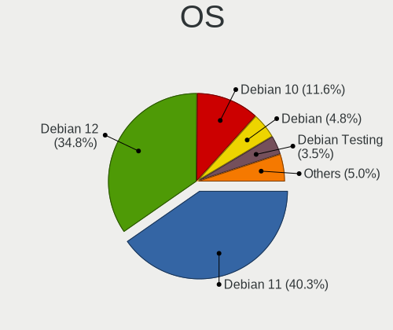
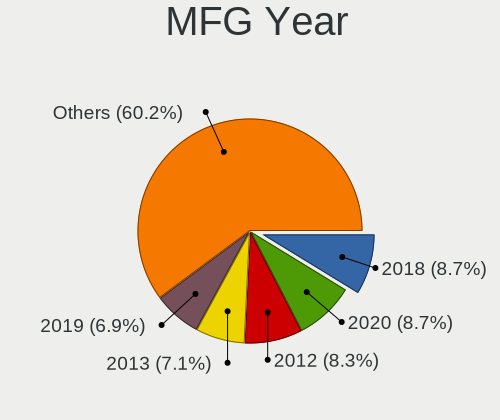
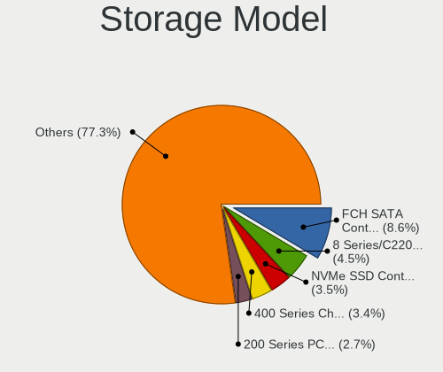
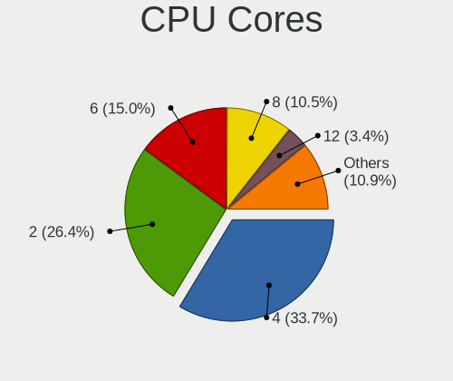
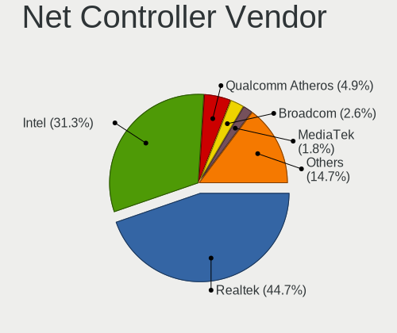

Debian - Tested Hardware & Statistics (Desktops)
------------------------------------------------

A project to collect tested hardware configurations for Debian.

Anyone can contribute to this report by the [hw-probe](https://github.com/linuxhw/hw-probe) tool:

    sudo -E hw-probe -all -upload

Please contribute! Especially if your hardware is rare.

Contents
--------

* [ Test Cases ](#test-cases)

* [ System ](#system)
  - [ OS                       ](#os)
  - [ OS Family                ](#os-family)
  - [ Kernel                   ](#kernel)
  - [ Kernel Family            ](#kernel-family)
  - [ Kernel Major Ver.        ](#kernel-major-ver)
  - [ Arch                     ](#arch)
  - [ DE                       ](#de)
  - [ Display Server           ](#display-server)
  - [ Display Manager          ](#display-manager)
  - [ OS Lang                  ](#os-lang)
  - [ Boot Mode                ](#boot-mode)
  - [ Filesystem               ](#filesystem)
  - [ Part. scheme             ](#part-scheme)
  - [ Dual Boot with Linux/BSD ](#dual-boot-with-linuxbsd)
  - [ Dual Boot (Win)          ](#dual-boot-win)

* [ Board ](#board)
  - [ Vendor                   ](#vendor)
  - [ Model                    ](#model)
  - [ Model Family             ](#model-family)
  - [ MFG Year                 ](#mfg-year)
  - [ Form Factor              ](#form-factor)
  - [ Secure Boot              ](#secure-boot)
  - [ Coreboot                 ](#coreboot)
  - [ RAM Size                 ](#ram-size)
  - [ RAM Used                 ](#ram-used)
  - [ Total Drives             ](#total-drives)
  - [ Has CD-ROM               ](#has-cd-rom)
  - [ Has Ethernet             ](#has-ethernet)
  - [ Has WiFi                 ](#has-wifi)
  - [ Has Bluetooth            ](#has-bluetooth)

* [ Location ](#location)
  - [ Country                  ](#country)
  - [ City                     ](#city)

* [ Drives ](#drives)
  - [ Drive Vendor             ](#drive-vendor)
  - [ Drive Model              ](#drive-model)
  - [ HDD Vendor               ](#hdd-vendor)
  - [ SSD Vendor               ](#ssd-vendor)
  - [ Drive Kind               ](#drive-kind)
  - [ Drive Connector          ](#drive-connector)
  - [ Drive Size               ](#drive-size)
  - [ Space Total              ](#space-total)
  - [ Space Used               ](#space-used)
  - [ Malfunc. Drives          ](#malfunc-drives)
  - [ Malfunc. Drive Vendor    ](#malfunc-drive-vendor)
  - [ Malfunc. HDD Vendor      ](#malfunc-hdd-vendor)
  - [ Malfunc. Drive Kind      ](#malfunc-drive-kind)
  - [ Failed Drives            ](#failed-drives)
  - [ Failed Drive Vendor      ](#failed-drive-vendor)
  - [ Drive Status             ](#drive-status)

* [ Storage controller ](#storage-controller)
  - [ Storage Vendor           ](#storage-vendor)
  - [ Storage Model            ](#storage-model)
  - [ Storage Kind             ](#storage-kind)

* [ Processor ](#processor)
  - [ CPU Vendor               ](#cpu-vendor)
  - [ CPU Model                ](#cpu-model)
  - [ CPU Model Family         ](#cpu-model-family)
  - [ CPU Cores                ](#cpu-cores)
  - [ CPU Sockets              ](#cpu-sockets)
  - [ CPU Threads              ](#cpu-threads)
  - [ CPU Op-Modes             ](#cpu-op-modes)
  - [ CPU Microcode            ](#cpu-microcode)
  - [ CPU Microarch            ](#cpu-microarch)

* [ Graphics ](#graphics)
  - [ GPU Vendor               ](#gpu-vendor)
  - [ GPU Model                ](#gpu-model)
  - [ GPU Combo                ](#gpu-combo)
  - [ GPU Driver               ](#gpu-driver)
  - [ GPU Memory               ](#gpu-memory)

* [ Monitor ](#monitor)
  - [ Monitor Vendor           ](#monitor-vendor)
  - [ Monitor Model            ](#monitor-model)
  - [ Monitor Resolution       ](#monitor-resolution)
  - [ Monitor Diagonal         ](#monitor-diagonal)
  - [ Monitor Width            ](#monitor-width)
  - [ Aspect Ratio             ](#aspect-ratio)
  - [ Monitor Area             ](#monitor-area)
  - [ Pixel Density            ](#pixel-density)
  - [ Multiple Monitors        ](#multiple-monitors)

* [ Network ](#network)
  - [ Net Controller Vendor    ](#net-controller-vendor)
  - [ Net Controller Model     ](#net-controller-model)
  - [ Wireless Vendor          ](#wireless-vendor)
  - [ Wireless Model           ](#wireless-model)
  - [ Ethernet Vendor          ](#ethernet-vendor)
  - [ Ethernet Model           ](#ethernet-model)
  - [ Net Controller Kind      ](#net-controller-kind)
  - [ Used Controller          ](#used-controller)
  - [ NICs                     ](#nics)
  - [ IPv6                     ](#ipv6)

* [ Bluetooth ](#bluetooth)
  - [ Bluetooth Vendor         ](#bluetooth-vendor)
  - [ Bluetooth Model          ](#bluetooth-model)

* [ Sound ](#sound)
  - [ Sound Vendor             ](#sound-vendor)
  - [ Sound Model              ](#sound-model)

* [ Memory ](#memory)
  - [ Memory Vendor            ](#memory-vendor)
  - [ Memory Model             ](#memory-model)
  - [ Memory Kind              ](#memory-kind)
  - [ Memory Form Factor       ](#memory-form-factor)
  - [ Memory Size              ](#memory-size)
  - [ Memory Speed             ](#memory-speed)

* [ Printers & scanners ](#printers--scanners)
  - [ Printer Vendor           ](#printer-vendor)
  - [ Printer Model            ](#printer-model)
  - [ Scanner Vendor           ](#scanner-vendor)
  - [ Scanner Model            ](#scanner-model)

* [ Camera ](#camera)
  - [ Camera Vendor            ](#camera-vendor)
  - [ Camera Model             ](#camera-model)

* [ Security ](#security)
  - [ Fingerprint Vendor       ](#fingerprint-vendor)
  - [ Fingerprint Model        ](#fingerprint-model)
  - [ Chipcard Vendor          ](#chipcard-vendor)
  - [ Chipcard Model           ](#chipcard-model)

* [ Unsupported ](#unsupported)
  - [ Unsupported Devices      ](#unsupported-devices)
  - [ Unsupported Device Types ](#unsupported-device-types)

Test Cases
----------

Total: 5550

| Vendor        | Model                       | Probe                                                      | Date         |
|---------------|-----------------------------|------------------------------------------------------------|--------------|
| ASRock        | A320M-HD                    | [1df7c65f40](https://linux-hardware.org/?probe=1df7c65f40) | Jul 01, 2023 |
| Gigabyte      | Z77X-UD5H                   | [eea1d9623c](https://linux-hardware.org/?probe=eea1d9623c) | Jun 30, 2023 |
| ASUSTek       | P6X58D PREMIUM              | [b2d81d6e67](https://linux-hardware.org/?probe=b2d81d6e67) | Jun 30, 2023 |
| Gigabyte      | H55M-UD2H                   | [befac7b8de](https://linux-hardware.org/?probe=befac7b8de) | Jun 30, 2023 |
| Gigabyte      | Z170XP-SLI-CF               | [ed171ca808](https://linux-hardware.org/?probe=ed171ca808) | Jun 30, 2023 |
| ASRock        | Z68 Pro3 Gen3               | [9fc143ab80](https://linux-hardware.org/?probe=9fc143ab80) | Jun 30, 2023 |
| ASRock        | G31M-GS                     | [3bd67e0f9f](https://linux-hardware.org/?probe=3bd67e0f9f) | Jun 30, 2023 |
| ASUSTek       | P8Z68-V PRO                 | [a3de72d73c](https://linux-hardware.org/?probe=a3de72d73c) | Jun 29, 2023 |
| Dell          | 0PU052                      | [b4fde65c68](https://linux-hardware.org/?probe=b4fde65c68) | Jun 29, 2023 |
| Gigabyte      | B365M D3H-CF                | [f40af0020a](https://linux-hardware.org/?probe=f40af0020a) | Jun 29, 2023 |
| ASUSTek       | TUF Gaming Z690-PLUS WIF... | [a996f391dc](https://linux-hardware.org/?probe=a996f391dc) | Jun 29, 2023 |
| Supermicro    | X8ST3                       | [305a3e3c1a](https://linux-hardware.org/?probe=305a3e3c1a) | Jun 29, 2023 |
| Shuttle       | FS61                        | [a67d2edea8](https://linux-hardware.org/?probe=a67d2edea8) | Jun 28, 2023 |
| ASUSTek       | PRIME B550M-A               | [d6823d5ec7](https://linux-hardware.org/?probe=d6823d5ec7) | Jun 28, 2023 |
| HP            | 21B4 A01                    | [50656fb7ec](https://linux-hardware.org/?probe=50656fb7ec) | Jun 28, 2023 |
| HP            | 21B4 A01                    | [4d9322819d](https://linux-hardware.org/?probe=4d9322819d) | Jun 28, 2023 |
| OEM           | Unknown                     | [0448bbee67](https://linux-hardware.org/?probe=0448bbee67) | Jun 28, 2023 |
| ASUSTek       | X99-WS/IPMI                 | [fff4bc4f46](https://linux-hardware.org/?probe=fff4bc4f46) | Jun 28, 2023 |
| ASUSTek       | PRIME A320I-K               | [bc9d733b89](https://linux-hardware.org/?probe=bc9d733b89) | Jun 27, 2023 |
| AMI           | Cherry Trail CR             | [65fb07ed8d](https://linux-hardware.org/?probe=65fb07ed8d) | Jun 27, 2023 |
| Lenovo        | 1048 SDK0K17763 WIN 1801... | [d903758323](https://linux-hardware.org/?probe=d903758323) | Jun 27, 2023 |
| Gigabyte      | B550 AORUS PRO V2           | [1143a7eebc](https://linux-hardware.org/?probe=1143a7eebc) | Jun 27, 2023 |
| Gigabyte      | GA-78LMT-USB3 x.x           | [baf77629c1](https://linux-hardware.org/?probe=baf77629c1) | Jun 26, 2023 |
| Dell          | 0PU052                      | [34eaa7185d](https://linux-hardware.org/?probe=34eaa7185d) | Jun 26, 2023 |
| ASUSTek       | M4A78T-E                    | [7b60ea1445](https://linux-hardware.org/?probe=7b60ea1445) | Jun 26, 2023 |
| Gigabyte      | H310MD2P-CF                 | [1ad319cfc7](https://linux-hardware.org/?probe=1ad319cfc7) | Jun 26, 2023 |
| BESSTAR Te... | B550                        | [87962635d3](https://linux-hardware.org/?probe=87962635d3) | Jun 26, 2023 |
| Gigabyte      | B75M-D3H                    | [aeb1c6b8d2](https://linux-hardware.org/?probe=aeb1c6b8d2) | Jun 26, 2023 |
| ASUSTek       | ROG STRIX B760-F GAMING ... | [117bfb7088](https://linux-hardware.org/?probe=117bfb7088) | Jun 25, 2023 |
| JINGSHA       | Unknown                     | [2ae6ac9599](https://linux-hardware.org/?probe=2ae6ac9599) | Jun 25, 2023 |
| Biostar       | X370GTN                     | [80b2b1d180](https://linux-hardware.org/?probe=80b2b1d180) | Jun 25, 2023 |
| ASRock        | H61M-HVS                    | [a65485d236](https://linux-hardware.org/?probe=a65485d236) | Jun 25, 2023 |
| Intel         | H55                         | [993c041483](https://linux-hardware.org/?probe=993c041483) | Jun 25, 2023 |
| Biostar       | TH55B HD                    | [5fbef8b11a](https://linux-hardware.org/?probe=5fbef8b11a) | Jun 25, 2023 |
| Gigabyte      | EP45C-DS3R                  | [655d9d950d](https://linux-hardware.org/?probe=655d9d950d) | Jun 24, 2023 |
| Dell          | 01XK1W A00                  | [53dbc2e799](https://linux-hardware.org/?probe=53dbc2e799) | Jun 24, 2023 |
| ASUSTek       | K30BF_M32BF                 | [46a7aaf9f1](https://linux-hardware.org/?probe=46a7aaf9f1) | Jun 23, 2023 |
| ASRockRack    | X470D4U                     | [2d49269787](https://linux-hardware.org/?probe=2d49269787) | Jun 23, 2023 |
| ASRockRack    | X470D4U2-2T                 | [4a11a4190a](https://linux-hardware.org/?probe=4a11a4190a) | Jun 23, 2023 |
| Foxconn       | G31MXP FAB:1.1              | [9ed9153958](https://linux-hardware.org/?probe=9ed9153958) | Jun 23, 2023 |
| Gigabyte      | B250M-DS3H-CF               | [1ca06fb3a9](https://linux-hardware.org/?probe=1ca06fb3a9) | Jun 23, 2023 |
| HP            | 3397                        | [8c9be2f4c0](https://linux-hardware.org/?probe=8c9be2f4c0) | Jun 23, 2023 |
| Foxconn       | nT-iBT18/nT-iBT19/nT-iBT... | [51b5eb0fa2](https://linux-hardware.org/?probe=51b5eb0fa2) | Jun 23, 2023 |
| ASUSTek       | K30BF_M32BF                 | [655b20a34b](https://linux-hardware.org/?probe=655b20a34b) | Jun 23, 2023 |
| ASRockRack    | X470D4U                     | [d419086209](https://linux-hardware.org/?probe=d419086209) | Jun 22, 2023 |
| ASRock        | FM2A58M-VG3+ R2.0           | [9ab87d56a7](https://linux-hardware.org/?probe=9ab87d56a7) | Jun 22, 2023 |
| HP            | 3397                        | [a47ce0d4dc](https://linux-hardware.org/?probe=a47ce0d4dc) | Jun 22, 2023 |
| Acer          | Aspire X1700                | [aac17ef2f2](https://linux-hardware.org/?probe=aac17ef2f2) | Jun 22, 2023 |
| AMI           | Intel                       | [1a4a632d56](https://linux-hardware.org/?probe=1a4a632d56) | Jun 22, 2023 |
| ASUSTek       | ROG CROSSHAIR VIII DARK ... | [abbb1b897d](https://linux-hardware.org/?probe=abbb1b897d) | Jun 22, 2023 |
| ASRock        | NUC-TGL                     | [6dcb1eb43d](https://linux-hardware.org/?probe=6dcb1eb43d) | Jun 22, 2023 |
| ASRock        | X670E PG Lightning          | [b8e19a16f9](https://linux-hardware.org/?probe=b8e19a16f9) | Jun 22, 2023 |
| ASUSTek       | TUF Gaming X570-PLUS        | [7117d51b53](https://linux-hardware.org/?probe=7117d51b53) | Jun 21, 2023 |
| Gigabyte      | B550M DS3H                  | [2e32510f57](https://linux-hardware.org/?probe=2e32510f57) | Jun 21, 2023 |
| HP            | 1998                        | [efcccef24e](https://linux-hardware.org/?probe=efcccef24e) | Jun 21, 2023 |
| MSI           | H110M PRO-D                 | [b652abc634](https://linux-hardware.org/?probe=b652abc634) | Jun 21, 2023 |
| HP            | 1998                        | [71bee9f013](https://linux-hardware.org/?probe=71bee9f013) | Jun 21, 2023 |
| HP            | 1588h                       | [abe5412cf6](https://linux-hardware.org/?probe=abe5412cf6) | Jun 21, 2023 |
| HP            | 1588h                       | [f08e230cd3](https://linux-hardware.org/?probe=f08e230cd3) | Jun 21, 2023 |
| ASRockRack    | X470D4U                     | [9e0ba5032b](https://linux-hardware.org/?probe=9e0ba5032b) | Jun 21, 2023 |
| ASRock        | X570 Extreme4               | [3ff2c9e4cc](https://linux-hardware.org/?probe=3ff2c9e4cc) | Jun 21, 2023 |
| ASRock        | B760 Pro RS/D4              | [bf19dd1c4b](https://linux-hardware.org/?probe=bf19dd1c4b) | Jun 20, 2023 |
| ASUSTek       | PRIME H310M-K               | [1742a525de](https://linux-hardware.org/?probe=1742a525de) | Jun 20, 2023 |
| MSI           | H81M-P33                    | [62fb9cda50](https://linux-hardware.org/?probe=62fb9cda50) | Jun 20, 2023 |
| Dell          | 06FW8P A02                  | [f65ec61ffc](https://linux-hardware.org/?probe=f65ec61ffc) | Jun 20, 2023 |
| ASUSTek       | PRIME H310M-K               | [cfc9cd338e](https://linux-hardware.org/?probe=cfc9cd338e) | Jun 20, 2023 |
| Dell          | 0RW203                      | [6872d8e6c5](https://linux-hardware.org/?probe=6872d8e6c5) | Jun 20, 2023 |
| Dell          | 0PU052                      | [2eb6dceca9](https://linux-hardware.org/?probe=2eb6dceca9) | Jun 19, 2023 |
| ASUSTek       | PRIME A320M-K               | [3eab70981f](https://linux-hardware.org/?probe=3eab70981f) | Jun 19, 2023 |
| ASUSTek       | P8H67-M                     | [4c2f50a608](https://linux-hardware.org/?probe=4c2f50a608) | Jun 19, 2023 |
| MSI           | B350M MORTAR                | [dde719cb99](https://linux-hardware.org/?probe=dde719cb99) | Jun 19, 2023 |
| MSI           | B550-A PRO                  | [b0f066ab7e](https://linux-hardware.org/?probe=b0f066ab7e) | Jun 18, 2023 |
| Intel         | H81                         | [5cda43eb30](https://linux-hardware.org/?probe=5cda43eb30) | Jun 18, 2023 |
| AZW           | U59                         | [6f1191e5e2](https://linux-hardware.org/?probe=6f1191e5e2) | Jun 18, 2023 |
| Gigabyte      | B550M DS3H                  | [e7fdb650cd](https://linux-hardware.org/?probe=e7fdb650cd) | Jun 18, 2023 |
| Dell          | 01XK1W A00                  | [f431c0b66f](https://linux-hardware.org/?probe=f431c0b66f) | Jun 18, 2023 |
| ASUSTek       | P8H61-M LX                  | [fe3b7abf1d](https://linux-hardware.org/?probe=fe3b7abf1d) | Jun 17, 2023 |
| HP            | 2B38                        | [b84e03e083](https://linux-hardware.org/?probe=b84e03e083) | Jun 17, 2023 |
| ASUSTek       | P5K Premium                 | [dddb2b8bdf](https://linux-hardware.org/?probe=dddb2b8bdf) | Jun 17, 2023 |
| ASRock        | B760 Pro RS/D4              | [6767dd6968](https://linux-hardware.org/?probe=6767dd6968) | Jun 16, 2023 |
| Unknown       | NETGEAR ReadyNAS 104        | [99df077926](https://linux-hardware.org/?probe=99df077926) | Jun 16, 2023 |
| ASRock        | B450 Gaming-ITX/ac          | [d10c160695](https://linux-hardware.org/?probe=d10c160695) | Jun 16, 2023 |
| MSI           | MAG B550M MORTAR MAX WIF... | [9994571651](https://linux-hardware.org/?probe=9994571651) | Jun 15, 2023 |
| HP            | 1589                        | [6bfe1d5b63](https://linux-hardware.org/?probe=6bfe1d5b63) | Jun 15, 2023 |
| ASUSTek       | PRIME H310T R2.0            | [5fe5f59145](https://linux-hardware.org/?probe=5fe5f59145) | Jun 15, 2023 |
| ASUSTek       | PRIME H310T R2.0            | [7974c3961d](https://linux-hardware.org/?probe=7974c3961d) | Jun 15, 2023 |
| ASUSTek       | PRIME B450M-A               | [91787f8dfb](https://linux-hardware.org/?probe=91787f8dfb) | Jun 15, 2023 |
| ASUSTek       | M4A78T-E                    | [5ec4b74af2](https://linux-hardware.org/?probe=5ec4b74af2) | Jun 15, 2023 |
| Gigabyte      | GA-M56S-S3                  | [a708d51992](https://linux-hardware.org/?probe=a708d51992) | Jun 15, 2023 |
| HP            | 2820h                       | [77b54a0343](https://linux-hardware.org/?probe=77b54a0343) | Jun 14, 2023 |
| HP            | 2820h                       | [40e65d7a30](https://linux-hardware.org/?probe=40e65d7a30) | Jun 14, 2023 |
| Gigabyte      | Z370M D3H-CF                | [d704e4a5d3](https://linux-hardware.org/?probe=d704e4a5d3) | Jun 14, 2023 |
| Intel         | DG41TY AAE47335-203         | [4f1d844d48](https://linux-hardware.org/?probe=4f1d844d48) | Jun 14, 2023 |
| Lenovo        | ThinkCentre M55p 8808D8U    | [3117d89b20](https://linux-hardware.org/?probe=3117d89b20) | Jun 14, 2023 |
| MSI           | MAG B550 TOMAHAWK MAX WI... | [6e241e56cf](https://linux-hardware.org/?probe=6e241e56cf) | Jun 14, 2023 |
| Lenovo        | ThinkCentre M55p 8808D8U    | [3feaf0bd19](https://linux-hardware.org/?probe=3feaf0bd19) | Jun 14, 2023 |
| Lenovo        | ThinkCentre M55p 8808D8U    | [5fc5be3367](https://linux-hardware.org/?probe=5fc5be3367) | Jun 14, 2023 |
| Lenovo        | ThinkCentre M55p 8808D8U    | [aba284328c](https://linux-hardware.org/?probe=aba284328c) | Jun 14, 2023 |
| Lenovo        | ThinkCentre M55p 8808D8U    | [b899120507](https://linux-hardware.org/?probe=b899120507) | Jun 14, 2023 |
| ASUSTek       | PRIME B350-PLUS             | [f9ebdca1bd](https://linux-hardware.org/?probe=f9ebdca1bd) | Jun 14, 2023 |
| ASUSTek       | ROG CROSSHAIR VIII DARK ... | [051cebacd1](https://linux-hardware.org/?probe=051cebacd1) | Jun 14, 2023 |
| Lenovo        | ThinkCentre M55p 8808D8U    | [221a4431e2](https://linux-hardware.org/?probe=221a4431e2) | Jun 13, 2023 |
| Lenovo        | ThinkCentre M55p 8808D8U    | [85abf9e475](https://linux-hardware.org/?probe=85abf9e475) | Jun 13, 2023 |
| Lenovo        | ThinkCentre M55p 8808D8U    | [40df819ebb](https://linux-hardware.org/?probe=40df819ebb) | Jun 13, 2023 |
| Lenovo        | ThinkCentre M55p 8808D8U    | [9ed186ba56](https://linux-hardware.org/?probe=9ed186ba56) | Jun 13, 2023 |
| Lenovo        | ThinkCentre M55p 8808D8U    | [2a4d82175c](https://linux-hardware.org/?probe=2a4d82175c) | Jun 13, 2023 |
| Lenovo        | ThinkCentre M55p 8808D8U    | [1df32db310](https://linux-hardware.org/?probe=1df32db310) | Jun 13, 2023 |
| HP            | 2AED                        | [2550c16272](https://linux-hardware.org/?probe=2550c16272) | Jun 13, 2023 |
| Lenovo        | ThinkCentre M55p 8808D8U    | [9949220d98](https://linux-hardware.org/?probe=9949220d98) | Jun 13, 2023 |
| Lenovo        | ThinkCentre M55p 8808D8U    | [d801927769](https://linux-hardware.org/?probe=d801927769) | Jun 13, 2023 |
| Shuttle       | FM10 V10                    | [f1396e2cce](https://linux-hardware.org/?probe=f1396e2cce) | Jun 13, 2023 |
| Gigabyte      | B550I AORUS PRO AX          | [d85ad203ff](https://linux-hardware.org/?probe=d85ad203ff) | Jun 13, 2023 |
| Gigabyte      | H61M-DS2                    | [06c6c417c9](https://linux-hardware.org/?probe=06c6c417c9) | Jun 13, 2023 |
| ECS           | G31T-M9                     | [ba2a738c96](https://linux-hardware.org/?probe=ba2a738c96) | Jun 13, 2023 |
| MSI           | Z270 TOMAHAWK ARCTIC        | [86ab821b84](https://linux-hardware.org/?probe=86ab821b84) | Jun 13, 2023 |
| Intel         | JSL MRD                     | [8943f697bc](https://linux-hardware.org/?probe=8943f697bc) | Jun 13, 2023 |
| Intel         | JSL MRD                     | [764e533752](https://linux-hardware.org/?probe=764e533752) | Jun 13, 2023 |
| ASUSTek       | PRIME B365M-K               | [dad1ea59a4](https://linux-hardware.org/?probe=dad1ea59a4) | Jun 12, 2023 |
| ASRock        | H310CM-HDV                  | [a810b267ef](https://linux-hardware.org/?probe=a810b267ef) | Jun 12, 2023 |
| ASUSTek       | PRIME B650M-A AX            | [f39a1874f7](https://linux-hardware.org/?probe=f39a1874f7) | Jun 12, 2023 |
| ASUSTek       | A68HM-PLUS                  | [6b1f9dec93](https://linux-hardware.org/?probe=6b1f9dec93) | Jun 11, 2023 |
| ASUSTek       | H110M-A/M.2                 | [f30be06897](https://linux-hardware.org/?probe=f30be06897) | Jun 11, 2023 |
| Gigabyte      | B450 AORUS ELITE            | [59a9e7e2e8](https://linux-hardware.org/?probe=59a9e7e2e8) | Jun 11, 2023 |
| Gigabyte      | 990FXA-UD3                  | [756a317dd6](https://linux-hardware.org/?probe=756a317dd6) | Jun 11, 2023 |
| MSI           | MPG X570 GAMING PLUS        | [0aeb6a400a](https://linux-hardware.org/?probe=0aeb6a400a) | Jun 11, 2023 |
| Intel         | SHARKBAY                    | [8772d55075](https://linux-hardware.org/?probe=8772d55075) | Jun 10, 2023 |
| ASUSTek       | P7H55D-M PRO                | [6049b3d69d](https://linux-hardware.org/?probe=6049b3d69d) | Jun 10, 2023 |
| MSI           | MAG B760 TOMAHAWK WIFI      | [88955e82f2](https://linux-hardware.org/?probe=88955e82f2) | Jun 10, 2023 |
| MSI           | B450M PRO-VDH MAX           | [4dcc51e897](https://linux-hardware.org/?probe=4dcc51e897) | Jun 10, 2023 |
| ASRock        | B365M Pro4-F                | [e54f1a9447](https://linux-hardware.org/?probe=e54f1a9447) | Jun 10, 2023 |
| ASUSTek       | K30BF_M32BF                 | [65b3c16165](https://linux-hardware.org/?probe=65b3c16165) | Jun 10, 2023 |
| ASUSTek       | P5GC-MX/1333                | [b47fab6285](https://linux-hardware.org/?probe=b47fab6285) | Jun 09, 2023 |
| Gigabyte      | B550M DS3H                  | [ea724e204b](https://linux-hardware.org/?probe=ea724e204b) | Jun 09, 2023 |
| Dell          | 0XCR8D A03                  | [e37bceb6fb](https://linux-hardware.org/?probe=e37bceb6fb) | Jun 09, 2023 |
| ECS           | G31T-M9                     | [d8ca98b733](https://linux-hardware.org/?probe=d8ca98b733) | Jun 09, 2023 |
| Gigabyte      | B450M S2H V2                | [fb883c82bc](https://linux-hardware.org/?probe=fb883c82bc) | Jun 09, 2023 |
| Gigabyte      | B450 AORUS ELITE            | [b2c39972c2](https://linux-hardware.org/?probe=b2c39972c2) | Jun 09, 2023 |
| Gigabyte      | B450M H                     | [e54b5ce7da](https://linux-hardware.org/?probe=e54b5ce7da) | Jun 09, 2023 |
| Gigabyte      | GA-78LMT-USB3 R2 sex        | [bcad738da6](https://linux-hardware.org/?probe=bcad738da6) | Jun 09, 2023 |
| Gigabyte      | X570 GAMING X               | [576a624a1b](https://linux-hardware.org/?probe=576a624a1b) | Jun 09, 2023 |
| Inventec      | VXC Class A02               | [c2bc26120f](https://linux-hardware.org/?probe=c2bc26120f) | Jun 08, 2023 |
| ASUSTek       | M4A78T-E                    | [fa22309a62](https://linux-hardware.org/?probe=fa22309a62) | Jun 08, 2023 |
| MSI           | B450M-A PRO MAX             | [230465c003](https://linux-hardware.org/?probe=230465c003) | Jun 08, 2023 |
| Gigabyte      | GA-M56S-S3                  | [b2c6247a0e](https://linux-hardware.org/?probe=b2c6247a0e) | Jun 07, 2023 |
| ASRock        | B365M Pro4-F                | [7ed0f0346c](https://linux-hardware.org/?probe=7ed0f0346c) | Jun 07, 2023 |
| ASUSTek       | H97M-E                      | [97140e9688](https://linux-hardware.org/?probe=97140e9688) | Jun 07, 2023 |
| Lenovo        | ThinkCentre A58e 0841B4Y    | [fe410cd5db](https://linux-hardware.org/?probe=fe410cd5db) | Jun 07, 2023 |
| Gigabyte      | M68MT-S2                    | [2ff7b71aed](https://linux-hardware.org/?probe=2ff7b71aed) | Jun 06, 2023 |
| ASUSTek       | TUF Gaming B650-PLUS WIF... | [db42ab94ee](https://linux-hardware.org/?probe=db42ab94ee) | Jun 06, 2023 |
| Gigabyte      | H61M-DS2                    | [10ecbb2117](https://linux-hardware.org/?probe=10ecbb2117) | Jun 06, 2023 |
| ASUSTek       | ROG STRIX X570-E GAMING     | [d288737b23](https://linux-hardware.org/?probe=d288737b23) | Jun 05, 2023 |
| ECS           | G31T-M9                     | [8bb444bdd6](https://linux-hardware.org/?probe=8bb444bdd6) | Jun 05, 2023 |
| Gigabyte      | M68MT-S2                    | [2ec944c5d0](https://linux-hardware.org/?probe=2ec944c5d0) | Jun 05, 2023 |
| Gigabyte      | GA-M56S-S3                  | [8896a460d4](https://linux-hardware.org/?probe=8896a460d4) | Jun 05, 2023 |
| Gigabyte      | M68MT-S2                    | [d392dff6bb](https://linux-hardware.org/?probe=d392dff6bb) | Jun 05, 2023 |
| ECS           | G31T-M9                     | [630360ab38](https://linux-hardware.org/?probe=630360ab38) | Jun 05, 2023 |
| ASUSTek       | TUF Gaming X670E-PLUS WI... | [3a1c1daa3d](https://linux-hardware.org/?probe=3a1c1daa3d) | Jun 05, 2023 |
| Gigabyte      | M68MT-S2                    | [991c5472ac](https://linux-hardware.org/?probe=991c5472ac) | Jun 05, 2023 |
| Gigabyte      | H470M DS3H                  | [e7bbac1b14](https://linux-hardware.org/?probe=e7bbac1b14) | Jun 04, 2023 |
| Gigabyte      | B360M HD3                   | [fcb1b60578](https://linux-hardware.org/?probe=fcb1b60578) | Jun 04, 2023 |
| MSI           | H81M-E34                    | [4c5f5c7903](https://linux-hardware.org/?probe=4c5f5c7903) | Jun 04, 2023 |
| Gigabyte      | B660M GAMING X DDR4         | [0bd883cae2](https://linux-hardware.org/?probe=0bd883cae2) | Jun 04, 2023 |
| Dell          | 01XK1W A00                  | [8690705151](https://linux-hardware.org/?probe=8690705151) | Jun 04, 2023 |
| HP            | 843C                        | [e69fbf77e4](https://linux-hardware.org/?probe=e69fbf77e4) | Jun 04, 2023 |
| HP            | 843C                        | [21751c1221](https://linux-hardware.org/?probe=21751c1221) | Jun 04, 2023 |
| Lenovo        | ThinkStation D30 42234T7    | [18cb6a946b](https://linux-hardware.org/?probe=18cb6a946b) | Jun 03, 2023 |
| ASUSTek       | PRIME H310M-R R2.0          | [5387bcbf7d](https://linux-hardware.org/?probe=5387bcbf7d) | Jun 03, 2023 |
| ASUSTek       | PRIME H310M-R R2.0          | [881df8f45c](https://linux-hardware.org/?probe=881df8f45c) | Jun 03, 2023 |
| ASUSTek       | PRIME H310M-R R2.0          | [0dd3be3300](https://linux-hardware.org/?probe=0dd3be3300) | Jun 03, 2023 |
| ASUSTek       | SABERTOOTH 990FX R2.0       | [8d4d1f7313](https://linux-hardware.org/?probe=8d4d1f7313) | Jun 03, 2023 |
| Gigabyte      | P75-D3                      | [a56c3ceb55](https://linux-hardware.org/?probe=a56c3ceb55) | Jun 02, 2023 |
| ASUSTek       | TUF Gaming X570-PLUS        | [d6561ecd7b](https://linux-hardware.org/?probe=d6561ecd7b) | Jun 02, 2023 |
| HC Technol... | HCAR357-NR                  | [58f698b10a](https://linux-hardware.org/?probe=58f698b10a) | Jun 02, 2023 |
| MSI           | G31TM-P21                   | [964377db0b](https://linux-hardware.org/?probe=964377db0b) | Jun 02, 2023 |
| ASRockRack    | X470D4U2-2T                 | [43901d3db7](https://linux-hardware.org/?probe=43901d3db7) | Jun 02, 2023 |
| ASUSTek       | PRIME B450M-K               | [853bd25ca5](https://linux-hardware.org/?probe=853bd25ca5) | Jun 02, 2023 |
| ASUSTek       | PRIME B450M-K               | [3a9fb692f1](https://linux-hardware.org/?probe=3a9fb692f1) | Jun 02, 2023 |
| ASUSTek       | PRIME B450M-K               | [9b549fe65a](https://linux-hardware.org/?probe=9b549fe65a) | Jun 02, 2023 |
| ASUSTek       | PRIME B450M-K               | [db685837d0](https://linux-hardware.org/?probe=db685837d0) | Jun 02, 2023 |
| ASUSTek       | PRIME B450M-K               | [968b38e0b9](https://linux-hardware.org/?probe=968b38e0b9) | Jun 02, 2023 |
| ASUSTek       | PRIME B450M-K               | [c9a04d8da0](https://linux-hardware.org/?probe=c9a04d8da0) | Jun 02, 2023 |
| ASUSTek       | PRIME B450M-K               | [238931757a](https://linux-hardware.org/?probe=238931757a) | Jun 02, 2023 |
| ASUSTek       | PRIME B450M-K               | [e190e991a6](https://linux-hardware.org/?probe=e190e991a6) | Jun 02, 2023 |
| ASUSTek       | PRIME B450M-K               | [0816e77499](https://linux-hardware.org/?probe=0816e77499) | Jun 02, 2023 |
| ASUSTek       | PRIME B450M-K               | [ff143ac918](https://linux-hardware.org/?probe=ff143ac918) | Jun 02, 2023 |
| ASUSTek       | Z87-C                       | [20242d8299](https://linux-hardware.org/?probe=20242d8299) | Jun 02, 2023 |
| ASUSTek       | P8H61                       | [7e9f999121](https://linux-hardware.org/?probe=7e9f999121) | Jun 02, 2023 |
| Dell          | 01XK1W A00                  | [5846820609](https://linux-hardware.org/?probe=5846820609) | Jun 02, 2023 |
| Lenovo        | SHARKBAY SDK0E50510 WIN     | [07e5342fb8](https://linux-hardware.org/?probe=07e5342fb8) | Jun 02, 2023 |
| Intel         | DH61WW AAG23116-204         | [2bfe32ef05](https://linux-hardware.org/?probe=2bfe32ef05) | Jun 02, 2023 |
| Gigabyte      | H61M-DS2                    | [f3b666f725](https://linux-hardware.org/?probe=f3b666f725) | Jun 01, 2023 |
| ChangWang     | CW56-58                     | [e00e626ea6](https://linux-hardware.org/?probe=e00e626ea6) | Jun 01, 2023 |
| MSI           | H510M-A PRO                 | [8557cd4efa](https://linux-hardware.org/?probe=8557cd4efa) | Jun 01, 2023 |
| Gigabyte      | H61M-DS2                    | [1cf7ec0aa5](https://linux-hardware.org/?probe=1cf7ec0aa5) | Jun 01, 2023 |
| Gigabyte      | H61M-DS2                    | [7f9d81bd57](https://linux-hardware.org/?probe=7f9d81bd57) | Jun 01, 2023 |
| Gigabyte      | H410M S2H V3                | [78e4d7a22b](https://linux-hardware.org/?probe=78e4d7a22b) | Jun 01, 2023 |
| ASUSTek       | H81M-C                      | [5fc6ec135b](https://linux-hardware.org/?probe=5fc6ec135b) | Jun 01, 2023 |
| Supermicro    | X11SCD-F                    | [4646e2fe85](https://linux-hardware.org/?probe=4646e2fe85) | Jun 01, 2023 |
| Supermicro    | X11SCD-F                    | [80072f2519](https://linux-hardware.org/?probe=80072f2519) | Jun 01, 2023 |
| Supermicro    | X11SCD-F                    | [365eeba4c9](https://linux-hardware.org/?probe=365eeba4c9) | Jun 01, 2023 |
| Supermicro    | X12STD-F                    | [df7c4a738e](https://linux-hardware.org/?probe=df7c4a738e) | Jun 01, 2023 |
| Supermicro    | X12STD-F                    | [8511ce89ad](https://linux-hardware.org/?probe=8511ce89ad) | Jun 01, 2023 |
| ASRock        | J4125-ITX                   | [31e0f624be](https://linux-hardware.org/?probe=31e0f624be) | Jun 01, 2023 |
| Gigabyte      | Z790 AORUS ELITE AX DDR4    | [5f1045564e](https://linux-hardware.org/?probe=5f1045564e) | Jun 01, 2023 |
| Inventec      | D CLASS A02                 | [433df815db](https://linux-hardware.org/?probe=433df815db) | Jun 01, 2023 |
| Intel         | DB75EN AAG39650-302         | [9872e0cb5c](https://linux-hardware.org/?probe=9872e0cb5c) | May 31, 2023 |
| ASUSTek       | ROG STRIX Z690-G GAMING ... | [32a85827df](https://linux-hardware.org/?probe=32a85827df) | May 31, 2023 |
| ASRock        | H110M-HDV R3.0              | [670044aef5](https://linux-hardware.org/?probe=670044aef5) | May 31, 2023 |
| ECS           | G31T-M9                     | [f227323587](https://linux-hardware.org/?probe=f227323587) | May 31, 2023 |
| ASUSTek       | Maximus VIII RANGER         | [354e883340](https://linux-hardware.org/?probe=354e883340) | May 31, 2023 |
| ASRock        | G41M-VS3                    | [166031ba4d](https://linux-hardware.org/?probe=166031ba4d) | May 31, 2023 |
| ASRock        | G41M-VS3                    | [8f55c9aa98](https://linux-hardware.org/?probe=8f55c9aa98) | May 31, 2023 |
| Dell          | 01XK1W A00                  | [8a18b7bada](https://linux-hardware.org/?probe=8a18b7bada) | May 31, 2023 |
| Dell          | 01XK1W A00                  | [611cf59f44](https://linux-hardware.org/?probe=611cf59f44) | May 31, 2023 |
| Intel         | X99                         | [cef654d9c5](https://linux-hardware.org/?probe=cef654d9c5) | May 30, 2023 |
| ASUSTek       | P4S8L                       | [c26269028e](https://linux-hardware.org/?probe=c26269028e) | May 30, 2023 |
| ASUSTek       | PRIME B550-PLUS             | [698e3b5e35](https://linux-hardware.org/?probe=698e3b5e35) | May 30, 2023 |
| Gigabyte      | M68MT-S2                    | [c56271ea6a](https://linux-hardware.org/?probe=c56271ea6a) | May 30, 2023 |
| Gigabyte      | M68MT-S2                    | [a0ffb7fd40](https://linux-hardware.org/?probe=a0ffb7fd40) | May 30, 2023 |
| Gigabyte      | H61M-S2PV                   | [446d026ac1](https://linux-hardware.org/?probe=446d026ac1) | May 30, 2023 |
| MSI           | H55M-ED55                   | [a89bdc8ec0](https://linux-hardware.org/?probe=a89bdc8ec0) | May 30, 2023 |
| ASRock        | H310CM-HDV                  | [e6e310a9b4](https://linux-hardware.org/?probe=e6e310a9b4) | May 29, 2023 |
| ASRock        | H310CM-HDV                  | [84e791ec5e](https://linux-hardware.org/?probe=84e791ec5e) | May 29, 2023 |
| Inventec      | VXC Class A02               | [0befe25313](https://linux-hardware.org/?probe=0befe25313) | May 29, 2023 |
| Inventec      | VXC Class A02               | [363827ad8c](https://linux-hardware.org/?probe=363827ad8c) | May 29, 2023 |
| Gigabyte      | M68MT-S2                    | [80c2e03e4e](https://linux-hardware.org/?probe=80c2e03e4e) | May 29, 2023 |
| ECS           | G31T-M9                     | [8f4cd5b132](https://linux-hardware.org/?probe=8f4cd5b132) | May 29, 2023 |
| MSI           | Z390-A PRO                  | [c797a10bff](https://linux-hardware.org/?probe=c797a10bff) | May 29, 2023 |
| Gigabyte      | M68MT-S2                    | [ffe8469edc](https://linux-hardware.org/?probe=ffe8469edc) | May 29, 2023 |
| ASUSTek       | Z10PA-D8 Series             | [02821a3220](https://linux-hardware.org/?probe=02821a3220) | May 29, 2023 |
| Gigabyte      | GA-M56S-S3                  | [e9f274ad89](https://linux-hardware.org/?probe=e9f274ad89) | May 29, 2023 |
| Dell          | 040DDP A01                  | [bce6b61241](https://linux-hardware.org/?probe=bce6b61241) | May 29, 2023 |
| Gigabyte      | M68MT-S2                    | [62a5559050](https://linux-hardware.org/?probe=62a5559050) | May 29, 2023 |
| Gigabyte      | GA-M56S-S3                  | [a9c147d701](https://linux-hardware.org/?probe=a9c147d701) | May 29, 2023 |
| ASRock        | J4105-ITX                   | [570bc894da](https://linux-hardware.org/?probe=570bc894da) | May 29, 2023 |
| ASUSTek       | TUF Gaming B550-PLUS        | [9e0fc265de](https://linux-hardware.org/?probe=9e0fc265de) | May 29, 2023 |
| Unknown       | Unknown                     | [81e905b8bf](https://linux-hardware.org/?probe=81e905b8bf) | May 29, 2023 |
| MSI           | PRO Z690-A DDR4             | [b0be576b32](https://linux-hardware.org/?probe=b0be576b32) | May 28, 2023 |
| Intel         | X99                         | [70895d913f](https://linux-hardware.org/?probe=70895d913f) | May 28, 2023 |
| Dell          | 01XK1W A00                  | [a81daffe89](https://linux-hardware.org/?probe=a81daffe89) | May 28, 2023 |
| Dell          | 01XK1W A00                  | [ef918dfbfa](https://linux-hardware.org/?probe=ef918dfbfa) | May 28, 2023 |
| Gigabyte      | Z690 AERO G                 | [5d4d7c7ef4](https://linux-hardware.org/?probe=5d4d7c7ef4) | May 27, 2023 |
| AZW           | MINI S                      | [55c17a6700](https://linux-hardware.org/?probe=55c17a6700) | May 27, 2023 |
| Gigabyte      | H81M-S2V                    | [bcdfc5a2bf](https://linux-hardware.org/?probe=bcdfc5a2bf) | May 27, 2023 |
| Gigabyte      | H81M-S2V                    | [68cb8bdf49](https://linux-hardware.org/?probe=68cb8bdf49) | May 27, 2023 |
| MSI           | H55M-ED55                   | [61e1fc3841](https://linux-hardware.org/?probe=61e1fc3841) | May 27, 2023 |
| ASUSTek       | K30BF_M32BF                 | [a262345925](https://linux-hardware.org/?probe=a262345925) | May 27, 2023 |
| HP            | 2B38                        | [528dfa2310](https://linux-hardware.org/?probe=528dfa2310) | May 27, 2023 |
| Biostar       | A10N-8800E                  | [6b8c135c5d](https://linux-hardware.org/?probe=6b8c135c5d) | May 27, 2023 |
| MSI           | MAG B460M MORTAR            | [ac03083cbd](https://linux-hardware.org/?probe=ac03083cbd) | May 27, 2023 |
| HP            | 895C                        | [f0986c3613](https://linux-hardware.org/?probe=f0986c3613) | May 26, 2023 |
| ASRock        | B450 Gaming-ITX/ac          | [4862d28e3f](https://linux-hardware.org/?probe=4862d28e3f) | May 26, 2023 |
| ASUSTek       | B85M-G                      | [92836191e9](https://linux-hardware.org/?probe=92836191e9) | May 26, 2023 |
| ASUSTek       | B85M-G                      | [0d449702e3](https://linux-hardware.org/?probe=0d449702e3) | May 26, 2023 |
| ASUSTek       | B85M-G                      | [a5fbe0c1ba](https://linux-hardware.org/?probe=a5fbe0c1ba) | May 26, 2023 |
| ASUSTek       | B85M-G                      | [f9fd99a8b7](https://linux-hardware.org/?probe=f9fd99a8b7) | May 26, 2023 |
| ASUSTek       | B85M-G                      | [6c87853f8c](https://linux-hardware.org/?probe=6c87853f8c) | May 26, 2023 |
| ASUSTek       | H81M-C                      | [138348e6eb](https://linux-hardware.org/?probe=138348e6eb) | May 26, 2023 |
| ASUSTek       | B85M-G                      | [388eed2f8e](https://linux-hardware.org/?probe=388eed2f8e) | May 26, 2023 |
| ASUSTek       | B85M-G                      | [1bc02afebc](https://linux-hardware.org/?probe=1bc02afebc) | May 26, 2023 |
| ASUSTek       | B85M-G                      | [485617123a](https://linux-hardware.org/?probe=485617123a) | May 26, 2023 |
| ASUSTek       | B85M-G                      | [d1933e40f4](https://linux-hardware.org/?probe=d1933e40f4) | May 26, 2023 |
| ASUSTek       | B85M-G                      | [db84f366d0](https://linux-hardware.org/?probe=db84f366d0) | May 26, 2023 |
| ASUSTek       | B85M-G                      | [4d7f19ec5b](https://linux-hardware.org/?probe=4d7f19ec5b) | May 26, 2023 |
| ASUSTek       | B85M-G                      | [adb7acad13](https://linux-hardware.org/?probe=adb7acad13) | May 26, 2023 |
| ASUSTek       | B85M-G                      | [897503110a](https://linux-hardware.org/?probe=897503110a) | May 26, 2023 |
| ASUSTek       | B85M-G                      | [7ddbfedd32](https://linux-hardware.org/?probe=7ddbfedd32) | May 26, 2023 |
| Gigabyte      | H81M-S2V                    | [96202d100a](https://linux-hardware.org/?probe=96202d100a) | May 26, 2023 |
| Gigabyte      | H81M-S2V                    | [faa830a26c](https://linux-hardware.org/?probe=faa830a26c) | May 26, 2023 |
| Gigabyte      | H81M-S2V                    | [03d0e0d8d7](https://linux-hardware.org/?probe=03d0e0d8d7) | May 26, 2023 |
| Gigabyte      | H81M-S2V                    | [f76e433d68](https://linux-hardware.org/?probe=f76e433d68) | May 26, 2023 |
| Gigabyte      | H81M-S2V                    | [610a5f2bb3](https://linux-hardware.org/?probe=610a5f2bb3) | May 26, 2023 |
| Gigabyte      | H81M-S2V                    | [f10a5bd0f9](https://linux-hardware.org/?probe=f10a5bd0f9) | May 26, 2023 |
| Gigabyte      | GA-M56S-S3                  | [7a40f97a17](https://linux-hardware.org/?probe=7a40f97a17) | May 26, 2023 |
| ASUSTek       | P4S8L                       | [75096a0d55](https://linux-hardware.org/?probe=75096a0d55) | May 25, 2023 |
| ASRock        | H61M-VG4                    | [4a6c3586fa](https://linux-hardware.org/?probe=4a6c3586fa) | May 25, 2023 |
| ASUSTek       | PRIME H270-PRO              | [2a14c05edc](https://linux-hardware.org/?probe=2a14c05edc) | May 25, 2023 |
| MSI           | H110M PRO-VD                | [387793dfb2](https://linux-hardware.org/?probe=387793dfb2) | May 25, 2023 |
| ASUSTek       | P9X79                       | [142c9c4384](https://linux-hardware.org/?probe=142c9c4384) | May 25, 2023 |
| ASUSTek       | P8H67-M                     | [7b4b86c1ea](https://linux-hardware.org/?probe=7b4b86c1ea) | May 25, 2023 |
| ASUSTek       | P8H67-M                     | [15c2f741bf](https://linux-hardware.org/?probe=15c2f741bf) | May 25, 2023 |
| Acer          | EG31M R01-A4                | [447645dad3](https://linux-hardware.org/?probe=447645dad3) | May 25, 2023 |
| ASUSTek       | PRIME B450M-GAMING/BR       | [2a3382aa0c](https://linux-hardware.org/?probe=2a3382aa0c) | May 25, 2023 |
| Unknown       | SKYBAY                      | [7884ad9bf4](https://linux-hardware.org/?probe=7884ad9bf4) | May 25, 2023 |
| ASUSTek       | PRIME B760M-A D4            | [95321eedeb](https://linux-hardware.org/?probe=95321eedeb) | May 25, 2023 |
| Lenovo        | SHARKBAY SDK0E50510 PRO ... | [24d62f2da3](https://linux-hardware.org/?probe=24d62f2da3) | May 25, 2023 |
| ASRock        | B450 Gaming-ITX/ac          | [ac28804681](https://linux-hardware.org/?probe=ac28804681) | May 25, 2023 |
| ASUSTek       | Berkeley                    | [c3e5448952](https://linux-hardware.org/?probe=c3e5448952) | May 24, 2023 |
| Fujitsu       | D3233-A1 S26361-D3233-A1    | [4f91b6897e](https://linux-hardware.org/?probe=4f91b6897e) | May 24, 2023 |
| HP            | 1496                        | [2edc574902](https://linux-hardware.org/?probe=2edc574902) | May 24, 2023 |
| ASUSTek       | PRIME Z370-A II             | [e1681daf09](https://linux-hardware.org/?probe=e1681daf09) | May 24, 2023 |
| ASUSTek       | E35M1-M                     | [c62d813dd9](https://linux-hardware.org/?probe=c62d813dd9) | May 24, 2023 |
| Gigabyte      | GA-M56S-S3                  | [3898315bde](https://linux-hardware.org/?probe=3898315bde) | May 24, 2023 |
| ASRock        | B760M Pro RS/D4 WiFi        | [05a334c56f](https://linux-hardware.org/?probe=05a334c56f) | May 24, 2023 |
| ASUSTek       | Z87M-PLUS                   | [f20bf1430d](https://linux-hardware.org/?probe=f20bf1430d) | May 24, 2023 |
| Gigabyte      | M61PME-S2                   | [e147bb9d5e](https://linux-hardware.org/?probe=e147bb9d5e) | May 23, 2023 |
| ASUSTek       | H81M-K                      | [17f5577d63](https://linux-hardware.org/?probe=17f5577d63) | May 23, 2023 |
| ASUSTek       | H81M-K                      | [d06b734926](https://linux-hardware.org/?probe=d06b734926) | May 23, 2023 |
| Gigabyte      | B250M-DS3H-CF               | [3ee24557f7](https://linux-hardware.org/?probe=3ee24557f7) | May 23, 2023 |
| ASUSTek       | P5KPL-AM IN/ROEM/SI         | [266235dc3b](https://linux-hardware.org/?probe=266235dc3b) | May 23, 2023 |
| ASRock        | H270 Performance            | [b3f7fdc329](https://linux-hardware.org/?probe=b3f7fdc329) | May 23, 2023 |
| Lenovo        | 3132 SDK0J40697 WIN 3305... | [8ae80f0665](https://linux-hardware.org/?probe=8ae80f0665) | May 23, 2023 |
| ASUSTek       | PRIME H410M-D               | [584c6658c6](https://linux-hardware.org/?probe=584c6658c6) | May 23, 2023 |
| ASUSTek       | PRIME H410M-D               | [e7d7c8f7d8](https://linux-hardware.org/?probe=e7d7c8f7d8) | May 23, 2023 |
| ASRock        | B760M Pro RS/D4 WiFi        | [c5d225afe1](https://linux-hardware.org/?probe=c5d225afe1) | May 23, 2023 |
| ASUSTek       | PRIME B760M-A D4            | [6ba02717d9](https://linux-hardware.org/?probe=6ba02717d9) | May 22, 2023 |
| ASUSTek       | F2A85-M                     | [9532d524c9](https://linux-hardware.org/?probe=9532d524c9) | May 22, 2023 |
| Unknown       | Unknown                     | [aec9e5a959](https://linux-hardware.org/?probe=aec9e5a959) | May 22, 2023 |
| ASUSTek       | H81M-K                      | [91aa0c376a](https://linux-hardware.org/?probe=91aa0c376a) | May 22, 2023 |
| ASUSTek       | H81M-K                      | [98f94bccb6](https://linux-hardware.org/?probe=98f94bccb6) | May 22, 2023 |
| AZW           | U59                         | [59edf1c8a6](https://linux-hardware.org/?probe=59edf1c8a6) | May 22, 2023 |
| AZW           | U59                         | [b365dbf63a](https://linux-hardware.org/?probe=b365dbf63a) | May 22, 2023 |
| Gigabyte      | B250M-D2V-CF                | [71fc64d684](https://linux-hardware.org/?probe=71fc64d684) | May 22, 2023 |
| Gigabyte      | B450M DS3H-CF               | [2b2367f9b1](https://linux-hardware.org/?probe=2b2367f9b1) | May 22, 2023 |
| ASUSTek       | K30BF_M32BF                 | [243f08edd7](https://linux-hardware.org/?probe=243f08edd7) | May 22, 2023 |
| Dell          | 0J1C3P A00                  | [5f3d8a94e6](https://linux-hardware.org/?probe=5f3d8a94e6) | May 22, 2023 |
| HP            | 2B38                        | [b45d316c65](https://linux-hardware.org/?probe=b45d316c65) | May 21, 2023 |
| HP            | 2B38                        | [c2ab5ab32a](https://linux-hardware.org/?probe=c2ab5ab32a) | May 21, 2023 |
| Gigabyte      | B550I AORUS PRO AX          | [e2d9f2e00f](https://linux-hardware.org/?probe=e2d9f2e00f) | May 21, 2023 |
| MSI           | A320M PRO-VD/S V2           | [f573a9cfae](https://linux-hardware.org/?probe=f573a9cfae) | May 21, 2023 |
| ASUSTek       | PRIME B450-PLUS             | [d4460792c6](https://linux-hardware.org/?probe=d4460792c6) | May 21, 2023 |
| MSI           | Z170A SLI PLUS              | [a28c25cf6a](https://linux-hardware.org/?probe=a28c25cf6a) | May 21, 2023 |
| BESSTAR Te... | HM90                        | [874345ef99](https://linux-hardware.org/?probe=874345ef99) | May 21, 2023 |
| Gigabyte      | B450 AORUS ELITE            | [a4528c4521](https://linux-hardware.org/?probe=a4528c4521) | May 20, 2023 |
| Dell          | 09KPNV A00                  | [118adf4d65](https://linux-hardware.org/?probe=118adf4d65) | May 20, 2023 |
| ASRock        | H470M-HVS                   | [919ed7f9e1](https://linux-hardware.org/?probe=919ed7f9e1) | May 20, 2023 |
| MSI           | X99S SLI PLUS               | [35b5231ed2](https://linux-hardware.org/?probe=35b5231ed2) | May 20, 2023 |
| ASRock        | Z390 Phantom Gaming SLI     | [d17f4a61d7](https://linux-hardware.org/?probe=d17f4a61d7) | May 20, 2023 |
| ASRock        | Z390 Phantom Gaming SLI     | [0362a8829c](https://linux-hardware.org/?probe=0362a8829c) | May 20, 2023 |
| HP            | 1905                        | [1ce2caa771](https://linux-hardware.org/?probe=1ce2caa771) | May 19, 2023 |
| HP            | 1905                        | [de8cea1b10](https://linux-hardware.org/?probe=de8cea1b10) | May 19, 2023 |
| Gigabyte      | B550M AORUS PRO             | [0f034f50a0](https://linux-hardware.org/?probe=0f034f50a0) | May 19, 2023 |
| Gigabyte      | B550M AORUS PRO             | [cdb86f0326](https://linux-hardware.org/?probe=cdb86f0326) | May 19, 2023 |
| MSI           | 2AE0                        | [5f47fbb9cb](https://linux-hardware.org/?probe=5f47fbb9cb) | May 19, 2023 |
| MSI           | 2AE0                        | [c14f84a498](https://linux-hardware.org/?probe=c14f84a498) | May 19, 2023 |
| ASRock        | X299 Taichi XE              | [deae8ee190](https://linux-hardware.org/?probe=deae8ee190) | May 19, 2023 |
| ASUSTek       | P5G41T-M LE                 | [8c80042f1e](https://linux-hardware.org/?probe=8c80042f1e) | May 19, 2023 |
| ASUSTek       | P8Z68-V PRO                 | [875d854ec4](https://linux-hardware.org/?probe=875d854ec4) | May 18, 2023 |
| ASRock        | X370 Taichi                 | [94bf603662](https://linux-hardware.org/?probe=94bf603662) | May 18, 2023 |
| MSI           | 760GM-P23                   | [05c4685974](https://linux-hardware.org/?probe=05c4685974) | May 18, 2023 |
| ASUSTek       | ROG STRIX X570-E GAMING     | [5e003a073d](https://linux-hardware.org/?probe=5e003a073d) | May 18, 2023 |
| Gigabyte      | Z270-Gaming K3              | [058907d9d3](https://linux-hardware.org/?probe=058907d9d3) | May 18, 2023 |
| HP            | 8076                        | [fe142eecf2](https://linux-hardware.org/?probe=fe142eecf2) | May 18, 2023 |
| Intel         | DB75EN AAG39650-302         | [2f6a330442](https://linux-hardware.org/?probe=2f6a330442) | May 17, 2023 |
| ASUSTek       | P5B-VM SE                   | [dce4e8be7c](https://linux-hardware.org/?probe=dce4e8be7c) | May 17, 2023 |
| Gigabyte      | B560 HD3                    | [2a6dcbf826](https://linux-hardware.org/?probe=2a6dcbf826) | May 17, 2023 |
| ASUSTek       | PRIME B365-PLUS             | [d43fc4e5b9](https://linux-hardware.org/?probe=d43fc4e5b9) | May 17, 2023 |
| ASUSTek       | PRIME B350-PLUS             | [863f20642f](https://linux-hardware.org/?probe=863f20642f) | May 17, 2023 |
| ASUSTek       | B150-PLUS                   | [41b19667a8](https://linux-hardware.org/?probe=41b19667a8) | May 17, 2023 |
| MSI           | H510M-A PRO                 | [94ee6e64c4](https://linux-hardware.org/?probe=94ee6e64c4) | May 17, 2023 |
| AMI           | Cherry Trail CR             | [60abe2cf78](https://linux-hardware.org/?probe=60abe2cf78) | May 17, 2023 |
| ASUSTek       | P5G41T-M LX                 | [b9410e67b1](https://linux-hardware.org/?probe=b9410e67b1) | May 17, 2023 |
| ASUSTek       | P8Z68-V PRO                 | [84ee42ec2e](https://linux-hardware.org/?probe=84ee42ec2e) | May 17, 2023 |
| Dell          | 0D883F A04                  | [62cee990ff](https://linux-hardware.org/?probe=62cee990ff) | May 17, 2023 |
| Pegatron      | Yangtze                     | [4e3ce38e7b](https://linux-hardware.org/?probe=4e3ce38e7b) | May 17, 2023 |
| ASUSTek       | K30BF_M32BF                 | [6ce8f784b0](https://linux-hardware.org/?probe=6ce8f784b0) | May 17, 2023 |
| Dell          | 07KY25 A00                  | [16e4096f62](https://linux-hardware.org/?probe=16e4096f62) | May 16, 2023 |
| Dell          | 0782GW A00                  | [3699048599](https://linux-hardware.org/?probe=3699048599) | May 16, 2023 |
| Dell          | 0D24M8 A01                  | [4dcf0cf794](https://linux-hardware.org/?probe=4dcf0cf794) | May 16, 2023 |
| Gigabyte      | H61M-DS2                    | [9505c6130c](https://linux-hardware.org/?probe=9505c6130c) | May 16, 2023 |
| Intel         | DB75EN AAG39650-302         | [db27da6896](https://linux-hardware.org/?probe=db27da6896) | May 15, 2023 |
| Gigabyte      | B760 AORUS ELITE AX         | [b1ab3ebdd4](https://linux-hardware.org/?probe=b1ab3ebdd4) | May 15, 2023 |
| ASUSTek       | PRIME B550M-K               | [61e6c3f5f1](https://linux-hardware.org/?probe=61e6c3f5f1) | May 15, 2023 |
| ASUSTek       | PRIME H310-PLUS R2.0        | [4ef8752290](https://linux-hardware.org/?probe=4ef8752290) | May 15, 2023 |
| ASUSTek       | PRIME H310-PLUS R2.0        | [b5c9664f50](https://linux-hardware.org/?probe=b5c9664f50) | May 15, 2023 |
| ASRock        | H470M-HVS                   | [36cb64f82a](https://linux-hardware.org/?probe=36cb64f82a) | May 15, 2023 |
| HP            | 339A                        | [4c56331906](https://linux-hardware.org/?probe=4c56331906) | May 14, 2023 |
| Intel         | D510MO AAE76523-404         | [03221e90c1](https://linux-hardware.org/?probe=03221e90c1) | May 14, 2023 |
| Gigabyte      | X570 AORUS ELITE            | [878a94a7c7](https://linux-hardware.org/?probe=878a94a7c7) | May 13, 2023 |
| Dell          | 01XK1W A00                  | [b15a6ee63f](https://linux-hardware.org/?probe=b15a6ee63f) | May 13, 2023 |
| Gigabyte      | Z690 AERO G                 | [a199ff9b72](https://linux-hardware.org/?probe=a199ff9b72) | May 13, 2023 |
| ASRock        | B450 Gaming-ITX/ac          | [921f919bb6](https://linux-hardware.org/?probe=921f919bb6) | May 12, 2023 |
| ASUSTek       | ROG STRIX B450-I GAMING     | [a2a47b4c35](https://linux-hardware.org/?probe=a2a47b4c35) | May 12, 2023 |
| ASUSTek       | SABERTOOTH 990FX            | [b56358c287](https://linux-hardware.org/?probe=b56358c287) | May 12, 2023 |
| Gigabyte      | H61M-DS2                    | [de18c72638](https://linux-hardware.org/?probe=de18c72638) | May 12, 2023 |
| ASUSTek       | ROG CROSSHAIR VIII HERO     | [2a1dfd0d0c](https://linux-hardware.org/?probe=2a1dfd0d0c) | May 12, 2023 |
| HP            | 1632                        | [d3a5a15faa](https://linux-hardware.org/?probe=d3a5a15faa) | May 12, 2023 |
| Dell          | 0K240Y A01                  | [cbc84d049a](https://linux-hardware.org/?probe=cbc84d049a) | May 12, 2023 |
| Dell          | 0HHV7N A00                  | [c458dad4b3](https://linux-hardware.org/?probe=c458dad4b3) | May 12, 2023 |
| ASUSTek       | Rampage IV FORMULA          | [b44dd1286b](https://linux-hardware.org/?probe=b44dd1286b) | May 12, 2023 |
| Dell          | 0K240Y A02                  | [c51d42778d](https://linux-hardware.org/?probe=c51d42778d) | May 12, 2023 |
| Dell          | 0K240Y A02                  | [e65b0be462](https://linux-hardware.org/?probe=e65b0be462) | May 12, 2023 |
| ASUSTek       | ROG CROSSHAIR VIII DARK ... | [6c61b581ba](https://linux-hardware.org/?probe=6c61b581ba) | May 12, 2023 |
| Gigabyte      | GA-970A-D3                  | [2302fc6860](https://linux-hardware.org/?probe=2302fc6860) | May 12, 2023 |
| Fujitsu       | D3313-A1 S26361-D3313-A1    | [92a39a22a2](https://linux-hardware.org/?probe=92a39a22a2) | May 12, 2023 |
| AZW           | Green G3                    | [e11013e93f](https://linux-hardware.org/?probe=e11013e93f) | May 11, 2023 |
| HP            | 1998                        | [42824285c0](https://linux-hardware.org/?probe=42824285c0) | May 11, 2023 |
| Intel         | DB75EN AAG39650-302         | [e0ebf9fa8a](https://linux-hardware.org/?probe=e0ebf9fa8a) | May 11, 2023 |
| Fujitsu       | D3224-A1 S26361-D3224-A1    | [4b5279de3c](https://linux-hardware.org/?probe=4b5279de3c) | May 11, 2023 |
| Unknown       | Unknown                     | [661a7cf306](https://linux-hardware.org/?probe=661a7cf306) | May 11, 2023 |
| ASRock        | H470M-HVS                   | [72aed73d34](https://linux-hardware.org/?probe=72aed73d34) | May 11, 2023 |
| ASUSTek       | ROG STRIX B650E-F GAMING... | [0625860f59](https://linux-hardware.org/?probe=0625860f59) | May 10, 2023 |
| ECS           | G31T-M9                     | [25fd5432f0](https://linux-hardware.org/?probe=25fd5432f0) | May 10, 2023 |
| MSI           | H81M-P33                    | [c3902a3649](https://linux-hardware.org/?probe=c3902a3649) | May 10, 2023 |
| ASRockRack    | X470D4U2-2T                 | [25b993b097](https://linux-hardware.org/?probe=25b993b097) | May 10, 2023 |
| ASRock        | H470M-HVS                   | [e61f99e96e](https://linux-hardware.org/?probe=e61f99e96e) | May 10, 2023 |
| Dell          | 0C1R19 A01                  | [8a436329aa](https://linux-hardware.org/?probe=8a436329aa) | May 09, 2023 |
| ASUSTek       | PRIME H310-PLUS R2.0        | [bcb5863b0a](https://linux-hardware.org/?probe=bcb5863b0a) | May 09, 2023 |
| MSI           | MAG B550 TOMAHAWK           | [99dfb3e933](https://linux-hardware.org/?probe=99dfb3e933) | May 09, 2023 |
| ASUSTek       | SABERTOOTH 990FX            | [e98eff32d6](https://linux-hardware.org/?probe=e98eff32d6) | May 08, 2023 |
| ASRock        | N68-VS3 FX                  | [26e8efdd69](https://linux-hardware.org/?probe=26e8efdd69) | May 08, 2023 |
| HP            | 0AA8h                       | [05689fe634](https://linux-hardware.org/?probe=05689fe634) | May 08, 2023 |
| ASUSTek       | ROG STRIX Z690-A GAMING ... | [401db07b93](https://linux-hardware.org/?probe=401db07b93) | May 08, 2023 |
| ASRock        | B760 Pro RS/D4              | [cf7cf903c0](https://linux-hardware.org/?probe=cf7cf903c0) | May 08, 2023 |
| ASUSTek       | PRIME X570-PRO              | [4a8c2101e8](https://linux-hardware.org/?probe=4a8c2101e8) | May 08, 2023 |
| HP            | 3031h                       | [dc7b257f83](https://linux-hardware.org/?probe=dc7b257f83) | May 08, 2023 |
| MSI           | H61M-E23                    | [22cdfbec52](https://linux-hardware.org/?probe=22cdfbec52) | May 08, 2023 |
| Lenovo        | 0x36C017AA SDK0J40700 WI... | [2a26d32cc3](https://linux-hardware.org/?probe=2a26d32cc3) | May 07, 2023 |
| HP            | 1589                        | [be15d33d32](https://linux-hardware.org/?probe=be15d33d32) | May 07, 2023 |
| Lenovo        | MAHOBAY NO DPK              | [0fa7cb39ce](https://linux-hardware.org/?probe=0fa7cb39ce) | May 07, 2023 |
| Unknown       | Unknown                     | [18dcba612c](https://linux-hardware.org/?probe=18dcba612c) | May 07, 2023 |
| Gigabyte      | Z590 AORUS ULTRA            | [6ec1762e12](https://linux-hardware.org/?probe=6ec1762e12) | May 07, 2023 |
| Gigabyte      | Z590 AORUS ULTRA            | [6816b3dddd](https://linux-hardware.org/?probe=6816b3dddd) | May 07, 2023 |
| Gigabyte      | Z370 HD3P-CF                | [e40d8038da](https://linux-hardware.org/?probe=e40d8038da) | May 07, 2023 |
| ASUSTek       | E3 PRO GAMING V5            | [507036954e](https://linux-hardware.org/?probe=507036954e) | May 07, 2023 |
| Dell          | 0N4YC8 A00                  | [e3dc4ed549](https://linux-hardware.org/?probe=e3dc4ed549) | May 06, 2023 |
| Supermicro    | X9DRi-LN4+/X9DR3-LN4+       | [701907636a](https://linux-hardware.org/?probe=701907636a) | May 06, 2023 |
| HP            | 1998                        | [59c2c05cdb](https://linux-hardware.org/?probe=59c2c05cdb) | May 05, 2023 |
| Gigabyte      | B550I AORUS PRO AX          | [808f3370fc](https://linux-hardware.org/?probe=808f3370fc) | May 05, 2023 |
| ASUSTek       | PRIME B550M-A               | [be7c8943ce](https://linux-hardware.org/?probe=be7c8943ce) | May 05, 2023 |
| Dell          | 0RN474                      | [b638694274](https://linux-hardware.org/?probe=b638694274) | May 05, 2023 |
| MSI           | MAG Z690 TOMAHAWK WIFI D... | [4cc44f819d](https://linux-hardware.org/?probe=4cc44f819d) | May 05, 2023 |
| Unknown       | Unknown                     | [e7f4d1fdda](https://linux-hardware.org/?probe=e7f4d1fdda) | May 05, 2023 |
| ASRock        | N68-VS3 FX                  | [417be33443](https://linux-hardware.org/?probe=417be33443) | May 05, 2023 |
| MSI           | MPG X570 GAMING PLUS        | [4ecbee26b1](https://linux-hardware.org/?probe=4ecbee26b1) | May 04, 2023 |
| Lenovo        | 314F SDK0T08861 WIN 3305... | [4e80f798e2](https://linux-hardware.org/?probe=4e80f798e2) | May 04, 2023 |
| ASRock        | B760 Pro RS/D4              | [78dbd4cfb6](https://linux-hardware.org/?probe=78dbd4cfb6) | May 04, 2023 |
| Lenovo        | 314F SDK0T08861 WIN 3305... | [0b303a3773](https://linux-hardware.org/?probe=0b303a3773) | May 03, 2023 |
| Lenovo        | SDK0J40705 WIN 342504154... | [0d7dd6a0c1](https://linux-hardware.org/?probe=0d7dd6a0c1) | May 03, 2023 |
| Unknown       | Unknown                     | [93a11302fb](https://linux-hardware.org/?probe=93a11302fb) | May 03, 2023 |
| Pegatron      | TRUCKEE                     | [7beeddc27c](https://linux-hardware.org/?probe=7beeddc27c) | May 03, 2023 |
| Lenovo        | SDK0J40705 WIN 342504154... | [60d40b601b](https://linux-hardware.org/?probe=60d40b601b) | May 02, 2023 |
| MSI           | B450 TOMAHAWK               | [5195c623c0](https://linux-hardware.org/?probe=5195c623c0) | May 02, 2023 |
| BESSTAR Te... | DMAF5                       | [b9f947fec3](https://linux-hardware.org/?probe=b9f947fec3) | May 02, 2023 |
| ASUSTek       | PRIME X670-P WIFI           | [86b607e7d4](https://linux-hardware.org/?probe=86b607e7d4) | May 02, 2023 |
| MSI           | Z87-G43                     | [8ba78b7b0b](https://linux-hardware.org/?probe=8ba78b7b0b) | May 02, 2023 |
| ASUSTek       | PRIME A520M-E               | [f149f8c9fb](https://linux-hardware.org/?probe=f149f8c9fb) | May 02, 2023 |
| Gigabyte      | H61M-D2H-USB3               | [9098e5d498](https://linux-hardware.org/?probe=9098e5d498) | May 01, 2023 |
| MSI           | MAG B660 TOMAHAWK WIFI D... | [ec30321519](https://linux-hardware.org/?probe=ec30321519) | May 01, 2023 |
| Intel         | DN2820FYK H24582-201        | [cfe5e305c8](https://linux-hardware.org/?probe=cfe5e305c8) | May 01, 2023 |
| MSI           | B85-G43 GAMING              | [0d041ed447](https://linux-hardware.org/?probe=0d041ed447) | May 01, 2023 |
| MSI           | MAG B660 TOMAHAWK WIFI D... | [a237c703d9](https://linux-hardware.org/?probe=a237c703d9) | May 01, 2023 |
| HP            | 2B38                        | [bf99202e8b](https://linux-hardware.org/?probe=bf99202e8b) | May 01, 2023 |
| Dell          | 0NC2VH A01                  | [7fb1708706](https://linux-hardware.org/?probe=7fb1708706) | May 01, 2023 |
| HP            | 2B38                        | [6942eb2544](https://linux-hardware.org/?probe=6942eb2544) | May 01, 2023 |
| ASUSTek       | ProArt X670E-CREATOR WIF... | [d85b7a2592](https://linux-hardware.org/?probe=d85b7a2592) | Apr 30, 2023 |
| Gigabyte      | GA-78LMT-USB3 SEx           | [ccb46c2a2b](https://linux-hardware.org/?probe=ccb46c2a2b) | Apr 30, 2023 |
| Hardkernel    | ODROID-H3                   | [139d61e128](https://linux-hardware.org/?probe=139d61e128) | Apr 29, 2023 |
| HP            | 3397                        | [8b84766d3d](https://linux-hardware.org/?probe=8b84766d3d) | Apr 29, 2023 |
| Medion        | MS-7708                     | [af2020cd9c](https://linux-hardware.org/?probe=af2020cd9c) | Apr 28, 2023 |
| Medion        | MS-7708                     | [424c4ca2db](https://linux-hardware.org/?probe=424c4ca2db) | Apr 28, 2023 |
| Intel         | H61 V124                    | [1fa0b34b3c](https://linux-hardware.org/?probe=1fa0b34b3c) | Apr 28, 2023 |
| Unknown       | iKoolCore R1 iKoolCore R... | [429d6f994a](https://linux-hardware.org/?probe=429d6f994a) | Apr 28, 2023 |
| ASUSTek       | B150-PRO D3                 | [35fa6f9a33](https://linux-hardware.org/?probe=35fa6f9a33) | Apr 28, 2023 |
| ASRock        | X470 Master SLI             | [cded55a936](https://linux-hardware.org/?probe=cded55a936) | Apr 28, 2023 |
| BESSTAR Te... | HM80                        | [476c573547](https://linux-hardware.org/?probe=476c573547) | Apr 28, 2023 |
| Unknown       | Unknown                     | [5f5809c40f](https://linux-hardware.org/?probe=5f5809c40f) | Apr 27, 2023 |
| Shenzhen M... | F6BFC                       | [e2f7b853b1](https://linux-hardware.org/?probe=e2f7b853b1) | Apr 27, 2023 |
| Unknown       | Unknown                     | [e9f8ff6596](https://linux-hardware.org/?probe=e9f8ff6596) | Apr 27, 2023 |
| ASUSTek       | Z97M-PLUS/BR                | [3255acf414](https://linux-hardware.org/?probe=3255acf414) | Apr 27, 2023 |
| ASRock        | A320M-HDV R3.0              | [d395c6168d](https://linux-hardware.org/?probe=d395c6168d) | Apr 27, 2023 |
| Gigabyte      | B450 I AORUS PRO WIFI-CF    | [2dcf65cf8e](https://linux-hardware.org/?probe=2dcf65cf8e) | Apr 26, 2023 |
| MSI           | MS-B0A21                    | [646d14f7b0](https://linux-hardware.org/?probe=646d14f7b0) | Apr 26, 2023 |
| HP            | 8309                        | [cde28bd710](https://linux-hardware.org/?probe=cde28bd710) | Apr 26, 2023 |
| ASUSTek       | PRIME B660-PLUS D4          | [a343d9158a](https://linux-hardware.org/?probe=a343d9158a) | Apr 26, 2023 |
| HP            | 1632                        | [ace6df6aee](https://linux-hardware.org/?probe=ace6df6aee) | Apr 25, 2023 |
| ASUSTek       | Z170-A                      | [fa21ed6900](https://linux-hardware.org/?probe=fa21ed6900) | Apr 25, 2023 |
| Dell          | 0KYJ8C A00                  | [1e8226d149](https://linux-hardware.org/?probe=1e8226d149) | Apr 25, 2023 |
| ASRock        | 960GC-GS FX                 | [1cd850e8af](https://linux-hardware.org/?probe=1cd850e8af) | Apr 25, 2023 |
| ASUSTek       | ProArt X670E-CREATOR WIF... | [c5f2fa1c5a](https://linux-hardware.org/?probe=c5f2fa1c5a) | Apr 25, 2023 |
| ASUSTek       | PRIME Z590-P                | [5d03070db6](https://linux-hardware.org/?probe=5d03070db6) | Apr 24, 2023 |
| Dell          | 08HPGT A02                  | [04f68362d5](https://linux-hardware.org/?probe=04f68362d5) | Apr 24, 2023 |
| Dell          | 08HPGT A02                  | [d352ecf4ed](https://linux-hardware.org/?probe=d352ecf4ed) | Apr 24, 2023 |
| HP            | 8056                        | [a7686ee1af](https://linux-hardware.org/?probe=a7686ee1af) | Apr 24, 2023 |
| AZW           | MINI S                      | [d71153ae6e](https://linux-hardware.org/?probe=d71153ae6e) | Apr 24, 2023 |
| Intel         | SE7320EP2 D11950-402        | [ad1a126878](https://linux-hardware.org/?probe=ad1a126878) | Apr 24, 2023 |
| MSI           | Z87-G43                     | [4d908cb615](https://linux-hardware.org/?probe=4d908cb615) | Apr 24, 2023 |
| Dell          | 0N0992 A01                  | [a8e8000610](https://linux-hardware.org/?probe=a8e8000610) | Apr 24, 2023 |
| Biostar       | B350ET2                     | [47289e48eb](https://linux-hardware.org/?probe=47289e48eb) | Apr 23, 2023 |
| ASRock        | B560 Pro4                   | [3a9f7b19fa](https://linux-hardware.org/?probe=3a9f7b19fa) | Apr 23, 2023 |
| MSI           | Z390-A PRO                  | [74cf7ef6e5](https://linux-hardware.org/?probe=74cf7ef6e5) | Apr 23, 2023 |
| Fujitsu       | D3313-G1 S26361-D3313-G1    | [78c1951456](https://linux-hardware.org/?probe=78c1951456) | Apr 23, 2023 |
| ASRock        | B560 Pro4                   | [965aa93228](https://linux-hardware.org/?probe=965aa93228) | Apr 23, 2023 |
| Unknown       | Unknown                     | [0605faa66d](https://linux-hardware.org/?probe=0605faa66d) | Apr 23, 2023 |
| AZW           | U59                         | [8921a6910d](https://linux-hardware.org/?probe=8921a6910d) | Apr 23, 2023 |
| Shuttle       | DS20U                       | [2e8e79b5ff](https://linux-hardware.org/?probe=2e8e79b5ff) | Apr 23, 2023 |
| HP            | 845A                        | [41a0cad635](https://linux-hardware.org/?probe=41a0cad635) | Apr 23, 2023 |
| Gigabyte      | B550 VISION D-P             | [ccb49b32a0](https://linux-hardware.org/?probe=ccb49b32a0) | Apr 23, 2023 |
| Gigabyte      | B550 VISION D-P             | [2651f47f8c](https://linux-hardware.org/?probe=2651f47f8c) | Apr 23, 2023 |
| MSI           | X370 GAMING PLUS            | [5d61deb4d4](https://linux-hardware.org/?probe=5d61deb4d4) | Apr 23, 2023 |
| Gigabyte      | X570S AORUS ELITE AX        | [9c3e15de68](https://linux-hardware.org/?probe=9c3e15de68) | Apr 22, 2023 |
| ASUSTek       | P5N-D                       | [c1af2b9a2c](https://linux-hardware.org/?probe=c1af2b9a2c) | Apr 22, 2023 |
| ASUSTek       | ROG STRIX B660-I GAMING ... | [03a331aa44](https://linux-hardware.org/?probe=03a331aa44) | Apr 22, 2023 |
| ASUSTek       | PRIME B650M-A AX            | [0a90dc180c](https://linux-hardware.org/?probe=0a90dc180c) | Apr 22, 2023 |
| MW            | GMLK-2_5G4L                 | [b5ffb4ee22](https://linux-hardware.org/?probe=b5ffb4ee22) | Apr 22, 2023 |
| Gigabyte      | B550M DS3H                  | [e98b4fdd23](https://linux-hardware.org/?probe=e98b4fdd23) | Apr 21, 2023 |
| ASUSTek       | B85M-G                      | [4392c46287](https://linux-hardware.org/?probe=4392c46287) | Apr 20, 2023 |
| Gigabyte      | Z77-DS3H                    | [cde1ecf1c6](https://linux-hardware.org/?probe=cde1ecf1c6) | Apr 20, 2023 |
| Shuttle       | FS81                        | [051b7f4753](https://linux-hardware.org/?probe=051b7f4753) | Apr 20, 2023 |
| HP            | ProLiant ML150 G6           | [76dc3db16a](https://linux-hardware.org/?probe=76dc3db16a) | Apr 20, 2023 |
| ASRock        | B550 Pro4                   | [2d4578e52a](https://linux-hardware.org/?probe=2d4578e52a) | Apr 20, 2023 |
| ASUSTek       | SABERTOOTH 990FX R2.0       | [4abfcb4ab3](https://linux-hardware.org/?probe=4abfcb4ab3) | Apr 19, 2023 |
| ASUSTek       | SABERTOOTH 990FX R2.0       | [e93357961f](https://linux-hardware.org/?probe=e93357961f) | Apr 19, 2023 |
| MSI           | MPG Z590 GAMING EDGE WIF... | [97860c01ca](https://linux-hardware.org/?probe=97860c01ca) | Apr 19, 2023 |
| MSI           | B450 GAMING PRO CARBON A... | [e1da556a0b](https://linux-hardware.org/?probe=e1da556a0b) | Apr 19, 2023 |
| ASRock        | J3455-ITX                   | [895abaa15e](https://linux-hardware.org/?probe=895abaa15e) | Apr 19, 2023 |
| ASRock        | J3455-ITX                   | [f70d811bbd](https://linux-hardware.org/?probe=f70d811bbd) | Apr 19, 2023 |
| MSI           | H110M PRO-VD                | [d04a1b7f36](https://linux-hardware.org/?probe=d04a1b7f36) | Apr 19, 2023 |
| ASUSTek       | P8B75-V                     | [8957c4fdd0](https://linux-hardware.org/?probe=8957c4fdd0) | Apr 19, 2023 |
| ASUSTek       | PRIME A320M-K               | [fd82dc08dc](https://linux-hardware.org/?probe=fd82dc08dc) | Apr 18, 2023 |
| MSI           | MAG Z390M MORTAR            | [121237b9c1](https://linux-hardware.org/?probe=121237b9c1) | Apr 17, 2023 |
| MSI           | MPG B650I EDGE WIFI         | [11f85df48e](https://linux-hardware.org/?probe=11f85df48e) | Apr 17, 2023 |
| ASRock        | H310M-STX                   | [438e774de5](https://linux-hardware.org/?probe=438e774de5) | Apr 17, 2023 |
| HP            | 0AECh D                     | [f6c67d337e](https://linux-hardware.org/?probe=f6c67d337e) | Apr 17, 2023 |
| ASUSTek       | K30BF_M32BF                 | [6ea01fad49](https://linux-hardware.org/?probe=6ea01fad49) | Apr 17, 2023 |
| Gigabyte      | GA-78LMT-USB3 SEx           | [7f5feb82ab](https://linux-hardware.org/?probe=7f5feb82ab) | Apr 17, 2023 |
| Gigabyte      | Z690 AORUS ULTRA            | [a4bb147f89](https://linux-hardware.org/?probe=a4bb147f89) | Apr 17, 2023 |
| MSI           | MPG X570 GAMING PLUS        | [c4d3eabb55](https://linux-hardware.org/?probe=c4d3eabb55) | Apr 17, 2023 |
| ASUSTek       | P8H77-M                     | [6364dbb93a](https://linux-hardware.org/?probe=6364dbb93a) | Apr 16, 2023 |
| Dell          | 0HHV7N A00                  | [4443ff9154](https://linux-hardware.org/?probe=4443ff9154) | Apr 16, 2023 |
| HP            | 18E7                        | [6c2c248eec](https://linux-hardware.org/?probe=6c2c248eec) | Apr 16, 2023 |
| ASUSTek       | PRIME X570-P                | [1f02ee3393](https://linux-hardware.org/?probe=1f02ee3393) | Apr 16, 2023 |
| Biostar       | A10N-8800E                  | [31557d5e8c](https://linux-hardware.org/?probe=31557d5e8c) | Apr 15, 2023 |
| ASUSTek       | Z87-A                       | [3e96076874](https://linux-hardware.org/?probe=3e96076874) | Apr 15, 2023 |
| Gigabyte      | GA-78LMT-USB3 SEx           | [7d9278e08a](https://linux-hardware.org/?probe=7d9278e08a) | Apr 15, 2023 |
| ASRock        | H61M-DGS                    | [e0b2a066ee](https://linux-hardware.org/?probe=e0b2a066ee) | Apr 15, 2023 |
| Acer          | WG43M                       | [a3a49836f9](https://linux-hardware.org/?probe=a3a49836f9) | Apr 15, 2023 |
| Medion        | TJ4125                      | [887d24e023](https://linux-hardware.org/?probe=887d24e023) | Apr 14, 2023 |
| Intel         | Alder Lake-H PCH E1.0G      | [0ec41c7bd8](https://linux-hardware.org/?probe=0ec41c7bd8) | Apr 14, 2023 |
| ASUSTek       | ROG STRIX B550-F GAMING     | [d7768947bc](https://linux-hardware.org/?probe=d7768947bc) | Apr 14, 2023 |
| ASUSTek       | P11C-X Series               | [2ab6f2745c](https://linux-hardware.org/?probe=2ab6f2745c) | Apr 14, 2023 |
| ASUSTek       | P11C-X Series               | [55f8d9f172](https://linux-hardware.org/?probe=55f8d9f172) | Apr 14, 2023 |
| Unknown       | Unknown                     | [6925c48705](https://linux-hardware.org/?probe=6925c48705) | Apr 14, 2023 |
| Gigabyte      | B550 AORUS PRO V2           | [f4cbe67033](https://linux-hardware.org/?probe=f4cbe67033) | Apr 14, 2023 |
| ASRock        | H81M-VG4 R2.0               | [cc951809ed](https://linux-hardware.org/?probe=cc951809ed) | Apr 14, 2023 |
| Lenovo        | ThinkStation D30 42234T7    | [7730eb04fa](https://linux-hardware.org/?probe=7730eb04fa) | Apr 14, 2023 |
| Gigabyte      | B75M-D3H                    | [6106a2c31f](https://linux-hardware.org/?probe=6106a2c31f) | Apr 13, 2023 |
| ASUSTek       | M5A97 EVO R2.0              | [70e0ac9475](https://linux-hardware.org/?probe=70e0ac9475) | Apr 13, 2023 |
| Fujitsu       | D3403-A1 S26361-D3403-A1    | [5be961705c](https://linux-hardware.org/?probe=5be961705c) | Apr 13, 2023 |
| IceWhale T... | ZimaBoard 216 ZMB           | [33a7fad816](https://linux-hardware.org/?probe=33a7fad816) | Apr 13, 2023 |
| ASUSTek       | TUF B450-PLUS GAMING        | [721a60ff30](https://linux-hardware.org/?probe=721a60ff30) | Apr 13, 2023 |
| Intel         | Alder Lake-H PCH E1.0G      | [9cf22928fb](https://linux-hardware.org/?probe=9cf22928fb) | Apr 13, 2023 |
| ASRock        | H410M-HVS R2.0              | [7f388965d7](https://linux-hardware.org/?probe=7f388965d7) | Apr 13, 2023 |
| HP            | 21EF                        | [d2b3751fd1](https://linux-hardware.org/?probe=d2b3751fd1) | Apr 13, 2023 |
| Unknown       | Unknown                     | [158dacc1ce](https://linux-hardware.org/?probe=158dacc1ce) | Apr 13, 2023 |
| Unknown       | Unknown                     | [52aeca6f98](https://linux-hardware.org/?probe=52aeca6f98) | Apr 13, 2023 |
| Dell          | 0XD433 A00                  | [e0a30bf441](https://linux-hardware.org/?probe=e0a30bf441) | Apr 12, 2023 |
| Dell          | 03V7GF A01                  | [c309233437](https://linux-hardware.org/?probe=c309233437) | Apr 12, 2023 |
| ASUSTek       | PRIME B450-PLUS             | [108725a205](https://linux-hardware.org/?probe=108725a205) | Apr 12, 2023 |
| Dell          | 03V7GF A02                  | [cb72d83566](https://linux-hardware.org/?probe=cb72d83566) | Apr 12, 2023 |
| MSI           | Z370 PC PRO                 | [fb3078d5c3](https://linux-hardware.org/?probe=fb3078d5c3) | Apr 12, 2023 |
| Intel         | H61 V124                    | [28b73b97b3](https://linux-hardware.org/?probe=28b73b97b3) | Apr 12, 2023 |
| Dell          | 01XK1W A00                  | [4eb8c9f372](https://linux-hardware.org/?probe=4eb8c9f372) | Apr 12, 2023 |
| MSI           | MS-7060                     | [d78aaad9ec](https://linux-hardware.org/?probe=d78aaad9ec) | Apr 12, 2023 |
| HP            | 1589                        | [c04488f359](https://linux-hardware.org/?probe=c04488f359) | Apr 11, 2023 |
| Gigabyte      | H61M-DS2                    | [e0b6eda111](https://linux-hardware.org/?probe=e0b6eda111) | Apr 11, 2023 |
| Lenovo        | 32E6 NOK                    | [c1d51dba1d](https://linux-hardware.org/?probe=c1d51dba1d) | Apr 11, 2023 |
| ASUSTek       | PRIME Z590-P                | [e4299a2ce6](https://linux-hardware.org/?probe=e4299a2ce6) | Apr 11, 2023 |
| ASUSTek       | P7H55                       | [8ee190d352](https://linux-hardware.org/?probe=8ee190d352) | Apr 11, 2023 |
| HP            | 1589                        | [e52c705c13](https://linux-hardware.org/?probe=e52c705c13) | Apr 11, 2023 |
| ASUSTek       | PRIME Z370-A                | [64759fca72](https://linux-hardware.org/?probe=64759fca72) | Apr 10, 2023 |
| ASUSTek       | ROG STRIX Z390-F GAMING     | [5b0601fc42](https://linux-hardware.org/?probe=5b0601fc42) | Apr 09, 2023 |
| Medion        | TJ4125                      | [5c5f39a8fd](https://linux-hardware.org/?probe=5c5f39a8fd) | Apr 09, 2023 |
| Techvision    | TVI7309X B0                 | [d24ce5fa44](https://linux-hardware.org/?probe=d24ce5fa44) | Apr 09, 2023 |
| HP            | 2B29                        | [b909d3c46d](https://linux-hardware.org/?probe=b909d3c46d) | Apr 09, 2023 |
| HP            | 2B29                        | [1fd9cd3d7c](https://linux-hardware.org/?probe=1fd9cd3d7c) | Apr 09, 2023 |
| ASUSTek       | PRIME B450-PLUS             | [3b665833d1](https://linux-hardware.org/?probe=3b665833d1) | Apr 09, 2023 |
| HP            | 83E9                        | [4e62f72ee2](https://linux-hardware.org/?probe=4e62f72ee2) | Apr 08, 2023 |
| HP            | 83E9                        | [36fdd064cc](https://linux-hardware.org/?probe=36fdd064cc) | Apr 08, 2023 |
| AMI           | Intel                       | [48c620d141](https://linux-hardware.org/?probe=48c620d141) | Apr 08, 2023 |
| ASRock        | B450 Gaming-ITX/ac          | [36c87da9d9](https://linux-hardware.org/?probe=36c87da9d9) | Apr 07, 2023 |
| Inventec      | D CLASS A02                 | [3d53baddbf](https://linux-hardware.org/?probe=3d53baddbf) | Apr 07, 2023 |
| Inventec      | VXC Class A02               | [3ff1b18b81](https://linux-hardware.org/?probe=3ff1b18b81) | Apr 07, 2023 |
| ASUSTek       | P7H55                       | [89966b216e](https://linux-hardware.org/?probe=89966b216e) | Apr 07, 2023 |
| Dell          | 01XK1W A00                  | [023a578b76](https://linux-hardware.org/?probe=023a578b76) | Apr 07, 2023 |
| QTQD          | Unknown                     | [5cb163c75a](https://linux-hardware.org/?probe=5cb163c75a) | Apr 06, 2023 |
| MSI           | MS-7253                     | [1b9074e1ac](https://linux-hardware.org/?probe=1b9074e1ac) | Apr 06, 2023 |
| Foxconn       | 2A8C                        | [f202bac0de](https://linux-hardware.org/?probe=f202bac0de) | Apr 06, 2023 |
| MSI           | Z68A-GD65                   | [a8939164e7](https://linux-hardware.org/?probe=a8939164e7) | Apr 06, 2023 |
| Huanan        | X99-F8D PLUS V1.1           | [6d7db3d917](https://linux-hardware.org/?probe=6d7db3d917) | Apr 06, 2023 |
| Gigabyte      | B550 AORUS ELITE            | [ca1cdc7f46](https://linux-hardware.org/?probe=ca1cdc7f46) | Apr 06, 2023 |
| MSI           | MS-B1831                    | [9ea2ec4f47](https://linux-hardware.org/?probe=9ea2ec4f47) | Apr 06, 2023 |
| Gigabyte      | F2A88XN-WIFI                | [ea7a921618](https://linux-hardware.org/?probe=ea7a921618) | Apr 06, 2023 |
| Gigabyte      | F2A88XN-WIFI                | [125f93468e](https://linux-hardware.org/?probe=125f93468e) | Apr 06, 2023 |
| Gigabyte      | B550 UD AC                  | [a639dfd228](https://linux-hardware.org/?probe=a639dfd228) | Apr 06, 2023 |
| HP            | 895C                        | [27de3e2244](https://linux-hardware.org/?probe=27de3e2244) | Apr 06, 2023 |
| MSI           | MPG X570S CARBON MAX WIF... | [55ea8a957b](https://linux-hardware.org/?probe=55ea8a957b) | Apr 06, 2023 |
| Huanan        | X99-F8D PLUS V1.1           | [9c6a3de994](https://linux-hardware.org/?probe=9c6a3de994) | Apr 05, 2023 |
| HP            | 895C                        | [3c87e6de19](https://linux-hardware.org/?probe=3c87e6de19) | Apr 05, 2023 |
| ASUSTek       | PRIME A320M-K               | [6dbb59e2fc](https://linux-hardware.org/?probe=6dbb59e2fc) | Apr 05, 2023 |
| MSI           | MPG X570 GAMING PLUS        | [eadee78860](https://linux-hardware.org/?probe=eadee78860) | Apr 05, 2023 |
| ASUSTek       | VM42                        | [84f848ea21](https://linux-hardware.org/?probe=84f848ea21) | Apr 05, 2023 |
| ASUSTek       | Z170-K                      | [d9ab0a1946](https://linux-hardware.org/?probe=d9ab0a1946) | Apr 05, 2023 |
| ASUSTek       | PRIME B250M-PLUS            | [6f4013d94e](https://linux-hardware.org/?probe=6f4013d94e) | Apr 05, 2023 |
| Gigabyte      | Z97X-UD3H-BK-CF             | [2783ec6da9](https://linux-hardware.org/?probe=2783ec6da9) | Apr 05, 2023 |
| Shenzhen M... | F7BFD                       | [7f6103b394](https://linux-hardware.org/?probe=7f6103b394) | Apr 05, 2023 |
| ASUSTek       | TUF Gaming B460M-PLUS       | [5f9965b18e](https://linux-hardware.org/?probe=5f9965b18e) | Apr 05, 2023 |
| Shenzhen M... | F7BFD                       | [ac039ed7e6](https://linux-hardware.org/?probe=ac039ed7e6) | Apr 05, 2023 |
| HP            | 1790                        | [55e3d423e0](https://linux-hardware.org/?probe=55e3d423e0) | Apr 05, 2023 |
| Inventec      | D CLASS A02                 | [58cf8c28ff](https://linux-hardware.org/?probe=58cf8c28ff) | Apr 05, 2023 |
| Inventec      | D CLASS A02                 | [7f904181ea](https://linux-hardware.org/?probe=7f904181ea) | Apr 04, 2023 |
| Gigabyte      | Z68A-D3-B3                  | [6fb463806f](https://linux-hardware.org/?probe=6fb463806f) | Apr 04, 2023 |
| ASUSTek       | PRIME B250M-PLUS            | [0401a50bac](https://linux-hardware.org/?probe=0401a50bac) | Apr 04, 2023 |
| Gigabyte      | B450 AORUS PRO-CF           | [b5106f816a](https://linux-hardware.org/?probe=b5106f816a) | Apr 04, 2023 |
| Gigabyte      | H61M-DS2                    | [5a83d4ef1e](https://linux-hardware.org/?probe=5a83d4ef1e) | Apr 04, 2023 |
| Acer          | WG43M                       | [10bf0c0d1a](https://linux-hardware.org/?probe=10bf0c0d1a) | Apr 04, 2023 |
| MSI           | MPG X570 GAMING PLUS        | [739f49ff7e](https://linux-hardware.org/?probe=739f49ff7e) | Apr 04, 2023 |
| MSI           | MAG B460 TORPEDO            | [62a628da55](https://linux-hardware.org/?probe=62a628da55) | Apr 04, 2023 |
| Unknown       | Q-790                       | [5f41d7d182](https://linux-hardware.org/?probe=5f41d7d182) | Apr 04, 2023 |
| ASUSTek       | P8Z77-M                     | [ec9901fcd5](https://linux-hardware.org/?probe=ec9901fcd5) | Apr 04, 2023 |
| Pegatron      | Benicia                     | [96ba9b6040](https://linux-hardware.org/?probe=96ba9b6040) | Apr 04, 2023 |
| Techvision    | TVI7309X B0                 | [dbbe4bbbc5](https://linux-hardware.org/?probe=dbbe4bbbc5) | Apr 03, 2023 |
| ASUSTek       | TUF Gaming X570-PRO         | [849adee9bf](https://linux-hardware.org/?probe=849adee9bf) | Apr 03, 2023 |
| Fujitsu       | D3220-A1 S26361-D3220-A1    | [6b554016fe](https://linux-hardware.org/?probe=6b554016fe) | Apr 03, 2023 |
| Fujitsu       | D3403-A1 S26361-D3403-A1    | [aaa2e273c1](https://linux-hardware.org/?probe=aaa2e273c1) | Apr 03, 2023 |
| Dell          | 07N90W A02                  | [fd992821e0](https://linux-hardware.org/?probe=fd992821e0) | Apr 03, 2023 |
| Unknown       | Unknown                     | [cdd67e12ca](https://linux-hardware.org/?probe=cdd67e12ca) | Apr 03, 2023 |
| ASUSTek       | PRIME B450M-A               | [1b35a0e9f7](https://linux-hardware.org/?probe=1b35a0e9f7) | Apr 03, 2023 |
| Unknown       | Unknown                     | [cbcfbb8783](https://linux-hardware.org/?probe=cbcfbb8783) | Apr 03, 2023 |
| BESSTAR Te... | HM90                        | [722013016f](https://linux-hardware.org/?probe=722013016f) | Apr 03, 2023 |
| Shuttle       | FH370                       | [29b2ad6149](https://linux-hardware.org/?probe=29b2ad6149) | Apr 03, 2023 |
| ASUSTek       | PRIME B450M-A               | [734efd13d3](https://linux-hardware.org/?probe=734efd13d3) | Apr 03, 2023 |
| ASRock        | X470 Gaming-ITX/ac          | [48f07855d1](https://linux-hardware.org/?probe=48f07855d1) | Apr 02, 2023 |
| ASUSTek       | ROG Rampage VI EXTREME      | [03fe72ba57](https://linux-hardware.org/?probe=03fe72ba57) | Apr 02, 2023 |
| Gigabyte      | B550 AORUS ELITE            | [6844d471e4](https://linux-hardware.org/?probe=6844d471e4) | Apr 02, 2023 |
| Unknown       | Unknown                     | [077bed9951](https://linux-hardware.org/?probe=077bed9951) | Apr 02, 2023 |
| Google        | Panther                     | [73f3ed3c65](https://linux-hardware.org/?probe=73f3ed3c65) | Apr 02, 2023 |
| MSI           | MS-7318                     | [3d02816b24](https://linux-hardware.org/?probe=3d02816b24) | Apr 01, 2023 |
| ASUSTek       | PRIME X670-P WIFI           | [2a597d7a33](https://linux-hardware.org/?probe=2a597d7a33) | Apr 01, 2023 |
| Dell          | 040DDP A00                  | [0771f1547e](https://linux-hardware.org/?probe=0771f1547e) | Apr 01, 2023 |
| Gigabyte      | B550 AORUS ELITE AX V2      | [32c0716bfa](https://linux-hardware.org/?probe=32c0716bfa) | Apr 01, 2023 |
| Medion        | TJ4125                      | [2627cc2d42](https://linux-hardware.org/?probe=2627cc2d42) | Apr 01, 2023 |
| ASUSTek       | ROG STRIX X570-E GAMING     | [6fd833b58c](https://linux-hardware.org/?probe=6fd833b58c) | Apr 01, 2023 |
| Gigabyte      | A320M-H-CF                  | [a5c21e7892](https://linux-hardware.org/?probe=a5c21e7892) | Apr 01, 2023 |
| Gigabyte      | A320M-H-CF                  | [4b873550ab](https://linux-hardware.org/?probe=4b873550ab) | Apr 01, 2023 |
| ASUSTek       | TS10                        | [054de4f36a](https://linux-hardware.org/?probe=054de4f36a) | Mar 31, 2023 |
| Gigabyte      | H61M-DS2                    | [35e4f876ca](https://linux-hardware.org/?probe=35e4f876ca) | Mar 31, 2023 |
| Gigabyte      | H61M-DS2                    | [fca09d31a2](https://linux-hardware.org/?probe=fca09d31a2) | Mar 31, 2023 |
| Lenovo        | ThinkStation D30 42234T7    | [47f6f4653b](https://linux-hardware.org/?probe=47f6f4653b) | Mar 31, 2023 |
| ASRock        | B760M Pro RS/D4             | [6a63402e9c](https://linux-hardware.org/?probe=6a63402e9c) | Mar 31, 2023 |
| ASUSTek       | P8H67-M                     | [3806b33cae](https://linux-hardware.org/?probe=3806b33cae) | Mar 31, 2023 |
| ASUSTek       | M4A88TD-V EVO/USB3          | [624d23335b](https://linux-hardware.org/?probe=624d23335b) | Mar 31, 2023 |
| MSI           | X470 GAMING PLUS MAX        | [d6b6c88578](https://linux-hardware.org/?probe=d6b6c88578) | Mar 31, 2023 |
| MSI           | X470 GAMING PLUS MAX        | [704145641e](https://linux-hardware.org/?probe=704145641e) | Mar 31, 2023 |
| Fujitsu       | D3417-B2 S26361-D3417-B2    | [56c886069b](https://linux-hardware.org/?probe=56c886069b) | Mar 31, 2023 |
| Unknown       | iKoolCore R1 iKoolCore R... | [050875ba5f](https://linux-hardware.org/?probe=050875ba5f) | Mar 30, 2023 |
| AZW           | U59                         | [c87edfe3b6](https://linux-hardware.org/?probe=c87edfe3b6) | Mar 30, 2023 |
| ASUSTek       | ROG STRIX TRX40-E GAMING    | [fbcdd4ed13](https://linux-hardware.org/?probe=fbcdd4ed13) | Mar 30, 2023 |
| ASUSTek       | ROG STRIX B660-F GAMING ... | [de5bf4239c](https://linux-hardware.org/?probe=de5bf4239c) | Mar 30, 2023 |
| ASUSTek       | P5G41T-M LX2/GB             | [f310910b0e](https://linux-hardware.org/?probe=f310910b0e) | Mar 30, 2023 |
| ASRock        | X670E PG Lightning          | [6078dd3087](https://linux-hardware.org/?probe=6078dd3087) | Mar 30, 2023 |
| Gigabyte      | H61M-S1                     | [76e79f5f19](https://linux-hardware.org/?probe=76e79f5f19) | Mar 30, 2023 |
| Gigabyte      | H61M-S1                     | [78d1316a55](https://linux-hardware.org/?probe=78d1316a55) | Mar 30, 2023 |
| Fujitsu Si... | D2764-A1 S26361-D2764-A1    | [08af010307](https://linux-hardware.org/?probe=08af010307) | Mar 30, 2023 |
| ASUSTek       | ROG STRIX B550-F GAMING     | [244ffc8736](https://linux-hardware.org/?probe=244ffc8736) | Mar 30, 2023 |
| ASUSTek       | F2A85-M                     | [4d6ae3ef0f](https://linux-hardware.org/?probe=4d6ae3ef0f) | Mar 30, 2023 |
| HP            | 213D A01                    | [d5fb38a71b](https://linux-hardware.org/?probe=d5fb38a71b) | Mar 30, 2023 |
| HP            | 213D A01                    | [79d8e1b64f](https://linux-hardware.org/?probe=79d8e1b64f) | Mar 30, 2023 |
| HP            | 3048h                       | [1a4d86fca8](https://linux-hardware.org/?probe=1a4d86fca8) | Mar 30, 2023 |
| ASUSTek       | TUF Gaming B550M-PLUS       | [82118905ba](https://linux-hardware.org/?probe=82118905ba) | Mar 30, 2023 |
| ASUSTek       | TUF Z270 MARK 2             | [4976f6b6b2](https://linux-hardware.org/?probe=4976f6b6b2) | Mar 30, 2023 |
| ASUSTek       | Pro WS X570-ACE             | [6cc34607d1](https://linux-hardware.org/?probe=6cc34607d1) | Mar 30, 2023 |
| MSI           | B450 TOMAHAWK               | [9251f2d561](https://linux-hardware.org/?probe=9251f2d561) | Mar 30, 2023 |
| MSI           | B450 TOMAHAWK               | [2d28ba397e](https://linux-hardware.org/?probe=2d28ba397e) | Mar 29, 2023 |
| Fujitsu       | D3401-A1 S26361-D3401-A1    | [e772d0e916](https://linux-hardware.org/?probe=e772d0e916) | Mar 29, 2023 |
| AZW           | U59                         | [3776cd7fb3](https://linux-hardware.org/?probe=3776cd7fb3) | Mar 29, 2023 |
| AZW           | U59                         | [f7958b8f39](https://linux-hardware.org/?probe=f7958b8f39) | Mar 29, 2023 |
| Medion        | TJ4125                      | [e03693b0f0](https://linux-hardware.org/?probe=e03693b0f0) | Mar 29, 2023 |
| ASRockRack    | X470D4U2-2T                 | [38e3ecfb84](https://linux-hardware.org/?probe=38e3ecfb84) | Mar 29, 2023 |
| Intel         | 945GCT-M                    | [d7e65e945e](https://linux-hardware.org/?probe=d7e65e945e) | Mar 29, 2023 |
| HP            | 1495                        | [75702f8b1d](https://linux-hardware.org/?probe=75702f8b1d) | Mar 29, 2023 |
| HP            | 1495                        | [c342260a77](https://linux-hardware.org/?probe=c342260a77) | Mar 29, 2023 |
| ECS           | G31T-M                      | [d6149cbd0d](https://linux-hardware.org/?probe=d6149cbd0d) | Mar 29, 2023 |
| ASUSTek       | ROG STRIX B660-F GAMING ... | [dadeec8815](https://linux-hardware.org/?probe=dadeec8815) | Mar 29, 2023 |
| Dell          | 01XK1W A00                  | [bf9252a1ac](https://linux-hardware.org/?probe=bf9252a1ac) | Mar 29, 2023 |
| HP            | 89B4 A                      | [cb8136a176](https://linux-hardware.org/?probe=cb8136a176) | Mar 28, 2023 |
| ASUSTek       | PRIME B450M-A II            | [4fe0ddab4b](https://linux-hardware.org/?probe=4fe0ddab4b) | Mar 28, 2023 |
| Pegatron      | Maureen                     | [0fdcf4a5bc](https://linux-hardware.org/?probe=0fdcf4a5bc) | Mar 28, 2023 |
| Unknown       | FT2000plus Generic Borad... | [43ec5396f3](https://linux-hardware.org/?probe=43ec5396f3) | Mar 28, 2023 |
| Unknown       | FT2000plus Generic Borad... | [c305aa7562](https://linux-hardware.org/?probe=c305aa7562) | Mar 28, 2023 |
| Unknown       | Unknown                     | [8f1561c37b](https://linux-hardware.org/?probe=8f1561c37b) | Mar 28, 2023 |
| ASUSTek       | TUF Gaming B550M-PLUS       | [5969fea8f0](https://linux-hardware.org/?probe=5969fea8f0) | Mar 28, 2023 |
| MSI           | MAG B660M MORTAR WIFI DD... | [11cb22743c](https://linux-hardware.org/?probe=11cb22743c) | Mar 27, 2023 |
| Gigabyte      | H97M-HD3                    | [1b531d5ada](https://linux-hardware.org/?probe=1b531d5ada) | Mar 27, 2023 |
| ASRock        | 770 Extreme3                | [9cd5d1485c](https://linux-hardware.org/?probe=9cd5d1485c) | Mar 27, 2023 |
| HP            | 18E6                        | [a406dc2463](https://linux-hardware.org/?probe=a406dc2463) | Mar 27, 2023 |
| Medion        | TJ4125                      | [571b476915](https://linux-hardware.org/?probe=571b476915) | Mar 27, 2023 |
| ASRock        | FM2A88X+ Killer             | [6180e562dd](https://linux-hardware.org/?probe=6180e562dd) | Mar 27, 2023 |
| Lenovo        | SHARKBAY SDK0E50510 WIN     | [ebed945eae](https://linux-hardware.org/?probe=ebed945eae) | Mar 27, 2023 |
| Lenovo        | SHARKBAY SDK0E50510 WIN     | [fd16b858df](https://linux-hardware.org/?probe=fd16b858df) | Mar 27, 2023 |
| Gigabyte      | B550 AORUS ELITE V2         | [33608bbcda](https://linux-hardware.org/?probe=33608bbcda) | Mar 27, 2023 |
| HP            | 895D                        | [1cba23395d](https://linux-hardware.org/?probe=1cba23395d) | Mar 27, 2023 |
| Lenovo        | ThinkStation D30 42234T7    | [cfb8c9d396](https://linux-hardware.org/?probe=cfb8c9d396) | Mar 27, 2023 |
| ASRockRack    | D1541D4U-2T8R               | [012c10ae8c](https://linux-hardware.org/?probe=012c10ae8c) | Mar 27, 2023 |
| ASUSTek       | P8Z77-V LE                  | [b6a0d45508](https://linux-hardware.org/?probe=b6a0d45508) | Mar 26, 2023 |
| Gigabyte      | B550 AORUS MASTER           | [a4f4013e4e](https://linux-hardware.org/?probe=a4f4013e4e) | Mar 26, 2023 |
| Gigabyte      | B550 AORUS MASTER           | [af88fa64c6](https://linux-hardware.org/?probe=af88fa64c6) | Mar 26, 2023 |
| Dell          | 0HY9JP A00                  | [d1c982b241](https://linux-hardware.org/?probe=d1c982b241) | Mar 26, 2023 |
| HP            | 83E2                        | [00f64e69cd](https://linux-hardware.org/?probe=00f64e69cd) | Mar 26, 2023 |
| Medion        | TJ4125                      | [74b96baec4](https://linux-hardware.org/?probe=74b96baec4) | Mar 25, 2023 |
| HP            | 1497                        | [fb8706575a](https://linux-hardware.org/?probe=fb8706575a) | Mar 25, 2023 |
| MSI           | B450M PRO-VDH MAX           | [76338f95ea](https://linux-hardware.org/?probe=76338f95ea) | Mar 25, 2023 |
| Gigabyte      | B450 AORUS ELITE            | [6e459078e7](https://linux-hardware.org/?probe=6e459078e7) | Mar 25, 2023 |
| HP            | 83E2                        | [cd40c6aa18](https://linux-hardware.org/?probe=cd40c6aa18) | Mar 25, 2023 |
| ASUSTek       | Pro WS WRX80E-SAGE SE WI... | [b9d321c70e](https://linux-hardware.org/?probe=b9d321c70e) | Mar 25, 2023 |
| ASUSTek       | PRIME X470-PRO              | [a05e768cca](https://linux-hardware.org/?probe=a05e768cca) | Mar 25, 2023 |
| Dell          | 0PU052                      | [ccea2ad8e8](https://linux-hardware.org/?probe=ccea2ad8e8) | Mar 25, 2023 |
| Gigabyte      | Z690 AORUS PRO              | [9b8ddda3c3](https://linux-hardware.org/?probe=9b8ddda3c3) | Mar 24, 2023 |
| Gigabyte      | H61M-DS2                    | [cea1787057](https://linux-hardware.org/?probe=cea1787057) | Mar 24, 2023 |
| Gigabyte      | B550 AORUS MASTER           | [1f7c1bfa41](https://linux-hardware.org/?probe=1f7c1bfa41) | Mar 24, 2023 |
| AZW           | U59                         | [b4058b773d](https://linux-hardware.org/?probe=b4058b773d) | Mar 24, 2023 |
| Iskratel, ... | IN6011AX                    | [037350830e](https://linux-hardware.org/?probe=037350830e) | Mar 23, 2023 |
| ASUSTek       | PRIME Z690-P                | [6b3cdb2b1a](https://linux-hardware.org/?probe=6b3cdb2b1a) | Mar 23, 2023 |
| ASRockRack    | E3C242D4U2-2T               | [05eb6d08bd](https://linux-hardware.org/?probe=05eb6d08bd) | Mar 23, 2023 |
| ECS           | G31T-M9                     | [e314bf5403](https://linux-hardware.org/?probe=e314bf5403) | Mar 23, 2023 |
| Dell          | 0J3C2F A02                  | [cb6e3973c8](https://linux-hardware.org/?probe=cb6e3973c8) | Mar 23, 2023 |
| HP            | 0A68h                       | [527cad6ad0](https://linux-hardware.org/?probe=527cad6ad0) | Mar 23, 2023 |
| Gigabyte      | H97M-HD3                    | [ab4dce8483](https://linux-hardware.org/?probe=ab4dce8483) | Mar 22, 2023 |
| Gigabyte      | B450 AORUS ELITE            | [e2fe65e540](https://linux-hardware.org/?probe=e2fe65e540) | Mar 22, 2023 |
| Dell          | 0HHV7N A00                  | [7b10e71784](https://linux-hardware.org/?probe=7b10e71784) | Mar 22, 2023 |
| HP            | 3048h                       | [5163f9de22](https://linux-hardware.org/?probe=5163f9de22) | Mar 22, 2023 |
| Techvision    | TVI7309X B0                 | [468588ab96](https://linux-hardware.org/?probe=468588ab96) | Mar 21, 2023 |
| Lenovo        | SHARKBAY SDK0E50510 WIN     | [57a69bcf57](https://linux-hardware.org/?probe=57a69bcf57) | Mar 21, 2023 |
| Gigabyte      | EX38-DS4                    | [6dd3e18637](https://linux-hardware.org/?probe=6dd3e18637) | Mar 21, 2023 |
| ASUSTek       | PRIME H310M-R R2.0          | [6b25c70b9f](https://linux-hardware.org/?probe=6b25c70b9f) | Mar 21, 2023 |
| Gigabyte      | Z77X-UD3H                   | [3b06195ff0](https://linux-hardware.org/?probe=3b06195ff0) | Mar 21, 2023 |
| Google        | Teemo                       | [3e60b11752](https://linux-hardware.org/?probe=3e60b11752) | Mar 21, 2023 |
| Supermicro    | X10DRi-T4+                  | [3aa5aebaee](https://linux-hardware.org/?probe=3aa5aebaee) | Mar 20, 2023 |
| HP            | 1825                        | [73a2e18f3a](https://linux-hardware.org/?probe=73a2e18f3a) | Mar 20, 2023 |
| Techvision    | TVI7309X B0                 | [67b681a703](https://linux-hardware.org/?probe=67b681a703) | Mar 20, 2023 |
| MSI           | MAG B550 TOMAHAWK MAX WI... | [1a21f25ce5](https://linux-hardware.org/?probe=1a21f25ce5) | Mar 20, 2023 |
| ASUSTek       | A88X-PRO                    | [ea415770cb](https://linux-hardware.org/?probe=ea415770cb) | Mar 20, 2023 |
| ASUSTek       | ROG STRIX B660-F GAMING ... | [b5d9053f1c](https://linux-hardware.org/?probe=b5d9053f1c) | Mar 19, 2023 |
| ASUSTek       | ROG STRIX B660-F GAMING ... | [660ae0f7ed](https://linux-hardware.org/?probe=660ae0f7ed) | Mar 19, 2023 |
| Gigabyte      | B550 AORUS ELITE            | [d7b27c1822](https://linux-hardware.org/?probe=d7b27c1822) | Mar 19, 2023 |
| Intel         | STK2M3W64CC H89289-506      | [5386cc221b](https://linux-hardware.org/?probe=5386cc221b) | Mar 19, 2023 |
| ASUSTek       | PRIME Z690-P D4             | [5308592de8](https://linux-hardware.org/?probe=5308592de8) | Mar 19, 2023 |
| Intel         | 945GCT-M                    | [ac83eeefb9](https://linux-hardware.org/?probe=ac83eeefb9) | Mar 19, 2023 |
| ASRock        | Z590M-ITX/ax                | [715b1e5c6b](https://linux-hardware.org/?probe=715b1e5c6b) | Mar 18, 2023 |
| Medion        | TJ4125                      | [6895b929a4](https://linux-hardware.org/?probe=6895b929a4) | Mar 18, 2023 |
| Lenovo        | SHARKBAY SDK0E50510 WIN     | [1e96b578fa](https://linux-hardware.org/?probe=1e96b578fa) | Mar 18, 2023 |
| Gigabyte      | Q270M-D3H                   | [b244f2a8fd](https://linux-hardware.org/?probe=b244f2a8fd) | Mar 18, 2023 |
| ASRock        | X570 PG Velocita            | [bc3f2240b9](https://linux-hardware.org/?probe=bc3f2240b9) | Mar 18, 2023 |
| Techvision    | TVI7309X B0                 | [d1a16fdb17](https://linux-hardware.org/?probe=d1a16fdb17) | Mar 18, 2023 |
| Fujitsu       | D3601-A1 S26361-D3601-A1    | [ec47c2dcb7](https://linux-hardware.org/?probe=ec47c2dcb7) | Mar 18, 2023 |
| Techvision    | TVI7309X B0                 | [08572d5e7c](https://linux-hardware.org/?probe=08572d5e7c) | Mar 18, 2023 |
| Techvision    | TVI7309X B0                 | [82914cf856](https://linux-hardware.org/?probe=82914cf856) | Mar 18, 2023 |
| Lenovo        | ThinkServer TS440           | [f34d8572e9](https://linux-hardware.org/?probe=f34d8572e9) | Mar 18, 2023 |
| HP            | 198E                        | [23e214216d](https://linux-hardware.org/?probe=23e214216d) | Mar 17, 2023 |
| HP            | 198E                        | [d5d5af66a8](https://linux-hardware.org/?probe=d5d5af66a8) | Mar 17, 2023 |
| Dell          | PowerEdge M620              | [c628cb7f90](https://linux-hardware.org/?probe=c628cb7f90) | Mar 17, 2023 |
| Gigabyte      | M52L-S3P                    | [89660a09c2](https://linux-hardware.org/?probe=89660a09c2) | Mar 17, 2023 |
| MSI           | MPG Z690 EDGE TI WIFI DD... | [b42850eb13](https://linux-hardware.org/?probe=b42850eb13) | Mar 17, 2023 |
| Gigabyte      | AX370-Gaming 5              | [97d434b3b5](https://linux-hardware.org/?probe=97d434b3b5) | Mar 16, 2023 |
| Gigabyte      | AX370-Gaming 5              | [dd101b4b05](https://linux-hardware.org/?probe=dd101b4b05) | Mar 16, 2023 |
| ASUSTek       | M4A88T-M                    | [372deb4bed](https://linux-hardware.org/?probe=372deb4bed) | Mar 16, 2023 |
| ASUSTek       | M4A88T-M                    | [d8e1601e65](https://linux-hardware.org/?probe=d8e1601e65) | Mar 16, 2023 |
| ASUSTek       | PRIME X670-P WIFI           | [0b9755873a](https://linux-hardware.org/?probe=0b9755873a) | Mar 16, 2023 |
| MSI           | B450 TOMAHAWK MAX II        | [4e61f760cb](https://linux-hardware.org/?probe=4e61f760cb) | Mar 16, 2023 |
| MSI           | B450 TOMAHAWK MAX II        | [b7671cbae5](https://linux-hardware.org/?probe=b7671cbae5) | Mar 16, 2023 |
| Gigabyte      | Q270M-D3H                   | [8841b23ef7](https://linux-hardware.org/?probe=8841b23ef7) | Mar 16, 2023 |
| ASRock        | X570 PG Velocita            | [bd8bc5740e](https://linux-hardware.org/?probe=bd8bc5740e) | Mar 16, 2023 |
| ASRock        | B450M Pro4                  | [108d237ebe](https://linux-hardware.org/?probe=108d237ebe) | Mar 16, 2023 |
| Gigabyte      | B450 I AORUS PRO WIFI-CF    | [b843a727ce](https://linux-hardware.org/?probe=b843a727ce) | Mar 15, 2023 |
| Gigabyte      | Z77X-UD3H                   | [a22bba0e53](https://linux-hardware.org/?probe=a22bba0e53) | Mar 15, 2023 |
| Cincoze       | P1101.01.001                | [9443379d5e](https://linux-hardware.org/?probe=9443379d5e) | Mar 15, 2023 |
| iEi           | SAT3 V1.03                  | [2d3c739ac5](https://linux-hardware.org/?probe=2d3c739ac5) | Mar 15, 2023 |
| iEi           | SAT3 V1.03                  | [f6f29a0f8a](https://linux-hardware.org/?probe=f6f29a0f8a) | Mar 15, 2023 |
| ASUSTek       | B85M-G                      | [ea280402ca](https://linux-hardware.org/?probe=ea280402ca) | Mar 15, 2023 |
| ASUSTek       | B85M-G                      | [513385d981](https://linux-hardware.org/?probe=513385d981) | Mar 15, 2023 |
| ASUSTek       | PRIME Z370-P                | [82e7940a77](https://linux-hardware.org/?probe=82e7940a77) | Mar 15, 2023 |
| Unknown       | Unknown                     | [0eb13c3117](https://linux-hardware.org/?probe=0eb13c3117) | Mar 15, 2023 |
| Unknown       | Unknown                     | [6e24f7a3c1](https://linux-hardware.org/?probe=6e24f7a3c1) | Mar 15, 2023 |
| Gigabyte      | B450M DS3H V2               | [b952483e9a](https://linux-hardware.org/?probe=b952483e9a) | Mar 15, 2023 |
| HP            | 1495                        | [72769abb34](https://linux-hardware.org/?probe=72769abb34) | Mar 15, 2023 |
| Gigabyte      | H97M-HD3                    | [6831505433](https://linux-hardware.org/?probe=6831505433) | Mar 14, 2023 |
| HP            | ProLiant SL4540 Gen8        | [fb493ce600](https://linux-hardware.org/?probe=fb493ce600) | Mar 14, 2023 |
| Intel         | D945GCPE AAD97209-201       | [7733f89d7d](https://linux-hardware.org/?probe=7733f89d7d) | Mar 14, 2023 |
| Unknown       | Unknown                     | [3c314ab1c2](https://linux-hardware.org/?probe=3c314ab1c2) | Mar 14, 2023 |
| Unknown       | Unknown                     | [eff328db22](https://linux-hardware.org/?probe=eff328db22) | Mar 14, 2023 |
| Fujitsu       | D3221-A1 S26361-D3221-A1    | [9793c62af0](https://linux-hardware.org/?probe=9793c62af0) | Mar 13, 2023 |
| MSI           | H110M PRO-VH PLUS           | [088b681bdd](https://linux-hardware.org/?probe=088b681bdd) | Mar 13, 2023 |
| ASUSTek       | Pro WS WRX80E-SAGE SE WI... | [5545b43cf0](https://linux-hardware.org/?probe=5545b43cf0) | Mar 13, 2023 |
| ASUSTek       | Pro WS WRX80E-SAGE SE WI... | [0211c6712f](https://linux-hardware.org/?probe=0211c6712f) | Mar 13, 2023 |
| Gigabyte      | H61M-DS2                    | [0cee087c15](https://linux-hardware.org/?probe=0cee087c15) | Mar 13, 2023 |
| Gigabyte      | X570 UD                     | [839a069bc4](https://linux-hardware.org/?probe=839a069bc4) | Mar 13, 2023 |
| ASRock        | 970M Pro3                   | [a35e76c9bf](https://linux-hardware.org/?probe=a35e76c9bf) | Mar 13, 2023 |
| ASUSTek       | PRIME B450M-A               | [881e48f258](https://linux-hardware.org/?probe=881e48f258) | Mar 13, 2023 |
| ASUSTek       | PRIME B450M-A               | [6ddc564b5d](https://linux-hardware.org/?probe=6ddc564b5d) | Mar 12, 2023 |
| HP            | 1825                        | [85011ed37d](https://linux-hardware.org/?probe=85011ed37d) | Mar 12, 2023 |
| Medion        | TJ4125                      | [5b8893bf40](https://linux-hardware.org/?probe=5b8893bf40) | Mar 12, 2023 |
| ASRock        | B450 Pro4                   | [4dd7be5be9](https://linux-hardware.org/?probe=4dd7be5be9) | Mar 12, 2023 |
| ASRock        | B450 Pro4                   | [ce0343a044](https://linux-hardware.org/?probe=ce0343a044) | Mar 12, 2023 |
| Gigabyte      | B760M AORUS ELITE AX        | [daf687f0a1](https://linux-hardware.org/?probe=daf687f0a1) | Mar 12, 2023 |
| Medion        | TJ4125                      | [a93f645a7b](https://linux-hardware.org/?probe=a93f645a7b) | Mar 11, 2023 |
| Lenovo        | SKYBAY SDK0J40705 WIN 34... | [c91efb0de0](https://linux-hardware.org/?probe=c91efb0de0) | Mar 11, 2023 |
| MSI           | MS-B1831                    | [a9bfb4f294](https://linux-hardware.org/?probe=a9bfb4f294) | Mar 11, 2023 |
| ASRock        | 970M Pro3                   | [988d270005](https://linux-hardware.org/?probe=988d270005) | Mar 11, 2023 |
| ASRock        | B660M-STX                   | [2d0fdf6553](https://linux-hardware.org/?probe=2d0fdf6553) | Mar 11, 2023 |
| ASRock        | B660M-STX                   | [34a92205b4](https://linux-hardware.org/?probe=34a92205b4) | Mar 11, 2023 |
| MSI           | B560M PRO-VDH WIFI [CEC]    | [eff63861e7](https://linux-hardware.org/?probe=eff63861e7) | Mar 11, 2023 |
| ASRock        | Z790 Taichi Carrara         | [629adaf380](https://linux-hardware.org/?probe=629adaf380) | Mar 11, 2023 |
| HP            | 8076 MVB,A                  | [20150077f5](https://linux-hardware.org/?probe=20150077f5) | Mar 11, 2023 |
| Dell          | 01XK1W A00                  | [f8e050789f](https://linux-hardware.org/?probe=f8e050789f) | Mar 11, 2023 |
| ASUSTek       | AT3N7A-I                    | [59de62aac5](https://linux-hardware.org/?probe=59de62aac5) | Mar 11, 2023 |
| Gigabyte      | Z77X-UD3H                   | [823c3530a1](https://linux-hardware.org/?probe=823c3530a1) | Mar 10, 2023 |
| Gigabyte      | X570 AORUS ULTRA            | [35ab0f32c5](https://linux-hardware.org/?probe=35ab0f32c5) | Mar 10, 2023 |
| Gigabyte      | B360M D2V                   | [dd67a26e98](https://linux-hardware.org/?probe=dd67a26e98) | Mar 10, 2023 |
| MSI           | MPG X570 GAMING PLUS        | [cfacdb386a](https://linux-hardware.org/?probe=cfacdb386a) | Mar 09, 2023 |
| GoWin Solu... | R86S                        | [495614211e](https://linux-hardware.org/?probe=495614211e) | Mar 09, 2023 |
| ASRock        | G31M-VS2                    | [c098fa3ee0](https://linux-hardware.org/?probe=c098fa3ee0) | Mar 09, 2023 |
| AZW           | MINI S                      | [e304668a70](https://linux-hardware.org/?probe=e304668a70) | Mar 09, 2023 |
| ASRock        | 990FX Killer                | [326cdc81b2](https://linux-hardware.org/?probe=326cdc81b2) | Mar 09, 2023 |
| ASUSTek       | PRIME X570-P                | [588a008ee1](https://linux-hardware.org/?probe=588a008ee1) | Mar 08, 2023 |
| ASUSTek       | P5G41T-M LX                 | [4f55573ba6](https://linux-hardware.org/?probe=4f55573ba6) | Mar 08, 2023 |
| Intel         | JSL MRD                     | [ac75dbf1f6](https://linux-hardware.org/?probe=ac75dbf1f6) | Mar 08, 2023 |
| HP            | 0AACh                       | [2f4ba72670](https://linux-hardware.org/?probe=2f4ba72670) | Mar 08, 2023 |
| ASUSTek       | ROG STRIX B550-E GAMING     | [69dd85d8cf](https://linux-hardware.org/?probe=69dd85d8cf) | Mar 07, 2023 |
| MSI           | MPG B550 GAMING EDGE WIF... | [ced1079ce2](https://linux-hardware.org/?probe=ced1079ce2) | Mar 07, 2023 |
| ASRock        | B450M-HDV                   | [cca3440ed3](https://linux-hardware.org/?probe=cca3440ed3) | Mar 07, 2023 |
| MSI           | 880GM-E43                   | [f4027fb865](https://linux-hardware.org/?probe=f4027fb865) | Mar 07, 2023 |
| Lenovo        | MAHOBAY                     | [e4e709f69a](https://linux-hardware.org/?probe=e4e709f69a) | Mar 07, 2023 |
| Gigabyte      | B360M DS3H                  | [5a1521197e](https://linux-hardware.org/?probe=5a1521197e) | Mar 07, 2023 |
| Dell          | 0F5C5X A00                  | [5f0ab2a253](https://linux-hardware.org/?probe=5f0ab2a253) | Mar 06, 2023 |
| ASUSTek       | M4N68T-M-LE-V2              | [a0bccf2d2b](https://linux-hardware.org/?probe=a0bccf2d2b) | Mar 06, 2023 |
| HP            | ProLiant MicroServer Gen... | [ae0bbd2f73](https://linux-hardware.org/?probe=ae0bbd2f73) | Mar 06, 2023 |
| ASRock        | B450M Pro4 R2.0             | [31376d711e](https://linux-hardware.org/?probe=31376d711e) | Mar 06, 2023 |
| ASUSTek       | M4N68T-M-LE-V2              | [2f63b318f6](https://linux-hardware.org/?probe=2f63b318f6) | Mar 06, 2023 |
| Gigabyte      | Z68X-UD3-B3                 | [f2be73745e](https://linux-hardware.org/?probe=f2be73745e) | Mar 06, 2023 |
| AZW           | MINI S                      | [cb0b08973d](https://linux-hardware.org/?probe=cb0b08973d) | Mar 06, 2023 |
| ASRock        | 990FX Extreme4              | [641d1c6a8f](https://linux-hardware.org/?probe=641d1c6a8f) | Mar 05, 2023 |
| Gigabyte      | H55M-S2H                    | [545e7119e9](https://linux-hardware.org/?probe=545e7119e9) | Mar 04, 2023 |
| HP            | 82B4                        | [47d445cfa6](https://linux-hardware.org/?probe=47d445cfa6) | Mar 04, 2023 |
| ASUSTek       | ROG STRIX X570-E GAMING     | [ae03ade800](https://linux-hardware.org/?probe=ae03ade800) | Mar 04, 2023 |
| Unknown       | i855-W83627HF               | [e60d4877f4](https://linux-hardware.org/?probe=e60d4877f4) | Mar 04, 2023 |
| Lenovo        | 310B SDK0J40697 WIN 3305... | [a9c39c2b82](https://linux-hardware.org/?probe=a9c39c2b82) | Mar 04, 2023 |
| MSI           | B250M MORTAR                | [a4e8543fe2](https://linux-hardware.org/?probe=a4e8543fe2) | Mar 03, 2023 |
| ASUSTek       | P5KPL-AM                    | [7471275fc7](https://linux-hardware.org/?probe=7471275fc7) | Mar 03, 2023 |
| ASUSTek       | M4N68T-M-LE-V2              | [31fc7e49b2](https://linux-hardware.org/?probe=31fc7e49b2) | Mar 03, 2023 |
| Fujitsu       | D3221-A1 S26361-D3221-A1    | [7adf1c211e](https://linux-hardware.org/?probe=7adf1c211e) | Mar 03, 2023 |
| ASUSTek       | PRIME H510M-K               | [1a83a85925](https://linux-hardware.org/?probe=1a83a85925) | Mar 03, 2023 |
| Win elemen... | M600                        | [36ce350e0c](https://linux-hardware.org/?probe=36ce350e0c) | Mar 03, 2023 |
| Dell          | 0D6H9T A02                  | [0027e59622](https://linux-hardware.org/?probe=0027e59622) | Mar 02, 2023 |
| ASUSTek       | M5A78L-M PLUS/USB3          | [8f61a5507b](https://linux-hardware.org/?probe=8f61a5507b) | Mar 02, 2023 |
| AMI           | Intel                       | [b6d932a0ed](https://linux-hardware.org/?probe=b6d932a0ed) | Mar 02, 2023 |
| ASUSTek       | M5A97 R2.0                  | [0e66878368](https://linux-hardware.org/?probe=0e66878368) | Mar 02, 2023 |
| ASRockRack    | B450D4U-V1L                 | [93e91a76bf](https://linux-hardware.org/?probe=93e91a76bf) | Mar 02, 2023 |
| ASRockRack    | B450D4U-V1L                 | [1774000cc4](https://linux-hardware.org/?probe=1774000cc4) | Mar 02, 2023 |
| HPE           | ProLiant MicroServer Gen... | [11c1bf8316](https://linux-hardware.org/?probe=11c1bf8316) | Mar 02, 2023 |
| ECS           | G31T-M9                     | [88447490cb](https://linux-hardware.org/?probe=88447490cb) | Mar 02, 2023 |
| Supermicro    | X9DR3-F                     | [977be97551](https://linux-hardware.org/?probe=977be97551) | Mar 02, 2023 |
| Supermicro    | X9DR3-F                     | [2191c9e96a](https://linux-hardware.org/?probe=2191c9e96a) | Mar 02, 2023 |
| Supermicro    | X9DR3-F                     | [5b8c79ac33](https://linux-hardware.org/?probe=5b8c79ac33) | Mar 02, 2023 |
| Supermicro    | X9DR3-F                     | [80644bb1ec](https://linux-hardware.org/?probe=80644bb1ec) | Mar 02, 2023 |
| Gigabyte      | H310M H x.x                 | [f6b780ae7e](https://linux-hardware.org/?probe=f6b780ae7e) | Mar 01, 2023 |
| CWWK          | CW-J6-6L                    | [aea23f5903](https://linux-hardware.org/?probe=aea23f5903) | Mar 01, 2023 |
| Gigabyte      | H310M H x.x                 | [25112e4f96](https://linux-hardware.org/?probe=25112e4f96) | Mar 01, 2023 |
| Unknown       | J3160-4L                    | [8089ba23b4](https://linux-hardware.org/?probe=8089ba23b4) | Mar 01, 2023 |
| Gigabyte      | B650M DS3H                  | [6e5e4d848d](https://linux-hardware.org/?probe=6e5e4d848d) | Mar 01, 2023 |
| AZW           | MINI S                      | [2206d30a53](https://linux-hardware.org/?probe=2206d30a53) | Mar 01, 2023 |
| HP            | 8433 11                     | [15dccf1191](https://linux-hardware.org/?probe=15dccf1191) | Mar 01, 2023 |
| Medion        | TJ4125                      | [2024916642](https://linux-hardware.org/?probe=2024916642) | Feb 28, 2023 |
| CWWK          | CW-J6-6L                    | [46c17d2c14](https://linux-hardware.org/?probe=46c17d2c14) | Feb 28, 2023 |
| ASUSTek       | AT4NM10T-I                  | [921aebe62a](https://linux-hardware.org/?probe=921aebe62a) | Feb 28, 2023 |
| Unknown       | Unknown                     | [89822406cc](https://linux-hardware.org/?probe=89822406cc) | Feb 28, 2023 |
| HP            | 83E2                        | [fdbe4ec1cb](https://linux-hardware.org/?probe=fdbe4ec1cb) | Feb 28, 2023 |
| Gigabyte      | A320M-S2H-CF                | [19fd766ea6](https://linux-hardware.org/?probe=19fd766ea6) | Feb 28, 2023 |
| ASUSTek       | P8B75-V                     | [17fcfc2758](https://linux-hardware.org/?probe=17fcfc2758) | Feb 28, 2023 |
| AZW           | MINI S                      | [e65b0d1ef6](https://linux-hardware.org/?probe=e65b0d1ef6) | Feb 28, 2023 |
| Gigabyte      | H61M-DS2                    | [49205269e7](https://linux-hardware.org/?probe=49205269e7) | Feb 28, 2023 |
| Intel         | D945GCPE AAD97209-201       | [672684e416](https://linux-hardware.org/?probe=672684e416) | Feb 28, 2023 |
| ASUSTek       | AT4NM10T-I                  | [fa2df8125a](https://linux-hardware.org/?probe=fa2df8125a) | Feb 28, 2023 |
| ASUSTek       | M5A78L-M PLUS/USB3          | [8cadddf432](https://linux-hardware.org/?probe=8cadddf432) | Feb 28, 2023 |
| Intel         | D945GCPE AAD97209-201       | [edf2240a74](https://linux-hardware.org/?probe=edf2240a74) | Feb 28, 2023 |
| ASRock        | N68C-S UCC                  | [a5469adf59](https://linux-hardware.org/?probe=a5469adf59) | Feb 28, 2023 |
| ASRockRack    | X470D4U2-2T                 | [4d3d5e02a1](https://linux-hardware.org/?probe=4d3d5e02a1) | Feb 28, 2023 |
| ASRock        | X370 Professional Gaming    | [3a670fbd63](https://linux-hardware.org/?probe=3a670fbd63) | Feb 27, 2023 |
| HP            | 3397                        | [8081d24eb1](https://linux-hardware.org/?probe=8081d24eb1) | Feb 27, 2023 |
| Dell          | 0MH651                      | [7921e9f8bc](https://linux-hardware.org/?probe=7921e9f8bc) | Feb 27, 2023 |
| Aquarius      | AQH310CM                    | [a2f4d0f77e](https://linux-hardware.org/?probe=a2f4d0f77e) | Feb 27, 2023 |
| ASUSTek       | P8B75-V                     | [7a8e478900](https://linux-hardware.org/?probe=7a8e478900) | Feb 27, 2023 |
| ASUSTek       | H61M-E                      | [ee5b36d127](https://linux-hardware.org/?probe=ee5b36d127) | Feb 27, 2023 |
| Dell          | 0NW6H5 A00                  | [b4485b65b3](https://linux-hardware.org/?probe=b4485b65b3) | Feb 27, 2023 |
| Dell          | 0NW6H5 A00                  | [a52e16df32](https://linux-hardware.org/?probe=a52e16df32) | Feb 27, 2023 |
| ASRock        | 970M Pro3                   | [787ddfd44c](https://linux-hardware.org/?probe=787ddfd44c) | Feb 26, 2023 |
| Gigabyte      | B550 GAMING X V2            | [9c64d6366e](https://linux-hardware.org/?probe=9c64d6366e) | Feb 26, 2023 |
| ASUSTek       | PRIME X370-PRO              | [aaa112feae](https://linux-hardware.org/?probe=aaa112feae) | Feb 26, 2023 |
| MSI           | B85M-E45                    | [a7748c0e8b](https://linux-hardware.org/?probe=a7748c0e8b) | Feb 25, 2023 |
| Medion        | TJ4125                      | [bde9228741](https://linux-hardware.org/?probe=bde9228741) | Feb 25, 2023 |
| Unknown       | Unknown                     | [3d8e9cb31b](https://linux-hardware.org/?probe=3d8e9cb31b) | Feb 24, 2023 |
| Intel         | JSL MRD                     | [84a33f3c84](https://linux-hardware.org/?probe=84a33f3c84) | Feb 24, 2023 |
| ASUSTek       | TUF Gaming X570-PLUS        | [7fe6e0dcde](https://linux-hardware.org/?probe=7fe6e0dcde) | Feb 24, 2023 |
| Fujitsu Si... | D2824-A1 S26361-D2824-A1    | [f5b4a5da72](https://linux-hardware.org/?probe=f5b4a5da72) | Feb 24, 2023 |
| HP            | 82F2 A01                    | [efc9b2fdbf](https://linux-hardware.org/?probe=efc9b2fdbf) | Feb 24, 2023 |
| HP            | 82F2 A01                    | [24dc4341d3](https://linux-hardware.org/?probe=24dc4341d3) | Feb 24, 2023 |
| Unknown       | Unknown                     | [5070b384cc](https://linux-hardware.org/?probe=5070b384cc) | Feb 24, 2023 |
| Seeed Stud... | ODYSSEY-X86J4105 SD-BS-C... | [1989031eb6](https://linux-hardware.org/?probe=1989031eb6) | Feb 24, 2023 |
| Dell          | 0CNWVK A02                  | [1fd825c3df](https://linux-hardware.org/?probe=1fd825c3df) | Feb 24, 2023 |
| MSI           | MPG Z690 CARBON WIFI        | [52b14c9235](https://linux-hardware.org/?probe=52b14c9235) | Feb 24, 2023 |
| MSI           | MPG Z690 CARBON WIFI        | [a09d17dd16](https://linux-hardware.org/?probe=a09d17dd16) | Feb 24, 2023 |
| Dell          | 0GY6Y8 A01                  | [0806dcb9ca](https://linux-hardware.org/?probe=0806dcb9ca) | Feb 24, 2023 |
| Dell          | 0GY6Y8 A01                  | [e3cdd0b411](https://linux-hardware.org/?probe=e3cdd0b411) | Feb 24, 2023 |
| Gigabyte      | H610M S2H DDR4              | [e44618f1c3](https://linux-hardware.org/?probe=e44618f1c3) | Feb 23, 2023 |
| ASUSTek       | KRPA-U16 Series             | [e417ffd8e7](https://linux-hardware.org/?probe=e417ffd8e7) | Feb 23, 2023 |
| ASUSTek       | PRIME B560-PLUS             | [4f19f71811](https://linux-hardware.org/?probe=4f19f71811) | Feb 23, 2023 |
| ASUSTek       | P8H67-M                     | [a3ea522d78](https://linux-hardware.org/?probe=a3ea522d78) | Feb 23, 2023 |
| Intel         | H61                         | [de757dd659](https://linux-hardware.org/?probe=de757dd659) | Feb 23, 2023 |
| AZW           | U59                         | [9289537f45](https://linux-hardware.org/?probe=9289537f45) | Feb 22, 2023 |
| ASRockRack    | X470D4U2-2T                 | [9d233c96b5](https://linux-hardware.org/?probe=9d233c96b5) | Feb 22, 2023 |
| ASUSTek       | P8B75-V                     | [fb050eaf3c](https://linux-hardware.org/?probe=fb050eaf3c) | Feb 22, 2023 |
| Gigabyte      | B360 AORUS GAMING 3 WIFI... | [1d2132b142](https://linux-hardware.org/?probe=1d2132b142) | Feb 22, 2023 |
| AZW           | U59                         | [368562790b](https://linux-hardware.org/?probe=368562790b) | Feb 22, 2023 |
| ASUSTek       | PRIME X399-A                | [4009d82fc8](https://linux-hardware.org/?probe=4009d82fc8) | Feb 22, 2023 |
| Unknown       | Unknown                     | [5cf4127d47](https://linux-hardware.org/?probe=5cf4127d47) | Feb 21, 2023 |
| MSI           | MAG Z590 TORPEDO            | [30f09c71a1](https://linux-hardware.org/?probe=30f09c71a1) | Feb 21, 2023 |
| ASUSTek       | P8B75-V                     | [de56e36164](https://linux-hardware.org/?probe=de56e36164) | Feb 21, 2023 |
| HP            | ProLiant ML110 G7           | [56cbaf4274](https://linux-hardware.org/?probe=56cbaf4274) | Feb 21, 2023 |
| ASUSTek       | PRIME H310M-K R2.0          | [211cd972f0](https://linux-hardware.org/?probe=211cd972f0) | Feb 20, 2023 |
| Lenovo        | ThinkCentre M58e 7269E3S    | [6b30da3a31](https://linux-hardware.org/?probe=6b30da3a31) | Feb 20, 2023 |
| Dell          | 073MMW A02                  | [aa198228bc](https://linux-hardware.org/?probe=aa198228bc) | Feb 19, 2023 |
| Dell          | 0T065F A01                  | [c8b1f8651a](https://linux-hardware.org/?probe=c8b1f8651a) | Feb 19, 2023 |
| Gigabyte      | X299 UD4 Pro-CF             | [d442995b00](https://linux-hardware.org/?probe=d442995b00) | Feb 19, 2023 |
| Lenovo        | 3178 SDK0J40697 WIN 3305... | [34681494ec](https://linux-hardware.org/?probe=34681494ec) | Feb 18, 2023 |
| Pegatron      | 2AB6                        | [537c2d1b64](https://linux-hardware.org/?probe=537c2d1b64) | Feb 18, 2023 |
| Intel         | JSL MRD                     | [5e021f6a92](https://linux-hardware.org/?probe=5e021f6a92) | Feb 18, 2023 |
| Lenovo        | 3178 SDK0J40697 WIN 3305... | [a2cdf7d471](https://linux-hardware.org/?probe=a2cdf7d471) | Feb 18, 2023 |
| Gigabyte      | GA-A55M-DS2                 | [3159aede6c](https://linux-hardware.org/?probe=3159aede6c) | Feb 17, 2023 |
| ASUSTek       | H110M-R                     | [bd6636c99d](https://linux-hardware.org/?probe=bd6636c99d) | Feb 17, 2023 |
| Intel         | H61                         | [90e4a9358f](https://linux-hardware.org/?probe=90e4a9358f) | Feb 17, 2023 |
| MSI           | X399 SLI PLUS               | [8741094cd9](https://linux-hardware.org/?probe=8741094cd9) | Feb 17, 2023 |
| Lenovo        | 3164 NOK                    | [f69ff4a8c8](https://linux-hardware.org/?probe=f69ff4a8c8) | Feb 16, 2023 |
| MSI           | Z270 TOMAHAWK ARCTIC        | [cfdcc68921](https://linux-hardware.org/?probe=cfdcc68921) | Feb 16, 2023 |
| MSI           | Z270 TOMAHAWK ARCTIC        | [7bb3c6268f](https://linux-hardware.org/?probe=7bb3c6268f) | Feb 16, 2023 |
| Gigabyte      | B550 AORUS PRO V2           | [8f202b88fa](https://linux-hardware.org/?probe=8f202b88fa) | Feb 16, 2023 |
| ASRock        | B550 Pro4                   | [9ad890517a](https://linux-hardware.org/?probe=9ad890517a) | Feb 16, 2023 |
| ASRock        | X370 Gaming X               | [cda38b5b9b](https://linux-hardware.org/?probe=cda38b5b9b) | Feb 16, 2023 |
| ASUSTek       | P7H55-M SI                  | [387881f288](https://linux-hardware.org/?probe=387881f288) | Feb 16, 2023 |
| ASUSTek       | TUF Gaming B550-PLUS        | [bbce6ba3b1](https://linux-hardware.org/?probe=bbce6ba3b1) | Feb 16, 2023 |
| Lenovo        | 1030 SDK0J40705 WIN 3425... | [daed0124f0](https://linux-hardware.org/?probe=daed0124f0) | Feb 16, 2023 |
| Gigabyte      | H270M-D3H-CF                | [7a58ceb644](https://linux-hardware.org/?probe=7a58ceb644) | Feb 15, 2023 |
| ASUSTek       | F2A85-M PRO                 | [c5b8952fdb](https://linux-hardware.org/?probe=c5b8952fdb) | Feb 15, 2023 |
| ASRock        | X300M-STX                   | [2b25f214e9](https://linux-hardware.org/?probe=2b25f214e9) | Feb 15, 2023 |
| ASRock        | X300M-STX                   | [5bf8aa635c](https://linux-hardware.org/?probe=5bf8aa635c) | Feb 15, 2023 |
| Gigabyte      | EP43-S3L                    | [82730ed699](https://linux-hardware.org/?probe=82730ed699) | Feb 15, 2023 |
| Itautec       | ST 4265                     | [84023fa8ac](https://linux-hardware.org/?probe=84023fa8ac) | Feb 15, 2023 |
| ASUSTek       | P5GD1 PRO                   | [043021ca86](https://linux-hardware.org/?probe=043021ca86) | Feb 15, 2023 |
| ASRock        | Z77 Extreme6                | [48328ab864](https://linux-hardware.org/?probe=48328ab864) | Feb 15, 2023 |
| Unknown       | Unknown                     | [fe12f077df](https://linux-hardware.org/?probe=fe12f077df) | Feb 15, 2023 |
| Gigabyte      | B450M H                     | [5ebd73227b](https://linux-hardware.org/?probe=5ebd73227b) | Feb 14, 2023 |
| Unknown       | Unknown                     | [0ac84e31dd](https://linux-hardware.org/?probe=0ac84e31dd) | Feb 14, 2023 |
| Dell          | 0RN474                      | [5c1bf45372](https://linux-hardware.org/?probe=5c1bf45372) | Feb 14, 2023 |
| Gigabyte      | B550 AORUS PRO V2           | [27fa84ce56](https://linux-hardware.org/?probe=27fa84ce56) | Feb 14, 2023 |
| ASUSTek       | Pro WS WRX80E-SAGE SE WI... | [8895a873ab](https://linux-hardware.org/?probe=8895a873ab) | Feb 14, 2023 |
| ASUSTek       | Pro WS WRX80E-SAGE SE WI... | [fb00615692](https://linux-hardware.org/?probe=fb00615692) | Feb 14, 2023 |
| Gigabyte      | X570 UD                     | [ae563f7bfe](https://linux-hardware.org/?probe=ae563f7bfe) | Feb 14, 2023 |
| HP            | 3648h                       | [18eb122bc9](https://linux-hardware.org/?probe=18eb122bc9) | Feb 14, 2023 |
| Shenzhen M... | F6BFC                       | [67b141272c](https://linux-hardware.org/?probe=67b141272c) | Feb 14, 2023 |
| LORD ELECT... | LORD G4x 775 ICH7 8712 A... | [c69ee15636](https://linux-hardware.org/?probe=c69ee15636) | Feb 14, 2023 |
| Dell          | 0RN474                      | [20f3c37dc2](https://linux-hardware.org/?probe=20f3c37dc2) | Feb 14, 2023 |
| Lenovo        | 36F7 SDK0J40700 WIN 3258... | [34ad4bac16](https://linux-hardware.org/?probe=34ad4bac16) | Feb 13, 2023 |
| IceWhale T... | ZimaBoard 832 ZMB           | [55e684c121](https://linux-hardware.org/?probe=55e684c121) | Feb 13, 2023 |
| Unknown       | Unknown                     | [c49317ce12](https://linux-hardware.org/?probe=c49317ce12) | Feb 13, 2023 |
| MSI           | H97 GAMING 3                | [855634fadc](https://linux-hardware.org/?probe=855634fadc) | Feb 13, 2023 |
| Unknown       | Unknown                     | [b1d1f36f51](https://linux-hardware.org/?probe=b1d1f36f51) | Feb 13, 2023 |
| ASUSTek       | CROSSHAIR V FORMULA-Z       | [517a5a9e81](https://linux-hardware.org/?probe=517a5a9e81) | Feb 13, 2023 |
| ASUSTek       | TUF Gaming B550-PRO         | [e83cd923a5](https://linux-hardware.org/?probe=e83cd923a5) | Feb 13, 2023 |
| Gigabyte      | B450M H                     | [124d65cd04](https://linux-hardware.org/?probe=124d65cd04) | Feb 12, 2023 |
| Gigabyte      | H81M-S2V                    | [09dff429cd](https://linux-hardware.org/?probe=09dff429cd) | Feb 12, 2023 |
| ASUSTek       | TUF Gaming B550-PRO         | [52674d23ad](https://linux-hardware.org/?probe=52674d23ad) | Feb 12, 2023 |
| ASRock        | X300M-STX                   | [4829b991be](https://linux-hardware.org/?probe=4829b991be) | Feb 12, 2023 |
| ASRock        | A320M-DVS R4.0              | [1589cfe790](https://linux-hardware.org/?probe=1589cfe790) | Feb 11, 2023 |
| ASRock        | A320M-DVS R4.0              | [22fdde82eb](https://linux-hardware.org/?probe=22fdde82eb) | Feb 11, 2023 |
| ASUSTek       | PRIME H310M-K R2.0          | [ed3233c97b](https://linux-hardware.org/?probe=ed3233c97b) | Feb 11, 2023 |
| ASUSTek       | P5VD2-X                     | [32a509e760](https://linux-hardware.org/?probe=32a509e760) | Feb 11, 2023 |
| ASUSTek       | PRIME H310M-K R2.0          | [2695a9350a](https://linux-hardware.org/?probe=2695a9350a) | Feb 11, 2023 |
| ASUSTek       | ROG STRIX Z690-A GAMING ... | [d003016397](https://linux-hardware.org/?probe=d003016397) | Feb 11, 2023 |
| AZW           | U59                         | [24ccf521f0](https://linux-hardware.org/?probe=24ccf521f0) | Feb 11, 2023 |
| Dell          | 0J3C2F A00                  | [a3f08d08aa](https://linux-hardware.org/?probe=a3f08d08aa) | Feb 11, 2023 |
| MSI           | H110M PRO-VD                | [5483d83053](https://linux-hardware.org/?probe=5483d83053) | Feb 11, 2023 |
| Lenovo        | SHARKBAY 0B98401 WIN        | [7b6a31ec69](https://linux-hardware.org/?probe=7b6a31ec69) | Feb 11, 2023 |
| AMD           | CM-iGLX Platform Board R... | [c256a73072](https://linux-hardware.org/?probe=c256a73072) | Feb 11, 2023 |
| Maxtang       | EHL30 V1.0                  | [4d133c615c](https://linux-hardware.org/?probe=4d133c615c) | Feb 10, 2023 |
| ASRockRack    | X570D4U                     | [bb2c98768e](https://linux-hardware.org/?probe=bb2c98768e) | Feb 10, 2023 |
| ASUSTek       | TUF Gaming B550M-PLUS       | [65e66dbf71](https://linux-hardware.org/?probe=65e66dbf71) | Feb 10, 2023 |
| Intel         | H61                         | [e07896a0a6](https://linux-hardware.org/?probe=e07896a0a6) | Feb 10, 2023 |
| ASUSTek       | M4N78                       | [34ddf02a41](https://linux-hardware.org/?probe=34ddf02a41) | Feb 10, 2023 |
| Gigabyte      | B550 GAMING X V2            | [8c4ab545de](https://linux-hardware.org/?probe=8c4ab545de) | Feb 09, 2023 |
| Acer          | Veriton N4630G              | [262d8ec347](https://linux-hardware.org/?probe=262d8ec347) | Feb 09, 2023 |
| MSI           | H97 GAMING 3                | [209d4693fe](https://linux-hardware.org/?probe=209d4693fe) | Feb 09, 2023 |
| ASUSTek       | SABERTOOTH 990FX R2.0       | [82173d3b08](https://linux-hardware.org/?probe=82173d3b08) | Feb 09, 2023 |
| ASUSTek       | PRIME B660-PLUS D4          | [a0132107aa](https://linux-hardware.org/?probe=a0132107aa) | Feb 08, 2023 |
| ASUSTek       | PRIME B660-PLUS D4          | [6231dbe6d4](https://linux-hardware.org/?probe=6231dbe6d4) | Feb 08, 2023 |
| Gigabyte      | GA-MA78GM-S2H               | [bbaa8165e4](https://linux-hardware.org/?probe=bbaa8165e4) | Feb 08, 2023 |
| Lenovo        | 3164 NOK                    | [750d30cb48](https://linux-hardware.org/?probe=750d30cb48) | Feb 08, 2023 |
| Intel         | DH67CL AAG10212-208         | [e53a89d83d](https://linux-hardware.org/?probe=e53a89d83d) | Feb 08, 2023 |
| Lenovo        | 3178 SDK0J40697 WIN 3305... | [8fb3a20b27](https://linux-hardware.org/?probe=8fb3a20b27) | Feb 08, 2023 |
| ASUSTek       | PRIME H610M-A WIFI D4       | [1b800ff8c2](https://linux-hardware.org/?probe=1b800ff8c2) | Feb 07, 2023 |
| ASUSTek       | PRIME H610M-A WIFI D4       | [69f96bffa5](https://linux-hardware.org/?probe=69f96bffa5) | Feb 07, 2023 |
| Lenovo        | 3178 SDK0J40697 WIN 3305... | [83380dcad6](https://linux-hardware.org/?probe=83380dcad6) | Feb 07, 2023 |
| ASUSTek       | Pro WS X570-ACE             | [4b19274da1](https://linux-hardware.org/?probe=4b19274da1) | Feb 06, 2023 |
| ASUSTek       | ROG Maximus Z690 FORMULA    | [bc5b9a2c5d](https://linux-hardware.org/?probe=bc5b9a2c5d) | Feb 06, 2023 |

...

See full list of test cases in the file [Test_Cases.md](</Dist/Debian/Desktop/Test_Cases.md>).

System
------

OS
--

Installed operating systems

| Name                    | Desktops | Percent |
|-------------------------|----------|---------|
| Debian 11               | 2390     | 59.78%  |
| Debian 10               | 748      | 18.71%  |
| Debian 12               | 250      | 6.25%   |
| Debian Testing          | 231      | 5.78%   |
| Debian 9                | 147      | 3.68%   |
| Debian Unstable         | 116      | 2.9%    |
| Debian                  | 66       | 1.65%   |
| Debian 8                | 25       | 0.63%   |
| Debian 11-updates       | 16       | 0.4%    |
| Debian 7                | 5        | 0.13%   |
| Debian Testing/unstable | 2        | 0.05%   |
| Debian Sid              | 1        | 0.03%   |
| Debian 6                | 1        | 0.03%   |

OS Family
---------

OS without a version

| Name   | Desktops | Percent |
|--------|----------|---------|
| Debian | 3835     | 100%    |

Kernel
------

Version of the Linux kernel

| Version               | Desktops | Percent |
|-----------------------|----------|---------|
| 5.10.0-7-amd64        | 513      | 11.77%  |
| 5.10.0-8-amd64        | 240      | 5.5%    |
| 5.10.0-21-amd64       | 180      | 4.13%   |
| 5.10.0-9-amd64        | 123      | 2.82%   |
| 5.10.0-2-amd64        | 118      | 2.71%   |
| 5.10.0-19-amd64       | 102      | 2.34%   |
| 5.10.0-20-amd64       | 100      | 2.29%   |
| 6.1.0-4-amd64         | 87       | 2%      |
| 5.10.0-13-amd64       | 86       | 1.97%   |
| 5.10.0-18-amd64       | 82       | 1.88%   |
| 6.1.0-9-amd64         | 73       | 1.67%   |
| 5.10.0-11-amd64       | 73       | 1.67%   |
| 5.10.0-10-amd64       | 73       | 1.67%   |
| 5.10.0-16-amd64       | 68       | 1.56%   |
| 5.10.0-23-amd64       | 59       | 1.35%   |
| 4.19.0-6-amd64        | 56       | 1.28%   |
| 4.19.0-16-amd64       | 52       | 1.19%   |
| 4.19.0-14-amd64       | 52       | 1.19%   |
| 5.10.0-14-amd64       | 50       | 1.15%   |
| 4.19.0-13-amd64       | 50       | 1.15%   |
| 4.19.0-9-amd64        | 48       | 1.1%    |
| 4.19.0-17-amd64       | 48       | 1.1%    |
| 4.19.0-8-amd64        | 47       | 1.08%   |
| 5.10.0-17-amd64       | 43       | 0.99%   |
| 5.10.0-15-amd64       | 43       | 0.99%   |
| 4.19.0-12-amd64       | 38       | 0.87%   |
| 5.15.0-2-amd64        | 37       | 0.85%   |
| 5.10.0-22-amd64       | 37       | 0.85%   |
| 4.19.0-10-amd64       | 34       | 0.78%   |
| 4.9.0-8-amd64         | 31       | 0.71%   |
| 6.1.0-7-amd64         | 30       | 0.69%   |
| 5.10.0-12-amd64       | 29       | 0.67%   |
| 5.6.0-2-amd64         | 28       | 0.64%   |
| 6.0.0-6-amd64         | 20       | 0.46%   |
| 5.18.0-2-amd64        | 20       | 0.46%   |
| 6.0.0-0.deb11.6-amd64 | 19       | 0.44%   |
| 5.7.0-1-amd64         | 19       | 0.44%   |
| 5.10.0-6-amd64        | 19       | 0.44%   |
| 4.9.0-9-amd64         | 19       | 0.44%   |
| 4.19.0-5-amd64        | 19       | 0.44%   |

Kernel Family
-------------

Linux kernel without a distro release

| Version  | Desktops | Percent |
|----------|----------|---------|
| 5.10.0   | 2057     | 49.51%  |
| 4.19.0   | 518      | 12.47%  |
| 6.1.0    | 261      | 6.28%   |
| 4.9.0    | 110      | 2.65%   |
| 6.0.0    | 92       | 2.21%   |
| 5.18.0   | 79       | 1.9%    |
| 5.9.0    | 59       | 1.42%   |
| 5.15.0   | 57       | 1.37%   |
| 5.16.0   | 56       | 1.35%   |
| 5.8.0    | 55       | 1.32%   |
| 5.7.0    | 54       | 1.3%    |
| 5.6.0    | 48       | 1.16%   |
| 5.4.0    | 45       | 1.08%   |
| 5.13.19  | 44       | 1.06%   |
| 5.19.0   | 40       | 0.96%   |
| 5.14.0   | 33       | 0.79%   |
| 5.17.0   | 25       | 0.6%    |
| 5.11.22  | 19       | 0.46%   |
| 5.3.0    | 18       | 0.43%   |
| 5.15.102 | 17       | 0.41%   |
| 5.15.107 | 15       | 0.36%   |
| 5.5.0    | 14       | 0.34%   |
| 5.15.83  | 14       | 0.34%   |
| 5.15.74  | 14       | 0.34%   |
| 5.15.39  | 13       | 0.31%   |
| 5.15.35  | 13       | 0.31%   |
| 5.15.85  | 12       | 0.29%   |
| 5.15.30  | 11       | 0.26%   |
| 5.15.53  | 10       | 0.24%   |
| 3.16.0   | 10       | 0.24%   |
| 5.4.106  | 9        | 0.22%   |
| 4.18.0   | 9        | 0.22%   |
| 5.2.0    | 8        | 0.19%   |
| 5.15.104 | 8        | 0.19%   |
| 5.4.44   | 7        | 0.17%   |
| 4.15.18  | 7        | 0.17%   |
| 4.1.42   | 7        | 0.17%   |
| 5.4.65   | 6        | 0.14%   |
| 6.2.11   | 5        | 0.12%   |
| 4.17.0   | 5        | 0.12%   |

Kernel Major Ver.
-----------------

Linux kernel major version

| Version  | Desktops | Percent |
|----------|----------|---------|
| 5.10     | 2086     | 50.53%  |
| 4.19     | 529      | 12.81%  |
| 6.1      | 273      | 6.61%   |
| 5.15     | 193      | 4.68%   |
| 4.9      | 116      | 2.81%   |
| 6.0      | 102      | 2.47%   |
| 5.4      | 98       | 2.37%   |
| 5.18     | 84       | 2.03%   |
| 5.9      | 62       | 1.5%    |
| 5.8      | 61       | 1.48%   |
| 5.16     | 61       | 1.48%   |
| 5.7      | 58       | 1.41%   |
| 5.13     | 54       | 1.31%   |
| 5.6      | 52       | 1.26%   |
| 5.19     | 48       | 1.16%   |
| 5.14     | 36       | 0.87%   |
| 5.11     | 31       | 0.75%   |
| 5.3      | 30       | 0.73%   |
| 5.17     | 29       | 0.7%    |
| 6.2      | 18       | 0.44%   |
| 5.5      | 17       | 0.41%   |
| 4.15     | 11       | 0.27%   |
| 4.18     | 10       | 0.24%   |
| 3.16     | 10       | 0.24%   |
| 5.2      | 8        | 0.19%   |
| 5.0      | 8        | 0.19%   |
| 4.1      | 7        | 0.17%   |
| 6.3      | 6        | 0.15%   |
| 4.17     | 5        | 0.12%   |
| 5.12     | 3        | 0.07%   |
| 5.1      | 3        | 0.07%   |
| 4.16     | 3        | 0.07%   |
| 4.20     | 2        | 0.05%   |
| 4.14     | 2        | 0.05%   |
| 4.13     | 2        | 0.05%   |
| 2.6      | 2        | 0.05%   |
| 5.10.164 | 1        | 0.02%   |
| 4.6      | 1        | 0.02%   |
| 4.5      | 1        | 0.02%   |
| 4.4      | 1        | 0.02%   |

Arch
----

OS architecture (x86_64, i586, etc.)

| Name    | Desktops | Percent |
|---------|----------|---------|
| x86_64  | 3714     | 96.82%  |
| i686    | 92       | 2.4%    |
| ppc64   | 7        | 0.18%   |
| riscv64 | 6        | 0.16%   |
| armv7l  | 6        | 0.16%   |
| ppc64le | 2        | 0.05%   |
| mips64  | 2        | 0.05%   |
| i586    | 2        | 0.05%   |
| aarch64 | 2        | 0.05%   |
| sparc64 | 1        | 0.03%   |
| sh4a    | 1        | 0.03%   |
| armv6l  | 1        | 0.03%   |

DE
--

Desktop Environment

| Name              | Desktops | Percent |
|-------------------|----------|---------|
| Unknown           | 1443     | 36.76%  |
| GNOME             | 724      | 18.45%  |
| XFCE              | 473      | 12.05%  |
| KDE5              | 447      | 11.39%  |
| MATE              | 182      | 4.64%   |
| X-Cinnamon        | 142      | 3.62%   |
| Cinnamon          | 107      | 2.73%   |
| LXDE              | 96       | 2.45%   |
| KDE               | 78       | 1.99%   |
| LXQt              | 61       | 1.55%   |
| i3                | 34       | 0.87%   |
| Openbox           | 33       | 0.84%   |
| GNOME Flashback   | 20       | 0.51%   |
| lightdm-xsession  | 18       | 0.46%   |
| trinity           | 14       | 0.36%   |
| GNOME Classic     | 13       | 0.33%   |
| Budgie            | 13       | 0.33%   |
| awesome           | 5        | 0.13%   |
| KDE4              | 4        | 0.1%    |
| fluxbox           | 4        | 0.1%    |
| sway              | 3        | 0.08%   |
| Enlightenment     | 2        | 0.05%   |
| xmonad            | 1        | 0.03%   |
| UKUI              | 1        | 0.03%   |
| i3-with-shmlog    | 1        | 0.03%   |
| GNUstep           | 1        | 0.03%   |
| gnome-xorg        | 1        | 0.03%   |
| e16-session       | 1        | 0.03%   |
| DWM               | 1        | 0.03%   |
| default           | 1        | 0.03%   |
| /etc/X11/Xsession | 1        | 0.03%   |

Display Server
--------------

X11 or Wayland

| Name        | Desktops | Percent |
|-------------|----------|---------|
| X11         | 2058     | 52.73%  |
| Unknown     | 867      | 22.21%  |
| Tty         | 595      | 15.24%  |
| Wayland     | 380      | 9.74%   |
| Web         | 2        | 0.05%   |
| Unspecified | 1        | 0.03%   |

Display Manager
---------------

SDDM, LightDM, etc.

| Name    | Desktops | Percent |
|---------|----------|---------|
| Unknown | 1993     | 50.92%  |
| LightDM | 592      | 15.13%  |
| GDM     | 478      | 12.21%  |
| SDDM    | 423      | 10.81%  |
| TDM     | 250      | 6.39%   |
| GDM3    | 124      | 3.17%   |
| SLiM    | 17       | 0.43%   |
| XDM     | 16       | 0.41%   |
| NODM    | 9        | 0.23%   |
| KDM     | 5        | 0.13%   |
| LXDM    | 3        | 0.08%   |
| Ly      | 2        | 0.05%   |
| WDM     | 1        | 0.03%   |
| SU      | 1        | 0.03%   |

OS Lang
-------

Language

| Lang    | Desktops | Percent |
|---------|----------|---------|
| en_US   | 1306     | 33.61%  |
| ru_RU   | 806      | 20.74%  |
| Unknown | 296      | 7.62%   |
| de_DE   | 232      | 5.97%   |
| fr_FR   | 187      | 4.81%   |
| en_GB   | 175      | 4.5%    |
| pt_BR   | 116      | 2.99%   |
| es_ES   | 110      | 2.83%   |
| it_IT   | 77       | 1.98%   |
| en_CA   | 60       | 1.54%   |
| C       | 57       | 1.47%   |
| en_AU   | 55       | 1.42%   |
| pl_PL   | 37       | 0.95%   |
| es_AR   | 20       | 0.51%   |
| en_IN   | 20       | 0.51%   |
| zh_CN   | 18       | 0.46%   |
| en_IE   | 18       | 0.46%   |
| ja_JP   | 17       | 0.44%   |
| hu_HU   | 17       | 0.44%   |
| de_AT   | 16       | 0.41%   |
| es_VE   | 15       | 0.39%   |
| es_MX   | 13       | 0.33%   |
| nl_BE   | 12       | 0.31%   |
| pt_PT   | 11       | 0.28%   |
| nl_NL   | 10       | 0.26%   |
| cs_CZ   | 10       | 0.26%   |
| en_NZ   | 9        | 0.23%   |
| de_CH   | 9        | 0.23%   |
| en_ZA   | 8        | 0.21%   |
| sv_SE   | 7        | 0.18%   |
| es_CL   | 7        | 0.18%   |
| ru_UA   | 6        | 0.15%   |
| en_DK   | 6        | 0.15%   |
| el_GR   | 6        | 0.15%   |
| uk_UA   | 5        | 0.13%   |
| fr_BE   | 5        | 0.13%   |
| en_HK   | 5        | 0.13%   |
| ca_ES   | 5        | 0.13%   |
| ro_RO   | 4        | 0.1%    |
| hr_HR   | 4        | 0.1%    |

Boot Mode
---------

EFI or BIOS

| Mode | Desktops | Percent |
|------|----------|---------|
| BIOS | 2438     | 62.63%  |
| EFI  | 1455     | 37.37%  |

Filesystem
----------

Type of filesystem

| Type       | Desktops | Percent |
|------------|----------|---------|
| Ext4       | 2665     | 68.74%  |
| Overlay    | 759      | 19.58%  |
| Btrfs      | 151      | 3.89%   |
| Zfs        | 95       | 2.45%   |
| Unknown    | 81       | 2.09%   |
| Xfs        | 64       | 1.65%   |
| Ext3       | 23       | 0.59%   |
| Tmpfs      | 10       | 0.26%   |
| Ext2       | 10       | 0.26%   |
| Rootfs     | 8        | 0.21%   |
| Aufs       | 4        | 0.1%    |
| XXXXXXX    | 2        | 0.05%   |
| Jfs        | 2        | 0.05%   |
| F2fs       | 2        | 0.05%   |
| Fuse.sshfs | 1        | 0.03%   |

Part. scheme
------------

Scheme of partitioning

| Type    | Desktops | Percent |
|---------|----------|---------|
| GPT     | 1847     | 47.17%  |
| MBR     | 1323     | 33.78%  |
| Unknown | 746      | 19.05%  |

Dual Boot with Linux/BSD
------------------------

Hosting more than one Linux/BSD

| Dual boot | Desktops | Percent |
|-----------|----------|---------|
| No        | 3119     | 80.24%  |
| Yes       | 768      | 19.76%  |

Dual Boot (Win)
---------------

Hosting Linux and Windows

| Dual boot | Desktops | Percent |
|-----------|----------|---------|
| No        | 2390     | 61.6%   |
| Yes       | 1490     | 38.4%   |

Board
-----

Vendor
------

Motherboard manufacturer

| Name                                 | Desktops | Percent |
|--------------------------------------|----------|---------|
| ASUSTek Computer                     | 1053     | 27.46%  |
| Gigabyte Technology                  | 641      | 16.71%  |
| MSI                                  | 396      | 10.33%  |
| ASRock                               | 389      | 10.14%  |
| Dell                                 | 247      | 6.44%   |
| Hewlett-Packard                      | 236      | 6.15%   |
| Intel                                | 124      | 3.23%   |
| Lenovo                               | 122      | 3.18%   |
| Unknown                              | 80       | 2.09%   |
| ECS                                  | 56       | 1.46%   |
| Foxconn                              | 40       | 1.04%   |
| Fujitsu                              | 39       | 1.02%   |
| AZW                                  | 34       | 0.89%   |
| Supermicro                           | 32       | 0.83%   |
| Acer                                 | 31       | 0.81%   |
| ASRockRack                           | 30       | 0.78%   |
| Biostar                              | 23       | 0.6%    |
| Pegatron                             | 22       | 0.57%   |
| Shuttle                              | 13       | 0.34%   |
| Huanan                               | 13       | 0.34%   |
| Inventec                             | 12       | 0.31%   |
| Fujitsu Siemens                      | 11       | 0.29%   |
| Positivo                             | 10       | 0.26%   |
| BESSTAR Tech                         | 10       | 0.26%   |
| Apple                                | 10       | 0.26%   |
| Medion                               | 9        | 0.23%   |
| Google                               | 8        | 0.21%   |
| Hardkernel                           | 5        | 0.13%   |
| AMI                                  | 5        | 0.13%   |
| Techvision                           | 4        | 0.1%    |
| Packard Bell                         | 4        | 0.1%    |
| IceWhale Technology                  | 4        | 0.1%    |
| Gateway                              | 4        | 0.1%    |
| Alienware                            | 4        | 0.1%    |
| Wistron                              | 3        | 0.08%   |
| Shenzhen Meigao Electronic Equipment | 3        | 0.08%   |
| PCWare                               | 3        | 0.08%   |
| PC Engines                           | 3        | 0.08%   |
| OEM                                  | 3        | 0.08%   |
| Itautec                              | 3        | 0.08%   |

Model
-----

Motherboard model

| Name                            | Desktops | Percent |
|---------------------------------|----------|---------|
| ASUS All Series                 | 125      | 3.26%   |
| Unknown                         | 87       | 2.27%   |
| ASUS S20 K29                    | 55       | 1.43%   |
| MSI MS-7996                     | 41       | 1.07%   |
| MSI MS-7817                     | 26       | 0.68%   |
| ECS G31T-M9                     | 25       | 0.65%   |
| Gigabyte H81M-S2V               | 24       | 0.63%   |
| ASRock H470M-HVS                | 20       | 0.52%   |
| Dell OptiPlex 7010              | 19       | 0.5%    |
| ASUS PRIME H510M-A              | 19       | 0.5%    |
| Gigabyte B450M DS3H             | 17       | 0.44%   |
| Gigabyte H410M S2H              | 16       | 0.42%   |
| ECS H61H2-M13                   | 16       | 0.42%   |
| ASUS TUF Gaming X570-PLUS       | 16       | 0.42%   |
| ASUS PRIME A320M-K              | 15       | 0.39%   |
| ASUS P8H61-M LX3 R2.0           | 15       | 0.39%   |
| Lenovo ThinkCentre M55p 8808D8U | 14       | 0.37%   |
| ASUS PRIME B450M-A              | 14       | 0.37%   |
| ASRock B450M Pro4               | 14       | 0.37%   |
| MSI MS-7C56                     | 13       | 0.34%   |
| ASUS PRIME B450M-K              | 12       | 0.31%   |
| MSI MS-7C02                     | 11       | 0.29%   |
| HP Z420 Workstation             | 11       | 0.29%   |
| Gigabyte B450M S2H              | 11       | 0.29%   |
| ASUS PRIME B450-PLUS            | 11       | 0.29%   |
| ASUS P8H67-M                    | 11       | 0.29%   |
| MSI MS-7C91                     | 10       | 0.26%   |
| MSI MS-7B79                     | 10       | 0.26%   |
| HP Compaq Elite 8300 SFF        | 10       | 0.26%   |
| AZW U59                         | 10       | 0.26%   |
| ASUS PRIME X370-PRO             | 10       | 0.26%   |
| ASUS H110M-R                    | 10       | 0.26%   |
| ASRock H61M-VG4                 | 10       | 0.26%   |
| ASRock B450 Pro4                | 10       | 0.26%   |
| HP ProLiant MicroServer Gen8    | 9        | 0.23%   |
| HP ProLiant MicroServer         | 9        | 0.23%   |
| Gigabyte H61M-S2PV              | 9        | 0.23%   |
| Gigabyte GA-78LMT-USB3          | 9        | 0.23%   |
| Dell OptiPlex 3020              | 9        | 0.23%   |
| AZW MINI S                      | 9        | 0.23%   |

Model Family
------------

Motherboard model prefix

| Name                   | Desktops | Percent |
|------------------------|----------|---------|
| ASUS PRIME             | 227      | 5.92%   |
| Dell OptiPlex          | 133      | 3.47%   |
| ASUS All               | 125      | 3.26%   |
| Unknown                | 87       | 2.27%   |
| ASUS ROG               | 86       | 2.24%   |
| Lenovo ThinkCentre     | 72       | 1.88%   |
| HP Compaq              | 65       | 1.69%   |
| ASUS TUF               | 62       | 1.62%   |
| ASUS S20               | 55       | 1.43%   |
| Dell Precision         | 51       | 1.33%   |
| MSI MS-7996            | 41       | 1.07%   |
| Gigabyte B450M         | 38       | 0.99%   |
| ASUS P8H61-M           | 35       | 0.91%   |
| HP EliteDesk           | 30       | 0.78%   |
| HP ProLiant            | 28       | 0.73%   |
| MSI MS-7817            | 26       | 0.68%   |
| Gigabyte X570          | 25       | 0.65%   |
| ECS G31T-M9            | 25       | 0.65%   |
| Gigabyte H81M-S2V      | 24       | 0.63%   |
| ASUS PRO               | 24       | 0.63%   |
| ASRock B450M           | 24       | 0.63%   |
| Gigabyte H410M         | 20       | 0.52%   |
| ASRock H470M-HVS       | 20       | 0.52%   |
| Acer Aspire            | 20       | 0.52%   |
| Gigabyte B550          | 19       | 0.5%    |
| Fujitsu ESPRIMO        | 19       | 0.5%    |
| ASRock B450            | 19       | 0.5%    |
| Lenovo ThinkStation    | 18       | 0.47%   |
| HP ProDesk             | 18       | 0.47%   |
| ASUS M5A78L-M          | 18       | 0.47%   |
| Gigabyte GA-78LMT-USB3 | 17       | 0.44%   |
| ASUS P5G41T-M          | 17       | 0.44%   |
| ECS H61H2-M13          | 16       | 0.42%   |
| Gigabyte B450          | 15       | 0.39%   |
| Dell Vostro            | 15       | 0.39%   |
| ASUS P8H67-M           | 15       | 0.39%   |
| ASUS M5A97             | 15       | 0.39%   |
| Lenovo IdeaCentre      | 14       | 0.37%   |
| Gigabyte B550M         | 14       | 0.37%   |
| Dell XPS               | 14       | 0.37%   |

MFG Year
--------

Motherboard manufacture year

| Year    | Desktops | Percent |
|---------|----------|---------|
| 2018    | 378      | 9.86%   |
| 2020    | 359      | 9.36%   |
| 2012    | 347      | 9.05%   |
| 2013    | 308      | 8.03%   |
| 2019    | 277      | 7.22%   |
| 2011    | 250      | 6.52%   |
| 2021    | 248      | 6.47%   |
| 2014    | 225      | 5.87%   |
| 2017    | 202      | 5.27%   |
| 2009    | 200      | 5.22%   |
| 2015    | 184      | 4.8%    |
| 2010    | 176      | 4.59%   |
| 2016    | 153      | 3.99%   |
| 2022    | 141      | 3.68%   |
| 2008    | 140      | 3.65%   |
| 2007    | 115      | 3%      |
| 2006    | 45       | 1.17%   |
| Unknown | 27       | 0.7%    |
| 2005    | 25       | 0.65%   |
| 2023    | 15       | 0.39%   |
| 2004    | 8        | 0.21%   |
| 2003    | 6        | 0.16%   |
| 2001    | 3        | 0.08%   |
| 2000    | 2        | 0.05%   |
| 2002    | 1        | 0.03%   |

Form Factor
-----------

Physical design of the computer

| Name    | Desktops | Percent |
|---------|----------|---------|
| Desktop | 3835     | 100%    |

Secure Boot
-----------

Enabled or disabled

| State    | Desktops | Percent |
|----------|----------|---------|
| Disabled | 3780     | 98.34%  |
| Enabled  | 64       | 1.66%   |

Coreboot
--------

Have coreboot on board

| Used | Desktops | Percent |
|------|----------|---------|
| No   | 3818     | 99.56%  |
| Yes  | 17       | 0.44%   |

RAM Size
--------

Total RAM memory

| Size in GB      | Desktops | Percent |
|-----------------|----------|---------|
| 16.01-24.0      | 766      | 19.67%  |
| 4.01-8.0        | 613      | 15.74%  |
| 3.01-4.0        | 606      | 15.56%  |
| 8.01-16.0       | 606      | 15.56%  |
| 32.01-64.0      | 575      | 14.76%  |
| 64.01-256.0     | 320      | 8.22%   |
| 1.01-2.0        | 163      | 4.18%   |
| 24.01-32.0      | 106      | 2.72%   |
| 2.01-3.0        | 67       | 1.72%   |
| 0.51-1.0        | 26       | 0.67%   |
| More than 256.0 | 17       | 0.44%   |
| Unknown         | 15       | 0.39%   |
| 0.01-0.5        | 14       | 0.36%   |
| 0               | 1        | 0.03%   |

RAM Used
--------

Used RAM memory

| Used GB         | Desktops | Percent |
|-----------------|----------|---------|
| 0.51-1.0        | 929      | 22.36%  |
| 1.01-2.0        | 855      | 20.58%  |
| 2.01-3.0        | 682      | 16.42%  |
| 4.01-8.0        | 621      | 14.95%  |
| 3.01-4.0        | 401      | 9.65%   |
| 8.01-16.0       | 264      | 6.36%   |
| 0.01-0.5        | 168      | 4.04%   |
| 16.01-24.0      | 107      | 2.58%   |
| 32.01-64.0      | 53       | 1.28%   |
| 24.01-32.0      | 38       | 0.91%   |
| Unknown         | 18       | 0.43%   |
| 64.01-256.0     | 17       | 0.41%   |
| More than 256.0 | 1        | 0.02%   |

Total Drives
------------

Number of drives on board

| Drives  | Desktops | Percent |
|---------|----------|---------|
| 1       | 1733     | 43.86%  |
| 2       | 904      | 22.88%  |
| 3       | 522      | 13.21%  |
| 4       | 346      | 8.76%   |
| 5       | 163      | 4.13%   |
| 6       | 101      | 2.56%   |
| 7       | 51       | 1.29%   |
| 8       | 41       | 1.04%   |
| 0       | 24       | 0.61%   |
| 9       | 20       | 0.51%   |
| 10      | 14       | 0.35%   |
| 11      | 7        | 0.18%   |
| 13      | 6        | 0.15%   |
| 12      | 5        | 0.13%   |
| 29      | 2        | 0.05%   |
| 14      | 2        | 0.05%   |
| Unknown | 2        | 0.05%   |
| 46      | 1        | 0.03%   |
| 28      | 1        | 0.03%   |
| 27      | 1        | 0.03%   |
| 22      | 1        | 0.03%   |
| 21      | 1        | 0.03%   |
| 18      | 1        | 0.03%   |
| 17      | 1        | 0.03%   |
| 16      | 1        | 0.03%   |

Has CD-ROM
----------

Has CD-ROM on board

| Presented | Desktops | Percent |
|-----------|----------|---------|
| No        | 2472     | 63.83%  |
| Yes       | 1401     | 36.17%  |

Has Ethernet
------------

Has Ethernet on board

| Presented | Desktops | Percent |
|-----------|----------|---------|
| Yes       | 3803     | 99.17%  |
| No        | 32       | 0.83%   |

Has WiFi
--------

Has WiFi module

| Presented | Desktops | Percent |
|-----------|----------|---------|
| No        | 2663     | 68.92%  |
| Yes       | 1201     | 31.08%  |

Has Bluetooth
-------------

Has Bluetooth module

| Presented | Desktops | Percent |
|-----------|----------|---------|
| No        | 2919     | 75.31%  |
| Yes       | 957      | 24.69%  |

Location
--------

Country
-------

Geographic location (country)

| Country      | Desktops | Percent |
|--------------|----------|---------|
| Russia       | 892      | 23.22%  |
| USA          | 575      | 14.97%  |
| Germany      | 385      | 10.02%  |
| France       | 239      | 6.22%   |
| Brazil       | 185      | 4.82%   |
| Spain        | 159      | 4.14%   |
| UK           | 127      | 3.31%   |
| Italy        | 121      | 3.15%   |
| Canada       | 100      | 2.6%    |
| Australia    | 77       | 2%      |
| Poland       | 67       | 1.74%   |
| Netherlands  | 58       | 1.51%   |
| China        | 44       | 1.15%   |
| Switzerland  | 42       | 1.09%   |
| Austria      | 41       | 1.07%   |
| Ukraine      | 37       | 0.96%   |
| Hungary      | 36       | 0.94%   |
| Belgium      | 35       | 0.91%   |
| Argentina    | 34       | 0.88%   |
| Sweden       | 31       | 0.81%   |
| Finland      | 31       | 0.81%   |
| Mexico       | 26       | 0.68%   |
| India        | 25       | 0.65%   |
| Czechia      | 25       | 0.65%   |
| Norway       | 23       | 0.6%    |
| Romania      | 22       | 0.57%   |
| Portugal     | 21       | 0.55%   |
| Japan        | 21       | 0.55%   |
| Bulgaria     | 21       | 0.55%   |
| Venezuela    | 19       | 0.49%   |
| Turkey       | 15       | 0.39%   |
| Denmark      | 15       | 0.39%   |
| Belarus      | 15       | 0.39%   |
| New Zealand  | 12       | 0.31%   |
| Taiwan       | 11       | 0.29%   |
| South Africa | 11       | 0.29%   |
| Malaysia     | 11       | 0.29%   |
| Greece       | 11       | 0.29%   |
| Slovakia     | 10       | 0.26%   |
| Israel       | 10       | 0.26%   |

City
----

Geographic location (city)

| City              | Desktops | Percent |
|-------------------|----------|---------|
| Voronezh          | 628      | 15.79%  |
| Moscow            | 66       | 1.66%   |
| St Petersburg     | 47       | 1.18%   |
| Paris             | 32       | 0.8%    |
| Vienna            | 31       | 0.78%   |
| Sao Paulo         | 29       | 0.73%   |
| Berlin            | 26       | 0.65%   |
| Bangor            | 26       | 0.65%   |
| Falkenstein       | 24       | 0.6%    |
| Madrid            | 22       | 0.55%   |
| Seville           | 21       | 0.53%   |
| Barcelona         | 20       | 0.5%    |
| Toronto           | 18       | 0.45%   |
| Rio de Janeiro    | 18       | 0.45%   |
| Amsterdam         | 18       | 0.45%   |
| Melbourne         | 17       | 0.43%   |
| Yekaterinburg     | 15       | 0.38%   |
| Sydney            | 15       | 0.38%   |
| Milan             | 14       | 0.35%   |
| Brisbane          | 14       | 0.35%   |
| Munich            | 13       | 0.33%   |
| Hamburg           | 13       | 0.33%   |
| Budapest          | 13       | 0.33%   |
| Warsaw            | 12       | 0.3%    |
| Kyiv              | 12       | 0.3%    |
| Zurich            | 11       | 0.28%   |
| Perm              | 11       | 0.28%   |
| New York          | 11       | 0.28%   |
| London            | 11       | 0.28%   |
| Frankfurt am Main | 11       | 0.28%   |
| Dallas            | 11       | 0.28%   |
| Chicago           | 11       | 0.28%   |
| Buenos Aires      | 11       | 0.28%   |
| Valencia          | 10       | 0.25%   |
| Sofia             | 10       | 0.25%   |
| Nuremberg         | 10       | 0.25%   |
| Minsk             | 10       | 0.25%   |
| Helsinki          | 10       | 0.25%   |
| Gladbeck          | 10       | 0.25%   |
| Dover-Foxcroft    | 10       | 0.25%   |

Drives
------

Drive Vendor
------------

Hard drive vendors

| Vendor                      | Desktops | Drives | Percent |
|-----------------------------|----------|--------|---------|
| WDC                         | 1276     | 2362   | 18.71%  |
| Seagate                     | 1230     | 2246   | 18.04%  |
| Samsung Electronics         | 989      | 1589   | 14.5%   |
| Kingston                    | 467      | 614    | 6.85%   |
| Toshiba                     | 445      | 808    | 6.53%   |
| Crucial                     | 388      | 528    | 5.69%   |
| Hitachi                     | 246      | 354    | 3.61%   |
| SanDisk                     | 230      | 315    | 3.37%   |
| Intel                       | 126      | 178    | 1.85%   |
| A-DATA Technology           | 104      | 142    | 1.53%   |
| HGST                        | 100      | 177    | 1.47%   |
| China                       | 91       | 108    | 1.33%   |
| Unknown                     | 79       | 118    | 1.16%   |
| SPCC                        | 58       | 64     | 0.85%   |
| Transcend                   | 48       | 53     | 0.7%    |
| Phison                      | 48       | 69     | 0.7%    |
| Corsair                     | 47       | 65     | 0.69%   |
| OCZ                         | 46       | 57     | 0.67%   |
| Maxtor                      | 45       | 52     | 0.66%   |
| PNY                         | 44       | 81     | 0.65%   |
| Hewlett-Packard             | 39       | 69     | 0.57%   |
| Patriot                     | 30       | 41     | 0.44%   |
| Micron Technology           | 30       | 37     | 0.44%   |
| Intenso                     | 30       | 41     | 0.44%   |
| Netac                       | 29       | 89     | 0.43%   |
| Gigabyte Technology         | 28       | 32     | 0.41%   |
| SK hynix                    | 27       | 43     | 0.4%    |
| GOODRAM                     | 24       | 41     | 0.35%   |
| Unknown                     | 18       | 19     | 0.26%   |
| XPG                         | 16       | 27     | 0.23%   |
| Plextor                     | 16       | 22     | 0.23%   |
| Apacer                      | 16       | 18     | 0.23%   |
| LITEON                      | 15       | 19     | 0.22%   |
| JMicron Technology          | 14       | 16     | 0.21%   |
| Team                        | 13       | 19     | 0.19%   |
| Silicon Motion              | 13       | 18     | 0.19%   |
| KingDian                    | 12       | 13     | 0.18%   |
| Mushkin                     | 10       | 12     | 0.15%   |
| Micron/Crucial Technology   | 10       | 14     | 0.15%   |
| Kingston Technology Company | 9        | 11     | 0.13%   |

Drive Model
-----------

Hard drive models

| Model                            | Desktops | Percent |
|----------------------------------|----------|---------|
| Kingston SA400S37240G 240GB SSD  | 113      | 1.39%   |
| Seagate ST500DM002-1BD142 500GB  | 106      | 1.31%   |
| Seagate ST1000DM010-2EP102 1TB   | 86       | 1.06%   |
| Crucial CT480BX500SSD1 480GB     | 85       | 1.05%   |
| Toshiba DT01ACA050 500GB         | 74       | 0.91%   |
| Kingston SV300S37A120G 120GB SSD | 61       | 0.75%   |
| Kingston SA400S37480G 480GB SSD  | 59       | 0.73%   |
| Toshiba DT01ACA100 1TB           | 57       | 0.7%    |
| Samsung SSD 860 EVO 500GB        | 55       | 0.68%   |
| Samsung SSD 860 EVO 1TB          | 55       | 0.68%   |
| Samsung SSD 850 EVO 250GB        | 53       | 0.65%   |
| Samsung SSD 860 EVO 250GB        | 52       | 0.64%   |
| Kingston SA400S37120G 120GB SSD  | 52       | 0.64%   |
| WDC WD10EZEX-08WN4A0 1TB         | 51       | 0.63%   |
| Seagate ST1000DM003-1ER162 1TB   | 50       | 0.62%   |
| Samsung SSD 970 EVO Plus 500GB   | 50       | 0.62%   |
| Seagate ST2000DM008-2FR102 2TB   | 49       | 0.6%    |
| Crucial CT500MX500SSD1 500GB     | 49       | 0.6%    |
| Toshiba HDWD110 1TB              | 46       | 0.57%   |
| Samsung SSD 850 EVO 500GB        | 46       | 0.57%   |
| Samsung SSD 970 EVO Plus 1TB     | 45       | 0.56%   |
| Seagate ST4000DM004-2CV104 4TB   | 44       | 0.54%   |
| Seagate ST1000DM003-1CH162 1TB   | 41       | 0.51%   |
| Crucial CT240BX500SSD1 240GB     | 41       | 0.51%   |
| WDC WD5000AAKX-60U6AA0 500GB     | 40       | 0.49%   |
| Hitachi HDS721050CLA362 500GB    | 39       | 0.48%   |
| Crucial CT1000MX500SSD1 1TB      | 39       | 0.48%   |
| Samsung SSD 980 PRO 1TB          | 31       | 0.38%   |
| Toshiba DT01ACA200 2TB           | 30       | 0.37%   |
| Seagate ST2000DM001-1ER164 2TB   | 30       | 0.37%   |
| Seagate ST3500418AS 500GB        | 28       | 0.35%   |
| Seagate ST2000DM006-2DM164 2TB   | 28       | 0.35%   |
| WDC WD20EFRX-68EUZN0 2TB         | 27       | 0.33%   |
| WDC WD40EFRX-68N32N0 4TB         | 26       | 0.32%   |
| WDC WD30EFRX-68EUZN0 3TB         | 26       | 0.32%   |
| WDC WD10EZEX-00BN5A0 1TB         | 26       | 0.32%   |
| Samsung SSD 870 EVO 500GB        | 26       | 0.32%   |
| Crucial CT250MX500SSD1 250GB     | 26       | 0.32%   |
| SanDisk NVMe SSD Drive 1TB       | 25       | 0.31%   |
| Toshiba DT01ACA300 3TB           | 24       | 0.3%    |

HDD Vendor
----------

Hard disk drive vendors

| Vendor              | Desktops | Drives | Percent |
|---------------------|----------|--------|---------|
| Seagate             | 1206     | 2190   | 35.94%  |
| WDC                 | 1117     | 2074   | 33.28%  |
| Toshiba             | 406      | 741    | 12.1%   |
| Hitachi             | 246      | 354    | 7.33%   |
| Samsung Electronics | 151      | 205    | 4.5%    |
| HGST                | 100      | 177    | 2.98%   |
| Maxtor              | 44       | 51     | 1.31%   |
| Unknown             | 17       | 24     | 0.51%   |
| Hewlett-Packard     | 9        | 24     | 0.27%   |
| Fujitsu             | 6        | 7      | 0.18%   |
| ASMT                | 6        | 9      | 0.18%   |
| Intenso             | 4        | 5      | 0.12%   |
| HPE                 | 4        | 9      | 0.12%   |
| Apple               | 4        | 5      | 0.12%   |
| ASMedia             | 3        | 3      | 0.09%   |
| QNAP                | 2        | 3      | 0.06%   |
| WD MediaMax         | 1        | 6      | 0.03%   |
| USB 3.0             | 1        | 2      | 0.03%   |
| USB                 | 1        | 1      | 0.03%   |
| Synology            | 1        | 1      | 0.03%   |
| StoreJet            | 1        | 1      | 0.03%   |
| SD                  | 1        | 1      | 0.03%   |
| SABRENT             | 1        | 2      | 0.03%   |
| RSH-319             | 1        | 1      | 0.03%   |
| Quantum             | 1        | 1      | 0.03%   |
| pqi                 | 1        | 1      | 0.03%   |
| Pear 2TB            | 1        | 1      | 0.03%   |
| NAS                 | 1        | 10     | 0.03%   |
| MaxDigital          | 1        | 4      | 0.03%   |
| MARSHAL             | 1        | 1      | 0.03%   |
| Magnetic Data       | 1        | 1      | 0.03%   |
| LIO-ORG             | 1        | 8      | 0.03%   |
| LaCie               | 1        | 1      | 0.03%   |
| JMicron Technology  | 1        | 2      | 0.03%   |
| Innodisk            | 1        | 1      | 0.03%   |
| Inateck             | 1        | 1      | 0.03%   |
| IBM/Hitachi         | 1        | 1      | 0.03%   |
| IBM H0              | 1        | 1      | 0.03%   |
| Hajaan              | 1        | 1      | 0.03%   |
| H/W                 | 1        | 3      | 0.03%   |

SSD Vendor
----------

Solid state drive vendors

| Vendor              | Desktops | Drives | Percent |
|---------------------|----------|--------|---------|
| Samsung Electronics | 552      | 806    | 22.13%  |
| Kingston            | 420      | 544    | 16.84%  |
| Crucial             | 345      | 468    | 13.83%  |
| SanDisk             | 164      | 224    | 6.58%   |
| WDC                 | 143      | 185    | 5.73%   |
| China               | 89       | 106    | 3.57%   |
| A-DATA Technology   | 79       | 104    | 3.17%   |
| Intel               | 67       | 92     | 2.69%   |
| SPCC                | 50       | 53     | 2%      |
| OCZ                 | 46       | 57     | 1.84%   |
| Transcend           | 42       | 46     | 1.68%   |
| Toshiba             | 33       | 42     | 1.32%   |
| PNY                 | 32       | 66     | 1.28%   |
| Netac               | 27       | 87     | 1.08%   |
| Intenso             | 24       | 32     | 0.96%   |
| Patriot             | 22       | 27     | 0.88%   |
| GOODRAM             | 21       | 29     | 0.84%   |
| Micron Technology   | 18       | 22     | 0.72%   |
| Corsair             | 18       | 23     | 0.72%   |
| Gigabyte Technology | 15       | 17     | 0.6%    |
| Plextor             | 13       | 19     | 0.52%   |
| Hewlett-Packard     | 13       | 18     | 0.52%   |
| Apacer              | 12       | 12     | 0.48%   |
| Team                | 11       | 14     | 0.44%   |
| LITEON              | 11       | 15     | 0.44%   |
| KingDian            | 11       | 12     | 0.44%   |
| SK hynix            | 10       | 11     | 0.4%    |
| Seagate             | 10       | 12     | 0.4%    |
| Unknown             | 10       | 11     | 0.4%    |
| Unknown             | 8        | 11     | 0.32%   |
| Mushkin             | 8        | 9      | 0.32%   |
| Hajaan              | 8        | 11     | 0.32%   |
| LITEONIT            | 7        | 12     | 0.28%   |
| Xinhaike            | 5        | 8      | 0.2%    |
| NGFF                | 5        | 5      | 0.2%    |
| Hoodisk             | 5        | 5      | 0.2%    |
| TO Exter            | 4        | 4      | 0.16%   |
| T-FORCE             | 4        | 5      | 0.16%   |
| Smartbuy            | 4        | 4      | 0.16%   |
| LDLC                | 4        | 4      | 0.16%   |

Drive Kind
----------

HDD or SSD

| Kind    | Desktops | Drives | Percent |
|---------|----------|--------|---------|
| HDD     | 2574     | 5944   | 45.12%  |
| SSD     | 2073     | 3380   | 36.34%  |
| NVMe    | 947      | 1502   | 16.6%   |
| Unknown | 70       | 128    | 1.23%   |
| MMC     | 41       | 49     | 0.72%   |

Drive Connector
---------------

SATA, SAS, NVMe, etc.

| Type | Desktops | Drives | Percent |
|------|----------|--------|---------|
| SATA | 3480     | 8958   | 74.18%  |
| NVMe | 930      | 1477   | 19.83%  |
| SAS  | 240      | 519    | 5.12%   |
| MMC  | 41       | 49     | 0.87%   |

Drive Size
----------

Size of hard drive

| Size in TB | Desktops | Drives  | Percent |
|------------|----------|---------|---------|
| 0.01-0.5   | 2696     | 4565    | 51.56%  |
| 0.51-1.0   | 1254     | 2080    | 23.98%  |
| 1.01-2.0   | 543      | 950     | 10.38%  |
| 3.01-4.0   | 282      | 608     | 5.39%   |
| 4.01-10.0  | 224      | 576     | 4.28%   |
| 2.01-3.0   | 173      | 320     | 3.31%   |
| 10.01-20.0 | 55       | 224     | 1.05%   |
| 20.01-50.0 | 1        | 1       | 0.02%   |
| 0          | 1        | Unknown | 0.02%   |

Space Total
-----------

Amount of disk space available on the file system

| Size in GB     | Desktops | Percent |
|----------------|----------|---------|
| Unknown        | 840      | 21.1%   |
| 101-250        | 630      | 15.83%  |
| 251-500        | 526      | 13.21%  |
| 501-1000       | 502      | 12.61%  |
| More than 3000 | 460      | 11.55%  |
| 1001-2000      | 359      | 9.02%   |
| 51-100         | 212      | 5.33%   |
| 2001-3000      | 186      | 4.67%   |
| 1-20           | 145      | 3.64%   |
| 21-50          | 121      | 3.04%   |

Space Used
----------

Amount of used disk space

| Used GB        | Desktops | Percent |
|----------------|----------|---------|
| 1-20           | 1028     | 25.28%  |
| Unknown        | 840      | 20.66%  |
| 101-250        | 397      | 9.76%   |
| 21-50          | 340      | 8.36%   |
| 251-500        | 306      | 7.53%   |
| 501-1000       | 303      | 7.45%   |
| 51-100         | 299      | 7.35%   |
| 1001-2000      | 235      | 5.78%   |
| More than 3000 | 201      | 4.94%   |
| 2001-3000      | 108      | 2.66%   |
| 0              | 9        | 0.22%   |

Malfunc. Drives
---------------

Drive models with a malfunction

| Model                            | Desktops | Drives | Percent |
|----------------------------------|----------|--------|---------|
| Seagate ST500DM002-1BD142 500GB  | 26       | 40     | 2.83%   |
| WDC WD5000AAKX-60U6AA0 500GB     | 20       | 36     | 2.18%   |
| Kingston SV300S37A120G 120GB SSD | 20       | 20     | 2.18%   |
| Hitachi HDS721050CLA362 500GB    | 12       | 13     | 1.31%   |
| Seagate ST1000DM003-9YN162 1TB   | 9        | 10     | 0.98%   |
| WDC WD5000AAKX-08U6AA0 500GB     | 8        | 8      | 0.87%   |
| Seagate ST31500341AS 1TB         | 8        | 14     | 0.87%   |
| Seagate ST31000528AS 1TB         | 8        | 10     | 0.87%   |
| Toshiba DT01ACA100 1TB           | 7        | 9      | 0.76%   |
| Toshiba DT01ACA050 500GB         | 7        | 8      | 0.76%   |
| Seagate ST3500418AS 500GB        | 7        | 12     | 0.76%   |
| Seagate ST3250318AS 250GB        | 7        | 8      | 0.76%   |
| Seagate ST3160815AS 160GB        | 7        | 9      | 0.76%   |
| Seagate ST250DM000-1BD141 250GB  | 7        | 7      | 0.76%   |
| Seagate ST1000DM003-1CH162 1TB   | 7        | 7      | 0.76%   |
| WDC WD5000AAKX-001CA0 500GB      | 6        | 8      | 0.65%   |
| WDC WD20EARX-00PASB0 2TB         | 6        | 8      | 0.65%   |
| Seagate ST3320613AS 320GB        | 6        | 6      | 0.65%   |
| Seagate ST3250410AS 250GB        | 6        | 7      | 0.65%   |
| Hitachi HDS721050DLE630 500GB    | 6        | 11     | 0.65%   |
| WDC WD5000AAKX-00ERMA0 500GB     | 5        | 6      | 0.54%   |
| WDC WD3200AAJS-00L7A0 320GB      | 5        | 5      | 0.54%   |
| WDC WD20EFRX-68EUZN0 2TB         | 5        | 16     | 0.54%   |
| WDC WD20EARS-00MVWB0 2TB         | 5        | 5      | 0.54%   |
| WDC WD10EZEX-08WN4A0 1TB         | 5        | 5      | 0.54%   |
| WDC WD10EARS-00Y5B1 1TB          | 5        | 5      | 0.54%   |
| WDC WD10EADS-00M2B0 1TB          | 5        | 5      | 0.54%   |
| Seagate ST3500413AS 500GB        | 5        | 6      | 0.54%   |
| Seagate ST31000524AS 1TB         | 5        | 5      | 0.54%   |
| Samsung Electronics HD103UJ 1TB  | 5        | 6      | 0.54%   |
| WDC WDS240G2G0A-00JH30 240GB SSD | 4        | 4      | 0.44%   |
| WDC WDS120G2G0A-00JH30 128GB SSD | 4        | 4      | 0.44%   |
| WDC WD2002FAEX-007BA0 2TB        | 4        | 5      | 0.44%   |
| WDC WD10EALX-009BA0 1TB          | 4        | 5      | 0.44%   |
| Seagate ST9500325AS 500GB        | 4        | 6      | 0.44%   |
| Seagate ST3320620AS 320GB        | 4        | 6      | 0.44%   |
| Seagate ST3250312AS 250GB        | 4        | 6      | 0.44%   |
| Seagate ST3250310AS 250GB        | 4        | 5      | 0.44%   |
| Seagate ST2000DM001-1ER164 2TB   | 4        | 4      | 0.44%   |
| Seagate ST2000DM001-1CH164 2TB   | 4        | 5      | 0.44%   |

Malfunc. Drive Vendor
---------------------

Vendors of faulty drives

| Vendor              | Desktops | Drives | Percent |
|---------------------|----------|--------|---------|
| Seagate             | 263      | 374    | 30.23%  |
| WDC                 | 248      | 350    | 28.51%  |
| Samsung Electronics | 75       | 85     | 8.62%   |
| Hitachi             | 62       | 85     | 7.13%   |
| Toshiba             | 42       | 53     | 4.83%   |
| Kingston            | 40       | 46     | 4.6%    |
| Intel               | 22       | 27     | 2.53%   |
| Crucial             | 18       | 24     | 2.07%   |
| Maxtor              | 16       | 17     | 1.84%   |
| A-DATA Technology   | 16       | 23     | 1.84%   |
| SanDisk             | 9        | 12     | 1.03%   |
| HGST                | 9        | 10     | 1.03%   |
| OCZ                 | 7        | 8      | 0.8%    |
| China               | 5        | 5      | 0.57%   |
| SK hynix            | 4        | 8      | 0.46%   |
| KingDian            | 4        | 4      | 0.46%   |
| Micron Technology   | 3        | 3      | 0.34%   |
| Transcend           | 2        | 2      | 0.23%   |
| LITEONIT            | 2        | 2      | 0.23%   |
| LITEON              | 2        | 2      | 0.23%   |
| Hewlett-Packard     | 2        | 3      | 0.23%   |
| Corsair             | 2        | 2      | 0.23%   |
| Apacer              | 2        | 2      | 0.23%   |
| ZHITAI              | 1        | 1      | 0.11%   |
| Western Digital     | 1        | 2      | 0.11%   |
| Unknown             | 1        | 1      | 0.11%   |
| Teclast             | 1        | 1      | 0.11%   |
| SPCC                | 1        | 1      | 0.11%   |
| ShiJi               | 1        | 1      | 0.11%   |
| PNY                 | 1        | 1      | 0.11%   |
| Plextor             | 1        | 2      | 0.11%   |
| Patriot             | 1        | 1      | 0.11%   |
| Mushkin             | 1        | 1      | 0.11%   |
| Intenso             | 1        | 1      | 0.11%   |
| Hypertec            | 1        | 1      | 0.11%   |
| HP Phison           | 1        | 1      | 0.11%   |
| Fujitsu             | 1        | 2      | 0.11%   |
| ASMT                | 1        | 2      | 0.11%   |

Malfunc. HDD Vendor
-------------------

Vendors of faulty HDD drives

| Vendor              | Desktops | Drives | Percent |
|---------------------|----------|--------|---------|
| Seagate             | 263      | 374    | 38.85%  |
| WDC                 | 237      | 337    | 35.01%  |
| Hitachi             | 62       | 85     | 9.16%   |
| Samsung Electronics | 45       | 50     | 6.65%   |
| Toshiba             | 40       | 51     | 5.91%   |
| Maxtor              | 16       | 17     | 2.36%   |
| HGST                | 9        | 10     | 1.33%   |
| Hewlett-Packard     | 2        | 3      | 0.3%    |
| Unknown             | 1        | 1      | 0.15%   |
| Fujitsu             | 1        | 2      | 0.15%   |
| ASMT                | 1        | 2      | 0.15%   |

Malfunc. Drive Kind
-------------------

Kinds of faulty drives

| Kind | Desktops | Drives | Percent |
|------|----------|--------|---------|
| HDD  | 614      | 932    | 76.27%  |
| SSD  | 166      | 201    | 20.62%  |
| NVMe | 25       | 33     | 3.11%   |

Failed Drives
-------------

Failed drive models

| Model                                            | Desktops | Drives | Percent |
|--------------------------------------------------|----------|--------|---------|
| Seagate ST500DM002-1BD142 500GB                  | 2        | 3      | 10.53%  |
| WDC WD4001FFSX-68JNUN0 4TB                       | 1        | 1      | 5.26%   |
| WDC WD30EZRS-00J99B0 3TB                         | 1        | 1      | 5.26%   |
| Seagate ST500DM005 HD502HJ 500GB                 | 1        | 1      | 5.26%   |
| Seagate ST3500830AS 500GB                        | 1        | 1      | 5.26%   |
| Seagate ST3500630A 500GB                         | 1        | 1      | 5.26%   |
| Samsung Electronics SSD PM871 2.5 7mm 128GB      | 1        | 1      | 5.26%   |
| Samsung Electronics SSD 980 1TB                  | 1        | 1      | 5.26%   |
| Samsung Electronics SP0802N 80GB                 | 1        | 1      | 5.26%   |
| Samsung Electronics MZ7LN512HAJQ-00000 512GB SSD | 1        | 2      | 5.26%   |
| Samsung Electronics HD253GJ 250GB                | 1        | 1      | 5.26%   |
| Samsung Electronics HD103SJ 1TB                  | 1        | 2      | 5.26%   |
| Intel SSDSC2KW256G8 256GB                        | 1        | 1      | 5.26%   |
| Inland SATA SSD 128GB                            | 1        | 1      | 5.26%   |
| HGST HUH728080ALN600 8TB                         | 1        | 1      | 5.26%   |
| HGST HDN724040ALE640 4TB                         | 1        | 1      | 5.26%   |
| Hewlett-Packard SSD S700 500GB                   | 1        | 2      | 5.26%   |
| Crucial CT1000P1SSD8 1TB                         | 1        | 1      | 5.26%   |

Failed Drive Vendor
-------------------

Failed drive vendors

| Vendor              | Desktops | Drives | Percent |
|---------------------|----------|--------|---------|
| Samsung Electronics | 6        | 8      | 31.58%  |
| Seagate             | 5        | 6      | 26.32%  |
| WDC                 | 2        | 2      | 10.53%  |
| HGST                | 2        | 2      | 10.53%  |
| Intel               | 1        | 1      | 5.26%   |
| Inland              | 1        | 1      | 5.26%   |
| Hewlett-Packard     | 1        | 2      | 5.26%   |
| Crucial             | 1        | 1      | 5.26%   |

Drive Status
------------

Number of failed and malfunc. drives

| Status   | Desktops | Drives | Percent |
|----------|----------|--------|---------|
| Works    | 2782     | 7042   | 61.14%  |
| Detected | 980      | 2771   | 21.54%  |
| Malfunc  | 768      | 1166   | 16.88%  |
| Failed   | 19       | 23     | 0.42%   |
| Limited  | 1        | 1      | 0.02%   |

Storage controller
------------------

Storage Vendor
--------------

Storage controller vendors

| Vendor                           | Desktops | Percent |
|----------------------------------|----------|---------|
| Intel                            | 2556     | 47.19%  |
| AMD                              | 1120     | 20.68%  |
| Samsung Electronics              | 399      | 7.37%   |
| ASMedia Technology               | 208      | 3.84%   |
| Marvell Technology Group         | 145      | 2.68%   |
| Sandisk                          | 143      | 2.64%   |
| Phison Electronics               | 127      | 2.34%   |
| JMicron Technology               | 113      | 2.09%   |
| Nvidia                           | 92       | 1.7%    |
| Kingston Technology Company      | 64       | 1.18%   |
| Micron/Crucial Technology        | 59       | 1.09%   |
| LSI Logic / Symbios Logic        | 47       | 0.87%   |
| VIA Technologies                 | 44       | 0.81%   |
| Silicon Motion                   | 44       | 0.81%   |
| ADATA Technology                 | 40       | 0.74%   |
| Broadcom / LSI                   | 35       | 0.65%   |
| Silicon Image                    | 22       | 0.41%   |
| Toshiba America Info Systems     | 17       | 0.31%   |
| Adaptec                          | 16       | 0.3%    |
| SK hynix                         | 15       | 0.28%   |
| Realtek Semiconductor            | 13       | 0.24%   |
| Micron Technology                | 13       | 0.24%   |
| Seagate Technology               | 11       | 0.2%    |
| KIOXIA                           | 11       | 0.2%    |
| Lite-On Technology               | 9        | 0.17%   |
| MAXIO Technology (Hangzhou)      | 8        | 0.15%   |
| Silicon Integrated Systems [SiS] | 5        | 0.09%   |
| IBM                              | 5        | 0.09%   |
| Hewlett-Packard                  | 5        | 0.09%   |
| Integrated Technology Express    | 4        | 0.07%   |
| INNOGRIT                         | 3        | 0.06%   |
| Biwin Storage Technology         | 3        | 0.06%   |
| Transcend                        | 2        | 0.04%   |
| Netac Technology                 | 2        | 0.04%   |
| Mylex                            | 2        | 0.04%   |
| HighPoint Technologies           | 2        | 0.04%   |
| 3ware                            | 2        | 0.04%   |
| Yangtze Memory Technologies      | 1        | 0.02%   |
| ULi Electronics                  | 1        | 0.02%   |
| Tekram Technology                | 1        | 0.02%   |

Storage Model
-------------

Storage controller models

| Model                                                                                   | Desktops | Percent |
|-----------------------------------------------------------------------------------------|----------|---------|
| AMD FCH SATA Controller [AHCI mode]                                                     | 666      | 9.76%   |
| Intel 8 Series/C220 Series Chipset Family 6-port SATA Controller 1 [AHCI mode]          | 311      | 4.56%   |
| AMD 400 Series Chipset SATA Controller                                                  | 250      | 3.66%   |
| Samsung NVMe SSD Controller SM981/PM981/PM983                                           | 235      | 3.44%   |
| Intel 200 Series PCH SATA controller [AHCI mode]                                        | 201      | 2.95%   |
| Intel 6 Series/C200 Series Chipset Family 6 port Desktop SATA AHCI Controller           | 198      | 2.9%    |
| Intel NM10/ICH7 Family SATA Controller [IDE mode]                                       | 197      | 2.89%   |
| Intel Q170/Q150/B150/H170/H110/Z170/CM236 Chipset SATA Controller [AHCI Mode]           | 184      | 2.7%    |
| ASMedia ASM1062 Serial ATA Controller                                                   | 184      | 2.7%    |
| Intel 82801G (ICH7 Family) IDE Controller                                               | 154      | 2.26%   |
| AMD SB7x0/SB8x0/SB9x0 IDE Controller                                                    | 151      | 2.21%   |
| AMD SB7x0/SB8x0/SB9x0 SATA Controller [AHCI mode]                                       | 147      | 2.15%   |
| AMD 500 Series Chipset SATA Controller                                                  | 137      | 2.01%   |
| Intel 7 Series/C210 Series Chipset Family 6-port SATA Controller [AHCI mode]            | 124      | 1.82%   |
| Intel Cannon Lake PCH SATA AHCI Controller                                              | 97       | 1.42%   |
| Intel 6 Series/C200 Series Chipset Family Desktop SATA Controller (IDE mode, ports 4-5) | 92       | 1.35%   |
| Intel SATA Controller [RAID mode]                                                       | 91       | 1.33%   |
| Intel 6 Series/C200 Series Chipset Family Desktop SATA Controller (IDE mode, ports 0-3) | 91       | 1.33%   |
| AMD SB7x0/SB8x0/SB9x0 SATA Controller [IDE mode]                                        | 86       | 1.26%   |
| Intel 500 Series Chipset Family SATA AHCI Controller                                    | 84       | 1.23%   |
| Samsung NVMe SSD Controller PM9A1/PM9A3/980PRO                                          | 79       | 1.16%   |
| Intel Comet Lake SATA AHCI Controller                                                   | 66       | 0.97%   |
| Phison E12 NVMe Controller                                                              | 64       | 0.94%   |
| Intel Alder Lake-S PCH SATA Controller [AHCI Mode]                                      | 64       | 0.94%   |
| Intel C600/X79 series chipset 6-Port SATA AHCI Controller                               | 59       | 0.86%   |
| Intel 82801JI (ICH10 Family) SATA AHCI Controller                                       | 57       | 0.84%   |
| Intel 9 Series Chipset Family SATA Controller [AHCI Mode]                               | 56       | 0.82%   |
| AMD FCH SATA Controller D                                                               | 55       | 0.81%   |
| JMicron JMB363 SATA/IDE Controller                                                      | 52       | 0.76%   |
| Samsung NVMe SSD Controller SM961/PM961/SM963                                           | 51       | 0.75%   |
| Nvidia MCP61 SATA Controller                                                            | 49       | 0.72%   |
| AMD 300 Series Chipset SATA Controller                                                  | 48       | 0.7%    |
| Nvidia MCP61 IDE                                                                        | 43       | 0.63%   |
| Intel C610/X99 series chipset 6-Port SATA Controller [AHCI mode]                        | 43       | 0.63%   |
| AMD X370 Series Chipset SATA Controller                                                 | 43       | 0.63%   |
| Samsung NVMe SSD Controller 980                                                         | 42       | 0.62%   |
| Intel Jasper Lake SATA AHCI Controller                                                  | 41       | 0.6%    |
| Intel 400 Series Chipset Family SATA AHCI Controller                                    | 40       | 0.59%   |
| ADATA XPG SX8200 Pro PCIe Gen3x4 M.2 2280 Solid State Drive                             | 39       | 0.57%   |
| Intel C610/X99 series chipset sSATA Controller [AHCI mode]                              | 37       | 0.54%   |

Storage Kind
------------

Kind of storage controller (IDE, SATA, NVMe, SAS, ...)

| Kind | Desktops | Percent |
|------|----------|---------|
| SATA | 3086     | 57.8%   |
| IDE  | 968      | 18.13%  |
| NVMe | 934      | 17.49%  |
| RAID | 237      | 4.44%   |
| SAS  | 82       | 1.54%   |
| SCSI | 32       | 0.6%    |

Processor
---------

CPU Vendor
----------

Processor vendors

| Vendor                | Desktops | Percent |
|-----------------------|----------|---------|
| Intel                 | 2584     | 67.38%  |
| AMD                   | 1217     | 31.73%  |
| Unknown               | 7        | 0.18%   |
| CentaurHauls          | 6        | 0.16%   |
| CHRP IBM,8233-E8B     | 5        | 0.13%   |
| ARM                   | 5        | 0.13%   |
| sifive,bullet0        | 3        | 0.08%   |
| sifive,u74-mc         | 2        | 0.05%   |
| Marvell Semiconductor | 2        | 0.05%   |
| CHRP IBM,9131-52A     | 2        | 0.05%   |
| PowerNV FP5466G2      | 1        | 0.03%   |
| PowerNV C829UAG3      | 1        | 0.03%   |

CPU Model
---------

Processor models

| Model                                       | Desktops | Percent |
|---------------------------------------------|----------|---------|
| Intel Core i5-9400 CPU @ 2.90GHz            | 67       | 1.74%   |
| AMD Ryzen 5 3600 6-Core Processor           | 63       | 1.64%   |
| AMD Ryzen 7 3700X 8-Core Processor          | 42       | 1.09%   |
| AMD Ryzen 9 5950X 16-Core Processor         | 40       | 1.04%   |
| AMD Ryzen 5 5600X 6-Core Processor          | 38       | 0.99%   |
| Intel Pentium CPU G3420 @ 3.20GHz           | 37       | 0.96%   |
| AMD Ryzen 9 3900X 12-Core Processor         | 36       | 0.94%   |
| Intel Pentium CPU G4400 @ 3.30GHz           | 35       | 0.91%   |
| Intel Core i3-4130 CPU @ 3.40GHz            | 35       | 0.91%   |
| Intel Core 2 Duo CPU E8400 @ 3.00GHz        | 34       | 0.88%   |
| Intel Pentium Dual-Core CPU E6500 @ 2.93GHz | 32       | 0.83%   |
| Intel Core i7-4790 CPU @ 3.60GHz            | 31       | 0.81%   |
| Intel Core i5-3470 CPU @ 3.20GHz            | 31       | 0.81%   |
| Intel Core i5-10400 CPU @ 2.90GHz           | 31       | 0.81%   |
| Intel Core 2 Duo CPU E7500 @ 2.93GHz        | 31       | 0.81%   |
| AMD Ryzen 5 3400G with Radeon Vega Graphics | 31       | 0.81%   |
| Intel Core i5-2400 CPU @ 3.10GHz            | 30       | 0.78%   |
| AMD Ryzen 7 5800X 8-Core Processor          | 30       | 0.78%   |
| Intel Core i3-2120 CPU @ 3.30GHz            | 29       | 0.75%   |
| Intel Core i7-3770 CPU @ 3.40GHz            | 28       | 0.73%   |
| Intel Core i7-10700 CPU @ 2.90GHz           | 28       | 0.73%   |
| Intel Core i3-10100 CPU @ 3.60GHz           | 28       | 0.73%   |
| AMD FX-8350 Eight-Core Processor            | 28       | 0.73%   |
| AMD Ryzen 7 5700G with Radeon Graphics      | 27       | 0.7%    |
| AMD Ryzen 5 2600 Six-Core Processor         | 27       | 0.7%    |
| AMD Ryzen 7 2700X Eight-Core Processor      | 26       | 0.68%   |
| Intel Pentium CPU G3220 @ 3.00GHz           | 24       | 0.62%   |
| Intel Core i7-8700 CPU @ 3.20GHz            | 24       | 0.62%   |
| Intel Core i5-6500 CPU @ 3.20GHz            | 24       | 0.62%   |
| Intel Core i5-4460 CPU @ 3.20GHz            | 24       | 0.62%   |
| Intel Celeron N5105 @ 2.00GHz               | 24       | 0.62%   |
| AMD Ryzen 5 1600 Six-Core Processor         | 24       | 0.62%   |
| Intel Core i3-3240 CPU @ 3.40GHz            | 23       | 0.6%    |
| Intel Pentium CPU G630 @ 2.70GHz            | 22       | 0.57%   |
| Intel Core i3-6100 CPU @ 3.70GHz            | 22       | 0.57%   |
| Intel Core i3-3220 CPU @ 3.30GHz            | 22       | 0.57%   |
| Intel Core i7-2600 CPU @ 3.40GHz            | 21       | 0.55%   |
| Intel Core i5-4590 CPU @ 3.30GHz            | 21       | 0.55%   |
| Intel Core i5-4570 CPU @ 3.20GHz            | 20       | 0.52%   |
| AMD Ryzen 7 2700 Eight-Core Processor       | 20       | 0.52%   |

CPU Model Family
----------------

Processor model prefix

| Model                   | Desktops | Percent |
|-------------------------|----------|---------|
| Intel Core i5           | 594      | 15.46%  |
| Intel Core i7           | 377      | 9.82%   |
| Intel Core i3           | 329      | 8.57%   |
| AMD Ryzen 5             | 277      | 7.21%   |
| Intel Xeon              | 248      | 6.46%   |
| AMD Ryzen 7             | 219      | 5.7%    |
| Intel Celeron           | 210      | 5.47%   |
| Intel Pentium           | 201      | 5.23%   |
| Other                   | 161      | 4.19%   |
| Intel Core 2 Duo        | 149      | 3.88%   |
| AMD Ryzen 9             | 126      | 3.28%   |
| AMD FX                  | 121      | 3.15%   |
| Intel Pentium Dual-Core | 76       | 1.98%   |
| Intel Core 2 Quad       | 65       | 1.69%   |
| AMD Ryzen 3             | 58       | 1.51%   |
| Intel Atom              | 39       | 1.02%   |
| Intel Core 2            | 38       | 0.99%   |
| AMD Ryzen Threadripper  | 37       | 0.96%   |
| Intel Core i9           | 33       | 0.86%   |
| AMD Athlon 64 X2        | 33       | 0.86%   |
| AMD Phenom II X4        | 32       | 0.83%   |
| AMD Athlon II X2        | 32       | 0.83%   |
| AMD A10                 | 30       | 0.78%   |
| AMD Athlon              | 28       | 0.73%   |
| Intel Pentium 4         | 27       | 0.7%    |
| Intel Pentium Gold      | 26       | 0.68%   |
| AMD A8                  | 26       | 0.68%   |
| AMD GX                  | 18       | 0.47%   |
| AMD Ryzen 5 PRO         | 17       | 0.44%   |
| AMD Phenom II X6        | 17       | 0.44%   |
| Intel Pentium Dual      | 15       | 0.39%   |
| AMD Athlon II X4        | 14       | 0.36%   |
| AMD Sempron             | 13       | 0.34%   |
| Intel Pentium D         | 11       | 0.29%   |
| AMD Phenom              | 11       | 0.29%   |
| Intel Pentium Silver    | 10       | 0.26%   |
| AMD E                   | 10       | 0.26%   |
| AMD Athlon 64           | 10       | 0.26%   |
| AMD A6                  | 10       | 0.26%   |
| AMD A4                  | 10       | 0.26%   |

CPU Cores
---------

Number of processor cores

| Number  | Desktops | Percent |
|---------|----------|---------|
| 4       | 1300     | 33.81%  |
| 2       | 1146     | 29.8%   |
| 6       | 549      | 14.28%  |
| 8       | 369      | 9.6%    |
| 1       | 129      | 3.36%   |
| 12      | 113      | 2.94%   |
| 16      | 107      | 2.78%   |
| 3       | 44       | 1.14%   |
| 10      | 28       | 0.73%   |
| 24      | 16       | 0.42%   |
| 32      | 13       | 0.34%   |
| Unknown | 8        | 0.21%   |
| 14      | 5        | 0.13%   |
| 18      | 4        | 0.1%    |
| 64      | 3        | 0.08%   |
| 44      | 3        | 0.08%   |
| 22      | 3        | 0.08%   |
| 20      | 3        | 0.08%   |
| 36      | 1        | 0.03%   |
| 28      | 1        | 0.03%   |

CPU Sockets
-----------

Number of sockets

| Number  | Desktops | Percent |
|---------|----------|---------|
| 1       | 3756     | 97.89%  |
| 2       | 71       | 1.85%   |
| Unknown | 8        | 0.21%   |
| 16      | 1        | 0.03%   |
| 0       | 1        | 0.03%   |

CPU Threads
-----------

Threads per core (Hyper-Threading)

| Number  | Desktops | Percent |
|---------|----------|---------|
| 2       | 2056     | 53.54%  |
| 1       | 1769     | 46.07%  |
| Unknown | 8        | 0.21%   |
| 4       | 6        | 0.16%   |
| 8       | 1        | 0.03%   |

CPU Op-Modes
------------

CPU Operation Modes (32-bit, 64-bit)

| Op mode        | Desktops | Percent |
|----------------|----------|---------|
| 32-bit, 64-bit | 3722     | 96.9%   |
| Unknown        | 80       | 2.08%   |
| 32-bit         | 39       | 1.02%   |

CPU Microcode
-------------

Microcode number

| Number     | Desktops | Percent |
|------------|----------|---------|
| Unknown    | 847      | 21.48%  |
| 0x306c3    | 320      | 8.11%   |
| 0x206a7    | 198      | 5.02%   |
| 0x1067a    | 190      | 4.82%   |
| 0x306a9    | 179      | 4.54%   |
| 0x506e3    | 143      | 3.63%   |
| 0x906ea    | 134      | 3.4%    |
| 0x08701021 | 123      | 3.12%   |
| 0xa0653    | 86       | 2.18%   |
| 0x906e9    | 77       | 1.95%   |
| 0x0800820d | 64       | 1.62%   |
| 0x08108109 | 61       | 1.55%   |
| 0x0a201016 | 58       | 1.47%   |
| 0xa0655    | 52       | 1.32%   |
| 0xa0671    | 42       | 1.06%   |
| 0x906c0    | 42       | 1.06%   |
| 0x010000c8 | 41       | 1.04%   |
| 0x08701013 | 40       | 1.01%   |
| 0x90672    | 38       | 0.96%   |
| 0x906ed    | 36       | 0.91%   |
| 0x306f2    | 30       | 0.76%   |
| 0x206d7    | 30       | 0.76%   |
| 0x06000852 | 30       | 0.76%   |
| 0x6fd      | 29       | 0.74%   |
| 0x08101016 | 29       | 0.74%   |
| 0x306e4    | 28       | 0.71%   |
| 0x08001137 | 28       | 0.71%   |
| 0x06003106 | 28       | 0.71%   |
| 0x6fb      | 26       | 0.66%   |
| 0x906eb    | 25       | 0.63%   |
| 0x0a50000d | 24       | 0.61%   |
| 0x0a20120a | 23       | 0.58%   |
| 0x6f2      | 22       | 0.56%   |
| 0x10676    | 22       | 0.56%   |
| 0x0a201009 | 22       | 0.56%   |
| 0x08001138 | 22       | 0.56%   |
| 0x206c2    | 21       | 0.53%   |
| 0x08600106 | 21       | 0.53%   |
| 0x106a5    | 20       | 0.51%   |
| 0x0a50000c | 20       | 0.51%   |

CPU Microarch
-------------

Microarchitecture

| Name             | Desktops | Percent |
|------------------|----------|---------|
| Haswell          | 453      | 11.78%  |
| KabyLake         | 348      | 9.05%   |
| SandyBridge      | 279      | 7.25%   |
| Penryn           | 263      | 6.84%   |
| IvyBridge        | 252      | 6.55%   |
| Zen 2            | 241      | 6.27%   |
| Skylake          | 198      | 5.15%   |
| Zen 3            | 193      | 5.02%   |
| Zen+             | 184      | 4.78%   |
| CometLake        | 155      | 4.03%   |
| K10              | 133      | 3.46%   |
| Unknown          | 133      | 3.46%   |
| Zen              | 129      | 3.35%   |
| Core             | 125      | 3.25%   |
| Piledriver       | 119      | 3.09%   |
| Westmere         | 65       | 1.69%   |
| Silvermont       | 57       | 1.48%   |
| K8 Hammer        | 56       | 1.46%   |
| Nehalem          | 50       | 1.3%    |
| NetBurst         | 48       | 1.25%   |
| Tremont          | 47       | 1.22%   |
| Alderlake Hybrid | 42       | 1.09%   |
| Steamroller      | 36       | 0.94%   |
| Goldmont plus    | 33       | 0.86%   |
| Bulldozer        | 30       | 0.78%   |
| Bonnell          | 28       | 0.73%   |
| Goldmont         | 24       | 0.62%   |
| Broadwell        | 23       | 0.6%    |
| Jaguar           | 19       | 0.49%   |
| Bobcat           | 19       | 0.49%   |
| Excavator        | 18       | 0.47%   |
| Icelake          | 13       | 0.34%   |
| Puma             | 10       | 0.26%   |
| TigerLake        | 6        | 0.16%   |
| K6               | 6        | 0.16%   |
| P6               | 5        | 0.13%   |
| K10 Llano        | 5        | 0.13%   |
| Geode            | 1        | 0.03%   |

Graphics
--------

GPU Vendor
----------

Vendors of graphics cards

| Vendor                           | Desktops | Percent |
|----------------------------------|----------|---------|
| Intel                            | 1563     | 38.55%  |
| Nvidia                           | 1337     | 32.97%  |
| AMD                              | 1022     | 25.2%   |
| ASPEED Technology                | 72       | 1.78%   |
| Matrox Electronics Systems       | 43       | 1.06%   |
| VIA Technologies                 | 10       | 0.25%   |
| Silicon Integrated Systems [SiS] | 3        | 0.07%   |
| Silicon Motion                   | 1        | 0.02%   |
| Loongson Technology              | 1        | 0.02%   |
| Cirrus Logic                     | 1        | 0.02%   |
| ATI Technologies                 | 1        | 0.02%   |
| 3DLabs                           | 1        | 0.02%   |

GPU Model
---------

Graphics card models

| Model                                                                                    | Desktops | Percent |
|------------------------------------------------------------------------------------------|----------|---------|
| Intel Xeon E3-1200 v3/4th Gen Core Processor Integrated Graphics Controller              | 221      | 5.32%   |
| Intel CoffeeLake-S GT2 [UHD Graphics 630]                                                | 147      | 3.54%   |
| AMD Ellesmere [Radeon RX 470/480/570/570X/580/580X/590]                                  | 139      | 3.35%   |
| Intel 2nd Generation Core Processor Family Integrated Graphics Controller                | 130      | 3.13%   |
| Intel Xeon E3-1200 v2/3rd Gen Core processor Graphics Controller                         | 98       | 2.36%   |
| Intel CometLake-S GT2 [UHD Graphics 630]                                                 | 89       | 2.14%   |
| Intel 4 Series Chipset Integrated Graphics Controller                                    | 88       | 2.12%   |
| Nvidia GK208B [GeForce GT 710]                                                           | 81       | 1.95%   |
| Nvidia GP107 [GeForce GTX 1050 Ti]                                                       | 76       | 1.83%   |
| Intel HD Graphics 530                                                                    | 74       | 1.78%   |
| Intel 82G33/G31 Express Integrated Graphics Controller                                   | 73       | 1.76%   |
| ASPEED Technology ASPEED Graphics Family                                                 | 72       | 1.73%   |
| AMD Picasso/Raven 2 [Radeon Vega Series / Radeon Vega Mobile Series]                     | 72       | 1.73%   |
| Intel 4th Generation Core Processor Family Integrated Graphics Controller                | 64       | 1.54%   |
| Intel HD Graphics 630                                                                    | 54       | 1.3%    |
| Nvidia GP108 [GeForce GT 1030]                                                           | 50       | 1.2%    |
| Nvidia GF108 [GeForce GT 730]                                                            | 50       | 1.2%    |
| Nvidia GP106 [GeForce GTX 1060 6GB]                                                      | 49       | 1.18%   |
| AMD Raven Ridge [Radeon Vega Series / Radeon Vega Mobile Series]                         | 47       | 1.13%   |
| Nvidia GT218 [GeForce 210]                                                               | 44       | 1.06%   |
| Intel JasperLake [UHD Graphics]                                                          | 44       | 1.06%   |
| AMD Cezanne [Radeon Vega Series / Radeon Vega Mobile Series]                             | 44       | 1.06%   |
| Intel HD Graphics 510                                                                    | 39       | 0.94%   |
| AMD Navi 10 [Radeon RX 5600 OEM/5600 XT / 5700/5700 XT]                                  | 36       | 0.87%   |
| Nvidia GM107 [GeForce GTX 750 Ti]                                                        | 35       | 0.84%   |
| Nvidia GM204 [GeForce GTX 970]                                                           | 34       | 0.82%   |
| AMD Lexa PRO [Radeon 540/540X/550/550X / RX 540X/550/550X]                               | 33       | 0.79%   |
| Nvidia TU106 [GeForce RTX 2060 Rev. A]                                                   | 32       | 0.77%   |
| Intel IvyBridge GT2 [HD Graphics 4000]                                                   | 32       | 0.77%   |
| AMD Cedar [Radeon HD 5000/6000/7350/8350 Series]                                         | 32       | 0.77%   |
| Nvidia GF108 [GeForce GT 630]                                                            | 31       | 0.75%   |
| Intel GeminiLake [UHD Graphics 600]                                                      | 29       | 0.7%    |
| Nvidia GK208B [GeForce GT 730]                                                           | 28       | 0.67%   |
| Intel AlderLake-S GT1                                                                    | 28       | 0.67%   |
| Nvidia GM206 [GeForce GTX 960]                                                           | 27       | 0.65%   |
| Intel Atom Processor Z36xxx/Z37xxx Series Graphics & Display                             | 27       | 0.65%   |
| AMD Caicos [Radeon HD 6450/7450/8450 / R5 230 OEM]                                       | 27       | 0.65%   |
| Intel Atom/Celeron/Pentium Processor x5-E8000/J3xxx/N3xxx Integrated Graphics Controller | 26       | 0.63%   |
| Nvidia GP106 [GeForce GTX 1060 3GB]                                                      | 25       | 0.6%    |
| Nvidia GP104 [GeForce GTX 1080]                                                          | 24       | 0.58%   |

GPU Combo
---------

Combinations of graphics cards

| Name                              | Desktops | Percent |
|-----------------------------------|----------|---------|
| 1 x Intel                         | 1402     | 36.13%  |
| 1 x Nvidia                        | 1213     | 31.26%  |
| 1 x AMD                           | 915      | 23.58%  |
| Intel + Nvidia                    | 64       | 1.65%   |
| 1 x ASPEED                        | 55       | 1.42%   |
| 2 x AMD                           | 43       | 1.11%   |
| 1 x Matrox                        | 41       | 1.06%   |
| Other                             | 36       | 0.93%   |
| AMD + Nvidia                      | 31       | 0.8%    |
| Intel + AMD                       | 20       | 0.52%   |
| 2 x Nvidia                        | 14       | 0.36%   |
| 1 x VIA                           | 10       | 0.26%   |
| Nvidia + ASPEED                   | 10       | 0.26%   |
| AMD + ASPEED                      | 5        | 0.13%   |
| 2 x Intel                         | 4        | 0.1%    |
| AMD + Matrox                      | 4        | 0.1%    |
| 1 x SiS                           | 3        | 0.08%   |
| Intel + 2 x Nvidia                | 3        | 0.08%   |
| 3 x AMD                           | 1        | 0.03%   |
| 2 x Nvidia + 1 x ASPEED           | 1        | 0.03%   |
| 2 x Loongson Technology           | 1        | 0.03%   |
| 2 x AMD + 1 x Nvidia + 1 x ASPEED | 1        | 0.03%   |
| 1 x Silicon Motion                | 1        | 0.03%   |
| 1 x Cirrus Logic                  | 1        | 0.03%   |
| AMD + 3DLabs                      | 1        | 0.03%   |

GPU Driver
----------

Free vs proprietary

| Driver      | Desktops | Percent |
|-------------|----------|---------|
| Free        | 2189     | 56.4%   |
| Unknown     | 1019     | 26.26%  |
| Proprietary | 673      | 17.34%  |

GPU Memory
----------

Total video memory

| Size in GB | Desktops | Percent |
|------------|----------|---------|
| Unknown    | 2361     | 60.23%  |
| 1.01-2.0   | 360      | 9.18%   |
| 0.51-1.0   | 276      | 7.04%   |
| 0.01-0.5   | 243      | 6.2%    |
| 3.01-4.0   | 237      | 6.05%   |
| 7.01-8.0   | 218      | 5.56%   |
| 5.01-6.0   | 104      | 2.65%   |
| 8.01-16.0  | 61       | 1.56%   |
| 2.01-3.0   | 41       | 1.05%   |
| 16.01-24.0 | 13       | 0.33%   |
| 4.01-5.0   | 5        | 0.13%   |
| 24.01-32.0 | 1        | 0.03%   |

Monitor
-------

Monitor Vendor
--------------

Monitor vendors

| Vendor               | Desktops | Percent |
|----------------------|----------|---------|
| Samsung Electronics  | 477      | 15.65%  |
| Dell                 | 356      | 11.68%  |
| Goldstar             | 296      | 9.71%   |
| Hewlett-Packard      | 194      | 6.36%   |
| Acer                 | 191      | 6.27%   |
| BenQ                 | 188      | 6.17%   |
| Philips              | 158      | 5.18%   |
| AOC                  | 150      | 4.92%   |
| Ancor Communications | 137      | 4.49%   |
| Iiyama               | 76       | 2.49%   |
| ViewSonic            | 68       | 2.23%   |
| Unknown              | 64       | 2.1%    |
| ASUSTek Computer     | 45       | 1.48%   |
| LG Electronics       | 44       | 1.44%   |
| Lenovo               | 44       | 1.44%   |
| Eizo                 | 34       | 1.12%   |
| Sony                 | 29       | 0.95%   |
| NEC Computers        | 27       | 0.89%   |
| Medion               | 18       | 0.59%   |
| Unknown              | 18       | 0.59%   |
| Fujitsu Siemens      | 17       | 0.56%   |
| Vizio                | 14       | 0.46%   |
| Vestel Elektronik    | 13       | 0.43%   |
| MSI                  | 11       | 0.36%   |
| HannStar             | 11       | 0.36%   |
| Belinea              | 10       | 0.33%   |
| Sceptre Tech         | 9        | 0.3%    |
| Panasonic            | 9        | 0.3%    |
| Idek Iiyama          | 9        | 0.3%    |
| HPN                  | 9        | 0.3%    |
| Toshiba              | 8        | 0.26%   |
| Hitachi              | 8        | 0.26%   |
| HKC                  | 7        | 0.23%   |
| CHR                  | 7        | 0.23%   |
| Apple                | 7        | 0.23%   |
| RTK                  | 6        | 0.2%    |
| ONN                  | 6        | 0.2%    |
| Lenovo Group Limited | 6        | 0.2%    |
| AUS                  | 6        | 0.2%    |
| ___                  | 5        | 0.16%   |

Monitor Model
-------------

Monitor models

| Model                                                                 | Desktops | Percent |
|-----------------------------------------------------------------------|----------|---------|
| Unknown LCD Monitor FFFF 2288x1287 2550x2550mm 142.0-inch             | 30       | 0.92%   |
| Goldstar ULTRAWIDE GSM59F1 2560x1080 673x284mm 28.8-inch              | 27       | 0.83%   |
| Unknown                                                               | 18       | 0.55%   |
| Goldstar FULL HD GSM5B55 1920x1080 480x270mm 21.7-inch                | 13       | 0.4%    |
| Ancor Communications ASUS VS229 ACI22D3 1920x1080 475x267mm 21.5-inch | 13       | 0.4%    |
| Vestel Elektronik 32FHD_LCD_TV VES3700 1920x1080 700x400mm 31.7-inch  | 12       | 0.37%   |
| Samsung Electronics U28E590 SAM0C4D 3840x2160 607x345mm 27.5-inch     | 11       | 0.34%   |
| Samsung Electronics S24F350 SAM0D20 1920x1080 521x293mm 23.5-inch     | 10       | 0.31%   |
| Samsung Electronics C27F390 SAM0D32 1920x1080 598x336mm 27.0-inch     | 10       | 0.31%   |
| BenQ PD2700U BNQ802E 3840x2160 597x336mm 27.0-inch                    | 10       | 0.31%   |
| Samsung Electronics SyncMaster SAM01B7 1280x1024 338x270mm 17.0-inch  | 9        | 0.28%   |
| Samsung Electronics LCD Monitor SyncMaster                            | 9        | 0.28%   |
| Dell U2412M DELA07A 1920x1200 518x324mm 24.1-inch                     | 9        | 0.28%   |
| ViewSonic VG730m VSC951E 1280x1024 338x270mm 17.0-inch                | 8        | 0.25%   |
| Samsung Electronics C24F390 SAM0D2C 1920x1080 521x293mm 23.5-inch     | 8        | 0.25%   |
| Philips PHL 243V5 PHLC0D1 1920x1080 520x290mm 23.4-inch               | 8        | 0.25%   |
| BenQ LCD BNQ801B 2560x1440 527x296mm 23.8-inch                        | 8        | 0.25%   |
| Ancor Communications VE228 ACI22FA 1920x1080 480x270mm 21.7-inch      | 8        | 0.25%   |
| Samsung Electronics SyncMaster SAM027F 1680x1050 474x296mm 22.0-inch  | 7        | 0.21%   |
| Philips 190SW PHL086D 1440x900 408x255mm 18.9-inch                    | 7        | 0.21%   |
| Dell U2518D DEL413A 2560x1440 553x311mm 25.0-inch                     | 7        | 0.21%   |
| BenQ GW2480 BNQ78E7 1920x1080 527x296mm 23.8-inch                     | 7        | 0.21%   |
| BenQ GW2270 BNQ78DB 1920x1080 480x270mm 21.7-inch                     | 7        | 0.21%   |
| Goldstar Ultra HD GSM5B09 3840x2160 600x340mm 27.2-inch               | 6        | 0.18%   |
| Dell U2414H DELA0A4 1920x1080 527x296mm 23.8-inch                     | 6        | 0.18%   |
| Dell E176FP DELA014 1280x1024 340x270mm 17.1-inch                     | 6        | 0.18%   |
| CHR CH7511B CHR7511 1920x1080 519x324mm 24.1-inch                     | 6        | 0.18%   |
| BenQ G2220HD BNQ7821 1920x1080 477x268mm 21.5-inch                    | 6        | 0.18%   |
| AOC 2470W AOC2470 1920x1080 521x293mm 23.5-inch                       | 6        | 0.18%   |
| AOC 2460G5 AOC2460 1920x1080 531x299mm 24.0-inch                      | 6        | 0.18%   |
| AOC 1950W AOC1950 1366x768 410x230mm 18.5-inch                        | 6        | 0.18%   |
| Ancor Communications VE248 ACI2494 1920x1080 530x300mm 24.0-inch      | 6        | 0.18%   |
| Ancor Communications ASUS VS247 ACI249A 1920x1080 521x293mm 23.5-inch | 6        | 0.18%   |
| Ancor Communications ASUS VS228 ACI22FD 1920x1080 476x268mm 21.5-inch | 6        | 0.18%   |
| ViewSonic VX2457 VSCB931 1920x1080 521x293mm 23.5-inch                | 5        | 0.15%   |
| Unknown LCD Monitor SAMSUNG 3840x2160                                 | 5        | 0.15%   |
| Samsung Electronics SyncMaster SAM01E1 1280x1024 376x301mm 19.0-inch  | 5        | 0.15%   |
| Samsung Electronics S27F350 SAM0D22 1920x1080 598x336mm 27.0-inch     | 5        | 0.15%   |
| Philips PHL 276E8V PHLC18F 3840x2160 597x336mm 27.0-inch              | 5        | 0.15%   |
| Philips PHL 243V7 PHLC155 1920x1080 527x296mm 23.8-inch               | 5        | 0.15%   |

Monitor Resolution
------------------

Monitor screen resolution

| Resolution         | Desktops | Percent |
|--------------------|----------|---------|
| 1920x1080 (FHD)    | 1247     | 41.29%  |
| 3840x2160 (4K)     | 278      | 9.21%   |
| 1280x1024 (SXGA)   | 266      | 8.81%   |
| 2560x1440 (QHD)    | 214      | 7.09%   |
| 1680x1050 (WSXGA+) | 156      | 5.17%   |
| 1920x1200 (WUXGA)  | 112      | 3.71%   |
| Unknown            | 110      | 3.64%   |
| 1366x768 (WXGA)    | 104      | 3.44%   |
| 1600x900 (HD+)     | 78       | 2.58%   |
| 1440x900 (WXGA+)   | 78       | 2.58%   |
| 2560x1080          | 53       | 1.75%   |
| 3440x1440          | 45       | 1.49%   |
| 3840x1080          | 36       | 1.19%   |
| 1360x768           | 33       | 1.09%   |
| 2288x1287          | 32       | 1.06%   |
| 1024x768 (XGA)     | 31       | 1.03%   |
| 1600x1200          | 27       | 0.89%   |
| 1920x540           | 14       | 0.46%   |
| 2560x1600          | 9        | 0.3%    |
| 4480x1440          | 8        | 0.26%   |
| 3200x1080          | 7        | 0.23%   |
| 5760x2160          | 6        | 0.2%    |
| 5760x1080          | 6        | 0.2%    |
| 3840x1600          | 6        | 0.2%    |
| 1280x720 (HD)      | 6        | 0.2%    |
| 7680x2160          | 4        | 0.13%   |
| 3840x1200          | 4        | 0.13%   |
| 3360x1050          | 3        | 0.1%    |
| 1400x1050          | 3        | 0.1%    |
| 6400x2160          | 2        | 0.07%   |
| 5760x1200          | 2        | 0.07%   |
| 5360x1440          | 2        | 0.07%   |
| 2560x1024          | 2        | 0.07%   |
| 2048x1536          | 2        | 0.07%   |
| 2048x1152          | 2        | 0.07%   |
| 1280x800 (WXGA)    | 2        | 0.07%   |
| 7680x4320          | 1        | 0.03%   |
| 7680x1440          | 1        | 0.03%   |
| 7280x2160          | 1        | 0.03%   |
| 6400x1440          | 1        | 0.03%   |

Monitor Diagonal
----------------

Diagonal size in inches

| Inches  | Desktops | Percent |
|---------|----------|---------|
| 24      | 428      | 14.24%  |
| 27      | 384      | 12.78%  |
| 23      | 354      | 11.78%  |
| Unknown | 322      | 10.72%  |
| 21      | 301      | 10.02%  |
| 19      | 195      | 6.49%   |
| 17      | 130      | 4.33%   |
| 18      | 118      | 3.93%   |
| 22      | 102      | 3.39%   |
| 31      | 100      | 3.33%   |
| 20      | 90       | 3%      |
| 34      | 75       | 2.5%    |
| 15      | 65       | 2.16%   |
| 84      | 43       | 1.43%   |
| 25      | 31       | 1.03%   |
| 142     | 30       | 1%      |
| 72      | 25       | 0.83%   |
| 32      | 23       | 0.77%   |
| 54      | 20       | 0.67%   |
| 26      | 19       | 0.63%   |
| 40      | 18       | 0.6%    |
| 28      | 13       | 0.43%   |
| 52      | 11       | 0.37%   |
| 29      | 10       | 0.33%   |
| 48      | 7        | 0.23%   |
| 39      | 7        | 0.23%   |
| 16      | 7        | 0.23%   |
| 13      | 7        | 0.23%   |
| 65      | 6        | 0.2%    |
| 43      | 6        | 0.2%    |
| 42      | 5        | 0.17%   |
| 37      | 5        | 0.17%   |
| 35      | 5        | 0.17%   |
| 36      | 4        | 0.13%   |
| 12      | 4        | 0.13%   |
| 75      | 3        | 0.1%    |
| 49      | 3        | 0.1%    |
| 38      | 3        | 0.1%    |
| 33      | 3        | 0.1%    |
| 14      | 3        | 0.1%    |

Monitor Width
-------------

Physical width

| Width in mm    | Desktops | Percent |
|----------------|----------|---------|
| 501-600        | 1078     | 36.99%  |
| 401-500        | 675      | 23.16%  |
| Unknown        | 322      | 11.05%  |
| 301-350        | 188      | 6.45%   |
| 601-700        | 176      | 6.04%   |
| 351-400        | 143      | 4.91%   |
| 701-800        | 103      | 3.53%   |
| 1501-2000      | 73       | 2.51%   |
| 1001-1500      | 59       | 2.02%   |
| 801-900        | 37       | 1.27%   |
| More than 2000 | 31       | 1.06%   |
| 201-300        | 15       | 0.51%   |
| 901-1000       | 12       | 0.41%   |
| 101-200        | 2        | 0.07%   |

Aspect Ratio
------------

Proportional relationship between the width and the height

| Ratio   | Desktops | Percent |
|---------|----------|---------|
| 16/9    | 1669     | 59.52%  |
| 16/10   | 352      | 12.55%  |
| Unknown | 285      | 10.16%  |
| 5/4     | 245      | 8.74%   |
| 21/9    | 92       | 3.28%   |
| 4/3     | 78       | 2.78%   |
| 1.00    | 32       | 1.14%   |
| 3/2     | 24       | 0.86%   |
| 6/5     | 13       | 0.46%   |
| 32/9    | 7        | 0.25%   |
| 2.00    | 2        | 0.07%   |
| 1.96    | 2        | 0.07%   |
| 2.65    | 1        | 0.04%   |
| 11/10   | 1        | 0.04%   |
| 0.56    | 1        | 0.04%   |

Monitor Area
------------

Area in inch

| Area in inch | Desktops | Percent |
|----------------|----------|---------|
| 201-250        | 951      | 32.3%   |
| 301-350        | 395      | 13.42%  |
| 151-200        | 368      | 12.5%   |
| Unknown        | 322      | 10.94%  |
| 351-500        | 223      | 7.57%   |
| 141-150        | 205      | 6.96%   |
| 251-300        | 173      | 5.88%   |
| More than 1000 | 154      | 5.23%   |
| 101-110        | 56       | 1.9%    |
| 501-1000       | 55       | 1.87%   |
| 131-140        | 12       | 0.41%   |
| 111-120        | 10       | 0.34%   |
| 71-80          | 8        | 0.27%   |
| 121-130        | 5        | 0.17%   |
| 81-90          | 3        | 0.1%    |
| 1-40           | 2        | 0.07%   |
| 41-50          | 1        | 0.03%   |
| 91-100         | 1        | 0.03%   |

Pixel Density
-------------

Pixels per inch

| Density       | Desktops | Percent |
|---------------|----------|---------|
| 51-100        | 1683     | 59.94%  |
| 101-120       | 486      | 17.31%  |
| Unknown       | 323      | 11.5%   |
| 121-160       | 138      | 4.91%   |
| 1-50          | 114      | 4.06%   |
| 161-240       | 61       | 2.17%   |
| More than 240 | 3        | 0.11%   |

Multiple Monitors
-----------------

Total monitors connected

| Total | Desktops | Percent |
|-------|----------|---------|
| 1     | 2130     | 54.69%  |
| 0     | 1193     | 30.63%  |
| 2     | 509      | 13.07%  |
| 3     | 59       | 1.51%   |
| 4     | 4        | 0.1%    |

Network
-------

Net Controller Vendor
---------------------

Controller vendors

| Vendor                            | Desktops | Percent |
|-----------------------------------|----------|---------|
| Realtek Semiconductor             | 2360     | 45.58%  |
| Intel                             | 1565     | 30.22%  |
| Qualcomm Atheros                  | 293      | 5.66%   |
| Broadcom                          | 142      | 2.74%   |
| Ralink Technology                 | 88       | 1.7%    |
| Nvidia                            | 78       | 1.51%   |
| TP-Link                           | 56       | 1.08%   |
| MediaTek                          | 43       | 0.83%   |
| Ralink                            | 42       | 0.81%   |
| Broadcom Limited                  | 38       | 0.73%   |
| Marvell Technology Group          | 36       | 0.7%    |
| Aquantia                          | 32       | 0.62%   |
| D-Link System                     | 23       | 0.44%   |
| ASIX Electronics                  | 23       | 0.44%   |
| Mellanox Technologies             | 20       | 0.39%   |
| Samsung Electronics               | 19       | 0.37%   |
| Qualcomm Atheros Communications   | 19       | 0.37%   |
| VIA Technologies                  | 16       | 0.31%   |
| Microsoft                         | 16       | 0.31%   |
| Huawei Technologies               | 15       | 0.29%   |
| ASUSTek Computer                  | 15       | 0.29%   |
| Edimax Technology                 | 13       | 0.25%   |
| D-Link                            | 13       | 0.25%   |
| NetGear                           | 12       | 0.23%   |
| American Megatrends               | 12       | 0.23%   |
| 3Com                              | 11       | 0.21%   |
| Gemtek                            | 8        | 0.15%   |
| Xiaomi                            | 7        | 0.14%   |
| Sigma Designs                     | 7        | 0.14%   |
| Belkin Components                 | 7        | 0.14%   |
| Sundance Technology Inc / IC Plus | 5        | 0.1%    |
| Linksys                           | 5        | 0.1%    |
| IMC Networks                      | 5        | 0.1%    |
| IBM                               | 5        | 0.1%    |
| Texas Instruments                 | 4        | 0.08%   |
| Silicon Integrated Systems [SiS]  | 4        | 0.08%   |
| QLogic                            | 4        | 0.08%   |
| Emulex                            | 4        | 0.08%   |
| Dresden Elektronik                | 4        | 0.08%   |
| DisplayLink                       | 4        | 0.08%   |

Net Controller Model
--------------------

Controller models

| Model                                                             | Desktops | Percent |
|-------------------------------------------------------------------|----------|---------|
| Realtek RTL8111/8168/8411 PCI Express Gigabit Ethernet Controller | 1897     | 32.72%  |
| Intel I211 Gigabit Network Connection                             | 206      | 3.55%   |
| Realtek RTL8125 2.5GbE Controller                                 | 185      | 3.19%   |
| Intel Wi-Fi 6 AX200                                               | 130      | 2.24%   |
| Intel 82579LM Gigabit Network Connection (Lewisville)             | 119      | 2.05%   |
| Realtek RTL810xE PCI Express Fast Ethernet controller             | 113      | 1.95%   |
| Intel Ethernet Connection (2) I219-V                              | 113      | 1.95%   |
| Intel Ethernet Controller I225-V                                  | 89       | 1.54%   |
| Intel Ethernet Connection I217-LM                                 | 75       | 1.29%   |
| Intel I210 Gigabit Network Connection                             | 72       | 1.24%   |
| Intel 82579V Gigabit Network Connection                           | 70       | 1.21%   |
| Intel 82574L Gigabit Network Connection                           | 61       | 1.05%   |
| Intel Dual Band Wireless-AC 3168NGW [Stone Peak]                  | 52       | 0.9%    |
| Intel Ethernet Connection (7) I219-V                              | 51       | 0.88%   |
| Nvidia MCP61 Ethernet                                             | 46       | 0.79%   |
| Intel Wireless 3165                                               | 45       | 0.78%   |
| Intel Ethernet Connection I217-V                                  | 42       | 0.72%   |
| Intel Ethernet Connection (14) I219-V                             | 42       | 0.72%   |
| Intel Wireless-AC 9260                                            | 41       | 0.71%   |
| Intel Ethernet Connection (2) I218-V                              | 41       | 0.71%   |
| Intel Ethernet Connection (2) I219-LM                             | 39       | 0.67%   |
| Realtek RTL-8100/8101L/8139 PCI Fast Ethernet Adapter             | 36       | 0.62%   |
| Intel Wi-Fi 6 AX210/AX211/AX411 160MHz                            | 35       | 0.6%    |
| Realtek RTL8169 PCI Gigabit Ethernet Controller                   | 34       | 0.59%   |
| Intel I350 Gigabit Network Connection                             | 34       | 0.59%   |
| Intel 82567LM-3 Gigabit Network Connection                        | 34       | 0.59%   |
| Ralink MT7601U Wireless Adapter                                   | 33       | 0.57%   |
| Realtek RTL88x2bu [AC1200 Techkey]                                | 31       | 0.53%   |
| Qualcomm Atheros AR8151 v2.0 Gigabit Ethernet                     | 31       | 0.53%   |
| Realtek RTL8821CE 802.11ac PCIe Wireless Network Adapter          | 27       | 0.47%   |
| Intel Alder Lake-S PCH CNVi WiFi                                  | 27       | 0.47%   |
| MediaTek MT7921K (RZ608) Wi-Fi 6E 80MHz                           | 26       | 0.45%   |
| Realtek RTL8188EUS 802.11n Wireless Network Adapter               | 24       | 0.41%   |
| Realtek RTL8153 Gigabit Ethernet Adapter                          | 24       | 0.41%   |
| Intel 82599ES 10-Gigabit SFI/SFP+ Network Connection              | 24       | 0.41%   |
| Qualcomm Atheros Killer E220x Gigabit Ethernet Controller         | 23       | 0.4%    |
| Qualcomm Atheros AR9485 Wireless Network Adapter                  | 23       | 0.4%    |
| Intel Wireless 7260                                               | 23       | 0.4%    |
| Realtek 802.11ac NIC                                              | 22       | 0.38%   |
| Ralink RT5370 Wireless Adapter                                    | 22       | 0.38%   |

Wireless Vendor
---------------

Wireless vendors

| Vendor                                | Desktops | Percent |
|---------------------------------------|----------|---------|
| Intel                                 | 468      | 36.68%  |
| Realtek Semiconductor                 | 257      | 20.14%  |
| Qualcomm Atheros                      | 144      | 11.29%  |
| Ralink Technology                     | 88       | 6.9%    |
| TP-Link                               | 52       | 4.08%   |
| Broadcom                              | 43       | 3.37%   |
| Ralink                                | 42       | 3.29%   |
| MediaTek                              | 39       | 3.06%   |
| Qualcomm Atheros Communications       | 19       | 1.49%   |
| ASUSTek Computer                      | 15       | 1.18%   |
| Microsoft                             | 13       | 1.02%   |
| Edimax Technology                     | 13       | 1.02%   |
| D-Link                                | 13       | 1.02%   |
| NetGear                               | 12       | 0.94%   |
| D-Link System                         | 12       | 0.94%   |
| Belkin Components                     | 7        | 0.55%   |
| Gemtek                                | 6        | 0.47%   |
| Broadcom Limited                      | 6        | 0.47%   |
| Linksys                               | 5        | 0.39%   |
| IMC Networks                          | 5        | 0.39%   |
| Wilocity                              | 2        | 0.16%   |
| Marvell Technology Group              | 2        | 0.16%   |
| AVM                                   | 2        | 0.16%   |
| ZyDAS                                 | 1        | 0.08%   |
| TRENDnet                              | 1        | 0.08%   |
| Sitecom Europe                        | 1        | 0.08%   |
| Realtek                               | 1        | 0.08%   |
| PLANEX                                | 1        | 0.08%   |
| Micro Star International              | 1        | 0.08%   |
| Fiberline                             | 1        | 0.08%   |
| Encore Electronics                    | 1        | 0.08%   |
| CyberTAN Technology                   | 1        | 0.08%   |
| BUFFALO                               | 1        | 0.08%   |
| 802.11g Adapter [Linksys WUSB54GC v3] | 1        | 0.08%   |

Wireless Model
--------------

Wireless models

| Model                                                          | Desktops | Percent |
|----------------------------------------------------------------|----------|---------|
| Intel Wi-Fi 6 AX200                                            | 130      | 10.09%  |
| Intel Dual Band Wireless-AC 3168NGW [Stone Peak]               | 52       | 4.04%   |
| Intel Wireless 3165                                            | 45       | 3.49%   |
| Intel Wireless-AC 9260                                         | 41       | 3.18%   |
| Intel Wi-Fi 6 AX210/AX211/AX411 160MHz                         | 35       | 2.72%   |
| Ralink MT7601U Wireless Adapter                                | 33       | 2.56%   |
| Realtek RTL88x2bu [AC1200 Techkey]                             | 31       | 2.41%   |
| Realtek RTL8821CE 802.11ac PCIe Wireless Network Adapter       | 27       | 2.1%    |
| Intel Alder Lake-S PCH CNVi WiFi                               | 27       | 2.1%    |
| MediaTek MT7921K (RZ608) Wi-Fi 6E 80MHz                        | 26       | 2.02%   |
| Realtek RTL8188EUS 802.11n Wireless Network Adapter            | 24       | 1.86%   |
| Qualcomm Atheros AR9485 Wireless Network Adapter               | 23       | 1.79%   |
| Intel Wireless 7260                                            | 23       | 1.79%   |
| Realtek 802.11ac NIC                                           | 22       | 1.71%   |
| Ralink RT5370 Wireless Adapter                                 | 22       | 1.71%   |
| Broadcom BCM4360 802.11ac Wireless Network Adapter             | 20       | 1.55%   |
| Realtek RTL8192EE PCIe Wireless Network Adapter                | 18       | 1.4%    |
| Qualcomm Atheros AR93xx Wireless Network Adapter               | 17       | 1.32%   |
| Ralink RT2870/RT3070 Wireless Adapter                          | 16       | 1.24%   |
| Qualcomm Atheros AR9271 802.11n                                | 16       | 1.24%   |
| Qualcomm Atheros QCA6174 802.11ac Wireless Network Adapter     | 15       | 1.16%   |
| Intel Wireless 8260                                            | 15       | 1.16%   |
| Intel Wireless 7265                                            | 15       | 1.16%   |
| Intel Cannon Lake PCH CNVi WiFi                                | 15       | 1.16%   |
| Realtek RTL8812AE 802.11ac PCIe Wireless Network Adapter       | 13       | 1.01%   |
| Realtek RTL8188FTV 802.11b/g/n 1T1R 2.4G WLAN Adapter          | 13       | 1.01%   |
| Qualcomm Atheros AR9462 Wireless Network Adapter               | 13       | 1.01%   |
| Intel Comet Lake PCH CNVi WiFi                                 | 13       | 1.01%   |
| Qualcomm Atheros AR9287 Wireless Network Adapter (PCI-Express) | 12       | 0.93%   |
| Realtek RTL8188CUS 802.11n WLAN Adapter                        | 11       | 0.85%   |
| Qualcomm Atheros AR9285 Wireless Network Adapter (PCI-Express) | 11       | 0.85%   |
| Realtek RTL8822BE 802.11a/b/g/n/ac WiFi adapter                | 10       | 0.78%   |
| Qualcomm Atheros AR9227 Wireless Network Adapter               | 10       | 0.78%   |
| TP-Link TL-WN823N v2/v3 [Realtek RTL8192EU]                    | 9        | 0.7%    |
| Realtek RTL8812AU 802.11a/b/g/n/ac 2T2R DB WLAN Adapter        | 9        | 0.7%    |
| Qualcomm Atheros QCA9565 / AR9565 Wireless Network Adapter     | 9        | 0.7%    |
| Intel Wireless 8265 / 8275                                     | 9        | 0.7%    |
| Realtek RTL8192CE PCIe Wireless Network Adapter                | 8        | 0.62%   |
| Realtek RTL8188EE Wireless Network Adapter                     | 8        | 0.62%   |
| Intel Tiger Lake PCH CNVi WiFi                                 | 8        | 0.62%   |

Ethernet Vendor
---------------

Ethernet vendors

| Vendor                                 | Desktops | Percent |
|----------------------------------------|----------|---------|
| Realtek Semiconductor                  | 2267     | 53.69%  |
| Intel                                  | 1314     | 31.12%  |
| Qualcomm Atheros                       | 162      | 3.84%   |
| Broadcom                               | 103      | 2.44%   |
| Nvidia                                 | 78       | 1.85%   |
| Marvell Technology Group               | 35       | 0.83%   |
| Broadcom Limited                       | 32       | 0.76%   |
| Aquantia                               | 32       | 0.76%   |
| ASIX Electronics                       | 23       | 0.54%   |
| Mellanox Technologies                  | 18       | 0.43%   |
| VIA Technologies                       | 16       | 0.38%   |
| Samsung Electronics                    | 14       | 0.33%   |
| American Megatrends                    | 12       | 0.28%   |
| D-Link System                          | 11       | 0.26%   |
| 3Com                                   | 11       | 0.26%   |
| Huawei Technologies                    | 10       | 0.24%   |
| Xiaomi                                 | 7        | 0.17%   |
| Sundance Technology Inc / IC Plus      | 5        | 0.12%   |
| IBM                                    | 5        | 0.12%   |
| TP-Link                                | 4        | 0.09%   |
| Silicon Integrated Systems [SiS]       | 4        | 0.09%   |
| QLogic                                 | 4        | 0.09%   |
| Emulex                                 | 4        | 0.09%   |
| DisplayLink                            | 4        | 0.09%   |
| Qualcomm                               | 3        | 0.07%   |
| OPPO Electronics                       | 3        | 0.07%   |
| Microsoft                              | 3        | 0.07%   |
| MediaTek                               | 3        | 0.07%   |
| SysKonnect                             | 2        | 0.05%   |
| Sony Ericsson Mobile Communications AB | 2        | 0.05%   |
| Solarflare Communications              | 2        | 0.05%   |
| Motorola PCS                           | 2        | 0.05%   |
| Lenovo                                 | 2        | 0.05%   |
| JMicron Technology                     | 2        | 0.05%   |
| Insyde Software                        | 2        | 0.05%   |
| ICS Advent                             | 2        | 0.05%   |
| Google                                 | 2        | 0.05%   |
| Gemtek                                 | 2        | 0.05%   |
| ADMtek                                 | 2        | 0.05%   |
| ZTE WCDMA Technologies MSM             | 1        | 0.02%   |

Ethernet Model
--------------

Ethernet models

| Model                                                             | Desktops | Percent |
|-------------------------------------------------------------------|----------|---------|
| Realtek RTL8111/8168/8411 PCI Express Gigabit Ethernet Controller | 1897     | 42.85%  |
| Intel I211 Gigabit Network Connection                             | 206      | 4.65%   |
| Realtek RTL8125 2.5GbE Controller                                 | 185      | 4.18%   |
| Intel 82579LM Gigabit Network Connection (Lewisville)             | 119      | 2.69%   |
| Realtek RTL810xE PCI Express Fast Ethernet controller             | 113      | 2.55%   |
| Intel Ethernet Connection (2) I219-V                              | 113      | 2.55%   |
| Intel Ethernet Controller I225-V                                  | 89       | 2.01%   |
| Intel Ethernet Connection I217-LM                                 | 75       | 1.69%   |
| Intel I210 Gigabit Network Connection                             | 72       | 1.63%   |
| Intel 82579V Gigabit Network Connection                           | 70       | 1.58%   |
| Intel 82574L Gigabit Network Connection                           | 61       | 1.38%   |
| Intel Ethernet Connection (7) I219-V                              | 51       | 1.15%   |
| Nvidia MCP61 Ethernet                                             | 46       | 1.04%   |
| Intel Ethernet Connection I217-V                                  | 42       | 0.95%   |
| Intel Ethernet Connection (14) I219-V                             | 42       | 0.95%   |
| Intel Ethernet Connection (2) I218-V                              | 41       | 0.93%   |
| Intel Ethernet Connection (2) I219-LM                             | 39       | 0.88%   |
| Realtek RTL-8100/8101L/8139 PCI Fast Ethernet Adapter             | 36       | 0.81%   |
| Realtek RTL8169 PCI Gigabit Ethernet Controller                   | 34       | 0.77%   |
| Intel I350 Gigabit Network Connection                             | 34       | 0.77%   |
| Intel 82567LM-3 Gigabit Network Connection                        | 34       | 0.77%   |
| Qualcomm Atheros AR8151 v2.0 Gigabit Ethernet                     | 31       | 0.7%    |
| Realtek RTL8153 Gigabit Ethernet Adapter                          | 24       | 0.54%   |
| Intel 82599ES 10-Gigabit SFI/SFP+ Network Connection              | 24       | 0.54%   |
| Qualcomm Atheros Killer E220x Gigabit Ethernet Controller         | 23       | 0.52%   |
| Qualcomm Atheros AR8131 Gigabit Ethernet                          | 21       | 0.47%   |
| Marvell Group 88E8056 PCI-E Gigabit Ethernet Controller           | 21       | 0.47%   |
| Aquantia AQC107 NBase-T/IEEE 802.3bz Ethernet Controller [AQtion] | 21       | 0.47%   |
| Qualcomm Atheros AR8121/AR8113/AR8114 Gigabit or Fast Ethernet    | 20       | 0.45%   |
| Intel 82566DM-2 Gigabit Network Connection                        | 20       | 0.45%   |
| Intel Ethernet Connection (7) I219-LM                             | 18       | 0.41%   |
| Intel 82566DM Gigabit Network Connection                          | 18       | 0.41%   |
| Realtek RTL8152 Fast Ethernet Adapter                             | 17       | 0.38%   |
| Intel Ethernet Controller X550                                    | 17       | 0.38%   |
| Broadcom NetXtreme BCM5761 Gigabit Ethernet PCIe                  | 16       | 0.36%   |
| ASIX AX88179 Gigabit Ethernet                                     | 16       | 0.36%   |
| Qualcomm Atheros AR8161 Gigabit Ethernet                          | 15       | 0.34%   |
| Intel Ethernet Connection (5) I219-LM                             | 15       | 0.34%   |
| Samsung Galaxy series, misc. (tethering mode)                     | 14       | 0.32%   |
| Broadcom NetXtreme BCM5720 Gigabit Ethernet PCIe                  | 13       | 0.29%   |

Net Controller Kind
-------------------

Ethernet, WiFi or modem

| Kind     | Desktops | Percent |
|----------|----------|---------|
| Ethernet | 3803     | 74.88%  |
| WiFi     | 1197     | 23.57%  |
| Modem    | 70       | 1.38%   |
| Unknown  | 9        | 0.18%   |

Used Controller
---------------

Currently used network controller

| Kind     | Desktops | Percent |
|----------|----------|---------|
| Ethernet | 3329     | 86.58%  |
| WiFi     | 515      | 13.39%  |
| Modem    | 1        | 0.03%   |

NICs
----

Total network controllers on board

| Total | Desktops | Percent |
|-------|----------|---------|
| 1     | 2464     | 63.88%  |
| 2     | 1023     | 26.52%  |
| 3     | 218      | 5.65%   |
| 4     | 59       | 1.53%   |
| 0     | 30       | 0.78%   |
| 6     | 23       | 0.6%    |
| 5     | 20       | 0.52%   |
| 7     | 7        | 0.18%   |
| 8     | 6        | 0.16%   |
| 9     | 3        | 0.08%   |
| 21    | 1        | 0.03%   |
| 17    | 1        | 0.03%   |
| 13    | 1        | 0.03%   |
| 12    | 1        | 0.03%   |

IPv6
----

IPv6 vs IPv4

| Used    | Desktops | Percent |
|---------|----------|---------|
| No      | 3279     | 84.42%  |
| Yes     | 604      | 15.55%  |
| Unknown | 1        | 0.03%   |

Bluetooth
---------

Bluetooth Vendor
----------------

Controller vendors

| Vendor                          | Desktops | Percent |
|---------------------------------|----------|---------|
| Intel                           | 440      | 44.31%  |
| Cambridge Silicon Radio         | 217      | 21.85%  |
| Realtek Semiconductor           | 72       | 7.25%   |
| ASUSTek Computer                | 70       | 7.05%   |
| Broadcom                        | 55       | 5.54%   |
| Qualcomm Atheros Communications | 38       | 3.83%   |
| MediaTek                        | 27       | 2.72%   |
| IMC Networks                    | 23       | 2.32%   |
| TP-Link                         | 9        | 0.91%   |
| Apple                           | 9        | 0.91%   |
| Foxconn / Hon Hai               | 6        | 0.6%    |
| Belkin Components               | 4        | 0.4%    |
| Lite-On Technology              | 3        | 0.3%    |
| Integrated System Solution      | 3        | 0.3%    |
| Edimax Technology               | 3        | 0.3%    |
| Realtek                         | 2        | 0.2%    |
| Micro Star International        | 2        | 0.2%    |
| Toshiba                         | 1        | 0.1%    |
| Sitecom Europe                  | 1        | 0.1%    |
| SINO WEALTH                     | 1        | 0.1%    |
| Qcom                            | 1        | 0.1%    |
| Microsoft                       | 1        | 0.1%    |
| Kensington                      | 1        | 0.1%    |
| Hewlett-Packard                 | 1        | 0.1%    |
| Dynex                           | 1        | 0.1%    |
| Com One                         | 1        | 0.1%    |
| Unknown                         | 1        | 0.1%    |

Bluetooth Model
---------------

Controller models

| Model                                                 | Desktops | Percent |
|-------------------------------------------------------|----------|---------|
| Cambridge Silicon Radio Bluetooth Dongle (HCI mode)   | 217      | 21.83%  |
| Intel AX200 Bluetooth                                 | 128      | 12.88%  |
| Intel Bluetooth wireless interface                    | 107      | 10.76%  |
| Realtek Bluetooth Radio                               | 61       | 6.14%   |
| Intel Wireless-AC 3168 Bluetooth                      | 49       | 4.93%   |
| Intel Wireless-AC 9260 Bluetooth Adapter              | 42       | 4.23%   |
| Broadcom BCM20702A0 Bluetooth 4.0                     | 35       | 3.52%   |
| Intel AX201 Bluetooth                                 | 34       | 3.42%   |
| Intel AX210 Bluetooth                                 | 30       | 3.02%   |
| MediaTek Wireless_Device                              | 27       | 2.72%   |
| Intel Bluetooth 9460/9560 Jefferson Peak (JfP)        | 25       | 2.52%   |
| ASUS Broadcom BCM20702A0 Bluetooth                    | 21       | 2.11%   |
| Intel Bluetooth Device                                | 20       | 2.01%   |
| Qualcomm Atheros  Bluetooth Device                    | 15       | 1.51%   |
| IMC Networks Bluetooth Radio                          | 13       | 1.31%   |
| ASUS Bluetooth Adapter                                | 11       | 1.11%   |
| ASUS Bluetooth Radio                                  | 10       | 1.01%   |
| ASUS ASUS USB-BT500                                   | 10       | 1.01%   |
| TP-Link UB500 Adapter                                 | 9        | 0.91%   |
| Realtek  Bluetooth 4.2 Adapter                        | 7        | 0.7%    |
| ASUS Broadcom BCM20702 Single-Chip Bluetooth 4.0 + LE | 7        | 0.7%    |
| Intel Centrino Bluetooth Wireless Transceiver         | 6        | 0.6%    |
| IMC Networks Bluetooth Device                         | 6        | 0.6%    |
| Qualcomm Atheros AR9462 Bluetooth                     | 5        | 0.5%    |
| Qualcomm Atheros AR3011 Bluetooth (no firmware)       | 5        | 0.5%    |
| Broadcom BCM43142A0 Bluetooth 4.0                     | 5        | 0.5%    |
| Qualcomm Atheros Bluetooth USB Host Controller        | 4        | 0.4%    |
| ASUS Qualcomm Bluetooth 4.1                           | 4        | 0.4%    |
| ASUS BCM20702A0                                       | 4        | 0.4%    |
| Apple Bluetooth USB Host Controller                   | 4        | 0.4%    |
| Realtek RTL8821A Bluetooth                            | 3        | 0.3%    |
| Qualcomm Atheros QCA61x4 Bluetooth 4.0                | 3        | 0.3%    |
| Qualcomm Atheros AR3012 Bluetooth 4.0                 | 3        | 0.3%    |
| Qualcomm Atheros AR3011 Bluetooth                     | 3        | 0.3%    |
| Foxconn / Hon Hai Wireless_Device                     | 3        | 0.3%    |
| Broadcom Bluetooth 3.0 USB Dongle                     | 3        | 0.3%    |
| ASUS Bluetooth Device                                 | 3        | 0.3%    |
| Realtek Bluetooth Radio                               | 2        | 0.2%    |
| Lite-On Bluetooth Device                              | 2        | 0.2%    |
| Integrated System Solution Bluetooth Device           | 2        | 0.2%    |

Sound
-----

Sound Vendor
------------

Sound card vendors

| Vendor                                       | Desktops | Percent |
|----------------------------------------------|----------|---------|
| Intel                                        | 2357     | 41.1%   |
| AMD                                          | 1374     | 23.96%  |
| Nvidia                                       | 1251     | 21.81%  |
| C-Media Electronics                          | 127      | 2.21%   |
| Creative Labs                                | 63       | 1.1%    |
| Logitech                                     | 62       | 1.08%   |
| ASUSTek Computer                             | 36       | 0.63%   |
| Texas Instruments                            | 25       | 0.44%   |
| GN Netcom                                    | 23       | 0.4%    |
| KTMicro                                      | 21       | 0.37%   |
| Generalplus Technology                       | 21       | 0.37%   |
| Micro Star International                     | 20       | 0.35%   |
| VIA Technologies                             | 19       | 0.33%   |
| Kingston Technology                          | 18       | 0.31%   |
| Creative Technology                          | 18       | 0.31%   |
| JMTek                                        | 17       | 0.3%    |
| Focusrite-Novation                           | 16       | 0.28%   |
| Plantronics                                  | 14       | 0.24%   |
| Dell                                         | 12       | 0.21%   |
| SteelSeries ApS                              | 11       | 0.19%   |
| BEHRINGER International                      | 10       | 0.17%   |
| Realtek Semiconductor                        | 9        | 0.16%   |
| GYROCOM C&C                                  | 9        | 0.16%   |
| Blue Microphones                             | 9        | 0.16%   |
| RODE Microphones                             | 8        | 0.14%   |
| Corsair                                      | 8        | 0.14%   |
| Razer USA                                    | 7        | 0.12%   |
| Giga-Byte Technology                         | 7        | 0.12%   |
| Yamaha                                       | 6        | 0.1%    |
| Tenx Technology                              | 5        | 0.09%   |
| Silicon Integrated Systems [SiS]             | 5        | 0.09%   |
| Sennheiser Communications                    | 5        | 0.09%   |
| Samson Technologies                          | 5        | 0.09%   |
| Microsoft                                    | 5        | 0.09%   |
| M-Audio                                      | 5        | 0.09%   |
| Cambridge Silicon Radio                      | 5        | 0.09%   |
| Zoran Co. Personal Media Division (Nogatech) | 4        | 0.07%   |
| Samsung Electronics                          | 4        | 0.07%   |
| Musical Fidelity                             | 4        | 0.07%   |
| XMOS                                         | 3        | 0.05%   |

Sound Model
-----------

Sound card models

| Model                                                                      | Desktops | Percent |
|----------------------------------------------------------------------------|----------|---------|
| AMD Starship/Matisse HD Audio Controller                                   | 329      | 4.91%   |
| Intel 8 Series/C220 Series Chipset High Definition Audio Controller        | 326      | 4.86%   |
| Intel 6 Series/C200 Series Chipset Family High Definition Audio Controller | 275      | 4.1%    |
| Intel Xeon E3-1200 v3/4th Gen Core Processor HD Audio Controller           | 257      | 3.83%   |
| AMD SBx00 Azalia (Intel HDA)                                               | 227      | 3.39%   |
| AMD Family 17h/19h HD Audio Controller                                     | 222      | 3.31%   |
| Intel 200 Series PCH HD Audio                                              | 205      | 3.06%   |
| Intel NM10/ICH7 Family High Definition Audio Controller                    | 200      | 2.98%   |
| Intel 100 Series/C230 Series Chipset Family HD Audio Controller            | 179      | 2.67%   |
| AMD Family 17h (Models 00h-0fh) HD Audio Controller                        | 172      | 2.57%   |
| Intel 7 Series/C216 Chipset Family High Definition Audio Controller        | 151      | 2.25%   |
| AMD Ellesmere HDMI Audio [Radeon RX 470/480 / 570/580/590]                 | 144      | 2.15%   |
| Nvidia GK208 HDMI/DP Audio Controller                                      | 117      | 1.75%   |
| Nvidia GF108 High Definition Audio Controller                              | 110      | 1.64%   |
| AMD Raven/Raven2/Fenghuang HDMI/DP Audio Controller                        | 109      | 1.63%   |
| Nvidia GP107GL High Definition Audio Controller                            | 108      | 1.61%   |
| AMD FCH Azalia Controller                                                  | 100      | 1.49%   |
| Intel Cannon Lake PCH cAVS                                                 | 95       | 1.42%   |
| Nvidia GP106 High Definition Audio Controller                              | 83       | 1.24%   |
| Intel 82801JI (ICH10 Family) HD Audio Controller                           | 83       | 1.24%   |
| AMD Renoir Radeon High Definition Audio Controller                         | 79       | 1.18%   |
| AMD Oland/Hainan/Cape Verde/Pitcairn HDMI Audio [Radeon HD 7000 Series]    | 79       | 1.18%   |
| Nvidia High Definition Audio Controller                                    | 71       | 1.06%   |
| AMD Baffin HDMI/DP Audio [Radeon RX 550 640SP / RX 560/560X]               | 67       | 1%      |
| Intel Comet Lake PCH cAVS                                                  | 64       | 0.95%   |
| Intel C600/X79 series chipset High Definition Audio Controller             | 60       | 0.9%    |
| Intel Alder Lake-S HD Audio Controller                                     | 59       | 0.88%   |
| Intel 82801I (ICH9 Family) HD Audio Controller                             | 59       | 0.88%   |
| Nvidia GP104 High Definition Audio Controller                              | 58       | 0.87%   |
| Intel 9 Series Chipset Family HD Audio Controller                          | 58       | 0.87%   |
| AMD Navi 21/23 HDMI/DP Audio Controller                                    | 58       | 0.87%   |
| Nvidia TU116 High Definition Audio Controller                              | 57       | 0.85%   |
| Intel 5 Series/3400 Series Chipset High Definition Audio                   | 55       | 0.82%   |
| Nvidia TU106 High Definition Audio Controller                              | 53       | 0.79%   |
| Nvidia GP108 High Definition Audio Controller                              | 50       | 0.75%   |
| Nvidia GM107 High Definition Audio Controller [GeForce 940MX]              | 50       | 0.75%   |
| Intel C610/X99 series chipset HD Audio Controller                          | 48       | 0.72%   |
| Nvidia MCP61 High Definition Audio                                         | 47       | 0.7%    |
| Nvidia GF119 HDMI Audio Controller                                         | 46       | 0.69%   |
| Intel Smart Sound Technology (SST) Audio Controller                        | 45       | 0.67%   |

Memory
------

Memory Vendor
-------------

Memory module vendors

| Vendor                       | Desktops | Percent |
|------------------------------|----------|---------|
| Kingston                     | 676      | 18.92%  |
| Unknown                      | 573      | 16.04%  |
| Crucial                      | 403      | 11.28%  |
| Samsung Electronics          | 360      | 10.08%  |
| Corsair                      | 322      | 9.01%   |
| SK hynix                     | 293      | 8.2%    |
| G.Skill                      | 245      | 6.86%   |
| Micron Technology            | 137      | 3.84%   |
| Patriot                      | 85       | 2.38%   |
| A-DATA Technology            | 58       | 1.62%   |
| Unknown                      | 35       | 0.98%   |
| Team                         | 31       | 0.87%   |
| Ramaxel Technology           | 26       | 0.73%   |
| AMD                          | 24       | 0.67%   |
| Unknown (ABCD)               | 23       | 0.64%   |
| Nanya Technology             | 23       | 0.64%   |
| Hikvision                    | 21       | 0.59%   |
| Elpida                       | 19       | 0.53%   |
| Transcend                    | 17       | 0.48%   |
| Smart                        | 14       | 0.39%   |
| Apacer                       | 11       | 0.31%   |
| GOODRAM                      | 10       | 0.28%   |
| Hewlett-Packard              | 9        | 0.25%   |
| Micro Memory Bank            | 8        | 0.22%   |
| GeIL                         | 8        | 0.22%   |
| Timetec                      | 7        | 0.2%    |
| Qimonda                      | 7        | 0.2%    |
| Avant                        | 5        | 0.14%   |
| Unknown (0x5846)             | 4        | 0.11%   |
| Toshiba                      | 4        | 0.11%   |
| PNY                          | 4        | 0.11%   |
| Patriot Memory (PDP Systems) | 4        | 0.11%   |
| 48spaces                     | 4        | 0.11%   |
| V-Color                      | 3        | 0.08%   |
| Unknown (AB)                 | 3        | 0.08%   |
| Unknown (0x0B45)             | 3        | 0.08%   |
| Unifosa                      | 3        | 0.08%   |
| Silicon Power                | 3        | 0.08%   |
| OCZ                          | 3        | 0.08%   |
| KLEVV                        | 3        | 0.08%   |

Memory Model
------------

Memory module models

| Model                                                          | Desktops | Percent |
|----------------------------------------------------------------|----------|---------|
| Unknown RAM Module 2GB DIMM SDRAM                              | 51       | 1.29%   |
| Kingston RAM 99U5584-010.A00LF 4GB DIMM DDR3 1866MT/s          | 37       | 0.94%   |
| Unknown                                                        | 35       | 0.89%   |
| Corsair RAM CMK16GX4M2B3200C16 8192MB DIMM DDR4 3600MT/s       | 32       | 0.81%   |
| Crucial RAM CT8G4DFRA266.M16FG 8GB DIMM DDR4 2666MT/s          | 31       | 0.79%   |
| Crucial RAM CT4G4DFS8213.C8FAR2 4GB DIMM DDR4 2133MT/s         | 31       | 0.79%   |
| Unknown RAM Module 1GB DIMM SDRAM                              | 28       | 0.71%   |
| Unknown RAM Module 4GB DIMM 1333MT/s                           | 25       | 0.63%   |
| Unknown RAM Module 2GB DIMM DDR2 800MT/s                       | 25       | 0.63%   |
| Crucial RAM CT8G4DFRA266.C8FN 8GB DIMM DDR4 2866MT/s           | 24       | 0.61%   |
| Unknown RAM Module 2GB DIMM 800MT/s                            | 23       | 0.58%   |
| Unknown (ABCD) RAM 123456789012345678 2GB DIMM LPDDR4 2400MT/s | 23       | 0.58%   |
| Unknown RAM Module 2GB DIMM 1333MT/s                           | 21       | 0.53%   |
| Hikvision RAM HKED4161DAA1D0MA1 16GB DIMM DDR4 2667MT/s        | 20       | 0.51%   |
| G.Skill RAM F4-3200C16-16GVK 16GB DIMM DDR4 3600MT/s           | 19       | 0.48%   |
| SK hynix RAM HMA82GU6JJR8N-VK 16GB DIMM DDR4 2667MT/s          | 18       | 0.46%   |
| Kingston RAM KHX1600C10D3/8G 8GB DIMM DDR3 1600MT/s            | 18       | 0.46%   |
| Corsair RAM CMK16GX4M2B3000C15 8GB DIMM DDR4 3533MT/s          | 18       | 0.46%   |
| Kingston RAM KHX2666C16/8G 8GB DIMM DDR4 3466MT/s              | 17       | 0.43%   |
| Samsung RAM M378A1K43DB2-CTD 8GB DIMM DDR4 4333MT/s            | 16       | 0.41%   |
| Patriot RAM PSD34G160081 4GB DIMM DDR3 1600MT/s                | 16       | 0.41%   |
| Unknown RAM Module 2048MB DIMM DDR2 800MT/s                    | 15       | 0.38%   |
| Unknown RAM Module 1GB DIMM 800MT/s                            | 15       | 0.38%   |
| Patriot RAM PSD32G13332 2048MB DIMM DDR3 1333MT/s              | 15       | 0.38%   |
| Kingston RAM 99U5584-005.A00LF 4GB DIMM DDR3 1600MT/s          | 15       | 0.38%   |
| Corsair RAM CMK32GX4M2B3200C16 16GB DIMM DDR4 3400MT/s         | 15       | 0.38%   |
| Unknown RAM Module 4096MB DIMM 1333MT/s                        | 14       | 0.35%   |
| Kingston RAM KHX3200C16D4/8GX 8GB DIMM DDR4 3600MT/s           | 14       | 0.35%   |
| Kingston RAM KHX3200C16D4/32GX 32GB DIMM DDR4 3200MT/s         | 14       | 0.35%   |
| Kingston RAM KHX1600C9D3/4GX 4GB DIMM DDR3 1600MT/s            | 14       | 0.35%   |
| Crucial RAM CT102464BA160B.C16 8GB DIMM DDR3 1600MT/s          | 14       | 0.35%   |
| Unknown RAM DDR4 NB 8G 2666 8GB SODIMM DDR4 2667MT/s           | 13       | 0.33%   |
| Kingston RAM KHX2400C15/8G 8GB DIMM DDR4 3400MT/s              | 13       | 0.33%   |
| Kingston RAM 99U5471-054.A00LF 8GB DIMM DDR3 1600MT/s          | 13       | 0.33%   |
| Corsair RAM CMK32GX4M2A2666C16 16GB DIMM DDR4 3100MT/s         | 13       | 0.33%   |
| Unknown RAM Module 2GB DIMM 1066MT/s                           | 12       | 0.3%    |
| Samsung RAM M378B5773DH0-CH9 2GB DIMM DDR3 1333MT/s            | 12       | 0.3%    |
| Patriot RAM PSD38G13332 8GB DIMM DDR3 1333MT/s                 | 12       | 0.3%    |
| Kingston RAM KHX3200C16D4/16GX 16GB DIMM DDR4 3600MT/s         | 12       | 0.3%    |
| Kingston RAM KHX1866C10D3/8G 8GB DIMM DDR3 2133MT/s            | 12       | 0.3%    |

Memory Kind
-----------

Memory module kinds

| Kind         | Desktops | Percent |
|--------------|----------|---------|
| DDR4         | 1433     | 44.78%  |
| DDR3         | 1062     | 33.19%  |
| Unknown      | 230      | 7.19%   |
| DDR2         | 185      | 5.78%   |
| SDRAM        | 173      | 5.41%   |
| DDR5         | 39       | 1.22%   |
| DDR          | 38       | 1.19%   |
| LPDDR4       | 33       | 1.03%   |
| DRAM         | 5        | 0.16%   |
| LPDDR3       | 1        | 0.03%   |
| DDR2 FB-DIMM | 1        | 0.03%   |

Memory Form Factor
------------------

Physical design of the memory module

| Name         | Desktops | Percent |
|--------------|----------|---------|
| DIMM         | 2862     | 90.71%  |
| SODIMM       | 259      | 8.21%   |
| Row Of Chips | 10       | 0.32%   |
| RIMM         | 10       | 0.32%   |
| FB-DIMM      | 9        | 0.29%   |
| Unknown      | 4        | 0.13%   |
| Chip         | 1        | 0.03%   |

Memory Size
-----------

Memory module size

| Size    | Desktops | Percent |
|---------|----------|---------|
| 8192    | 1108     | 31.84%  |
| 4096    | 785      | 22.56%  |
| 16384   | 578      | 16.61%  |
| 2048    | 567      | 16.29%  |
| 32768   | 215      | 6.18%   |
| 1024    | 173      | 4.97%   |
| 512     | 39       | 1.12%   |
| 256     | 6        | 0.17%   |
| 65536   | 4        | 0.11%   |
| 128     | 2        | 0.06%   |
| 1536    | 1        | 0.03%   |
| 64      | 1        | 0.03%   |
| Unknown | 1        | 0.03%   |

Memory Speed
------------

Memory module speed

| Speed   | Desktops | Percent |
|---------|----------|---------|
| 1600    | 630      | 18.07%  |
| 1333    | 380      | 10.9%   |
| 3200    | 294      | 8.43%   |
| 2667    | 249      | 7.14%   |
| 2400    | 208      | 5.97%   |
| 3600    | 194      | 5.56%   |
| 2133    | 188      | 5.39%   |
| 800     | 156      | 4.47%   |
| Unknown | 122      | 3.5%    |
| 667     | 108      | 3.1%    |
| 1866    | 88       | 2.52%   |
| 2666    | 79       | 2.27%   |
| 3400    | 52       | 1.49%   |
| 1867    | 52       | 1.49%   |
| 3000    | 51       | 1.46%   |
| 1066    | 47       | 1.35%   |
| 2933    | 44       | 1.26%   |
| 1800    | 36       | 1.03%   |
| 3733    | 34       | 0.98%   |
| 4800    | 28       | 0.8%    |
| 2866    | 27       | 0.77%   |
| 1067    | 27       | 0.77%   |
| 3800    | 25       | 0.72%   |
| 3266    | 22       | 0.63%   |
| 3466    | 21       | 0.6%    |
| 3533    | 19       | 0.54%   |
| 533     | 19       | 0.54%   |
| 400     | 19       | 0.54%   |
| 4333    | 16       | 0.46%   |
| 1334    | 15       | 0.43%   |
| 3866    | 14       | 0.4%    |
| 3100    | 13       | 0.37%   |
| 2048    | 13       | 0.37%   |
| 3933    | 12       | 0.34%   |
| 3534    | 12       | 0.34%   |
| 3666    | 10       | 0.29%   |
| 2800    | 10       | 0.29%   |
| 3500    | 9        | 0.26%   |
| 1648    | 9        | 0.26%   |
| 333     | 9        | 0.26%   |

Printers & scanners
-------------------

Printer Vendor
--------------

Printer device vendors

| Vendor                | Desktops | Percent |
|-----------------------|----------|---------|
| Hewlett-Packard       | 51       | 31.68%  |
| Brother Industries    | 34       | 21.12%  |
| Canon                 | 20       | 12.42%  |
| Samsung Electronics   | 13       | 8.07%   |
| Seiko Epson           | 7        | 4.35%   |
| Dymo-CoStar           | 5        | 3.11%   |
| Zebra                 | 4        | 2.48%   |
| Prolific Technology   | 4        | 2.48%   |
| Lexmark International | 4        | 2.48%   |
| Xerox                 | 3        | 1.86%   |
| Pantum                | 3        | 1.86%   |
| QinHeng Electronics   | 2        | 1.24%   |
| Kyocera               | 2        | 1.24%   |
| STMicroelectronics    | 1        | 0.62%   |
| Ricoh                 | 1        | 0.62%   |
| Printer               | 1        | 0.62%   |
| Oki Data              | 1        | 0.62%   |
| Konica Minolta        | 1        | 0.62%   |
| GODEX INTERNATIONAL   | 1        | 0.62%   |
| Dell                  | 1        | 0.62%   |
| Datamax-O'Neil        | 1        | 0.62%   |
| Apple                 | 1        | 0.62%   |

Printer Model
-------------

Printer device models

| Model                                                     | Desktops | Percent |
|-----------------------------------------------------------|----------|---------|
| HP LaserJet 1020                                          | 6        | 3.73%   |
| HP LaserJet 1200                                          | 5        | 3.11%   |
| Prolific PL2305 Parallel Port                             | 4        | 2.48%   |
| Xerox B205                                                | 3        | 1.86%   |
| Samsung ML-1660 Series                                    | 3        | 1.86%   |
| HP LaserJet M101-M106                                     | 3        | 1.86%   |
| Brother HL-52x0 series                                    | 3        | 1.86%   |
| Samsung ML-216x Series Laser Printer                      | 2        | 1.24%   |
| Samsung M2020 Series                                      | 2        | 1.24%   |
| QinHeng CH340S                                            | 2        | 1.24%   |
| Pantum P2500W series                                      | 2        | 1.24%   |
| Lexmark International CS417dn                             | 2        | 1.24%   |
| HP LaserJet Pro M404-M405                                 | 2        | 1.24%   |
| HP LaserJet P1005                                         | 2        | 1.24%   |
| HP LaserJet M14-M17                                       | 2        | 1.24%   |
| HP LaserJet 400 M401a                                     | 2        | 1.24%   |
| HP ENVY Photo 6200 series                                 | 2        | 1.24%   |
| HP ENVY 4520 series                                       | 2        | 1.24%   |
| HP DeskJet 2700 series                                    | 2        | 1.24%   |
| HP DeskJet 2130 series                                    | 2        | 1.24%   |
| Dymo-CoStar LabelWriter 450                               | 2        | 1.24%   |
| Canon PIXMA MG3600 Series                                 | 2        | 1.24%   |
| Canon MF4410                                              | 2        | 1.24%   |
| Brother HL-3040CN series                                  | 2        | 1.24%   |
| Brother HL-1110 series                                    | 2        | 1.24%   |
| Zebra ZTC ZP 500 (ZPL)                                    | 1        | 0.62%   |
| Zebra ZTC ZD420-203dpi ZPL                                | 1        | 0.62%   |
| Zebra ZTC S4M-200dpi ZPL                                  | 1        | 0.62%   |
| Zebra Printer                                             | 1        | 0.62%   |
| STMicroelectronics LED badge -- mini LED display -- 11x44 | 1        | 0.62%   |
| Seiko Epson XP-200 Series                                 | 1        | 0.62%   |
| Seiko Epson XP-15000 Series                               | 1        | 0.62%   |
| Seiko Epson Printer                                       | 1        | 0.62%   |
| Seiko Epson L6290 Series                                  | 1        | 0.62%   |
| Seiko Epson L396 Series                                   | 1        | 0.62%   |
| Seiko Epson ET-2710 Series                                | 1        | 0.62%   |
| Seiko Epson ET-2700 Series                                | 1        | 0.62%   |
| Samsung SCX-4x26 Series                                   | 1        | 0.62%   |
| Samsung SCX-4650 4x21S Series                             | 1        | 0.62%   |
| Samsung SCX-4600 Series                                   | 1        | 0.62%   |

Scanner Vendor
--------------

Scanner device vendors

| Vendor             | Desktops | Percent |
|--------------------|----------|---------|
| Canon              | 29       | 64.44%  |
| Seiko Epson        | 8        | 17.78%  |
| Hewlett-Packard    | 4        | 8.89%   |
| AGFA-Gevaert NV    | 2        | 4.44%   |
| Ultima Electronics | 1        | 2.22%   |
| Mustek Systems     | 1        | 2.22%   |

Scanner Model
-------------

Scanner device models

| Model                                                                                 | Desktops | Percent |
|---------------------------------------------------------------------------------------|----------|---------|
| Canon CanoScan LiDE 110                                                               | 7        | 15.56%  |
| Canon CanoScan N670U/N676U/LiDE 20                                                    | 6        | 13.33%  |
| Canon CanoScan LiDE 210                                                               | 4        | 8.89%   |
| Canon CanoScan LiDE 220                                                               | 3        | 6.67%   |
| Canon CanoScan N1240U/LiDE 30                                                         | 2        | 4.44%   |
| AGFA-Gevaert NV SnapScan 1212U (?)                                                    | 2        | 4.44%   |
| Ultima Artec Ultima 2000 (GT6801 based)/Lifetec LT9385/ScanMagic 1200 UB Plus Scanner | 1        | 2.22%   |
| Seiko Epson GT-X770 [Perfection V500]                                                 | 1        | 2.22%   |
| Seiko Epson GT-F650 [GT-S600/Perfection V10/V100]                                     | 1        | 2.22%   |
| Seiko Epson GT-F500/GT-F550 [Perfection 2480/2580 PHOTO]                              | 1        | 2.22%   |
| Seiko Epson GT-9700F [Perfection 2450 PHOTO]                                          | 1        | 2.22%   |
| Seiko Epson GT-8700/GT-8700F [Perfection 1640SU/1640SU PHOTO]                         | 1        | 2.22%   |
| Seiko Epson GT-8200U/GT-8200UF [Perfection 1650/1650 PHOTO]                           | 1        | 2.22%   |
| Seiko Epson GT-7300U [Perfection 1260/1260 PHOTO]                                     | 1        | 2.22%   |
| Seiko Epson GT-6600U [Perfection 610]                                                 | 1        | 2.22%   |
| Mustek Systems BearPaw 2448 TA Pro                                                    | 1        | 2.22%   |
| HP ScanJet Pro 2500 f1                                                                | 1        | 2.22%   |
| HP ScanJet 82x0C                                                                      | 1        | 2.22%   |
| HP ScanJet 3970c                                                                      | 1        | 2.22%   |
| HP Scanjet 300                                                                        | 1        | 2.22%   |
| Canon CanoScan LiDE 60                                                                | 1        | 2.22%   |
| Canon CanoScan LiDE 50/LiDE 35/LiDE 40                                                | 1        | 2.22%   |
| Canon CanoScan LIDE 25                                                                | 1        | 2.22%   |
| Canon CanoScan 9000F Mark II                                                          | 1        | 2.22%   |
| Canon CanoScan 8800F                                                                  | 1        | 2.22%   |
| Canon CanoScan 5600F                                                                  | 1        | 2.22%   |
| Canon CanoScan 4400F                                                                  | 1        | 2.22%   |

Camera
------

Camera Vendor
-------------

Camera device vendors

| Vendor                                 | Desktops | Percent |
|----------------------------------------|----------|---------|
| Logitech                               | 250      | 43.55%  |
| Microdia                               | 42       | 7.32%   |
| Microsoft                              | 32       | 5.57%   |
| Generalplus Technology                 | 24       | 4.18%   |
| Samsung Electronics                    | 23       | 4.01%   |
| Sunplus Innovation Technology          | 20       | 3.48%   |
| Creative Technology                    | 15       | 2.61%   |
| Jieli Technology                       | 13       | 2.26%   |
| Apple                                  | 13       | 2.26%   |
| Z-Star Microelectronics                | 11       | 1.92%   |
| KYE Systems (Mouse Systems)            | 10       | 1.74%   |
| GEMBIRD                                | 10       | 1.74%   |
| ARC International                      | 10       | 1.74%   |
| Chicony Electronics                    | 8        | 1.39%   |
| Realtek Semiconductor                  | 5        | 0.87%   |
| MacroSilicon                           | 4        | 0.7%    |
| Huawei Technologies                    | 4        | 0.7%    |
| Hewlett-Packard                        | 4        | 0.7%    |
| Genesys Logic                          | 4        | 0.7%    |
| Cubeternet                             | 4        | 0.7%    |
| Cheng Uei Precision Industry (Foxlink) | 4        | 0.7%    |
| Novatek Microelectronics               | 3        | 0.52%   |
| Google                                 | 3        | 0.52%   |
| AVerMedia Technologies                 | 3        | 0.52%   |
| Xiongmai                               | 2        | 0.35%   |
| Valve Software                         | 2        | 0.35%   |
| ValueHD                                | 2        | 0.35%   |
| Trust                                  | 2        | 0.35%   |
| Syntek                                 | 2        | 0.35%   |
| Sunplus IT                             | 2        | 0.35%   |
| Razer USA                              | 2        | 0.35%   |
| Quanta                                 | 2        | 0.35%   |
| Nintendo                               | 2        | 0.35%   |
| IMC Networks                           | 2        | 0.35%   |
| Aveo Technology                        | 2        | 0.35%   |
| Arkmicro Technologies                  | 2        | 0.35%   |
| 2M UVC CAMERA                          | 2        | 0.35%   |
| Xiaomi                                 | 1        | 0.17%   |
| WaveRider Communications               | 1        | 0.17%   |
| USB3.0 HD Audio Capture                | 1        | 0.17%   |

Camera Model
------------

Camera device models

| Model                                             | Desktops | Percent |
|---------------------------------------------------|----------|---------|
| Logitech Webcam C270                              | 68       | 11.79%  |
| Logitech HD Pro Webcam C920                       | 35       | 6.07%   |
| Samsung Galaxy A5 (MTP)                           | 22       | 3.81%   |
| Logitech C922 Pro Stream Webcam                   | 22       | 3.81%   |
| Microsoft LifeCam HD-3000                         | 17       | 2.95%   |
| Logitech Webcam C170                              | 15       | 2.6%    |
| Logitech HD Webcam C525                           | 15       | 2.6%    |
| Generalplus GENERAL WEBCAM                        | 15       | 2.6%    |
| Jieli USB PHY 2.0                                 | 13       | 2.25%   |
| Apple iPhone 5/5C/5S/6/SE/7/8/X                   | 13       | 2.25%   |
| Logitech Webcam C310                              | 12       | 2.08%   |
| Microdia Webcam Vitade AF                         | 11       | 1.91%   |
| Microdia REDRAGON Live Camera Audio               | 9        | 1.56%   |
| Logitech C920 PRO HD Webcam                       | 9        | 1.56%   |
| Logitech HD Webcam C910                           | 8        | 1.39%   |
| Sunplus Full HD webcam                            | 7        | 1.21%   |
| Logitech HD Webcam C615                           | 7        | 1.21%   |
| ARC International Camera                          | 7        | 1.21%   |
| Z-Star Venus USB2.0 Camera                        | 6        | 1.04%   |
| Logitech BRIO Ultra HD Webcam                     | 6        | 1.04%   |
| Generalplus 808 Camera #9 (web-cam mode)          | 6        | 1.04%   |
| GEMBIRD USB2.0 PC CAMERA                          | 6        | 1.04%   |
| Microdia USB 2.0 Camera                           | 5        | 0.87%   |
| Microdia Integrated Camera                        | 5        | 0.87%   |
| KYE Systems (Mouse Systems) Genius Webcam         | 5        | 0.87%   |
| Sunplus FHD Camera Microphone                     | 4        | 0.69%   |
| Microdia Camera                                   | 4        | 0.69%   |
| Logitech Webcam C925e                             | 4        | 0.69%   |
| Logitech Webcam C210                              | 4        | 0.69%   |
| KYE Systems (Mouse Systems) AUKEY PC-LM1E Camera  | 4        | 0.69%   |
| Huawei UVC Camera                                 | 4        | 0.69%   |
| GEMBIRD Generic UVC 1.00 camera [AppoTech AX2311] | 4        | 0.69%   |
| Creative Live! Cam Chat HD [VF0700/VF0790]        | 4        | 0.69%   |
| Novatek HP High Definition 2MP Webcam             | 3        | 0.52%   |
| Microsoft LifeCam VX-500 [1357]                   | 3        | 0.52%   |
| Microsoft LifeCam HD-5000                         | 3        | 0.52%   |
| Microdia Sonix USB 2.0 Camera                     | 3        | 0.52%   |
| MacroSilicon USB Video                            | 3        | 0.52%   |
| Logitech Webcam Pro 9000                          | 3        | 0.52%   |
| Logitech Webcam C930e                             | 3        | 0.52%   |

Security
--------

Fingerprint Vendor
------------------

Fingerprint sensor vendors

| Vendor                | Desktops | Percent |
|-----------------------|----------|---------|
| Validity Sensors      | 1        | 33.33%  |
| Synaptics             | 1        | 33.33%  |
| Elan Microelectronics | 1        | 33.33%  |

Fingerprint Model
-----------------

Fingerprint sensor models

| Model                                        | Desktops | Percent |
|----------------------------------------------|----------|---------|
| Validity Sensors VFS 5011 fingerprint sensor | 1        | 33.33%  |
| Synaptics  WBDI Fingerprint Reader - USB 052 | 1        | 33.33%  |
| Elan fingerprint sensor [FeinTech FPS00200]  | 1        | 33.33%  |

Chipcard Vendor
---------------

Chipcard module vendors

| Vendor                     | Desktops | Percent |
|----------------------------|----------|---------|
| SCM Microsystems           | 6        | 15.79%  |
| Alcor Micro                | 5        | 13.16%  |
| Realtek Semiconductor      | 4        | 10.53%  |
| Gemalto (was Gemplus)      | 4        | 10.53%  |
| Clay Logic                 | 3        | 7.89%   |
| Cherry                     | 3        | 7.89%   |
| Yubico.com                 | 2        | 5.26%   |
| Reiner SCT Kartensysteme   | 2        | 5.26%   |
| Chicony Electronics        | 2        | 5.26%   |
| Aladdin Knowledge Systems  | 2        | 5.26%   |
| Advanced Card Systems      | 2        | 5.26%   |
| Lenovo                     | 1        | 2.63%   |
| Feitian Technologies       | 1        | 2.63%   |
| Athena Smartcard Solutions | 1        | 2.63%   |

Chipcard Model
--------------

Chipcard module models

| Model                                                                      | Desktops | Percent |
|----------------------------------------------------------------------------|----------|---------|
| Realtek Semiconductor Smart Card Reader Interface                          | 4        | 10.53%  |
| Alcor Micro AU9540 Smartcard Reader                                        | 4        | 10.53%  |
| SCM Microsystems SCR331-LC1 / SCR3310 SmartCard Reader                     | 3        | 7.89%   |
| Gemalto (was Gemplus) GemPC Twin SmartCard Reader                          | 3        | 7.89%   |
| Reiner SCT Kartensysteme cyberJack RFID basis contactless smartcard reader | 2        | 5.26%   |
| Clay Logic Nitrokey Pro                                                    | 2        | 5.26%   |
| Chicony Electronics HP Skylab USB Smartcard Keyboard                       | 2        | 5.26%   |
| Aladdin Knowledge Systems Token JC                                         | 2        | 5.26%   |
| Yubico.com Yubikey 4/5 U2F+CCID                                            | 1        | 2.63%   |
| Yubico.com Yubikey 4/5 CCID                                                | 1        | 2.63%   |
| SCM Microsystems uTrust 3512 SAM slot Token                                | 1        | 2.63%   |
| SCM Microsystems SCR335 SmartCard Reader                                   | 1        | 2.63%   |
| SCM Microsystems SCR331 SmartCard Reader                                   | 1        | 2.63%   |
| Lenovo Smartcard Keyboard                                                  | 1        | 2.63%   |
| Gemalto (was Gemplus) GemPC Key SmartCard Reader                           | 1        | 2.63%   |
| Feitian Technologies SCR301                                                | 1        | 2.63%   |
| Clay Logic Nitrokey Start                                                  | 1        | 2.63%   |
| Cherry SmartTerminal XX1X                                                  | 1        | 2.63%   |
| Cherry SmartCard Reader Keyboard KC 1000 SC                                | 1        | 2.63%   |
| Cherry Cherry GmbH CHERRY SECURE BOARD 1.0                                 | 1        | 2.63%   |
| Athena Smartcard Solutions ASEDrive CCID                                   | 1        | 2.63%   |
| Alcor Micro Watchdata W 1981                                               | 1        | 2.63%   |
| Advanced Card Systems ACR39U                                               | 1        | 2.63%   |
| Advanced Card Systems ACR38 SmartCard Reader                               | 1        | 2.63%   |

Unsupported
-----------

Unsupported Devices
-------------------

Total unsupported devices on board

| Total | Desktops | Percent |
|-------|----------|---------|
| 0     | 2494     | 64.03%  |
| 1     | 1198     | 30.76%  |
| 2     | 173      | 4.44%   |
| 3     | 21       | 0.54%   |
| 5     | 3        | 0.08%   |
| 4     | 3        | 0.08%   |
| 6     | 2        | 0.05%   |
| 7     | 1        | 0.03%   |

Unsupported Device Types
------------------------

Types of unsupported devices

| Type                     | Desktops | Percent |
|--------------------------|----------|---------|
| Graphics card            | 1085     | 70.73%  |
| Net/wireless             | 136      | 8.87%   |
| Communication controller | 76       | 4.95%   |
| Unassigned class         | 67       | 4.37%   |
| Sound                    | 29       | 1.89%   |
| Multimedia controller    | 29       | 1.89%   |
| Chipcard                 | 18       | 1.17%   |
| Bluetooth                | 18       | 1.17%   |
| Net/ethernet             | 16       | 1.04%   |
| Camera                   | 14       | 0.91%   |
| Card reader              | 11       | 0.72%   |
| Storage/raid             | 7        | 0.46%   |
| Storage/ide              | 5        | 0.33%   |
| Network                  | 5        | 0.33%   |
| Modem                    | 4        | 0.26%   |
| Dvb card                 | 4        | 0.26%   |
| Tv card                  | 3        | 0.2%    |
| Fingerprint reader       | 3        | 0.2%    |
| Storage                  | 2        | 0.13%   |
| Wireless                 | 1        | 0.07%   |
| Storage/nvme             | 1        | 0.07%   |

