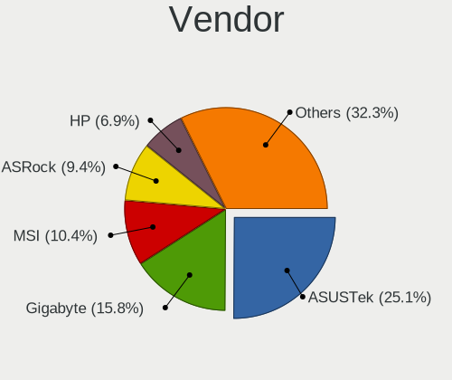
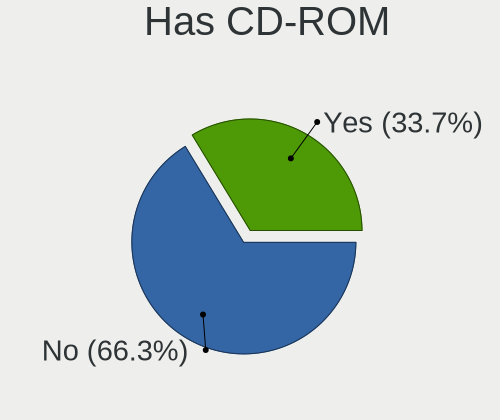
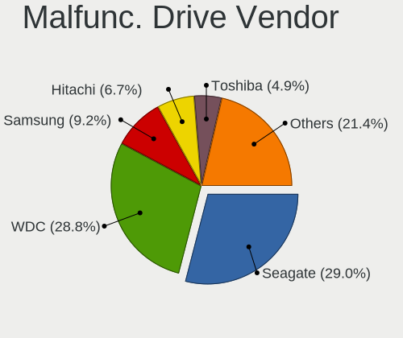
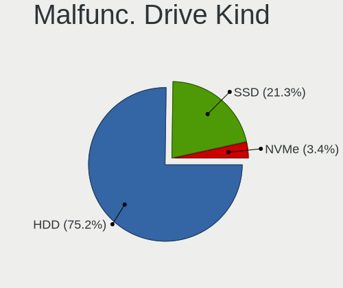
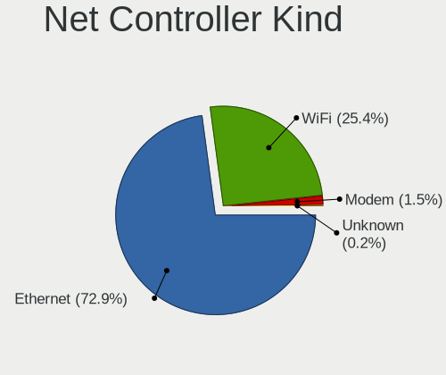

Debian - Tested Hardware & Statistics (Desktops)
------------------------------------------------

A project to collect tested hardware configurations for Debian.

Anyone can contribute to this report by the [hw-probe](https://github.com/linuxhw/hw-probe) tool:

    sudo -E hw-probe -all -upload

Please contribute! Especially if your hardware is rare.

Contents
--------

* [ Test Cases ](#test-cases)

* [ System ](#system)
  - [ OS                       ](#os)
  - [ OS Family                ](#os-family)
  - [ Kernel                   ](#kernel)
  - [ Kernel Family            ](#kernel-family)
  - [ Kernel Major Ver.        ](#kernel-major-ver)
  - [ Arch                     ](#arch)
  - [ DE                       ](#de)
  - [ Display Server           ](#display-server)
  - [ Display Manager          ](#display-manager)
  - [ OS Lang                  ](#os-lang)
  - [ Boot Mode                ](#boot-mode)
  - [ Filesystem               ](#filesystem)
  - [ Part. scheme             ](#part-scheme)
  - [ Dual Boot with Linux/BSD ](#dual-boot-with-linuxbsd)
  - [ Dual Boot (Win)          ](#dual-boot-win)

* [ Board ](#board)
  - [ Vendor                   ](#vendor)
  - [ Model                    ](#model)
  - [ Model Family             ](#model-family)
  - [ MFG Year                 ](#mfg-year)
  - [ Form Factor              ](#form-factor)
  - [ Secure Boot              ](#secure-boot)
  - [ Coreboot                 ](#coreboot)
  - [ RAM Size                 ](#ram-size)
  - [ RAM Used                 ](#ram-used)
  - [ Total Drives             ](#total-drives)
  - [ Has CD-ROM               ](#has-cd-rom)
  - [ Has Ethernet             ](#has-ethernet)
  - [ Has WiFi                 ](#has-wifi)
  - [ Has Bluetooth            ](#has-bluetooth)

* [ Location ](#location)
  - [ Country                  ](#country)
  - [ City                     ](#city)

* [ Drives ](#drives)
  - [ Drive Vendor             ](#drive-vendor)
  - [ Drive Model              ](#drive-model)
  - [ HDD Vendor               ](#hdd-vendor)
  - [ SSD Vendor               ](#ssd-vendor)
  - [ Drive Kind               ](#drive-kind)
  - [ Drive Connector          ](#drive-connector)
  - [ Drive Size               ](#drive-size)
  - [ Space Total              ](#space-total)
  - [ Space Used               ](#space-used)
  - [ Malfunc. Drives          ](#malfunc-drives)
  - [ Malfunc. Drive Vendor    ](#malfunc-drive-vendor)
  - [ Malfunc. HDD Vendor      ](#malfunc-hdd-vendor)
  - [ Malfunc. Drive Kind      ](#malfunc-drive-kind)
  - [ Failed Drives            ](#failed-drives)
  - [ Failed Drive Vendor      ](#failed-drive-vendor)
  - [ Drive Status             ](#drive-status)

* [ Storage controller ](#storage-controller)
  - [ Storage Vendor           ](#storage-vendor)
  - [ Storage Model            ](#storage-model)
  - [ Storage Kind             ](#storage-kind)

* [ Processor ](#processor)
  - [ CPU Vendor               ](#cpu-vendor)
  - [ CPU Model                ](#cpu-model)
  - [ CPU Model Family         ](#cpu-model-family)
  - [ CPU Cores                ](#cpu-cores)
  - [ CPU Sockets              ](#cpu-sockets)
  - [ CPU Threads              ](#cpu-threads)
  - [ CPU Op-Modes             ](#cpu-op-modes)
  - [ CPU Microcode            ](#cpu-microcode)
  - [ CPU Microarch            ](#cpu-microarch)

* [ Graphics ](#graphics)
  - [ GPU Vendor               ](#gpu-vendor)
  - [ GPU Model                ](#gpu-model)
  - [ GPU Combo                ](#gpu-combo)
  - [ GPU Driver               ](#gpu-driver)
  - [ GPU Memory               ](#gpu-memory)

* [ Monitor ](#monitor)
  - [ Monitor Vendor           ](#monitor-vendor)
  - [ Monitor Model            ](#monitor-model)
  - [ Monitor Resolution       ](#monitor-resolution)
  - [ Monitor Diagonal         ](#monitor-diagonal)
  - [ Monitor Width            ](#monitor-width)
  - [ Aspect Ratio             ](#aspect-ratio)
  - [ Monitor Area             ](#monitor-area)
  - [ Pixel Density            ](#pixel-density)
  - [ Multiple Monitors        ](#multiple-monitors)

* [ Network ](#network)
  - [ Net Controller Vendor    ](#net-controller-vendor)
  - [ Net Controller Model     ](#net-controller-model)
  - [ Wireless Vendor          ](#wireless-vendor)
  - [ Wireless Model           ](#wireless-model)
  - [ Ethernet Vendor          ](#ethernet-vendor)
  - [ Ethernet Model           ](#ethernet-model)
  - [ Net Controller Kind      ](#net-controller-kind)
  - [ Used Controller          ](#used-controller)
  - [ NICs                     ](#nics)
  - [ IPv6                     ](#ipv6)

* [ Bluetooth ](#bluetooth)
  - [ Bluetooth Vendor         ](#bluetooth-vendor)
  - [ Bluetooth Model          ](#bluetooth-model)

* [ Sound ](#sound)
  - [ Sound Vendor             ](#sound-vendor)
  - [ Sound Model              ](#sound-model)

* [ Memory ](#memory)
  - [ Memory Vendor            ](#memory-vendor)
  - [ Memory Model             ](#memory-model)
  - [ Memory Kind              ](#memory-kind)
  - [ Memory Form Factor       ](#memory-form-factor)
  - [ Memory Size              ](#memory-size)
  - [ Memory Speed             ](#memory-speed)

* [ Printers & scanners ](#printers--scanners)
  - [ Printer Vendor           ](#printer-vendor)
  - [ Printer Model            ](#printer-model)
  - [ Scanner Vendor           ](#scanner-vendor)
  - [ Scanner Model            ](#scanner-model)

* [ Camera ](#camera)
  - [ Camera Vendor            ](#camera-vendor)
  - [ Camera Model             ](#camera-model)

* [ Security ](#security)
  - [ Fingerprint Vendor       ](#fingerprint-vendor)
  - [ Fingerprint Model        ](#fingerprint-model)
  - [ Chipcard Vendor          ](#chipcard-vendor)
  - [ Chipcard Model           ](#chipcard-model)

* [ Unsupported ](#unsupported)
  - [ Unsupported Devices      ](#unsupported-devices)
  - [ Unsupported Device Types ](#unsupported-device-types)

Test Cases
----------

Total: 9371

| Vendor        | Model                       | Probe                                                      | Date         |
|---------------|-----------------------------|------------------------------------------------------------|--------------|
| Gigabyte      | B85M-D3H                    | [27053ca724](https://linux-hardware.org/?probe=27053ca724) | Jan 06, 2025 |
| Gigabyte      | B85M-D3H                    | [3d3b4d1ab3](https://linux-hardware.org/?probe=3d3b4d1ab3) | Jan 06, 2025 |
| Lenovo        | 0B98401 PRO                 | [319423b279](https://linux-hardware.org/?probe=319423b279) | Jan 06, 2025 |
| HP            | 81C5 MVB                    | [af63b5ba1c](https://linux-hardware.org/?probe=af63b5ba1c) | Jan 06, 2025 |
| HP            | 8299                        | [a87a33b9e2](https://linux-hardware.org/?probe=a87a33b9e2) | Jan 06, 2025 |
| OEM           | B75 Ver:1.41                | [72dd3048a2](https://linux-hardware.org/?probe=72dd3048a2) | Jan 05, 2025 |
| Unknown       | Unknown                     | [bfe6d86060](https://linux-hardware.org/?probe=bfe6d86060) | Jan 05, 2025 |
| Unknown       | Unknown                     | [bafe044b60](https://linux-hardware.org/?probe=bafe044b60) | Jan 05, 2025 |
| HP            | 2B38                        | [2ea8b8918b](https://linux-hardware.org/?probe=2ea8b8918b) | Jan 05, 2025 |
| Fujitsu       | D3062-A1 S26361-D3062-A1    | [edc190a229](https://linux-hardware.org/?probe=edc190a229) | Jan 04, 2025 |
| Dell          | 09KPNV A00                  | [d2a1de9dc7](https://linux-hardware.org/?probe=d2a1de9dc7) | Jan 04, 2025 |
| OEM           | B75 Ver:1.41                | [b5e4cb38f7](https://linux-hardware.org/?probe=b5e4cb38f7) | Jan 04, 2025 |
| ASRock        | H61M-DGS                    | [0e1053e06a](https://linux-hardware.org/?probe=0e1053e06a) | Jan 04, 2025 |
| ASUSTek       | Z97M-PLUS                   | [92c4bf7d7e](https://linux-hardware.org/?probe=92c4bf7d7e) | Jan 04, 2025 |
| MSI           | B550-A PRO                  | [b689309781](https://linux-hardware.org/?probe=b689309781) | Jan 04, 2025 |
| Gigabyte      | B550M DS3H                  | [a917c66504](https://linux-hardware.org/?probe=a917c66504) | Jan 04, 2025 |
| ASUSTek       | PRIME A320M-K               | [76cfde7dc3](https://linux-hardware.org/?probe=76cfde7dc3) | Jan 04, 2025 |
| ASUSTek       | Pro B560M-C                 | [00895d3b67](https://linux-hardware.org/?probe=00895d3b67) | Jan 03, 2025 |
| ASUSTek       | M5A97 R2.0                  | [a671d43d86](https://linux-hardware.org/?probe=a671d43d86) | Jan 03, 2025 |
| HP            | 3399                        | [1371b1c64d](https://linux-hardware.org/?probe=1371b1c64d) | Jan 03, 2025 |
| Dell          | 0HHV7N A00                  | [25ccd84cbc](https://linux-hardware.org/?probe=25ccd84cbc) | Jan 03, 2025 |
| ASUSTek       | PRIME A320M-K               | [65588fd6c1](https://linux-hardware.org/?probe=65588fd6c1) | Jan 03, 2025 |
| HP            | 339A                        | [37e08931cc](https://linux-hardware.org/?probe=37e08931cc) | Jan 03, 2025 |
| Dell          | 0F6X5P A00                  | [7cad62d105](https://linux-hardware.org/?probe=7cad62d105) | Jan 03, 2025 |
| Dell          | 0F6X5P A00                  | [2014bb07e8](https://linux-hardware.org/?probe=2014bb07e8) | Jan 03, 2025 |
| Dell          | 0F6X5P A00                  | [1fc923f99b](https://linux-hardware.org/?probe=1fc923f99b) | Jan 03, 2025 |
| ASUSTek       | PRIME B350M-A               | [014692b809](https://linux-hardware.org/?probe=014692b809) | Jan 03, 2025 |
| HP            | 0B4Ch D                     | [689bb32b5c](https://linux-hardware.org/?probe=689bb32b5c) | Jan 03, 2025 |
| CWWK          | CW-AD4L-N V1                | [ed9e661757](https://linux-hardware.org/?probe=ed9e661757) | Jan 03, 2025 |
| HP            | ProLiant ML150 G6           | [d281d0b24d](https://linux-hardware.org/?probe=d281d0b24d) | Jan 03, 2025 |
| HP            | ProLiant MicroServer        | [f99b996d05](https://linux-hardware.org/?probe=f99b996d05) | Jan 02, 2025 |
| HP            | ProLiant MicroServer        | [74107b78f7](https://linux-hardware.org/?probe=74107b78f7) | Jan 02, 2025 |
| Lenovo        | ThinkCentre M93p            | [3a7e0b811f](https://linux-hardware.org/?probe=3a7e0b811f) | Jan 02, 2025 |
| ASUSTek       | TUF B450M-PLUS GAMING       | [5058b592ae](https://linux-hardware.org/?probe=5058b592ae) | Jan 02, 2025 |
| ASUSTek       | M5A97 R2.0                  | [bb11de9504](https://linux-hardware.org/?probe=bb11de9504) | Jan 02, 2025 |
| Gigabyte      | B460M DS3H V2               | [f3f3a540d4](https://linux-hardware.org/?probe=f3f3a540d4) | Jan 02, 2025 |
| Gigabyte      | GA-970A-UD3                 | [92b3ee2679](https://linux-hardware.org/?probe=92b3ee2679) | Jan 01, 2025 |
| MSI           | B150M MORTAR                | [798c953e09](https://linux-hardware.org/?probe=798c953e09) | Jan 01, 2025 |
| MSI           | PRO B760-P WIFI DDR4        | [5b2124b8e7](https://linux-hardware.org/?probe=5b2124b8e7) | Jan 01, 2025 |
| Dell          | 04Y8V0 A02                  | [2864d95f71](https://linux-hardware.org/?probe=2864d95f71) | Jan 01, 2025 |
| Dell          | 04Y8V0 A02                  | [dd5b8644a1](https://linux-hardware.org/?probe=dd5b8644a1) | Jan 01, 2025 |
| Gigabyte      | B85M-D3H                    | [1766ca8469](https://linux-hardware.org/?probe=1766ca8469) | Jan 01, 2025 |
| Unknown       | Unknown                     | [209186df09](https://linux-hardware.org/?probe=209186df09) | Jan 01, 2025 |
| Gigabyte      | B85M-D3H                    | [b52a4bed1c](https://linux-hardware.org/?probe=b52a4bed1c) | Dec 31, 2024 |
| ASUSTek       | TUF Gaming Z790-PLUS WIF... | [cdbb6290eb](https://linux-hardware.org/?probe=cdbb6290eb) | Dec 31, 2024 |
| HP            | 8299                        | [dc5728b605](https://linux-hardware.org/?probe=dc5728b605) | Dec 31, 2024 |
| Loongson      | CTCI02LS3A6000C-K CTCI V... | [b6f0fc1399](https://linux-hardware.org/?probe=b6f0fc1399) | Dec 31, 2024 |
| ASUSTek       | PRIME Z490-A                | [f1762af529](https://linux-hardware.org/?probe=f1762af529) | Dec 31, 2024 |
| ASUSTek       | ProArt X870E-CREATOR WIF... | [682520faf1](https://linux-hardware.org/?probe=682520faf1) | Dec 31, 2024 |
| AMI           | Intel                       | [40322fe630](https://linux-hardware.org/?probe=40322fe630) | Dec 31, 2024 |
| ASUSTek       | Pro B560M-C                 | [0d9d36f397](https://linux-hardware.org/?probe=0d9d36f397) | Dec 30, 2024 |
| ASUSTek       | PRIME B650-PLUS             | [d94ee9a862](https://linux-hardware.org/?probe=d94ee9a862) | Dec 30, 2024 |
| Gigabyte      | B460M DS3H V2               | [2bb09385c0](https://linux-hardware.org/?probe=2bb09385c0) | Dec 30, 2024 |
| Fujitsu Si... | D2348-A3 S26361-D2348-A3    | [88cfef1da9](https://linux-hardware.org/?probe=88cfef1da9) | Dec 30, 2024 |
| ASRock        | 990FX Extreme4              | [4b37ae65f2](https://linux-hardware.org/?probe=4b37ae65f2) | Dec 30, 2024 |
| Unknown       | Unknown                     | [ea27b3376d](https://linux-hardware.org/?probe=ea27b3376d) | Dec 30, 2024 |
| Gigabyte      | X670 AORUS ELITE AX         | [ad6953ff2e](https://linux-hardware.org/?probe=ad6953ff2e) | Dec 30, 2024 |
| AMI           | Intel                       | [92f821a69c](https://linux-hardware.org/?probe=92f821a69c) | Dec 30, 2024 |
| Gigabyte      | B560M AORUS ELITE           | [408b834306](https://linux-hardware.org/?probe=408b834306) | Dec 29, 2024 |
| ICP / iEi     | SA16 V1.00                  | [6c89b49dd8](https://linux-hardware.org/?probe=6c89b49dd8) | Dec 29, 2024 |
| Gigabyte      | GB-BER7-5700                | [915da57e07](https://linux-hardware.org/?probe=915da57e07) | Dec 29, 2024 |
| Dell          | 08WXMX A02                  | [81f35b96d9](https://linux-hardware.org/?probe=81f35b96d9) | Dec 29, 2024 |
| MSI           | MPG B550 GAMING EDGE WIF... | [ea3e3598c1](https://linux-hardware.org/?probe=ea3e3598c1) | Dec 29, 2024 |
| MSI           | PRO Z790-VC WIFI            | [536d20f5de](https://linux-hardware.org/?probe=536d20f5de) | Dec 29, 2024 |
| HP            | 21D0                        | [33452ea42c](https://linux-hardware.org/?probe=33452ea42c) | Dec 28, 2024 |
| HP            | 845A                        | [c79d5baf3e](https://linux-hardware.org/?probe=c79d5baf3e) | Dec 28, 2024 |
| MSI           | MAG B660 TOMAHAWK WIFI D... | [84f3fb88dd](https://linux-hardware.org/?probe=84f3fb88dd) | Dec 28, 2024 |
| ASRock        | J5040-ITX                   | [cfe9a3c37e](https://linux-hardware.org/?probe=cfe9a3c37e) | Dec 28, 2024 |
| Lenovo        | 1056 SDK0T76557 WIN 3915... | [9f23de610a](https://linux-hardware.org/?probe=9f23de610a) | Dec 28, 2024 |
| Gigabyte      | B460M DS3H V2               | [b85d81f6b7](https://linux-hardware.org/?probe=b85d81f6b7) | Dec 28, 2024 |
| Dell          | 0FG011                      | [2056b909f7](https://linux-hardware.org/?probe=2056b909f7) | Dec 28, 2024 |
| Gigabyte      | A520I AC                    | [1574cc05d9](https://linux-hardware.org/?probe=1574cc05d9) | Dec 27, 2024 |
| Dell          | 0JP3NX A01                  | [84b0bca79f](https://linux-hardware.org/?probe=84b0bca79f) | Dec 27, 2024 |
| Gigabyte      | 970A-DS3P                   | [127d67d58a](https://linux-hardware.org/?probe=127d67d58a) | Dec 27, 2024 |
| ASRock        | 990FX Extreme4              | [ae4ac86e01](https://linux-hardware.org/?probe=ae4ac86e01) | Dec 27, 2024 |
| Lenovo        | 3317 SDK0T76463 WIN 3422... | [05481678ba](https://linux-hardware.org/?probe=05481678ba) | Dec 27, 2024 |
| Loongson      | CTCI02LS3A6000C-K CTCI V... | [0cc3198ea4](https://linux-hardware.org/?probe=0cc3198ea4) | Dec 27, 2024 |
| Haier         | ZEB19 V1.1                  | [fa29b7de8f](https://linux-hardware.org/?probe=fa29b7de8f) | Dec 27, 2024 |
| AZW           | LZX TBD                     | [92975fb393](https://linux-hardware.org/?probe=92975fb393) | Dec 27, 2024 |
| AZW           | LZX TBD                     | [7bad615f3c](https://linux-hardware.org/?probe=7bad615f3c) | Dec 27, 2024 |
| AZW           | LZX TBD                     | [ea53b402e4](https://linux-hardware.org/?probe=ea53b402e4) | Dec 27, 2024 |
| ASRock        | B450M Pro4-F                | [932175112d](https://linux-hardware.org/?probe=932175112d) | Dec 27, 2024 |
| ASRock        | Z97X Killer                 | [447cd42486](https://linux-hardware.org/?probe=447cd42486) | Dec 26, 2024 |
| AZW           | MINI S                      | [b73091a664](https://linux-hardware.org/?probe=b73091a664) | Dec 26, 2024 |
| MSI           | P45 Neo3                    | [4952d3011f](https://linux-hardware.org/?probe=4952d3011f) | Dec 26, 2024 |
| Dell          | 0F3KHR A01                  | [2a4ad29ef8](https://linux-hardware.org/?probe=2a4ad29ef8) | Dec 26, 2024 |
| GEEKOM        | A5                          | [2bdc0b3030](https://linux-hardware.org/?probe=2bdc0b3030) | Dec 26, 2024 |
| MSI           | PRO B650-P WIFI             | [0a8d8bc701](https://linux-hardware.org/?probe=0a8d8bc701) | Dec 25, 2024 |
| MSI           | Z370-A PRO                  | [9ce2977625](https://linux-hardware.org/?probe=9ce2977625) | Dec 25, 2024 |
| TB            | WTR R1                      | [587979f8d3](https://linux-hardware.org/?probe=587979f8d3) | Dec 25, 2024 |
| Gigabyte      | B450M DS3H V2               | [9bb72b7cbd](https://linux-hardware.org/?probe=9bb72b7cbd) | Dec 25, 2024 |
| ZOTAC         | NM10                        | [48bdd764c8](https://linux-hardware.org/?probe=48bdd764c8) | Dec 25, 2024 |
| HP            | 1998                        | [5cbefdf3a2](https://linux-hardware.org/?probe=5cbefdf3a2) | Dec 25, 2024 |
| Lenovo        | 317C SDK0J40700 WIN 3258... | [0ab0a286ad](https://linux-hardware.org/?probe=0ab0a286ad) | Dec 25, 2024 |
| ASUSTek       | M5A97 PLUS                  | [a3e4e7043e](https://linux-hardware.org/?probe=a3e4e7043e) | Dec 25, 2024 |
| EVGA          | 122-CK-NF68 2               | [a7af4d0592](https://linux-hardware.org/?probe=a7af4d0592) | Dec 24, 2024 |
| Gigabyte      | H370M D3H-CF                | [293052fc3b](https://linux-hardware.org/?probe=293052fc3b) | Dec 24, 2024 |
| Gigabyte      | B450M DS3H V2               | [ad7ff9155c](https://linux-hardware.org/?probe=ad7ff9155c) | Dec 24, 2024 |
| Dell          | 0HGFJM A00                  | [f849a74d2e](https://linux-hardware.org/?probe=f849a74d2e) | Dec 24, 2024 |
| ASRock        | B760M Pro RS/D4 WiFi        | [9c915961fc](https://linux-hardware.org/?probe=9c915961fc) | Dec 24, 2024 |
| Gigabyte      | B450M DS3H-CF               | [cf730d4359](https://linux-hardware.org/?probe=cf730d4359) | Dec 24, 2024 |
| ASUSTek       | P8H61-MX                    | [b9f7d12796](https://linux-hardware.org/?probe=b9f7d12796) | Dec 24, 2024 |
| Supermicro    | X13SCH-SYS                  | [4291b9f111](https://linux-hardware.org/?probe=4291b9f111) | Dec 24, 2024 |
| Supermicro    | X13SCH-SYS                  | [e8b89f7b32](https://linux-hardware.org/?probe=e8b89f7b32) | Dec 24, 2024 |
| Supermicro    | X13SCH-SYS                  | [1f136d48ed](https://linux-hardware.org/?probe=1f136d48ed) | Dec 24, 2024 |
| Shenzhen M... | AHBNB OEM                   | [3d886fdf20](https://linux-hardware.org/?probe=3d886fdf20) | Dec 23, 2024 |
| Shenzhen M... | AHBNB OEM                   | [14cd81f727](https://linux-hardware.org/?probe=14cd81f727) | Dec 23, 2024 |
| ASRock        | 990FX Extreme4              | [51e8b5da5d](https://linux-hardware.org/?probe=51e8b5da5d) | Dec 23, 2024 |
| ASUSTek       | Pro A620M-C                 | [9138796588](https://linux-hardware.org/?probe=9138796588) | Dec 23, 2024 |
| Dell          | 0D9JG3 A01                  | [0e667d9d3c](https://linux-hardware.org/?probe=0e667d9d3c) | Dec 23, 2024 |
| ASRock        | N100DC-ITX                  | [3bc5422fdb](https://linux-hardware.org/?probe=3bc5422fdb) | Dec 22, 2024 |
| Gigabyte      | A520M DS3H V2               | [667755c495](https://linux-hardware.org/?probe=667755c495) | Dec 22, 2024 |
| Gigabyte      | GA-MA790XT-UD4P             | [64b32f0a2d](https://linux-hardware.org/?probe=64b32f0a2d) | Dec 22, 2024 |
| UGREEN        | DXP8800 Plus                | [b774f3c225](https://linux-hardware.org/?probe=b774f3c225) | Dec 22, 2024 |
| ASRock        | X399 Taichi                 | [fb9ee0f91d](https://linux-hardware.org/?probe=fb9ee0f91d) | Dec 22, 2024 |
| Gigabyte      | H55M-UD2H                   | [282061195d](https://linux-hardware.org/?probe=282061195d) | Dec 22, 2024 |
| MSI           | X470 GAMING PRO CARBON      | [976a838d5e](https://linux-hardware.org/?probe=976a838d5e) | Dec 22, 2024 |
| ASUSTek       | P8Z77-V LE                  | [468d9fdcd3](https://linux-hardware.org/?probe=468d9fdcd3) | Dec 22, 2024 |
| Gigabyte      | AB350-Gaming 3-CF           | [7ef9e03f35](https://linux-hardware.org/?probe=7ef9e03f35) | Dec 21, 2024 |
| HP            | 339A                        | [cde6aa76f1](https://linux-hardware.org/?probe=cde6aa76f1) | Dec 21, 2024 |
| Unknown       | Unknown                     | [97ee68a841](https://linux-hardware.org/?probe=97ee68a841) | Dec 21, 2024 |
| HP            | 18E7                        | [d0b93f0461](https://linux-hardware.org/?probe=d0b93f0461) | Dec 21, 2024 |
| Lenovo        | 364F SDK0J40700 WIN 3258... | [ee33250a81](https://linux-hardware.org/?probe=ee33250a81) | Dec 20, 2024 |
| Gigabyte      | B550 AORUS ELITE AX V2      | [fec2e89dd2](https://linux-hardware.org/?probe=fec2e89dd2) | Dec 20, 2024 |
| Unknown       | Unknown                     | [581bac2845](https://linux-hardware.org/?probe=581bac2845) | Dec 20, 2024 |
| ASRock        | B450 Gaming-ITX/ac          | [be8f18e2ad](https://linux-hardware.org/?probe=be8f18e2ad) | Dec 19, 2024 |
| ASRock        | J5040-ITX                   | [30c96f3002](https://linux-hardware.org/?probe=30c96f3002) | Dec 19, 2024 |
| Unknown       | Unknown                     | [ee566f8f11](https://linux-hardware.org/?probe=ee566f8f11) | Dec 19, 2024 |
| ASUSTek       | PRIME B660M-A D4            | [42fb938577](https://linux-hardware.org/?probe=42fb938577) | Dec 19, 2024 |
| ASUSTek       | Z97-K                       | [8150568178](https://linux-hardware.org/?probe=8150568178) | Dec 18, 2024 |
| HP            | 3396                        | [6036453dd4](https://linux-hardware.org/?probe=6036453dd4) | Dec 18, 2024 |
| Unknown       | Unknown                     | [55ad7b2405](https://linux-hardware.org/?probe=55ad7b2405) | Dec 18, 2024 |
| ASRock        | 990FX Extreme4              | [4e38ddc9dc](https://linux-hardware.org/?probe=4e38ddc9dc) | Dec 18, 2024 |
| Sapphire      | PI-AM3RS760G2               | [95613c7635](https://linux-hardware.org/?probe=95613c7635) | Dec 18, 2024 |
| ASUSTek       | ROG STRIX B450-F GAMING     | [67bcacbdcd](https://linux-hardware.org/?probe=67bcacbdcd) | Dec 18, 2024 |
| MSI           | MS-7309                     | [dbe0d9aff5](https://linux-hardware.org/?probe=dbe0d9aff5) | Dec 18, 2024 |
| HP            | 3396                        | [5c7c904cb4](https://linux-hardware.org/?probe=5c7c904cb4) | Dec 17, 2024 |
| Gigabyte      | B85M-D3H                    | [bb23aa7480](https://linux-hardware.org/?probe=bb23aa7480) | Dec 17, 2024 |
| Supermicro    | X10DRU-i+A                  | [6ac9ef200b](https://linux-hardware.org/?probe=6ac9ef200b) | Dec 17, 2024 |
| HP            | 83F3                        | [de8737ca72](https://linux-hardware.org/?probe=de8737ca72) | Dec 16, 2024 |
| HP            | 83F3                        | [e48e3c00d9](https://linux-hardware.org/?probe=e48e3c00d9) | Dec 16, 2024 |
| HP            | 859C                        | [e8bd962d37](https://linux-hardware.org/?probe=e8bd962d37) | Dec 16, 2024 |
| HP            | 83F3                        | [1c40aacec7](https://linux-hardware.org/?probe=1c40aacec7) | Dec 16, 2024 |
| HP            | 83F3                        | [ab0752e1fc](https://linux-hardware.org/?probe=ab0752e1fc) | Dec 16, 2024 |
| ASRock        | B650M PG Lightning          | [93343b543c](https://linux-hardware.org/?probe=93343b543c) | Dec 16, 2024 |
| ASRock        | B550M-HVS SE                | [c7507cc0e0](https://linux-hardware.org/?probe=c7507cc0e0) | Dec 16, 2024 |
| ASUSTek       | PRIME B760-PLUS D4          | [379d336bc2](https://linux-hardware.org/?probe=379d336bc2) | Dec 16, 2024 |
| ASUSTek       | TUF Gaming X870-PLUS WIF... | [9acf9973e2](https://linux-hardware.org/?probe=9acf9973e2) | Dec 16, 2024 |
| GMKtec        | NucBox M6                   | [db441fd218](https://linux-hardware.org/?probe=db441fd218) | Dec 15, 2024 |
| OEM           | B75 Ver:1.41                | [26fc19a77d](https://linux-hardware.org/?probe=26fc19a77d) | Dec 15, 2024 |
| Dell          | 0WR1RF A05                  | [dfe93dbaf4](https://linux-hardware.org/?probe=dfe93dbaf4) | Dec 15, 2024 |
| Unknown       | Unknown                     | [e066e43d11](https://linux-hardware.org/?probe=e066e43d11) | Dec 15, 2024 |
| MSI           | PRO Z790-A MAX WIFI         | [9d8b439c00](https://linux-hardware.org/?probe=9d8b439c00) | Dec 15, 2024 |
| AZW           | GK mini                     | [9d7ad4d5ec](https://linux-hardware.org/?probe=9d7ad4d5ec) | Dec 15, 2024 |
| WTM           | W-N95-R B0                  | [07e55b1b4f](https://linux-hardware.org/?probe=07e55b1b4f) | Dec 15, 2024 |
| MACHINIST     | X99 PR8                     | [f3f38350f6](https://linux-hardware.org/?probe=f3f38350f6) | Dec 15, 2024 |
| HP            | 87D6 SMVB                   | [41333823f1](https://linux-hardware.org/?probe=41333823f1) | Dec 14, 2024 |
| ASRock        | 990FX Extreme4              | [7831fe39d7](https://linux-hardware.org/?probe=7831fe39d7) | Dec 14, 2024 |
| Intel         | X99                         | [1350402676](https://linux-hardware.org/?probe=1350402676) | Dec 14, 2024 |
| Lenovo        | 317C SDK0J40700 WIN 3258... | [845bbbb028](https://linux-hardware.org/?probe=845bbbb028) | Dec 13, 2024 |
| AZW           | GK mini                     | [084b1d007c](https://linux-hardware.org/?probe=084b1d007c) | Dec 13, 2024 |
| Unknown       | Alviso                      | [b5254b9523](https://linux-hardware.org/?probe=b5254b9523) | Dec 13, 2024 |
| Sapphire      | PI-AM3RS760G2               | [f5a32c5d75](https://linux-hardware.org/?probe=f5a32c5d75) | Dec 13, 2024 |
| ASRock        | 990FX Extreme4              | [8b5cf16f3c](https://linux-hardware.org/?probe=8b5cf16f3c) | Dec 13, 2024 |
| Gigabyte      | B450M GAMING                | [d79d1b80e5](https://linux-hardware.org/?probe=d79d1b80e5) | Dec 13, 2024 |
| ASRock        | H61M-VG4                    | [76d007efbe](https://linux-hardware.org/?probe=76d007efbe) | Dec 13, 2024 |
| Intel         | JSL MRD                     | [7e6f631d27](https://linux-hardware.org/?probe=7e6f631d27) | Dec 12, 2024 |
| ASRock        | B450 Pro4                   | [685ed25a9b](https://linux-hardware.org/?probe=685ed25a9b) | Dec 11, 2024 |
| ASRock        | B650M PG Lightning          | [4370a5ccdf](https://linux-hardware.org/?probe=4370a5ccdf) | Dec 11, 2024 |
| Lenovo        | SHARKBAY SDK0E50510 WIN     | [bd997925b9](https://linux-hardware.org/?probe=bd997925b9) | Dec 11, 2024 |
| Intel         | X99H                        | [5e8c6d50b0](https://linux-hardware.org/?probe=5e8c6d50b0) | Dec 11, 2024 |
| Shenzhen M... | RPBNB                       | [eafb54c8d7](https://linux-hardware.org/?probe=eafb54c8d7) | Dec 11, 2024 |
| MSI           | MAG B650 TOMAHAWK WIFI      | [80f992c9cc](https://linux-hardware.org/?probe=80f992c9cc) | Dec 11, 2024 |
| Gigabyte      | GA-78LMT-USB3 x.x           | [b7088d6396](https://linux-hardware.org/?probe=b7088d6396) | Dec 10, 2024 |
| ASRock        | 990FX Extreme4              | [5da4d46242](https://linux-hardware.org/?probe=5da4d46242) | Dec 10, 2024 |
| JGINYUE       | X99-8D4G Server             | [9d7190d871](https://linux-hardware.org/?probe=9d7190d871) | Dec 10, 2024 |
| Supermicro    | X10DRU-i+                   | [cdfc73f6f1](https://linux-hardware.org/?probe=cdfc73f6f1) | Dec 09, 2024 |
| Unknown       | Unknown                     | [1d6a060c4b](https://linux-hardware.org/?probe=1d6a060c4b) | Dec 09, 2024 |
| Unknown       | Unknown                     | [4260dec262](https://linux-hardware.org/?probe=4260dec262) | Dec 09, 2024 |
| Foxconn       | 2A8C                        | [797e1376e3](https://linux-hardware.org/?probe=797e1376e3) | Dec 09, 2024 |
| Foxconn       | 2A8C                        | [27417acd19](https://linux-hardware.org/?probe=27417acd19) | Dec 09, 2024 |
| HP            | 87D6 SMVB                   | [39c13368a2](https://linux-hardware.org/?probe=39c13368a2) | Dec 09, 2024 |
| Supermicro    | X10DRU-i+                   | [63381979ef](https://linux-hardware.org/?probe=63381979ef) | Dec 09, 2024 |
| Supermicro    | X10DRU-i+                   | [5fc1009aa8](https://linux-hardware.org/?probe=5fc1009aa8) | Dec 09, 2024 |
| Supermicro    | X10DRU-i+                   | [2809cf44de](https://linux-hardware.org/?probe=2809cf44de) | Dec 09, 2024 |
| ASRock        | Z87 Extreme3                | [1dde49d443](https://linux-hardware.org/?probe=1dde49d443) | Dec 09, 2024 |
| Win Elemen... | M6                          | [ece3dbe8e5](https://linux-hardware.org/?probe=ece3dbe8e5) | Dec 09, 2024 |
| ASUSTek       | TUF Gaming Z790-PLUS WIF... | [9b636f440a](https://linux-hardware.org/?probe=9b636f440a) | Dec 09, 2024 |
| ASUSTek       | Z97-K                       | [d8ff8a4bc3](https://linux-hardware.org/?probe=d8ff8a4bc3) | Dec 09, 2024 |
| ASUSTek       | PRIME A320M-K               | [2b32ed6115](https://linux-hardware.org/?probe=2b32ed6115) | Dec 09, 2024 |
| ASUSTek       | TUF Gaming X570-PLUS        | [6e3a564716](https://linux-hardware.org/?probe=6e3a564716) | Dec 08, 2024 |
| Loongson      | CTCI02LS3A6000C-K CTCI V... | [7348079cd8](https://linux-hardware.org/?probe=7348079cd8) | Dec 08, 2024 |
| MSI           | B350M MORTAR                | [bbd843a5b9](https://linux-hardware.org/?probe=bbd843a5b9) | Dec 08, 2024 |
| ASUSTek       | TUF Gaming X570-PLUS        | [d8816a4683](https://linux-hardware.org/?probe=d8816a4683) | Dec 08, 2024 |
| MSI           | PRO Z790-A MAX WIFI         | [c7e8137b9c](https://linux-hardware.org/?probe=c7e8137b9c) | Dec 08, 2024 |
| MSI           | B350M MORTAR                | [b7546e3068](https://linux-hardware.org/?probe=b7546e3068) | Dec 08, 2024 |
| ASUSTek       | P8Z68-V LX                  | [8b80731559](https://linux-hardware.org/?probe=8b80731559) | Dec 08, 2024 |
| Gigabyte      | Z97X-Gaming 3               | [3f5e65f8fc](https://linux-hardware.org/?probe=3f5e65f8fc) | Dec 08, 2024 |
| ASUSTek       | TUF Gaming B650M-E WIFI     | [2c55540d18](https://linux-hardware.org/?probe=2c55540d18) | Dec 07, 2024 |
| Gigabyte      | B760M GAMING DDR4           | [ee69c81b6c](https://linux-hardware.org/?probe=ee69c81b6c) | Dec 07, 2024 |
| ASRock        | X399 Taichi                 | [bcdb542f1c](https://linux-hardware.org/?probe=bcdb542f1c) | Dec 07, 2024 |
| Intel         | D34010WYK H14771-303        | [b768c697c1](https://linux-hardware.org/?probe=b768c697c1) | Dec 07, 2024 |
| Unknown       | Unknown                     | [c756a17fdb](https://linux-hardware.org/?probe=c756a17fdb) | Dec 07, 2024 |
| ASUSTek       | ROG CROSSHAIR VIII DARK ... | [015acb690e](https://linux-hardware.org/?probe=015acb690e) | Dec 07, 2024 |
| ASUSTek       | H97M-PLUS                   | [5d38d438e4](https://linux-hardware.org/?probe=5d38d438e4) | Dec 06, 2024 |
| Gigabyte      | B560 HD3                    | [b22f963519](https://linux-hardware.org/?probe=b22f963519) | Dec 06, 2024 |
| ASRock        | H81M-HDS                    | [a6bc6848cb](https://linux-hardware.org/?probe=a6bc6848cb) | Dec 06, 2024 |
| Dell          | 0GXM1W A02                  | [dff2410903](https://linux-hardware.org/?probe=dff2410903) | Dec 06, 2024 |
| ASRock        | B760M-C                     | [550283158e](https://linux-hardware.org/?probe=550283158e) | Dec 05, 2024 |
| ASUSTek       | M5A88-M                     | [2587266fd2](https://linux-hardware.org/?probe=2587266fd2) | Dec 05, 2024 |
| Dell          | 0VHWTR A01                  | [eca14b1552](https://linux-hardware.org/?probe=eca14b1552) | Dec 05, 2024 |
| Gigabyte      | H67M-D2                     | [5dae972ce2](https://linux-hardware.org/?probe=5dae972ce2) | Dec 04, 2024 |
| HP            | 1998                        | [0240b51641](https://linux-hardware.org/?probe=0240b51641) | Dec 04, 2024 |
| Gigabyte      | GA-880GMA-UD2H              | [0de4e0ddf7](https://linux-hardware.org/?probe=0de4e0ddf7) | Dec 04, 2024 |
| Inventec      | Z CLASS A02                 | [bdb8bdc00a](https://linux-hardware.org/?probe=bdb8bdc00a) | Dec 04, 2024 |
| Loongson      | 3A6000-HV-7A2000-1w-V0.1... | [6db45d6f6f](https://linux-hardware.org/?probe=6db45d6f6f) | Dec 04, 2024 |
| ASUSTek       | TUF Gaming Z790-PRO WIFI    | [7dd5e02873](https://linux-hardware.org/?probe=7dd5e02873) | Dec 04, 2024 |
| Unknown       | Unknown                     | [0af040879a](https://linux-hardware.org/?probe=0af040879a) | Dec 03, 2024 |
| Dell          | 0KYJ8C A02                  | [0e01c8cfa2](https://linux-hardware.org/?probe=0e01c8cfa2) | Dec 03, 2024 |
| ASUSTek       | TUF Gaming X570-PLUS        | [cc3c1cb737](https://linux-hardware.org/?probe=cc3c1cb737) | Dec 03, 2024 |
| Loongson      | 3A6000-HV-7A2000-NUC QA6... | [7ec85b65bc](https://linux-hardware.org/?probe=7ec85b65bc) | Dec 03, 2024 |
| ASRock        | 990FX Extreme4              | [37cd91857a](https://linux-hardware.org/?probe=37cd91857a) | Dec 03, 2024 |
| ASRock        | B550M Pro4                  | [b5d3d47608](https://linux-hardware.org/?probe=b5d3d47608) | Dec 03, 2024 |
| Loongson      | 3A6000-HV-7A2000-1w-V0.1... | [d93b073b67](https://linux-hardware.org/?probe=d93b073b67) | Dec 03, 2024 |
| Dell          | 0VHWTR A01                  | [dd980d15b8](https://linux-hardware.org/?probe=dd980d15b8) | Dec 03, 2024 |
| ASUSTek       | ROG STRIX B550-I GAMING     | [bd3553c7e3](https://linux-hardware.org/?probe=bd3553c7e3) | Dec 03, 2024 |
| Unknown       | T3 MRD                      | [f55dd77b94](https://linux-hardware.org/?probe=f55dd77b94) | Dec 02, 2024 |
| ASUSTek       | PRIME Z590-P                | [2e9144632c](https://linux-hardware.org/?probe=2e9144632c) | Dec 02, 2024 |
| MSI           | A88X-G43                    | [17b626db6d](https://linux-hardware.org/?probe=17b626db6d) | Dec 02, 2024 |
| Loongson      | 3A6000-HV-7A2000-NUC QA6... | [b702d01268](https://linux-hardware.org/?probe=b702d01268) | Dec 02, 2024 |
| ASUSTek       | ProArt X670E-CREATOR WIF... | [de579104b9](https://linux-hardware.org/?probe=de579104b9) | Dec 02, 2024 |
| Dell          | 0D4MD1 A00                  | [7328972ec3](https://linux-hardware.org/?probe=7328972ec3) | Dec 02, 2024 |
| Gigabyte      | Z590 AORUS ULTRA            | [ba4ef6acce](https://linux-hardware.org/?probe=ba4ef6acce) | Dec 02, 2024 |
| HP            | 339A                        | [c64449a47e](https://linux-hardware.org/?probe=c64449a47e) | Dec 02, 2024 |
| Sapphire      | PI-AM3RS760G2               | [28717d8de7](https://linux-hardware.org/?probe=28717d8de7) | Dec 02, 2024 |
| HP            | 82B4                        | [21e739a9b4](https://linux-hardware.org/?probe=21e739a9b4) | Dec 02, 2024 |
| ASUSTek       | ROG STRIX X470-F GAMING     | [283e9a8b40](https://linux-hardware.org/?probe=283e9a8b40) | Dec 01, 2024 |
| Gigabyte      | B550 AORUS ELITE V2         | [267b731924](https://linux-hardware.org/?probe=267b731924) | Dec 01, 2024 |
| MSI           | Z170A GAMING M5             | [2aeccdf82a](https://linux-hardware.org/?probe=2aeccdf82a) | Dec 01, 2024 |
| ASUSTek       | TUF Gaming B650M-PLUS WI... | [2587e5c7d0](https://linux-hardware.org/?probe=2587e5c7d0) | Dec 01, 2024 |
| Unknown       | Unknown                     | [8bc9009246](https://linux-hardware.org/?probe=8bc9009246) | Dec 01, 2024 |
| Gigabyte      | 965P-S3                     | [c52c2fddbc](https://linux-hardware.org/?probe=c52c2fddbc) | Dec 01, 2024 |
| ASRock        | B550M Pro4                  | [2cee8cd1b5](https://linux-hardware.org/?probe=2cee8cd1b5) | Dec 01, 2024 |
| Acer          | FI946GZG                    | [cd23a4d442](https://linux-hardware.org/?probe=cd23a4d442) | Nov 30, 2024 |
| Chuwi         | RZBOX                       | [b70c931ab6](https://linux-hardware.org/?probe=b70c931ab6) | Nov 30, 2024 |
| Chuwi         | RZBOX                       | [841cc4d9c6](https://linux-hardware.org/?probe=841cc4d9c6) | Nov 30, 2024 |
| ASRock        | B450M Pro4                  | [c865d51386](https://linux-hardware.org/?probe=c865d51386) | Nov 30, 2024 |
| MSI           | MPG B760I EDGE WIFI DDR4    | [c2162b5ffe](https://linux-hardware.org/?probe=c2162b5ffe) | Nov 30, 2024 |
| ASRock        | 990FX Extreme4              | [721db2016b](https://linux-hardware.org/?probe=721db2016b) | Nov 30, 2024 |
| Acer          | FI946GZG                    | [51525dcf0b](https://linux-hardware.org/?probe=51525dcf0b) | Nov 30, 2024 |
| Acer          | FI946GZG                    | [7ca93acd40](https://linux-hardware.org/?probe=7ca93acd40) | Nov 30, 2024 |
| Itautec       | ST 4271 ST-4271 Padrao 0... | [d12f73db12](https://linux-hardware.org/?probe=d12f73db12) | Nov 30, 2024 |
| Itautec       | ST 4271 ST-4271 Padrao 0... | [76954bf317](https://linux-hardware.org/?probe=76954bf317) | Nov 30, 2024 |
| ASRock        | AB350M Pro4                 | [542b2a89fd](https://linux-hardware.org/?probe=542b2a89fd) | Nov 30, 2024 |
| Unknown       | Unknown                     | [5475f72aa7](https://linux-hardware.org/?probe=5475f72aa7) | Nov 29, 2024 |
| Gigabyte      | B760M DS3H AX DDR4          | [1c8b5bc5ae](https://linux-hardware.org/?probe=1c8b5bc5ae) | Nov 29, 2024 |
| ASRock        | H81M-HDS                    | [632566b3d9](https://linux-hardware.org/?probe=632566b3d9) | Nov 29, 2024 |
| Gigabyte      | B550 AORUS ELITE AX V2      | [82b135ce96](https://linux-hardware.org/?probe=82b135ce96) | Nov 29, 2024 |
| ASRock        | AB350M Pro4                 | [e961d05b1f](https://linux-hardware.org/?probe=e961d05b1f) | Nov 28, 2024 |
| MSI           | MPG B760I EDGE WIFI DDR4    | [1997f45737](https://linux-hardware.org/?probe=1997f45737) | Nov 28, 2024 |
| MSI           | B450M MORTAR MAX            | [ae63e42996](https://linux-hardware.org/?probe=ae63e42996) | Nov 28, 2024 |
| Gigabyte      | H61M-S1                     | [00aeb0fa4c](https://linux-hardware.org/?probe=00aeb0fa4c) | Nov 28, 2024 |
| MSI           | B450M MORTAR MAX            | [72317f91a8](https://linux-hardware.org/?probe=72317f91a8) | Nov 28, 2024 |
| Dell          | 0DNMV1 A01                  | [fe1665b0e5](https://linux-hardware.org/?probe=fe1665b0e5) | Nov 28, 2024 |
| Intel         | D34010WYK H14771-303        | [99f0a68bcd](https://linux-hardware.org/?probe=99f0a68bcd) | Nov 28, 2024 |
| MSI           | PRO H410M-B                 | [afd2fab87d](https://linux-hardware.org/?probe=afd2fab87d) | Nov 27, 2024 |
| Gigabyte      | X470 AORUS ULTRA GAMING-... | [90a508fb91](https://linux-hardware.org/?probe=90a508fb91) | Nov 27, 2024 |
| Intel         | DH67CL AAG10212-210         | [bf9ae5d4ce](https://linux-hardware.org/?probe=bf9ae5d4ce) | Nov 27, 2024 |
| HP            | 158A                        | [82590de33d](https://linux-hardware.org/?probe=82590de33d) | Nov 27, 2024 |
| MSI           | B75A-G43                    | [a9332beaaa](https://linux-hardware.org/?probe=a9332beaaa) | Nov 27, 2024 |
| eMachines     | MCP61PM-GM                  | [ff18233236](https://linux-hardware.org/?probe=ff18233236) | Nov 27, 2024 |
| Intel         | DH77EB AAG39073-304         | [b5be392211](https://linux-hardware.org/?probe=b5be392211) | Nov 27, 2024 |
| Gigabyte      | P55A-UD5                    | [c9f164431d](https://linux-hardware.org/?probe=c9f164431d) | Nov 27, 2024 |
| Acer          | FI946GZG                    | [816946793f](https://linux-hardware.org/?probe=816946793f) | Nov 27, 2024 |
| Acer          | FI946GZG                    | [97bb957570](https://linux-hardware.org/?probe=97bb957570) | Nov 27, 2024 |
| ASUSTek       | M5A97 PLUS                  | [e735cedc40](https://linux-hardware.org/?probe=e735cedc40) | Nov 27, 2024 |
| ASUSTek       | M5A97 PLUS                  | [9c96eb4177](https://linux-hardware.org/?probe=9c96eb4177) | Nov 27, 2024 |
| Sapphire      | PI-AM3RS760G2               | [f82e692b05](https://linux-hardware.org/?probe=f82e692b05) | Nov 27, 2024 |
| Sapphire      | PI-AM3RS760G2               | [c1421ece6a](https://linux-hardware.org/?probe=c1421ece6a) | Nov 27, 2024 |
| AMI           | Cherry Trail CR             | [605d0c79f5](https://linux-hardware.org/?probe=605d0c79f5) | Nov 26, 2024 |
| Intel         | DH67CL AAG10212-210         | [26a2f9f5a2](https://linux-hardware.org/?probe=26a2f9f5a2) | Nov 26, 2024 |
| Supermicro    | X8ST3                       | [4aaef2841b](https://linux-hardware.org/?probe=4aaef2841b) | Nov 26, 2024 |
| Supermicro    | X8ST3                       | [7de9f2f802](https://linux-hardware.org/?probe=7de9f2f802) | Nov 26, 2024 |
| MSI           | 880GM-E41                   | [d2d4d7473b](https://linux-hardware.org/?probe=d2d4d7473b) | Nov 26, 2024 |
| Dell          | 08WXMX A02                  | [8bbbb8617e](https://linux-hardware.org/?probe=8bbbb8617e) | Nov 26, 2024 |
| MSI           | B550M PRO-VDH WIFI          | [04e6ca41f2](https://linux-hardware.org/?probe=04e6ca41f2) | Nov 26, 2024 |
| HP            | 805B                        | [6c22a8f7ed](https://linux-hardware.org/?probe=6c22a8f7ed) | Nov 26, 2024 |
| Unknown       | T100                        | [9fcf3fadbc](https://linux-hardware.org/?probe=9fcf3fadbc) | Nov 25, 2024 |
| Canonical     | LXD pc-q35-8.2              | [d237816bd5](https://linux-hardware.org/?probe=d237816bd5) | Nov 25, 2024 |
| IceWhale T... | ZimaBoard 832 ZMB           | [643ef3dc14](https://linux-hardware.org/?probe=643ef3dc14) | Nov 25, 2024 |
| ASUSTek       | Pro B560M-C                 | [84dd81dd0b](https://linux-hardware.org/?probe=84dd81dd0b) | Nov 25, 2024 |
| Lenovo        | 3111 SDK0J40697 WIN 3305... | [d734209cfe](https://linux-hardware.org/?probe=d734209cfe) | Nov 25, 2024 |
| Lenovo        | SKYBAY SDK0J40697 WIN 33... | [64b155aa9d](https://linux-hardware.org/?probe=64b155aa9d) | Nov 25, 2024 |
| Shenzhen s... | miniPC                      | [51b66542ff](https://linux-hardware.org/?probe=51b66542ff) | Nov 25, 2024 |
| Gigabyte      | B85M-D3H                    | [f68bc44064](https://linux-hardware.org/?probe=f68bc44064) | Nov 25, 2024 |
| ASUSTek       | ROG STRIX B450-E GAMING     | [875b7fc3ec](https://linux-hardware.org/?probe=875b7fc3ec) | Nov 25, 2024 |
| ASUSTek       | TUF Gaming B450M-PRO S      | [2df85a6e04](https://linux-hardware.org/?probe=2df85a6e04) | Nov 25, 2024 |
| HC Technol... | HCAR5000-MI                 | [fe9e031311](https://linux-hardware.org/?probe=fe9e031311) | Nov 25, 2024 |
| AOpen         | nMCP7ALPx-DE R1.07 Apr.1... | [52acb29b24](https://linux-hardware.org/?probe=52acb29b24) | Nov 24, 2024 |
| ASRock        | Z590 Extreme                | [e644a531fa](https://linux-hardware.org/?probe=e644a531fa) | Nov 24, 2024 |
| ASRock        | Z87 Killer                  | [bc4880459e](https://linux-hardware.org/?probe=bc4880459e) | Nov 24, 2024 |
| Intel         | DN2800MT AAG23738-800       | [07e6f311c5](https://linux-hardware.org/?probe=07e6f311c5) | Nov 24, 2024 |
| ASRock        | 990FX Extreme4              | [b30fc2534e](https://linux-hardware.org/?probe=b30fc2534e) | Nov 24, 2024 |
| HP            | 81C5 MVB                    | [18206773c5](https://linux-hardware.org/?probe=18206773c5) | Nov 24, 2024 |
| MSI           | A88X-G43                    | [0a4c2c7e14](https://linux-hardware.org/?probe=0a4c2c7e14) | Nov 23, 2024 |
| MSI           | A320M-A PRO                 | [7e203e22f7](https://linux-hardware.org/?probe=7e203e22f7) | Nov 23, 2024 |
| MSI           | A320M-A PRO                 | [fed882cc64](https://linux-hardware.org/?probe=fed882cc64) | Nov 23, 2024 |
| MSI           | A320M-A PRO                 | [df4b8946cb](https://linux-hardware.org/?probe=df4b8946cb) | Nov 23, 2024 |
| MSI           | A88X-G43                    | [144a4d42dc](https://linux-hardware.org/?probe=144a4d42dc) | Nov 23, 2024 |
| ASRock        | 990FX Extreme4              | [0677efd3fd](https://linux-hardware.org/?probe=0677efd3fd) | Nov 23, 2024 |
| ASRock        | 990FX Extreme4              | [5c29a83065](https://linux-hardware.org/?probe=5c29a83065) | Nov 23, 2024 |
| AZW           | MINI S 10                   | [fb35de03e8](https://linux-hardware.org/?probe=fb35de03e8) | Nov 23, 2024 |
| ASUSTek       | Rampage III GENE            | [89662fc2f1](https://linux-hardware.org/?probe=89662fc2f1) | Nov 23, 2024 |
| HP            | 83EF                        | [22dd145abb](https://linux-hardware.org/?probe=22dd145abb) | Nov 23, 2024 |
| MSI           | B550M PRO-VDH WIFI          | [75f0b56d0c](https://linux-hardware.org/?probe=75f0b56d0c) | Nov 22, 2024 |
| ASUSTek       | PRIME H310M-E R2.0          | [50100703aa](https://linux-hardware.org/?probe=50100703aa) | Nov 22, 2024 |
| Unknown       | Unknown                     | [9f933e3704](https://linux-hardware.org/?probe=9f933e3704) | Nov 22, 2024 |
| Shenzhen M... | AHWSA                       | [c245718761](https://linux-hardware.org/?probe=c245718761) | Nov 21, 2024 |
| Acer          | FI946GZG                    | [5dec70689d](https://linux-hardware.org/?probe=5dec70689d) | Nov 21, 2024 |
| Gigabyte      | GA-770TA-UD3                | [07af7e1835](https://linux-hardware.org/?probe=07af7e1835) | Nov 21, 2024 |
| ASRock        | 990FX Extreme4              | [a92920e53b](https://linux-hardware.org/?probe=a92920e53b) | Nov 21, 2024 |
| AZW           | Green G4 10                 | [7e4268122e](https://linux-hardware.org/?probe=7e4268122e) | Nov 21, 2024 |
| Apple         | Mac-F60DEB81FF30ACF6 Mac... | [4afce93b26](https://linux-hardware.org/?probe=4afce93b26) | Nov 21, 2024 |
| ASUSTek       | PRIME Z590-P                | [5b66a14834](https://linux-hardware.org/?probe=5b66a14834) | Nov 20, 2024 |
| Shenzhen M... | AHWSA                       | [58d4d43025](https://linux-hardware.org/?probe=58d4d43025) | Nov 20, 2024 |
| Shenzhen M... | AHBNB OEM                   | [777e9726b5](https://linux-hardware.org/?probe=777e9726b5) | Nov 20, 2024 |
| Unknown       | Unknown                     | [d33042b64f](https://linux-hardware.org/?probe=d33042b64f) | Nov 20, 2024 |
| HC Technol... | HCAR5000-MI                 | [46f7ea754f](https://linux-hardware.org/?probe=46f7ea754f) | Nov 20, 2024 |
| Gigabyte      | B550 AORUS ELITE            | [66344f008f](https://linux-hardware.org/?probe=66344f008f) | Nov 20, 2024 |
| Gigabyte      | B550 AORUS ELITE            | [cf55ce81fa](https://linux-hardware.org/?probe=cf55ce81fa) | Nov 20, 2024 |
| EVGA          | 150-SE-E789 Patsburg        | [835e6e54f8](https://linux-hardware.org/?probe=835e6e54f8) | Nov 19, 2024 |
| Gigabyte      | B85M-D3H                    | [b589ae5920](https://linux-hardware.org/?probe=b589ae5920) | Nov 19, 2024 |
| Dell          | 0D4MD1 A00                  | [132e87f1ef](https://linux-hardware.org/?probe=132e87f1ef) | Nov 19, 2024 |
| ASRock        | 990FX Extreme4              | [62ca0ea99f](https://linux-hardware.org/?probe=62ca0ea99f) | Nov 19, 2024 |
| HP            | 339A                        | [2fe1448d69](https://linux-hardware.org/?probe=2fe1448d69) | Nov 19, 2024 |
| ASUSTek       | Pro B560M-C                 | [e5c007a68f](https://linux-hardware.org/?probe=e5c007a68f) | Nov 19, 2024 |
| MSI           | B550M PRO-VDH WIFI          | [a268500cd9](https://linux-hardware.org/?probe=a268500cd9) | Nov 18, 2024 |
| Unknown       | Unknown                     | [69c39a72ba](https://linux-hardware.org/?probe=69c39a72ba) | Nov 18, 2024 |
| Lenovo        | SHARKBAY No DPK             | [d423593eab](https://linux-hardware.org/?probe=d423593eab) | Nov 18, 2024 |
| Lenovo        | SHARKBAY NOK                | [5607a6014f](https://linux-hardware.org/?probe=5607a6014f) | Nov 18, 2024 |
| Lenovo        | SHARKBAY NOK                | [cd39cecc53](https://linux-hardware.org/?probe=cd39cecc53) | Nov 18, 2024 |
| Lenovo        | SHARKBAY NOK                | [345015bb04](https://linux-hardware.org/?probe=345015bb04) | Nov 18, 2024 |
| Lenovo        | SHARKBAY NOK                | [3c358a844f](https://linux-hardware.org/?probe=3c358a844f) | Nov 18, 2024 |
| Lenovo        | SHARKBAY NOK                | [4845dc968a](https://linux-hardware.org/?probe=4845dc968a) | Nov 18, 2024 |
| Lenovo        | SHARKBAY NOK                | [254a0b1045](https://linux-hardware.org/?probe=254a0b1045) | Nov 18, 2024 |
| Lenovo        | SHARKBAY NOK                | [a0ab5a1443](https://linux-hardware.org/?probe=a0ab5a1443) | Nov 18, 2024 |
| Lenovo        | SHARKBAY NOK                | [be4331aad3](https://linux-hardware.org/?probe=be4331aad3) | Nov 18, 2024 |
| Lenovo        | SHARKBAY NOK                | [0f8c949253](https://linux-hardware.org/?probe=0f8c949253) | Nov 18, 2024 |
| Lenovo        | SHARKBAY NOK                | [7e6d9e73e9](https://linux-hardware.org/?probe=7e6d9e73e9) | Nov 18, 2024 |
| Lenovo        | SHARKBAY NOK                | [409fa9e45f](https://linux-hardware.org/?probe=409fa9e45f) | Nov 18, 2024 |
| Lenovo        | SHARKBAY NOK                | [9992074193](https://linux-hardware.org/?probe=9992074193) | Nov 18, 2024 |
| Lenovo        | SHARKBAY NOK                | [b2849c39bb](https://linux-hardware.org/?probe=b2849c39bb) | Nov 18, 2024 |
| Lenovo        | SHARKBAY NOK                | [a6b5e3235e](https://linux-hardware.org/?probe=a6b5e3235e) | Nov 18, 2024 |
| Lenovo        | SHARKBAY NOK                | [36e8d012bf](https://linux-hardware.org/?probe=36e8d012bf) | Nov 18, 2024 |
| Lenovo        | SHARKBAY NOK                | [6b3edeb928](https://linux-hardware.org/?probe=6b3edeb928) | Nov 18, 2024 |
| Lenovo        | SHARKBAY NOK                | [4dfbde3876](https://linux-hardware.org/?probe=4dfbde3876) | Nov 18, 2024 |
| Lenovo        | SHARKBAY NOK                | [65c5d8aef2](https://linux-hardware.org/?probe=65c5d8aef2) | Nov 18, 2024 |
| Lenovo        | SHARKBAY NOK                | [c247a3fc9c](https://linux-hardware.org/?probe=c247a3fc9c) | Nov 18, 2024 |
| Lenovo        | SHARKBAY NOK                | [524bb130f7](https://linux-hardware.org/?probe=524bb130f7) | Nov 18, 2024 |
| Lenovo        | SHARKBAY NOK                | [d89b07b12d](https://linux-hardware.org/?probe=d89b07b12d) | Nov 18, 2024 |
| ASRock        | B760M Pro RS/D4 WiFi        | [4388a5c24e](https://linux-hardware.org/?probe=4388a5c24e) | Nov 18, 2024 |
| Dell          | 07WP95 A02                  | [ad630acc87](https://linux-hardware.org/?probe=ad630acc87) | Nov 18, 2024 |
| ASRock        | X670E PG Lightning          | [c700d9e4c0](https://linux-hardware.org/?probe=c700d9e4c0) | Nov 17, 2024 |
| Intel         | H55                         | [94637fbbfe](https://linux-hardware.org/?probe=94637fbbfe) | Nov 17, 2024 |
| ASRock        | Z370 PRO4/OEM               | [62c76ed179](https://linux-hardware.org/?probe=62c76ed179) | Nov 17, 2024 |
| MSI           | AM1I                        | [dcbfb56865](https://linux-hardware.org/?probe=dcbfb56865) | Nov 17, 2024 |
| ASRock        | 990FX Extreme4              | [9533b58887](https://linux-hardware.org/?probe=9533b58887) | Nov 17, 2024 |
| ASRock        | 990FX Extreme4              | [4fdb624e0d](https://linux-hardware.org/?probe=4fdb624e0d) | Nov 17, 2024 |
| ASRock        | 990FX Extreme4              | [e8e51e4661](https://linux-hardware.org/?probe=e8e51e4661) | Nov 17, 2024 |
| Dell          | 07WP95 A02                  | [a5cf2b973a](https://linux-hardware.org/?probe=a5cf2b973a) | Nov 17, 2024 |
| MSI           | H81M-P33                    | [6c41946bc2](https://linux-hardware.org/?probe=6c41946bc2) | Nov 17, 2024 |
| Dell          | 0T7D40 A01                  | [86e7091924](https://linux-hardware.org/?probe=86e7091924) | Nov 17, 2024 |
| ASUSTek       | TS mini-MB WSG              | [4ead61f7f3](https://linux-hardware.org/?probe=4ead61f7f3) | Nov 17, 2024 |
| MSI           | X299 GAMING PRO CARBON A... | [584b0032c5](https://linux-hardware.org/?probe=584b0032c5) | Nov 16, 2024 |
| ASUSTek       | PRIME H610M-R               | [7e2fc2ccdd](https://linux-hardware.org/?probe=7e2fc2ccdd) | Nov 16, 2024 |
| Sapphire      | PI-AM3RS760G2               | [c75747aebf](https://linux-hardware.org/?probe=c75747aebf) | Nov 16, 2024 |
| Sapphire      | PI-AM3RS760G2               | [b8fcc9f859](https://linux-hardware.org/?probe=b8fcc9f859) | Nov 16, 2024 |
| Acer          | FI946GZG                    | [a7f49035aa](https://linux-hardware.org/?probe=a7f49035aa) | Nov 16, 2024 |
| Acer          | FI946GZG                    | [9d9080e57a](https://linux-hardware.org/?probe=9d9080e57a) | Nov 16, 2024 |
| Acer          | FI946GZG                    | [0a4922fa4a](https://linux-hardware.org/?probe=0a4922fa4a) | Nov 16, 2024 |
| Loongson      | 3A6000-HV-7A2000-1w-EVB-... | [1524ee89c3](https://linux-hardware.org/?probe=1524ee89c3) | Nov 16, 2024 |
| Dell          | 0KWVT8 A00                  | [06e7604e5a](https://linux-hardware.org/?probe=06e7604e5a) | Nov 16, 2024 |
| Lenovo        | 5048AB6                     | [7ec246973c](https://linux-hardware.org/?probe=7ec246973c) | Nov 15, 2024 |
| ASUSTek       | ROG STRIX Z370-H GAMING     | [bf43211d64](https://linux-hardware.org/?probe=bf43211d64) | Nov 15, 2024 |
| Lenovo        | 5048AB6                     | [3779284413](https://linux-hardware.org/?probe=3779284413) | Nov 15, 2024 |
| HP            | 212B                        | [336e3528d0](https://linux-hardware.org/?probe=336e3528d0) | Nov 15, 2024 |
| Gigabyte      | H170-HD3 DDR3-CF            | [135575ce87](https://linux-hardware.org/?probe=135575ce87) | Nov 15, 2024 |
| MSI           | B550M PRO-VDH               | [66893f034f](https://linux-hardware.org/?probe=66893f034f) | Nov 15, 2024 |
| Unknown       | Unknown                     | [77682b9a37](https://linux-hardware.org/?probe=77682b9a37) | Nov 15, 2024 |
| Gigabyte      | X570S AERO G                | [44110fbd15](https://linux-hardware.org/?probe=44110fbd15) | Nov 14, 2024 |
| ASUSTek       | PRIME B660-PLUS D4          | [2674fe3d2e](https://linux-hardware.org/?probe=2674fe3d2e) | Nov 14, 2024 |
| ASUSTek       | M5A99X EVO R2.0             | [168d2c565d](https://linux-hardware.org/?probe=168d2c565d) | Nov 14, 2024 |
| ASUSTek       | M5A99X EVO R2.0             | [58961eb604](https://linux-hardware.org/?probe=58961eb604) | Nov 14, 2024 |
| ASUSTek       | ROG STRIX Z370-H GAMING     | [82ada7c4f7](https://linux-hardware.org/?probe=82ada7c4f7) | Nov 14, 2024 |
| Gigabyte      | B550 VISION D               | [4c97eb1833](https://linux-hardware.org/?probe=4c97eb1833) | Nov 14, 2024 |
| MSI           | MAG X670E TOMAHAWK WIFI     | [4b06efd76d](https://linux-hardware.org/?probe=4b06efd76d) | Nov 14, 2024 |
| Dell          | 0HY9JP A00                  | [45185fb10c](https://linux-hardware.org/?probe=45185fb10c) | Nov 14, 2024 |
| Dell          | 0HY9JP A00                  | [15ec08433f](https://linux-hardware.org/?probe=15ec08433f) | Nov 13, 2024 |
| Gigabyte      | B460 HD3                    | [27bfc5f820](https://linux-hardware.org/?probe=27bfc5f820) | Nov 13, 2024 |
| HP            | 212B                        | [bcc3afab34](https://linux-hardware.org/?probe=bcc3afab34) | Nov 13, 2024 |
| HP            | 212B                        | [c0172b4c4f](https://linux-hardware.org/?probe=c0172b4c4f) | Nov 13, 2024 |
| HP            | 212B                        | [3aae2e5b8b](https://linux-hardware.org/?probe=3aae2e5b8b) | Nov 13, 2024 |
| HP            | 212B                        | [c9d3c3b8cc](https://linux-hardware.org/?probe=c9d3c3b8cc) | Nov 13, 2024 |
| HP            | 212B                        | [75df095057](https://linux-hardware.org/?probe=75df095057) | Nov 13, 2024 |
| HP            | 213D A01                    | [9f42f9d058](https://linux-hardware.org/?probe=9f42f9d058) | Nov 13, 2024 |
| ASUSTek       | Z170 PRO GAMING             | [90c9056652](https://linux-hardware.org/?probe=90c9056652) | Nov 13, 2024 |
| Dell          | 0KWVT8 A00                  | [cbf908cc03](https://linux-hardware.org/?probe=cbf908cc03) | Nov 13, 2024 |
| HP            | 339A                        | [85906d9468](https://linux-hardware.org/?probe=85906d9468) | Nov 13, 2024 |
| Loongson      | 3A6000-HV-7A2000-NUC QA6... | [ce55076923](https://linux-hardware.org/?probe=ce55076923) | Nov 12, 2024 |
| Gigabyte      | GA-MA78GM-DS2H              | [5b63d6de06](https://linux-hardware.org/?probe=5b63d6de06) | Nov 12, 2024 |
| Lenovo        | 3102 SDK0J40705 WIN 3425... | [0d9fdeea1b](https://linux-hardware.org/?probe=0d9fdeea1b) | Nov 12, 2024 |
| Lenovo        | 3102 SDK0J40705 WIN 3425... | [4e28c59f13](https://linux-hardware.org/?probe=4e28c59f13) | Nov 12, 2024 |
| Lenovo        | 3102 SDK0J40705 WIN 3425... | [3f008e1bb5](https://linux-hardware.org/?probe=3f008e1bb5) | Nov 12, 2024 |
| Unknown       | Unknown                     | [f4378d7617](https://linux-hardware.org/?probe=f4378d7617) | Nov 12, 2024 |
| Sapphire      | PI-AM3RS760G2               | [2aeff0c8d3](https://linux-hardware.org/?probe=2aeff0c8d3) | Nov 12, 2024 |
| ASRock        | AB350M Pro4                 | [ecb92e995e](https://linux-hardware.org/?probe=ecb92e995e) | Nov 11, 2024 |
| ASUSTek       | M32CD4-K                    | [30b7bf8ac2](https://linux-hardware.org/?probe=30b7bf8ac2) | Nov 11, 2024 |
| Acer          | FI946GZG                    | [839c93438e](https://linux-hardware.org/?probe=839c93438e) | Nov 11, 2024 |
| ASRock        | 990FX Extreme4              | [249dbb7fd0](https://linux-hardware.org/?probe=249dbb7fd0) | Nov 11, 2024 |
| Lenovo        | SHARKBAY SDK0E50510 WIN     | [5d0ba04af3](https://linux-hardware.org/?probe=5d0ba04af3) | Nov 11, 2024 |
| Lenovo        | SHARKBAY SDK0E50510 WIN     | [40ece38dfe](https://linux-hardware.org/?probe=40ece38dfe) | Nov 11, 2024 |
| HP            | 3397                        | [99bd8ead0e](https://linux-hardware.org/?probe=99bd8ead0e) | Nov 11, 2024 |
| Lenovo        | 312A SDK0J40697 WIN 3305... | [73ff28022d](https://linux-hardware.org/?probe=73ff28022d) | Nov 11, 2024 |
| ECS           | H61H2-M2                    | [ae2038c80a](https://linux-hardware.org/?probe=ae2038c80a) | Nov 11, 2024 |
| Unknown       | Unknown                     | [66788e06ff](https://linux-hardware.org/?probe=66788e06ff) | Nov 11, 2024 |
| HP            | ML110 G4                    | [68590d593a](https://linux-hardware.org/?probe=68590d593a) | Nov 11, 2024 |
| Dell          | 055H3G A01                  | [d373130405](https://linux-hardware.org/?probe=d373130405) | Nov 11, 2024 |
| Pegatron      | BYT-X1                      | [fdfd78335f](https://linux-hardware.org/?probe=fdfd78335f) | Nov 10, 2024 |
| Gigabyte      | B450M DS3H WIFI-CF          | [9342753ae8](https://linux-hardware.org/?probe=9342753ae8) | Nov 10, 2024 |
| ASRock        | 990FX Extreme4              | [bbee92fd3f](https://linux-hardware.org/?probe=bbee92fd3f) | Nov 10, 2024 |
| ASUSTek       | X99-DELUXE II               | [dacd121910](https://linux-hardware.org/?probe=dacd121910) | Nov 10, 2024 |
| Intel         | DH67CL AAG10212-210         | [367b18be9c](https://linux-hardware.org/?probe=367b18be9c) | Nov 10, 2024 |
| Gigabyte      | B650 GAMING X AX V2         | [e4e03fbe11](https://linux-hardware.org/?probe=e4e03fbe11) | Nov 10, 2024 |
| Gigabyte      | B650 GAMING X AX V2         | [01f38c9006](https://linux-hardware.org/?probe=01f38c9006) | Nov 10, 2024 |
| MSI           | MAG B760M MORTAR DDR4       | [bac58a0444](https://linux-hardware.org/?probe=bac58a0444) | Nov 09, 2024 |
| Shenzhen M... | ANSVK                       | [22c3749a8f](https://linux-hardware.org/?probe=22c3749a8f) | Nov 09, 2024 |
| ASRock        | B650M-HDV/M.2               | [c82c79c83b](https://linux-hardware.org/?probe=c82c79c83b) | Nov 09, 2024 |
| ASRock        | B550M-HVS SE                | [4259078823](https://linux-hardware.org/?probe=4259078823) | Nov 09, 2024 |
| HP            | 1495                        | [5778238fb5](https://linux-hardware.org/?probe=5778238fb5) | Nov 09, 2024 |
| ASUSTek       | Z8PE-D12-EMBEDDED           | [a71b3adfe4](https://linux-hardware.org/?probe=a71b3adfe4) | Nov 09, 2024 |
| Unknown       | Unknown                     | [7a23316b12](https://linux-hardware.org/?probe=7a23316b12) | Nov 09, 2024 |
| UGREEN        | DXP6800 Pro                 | [ce51d3d1bd](https://linux-hardware.org/?probe=ce51d3d1bd) | Nov 09, 2024 |
| ASUSTek       | Z8PE-D12-EMBEDDED           | [03ca590abe](https://linux-hardware.org/?probe=03ca590abe) | Nov 09, 2024 |
| Intel         | DH55TC AAE70932-302         | [69d72435cd](https://linux-hardware.org/?probe=69d72435cd) | Nov 09, 2024 |
| Dell          | 0F428D A00                  | [8adf4e27df](https://linux-hardware.org/?probe=8adf4e27df) | Nov 09, 2024 |
| MSI           | A520M-A PRO                 | [a9064436dc](https://linux-hardware.org/?probe=a9064436dc) | Nov 09, 2024 |
| Dell          | 01XK1W A00                  | [a66d7f6087](https://linux-hardware.org/?probe=a66d7f6087) | Nov 09, 2024 |
| Acer          | H57M01                      | [2cdb2d965f](https://linux-hardware.org/?probe=2cdb2d965f) | Nov 08, 2024 |
| ASUSTek       | G13CH                       | [4a43a09360](https://linux-hardware.org/?probe=4a43a09360) | Nov 08, 2024 |
| ASUSTek       | Z170 PRO GAMING             | [dbee9dfcc4](https://linux-hardware.org/?probe=dbee9dfcc4) | Nov 08, 2024 |
| ASRock        | B660-ITX                    | [4f6485a182](https://linux-hardware.org/?probe=4f6485a182) | Nov 08, 2024 |
| Intel         | DH77KC AAG39641-400         | [38d1c4d2b3](https://linux-hardware.org/?probe=38d1c4d2b3) | Nov 07, 2024 |
| Supermicro    | X11SSL-F                    | [aab98c60ce](https://linux-hardware.org/?probe=aab98c60ce) | Nov 07, 2024 |
| Intel         | DH77KC AAG39641-400         | [7e99679aa4](https://linux-hardware.org/?probe=7e99679aa4) | Nov 07, 2024 |
| HP            | 8055                        | [9266bb2ed4](https://linux-hardware.org/?probe=9266bb2ed4) | Nov 07, 2024 |
| Lenovo        | BRASWELL SDK0J40705 WIN ... | [df2362805f](https://linux-hardware.org/?probe=df2362805f) | Nov 07, 2024 |
| MSI           | Z97 GAMING 5                | [89e1c55b42](https://linux-hardware.org/?probe=89e1c55b42) | Nov 07, 2024 |
| ASUSTek       | PRIME H310M-A R2.0          | [bd6703b61c](https://linux-hardware.org/?probe=bd6703b61c) | Nov 07, 2024 |
| ASUSTek       | P5G41T-M LX2/BR             | [2afa99e24b](https://linux-hardware.org/?probe=2afa99e24b) | Nov 07, 2024 |
| ASUSTek       | P5G41T-M LX2/BR             | [e7a2bc3d5e](https://linux-hardware.org/?probe=e7a2bc3d5e) | Nov 06, 2024 |
| ASRock        | X600M-STX                   | [c0977924f9](https://linux-hardware.org/?probe=c0977924f9) | Nov 06, 2024 |
| HP            | 0A64h                       | [c36a74ef8d](https://linux-hardware.org/?probe=c36a74ef8d) | Nov 06, 2024 |
| ASUSTek       | PRIME H610M-E D4            | [7b06b2504f](https://linux-hardware.org/?probe=7b06b2504f) | Nov 06, 2024 |
| Lenovo        | NOK                         | [ed6031b7a7](https://linux-hardware.org/?probe=ed6031b7a7) | Nov 06, 2024 |
| Lenovo        | 102F SDK0E50518 STD 2621... | [b5f2869b8a](https://linux-hardware.org/?probe=b5f2869b8a) | Nov 06, 2024 |
| Lenovo        | 102F SDK0E50518 STD 2621... | [d30d873b70](https://linux-hardware.org/?probe=d30d873b70) | Nov 06, 2024 |
| Unknown       | Unknown                     | [bae2e095ec](https://linux-hardware.org/?probe=bae2e095ec) | Nov 05, 2024 |
| Foxconn       | 2AB7                        | [974b516304](https://linux-hardware.org/?probe=974b516304) | Nov 05, 2024 |
| Dell          | 0V8WGR A00                  | [8b995d3611](https://linux-hardware.org/?probe=8b995d3611) | Nov 05, 2024 |
| ASUSTek       | TUF Z370-PLUS GAMING        | [1d99fd9578](https://linux-hardware.org/?probe=1d99fd9578) | Nov 05, 2024 |
| ASUSTek       | Pro B560M-C                 | [670dcfd347](https://linux-hardware.org/?probe=670dcfd347) | Nov 05, 2024 |
| Unknown       | Unknown                     | [865473bcdf](https://linux-hardware.org/?probe=865473bcdf) | Nov 04, 2024 |
| ASUSTek       | TUF Z370-PLUS GAMING        | [bb24ee2ad4](https://linux-hardware.org/?probe=bb24ee2ad4) | Nov 04, 2024 |
| ASUSTek       | P5B-MX                      | [4362c0f099](https://linux-hardware.org/?probe=4362c0f099) | Nov 04, 2024 |
| Dell          | 0HGFJM A00                  | [10808c68a3](https://linux-hardware.org/?probe=10808c68a3) | Nov 04, 2024 |
| ASUSTek       | AM1M-A                      | [9d653fa159](https://linux-hardware.org/?probe=9d653fa159) | Nov 04, 2024 |
| MSI           | MAG B550 TOMAHAWK           | [2a160effed](https://linux-hardware.org/?probe=2a160effed) | Nov 03, 2024 |
| MSI           | B350 PC MATE                | [768d4c8ec6](https://linux-hardware.org/?probe=768d4c8ec6) | Nov 03, 2024 |
| ASUSTek       | H81M-K                      | [0e03e2a67c](https://linux-hardware.org/?probe=0e03e2a67c) | Nov 03, 2024 |
| ASRock        | B650E PG-ITX WiFi           | [70e7942956](https://linux-hardware.org/?probe=70e7942956) | Nov 03, 2024 |
| Dell          | 0T7D40 A01                  | [b7243bccbb](https://linux-hardware.org/?probe=b7243bccbb) | Nov 03, 2024 |
| HP            | ProLiant Micro Server       | [ac1fd940b5](https://linux-hardware.org/?probe=ac1fd940b5) | Nov 03, 2024 |
| ASRock        | ConRoe1333-GLAN             | [d04b2b5697](https://linux-hardware.org/?probe=d04b2b5697) | Nov 03, 2024 |
| ASUSTek       | PRIME X470-PRO              | [362a7706e9](https://linux-hardware.org/?probe=362a7706e9) | Nov 03, 2024 |
| ASUSTek       | PRIME A620M-K               | [ddfdf70b29](https://linux-hardware.org/?probe=ddfdf70b29) | Nov 02, 2024 |
| MSI           | X470 GAMING PLUS MAX        | [4ecac441de](https://linux-hardware.org/?probe=4ecac441de) | Nov 02, 2024 |
| Dell          | 0Y2K8N A01                  | [0ab6924e23](https://linux-hardware.org/?probe=0ab6924e23) | Nov 02, 2024 |
| HP            | 1493                        | [a5fc5d8cff](https://linux-hardware.org/?probe=a5fc5d8cff) | Nov 02, 2024 |
| HP            | 3031h                       | [0a5295eeab](https://linux-hardware.org/?probe=0a5295eeab) | Nov 02, 2024 |
| MSI           | B760M GAMING PLUS WIFI      | [04ed55c706](https://linux-hardware.org/?probe=04ed55c706) | Nov 02, 2024 |
| HP            | 1495                        | [00133664ce](https://linux-hardware.org/?probe=00133664ce) | Nov 02, 2024 |
| HP            | 1493                        | [c94edc3dc1](https://linux-hardware.org/?probe=c94edc3dc1) | Nov 01, 2024 |
| ASRock        | B450 Pro4 R2.0              | [9db603450a](https://linux-hardware.org/?probe=9db603450a) | Nov 01, 2024 |
| ASRock        | B550M Pro4                  | [66f7a1ee14](https://linux-hardware.org/?probe=66f7a1ee14) | Nov 01, 2024 |
| Unknown       | Unknown                     | [2eb724a1a3](https://linux-hardware.org/?probe=2eb724a1a3) | Nov 01, 2024 |
| Gigabyte      | X870 AORUS ELITE WIFI7      | [5193ed5476](https://linux-hardware.org/?probe=5193ed5476) | Nov 01, 2024 |
| MSI           | MPG Z590 GAMING PLUS        | [86add53690](https://linux-hardware.org/?probe=86add53690) | Nov 01, 2024 |
| ASUSTek       | PRIME Z490-A                | [cf5b3a300a](https://linux-hardware.org/?probe=cf5b3a300a) | Oct 31, 2024 |
| ASRock        | Z270 Pro4                   | [eb833701a1](https://linux-hardware.org/?probe=eb833701a1) | Oct 31, 2024 |
| ASUSTek       | PRIME B650-PLUS             | [2c6943fd48](https://linux-hardware.org/?probe=2c6943fd48) | Oct 31, 2024 |
| HP            | 1589                        | [ef5eea0565](https://linux-hardware.org/?probe=ef5eea0565) | Oct 31, 2024 |
| Dell          | 0WR7PY A02                  | [49fc527ebf](https://linux-hardware.org/?probe=49fc527ebf) | Oct 31, 2024 |
| ASUSTek       | Maximus VIII RANGER         | [01770ecd81](https://linux-hardware.org/?probe=01770ecd81) | Oct 30, 2024 |
| ASUSTek       | NODUSM3                     | [36de51e23d](https://linux-hardware.org/?probe=36de51e23d) | Oct 30, 2024 |
| ASRock        | Z370 Pro4                   | [dfed34972f](https://linux-hardware.org/?probe=dfed34972f) | Oct 30, 2024 |
| ASRock        | B450M-HDV R4.0              | [33fa6601c8](https://linux-hardware.org/?probe=33fa6601c8) | Oct 30, 2024 |
| ASRock        | 990FX Extreme4              | [bda8633651](https://linux-hardware.org/?probe=bda8633651) | Oct 30, 2024 |
| ASRock        | 990FX Extreme4              | [938c450b38](https://linux-hardware.org/?probe=938c450b38) | Oct 30, 2024 |
| Lenovo        | MAHOBAY                     | [142eacf488](https://linux-hardware.org/?probe=142eacf488) | Oct 30, 2024 |
| MSI           | MAG X670E TOMAHAWK WIFI     | [30094cfef3](https://linux-hardware.org/?probe=30094cfef3) | Oct 30, 2024 |
| PELADN        | HA-4                        | [fbd2547c43](https://linux-hardware.org/?probe=fbd2547c43) | Oct 29, 2024 |
| Gigabyte      | B85M-D3H                    | [b3a6121842](https://linux-hardware.org/?probe=b3a6121842) | Oct 29, 2024 |
| Wistron       | ProLiant ML110 G6           | [f3177fa0fe](https://linux-hardware.org/?probe=f3177fa0fe) | Oct 29, 2024 |
| ASRockRack    | X470D4U                     | [257d37433d](https://linux-hardware.org/?probe=257d37433d) | Oct 29, 2024 |
| Inventec      | Z CLASS A02                 | [f100f7e527](https://linux-hardware.org/?probe=f100f7e527) | Oct 29, 2024 |
| ASRock        | H61M-DGS                    | [1cfd9e3c68](https://linux-hardware.org/?probe=1cfd9e3c68) | Oct 29, 2024 |
| ASUSTek       | ROG STRIX X570-F GAMING     | [b76e374826](https://linux-hardware.org/?probe=b76e374826) | Oct 29, 2024 |
| ASRock        | H670 Steel Legend           | [ed57d7d41b](https://linux-hardware.org/?probe=ed57d7d41b) | Oct 29, 2024 |
| ASUSTek       | Z97-K                       | [8654f28086](https://linux-hardware.org/?probe=8654f28086) | Oct 28, 2024 |
| Gigabyte      | H81M-S2H                    | [b93eb7acfd](https://linux-hardware.org/?probe=b93eb7acfd) | Oct 28, 2024 |
| Gigabyte      | B550M DS3H AC               | [a6e01cee58](https://linux-hardware.org/?probe=a6e01cee58) | Oct 28, 2024 |
| Fujitsu       | D3400-B1 S26361-D3400-B1    | [c18cd1aad4](https://linux-hardware.org/?probe=c18cd1aad4) | Oct 28, 2024 |
| Gigabyte      | B550M DS3H AC               | [20f47e21f7](https://linux-hardware.org/?probe=20f47e21f7) | Oct 28, 2024 |
| Apple         | Mac-F60DEB81FF30ACF6 Mac... | [1f03c68c80](https://linux-hardware.org/?probe=1f03c68c80) | Oct 28, 2024 |
| ASUSTek       | PRIME Z790M-PLUS D4         | [e19db41406](https://linux-hardware.org/?probe=e19db41406) | Oct 27, 2024 |
| IBASE Tech... | MB980VF B1                  | [0950d198d6](https://linux-hardware.org/?probe=0950d198d6) | Oct 27, 2024 |
| Shenzhen s... | miniPC                      | [7b9a3921b7](https://linux-hardware.org/?probe=7b9a3921b7) | Oct 27, 2024 |
| Dell          | 0MN1TX A01                  | [2a3c73972b](https://linux-hardware.org/?probe=2a3c73972b) | Oct 27, 2024 |
| IBASE Tech... | MB980VF B1                  | [b7bff2d716](https://linux-hardware.org/?probe=b7bff2d716) | Oct 27, 2024 |
| Sapphire      | PI-AM3RS760G2               | [e2d1e7a362](https://linux-hardware.org/?probe=e2d1e7a362) | Oct 27, 2024 |
| Dell          | 0Y56T3 A01                  | [047e20c1bc](https://linux-hardware.org/?probe=047e20c1bc) | Oct 27, 2024 |
| Gigabyte      | X870E AORUS ELITE WIFI7     | [b694335fc3](https://linux-hardware.org/?probe=b694335fc3) | Oct 27, 2024 |
| Dell          | 01XK1W A00                  | [5226011358](https://linux-hardware.org/?probe=5226011358) | Oct 27, 2024 |
| Intel         | H61                         | [cfba56ae78](https://linux-hardware.org/?probe=cfba56ae78) | Oct 27, 2024 |
| Intel         | JSL MRD                     | [3ae724bf15](https://linux-hardware.org/?probe=3ae724bf15) | Oct 26, 2024 |
| Acer          | Aspire XC-830               | [a69d23e60d](https://linux-hardware.org/?probe=a69d23e60d) | Oct 26, 2024 |
| ASUSTek       | ROG Maximus Z690 EXTREME    | [20064f220c](https://linux-hardware.org/?probe=20064f220c) | Oct 26, 2024 |
| Acer          | FI946GZG                    | [02965ac18a](https://linux-hardware.org/?probe=02965ac18a) | Oct 26, 2024 |
| Acer          | FI946GZG                    | [aa985cb91e](https://linux-hardware.org/?probe=aa985cb91e) | Oct 26, 2024 |
| Acer          | FI946GZG                    | [2d4aa17377](https://linux-hardware.org/?probe=2d4aa17377) | Oct 26, 2024 |
| Acer          | FI946GZG                    | [5938a70edc](https://linux-hardware.org/?probe=5938a70edc) | Oct 26, 2024 |
| Acer          | FI946GZG                    | [57835df373](https://linux-hardware.org/?probe=57835df373) | Oct 26, 2024 |
| ASRock        | B365M Pro4                  | [1614605c8f](https://linux-hardware.org/?probe=1614605c8f) | Oct 26, 2024 |
| Gigabyte      | X570S AORUS ELITE           | [6b160040a8](https://linux-hardware.org/?probe=6b160040a8) | Oct 26, 2024 |
| Gigabyte      | X570S AORUS ELITE           | [382f5df6c1](https://linux-hardware.org/?probe=382f5df6c1) | Oct 26, 2024 |
| HP            | 8056                        | [3cc6dc3879](https://linux-hardware.org/?probe=3cc6dc3879) | Oct 26, 2024 |
| Acer          | H57M01                      | [686c4174f8](https://linux-hardware.org/?probe=686c4174f8) | Oct 26, 2024 |
| ASUSTek       | ROG STRIX B550-F GAMING     | [08d8d1a7dc](https://linux-hardware.org/?probe=08d8d1a7dc) | Oct 25, 2024 |
| ASRock        | J4125-ITX                   | [14a9a4f70a](https://linux-hardware.org/?probe=14a9a4f70a) | Oct 25, 2024 |
| ASUSTek       | ROG STRIX B550-I GAMING     | [177aace39e](https://linux-hardware.org/?probe=177aace39e) | Oct 25, 2024 |
| ASRock        | X570 Pro4                   | [aeb453702e](https://linux-hardware.org/?probe=aeb453702e) | Oct 25, 2024 |
| Gigabyte      | Z790 AORUS ELITE X WIFI7    | [763d385c18](https://linux-hardware.org/?probe=763d385c18) | Oct 25, 2024 |
| Dell          | 055H3G A01                  | [d650e5606d](https://linux-hardware.org/?probe=d650e5606d) | Oct 25, 2024 |
| ASUSTek       | PRIME B650M-A WIFI II       | [2f83464bd3](https://linux-hardware.org/?probe=2f83464bd3) | Oct 25, 2024 |
| Dell          | 055H3G A01                  | [32011bd5d1](https://linux-hardware.org/?probe=32011bd5d1) | Oct 24, 2024 |
| ASUSTek       | P8H67-M LE                  | [70eaff5b4e](https://linux-hardware.org/?probe=70eaff5b4e) | Oct 24, 2024 |
| Gigabyte      | 970A-DS3P                   | [8bcbf605e7](https://linux-hardware.org/?probe=8bcbf605e7) | Oct 24, 2024 |
| ASUSTek       | ROG STRIX B650E-I GAMING... | [7e5e06b77f](https://linux-hardware.org/?probe=7e5e06b77f) | Oct 24, 2024 |
| Gigabyte      | H61MA-D2V                   | [ec7e93c915](https://linux-hardware.org/?probe=ec7e93c915) | Oct 23, 2024 |
| HP            | 212A                        | [e28d7fe1da](https://linux-hardware.org/?probe=e28d7fe1da) | Oct 23, 2024 |
| Dell          | 0F428D A00                  | [e18fbb4847](https://linux-hardware.org/?probe=e18fbb4847) | Oct 23, 2024 |
| MSI           | X99A MPOWER                 | [f4d7eb1612](https://linux-hardware.org/?probe=f4d7eb1612) | Oct 22, 2024 |
| MSI           | X99A MPOWER                 | [b29df0660f](https://linux-hardware.org/?probe=b29df0660f) | Oct 22, 2024 |
| MSI           | MAG B550M MORTAR            | [5f47ada0ca](https://linux-hardware.org/?probe=5f47ada0ca) | Oct 22, 2024 |
| ASRock        | H61M-DGS                    | [19f104c65a](https://linux-hardware.org/?probe=19f104c65a) | Oct 22, 2024 |
| ASUSTek       | TUF Gaming Z790-PLUS WIF... | [0642feaea1](https://linux-hardware.org/?probe=0642feaea1) | Oct 22, 2024 |
| ASUSTek       | PRIME J4005I-C              | [325b7fe4b7](https://linux-hardware.org/?probe=325b7fe4b7) | Oct 22, 2024 |
| ASUSTek       | TUF Gaming Z790-PLUS WIF... | [b13668c203](https://linux-hardware.org/?probe=b13668c203) | Oct 22, 2024 |
| HP            | 8056                        | [35e6ca7c18](https://linux-hardware.org/?probe=35e6ca7c18) | Oct 22, 2024 |
| ASUSTek       | ROG STRIX X570-F GAMING     | [0c6b58355e](https://linux-hardware.org/?probe=0c6b58355e) | Oct 22, 2024 |
| Gigabyte      | B550M DS3H                  | [5be190671f](https://linux-hardware.org/?probe=5be190671f) | Oct 21, 2024 |
| MSI           | Z97 PC Mate                 | [13b135faa6](https://linux-hardware.org/?probe=13b135faa6) | Oct 21, 2024 |
| MSI           | Z97 PC Mate                 | [7b84428731](https://linux-hardware.org/?probe=7b84428731) | Oct 21, 2024 |
| ASRock        | 990FX Extreme4              | [4d658d4db3](https://linux-hardware.org/?probe=4d658d4db3) | Oct 21, 2024 |
| HP            | 1497                        | [f60b700334](https://linux-hardware.org/?probe=f60b700334) | Oct 21, 2024 |
| Lenovo        | ThinkCentre M58 6258RW3     | [72e8b9689d](https://linux-hardware.org/?probe=72e8b9689d) | Oct 21, 2024 |
| HP            | 339A                        | [4d2d9e6a91](https://linux-hardware.org/?probe=4d2d9e6a91) | Oct 21, 2024 |
| Unknown       | AD18                        | [eff251f4c1](https://linux-hardware.org/?probe=eff251f4c1) | Oct 20, 2024 |
| MSI           | MS-B1831                    | [cbe12a0f3c](https://linux-hardware.org/?probe=cbe12a0f3c) | Oct 20, 2024 |
| Gigabyte      | B550M AORUS ELITE           | [eca35de242](https://linux-hardware.org/?probe=eca35de242) | Oct 20, 2024 |
| ASRock        | X300M-STX                   | [09910b6194](https://linux-hardware.org/?probe=09910b6194) | Oct 19, 2024 |
| Fujitsu       | D3041-A1 S26361-D3041-A1    | [daf26b85a4](https://linux-hardware.org/?probe=daf26b85a4) | Oct 19, 2024 |
| Gigabyte      | GA-890GPA-UD3H              | [a6feae9021](https://linux-hardware.org/?probe=a6feae9021) | Oct 19, 2024 |
| MSI           | MAG B660 TOMAHAWK WIFI D... | [8ce384110b](https://linux-hardware.org/?probe=8ce384110b) | Oct 19, 2024 |
| MSI           | Z270 SLI PLUS               | [c31a2b3374](https://linux-hardware.org/?probe=c31a2b3374) | Oct 19, 2024 |
| Foxconn       | 2AB1                        | [aedd9b7b1a](https://linux-hardware.org/?probe=aedd9b7b1a) | Oct 19, 2024 |
| MSI           | MEG X570 ACE                | [837efe2a04](https://linux-hardware.org/?probe=837efe2a04) | Oct 19, 2024 |
| ASRock        | X670E Taichi                | [5dfd2bb56d](https://linux-hardware.org/?probe=5dfd2bb56d) | Oct 19, 2024 |
| ASUSTek       | ROG STRIX B550-F GAMING     | [ffb122efc7](https://linux-hardware.org/?probe=ffb122efc7) | Oct 19, 2024 |
| ASUSTek       | PRIME J4005I-C              | [f50a53ac93](https://linux-hardware.org/?probe=f50a53ac93) | Oct 18, 2024 |
| ASRock        | B450 Gaming-ITX/ac          | [9f00fdfd6a](https://linux-hardware.org/?probe=9f00fdfd6a) | Oct 18, 2024 |
| MSI           | MS-7360                     | [c04ada2651](https://linux-hardware.org/?probe=c04ada2651) | Oct 18, 2024 |
| Supermicro    | X10DRi-T4+                  | [063ec71f27](https://linux-hardware.org/?probe=063ec71f27) | Oct 18, 2024 |
| Lenovo        | MAHOBAY 0B98401 PRO         | [2214b668d4](https://linux-hardware.org/?probe=2214b668d4) | Oct 18, 2024 |
| Lenovo        | MAHOBAY 0B98401 PRO         | [9f5f474541](https://linux-hardware.org/?probe=9f5f474541) | Oct 18, 2024 |
| ASUSTek       | B760M-AYW WIFI D4           | [3296923f5c](https://linux-hardware.org/?probe=3296923f5c) | Oct 18, 2024 |
| ASRock        | A620M-HDV/M.2               | [9554d9dad6](https://linux-hardware.org/?probe=9554d9dad6) | Oct 18, 2024 |
| Intel         | DH87RL AAG74240-403         | [59941ce50f](https://linux-hardware.org/?probe=59941ce50f) | Oct 18, 2024 |
| Hardkernel    | ODROID-H2                   | [9eca9a4bbf](https://linux-hardware.org/?probe=9eca9a4bbf) | Oct 18, 2024 |
| ASUSTek       | P5KPL-AM IN/ROEM/SI         | [01ec398b73](https://linux-hardware.org/?probe=01ec398b73) | Oct 18, 2024 |
| ASRock        | H81M-VG4                    | [7888cc5e82](https://linux-hardware.org/?probe=7888cc5e82) | Oct 17, 2024 |
| ASUSTek       | TUF Gaming B650M-PLUS WI... | [817f8a9799](https://linux-hardware.org/?probe=817f8a9799) | Oct 17, 2024 |
| MSI           | MS-7360                     | [fc490fdde3](https://linux-hardware.org/?probe=fc490fdde3) | Oct 17, 2024 |
| Dell          | 0J3C2F A00                  | [13429e7bda](https://linux-hardware.org/?probe=13429e7bda) | Oct 17, 2024 |
| MSI           | H97 PC Mate                 | [0e962b2246](https://linux-hardware.org/?probe=0e962b2246) | Oct 16, 2024 |
| MSI           | MS-7071                     | [6cf8497c89](https://linux-hardware.org/?probe=6cf8497c89) | Oct 16, 2024 |
| Dell          | 00V62H A01                  | [3150f794a8](https://linux-hardware.org/?probe=3150f794a8) | Oct 16, 2024 |
| OEM           | X79G                        | [eff532dd89](https://linux-hardware.org/?probe=eff532dd89) | Oct 16, 2024 |
| Dell          | 0GXM1W A02                  | [e8c22589e3](https://linux-hardware.org/?probe=e8c22589e3) | Oct 16, 2024 |
| Dell          | 0GXM1W A02                  | [e2cdb3ceef](https://linux-hardware.org/?probe=e2cdb3ceef) | Oct 16, 2024 |
| ASRock        | J4125-ITX                   | [f6d364da44](https://linux-hardware.org/?probe=f6d364da44) | Oct 16, 2024 |
| Dell EMC      | VEP1485-ADVA-CPU A01        | [b5d215ce6f](https://linux-hardware.org/?probe=b5d215ce6f) | Oct 16, 2024 |
| HP            | 82B4                        | [a5022d795a](https://linux-hardware.org/?probe=a5022d795a) | Oct 16, 2024 |
| AZW           | EQ                          | [eb0ee3c896](https://linux-hardware.org/?probe=eb0ee3c896) | Oct 16, 2024 |
| ASUSTek       | M2N-MX                      | [c83d3ba15d](https://linux-hardware.org/?probe=c83d3ba15d) | Oct 15, 2024 |
| Lenovo        | SHARKBAY NOK                | [8764f71376](https://linux-hardware.org/?probe=8764f71376) | Oct 15, 2024 |
| MSI           | G41M-P28                    | [0133465618](https://linux-hardware.org/?probe=0133465618) | Oct 15, 2024 |
| ECS           | H61H2-CM                    | [f61d208d37](https://linux-hardware.org/?probe=f61d208d37) | Oct 15, 2024 |
| ECS           | H61H2-CM                    | [ccc66822bb](https://linux-hardware.org/?probe=ccc66822bb) | Oct 15, 2024 |
| Foxconn       | 2AB7                        | [02962e01b7](https://linux-hardware.org/?probe=02962e01b7) | Oct 15, 2024 |
| Acer          | Aspire X3990                | [abf500e3cf](https://linux-hardware.org/?probe=abf500e3cf) | Oct 15, 2024 |
| Gigabyte      | B650I AX                    | [37b320f65f](https://linux-hardware.org/?probe=37b320f65f) | Oct 14, 2024 |
| Gigabyte      | B650I AX                    | [c307891b0a](https://linux-hardware.org/?probe=c307891b0a) | Oct 14, 2024 |
| MSI           | B450M MORTAR MAX            | [d18f1963c4](https://linux-hardware.org/?probe=d18f1963c4) | Oct 14, 2024 |
| Gigabyte      | X570 AORUS ULTRA            | [074add1dc3](https://linux-hardware.org/?probe=074add1dc3) | Oct 14, 2024 |
| HP            | 0A04h                       | [7ea9e99abb](https://linux-hardware.org/?probe=7ea9e99abb) | Oct 14, 2024 |
| Acer          | Nitro N70-130               | [0f22e7aa03](https://linux-hardware.org/?probe=0f22e7aa03) | Oct 14, 2024 |
| Dell          | 0DMYN9 A00                  | [18ec2077c6](https://linux-hardware.org/?probe=18ec2077c6) | Oct 14, 2024 |
| Fujitsu       | D3513-A1 S26361-D3513-A1    | [87dc3c681f](https://linux-hardware.org/?probe=87dc3c681f) | Oct 13, 2024 |
| ASRock        | X570 Phantom Gaming X       | [b762a68840](https://linux-hardware.org/?probe=b762a68840) | Oct 13, 2024 |
| Unknown       | Unknown                     | [d6e2a3fad9](https://linux-hardware.org/?probe=d6e2a3fad9) | Oct 13, 2024 |
| Dell          | 0Y56T3 A01                  | [ce2fe87008](https://linux-hardware.org/?probe=ce2fe87008) | Oct 13, 2024 |
| AZW           | Green G4 10                 | [116a4f7500](https://linux-hardware.org/?probe=116a4f7500) | Oct 13, 2024 |
| ASUSTek       | P8Z68-V LX                  | [18f5e5c8e6](https://linux-hardware.org/?probe=18f5e5c8e6) | Oct 13, 2024 |
| Gigabyte      | Z68XP-UD3                   | [58c0235a50](https://linux-hardware.org/?probe=58c0235a50) | Oct 13, 2024 |
| Gigabyte      | B650 AORUS ELITE AX         | [f5fd464012](https://linux-hardware.org/?probe=f5fd464012) | Oct 12, 2024 |
| Gigabyte      | X470 AORUS ULTRA GAMING-... | [afb0284dc3](https://linux-hardware.org/?probe=afb0284dc3) | Oct 12, 2024 |
| ASUSTek       | M5A78L-M/USB3               | [0f8eccba56](https://linux-hardware.org/?probe=0f8eccba56) | Oct 12, 2024 |
| Dell          | 0R230R A00                  | [bd214e98cc](https://linux-hardware.org/?probe=bd214e98cc) | Oct 12, 2024 |
| TianBei       | WTR PRO                     | [ac12fbc7d0](https://linux-hardware.org/?probe=ac12fbc7d0) | Oct 12, 2024 |
| ASUSTek       | TUF Gaming X570-PLUS_BR     | [58437e1c7b](https://linux-hardware.org/?probe=58437e1c7b) | Oct 11, 2024 |
| ASUSTek       | Pro WS X570-ACE             | [2b220e7d32](https://linux-hardware.org/?probe=2b220e7d32) | Oct 11, 2024 |
| HP            | 1495                        | [d2880502e1](https://linux-hardware.org/?probe=d2880502e1) | Oct 11, 2024 |
| Gigabyte      | B760 GAMING X AX            | [4c27caad39](https://linux-hardware.org/?probe=4c27caad39) | Oct 11, 2024 |
| Gigabyte      | B760 GAMING X AX            | [61d1060034](https://linux-hardware.org/?probe=61d1060034) | Oct 11, 2024 |
| ASUSTek       | ROG STRIX B450-F GAMING ... | [7368ae1893](https://linux-hardware.org/?probe=7368ae1893) | Oct 10, 2024 |
| Gigabyte      | B85M-D3H                    | [a5cf4bdbe4](https://linux-hardware.org/?probe=a5cf4bdbe4) | Oct 10, 2024 |
| Fujitsu       | D3171-A1 S26361-D3171-A1    | [c3cffb486b](https://linux-hardware.org/?probe=c3cffb486b) | Oct 10, 2024 |
| ASRock        | H610M-HVS                   | [91361cad1e](https://linux-hardware.org/?probe=91361cad1e) | Oct 10, 2024 |
| HP            | 83E1                        | [b0b3463e39](https://linux-hardware.org/?probe=b0b3463e39) | Oct 10, 2024 |
| Gigabyte      | X570S AORUS ELITE           | [a38ba22c21](https://linux-hardware.org/?probe=a38ba22c21) | Oct 10, 2024 |
| Gigabyte      | X670E AORUS XTREME          | [0757f01efd](https://linux-hardware.org/?probe=0757f01efd) | Oct 09, 2024 |
| Lenovo        | 102F SDK0E50510 WIN 2625... | [23a2a79e21](https://linux-hardware.org/?probe=23a2a79e21) | Oct 09, 2024 |
| HP            | ProLiant MicroServer Gen... | [2927ff6f0d](https://linux-hardware.org/?probe=2927ff6f0d) | Oct 09, 2024 |
| MSI           | B450M MORTAR MAX            | [a42580caf8](https://linux-hardware.org/?probe=a42580caf8) | Oct 09, 2024 |
| Sapphire      | PI-AM3RS760G2               | [a0a836220b](https://linux-hardware.org/?probe=a0a836220b) | Oct 09, 2024 |
| Sapphire      | PI-AM3RS760G2               | [63eb77aafd](https://linux-hardware.org/?probe=63eb77aafd) | Oct 09, 2024 |
| Sapphire      | PI-AM3RS760G2               | [a2cff54f7a](https://linux-hardware.org/?probe=a2cff54f7a) | Oct 09, 2024 |
| Sapphire      | PI-AM3RS760G2               | [28fcc08ddb](https://linux-hardware.org/?probe=28fcc08ddb) | Oct 09, 2024 |
| Acer          | FI946GZG                    | [dcb630a44e](https://linux-hardware.org/?probe=dcb630a44e) | Oct 09, 2024 |
| Acer          | FI946GZG                    | [92bd6f1fc1](https://linux-hardware.org/?probe=92bd6f1fc1) | Oct 09, 2024 |
| Acer          | FI946GZG                    | [535a355530](https://linux-hardware.org/?probe=535a355530) | Oct 09, 2024 |
| Sapphire      | PI-AM3RS760G2               | [0b15120456](https://linux-hardware.org/?probe=0b15120456) | Oct 09, 2024 |
| Sapphire      | PI-AM3RS760G2               | [d0eaae2f60](https://linux-hardware.org/?probe=d0eaae2f60) | Oct 09, 2024 |
| BESSTAR Te... | TH50                        | [45c1e8a6f5](https://linux-hardware.org/?probe=45c1e8a6f5) | Oct 09, 2024 |
| ASUSTek       | M4N68T-M-LE-V2              | [2366b56516](https://linux-hardware.org/?probe=2366b56516) | Oct 08, 2024 |
| Supermicro    | X13DEMA                     | [4ce14b1603](https://linux-hardware.org/?probe=4ce14b1603) | Oct 08, 2024 |
| MSI           | B450 GAMING PLUS MAX        | [07c2b10071](https://linux-hardware.org/?probe=07c2b10071) | Oct 08, 2024 |
| Gigabyte      | B360N WIFI-CF               | [78592b0936](https://linux-hardware.org/?probe=78592b0936) | Oct 08, 2024 |
| HP            | 83E1                        | [21f35da4a2](https://linux-hardware.org/?probe=21f35da4a2) | Oct 08, 2024 |
| Dell          | 00V62H A01                  | [3e2d7ecdf5](https://linux-hardware.org/?probe=3e2d7ecdf5) | Oct 08, 2024 |
| ASUSTek       | TUF Gaming X570-PLUS_BR     | [26ed25b3cd](https://linux-hardware.org/?probe=26ed25b3cd) | Oct 08, 2024 |
| HP            | 8056                        | [d02f323c84](https://linux-hardware.org/?probe=d02f323c84) | Oct 07, 2024 |
| Gigabyte      | GA-990X-Gaming SLI-CF       | [4d326b7674](https://linux-hardware.org/?probe=4d326b7674) | Oct 07, 2024 |
| Gigabyte      | GA-990X-Gaming SLI-CF       | [95d79048ca](https://linux-hardware.org/?probe=95d79048ca) | Oct 07, 2024 |
| ASRock        | FM2A88M Extreme4+           | [a7c29c4a1d](https://linux-hardware.org/?probe=a7c29c4a1d) | Oct 06, 2024 |
| ASUSTek       | Z97-A                       | [d7b987d600](https://linux-hardware.org/?probe=d7b987d600) | Oct 06, 2024 |
| Gigabyte      | B85M-D2V                    | [1a1262fa5a](https://linux-hardware.org/?probe=1a1262fa5a) | Oct 06, 2024 |
| ASRock        | Z77 Extreme4                | [b1d404980d](https://linux-hardware.org/?probe=b1d404980d) | Oct 06, 2024 |
| HP            | 1791                        | [91267fb5b8](https://linux-hardware.org/?probe=91267fb5b8) | Oct 05, 2024 |
| ASRock        | B450M-HDV R4.0              | [abd4c5fdbd](https://linux-hardware.org/?probe=abd4c5fdbd) | Oct 05, 2024 |
| ASRock        | Z370 PRO4/OEM               | [a336218855](https://linux-hardware.org/?probe=a336218855) | Oct 05, 2024 |
| Intel         | DH67CL AAG10212-210         | [3a7108ce89](https://linux-hardware.org/?probe=3a7108ce89) | Oct 05, 2024 |
| Lenovo        | 0B98401 PRO                 | [6a0516606c](https://linux-hardware.org/?probe=6a0516606c) | Oct 05, 2024 |
| Lenovo        | 0B98401 PRO                 | [f7a99641d8](https://linux-hardware.org/?probe=f7a99641d8) | Oct 05, 2024 |
| Gigabyte      | E3000N                      | [f526f84c19](https://linux-hardware.org/?probe=f526f84c19) | Oct 05, 2024 |
| Gigabyte      | X670E AORUS XTREME          | [05247b6ad6](https://linux-hardware.org/?probe=05247b6ad6) | Oct 05, 2024 |
| HP            | 8299                        | [5424f37e2d](https://linux-hardware.org/?probe=5424f37e2d) | Oct 05, 2024 |
| Intel         | JGINYUE X99 TITANIUM D4     | [aecb4037b0](https://linux-hardware.org/?probe=aecb4037b0) | Oct 05, 2024 |
| Intel         | X99                         | [68f2b63233](https://linux-hardware.org/?probe=68f2b63233) | Oct 04, 2024 |
| MSI           | B450 TOMAHAWK MAX           | [c2fd95622e](https://linux-hardware.org/?probe=c2fd95622e) | Oct 04, 2024 |
| ASRock        | A320M-HDV R4.0              | [1ace02b4ba](https://linux-hardware.org/?probe=1ace02b4ba) | Oct 04, 2024 |
| HC Technol... | HCAR357-NR                  | [9d76df3f47](https://linux-hardware.org/?probe=9d76df3f47) | Oct 04, 2024 |
| ASUSTek       | H81M-K                      | [40614a35ba](https://linux-hardware.org/?probe=40614a35ba) | Oct 04, 2024 |
| ASRock        | B450M Steel Legend          | [1abb05bf25](https://linux-hardware.org/?probe=1abb05bf25) | Oct 03, 2024 |
| langchao      | IPM41-D3                    | [e4d59a71f7](https://linux-hardware.org/?probe=e4d59a71f7) | Oct 03, 2024 |
| Unknown       | Unknown                     | [d4ae2942e2](https://linux-hardware.org/?probe=d4ae2942e2) | Oct 03, 2024 |
| ASUSTek       | PRIME Z270-A                | [651d2afc77](https://linux-hardware.org/?probe=651d2afc77) | Oct 03, 2024 |
| Shenzhen M... | F7BFD                       | [d48e1b999f](https://linux-hardware.org/?probe=d48e1b999f) | Oct 03, 2024 |
| HP            | 158A                        | [5ef07c2202](https://linux-hardware.org/?probe=5ef07c2202) | Oct 03, 2024 |
| HP            | 158A                        | [d23ba5cf96](https://linux-hardware.org/?probe=d23ba5cf96) | Oct 03, 2024 |
| MSI           | MS-7318                     | [94581471da](https://linux-hardware.org/?probe=94581471da) | Oct 03, 2024 |
| ASUSTek       | PRIME Z690-P D4             | [5f68da107e](https://linux-hardware.org/?probe=5f68da107e) | Oct 02, 2024 |
| ASUSTek       | M5A99FX PRO R2.0            | [eca6363c57](https://linux-hardware.org/?probe=eca6363c57) | Oct 02, 2024 |
| MSI           | B760 GAMING PLUS WIFI       | [3d0b957a92](https://linux-hardware.org/?probe=3d0b957a92) | Oct 01, 2024 |
| Dell          | 0YJMC0 A01                  | [6e6e286a38](https://linux-hardware.org/?probe=6e6e286a38) | Oct 01, 2024 |
| Dell          | 00V62H A01                  | [b63165ed44](https://linux-hardware.org/?probe=b63165ed44) | Oct 01, 2024 |
| MSI           | B350 GAMING PLUS            | [7608c2a6f4](https://linux-hardware.org/?probe=7608c2a6f4) | Sep 30, 2024 |
| ASUSTek       | M5A99FX PRO R2.0            | [3b48795f8e](https://linux-hardware.org/?probe=3b48795f8e) | Sep 30, 2024 |
| ASUSTek       | ROG STRIX B550-F GAMING     | [b1a95a4502](https://linux-hardware.org/?probe=b1a95a4502) | Sep 30, 2024 |
| HP            | 8298                        | [8ff4fb6864](https://linux-hardware.org/?probe=8ff4fb6864) | Sep 30, 2024 |
| ASRock        | 990FX Extreme4              | [7a8f5aa1d9](https://linux-hardware.org/?probe=7a8f5aa1d9) | Sep 30, 2024 |
| HP            | 3397                        | [63009f600f](https://linux-hardware.org/?probe=63009f600f) | Sep 30, 2024 |
| Unknown       | Unknown                     | [f33cf6d783](https://linux-hardware.org/?probe=f33cf6d783) | Sep 29, 2024 |
| MSI           | MAG B550 TOMAHAWK           | [89b4b01658](https://linux-hardware.org/?probe=89b4b01658) | Sep 29, 2024 |
| ASRock        | 990FX Extreme4              | [86c0fb1040](https://linux-hardware.org/?probe=86c0fb1040) | Sep 29, 2024 |
| Lenovo        | 310B SDK0J40697 WIN 3305... | [b05a473563](https://linux-hardware.org/?probe=b05a473563) | Sep 29, 2024 |
| HP            | 1497                        | [1f3088815d](https://linux-hardware.org/?probe=1f3088815d) | Sep 29, 2024 |
| MSI           | H81M-E33                    | [358f1f3405](https://linux-hardware.org/?probe=358f1f3405) | Sep 28, 2024 |
| MSI           | B460M-A PRO                 | [4035608161](https://linux-hardware.org/?probe=4035608161) | Sep 28, 2024 |
| Lenovo        | 3098 SDK0J40705 WIN 3425... | [0da6f1fd46](https://linux-hardware.org/?probe=0da6f1fd46) | Sep 28, 2024 |
| HP            | 212A                        | [471fc85c0b](https://linux-hardware.org/?probe=471fc85c0b) | Sep 28, 2024 |
| HP            | 212A                        | [f62f7300c0](https://linux-hardware.org/?probe=f62f7300c0) | Sep 28, 2024 |
| Lenovo        | 317C SDK0J40700 WIN 3258... | [807bf527f5](https://linux-hardware.org/?probe=807bf527f5) | Sep 28, 2024 |
| ASRock        | Z790 Pro RS                 | [aa8dd7285c](https://linux-hardware.org/?probe=aa8dd7285c) | Sep 28, 2024 |
| AZW           | Green G4 10                 | [5c7f8d70c3](https://linux-hardware.org/?probe=5c7f8d70c3) | Sep 28, 2024 |
| ASUSTek       | TUF Gaming B650M-E WIFI     | [ec4490c177](https://linux-hardware.org/?probe=ec4490c177) | Sep 27, 2024 |
| Lenovo        | 3164 NOK                    | [ed4c66e7ff](https://linux-hardware.org/?probe=ed4c66e7ff) | Sep 27, 2024 |
| Gigabyte      | B450M DS3H-CF               | [cacb731a72](https://linux-hardware.org/?probe=cacb731a72) | Sep 27, 2024 |
| ASUSTek       | PRIME X570-PRO              | [fc7c13836f](https://linux-hardware.org/?probe=fc7c13836f) | Sep 27, 2024 |
| Gigabyte      | X570S AORUS ELITE           | [74e999a6c6](https://linux-hardware.org/?probe=74e999a6c6) | Sep 27, 2024 |
| ASUSTek       | VM40B                       | [9d27e45446](https://linux-hardware.org/?probe=9d27e45446) | Sep 27, 2024 |
| Gigabyte      | Z370 AORUS Ultra Gaming-... | [d04852d9b1](https://linux-hardware.org/?probe=d04852d9b1) | Sep 26, 2024 |
| Biostar       | A320MH                      | [dcba78ac83](https://linux-hardware.org/?probe=dcba78ac83) | Sep 26, 2024 |
| Gigabyte      | H510M H V2                  | [f43d4911e7](https://linux-hardware.org/?probe=f43d4911e7) | Sep 26, 2024 |
| ASRock        | B560M-HDV R3.0              | [dbc73513c7](https://linux-hardware.org/?probe=dbc73513c7) | Sep 26, 2024 |
| Alienware     | 0TYR0X A00                  | [3774d838cf](https://linux-hardware.org/?probe=3774d838cf) | Sep 26, 2024 |
| Dell          | 0NW6H5 A00                  | [d0a3936265](https://linux-hardware.org/?probe=d0a3936265) | Sep 25, 2024 |
| ASUSTek       | M5A97 LE R2.0               | [c3ccf68469](https://linux-hardware.org/?probe=c3ccf68469) | Sep 25, 2024 |
| Unknown       | Unknown                     | [eea8a806f2](https://linux-hardware.org/?probe=eea8a806f2) | Sep 25, 2024 |
| MSI           | PRO B760M-P DDR4            | [649743fa60](https://linux-hardware.org/?probe=649743fa60) | Sep 25, 2024 |
| HP            | 1497                        | [a1d430acb7](https://linux-hardware.org/?probe=a1d430acb7) | Sep 25, 2024 |
| Gigabyte      | B650 AORUS ELITE AX ICE     | [8cab47a383](https://linux-hardware.org/?probe=8cab47a383) | Sep 25, 2024 |
| ASUSTek       | PRIME B350-PLUS             | [9b3981618d](https://linux-hardware.org/?probe=9b3981618d) | Sep 25, 2024 |
| ASUSTek       | PRIME B350-PLUS             | [8b349a041b](https://linux-hardware.org/?probe=8b349a041b) | Sep 25, 2024 |
| AZW           | EQ                          | [26551abec1](https://linux-hardware.org/?probe=26551abec1) | Sep 25, 2024 |
| Gigabyte      | H77M-D3H                    | [ce4c4fdfaa](https://linux-hardware.org/?probe=ce4c4fdfaa) | Sep 24, 2024 |
| ASUSTek       | Z170 PRO GAMING             | [294c3cad07](https://linux-hardware.org/?probe=294c3cad07) | Sep 24, 2024 |
| Gigabyte      | H77M-D3H                    | [87658ad294](https://linux-hardware.org/?probe=87658ad294) | Sep 24, 2024 |
| ASUSTek       | 970 PRO GAMING/AURA         | [6c6276672b](https://linux-hardware.org/?probe=6c6276672b) | Sep 24, 2024 |
| MSI           | B450M MORTAR MAX            | [54a3a52ad7](https://linux-hardware.org/?probe=54a3a52ad7) | Sep 24, 2024 |
| Intel         | DH67CL AAG10212-210         | [a520fa6ccf](https://linux-hardware.org/?probe=a520fa6ccf) | Sep 24, 2024 |
| MSI           | MAG B550 TOMAHAWK           | [854c1d4b3a](https://linux-hardware.org/?probe=854c1d4b3a) | Sep 24, 2024 |
| Dell          | 0NW6H5 A00                  | [7f9ccc4fa9](https://linux-hardware.org/?probe=7f9ccc4fa9) | Sep 23, 2024 |
| HP            | 1497                        | [4ce96bffb5](https://linux-hardware.org/?probe=4ce96bffb5) | Sep 23, 2024 |
| MSI           | PRO Z690-A WIFI             | [a3afa7cbfa](https://linux-hardware.org/?probe=a3afa7cbfa) | Sep 23, 2024 |
| HP            | 18E7                        | [3cab5dc226](https://linux-hardware.org/?probe=3cab5dc226) | Sep 23, 2024 |
| HP            | 18E7                        | [379e492f63](https://linux-hardware.org/?probe=379e492f63) | Sep 23, 2024 |
| ASUSTek       | TUF Gaming X570-PLUS        | [0160d5c7b0](https://linux-hardware.org/?probe=0160d5c7b0) | Sep 23, 2024 |
| Intel         | X79-VG2 V2.2                | [53df068708](https://linux-hardware.org/?probe=53df068708) | Sep 23, 2024 |
| ASUSTek       | TUF Gaming X570-PLUS        | [7d41324a1f](https://linux-hardware.org/?probe=7d41324a1f) | Sep 23, 2024 |
| ASUSTek       | 970 PRO GAMING/AURA         | [1eafa59d7a](https://linux-hardware.org/?probe=1eafa59d7a) | Sep 23, 2024 |
| Sugon         | X9DR3-FA                    | [637613a6fd](https://linux-hardware.org/?probe=637613a6fd) | Sep 23, 2024 |
| ASUSTek       | Z170 PRO GAMING             | [62a42e3e4c](https://linux-hardware.org/?probe=62a42e3e4c) | Sep 23, 2024 |
| MSI           | B250M GAMING PRO            | [5438452424](https://linux-hardware.org/?probe=5438452424) | Sep 22, 2024 |
| ASUSTek       | P5QL/EPU                    | [a35f980f02](https://linux-hardware.org/?probe=a35f980f02) | Sep 22, 2024 |
| Intel         | X79-VG2 V2.2                | [5d3a49f498](https://linux-hardware.org/?probe=5d3a49f498) | Sep 22, 2024 |
| Dell          | 0T065F A01                  | [bcbba2bc39](https://linux-hardware.org/?probe=bcbba2bc39) | Sep 21, 2024 |
| Inventec      | D CLASS A02                 | [a7ec779847](https://linux-hardware.org/?probe=a7ec779847) | Sep 21, 2024 |
| Inventec      | Z CLASS A02                 | [f63fd31690](https://linux-hardware.org/?probe=f63fd31690) | Sep 21, 2024 |
| ASUSTek       | PRIME X670-P WIFI           | [e645be3d5d](https://linux-hardware.org/?probe=e645be3d5d) | Sep 21, 2024 |
| ASUSTek       | ROG Maximus Z790 HERO       | [7288a5e3f7](https://linux-hardware.org/?probe=7288a5e3f7) | Sep 21, 2024 |
| ASRock        | 990FX Extreme4              | [d4b92bf589](https://linux-hardware.org/?probe=d4b92bf589) | Sep 21, 2024 |
| Sapphire      | PI-AM3RS760G2               | [8e686cf909](https://linux-hardware.org/?probe=8e686cf909) | Sep 21, 2024 |
| ASUSTek       | A68HM-K                     | [8825d6a3ff](https://linux-hardware.org/?probe=8825d6a3ff) | Sep 21, 2024 |
| Acer          | FI946GZG                    | [5d3261cef9](https://linux-hardware.org/?probe=5d3261cef9) | Sep 20, 2024 |
| Acer          | FI946GZG                    | [38457fe3eb](https://linux-hardware.org/?probe=38457fe3eb) | Sep 20, 2024 |
| Acer          | FI946GZG                    | [6d2cb2830e](https://linux-hardware.org/?probe=6d2cb2830e) | Sep 20, 2024 |
| Acer          | FI946GZG                    | [7f888553ed](https://linux-hardware.org/?probe=7f888553ed) | Sep 20, 2024 |
| Gigabyte      | B75M-D3V                    | [b96fef78f4](https://linux-hardware.org/?probe=b96fef78f4) | Sep 20, 2024 |
| ASRock        | J3455M                      | [4cf2574349](https://linux-hardware.org/?probe=4cf2574349) | Sep 20, 2024 |
| Apple         | Mac-F221BEC8                | [cd0bc3da73](https://linux-hardware.org/?probe=cd0bc3da73) | Sep 20, 2024 |
| ASUSTek       | P8Z68-V LX                  | [0994eba582](https://linux-hardware.org/?probe=0994eba582) | Sep 19, 2024 |
| Biostar       | H61MHV3                     | [43259673c2](https://linux-hardware.org/?probe=43259673c2) | Sep 19, 2024 |
| ASRock        | X570 Phantom Gaming X       | [075f6eaa32](https://linux-hardware.org/?probe=075f6eaa32) | Sep 19, 2024 |
| ASRock        | 990FX Extreme4              | [43f6819239](https://linux-hardware.org/?probe=43f6819239) | Sep 19, 2024 |
| MSI           | B450M BAZOOKA MAX WIFI      | [21403977b7](https://linux-hardware.org/?probe=21403977b7) | Sep 19, 2024 |
| JGINYUE       | H61M-H V2.1                 | [a787ad78be](https://linux-hardware.org/?probe=a787ad78be) | Sep 19, 2024 |
| HP            | 212B                        | [de4cf8c628](https://linux-hardware.org/?probe=de4cf8c628) | Sep 19, 2024 |
| Colorful T... | B460M-K PRO V21             | [ef78c6a52a](https://linux-hardware.org/?probe=ef78c6a52a) | Sep 19, 2024 |
| ASUSTek       | PRIME H410I-PLUS            | [2c97f02202](https://linux-hardware.org/?probe=2c97f02202) | Sep 19, 2024 |
| Intel         | DG41WV AAE90316-103         | [4b0bf4e08e](https://linux-hardware.org/?probe=4b0bf4e08e) | Sep 18, 2024 |
| Intel         | DQ45CB AAE30148-206         | [4dc34bde04](https://linux-hardware.org/?probe=4dc34bde04) | Sep 18, 2024 |
| ASUSTek       | PRIME H410I-PLUS            | [78b830019f](https://linux-hardware.org/?probe=78b830019f) | Sep 18, 2024 |
| Lenovo        | SHARKBAY SDK0J40697 WIN     | [6d2a1ac8e1](https://linux-hardware.org/?probe=6d2a1ac8e1) | Sep 18, 2024 |
| Intel         | DG41WV AAE90316-103         | [5fa1966f45](https://linux-hardware.org/?probe=5fa1966f45) | Sep 18, 2024 |
| Fujitsu       | D3643-H1 S26361-D3643-H1    | [9d52b84edb](https://linux-hardware.org/?probe=9d52b84edb) | Sep 18, 2024 |
| MSI           | H81M-E33                    | [c91a805424](https://linux-hardware.org/?probe=c91a805424) | Sep 18, 2024 |
| Gigabyte      | B85M-D3H                    | [48fb264377](https://linux-hardware.org/?probe=48fb264377) | Sep 17, 2024 |
| Lenovo        | 32CB SDK0T76530 WIN 3556... | [387447fde3](https://linux-hardware.org/?probe=387447fde3) | Sep 17, 2024 |
| ASUSTek       | PRIME X570-P                | [41069e9de7](https://linux-hardware.org/?probe=41069e9de7) | Sep 17, 2024 |
| Dell          | 0HGFJM A00                  | [607f894c04](https://linux-hardware.org/?probe=607f894c04) | Sep 17, 2024 |
| Acer          | Veriton M2631 V:1.0         | [6624a5c506](https://linux-hardware.org/?probe=6624a5c506) | Sep 17, 2024 |
| Gigabyte      | MADN9AH-SI                  | [a3899d823e](https://linux-hardware.org/?probe=a3899d823e) | Sep 17, 2024 |
| ASRock        | B650E PG Riptide WiFi       | [959f65fe95](https://linux-hardware.org/?probe=959f65fe95) | Sep 17, 2024 |
| Soyo          | SY-YL B550M                 | [d8dfdbd3ac](https://linux-hardware.org/?probe=d8dfdbd3ac) | Sep 17, 2024 |
| Shenzhen M... | AHBNB OEM                   | [e05f44099d](https://linux-hardware.org/?probe=e05f44099d) | Sep 16, 2024 |
| ASUSTek       | TUF X299 MARK 2             | [417f7e4d44](https://linux-hardware.org/?probe=417f7e4d44) | Sep 16, 2024 |
| MSI           | Z590-A PRO                  | [d80feeae57](https://linux-hardware.org/?probe=d80feeae57) | Sep 16, 2024 |
| ASUSTek       | ROG STRIX X470-I GAMING     | [d481f8beb6](https://linux-hardware.org/?probe=d481f8beb6) | Sep 16, 2024 |
| ASUSTek       | P7P55D PRO                  | [a9ab78a5bf](https://linux-hardware.org/?probe=a9ab78a5bf) | Sep 15, 2024 |
| Dell          | 0WMJ54 A01                  | [61b12e0a86](https://linux-hardware.org/?probe=61b12e0a86) | Sep 15, 2024 |
| ASUSTek       | TUF Gaming B550-PLUS WIF... | [47cecdfd81](https://linux-hardware.org/?probe=47cecdfd81) | Sep 15, 2024 |
| Unknown       | Unknown                     | [b86219f79f](https://linux-hardware.org/?probe=b86219f79f) | Sep 15, 2024 |
| Biostar       | H81MHV3 5.0                 | [7abd7f5dda](https://linux-hardware.org/?probe=7abd7f5dda) | Sep 15, 2024 |
| AZW           | Green G4 10                 | [d3c0256929](https://linux-hardware.org/?probe=d3c0256929) | Sep 15, 2024 |
| ASUSTek       | PRIME B450M-A               | [ef3e670b71](https://linux-hardware.org/?probe=ef3e670b71) | Sep 14, 2024 |
| HP            | 8298                        | [c0613d67ec](https://linux-hardware.org/?probe=c0613d67ec) | Sep 14, 2024 |
| ASUSTek       | ROG STRIX B450-E GAMING     | [3668c12c1b](https://linux-hardware.org/?probe=3668c12c1b) | Sep 14, 2024 |
| Dell          | 01XK1W A00                  | [b1768b27cf](https://linux-hardware.org/?probe=b1768b27cf) | Sep 14, 2024 |
| Dell          | 0NNNCT A01                  | [c3aeffdb84](https://linux-hardware.org/?probe=c3aeffdb84) | Sep 13, 2024 |
| HP            | 2820h                       | [04bd708767](https://linux-hardware.org/?probe=04bd708767) | Sep 13, 2024 |
| Dell          | 0YJMC0 A01                  | [3c2e8150df](https://linux-hardware.org/?probe=3c2e8150df) | Sep 13, 2024 |
| ASRock        | B250M Performance           | [289d46efe8](https://linux-hardware.org/?probe=289d46efe8) | Sep 13, 2024 |
| ASRock        | B250M Performance           | [f157e625f8](https://linux-hardware.org/?probe=f157e625f8) | Sep 13, 2024 |
| ASRock        | 990FX Extreme4              | [09b425a119](https://linux-hardware.org/?probe=09b425a119) | Sep 13, 2024 |
| ASUSTek       | P6T DELUXE V2               | [8d1d2d8b47](https://linux-hardware.org/?probe=8d1d2d8b47) | Sep 13, 2024 |
| Gigabyte      | GA-970A-UD3                 | [44b396c6f1](https://linux-hardware.org/?probe=44b396c6f1) | Sep 13, 2024 |
| ASUSTek       | ROG STRIX B450-E GAMING     | [2c72216eba](https://linux-hardware.org/?probe=2c72216eba) | Sep 13, 2024 |
| MACHINIST     | X79 V2.82H                  | [56eaed0537](https://linux-hardware.org/?probe=56eaed0537) | Sep 13, 2024 |
| ASUSTek       | SABERTOOTH X99              | [5cd300f652](https://linux-hardware.org/?probe=5cd300f652) | Sep 13, 2024 |
| ASUSTek       | TUF X299 MARK 2             | [0b32d063b3](https://linux-hardware.org/?probe=0b32d063b3) | Sep 12, 2024 |
| JGINYUE       | H61M-H V2.1                 | [2d83d05c41](https://linux-hardware.org/?probe=2d83d05c41) | Sep 12, 2024 |
| Gigabyte      | X570 UD                     | [1fc0cb7105](https://linux-hardware.org/?probe=1fc0cb7105) | Sep 12, 2024 |
| Dell          | 03RT16 A00                  | [881ffc9baa](https://linux-hardware.org/?probe=881ffc9baa) | Sep 12, 2024 |
| ASUSTek       | P8Z68-V LE                  | [2449cbc6d9](https://linux-hardware.org/?probe=2449cbc6d9) | Sep 12, 2024 |
| Fujitsu       | D3162-A1 S26361-D3162-A1    | [1f4a8d8e74](https://linux-hardware.org/?probe=1f4a8d8e74) | Sep 11, 2024 |
| ASRock        | B450M/ac                    | [633941bb2c](https://linux-hardware.org/?probe=633941bb2c) | Sep 11, 2024 |
| Pegatron      | TRUCKEE                     | [734fa7bcd1](https://linux-hardware.org/?probe=734fa7bcd1) | Sep 11, 2024 |
| Intel         | CRESCENTBAY                 | [14865f8a73](https://linux-hardware.org/?probe=14865f8a73) | Sep 10, 2024 |
| Gigabyte      | H310M S2                    | [8761a4e0d3](https://linux-hardware.org/?probe=8761a4e0d3) | Sep 10, 2024 |
| Gigabyte      | H310M S2                    | [81d62ee509](https://linux-hardware.org/?probe=81d62ee509) | Sep 10, 2024 |
| Gigabyte      | GA-970A-UD3                 | [f838f3e410](https://linux-hardware.org/?probe=f838f3e410) | Sep 10, 2024 |
| Gigabyte      | H510M H V2                  | [5c4cf67a82](https://linux-hardware.org/?probe=5c4cf67a82) | Sep 10, 2024 |
| ASUSTek       | P8Z68-V GEN3                | [f40d8d35c0](https://linux-hardware.org/?probe=f40d8d35c0) | Sep 10, 2024 |
| ASUSTek       | H110M-K                     | [ff593c19ff](https://linux-hardware.org/?probe=ff593c19ff) | Sep 10, 2024 |
| Unknown       | Unknown                     | [72a807de1e](https://linux-hardware.org/?probe=72a807de1e) | Sep 10, 2024 |
| Gigabyte      | A620M S2H                   | [125f5a8d74](https://linux-hardware.org/?probe=125f5a8d74) | Sep 10, 2024 |
| iEi           | SAX9 V1.00                  | [d25454a2fb](https://linux-hardware.org/?probe=d25454a2fb) | Sep 10, 2024 |
| Dell          | 0NNNCT A01                  | [c5d73da3a3](https://linux-hardware.org/?probe=c5d73da3a3) | Sep 09, 2024 |
| ASUSTek       | TUF X470-PLUS GAMING        | [7b3b6a224b](https://linux-hardware.org/?probe=7b3b6a224b) | Sep 09, 2024 |
| ASUSTek       | PRIME H310M-K               | [4a801900e1](https://linux-hardware.org/?probe=4a801900e1) | Sep 09, 2024 |
| ASUSTek       | PRIME H310M-K               | [1c6ee65d7a](https://linux-hardware.org/?probe=1c6ee65d7a) | Sep 09, 2024 |
| ASRock        | 990FX Extreme4              | [99d35d63c7](https://linux-hardware.org/?probe=99d35d63c7) | Sep 09, 2024 |
| ASRock        | 990FX Extreme4              | [f1be3f6c90](https://linux-hardware.org/?probe=f1be3f6c90) | Sep 09, 2024 |
| ASUSTek       | PRIME H610I-PLUS D4         | [27f0d99cec](https://linux-hardware.org/?probe=27f0d99cec) | Sep 09, 2024 |
| MSI           | X570-A PRO                  | [b4e4aff7a4](https://linux-hardware.org/?probe=b4e4aff7a4) | Sep 08, 2024 |
| ASUSTek       | PRIME Z270-A                | [5fad3a407c](https://linux-hardware.org/?probe=5fad3a407c) | Sep 08, 2024 |
| ASRock        | 990FX Extreme4              | [6e8771695d](https://linux-hardware.org/?probe=6e8771695d) | Sep 07, 2024 |
| ASUSTek       | PB60                        | [f516855940](https://linux-hardware.org/?probe=f516855940) | Sep 07, 2024 |
| Gigabyte      | B85M-D3H                    | [56643d3660](https://linux-hardware.org/?probe=56643d3660) | Sep 07, 2024 |
| ASUSTek       | PB60                        | [19c2d1c5bc](https://linux-hardware.org/?probe=19c2d1c5bc) | Sep 07, 2024 |
| ASUSTek       | Z170-A                      | [76fe85f480](https://linux-hardware.org/?probe=76fe85f480) | Sep 07, 2024 |
| Dell          | 03KWTV A02                  | [ee60d6498e](https://linux-hardware.org/?probe=ee60d6498e) | Sep 07, 2024 |
| MSI           | PRO H610M-S DDR4            | [0bd913b9b9](https://linux-hardware.org/?probe=0bd913b9b9) | Sep 07, 2024 |
| Huanan        | X99-F8 V2.0                 | [8160b4436f](https://linux-hardware.org/?probe=8160b4436f) | Sep 07, 2024 |
| HP            | ProLiant ML310 G5           | [583471e847](https://linux-hardware.org/?probe=583471e847) | Sep 07, 2024 |
| Unknown       | Unknown                     | [de39368411](https://linux-hardware.org/?probe=de39368411) | Sep 07, 2024 |
| Huanan        | X99-F8 V2.0                 | [1cd3bd0ef6](https://linux-hardware.org/?probe=1cd3bd0ef6) | Sep 07, 2024 |
| Unknown       | Unknown                     | [a697435e69](https://linux-hardware.org/?probe=a697435e69) | Sep 07, 2024 |
| ASRockRack    | B565D4-V1L                  | [e327cb6f7c](https://linux-hardware.org/?probe=e327cb6f7c) | Sep 07, 2024 |
| ASUSTek       | Pro Q670M-C                 | [cd94f76261](https://linux-hardware.org/?probe=cd94f76261) | Sep 06, 2024 |
| ASUSTek       | Pro Q670M-C                 | [f85d0fe279](https://linux-hardware.org/?probe=f85d0fe279) | Sep 06, 2024 |
| ASUSTek       | ET2311I                     | [e18b94958c](https://linux-hardware.org/?probe=e18b94958c) | Sep 06, 2024 |
| Lenovo        | 1036 NO DPK                 | [71b12fea4c](https://linux-hardware.org/?probe=71b12fea4c) | Sep 06, 2024 |
| Lenovo        | 1036 NO DPK                 | [ec83ed056d](https://linux-hardware.org/?probe=ec83ed056d) | Sep 06, 2024 |
| ASUSTek       | TUF Z270 MARK 2             | [78be5b6887](https://linux-hardware.org/?probe=78be5b6887) | Sep 05, 2024 |
| ASUSTek       | P8Z68-V LX                  | [9d86f13601](https://linux-hardware.org/?probe=9d86f13601) | Sep 05, 2024 |
| Gigabyte      | Z77-D3H                     | [8ade10a4ce](https://linux-hardware.org/?probe=8ade10a4ce) | Sep 05, 2024 |
| ASRock        | 990FX Extreme4              | [dd3e8c49a7](https://linux-hardware.org/?probe=dd3e8c49a7) | Sep 05, 2024 |
| ASRock        | 990FX Extreme4              | [ccf3202ad6](https://linux-hardware.org/?probe=ccf3202ad6) | Sep 05, 2024 |
| Gigabyte      | A320M-S2H-CF                | [27b60d1777](https://linux-hardware.org/?probe=27b60d1777) | Sep 05, 2024 |
| ASUSTek       | M5A97 R2.0                  | [a6335eecea](https://linux-hardware.org/?probe=a6335eecea) | Sep 04, 2024 |
| ASRockRack    | X570D4U-2L2T                | [939250a0ec](https://linux-hardware.org/?probe=939250a0ec) | Sep 04, 2024 |
| IceWhale T... | ZimaBoard 832 ZMB           | [6b2dd48333](https://linux-hardware.org/?probe=6b2dd48333) | Sep 03, 2024 |
| Dell          | OptiPlex 980                | [38a8537bfe](https://linux-hardware.org/?probe=38a8537bfe) | Sep 03, 2024 |
| Gigabyte      | X470 AORUS ULTRA GAMING-... | [5733ae6378](https://linux-hardware.org/?probe=5733ae6378) | Sep 02, 2024 |
| Shenzhen M... | AHBNB OEM                   | [0d73fea88a](https://linux-hardware.org/?probe=0d73fea88a) | Sep 02, 2024 |
| Gigabyte      | B360M-D3P-WG-CF             | [b2a8f2c6ae](https://linux-hardware.org/?probe=b2a8f2c6ae) | Sep 02, 2024 |
| HP            | 18E7                        | [dbea31ed81](https://linux-hardware.org/?probe=dbea31ed81) | Sep 02, 2024 |
| langchao      | IPM41-D3                    | [04b83f5ac9](https://linux-hardware.org/?probe=04b83f5ac9) | Sep 02, 2024 |
| ASUSTek       | P8Z68-V LX                  | [82db1080dd](https://linux-hardware.org/?probe=82db1080dd) | Sep 01, 2024 |
| HP            | ProLiant ML310 G5           | [aa60c08297](https://linux-hardware.org/?probe=aa60c08297) | Sep 01, 2024 |
| Gigabyte      | B660M GAMING X DDR4         | [3072db1d14](https://linux-hardware.org/?probe=3072db1d14) | Sep 01, 2024 |
| ASRock        | 970M Pro3                   | [5310dbbf32](https://linux-hardware.org/?probe=5310dbbf32) | Sep 01, 2024 |
| MSI           | B450 GAMING PRO CARBON A... | [6085a7ebcc](https://linux-hardware.org/?probe=6085a7ebcc) | Sep 01, 2024 |
| MSI           | B85M-G43                    | [374b7d32b3](https://linux-hardware.org/?probe=374b7d32b3) | Sep 01, 2024 |
| ASUSTek       | PRIME Z390-A                | [3856e8c9cb](https://linux-hardware.org/?probe=3856e8c9cb) | Sep 01, 2024 |
| ASRock        | B460 Phantom Gaming 4       | [b9e426949f](https://linux-hardware.org/?probe=b9e426949f) | Sep 01, 2024 |
| ASRock        | 990FX Extreme4              | [7a99ae7e13](https://linux-hardware.org/?probe=7a99ae7e13) | Sep 01, 2024 |
| ASRock        | 990FX Extreme4              | [7fb7f32904](https://linux-hardware.org/?probe=7fb7f32904) | Sep 01, 2024 |
| Dell          | 09430Y A00                  | [e9b36c162a](https://linux-hardware.org/?probe=e9b36c162a) | Sep 01, 2024 |
| Dell          | 01XK1W A00                  | [6e978f31cf](https://linux-hardware.org/?probe=6e978f31cf) | Sep 01, 2024 |
| ASRock        | H61M-HVS                    | [8d9b1c62f5](https://linux-hardware.org/?probe=8d9b1c62f5) | Aug 31, 2024 |
| ASUSTek       | Q87M-E                      | [cde0fe3292](https://linux-hardware.org/?probe=cde0fe3292) | Aug 31, 2024 |
| AZW           | Green G4 10                 | [2bdab7b720](https://linux-hardware.org/?probe=2bdab7b720) | Aug 31, 2024 |
| ASUSTek       | PRIME H270M-PLUS            | [f69096d2d1](https://linux-hardware.org/?probe=f69096d2d1) | Aug 31, 2024 |
| ASUSTek       | PRIME B550-PLUS             | [a816da0c6b](https://linux-hardware.org/?probe=a816da0c6b) | Aug 30, 2024 |
| Gigabyte      | X470 AORUS ULTRA GAMING-... | [99b3b6570f](https://linux-hardware.org/?probe=99b3b6570f) | Aug 30, 2024 |
| ASUSTek       | PRIME B350-PLUS             | [0612a1b763](https://linux-hardware.org/?probe=0612a1b763) | Aug 30, 2024 |
| ASUSTek       | P8Z68-V LX                  | [86a445d59d](https://linux-hardware.org/?probe=86a445d59d) | Aug 30, 2024 |
| ASUSTek       | M32CD_A_F_K20CD_K31CD       | [d7ff4acb59](https://linux-hardware.org/?probe=d7ff4acb59) | Aug 30, 2024 |
| AZW           | MINI S                      | [df001776b8](https://linux-hardware.org/?probe=df001776b8) | Aug 30, 2024 |
| Gigabyte      | X570 AORUS MASTER           | [1ae7a65977](https://linux-hardware.org/?probe=1ae7a65977) | Aug 30, 2024 |
| MSI           | PRO B760M-A WIFI            | [620dbe0cd7](https://linux-hardware.org/?probe=620dbe0cd7) | Aug 29, 2024 |
| Dell          | 06XMFM A01                  | [d2e3ea1076](https://linux-hardware.org/?probe=d2e3ea1076) | Aug 29, 2024 |
| Gigabyte      | GA-A75-UD4H                 | [191020d0a6](https://linux-hardware.org/?probe=191020d0a6) | Aug 29, 2024 |
| HP            | 198E                        | [a262b5e280](https://linux-hardware.org/?probe=a262b5e280) | Aug 29, 2024 |
| Gigabyte      | B550M AORUS PRO             | [7dfa339f21](https://linux-hardware.org/?probe=7dfa339f21) | Aug 29, 2024 |
| MSI           | X79A-GD45                   | [2f16c5924f](https://linux-hardware.org/?probe=2f16c5924f) | Aug 29, 2024 |
| ASUSTek       | P5B SE                      | [d545ce5d36](https://linux-hardware.org/?probe=d545ce5d36) | Aug 28, 2024 |
| Lenovo        | 3102 SDK0J40697 WIN 3305... | [10eb6a25b6](https://linux-hardware.org/?probe=10eb6a25b6) | Aug 28, 2024 |
| MSI           | MAG B660 TOMAHAWK WIFI D... | [6d51c6bd88](https://linux-hardware.org/?probe=6d51c6bd88) | Aug 28, 2024 |
| ASRock        | H110M-DVS R3.0              | [a121c5dce4](https://linux-hardware.org/?probe=a121c5dce4) | Aug 28, 2024 |
| Intel         | H61M-DS2                    | [3f2d8b11e5](https://linux-hardware.org/?probe=3f2d8b11e5) | Aug 28, 2024 |
| Dell          | 0M9KCM A01                  | [b08e8aa26c](https://linux-hardware.org/?probe=b08e8aa26c) | Aug 28, 2024 |
| HP            | 18E9                        | [ef77568b87](https://linux-hardware.org/?probe=ef77568b87) | Aug 28, 2024 |
| Gigabyte      | GA-MA78GM-S2H               | [082ba563c8](https://linux-hardware.org/?probe=082ba563c8) | Aug 27, 2024 |
| ASRockRack    | X570D4U-2L2T                | [ab1e98e6e4](https://linux-hardware.org/?probe=ab1e98e6e4) | Aug 27, 2024 |
| MSI           | 2A9C                        | [cfe8b04f49](https://linux-hardware.org/?probe=cfe8b04f49) | Aug 27, 2024 |
| ASRock        | B650E PG Riptide WiFi       | [965f4b818a](https://linux-hardware.org/?probe=965f4b818a) | Aug 27, 2024 |
| Lenovo        | SHARKBAY NOK                | [2510b833ba](https://linux-hardware.org/?probe=2510b833ba) | Aug 27, 2024 |
| ASRock        | A520M-HVS                   | [ca5f3081c3](https://linux-hardware.org/?probe=ca5f3081c3) | Aug 27, 2024 |
| Gigabyte      | B360M D3H-CF                | [f769341be7](https://linux-hardware.org/?probe=f769341be7) | Aug 26, 2024 |
| WeiBu         | ADL-N Prod                  | [a933bfb28d](https://linux-hardware.org/?probe=a933bfb28d) | Aug 26, 2024 |
| ASUSTek       | PRIME X670-P                | [527d036fe3](https://linux-hardware.org/?probe=527d036fe3) | Aug 26, 2024 |
| faytech       | FTN2807-102                 | [86bf8b0c8d](https://linux-hardware.org/?probe=86bf8b0c8d) | Aug 26, 2024 |
| ASRock        | X570 Phantom Gaming 4       | [260ef44eec](https://linux-hardware.org/?probe=260ef44eec) | Aug 26, 2024 |
| Dell          | 09430Y A00                  | [e3bb505e13](https://linux-hardware.org/?probe=e3bb505e13) | Aug 26, 2024 |
| ASUSTek       | G13CH                       | [b11e7fb2ec](https://linux-hardware.org/?probe=b11e7fb2ec) | Aug 26, 2024 |
| ASRock        | Z690 Pro RS                 | [2790bc02fa](https://linux-hardware.org/?probe=2790bc02fa) | Aug 26, 2024 |
| Dell          | 0KHP4K A02                  | [39ebf6c92e](https://linux-hardware.org/?probe=39ebf6c92e) | Aug 25, 2024 |
| Lenovo        | SHARKBAY SDK0E50510 WIN     | [3d53c7ed41](https://linux-hardware.org/?probe=3d53c7ed41) | Aug 25, 2024 |
| MSI           | MAG Z690 TOMAHAWK WIFI D... | [cb33d4fa31](https://linux-hardware.org/?probe=cb33d4fa31) | Aug 25, 2024 |
| ASRock        | B550M-ITX/ac                | [927cbc3138](https://linux-hardware.org/?probe=927cbc3138) | Aug 25, 2024 |
| ASUSTek       | H61M-PLUS                   | [ab3e598343](https://linux-hardware.org/?probe=ab3e598343) | Aug 25, 2024 |
| HP            | 18E7                        | [a763da759b](https://linux-hardware.org/?probe=a763da759b) | Aug 25, 2024 |
| Phoenix Co... | PSB514 A12                  | [b6636750fd](https://linux-hardware.org/?probe=b6636750fd) | Aug 25, 2024 |
| Techvision    | TVI7309X B0                 | [093d90b1d5](https://linux-hardware.org/?probe=093d90b1d5) | Aug 24, 2024 |
| ASUSTek       | TUF Gaming B550M-PLUS       | [b4dc6d4025](https://linux-hardware.org/?probe=b4dc6d4025) | Aug 24, 2024 |
| Gigabyte      | H510M H V2                  | [e43ad4778e](https://linux-hardware.org/?probe=e43ad4778e) | Aug 24, 2024 |
| ASRock        | Q1900B-ITX                  | [b12c93b991](https://linux-hardware.org/?probe=b12c93b991) | Aug 24, 2024 |
| HP            | 8169                        | [29c1080c2c](https://linux-hardware.org/?probe=29c1080c2c) | Aug 24, 2024 |
| ASUSTek       | M5A99FX PRO R2.0            | [c746edebb6](https://linux-hardware.org/?probe=c746edebb6) | Aug 24, 2024 |
| ASUSTek       | M5A99FX PRO R2.0            | [a82889967f](https://linux-hardware.org/?probe=a82889967f) | Aug 24, 2024 |
| ASUSTek       | ROG STRIX B760-G GAMING ... | [54e6a9011a](https://linux-hardware.org/?probe=54e6a9011a) | Aug 24, 2024 |
| MSI           | MS-7253                     | [024d2de5c9](https://linux-hardware.org/?probe=024d2de5c9) | Aug 24, 2024 |
| Dell          | 0NRKPK A01                  | [be51ab66e8](https://linux-hardware.org/?probe=be51ab66e8) | Aug 23, 2024 |
| MSI           | H170M PRO-VDH               | [b60f54fa36](https://linux-hardware.org/?probe=b60f54fa36) | Aug 23, 2024 |
| ASRockRack    | E3C246D4U2-2T               | [c0a760b1bf](https://linux-hardware.org/?probe=c0a760b1bf) | Aug 23, 2024 |
| TYAN Compu... | S5553GM2NR-2T-HE-B          | [81952b8f97](https://linux-hardware.org/?probe=81952b8f97) | Aug 23, 2024 |
| MSI           | Z87-GD65 GAMING             | [d8f64e80ac](https://linux-hardware.org/?probe=d8f64e80ac) | Aug 23, 2024 |
| ASRock        | X370 Taichi                 | [c68b508727](https://linux-hardware.org/?probe=c68b508727) | Aug 22, 2024 |
| ASUSTek       | M4N78-AM                    | [b8ac55c9e9](https://linux-hardware.org/?probe=b8ac55c9e9) | Aug 22, 2024 |
| MSI           | B560M PRO-VDH               | [7593fb1c03](https://linux-hardware.org/?probe=7593fb1c03) | Aug 22, 2024 |
| ASUSTek       | ROG STRIX B450-F GAMING     | [7e637c2a6c](https://linux-hardware.org/?probe=7e637c2a6c) | Aug 22, 2024 |
| ASUSTek       | TUF Gaming X570-PLUS        | [3b56962c31](https://linux-hardware.org/?probe=3b56962c31) | Aug 22, 2024 |
| ASUSTek       | TUF Gaming B550M-PLUS       | [921ec4cff0](https://linux-hardware.org/?probe=921ec4cff0) | Aug 21, 2024 |
| ASRock        | X570 PG Velocita            | [a7fa96eb22](https://linux-hardware.org/?probe=a7fa96eb22) | Aug 21, 2024 |
| AZW           | Green G4 10                 | [083b688f2a](https://linux-hardware.org/?probe=083b688f2a) | Aug 21, 2024 |
| Fujitsu       | D3164-A1 S26361-D3164-A1    | [350c609158](https://linux-hardware.org/?probe=350c609158) | Aug 21, 2024 |
| Gigabyte      | PH67-UD3-B3                 | [72aa6d3edf](https://linux-hardware.org/?probe=72aa6d3edf) | Aug 21, 2024 |
| Lenovo        | ThinkStation C20 4263BA7    | [4f5744560c](https://linux-hardware.org/?probe=4f5744560c) | Aug 21, 2024 |
| Unknown       | Unknown                     | [d73952383e](https://linux-hardware.org/?probe=d73952383e) | Aug 21, 2024 |
| Shenzhen M... | F7BSC                       | [2fa636330a](https://linux-hardware.org/?probe=2fa636330a) | Aug 21, 2024 |
| Unknown       | adnbsc01                    | [6e62ce89c8](https://linux-hardware.org/?probe=6e62ce89c8) | Aug 21, 2024 |
| GEEKOM        | Mini IT12                   | [6ce7717ab8](https://linux-hardware.org/?probe=6ce7717ab8) | Aug 20, 2024 |
| MSI           | B560M PRO-VDH               | [5e9b039338](https://linux-hardware.org/?probe=5e9b039338) | Aug 20, 2024 |
| ASUSTek       | M4N78-AM                    | [c0fb89099b](https://linux-hardware.org/?probe=c0fb89099b) | Aug 20, 2024 |
| HP            | 828A                        | [8151ac7edc](https://linux-hardware.org/?probe=8151ac7edc) | Aug 20, 2024 |
| Unknown       | Lanner 1510                 | [eaafc77d5e](https://linux-hardware.org/?probe=eaafc77d5e) | Aug 20, 2024 |
| ASUSTek       | SABERTOOTH 990FX R2.0       | [2f52ea7929](https://linux-hardware.org/?probe=2f52ea7929) | Aug 20, 2024 |
| ASUSTek       | TUF Z270 MARK 2             | [afb72b1db1](https://linux-hardware.org/?probe=afb72b1db1) | Aug 19, 2024 |
| Unknown       | Lanner 1510                 | [3baef9560a](https://linux-hardware.org/?probe=3baef9560a) | Aug 19, 2024 |
| Lenovo        | 30D9 SDK0J40697 WIN 3305... | [48f20ce29b](https://linux-hardware.org/?probe=48f20ce29b) | Aug 19, 2024 |
| MSI           | PRO B760M-P DDR4            | [f62f2a6b9c](https://linux-hardware.org/?probe=f62f2a6b9c) | Aug 19, 2024 |
| ASRock        | N68-S                       | [028d97c1cf](https://linux-hardware.org/?probe=028d97c1cf) | Aug 19, 2024 |
| ASUSTek       | PRO B460M-C                 | [d3e3078263](https://linux-hardware.org/?probe=d3e3078263) | Aug 18, 2024 |
| AZW           | MINI S                      | [04b8dec4be](https://linux-hardware.org/?probe=04b8dec4be) | Aug 17, 2024 |
| ASUSTek       | G13CH                       | [8ac1041239](https://linux-hardware.org/?probe=8ac1041239) | Aug 17, 2024 |
| Gateway       | FIH57                       | [c330284881](https://linux-hardware.org/?probe=c330284881) | Aug 17, 2024 |
| Gateway       | FIH57                       | [0d049be1bc](https://linux-hardware.org/?probe=0d049be1bc) | Aug 17, 2024 |
| Gigabyte      | B760M AORUS ELITE X AX      | [a5b8962a8e](https://linux-hardware.org/?probe=a5b8962a8e) | Aug 17, 2024 |
| MSI           | B450-A PRO                  | [4870948fbf](https://linux-hardware.org/?probe=4870948fbf) | Aug 17, 2024 |
| HP            | 802E                        | [ebc733a8e5](https://linux-hardware.org/?probe=ebc733a8e5) | Aug 17, 2024 |
| Gigabyte      | B760M AORUS ELITE X AX      | [8a079aef34](https://linux-hardware.org/?probe=8a079aef34) | Aug 17, 2024 |
| Gigabyte      | B85M-D3H                    | [58af58b889](https://linux-hardware.org/?probe=58af58b889) | Aug 16, 2024 |
| MSI           | B450-A PRO                  | [75b5b5ebc2](https://linux-hardware.org/?probe=75b5b5ebc2) | Aug 16, 2024 |
| ASUSTek       | ROG CROSSHAIR VIII HERO     | [b8774c7ee4](https://linux-hardware.org/?probe=b8774c7ee4) | Aug 16, 2024 |
| Unknown       | Unknown                     | [5234182195](https://linux-hardware.org/?probe=5234182195) | Aug 16, 2024 |
| AZW           | Green G4 10                 | [dfab81d5fa](https://linux-hardware.org/?probe=dfab81d5fa) | Aug 16, 2024 |

...

See full list of test cases in the file [Test_Cases.md](</Dist/Debian/Desktop/Test_Cases.md>).

System
------

OS
--

Installed operating systems

| Name                    | Desktops | Percent |
|-------------------------|----------|---------|
| Debian 11               | 2668     | 40.33%  |
| Debian 12               | 2301     | 34.78%  |
| Debian 10               | 767      | 11.59%  |
| Debian                  | 315      | 4.76%   |
| Debian Testing          | 231      | 3.49%   |
| Debian 9                | 151      | 2.28%   |
| Debian Unstable         | 116      | 1.75%   |
| Debian 8                | 27       | 0.41%   |
| Debian 11-updates       | 16       | 0.24%   |
| Debian 7                | 6        | 0.09%   |
| Debian 23               | 5        | 0.08%   |
| Debian Testing/unstable | 4        | 0.06%   |
| Debian Sid              | 2        | 0.03%   |
| Debian 6                | 2        | 0.03%   |
| Debian 23100609         | 2        | 0.03%   |
| Debian 14               | 1        | 0.02%   |
| Debian 12-updates       | 1        | 0.02%   |
| Debian 1                | 1        | 0.02%   |

OS Family
---------

OS without a version

| Name   | Desktops | Percent |
|--------|----------|---------|
| Debian | 6291     | 100%    |

Kernel
------

Version of the Linux kernel

| Version         | Desktops | Percent |
|-----------------|----------|---------|
| 5.10.0-7-amd64  | 515      | 7.1%    |
| 6.1.0-4-amd64   | 287      | 3.96%   |
| 5.10.0-8-amd64  | 240      | 3.31%   |
| 6.1.0-13-amd64  | 192      | 2.65%   |
| 5.10.0-21-amd64 | 179      | 2.47%   |
| 6.1.0-18-amd64  | 166      | 2.29%   |
| 5.10.0-9-amd64  | 123      | 1.7%    |
| 6.1.0-21-amd64  | 120      | 1.65%   |
| 5.10.0-2-amd64  | 117      | 1.61%   |
| 6.1.0-17-amd64  | 116      | 1.6%    |
| 5.10.0-20-amd64 | 106      | 1.46%   |
| 5.10.0-19-amd64 | 106      | 1.46%   |
| 6.1.0-10-amd64  | 104      | 1.43%   |
| 6.1.0-25-amd64  | 102      | 1.41%   |
| 6.1.0-9-amd64   | 101      | 1.39%   |
| 6.1.0-23-amd64  | 101      | 1.39%   |
| 6.1.0-26-amd64  | 98       | 1.35%   |
| 5.10.0-23-amd64 | 95       | 1.31%   |
| 6.1.0-16-amd64  | 88       | 1.21%   |
| 5.10.0-13-amd64 | 88       | 1.21%   |
| 6.1.0-28-amd64  | 85       | 1.17%   |
| 5.10.0-18-amd64 | 84       | 1.16%   |
| 6.1.0-27-amd64  | 79       | 1.09%   |
| 5.10.0-10-amd64 | 75       | 1.03%   |
| 5.10.0-11-amd64 | 73       | 1.01%   |
| 5.10.0-16-amd64 | 69       | 0.95%   |
| 6.1.0-11-amd64  | 66       | 0.91%   |
| 6.1.0-12-amd64  | 65       | 0.9%    |
| 6.1.0-20-amd64  | 63       | 0.87%   |
| 6.1.0-22-amd64  | 61       | 0.84%   |
| 4.19.0-6-amd64  | 57       | 0.79%   |
| 4.19.0-14-amd64 | 54       | 0.74%   |
| 4.19.0-16-amd64 | 52       | 0.72%   |
| 5.10.0-14-amd64 | 51       | 0.7%    |
| 4.19.0-13-amd64 | 50       | 0.69%   |
| 4.19.0-9-amd64  | 48       | 0.66%   |
| 4.19.0-17-amd64 | 48       | 0.66%   |
| 4.19.0-8-amd64  | 47       | 0.65%   |
| 5.10.0-22-amd64 | 44       | 0.61%   |
| 5.10.0-15-amd64 | 44       | 0.61%   |

Kernel Family
-------------

Linux kernel without a distro release

| Version  | Desktops | Percent |
|----------|----------|---------|
| 5.10.0   | 2257     | 32.83%  |
| 6.1.0    | 1974     | 28.71%  |
| 4.19.0   | 528      | 7.68%   |
| 4.9.0    | 111      | 1.61%   |
| 6.0.0    | 94       | 1.37%   |
| 5.18.0   | 79       | 1.15%   |
| 6.5.0    | 76       | 1.11%   |
| 6.8.12   | 69       | 1%      |
| 5.9.0    | 59       | 0.86%   |
| 5.16.0   | 59       | 0.86%   |
| 5.15.0   | 57       | 0.83%   |
| 5.8.0    | 55       | 0.8%    |
| 6.2.16   | 54       | 0.79%   |
| 5.7.0    | 54       | 0.79%   |
| 5.6.0    | 48       | 0.7%    |
| 6.5.11   | 44       | 0.64%   |
| 5.4.0    | 44       | 0.64%   |
| 5.13.19  | 44       | 0.64%   |
| 5.19.0   | 41       | 0.6%    |
| 6.4.0    | 35       | 0.51%   |
| 6.8.4    | 34       | 0.49%   |
| 5.14.0   | 34       | 0.49%   |
| 6.7.12   | 28       | 0.41%   |
| 6.8.8    | 26       | 0.38%   |
| 6.5.13   | 26       | 0.38%   |
| 5.17.0   | 26       | 0.38%   |
| 6.6.13   | 24       | 0.35%   |
| 6.11.10  | 20       | 0.29%   |
| 5.15.107 | 20       | 0.29%   |
| 5.15.102 | 20       | 0.29%   |
| 6.10.6   | 19       | 0.28%   |
| 5.11.22  | 19       | 0.28%   |
| 6.3.0    | 18       | 0.26%   |
| 5.3.0    | 18       | 0.26%   |
| 6.6.15   | 17       | 0.25%   |
| 6.10.11  | 17       | 0.25%   |
| 6.9.7    | 15       | 0.22%   |
| 5.5.0    | 14       | 0.2%    |
| 5.15.83  | 14       | 0.2%    |
| 5.15.74  | 13       | 0.19%   |

Kernel Major Ver.
-----------------

Linux kernel major version

| Version | Desktops | Percent |
|---------|----------|---------|
| 5.10    | 2300     | 33.71%  |
| 6.1     | 2003     | 29.36%  |
| 4.19    | 542      | 7.94%   |
| 5.15    | 226      | 3.31%   |
| 6.5     | 148      | 2.17%   |
| 6.8     | 136      | 1.99%   |
| 4.9     | 117      | 1.71%   |
| 6.0     | 107      | 1.57%   |
| 5.4     | 102      | 1.49%   |
| 5.18    | 84       | 1.23%   |
| 6.2     | 72       | 1.06%   |
| 6.6     | 66       | 0.97%   |
| 5.16    | 65       | 0.95%   |
| 5.9     | 62       | 0.91%   |
| 5.8     | 61       | 0.89%   |
| 6.10    | 58       | 0.85%   |
| 5.7     | 58       | 0.85%   |
| 6.11    | 54       | 0.79%   |
| 5.13    | 54       | 0.79%   |
| 5.6     | 52       | 0.76%   |
| 5.19    | 51       | 0.75%   |
| 6.7     | 45       | 0.66%   |
| 6.4     | 44       | 0.64%   |
| 6.9     | 39       | 0.57%   |
| 5.14    | 37       | 0.54%   |
| 5.11    | 31       | 0.45%   |
| 5.3     | 30       | 0.44%   |
| 5.17    | 30       | 0.44%   |
| 6.3     | 23       | 0.34%   |
| 6.12    | 19       | 0.28%   |
| 5.5     | 17       | 0.25%   |
| 3.16    | 12       | 0.18%   |
| 4.15    | 11       | 0.16%   |
| 4.18    | 10       | 0.15%   |
| 5.2     | 8        | 0.12%   |
| 5.0     | 8        | 0.12%   |
| 4.1     | 8        | 0.12%   |
| 4.17    | 5        | 0.07%   |
| 5.12    | 3        | 0.04%   |
| 5.1     | 3        | 0.04%   |

Arch
----

OS architecture (x86_64, i586, etc.)

| Name        | Desktops | Percent |
|-------------|----------|---------|
| x86_64      | 6111     | 97.11%  |
| i686        | 128      | 2.03%   |
| riscv64     | 10       | 0.16%   |
| loongarch64 | 10       | 0.16%   |
| armv7l      | 8        | 0.13%   |
| ppc64       | 7        | 0.11%   |
| aarch64     | 4        | 0.06%   |
| ppc64le     | 3        | 0.05%   |
| i586        | 3        | 0.05%   |
| ppc         | 2        | 0.03%   |
| mips64      | 2        | 0.03%   |
| sparc64     | 1        | 0.02%   |
| sh4a        | 1        | 0.02%   |
| mips        | 1        | 0.02%   |
| i486        | 1        | 0.02%   |
| armv6l      | 1        | 0.02%   |

DE
--

Desktop Environment

| Name              | Desktops | Percent |
|-------------------|----------|---------|
| Unknown           | 2094     | 32.48%  |
| GNOME             | 1368     | 21.22%  |
| KDE5              | 982      | 15.23%  |
| XFCE              | 740      | 11.48%  |
| MATE              | 291      | 4.51%   |
| X-Cinnamon        | 242      | 3.75%   |
| Cinnamon          | 144      | 2.23%   |
| LXDE              | 140      | 2.17%   |
| LXQt              | 98       | 1.52%   |
| KDE               | 91       | 1.41%   |
| i3                | 47       | 0.73%   |
| GNOME Flashback   | 38       | 0.59%   |
| Openbox           | 37       | 0.57%   |
| GNOME Classic     | 23       | 0.36%   |
| lightdm-xsession  | 21       | 0.33%   |
| Trinity           | 18       | 0.28%   |
| Budgie            | 17       | 0.26%   |
| sway              | 7        | 0.11%   |
| KDE6              | 7        | 0.11%   |
| awesome           | 6        | 0.09%   |
| icewm             | 5        | 0.08%   |
| KDE4              | 4        | 0.06%   |
| fluxbox           | 4        | 0.06%   |
| dwm               | 4        | 0.06%   |
| Cutefish          | 3        | 0.05%   |
| bspwm             | 3        | 0.05%   |
| Enlightenment     | 2        | 0.03%   |
| xmonad            | 1        | 0.02%   |
| x-session-manager | 1        | 0.02%   |
| WindowMaker       | 1        | 0.02%   |
| UKUI              | 1        | 0.02%   |
| sway:GNOME        | 1        | 0.02%   |
| i3-with-shmlog    | 1        | 0.02%   |
| GNUstep           | 1        | 0.02%   |
| gnome-xorg        | 1        | 0.02%   |
| e16-session       | 1        | 0.02%   |
| default           | 1        | 0.02%   |
| /etc/X11/Xsession | 1        | 0.02%   |

Display Server
--------------

X11 or Wayland

| Name        | Desktops | Percent |
|-------------|----------|---------|
| X11         | 3184     | 49.49%  |
| Unknown     | 1175     | 18.26%  |
| Tty         | 1041     | 16.18%  |
| Wayland     | 1029     | 15.99%  |
| Web         | 3        | 0.05%   |
| Unspecified | 2        | 0.03%   |

Display Manager
---------------

SDDM, LightDM, etc.

| Name    | Desktops | Percent |
|---------|----------|---------|
| Unknown | 3150     | 49.04%  |
| LightDM | 1048     | 16.32%  |
| SDDM    | 768      | 11.96%  |
| GDM3    | 594      | 9.25%   |
| GDM     | 534      | 8.31%   |
| TDM     | 252      | 3.92%   |
| SLiM    | 21       | 0.33%   |
| XDM     | 17       | 0.26%   |
| NODM    | 14       | 0.22%   |
| LXDM    | 7        | 0.11%   |
| KDM     | 7        | 0.11%   |
| WDM     | 6        | 0.09%   |
| Ly      | 2        | 0.03%   |
| SU      | 1        | 0.02%   |
| LDM     | 1        | 0.02%   |
| GREETD  | 1        | 0.02%   |

OS Lang
-------

Language

| Lang    | Desktops | Percent |
|---------|----------|---------|
| en_US   | 2355     | 36.99%  |
| ru_RU   | 1050     | 16.49%  |
| de_DE   | 401      | 6.3%    |
| fr_FR   | 378      | 5.94%   |
| Unknown | 349      | 5.48%   |
| en_GB   | 296      | 4.65%   |
| pt_BR   | 184      | 2.89%   |
| es_ES   | 173      | 2.72%   |
| it_IT   | 150      | 2.36%   |
| C       | 103      | 1.62%   |
| en_CA   | 92       | 1.45%   |
| en_AU   | 88       | 1.38%   |
| pl_PL   | 80       | 1.26%   |
| es_AR   | 39       | 0.61%   |
| en_IN   | 35       | 0.55%   |
| es_MX   | 34       | 0.53%   |
| en_IE   | 34       | 0.53%   |
| zh_CN   | 31       | 0.49%   |
| hu_HU   | 31       | 0.49%   |
| es_VE   | 27       | 0.42%   |
| de_AT   | 26       | 0.41%   |
| en_ZA   | 25       | 0.39%   |
| ja_JP   | 20       | 0.31%   |
| nl_NL   | 19       | 0.3%    |
| de_CH   | 17       | 0.27%   |
| cs_CZ   | 17       | 0.27%   |
| nl_BE   | 16       | 0.25%   |
| pt_PT   | 14       | 0.22%   |
| fr_BE   | 14       | 0.22%   |
| es_CL   | 14       | 0.22%   |
| en_NZ   | 14       | 0.22%   |
| fr_CA   | 11       | 0.17%   |
| ca_ES   | 11       | 0.17%   |
| sv_SE   | 10       | 0.16%   |
| es_PE   | 10       | 0.16%   |
| en_DK   | 10       | 0.16%   |
| da_DK   | 10       | 0.16%   |
| tr_TR   | 9        | 0.14%   |
| en_HK   | 9        | 0.14%   |
| fi_FI   | 8        | 0.13%   |

Boot Mode
---------

EFI or BIOS

| Mode | Desktops | Percent |
|------|----------|---------|
| BIOS | 3634     | 56.99%  |
| EFI  | 2742     | 43.01%  |

Filesystem
----------

Type of filesystem

| Type       | Desktops | Percent |
|------------|----------|---------|
| Ext4       | 4584     | 71.95%  |
| Overlay    | 1001     | 15.71%  |
| Btrfs      | 280      | 4.39%   |
| Zfs        | 180      | 2.83%   |
| Xfs        | 102      | 1.6%    |
| Unknown    | 86       | 1.35%   |
| Tmpfs      | 69       | 1.08%   |
| Ext3       | 31       | 0.49%   |
| Rootfs     | 13       | 0.2%    |
| Ext2       | 12       | 0.19%   |
| Aufs       | 5        | 0.08%   |
| F2fs       | 3        | 0.05%   |
| Jfs        | 2        | 0.03%   |
| XXXXXXX    | 1        | 0.02%   |
| XXXXX      | 1        | 0.02%   |
| Fuse.sshfs | 1        | 0.02%   |

Part. scheme
------------

Scheme of partitioning

| Type    | Desktops | Percent |
|---------|----------|---------|
| GPT     | 3323     | 51.88%  |
| MBR     | 1815     | 28.34%  |
| Unknown | 1267     | 19.78%  |

Dual Boot with Linux/BSD
------------------------

Hosting more than one Linux/BSD

| Dual boot | Desktops | Percent |
|-----------|----------|---------|
| No        | 5145     | 80.32%  |
| Yes       | 1261     | 19.68%  |

Dual Boot (Win)
---------------

Hosting Linux and Windows

| Dual boot | Desktops | Percent |
|-----------|----------|---------|
| No        | 4171     | 65.44%  |
| Yes       | 2203     | 34.56%  |

Board
-----

Vendor
------

Motherboard manufacturer

| Name                                 | Desktops | Percent |
|--------------------------------------|----------|---------|
| ASUSTek Computer                     | 1579     | 25.1%   |
| Gigabyte Technology                  | 997      | 15.85%  |
| MSI                                  | 656      | 10.43%  |
| ASRock                               | 589      | 9.36%   |
| Hewlett-Packard                      | 435      | 6.91%   |
| Dell                                 | 421      | 6.69%   |
| Lenovo                               | 263      | 4.18%   |
| Intel                                | 193      | 3.07%   |
| Unknown                              | 168      | 2.67%   |
| Fujitsu                              | 77       | 1.22%   |
| ECS                                  | 71       | 1.13%   |
| Acer                                 | 69       | 1.1%    |
| AZW                                  | 68       | 1.08%   |
| Supermicro                           | 53       | 0.84%   |
| Foxconn                              | 52       | 0.83%   |
| ASRockRack                           | 44       | 0.7%    |
| Biostar                              | 41       | 0.65%   |
| Pegatron                             | 30       | 0.48%   |
| Shenzhen Meigao Electronic Equipment | 26       | 0.41%   |
| Inventec                             | 22       | 0.35%   |
| Huanan                               | 22       | 0.35%   |
| Shuttle                              | 20       | 0.32%   |
| Apple                                | 19       | 0.3%    |
| BESSTAR Tech                         | 15       | 0.24%   |
| Fujitsu Siemens                      | 13       | 0.21%   |
| OEM                                  | 12       | 0.19%   |
| Google                               | 12       | 0.19%   |
| Positivo                             | 11       | 0.17%   |
| Medion                               | 11       | 0.17%   |
| Loongson                             | 10       | 0.16%   |
| IceWhale Technology                  | 10       | 0.16%   |
| AMI                                  | 10       | 0.16%   |
| HC Technology.                       | 8        | 0.13%   |
| HPE                                  | 7        | 0.11%   |
| Hardkernel                           | 7        | 0.11%   |
| Techvision                           | 6        | 0.1%    |
| Packard Bell                         | 6        | 0.1%    |
| MACHINIST                            | 6        | 0.1%    |
| JGINYUE                              | 6        | 0.1%    |
| Gateway                              | 6        | 0.1%    |

Model
-----

Motherboard model

| Name                              | Desktops | Percent |
|-----------------------------------|----------|---------|
| Unknown                           | 177      | 2.81%   |
| ASUS All Series                   | 168      | 2.67%   |
| ASUS S20 K29                      | 55       | 0.87%   |
| MSI MS-7996                       | 49       | 0.78%   |
| MSI MS-7817                       | 29       | 0.46%   |
| Dell OptiPlex 7010                | 29       | 0.46%   |
| ECS G31T-M9                       | 28       | 0.45%   |
| Gigabyte H81M-S2V                 | 26       | 0.41%   |
| ASUS TUF Gaming X570-PLUS         | 25       | 0.4%    |
| Gigabyte B450M DS3H               | 22       | 0.35%   |
| AZW MINI S                        | 22       | 0.35%   |
| ASUS PRIME A320M-K                | 22       | 0.35%   |
| MSI MS-7C56                       | 20       | 0.32%   |
| HP ProDesk 400 G2.5 SFF           | 20       | 0.32%   |
| ASUS PRIME H510M-A                | 20       | 0.32%   |
| ASRock H470M-HVS                  | 20       | 0.32%   |
| MSI MS-7B79                       | 19       | 0.3%    |
| ECS H61H2-M13                     | 19       | 0.3%    |
| ASUS H110M-R                      | 18       | 0.29%   |
| ASUS PRIME B450M-A                | 17       | 0.27%   |
| Lenovo ThinkCentre M55p 8808D8U   | 16       | 0.25%   |
| Gigabyte H410M S2H                | 16       | 0.25%   |
| ASUS P8H61-M LX3 R2.0             | 16       | 0.25%   |
| ASUS P5QL-CM                      | 16       | 0.25%   |
| MSI MS-7C91                       | 15       | 0.24%   |
| MSI MS-7C02                       | 15       | 0.24%   |
| AZW U59                           | 15       | 0.24%   |
| ASRock B450M Pro4                 | 15       | 0.24%   |
| MSI MS-7A34                       | 14       | 0.22%   |
| Intel X99                         | 14       | 0.22%   |
| HP Compaq Elite 8300 SFF          | 14       | 0.22%   |
| Dell OptiPlex 9020                | 14       | 0.22%   |
| Dell OptiPlex 3020                | 14       | 0.22%   |
| ASUS PRIME B450M-K                | 14       | 0.22%   |
| Intel Jasper Lake Client Platform | 13       | 0.21%   |
| HP Z420 Workstation               | 13       | 0.21%   |
| HP ProLiant MicroServer Gen8      | 13       | 0.21%   |
| Dell OptiPlex 3010                | 13       | 0.21%   |
| ASUS ROG STRIX B550-F GAMING      | 13       | 0.21%   |
| ASUS M5A97 R2.0                   | 13       | 0.21%   |

Model Family
------------

Motherboard model prefix

| Name                   | Desktops | Percent |
|------------------------|----------|---------|
| ASUS PRIME             | 355      | 5.64%   |
| Dell OptiPlex          | 248      | 3.94%   |
| Lenovo ThinkCentre     | 178      | 2.83%   |
| Unknown                | 177      | 2.81%   |
| ASUS All               | 168      | 2.67%   |
| ASUS ROG               | 158      | 2.51%   |
| ASUS TUF               | 117      | 1.86%   |
| HP Compaq              | 99       | 1.57%   |
| HP ProDesk             | 78       | 1.24%   |
| Dell Precision         | 75       | 1.19%   |
| HP EliteDesk           | 68       | 1.08%   |
| ASUS S20               | 55       | 0.87%   |
| Gigabyte B450M         | 54       | 0.86%   |
| MSI MS-7996            | 49       | 0.78%   |
| Gigabyte X570          | 49       | 0.78%   |
| ASUS P8H61-M           | 44       | 0.7%    |
| Fujitsu ESPRIMO        | 43       | 0.68%   |
| HP ProLiant            | 41       | 0.65%   |
| Lenovo ThinkStation    | 38       | 0.6%    |
| ASUS PRO               | 37       | 0.59%   |
| Gigabyte B550          | 34       | 0.54%   |
| Acer Aspire            | 34       | 0.54%   |
| ASRock B450M           | 31       | 0.49%   |
| Gigabyte B450          | 30       | 0.48%   |
| MSI MS-7817            | 29       | 0.46%   |
| Gigabyte B550M         | 29       | 0.46%   |
| ASRock B450            | 29       | 0.46%   |
| ECS G31T-M9            | 28       | 0.45%   |
| Dell Inspiron          | 28       | 0.45%   |
| ASUS M5A97             | 28       | 0.45%   |
| Gigabyte H81M-S2V      | 26       | 0.41%   |
| ASRock X570            | 26       | 0.41%   |
| Acer Veriton           | 24       | 0.38%   |
| Gigabyte GA-78LMT-USB3 | 23       | 0.37%   |
| Gigabyte H410M         | 22       | 0.35%   |
| Dell XPS               | 22       | 0.35%   |
| AZW MINI               | 22       | 0.35%   |
| ASUS M5A78L-M          | 22       | 0.35%   |
| Gigabyte B560M         | 21       | 0.33%   |
| MSI MS-7C56            | 20       | 0.32%   |

MFG Year
--------

Motherboard manufacture year

| Year    | Desktops | Percent |
|---------|----------|---------|
| 2018    | 550      | 8.74%   |
| 2020    | 546      | 8.68%   |
| 2012    | 525      | 8.35%   |
| 2013    | 449      | 7.14%   |
| 2019    | 436      | 6.93%   |
| 2021    | 408      | 6.49%   |
| 2014    | 398      | 6.33%   |
| 2022    | 375      | 5.96%   |
| 2011    | 356      | 5.66%   |
| 2017    | 325      | 5.17%   |
| 2015    | 287      | 4.56%   |
| 2009    | 274      | 4.36%   |
| 2010    | 266      | 4.23%   |
| 2016    | 264      | 4.2%    |
| 2023    | 234      | 3.72%   |
| 2008    | 193      | 3.07%   |
| 2007    | 157      | 2.5%    |
| 2024    | 69       | 1.1%    |
| 2006    | 65       | 1.03%   |
| Unknown | 50       | 0.79%   |
| 2005    | 30       | 0.48%   |
| 2004    | 17       | 0.27%   |
| 2003    | 7        | 0.11%   |
| 2000    | 4        | 0.06%   |
| 2002    | 3        | 0.05%   |
| 2001    | 3        | 0.05%   |

Form Factor
-----------

Physical design of the computer

| Name    | Desktops | Percent |
|---------|----------|---------|
| Desktop | 6291     | 100%    |

Secure Boot
-----------

Enabled or disabled

| State    | Desktops | Percent |
|----------|----------|---------|
| Disabled | 6157     | 97.67%  |
| Enabled  | 147      | 2.33%   |

Coreboot
--------

Have coreboot on board

| Used | Desktops | Percent |
|------|----------|---------|
| No   | 6265     | 99.59%  |
| Yes  | 26       | 0.41%   |

RAM Size
--------

Total RAM memory

| Size in GB      | Desktops | Percent |
|-----------------|----------|---------|
| 16.01-24.0      | 1306     | 20.37%  |
| 32.01-64.0      | 1063     | 16.58%  |
| 4.01-8.0        | 991      | 15.46%  |
| 8.01-16.0       | 900      | 14.04%  |
| 3.01-4.0        | 866      | 13.51%  |
| 64.01-256.0     | 628      | 9.8%    |
| 1.01-2.0        | 239      | 3.73%   |
| 24.01-32.0      | 209      | 3.26%   |
| 2.01-3.0        | 96       | 1.5%    |
| 0.51-1.0        | 45       | 0.7%    |
| More than 256.0 | 28       | 0.44%   |
| 0.01-0.5        | 19       | 0.3%    |
| Unknown         | 18       | 0.28%   |
| 0               | 2        | 0.03%   |

RAM Used
--------

Used RAM memory

| Used GB         | Desktops | Percent |
|-----------------|----------|---------|
| 1.01-2.0        | 1416     | 20.59%  |
| 0.51-1.0        | 1216     | 17.68%  |
| 2.01-3.0        | 1179     | 17.14%  |
| 4.01-8.0        | 1163     | 16.91%  |
| 3.01-4.0        | 768      | 11.17%  |
| 8.01-16.0       | 479      | 6.96%   |
| 0.01-0.5        | 252      | 3.66%   |
| 16.01-24.0      | 174      | 2.53%   |
| 32.01-64.0      | 101      | 1.47%   |
| 24.01-32.0      | 75       | 1.09%   |
| 64.01-256.0     | 31       | 0.45%   |
| Unknown         | 23       | 0.33%   |
| More than 256.0 | 1        | 0.01%   |

Total Drives
------------

Number of drives on board

| Drives  | Desktops | Percent |
|---------|----------|---------|
| 1       | 2735     | 41.9%   |
| 2       | 1577     | 24.16%  |
| 3       | 895      | 13.71%  |
| 4       | 554      | 8.49%   |
| 5       | 280      | 4.29%   |
| 6       | 170      | 2.6%    |
| 7       | 90       | 1.38%   |
| 8       | 61       | 0.93%   |
| 0       | 43       | 0.66%   |
| 9       | 35       | 0.54%   |
| 10      | 21       | 0.32%   |
| 11      | 15       | 0.23%   |
| 12      | 12       | 0.18%   |
| 13      | 8        | 0.12%   |
| 14      | 5        | 0.08%   |
| 16      | 4        | 0.06%   |
| 27      | 3        | 0.05%   |
| 21      | 3        | 0.05%   |
| 19      | 3        | 0.05%   |
| 29      | 2        | 0.03%   |
| 18      | 2        | 0.03%   |
| 17      | 2        | 0.03%   |
| 15      | 2        | 0.03%   |
| Unknown | 2        | 0.03%   |
| 46      | 1        | 0.02%   |
| 32      | 1        | 0.02%   |
| 28      | 1        | 0.02%   |
| 22      | 1        | 0.02%   |

Has CD-ROM
----------

Has CD-ROM on board

| Presented | Desktops | Percent |
|-----------|----------|---------|
| No        | 4212     | 66.31%  |
| Yes       | 2140     | 33.69%  |

Has Ethernet
------------

Has Ethernet on board

| Presented | Desktops | Percent |
|-----------|----------|---------|
| Yes       | 6233     | 99.08%  |
| No        | 58       | 0.92%   |

Has WiFi
--------

Has WiFi module

| Presented | Desktops | Percent |
|-----------|----------|---------|
| No        | 4156     | 65.57%  |
| Yes       | 2182     | 34.43%  |

Has Bluetooth
-------------

Has Bluetooth module

| Presented | Desktops | Percent |
|-----------|----------|---------|
| No        | 4538     | 71.26%  |
| Yes       | 1830     | 28.74%  |

Location
--------

Country
-------

Geographic location (country)

| Country      | Desktops | Percent |
|--------------|----------|---------|
| Russia       | 1219     | 19.34%  |
| USA          | 959      | 15.21%  |
| Germany      | 658      | 10.44%  |
| France       | 462      | 7.33%   |
| Brazil       | 286      | 4.54%   |
| Spain        | 245      | 3.89%   |
| Italy        | 223      | 3.54%   |
| UK           | 214      | 3.39%   |
| Canada       | 170      | 2.7%    |
| Poland       | 130      | 2.06%   |
| Australia    | 122      | 1.94%   |
| Netherlands  | 95       | 1.51%   |
| China        | 84       | 1.33%   |
| Switzerland  | 76       | 1.21%   |
| Austria      | 72       | 1.14%   |
| Mexico       | 65       | 1.03%   |
| Belgium      | 65       | 1.03%   |
| Argentina    | 63       | 1%      |
| Hungary      | 59       | 0.94%   |
| Sweden       | 51       | 0.81%   |
| Finland      | 47       | 0.75%   |
| India        | 46       | 0.73%   |
| Czechia      | 44       | 0.7%    |
| Ukraine      | 42       | 0.67%   |
| Norway       | 41       | 0.65%   |
| Romania      | 37       | 0.59%   |
| Portugal     | 36       | 0.57%   |
| Venezuela    | 35       | 0.56%   |
| Denmark      | 34       | 0.54%   |
| Japan        | 32       | 0.51%   |
| South Africa | 30       | 0.48%   |
| Bulgaria     | 29       | 0.46%   |
| Turkey       | 28       | 0.44%   |
| Greece       | 25       | 0.4%    |
| Malaysia     | 22       | 0.35%   |
| New Zealand  | 21       | 0.33%   |
| Belarus      | 21       | 0.33%   |
| Taiwan       | 20       | 0.32%   |
| Hong Kong    | 19       | 0.3%    |
| Slovakia     | 18       | 0.29%   |

City
----

Geographic location (city)

| City              | Desktops | Percent |
|-------------------|----------|---------|
| Voronezh          | 785      | 11.95%  |
| Moscow            | 110      | 1.67%   |
| St Petersburg     | 78       | 1.19%   |
| Paris             | 57       | 0.87%   |
| Bagneux           | 52       | 0.79%   |
| Vienna            | 49       | 0.75%   |
| Berlin            | 47       | 0.72%   |
| Sao Paulo         | 43       | 0.65%   |
| Roubaix           | 36       | 0.55%   |
| Madrid            | 33       | 0.5%    |
| Amsterdam         | 31       | 0.47%   |
| Falkenstein       | 30       | 0.46%   |
| Bangor            | 29       | 0.44%   |
| Seville           | 28       | 0.43%   |
| Melbourne         | 28       | 0.43%   |
| Sydney            | 27       | 0.41%   |
| Barcelona         | 27       | 0.41%   |
| Rio de Janeiro    | 26       | 0.4%    |
| Milan             | 26       | 0.4%    |
| Toronto           | 25       | 0.38%   |
| Frankfurt am Main | 25       | 0.38%   |
| Yekaterinburg     | 24       | 0.37%   |
| Zurich            | 23       | 0.35%   |
| Munich            | 22       | 0.33%   |
| Budapest          | 20       | 0.3%    |
| Brisbane          | 20       | 0.3%    |
| Warsaw            | 19       | 0.29%   |
| Perm              | 19       | 0.29%   |
| New York          | 19       | 0.29%   |
| Hamburg           | 19       | 0.29%   |
| Cologne           | 19       | 0.29%   |
| Stockholm         | 18       | 0.27%   |
| Prague            | 18       | 0.27%   |
| Los Angeles       | 18       | 0.27%   |
| Valencia          | 16       | 0.24%   |
| Stuttgart         | 16       | 0.24%   |
| Kuala Lumpur      | 16       | 0.24%   |
| Helsinki          | 16       | 0.24%   |
| Nuremberg         | 15       | 0.23%   |
| London            | 15       | 0.23%   |

Drives
------

Drive Vendor
------------

Hard drive vendors

| Vendor                      | Desktops | Drives | Percent |
|-----------------------------|----------|--------|---------|
| WDC                         | 1996     | 3831   | 17.58%  |
| Seagate                     | 1900     | 3558   | 16.73%  |
| Samsung Electronics         | 1662     | 2815   | 14.64%  |
| Kingston                    | 742      | 1075   | 6.54%   |
| Toshiba                     | 692      | 1270   | 6.09%   |
| Crucial                     | 632      | 896    | 5.57%   |
| Sandisk                     | 448      | 620    | 3.95%   |
| Hitachi                     | 340      | 518    | 2.99%   |
| Intel                       | 183      | 258    | 1.61%   |
| China                       | 170      | 209    | 1.5%    |
| A-DATA Technology           | 168      | 227    | 1.48%   |
| HGST                        | 163      | 336    | 1.44%   |
| Unknown                     | 148      | 241    | 1.3%    |
| SPCC                        | 100      | 112    | 0.88%   |
| PNY                         | 89       | 158    | 0.78%   |
| Corsair                     | 78       | 103    | 0.69%   |
| Transcend                   | 71       | 98     | 0.63%   |
| SK hynix                    | 69       | 113    | 0.61%   |
| Phison                      | 68       | 97     | 0.6%    |
| Patriot                     | 62       | 85     | 0.55%   |
| Maxtor                      | 62       | 73     | 0.55%   |
| Kingston Technology Company | 62       | 86     | 0.55%   |
| OCZ                         | 59       | 73     | 0.52%   |
| Hewlett-Packard             | 59       | 109    | 0.52%   |
| Micron Technology           | 58       | 74     | 0.51%   |
| Intenso                     | 56       | 74     | 0.49%   |
| Unknown                     | 54       | 68     | 0.48%   |
| Netac                       | 52       | 140    | 0.46%   |
| Silicon Motion              | 46       | 54     | 0.41%   |
| GOODRAM                     | 45       | 86     | 0.4%    |
| Gigabyte Technology         | 45       | 64     | 0.4%    |
| Phison Electronics          | 34       | 59     | 0.3%    |
| Micron/Crucial Technology   | 32       | 43     | 0.28%   |
| Apacer                      | 32       | 44     | 0.28%   |
| MAXIO Technology (Hangzhou) | 31       | 39     | 0.27%   |
| XPG                         | 28       | 49     | 0.25%   |
| Team                        | 28       | 40     | 0.25%   |
| JMicron Technology          | 26       | 28     | 0.23%   |
| Plextor                     | 24       | 31     | 0.21%   |
| Lexar                       | 24       | 33     | 0.21%   |

Drive Model
-----------

Hard drive models

| Model                                               | Desktops | Percent |
|-----------------------------------------------------|----------|---------|
| Seagate ST500DM002-1BD142 500GB                     | 171      | 1.26%   |
| Kingston SA400S37240G 240GB SSD                     | 167      | 1.23%   |
| Seagate ST1000DM010-2EP102 1TB                      | 150      | 1.11%   |
| Toshiba DT01ACA050 500GB                            | 103      | 0.76%   |
| Kingston SA400S37480G 480GB SSD                     | 99       | 0.73%   |
| Crucial CT480BX500SSD1 480GB                        | 97       | 0.72%   |
| Toshiba DT01ACA100 1TB                              | 92       | 0.68%   |
| Samsung SSD 860 EVO 500GB                           | 89       | 0.66%   |
| Seagate ST2000DM008-2FR102 2TB                      | 81       | 0.6%    |
| Samsung SSD 850 EVO 250GB                           | 79       | 0.58%   |
| Samsung SSD 850 EVO 500GB                           | 77       | 0.57%   |
| Kingston SV300S37A120G 120GB SSD                    | 76       | 0.56%   |
| WDC WD10EZEX-08WN4A0 1TB                            | 75       | 0.55%   |
| Crucial CT500MX500SSD1 500GB                        | 74       | 0.55%   |
| Samsung SSD 970 EVO Plus 1TB                        | 72       | 0.53%   |
| Samsung SSD 860 EVO 250GB                           | 72       | 0.53%   |
| Seagate ST1000DM003-1ER162 1TB                      | 71       | 0.52%   |
| Kingston SA400S37120G 120GB SSD                     | 71       | 0.52%   |
| Samsung SSD 860 EVO 1TB                             | 70       | 0.52%   |
| Crucial CT240BX500SSD1 240GB                        | 70       | 0.52%   |
| Crucial CT1000MX500SSD1 1TB                         | 69       | 0.51%   |
| Seagate ST4000DM004-2CV104 4TB                      | 66       | 0.49%   |
| Samsung SSD 970 EVO Plus 500GB                      | 62       | 0.46%   |
| Toshiba HDWD110 1TB                                 | 61       | 0.45%   |
| Samsung NVMe SSD Controller SM981/PM981/PM983 512GB | 60       | 0.44%   |
| Seagate ST1000DM003-1CH162 1TB                      | 59       | 0.44%   |
| SanDisk NVMe SSD Drive 1TB                          | 56       | 0.41%   |
| Unknown                                             | 54       | 0.4%    |
| Samsung SSD 980 PRO 1TB                             | 52       | 0.38%   |
| WDC WD5000AAKX-60U6AA0 500GB                        | 50       | 0.37%   |
| Samsung SSD 870 EVO 500GB                           | 50       | 0.37%   |
| Toshiba DT01ACA200 2TB                              | 48       | 0.35%   |
| Hitachi HDS721050CLA362 500GB                       | 46       | 0.34%   |
| Seagate ST3500418AS 500GB                           | 44       | 0.32%   |
| WDC WD20EFRX-68EUZN0 2TB                            | 43       | 0.32%   |
| Seagate ST2000DM001-1ER164 2TB                      | 42       | 0.31%   |
| WDC WD10EZEX-00BN5A0 1TB                            | 41       | 0.3%    |
| Seagate ST2000DM006-2DM164 2TB                      | 40       | 0.3%    |
| Seagate ST1000DM003-1SB102 1TB                      | 38       | 0.28%   |
| Samsung SSD 980 1TB                                 | 38       | 0.28%   |

HDD Vendor
----------

Hard disk drive vendors

| Vendor              | Desktops | Drives | Percent |
|---------------------|----------|--------|---------|
| Seagate             | 1857     | 3458   | 35.74%  |
| WDC                 | 1739     | 3376   | 33.47%  |
| Toshiba             | 629      | 1171   | 12.11%  |
| Hitachi             | 340      | 518    | 6.54%   |
| Samsung Electronics | 219      | 295    | 4.21%   |
| HGST                | 160      | 332    | 3.08%   |
| Maxtor              | 61       | 72     | 1.17%   |
| Unknown             | 29       | 36     | 0.56%   |
| Hewlett-Packard     | 20       | 51     | 0.38%   |
| JMicron Technology  | 13       | 15     | 0.25%   |
| ASMT                | 13       | 26     | 0.25%   |
| SABRENT             | 12       | 13     | 0.23%   |
| Fujitsu             | 10       | 11     | 0.19%   |
| External            | 8        | 10     | 0.15%   |
| TO Exter            | 7        | 13     | 0.13%   |
| Apple               | 7        | 8      | 0.13%   |
| QNAP                | 6        | 9      | 0.12%   |
| HPE                 | 5        | 10     | 0.1%    |
| Intenso             | 4        | 5      | 0.08%   |
| Unknown (CF)        | 3        | 3      | 0.06%   |
| ASMedia             | 3        | 3      | 0.06%   |
| Unknown             | 3        | 7      | 0.06%   |
| WD MediaMax         | 2        | 7      | 0.04%   |
| USB 3.1             | 2        | 2      | 0.04%   |
| Quantum             | 2        | 2      | 0.04%   |
| LaCie               | 2        | 2      | 0.04%   |
| Inateck             | 2        | 2      | 0.04%   |
| IBM/Hitachi         | 2        | 2      | 0.04%   |
| H/W                 | 2        | 10     | 0.04%   |
| ExcelStor           | 2        | 2      | 0.04%   |
| XrayDisk            | 1        | 1      | 0.02%   |
| USB 3.0             | 1        | 2      | 0.02%   |
| USB                 | 1        | 1      | 0.02%   |
| TDAS                | 1        | 4      | 0.02%   |
| Synology            | 1        | 1      | 0.02%   |
| StoreJet            | 1        | 1      | 0.02%   |
| Shenzhen            | 1        | 1      | 0.02%   |
| SD                  | 1        | 1      | 0.02%   |
| RSH-319             | 1        | 1      | 0.02%   |
| QEMU                | 1        | 1      | 0.02%   |

SSD Vendor
----------

Solid state drive vendors

| Vendor              | Desktops | Drives | Percent |
|---------------------|----------|--------|---------|
| Samsung Electronics | 896      | 1363   | 22.28%  |
| Kingston            | 624      | 872    | 15.52%  |
| Crucial             | 526      | 733    | 13.08%  |
| SanDisk             | 255      | 349    | 6.34%   |
| WDC                 | 217      | 277    | 5.4%    |
| China               | 167      | 206    | 4.15%   |
| A-DATA Technology   | 116      | 155    | 2.88%   |
| Intel               | 104      | 145    | 2.59%   |
| SPCC                | 84       | 92     | 2.09%   |
| PNY                 | 72       | 135    | 1.79%   |
| Transcend           | 62       | 87     | 1.54%   |
| OCZ                 | 59       | 73     | 1.47%   |
| Intenso             | 48       | 61     | 1.19%   |
| Toshiba             | 47       | 58     | 1.17%   |
| Patriot             | 46       | 63     | 1.14%   |
| Netac               | 46       | 128    | 1.14%   |
| Goodram             | 40       | 59     | 0.99%   |
| Micron Technology   | 30       | 36     | 0.75%   |
| Corsair             | 30       | 35     | 0.75%   |
| Apacer              | 28       | 38     | 0.7%    |
| Unknown             | 25       | 29     | 0.62%   |
| Gigabyte Technology | 23       | 28     | 0.57%   |
| Hewlett-Packard     | 20       | 27     | 0.5%    |
| Team                | 19       | 25     | 0.47%   |
| LITEON              | 19       | 27     | 0.47%   |
| Plextor             | 18       | 25     | 0.45%   |
| Seagate             | 15       | 18     | 0.37%   |
| SK hynix            | 14       | 16     | 0.35%   |
| KingDian            | 13       | 14     | 0.32%   |
| Fanxiang            | 13       | 17     | 0.32%   |
| Verbatim            | 11       | 14     | 0.27%   |
| LITEONIT            | 11       | 19     | 0.27%   |
| Mushkin             | 10       | 11     | 0.25%   |
| Lexar               | 10       | 13     | 0.25%   |
| KingSpec            | 10       | 13     | 0.25%   |
| XrayDisk            | 9        | 11     | 0.22%   |
| KIOXIA-EXCERIA      | 9        | 11     | 0.22%   |
| Innodisk            | 9        | 9      | 0.22%   |
| Unknown             | 8        | 11     | 0.2%    |
| T-FORCE             | 8        | 10     | 0.2%    |

Drive Kind
----------

HDD or SSD

| Kind    | Desktops | Drives | Percent |
|---------|----------|--------|---------|
| HDD     | 3991     | 9533   | 41.99%  |
| SSD     | 3332     | 5619   | 35.06%  |
| NVMe    | 1966     | 3305   | 20.68%  |
| Unknown | 145      | 282    | 1.53%   |
| MMC     | 71       | 87     | 0.75%   |

Drive Connector
---------------

SATA, SAS, NVMe, etc.

| Type | Desktops | Drives | Percent |
|------|----------|--------|---------|
| SATA | 5522     | 14472  | 69.11%  |
| NVMe | 1957     | 3272   | 24.49%  |
| SAS  | 440      | 995    | 5.51%   |
| MMC  | 71       | 87     | 0.89%   |

Drive Size
----------

Size of hard drive

| Size in TB | Desktops | Drives  | Percent |
|------------|----------|---------|---------|
| 0.01-0.5   | 4072     | 6939    | 49.18%  |
| 0.51-1.0   | 2060     | 3446    | 24.88%  |
| 1.01-2.0   | 926      | 1723    | 11.18%  |
| 3.01-4.0   | 476      | 1063    | 5.75%   |
| 4.01-10.0  | 364      | 1023    | 4.4%    |
| 2.01-3.0   | 260      | 521     | 3.14%   |
| 10.01-20.0 | 121      | 437     | 1.46%   |
| 0          | 1        | Unknown | 0.01%   |

Space Total
-----------

Amount of disk space available on the file system

| Size in GB     | Desktops | Percent |
|----------------|----------|---------|
| Unknown        | 1122     | 17.09%  |
| 101-250        | 1046     | 15.94%  |
| 251-500        | 939      | 14.31%  |
| 501-1000       | 890      | 13.56%  |
| More than 3000 | 788      | 12%     |
| 1001-2000      | 641      | 9.77%   |
| 51-100         | 379      | 5.77%   |
| 2001-3000      | 326      | 4.97%   |
| 1-20           | 256      | 3.9%    |
| 21-50          | 177      | 2.7%    |

Space Used
----------

Amount of used disk space

| Used GB        | Desktops | Percent |
|----------------|----------|---------|
| 1-20           | 1848     | 27.48%  |
| Unknown        | 1122     | 16.68%  |
| 101-250        | 672      | 9.99%   |
| 21-50          | 649      | 9.65%   |
| 251-500        | 525      | 7.81%   |
| 501-1000       | 499      | 7.42%   |
| 51-100         | 497      | 7.39%   |
| 1001-2000      | 384      | 5.71%   |
| More than 3000 | 355      | 5.28%   |
| 2001-3000      | 164      | 2.44%   |
| 0              | 11       | 0.16%   |

Malfunc. Drives
---------------

Drive models with a malfunction

| Model                                 | Desktops | Drives | Percent |
|---------------------------------------|----------|--------|---------|
| Seagate ST500DM002-1BD142 500GB       | 41       | 58     | 2.92%   |
| WDC WD5000AAKX-60U6AA0 500GB          | 23       | 40     | 1.64%   |
| Kingston SV300S37A120G 120GB SSD      | 20       | 22     | 1.43%   |
| Seagate ST3500418AS 500GB             | 17       | 23     | 1.21%   |
| WDC WD3200AAJS-00L7A0 320GB           | 15       | 16     | 1.07%   |
| Hitachi HDS721050CLA362 500GB         | 15       | 17     | 1.07%   |
| Seagate ST1000DM003-9YN162 1TB        | 12       | 19     | 0.86%   |
| WDC WD5000AAKX-08U6AA0 500GB          | 11       | 11     | 0.78%   |
| Seagate ST3250318AS 250GB             | 11       | 13     | 0.78%   |
| Seagate ST31500341AS 1TB              | 11       | 19     | 0.78%   |
| Seagate ST250DM000-1BD141 250GB       | 11       | 11     | 0.78%   |
| WDC WD20EFRX-68EUZN0 2TB              | 10       | 22     | 0.71%   |
| Seagate ST31000528AS 1TB              | 10       | 12     | 0.71%   |
| WDC WD20EARX-00PASB0 2TB              | 9        | 12     | 0.64%   |
| WDC WD5000AAKX-001CA0 500GB           | 8        | 10     | 0.57%   |
| WDC WD20EARS-00MVWB0 2TB              | 8        | 8      | 0.57%   |
| WDC WD2002FAEX-007BA0 2TB             | 8        | 9      | 0.57%   |
| Toshiba DT01ACA050 500GB              | 8        | 9      | 0.57%   |
| Seagate ST3250410AS 250GB             | 8        | 9      | 0.57%   |
| Seagate ST3160815AS 160GB             | 8        | 10     | 0.57%   |
| Seagate ST2000DM006-2DM164 2TB        | 8        | 9      | 0.57%   |
| Seagate ST2000DL003-9VT166 2TB        | 8        | 8      | 0.57%   |
| WDC WD10EZEX-00BN5A0 1TB              | 7        | 7      | 0.5%    |
| Toshiba DT01ACA100 1TB                | 7        | 10     | 0.5%    |
| Seagate ST3320613AS 320GB             | 7        | 7      | 0.5%    |
| Seagate ST2000DM001-1CH164 2TB        | 7        | 11     | 0.5%    |
| Seagate ST1000DM003-1ER162 1TB        | 7        | 8      | 0.5%    |
| Seagate ST1000DM003-1CH162 1TB        | 7        | 7      | 0.5%    |
| Samsung Electronics SSD 870 EVO 500GB | 7        | 7      | 0.5%    |
| Hitachi HDS721050DLE630 500GB         | 7        | 12     | 0.5%    |
| WDC WD2500AAJS-00L7A0 250GB           | 6        | 6      | 0.43%   |
| WDC WD10EZEX-08WN4A0 1TB              | 6        | 6      | 0.43%   |
| WDC WD10EARS-00Y5B1 1TB               | 6        | 7      | 0.43%   |
| Seagate ST3500413AS 500GB             | 6        | 7      | 0.43%   |
| Seagate ST1000DM010-2EP102 1TB        | 6        | 7      | 0.43%   |
| Samsung Electronics SSD 850 EVO 1TB   | 6        | 7      | 0.43%   |
| Samsung Electronics HD103UJ 1TB       | 6        | 8      | 0.43%   |
| WDC WDS240G2G0A-00JH30 240GB SSD      | 5        | 5      | 0.36%   |
| WDC WD5000AAKX-22ERMA0 500GB          | 5        | 6      | 0.36%   |
| WDC WD5000AAKX-00ERMA0 500GB          | 5        | 6      | 0.36%   |

Malfunc. Drive Vendor
---------------------

Vendors of faulty drives

| Vendor              | Desktops | Drives | Percent |
|---------------------|----------|--------|---------|
| Seagate             | 385      | 548    | 29.01%  |
| WDC                 | 382      | 561    | 28.79%  |
| Samsung Electronics | 122      | 145    | 9.19%   |
| Hitachi             | 89       | 125    | 6.71%   |
| Toshiba             | 65       | 87     | 4.9%    |
| Kingston            | 49       | 58     | 3.69%   |
| Intel               | 31       | 40     | 2.34%   |
| Crucial             | 27       | 34     | 2.03%   |
| Maxtor              | 26       | 31     | 1.96%   |
| A-DATA Technology   | 20       | 28     | 1.51%   |
| SanDisk             | 15       | 18     | 1.13%   |
| HGST                | 15       | 21     | 1.13%   |
| OCZ                 | 9        | 10     | 0.68%   |
| China               | 7        | 8      | 0.53%   |
| Micron Technology   | 6        | 6      | 0.45%   |
| SK hynix            | 5        | 9      | 0.38%   |
| Hewlett-Packard     | 5        | 6      | 0.38%   |
| Corsair             | 5        | 5      | 0.38%   |
| Transcend           | 4        | 4      | 0.3%    |
| SPCC                | 4        | 4      | 0.3%    |
| PNY                 | 4        | 5      | 0.3%    |
| KingDian            | 4        | 4      | 0.3%    |
| Apacer              | 4        | 4      | 0.3%    |
| Netac               | 3        | 4      | 0.23%   |
| LITEONIT            | 3        | 4      | 0.23%   |
| ASMT                | 3        | 4      | 0.23%   |
| XPG                 | 2        | 3      | 0.15%   |
| Mushkin             | 2        | 2      | 0.15%   |
| LITEON              | 2        | 2      | 0.15%   |
| Intenso             | 2        | 2      | 0.15%   |
| Fujitsu             | 2        | 3      | 0.15%   |
| Apple               | 2        | 2      | 0.15%   |
| ZHITAI              | 1        | 1      | 0.08%   |
| Western Digital     | 1        | 2      | 0.08%   |
| Unknown             | 1        | 1      | 0.08%   |
| Teclast             | 1        | 1      | 0.08%   |
| Team                | 1        | 1      | 0.08%   |
| SSSTC               | 1        | 1      | 0.08%   |
| ShiJi               | 1        | 1      | 0.08%   |
| Realtek             | 1        | 1      | 0.08%   |

Malfunc. HDD Vendor
-------------------

Vendors of faulty HDD drives

| Vendor              | Desktops | Drives | Percent |
|---------------------|----------|--------|---------|
| Seagate             | 385      | 548    | 37.6%   |
| WDC                 | 367      | 542    | 35.84%  |
| Hitachi             | 89       | 125    | 8.69%   |
| Samsung Electronics | 65       | 74     | 6.35%   |
| Toshiba             | 63       | 85     | 6.15%   |
| Maxtor              | 26       | 31     | 2.54%   |
| HGST                | 15       | 21     | 1.46%   |
| Hewlett-Packard     | 5        | 6      | 0.49%   |
| ASMT                | 2        | 3      | 0.2%    |
| Apple               | 2        | 2      | 0.2%    |
| Unknown             | 1        | 1      | 0.1%    |
| IBM                 | 1        | 4      | 0.1%    |
| HPE                 | 1        | 1      | 0.1%    |
| Fujitsu             | 1        | 2      | 0.1%    |
| ExcelStor           | 1        | 1      | 0.1%    |

Malfunc. Drive Kind
-------------------

Kinds of faulty drives

| Kind | Desktops | Drives | Percent |
|------|----------|--------|---------|
| HDD  | 917      | 1446   | 75.23%  |
| SSD  | 260      | 313    | 21.33%  |
| NVMe | 42       | 56     | 3.45%   |

Failed Drives
-------------

Failed drive models

| Model                                            | Desktops | Drives | Percent |
|--------------------------------------------------|----------|--------|---------|
| Seagate ST31000528AS 1TB                         | 3        | 3      | 11.11%  |
| Seagate ST500DM002-1BD142 500GB                  | 2        | 3      | 7.41%   |
| WDC WDS500G1B0C-00S6U0 500GB                     | 1        | 1      | 3.7%    |
| WDC WD4001FFSX-68JNUN0 4TB                       | 1        | 1      | 3.7%    |
| WDC WD30EZRS-00J99B0 3TB                         | 1        | 1      | 3.7%    |
| Toshiba DT01ACA300 3TB                           | 1        | 1      | 3.7%    |
| Seagate ST500DM005 HD502HJ 500GB                 | 1        | 1      | 3.7%    |
| Seagate ST3500830AS 500GB                        | 1        | 1      | 3.7%    |
| Seagate ST3500630A 500GB                         | 1        | 1      | 3.7%    |
| Seagate ST2000NM0011 2TB                         | 1        | 1      | 3.7%    |
| Seagate ST1000NM0011 1TB                         | 1        | 1      | 3.7%    |
| Samsung Electronics SSD PM871 2.5 7mm 128GB      | 1        | 1      | 3.7%    |
| Samsung Electronics SSD 980 1TB                  | 1        | 1      | 3.7%    |
| Samsung Electronics SP0802N 80GB                 | 1        | 1      | 3.7%    |
| Samsung Electronics MZ7LN512HAJQ-00000 512GB SSD | 1        | 2      | 3.7%    |
| Samsung Electronics HD253GJ 250GB                | 1        | 1      | 3.7%    |
| Samsung Electronics HD204UI 2TB                  | 1        | 1      | 3.7%    |
| Samsung Electronics HD103SJ 1TB                  | 1        | 2      | 3.7%    |
| Intel SSDSC2KW256G8 256GB                        | 1        | 1      | 3.7%    |
| Inland SATA SSD 128GB                            | 1        | 1      | 3.7%    |
| HGST HUH728080ALN600 8TB                         | 1        | 1      | 3.7%    |
| HGST HDN724040ALE640 4TB                         | 1        | 1      | 3.7%    |
| Hewlett-Packard SSD S700 500GB                   | 1        | 2      | 3.7%    |
| Crucial CT1000P1SSD8 1TB                         | 1        | 1      | 3.7%    |

Failed Drive Vendor
-------------------

Failed drive vendors

| Vendor              | Desktops | Drives | Percent |
|---------------------|----------|--------|---------|
| Seagate             | 10       | 11     | 37.04%  |
| Samsung Electronics | 7        | 9      | 25.93%  |
| WDC                 | 3        | 3      | 11.11%  |
| HGST                | 2        | 2      | 7.41%   |
| Toshiba             | 1        | 1      | 3.7%    |
| Intel               | 1        | 1      | 3.7%    |
| Inland              | 1        | 1      | 3.7%    |
| Hewlett-Packard     | 1        | 2      | 3.7%    |
| Crucial             | 1        | 1      | 3.7%    |

Drive Status
------------

Number of failed and malfunc. drives

| Status   | Desktops | Drives | Percent |
|----------|----------|--------|---------|
| Works    | 4506     | 11901  | 60.02%  |
| Detected | 1805     | 5077   | 24.04%  |
| Malfunc  | 1168     | 1815   | 15.56%  |
| Failed   | 27       | 31     | 0.36%   |
| Limited  | 2        | 2      | 0.03%   |

Storage controller
------------------

Storage Vendor
--------------

Storage controller vendors

| Vendor                           | Desktops | Percent |
|----------------------------------|----------|---------|
| Intel                            | 4165     | 44.62%  |
| AMD                              | 1847     | 19.79%  |
| Samsung Electronics              | 754      | 8.08%   |
| ASMedia Technology               | 333      | 3.57%   |
| SanDisk                          | 320      | 3.43%   |
| Phison Electronics               | 220      | 2.36%   |
| Marvell Technology Group         | 201      | 2.15%   |
| Kingston Technology Company      | 193      | 2.07%   |
| JMicron Technology               | 177      | 1.9%    |
| Micron/Crucial Technology        | 146      | 1.56%   |
| Nvidia                           | 125      | 1.34%   |
| Silicon Motion                   | 96       | 1.03%   |
| ADATA Technology                 | 82       | 0.88%   |
| LSI Logic / Symbios Logic        | 66       | 0.71%   |
| Broadcom / LSI                   | 59       | 0.63%   |
| VIA Technologies                 | 57       | 0.61%   |
| MAXIO Technology (Hangzhou)      | 57       | 0.61%   |
| SK hynix                         | 52       | 0.56%   |
| Realtek Semiconductor            | 41       | 0.44%   |
| Micron Technology                | 37       | 0.4%    |
| Silicon Image                    | 31       | 0.33%   |
| Toshiba America Info Systems     | 30       | 0.32%   |
| KIOXIA                           | 28       | 0.3%    |
| Adaptec                          | 28       | 0.3%    |
| Shenzhen Longsys Electronics     | 22       | 0.24%   |
| Seagate Technology               | 21       | 0.22%   |
| INNOGRIT                         | 17       | 0.18%   |
| Lite-On Technology               | 13       | 0.14%   |
| Yangtze Memory Technologies      | 11       | 0.12%   |
| Loongson Technology              | 11       | 0.12%   |
| Silicon Integrated Systems [SiS] | 8        | 0.09%   |
| Hewlett-Packard                  | 8        | 0.09%   |
| Biwin Storage Technology         | 8        | 0.09%   |
| Solidigm                         | 6        | 0.06%   |
| Netac Technology                 | 6        | 0.06%   |
| Integrated Technology Express    | 6        | 0.06%   |
| IBM                              | 5        | 0.05%   |
| Unknown                          | 5        | 0.05%   |
| Zhaoxin                          | 4        | 0.04%   |
| Transcend                        | 4        | 0.04%   |

Storage Model
-------------

Storage controller models

| Model                                                                                   | Desktops | Percent |
|-----------------------------------------------------------------------------------------|----------|---------|
| AMD FCH SATA Controller [AHCI mode]                                                     | 977      | 8.56%   |
| Intel 8 Series/C220 Series Chipset Family 6-port SATA Controller 1 [AHCI mode]          | 518      | 4.54%   |
| Samsung NVMe SSD Controller SM981/PM981/PM983                                           | 396      | 3.47%   |
| AMD 400 Series Chipset SATA Controller                                                  | 393      | 3.44%   |
| Intel 200 Series PCH SATA controller [AHCI mode]                                        | 311      | 2.72%   |
| Intel Q170/Q150/B150/H170/H110/Z170/CM236 Chipset SATA Controller [AHCI Mode]           | 303      | 2.65%   |
| Intel 6 Series/C200 Series Chipset Family 6 port Desktop SATA AHCI Controller           | 285      | 2.5%    |
| ASMedia ASM1061/ASM1062 Serial ATA Controller                                           | 282      | 2.47%   |
| AMD 500 Series Chipset SATA Controller                                                  | 262      | 2.29%   |
| Intel NM10/ICH7 Family SATA Controller [IDE mode]                                       | 257      | 2.25%   |
| AMD SB7x0/SB8x0/SB9x0 SATA Controller [AHCI mode]                                       | 219      | 1.92%   |
| Intel 82801G (ICH7 Family) IDE Controller                                               | 202      | 1.77%   |
| Intel 7 Series/C210 Series Chipset Family 6-port SATA Controller [AHCI mode]            | 198      | 1.73%   |
| AMD SB7x0/SB8x0/SB9x0 IDE Controller                                                    | 197      | 1.73%   |
| Intel SATA Controller [RAID Mode]                                                       | 189      | 1.66%   |
| Samsung NVMe SSD Controller PM9A1/PM9A3/980PRO                                          | 181      | 1.59%   |
| Intel Cannon Lake PCH SATA AHCI Controller                                              | 166      | 1.45%   |
| Intel Alder Lake-S PCH SATA Controller [AHCI Mode]                                      | 137      | 1.2%    |
| Intel 500 Series Chipset Family SATA AHCI Controller                                    | 136      | 1.19%   |
| Intel 6 Series/C200 Series Chipset Family Desktop SATA Controller (IDE mode, ports 4-5) | 132      | 1.16%   |
| Intel 6 Series/C200 Series Chipset Family Desktop SATA Controller (IDE mode, ports 0-3) | 131      | 1.15%   |
| AMD 600 Series Chipset SATA Controller                                                  | 129      | 1.13%   |
| AMD SB7x0/SB8x0/SB9x0 SATA Controller [IDE mode]                                        | 115      | 1.01%   |
| Intel Comet Lake SATA AHCI Controller                                                   | 107      | 0.94%   |
| Phison E12 NVMe Controller                                                              | 97       | 0.85%   |
| Intel Raptor Lake SATA AHCI Controller                                                  | 97       | 0.85%   |
| Samsung NVMe SSD Controller 980 (DRAM-less)                                             | 93       | 0.81%   |
| Intel C600/X79 series chipset 6-Port SATA AHCI Controller                               | 91       | 0.8%    |
| Micron/Crucial P2 [Nick P2] / P3 / P3 Plus NVMe PCIe SSD (DRAM-less)                    | 86       | 0.75%   |
| Intel 9 Series Chipset Family SATA Controller [AHCI Mode]                               | 86       | 0.75%   |
| Intel C610/X99 series chipset 6-Port SATA Controller [AHCI mode]                        | 84       | 0.74%   |
| Intel 82801JI (ICH10 Family) SATA AHCI Controller                                       | 84       | 0.74%   |
| AMD 300 Series Chipset SATA Controller                                                  | 84       | 0.74%   |
| Samsung NVMe SSD Controller SM961/PM961/SM963                                           | 79       | 0.69%   |
| AMD A320 Chipset SATA Controller [AHCI mode]                                            | 79       | 0.69%   |
| Intel C610/X99 series chipset sSATA Controller [AHCI mode]                              | 73       | 0.64%   |
| Silicon Motion SM2263EN/SM2263XT (DRAM-less) NVMe SSD Controllers                       | 72       | 0.63%   |
| JMicron JMB363 SATA/IDE Controller                                                      | 72       | 0.63%   |
| Intel Volume Management Device NVMe RAID Controller                                     | 72       | 0.63%   |
| Intel 400 Series Chipset Family SATA AHCI Controller                                    | 68       | 0.6%    |

Storage Kind
------------

Kind of storage controller (IDE, SATA, NVMe, SAS, ...)

| Kind | Desktops | Percent |
|------|----------|---------|
| SATA | 5155     | 57.14%  |
| NVMe | 1960     | 21.72%  |
| IDE  | 1328     | 14.72%  |
| RAID | 413      | 4.58%   |
| SAS  | 129      | 1.43%   |
| SCSI | 37       | 0.41%   |

Processor
---------

CPU Vendor
----------

Processor vendors

| Vendor                   | Desktops | Percent |
|--------------------------|----------|---------|
| Intel                    | 4230     | 67.24%  |
| AMD                      | 1999     | 31.78%  |
| CentaurHauls             | 11       | 0.17%   |
| Loongson                 | 10       | 0.16%   |
| Unknown                  | 10       | 0.16%   |
| ARM                      | 8        | 0.13%   |
| CHRP IBM,8233-E8B        | 5        | 0.08%   |
| sifive,u74-mc            | 4        | 0.06%   |
| sifive,bullet0           | 3        | 0.05%   |
| Marvell Semiconductor    | 2        | 0.03%   |
| CHRP IBM,9131-52A        | 2        | 0.03%   |
| thead,c906               | 1        | 0.02%   |
| PowerNV FP5466G2         | 1        | 0.02%   |
| PowerNV C829UAG3         | 1        | 0.02%   |
| PowerNV C1P9S01 REV 1.02 | 1        | 0.02%   |
| PowerMac10,1             | 1        | 0.02%   |
| PowerBook3,5             | 1        | 0.02%   |
| MIPS                     | 1        | 0.02%   |

CPU Model
---------

Processor models

| Model                                       | Desktops | Percent |
|---------------------------------------------|----------|---------|
| AMD Ryzen 5 3600 6-Core Processor           | 99       | 1.56%   |
| AMD Ryzen 7 3700X 8-Core Processor          | 72       | 1.14%   |
| Intel Core i5-9400 CPU @ 2.90GHz            | 69       | 1.09%   |
| AMD Ryzen 9 5950X 16-Core Processor         | 64       | 1.01%   |
| Intel Core i7-3770 CPU @ 3.40GHz            | 58       | 0.92%   |
| Intel Core i7-4790 CPU @ 3.60GHz            | 57       | 0.9%    |
| Intel Core i5-3470 CPU @ 3.20GHz            | 57       | 0.9%    |
| AMD Ryzen 7 5800X 8-Core Processor          | 57       | 0.9%    |
| AMD Ryzen 5 5600X 6-Core Processor          | 56       | 0.88%   |
| AMD Ryzen 7 5700G with Radeon Graphics      | 55       | 0.87%   |
| Intel Pentium CPU G4400 @ 3.30GHz           | 51       | 0.81%   |
| AMD Ryzen 9 3900X 12-Core Processor         | 51       | 0.81%   |
| AMD Ryzen 5 5600G with Radeon Graphics      | 50       | 0.79%   |
| Intel Core i5-10400 CPU @ 2.90GHz           | 49       | 0.77%   |
| Intel Core 2 Duo CPU E8400 @ 3.00GHz        | 48       | 0.76%   |
| Intel Core i5-2400 CPU @ 3.10GHz            | 46       | 0.73%   |
| Intel Core i3-4130 CPU @ 3.40GHz            | 46       | 0.73%   |
| Intel Core 2 Duo CPU E7500 @ 2.93GHz        | 45       | 0.71%   |
| AMD Ryzen 5 2600 Six-Core Processor         | 43       | 0.68%   |
| Intel Core i5-6500 CPU @ 3.20GHz            | 42       | 0.66%   |
| AMD FX-8350 Eight-Core Processor            | 41       | 0.65%   |
| Intel Core i7-2600 CPU @ 3.40GHz            | 40       | 0.63%   |
| Intel Core i7-10700 CPU @ 2.90GHz           | 40       | 0.63%   |
| Intel Pentium Dual-Core CPU E6500 @ 2.93GHz | 39       | 0.62%   |
| Intel Pentium CPU G3420 @ 3.20GHz           | 39       | 0.62%   |
| Intel N100                                  | 39       | 0.62%   |
| Intel Core i3-6100 CPU @ 3.70GHz            | 38       | 0.6%    |
| AMD Ryzen 5 3400G with Radeon Vega Graphics | 38       | 0.6%    |
| Intel Core i3-2120 CPU @ 3.30GHz            | 37       | 0.58%   |
| AMD Ryzen 9 5900X 12-Core Processor         | 37       | 0.58%   |
| Intel Core i7-8700 CPU @ 3.20GHz            | 36       | 0.57%   |
| AMD Ryzen 7 2700X Eight-Core Processor      | 36       | 0.57%   |
| Intel Celeron N5105 @ 2.00GHz               | 35       | 0.55%   |
| AMD Ryzen 5 1600 Six-Core Processor         | 35       | 0.55%   |
| AMD FX-6300 Six-Core Processor              | 34       | 0.54%   |
| Intel Pentium CPU G3220 @ 3.00GHz           | 33       | 0.52%   |
| Intel Core i3-10100 CPU @ 3.60GHz           | 33       | 0.52%   |
| Intel Core 2 Duo CPU E7400 @ 2.80GHz        | 32       | 0.51%   |
| AMD Ryzen 3 3200G with Radeon Vega Graphics | 32       | 0.51%   |
| Intel Core i5-4590 CPU @ 3.30GHz            | 31       | 0.49%   |

CPU Model Family
----------------

Processor model prefix

| Model                   | Desktops | Percent |
|-------------------------|----------|---------|
| Intel Core i5           | 946      | 14.98%  |
| Intel Core i7           | 644      | 10.2%   |
| Intel Core i3           | 512      | 8.11%   |
| AMD Ryzen 5             | 486      | 7.7%    |
| Other                   | 443      | 7.02%   |
| Intel Xeon              | 428      | 6.78%   |
| AMD Ryzen 7             | 396      | 6.27%   |
| Intel Celeron           | 324      | 5.13%   |
| Intel Pentium           | 289      | 4.58%   |
| AMD Ryzen 9             | 258      | 4.09%   |
| Intel Core 2 Duo        | 214      | 3.39%   |
| AMD FX                  | 180      | 2.85%   |
| Intel Pentium Dual-Core | 100      | 1.58%   |
| Intel Core 2 Quad       | 95       | 1.5%    |
| AMD Ryzen 3             | 90       | 1.43%   |
| Intel Atom              | 65       | 1.03%   |
| Intel Core i9           | 57       | 0.9%    |
| Intel Core 2            | 49       | 0.78%   |
| AMD Athlon 64 X2        | 48       | 0.76%   |
| AMD Ryzen Threadripper  | 45       | 0.71%   |
| Intel Pentium 4         | 41       | 0.65%   |
| AMD Athlon II X2        | 41       | 0.65%   |
| AMD Phenom II X4        | 40       | 0.63%   |
| AMD A10                 | 40       | 0.63%   |
| AMD Athlon              | 39       | 0.62%   |
| Intel Pentium Gold      | 37       | 0.59%   |
| AMD A8                  | 35       | 0.55%   |
| AMD Ryzen 5 PRO         | 33       | 0.52%   |
| AMD GX                  | 30       | 0.48%   |
| AMD Phenom II X6        | 25       | 0.4%    |
| AMD Athlon II X4        | 21       | 0.33%   |
| Intel Pentium Silver    | 19       | 0.3%    |
| Intel Pentium Dual      | 18       | 0.29%   |
| AMD Sempron             | 15       | 0.24%   |
| AMD G                   | 15       | 0.24%   |
| AMD A4                  | 15       | 0.24%   |
| Intel Pentium D         | 14       | 0.22%   |
| AMD A6                  | 14       | 0.22%   |
| AMD Athlon 64           | 13       | 0.21%   |
| AMD E                   | 12       | 0.19%   |

CPU Cores
---------

Number of processor cores

| Number  | Desktops | Percent |
|---------|----------|---------|
| 4       | 2129     | 33.69%  |
| 2       | 1669     | 26.41%  |
| 6       | 947      | 14.98%  |
| 8       | 666      | 10.54%  |
| 12      | 218      | 3.45%   |
| 16      | 200      | 3.16%   |
| 1       | 182      | 2.88%   |
| 10      | 74       | 1.17%   |
| 3       | 70       | 1.11%   |
| 14      | 45       | 0.71%   |
| 24      | 42       | 0.66%   |
| 32      | 17       | 0.27%   |
| 20      | 16       | 0.25%   |
| Unknown | 14       | 0.22%   |
| 18      | 9        | 0.14%   |
| 28      | 5        | 0.08%   |
| 22      | 5        | 0.08%   |
| 64      | 3        | 0.05%   |
| 44      | 3        | 0.05%   |
| 36      | 3        | 0.05%   |
| 5       | 2        | 0.03%   |
| 56      | 1        | 0.02%   |

CPU Sockets
-----------

Number of sockets

| Number  | Desktops | Percent |
|---------|----------|---------|
| 1       | 6175     | 98.11%  |
| 2       | 105      | 1.67%   |
| Unknown | 12       | 0.19%   |
| 16      | 1        | 0.02%   |
| 0       | 1        | 0.02%   |

CPU Threads
-----------

Threads per core (Hyper-Threading)

| Number  | Desktops | Percent |
|---------|----------|---------|
| 2       | 3586     | 56.83%  |
| 1       | 2701     | 42.81%  |
| Unknown | 14       | 0.22%   |
| 4       | 8        | 0.13%   |
| 8       | 1        | 0.02%   |

CPU Op-Modes
------------

CPU Operation Modes (32-bit, 64-bit)

| Op mode        | Desktops | Percent |
|----------------|----------|---------|
| 32-bit, 64-bit | 6145     | 97.59%  |
| Unknown        | 92       | 1.46%   |
| 32-bit         | 59       | 0.94%   |
| 64-bit         | 1        | 0.02%   |

CPU Microcode
-------------

Microcode number

| Number     | Desktops | Percent |
|------------|----------|---------|
| Unknown    | 1915     | 29.45%  |
| 0x306c3    | 491      | 7.55%   |
| 0x306a9    | 261      | 4.01%   |
| 0x1067a    | 255      | 3.92%   |
| 0x206a7    | 254      | 3.91%   |
| 0x506e3    | 219      | 3.37%   |
| 0x906ea    | 174      | 2.68%   |
| 0x08701021 | 151      | 2.32%   |
| 0x906e9    | 124      | 1.91%   |
| 0xa0653    | 110      | 1.69%   |
| 0x0800820d | 81       | 1.25%   |
| 0x08108109 | 77       | 1.18%   |
| 0xa0655    | 72       | 1.11%   |
| 0x90672    | 69       | 1.06%   |
| 0x0a201016 | 67       | 1.03%   |
| 0xa0671    | 65       | 1%      |
| 0x0a50000d | 58       | 0.89%   |
| 0x06000852 | 58       | 0.89%   |
| 0x906c0    | 55       | 0.85%   |
| 0x010000c8 | 54       | 0.83%   |
| 0x0a601203 | 49       | 0.75%   |
| 0x08701013 | 49       | 0.75%   |
| 0x306f2    | 48       | 0.74%   |
| 0x306e4    | 45       | 0.69%   |
| 0x906ed    | 44       | 0.68%   |
| 0x906eb    | 41       | 0.63%   |
| 0x06003106 | 41       | 0.63%   |
| 0x6fd      | 39       | 0.6%    |
| 0x08101016 | 39       | 0.6%    |
| 0xb0671    | 38       | 0.58%   |
| 0x6fb      | 38       | 0.58%   |
| 0x206d7    | 35       | 0.54%   |
| 0x0a20120a | 35       | 0.54%   |
| 0x08600106 | 34       | 0.52%   |
| 0x08001138 | 34       | 0.52%   |
| 0x90675    | 33       | 0.51%   |
| 0x08001137 | 33       | 0.51%   |
| 0x0a50000c | 31       | 0.48%   |
| 0x406f1    | 28       | 0.43%   |
| 0x10676    | 28       | 0.43%   |

CPU Microarch
-------------

Microarchitecture

| Name             | Desktops | Percent |
|------------------|----------|---------|
| Haswell          | 741      | 11.72%  |
| KabyLake         | 553      | 8.75%   |
| IvyBridge        | 408      | 6.45%   |
| SandyBridge      | 391      | 6.18%   |
| Zen 3            | 389      | 6.15%   |
| Unknown          | 388      | 6.14%   |
| Zen 2            | 378      | 5.98%   |
| Penryn           | 375      | 5.93%   |
| Skylake          | 334      | 5.28%   |
| Zen+             | 253      | 4%      |
| CometLake        | 240      | 3.8%    |
| Zen              | 183      | 2.89%   |
| Piledriver       | 179      | 2.83%   |
| K10              | 176      | 2.78%   |
| Core             | 166      | 2.63%   |
| Alderlake Hybrid | 164      | 2.59%   |
| Westmere         | 96       | 1.52%   |
| Silvermont       | 85       | 1.34%   |
| Nehalem          | 83       | 1.31%   |
| Tremont          | 76       | 1.2%    |
| K8 Hammer        | 76       | 1.2%    |
| NetBurst         | 66       | 1.04%   |
| Goldmont plus    | 60       | 0.95%   |
| Broadwell        | 56       | 0.89%   |
| Steamroller      | 53       | 0.84%   |
| Gracemont        | 44       | 0.7%    |
| Icelake          | 43       | 0.68%   |
| Goldmont         | 39       | 0.62%   |
| Bulldozer        | 39       | 0.62%   |
| Bonnell          | 37       | 0.59%   |
| Excavator        | 36       | 0.57%   |
| Jaguar           | 35       | 0.55%   |
| Bobcat           | 25       | 0.4%    |
| Puma             | 14       | 0.22%   |
| P6               | 11       | 0.17%   |
| K6               | 9        | 0.14%   |
| K10 Llano        | 9        | 0.14%   |
| TigerLake        | 8        | 0.13%   |
| Sapphire Rapids  | 2        | 0.03%   |
| Geode            | 2        | 0.03%   |

Graphics
--------

GPU Vendor
----------

Vendors of graphics cards

| Vendor                                       | Desktops | Percent |
|----------------------------------------------|----------|---------|
| Intel                                        | 2564     | 38.38%  |
| Nvidia                                       | 2105     | 31.51%  |
| AMD                                          | 1799     | 26.93%  |
| ASPEED Technology                            | 113      | 1.69%   |
| Matrox Electronics Systems                   | 63       | 0.94%   |
| VIA Technologies                             | 14       | 0.21%   |
| Loongson Technology                          | 8        | 0.12%   |
| Zhaoxin                                      | 4        | 0.06%   |
| Silicon Integrated Systems [SiS]             | 4        | 0.06%   |
| Silicon Motion                               | 2        | 0.03%   |
| XGI Technology (eXtreme Graphics Innovation) | 1        | 0.01%   |
| Red Hat                                      | 1        | 0.01%   |
| Cirrus Logic                                 | 1        | 0.01%   |
| ATI Technologies                             | 1        | 0.01%   |
| 3DLabs                                       | 1        | 0.01%   |

GPU Model
---------

Graphics card models

| Model                                                                       | Desktops | Percent |
|-----------------------------------------------------------------------------|----------|---------|
| Intel Xeon E3-1200 v3/4th Gen Core Processor Integrated Graphics Controller | 362      | 5.27%   |
| Intel CoffeeLake-S GT2 [UHD Graphics 630]                                   | 200      | 2.91%   |
| AMD Ellesmere [Radeon RX 470/480/570/570X/580/580X/590]                     | 194      | 2.82%   |
| Intel 2nd Generation Core Processor Family Integrated Graphics Controller   | 181      | 2.64%   |
| Intel Xeon E3-1200 v2/3rd Gen Core processor Graphics Controller            | 160      | 2.33%   |
| Intel HD Graphics 530                                                       | 142      | 2.07%   |
| Intel CometLake-S GT2 [UHD Graphics 630]                                    | 136      | 1.98%   |
| Intel 4 Series Chipset Integrated Graphics Controller                       | 130      | 1.89%   |
| Nvidia GK208B [GeForce GT 710]                                              | 121      | 1.76%   |
| ASPEED Technology ASPEED Graphics Family                                    | 113      | 1.65%   |
| Nvidia GP107 [GeForce GTX 1050 Ti]                                          | 110      | 1.6%    |
| AMD Cezanne [Radeon Vega Series / Radeon Vega Mobile Series]                | 108      | 1.57%   |
| AMD Raphael                                                                 | 100      | 1.46%   |
| Intel 4th Generation Core Processor Family Integrated Graphics Controller   | 97       | 1.41%   |
| AMD Picasso/Raven 2 [Radeon Vega Series / Radeon Vega Mobile Series]        | 95       | 1.38%   |
| Intel 82G33/G31 Express Integrated Graphics Controller                      | 92       | 1.34%   |
| Intel HD Graphics 630                                                       | 91       | 1.32%   |
| Nvidia GP108 [GeForce GT 1030]                                              | 81       | 1.18%   |
| Nvidia GP106 [GeForce GTX 1060 6GB]                                         | 73       | 1.06%   |
| Intel JasperLake [UHD Graphics]                                             | 66       | 0.96%   |
| AMD Raven Ridge [Radeon Vega Series / Radeon Vega Mobile Series]            | 65       | 0.95%   |
| Nvidia GM204 [GeForce GTX 970]                                              | 63       | 0.92%   |
| Intel AlderLake-S GT1                                                       | 63       | 0.92%   |
| AMD Navi 10 [Radeon RX 5600 OEM/5600 XT / 5700/5700 XT]                     | 63       | 0.92%   |
| AMD Navi 23 [Radeon RX 6600/6600 XT/6600M]                                  | 61       | 0.89%   |
| AMD Lexa PRO [Radeon 540/540X/550/550X / RX 540X/550/550X]                  | 60       | 0.87%   |
| Intel HD Graphics 510                                                       | 59       | 0.86%   |
| Nvidia GF108 [GeForce GT 730]                                               | 58       | 0.84%   |
| Nvidia GT218 [GeForce 210]                                                  | 57       | 0.83%   |
| Intel Alder Lake-N [UHD Graphics]                                           | 57       | 0.83%   |
| Intel IvyBridge GT2 [HD Graphics 4000]                                      | 52       | 0.76%   |
| Intel GeminiLake [UHD Graphics 600]                                         | 49       | 0.71%   |
| Nvidia GM107 [GeForce GTX 750 Ti]                                           | 48       | 0.7%    |
| Nvidia GK208B [GeForce GT 730]                                              | 47       | 0.68%   |
| AMD Cedar [Radeon HD 5000/6000/7350/8350 Series]                            | 47       | 0.68%   |
| AMD Renoir [Radeon Vega Series / Radeon Vega Mobile Series]                 | 46       | 0.67%   |
| Nvidia TU106 [GeForce RTX 2060 Rev. A]                                      | 43       | 0.63%   |
| Intel Atom Processor Z36xxx/Z37xxx Series Graphics & Display                | 42       | 0.61%   |
| AMD Navi 22 [Radeon RX 6700/6700 XT/6750 XT / 6800M/6850M XT]               | 40       | 0.58%   |
| AMD Caicos [Radeon HD 6450/7450/8450 / R5 230 OEM]                          | 40       | 0.58%   |

GPU Combo
---------

Combinations of graphics cards

| Name                              | Desktops | Percent |
|-----------------------------------|----------|---------|
| 1 x Intel                         | 2279     | 35.79%  |
| 1 x Nvidia                        | 1854     | 29.12%  |
| 1 x AMD                           | 1567     | 24.61%  |
| Intel + Nvidia                    | 126      | 1.98%   |
| 2 x AMD                           | 93       | 1.46%   |
| 1 x ASPEED                        | 87       | 1.37%   |
| AMD + Nvidia                      | 80       | 1.26%   |
| Other                             | 63       | 0.99%   |
| 1 x Matrox                        | 59       | 0.93%   |
| Intel + AMD                       | 39       | 0.61%   |
| 2 x Intel                         | 22       | 0.35%   |
| 2 x Nvidia                        | 19       | 0.3%    |
| Nvidia + ASPEED                   | 17       | 0.27%   |
| 1 x VIA                           | 14       | 0.22%   |
| 1 x Loongson Technology           | 6        | 0.09%   |
| AMD + ASPEED                      | 6        | 0.09%   |
| 3 x AMD                           | 4        | 0.06%   |
| 1 x Zhaoxin                       | 4        | 0.06%   |
| 1 x SiS                           | 4        | 0.06%   |
| AMD + Matrox                      | 4        | 0.06%   |
| Intel + 2 x Nvidia                | 3        | 0.05%   |
| 1 x Silicon Motion                | 2        | 0.03%   |
| 3 x Nvidia                        | 1        | 0.02%   |
| 2 x Nvidia + 1 x ASPEED           | 1        | 0.02%   |
| 2 x Loongson Technology           | 1        | 0.02%   |
| 2 x AMD + 1 x Nvidia + 1 x ASPEED | 1        | 0.02%   |
| 2 x AMD + 1 x Nvidia              | 1        | 0.02%   |
| 1 x XGI                           | 1        | 0.02%   |
| 1 x Red Hat                       | 1        | 0.02%   |
| Nvidia + Matrox                   | 1        | 0.02%   |
| 1 x Intel + 3 x Nvidia            | 1        | 0.02%   |
| Intel + Matrox                    | 1        | 0.02%   |
| 1 x Cirrus Logic                  | 1        | 0.02%   |
| AMD + 2 x Nvidia                  | 1        | 0.02%   |
| AMD + Nvidia + 1 x ASPEED         | 1        | 0.02%   |
| AMD + Loongson Technology         | 1        | 0.02%   |
| AMD + 3DLabs                      | 1        | 0.02%   |

GPU Driver
----------

Free vs proprietary

| Driver      | Desktops | Percent |
|-------------|----------|---------|
| Free        | 3906     | 61.27%  |
| Unknown     | 1438     | 22.56%  |
| Proprietary | 1031     | 16.17%  |

GPU Memory
----------

Total video memory

| Size in GB | Desktops | Percent |
|------------|----------|---------|
| Unknown    | 3907     | 60.71%  |
| 1.01-2.0   | 542      | 8.42%   |
| 0.01-0.5   | 418      | 6.5%    |
| 7.01-8.0   | 386      | 6%      |
| 3.01-4.0   | 381      | 5.92%   |
| 0.51-1.0   | 380      | 5.91%   |
| 5.01-6.0   | 162      | 2.52%   |
| 8.01-16.0  | 157      | 2.44%   |
| 2.01-3.0   | 53       | 0.82%   |
| 16.01-24.0 | 40       | 0.62%   |
| 4.01-5.0   | 7        | 0.11%   |
| 32.01-64.0 | 1        | 0.02%   |
| 24.01-32.0 | 1        | 0.02%   |

Monitor
-------

Monitor Vendor
--------------

Monitor vendors

| Vendor               | Desktops | Percent |
|----------------------|----------|---------|
| Samsung Electronics  | 783      | 15.03%  |
| Dell                 | 587      | 11.26%  |
| Goldstar             | 497      | 9.54%   |
| Hewlett-Packard      | 351      | 6.74%   |
| Acer                 | 329      | 6.31%   |
| Philips              | 312      | 5.99%   |
| BenQ                 | 283      | 5.43%   |
| AOC                  | 260      | 4.99%   |
| Ancor Communications | 218      | 4.18%   |
| Iiyama               | 122      | 2.34%   |
| ViewSonic            | 119      | 2.28%   |
| ASUSTek Computer     | 111      | 2.13%   |
| Unknown              | 106      | 2.03%   |
| Lenovo               | 98       | 1.88%   |
| LG Electronics       | 71       | 1.36%   |
| Eizo                 | 58       | 1.11%   |
| Sony                 | 52       | 1%      |
| NEC Computers        | 38       | 0.73%   |
| Unknown              | 37       | 0.71%   |
| Fujitsu Siemens      | 32       | 0.61%   |
| MSI                  | 28       | 0.54%   |
| Sceptre Tech         | 27       | 0.52%   |
| Medion               | 24       | 0.46%   |
| Vizio                | 21       | 0.4%    |
| Toshiba              | 17       | 0.33%   |
| RTK                  | 17       | 0.33%   |
| HannStar             | 17       | 0.33%   |
| Vestel Elektronik    | 16       | 0.31%   |
| Panasonic            | 16       | 0.31%   |
| Hitachi              | 16       | 0.31%   |
| Mi                   | 15       | 0.29%   |
| Gigabyte Technology  | 15       | 0.29%   |
| Idek Iiyama          | 12       | 0.23%   |
| Packard Bell         | 11       | 0.21%   |
| Apple                | 11       | 0.21%   |
| MStar                | 10       | 0.19%   |
| HUAWEI               | 10       | 0.19%   |
| Belinea              | 10       | 0.19%   |
| HPN                  | 9        | 0.17%   |
| HKC                  | 9        | 0.17%   |

Monitor Model
-------------

Monitor models

| Model                                                                 | Desktops | Percent |
|-----------------------------------------------------------------------|----------|---------|
| Philips 197EL PHLC08B 1366x768 410x230mm 18.5-inch                    | 69       | 1.24%   |
| Unknown LCD Monitor FFFF 2288x1287 2550x2550mm 142.0-inch             | 61       | 1.1%    |
| Goldstar ULTRAWIDE GSM59F1 2560x1080 677x290mm 29.0-inch              | 39       | 0.7%    |
| Unknown                                                               | 37       | 0.66%   |
| Goldstar FULL HD GSM5B55 1920x1080 480x270mm 21.7-inch                | 25       | 0.45%   |
| Ancor Communications ASUS VS229 ACI22D3 1920x1080 475x267mm 21.5-inch | 20       | 0.36%   |
| Samsung Electronics C27F390 SAM0D32 1920x1080 600x340mm 27.2-inch     | 18       | 0.32%   |
| Samsung Electronics C24F390 SAM0D2C 1920x1080 521x293mm 23.5-inch     | 17       | 0.31%   |
| Dell U2412M DELA07A 1920x1200 518x324mm 24.1-inch                     | 17       | 0.31%   |
| Samsung Electronics S24F350 SAM0D20 1920x1080 521x293mm 23.5-inch     | 16       | 0.29%   |
| Vestel Elektronik 49FHD_LCD_TV VES3700 1920x1080 1280x720mm 57.8-inch | 15       | 0.27%   |
| Philips PHL 243V7 PHLC155 1920x1080 527x296mm 23.8-inch               | 13       | 0.23%   |
| AOC Q27G2WG4 AOC2702 2560x1440 597x336mm 27.0-inch                    | 13       | 0.23%   |
| Samsung Electronics U28E590 SAM0C4D 3840x2160 607x345mm 27.5-inch     | 12       | 0.22%   |
| Samsung Electronics SyncMaster SAM01B7 1280x1024 338x270mm 17.0-inch  | 11       | 0.2%    |
| Philips PHL 223V5 PHLC0CF 1920x1080 480x270mm 21.7-inch               | 11       | 0.2%    |
| Goldstar Ultra HD GSM5B09 3840x2160 600x340mm 27.2-inch               | 11       | 0.2%    |
| BenQ LCD BNQ801B 2560x1440 527x296mm 23.8-inch                        | 11       | 0.2%    |
| BenQ GW2480 BNQ78E7 1920x1080 527x296mm 23.8-inch                     | 11       | 0.2%    |
| BenQ GW2270 BNQ78DB 1920x1080 476x268mm 21.5-inch                     | 11       | 0.2%    |
| Ancor Communications VE228 ACI22FA 1920x1080 477x268mm 21.5-inch      | 11       | 0.2%    |
| Ancor Communications ASUS VS247 ACI249A 1920x1080 521x293mm 23.5-inch | 11       | 0.2%    |
| Samsung Electronics LCD Monitor SyncMaster                            | 10       | 0.18%   |
| Philips PHL 243V5 PHLC0D1 1920x1080 521x293mm 23.5-inch               | 10       | 0.18%   |
| Philips PHL 221V8 PHLC211 1920x1080 477x268mm 21.5-inch               | 10       | 0.18%   |
| BenQ PD2700U BNQ802E 3840x2160 597x336mm 27.0-inch                    | 10       | 0.18%   |
| AOC 2460G4 AOC2460 1920x1080 531x299mm 24.0-inch                      | 10       | 0.18%   |
| Unknown LCD Monitor SAMSUNG 3840x2160                                 | 9        | 0.16%   |
| Iiyama PLE2483H IVM6113 1920x1080 530x300mm 24.0-inch                 | 9        | 0.16%   |
| Goldstar IPS FULLHD GSM5AB8 1920x1080 480x270mm 21.7-inch             | 9        | 0.16%   |
| Dell U2414H DELA0A4 1920x1080 527x296mm 23.8-inch                     | 9        | 0.16%   |
| BenQ GL2450H BNQ78A7 1920x1080 530x300mm 24.0-inch                    | 9        | 0.16%   |
| AOC 1950W AOC1950 1366x768 410x230mm 18.5-inch                        | 9        | 0.16%   |
| Acer G246HL ACR02FF 1920x1080 531x299mm 24.0-inch                     | 9        | 0.16%   |
| ViewSonic VG730m VSC951E 1280x1024 338x270mm 17.0-inch                | 8        | 0.14%   |
| Philips 190SW PHL086D 1440x900 408x255mm 18.9-inch                    | 8        | 0.14%   |
| Panasonic TV MEIA296 1920x1080 698x392mm 31.5-inch                    | 8        | 0.14%   |
| MStar Demo MST0030 1920x1080 708x398mm 32.0-inch                      | 8        | 0.14%   |
| Mi Monitor XMI23C3 1920x1080 527x293mm 23.7-inch                      | 8        | 0.14%   |
| Hewlett-Packard LA2306 HWP294A 1920x1080 509x286mm 23.0-inch          | 8        | 0.14%   |

Monitor Resolution
------------------

Monitor screen resolution

| Resolution         | Desktops | Percent |
|--------------------|----------|---------|
| 1920x1080 (FHD)    | 2147     | 41.78%  |
| 3840x2160 (4K)     | 514      | 10%     |
| 2560x1440 (QHD)    | 436      | 8.48%   |
| 1280x1024 (SXGA)   | 377      | 7.34%   |
| 1680x1050 (WSXGA+) | 226      | 4.4%    |
| 1366x768 (WXGA)    | 218      | 4.24%   |
| 1920x1200 (WUXGA)  | 169      | 3.29%   |
| Unknown            | 158      | 3.07%   |
| 1440x900 (WXGA+)   | 130      | 2.53%   |
| 1600x900 (HD+)     | 126      | 2.45%   |
| 3440x1440          | 101      | 1.97%   |
| 2560x1080          | 85       | 1.65%   |
| 2288x1287          | 63       | 1.23%   |
| 3840x1080          | 58       | 1.13%   |
| 1360x768           | 57       | 1.11%   |
| 1024x768 (XGA)     | 50       | 0.97%   |
| 1600x1200          | 35       | 0.68%   |
| 1920x540           | 20       | 0.39%   |
| 4480x1440          | 13       | 0.25%   |
| 2560x1600          | 11       | 0.21%   |
| 7680x2160          | 9        | 0.18%   |
| 5760x2160          | 9        | 0.18%   |
| 3840x1600          | 9        | 0.18%   |
| 1280x720 (HD)      | 9        | 0.18%   |
| 3200x1080          | 8        | 0.16%   |
| 5760x1080          | 7        | 0.14%   |
| 1400x1050          | 6        | 0.12%   |
| 3840x1200          | 5        | 0.1%    |
| 2048x1152          | 5        | 0.1%    |
| 6400x2160          | 4        | 0.08%   |
| 5360x1440          | 4        | 0.08%   |
| 5120x1440          | 4        | 0.08%   |
| 1280x768           | 4        | 0.08%   |
| 5760x1200          | 3        | 0.06%   |
| 3600x1080          | 3        | 0.06%   |
| 3360x1050          | 3        | 0.06%   |
| 2256x1504          | 3        | 0.06%   |
| 2048x1536          | 3        | 0.06%   |
| 7280x1440          | 2        | 0.04%   |
| 2720x768           | 2        | 0.04%   |

Monitor Diagonal
----------------

Diagonal size in inches

| Inches  | Desktops | Percent |
|---------|----------|---------|
| 24      | 756      | 14.66%  |
| 27      | 716      | 13.88%  |
| 23      | 585      | 11.34%  |
| 21      | 495      | 9.6%    |
| Unknown | 463      | 8.98%   |
| 19      | 309      | 5.99%   |
| 18      | 241      | 4.67%   |
| 31      | 223      | 4.32%   |
| 17      | 179      | 3.47%   |
| 22      | 150      | 2.91%   |
| 34      | 146      | 2.83%   |
| 20      | 139      | 2.69%   |
| 15      | 97       | 1.88%   |
| 84      | 73       | 1.42%   |
| 142     | 61       | 1.18%   |
| 32      | 57       | 1.11%   |
| 25      | 53       | 1.03%   |
| 72      | 45       | 0.87%   |
| 54      | 44       | 0.85%   |
| 40      | 37       | 0.72%   |
| 26      | 24       | 0.47%   |
| 52      | 23       | 0.45%   |
| 28      | 23       | 0.45%   |
| 48      | 20       | 0.39%   |
| 29      | 15       | 0.29%   |
| 65      | 12       | 0.23%   |
| 49      | 12       | 0.23%   |
| 42      | 12       | 0.23%   |
| 46      | 11       | 0.21%   |
| 43      | 11       | 0.21%   |
| 37      | 11       | 0.21%   |
| 16      | 11       | 0.21%   |
| 13      | 11       | 0.21%   |
| 39      | 10       | 0.19%   |
| 33      | 10       | 0.19%   |
| 35      | 9        | 0.17%   |
| 12      | 9        | 0.17%   |
| 14      | 7        | 0.14%   |
| 36      | 6        | 0.12%   |
| 38      | 5        | 0.1%    |

Monitor Width
-------------

Physical width

| Width in mm    | Desktops | Percent |
|----------------|----------|---------|
| 501-600        | 1909     | 38.16%  |
| 401-500        | 1134     | 22.67%  |
| Unknown        | 463      | 9.25%   |
| 601-700        | 340      | 6.8%    |
| 301-350        | 268      | 5.36%   |
| 351-400        | 219      | 4.38%   |
| 701-800        | 216      | 4.32%   |
| 1001-1500      | 137      | 2.74%   |
| 1501-2000      | 128      | 2.56%   |
| 801-900        | 71       | 1.42%   |
| More than 2000 | 62       | 1.24%   |
| 901-1000       | 27       | 0.54%   |
| 201-300        | 26       | 0.52%   |
| 101-200        | 3        | 0.06%   |

Aspect Ratio
------------

Proportional relationship between the width and the height

| Ratio   | Desktops | Percent |
|---------|----------|---------|
| 16/9    | 3042     | 63.39%  |
| 16/10   | 545      | 11.36%  |
| Unknown | 411      | 8.56%   |
| 5/4     | 346      | 7.21%   |
| 21/9    | 178      | 3.71%   |
| 4/3     | 118      | 2.46%   |
| 1.00    | 65       | 1.35%   |
| 3/2     | 33       | 0.69%   |
| 32/9    | 25       | 0.52%   |
| 6/5     | 20       | 0.42%   |
| 0.56    | 6        | 0.13%   |
| 1.96    | 3        | 0.06%   |
| 2.65    | 2        | 0.04%   |
| 2.00    | 2        | 0.04%   |
| 3.20    | 1        | 0.02%   |
| 11/10   | 1        | 0.02%   |
| 0.25    | 1        | 0.02%   |

Monitor Area
------------

Area in inch

| Area in inch | Desktops | Percent |
|----------------|----------|---------|
| 201-250        | 1581     | 31.21%  |
| 301-350        | 731      | 14.43%  |
| 151-200        | 584      | 11.53%  |
| 351-500        | 469      | 9.26%   |
| Unknown        | 463      | 9.14%   |
| 141-150        | 357      | 7.05%   |
| 251-300        | 306      | 6.04%   |
| More than 1000 | 293      | 5.78%   |
| 501-1000       | 128      | 2.53%   |
| 101-110        | 85       | 1.68%   |
| 131-140        | 17       | 0.34%   |
| 111-120        | 14       | 0.28%   |
| 71-80          | 13       | 0.26%   |
| 121-130        | 8        | 0.16%   |
| 81-90          | 7        | 0.14%   |
| 91-100         | 5        | 0.1%    |
| 1-40           | 3        | 0.06%   |
| 61-70          | 1        | 0.02%   |
| 41-50          | 1        | 0.02%   |

Pixel Density
-------------

Pixels per inch

| Density       | Desktops | Percent |
|---------------|----------|---------|
| 51-100        | 2919     | 60.26%  |
| 101-120       | 872      | 18%     |
| Unknown       | 464      | 9.58%   |
| 121-160       | 248      | 5.12%   |
| 1-50          | 241      | 4.98%   |
| 161-240       | 97       | 2%      |
| More than 240 | 3        | 0.06%   |

Multiple Monitors
-----------------

Total monitors connected

| Total | Desktops | Percent |
|-------|----------|---------|
| 1     | 3752     | 58.66%  |
| 0     | 1735     | 27.13%  |
| 2     | 808      | 12.63%  |
| 3     | 92       | 1.44%   |
| 4     | 9        | 0.14%   |

Network
-------

Net Controller Vendor
---------------------

Controller vendors

| Vendor                            | Desktops | Percent |
|-----------------------------------|----------|---------|
| Realtek Semiconductor             | 3879     | 44.72%  |
| Intel                             | 2715     | 31.3%   |
| Qualcomm Atheros                  | 423      | 4.88%   |
| Broadcom                          | 222      | 2.56%   |
| MediaTek                          | 157      | 1.81%   |
| Ralink Technology                 | 150      | 1.73%   |
| TP-Link                           | 109      | 1.26%   |
| Nvidia                            | 105      | 1.21%   |
| Aquantia                          | 64       | 0.74%   |
| Ralink                            | 61       | 0.7%    |
| Marvell Technology Group          | 57       | 0.66%   |
| Broadcom Limited                  | 48       | 0.55%   |
| Mellanox Technologies             | 37       | 0.43%   |
| ASIX Electronics                  | 35       | 0.4%    |
| Samsung Electronics               | 33       | 0.38%   |
| D-Link System                     | 31       | 0.36%   |
| Microsoft                         | 29       | 0.33%   |
| Qualcomm Atheros Communications   | 27       | 0.31%   |
| ASUSTek Computer                  | 27       | 0.31%   |
| VIA Technologies                  | 26       | 0.3%    |
| D-Link                            | 22       | 0.25%   |
| Huawei Technologies               | 21       | 0.24%   |
| American Megatrends               | 21       | 0.24%   |
| NetGear                           | 20       | 0.23%   |
| QinHeng Electronics               | 18       | 0.21%   |
| Xiaomi                            | 17       | 0.2%    |
| Edimax Technology                 | 16       | 0.18%   |
| Sigma Designs                     | 13       | 0.15%   |
| 3Com                              | 13       | 0.15%   |
| Linksys                           | 8        | 0.09%   |
| Gemtek                            | 8        | 0.09%   |
| Dresden Elektronik                | 8        | 0.09%   |
| Belkin Components                 | 8        | 0.09%   |
| Silicon Integrated Systems [SiS]  | 7        | 0.08%   |
| Loongson Technology               | 7        | 0.08%   |
| Google                            | 7        | 0.08%   |
| ZTE WCDMA Technologies MSM        | 6        | 0.07%   |
| Texas Instruments                 | 6        | 0.07%   |
| Sundance Technology Inc / IC Plus | 6        | 0.07%   |
| Qualcomm Technologies             | 6        | 0.07%   |

Net Controller Model
--------------------

Controller models

| Model                                                                  | Desktops | Percent |
|------------------------------------------------------------------------|----------|---------|
| Realtek RTL8111/8168/8211/8411 PCI Express Gigabit Ethernet Controller | 3024     | 30.76%  |
| Realtek RTL8125 2.5GbE Controller                                      | 403      | 4.1%    |
| Intel I211 Gigabit Network Connection                                  | 306      | 3.11%   |
| Intel Wi-Fi 6 AX200                                                    | 229      | 2.33%   |
| Intel Ethernet Controller I225-V                                       | 219      | 2.23%   |
| Intel 82579LM Gigabit Network Connection (Lewisville)                  | 198      | 2.01%   |
| Intel Ethernet Connection (2) I219-V                                   | 180      | 1.83%   |
| Intel Ethernet Connection I217-LM                                      | 145      | 1.48%   |
| Realtek RTL810xE PCI Express Fast Ethernet controller                  | 143      | 1.45%   |
| Intel I210 Gigabit Network Connection                                  | 115      | 1.17%   |
| Intel Wi-Fi 6E(802.11ax) AX210/AX1675* 2x2 [Typhoon Peak]              | 112      | 1.14%   |
| Intel 82579V Gigabit Network Connection                                | 95       | 0.97%   |
| Intel Dual Band Wireless-AC 3168NGW [Stone Peak]                       | 92       | 0.94%   |
| Intel 82574L Gigabit Network Connection                                | 88       | 0.9%    |
| Intel Ethernet Connection (2) I219-LM                                  | 76       | 0.77%   |
| Intel Ethernet Controller I226-V                                       | 75       | 0.76%   |
| Intel Ethernet Connection I217-V                                       | 73       | 0.74%   |
| Intel Ethernet Connection (7) I219-V                                   | 73       | 0.74%   |
| Ralink MT7601U Wireless Adapter                                        | 67       | 0.68%   |
| Realtek RTL8821CE 802.11ac PCIe Wireless Network Adapter               | 65       | 0.66%   |
| Realtek 802.11ac NIC                                                   | 61       | 0.62%   |
| Realtek RTL8153 Gigabit Ethernet Adapter                               | 60       | 0.61%   |
| Nvidia MCP61 Ethernet                                                  | 60       | 0.61%   |
| MediaTek MT7922 802.11ax PCI Express Wireless Network Adapter          | 60       | 0.61%   |
| Intel Wireless 3165                                                    | 58       | 0.59%   |
| MediaTek MT7921K (RZ608) Wi-Fi 6E 80MHz                                | 56       | 0.57%   |
| Intel Ethernet Connection (14) I219-V                                  | 56       | 0.57%   |
| Intel Wi-Fi 5(802.11ac) Wireless-AC 9x6x [Thunder Peak]                | 55       | 0.56%   |
| Intel Ethernet Connection (2) I218-V                                   | 51       | 0.52%   |
| Realtek RTL-8100/8101L/8139 PCI Fast Ethernet Adapter                  | 50       | 0.51%   |
| Intel 82567LM-3 Gigabit Network Connection                             | 50       | 0.51%   |
| Realtek RTL88x2bu [AC1200 Techkey]                                     | 49       | 0.5%    |
| Intel I350 Gigabit Network Connection                                  | 48       | 0.49%   |
| Intel Alder Lake-S PCH CNVi WiFi                                       | 46       | 0.47%   |
| Realtek RTL8188EUS 802.11n Wireless Network Adapter                    | 45       | 0.46%   |
| Intel Raptor Lake-S PCH CNVi WiFi                                      | 45       | 0.46%   |
| Intel 82599ES 10-Gigabit SFI/SFP+ Network Connection                   | 45       | 0.46%   |
| Realtek RTL8169 PCI Gigabit Ethernet Controller                        | 44       | 0.45%   |
| Intel Ethernet Connection (7) I219-LM                                  | 42       | 0.43%   |
| Qualcomm Atheros AR8151 v2.0 Gigabit Ethernet                          | 39       | 0.4%    |

Wireless Vendor
---------------

Wireless vendors

| Vendor                          | Desktops | Percent |
|---------------------------------|----------|---------|
| Intel                           | 880      | 37.8%   |
| Realtek Semiconductor           | 487      | 20.92%  |
| Qualcomm Atheros                | 221      | 9.49%   |
| Ralink Technology               | 150      | 6.44%   |
| MediaTek                        | 126      | 5.41%   |
| TP-Link                         | 102      | 4.38%   |
| Broadcom                        | 69       | 2.96%   |
| Ralink                          | 61       | 2.62%   |
| Qualcomm Atheros Communications | 27       | 1.16%   |
| ASUSTek Computer                | 27       | 1.16%   |
| Microsoft                       | 25       | 1.07%   |
| D-Link                          | 22       | 0.95%   |
| NetGear                         | 20       | 0.86%   |
| Edimax Technology               | 16       | 0.69%   |
| D-Link System                   | 14       | 0.6%    |
| Broadcom Limited                | 9        | 0.39%   |
| Linksys                         | 8        | 0.34%   |
| Belkin Components               | 8        | 0.34%   |
| Qualcomm Technologies           | 6        | 0.26%   |
| IMC Networks                    | 6        | 0.26%   |
| Gemtek                          | 6        | 0.26%   |
| AVM                             | 6        | 0.26%   |
| Wilocity                        | 5        | 0.21%   |
| Marvell Technology Group        | 5        | 0.21%   |
| ZyDAS                           | 3        | 0.13%   |
| ZTopInc                         | 2        | 0.09%   |
| Sitecom Europe                  | 2        | 0.09%   |
| Mercucys                        | 2        | 0.09%   |
| ZyXEL Communications            | 1        | 0.04%   |
| Xiaomi                          | 1        | 0.04%   |
| TRENDnet                        | 1        | 0.04%   |
| Tenda                           | 1        | 0.04%   |
| Realtek                         | 1        | 0.04%   |
| PLANEX                          | 1        | 0.04%   |
| Micro Star International        | 1        | 0.04%   |
| Fiberline                       | 1        | 0.04%   |
| Encore Electronics              | 1        | 0.04%   |
| Dell                            | 1        | 0.04%   |
| CyberTAN Technology             | 1        | 0.04%   |
| BUFFALO                         | 1        | 0.04%   |

Wireless Model
--------------

Wireless models

| Model                                                          | Desktops | Percent |
|----------------------------------------------------------------|----------|---------|
| Intel Wi-Fi 6 AX200                                            | 229      | 9.74%   |
| Intel Wi-Fi 6E(802.11ax) AX210/AX1675* 2x2 [Typhoon Peak]      | 112      | 4.76%   |
| Intel Dual Band Wireless-AC 3168NGW [Stone Peak]               | 92       | 3.91%   |
| Ralink MT7601U Wireless Adapter                                | 67       | 2.85%   |
| Realtek RTL8821CE 802.11ac PCIe Wireless Network Adapter       | 65       | 2.76%   |
| Realtek 802.11ac NIC                                           | 61       | 2.59%   |
| Intel Wireless 3165                                            | 58       | 2.47%   |
| MediaTek MT7921K (RZ608) Wi-Fi 6E 80MHz                        | 56       | 2.38%   |
| Intel Wi-Fi 5(802.11ac) Wireless-AC 9x6x [Thunder Peak]        | 55       | 2.34%   |
| Realtek RTL88x2bu [AC1200 Techkey]                             | 49       | 2.08%   |
| Intel Alder Lake-S PCH CNVi WiFi                               | 46       | 1.96%   |
| Realtek RTL8188EUS 802.11n Wireless Network Adapter            | 45       | 1.91%   |
| Intel Raptor Lake-S PCH CNVi WiFi                              | 45       | 1.91%   |
| MediaTek MT7922 802.11ax PCI Express Wireless Network Adapter  | 42       | 1.79%   |
| Intel Wireless 7265                                            | 39       | 1.66%   |
| Intel Wireless 7260                                            | 39       | 1.66%   |
| Qualcomm Atheros AR9485 Wireless Network Adapter               | 36       | 1.53%   |
| Broadcom BCM4360 802.11ac Dual Band Wireless Network Adapter   | 32       | 1.36%   |
| Realtek RTL8192EE PCIe Wireless Network Adapter                | 27       | 1.15%   |
| Ralink RT2870/RT3070 Wireless Adapter                          | 27       | 1.15%   |
| Ralink RT5370 Wireless Adapter                                 | 26       | 1.11%   |
| Intel Wireless 8260                                            | 25       | 1.06%   |
| Intel Cannon Lake PCH CNVi WiFi                                | 24       | 1.02%   |
| Qualcomm Atheros AR9271 802.11n                                | 23       | 0.98%   |
| Qualcomm Atheros QCA6174 802.11ac Wireless Network Adapter     | 22       | 0.94%   |
| Realtek RTL8852BE PCIe 802.11ax Wireless Network Controller    | 21       | 0.89%   |
| Intel Comet Lake PCH CNVi WiFi                                 | 21       | 0.89%   |
| Qualcomm Atheros AR93xx Wireless Network Adapter               | 20       | 0.85%   |
| Qualcomm Atheros AR9227 Wireless Network Adapter               | 19       | 0.81%   |
| Qualcomm Atheros AR9287 Wireless Network Adapter (PCI-Express) | 18       | 0.77%   |
| MediaTek MT7921 802.11ax PCI Express Wireless Network Adapter  | 18       | 0.77%   |
| TP-Link AC600 wireless Realtek RTL8811AU [Archer T2U Nano]     | 17       | 0.72%   |
| Realtek RTL8812AE 802.11ac PCIe Wireless Network Adapter       | 17       | 0.72%   |
| Realtek RTL8188FTV 802.11b/g/n 1T1R 2.4G WLAN Adapter          | 17       | 0.72%   |
| Qualcomm Atheros QCA9565 / AR9565 Wireless Network Adapter     | 17       | 0.72%   |
| Qualcomm Atheros AR9462 Wireless Network Adapter               | 17       | 0.72%   |
| Qualcomm Atheros AR9285 Wireless Network Adapter (PCI-Express) | 17       | 0.72%   |
| TP-Link 802.11ac NIC                                           | 16       | 0.68%   |
| Realtek RTL8188CUS 802.11n WLAN Adapter                        | 16       | 0.68%   |
| Realtek RTL8822CE 802.11ac PCIe Wireless Network Adapter       | 15       | 0.64%   |

Ethernet Vendor
---------------

Ethernet vendors

| Vendor                                 | Desktops | Percent |
|----------------------------------------|----------|---------|
| Realtek Semiconductor                  | 3700     | 53.23%  |
| Intel                                  | 2253     | 32.41%  |
| Qualcomm Atheros                       | 222      | 3.19%   |
| Broadcom                               | 162      | 2.33%   |
| Nvidia                                 | 104      | 1.5%    |
| Aquantia                               | 64       | 0.92%   |
| Marvell Technology Group               | 53       | 0.76%   |
| Broadcom Limited                       | 39       | 0.56%   |
| Mellanox Technologies                  | 35       | 0.5%    |
| ASIX Electronics                       | 35       | 0.5%    |
| MediaTek                               | 28       | 0.4%    |
| VIA Technologies                       | 26       | 0.37%   |
| Samsung Electronics                    | 22       | 0.32%   |
| American Megatrends                    | 21       | 0.3%    |
| D-Link System                          | 17       | 0.24%   |
| Xiaomi                                 | 16       | 0.23%   |
| Huawei Technologies                    | 14       | 0.2%    |
| 3Com                                   | 13       | 0.19%   |
| TP-Link                                | 7        | 0.1%    |
| Silicon Integrated Systems [SiS]       | 7        | 0.1%    |
| Loongson Technology                    | 7        | 0.1%    |
| Sundance Technology Inc / IC Plus      | 6        | 0.09%   |
| Qualcomm                               | 6        | 0.09%   |
| Insyde Software                        | 6        | 0.09%   |
| ICS Advent                             | 6        | 0.09%   |
| Google                                 | 6        | 0.09%   |
| Emulex                                 | 6        | 0.09%   |
| DisplayLink                            | 6        | 0.09%   |
| ADMtek                                 | 6        | 0.09%   |
| Motorola PCS                           | 5        | 0.07%   |
| IBM                                    | 5        | 0.07%   |
| QLogic                                 | 4        | 0.06%   |
| Microsoft                              | 4        | 0.06%   |
| JMicron Technology                     | 4        | 0.06%   |
| OPPO Electronics                       | 3        | 0.04%   |
| Microchip Technology                   | 3        | 0.04%   |
| Apple                                  | 3        | 0.04%   |
| SysKonnect                             | 2        | 0.03%   |
| Spreadtrum Communications              | 2        | 0.03%   |
| Sony Ericsson Mobile Communications AB | 2        | 0.03%   |

Ethernet Model
--------------

Ethernet models

| Model                                                                          | Desktops | Percent |
|--------------------------------------------------------------------------------|----------|---------|
| Realtek RTL8111/8168/8211/8411 PCI Express Gigabit Ethernet Controller         | 3024     | 41.29%  |
| Realtek RTL8125 2.5GbE Controller                                              | 402      | 5.49%   |
| Intel I211 Gigabit Network Connection                                          | 306      | 4.18%   |
| Intel Ethernet Controller I225-V                                               | 219      | 2.99%   |
| Intel 82579LM Gigabit Network Connection (Lewisville)                          | 198      | 2.7%    |
| Intel Ethernet Connection (2) I219-V                                           | 180      | 2.46%   |
| Intel Ethernet Connection I217-LM                                              | 145      | 1.98%   |
| Realtek RTL810xE PCI Express Fast Ethernet controller                          | 143      | 1.95%   |
| Intel I210 Gigabit Network Connection                                          | 115      | 1.57%   |
| Intel 82579V Gigabit Network Connection                                        | 95       | 1.3%    |
| Intel 82574L Gigabit Network Connection                                        | 88       | 1.2%    |
| Intel Ethernet Connection (2) I219-LM                                          | 76       | 1.04%   |
| Intel Ethernet Controller I226-V                                               | 75       | 1.02%   |
| Intel Ethernet Connection I217-V                                               | 73       | 1%      |
| Intel Ethernet Connection (7) I219-V                                           | 73       | 1%      |
| Realtek RTL8153 Gigabit Ethernet Adapter                                       | 60       | 0.82%   |
| Nvidia MCP61 Ethernet                                                          | 60       | 0.82%   |
| Intel Ethernet Connection (14) I219-V                                          | 56       | 0.76%   |
| Intel Ethernet Connection (2) I218-V                                           | 51       | 0.7%    |
| Realtek RTL-8100/8101L/8139 PCI Fast Ethernet Adapter                          | 50       | 0.68%   |
| Intel 82567LM-3 Gigabit Network Connection                                     | 50       | 0.68%   |
| Intel I350 Gigabit Network Connection                                          | 48       | 0.66%   |
| Intel 82599ES 10-Gigabit SFI/SFP+ Network Connection                           | 45       | 0.61%   |
| Realtek RTL8169 PCI Gigabit Ethernet Controller                                | 44       | 0.6%    |
| Intel Ethernet Connection (7) I219-LM                                          | 42       | 0.57%   |
| Qualcomm Atheros AR8151 v2.0 Gigabit Ethernet                                  | 39       | 0.53%   |
| Qualcomm Atheros Killer E220x Gigabit Ethernet Controller                      | 36       | 0.49%   |
| Intel Ethernet Connection (5) I219-LM                                          | 29       | 0.4%    |
| Intel Ethernet Connection (11) I219-V                                          | 28       | 0.38%   |
| Intel 82566DM-2 Gigabit Network Connection                                     | 28       | 0.38%   |
| ASIX AX88179 Gigabit Ethernet                                                  | 28       | 0.38%   |
| Realtek RTL8111/8168/8411 PCI Express Gigabit Ethernet Controller              | 27       | 0.37%   |
| Qualcomm Atheros AR8121/AR8113/AR8114 Gigabit or Fast Ethernet                 | 27       | 0.37%   |
| Marvell Group 88E8056 PCI-E Gigabit Ethernet Controller                        | 27       | 0.37%   |
| Intel Ethernet Connection (2) I218-LM                                          | 27       | 0.37%   |
| Qualcomm Atheros AR8131 Gigabit Ethernet                                       | 26       | 0.36%   |
| Intel Ethernet Controller X550                                                 | 26       | 0.36%   |
| Broadcom NetXtreme BCM5761 Gigabit Ethernet PCIe                               | 25       | 0.34%   |
| Broadcom NetXtreme BCM5720 Gigabit Ethernet PCIe                               | 25       | 0.34%   |
| Aquantia AQtion AQC107 NBase-T/IEEE 802.3an Ethernet Controller [Atlantic 10G] | 25       | 0.34%   |

Net Controller Kind
-------------------

Ethernet, WiFi or modem

| Kind     | Desktops | Percent |
|----------|----------|---------|
| Ethernet | 6234     | 72.88%  |
| WiFi     | 2173     | 25.4%   |
| Modem    | 130      | 1.52%   |
| Unknown  | 17       | 0.2%    |

Used Controller
---------------

Currently used network controller

| Kind     | Desktops | Percent |
|----------|----------|---------|
| Ethernet | 5377     | 85.2%   |
| WiFi     | 931      | 14.75%  |
| Modem    | 3        | 0.05%   |

NICs
----

Total network controllers on board

| Total | Desktops | Percent |
|-------|----------|---------|
| 1     | 3859     | 60.93%  |
| 2     | 1811     | 28.6%   |
| 3     | 392      | 6.19%   |
| 4     | 107      | 1.69%   |
| 0     | 54       | 0.85%   |
| 5     | 42       | 0.66%   |
| 6     | 36       | 0.57%   |
| 8     | 11       | 0.17%   |
| 7     | 9        | 0.14%   |
| 9     | 5        | 0.08%   |
| 12    | 3        | 0.05%   |
| 33    | 1        | 0.02%   |
| 21    | 1        | 0.02%   |
| 17    | 1        | 0.02%   |
| 13    | 1        | 0.02%   |

IPv6
----

IPv6 vs IPv4

| Used    | Desktops | Percent |
|---------|----------|---------|
| No      | 5141     | 80.67%  |
| Yes     | 1231     | 19.32%  |
| Unknown | 1        | 0.02%   |

Bluetooth
---------

Bluetooth Vendor
----------------

Controller vendors

| Vendor                          | Desktops | Percent |
|---------------------------------|----------|---------|
| Intel                           | 829      | 43.56%  |
| Cambridge Silicon Radio         | 325      | 17.08%  |
| Realtek Semiconductor           | 187      | 9.83%   |
| ASUSTek Computer                | 114      | 5.99%   |
| MediaTek                        | 95       | 4.99%   |
| Broadcom                        | 76       | 3.99%   |
| Qualcomm Atheros Communications | 61       | 3.21%   |
| IMC Networks                    | 58       | 3.05%   |
| Foxconn / Hon Hai               | 36       | 1.89%   |
| TP-Link                         | 30       | 1.58%   |
| Apple                           | 24       | 1.26%   |
| Realtek                         | 8        | 0.42%   |
| Integrated System Solution      | 8        | 0.42%   |
| Edimax Technology               | 8        | 0.42%   |
| Actions                         | 8        | 0.42%   |
| Lite-On Technology              | 5        | 0.26%   |
| Belkin Components               | 5        | 0.26%   |
| Unknown                         | 5        | 0.26%   |
| Micro Star International        | 3        | 0.16%   |
| Dynex                           | 3        | 0.16%   |
| SINO WEALTH                     | 2        | 0.11%   |
| HTC (High Tech Computer)        | 2        | 0.11%   |
| Toshiba                         | 1        | 0.05%   |
| Sitecom Europe                  | 1        | 0.05%   |
| Qcom                            | 1        | 0.05%   |
| Mobile Action Technology        | 1        | 0.05%   |
| Microsoft                       | 1        | 0.05%   |
| Logitech                        | 1        | 0.05%   |
| Kensington                      | 1        | 0.05%   |
| Hewlett-Packard                 | 1        | 0.05%   |
| Conwise Technology              | 1        | 0.05%   |
| Com One                         | 1        | 0.05%   |
| Accel Semiconductor             | 1        | 0.05%   |

Bluetooth Model
---------------

Controller models

| Model                                                 | Desktops | Percent |
|-------------------------------------------------------|----------|---------|
| Cambridge Silicon Radio Bluetooth Dongle (HCI mode)   | 325      | 17.07%  |
| Intel AX200 Bluetooth                                 | 215      | 11.29%  |
| Intel Bluetooth wireless interface                    | 173      | 9.09%   |
| Realtek Bluetooth Radio                               | 157      | 8.25%   |
| Intel AX210 Bluetooth                                 | 99       | 5.2%    |
| MediaTek Wireless_Device                              | 95       | 4.99%   |
| Intel Wireless-AC 3168 Bluetooth                      | 89       | 4.67%   |
| Intel AX201 Bluetooth                                 | 79       | 4.15%   |
| Intel AX211 Bluetooth                                 | 67       | 3.52%   |
| Intel Wireless-AC 9260 Bluetooth Adapter              | 57       | 2.99%   |
| Broadcom BCM20702A0 Bluetooth 4.0                     | 51       | 2.68%   |
| Intel Bluetooth 9460/9560 Jefferson Peak (JfP)        | 38       | 2%      |
| IMC Networks Bluetooth Radio                          | 35       | 1.84%   |
| ASUS Broadcom BCM20702A0 Bluetooth                    | 33       | 1.73%   |
| ASUS ASUS USB-BT500                                   | 31       | 1.63%   |
| TP-Link TP-Link Bluetooth USB Adapter                 | 30       | 1.58%   |
| Foxconn / Hon Hai Wireless_Device                     | 24       | 1.26%   |
| Qualcomm Atheros  Bluetooth Device                    | 22       | 1.16%   |
| IMC Networks Wireless_Device                          | 14       | 0.74%   |
| Apple Bluetooth Host Controller                       | 14       | 0.74%   |
| ASUS Bluetooth Radio                                  | 13       | 0.68%   |
| ASUS Bluetooth Adapter                                | 13       | 0.68%   |
| Realtek  Bluetooth 4.2 Adapter                        | 11       | 0.58%   |
| Qualcomm Atheros AR9462 Bluetooth                     | 11       | 0.58%   |
| Intel Centrino Bluetooth Wireless Transceiver         | 10       | 0.53%   |
| Realtek Bluetooth 5.3 Radio                           | 9        | 0.47%   |
| Realtek Bluetooth Radio                               | 8        | 0.42%   |
| Qualcomm Atheros Bluetooth USB Host Controller        | 8        | 0.42%   |
| IMC Networks Bluetooth Device                         | 8        | 0.42%   |
| ASUS Broadcom BCM20702 Single-Chip Bluetooth 4.0 + LE | 8        | 0.42%   |
| Actions general adapter                               | 8        | 0.42%   |
| Qualcomm Atheros QCA61x4 Bluetooth 4.0                | 6        | 0.32%   |
| Qualcomm Atheros AR3011 Bluetooth (no firmware)       | 6        | 0.32%   |
| Integrated System Solution Bluetooth Device           | 6        | 0.32%   |
| Foxconn / Hon Hai Bluetooth Device                    | 6        | 0.32%   |
| ASUS BCM20702A0                                       | 6        | 0.32%   |
| Apple Built-in Bluetooth 2.0+EDR HCI                  | 6        | 0.32%   |
| Qualcomm Atheros AR3011 Bluetooth                     | 5        | 0.26%   |
| Broadcom BCM43142A0 Bluetooth 4.0                     | 5        | 0.26%   |
| ASUS Qualcomm Bluetooth 4.1                           | 5        | 0.26%   |

Sound
-----

Sound Vendor
------------

Sound card vendors

| Vendor                                       | Desktops | Percent |
|----------------------------------------------|----------|---------|
| Intel                                        | 3878     | 40.44%  |
| AMD                                          | 2324     | 24.23%  |
| Nvidia                                       | 1989     | 20.74%  |
| C-Media Electronics                          | 229      | 2.39%   |
| Logitech                                     | 98       | 1.02%   |
| Creative Labs                                | 91       | 0.95%   |
| ASUSTek Computer                             | 69       | 0.72%   |
| Micro Star International                     | 48       | 0.5%    |
| Texas Instruments                            | 46       | 0.48%   |
| Generalplus Technology                       | 40       | 0.42%   |
| Zoran Co. Personal Media Division (Nogatech) | 38       | 0.4%    |
| KTMicro                                      | 36       | 0.38%   |
| JMTek                                        | 35       | 0.36%   |
| Focusrite-Novation                           | 35       | 0.36%   |
| VIA Technologies                             | 34       | 0.35%   |
| Creative Technology                          | 34       | 0.35%   |
| GN Netcom                                    | 32       | 0.33%   |
| Kingston Technology                          | 27       | 0.28%   |
| SteelSeries ApS                              | 24       | 0.25%   |
| Razer USA                                    | 24       | 0.25%   |
| Plantronics                                  | 20       | 0.21%   |
| Realtek Semiconductor                        | 17       | 0.18%   |
| Corsair                                      | 17       | 0.18%   |
| BEHRINGER International                      | 17       | 0.18%   |
| Dell                                         | 15       | 0.16%   |
| GYROCOM C&C                                  | 13       | 0.14%   |
| Blue Microphones                             | 13       | 0.14%   |
| RODE Microphones                             | 12       | 0.13%   |
| Loongson Technology                          | 11       | 0.11%   |
| Cambridge Silicon Radio                      | 11       | 0.11%   |
| Jieli Technology                             | 10       | 0.1%    |
| Hewlett-Packard                              | 10       | 0.1%    |
| Giga-Byte Technology                         | 10       | 0.1%    |
| Tenx Technology                              | 9        | 0.09%   |
| Samson Technologies                          | 9        | 0.09%   |
| M-Audio                                      | 9        | 0.09%   |
| DSEA A/S                                     | 9        | 0.09%   |
| Yamaha                                       | 8        | 0.08%   |
| Silicon Integrated Systems [SiS]             | 8        | 0.08%   |
| Sony                                         | 7        | 0.07%   |

Sound Model
-----------

Sound card models

| Model                                                                      | Desktops | Percent |
|----------------------------------------------------------------------------|----------|---------|
| Intel 8 Series/C220 Series Chipset High Definition Audio Controller        | 542      | 4.78%   |
| AMD Starship/Matisse HD Audio Controller                                   | 529      | 4.67%   |
| AMD Family 17h/19h/1ah HD Audio Controller                                 | 492      | 4.34%   |
| Intel Xeon E3-1200 v3/4th Gen Core Processor HD Audio Controller           | 413      | 3.65%   |
| Intel 6 Series/C200 Series Chipset Family High Definition Audio Controller | 398      | 3.51%   |
| Intel 200 Series PCH HD Audio                                              | 328      | 2.9%    |
| AMD SBx00 Azalia (Intel HDA)                                               | 320      | 2.82%   |
| Intel 100 Series/C230 Series Chipset Family HD Audio Controller            | 289      | 2.55%   |
| Intel NM10/ICH7 Family High Definition Audio Controller                    | 263      | 2.32%   |
| Intel 7 Series/C216 Chipset Family High Definition Audio Controller        | 244      | 2.15%   |
| AMD Family 17h (Models 00h-0fh) HD Audio Controller                        | 244      | 2.15%   |
| AMD Ellesmere HDMI Audio [Radeon RX 470/480 / 570/580/590]                 | 215      | 1.9%    |
| AMD Renoir Radeon High Definition Audio Controller                         | 197      | 1.74%   |
| Nvidia GK208 HDMI/DP Audio Controller                                      | 179      | 1.58%   |
| Nvidia GP107GL High Definition Audio Controller                            | 166      | 1.47%   |
| Intel Cannon Lake PCH cAVS                                                 | 165      | 1.46%   |
| AMD Navi 21/23 HDMI/DP Audio Controller                                    | 152      | 1.34%   |
| AMD Raven/Raven2/Fenghuang HDMI/DP Audio Controller                        | 150      | 1.32%   |
| AMD FCH Azalia Controller                                                  | 150      | 1.32%   |
| Intel 82801JI (ICH10 Family) HD Audio Controller                           | 140      | 1.24%   |
| Nvidia GF108 High Definition Audio Controller                              | 132      | 1.17%   |
| Intel Alder Lake-S HD Audio Controller                                     | 128      | 1.13%   |
| AMD Rembrandt Radeon High Definition Audio Controller                      | 128      | 1.13%   |
| AMD Oland/Hainan/Cape Verde/Pitcairn HDMI Audio [Radeon HD 7000 Series]    | 121      | 1.07%   |
| Nvidia GP106 High Definition Audio Controller                              | 119      | 1.05%   |
| AMD Baffin HDMI/DP Audio [Radeon RX 550 640SP / RX 560/560X]               | 113      | 1%      |
| Nvidia TU116 High Definition Audio Controller                              | 98       | 0.87%   |
| Nvidia High Definition Audio Controller                                    | 97       | 0.86%   |
| Intel Comet Lake PCH cAVS                                                  | 97       | 0.86%   |
| Nvidia TU106 High Definition Audio Controller                              | 94       | 0.83%   |
| Intel C610/X99 series chipset HD Audio Controller                          | 94       | 0.83%   |
| Intel C600/X79 series chipset High Definition Audio Controller             | 91       | 0.8%    |
| Intel 5 Series/3400 Series Chipset High Definition Audio                   | 91       | 0.8%    |
| Nvidia GP104 High Definition Audio Controller                              | 90       | 0.79%   |
| Intel Raptor Lake High Definition Audio Controller                         | 85       | 0.75%   |
| Intel 9 Series Chipset Family HD Audio Controller                          | 85       | 0.75%   |
| Nvidia GP108 High Definition Audio Controller                              | 81       | 0.71%   |
| Intel 82801I (ICH9 Family) HD Audio Controller                             | 80       | 0.71%   |
| C-Media Electronics Audio Adapter (Unitek Y-247A)                          | 80       | 0.71%   |
| Nvidia GM204 High Definition Audio Controller                              | 78       | 0.69%   |

Memory
------

Memory Vendor
-------------

Memory module vendors

| Vendor                       | Desktops | Percent |
|------------------------------|----------|---------|
| Kingston                     | 1067     | 18.65%  |
| Unknown                      | 829      | 14.49%  |
| Samsung Electronics          | 622      | 10.87%  |
| Crucial                      | 567      | 9.91%   |
| Corsair                      | 531      | 9.28%   |
| SK hynix                     | 494      | 8.64%   |
| G.Skill                      | 391      | 6.84%   |
| Micron Technology            | 239      | 4.18%   |
| A-DATA Technology            | 124      | 2.17%   |
| Patriot                      | 110      | 1.92%   |
| Unknown                      | 102      | 1.78%   |
| Team                         | 59       | 1.03%   |
| Ramaxel Technology           | 46       | 0.8%    |
| Nanya Technology             | 36       | 0.63%   |
| Unknown (ABCD)               | 35       | 0.61%   |
| AMD                          | 33       | 0.58%   |
| Transcend                    | 27       | 0.47%   |
| Elpida                       | 26       | 0.45%   |
| Hikvision                    | 22       | 0.38%   |
| Smart                        | 18       | 0.31%   |
| Apacer                       | 18       | 0.31%   |
| Timetec                      | 15       | 0.26%   |
| GOODRAM                      | 15       | 0.26%   |
| Avant                        | 12       | 0.21%   |
| PNY                          | 11       | 0.19%   |
| Hewlett-Packard              | 11       | 0.19%   |
| GeIL                         | 11       | 0.19%   |
| Unknown (0x0E9D)             | 10       | 0.17%   |
| Qimonda                      | 9        | 0.16%   |
| Patriot Memory (PDP Systems) | 9        | 0.16%   |
| Micro Memory Bank            | 9        | 0.16%   |
| KLEVV                        | 7        | 0.12%   |
| Wilk Elektronik              | 6        | 0.1%    |
| Unknown (0x5846)             | 6        | 0.1%    |
| Unifosa                      | 6        | 0.1%    |
| Toshiba                      | 6        | 0.1%    |
| Patriot Memory               | 6        | 0.1%    |
| Kingmax                      | 6        | 0.1%    |
| Unknown (AB)                 | 5        | 0.09%   |
| Unknown (0x0DD5)             | 5        | 0.09%   |

Memory Model
------------

Memory module models

| Model                                                        | Desktops | Percent |
|--------------------------------------------------------------|----------|---------|
| Unknown                                                      | 102      | 1.63%   |
| Unknown RAM Module 2GB DIMM SDRAM                            | 69       | 1.1%    |
| Unknown RAM Module 2GB DIMM DDR2 800MT/s                     | 50       | 0.8%    |
| Corsair RAM CMK16GX4M2B3200C16 8GB DIMM DDR4 3600MT/s        | 48       | 0.77%   |
| Unknown RAM Module 1GB DIMM SDRAM                            | 44       | 0.7%    |
| Unknown RAM Module 4GB DIMM 1333MT/s                         | 43       | 0.69%   |
| Kingston RAM 99U5584-010.A00LF 4GB DIMM DDR3 1866MT/s        | 39       | 0.62%   |
| Crucial RAM CT4G4DFS8213.C8FAR2 4GB DIMM DDR4 2133MT/s       | 38       | 0.61%   |
| Unknown (ABCD) RAM 123456789012345678 2GB DIMM DDR3 2400MT/s | 35       | 0.56%   |
| Crucial RAM CT8G4DFRA266.M16FG 8GB DIMM DDR4 2667MT/s        | 31       | 0.49%   |
| Kingston RAM KHX1600C10D3/8G 8GB DIMM DDR3 1600MT/s          | 30       | 0.48%   |
| G.Skill RAM F4-3200C16-16GVK 16GB DIMM DDR4 3600MT/s         | 29       | 0.46%   |
| Unknown RAM Module 2GB DIMM 1333MT/s                         | 28       | 0.45%   |
| Corsair RAM CMK16GX4M2B3000C15 8GB DIMM DDR4 3600MT/s        | 26       | 0.41%   |
| Unknown RAM Module 2GB DIMM 800MT/s                          | 25       | 0.4%    |
| Kingston RAM KF3200C16D4/32GX 32GB DIMM DDR4 3933MT/s        | 24       | 0.38%   |
| Crucial RAM CT8G4DFRA266.C8FN 8GB DIMM DDR4 2866MT/s         | 24       | 0.38%   |
| Corsair RAM CMK32GX4M2E3200C16 16GB DIMM DDR4 3534MT/s       | 24       | 0.38%   |
| Kingston RAM KHX1600C9D3/4GX 4GB DIMM DDR3 1800MT/s          | 23       | 0.37%   |
| Corsair RAM CMK64GX4M2E3200C16 32GB DIMM DDR4 3600MT/s       | 23       | 0.37%   |
| Kingston RAM KHX2666C16/8G 8GB DIMM DDR4 3466MT/s            | 22       | 0.35%   |
| Samsung RAM M378B5173EB0-YK0 4GB DIMM DDR3 1600MT/s          | 21       | 0.33%   |
| Kingston RAM KF3200C16D4/16GX 16GB DIMM DDR4 3200MT/s        | 21       | 0.33%   |
| Corsair RAM CMK32GX4M2B3200C16 16GB DIMM DDR4 3800MT/s       | 21       | 0.33%   |
| SK hynix RAM HMT351U6CFR8C-PB 4GB DIMM DDR3 1800MT/s         | 20       | 0.32%   |
| Hikvision RAM HKED4161DAA1D0MA1 16GB DIMM DDR4 2667MT/s      | 20       | 0.32%   |
| Unknown RAM Module 8GB DIMM 1333MT/s                         | 19       | 0.3%    |
| SK hynix RAM HMA82GU6JJR8N-VK 16GB DIMM DDR4 2667MT/s        | 19       | 0.3%    |
| Kingston RAM KHX1866C10D3/8G 8GB DIMM DDR3 2133MT/s          | 19       | 0.3%    |
| Unknown RAM Module 8GB DIMM DDR3 1333MT/s                    | 18       | 0.29%   |
| Unknown RAM Module 4GB DIMM DDR3 1333MT/s                    | 18       | 0.29%   |
| Unknown RAM Module 1GB DIMM 800MT/s                          | 18       | 0.29%   |
| Patriot RAM PSD34G160081 4GB DIMM DDR3 1600MT/s              | 18       | 0.29%   |
| Kingston RAM KHX3200C16D4/8GX 8GB DIMM DDR4 3733MT/s         | 18       | 0.29%   |
| Kingston RAM KF3200C16D4/8GX 8GB DIMM DDR4 3600MT/s          | 18       | 0.29%   |
| Kingston RAM 99U5584-005.A00LF 4GB DIMM DDR3 1600MT/s        | 18       | 0.29%   |
| A-DATA RAM DDR4 3200 8GB DIMM DDR4 3600MT/s                  | 18       | 0.29%   |
| Unknown RAM Module 8GB DIMM DDR3 1600MT/s                    | 17       | 0.27%   |
| Samsung RAM M378A1K43DB2-CTD 8GB DIMM DDR4 4333MT/s          | 17       | 0.27%   |
| Unknown RAM DDR4 NB 8G 2666 8GB SODIMM DDR4 2667MT/s         | 16       | 0.26%   |

Memory Kind
-----------

Memory module kinds

| Kind         | Desktops | Percent |
|--------------|----------|---------|
| DDR4         | 2346     | 45.78%  |
| DDR3         | 1606     | 31.34%  |
| Unknown      | 298      | 5.81%   |
| DDR2         | 263      | 5.13%   |
| SDRAM        | 234      | 4.57%   |
| DDR5         | 230      | 4.49%   |
| LPDDR4       | 57       | 1.11%   |
| DDR          | 54       | 1.05%   |
| DRAM         | 19       | 0.37%   |
| LPDDR5       | 13       | 0.25%   |
| EPROM        | 2        | 0.04%   |
| RAM          | 1        | 0.02%   |
| LPDDR3       | 1        | 0.02%   |
| DDR2 FB-DIMM | 1        | 0.02%   |

Memory Form Factor
------------------

Physical design of the memory module

| Name         | Desktops | Percent |
|--------------|----------|---------|
| DIMM         | 4434     | 87.7%   |
| SODIMM       | 557      | 11.02%  |
| Row Of Chips | 32       | 0.63%   |
| RIMM         | 14       | 0.28%   |
| FB-DIMM      | 11       | 0.22%   |
| Unknown      | 7        | 0.14%   |
| Chip         | 1        | 0.02%   |

Memory Size
-----------

Memory module size

| Size    | Desktops | Percent |
|---------|----------|---------|
| 8192    | 1731     | 31.16%  |
| 4096    | 1177     | 21.18%  |
| 16384   | 1088     | 19.58%  |
| 2048    | 765      | 13.77%  |
| 32768   | 452      | 8.14%   |
| 1024    | 242      | 4.36%   |
| 512     | 55       | 0.99%   |
| 49152   | 13       | 0.23%   |
| 256     | 10       | 0.18%   |
| 65536   | 7        | 0.13%   |
| 24576   | 3        | 0.05%   |
| 12288   | 3        | 0.05%   |
| 3072    | 3        | 0.05%   |
| 128     | 2        | 0.04%   |
| 6144    | 1        | 0.02%   |
| 1536    | 1        | 0.02%   |
| 64      | 1        | 0.02%   |
| 16      | 1        | 0.02%   |
| Unknown | 1        | 0.02%   |

Memory Speed
------------

Memory module speed

| Speed   | Desktops | Percent |
|---------|----------|---------|
| 1600    | 926      | 16.55%  |
| 3200    | 546      | 9.76%   |
| 1333    | 537      | 9.6%    |
| 2667    | 435      | 7.78%   |
| 2400    | 363      | 6.49%   |
| 3600    | 343      | 6.13%   |
| 2133    | 284      | 5.08%   |
| 800     | 195      | 3.49%   |
| Unknown | 181      | 3.24%   |
| 667     | 137      | 2.45%   |
| 1866    | 123      | 2.2%    |
| 2666    | 99       | 1.77%   |
| 1867    | 95       | 1.7%    |
| 3800    | 80       | 1.43%   |
| 4800    | 79       | 1.41%   |
| 3000    | 77       | 1.38%   |
| 3733    | 69       | 1.23%   |
| 1066    | 68       | 1.22%   |
| 1800    | 62       | 1.11%   |
| 2933    | 57       | 1.02%   |
| 6000    | 54       | 0.97%   |
| 3400    | 53       | 0.95%   |
| 5600    | 46       | 0.82%   |
| 3466    | 45       | 0.8%    |
| 1067    | 40       | 0.72%   |
| 4000    | 29       | 0.52%   |
| 2866    | 28       | 0.5%    |
| 533     | 28       | 0.5%    |
| 3933    | 26       | 0.46%   |
| 400     | 26       | 0.46%   |
| 3534    | 24       | 0.43%   |
| 1334    | 24       | 0.43%   |
| 3666    | 23       | 0.41%   |
| 6400    | 22       | 0.39%   |
| 5200    | 20       | 0.36%   |
| 4333    | 17       | 0.3%    |
| 3266    | 17       | 0.3%    |
| 2800    | 17       | 0.3%    |
| 3866    | 16       | 0.29%   |
| 3100    | 16       | 0.29%   |

Printers & scanners
-------------------

Printer Vendor
--------------

Printer device vendors

| Vendor                 | Desktops | Percent |
|------------------------|----------|---------|
| Hewlett-Packard        | 69       | 29.24%  |
| Brother Industries     | 55       | 23.31%  |
| Canon                  | 30       | 12.71%  |
| Samsung Electronics    | 19       | 8.05%   |
| Seiko Epson            | 12       | 5.08%   |
| Dymo-CoStar            | 8        | 3.39%   |
| Lexmark International  | 6        | 2.54%   |
| Prolific Technology    | 5        | 2.12%   |
| Zebra                  | 4        | 1.69%   |
| Xerox                  | 4        | 1.69%   |
| Ricoh                  | 4        | 1.69%   |
| Pantum                 | 4        | 1.69%   |
| QinHeng Electronics    | 3        | 1.27%   |
| Kyocera                | 3        | 1.27%   |
| STMicroelectronics     | 1        | 0.42%   |
| Printer                | 1        | 0.42%   |
| Oki Data               | 1        | 0.42%   |
| nemonic                | 1        | 0.42%   |
| Konica Minolta         | 1        | 0.42%   |
| GODEX INTERNATIONAL    | 1        | 0.42%   |
| Dell                   | 1        | 0.42%   |
| Datamax-O'Neil         | 1        | 0.42%   |
| Custom Engineering SPA | 1        | 0.42%   |
| Apple                  | 1        | 0.42%   |

Printer Model
-------------

Printer device models

| Model                                  | Desktops | Percent |
|----------------------------------------|----------|---------|
| HP LaserJet 1020                       | 7        | 2.97%   |
| Prolific PL2305 Parallel Port          | 5        | 2.12%   |
| HP LaserJet 1200                       | 5        | 2.12%   |
| Samsung ML-1660 Series                 | 4        | 1.69%   |
| HP LaserJet M101-M106                  | 4        | 1.69%   |
| HP DeskJet 2700 series                 | 4        | 1.69%   |
| Xerox B205                             | 3        | 1.27%   |
| Samsung ML-216x Series Laser Printer   | 3        | 1.27%   |
| QinHeng CH340S                         | 3        | 1.27%   |
| HP HP LaserJet Pro M404-M405           | 3        | 1.27%   |
| Canon LiDE 400                         | 3        | 1.27%   |
| Brother HL-52x0 series                 | 3        | 1.27%   |
| Brother HL-2030 Laser Printer          | 3        | 1.27%   |
| Seiko Epson L3150 Series               | 2        | 0.85%   |
| Samsung M2070 Series                   | 2        | 0.85%   |
| Samsung M2020 Series                   | 2        | 0.85%   |
| Pantum P2500W series                   | 2        | 0.85%   |
| Lexmark International CS417dn          | 2        | 0.85%   |
| HP LaserJet P1005                      | 2        | 0.85%   |
| HP LaserJet 400 M401n                  | 2        | 0.85%   |
| HP HP LaserJet M14-M17                 | 2        | 0.85%   |
| HP ENVY Photo 6200 series              | 2        | 0.85%   |
| HP ENVY 5540 series                    | 2        | 0.85%   |
| HP ENVY 4520 series                    | 2        | 0.85%   |
| HP DeskJet Plus 4100 series            | 2        | 0.85%   |
| HP DeskJet 2130 series                 | 2        | 0.85%   |
| Dymo-CoStar LabelWriter 450            | 2        | 0.85%   |
| Dymo-CoStar DYMO LabelWriter 450 Turbo | 2        | 0.85%   |
| Canon PIXMA MG3600 Series              | 2        | 0.85%   |
| Canon MF4410                           | 2        | 0.85%   |
| Canon MF4010 series                    | 2        | 0.85%   |
| Canon MF3010                           | 2        | 0.85%   |
| Canon CanoScan LiDE 300                | 2        | 0.85%   |
| Brother MFC-7460DN                     | 2        | 0.85%   |
| Brother MFC-7360N                      | 2        | 0.85%   |
| Brother HL-L2300D series               | 2        | 0.85%   |
| Brother HL-3142CW series               | 2        | 0.85%   |
| Brother HL-3040CN series               | 2        | 0.85%   |
| Brother HL-2270DW Laser Printer        | 2        | 0.85%   |
| Brother HL-1110 series                 | 2        | 0.85%   |

Scanner Vendor
--------------

Scanner device vendors

| Vendor             | Desktops | Percent |
|--------------------|----------|---------|
| Canon              | 47       | 65.28%  |
| Seiko Epson        | 13       | 18.06%  |
| Mustek Systems     | 4        | 5.56%   |
| Hewlett-Packard    | 4        | 5.56%   |
| AGFA-Gevaert NV    | 2        | 2.78%   |
| Ultima Electronics | 1        | 1.39%   |
| Plustek            | 1        | 1.39%   |

Scanner Model
-------------

Scanner device models

| Model                                                                                 | Desktops | Percent |
|---------------------------------------------------------------------------------------|----------|---------|
| Canon CanoScan LiDE 110                                                               | 10       | 13.89%  |
| Canon CanoScan LiDE 210                                                               | 8        | 11.11%  |
| Canon CanoScan LiDE 220                                                               | 7        | 9.72%   |
| Canon CanoScan N670U/N676U/LiDE 20                                                    | 6        | 8.33%   |
| Seiko Epson GT-F650 [GT-S600/Perfection V10/V100]                                     | 3        | 4.17%   |
| Canon CanoScan N1240U/LiDE 30                                                         | 3        | 4.17%   |
| Canon CanoScan LiDE 50/LiDE 35/LiDE 40                                                | 3        | 4.17%   |
| Canon CanoScan LiDE 60                                                                | 2        | 2.78%   |
| Canon CanoScan LIDE 25                                                                | 2        | 2.78%   |
| AGFA-Gevaert NV SnapScan 1212U (?)                                                    | 2        | 2.78%   |
| Ultima Artec Ultima 2000 (GT6801 based)/Lifetec LT9385/ScanMagic 1200 UB Plus Scanner | 1        | 1.39%   |
| Seiko Epson Perfection V37/V370                                                       | 1        | 1.39%   |
| Seiko Epson GT-X900 [Perfection V700/V750 Photo]                                      | 1        | 1.39%   |
| Seiko Epson GT-X770 [Perfection V500]                                                 | 1        | 1.39%   |
| Seiko Epson GT-F500/GT-F550 [Perfection 2480/2580 PHOTO]                              | 1        | 1.39%   |
| Seiko Epson GT-9700F [Perfection 2450 PHOTO]                                          | 1        | 1.39%   |
| Seiko Epson GT-8700/GT-8700F [Perfection 1640SU/1640SU PHOTO]                         | 1        | 1.39%   |
| Seiko Epson GT-8200U/GT-8200UF [Perfection 1650/1650 PHOTO]                           | 1        | 1.39%   |
| Seiko Epson GT-7700U [Perfection 1240U]                                               | 1        | 1.39%   |
| Seiko Epson GT-7300U [Perfection 1260/1260 PHOTO]                                     | 1        | 1.39%   |
| Seiko Epson GT-6600U [Perfection 610]                                                 | 1        | 1.39%   |
| Plustek 1200dpi USB Scanner                                                           | 1        | 1.39%   |
| Mustek Systems SNAPSCAN e22                                                           | 1        | 1.39%   |
| Mustek Systems ScanExpress 1200 UB                                                    | 1        | 1.39%   |
| Mustek Systems BearPaw 2448 TA Pro                                                    | 1        | 1.39%   |
| Mustek Systems BearPaw 1200 CU Plus                                                   | 1        | 1.39%   |
| HP ScanJet Pro 2500 f1                                                                | 1        | 1.39%   |
| HP ScanJet 82x0C                                                                      | 1        | 1.39%   |
| HP ScanJet 3970c                                                                      | 1        | 1.39%   |
| HP Scanjet 300                                                                        | 1        | 1.39%   |
| Canon CanoScan LiDE 120                                                               | 1        | 1.39%   |
| Canon CanoScan 9000F Mark II                                                          | 1        | 1.39%   |
| Canon CanoScan 8800F                                                                  | 1        | 1.39%   |
| Canon CanoScan 5600F                                                                  | 1        | 1.39%   |
| Canon CanoScan 4400F                                                                  | 1        | 1.39%   |
| Canon CanoScan 1220U                                                                  | 1        | 1.39%   |

Camera
------

Camera Vendor
-------------

Camera device vendors

| Vendor                                 | Desktops | Percent |
|----------------------------------------|----------|---------|
| Logitech                               | 387      | 41.75%  |
| Microdia                               | 72       | 7.77%   |
| Microsoft                              | 56       | 6.04%   |
| Sunplus Innovation Technology          | 41       | 4.42%   |
| Generalplus Technology                 | 37       | 3.99%   |
| Samsung Electronics                    | 31       | 3.34%   |
| Creative Technology                    | 22       | 2.37%   |
| Apple                                  | 19       | 2.05%   |
| KYE Systems (Mouse Systems)            | 16       | 1.73%   |
| Z-Star Microelectronics                | 15       | 1.62%   |
| Jieli Technology                       | 15       | 1.62%   |
| ARC International                      | 13       | 1.4%    |
| Realtek Semiconductor                  | 12       | 1.29%   |
| GEMBIRD                                | 12       | 1.29%   |
| Chicony Electronics                    | 10       | 1.08%   |
| MacroSilicon                           | 9        | 0.97%   |
| Trust                                  | 8        | 0.86%   |
| Genesys Logic                          | 7        | 0.76%   |
| AVerMedia Technologies                 | 7        | 0.76%   |
| Razer USA                              | 6        | 0.65%   |
| Huawei Technologies                    | 6        | 0.65%   |
| 2M UVC CAMERA                          | 6        | 0.65%   |
| Novatek Microelectronics               | 5        | 0.54%   |
| Hewlett-Packard                        | 5        | 0.54%   |
| Aveo Technology                        | 5        | 0.54%   |
| Quanta                                 | 4        | 0.43%   |
| IMC Networks                           | 4        | 0.43%   |
| Google                                 | 4        | 0.43%   |
| Cubeternet                             | 4        | 0.43%   |
| Cheng Uei Precision Industry (Foxlink) | 4        | 0.43%   |
| Anker PowerConf C200                   | 4        | 0.43%   |
| Valve Software                         | 3        | 0.32%   |
| Syntek                                 | 3        | 0.32%   |
| Sunplus IT                             | 3        | 0.32%   |
| Lenovo                                 | 3        | 0.32%   |
| Guillemot                              | 3        | 0.32%   |
| Xiongmai                               | 2        | 0.22%   |
| ValueHD                                | 2        | 0.22%   |
| UltraSemi                              | 2        | 0.22%   |
| Tobii Technology AB                    | 2        | 0.22%   |

Camera Model
------------

Camera device models

| Model                                             | Desktops | Percent |
|---------------------------------------------------|----------|---------|
| Logitech Webcam C270                              | 100      | 10.72%  |
| Logitech HD Pro Webcam C920                       | 75       | 8.04%   |
| Logitech C922 Pro Stream Webcam                   | 36       | 3.86%   |
| Microsoft LifeCam HD-3000                         | 31       | 3.32%   |
| Samsung Galaxy series, misc. (MTP mode)           | 30       | 3.22%   |
| Generalplus GENERAL WEBCAM                        | 27       | 2.89%   |
| Microdia USB 2.0 Camera                           | 21       | 2.25%   |
| Microdia Webcam Vitade AF                         | 20       | 2.14%   |
| Logitech Webcam C310                              | 19       | 2.04%   |
| Logitech HD Webcam C525                           | 18       | 1.93%   |
| Logitech Webcam C170                              | 16       | 1.71%   |
| Apple iPhone 5/5C/5S/6/SE/7/8/X/XR                | 16       | 1.71%   |
| Jieli USB PHY 2.0                                 | 15       | 1.61%   |
| Logitech HD Webcam C615                           | 14       | 1.5%    |
| Sunplus DICOTA 4K                                 | 11       | 1.18%   |
| Sunplus Full HD webcam                            | 10       | 1.07%   |
| Microdia Integrated Camera                        | 10       | 1.07%   |
| Logitech BRIO Ultra HD Webcam                     | 10       | 1.07%   |
| Generalplus 808 Camera #9 (web-cam mode)          | 10       | 1.07%   |
| ARC International Camera                          | 10       | 1.07%   |
| Z-Star Venus USB2.0 Camera                        | 9        | 0.96%   |
| Logitech HD Webcam C910                           | 9        | 0.96%   |
| Microdia Camera                                   | 7        | 0.75%   |
| MacroSilicon USB Video                            | 7        | 0.75%   |
| Logitech StreamCam                                | 7        | 0.75%   |
| Logitech Logitech Webcam C925e                    | 7        | 0.75%   |
| Microdia Sonix USB 2.0 Camera                     | 6        | 0.64%   |
| KYE Systems (Mouse Systems) Genius Webcam         | 6        | 0.64%   |
| Huawei HiCamera                                   | 6        | 0.64%   |
| GEMBIRD USB2.0 PC CAMERA                          | 6        | 0.64%   |
| 2M UVC CAMERA NexiGo N60 FHD Webcam               | 6        | 0.64%   |
| Razer USA Gaming Webcam [Kiyo]                    | 5        | 0.54%   |
| Novatek HP High Definition 2MP Webcam             | 5        | 0.54%   |
| Microsoft LifeCam HD-5000                         | 5        | 0.54%   |
| Logitech Webcam C930e                             | 5        | 0.54%   |
| Logitech Webcam C210                              | 5        | 0.54%   |
| Logitech QuickCam Pro 9000                        | 5        | 0.54%   |
| KYE Systems (Mouse Systems) PC-LM1E Camera        | 5        | 0.54%   |
| GEMBIRD Generic UVC 1.00 camera [AppoTech AX2311] | 5        | 0.54%   |
| Creative Live! Cam Chat HD [VF0700]               | 5        | 0.54%   |

Security
--------

Fingerprint Vendor
------------------

Fingerprint sensor vendors

| Vendor                | Desktops | Percent |
|-----------------------|----------|---------|
| Validity Sensors      | 1        | 20%     |
| Synaptics             | 1        | 20%     |
| Microsoft             | 1        | 20%     |
| LighTuning Technology | 1        | 20%     |
| Elan Microelectronics | 1        | 20%     |

Fingerprint Model
-----------------

Fingerprint sensor models

| Model                                        | Desktops | Percent |
|----------------------------------------------|----------|---------|
| Validity Sensors VFS 5011 fingerprint sensor | 1        | 20%     |
| Synaptics  WBDI Fingerprint Reader - USB 052 | 1        | 20%     |
| Microsoft Fingerprint Reader                 | 1        | 20%     |
| LighTuning Fingerprint Sensor                | 1        | 20%     |
| Elan fingerprint sensor [FeinTech FPS00200]  | 1        | 20%     |

Chipcard Vendor
---------------

Chipcard module vendors

| Vendor                     | Desktops | Percent |
|----------------------------|----------|---------|
| Alcor Micro                | 7        | 13.21%  |
| SCM Microsystems           | 6        | 11.32%  |
| Gemalto (was Gemplus)      | 6        | 11.32%  |
| Realtek Semiconductor      | 5        | 9.43%   |
| Reiner SCT Kartensysteme   | 4        | 7.55%   |
| Chicony Electronics        | 4        | 7.55%   |
| CHERRY                     | 4        | 7.55%   |
| Advanced Card Systems      | 4        | 7.55%   |
| Clay Logic                 | 3        | 5.66%   |
| Aladdin Knowledge Systems  | 3        | 5.66%   |
| Yubico.com                 | 2        | 3.77%   |
| OmniKey                    | 1        | 1.89%   |
| Lenovo                     | 1        | 1.89%   |
| Feitian Technologies       | 1        | 1.89%   |
| Athena Smartcard Solutions | 1        | 1.89%   |
| Aktiv                      | 1        | 1.89%   |

Chipcard Model
--------------

Chipcard module models

| Model                                                                      | Desktops | Percent |
|----------------------------------------------------------------------------|----------|---------|
| Alcor Micro AU9540 Smartcard Reader                                        | 6        | 11.32%  |
| Realtek Semiconductor Smart Card Reader Interface                          | 5        | 9.43%   |
| Gemalto (was Gemplus) GemPC Twin SmartCard Reader                          | 5        | 9.43%   |
| Reiner SCT Kartensysteme cyberJack RFID basis contactless smartcard reader | 4        | 7.55%   |
| Chicony Electronics HP Skylab USB Smartcard Keyboard                       | 4        | 7.55%   |
| SCM Microsystems SCR331-LC1 / SCR3310 SmartCard Reader                     | 3        | 5.66%   |
| Aladdin Knowledge Systems Token JC                                         | 3        | 5.66%   |
| Clay Logic Nitrokey Pro                                                    | 2        | 3.77%   |
| CHERRY SmartCard Reader Keyboard KC 1000 SC                                | 2        | 3.77%   |
| Advanced Card Systems ACR122U                                              | 2        | 3.77%   |
| Yubico.com Yubikey 4/5 U2F+CCID                                            | 1        | 1.89%   |
| Yubico.com Yubikey 4/5 CCID                                                | 1        | 1.89%   |
| SCM Microsystems uTrust 3512 SAM slot Token                                | 1        | 1.89%   |
| SCM Microsystems SCR335 SmartCard Reader                                   | 1        | 1.89%   |
| SCM Microsystems SCR331 SmartCard Reader                                   | 1        | 1.89%   |
| OmniKey CardMan 3021 / 3121                                                | 1        | 1.89%   |
| Lenovo Smartcard Keyboard                                                  | 1        | 1.89%   |
| Gemalto (was Gemplus) GemPC Key SmartCard Reader                           | 1        | 1.89%   |
| Feitian Technologies SCR301                                                | 1        | 1.89%   |
| Clay Logic Nitrokey Start                                                  | 1        | 1.89%   |
| Cherry SmartTerminal XX1X                                                  | 1        | 1.89%   |
| Cherry Cherry GmbH CHERRY SECURE BOARD 1.0                                 | 1        | 1.89%   |
| Athena Smartcard Solutions ASEDrive V3C                                    | 1        | 1.89%   |
| Alcor Micro Watchdata W 1981                                               | 1        | 1.89%   |
| Aktiv Rutoken lite                                                         | 1        | 1.89%   |
| Advanced Card Systems ACR39U                                               | 1        | 1.89%   |
| Advanced Card Systems ACR38 SmartCard Reader                               | 1        | 1.89%   |

Unsupported
-----------

Unsupported Devices
-------------------

Total unsupported devices on board

| Total | Desktops | Percent |
|-------|----------|---------|
| 0     | 4278     | 66.92%  |
| 1     | 1789     | 27.98%  |
| 2     | 278      | 4.35%   |
| 3     | 33       | 0.52%   |
| 4     | 7        | 0.11%   |
| 5     | 5        | 0.08%   |
| 6     | 2        | 0.03%   |
| 7     | 1        | 0.02%   |

Unsupported Device Types
------------------------

Types of unsupported devices

| Type                     | Desktops | Percent |
|--------------------------|----------|---------|
| Graphics card            | 1563     | 66.68%  |
| Net/wireless             | 275      | 11.73%  |
| Unassigned class         | 124      | 5.29%   |
| Communication controller | 119      | 5.08%   |
| Sound                    | 49       | 2.09%   |
| Multimedia controller    | 43       | 1.83%   |
| Bluetooth                | 34       | 1.45%   |
| Net/ethernet             | 24       | 1.02%   |
| Chipcard                 | 24       | 1.02%   |
| Camera                   | 18       | 0.77%   |
| Card reader              | 15       | 0.64%   |
| Network                  | 11       | 0.47%   |
| Storage/raid             | 10       | 0.43%   |
| Modem                    | 8        | 0.34%   |
| Storage/ide              | 7        | 0.3%    |
| Fingerprint reader       | 5        | 0.21%   |
| Dvb card                 | 4        | 0.17%   |
| Tv card                  | 3        | 0.13%   |
| Wireless                 | 2        | 0.09%   |
| Storage/nvme             | 2        | 0.09%   |
| Storage                  | 2        | 0.09%   |
| Video                    | 1        | 0.04%   |
| Firewire controller      | 1        | 0.04%   |

