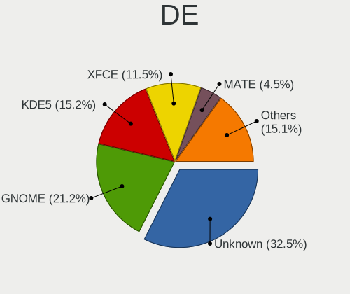
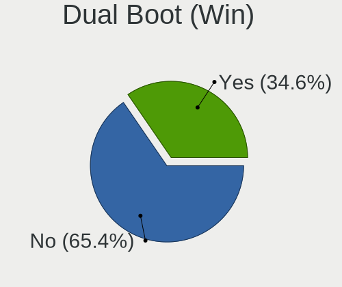
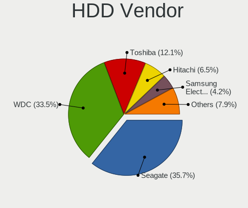

Debian - Tested Hardware & Statistics (Desktops)
------------------------------------------------

A project to collect tested hardware configurations for Debian.

Anyone can contribute to this report by the [hw-probe](https://github.com/linuxhw/hw-probe) tool:

    sudo -E hw-probe -all -upload

Please contribute! Especially if your hardware is rare.

Contents
--------

* [ Test Cases ](#test-cases)

* [ System ](#system)
  - [ OS                       ](#os)
  - [ OS Family                ](#os-family)
  - [ Kernel                   ](#kernel)
  - [ Kernel Family            ](#kernel-family)
  - [ Kernel Major Ver.        ](#kernel-major-ver)
  - [ Arch                     ](#arch)
  - [ DE                       ](#de)
  - [ Display Server           ](#display-server)
  - [ Display Manager          ](#display-manager)
  - [ OS Lang                  ](#os-lang)
  - [ Boot Mode                ](#boot-mode)
  - [ Filesystem               ](#filesystem)
  - [ Part. scheme             ](#part-scheme)
  - [ Dual Boot with Linux/BSD ](#dual-boot-with-linuxbsd)
  - [ Dual Boot (Win)          ](#dual-boot-win)

* [ Board ](#board)
  - [ Vendor                   ](#vendor)
  - [ Model                    ](#model)
  - [ Model Family             ](#model-family)
  - [ MFG Year                 ](#mfg-year)
  - [ Form Factor              ](#form-factor)
  - [ Secure Boot              ](#secure-boot)
  - [ Coreboot                 ](#coreboot)
  - [ RAM Size                 ](#ram-size)
  - [ RAM Used                 ](#ram-used)
  - [ Total Drives             ](#total-drives)
  - [ Has CD-ROM               ](#has-cd-rom)
  - [ Has Ethernet             ](#has-ethernet)
  - [ Has WiFi                 ](#has-wifi)
  - [ Has Bluetooth            ](#has-bluetooth)

* [ Location ](#location)
  - [ Country                  ](#country)
  - [ City                     ](#city)

* [ Drives ](#drives)
  - [ Drive Vendor             ](#drive-vendor)
  - [ Drive Model              ](#drive-model)
  - [ HDD Vendor               ](#hdd-vendor)
  - [ SSD Vendor               ](#ssd-vendor)
  - [ Drive Kind               ](#drive-kind)
  - [ Drive Connector          ](#drive-connector)
  - [ Drive Size               ](#drive-size)
  - [ Space Total              ](#space-total)
  - [ Space Used               ](#space-used)
  - [ Malfunc. Drives          ](#malfunc-drives)
  - [ Malfunc. Drive Vendor    ](#malfunc-drive-vendor)
  - [ Malfunc. HDD Vendor      ](#malfunc-hdd-vendor)
  - [ Malfunc. Drive Kind      ](#malfunc-drive-kind)
  - [ Failed Drives            ](#failed-drives)
  - [ Failed Drive Vendor      ](#failed-drive-vendor)
  - [ Drive Status             ](#drive-status)

* [ Storage controller ](#storage-controller)
  - [ Storage Vendor           ](#storage-vendor)
  - [ Storage Model            ](#storage-model)
  - [ Storage Kind             ](#storage-kind)

* [ Processor ](#processor)
  - [ CPU Vendor               ](#cpu-vendor)
  - [ CPU Model                ](#cpu-model)
  - [ CPU Model Family         ](#cpu-model-family)
  - [ CPU Cores                ](#cpu-cores)
  - [ CPU Sockets              ](#cpu-sockets)
  - [ CPU Threads              ](#cpu-threads)
  - [ CPU Op-Modes             ](#cpu-op-modes)
  - [ CPU Microcode            ](#cpu-microcode)
  - [ CPU Microarch            ](#cpu-microarch)

* [ Graphics ](#graphics)
  - [ GPU Vendor               ](#gpu-vendor)
  - [ GPU Model                ](#gpu-model)
  - [ GPU Combo                ](#gpu-combo)
  - [ GPU Driver               ](#gpu-driver)
  - [ GPU Memory               ](#gpu-memory)

* [ Monitor ](#monitor)
  - [ Monitor Vendor           ](#monitor-vendor)
  - [ Monitor Model            ](#monitor-model)
  - [ Monitor Resolution       ](#monitor-resolution)
  - [ Monitor Diagonal         ](#monitor-diagonal)
  - [ Monitor Width            ](#monitor-width)
  - [ Aspect Ratio             ](#aspect-ratio)
  - [ Monitor Area             ](#monitor-area)
  - [ Pixel Density            ](#pixel-density)
  - [ Multiple Monitors        ](#multiple-monitors)

* [ Network ](#network)
  - [ Net Controller Vendor    ](#net-controller-vendor)
  - [ Net Controller Model     ](#net-controller-model)
  - [ Wireless Vendor          ](#wireless-vendor)
  - [ Wireless Model           ](#wireless-model)
  - [ Ethernet Vendor          ](#ethernet-vendor)
  - [ Ethernet Model           ](#ethernet-model)
  - [ Net Controller Kind      ](#net-controller-kind)
  - [ Used Controller          ](#used-controller)
  - [ NICs                     ](#nics)
  - [ IPv6                     ](#ipv6)

* [ Bluetooth ](#bluetooth)
  - [ Bluetooth Vendor         ](#bluetooth-vendor)
  - [ Bluetooth Model          ](#bluetooth-model)

* [ Sound ](#sound)
  - [ Sound Vendor             ](#sound-vendor)
  - [ Sound Model              ](#sound-model)

* [ Memory ](#memory)
  - [ Memory Vendor            ](#memory-vendor)
  - [ Memory Model             ](#memory-model)
  - [ Memory Kind              ](#memory-kind)
  - [ Memory Form Factor       ](#memory-form-factor)
  - [ Memory Size              ](#memory-size)
  - [ Memory Speed             ](#memory-speed)

* [ Printers & scanners ](#printers--scanners)
  - [ Printer Vendor           ](#printer-vendor)
  - [ Printer Model            ](#printer-model)
  - [ Scanner Vendor           ](#scanner-vendor)
  - [ Scanner Model            ](#scanner-model)

* [ Camera ](#camera)
  - [ Camera Vendor            ](#camera-vendor)
  - [ Camera Model             ](#camera-model)

* [ Security ](#security)
  - [ Fingerprint Vendor       ](#fingerprint-vendor)
  - [ Fingerprint Model        ](#fingerprint-model)
  - [ Chipcard Vendor          ](#chipcard-vendor)
  - [ Chipcard Model           ](#chipcard-model)

* [ Unsupported ](#unsupported)
  - [ Unsupported Devices      ](#unsupported-devices)
  - [ Unsupported Device Types ](#unsupported-device-types)

Test Cases
----------

Total: 6758

| Vendor        | Model                       | Probe                                                      | Date         |
|---------------|-----------------------------|------------------------------------------------------------|--------------|
| Gigabyte      | X58A-UD3R                   | [757bac1cef](https://linux-hardware.org/?probe=757bac1cef) | Jan 01, 2024 |
| Sapphire      | PI-AM3RS760G2               | [5f34a26ab3](https://linux-hardware.org/?probe=5f34a26ab3) | Jan 01, 2024 |
| HP            | ProLiant ML310e Gen8 v2     | [7271f244c2](https://linux-hardware.org/?probe=7271f244c2) | Jan 01, 2024 |
| ASUSTek       | PRIME Z270-A                | [dea2dc38e4](https://linux-hardware.org/?probe=dea2dc38e4) | Jan 01, 2024 |
| ASUSTek       | TUF Gaming X570-PRO         | [ca2b52b64f](https://linux-hardware.org/?probe=ca2b52b64f) | Dec 31, 2023 |
| ASRock        | 990FX Extreme4              | [edf3eae913](https://linux-hardware.org/?probe=edf3eae913) | Dec 31, 2023 |
| ASUSTek       | ROG STRIX B550-E GAMING     | [eb264efa92](https://linux-hardware.org/?probe=eb264efa92) | Dec 31, 2023 |
| Gigabyte      | B650 AORUS ELITE AX         | [5f1c662ba4](https://linux-hardware.org/?probe=5f1c662ba4) | Dec 31, 2023 |
| Gigabyte      | B650 AORUS ELITE AX         | [fde784b0b5](https://linux-hardware.org/?probe=fde784b0b5) | Dec 31, 2023 |
| ASUSTek       | P11C-I Series               | [b38bcf215d](https://linux-hardware.org/?probe=b38bcf215d) | Dec 30, 2023 |
| Seeed Stud... | ODYSSEY-X86J41X5 SD-BS-C... | [90b5ba3d1e](https://linux-hardware.org/?probe=90b5ba3d1e) | Dec 30, 2023 |
| ASRock        | X300M-STX                   | [7cd1d9d16c](https://linux-hardware.org/?probe=7cd1d9d16c) | Dec 30, 2023 |
| ASRock        | X300M-STX                   | [5fa6e9f755](https://linux-hardware.org/?probe=5fa6e9f755) | Dec 30, 2023 |
| MSI           | H270 GAMING M3              | [92615e0827](https://linux-hardware.org/?probe=92615e0827) | Dec 30, 2023 |
| Gigabyte      | B550M K                     | [8340ced087](https://linux-hardware.org/?probe=8340ced087) | Dec 30, 2023 |
| HP            | 1495                        | [48d0ae2bf5](https://linux-hardware.org/?probe=48d0ae2bf5) | Dec 30, 2023 |
| Apple         | Mac-F4208AC8 PVT            | [11a7c2b836](https://linux-hardware.org/?probe=11a7c2b836) | Dec 30, 2023 |
| HC Technol... | HCAR5000-MI2                | [44a9ba60e7](https://linux-hardware.org/?probe=44a9ba60e7) | Dec 29, 2023 |
| HP            | ProLiant MicroServer        | [30f06f373e](https://linux-hardware.org/?probe=30f06f373e) | Dec 29, 2023 |
| ASRock        | X570S PG Riptide            | [aa3f2ed203](https://linux-hardware.org/?probe=aa3f2ed203) | Dec 29, 2023 |
| ASUSTek       | M5A97 R2.0                  | [c5bc64bc85](https://linux-hardware.org/?probe=c5bc64bc85) | Dec 29, 2023 |
| ASUSTek       | CM6870                      | [529b92f758](https://linux-hardware.org/?probe=529b92f758) | Dec 28, 2023 |
| Dell          | 054KM3 A01                  | [1d078128fe](https://linux-hardware.org/?probe=1d078128fe) | Dec 28, 2023 |
| MACHINIST     | X99 RS9                     | [1e431dc2fc](https://linux-hardware.org/?probe=1e431dc2fc) | Dec 28, 2023 |
| Sapphire      | PI-AM3RS760G2               | [cb13028da5](https://linux-hardware.org/?probe=cb13028da5) | Dec 28, 2023 |
| AZW           | SER V1                      | [9491b3dfb6](https://linux-hardware.org/?probe=9491b3dfb6) | Dec 28, 2023 |
| ASRock        | G41M-VS3                    | [96266413d3](https://linux-hardware.org/?probe=96266413d3) | Dec 28, 2023 |
| MSI           | PRO A620M-E                 | [b2e410ff06](https://linux-hardware.org/?probe=b2e410ff06) | Dec 28, 2023 |
| ASRock        | 990FX Extreme4              | [7345f4357e](https://linux-hardware.org/?probe=7345f4357e) | Dec 28, 2023 |
| ASRock        | 990FX Extreme4              | [de1329753d](https://linux-hardware.org/?probe=de1329753d) | Dec 28, 2023 |
| ASUSTek       | ROG STRIX B550-F GAMING     | [37fe922c9d](https://linux-hardware.org/?probe=37fe922c9d) | Dec 28, 2023 |
| ASRock        | X570 Taichi Razer Editio... | [08d900cdbb](https://linux-hardware.org/?probe=08d900cdbb) | Dec 27, 2023 |
| MSI           | X470 GAMING PLUS MAX        | [758aa4d9a1](https://linux-hardware.org/?probe=758aa4d9a1) | Dec 27, 2023 |
| Biostar       | A68N-5000                   | [19f4961efd](https://linux-hardware.org/?probe=19f4961efd) | Dec 27, 2023 |
| ASRock        | X670E Steel Legend          | [fde01139b9](https://linux-hardware.org/?probe=fde01139b9) | Dec 27, 2023 |
| Gigabyte      | Z370M D3H-CF                | [d73ec66a3a](https://linux-hardware.org/?probe=d73ec66a3a) | Dec 26, 2023 |
| Biostar       | A68N-5000                   | [39703ac1bc](https://linux-hardware.org/?probe=39703ac1bc) | Dec 26, 2023 |
| Lenovo        | 102F SDK0E50510 WIN 2625... | [9227fed37d](https://linux-hardware.org/?probe=9227fed37d) | Dec 26, 2023 |
| Gigabyte      | B75M-D3V                    | [a58934ade1](https://linux-hardware.org/?probe=a58934ade1) | Dec 26, 2023 |
| Gigabyte      | B75M-D3V                    | [8616b021c1](https://linux-hardware.org/?probe=8616b021c1) | Dec 26, 2023 |
| ASRock        | B660M Steel Legend          | [81860bf790](https://linux-hardware.org/?probe=81860bf790) | Dec 26, 2023 |
| HP            | 8876 11                     | [ffec9b5140](https://linux-hardware.org/?probe=ffec9b5140) | Dec 25, 2023 |
| Sapphire      | PI-AM3RS760G2               | [7a4d238793](https://linux-hardware.org/?probe=7a4d238793) | Dec 25, 2023 |
| Gigabyte      | B550 AORUS ELITE V2         | [9a82f5d4ae](https://linux-hardware.org/?probe=9a82f5d4ae) | Dec 25, 2023 |
| Gigabyte      | P55-UD4P                    | [62b547894e](https://linux-hardware.org/?probe=62b547894e) | Dec 25, 2023 |
| MSI           | MPG X570S CARBON MAX WIF... | [463b7572aa](https://linux-hardware.org/?probe=463b7572aa) | Dec 25, 2023 |
| ASUSTek       | Z97-A-USB31                 | [7789aa889f](https://linux-hardware.org/?probe=7789aa889f) | Dec 24, 2023 |
| Intel         | D34010WYK H14771-304        | [95ab790a9c](https://linux-hardware.org/?probe=95ab790a9c) | Dec 24, 2023 |
| MSI           | H110M PRO-VH PLUS           | [3c112941d6](https://linux-hardware.org/?probe=3c112941d6) | Dec 24, 2023 |
| iRU           | LPGR.469559.012             | [0f955d2b87](https://linux-hardware.org/?probe=0f955d2b87) | Dec 24, 2023 |
| ASRock        | 990FX Extreme4              | [d698ea94f5](https://linux-hardware.org/?probe=d698ea94f5) | Dec 24, 2023 |
| ASRock        | 990FX Extreme4              | [bfe0870fab](https://linux-hardware.org/?probe=bfe0870fab) | Dec 24, 2023 |
| ASRock        | 990FX Extreme4              | [d6c1f0d202](https://linux-hardware.org/?probe=d6c1f0d202) | Dec 24, 2023 |
| HP            | 1998                        | [c2e72e513c](https://linux-hardware.org/?probe=c2e72e513c) | Dec 23, 2023 |
| Gigabyte      | M68MT-S2                    | [ba4e48312e](https://linux-hardware.org/?probe=ba4e48312e) | Dec 23, 2023 |
| ASUSTek       | M4A785-M                    | [fe6c638acc](https://linux-hardware.org/?probe=fe6c638acc) | Dec 23, 2023 |
| Gigabyte      | M68MT-S2                    | [e91530e41d](https://linux-hardware.org/?probe=e91530e41d) | Dec 23, 2023 |
| MSI           | MPG B760I EDGE WIFI DDR4    | [58bbd67a73](https://linux-hardware.org/?probe=58bbd67a73) | Dec 23, 2023 |
| T-bao Tian... | GOD78                       | [cd28753d06](https://linux-hardware.org/?probe=cd28753d06) | Dec 23, 2023 |
| eMachines     | EMCP61M                     | [d464b480dd](https://linux-hardware.org/?probe=d464b480dd) | Dec 23, 2023 |
| Gigabyte      | X570 AORUS ELITE WIFI       | [6c9e82db47](https://linux-hardware.org/?probe=6c9e82db47) | Dec 23, 2023 |
| HPE           | ProLiant MicroServer Gen... | [4d38d67af1](https://linux-hardware.org/?probe=4d38d67af1) | Dec 23, 2023 |
| Gigabyte      | X570 AORUS PRO WIFI         | [bbd50ba27b](https://linux-hardware.org/?probe=bbd50ba27b) | Dec 23, 2023 |
| Gigabyte      | B550 AORUS ELITE V2         | [f71924e3e4](https://linux-hardware.org/?probe=f71924e3e4) | Dec 22, 2023 |
| MSI           | B75A-G43                    | [70c44f3ff8](https://linux-hardware.org/?probe=70c44f3ff8) | Dec 22, 2023 |
| ASUSTek       | B150-PRO D3                 | [a686071950](https://linux-hardware.org/?probe=a686071950) | Dec 22, 2023 |
| Gigabyte      | B560M AORUS ELITE           | [82304c2a5f](https://linux-hardware.org/?probe=82304c2a5f) | Dec 21, 2023 |
| ASUSTek       | Maximus VIII RANGER         | [b87a575222](https://linux-hardware.org/?probe=b87a575222) | Dec 21, 2023 |
| ASRock        | B760 Pro RS/D4              | [4b020f53e1](https://linux-hardware.org/?probe=4b020f53e1) | Dec 21, 2023 |
| Dell          | 0NKW6Y A02                  | [d41c926291](https://linux-hardware.org/?probe=d41c926291) | Dec 21, 2023 |
| AZW           | EQ                          | [11b8a012c0](https://linux-hardware.org/?probe=11b8a012c0) | Dec 21, 2023 |
| ASUSTek       | ROG STRIX Z690-E GAMING ... | [47d1d26375](https://linux-hardware.org/?probe=47d1d26375) | Dec 21, 2023 |
| ASUSTek       | TUF Gaming B550M-PLUS       | [d5f60126bb](https://linux-hardware.org/?probe=d5f60126bb) | Dec 20, 2023 |
| HP            | 3396                        | [d0d084ecc8](https://linux-hardware.org/?probe=d0d084ecc8) | Dec 20, 2023 |
| ASUSTek       | TUF Gaming B650M-E WIFI     | [2464a532b8](https://linux-hardware.org/?probe=2464a532b8) | Dec 20, 2023 |
| Dell          | 0D6H9T A00                  | [2c968508ee](https://linux-hardware.org/?probe=2c968508ee) | Dec 20, 2023 |
| Gigabyte      | Z77X-UD3H                   | [25a077d35e](https://linux-hardware.org/?probe=25a077d35e) | Dec 20, 2023 |
| ASUSTek       | V6-P5G31E                   | [83a8408a7e](https://linux-hardware.org/?probe=83a8408a7e) | Dec 20, 2023 |
| Gigabyte      | H370M DS3H-CF               | [4b6f645ef6](https://linux-hardware.org/?probe=4b6f645ef6) | Dec 20, 2023 |
| Unknown       | Unknown                     | [32f0587c3f](https://linux-hardware.org/?probe=32f0587c3f) | Dec 20, 2023 |
| Unknown       | Unknown                     | [2ff77e3571](https://linux-hardware.org/?probe=2ff77e3571) | Dec 20, 2023 |
| Gigabyte      | B85M-D3H                    | [a641f9b41d](https://linux-hardware.org/?probe=a641f9b41d) | Dec 20, 2023 |
| ASUSTek       | PRIME H510M-K               | [b6b4165e86](https://linux-hardware.org/?probe=b6b4165e86) | Dec 20, 2023 |
| ASUSTek       | PRIME A320M-K               | [3eead324a8](https://linux-hardware.org/?probe=3eead324a8) | Dec 19, 2023 |
| ASRock        | 970M Pro3                   | [85233c464d](https://linux-hardware.org/?probe=85233c464d) | Dec 19, 2023 |
| ASUSTek       | H110M-R                     | [ca0eab5d48](https://linux-hardware.org/?probe=ca0eab5d48) | Dec 19, 2023 |
| ASRock        | 970M Pro3                   | [acebee7435](https://linux-hardware.org/?probe=acebee7435) | Dec 19, 2023 |
| Lenovo        | 30BE SDK0J40697 WIN 3305... | [9b8d8ec134](https://linux-hardware.org/?probe=9b8d8ec134) | Dec 19, 2023 |
| Lenovo        | MAHOBAY NOK                 | [7fe77a3476](https://linux-hardware.org/?probe=7fe77a3476) | Dec 19, 2023 |
| Lenovo        | 30BE SDK0J40705 WIN 3425... | [65b6d3dcc0](https://linux-hardware.org/?probe=65b6d3dcc0) | Dec 19, 2023 |
| Lenovo        | 30BE SDK0J40705 WIN 3425... | [ab5bffcf0a](https://linux-hardware.org/?probe=ab5bffcf0a) | Dec 19, 2023 |
| Lenovo        | SHARKBAY 0B98401 PRO        | [9f3471e435](https://linux-hardware.org/?probe=9f3471e435) | Dec 19, 2023 |
| Lenovo        | SKYBAY SDK0J40705 WIN 34... | [752a59a0cc](https://linux-hardware.org/?probe=752a59a0cc) | Dec 19, 2023 |
| Lenovo        | SHARKBAY SDK0E50510 WIN     | [bff7dced45](https://linux-hardware.org/?probe=bff7dced45) | Dec 19, 2023 |
| ASUSTek       | H110M-R                     | [61211b72bb](https://linux-hardware.org/?probe=61211b72bb) | Dec 19, 2023 |
| Lenovo        | SHARKBAY 0B98401 PRO        | [993b9536cf](https://linux-hardware.org/?probe=993b9536cf) | Dec 19, 2023 |
| Lenovo        | 30BE SDK0J40705 WIN 3425... | [782dad2128](https://linux-hardware.org/?probe=782dad2128) | Dec 19, 2023 |
| MSI           | MAG Z790 TOMAHAWK WIFI      | [619bbec719](https://linux-hardware.org/?probe=619bbec719) | Dec 19, 2023 |
| ASUSTek       | ROG STRIX Z690-E GAMING ... | [6a962e40ec](https://linux-hardware.org/?probe=6a962e40ec) | Dec 19, 2023 |
| Biostar       | A55MH                       | [f1106ef8c7](https://linux-hardware.org/?probe=f1106ef8c7) | Dec 19, 2023 |
| MSI           | B450M BAZOOKA               | [0bfcb5be94](https://linux-hardware.org/?probe=0bfcb5be94) | Dec 19, 2023 |
| ASUSTek       | ROG STRIX B560-E GAMING ... | [fd9a0ec0c4](https://linux-hardware.org/?probe=fd9a0ec0c4) | Dec 19, 2023 |
| HP            | 1998                        | [1d45f9958a](https://linux-hardware.org/?probe=1d45f9958a) | Dec 18, 2023 |
| Gigabyte      | B85M-D3H                    | [95d29a0474](https://linux-hardware.org/?probe=95d29a0474) | Dec 18, 2023 |
| Gigabyte      | H510M H V2                  | [3228539880](https://linux-hardware.org/?probe=3228539880) | Dec 18, 2023 |
| Unknown       | Unknown                     | [3764b249f4](https://linux-hardware.org/?probe=3764b249f4) | Dec 18, 2023 |
| MSI           | A75MA-G55                   | [6af3c61744](https://linux-hardware.org/?probe=6af3c61744) | Dec 18, 2023 |
| ASUSTek       | PRIME B660M-A WIFI D4       | [2eb95b1a7c](https://linux-hardware.org/?probe=2eb95b1a7c) | Dec 18, 2023 |
| Gigabyte      | B450 AORUS PRO WIFI-CF      | [79c73e5927](https://linux-hardware.org/?probe=79c73e5927) | Dec 17, 2023 |
| Dell          | 0782GW A00                  | [bb37946b48](https://linux-hardware.org/?probe=bb37946b48) | Dec 17, 2023 |
| Dell          | 0782GW A00                  | [a4753bb26d](https://linux-hardware.org/?probe=a4753bb26d) | Dec 17, 2023 |
| Gigabyte      | X570S UD                    | [058c14cd39](https://linux-hardware.org/?probe=058c14cd39) | Dec 17, 2023 |
| ASUSTek       | TUF H310M-PLUS GAMING/BR    | [b6b44f1b80](https://linux-hardware.org/?probe=b6b44f1b80) | Dec 17, 2023 |
| ASUSTek       | P4P800-VM                   | [8fb6faae11](https://linux-hardware.org/?probe=8fb6faae11) | Dec 17, 2023 |
| Dell          | 06X1TJ A00                  | [b9738c48b0](https://linux-hardware.org/?probe=b9738c48b0) | Dec 17, 2023 |
| ASUSTek       | PRIME A520M-E               | [02e1fcae39](https://linux-hardware.org/?probe=02e1fcae39) | Dec 17, 2023 |
| ASUSTek       | PRIME A520M-E               | [c878de7adb](https://linux-hardware.org/?probe=c878de7adb) | Dec 17, 2023 |
| ASRock        | 990FX Extreme4              | [ad7f762f22](https://linux-hardware.org/?probe=ad7f762f22) | Dec 17, 2023 |
| Gigabyte      | F2A88XN-WIFI                | [90024d365b](https://linux-hardware.org/?probe=90024d365b) | Dec 17, 2023 |
| Gigabyte      | B85M-D3H                    | [4d81e6300c](https://linux-hardware.org/?probe=4d81e6300c) | Dec 17, 2023 |
| ASUSTek       | Pro WS W680M-ACE SE         | [f1b9ec56ea](https://linux-hardware.org/?probe=f1b9ec56ea) | Dec 16, 2023 |
| Gigabyte      | B550 AORUS ELITE V2         | [e8847d53ec](https://linux-hardware.org/?probe=e8847d53ec) | Dec 16, 2023 |
| Fujitsu       | D3513-A1 S26361-D3513-A1    | [6f4f0f65bb](https://linux-hardware.org/?probe=6f4f0f65bb) | Dec 15, 2023 |
| Dell          | 0M5WNK A02                  | [f47a8fcf1f](https://linux-hardware.org/?probe=f47a8fcf1f) | Dec 15, 2023 |
| Fujitsu       | D3233-A1 S26361-D3233-A1    | [a785d6574b](https://linux-hardware.org/?probe=a785d6574b) | Dec 15, 2023 |
| Inventec      | DQ Class A02                | [98e30b12f1](https://linux-hardware.org/?probe=98e30b12f1) | Dec 15, 2023 |
| ASUSTek       | M5A99FX PRO R2.0            | [969d4fd521](https://linux-hardware.org/?probe=969d4fd521) | Dec 15, 2023 |
| ASUSTek       | TUF Gaming Z490-PLUS        | [a80537094f](https://linux-hardware.org/?probe=a80537094f) | Dec 15, 2023 |
| MSI           | PRO B650-P WIFI             | [06ed7608bf](https://linux-hardware.org/?probe=06ed7608bf) | Dec 15, 2023 |
| Biostar       | A32M2                       | [f3fb9d0673](https://linux-hardware.org/?probe=f3fb9d0673) | Dec 15, 2023 |
| Gigabyte      | B250M-D2V-CF                | [e0e94706d7](https://linux-hardware.org/?probe=e0e94706d7) | Dec 15, 2023 |
| ASRock        | 990FX Extreme4              | [46178ea298](https://linux-hardware.org/?probe=46178ea298) | Dec 14, 2023 |
| MSI           | PRO B760-P WIFI DDR4        | [0305f80c2d](https://linux-hardware.org/?probe=0305f80c2d) | Dec 14, 2023 |
| Gigabyte      | P35-DS4                     | [23e146afdc](https://linux-hardware.org/?probe=23e146afdc) | Dec 14, 2023 |
| HP            | 8463                        | [0d01616e1c](https://linux-hardware.org/?probe=0d01616e1c) | Dec 14, 2023 |
| ASUSTek       | SABERTOOTH 990FX R2.0       | [545a3cecbc](https://linux-hardware.org/?probe=545a3cecbc) | Dec 14, 2023 |
| ASRock        | 990FX Extreme4              | [f1860954b3](https://linux-hardware.org/?probe=f1860954b3) | Dec 14, 2023 |
| ASRock        | 990FX Extreme4              | [1ed13ea8f2](https://linux-hardware.org/?probe=1ed13ea8f2) | Dec 14, 2023 |
| ASRock        | 990FX Extreme4              | [eafb9ad287](https://linux-hardware.org/?probe=eafb9ad287) | Dec 14, 2023 |
| ASRock        | 990FX Extreme4              | [3504153caa](https://linux-hardware.org/?probe=3504153caa) | Dec 14, 2023 |
| Gigabyte      | F2A88XM-HD3                 | [f2efee9279](https://linux-hardware.org/?probe=f2efee9279) | Dec 13, 2023 |
| Gigabyte      | F2A88XM-HD3                 | [0e23ff0a06](https://linux-hardware.org/?probe=0e23ff0a06) | Dec 13, 2023 |
| Sapphire      | PI-AM3RS760G2               | [1668553525](https://linux-hardware.org/?probe=1668553525) | Dec 13, 2023 |
| Sapphire      | PI-AM3RS760G2               | [89bef2fed5](https://linux-hardware.org/?probe=89bef2fed5) | Dec 13, 2023 |
| Sapphire      | PI-AM3RS760G2               | [0ed1d85207](https://linux-hardware.org/?probe=0ed1d85207) | Dec 13, 2023 |
| Acer          | Aspire 1510 Rev.A           | [452be93d1b](https://linux-hardware.org/?probe=452be93d1b) | Dec 13, 2023 |
| ASUSTek       | PRIME B450M-A               | [5a65590bed](https://linux-hardware.org/?probe=5a65590bed) | Dec 13, 2023 |
| ASUSTek       | P5G41T-M LE                 | [e6205fb709](https://linux-hardware.org/?probe=e6205fb709) | Dec 13, 2023 |
| ASUSTek       | P8H61                       | [6f5272ea27](https://linux-hardware.org/?probe=6f5272ea27) | Dec 13, 2023 |
| ASUSTek       | P8H77-V                     | [6b62180e3e](https://linux-hardware.org/?probe=6b62180e3e) | Dec 12, 2023 |
| Intel         | JSL MRD                     | [c811c8be03](https://linux-hardware.org/?probe=c811c8be03) | Dec 12, 2023 |
| Dell          | 0MGK50 A01                  | [7471a7b26e](https://linux-hardware.org/?probe=7471a7b26e) | Dec 12, 2023 |
| Dell          | 0VD5HY A10                  | [366f1ac830](https://linux-hardware.org/?probe=366f1ac830) | Dec 12, 2023 |
| MSI           | PRO B760-P WIFI DDR4        | [a9059220f3](https://linux-hardware.org/?probe=a9059220f3) | Dec 12, 2023 |
| Fujitsu       | JIH61Y3                     | [cb566e2fd0](https://linux-hardware.org/?probe=cb566e2fd0) | Dec 12, 2023 |
| Lenovo        | 3140 SDK0J40697 WIN 3305... | [d5500a3830](https://linux-hardware.org/?probe=d5500a3830) | Dec 11, 2023 |
| Gigabyte      | H610M H DDR4                | [88b93b571e](https://linux-hardware.org/?probe=88b93b571e) | Dec 11, 2023 |
| Intel         | DZ77SL-50K AAG55115-300     | [29590179a8](https://linux-hardware.org/?probe=29590179a8) | Dec 11, 2023 |
| Unknown       | Unknown                     | [2c6a120dd2](https://linux-hardware.org/?probe=2c6a120dd2) | Dec 10, 2023 |
| MSI           | B560M PRO-VDH               | [4a2deac69b](https://linux-hardware.org/?probe=4a2deac69b) | Dec 10, 2023 |
| Packard Be... | MCP73PV                     | [9d707e64d4](https://linux-hardware.org/?probe=9d707e64d4) | Dec 10, 2023 |
| HP            | 0968h                       | [b1fb94198e](https://linux-hardware.org/?probe=b1fb94198e) | Dec 10, 2023 |
| MSI           | B350 TOMAHAWK               | [18f6c41058](https://linux-hardware.org/?probe=18f6c41058) | Dec 10, 2023 |
| Dell          | 0HY9JP A02                  | [25d8aaca3c](https://linux-hardware.org/?probe=25d8aaca3c) | Dec 10, 2023 |
| Intel         | DZ77SL-50K AAG55115-300     | [c1d93cb6b2](https://linux-hardware.org/?probe=c1d93cb6b2) | Dec 09, 2023 |
| ASUSTek       | PRIME B450M-K               | [c02997fc15](https://linux-hardware.org/?probe=c02997fc15) | Dec 09, 2023 |
| AZW           | MINI S                      | [2512b54e60](https://linux-hardware.org/?probe=2512b54e60) | Dec 09, 2023 |
| MSI           | Z97S SLI Krait Edition      | [2b1117b052](https://linux-hardware.org/?probe=2b1117b052) | Dec 09, 2023 |
| Lenovo        | 3098 SDK0J40705 WIN 3425... | [647f96ad2c](https://linux-hardware.org/?probe=647f96ad2c) | Dec 08, 2023 |
| ASUSTek       | TUF Gaming B550-PLUS        | [cc6cd166f2](https://linux-hardware.org/?probe=cc6cd166f2) | Dec 08, 2023 |
| ASUSTek       | TUF Z370-PLUS GAMING        | [7ca4962c57](https://linux-hardware.org/?probe=7ca4962c57) | Dec 08, 2023 |
| Shenzhen M... | F6BFC                       | [67371c6af4](https://linux-hardware.org/?probe=67371c6af4) | Dec 08, 2023 |
| MSI           | G31TM-P35                   | [e241cfaeca](https://linux-hardware.org/?probe=e241cfaeca) | Dec 08, 2023 |
| MSI           | MEG X399 CREATION           | [02adc5ef8b](https://linux-hardware.org/?probe=02adc5ef8b) | Dec 08, 2023 |
| Dell          | 0KP561                      | [bd0971e9cc](https://linux-hardware.org/?probe=bd0971e9cc) | Dec 08, 2023 |
| Dell          | 04YP6J A01                  | [186bb25f07](https://linux-hardware.org/?probe=186bb25f07) | Dec 08, 2023 |
| Intel         | JSL MRD                     | [fb3b75c8cc](https://linux-hardware.org/?probe=fb3b75c8cc) | Dec 07, 2023 |
| HP            | 339A                        | [a114886e67](https://linux-hardware.org/?probe=a114886e67) | Dec 07, 2023 |
| ASUSTek       | Pro B560M-C                 | [116dce4b93](https://linux-hardware.org/?probe=116dce4b93) | Dec 07, 2023 |
| ASUSTek       | TUF Gaming X570-PLUS        | [39a966c6da](https://linux-hardware.org/?probe=39a966c6da) | Dec 07, 2023 |
| Intel         | H61                         | [fbc4dc7436](https://linux-hardware.org/?probe=fbc4dc7436) | Dec 06, 2023 |
| Gigabyte      | X570 GAMING X               | [b7070058fb](https://linux-hardware.org/?probe=b7070058fb) | Dec 06, 2023 |
| ASUSTek       | P8H61-M LX3 R2.0            | [7bd10d1922](https://linux-hardware.org/?probe=7bd10d1922) | Dec 05, 2023 |
| Unknown       | Unknown                     | [56dab5d412](https://linux-hardware.org/?probe=56dab5d412) | Dec 04, 2023 |
| ASUSTek       | SABERTOOTH 990FX R2.0       | [76fdeed52e](https://linux-hardware.org/?probe=76fdeed52e) | Dec 04, 2023 |
| Dell          | 0RN474                      | [17392605bb](https://linux-hardware.org/?probe=17392605bb) | Dec 04, 2023 |
| ASUSTek       | P8Z68-V PRO                 | [fde3c9253f](https://linux-hardware.org/?probe=fde3c9253f) | Dec 04, 2023 |
| HP            | 8619                        | [a33e273f33](https://linux-hardware.org/?probe=a33e273f33) | Dec 04, 2023 |
| ASUSTek       | Maximus VIII RANGER         | [830b83bf5c](https://linux-hardware.org/?probe=830b83bf5c) | Dec 03, 2023 |
| ASUSTek       | Maximus VIII RANGER         | [83b954a1cd](https://linux-hardware.org/?probe=83b954a1cd) | Dec 03, 2023 |
| ASUSTek       | Z97-P                       | [c4e675a705](https://linux-hardware.org/?probe=c4e675a705) | Dec 03, 2023 |
| HP            | ProLiant MicroServer Gen... | [47222bf19c](https://linux-hardware.org/?probe=47222bf19c) | Dec 03, 2023 |
| HP            | ProLiant MicroServer Gen... | [5a5296e72f](https://linux-hardware.org/?probe=5a5296e72f) | Dec 03, 2023 |
| Dell          | 0KWVT8 A02                  | [3c6a13271b](https://linux-hardware.org/?probe=3c6a13271b) | Dec 03, 2023 |
| MSI           | MAG Z790 TOMAHAWK WIFI      | [a28372598e](https://linux-hardware.org/?probe=a28372598e) | Dec 03, 2023 |
| ASUSTek       | ROG STRIX X670E-E GAMING... | [bb1b02ee0c](https://linux-hardware.org/?probe=bb1b02ee0c) | Dec 03, 2023 |
| ASUSTek       | TUF Gaming X570-PLUS_BR     | [5aeec2e399](https://linux-hardware.org/?probe=5aeec2e399) | Dec 03, 2023 |
| IceWhale T... | ZimaBoard 832 ZMB           | [a24f117537](https://linux-hardware.org/?probe=a24f117537) | Dec 02, 2023 |
| Intel         | DQ67SW AAG12527-309         | [99293a328c](https://linux-hardware.org/?probe=99293a328c) | Dec 02, 2023 |
| Intel         | DQ67SW AAG12527-309         | [b8e3a992b3](https://linux-hardware.org/?probe=b8e3a992b3) | Dec 02, 2023 |
| Gigabyte      | H97M-HD3                    | [aa52a8ceac](https://linux-hardware.org/?probe=aa52a8ceac) | Dec 02, 2023 |
| Dell          | 02YRK5 A02                  | [73c15b7e61](https://linux-hardware.org/?probe=73c15b7e61) | Dec 02, 2023 |
| Unknown       | Unknown                     | [d0bbc73e29](https://linux-hardware.org/?probe=d0bbc73e29) | Dec 02, 2023 |
| Gigabyte      | H470 HD3                    | [0b9cf3a0a5](https://linux-hardware.org/?probe=0b9cf3a0a5) | Dec 02, 2023 |
| ASUSTek       | Z97-P                       | [109cecbcba](https://linux-hardware.org/?probe=109cecbcba) | Dec 01, 2023 |
| Dell          | 0VRWRC A00                  | [13e072ec20](https://linux-hardware.org/?probe=13e072ec20) | Dec 01, 2023 |
| Gigabyte      | B760M DS3H AX DDR4          | [8a625099b1](https://linux-hardware.org/?probe=8a625099b1) | Dec 01, 2023 |
| HP            | 212B                        | [dc1382e549](https://linux-hardware.org/?probe=dc1382e549) | Dec 01, 2023 |
| ASRock        | 970 Extreme4                | [4ab4cd31f3](https://linux-hardware.org/?probe=4ab4cd31f3) | Nov 30, 2023 |
| MSI           | A78M-E45                    | [fd9a5e65e4](https://linux-hardware.org/?probe=fd9a5e65e4) | Nov 30, 2023 |
| ASUSTek       | P5N-MX                      | [c586157333](https://linux-hardware.org/?probe=c586157333) | Nov 30, 2023 |
| HP            | 8053                        | [a2b9b5d498](https://linux-hardware.org/?probe=a2b9b5d498) | Nov 30, 2023 |
| ASUSTek       | TUF H310M-PLUS GAMING/BR    | [cf7d8fdbf1](https://linux-hardware.org/?probe=cf7d8fdbf1) | Nov 30, 2023 |
| Gigabyte      | B450 AORUS M                | [4bac6b7cd5](https://linux-hardware.org/?probe=4bac6b7cd5) | Nov 30, 2023 |
| Gigabyte      | B450 AORUS M                | [ede8970ea9](https://linux-hardware.org/?probe=ede8970ea9) | Nov 30, 2023 |
| ASUSTek       | ROG STRIX B650E-F GAMING... | [c7b394b498](https://linux-hardware.org/?probe=c7b394b498) | Nov 30, 2023 |
| Dell          | 0427JK A00                  | [38e526321f](https://linux-hardware.org/?probe=38e526321f) | Nov 29, 2023 |
| Dell          | 0PU052                      | [9035e39786](https://linux-hardware.org/?probe=9035e39786) | Nov 29, 2023 |
| MACHINIST     | X99 RS9                     | [722f516451](https://linux-hardware.org/?probe=722f516451) | Nov 29, 2023 |
| HP            | 304Ah                       | [03437e0238](https://linux-hardware.org/?probe=03437e0238) | Nov 29, 2023 |
| HP            | 8643 SMVB                   | [dae10e70d0](https://linux-hardware.org/?probe=dae10e70d0) | Nov 29, 2023 |
| Gigabyte      | G41MT-S2P                   | [6a2c279391](https://linux-hardware.org/?probe=6a2c279391) | Nov 29, 2023 |
| Lenovo        | 1048 SDK0J40697 WIN 3305... | [af727ea890](https://linux-hardware.org/?probe=af727ea890) | Nov 29, 2023 |
| HC Technol... | HCAR5000-MI                 | [7ff2232073](https://linux-hardware.org/?probe=7ff2232073) | Nov 29, 2023 |
| ASUSTek       | PRIME B450-PLUS             | [cf46975c18](https://linux-hardware.org/?probe=cf46975c18) | Nov 28, 2023 |
| ASRock        | B365 Phantom Gaming 4       | [b3de42156e](https://linux-hardware.org/?probe=b3de42156e) | Nov 28, 2023 |
| ASRock        | H61DE/S3                    | [50d5c63e0f](https://linux-hardware.org/?probe=50d5c63e0f) | Nov 28, 2023 |
| MSI           | X299 GAMING PRO CARBON      | [07d105a830](https://linux-hardware.org/?probe=07d105a830) | Nov 28, 2023 |
| Gigabyte      | H470 HD3                    | [0ecb969c2c](https://linux-hardware.org/?probe=0ecb969c2c) | Nov 28, 2023 |
| Inventec      | DQ Class A02                | [760cc39516](https://linux-hardware.org/?probe=760cc39516) | Nov 27, 2023 |
| MSI           | MPG X570 GAMING PLUS        | [2289ab10b3](https://linux-hardware.org/?probe=2289ab10b3) | Nov 27, 2023 |
| AZW           | MINI S                      | [ea6ad73049](https://linux-hardware.org/?probe=ea6ad73049) | Nov 27, 2023 |
| AZW           | MINI S                      | [54b3a350cc](https://linux-hardware.org/?probe=54b3a350cc) | Nov 27, 2023 |
| Gigabyte      | B450M DS3H-CF               | [5d7a20cf12](https://linux-hardware.org/?probe=5d7a20cf12) | Nov 27, 2023 |
| Gigabyte      | X570 GAMING X               | [4609a7f037](https://linux-hardware.org/?probe=4609a7f037) | Nov 27, 2023 |
| ECS           | G31T-M9                     | [fa44ca9239](https://linux-hardware.org/?probe=fa44ca9239) | Nov 27, 2023 |
| Gigabyte      | 970A-DS3P                   | [182a3875c4](https://linux-hardware.org/?probe=182a3875c4) | Nov 27, 2023 |
| Gigabyte      | 970A-DS3P                   | [196be5def7](https://linux-hardware.org/?probe=196be5def7) | Nov 27, 2023 |
| ASUSTek       | P8Z77-M                     | [02ece75e31](https://linux-hardware.org/?probe=02ece75e31) | Nov 27, 2023 |
| Gigabyte      | B550I AORUS PRO AX          | [007cf510b3](https://linux-hardware.org/?probe=007cf510b3) | Nov 26, 2023 |
| ASRock        | B365 Phantom Gaming 4       | [97dfb05d56](https://linux-hardware.org/?probe=97dfb05d56) | Nov 26, 2023 |
| MSI           | B85M-G43                    | [c8c114c2df](https://linux-hardware.org/?probe=c8c114c2df) | Nov 26, 2023 |
| ASUSTek       | ROG STRIX Z370-H GAMING     | [6005ac3fdd](https://linux-hardware.org/?probe=6005ac3fdd) | Nov 26, 2023 |
| ASUSTek       | H97-PLUS                    | [e4c365b554](https://linux-hardware.org/?probe=e4c365b554) | Nov 26, 2023 |
| ASUSTek       | TUF Gaming B650-PLUS WIF... | [aaf90bfd52](https://linux-hardware.org/?probe=aaf90bfd52) | Nov 25, 2023 |
| ASRock        | H61M-GS                     | [b1448b5814](https://linux-hardware.org/?probe=b1448b5814) | Nov 25, 2023 |
| ASUSTek       | P8H77-V                     | [73eebdebc2](https://linux-hardware.org/?probe=73eebdebc2) | Nov 25, 2023 |
| ASUSTek       | PRIME A320M-K               | [e2bbfbaca9](https://linux-hardware.org/?probe=e2bbfbaca9) | Nov 25, 2023 |
| ASUSTek       | PRIME B660M-K D4            | [a6ab0954e0](https://linux-hardware.org/?probe=a6ab0954e0) | Nov 25, 2023 |
| Unknown       | HX90                        | [b4eef50430](https://linux-hardware.org/?probe=b4eef50430) | Nov 25, 2023 |
| ASUSTek       | ROG STRIX B650E-F GAMING... | [84fefe8e38](https://linux-hardware.org/?probe=84fefe8e38) | Nov 25, 2023 |
| Fujitsu       | D3233-A1 S26361-D3233-A1    | [dc456b5cc5](https://linux-hardware.org/?probe=dc456b5cc5) | Nov 24, 2023 |
| ASUSTek       | B85M-G                      | [6497745451](https://linux-hardware.org/?probe=6497745451) | Nov 24, 2023 |
| Acer          | Veriton N4660G              | [2d59329fc6](https://linux-hardware.org/?probe=2d59329fc6) | Nov 24, 2023 |
| AZW           | U59                         | [b03056a1ad](https://linux-hardware.org/?probe=b03056a1ad) | Nov 24, 2023 |
| Gigabyte      | G41MT-S2P                   | [00ef59a95d](https://linux-hardware.org/?probe=00ef59a95d) | Nov 24, 2023 |
| Inventec      | D CLASS A02                 | [d8e9de7c1d](https://linux-hardware.org/?probe=d8e9de7c1d) | Nov 23, 2023 |
| ASUSTek       | PRIME X670-P WIFI           | [9d776a8aa8](https://linux-hardware.org/?probe=9d776a8aa8) | Nov 23, 2023 |
| ASRock        | 4Core1600-GLAN              | [d850b7a222](https://linux-hardware.org/?probe=d850b7a222) | Nov 23, 2023 |
| Acer          | Veriton K8-680G V:1.0       | [415b88184f](https://linux-hardware.org/?probe=415b88184f) | Nov 23, 2023 |
| Gigabyte      | MZBAYAP-00                  | [101c96a0c0](https://linux-hardware.org/?probe=101c96a0c0) | Nov 22, 2023 |
| Gigabyte      | MZBAYAP-00                  | [f990b64367](https://linux-hardware.org/?probe=f990b64367) | Nov 22, 2023 |
| ASRock        | B450M Pro4                  | [1a0c353a8e](https://linux-hardware.org/?probe=1a0c353a8e) | Nov 22, 2023 |
| ASRock        | AB350 Pro4                  | [eff446af17](https://linux-hardware.org/?probe=eff446af17) | Nov 22, 2023 |
| Gigabyte      | X299 AORUS Gaming 7         | [04e88a7e08](https://linux-hardware.org/?probe=04e88a7e08) | Nov 22, 2023 |
| Lenovo        | MAHOBAY NO DPK              | [e0781004e0](https://linux-hardware.org/?probe=e0781004e0) | Nov 22, 2023 |
| Huanan        | X99-F8D PLUS V1.2           | [2edde2bb35](https://linux-hardware.org/?probe=2edde2bb35) | Nov 22, 2023 |
| ASUSTek       | BM2AD_D510MT_D310MT         | [03140aee39](https://linux-hardware.org/?probe=03140aee39) | Nov 22, 2023 |
| Gigabyte      | B450 AORUS M                | [942a2e278a](https://linux-hardware.org/?probe=942a2e278a) | Nov 22, 2023 |
| Gigabyte      | B450 AORUS M                | [11bf0b075f](https://linux-hardware.org/?probe=11bf0b075f) | Nov 22, 2023 |
| Gigabyte      | B85M-D3H                    | [f6c29a55ad](https://linux-hardware.org/?probe=f6c29a55ad) | Nov 22, 2023 |
| MSI           | PRO B760M-P DDR4            | [f892ee3011](https://linux-hardware.org/?probe=f892ee3011) | Nov 21, 2023 |
| Lenovo        | SHARKBAY 0B98401 PRO        | [a38fd35585](https://linux-hardware.org/?probe=a38fd35585) | Nov 21, 2023 |
| ASUSTek       | PRIME X370-PRO              | [26da233e2b](https://linux-hardware.org/?probe=26da233e2b) | Nov 21, 2023 |
| ASRock        | B450M-HDV R4.0              | [a51c296185](https://linux-hardware.org/?probe=a51c296185) | Nov 21, 2023 |
| MSI           | G31M3                       | [d9e2a5683a](https://linux-hardware.org/?probe=d9e2a5683a) | Nov 20, 2023 |
| Dell          | 0D6H9T A02                  | [034fe5ff39](https://linux-hardware.org/?probe=034fe5ff39) | Nov 20, 2023 |
| HP            | ProLiant MicroServer Gen... | [885444b8af](https://linux-hardware.org/?probe=885444b8af) | Nov 20, 2023 |
| HP            | 1905                        | [7718b065fd](https://linux-hardware.org/?probe=7718b065fd) | Nov 20, 2023 |
| MSI           | H110M PRO-VD                | [9fab1b4add](https://linux-hardware.org/?probe=9fab1b4add) | Nov 20, 2023 |
| ASUSTek       | P8H61-M LX3 R2.0            | [7d8f15f875](https://linux-hardware.org/?probe=7d8f15f875) | Nov 20, 2023 |
| Gigabyte      | B75M-D3V                    | [48a562a1b6](https://linux-hardware.org/?probe=48a562a1b6) | Nov 20, 2023 |
| ADLINK Tec... | MXE5400                     | [ae09533003](https://linux-hardware.org/?probe=ae09533003) | Nov 20, 2023 |
| HP            | ProLiant ML310e Gen8 v2     | [eccc68d336](https://linux-hardware.org/?probe=eccc68d336) | Nov 20, 2023 |
| Gigabyte      | B450M DS3H V2               | [ac68da4f7c](https://linux-hardware.org/?probe=ac68da4f7c) | Nov 19, 2023 |
| ASRock        | B550M-ITX/ac                | [c9b5f09ea5](https://linux-hardware.org/?probe=c9b5f09ea5) | Nov 19, 2023 |
| ASRock        | B550M-ITX/ac                | [c76562a6ce](https://linux-hardware.org/?probe=c76562a6ce) | Nov 19, 2023 |
| Gigabyte      | Z790 AORUS ELITE AX DDR4    | [866a100b18](https://linux-hardware.org/?probe=866a100b18) | Nov 19, 2023 |
| ASUSTek       | PRIME Z370-P                | [2ffe9e80d4](https://linux-hardware.org/?probe=2ffe9e80d4) | Nov 19, 2023 |
| Acer          | Predator G3620              | [16a30abb8e](https://linux-hardware.org/?probe=16a30abb8e) | Nov 19, 2023 |
| ASUSTek       | Z170-A                      | [aacf668d6c](https://linux-hardware.org/?probe=aacf668d6c) | Nov 19, 2023 |
| MSI           | PRO Z790-A MAX WIFI         | [674a7d1154](https://linux-hardware.org/?probe=674a7d1154) | Nov 18, 2023 |
| Shuttle       | SW580                       | [31e6c1c2bf](https://linux-hardware.org/?probe=31e6c1c2bf) | Nov 18, 2023 |
| Foxconn       | 2ABF                        | [10abd64eac](https://linux-hardware.org/?probe=10abd64eac) | Nov 18, 2023 |
| Intel         | JSL MRD                     | [fe873e258e](https://linux-hardware.org/?probe=fe873e258e) | Nov 18, 2023 |
| Intel         | JSL MRD                     | [f25d22654a](https://linux-hardware.org/?probe=f25d22654a) | Nov 18, 2023 |
| ASUSTek       | M5A97                       | [e5673cd079](https://linux-hardware.org/?probe=e5673cd079) | Nov 18, 2023 |
| Lenovo        | 1036 SDK0Q40104 WIN 3305... | [1b1258a703](https://linux-hardware.org/?probe=1b1258a703) | Nov 17, 2023 |
| ASUSTek       | ProArt Z790-CREATOR WIFI    | [c475259455](https://linux-hardware.org/?probe=c475259455) | Nov 17, 2023 |
| MSI           | PRO Z790-A MAX WIFI         | [34b83fef89](https://linux-hardware.org/?probe=34b83fef89) | Nov 17, 2023 |
| ASUSTek       | PRIME X299-DELUXE           | [95e4318549](https://linux-hardware.org/?probe=95e4318549) | Nov 17, 2023 |
| SIEMENS       | A5E49569366 RS-AF           | [07d3a028ec](https://linux-hardware.org/?probe=07d3a028ec) | Nov 17, 2023 |
| HPE           | ProLiant MicroServer Gen... | [11a05c0944](https://linux-hardware.org/?probe=11a05c0944) | Nov 17, 2023 |
| HPE           | ProLiant MicroServer Gen... | [3486cc9544](https://linux-hardware.org/?probe=3486cc9544) | Nov 17, 2023 |
| HPE           | ProLiant MicroServer Gen... | [24ea543d99](https://linux-hardware.org/?probe=24ea543d99) | Nov 17, 2023 |
| Gigabyte      | B360M H                     | [05634e2369](https://linux-hardware.org/?probe=05634e2369) | Nov 17, 2023 |
| Gigabyte      | B360M H                     | [bea2b1a0b7](https://linux-hardware.org/?probe=bea2b1a0b7) | Nov 17, 2023 |
| ASUSTek       | TUF B450M-PLUS GAMING       | [04206b8a50](https://linux-hardware.org/?probe=04206b8a50) | Nov 17, 2023 |
| MSI           | PRO B650M-A WIFI            | [2a9ba6fc77](https://linux-hardware.org/?probe=2a9ba6fc77) | Nov 17, 2023 |
| Intel         | DH77KC AAG39641-400         | [9ac3245bda](https://linux-hardware.org/?probe=9ac3245bda) | Nov 16, 2023 |
| Intel         | DH77KC AAG39641-400         | [e66475e9e4](https://linux-hardware.org/?probe=e66475e9e4) | Nov 16, 2023 |
| ASRock        | X570M Pro4                  | [b166167703](https://linux-hardware.org/?probe=b166167703) | Nov 16, 2023 |
| NZXT          | N7 B650E                    | [588de38c13](https://linux-hardware.org/?probe=588de38c13) | Nov 16, 2023 |
| Apple         | Mac-F221BEC8                | [23bd3ec971](https://linux-hardware.org/?probe=23bd3ec971) | Nov 16, 2023 |
| CWWK          | CW-AD4L-N V1                | [494b815098](https://linux-hardware.org/?probe=494b815098) | Nov 16, 2023 |
| ASUSTek       | PRIME B650M-A AX            | [496e69e1e4](https://linux-hardware.org/?probe=496e69e1e4) | Nov 16, 2023 |
| MSI           | H110M PRO-VD PLUS           | [07a1bedd9b](https://linux-hardware.org/?probe=07a1bedd9b) | Nov 15, 2023 |
| MSI           | B450 GAMING PRO CARBON A... | [2e59ea85e9](https://linux-hardware.org/?probe=2e59ea85e9) | Nov 15, 2023 |
| Fujitsu       | D3221-A1 S26361-D3221-A1    | [182484eef8](https://linux-hardware.org/?probe=182484eef8) | Nov 15, 2023 |
| Gigabyte      | X570 AORUS ULTRA            | [1c21a56b5c](https://linux-hardware.org/?probe=1c21a56b5c) | Nov 15, 2023 |
| MSI           | MEG X570 UNIFY              | [d2cafb1814](https://linux-hardware.org/?probe=d2cafb1814) | Nov 15, 2023 |
| ASRock        | B550 Pro4                   | [1063cc1572](https://linux-hardware.org/?probe=1063cc1572) | Nov 15, 2023 |
| ASRock        | B550 Pro4                   | [8ee2dc1361](https://linux-hardware.org/?probe=8ee2dc1361) | Nov 15, 2023 |
| ASUSTek       | ROG STRIX X670E-E GAMING... | [6ff4b2ddd5](https://linux-hardware.org/?probe=6ff4b2ddd5) | Nov 15, 2023 |
| Gigabyte      | B550 AORUS PRO V2           | [e8e0ef7485](https://linux-hardware.org/?probe=e8e0ef7485) | Nov 15, 2023 |
| Shenzhen M... | F7BAA                       | [e91aa41101](https://linux-hardware.org/?probe=e91aa41101) | Nov 15, 2023 |
| MSI           | PRO H610M-G DDR4            | [1d0338a823](https://linux-hardware.org/?probe=1d0338a823) | Nov 14, 2023 |
| ASUSTek       | TUF Gaming X570-PLUS        | [ec3e7b63cb](https://linux-hardware.org/?probe=ec3e7b63cb) | Nov 14, 2023 |
| ASUSTek       | P8B75-M LE                  | [4470b846a0](https://linux-hardware.org/?probe=4470b846a0) | Nov 14, 2023 |
| Gigabyte      | B550M AORUS ELITE           | [c5f890cb08](https://linux-hardware.org/?probe=c5f890cb08) | Nov 14, 2023 |
| Dell          | 02YRK5 A02                  | [c419dad9b3](https://linux-hardware.org/?probe=c419dad9b3) | Nov 14, 2023 |
| Dell          | 0T10XW A00                  | [c505d16c82](https://linux-hardware.org/?probe=c505d16c82) | Nov 14, 2023 |
| Dell          | 0T10XW A00                  | [e0349fcb14](https://linux-hardware.org/?probe=e0349fcb14) | Nov 14, 2023 |
| Dell          | 0T10XW A01                  | [f7a8d7d27e](https://linux-hardware.org/?probe=f7a8d7d27e) | Nov 14, 2023 |
| Dell          | 0T10XW A01                  | [149bf90d88](https://linux-hardware.org/?probe=149bf90d88) | Nov 14, 2023 |
| Dell          | 02YRK5 A02                  | [1b4972f4e1](https://linux-hardware.org/?probe=1b4972f4e1) | Nov 14, 2023 |
| Dell          | 02YRK5 A02                  | [9e2ced6a3b](https://linux-hardware.org/?probe=9e2ced6a3b) | Nov 14, 2023 |
| Dell          | 02YRK5 A02                  | [7d0e39fe9f](https://linux-hardware.org/?probe=7d0e39fe9f) | Nov 14, 2023 |
| Dell          | 02YRK5 A02                  | [a6e2f5e7f9](https://linux-hardware.org/?probe=a6e2f5e7f9) | Nov 14, 2023 |
| Gigabyte      | B450 AORUS PRO-CF           | [edc5aa4d33](https://linux-hardware.org/?probe=edc5aa4d33) | Nov 13, 2023 |
| ASUSTek       | Z170 PRO GAMING             | [63e36c8c1e](https://linux-hardware.org/?probe=63e36c8c1e) | Nov 13, 2023 |
| WanYou        | WanYouChunXiao              | [82c62804fc](https://linux-hardware.org/?probe=82c62804fc) | Nov 13, 2023 |
| ASRock        | 970M Pro3                   | [fe2966d899](https://linux-hardware.org/?probe=fe2966d899) | Nov 13, 2023 |
| ASRock        | QC5000-ITX/PH               | [983df9a44c](https://linux-hardware.org/?probe=983df9a44c) | Nov 13, 2023 |
| Gigabyte      | GA-880GMA-USB3              | [3c0f8e3cdd](https://linux-hardware.org/?probe=3c0f8e3cdd) | Nov 13, 2023 |
| Gigabyte      | Z790 AORUS ELITE AX DDR4    | [27f69cd90a](https://linux-hardware.org/?probe=27f69cd90a) | Nov 12, 2023 |
| Gigabyte      | A320M-S2H V2-CF             | [02a5498c27](https://linux-hardware.org/?probe=02a5498c27) | Nov 12, 2023 |
| Dell          | 0HY9JP A02                  | [d3d9b9a9ba](https://linux-hardware.org/?probe=d3d9b9a9ba) | Nov 12, 2023 |
| Gigabyte      | B85M-D3H                    | [3b86ff657d](https://linux-hardware.org/?probe=3b86ff657d) | Nov 12, 2023 |
| Apple         | Mac-F221BEC8                | [e89b871c81](https://linux-hardware.org/?probe=e89b871c81) | Nov 12, 2023 |
| ASUSTek       | P8Z77-V DELUXE              | [d61e9c84e5](https://linux-hardware.org/?probe=d61e9c84e5) | Nov 12, 2023 |
| Gigabyte      | Z97X-Gaming 5               | [b310ceb608](https://linux-hardware.org/?probe=b310ceb608) | Nov 12, 2023 |
| ASUSTek       | ROG STRIX B450-F GAMING     | [e086a0153d](https://linux-hardware.org/?probe=e086a0153d) | Nov 12, 2023 |
| Dell          | 06X1TJ A00                  | [15601ebf87](https://linux-hardware.org/?probe=15601ebf87) | Nov 12, 2023 |
| Gigabyte      | Z68AP-D3                    | [d15a200351](https://linux-hardware.org/?probe=d15a200351) | Nov 11, 2023 |
| Gigabyte      | Z68AP-D3                    | [a0230d58fd](https://linux-hardware.org/?probe=a0230d58fd) | Nov 11, 2023 |
| ASUSTek       | ROG STRIX B450-F GAMING     | [d49ee32dd4](https://linux-hardware.org/?probe=d49ee32dd4) | Nov 11, 2023 |
| ASRock        | J3455-ITX                   | [29b6fb8a4f](https://linux-hardware.org/?probe=29b6fb8a4f) | Nov 11, 2023 |
| Dell          | 0J4NFV A01                  | [d77b36d8b7](https://linux-hardware.org/?probe=d77b36d8b7) | Nov 11, 2023 |
| ASUSTek       | TS10                        | [c35ca1dadb](https://linux-hardware.org/?probe=c35ca1dadb) | Nov 11, 2023 |
| Wistron       | X3xx A                      | [30dbd2bb2b](https://linux-hardware.org/?probe=30dbd2bb2b) | Nov 11, 2023 |
| Gigabyte      | H61M-DS2                    | [26a111bc63](https://linux-hardware.org/?probe=26a111bc63) | Nov 11, 2023 |
| ASRock        | AM2NF6G-VSTA                | [6ea7323880](https://linux-hardware.org/?probe=6ea7323880) | Nov 11, 2023 |
| ASRock        | AM2NF6G-VSTA                | [71a3f3197c](https://linux-hardware.org/?probe=71a3f3197c) | Nov 11, 2023 |
| Gigabyte      | B85M-D3H                    | [70792a111c](https://linux-hardware.org/?probe=70792a111c) | Nov 10, 2023 |
| Gigabyte      | B450M S2H V2                | [3a7e86a61d](https://linux-hardware.org/?probe=3a7e86a61d) | Nov 10, 2023 |
| ASUSTek       | PRIME B760M-A D4            | [715a6e7831](https://linux-hardware.org/?probe=715a6e7831) | Nov 10, 2023 |
| MSI           | B75A-G43                    | [8dcfda3039](https://linux-hardware.org/?probe=8dcfda3039) | Nov 10, 2023 |
| Acer          | EG43M                       | [53270970b2](https://linux-hardware.org/?probe=53270970b2) | Nov 09, 2023 |
| ASUSTek       | PRIME B550-PLUS             | [4023c4bc2d](https://linux-hardware.org/?probe=4023c4bc2d) | Nov 09, 2023 |
| MSI           | Z170-A PRO                  | [2bdf6b2a2f](https://linux-hardware.org/?probe=2bdf6b2a2f) | Nov 09, 2023 |
| Dell          | 0C27VV A01                  | [cc977cc459](https://linux-hardware.org/?probe=cc977cc459) | Nov 09, 2023 |
| ASUSTek       | X99-A                       | [9c40898369](https://linux-hardware.org/?probe=9c40898369) | Nov 09, 2023 |
| HP            | ProLiant ML310e Gen8 v2     | [280a15fb6e](https://linux-hardware.org/?probe=280a15fb6e) | Nov 09, 2023 |
| Gigabyte      | B450M S2H V2                | [983877d365](https://linux-hardware.org/?probe=983877d365) | Nov 09, 2023 |
| Unknown       | Unknown                     | [ca05ff684b](https://linux-hardware.org/?probe=ca05ff684b) | Nov 09, 2023 |
| ASUSTek       | H110M-R                     | [0cfb1d6280](https://linux-hardware.org/?probe=0cfb1d6280) | Nov 09, 2023 |
| Gigabyte      | B450M S2H                   | [542759f111](https://linux-hardware.org/?probe=542759f111) | Nov 09, 2023 |
| Gigabyte      | B450M DS3H-CF               | [babe4865df](https://linux-hardware.org/?probe=babe4865df) | Nov 09, 2023 |
| Gigabyte      | B450 AORUS ELITE            | [406de45098](https://linux-hardware.org/?probe=406de45098) | Nov 09, 2023 |
| Gigabyte      | B450M S2H V2                | [41bf6a7181](https://linux-hardware.org/?probe=41bf6a7181) | Nov 09, 2023 |
| Gigabyte      | B450M S2H V2                | [606524d77e](https://linux-hardware.org/?probe=606524d77e) | Nov 09, 2023 |
| Gigabyte      | B450M H                     | [d52ce3ac0c](https://linux-hardware.org/?probe=d52ce3ac0c) | Nov 09, 2023 |
| MSI           | 970A-G43                    | [c4aecb23af](https://linux-hardware.org/?probe=c4aecb23af) | Nov 09, 2023 |
| MSI           | 970A-G43                    | [7c748629cb](https://linux-hardware.org/?probe=7c748629cb) | Nov 09, 2023 |
| 3Logic Gro... | DMB-H510-MCA01              | [cddd4ac163](https://linux-hardware.org/?probe=cddd4ac163) | Nov 08, 2023 |
| HPE           | ProLiant MicroServer Gen... | [7461a3b207](https://linux-hardware.org/?probe=7461a3b207) | Nov 08, 2023 |
| MSI           | MEG Z690 UNIFY              | [7cf2301cb1](https://linux-hardware.org/?probe=7cf2301cb1) | Nov 08, 2023 |
| ASRock        | Z77 Extreme4                | [18013e6256](https://linux-hardware.org/?probe=18013e6256) | Nov 07, 2023 |
| Dell          | 0CRH6C A02                  | [a1650d3328](https://linux-hardware.org/?probe=a1650d3328) | Nov 07, 2023 |
| Dell          | 0773VG A00                  | [2ff1e288bf](https://linux-hardware.org/?probe=2ff1e288bf) | Nov 07, 2023 |
| MSI           | X299 RAIDER                 | [a30007c9f1](https://linux-hardware.org/?probe=a30007c9f1) | Nov 07, 2023 |
| Shuttle       | FA76 V10                    | [7007593ff3](https://linux-hardware.org/?probe=7007593ff3) | Nov 07, 2023 |
| Dell          | 0T2HR0 A02                  | [359d864b50](https://linux-hardware.org/?probe=359d864b50) | Nov 07, 2023 |
| ASUSTek       | P4SD-VL                     | [3f224de54f](https://linux-hardware.org/?probe=3f224de54f) | Nov 06, 2023 |
| ASUSTek       | Z170 PRO GAMING             | [240fd7c644](https://linux-hardware.org/?probe=240fd7c644) | Nov 06, 2023 |
| Unknown       | Unknown                     | [5c2d84d61d](https://linux-hardware.org/?probe=5c2d84d61d) | Nov 06, 2023 |
| Gigabyte      | B450 GAMING X               | [83e5c381b2](https://linux-hardware.org/?probe=83e5c381b2) | Nov 06, 2023 |
| Unknown       | Unknown                     | [e84ce1e0d3](https://linux-hardware.org/?probe=e84ce1e0d3) | Nov 06, 2023 |
| Medion        | MS-7708                     | [9170f4dd42](https://linux-hardware.org/?probe=9170f4dd42) | Nov 06, 2023 |
| ASUSTek       | PRIME B450M-A II            | [c8c8d15e25](https://linux-hardware.org/?probe=c8c8d15e25) | Nov 06, 2023 |
| Gigabyte      | B85M-D3H                    | [42cbdffa93](https://linux-hardware.org/?probe=42cbdffa93) | Nov 05, 2023 |
| Shuttle       | FH87                        | [1488ef29c3](https://linux-hardware.org/?probe=1488ef29c3) | Nov 05, 2023 |
| Gigabyte      | Z68XP-UD3                   | [01e74da42d](https://linux-hardware.org/?probe=01e74da42d) | Nov 05, 2023 |
| Gigabyte      | B550 GAMING X V2            | [9213826ac6](https://linux-hardware.org/?probe=9213826ac6) | Nov 05, 2023 |
| HP            | 8643 SMVB                   | [22b09dfb91](https://linux-hardware.org/?probe=22b09dfb91) | Nov 05, 2023 |
| MSI           | PRO B760M-P DDR4            | [5b5425c6d8](https://linux-hardware.org/?probe=5b5425c6d8) | Nov 05, 2023 |
| Dell          | 01XK1W A00                  | [d6cd277a79](https://linux-hardware.org/?probe=d6cd277a79) | Nov 05, 2023 |
| Gigabyte      | B450 AORUS M                | [62798aa8cf](https://linux-hardware.org/?probe=62798aa8cf) | Nov 04, 2023 |
| Lenovo        | 3102 SDK0J40697 WIN 3305... | [dade20f823](https://linux-hardware.org/?probe=dade20f823) | Nov 04, 2023 |
| Apple         | Mac-F221BEC8                | [03f4055831](https://linux-hardware.org/?probe=03f4055831) | Nov 04, 2023 |
| MSI           | MAG B660M MORTAR WIFI DD... | [3521a1f918](https://linux-hardware.org/?probe=3521a1f918) | Nov 04, 2023 |
| ASRock        | H61M-HVS                    | [fbbb34a0cb](https://linux-hardware.org/?probe=fbbb34a0cb) | Nov 03, 2023 |
| ASRock        | H170M Pro4                  | [b87ccd7768](https://linux-hardware.org/?probe=b87ccd7768) | Nov 03, 2023 |
| Acer          | Predator PO3-600 V:1.1      | [9495d53da4](https://linux-hardware.org/?probe=9495d53da4) | Nov 03, 2023 |
| Gigabyte      | B550 AORUS PRO V2           | [18f018a8ae](https://linux-hardware.org/?probe=18f018a8ae) | Nov 03, 2023 |
| HP            | 18E7                        | [212d6dba47](https://linux-hardware.org/?probe=212d6dba47) | Nov 02, 2023 |
| HP            | 18E7                        | [7064df5d87](https://linux-hardware.org/?probe=7064df5d87) | Nov 02, 2023 |
| Unknown       | X99-GT                      | [751ea1add9](https://linux-hardware.org/?probe=751ea1add9) | Nov 02, 2023 |
| MSI           | B450M-A PRO MAX             | [d48f7514df](https://linux-hardware.org/?probe=d48f7514df) | Nov 02, 2023 |
| ASRock        | X570 Taichi                 | [5ce5b321b0](https://linux-hardware.org/?probe=5ce5b321b0) | Nov 02, 2023 |
| ASRock        | Z77 WS                      | [73b9354a1a](https://linux-hardware.org/?probe=73b9354a1a) | Nov 02, 2023 |
| Gigabyte      | A520I AC                    | [2b76c45313](https://linux-hardware.org/?probe=2b76c45313) | Nov 02, 2023 |
| ASRockRack    | X470D4U                     | [553af2a3c2](https://linux-hardware.org/?probe=553af2a3c2) | Nov 02, 2023 |
| Lenovo        | ThinkCentre M58p 6234A1U    | [b684f82e3c](https://linux-hardware.org/?probe=b684f82e3c) | Nov 01, 2023 |
| Gigabyte      | Z97X-Gaming 5               | [1ca6496a6c](https://linux-hardware.org/?probe=1ca6496a6c) | Nov 01, 2023 |
| ASUSTek       | CM6870                      | [ae34108b69](https://linux-hardware.org/?probe=ae34108b69) | Nov 01, 2023 |
| HP            | 83EE                        | [c32478cd8d](https://linux-hardware.org/?probe=c32478cd8d) | Nov 01, 2023 |
| HP            | 83EE                        | [37c7c72156](https://linux-hardware.org/?probe=37c7c72156) | Nov 01, 2023 |
| Fujitsu       | D3233-A1 S26361-D3233-A1    | [0026b681e2](https://linux-hardware.org/?probe=0026b681e2) | Nov 01, 2023 |
| Unknown       | Unknown                     | [c7ce75613c](https://linux-hardware.org/?probe=c7ce75613c) | Nov 01, 2023 |
| Gigabyte      | X570 GAMING X               | [fee5d3eded](https://linux-hardware.org/?probe=fee5d3eded) | Nov 01, 2023 |
| ASUSTek       | ROG STRIX B550-A GAMING     | [34fe4c8733](https://linux-hardware.org/?probe=34fe4c8733) | Nov 01, 2023 |
| Unknown       | Unknown                     | [3c4e0eb4fc](https://linux-hardware.org/?probe=3c4e0eb4fc) | Nov 01, 2023 |
| Fujitsu       | D3313-B1 S26361-D3313-B1    | [2d90a96dfb](https://linux-hardware.org/?probe=2d90a96dfb) | Oct 31, 2023 |
| Gigabyte      | H610M H DDR4                | [6e876b597c](https://linux-hardware.org/?probe=6e876b597c) | Oct 31, 2023 |
| Gigabyte      | H610M H DDR4                | [01f9a9c872](https://linux-hardware.org/?probe=01f9a9c872) | Oct 31, 2023 |
| ASUSTek       | P8H61-M LE                  | [86dd25c85a](https://linux-hardware.org/?probe=86dd25c85a) | Oct 31, 2023 |
| ASUSTek       | P8Z77-M                     | [69cd55a4dc](https://linux-hardware.org/?probe=69cd55a4dc) | Oct 31, 2023 |
| Dell          | 0NW6H5 A00                  | [3f76d752df](https://linux-hardware.org/?probe=3f76d752df) | Oct 31, 2023 |
| ASRock        | H61M-HVS                    | [eccf9444b3](https://linux-hardware.org/?probe=eccf9444b3) | Oct 31, 2023 |
| Gigabyte      | H97M-HD3                    | [0d712d2765](https://linux-hardware.org/?probe=0d712d2765) | Oct 30, 2023 |
| Intel         | X99                         | [426c412f62](https://linux-hardware.org/?probe=426c412f62) | Oct 30, 2023 |
| Dell          | 0NW6H5 A00                  | [51694ddd7c](https://linux-hardware.org/?probe=51694ddd7c) | Oct 30, 2023 |
| ASUSTek       | PRIME A320M-K               | [64bc9621da](https://linux-hardware.org/?probe=64bc9621da) | Oct 30, 2023 |
| Gigabyte      | H170N-WIFI-CF               | [af90b19d11](https://linux-hardware.org/?probe=af90b19d11) | Oct 30, 2023 |
| MSI           | B550-A PRO                  | [fca3ef2e73](https://linux-hardware.org/?probe=fca3ef2e73) | Oct 30, 2023 |
| ASUSTek       | M5A97 R2.0                  | [7f2d93dc09](https://linux-hardware.org/?probe=7f2d93dc09) | Oct 29, 2023 |
| Acer          | Predator PO3-600 V:1.1      | [a7a54fb14a](https://linux-hardware.org/?probe=a7a54fb14a) | Oct 29, 2023 |
| ASUSTek       | M4A88T-M                    | [af4673599a](https://linux-hardware.org/?probe=af4673599a) | Oct 29, 2023 |
| ASUSTek       | M4A89GTD-PRO/USB3           | [9ca810aaa6](https://linux-hardware.org/?probe=9ca810aaa6) | Oct 29, 2023 |
| Fujitsu       | D2912-A1 S26361-D2912-A1    | [e0b8432cdc](https://linux-hardware.org/?probe=e0b8432cdc) | Oct 29, 2023 |
| ASRock        | AM1B-M                      | [098a155bab](https://linux-hardware.org/?probe=098a155bab) | Oct 29, 2023 |
| Apple         | Mac-F221BEC8                | [4db0be5324](https://linux-hardware.org/?probe=4db0be5324) | Oct 29, 2023 |
| ASRock        | B450 Steel Legend           | [967ed7a2b9](https://linux-hardware.org/?probe=967ed7a2b9) | Oct 28, 2023 |
| ASRock        | B550M-ITX/ac                | [1643900d75](https://linux-hardware.org/?probe=1643900d75) | Oct 28, 2023 |
| Intel         | JSL MRD                     | [689d88c57b](https://linux-hardware.org/?probe=689d88c57b) | Oct 28, 2023 |
| ECS           | H61H2-M12                   | [885cbf522c](https://linux-hardware.org/?probe=885cbf522c) | Oct 28, 2023 |
| Shenzhen M... | TH80                        | [22dea9593a](https://linux-hardware.org/?probe=22dea9593a) | Oct 28, 2023 |
| Fujitsu       | D2912-A1 S26361-D2912-A1    | [eb1a1b2e44](https://linux-hardware.org/?probe=eb1a1b2e44) | Oct 27, 2023 |
| Gigabyte      | B550M AORUS ELITE           | [5dac9d85f1](https://linux-hardware.org/?probe=5dac9d85f1) | Oct 27, 2023 |
| ASUSTek       | P6TD DELUXE                 | [46049da51f](https://linux-hardware.org/?probe=46049da51f) | Oct 27, 2023 |
| Dell          | 0VD5HY A07                  | [3db7e99c4a](https://linux-hardware.org/?probe=3db7e99c4a) | Oct 27, 2023 |
| Dell          | 0GTK4K A02                  | [df85a996c9](https://linux-hardware.org/?probe=df85a996c9) | Oct 27, 2023 |
| Supermicro    | X10DAI                      | [11b1e48497](https://linux-hardware.org/?probe=11b1e48497) | Oct 27, 2023 |
| Gigabyte      | F2A68HM-H                   | [607a31a8ef](https://linux-hardware.org/?probe=607a31a8ef) | Oct 27, 2023 |
| Foxconn       | P35A01                      | [e63e8acdaa](https://linux-hardware.org/?probe=e63e8acdaa) | Oct 27, 2023 |
| Dell          | 0K240Y A04                  | [5bf155abe0](https://linux-hardware.org/?probe=5bf155abe0) | Oct 26, 2023 |
| ASUSTek       | P8P67 PRO                   | [a1916cc782](https://linux-hardware.org/?probe=a1916cc782) | Oct 26, 2023 |
| ASUSTek       | P5G41T-M LE                 | [ca332e91ff](https://linux-hardware.org/?probe=ca332e91ff) | Oct 26, 2023 |
| MSI           | B450M PRO-VDH MAX           | [df61e58a34](https://linux-hardware.org/?probe=df61e58a34) | Oct 26, 2023 |
| ASUSTek       | ROG CROSSHAIR X670E HERO    | [f38d8a7556](https://linux-hardware.org/?probe=f38d8a7556) | Oct 26, 2023 |
| MSI           | MEG X570 UNIFY              | [f1bcad7519](https://linux-hardware.org/?probe=f1bcad7519) | Oct 26, 2023 |
| Pegatron      | Benicia                     | [62373f17e0](https://linux-hardware.org/?probe=62373f17e0) | Oct 25, 2023 |
| ASRock        | J4125-ITX                   | [b124e800d6](https://linux-hardware.org/?probe=b124e800d6) | Oct 25, 2023 |
| ASUSTek       | Pro WS WRX80E-SAGE SE WI... | [6ae562130f](https://linux-hardware.org/?probe=6ae562130f) | Oct 25, 2023 |
| Dell          | 0VD5HY A04                  | [36249c99ec](https://linux-hardware.org/?probe=36249c99ec) | Oct 25, 2023 |
| Gigabyte      | B450M H                     | [102b9b2a5b](https://linux-hardware.org/?probe=102b9b2a5b) | Oct 25, 2023 |
| Unknown       | 1.1                         | [4a673ae7d0](https://linux-hardware.org/?probe=4a673ae7d0) | Oct 24, 2023 |
| ASUSTek       | H81M-PLUS                   | [f1ee66826b](https://linux-hardware.org/?probe=f1ee66826b) | Oct 24, 2023 |
| ASUSTek       | H81M-PLUS                   | [0f58ce148b](https://linux-hardware.org/?probe=0f58ce148b) | Oct 24, 2023 |
| ASUSTek       | ROG CROSSHAIR VIII IMPAC... | [889bd1ff38](https://linux-hardware.org/?probe=889bd1ff38) | Oct 24, 2023 |
| MSI           | Z87-G43 GAMING              | [31129675c0](https://linux-hardware.org/?probe=31129675c0) | Oct 24, 2023 |
| Gigabyte      | X570 GAMING X               | [78716080bb](https://linux-hardware.org/?probe=78716080bb) | Oct 24, 2023 |
| MSI           | A320M-A PRO                 | [851db330be](https://linux-hardware.org/?probe=851db330be) | Oct 24, 2023 |
| ASUSTek       | PRIME A320M-K               | [36f77e9a81](https://linux-hardware.org/?probe=36f77e9a81) | Oct 24, 2023 |
| Gigabyte      | H170-D3HP-CF                | [0135013a3b](https://linux-hardware.org/?probe=0135013a3b) | Oct 24, 2023 |
| AZW           | Gemini M                    | [31ec911dd7](https://linux-hardware.org/?probe=31ec911dd7) | Oct 23, 2023 |
| Gigabyte      | MZBSWAP-00                  | [1d274146ba](https://linux-hardware.org/?probe=1d274146ba) | Oct 23, 2023 |
| HP            | 8055                        | [aeee934c45](https://linux-hardware.org/?probe=aeee934c45) | Oct 23, 2023 |
| Biostar       | B450MH                      | [d082b0cf9d](https://linux-hardware.org/?probe=d082b0cf9d) | Oct 23, 2023 |
| Google        | Panther                     | [85ecb9a52b](https://linux-hardware.org/?probe=85ecb9a52b) | Oct 22, 2023 |
| Gigabyte      | B85M-D3H                    | [93e9d3b857](https://linux-hardware.org/?probe=93e9d3b857) | Oct 22, 2023 |
| ASUSTek       | PRIME X670-P WIFI           | [8bc4a56151](https://linux-hardware.org/?probe=8bc4a56151) | Oct 22, 2023 |
| MSI           | B760 GAMING PLUS WIFI       | [817e15f7e6](https://linux-hardware.org/?probe=817e15f7e6) | Oct 22, 2023 |
| ASUSTek       | PRIME X670-P WIFI           | [9908be161f](https://linux-hardware.org/?probe=9908be161f) | Oct 22, 2023 |
| Gigabyte      | Z690 UD AX DDR4             | [6e6e6c3ecf](https://linux-hardware.org/?probe=6e6e6c3ecf) | Oct 22, 2023 |
| Gigabyte      | 990FXA-UD5                  | [c81764ba28](https://linux-hardware.org/?probe=c81764ba28) | Oct 22, 2023 |
| ASUSTek       | TUF Gaming B550M-E          | [3eafc2c647](https://linux-hardware.org/?probe=3eafc2c647) | Oct 21, 2023 |
| ASUSTek       | ProArt X670E-CREATOR WIF... | [ec48996f11](https://linux-hardware.org/?probe=ec48996f11) | Oct 21, 2023 |
| Gigabyte      | 990FXA-UD5                  | [98a242f151](https://linux-hardware.org/?probe=98a242f151) | Oct 21, 2023 |
| Gigabyte      | B650 GAMING X AX            | [eb853298f9](https://linux-hardware.org/?probe=eb853298f9) | Oct 21, 2023 |
| ASRock        | H77 Pro4/MVP                | [102735d7e5](https://linux-hardware.org/?probe=102735d7e5) | Oct 21, 2023 |
| Intel         | DH61HO AAG62445-102         | [b2814c5578](https://linux-hardware.org/?probe=b2814c5578) | Oct 21, 2023 |
| Gigabyte      | 970A-DS3P                   | [10fab00c5f](https://linux-hardware.org/?probe=10fab00c5f) | Oct 21, 2023 |
| Gigabyte      | B85M-D3H                    | [5a47896ccd](https://linux-hardware.org/?probe=5a47896ccd) | Oct 20, 2023 |
| ASUSTek       | PRIME X570-PRO              | [e8216f74dc](https://linux-hardware.org/?probe=e8216f74dc) | Oct 20, 2023 |
| Shuttle       | FH67                        | [8c36120faa](https://linux-hardware.org/?probe=8c36120faa) | Oct 20, 2023 |
| MSI           | B450-A PRO MAX              | [e02418f8c1](https://linux-hardware.org/?probe=e02418f8c1) | Oct 20, 2023 |
| ASRock        | B550 Pro4                   | [0d55c2a6af](https://linux-hardware.org/?probe=0d55c2a6af) | Oct 20, 2023 |
| ASUSTek       | ROG Maximus X HERO          | [d7d89d2b1b](https://linux-hardware.org/?probe=d7d89d2b1b) | Oct 19, 2023 |
| ASUSTek       | PRIME H310M-A R2.0          | [745f21d8bc](https://linux-hardware.org/?probe=745f21d8bc) | Oct 19, 2023 |
| MSI           | H110M PRO-VD                | [d0664cf154](https://linux-hardware.org/?probe=d0664cf154) | Oct 19, 2023 |
| Lenovo        | 3708 NOK                    | [398302b1e5](https://linux-hardware.org/?probe=398302b1e5) | Oct 19, 2023 |
| ASUSTek       | A68HM-K                     | [d8abffeee6](https://linux-hardware.org/?probe=d8abffeee6) | Oct 18, 2023 |
| Gigabyte      | H510M H                     | [a0282a457d](https://linux-hardware.org/?probe=a0282a457d) | Oct 18, 2023 |
| Gigabyte      | G31M-S2L                    | [4d40f6adef](https://linux-hardware.org/?probe=4d40f6adef) | Oct 18, 2023 |
| ASUSTek       | PRIME Z270-P                | [07d65e0ac6](https://linux-hardware.org/?probe=07d65e0ac6) | Oct 18, 2023 |
| ASUSTek       | ROG STRIX X570-I GAMING     | [fb949d7410](https://linux-hardware.org/?probe=fb949d7410) | Oct 18, 2023 |
| ASUSTek       | ROG STRIX B550-F GAMING     | [8f79e82a3a](https://linux-hardware.org/?probe=8f79e82a3a) | Oct 17, 2023 |
| Gigabyte      | X670 AORUS ELITE AX         | [67365133d9](https://linux-hardware.org/?probe=67365133d9) | Oct 17, 2023 |
| Acer          | Aspire TC-886 V:2.0         | [808704ebf0](https://linux-hardware.org/?probe=808704ebf0) | Oct 17, 2023 |
| Gigabyte      | Z270-Gaming K3              | [6827d26220](https://linux-hardware.org/?probe=6827d26220) | Oct 17, 2023 |
| ASUSTek       | PRIME H410M-R               | [aa10d84f78](https://linux-hardware.org/?probe=aa10d84f78) | Oct 17, 2023 |
| ASUSTek       | PRIME H310M-E/BR            | [da5796de02](https://linux-hardware.org/?probe=da5796de02) | Oct 17, 2023 |
| Gigabyte      | H81M-DS2                    | [9240952796](https://linux-hardware.org/?probe=9240952796) | Oct 16, 2023 |
| MSI           | PRO B660-A DDR4             | [506accae39](https://linux-hardware.org/?probe=506accae39) | Oct 16, 2023 |
| Lenovo        | SHARKBAY 31900058 STD       | [d48d54a951](https://linux-hardware.org/?probe=d48d54a951) | Oct 16, 2023 |
| ASUSTek       | PRIME H510M-A               | [bad56db313](https://linux-hardware.org/?probe=bad56db313) | Oct 16, 2023 |
| Dell          | 09KPNV A00                  | [13db34ae64](https://linux-hardware.org/?probe=13db34ae64) | Oct 16, 2023 |
| Lenovo        | MAHOBAY Win8 Pro DPK TPG    | [6b4ccf6ef7](https://linux-hardware.org/?probe=6b4ccf6ef7) | Oct 15, 2023 |
| ASUSTek       | PRIME B350-PLUS             | [e040ec5e03](https://linux-hardware.org/?probe=e040ec5e03) | Oct 15, 2023 |
| ASUSTek       | B85M-E                      | [38155dfb23](https://linux-hardware.org/?probe=38155dfb23) | Oct 15, 2023 |
| Gigabyte      | B450 AORUS M                | [68075a7e8f](https://linux-hardware.org/?probe=68075a7e8f) | Oct 15, 2023 |
| HP            | 2820h                       | [6b9bbe3a64](https://linux-hardware.org/?probe=6b9bbe3a64) | Oct 15, 2023 |
| ASUSTek       | PRIME B550M-A               | [2686ddd07b](https://linux-hardware.org/?probe=2686ddd07b) | Oct 15, 2023 |
| Quantum en... | HackBoard 2                 | [27781c0b8a](https://linux-hardware.org/?probe=27781c0b8a) | Oct 14, 2023 |
| ASUSTek       | PRIME Z370-P                | [c8c0c21213](https://linux-hardware.org/?probe=c8c0c21213) | Oct 14, 2023 |
| Acer          | Aspire XC-1660G V:1.1       | [3954c51f20](https://linux-hardware.org/?probe=3954c51f20) | Oct 14, 2023 |
| HP            | 2B38                        | [24fb745c2e](https://linux-hardware.org/?probe=24fb745c2e) | Oct 14, 2023 |
| Lenovo        | 30FD SDK0J40697 WIN 3305... | [0e5e9d0e0f](https://linux-hardware.org/?probe=0e5e9d0e0f) | Oct 14, 2023 |
| ASRockRack    | X470D4U2-2T                 | [5f59c8dd03](https://linux-hardware.org/?probe=5f59c8dd03) | Oct 14, 2023 |
| ASUSTek       | B75M-PLUS                   | [c1baca90e6](https://linux-hardware.org/?probe=c1baca90e6) | Oct 13, 2023 |
| HP            | 8714                        | [1379aae868](https://linux-hardware.org/?probe=1379aae868) | Oct 13, 2023 |
| Inventec      | D CLASS A02                 | [e978ca79f0](https://linux-hardware.org/?probe=e978ca79f0) | Oct 13, 2023 |
| Gigabyte      | H510M H                     | [f5edac9c7d](https://linux-hardware.org/?probe=f5edac9c7d) | Oct 13, 2023 |
| ASUSTek       | H110M-R                     | [6b5ff499ec](https://linux-hardware.org/?probe=6b5ff499ec) | Oct 13, 2023 |
| Gigabyte      | X570S AORUS ELITE AX        | [71e899c44a](https://linux-hardware.org/?probe=71e899c44a) | Oct 13, 2023 |
| ASUSTek       | PRIME X570-PRO              | [5cf8ab4b64](https://linux-hardware.org/?probe=5cf8ab4b64) | Oct 12, 2023 |
| Gigabyte      | X570S AORUS ELITE AX        | [89197d184c](https://linux-hardware.org/?probe=89197d184c) | Oct 12, 2023 |
| Dell          | 0200DY A01                  | [4e207b6ab6](https://linux-hardware.org/?probe=4e207b6ab6) | Oct 12, 2023 |
| ASRock        | Z790M-ITX WiFi              | [7f65a85252](https://linux-hardware.org/?probe=7f65a85252) | Oct 12, 2023 |
| Dell          | 0T10XW A00                  | [1489eccd85](https://linux-hardware.org/?probe=1489eccd85) | Oct 12, 2023 |
| Dell          | 0CRH6C A02                  | [865292ecae](https://linux-hardware.org/?probe=865292ecae) | Oct 12, 2023 |
| ASUSTek       | PRIME H670-PLUS D4          | [925371c475](https://linux-hardware.org/?probe=925371c475) | Oct 11, 2023 |
| ASUSTek       | TUF Gaming B550-PLUS        | [9972c1fc42](https://linux-hardware.org/?probe=9972c1fc42) | Oct 11, 2023 |
| ASRock        | H61M-DGS                    | [b16ee3559a](https://linux-hardware.org/?probe=b16ee3559a) | Oct 11, 2023 |
| ASUSTek       | TUF Gaming X570-PLUS        | [0cbd266486](https://linux-hardware.org/?probe=0cbd266486) | Oct 11, 2023 |
| MSI           | X470 GAMING PRO             | [24f5b87752](https://linux-hardware.org/?probe=24f5b87752) | Oct 11, 2023 |
| Dell          | 09CKT0 A03                  | [27c33c2ec5](https://linux-hardware.org/?probe=27c33c2ec5) | Oct 11, 2023 |
| ASUSTek       | B85-PLUS                    | [62e3b0f03f](https://linux-hardware.org/?probe=62e3b0f03f) | Oct 11, 2023 |
| HP            | 8714                        | [ab691c5017](https://linux-hardware.org/?probe=ab691c5017) | Oct 11, 2023 |
| ASUSTek       | Z170 PRO GAMING             | [f4bae74275](https://linux-hardware.org/?probe=f4bae74275) | Oct 11, 2023 |
| Fujitsu       | D3222-A1 S26361-D3222-A1    | [8606120535](https://linux-hardware.org/?probe=8606120535) | Oct 10, 2023 |
| Fujitsu       | D3041-A1 S26361-D3041-A1    | [0198bbbc8c](https://linux-hardware.org/?probe=0198bbbc8c) | Oct 10, 2023 |
| Fujitsu       | D3401-A1 S26361-D3401-A1    | [21bc932110](https://linux-hardware.org/?probe=21bc932110) | Oct 10, 2023 |
| Gigabyte      | X570 AORUS PRO WIFI         | [3e2e0d58df](https://linux-hardware.org/?probe=3e2e0d58df) | Oct 10, 2023 |
| Unknown       | Unknown                     | [5e866a9155](https://linux-hardware.org/?probe=5e866a9155) | Oct 10, 2023 |
| Intel         | JSL MRD                     | [52918e7bbc](https://linux-hardware.org/?probe=52918e7bbc) | Oct 10, 2023 |
| Unknown       | Unknown                     | [73219cd20b](https://linux-hardware.org/?probe=73219cd20b) | Oct 10, 2023 |
| ASUSTek       | Z170M-PLUS                  | [dc37b22fc2](https://linux-hardware.org/?probe=dc37b22fc2) | Oct 09, 2023 |
| Centerm       | C32A                        | [8943d70e57](https://linux-hardware.org/?probe=8943d70e57) | Oct 09, 2023 |
| ASUSTek       | P5KPL-AM IN/GB              | [a1db2cd9a7](https://linux-hardware.org/?probe=a1db2cd9a7) | Oct 09, 2023 |
| ASUSTek       | PRIME B450M-K               | [c21d708813](https://linux-hardware.org/?probe=c21d708813) | Oct 09, 2023 |
| Gigabyte      | G41MT-S2P                   | [3988bb6847](https://linux-hardware.org/?probe=3988bb6847) | Oct 09, 2023 |
| ASRock        | H410M-HVS                   | [bf5a178b35](https://linux-hardware.org/?probe=bf5a178b35) | Oct 09, 2023 |
| Gigabyte      | G31M-ES2L                   | [7912f11c78](https://linux-hardware.org/?probe=7912f11c78) | Oct 08, 2023 |
| ASUSTek       | ROG STRIX X570-E GAMING     | [94f6dd97ae](https://linux-hardware.org/?probe=94f6dd97ae) | Oct 08, 2023 |
| Gigabyte      | B150M-HD3-CF                | [6f431b83bd](https://linux-hardware.org/?probe=6f431b83bd) | Oct 08, 2023 |
| Huanan        | X99-F8 GAMING V2.0          | [1756f5ba93](https://linux-hardware.org/?probe=1756f5ba93) | Oct 08, 2023 |
| HP            | 2B29                        | [ce7319c9ca](https://linux-hardware.org/?probe=ce7319c9ca) | Oct 08, 2023 |
| HP            | ProLiant MicroServer        | [1c7c472122](https://linux-hardware.org/?probe=1c7c472122) | Oct 07, 2023 |
| HP            | 0B4Ch D                     | [dfc53e2c91](https://linux-hardware.org/?probe=dfc53e2c91) | Oct 07, 2023 |
| HP            | 2B29                        | [63a83750e6](https://linux-hardware.org/?probe=63a83750e6) | Oct 07, 2023 |
| Apple         | Mac-F60DEB81FF30ACF6 Mac... | [a5904a1aeb](https://linux-hardware.org/?probe=a5904a1aeb) | Oct 07, 2023 |
| ASRock        | X570 Phantom Gaming 4       | [b54dca932a](https://linux-hardware.org/?probe=b54dca932a) | Oct 07, 2023 |
| Gigabyte      | B150M-HD3-CF                | [e524ccbf1b](https://linux-hardware.org/?probe=e524ccbf1b) | Oct 07, 2023 |
| ASUSTek       | M5A78L-M LE/USB3            | [765a6eb640](https://linux-hardware.org/?probe=765a6eb640) | Oct 07, 2023 |
| AWOW          | AL34                        | [8933a81f53](https://linux-hardware.org/?probe=8933a81f53) | Oct 07, 2023 |
| ASUSTek       | ROG STRIX B450-F GAMING     | [e7cd82de49](https://linux-hardware.org/?probe=e7cd82de49) | Oct 07, 2023 |
| ASUSTek       | PRIME B760M-A D4            | [b838717a3d](https://linux-hardware.org/?probe=b838717a3d) | Oct 07, 2023 |
| HP            | 2B38                        | [da8ed40a89](https://linux-hardware.org/?probe=da8ed40a89) | Oct 07, 2023 |
| ASUSTek       | P8Z77-V LX                  | [096a49de1b](https://linux-hardware.org/?probe=096a49de1b) | Oct 06, 2023 |
| ASUSTek       | TUF Gaming X570-PLUS        | [16098f839a](https://linux-hardware.org/?probe=16098f839a) | Oct 06, 2023 |
| ASUSTek       | ROG STRIX X670E-E GAMING... | [5295ac09d9](https://linux-hardware.org/?probe=5295ac09d9) | Oct 06, 2023 |
| Packard Be... | MCP73PV                     | [dc24306f2f](https://linux-hardware.org/?probe=dc24306f2f) | Oct 05, 2023 |
| Biostar       | B450MH                      | [b47659f758](https://linux-hardware.org/?probe=b47659f758) | Oct 05, 2023 |
| ECS           | H61H2-M13                   | [7a5404c2d6](https://linux-hardware.org/?probe=7a5404c2d6) | Oct 05, 2023 |
| Gigabyte      | X570 GAMING X               | [3f46a7499f](https://linux-hardware.org/?probe=3f46a7499f) | Oct 05, 2023 |
| MSI           | MPG X570 GAMING PLUS        | [6ff82127e5](https://linux-hardware.org/?probe=6ff82127e5) | Oct 05, 2023 |
| ASUSTek       | ROG STRIX B550-F GAMING     | [b8a1928378](https://linux-hardware.org/?probe=b8a1928378) | Oct 04, 2023 |
| ASRock        | X370 Pro4                   | [feb4dbcc8a](https://linux-hardware.org/?probe=feb4dbcc8a) | Oct 04, 2023 |
| Gigabyte      | X570S AERO G                | [5ddc45085a](https://linux-hardware.org/?probe=5ddc45085a) | Oct 04, 2023 |
| AZW           | SEi                         | [84632f00e7](https://linux-hardware.org/?probe=84632f00e7) | Oct 04, 2023 |
| 3Logic Gro... | DMB-H510-MCA01              | [a74a8b1c25](https://linux-hardware.org/?probe=a74a8b1c25) | Oct 04, 2023 |
| HP            | 8594                        | [320d02db05](https://linux-hardware.org/?probe=320d02db05) | Oct 04, 2023 |
| Unknown       | Unknown                     | [bceb27e642](https://linux-hardware.org/?probe=bceb27e642) | Oct 04, 2023 |
| ASUSTek       | ROG STRIX Z790-F GAMING ... | [30b0594383](https://linux-hardware.org/?probe=30b0594383) | Oct 04, 2023 |
| Gigabyte      | B550M DS3H                  | [6c95b1e3b2](https://linux-hardware.org/?probe=6c95b1e3b2) | Oct 04, 2023 |
| Packard Be... | MCP73PV                     | [2ecd860fef](https://linux-hardware.org/?probe=2ecd860fef) | Oct 03, 2023 |
| Unknown       | Unknown                     | [3493650868](https://linux-hardware.org/?probe=3493650868) | Oct 03, 2023 |
| Gigabyte      | 5MMSV-RHD                   | [ec5e1c9b31](https://linux-hardware.org/?probe=ec5e1c9b31) | Oct 03, 2023 |
| ASUSTek       | TUF Gaming X570-PLUS        | [c77065abde](https://linux-hardware.org/?probe=c77065abde) | Oct 03, 2023 |
| ECS           | H61H2-M13                   | [df2309fcb0](https://linux-hardware.org/?probe=df2309fcb0) | Oct 03, 2023 |
| Gigabyte      | B85M-D3H                    | [a6aa43cf26](https://linux-hardware.org/?probe=a6aa43cf26) | Oct 03, 2023 |
| Gigabyte      | B450 AORUS PRO WIFI-CF      | [04f08384ff](https://linux-hardware.org/?probe=04f08384ff) | Oct 03, 2023 |
| Gigabyte      | A320M-H-CF                  | [10ebab5a3f](https://linux-hardware.org/?probe=10ebab5a3f) | Oct 02, 2023 |
| ASRock        | X670E Pro RS                | [da95378bd3](https://linux-hardware.org/?probe=da95378bd3) | Oct 02, 2023 |
| HP            | 212B                        | [079a0c34d3](https://linux-hardware.org/?probe=079a0c34d3) | Oct 02, 2023 |
| Gigabyte      | B550 AORUS ELITE            | [49375c2b21](https://linux-hardware.org/?probe=49375c2b21) | Oct 02, 2023 |
| Dell          | 0NDYHG A01                  | [c84e2b4e06](https://linux-hardware.org/?probe=c84e2b4e06) | Oct 02, 2023 |
| MSI           | MEG Z690I UNIFY             | [660b0653a3](https://linux-hardware.org/?probe=660b0653a3) | Oct 02, 2023 |
| Gigabyte      | 970A-DS3P FX                | [8f0d72cf69](https://linux-hardware.org/?probe=8f0d72cf69) | Oct 01, 2023 |
| Pegatron      | 2ACD                        | [a1babb46d5](https://linux-hardware.org/?probe=a1babb46d5) | Oct 01, 2023 |
| ASUSTek       | TUF Gaming B550M-E          | [e9ec306962](https://linux-hardware.org/?probe=e9ec306962) | Oct 01, 2023 |
| ASRock        | J4105-ITX                   | [ee4a3e4056](https://linux-hardware.org/?probe=ee4a3e4056) | Oct 01, 2023 |
| HP            | 8055                        | [260bebafcd](https://linux-hardware.org/?probe=260bebafcd) | Oct 01, 2023 |
| HP            | ProLiant MicroServer Gen... | [aeb0b469c8](https://linux-hardware.org/?probe=aeb0b469c8) | Oct 01, 2023 |
| ASUSTek       | PRIME B365M-A               | [279922964e](https://linux-hardware.org/?probe=279922964e) | Oct 01, 2023 |
| Google        | Jerry                       | [467be71aaf](https://linux-hardware.org/?probe=467be71aaf) | Sep 30, 2023 |
| ASRock        | 4Core1600-GLAN              | [aefbc14017](https://linux-hardware.org/?probe=aefbc14017) | Sep 30, 2023 |
| Lenovo        | 0B98401 PRO                 | [17bb772d78](https://linux-hardware.org/?probe=17bb772d78) | Sep 29, 2023 |
| Gigabyte      | B450M DS3H-CF               | [3473652871](https://linux-hardware.org/?probe=3473652871) | Sep 29, 2023 |
| ASRock        | H81M-HG4                    | [7f2a420ea3](https://linux-hardware.org/?probe=7f2a420ea3) | Sep 29, 2023 |
| ASUSTek       | ROG STRIX X670E-F GAMING... | [5c38fe5e79](https://linux-hardware.org/?probe=5c38fe5e79) | Sep 28, 2023 |
| Pegatron      | JESSE                       | [3f6cf71237](https://linux-hardware.org/?probe=3f6cf71237) | Sep 28, 2023 |
| Huanan        | X99-F8 GAMING V5.0          | [62ba806672](https://linux-hardware.org/?probe=62ba806672) | Sep 28, 2023 |
| ASRock        | B450 Pro4 R2.0              | [82562e75c3](https://linux-hardware.org/?probe=82562e75c3) | Sep 28, 2023 |
| Loongson      | 3A6000-HV-7A2000-1w-EVB-... | [89d08f5ea8](https://linux-hardware.org/?probe=89d08f5ea8) | Sep 28, 2023 |
| Loongson      | 3A6000-HV-7A2000-1w-EVB-... | [576c14796a](https://linux-hardware.org/?probe=576c14796a) | Sep 28, 2023 |
| Shenzhen M... | F7BAA                       | [a59f2cf9f2](https://linux-hardware.org/?probe=a59f2cf9f2) | Sep 28, 2023 |
| ASUSTek       | ROG STRIX X670E-E GAMING... | [47a0a8627c](https://linux-hardware.org/?probe=47a0a8627c) | Sep 27, 2023 |
| MSI           | Z97 PC Mate                 | [15a7321226](https://linux-hardware.org/?probe=15a7321226) | Sep 27, 2023 |
| MSI           | Z97 PC Mate                 | [18bf7cff74](https://linux-hardware.org/?probe=18bf7cff74) | Sep 27, 2023 |
| Unknown       | Unknown                     | [2bf5f64c14](https://linux-hardware.org/?probe=2bf5f64c14) | Sep 27, 2023 |
| Gigabyte      | GA-970A-D3                  | [a4d1820df5](https://linux-hardware.org/?probe=a4d1820df5) | Sep 27, 2023 |
| ASRock        | 970M Pro3                   | [f004fa8e32](https://linux-hardware.org/?probe=f004fa8e32) | Sep 27, 2023 |
| ASRock        | 970M Pro3                   | [3646127006](https://linux-hardware.org/?probe=3646127006) | Sep 27, 2023 |
| Gigabyte      | GA-880GM-USB3L              | [f160911c14](https://linux-hardware.org/?probe=f160911c14) | Sep 27, 2023 |
| Lenovo        | 0B98401 PRO                 | [2cdf3dac45](https://linux-hardware.org/?probe=2cdf3dac45) | Sep 27, 2023 |
| YANYU         | H17SL                       | [5966ae64d0](https://linux-hardware.org/?probe=5966ae64d0) | Sep 26, 2023 |
| ASUSTek       | PRIME B350-PLUS             | [64dcffc72f](https://linux-hardware.org/?probe=64dcffc72f) | Sep 26, 2023 |
| Lenovo        | ThinkServer TS440           | [11efb68800](https://linux-hardware.org/?probe=11efb68800) | Sep 26, 2023 |
| Lenovo        | 102F SDK0E50510 WIN 2625... | [4a36dbb8ff](https://linux-hardware.org/?probe=4a36dbb8ff) | Sep 26, 2023 |
| Intel         | DP35DP AAD81073-206         | [426e9aff0f](https://linux-hardware.org/?probe=426e9aff0f) | Sep 26, 2023 |
| ASUSTek       | M5A78L-M LE/USB3            | [19858af3cd](https://linux-hardware.org/?probe=19858af3cd) | Sep 26, 2023 |
| Gigabyte      | B550 AORUS PRO V2           | [273b056209](https://linux-hardware.org/?probe=273b056209) | Sep 25, 2023 |
| MSI           | MS-7318                     | [0e03a1818a](https://linux-hardware.org/?probe=0e03a1818a) | Sep 24, 2023 |
| Acer          | H11H4-AI V:1.0              | [971f03180e](https://linux-hardware.org/?probe=971f03180e) | Sep 24, 2023 |
| Fujitsu       | D3067-A1 S26361-D3067-A1    | [14c3077129](https://linux-hardware.org/?probe=14c3077129) | Sep 24, 2023 |
| MSI           | Z370-A PRO                  | [77c3039fdc](https://linux-hardware.org/?probe=77c3039fdc) | Sep 24, 2023 |
| Dell          | 0D4MD1 A04                  | [5e6e35397a](https://linux-hardware.org/?probe=5e6e35397a) | Sep 24, 2023 |
| Dell          | 0D4MD1 A04                  | [4d7943532f](https://linux-hardware.org/?probe=4d7943532f) | Sep 24, 2023 |
| Gigabyte      | B85M-D3H                    | [e568bc8439](https://linux-hardware.org/?probe=e568bc8439) | Sep 23, 2023 |
| ASUSTek       | ROG STRIX B550-F GAMING     | [e96b971928](https://linux-hardware.org/?probe=e96b971928) | Sep 23, 2023 |
| Dell          | 0NW6H5 A00                  | [c3221c93ca](https://linux-hardware.org/?probe=c3221c93ca) | Sep 23, 2023 |
| HP            | 1905                        | [786257c0e1](https://linux-hardware.org/?probe=786257c0e1) | Sep 23, 2023 |
| Dell          | 0PC5F7 A01                  | [887558c8f3](https://linux-hardware.org/?probe=887558c8f3) | Sep 23, 2023 |
| Dell          | 03KWTV A02                  | [991ec32c75](https://linux-hardware.org/?probe=991ec32c75) | Sep 23, 2023 |
| Gigabyte      | B250M-Gaming5-CF            | [f18f8ef020](https://linux-hardware.org/?probe=f18f8ef020) | Sep 23, 2023 |
| MSI           | MPG Z590 GAMING PLUS        | [b402f89894](https://linux-hardware.org/?probe=b402f89894) | Sep 22, 2023 |
| Shenzhen M... | F6BFC                       | [9a906f1b75](https://linux-hardware.org/?probe=9a906f1b75) | Sep 22, 2023 |
| Dell          | 0NW6H5 A00                  | [7df92bb8f5](https://linux-hardware.org/?probe=7df92bb8f5) | Sep 22, 2023 |
| MSI           | X470 GAMING PLUS            | [d22a656bef](https://linux-hardware.org/?probe=d22a656bef) | Sep 22, 2023 |
| ASUSTek       | ROG Maximus XII EXTREME     | [2137a7a54b](https://linux-hardware.org/?probe=2137a7a54b) | Sep 22, 2023 |
| ASUSTek       | PRIME B660M-K D4            | [85c3791741](https://linux-hardware.org/?probe=85c3791741) | Sep 21, 2023 |
| ASUSTek       | P7P55D                      | [ff8d00073e](https://linux-hardware.org/?probe=ff8d00073e) | Sep 21, 2023 |
| Gigabyte      | Z77X-UD3H                   | [f870f9e3ac](https://linux-hardware.org/?probe=f870f9e3ac) | Sep 21, 2023 |
| MSI           | MS-7318                     | [38f011e50d](https://linux-hardware.org/?probe=38f011e50d) | Sep 21, 2023 |
| Gigabyte      | B550 AORUS PRO              | [81d1af1a96](https://linux-hardware.org/?probe=81d1af1a96) | Sep 20, 2023 |
| NetGear       | ReadyDATA 5200              | [c96e63c738](https://linux-hardware.org/?probe=c96e63c738) | Sep 20, 2023 |
| Gigabyte      | Z790 AERO G                 | [0c99fa225e](https://linux-hardware.org/?probe=0c99fa225e) | Sep 20, 2023 |
| iEi           | SAT3 V1.03                  | [d303736416](https://linux-hardware.org/?probe=d303736416) | Sep 20, 2023 |
| Gigabyte      | Z270-Gaming K3              | [63bebc9690](https://linux-hardware.org/?probe=63bebc9690) | Sep 20, 2023 |
| CWWK          | MINIPC-G12                  | [003a19cc19](https://linux-hardware.org/?probe=003a19cc19) | Sep 20, 2023 |
| Gigabyte      | Z790 AERO G                 | [6ded2501bf](https://linux-hardware.org/?probe=6ded2501bf) | Sep 20, 2023 |
| BESSTAR Te... | HM90                        | [bbb35ce98b](https://linux-hardware.org/?probe=bbb35ce98b) | Sep 20, 2023 |
| ASRock        | X399 Taichi                 | [ff02c716c1](https://linux-hardware.org/?probe=ff02c716c1) | Sep 19, 2023 |
| ASUSTek       | PRIME B450M-GAMING/BR       | [6d9002e7e3](https://linux-hardware.org/?probe=6d9002e7e3) | Sep 19, 2023 |
| ASUSTek       | PRIME B450M-GAMING/BR       | [c53d44303e](https://linux-hardware.org/?probe=c53d44303e) | Sep 19, 2023 |
| MSI           | MPG B760I EDGE WIFI DDR4    | [5a6ff779bd](https://linux-hardware.org/?probe=5a6ff779bd) | Sep 19, 2023 |
| Gigabyte      | H81M-DS2                    | [85d35b008d](https://linux-hardware.org/?probe=85d35b008d) | Sep 19, 2023 |
| MSI           | A320M-A PRO                 | [03da63d741](https://linux-hardware.org/?probe=03da63d741) | Sep 19, 2023 |
| ASUSTek       | ROG STRIX B650E-I GAMING... | [b06b302844](https://linux-hardware.org/?probe=b06b302844) | Sep 19, 2023 |
| Gigabyte      | 970A-DS3P                   | [0ddcc2944f](https://linux-hardware.org/?probe=0ddcc2944f) | Sep 19, 2023 |
| ASRock        | B550 Pro4                   | [af2217289d](https://linux-hardware.org/?probe=af2217289d) | Sep 19, 2023 |
| HP            | 82A2                        | [cc179a17a8](https://linux-hardware.org/?probe=cc179a17a8) | Sep 18, 2023 |
| ASUSTek       | TUF B450-PLUS GAMING        | [a64dc1766a](https://linux-hardware.org/?probe=a64dc1766a) | Sep 18, 2023 |
| MSI           | MS-7366                     | [96731b6fc6](https://linux-hardware.org/?probe=96731b6fc6) | Sep 18, 2023 |
| ASUSTek       | J1800I-C                    | [970e148d8d](https://linux-hardware.org/?probe=970e148d8d) | Sep 18, 2023 |
| MSI           | H81M-P33                    | [d0287bbd0f](https://linux-hardware.org/?probe=d0287bbd0f) | Sep 18, 2023 |
| ASUSTek       | TUF B450-PLUS GAMING        | [3faff3c0aa](https://linux-hardware.org/?probe=3faff3c0aa) | Sep 18, 2023 |
| Gigabyte      | H55N-USB3                   | [afefe4b055](https://linux-hardware.org/?probe=afefe4b055) | Sep 18, 2023 |
| Gigabyte      | GA-78LMT-USB3               | [cfa7fbd3fe](https://linux-hardware.org/?probe=cfa7fbd3fe) | Sep 18, 2023 |
| MSI           | X79A-GD45                   | [85a9bad81b](https://linux-hardware.org/?probe=85a9bad81b) | Sep 17, 2023 |
| AZW           | U59                         | [2bc9b4b184](https://linux-hardware.org/?probe=2bc9b4b184) | Sep 17, 2023 |
| Gigabyte      | H97-HD3                     | [ac1361d323](https://linux-hardware.org/?probe=ac1361d323) | Sep 17, 2023 |
| Supermicro    | X9DR3-F                     | [c2f0532df1](https://linux-hardware.org/?probe=c2f0532df1) | Sep 17, 2023 |
| HP            | 1905                        | [688c5ddf16](https://linux-hardware.org/?probe=688c5ddf16) | Sep 17, 2023 |
| ASUSTek       | ROG Maximus XIII HERO       | [b07ec8f845](https://linux-hardware.org/?probe=b07ec8f845) | Sep 17, 2023 |
| HP            | 1905                        | [562179ca0e](https://linux-hardware.org/?probe=562179ca0e) | Sep 17, 2023 |
| ASRock        | X570S PG Riptide            | [8af23c2e56](https://linux-hardware.org/?probe=8af23c2e56) | Sep 17, 2023 |
| MSI           | X470 GAMING PLUS            | [35d0dc4629](https://linux-hardware.org/?probe=35d0dc4629) | Sep 17, 2023 |
| Gigabyte      | X570 GAMING X               | [50bfb485e5](https://linux-hardware.org/?probe=50bfb485e5) | Sep 17, 2023 |
| Gigabyte      | X570 GAMING X               | [d795a474b2](https://linux-hardware.org/?probe=d795a474b2) | Sep 16, 2023 |
| MSI           | B460M-A PRO                 | [b2d52a5d1c](https://linux-hardware.org/?probe=b2d52a5d1c) | Sep 16, 2023 |
| ASUSTek       | ROG STRIX B550-I GAMING     | [6a908941cd](https://linux-hardware.org/?probe=6a908941cd) | Sep 16, 2023 |
| ASRock        | B450M Pro4                  | [3974827c3e](https://linux-hardware.org/?probe=3974827c3e) | Sep 16, 2023 |
| Fujitsu       | D3220-A1 S26361-D3220-A1    | [effa0104c0](https://linux-hardware.org/?probe=effa0104c0) | Sep 16, 2023 |
| Fujitsu       | D3220-A1 S26361-D3220-A1    | [72ec01815f](https://linux-hardware.org/?probe=72ec01815f) | Sep 16, 2023 |
| ASUSTek       | P5G41T-M LX                 | [020deea6d9](https://linux-hardware.org/?probe=020deea6d9) | Sep 15, 2023 |
| ASUSTek       | M5A78L-M LE/USB3            | [923d176004](https://linux-hardware.org/?probe=923d176004) | Sep 15, 2023 |
| MSI           | MPG B760I EDGE WIFI DDR4    | [bd389fb2a0](https://linux-hardware.org/?probe=bd389fb2a0) | Sep 15, 2023 |
| MSI           | B450 GAMING PRO CARBON M... | [caba916cf4](https://linux-hardware.org/?probe=caba916cf4) | Sep 15, 2023 |
| Supermicro    | X11SSH-F                    | [2f12035902](https://linux-hardware.org/?probe=2f12035902) | Sep 15, 2023 |
| Supermicro    | X11SSH-F                    | [c46a08bb48](https://linux-hardware.org/?probe=c46a08bb48) | Sep 15, 2023 |
| Supermicro    | X11SSH-F                    | [aa351597ea](https://linux-hardware.org/?probe=aa351597ea) | Sep 15, 2023 |
| Gigabyte      | B250M-D3H-CF                | [e9d6d94486](https://linux-hardware.org/?probe=e9d6d94486) | Sep 15, 2023 |
| JINGSHA       | X99-D8I                     | [2865a9b1e6](https://linux-hardware.org/?probe=2865a9b1e6) | Sep 15, 2023 |
| ASUSTek       | PRIME H510M-A               | [b66654e80e](https://linux-hardware.org/?probe=b66654e80e) | Sep 14, 2023 |
| ASUSTek       | P8H61/USB3                  | [cf48b0b959](https://linux-hardware.org/?probe=cf48b0b959) | Sep 14, 2023 |
| Lenovo        | ThinkServer TS440           | [8ffd465a75](https://linux-hardware.org/?probe=8ffd465a75) | Sep 14, 2023 |
| ASUSTek       | ROG Maximus XIII HERO       | [5923e88c3b](https://linux-hardware.org/?probe=5923e88c3b) | Sep 13, 2023 |
| SolidRun      | CEX7 Platform               | [2a695cf7f9](https://linux-hardware.org/?probe=2a695cf7f9) | Sep 13, 2023 |
| AZW           | MINI S 10                   | [f6bc099f62](https://linux-hardware.org/?probe=f6bc099f62) | Sep 13, 2023 |
| SolidRun      | CEX7 Platform               | [06b4774756](https://linux-hardware.org/?probe=06b4774756) | Sep 13, 2023 |
| ASUSTek       | H110M-R                     | [3530c6e606](https://linux-hardware.org/?probe=3530c6e606) | Sep 13, 2023 |
| Supermicro    | X11SSH-F                    | [3a9630bdc5](https://linux-hardware.org/?probe=3a9630bdc5) | Sep 13, 2023 |
| Dell          | 01XK1W A00                  | [07e5f3eb14](https://linux-hardware.org/?probe=07e5f3eb14) | Sep 13, 2023 |
| Gigabyte      | H110M-H-CF                  | [31cc220aae](https://linux-hardware.org/?probe=31cc220aae) | Sep 12, 2023 |
| Dell          | 02N3WF A01                  | [9bd19e6fbf](https://linux-hardware.org/?probe=9bd19e6fbf) | Sep 12, 2023 |
| MSI           | PRO B760M-A WIFI            | [87577c165a](https://linux-hardware.org/?probe=87577c165a) | Sep 12, 2023 |
| ASUSTek       | H110M-K                     | [ba05e7b3a7](https://linux-hardware.org/?probe=ba05e7b3a7) | Sep 12, 2023 |
| MSI           | H510M-A PRO                 | [f1a2a6d936](https://linux-hardware.org/?probe=f1a2a6d936) | Sep 12, 2023 |
| Gigabyte      | GA-870A-UD3                 | [b3acd03fb0](https://linux-hardware.org/?probe=b3acd03fb0) | Sep 12, 2023 |
| Dell          | 0GM819                      | [9917a9587a](https://linux-hardware.org/?probe=9917a9587a) | Sep 12, 2023 |
| ASRock        | B560M-HDV                   | [4df04c540a](https://linux-hardware.org/?probe=4df04c540a) | Sep 11, 2023 |
| Gigabyte      | M68MT-S2                    | [cb129260e1](https://linux-hardware.org/?probe=cb129260e1) | Sep 11, 2023 |
| ECS           | G31T-M9                     | [9d2ba7fe88](https://linux-hardware.org/?probe=9d2ba7fe88) | Sep 11, 2023 |
| Gigabyte      | GA-M56S-S3                  | [df2602c134](https://linux-hardware.org/?probe=df2602c134) | Sep 11, 2023 |
| Gigabyte      | P85-D3                      | [f090137faf](https://linux-hardware.org/?probe=f090137faf) | Sep 11, 2023 |
| MSI           | MS-B9091                    | [5b1250945b](https://linux-hardware.org/?probe=5b1250945b) | Sep 11, 2023 |
| ASUSTek       | P8H61/USB3                  | [d93600fc7c](https://linux-hardware.org/?probe=d93600fc7c) | Sep 11, 2023 |
| MSI           | MPG X570 GAMING PLUS        | [7d22cd1af1](https://linux-hardware.org/?probe=7d22cd1af1) | Sep 11, 2023 |
| HP            | 8643 SMVB                   | [867d0c64be](https://linux-hardware.org/?probe=867d0c64be) | Sep 11, 2023 |
| MSI           | 970A-G46                    | [722b900724](https://linux-hardware.org/?probe=722b900724) | Sep 11, 2023 |
| MSI           | MPG Z590 GAMING PLUS        | [6db516900f](https://linux-hardware.org/?probe=6db516900f) | Sep 10, 2023 |
| ASRock        | H81M-HG4                    | [7398d477e4](https://linux-hardware.org/?probe=7398d477e4) | Sep 10, 2023 |
| MSI           | Z370-A PRO                  | [b23d13eddc](https://linux-hardware.org/?probe=b23d13eddc) | Sep 10, 2023 |
| HP            | 876C SMVB                   | [f122d202cc](https://linux-hardware.org/?probe=f122d202cc) | Sep 10, 2023 |
| Shenzhen M... | HX90G                       | [fda84a9c7c](https://linux-hardware.org/?probe=fda84a9c7c) | Sep 10, 2023 |
| ASUSTek       | TS10                        | [ad867c5e25](https://linux-hardware.org/?probe=ad867c5e25) | Sep 10, 2023 |
| MSI           | B350 TOMAHAWK               | [2a7d4dfb14](https://linux-hardware.org/?probe=2a7d4dfb14) | Sep 09, 2023 |
| Gigabyte      | B85M-D3H                    | [9e26f5a8d3](https://linux-hardware.org/?probe=9e26f5a8d3) | Sep 09, 2023 |
| MSI           | MAG B650M MORTAR WIFI       | [b3957e19eb](https://linux-hardware.org/?probe=b3957e19eb) | Sep 09, 2023 |
| AZW           | U59                         | [e199a9df01](https://linux-hardware.org/?probe=e199a9df01) | Sep 09, 2023 |
| ASRock        | J3455-ITX                   | [724826d84b](https://linux-hardware.org/?probe=724826d84b) | Sep 09, 2023 |
| MSI           | MS-B9091                    | [226300a88d](https://linux-hardware.org/?probe=226300a88d) | Sep 09, 2023 |
| Gigabyte      | GA-78LMT-USB3 SEx           | [5e9fc2a82f](https://linux-hardware.org/?probe=5e9fc2a82f) | Sep 09, 2023 |
| ASRock        | AB350 Gaming-ITX/ac         | [a4e0bc39ba](https://linux-hardware.org/?probe=a4e0bc39ba) | Sep 09, 2023 |
| ASUSTek       | ROG Maximus XI EXTREME      | [9b24a3d874](https://linux-hardware.org/?probe=9b24a3d874) | Sep 09, 2023 |
| ASUSTek       | PRIME Z370-P                | [9ce78af6e9](https://linux-hardware.org/?probe=9ce78af6e9) | Sep 08, 2023 |
| MSI           | MS-B1711                    | [4c68221aae](https://linux-hardware.org/?probe=4c68221aae) | Sep 08, 2023 |
| HP            | 83E0                        | [44faaa5738](https://linux-hardware.org/?probe=44faaa5738) | Sep 08, 2023 |
| Acer          | Veriton M2632G V:1.0        | [a0363f72e3](https://linux-hardware.org/?probe=a0363f72e3) | Sep 08, 2023 |
| ASUSTek       | CROSSHAIR V FORMULA-Z       | [e30ef028b9](https://linux-hardware.org/?probe=e30ef028b9) | Sep 08, 2023 |
| ASUSTek       | CROSSHAIR V FORMULA-Z       | [69c2d2f0d0](https://linux-hardware.org/?probe=69c2d2f0d0) | Sep 08, 2023 |
| Lenovo        | 1048 SDK0J40697 WIN 3305... | [8a5a4accb2](https://linux-hardware.org/?probe=8a5a4accb2) | Sep 08, 2023 |
| Gigabyte      | H610M H DDR4                | [72516e7752](https://linux-hardware.org/?probe=72516e7752) | Sep 07, 2023 |
| Intel         | HM570                       | [ea25bde02e](https://linux-hardware.org/?probe=ea25bde02e) | Sep 07, 2023 |
| ASUSTek       | Z170 PRO GAMING             | [7684d60e85](https://linux-hardware.org/?probe=7684d60e85) | Sep 07, 2023 |
| Gigabyte      | Z790 UD                     | [3f67617c93](https://linux-hardware.org/?probe=3f67617c93) | Sep 07, 2023 |
| ASRock        | Z97 Killer                  | [a1537a06ee](https://linux-hardware.org/?probe=a1537a06ee) | Sep 07, 2023 |
| JGINYUE       | X79M-PLUS V2.2              | [602bfb550f](https://linux-hardware.org/?probe=602bfb550f) | Sep 06, 2023 |
| JGINYUE       | X79M-PLUS V2.2              | [1535be8e5f](https://linux-hardware.org/?probe=1535be8e5f) | Sep 06, 2023 |
| Intel         | DN2800MT AAG23738-803       | [8bdf13908a](https://linux-hardware.org/?probe=8bdf13908a) | Sep 06, 2023 |
| ASRock        | Z97M OC Formula             | [1f2c20e8cf](https://linux-hardware.org/?probe=1f2c20e8cf) | Sep 06, 2023 |
| MSI           | Z370-A PRO                  | [19dc657d04](https://linux-hardware.org/?probe=19dc657d04) | Sep 06, 2023 |
| MSI           | X470 GAMING PLUS            | [f20b630cf8](https://linux-hardware.org/?probe=f20b630cf8) | Sep 06, 2023 |
| MSI           | X470 GAMING PLUS            | [2b9d42ccc9](https://linux-hardware.org/?probe=2b9d42ccc9) | Sep 06, 2023 |
| ASRockRack    | B565D4-V1L                  | [ff236ef40e](https://linux-hardware.org/?probe=ff236ef40e) | Sep 06, 2023 |
| Intel         | D33217GKE G76540-205        | [98630bd8bd](https://linux-hardware.org/?probe=98630bd8bd) | Sep 05, 2023 |
| MSI           | Z370-A PRO                  | [8415f054e5](https://linux-hardware.org/?probe=8415f054e5) | Sep 05, 2023 |
| Gigabyte      | GA-790FXTA-UD5              | [a97cdf671b](https://linux-hardware.org/?probe=a97cdf671b) | Sep 05, 2023 |
| Techvision    | TVI7309X B0                 | [846d8027c3](https://linux-hardware.org/?probe=846d8027c3) | Sep 05, 2023 |
| ASUSTek       | TUF Gaming B660-PLUS WIF... | [0874ee1444](https://linux-hardware.org/?probe=0874ee1444) | Sep 05, 2023 |
| ASRock        | B550 Phantom Gaming-ITX/... | [5a4f7a4641](https://linux-hardware.org/?probe=5a4f7a4641) | Sep 05, 2023 |
| Fujitsu       | D3183-A1 S26361-D3183-A1    | [85e1b123db](https://linux-hardware.org/?probe=85e1b123db) | Sep 04, 2023 |
| Gigabyte      | GA-790FXTA-UD5              | [6c90c83d67](https://linux-hardware.org/?probe=6c90c83d67) | Sep 04, 2023 |
| Dell          | 0Y2MRG A00                  | [893bd8a261](https://linux-hardware.org/?probe=893bd8a261) | Sep 04, 2023 |
| MSI           | Z370-A PRO                  | [b670e69634](https://linux-hardware.org/?probe=b670e69634) | Sep 04, 2023 |
| Fujitsu       | D3400-A1 S26361-D3400-A1    | [49e3c842c1](https://linux-hardware.org/?probe=49e3c842c1) | Sep 04, 2023 |
| Unknown       | Unknown                     | [0c53c2df55](https://linux-hardware.org/?probe=0c53c2df55) | Sep 04, 2023 |
| ASRockRack    | X470D4U                     | [d38e269d11](https://linux-hardware.org/?probe=d38e269d11) | Sep 04, 2023 |
| MSI           | PRO X670-P WIFI             | [326596a962](https://linux-hardware.org/?probe=326596a962) | Sep 04, 2023 |
| Dell          | 0CU409                      | [ca461ddc28](https://linux-hardware.org/?probe=ca461ddc28) | Sep 04, 2023 |
| Gigabyte      | B450 AORUS ELITE V2         | [2292824064](https://linux-hardware.org/?probe=2292824064) | Sep 04, 2023 |
| Gigabyte      | B85M-D3H                    | [9d4d9e6ffa](https://linux-hardware.org/?probe=9d4d9e6ffa) | Sep 03, 2023 |
| HP            | 1825                        | [38d038d2ad](https://linux-hardware.org/?probe=38d038d2ad) | Sep 03, 2023 |
| MEGA          | G41T-M7 LGT                 | [8d645686ff](https://linux-hardware.org/?probe=8d645686ff) | Sep 02, 2023 |
| ASUSTek       | Pro WS X570-ACE             | [c3dc3fd84b](https://linux-hardware.org/?probe=c3dc3fd84b) | Sep 02, 2023 |
| Gigabyte      | B550 GAMING X V2            | [9259a8f3f3](https://linux-hardware.org/?probe=9259a8f3f3) | Sep 02, 2023 |
| Gigabyte      | Z87X-UD4H-CF                | [213b7c59de](https://linux-hardware.org/?probe=213b7c59de) | Sep 02, 2023 |
| MSI           | MPG B650I EDGE WIFI         | [3ea725d275](https://linux-hardware.org/?probe=3ea725d275) | Sep 02, 2023 |
| ASRock        | B650M PG Riptide            | [0f1a250c7f](https://linux-hardware.org/?probe=0f1a250c7f) | Sep 02, 2023 |
| ASUSTek       | TUF Gaming B550M-PLUS       | [7e93b2a981](https://linux-hardware.org/?probe=7e93b2a981) | Sep 02, 2023 |
| ASUSTek       | ROG Maximus XIII HERO       | [91d7a53a1b](https://linux-hardware.org/?probe=91d7a53a1b) | Sep 01, 2023 |
| Lenovo        | 36EE SDK0J40700 WIN 3258... | [0075af1992](https://linux-hardware.org/?probe=0075af1992) | Sep 01, 2023 |
| Gigabyte      | H110M-H-CF                  | [ec5d9509f6](https://linux-hardware.org/?probe=ec5d9509f6) | Sep 01, 2023 |
| ASUSTek       | P8Q77-M                     | [0192700365](https://linux-hardware.org/?probe=0192700365) | Sep 01, 2023 |
| Unknown       | Unknown                     | [3e3433226b](https://linux-hardware.org/?probe=3e3433226b) | Sep 01, 2023 |
| Dell          | 0GM819                      | [8144006f85](https://linux-hardware.org/?probe=8144006f85) | Aug 31, 2023 |
| Dell          | 0GM819                      | [f7c99aa51b](https://linux-hardware.org/?probe=f7c99aa51b) | Aug 31, 2023 |
| HP            | 1495                        | [09b1cf815c](https://linux-hardware.org/?probe=09b1cf815c) | Aug 31, 2023 |
| Gigabyte      | X570S AERO G                | [f367356391](https://linux-hardware.org/?probe=f367356391) | Aug 30, 2023 |
| ASUSTek       | PRIME Z790-P D4             | [1cea30e36a](https://linux-hardware.org/?probe=1cea30e36a) | Aug 30, 2023 |
| ASUSTek       | PRIME Z790-P D4             | [20b35a5d4f](https://linux-hardware.org/?probe=20b35a5d4f) | Aug 30, 2023 |
| Intel         | DG41TY AAE47335-301         | [1f8897e1a2](https://linux-hardware.org/?probe=1f8897e1a2) | Aug 29, 2023 |
| Lenovo        | 102F SDK0Q40081 WIN 3305... | [b6478eb429](https://linux-hardware.org/?probe=b6478eb429) | Aug 29, 2023 |
| Dell          | 0T10XW A00                  | [cc093c964f](https://linux-hardware.org/?probe=cc093c964f) | Aug 29, 2023 |
| HP            | 82A2                        | [44e0a72dad](https://linux-hardware.org/?probe=44e0a72dad) | Aug 28, 2023 |
| BESSTAR Te... | TH50                        | [816347743d](https://linux-hardware.org/?probe=816347743d) | Aug 28, 2023 |
| Dell          | 0JP3NX A01                  | [f52ee2433e](https://linux-hardware.org/?probe=f52ee2433e) | Aug 28, 2023 |
| Gigabyte      | X570 AORUS MASTER           | [89e3ba3d7d](https://linux-hardware.org/?probe=89e3ba3d7d) | Aug 28, 2023 |
| Gigabyte      | X570 AORUS MASTER           | [0150e826ac](https://linux-hardware.org/?probe=0150e826ac) | Aug 28, 2023 |
| Gigabyte      | H410M S2H V3                | [c772f3df30](https://linux-hardware.org/?probe=c772f3df30) | Aug 28, 2023 |
| ASUSTek       | PRIME X470-PRO              | [eef69bf730](https://linux-hardware.org/?probe=eef69bf730) | Aug 28, 2023 |
| langchao      | IPM41-D3                    | [a6b482f110](https://linux-hardware.org/?probe=a6b482f110) | Aug 27, 2023 |
| ASUSTek       | Z170-A                      | [eadbc95dc7](https://linux-hardware.org/?probe=eadbc95dc7) | Aug 27, 2023 |
| Gigabyte      | GA-MA78GM-S2H               | [8ee437beac](https://linux-hardware.org/?probe=8ee437beac) | Aug 27, 2023 |
| HP            | 1495                        | [86b148e011](https://linux-hardware.org/?probe=86b148e011) | Aug 26, 2023 |
| Essentiel ... | MS-7848                     | [228bdfda30](https://linux-hardware.org/?probe=228bdfda30) | Aug 26, 2023 |
| Essentiel ... | MS-7848                     | [9ce89a0c87](https://linux-hardware.org/?probe=9ce89a0c87) | Aug 26, 2023 |
| MSI           | MPG X670E CARBON WIFI       | [3add2f8945](https://linux-hardware.org/?probe=3add2f8945) | Aug 25, 2023 |
| ASUSTek       | ProArt X670E-CREATOR WIF... | [3067310cf8](https://linux-hardware.org/?probe=3067310cf8) | Aug 25, 2023 |
| ASUSTek       | PRIME H310M-R R2.0          | [0cc7a0f138](https://linux-hardware.org/?probe=0cc7a0f138) | Aug 25, 2023 |
| Shenzhen M... | F7BAA                       | [3ac1398c61](https://linux-hardware.org/?probe=3ac1398c61) | Aug 25, 2023 |
| Unknown       | Unknown                     | [7e6d5fa7bc](https://linux-hardware.org/?probe=7e6d5fa7bc) | Aug 25, 2023 |
| ASUSTek       | PRIME H310M-R R2.0          | [241fead3e6](https://linux-hardware.org/?probe=241fead3e6) | Aug 25, 2023 |
| HP            | 158A                        | [e154a48901](https://linux-hardware.org/?probe=e154a48901) | Aug 25, 2023 |
| ASUSTek       | ROG Maximus XII EXTREME     | [815a77392c](https://linux-hardware.org/?probe=815a77392c) | Aug 25, 2023 |
| HP            | 18E4                        | [e209d700ef](https://linux-hardware.org/?probe=e209d700ef) | Aug 25, 2023 |
| Dell          | 03NVJ6 A01                  | [71102ac92b](https://linux-hardware.org/?probe=71102ac92b) | Aug 24, 2023 |
| Acer          | Aspire XC-780               | [e154995d9e](https://linux-hardware.org/?probe=e154995d9e) | Aug 24, 2023 |
| Unknown       | Unknown                     | [0e86c5864d](https://linux-hardware.org/?probe=0e86c5864d) | Aug 24, 2023 |
| Dell          | 06D7TR A02                  | [d0b04a9056](https://linux-hardware.org/?probe=d0b04a9056) | Aug 24, 2023 |
| Intel         | DN2820FYK H24582-201        | [bb1402894c](https://linux-hardware.org/?probe=bb1402894c) | Aug 24, 2023 |
| ASUSTek       | STRIX H270F GAMING          | [eeff109a12](https://linux-hardware.org/?probe=eeff109a12) | Aug 24, 2023 |
| HC Technol... | HCAR357-NR                  | [3cd017db11](https://linux-hardware.org/?probe=3cd017db11) | Aug 24, 2023 |
| MSI           | MAG B560 TORPEDO            | [a3ec958f0c](https://linux-hardware.org/?probe=a3ec958f0c) | Aug 23, 2023 |
| ASUSTek       | ROG STRIX B550-F GAMING     | [acc3f87d28](https://linux-hardware.org/?probe=acc3f87d28) | Aug 23, 2023 |
| ASRock        | FM2A68M-HD+                 | [6811a2231b](https://linux-hardware.org/?probe=6811a2231b) | Aug 23, 2023 |
| MSI           | MAG B560 TORPEDO            | [79db65495a](https://linux-hardware.org/?probe=79db65495a) | Aug 23, 2023 |
| HP            | 8835                        | [6d48f6a632](https://linux-hardware.org/?probe=6d48f6a632) | Aug 23, 2023 |
| HP            | 8835                        | [01d495ff7c](https://linux-hardware.org/?probe=01d495ff7c) | Aug 23, 2023 |
| Gigabyte      | B550 GAMING X V2            | [5663c30e5e](https://linux-hardware.org/?probe=5663c30e5e) | Aug 23, 2023 |
| ASUSTek       | PRIME X299-DELUXE           | [266edae3d0](https://linux-hardware.org/?probe=266edae3d0) | Aug 23, 2023 |
| MSI           | Z270 GAMING PRO CARBON      | [78bfc9060d](https://linux-hardware.org/?probe=78bfc9060d) | Aug 23, 2023 |
| Gigabyte      | B550 GAMING X V2            | [5a9553b9a2](https://linux-hardware.org/?probe=5a9553b9a2) | Aug 22, 2023 |
| Supermicro    | H12SSL-i                    | [0981b40b5c](https://linux-hardware.org/?probe=0981b40b5c) | Aug 22, 2023 |
| ASUSTek       | E35M1-M                     | [5b3a30e3bc](https://linux-hardware.org/?probe=5b3a30e3bc) | Aug 22, 2023 |
| ASRock        | J4125B-ITX                  | [93853db701](https://linux-hardware.org/?probe=93853db701) | Aug 21, 2023 |
| ASRock        | J4125B-ITX                  | [f9058bcea1](https://linux-hardware.org/?probe=f9058bcea1) | Aug 21, 2023 |
| Inspur        | H110H4-EM                   | [75ce94f0f9](https://linux-hardware.org/?probe=75ce94f0f9) | Aug 21, 2023 |
| ASUSTek       | E35M1-M                     | [c3207e25fd](https://linux-hardware.org/?probe=c3207e25fd) | Aug 21, 2023 |
| Unknown       | Unknown                     | [4d4fcc02f3](https://linux-hardware.org/?probe=4d4fcc02f3) | Aug 21, 2023 |
| Dell          | 06X1TJ A00                  | [85ba56b138](https://linux-hardware.org/?probe=85ba56b138) | Aug 20, 2023 |
| MSI           | PRO B760M-A WIFI DDR4       | [109c0dbb17](https://linux-hardware.org/?probe=109c0dbb17) | Aug 20, 2023 |
| MSI           | B450M BAZOOKA               | [569655b0f2](https://linux-hardware.org/?probe=569655b0f2) | Aug 20, 2023 |
| ASRockRack    | EP2C612D16C-4L              | [61802adf5b](https://linux-hardware.org/?probe=61802adf5b) | Aug 19, 2023 |
| MSI           | B350 TOMAHAWK               | [8b6ec2d9e2](https://linux-hardware.org/?probe=8b6ec2d9e2) | Aug 19, 2023 |
| ASRockRack    | EP2C612D16C-4L              | [52d818cdbd](https://linux-hardware.org/?probe=52d818cdbd) | Aug 19, 2023 |
| MSI           | KA790GX-M                   | [050157c33b](https://linux-hardware.org/?probe=050157c33b) | Aug 19, 2023 |
| MSI           | B350 TOMAHAWK               | [cf83ce90b0](https://linux-hardware.org/?probe=cf83ce90b0) | Aug 19, 2023 |
| Medion        | MS-7728                     | [f548540f0c](https://linux-hardware.org/?probe=f548540f0c) | Aug 19, 2023 |
| Dell          | 06X1TJ A00                  | [9580f6451c](https://linux-hardware.org/?probe=9580f6451c) | Aug 19, 2023 |
| HP            | 8266                        | [22a06599a1](https://linux-hardware.org/?probe=22a06599a1) | Aug 19, 2023 |
| Dell          | 0PU052                      | [2b5816a194](https://linux-hardware.org/?probe=2b5816a194) | Aug 19, 2023 |
| ASUSTek       | TUF Gaming X570-PRO         | [c3d45a0b50](https://linux-hardware.org/?probe=c3d45a0b50) | Aug 18, 2023 |
| HP            | 3047h                       | [a6a9afac2a](https://linux-hardware.org/?probe=a6a9afac2a) | Aug 18, 2023 |
| HP            | 3047h                       | [762697d775](https://linux-hardware.org/?probe=762697d775) | Aug 18, 2023 |
| ASUSTek       | ROG STRIX Z690-A GAMING ... | [5f5f5280d8](https://linux-hardware.org/?probe=5f5f5280d8) | Aug 18, 2023 |
| Gigabyte      | B450 AORUS ELITE            | [097825338b](https://linux-hardware.org/?probe=097825338b) | Aug 18, 2023 |
| ASUSTek       | ROG STRIX Z690-F GAMING ... | [7911ff1df6](https://linux-hardware.org/?probe=7911ff1df6) | Aug 18, 2023 |
| ASUSTek       | CM1630                      | [c1fd29e307](https://linux-hardware.org/?probe=c1fd29e307) | Aug 18, 2023 |
| Intel         | X99H                        | [ee1fff7602](https://linux-hardware.org/?probe=ee1fff7602) | Aug 17, 2023 |
| ASUSTek       | ROG Maximus XII EXTREME     | [1742c682fc](https://linux-hardware.org/?probe=1742c682fc) | Aug 16, 2023 |
| Apple         | Mac-F221BEC8                | [2db998a2ca](https://linux-hardware.org/?probe=2db998a2ca) | Aug 16, 2023 |
| Lenovo        | 1036 NO DPK                 | [61eb0b10f6](https://linux-hardware.org/?probe=61eb0b10f6) | Aug 16, 2023 |
| ASUSTek       | PRIME A320M-R               | [0e1d37c108](https://linux-hardware.org/?probe=0e1d37c108) | Aug 16, 2023 |
| PCWare        | IPMH110G                    | [c07caba6a9](https://linux-hardware.org/?probe=c07caba6a9) | Aug 16, 2023 |
| ASUSTek       | Pro WS X570-ACE             | [a247bcbeb2](https://linux-hardware.org/?probe=a247bcbeb2) | Aug 16, 2023 |
| Gigabyte      | B450M DS3H-CF               | [ec0576c5aa](https://linux-hardware.org/?probe=ec0576c5aa) | Aug 15, 2023 |
| ASUSTek       | TUF Gaming Z790-PLUS WIF... | [780b9a9e3a](https://linux-hardware.org/?probe=780b9a9e3a) | Aug 15, 2023 |
| ASUSTek       | ROG ZENITH EXTREME          | [48ae062db8](https://linux-hardware.org/?probe=48ae062db8) | Aug 15, 2023 |
| MSI           | X470 GAMING PLUS            | [5297d177b4](https://linux-hardware.org/?probe=5297d177b4) | Aug 14, 2023 |
| ASUSTek       | TUF Gaming B550-PLUS        | [c5ad691377](https://linux-hardware.org/?probe=c5ad691377) | Aug 14, 2023 |
| Dell          | 0CT017                      | [0800c86065](https://linux-hardware.org/?probe=0800c86065) | Aug 14, 2023 |
| Lenovo        | ThinkCentre M58p 7220AR1    | [2bc1532fb7](https://linux-hardware.org/?probe=2bc1532fb7) | Aug 14, 2023 |
| Unknown       | CN700-8237                  | [5890f075f7](https://linux-hardware.org/?probe=5890f075f7) | Aug 13, 2023 |
| ECS           | H61H2-CM                    | [7e33e0f06c](https://linux-hardware.org/?probe=7e33e0f06c) | Aug 13, 2023 |
| MSI           | B450 TOMAHAWK MAX II        | [493f1773eb](https://linux-hardware.org/?probe=493f1773eb) | Aug 13, 2023 |
| ECS           | H61H2-CM                    | [2656581f21](https://linux-hardware.org/?probe=2656581f21) | Aug 13, 2023 |
| Gigabyte      | B360HD3PLM-CF               | [650f840aa5](https://linux-hardware.org/?probe=650f840aa5) | Aug 13, 2023 |
| Gigabyte      | B85M-D3H                    | [448534f935](https://linux-hardware.org/?probe=448534f935) | Aug 13, 2023 |
| ASRock        | B550M PG Riptide            | [642c45af5d](https://linux-hardware.org/?probe=642c45af5d) | Aug 13, 2023 |
| ASRock        | B85M Pro4                   | [108dae1eae](https://linux-hardware.org/?probe=108dae1eae) | Aug 12, 2023 |
| CWWK          | CW-J6-6L                    | [8321dcc5ea](https://linux-hardware.org/?probe=8321dcc5ea) | Aug 12, 2023 |
| ASUSTek       | PRIME B660M-K D4            | [dad31fab00](https://linux-hardware.org/?probe=dad31fab00) | Aug 12, 2023 |
| Unknown       | Unknown                     | [a28cd220cd](https://linux-hardware.org/?probe=a28cd220cd) | Aug 12, 2023 |
| Unknown       | Unknown                     | [f62d9a8a9a](https://linux-hardware.org/?probe=f62d9a8a9a) | Aug 12, 2023 |
| ASUSTek       | ProArt X670E-CREATOR WIF... | [4f6d84a4dd](https://linux-hardware.org/?probe=4f6d84a4dd) | Aug 12, 2023 |
| ASRock        | J4125B-ITX                  | [fa9ebd523f](https://linux-hardware.org/?probe=fa9ebd523f) | Aug 11, 2023 |
| MSI           | G33M                        | [65de454e8b](https://linux-hardware.org/?probe=65de454e8b) | Aug 11, 2023 |
| Dell          | 06X1TJ A00                  | [91ecb8253e](https://linux-hardware.org/?probe=91ecb8253e) | Aug 11, 2023 |
| Lenovo        | 3740 NOK                    | [9964e9a820](https://linux-hardware.org/?probe=9964e9a820) | Aug 11, 2023 |
| ASUSTek       | ROG Maximus XII EXTREME     | [a0350a164c](https://linux-hardware.org/?probe=a0350a164c) | Aug 10, 2023 |
| Dell          | 0VXN67 A01                  | [4fbd39d860](https://linux-hardware.org/?probe=4fbd39d860) | Aug 10, 2023 |
| ASRock        | Z68 Pro3                    | [f949a6e2a5](https://linux-hardware.org/?probe=f949a6e2a5) | Aug 09, 2023 |
| ASUSTek       | Pro WS 565-ACE              | [3d9112e038](https://linux-hardware.org/?probe=3d9112e038) | Aug 09, 2023 |
| ASUSTek       | ROG STRIX B450-F GAMING     | [2be2a9d5f4](https://linux-hardware.org/?probe=2be2a9d5f4) | Aug 09, 2023 |
| HP            | 8433 11                     | [93432b3df2](https://linux-hardware.org/?probe=93432b3df2) | Aug 09, 2023 |
| Unknown       | AB07H                       | [d0b6bc1fce](https://linux-hardware.org/?probe=d0b6bc1fce) | Aug 09, 2023 |
| ASUSTek       | B85M-G                      | [9fcf84ff7c](https://linux-hardware.org/?probe=9fcf84ff7c) | Aug 09, 2023 |
| Supermicro    | X8ST3                       | [13099babf6](https://linux-hardware.org/?probe=13099babf6) | Aug 09, 2023 |
| ASUSTek       | P5LD2-SE                    | [04d19635d5](https://linux-hardware.org/?probe=04d19635d5) | Aug 08, 2023 |
| ASUSTek       | P5LD2-SE                    | [671a686166](https://linux-hardware.org/?probe=671a686166) | Aug 08, 2023 |
| ASUSTek       | STRIX H270F GAMING          | [ab74b5c684](https://linux-hardware.org/?probe=ab74b5c684) | Aug 08, 2023 |
| ASUSTek       | STRIX H270F GAMING          | [85ffbedac4](https://linux-hardware.org/?probe=85ffbedac4) | Aug 08, 2023 |
| Unknown       | Unknown                     | [14114ca4aa](https://linux-hardware.org/?probe=14114ca4aa) | Aug 07, 2023 |
| Gigabyte      | H81M-S2H                    | [f895d0afe3](https://linux-hardware.org/?probe=f895d0afe3) | Aug 07, 2023 |
| Unknown       | Unknown                     | [946d81eb9d](https://linux-hardware.org/?probe=946d81eb9d) | Aug 07, 2023 |
| Acer          | Aspire TC-605               | [f3bac278d5](https://linux-hardware.org/?probe=f3bac278d5) | Aug 07, 2023 |
| ASRock        | B460M Pro4                  | [66f1fd8cc5](https://linux-hardware.org/?probe=66f1fd8cc5) | Aug 07, 2023 |
| Foxconn       | 2ADA                        | [17d44b6d2c](https://linux-hardware.org/?probe=17d44b6d2c) | Aug 06, 2023 |
| ASRock        | Q1900M                      | [51f69dffd5](https://linux-hardware.org/?probe=51f69dffd5) | Aug 06, 2023 |
| Biostar       | B365MHC                     | [1a7d051f1e](https://linux-hardware.org/?probe=1a7d051f1e) | Aug 06, 2023 |
| Lenovo        | 1036 NO DPK                 | [d039bb9d5c](https://linux-hardware.org/?probe=d039bb9d5c) | Aug 06, 2023 |
| Gigabyte      | 990FXA-UD3                  | [4b57f7d6ea](https://linux-hardware.org/?probe=4b57f7d6ea) | Aug 06, 2023 |
| Gigabyte      | B85M-D3H                    | [ed642341d8](https://linux-hardware.org/?probe=ed642341d8) | Aug 06, 2023 |
| MSI           | B450M MORTAR MAX            | [456ac6507d](https://linux-hardware.org/?probe=456ac6507d) | Aug 05, 2023 |
| Gigabyte      | GA-880GM-UD2H               | [6622cd2887](https://linux-hardware.org/?probe=6622cd2887) | Aug 05, 2023 |
| MSI           | B350 TOMAHAWK               | [3aa0e077c0](https://linux-hardware.org/?probe=3aa0e077c0) | Aug 05, 2023 |
| Shenzhen M... | HX90G                       | [04a083671d](https://linux-hardware.org/?probe=04a083671d) | Aug 05, 2023 |
| ASRockRack    | X470D4U                     | [3c7626751d](https://linux-hardware.org/?probe=3c7626751d) | Aug 04, 2023 |
| Acer          | Veriton M2632G V:1.0        | [b66051af86](https://linux-hardware.org/?probe=b66051af86) | Aug 04, 2023 |
| Gigabyte      | B85M-D3H                    | [5157c58f81](https://linux-hardware.org/?probe=5157c58f81) | Aug 04, 2023 |
| ASUSTek       | H81M-C                      | [cd16d74fc1](https://linux-hardware.org/?probe=cd16d74fc1) | Aug 04, 2023 |
| ASRock        | FM2A68M-DG3+                | [d930261042](https://linux-hardware.org/?probe=d930261042) | Aug 04, 2023 |
| Dell          | 06X1TJ A00                  | [ac23fbd687](https://linux-hardware.org/?probe=ac23fbd687) | Aug 04, 2023 |
| ASUSTek       | P5K SE/EPU                  | [c125911c18](https://linux-hardware.org/?probe=c125911c18) | Aug 04, 2023 |
| ASUSTek       | M4A785T-M                   | [f297c8efa8](https://linux-hardware.org/?probe=f297c8efa8) | Aug 04, 2023 |
| Gigabyte      | B250M-DS3H-CF               | [701c63b20d](https://linux-hardware.org/?probe=701c63b20d) | Aug 04, 2023 |
| Dell          | 0K095G A01                  | [ee2fb87d2f](https://linux-hardware.org/?probe=ee2fb87d2f) | Aug 04, 2023 |
| ASUSTek       | TUF Gaming B450M-PLUS II    | [18f95b58ac](https://linux-hardware.org/?probe=18f95b58ac) | Aug 04, 2023 |
| ASUSTek       | TUF Gaming B450M-PLUS II    | [349de8928b](https://linux-hardware.org/?probe=349de8928b) | Aug 04, 2023 |
| Lenovo        | 1036 NO DPK                 | [a3f6a98176](https://linux-hardware.org/?probe=a3f6a98176) | Aug 03, 2023 |
| Lenovo        | 1036 NO DPK                 | [3aa878541c](https://linux-hardware.org/?probe=3aa878541c) | Aug 03, 2023 |
| ASUSTek       | P8B75-M LX                  | [6d7ac5bfd2](https://linux-hardware.org/?probe=6d7ac5bfd2) | Aug 03, 2023 |
| Intel         | H61                         | [7b2774c1a1](https://linux-hardware.org/?probe=7b2774c1a1) | Aug 03, 2023 |
| Intel         | H61                         | [8d450f7e6e](https://linux-hardware.org/?probe=8d450f7e6e) | Aug 03, 2023 |
| Gigabyte      | H510M H                     | [d74aab937a](https://linux-hardware.org/?probe=d74aab937a) | Aug 02, 2023 |
| Gigabyte      | B450M DS3H V2               | [909896213c](https://linux-hardware.org/?probe=909896213c) | Aug 02, 2023 |
| MSI           | MAG B650M MORTAR WIFI       | [fd259f2acd](https://linux-hardware.org/?probe=fd259f2acd) | Aug 02, 2023 |
| Gigabyte      | B85M-D3H                    | [4e092275e4](https://linux-hardware.org/?probe=4e092275e4) | Aug 02, 2023 |
| Dell          | 06X1TJ A00                  | [5f9df619f5](https://linux-hardware.org/?probe=5f9df619f5) | Aug 02, 2023 |
| ASUSTek       | ROG STRIX Z370-H GAMING     | [e0c07e2d0c](https://linux-hardware.org/?probe=e0c07e2d0c) | Aug 02, 2023 |
| ASUSTek       | Z170-A                      | [3367a6e149](https://linux-hardware.org/?probe=3367a6e149) | Aug 01, 2023 |
| Fujitsu       | D3543-A1 S26361-D3543-A1... | [30389578ca](https://linux-hardware.org/?probe=30389578ca) | Aug 01, 2023 |
| ASRock        | X300-ITX                    | [70a181c62b](https://linux-hardware.org/?probe=70a181c62b) | Jul 31, 2023 |
| Intel         | DH55HC AAE70933-502         | [e849da706a](https://linux-hardware.org/?probe=e849da706a) | Jul 31, 2023 |
| ASUSTek       | TUF Gaming B550M-E WIFI     | [54462345a7](https://linux-hardware.org/?probe=54462345a7) | Jul 31, 2023 |
| Unknown       | Unknown                     | [11d7923fa3](https://linux-hardware.org/?probe=11d7923fa3) | Jul 31, 2023 |
| ASUSTek       | H97M-PLUS                   | [940e14c90d](https://linux-hardware.org/?probe=940e14c90d) | Jul 31, 2023 |
| ASUSTek       | M4N78-AM                    | [a4740d2b14](https://linux-hardware.org/?probe=a4740d2b14) | Jul 31, 2023 |
| Gigabyte      | B550M K                     | [139e314619](https://linux-hardware.org/?probe=139e314619) | Jul 31, 2023 |
| Dell          | 0K240Y A01                  | [80b81f5eff](https://linux-hardware.org/?probe=80b81f5eff) | Jul 30, 2023 |
| Unknown       | Unknown                     | [a15a3cfa70](https://linux-hardware.org/?probe=a15a3cfa70) | Jul 30, 2023 |
| Dell          | 0Y5DDC A00                  | [43624df7d4](https://linux-hardware.org/?probe=43624df7d4) | Jul 30, 2023 |
| MSI           | B250 PC MATE                | [9163341ff4](https://linux-hardware.org/?probe=9163341ff4) | Jul 30, 2023 |
| Gigabyte      | GA-MA78GM-S2H               | [37e282ff80](https://linux-hardware.org/?probe=37e282ff80) | Jul 30, 2023 |
| ASRockRack    | X470D4U                     | [532a72a722](https://linux-hardware.org/?probe=532a72a722) | Jul 29, 2023 |
| Dell          | 0HD5W2 A01                  | [76394a9fc7](https://linux-hardware.org/?probe=76394a9fc7) | Jul 29, 2023 |
| ASRock        | A620M-HDV/M.2+              | [ea91ff9db6](https://linux-hardware.org/?probe=ea91ff9db6) | Jul 28, 2023 |
| Lenovo        | MAHOBAY NO DPK              | [f591b4a83a](https://linux-hardware.org/?probe=f591b4a83a) | Jul 28, 2023 |
| Dell          | 05GD68 A00                  | [47759e14b4](https://linux-hardware.org/?probe=47759e14b4) | Jul 28, 2023 |
| IceWhale T... | ZimaBoard 832 ZMB           | [4cbba6622f](https://linux-hardware.org/?probe=4cbba6622f) | Jul 28, 2023 |
| Gigabyte      | B550M AORUS PRO AX          | [f53eed4658](https://linux-hardware.org/?probe=f53eed4658) | Jul 28, 2023 |
| IceWhale T... | ZimaBoard 832 ZMB           | [8cf3decf30](https://linux-hardware.org/?probe=8cf3decf30) | Jul 28, 2023 |
| Gigabyte      | A320M-H-CF                  | [2e2b9a12a6](https://linux-hardware.org/?probe=2e2b9a12a6) | Jul 28, 2023 |
| Gigabyte      | P55-UD3L                    | [82a3947c74](https://linux-hardware.org/?probe=82a3947c74) | Jul 28, 2023 |

...

See full list of test cases in the file [Test_Cases.md](</Dist/Debian/Desktop/Test_Cases.md>).

System
------

OS
--

Installed operating systems

| Name                    | Desktops | Percent |
|-------------------------|----------|---------|
| Debian 11               | 2542     | 51.87%  |
| Debian 12               | 901      | 18.38%  |
| Debian 10               | 753      | 15.36%  |
| Debian Testing          | 231      | 4.71%   |
| Debian                  | 152      | 3.1%    |
| Debian 9                | 149      | 3.04%   |
| Debian Unstable         | 116      | 2.37%   |
| Debian 8                | 25       | 0.51%   |
| Debian 11-updates       | 16       | 0.33%   |
| Debian 7                | 5        | 0.1%    |
| Debian Testing/unstable | 4        | 0.08%   |
| Debian 6                | 2        | 0.04%   |
| Debian 23               | 2        | 0.04%   |
| Debian Sid              | 1        | 0.02%   |
| Debian 23100609         | 1        | 0.02%   |
| Debian 12-updates       | 1        | 0.02%   |

OS Family
---------

OS without a version

| Name   | Desktops | Percent |
|--------|----------|---------|
| Debian | 4659     | 100%    |

Kernel
------

Version of the Linux kernel

| Version         | Desktops | Percent |
|-----------------|----------|---------|
| 5.10.0-7-amd64  | 513      | 9.64%   |
| 5.10.0-8-amd64  | 240      | 4.51%   |
| 5.10.0-21-amd64 | 181      | 3.4%    |
| 6.1.0-13-amd64  | 176      | 3.31%   |
| 6.1.0-4-amd64   | 169      | 3.17%   |
| 5.10.0-9-amd64  | 123      | 2.31%   |
| 5.10.0-2-amd64  | 118      | 2.22%   |
| 5.10.0-19-amd64 | 105      | 1.97%   |
| 5.10.0-20-amd64 | 104      | 1.95%   |
| 6.1.0-9-amd64   | 97       | 1.82%   |
| 6.1.0-10-amd64  | 97       | 1.82%   |
| 5.10.0-23-amd64 | 91       | 1.71%   |
| 5.10.0-13-amd64 | 87       | 1.63%   |
| 5.10.0-18-amd64 | 83       | 1.56%   |
| 5.10.0-10-amd64 | 74       | 1.39%   |
| 5.10.0-11-amd64 | 73       | 1.37%   |
| 5.10.0-16-amd64 | 69       | 1.3%    |
| 6.1.0-11-amd64  | 67       | 1.26%   |
| 6.1.0-12-amd64  | 62       | 1.16%   |
| 4.19.0-6-amd64  | 56       | 1.05%   |
| 4.19.0-16-amd64 | 52       | 0.98%   |
| 4.19.0-14-amd64 | 52       | 0.98%   |
| 5.10.0-14-amd64 | 51       | 0.96%   |
| 4.19.0-13-amd64 | 50       | 0.94%   |
| 4.19.0-9-amd64  | 48       | 0.9%    |
| 4.19.0-17-amd64 | 48       | 0.9%    |
| 4.19.0-8-amd64  | 47       | 0.88%   |
| 6.1.0-16-amd64  | 44       | 0.83%   |
| 5.10.0-15-amd64 | 44       | 0.83%   |
| 5.10.0-22-amd64 | 43       | 0.81%   |
| 5.10.0-17-amd64 | 43       | 0.81%   |
| 4.19.0-12-amd64 | 38       | 0.71%   |
| 5.15.0-2-amd64  | 37       | 0.7%    |
| 4.19.0-10-amd64 | 34       | 0.64%   |
| 4.9.0-8-amd64   | 31       | 0.58%   |
| 6.1.0-7-amd64   | 30       | 0.56%   |
| 5.10.0-26-amd64 | 29       | 0.54%   |
| 5.10.0-12-amd64 | 29       | 0.54%   |
| 5.6.0-2-amd64   | 28       | 0.53%   |
| 6.0.0-6-amd64   | 20       | 0.38%   |

Kernel Family
-------------

Linux kernel without a distro release

| Version  | Desktops | Percent |
|----------|----------|---------|
| 5.10.0   | 2160     | 42.54%  |
| 6.1.0    | 840      | 16.55%  |
| 4.19.0   | 521      | 10.26%  |
| 4.9.0    | 110      | 2.17%   |
| 6.0.0    | 94       | 1.85%   |
| 5.18.0   | 79       | 1.56%   |
| 5.9.0    | 59       | 1.16%   |
| 5.16.0   | 59       | 1.16%   |
| 5.15.0   | 59       | 1.16%   |
| 5.8.0    | 55       | 1.08%   |
| 5.7.0    | 54       | 1.06%   |
| 6.5.0    | 48       | 0.95%   |
| 6.2.16   | 48       | 0.95%   |
| 5.6.0    | 48       | 0.95%   |
| 5.4.0    | 44       | 0.87%   |
| 5.13.19  | 44       | 0.87%   |
| 5.19.0   | 41       | 0.81%   |
| 6.4.0    | 33       | 0.65%   |
| 5.14.0   | 33       | 0.65%   |
| 5.17.0   | 25       | 0.49%   |
| 5.15.107 | 19       | 0.37%   |
| 5.15.102 | 19       | 0.37%   |
| 5.11.22  | 19       | 0.37%   |
| 6.3.0    | 18       | 0.35%   |
| 5.3.0    | 18       | 0.35%   |
| 5.15.74  | 15       | 0.3%    |
| 5.5.0    | 14       | 0.28%   |
| 5.15.83  | 14       | 0.28%   |
| 6.5.11   | 13       | 0.26%   |
| 5.15.39  | 13       | 0.26%   |
| 5.15.35  | 13       | 0.26%   |
| 5.15.85  | 12       | 0.24%   |
| 5.15.53  | 11       | 0.22%   |
| 5.15.30  | 11       | 0.22%   |
| 3.16.0   | 11       | 0.22%   |
| 5.4.106  | 10       | 0.2%    |
| 5.15.108 | 9        | 0.18%   |
| 4.18.0   | 9        | 0.18%   |
| 5.2.0    | 8        | 0.16%   |
| 5.15.104 | 8        | 0.16%   |

Kernel Major Ver.
-----------------

Linux kernel major version

| Version | Desktops | Percent |
|---------|----------|---------|
| 5.10    | 2196     | 43.54%  |
| 6.1     | 859      | 17.03%  |
| 4.19    | 532      | 10.55%  |
| 5.15    | 215      | 4.26%   |
| 4.9     | 116      | 2.3%    |
| 6.0     | 106      | 2.1%    |
| 5.4     | 98       | 1.94%   |
| 5.18    | 84       | 1.67%   |
| 6.5     | 66       | 1.31%   |
| 6.2     | 66       | 1.31%   |
| 5.16    | 64       | 1.27%   |
| 5.9     | 62       | 1.23%   |
| 5.8     | 61       | 1.21%   |
| 5.7     | 58       | 1.15%   |
| 5.13    | 54       | 1.07%   |
| 5.6     | 52       | 1.03%   |
| 5.19    | 49       | 0.97%   |
| 6.4     | 42       | 0.83%   |
| 5.14    | 36       | 0.71%   |
| 5.11    | 31       | 0.61%   |
| 5.3     | 30       | 0.59%   |
| 5.17    | 29       | 0.57%   |
| 6.3     | 22       | 0.44%   |
| 5.5     | 17       | 0.34%   |
| 6.6     | 11       | 0.22%   |
| 4.15    | 11       | 0.22%   |
| 3.16    | 11       | 0.22%   |
| 4.18    | 10       | 0.2%    |
| 5.2     | 8        | 0.16%   |
| 5.0     | 8        | 0.16%   |
| 4.1     | 7        | 0.14%   |
| 4.17    | 5        | 0.1%    |
| 5.12    | 3        | 0.06%   |
| 5.1     | 3        | 0.06%   |
| 4.16    | 3        | 0.06%   |
| 2.6     | 3        | 0.06%   |
| 4.20    | 2        | 0.04%   |
| 4.14    | 2        | 0.04%   |
| 4.13    | 2        | 0.04%   |
| 96.5    | 1        | 0.02%   |

Arch
----

OS architecture (x86_64, i586, etc.)

| Name        | Desktops | Percent |
|-------------|----------|---------|
| x86_64      | 4520     | 97%     |
| i686        | 102      | 2.19%   |
| riscv64     | 8        | 0.17%   |
| armv7l      | 8        | 0.17%   |
| ppc64       | 7        | 0.15%   |
| aarch64     | 3        | 0.06%   |
| ppc64le     | 2        | 0.04%   |
| mips64      | 2        | 0.04%   |
| loongarch64 | 2        | 0.04%   |
| i586        | 2        | 0.04%   |
| sparc64     | 1        | 0.02%   |
| sh4a        | 1        | 0.02%   |
| i486        | 1        | 0.02%   |
| armv6l      | 1        | 0.02%   |

DE
--

Desktop Environment

| Name              | Desktops | Percent |
|-------------------|----------|---------|
| Unknown           | 1654     | 34.68%  |
| GNOME             | 941      | 19.73%  |
| KDE5              | 617      | 12.94%  |
| XFCE              | 553      | 11.6%   |
| MATE              | 222      | 4.66%   |
| X-Cinnamon        | 176      | 3.69%   |
| Cinnamon          | 127      | 2.66%   |
| LXDE              | 121      | 2.54%   |
| LXQt              | 81       | 1.7%    |
| KDE               | 81       | 1.7%    |
| i3                | 40       | 0.84%   |
| Openbox           | 36       | 0.75%   |
| GNOME Flashback   | 25       | 0.52%   |
| lightdm-xsession  | 18       | 0.38%   |
| trinity           | 15       | 0.31%   |
| GNOME Classic     | 15       | 0.31%   |
| Budgie            | 15       | 0.31%   |
| sway              | 5        | 0.1%    |
| awesome           | 5        | 0.1%    |
| KDE4              | 4        | 0.08%   |
| fluxbox           | 4        | 0.08%   |
| Enlightenment     | 2        | 0.04%   |
| DWM               | 2        | 0.04%   |
| xmonad            | 1        | 0.02%   |
| x-session-manager | 1        | 0.02%   |
| UKUI              | 1        | 0.02%   |
| i3-with-shmlog    | 1        | 0.02%   |
| GNUstep           | 1        | 0.02%   |
| gnome-xorg        | 1        | 0.02%   |
| e16-session       | 1        | 0.02%   |
| default           | 1        | 0.02%   |
| Cutefish          | 1        | 0.02%   |
| /etc/X11/Xsession | 1        | 0.02%   |

Display Server
--------------

X11 or Wayland

| Name        | Desktops | Percent |
|-------------|----------|---------|
| X11         | 2442     | 51.39%  |
| Unknown     | 969      | 20.39%  |
| Tty         | 737      | 15.51%  |
| Wayland     | 599      | 12.61%  |
| Web         | 3        | 0.06%   |
| Unspecified | 2        | 0.04%   |

Display Manager
---------------

SDDM, LightDM, etc.

| Name    | Desktops | Percent |
|---------|----------|---------|
| Unknown | 2372     | 49.84%  |
| LightDM | 759      | 15.95%  |
| SDDM    | 541      | 11.37%  |
| GDM     | 502      | 10.55%  |
| GDM3    | 267      | 5.61%   |
| TDM     | 250      | 5.25%   |
| XDM     | 17       | 0.36%   |
| SLiM    | 17       | 0.36%   |
| NODM    | 14       | 0.29%   |
| KDM     | 7        | 0.15%   |
| LXDM    | 6        | 0.13%   |
| WDM     | 3        | 0.06%   |
| Ly      | 2        | 0.04%   |
| SU      | 1        | 0.02%   |
| LDM     | 1        | 0.02%   |

OS Lang
-------

Language

| Lang    | Desktops | Percent |
|---------|----------|---------|
| en_US   | 1680     | 35.6%   |
| ru_RU   | 889      | 18.84%  |
| Unknown | 310      | 6.57%   |
| de_DE   | 286      | 6.06%   |
| fr_FR   | 229      | 4.85%   |
| en_GB   | 221      | 4.68%   |
| pt_BR   | 142      | 3.01%   |
| es_ES   | 137      | 2.9%    |
| it_IT   | 100      | 2.12%   |
| en_CA   | 72       | 1.53%   |
| C       | 68       | 1.44%   |
| en_AU   | 65       | 1.38%   |
| pl_PL   | 46       | 0.97%   |
| es_AR   | 26       | 0.55%   |
| en_IN   | 25       | 0.53%   |
| en_IE   | 24       | 0.51%   |
| zh_CN   | 23       | 0.49%   |
| hu_HU   | 23       | 0.49%   |
| en_ZA   | 21       | 0.45%   |
| es_MX   | 20       | 0.42%   |
| es_VE   | 19       | 0.4%    |
| de_AT   | 18       | 0.38%   |
| ja_JP   | 17       | 0.36%   |
| nl_BE   | 15       | 0.32%   |
| pt_PT   | 14       | 0.3%    |
| nl_NL   | 13       | 0.28%   |
| es_CL   | 11       | 0.23%   |
| de_CH   | 11       | 0.23%   |
| cs_CZ   | 11       | 0.23%   |
| fr_BE   | 10       | 0.21%   |
| en_NZ   | 9        | 0.19%   |
| sv_SE   | 8        | 0.17%   |
| fi_FI   | 8        | 0.17%   |
| en_DK   | 8        | 0.17%   |
| en_HK   | 7        | 0.15%   |
| ca_ES   | 7        | 0.15%   |
| ru_UA   | 6        | 0.13%   |
| es_PE   | 6        | 0.13%   |
| el_GR   | 6        | 0.13%   |
| uk_UA   | 5        | 0.11%   |

Boot Mode
---------

EFI or BIOS

| Mode | Desktops | Percent |
|------|----------|---------|
| BIOS | 2851     | 60.33%  |
| EFI  | 1875     | 39.67%  |

Filesystem
----------

Type of filesystem

| Type       | Desktops | Percent |
|------------|----------|---------|
| Ext4       | 3310     | 70.2%   |
| Overlay    | 834      | 17.69%  |
| Btrfs      | 200      | 4.24%   |
| Zfs        | 120      | 2.55%   |
| Unknown    | 84       | 1.78%   |
| Xfs        | 73       | 1.55%   |
| Tmpfs      | 32       | 0.68%   |
| Ext3       | 27       | 0.57%   |
| Rootfs     | 12       | 0.25%   |
| Ext2       | 10       | 0.21%   |
| Aufs       | 4        | 0.08%   |
| F2fs       | 3        | 0.06%   |
| XXXXXXX    | 2        | 0.04%   |
| Jfs        | 2        | 0.04%   |
| XXXXX      | 1        | 0.02%   |
| Fuse.sshfs | 1        | 0.02%   |

Part. scheme
------------

Scheme of partitioning

| Type    | Desktops | Percent |
|---------|----------|---------|
| GPT     | 2332     | 49.09%  |
| MBR     | 1498     | 31.54%  |
| Unknown | 920      | 19.37%  |

Dual Boot with Linux/BSD
------------------------

Hosting more than one Linux/BSD

| Dual boot | Desktops | Percent |
|-----------|----------|---------|
| No        | 3792     | 80.14%  |
| Yes       | 940      | 19.86%  |

Dual Boot (Win)
---------------

Hosting Linux and Windows

| Dual boot | Desktops | Percent |
|-----------|----------|---------|
| No        | 2988     | 63.44%  |
| Yes       | 1722     | 36.56%  |

Board
-----

Vendor
------

Motherboard manufacturer

| Name                                 | Desktops | Percent |
|--------------------------------------|----------|---------|
| ASUSTek Computer                     | 1235     | 26.51%  |
| Gigabyte Technology                  | 778      | 16.7%   |
| MSI                                  | 493      | 10.58%  |
| ASRock                               | 450      | 9.66%   |
| Dell                                 | 315      | 6.76%   |
| Hewlett-Packard                      | 281      | 6.03%   |
| Lenovo                               | 158      | 3.39%   |
| Intel                                | 144      | 3.09%   |
| Unknown                              | 111      | 2.38%   |
| ECS                                  | 59       | 1.27%   |
| Fujitsu                              | 57       | 1.22%   |
| AZW                                  | 46       | 0.99%   |
| Foxconn                              | 44       | 0.94%   |
| Acer                                 | 43       | 0.92%   |
| Supermicro                           | 40       | 0.86%   |
| ASRockRack                           | 36       | 0.77%   |
| Biostar                              | 30       | 0.64%   |
| Pegatron                             | 25       | 0.54%   |
| Shuttle                              | 17       | 0.36%   |
| Huanan                               | 17       | 0.36%   |
| Inventec                             | 15       | 0.32%   |
| Apple                                | 15       | 0.32%   |
| BESSTAR Tech                         | 12       | 0.26%   |
| Google                               | 11       | 0.24%   |
| Fujitsu Siemens                      | 11       | 0.24%   |
| Shenzhen Meigao Electronic Equipment | 10       | 0.21%   |
| Positivo                             | 10       | 0.21%   |
| Medion                               | 10       | 0.21%   |
| IceWhale Technology                  | 7        | 0.15%   |
| HPE                                  | 6        | 0.13%   |
| Packard Bell                         | 5        | 0.11%   |
| Hardkernel                           | 5        | 0.11%   |
| AMI                                  | 5        | 0.11%   |
| Wistron                              | 4        | 0.09%   |
| Techvision                           | 4        | 0.09%   |
| PCWare                               | 4        | 0.09%   |
| Gateway                              | 4        | 0.09%   |
| CWWK                                 | 4        | 0.09%   |
| Alienware                            | 4        | 0.09%   |
| YANYU                                | 3        | 0.06%   |

Model
-----

Motherboard model

| Name                              | Desktops | Percent |
|-----------------------------------|----------|---------|
| ASUS All Series                   | 141      | 3.03%   |
| Unknown                           | 118      | 2.53%   |
| ASUS S20 K29                      | 55       | 1.18%   |
| MSI MS-7996                       | 45       | 0.97%   |
| MSI MS-7817                       | 27       | 0.58%   |
| ECS G31T-M9                       | 25       | 0.54%   |
| Gigabyte H81M-S2V                 | 24       | 0.52%   |
| Dell OptiPlex 7010                | 21       | 0.45%   |
| ASUS PRIME H510M-A                | 20       | 0.43%   |
| ASRock H470M-HVS                  | 20       | 0.43%   |
| Gigabyte B450M DS3H               | 19       | 0.41%   |
| ASUS TUF Gaming X570-PLUS         | 19       | 0.41%   |
| ASUS PRIME A320M-K                | 18       | 0.39%   |
| ECS H61H2-M13                     | 17       | 0.36%   |
| Gigabyte H410M S2H                | 16       | 0.34%   |
| ASUS P8H61-M LX3 R2.0             | 16       | 0.34%   |
| ASUS H110M-R                      | 16       | 0.34%   |
| MSI MS-7B79                       | 15       | 0.32%   |
| ASUS PRIME B450M-A                | 15       | 0.32%   |
| ASRock B450M Pro4                 | 15       | 0.32%   |
| MSI MS-7C56                       | 14       | 0.3%    |
| Lenovo ThinkCentre M55p 8808D8U   | 14       | 0.3%    |
| AZW MINI S                        | 14       | 0.3%    |
| ASUS PRIME B450M-K                | 14       | 0.3%    |
| AZW U59                           | 13       | 0.28%   |
| MSI MS-7C02                       | 12       | 0.26%   |
| MSI MS-7A34                       | 12       | 0.26%   |
| HP ProLiant MicroServer Gen8      | 12       | 0.26%   |
| Dell OptiPlex 3010                | 12       | 0.26%   |
| ASUS PRIME B450-PLUS              | 12       | 0.26%   |
| MSI MS-7C91                       | 11       | 0.24%   |
| Intel Jasper Lake Client Platform | 11       | 0.24%   |
| HP Z420 Workstation               | 11       | 0.24%   |
| Gigabyte B450M S2H                | 11       | 0.24%   |
| Dell OptiPlex 9020                | 11       | 0.24%   |
| ASUS PRIME X370-PRO               | 11       | 0.24%   |
| ASUS P8H67-M                      | 11       | 0.24%   |
| ASRock B450 Pro4                  | 11       | 0.24%   |
| MSI MS-7C37                       | 10       | 0.21%   |
| HP ProLiant MicroServer           | 10       | 0.21%   |

Model Family
------------

Motherboard model prefix

| Name                   | Desktops | Percent |
|------------------------|----------|---------|
| ASUS PRIME             | 269      | 5.77%   |
| Dell OptiPlex          | 172      | 3.69%   |
| ASUS All               | 141      | 3.03%   |
| ASUS ROG               | 118      | 2.53%   |
| Unknown                | 118      | 2.53%   |
| Lenovo ThinkCentre     | 92       | 1.97%   |
| ASUS TUF               | 82       | 1.76%   |
| HP Compaq              | 73       | 1.57%   |
| Dell Precision         | 60       | 1.29%   |
| ASUS S20               | 55       | 1.18%   |
| MSI MS-7996            | 45       | 0.97%   |
| Gigabyte B450M         | 45       | 0.97%   |
| HP EliteDesk           | 41       | 0.88%   |
| ASUS P8H61-M           | 37       | 0.79%   |
| HP ProLiant            | 33       | 0.71%   |
| Gigabyte X570          | 33       | 0.71%   |
| Fujitsu ESPRIMO        | 32       | 0.69%   |
| Lenovo ThinkStation    | 29       | 0.62%   |
| ASUS PRO               | 28       | 0.6%    |
| MSI MS-7817            | 27       | 0.58%   |
| Gigabyte B550          | 27       | 0.58%   |
| Acer Aspire            | 26       | 0.56%   |
| HP ProDesk             | 25       | 0.54%   |
| Gigabyte B450          | 25       | 0.54%   |
| ECS G31T-M9            | 25       | 0.54%   |
| ASRock B450M           | 25       | 0.54%   |
| Gigabyte H81M-S2V      | 24       | 0.52%   |
| ASRock B450            | 22       | 0.47%   |
| Gigabyte H410M         | 21       | 0.45%   |
| Gigabyte B550M         | 20       | 0.43%   |
| Dell XPS               | 20       | 0.43%   |
| Dell Inspiron          | 20       | 0.43%   |
| ASRock H470M-HVS       | 20       | 0.43%   |
| Gigabyte GA-78LMT-USB3 | 19       | 0.41%   |
| ASUS P5G41T-M          | 19       | 0.41%   |
| ASUS M5A78L-M          | 19       | 0.41%   |
| Gigabyte A320M-S2H     | 18       | 0.39%   |
| Dell Vostro            | 18       | 0.39%   |
| ECS H61H2-M13          | 17       | 0.36%   |
| ASUS M5A97             | 17       | 0.36%   |

MFG Year
--------

Motherboard manufacture year

| Year    | Desktops | Percent |
|---------|----------|---------|
| 2018    | 441      | 9.47%   |
| 2020    | 429      | 9.21%   |
| 2012    | 413      | 8.86%   |
| 2013    | 360      | 7.73%   |
| 2019    | 330      | 7.08%   |
| 2021    | 318      | 6.83%   |
| 2011    | 285      | 6.12%   |
| 2014    | 277      | 5.95%   |
| 2017    | 246      | 5.28%   |
| 2022    | 230      | 4.94%   |
| 2009    | 228      | 4.89%   |
| 2015    | 216      | 4.64%   |
| 2010    | 206      | 4.42%   |
| 2016    | 190      | 4.08%   |
| 2008    | 154      | 3.31%   |
| 2007    | 130      | 2.79%   |
| 2023    | 70       | 1.5%    |
| 2006    | 48       | 1.03%   |
| Unknown | 34       | 0.73%   |
| 2005    | 25       | 0.54%   |
| 2004    | 14       | 0.3%    |
| 2003    | 6        | 0.13%   |
| 2001    | 3        | 0.06%   |
| 2024    | 2        | 0.04%   |
| 2002    | 2        | 0.04%   |
| 2000    | 2        | 0.04%   |

Form Factor
-----------

Physical design of the computer

| Name    | Desktops | Percent |
|---------|----------|---------|
| Desktop | 4659     | 100%    |

Secure Boot
-----------

Enabled or disabled

| State    | Desktops | Percent |
|----------|----------|---------|
| Disabled | 4576     | 98.03%  |
| Enabled  | 92       | 1.97%   |

Coreboot
--------

Have coreboot on board

| Used | Desktops | Percent |
|------|----------|---------|
| No   | 4640     | 99.59%  |
| Yes  | 19       | 0.41%   |

RAM Size
--------

Total RAM memory

| Size in GB      | Desktops | Percent |
|-----------------|----------|---------|
| 16.01-24.0      | 948      | 20%     |
| 4.01-8.0        | 758      | 15.99%  |
| 32.01-64.0      | 724      | 15.28%  |
| 8.01-16.0       | 723      | 15.26%  |
| 3.01-4.0        | 684      | 14.43%  |
| 64.01-256.0     | 424      | 8.95%   |
| 1.01-2.0        | 177      | 3.73%   |
| 24.01-32.0      | 139      | 2.93%   |
| 2.01-3.0        | 76       | 1.6%    |
| 0.51-1.0        | 32       | 0.68%   |
| More than 256.0 | 22       | 0.46%   |
| Unknown         | 16       | 0.34%   |
| 0.01-0.5        | 14       | 0.3%    |
| 0               | 2        | 0.04%   |

RAM Used
--------

Used RAM memory

| Used GB         | Desktops | Percent |
|-----------------|----------|---------|
| 0.51-1.0        | 1032     | 20.36%  |
| 1.01-2.0        | 1031     | 20.34%  |
| 2.01-3.0        | 838      | 16.54%  |
| 4.01-8.0        | 813      | 16.04%  |
| 3.01-4.0        | 525      | 10.36%  |
| 8.01-16.0       | 337      | 6.65%   |
| 0.01-0.5        | 205      | 4.04%   |
| 16.01-24.0      | 126      | 2.49%   |
| 32.01-64.0      | 67       | 1.32%   |
| 24.01-32.0      | 49       | 0.97%   |
| 64.01-256.0     | 24       | 0.47%   |
| Unknown         | 20       | 0.39%   |
| More than 256.0 | 1        | 0.02%   |

Total Drives
------------

Number of drives on board

| Drives  | Desktops | Percent |
|---------|----------|---------|
| 1       | 2045     | 42.47%  |
| 2       | 1126     | 23.39%  |
| 3       | 660      | 13.71%  |
| 4       | 428      | 8.89%   |
| 5       | 197      | 4.09%   |
| 6       | 128      | 2.66%   |
| 7       | 64       | 1.33%   |
| 8       | 46       | 0.96%   |
| 0       | 32       | 0.66%   |
| 9       | 26       | 0.54%   |
| 10      | 16       | 0.33%   |
| 11      | 10       | 0.21%   |
| 13      | 7        | 0.15%   |
| 12      | 7        | 0.15%   |
| 19      | 3        | 0.06%   |
| 29      | 2        | 0.04%   |
| 27      | 2        | 0.04%   |
| 21      | 2        | 0.04%   |
| 17      | 2        | 0.04%   |
| 16      | 2        | 0.04%   |
| 14      | 2        | 0.04%   |
| Unknown | 2        | 0.04%   |
| 46      | 1        | 0.02%   |
| 32      | 1        | 0.02%   |
| 28      | 1        | 0.02%   |
| 22      | 1        | 0.02%   |
| 18      | 1        | 0.02%   |
| 15      | 1        | 0.02%   |

Has CD-ROM
----------

Has CD-ROM on board

| Presented | Desktops | Percent |
|-----------|----------|---------|
| No        | 3059     | 65.07%  |
| Yes       | 1642     | 34.93%  |

Has Ethernet
------------

Has Ethernet on board

| Presented | Desktops | Percent |
|-----------|----------|---------|
| Yes       | 4614     | 99.03%  |
| No        | 45       | 0.97%   |

Has WiFi
--------

Has WiFi module

| Presented | Desktops | Percent |
|-----------|----------|---------|
| No        | 3153     | 67.13%  |
| Yes       | 1544     | 32.87%  |

Has Bluetooth
-------------

Has Bluetooth module

| Presented | Desktops | Percent |
|-----------|----------|---------|
| No        | 3448     | 73.14%  |
| Yes       | 1266     | 26.86%  |

Location
--------

Country
-------

Geographic location (country)

| Country      | Desktops | Percent |
|--------------|----------|---------|
| Russia       | 1011     | 21.65%  |
| USA          | 706      | 15.12%  |
| Germany      | 477      | 10.22%  |
| France       | 288      | 6.17%   |
| Brazil       | 220      | 4.71%   |
| Spain        | 192      | 4.11%   |
| Italy        | 158      | 3.38%   |
| UK           | 152      | 3.26%   |
| Canada       | 125      | 2.68%   |
| Australia    | 91       | 1.95%   |
| Poland       | 82       | 1.76%   |
| Netherlands  | 74       | 1.58%   |
| China        | 55       | 1.18%   |
| Switzerland  | 53       | 1.14%   |
| Austria      | 50       | 1.07%   |
| Belgium      | 48       | 1.03%   |
| Mexico       | 46       | 0.99%   |
| Hungary      | 44       | 0.94%   |
| Argentina    | 43       | 0.92%   |
| Ukraine      | 38       | 0.81%   |
| Finland      | 37       | 0.79%   |
| Sweden       | 36       | 0.77%   |
| India        | 32       | 0.69%   |
| Czechia      | 31       | 0.66%   |
| Portugal     | 29       | 0.62%   |
| Norway       | 28       | 0.6%    |
| Japan        | 25       | 0.54%   |
| Venezuela    | 24       | 0.51%   |
| South Africa | 24       | 0.51%   |
| Romania      | 24       | 0.51%   |
| Bulgaria     | 24       | 0.51%   |
| Denmark      | 21       | 0.45%   |
| Greece       | 19       | 0.41%   |
| Malaysia     | 18       | 0.39%   |
| Turkey       | 17       | 0.36%   |
| Taiwan       | 15       | 0.32%   |
| Belarus      | 15       | 0.32%   |
| Slovakia     | 14       | 0.3%    |
| Hong Kong    | 14       | 0.3%    |
| Ireland      | 13       | 0.28%   |

City
----

Geographic location (city)

| City              | Desktops | Percent |
|-------------------|----------|---------|
| Voronezh          | 683      | 14.1%   |
| Moscow            | 80       | 1.65%   |
| St Petersburg     | 60       | 1.24%   |
| Vienna            | 37       | 0.76%   |
| Paris             | 37       | 0.76%   |
| Sao Paulo         | 33       | 0.68%   |
| Berlin            | 33       | 0.68%   |
| Falkenstein       | 27       | 0.56%   |
| Bangor            | 27       | 0.56%   |
| Madrid            | 26       | 0.54%   |
| Seville           | 23       | 0.47%   |
| Rio de Janeiro    | 23       | 0.47%   |
| Barcelona         | 23       | 0.47%   |
| Toronto           | 22       | 0.45%   |
| Frankfurt am Main | 21       | 0.43%   |
| Sydney            | 20       | 0.41%   |
| Amsterdam         | 20       | 0.41%   |
| Melbourne         | 19       | 0.39%   |
| Zurich            | 17       | 0.35%   |
| Milan             | 17       | 0.35%   |
| Budapest          | 16       | 0.33%   |
| Brisbane          | 16       | 0.33%   |
| Yekaterinburg     | 15       | 0.31%   |
| Munich            | 15       | 0.31%   |
| Hamburg           | 15       | 0.31%   |
| Warsaw            | 14       | 0.29%   |
| Perm              | 14       | 0.29%   |
| New York          | 13       | 0.27%   |
| Kuala Lumpur      | 13       | 0.27%   |
| Cologne           | 13       | 0.27%   |
| Chicago           | 13       | 0.27%   |
| Athens            | 13       | 0.27%   |
| Valencia          | 12       | 0.25%   |
| Ufa               | 12       | 0.25%   |
| Stuttgart         | 12       | 0.25%   |
| Roubaix           | 12       | 0.25%   |
| Kyiv              | 12       | 0.25%   |
| Helsinki          | 12       | 0.25%   |
| Central           | 12       | 0.25%   |
| Beijing           | 12       | 0.25%   |

Drives
------

Drive Vendor
------------

Hard drive vendors

| Vendor                      | Desktops | Drives | Percent |
|-----------------------------|----------|--------|---------|
| WDC                         | 1526     | 2937   | 18.26%  |
| Seagate                     | 1451     | 2687   | 17.36%  |
| Samsung Electronics         | 1215     | 1983   | 14.54%  |
| Kingston                    | 571      | 754    | 6.83%   |
| Toshiba                     | 527      | 970    | 6.3%    |
| Crucial                     | 480      | 675    | 5.74%   |
| SanDisk                     | 298      | 412    | 3.57%   |
| Hitachi                     | 285      | 424    | 3.41%   |
| Intel                       | 150      | 212    | 1.79%   |
| A-DATA Technology           | 129      | 173    | 1.54%   |
| HGST                        | 127      | 270    | 1.52%   |
| China                       | 121      | 143    | 1.45%   |
| Unknown                     | 107      | 162    | 1.28%   |
| SPCC                        | 68       | 76     | 0.81%   |
| Corsair                     | 58       | 80     | 0.69%   |
| Transcend                   | 57       | 69     | 0.68%   |
| PNY                         | 57       | 108    | 0.68%   |
| Phison                      | 56       | 80     | 0.67%   |
| Maxtor                      | 54       | 62     | 0.65%   |
| OCZ                         | 53       | 64     | 0.63%   |
| Hewlett-Packard             | 46       | 79     | 0.55%   |
| Patriot                     | 45       | 58     | 0.54%   |
| Micron Technology           | 40       | 50     | 0.48%   |
| SK hynix                    | 36       | 59     | 0.43%   |
| Netac                       | 36       | 116    | 0.43%   |
| Intenso                     | 34       | 46     | 0.41%   |
| Gigabyte Technology         | 32       | 37     | 0.38%   |
| GOODRAM                     | 31       | 63     | 0.37%   |
| Silicon Motion              | 26       | 33     | 0.31%   |
| Kingston Technology Company | 26       | 37     | 0.31%   |
| Unknown                     | 26       | 27     | 0.31%   |
| JMicron Technology          | 21       | 23     | 0.25%   |
| Apacer                      | 21       | 29     | 0.25%   |
| XPG                         | 20       | 35     | 0.24%   |
| Micron/Crucial Technology   | 20       | 26     | 0.24%   |
| Plextor                     | 19       | 25     | 0.23%   |
| Phison Electronics          | 18       | 30     | 0.22%   |
| Team                        | 16       | 23     | 0.19%   |
| LITEON                      | 16       | 20     | 0.19%   |
| Mushkin                     | 12       | 14     | 0.14%   |

Drive Model
-----------

Hard drive models

| Model                            | Desktops | Percent |
|----------------------------------|----------|---------|
| Kingston SA400S37240G 240GB SSD  | 133      | 1.33%   |
| Seagate ST500DM002-1BD142 500GB  | 127      | 1.27%   |
| Seagate ST1000DM010-2EP102 1TB   | 107      | 1.07%   |
| Crucial CT480BX500SSD1 480GB     | 90       | 0.9%    |
| Toshiba DT01ACA050 500GB         | 88       | 0.88%   |
| Toshiba DT01ACA100 1TB           | 72       | 0.72%   |
| Kingston SA400S37480G 480GB SSD  | 72       | 0.72%   |
| Samsung SSD 860 EVO 500GB        | 67       | 0.67%   |
| Kingston SV300S37A120G 120GB SSD | 67       | 0.67%   |
| Samsung SSD 860 EVO 250GB        | 63       | 0.63%   |
| Samsung SSD 850 EVO 250GB        | 63       | 0.63%   |
| Kingston SA400S37120G 120GB SSD  | 62       | 0.62%   |
| WDC WD10EZEX-08WN4A0 1TB         | 61       | 0.61%   |
| Seagate ST2000DM008-2FR102 2TB   | 61       | 0.61%   |
| Crucial CT500MX500SSD1 500GB     | 61       | 0.61%   |
| Samsung SSD 860 EVO 1TB          | 60       | 0.6%    |
| Seagate ST1000DM003-1ER162 1TB   | 59       | 0.59%   |
| Samsung SSD 970 EVO Plus 1TB     | 58       | 0.58%   |
| Samsung SSD 970 EVO Plus 500GB   | 55       | 0.55%   |
| Crucial CT240BX500SSD1 240GB     | 55       | 0.55%   |
| Samsung SSD 850 EVO 500GB        | 54       | 0.54%   |
| Crucial CT1000MX500SSD1 1TB      | 54       | 0.54%   |
| Seagate ST4000DM004-2CV104 4TB   | 52       | 0.52%   |
| Seagate ST1000DM003-1CH162 1TB   | 49       | 0.49%   |
| Toshiba HDWD110 1TB              | 48       | 0.48%   |
| Samsung SSD 980 PRO 1TB          | 42       | 0.42%   |
| WDC WD5000AAKX-60U6AA0 500GB     | 41       | 0.41%   |
| Hitachi HDS721050CLA362 500GB    | 40       | 0.4%    |
| Samsung SSD 870 EVO 500GB        | 37       | 0.37%   |
| Seagate ST2000DM006-2DM164 2TB   | 36       | 0.36%   |
| WDC WD10EZEX-00BN5A0 1TB         | 35       | 0.35%   |
| Toshiba DT01ACA200 2TB           | 35       | 0.35%   |
| Seagate ST3500418AS 500GB        | 35       | 0.35%   |
| SanDisk NVMe SSD Drive 1TB       | 35       | 0.35%   |
| WDC WD20EFRX-68EUZN0 2TB         | 34       | 0.34%   |
| Seagate ST2000DM001-1ER164 2TB   | 32       | 0.32%   |
| WDC WD40EFRX-68N32N0 4TB         | 31       | 0.31%   |
| Seagate ST1000DM003-1SB102 1TB   | 30       | 0.3%    |
| Crucial CT250MX500SSD1 250GB     | 30       | 0.3%    |
| WDC WD30EFRX-68EUZN0 3TB         | 29       | 0.29%   |

HDD Vendor
----------

Hard disk drive vendors

| Vendor              | Desktops | Drives | Percent |
|---------------------|----------|--------|---------|
| Seagate             | 1421     | 2612   | 35.61%  |
| WDC                 | 1330     | 2587   | 33.33%  |
| Toshiba             | 480      | 893    | 12.03%  |
| Hitachi             | 285      | 424    | 7.14%   |
| Samsung Electronics | 175      | 235    | 4.39%   |
| HGST                | 126      | 269    | 3.16%   |
| Maxtor              | 53       | 61     | 1.33%   |
| Unknown             | 22       | 29     | 0.55%   |
| Hewlett-Packard     | 11       | 28     | 0.28%   |
| SABRENT             | 10       | 11     | 0.25%   |
| Apple               | 7        | 8      | 0.18%   |
| Fujitsu             | 6        | 7      | 0.15%   |
| ASMT                | 6        | 18     | 0.15%   |
| TO Exter            | 4        | 4      | 0.1%    |
| Intenso             | 4        | 5      | 0.1%    |
| HPE                 | 4        | 9      | 0.1%    |
| External            | 4        | 6      | 0.1%    |
| ASMedia             | 3        | 3      | 0.08%   |
| StoreJet            | 2        | 2      | 0.05%   |
| QNAP                | 2        | 3      | 0.05%   |
| Inateck             | 2        | 2      | 0.05%   |
| H/W                 | 2        | 10     | 0.05%   |
| WD MediaMax         | 1        | 6      | 0.03%   |
| USB 3.0             | 1        | 2      | 0.03%   |
| USB                 | 1        | 1      | 0.03%   |
| Synology            | 1        | 1      | 0.03%   |
| SSK                 | 1        | 1      | 0.03%   |
| SD                  | 1        | 1      | 0.03%   |
| RSH-319             | 1        | 1      | 0.03%   |
| Quantum             | 1        | 1      | 0.03%   |
| pqi                 | 1        | 1      | 0.03%   |
| Pear 2TB            | 1        | 1      | 0.03%   |
| NAS                 | 1        | 10     | 0.03%   |
| MaxDigital          | 1        | 4      | 0.03%   |
| MARSHAL             | 1        | 1      | 0.03%   |
| Magnetic Data       | 1        | 1      | 0.03%   |
| LIO-ORG             | 1        | 8      | 0.03%   |
| LaCie               | 1        | 1      | 0.03%   |
| JMicron Technology  | 1        | 2      | 0.03%   |
| Innodisk            | 1        | 1      | 0.03%   |

SSD Vendor
----------

Solid state drive vendors

| Vendor              | Desktops | Drives | Percent |
|---------------------|----------|--------|---------|
| Samsung Electronics | 662      | 979    | 21.86%  |
| Kingston            | 500      | 651    | 16.51%  |
| Crucial             | 418      | 579    | 13.8%   |
| SanDisk             | 191      | 257    | 6.31%   |
| WDC                 | 173      | 221    | 5.71%   |
| China               | 118      | 140    | 3.9%    |
| A-DATA Technology   | 92       | 120    | 3.04%   |
| Intel               | 82       | 112    | 2.71%   |
| SPCC                | 58       | 63     | 1.92%   |
| OCZ                 | 53       | 64     | 1.75%   |
| Transcend           | 50       | 61     | 1.65%   |
| PNY                 | 45       | 93     | 1.49%   |
| Toshiba             | 36       | 46     | 1.19%   |
| Patriot             | 35       | 42     | 1.16%   |
| Netac               | 33       | 113    | 1.09%   |
| Intenso             | 28       | 36     | 0.92%   |
| GOODRAM             | 28       | 45     | 0.92%   |
| Micron Technology   | 24       | 30     | 0.79%   |
| Corsair             | 22       | 27     | 0.73%   |
| Hewlett-Packard     | 17       | 23     | 0.56%   |
| Apacer              | 17       | 23     | 0.56%   |
| Gigabyte Technology | 15       | 17     | 0.5%    |
| Plextor             | 14       | 20     | 0.46%   |
| Team                | 13       | 17     | 0.43%   |
| Seagate             | 12       | 15     | 0.4%    |
| LITEON              | 12       | 16     | 0.4%    |
| SK hynix            | 11       | 13     | 0.36%   |
| KingDian            | 11       | 12     | 0.36%   |
| JMicron Technology  | 11       | 12     | 0.36%   |
| Unknown             | 11       | 12     | 0.36%   |
| Mushkin             | 9        | 10     | 0.3%    |
| Unknown             | 8        | 11     | 0.26%   |
| LITEONIT            | 8        | 13     | 0.26%   |
| Hajaan              | 8        | 11     | 0.26%   |
| NGFF                | 7        | 7      | 0.23%   |
| Fanxiang            | 7        | 9      | 0.23%   |
| T-FORCE             | 6        | 8      | 0.2%    |
| Lexar               | 6        | 8      | 0.2%    |
| FORESEE             | 6        | 6      | 0.2%    |
| Drevo               | 6        | 6      | 0.2%    |

Drive Kind
----------

HDD or SSD

| Kind    | Desktops | Drives | Percent |
|---------|----------|--------|---------|
| HDD     | 3046     | 7286   | 43.72%  |
| SSD     | 2507     | 4146   | 35.98%  |
| NVMe    | 1265     | 2062   | 18.16%  |
| Unknown | 96       | 182    | 1.38%   |
| MMC     | 53       | 64     | 0.76%   |

Drive Connector
---------------

SATA, SAS, NVMe, etc.

| Type | Desktops | Drives | Percent |
|------|----------|--------|---------|
| SATA | 4166     | 10909  | 72.03%  |
| NVMe | 1262     | 2049   | 21.82%  |
| SAS  | 303      | 718    | 5.24%   |
| MMC  | 53       | 64     | 0.92%   |

Drive Size
----------

Size of hard drive

| Size in TB | Desktops | Drives  | Percent |
|------------|----------|---------|---------|
| 0.01-0.5   | 3140     | 5304    | 50.1%   |
| 0.51-1.0   | 1531     | 2613    | 24.43%  |
| 1.01-2.0   | 688      | 1248    | 10.98%  |
| 3.01-4.0   | 344      | 769     | 5.49%   |
| 4.01-10.0  | 272      | 795     | 4.34%   |
| 2.01-3.0   | 216      | 419     | 3.45%   |
| 10.01-20.0 | 74       | 283     | 1.18%   |
| 20.01-50.0 | 1        | 1       | 0.02%   |
| 0          | 1        | Unknown | 0.02%   |

Space Total
-----------

Amount of disk space available on the file system

| Size in GB     | Desktops | Percent |
|----------------|----------|---------|
| Unknown        | 935      | 19.29%  |
| 101-250        | 767      | 15.82%  |
| 251-500        | 661      | 13.64%  |
| 501-1000       | 644      | 13.29%  |
| More than 3000 | 576      | 11.88%  |
| 1001-2000      | 447      | 9.22%   |
| 51-100         | 263      | 5.43%   |
| 2001-3000      | 241      | 4.97%   |
| 1-20           | 175      | 3.61%   |
| 21-50          | 138      | 2.85%   |

Space Used
----------

Amount of used disk space

| Used GB        | Desktops | Percent |
|----------------|----------|---------|
| 1-20           | 1266     | 25.53%  |
| Unknown        | 935      | 18.86%  |
| 101-250        | 511      | 10.31%  |
| 21-50          | 450      | 9.08%   |
| 251-500        | 394      | 7.95%   |
| 51-100         | 363      | 7.32%   |
| 501-1000       | 360      | 7.26%   |
| 1001-2000      | 279      | 5.63%   |
| More than 3000 | 261      | 5.26%   |
| 2001-3000      | 129      | 2.6%    |
| 0              | 10       | 0.2%    |

Malfunc. Drives
---------------

Drive models with a malfunction

| Model                            | Desktops | Drives | Percent |
|----------------------------------|----------|--------|---------|
| Seagate ST500DM002-1BD142 500GB  | 32       | 47     | 2.91%   |
| WDC WD5000AAKX-60U6AA0 500GB     | 21       | 37     | 1.91%   |
| Kingston SV300S37A120G 120GB SSD | 20       | 22     | 1.82%   |
| Seagate ST3500418AS 500GB        | 12       | 18     | 1.09%   |
| Seagate ST1000DM003-9YN162 1TB   | 12       | 13     | 1.09%   |
| Hitachi HDS721050CLA362 500GB    | 12       | 14     | 1.09%   |
| Seagate ST31000528AS 1TB         | 10       | 12     | 0.91%   |
| WDC WD5000AAKX-08U6AA0 500GB     | 9        | 9      | 0.82%   |
| Seagate ST3250318AS 250GB        | 9        | 10     | 0.82%   |
| WDC WD20EARS-00MVWB0 2TB         | 8        | 8      | 0.73%   |
| Seagate ST3250410AS 250GB        | 8        | 9      | 0.73%   |
| Seagate ST31500341AS 1TB         | 8        | 14     | 0.73%   |
| Seagate ST250DM000-1BD141 250GB  | 8        | 8      | 0.73%   |
| WDC WD20EARX-00PASB0 2TB         | 7        | 10     | 0.64%   |
| Toshiba DT01ACA100 1TB           | 7        | 9      | 0.64%   |
| Toshiba DT01ACA050 500GB         | 7        | 8      | 0.64%   |
| Seagate ST3320613AS 320GB        | 7        | 7      | 0.64%   |
| Seagate ST3160815AS 160GB        | 7        | 9      | 0.64%   |
| Seagate ST2000DM006-2DM164 2TB   | 7        | 8      | 0.64%   |
| Seagate ST1000DM003-1CH162 1TB   | 7        | 7      | 0.64%   |
| WDC WD5000AAKX-001CA0 500GB      | 6        | 8      | 0.55%   |
| WDC WD3200AAJS-00L7A0 320GB      | 6        | 6      | 0.55%   |
| WDC WD20EFRX-68EUZN0 2TB         | 6        | 17     | 0.55%   |
| Seagate ST2000DM001-1CH164 2TB   | 6        | 8      | 0.55%   |
| Hitachi HDS721050DLE630 500GB    | 6        | 11     | 0.55%   |
| WDC WDS240G2G0A-00JH30 240GB SSD | 5        | 5      | 0.45%   |
| WDC WD5000AAKX-00ERMA0 500GB     | 5        | 6      | 0.45%   |
| WDC WD10EZEX-08WN4A0 1TB         | 5        | 5      | 0.45%   |
| WDC WD10EARS-00Y5B1 1TB          | 5        | 5      | 0.45%   |
| WDC WD10EADS-00M2B0 1TB          | 5        | 5      | 0.45%   |
| Seagate ST3500413AS 500GB        | 5        | 6      | 0.45%   |
| Seagate ST31000524AS 1TB         | 5        | 5      | 0.45%   |
| Seagate ST1000DM010-2EP102 1TB   | 5        | 6      | 0.45%   |
| Seagate ST1000DM003-1ER162 1TB   | 5        | 6      | 0.45%   |
| Samsung Electronics HD103UJ 1TB  | 5        | 6      | 0.45%   |
| WDC WDS120G2G0A-00JH30 120GB SSD | 4        | 4      | 0.36%   |
| WDC WD40EFRX-68WT0N0 4TB         | 4        | 13     | 0.36%   |
| WDC WD30EFRX-68EUZN0 3TB         | 4        | 4      | 0.36%   |
| WDC WD2500AAJS-00YZCA0 250GB     | 4        | 4      | 0.36%   |
| WDC WD2002FAEX-007BA0 2TB        | 4        | 5      | 0.36%   |

Malfunc. Drive Vendor
---------------------

Vendors of faulty drives

| Vendor              | Desktops | Drives | Percent |
|---------------------|----------|--------|---------|
| Seagate             | 310      | 437    | 29.87%  |
| WDC                 | 289      | 428    | 27.84%  |
| Samsung Electronics | 92       | 105    | 8.86%   |
| Hitachi             | 75       | 102    | 7.23%   |
| Toshiba             | 50       | 64     | 4.82%   |
| Kingston            | 43       | 52     | 4.14%   |
| Intel               | 25       | 33     | 2.41%   |
| Crucial             | 23       | 29     | 2.22%   |
| Maxtor              | 22       | 24     | 2.12%   |
| A-DATA Technology   | 18       | 25     | 1.73%   |
| SanDisk             | 12       | 15     | 1.16%   |
| HGST                | 10       | 11     | 0.96%   |
| OCZ                 | 8        | 9      | 0.77%   |
| China               | 6        | 6      | 0.58%   |
| Corsair             | 5        | 5      | 0.48%   |
| SK hynix            | 4        | 8      | 0.39%   |
| Micron Technology   | 4        | 4      | 0.39%   |
| KingDian            | 4        | 4      | 0.39%   |
| SPCC                | 3        | 3      | 0.29%   |
| Transcend           | 2        | 2      | 0.19%   |
| LITEONIT            | 2        | 2      | 0.19%   |
| LITEON              | 2        | 2      | 0.19%   |
| Hewlett-Packard     | 2        | 3      | 0.19%   |
| Apple               | 2        | 2      | 0.19%   |
| Apacer              | 2        | 2      | 0.19%   |
| ZHITAI              | 1        | 1      | 0.1%    |
| XPG                 | 1        | 1      | 0.1%    |
| Western Digital     | 1        | 2      | 0.1%    |
| Unknown             | 1        | 1      | 0.1%    |
| Teclast             | 1        | 1      | 0.1%    |
| SSSTC               | 1        | 1      | 0.1%    |
| ShiJi               | 1        | 1      | 0.1%    |
| PNY                 | 1        | 1      | 0.1%    |
| Plextor             | 1        | 2      | 0.1%    |
| Patriot             | 1        | 1      | 0.1%    |
| Netac               | 1        | 2      | 0.1%    |
| Mushkin             | 1        | 1      | 0.1%    |
| KingSpec            | 1        | 1      | 0.1%    |
| Intenso             | 1        | 1      | 0.1%    |
| IBM                 | 1        | 1      | 0.1%    |

Malfunc. HDD Vendor
-------------------

Vendors of faulty HDD drives

| Vendor              | Desktops | Drives | Percent |
|---------------------|----------|--------|---------|
| Seagate             | 310      | 437    | 38.65%  |
| WDC                 | 277      | 414    | 34.54%  |
| Hitachi             | 75       | 102    | 9.35%   |
| Samsung Electronics | 52       | 58     | 6.48%   |
| Toshiba             | 48       | 62     | 5.99%   |
| Maxtor              | 22       | 24     | 2.74%   |
| HGST                | 10       | 11     | 1.25%   |
| Hewlett-Packard     | 2        | 3      | 0.25%   |
| Apple               | 2        | 2      | 0.25%   |
| Unknown             | 1        | 1      | 0.12%   |
| IBM                 | 1        | 1      | 0.12%   |
| Fujitsu             | 1        | 2      | 0.12%   |
| ASMT                | 1        | 2      | 0.12%   |

Malfunc. Drive Kind
-------------------

Kinds of faulty drives

| Kind | Desktops | Drives | Percent |
|------|----------|--------|---------|
| HDD  | 722      | 1119   | 75.52%  |
| SSD  | 203      | 244    | 21.23%  |
| NVMe | 31       | 42     | 3.24%   |

Failed Drives
-------------

Failed drive models

| Model                                            | Desktops | Drives | Percent |
|--------------------------------------------------|----------|--------|---------|
| Seagate ST500DM002-1BD142 500GB                  | 2        | 3      | 9.52%   |
| WDC WD4001FFSX-68JNUN0 4TB                       | 1        | 1      | 4.76%   |
| WDC WD30EZRS-00J99B0 3TB                         | 1        | 1      | 4.76%   |
| Seagate ST500DM005 HD502HJ 500GB                 | 1        | 1      | 4.76%   |
| Seagate ST3500830AS 500GB                        | 1        | 1      | 4.76%   |
| Seagate ST3500630A 500GB                         | 1        | 1      | 4.76%   |
| Seagate ST31000528AS 1TB                         | 1        | 1      | 4.76%   |
| Seagate ST2000NM0011 2TB                         | 1        | 1      | 4.76%   |
| Samsung Electronics SSD PM871 2.5 7mm 128GB      | 1        | 1      | 4.76%   |
| Samsung Electronics SSD 980 1TB                  | 1        | 1      | 4.76%   |
| Samsung Electronics SP0802N 80GB                 | 1        | 1      | 4.76%   |
| Samsung Electronics MZ7LN512HAJQ-00000 512GB SSD | 1        | 2      | 4.76%   |
| Samsung Electronics HD253GJ 250GB                | 1        | 1      | 4.76%   |
| Samsung Electronics HD103SJ 1TB                  | 1        | 2      | 4.76%   |
| Intel SSDSC2KW256G8 256GB                        | 1        | 1      | 4.76%   |
| Inland SATA SSD 128GB                            | 1        | 1      | 4.76%   |
| HGST HUH728080ALN600 8TB                         | 1        | 1      | 4.76%   |
| HGST HDN724040ALE640 4TB                         | 1        | 1      | 4.76%   |
| Hewlett-Packard SSD S700 500GB                   | 1        | 2      | 4.76%   |
| Crucial CT1000P1SSD8 1TB                         | 1        | 1      | 4.76%   |

Failed Drive Vendor
-------------------

Failed drive vendors

| Vendor              | Desktops | Drives | Percent |
|---------------------|----------|--------|---------|
| Seagate             | 7        | 8      | 33.33%  |
| Samsung Electronics | 6        | 8      | 28.57%  |
| WDC                 | 2        | 2      | 9.52%   |
| HGST                | 2        | 2      | 9.52%   |
| Intel               | 1        | 1      | 4.76%   |
| Inland              | 1        | 1      | 4.76%   |
| Hewlett-Packard     | 1        | 2      | 4.76%   |
| Crucial             | 1        | 1      | 4.76%   |

Drive Status
------------

Number of failed and malfunc. drives

| Status   | Desktops | Drives | Percent |
|----------|----------|--------|---------|
| Works    | 3351     | 8742   | 60.53%  |
| Detected | 1246     | 3566   | 22.51%  |
| Malfunc  | 916      | 1405   | 16.55%  |
| Failed   | 21       | 25     | 0.38%   |
| Limited  | 2        | 2      | 0.04%   |

Storage controller
------------------

Storage Vendor
--------------

Storage controller vendors

| Vendor                           | Desktops | Percent |
|----------------------------------|----------|---------|
| Intel                            | 3070     | 45.62%  |
| AMD                              | 1399     | 20.79%  |
| Samsung Electronics              | 520      | 7.73%   |
| ASMedia Technology               | 262      | 3.89%   |
| SanDisk                          | 200      | 2.97%   |
| Marvell Technology Group         | 168      | 2.5%    |
| Phison Electronics               | 156      | 2.32%   |
| JMicron Technology               | 129      | 1.92%   |
| Kingston Technology Company      | 108      | 1.6%    |
| Nvidia                           | 102      | 1.52%   |
| Micron/Crucial Technology        | 92       | 1.37%   |
| Silicon Motion                   | 60       | 0.89%   |
| ADATA Technology                 | 57       | 0.85%   |
| LSI Logic / Symbios Logic        | 53       | 0.79%   |
| VIA Technologies                 | 48       | 0.71%   |
| Broadcom / LSI                   | 44       | 0.65%   |
| Silicon Image                    | 25       | 0.37%   |
| Toshiba America Info Systems     | 23       | 0.34%   |
| Adaptec                          | 23       | 0.34%   |
| SK hynix                         | 22       | 0.33%   |
| MAXIO Technology (Hangzhou)      | 22       | 0.33%   |
| Realtek Semiconductor            | 17       | 0.25%   |
| Micron Technology                | 17       | 0.25%   |
| KIOXIA                           | 16       | 0.24%   |
| Seagate Technology               | 13       | 0.19%   |
| Lite-On Technology               | 10       | 0.15%   |
| INNOGRIT                         | 8        | 0.12%   |
| Silicon Integrated Systems [SiS] | 5        | 0.07%   |
| Shenzhen Longsys Electronics     | 5        | 0.07%   |
| IBM                              | 5        | 0.07%   |
| Hewlett-Packard                  | 5        | 0.07%   |
| Biwin Storage Technology         | 5        | 0.07%   |
| Integrated Technology Express    | 4        | 0.06%   |
| HighPoint Technologies           | 4        | 0.06%   |
| Yangtze Memory Technologies      | 3        | 0.04%   |
| Transcend                        | 3        | 0.04%   |
| Solidigm                         | 3        | 0.04%   |
| Loongson Technology              | 3        | 0.04%   |
| 3ware                            | 3        | 0.04%   |
| Netac Technology                 | 2        | 0.03%   |

Storage Model
-------------

Storage controller models

| Model                                                                                   | Desktops | Percent |
|-----------------------------------------------------------------------------------------|----------|---------|
| AMD FCH SATA Controller [AHCI mode]                                                     | 832      | 9.95%   |
| Intel 8 Series/C220 Series Chipset Family 6-port SATA Controller 1 [AHCI mode]          | 369      | 4.41%   |
| AMD 400 Series Chipset SATA Controller                                                  | 309      | 3.7%    |
| Samsung NVMe SSD Controller SM981/PM981/PM983                                           | 288      | 3.44%   |
| Intel 200 Series PCH SATA controller [AHCI mode]                                        | 239      | 2.86%   |
| Intel Q170/Q150/B150/H170/H110/Z170/CM236 Chipset SATA Controller [AHCI Mode]           | 236      | 2.82%   |
| Intel 6 Series/C200 Series Chipset Family 6 port Desktop SATA AHCI Controller           | 231      | 2.76%   |
| ASMedia ASM1062 Serial ATA Controller                                                   | 227      | 2.71%   |
| Intel NM10/ICH7 Family SATA Controller [IDE mode]                                       | 219      | 2.62%   |
| AMD 500 Series Chipset SATA Controller                                                  | 182      | 2.18%   |
| AMD SB7x0/SB8x0/SB9x0 SATA Controller [AHCI mode]                                       | 171      | 2.05%   |
| AMD SB7x0/SB8x0/SB9x0 IDE Controller                                                    | 171      | 2.05%   |
| Intel 82801G (ICH7 Family) IDE Controller                                               | 169      | 2.02%   |
| Intel 7 Series/C210 Series Chipset Family 6-port SATA Controller [AHCI mode]            | 151      | 1.81%   |
| Intel SATA Controller [RAID mode]                                                       | 116      | 1.39%   |
| Samsung NVMe SSD Controller PM9A1/PM9A3/980PRO                                          | 115      | 1.38%   |
| Intel Cannon Lake PCH SATA AHCI Controller                                              | 115      | 1.38%   |
| Intel 500 Series Chipset Family SATA AHCI Controller                                    | 108      | 1.29%   |
| Intel 6 Series/C200 Series Chipset Family Desktop SATA Controller (IDE mode, ports 4-5) | 103      | 1.23%   |
| Intel 6 Series/C200 Series Chipset Family Desktop SATA Controller (IDE mode, ports 0-3) | 102      | 1.22%   |
| AMD SB7x0/SB8x0/SB9x0 SATA Controller [IDE mode]                                        | 99       | 1.18%   |
| Intel Alder Lake-S PCH SATA Controller [AHCI Mode]                                      | 86       | 1.03%   |
| Intel Comet Lake SATA AHCI Controller                                                   | 80       | 0.96%   |
| Phison E12 NVMe Controller                                                              | 78       | 0.93%   |
| Intel 9 Series Chipset Family SATA Controller [AHCI Mode]                               | 68       | 0.81%   |
| AMD 300 Series Chipset SATA Controller                                                  | 67       | 0.8%    |
| Intel 82801JI (ICH10 Family) SATA AHCI Controller                                       | 65       | 0.78%   |
| AMD FCH SATA Controller D                                                               | 64       | 0.77%   |
| Samsung NVMe SSD Controller 980 (DRAM-less)                                             | 63       | 0.75%   |
| Intel C600/X79 series chipset 6-Port SATA AHCI Controller                               | 63       | 0.75%   |
| JMicron JMB363 SATA/IDE Controller                                                      | 60       | 0.72%   |
| Samsung NVMe SSD Controller SM961/PM961/SM963                                           | 58       | 0.69%   |
| Intel C610/X99 series chipset 6-Port SATA Controller [AHCI mode]                        | 55       | 0.66%   |
| Micron/Crucial P2 [Nick P2] / P3 / P3 Plus NVMe PCIe SSD (DRAM-less)                    | 54       | 0.65%   |
| Nvidia MCP61 SATA Controller                                                            | 53       | 0.63%   |
| Intel Jasper Lake SATA AHCI Controller                                                  | 51       | 0.61%   |
| ADATA XPG SX8200 Pro PCIe Gen3x4 M.2 2280 Solid State Drive                             | 49       | 0.59%   |
| Intel C610/X99 series chipset sSATA Controller [AHCI mode]                              | 46       | 0.55%   |
| Intel 400 Series Chipset Family SATA AHCI Controller                                    | 46       | 0.55%   |
| Nvidia MCP61 IDE                                                                        | 45       | 0.54%   |

Storage Kind
------------

Kind of storage controller (IDE, SATA, NVMe, SAS, ...)

| Kind | Desktops | Percent |
|------|----------|---------|
| SATA | 3796     | 57.76%  |
| NVMe | 1264     | 19.23%  |
| IDE  | 1085     | 16.51%  |
| RAID | 294      | 4.47%   |
| SAS  | 99       | 1.51%   |
| SCSI | 34       | 0.52%   |

Processor
---------

CPU Vendor
----------

Processor vendors

| Vendor                | Desktops | Percent |
|-----------------------|----------|---------|
| Intel                 | 3104     | 66.62%  |
| AMD                   | 1512     | 32.45%  |
| ARM                   | 8        | 0.17%   |
| Unknown               | 8        | 0.17%   |
| CentaurHauls          | 7        | 0.15%   |
| CHRP IBM,8233-E8B     | 5        | 0.11%   |
| sifive,u74-mc         | 4        | 0.09%   |
| sifive,bullet0        | 3        | 0.06%   |
| Marvell Semiconductor | 2        | 0.04%   |
| Loongson              | 2        | 0.04%   |
| CHRP IBM,9131-52A     | 2        | 0.04%   |
| PowerNV FP5466G2      | 1        | 0.02%   |
| PowerNV C829UAG3      | 1        | 0.02%   |

CPU Model
---------

Processor models

| Model                                       | Desktops | Percent |
|---------------------------------------------|----------|---------|
| AMD Ryzen 5 3600 6-Core Processor           | 78       | 1.67%   |
| Intel Core i5-9400 CPU @ 2.90GHz            | 67       | 1.43%   |
| AMD Ryzen 7 3700X 8-Core Processor          | 52       | 1.11%   |
| AMD Ryzen 9 5950X 16-Core Processor         | 48       | 1.02%   |
| AMD Ryzen 9 3900X 12-Core Processor         | 46       | 0.98%   |
| AMD Ryzen 5 5600X 6-Core Processor          | 45       | 0.96%   |
| Intel Core i7-4790 CPU @ 3.60GHz            | 44       | 0.94%   |
| Intel Core i5-3470 CPU @ 3.20GHz            | 43       | 0.92%   |
| Intel Pentium CPU G4400 @ 3.30GHz           | 41       | 0.88%   |
| Intel Core 2 Duo CPU E8400 @ 3.00GHz        | 40       | 0.85%   |
| Intel Pentium CPU G3420 @ 3.20GHz           | 39       | 0.83%   |
| Intel Core i5-10400 CPU @ 2.90GHz           | 38       | 0.81%   |
| Intel Core i3-4130 CPU @ 3.40GHz            | 38       | 0.81%   |
| AMD Ryzen 7 5800X 8-Core Processor          | 38       | 0.81%   |
| AMD Ryzen 7 5700G with Radeon Graphics      | 38       | 0.81%   |
| Intel Core i7-3770 CPU @ 3.40GHz            | 36       | 0.77%   |
| AMD Ryzen 5 3400G with Radeon Vega Graphics | 36       | 0.77%   |
| Intel Pentium Dual-Core CPU E6500 @ 2.93GHz | 35       | 0.75%   |
| Intel Core 2 Duo CPU E7500 @ 2.93GHz        | 35       | 0.75%   |
| Intel Core i5-2400 CPU @ 3.10GHz            | 34       | 0.73%   |
| AMD Ryzen 5 5600G with Radeon Graphics      | 34       | 0.73%   |
| AMD Ryzen 5 2600 Six-Core Processor         | 34       | 0.73%   |
| Intel Core i7-10700 CPU @ 2.90GHz           | 31       | 0.66%   |
| Intel Core i3-2120 CPU @ 3.30GHz            | 31       | 0.66%   |
| AMD Ryzen 7 2700X Eight-Core Processor      | 31       | 0.66%   |
| AMD FX-8350 Eight-Core Processor            | 31       | 0.66%   |
| Intel Core i5-6500 CPU @ 3.20GHz            | 30       | 0.64%   |
| Intel Core i7-2600 CPU @ 3.40GHz            | 29       | 0.62%   |
| Intel Core i3-10100 CPU @ 3.60GHz           | 29       | 0.62%   |
| Intel Celeron N5105 @ 2.00GHz               | 29       | 0.62%   |
| Intel Core i3-6100 CPU @ 3.70GHz            | 28       | 0.6%    |
| Intel Pentium CPU G3220 @ 3.00GHz           | 27       | 0.58%   |
| Intel Core i7-8700 CPU @ 3.20GHz            | 27       | 0.58%   |
| AMD Ryzen 9 5900X 12-Core Processor         | 27       | 0.58%   |
| AMD Ryzen 5 1600 Six-Core Processor         | 27       | 0.58%   |
| AMD Ryzen 3 2200G with Radeon Vega Graphics | 27       | 0.58%   |
| AMD Ryzen 3 3200G with Radeon Vega Graphics | 26       | 0.56%   |
| Intel Core i3-3240 CPU @ 3.40GHz            | 25       | 0.53%   |
| AMD FX-6300 Six-Core Processor              | 25       | 0.53%   |
| Intel Core i5-4570 CPU @ 3.20GHz            | 24       | 0.51%   |

CPU Model Family
----------------

Processor model prefix

| Model                   | Desktops | Percent |
|-------------------------|----------|---------|
| Intel Core i5           | 718      | 15.36%  |
| Intel Core i7           | 457      | 9.78%   |
| Intel Core i3           | 380      | 8.13%   |
| AMD Ryzen 5             | 350      | 7.49%   |
| Intel Xeon              | 310      | 6.63%   |
| AMD Ryzen 7             | 286      | 6.12%   |
| Intel Celeron           | 257      | 5.5%    |
| Other                   | 243      | 5.2%    |
| Intel Pentium           | 225      | 4.81%   |
| AMD Ryzen 9             | 182      | 3.89%   |
| Intel Core 2 Duo        | 167      | 3.57%   |
| AMD FX                  | 139      | 2.97%   |
| Intel Pentium Dual-Core | 84       | 1.8%    |
| AMD Ryzen 3             | 77       | 1.65%   |
| Intel Core 2 Quad       | 75       | 1.6%    |
| Intel Atom              | 44       | 0.94%   |
| Intel Core i9           | 43       | 0.92%   |
| Intel Core 2            | 40       | 0.86%   |
| AMD Ryzen Threadripper  | 40       | 0.86%   |
| AMD Phenom II X4        | 37       | 0.79%   |
| AMD Athlon 64 X2        | 37       | 0.79%   |
| AMD Athlon II X2        | 35       | 0.75%   |
| AMD Athlon              | 34       | 0.73%   |
| AMD A10                 | 33       | 0.71%   |
| Intel Pentium 4         | 31       | 0.66%   |
| AMD A8                  | 31       | 0.66%   |
| Intel Pentium Gold      | 29       | 0.62%   |
| AMD Ryzen 5 PRO         | 23       | 0.49%   |
| AMD GX                  | 21       | 0.45%   |
| AMD Phenom II X6        | 20       | 0.43%   |
| Intel Pentium Dual      | 17       | 0.36%   |
| AMD Athlon II X4        | 16       | 0.34%   |
| AMD A4                  | 15       | 0.32%   |
| AMD Sempron             | 13       | 0.28%   |
| Intel Pentium D         | 12       | 0.26%   |
| AMD A6                  | 12       | 0.26%   |
| Intel Pentium Silver    | 11       | 0.24%   |
| AMD Phenom              | 11       | 0.24%   |
| AMD Athlon 64           | 11       | 0.24%   |
| AMD G                   | 10       | 0.21%   |

CPU Cores
---------

Number of processor cores

| Number  | Desktops | Percent |
|---------|----------|---------|
| 4       | 1610     | 34.42%  |
| 2       | 1294     | 27.67%  |
| 6       | 678      | 14.5%   |
| 8       | 472      | 10.09%  |
| 12      | 158      | 3.38%   |
| 1       | 145      | 3.1%    |
| 16      | 136      | 2.91%   |
| 3       | 53       | 1.13%   |
| 10      | 41       | 0.88%   |
| 24      | 28       | 0.6%    |
| 32      | 14       | 0.3%    |
| 14      | 12       | 0.26%   |
| Unknown | 12       | 0.26%   |
| 18      | 6        | 0.13%   |
| 22      | 4        | 0.09%   |
| 64      | 3        | 0.06%   |
| 44      | 3        | 0.06%   |
| 20      | 3        | 0.06%   |
| 36      | 2        | 0.04%   |
| 28      | 2        | 0.04%   |
| 5       | 1        | 0.02%   |

CPU Sockets
-----------

Number of sockets

| Number  | Desktops | Percent |
|---------|----------|---------|
| 1       | 4568     | 97.98%  |
| 2       | 81       | 1.74%   |
| Unknown | 11       | 0.24%   |
| 16      | 1        | 0.02%   |
| 0       | 1        | 0.02%   |

CPU Threads
-----------

Threads per core (Hyper-Threading)

| Number  | Desktops | Percent |
|---------|----------|---------|
| 2       | 2562     | 54.88%  |
| 1       | 2087     | 44.71%  |
| Unknown | 12       | 0.26%   |
| 4       | 6        | 0.13%   |
| 8       | 1        | 0.02%   |

CPU Op-Modes
------------

CPU Operation Modes (32-bit, 64-bit)

| Op mode        | Desktops | Percent |
|----------------|----------|---------|
| 32-bit, 64-bit | 4533     | 97.17%  |
| Unknown        | 87       | 1.86%   |
| 32-bit         | 45       | 0.96%   |

CPU Microcode
-------------

Microcode number

| Number     | Desktops | Percent |
|------------|----------|---------|
| Unknown    | 1156     | 24.08%  |
| 0x306c3    | 370      | 7.71%   |
| 0x206a7    | 215      | 4.48%   |
| 0x306a9    | 213      | 4.44%   |
| 0x1067a    | 209      | 4.35%   |
| 0x506e3    | 169      | 3.52%   |
| 0x906ea    | 144      | 3%      |
| 0x08701021 | 136      | 2.83%   |
| 0x906e9    | 102      | 2.12%   |
| 0xa0653    | 93       | 1.94%   |
| 0x08108109 | 73       | 1.52%   |
| 0x0800820d | 73       | 1.52%   |
| 0x0a201016 | 64       | 1.33%   |
| 0xa0655    | 56       | 1.17%   |
| 0x906c0    | 51       | 1.06%   |
| 0xa0671    | 50       | 1.04%   |
| 0x90672    | 47       | 0.98%   |
| 0x010000c8 | 46       | 0.96%   |
| 0x0a50000d | 42       | 0.87%   |
| 0x08701013 | 42       | 0.87%   |
| 0x0a601203 | 41       | 0.85%   |
| 0x906ed    | 39       | 0.81%   |
| 0x06000852 | 38       | 0.79%   |
| 0x306f2    | 36       | 0.75%   |
| 0x08101016 | 35       | 0.73%   |
| 0x6fd      | 32       | 0.67%   |
| 0x206d7    | 31       | 0.65%   |
| 0x08001137 | 31       | 0.65%   |
| 0x6fb      | 30       | 0.62%   |
| 0x306e4    | 30       | 0.62%   |
| 0x06003106 | 30       | 0.62%   |
| 0x906eb    | 29       | 0.6%    |
| 0x0a20120a | 29       | 0.6%    |
| 0x08001138 | 29       | 0.6%    |
| 0x08600106 | 28       | 0.58%   |
| 0x0a50000c | 26       | 0.54%   |
| 0x106a5    | 24       | 0.5%    |
| 0x10676    | 24       | 0.5%    |
| 0x0a201009 | 23       | 0.48%   |
| 0x06001119 | 23       | 0.48%   |

CPU Microarch
-------------

Microarchitecture

| Name             | Desktops | Percent |
|------------------|----------|---------|
| Haswell          | 544      | 11.62%  |
| KabyLake         | 419      | 8.95%   |
| SandyBridge      | 313      | 6.69%   |
| IvyBridge        | 302      | 6.45%   |
| Zen 2            | 295      | 6.3%    |
| Penryn           | 295      | 6.3%    |
| Zen 3            | 270      | 5.77%   |
| Skylake          | 246      | 5.25%   |
| Zen+             | 219      | 4.68%   |
| Unknown          | 204      | 4.36%   |
| CometLake        | 184      | 3.93%   |
| Zen              | 153      | 3.27%   |
| K10              | 150      | 3.2%    |
| Core             | 139      | 2.97%   |
| Piledriver       | 136      | 2.9%    |
| Alderlake Hybrid | 76       | 1.62%   |
| Westmere         | 74       | 1.58%   |
| Tremont          | 64       | 1.37%   |
| Silvermont       | 63       | 1.35%   |
| Nehalem          | 63       | 1.35%   |
| K8 Hammer        | 62       | 1.32%   |
| NetBurst         | 53       | 1.13%   |
| Goldmont plus    | 45       | 0.96%   |
| Steamroller      | 40       | 0.85%   |
| Bulldozer        | 35       | 0.75%   |
| Broadwell        | 32       | 0.68%   |
| Goldmont         | 30       | 0.64%   |
| Bonnell          | 30       | 0.64%   |
| Icelake          | 26       | 0.56%   |
| Jaguar           | 25       | 0.53%   |
| Excavator        | 25       | 0.53%   |
| Bobcat           | 21       | 0.45%   |
| Puma             | 11       | 0.23%   |
| TigerLake        | 8        | 0.17%   |
| K10 Llano        | 8        | 0.17%   |
| Gracemont        | 8        | 0.17%   |
| K6               | 7        | 0.15%   |
| P6               | 6        | 0.13%   |
| Geode            | 1        | 0.02%   |

Graphics
--------

GPU Vendor
----------

Vendors of graphics cards

| Vendor                                       | Desktops | Percent |
|----------------------------------------------|----------|---------|
| Intel                                        | 1873     | 38.01%  |
| Nvidia                                       | 1584     | 32.14%  |
| AMD                                          | 1312     | 26.62%  |
| ASPEED Technology                            | 87       | 1.77%   |
| Matrox Electronics Systems                   | 50       | 1.01%   |
| VIA Technologies                             | 11       | 0.22%   |
| Silicon Integrated Systems [SiS]             | 3        | 0.06%   |
| Loongson Technology                          | 3        | 0.06%   |
| XGI Technology (eXtreme Graphics Innovation) | 1        | 0.02%   |
| Silicon Motion                               | 1        | 0.02%   |
| Cirrus Logic                                 | 1        | 0.02%   |
| ATI Technologies                             | 1        | 0.02%   |
| 3DLabs                                       | 1        | 0.02%   |

GPU Model
---------

Graphics card models

| Model                                                                       | Desktops | Percent |
|-----------------------------------------------------------------------------|----------|---------|
| Intel Xeon E3-1200 v3/4th Gen Core Processor Integrated Graphics Controller | 256      | 5.07%   |
| Intel CoffeeLake-S GT2 [UHD Graphics 630]                                   | 162      | 3.21%   |
| AMD Ellesmere [Radeon RX 470/480/570/570X/580/580X/590]                     | 157      | 3.11%   |
| Intel 2nd Generation Core Processor Family Integrated Graphics Controller   | 142      | 2.81%   |
| Intel Xeon E3-1200 v2/3rd Gen Core processor Graphics Controller            | 122      | 2.42%   |
| Intel CometLake-S GT2 [UHD Graphics 630]                                    | 107      | 2.12%   |
| Intel 4 Series Chipset Integrated Graphics Controller                       | 101      | 2%      |
| Intel HD Graphics 530                                                       | 96       | 1.9%    |
| Nvidia GK208B [GeForce GT 710]                                              | 94       | 1.86%   |
| ASPEED Technology ASPEED Graphics Family                                    | 87       | 1.72%   |
| Nvidia GP107 [GeForce GTX 1050 Ti]                                          | 86       | 1.7%    |
| AMD Picasso/Raven 2 [Radeon Vega Series / Radeon Vega Mobile Series]        | 86       | 1.7%    |
| Intel 82G33/G31 Express Integrated Graphics Controller                      | 82       | 1.62%   |
| Intel 4th Generation Core Processor Family Integrated Graphics Controller   | 72       | 1.43%   |
| AMD Cezanne [Radeon Vega Series / Radeon Vega Mobile Series]                | 70       | 1.39%   |
| Intel HD Graphics 630                                                       | 69       | 1.37%   |
| Nvidia GP108 [GeForce GT 1030]                                              | 62       | 1.23%   |
| Nvidia GP106 [GeForce GTX 1060 6GB]                                         | 56       | 1.11%   |
| AMD Raven Ridge [Radeon Vega Series / Radeon Vega Mobile Series]            | 55       | 1.09%   |
| Intel JasperLake [UHD Graphics]                                             | 54       | 1.07%   |
| Nvidia GF108 [GeForce GT 730]                                               | 52       | 1.03%   |
| AMD Raphael                                                                 | 49       | 0.97%   |
| Nvidia GT218 [GeForce 210]                                                  | 47       | 0.93%   |
| AMD Navi 10 [Radeon RX 5600 OEM/5600 XT / 5700/5700 XT]                     | 47       | 0.93%   |
| Intel HD Graphics 510                                                       | 46       | 0.91%   |
| AMD Navi 23 [Radeon RX 6600/6600 XT/6600M]                                  | 43       | 0.85%   |
| Nvidia GM107 [GeForce GTX 750 Ti]                                           | 41       | 0.81%   |
| Intel GeminiLake [UHD Graphics 600]                                         | 40       | 0.79%   |
| Nvidia GM204 [GeForce GTX 970]                                              | 39       | 0.77%   |
| AMD Lexa PRO [Radeon 540/540X/550/550X / RX 540X/550/550X]                  | 39       | 0.77%   |
| Intel IvyBridge GT2 [HD Graphics 4000]                                      | 37       | 0.73%   |
| Nvidia TU106 [GeForce RTX 2060 Rev. A]                                      | 36       | 0.71%   |
| Intel AlderLake-S GT1                                                       | 36       | 0.71%   |
| AMD Cedar [Radeon HD 5000/6000/7350/8350 Series]                            | 36       | 0.71%   |
| Nvidia GK208B [GeForce GT 730]                                              | 35       | 0.69%   |
| Nvidia GF108 [GeForce GT 630]                                               | 34       | 0.67%   |
| AMD Renoir [Radeon RX Vega 6 (Ryzen 4000/5000 Mobile Series)]               | 34       | 0.67%   |
| AMD Caicos [Radeon HD 6450/7450/8450 / R5 230 OEM]                          | 34       | 0.67%   |
| Nvidia GP106 [GeForce GTX 1060 3GB]                                         | 30       | 0.59%   |
| Intel Atom Processor Z36xxx/Z37xxx Series Graphics & Display                | 30       | 0.59%   |

GPU Combo
---------

Combinations of graphics cards

| Name                              | Desktops | Percent |
|-----------------------------------|----------|---------|
| 1 x Intel                         | 1671     | 35.46%  |
| 1 x Nvidia                        | 1423     | 30.19%  |
| 1 x AMD                           | 1166     | 24.74%  |
| Intel + Nvidia                    | 82       | 1.74%   |
| 1 x ASPEED                        | 69       | 1.46%   |
| 2 x AMD                           | 58       | 1.23%   |
| Other                             | 49       | 1.04%   |
| 1 x Matrox                        | 48       | 1.02%   |
| AMD + Nvidia                      | 45       | 0.95%   |
| Intel + AMD                       | 26       | 0.55%   |
| 2 x Nvidia                        | 17       | 0.36%   |
| 1 x VIA                           | 11       | 0.23%   |
| Nvidia + ASPEED                   | 11       | 0.23%   |
| 2 x Intel                         | 10       | 0.21%   |
| AMD + ASPEED                      | 6        | 0.13%   |
| AMD + Matrox                      | 4        | 0.08%   |
| 1 x SiS                           | 3        | 0.06%   |
| Intel + 2 x Nvidia                | 3        | 0.06%   |
| 3 x AMD                           | 2        | 0.04%   |
| 2 x Nvidia + 1 x ASPEED           | 1        | 0.02%   |
| 2 x Loongson Technology           | 1        | 0.02%   |
| 2 x AMD + 1 x Nvidia + 1 x ASPEED | 1        | 0.02%   |
| 1 x XGI                           | 1        | 0.02%   |
| 1 x Silicon Motion                | 1        | 0.02%   |
| 1 x Loongson Technology           | 1        | 0.02%   |
| 1 x Cirrus Logic                  | 1        | 0.02%   |
| AMD + Loongson Technology         | 1        | 0.02%   |
| AMD + 3DLabs                      | 1        | 0.02%   |

GPU Driver
----------

Free vs proprietary

| Driver      | Desktops | Percent |
|-------------|----------|---------|
| Free        | 2776     | 58.85%  |
| Unknown     | 1155     | 24.49%  |
| Proprietary | 786      | 16.66%  |

GPU Memory
----------

Total video memory

| Size in GB | Desktops | Percent |
|------------|----------|---------|
| Unknown    | 2869     | 60.25%  |
| 1.01-2.0   | 432      | 9.07%   |
| 0.01-0.5   | 309      | 6.49%   |
| 0.51-1.0   | 308      | 6.47%   |
| 3.01-4.0   | 290      | 6.09%   |
| 7.01-8.0   | 269      | 5.65%   |
| 5.01-6.0   | 125      | 2.62%   |
| 8.01-16.0  | 86       | 1.81%   |
| 2.01-3.0   | 45       | 0.94%   |
| 16.01-24.0 | 21       | 0.44%   |
| 4.01-5.0   | 6        | 0.13%   |
| 32.01-64.0 | 1        | 0.02%   |
| 24.01-32.0 | 1        | 0.02%   |

Monitor
-------

Monitor Vendor
--------------

Monitor vendors

| Vendor               | Desktops | Percent |
|----------------------|----------|---------|
| Samsung Electronics  | 588      | 15.54%  |
| Dell                 | 457      | 12.08%  |
| Goldstar             | 373      | 9.86%   |
| Hewlett-Packard      | 237      | 6.26%   |
| Acer                 | 235      | 6.21%   |
| BenQ                 | 222      | 5.87%   |
| Philips              | 198      | 5.23%   |
| AOC                  | 186      | 4.92%   |
| Ancor Communications | 169      | 4.47%   |
| Iiyama               | 89       | 2.35%   |
| ViewSonic            | 84       | 2.22%   |
| Unknown              | 78       | 2.06%   |
| ASUSTek Computer     | 74       | 1.96%   |
| Lenovo               | 64       | 1.69%   |
| LG Electronics       | 54       | 1.43%   |
| Eizo                 | 42       | 1.11%   |
| Sony                 | 37       | 0.98%   |
| NEC Computers        | 31       | 0.82%   |
| Unknown              | 27       | 0.71%   |
| Fujitsu Siemens      | 22       | 0.58%   |
| Medion               | 20       | 0.53%   |
| Sceptre Tech         | 18       | 0.48%   |
| Vizio                | 16       | 0.42%   |
| Vestel Elektronik    | 13       | 0.34%   |
| HannStar             | 13       | 0.34%   |
| MSI                  | 12       | 0.32%   |
| Hitachi              | 11       | 0.29%   |
| RTK                  | 10       | 0.26%   |
| Idek Iiyama          | 10       | 0.26%   |
| Belinea              | 10       | 0.26%   |
| Panasonic            | 9        | 0.24%   |
| HPN                  | 9        | 0.24%   |
| Toshiba              | 8        | 0.21%   |
| Mi                   | 8        | 0.21%   |
| HKC                  | 8        | 0.21%   |
| CHR                  | 8        | 0.21%   |
| Apple                | 8        | 0.21%   |
| Packard Bell         | 7        | 0.19%   |
| MStar                | 7        | 0.19%   |
| ONN                  | 6        | 0.16%   |

Monitor Model
-------------

Monitor models

| Model                                                                  | Desktops | Percent |
|------------------------------------------------------------------------|----------|---------|
| Unknown LCD Monitor FFFF 2288x1287 2550x2550mm 142.0-inch              | 38       | 0.94%   |
| Goldstar ULTRAWIDE GSM59F1 2560x1080 673x284mm 28.8-inch               | 34       | 0.84%   |
| Unknown                                                                | 27       | 0.67%   |
| Goldstar FULL HD GSM5B55 1920x1080 480x270mm 21.7-inch                 | 16       | 0.4%    |
| Ancor Communications ASUS VS229 ACI22D3 1920x1080 475x267mm 21.5-inch  | 16       | 0.4%    |
| Samsung Electronics C27F390 SAM0D32 1920x1080 598x336mm 27.0-inch      | 13       | 0.32%   |
| Samsung Electronics C24F390 SAM0D2C 1920x1080 521x293mm 23.5-inch      | 13       | 0.32%   |
| Vestel Elektronik 55UHD_LCD_TV VES3700 3840x2160 1872x1053mm 84.6-inch | 12       | 0.3%    |
| Samsung Electronics S24F350 SAM0D20 1920x1080 521x293mm 23.5-inch      | 12       | 0.3%    |
| Dell U2412M DELA07A 1920x1200 520x320mm 24.0-inch                      | 12       | 0.3%    |
| Samsung Electronics U28E590 SAM0C4D 3840x2160 610x350mm 27.7-inch      | 11       | 0.27%   |
| Samsung Electronics LCD Monitor SyncMaster                             | 10       | 0.25%   |
| Philips PHL 243V5 PHLC0D1 1920x1080 521x293mm 23.5-inch                | 10       | 0.25%   |
| BenQ PD2700U BNQ802E 3840x2160 597x336mm 27.0-inch                     | 10       | 0.25%   |
| BenQ LCD BNQ801B 2560x1440 527x296mm 23.8-inch                         | 10       | 0.25%   |
| Samsung Electronics SyncMaster SAM01B7 1280x1024 340x270mm 17.1-inch   | 9        | 0.22%   |
| Philips PHL 243V7 PHLC155 1920x1080 527x296mm 23.8-inch                | 9        | 0.22%   |
| Philips PHL 221V8 PHLC211 1920x1080 477x268mm 21.5-inch                | 9        | 0.22%   |
| BenQ GW2270 BNQ78DB 1920x1080 476x268mm 21.5-inch                      | 9        | 0.22%   |
| Ancor Communications VE228 ACI22FA 1920x1080 480x270mm 21.7-inch       | 9        | 0.22%   |
| Ancor Communications ASUS VS247 ACI249A 1920x1080 521x293mm 23.5-inch  | 9        | 0.22%   |
| ViewSonic VG730m VSC951E 1280x1024 338x270mm 17.0-inch                 | 8        | 0.2%    |
| Goldstar LG Ultra HD GSM5B09 3840x2160 600x340mm 27.2-inch             | 8        | 0.2%    |
| BenQ GW2480 BNQ78E7 1920x1080 527x296mm 23.8-inch                      | 8        | 0.2%    |
| AOC G2460 AOC2460 1920x1080 531x299mm 24.0-inch                        | 8        | 0.2%    |
| AOC 1950w AOC1950 1366x768 410x230mm 18.5-inch                         | 8        | 0.2%    |
| Unknown LCD Monitor SAMSUNG 3840x2160                                  | 7        | 0.17%   |
| Samsung Electronics SyncMaster SAM027F 1680x1050 474x296mm 22.0-inch   | 7        | 0.17%   |
| Samsung Electronics LCD Monitor SAM0A7A 1920x1080 1060x626mm 48.5-inch | 7        | 0.17%   |
| Philips PHL 223V5 PHLC0CF 1920x1080 480x270mm 21.7-inch                | 7        | 0.17%   |
| Philips 197EL PHLC08B 1366x768 410x230mm 18.5-inch                     | 7        | 0.17%   |
| Philips 190SW PHL086D 1440x900 408x255mm 18.9-inch                     | 7        | 0.17%   |
| Goldstar W1943 GSM4BAD 1360x768 406x229mm 18.4-inch                    | 7        | 0.17%   |
| Dell U2518D DEL413A 2560x1440 553x311mm 25.0-inch                      | 7        | 0.17%   |
| Dell U2414H DELA0A4 1920x1080 527x296mm 23.8-inch                      | 7        | 0.17%   |
| CHR CH7511B CHR7511 1920x1080 519x324mm 24.1-inch                      | 7        | 0.17%   |
| BenQ G2220HD BNQ7821 1920x1080 477x268mm 21.5-inch                     | 7        | 0.17%   |
| AOC 2470W AOC2470 1920x1080 521x293mm 23.5-inch                        | 7        | 0.17%   |
| Ancor Communications ASUS VS228 ACI22FD 1920x1080 480x270mm 21.7-inch  | 7        | 0.17%   |
| Samsung Electronics SyncMaster SAM01E1 1280x1024 380x300mm 19.1-inch   | 6        | 0.15%   |

Monitor Resolution
------------------

Monitor screen resolution

| Resolution         | Desktops | Percent |
|--------------------|----------|---------|
| 1920x1080 (FHD)    | 1565     | 41.88%  |
| 3840x2160 (4K)     | 355      | 9.5%    |
| 1280x1024 (SXGA)   | 304      | 8.13%   |
| 2560x1440 (QHD)    | 294      | 7.87%   |
| 1680x1050 (WSXGA+) | 182      | 4.87%   |
| 1920x1200 (WUXGA)  | 130      | 3.48%   |
| Unknown            | 129      | 3.45%   |
| 1366x768 (WXGA)    | 120      | 3.21%   |
| 1600x900 (HD+)     | 98       | 2.62%   |
| 1440x900 (WXGA+)   | 96       | 2.57%   |
| 2560x1080          | 66       | 1.77%   |
| 3440x1440          | 62       | 1.66%   |
| 3840x1080          | 44       | 1.18%   |
| 1360x768           | 42       | 1.12%   |
| 2288x1287          | 40       | 1.07%   |
| 1024x768 (XGA)     | 38       | 1.02%   |
| 1600x1200          | 31       | 0.83%   |
| 1920x540           | 16       | 0.43%   |
| 4480x1440          | 12       | 0.32%   |
| 2560x1600          | 10       | 0.27%   |
| 5760x2160          | 8        | 0.21%   |
| 3840x1600          | 7        | 0.19%   |
| 3200x1080          | 7        | 0.19%   |
| 1280x720 (HD)      | 7        | 0.19%   |
| 5760x1080          | 6        | 0.16%   |
| 7680x2160          | 5        | 0.13%   |
| 3840x1200          | 4        | 0.11%   |
| 2048x1152          | 4        | 0.11%   |
| 1400x1050          | 4        | 0.11%   |
| 3360x1050          | 3        | 0.08%   |
| 6400x2160          | 2        | 0.05%   |
| 5760x1200          | 2        | 0.05%   |
| 5360x1440          | 2        | 0.05%   |
| 5120x1440          | 2        | 0.05%   |
| 3600x1080          | 2        | 0.05%   |
| 2720x768           | 2        | 0.05%   |
| 2560x1024          | 2        | 0.05%   |
| 2048x1536          | 2        | 0.05%   |
| 1280x800 (WXGA)    | 2        | 0.05%   |
| 7680x4320          | 1        | 0.03%   |

Monitor Diagonal
----------------

Diagonal size in inches

| Inches  | Desktops | Percent |
|---------|----------|---------|
| 24      | 546      | 14.62%  |
| 27      | 504      | 13.5%   |
| 23      | 434      | 11.62%  |
| 21      | 380      | 10.18%  |
| Unknown | 375      | 10.04%  |
| 19      | 232      | 6.21%   |
| 17      | 150      | 4.02%   |
| 18      | 140      | 3.75%   |
| 31      | 131      | 3.51%   |
| 22      | 117      | 3.13%   |
| 20      | 114      | 3.05%   |
| 34      | 95       | 2.54%   |
| 15      | 75       | 2.01%   |
| 84      | 53       | 1.42%   |
| 142     | 38       | 1.02%   |
| 32      | 34       | 0.91%   |
| 25      | 34       | 0.91%   |
| 72      | 32       | 0.86%   |
| 54      | 29       | 0.78%   |
| 40      | 25       | 0.67%   |
| 26      | 20       | 0.54%   |
| 28      | 18       | 0.48%   |
| 52      | 16       | 0.43%   |
| 48      | 12       | 0.32%   |
| 29      | 12       | 0.32%   |
| 39      | 9        | 0.24%   |
| 65      | 8        | 0.21%   |
| 35      | 8        | 0.21%   |
| 33      | 8        | 0.21%   |
| 16      | 8        | 0.21%   |
| 13      | 8        | 0.21%   |
| 43      | 7        | 0.19%   |
| 42      | 6        | 0.16%   |
| 46      | 5        | 0.13%   |
| 37      | 5        | 0.13%   |
| 36      | 5        | 0.13%   |
| 12      | 5        | 0.13%   |
| 49      | 4        | 0.11%   |
| 38      | 4        | 0.11%   |
| 60      | 3        | 0.08%   |

Monitor Width
-------------

Physical width

| Width in mm    | Desktops | Percent |
|----------------|----------|---------|
| 501-600        | 1372     | 37.92%  |
| 401-500        | 830      | 22.94%  |
| Unknown        | 375      | 10.36%  |
| 601-700        | 220      | 6.08%   |
| 301-350        | 216      | 5.97%   |
| 351-400        | 166      | 4.59%   |
| 701-800        | 140      | 3.87%   |
| 1501-2000      | 90       | 2.49%   |
| 1001-1500      | 86       | 2.38%   |
| 801-900        | 48       | 1.33%   |
| More than 2000 | 39       | 1.08%   |
| 201-300        | 17       | 0.47%   |
| 901-1000       | 17       | 0.47%   |
| 101-200        | 2        | 0.06%   |

Aspect Ratio
------------

Proportional relationship between the width and the height

| Ratio   | Desktops | Percent |
|---------|----------|---------|
| 16/9    | 2141     | 61.51%  |
| 16/10   | 414      | 11.89%  |
| Unknown | 332      | 9.54%   |
| 5/4     | 281      | 8.07%   |
| 21/9    | 121      | 3.48%   |
| 4/3     | 91       | 2.61%   |
| 1.00    | 41       | 1.18%   |
| 3/2     | 26       | 0.75%   |
| 6/5     | 15       | 0.43%   |
| 32/9    | 11       | 0.32%   |
| 2.00    | 2        | 0.06%   |
| 1.96    | 2        | 0.06%   |
| 0.56    | 2        | 0.06%   |
| 2.65    | 1        | 0.03%   |
| 11/10   | 1        | 0.03%   |

Monitor Area
------------

Area in inch

| Area in inch | Desktops | Percent |
|----------------|----------|---------|
| 201-250        | 1182     | 32.23%  |
| 301-350        | 515      | 14.04%  |
| 151-200        | 449      | 12.24%  |
| Unknown        | 375      | 10.23%  |
| 351-500        | 299      | 8.15%   |
| 141-150        | 242      | 6.6%    |
| 251-300        | 216      | 5.89%   |
| More than 1000 | 202      | 5.51%   |
| 501-1000       | 73       | 1.99%   |
| 101-110        | 64       | 1.75%   |
| 131-140        | 14       | 0.38%   |
| 111-120        | 11       | 0.3%    |
| 71-80          | 9        | 0.25%   |
| 121-130        | 7        | 0.19%   |
| 81-90          | 4        | 0.11%   |
| 1-40           | 2        | 0.05%   |
| 91-100         | 2        | 0.05%   |
| 41-50          | 1        | 0.03%   |

Pixel Density
-------------

Pixels per inch

| Density       | Desktops | Percent |
|---------------|----------|---------|
| 51-100        | 2084     | 59.63%  |
| 101-120       | 625      | 17.88%  |
| Unknown       | 376      | 10.76%  |
| 121-160       | 175      | 5.01%   |
| 1-50          | 155      | 4.43%   |
| 161-240       | 77       | 2.2%    |
| More than 240 | 3        | 0.09%   |

Multiple Monitors
-----------------

Total monitors connected

| Total | Desktops | Percent |
|-------|----------|---------|
| 1     | 2688     | 56.78%  |
| 0     | 1365     | 28.83%  |
| 2     | 607      | 12.82%  |
| 3     | 69       | 1.46%   |
| 4     | 5        | 0.11%   |

Network
-------

Net Controller Vendor
---------------------

Controller vendors

| Vendor                            | Desktops | Percent |
|-----------------------------------|----------|---------|
| Realtek Semiconductor             | 2866     | 45.19%  |
| Intel                             | 1939     | 30.57%  |
| Qualcomm Atheros                  | 345      | 5.44%   |
| Broadcom                          | 175      | 2.76%   |
| Ralink Technology                 | 108      | 1.7%    |
| MediaTek                          | 86       | 1.36%   |
| Nvidia                            | 85       | 1.34%   |
| TP-Link                           | 75       | 1.18%   |
| Ralink                            | 48       | 0.76%   |
| Marvell Technology Group          | 41       | 0.65%   |
| Broadcom Limited                  | 41       | 0.65%   |
| Aquantia                          | 41       | 0.65%   |
| Mellanox Technologies             | 26       | 0.41%   |
| D-Link System                     | 25       | 0.39%   |
| ASIX Electronics                  | 25       | 0.39%   |
| Qualcomm Atheros Communications   | 24       | 0.38%   |
| Samsung Electronics               | 23       | 0.36%   |
| Microsoft                         | 20       | 0.32%   |
| D-Link                            | 19       | 0.3%    |
| ASUSTek Computer                  | 19       | 0.3%    |
| VIA Technologies                  | 18       | 0.28%   |
| Huawei Technologies               | 17       | 0.27%   |
| American Megatrends               | 16       | 0.25%   |
| Edimax Technology                 | 14       | 0.22%   |
| NetGear                           | 13       | 0.2%    |
| QinHeng Electronics               | 11       | 0.17%   |
| 3Com                              | 11       | 0.17%   |
| Xiaomi                            | 10       | 0.16%   |
| Sigma Designs                     | 9        | 0.14%   |
| Gemtek                            | 8        | 0.13%   |
| Belkin Components                 | 8        | 0.13%   |
| Wilocity                          | 5        | 0.08%   |
| Texas Instruments                 | 5        | 0.08%   |
| Sundance Technology Inc / IC Plus | 5        | 0.08%   |
| Linksys                           | 5        | 0.08%   |
| IMC Networks                      | 5        | 0.08%   |
| IBM                               | 5        | 0.08%   |
| Emulex                            | 5        | 0.08%   |
| Dresden Elektronik                | 5        | 0.08%   |
| DisplayLink                       | 5        | 0.08%   |

Net Controller Model
--------------------

Controller models

| Model                                                             | Desktops | Percent |
|-------------------------------------------------------------------|----------|---------|
| Realtek RTL8111/8168/8411 PCI Express Gigabit Ethernet Controller | 2298     | 32.22%  |
| Realtek RTL8125 2.5GbE Controller                                 | 253      | 3.55%   |
| Intel I211 Gigabit Network Connection                             | 238      | 3.34%   |
| Intel Wi-Fi 6 AX200                                               | 161      | 2.26%   |
| Intel Ethernet Controller I225-V                                  | 142      | 1.99%   |
| Intel Ethernet Connection (2) I219-V                              | 140      | 1.96%   |
| Intel 82579LM Gigabit Network Connection (Lewisville)             | 140      | 1.96%   |
| Realtek RTL810xE PCI Express Fast Ethernet controller             | 119      | 1.67%   |
| Intel Ethernet Connection I217-LM                                 | 102      | 1.43%   |
| Intel I210 Gigabit Network Connection                             | 87       | 1.22%   |
| Intel 82579V Gigabit Network Connection                           | 78       | 1.09%   |
| Intel 82574L Gigabit Network Connection                           | 70       | 0.98%   |
| Intel Dual Band Wireless-AC 3168NGW [Stone Peak]                  | 65       | 0.91%   |
| Intel Wi-Fi 6 AX210/AX211/AX411 160MHz                            | 63       | 0.88%   |
| Intel Ethernet Connection (7) I219-V                              | 54       | 0.76%   |
| Intel Ethernet Connection (2) I219-LM                             | 52       | 0.73%   |
| Intel Wireless 3165                                               | 51       | 0.72%   |
| Nvidia MCP61 Ethernet                                             | 48       | 0.67%   |
| Intel Ethernet Connection (14) I219-V                             | 48       | 0.67%   |
| Intel Wireless-AC 9260                                            | 46       | 0.64%   |
| Intel Ethernet Connection I217-V                                  | 44       | 0.62%   |
| Ralink MT7601U Wireless Adapter                                   | 43       | 0.6%    |
| Intel Ethernet Connection (2) I218-V                              | 42       | 0.59%   |
| MediaTek MT7921K (RZ608) Wi-Fi 6E 80MHz                           | 41       | 0.57%   |
| Realtek RTL8821CE 802.11ac PCIe Wireless Network Adapter          | 40       | 0.56%   |
| Realtek RTL8169 PCI Gigabit Ethernet Controller                   | 40       | 0.56%   |
| Realtek RTL-8100/8101L/8139 PCI Fast Ethernet Adapter             | 40       | 0.56%   |
| Intel 82567LM-3 Gigabit Network Connection                        | 40       | 0.56%   |
| Realtek RTL8153 Gigabit Ethernet Adapter                          | 37       | 0.52%   |
| Intel I350 Gigabit Network Connection                             | 36       | 0.5%    |
| Realtek RTL88x2bu [AC1200 Techkey]                                | 35       | 0.49%   |
| Qualcomm Atheros AR8151 v2.0 Gigabit Ethernet                     | 34       | 0.48%   |
| Intel Alder Lake-S PCH CNVi WiFi                                  | 34       | 0.48%   |
| Intel 82599ES 10-Gigabit SFI/SFP+ Network Connection              | 32       | 0.45%   |
| Realtek 802.11ac NIC                                              | 31       | 0.43%   |
| Realtek RTL8188EUS 802.11n Wireless Network Adapter               | 30       | 0.42%   |
| Intel Ethernet Controller I226-V                                  | 30       | 0.42%   |
| Qualcomm Atheros Killer E220x Gigabit Ethernet Controller         | 28       | 0.39%   |
| Qualcomm Atheros AR9485 Wireless Network Adapter                  | 27       | 0.38%   |
| Intel Wireless 7260                                               | 27       | 0.38%   |

Wireless Vendor
---------------

Wireless vendors

| Vendor                                | Desktops | Percent |
|---------------------------------------|----------|---------|
| Intel                                 | 608      | 37.07%  |
| Realtek Semiconductor                 | 327      | 19.94%  |
| Qualcomm Atheros                      | 176      | 10.73%  |
| Ralink Technology                     | 108      | 6.59%   |
| MediaTek                              | 79       | 4.82%   |
| TP-Link                               | 70       | 4.27%   |
| Broadcom                              | 52       | 3.17%   |
| Ralink                                | 48       | 2.93%   |
| Qualcomm Atheros Communications       | 24       | 1.46%   |
| D-Link                                | 19       | 1.16%   |
| ASUSTek Computer                      | 19       | 1.16%   |
| Microsoft                             | 16       | 0.98%   |
| NetGear                               | 13       | 0.79%   |
| Edimax Technology                     | 13       | 0.79%   |
| D-Link System                         | 12       | 0.73%   |
| Belkin Components                     | 8        | 0.49%   |
| Broadcom Limited                      | 7        | 0.43%   |
| Gemtek                                | 6        | 0.37%   |
| Wilocity                              | 5        | 0.3%    |
| Linksys                               | 5        | 0.3%    |
| IMC Networks                          | 5        | 0.3%    |
| Marvell Technology Group              | 4        | 0.24%   |
| AVM                                   | 4        | 0.24%   |
| ZyDAS                                 | 1        | 0.06%   |
| Xiaomi                                | 1        | 0.06%   |
| TRENDnet                              | 1        | 0.06%   |
| Tenda                                 | 1        | 0.06%   |
| Sitecom Europe                        | 1        | 0.06%   |
| PLANEX                                | 1        | 0.06%   |
| Micro Star International              | 1        | 0.06%   |
| Fiberline                             | 1        | 0.06%   |
| Encore Electronics                    | 1        | 0.06%   |
| CyberTAN Technology                   | 1        | 0.06%   |
| BUFFALO                               | 1        | 0.06%   |
| 802.11g Adapter [Linksys WUSB54GC v3] | 1        | 0.06%   |

Wireless Model
--------------

Wireless models

| Model                                                          | Desktops | Percent |
|----------------------------------------------------------------|----------|---------|
| Intel Wi-Fi 6 AX200                                            | 161      | 9.74%   |
| Intel Dual Band Wireless-AC 3168NGW [Stone Peak]               | 65       | 3.93%   |
| Intel Wi-Fi 6 AX210/AX211/AX411 160MHz                         | 63       | 3.81%   |
| Intel Wireless 3165                                            | 51       | 3.09%   |
| Intel Wireless-AC 9260                                         | 46       | 2.78%   |
| Ralink MT7601U Wireless Adapter                                | 43       | 2.6%    |
| MediaTek MT7921K (RZ608) Wi-Fi 6E 80MHz                        | 41       | 2.48%   |
| Realtek RTL8821CE 802.11ac PCIe Wireless Network Adapter       | 40       | 2.42%   |
| Realtek RTL88x2bu [AC1200 Techkey]                             | 35       | 2.12%   |
| Intel Alder Lake-S PCH CNVi WiFi                               | 34       | 2.06%   |
| Realtek 802.11ac NIC                                           | 31       | 1.88%   |
| Realtek RTL8188EUS 802.11n Wireless Network Adapter            | 30       | 1.81%   |
| Qualcomm Atheros AR9485 Wireless Network Adapter               | 27       | 1.63%   |
| Intel Wireless 7260                                            | 27       | 1.63%   |
| MediaTek MT7922 802.11ax PCI Express Wireless Network Adapter  | 26       | 1.57%   |
| Ralink RT5370 Wireless Adapter                                 | 23       | 1.39%   |
| Intel Wireless 7265                                            | 23       | 1.39%   |
| Broadcom BCM4360 802.11ac Dual Band Wireless Network Adapter   | 23       | 1.39%   |
| Ralink RT2870/RT3070 Wireless Adapter                          | 21       | 1.27%   |
| Qualcomm Atheros AR9271 802.11n                                | 21       | 1.27%   |
| Realtek RTL8192EE PCIe Wireless Network Adapter                | 19       | 1.15%   |
| Qualcomm Atheros QCA6174 802.11ac Wireless Network Adapter     | 19       | 1.15%   |
| Intel Wireless 8260                                            | 19       | 1.15%   |
| Qualcomm Atheros AR93xx Wireless Network Adapter               | 18       | 1.09%   |
| Intel 700 Series Chipset Family Wi-Fi                          | 18       | 1.09%   |
| Intel Comet Lake PCH CNVi WiFi                                 | 17       | 1.03%   |
| Realtek RTL8852BE PCIe 802.11ax Wireless Network Controller    | 16       | 0.97%   |
| Realtek RTL8188FTV 802.11b/g/n 1T1R 2.4G WLAN Adapter          | 16       | 0.97%   |
| Intel Cannon Lake PCH CNVi WiFi                                | 16       | 0.97%   |
| Realtek RTL8812AE 802.11ac PCIe Wireless Network Adapter       | 15       | 0.91%   |
| Qualcomm Atheros AR9462 Wireless Network Adapter               | 15       | 0.91%   |
| Qualcomm Atheros AR9287 Wireless Network Adapter (PCI-Express) | 15       | 0.91%   |
| Qualcomm Atheros AR9227 Wireless Network Adapter               | 14       | 0.85%   |
| Realtek RTL8188EE Wireless Network Adapter                     | 13       | 0.79%   |
| Qualcomm Atheros QCA9565 / AR9565 Wireless Network Adapter     | 13       | 0.79%   |
| Realtek RTL8188CUS 802.11n WLAN Adapter                        | 12       | 0.73%   |
| Qualcomm Atheros AR9285 Wireless Network Adapter (PCI-Express) | 12       | 0.73%   |
| Intel Tiger Lake PCH CNVi WiFi                                 | 12       | 0.73%   |
| Qualcomm Atheros QCA9377 802.11ac Wireless Network Adapter     | 11       | 0.67%   |
| TP-Link AC600 wireless Realtek RTL8811AU [Archer T2U Nano]     | 10       | 0.6%    |

Ethernet Vendor
---------------

Ethernet vendors

| Vendor                                 | Desktops | Percent |
|----------------------------------------|----------|---------|
| Realtek Semiconductor                  | 2753     | 53.76%  |
| Intel                                  | 1612     | 31.48%  |
| Qualcomm Atheros                       | 186      | 3.63%   |
| Broadcom                               | 129      | 2.52%   |
| Nvidia                                 | 84       | 1.64%   |
| Aquantia                               | 41       | 0.8%    |
| Marvell Technology Group               | 38       | 0.74%   |
| Broadcom Limited                       | 34       | 0.66%   |
| ASIX Electronics                       | 25       | 0.49%   |
| Mellanox Technologies                  | 24       | 0.47%   |
| VIA Technologies                       | 18       | 0.35%   |
| Samsung Electronics                    | 17       | 0.33%   |
| American Megatrends                    | 16       | 0.31%   |
| D-Link System                          | 13       | 0.25%   |
| Huawei Technologies                    | 12       | 0.23%   |
| 3Com                                   | 11       | 0.21%   |
| Xiaomi                                 | 9        | 0.18%   |
| MediaTek                               | 6        | 0.12%   |
| TP-Link                                | 5        | 0.1%    |
| Sundance Technology Inc / IC Plus      | 5        | 0.1%    |
| IBM                                    | 5        | 0.1%    |
| Emulex                                 | 5        | 0.1%    |
| DisplayLink                            | 5        | 0.1%    |
| Silicon Integrated Systems [SiS]       | 4        | 0.08%   |
| Qualcomm                               | 4        | 0.08%   |
| QLogic                                 | 4        | 0.08%   |
| Motorola PCS                           | 4        | 0.08%   |
| Microsoft                              | 4        | 0.08%   |
| ICS Advent                             | 4        | 0.08%   |
| Google                                 | 4        | 0.08%   |
| OPPO Electronics                       | 3        | 0.06%   |
| Insyde Software                        | 3        | 0.06%   |
| ADMtek                                 | 3        | 0.06%   |
| ZTE WCDMA Technologies MSM             | 2        | 0.04%   |
| SysKonnect                             | 2        | 0.04%   |
| Sony Ericsson Mobile Communications AB | 2        | 0.04%   |
| Solarflare Communications              | 2        | 0.04%   |
| Microchip Technology                   | 2        | 0.04%   |
| Loongson Technology                    | 2        | 0.04%   |
| Lenovo                                 | 2        | 0.04%   |

Ethernet Model
--------------

Ethernet models

| Model                                                             | Desktops | Percent |
|-------------------------------------------------------------------|----------|---------|
| Realtek RTL8111/8168/8411 PCI Express Gigabit Ethernet Controller | 2298     | 42.75%  |
| Realtek RTL8125 2.5GbE Controller                                 | 253      | 4.71%   |
| Intel I211 Gigabit Network Connection                             | 238      | 4.43%   |
| Intel Ethernet Controller I225-V                                  | 142      | 2.64%   |
| Intel Ethernet Connection (2) I219-V                              | 140      | 2.6%    |
| Intel 82579LM Gigabit Network Connection (Lewisville)             | 140      | 2.6%    |
| Realtek RTL810xE PCI Express Fast Ethernet controller             | 119      | 2.21%   |
| Intel Ethernet Connection I217-LM                                 | 102      | 1.9%    |
| Intel I210 Gigabit Network Connection                             | 87       | 1.62%   |
| Intel 82579V Gigabit Network Connection                           | 78       | 1.45%   |
| Intel 82574L Gigabit Network Connection                           | 70       | 1.3%    |
| Intel Ethernet Connection (7) I219-V                              | 54       | 1%      |
| Intel Ethernet Connection (2) I219-LM                             | 52       | 0.97%   |
| Nvidia MCP61 Ethernet                                             | 48       | 0.89%   |
| Intel Ethernet Connection (14) I219-V                             | 48       | 0.89%   |
| Intel Ethernet Connection I217-V                                  | 44       | 0.82%   |
| Intel Ethernet Connection (2) I218-V                              | 42       | 0.78%   |
| Realtek RTL8169 PCI Gigabit Ethernet Controller                   | 40       | 0.74%   |
| Realtek RTL-8100/8101L/8139 PCI Fast Ethernet Adapter             | 40       | 0.74%   |
| Intel 82567LM-3 Gigabit Network Connection                        | 40       | 0.74%   |
| Realtek RTL8153 Gigabit Ethernet Adapter                          | 37       | 0.69%   |
| Intel I350 Gigabit Network Connection                             | 36       | 0.67%   |
| Qualcomm Atheros AR8151 v2.0 Gigabit Ethernet                     | 34       | 0.63%   |
| Intel 82599ES 10-Gigabit SFI/SFP+ Network Connection              | 32       | 0.6%    |
| Intel Ethernet Controller I226-V                                  | 30       | 0.56%   |
| Qualcomm Atheros Killer E220x Gigabit Ethernet Controller         | 28       | 0.52%   |
| Intel 82566DM-2 Gigabit Network Connection                        | 25       | 0.47%   |
| Qualcomm Atheros AR8131 Gigabit Ethernet                          | 24       | 0.45%   |
| Broadcom NetXtreme BCM5761 Gigabit Ethernet PCIe                  | 24       | 0.45%   |
| Marvell Group 88E8056 PCI-E Gigabit Ethernet Controller           | 23       | 0.43%   |
| Intel Ethernet Connection (7) I219-LM                             | 23       | 0.43%   |
| Qualcomm Atheros AR8121/AR8113/AR8114 Gigabit or Fast Ethernet    | 22       | 0.41%   |
| Aquantia AQC107 NBase-T/IEEE 802.3bz Ethernet Controller [AQtion] | 22       | 0.41%   |
| Intel Ethernet Controller X550                                    | 20       | 0.37%   |
| Broadcom NetXtreme BCM5720 Gigabit Ethernet PCIe                  | 20       | 0.37%   |
| Realtek RTL8152 Fast Ethernet Adapter                             | 18       | 0.33%   |
| Intel 82566DM Gigabit Network Connection                          | 18       | 0.33%   |
| ASIX AX88179 Gigabit Ethernet                                     | 18       | 0.33%   |
| Samsung Galaxy series, misc. (tethering mode)                     | 17       | 0.32%   |
| Intel Ethernet Connection (5) I219-LM                             | 17       | 0.32%   |

Net Controller Kind
-------------------

Ethernet, WiFi or modem

| Kind     | Desktops | Percent |
|----------|----------|---------|
| Ethernet | 4615     | 73.82%  |
| WiFi     | 1538     | 24.6%   |
| Modem    | 87       | 1.39%   |
| Unknown  | 12       | 0.19%   |

Used Controller
---------------

Currently used network controller

| Kind     | Desktops | Percent |
|----------|----------|---------|
| Ethernet | 4019     | 85.88%  |
| WiFi     | 659      | 14.08%  |
| Modem    | 2        | 0.04%   |

NICs
----

Total network controllers on board

| Total | Desktops | Percent |
|-------|----------|---------|
| 1     | 2924     | 62.32%  |
| 2     | 1303     | 27.77%  |
| 3     | 265      | 5.65%   |
| 4     | 80       | 1.71%   |
| 0     | 42       | 0.9%    |
| 6     | 30       | 0.64%   |
| 5     | 24       | 0.51%   |
| 7     | 7        | 0.15%   |
| 8     | 6        | 0.13%   |
| 9     | 4        | 0.09%   |
| 12    | 3        | 0.06%   |
| 33    | 1        | 0.02%   |
| 21    | 1        | 0.02%   |
| 17    | 1        | 0.02%   |
| 13    | 1        | 0.02%   |

IPv6
----

IPv6 vs IPv4

| Used    | Desktops | Percent |
|---------|----------|---------|
| No      | 3905     | 82.75%  |
| Yes     | 813      | 17.23%  |
| Unknown | 1        | 0.02%   |

Bluetooth
---------

Bluetooth Vendor
----------------

Controller vendors

| Vendor                          | Desktops | Percent |
|---------------------------------|----------|---------|
| Intel                           | 568      | 43.33%  |
| Cambridge Silicon Radio         | 260      | 19.83%  |
| Realtek Semiconductor           | 113      | 8.62%   |
| ASUSTek Computer                | 84       | 6.41%   |
| Broadcom                        | 67       | 5.11%   |
| MediaTek                        | 57       | 4.35%   |
| Qualcomm Atheros Communications | 49       | 3.74%   |
| IMC Networks                    | 31       | 2.36%   |
| TP-Link                         | 17       | 1.3%    |
| Foxconn / Hon Hai               | 14       | 1.07%   |
| Apple                           | 14       | 1.07%   |
| Realtek                         | 5        | 0.38%   |
| Lite-On Technology              | 4        | 0.31%   |
| Integrated System Solution      | 4        | 0.31%   |
| Belkin Components               | 4        | 0.31%   |
| Edimax Technology               | 3        | 0.23%   |
| Dynex                           | 3        | 0.23%   |
| Micro Star International        | 2        | 0.15%   |
| Actions                         | 2        | 0.15%   |
| Toshiba                         | 1        | 0.08%   |
| Sitecom Europe                  | 1        | 0.08%   |
| SINO WEALTH                     | 1        | 0.08%   |
| Qcom                            | 1        | 0.08%   |
| Microsoft                       | 1        | 0.08%   |
| Kensington                      | 1        | 0.08%   |
| HTC (High Tech Computer)        | 1        | 0.08%   |
| Hewlett-Packard                 | 1        | 0.08%   |
| Com One                         | 1        | 0.08%   |
| Unknown                         | 1        | 0.08%   |

Bluetooth Model
---------------

Controller models

| Model                                                 | Desktops | Percent |
|-------------------------------------------------------|----------|---------|
| Cambridge Silicon Radio Bluetooth Dongle (HCI mode)   | 260      | 19.82%  |
| Intel AX200 Bluetooth                                 | 154      | 11.74%  |
| Intel Bluetooth wireless interface                    | 130      | 9.91%   |
| Realtek Bluetooth Radio                               | 93       | 7.09%   |
| Intel Bluetooth Device                                | 85       | 6.48%   |
| Intel Wireless-AC 3168 Bluetooth                      | 62       | 4.73%   |
| MediaTek Wireless_Device                              | 57       | 4.34%   |
| Intel AX210 Bluetooth                                 | 53       | 4.04%   |
| Intel Wireless-AC 9260 Bluetooth Adapter              | 48       | 3.66%   |
| Broadcom BCM20702A0 Bluetooth 4.0                     | 43       | 3.28%   |
| Intel Bluetooth 9460/9560 Jefferson Peak (JfP)        | 29       | 2.21%   |
| ASUS Broadcom BCM20702A0 Bluetooth                    | 29       | 2.21%   |
| ASUS Bluetooth Device                                 | 20       | 1.52%   |
| Qualcomm Atheros  Bluetooth Device                    | 18       | 1.37%   |
| IMC Networks Bluetooth Radio                          | 18       | 1.37%   |
| TP-Link UB500 Adapter                                 | 17       | 1.3%    |
| ASUS Bluetooth Adapter                                | 12       | 0.91%   |
| Realtek  Bluetooth 4.2 Adapter                        | 11       | 0.84%   |
| ASUS Bluetooth Radio                                  | 10       | 0.76%   |
| Qualcomm Atheros AR9462 Bluetooth                     | 9        | 0.69%   |
| Foxconn / Hon Hai Wireless_Device                     | 9        | 0.69%   |
| Intel Centrino Bluetooth Wireless Transceiver         | 8        | 0.61%   |
| IMC Networks Bluetooth Device                         | 7        | 0.53%   |
| ASUS Broadcom BCM20702 Single-Chip Bluetooth 4.0 + LE | 7        | 0.53%   |
| Qualcomm Atheros Bluetooth USB Host Controller        | 6        | 0.46%   |
| Apple Bluetooth USB Host Controller                   | 6        | 0.46%   |
| Realtek Bluetooth Radio                               | 5        | 0.38%   |
| Qualcomm Atheros QCA61x4 Bluetooth 4.0                | 5        | 0.38%   |
| Qualcomm Atheros AR3011 Bluetooth (no firmware)       | 5        | 0.38%   |
| Broadcom BCM43142A0 Bluetooth 4.0                     | 5        | 0.38%   |
| Apple Built-in Bluetooth 2.0+EDR HCI                  | 5        | 0.38%   |
| Realtek Bluetooth 5.1 Radio                           | 4        | 0.3%    |
| IMC Networks Wireless_Device                          | 4        | 0.3%    |
| Broadcom BCM20702A0                                   | 4        | 0.3%    |
| ASUS Qualcomm Bluetooth 4.1                           | 4        | 0.3%    |
| Realtek RTL8821A Bluetooth                            | 3        | 0.23%   |
| Qualcomm Atheros AR3012 Bluetooth 4.0                 | 3        | 0.23%   |
| Qualcomm Atheros AR3011 Bluetooth                     | 3        | 0.23%   |
| Lite-On Bluetooth Device                              | 3        | 0.23%   |
| Integrated System Solution Bluetooth Device           | 3        | 0.23%   |

Sound
-----

Sound Vendor
------------

Sound card vendors

| Vendor                                       | Desktops | Percent |
|----------------------------------------------|----------|---------|
| Intel                                        | 2843     | 40.42%  |
| AMD                                          | 1722     | 24.48%  |
| Nvidia                                       | 1488     | 21.15%  |
| C-Media Electronics                          | 164      | 2.33%   |
| Creative Labs                                | 75       | 1.07%   |
| Logitech                                     | 74       | 1.05%   |
| ASUSTek Computer                             | 51       | 0.73%   |
| Micro Star International                     | 32       | 0.45%   |
| Texas Instruments                            | 31       | 0.44%   |
| Generalplus Technology                       | 30       | 0.43%   |
| KTMicro                                      | 26       | 0.37%   |
| Focusrite-Novation                           | 26       | 0.37%   |
| JMTek                                        | 25       | 0.36%   |
| GN Netcom                                    | 25       | 0.36%   |
| VIA Technologies                             | 22       | 0.31%   |
| Creative Technology                          | 21       | 0.3%    |
| Kingston Technology                          | 20       | 0.28%   |
| SteelSeries ApS                              | 19       | 0.27%   |
| Plantronics                                  | 16       | 0.23%   |
| Zoran Co. Personal Media Division (Nogatech) | 15       | 0.21%   |
| Dell                                         | 13       | 0.18%   |
| Corsair                                      | 13       | 0.18%   |
| Realtek Semiconductor                        | 12       | 0.17%   |
| Razer USA                                    | 12       | 0.17%   |
| Blue Microphones                             | 12       | 0.17%   |
| BEHRINGER International                      | 12       | 0.17%   |
| GYROCOM C&C                                  | 10       | 0.14%   |
| RODE Microphones                             | 8        | 0.11%   |
| M-Audio                                      | 8        | 0.11%   |
| Cambridge Silicon Radio                      | 8        | 0.11%   |
| Yamaha                                       | 7        | 0.1%    |
| Giga-Byte Technology                         | 7        | 0.1%    |
| DSEA A/S                                     | 7        | 0.1%    |
| BR23                                         | 7        | 0.1%    |
| Tenx Technology                              | 6        | 0.09%   |
| Samson Technologies                          | 6        | 0.09%   |
| Silicon Integrated Systems [SiS]             | 5        | 0.07%   |
| Microsoft                                    | 5        | 0.07%   |
| XMOS                                         | 4        | 0.06%   |
| Sony                                         | 4        | 0.06%   |

Sound Model
-----------

Sound card models

| Model                                                                      | Desktops | Percent |
|----------------------------------------------------------------------------|----------|---------|
| AMD Starship/Matisse HD Audio Controller                                   | 402      | 4.86%   |
| Intel 8 Series/C220 Series Chipset High Definition Audio Controller        | 393      | 4.75%   |
| AMD Family 17h/19h HD Audio Controller                                     | 323      | 3.91%   |
| Intel 6 Series/C200 Series Chipset Family High Definition Audio Controller | 316      | 3.82%   |
| Intel Xeon E3-1200 v3/4th Gen Core Processor HD Audio Controller           | 298      | 3.6%    |
| AMD SBx00 Azalia (Intel HDA)                                               | 260      | 3.14%   |
| Intel 200 Series PCH HD Audio                                              | 249      | 3.01%   |
| Intel 100 Series/C230 Series Chipset Family HD Audio Controller            | 223      | 2.7%    |
| Intel NM10/ICH7 Family High Definition Audio Controller                    | 222      | 2.68%   |
| AMD Family 17h (Models 00h-0fh) HD Audio Controller                        | 205      | 2.48%   |
| Intel 7 Series/C216 Chipset Family High Definition Audio Controller        | 182      | 2.2%    |
| AMD Ellesmere HDMI Audio [Radeon RX 470/480 / 570/580/590]                 | 166      | 2.01%   |
| Nvidia GK208 HDMI/DP Audio Controller                                      | 138      | 1.67%   |
| AMD Raven/Raven2/Fenghuang HDMI/DP Audio Controller                        | 131      | 1.58%   |
| Nvidia GP107GL High Definition Audio Controller                            | 126      | 1.52%   |
| AMD Renoir Radeon High Definition Audio Controller                         | 125      | 1.51%   |
| AMD FCH Azalia Controller                                                  | 119      | 1.44%   |
| Nvidia GF108 High Definition Audio Controller                              | 117      | 1.41%   |
| Intel Cannon Lake PCH cAVS                                                 | 111      | 1.34%   |
| AMD Navi 21/23 HDMI/DP Audio Controller                                    | 99       | 1.2%    |
| Nvidia GP106 High Definition Audio Controller                              | 97       | 1.17%   |
| Intel 82801JI (ICH10 Family) HD Audio Controller                           | 97       | 1.17%   |
| AMD Oland/Hainan/Cape Verde/Pitcairn HDMI Audio [Radeon HD 7000 Series]    | 96       | 1.16%   |
| AMD Baffin HDMI/DP Audio [Radeon RX 550 640SP / RX 560/560X]               | 80       | 0.97%   |
| Nvidia High Definition Audio Controller                                    | 78       | 0.94%   |
| Intel Alder Lake-S HD Audio Controller                                     | 78       | 0.94%   |
| Intel Comet Lake PCH cAVS                                                  | 74       | 0.89%   |
| Nvidia TU116 High Definition Audio Controller                              | 72       | 0.87%   |
| Intel 82801I (ICH9 Family) HD Audio Controller                             | 70       | 0.85%   |
| Intel 9 Series Chipset Family HD Audio Controller                          | 69       | 0.83%   |
| Nvidia GP104 High Definition Audio Controller                              | 67       | 0.81%   |
| Intel C600/X79 series chipset High Definition Audio Controller             | 64       | 0.77%   |
| Intel 5 Series/3400 Series Chipset High Definition Audio                   | 64       | 0.77%   |
| Nvidia GP108 High Definition Audio Controller                              | 62       | 0.75%   |
| Nvidia TU106 High Definition Audio Controller                              | 61       | 0.74%   |
| Intel C610/X99 series chipset HD Audio Controller                          | 61       | 0.74%   |
| Nvidia GM107 High Definition Audio Controller [GeForce 940MX]              | 60       | 0.73%   |
| AMD Navi 10 HDMI Audio                                                     | 59       | 0.71%   |
| C-Media Electronics Audio Adapter (Unitek Y-247A)                          | 58       | 0.7%    |
| Intel Smart Sound Technology (SST) Audio Controller                        | 57       | 0.69%   |

Memory
------

Memory Vendor
-------------

Memory module vendors

| Vendor                       | Desktops | Percent |
|------------------------------|----------|---------|
| Kingston                     | 818      | 19.05%  |
| Unknown                      | 661      | 15.39%  |
| Crucial                      | 454      | 10.57%  |
| Samsung Electronics          | 445      | 10.36%  |
| Corsair                      | 389      | 9.06%   |
| SK hynix                     | 350      | 8.15%   |
| G.Skill                      | 304      | 7.08%   |
| Micron Technology            | 163      | 3.8%    |
| Patriot                      | 92       | 2.14%   |
| A-DATA Technology            | 85       | 1.98%   |
| Unknown                      | 57       | 1.33%   |
| Team                         | 41       | 0.95%   |
| Unknown (ABCD)               | 32       | 0.75%   |
| Ramaxel Technology           | 31       | 0.72%   |
| AMD                          | 30       | 0.7%    |
| Nanya Technology             | 28       | 0.65%   |
| Elpida                       | 23       | 0.54%   |
| Transcend                    | 22       | 0.51%   |
| Hikvision                    | 21       | 0.49%   |
| Smart                        | 16       | 0.37%   |
| Apacer                       | 12       | 0.28%   |
| GOODRAM                      | 11       | 0.26%   |
| Hewlett-Packard              | 10       | 0.23%   |
| GeIL                         | 10       | 0.23%   |
| Avant                        | 10       | 0.23%   |
| Timetec                      | 8        | 0.19%   |
| Micro Memory Bank            | 8        | 0.19%   |
| Qimonda                      | 7        | 0.16%   |
| Unknown (0x5846)             | 6        | 0.14%   |
| Patriot Memory (PDP Systems) | 6        | 0.14%   |
| Toshiba                      | 5        | 0.12%   |
| PNY                          | 5        | 0.12%   |
| Kingmax                      | 5        | 0.12%   |
| Unknown (AB)                 | 4        | 0.09%   |
| Unknown (0x0DD5)             | 4        | 0.09%   |
| Unifosa                      | 4        | 0.09%   |
| KLEVV                        | 4        | 0.09%   |
| ASint Technology             | 4        | 0.09%   |
| 48spaces                     | 4        | 0.09%   |
| V-Color                      | 3        | 0.07%   |

Memory Model
------------

Memory module models

| Model                                                          | Desktops | Percent |
|----------------------------------------------------------------|----------|---------|
| Unknown                                                        | 57       | 1.21%   |
| Unknown RAM Module 2GB DIMM SDRAM                              | 54       | 1.14%   |
| Kingston RAM 99U5584-010.A00LF 4096MB DIMM DDR3 1866MT/s       | 38       | 0.8%    |
| Corsair RAM CMK16GX4M2B3200C16 8GB DIMM DDR4 3600MT/s          | 38       | 0.8%    |
| Crucial RAM CT4G4DFS8213.C8FAR2 4096MB DIMM DDR4 2133MT/s      | 36       | 0.76%   |
| Unknown RAM Module 4GB DIMM 1333MT/s                           | 32       | 0.68%   |
| Unknown (ABCD) RAM 123456789012345678 2GB DIMM LPDDR4 2400MT/s | 32       | 0.68%   |
| Unknown RAM Module 1GB DIMM SDRAM                              | 31       | 0.66%   |
| Crucial RAM CT8G4DFRA266.M16FG 8GB DIMM DDR4 2666MT/s          | 31       | 0.66%   |
| Unknown RAM Module 2GB DIMM DDR2 800MT/s                       | 30       | 0.64%   |
| Unknown RAM Module 2GB DIMM 1333MT/s                           | 25       | 0.53%   |
| Unknown RAM Module 2GB DIMM 800MT/s                            | 24       | 0.51%   |
| Crucial RAM CT8G4DFRA266.C8FN 8GB DIMM DDR4 2866MT/s           | 24       | 0.51%   |
| G.Skill RAM F4-3200C16-16GVK 16GB DIMM DDR4 3600MT/s           | 23       | 0.49%   |
| Kingston RAM KHX1600C10D3/8G 8GB DIMM DDR3 1648MT/s            | 22       | 0.47%   |
| Hikvision RAM HKED4161DAA1D0MA1 16GB DIMM DDR4 2667MT/s        | 20       | 0.42%   |
| Kingston RAM KF3200C16D4/16GX 16GB DIMM DDR4 3200MT/s          | 19       | 0.4%    |
| Corsair RAM CMK16GX4M2B3000C15 8GB DIMM DDR4 3533MT/s          | 19       | 0.4%    |
| SK hynix RAM HMA82GU6JJR8N-VK 16GB DIMM DDR4 2667MT/s          | 18       | 0.38%   |
| Kingston RAM KHX2666C16/8G 8GB DIMM DDR4 3466MT/s              | 17       | 0.36%   |
| Unknown RAM Module 1GB DIMM 800MT/s                            | 16       | 0.34%   |
| Samsung RAM M378A1K43DB2-CTD 8GB DIMM DDR4 4333MT/s            | 16       | 0.34%   |
| Patriot RAM PSD34G160081 4GB DIMM DDR3 1600MT/s                | 16       | 0.34%   |
| Kingston RAM KHX3200C16D4/8GX 8GB DIMM DDR4 3733MT/s           | 16       | 0.34%   |
| Corsair RAM CMK32GX4M2B3200C16 16GB DIMM DDR4 3400MT/s         | 16       | 0.34%   |
| Unknown RAM Module 2048MB DIMM DDR2 800MT/s                    | 15       | 0.32%   |
| Unknown RAM DDR4 NB 8G 2666 8GB SODIMM DDR4 2667MT/s           | 15       | 0.32%   |
| SK hynix RAM HMT351U6CFR8C-PB 4GB DIMM DDR3 1800MT/s           | 15       | 0.32%   |
| Patriot RAM PSD32G13332 2GB DIMM DDR3 1333MT/s                 | 15       | 0.32%   |
| Kingston RAM KHX2400C15/8G 8GB DIMM DDR4 3400MT/s              | 15       | 0.32%   |
| Kingston RAM KHX1600C9D3/4GX 4096MB DIMM DDR3 1600MT/s         | 15       | 0.32%   |
| Kingston RAM KF3200C16D4/32GX 32GB DIMM DDR4 3933MT/s          | 15       | 0.32%   |
| Kingston RAM 99U5584-005.A00LF 4GB DIMM DDR3 1600MT/s          | 15       | 0.32%   |
| Crucial RAM CT102464BA160B.C16 8GB DIMM DDR3 1600MT/s          | 15       | 0.32%   |
| Corsair RAM CMK32GX4M2E3200C16 16GB DIMM DDR4 3534MT/s         | 15       | 0.32%   |
| Corsair RAM CMK32GX4M2A2666C16 16GB DIMM DDR4 3100MT/s         | 15       | 0.32%   |
| Unknown RAM Module 4GB DIMM DDR3 1600MT/s                      | 14       | 0.3%    |
| Unknown RAM Module 4GB DIMM DDR3 1333MT/s                      | 14       | 0.3%    |
| Unknown RAM Module 4096MB DIMM 1333MT/s                        | 14       | 0.3%    |
| Kingston RAM KHX3200C16D4/32GX 32GB DIMM DDR4 3200MT/s         | 14       | 0.3%    |

Memory Kind
-----------

Memory module kinds

| Kind         | Desktops | Percent |
|--------------|----------|---------|
| DDR4         | 1754     | 45.55%  |
| DDR3         | 1240     | 32.2%   |
| Unknown      | 261      | 6.78%   |
| DDR2         | 207      | 5.38%   |
| SDRAM        | 195      | 5.06%   |
| DDR5         | 92       | 2.39%   |
| LPDDR4       | 48       | 1.25%   |
| DDR          | 41       | 1.06%   |
| DRAM         | 9        | 0.23%   |
| LPDDR5       | 2        | 0.05%   |
| LPDDR3       | 1        | 0.03%   |
| DDR2 FB-DIMM | 1        | 0.03%   |

Memory Form Factor
------------------

Physical design of the memory module

| Name         | Desktops | Percent |
|--------------|----------|---------|
| DIMM         | 3407     | 89.75%  |
| SODIMM       | 344      | 9.06%   |
| Row Of Chips | 18       | 0.47%   |
| RIMM         | 12       | 0.32%   |
| FB-DIMM      | 10       | 0.26%   |
| Unknown      | 4        | 0.11%   |
| Chip         | 1        | 0.03%   |

Memory Size
-----------

Memory module size

| Size    | Desktops | Percent |
|---------|----------|---------|
| 8192    | 1357     | 32.43%  |
| 4096    | 928      | 22.17%  |
| 16384   | 713      | 17.04%  |
| 2048    | 626      | 14.96%  |
| 32768   | 300      | 7.17%   |
| 1024    | 194      | 4.64%   |
| 512     | 45       | 1.08%   |
| 256     | 7        | 0.17%   |
| 65536   | 5        | 0.12%   |
| 128     | 2        | 0.05%   |
| 49152   | 1        | 0.02%   |
| 24576   | 1        | 0.02%   |
| 6144    | 1        | 0.02%   |
| 3072    | 1        | 0.02%   |
| 1536    | 1        | 0.02%   |
| 64      | 1        | 0.02%   |
| 16      | 1        | 0.02%   |
| Unknown | 1        | 0.02%   |

Memory Speed
------------

Memory module speed

| Speed   | Desktops | Percent |
|---------|----------|---------|
| 1600    | 725      | 17.28%  |
| 1333    | 427      | 10.18%  |
| 3200    | 394      | 9.39%   |
| 2667    | 311      | 7.41%   |
| 2400    | 254      | 6.05%   |
| 3600    | 233      | 5.55%   |
| 2133    | 222      | 5.29%   |
| 800     | 172      | 4.1%    |
| Unknown | 141      | 3.36%   |
| 667     | 115      | 2.74%   |
| 1866    | 105      | 2.5%    |
| 2666    | 87       | 2.07%   |
| 1867    | 71       | 1.69%   |
| 3400    | 62       | 1.48%   |
| 3733    | 59       | 1.41%   |
| 3000    | 56       | 1.33%   |
| 1800    | 53       | 1.26%   |
| 2933    | 51       | 1.22%   |
| 1066    | 50       | 1.19%   |
| 4800    | 43       | 1.03%   |
| 3800    | 37       | 0.88%   |
| 1067    | 34       | 0.81%   |
| 2866    | 27       | 0.64%   |
| 3466    | 25       | 0.6%    |
| 400     | 24       | 0.57%   |
| 6000    | 22       | 0.52%   |
| 3533    | 20       | 0.48%   |
| 533     | 20       | 0.48%   |
| 1334    | 19       | 0.45%   |
| 4333    | 16       | 0.38%   |
| 3866    | 16       | 0.38%   |
| 3666    | 16       | 0.38%   |
| 3933    | 15       | 0.36%   |
| 3534    | 15       | 0.36%   |
| 3100    | 15       | 0.36%   |
| 3266    | 14       | 0.33%   |
| 2048    | 14       | 0.33%   |
| 2800    | 12       | 0.29%   |
| 5200    | 11       | 0.26%   |
| 3500    | 11       | 0.26%   |

Printers & scanners
-------------------

Printer Vendor
--------------

Printer device vendors

| Vendor                | Desktops | Percent |
|-----------------------|----------|---------|
| Hewlett-Packard       | 56       | 30.43%  |
| Brother Industries    | 39       | 21.2%   |
| Canon                 | 25       | 13.59%  |
| Samsung Electronics   | 14       | 7.61%   |
| Seiko Epson           | 8        | 4.35%   |
| Dymo-CoStar           | 7        | 3.8%    |
| Prolific Technology   | 5        | 2.72%   |
| Lexmark International | 5        | 2.72%   |
| Zebra                 | 4        | 2.17%   |
| Xerox                 | 4        | 2.17%   |
| Pantum                | 3        | 1.63%   |
| QinHeng Electronics   | 2        | 1.09%   |
| Kyocera               | 2        | 1.09%   |
| STMicroelectronics    | 1        | 0.54%   |
| Ricoh                 | 1        | 0.54%   |
| Printer               | 1        | 0.54%   |
| Oki Data              | 1        | 0.54%   |
| nemonic               | 1        | 0.54%   |
| Konica Minolta        | 1        | 0.54%   |
| GODEX INTERNATIONAL   | 1        | 0.54%   |
| Dell                  | 1        | 0.54%   |
| Datamax-O'Neil        | 1        | 0.54%   |
| Apple                 | 1        | 0.54%   |

Printer Model
-------------

Printer device models

| Model                                                     | Desktops | Percent |
|-----------------------------------------------------------|----------|---------|
| HP LaserJet 1020                                          | 6        | 3.26%   |
| Prolific PL2305 Parallel Port                             | 5        | 2.72%   |
| HP LaserJet 1200                                          | 5        | 2.72%   |
| Xerox B205                                                | 3        | 1.63%   |
| Samsung ML-1660 Series                                    | 3        | 1.63%   |
| HP LaserJet M101-M106                                     | 3        | 1.63%   |
| Canon LiDE 400                                            | 3        | 1.63%   |
| Brother HL-52x0 series                                    | 3        | 1.63%   |
| Samsung ML-216x Series Laser Printer                      | 2        | 1.09%   |
| Samsung M2020 Series                                      | 2        | 1.09%   |
| QinHeng CH340S                                            | 2        | 1.09%   |
| Pantum P2500W series                                      | 2        | 1.09%   |
| Lexmark International CS417dn                             | 2        | 1.09%   |
| HP LaserJet Pro M404-M405                                 | 2        | 1.09%   |
| HP LaserJet P1005                                         | 2        | 1.09%   |
| HP LaserJet M14-M17                                       | 2        | 1.09%   |
| HP LaserJet 400 M401a                                     | 2        | 1.09%   |
| HP ENVY Photo 6200 series                                 | 2        | 1.09%   |
| HP ENVY 4520 series                                       | 2        | 1.09%   |
| HP DeskJet 2700 series                                    | 2        | 1.09%   |
| HP DeskJet 2130 series                                    | 2        | 1.09%   |
| Dymo-CoStar LabelWriter 450                               | 2        | 1.09%   |
| Dymo-CoStar DYMO LabelWriter 450 Turbo                    | 2        | 1.09%   |
| Canon PIXMA MG3600 Series                                 | 2        | 1.09%   |
| Canon MF4410                                              | 2        | 1.09%   |
| Canon MF3010                                              | 2        | 1.09%   |
| Brother MFC-7460DN                                        | 2        | 1.09%   |
| Brother HL-3040CN series                                  | 2        | 1.09%   |
| Brother HL-1110 series                                    | 2        | 1.09%   |
| Zebra ZTC ZP 500 (ZPL)                                    | 1        | 0.54%   |
| Zebra ZTC ZD420-203dpi ZPL                                | 1        | 0.54%   |
| Zebra ZTC S4M-200dpi ZPL                                  | 1        | 0.54%   |
| Zebra Thrmal 2844                                         | 1        | 0.54%   |
| Xerox Phaser 3260                                         | 1        | 0.54%   |
| STMicroelectronics LED badge -- mini LED display -- 11x44 | 1        | 0.54%   |
| Seiko Epson XP-200 Series                                 | 1        | 0.54%   |
| Seiko Epson XP-15000 Series                               | 1        | 0.54%   |
| Seiko Epson Printer                                       | 1        | 0.54%   |
| Seiko Epson M105 Series                                   | 1        | 0.54%   |
| Seiko Epson L3150 Series                                  | 1        | 0.54%   |

Scanner Vendor
--------------

Scanner device vendors

| Vendor             | Desktops | Percent |
|--------------------|----------|---------|
| Canon              | 35       | 66.04%  |
| Seiko Epson        | 9        | 16.98%  |
| Hewlett-Packard    | 4        | 7.55%   |
| AGFA-Gevaert NV    | 2        | 3.77%   |
| Ultima Electronics | 1        | 1.89%   |
| Plustek            | 1        | 1.89%   |
| Mustek Systems     | 1        | 1.89%   |

Scanner Model
-------------

Scanner device models

| Model                                                                                 | Desktops | Percent |
|---------------------------------------------------------------------------------------|----------|---------|
| Canon CanoScan LiDE 110                                                               | 7        | 13.21%  |
| Canon CanoScan N670U/N676U/LiDE 20                                                    | 6        | 11.32%  |
| Canon CanoScan LiDE 210                                                               | 6        | 11.32%  |
| Canon CanoScan LiDE 220                                                               | 4        | 7.55%   |
| Seiko Epson GT-F650 [GT-S600/Perfection V10/V100]                                     | 2        | 3.77%   |
| Canon CanoScan N1240U/LiDE 30                                                         | 2        | 3.77%   |
| Canon CanoScan LiDE 60                                                                | 2        | 3.77%   |
| Canon CanoScan LiDE 50/LiDE 35/LiDE 40                                                | 2        | 3.77%   |
| Canon CanoScan LIDE 25                                                                | 2        | 3.77%   |
| AGFA-Gevaert NV SnapScan 1212U (?)                                                    | 2        | 3.77%   |
| Ultima Artec Ultima 2000 (GT6801 based)/Lifetec LT9385/ScanMagic 1200 UB Plus Scanner | 1        | 1.89%   |
| Seiko Epson GT-X770 [Perfection V500]                                                 | 1        | 1.89%   |
| Seiko Epson GT-F500/GT-F550 [Perfection 2480/2580 PHOTO]                              | 1        | 1.89%   |
| Seiko Epson GT-9700F [Perfection 2450 PHOTO]                                          | 1        | 1.89%   |
| Seiko Epson GT-8700/GT-8700F [Perfection 1640SU/1640SU PHOTO]                         | 1        | 1.89%   |
| Seiko Epson GT-8200U/GT-8200UF [Perfection 1650/1650 PHOTO]                           | 1        | 1.89%   |
| Seiko Epson GT-7300U [Perfection 1260/1260 PHOTO]                                     | 1        | 1.89%   |
| Seiko Epson GT-6600U [Perfection 610]                                                 | 1        | 1.89%   |
| Plustek 1200dpi USB Scanner                                                           | 1        | 1.89%   |
| Mustek Systems BearPaw 2448 TA Pro                                                    | 1        | 1.89%   |
| HP ScanJet Pro 2500 f1                                                                | 1        | 1.89%   |
| HP ScanJet 82x0C                                                                      | 1        | 1.89%   |
| HP ScanJet 3970c                                                                      | 1        | 1.89%   |
| HP Scanjet 300                                                                        | 1        | 1.89%   |
| Canon CanoScan 9000F Mark II                                                          | 1        | 1.89%   |
| Canon CanoScan 8800F                                                                  | 1        | 1.89%   |
| Canon CanoScan 5600F                                                                  | 1        | 1.89%   |
| Canon CanoScan 4400F                                                                  | 1        | 1.89%   |

Camera
------

Camera Vendor
-------------

Camera device vendors

| Vendor                                 | Desktops | Percent |
|----------------------------------------|----------|---------|
| Logitech                               | 299      | 41.88%  |
| Microdia                               | 57       | 7.98%   |
| Microsoft                              | 43       | 6.02%   |
| Sunplus Innovation Technology          | 30       | 4.2%    |
| Samsung Electronics                    | 28       | 3.92%   |
| Generalplus Technology                 | 28       | 3.92%   |
| Creative Technology                    | 17       | 2.38%   |
| Apple                                  | 16       | 2.24%   |
| Jieli Technology                       | 15       | 2.1%    |
| Z-Star Microelectronics                | 14       | 1.96%   |
| KYE Systems (Mouse Systems)            | 14       | 1.96%   |
| GEMBIRD                                | 11       | 1.54%   |
| ARC International                      | 10       | 1.4%    |
| Chicony Electronics                    | 9        | 1.26%   |
| Realtek Semiconductor                  | 8        | 1.12%   |
| MacroSilicon                           | 6        | 0.84%   |
| Huawei Technologies                    | 5        | 0.7%    |
| Hewlett-Packard                        | 5        | 0.7%    |
| Trust                                  | 4        | 0.56%   |
| Razer USA                              | 4        | 0.56%   |
| Genesys Logic                          | 4        | 0.56%   |
| Cubeternet                             | 4        | 0.56%   |
| Creality 3D Technology                 | 4        | 0.56%   |
| Cheng Uei Precision Industry (Foxlink) | 4        | 0.56%   |
| AVerMedia Technologies                 | 4        | 0.56%   |
| Aveo Technology                        | 4        | 0.56%   |
| Quanta                                 | 3        | 0.42%   |
| Novatek Microelectronics               | 3        | 0.42%   |
| Google                                 | 3        | 0.42%   |
| Xiongmai                               | 2        | 0.28%   |
| Valve Software                         | 2        | 0.28%   |
| ValueHD                                | 2        | 0.28%   |
| Tobii Technology AB                    | 2        | 0.28%   |
| Syntek                                 | 2        | 0.28%   |
| Sunplus IT                             | 2        | 0.28%   |
| Ruision                                | 2        | 0.28%   |
| Nintendo                               | 2        | 0.28%   |
| IMC Networks                           | 2        | 0.28%   |
| eMeet                                  | 2        | 0.28%   |
| Arkmicro Technologies                  | 2        | 0.28%   |

Camera Model
------------

Camera device models

| Model                                             | Desktops | Percent |
|---------------------------------------------------|----------|---------|
| Logitech Webcam C270                              | 80       | 11.13%  |
| Logitech HD Pro Webcam C920                       | 42       | 5.84%   |
| Logitech C922 Pro Stream Webcam                   | 29       | 4.03%   |
| Samsung Galaxy series, misc. (MTP mode)           | 27       | 3.76%   |
| Microsoft LifeCam HD-3000                         | 24       | 3.34%   |
| Generalplus GENERAL WEBCAM                        | 19       | 2.64%   |
| Logitech Webcam C170                              | 16       | 2.23%   |
| Logitech HD Webcam C525                           | 16       | 2.23%   |
| Jieli USB PHY 2.0                                 | 15       | 2.09%   |
| Apple iPhone 5/5C/5S/6/SE                         | 15       | 2.09%   |
| Microdia Webcam Vitade AF                         | 14       | 1.95%   |
| Microdia USB Camera                               | 14       | 1.95%   |
| Logitech Webcam C310                              | 14       | 1.95%   |
| Logitech C920 PRO HD Webcam                       | 11       | 1.53%   |
| KYE Systems (Mouse Systems) Genius Webcam         | 11       | 1.53%   |
| Sunplus Integrated_Webcam_HD                      | 10       | 1.39%   |
| Logitech HD Webcam C615                           | 10       | 1.39%   |
| Logitech HD Webcam C910                           | 9        | 1.25%   |
| Z-Star Venus USB2.0 Camera                        | 8        | 1.11%   |
| Logitech BRIO Ultra HD Webcam                     | 8        | 1.11%   |
| Microdia USB 2.0 Camera                           | 7        | 0.97%   |
| ARC International Camera                          | 7        | 0.97%   |
| Microdia Integrated Camera                        | 6        | 0.83%   |
| Microdia Camera                                   | 6        | 0.83%   |
| Logitech Webcam C925e                             | 6        | 0.83%   |
| Generalplus 808 Camera #9 (web-cam mode)          | 6        | 0.83%   |
| GEMBIRD USB2.0 PC CAMERA                          | 6        | 0.83%   |
| Sunplus WEBCAM ESSENTIELB W1                      | 5        | 0.7%    |
| Huawei HiCamera                                   | 5        | 0.7%    |
| Razer USA Gaming Webcam [Kiyo]                    | 4        | 0.56%   |
| Microsoft LifeCam HD-5000                         | 4        | 0.56%   |
| Microdia Sonix USB 2.0 Camera                     | 4        | 0.56%   |
| MacroSilicon USB3. 0 capture                      | 4        | 0.56%   |
| Logitech Webcam C210                              | 4        | 0.56%   |
| Logitech HD Webcam C510                           | 4        | 0.56%   |
| GEMBIRD Generic UVC 1.00 camera [AppoTech AX2311] | 4        | 0.56%   |
| Creative Live! Cam Chat HD [VF0700]               | 4        | 0.56%   |
| Creative Live! Cam Chat HD [VF0700/VF0790]        | 4        | 0.56%   |
| Creality 3D CREALITY CAM                          | 4        | 0.56%   |
| Z-Star A4 TECH USB2.0 PC Camera E                 | 3        | 0.42%   |

Security
--------

Fingerprint Vendor
------------------

Fingerprint sensor vendors

| Vendor                | Desktops | Percent |
|-----------------------|----------|---------|
| Validity Sensors      | 1        | 33.33%  |
| Synaptics             | 1        | 33.33%  |
| Elan Microelectronics | 1        | 33.33%  |

Fingerprint Model
-----------------

Fingerprint sensor models

| Model                                        | Desktops | Percent |
|----------------------------------------------|----------|---------|
| Validity Sensors VFS 5011 fingerprint sensor | 1        | 33.33%  |
| Synaptics  WBDI Fingerprint Reader - USB 052 | 1        | 33.33%  |
| Elan fingerprint sensor [FeinTech FPS00200]  | 1        | 33.33%  |

Chipcard Vendor
---------------

Chipcard module vendors

| Vendor                     | Desktops | Percent |
|----------------------------|----------|---------|
| SCM Microsystems           | 6        | 13.33%  |
| Gemalto (was Gemplus)      | 5        | 11.11%  |
| Alcor Micro                | 5        | 11.11%  |
| Realtek Semiconductor      | 4        | 8.89%   |
| Chicony Electronics        | 4        | 8.89%   |
| Cherry                     | 4        | 8.89%   |
| Advanced Card Systems      | 4        | 8.89%   |
| Clay Logic                 | 3        | 6.67%   |
| Yubico.com                 | 2        | 4.44%   |
| Reiner SCT Kartensysteme   | 2        | 4.44%   |
| Aladdin Knowledge Systems  | 2        | 4.44%   |
| OmniKey                    | 1        | 2.22%   |
| Lenovo                     | 1        | 2.22%   |
| Feitian Technologies       | 1        | 2.22%   |
| Athena Smartcard Solutions | 1        | 2.22%   |

Chipcard Model
--------------

Chipcard module models

| Model                                                                      | Desktops | Percent |
|----------------------------------------------------------------------------|----------|---------|
| Realtek Semiconductor Smart Card Reader Interface                          | 4        | 8.89%   |
| Gemalto (was Gemplus) GemPC Twin SmartCard Reader                          | 4        | 8.89%   |
| Chicony Electronics HP Skylab USB Smartcard Keyboard                       | 4        | 8.89%   |
| Alcor Micro AU9540 Smartcard Reader                                        | 4        | 8.89%   |
| SCM Microsystems SCR331-LC1 / SCR3310 SmartCard Reader                     | 3        | 6.67%   |
| Reiner SCT Kartensysteme cyberJack RFID basis contactless smartcard reader | 2        | 4.44%   |
| Clay Logic Nitrokey Pro                                                    | 2        | 4.44%   |
| Cherry SmartCard Reader Keyboard KC 1000 SC                                | 2        | 4.44%   |
| Aladdin Knowledge Systems Token JC                                         | 2        | 4.44%   |
| Advanced Card Systems ACR122U                                              | 2        | 4.44%   |
| Yubico.com Yubikey 4/5 U2F+CCID                                            | 1        | 2.22%   |
| Yubico.com Yubikey 4/5 CCID                                                | 1        | 2.22%   |
| SCM Microsystems uTrust 3512 SAM slot Token                                | 1        | 2.22%   |
| SCM Microsystems SCR335 SmartCard Reader                                   | 1        | 2.22%   |
| SCM Microsystems SCR331 SmartCard Reader                                   | 1        | 2.22%   |
| OmniKey CardMan 3021 / 3121                                                | 1        | 2.22%   |
| Lenovo Smartcard Keyboard                                                  | 1        | 2.22%   |
| Gemalto (was Gemplus) GemPC Key SmartCard Reader                           | 1        | 2.22%   |
| Feitian Technologies SCR301                                                | 1        | 2.22%   |
| Clay Logic Nitrokey Start                                                  | 1        | 2.22%   |
| Cherry SmartTerminal XX1X                                                  | 1        | 2.22%   |
| Cherry Cherry GmbH CHERRY SECURE BOARD 1.0                                 | 1        | 2.22%   |
| Athena Smartcard Solutions ASEDrive CCID                                   | 1        | 2.22%   |
| Alcor Micro Watchdata W 1981                                               | 1        | 2.22%   |
| Advanced Card Systems ACR39U                                               | 1        | 2.22%   |
| Advanced Card Systems ACR38 SmartCard Reader                               | 1        | 2.22%   |

Unsupported
-----------

Unsupported Devices
-------------------

Total unsupported devices on board

| Total | Desktops | Percent |
|-------|----------|---------|
| 0     | 3106     | 65.64%  |
| 1     | 1389     | 29.35%  |
| 2     | 204      | 4.31%   |
| 3     | 22       | 0.46%   |
| 5     | 4        | 0.08%   |
| 4     | 4        | 0.08%   |
| 6     | 2        | 0.04%   |
| 7     | 1        | 0.02%   |

Unsupported Device Types
------------------------

Types of unsupported devices

| Type                     | Desktops | Percent |
|--------------------------|----------|---------|
| Graphics card            | 1228     | 68.57%  |
| Net/wireless             | 178      | 9.94%   |
| Communication controller | 88       | 4.91%   |
| Unassigned class         | 83       | 4.63%   |
| Sound                    | 38       | 2.12%   |
| Multimedia controller    | 34       | 1.9%    |
| Bluetooth                | 29       | 1.62%   |
| Chipcard                 | 20       | 1.12%   |
| Net/ethernet             | 19       | 1.06%   |
| Camera                   | 18       | 1.01%   |
| Card reader              | 12       | 0.67%   |
| Storage/raid             | 10       | 0.56%   |
| Network                  | 8        | 0.45%   |
| Storage/ide              | 7        | 0.39%   |
| Modem                    | 5        | 0.28%   |
| Dvb card                 | 4        | 0.22%   |
| Tv card                  | 3        | 0.17%   |
| Fingerprint reader       | 3        | 0.17%   |
| Storage                  | 2        | 0.11%   |
| Wireless                 | 1        | 0.06%   |
| Storage/nvme             | 1        | 0.06%   |

