Debian - Tested Hardware & Statistics (Notebooks)
-------------------------------------------------

A project to collect tested hardware configurations for Debian.

Anyone can contribute to this report by the [hw-probe](https://github.com/linuxhw/hw-probe) tool:

    sudo -E hw-probe -all -upload

Please contribute! Especially if your hardware is rare.

Contents
--------

* [ Test Cases ](#test-cases)

* [ System ](#system)
  - [ OS                       ](#os)
  - [ OS Family                ](#os-family)
  - [ Kernel                   ](#kernel)
  - [ Kernel Family            ](#kernel-family)
  - [ Kernel Major Ver.        ](#kernel-major-ver)
  - [ Arch                     ](#arch)
  - [ DE                       ](#de)
  - [ Display Server           ](#display-server)
  - [ Display Manager          ](#display-manager)
  - [ OS Lang                  ](#os-lang)
  - [ Boot Mode                ](#boot-mode)
  - [ Filesystem               ](#filesystem)
  - [ Part. scheme             ](#part-scheme)
  - [ Dual Boot with Linux/BSD ](#dual-boot-with-linuxbsd)
  - [ Dual Boot (Win)          ](#dual-boot-win)

* [ Board ](#board)
  - [ Vendor                   ](#vendor)
  - [ Model                    ](#model)
  - [ Model Family             ](#model-family)
  - [ MFG Year                 ](#mfg-year)
  - [ Form Factor              ](#form-factor)
  - [ Secure Boot              ](#secure-boot)
  - [ Coreboot                 ](#coreboot)
  - [ RAM Size                 ](#ram-size)
  - [ RAM Used                 ](#ram-used)
  - [ Total Drives             ](#total-drives)
  - [ Has CD-ROM               ](#has-cd-rom)
  - [ Has Ethernet             ](#has-ethernet)
  - [ Has WiFi                 ](#has-wifi)
  - [ Has Bluetooth            ](#has-bluetooth)

* [ Location ](#location)
  - [ Country                  ](#country)
  - [ City                     ](#city)

* [ Drives ](#drives)
  - [ Drive Vendor             ](#drive-vendor)
  - [ Drive Model              ](#drive-model)
  - [ HDD Vendor               ](#hdd-vendor)
  - [ SSD Vendor               ](#ssd-vendor)
  - [ Drive Kind               ](#drive-kind)
  - [ Drive Connector          ](#drive-connector)
  - [ Drive Size               ](#drive-size)
  - [ Space Total              ](#space-total)
  - [ Space Used               ](#space-used)
  - [ Malfunc. Drives          ](#malfunc-drives)
  - [ Malfunc. Drive Vendor    ](#malfunc-drive-vendor)
  - [ Malfunc. HDD Vendor      ](#malfunc-hdd-vendor)
  - [ Malfunc. Drive Kind      ](#malfunc-drive-kind)
  - [ Failed Drives            ](#failed-drives)
  - [ Failed Drive Vendor      ](#failed-drive-vendor)
  - [ Drive Status             ](#drive-status)

* [ Storage controller ](#storage-controller)
  - [ Storage Vendor           ](#storage-vendor)
  - [ Storage Model            ](#storage-model)
  - [ Storage Kind             ](#storage-kind)

* [ Processor ](#processor)
  - [ CPU Vendor               ](#cpu-vendor)
  - [ CPU Model                ](#cpu-model)
  - [ CPU Model Family         ](#cpu-model-family)
  - [ CPU Cores                ](#cpu-cores)
  - [ CPU Sockets              ](#cpu-sockets)
  - [ CPU Threads              ](#cpu-threads)
  - [ CPU Op-Modes             ](#cpu-op-modes)
  - [ CPU Microcode            ](#cpu-microcode)
  - [ CPU Microarch            ](#cpu-microarch)

* [ Graphics ](#graphics)
  - [ GPU Vendor               ](#gpu-vendor)
  - [ GPU Model                ](#gpu-model)
  - [ GPU Combo                ](#gpu-combo)
  - [ GPU Driver               ](#gpu-driver)
  - [ GPU Memory               ](#gpu-memory)

* [ Monitor ](#monitor)
  - [ Monitor Vendor           ](#monitor-vendor)
  - [ Monitor Model            ](#monitor-model)
  - [ Monitor Resolution       ](#monitor-resolution)
  - [ Monitor Diagonal         ](#monitor-diagonal)
  - [ Monitor Width            ](#monitor-width)
  - [ Aspect Ratio             ](#aspect-ratio)
  - [ Monitor Area             ](#monitor-area)
  - [ Pixel Density            ](#pixel-density)
  - [ Multiple Monitors        ](#multiple-monitors)

* [ Network ](#network)
  - [ Net Controller Vendor    ](#net-controller-vendor)
  - [ Net Controller Model     ](#net-controller-model)
  - [ Wireless Vendor          ](#wireless-vendor)
  - [ Wireless Model           ](#wireless-model)
  - [ Ethernet Vendor          ](#ethernet-vendor)
  - [ Ethernet Model           ](#ethernet-model)
  - [ Net Controller Kind      ](#net-controller-kind)
  - [ Used Controller          ](#used-controller)
  - [ NICs                     ](#nics)
  - [ IPv6                     ](#ipv6)

* [ Bluetooth ](#bluetooth)
  - [ Bluetooth Vendor         ](#bluetooth-vendor)
  - [ Bluetooth Model          ](#bluetooth-model)

* [ Sound ](#sound)
  - [ Sound Vendor             ](#sound-vendor)
  - [ Sound Model              ](#sound-model)

* [ Memory ](#memory)
  - [ Memory Vendor            ](#memory-vendor)
  - [ Memory Model             ](#memory-model)
  - [ Memory Kind              ](#memory-kind)
  - [ Memory Form Factor       ](#memory-form-factor)
  - [ Memory Size              ](#memory-size)
  - [ Memory Speed             ](#memory-speed)

* [ Printers & scanners ](#printers--scanners)
  - [ Printer Vendor           ](#printer-vendor)
  - [ Printer Model            ](#printer-model)
  - [ Scanner Vendor           ](#scanner-vendor)
  - [ Scanner Model            ](#scanner-model)

* [ Camera ](#camera)
  - [ Camera Vendor            ](#camera-vendor)
  - [ Camera Model             ](#camera-model)

* [ Security ](#security)
  - [ Fingerprint Vendor       ](#fingerprint-vendor)
  - [ Fingerprint Model        ](#fingerprint-model)
  - [ Chipcard Vendor          ](#chipcard-vendor)
  - [ Chipcard Model           ](#chipcard-model)

* [ Unsupported ](#unsupported)
  - [ Unsupported Devices      ](#unsupported-devices)
  - [ Unsupported Device Types ](#unsupported-device-types)

Test Cases
----------

Total: 14304

| Vendor        | Model                       | Probe                                                      | Date         |
|---------------|-----------------------------|------------------------------------------------------------|--------------|
| ASUSTek       | P552LA                      | [63e3a831ce](https://linux-hardware.org/?probe=63e3a831ce) | Jan 03, 2026 |
| ASUSTek       | P552LA                      | [2c96c1460f](https://linux-hardware.org/?probe=2c96c1460f) | Jan 03, 2026 |
| Apple         | MacBookPro5,4               | [c3fb332713](https://linux-hardware.org/?probe=c3fb332713) | Jan 03, 2026 |
| HUAWEI        | BOHK-WAX9X                  | [30854b7414](https://linux-hardware.org/?probe=30854b7414) | Jan 03, 2026 |
| ASUSTek       | X555LA                      | [f7bd0b32f8](https://linux-hardware.org/?probe=f7bd0b32f8) | Jan 03, 2026 |
| Unknown       | RX16                        | [4a6cece2c9](https://linux-hardware.org/?probe=4a6cece2c9) | Jan 03, 2026 |
| HP            | Laptop                      | [74f04603cd](https://linux-hardware.org/?probe=74f04603cd) | Jan 02, 2026 |
| BBEN          | N14W                        | [0f00331ed9](https://linux-hardware.org/?probe=0f00331ed9) | Jan 02, 2026 |
| Lenovo        | ThinkPad T470s W10DG 20J... | [e49b6b210a](https://linux-hardware.org/?probe=e49b6b210a) | Jan 02, 2026 |
| Lenovo        | Legion R7000P APH8 82Y9     | [4cc7d78ce4](https://linux-hardware.org/?probe=4cc7d78ce4) | Jan 01, 2026 |
| Lenovo        | IdeaPad Gaming 3 15ACH6 ... | [5c94ecebcf](https://linux-hardware.org/?probe=5c94ecebcf) | Jan 01, 2026 |
| HP            | Laptop 15-dy2xxx            | [2569885983](https://linux-hardware.org/?probe=2569885983) | Jan 01, 2026 |
| HUAWEI        | BoDE-WXX9                   | [e51c3aa90a](https://linux-hardware.org/?probe=e51c3aa90a) | Jan 01, 2026 |
| Dell          | Latitude 3420               | [abfeb95a4a](https://linux-hardware.org/?probe=abfeb95a4a) | Jan 01, 2026 |
| Toshiba       | IS 1412                     | [3d23ac137a](https://linux-hardware.org/?probe=3d23ac137a) | Jan 01, 2026 |
| KaiTian       | 2OBEA009KX                  | [03ecd95419](https://linux-hardware.org/?probe=03ecd95419) | Jan 01, 2026 |
| HP            | ZBook Fury 15.6 inch G8 ... | [f9759f5163](https://linux-hardware.org/?probe=f9759f5163) | Jan 01, 2026 |
| Fujitsu       | LIFEBOOK U7411              | [ee1179e852](https://linux-hardware.org/?probe=ee1179e852) | Dec 31, 2025 |
| Dell          | Latitude 5520               | [46759fdbbc](https://linux-hardware.org/?probe=46759fdbbc) | Dec 31, 2025 |
| HP            | EliteBook 8 G1a 14 inch ... | [11a03d4d80](https://linux-hardware.org/?probe=11a03d4d80) | Dec 30, 2025 |
| Acer          | Aspire V3-572G              | [25d883bb85](https://linux-hardware.org/?probe=25d883bb85) | Dec 30, 2025 |
| Lenovo        | ThinkBook 13s-IWL 20R9      | [39a33c6ef3](https://linux-hardware.org/?probe=39a33c6ef3) | Dec 30, 2025 |
| ASUSTek       | X705UA                      | [46b3aaca9a](https://linux-hardware.org/?probe=46b3aaca9a) | Dec 30, 2025 |
| Dell          | Latitude 5400               | [302a883b7d](https://linux-hardware.org/?probe=302a883b7d) | Dec 30, 2025 |
| ASUSTek       | ASUS Vivobook 15 X1504VA... | [97d15f34ef](https://linux-hardware.org/?probe=97d15f34ef) | Dec 30, 2025 |
| KaiTian       | 2OBEA009KX                  | [7759f0539d](https://linux-hardware.org/?probe=7759f0539d) | Dec 30, 2025 |
| HUAWEI        | CREFG-XX                    | [1730da8466](https://linux-hardware.org/?probe=1730da8466) | Dec 30, 2025 |
| Lenovo        | ThinkPad T14 Gen 1 20UD0... | [2cd900b46a](https://linux-hardware.org/?probe=2cd900b46a) | Dec 30, 2025 |
| Dell          | Inspiron 1012               | [8f45624a14](https://linux-hardware.org/?probe=8f45624a14) | Dec 30, 2025 |
| Lenovo        | Yoga Slim 7 14AKP10 83JY    | [b8f463f4d9](https://linux-hardware.org/?probe=b8f463f4d9) | Dec 30, 2025 |
| HP            | G62                         | [2d1e058098](https://linux-hardware.org/?probe=2d1e058098) | Dec 29, 2025 |
| ASUSTek       | X541SA                      | [e2ec195e2c](https://linux-hardware.org/?probe=e2ec195e2c) | Dec 29, 2025 |
| Lenovo        | G50-45 80E3                 | [3108b9897d](https://linux-hardware.org/?probe=3108b9897d) | Dec 29, 2025 |
| ASUSTek       | VivoBook_ASUSLaptop X150... | [063d8dc14f](https://linux-hardware.org/?probe=063d8dc14f) | Dec 29, 2025 |
| ASUSTek       | ASUS TUF Gaming A16 FA60... | [13923006a0](https://linux-hardware.org/?probe=13923006a0) | Dec 29, 2025 |
| Dell          | Latitude D620               | [4e471fb978](https://linux-hardware.org/?probe=4e471fb978) | Dec 29, 2025 |
| Dell          | Latitude D620               | [c0ee547b3d](https://linux-hardware.org/?probe=c0ee547b3d) | Dec 29, 2025 |
| Dell          | Inspiron 16 7640 2-in-1     | [5e476ddae2](https://linux-hardware.org/?probe=5e476ddae2) | Dec 29, 2025 |
| ASUSTek       | ASUS Vivobook 15 X1504VA... | [5ad8ef0444](https://linux-hardware.org/?probe=5ad8ef0444) | Dec 29, 2025 |
| Gigabyte      | AERO X16 1VH                | [80007b31ce](https://linux-hardware.org/?probe=80007b31ce) | Dec 29, 2025 |
| Lenovo        | ThinkPad X270 20HMS2C003    | [70c0c049ac](https://linux-hardware.org/?probe=70c0c049ac) | Dec 28, 2025 |
| Dell          | Latitude 5400               | [02cbf3ff21](https://linux-hardware.org/?probe=02cbf3ff21) | Dec 28, 2025 |
| Lenovo        | ThinkBook 16 G6 IRL 21KH    | [1f8d6aed5d](https://linux-hardware.org/?probe=1f8d6aed5d) | Dec 28, 2025 |
| HP            | Compaq 615                  | [96c7d029d2](https://linux-hardware.org/?probe=96c7d029d2) | Dec 28, 2025 |
| Dell          | Latitude 5400               | [71b8b07f05](https://linux-hardware.org/?probe=71b8b07f05) | Dec 28, 2025 |
| HP            | EliteBook 8 G1a 14 inch ... | [3713c79ca3](https://linux-hardware.org/?probe=3713c79ca3) | Dec 28, 2025 |
| HP            | 15                          | [f050d7e3b4](https://linux-hardware.org/?probe=f050d7e3b4) | Dec 28, 2025 |
| Acer          | Swift SF314-42              | [ce40cc4f9f](https://linux-hardware.org/?probe=ce40cc4f9f) | Dec 28, 2025 |
| Lenovo        | 3000 N200 0769BAG           | [d23f436c41](https://linux-hardware.org/?probe=d23f436c41) | Dec 28, 2025 |
| Lenovo        | IdeaPad Slim 3 15ABR8 82... | [e4c160aa4f](https://linux-hardware.org/?probe=e4c160aa4f) | Dec 28, 2025 |
| Lenovo        | 3000 N200 0769BAG           | [4edd8a9b0e](https://linux-hardware.org/?probe=4edd8a9b0e) | Dec 27, 2025 |
| HP            | EliteBook 830 G5            | [8cbbe4e2e0](https://linux-hardware.org/?probe=8cbbe4e2e0) | Dec 27, 2025 |
| Lenovo        | ThinkPad X270 20HMS2C003    | [08f72fcc9d](https://linux-hardware.org/?probe=08f72fcc9d) | Dec 27, 2025 |
| HP            | Pavilion 15                 | [ce11e5d5ed](https://linux-hardware.org/?probe=ce11e5d5ed) | Dec 27, 2025 |
| Lenovo        | ThinkBook 15-IIL 20SM       | [b39b2377d9](https://linux-hardware.org/?probe=b39b2377d9) | Dec 27, 2025 |
| Lenovo        | ThinkPad T14 Gen 1 20UDA... | [b3a37f36dc](https://linux-hardware.org/?probe=b3a37f36dc) | Dec 27, 2025 |
| ASUSTek       | X540YA                      | [f3e5553779](https://linux-hardware.org/?probe=f3e5553779) | Dec 27, 2025 |
| Lenovo        | Legion Pro 5 16AFR10 83F... | [9482997283](https://linux-hardware.org/?probe=9482997283) | Dec 27, 2025 |
| Lenovo        | IdeaPad S145-15AST 81N3     | [c5bb84e014](https://linux-hardware.org/?probe=c5bb84e014) | Dec 26, 2025 |
| HP            | Pavilion Laptop 15-eg0xx... | [f99c8bb8b1](https://linux-hardware.org/?probe=f99c8bb8b1) | Dec 26, 2025 |
| Lenovo        | Legion Pro 7 16ARX8H 82W... | [478cbffa75](https://linux-hardware.org/?probe=478cbffa75) | Dec 26, 2025 |
| ASUSTek       | VivoBook_ASUSLaptop M350... | [ddfa01a20f](https://linux-hardware.org/?probe=ddfa01a20f) | Dec 26, 2025 |
| HP            | Laptop 15-fd0xxx            | [06da632045](https://linux-hardware.org/?probe=06da632045) | Dec 26, 2025 |
| HP            | Laptop 15-fd0xxx            | [52c905c54b](https://linux-hardware.org/?probe=52c905c54b) | Dec 26, 2025 |
| Lenovo        | IdeaPad Slim 3 15ABR8 82... | [732b8b021d](https://linux-hardware.org/?probe=732b8b021d) | Dec 26, 2025 |
| Dell          | G3 3579                     | [a89cadf284](https://linux-hardware.org/?probe=a89cadf284) | Dec 26, 2025 |
| Dell          | Latitude 5490               | [adbe981dd3](https://linux-hardware.org/?probe=adbe981dd3) | Dec 26, 2025 |
| Lenovo        | ThinkPad T410 2522W53       | [7a2568e1f3](https://linux-hardware.org/?probe=7a2568e1f3) | Dec 26, 2025 |
| HP            | Laptop 14-dq2xxx            | [b5fd85a55e](https://linux-hardware.org/?probe=b5fd85a55e) | Dec 26, 2025 |
| Apple         | MacBookPro11,1              | [780ba8b895](https://linux-hardware.org/?probe=780ba8b895) | Dec 26, 2025 |
| HP            | Pavilion Laptop 15-eg2xx... | [2b330ff2a3](https://linux-hardware.org/?probe=2b330ff2a3) | Dec 26, 2025 |
| Lenovo        | Yoga Slim 7 14ILL10 83JX    | [77d066aeb7](https://linux-hardware.org/?probe=77d066aeb7) | Dec 26, 2025 |
| ASUSTek       | ASUS Zenbook 14 UX3405MA... | [769fab7934](https://linux-hardware.org/?probe=769fab7934) | Dec 25, 2025 |
| Fujitsu       | LIFEBOOK P772               | [142d548293](https://linux-hardware.org/?probe=142d548293) | Dec 25, 2025 |
| Dell          | Latitude 7490               | [76b26b7cff](https://linux-hardware.org/?probe=76b26b7cff) | Dec 25, 2025 |
| HP            | Laptop 15s-fq1xxx           | [83007b87a1](https://linux-hardware.org/?probe=83007b87a1) | Dec 25, 2025 |
| Acer          | Aspire VN7-571G             | [3ae6b29bf3](https://linux-hardware.org/?probe=3ae6b29bf3) | Dec 25, 2025 |
| Toshiba       | Satellite L305D             | [46484c414f](https://linux-hardware.org/?probe=46484c414f) | Dec 24, 2025 |
| Sony          | VPCF11C5E                   | [57e5d4302c](https://linux-hardware.org/?probe=57e5d4302c) | Dec 24, 2025 |
| HP            | ProBook 450 G3              | [172030c8db](https://linux-hardware.org/?probe=172030c8db) | Dec 24, 2025 |
| Lenovo        | G560 20042                  | [e17c822249](https://linux-hardware.org/?probe=e17c822249) | Dec 24, 2025 |
| Unknown       | Unknown                     | [4a4cca86ac](https://linux-hardware.org/?probe=4a4cca86ac) | Dec 23, 2025 |
| Unknown       | Unknown                     | [b39d9c2ede](https://linux-hardware.org/?probe=b39d9c2ede) | Dec 23, 2025 |
| Google        | Edgar                       | [75ebcf8a6d](https://linux-hardware.org/?probe=75ebcf8a6d) | Dec 23, 2025 |
| Dell          | Latitude 3420               | [9e676e8215](https://linux-hardware.org/?probe=9e676e8215) | Dec 23, 2025 |
| Lenovo        | ThinkPad X1 Carbon Gen 9... | [df03b3bde2](https://linux-hardware.org/?probe=df03b3bde2) | Dec 23, 2025 |
| HP            | EliteBook 840 G8 Noteboo... | [73f71ef22f](https://linux-hardware.org/?probe=73f71ef22f) | Dec 23, 2025 |
| ASUSTek       | ROG Strix G532LWS_G532LW... | [1d4014bda0](https://linux-hardware.org/?probe=1d4014bda0) | Dec 23, 2025 |
| Unknown       | RX16                        | [fc0af65f24](https://linux-hardware.org/?probe=fc0af65f24) | Dec 22, 2025 |
| Lenovo        | ThinkPad E14 20RA001LGE     | [2cfe28347f](https://linux-hardware.org/?probe=2cfe28347f) | Dec 22, 2025 |
| Acer          | Aspire 4745                 | [bbba5f5295](https://linux-hardware.org/?probe=bbba5f5295) | Dec 22, 2025 |
| ASUSTek       | K53SK                       | [3e10902997](https://linux-hardware.org/?probe=3e10902997) | Dec 22, 2025 |
| Google        | Markarth                    | [bd53f6de31](https://linux-hardware.org/?probe=bd53f6de31) | Dec 22, 2025 |
| Google        | Markarth                    | [79bd4851d0](https://linux-hardware.org/?probe=79bd4851d0) | Dec 22, 2025 |
| HP            | 245 14 inch G9 Notebook ... | [e60a9cd704](https://linux-hardware.org/?probe=e60a9cd704) | Dec 22, 2025 |
| Lenovo        | IdeaPad 5 14ITL05 82FE      | [5ad20426c7](https://linux-hardware.org/?probe=5ad20426c7) | Dec 21, 2025 |
| Dell          | XPS 13 9360                 | [ec6c1b98d7](https://linux-hardware.org/?probe=ec6c1b98d7) | Dec 21, 2025 |
| Lenovo        | G50-70 20351                | [6aa1d5d59c](https://linux-hardware.org/?probe=6aa1d5d59c) | Dec 21, 2025 |
| Lenovo        | ThinkPad P16s Gen 4 21QV... | [bb5bb12e42](https://linux-hardware.org/?probe=bb5bb12e42) | Dec 21, 2025 |
| Lenovo        | IdeaPad Slim 3 15ABR8 82... | [566004df31](https://linux-hardware.org/?probe=566004df31) | Dec 21, 2025 |
| Micro Comp... | Venus series                | [842ddabda9](https://linux-hardware.org/?probe=842ddabda9) | Dec 20, 2025 |
| ASUSTek       | ROG Zephyrus G14 GA403UI... | [702b86e496](https://linux-hardware.org/?probe=702b86e496) | Dec 20, 2025 |
| Hampoo        | C3W6_AP108_4GB Reserved     | [ca282449a7](https://linux-hardware.org/?probe=ca282449a7) | Dec 20, 2025 |
| Lenovo        | V15 G3 IAP 82TT             | [e8d2bd87e8](https://linux-hardware.org/?probe=e8d2bd87e8) | Dec 20, 2025 |
| HP            | Laptop 15-dy2xxx            | [e92f8d8b97](https://linux-hardware.org/?probe=e92f8d8b97) | Dec 19, 2025 |
| Lenovo        | IdeaPad 3 14ITL6 82H7       | [b0aa711a06](https://linux-hardware.org/?probe=b0aa711a06) | Dec 19, 2025 |
| VANT          | MOOVE3-15                   | [c36e437662](https://linux-hardware.org/?probe=c36e437662) | Dec 19, 2025 |
| Apple         | MacBookPro5,5               | [9d5a4fa935](https://linux-hardware.org/?probe=9d5a4fa935) | Dec 19, 2025 |
| Centerm       | C73N                        | [442fefc6bc](https://linux-hardware.org/?probe=442fefc6bc) | Dec 19, 2025 |
| ASUSTek       | VivoBook_ASUSLaptop K360... | [953622387b](https://linux-hardware.org/?probe=953622387b) | Dec 19, 2025 |
| ASUSTek       | VivoBook_ASUSLaptop M350... | [e06345e713](https://linux-hardware.org/?probe=e06345e713) | Dec 19, 2025 |
| Dell          | XPS 13 9343                 | [2532464d1c](https://linux-hardware.org/?probe=2532464d1c) | Dec 19, 2025 |
| ASUSTek       | VivoBook_ASUSLaptop X515... | [397e5839b5](https://linux-hardware.org/?probe=397e5839b5) | Dec 19, 2025 |
| ASUSTek       | VivoBook_ASUSLaptop X515... | [c82686e766](https://linux-hardware.org/?probe=c82686e766) | Dec 19, 2025 |
| ASUSTek       | ASUS TUF Gaming A16 FA60... | [dc683e4c3c](https://linux-hardware.org/?probe=dc683e4c3c) | Dec 19, 2025 |
| Lenovo        | ThinkPad E590 20NB001LUS    | [3f36ff0d54](https://linux-hardware.org/?probe=3f36ff0d54) | Dec 19, 2025 |
| Dell          | Pro 14 Premium PA14250      | [6471e97b1d](https://linux-hardware.org/?probe=6471e97b1d) | Dec 18, 2025 |
| Toshiba       | Satellite C660              | [d63ad5b3fc](https://linux-hardware.org/?probe=d63ad5b3fc) | Dec 18, 2025 |
| Lenovo        | IdeaPad Y500 20193          | [4e62e767d0](https://linux-hardware.org/?probe=4e62e767d0) | Dec 18, 2025 |
| ASUSTek       | K55VM                       | [2cb7533a97](https://linux-hardware.org/?probe=2cb7533a97) | Dec 18, 2025 |
| Lenovo        | ThinkPad E14 Gen 7 21SXC... | [bf4bcacd24](https://linux-hardware.org/?probe=bf4bcacd24) | Dec 18, 2025 |
| Lenovo        | V15 G3 IAP 82TT             | [0bf2469ca8](https://linux-hardware.org/?probe=0bf2469ca8) | Dec 17, 2025 |
| HP            | ENVY 14                     | [20ee37d801](https://linux-hardware.org/?probe=20ee37d801) | Dec 17, 2025 |
| Lenovo        | V15 G4 AMN 82YU             | [0f48018cad](https://linux-hardware.org/?probe=0f48018cad) | Dec 17, 2025 |
| ASUSTek       | ASUS Vivobook S 14 M5406... | [15e5b3c65f](https://linux-hardware.org/?probe=15e5b3c65f) | Dec 17, 2025 |
| Dell          | XPS 13 9310                 | [eee8919d13](https://linux-hardware.org/?probe=eee8919d13) | Dec 17, 2025 |
| Lenovo        | ThinkBook 14 G6 IRL 21KG    | [9512d3ad71](https://linux-hardware.org/?probe=9512d3ad71) | Dec 17, 2025 |
| Dell          | XPS 15 9530                 | [67458766f9](https://linux-hardware.org/?probe=67458766f9) | Dec 17, 2025 |
| Lenovo        | ThinkPad T580 20LAS24800    | [ff9c1d1d5c](https://linux-hardware.org/?probe=ff9c1d1d5c) | Dec 16, 2025 |
| Lenovo        | ThinkBook 14 G6 IRL 21KG    | [398c75668c](https://linux-hardware.org/?probe=398c75668c) | Dec 16, 2025 |
| Acer          | TravelMate B113             | [cf37c037fd](https://linux-hardware.org/?probe=cf37c037fd) | Dec 16, 2025 |
| PC Special... | Lafite Pro IV 14            | [ee71857098](https://linux-hardware.org/?probe=ee71857098) | Dec 16, 2025 |
| Apple         | MacBookPro11,4              | [59bc7e12e7](https://linux-hardware.org/?probe=59bc7e12e7) | Dec 16, 2025 |
| Lenovo        | ThinkPad X1 Carbon Gen 1... | [f4f4b91b3a](https://linux-hardware.org/?probe=f4f4b91b3a) | Dec 15, 2025 |
| Lenovo        | ThinkPad T420 4180MBG       | [a93a240d0c](https://linux-hardware.org/?probe=a93a240d0c) | Dec 15, 2025 |
| HUAWEI        | BOHK-WAX9X                  | [6cf0709e6f](https://linux-hardware.org/?probe=6cf0709e6f) | Dec 15, 2025 |
| Lenovo        | ThinkPad X1 Carbon Gen 1... | [30482d9000](https://linux-hardware.org/?probe=30482d9000) | Dec 15, 2025 |
| ASUSTek       | VivoBook_ASUSLaptop E410... | [80de692b63](https://linux-hardware.org/?probe=80de692b63) | Dec 15, 2025 |
| ASUSTek       | VivoBook_ASUSLaptop E410... | [c4605c23c0](https://linux-hardware.org/?probe=c4605c23c0) | Dec 15, 2025 |
| HP            | EliteBook 840 G6            | [f010d73e85](https://linux-hardware.org/?probe=f010d73e85) | Dec 14, 2025 |
| ASUSTek       | GL503VD                     | [b269117396](https://linux-hardware.org/?probe=b269117396) | Dec 14, 2025 |
| Lenovo        | Legion R7000P APH8 82Y9     | [0f9bd26403](https://linux-hardware.org/?probe=0f9bd26403) | Dec 14, 2025 |
| Sony          | VGN-FW41J_H                 | [2115e3ab1a](https://linux-hardware.org/?probe=2115e3ab1a) | Dec 14, 2025 |
| ASUSTek       | ASUS Vivobook 16 Flip TP... | [c60cbcb548](https://linux-hardware.org/?probe=c60cbcb548) | Dec 14, 2025 |
| Fujitsu       | LIFEBOOK T901               | [24cfaae1a7](https://linux-hardware.org/?probe=24cfaae1a7) | Dec 14, 2025 |
| Dell          | Latitude E6410              | [270d84c5b3](https://linux-hardware.org/?probe=270d84c5b3) | Dec 14, 2025 |
| Shanghai Z... | ZXE CRB                     | [e22d161ef6](https://linux-hardware.org/?probe=e22d161ef6) | Dec 13, 2025 |
| Lenovo        | ThinkPad X13 Gen 1 20UF0... | [84400c7a3a](https://linux-hardware.org/?probe=84400c7a3a) | Dec 13, 2025 |
| MSI           | Katana GF76 11UD            | [c837bdf10f](https://linux-hardware.org/?probe=c837bdf10f) | Dec 13, 2025 |
| Dell          | Precision 3530              | [4adec01ce3](https://linux-hardware.org/?probe=4adec01ce3) | Dec 13, 2025 |
| Dell          | Precision 3530              | [9b05052f21](https://linux-hardware.org/?probe=9b05052f21) | Dec 13, 2025 |
| Lenovo        | IdeaPad S340-14IWL 81N7     | [305cba68c0](https://linux-hardware.org/?probe=305cba68c0) | Dec 12, 2025 |
| ASUSTek       | X555UJ                      | [da57824006](https://linux-hardware.org/?probe=da57824006) | Dec 12, 2025 |
| HP            | EliteBook 840 G4            | [3a34088921](https://linux-hardware.org/?probe=3a34088921) | Dec 12, 2025 |
| Dell          | Latitude E5470              | [12936ab77a](https://linux-hardware.org/?probe=12936ab77a) | Dec 12, 2025 |
| Lenovo        | IdeaPad 3 15ADA05 81W1      | [a2313d85e6](https://linux-hardware.org/?probe=a2313d85e6) | Dec 12, 2025 |
| Dell          | XPS 9315                    | [4465e96249](https://linux-hardware.org/?probe=4465e96249) | Dec 12, 2025 |
| Lenovo        | ThinkPad E16 Gen 2 21MA0... | [05253ad5a0](https://linux-hardware.org/?probe=05253ad5a0) | Dec 12, 2025 |
| HP            | Compaq Mini CQ10-500        | [e650be230d](https://linux-hardware.org/?probe=e650be230d) | Dec 12, 2025 |
| ASUSTek       | N56VZ                       | [34a4e6d6c7](https://linux-hardware.org/?probe=34a4e6d6c7) | Dec 12, 2025 |
| Lenovo        | ThinkPad T430 2347AY1       | [82657de520](https://linux-hardware.org/?probe=82657de520) | Dec 11, 2025 |
| Fujitsu       | LIFEBOOK E754               | [53219c5a81](https://linux-hardware.org/?probe=53219c5a81) | Dec 11, 2025 |
| Lenovo        | ThinkPad T410 2522AZ6       | [20b34c851d](https://linux-hardware.org/?probe=20b34c851d) | Dec 11, 2025 |
| IPASON        | LL300                       | [298a93383f](https://linux-hardware.org/?probe=298a93383f) | Dec 11, 2025 |
| IPASON        | LL300                       | [317788ff9e](https://linux-hardware.org/?probe=317788ff9e) | Dec 11, 2025 |
| HP            | Pavilion Laptop 15-eg0xx... | [9d85596544](https://linux-hardware.org/?probe=9d85596544) | Dec 11, 2025 |
| Lenovo        | Legion Pro 5 16IAX10H 83... | [5809b3af7f](https://linux-hardware.org/?probe=5809b3af7f) | Dec 11, 2025 |
| IBM           | ThinkPad T40 2373MU1        | [7fb3c2c8fc](https://linux-hardware.org/?probe=7fb3c2c8fc) | Dec 11, 2025 |
| Fujitsu       | LIFEBOOK E754               | [10a2682006](https://linux-hardware.org/?probe=10a2682006) | Dec 11, 2025 |
| ASUSTek       | X751YI                      | [18f7571f23](https://linux-hardware.org/?probe=18f7571f23) | Dec 11, 2025 |
| Dell          | XPS 15 9570                 | [c646fe0533](https://linux-hardware.org/?probe=c646fe0533) | Dec 10, 2025 |
| HP            | OMEN by Laptop 15-dc1xxx    | [2590ab7421](https://linux-hardware.org/?probe=2590ab7421) | Dec 10, 2025 |
| Dell          | XPS 13 9370                 | [d081d78019](https://linux-hardware.org/?probe=d081d78019) | Dec 10, 2025 |
| Dell          | Latitude 5450               | [18da4425b5](https://linux-hardware.org/?probe=18da4425b5) | Dec 10, 2025 |
| Sony          | VPCF11M1E                   | [9ea5dd76eb](https://linux-hardware.org/?probe=9ea5dd76eb) | Dec 10, 2025 |
| Positivo      | I38256CI-15                 | [d3d1f978b9](https://linux-hardware.org/?probe=d3d1f978b9) | Dec 10, 2025 |
| Lenovo        | IdeaPad Flex-14API 81SS     | [52ba83ab78](https://linux-hardware.org/?probe=52ba83ab78) | Dec 10, 2025 |
| Lenovo        | ThinkBook 16 G7+ IAH 21T... | [c8e741d2ce](https://linux-hardware.org/?probe=c8e741d2ce) | Dec 10, 2025 |
| HP            | EliteBook 8470p             | [dba7602e4f](https://linux-hardware.org/?probe=dba7602e4f) | Dec 10, 2025 |
| HP            | EliteBook 8470p             | [ef80a1cfd4](https://linux-hardware.org/?probe=ef80a1cfd4) | Dec 10, 2025 |
| HP            | ProBook 640 G1              | [c2d0492cb6](https://linux-hardware.org/?probe=c2d0492cb6) | Dec 09, 2025 |
| Apple         | MacBookAir6,1               | [20a5912095](https://linux-hardware.org/?probe=20a5912095) | Dec 09, 2025 |
| VANT          | MOOVE3-15                   | [8194e9afdd](https://linux-hardware.org/?probe=8194e9afdd) | Dec 09, 2025 |
| Dell          | Latitude 5414               | [0c1ecd9ea2](https://linux-hardware.org/?probe=0c1ecd9ea2) | Dec 09, 2025 |
| Lenovo        | ThinkPad X230 2325CN9       | [01ed588d92](https://linux-hardware.org/?probe=01ed588d92) | Dec 09, 2025 |
| Apple         | MacBookPro5,5               | [d934ad991b](https://linux-hardware.org/?probe=d934ad991b) | Dec 08, 2025 |
| Lenovo        | Legion Pro 5 16AFR10 83F... | [7d6a494643](https://linux-hardware.org/?probe=7d6a494643) | Dec 08, 2025 |
| Lenovo        | ThinkBook 14 G7+ IAH 21T... | [924f90096a](https://linux-hardware.org/?probe=924f90096a) | Dec 08, 2025 |
| Lenovo        | ThinkPad X220 4291YL5       | [8c9b63e559](https://linux-hardware.org/?probe=8c9b63e559) | Dec 08, 2025 |
| Lenovo        | ThinkPad T61 7658CTO        | [0c74136c4c](https://linux-hardware.org/?probe=0c74136c4c) | Dec 08, 2025 |
| Acer          | Aspire A315-24P             | [56c68dee93](https://linux-hardware.org/?probe=56c68dee93) | Dec 08, 2025 |
| Lenovo        | ThinkPad E14 Gen 4 21E30... | [ad7d44ca83](https://linux-hardware.org/?probe=ad7d44ca83) | Dec 07, 2025 |
| Dell          | Vostro 1500                 | [252795720f](https://linux-hardware.org/?probe=252795720f) | Dec 07, 2025 |
| Dell          | Latitude E5540              | [fd12b61341](https://linux-hardware.org/?probe=fd12b61341) | Dec 07, 2025 |
| Dell          | Latitude E5540              | [bbb4b51060](https://linux-hardware.org/?probe=bbb4b51060) | Dec 07, 2025 |
| Lenovo        | ThinkPad T14 Gen 6 21QC0... | [48f8cb5252](https://linux-hardware.org/?probe=48f8cb5252) | Dec 07, 2025 |
| Lenovo        | ThinkPad X280 20KF001GGE    | [d58c2d578f](https://linux-hardware.org/?probe=d58c2d578f) | Dec 07, 2025 |
| Lenovo        | ThinkPad E560 20EV000YGE    | [16fa2037ac](https://linux-hardware.org/?probe=16fa2037ac) | Dec 07, 2025 |
| HP            | ENVY Laptop 17-ce0xxx       | [8185eae581](https://linux-hardware.org/?probe=8185eae581) | Dec 07, 2025 |
| Lenovo        | IdeaPad Slim 3 15AMN8 82... | [1c48186e4b](https://linux-hardware.org/?probe=1c48186e4b) | Dec 07, 2025 |
| Intel         | CedarTrail                  | [6367a570d1](https://linux-hardware.org/?probe=6367a570d1) | Dec 07, 2025 |
| Acer          | Nitro AN515-52              | [de8d4849dd](https://linux-hardware.org/?probe=de8d4849dd) | Dec 07, 2025 |
| Dell          | Latitude 2120               | [bcfef96715](https://linux-hardware.org/?probe=bcfef96715) | Dec 07, 2025 |
| Acer          | Aspire V3-772               | [93c8493ecc](https://linux-hardware.org/?probe=93c8493ecc) | Dec 07, 2025 |
| Lenovo        | IdeaPad 3 15ITL6 82H8       | [079a5e033f](https://linux-hardware.org/?probe=079a5e033f) | Dec 07, 2025 |
| Fujitsu Si... | ESPRIMO Mobile V6545        | [8b19328596](https://linux-hardware.org/?probe=8b19328596) | Dec 07, 2025 |
| ASUSTek       | K52F                        | [92f40ae93e](https://linux-hardware.org/?probe=92f40ae93e) | Dec 07, 2025 |
| Dell          | Latitude E6410              | [209ed84c17](https://linux-hardware.org/?probe=209ed84c17) | Dec 06, 2025 |
| Lenovo        | ThinkPad T410 2522AT6       | [359bbced84](https://linux-hardware.org/?probe=359bbced84) | Dec 06, 2025 |
| Lenovo        | ThinkBook 16 G6 ABP 21KK    | [8dbce76147](https://linux-hardware.org/?probe=8dbce76147) | Dec 06, 2025 |
| Alienware     | m17 R3                      | [cc9787caa3](https://linux-hardware.org/?probe=cc9787caa3) | Dec 06, 2025 |
| TUXEDO        | InfinityBook S 15/17 Gen... | [c59c8363c6](https://linux-hardware.org/?probe=c59c8363c6) | Dec 06, 2025 |
| ASUSTek       | VivoBook_ASUSLaptop K340... | [f86aa25a9a](https://linux-hardware.org/?probe=f86aa25a9a) | Dec 06, 2025 |
| HP            | 256R 15.6 inch G9 Notebo... | [37114d861d](https://linux-hardware.org/?probe=37114d861d) | Dec 06, 2025 |
| ASUSTek       | Zenbook UX3402ZA            | [1a4cd9e3ed](https://linux-hardware.org/?probe=1a4cd9e3ed) | Dec 06, 2025 |
| TUXEDO        | InfinityBook Pro AMD Gen... | [c34d4ca62e](https://linux-hardware.org/?probe=c34d4ca62e) | Dec 06, 2025 |
| Lenovo        | ThinkPad T480s 20L8S0SA0... | [7631bddab7](https://linux-hardware.org/?probe=7631bddab7) | Dec 06, 2025 |
| Lenovo        | IdeaPad 3 15ADA05 81W1      | [62ede911e0](https://linux-hardware.org/?probe=62ede911e0) | Dec 06, 2025 |
| Dell          | Latitude 3400               | [57b6b912fc](https://linux-hardware.org/?probe=57b6b912fc) | Dec 06, 2025 |
| MSI           | Modern 15 H AI C1MOG        | [a22bb91f00](https://linux-hardware.org/?probe=a22bb91f00) | Dec 06, 2025 |
| Lenovo        | ThinkBook 14 G8 IRL 21SG    | [b1b2ca205c](https://linux-hardware.org/?probe=b1b2ca205c) | Dec 06, 2025 |
| HP            | 250 G8 Notebook PC          | [4f80d7e143](https://linux-hardware.org/?probe=4f80d7e143) | Dec 06, 2025 |
| ASUSTek       | X451MA                      | [08f18c8824](https://linux-hardware.org/?probe=08f18c8824) | Dec 06, 2025 |
| Unknown       | Unknown                     | [784a5b6b1e](https://linux-hardware.org/?probe=784a5b6b1e) | Dec 06, 2025 |
| Acer          | Aspire 5736Z                | [896e139c76](https://linux-hardware.org/?probe=896e139c76) | Dec 05, 2025 |
| ASUSTek       | ROG Flow X13 GV301QH_GV3... | [acf20b4f53](https://linux-hardware.org/?probe=acf20b4f53) | Dec 05, 2025 |
| Fujitsu Si... | ESPRIMO Mobile V6535        | [140e0c359a](https://linux-hardware.org/?probe=140e0c359a) | Dec 05, 2025 |
| Lenovo        | IdeaPad Slim 3 15IAH8 83... | [a11c88481c](https://linux-hardware.org/?probe=a11c88481c) | Dec 05, 2025 |
| Toshiba       | SATE                        | [051e444724](https://linux-hardware.org/?probe=051e444724) | Dec 04, 2025 |
| ASUSTek       | K72F                        | [2c1cf09861](https://linux-hardware.org/?probe=2c1cf09861) | Dec 04, 2025 |
| Centerm       | C73N                        | [5e57934530](https://linux-hardware.org/?probe=5e57934530) | Dec 04, 2025 |
| TongFang      | GX4HRXL                     | [b41383f833](https://linux-hardware.org/?probe=b41383f833) | Dec 04, 2025 |
| HP            | Laptop 15z-ef1xxx           | [529b885d44](https://linux-hardware.org/?probe=529b885d44) | Dec 04, 2025 |
| Lenovo        | ThinkPad X230 2325SG2       | [38b00653b3](https://linux-hardware.org/?probe=38b00653b3) | Dec 04, 2025 |
| ASUSTek       | 1011PX                      | [708d2993b7](https://linux-hardware.org/?probe=708d2993b7) | Dec 03, 2025 |
| Framework     | Laptop 13 (AMD Ryzen AI ... | [9dd54ed569](https://linux-hardware.org/?probe=9dd54ed569) | Dec 03, 2025 |
| GPD           | G1688-08                    | [41a7fbb7bb](https://linux-hardware.org/?probe=41a7fbb7bb) | Dec 03, 2025 |
| BANGHO        | GM-15Z11 RTX3050 i5         | [7f5eff99e9](https://linux-hardware.org/?probe=7f5eff99e9) | Dec 03, 2025 |
| IPASON        | LL300                       | [6a9b6c1048](https://linux-hardware.org/?probe=6a9b6c1048) | Dec 03, 2025 |
| KaiTian       | 2OBEA009KX                  | [0d8eab5d45](https://linux-hardware.org/?probe=0d8eab5d45) | Dec 03, 2025 |
| Lenovo        | ThinkPad T410 2522AZ6       | [16ec4362b8](https://linux-hardware.org/?probe=16ec4362b8) | Dec 03, 2025 |
| Unknown       | RX16                        | [057105d6c7](https://linux-hardware.org/?probe=057105d6c7) | Dec 02, 2025 |
| Lenovo        | ThinkPad L14 Gen 1 20U6S... | [c98a361949](https://linux-hardware.org/?probe=c98a361949) | Dec 02, 2025 |
| Lenovo        | ThinkPad L14 Gen 1 20U6S... | [0d40477c06](https://linux-hardware.org/?probe=0d40477c06) | Dec 02, 2025 |
| HP            | ENVY Laptop 17-cr1xxx       | [11e3edbe83](https://linux-hardware.org/?probe=11e3edbe83) | Dec 02, 2025 |
| HUAWEI        | CREFG-XX                    | [95a826dd0c](https://linux-hardware.org/?probe=95a826dd0c) | Dec 02, 2025 |
| Dell          | Latitude 3420               | [8e97ed0edf](https://linux-hardware.org/?probe=8e97ed0edf) | Dec 02, 2025 |
| Lenovo        | IdeaPad 320-14IAP 80XQ      | [e162338a65](https://linux-hardware.org/?probe=e162338a65) | Dec 02, 2025 |
| Dell          | Inspiron 7577               | [f43608b331](https://linux-hardware.org/?probe=f43608b331) | Dec 02, 2025 |
| Dell          | G3 3500                     | [1cf20bf08d](https://linux-hardware.org/?probe=1cf20bf08d) | Dec 02, 2025 |
| ASUSTek       | ASUS EXPERTBOOK B2502CBA... | [a0544344ca](https://linux-hardware.org/?probe=a0544344ca) | Dec 01, 2025 |
| ASUSTek       | Vivobook Go E1504FA_E150... | [533f7586be](https://linux-hardware.org/?probe=533f7586be) | Dec 01, 2025 |
| Apple         | MacBookPro13,1              | [50834ebce4](https://linux-hardware.org/?probe=50834ebce4) | Dec 01, 2025 |
| Sony          | SVJ20213CXW                 | [e871264b58](https://linux-hardware.org/?probe=e871264b58) | Dec 01, 2025 |
| Conectar I... | SF20GM7                     | [c100bfa5fa](https://linux-hardware.org/?probe=c100bfa5fa) | Dec 01, 2025 |
| MSI           | X670E GAMING PLUS WIFI      | [adba6e7cee](https://linux-hardware.org/?probe=adba6e7cee) | Nov 30, 2025 |
| Dell          | Latitude 7490               | [5f44a8415d](https://linux-hardware.org/?probe=5f44a8415d) | Nov 30, 2025 |
| Centerm       | C73N                        | [d474498003](https://linux-hardware.org/?probe=d474498003) | Nov 30, 2025 |
| Lenovo        | IdeaPad Slim 5 16ABR8 82... | [ea0654048d](https://linux-hardware.org/?probe=ea0654048d) | Nov 30, 2025 |
| Centerm       | C73N                        | [3b325e602f](https://linux-hardware.org/?probe=3b325e602f) | Nov 30, 2025 |
| Lenovo        | ThinkPad A275 20KCS0CX2M    | [624030e89d](https://linux-hardware.org/?probe=624030e89d) | Nov 30, 2025 |
| Fujitsu       | LIFEBOOK P772               | [a90b04be98](https://linux-hardware.org/?probe=a90b04be98) | Nov 30, 2025 |
| HP            | Laptop 17-ca1xxx            | [3d419fcada](https://linux-hardware.org/?probe=3d419fcada) | Nov 30, 2025 |
| HP            | Laptop 17-ca1xxx            | [06ebe83264](https://linux-hardware.org/?probe=06ebe83264) | Nov 29, 2025 |
| Acer          | Swift SFG16-72              | [e8d131ac23](https://linux-hardware.org/?probe=e8d131ac23) | Nov 29, 2025 |
| Dell          | Latitude 5420               | [c880f6bad5](https://linux-hardware.org/?probe=c880f6bad5) | Nov 29, 2025 |
| HP            | EliteBook Folio 9470m       | [be920ced80](https://linux-hardware.org/?probe=be920ced80) | Nov 29, 2025 |
| HP            | EliteBook Folio 9470m       | [878402758a](https://linux-hardware.org/?probe=878402758a) | Nov 29, 2025 |
| Lenovo        | ThinkPad E570 20H500B4GE    | [ebb1705aec](https://linux-hardware.org/?probe=ebb1705aec) | Nov 29, 2025 |
| Dell          | XPS 13 9360                 | [6765cc9eaf](https://linux-hardware.org/?probe=6765cc9eaf) | Nov 29, 2025 |
| Lenovo        | V15 G4 IRU 83A1             | [258e25887f](https://linux-hardware.org/?probe=258e25887f) | Nov 29, 2025 |
| Centerm       | C73N                        | [99ab7320bc](https://linux-hardware.org/?probe=99ab7320bc) | Nov 29, 2025 |
| Lenovo        | 3000 N200 0769BAG           | [f56bb80d7d](https://linux-hardware.org/?probe=f56bb80d7d) | Nov 29, 2025 |
| ASUSTek       | X550EA                      | [8e74840ba1](https://linux-hardware.org/?probe=8e74840ba1) | Nov 29, 2025 |
| Dell          | Inspiron 7566               | [a46222591c](https://linux-hardware.org/?probe=a46222591c) | Nov 29, 2025 |
| Lenovo        | ThinkBook 14 G6 IRL 21KG    | [fd6ae7db7c](https://linux-hardware.org/?probe=fd6ae7db7c) | Nov 28, 2025 |
| Lenovo        | ThinkPad T530 239242U       | [ad193a3ec8](https://linux-hardware.org/?probe=ad193a3ec8) | Nov 28, 2025 |
| HP            | OMEN Gaming Laptop 17-db... | [74b093f5f2](https://linux-hardware.org/?probe=74b093f5f2) | Nov 28, 2025 |
| Dell          | Inspiron 3593               | [4d6848cbbe](https://linux-hardware.org/?probe=4d6848cbbe) | Nov 28, 2025 |
| Dell          | Latitude E5540              | [69f68aeaf1](https://linux-hardware.org/?probe=69f68aeaf1) | Nov 28, 2025 |
| Dell          | XPS 13 9360                 | [bc01163886](https://linux-hardware.org/?probe=bc01163886) | Nov 27, 2025 |
| Toshiba       | dynabook R731/D             | [9ba06df630](https://linux-hardware.org/?probe=9ba06df630) | Nov 27, 2025 |
| Dell          | Precision 3550              | [417aebbb59](https://linux-hardware.org/?probe=417aebbb59) | Nov 27, 2025 |
| Intel         | Jasper Lake Client Platf... | [697f168e7e](https://linux-hardware.org/?probe=697f168e7e) | Nov 26, 2025 |
| Unknown       | F16pro(F1P3)                | [7bafed87f6](https://linux-hardware.org/?probe=7bafed87f6) | Nov 26, 2025 |
| HONOR         | BRN-GXXXA                   | [49c8b82ad5](https://linux-hardware.org/?probe=49c8b82ad5) | Nov 26, 2025 |
| MECHREVO      | WUJIE14XA                   | [f3f9354627](https://linux-hardware.org/?probe=f3f9354627) | Nov 26, 2025 |
| TUXEDO        | Book XP14 Gen12             | [c8e3e8cd95](https://linux-hardware.org/?probe=c8e3e8cd95) | Nov 26, 2025 |
| Dell          | XPS 13 9370                 | [68526269fd](https://linux-hardware.org/?probe=68526269fd) | Nov 25, 2025 |
| Dell          | Precision 5520              | [dd48eb4042](https://linux-hardware.org/?probe=dd48eb4042) | Nov 25, 2025 |
| MECHREVO      | JIAOLONG Series             | [2ea3590957](https://linux-hardware.org/?probe=2ea3590957) | Nov 25, 2025 |
| MECHREVO      | JIAOLONG Series             | [58a5d46684](https://linux-hardware.org/?probe=58a5d46684) | Nov 24, 2025 |
| Dell          | Latitude E7440              | [11e97d9785](https://linux-hardware.org/?probe=11e97d9785) | Nov 24, 2025 |
| Unknown       | Apple MacBook Pro (13-in... | [ac31cb4315](https://linux-hardware.org/?probe=ac31cb4315) | Nov 24, 2025 |
| KaiTian       | 2OBEA009KX                  | [a6a9e0d353](https://linux-hardware.org/?probe=a6a9e0d353) | Nov 24, 2025 |
| ASUSTek       | ASUS TUF Gaming A16 FA60... | [e694ff36fe](https://linux-hardware.org/?probe=e694ff36fe) | Nov 24, 2025 |
| Dell          | Vostro 5490                 | [f9ebd41a74](https://linux-hardware.org/?probe=f9ebd41a74) | Nov 24, 2025 |
| Lenovo        | IdeaPad 3 14ADA05 81W0      | [3800aebfb5](https://linux-hardware.org/?probe=3800aebfb5) | Nov 24, 2025 |
| ASUSTek       | VivoBook_ASUSLaptop X415... | [ef57d4dd32](https://linux-hardware.org/?probe=ef57d4dd32) | Nov 24, 2025 |
| Dell          | Latitude E7470              | [5fce78d658](https://linux-hardware.org/?probe=5fce78d658) | Nov 23, 2025 |
| Apple         | MacBookPro12,1              | [2f08220ea3](https://linux-hardware.org/?probe=2f08220ea3) | Nov 23, 2025 |
| TUXEDO        | InfinityBook Pro AMD Gen... | [2cb9ad1c99](https://linux-hardware.org/?probe=2cb9ad1c99) | Nov 23, 2025 |
| Google        | Droid                       | [cd7eea13c7](https://linux-hardware.org/?probe=cd7eea13c7) | Nov 23, 2025 |
| Acer          | Aspire 5736Z                | [a1f8c828e4](https://linux-hardware.org/?probe=a1f8c828e4) | Nov 23, 2025 |
| Lenovo        | G505 20240                  | [dfee17c37c](https://linux-hardware.org/?probe=dfee17c37c) | Nov 22, 2025 |
| Lenovo        | G505 20240                  | [ff967d66ae](https://linux-hardware.org/?probe=ff967d66ae) | Nov 22, 2025 |
| Fujitsu       | LIFEBOOK U7411              | [7a108d58e7](https://linux-hardware.org/?probe=7a108d58e7) | Nov 22, 2025 |
| Sony          | SVE1511A1EW                 | [b3f7144ad3](https://linux-hardware.org/?probe=b3f7144ad3) | Nov 22, 2025 |
| Sony          | SVE1511A1EW                 | [8b078f1b51](https://linux-hardware.org/?probe=8b078f1b51) | Nov 22, 2025 |
| Dell          | Latitude 3420               | [064670fd4a](https://linux-hardware.org/?probe=064670fd4a) | Nov 22, 2025 |
| HP            | ProBook 650 G1              | [058d98d527](https://linux-hardware.org/?probe=058d98d527) | Nov 22, 2025 |
| Apple         | MacBookPro14,3              | [7c0d877acf](https://linux-hardware.org/?probe=7c0d877acf) | Nov 22, 2025 |
| Google        | Reks                        | [d2d24394dd](https://linux-hardware.org/?probe=d2d24394dd) | Nov 22, 2025 |
| ASUSTek       | UX430UNR                    | [4a6cbe034b](https://linux-hardware.org/?probe=4a6cbe034b) | Nov 21, 2025 |
| ASUSTek       | UX430UNR                    | [f599980604](https://linux-hardware.org/?probe=f599980604) | Nov 21, 2025 |
| Lenovo        | IdeaPad 3 15ALC6 82KU       | [11dbee4707](https://linux-hardware.org/?probe=11dbee4707) | Nov 21, 2025 |
| Dell          | Vostro 3478                 | [41818a5684](https://linux-hardware.org/?probe=41818a5684) | Nov 21, 2025 |
| Google        | Reks                        | [dafda78a19](https://linux-hardware.org/?probe=dafda78a19) | Nov 21, 2025 |
| Lenovo        | ThinkPad L14 Gen 6 21S8C... | [87bcb61fdf](https://linux-hardware.org/?probe=87bcb61fdf) | Nov 21, 2025 |
| Lenovo        | ThinkBook 14 G6 IRL 21KG    | [ad7136f0b4](https://linux-hardware.org/?probe=ad7136f0b4) | Nov 21, 2025 |
| ASUSTek       | K55VM                       | [f97e627195](https://linux-hardware.org/?probe=f97e627195) | Nov 21, 2025 |
| Apple         | MacBookPro9,2               | [c688046539](https://linux-hardware.org/?probe=c688046539) | Nov 21, 2025 |
| Acidanther... | MacBookPro10,2              | [eb0e6db113](https://linux-hardware.org/?probe=eb0e6db113) | Nov 20, 2025 |
| Lenovo        | Z50-75 80EC                 | [6ba3d4a548](https://linux-hardware.org/?probe=6ba3d4a548) | Nov 20, 2025 |
| ASUSTek       | ASUS TUF Gaming F15 FX50... | [ab9277b88c](https://linux-hardware.org/?probe=ab9277b88c) | Nov 20, 2025 |
| Apple         | MacBookAir7,2               | [fbcb1aa740](https://linux-hardware.org/?probe=fbcb1aa740) | Nov 20, 2025 |
| Apple         | MacBookAir7,2               | [77ef1c96f9](https://linux-hardware.org/?probe=77ef1c96f9) | Nov 20, 2025 |
| Apple         | MacBookAir7,2               | [227dbe8f4a](https://linux-hardware.org/?probe=227dbe8f4a) | Nov 20, 2025 |
| Apple         | MacBookAir7,2               | [25fb8dc16e](https://linux-hardware.org/?probe=25fb8dc16e) | Nov 20, 2025 |
| ASUSTek       | K52JU                       | [ba13d9ecf1](https://linux-hardware.org/?probe=ba13d9ecf1) | Nov 20, 2025 |
| Lenovo        | IdeaPad Slim 3 15IRH8 83... | [8c0e4768ab](https://linux-hardware.org/?probe=8c0e4768ab) | Nov 20, 2025 |
| HP            | 255 G1                      | [c6565d7200](https://linux-hardware.org/?probe=c6565d7200) | Nov 20, 2025 |
| ASUSTek       | X556UQK                     | [f99f2a0d51](https://linux-hardware.org/?probe=f99f2a0d51) | Nov 20, 2025 |
| Lenovo        | ThinkPad 13 2nd Gen 20J1... | [c4a7b5e7fe](https://linux-hardware.org/?probe=c4a7b5e7fe) | Nov 19, 2025 |
| Positivo B... | VJFE69F11X-B0121H           | [f34a38678d](https://linux-hardware.org/?probe=f34a38678d) | Nov 19, 2025 |
| Lenovo        | ThinkPad T510 43843BU       | [785978ef35](https://linux-hardware.org/?probe=785978ef35) | Nov 19, 2025 |
| ASUSTek       | ASUS Vivobook 18 M1807HA... | [0889f17439](https://linux-hardware.org/?probe=0889f17439) | Nov 19, 2025 |
| Lenovo        | ThinkPad T520 4243CJ2       | [9b28025027](https://linux-hardware.org/?probe=9b28025027) | Nov 19, 2025 |
| Dell          | Precision 3490              | [67233bb710](https://linux-hardware.org/?probe=67233bb710) | Nov 18, 2025 |
| Dell          | Latitude E7440              | [29a70d267d](https://linux-hardware.org/?probe=29a70d267d) | Nov 18, 2025 |
| Apple         | MacBookAir7,2               | [895346eca2](https://linux-hardware.org/?probe=895346eca2) | Nov 18, 2025 |
| Apple         | MacBookAir7,1               | [fdb9a01fa2](https://linux-hardware.org/?probe=fdb9a01fa2) | Nov 18, 2025 |
| Google        | Reks                        | [f17eb18563](https://linux-hardware.org/?probe=f17eb18563) | Nov 18, 2025 |
| Apple         | MacBookPro12,1              | [7653bd409c](https://linux-hardware.org/?probe=7653bd409c) | Nov 18, 2025 |
| HP            | Dragonfly Pro ONE           | [af1f3bd1f5](https://linux-hardware.org/?probe=af1f3bd1f5) | Nov 18, 2025 |
| Toshiba       | Satellite L745              | [b232141360](https://linux-hardware.org/?probe=b232141360) | Nov 17, 2025 |
| Toshiba       | Satellite L745              | [011f3387b2](https://linux-hardware.org/?probe=011f3387b2) | Nov 17, 2025 |
| HP            | G7000 GR594EA#ABD           | [19f479f0c4](https://linux-hardware.org/?probe=19f479f0c4) | Nov 17, 2025 |
| Acer          | AOD257                      | [3a7d82ee7f](https://linux-hardware.org/?probe=3a7d82ee7f) | Nov 17, 2025 |
| Acer          | AOD257                      | [ec6c2f7666](https://linux-hardware.org/?probe=ec6c2f7666) | Nov 17, 2025 |
| Lenovo        | Z710 20250                  | [6b18a65e1d](https://linux-hardware.org/?probe=6b18a65e1d) | Nov 17, 2025 |
| Dell          | Latitude 3450               | [2bb99481ca](https://linux-hardware.org/?probe=2bb99481ca) | Nov 17, 2025 |
| HONOR         | BRI-XX                      | [d6aaf300d7](https://linux-hardware.org/?probe=d6aaf300d7) | Nov 17, 2025 |
| Apple         | MacBookPro13,1              | [ff64c18564](https://linux-hardware.org/?probe=ff64c18564) | Nov 17, 2025 |
| Lenovo        | IdeaPad Pro 5 14IMH9 83D... | [87cc517a3b](https://linux-hardware.org/?probe=87cc517a3b) | Nov 17, 2025 |
| Lenovo        | ThinkPad T410 2537AF8       | [91feb2ac1a](https://linux-hardware.org/?probe=91feb2ac1a) | Nov 17, 2025 |
| Apple         | MacBookPro11,1              | [7208b18f4c](https://linux-hardware.org/?probe=7208b18f4c) | Nov 16, 2025 |
| KaiTian       | 2OBEA009KX                  | [75dedc317c](https://linux-hardware.org/?probe=75dedc317c) | Nov 16, 2025 |
| Apple         | MacBookPro12,1              | [e392722261](https://linux-hardware.org/?probe=e392722261) | Nov 16, 2025 |
| HONOR         | BRI-XX                      | [85790a3d32](https://linux-hardware.org/?probe=85790a3d32) | Nov 16, 2025 |
| Apple         | MacBook4,1                  | [12a40768ff](https://linux-hardware.org/?probe=12a40768ff) | Nov 16, 2025 |
| Lenovo        | ThinkPad T460 20FN002SUS    | [b6cd62645b](https://linux-hardware.org/?probe=b6cd62645b) | Nov 15, 2025 |
| Lenovo        | ThinkPad T470 20HES1RB06    | [f67fb09d4e](https://linux-hardware.org/?probe=f67fb09d4e) | Nov 15, 2025 |
| Apple         | MacBookPro12,1              | [ff83cdc73f](https://linux-hardware.org/?probe=ff83cdc73f) | Nov 15, 2025 |
| Toshiba       | dynabook R731/D             | [e0ed0ddb6e](https://linux-hardware.org/?probe=e0ed0ddb6e) | Nov 15, 2025 |
| Itautec       | Infoway w7430               | [327a070968](https://linux-hardware.org/?probe=327a070968) | Nov 15, 2025 |
| Dell          | Latitude 5290 2-in-1        | [3a269ca9d1](https://linux-hardware.org/?probe=3a269ca9d1) | Nov 15, 2025 |
| Itautec       | Infoway w7430               | [157049ec05](https://linux-hardware.org/?probe=157049ec05) | Nov 15, 2025 |
| Lenovo        | V15 G4 ABP 82YY             | [68e2d317cd](https://linux-hardware.org/?probe=68e2d317cd) | Nov 15, 2025 |
| Apple         | MacBookPro5,5               | [4a24093bf4](https://linux-hardware.org/?probe=4a24093bf4) | Nov 14, 2025 |
| HP            | Laptop 15s-fq5xxx           | [9e3a545642](https://linux-hardware.org/?probe=9e3a545642) | Nov 14, 2025 |
| HP            | Laptop 15s-fq5xxx           | [2b5df41404](https://linux-hardware.org/?probe=2b5df41404) | Nov 14, 2025 |
| HP            | EliteBook 840 G4            | [99d02d4e84](https://linux-hardware.org/?probe=99d02d4e84) | Nov 13, 2025 |
| Dell          | Vostro 5490                 | [381456b065](https://linux-hardware.org/?probe=381456b065) | Nov 13, 2025 |
| Loongson      | LS3A6000-7A2000-NL38        | [062c83efb8](https://linux-hardware.org/?probe=062c83efb8) | Nov 13, 2025 |
| Lenovo        | LENB590                     | [998727d94a](https://linux-hardware.org/?probe=998727d94a) | Nov 12, 2025 |
| HUAWEI        | BOD-WXX9                    | [555e00beb9](https://linux-hardware.org/?probe=555e00beb9) | Nov 12, 2025 |
| Lenovo        | LENB590                     | [cfdcc55092](https://linux-hardware.org/?probe=cfdcc55092) | Nov 12, 2025 |
| Avell         | STORM GO                    | [dc04dc5562](https://linux-hardware.org/?probe=dc04dc5562) | Nov 12, 2025 |
| Loongson      | LS3A6000-7A2000-NL38        | [21f963f41e](https://linux-hardware.org/?probe=21f963f41e) | Nov 12, 2025 |
| Apple         | MacBookPro11,3              | [f9ee9ea177](https://linux-hardware.org/?probe=f9ee9ea177) | Nov 12, 2025 |
| HUAWEI        | BOHK-WAX9X                  | [3041b3e78f](https://linux-hardware.org/?probe=3041b3e78f) | Nov 12, 2025 |
| Acer          | TravelMate P253             | [3c2e9349db](https://linux-hardware.org/?probe=3c2e9349db) | Nov 12, 2025 |
| ASUSTek       | ASUS TUF Gaming A16 FA61... | [47d4bab996](https://linux-hardware.org/?probe=47d4bab996) | Nov 12, 2025 |
| Lenovo        | Legion Y7000P 81HC          | [21f01b21e1](https://linux-hardware.org/?probe=21f01b21e1) | Nov 12, 2025 |
| Toshiba       | Satellite C50D-A-137        | [e0a4041dd2](https://linux-hardware.org/?probe=e0a4041dd2) | Nov 12, 2025 |
| Toshiba       | Satellite C50D-A-137        | [fd2f734a2e](https://linux-hardware.org/?probe=fd2f734a2e) | Nov 12, 2025 |
| HP            | OMEN Laptop 15-en0xxx       | [5d1d49acbc](https://linux-hardware.org/?probe=5d1d49acbc) | Nov 12, 2025 |
| ASUSTek       | ASUS Zenbook S 16 UM5606... | [a6f4298228](https://linux-hardware.org/?probe=a6f4298228) | Nov 12, 2025 |
| Lenovo        | Z710 20250                  | [f2447d9850](https://linux-hardware.org/?probe=f2447d9850) | Nov 12, 2025 |
| Acer          | TravelMate P253             | [ba8d4435de](https://linux-hardware.org/?probe=ba8d4435de) | Nov 11, 2025 |
| Packard Be... | EasyNote TE11HC             | [47c19b2c85](https://linux-hardware.org/?probe=47c19b2c85) | Nov 11, 2025 |
| HP            | ProBook 450 G5              | [375ea69724](https://linux-hardware.org/?probe=375ea69724) | Nov 11, 2025 |
| MECHREVO      | WUJIE14XA                   | [20d89b97c8](https://linux-hardware.org/?probe=20d89b97c8) | Nov 11, 2025 |
| Apple         | MacBookPro13,1              | [800304fadb](https://linux-hardware.org/?probe=800304fadb) | Nov 11, 2025 |
| MSI           | GF65 Thin 10SER             | [0749a38510](https://linux-hardware.org/?probe=0749a38510) | Nov 11, 2025 |
| Lenovo        | ThinkPad 13 2nd Gen 20J1... | [cdedb904fc](https://linux-hardware.org/?probe=cdedb904fc) | Nov 11, 2025 |
| HUAWEI        | BOHK-WAX9X                  | [a3e40e4e1a](https://linux-hardware.org/?probe=a3e40e4e1a) | Nov 10, 2025 |
| PC Special... | Lafite Pro 16 AMD           | [6caccf9e62](https://linux-hardware.org/?probe=6caccf9e62) | Nov 10, 2025 |
| PC Special... | Lafite Pro 16 AMD           | [92d24de72a](https://linux-hardware.org/?probe=92d24de72a) | Nov 10, 2025 |
| Dell          | Vostro 5490                 | [f47fb3022d](https://linux-hardware.org/?probe=f47fb3022d) | Nov 10, 2025 |
| ASUSTek       | K55VD                       | [0ae53dfd03](https://linux-hardware.org/?probe=0ae53dfd03) | Nov 10, 2025 |
| Apple         | MacBookPro14,3              | [dafeee6b0b](https://linux-hardware.org/?probe=dafeee6b0b) | Nov 10, 2025 |
| Lenovo        | ThinkPad X13 Gen 1 20UFC... | [477b53cb0b](https://linux-hardware.org/?probe=477b53cb0b) | Nov 10, 2025 |
| Samsung       | N102SP/N100SP/N101SP        | [d2b87afbc0](https://linux-hardware.org/?probe=d2b87afbc0) | Nov 10, 2025 |
| HP            | Compaq nc6320 (EY479ES#A... | [c10a17adc2](https://linux-hardware.org/?probe=c10a17adc2) | Nov 09, 2025 |
| HP            | Compaq nc6320 (EY479ES#A... | [3febc6bc56](https://linux-hardware.org/?probe=3febc6bc56) | Nov 09, 2025 |
| VIT           | P2402                       | [ddeae1a037](https://linux-hardware.org/?probe=ddeae1a037) | Nov 09, 2025 |
| VIT           | P2402                       | [84f67246f0](https://linux-hardware.org/?probe=84f67246f0) | Nov 09, 2025 |
| AWOW          | AL34                        | [03bafe6bfc](https://linux-hardware.org/?probe=03bafe6bfc) | Nov 09, 2025 |
| Lenovo        | ThinkPad L14 Gen 5 21L6S... | [731b58acc6](https://linux-hardware.org/?probe=731b58acc6) | Nov 09, 2025 |
| AWOW          | AL34                        | [83acc5d357](https://linux-hardware.org/?probe=83acc5d357) | Nov 09, 2025 |
| Packard Be... | EasyNote LM86               | [213f0604b2](https://linux-hardware.org/?probe=213f0604b2) | Nov 09, 2025 |
| HP            | OMEN by Gaming Laptop 16... | [fdfaeef611](https://linux-hardware.org/?probe=fdfaeef611) | Nov 08, 2025 |
| ASUSTek       | UX303LN                     | [7cc1a66d94](https://linux-hardware.org/?probe=7cc1a66d94) | Nov 08, 2025 |
| ASUSTek       | ZenBook UX425EA_UX425EA     | [c050c80aac](https://linux-hardware.org/?probe=c050c80aac) | Nov 08, 2025 |
| Toshiba       | Satellite L745              | [32498a2dda](https://linux-hardware.org/?probe=32498a2dda) | Nov 08, 2025 |
| ASUSTek       | UX303LN                     | [95937e22ad](https://linux-hardware.org/?probe=95937e22ad) | Nov 08, 2025 |
| Dell          | Inspiron 3593               | [d081ec10ae](https://linux-hardware.org/?probe=d081ec10ae) | Nov 08, 2025 |
| HP            | EliteBook 845 G8 Noteboo... | [79e73121bf](https://linux-hardware.org/?probe=79e73121bf) | Nov 08, 2025 |
| Dell          | Inspiron 15 5510            | [dd98b7dca5](https://linux-hardware.org/?probe=dd98b7dca5) | Nov 08, 2025 |
| HP            | Notebook                    | [7c2b67903f](https://linux-hardware.org/?probe=7c2b67903f) | Nov 08, 2025 |
| Dell          | System Inspiron N7110       | [bf0e363bef](https://linux-hardware.org/?probe=bf0e363bef) | Nov 07, 2025 |
| ASUSTek       | ROG Flow X13 GV301QH_GV3... | [307139b8d5](https://linux-hardware.org/?probe=307139b8d5) | Nov 07, 2025 |
| System76      | Darter Pro                  | [ff5535a9c2](https://linux-hardware.org/?probe=ff5535a9c2) | Nov 07, 2025 |
| ASUSTek       | X456URK                     | [91b2017dcd](https://linux-hardware.org/?probe=91b2017dcd) | Nov 07, 2025 |
| Loongson      | LS3A6000-7A2000-NL38        | [212c9078d0](https://linux-hardware.org/?probe=212c9078d0) | Nov 07, 2025 |
| Apple         | MacBookPro16,2              | [8a0dc7b55a](https://linux-hardware.org/?probe=8a0dc7b55a) | Nov 07, 2025 |
| Dell          | Latitude E5540              | [d9af58509d](https://linux-hardware.org/?probe=d9af58509d) | Nov 07, 2025 |
| Dell          | XPS 13 9360                 | [bd4aad3368](https://linux-hardware.org/?probe=bd4aad3368) | Nov 07, 2025 |
| System76      | Darter Pro                  | [a82eeb51d3](https://linux-hardware.org/?probe=a82eeb51d3) | Nov 07, 2025 |
| Samsung       | 750XDA                      | [cbbc657590](https://linux-hardware.org/?probe=cbbc657590) | Nov 06, 2025 |
| Lenovo        | ThinkPad X1 Carbon Gen 9... | [19f4c04424](https://linux-hardware.org/?probe=19f4c04424) | Nov 06, 2025 |
| Lenovo        | ThinkPad T480s 20L8S67V0... | [587afe2498](https://linux-hardware.org/?probe=587afe2498) | Nov 06, 2025 |
| HP            | ProBook 4510s               | [fd27e132f7](https://linux-hardware.org/?probe=fd27e132f7) | Nov 06, 2025 |
| ASUSTek       | X550CC                      | [d4375bbcd0](https://linux-hardware.org/?probe=d4375bbcd0) | Nov 06, 2025 |
| Lenovo        | ThinkPad X1 Carbon Gen 9... | [afa65e4c4a](https://linux-hardware.org/?probe=afa65e4c4a) | Nov 05, 2025 |
| Google        | Reks                        | [5b8665c694](https://linux-hardware.org/?probe=5b8665c694) | Nov 05, 2025 |
| Dell          | XPS 13 9370                 | [c5b0c8b9ae](https://linux-hardware.org/?probe=c5b0c8b9ae) | Nov 05, 2025 |
| ASUSTek       | 1015CX                      | [c459b27a31](https://linux-hardware.org/?probe=c459b27a31) | Nov 05, 2025 |
| Gigabyte      | B760 GAMING X AX            | [03bdaa566a](https://linux-hardware.org/?probe=03bdaa566a) | Nov 05, 2025 |
| Lenovo        | ThinkPad L14 Gen 6 21S7S... | [799732d9d3](https://linux-hardware.org/?probe=799732d9d3) | Nov 05, 2025 |
| Fujitsu Si... | ESPRIMO Mobile V6505        | [99e9ec1753](https://linux-hardware.org/?probe=99e9ec1753) | Nov 05, 2025 |
| HP            | Notebook                    | [1cbc1d3b81](https://linux-hardware.org/?probe=1cbc1d3b81) | Nov 05, 2025 |
| Lenovo        | Flex 2-14 20404             | [43bb40806d](https://linux-hardware.org/?probe=43bb40806d) | Nov 04, 2025 |
| Lenovo        | ThinkPad X230 232577G       | [168be53f7d](https://linux-hardware.org/?probe=168be53f7d) | Nov 04, 2025 |
| HP            | Pavilion dv4                | [d69eb63b67](https://linux-hardware.org/?probe=d69eb63b67) | Nov 04, 2025 |
| Dell          | G3 3579                     | [7b7c7622b8](https://linux-hardware.org/?probe=7b7c7622b8) | Nov 04, 2025 |
| Lenovo        | ThinkPad S5 2nd Gen 20JA... | [a2bc012be7](https://linux-hardware.org/?probe=a2bc012be7) | Nov 04, 2025 |
| Notebook      | NL4x_NL5xLU                 | [e869cad1ba](https://linux-hardware.org/?probe=e869cad1ba) | Nov 03, 2025 |
| Apple         | MacBookPro5,5               | [995ee1a9f0](https://linux-hardware.org/?probe=995ee1a9f0) | Nov 03, 2025 |
| Dell          | Latitude E6500              | [b1249acad0](https://linux-hardware.org/?probe=b1249acad0) | Nov 03, 2025 |
| Lenovo        | IdeaPad 320-17IKB 80XM      | [667441173b](https://linux-hardware.org/?probe=667441173b) | Nov 03, 2025 |
| Toshiba       | Satellite E105              | [034c60fabc](https://linux-hardware.org/?probe=034c60fabc) | Nov 03, 2025 |
| Lenovo        | ThinkPad T16 Gen 4 21QNC... | [2bb6289257](https://linux-hardware.org/?probe=2bb6289257) | Nov 03, 2025 |
| Lenovo        | G570 4334                   | [4ef698525c](https://linux-hardware.org/?probe=4ef698525c) | Nov 03, 2025 |
| ASUSTek       | M3N                         | [f27dd0fd2f](https://linux-hardware.org/?probe=f27dd0fd2f) | Nov 03, 2025 |
| Lenovo        | IdeaPad 320-17IKB 80XM      | [bc5ebebe56](https://linux-hardware.org/?probe=bc5ebebe56) | Nov 03, 2025 |
| HUAWEI        | BOHL-WXX9                   | [edd81d71eb](https://linux-hardware.org/?probe=edd81d71eb) | Nov 03, 2025 |
| HP            | EliteBook 850 G6            | [b52bec5d21](https://linux-hardware.org/?probe=b52bec5d21) | Nov 02, 2025 |
| Lenovo        | Flex 2-14 20404             | [d9ae69c6a7](https://linux-hardware.org/?probe=d9ae69c6a7) | Nov 02, 2025 |
| Lenovo        | 14w 81MQS09C00              | [ffb2efe158](https://linux-hardware.org/?probe=ffb2efe158) | Nov 02, 2025 |
| ASUSTek       | 1015CX                      | [1085e05fc7](https://linux-hardware.org/?probe=1085e05fc7) | Nov 02, 2025 |
| Lenovo        | ThinkPad X1 Carbon Gen 1... | [0812de5245](https://linux-hardware.org/?probe=0812de5245) | Nov 02, 2025 |
| Dell          | Latitude E6500              | [1ef8561682](https://linux-hardware.org/?probe=1ef8561682) | Nov 02, 2025 |
| ASUSTek       | VivoBook_ASUSLaptop X150... | [5480309cbd](https://linux-hardware.org/?probe=5480309cbd) | Nov 02, 2025 |
| Dell          | Latitude E7440              | [996f46544d](https://linux-hardware.org/?probe=996f46544d) | Nov 02, 2025 |
| MSI           | GS60 6QE                    | [126f8a6243](https://linux-hardware.org/?probe=126f8a6243) | Nov 02, 2025 |
| Google        | Robo                        | [8a0de98c51](https://linux-hardware.org/?probe=8a0de98c51) | Nov 02, 2025 |
| ASUSTek       | ZenBook UX434DA_UM433DA     | [b07e31d05e](https://linux-hardware.org/?probe=b07e31d05e) | Nov 01, 2025 |
| Packard Be... | EasyNote LM86               | [2abc87b2f6](https://linux-hardware.org/?probe=2abc87b2f6) | Nov 01, 2025 |
| Dell          | Latitude 3420               | [558e630867](https://linux-hardware.org/?probe=558e630867) | Nov 01, 2025 |
| Samsung       | 340XAA/350XAA/550XAA        | [01a9ac72b2](https://linux-hardware.org/?probe=01a9ac72b2) | Nov 01, 2025 |
| DukaPC        | Notebook                    | [d6ab864b10](https://linux-hardware.org/?probe=d6ab864b10) | Nov 01, 2025 |
| Dell          | XPS 13 9360                 | [dddab08cb9](https://linux-hardware.org/?probe=dddab08cb9) | Nov 01, 2025 |
| Intel         | powered classmate PC        | [90449b5651](https://linux-hardware.org/?probe=90449b5651) | Oct 31, 2025 |
| Dell          | Latitude 7420               | [bae3387f78](https://linux-hardware.org/?probe=bae3387f78) | Oct 31, 2025 |
| Dell          | XPS 13 9370                 | [0e544384d8](https://linux-hardware.org/?probe=0e544384d8) | Oct 31, 2025 |
| Lenovo        | ThinkPad SL510 28754GJ      | [51d7ab6a8d](https://linux-hardware.org/?probe=51d7ab6a8d) | Oct 31, 2025 |
| Intel         | powered classmate PC        | [3d6aac569c](https://linux-hardware.org/?probe=3d6aac569c) | Oct 31, 2025 |
| Dell          | Latitude 3420               | [184dc8e327](https://linux-hardware.org/?probe=184dc8e327) | Oct 31, 2025 |
| Google        | Dorp                        | [4dc93cc872](https://linux-hardware.org/?probe=4dc93cc872) | Oct 31, 2025 |
| Lenovo        | ThinkPad P1 20MES1V800      | [c94523d810](https://linux-hardware.org/?probe=c94523d810) | Oct 30, 2025 |
| Lenovo        | ThinkPad L14 Gen 2 20X10... | [3cb2c9f18f](https://linux-hardware.org/?probe=3cb2c9f18f) | Oct 30, 2025 |
| Lenovo        | ThinkPad T14 Gen 1 20S1S... | [35d7e93da4](https://linux-hardware.org/?probe=35d7e93da4) | Oct 30, 2025 |
| Packard Be... | EasyNote LS11HR             | [14b7317d76](https://linux-hardware.org/?probe=14b7317d76) | Oct 30, 2025 |
| ASUSTek       | ROG Strix G713PV_G713PV     | [52518d0e0b](https://linux-hardware.org/?probe=52518d0e0b) | Oct 30, 2025 |
| MSI           | Venture 14 AI A2HMG         | [5f47ec5bcf](https://linux-hardware.org/?probe=5f47ec5bcf) | Oct 30, 2025 |
| ASUSTek       | ROG Strix G713PV_G713PV     | [745dd4fe08](https://linux-hardware.org/?probe=745dd4fe08) | Oct 30, 2025 |
| HP            | Pavilion Gaming Laptop 1... | [73ef150668](https://linux-hardware.org/?probe=73ef150668) | Oct 30, 2025 |
| HP            | ProBook                     | [281f15b568](https://linux-hardware.org/?probe=281f15b568) | Oct 30, 2025 |
| ASUSTek       | ROG Strix G512LV_G512LV     | [10c7f52e27](https://linux-hardware.org/?probe=10c7f52e27) | Oct 29, 2025 |
| Lenovo        | Yoga Pro 14s ASP9 83HN      | [246e71860a](https://linux-hardware.org/?probe=246e71860a) | Oct 29, 2025 |
| ASUSTek       | VivoBook_ASUSLaptop X160... | [c10798b834](https://linux-hardware.org/?probe=c10798b834) | Oct 29, 2025 |
| ASUSTek       | VivoBook_ASUSLaptop X160... | [acc11e1382](https://linux-hardware.org/?probe=acc11e1382) | Oct 29, 2025 |
| HP            | Pavilion Gaming Laptop 1... | [65b6eec280](https://linux-hardware.org/?probe=65b6eec280) | Oct 28, 2025 |
| HP            | InsydeH2O EFI BIOS          | [271c62ba4b](https://linux-hardware.org/?probe=271c62ba4b) | Oct 28, 2025 |
| HP            | Laptop 15s-fq5xxx           | [60ccedd3ae](https://linux-hardware.org/?probe=60ccedd3ae) | Oct 28, 2025 |
| Lenovo        | IdeaPad Slim 3 15ABR8 82... | [fe32142cc4](https://linux-hardware.org/?probe=fe32142cc4) | Oct 28, 2025 |
| Google        | Meep                        | [727bee32f7](https://linux-hardware.org/?probe=727bee32f7) | Oct 28, 2025 |
| ASUSTek       | G53SW                       | [d2e9336e88](https://linux-hardware.org/?probe=d2e9336e88) | Oct 28, 2025 |
| Dell          | Inspiron 910                | [b2302b81b4](https://linux-hardware.org/?probe=b2302b81b4) | Oct 28, 2025 |
| ASUSTek       | ZenBook UX325EA_UX325EA     | [2c6f318a95](https://linux-hardware.org/?probe=2c6f318a95) | Oct 28, 2025 |
| Lenovo        | V15 G4 IRU 83A1             | [855db3f65d](https://linux-hardware.org/?probe=855db3f65d) | Oct 28, 2025 |
| ASUSTek       | X551MA                      | [2cdf545de6](https://linux-hardware.org/?probe=2cdf545de6) | Oct 28, 2025 |
| ASUSTek       | Zenbook Pro Duo UX582ZW     | [98f16db0d5](https://linux-hardware.org/?probe=98f16db0d5) | Oct 28, 2025 |
| Lenovo        | Y520-15IKBN 80WK            | [398bcabda8](https://linux-hardware.org/?probe=398bcabda8) | Oct 27, 2025 |
| Lenovo        | Y520-15IKBN 80WK            | [3febeb05f3](https://linux-hardware.org/?probe=3febeb05f3) | Oct 27, 2025 |
| MSI           | GS65 Stealth 9SF            | [da3c3f87fc](https://linux-hardware.org/?probe=da3c3f87fc) | Oct 27, 2025 |
| HUAWEI        | BOHK-WAX9X                  | [825fb929ab](https://linux-hardware.org/?probe=825fb929ab) | Oct 27, 2025 |
| HP            | Pavilion Notebook           | [e57fe57998](https://linux-hardware.org/?probe=e57fe57998) | Oct 27, 2025 |
| HP            | Pavilion 17                 | [170dbfd849](https://linux-hardware.org/?probe=170dbfd849) | Oct 26, 2025 |
| Lenovo        | ThinkPad X1 Carbon 7th 2... | [c5812ddecd](https://linux-hardware.org/?probe=c5812ddecd) | Oct 26, 2025 |
| Apple         | MacBookPro5,5               | [e7c040a707](https://linux-hardware.org/?probe=e7c040a707) | Oct 26, 2025 |
| Lenovo        | Yoga Slim 7 14AKP10 83JY    | [ed6fec9094](https://linux-hardware.org/?probe=ed6fec9094) | Oct 26, 2025 |
| ASUSTek       | VivoBook_ASUSLaptop X170... | [593bc79cd9](https://linux-hardware.org/?probe=593bc79cd9) | Oct 26, 2025 |
| HP            | EliteBook 840 G8 Noteboo... | [fe9688d5e8](https://linux-hardware.org/?probe=fe9688d5e8) | Oct 26, 2025 |
| Intel         | Unknown                     | [a62cc746f0](https://linux-hardware.org/?probe=a62cc746f0) | Oct 25, 2025 |
| Lenovo        | ThinkPad L14 Gen 1 20U6S... | [d92148f1f8](https://linux-hardware.org/?probe=d92148f1f8) | Oct 25, 2025 |
| ASUSTek       | X751LJ                      | [f0348e2454](https://linux-hardware.org/?probe=f0348e2454) | Oct 25, 2025 |
| Gigabyte      | AORUS 15 BKG                | [bf264fd5b1](https://linux-hardware.org/?probe=bf264fd5b1) | Oct 24, 2025 |
| MSI           | Katana 15 B12VFK            | [52f3baf222](https://linux-hardware.org/?probe=52f3baf222) | Oct 24, 2025 |
| Dell          | Latitude 5490               | [7d2ab907e2](https://linux-hardware.org/?probe=7d2ab907e2) | Oct 24, 2025 |
| HP            | 650                         | [5da7a77a2b](https://linux-hardware.org/?probe=5da7a77a2b) | Oct 24, 2025 |
| HP            | EliteBook 840 G8 Noteboo... | [6db1c2fe88](https://linux-hardware.org/?probe=6db1c2fe88) | Oct 24, 2025 |
| Intel         | X99H                        | [e114888649](https://linux-hardware.org/?probe=e114888649) | Oct 24, 2025 |
| ASUSTek       | ZenBook UX431DA_UM431DA     | [ca7d1af455](https://linux-hardware.org/?probe=ca7d1af455) | Oct 24, 2025 |
| Dell          | Precision M4600             | [aad3f4497a](https://linux-hardware.org/?probe=aad3f4497a) | Oct 24, 2025 |
| Acer          | Aspire AG15-42P             | [a289e1108c](https://linux-hardware.org/?probe=a289e1108c) | Oct 24, 2025 |
| HP            | EliteBook 640 14 inch G1... | [69c54e5e3f](https://linux-hardware.org/?probe=69c54e5e3f) | Oct 24, 2025 |
| Dell          | Latitude E5440              | [d4e048de20](https://linux-hardware.org/?probe=d4e048de20) | Oct 24, 2025 |
| Conectar I... | SF20GM7                     | [d3f6132647](https://linux-hardware.org/?probe=d3f6132647) | Oct 24, 2025 |
| Lenovo        | ThinkPad T15p Gen 3 21DA... | [5c94ffa5fc](https://linux-hardware.org/?probe=5c94ffa5fc) | Oct 24, 2025 |
| HP            | Stream Notebook PC 11       | [4231b753ef](https://linux-hardware.org/?probe=4231b753ef) | Oct 24, 2025 |
| HP            | Pavilion g4                 | [3a78a7ec46](https://linux-hardware.org/?probe=3a78a7ec46) | Oct 23, 2025 |
| Lenovo        | ThinkPad T14 Gen 3 21CGS... | [830d947374](https://linux-hardware.org/?probe=830d947374) | Oct 23, 2025 |
| HP            | Laptop 15-fc0xxx            | [1bf690378c](https://linux-hardware.org/?probe=1bf690378c) | Oct 23, 2025 |
| HP            | EliteBook 2570p             | [c8313ebd02](https://linux-hardware.org/?probe=c8313ebd02) | Oct 22, 2025 |
| Acer          | Swift SF514-54T             | [d3866b83f5](https://linux-hardware.org/?probe=d3866b83f5) | Oct 22, 2025 |
| Unknown       | Unknown                     | [e74deba63b](https://linux-hardware.org/?probe=e74deba63b) | Oct 22, 2025 |
| Shanghai Z... | ZXE CRB                     | [350bf85e80](https://linux-hardware.org/?probe=350bf85e80) | Oct 22, 2025 |
| Samsung       | RC530/RC730                 | [ecc19e709e](https://linux-hardware.org/?probe=ecc19e709e) | Oct 22, 2025 |
| HP            | Laptop 15-dw3xxx            | [215194c9f3](https://linux-hardware.org/?probe=215194c9f3) | Oct 22, 2025 |
| Acer          | Aspire A515-47              | [2ae4ca72e8](https://linux-hardware.org/?probe=2ae4ca72e8) | Oct 22, 2025 |
| Lenovo        | ThinkPad T470 20HES0FX00    | [1f30557417](https://linux-hardware.org/?probe=1f30557417) | Oct 22, 2025 |
| Dell          | Latitude 7280               | [c8a3479a29](https://linux-hardware.org/?probe=c8a3479a29) | Oct 21, 2025 |
| ASUSTek       | ASUS EXPERTBOOK B3604CMA... | [ef20f24473](https://linux-hardware.org/?probe=ef20f24473) | Oct 21, 2025 |
| ASUSTek       | Zenbook UX3402ZA            | [7ca8c5e425](https://linux-hardware.org/?probe=7ca8c5e425) | Oct 21, 2025 |
| Lenovo        | ThinkPad T14 Gen 3 21AH0... | [a177b27eee](https://linux-hardware.org/?probe=a177b27eee) | Oct 21, 2025 |
| Dell          | Inspiron N4020              | [400774de7d](https://linux-hardware.org/?probe=400774de7d) | Oct 21, 2025 |
| Lenovo        | ThinkPad X390 20Q1S3JV00    | [40f55e7fe9](https://linux-hardware.org/?probe=40f55e7fe9) | Oct 21, 2025 |
| Lenovo        | ThinkPad P14s Gen 3 21J5... | [34c6c44deb](https://linux-hardware.org/?probe=34c6c44deb) | Oct 21, 2025 |
| ShenZhen Z... | NA105H                      | [6370bda395](https://linux-hardware.org/?probe=6370bda395) | Oct 20, 2025 |
| Lenovo        | ThinkPad X13 Gen 1 20UGS... | [99d64b9d2c](https://linux-hardware.org/?probe=99d64b9d2c) | Oct 20, 2025 |
| Acer          | Aspire E5-553G              | [842fdd10a9](https://linux-hardware.org/?probe=842fdd10a9) | Oct 20, 2025 |
| Lenovo        | IdeaPad 3 17IRU7 82X9       | [3c73310969](https://linux-hardware.org/?probe=3c73310969) | Oct 19, 2025 |
| Dell          | Precision 7560              | [97812a282a](https://linux-hardware.org/?probe=97812a282a) | Oct 19, 2025 |
| Lenovo        | ThinkPad T14s Gen 6 21TB... | [6973d64a48](https://linux-hardware.org/?probe=6973d64a48) | Oct 19, 2025 |
| Gateway       | MD7811U                     | [68f28ab00c](https://linux-hardware.org/?probe=68f28ab00c) | Oct 19, 2025 |
| Hampoo        | Cherry Trail CR             | [182fbf9964](https://linux-hardware.org/?probe=182fbf9964) | Oct 19, 2025 |
| HP            | Pavilion Gaming Laptop 1... | [e2511d31fe](https://linux-hardware.org/?probe=e2511d31fe) | Oct 19, 2025 |
| VIT           | P2400                       | [b9faaf3b3b](https://linux-hardware.org/?probe=b9faaf3b3b) | Oct 19, 2025 |
| Lenovo        | ThinkPad L480 20LTS81B00    | [2f48bb6faa](https://linux-hardware.org/?probe=2f48bb6faa) | Oct 18, 2025 |
| Lenovo        | ThinkPad E16 Gen 3 21SR0... | [05409ef232](https://linux-hardware.org/?probe=05409ef232) | Oct 18, 2025 |
| HP            | Victus by Laptop 16-e0xx... | [4c256e220f](https://linux-hardware.org/?probe=4c256e220f) | Oct 18, 2025 |
| Dell          | Latitude E7450              | [ff697e0b0f](https://linux-hardware.org/?probe=ff697e0b0f) | Oct 17, 2025 |
| HP            | Pavilion dv6                | [494ad4b630](https://linux-hardware.org/?probe=494ad4b630) | Oct 17, 2025 |
| Acer          | Aspire A15-51M              | [d9cc748ead](https://linux-hardware.org/?probe=d9cc748ead) | Oct 17, 2025 |
| Dell          | Inspiron 3420               | [7861b419e7](https://linux-hardware.org/?probe=7861b419e7) | Oct 16, 2025 |
| Google        | Reks                        | [60a963e699](https://linux-hardware.org/?probe=60a963e699) | Oct 16, 2025 |
| Apple         | MacBookAir7,1               | [18e9f7e013](https://linux-hardware.org/?probe=18e9f7e013) | Oct 16, 2025 |
| Lenovo        | ThinkPad E475 20H40006US    | [06c4f5b027](https://linux-hardware.org/?probe=06c4f5b027) | Oct 16, 2025 |
| HP            | Pavilion g6                 | [2c0b45ae2b](https://linux-hardware.org/?probe=2c0b45ae2b) | Oct 16, 2025 |
| Dell          | Latitude 7390               | [779cd16ca0](https://linux-hardware.org/?probe=779cd16ca0) | Oct 16, 2025 |
| Dell          | XPS 13 9360                 | [ea732c8f2f](https://linux-hardware.org/?probe=ea732c8f2f) | Oct 16, 2025 |
| Dell          | Latitude 5500               | [1b8982e78b](https://linux-hardware.org/?probe=1b8982e78b) | Oct 16, 2025 |
| ASUSTek       | ROG GU501GM                 | [697ad64875](https://linux-hardware.org/?probe=697ad64875) | Oct 16, 2025 |
| ASUSTek       | X542UN                      | [45eb949e64](https://linux-hardware.org/?probe=45eb949e64) | Oct 16, 2025 |
| LG Electro... | 16Z90TL-G.AU88F             | [caf8e767ee](https://linux-hardware.org/?probe=caf8e767ee) | Oct 16, 2025 |
| HP            | EliteBook 840 G8 Noteboo... | [891772d68f](https://linux-hardware.org/?probe=891772d68f) | Oct 16, 2025 |
| HP            | EliteBook 8460p             | [46deb85bc7](https://linux-hardware.org/?probe=46deb85bc7) | Oct 15, 2025 |
| Sony          | SVE1513K1EW                 | [535278be32](https://linux-hardware.org/?probe=535278be32) | Oct 15, 2025 |
| Apple         | MacBookPro5,5               | [1e39d1061c](https://linux-hardware.org/?probe=1e39d1061c) | Oct 15, 2025 |
| Wortmann      | TERRA_MOBILE_1529           | [a05955c330](https://linux-hardware.org/?probe=a05955c330) | Oct 15, 2025 |
| Apple         | MacBookAir7,1               | [161dcfd657](https://linux-hardware.org/?probe=161dcfd657) | Oct 15, 2025 |
| HP            | Pavilion g4                 | [25cb5ac4d7](https://linux-hardware.org/?probe=25cb5ac4d7) | Oct 15, 2025 |
| Dell          | Latitude E5410              | [1991ed30d0](https://linux-hardware.org/?probe=1991ed30d0) | Oct 15, 2025 |
| Apple         | MacBookPro11,4              | [e44bb65a7b](https://linux-hardware.org/?probe=e44bb65a7b) | Oct 15, 2025 |
| Lenovo        | ThinkPad T14 Gen 1 20S1S... | [fa42168a60](https://linux-hardware.org/?probe=fa42168a60) | Oct 15, 2025 |
| Panasonic     | FZQ2-1                      | [42e815c658](https://linux-hardware.org/?probe=42e815c658) | Oct 15, 2025 |
| Panasonic     | CF-F9KWHZFFP                | [6dfe31525a](https://linux-hardware.org/?probe=6dfe31525a) | Oct 14, 2025 |
| ASUSTek       | X542UN                      | [962af32942](https://linux-hardware.org/?probe=962af32942) | Oct 14, 2025 |
| Unknown       | Unknown                     | [5b3f7651c5](https://linux-hardware.org/?probe=5b3f7651c5) | Oct 14, 2025 |
| Lenovo        | ThinkPad L14 Gen 5 21L6S... | [92cf2cf4f3](https://linux-hardware.org/?probe=92cf2cf4f3) | Oct 14, 2025 |
| Lenovo        | ThinkPad E580 20KS0039GE    | [d02a57860d](https://linux-hardware.org/?probe=d02a57860d) | Oct 13, 2025 |
| Lenovo        | ThinkPad E580 20KS0039GE    | [5383f9b5e2](https://linux-hardware.org/?probe=5383f9b5e2) | Oct 13, 2025 |
| Dell          | Latitude E7250              | [ce8f12b0c0](https://linux-hardware.org/?probe=ce8f12b0c0) | Oct 13, 2025 |
| Sony          | VPCEA3S1E                   | [6941259da8](https://linux-hardware.org/?probe=6941259da8) | Oct 13, 2025 |
| HONOR         | NMH-WDX9                    | [163a68862b](https://linux-hardware.org/?probe=163a68862b) | Oct 13, 2025 |
| Apple         | MacBookAir6,2               | [cb0f50d7ce](https://linux-hardware.org/?probe=cb0f50d7ce) | Oct 13, 2025 |
| Lenovo        | IdeaPad 110-15IBR 80T7      | [dc67040791](https://linux-hardware.org/?probe=dc67040791) | Oct 13, 2025 |
| Framework     | Laptop (12th Gen Intel C... | [1e2097438c](https://linux-hardware.org/?probe=1e2097438c) | Oct 13, 2025 |
| HP            | InsydeH2O EFI BIOS          | [448c8685af](https://linux-hardware.org/?probe=448c8685af) | Oct 12, 2025 |
| Lenovo        | ThinkPad E14 Gen 2 20TA0... | [b464657756](https://linux-hardware.org/?probe=b464657756) | Oct 12, 2025 |
| ASUSTek       | X551MA                      | [75f7d85682](https://linux-hardware.org/?probe=75f7d85682) | Oct 12, 2025 |
| ASUSTek       | VivoBook_ASUSLaptop X140... | [ebe9ce6a08](https://linux-hardware.org/?probe=ebe9ce6a08) | Oct 12, 2025 |
| eMachines     | E725                        | [2342c484d5](https://linux-hardware.org/?probe=2342c484d5) | Oct 12, 2025 |
| GPD           | G1628-04                    | [8d7127455d](https://linux-hardware.org/?probe=8d7127455d) | Oct 12, 2025 |
| HUAWEI        | HKD-WXX                     | [654c223066](https://linux-hardware.org/?probe=654c223066) | Oct 12, 2025 |
| Lenovo        | Yoga Slim 7 14AKP10 83JY    | [c84041c8ed](https://linux-hardware.org/?probe=c84041c8ed) | Oct 12, 2025 |
| HONOR         | FRI-HXX                     | [9a75eb423e](https://linux-hardware.org/?probe=9a75eb423e) | Oct 12, 2025 |
| HONOR         | FRI-HXX                     | [db5aaf5141](https://linux-hardware.org/?probe=db5aaf5141) | Oct 12, 2025 |
| Lenovo        | IdeaPad 110-15IBR 80T7      | [1574ac52c7](https://linux-hardware.org/?probe=1574ac52c7) | Oct 12, 2025 |
| HP            | Laptop 15s-eq2xxx           | [5b438ce21d](https://linux-hardware.org/?probe=5b438ce21d) | Oct 12, 2025 |
| Dell          | Inspiron 3505               | [a922520b5f](https://linux-hardware.org/?probe=a922520b5f) | Oct 12, 2025 |
| HP            | Pavilion Gaming Laptop 1... | [9f37fa48ac](https://linux-hardware.org/?probe=9f37fa48ac) | Oct 12, 2025 |
| Lenovo        | Yoga 900-13ISK 80MK         | [a9db3890bc](https://linux-hardware.org/?probe=a9db3890bc) | Oct 12, 2025 |
| MSI           | Katana GF76 11UC            | [5232443c80](https://linux-hardware.org/?probe=5232443c80) | Oct 11, 2025 |
| HP            | Laptop 14-cf3xxx            | [29c498aaab](https://linux-hardware.org/?probe=29c498aaab) | Oct 11, 2025 |
| Acer          | Aspire 5738                 | [b218fa91ee](https://linux-hardware.org/?probe=b218fa91ee) | Oct 11, 2025 |
| Lenovo        | ThinkPad P50 20EQS27Q00     | [261ed47ce0](https://linux-hardware.org/?probe=261ed47ce0) | Oct 11, 2025 |
| ASUSTek       | M3N                         | [5eb58cc9bd](https://linux-hardware.org/?probe=5eb58cc9bd) | Oct 11, 2025 |
| HP            | Laptop 14-cf3xxx            | [844e31335b](https://linux-hardware.org/?probe=844e31335b) | Oct 11, 2025 |
| Toshiba       | Satellite P70-A             | [5667c19a1b](https://linux-hardware.org/?probe=5667c19a1b) | Oct 11, 2025 |
| Lenovo        | Yoga Slim 7 14AKP10 83JY    | [d9d13e3ff4](https://linux-hardware.org/?probe=d9d13e3ff4) | Oct 11, 2025 |
| HP            | ProBook 450 G1              | [ad083e45b5](https://linux-hardware.org/?probe=ad083e45b5) | Oct 11, 2025 |
| Apple         | MacBookPro5,5               | [bc3233fe0f](https://linux-hardware.org/?probe=bc3233fe0f) | Oct 10, 2025 |
| Google        | Reks                        | [760b997d7a](https://linux-hardware.org/?probe=760b997d7a) | Oct 10, 2025 |
| Google        | Reks                        | [f9bbc6c54c](https://linux-hardware.org/?probe=f9bbc6c54c) | Oct 10, 2025 |
| Google        | Gnawty                      | [720e6cc848](https://linux-hardware.org/?probe=720e6cc848) | Oct 10, 2025 |
| HP            | InsydeH2O EFI BIOS          | [72664beac4](https://linux-hardware.org/?probe=72664beac4) | Oct 10, 2025 |
| Google        | Setzer                      | [59d6153e0f](https://linux-hardware.org/?probe=59d6153e0f) | Oct 10, 2025 |
| Acer          | Aspire 5732Z                | [3027f01e76](https://linux-hardware.org/?probe=3027f01e76) | Oct 10, 2025 |
| Apple         | MacBookPro5,5               | [e190fb143b](https://linux-hardware.org/?probe=e190fb143b) | Oct 09, 2025 |
| Dell          | Vostro 3400                 | [1e35f44928](https://linux-hardware.org/?probe=1e35f44928) | Oct 09, 2025 |
| Samsung       | 550XDA                      | [9f8b7beffc](https://linux-hardware.org/?probe=9f8b7beffc) | Oct 09, 2025 |
| Lenovo        | ThinkPad T14 Gen 1 20S00... | [0a56c0b2ee](https://linux-hardware.org/?probe=0a56c0b2ee) | Oct 08, 2025 |
| HP            | Laptop 14-bs1xx             | [5d021986fd](https://linux-hardware.org/?probe=5d021986fd) | Oct 08, 2025 |
| Lenovo        | G70-70 80HW                 | [6ffaf6977e](https://linux-hardware.org/?probe=6ffaf6977e) | Oct 08, 2025 |
| ASUSTek       | ASUS TUF Gaming A15 FA50... | [4396887a71](https://linux-hardware.org/?probe=4396887a71) | Oct 08, 2025 |
| Dell          | Latitude E7440              | [cc046fc2b4](https://linux-hardware.org/?probe=cc046fc2b4) | Oct 08, 2025 |
| ASUSTek       | ASUS TUF Gaming A15 FA50... | [5bf3f219eb](https://linux-hardware.org/?probe=5bf3f219eb) | Oct 08, 2025 |
| Dell          | System XPS L502X            | [f6977d4973](https://linux-hardware.org/?probe=f6977d4973) | Oct 08, 2025 |
| Fujitsu       | LIFEBOOK LH531              | [a5b4eaf8ef](https://linux-hardware.org/?probe=a5b4eaf8ef) | Oct 08, 2025 |
| Dell          | System XPS L502X            | [c5e13c4fb1](https://linux-hardware.org/?probe=c5e13c4fb1) | Oct 08, 2025 |
| Lenovo        | ThinkPad P16s Gen 2 21K9... | [7c8a9da9b2](https://linux-hardware.org/?probe=7c8a9da9b2) | Oct 08, 2025 |
| MSI           | WS76 11UK                   | [140311d297](https://linux-hardware.org/?probe=140311d297) | Oct 07, 2025 |
| Fujitsu       | LIFEBOOK U747               | [47a94c13a3](https://linux-hardware.org/?probe=47a94c13a3) | Oct 07, 2025 |
| Medion        | E16443                      | [6d8248903a](https://linux-hardware.org/?probe=6d8248903a) | Oct 07, 2025 |
| Dell          | Latitude 3550               | [be8cad8c94](https://linux-hardware.org/?probe=be8cad8c94) | Oct 07, 2025 |
| Google        | Reks                        | [62d689ab2a](https://linux-hardware.org/?probe=62d689ab2a) | Oct 06, 2025 |
| Dell          | Latitude E6430              | [69cc1d73a2](https://linux-hardware.org/?probe=69cc1d73a2) | Oct 06, 2025 |
| Samsung       | 550XCJ/550XCR               | [9165a2cbd0](https://linux-hardware.org/?probe=9165a2cbd0) | Oct 06, 2025 |
| Apple         | MacBookAir7,2               | [42d14723fe](https://linux-hardware.org/?probe=42d14723fe) | Oct 06, 2025 |
| Dell          | Inspiron 14 5445            | [92933942f0](https://linux-hardware.org/?probe=92933942f0) | Oct 06, 2025 |
| Acer          | Aspire A315-42              | [43c5887e23](https://linux-hardware.org/?probe=43c5887e23) | Oct 05, 2025 |
| ASUSTek       | P50IJ                       | [434acb997f](https://linux-hardware.org/?probe=434acb997f) | Oct 05, 2025 |
| Dell          | XPS 15 9570                 | [edba55348c](https://linux-hardware.org/?probe=edba55348c) | Oct 05, 2025 |
| Lenovo        | ThinkPad T14 Gen 5 21MC0... | [1e76cb2e02](https://linux-hardware.org/?probe=1e76cb2e02) | Oct 05, 2025 |
| Lenovo        | ThinkPad T490 20N3SCC300    | [7f5654ee1a](https://linux-hardware.org/?probe=7f5654ee1a) | Oct 05, 2025 |
| Lenovo        | ThinkPad T460s 20F9003GU... | [d448919f4c](https://linux-hardware.org/?probe=d448919f4c) | Oct 05, 2025 |
| Apple         | MacBookAir7,2               | [3749a648e8](https://linux-hardware.org/?probe=3749a648e8) | Oct 04, 2025 |
| ASUSTek       | ZenBook UX431DA_UM431DA     | [ed03a36c0c](https://linux-hardware.org/?probe=ed03a36c0c) | Oct 04, 2025 |
| ASUSTek       | P50IJ                       | [2b20c9a86a](https://linux-hardware.org/?probe=2b20c9a86a) | Oct 04, 2025 |
| Dell          | XPS 13 9360                 | [dee06c1a24](https://linux-hardware.org/?probe=dee06c1a24) | Oct 04, 2025 |
| HP            | 550                         | [3b53a1ed74](https://linux-hardware.org/?probe=3b53a1ed74) | Oct 04, 2025 |
| Lenovo        | IdeaPad 3 14ALC6 82KT       | [e24b603c36](https://linux-hardware.org/?probe=e24b603c36) | Oct 04, 2025 |
| Lenovo        | IdeaPad 3 14ITL05 81X7      | [20584d799a](https://linux-hardware.org/?probe=20584d799a) | Oct 04, 2025 |
| Lenovo        | ThinkPad L14 Gen 1 20U6S... | [08b8e8d997](https://linux-hardware.org/?probe=08b8e8d997) | Oct 04, 2025 |
| HP            | Laptop 17-ca1xxx            | [77bb292fd1](https://linux-hardware.org/?probe=77bb292fd1) | Oct 04, 2025 |
| OEM           | Unknown                     | [59dca1dde4](https://linux-hardware.org/?probe=59dca1dde4) | Oct 03, 2025 |
| Dell          | Pro Max 16 Premium MA162... | [6bf027565d](https://linux-hardware.org/?probe=6bf027565d) | Oct 03, 2025 |
| HP            | Pavilion dv6                | [f6423812ee](https://linux-hardware.org/?probe=f6423812ee) | Oct 03, 2025 |
| Dell          | Inspiron 3593               | [0e580b8d29](https://linux-hardware.org/?probe=0e580b8d29) | Oct 03, 2025 |
| Lenovo        | IdeaPad 330-15IKB 81DE      | [6a7d693e77](https://linux-hardware.org/?probe=6a7d693e77) | Oct 03, 2025 |
| Lenovo        | ThinkPad T460 20FMS1CJ02    | [f30d8e2a58](https://linux-hardware.org/?probe=f30d8e2a58) | Oct 03, 2025 |
| Dell          | Latitude 3420               | [519567e98e](https://linux-hardware.org/?probe=519567e98e) | Oct 03, 2025 |
| ASUSTek       | VivoBook_ASUSLaptop X150... | [98ff2b5e5a](https://linux-hardware.org/?probe=98ff2b5e5a) | Oct 02, 2025 |
| ASUSTek       | VivoBook_ASUSLaptop X150... | [f3b787b4aa](https://linux-hardware.org/?probe=f3b787b4aa) | Oct 02, 2025 |
| Dell          | Inspiron N5050              | [f51e031414](https://linux-hardware.org/?probe=f51e031414) | Oct 02, 2025 |
| Acer          | Swift SFG14-73              | [7373e7d94c](https://linux-hardware.org/?probe=7373e7d94c) | Oct 02, 2025 |
| Dell          | Latitude E7470              | [8e03faa005](https://linux-hardware.org/?probe=8e03faa005) | Oct 02, 2025 |
| Google        | Fleex                       | [5a178040f9](https://linux-hardware.org/?probe=5a178040f9) | Oct 02, 2025 |
| OEM           | I40SI1                      | [7f56181abb](https://linux-hardware.org/?probe=7f56181abb) | Oct 01, 2025 |
| Dell          | Latitude 7420               | [c628053a2b](https://linux-hardware.org/?probe=c628053a2b) | Oct 01, 2025 |
| Lenovo        | IdeaPad 3 15ITL6 82H8       | [a9428a4076](https://linux-hardware.org/?probe=a9428a4076) | Oct 01, 2025 |
| HP            | Laptop 15-dw0xxx            | [b965ed451f](https://linux-hardware.org/?probe=b965ed451f) | Oct 01, 2025 |
| Dell          | Latitude 3420               | [e37e688302](https://linux-hardware.org/?probe=e37e688302) | Oct 01, 2025 |
| Lenovo        | IdeaPad S12 20021,2959      | [b3f3ecf4e6](https://linux-hardware.org/?probe=b3f3ecf4e6) | Oct 01, 2025 |
| Fujitsu       | LIFEBOOK T901               | [73700d7319](https://linux-hardware.org/?probe=73700d7319) | Oct 01, 2025 |
| Apple         | MacBookPro8,1               | [ce0a3fc6ec](https://linux-hardware.org/?probe=ce0a3fc6ec) | Sep 30, 2025 |
| Apple         | MacBookPro8,1               | [b1818ad095](https://linux-hardware.org/?probe=b1818ad095) | Sep 30, 2025 |
| Dell          | XPS 13 9370                 | [a847032207](https://linux-hardware.org/?probe=a847032207) | Sep 30, 2025 |
| Apple         | MacBookAir7,2               | [be3a0a7b5f](https://linux-hardware.org/?probe=be3a0a7b5f) | Sep 30, 2025 |
| HP            | Notebook PC                 | [eeaaeb662c](https://linux-hardware.org/?probe=eeaaeb662c) | Sep 30, 2025 |
| Dell          | Inspiron 15 3511            | [41bd3bb30e](https://linux-hardware.org/?probe=41bd3bb30e) | Sep 30, 2025 |
| HP            | Laptop 15-fd0xxx            | [cfd0075e6c](https://linux-hardware.org/?probe=cfd0075e6c) | Sep 29, 2025 |
| Acer          | Aspire one                  | [9b25a25862](https://linux-hardware.org/?probe=9b25a25862) | Sep 29, 2025 |
| Acer          | Aspire A315-59              | [2cac4e7f00](https://linux-hardware.org/?probe=2cac4e7f00) | Sep 29, 2025 |
| Dell          | Pro Max 16 MC16250          | [cc231494f5](https://linux-hardware.org/?probe=cc231494f5) | Sep 28, 2025 |
| Google        | Droid                       | [53ff20f193](https://linux-hardware.org/?probe=53ff20f193) | Sep 28, 2025 |
| Lenovo        | IdeaPad 3 15ALC6 82KU       | [ee18971dfc](https://linux-hardware.org/?probe=ee18971dfc) | Sep 28, 2025 |
| Fujitsu       | LIFEBOOK U749               | [1c392aef3e](https://linux-hardware.org/?probe=1c392aef3e) | Sep 28, 2025 |
| Samsung       | 340XAA/350XAA/550XAA        | [183b2a73eb](https://linux-hardware.org/?probe=183b2a73eb) | Sep 28, 2025 |
| Dell          | Inspiron 3593               | [2dcedfbc0b](https://linux-hardware.org/?probe=2dcedfbc0b) | Sep 28, 2025 |
| Lenovo        | ThinkPad X1 Carbon Gen 1... | [2768d9faa3](https://linux-hardware.org/?probe=2768d9faa3) | Sep 28, 2025 |
| Lenovo        | V110-15ISK 80TL             | [26e51eebfd](https://linux-hardware.org/?probe=26e51eebfd) | Sep 28, 2025 |
| HP            | Notebook                    | [192b066822](https://linux-hardware.org/?probe=192b066822) | Sep 28, 2025 |
| Lenovo        | IdeaPad 3 14ALC6 82KT       | [3d5317b18b](https://linux-hardware.org/?probe=3d5317b18b) | Sep 28, 2025 |
| Dell          | Latitude E6530              | [4480bc80d1](https://linux-hardware.org/?probe=4480bc80d1) | Sep 28, 2025 |
| ASUSTek       | K56CM                       | [79b8537fef](https://linux-hardware.org/?probe=79b8537fef) | Sep 27, 2025 |
| ASUSTek       | K56CM                       | [1ea52daf1f](https://linux-hardware.org/?probe=1ea52daf1f) | Sep 27, 2025 |
| HUAWEI        | FLMH-XX                     | [9b29d1bcd7](https://linux-hardware.org/?probe=9b29d1bcd7) | Sep 27, 2025 |
| Insyde        | Braswell                    | [0b68a92efc](https://linux-hardware.org/?probe=0b68a92efc) | Sep 27, 2025 |
| Dell          | Latitude 7212 Rugged Ext... | [d2f673770c](https://linux-hardware.org/?probe=d2f673770c) | Sep 27, 2025 |
| Lenovo        | ThinkPad T490 20N3SCC300    | [d15abf0d02](https://linux-hardware.org/?probe=d15abf0d02) | Sep 26, 2025 |
| Dell          | XPS 13 9310                 | [25826b88cb](https://linux-hardware.org/?probe=25826b88cb) | Sep 26, 2025 |
| Acer          | Nitro ANV15-51              | [69952bd492](https://linux-hardware.org/?probe=69952bd492) | Sep 26, 2025 |
| MSI           | Modern 15 A11MU             | [b6ca75a532](https://linux-hardware.org/?probe=b6ca75a532) | Sep 26, 2025 |
| Samsung       | RV410/RV510/S3510/E3510     | [dc04b12867](https://linux-hardware.org/?probe=dc04b12867) | Sep 26, 2025 |
| Acer          | Aspire 8940G                | [707bdf1dea](https://linux-hardware.org/?probe=707bdf1dea) | Sep 26, 2025 |
| Dell          | Inspiron 3593               | [6b2c7ecdd8](https://linux-hardware.org/?probe=6b2c7ecdd8) | Sep 26, 2025 |
| ASUSTek       | ASUS TUF Gaming F15 FX50... | [a8d43fe297](https://linux-hardware.org/?probe=a8d43fe297) | Sep 26, 2025 |
| HP            | ZBook 15 G3                 | [3f04c59f77](https://linux-hardware.org/?probe=3f04c59f77) | Sep 26, 2025 |
| Medion        | E14412                      | [fa988b9f9a](https://linux-hardware.org/?probe=fa988b9f9a) | Sep 26, 2025 |
| Dell          | Latitude 5550               | [3a45309ea3](https://linux-hardware.org/?probe=3a45309ea3) | Sep 26, 2025 |
| HP            | Laptop 17-by0xxx            | [69e36b4cfc](https://linux-hardware.org/?probe=69e36b4cfc) | Sep 26, 2025 |
| Toshiba       | PORTEGE R30-A               | [77744c7f2f](https://linux-hardware.org/?probe=77744c7f2f) | Sep 26, 2025 |
| HP            | Laptop 15-dy2xxx            | [74ace2b957](https://linux-hardware.org/?probe=74ace2b957) | Sep 26, 2025 |
| Dell          | XPS 13 9360                 | [93c03e416c](https://linux-hardware.org/?probe=93c03e416c) | Sep 26, 2025 |
| HP            | EliteBook 840 G5            | [b03fd2ae3a](https://linux-hardware.org/?probe=b03fd2ae3a) | Sep 25, 2025 |
| Dell          | XPS 13 9310                 | [3bab69844a](https://linux-hardware.org/?probe=3bab69844a) | Sep 25, 2025 |
| ASUSTek       | ROG Flow X13 GV301QH_GV3... | [9a4f27c570](https://linux-hardware.org/?probe=9a4f27c570) | Sep 25, 2025 |
| ASUSTek       | N550JV                      | [bfcee0d61e](https://linux-hardware.org/?probe=bfcee0d61e) | Sep 25, 2025 |
| HP            | ZBook Firefly 15.6 inch ... | [59c61cff67](https://linux-hardware.org/?probe=59c61cff67) | Sep 25, 2025 |
| Lenovo        | ThinkPad L14 Gen 1 20U6S... | [cc8786bb7d](https://linux-hardware.org/?probe=cc8786bb7d) | Sep 25, 2025 |
| ASUSTek       | VivoBook_ASUSLaptop X509... | [be48f41c90](https://linux-hardware.org/?probe=be48f41c90) | Sep 25, 2025 |
| Acer          | Aspire AG15-42P             | [7b26632074](https://linux-hardware.org/?probe=7b26632074) | Sep 25, 2025 |
| Acer          | Nitro AN515-44              | [2487f62533](https://linux-hardware.org/?probe=2487f62533) | Sep 25, 2025 |
| Google        | Cyan                        | [3ce9ba06e3](https://linux-hardware.org/?probe=3ce9ba06e3) | Sep 25, 2025 |
| Dell          | Inspiron 14 5445            | [befef1430d](https://linux-hardware.org/?probe=befef1430d) | Sep 24, 2025 |
| Lenovo        | V110-17IKB 80V2             | [971fed6d81](https://linux-hardware.org/?probe=971fed6d81) | Sep 24, 2025 |
| Lenovo        | ThinkPad E475 20H40006US    | [7be6eb185b](https://linux-hardware.org/?probe=7be6eb185b) | Sep 24, 2025 |
| Lenovo        | ThinkPad E475 20H40006US    | [85f0114a6e](https://linux-hardware.org/?probe=85f0114a6e) | Sep 24, 2025 |
| HP            | Victus by Gaming Laptop ... | [5ba0ffe0f5](https://linux-hardware.org/?probe=5ba0ffe0f5) | Sep 24, 2025 |
| Toshiba       | PORTEGE Z830                | [1f8c0085ee](https://linux-hardware.org/?probe=1f8c0085ee) | Sep 24, 2025 |
| Lenovo        | ThinkPad X1 Carbon 7th 2... | [f8d1132303](https://linux-hardware.org/?probe=f8d1132303) | Sep 24, 2025 |
| AXIOO         | MyBook Z10 Metal            | [9965f4c890](https://linux-hardware.org/?probe=9965f4c890) | Sep 24, 2025 |
| Lenovo        | ThinkBook 13s G4 IAP 21A... | [0515dcd4e0](https://linux-hardware.org/?probe=0515dcd4e0) | Sep 24, 2025 |
| Chuwi         | CoreBook X                  | [c8bb120e05](https://linux-hardware.org/?probe=c8bb120e05) | Sep 24, 2025 |
| Chuwi         | CoreBook X                  | [084cecffb5](https://linux-hardware.org/?probe=084cecffb5) | Sep 23, 2025 |
| Dell          | Inspiron 1520               | [f57bc6d0c1](https://linux-hardware.org/?probe=f57bc6d0c1) | Sep 23, 2025 |
| Dynabook      | S73/HU                      | [ae68607832](https://linux-hardware.org/?probe=ae68607832) | Sep 23, 2025 |
| Lenovo        | ThinkPad X1 Carbon 7th 2... | [5d346e31a9](https://linux-hardware.org/?probe=5d346e31a9) | Sep 23, 2025 |
| Shuttle       | NC03U                       | [9b97ef9ac0](https://linux-hardware.org/?probe=9b97ef9ac0) | Sep 23, 2025 |
| HP            | ProBook 640 G2              | [da321eb533](https://linux-hardware.org/?probe=da321eb533) | Sep 23, 2025 |
| Fujitsu       | LIFEBOOK U749               | [e267451921](https://linux-hardware.org/?probe=e267451921) | Sep 23, 2025 |
| Fujitsu       | LIFEBOOK U749               | [6a1d83ad3d](https://linux-hardware.org/?probe=6a1d83ad3d) | Sep 23, 2025 |
| Chuwi         | HeroBook Pro                | [f239de25ca](https://linux-hardware.org/?probe=f239de25ca) | Sep 23, 2025 |
| HP            | EliteBook 745 G3            | [cde95c0a60](https://linux-hardware.org/?probe=cde95c0a60) | Sep 22, 2025 |
| HP            | Unknown                     | [f038c8022e](https://linux-hardware.org/?probe=f038c8022e) | Sep 22, 2025 |
| Lenovo        | ThinkPad T14s Gen 4 21F8... | [02c6db9427](https://linux-hardware.org/?probe=02c6db9427) | Sep 22, 2025 |
| Google        | Reks                        | [90d8cd9934](https://linux-hardware.org/?probe=90d8cd9934) | Sep 22, 2025 |
| ASUSTek       | VivoBook_ASUSLaptop X515... | [4d485606c1](https://linux-hardware.org/?probe=4d485606c1) | Sep 22, 2025 |
| Google        | Reks                        | [00b7ec2c2a](https://linux-hardware.org/?probe=00b7ec2c2a) | Sep 22, 2025 |
| Google        | Reks                        | [ee5ec3e6df](https://linux-hardware.org/?probe=ee5ec3e6df) | Sep 22, 2025 |
| Lenovo        | ThinkPad T470 20HES61N00    | [b86c6a6fa6](https://linux-hardware.org/?probe=b86c6a6fa6) | Sep 22, 2025 |
| HP            | Laptop 17-by0xxx            | [2393ce39de](https://linux-hardware.org/?probe=2393ce39de) | Sep 22, 2025 |
| Lenovo        | IdeaPad Gaming 3 15ACH6 ... | [9d6b28fe89](https://linux-hardware.org/?probe=9d6b28fe89) | Sep 22, 2025 |
| Sony          | SVJ20213CXW                 | [928995d2c8](https://linux-hardware.org/?probe=928995d2c8) | Sep 21, 2025 |
| Lenovo        | ThinkPad X240 20AMS06D00    | [4d295c406d](https://linux-hardware.org/?probe=4d295c406d) | Sep 21, 2025 |
| Lenovo        | ThinkPad L14 Gen 1 20U6S... | [34e735de63](https://linux-hardware.org/?probe=34e735de63) | Sep 21, 2025 |
| Acer          | Aspire 1810TZ               | [e70a98b268](https://linux-hardware.org/?probe=e70a98b268) | Sep 21, 2025 |
| Lenovo        | ThinkPad T470 20HD0001MB    | [8752dab17b](https://linux-hardware.org/?probe=8752dab17b) | Sep 21, 2025 |
| HP            | EliteBook 840 G5            | [87b58bd12b](https://linux-hardware.org/?probe=87b58bd12b) | Sep 21, 2025 |
| HP            | Pavilion dv6500             | [a80821d684](https://linux-hardware.org/?probe=a80821d684) | Sep 20, 2025 |
| Dell          | Inspiron 3593               | [9c7d57832e](https://linux-hardware.org/?probe=9c7d57832e) | Sep 20, 2025 |
| Lenovo        | ThinkPad T530 24296JG       | [6c81bc2bfe](https://linux-hardware.org/?probe=6c81bc2bfe) | Sep 20, 2025 |
| Dell          | Latitude 7420               | [c50010e28a](https://linux-hardware.org/?probe=c50010e28a) | Sep 20, 2025 |
| HP            | ProBook 650 G3              | [14e64e6479](https://linux-hardware.org/?probe=14e64e6479) | Sep 20, 2025 |
| Intel         | X99H                        | [206b300d0f](https://linux-hardware.org/?probe=206b300d0f) | Sep 20, 2025 |
| Intel         | X99H                        | [37173c5139](https://linux-hardware.org/?probe=37173c5139) | Sep 20, 2025 |
| ASUSTek       | VivoBook E14 E402YA_L402... | [a446bd881b](https://linux-hardware.org/?probe=a446bd881b) | Sep 20, 2025 |
| Google        | Hana                        | [a48e030d08](https://linux-hardware.org/?probe=a48e030d08) | Sep 20, 2025 |
| HP            | Laptop 15-dy2xxx            | [22e40bde3b](https://linux-hardware.org/?probe=22e40bde3b) | Sep 20, 2025 |
| Apple         | MacBookPro9,2               | [dc2a03c148](https://linux-hardware.org/?probe=dc2a03c148) | Sep 19, 2025 |
| Apple         | MacBookPro9,2               | [b31a715249](https://linux-hardware.org/?probe=b31a715249) | Sep 19, 2025 |
| HP            | ZBook Firefly 15.6 inch ... | [a26b9e3265](https://linux-hardware.org/?probe=a26b9e3265) | Sep 19, 2025 |
| Lenovo        | IdeaPad Slim 3 15AMN8 82... | [452b3403ac](https://linux-hardware.org/?probe=452b3403ac) | Sep 19, 2025 |
| Acer          | Aspire A315-21              | [41cfc10c44](https://linux-hardware.org/?probe=41cfc10c44) | Sep 19, 2025 |
| HP            | Laptop 17-cp3xxx            | [b12163c8d0](https://linux-hardware.org/?probe=b12163c8d0) | Sep 19, 2025 |
| Gigabyte      | G6 KF                       | [ca5f982edc](https://linux-hardware.org/?probe=ca5f982edc) | Sep 19, 2025 |
| Gigabyte      | G6 KF                       | [165e174dce](https://linux-hardware.org/?probe=165e174dce) | Sep 19, 2025 |
| Acer          | Nitro ANV15-51              | [e59b9d107c](https://linux-hardware.org/?probe=e59b9d107c) | Sep 19, 2025 |
| Lenovo        | ThinkPad L580 20LW000UGE    | [b04e7f2edf](https://linux-hardware.org/?probe=b04e7f2edf) | Sep 18, 2025 |
| MSI           | Modern 15 A5M               | [037f6ff5dc](https://linux-hardware.org/?probe=037f6ff5dc) | Sep 18, 2025 |
| Dell          | Precision M4500             | [02284965fa](https://linux-hardware.org/?probe=02284965fa) | Sep 18, 2025 |
| ASUSTek       | ASUS TUF Gaming F16 FX60... | [a5a78f1f78](https://linux-hardware.org/?probe=a5a78f1f78) | Sep 18, 2025 |
| ASUSTek       | X551CAP                     | [997ace8b60](https://linux-hardware.org/?probe=997ace8b60) | Sep 18, 2025 |
| ASUSTek       | ASUS TUF Gaming F15 FX50... | [a6c03fcc3f](https://linux-hardware.org/?probe=a6c03fcc3f) | Sep 18, 2025 |
| Lenovo        | IdeaPad 3 15ITL6 82H8       | [e8e5fdacc7](https://linux-hardware.org/?probe=e8e5fdacc7) | Sep 18, 2025 |
| ASUSTek       | VivoBook_ASUSLaptop X509... | [32d409da18](https://linux-hardware.org/?probe=32d409da18) | Sep 18, 2025 |
| Acer          | Aspire A315-44P             | [cae61cf5c2](https://linux-hardware.org/?probe=cae61cf5c2) | Sep 18, 2025 |
| Lenovo        | IdeaPad Gaming 3 15ACH6 ... | [9498ae5318](https://linux-hardware.org/?probe=9498ae5318) | Sep 18, 2025 |
| MSI           | GF63 Thin 9SC               | [eae7e7b587](https://linux-hardware.org/?probe=eae7e7b587) | Sep 18, 2025 |
| ASUSTek       | ASUS TUF Gaming F16 FX60... | [d7b521107d](https://linux-hardware.org/?probe=d7b521107d) | Sep 18, 2025 |
| Acer          | Nitro AN515-58              | [a5bb19a309](https://linux-hardware.org/?probe=a5bb19a309) | Sep 18, 2025 |
| HP            | Victus by Gaming Laptop ... | [540d04a925](https://linux-hardware.org/?probe=540d04a925) | Sep 18, 2025 |
| ASUSTek       | ASUS TUF Gaming A15 FA50... | [da21371ffe](https://linux-hardware.org/?probe=da21371ffe) | Sep 18, 2025 |
| ASUSTek       | VivoBook_ASUSLaptop X515... | [ee97ed4a3b](https://linux-hardware.org/?probe=ee97ed4a3b) | Sep 18, 2025 |
| Lenovo        | Yoga 3 Pro-1370 80HE        | [a92a3506ba](https://linux-hardware.org/?probe=a92a3506ba) | Sep 18, 2025 |
| Dell          | Latitude D610               | [30464394d0](https://linux-hardware.org/?probe=30464394d0) | Sep 18, 2025 |
| Google        | Reks                        | [a51c52372d](https://linux-hardware.org/?probe=a51c52372d) | Sep 17, 2025 |
| Acer          | Aspire 5680                 | [6358ca7fd2](https://linux-hardware.org/?probe=6358ca7fd2) | Sep 17, 2025 |
| Lenovo        | G580 20157                  | [f9b704f806](https://linux-hardware.org/?probe=f9b704f806) | Sep 17, 2025 |
| Apple         | MacBookAir7,1               | [a79ea2f00f](https://linux-hardware.org/?probe=a79ea2f00f) | Sep 17, 2025 |
| GITSTAR       | GDC-1461                    | [1ee0ac4d46](https://linux-hardware.org/?probe=1ee0ac4d46) | Sep 17, 2025 |
| HP            | ZBook 15 G3                 | [3bfb1bdbde](https://linux-hardware.org/?probe=3bfb1bdbde) | Sep 17, 2025 |
| Loongson      | LS3A6000-7A2000-NL38        | [18d9d4fcf1](https://linux-hardware.org/?probe=18d9d4fcf1) | Sep 17, 2025 |
| Intel         | powered classmate PC        | [8ce9d4faa7](https://linux-hardware.org/?probe=8ce9d4faa7) | Sep 17, 2025 |
| Lenovo        | ThinkPad SL 2743A64         | [c15fa15fb8](https://linux-hardware.org/?probe=c15fa15fb8) | Sep 17, 2025 |
| Dell          | Precision 5480              | [0f33566f1e](https://linux-hardware.org/?probe=0f33566f1e) | Sep 16, 2025 |
| Lenovo        | IdeaPad L340-15API 81LW     | [a75cd0c4ba](https://linux-hardware.org/?probe=a75cd0c4ba) | Sep 16, 2025 |
| Lenovo        | ThinkPad X1 Carbon Gen 1... | [4ed33bf19e](https://linux-hardware.org/?probe=4ed33bf19e) | Sep 16, 2025 |
| Apple         | MacBookPro11,1              | [0cf12a96e2](https://linux-hardware.org/?probe=0cf12a96e2) | Sep 16, 2025 |
| HP            | Dragonfly 13.5 inch G4 N... | [db66a318f5](https://linux-hardware.org/?probe=db66a318f5) | Sep 16, 2025 |
| Acer          | TravelMate P253             | [6ac3e8c1e3](https://linux-hardware.org/?probe=6ac3e8c1e3) | Sep 16, 2025 |
| Dell          | Pro 14 PC14255              | [1be5e0f9dd](https://linux-hardware.org/?probe=1be5e0f9dd) | Sep 16, 2025 |
| GPD           | G1628-04                    | [64b69f76dd](https://linux-hardware.org/?probe=64b69f76dd) | Sep 16, 2025 |
| MSI           | Raider GE68HX 13VG          | [be2e5c17e3](https://linux-hardware.org/?probe=be2e5c17e3) | Sep 16, 2025 |
| Positivo      | C4128A-14                   | [a59264d6c7](https://linux-hardware.org/?probe=a59264d6c7) | Sep 16, 2025 |
| Acer          | Aspire AV15-53P             | [c197c278e8](https://linux-hardware.org/?probe=c197c278e8) | Sep 16, 2025 |
| HP            | ZBook 15 G6                 | [4d1711953c](https://linux-hardware.org/?probe=4d1711953c) | Sep 15, 2025 |
| HP            | ZBook 15 G6                 | [97e2018063](https://linux-hardware.org/?probe=97e2018063) | Sep 15, 2025 |
| ASUSTek       | N56VZ                       | [1e12b4eed0](https://linux-hardware.org/?probe=1e12b4eed0) | Sep 15, 2025 |
| Dell          | Latitude E6420              | [03dbcd0e9c](https://linux-hardware.org/?probe=03dbcd0e9c) | Sep 15, 2025 |
| Dell          | Latitude E7440              | [cebf4d4204](https://linux-hardware.org/?probe=cebf4d4204) | Sep 14, 2025 |
| HUAWEI        | BOHK-WAX9X                  | [57b922011a](https://linux-hardware.org/?probe=57b922011a) | Sep 14, 2025 |
| ASUSTek       | VivoBook_ASUSLaptop X712... | [4a2afc6c76](https://linux-hardware.org/?probe=4a2afc6c76) | Sep 14, 2025 |
| ASUSTek       | VivoBook_ASUSLaptop X712... | [970da52c01](https://linux-hardware.org/?probe=970da52c01) | Sep 14, 2025 |
| Acer          | Aspire A315-41              | [d3f228ec0d](https://linux-hardware.org/?probe=d3f228ec0d) | Sep 14, 2025 |
| HP            | Pavilion g6                 | [fd3053f503](https://linux-hardware.org/?probe=fd3053f503) | Sep 14, 2025 |
| HP            | ZBook X G1i 16 inch Mobi... | [ce766a392d](https://linux-hardware.org/?probe=ce766a392d) | Sep 14, 2025 |
| Lenovo        | E41-50 82HW                 | [778f2423f0](https://linux-hardware.org/?probe=778f2423f0) | Sep 14, 2025 |
| Lenovo        | E41-50 82HW                 | [281b384836](https://linux-hardware.org/?probe=281b384836) | Sep 14, 2025 |
| HP            | EliteBook 8560p             | [fb5fcac6d3](https://linux-hardware.org/?probe=fb5fcac6d3) | Sep 14, 2025 |
| Lenovo        | IdeaPad 310-15IKB 80TV      | [feead1f6da](https://linux-hardware.org/?probe=feead1f6da) | Sep 13, 2025 |
| Lenovo        | ThinkPad X61s 766636G       | [05906b1b30](https://linux-hardware.org/?probe=05906b1b30) | Sep 13, 2025 |
| MSI           | GF63 8RD                    | [021fcd88fb](https://linux-hardware.org/?probe=021fcd88fb) | Sep 13, 2025 |
| Lenovo        | ThinkPad T14 Gen 4          | [689e59587a](https://linux-hardware.org/?probe=689e59587a) | Sep 13, 2025 |
| ASUSTek       | ROG Flow X13 GV301QH_GV3... | [aa49dc3c86](https://linux-hardware.org/?probe=aa49dc3c86) | Sep 13, 2025 |
| KaiTian       | 2OBEA009KX                  | [052eb4141d](https://linux-hardware.org/?probe=052eb4141d) | Sep 12, 2025 |
| Loongson      | LS3A6000-7A2000-NL38        | [2b24be151c](https://linux-hardware.org/?probe=2b24be151c) | Sep 12, 2025 |
| Framework     | Laptop 16 (AMD Ryzen 704... | [649d7be58b](https://linux-hardware.org/?probe=649d7be58b) | Sep 12, 2025 |
| Lenovo        | XiaoXin Air 12 80UN         | [6597f540e2](https://linux-hardware.org/?probe=6597f540e2) | Sep 12, 2025 |
| ThundeRobo... | aibook14 Air                | [0b0562055f](https://linux-hardware.org/?probe=0b0562055f) | Sep 12, 2025 |
| ThundeRobo... | aibook14 Air                | [147663eb49](https://linux-hardware.org/?probe=147663eb49) | Sep 12, 2025 |
| Lenovo        | G580 20157                  | [380566ed6e](https://linux-hardware.org/?probe=380566ed6e) | Sep 12, 2025 |
| HP            | Pavilion dv7                | [99f84e7091](https://linux-hardware.org/?probe=99f84e7091) | Sep 12, 2025 |
| Lenovo        | G50-45 80E3                 | [622f9e771a](https://linux-hardware.org/?probe=622f9e771a) | Sep 12, 2025 |
| Lenovo        | G50-45 80E3                 | [a24d92bb4c](https://linux-hardware.org/?probe=a24d92bb4c) | Sep 11, 2025 |
| Acer          | Aspire AG15-42P             | [6106b0816e](https://linux-hardware.org/?probe=6106b0816e) | Sep 11, 2025 |
| Acer          | TravelMate P253             | [b188623013](https://linux-hardware.org/?probe=b188623013) | Sep 11, 2025 |
| Acer          | Nitro AN517-41              | [f601816551](https://linux-hardware.org/?probe=f601816551) | Sep 11, 2025 |
| Acer          | Aspire A15-51M              | [1a7b0ec222](https://linux-hardware.org/?probe=1a7b0ec222) | Sep 11, 2025 |
| KaiTian       | 2OBEA009KX                  | [95abe2a4ba](https://linux-hardware.org/?probe=95abe2a4ba) | Sep 11, 2025 |
| Lenovo        | ThinkPad X1 Carbon Gen 1... | [90f41c7caf](https://linux-hardware.org/?probe=90f41c7caf) | Sep 11, 2025 |
| Lenovo        | ThinkBook 14 G6 IRL 21KG    | [a6aaf95aff](https://linux-hardware.org/?probe=a6aaf95aff) | Sep 11, 2025 |
| ASUSTek       | ROG Flow X13 GV301QH_GV3... | [41fce85f04](https://linux-hardware.org/?probe=41fce85f04) | Sep 11, 2025 |
| Dell          | Inspiron 7559               | [0464dbdac4](https://linux-hardware.org/?probe=0464dbdac4) | Sep 11, 2025 |
| Lenovo        | ThinkPad P14s Gen 6 AMD ... | [2018b912ea](https://linux-hardware.org/?probe=2018b912ea) | Sep 11, 2025 |
| Lenovo        | ThinkPad T480s 20L8S7232... | [618cfacd7a](https://linux-hardware.org/?probe=618cfacd7a) | Sep 10, 2025 |
| Lenovo        | IdeaPad 330S-15IKB 81F5     | [25c3e20bde](https://linux-hardware.org/?probe=25c3e20bde) | Sep 10, 2025 |
| Acer          | Aspire A315-53G             | [eb59468c62](https://linux-hardware.org/?probe=eb59468c62) | Sep 10, 2025 |
| Lenovo        | Yoga Slim 7 14ILL10 83JX    | [65ddcffab0](https://linux-hardware.org/?probe=65ddcffab0) | Sep 10, 2025 |
| SZ Reachin... | DreamQuest Pro Plus         | [0a4bd7d93c](https://linux-hardware.org/?probe=0a4bd7d93c) | Sep 10, 2025 |
| Lenovo        | ThinkPad P16 Gen 2 21FAC... | [d5248a502b](https://linux-hardware.org/?probe=d5248a502b) | Sep 10, 2025 |
| Lenovo        | ThinkPad T14 Gen 3 21AHC... | [0bcb1b2fde](https://linux-hardware.org/?probe=0bcb1b2fde) | Sep 10, 2025 |
| Unknown       | N10(M1N1)                   | [b2a6de37e2](https://linux-hardware.org/?probe=b2a6de37e2) | Sep 10, 2025 |
| HP            | 255 15.6 inch G10           | [35354393b0](https://linux-hardware.org/?probe=35354393b0) | Sep 09, 2025 |
| Dell          | Latitude 3420               | [f16c3d061e](https://linux-hardware.org/?probe=f16c3d061e) | Sep 09, 2025 |
| HP            | ENVY Laptop 15-ep0xxx       | [b6ab720e62](https://linux-hardware.org/?probe=b6ab720e62) | Sep 09, 2025 |
| Dell          | Latitude 5440               | [0ebf4330ff](https://linux-hardware.org/?probe=0ebf4330ff) | Sep 09, 2025 |
| ASUSTek       | K54HR                       | [c8ab999ad0](https://linux-hardware.org/?probe=c8ab999ad0) | Sep 09, 2025 |
| Dell          | Vostro 3520                 | [2fa61ddfe5](https://linux-hardware.org/?probe=2fa61ddfe5) | Sep 09, 2025 |
| Dell          | Vostro 3520                 | [34e6026b48](https://linux-hardware.org/?probe=34e6026b48) | Sep 09, 2025 |
| Acer          | Aspire A315-23              | [481789511e](https://linux-hardware.org/?probe=481789511e) | Sep 09, 2025 |
| Dell          | 15 DC15255                  | [4d29b81351](https://linux-hardware.org/?probe=4d29b81351) | Sep 09, 2025 |
| HP            | Laptop 15-ra0xx             | [a7f6c2d584](https://linux-hardware.org/?probe=a7f6c2d584) | Sep 08, 2025 |
| Apple         | MacBookPro12,1              | [4f0cec14e0](https://linux-hardware.org/?probe=4f0cec14e0) | Sep 08, 2025 |
| Lenovo        | ThinkPad T580 20LAS24800    | [f914be01a7](https://linux-hardware.org/?probe=f914be01a7) | Sep 08, 2025 |
| Lenovo        | ThinkPad E15 Gen 2 20TES... | [c063a131e2](https://linux-hardware.org/?probe=c063a131e2) | Sep 08, 2025 |
| Lenovo        | ThinkPad T580 20LAS24800    | [8df96a5e94](https://linux-hardware.org/?probe=8df96a5e94) | Sep 08, 2025 |
| HP            | ProBook 6470b               | [196281b7f7](https://linux-hardware.org/?probe=196281b7f7) | Sep 08, 2025 |
| ASUSTek       | VivoBook_ASUSLaptop X515... | [b0a2b7a9bf](https://linux-hardware.org/?probe=b0a2b7a9bf) | Sep 07, 2025 |
| Lenovo        | IdeaPad 3 15ALC6 82KU       | [eb8acdb47a](https://linux-hardware.org/?probe=eb8acdb47a) | Sep 07, 2025 |
| Sony          | VPCEB1J8E                   | [18d5af26f4](https://linux-hardware.org/?probe=18d5af26f4) | Sep 07, 2025 |
| Toshiba       | Satellite L735              | [5bf98fa9dc](https://linux-hardware.org/?probe=5bf98fa9dc) | Sep 07, 2025 |
| Acer          | Aspire A515-52              | [6dee8ac82c](https://linux-hardware.org/?probe=6dee8ac82c) | Sep 07, 2025 |
| Apple         | MacBookPro12,1              | [0341bbf073](https://linux-hardware.org/?probe=0341bbf073) | Sep 06, 2025 |
| HP            | ProBook 440 G8 Notebook ... | [9ee8abc6c8](https://linux-hardware.org/?probe=9ee8abc6c8) | Sep 06, 2025 |
| Dell          | XPS 13 9360                 | [3c841112d9](https://linux-hardware.org/?probe=3c841112d9) | Sep 06, 2025 |
| Dell          | Latitude 3420               | [5836ba1110](https://linux-hardware.org/?probe=5836ba1110) | Sep 06, 2025 |
| Acer          | Aspire A315-56              | [7ca93517e7](https://linux-hardware.org/?probe=7ca93517e7) | Sep 06, 2025 |
| Sony          | VPCEB1J8E                   | [224bba3840](https://linux-hardware.org/?probe=224bba3840) | Sep 06, 2025 |
| Dell          | XPS 13 9360                 | [9b32ada3d8](https://linux-hardware.org/?probe=9b32ada3d8) | Sep 06, 2025 |
| ASUSTek       | ROG Flow X13 GV301QH_GV3... | [fbab0a328d](https://linux-hardware.org/?probe=fbab0a328d) | Sep 06, 2025 |
| Dell          | Latitude 5400               | [a2378fd371](https://linux-hardware.org/?probe=a2378fd371) | Sep 05, 2025 |
| HP            | Laptop 15s-fq5xxx           | [e10fe70a87](https://linux-hardware.org/?probe=e10fe70a87) | Sep 05, 2025 |
| Lenovo        | ThinkPad P53 20QQS5WG00     | [235cc79b75](https://linux-hardware.org/?probe=235cc79b75) | Sep 05, 2025 |
| Dell          | Precision 7720              | [58d7245fe9](https://linux-hardware.org/?probe=58d7245fe9) | Sep 05, 2025 |
| Apple         | MacBookPro14,1              | [893d196d22](https://linux-hardware.org/?probe=893d196d22) | Sep 05, 2025 |
| Dell          | Precision M4800             | [bbb36b2570](https://linux-hardware.org/?probe=bbb36b2570) | Sep 05, 2025 |
| Centerm       | C73N                        | [6f2705615c](https://linux-hardware.org/?probe=6f2705615c) | Sep 05, 2025 |
| Dell          | Precision M4800             | [fea8cf6ad4](https://linux-hardware.org/?probe=fea8cf6ad4) | Sep 05, 2025 |
| Toshiba       | Satellite L735              | [413a15b1b9](https://linux-hardware.org/?probe=413a15b1b9) | Sep 05, 2025 |
| HP            | Pavilion dv6500             | [68d5674d09](https://linux-hardware.org/?probe=68d5674d09) | Sep 04, 2025 |
| HP            | Laptop 17-by0xxx            | [eac82b296c](https://linux-hardware.org/?probe=eac82b296c) | Sep 04, 2025 |
| ASUSTek       | VivoBook_ASUSLaptop X515... | [134ecb9d7e](https://linux-hardware.org/?probe=134ecb9d7e) | Sep 04, 2025 |
| Toshiba       | Satellite L735              | [b5acac2639](https://linux-hardware.org/?probe=b5acac2639) | Sep 04, 2025 |
| HP            | Laptop 14-cf2xxx            | [c3338aff23](https://linux-hardware.org/?probe=c3338aff23) | Sep 04, 2025 |
| Lenovo        | ThinkPad X280 20KF001JMX    | [970bbd84b4](https://linux-hardware.org/?probe=970bbd84b4) | Sep 03, 2025 |
| ASUSTek       | X540LJ                      | [43ba35f7a4](https://linux-hardware.org/?probe=43ba35f7a4) | Sep 03, 2025 |
| ASUSTek       | X540LJ                      | [ee52434ee2](https://linux-hardware.org/?probe=ee52434ee2) | Sep 03, 2025 |
| Dell          | Latitude 5580               | [57ee793033](https://linux-hardware.org/?probe=57ee793033) | Sep 03, 2025 |
| Lenovo        | IdeaPad 5 14ITL05 82FE      | [e4a5659b87](https://linux-hardware.org/?probe=e4a5659b87) | Sep 03, 2025 |
| KaiTian       | 2OBEA009KX                  | [d1c9ffed4a](https://linux-hardware.org/?probe=d1c9ffed4a) | Sep 03, 2025 |
| ASUSTek       | GL753VE                     | [f6426cc186](https://linux-hardware.org/?probe=f6426cc186) | Sep 03, 2025 |
| HP            | EliteBook 665 16 inch G1... | [4fbe97d6f9](https://linux-hardware.org/?probe=4fbe97d6f9) | Sep 02, 2025 |
| MSI           | Katana GF66 11UE            | [faca669392](https://linux-hardware.org/?probe=faca669392) | Sep 02, 2025 |
| Lenovo        | ThinkPad E475 20H40006US    | [cac45712aa](https://linux-hardware.org/?probe=cac45712aa) | Sep 02, 2025 |
| HP            | EliteBook X G1a 14 AI       | [bb195d1528](https://linux-hardware.org/?probe=bb195d1528) | Sep 02, 2025 |
| HP            | EliteBook X G1a 14 AI       | [34281018a7](https://linux-hardware.org/?probe=34281018a7) | Sep 02, 2025 |
| Acer          | Aspire E5-573G              | [31df282296](https://linux-hardware.org/?probe=31df282296) | Sep 02, 2025 |
| HP            | ProBook 430 G8 Notebook ... | [374e91ce56](https://linux-hardware.org/?probe=374e91ce56) | Sep 02, 2025 |
| Lenovo        | G40-45 80E1                 | [90b8eaaed1](https://linux-hardware.org/?probe=90b8eaaed1) | Sep 02, 2025 |
| HP            | EliteBook 830 G5            | [56cd3ce901](https://linux-hardware.org/?probe=56cd3ce901) | Sep 02, 2025 |
| Lenovo        | Legion 5 15ARH05 82B5       | [19e731023d](https://linux-hardware.org/?probe=19e731023d) | Sep 01, 2025 |
| Dell          | Latitude 3420               | [773cb9b974](https://linux-hardware.org/?probe=773cb9b974) | Sep 01, 2025 |
| Dell          | Inspiron 15 3525            | [ccd0894dc6](https://linux-hardware.org/?probe=ccd0894dc6) | Sep 01, 2025 |
| Samsung       | QX310/QX410/QX510/SF310/... | [44e3c9f178](https://linux-hardware.org/?probe=44e3c9f178) | Sep 01, 2025 |
| Dell          | Inspiron 7720               | [78491d17ec](https://linux-hardware.org/?probe=78491d17ec) | Sep 01, 2025 |
| Lenovo        | Z50-70 20354                | [b7a56c70b7](https://linux-hardware.org/?probe=b7a56c70b7) | Sep 01, 2025 |
| HP            | 250 15.6 inch G10           | [a1872ad7c1](https://linux-hardware.org/?probe=a1872ad7c1) | Aug 31, 2025 |
| HP            | ProBook 450 G1              | [c57757b447](https://linux-hardware.org/?probe=c57757b447) | Aug 31, 2025 |
| HP            | Compaq 615                  | [1c2c12aff7](https://linux-hardware.org/?probe=1c2c12aff7) | Aug 31, 2025 |
| Lenovo        | ThinkPad L15 Gen 1 20U70... | [93cfbd1d1d](https://linux-hardware.org/?probe=93cfbd1d1d) | Aug 31, 2025 |
| Dell          | Latitude E5540              | [a56ad1be5d](https://linux-hardware.org/?probe=a56ad1be5d) | Aug 31, 2025 |
| Lenovo        | ThinkPad P14s Gen 6 AMD ... | [4d3d2bf112](https://linux-hardware.org/?probe=4d3d2bf112) | Aug 31, 2025 |
| Lenovo        | ThinkPad P14s Gen 6 AMD ... | [69de079ec3](https://linux-hardware.org/?probe=69de079ec3) | Aug 31, 2025 |
| Lenovo        | XiaoXin 14 IRL8 82XD        | [6b668bc111](https://linux-hardware.org/?probe=6b668bc111) | Aug 31, 2025 |
| Lenovo        | G500 20236                  | [337bc7289e](https://linux-hardware.org/?probe=337bc7289e) | Aug 31, 2025 |
| Toshiba       | Satellite A215              | [734669d678](https://linux-hardware.org/?probe=734669d678) | Aug 30, 2025 |
| Acer          | Aspire 5745G                | [e0147b29ec](https://linux-hardware.org/?probe=e0147b29ec) | Aug 30, 2025 |
| Acer          | Aspire 5745G                | [73b8b32d39](https://linux-hardware.org/?probe=73b8b32d39) | Aug 30, 2025 |
| Lenovo        | ThinkPad X1 Carbon Gen 1... | [e0c49f5596](https://linux-hardware.org/?probe=e0c49f5596) | Aug 30, 2025 |
| ASUSTek       | VivoBook_ASUSLaptop X515... | [cdec8e7344](https://linux-hardware.org/?probe=cdec8e7344) | Aug 30, 2025 |
| Lenovo        | ThinkPad P16s Gen 4 AMD ... | [b85c66b805](https://linux-hardware.org/?probe=b85c66b805) | Aug 30, 2025 |
| ASUSTek       | T100TAS                     | [d3b31ea207](https://linux-hardware.org/?probe=d3b31ea207) | Aug 30, 2025 |
| Gateway       | M-7315U                     | [e45abd1449](https://linux-hardware.org/?probe=e45abd1449) | Aug 30, 2025 |
| Lenovo        | ThinkPad E15 Gen 3 20YHS... | [296d2fffb5](https://linux-hardware.org/?probe=296d2fffb5) | Aug 29, 2025 |
| Google        | Reks                        | [f95ca54725](https://linux-hardware.org/?probe=f95ca54725) | Aug 29, 2025 |
| HP            | ProBook 460 16 inch G11 ... | [73aabf983f](https://linux-hardware.org/?probe=73aabf983f) | Aug 29, 2025 |
| ASUSTek       | T100TAF                     | [fd8295e4ae](https://linux-hardware.org/?probe=fd8295e4ae) | Aug 29, 2025 |
| Dynabook      | TECRA A50-J                 | [4363b0dad5](https://linux-hardware.org/?probe=4363b0dad5) | Aug 28, 2025 |
| Acer          | Aspire A315-53G             | [db0c798239](https://linux-hardware.org/?probe=db0c798239) | Aug 27, 2025 |
| Dell          | Inspiron 7720               | [027e73b986](https://linux-hardware.org/?probe=027e73b986) | Aug 27, 2025 |
| Acer          | Aspire A315-21              | [dfdc25a7fb](https://linux-hardware.org/?probe=dfdc25a7fb) | Aug 27, 2025 |
| Lenovo        | Unknown                     | [691410e124](https://linux-hardware.org/?probe=691410e124) | Aug 27, 2025 |
| Apple         | MacBookAir6,2               | [caf39c1efc](https://linux-hardware.org/?probe=caf39c1efc) | Aug 27, 2025 |
| Dell          | Latitude E7440              | [374b2320ca](https://linux-hardware.org/?probe=374b2320ca) | Aug 27, 2025 |
| Lenovo        | ThinkPad Twist 33472GU      | [8d5b96fa53](https://linux-hardware.org/?probe=8d5b96fa53) | Aug 27, 2025 |
| ASUSTek       | ROG Zephyrus G16 GA605WI... | [d0b8b1aed5](https://linux-hardware.org/?probe=d0b8b1aed5) | Aug 26, 2025 |
| UNIQCELL      | Q15.6                       | [1b6b4a971c](https://linux-hardware.org/?probe=1b6b4a971c) | Aug 26, 2025 |
| ASUSTek       | ROG Zephyrus G16 GA605WI... | [28b45de1d4](https://linux-hardware.org/?probe=28b45de1d4) | Aug 26, 2025 |
| Dell          | Latitude E7440              | [2cda3177c9](https://linux-hardware.org/?probe=2cda3177c9) | Aug 26, 2025 |
| Lenovo        | ThinkPad T14 Gen 3 21AH0... | [4a8831a879](https://linux-hardware.org/?probe=4a8831a879) | Aug 26, 2025 |
| Lenovo        | ThinkPad T14s Gen 1 20UJ... | [3befb9640c](https://linux-hardware.org/?probe=3befb9640c) | Aug 26, 2025 |
| HP            | Laptop 17z-ca300            | [67ab87fb33](https://linux-hardware.org/?probe=67ab87fb33) | Aug 26, 2025 |
| Dell          | Latitude E7440              | [bc46ef8363](https://linux-hardware.org/?probe=bc46ef8363) | Aug 26, 2025 |
| Toshiba       | PORTEGE M600                | [8ab214b522](https://linux-hardware.org/?probe=8ab214b522) | Aug 26, 2025 |
| Framework     | Laptop (13th Gen Intel C... | [5cb811d3cb](https://linux-hardware.org/?probe=5cb811d3cb) | Aug 26, 2025 |
| Lenovo        | ThinkPad X280 20KES3QK0N    | [0e0848a061](https://linux-hardware.org/?probe=0e0848a061) | Aug 26, 2025 |
| Dell          | G15 5511                    | [7ae0e4ec90](https://linux-hardware.org/?probe=7ae0e4ec90) | Aug 25, 2025 |
| Lenovo        | ThinkPad T420 4180F64       | [b87d8bbcfc](https://linux-hardware.org/?probe=b87d8bbcfc) | Aug 25, 2025 |
| Framework     | Laptop 13 (AMD Ryzen 704... | [91c4aae56d](https://linux-hardware.org/?probe=91c4aae56d) | Aug 25, 2025 |
| Lenovo        | ThinkPad T14 Gen 3 21AJS... | [2baa973550](https://linux-hardware.org/?probe=2baa973550) | Aug 25, 2025 |
| Lenovo        | ThinkPad T590 20N5S33V1G    | [334d18856a](https://linux-hardware.org/?probe=334d18856a) | Aug 25, 2025 |
| Dell          | Inspiron 7737               | [9e3043f80c](https://linux-hardware.org/?probe=9e3043f80c) | Aug 24, 2025 |
| Apple         | MacBookPro5,5               | [fbea68dfe2](https://linux-hardware.org/?probe=fbea68dfe2) | Aug 24, 2025 |
| Acer          | Swift SF314-512             | [d0afac7205](https://linux-hardware.org/?probe=d0afac7205) | Aug 24, 2025 |
| Acer          | TravelMate P214-55-TCO      | [148367d877](https://linux-hardware.org/?probe=148367d877) | Aug 24, 2025 |
| Dell          | Precision 5480              | [9135072549](https://linux-hardware.org/?probe=9135072549) | Aug 24, 2025 |
| ASUSTek       | ASUS Vivobook 15 X1504VA... | [698d47f2cc](https://linux-hardware.org/?probe=698d47f2cc) | Aug 24, 2025 |
| Google        | Bobba                       | [1963f1c004](https://linux-hardware.org/?probe=1963f1c004) | Aug 24, 2025 |
| Lenovo        | Z50-70 20354                | [7e39030d28](https://linux-hardware.org/?probe=7e39030d28) | Aug 24, 2025 |
| Lenovo        | ThinkPad L14 Gen 3 21C6S... | [2b94d89286](https://linux-hardware.org/?probe=2b94d89286) | Aug 24, 2025 |
| Lenovo        | ThinkPad E16 Gen 1 21JT0... | [a5a2e513d3](https://linux-hardware.org/?probe=a5a2e513d3) | Aug 23, 2025 |
| Acer          | Aspire A317-54              | [7f8bb90057](https://linux-hardware.org/?probe=7f8bb90057) | Aug 23, 2025 |
| ASUSTek       | X200MA                      | [31e51b3084](https://linux-hardware.org/?probe=31e51b3084) | Aug 23, 2025 |
| Dell          | Latitude 7300               | [e9a0c215e5](https://linux-hardware.org/?probe=e9a0c215e5) | Aug 23, 2025 |

...

See full list of test cases in the file [Test_Cases.md](</Dist/Debian/Notebook/Test_Cases.md>).

System
------

OS
--

Installed operating systems

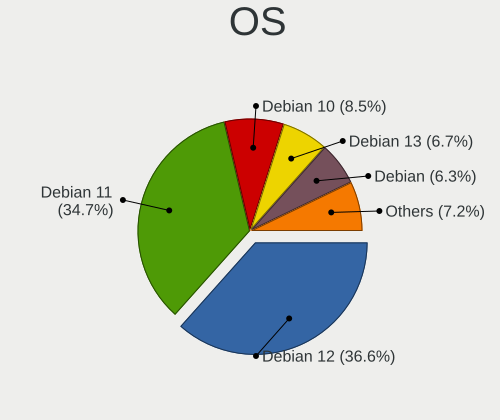

| Name                            | Notebooks | Percent |
|---------------------------------|-----------|---------|
| Debian 12                       | 3768      | 36.59%  |
| Debian 11                       | 3578      | 34.75%  |
| Debian 10                       | 879       | 8.54%   |
| Debian 13                       | 691       | 6.71%   |
| Debian                          | 644       | 6.25%   |
| Debian Testing                  | 358       | 3.48%   |
| Debian 9                        | 147       | 1.43%   |
| Debian Unstable                 | 128       | 1.24%   |
| Debian 11-updates               | 27        | 0.26%   |
| Debian Testing/unstable         | 25        | 0.24%   |
| Debian 23                       | 18        | 0.17%   |
| Debian 8                        | 11        | 0.11%   |
| Debian Sid                      | 5         | 0.05%   |
| Debian 2                        | 5         | 0.05%   |
| Debian 22                       | 3         | 0.03%   |
| Debian 6                        | 2         | 0.02%   |
| Debian Testing-proposed-updates | 1         | 0.01%   |
| Debian N/a                      | 1         | 0.01%   |
| Debian 99                       | 1         | 0.01%   |
| Debian 24                       | 1         | 0.01%   |
| Debian 2025                     | 1         | 0.01%   |
| Debian 2024                     | 1         | 0.01%   |
| Debian 20                       | 1         | 0.01%   |
| Debian 12-updates               | 1         | 0.01%   |

OS Family
---------

OS without a version

| Name   | Notebooks | Percent |
|--------|-----------|---------|
| Debian | 9743      | 100%    |

Kernel
------

Version of the Linux kernel

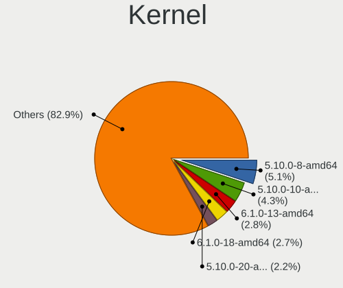

| Version             | Notebooks | Percent |
|---------------------|-----------|---------|
| 5.10.0-8-amd64      | 586       | 5.1%    |
| 5.10.0-10-amd64     | 492       | 4.29%   |
| 6.1.0-13-amd64      | 320       | 2.79%   |
| 6.1.0-18-amd64      | 311       | 2.71%   |
| 5.10.0-20-amd64     | 252       | 2.19%   |
| 5.10.0-21-amd64     | 238       | 2.07%   |
| 6.1.0-37-amd64      | 190       | 1.65%   |
| 6.1.0-10-amd64      | 184       | 1.6%    |
| 6.1.0-21-amd64      | 183       | 1.59%   |
| 6.12.48+deb13-amd64 | 182       | 1.59%   |
| 5.10.0-18-amd64     | 181       | 1.58%   |
| 6.1.0-23-amd64      | 180       | 1.57%   |
| 6.12.57+deb13-amd64 | 179       | 1.56%   |
| 6.1.0-9-amd64       | 176       | 1.53%   |
| 5.10.0-9-amd64      | 174       | 1.52%   |
| 5.10.0-7-amd64      | 171       | 1.49%   |
| 6.1.0-17-amd64      | 169       | 1.47%   |
| 5.10.0-16-amd64     | 168       | 1.46%   |
| 5.10.0-19-amd64     | 162       | 1.41%   |
| 6.1.0-28-amd64      | 153       | 1.33%   |
| 5.10.0-13-amd64     | 151       | 1.32%   |
| 6.1.0-25-amd64      | 148       | 1.29%   |
| 6.1.0-26-amd64      | 127       | 1.11%   |
| 6.1.0-12-amd64      | 125       | 1.09%   |
| 6.1.0-31-amd64      | 117       | 1.02%   |
| 6.1.0-22-amd64      | 115       | 1%      |
| 5.10.0-23-amd64     | 115       | 1%      |
| 6.1.0-32-amd64      | 113       | 0.98%   |
| 6.1.0-11-amd64      | 109       | 0.95%   |
| 5.10.0-11-amd64     | 104       | 0.91%   |
| 6.12.43+deb13-amd64 | 102       | 0.89%   |
| 6.1.0-27-amd64      | 97        | 0.84%   |
| 6.12.41+deb13-amd64 | 96        | 0.84%   |
| 6.1.0-16-amd64      | 92        | 0.8%    |
| 6.1.0-30-amd64      | 88        | 0.77%   |
| 4.19.0-9-amd64      | 85        | 0.74%   |
| 4.19.0-6-amd64      | 82        | 0.71%   |
| 5.10.0-14-amd64     | 80        | 0.7%    |
| 6.1.0-4-amd64       | 74        | 0.64%   |
| 5.10.0-17-amd64     | 73        | 0.64%   |

Kernel Family
-------------

Linux kernel without a distro release

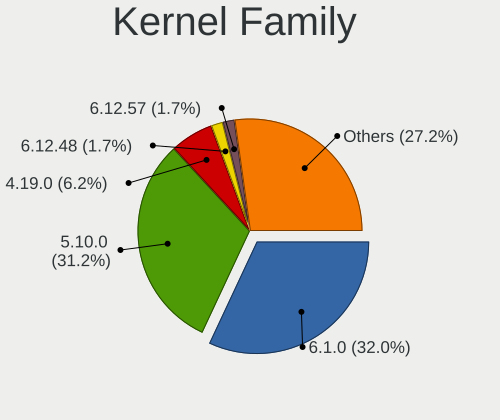

| Version | Notebooks | Percent |
|---------|-----------|---------|
| 6.1.0   | 3423      | 31.96%  |
| 5.10.0  | 3340      | 31.19%  |
| 4.19.0  | 667       | 6.23%   |
| 6.12.48 | 183       | 1.71%   |
| 6.12.57 | 182       | 1.7%    |
| 6.0.0   | 152       | 1.42%   |
| 6.5.0   | 125       | 1.17%   |
| 4.9.0   | 120       | 1.12%   |
| 5.18.0  | 111       | 1.04%   |
| 6.12.43 | 108       | 1.01%   |
| 6.12.41 | 97        | 0.91%   |
| 5.15.0  | 92        | 0.86%   |
| 5.9.0   | 74        | 0.69%   |
| 5.16.0  | 72        | 0.67%   |
| 5.19.0  | 70        | 0.65%   |
| 6.12.38 | 65        | 0.61%   |
| 5.4.0   | 64        | 0.6%    |
| 5.7.0   | 59        | 0.55%   |
| 5.8.0   | 56        | 0.52%   |
| 5.14.0  | 53        | 0.49%   |
| 6.4.0   | 48        | 0.45%   |
| 5.6.0   | 45        | 0.42%   |
| 6.6.15  | 42        | 0.39%   |
| 6.10.11 | 41        | 0.38%   |
| 6.12.22 | 40        | 0.37%   |
| 5.17.0  | 40        | 0.37%   |
| 6.7.12  | 39        | 0.36%   |
| 6.8.12  | 38        | 0.35%   |
| 6.12.12 | 34        | 0.32%   |
| 6.6.13  | 33        | 0.31%   |
| 6.3.0   | 31        | 0.29%   |
| 6.10.6  | 30        | 0.28%   |
| 5.10.10 | 28        | 0.26%   |
| 6.9.7   | 27        | 0.25%   |
| 6.12.6  | 26        | 0.24%   |
| 6.11.5  | 25        | 0.23%   |
| 6.12.9  | 24        | 0.22%   |
| 6.12.27 | 24        | 0.22%   |
| 6.11.10 | 20        | 0.19%   |
| 5.3.0   | 19        | 0.18%   |

Kernel Major Ver.
-----------------

Linux kernel major version

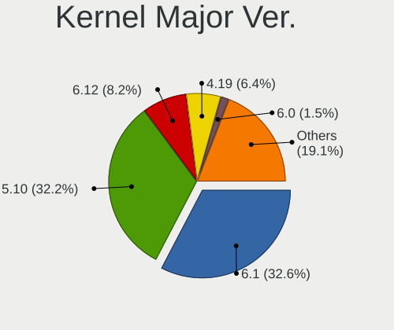

| Version | Notebooks | Percent |
|---------|-----------|---------|
| 6.1     | 3458      | 32.65%  |
| 5.10    | 3411      | 32.2%   |
| 6.12    | 864       | 8.16%   |
| 4.19    | 673       | 6.35%   |
| 6.0     | 161       | 1.52%   |
| 6.5     | 142       | 1.34%   |
| 5.15    | 125       | 1.18%   |
| 6.6     | 123       | 1.16%   |
| 4.9     | 123       | 1.16%   |
| 5.18    | 116       | 1.1%    |
| 6.10    | 101       | 0.95%   |
| 6.11    | 86        | 0.81%   |
| 5.9     | 80        | 0.76%   |
| 5.4     | 76        | 0.72%   |
| 5.19    | 76        | 0.72%   |
| 5.16    | 76        | 0.72%   |
| 6.8     | 75        | 0.71%   |
| 6.9     | 67        | 0.63%   |
| 6.7     | 66        | 0.62%   |
| 6.4     | 62        | 0.59%   |
| 5.7     | 62        | 0.59%   |
| 5.8     | 61        | 0.58%   |
| 5.14    | 58        | 0.55%   |
| 6.16    | 50        | 0.47%   |
| 5.6     | 49        | 0.46%   |
| 5.17    | 49        | 0.46%   |
| 6.17    | 42        | 0.4%    |
| 6.3     | 39        | 0.37%   |
| 5.3     | 24        | 0.23%   |
| 6.2     | 20        | 0.19%   |
| 5.5     | 19        | 0.18%   |
| 6       | 18        | 0.17%   |
| 5.2     | 18        | 0.17%   |
| 6.14    | 16        | 0.15%   |
| 6.15    | 15        | 0.14%   |
| 5.13    | 13        | 0.12%   |
| 4.18    | 12        | 0.11%   |
| 5.12    | 9         | 0.08%   |
| 5.11    | 9         | 0.08%   |
| 3.16    | 9         | 0.08%   |

Arch
----

OS architecture (x86_64, i586, etc.)

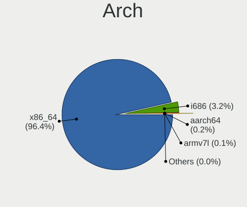

| Name        | Notebooks | Percent |
|-------------|-----------|---------|
| x86_64      | 9399      | 96.44%  |
| i686        | 312       | 3.2%    |
| aarch64     | 16        | 0.16%   |
| armv7l      | 11        | 0.11%   |
| loongarch64 | 5         | 0.05%   |
| riscv64     | 2         | 0.02%   |
| i586        | 1         | 0.01%   |

DE
--

Desktop Environment

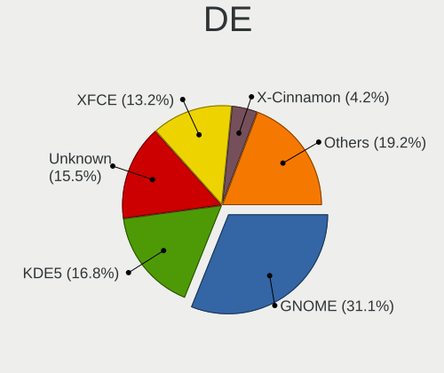

| Name              | Notebooks | Percent |
|-------------------|-----------|---------|
| GNOME             | 3125      | 31.08%  |
| KDE5              | 1688      | 16.79%  |
| Unknown           | 1558      | 15.49%  |
| XFCE              | 1331      | 13.24%  |
| X-Cinnamon        | 420       | 4.18%   |
| MATE              | 400       | 3.98%   |
| LXDE              | 279       | 2.77%   |
| KDE6              | 224       | 2.23%   |
| Cinnamon          | 196       | 1.95%   |
| KDE               | 169       | 1.68%   |
| LXQt              | 161       | 1.6%    |
| i3                | 159       | 1.58%   |
| GNOME Flashback   | 54        | 0.54%   |
| lightdm-xsession  | 35        | 0.35%   |
| Trinity           | 34        | 0.34%   |
| GNOME Classic     | 28        | 0.28%   |
| openbox           | 26        | 0.26%   |
| Budgie            | 25        | 0.25%   |
| sway              | 19        | 0.19%   |
| BunsenLabs        | 12        | 0.12%   |
| Hyprland          | 10        | 0.1%    |
| fluxbox           | 8         | 0.08%   |
| Enlightenment     | 8         | 0.08%   |
| default           | 8         | 0.08%   |
| bspwm             | 8         | 0.08%   |
| awesome           | 8         | 0.08%   |
| ICEWM             | 7         | 0.07%   |
| DWM               | 7         | 0.07%   |
| GNUstep           | 5         | 0.05%   |
| Cutefish          | 5         | 0.05%   |
| x-session-manager | 4         | 0.04%   |
| Unity             | 3         | 0.03%   |
| Deepin            | 3         | 0.03%   |
| xmonad            | 2         | 0.02%   |
| WindowMaker       | 2         | 0.02%   |
| qtile             | 2         | 0.02%   |
| Phosh:GNOME       | 2         | 0.02%   |
| mwm               | 2         | 0.02%   |
| labwc:wlroots     | 2         | 0.02%   |
| KDE4              | 2         | 0.02%   |

Display Server
--------------

X11 or Wayland

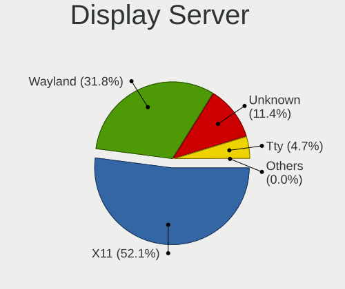

| Name        | Notebooks | Percent |
|-------------|-----------|---------|
| X11         | 5215      | 52.07%  |
| Wayland     | 3182      | 31.77%  |
| Unknown     | 1143      | 11.41%  |
| Tty         | 469       | 4.68%   |
| Unspecified | 5         | 0.05%   |
| Web         | 2         | 0.02%   |

Display Manager
---------------

SDDM, LightDM, etc.

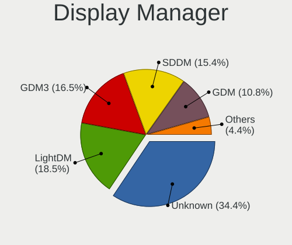

| Name          | Notebooks | Percent |
|---------------|-----------|---------|
| Unknown       | 3448      | 34.38%  |
| LightDM       | 1860      | 18.55%  |
| GDM3          | 1653      | 16.48%  |
| SDDM          | 1543      | 15.39%  |
| GDM           | 1080      | 10.77%  |
| TDM           | 316       | 3.15%   |
| NODM          | 36        | 0.36%   |
| XDM           | 29        | 0.29%   |
| SLiM          | 20        | 0.2%    |
| LXDM          | 16        | 0.16%   |
| KDM           | 8         | 0.08%   |
| GREETD        | 7         | 0.07%   |
| Ly            | 5         | 0.05%   |
| WDM           | 3         | 0.03%   |
| SU            | 1         | 0.01%   |
| LIDM          | 1         | 0.01%   |
| I3            | 1         | 0.01%   |
| DARKDM_ON_TTY | 1         | 0.01%   |

OS Lang
-------

Language

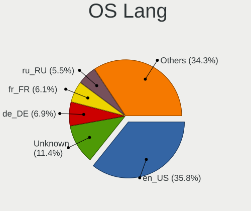

| Lang    | Notebooks | Percent |
|---------|-----------|---------|
| en_US   | 3546      | 35.76%  |
| Unknown | 1131      | 11.41%  |
| de_DE   | 683       | 6.89%   |
| fr_FR   | 606       | 6.11%   |
| ru_RU   | 547       | 5.52%   |
| en_GB   | 509       | 5.13%   |
| pt_BR   | 323       | 3.26%   |
| it_IT   | 308       | 3.11%   |
| es_ES   | 302       | 3.05%   |
| pl_PL   | 175       | 1.77%   |
| en_CA   | 135       | 1.36%   |
| C       | 135       | 1.36%   |
| es_MX   | 117       | 1.18%   |
| en_AU   | 104       | 1.05%   |
| en_IN   | 103       | 1.04%   |
| zh_CN   | 88        | 0.89%   |
| es_AR   | 81        | 0.82%   |
| en_IE   | 58        | 0.58%   |
| hu_HU   | 52        | 0.52%   |
| es_CL   | 52        | 0.52%   |
| nl_NL   | 46        | 0.46%   |
| sv_SE   | 43        | 0.43%   |
| cs_CZ   | 41        | 0.41%   |
| de_CH   | 40        | 0.4%    |
| es_CO   | 38        | 0.38%   |
| pt_PT   | 36        | 0.36%   |
| tr_TR   | 35        | 0.35%   |
| de_AT   | 33        | 0.33%   |
| fi_FI   | 29        | 0.29%   |
| es_VE   | 28        | 0.28%   |
| en_NZ   | 27        | 0.27%   |
| fr_BE   | 24        | 0.24%   |
| en_PH   | 23        | 0.23%   |
| da_DK   | 21        | 0.21%   |
| ca_ES   | 21        | 0.21%   |
| ja_JP   | 20        | 0.2%    |
| fr_CH   | 19        | 0.19%   |
| en_ZA   | 19        | 0.19%   |
| en_SG   | 19        | 0.19%   |
| ru_UA   | 15        | 0.15%   |

Boot Mode
---------

EFI or BIOS

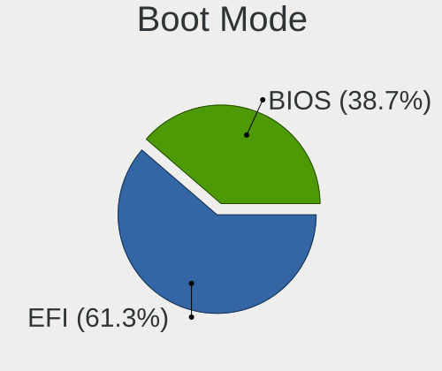

| Mode | Notebooks | Percent |
|------|-----------|---------|
| EFI  | 6044      | 61.33%  |
| BIOS | 3811      | 38.67%  |

Filesystem
----------

Type of filesystem

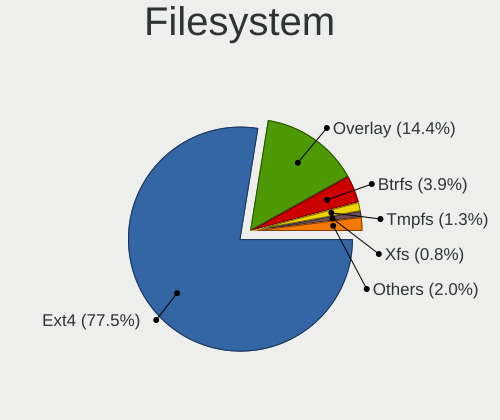

| Type    | Notebooks | Percent |
|---------|-----------|---------|
| Ext4    | 7627      | 77.54%  |
| Overlay | 1414      | 14.38%  |
| Btrfs   | 388       | 3.94%   |
| Tmpfs   | 128       | 1.3%    |
| Xfs     | 82        | 0.83%   |
| Unknown | 82        | 0.83%   |
| Zfs     | 39        | 0.4%    |
| Rootfs  | 34        | 0.35%   |
| Ext2    | 19        | 0.19%   |
| Ext3    | 13        | 0.13%   |
| Aufs    | 6         | 0.06%   |
| F2fs    | 3         | 0.03%   |
| Jfs     | 1         | 0.01%   |

Part. scheme
------------

Scheme of partitioning

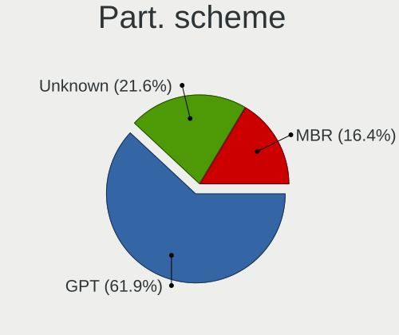

| Type    | Notebooks | Percent |
|---------|-----------|---------|
| GPT     | 6134      | 61.95%  |
| Unknown | 2140      | 21.61%  |
| MBR     | 1628      | 16.44%  |

Dual Boot with Linux/BSD
------------------------

Hosting more than one Linux/BSD

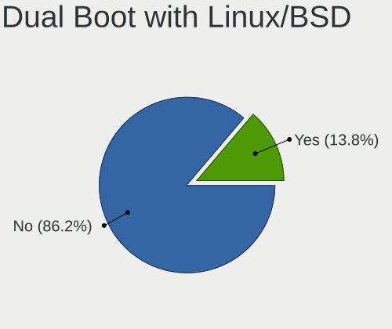

| Dual boot | Notebooks | Percent |
|-----------|-----------|---------|
| No        | 8526      | 86.2%   |
| Yes       | 1365      | 13.8%   |

Dual Boot (Win)
---------------

Hosting Linux and Windows

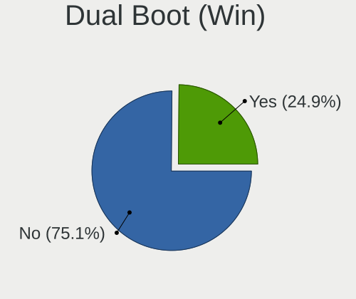

| Dual boot | Notebooks | Percent |
|-----------|-----------|---------|
| No        | 7415      | 75.13%  |
| Yes       | 2454      | 24.87%  |

Board
-----

Vendor
------

Motherboard manufacturer

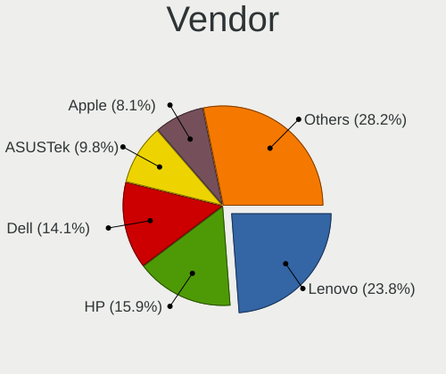

| Name                  | Notebooks | Percent |
|-----------------------|-----------|---------|
| Lenovo                | 2319      | 23.8%   |
| Hewlett-Packard       | 1549      | 15.9%   |
| Dell                  | 1376      | 14.12%  |
| ASUSTek Computer      | 957       | 9.82%   |
| Apple                 | 794       | 8.15%   |
| Acer                  | 684       | 7.02%   |
| Google                | 291       | 2.99%   |
| MSI                   | 183       | 1.88%   |
| Toshiba               | 158       | 1.62%   |
| Samsung Electronics   | 145       | 1.49%   |
| Unknown               | 97        | 1%      |
| HUAWEI                | 96        | 0.99%   |
| Sony                  | 84        | 0.86%   |
| Fujitsu               | 59        | 0.61%   |
| Aquarius              | 48        | 0.49%   |
| Notebook              | 44        | 0.45%   |
| Framework             | 34        | 0.35%   |
| Medion                | 33        | 0.34%   |
| TUXEDO                | 31        | 0.32%   |
| Alienware             | 31        | 0.32%   |
| Positivo              | 30        | 0.31%   |
| Packard Bell          | 30        | 0.31%   |
| Intel                 | 28        | 0.29%   |
| HONOR                 | 26        | 0.27%   |
| Panasonic             | 25        | 0.26%   |
| Gigabyte Technology   | 22        | 0.23%   |
| Timi                  | 21        | 0.22%   |
| LG Electronics        | 20        | 0.21%   |
| IBM                   | 20        | 0.21%   |
| Fujitsu Siemens       | 18        | 0.18%   |
| Clevo                 | 18        | 0.18%   |
| Positivo Bahia - VAIO | 15        | 0.15%   |
| PC Specialist         | 13        | 0.13%   |
| eMachines             | 13        | 0.13%   |
| Razer                 | 12        | 0.12%   |
| Chuwi                 | 12        | 0.12%   |
| Schenker              | 11        | 0.11%   |
| Insyde                | 11        | 0.11%   |
| GPU Company           | 10        | 0.1%    |
| SLIMBOOK              | 9         | 0.09%   |

Model
-----

Motherboard model

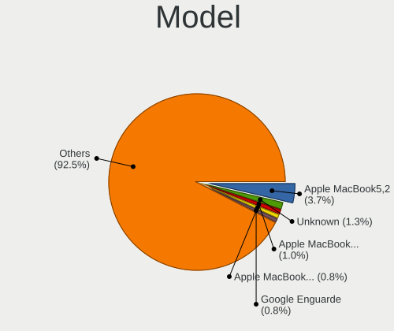

| Name                                       | Notebooks | Percent |
|--------------------------------------------|-----------|---------|
| Apple MacBook5,2                           | 357       | 3.66%   |
| Unknown                                    | 131       | 1.34%   |
| Apple MacBookAir7,2                        | 93        | 0.95%   |
| Apple MacBookAir7,1                        | 79        | 0.81%   |
| Google Enguarde                            | 74        | 0.76%   |
| Apple MacBook2,1                           | 60        | 0.62%   |
| Google Reks                                | 48        | 0.49%   |
| Aquarius NS585                             | 48        | 0.49%   |
| HP Notebook                                | 47        | 0.48%   |
| HP Pavilion g6                             | 26        | 0.27%   |
| Lenovo ThinkPad E475 20H40006US            | 25        | 0.26%   |
| Apple MacBook4,1                           | 25        | 0.26%   |
| Google Terra                               | 24        | 0.25%   |
| HP Pavilion dv6                            | 23        | 0.24%   |
| Dell Latitude 7480                         | 22        | 0.23%   |
| HP EliteBook 840 G6                        | 21        | 0.22%   |
| Dell Latitude E7440                        | 21        | 0.22%   |
| Dell Latitude 7490                         | 20        | 0.21%   |
| Acer Aspire A315-23                        | 20        | 0.21%   |
| Google Stout                               | 19        | 0.2%    |
| Dell Latitude E6430                        | 19        | 0.2%    |
| Dell Latitude E6420                        | 19        | 0.2%    |
| HP Pavilion Notebook                       | 18        | 0.18%   |
| HP EliteBook 840 G3                        | 18        | 0.18%   |
| HP Laptop 15-db0xxx                        | 17        | 0.17%   |
| Lenovo ThinkPad 13 2nd Gen 20J10046US      | 16        | 0.16%   |
| HP Laptop 15s-eq2xxx                       | 16        | 0.16%   |
| HP EliteBook 8460p                         | 16        | 0.16%   |
| Dell Latitude 5420                         | 16        | 0.16%   |
| Apple MacBookPro12,1                       | 16        | 0.16%   |
| Dell Latitude E7450                        | 15        | 0.15%   |
| Dell Latitude E6400                        | 15        | 0.15%   |
| ASUS 1005HA                                | 15        | 0.15%   |
| HP Pavilion dv7                            | 14        | 0.14%   |
| HP 255 G8 Notebook PC                      | 14        | 0.14%   |
| HP 250 G7 Notebook PC                      | 14        | 0.14%   |
| Framework Laptop 13 (AMD Ryzen 7040Series) | 14        | 0.14%   |
| Apple MacBookPro8,1                        | 14        | 0.14%   |
| Acer Aspire A515-56                        | 14        | 0.14%   |
| HP Pavilion g4                             | 13        | 0.13%   |

Model Family
------------

Motherboard model prefix

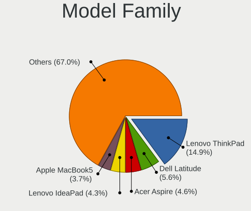

| Name               | Notebooks | Percent |
|--------------------|-----------|---------|
| Lenovo ThinkPad    | 1452      | 14.9%   |
| Dell Latitude      | 543       | 5.57%   |
| Acer Aspire        | 444       | 4.56%   |
| Lenovo IdeaPad     | 419       | 4.3%    |
| Apple MacBook5     | 360       | 3.69%   |
| Dell Inspiron      | 351       | 3.6%    |
| HP EliteBook       | 329       | 3.38%   |
| HP Pavilion        | 245       | 2.51%   |
| HP Laptop          | 216       | 2.22%   |
| ASUS Vivobook      | 210       | 2.16%   |
| HP ProBook         | 206       | 2.11%   |
| Apple MacBookAir7  | 172       | 1.77%   |
| Dell XPS           | 150       | 1.54%   |
| Dell Precision     | 142       | 1.46%   |
| Unknown            | 131       | 1.34%   |
| Toshiba Satellite  | 120       | 1.23%   |
| ASUS ASUS          | 107       | 1.1%    |
| Dell Vostro        | 105       | 1.08%   |
| Google Enguarde    | 74        | 0.76%   |
| Lenovo Legion      | 73        | 0.75%   |
| HP ZBook           | 73        | 0.75%   |
| ASUS Zenbook       | 72        | 0.74%   |
| HP Compaq          | 71        | 0.73%   |
| Lenovo ThinkBook   | 69        | 0.71%   |
| Apple MacBook2     | 60        | 0.62%   |
| Acer Nitro         | 60        | 0.62%   |
| ASUS ROG           | 56        | 0.57%   |
| Acer Swift         | 55        | 0.56%   |
| Fujitsu LIFEBOOK   | 53        | 0.54%   |
| HP Notebook        | 48        | 0.49%   |
| Google Reks        | 48        | 0.49%   |
| Aquarius NS585     | 48        | 0.49%   |
| HP 250             | 47        | 0.48%   |
| Acer TravelMate    | 46        | 0.47%   |
| Lenovo Yoga        | 44        | 0.45%   |
| HP 255             | 43        | 0.44%   |
| HP ENVY            | 39        | 0.4%    |
| HP OMEN            | 36        | 0.37%   |
| Framework Laptop   | 34        | 0.35%   |
| Apple MacBookPro11 | 32        | 0.33%   |

MFG Year
--------

Motherboard manufacture year

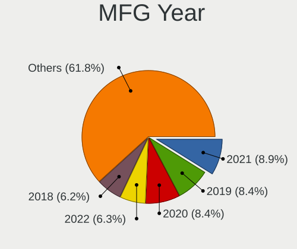

| Year    | Notebooks | Percent |
|---------|-----------|---------|
| 2021    | 865       | 8.88%   |
| 2019    | 821       | 8.43%   |
| 2020    | 819       | 8.41%   |
| 2022    | 615       | 6.31%   |
| 2018    | 606       | 6.22%   |
| 2009    | 606       | 6.22%   |
| 2012    | 558       | 5.73%   |
| 2011    | 551       | 5.66%   |
| 2017    | 549       | 5.63%   |
| 2023    | 516       | 5.3%    |
| 2013    | 511       | 5.24%   |
| 2015    | 449       | 4.61%   |
| 2016    | 434       | 4.45%   |
| 2014    | 416       | 4.27%   |
| 2008    | 327       | 3.36%   |
| 2010    | 320       | 3.28%   |
| 2024    | 278       | 2.85%   |
| 2007    | 187       | 1.92%   |
| 2006    | 149       | 1.53%   |
| 2025    | 70        | 0.72%   |
| 2005    | 34        | 0.35%   |
| Unknown | 31        | 0.32%   |
| 2004    | 15        | 0.15%   |
| 2003    | 12        | 0.12%   |
| 2002    | 2         | 0.02%   |
| 2001    | 2         | 0.02%   |

Form Factor
-----------

Physical design of the computer

| Name     | Notebooks | Percent |
|----------|-----------|---------|
| Notebook | 9743      | 100%    |

Secure Boot
-----------

Enabled or disabled

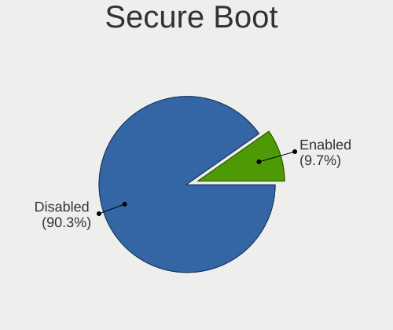

| State    | Notebooks | Percent |
|----------|-----------|---------|
| Disabled | 8870      | 90.27%  |
| Enabled  | 956       | 9.73%   |

Coreboot
--------

Have coreboot on board

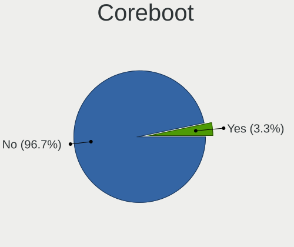

| Used | Notebooks | Percent |
|------|-----------|---------|
| No   | 9424      | 96.71%  |
| Yes  | 321       | 3.29%   |

RAM Size
--------

Total RAM memory

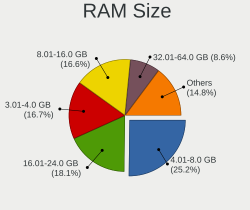

| Size in GB  | Notebooks | Percent |
|-------------|-----------|---------|
| 4.01-8.0    | 2487      | 25.19%  |
| 16.01-24.0  | 1783      | 18.06%  |
| 3.01-4.0    | 1648      | 16.69%  |
| 8.01-16.0   | 1641      | 16.62%  |
| 32.01-64.0  | 854       | 8.65%   |
| 1.01-2.0    | 734       | 7.43%   |
| 24.01-32.0  | 221       | 2.24%   |
| 64.01-256.0 | 195       | 1.97%   |
| 2.01-3.0    | 180       | 1.82%   |
| 0.51-1.0    | 103       | 1.04%   |
| 0.01-0.5    | 26        | 0.26%   |
| Unknown     | 2         | 0.02%   |

RAM Used
--------

Used RAM memory

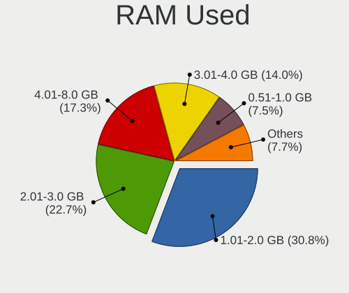

| Used GB    | Notebooks | Percent |
|------------|-----------|---------|
| 1.01-2.0   | 3263      | 30.78%  |
| 2.01-3.0   | 2406      | 22.69%  |
| 4.01-8.0   | 1832      | 17.28%  |
| 3.01-4.0   | 1484      | 14%     |
| 0.51-1.0   | 798       | 7.53%   |
| 8.01-16.0  | 518       | 4.89%   |
| 0.01-0.5   | 203       | 1.91%   |
| 16.01-24.0 | 65        | 0.61%   |
| 24.01-32.0 | 17        | 0.16%   |
| 32.01-64.0 | 8         | 0.08%   |
| Unknown    | 7         | 0.07%   |
| 0          | 1         | 0.01%   |

Total Drives
------------

Number of drives on board

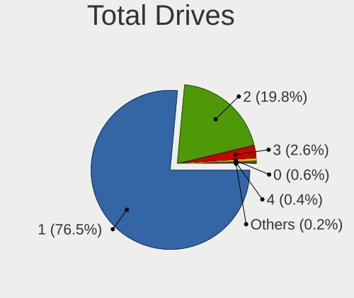

| Drives | Notebooks | Percent |
|--------|-----------|---------|
| 1      | 7584      | 76.47%  |
| 2      | 1959      | 19.75%  |
| 3      | 256       | 2.58%   |
| 0      | 61        | 0.62%   |
| 4      | 42        | 0.42%   |
| 5      | 10        | 0.1%    |
| 7      | 3         | 0.03%   |
| 14     | 1         | 0.01%   |
| 6      | 1         | 0.01%   |

Has CD-ROM
----------

Has CD-ROM on board

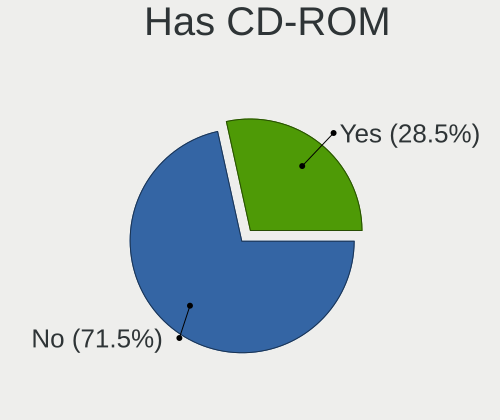

| Presented | Notebooks | Percent |
|-----------|-----------|---------|
| No        | 6996      | 71.55%  |
| Yes       | 2782      | 28.45%  |

Has Ethernet
------------

Has Ethernet on board

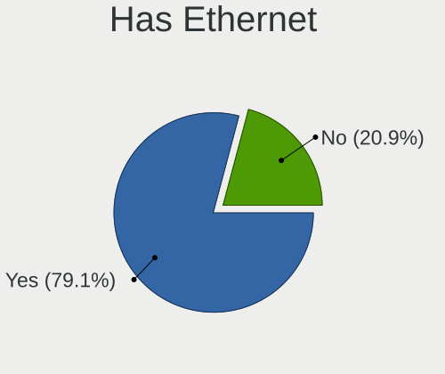

| Presented | Notebooks | Percent |
|-----------|-----------|---------|
| Yes       | 7753      | 79.14%  |
| No        | 2044      | 20.86%  |

Has WiFi
--------

Has WiFi module

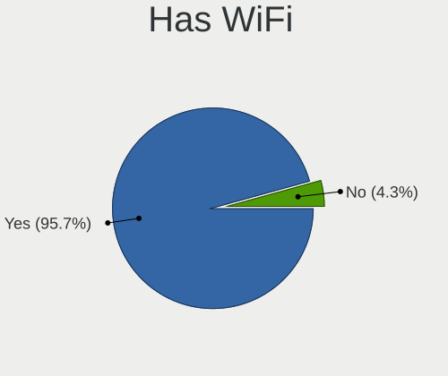

| Presented | Notebooks | Percent |
|-----------|-----------|---------|
| Yes       | 9345      | 95.7%   |
| No        | 420       | 4.3%    |

Has Bluetooth
-------------

Has Bluetooth module

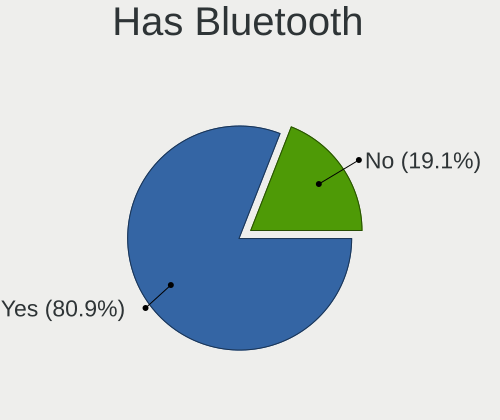

| Presented | Notebooks | Percent |
|-----------|-----------|---------|
| Yes       | 7947      | 80.93%  |
| No        | 1872      | 19.07%  |

Location
--------

Country
-------

Geographic location (country)

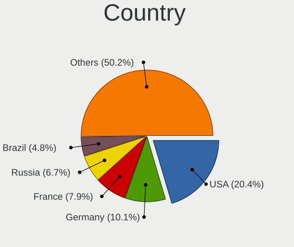

| Country     | Notebooks | Percent |
|-------------|-----------|---------|
| USA         | 2005      | 20.42%  |
| Germany     | 987       | 10.05%  |
| France      | 772       | 7.86%   |
| Russia      | 657       | 6.69%   |
| Brazil      | 467       | 4.76%   |
| Italy       | 444       | 4.52%   |
| Spain       | 415       | 4.23%   |
| Poland      | 279       | 2.84%   |
| UK          | 244       | 2.48%   |
| Canada      | 239       | 2.43%   |
| Netherlands | 172       | 1.75%   |
| Mexico      | 163       | 1.66%   |
| India       | 155       | 1.58%   |
| Switzerland | 133       | 1.35%   |
| Sweden      | 126       | 1.28%   |
| China       | 126       | 1.28%   |
| Argentina   | 121       | 1.23%   |
| Australia   | 118       | 1.2%    |
| Belgium     | 101       | 1.03%   |
| Turkey      | 97        | 0.99%   |
| Austria     | 88        | 0.9%    |
| Hungary     | 85        | 0.87%   |
| Portugal    | 83        | 0.85%   |
| Czechia     | 82        | 0.84%   |
| Indonesia   | 76        | 0.77%   |
| Ukraine     | 72        | 0.73%   |
| Greece      | 71        | 0.72%   |
| Romania     | 70        | 0.71%   |
| Finland     | 70        | 0.71%   |
| Colombia    | 69        | 0.7%    |
| Chile       | 67        | 0.68%   |
| Norway      | 62        | 0.63%   |
| Ireland     | 44        | 0.45%   |
| Denmark     | 42        | 0.43%   |
| Venezuela   | 40        | 0.41%   |
| Japan       | 40        | 0.41%   |
| Philippines | 37        | 0.38%   |
| Bulgaria    | 37        | 0.38%   |
| New Zealand | 35        | 0.36%   |
| Thailand    | 29        | 0.3%    |

City
----

Geographic location (city)

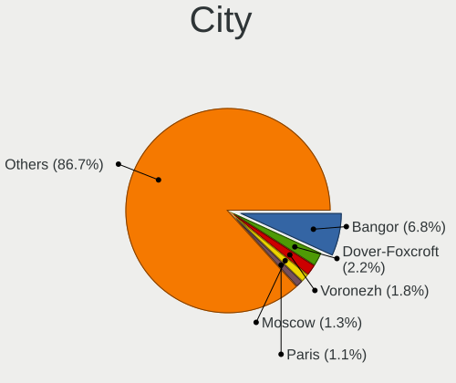

| City              | Notebooks | Percent |
|-------------------|-----------|---------|
| Bangor            | 712       | 6.81%   |
| Dover-Foxcroft    | 229       | 2.19%   |
| Voronezh          | 185       | 1.77%   |
| Moscow            | 141       | 1.35%   |
| Paris             | 120       | 1.15%   |
| Berlin            | 107       | 1.02%   |
| Milan             | 78        | 0.75%   |
| Madrid            | 75        | 0.72%   |
| St Petersburg     | 66        | 0.63%   |
| Sao Paulo         | 63        | 0.6%    |
| Warsaw            | 61        | 0.58%   |
| Vienna            | 61        | 0.58%   |
| Amsterdam         | 61        | 0.58%   |
| Seville           | 60        | 0.57%   |
| Munich            | 50        | 0.48%   |
| Frankfurt am Main | 48        | 0.46%   |
| Hamburg           | 44        | 0.42%   |
| Barcelona         | 42        | 0.4%    |
| Athens            | 42        | 0.4%    |
| Prague            | 41        | 0.39%   |
| Roubaix           | 40        | 0.38%   |
| Budapest          | 38        | 0.36%   |
| Mexico City       | 36        | 0.34%   |
| Istanbul          | 35        | 0.33%   |
| Toronto           | 34        | 0.33%   |
| Dublin            | 34        | 0.33%   |
| Rome              | 33        | 0.32%   |
| Helsinki          | 33        | 0.32%   |
| Zurich            | 32        | 0.31%   |
| London            | 32        | 0.31%   |
| Bogotá           | 31        | 0.3%    |
| Sydney            | 30        | 0.29%   |
| Melbourne         | 29        | 0.28%   |
| Santiago          | 28        | 0.27%   |
| Lisbon            | 28        | 0.27%   |
| Brasília         | 28        | 0.27%   |
| Cologne           | 27        | 0.26%   |
| Perm              | 25        | 0.24%   |
| Bucharest         | 25        | 0.24%   |
| Leipzig           | 24        | 0.23%   |

Drives
------

Drive Vendor
------------

Hard drive vendors

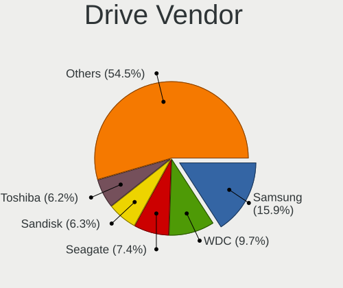

| Vendor                      | Notebooks | Drives | Percent |
|-----------------------------|-----------|--------|---------|
| Samsung Electronics         | 1894      | 2487   | 15.86%  |
| WDC                         | 1157      | 1438   | 9.69%   |
| Seagate                     | 887       | 1068   | 7.43%   |
| Sandisk                     | 757       | 950    | 6.34%   |
| Toshiba                     | 740       | 843    | 6.2%    |
| Unknown                     | 724       | 928    | 6.06%   |
| Kingston                    | 600       | 786    | 5.03%   |
| SK hynix                    | 563       | 746    | 4.72%   |
| Crucial                     | 445       | 542    | 3.73%   |
| Micron Technology           | 421       | 472    | 3.53%   |
| Intel                       | 312       | 403    | 2.61%   |
| Fujitsu                     | 308       | 328    | 2.58%   |
| Hitachi                     | 263       | 310    | 2.2%    |
| Apple                       | 259       | 361    | 2.17%   |
| HGST                        | 208       | 245    | 1.74%   |
| A-DATA Technology           | 208       | 383    | 1.74%   |
| KIOXIA                      | 200       | 230    | 1.68%   |
| Unknown                     | 114       | 135    | 0.95%   |
| China                       | 106       | 118    | 0.89%   |
| Kingston Technology Company | 66        | 82     | 0.55%   |
| Transcend                   | 59        | 83     | 0.49%   |
| Phison                      | 59        | 75     | 0.49%   |
| Intenso                     | 59        | 76     | 0.49%   |
| PNY                         | 55        | 73     | 0.46%   |
| LITEON                      | 54        | 64     | 0.45%   |
| SPCC                        | 51        | 67     | 0.43%   |
| Silicon Motion              | 51        | 61     | 0.43%   |
| Patriot                     | 47        | 56     | 0.39%   |
| SSSTC                       | 45        | 47     | 0.38%   |
| Team                        | 42        | 46     | 0.35%   |
| Lexar                       | 41        | 44     | 0.34%   |
| JMicron Technology          | 41        | 43     | 0.34%   |
| Phison Electronics          | 37        | 51     | 0.31%   |
| Netac                       | 35        | 46     | 0.29%   |
| Micron/Crucial Technology   | 35        | 38     | 0.29%   |
| ADATA Technology            | 32        | 36     | 0.27%   |
| UMIS                        | 31        | 38     | 0.26%   |
| LITEONIT                    | 31        | 38     | 0.26%   |
| GOODRAM                     | 31        | 37     | 0.26%   |
| MAXIO Technology (Hangzhou) | 28        | 37     | 0.23%   |

Drive Model
-----------

Hard drive models

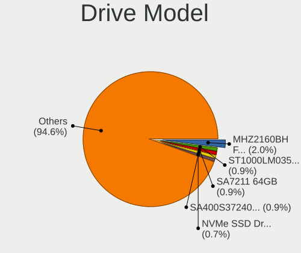

| Model                                             | Notebooks | Percent |
|---------------------------------------------------|-----------|---------|
| Fujitsu MHZ2160BH FFS G1 160GB                    | 240       | 1.95%   |
| Seagate ST1000LM035-1RK172 1TB                    | 115       | 0.93%   |
| Unknown                                           | 114       | 0.93%   |
| Kingston SA400S37240G 240GB SSD                   | 107       | 0.87%   |
| SanDisk NVMe SSD Drive 1TB                        | 89        | 0.72%   |
| Seagate ST1000LM024 HN-M101MBB 1TB                | 87        | 0.71%   |
| Apple SSD SM0128G 121GB                           | 87        | 0.71%   |
| SanDisk NVMe SSD Drive 512GB                      | 85        | 0.69%   |
| Kingston SA400S37120G 120GB SSD                   | 80        | 0.65%   |
| Apple SSD AP0128H 121GB                           | 77        | 0.63%   |
| Toshiba MQ01ABD100 1TB                            | 71        | 0.58%   |
| Unknown MMC Card  32GB                            | 70        | 0.57%   |
| Toshiba MQ04ABF100 1TB                            | 69        | 0.56%   |
| Kingston SA400S37480G 480GB SSD                   | 68        | 0.55%   |
| HGST HTS721010A9E630 1TB                          | 68        | 0.55%   |
| Samsung NVMe SSD Controller SM981/PM981/PM983 1TB | 67        | 0.54%   |
| Toshiba MQ01ABF050 500GB                          | 63        | 0.51%   |
| Crucial CT500MX500SSD1 500GB                      | 60        | 0.49%   |
| Toshiba MK1655GSXF 160GB                          | 52        | 0.42%   |
| Seagate ST500LT012-1DG142 500GB                   | 52        | 0.42%   |
| Samsung SSD 860 EVO 500GB                         | 52        | 0.42%   |
| Samsung SSD 850 EVO 250GB                         | 52        | 0.42%   |
| A-DATA SU800 512GB SSD                            | 51        | 0.41%   |
| Unknown MMC Card  64GB                            | 48        | 0.39%   |
| Samsung SSD 970 EVO Plus 1TB                      | 48        | 0.39%   |
| Toshiba MK1653GSX 160GB                           | 43        | 0.35%   |
| Seagate ST9500325AS 500GB                         | 43        | 0.35%   |
| Crucial CT1000MX500SSD1 1TB                       | 43        | 0.35%   |
| Crucial CT240BX500SSD1 240GB                      | 42        | 0.34%   |
| Samsung SSD 860 EVO 250GB                         | 41        | 0.33%   |
| Samsung SSD 980 1TB                               | 40        | 0.33%   |
| Samsung SSD 850 EVO 500GB                         | 40        | 0.33%   |
| Unknown AGND3R  16GB                              | 39        | 0.32%   |
| Samsung SSD 860 EVO 1TB                           | 39        | 0.32%   |
| Seagate ST1000LM048-2E7172 1TB                    | 38        | 0.31%   |
| Unknown HAG2e  16GB                               | 36        | 0.29%   |
| Seagate ST500LM012 HN-M500MBB 500GB               | 33        | 0.27%   |
| Samsung SSD 870 EVO 500GB                         | 32        | 0.26%   |
| Micron 2400_MTFDKBA512QFM 512GB                   | 32        | 0.26%   |
| Intel SSDPEKNU512GZ 512GB                         | 32        | 0.26%   |

HDD Vendor
----------

Hard disk drive vendors

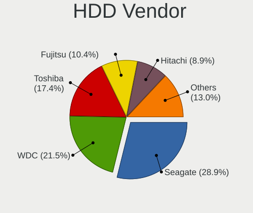

| Vendor              | Notebooks | Drives | Percent |
|---------------------|-----------|--------|---------|
| Seagate             | 857       | 1031   | 28.86%  |
| WDC                 | 638       | 733    | 21.49%  |
| Toshiba             | 517       | 582    | 17.41%  |
| Fujitsu             | 308       | 328    | 10.37%  |
| Hitachi             | 263       | 310    | 8.86%   |
| HGST                | 208       | 245    | 7.01%   |
| Samsung Electronics | 55        | 58     | 1.85%   |
| Unknown             | 32        | 39     | 1.08%   |
| JMicron Technology  | 21        | 21     | 0.71%   |
| IBM/Hitachi         | 8         | 10     | 0.27%   |
| Intenso             | 7         | 9      | 0.24%   |
| ASMT                | 7         | 12     | 0.24%   |
| TO Exter            | 6         | 8      | 0.2%    |
| Apple               | 4         | 5      | 0.13%   |
| LaCie               | 3         | 3      | 0.1%    |
| JetFlash            | 3         | 5      | 0.1%    |
| IB-AC703            | 3         | 3      | 0.1%    |
| External            | 3         | 3      | 0.1%    |
| ASMedia             | 3         | 3      | 0.1%    |
| Unknown             | 3         | 3      | 0.1%    |
| SILICONMOTION       | 2         | 2      | 0.07%   |
| SAGE                | 2         | 2      | 0.07%   |
| HGST HTS            | 2         | 2      | 0.07%   |
| WALRAM              | 1         | 1      | 0.03%   |
| USB3.0              | 1         | 1      | 0.03%   |
| USB                 | 1         | 2      | 0.03%   |
| Unknown (CF)        | 1         | 1      | 0.03%   |
| SYMTEC              | 1         | 1      | 0.03%   |
| STEC                | 1         | 1      | 0.03%   |
| Space ke            | 1         | 1      | 0.03%   |
| SABRENT             | 1         | 1      | 0.03%   |
| QNAP                | 1         | 2      | 0.03%   |
| Maxone              | 1         | 1      | 0.03%   |
| IBM                 | 1         | 1      | 0.03%   |
| IB-377U3            | 1         | 1      | 0.03%   |
| Hewlett-Packard     | 1         | 1      | 0.03%   |
| FC-1307             | 1         | 2      | 0.03%   |

SSD Vendor
----------

Solid state drive vendors

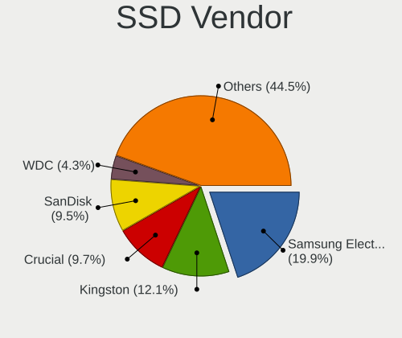

| Vendor              | Notebooks | Drives | Percent |
|---------------------|-----------|--------|---------|
| Samsung Electronics | 725       | 918    | 19.92%  |
| Kingston            | 442       | 602    | 12.14%  |
| Crucial             | 352       | 434    | 9.67%   |
| SanDisk             | 344       | 446    | 9.45%   |
| WDC                 | 156       | 200    | 4.29%   |
| Apple               | 147       | 172    | 4.04%   |
| A-DATA Technology   | 145       | 301    | 3.98%   |
| China               | 100       | 111    | 2.75%   |
| SK hynix            | 97        | 116    | 2.66%   |
| Micron Technology   | 93        | 109    | 2.55%   |
| Intel               | 74        | 82     | 2.03%   |
| Toshiba             | 62        | 71     | 1.7%    |
| Transcend           | 52        | 66     | 1.43%   |
| PNY                 | 47        | 62     | 1.29%   |
| Intenso             | 47        | 62     | 1.29%   |
| LITEON              | 44        | 51     | 1.21%   |
| Patriot             | 40        | 47     | 1.1%    |
| SPCC                | 37        | 52     | 1.02%   |
| Team                | 31        | 35     | 0.85%   |
| LITEONIT            | 31        | 38     | 0.85%   |
| Netac               | 25        | 33     | 0.69%   |
| Lexar               | 23        | 24     | 0.63%   |
| SABRENT             | 22        | 23     | 0.6%    |
| Unknown             | 22        | 22     | 0.6%    |
| KingSpec            | 21        | 21     | 0.58%   |
| GOODRAM             | 21        | 25     | 0.58%   |
| OCZ                 | 14        | 17     | 0.38%   |
| KIOXIA-EXCERIA      | 13        | 15     | 0.36%   |
| Emtec               | 13        | 15     | 0.36%   |
| Hewlett-Packard     | 12        | 15     | 0.33%   |
| Plextor             | 11        | 11     | 0.3%    |
| ASMT                | 11        | 14     | 0.3%    |
| Apacer              | 11        | 11     | 0.3%    |
| Dogfish             | 10        | 13     | 0.27%   |
| Corsair             | 10        | 12     | 0.27%   |
| LDLC                | 9         | 9      | 0.25%   |
| KingDian            | 9         | 9      | 0.25%   |
| BHT                 | 9         | 10     | 0.25%   |
| Verbatim            | 8         | 8      | 0.22%   |
| Fanxiang            | 8         | 10     | 0.22%   |

Drive Kind
----------

HDD or SSD

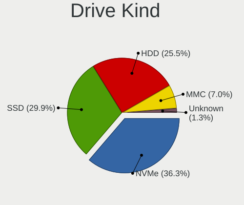

| Kind    | Notebooks | Drives | Percent |
|---------|-----------|--------|---------|
| NVMe    | 4094      | 5683   | 36.28%  |
| SSD     | 3372      | 4649   | 29.88%  |
| HDD     | 2880      | 3434   | 25.52%  |
| MMC     | 787       | 1019   | 6.97%   |
| Unknown | 151       | 172    | 1.34%   |

Drive Connector
---------------

SATA, SAS, NVMe, etc.

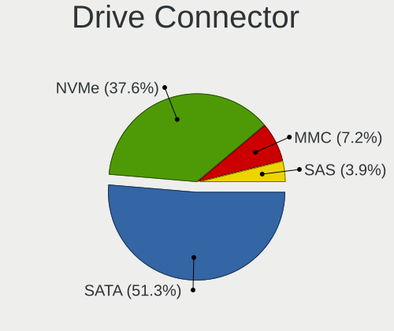

| Type | Notebooks | Drives | Percent |
|------|-----------|--------|---------|
| SATA | 5580      | 7739   | 51.33%  |
| NVMe | 4083      | 5641   | 37.56%  |
| MMC  | 787       | 1019   | 7.24%   |
| SAS  | 420       | 558    | 3.86%   |

Drive Size
----------

Size of hard drive

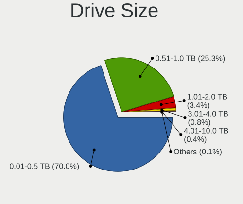

| Size in TB | Notebooks | Drives | Percent |
|------------|-----------|--------|---------|
| 0.01-0.5   | 4317      | 5616   | 69.99%  |
| 0.51-1.0   | 1562      | 2093   | 25.32%  |
| 1.01-2.0   | 210       | 277    | 3.4%    |
| 3.01-4.0   | 52        | 64     | 0.84%   |
| 4.01-10.0  | 22        | 26     | 0.36%   |
| 2.01-3.0   | 4         | 6      | 0.06%   |
| 0          | 1         | 1      | 0.02%   |

Space Total
-----------

Amount of disk space available on the file system

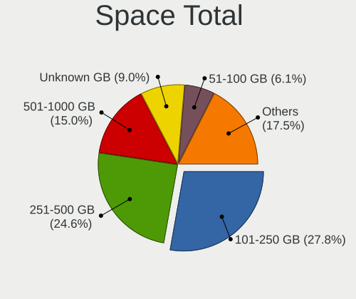

| Size in GB     | Notebooks | Percent |
|----------------|-----------|---------|
| 101-250        | 2825      | 27.8%   |
| 251-500        | 2497      | 24.57%  |
| 501-1000       | 1521      | 14.97%  |
| Unknown        | 916       | 9.01%   |
| 51-100         | 624       | 6.14%   |
| 1001-2000      | 585       | 5.76%   |
| 1-20           | 550       | 5.41%   |
| 21-50          | 360       | 3.54%   |
| More than 3000 | 148       | 1.46%   |
| 2001-3000      | 137       | 1.35%   |

Space Used
----------

Amount of used disk space

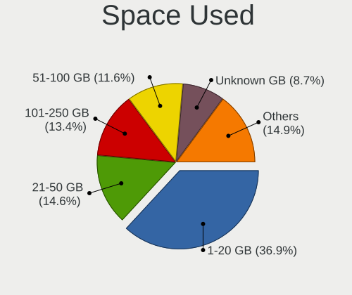

| Used GB        | Notebooks | Percent |
|----------------|-----------|---------|
| 1-20           | 3890      | 36.86%  |
| 21-50          | 1537      | 14.56%  |
| 101-250        | 1416      | 13.42%  |
| 51-100         | 1223      | 11.59%  |
| Unknown        | 916       | 8.68%   |
| 251-500        | 817       | 7.74%   |
| 501-1000       | 469       | 4.44%   |
| 1001-2000      | 189       | 1.79%   |
| More than 3000 | 40        | 0.38%   |
| 2001-3000      | 39        | 0.37%   |
| 0              | 18        | 0.17%   |

Malfunc. Drives
---------------

Drive models with a malfunction

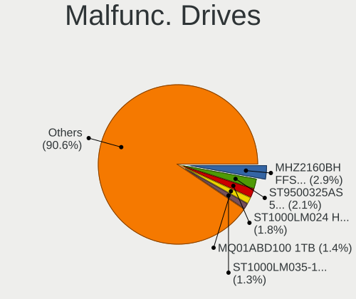

| Model                                               | Notebooks | Drives | Percent |
|-----------------------------------------------------|-----------|--------|---------|
| Fujitsu MHZ2160BH FFS G1 160GB                      | 25        | 25     | 2.87%   |
| Seagate ST9500325AS 500GB                           | 18        | 18     | 2.07%   |
| Seagate ST1000LM024 HN-M101MBB 1TB                  | 16        | 18     | 1.84%   |
| Toshiba MQ01ABD100 1TB                              | 12        | 13     | 1.38%   |
| SK hynix PC711 HFS512GDE9X073N 512GB                | 11        | 14     | 1.26%   |
| Seagate ST1000LM035-1RK172 1TB                      | 11        | 12     | 1.26%   |
| Hitachi HTS543216L9SA02 160GB                       | 11        | 11     | 1.26%   |
| HGST HTS541010A9E680 1TB                            | 11        | 11     | 1.26%   |
| Seagate ST500LT012-9WS142 500GB                     | 10        | 11     | 1.15%   |
| HGST HTS725050A7E630 500GB                          | 10        | 12     | 1.15%   |
| HGST HTS721010A9E630 1TB                            | 10        | 12     | 1.15%   |
| Toshiba MQ01ABF050 500GB                            | 9         | 9      | 1.03%   |
| Toshiba MK1653GSX 160GB                             | 9         | 9      | 1.03%   |
| Seagate ST9500420AS 500GB                           | 9         | 10     | 1.03%   |
| Seagate ST9320325AS 320GB                           | 9         | 10     | 1.03%   |
| Seagate ST500LT012-1DG142 500GB                     | 9         | 9      | 1.03%   |
| Seagate ST500LM021-1KJ152 500GB                     | 9         | 9      | 1.03%   |
| Toshiba MK1655GSXF 160GB                            | 8         | 9      | 0.92%   |
| Seagate ST320LT007-9ZV142 320GB                     | 8         | 10     | 0.92%   |
| Hitachi HTS547575A9E384 752GB                       | 8         | 11     | 0.92%   |
| Hitachi HTS545050B9A300 500GB                       | 8         | 8      | 0.92%   |
| SK hynix BC711 HFM512GD3JX013N 512GB                | 7         | 8      | 0.8%    |
| Kingston SV300S37A120G 120GB SSD                    | 6         | 6      | 0.69%   |
| HGST HTS545050A7E680 500GB                          | 6         | 8      | 0.69%   |
| Toshiba MQ04ABF100 1TB                              | 5         | 5      | 0.57%   |
| Toshiba MQ01ACF050 500GB                            | 5         | 5      | 0.57%   |
| SK hynix HFS256G39TND-N210A 256GB SSD               | 5         | 5      | 0.57%   |
| SK hynix HFS128G39TND-N210A 128GB SSD               | 5         | 5      | 0.57%   |
| Micron Technology MTFDDAV256TDL-1AW1ZABHA 256GB SSD | 5         | 5      | 0.57%   |
| Kingston SA400S37240G 240GB SSD                     | 5         | 5      | 0.57%   |
| Hitachi HTS545032B9A300 320GB                       | 5         | 8      | 0.57%   |
| Hitachi HTS543232A7A384 320GB                       | 5         | 5      | 0.57%   |
| Hitachi HTS543216L9A300 160GB                       | 5         | 8      | 0.57%   |
| Hitachi HTS542512K9SA00 120GB                       | 5         | 6      | 0.57%   |
| WDC WD1600BUDT-63DPZY0 160GB                        | 4         | 4      | 0.46%   |
| Seagate ST9320423AS 320GB                           | 4         | 4      | 0.46%   |
| Seagate ST500LM012 HN-M500MBB 500GB                 | 4         | 4      | 0.46%   |
| Seagate ST500LM000-SSHD-8GB                         | 4         | 4      | 0.46%   |
| Seagate ST320LT020-9YG142 320GB                     | 4         | 4      | 0.46%   |
| Samsung Electronics SSD 870 EVO 500GB               | 4         | 6      | 0.46%   |

Malfunc. Drive Vendor
---------------------

Vendors of faulty drives

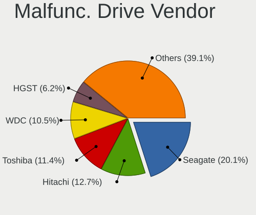

| Vendor              | Notebooks | Drives | Percent |
|---------------------|-----------|--------|---------|
| Seagate             | 174       | 189    | 20.07%  |
| Hitachi             | 110       | 127    | 12.69%  |
| Toshiba             | 99        | 105    | 11.42%  |
| WDC                 | 91        | 99     | 10.5%   |
| HGST                | 54        | 60     | 6.23%   |
| SK hynix            | 52        | 63     | 6%      |
| Samsung Electronics | 50        | 59     | 5.77%   |
| Fujitsu             | 41        | 43     | 4.73%   |
| Intel               | 27        | 28     | 3.11%   |
| Kingston            | 26        | 28     | 3%      |
| SanDisk             | 24        | 27     | 2.77%   |
| Micron Technology   | 20        | 22     | 2.31%   |
| Crucial             | 18        | 20     | 2.08%   |
| A-DATA Technology   | 11        | 13     | 1.27%   |
| LITEON              | 7         | 7      | 0.81%   |
| SSSTC               | 6         | 6      | 0.69%   |
| Apple               | 6         | 7      | 0.69%   |
| LITEONIT            | 4         | 5      | 0.46%   |
| Unknown             | 4         | 4      | 0.46%   |
| IBM/Hitachi         | 3         | 3      | 0.35%   |
| Team                | 2         | 2      | 0.23%   |
| Lenovo              | 2         | 2      | 0.23%   |
| KingSpec            | 2         | 2      | 0.23%   |
| KingDian            | 2         | 2      | 0.23%   |
| Kimtigo             | 2         | 2      | 0.23%   |
| JMicron Technology  | 2         | 2      | 0.23%   |
| Dogfish             | 2         | 2      | 0.23%   |
| Corsair             | 2         | 3      | 0.23%   |
| China               | 2         | 2      | 0.23%   |
| XPG                 | 1         | 1      | 0.12%   |
| Transcend           | 1         | 1      | 0.12%   |
| SPCC                | 1         | 1      | 0.12%   |
| ShiJi               | 1         | 7      | 0.12%   |
| S3+                 | 1         | 1      | 0.12%   |
| Plextor             | 1         | 1      | 0.12%   |
| Phison              | 1         | 3      | 0.12%   |
| Philips             | 1         | 2      | 0.12%   |
| OCZ                 | 1         | 1      | 0.12%   |
| NGFF                | 1         | 1      | 0.12%   |
| Netac               | 1         | 1      | 0.12%   |

Malfunc. HDD Vendor
-------------------

Vendors of faulty HDD drives

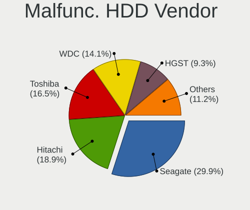

| Vendor              | Notebooks | Drives | Percent |
|---------------------|-----------|--------|---------|
| Seagate             | 174       | 189    | 29.95%  |
| Hitachi             | 110       | 127    | 18.93%  |
| Toshiba             | 96        | 101    | 16.52%  |
| WDC                 | 82        | 90     | 14.11%  |
| HGST                | 54        | 60     | 9.29%   |
| Fujitsu             | 41        | 43     | 7.06%   |
| Samsung Electronics | 18        | 18     | 3.1%    |
| IBM/Hitachi         | 3         | 3      | 0.52%   |
| JMicron Technology  | 1         | 1      | 0.17%   |
| IBM                 | 1         | 1      | 0.17%   |
| Apple               | 1         | 2      | 0.17%   |

Malfunc. Drive Kind
-------------------

Kinds of faulty drives

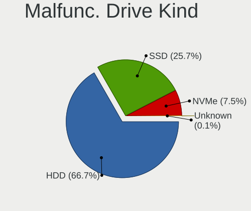

| Kind    | Notebooks | Drives | Percent |
|---------|-----------|--------|---------|
| HDD     | 573       | 635    | 66.71%  |
| SSD     | 221       | 246    | 25.73%  |
| NVMe    | 64        | 83     | 7.45%   |
| Unknown | 1         | 1      | 0.12%   |

Failed Drives
-------------

Failed drive models

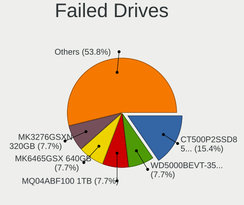

| Model                                           | Notebooks | Drives | Percent |
|-------------------------------------------------|-----------|--------|---------|
| Crucial CT500P2SSD8 500GB                       | 2         | 2      | 15.38%  |
| WDC WD5000BEVT-35A0RT0 500GB                    | 1         | 1      | 7.69%   |
| Toshiba MQ04ABF100 1TB                          | 1         | 1      | 7.69%   |
| Toshiba MK6465GSX 640GB                         | 1         | 1      | 7.69%   |
| Toshiba MK3276GSXN 320GB                        | 1         | 1      | 7.69%   |
| Seagate ST500LT012-1DG142 500GB                 | 1         | 1      | 7.69%   |
| Seagate ST500LM000-1EJ162 500GB                 | 1         | 1      | 7.69%   |
| Samsung Electronics MZVLB512HAJQ-000H1 512GB    | 1         | 1      | 7.69%   |
| Samsung Electronics MZMPC032HBCD-000H1 32GB SSD | 1         | 1      | 7.69%   |
| Hitachi HTS545050A7E380 500GB                   | 1         | 2      | 7.69%   |
| HGST HTS721010A9E630 1TB                        | 1         | 1      | 7.69%   |
| HGST HTS541010A9E680 1TB                        | 1         | 1      | 7.69%   |

Failed Drive Vendor
-------------------

Failed drive vendors

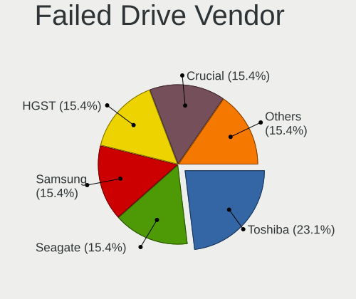

| Vendor              | Notebooks | Drives | Percent |
|---------------------|-----------|--------|---------|
| Toshiba             | 3         | 3      | 23.08%  |
| Seagate             | 2         | 2      | 15.38%  |
| Samsung Electronics | 2         | 2      | 15.38%  |
| HGST                | 2         | 2      | 15.38%  |
| Crucial             | 2         | 2      | 15.38%  |
| WDC                 | 1         | 1      | 7.69%   |
| Hitachi             | 1         | 2      | 7.69%   |

Drive Status
------------

Number of failed and malfunc. drives

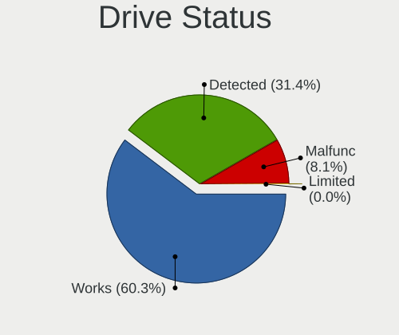

| Status   | Notebooks | Drives | Percent |
|----------|-----------|--------|---------|
| Works    | 6323      | 8911   | 60.32%  |
| Detected | 3291      | 5066   | 31.4%   |
| Malfunc  | 854       | 965    | 8.15%   |
| Failed   | 13        | 14     | 0.12%   |
| Limited  | 1         | 1      | 0.01%   |

Storage controller
------------------

Storage Vendor
--------------

Storage controller vendors

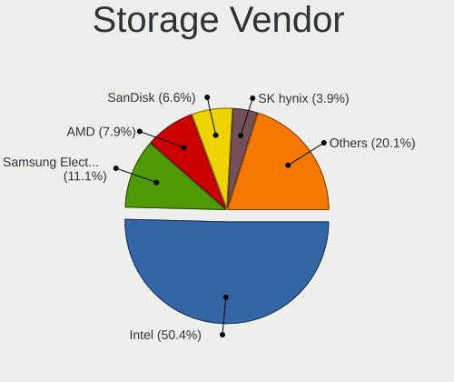

| Vendor                                  | Notebooks | Percent |
|-----------------------------------------|-----------|---------|
| Intel                                   | 5706      | 50.4%   |
| Samsung Electronics                     | 1251      | 11.05%  |
| AMD                                     | 895       | 7.91%   |
| SanDisk                                 | 742       | 6.55%   |
| SK hynix                                | 447       | 3.95%   |
| Nvidia                                  | 413       | 3.65%   |
| Micron Technology                       | 344       | 3.04%   |
| Kingston Technology Company             | 221       | 1.95%   |
| KIOXIA                                  | 194       | 1.71%   |
| Toshiba America Info Systems            | 182       | 1.61%   |
| Phison Electronics                      | 136       | 1.2%    |
| Micron/Crucial Technology               | 113       | 1%      |
| Apple                                   | 99        | 0.87%   |
| ADATA Technology                        | 97        | 0.86%   |
| Silicon Motion                          | 82        | 0.72%   |
| MAXIO Technology (Hangzhou)             | 61        | 0.54%   |
| Solid State Storage Technology          | 56        | 0.49%   |
| Union Memory (Shenzhen)                 | 40        | 0.35%   |
| Shenzhen Longsys Electronics            | 30        | 0.26%   |
| Realtek Semiconductor                   | 24        | 0.21%   |
| Yangtze Memory Technologies             | 20        | 0.18%   |
| Solidigm                                | 20        | 0.18%   |
| Silicon Integrated Systems [SiS]        | 18        | 0.16%   |
| Biwin Storage Technology                | 13        | 0.11%   |
| Lite-On Technology                      | 12        | 0.11%   |
| Marvell Technology Group                | 11        | 0.1%    |
| Lenovo                                  | 11        | 0.1%    |
| Shenzhen Unionmemory Information System | 9         | 0.08%   |
| INNOGRIT                                | 9         | 0.08%   |
| Seagate Technology                      | 8         | 0.07%   |
| VIA Technologies                        | 7         | 0.06%   |
| Hosin Global Electronics                | 6         | 0.05%   |
| ASMedia Technology                      | 5         | 0.04%   |
| Unknown                                 | 5         | 0.04%   |
| Transcend                               | 4         | 0.04%   |
| Netac Technology                        | 4         | 0.04%   |
| Loongson Technology                     | 4         | 0.04%   |
| Zhaoxin                                 | 3         | 0.03%   |
| ULi Electronics                         | 3         | 0.03%   |
| Silicon Image                           | 3         | 0.03%   |

Storage Model
-------------

Storage controller models

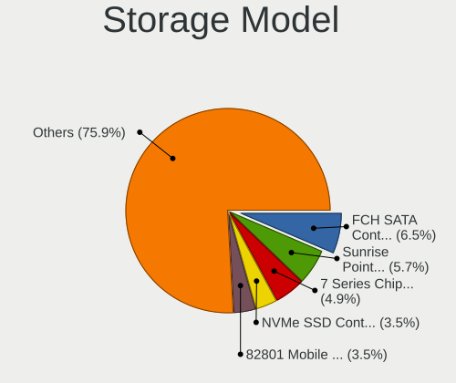

| Model                                                                          | Notebooks | Percent |
|--------------------------------------------------------------------------------|-----------|---------|
| AMD FCH SATA Controller [AHCI mode]                                            | 778       | 6.45%   |
| Intel Sunrise Point-LP SATA Controller [AHCI mode]                             | 688       | 5.7%    |
| Intel 7 Series Chipset Family 6-port SATA Controller [AHCI mode]               | 597       | 4.95%   |
| Samsung NVMe SSD Controller SM981/PM981/PM983                                  | 424       | 3.52%   |
| Intel 82801 Mobile SATA Controller [RAID mode]                                 | 423       | 3.51%   |
| Intel 6 Series/C200 Series Chipset Family 6 port Mobile SATA AHCI Controller   | 397       | 3.29%   |
| Intel Volume Management Device NVMe RAID Controller                            | 384       | 3.18%   |
| Nvidia MCP79 AHCI Controller                                                   | 381       | 3.16%   |
| Samsung NVMe SSD Controller 980 (DRAM-less)                                    | 275       | 2.28%   |
| Intel 8 Series SATA Controller 1 [AHCI mode]                                   | 262       | 2.17%   |
| Intel 82801IBM/IEM (ICH9M/ICH9M-E) 4 port SATA Controller [AHCI mode]          | 214       | 1.77%   |
| Samsung NVMe SSD Controller PM9A1/PM9A3/980PRO                                 | 205       | 1.7%    |
| Intel Wildcat Point-LP SATA Controller [AHCI Mode]                             | 201       | 1.67%   |
| Intel 8 Series/C220 Series Chipset Family 6-port SATA Controller 1 [AHCI mode] | 195       | 1.62%   |
| SK hynix Gold P31/BC711/PC711 NVMe Solid State Drive                           | 157       | 1.3%    |
| Intel Cannon Lake Mobile PCH SATA AHCI Controller                              | 155       | 1.29%   |
| Intel 5 Series/3400 Series Chipset 4 port SATA AHCI Controller                 | 155       | 1.29%   |
| Intel Tiger Lake-LP SATA Controller                                            | 154       | 1.28%   |
| SanDisk Extreme Pro / WD Black SN750 / PC SN730 / Red SN700 NVMe SSD           | 146       | 1.21%   |
| Intel 82801HM/HEM (ICH8M/ICH8M-E) IDE Controller                               | 146       | 1.21%   |
| Intel 82801HM/HEM (ICH8M/ICH8M-E) SATA Controller [AHCI mode]                  | 133       | 1.1%    |
| Intel Celeron/Pentium Silver Processor SATA Controller                         | 123       | 1.02%   |
| Intel Comet Lake SATA AHCI Controller                                          | 122       | 1.01%   |
| SanDisk Ultra 3D / WD PC SN530, IX SN530, Blue SN550 NVMe SSD (DRAM-less)      | 121       | 1%      |
| Intel 82801GBM/GHM (ICH7-M Family) SATA Controller [AHCI mode]                 | 119       | 0.99%   |
| Intel HM170/QM170 Chipset SATA Controller [AHCI Mode]                          | 114       | 0.95%   |
| Samsung S4LN058A01[SSUBX] AHCI SSD Controller (Apple slot)                     | 106       | 0.88%   |
| Intel 82801G (ICH7 Family) IDE Controller                                      | 106       | 0.88%   |
| Intel Cannon Point-LP SATA Controller [AHCI Mode]                              | 105       | 0.87%   |
| Intel Alder Lake-P SATA AHCI Controller                                        | 105       | 0.87%   |
| SanDisk WD SN560/SN740/SN770/SN5000 NVMe SSD                                   | 97        | 0.8%    |
| Intel 5 Series/3400 Series Chipset 6 port SATA AHCI Controller                 | 97        | 0.8%    |
| Toshiba America Info Systems XG6 NVMe SSD Controller                           | 94        | 0.78%   |
| Intel SSD 670p Series [Keystone Harbor]                                        | 91        | 0.75%   |
| Intel RST Volume Management Device Controller                                  | 87        | 0.72%   |
| Intel NM10/ICH7 Family SATA Controller [AHCI mode]                             | 86        | 0.71%   |
| Samsung NVMe SSD Controller SM961/PM961/SM963                                  | 82        | 0.68%   |
| Micron 2450 NVMe SSD [HendrixV] (DRAM-less)                                    | 81        | 0.67%   |
| AMD SB7x0/SB8x0/SB9x0 SATA Controller [AHCI mode]                              | 81        | 0.67%   |
| Apple S1X NVMe Controller                                                      | 80        | 0.66%   |

Storage Kind
------------

Kind of storage controller (IDE, SATA, NVMe, SAS, ...)

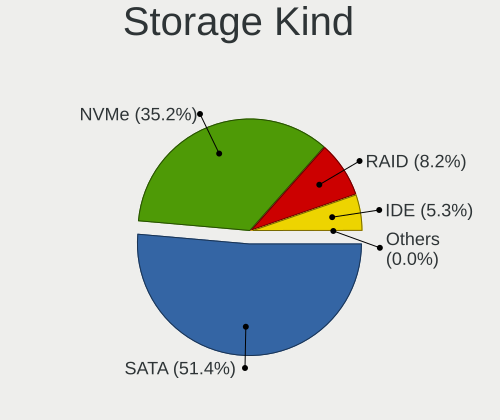

| Kind | Notebooks | Percent |
|------|-----------|---------|
| SATA | 5956      | 51.39%  |
| NVMe | 4075      | 35.16%  |
| RAID | 946       | 8.16%   |
| IDE  | 611       | 5.27%   |
| SAS  | 1         | 0.01%   |
| SCSI | 1         | 0.01%   |

Processor
---------

CPU Vendor
----------

Processor vendors

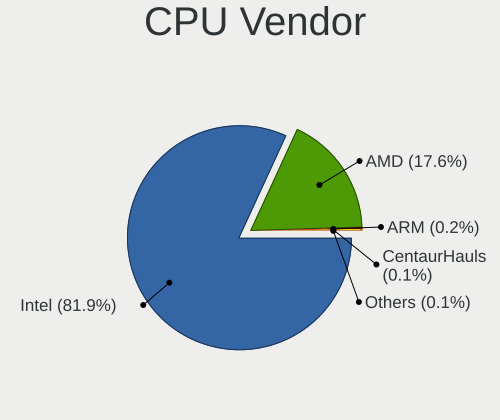

| Vendor        | Notebooks | Percent |
|---------------|-----------|---------|
| Intel         | 7979      | 81.86%  |
| AMD           | 1719      | 17.64%  |
| ARM           | 20        | 0.21%   |
| CentaurHauls  | 14        | 0.14%   |
| Unknown       | 9         | 0.09%   |
| Loongson      | 5         | 0.05%   |
| sifive,u74-mc | 1         | 0.01%   |

CPU Model
---------

Processor models

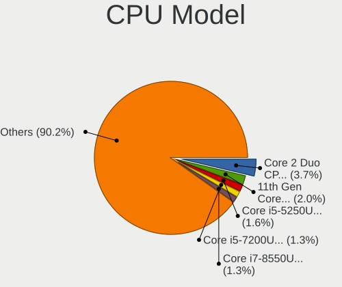

| Model                                         | Notebooks | Percent |
|-----------------------------------------------|-----------|---------|
| Intel Core 2 Duo CPU P7450 @ 2.13GHz          | 361       | 3.7%    |
| Intel 11th Gen Core i5-1135G7 @ 2.40GHz       | 194       | 1.99%   |
| Intel Core i5-5250U CPU @ 1.60GHz             | 153       | 1.57%   |
| Intel Core i5-7200U CPU @ 2.50GHz             | 126       | 1.29%   |
| Intel Core i7-8550U CPU @ 1.80GHz             | 123       | 1.26%   |
| Intel Core i5-8250U CPU @ 1.60GHz             | 120       | 1.23%   |
| Intel 11th Gen Core i7-1165G7 @ 2.80GHz       | 116       | 1.19%   |
| Intel Celeron CPU N2840 @ 2.16GHz             | 111       | 1.14%   |
| Intel Core i5-10210U CPU @ 1.60GHz            | 109       | 1.12%   |
| AMD Ryzen 5 3500U with Radeon Vega Mobile Gfx | 108       | 1.11%   |
| Intel Celeron CPU N3060 @ 1.60GHz             | 104       | 1.07%   |
| Intel Core i5-8265U CPU @ 1.60GHz             | 102       | 1.04%   |
| Intel Core i5-2520M CPU @ 2.50GHz             | 98        | 1%      |
| Intel Core i7-8565U CPU @ 1.80GHz             | 95        | 0.97%   |
| Intel Core i5-3320M CPU @ 2.60GHz             | 95        | 0.97%   |
| Intel Core i5-6300U CPU @ 2.40GHz             | 88        | 0.9%    |
| AMD Ryzen 5 5500U with Radeon Graphics        | 85        | 0.87%   |
| Intel Core i5-6200U CPU @ 2.30GHz             | 82        | 0.84%   |
| AMD Ryzen 7 5700U with Radeon Graphics        | 79        | 0.81%   |
| Intel 12th Gen Core i5-1235U                  | 78        | 0.8%    |
| Intel Core i7-7500U CPU @ 2.70GHz             | 76        | 0.78%   |
| Intel Core i7-10510U CPU @ 1.80GHz            | 75        | 0.77%   |
| Intel Celeron N4020 CPU @ 1.10GHz             | 71        | 0.73%   |
| Intel Core i5-8350U CPU @ 1.70GHz             | 70        | 0.72%   |
| Intel Core i5-3210M CPU @ 2.50GHz             | 70        | 0.72%   |
| Intel Core 2 CPU T7200 @ 2.00GHz              | 65        | 0.67%   |
| Intel Core i7-9750H CPU @ 2.60GHz             | 64        | 0.66%   |
| Intel Core i7-8750H CPU @ 2.20GHz             | 64        | 0.66%   |
| Intel Core i7-10750H CPU @ 2.60GHz            | 64        | 0.66%   |
| Intel Core i7-7700HQ CPU @ 2.80GHz            | 63        | 0.65%   |
| Intel Core i5-5200U CPU @ 2.20GHz             | 62        | 0.64%   |
| Intel Core i5-1035G1 CPU @ 1.00GHz            | 61        | 0.62%   |
| Intel 12th Gen Core i7-12700H                 | 60        | 0.61%   |
| Intel Core i7-6700HQ CPU @ 2.60GHz            | 55        | 0.56%   |
| Intel 11th Gen Core i3-1115G4 @ 3.00GHz       | 55        | 0.56%   |
| Intel Core i5-3230M CPU @ 2.60GHz             | 52        | 0.53%   |
| Intel Core i5-4300U CPU @ 1.90GHz             | 51        | 0.52%   |
| AMD Ryzen 7 5800H with Radeon Graphics        | 51        | 0.52%   |
| Intel Core i3-9100 CPU @ 3.60GHz              | 48        | 0.49%   |
| Intel Core i7-8650U CPU @ 1.90GHz             | 47        | 0.48%   |

CPU Model Family
----------------

Processor model prefix

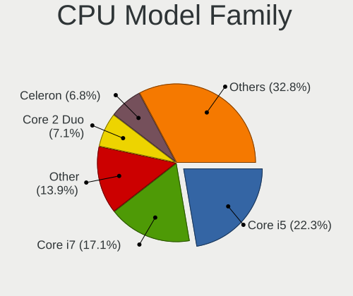

| Model                   | Notebooks | Percent |
|-------------------------|-----------|---------|
| Intel Core i5           | 2178      | 22.32%  |
| Intel Core i7           | 1671      | 17.13%  |
| Other                   | 1356      | 13.9%   |
| Intel Core 2 Duo        | 690       | 7.07%   |
| Intel Celeron           | 664       | 6.81%   |
| Intel Core i3           | 583       | 5.98%   |
| AMD Ryzen 5             | 460       | 4.72%   |
| AMD Ryzen 7             | 410       | 4.2%    |
| Intel Atom              | 253       | 2.59%   |
| Intel Pentium           | 173       | 1.77%   |
| AMD Ryzen 7 PRO         | 131       | 1.34%   |
| Intel Core              | 119       | 1.22%   |
| Intel Core 2            | 88        | 0.9%    |
| AMD Ryzen 3             | 76        | 0.78%   |
| Intel Pentium Dual-Core | 64        | 0.66%   |
| AMD Ryzen 5 PRO         | 64        | 0.66%   |
| AMD A6                  | 64        | 0.66%   |
| AMD Ryzen 9             | 63        | 0.65%   |
| Intel Pentium M         | 43        | 0.44%   |
| Intel Genuine           | 42        | 0.43%   |
| AMD A4                  | 42        | 0.43%   |
| AMD A8                  | 37        | 0.38%   |
| Intel Pentium Dual      | 36        | 0.37%   |
| AMD E1                  | 35        | 0.36%   |
| AMD E                   | 33        | 0.34%   |
| AMD E2                  | 29        | 0.3%    |
| Intel Pentium Silver    | 27        | 0.28%   |
| AMD A10                 | 25        | 0.26%   |
| Intel Core i9           | 22        | 0.23%   |
| Intel Celeron M         | 22        | 0.23%   |
| Intel Xeon              | 19        | 0.19%   |
| AMD Athlon              | 16        | 0.16%   |
| AMD Turion 64 X2 Mobile | 15        | 0.15%   |
| Intel Core m3           | 14        | 0.14%   |
| AMD PRO A10             | 14        | 0.14%   |
| Intel Core Duo          | 11        | 0.11%   |
| AMD Athlon II           | 11        | 0.11%   |
| Intel Pentium 4         | 10        | 0.1%    |
| AMD A12                 | 9         | 0.09%   |
| Intel Pentium Gold      | 8         | 0.08%   |

CPU Cores
---------

Number of processor cores

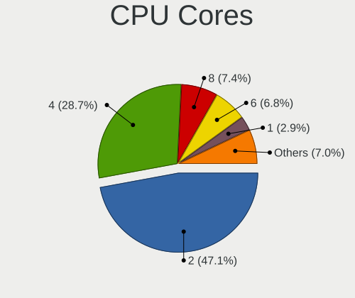

| Number  | Notebooks | Percent |
|---------|-----------|---------|
| 2       | 4598      | 47.1%   |
| 4       | 2801      | 28.69%  |
| 8       | 727       | 7.45%   |
| 6       | 663       | 6.79%   |
| 1       | 286       | 2.93%   |
| 10      | 261       | 2.67%   |
| 14      | 168       | 1.72%   |
| 12      | 152       | 1.56%   |
| 16      | 79        | 0.81%   |
| 24      | 20        | 0.2%    |
| 20      | 3         | 0.03%   |
| 5       | 3         | 0.03%   |
| 3       | 1         | 0.01%   |
| Unknown | 1         | 0.01%   |

CPU Sockets
-----------

Number of sockets

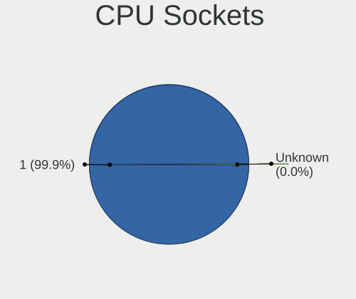

| Number  | Notebooks | Percent |
|---------|-----------|---------|
| 1       | 9730      | 99.87%  |
| 2       | 10        | 0.1%    |
| 8       | 2         | 0.02%   |
| Unknown | 1         | 0.01%   |

CPU Threads
-----------

Threads per core (Hyper-Threading)

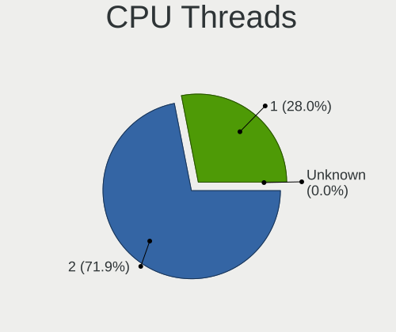

| Number  | Notebooks | Percent |
|---------|-----------|---------|
| 2       | 7026      | 71.94%  |
| 1       | 2739      | 28.04%  |
| 4       | 1         | 0.01%   |
| Unknown | 1         | 0.01%   |

CPU Op-Modes
------------

CPU Operation Modes (32-bit, 64-bit)

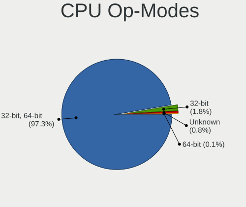

| Op mode        | Notebooks | Percent |
|----------------|-----------|---------|
| 32-bit, 64-bit | 9483      | 97.3%   |
| 32-bit         | 179       | 1.84%   |
| Unknown        | 75        | 0.77%   |
| 64-bit         | 9         | 0.09%   |

CPU Microcode
-------------

Microcode number

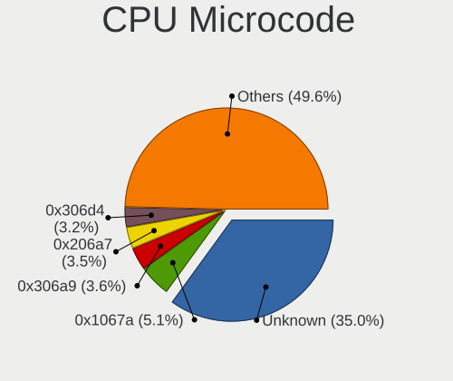

| Number     | Notebooks | Percent |
|------------|-----------|---------|
| Unknown    | 3526      | 35.01%  |
| 0x1067a    | 517       | 5.13%   |
| 0x306a9    | 363       | 3.6%    |
| 0x206a7    | 350       | 3.48%   |
| 0x306d4    | 319       | 3.17%   |
| 0x806c1    | 312       | 3.1%    |
| 0x806ec    | 297       | 2.95%   |
| 0x806ea    | 222       | 2.2%    |
| 0x406e3    | 211       | 2.1%    |
| 0x40651    | 209       | 2.08%   |
| 0x806e9    | 208       | 2.07%   |
| 0x30678    | 164       | 1.63%   |
| 0x306c3    | 147       | 1.46%   |
| 0x406c4    | 137       | 1.36%   |
| 0x906a3    | 131       | 1.3%    |
| 0x20655    | 122       | 1.21%   |
| 0x906a4    | 111       | 1.1%    |
| 0x906ea    | 109       | 1.08%   |
| 0x08108109 | 106       | 1.05%   |
| 0xa0652    | 103       | 1.02%   |
| 0x0a50000c | 99        | 0.98%   |
| 0x08608103 | 95        | 0.94%   |
| 0x706a8    | 81        | 0.8%    |
| 0x08600106 | 81        | 0.8%    |
| 0x706e5    | 74        | 0.73%   |
| 0x6f6      | 70        | 0.7%    |
| 0x6fd      | 69        | 0.69%   |
| 0x10676    | 68        | 0.68%   |
| 0x08108102 | 63        | 0.63%   |
| 0x106ca    | 61        | 0.61%   |
| 0xb06a2    | 59        | 0.59%   |
| 0x0a50000d | 59        | 0.59%   |
| 0x506e3    | 58        | 0.58%   |
| 0x906e9    | 57        | 0.57%   |
| 0x506c9    | 57        | 0.57%   |
| 0x806eb    | 55        | 0.55%   |
| 0x806d1    | 55        | 0.55%   |
| 0xb06a3    | 51        | 0.51%   |
| 0x06006705 | 51        | 0.51%   |
| 0x20652    | 50        | 0.5%    |

CPU Microarch
-------------

Microarchitecture

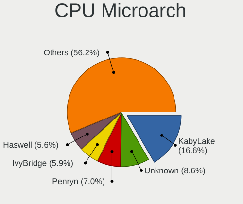

| Name               | Notebooks | Percent |
|--------------------|-----------|---------|
| KabyLake           | 1628      | 16.64%  |
| Unknown            | 844       | 8.63%   |
| Penryn             | 684       | 6.99%   |
| IvyBridge          | 576       | 5.89%   |
| Haswell            | 550       | 5.62%   |
| SandyBridge        | 544       | 5.56%   |
| TigerLake          | 490       | 5.01%   |
| Alderlake Hybrid   | 458       | 4.68%   |
| Skylake            | 448       | 4.58%   |
| Silvermont         | 426       | 4.36%   |
| Broadwell          | 410       | 4.19%   |
| Zen 3              | 286       | 2.92%   |
| Westmere           | 249       | 2.55%   |
| Core               | 237       | 2.42%   |
| Zen+               | 225       | 2.3%    |
| Zen 2              | 203       | 2.08%   |
| IceLake            | 179       | 1.83%   |
| Goldmont plus      | 171       | 1.75%   |
| CometLake          | 168       | 1.72%   |
| Excavator          | 153       | 1.56%   |
| Bonnell            | 152       | 1.55%   |
| P6                 | 106       | 1.08%   |
| Goldmont           | 86        | 0.88%   |
| Bobcat             | 69        | 0.71%   |
| Zen                | 60        | 0.61%   |
| Puma               | 58        | 0.59%   |
| Meteorlake Hybrid  | 47        | 0.48%   |
| Jaguar             | 42        | 0.43%   |
| K8 Hammer          | 34        | 0.35%   |
| Tremont            | 30        | 0.31%   |
| Piledriver         | 27        | 0.28%   |
| Nehalem            | 24        | 0.25%   |
| K10 Llano          | 22        | 0.22%   |
| K10                | 22        | 0.22%   |
| Gracemont          | 21        | 0.21%   |
| K8 & K10 hybrid    | 17        | 0.17%   |
| NetBurst           | 15        | 0.15%   |
| Steamroller        | 9         | 0.09%   |
| Lunarlake Hybrid   | 9         | 0.09%   |
| ArrowLake-H Hybrid | 2         | 0.02%   |

Graphics
--------

GPU Vendor
----------

Vendors of graphics cards

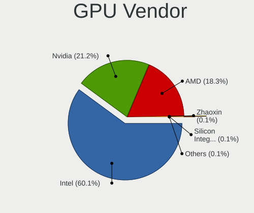

| Vendor                           | Notebooks | Percent |
|----------------------------------|-----------|---------|
| Intel                            | 7086      | 60.1%   |
| Nvidia                           | 2504      | 21.24%  |
| AMD                              | 2163      | 18.34%  |
| Zhaoxin                          | 12        | 0.1%    |
| Silicon Integrated Systems [SiS] | 12        | 0.1%    |
| VIA Technologies                 | 5         | 0.04%   |
| Loongson Technology              | 5         | 0.04%   |
| S3 Graphics                      | 3         | 0.03%   |
| Neomagic                         | 1         | 0.01%   |

GPU Model
---------

Graphics card models

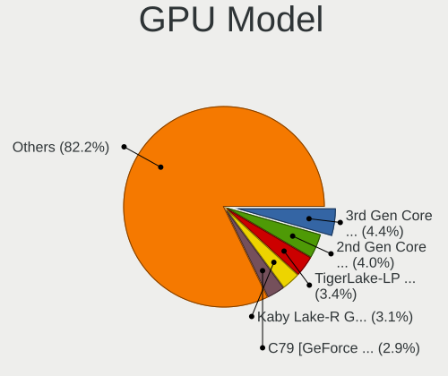

| Model                                                                                    | Notebooks | Percent |
|------------------------------------------------------------------------------------------|-----------|---------|
| Intel 3rd Gen Core processor Graphics Controller                                         | 541       | 4.43%   |
| Intel 2nd Generation Core Processor Family Integrated Graphics Controller                | 486       | 3.98%   |
| Intel TigerLake-LP GT2 [Iris Xe Graphics]                                                | 417       | 3.42%   |
| Intel Kaby Lake-R GT2 [UHD Graphics 620]                                                 | 374       | 3.06%   |
| Nvidia C79 [GeForce 9400M G]                                                             | 358       | 2.93%   |
| Intel Skylake-U GT2 [HD Graphics 520]                                                    | 307       | 2.52%   |
| Intel Haswell-ULT Integrated Graphics Controller                                         | 304       | 2.49%   |
| Intel Kaby Lake-U GT2 [HD Graphics 620]                                                  | 296       | 2.43%   |
| Intel WhiskeyLake-U GT2 [UHD Graphics 620]                                               | 277       | 2.27%   |
| AMD Picasso/Raven 2 [Radeon Vega Series / Radeon Vega Mobile Series]                     | 233       | 1.91%   |
| Intel CometLake-U GT2 [UHD Graphics]                                                     | 229       | 1.88%   |
| Intel Atom Processor Z36xxx/Z37xxx Series Graphics & Display                             | 217       | 1.78%   |
| Intel Atom/Celeron/Pentium Processor x5-E8000/J3xxx/N3xxx Integrated Graphics Controller | 208       | 1.7%    |
| Intel Broadwell-U GT2 [HD Graphics 5500]                                                 | 203       | 1.66%   |
| Intel CoffeeLake-H GT2 [UHD Graphics 630]                                                | 200       | 1.64%   |
| Intel 4th Gen Core Processor Integrated Graphics Controller                              | 199       | 1.63%   |
| AMD Renoir [Radeon Vega Series / Radeon Vega Mobile Series]                              | 197       | 1.61%   |
| AMD Lucienne                                                                             | 182       | 1.49%   |
| Intel Core Processor Integrated Graphics Controller                                      | 180       | 1.47%   |
| Intel Mobile 4 Series Chipset Integrated Graphics Controller                             | 173       | 1.42%   |
| Intel Broadwell-U GT3 [HD Graphics 6000]                                                 | 173       | 1.42%   |
| AMD Cezanne [Radeon Vega Series / Radeon Vega Mobile Series]                             | 171       | 1.4%    |
| Intel Mobile 945GM/GMS/GME, 943/940GML Express Integrated Graphics Controller            | 163       | 1.34%   |
| Intel GeminiLake [UHD Graphics 600]                                                      | 154       | 1.26%   |
| Intel Raptor Lake-P [Iris Xe Graphics]                                                   | 144       | 1.18%   |
| Intel Alder Lake-P GT2 [Iris Xe Graphics]                                                | 143       | 1.17%   |
| Intel CometLake-H GT2 [UHD Graphics]                                                     | 133       | 1.09%   |
| Nvidia TU117M [GeForce GTX 1650 Mobile / Max-Q]                                          | 121       | 0.99%   |
| Intel Mobile GM965/GL960 Integrated Graphics Controller (secondary)                      | 117       | 0.96%   |
| Intel Mobile GM965/GL960 Integrated Graphics Controller (primary)                        | 117       | 0.96%   |
| Intel Mobile 945GM/GMS, 943/940GML Express Integrated Graphics Controller                | 113       | 0.93%   |
| Intel Alder Lake-UP3 GT2 [Iris Xe Graphics]                                              | 111       | 0.91%   |
| AMD Barcelo                                                                              | 111       | 0.91%   |
| AMD Rembrandt [Radeon 680M]                                                              | 95        | 0.78%   |
| Intel TigerLake-H GT1 [UHD Graphics]                                                     | 94        | 0.77%   |
| Intel Kaby Lake-H GT2 [HD Graphics 630]                                                  | 94        | 0.77%   |
| Intel Iris Plus Graphics G1 (Ice Lake)                                                   | 85        | 0.7%    |
| AMD Stoney [Radeon R2/R3/R4/R5 Graphics]                                                 | 84        | 0.69%   |
| Intel Skylake-H GT2 [HD Graphics 530]                                                    | 81        | 0.66%   |
| Intel Atom Processor D4xx/D5xx/N4xx/N5xx Integrated Graphics Controller                  | 77        | 0.63%   |

GPU Combo
---------

Combinations of graphics cards

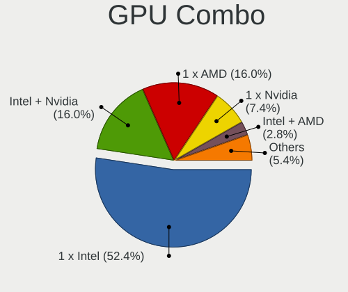

| Name                    | Notebooks | Percent |
|-------------------------|-----------|---------|
| 1 x Intel               | 5121      | 52.4%   |
| Intel + Nvidia          | 1566      | 16.03%  |
| 1 x AMD                 | 1561      | 15.97%  |
| 1 x Nvidia              | 720       | 7.37%   |
| Intel + AMD             | 278       | 2.84%   |
| AMD + Nvidia            | 214       | 2.19%   |
| 2 x AMD                 | 113       | 1.16%   |
| 2 x Intel               | 105       | 1.07%   |
| Other                   | 47        | 0.48%   |
| 1 x Zhaoxin             | 12        | 0.12%   |
| 1 x SiS                 | 12        | 0.12%   |
| 2 x Nvidia              | 5         | 0.05%   |
| 1 x VIA                 | 5         | 0.05%   |
| 1 x Loongson Technology | 5         | 0.05%   |
| 1 x S3 Graphics         | 3         | 0.03%   |
| 2 x Intel + 1 x Nvidia  | 2         | 0.02%   |
| Intel + 2 x Nvidia      | 2         | 0.02%   |
| 1 x Neomagic            | 1         | 0.01%   |

GPU Driver
----------

Free vs proprietary

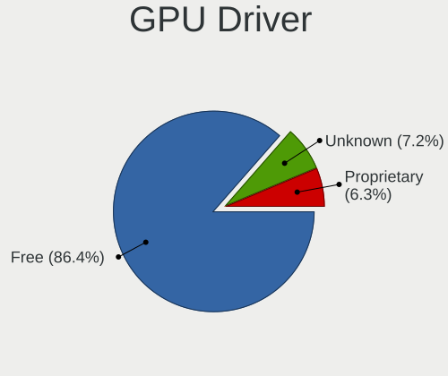

| Driver      | Notebooks | Percent |
|-------------|-----------|---------|
| Free        | 8542      | 86.45%  |
| Unknown     | 716       | 7.25%   |
| Proprietary | 623       | 6.31%   |

GPU Memory
----------

Total video memory

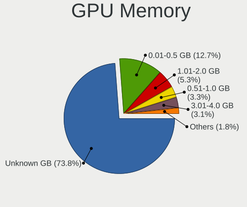

| Size in GB     | Notebooks | Percent |
|----------------|-----------|---------|
| Unknown        | 7298      | 73.81%  |
| 0.01-0.5       | 1255      | 12.69%  |
| 1.01-2.0       | 525       | 5.31%   |
| 0.51-1.0       | 326       | 3.3%    |
| 3.01-4.0       | 308       | 3.11%   |
| 5.01-6.0       | 86        | 0.87%   |
| 7.01-8.0       | 66        | 0.67%   |
| 2.01-3.0       | 15        | 0.15%   |
| 8.01-16.0      | 6         | 0.06%   |
| More than 64.0 | 1         | 0.01%   |
| 16.01-24.0     | 1         | 0.01%   |
| 0              | 1         | 0.01%   |

Monitor
-------

Monitor Vendor
--------------

Monitor vendors

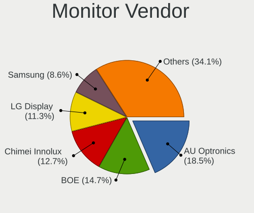

| Vendor                  | Notebooks | Percent |
|-------------------------|-----------|---------|
| AU Optronics            | 1997      | 18.52%  |
| BOE                     | 1584      | 14.69%  |
| Chimei Innolux          | 1373      | 12.74%  |
| LG Display              | 1221      | 11.33%  |
| Samsung Electronics     | 932       | 8.64%   |
| Apple                   | 791       | 7.34%   |
| Dell                    | 286       | 2.65%   |
| Lenovo                  | 242       | 2.24%   |
| Goldstar                | 216       | 2%      |
| Sharp                   | 211       | 1.96%   |
| InfoVision              | 181       | 1.68%   |
| Chi Mei Optoelectronics | 173       | 1.6%    |
| PANDA                   | 128       | 1.19%   |
| Hewlett-Packard         | 122       | 1.13%   |
| Philips                 | 96        | 0.89%   |
| AOC                     | 93        | 0.86%   |
| BenQ                    | 89        | 0.83%   |
| Acer                    | 81        | 0.75%   |
| LG Philips              | 73        | 0.68%   |
| CSO                     | 73        | 0.68%   |
| Iiyama                  | 61        | 0.57%   |
| HannStar                | 54        | 0.5%    |
| Ancor Communications    | 53        | 0.49%   |
| ASUSTek Computer        | 44        | 0.41%   |
| ViewSonic               | 33        | 0.31%   |
| Sony                    | 31        | 0.29%   |
| Unknown                 | 29        | 0.27%   |
| CSOT                    | 29        | 0.27%   |
| Eizo                    | 24        | 0.22%   |
| CPT                     | 24        | 0.22%   |
| MSI                     | 21        | 0.19%   |
| CSW                     | 20        | 0.19%   |
| Panasonic               | 17        | 0.16%   |
| Fujitsu Siemens         | 16        | 0.15%   |
| Quanta Display          | 14        | 0.13%   |
| HKC                     | 14        | 0.13%   |
| NEC Computers           | 13        | 0.12%   |
| Pixio                   | 12        | 0.11%   |
| Mi                      | 12        | 0.11%   |
| TMX                     | 11        | 0.1%    |

Monitor Model
-------------

Monitor models

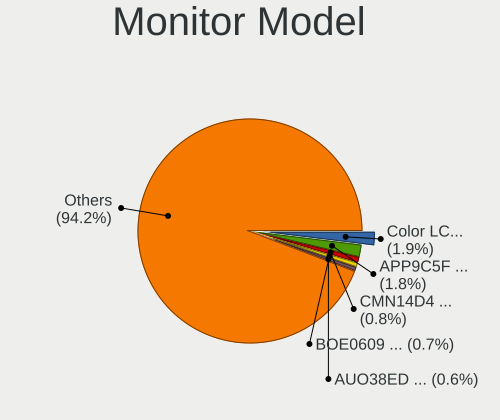

| Model                                                                | Notebooks | Percent |
|----------------------------------------------------------------------|-----------|---------|
| Apple Color LCD APP9C5B 1280x800 286x179mm 13.3-inch                 | 211       | 1.93%   |
| Apple LCD Monitor APP9C5F 1280x800 286x179mm 13.3-inch               | 197       | 1.81%   |
| Chimei Innolux LCD Monitor CMN14D4 1920x1080 309x173mm 13.9-inch     | 89        | 0.82%   |
| BOE LCD Monitor BOE0609 1366x768 256x144mm 11.6-inch                 | 71        | 0.65%   |
| AU Optronics LCD Monitor AUO38ED 1920x1080 344x193mm 15.5-inch       | 65        | 0.6%    |
| Chimei Innolux LCD Monitor CMN15F5 1920x1080 344x193mm 15.5-inch     | 62        | 0.57%   |
| AU Optronics LCD Monitor AUO106C 1366x768 276x155mm 12.5-inch        | 59        | 0.54%   |
| AU Optronics LCD Monitor AUO235C 1366x768 256x144mm 11.6-inch        | 54        | 0.5%    |
| Chimei Innolux LCD Monitor CMN15E7 1920x1080 344x193mm 15.5-inch     | 52        | 0.48%   |
| Apple Color LCD APP9CDF 1440x900 286x179mm 13.3-inch                 | 50        | 0.46%   |
| Chimei Innolux LCD Monitor CMN15DB 1366x768 344x193mm 15.5-inch      | 49        | 0.45%   |
| Chimei Innolux LCD Monitor CMN1132 1366x768 256x144mm 11.6-inch      | 44        | 0.4%    |
| AU Optronics LCD Monitor AUO21ED 1920x1080 344x193mm 15.5-inch       | 44        | 0.4%    |
| AU Optronics LCD Monitor AUO22EC 1366x768 344x193mm 15.5-inch        | 43        | 0.39%   |
| Apple Color LCD APP9CF3 1366x768 260x140mm 11.6-inch                 | 43        | 0.39%   |
| Apple Color LCD APP9CF2 1366x768 256x144mm 11.6-inch                 | 43        | 0.39%   |
| Chimei Innolux LCD Monitor CMN14C9 1920x1080 309x173mm 13.9-inch     | 40        | 0.37%   |
| Samsung Electronics LCD Monitor SEC5441 1280x800 331x207mm 15.4-inch | 39        | 0.36%   |
| Chimei Innolux LCD Monitor CMN1521 1920x1080 344x193mm 15.5-inch     | 39        | 0.36%   |
| AU Optronics LCD Monitor AUO403D 1920x1080 309x174mm 14.0-inch       | 39        | 0.36%   |
| Apple Color LCD APP9CF0 1440x900 290x180mm 13.4-inch                 | 37        | 0.34%   |
| AU Optronics LCD Monitor AUO26EC 1366x768 344x193mm 15.5-inch        | 35        | 0.32%   |
| BOE LCD Monitor BOE0872 1920x1080 344x194mm 15.5-inch                | 32        | 0.29%   |
| HannStar LCD Monitor HSD03E9 1024x600 220x129mm 10.0-inch            | 31        | 0.28%   |
| BOE LCD Monitor BOE06B3 1366x768 309x173mm 13.9-inch                 | 31        | 0.28%   |
| AU Optronics LCD Monitor AUO243D 1920x1080 309x173mm 13.9-inch       | 31        | 0.28%   |
| LG Display LCD Monitor LGD02D8 1366x768 277x156mm 12.5-inch          | 30        | 0.28%   |
| AU Optronics LCD Monitor AUO573D 1920x1080 309x174mm 14.0-inch       | 30        | 0.28%   |
| AU Optronics LCD Monitor AUO61ED 1920x1080 344x194mm 15.5-inch       | 29        | 0.27%   |
| BOE LCD Monitor BOE08D5 1920x1080 344x194mm 15.5-inch                | 28        | 0.26%   |
| AU Optronics LCD Monitor AUO71EC 1366x768 344x193mm 15.5-inch        | 28        | 0.26%   |
| AU Optronics LCD Monitor AUO133D 1920x1080 309x173mm 13.9-inch       | 28        | 0.26%   |
| AU Optronics LCD Monitor AUO2E3C 1366x768 309x173mm 13.9-inch        | 26        | 0.24%   |
| PANDA LCD Monitor NCP004D 1920x1080 344x194mm 15.5-inch              | 25        | 0.23%   |
| LG Display LCD Monitor LGD0521 1920x1080 309x174mm 14.0-inch         | 25        | 0.23%   |
| LG Display LCD Monitor LGD02DC 1366x768 344x194mm 15.5-inch          | 25        | 0.23%   |
| Lenovo LCD Monitor LEN40BA 1920x1080 344x194mm 15.5-inch             | 25        | 0.23%   |
| InfoVision LCD Monitor IVO0489 1366x768 256x144mm 11.6-inch          | 25        | 0.23%   |
| AU Optronics LCD Monitor AUO123D 1920x1080 309x173mm 13.9-inch       | 25        | 0.23%   |
| Chimei Innolux LCD Monitor CMN14D5 1920x1080 309x173mm 13.9-inch     | 24        | 0.22%   |

Monitor Resolution
------------------

Monitor screen resolution

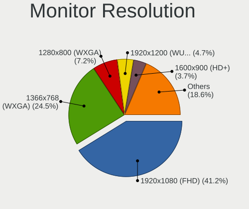

| Resolution         | Notebooks | Percent |
|--------------------|-----------|---------|
| 1920x1080 (FHD)    | 4185      | 41.2%   |
| 1366x768 (WXGA)    | 2489      | 24.51%  |
| 1280x800 (WXGA)    | 730       | 7.19%   |
| 1920x1200 (WUXGA)  | 480       | 4.73%   |
| 1600x900 (HD+)     | 380       | 3.74%   |
| 3840x2160 (4K)     | 332       | 3.27%   |
| 2560x1440 (QHD)    | 276       | 2.72%   |
| 1440x900 (WXGA+)   | 237       | 2.33%   |
| 2560x1600          | 170       | 1.67%   |
| 2880x1800          | 123       | 1.21%   |
| 1024x600           | 111       | 1.09%   |
| 1680x1050 (WSXGA+) | 67        | 0.66%   |
| 3840x2400          | 54        | 0.53%   |
| 2560x1080          | 54        | 0.53%   |
| 1280x1024 (SXGA)   | 54        | 0.53%   |
| 3440x1440          | 48        | 0.47%   |
| 1360x768           | 31        | 0.31%   |
| 2256x1504          | 29        | 0.29%   |
| 1024x768 (XGA)     | 25        | 0.25%   |
| 3200x1800 (QHD+)   | 23        | 0.23%   |
| 2160x1440          | 23        | 0.23%   |
| 2288x1287          | 22        | 0.22%   |
| Unknown            | 19        | 0.19%   |
| 3200x2000          | 16        | 0.16%   |
| 2240x1400          | 15        | 0.15%   |
| 1600x1200          | 15        | 0.15%   |
| 3072x1920          | 12        | 0.12%   |
| 2880x1920          | 11        | 0.11%   |
| 1400x1050          | 11        | 0.11%   |
| 3840x1080          | 10        | 0.1%    |
| 2520x1680          | 9         | 0.09%   |
| 1920x1280          | 9         | 0.09%   |
| 3456x2160          | 7         | 0.07%   |
| 1920x540           | 7         | 0.07%   |
| 800x1280           | 6         | 0.06%   |
| 3840x1100          | 6         | 0.06%   |
| 2880x1620          | 6         | 0.06%   |
| 3840x1600          | 5         | 0.05%   |
| 2304x1440          | 5         | 0.05%   |
| 1600x2560          | 5         | 0.05%   |

Monitor Diagonal
----------------

Diagonal size in inches

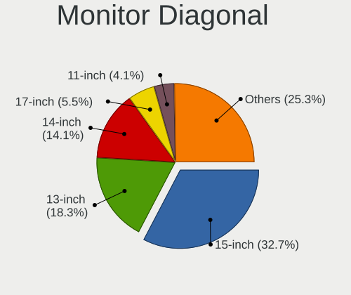

| Inches  | Notebooks | Percent |
|---------|-----------|---------|
| 15      | 3519      | 32.69%  |
| 13      | 1967      | 18.27%  |
| 14      | 1520      | 14.12%  |
| 17      | 595       | 5.53%   |
| 11      | 446       | 4.14%   |
| 24      | 370       | 3.44%   |
| 27      | 344       | 3.2%    |
| 12      | 330       | 3.07%   |
| 16      | 310       | 2.88%   |
| 23      | 267       | 2.48%   |
| 21      | 213       | 1.98%   |
| 31      | 116       | 1.08%   |
| 10      | 115       | 1.07%   |
| Unknown | 86        | 0.8%    |
| 18      | 81        | 0.75%   |
| 34      | 73        | 0.68%   |
| 19      | 59        | 0.55%   |
| 22      | 41        | 0.38%   |
| 25      | 31        | 0.29%   |
| 20      | 26        | 0.24%   |
| 142     | 22        | 0.2%    |
| 40      | 20        | 0.19%   |
| 72      | 18        | 0.17%   |
| 32      | 17        | 0.16%   |
| 84      | 16        | 0.15%   |
| 29      | 15        | 0.14%   |
| 8       | 15        | 0.14%   |
| 54      | 13        | 0.12%   |
| 28      | 13        | 0.12%   |
| 63      | 9         | 0.08%   |
| 49      | 8         | 0.07%   |
| 48      | 8         | 0.07%   |
| 46      | 8         | 0.07%   |
| 26      | 8         | 0.07%   |
| 43      | 6         | 0.06%   |
| 33      | 6         | 0.06%   |
| 52      | 5         | 0.05%   |
| 37      | 5         | 0.05%   |
| 7       | 5         | 0.05%   |
| 65      | 4         | 0.04%   |

Monitor Width
-------------

Physical width

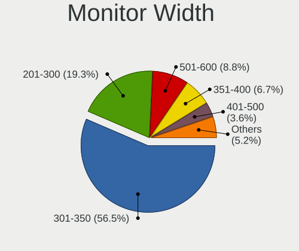

| Width in mm    | Notebooks | Percent |
|----------------|-----------|---------|
| 301-350        | 6026      | 56.47%  |
| 201-300        | 2060      | 19.3%   |
| 501-600        | 934       | 8.75%   |
| 351-400        | 715       | 6.7%    |
| 401-500        | 381       | 3.57%   |
| 601-700        | 178       | 1.67%   |
| 701-800        | 96        | 0.9%    |
| Unknown        | 86        | 0.81%   |
| 1001-1500      | 71        | 0.67%   |
| 1501-2000      | 39        | 0.37%   |
| 801-900        | 33        | 0.31%   |
| More than 2000 | 22        | 0.21%   |
| 101-200        | 16        | 0.15%   |
| 901-1000       | 9         | 0.08%   |
| 1-100          | 6         | 0.06%   |

Aspect Ratio
------------

Proportional relationship between the width and the height

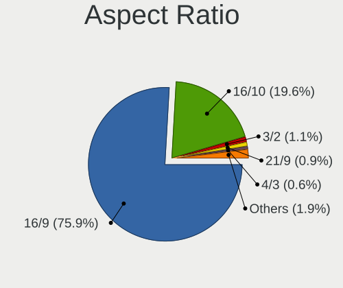

| Ratio   | Notebooks | Percent |
|---------|-----------|---------|
| 16/9    | 7288      | 75.89%  |
| 16/10   | 1879      | 19.57%  |
| 3/2     | 103       | 1.07%   |
| 21/9    | 89        | 0.93%   |
| 4/3     | 58        | 0.6%    |
| Unknown | 58        | 0.6%    |
| 5/4     | 56        | 0.58%   |
| 1.00    | 22        | 0.23%   |
| 32/9    | 12        | 0.12%   |
| 2.65    | 10        | 0.1%    |
| 3.40    | 6         | 0.06%   |
| 3.20    | 4         | 0.04%   |
| 0.67    | 4         | 0.04%   |
| 6/5     | 2         | 0.02%   |
| 1.96    | 2         | 0.02%   |
| 0.63    | 2         | 0.02%   |
| 0.56    | 2         | 0.02%   |
| 3.73    | 1         | 0.01%   |
| 2.70    | 1         | 0.01%   |
| 2.07    | 1         | 0.01%   |
| 2.00    | 1         | 0.01%   |
| 0.62    | 1         | 0.01%   |
| 0.58    | 1         | 0.01%   |

Monitor Area
------------

Area in inch²

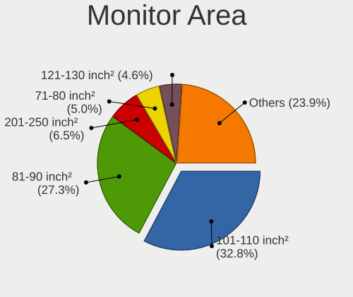

| Area in inch² | Notebooks | Percent |
|----------------|-----------|---------|
| 101-110        | 3517      | 32.78%  |
| 81-90          | 2927      | 27.28%  |
| 201-250        | 695       | 6.48%   |
| 71-80          | 533       | 4.97%   |
| 121-130        | 493       | 4.6%    |
| 51-60          | 453       | 4.22%   |
| 301-350        | 350       | 3.26%   |
| 61-70          | 321       | 2.99%   |
| 111-120        | 290       | 2.7%    |
| 351-500        | 228       | 2.13%   |
| 251-300        | 169       | 1.58%   |
| 151-200        | 129       | 1.2%    |
| 41-50          | 114       | 1.06%   |
| More than 1000 | 107       | 1%      |
| 141-150        | 104       | 0.97%   |
| Unknown        | 86        | 0.8%    |
| 131-140        | 80        | 0.75%   |
| 501-1000       | 64        | 0.6%    |
| 91-100         | 47        | 0.44%   |
| 1-40           | 22        | 0.21%   |

Pixel Density
-------------

Pixels per inch

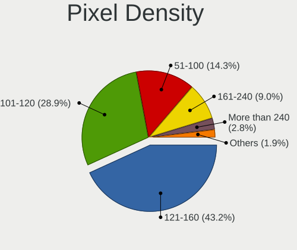

| Density       | Notebooks | Percent |
|---------------|-----------|---------|
| 121-160       | 4559      | 43.18%  |
| 101-120       | 3047      | 28.86%  |
| 51-100        | 1507      | 14.27%  |
| 161-240       | 947       | 8.97%   |
| More than 240 | 293       | 2.78%   |
| 1-50          | 118       | 1.12%   |
| Unknown       | 86        | 0.81%   |

Multiple Monitors
-----------------

Total monitors connected

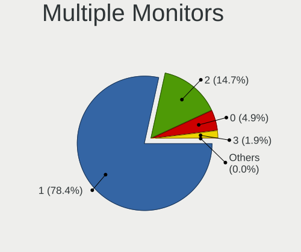

| Total | Notebooks | Percent |
|-------|-----------|---------|
| 1     | 7822      | 78.42%  |
| 2     | 1464      | 14.68%  |
| 0     | 492       | 4.93%   |
| 3     | 185       | 1.85%   |
| 4     | 8         | 0.08%   |
| 5     | 3         | 0.03%   |

Network
-------

Net Controller Vendor
---------------------

Controller vendors

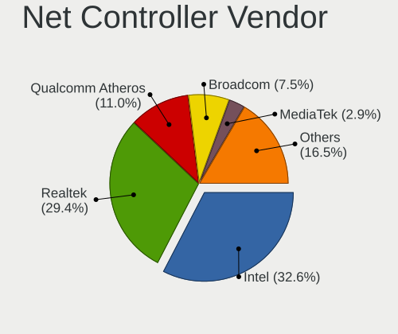

| Vendor                                 | Notebooks | Percent |
|----------------------------------------|-----------|---------|
| Intel                                  | 5070      | 32.61%  |
| Realtek Semiconductor                  | 4574      | 29.42%  |
| Qualcomm Atheros                       | 1714      | 11.02%  |
| Broadcom                               | 1162      | 7.47%   |
| MediaTek                               | 457       | 2.94%   |
| Nvidia                                 | 404       | 2.6%    |
| Broadcom Limited                       | 381       | 2.45%   |
| Marvell Technology Group               | 217       | 1.4%    |
| ASIX Electronics                       | 145       | 0.93%   |
| TP-Link                                | 112       | 0.72%   |
| Qualcomm                               | 108       | 0.69%   |
| Ralink                                 | 101       | 0.65%   |
| Samsung Electronics                    | 91        | 0.59%   |
| Lenovo                                 | 74        | 0.48%   |
| Xiaomi                                 | 67        | 0.43%   |
| Sierra Wireless                        | 66        | 0.42%   |
| Dell                                   | 63        | 0.41%   |
| Ralink Technology                      | 62        | 0.4%    |
| Shenzhen Goodix Technology             | 56        | 0.36%   |
| Ericsson Business Mobile Networks      | 52        | 0.33%   |
| JMicron Technology                     | 48        | 0.31%   |
| Hewlett-Packard                        | 43        | 0.28%   |
| DisplayLink                            | 39        | 0.25%   |
| Fibocom                                | 34        | 0.22%   |
| Huawei Technologies                    | 26        | 0.17%   |
| NetGear                                | 18        | 0.12%   |
| Google                                 | 18        | 0.12%   |
| Silicon Integrated Systems [SiS]       | 17        | 0.11%   |
| OPPO Electronics                       | 17        | 0.11%   |
| Motorola PCS                           | 17        | 0.11%   |
| Qualcomm Atheros Communications        | 16        | 0.1%    |
| Attansic Technology                    | 16        | 0.1%    |
| Suzhou Motorcomm Electronic Technology | 15        | 0.1%    |
| Cypress Semiconductor                  | 14        | 0.09%   |
| QinHeng Electronics                    | 12        | 0.08%   |
| ASUSTek Computer                       | 12        | 0.08%   |
| D-Link                                 | 11        | 0.07%   |
| ICS Advent                             | 10        | 0.06%   |
| U-Blox                                 | 9         | 0.06%   |
| Qualcomm Technologies                  | 9         | 0.06%   |

Net Controller Model
--------------------

Controller models

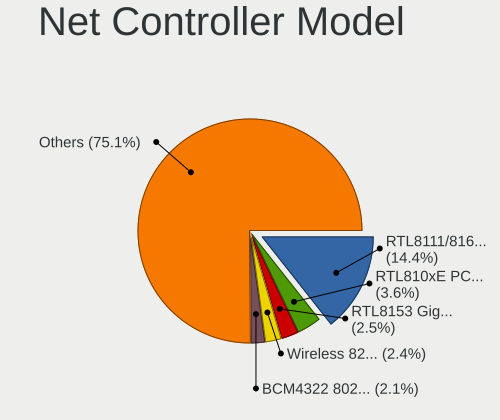

| Model                                                                  | Notebooks | Percent |
|------------------------------------------------------------------------|-----------|---------|
| Realtek RTL8111/8168/8211/8411 PCI Express Gigabit Ethernet Controller | 2680      | 14.37%  |
| Realtek RTL810xE PCI Express Fast Ethernet controller                  | 663       | 3.55%   |
| Realtek RTL8153 Gigabit Ethernet Adapter                               | 474       | 2.54%   |
| Intel Wireless 8265 / 8275                                             | 441       | 2.36%   |
| Broadcom BCM4322 802.11a/b/g/n Wireless LAN Controller                 | 384       | 2.06%   |
| Nvidia MCP79 Ethernet                                                  | 381       | 2.04%   |
| Intel Wi-Fi 6 AX201                                                    | 350       | 1.88%   |
| Intel 82579LM Gigabit Network Connection (Lewisville)                  | 350       | 1.88%   |
| Intel Wireless 7265                                                    | 339       | 1.82%   |
| Qualcomm Atheros QCA9377 802.11ac Wireless Network Adapter             | 337       | 1.81%   |
| Intel Wi-Fi 6 AX200                                                    | 329       | 1.76%   |
| Intel Wireless 7260                                                    | 326       | 1.75%   |
| Intel Alder Lake-P PCH CNVi WiFi                                       | 288       | 1.54%   |
| Realtek RTL8821CE 802.11ac PCIe Wireless Network Adapter               | 273       | 1.46%   |
| Realtek RTL8822CE 802.11ac PCIe Wireless Network Adapter               | 249       | 1.34%   |
| Qualcomm Atheros AR9285 Wireless Network Adapter (PCI-Express)         | 227       | 1.22%   |
| Intel Wireless 8260                                                    | 220       | 1.18%   |
| Qualcomm Atheros QCA9565 / AR9565 Wireless Network Adapter             | 219       | 1.17%   |
| Intel Centrino Advanced-N 6205 [Taylor Peak]                           | 217       | 1.16%   |
| MediaTek MT7921 802.11ax PCIe Wireless Network Adapter [Filogic 330]   | 213       | 1.14%   |
| Qualcomm Atheros AR9485 Wireless Network Adapter                       | 210       | 1.13%   |
| Intel Comet Lake PCH-LP CNVi WiFi                                      | 210       | 1.13%   |
| Broadcom Limited BCM4360 802.11ac Dual Band Wireless Network Adapter   | 196       | 1.05%   |
| Intel Ethernet Connection (4) I219-LM                                  | 188       | 1.01%   |
| Intel Cannon Point-LP CNVi [Wireless-AC]                               | 179       | 0.96%   |
| Qualcomm Atheros QCA6174 802.11ac Wireless Network Adapter             | 169       | 0.91%   |
| Intel Cannon Lake PCH CNVi WiFi                                        | 164       | 0.88%   |
| Broadcom BCM4313 802.11bgn Wireless Network Adapter                    | 145       | 0.78%   |
| Intel Raptor Lake PCH CNVi WiFi                                        | 144       | 0.77%   |
| Realtek RTL8852BE PCIe 802.11ax Wireless Network Controller            | 138       | 0.74%   |
| Intel Comet Lake PCH CNVi WiFi                                         | 129       | 0.69%   |
| ASIX AX88179 Gigabit Ethernet                                          | 129       | 0.69%   |
| Intel Wi-Fi 6E(802.11ax) AX210/AX1675* 2x2 [Typhoon Peak]              | 125       | 0.67%   |
| Intel Ethernet Connection (4) I219-V                                   | 124       | 0.66%   |
| Intel Ethernet Connection I219-LM                                      | 120       | 0.64%   |
| Realtek RTL8723BE PCIe Wireless Network Adapter                        | 119       | 0.64%   |
| MediaTek MT7922 802.11ax PCI Express Wireless Network Adapter          | 118       | 0.63%   |
| Intel Wireless 3165                                                    | 114       | 0.61%   |
| Intel Ethernet Connection I218-LM                                      | 104       | 0.56%   |
| Qualcomm Atheros AR9462 Wireless Network Adapter                       | 94        | 0.5%    |

Wireless Vendor
---------------

Wireless vendors

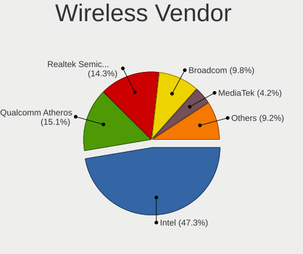

| Vendor                                | Notebooks | Percent |
|---------------------------------------|-----------|---------|
| Intel                                 | 4653      | 47.35%  |
| Qualcomm Atheros                      | 1486      | 15.12%  |
| Realtek Semiconductor                 | 1407      | 14.32%  |
| Broadcom                              | 961       | 9.78%   |
| MediaTek                              | 415       | 4.22%   |
| Broadcom Limited                      | 304       | 3.09%   |
| Ralink                                | 101       | 1.03%   |
| Qualcomm                              | 89        | 0.91%   |
| TP-Link                               | 77        | 0.78%   |
| Sierra Wireless                       | 66        | 0.67%   |
| Ralink Technology                     | 62        | 0.63%   |
| Dell                                  | 41        | 0.42%   |
| Fibocom                               | 34        | 0.35%   |
| NetGear                               | 18        | 0.18%   |
| Qualcomm Atheros Communications       | 16        | 0.16%   |
| ASUSTek Computer                      | 12        | 0.12%   |
| Hewlett-Packard                       | 10        | 0.1%    |
| D-Link                                | 9         | 0.09%   |
| Quectel Wireless Solutions            | 8         | 0.08%   |
| Edimax Technology                     | 8         | 0.08%   |
| Qualcomm Technologies                 | 7         | 0.07%   |
| Microsoft                             | 5         | 0.05%   |
| Linksys                               | 5         | 0.05%   |
| D-Link System                         | 5         | 0.05%   |
| 802.11g Adapter [Linksys WUSB54GC v3] | 3         | 0.03%   |
| 3Com                                  | 3         | 0.03%   |
| ZyXEL Communications                  | 2         | 0.02%   |
| Wilocity                              | 2         | 0.02%   |
| Ericsson Business Mobile Networks     | 2         | 0.02%   |
| Belkin Components                     | 2         | 0.02%   |
| ZyDAS                                 | 1         | 0.01%   |
| Z-Com                                 | 1         | 0.01%   |
| Winbond Electronics                   | 1         | 0.01%   |
| Wacom                                 | 1         | 0.01%   |
| Sitecom Europe                        | 1         | 0.01%   |
| Senao                                 | 1         | 0.01%   |
| Samsung Electronics                   | 1         | 0.01%   |
| Ovislink                              | 1         | 0.01%   |
| Marvell Technology Group              | 1         | 0.01%   |
| Fujitsu Siemens Computers             | 1         | 0.01%   |

Wireless Model
--------------

Wireless models

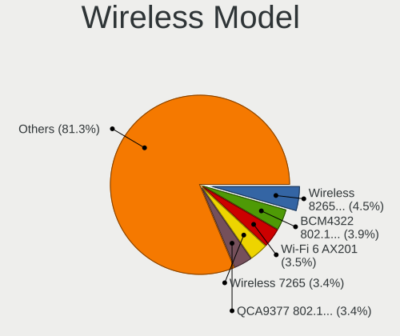

| Model                                                                                 | Notebooks | Percent |
|---------------------------------------------------------------------------------------|-----------|---------|
| Intel Wireless 8265 / 8275                                                            | 441       | 4.46%   |
| Broadcom BCM4322 802.11a/b/g/n Wireless LAN Controller                                | 384       | 3.88%   |
| Intel Wi-Fi 6 AX201                                                                   | 350       | 3.54%   |
| Intel Wireless 7265                                                                   | 339       | 3.43%   |
| Qualcomm Atheros QCA9377 802.11ac Wireless Network Adapter                            | 337       | 3.41%   |
| Intel Wi-Fi 6 AX200                                                                   | 329       | 3.33%   |
| Intel Wireless 7260                                                                   | 326       | 3.3%    |
| Realtek RTL8821CE 802.11ac PCIe Wireless Network Adapter                              | 273       | 2.76%   |
| Realtek RTL8822CE 802.11ac PCIe Wireless Network Adapter                              | 249       | 2.52%   |
| Qualcomm Atheros AR9285 Wireless Network Adapter (PCI-Express)                        | 227       | 2.3%    |
| Intel Wireless 8260                                                                   | 220       | 2.23%   |
| Qualcomm Atheros QCA9565 / AR9565 Wireless Network Adapter                            | 219       | 2.22%   |
| Intel Centrino Advanced-N 6205 [Taylor Peak]                                          | 217       | 2.2%    |
| MediaTek MT7921 802.11ax PCIe Wireless Network Adapter [Filogic 330]                  | 213       | 2.15%   |
| Qualcomm Atheros AR9485 Wireless Network Adapter                                      | 210       | 2.12%   |
| Intel Comet Lake PCH-LP CNVi WiFi                                                     | 210       | 2.12%   |
| Broadcom Limited BCM4360 802.11ac Dual Band Wireless Network Adapter                  | 196       | 1.98%   |
| Intel Cannon Point-LP CNVi [Wireless-AC]                                              | 179       | 1.81%   |
| Qualcomm Atheros QCA6174 802.11ac Wireless Network Adapter                            | 169       | 1.71%   |
| Intel Cannon Lake PCH CNVi WiFi                                                       | 164       | 1.66%   |
| Intel Alder Lake-P PCH CNVi WiFi                                                      | 157       | 1.59%   |
| Broadcom BCM4313 802.11bgn Wireless Network Adapter                                   | 145       | 1.47%   |
| Intel Raptor Lake PCH CNVi WiFi                                                       | 140       | 1.42%   |
| Intel Comet Lake PCH CNVi WiFi                                                        | 129       | 1.3%    |
| Intel Wi-Fi 6E(802.11ax) AX210/AX1675* 2x2 [Typhoon Peak]                             | 125       | 1.26%   |
| Realtek RTL8852BE PCIe 802.11ax Wireless Network Controller                           | 122       | 1.23%   |
| Realtek RTL8723BE PCIe Wireless Network Adapter                                       | 119       | 1.2%    |
| Intel Wireless 3165                                                                   | 114       | 1.15%   |
| MediaTek MT7922 802.11ax PCI Express Wireless Network Adapter                         | 96        | 0.97%   |
| Qualcomm Atheros AR9462 Wireless Network Adapter                                      | 94        | 0.95%   |
| Broadcom BCM43142 802.11b/g/n                                                         | 93        | 0.94%   |
| Intel PRO/Wireless 3945ABG [Golan] Network Connection                                 | 87        | 0.88%   |
| Realtek RTL8188CE 802.11b/g/n WiFi Adapter                                            | 86        | 0.87%   |
| Qualcomm QCNFA765 Wireless Network Adapter                                            | 82        | 0.83%   |
| Intel Centrino Ultimate-N 6300                                                        | 81        | 0.82%   |
| Realtek RTL8852AE 802.11ax PCIe Wireless Network Adapter                              | 80        | 0.81%   |
| Intel Wi-Fi 5(802.11ac) Wireless-AC 9x6x [Thunder Peak]                               | 75        | 0.76%   |
| Intel Wireless 3160                                                                   | 74        | 0.75%   |
| Qualcomm Atheros AR5418 Wireless Network Adapter [AR5008E 802.11(a)bgn] (PCI-Express) | 64        | 0.65%   |
| Intel Dual Band Wireless-AC 3165 Plus Bluetooth                                       | 63        | 0.64%   |

Ethernet Vendor
---------------

Ethernet vendors

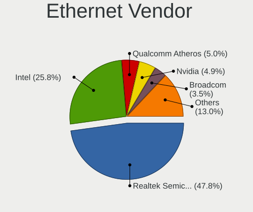

| Vendor                                 | Notebooks | Percent |
|----------------------------------------|-----------|---------|
| Realtek Semiconductor                  | 3967      | 47.81%  |
| Intel                                  | 2141      | 25.8%   |
| Qualcomm Atheros                       | 415       | 5%      |
| Nvidia                                 | 404       | 4.87%   |
| Broadcom                               | 292       | 3.52%   |
| Marvell Technology Group               | 216       | 2.6%    |
| ASIX Electronics                       | 145       | 1.75%   |
| Samsung Electronics                    | 86        | 1.04%   |
| Broadcom Limited                       | 81        | 0.98%   |
| Lenovo                                 | 74        | 0.89%   |
| Xiaomi                                 | 67        | 0.81%   |
| JMicron Technology                     | 48        | 0.58%   |
| MediaTek                               | 41        | 0.49%   |
| DisplayLink                            | 39        | 0.47%   |
| TP-Link                                | 35        | 0.42%   |
| Hewlett-Packard                        | 19        | 0.23%   |
| Qualcomm                               | 18        | 0.22%   |
| Silicon Integrated Systems [SiS]       | 17        | 0.2%    |
| OPPO Electronics                       | 17        | 0.2%    |
| Motorola PCS                           | 17        | 0.2%    |
| Google                                 | 17        | 0.2%    |
| Huawei Technologies                    | 16        | 0.19%   |
| Attansic Technology                    | 16        | 0.19%   |
| Suzhou Motorcomm Electronic Technology | 15        | 0.18%   |
| Cypress Semiconductor                  | 14        | 0.17%   |
| ICS Advent                             | 10        | 0.12%   |
| Microchip Technology                   | 9         | 0.11%   |
| Apple                                  | 9         | 0.11%   |
| QinHeng Electronics                    | 5         | 0.06%   |
| VIA Technologies                       | 4         | 0.05%   |
| Spreadtrum Communications              | 4         | 0.05%   |
| Linksys                                | 3         | 0.04%   |
| LG Electronics                         | 3         | 0.04%   |
| Davicom Semiconductor                  | 3         | 0.04%   |
| Qualcomm Technologies                  | 2         | 0.02%   |
| OnePlus Technology (Shenzhen)          | 2         | 0.02%   |
| National Semiconductor                 | 2         | 0.02%   |
| Motorcomm Microelectronics.            | 2         | 0.02%   |
| D-Link                                 | 2         | 0.02%   |
| Aquantia                               | 2         | 0.02%   |

Ethernet Model
--------------

Ethernet models

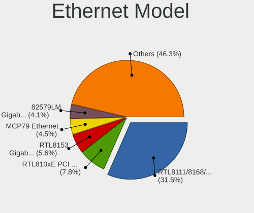

| Model                                                                  | Notebooks | Percent |
|------------------------------------------------------------------------|-----------|---------|
| Realtek RTL8111/8168/8211/8411 PCI Express Gigabit Ethernet Controller | 2680      | 31.63%  |
| Realtek RTL810xE PCI Express Fast Ethernet controller                  | 663       | 7.82%   |
| Realtek RTL8153 Gigabit Ethernet Adapter                               | 474       | 5.59%   |
| Nvidia MCP79 Ethernet                                                  | 381       | 4.5%    |
| Intel 82579LM Gigabit Network Connection (Lewisville)                  | 350       | 4.13%   |
| Intel Ethernet Connection (4) I219-LM                                  | 188       | 2.22%   |
| Intel Alder Lake-P PCH CNVi WiFi                                       | 131       | 1.55%   |
| ASIX AX88179 Gigabit Ethernet                                          | 129       | 1.52%   |
| Intel Ethernet Connection (4) I219-V                                   | 124       | 1.46%   |
| Intel Ethernet Connection I219-LM                                      | 120       | 1.42%   |
| Intel Ethernet Connection I218-LM                                      | 104       | 1.23%   |
| Intel Ethernet Connection (3) I218-LM                                  | 87        | 1.03%   |
| Intel 82577LM Gigabit Network Connection                               | 77        | 0.91%   |
| Intel Ethernet Connection I217-LM                                      | 72        | 0.85%   |
| Qualcomm Atheros AR8151 v2.0 Gigabit Ethernet                          | 70        | 0.83%   |
| Intel Ethernet Connection (6) I219-V                                   | 69        | 0.81%   |
| Intel Ethernet Connection I219-V                                       | 64        | 0.76%   |
| Marvell Group 88E8053 PCI-E Gigabit Ethernet Controller                | 63        | 0.74%   |
| Intel 82567LM Gigabit Network Connection                               | 62        | 0.73%   |
| Realtek RTL8152 Fast Ethernet Adapter                                  | 60        | 0.71%   |
| Intel Ethernet Connection (6) I219-LM                                  | 58        | 0.68%   |
| Qualcomm Atheros AR8132 Fast Ethernet                                  | 53        | 0.63%   |
| Intel Ethernet Connection (16) I219-V                                  | 53        | 0.63%   |
| Intel Ethernet Connection (13) I219-V                                  | 52        | 0.61%   |
| Broadcom NetLink BCM57785 Gigabit Ethernet PCIe                        | 50        | 0.59%   |
| Xiaomi Mi/Redmi series (RNDIS)                                         | 49        | 0.58%   |
| Samsung Galaxy series, misc. (tethering mode)                          | 49        | 0.58%   |
| Realtek RTL8125 2.5GbE Controller                                      | 49        | 0.58%   |
| Realtek Killer E2600 GbE Controller                                    | 43        | 0.51%   |
| Marvell Group 88E8040 PCI-E Fast Ethernet Controller                   | 43        | 0.51%   |
| Qualcomm Atheros AR8161 Gigabit Ethernet                               | 41        | 0.48%   |
| Intel Ethernet Connection (10) I219-V                                  | 41        | 0.48%   |
| Intel Ethernet Connection (18) I219-LM                                 | 38        | 0.45%   |
| Samsung GT-I9070 (network tethering, USB debugging enabled)            | 37        | 0.44%   |
| JMicron JMC250 PCI Express Gigabit Ethernet Controller                 | 35        | 0.41%   |
| Intel Ethernet Connection (7) I219-LM                                  | 35        | 0.41%   |
| Intel Ethernet Connection (13) I219-LM                                 | 35        | 0.41%   |
| Intel 82579V Gigabit Network Connection                                | 34        | 0.4%    |
| Broadcom NetXtreme BCM57765 Gigabit Ethernet PCIe                      | 34        | 0.4%    |
| Qualcomm Atheros QCA8171 Gigabit Ethernet                              | 33        | 0.39%   |

Net Controller Kind
-------------------

Ethernet, WiFi or modem

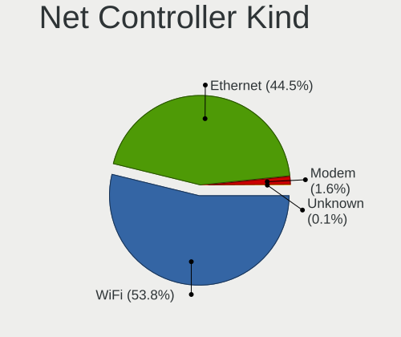

| Kind     | Notebooks | Percent |
|----------|-----------|---------|
| WiFi     | 9347      | 53.82%  |
| Ethernet | 7736      | 44.54%  |
| Modem    | 270       | 1.55%   |
| Unknown  | 15        | 0.09%   |

Used Controller
---------------

Currently used network controller

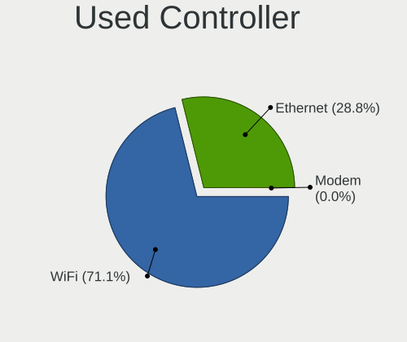

| Kind     | Notebooks | Percent |
|----------|-----------|---------|
| WiFi     | 7329      | 71.14%  |
| Ethernet | 2970      | 28.83%  |
| Modem    | 3         | 0.03%   |

NICs
----

Total network controllers on board

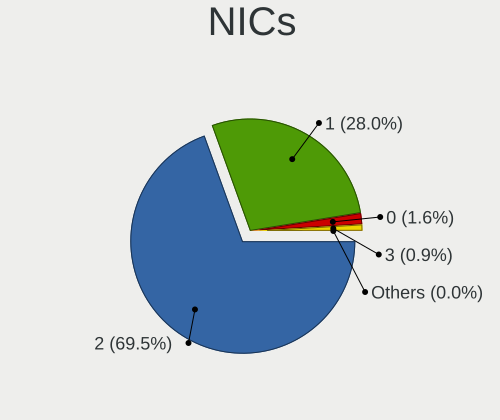

| Total | Notebooks | Percent |
|-------|-----------|---------|
| 2     | 6784      | 69.47%  |
| 1     | 2731      | 27.97%  |
| 0     | 158       | 1.62%   |
| 3     | 89        | 0.91%   |
| 4     | 2         | 0.02%   |
| 5     | 1         | 0.01%   |

IPv6
----

IPv6 vs IPv4

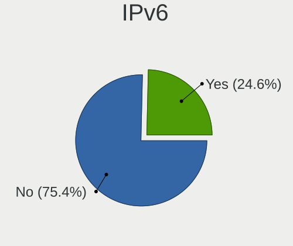

| Used | Notebooks | Percent |
|------|-----------|---------|
| No   | 7489      | 75.36%  |
| Yes  | 2448      | 24.64%  |

Bluetooth
---------

Bluetooth Vendor
----------------

Controller vendors

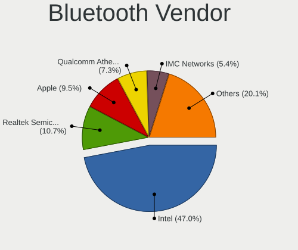

| Vendor                          | Notebooks | Percent |
|---------------------------------|-----------|---------|
| Intel                           | 3775      | 47.01%  |
| Realtek Semiconductor           | 859       | 10.7%   |
| Apple                           | 762       | 9.49%   |
| Qualcomm Atheros Communications | 585       | 7.29%   |
| IMC Networks                    | 431       | 5.37%   |
| Broadcom                        | 363       | 4.52%   |
| Foxconn / Hon Hai               | 313       | 3.9%    |
| Lite-On Technology              | 266       | 3.31%   |
| Dell                            | 110       | 1.37%   |
| Hewlett-Packard                 | 97        | 1.21%   |
| Cambridge Silicon Radio         | 83        | 1.03%   |
| MediaTek                        | 62        | 0.77%   |
| USI                             | 53        | 0.66%   |
| Realtek                         | 50        | 0.62%   |
| Toshiba                         | 47        | 0.59%   |
| ASUSTek Computer                | 41        | 0.51%   |
| Ralink                          | 35        | 0.44%   |
| Foxconn International           | 19        | 0.24%   |
| Alps Electric                   | 17        | 0.21%   |
| Ralink Technology               | 12        | 0.15%   |
| TP-Link                         | 8         | 0.1%    |
| Taiyo Yuden                     | 5         | 0.06%   |
| Fujitsu                         | 5         | 0.06%   |
| Edimax Technology               | 4         | 0.05%   |
| Chicony Electronics             | 4         | 0.05%   |
| Qcom                            | 3         | 0.04%   |
| Opticis                         | 3         | 0.04%   |
| Askey Computer                  | 3         | 0.04%   |
| Micro Star International        | 2         | 0.02%   |
| Corsair                         | 2         | 0.02%   |
| Belkin Components               | 2         | 0.02%   |
| Actions                         | 2         | 0.02%   |
| Unknown                         | 1         | 0.01%   |
| Smart Modular Technologies      | 1         | 0.01%   |
| Quectel Wireless Solutions      | 1         | 0.01%   |
| Marvell Semiconductor           | 1         | 0.01%   |
| Integrated System Solution      | 1         | 0.01%   |
| Conwise Technology              | 1         | 0.01%   |
| Unknown                         | 1         | 0.01%   |

Bluetooth Model
---------------

Controller models

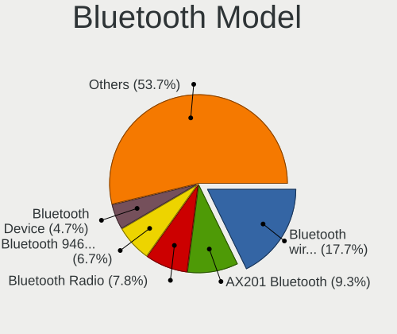

| Model                                               | Notebooks | Percent |
|-----------------------------------------------------|-----------|---------|
| Intel Bluetooth wireless interface                  | 1426      | 17.74%  |
| Intel AX201 Bluetooth                               | 747       | 9.29%   |
| Realtek Bluetooth Radio                             | 628       | 7.81%   |
| Intel Bluetooth 9460/9560 Jefferson Peak (JfP)      | 542       | 6.74%   |
| Intel Bluetooth Device                              | 375       | 4.67%   |
| Apple Built-in Bluetooth 2.0+EDR HCI                | 360       | 4.48%   |
| Qualcomm Atheros  Bluetooth Device                  | 319       | 3.97%   |
| Intel AX200 Bluetooth                               | 317       | 3.94%   |
| Apple Bluetooth USB Host Controller                 | 201       | 2.5%    |
| IMC Networks Wireless_Device                        | 169       | 2.1%    |
| Realtek  Bluetooth 4.2 Adapter                      | 147       | 1.83%   |
| IMC Networks Bluetooth Radio                        | 116       | 1.44%   |
| Apple Bluetooth Host Controller                     | 110       | 1.37%   |
| Intel AX210 Bluetooth                               | 109       | 1.36%   |
| Qualcomm Atheros AR3012 Bluetooth 4.0               | 89        | 1.11%   |
| Lite-On Qualcomm Atheros QCA9377 Bluetooth          | 88        | 1.09%   |
| Intel Centrino Bluetooth Wireless Transceiver       | 87        | 1.08%   |
| Foxconn / Hon Hai Bluetooth Device                  | 85        | 1.06%   |
| Cambridge Silicon Radio Bluetooth Dongle (HCI mode) | 83        | 1.03%   |
| Apple Bluetooth HCI MacBookPro (HID mode)           | 76        | 0.95%   |
| Broadcom BCM2045B (BDC-2.1)                         | 75        | 0.93%   |
| Foxconn / Hon Hai Wireless_Device                   | 73        | 0.91%   |
| IMC Networks Bluetooth Device                       | 72        | 0.9%    |
| Intel Wireless-AC 9260 Bluetooth Adapter            | 69        | 0.86%   |
| Qualcomm Atheros QCA61x4 Bluetooth 4.0              | 68        | 0.85%   |
| Foxconn / Hon Hai MediaTek Bluetooth Adapter        | 67        | 0.83%   |
| Broadcom BCM20702 Bluetooth 4.0 [ThinkPad]          | 66        | 0.82%   |
| MediaTek Wireless_Device                            | 61        | 0.76%   |
| Lite-On Bluetooth Device                            | 57        | 0.71%   |
| Qualcomm Atheros AR3011 Bluetooth                   | 55        | 0.68%   |
| USI Bluetooth Device                                | 53        | 0.66%   |
| Lite-On Wireless_Device                             | 53        | 0.66%   |
| Intel Wireless-AC 3168 Bluetooth                    | 52        | 0.65%   |
| HP Broadcom 2070 Bluetooth Combo                    | 51        | 0.63%   |
| Realtek Bluetooth Radio                             | 50        | 0.62%   |
| Intel Centrino Advanced-N 6230 Bluetooth adapter    | 50        | 0.62%   |
| Ralink RT3290 Bluetooth                             | 35        | 0.44%   |
| HP Bluetooth 2.0 Interface [Broadcom BCM2045]       | 35        | 0.44%   |
| Dell DW375 Bluetooth Module                         | 34        | 0.42%   |
| Lite-On Atheros AR3012 Bluetooth                    | 33        | 0.41%   |

Sound
-----

Sound Vendor
------------

Sound card vendors

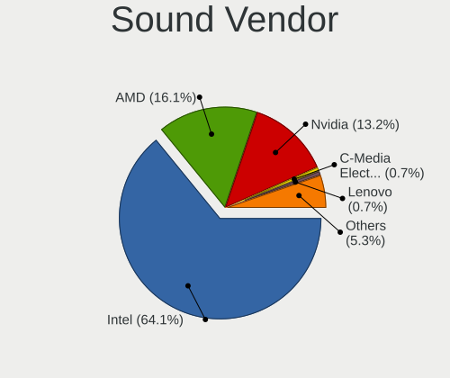

| Vendor                                       | Notebooks | Percent |
|----------------------------------------------|-----------|---------|
| Intel                                        | 7436      | 64.1%   |
| AMD                                          | 1862      | 16.05%  |
| Nvidia                                       | 1535      | 13.23%  |
| C-Media Electronics                          | 79        | 0.68%   |
| Lenovo                                       | 77        | 0.66%   |
| Logitech                                     | 58        | 0.5%    |
| Realtek Semiconductor                        | 55        | 0.47%   |
| GN Netcom                                    | 48        | 0.41%   |
| Texas Instruments                            | 39        | 0.34%   |
| Hewlett-Packard                              | 32        | 0.28%   |
| Plantronics                                  | 25        | 0.22%   |
| Generalplus Technology                       | 22        | 0.19%   |
| JMTek                                        | 19        | 0.16%   |
| Silicon Integrated Systems [SiS]             | 18        | 0.16%   |
| ASUSTek Computer                             | 16        | 0.14%   |
| Zoran Co. Personal Media Division (Nogatech) | 13        | 0.11%   |
| Zhaoxin                                      | 12        | 0.1%    |
| Creative Technology                          | 12        | 0.1%    |
| SteelSeries ApS                              | 11        | 0.09%   |
| Kingston Technology                          | 10        | 0.09%   |
| Focusrite-Novation                           | 9         | 0.08%   |
| DSEA A/S                                     | 9         | 0.08%   |
| Conexant Systems                             | 9         | 0.08%   |
| Razer USA                                    | 7         | 0.06%   |
| Dell                                         | 7         | 0.06%   |
| Apple                                        | 7         | 0.06%   |
| VIA Technologies                             | 6         | 0.05%   |
| Sony                                         | 6         | 0.05%   |
| Jieli Technology                             | 6         | 0.05%   |
| RODE Microphones                             | 5         | 0.04%   |
| M-Audio                                      | 5         | 0.04%   |
| Loongson Technology                          | 5         | 0.04%   |
| CMX Systems                                  | 5         | 0.04%   |
| Yamaha                                       | 4         | 0.03%   |
| Microsoft                                    | 4         | 0.03%   |
| Huawei Technologies                          | 4         | 0.03%   |
| Fujitsu                                      | 4         | 0.03%   |
| FiiO Electronics Technology                  | 4         | 0.03%   |
| ESS Technology                               | 4         | 0.03%   |
| Blue Microphones                             | 4         | 0.03%   |

Sound Model
-----------

Sound card models

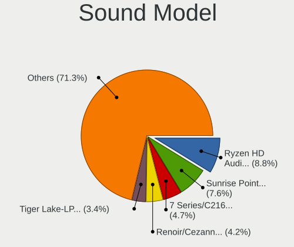

| Model                                                                                             | Notebooks | Percent |
|---------------------------------------------------------------------------------------------------|-----------|---------|
| AMD Ryzen HD Audio Controller                                                                     | 1237      | 8.76%   |
| Intel Sunrise Point-LP HD Audio                                                                   | 1067      | 7.56%   |
| Intel 7 Series/C216 Chipset Family High Definition Audio Controller                               | 666       | 4.72%   |
| AMD Renoir/Cezanne HDMI/DP Audio Controller                                                       | 596       | 4.22%   |
| Intel Tiger Lake-LP Smart Sound Technology Audio Controller                                       | 487       | 3.45%   |
| Intel 6 Series/C200 Series Chipset Family High Definition Audio Controller                        | 451       | 3.19%   |
| Intel Broadwell-U Audio Controller                                                                | 409       | 2.9%    |
| Intel Wildcat Point-LP High Definition Audio Controller                                           | 404       | 2.86%   |
| Nvidia MCP79 High Definition Audio                                                                | 384       | 2.72%   |
| Intel Alder Lake PCH-P High Definition Audio Controller                                           | 365       | 2.59%   |
| Intel Haswell-ULT HD Audio Controller                                                             | 309       | 2.19%   |
| Intel 8 Series HD Audio Controller                                                                | 309       | 2.19%   |
| Intel Cannon Point-LP High Definition Audio Controller                                            | 285       | 2.02%   |
| AMD Radeon High Definition Audio Controller                                                       | 284       | 2.01%   |
| AMD Raven/Raven2/Fenghuang HDMI/DP Audio Controller                                               | 277       | 1.96%   |
| Intel NM10/ICH7 Family High Definition Audio Controller                                           | 276       | 1.96%   |
| Intel 5 Series/3400 Series Chipset High Definition Audio                                          | 271       | 1.92%   |
| Intel Cannon Lake PCH cAVS                                                                        | 270       | 1.91%   |
| Intel 82801I (ICH9 Family) HD Audio Controller                                                    | 256       | 1.81%   |
| Intel Comet Lake PCH-LP cAVS                                                                      | 248       | 1.76%   |
| Intel 8 Series/C220 Series Chipset High Definition Audio Controller                               | 239       | 1.69%   |
| Intel Raptor Lake-P/U/H cAVS                                                                      | 213       | 1.51%   |
| Intel Xeon E3-1200 v3/4th Gen Core Processor HD Audio Controller                                  | 201       | 1.42%   |
| AMD FCH Azalia Controller                                                                         | 182       | 1.29%   |
| Intel Celeron/Pentium Silver Processor High Definition Audio                                      | 171       | 1.21%   |
| Intel Atom Processor Z36xxx/Z37xxx Series High Definition Audio Controller                        | 171       | 1.21%   |
| AMD Kabini HDMI/DP Audio                                                                          | 169       | 1.2%    |
| Intel Atom/Celeron/Pentium Processor x5-E8000/J3xxx/N3xxx Series High Definition Audio Controller | 157       | 1.11%   |
| Intel 82801H (ICH8 Family) HD Audio Controller                                                    | 157       | 1.11%   |
| Intel Comet Lake PCH cAVS                                                                         | 151       | 1.07%   |
| AMD Family 15h (Models 60h-6fh) Audio Controller                                                  | 146       | 1.03%   |
| Nvidia TU107 GeForce GTX 1650 High Definition Audio Controller                                    | 131       | 0.93%   |
| Intel Ice Lake-LP Smart Sound Technology Audio Controller                                         | 115       | 0.81%   |
| Intel CM238 HD Audio Controller                                                                   | 109       | 0.77%   |
| Intel Tiger Lake-H HD Audio Controller                                                            | 101       | 0.72%   |
| Intel 100 Series/C230 Series Chipset Family HD Audio Controller                                   | 101       | 0.72%   |
| AMD SBx00 Azalia (Intel HDA)                                                                      | 97        | 0.69%   |
| Nvidia GF108 High Definition Audio Controller                                                     | 92        | 0.65%   |
| Nvidia AD107 High Definition Audio Controller                                                     | 87        | 0.62%   |
| Intel Celeron N3350/Pentium N4200/Atom E3900 Series Audio Cluster                                 | 86        | 0.61%   |

Memory
------

Memory Vendor
-------------

Memory module vendors

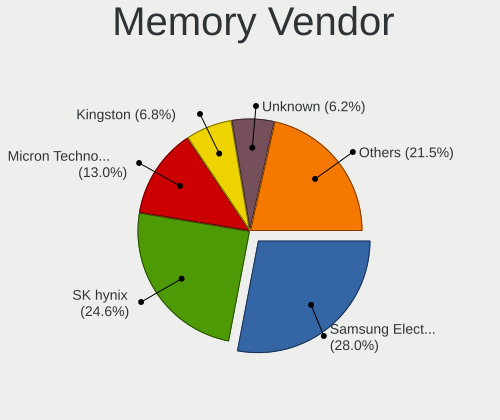

| Vendor              | Notebooks | Percent |
|---------------------|-----------|---------|
| Samsung Electronics | 2543      | 28%     |
| SK hynix            | 2236      | 24.62%  |
| Micron Technology   | 1179      | 12.98%  |
| Kingston            | 614       | 6.76%   |
| Unknown             | 560       | 6.17%   |
| Crucial             | 443       | 4.88%   |
| Elpida              | 200       | 2.2%    |
| Ramaxel Technology  | 173       | 1.9%    |
| A-DATA Technology   | 171       | 1.88%   |
| Unknown             | 127       | 1.4%    |
| Corsair             | 96        | 1.06%   |
| Nanya Technology    | 92        | 1.01%   |
| Unknown (ABCD)      | 71        | 0.78%   |
| Smart               | 62        | 0.68%   |
| G.Skill             | 51        | 0.56%   |
| GOODRAM             | 36        | 0.4%    |
| Team                | 32        | 0.35%   |
| Transcend           | 30        | 0.33%   |
| 4ea5                | 24        | 0.26%   |
| ff                  | 18        | 0.2%    |
| Patriot             | 17        | 0.19%   |
| Teikon              | 16        | 0.18%   |
| fef5                | 15        | 0.17%   |
| Apacer              | 15        | 0.17%   |
| Timetec             | 14        | 0.15%   |
| Silicon Power       | 14        | 0.15%   |
| 48spaces            | 12        | 0.13%   |
| Neo Forza           | 11        | 0.12%   |
| ASint Technology    | 11        | 0.12%   |
| Smart Brazil        | 8         | 0.09%   |
| Qimonda             | 7         | 0.08%   |
| PNY                 | 7         | 0.08%   |
| AMD                 | 7         | 0.08%   |
| Avant               | 6         | 0.07%   |
| Lexar Co Limited    | 5         | 0.06%   |
| Hikvision           | 5         | 0.06%   |
| Goldkey             | 5         | 0.06%   |
| ChangXin Memory     | 5         | 0.06%   |
| Wilk                | 4         | 0.04%   |
| Lexar               | 4         | 0.04%   |

Memory Model
------------

Memory module models

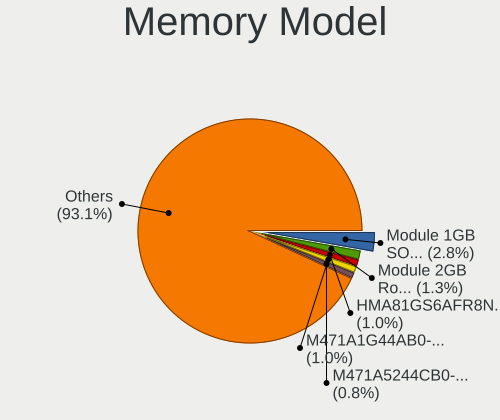

| Model                                                            | Notebooks | Percent |
|------------------------------------------------------------------|-----------|---------|
| SK hynix RAM Module 1GB SODIMM DDR2 800MT/s                      | 266       | 2.78%   |
| Unknown                                                          | 127       | 1.33%   |
| SK hynix RAM HMA81GS6AFR8N-UH 8GB SODIMM DDR4 2667MT/s           | 95        | 0.99%   |
| Samsung RAM M471A1G44AB0-CWE 8GiB SODIMM DDR4 3200MT/s           | 91        | 0.95%   |
| Samsung RAM M471A5244CB0-CTD 4GB SODIMM DDR4 3266MT/s            | 81        | 0.85%   |
| Samsung RAM M471B5173DB0-YK0 4GB SODIMM DDR3 1600MT/s            | 78        | 0.82%   |
| Samsung RAM M471A1K43EB1-CWE 8GB SODIMM DDR4 3200MT/s            | 76        | 0.8%    |
| SK hynix RAM HMT451S6BFR8A-PB 4GB SODIMM DDR3 1600MT/s           | 71        | 0.74%   |
| Samsung RAM M471B5674QH0-YK0 2GB SODIMM DDR3 3200MT/s            | 71        | 0.74%   |
| Samsung RAM M471B5273DH0-CH9 4GB SODIMM DDR3 1600MT/s            | 71        | 0.74%   |
| Samsung RAM M471A1G44BB0-CWE 8GB SODIMM DDR4 3200MT/s            | 70        | 0.73%   |
| SK hynix RAM HMAA1GS6CJR6N-XN 8GB SODIMM DDR4 3200MT/s           | 69        | 0.72%   |
| SK hynix RAM Module 1GB SODIMM DDR2 667MT/s                      | 68        | 0.71%   |
| Unknown (ABCD) RAM 123456789012345678 2GB SODIMM LPDDR4 2400MT/s | 65        | 0.68%   |
| Samsung RAM Module 2GB SODIMM DDR3 1600MT/s                      | 64        | 0.67%   |
| Samsung RAM M471B5273CH0-CH9 4GB SODIMM DDR3 1334MT/s            | 57        | 0.6%    |
| Samsung RAM M471B5173QH0-YK0 4GB SODIMM DDR3 1600MT/s            | 57        | 0.6%    |
| Samsung RAM M471A1K43DB1-CWE 8GB SODIMM DDR4 3200MT/s            | 56        | 0.59%   |
| SK hynix RAM HMT351S6CFR8C-PB 4GB SODIMM DDR3 1600MT/s           | 53        | 0.55%   |
| Samsung RAM M471B5173EB0-YK0 4GB SODIMM DDR3 1600MT/s            | 53        | 0.55%   |
| Samsung RAM M471A5244CB0-CWE 4GB SODIMM DDR4 3200MT/s            | 53        | 0.55%   |
| SK hynix RAM HMA81GS6DJR8N-XN 8GB SODIMM DDR4 3200MT/s           | 52        | 0.54%   |
| SK hynix RAM Module 4GB SODIMM DDR3 1600MT/s                     | 51        | 0.53%   |
| Micron RAM 4ATF51264HZ-3G2J1 4GB SODIMM DDR4 3200MT/s            | 51        | 0.53%   |
| SK hynix RAM HMT41GS6BFR8A-PB 8GB SODIMM DDR3 2667MT/s           | 50        | 0.52%   |
| Elpida RAM Module 4GB SODIMM DDR3 1600MT/s                       | 50        | 0.52%   |
| Crucial RAM CT8G4SFRA266.C8FD1 8GB SODIMM DDR4 2667MT/s          | 50        | 0.52%   |
| Samsung RAM M471A1K43CB1-CRC 8GB SODIMM DDR4 8400MT/s            | 48        | 0.5%    |
| Samsung RAM M471A1K43BB1-CRC 8GB SODIMM DDR4 2667MT/s            | 48        | 0.5%    |
| Samsung RAM K4E8E324EB-EGCF 2GB LPDDR3 1867MT/s                  | 47        | 0.49%   |
| Micron RAM 4ATF1G64HZ-3G2F1 8GB SODIMM DDR4 3200MT/s             | 44        | 0.46%   |
| Micron RAM 8ATF1G64HZ-3G2R1 8GB SODIMM DDR4 3200MT/s             | 43        | 0.45%   |
| Samsung RAM M471B1G73DB0-YK0 8GB SODIMM DDR3 1600MT/s            | 42        | 0.44%   |
| Samsung RAM M471B1G73QH0-YK0 8GB SODIMM DDR3 1600MT/s            | 41        | 0.43%   |
| SK hynix RAM HMA81GS6CJR8N-VK 8GB SODIMM DDR4 2667MT/s           | 39        | 0.41%   |
| Samsung RAM M471A1K43CB1-CTD 8GB SODIMM DDR4 3200MT/s            | 39        | 0.41%   |
| Micron RAM 4ATF1G64HZ-3G2E1 8GB SODIMM DDR4 3200MT/s             | 39        | 0.41%   |
| Unknown RAM Module 2GB SODIMM DDR2 667MT/s                       | 38        | 0.4%    |
| SK hynix RAM HMA81GS6JJR8N-VK 8GB SODIMM DDR4 2667MT/s           | 37        | 0.39%   |
| Samsung RAM M471A5244CB0-CRC 4GB SODIMM DDR4 2667MT/s            | 36        | 0.38%   |

Memory Kind
-----------

Memory module kinds

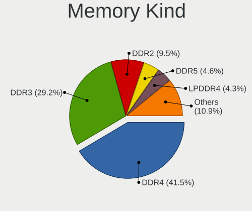

| Kind    | Notebooks | Percent |
|---------|-----------|---------|
| DDR4    | 3226      | 41.47%  |
| DDR3    | 2272      | 29.21%  |
| DDR2    | 737       | 9.47%   |
| DDR5    | 358       | 4.6%    |
| LPDDR4  | 336       | 4.32%   |
| LPDDR5  | 294       | 3.78%   |
| LPDDR3  | 271       | 3.48%   |
| SDRAM   | 154       | 1.98%   |
| DDR     | 63        | 0.81%   |
| Unknown | 49        | 0.63%   |
| DRAM    | 18        | 0.23%   |
| RAM     | 1         | 0.01%   |

Memory Form Factor
------------------

Physical design of the memory module

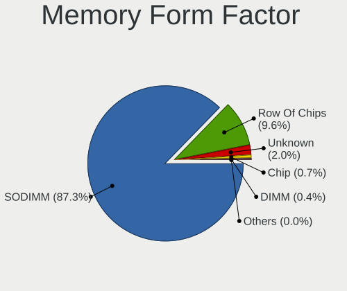

| Name            | Notebooks | Percent |
|-----------------|-----------|---------|
| SODIMM          | 6800      | 87.28%  |
| Row Of Chips    | 745       | 9.56%   |
| Unknown         | 159       | 2.04%   |
| Chip            | 54        | 0.69%   |
| DIMM            | 32        | 0.41%   |
| Proprietary Car | 1         | 0.01%   |

Memory Size
-----------

Memory module size

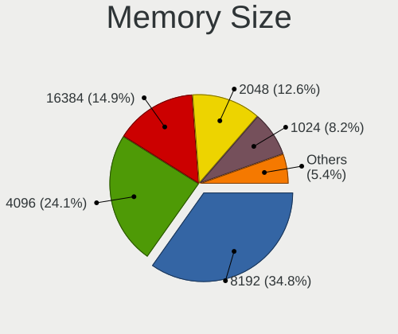

| Size    | Notebooks | Percent |
|---------|-----------|---------|
| 8192    | 2956      | 34.78%  |
| 4096    | 2052      | 24.15%  |
| 16384   | 1264      | 14.87%  |
| 2048    | 1068      | 12.57%  |
| 1024    | 698       | 8.21%   |
| 32768   | 356       | 4.19%   |
| 512     | 59        | 0.69%   |
| 256     | 20        | 0.24%   |
| 49152   | 9         | 0.11%   |
| 3072    | 4         | 0.05%   |
| 128     | 3         | 0.04%   |
| 12288   | 2         | 0.02%   |
| 65536   | 1         | 0.01%   |
| 8072    | 1         | 0.01%   |
| 6144    | 1         | 0.01%   |
| 5120    | 1         | 0.01%   |
| 1536    | 1         | 0.01%   |
| 384     | 1         | 0.01%   |
| Unknown | 1         | 0.01%   |

Memory Speed
------------

Memory module speed

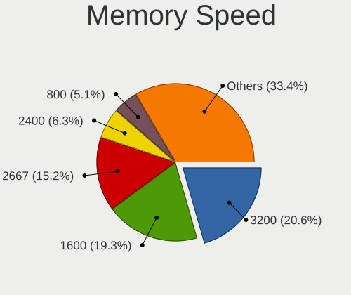

| Speed   | Notebooks | Percent |
|---------|-----------|---------|
| 3200    | 1709      | 20.56%  |
| 1600    | 1608      | 19.35%  |
| 2667    | 1265      | 15.22%  |
| 2400    | 524       | 6.3%    |
| 800     | 427       | 5.14%   |
| 2133    | 332       | 3.99%   |
| 667     | 255       | 3.07%   |
| 1333    | 232       | 2.79%   |
| 5600    | 230       | 2.77%   |
| 1334    | 224       | 2.69%   |
| Unknown | 177       | 2.13%   |
| 6400    | 164       | 1.97%   |
| 1867    | 145       | 1.74%   |
| 4800    | 134       | 1.61%   |
| 4267    | 115       | 1.38%   |
| 1067    | 97        | 1.17%   |
| 3266    | 81        | 0.97%   |
| 7500    | 74        | 0.89%   |
| 8400    | 73        | 0.88%   |
| 4199    | 66        | 0.79%   |
| 1066    | 52        | 0.63%   |
| 533     | 42        | 0.51%   |
| 2048    | 38        | 0.46%   |
| 975     | 34        | 0.41%   |
| 4266    | 33        | 0.4%    |
| 3733    | 23        | 0.28%   |
| 8533    | 22        | 0.26%   |
| 1596    | 17        | 0.2%    |
| 7467    | 14        | 0.17%   |
| 400     | 13        | 0.16%   |
| 333     | 11        | 0.13%   |
| 2666    | 9         | 0.11%   |
| 1866    | 9         | 0.11%   |
| 1639    | 9         | 0.11%   |
| 5500    | 8         | 0.1%    |
| 266     | 8         | 0.1%    |
| 2933    | 7         | 0.08%   |
| 8000    | 4         | 0.05%   |
| 7400    | 4         | 0.05%   |
| 933     | 3         | 0.04%   |

Printers & scanners
-------------------

Printer Vendor
--------------

Printer device vendors

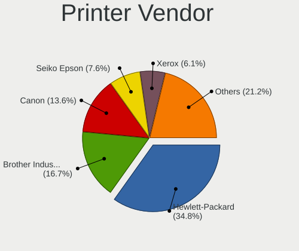

| Vendor                | Notebooks | Percent |
|-----------------------|-----------|---------|
| Hewlett-Packard       | 23        | 34.85%  |
| Brother Industries    | 11        | 16.67%  |
| Canon                 | 9         | 13.64%  |
| Seiko Epson           | 5         | 7.58%   |
| Xerox                 | 4         | 6.06%   |
| Samsung Electronics   | 4         | 6.06%   |
| STMicroelectronics    | 2         | 3.03%   |
| Kyocera               | 2         | 3.03%   |
| Dymo-CoStar           | 2         | 3.03%   |
| Xiaomi                | 1         | 1.52%   |
| Prolific Technology   | 1         | 1.52%   |
| Pantum                | 1         | 1.52%   |
| Lexmark International | 1         | 1.52%   |

Printer Model
-------------

Printer device models

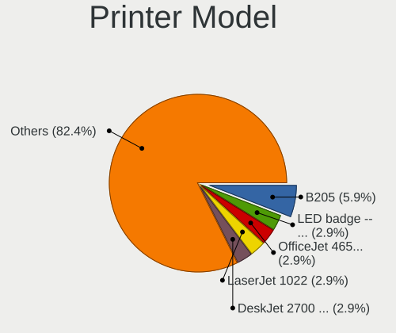

| Model                                                     | Notebooks | Percent |
|-----------------------------------------------------------|-----------|---------|
| Xerox B205                                                | 4         | 5.88%   |
| STMicroelectronics LED badge -- mini LED display -- 11x44 | 2         | 2.94%   |
| HP OfficeJet 4650 series                                  | 2         | 2.94%   |
| HP LaserJet 1022                                          | 2         | 2.94%   |
| HP DeskJet 2700 series                                    | 2         | 2.94%   |
| Canon LiDE 400                                            | 2         | 2.94%   |
| Brother HL-L2340D series                                  | 2         | 2.94%   |
| Xiaomi MiMouse 2                                          | 1         | 1.47%   |
| Seiko Epson WF-2930 Series                                | 1         | 1.47%   |
| Seiko Epson Printer                                       | 1         | 1.47%   |
| Seiko Epson L3050 Series                                  | 1         | 1.47%   |
| Seiko Epson L120 Series                                   | 1         | 1.47%   |
| Seiko Epson ET-3750 Series                                | 1         | 1.47%   |
| Samsung SCX-472x Series                                   | 1         | 1.47%   |
| Samsung ML-2010P Mono Laser Printer                       | 1         | 1.47%   |
| Samsung M2070 Series                                      | 1         | 1.47%   |
| Samsung CLX-3300 Series                                   | 1         | 1.47%   |
| Prolific PL2305 Parallel Port                             | 1         | 1.47%   |
| Pantum P2500W series                                      | 1         | 1.47%   |
| Lexmark International E260dn                              | 1         | 1.47%   |
| Kyocera FS-1120MFP                                        | 1         | 1.47%   |
| Kyocera ECOSYS P2335d                                     | 1         | 1.47%   |
| HP Printing Support                                       | 1         | 1.47%   |
| HP Officejet 4500 G510g-m                                 | 1         | 1.47%   |
| HP OfficeJet 3830 series                                  | 1         | 1.47%   |
| HP LaserJet P2055 series                                  | 1         | 1.47%   |
| HP LaserJet P1102                                         | 1         | 1.47%   |
| HP LaserJet P1005                                         | 1         | 1.47%   |
| HP LaserJet M14-M17                                       | 1         | 1.47%   |
| HP LaserJet 1200                                          | 1         | 1.47%   |
| HP LaserJet 1160 series                                   | 1         | 1.47%   |
| HP LaserJet 1150                                          | 1         | 1.47%   |
| HP LaserJet 1020                                          | 1         | 1.47%   |
| HP LaserJet 1018                                          | 1         | 1.47%   |
| HP Ink Tank 110 series                                    | 1         | 1.47%   |
| HP EWS UPD                                                | 1         | 1.47%   |
| HP DeskJet 2600 series                                    | 1         | 1.47%   |
| HP Deskjet 2540 series                                    | 1         | 1.47%   |
| HP DeskJet 2130 series                                    | 1         | 1.47%   |
| HP Deskjet 1510                                           | 1         | 1.47%   |

Scanner Vendor
--------------

Scanner device vendors

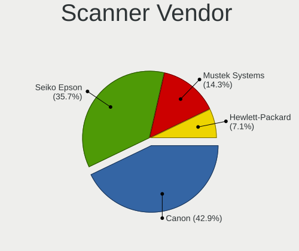

| Vendor             | Notebooks | Percent |
|--------------------|-----------|---------|
| Canon              | 9         | 45%     |
| Seiko Epson        | 6         | 30%     |
| Mustek Systems     | 2         | 10%     |
| Ultima Electronics | 1         | 5%      |
| Sagem              | 1         | 5%      |
| Hewlett-Packard    | 1         | 5%      |

Scanner Model
-------------

Scanner device models

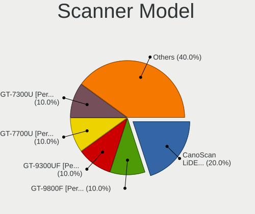

| Model                                                                                 | Notebooks | Percent |
|---------------------------------------------------------------------------------------|-----------|---------|
| Canon CanoScan LiDE 220                                                               | 3         | 15%     |
| Canon CanoScan LiDE 120                                                               | 2         | 10%     |
| Canon CanoScan LiDE 110                                                               | 2         | 10%     |
| Ultima Artec Ultima 2000 (GT6801 based)/Lifetec LT9385/ScanMagic 1200 UB Plus Scanner | 1         | 5%      |
| Seiko Epson GT-X800 [Perfection 4990 PHOTO]                                           | 1         | 5%      |
| Seiko Epson GT-X770 [Perfection V500]                                                 | 1         | 5%      |
| Seiko Epson GT-9800F [Perfection 3200]                                                | 1         | 5%      |
| Seiko Epson GT-9300UF [Perfection 2400 PHOTO]                                         | 1         | 5%      |
| Seiko Epson GT-7700U [Perfection 1240U]                                               | 1         | 5%      |
| Seiko Epson GT-7300U [Perfection 1260/1260 PHOTO]                                     | 1         | 5%      |
| Sagem 600dpi USB Scanner                                                              | 1         | 5%      |
| Mustek Systems SNAPSCAN e22                                                           | 1         | 5%      |
| Mustek Systems BearPaw 2400 CU Plus                                                   | 1         | 5%      |
| HP Scanjet 200                                                                        | 1         | 5%      |
| Canon CanoScan LIDE 25                                                                | 1         | 5%      |
| Canon CanoScan LiDE 210                                                               | 1         | 5%      |

Camera
------

Camera Vendor
-------------

Camera device vendors

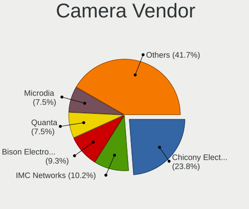

| Vendor                                 | Notebooks | Percent |
|----------------------------------------|-----------|---------|
| Chicony Electronics                    | 1934      | 23.77%  |
| IMC Networks                           | 829       | 10.19%  |
| Bison Electronics                      | 756       | 9.29%   |
| Quanta                                 | 614       | 7.55%   |
| Microdia                               | 611       | 7.51%   |
| Realtek Semiconductor                  | 603       | 7.41%   |
| Sunplus Innovation Technology          | 432       | 5.31%   |
| Luxvisions Innotech Limited            | 287       | 3.53%   |
| Cheng Uei Precision Industry (Foxlink) | 253       | 3.11%   |
| Syntek                                 | 209       | 2.57%   |
| Lite-On Technology                     | 197       | 2.42%   |
| Suyin                                  | 195       | 2.4%    |
| Apple                                  | 150       | 1.84%   |
| Logitech                               | 107       | 1.31%   |
| Silicon Motion                         | 96        | 1.18%   |
| Sonix Technology                       | 88        | 1.08%   |
| Alcor Micro                            | 81        | 1%      |
| Ricoh                                  | 58        | 0.71%   |
| Lenovo                                 | 58        | 0.71%   |
| ShineTech                              | 48        | 0.59%   |
| Acer                                   | 48        | 0.59%   |
| SunplusIT                              | 41        | 0.5%    |
| Z-Star Microelectronics                | 36        | 0.44%   |
| Samsung Electronics                    | 34        | 0.42%   |
| icSpring                               | 29        | 0.36%   |
| Primax Electronics                     | 27        | 0.33%   |
| Importek                               | 21        | 0.26%   |
| ALi                                    | 20        | 0.25%   |
| Unknown                                | 20        | 0.25%   |
| Shine-optics                           | 15        | 0.18%   |
| kingcome                               | 15        | 0.18%   |
| Microsoft                              | 12        | 0.15%   |
| OmniVision Technologies                | 11        | 0.14%   |
| Genesys Logic                          | 10        | 0.12%   |
| Generalplus Technology                 | 10        | 0.12%   |
| BillionPixels                          | 10        | 0.12%   |
| Y Media                                | 7         | 0.09%   |
| MacroSilicon                           | 7         | 0.09%   |
| GEMBIRD                                | 7         | 0.09%   |
| ShineOptics                            | 6         | 0.07%   |

Camera Model
------------

Camera device models

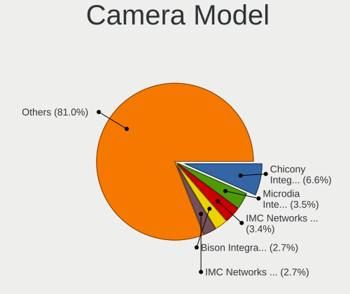

| Model                                               | Notebooks | Percent |
|-----------------------------------------------------|-----------|---------|
| Chicony Integrated Camera                           | 543       | 6.63%   |
| Microdia Integrated_Webcam_HD                       | 288       | 3.52%   |
| IMC Networks Integrated Camera                      | 282       | 3.44%   |
| Bison Integrated Camera                             | 223       | 2.72%   |
| IMC Networks USB2.0 HD UVC WebCam                   | 221       | 2.7%    |
| Realtek Integrated_Webcam_HD                        | 207       | 2.53%   |
| Syntek Integrated Camera                            | 144       | 1.76%   |
| Chicony HD WebCam                                   | 141       | 1.72%   |
| Sunplus Integrated_Webcam_HD                        | 137       | 1.67%   |
| Chicony HP HD Camera                                | 118       | 1.44%   |
| Quanta Chromebook HD Camera                         | 103       | 1.26%   |
| Quanta HD User Facing                               | 88        | 1.07%   |
| Luxvisions Innotech Limited Integrated Camera       | 77        | 0.94%   |
| Lite-On Integrated Camera                           | 76        | 0.93%   |
| IMC Networks USB2.0 VGA UVC WebCam                  | 75        | 0.92%   |
| Bison BisonCam, NB Pro                              | 73        | 0.89%   |
| Quanta HP TrueVision HD Camera                      | 72        | 0.88%   |
| Luxvisions Innotech Limited HP TrueVision HD Camera | 69        | 0.84%   |
| Chicony USB2.0 HD UVC WebCam                        | 66        | 0.81%   |
| Chicony Integrated Camera (1280x720@30)             | 65        | 0.79%   |
| Bison SunplusIT Integrated Camera                   | 64        | 0.78%   |
| Quanta HP HD Camera                                 | 61        | 0.74%   |
| Chicony HP Truevision HD camera                     | 60        | 0.73%   |
| Microdia Integrated Webcam                          | 58        | 0.71%   |
| Bison Lenovo Integrated Webcam                      | 58        | 0.71%   |
| Sonix USB2.0 HD UVC WebCam                          | 56        | 0.68%   |
| Lite-On HP HD Camera                                | 56        | 0.68%   |
| Bison HD Webcam                                     | 56        | 0.68%   |
| Chicony HD User Facing                              | 55        | 0.67%   |
| Bison Lenovo EasyCamera                             | 52        | 0.63%   |
| Quanta HD Webcam                                    | 51        | 0.62%   |
| Chicony HP Truevision HD                            | 48        | 0.59%   |
| Sunplus HD WebCam                                   | 44        | 0.54%   |
| Realtek USB Camera                                  | 43        | 0.52%   |
| Quanta VGA WebCam                                   | 43        | 0.52%   |
| Apple Built-in iSight                               | 42        | 0.51%   |
| Chicony USB2.0 VGA UVC WebCam                       | 41        | 0.5%    |
| Cheng Uei Precision Industry (Foxlink) HP HD Camera | 41        | 0.5%    |
| Chicony USB 2.0 Camera                              | 38        | 0.46%   |
| Chicony EasyCamera                                  | 38        | 0.46%   |

Security
--------

Fingerprint Vendor
------------------

Fingerprint sensor vendors

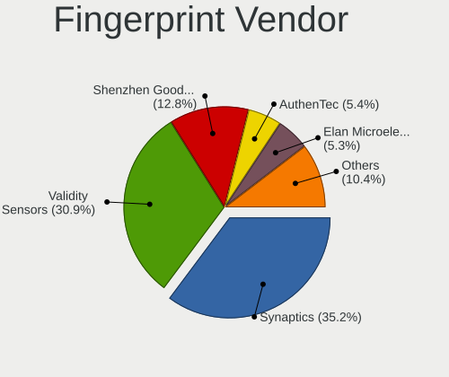

| Vendor                             | Notebooks | Percent |
|------------------------------------|-----------|---------|
| Synaptics                          | 563       | 35.21%  |
| Validity Sensors                   | 494       | 30.89%  |
| Shenzhen Goodix Technology         | 204       | 12.76%  |
| AuthenTec                          | 87        | 5.44%   |
| Elan Microelectronics              | 85        | 5.32%   |
| Upek                               | 78        | 4.88%   |
| LighTuning Technology              | 38        | 2.38%   |
| STMicroelectronics                 | 25        | 1.56%   |
| Realtek USB2.0 Finger Print Bridge | 9         | 0.56%   |
| HOLTEK                             | 8         | 0.5%    |
| Focal-systems.Corp                 | 3         | 0.19%   |
| DigitalPersona                     | 2         | 0.13%   |
| Samsung Electronics                | 1         | 0.06%   |
| Microsoft                          | 1         | 0.06%   |
| GDMicroelectronics                 | 1         | 0.06%   |

Fingerprint Model
-----------------

Fingerprint sensor models

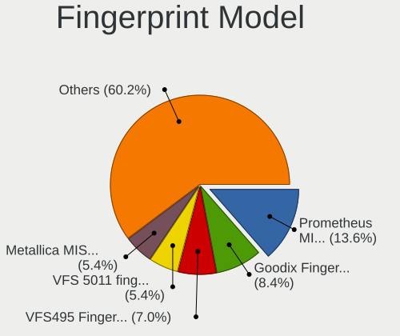

| Model                                                                      | Notebooks | Percent |
|----------------------------------------------------------------------------|-----------|---------|
| Synaptics Prometheus MIS Touch Fingerprint Reader                          | 217       | 13.57%  |
| Shenzhen Goodix  Fingerprint Device                                        | 135       | 8.44%   |
| Validity Sensors VFS495 Fingerprint Reader                                 | 112       | 7%      |
| Validity Sensors VFS 5011 fingerprint sensor                               | 86        | 5.38%   |
| Synaptics Metallica MIS Touch Fingerprint Reader                           | 86        | 5.38%   |
| Validity Sensors VFS5011 Fingerprint Reader                                | 74        | 4.63%   |
| Upek Biometric Touchchip/Touchstrip Fingerprint Sensor                     | 71        | 4.44%   |
| Validity Sensors Synaptics WBDI                                            | 50        | 3.13%   |
| Synaptics FS7604 Touch Fingerprint Sensor with PurePrint                   | 50        | 3.13%   |
| Elan ELAN:ARM-M4                                                           | 46        | 2.88%   |
| Synaptics UWP WBDI Device                                                  | 45        | 2.81%   |
| Shenzhen Goodix Fingerprint Reader                                         | 39        | 2.44%   |
| Elan ELAN:Fingerprint                                                      | 38        | 2.38%   |
| Synaptics Prometheus Fingerprint Reader                                    | 32        | 2%      |
| Synaptics Fingerprint reader [HP G6]                                       | 32        | 2%      |
| AuthenTec AES2810                                                          | 31        | 1.94%   |
| Validity Sensors Synaptics VFS7552 Touch Fingerprint Sensor with PurePrint | 30        | 1.88%   |
| Shenzhen Goodix FingerPrint                                                | 30        | 1.88%   |
| Synaptics Metallica MOH Touch Fingerprint Reader                           | 27        | 1.69%   |
| Synaptics  FS7604 Touch Fingerprint Sensor with PurePrint                  | 26        | 1.63%   |
| Validity Sensors VFS491                                                    | 24        | 1.5%    |
| LighTuning EgisTec Touch Fingerprint Sensor                                | 24        | 1.5%    |
| STMicroelectronics Fingerprint Reader                                      | 23        | 1.44%   |
| AuthenTec AES2501 Fingerprint Sensor                                       | 23        | 1.44%   |
| Validity Sensors VFS471 Fingerprint Reader                                 | 21        | 1.31%   |
| Validity Sensors VFS7500 Touch Fingerprint Sensor                          | 20        | 1.25%   |
| Validity Sensors Swipe Fingerprint Sensor                                  | 17        | 1.06%   |
| Validity Sensors Fingerprint scanner                                       | 17        | 1.06%   |
| Validity Sensors VFS Fingerprint sensor                                    | 16        | 1%      |
| Validity Sensors VFS451 Fingerprint Reader                                 | 14        | 0.88%   |
| Synaptics WBDI Fingerprint Reader USB 086                                  | 12        | 0.75%   |
| Synaptics WBDI                                                             | 11        | 0.69%   |
| Synaptics  WBDI                                                            | 10        | 0.63%   |
| AuthenTec Fingerprint Sensor                                               | 10        | 0.63%   |
| Realtek USB2.0 Finger Print Bridge FocalTech Fingerprint Device            | 9         | 0.56%   |
| LighTuning ES603 Swipe Fingerprint Sensor                                  | 9         | 0.56%   |
| AuthenTec AES1660 Fingerprint Sensor                                       | 9         | 0.56%   |
| AuthenTec AES1600                                                          | 9         | 0.56%   |
| HOLTEK FocalTech Fingerprint Device                                        | 8         | 0.5%    |
| Upek TCS5B Fingerprint sensor                                              | 7         | 0.44%   |

Chipcard Vendor
---------------

Chipcard module vendors

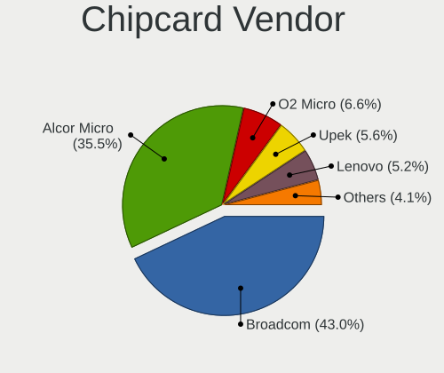

| Vendor                    | Notebooks | Percent |
|---------------------------|-----------|---------|
| Broadcom                  | 358       | 42.98%  |
| Alcor Micro               | 296       | 35.53%  |
| O2 Micro                  | 55        | 6.6%    |
| Upek                      | 47        | 5.64%   |
| Lenovo                    | 43        | 5.16%   |
| Yubico.com                | 7         | 0.84%   |
| Gemalto (was Gemplus)     | 6         | 0.72%   |
| Clay Logic                | 4         | 0.48%   |
| SCM Microsystems          | 3         | 0.36%   |
| OmniKey                   | 3         | 0.36%   |
| Aladdin Knowledge Systems | 3         | 0.36%   |
| Advanced Card Systems     | 3         | 0.36%   |
| C3PO                      | 2         | 0.24%   |
| Realtek Semiconductor     | 1         | 0.12%   |
| Giesecke & Devrient       | 1         | 0.12%   |
| Cherry                    | 1         | 0.12%   |

Chipcard Model
--------------

Chipcard module models

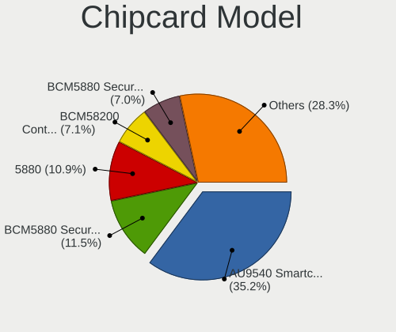

| Model                                                                        | Notebooks | Percent |
|------------------------------------------------------------------------------|-----------|---------|
| Alcor Micro AU9540 Smartcard Reader                                          | 293       | 35.17%  |
| Broadcom BCM5880 Secure Applications Processor                               | 96        | 11.52%  |
| Broadcom 5880                                                                | 91        | 10.92%  |
| Broadcom BCM58200 ControlVault 3 (FingerPrint sensor + Contacted SmartCard)  | 59        | 7.08%   |
| Broadcom BCM5880 Secure Applications Processor with fingerprint swipe sensor | 58        | 6.96%   |
| Broadcom 58200                                                               | 49        | 5.88%   |
| Upek TouchChip Fingerprint Coprocessor (WBF advanced mode)                   | 47        | 5.64%   |
| O2 Micro OZ776 CCID Smartcard Reader                                         | 46        | 5.52%   |
| Lenovo Integrated Smart Card Reader                                          | 42        | 5.04%   |
| O2 Micro Oz776 SmartCard Reader                                              | 9         | 1.08%   |
| Yubico.com Yubikey 4/5 U2F+CCID                                              | 6         | 0.72%   |
| Broadcom BCM5880 Secure Applications Processor with fingerprint touch sensor | 5         | 0.6%    |
| Gemalto (was Gemplus) Compact Smart Card Reader Writer                       | 4         | 0.48%   |
| Alcor Micro Watchdata W 1981                                                 | 3         | 0.36%   |
| Aladdin Knowledge Systems Token JC                                           | 3         | 0.36%   |
| OmniKey CardMan 4321                                                         | 2         | 0.24%   |
| Gemalto (was Gemplus) GemPC Twin SmartCard Reader                            | 2         | 0.24%   |
| Clay Logic Nitrokey Start                                                    | 2         | 0.24%   |
| Advanced Card Systems ACR39U                                                 | 2         | 0.24%   |
| Yubico.com Yubikey 4/5 CCID                                                  | 1         | 0.12%   |
| SCM Microsystems uTrust FIDO2 Security Key                                   | 1         | 0.12%   |
| SCM Microsystems SCR35xx Smart Card Reader                                   | 1         | 0.12%   |
| SCM Microsystems SCR3340 - ExpressCard54 Smart Card Reader                   | 1         | 0.12%   |
| Realtek Semiconductor Smart Card Reader Interface                            | 1         | 0.12%   |
| OmniKey 3x21 Smart Card Reader                                               | 1         | 0.12%   |
| Lenovo Smartcard Keyboard                                                    | 1         | 0.12%   |
| Giesecke & Devrient StarSign CUT S                                           | 1         | 0.12%   |
| Clay Logic Nitrokey Pro                                                      | 1         | 0.12%   |
| Clay Logic CanoKey Canary                                                    | 1         | 0.12%   |
| Cherry SmartCard Reader Keyboard KC 1000 SC                                  | 1         | 0.12%   |
| C3PO LTC31v2                                                                 | 1         | 0.12%   |
| C3PO KBR36                                                                   | 1         | 0.12%   |
| Advanced Card Systems ACR38 SmartCard Reader                                 | 1         | 0.12%   |

Unsupported
-----------

Unsupported Devices
-------------------

Total unsupported devices on board

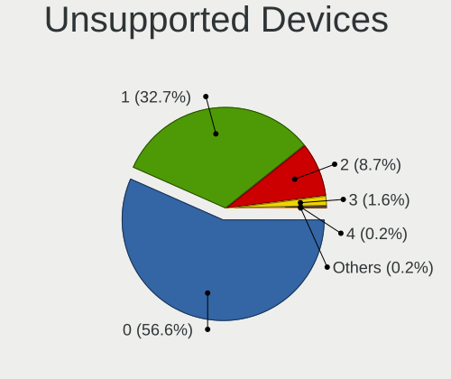

| Total | Notebooks | Percent |
|-------|-----------|---------|
| 0     | 5681      | 56.62%  |
| 1     | 3278      | 32.67%  |
| 2     | 872       | 8.69%   |
| 3     | 159       | 1.58%   |
| 4     | 24        | 0.24%   |
| 5     | 13        | 0.13%   |
| 6     | 6         | 0.06%   |

Unsupported Device Types
------------------------

Types of unsupported devices

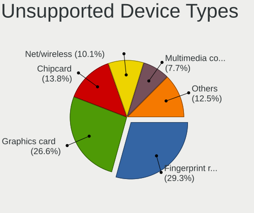

| Type                     | Notebooks | Percent |
|--------------------------|-----------|---------|
| Fingerprint reader       | 1582      | 29.28%  |
| Graphics card            | 1436      | 26.58%  |
| Chipcard                 | 744       | 13.77%  |
| Net/wireless             | 548       | 10.14%  |
| Multimedia controller    | 416       | 7.7%    |
| Camera                   | 155       | 2.87%   |
| Bluetooth                | 105       | 1.94%   |
| Card reader              | 99        | 1.83%   |
| Communication controller | 82        | 1.52%   |
| Storage                  | 68        | 1.26%   |
| Sound                    | 50        | 0.93%   |
| Net/ethernet             | 40        | 0.74%   |
| Modem                    | 26        | 0.48%   |
| Network                  | 16        | 0.3%    |
| Flash memory             | 11        | 0.2%    |
| Unassigned class         | 6         | 0.11%   |
| Wireless                 | 4         | 0.07%   |
| Storage/raid             | 4         | 0.07%   |
| Firewire controller      | 3         | 0.06%   |
| Tv card                  | 2         | 0.04%   |
| Storage/nvme             | 2         | 0.04%   |
| Storage/ide              | 2         | 0.04%   |
| Unclassified device      | 1         | 0.02%   |
| Dvb card                 | 1         | 0.02%   |

