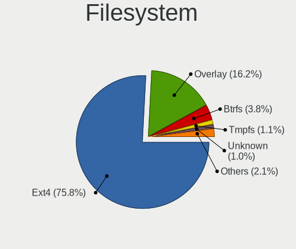
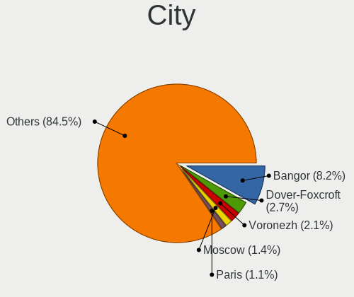
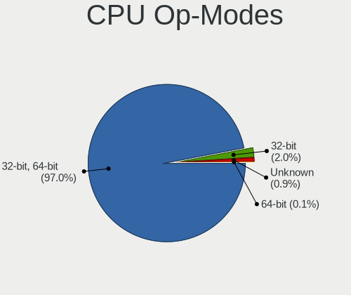
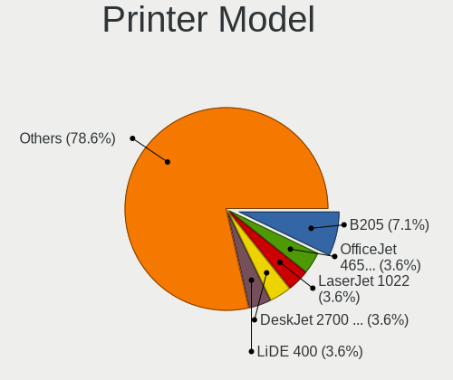
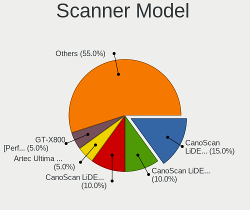

Debian - Tested Hardware & Statistics (Notebooks)
-------------------------------------------------

A project to collect tested hardware configurations for Debian.

Anyone can contribute to this report by the [hw-probe](https://github.com/linuxhw/hw-probe) tool:

    sudo -E hw-probe -all -upload

Please contribute! Especially if your hardware is rare.

Contents
--------

* [ Test Cases ](#test-cases)

* [ System ](#system)
  - [ OS                       ](#os)
  - [ OS Family                ](#os-family)
  - [ Kernel                   ](#kernel)
  - [ Kernel Family            ](#kernel-family)
  - [ Kernel Major Ver.        ](#kernel-major-ver)
  - [ Arch                     ](#arch)
  - [ DE                       ](#de)
  - [ Display Server           ](#display-server)
  - [ Display Manager          ](#display-manager)
  - [ OS Lang                  ](#os-lang)
  - [ Boot Mode                ](#boot-mode)
  - [ Filesystem               ](#filesystem)
  - [ Part. scheme             ](#part-scheme)
  - [ Dual Boot with Linux/BSD ](#dual-boot-with-linuxbsd)
  - [ Dual Boot (Win)          ](#dual-boot-win)

* [ Board ](#board)
  - [ Vendor                   ](#vendor)
  - [ Model                    ](#model)
  - [ Model Family             ](#model-family)
  - [ MFG Year                 ](#mfg-year)
  - [ Form Factor              ](#form-factor)
  - [ Secure Boot              ](#secure-boot)
  - [ Coreboot                 ](#coreboot)
  - [ RAM Size                 ](#ram-size)
  - [ RAM Used                 ](#ram-used)
  - [ Total Drives             ](#total-drives)
  - [ Has CD-ROM               ](#has-cd-rom)
  - [ Has Ethernet             ](#has-ethernet)
  - [ Has WiFi                 ](#has-wifi)
  - [ Has Bluetooth            ](#has-bluetooth)

* [ Location ](#location)
  - [ Country                  ](#country)
  - [ City                     ](#city)

* [ Drives ](#drives)
  - [ Drive Vendor             ](#drive-vendor)
  - [ Drive Model              ](#drive-model)
  - [ HDD Vendor               ](#hdd-vendor)
  - [ SSD Vendor               ](#ssd-vendor)
  - [ Drive Kind               ](#drive-kind)
  - [ Drive Connector          ](#drive-connector)
  - [ Drive Size               ](#drive-size)
  - [ Space Total              ](#space-total)
  - [ Space Used               ](#space-used)
  - [ Malfunc. Drives          ](#malfunc-drives)
  - [ Malfunc. Drive Vendor    ](#malfunc-drive-vendor)
  - [ Malfunc. HDD Vendor      ](#malfunc-hdd-vendor)
  - [ Malfunc. Drive Kind      ](#malfunc-drive-kind)
  - [ Failed Drives            ](#failed-drives)
  - [ Failed Drive Vendor      ](#failed-drive-vendor)
  - [ Drive Status             ](#drive-status)

* [ Storage controller ](#storage-controller)
  - [ Storage Vendor           ](#storage-vendor)
  - [ Storage Model            ](#storage-model)
  - [ Storage Kind             ](#storage-kind)

* [ Processor ](#processor)
  - [ CPU Vendor               ](#cpu-vendor)
  - [ CPU Model                ](#cpu-model)
  - [ CPU Model Family         ](#cpu-model-family)
  - [ CPU Cores                ](#cpu-cores)
  - [ CPU Sockets              ](#cpu-sockets)
  - [ CPU Threads              ](#cpu-threads)
  - [ CPU Op-Modes             ](#cpu-op-modes)
  - [ CPU Microcode            ](#cpu-microcode)
  - [ CPU Microarch            ](#cpu-microarch)

* [ Graphics ](#graphics)
  - [ GPU Vendor               ](#gpu-vendor)
  - [ GPU Model                ](#gpu-model)
  - [ GPU Combo                ](#gpu-combo)
  - [ GPU Driver               ](#gpu-driver)
  - [ GPU Memory               ](#gpu-memory)

* [ Monitor ](#monitor)
  - [ Monitor Vendor           ](#monitor-vendor)
  - [ Monitor Model            ](#monitor-model)
  - [ Monitor Resolution       ](#monitor-resolution)
  - [ Monitor Diagonal         ](#monitor-diagonal)
  - [ Monitor Width            ](#monitor-width)
  - [ Aspect Ratio             ](#aspect-ratio)
  - [ Monitor Area             ](#monitor-area)
  - [ Pixel Density            ](#pixel-density)
  - [ Multiple Monitors        ](#multiple-monitors)

* [ Network ](#network)
  - [ Net Controller Vendor    ](#net-controller-vendor)
  - [ Net Controller Model     ](#net-controller-model)
  - [ Wireless Vendor          ](#wireless-vendor)
  - [ Wireless Model           ](#wireless-model)
  - [ Ethernet Vendor          ](#ethernet-vendor)
  - [ Ethernet Model           ](#ethernet-model)
  - [ Net Controller Kind      ](#net-controller-kind)
  - [ Used Controller          ](#used-controller)
  - [ NICs                     ](#nics)
  - [ IPv6                     ](#ipv6)

* [ Bluetooth ](#bluetooth)
  - [ Bluetooth Vendor         ](#bluetooth-vendor)
  - [ Bluetooth Model          ](#bluetooth-model)

* [ Sound ](#sound)
  - [ Sound Vendor             ](#sound-vendor)
  - [ Sound Model              ](#sound-model)

* [ Memory ](#memory)
  - [ Memory Vendor            ](#memory-vendor)
  - [ Memory Model             ](#memory-model)
  - [ Memory Kind              ](#memory-kind)
  - [ Memory Form Factor       ](#memory-form-factor)
  - [ Memory Size              ](#memory-size)
  - [ Memory Speed             ](#memory-speed)

* [ Printers & scanners ](#printers--scanners)
  - [ Printer Vendor           ](#printer-vendor)
  - [ Printer Model            ](#printer-model)
  - [ Scanner Vendor           ](#scanner-vendor)
  - [ Scanner Model            ](#scanner-model)

* [ Camera ](#camera)
  - [ Camera Vendor            ](#camera-vendor)
  - [ Camera Model             ](#camera-model)

* [ Security ](#security)
  - [ Fingerprint Vendor       ](#fingerprint-vendor)
  - [ Fingerprint Model        ](#fingerprint-model)
  - [ Chipcard Vendor          ](#chipcard-vendor)
  - [ Chipcard Model           ](#chipcard-model)

* [ Unsupported ](#unsupported)
  - [ Unsupported Devices      ](#unsupported-devices)
  - [ Unsupported Device Types ](#unsupported-device-types)

Test Cases
----------

Total: 4386

| Vendor        | Model                       | Probe                                                      | Date         |
|---------------|-----------------------------|------------------------------------------------------------|--------------|
| Dell          | Inspiron 5749               | [408e42beb8](https://linux-hardware.org/?probe=408e42beb8) | Jun 01, 2022 |
| Lenovo        | ThinkPad T440s 20AQ008FU... | [3b5255ec2c](https://linux-hardware.org/?probe=3b5255ec2c) | Jun 01, 2022 |
| Dell          | Latitude E6400              | [85d314bfd8](https://linux-hardware.org/?probe=85d314bfd8) | May 31, 2022 |
| Aquarius      | NS585                       | [44bd30c95d](https://linux-hardware.org/?probe=44bd30c95d) | May 31, 2022 |
| Aquarius      | NS585                       | [2a7545f0f9](https://linux-hardware.org/?probe=2a7545f0f9) | May 31, 2022 |
| Aquarius      | NS585                       | [12e45f7665](https://linux-hardware.org/?probe=12e45f7665) | May 31, 2022 |
| Aquarius      | NS585                       | [c420e4cafb](https://linux-hardware.org/?probe=c420e4cafb) | May 31, 2022 |
| Aquarius      | NS585                       | [e562931a35](https://linux-hardware.org/?probe=e562931a35) | May 31, 2022 |
| Aquarius      | NS585                       | [26a3362040](https://linux-hardware.org/?probe=26a3362040) | May 31, 2022 |
| Aquarius      | NS585                       | [51595712dd](https://linux-hardware.org/?probe=51595712dd) | May 31, 2022 |
| Aquarius      | NS585                       | [0d31fa737e](https://linux-hardware.org/?probe=0d31fa737e) | May 31, 2022 |
| Aquarius      | NS585                       | [6e5a613444](https://linux-hardware.org/?probe=6e5a613444) | May 31, 2022 |
| Aquarius      | NS585                       | [7744e6a785](https://linux-hardware.org/?probe=7744e6a785) | May 31, 2022 |
| Aquarius      | NS585                       | [828c791c7c](https://linux-hardware.org/?probe=828c791c7c) | May 31, 2022 |
| Aquarius      | NS585                       | [ff8ca3e68b](https://linux-hardware.org/?probe=ff8ca3e68b) | May 31, 2022 |
| Aquarius      | NS585                       | [dbbe2e1b71](https://linux-hardware.org/?probe=dbbe2e1b71) | May 31, 2022 |
| Aquarius      | NS585                       | [099918e5b2](https://linux-hardware.org/?probe=099918e5b2) | May 31, 2022 |
| Aquarius      | NS585                       | [bdcf61dc44](https://linux-hardware.org/?probe=bdcf61dc44) | May 31, 2022 |
| Aquarius      | NS585                       | [3693e77fee](https://linux-hardware.org/?probe=3693e77fee) | May 31, 2022 |
| Aquarius      | NS585                       | [e41a23ba31](https://linux-hardware.org/?probe=e41a23ba31) | May 31, 2022 |
| Aquarius      | NS585                       | [a8aa698844](https://linux-hardware.org/?probe=a8aa698844) | May 31, 2022 |
| Dell          | Latitude E6400              | [f5ae9fef9c](https://linux-hardware.org/?probe=f5ae9fef9c) | May 31, 2022 |
| Aquarius      | NS585                       | [f0c6dbeb87](https://linux-hardware.org/?probe=f0c6dbeb87) | May 31, 2022 |
| Aquarius      | NS585                       | [ff453a32b6](https://linux-hardware.org/?probe=ff453a32b6) | May 31, 2022 |
| Aquarius      | NS585                       | [1ed72b7951](https://linux-hardware.org/?probe=1ed72b7951) | May 31, 2022 |
| Aquarius      | NS585                       | [222ff0011e](https://linux-hardware.org/?probe=222ff0011e) | May 31, 2022 |
| Acer          | Aspire T5000                | [55aaebdab5](https://linux-hardware.org/?probe=55aaebdab5) | May 31, 2022 |
| Acer          | Aspire T5000                | [7bdeb5fb3b](https://linux-hardware.org/?probe=7bdeb5fb3b) | May 31, 2022 |
| Alienware     | 15 R2                       | [776abe61ea](https://linux-hardware.org/?probe=776abe61ea) | May 31, 2022 |
| Acer          | Aspire E5-575G              | [7c44163245](https://linux-hardware.org/?probe=7c44163245) | May 31, 2022 |
| SANTECH       | NHx0DB,DE                   | [f3444e62bb](https://linux-hardware.org/?probe=f3444e62bb) | May 30, 2022 |
| SANTECH       | NHx0DB,DE                   | [4fbdcfe44b](https://linux-hardware.org/?probe=4fbdcfe44b) | May 30, 2022 |
| ASUSTek       | ROG Strix G713IH_G713IH     | [883f055fb1](https://linux-hardware.org/?probe=883f055fb1) | May 30, 2022 |
| ASUSTek       | ROG Strix G713IH_G713IH     | [e475b560cf](https://linux-hardware.org/?probe=e475b560cf) | May 30, 2022 |
| Lenovo        | ThinkPad X1 Carbon 6th 2... | [e72ac27af1](https://linux-hardware.org/?probe=e72ac27af1) | May 30, 2022 |
| Notebook      | W65_67SJ                    | [2f6d77befb](https://linux-hardware.org/?probe=2f6d77befb) | May 29, 2022 |
| Lenovo        | ThinkPad W500 4061W8H       | [db9160e089](https://linux-hardware.org/?probe=db9160e089) | May 29, 2022 |
| Dell          | Vostro 3546                 | [3acd5d4cb0](https://linux-hardware.org/?probe=3acd5d4cb0) | May 28, 2022 |
| ASUSTek       | 900                         | [e50c30c38d](https://linux-hardware.org/?probe=e50c30c38d) | May 28, 2022 |
| ASUSTek       | 900                         | [dfd6af657c](https://linux-hardware.org/?probe=dfd6af657c) | May 28, 2022 |
| Dell          | Vostro 5490                 | [56ffa50c5b](https://linux-hardware.org/?probe=56ffa50c5b) | May 28, 2022 |
| Lenovo        | ThinkPad P14s Gen 1 20Y1... | [24fc1b394e](https://linux-hardware.org/?probe=24fc1b394e) | May 27, 2022 |
| HP            | Notebook                    | [9900044e89](https://linux-hardware.org/?probe=9900044e89) | May 27, 2022 |
| HP            | 255 G8 Notebook PC          | [9430147fab](https://linux-hardware.org/?probe=9430147fab) | May 27, 2022 |
| Lenovo        | ThinkPad X1 Carbon Gen 9... | [d2581e2c05](https://linux-hardware.org/?probe=d2581e2c05) | May 27, 2022 |
| MSI           | Katana GF66 11UD            | [f3ee20f625](https://linux-hardware.org/?probe=f3ee20f625) | May 27, 2022 |
| HP            | Pavilion g6                 | [0e98027e39](https://linux-hardware.org/?probe=0e98027e39) | May 26, 2022 |
| Dell          | Latitude 3520               | [6c5618416d](https://linux-hardware.org/?probe=6c5618416d) | May 26, 2022 |
| ASUSTek       | K43E                        | [968007a0a9](https://linux-hardware.org/?probe=968007a0a9) | May 26, 2022 |
| Lenovo        | ThinkPad T490 20N2000LMZ    | [9ebff03a43](https://linux-hardware.org/?probe=9ebff03a43) | May 26, 2022 |
| Dell          | Inspiron 1420               | [4ca4bb715c](https://linux-hardware.org/?probe=4ca4bb715c) | May 26, 2022 |
| Lenovo        | ThinkPad T490 20N2000LMZ    | [cc80808aea](https://linux-hardware.org/?probe=cc80808aea) | May 26, 2022 |
| ASUSTek       | ASUS EXPERTBOOK B9400CEA... | [f5488ccb22](https://linux-hardware.org/?probe=f5488ccb22) | May 26, 2022 |
| Lenovo        | ThinkPad P15 Gen 1 20SUS... | [75063d8f18](https://linux-hardware.org/?probe=75063d8f18) | May 26, 2022 |
| Lenovo        | ThinkPad P15 Gen 1 20SUS... | [0d1ba4ee73](https://linux-hardware.org/?probe=0d1ba4ee73) | May 26, 2022 |
| Lenovo        | V145-15AST 81MT             | [86f00d534a](https://linux-hardware.org/?probe=86f00d534a) | May 26, 2022 |
| Lenovo        | IdeaPad Slim 1-14AST-05 ... | [0f450fb6e0](https://linux-hardware.org/?probe=0f450fb6e0) | May 26, 2022 |
| Lenovo        | V145-15AST 81MT             | [3929f17532](https://linux-hardware.org/?probe=3929f17532) | May 26, 2022 |
| Samsung       | 350V5C/351V5C/3540VC/344... | [29b8def5b3](https://linux-hardware.org/?probe=29b8def5b3) | May 25, 2022 |
| Apple         | MacBookPro15,2              | [c0fe1740e0](https://linux-hardware.org/?probe=c0fe1740e0) | May 25, 2022 |
| Dell          | Latitude 5310               | [2117fbfccb](https://linux-hardware.org/?probe=2117fbfccb) | May 25, 2022 |
| Acer          | Aspire A715-42G             | [b343d4e9b9](https://linux-hardware.org/?probe=b343d4e9b9) | May 25, 2022 |
| Acer          | Aspire A715-42G             | [89a48429dc](https://linux-hardware.org/?probe=89a48429dc) | May 25, 2022 |
| Acer          | Aspire A315-23              | [dd46d19f05](https://linux-hardware.org/?probe=dd46d19f05) | May 25, 2022 |
| MSI           | GP62MVR 6RF                 | [1dd5741ea8](https://linux-hardware.org/?probe=1dd5741ea8) | May 25, 2022 |
| ASUSTek       | K52F                        | [601b1c4857](https://linux-hardware.org/?probe=601b1c4857) | May 25, 2022 |
| Dell          | Inspiron 3543               | [c48c32ae19](https://linux-hardware.org/?probe=c48c32ae19) | May 25, 2022 |
| Acer          | Nitro AN515-42              | [c755d907ca](https://linux-hardware.org/?probe=c755d907ca) | May 24, 2022 |
| Dell          | Latitude 5310               | [cb40714b3f](https://linux-hardware.org/?probe=cb40714b3f) | May 24, 2022 |
| Dell          | Latitude 5300               | [b2e8f91f15](https://linux-hardware.org/?probe=b2e8f91f15) | May 24, 2022 |
| Dell          | XPS 13 9360                 | [41f966f459](https://linux-hardware.org/?probe=41f966f459) | May 24, 2022 |
| Dell          | Latitude E5570              | [310aadd79a](https://linux-hardware.org/?probe=310aadd79a) | May 24, 2022 |
| HUAWEI        | BOHB-WAX9                   | [64a3f31676](https://linux-hardware.org/?probe=64a3f31676) | May 23, 2022 |
| MSI           | Prestige 14Evo A11M         | [166b6b7ac3](https://linux-hardware.org/?probe=166b6b7ac3) | May 23, 2022 |
| Lenovo        | ThinkPad X1 Extreme 20MF... | [1d8684d1f5](https://linux-hardware.org/?probe=1d8684d1f5) | May 23, 2022 |
| ASUSTek       | F50SL                       | [7d588b102d](https://linux-hardware.org/?probe=7d588b102d) | May 23, 2022 |
| Dell          | Latitude 3120               | [e97cf58459](https://linux-hardware.org/?probe=e97cf58459) | May 23, 2022 |
| Samsung       | SR70S/SR71S                 | [53642077bd](https://linux-hardware.org/?probe=53642077bd) | May 23, 2022 |
| Google        | Glimmer                     | [f16458e3ea](https://linux-hardware.org/?probe=f16458e3ea) | May 22, 2022 |
| LG Electro... | A410-G.BC48P1               | [fb2344f915](https://linux-hardware.org/?probe=fb2344f915) | May 22, 2022 |
| Lenovo        | ThinkPad T450s 20BXCTO1W... | [c1b20c63e0](https://linux-hardware.org/?probe=c1b20c63e0) | May 22, 2022 |
| TUXEDO        | Unknown                     | [487d75fce7](https://linux-hardware.org/?probe=487d75fce7) | May 21, 2022 |
| Dell          | Inspiron 1545               | [890010e793](https://linux-hardware.org/?probe=890010e793) | May 21, 2022 |
| ASUSTek       | 900                         | [082b51aa29](https://linux-hardware.org/?probe=082b51aa29) | May 21, 2022 |
| Lenovo        | ThinkPad E550 20DF002YUS    | [fe9f7989ef](https://linux-hardware.org/?probe=fe9f7989ef) | May 21, 2022 |
| Lenovo        | Legion 5 15ACH6H 82JU       | [c273310228](https://linux-hardware.org/?probe=c273310228) | May 20, 2022 |
| HP            | 250 G3                      | [463622ad88](https://linux-hardware.org/?probe=463622ad88) | May 20, 2022 |
| ASUSTek       | UX330UAK                    | [7b50efe523](https://linux-hardware.org/?probe=7b50efe523) | May 19, 2022 |
| Lenovo        | ThinkPad E14 Gen 2 20TA0... | [2972e28673](https://linux-hardware.org/?probe=2972e28673) | May 19, 2022 |
| Dell          | Latitude E4310              | [79cda1608c](https://linux-hardware.org/?probe=79cda1608c) | May 19, 2022 |
| System76      | Kudu                        | [78ce5e3b3e](https://linux-hardware.org/?probe=78ce5e3b3e) | May 19, 2022 |
| Acer          | Aspire 5750                 | [4c6bbffcae](https://linux-hardware.org/?probe=4c6bbffcae) | May 17, 2022 |
| ASUSTek       | VivoBook 15_ASUS Laptop ... | [61e58bea6c](https://linux-hardware.org/?probe=61e58bea6c) | May 17, 2022 |
| HP            | ProBook 4720s               | [887ea9cd89](https://linux-hardware.org/?probe=887ea9cd89) | May 16, 2022 |
| Lenovo        | V145-15AST 81MT             | [486b786e45](https://linux-hardware.org/?probe=486b786e45) | May 16, 2022 |
| HP            | ProBook 4720s               | [09bb5a5088](https://linux-hardware.org/?probe=09bb5a5088) | May 16, 2022 |
| HP            | EliteBook 820 G1            | [f06eee580b](https://linux-hardware.org/?probe=f06eee580b) | May 16, 2022 |
| Dell          | Precision 3551              | [f134f92d00](https://linux-hardware.org/?probe=f134f92d00) | May 16, 2022 |
| HP            | ProBook 6470b               | [9cdf33bcc1](https://linux-hardware.org/?probe=9cdf33bcc1) | May 16, 2022 |
| Dell          | Precision M4400             | [d0d09df553](https://linux-hardware.org/?probe=d0d09df553) | May 15, 2022 |
| ASUSTek       | X550LD                      | [75c6734097](https://linux-hardware.org/?probe=75c6734097) | May 15, 2022 |
| Dell          | Precision M4400             | [96af5a9104](https://linux-hardware.org/?probe=96af5a9104) | May 15, 2022 |
| HP            | Laptop 15-bs0xx             | [9445ab07bf](https://linux-hardware.org/?probe=9445ab07bf) | May 15, 2022 |
| Lenovo        | ThinkPad W520 4284D47       | [f0fef230c2](https://linux-hardware.org/?probe=f0fef230c2) | May 15, 2022 |
| Lenovo        | ThinkPad W520 4284D47       | [2f0e46cc27](https://linux-hardware.org/?probe=2f0e46cc27) | May 15, 2022 |
| Lenovo        | ThinkPad X260 20F5S4C000    | [66fe039d1a](https://linux-hardware.org/?probe=66fe039d1a) | May 14, 2022 |
| Dell          | MXG061                      | [36b09ae01e](https://linux-hardware.org/?probe=36b09ae01e) | May 14, 2022 |
| Lenovo        | ThinkPad X1 Carbon 4th 2... | [3f84f4220e](https://linux-hardware.org/?probe=3f84f4220e) | May 14, 2022 |
| Lenovo        | ThinkPad X260 20F5S4C000    | [96693754dd](https://linux-hardware.org/?probe=96693754dd) | May 14, 2022 |
| Lenovo        | ThinkPad T14 Gen 1 20UDC... | [d8cfc5384f](https://linux-hardware.org/?probe=d8cfc5384f) | May 13, 2022 |
| Dell          | System Inspiron N7110       | [f397801c5f](https://linux-hardware.org/?probe=f397801c5f) | May 13, 2022 |
| Lenovo        | ThinkPad T14 Gen 1 20S1S... | [8866f1fd7c](https://linux-hardware.org/?probe=8866f1fd7c) | May 13, 2022 |
| Lenovo        | ThinkPad T14 Gen 1 20S1S... | [76a04f4e4e](https://linux-hardware.org/?probe=76a04f4e4e) | May 13, 2022 |
| HP            | EliteBook 820 G1            | [dd51bb3592](https://linux-hardware.org/?probe=dd51bb3592) | May 12, 2022 |
| Lenovo        | IdeaPad 3 15ALC6 82MF       | [8431edf013](https://linux-hardware.org/?probe=8431edf013) | May 12, 2022 |
| Acer          | Aspire 5750                 | [008e256981](https://linux-hardware.org/?probe=008e256981) | May 12, 2022 |
| HP            | Notebook                    | [3b4cd7fe5a](https://linux-hardware.org/?probe=3b4cd7fe5a) | May 12, 2022 |
| ASUSTek       | ASUS TUF Gaming A17 FA70... | [53aed63d64](https://linux-hardware.org/?probe=53aed63d64) | May 12, 2022 |
| ASUSTek       | ASUS TUF Gaming A17 FA70... | [7d03983e37](https://linux-hardware.org/?probe=7d03983e37) | May 11, 2022 |
| TUXEDO        | InfinityBook Pro 14 Gen6    | [f71977d1fa](https://linux-hardware.org/?probe=f71977d1fa) | May 11, 2022 |
| HP            | 250 G6 Notebook PC          | [f2f010a36d](https://linux-hardware.org/?probe=f2f010a36d) | May 11, 2022 |
| Notebook      | NS50_70MU                   | [40fe0416f5](https://linux-hardware.org/?probe=40fe0416f5) | May 11, 2022 |
| Lenovo        | Legion 5 Pro 16IAH7H 82R... | [e6d1749248](https://linux-hardware.org/?probe=e6d1749248) | May 10, 2022 |
| HP            | ENVY TS 17                  | [2423c94072](https://linux-hardware.org/?probe=2423c94072) | May 10, 2022 |
| HP            | OMEN by Laptop 15-dh1xxx    | [3314cd39d7](https://linux-hardware.org/?probe=3314cd39d7) | May 10, 2022 |
| MSI           | Modern 15 A11M              | [8fe60eb961](https://linux-hardware.org/?probe=8fe60eb961) | May 10, 2022 |
| HP            | EliteBook 840 G3            | [9d0ee854e4](https://linux-hardware.org/?probe=9d0ee854e4) | May 10, 2022 |
| Acer          | Swift SF314-52              | [ee252c0c42](https://linux-hardware.org/?probe=ee252c0c42) | May 10, 2022 |
| Thirdwave     | DX-T7                       | [b90ec1bf3a](https://linux-hardware.org/?probe=b90ec1bf3a) | May 10, 2022 |
| Apple         | MacBook1,1                  | [399e291a66](https://linux-hardware.org/?probe=399e291a66) | May 09, 2022 |
| Acer          | Aspire 5750                 | [200ac122e9](https://linux-hardware.org/?probe=200ac122e9) | May 09, 2022 |
| ASUSTek       | VivoBook_ASUSLaptop X509... | [65ef6677b9](https://linux-hardware.org/?probe=65ef6677b9) | May 09, 2022 |
| Lenovo        | IdeaPad Yoga 13 20175       | [019117605e](https://linux-hardware.org/?probe=019117605e) | May 08, 2022 |
| HP            | ProBook x360 11 G1 EE       | [cfe7a62390](https://linux-hardware.org/?probe=cfe7a62390) | May 08, 2022 |
| Panasonic     | CF-AX2LDCZMF                | [0eb2c8ff07](https://linux-hardware.org/?probe=0eb2c8ff07) | May 08, 2022 |
| Acer          | Aspire 5755G                | [634471ce19](https://linux-hardware.org/?probe=634471ce19) | May 08, 2022 |
| ASUSTek       | 900                         | [a4dc643c13](https://linux-hardware.org/?probe=a4dc643c13) | May 08, 2022 |
| Dell          | Inspiron 13-7378            | [7a8fd14c85](https://linux-hardware.org/?probe=7a8fd14c85) | May 08, 2022 |
| Lenovo        | ThinkPad X250 20CLS2TQ22    | [8fa9fd80a0](https://linux-hardware.org/?probe=8fa9fd80a0) | May 07, 2022 |
| SLIMBOOK      | Essential15L                | [1a244b5f4a](https://linux-hardware.org/?probe=1a244b5f4a) | May 07, 2022 |
| SLIMBOOK      | Essential15L                | [4f64e62082](https://linux-hardware.org/?probe=4f64e62082) | May 07, 2022 |
| HP            | EliteBook 845 G8 Noteboo... | [1d84f1a74a](https://linux-hardware.org/?probe=1d84f1a74a) | May 07, 2022 |
| Lenovo        | ThinkPad T15 Gen 2i 20W4... | [591d3fa922](https://linux-hardware.org/?probe=591d3fa922) | May 07, 2022 |
| Dell          | Latitude E6330              | [cbfc4e6f78](https://linux-hardware.org/?probe=cbfc4e6f78) | May 07, 2022 |
| Lenovo        | ThinkPad W540 20BG0011US    | [1679543d3d](https://linux-hardware.org/?probe=1679543d3d) | May 06, 2022 |
| Lenovo        | ThinkPad T450s 20BWS1U60... | [ffafca2b97](https://linux-hardware.org/?probe=ffafca2b97) | May 06, 2022 |
| MSI           | Prestige 14Evo A11M         | [5de20a7cb4](https://linux-hardware.org/?probe=5de20a7cb4) | May 06, 2022 |
| Lenovo        | Legion 5 15ARH05H 82B1      | [53e5fa5fd0](https://linux-hardware.org/?probe=53e5fa5fd0) | May 06, 2022 |
| Lenovo        | ThinkPad L470 20J4003WGE    | [79bb6b88d3](https://linux-hardware.org/?probe=79bb6b88d3) | May 06, 2022 |
| Lenovo        | Z710 20250                  | [955a89377b](https://linux-hardware.org/?probe=955a89377b) | May 06, 2022 |
| Lenovo        | ThinkPad X280 20KES94F05    | [16b4cbc9fb](https://linux-hardware.org/?probe=16b4cbc9fb) | May 05, 2022 |
| ASUSTek       | ASUS TUF Dash F15 FX517Z... | [9df718b88f](https://linux-hardware.org/?probe=9df718b88f) | May 05, 2022 |
| ASUSTek       | UX430UAR                    | [6d471de246](https://linux-hardware.org/?probe=6d471de246) | May 05, 2022 |
| ASUSTek       | UX430UAR                    | [4aea04443a](https://linux-hardware.org/?probe=4aea04443a) | May 05, 2022 |
| Lenovo        | Y520-15IKBN 80WK            | [5cba3c93ba](https://linux-hardware.org/?probe=5cba3c93ba) | May 05, 2022 |
| Lenovo        | ThinkPad L412 0585AV3       | [4208da52ad](https://linux-hardware.org/?probe=4208da52ad) | May 04, 2022 |
| HP            | Pavilion g7                 | [e213ff845c](https://linux-hardware.org/?probe=e213ff845c) | May 04, 2022 |
| Dell          | Latitude 5300               | [fa0246b764](https://linux-hardware.org/?probe=fa0246b764) | May 04, 2022 |
| Dell          | Latitude 3520               | [586dc3475e](https://linux-hardware.org/?probe=586dc3475e) | May 04, 2022 |
| HP            | ProBook 4330s               | [7cad0acb2c](https://linux-hardware.org/?probe=7cad0acb2c) | May 04, 2022 |
| HP            | ProBook 4330s               | [ca6474fbfc](https://linux-hardware.org/?probe=ca6474fbfc) | May 04, 2022 |
| Lenovo        | ThinkPad P15 Gen 1 20STS... | [1d4b493814](https://linux-hardware.org/?probe=1d4b493814) | May 03, 2022 |
| Acer          | Aspire A315-23G             | [f749343aee](https://linux-hardware.org/?probe=f749343aee) | May 03, 2022 |
| Fujitsu       | LIFEBOOK A3510              | [d5908498e1](https://linux-hardware.org/?probe=d5908498e1) | May 02, 2022 |
| ASUSTek       | E403SA                      | [c59815fc46](https://linux-hardware.org/?probe=c59815fc46) | May 02, 2022 |
| ASUSTek       | A6G                         | [a873db0112](https://linux-hardware.org/?probe=a873db0112) | May 02, 2022 |
| ASUSTek       | E403SA                      | [1036fd29cb](https://linux-hardware.org/?probe=1036fd29cb) | May 02, 2022 |
| ASUSTek       | VivoBook_ASUSLaptop X530... | [20420f0426](https://linux-hardware.org/?probe=20420f0426) | May 02, 2022 |
| Samsung       | 300E4C/300E5C/300E7C        | [d9878767eb](https://linux-hardware.org/?probe=d9878767eb) | May 02, 2022 |
| Panasonic     | CF-31-5                     | [d17d17b778](https://linux-hardware.org/?probe=d17d17b778) | May 02, 2022 |
| Dell          | Vostro 5470                 | [8fbdd05b2a](https://linux-hardware.org/?probe=8fbdd05b2a) | May 02, 2022 |
| Lenovo        | IdeaPad 3 15ALC6 82MF       | [414334d8e3](https://linux-hardware.org/?probe=414334d8e3) | May 01, 2022 |
| Acer          | Aspire E1-532               | [38d01733a6](https://linux-hardware.org/?probe=38d01733a6) | May 01, 2022 |
| Lenovo        | ThinkPad T14 Gen 1 20UDC... | [acdc37bb16](https://linux-hardware.org/?probe=acdc37bb16) | May 01, 2022 |
| Dell          | Precision M6500             | [a3d82a4f1a](https://linux-hardware.org/?probe=a3d82a4f1a) | Apr 30, 2022 |
| Dell          | Precision M6500             | [cb7e68eb50](https://linux-hardware.org/?probe=cb7e68eb50) | Apr 30, 2022 |
| Lenovo        | ThinkPad X270 W10DG 20K5... | [e14a2c047d](https://linux-hardware.org/?probe=e14a2c047d) | Apr 30, 2022 |
| HP            | Stream Notebook PC 13       | [f4eb2d351c](https://linux-hardware.org/?probe=f4eb2d351c) | Apr 30, 2022 |
| HUAWEI        | BOM-WXX9                    | [faa7213f5c](https://linux-hardware.org/?probe=faa7213f5c) | Apr 30, 2022 |
| Dell          | Inspiron 15-3565            | [a26578c0fc](https://linux-hardware.org/?probe=a26578c0fc) | Apr 30, 2022 |
| Dell          | Inspiron N5050              | [7d3cb853e6](https://linux-hardware.org/?probe=7d3cb853e6) | Apr 29, 2022 |
| Google        | Enguarde                    | [878203f099](https://linux-hardware.org/?probe=878203f099) | Apr 29, 2022 |
| ASUSTek       | ASUS TUF Gaming F15 FX50... | [df82c076b8](https://linux-hardware.org/?probe=df82c076b8) | Apr 29, 2022 |
| Google        | Enguarde                    | [194e2eb81b](https://linux-hardware.org/?probe=194e2eb81b) | Apr 28, 2022 |
| Acer          | Aspire A315-42G             | [03c0f64a6e](https://linux-hardware.org/?probe=03c0f64a6e) | Apr 28, 2022 |
| Google        | Enguarde                    | [37794c3d3a](https://linux-hardware.org/?probe=37794c3d3a) | Apr 28, 2022 |
| Lenovo        | IdeaPad 330-15AST 81D6      | [f98b9b686e](https://linux-hardware.org/?probe=f98b9b686e) | Apr 28, 2022 |
| Lenovo        | IdeaPad 330-15AST 81D6      | [674c8c1bf3](https://linux-hardware.org/?probe=674c8c1bf3) | Apr 28, 2022 |
| Dell          | Inspiron 15-3565            | [66d159169f](https://linux-hardware.org/?probe=66d159169f) | Apr 28, 2022 |
| Lenovo        | ThinkPad T470 W10DG 20JN... | [37501fa5f3](https://linux-hardware.org/?probe=37501fa5f3) | Apr 27, 2022 |
| Lenovo        | IdeaPad S145-15API 81V7     | [9e7c77d251](https://linux-hardware.org/?probe=9e7c77d251) | Apr 27, 2022 |
| ASUSTek       | VivoBook_ASUS Laptop E21... | [73de8fd9f4](https://linux-hardware.org/?probe=73de8fd9f4) | Apr 26, 2022 |
| Dell          | XPS 17 9710                 | [c7dfc69b32](https://linux-hardware.org/?probe=c7dfc69b32) | Apr 26, 2022 |
| ASUSTek       | VivoBook_ASUSLaptop X530... | [5c309ec35d](https://linux-hardware.org/?probe=5c309ec35d) | Apr 26, 2022 |
| Intel         | Crestline & ICH8M Chipse... | [b410b890ef](https://linux-hardware.org/?probe=b410b890ef) | Apr 26, 2022 |
| Intel         | Crestline & ICH8M Chipse... | [4435386574](https://linux-hardware.org/?probe=4435386574) | Apr 26, 2022 |
| HP            | Notebook                    | [94f0ce7610](https://linux-hardware.org/?probe=94f0ce7610) | Apr 26, 2022 |
| Acer          | Aspire A717-71G             | [55baa49b73](https://linux-hardware.org/?probe=55baa49b73) | Apr 25, 2022 |
| Lenovo        | IdeaPad 510-15IKB 80SV      | [2d1a1334c6](https://linux-hardware.org/?probe=2d1a1334c6) | Apr 25, 2022 |
| Google        | Enguarde                    | [9b28418435](https://linux-hardware.org/?probe=9b28418435) | Apr 25, 2022 |
| ASUSTek       | UX303LN                     | [13a99f1912](https://linux-hardware.org/?probe=13a99f1912) | Apr 25, 2022 |
| ASUSTek       | VivoBook_ASUSLaptop X513... | [a33d02fb0e](https://linux-hardware.org/?probe=a33d02fb0e) | Apr 25, 2022 |
| ASUSTek       | VivoBook_ASUSLaptop X530... | [710ddc650e](https://linux-hardware.org/?probe=710ddc650e) | Apr 25, 2022 |
| Dell          | Vostro 3405                 | [2d5bae0eeb](https://linux-hardware.org/?probe=2d5bae0eeb) | Apr 24, 2022 |
| ASUSTek       | VivoBook_ASUSLaptop M350... | [de4fb8782a](https://linux-hardware.org/?probe=de4fb8782a) | Apr 24, 2022 |
| ASUSTek       | S551LN                      | [779fe5a429](https://linux-hardware.org/?probe=779fe5a429) | Apr 24, 2022 |
| HP            | Laptop 15-bw0xx             | [e83ffcb04f](https://linux-hardware.org/?probe=e83ffcb04f) | Apr 24, 2022 |
| HP            | Laptop 15-bw0xx             | [25e6181500](https://linux-hardware.org/?probe=25e6181500) | Apr 24, 2022 |
| Timi          | TM1612                      | [9e6b6f4737](https://linux-hardware.org/?probe=9e6b6f4737) | Apr 24, 2022 |
| MSI           | GX700                       | [b2cc52d381](https://linux-hardware.org/?probe=b2cc52d381) | Apr 24, 2022 |
| ASUSTek       | K55A                        | [079c627411](https://linux-hardware.org/?probe=079c627411) | Apr 24, 2022 |
| Dell          | Inspiron 11-3168            | [79460e1288](https://linux-hardware.org/?probe=79460e1288) | Apr 24, 2022 |
| HP            | Laptop 17-bs0xx             | [8a4835680a](https://linux-hardware.org/?probe=8a4835680a) | Apr 24, 2022 |
| HP            | Pavilion Laptop 17-ar0xx    | [c1c54ece08](https://linux-hardware.org/?probe=c1c54ece08) | Apr 23, 2022 |
| Lenovo        | ThinkPad T540p 20BES05A0... | [41276f12db](https://linux-hardware.org/?probe=41276f12db) | Apr 23, 2022 |
| Dell          | XPS 17 9700                 | [2d275ba888](https://linux-hardware.org/?probe=2d275ba888) | Apr 23, 2022 |
| Lenovo        | ThinkPad T540p 20BES05A0... | [55733b5ae3](https://linux-hardware.org/?probe=55733b5ae3) | Apr 23, 2022 |
| Dell          | Precision 3551              | [e1921eba79](https://linux-hardware.org/?probe=e1921eba79) | Apr 23, 2022 |
| HP            | Pavilion Laptop 17-ar0xx    | [9f7348e2ec](https://linux-hardware.org/?probe=9f7348e2ec) | Apr 23, 2022 |
| HP            | Unknown                     | [0a47967da0](https://linux-hardware.org/?probe=0a47967da0) | Apr 23, 2022 |
| Dell          | Latitude 3120               | [632ba0bee8](https://linux-hardware.org/?probe=632ba0bee8) | Apr 23, 2022 |
| HP            | Unknown                     | [fa5bba3e33](https://linux-hardware.org/?probe=fa5bba3e33) | Apr 22, 2022 |
| Lenovo        | E31-70 80KX                 | [21f5bdfbc7](https://linux-hardware.org/?probe=21f5bdfbc7) | Apr 22, 2022 |
| Google        | Enguarde                    | [d23e0dd7ea](https://linux-hardware.org/?probe=d23e0dd7ea) | Apr 22, 2022 |
| Lenovo        | E31-70 80KX                 | [6910bac4f7](https://linux-hardware.org/?probe=6910bac4f7) | Apr 22, 2022 |
| ASUSTek       | K54HR                       | [9d42053630](https://linux-hardware.org/?probe=9d42053630) | Apr 22, 2022 |
| Lenovo        | ThinkPad P53 20QN000ESP     | [16b3189bd8](https://linux-hardware.org/?probe=16b3189bd8) | Apr 22, 2022 |
| ASUSTek       | ZenBook Pro Duo UX581GV_... | [0cd6fe25ec](https://linux-hardware.org/?probe=0cd6fe25ec) | Apr 22, 2022 |
| MSI           | GE60 2PC                    | [0614a4172b](https://linux-hardware.org/?probe=0614a4172b) | Apr 22, 2022 |
| ASUSTek       | K53E                        | [14e628cbba](https://linux-hardware.org/?probe=14e628cbba) | Apr 22, 2022 |
| ASUSTek       | UX31E                       | [ca406cf975](https://linux-hardware.org/?probe=ca406cf975) | Apr 21, 2022 |
| ASUSTek       | UX31E                       | [32d9d8c8df](https://linux-hardware.org/?probe=32d9d8c8df) | Apr 21, 2022 |
| Lenovo        | ThinkPad T450s 20BWS2US0... | [1a7a85a6ca](https://linux-hardware.org/?probe=1a7a85a6ca) | Apr 21, 2022 |
| HP            | Laptop 15s-fq2xxx           | [cba42e1765](https://linux-hardware.org/?probe=cba42e1765) | Apr 21, 2022 |
| Lenovo        | ThinkPad E580 20KS006EMZ    | [4d54c594ff](https://linux-hardware.org/?probe=4d54c594ff) | Apr 20, 2022 |
| Google        | Enguarde                    | [2bad463aa0](https://linux-hardware.org/?probe=2bad463aa0) | Apr 20, 2022 |
| Google        | Enguarde                    | [d39dbe919e](https://linux-hardware.org/?probe=d39dbe919e) | Apr 20, 2022 |
| Google        | Enguarde                    | [63afa83513](https://linux-hardware.org/?probe=63afa83513) | Apr 20, 2022 |
| Google        | Enguarde                    | [75c049c0a1](https://linux-hardware.org/?probe=75c049c0a1) | Apr 20, 2022 |
| Google        | Enguarde                    | [181bb3b047](https://linux-hardware.org/?probe=181bb3b047) | Apr 20, 2022 |
| Google        | Enguarde                    | [9b62ce9d7f](https://linux-hardware.org/?probe=9b62ce9d7f) | Apr 20, 2022 |
| Google        | Enguarde                    | [3e6dd7d3ee](https://linux-hardware.org/?probe=3e6dd7d3ee) | Apr 20, 2022 |
| Dell          | Latitude E6430              | [91bbf4068b](https://linux-hardware.org/?probe=91bbf4068b) | Apr 20, 2022 |
| Lenovo        | ThinkPad T400 64754B9       | [443f31afef](https://linux-hardware.org/?probe=443f31afef) | Apr 20, 2022 |
| Lenovo        | ThinkPad T400 64754B9       | [11ed3cef75](https://linux-hardware.org/?probe=11ed3cef75) | Apr 20, 2022 |
| HP            | G72                         | [255c100d4f](https://linux-hardware.org/?probe=255c100d4f) | Apr 20, 2022 |
| Google        | Enguarde                    | [ad9cda8c65](https://linux-hardware.org/?probe=ad9cda8c65) | Apr 19, 2022 |
| Google        | Enguarde                    | [8a92222bf2](https://linux-hardware.org/?probe=8a92222bf2) | Apr 19, 2022 |
| Lenovo        | IdeaPad 3 15ADA05 81W1      | [ee565a2f35](https://linux-hardware.org/?probe=ee565a2f35) | Apr 19, 2022 |
| Dell          | Latitude E6230              | [617c507040](https://linux-hardware.org/?probe=617c507040) | Apr 19, 2022 |
| Lenovo        | ThinkPad SL 2743X12         | [ad56efc5ff](https://linux-hardware.org/?probe=ad56efc5ff) | Apr 19, 2022 |
| Dell          | Latitude E6230              | [98f4014ead](https://linux-hardware.org/?probe=98f4014ead) | Apr 19, 2022 |
| Lenovo        | ThinkPad X1 Extreme Gen ... | [4047b55bcf](https://linux-hardware.org/?probe=4047b55bcf) | Apr 19, 2022 |
| Lenovo        | IdeaPad S540-15IML D 81N... | [58dc7c7bf2](https://linux-hardware.org/?probe=58dc7c7bf2) | Apr 19, 2022 |
| Razer         | Blade 15 Base Model (Ear... | [4c845dc459](https://linux-hardware.org/?probe=4c845dc459) | Apr 19, 2022 |
| ASUSTek       | 1101HA                      | [fc482cbbe1](https://linux-hardware.org/?probe=fc482cbbe1) | Apr 18, 2022 |
| Packard Be... | DOTM                        | [fc12f3ef5e](https://linux-hardware.org/?probe=fc12f3ef5e) | Apr 18, 2022 |
| Dell          | Latitude 3120               | [c6b9dfe36e](https://linux-hardware.org/?probe=c6b9dfe36e) | Apr 18, 2022 |
| Chuwi         | Unknown                     | [a44bd392c5](https://linux-hardware.org/?probe=a44bd392c5) | Apr 18, 2022 |
| Lenovo        | IdeaPad S145-15API 81UT     | [094918a3ca](https://linux-hardware.org/?probe=094918a3ca) | Apr 18, 2022 |
| Google        | Cave                        | [c762019e08](https://linux-hardware.org/?probe=c762019e08) | Apr 18, 2022 |
| Unknown       | Unknown                     | [cfd3bd53a8](https://linux-hardware.org/?probe=cfd3bd53a8) | Apr 18, 2022 |
| HP            | Laptop 14-dq4xxx            | [4d29f7d8eb](https://linux-hardware.org/?probe=4d29f7d8eb) | Apr 17, 2022 |
| HP            | 250 G7 Notebook PC          | [4058d0c1ca](https://linux-hardware.org/?probe=4058d0c1ca) | Apr 17, 2022 |
| MSI           | GF75 Thin 10UEK             | [866aa88f0f](https://linux-hardware.org/?probe=866aa88f0f) | Apr 17, 2022 |
| Timi          | A7S                         | [a9d2b97739](https://linux-hardware.org/?probe=a9d2b97739) | Apr 17, 2022 |
| Samsung       | RV415/RV515                 | [e2462a2328](https://linux-hardware.org/?probe=e2462a2328) | Apr 17, 2022 |
| Toshiba       | Satellite L50D-B            | [c5d02ba256](https://linux-hardware.org/?probe=c5d02ba256) | Apr 17, 2022 |
| HP            | EliteBook 830 G5            | [601cc73b24](https://linux-hardware.org/?probe=601cc73b24) | Apr 17, 2022 |
| Dell          | Inspiron 5555               | [9123d206b0](https://linux-hardware.org/?probe=9123d206b0) | Apr 16, 2022 |
| HP            | ENVY TS 17                  | [83c35e58d5](https://linux-hardware.org/?probe=83c35e58d5) | Apr 16, 2022 |
| HP            | Pavilion Gaming Laptop 1... | [c5e6eae8d7](https://linux-hardware.org/?probe=c5e6eae8d7) | Apr 16, 2022 |
| HP            | EliteBook 820 G2            | [65c9ced61d](https://linux-hardware.org/?probe=65c9ced61d) | Apr 16, 2022 |
| Lenovo        | IdeaPad 320-15ABR 80XS      | [fccfb454e4](https://linux-hardware.org/?probe=fccfb454e4) | Apr 16, 2022 |
| Dell          | Inspiron 15 7000 Gaming     | [ca0b0f6a8a](https://linux-hardware.org/?probe=ca0b0f6a8a) | Apr 16, 2022 |
| Thirdwave     | DX-T7                       | [b03707283b](https://linux-hardware.org/?probe=b03707283b) | Apr 16, 2022 |
| HP            | Pavilion dv5                | [22aa828b2f](https://linux-hardware.org/?probe=22aa828b2f) | Apr 16, 2022 |
| Google        | Enguarde                    | [6e1d5488f8](https://linux-hardware.org/?probe=6e1d5488f8) | Apr 15, 2022 |
| Toshiba       | Satellite L50D-B            | [912c61bb9b](https://linux-hardware.org/?probe=912c61bb9b) | Apr 15, 2022 |
| Google        | Enguarde                    | [7c4a4092d5](https://linux-hardware.org/?probe=7c4a4092d5) | Apr 15, 2022 |
| Google        | Enguarde                    | [26c2f26771](https://linux-hardware.org/?probe=26c2f26771) | Apr 15, 2022 |
| Toshiba       | TECRA X40-E                 | [0ec808bca1](https://linux-hardware.org/?probe=0ec808bca1) | Apr 15, 2022 |
| Google        | Enguarde                    | [f0ec477b78](https://linux-hardware.org/?probe=f0ec477b78) | Apr 15, 2022 |
| ASUSTek       | 1001PX                      | [520db05629](https://linux-hardware.org/?probe=520db05629) | Apr 15, 2022 |
| Acer          | TMP455-M                    | [451dbf0a20](https://linux-hardware.org/?probe=451dbf0a20) | Apr 15, 2022 |
| Acer          | TMP455-M                    | [b7b9924190](https://linux-hardware.org/?probe=b7b9924190) | Apr 15, 2022 |
| Lenovo        | ThinkPad T440 20B7S1970B    | [055812a1f1](https://linux-hardware.org/?probe=055812a1f1) | Apr 14, 2022 |
| Dell          | XPS L322X                   | [eee5065a27](https://linux-hardware.org/?probe=eee5065a27) | Apr 14, 2022 |
| Google        | Enguarde                    | [d8235b139b](https://linux-hardware.org/?probe=d8235b139b) | Apr 14, 2022 |
| Google        | Enguarde                    | [3f5020068f](https://linux-hardware.org/?probe=3f5020068f) | Apr 14, 2022 |
| HP            | Laptop 15-db0xxx            | [ffe2d9db36](https://linux-hardware.org/?probe=ffe2d9db36) | Apr 14, 2022 |
| Google        | Enguarde                    | [c54f344fdb](https://linux-hardware.org/?probe=c54f344fdb) | Apr 14, 2022 |
| HP            | ENVY 6                      | [deb09d7d7c](https://linux-hardware.org/?probe=deb09d7d7c) | Apr 14, 2022 |
| Clevo         | W240EU/W250EUQ/W270EUQ      | [799b4d2e08](https://linux-hardware.org/?probe=799b4d2e08) | Apr 14, 2022 |
| HP            | ENVY 6                      | [6cde3d35d8](https://linux-hardware.org/?probe=6cde3d35d8) | Apr 14, 2022 |
| Lenovo        | IdeaPad 5 Pro 16IHU6 82L... | [4838334e73](https://linux-hardware.org/?probe=4838334e73) | Apr 14, 2022 |
| Google        | Enguarde                    | [089fb5aac7](https://linux-hardware.org/?probe=089fb5aac7) | Apr 14, 2022 |
| Lenovo        | Legion 5 15IMH05 82AU       | [4b3cedca6f](https://linux-hardware.org/?probe=4b3cedca6f) | Apr 14, 2022 |
| Google        | Enguarde                    | [f0cbf88366](https://linux-hardware.org/?probe=f0cbf88366) | Apr 14, 2022 |
| Google        | Enguarde                    | [411f63de57](https://linux-hardware.org/?probe=411f63de57) | Apr 14, 2022 |
| Google        | Enguarde                    | [3fd74b2f86](https://linux-hardware.org/?probe=3fd74b2f86) | Apr 14, 2022 |
| Google        | Enguarde                    | [b06b81bc8f](https://linux-hardware.org/?probe=b06b81bc8f) | Apr 14, 2022 |
| Sony          | SVE1712S1EB                 | [546692479d](https://linux-hardware.org/?probe=546692479d) | Apr 14, 2022 |
| Lenovo        | ThinkPad X230 2306CTO       | [7a0b2570f3](https://linux-hardware.org/?probe=7a0b2570f3) | Apr 14, 2022 |
| HP            | EliteBook 840 G8 Noteboo... | [b6834625e2](https://linux-hardware.org/?probe=b6834625e2) | Apr 14, 2022 |
| Dell          | Latitude 3520               | [8003f0258a](https://linux-hardware.org/?probe=8003f0258a) | Apr 14, 2022 |
| ASUSTek       | ASUS TUF Gaming F15 FX50... | [0517baf6ee](https://linux-hardware.org/?probe=0517baf6ee) | Apr 14, 2022 |
| Lenovo        | ThinkPad W510 4391DK3       | [d73ef83ae7](https://linux-hardware.org/?probe=d73ef83ae7) | Apr 14, 2022 |
| Lenovo        | ThinkPad X1 Carbon 4th 2... | [848f50a317](https://linux-hardware.org/?probe=848f50a317) | Apr 13, 2022 |
| Google        | Enguarde                    | [7accbcbfdb](https://linux-hardware.org/?probe=7accbcbfdb) | Apr 13, 2022 |
| Dell          | Inspiron 3521               | [b7043f3712](https://linux-hardware.org/?probe=b7043f3712) | Apr 13, 2022 |
| HP            | 250 G5 Notebook PC          | [92b78eaf1b](https://linux-hardware.org/?probe=92b78eaf1b) | Apr 13, 2022 |
| Dell          | Inspiron 5577               | [d82fa1bfc9](https://linux-hardware.org/?probe=d82fa1bfc9) | Apr 13, 2022 |
| Toshiba       | TECRA X40-D                 | [d18cfd17bb](https://linux-hardware.org/?probe=d18cfd17bb) | Apr 13, 2022 |
| Dell          | G5 5587                     | [b3c44a59f0](https://linux-hardware.org/?probe=b3c44a59f0) | Apr 13, 2022 |
| ASUSTek       | ASUS TUF Gaming A17 FA70... | [080a434f1e](https://linux-hardware.org/?probe=080a434f1e) | Apr 13, 2022 |
| Lenovo        | ThinkPad T420 N1004Z1       | [b92e24104f](https://linux-hardware.org/?probe=b92e24104f) | Apr 13, 2022 |
| Lenovo        | ThinkPad 13 2nd Gen 20J1... | [7f3347b13e](https://linux-hardware.org/?probe=7f3347b13e) | Apr 13, 2022 |
| Lenovo        | ThinkPad 13 2nd Gen 20J1... | [dbe88a4373](https://linux-hardware.org/?probe=dbe88a4373) | Apr 13, 2022 |
| Toshiba       | Satellite A300              | [1773d841d4](https://linux-hardware.org/?probe=1773d841d4) | Apr 13, 2022 |
| Dell          | Latitude 5310               | [5b0e8b3b6a](https://linux-hardware.org/?probe=5b0e8b3b6a) | Apr 13, 2022 |
| Lenovo        | ThinkPad T480 20L5CTO1WW    | [5584985b1e](https://linux-hardware.org/?probe=5584985b1e) | Apr 13, 2022 |
| Acer          | Aspire E5-553G              | [abebd4506d](https://linux-hardware.org/?probe=abebd4506d) | Apr 13, 2022 |
| Unknown       | Z37S                        | [25d5118843](https://linux-hardware.org/?probe=25d5118843) | Apr 13, 2022 |
| HP            | ProBook 640 G8 Notebook ... | [0357e04d4f](https://linux-hardware.org/?probe=0357e04d4f) | Apr 13, 2022 |
| HP            | Compaq Mini CQ10-100        | [1acc227c33](https://linux-hardware.org/?probe=1acc227c33) | Apr 13, 2022 |
| Lenovo        | ThinkPad Z61m 94528QG       | [0da32925f1](https://linux-hardware.org/?probe=0da32925f1) | Apr 12, 2022 |
| ASUSTek       | VivoBook_ASUSLaptop M350... | [e41a749271](https://linux-hardware.org/?probe=e41a749271) | Apr 12, 2022 |
| Acer          | Swift SF314-54              | [c40cfcc7fe](https://linux-hardware.org/?probe=c40cfcc7fe) | Apr 12, 2022 |
| Lenovo        | ThinkPad E570 20H500B5IX    | [28ab9096ba](https://linux-hardware.org/?probe=28ab9096ba) | Apr 11, 2022 |
| HP            | EliteBook 840 G3            | [659999d04a](https://linux-hardware.org/?probe=659999d04a) | Apr 11, 2022 |
| Dell          | Latitude D400               | [46981d939b](https://linux-hardware.org/?probe=46981d939b) | Apr 11, 2022 |
| Intel         | powered classmate PC        | [39f9a3dcac](https://linux-hardware.org/?probe=39f9a3dcac) | Apr 11, 2022 |
| Lenovo        | ThinkPad X1 Carbon 4th 2... | [4ca643452e](https://linux-hardware.org/?probe=4ca643452e) | Apr 10, 2022 |
| Lenovo        | ThinkPad X260 20F5S6QV00    | [315f7326a1](https://linux-hardware.org/?probe=315f7326a1) | Apr 10, 2022 |
| TUXEDO        | Pulse 15 Gen1               | [8a0974e971](https://linux-hardware.org/?probe=8a0974e971) | Apr 10, 2022 |
| HP            | OMEN by Laptop              | [f83f7f076a](https://linux-hardware.org/?probe=f83f7f076a) | Apr 10, 2022 |
| HP            | Laptop 15-da1xxx            | [8d9c212045](https://linux-hardware.org/?probe=8d9c212045) | Apr 10, 2022 |
| Sony          | VGN-NR31ZR_S                | [aa9e4ae485](https://linux-hardware.org/?probe=aa9e4ae485) | Apr 09, 2022 |
| HP            | Laptop 15s-fq2xxx           | [a0001e2492](https://linux-hardware.org/?probe=a0001e2492) | Apr 09, 2022 |
| HP            | EliteBook 840 G3            | [227c3936b8](https://linux-hardware.org/?probe=227c3936b8) | Apr 09, 2022 |
| Advent        | Tacto Purple                | [5ad7851c7a](https://linux-hardware.org/?probe=5ad7851c7a) | Apr 09, 2022 |
| HP            | Pavilion dv6                | [9d37acefa0](https://linux-hardware.org/?probe=9d37acefa0) | Apr 09, 2022 |
| HP            | EliteBook 840 G3            | [a78a4e608e](https://linux-hardware.org/?probe=a78a4e608e) | Apr 09, 2022 |
| HP            | 250 G7 Notebook PC          | [6271f39c13](https://linux-hardware.org/?probe=6271f39c13) | Apr 08, 2022 |
| Acer          | Aspire 7720G                | [8cdee656da](https://linux-hardware.org/?probe=8cdee656da) | Apr 08, 2022 |
| Getac         | S400                        | [7f8a76a614](https://linux-hardware.org/?probe=7f8a76a614) | Apr 08, 2022 |
| Acer          | Aspire E5-553G              | [cdc96ed221](https://linux-hardware.org/?probe=cdc96ed221) | Apr 08, 2022 |
| HP            | ProBook 430 G1              | [8bcbe236a7](https://linux-hardware.org/?probe=8bcbe236a7) | Apr 07, 2022 |
| ASUSTek       | 1005HA                      | [6af126abbf](https://linux-hardware.org/?probe=6af126abbf) | Apr 07, 2022 |
| Lenovo        | ThinkPad L440 20ASS34K00    | [357d9151c6](https://linux-hardware.org/?probe=357d9151c6) | Apr 07, 2022 |
| Lenovo        | ThinkBook 14p Gen 2 20YN    | [1724b1c64e](https://linux-hardware.org/?probe=1724b1c64e) | Apr 07, 2022 |
| Dell          | Vostro 5402                 | [6cb82accd9](https://linux-hardware.org/?probe=6cb82accd9) | Apr 07, 2022 |
| MSI           | Prestige 14Evo A11M         | [c711343703](https://linux-hardware.org/?probe=c711343703) | Apr 07, 2022 |
| Clevo         | M1110M                      | [6094ad097f](https://linux-hardware.org/?probe=6094ad097f) | Apr 07, 2022 |
| HP            | Pavilion g6                 | [24ebf3af72](https://linux-hardware.org/?probe=24ebf3af72) | Apr 06, 2022 |
| Lenovo        | ThinkBook 14p Gen 2 20YN    | [5a344e20d6](https://linux-hardware.org/?probe=5a344e20d6) | Apr 06, 2022 |
| MSI           | CX61 0OC/CX61 0OD/CX61 0... | [4aaa2a3959](https://linux-hardware.org/?probe=4aaa2a3959) | Apr 06, 2022 |
| HP            | Laptop 14-df0xxx            | [11e5440dde](https://linux-hardware.org/?probe=11e5440dde) | Apr 06, 2022 |
| HP            | Laptop 14-df0xxx            | [509c236d89](https://linux-hardware.org/?probe=509c236d89) | Apr 06, 2022 |
| Dell          | Latitude 3120               | [c0df9a1ac0](https://linux-hardware.org/?probe=c0df9a1ac0) | Apr 06, 2022 |
| ASUSTek       | X756UQK                     | [136b45b510](https://linux-hardware.org/?probe=136b45b510) | Apr 06, 2022 |
| TrekStor      | Notebook Slim S130          | [e941163105](https://linux-hardware.org/?probe=e941163105) | Apr 06, 2022 |
| Samsung       | 270E5J/2570EJ               | [0887c85f98](https://linux-hardware.org/?probe=0887c85f98) | Apr 06, 2022 |
| Dell          | Inspiron 5458               | [6caf8b778d](https://linux-hardware.org/?probe=6caf8b778d) | Apr 06, 2022 |
| Dell          | Inspiron 5458               | [d430c4bae4](https://linux-hardware.org/?probe=d430c4bae4) | Apr 06, 2022 |
| Lenovo        | ThinkPad X1 Carbon Gen 8... | [27004240de](https://linux-hardware.org/?probe=27004240de) | Apr 06, 2022 |
| ASUSTek       | 1005HA                      | [93cd6f380c](https://linux-hardware.org/?probe=93cd6f380c) | Apr 05, 2022 |
| ASUSTek       | 1005HA                      | [aedb38f5de](https://linux-hardware.org/?probe=aedb38f5de) | Apr 05, 2022 |
| ASUSTek       | 1005HA                      | [95ffbe83e4](https://linux-hardware.org/?probe=95ffbe83e4) | Apr 05, 2022 |
| ASUSTek       | 1005HA                      | [13e25ee6db](https://linux-hardware.org/?probe=13e25ee6db) | Apr 05, 2022 |
| ASUSTek       | 1005HA                      | [f5f6f27478](https://linux-hardware.org/?probe=f5f6f27478) | Apr 05, 2022 |
| ASUSTek       | 1005HA                      | [f6b6435546](https://linux-hardware.org/?probe=f6b6435546) | Apr 05, 2022 |
| ASUSTek       | 1005HA                      | [3e71b939a5](https://linux-hardware.org/?probe=3e71b939a5) | Apr 05, 2022 |
| ASUSTek       | 1005HA                      | [1599d3b8b5](https://linux-hardware.org/?probe=1599d3b8b5) | Apr 05, 2022 |
| ASUSTek       | X756UQK                     | [fc8869d11f](https://linux-hardware.org/?probe=fc8869d11f) | Apr 05, 2022 |
| Lenovo        | G580 20150                  | [d85f7abf8c](https://linux-hardware.org/?probe=d85f7abf8c) | Apr 05, 2022 |
| ASUSTek       | 1005HA                      | [5a31323a98](https://linux-hardware.org/?probe=5a31323a98) | Apr 04, 2022 |
| ASUSTek       | 1005HA                      | [6d2af993e2](https://linux-hardware.org/?probe=6d2af993e2) | Apr 04, 2022 |
| Lenovo        | ThinkPad P51s 20HB000URT    | [0f3902ac09](https://linux-hardware.org/?probe=0f3902ac09) | Apr 04, 2022 |
| HP            | Presario R4100 (PN495AV)    | [22b3001c0d](https://linux-hardware.org/?probe=22b3001c0d) | Apr 04, 2022 |
| HP            | ProBook 450 G8 Notebook ... | [3b80743731](https://linux-hardware.org/?probe=3b80743731) | Apr 04, 2022 |
| Dell          | Inspiron 3576               | [b768d18e12](https://linux-hardware.org/?probe=b768d18e12) | Apr 04, 2022 |
| Lenovo        | ThinkPad T440 20B6005RUS    | [9104f4d730](https://linux-hardware.org/?probe=9104f4d730) | Apr 04, 2022 |
| Dell          | Latitude D820               | [d07a035b7b](https://linux-hardware.org/?probe=d07a035b7b) | Apr 04, 2022 |
| Lenovo        | ThinkPad T440 20B6005RUS    | [5231ab387c](https://linux-hardware.org/?probe=5231ab387c) | Apr 04, 2022 |
| HP            | Laptop 15-da0xxx            | [7894bcc256](https://linux-hardware.org/?probe=7894bcc256) | Apr 03, 2022 |
| Lenovo        | G580 20157                  | [2b0ff22151](https://linux-hardware.org/?probe=2b0ff22151) | Apr 02, 2022 |
| Unknown       | Unknown                     | [110d7ffd9f](https://linux-hardware.org/?probe=110d7ffd9f) | Apr 02, 2022 |
| HP            | EliteBook 840 G8 Noteboo... | [26082e6921](https://linux-hardware.org/?probe=26082e6921) | Apr 02, 2022 |
| Lenovo        | IdeaPad 110-15AST 80TR      | [fec94b0f90](https://linux-hardware.org/?probe=fec94b0f90) | Apr 02, 2022 |
| HP            | EliteBook 840 G8 Noteboo... | [0f191252cb](https://linux-hardware.org/?probe=0f191252cb) | Apr 02, 2022 |
| HP            | Pavilion dm4                | [269069b765](https://linux-hardware.org/?probe=269069b765) | Apr 01, 2022 |
| Apple         | MacBook5,2                  | [dea55476fe](https://linux-hardware.org/?probe=dea55476fe) | Apr 01, 2022 |
| Apple         | MacBook5,2                  | [b96ec01020](https://linux-hardware.org/?probe=b96ec01020) | Apr 01, 2022 |
| Apple         | MacBook5,2                  | [ef9f9c2f65](https://linux-hardware.org/?probe=ef9f9c2f65) | Apr 01, 2022 |
| Apple         | MacBook5,2                  | [af9d333cd4](https://linux-hardware.org/?probe=af9d333cd4) | Apr 01, 2022 |
| HP            | Notebook                    | [81df1f83df](https://linux-hardware.org/?probe=81df1f83df) | Apr 01, 2022 |
| Apple         | MacBook5,2                  | [b2eaafbf96](https://linux-hardware.org/?probe=b2eaafbf96) | Apr 01, 2022 |
| Apple         | MacBook5,2                  | [0804424b4a](https://linux-hardware.org/?probe=0804424b4a) | Apr 01, 2022 |
| Apple         | MacBook5,2                  | [62f07bc1cf](https://linux-hardware.org/?probe=62f07bc1cf) | Apr 01, 2022 |
| Apple         | MacBook5,2                  | [b22e4b7f86](https://linux-hardware.org/?probe=b22e4b7f86) | Apr 01, 2022 |
| Apple         | MacBook5,2                  | [574953b85a](https://linux-hardware.org/?probe=574953b85a) | Apr 01, 2022 |
| Apple         | MacBook5,2                  | [cf24d6edcd](https://linux-hardware.org/?probe=cf24d6edcd) | Apr 01, 2022 |
| Apple         | MacBook5,2                  | [48f4708670](https://linux-hardware.org/?probe=48f4708670) | Apr 01, 2022 |
| Apple         | MacBook5,2                  | [22036d225f](https://linux-hardware.org/?probe=22036d225f) | Apr 01, 2022 |
| Apple         | MacBook5,2                  | [24401fbb54](https://linux-hardware.org/?probe=24401fbb54) | Apr 01, 2022 |
| Apple         | MacBook5,2                  | [d0961cfe8d](https://linux-hardware.org/?probe=d0961cfe8d) | Apr 01, 2022 |
| Apple         | MacBook2,1                  | [b1a83acfb6](https://linux-hardware.org/?probe=b1a83acfb6) | Apr 01, 2022 |
| Apple         | MacBook5,2                  | [f584ce346d](https://linux-hardware.org/?probe=f584ce346d) | Apr 01, 2022 |
| Apple         | MacBook5,2                  | [2dc0936b94](https://linux-hardware.org/?probe=2dc0936b94) | Apr 01, 2022 |
| Apple         | MacBook5,2                  | [33ca39806c](https://linux-hardware.org/?probe=33ca39806c) | Apr 01, 2022 |
| Apple         | MacBook5,2                  | [db32d2887b](https://linux-hardware.org/?probe=db32d2887b) | Apr 01, 2022 |
| Apple         | MacBook5,2                  | [981900a07b](https://linux-hardware.org/?probe=981900a07b) | Apr 01, 2022 |
| Apple         | MacBook2,1                  | [5679458b7b](https://linux-hardware.org/?probe=5679458b7b) | Apr 01, 2022 |
| Apple         | MacBook2,1                  | [94f7b6208e](https://linux-hardware.org/?probe=94f7b6208e) | Apr 01, 2022 |
| HP            | Stream Notebook PC 11       | [8fc09857a6](https://linux-hardware.org/?probe=8fc09857a6) | Apr 01, 2022 |
| Intel         | powered classmate PC        | [8ce4fa1757](https://linux-hardware.org/?probe=8ce4fa1757) | Apr 01, 2022 |
| Samsung       | 300V3A/300V4A/300V5A        | [0b475b4bac](https://linux-hardware.org/?probe=0b475b4bac) | Apr 01, 2022 |
| HP            | Laptop 14-dq0xxx            | [5f95e49b5f](https://linux-hardware.org/?probe=5f95e49b5f) | Mar 31, 2022 |
| ASUSTek       | N550JV                      | [6096184486](https://linux-hardware.org/?probe=6096184486) | Mar 31, 2022 |
| Apple         | MacBookPro9,2               | [f646cb03d2](https://linux-hardware.org/?probe=f646cb03d2) | Mar 31, 2022 |
| Apple         | MacBook7,1                  | [ea7372d041](https://linux-hardware.org/?probe=ea7372d041) | Mar 31, 2022 |
| Apple         | MacBook6,1                  | [f330902df9](https://linux-hardware.org/?probe=f330902df9) | Mar 31, 2022 |
| Apple         | MacBook7,1                  | [9a7f8f2cf8](https://linux-hardware.org/?probe=9a7f8f2cf8) | Mar 31, 2022 |
| Apple         | MacBook7,1                  | [38772371c1](https://linux-hardware.org/?probe=38772371c1) | Mar 31, 2022 |
| Apple         | MacBook7,1                  | [ec255331c0](https://linux-hardware.org/?probe=ec255331c0) | Mar 31, 2022 |
| Dell          | XPS 13 9310                 | [cbdf6cd38b](https://linux-hardware.org/?probe=cbdf6cd38b) | Mar 31, 2022 |
| Dell          | XPS 13 9310                 | [54ebfbd580](https://linux-hardware.org/?probe=54ebfbd580) | Mar 31, 2022 |
| ASUSTek       | Zephyrus M GU502GW          | [9d604c46d4](https://linux-hardware.org/?probe=9d604c46d4) | Mar 30, 2022 |
| Apple         | MacBook7,1                  | [d19fa42706](https://linux-hardware.org/?probe=d19fa42706) | Mar 30, 2022 |
| Apple         | MacBook4,1                  | [bf34d64bea](https://linux-hardware.org/?probe=bf34d64bea) | Mar 30, 2022 |
| Apple         | MacBook2,1                  | [c230fd441f](https://linux-hardware.org/?probe=c230fd441f) | Mar 30, 2022 |
| Apple         | MacBook4,1                  | [11b3bf1895](https://linux-hardware.org/?probe=11b3bf1895) | Mar 30, 2022 |
| Dell          | Inspiron 5100               | [f83d4681a5](https://linux-hardware.org/?probe=f83d4681a5) | Mar 30, 2022 |
| Apple         | MacBook2,1                  | [760130a724](https://linux-hardware.org/?probe=760130a724) | Mar 30, 2022 |
| Apple         | MacBook2,1                  | [0eba3f5110](https://linux-hardware.org/?probe=0eba3f5110) | Mar 30, 2022 |
| Apple         | MacBook4,1                  | [9031594389](https://linux-hardware.org/?probe=9031594389) | Mar 30, 2022 |
| Apple         | MacBook2,1                  | [70136a8a52](https://linux-hardware.org/?probe=70136a8a52) | Mar 30, 2022 |
| Apple         | MacBook2,1                  | [4b33b74c8d](https://linux-hardware.org/?probe=4b33b74c8d) | Mar 30, 2022 |
| Dell          | Inspiron 5100               | [ba75246f7d](https://linux-hardware.org/?probe=ba75246f7d) | Mar 30, 2022 |
| Apple         | MacBook4,1                  | [23c567f8ae](https://linux-hardware.org/?probe=23c567f8ae) | Mar 30, 2022 |
| Apple         | MacBook2,1                  | [c98ccf97ad](https://linux-hardware.org/?probe=c98ccf97ad) | Mar 30, 2022 |
| Apple         | MacBook4,1                  | [44539860bb](https://linux-hardware.org/?probe=44539860bb) | Mar 30, 2022 |
| Apple         | MacBook4,1                  | [2620b02831](https://linux-hardware.org/?probe=2620b02831) | Mar 30, 2022 |
| Apple         | MacBook2,1                  | [61f09eb46a](https://linux-hardware.org/?probe=61f09eb46a) | Mar 30, 2022 |
| Dell          | Inspiron 5100               | [7752026321](https://linux-hardware.org/?probe=7752026321) | Mar 30, 2022 |
| Apple         | MacBook4,1                  | [ab864365bf](https://linux-hardware.org/?probe=ab864365bf) | Mar 30, 2022 |
| Apple         | MacBook2,1                  | [e05e42cfe8](https://linux-hardware.org/?probe=e05e42cfe8) | Mar 30, 2022 |
| Apple         | MacBook2,1                  | [01a45d419a](https://linux-hardware.org/?probe=01a45d419a) | Mar 30, 2022 |
| Apple         | MacBook2,1                  | [933efd1329](https://linux-hardware.org/?probe=933efd1329) | Mar 30, 2022 |
| Acer          | Aspire A715-42G             | [9359d0549c](https://linux-hardware.org/?probe=9359d0549c) | Mar 30, 2022 |
| Apple         | MacBook4,1                  | [b3fbea8036](https://linux-hardware.org/?probe=b3fbea8036) | Mar 30, 2022 |
| Apple         | MacBook2,1                  | [cab2537c84](https://linux-hardware.org/?probe=cab2537c84) | Mar 30, 2022 |
| Apple         | MacBookAir7,2               | [d42d4a24cd](https://linux-hardware.org/?probe=d42d4a24cd) | Mar 30, 2022 |
| Apple         | MacBook2,1                  | [9cdc782ae4](https://linux-hardware.org/?probe=9cdc782ae4) | Mar 30, 2022 |
| Apple         | MacBook4,1                  | [82626bd1a6](https://linux-hardware.org/?probe=82626bd1a6) | Mar 30, 2022 |
| Apple         | MacBook2,1                  | [cd13aaa811](https://linux-hardware.org/?probe=cd13aaa811) | Mar 30, 2022 |
| Dell          | Inspiron 5100               | [62d19db44d](https://linux-hardware.org/?probe=62d19db44d) | Mar 30, 2022 |
| Lenovo        | ThinkPad X270 W10DG 20K5... | [c6726e85ab](https://linux-hardware.org/?probe=c6726e85ab) | Mar 30, 2022 |
| Apple         | MacBook5,2                  | [d466363fa3](https://linux-hardware.org/?probe=d466363fa3) | Mar 30, 2022 |
| Apple         | MacBook2,1                  | [4f76df5f21](https://linux-hardware.org/?probe=4f76df5f21) | Mar 30, 2022 |
| Apple         | MacBook2,1                  | [a26bba474b](https://linux-hardware.org/?probe=a26bba474b) | Mar 30, 2022 |
| Apple         | MacBook2,1                  | [e29a05bc98](https://linux-hardware.org/?probe=e29a05bc98) | Mar 30, 2022 |
| Apple         | MacBook2,1                  | [3577dffc4a](https://linux-hardware.org/?probe=3577dffc4a) | Mar 30, 2022 |
| Apple         | MacBook2,1                  | [8c3096482b](https://linux-hardware.org/?probe=8c3096482b) | Mar 30, 2022 |
| Dell          | Inspiron 5100               | [d479b367f3](https://linux-hardware.org/?probe=d479b367f3) | Mar 30, 2022 |
| Apple         | MacBook4,1                  | [5f02f56ad9](https://linux-hardware.org/?probe=5f02f56ad9) | Mar 30, 2022 |
| Apple         | MacBook2,1                  | [b15259b9b9](https://linux-hardware.org/?probe=b15259b9b9) | Mar 30, 2022 |
| Apple         | MacBook4,1                  | [781cfeebd7](https://linux-hardware.org/?probe=781cfeebd7) | Mar 30, 2022 |
| Apple         | MacBook2,1                  | [3c1da81190](https://linux-hardware.org/?probe=3c1da81190) | Mar 30, 2022 |
| Dell          | Inspiron 5100               | [64fefc70d1](https://linux-hardware.org/?probe=64fefc70d1) | Mar 30, 2022 |
| Apple         | MacBook2,1                  | [38ef312ce4](https://linux-hardware.org/?probe=38ef312ce4) | Mar 30, 2022 |
| Apple         | MacBook4,1                  | [80fbb03d04](https://linux-hardware.org/?probe=80fbb03d04) | Mar 30, 2022 |
| Apple         | MacBook4,1                  | [c561ead77d](https://linux-hardware.org/?probe=c561ead77d) | Mar 30, 2022 |
| Apple         | MacBook2,1                  | [8fb97ff64b](https://linux-hardware.org/?probe=8fb97ff64b) | Mar 30, 2022 |
| Apple         | MacBook2,1                  | [64849cb92f](https://linux-hardware.org/?probe=64849cb92f) | Mar 30, 2022 |
| Apple         | MacBook2,1                  | [71c9be4b4e](https://linux-hardware.org/?probe=71c9be4b4e) | Mar 30, 2022 |
| Apple         | MacBook2,1                  | [8c96659249](https://linux-hardware.org/?probe=8c96659249) | Mar 30, 2022 |
| Apple         | MacBook5,2                  | [ade49f5201](https://linux-hardware.org/?probe=ade49f5201) | Mar 30, 2022 |
| Apple         | MacBook2,1                  | [1db213284b](https://linux-hardware.org/?probe=1db213284b) | Mar 30, 2022 |
| HP            | Compaq nx6110 (PZ065UA#A... | [d4352ae69d](https://linux-hardware.org/?probe=d4352ae69d) | Mar 30, 2022 |
| Apple         | MacBook2,1                  | [b36ea3eb7b](https://linux-hardware.org/?probe=b36ea3eb7b) | Mar 30, 2022 |
| Apple         | MacBook2,1                  | [731fe969ef](https://linux-hardware.org/?probe=731fe969ef) | Mar 30, 2022 |
| Apple         | MacBook2,1                  | [354d8402cf](https://linux-hardware.org/?probe=354d8402cf) | Mar 30, 2022 |
| Apple         | MacBook2,1                  | [c2ceaea91f](https://linux-hardware.org/?probe=c2ceaea91f) | Mar 30, 2022 |
| Apple         | MacBook4,1                  | [ec7465ab62](https://linux-hardware.org/?probe=ec7465ab62) | Mar 30, 2022 |
| HP            | Compaq nx6110 (PZ065UA#A... | [9c5ceb2c7d](https://linux-hardware.org/?probe=9c5ceb2c7d) | Mar 30, 2022 |
| Apple         | MacBook2,1                  | [a7bbd66733](https://linux-hardware.org/?probe=a7bbd66733) | Mar 30, 2022 |
| Apple         | MacBook2,1                  | [b981a3ff94](https://linux-hardware.org/?probe=b981a3ff94) | Mar 30, 2022 |
| Apple         | MacBook2,1                  | [21fb011d5a](https://linux-hardware.org/?probe=21fb011d5a) | Mar 30, 2022 |
| Apple         | MacBook4,1                  | [97d8bc4ad6](https://linux-hardware.org/?probe=97d8bc4ad6) | Mar 30, 2022 |
| Apple         | MacBook2,1                  | [4ce8485084](https://linux-hardware.org/?probe=4ce8485084) | Mar 30, 2022 |
| Acer          | Aspire E5-573G              | [39d3a3ac9d](https://linux-hardware.org/?probe=39d3a3ac9d) | Mar 30, 2022 |
| Lenovo        | ThinkPad X230 23259S9       | [a461555ba9](https://linux-hardware.org/?probe=a461555ba9) | Mar 30, 2022 |
| Getac         | B300G5                      | [9a1ef08d85](https://linux-hardware.org/?probe=9a1ef08d85) | Mar 30, 2022 |
| ASUSTek       | G750JM                      | [03f1e79745](https://linux-hardware.org/?probe=03f1e79745) | Mar 29, 2022 |
| Apple         | MacBook2,1                  | [2515533d52](https://linux-hardware.org/?probe=2515533d52) | Mar 29, 2022 |
| Apple         | MacBook2,1                  | [f9f0d59a6a](https://linux-hardware.org/?probe=f9f0d59a6a) | Mar 29, 2022 |
| Apple         | MacBook2,1                  | [5d91344a23](https://linux-hardware.org/?probe=5d91344a23) | Mar 29, 2022 |
| Apple         | MacBook4,1                  | [048725554b](https://linux-hardware.org/?probe=048725554b) | Mar 29, 2022 |
| HP            | Compaq nx6125 (PZ849UA#A... | [9424649aa5](https://linux-hardware.org/?probe=9424649aa5) | Mar 29, 2022 |
| Apple         | MacBook2,1                  | [df356ba664](https://linux-hardware.org/?probe=df356ba664) | Mar 29, 2022 |
| Apple         | MacBook4,1                  | [3cadd2951c](https://linux-hardware.org/?probe=3cadd2951c) | Mar 29, 2022 |
| Apple         | MacBook2,1                  | [3ab0308776](https://linux-hardware.org/?probe=3ab0308776) | Mar 29, 2022 |
| Apple         | MacBook2,1                  | [0a003d8ab8](https://linux-hardware.org/?probe=0a003d8ab8) | Mar 29, 2022 |
| Apple         | MacBook2,1                  | [cacdb5e357](https://linux-hardware.org/?probe=cacdb5e357) | Mar 29, 2022 |
| Apple         | MacBook2,1                  | [95abe0d79d](https://linux-hardware.org/?probe=95abe0d79d) | Mar 29, 2022 |
| HP            | Compaq nx6125 (PZ849UA#A... | [b9b4a49da0](https://linux-hardware.org/?probe=b9b4a49da0) | Mar 29, 2022 |
| Apple         | MacBook2,1                  | [9a53450a67](https://linux-hardware.org/?probe=9a53450a67) | Mar 29, 2022 |
| Apple         | MacBook2,1                  | [0a51e9f7e3](https://linux-hardware.org/?probe=0a51e9f7e3) | Mar 29, 2022 |
| Apple         | MacBook2,1                  | [d2fdc4290a](https://linux-hardware.org/?probe=d2fdc4290a) | Mar 29, 2022 |
| Apple         | MacBook2,1                  | [3881639f77](https://linux-hardware.org/?probe=3881639f77) | Mar 29, 2022 |
| Apple         | MacBook2,1                  | [0c1586c75f](https://linux-hardware.org/?probe=0c1586c75f) | Mar 29, 2022 |
| Apple         | MacBook5,2                  | [506d1ce2f4](https://linux-hardware.org/?probe=506d1ce2f4) | Mar 29, 2022 |
| Apple         | MacBook2,1                  | [f8ce95fcf1](https://linux-hardware.org/?probe=f8ce95fcf1) | Mar 29, 2022 |
| Apple         | MacBook5,2                  | [2441749cc0](https://linux-hardware.org/?probe=2441749cc0) | Mar 29, 2022 |
| Apple         | MacBook4,1                  | [47040a16f3](https://linux-hardware.org/?probe=47040a16f3) | Mar 29, 2022 |
| Apple         | MacBook5,2                  | [0394259b79](https://linux-hardware.org/?probe=0394259b79) | Mar 29, 2022 |
| Apple         | MacBook2,1                  | [bf18a492d3](https://linux-hardware.org/?probe=bf18a492d3) | Mar 29, 2022 |
| Apple         | MacBook4,1                  | [6a9aeeecb7](https://linux-hardware.org/?probe=6a9aeeecb7) | Mar 29, 2022 |
| Apple         | MacBook4,1                  | [d132380ec5](https://linux-hardware.org/?probe=d132380ec5) | Mar 29, 2022 |
| Apple         | MacBook2,1                  | [6e07849e21](https://linux-hardware.org/?probe=6e07849e21) | Mar 29, 2022 |
| Apple         | MacBook2,1                  | [1bd6fc632b](https://linux-hardware.org/?probe=1bd6fc632b) | Mar 29, 2022 |
| Apple         | MacBook7,1                  | [b38fbe5154](https://linux-hardware.org/?probe=b38fbe5154) | Mar 29, 2022 |
| BUYMPC Mic... | EU3G00                      | [28ad16f130](https://linux-hardware.org/?probe=28ad16f130) | Mar 29, 2022 |
| Apple         | MacBook5,2                  | [660ce58e45](https://linux-hardware.org/?probe=660ce58e45) | Mar 29, 2022 |
| Apple         | MacBook5,2                  | [bd0fe415fe](https://linux-hardware.org/?probe=bd0fe415fe) | Mar 29, 2022 |
| Apple         | MacBook5,2                  | [8fc2c1595f](https://linux-hardware.org/?probe=8fc2c1595f) | Mar 29, 2022 |
| Apple         | MacBook5,2                  | [f1cbe3ec83](https://linux-hardware.org/?probe=f1cbe3ec83) | Mar 29, 2022 |
| Apple         | MacBook5,2                  | [345d3921c7](https://linux-hardware.org/?probe=345d3921c7) | Mar 29, 2022 |
| Apple         | MacBook5,2                  | [3278bd5768](https://linux-hardware.org/?probe=3278bd5768) | Mar 29, 2022 |
| Apple         | MacBook5,2                  | [bf479b678d](https://linux-hardware.org/?probe=bf479b678d) | Mar 29, 2022 |
| Apple         | MacBook5,2                  | [9a7a8222ac](https://linux-hardware.org/?probe=9a7a8222ac) | Mar 29, 2022 |
| Apple         | MacBook5,2                  | [74b5af8c0c](https://linux-hardware.org/?probe=74b5af8c0c) | Mar 29, 2022 |
| Apple         | MacBook5,2                  | [a07c0e57cc](https://linux-hardware.org/?probe=a07c0e57cc) | Mar 29, 2022 |
| Apple         | MacBook5,2                  | [2313250bcb](https://linux-hardware.org/?probe=2313250bcb) | Mar 29, 2022 |
| Apple         | MacBook5,2                  | [c689323c11](https://linux-hardware.org/?probe=c689323c11) | Mar 29, 2022 |
| Apple         | MacBook5,2                  | [ab646d59d1](https://linux-hardware.org/?probe=ab646d59d1) | Mar 29, 2022 |
| Apple         | MacBook5,2                  | [018c06cb92](https://linux-hardware.org/?probe=018c06cb92) | Mar 29, 2022 |
| Apple         | MacBook5,2                  | [d2588cac79](https://linux-hardware.org/?probe=d2588cac79) | Mar 29, 2022 |
| Apple         | MacBook5,2                  | [2b871b3da9](https://linux-hardware.org/?probe=2b871b3da9) | Mar 29, 2022 |
| Apple         | MacBook5,2                  | [aa39d43d92](https://linux-hardware.org/?probe=aa39d43d92) | Mar 29, 2022 |
| MicronPc_M... | EU3G00                      | [2d442b0016](https://linux-hardware.org/?probe=2d442b0016) | Mar 29, 2022 |
| Lenovo        | B50-30 20382                | [3c24d3510d](https://linux-hardware.org/?probe=3c24d3510d) | Mar 29, 2022 |
| Apple         | MacBook5,2                  | [d7da50d464](https://linux-hardware.org/?probe=d7da50d464) | Mar 29, 2022 |
| Apple         | MacBook5,2                  | [5c562b0228](https://linux-hardware.org/?probe=5c562b0228) | Mar 29, 2022 |
| Apple         | MacBook5,2                  | [8c1d82154a](https://linux-hardware.org/?probe=8c1d82154a) | Mar 29, 2022 |
| Apple         | MacBook5,2                  | [9e4fb8b26d](https://linux-hardware.org/?probe=9e4fb8b26d) | Mar 29, 2022 |
| Apple         | MacBook5,2                  | [38d65a3bc2](https://linux-hardware.org/?probe=38d65a3bc2) | Mar 29, 2022 |
| Apple         | MacBook5,2                  | [d4733c58dd](https://linux-hardware.org/?probe=d4733c58dd) | Mar 29, 2022 |
| Apple         | MacBook5,2                  | [eaf3a98419](https://linux-hardware.org/?probe=eaf3a98419) | Mar 29, 2022 |
| Apple         | MacBook5,2                  | [6a6bb9ee06](https://linux-hardware.org/?probe=6a6bb9ee06) | Mar 29, 2022 |
| Lenovo        | ThinkPad X1 Carbon 7th 2... | [7a2f8d09f9](https://linux-hardware.org/?probe=7a2f8d09f9) | Mar 29, 2022 |
| Acer          | Aspire 1640                 | [93f44fda5e](https://linux-hardware.org/?probe=93f44fda5e) | Mar 28, 2022 |
| Apple         | MacBook4,1                  | [e9097a9cd4](https://linux-hardware.org/?probe=e9097a9cd4) | Mar 28, 2022 |
| Apple         | MacBook5,2                  | [440e0a4b6a](https://linux-hardware.org/?probe=440e0a4b6a) | Mar 28, 2022 |
| Apple         | MacBook5,2                  | [12f752cfc8](https://linux-hardware.org/?probe=12f752cfc8) | Mar 28, 2022 |
| Apple         | MacBook5,2                  | [a974509dee](https://linux-hardware.org/?probe=a974509dee) | Mar 28, 2022 |
| Apple         | MacBook5,2                  | [d7a5ae41f2](https://linux-hardware.org/?probe=d7a5ae41f2) | Mar 28, 2022 |
| Apple         | MacBook5,2                  | [008012c088](https://linux-hardware.org/?probe=008012c088) | Mar 28, 2022 |
| Apple         | MacBook5,2                  | [17805ee544](https://linux-hardware.org/?probe=17805ee544) | Mar 28, 2022 |
| Apple         | MacBook5,2                  | [54e0481249](https://linux-hardware.org/?probe=54e0481249) | Mar 28, 2022 |
| Apple         | MacBook5,2                  | [4d81d40f34](https://linux-hardware.org/?probe=4d81d40f34) | Mar 28, 2022 |
| Apple         | MacBook5,2                  | [c7ff0867fc](https://linux-hardware.org/?probe=c7ff0867fc) | Mar 28, 2022 |
| Apple         | MacBook5,2                  | [e216cbf213](https://linux-hardware.org/?probe=e216cbf213) | Mar 28, 2022 |
| Apple         | MacBook5,2                  | [5709a6e5d0](https://linux-hardware.org/?probe=5709a6e5d0) | Mar 28, 2022 |
| Apple         | MacBook5,2                  | [0e99c719be](https://linux-hardware.org/?probe=0e99c719be) | Mar 28, 2022 |
| Apple         | MacBook5,2                  | [f32dd8d233](https://linux-hardware.org/?probe=f32dd8d233) | Mar 28, 2022 |
| Apple         | MacBook5,2                  | [fd4baa1c1e](https://linux-hardware.org/?probe=fd4baa1c1e) | Mar 28, 2022 |
| Apple         | MacBook4,1                  | [7c1a584c98](https://linux-hardware.org/?probe=7c1a584c98) | Mar 28, 2022 |
| Apple         | MacBook5,2                  | [d3d93cf582](https://linux-hardware.org/?probe=d3d93cf582) | Mar 28, 2022 |
| Apple         | MacBook5,2                  | [456c7e3e39](https://linux-hardware.org/?probe=456c7e3e39) | Mar 28, 2022 |
| Apple         | MacBook5,2                  | [be84a067b1](https://linux-hardware.org/?probe=be84a067b1) | Mar 28, 2022 |
| Apple         | MacBook5,2                  | [f0d0126345](https://linux-hardware.org/?probe=f0d0126345) | Mar 28, 2022 |
| Apple         | MacBook5,2                  | [c8d9b1bbbb](https://linux-hardware.org/?probe=c8d9b1bbbb) | Mar 28, 2022 |
| Apple         | MacBook5,2                  | [1c3b0cc9e8](https://linux-hardware.org/?probe=1c3b0cc9e8) | Mar 28, 2022 |
| Apple         | MacBook5,2                  | [a8ef2cbae1](https://linux-hardware.org/?probe=a8ef2cbae1) | Mar 28, 2022 |
| Apple         | MacBook5,2                  | [719f1a8407](https://linux-hardware.org/?probe=719f1a8407) | Mar 28, 2022 |
| Apple         | MacBook5,2                  | [956cfe6d5c](https://linux-hardware.org/?probe=956cfe6d5c) | Mar 28, 2022 |
| Apple         | MacBook5,2                  | [4b6a0f5fd2](https://linux-hardware.org/?probe=4b6a0f5fd2) | Mar 28, 2022 |
| Apple         | MacBook5,2                  | [6d24b5808d](https://linux-hardware.org/?probe=6d24b5808d) | Mar 28, 2022 |
| Apple         | MacBook5,2                  | [f4fea2bd15](https://linux-hardware.org/?probe=f4fea2bd15) | Mar 28, 2022 |
| Apple         | MacBook5,2                  | [a9c2095b0b](https://linux-hardware.org/?probe=a9c2095b0b) | Mar 28, 2022 |
| Apple         | MacBook5,2                  | [f5176d36d5](https://linux-hardware.org/?probe=f5176d36d5) | Mar 28, 2022 |
| Apple         | MacBook5,2                  | [e23415449a](https://linux-hardware.org/?probe=e23415449a) | Mar 28, 2022 |
| Apple         | MacBook5,2                  | [02740e983b](https://linux-hardware.org/?probe=02740e983b) | Mar 28, 2022 |
| Apple         | MacBook5,2                  | [2c0ff98f42](https://linux-hardware.org/?probe=2c0ff98f42) | Mar 28, 2022 |
| Apple         | MacBook5,2                  | [7bde6013e3](https://linux-hardware.org/?probe=7bde6013e3) | Mar 28, 2022 |
| Apple         | MacBook5,2                  | [6659ce53aa](https://linux-hardware.org/?probe=6659ce53aa) | Mar 28, 2022 |
| Apple         | MacBook5,2                  | [ddac67a3a6](https://linux-hardware.org/?probe=ddac67a3a6) | Mar 28, 2022 |
| Apple         | MacBook5,2                  | [fc280527ac](https://linux-hardware.org/?probe=fc280527ac) | Mar 28, 2022 |
| HP            | Pavilion g7                 | [44a6ea06b0](https://linux-hardware.org/?probe=44a6ea06b0) | Mar 28, 2022 |
| Apple         | MacBook5,2                  | [2283ac732b](https://linux-hardware.org/?probe=2283ac732b) | Mar 28, 2022 |
| Apple         | MacBook5,2                  | [0cc32ff2fb](https://linux-hardware.org/?probe=0cc32ff2fb) | Mar 28, 2022 |
| Apple         | MacBook5,2                  | [dae44fb976](https://linux-hardware.org/?probe=dae44fb976) | Mar 28, 2022 |
| Apple         | MacBook5,2                  | [63946e4ce7](https://linux-hardware.org/?probe=63946e4ce7) | Mar 28, 2022 |
| Apple         | MacBook5,2                  | [f9282ec588](https://linux-hardware.org/?probe=f9282ec588) | Mar 28, 2022 |
| Apple         | MacBook5,2                  | [e51526c34e](https://linux-hardware.org/?probe=e51526c34e) | Mar 28, 2022 |
| Apple         | MacBook5,2                  | [ebc5c80b22](https://linux-hardware.org/?probe=ebc5c80b22) | Mar 28, 2022 |
| Apple         | MacBook5,2                  | [b9443a4996](https://linux-hardware.org/?probe=b9443a4996) | Mar 28, 2022 |
| Apple         | MacBook5,2                  | [d98f1e1341](https://linux-hardware.org/?probe=d98f1e1341) | Mar 28, 2022 |
| Apple         | MacBook5,2                  | [f384fccae7](https://linux-hardware.org/?probe=f384fccae7) | Mar 28, 2022 |
| Apple         | MacBook5,2                  | [22132403ff](https://linux-hardware.org/?probe=22132403ff) | Mar 28, 2022 |
| Apple         | MacBook5,2                  | [4f653f41d0](https://linux-hardware.org/?probe=4f653f41d0) | Mar 28, 2022 |
| Apple         | MacBook5,2                  | [ab1880f222](https://linux-hardware.org/?probe=ab1880f222) | Mar 28, 2022 |
| Apple         | MacBook5,2                  | [77fa32cd21](https://linux-hardware.org/?probe=77fa32cd21) | Mar 28, 2022 |
| Apple         | MacBook5,2                  | [cc5db0e4f8](https://linux-hardware.org/?probe=cc5db0e4f8) | Mar 28, 2022 |
| Apple         | MacBook5,2                  | [50d7e4493e](https://linux-hardware.org/?probe=50d7e4493e) | Mar 28, 2022 |
| Apple         | MacBook5,2                  | [2e4fe83644](https://linux-hardware.org/?probe=2e4fe83644) | Mar 28, 2022 |
| Apple         | MacBook5,2                  | [2d7895b0fc](https://linux-hardware.org/?probe=2d7895b0fc) | Mar 28, 2022 |
| Apple         | MacBook5,2                  | [c6baccbb87](https://linux-hardware.org/?probe=c6baccbb87) | Mar 28, 2022 |
| Apple         | MacBook5,2                  | [6636104d38](https://linux-hardware.org/?probe=6636104d38) | Mar 28, 2022 |
| Apple         | MacBook5,2                  | [c3380865d9](https://linux-hardware.org/?probe=c3380865d9) | Mar 28, 2022 |
| Apple         | MacBook5,2                  | [1bd520a5d4](https://linux-hardware.org/?probe=1bd520a5d4) | Mar 28, 2022 |
| Apple         | MacBook5,2                  | [637b3b139a](https://linux-hardware.org/?probe=637b3b139a) | Mar 28, 2022 |
| Apple         | MacBook5,2                  | [389c81b3ba](https://linux-hardware.org/?probe=389c81b3ba) | Mar 28, 2022 |
| Apple         | MacBook5,2                  | [c0f7394bf5](https://linux-hardware.org/?probe=c0f7394bf5) | Mar 28, 2022 |
| Apple         | MacBook5,2                  | [e6fbc3ef69](https://linux-hardware.org/?probe=e6fbc3ef69) | Mar 28, 2022 |
| HP            | Laptop 15-bw0xx             | [c2ae1d8052](https://linux-hardware.org/?probe=c2ae1d8052) | Mar 28, 2022 |
| Lenovo        | ThinkPad T61 7661WE7        | [30fce12920](https://linux-hardware.org/?probe=30fce12920) | Mar 27, 2022 |
| Dell          | Latitude 3410               | [503bb0a712](https://linux-hardware.org/?probe=503bb0a712) | Mar 27, 2022 |
| Lenovo        | ThinkPad X1 Carbon Gen 9... | [a8cacc7845](https://linux-hardware.org/?probe=a8cacc7845) | Mar 27, 2022 |
| HP            | Compaq 615                  | [906354c0ce](https://linux-hardware.org/?probe=906354c0ce) | Mar 27, 2022 |
| Lenovo        | ThinkPad T495 20NKS13Q00    | [95d0d1e82a](https://linux-hardware.org/?probe=95d0d1e82a) | Mar 27, 2022 |
| HP            | ENVY Laptop 13-ba0xxx       | [0bf3028253](https://linux-hardware.org/?probe=0bf3028253) | Mar 27, 2022 |
| ASUSTek       | 1101HA                      | [2c4815fb69](https://linux-hardware.org/?probe=2c4815fb69) | Mar 26, 2022 |
| MSI           | Prestige 14Evo A11M         | [5f0a0a6f31](https://linux-hardware.org/?probe=5f0a0a6f31) | Mar 26, 2022 |
| HP            | ProBook 6470b               | [02dd6d658c](https://linux-hardware.org/?probe=02dd6d658c) | Mar 26, 2022 |
| Dell          | Latitude 3120               | [69b7d6b1a3](https://linux-hardware.org/?probe=69b7d6b1a3) | Mar 26, 2022 |
| Dell          | Latitude 3120               | [78ae48c482](https://linux-hardware.org/?probe=78ae48c482) | Mar 26, 2022 |
| Apple         | MacBook5,2                  | [7807908b58](https://linux-hardware.org/?probe=7807908b58) | Mar 25, 2022 |
| Apple         | MacBook5,2                  | [dde1d560f2](https://linux-hardware.org/?probe=dde1d560f2) | Mar 25, 2022 |
| Apple         | MacBook5,2                  | [f434655dac](https://linux-hardware.org/?probe=f434655dac) | Mar 25, 2022 |
| Apple         | MacBook5,2                  | [8a36194692](https://linux-hardware.org/?probe=8a36194692) | Mar 25, 2022 |
| HP            | Compaq 615                  | [28368f4366](https://linux-hardware.org/?probe=28368f4366) | Mar 25, 2022 |
| Apple         | MacBook5,2                  | [65ba230e9d](https://linux-hardware.org/?probe=65ba230e9d) | Mar 25, 2022 |
| Apple         | MacBook5,2                  | [0c1eb0be3b](https://linux-hardware.org/?probe=0c1eb0be3b) | Mar 25, 2022 |
| Apple         | MacBook5,2                  | [33fca0b8e8](https://linux-hardware.org/?probe=33fca0b8e8) | Mar 25, 2022 |
| Apple         | MacBook5,2                  | [2c807078d7](https://linux-hardware.org/?probe=2c807078d7) | Mar 25, 2022 |
| Apple         | MacBook5,2                  | [6b32ecb341](https://linux-hardware.org/?probe=6b32ecb341) | Mar 25, 2022 |
| Apple         | MacBook5,2                  | [b437d8da72](https://linux-hardware.org/?probe=b437d8da72) | Mar 25, 2022 |
| Apple         | MacBook5,2                  | [5125c0521c](https://linux-hardware.org/?probe=5125c0521c) | Mar 25, 2022 |
| Apple         | MacBook5,2                  | [abc708b290](https://linux-hardware.org/?probe=abc708b290) | Mar 25, 2022 |
| Apple         | MacBook5,2                  | [1e1bb4af73](https://linux-hardware.org/?probe=1e1bb4af73) | Mar 25, 2022 |
| Apple         | MacBook5,2                  | [9704e96de5](https://linux-hardware.org/?probe=9704e96de5) | Mar 25, 2022 |
| Apple         | MacBook5,2                  | [e7330e61bb](https://linux-hardware.org/?probe=e7330e61bb) | Mar 25, 2022 |
| Apple         | MacBook5,2                  | [c27e4bc406](https://linux-hardware.org/?probe=c27e4bc406) | Mar 25, 2022 |
| Apple         | MacBook5,2                  | [bc3f554cff](https://linux-hardware.org/?probe=bc3f554cff) | Mar 25, 2022 |
| Apple         | MacBook5,2                  | [c5ee11038e](https://linux-hardware.org/?probe=c5ee11038e) | Mar 25, 2022 |
| Apple         | MacBook5,2                  | [9a61f61544](https://linux-hardware.org/?probe=9a61f61544) | Mar 25, 2022 |
| Apple         | MacBook5,2                  | [fcdb43fa91](https://linux-hardware.org/?probe=fcdb43fa91) | Mar 25, 2022 |
| Apple         | MacBook5,2                  | [9d79605905](https://linux-hardware.org/?probe=9d79605905) | Mar 25, 2022 |
| HP            | 250 G5 Notebook PC          | [24664b0486](https://linux-hardware.org/?probe=24664b0486) | Mar 25, 2022 |
| Apple         | MacBook5,2                  | [aa99f96a44](https://linux-hardware.org/?probe=aa99f96a44) | Mar 25, 2022 |
| Apple         | MacBook5,2                  | [df8eb24e3c](https://linux-hardware.org/?probe=df8eb24e3c) | Mar 25, 2022 |
| Apple         | MacBook5,2                  | [c657a9d192](https://linux-hardware.org/?probe=c657a9d192) | Mar 25, 2022 |
| Apple         | MacBook5,2                  | [4336eaee74](https://linux-hardware.org/?probe=4336eaee74) | Mar 25, 2022 |
| Apple         | MacBook5,2                  | [74fcf8c949](https://linux-hardware.org/?probe=74fcf8c949) | Mar 25, 2022 |
| Apple         | MacBook5,2                  | [8d3414ad53](https://linux-hardware.org/?probe=8d3414ad53) | Mar 25, 2022 |
| Timi          | A7S                         | [c39211692e](https://linux-hardware.org/?probe=c39211692e) | Mar 25, 2022 |
| Apple         | MacBook5,2                  | [78578266ad](https://linux-hardware.org/?probe=78578266ad) | Mar 25, 2022 |
| Apple         | MacBook5,2                  | [7d91fcf80d](https://linux-hardware.org/?probe=7d91fcf80d) | Mar 25, 2022 |
| Apple         | MacBook5,2                  | [cf2a01ff9c](https://linux-hardware.org/?probe=cf2a01ff9c) | Mar 25, 2022 |
| HP            | 250 G5 Notebook PC          | [1cb13706a4](https://linux-hardware.org/?probe=1cb13706a4) | Mar 25, 2022 |
| Apple         | MacBook5,2                  | [82faeea830](https://linux-hardware.org/?probe=82faeea830) | Mar 25, 2022 |
| Apple         | MacBook5,2                  | [cf84791e1f](https://linux-hardware.org/?probe=cf84791e1f) | Mar 25, 2022 |
| Apple         | MacBook5,2                  | [ba101b1005](https://linux-hardware.org/?probe=ba101b1005) | Mar 25, 2022 |
| Apple         | MacBook5,2                  | [c36888e0db](https://linux-hardware.org/?probe=c36888e0db) | Mar 25, 2022 |
| Apple         | MacBook5,2                  | [4d1111031e](https://linux-hardware.org/?probe=4d1111031e) | Mar 25, 2022 |
| Apple         | MacBook5,2                  | [c581266c76](https://linux-hardware.org/?probe=c581266c76) | Mar 25, 2022 |
| Apple         | MacBook5,2                  | [9744a2e3db](https://linux-hardware.org/?probe=9744a2e3db) | Mar 25, 2022 |
| Apple         | MacBook5,2                  | [b7d0c4f4c3](https://linux-hardware.org/?probe=b7d0c4f4c3) | Mar 25, 2022 |
| Apple         | MacBook5,2                  | [e4f0fbf6c3](https://linux-hardware.org/?probe=e4f0fbf6c3) | Mar 25, 2022 |
| Apple         | MacBook5,2                  | [b530d04a82](https://linux-hardware.org/?probe=b530d04a82) | Mar 25, 2022 |
| Apple         | MacBook5,2                  | [b322ce7a81](https://linux-hardware.org/?probe=b322ce7a81) | Mar 25, 2022 |
| Apple         | MacBook5,2                  | [f7b8fa68ec](https://linux-hardware.org/?probe=f7b8fa68ec) | Mar 25, 2022 |
| Apple         | MacBook5,2                  | [215f7f551f](https://linux-hardware.org/?probe=215f7f551f) | Mar 25, 2022 |
| Apple         | MacBook5,2                  | [ac11ee21c5](https://linux-hardware.org/?probe=ac11ee21c5) | Mar 25, 2022 |
| Apple         | MacBook5,2                  | [62c53df9ac](https://linux-hardware.org/?probe=62c53df9ac) | Mar 25, 2022 |
| Apple         | MacBook5,2                  | [8f3bdec5eb](https://linux-hardware.org/?probe=8f3bdec5eb) | Mar 25, 2022 |
| Apple         | MacBook5,2                  | [279defcae0](https://linux-hardware.org/?probe=279defcae0) | Mar 25, 2022 |
| Apple         | MacBook5,2                  | [3263f3eee4](https://linux-hardware.org/?probe=3263f3eee4) | Mar 25, 2022 |
| Apple         | MacBook5,2                  | [e1dfe6c51c](https://linux-hardware.org/?probe=e1dfe6c51c) | Mar 25, 2022 |
| Apple         | MacBook5,2                  | [84ee0b4519](https://linux-hardware.org/?probe=84ee0b4519) | Mar 25, 2022 |
| Apple         | MacBook5,2                  | [d835835c89](https://linux-hardware.org/?probe=d835835c89) | Mar 25, 2022 |
| Dell          | Inspiron 1521               | [546a428d9d](https://linux-hardware.org/?probe=546a428d9d) | Mar 25, 2022 |
| Apple         | MacBook5,2                  | [73117249bd](https://linux-hardware.org/?probe=73117249bd) | Mar 25, 2022 |
| Apple         | MacBook5,2                  | [40d76c9602](https://linux-hardware.org/?probe=40d76c9602) | Mar 25, 2022 |
| Apple         | MacBook5,2                  | [c4062b3cd1](https://linux-hardware.org/?probe=c4062b3cd1) | Mar 25, 2022 |
| Dell          | Latitude E6320              | [9f34afdd61](https://linux-hardware.org/?probe=9f34afdd61) | Mar 25, 2022 |
| Apple         | MacBook5,2                  | [34a1bfdb97](https://linux-hardware.org/?probe=34a1bfdb97) | Mar 25, 2022 |
| Apple         | MacBook5,2                  | [7b5dde6c42](https://linux-hardware.org/?probe=7b5dde6c42) | Mar 25, 2022 |
| Apple         | MacBook5,2                  | [fcc6373f81](https://linux-hardware.org/?probe=fcc6373f81) | Mar 25, 2022 |
| Apple         | MacBook5,2                  | [6c83d2fc1a](https://linux-hardware.org/?probe=6c83d2fc1a) | Mar 25, 2022 |
| Apple         | MacBook5,2                  | [21864991c1](https://linux-hardware.org/?probe=21864991c1) | Mar 25, 2022 |
| Lenovo        | E31-80 80MX                 | [8dc93e34e9](https://linux-hardware.org/?probe=8dc93e34e9) | Mar 25, 2022 |
| HP            | 255 G8 Notebook PC          | [d51166d2be](https://linux-hardware.org/?probe=d51166d2be) | Mar 25, 2022 |
| HP            | 255 G8 Notebook PC          | [496d2fd146](https://linux-hardware.org/?probe=496d2fd146) | Mar 25, 2022 |
| Dell          | Latitude E6420              | [bcf7ead91d](https://linux-hardware.org/?probe=bcf7ead91d) | Mar 24, 2022 |
| Apple         | MacBook5,2                  | [aab65645ee](https://linux-hardware.org/?probe=aab65645ee) | Mar 24, 2022 |
| Apple         | MacBook5,2                  | [62cb62ab87](https://linux-hardware.org/?probe=62cb62ab87) | Mar 24, 2022 |
| Apple         | MacBook5,2                  | [ae6ec4d664](https://linux-hardware.org/?probe=ae6ec4d664) | Mar 24, 2022 |
| Apple         | MacBook5,2                  | [f2dffc79e4](https://linux-hardware.org/?probe=f2dffc79e4) | Mar 24, 2022 |
| Apple         | MacBook5,2                  | [15754d5c95](https://linux-hardware.org/?probe=15754d5c95) | Mar 24, 2022 |
| Apple         | MacBook5,2                  | [ee8a7cd57e](https://linux-hardware.org/?probe=ee8a7cd57e) | Mar 24, 2022 |
| Apple         | MacBook5,2                  | [94c7609895](https://linux-hardware.org/?probe=94c7609895) | Mar 24, 2022 |
| Apple         | MacBook5,2                  | [0d4426b790](https://linux-hardware.org/?probe=0d4426b790) | Mar 24, 2022 |
| Apple         | MacBook5,2                  | [7102173ac3](https://linux-hardware.org/?probe=7102173ac3) | Mar 24, 2022 |
| Apple         | MacBook5,2                  | [62af595883](https://linux-hardware.org/?probe=62af595883) | Mar 24, 2022 |
| Apple         | MacBook5,2                  | [bb744f9763](https://linux-hardware.org/?probe=bb744f9763) | Mar 24, 2022 |
| Apple         | MacBook5,2                  | [2ccfbd59d3](https://linux-hardware.org/?probe=2ccfbd59d3) | Mar 24, 2022 |
| Apple         | MacBook5,2                  | [65cb054464](https://linux-hardware.org/?probe=65cb054464) | Mar 24, 2022 |
| Apple         | MacBook5,2                  | [d734538c37](https://linux-hardware.org/?probe=d734538c37) | Mar 24, 2022 |
| Apple         | MacBook5,2                  | [bf707614f0](https://linux-hardware.org/?probe=bf707614f0) | Mar 24, 2022 |
| Apple         | MacBook5,2                  | [28be54345a](https://linux-hardware.org/?probe=28be54345a) | Mar 24, 2022 |
| Apple         | MacBook5,2                  | [6e466ec146](https://linux-hardware.org/?probe=6e466ec146) | Mar 24, 2022 |
| Apple         | MacBook5,2                  | [995b41ef83](https://linux-hardware.org/?probe=995b41ef83) | Mar 24, 2022 |
| Apple         | MacBook5,2                  | [e09f56c996](https://linux-hardware.org/?probe=e09f56c996) | Mar 24, 2022 |
| Apple         | MacBook5,2                  | [a0ada25db4](https://linux-hardware.org/?probe=a0ada25db4) | Mar 24, 2022 |
| Apple         | MacBook5,2                  | [47936430a1](https://linux-hardware.org/?probe=47936430a1) | Mar 24, 2022 |
| Apple         | MacBook5,2                  | [37c1241c1c](https://linux-hardware.org/?probe=37c1241c1c) | Mar 24, 2022 |
| Apple         | MacBook5,2                  | [41d33f527a](https://linux-hardware.org/?probe=41d33f527a) | Mar 24, 2022 |
| Apple         | MacBook5,2                  | [f136c79dbc](https://linux-hardware.org/?probe=f136c79dbc) | Mar 24, 2022 |
| Apple         | MacBook5,2                  | [128118c93d](https://linux-hardware.org/?probe=128118c93d) | Mar 24, 2022 |
| Apple         | MacBook5,2                  | [e87cdc1828](https://linux-hardware.org/?probe=e87cdc1828) | Mar 24, 2022 |
| Lenovo        | ThinkPad X140e 20BLA00C0... | [9cad677222](https://linux-hardware.org/?probe=9cad677222) | Mar 24, 2022 |
| Apple         | MacBook5,2                  | [8f1306f636](https://linux-hardware.org/?probe=8f1306f636) | Mar 24, 2022 |
| Apple         | MacBook5,2                  | [6635105391](https://linux-hardware.org/?probe=6635105391) | Mar 24, 2022 |
| Apple         | MacBook5,2                  | [cc133ffbd7](https://linux-hardware.org/?probe=cc133ffbd7) | Mar 24, 2022 |
| Apple         | MacBook5,2                  | [b86ea04329](https://linux-hardware.org/?probe=b86ea04329) | Mar 24, 2022 |
| Apple         | MacBook5,2                  | [baab66b8b3](https://linux-hardware.org/?probe=baab66b8b3) | Mar 24, 2022 |
| Apple         | MacBook5,2                  | [05e7265b57](https://linux-hardware.org/?probe=05e7265b57) | Mar 24, 2022 |
| Apple         | MacBook5,2                  | [fe835fdaef](https://linux-hardware.org/?probe=fe835fdaef) | Mar 24, 2022 |
| Apple         | MacBook5,2                  | [90c5855c40](https://linux-hardware.org/?probe=90c5855c40) | Mar 24, 2022 |
| Apple         | MacBook5,2                  | [a67d7b4b52](https://linux-hardware.org/?probe=a67d7b4b52) | Mar 24, 2022 |
| Apple         | MacBook5,2                  | [2122efb62f](https://linux-hardware.org/?probe=2122efb62f) | Mar 24, 2022 |
| Apple         | MacBook5,2                  | [dff3a1e5e0](https://linux-hardware.org/?probe=dff3a1e5e0) | Mar 24, 2022 |
| Apple         | MacBook5,2                  | [28c45e2dc9](https://linux-hardware.org/?probe=28c45e2dc9) | Mar 24, 2022 |
| Apple         | MacBook5,2                  | [fb057065f3](https://linux-hardware.org/?probe=fb057065f3) | Mar 24, 2022 |
| Apple         | MacBook2,1                  | [53ed9f8c5e](https://linux-hardware.org/?probe=53ed9f8c5e) | Mar 24, 2022 |
| Apple         | MacBook5,2                  | [fe472b0e78](https://linux-hardware.org/?probe=fe472b0e78) | Mar 24, 2022 |
| Apple         | MacBook5,2                  | [b7a00a8bde](https://linux-hardware.org/?probe=b7a00a8bde) | Mar 24, 2022 |
| Apple         | MacBook5,2                  | [53b374ae77](https://linux-hardware.org/?probe=53b374ae77) | Mar 24, 2022 |
| Apple         | MacBook5,2                  | [f6ed637eb2](https://linux-hardware.org/?probe=f6ed637eb2) | Mar 24, 2022 |
| Apple         | MacBook5,2                  | [bb47dbf24f](https://linux-hardware.org/?probe=bb47dbf24f) | Mar 24, 2022 |
| Apple         | MacBook5,2                  | [392e41cec2](https://linux-hardware.org/?probe=392e41cec2) | Mar 24, 2022 |
| Apple         | MacBook5,2                  | [58f1f922d2](https://linux-hardware.org/?probe=58f1f922d2) | Mar 24, 2022 |
| Apple         | MacBook5,2                  | [367de3521a](https://linux-hardware.org/?probe=367de3521a) | Mar 24, 2022 |
| Apple         | MacBook5,2                  | [cd3f77fcf2](https://linux-hardware.org/?probe=cd3f77fcf2) | Mar 24, 2022 |
| Apple         | MacBook5,2                  | [6a59e4c1b2](https://linux-hardware.org/?probe=6a59e4c1b2) | Mar 24, 2022 |
| Apple         | MacBook5,2                  | [93e3bd611b](https://linux-hardware.org/?probe=93e3bd611b) | Mar 24, 2022 |
| Apple         | MacBook5,2                  | [8102e35a3d](https://linux-hardware.org/?probe=8102e35a3d) | Mar 24, 2022 |
| Apple         | MacBook5,2                  | [ab53fea207](https://linux-hardware.org/?probe=ab53fea207) | Mar 24, 2022 |
| Apple         | MacBook5,2                  | [5868e6209c](https://linux-hardware.org/?probe=5868e6209c) | Mar 24, 2022 |
| Apple         | MacBook5,2                  | [c510eb8c99](https://linux-hardware.org/?probe=c510eb8c99) | Mar 24, 2022 |
| Apple         | MacBook5,2                  | [2a93c0b48a](https://linux-hardware.org/?probe=2a93c0b48a) | Mar 24, 2022 |
| Apple         | MacBook5,2                  | [9a536804c6](https://linux-hardware.org/?probe=9a536804c6) | Mar 24, 2022 |
| Apple         | MacBook5,2                  | [fde5826e36](https://linux-hardware.org/?probe=fde5826e36) | Mar 24, 2022 |
| Dell          | Latitude E6420              | [bb8709d24f](https://linux-hardware.org/?probe=bb8709d24f) | Mar 24, 2022 |
| Apple         | MacBook5,2                  | [d4144cc441](https://linux-hardware.org/?probe=d4144cc441) | Mar 24, 2022 |
| Apple         | MacBook5,2                  | [5d45d7b64f](https://linux-hardware.org/?probe=5d45d7b64f) | Mar 24, 2022 |
| Dell          | Latitude E6420              | [3c0bae87d1](https://linux-hardware.org/?probe=3c0bae87d1) | Mar 24, 2022 |
| HP            | EliteBook 8460p             | [00fe92cee0](https://linux-hardware.org/?probe=00fe92cee0) | Mar 24, 2022 |
| Apple         | MacBook5,2                  | [c291d8eef5](https://linux-hardware.org/?probe=c291d8eef5) | Mar 24, 2022 |
| Apple         | MacBook5,2                  | [8f415cbd99](https://linux-hardware.org/?probe=8f415cbd99) | Mar 24, 2022 |
| Apple         | MacBook5,2                  | [6460babd10](https://linux-hardware.org/?probe=6460babd10) | Mar 24, 2022 |
| Apple         | MacBook5,2                  | [6d4bd09da1](https://linux-hardware.org/?probe=6d4bd09da1) | Mar 24, 2022 |
| Apple         | MacBook5,2                  | [794e2f8f7d](https://linux-hardware.org/?probe=794e2f8f7d) | Mar 24, 2022 |
| Apple         | MacBook5,2                  | [b3241d1c46](https://linux-hardware.org/?probe=b3241d1c46) | Mar 24, 2022 |
| Lenovo        | IdeaPad 330-14AST 81D5      | [4b955479cc](https://linux-hardware.org/?probe=4b955479cc) | Mar 24, 2022 |
| Lenovo        | IdeaPad S145-15API 81V7     | [9612c1e4bd](https://linux-hardware.org/?probe=9612c1e4bd) | Mar 24, 2022 |
| Lenovo        | IdeaPad S145-15API 81V7     | [08c4b3b7a5](https://linux-hardware.org/?probe=08c4b3b7a5) | Mar 24, 2022 |
| Apple         | MacBook5,2                  | [4b51a85bb4](https://linux-hardware.org/?probe=4b51a85bb4) | Mar 23, 2022 |
| Apple         | MacBook5,2                  | [508ed60efb](https://linux-hardware.org/?probe=508ed60efb) | Mar 23, 2022 |
| Apple         | MacBook5,2                  | [0b3b856a53](https://linux-hardware.org/?probe=0b3b856a53) | Mar 23, 2022 |
| Apple         | MacBook5,2                  | [18547acdd1](https://linux-hardware.org/?probe=18547acdd1) | Mar 23, 2022 |
| Apple         | MacBook5,2                  | [f85ce6fe0c](https://linux-hardware.org/?probe=f85ce6fe0c) | Mar 23, 2022 |
| Apple         | MacBook5,2                  | [637e407924](https://linux-hardware.org/?probe=637e407924) | Mar 23, 2022 |
| Apple         | MacBook5,2                  | [2616ad6b02](https://linux-hardware.org/?probe=2616ad6b02) | Mar 23, 2022 |
| Apple         | MacBook5,2                  | [2e6b70998b](https://linux-hardware.org/?probe=2e6b70998b) | Mar 23, 2022 |
| Apple         | MacBook5,2                  | [4626c38970](https://linux-hardware.org/?probe=4626c38970) | Mar 23, 2022 |
| Apple         | MacBook5,2                  | [eaf6dbd4f8](https://linux-hardware.org/?probe=eaf6dbd4f8) | Mar 23, 2022 |
| Apple         | MacBook5,2                  | [e6f7fdf843](https://linux-hardware.org/?probe=e6f7fdf843) | Mar 23, 2022 |
| Apple         | MacBook5,2                  | [8c6409aaba](https://linux-hardware.org/?probe=8c6409aaba) | Mar 23, 2022 |
| Apple         | MacBook5,2                  | [bc27c043c5](https://linux-hardware.org/?probe=bc27c043c5) | Mar 23, 2022 |
| Apple         | MacBook5,2                  | [430a34c792](https://linux-hardware.org/?probe=430a34c792) | Mar 23, 2022 |
| Apple         | MacBook5,2                  | [1e4b172f54](https://linux-hardware.org/?probe=1e4b172f54) | Mar 23, 2022 |
| Apple         | MacBook5,2                  | [6bf3e48b09](https://linux-hardware.org/?probe=6bf3e48b09) | Mar 23, 2022 |
| Apple         | MacBook5,2                  | [582db03602](https://linux-hardware.org/?probe=582db03602) | Mar 23, 2022 |
| Apple         | MacBook5,2                  | [5e68d6cb5c](https://linux-hardware.org/?probe=5e68d6cb5c) | Mar 23, 2022 |
| Apple         | MacBook5,2                  | [50bc4ca517](https://linux-hardware.org/?probe=50bc4ca517) | Mar 23, 2022 |
| Apple         | MacBook5,2                  | [e16f90e260](https://linux-hardware.org/?probe=e16f90e260) | Mar 23, 2022 |
| Apple         | MacBook5,2                  | [85a1ede47b](https://linux-hardware.org/?probe=85a1ede47b) | Mar 23, 2022 |
| Apple         | MacBook5,2                  | [d47415dd08](https://linux-hardware.org/?probe=d47415dd08) | Mar 23, 2022 |
| Apple         | MacBook5,2                  | [d7de78e9e1](https://linux-hardware.org/?probe=d7de78e9e1) | Mar 23, 2022 |
| Apple         | MacBook5,2                  | [4853561da5](https://linux-hardware.org/?probe=4853561da5) | Mar 23, 2022 |
| Apple         | MacBook5,2                  | [418c2622f2](https://linux-hardware.org/?probe=418c2622f2) | Mar 23, 2022 |
| Apple         | MacBook5,2                  | [a88309b4bf](https://linux-hardware.org/?probe=a88309b4bf) | Mar 23, 2022 |
| Apple         | MacBook5,2                  | [08dbb01903](https://linux-hardware.org/?probe=08dbb01903) | Mar 23, 2022 |
| Dell          | Latitude E7450              | [57111f23b4](https://linux-hardware.org/?probe=57111f23b4) | Mar 23, 2022 |
| Apple         | MacBook5,2                  | [ffeb6952f6](https://linux-hardware.org/?probe=ffeb6952f6) | Mar 23, 2022 |
| Apple         | MacBook5,2                  | [22bb81595e](https://linux-hardware.org/?probe=22bb81595e) | Mar 23, 2022 |
| Apple         | MacBook5,2                  | [be978d1795](https://linux-hardware.org/?probe=be978d1795) | Mar 23, 2022 |
| Apple         | MacBook5,2                  | [d9c9b752b6](https://linux-hardware.org/?probe=d9c9b752b6) | Mar 23, 2022 |
| Dell          | Latitude E7450              | [ad41ea623a](https://linux-hardware.org/?probe=ad41ea623a) | Mar 23, 2022 |
| Apple         | MacBook5,2                  | [17b58d5660](https://linux-hardware.org/?probe=17b58d5660) | Mar 23, 2022 |
| Apple         | MacBook5,2                  | [401373809f](https://linux-hardware.org/?probe=401373809f) | Mar 23, 2022 |
| Apple         | MacBook5,2                  | [2b95b80b3c](https://linux-hardware.org/?probe=2b95b80b3c) | Mar 23, 2022 |
| Apple         | MacBook5,2                  | [a6bb3d9848](https://linux-hardware.org/?probe=a6bb3d9848) | Mar 23, 2022 |
| Apple         | MacBook5,2                  | [7c85c90d78](https://linux-hardware.org/?probe=7c85c90d78) | Mar 23, 2022 |
| Apple         | MacBook5,2                  | [2a2cf984ae](https://linux-hardware.org/?probe=2a2cf984ae) | Mar 23, 2022 |
| Apple         | MacBook5,2                  | [cb79c4afd7](https://linux-hardware.org/?probe=cb79c4afd7) | Mar 23, 2022 |
| Apple         | MacBook5,2                  | [3d143aaa23](https://linux-hardware.org/?probe=3d143aaa23) | Mar 23, 2022 |
| Apple         | MacBook5,2                  | [0a88a77844](https://linux-hardware.org/?probe=0a88a77844) | Mar 23, 2022 |
| Apple         | MacBook5,2                  | [74de92b5d5](https://linux-hardware.org/?probe=74de92b5d5) | Mar 23, 2022 |
| Apple         | MacBook5,2                  | [4be2205977](https://linux-hardware.org/?probe=4be2205977) | Mar 23, 2022 |
| Apple         | MacBook5,2                  | [a50b453324](https://linux-hardware.org/?probe=a50b453324) | Mar 23, 2022 |
| Apple         | MacBook5,2                  | [d822d3976a](https://linux-hardware.org/?probe=d822d3976a) | Mar 23, 2022 |
| Apple         | MacBook5,2                  | [bf779a4e15](https://linux-hardware.org/?probe=bf779a4e15) | Mar 23, 2022 |
| Dell          | Inspiron 7400               | [a17dc3be48](https://linux-hardware.org/?probe=a17dc3be48) | Mar 23, 2022 |
| Apple         | MacBook5,2                  | [285d6800fc](https://linux-hardware.org/?probe=285d6800fc) | Mar 22, 2022 |
| Apple         | MacBook5,2                  | [33d0891c50](https://linux-hardware.org/?probe=33d0891c50) | Mar 22, 2022 |
| Apple         | MacBook5,2                  | [8317fd0383](https://linux-hardware.org/?probe=8317fd0383) | Mar 22, 2022 |
| Apple         | MacBook5,2                  | [b06e223c59](https://linux-hardware.org/?probe=b06e223c59) | Mar 22, 2022 |
| Apple         | MacBook5,2                  | [76aa9f3f9e](https://linux-hardware.org/?probe=76aa9f3f9e) | Mar 22, 2022 |
| Apple         | MacBook5,2                  | [ab9b2cba96](https://linux-hardware.org/?probe=ab9b2cba96) | Mar 22, 2022 |
| Apple         | MacBook5,2                  | [4a729eb987](https://linux-hardware.org/?probe=4a729eb987) | Mar 22, 2022 |
| Apple         | MacBook5,2                  | [34676db3b2](https://linux-hardware.org/?probe=34676db3b2) | Mar 22, 2022 |
| Apple         | MacBook5,2                  | [d84c579f5d](https://linux-hardware.org/?probe=d84c579f5d) | Mar 22, 2022 |
| Apple         | MacBook5,2                  | [2a7bb7679e](https://linux-hardware.org/?probe=2a7bb7679e) | Mar 22, 2022 |
| Apple         | MacBook5,2                  | [aafc2871d3](https://linux-hardware.org/?probe=aafc2871d3) | Mar 22, 2022 |
| Apple         | MacBook5,2                  | [fcad1031fe](https://linux-hardware.org/?probe=fcad1031fe) | Mar 22, 2022 |
| Apple         | MacBook5,2                  | [04d444e019](https://linux-hardware.org/?probe=04d444e019) | Mar 22, 2022 |
| Apple         | MacBook5,2                  | [245849a085](https://linux-hardware.org/?probe=245849a085) | Mar 22, 2022 |
| Apple         | MacBook5,2                  | [7e271264aa](https://linux-hardware.org/?probe=7e271264aa) | Mar 22, 2022 |
| Apple         | MacBook5,2                  | [c557216143](https://linux-hardware.org/?probe=c557216143) | Mar 22, 2022 |
| Dell          | Latitude E6330              | [a8d483108b](https://linux-hardware.org/?probe=a8d483108b) | Mar 22, 2022 |
| Apple         | MacBook5,2                  | [d510106ed6](https://linux-hardware.org/?probe=d510106ed6) | Mar 22, 2022 |
| Apple         | MacBook5,2                  | [74c5cea3d3](https://linux-hardware.org/?probe=74c5cea3d3) | Mar 22, 2022 |
| Apple         | MacBook5,2                  | [eaf7658e60](https://linux-hardware.org/?probe=eaf7658e60) | Mar 22, 2022 |
| Apple         | MacBook5,2                  | [9b259c8e34](https://linux-hardware.org/?probe=9b259c8e34) | Mar 22, 2022 |
| Apple         | MacBook5,2                  | [46f732ce06](https://linux-hardware.org/?probe=46f732ce06) | Mar 22, 2022 |
| Apple         | MacBook5,2                  | [75f9b4edf4](https://linux-hardware.org/?probe=75f9b4edf4) | Mar 22, 2022 |
| Apple         | MacBook5,2                  | [245f481ab3](https://linux-hardware.org/?probe=245f481ab3) | Mar 22, 2022 |
| Apple         | MacBook5,2                  | [ccce01ca4d](https://linux-hardware.org/?probe=ccce01ca4d) | Mar 22, 2022 |
| Apple         | MacBook5,2                  | [fb4b10e80f](https://linux-hardware.org/?probe=fb4b10e80f) | Mar 22, 2022 |
| Apple         | MacBook5,2                  | [7662580f58](https://linux-hardware.org/?probe=7662580f58) | Mar 22, 2022 |
| Apple         | MacBook5,2                  | [b2bd27f11b](https://linux-hardware.org/?probe=b2bd27f11b) | Mar 22, 2022 |
| Apple         | MacBook5,2                  | [4133dff23f](https://linux-hardware.org/?probe=4133dff23f) | Mar 22, 2022 |
| Lenovo        | IdeaPad 3 15IML05 82BS      | [edaf75da5f](https://linux-hardware.org/?probe=edaf75da5f) | Mar 22, 2022 |
| Apple         | MacBook5,2                  | [3b0fd0ec8b](https://linux-hardware.org/?probe=3b0fd0ec8b) | Mar 22, 2022 |
| Aquarius      | NS585                       | [2cc901ad54](https://linux-hardware.org/?probe=2cc901ad54) | Mar 22, 2022 |
| Dell          | XPS 15 9570                 | [d4b19324b2](https://linux-hardware.org/?probe=d4b19324b2) | Mar 22, 2022 |
| Packard Be... | EasyNote TK85               | [7b2ab61a6e](https://linux-hardware.org/?probe=7b2ab61a6e) | Mar 21, 2022 |
| Lenovo        | Legion Y540-17IRH 81Q4      | [26a88b6d1f](https://linux-hardware.org/?probe=26a88b6d1f) | Mar 21, 2022 |
| Dell          | Latitude 3410               | [6d78749bd6](https://linux-hardware.org/?probe=6d78749bd6) | Mar 21, 2022 |
| Multilaser    | MLSH1H LINUX                | [fcf20188d2](https://linux-hardware.org/?probe=fcf20188d2) | Mar 21, 2022 |
| Apple         | MacBook7,1                  | [0aa28d1e37](https://linux-hardware.org/?probe=0aa28d1e37) | Mar 21, 2022 |
| Lenovo        | ThinkPad L470 20J4003WGE    | [62b1219002](https://linux-hardware.org/?probe=62b1219002) | Mar 21, 2022 |
| Aquarius      | NS585                       | [c0f64e7b67](https://linux-hardware.org/?probe=c0f64e7b67) | Mar 21, 2022 |
| Aquarius      | NS585                       | [2bd62b79af](https://linux-hardware.org/?probe=2bd62b79af) | Mar 21, 2022 |
| Aquarius      | NS585                       | [77fe07b69f](https://linux-hardware.org/?probe=77fe07b69f) | Mar 21, 2022 |
| Lenovo        | ThinkPad P51s 20HB000URT    | [595bf8f0af](https://linux-hardware.org/?probe=595bf8f0af) | Mar 21, 2022 |
| Lenovo        | ThinkPad X220 4291G26       | [c2f45496d1](https://linux-hardware.org/?probe=c2f45496d1) | Mar 21, 2022 |
| HP            | ProBook 450 G5              | [8ff982fca7](https://linux-hardware.org/?probe=8ff982fca7) | Mar 21, 2022 |
| Lenovo        | IdeaPad S540-13API 81XC     | [543e44c95a](https://linux-hardware.org/?probe=543e44c95a) | Mar 20, 2022 |
| Dell          | Latitude 7300               | [751dc53e2b](https://linux-hardware.org/?probe=751dc53e2b) | Mar 20, 2022 |
| Lenovo        | ThinkPad P53 20QQA004CD     | [c99fae499f](https://linux-hardware.org/?probe=c99fae499f) | Mar 20, 2022 |
| Lenovo        | IdeaPad 330S-14IKB 81F4     | [b8b480e048](https://linux-hardware.org/?probe=b8b480e048) | Mar 20, 2022 |
| Fujitsu Si... | LIFEBOOK E8410              | [1b9131d30f](https://linux-hardware.org/?probe=1b9131d30f) | Mar 19, 2022 |
| Fujitsu Si... | LIFEBOOK E8410              | [e5e77babce](https://linux-hardware.org/?probe=e5e77babce) | Mar 19, 2022 |
| Dell          | Inspiron 5502               | [9719c4cdeb](https://linux-hardware.org/?probe=9719c4cdeb) | Mar 19, 2022 |
| AMI           | Cherry Trail CR             | [ad3e8cb6c8](https://linux-hardware.org/?probe=ad3e8cb6c8) | Mar 19, 2022 |
| AMI           | Cherry Trail CR             | [9ad3eef70b](https://linux-hardware.org/?probe=9ad3eef70b) | Mar 19, 2022 |
| Dell          | Latitude E5430 non-vPro     | [28d7818dd8](https://linux-hardware.org/?probe=28d7818dd8) | Mar 19, 2022 |
| Samsung       | R509                        | [f557f45389](https://linux-hardware.org/?probe=f557f45389) | Mar 19, 2022 |
| Dell          | MXG071                      | [aefb0e99b0](https://linux-hardware.org/?probe=aefb0e99b0) | Mar 18, 2022 |
| ASUSTek       | X751MD                      | [28ea617ca1](https://linux-hardware.org/?probe=28ea617ca1) | Mar 18, 2022 |
| Lenovo        | Unknown                     | [661ddbd0df](https://linux-hardware.org/?probe=661ddbd0df) | Mar 18, 2022 |
| HP            | Laptop 15-bw0xx             | [e9ebe9f2cd](https://linux-hardware.org/?probe=e9ebe9f2cd) | Mar 18, 2022 |
| HP            | Laptop 15-bw0xx             | [959aaa3f2d](https://linux-hardware.org/?probe=959aaa3f2d) | Mar 18, 2022 |
| HP            | Pavilion g6                 | [0762474e5f](https://linux-hardware.org/?probe=0762474e5f) | Mar 18, 2022 |
| Acer          | Aspire A315-23              | [45a830000a](https://linux-hardware.org/?probe=45a830000a) | Mar 17, 2022 |
| Dell          | Latitude E7470              | [2eca1925d5](https://linux-hardware.org/?probe=2eca1925d5) | Mar 16, 2022 |
| Lenovo        | ThinkPad T495 20NJ000XRT    | [54a5b7d556](https://linux-hardware.org/?probe=54a5b7d556) | Mar 16, 2022 |
| HUAWEI        | MACH-WX9                    | [a62b3060e7](https://linux-hardware.org/?probe=a62b3060e7) | Mar 16, 2022 |
| Dell          | Latitude E7470              | [b10d8b3a00](https://linux-hardware.org/?probe=b10d8b3a00) | Mar 16, 2022 |
| MSI           | Katana GF66 12UC            | [bc07a3de3d](https://linux-hardware.org/?probe=bc07a3de3d) | Mar 15, 2022 |
| MSI           | Katana GF66 12UC            | [ddbc85ab3a](https://linux-hardware.org/?probe=ddbc85ab3a) | Mar 15, 2022 |
| Lenovo        | IdeaPad L3 15ITL6 82HL      | [c4ce1fa83f](https://linux-hardware.org/?probe=c4ce1fa83f) | Mar 15, 2022 |
| Samsung       | 300V3A/300V4A/300V5A        | [c0fcc559b7](https://linux-hardware.org/?probe=c0fcc559b7) | Mar 15, 2022 |
| ASUSTek       | X550VXK                     | [9d51869d37](https://linux-hardware.org/?probe=9d51869d37) | Mar 15, 2022 |
| Lenovo        | G505 20240                  | [c21e84e1a7](https://linux-hardware.org/?probe=c21e84e1a7) | Mar 15, 2022 |
| ASUSTek       | X441NA                      | [b7cf53ebcc](https://linux-hardware.org/?probe=b7cf53ebcc) | Mar 15, 2022 |
| ASUSTek       | VivoBook_ASUSLaptop X515... | [25c0bbffe2](https://linux-hardware.org/?probe=25c0bbffe2) | Mar 15, 2022 |
| AXDIA Inte... | MYBOOK 14 PRO               | [89baa8a149](https://linux-hardware.org/?probe=89baa8a149) | Mar 14, 2022 |
| Samsung       | 300V3A/300V4A/300V5A        | [a503416ccd](https://linux-hardware.org/?probe=a503416ccd) | Mar 14, 2022 |
| Dell          | Latitude D830               | [d1059491da](https://linux-hardware.org/?probe=d1059491da) | Mar 14, 2022 |
| Acer          | Aspire VN7-572G             | [dc759490e1](https://linux-hardware.org/?probe=dc759490e1) | Mar 14, 2022 |
| Lenovo        | ThinkPad T450s 20BXCTO1W... | [4d32980028](https://linux-hardware.org/?probe=4d32980028) | Mar 14, 2022 |
| Lenovo        | ThinkPad P15v Gen 1 20TQ... | [2ea48b8569](https://linux-hardware.org/?probe=2ea48b8569) | Mar 14, 2022 |
| Toshiba       | Satellite P850              | [0cd9132f27](https://linux-hardware.org/?probe=0cd9132f27) | Mar 14, 2022 |
| Lenovo        | ThinkPad T410 2522DK2       | [9990e887c2](https://linux-hardware.org/?probe=9990e887c2) | Mar 13, 2022 |
| Dell          | Precision 5510              | [50ca449b34](https://linux-hardware.org/?probe=50ca449b34) | Mar 13, 2022 |
| Fujitsu       | LIFEBOOK E546               | [247dd3e47c](https://linux-hardware.org/?probe=247dd3e47c) | Mar 13, 2022 |
| Lenovo        | ThinkPad T430 2349GCG       | [6acfb59dd3](https://linux-hardware.org/?probe=6acfb59dd3) | Mar 13, 2022 |
| Dell          | Inspiron 5502               | [3dcc73772f](https://linux-hardware.org/?probe=3dcc73772f) | Mar 12, 2022 |
| IPASON        | MaxBook P1                  | [70a5dc4f94](https://linux-hardware.org/?probe=70a5dc4f94) | Mar 12, 2022 |
| IPASON        | MaxBook P1                  | [8fdeae3b33](https://linux-hardware.org/?probe=8fdeae3b33) | Mar 12, 2022 |
| ASUSTek       | X551MA                      | [ba5f39003e](https://linux-hardware.org/?probe=ba5f39003e) | Mar 11, 2022 |
| ASUSTek       | X200MA                      | [d98e8dd76d](https://linux-hardware.org/?probe=d98e8dd76d) | Mar 11, 2022 |
| HP            | Pavilion g6                 | [a7ca755c8e](https://linux-hardware.org/?probe=a7ca755c8e) | Mar 11, 2022 |
| Eluktronic... | MAG-15u                     | [93c4944323](https://linux-hardware.org/?probe=93c4944323) | Mar 11, 2022 |
| Lenovo        | ThinkPad T440s 20ARS08Q0... | [10655c6e60](https://linux-hardware.org/?probe=10655c6e60) | Mar 11, 2022 |
| HP            | HDX18                       | [a6788bfe93](https://linux-hardware.org/?probe=a6788bfe93) | Mar 11, 2022 |
| Samsung       | RC530/RC730                 | [859b5c10cd](https://linux-hardware.org/?probe=859b5c10cd) | Mar 10, 2022 |
| Dell          | Inspiron 3793               | [f094b510c8](https://linux-hardware.org/?probe=f094b510c8) | Mar 10, 2022 |
| HONOR         | BMH-WCX9                    | [d3ad998dfa](https://linux-hardware.org/?probe=d3ad998dfa) | Mar 09, 2022 |
| Dell          | Latitude E6420              | [30aa9c3047](https://linux-hardware.org/?probe=30aa9c3047) | Mar 09, 2022 |
| ASUSTek       | BU401LA                     | [2df54ef02e](https://linux-hardware.org/?probe=2df54ef02e) | Mar 08, 2022 |
| HP            | ProBook 4540s               | [2665d70122](https://linux-hardware.org/?probe=2665d70122) | Mar 08, 2022 |
| Dell          | Latitude 7400               | [85fb049c80](https://linux-hardware.org/?probe=85fb049c80) | Mar 08, 2022 |
| HP            | Laptop 15-db0xxx            | [6765f9623b](https://linux-hardware.org/?probe=6765f9623b) | Mar 07, 2022 |
| Notebook      | PCx0Dx                      | [2819c9e72e](https://linux-hardware.org/?probe=2819c9e72e) | Mar 07, 2022 |
| Notebook      | PCx0Dx                      | [38c484b64e](https://linux-hardware.org/?probe=38c484b64e) | Mar 07, 2022 |
| HP            | ProBook 455 G3              | [7ad342e02e](https://linux-hardware.org/?probe=7ad342e02e) | Mar 07, 2022 |
| Acer          | Aspire ES1-572              | [5e63db91a1](https://linux-hardware.org/?probe=5e63db91a1) | Mar 07, 2022 |
| Lenovo        | ThinkPad E14 Gen 3 20YDS... | [eccfe5b35c](https://linux-hardware.org/?probe=eccfe5b35c) | Mar 07, 2022 |
| Lenovo        | ThinkPad E14 Gen 3 20YDS... | [af11e24c3a](https://linux-hardware.org/?probe=af11e24c3a) | Mar 07, 2022 |
| Dell          | Latitude E5430 non-vPro     | [04d9923f43](https://linux-hardware.org/?probe=04d9923f43) | Mar 06, 2022 |
| Dell          | MXG071                      | [62a45db2eb](https://linux-hardware.org/?probe=62a45db2eb) | Mar 06, 2022 |
| Lenovo        | IdeaPad 330S-15ARR 81FB     | [a630a0c13c](https://linux-hardware.org/?probe=a630a0c13c) | Mar 06, 2022 |
| Dell          | Latitude E6330              | [f4491d2da7](https://linux-hardware.org/?probe=f4491d2da7) | Mar 06, 2022 |
| Elife         | series                      | [dddf04aa69](https://linux-hardware.org/?probe=dddf04aa69) | Mar 05, 2022 |
| Elife         | series                      | [979e43c05a](https://linux-hardware.org/?probe=979e43c05a) | Mar 05, 2022 |
| ASUSTek       | X541UV                      | [b5678eb9d3](https://linux-hardware.org/?probe=b5678eb9d3) | Mar 05, 2022 |
| Avell High... | A40 LIV                     | [6056996dfb](https://linux-hardware.org/?probe=6056996dfb) | Mar 05, 2022 |
| System76      | Kudu Professional           | [6dd5d90fae](https://linux-hardware.org/?probe=6dd5d90fae) | Mar 04, 2022 |
| Lenovo        | IdeaPad 5 14ALC05 82LM      | [5fa0d18666](https://linux-hardware.org/?probe=5fa0d18666) | Mar 04, 2022 |
| HP            | Pavilion dv6700             | [4702dab234](https://linux-hardware.org/?probe=4702dab234) | Mar 04, 2022 |
| Acer          | Aspire A515-51G             | [058cafa79c](https://linux-hardware.org/?probe=058cafa79c) | Mar 04, 2022 |
| HUAWEI        | BOHK-WAX9X                  | [c1b8c2903d](https://linux-hardware.org/?probe=c1b8c2903d) | Mar 02, 2022 |
| Acer          | Aspire A315-21              | [435c237f8f](https://linux-hardware.org/?probe=435c237f8f) | Mar 02, 2022 |
| HP            | 2140                        | [6956607bfd](https://linux-hardware.org/?probe=6956607bfd) | Mar 02, 2022 |
| Dell          | Inspiron 5566               | [9b5ba1cd95](https://linux-hardware.org/?probe=9b5ba1cd95) | Mar 02, 2022 |
| Acer          | Aspire A515-54G             | [67241eca45](https://linux-hardware.org/?probe=67241eca45) | Mar 02, 2022 |
| Dell          | Latitude E5430 non-vPro     | [3f1e43c90c](https://linux-hardware.org/?probe=3f1e43c90c) | Mar 01, 2022 |
| Lenovo        | ThinkPad 13 2nd Gen 20J1... | [3e10ea1487](https://linux-hardware.org/?probe=3e10ea1487) | Mar 01, 2022 |
| Philco        | O E M                       | [47cc99022d](https://linux-hardware.org/?probe=47cc99022d) | Mar 01, 2022 |
| Dell          | Inspiron N5110              | [6cec0db416](https://linux-hardware.org/?probe=6cec0db416) | Mar 01, 2022 |
| Dell          | Inspiron N5110              | [c88c351a35](https://linux-hardware.org/?probe=c88c351a35) | Mar 01, 2022 |
| HP            | Laptop 15-db1xxx            | [03394e745c](https://linux-hardware.org/?probe=03394e745c) | Feb 28, 2022 |
| Acer          | Swift SF314-41              | [23c2a93047](https://linux-hardware.org/?probe=23c2a93047) | Feb 28, 2022 |
| Acer          | TravelMate P215-41-G2       | [5485738b5a](https://linux-hardware.org/?probe=5485738b5a) | Feb 28, 2022 |
| ASUSTek       | X401A                       | [e97f529634](https://linux-hardware.org/?probe=e97f529634) | Feb 28, 2022 |
| Acer          | Aspire A315-23G             | [21165232d6](https://linux-hardware.org/?probe=21165232d6) | Feb 28, 2022 |
| Lenovo        | ThinkPad T490 20RXS0VX00    | [8f42f6fd5f](https://linux-hardware.org/?probe=8f42f6fd5f) | Feb 28, 2022 |
| Fujitsu       | FMVA05007                   | [21c7863329](https://linux-hardware.org/?probe=21c7863329) | Feb 27, 2022 |
| Acer          | Aspire A515-56              | [bedf3d3105](https://linux-hardware.org/?probe=bedf3d3105) | Feb 26, 2022 |
| Acer          | Aspire E1-571               | [c8dd47fb82](https://linux-hardware.org/?probe=c8dd47fb82) | Feb 26, 2022 |
| Lenovo        | IdeaPad S540-13API 81XC     | [f719a93837](https://linux-hardware.org/?probe=f719a93837) | Feb 25, 2022 |
| ASUSTek       | N82JV                       | [30b9ccdcc9](https://linux-hardware.org/?probe=30b9ccdcc9) | Feb 25, 2022 |
| Lenovo        | ThinkPad E15 Gen 3 20YGC... | [279a26d7e5](https://linux-hardware.org/?probe=279a26d7e5) | Feb 25, 2022 |
| HP            | Laptop 14s-fq0xxx           | [8e06c09393](https://linux-hardware.org/?probe=8e06c09393) | Feb 25, 2022 |
| Lenovo        | B50-80 80LT                 | [b5dd44876a](https://linux-hardware.org/?probe=b5dd44876a) | Feb 25, 2022 |
| Lenovo        | B50-80 80LT                 | [d4775df51b](https://linux-hardware.org/?probe=d4775df51b) | Feb 25, 2022 |
| Lenovo        | IdeaPad 330-15IGM 81D1      | [b3086480e5](https://linux-hardware.org/?probe=b3086480e5) | Feb 25, 2022 |
| Apple         | MacBook8,1                  | [b7b8d7f677](https://linux-hardware.org/?probe=b7b8d7f677) | Feb 24, 2022 |
| Lenovo        | ThinkPad T410 2537A12       | [ec01c23749](https://linux-hardware.org/?probe=ec01c23749) | Feb 24, 2022 |
| ASUSTek       | BU203UA                     | [20764e8ede](https://linux-hardware.org/?probe=20764e8ede) | Feb 24, 2022 |
| Lenovo        | IdeaPad Z460 20059          | [621999b245](https://linux-hardware.org/?probe=621999b245) | Feb 24, 2022 |
| Dell          | Latitude E4300              | [bfa3fa7218](https://linux-hardware.org/?probe=bfa3fa7218) | Feb 24, 2022 |
| Fujitsu       | LIFEBOOK E752               | [f82673bb20](https://linux-hardware.org/?probe=f82673bb20) | Feb 24, 2022 |
| HP            | Laptop 15-db1xxx            | [ad30c9f5ed](https://linux-hardware.org/?probe=ad30c9f5ed) | Feb 23, 2022 |
| Dell          | Inspiron 3721               | [da9c47ddfc](https://linux-hardware.org/?probe=da9c47ddfc) | Feb 22, 2022 |
| ASUSTek       | M70Vn                       | [ae56cd459a](https://linux-hardware.org/?probe=ae56cd459a) | Feb 22, 2022 |
| HP            | ZBook Studio G3             | [4d97cb439b](https://linux-hardware.org/?probe=4d97cb439b) | Feb 22, 2022 |
| Google        | Barla                       | [12180ab1ff](https://linux-hardware.org/?probe=12180ab1ff) | Feb 22, 2022 |
| HP            | EliteBook Revolve 810 G1    | [838f13e574](https://linux-hardware.org/?probe=838f13e574) | Feb 21, 2022 |
| ASUSTek       | X555LD                      | [6921a2b793](https://linux-hardware.org/?probe=6921a2b793) | Feb 21, 2022 |
| ASUSTek       | K52F                        | [51504b5b77](https://linux-hardware.org/?probe=51504b5b77) | Feb 21, 2022 |
| Acer          | Aspire E5-553G              | [750e864bf2](https://linux-hardware.org/?probe=750e864bf2) | Feb 21, 2022 |
| Acer          | Aspire E5-553G              | [c84d38d52f](https://linux-hardware.org/?probe=c84d38d52f) | Feb 21, 2022 |
| Timi          | RedmiBook 16                | [cca94f2eda](https://linux-hardware.org/?probe=cca94f2eda) | Feb 21, 2022 |
| Toshiba       | Satellite L775D             | [29f68fd73c](https://linux-hardware.org/?probe=29f68fd73c) | Feb 21, 2022 |
| Lenovo        | IdeaPad 100-15IBD 80QQ      | [a941fd5481](https://linux-hardware.org/?probe=a941fd5481) | Feb 21, 2022 |
| ASUSTek       | X751LK                      | [59056d9df8](https://linux-hardware.org/?probe=59056d9df8) | Feb 20, 2022 |
| Unknown       | Unknown                     | [129c8a24d9](https://linux-hardware.org/?probe=129c8a24d9) | Feb 20, 2022 |
| ASUSTek       | 1015BX                      | [9b3fb4a52b](https://linux-hardware.org/?probe=9b3fb4a52b) | Feb 20, 2022 |
| Notebook      | W65_W670SR                  | [53c885fa6e](https://linux-hardware.org/?probe=53c885fa6e) | Feb 20, 2022 |
| Lenovo        | ThinkPad L15 Gen 2 20X4S... | [b355ea1ff3](https://linux-hardware.org/?probe=b355ea1ff3) | Feb 20, 2022 |
| ASUSTek       | ZenBook UX331FA_UX331FA     | [06b52bc271](https://linux-hardware.org/?probe=06b52bc271) | Feb 20, 2022 |
| ASUSTek       | X55C                        | [ae05784a4a](https://linux-hardware.org/?probe=ae05784a4a) | Feb 19, 2022 |
| Lenovo        | ThinkPad T410 2537A12       | [7326d20b88](https://linux-hardware.org/?probe=7326d20b88) | Feb 19, 2022 |
| ASUSTek       | X751LD                      | [074c993361](https://linux-hardware.org/?probe=074c993361) | Feb 19, 2022 |
| ASUSTek       | X756UXK                     | [b71ec18dba](https://linux-hardware.org/?probe=b71ec18dba) | Feb 19, 2022 |
| Lenovo        | ThinkPad X220 4291Q50       | [600a3137e2](https://linux-hardware.org/?probe=600a3137e2) | Feb 19, 2022 |
| HP            | Compaq CQ58                 | [fc3b92e02f](https://linux-hardware.org/?probe=fc3b92e02f) | Feb 19, 2022 |
| Dell          | XPS L521X                   | [1826f26221](https://linux-hardware.org/?probe=1826f26221) | Feb 19, 2022 |
| Lenovo        | IdeaPad S145-15API 81V7     | [ef345f036b](https://linux-hardware.org/?probe=ef345f036b) | Feb 19, 2022 |
| Lenovo        | IdeaPad 3 14ITL05 81X7      | [0c75e0962a](https://linux-hardware.org/?probe=0c75e0962a) | Feb 18, 2022 |
| HP            | Laptop 15-db0xxx            | [a59f3617da](https://linux-hardware.org/?probe=a59f3617da) | Feb 18, 2022 |
| Acer          | Aspire F5-771G              | [056c9c48f6](https://linux-hardware.org/?probe=056c9c48f6) | Feb 18, 2022 |
| HP            | Presario CQ61               | [92054824d8](https://linux-hardware.org/?probe=92054824d8) | Feb 18, 2022 |
| HP            | Presario CQ61               | [bb314dee54](https://linux-hardware.org/?probe=bb314dee54) | Feb 18, 2022 |
| VIT           | P3400                       | [b90c32748d](https://linux-hardware.org/?probe=b90c32748d) | Feb 18, 2022 |
| HP            | ZBook Firefly 15 inch G8... | [5323885713](https://linux-hardware.org/?probe=5323885713) | Feb 17, 2022 |
| ASUSTek       | TP550LAB                    | [96c969a4b4](https://linux-hardware.org/?probe=96c969a4b4) | Feb 17, 2022 |
| Lenovo        | ThinkPad E15 Gen 3 20YHS... | [eb1d4cf9d8](https://linux-hardware.org/?probe=eb1d4cf9d8) | Feb 17, 2022 |
| Lenovo        | IdeaPad S540-13API 81XC     | [b9dec24676](https://linux-hardware.org/?probe=b9dec24676) | Feb 17, 2022 |
| ASUSTek       | T200TAC                     | [ffd9891203](https://linux-hardware.org/?probe=ffd9891203) | Feb 17, 2022 |
| Acer          | Aspire E5-573G              | [e162c17653](https://linux-hardware.org/?probe=e162c17653) | Feb 17, 2022 |
| Lenovo        | ThinkPad X200 7459ZC2       | [897152c39c](https://linux-hardware.org/?probe=897152c39c) | Feb 16, 2022 |
| Lenovo        | Legion 5 15IMH05H 81Y6      | [1fa5e259f5](https://linux-hardware.org/?probe=1fa5e259f5) | Feb 16, 2022 |
| Samsung       | N230                        | [f16e2ce417](https://linux-hardware.org/?probe=f16e2ce417) | Feb 16, 2022 |
| Samsung       | N230                        | [10be19ecbf](https://linux-hardware.org/?probe=10be19ecbf) | Feb 16, 2022 |
| Lenovo        | Legion 5 15IMH05H 81Y6      | [92ccebcc90](https://linux-hardware.org/?probe=92ccebcc90) | Feb 16, 2022 |
| HP            | Laptop 15-da0xxx            | [84171dc3cd](https://linux-hardware.org/?probe=84171dc3cd) | Feb 16, 2022 |
| HP            | ZBook Firefly 14 G7 Mobi... | [c9b5c461da](https://linux-hardware.org/?probe=c9b5c461da) | Feb 15, 2022 |
| HP            | Pavilion TS 15              | [6248023e72](https://linux-hardware.org/?probe=6248023e72) | Feb 15, 2022 |
| System76      | Gazelle Professional        | [bd2eeafecc](https://linux-hardware.org/?probe=bd2eeafecc) | Feb 15, 2022 |
| MSI           | GP72M 7RDX                  | [2a55fc3b23](https://linux-hardware.org/?probe=2a55fc3b23) | Feb 15, 2022 |
| Lenovo        | ThinkPad E15 Gen 3 20YHS... | [a533f0d469](https://linux-hardware.org/?probe=a533f0d469) | Feb 14, 2022 |
| HP            | OMEN by Laptop              | [863340bab2](https://linux-hardware.org/?probe=863340bab2) | Feb 14, 2022 |
| Positivo      | CHT12CP                     | [d0d94ff35a](https://linux-hardware.org/?probe=d0d94ff35a) | Feb 14, 2022 |
| GPU Compan... | GWTC116-2                   | [84d678da21](https://linux-hardware.org/?probe=84d678da21) | Feb 14, 2022 |
| GPU Compan... | GWTC116-2                   | [9e7bbafd9c](https://linux-hardware.org/?probe=9e7bbafd9c) | Feb 13, 2022 |
| HP            | Pavilion g6                 | [3971fd709d](https://linux-hardware.org/?probe=3971fd709d) | Feb 13, 2022 |
| Acer          | Aspire E5-553G              | [0303c5a132](https://linux-hardware.org/?probe=0303c5a132) | Feb 13, 2022 |
| Packard Be... | EasyNote TE11HC             | [e7c108139b](https://linux-hardware.org/?probe=e7c108139b) | Feb 12, 2022 |
| Lenovo        | ThinkBook 14 G2 ARE 20VF    | [068bd73cb9](https://linux-hardware.org/?probe=068bd73cb9) | Feb 12, 2022 |
| Lenovo        | ThinkBook 14 G2 ARE 20VF    | [daa132c040](https://linux-hardware.org/?probe=daa132c040) | Feb 12, 2022 |
| Dell          | Vostro 5490                 | [d601a2b4ee](https://linux-hardware.org/?probe=d601a2b4ee) | Feb 12, 2022 |
| Lenovo        | IdeaPad 320S-14IKB 81BN     | [5d4b14e3e0](https://linux-hardware.org/?probe=5d4b14e3e0) | Feb 12, 2022 |
| Dell          | Latitude 3410               | [5dfcbcab80](https://linux-hardware.org/?probe=5dfcbcab80) | Feb 12, 2022 |
| Dell          | XPS 13 9310                 | [64cfd66662](https://linux-hardware.org/?probe=64cfd66662) | Feb 11, 2022 |
| HP            | EliteBook 8570p             | [9db0010267](https://linux-hardware.org/?probe=9db0010267) | Feb 11, 2022 |
| TUXEDO        | Pulse 15 Gen1               | [7ffdca7ea4](https://linux-hardware.org/?probe=7ffdca7ea4) | Feb 11, 2022 |
| Lenovo        | ThinkPad X230 2325V4D       | [a6d2aed78b](https://linux-hardware.org/?probe=a6d2aed78b) | Feb 11, 2022 |
| Lenovo        | ThinkPad X230 2325V4D       | [48f266c11e](https://linux-hardware.org/?probe=48f266c11e) | Feb 11, 2022 |
| HP            | Laptop 15-dw0xxx            | [16157beba6](https://linux-hardware.org/?probe=16157beba6) | Feb 11, 2022 |
| Dell          | Latitude 7424 Rugged Ext... | [64ef1d30c3](https://linux-hardware.org/?probe=64ef1d30c3) | Feb 11, 2022 |
| HP            | OMEN Laptop 15-ek0xxx       | [0576901513](https://linux-hardware.org/?probe=0576901513) | Feb 11, 2022 |
| Acer          | Aspire F5-573G              | [de6408497a](https://linux-hardware.org/?probe=de6408497a) | Feb 10, 2022 |
| Lenovo        | ThinkPad L530 24813QG       | [c051e2ad9b](https://linux-hardware.org/?probe=c051e2ad9b) | Feb 09, 2022 |
| Dell          | XPS 13 9370                 | [7360a72c44](https://linux-hardware.org/?probe=7360a72c44) | Feb 09, 2022 |
| Dell          | XPS 13 9370                 | [d0bfe3fa56](https://linux-hardware.org/?probe=d0bfe3fa56) | Feb 09, 2022 |
| Lenovo        | IdeaPad 320S-14IKB 81BN     | [54e246f496](https://linux-hardware.org/?probe=54e246f496) | Feb 09, 2022 |
| eMachines     | eME728                      | [345b9ef3cd](https://linux-hardware.org/?probe=345b9ef3cd) | Feb 09, 2022 |
| Lenovo        | IdeaPad Z460 20059          | [0de3e1022e](https://linux-hardware.org/?probe=0de3e1022e) | Feb 09, 2022 |
| Dell          | XPS L421X                   | [f84aa1d978](https://linux-hardware.org/?probe=f84aa1d978) | Feb 09, 2022 |
| Dell          | XPS L421X                   | [e869731d45](https://linux-hardware.org/?probe=e869731d45) | Feb 09, 2022 |
| Dell          | Inspiron 15-3567            | [c5f7e8a1d6](https://linux-hardware.org/?probe=c5f7e8a1d6) | Feb 08, 2022 |
| eMachines     | eME728                      | [c04471203f](https://linux-hardware.org/?probe=c04471203f) | Feb 08, 2022 |
| Lenovo        | G580 20157                  | [e159605a22](https://linux-hardware.org/?probe=e159605a22) | Feb 08, 2022 |
| HP            | Pavilion 17                 | [6343416eef](https://linux-hardware.org/?probe=6343416eef) | Feb 07, 2022 |
| HP            | Pavilion Gaming Laptop 1... | [3ce22a5559](https://linux-hardware.org/?probe=3ce22a5559) | Feb 07, 2022 |
| Lenovo        | ThinkPad E475 20H40006US    | [c329b2c380](https://linux-hardware.org/?probe=c329b2c380) | Feb 07, 2022 |
| Lenovo        | G580 20157                  | [c0ddaf9205](https://linux-hardware.org/?probe=c0ddaf9205) | Feb 07, 2022 |
| HP            | Pavilion Gaming Laptop 1... | [05e8132fd3](https://linux-hardware.org/?probe=05e8132fd3) | Feb 07, 2022 |
| Samsung       | N150P/N210P/N220P           | [b654dcd163](https://linux-hardware.org/?probe=b654dcd163) | Feb 07, 2022 |
| Lenovo        | ThinkPad L440 20ASS3A300    | [136f9d4c89](https://linux-hardware.org/?probe=136f9d4c89) | Feb 07, 2022 |
| Lenovo        | IdeaPad 330-14AST 81D5      | [aaceb070e8](https://linux-hardware.org/?probe=aaceb070e8) | Feb 07, 2022 |
| HP            | 250 G3                      | [c54f59d942](https://linux-hardware.org/?probe=c54f59d942) | Feb 06, 2022 |
| Acer          | Aspire E5-553G              | [d6f8f41bc5](https://linux-hardware.org/?probe=d6f8f41bc5) | Feb 06, 2022 |
| Dell          | Latitude E6410              | [e8e62d3cde](https://linux-hardware.org/?probe=e8e62d3cde) | Feb 06, 2022 |
| Dell          | Inspiron 15 5510            | [3dbd4103ce](https://linux-hardware.org/?probe=3dbd4103ce) | Feb 06, 2022 |
| Lenovo        | B590 20206                  | [6d6a3d2ac4](https://linux-hardware.org/?probe=6d6a3d2ac4) | Feb 06, 2022 |
| Dell          | Latitude D630               | [b2d5d4aa5a](https://linux-hardware.org/?probe=b2d5d4aa5a) | Feb 05, 2022 |
| Lenovo        | ThinkPad E15 Gen 3 20YHS... | [5a11c55e55](https://linux-hardware.org/?probe=5a11c55e55) | Feb 05, 2022 |
| Acer          | Swift SF314-57              | [de92ca9fec](https://linux-hardware.org/?probe=de92ca9fec) | Feb 05, 2022 |
| HP            | EliteBook 840 G2            | [711d2a668d](https://linux-hardware.org/?probe=711d2a668d) | Feb 05, 2022 |
| Toshiba       | Satellite E45DW-C           | [e106d541e5](https://linux-hardware.org/?probe=e106d541e5) | Feb 05, 2022 |
| HP            | ZBook Fury 17.3 inch G8 ... | [5520691017](https://linux-hardware.org/?probe=5520691017) | Feb 05, 2022 |
| Fujitsu       | LIFEBOOK A3510              | [09f190d4b4](https://linux-hardware.org/?probe=09f190d4b4) | Feb 04, 2022 |
| Acer          | Nitro AN515-44              | [37c0fc9564](https://linux-hardware.org/?probe=37c0fc9564) | Feb 04, 2022 |
| Acer          | Nitro AN515-44              | [417bb2f526](https://linux-hardware.org/?probe=417bb2f526) | Feb 04, 2022 |
| Fujitsu       | LIFEBOOK A3510              | [abe18af5e7](https://linux-hardware.org/?probe=abe18af5e7) | Feb 04, 2022 |
| HP            | EliteBook 845 G8 Noteboo... | [0b95e33d17](https://linux-hardware.org/?probe=0b95e33d17) | Feb 03, 2022 |
| HP            | EliteBook 845 G8 Noteboo... | [3171e9710d](https://linux-hardware.org/?probe=3171e9710d) | Feb 03, 2022 |
| Chuwi         | GemiBook                    | [8a892ea268](https://linux-hardware.org/?probe=8a892ea268) | Feb 03, 2022 |
| Acer          | Aspire E5-553G              | [a7b8841235](https://linux-hardware.org/?probe=a7b8841235) | Feb 02, 2022 |
| Acer          | Aspire E5-553G              | [f8f690a2b4](https://linux-hardware.org/?probe=f8f690a2b4) | Feb 02, 2022 |
| Lenovo        | IdeaPad L340-15API 81LW     | [7808ed67c3](https://linux-hardware.org/?probe=7808ed67c3) | Feb 02, 2022 |
| Acer          | Aspire E5-553G              | [9d8d2dafa1](https://linux-hardware.org/?probe=9d8d2dafa1) | Feb 02, 2022 |
| Lenovo        | ThinkPad R61e 7649AL6       | [e7595e9b45](https://linux-hardware.org/?probe=e7595e9b45) | Feb 02, 2022 |
| Sony          | SVE1713F1EW                 | [34db9cd3c0](https://linux-hardware.org/?probe=34db9cd3c0) | Feb 01, 2022 |
| Samsung       | RC530/RC730                 | [d541cf4375](https://linux-hardware.org/?probe=d541cf4375) | Feb 01, 2022 |
| Sony          | SVE1713F1EW                 | [591b6e4d01](https://linux-hardware.org/?probe=591b6e4d01) | Feb 01, 2022 |
| Lenovo        | IdeaPad 5 Pro 16ACH6 82L... | [3ecb394afb](https://linux-hardware.org/?probe=3ecb394afb) | Feb 01, 2022 |
| Lenovo        | V14-ARE 82DQ                | [b3cfaa23eb](https://linux-hardware.org/?probe=b3cfaa23eb) | Feb 01, 2022 |
| Samsung       | 355V4C/356V4C/3445VC/354... | [ac9ed3224d](https://linux-hardware.org/?probe=ac9ed3224d) | Feb 01, 2022 |
| Dell          | XPS 15 9560                 | [2a3b959f49](https://linux-hardware.org/?probe=2a3b959f49) | Feb 01, 2022 |
| Lenovo        | IdeaPad Slim 1-14AST-05 ... | [512c8c256a](https://linux-hardware.org/?probe=512c8c256a) | Jan 31, 2022 |
| Lenovo        | ThinkPad T430s 2356A89      | [98dc82b4af](https://linux-hardware.org/?probe=98dc82b4af) | Jan 31, 2022 |
| Acer          | Aspire ES1-411              | [8d478b1936](https://linux-hardware.org/?probe=8d478b1936) | Jan 31, 2022 |
| ASUSTek       | ZenBook 13 UX331UAL         | [1202dc6569](https://linux-hardware.org/?probe=1202dc6569) | Jan 31, 2022 |
| MSI           | GE70 2OC\2OD\2OE            | [f9efba7bbf](https://linux-hardware.org/?probe=f9efba7bbf) | Jan 30, 2022 |
| Lenovo        | IdeaPad Slim 7 Carbon 14... | [105f93d011](https://linux-hardware.org/?probe=105f93d011) | Jan 30, 2022 |
| Lenovo        | IdeaPad 720S-14IKB 81BD     | [9e3040619f](https://linux-hardware.org/?probe=9e3040619f) | Jan 30, 2022 |
| HP            | Laptop 15-db0xxx            | [aa29a61907](https://linux-hardware.org/?probe=aa29a61907) | Jan 30, 2022 |
| Lenovo        | ThinkPad T430 2349GCG       | [9c94c598d3](https://linux-hardware.org/?probe=9c94c598d3) | Jan 30, 2022 |
| Toshiba       | TECRA R950                  | [53fc5e9542](https://linux-hardware.org/?probe=53fc5e9542) | Jan 29, 2022 |
| Lenovo        | ThinkPad X1 Carbon 3rd 2... | [6158642c8d](https://linux-hardware.org/?probe=6158642c8d) | Jan 29, 2022 |
| Micro Elec... | MG-VCTR002-2060             | [1da9bc576d](https://linux-hardware.org/?probe=1da9bc576d) | Jan 29, 2022 |
| Lenovo        | ThinkPad T430 2349GCG       | [79073707f7](https://linux-hardware.org/?probe=79073707f7) | Jan 29, 2022 |
| Packard Be... | EasyNote LM98               | [92ea2431b4](https://linux-hardware.org/?probe=92ea2431b4) | Jan 29, 2022 |
| Apple         | MacBookPro11,1              | [c6bbc9eee8](https://linux-hardware.org/?probe=c6bbc9eee8) | Jan 29, 2022 |
| ASUSTek       | X555BA                      | [526e03cf05](https://linux-hardware.org/?probe=526e03cf05) | Jan 28, 2022 |
| HP            | Laptop 15-db0xxx            | [5dbc003da9](https://linux-hardware.org/?probe=5dbc003da9) | Jan 28, 2022 |
| HP            | Laptop 15-db0xxx            | [64400dd3d5](https://linux-hardware.org/?probe=64400dd3d5) | Jan 28, 2022 |
| ASUSTek       | PU403UA                     | [25ac7ce226](https://linux-hardware.org/?probe=25ac7ce226) | Jan 28, 2022 |
| ASUSTek       | ZenBook UX325UAZ_UM325UA... | [7a90772bfd](https://linux-hardware.org/?probe=7a90772bfd) | Jan 27, 2022 |
| HP            | OMEN Laptop 15-ek0xxx       | [b2461c5213](https://linux-hardware.org/?probe=b2461c5213) | Jan 27, 2022 |
| Samsung       | N150P/N210P/N220P           | [b7b95978f9](https://linux-hardware.org/?probe=b7b95978f9) | Jan 27, 2022 |
| Toshiba       | Satellite P850              | [9fed64bb7e](https://linux-hardware.org/?probe=9fed64bb7e) | Jan 27, 2022 |
| Dell          | Inspiron 3505               | [343ab23f97](https://linux-hardware.org/?probe=343ab23f97) | Jan 27, 2022 |
| Dell          | Latitude 7480               | [03d42cf11e](https://linux-hardware.org/?probe=03d42cf11e) | Jan 27, 2022 |
| Positivo      | Harrison                    | [320f20f33d](https://linux-hardware.org/?probe=320f20f33d) | Jan 27, 2022 |
| HP            | Pavilion Gaming Laptop 1... | [dc0ea304b7](https://linux-hardware.org/?probe=dc0ea304b7) | Jan 26, 2022 |
| Lenovo        | ThinkPad P15s Gen 2i 20W... | [2d908d8204](https://linux-hardware.org/?probe=2d908d8204) | Jan 26, 2022 |
| Acer          | Swift SF314-43              | [11f5908f13](https://linux-hardware.org/?probe=11f5908f13) | Jan 26, 2022 |
| Lenovo        | IdeaPad 3 15ADA05 81W1      | [f7c5fb7450](https://linux-hardware.org/?probe=f7c5fb7450) | Jan 26, 2022 |
| Sony          | SVE15127CDS                 | [b3908594f0](https://linux-hardware.org/?probe=b3908594f0) | Jan 26, 2022 |
| HP            | Pavilion Gaming Laptop 1... | [04c45929e9](https://linux-hardware.org/?probe=04c45929e9) | Jan 25, 2022 |
| HP            | Pavilion Gaming Laptop 1... | [f38245d80d](https://linux-hardware.org/?probe=f38245d80d) | Jan 25, 2022 |
| Acer          | Aspire A515-56              | [718b441098](https://linux-hardware.org/?probe=718b441098) | Jan 25, 2022 |
| HP            | ProBook 650 G5              | [fe61272ae2](https://linux-hardware.org/?probe=fe61272ae2) | Jan 25, 2022 |
| Lenovo        | B475 Sabine                 | [2093f6f299](https://linux-hardware.org/?probe=2093f6f299) | Jan 25, 2022 |
| Unknown       | T3 MRD                      | [2a812850f1](https://linux-hardware.org/?probe=2a812850f1) | Jan 25, 2022 |
| Acer          | Aspire 1640                 | [f46c03801f](https://linux-hardware.org/?probe=f46c03801f) | Jan 24, 2022 |
| Acer          | Aspire A515-56              | [bda0e1f7eb](https://linux-hardware.org/?probe=bda0e1f7eb) | Jan 24, 2022 |
| Dell          | Latitude E7250              | [2ebc0c7092](https://linux-hardware.org/?probe=2ebc0c7092) | Jan 24, 2022 |
| HP            | 250 G7 Notebook PC          | [1364acf470](https://linux-hardware.org/?probe=1364acf470) | Jan 24, 2022 |
| HP            | Laptop 14s-dq0xxx           | [095fa0909e](https://linux-hardware.org/?probe=095fa0909e) | Jan 24, 2022 |
| HP            | 250 G7 Notebook PC          | [032ee6d6c0](https://linux-hardware.org/?probe=032ee6d6c0) | Jan 24, 2022 |
| Dell          | Inspiron 3583               | [9ea2007217](https://linux-hardware.org/?probe=9ea2007217) | Jan 24, 2022 |
| Lenovo        | ThinkPad T580 20LAS4KG0Q    | [b552b967e4](https://linux-hardware.org/?probe=b552b967e4) | Jan 24, 2022 |
| HP            | 250 G6 Notebook PC          | [dae0e58890](https://linux-hardware.org/?probe=dae0e58890) | Jan 23, 2022 |
| Lenovo        | ThinkPad X250 20CMS02F00    | [e4d90a5ae8](https://linux-hardware.org/?probe=e4d90a5ae8) | Jan 23, 2022 |
| HP            | ProBook 445 G8 Notebook ... | [8ee01c475e](https://linux-hardware.org/?probe=8ee01c475e) | Jan 23, 2022 |
| HP            | 250 G7 Notebook PC          | [739904e65c](https://linux-hardware.org/?probe=739904e65c) | Jan 23, 2022 |
| Dell          | XPS 15 7590                 | [96f97ed2d6](https://linux-hardware.org/?probe=96f97ed2d6) | Jan 23, 2022 |
| Dell          | Latitude 5310               | [424fadc888](https://linux-hardware.org/?probe=424fadc888) | Jan 23, 2022 |
| Dell          | Inspiron 5559               | [5832d766ab](https://linux-hardware.org/?probe=5832d766ab) | Jan 23, 2022 |
| Lenovo        | IdeaPad 3 15ALC6 82KU       | [586c28a98a](https://linux-hardware.org/?probe=586c28a98a) | Jan 23, 2022 |
| Dell          | Inspiron 5580               | [515465fd5a](https://linux-hardware.org/?probe=515465fd5a) | Jan 22, 2022 |
| Dell          | Inspiron 6000               | [9bbb0b47c9](https://linux-hardware.org/?probe=9bbb0b47c9) | Jan 22, 2022 |
| Unknown       | Unknown                     | [05e17dc297](https://linux-hardware.org/?probe=05e17dc297) | Jan 21, 2022 |
| Lenovo        | ThinkPad E15 Gen 3 20YHS... | [f9deb1d329](https://linux-hardware.org/?probe=f9deb1d329) | Jan 20, 2022 |
| Alienware     | x15 R1                      | [5f9dce49b3](https://linux-hardware.org/?probe=5f9dce49b3) | Jan 20, 2022 |
| Dell          | Latitude E6410              | [2e43a65524](https://linux-hardware.org/?probe=2e43a65524) | Jan 20, 2022 |
| Timi          | A7S                         | [9c419e0bab](https://linux-hardware.org/?probe=9c419e0bab) | Jan 20, 2022 |
| HP            | Pavilion g7                 | [064474c7e0](https://linux-hardware.org/?probe=064474c7e0) | Jan 20, 2022 |
| Lenovo        | ThinkPad T530 24296HG       | [e2161b5856](https://linux-hardware.org/?probe=e2161b5856) | Jan 20, 2022 |
| Alienware     | 17 R3                       | [032772ad42](https://linux-hardware.org/?probe=032772ad42) | Jan 20, 2022 |
| Lenovo        | ThinkPad X230 23252EG       | [e236263783](https://linux-hardware.org/?probe=e236263783) | Jan 19, 2022 |
| Samsung       | 340XAA/350XAA/550XAA        | [6a311bab4a](https://linux-hardware.org/?probe=6a311bab4a) | Jan 19, 2022 |
| Dell          | Precision 3561              | [05b06d8c48](https://linux-hardware.org/?probe=05b06d8c48) | Jan 19, 2022 |
| Lenovo        | ThinkBook 13s G2 ITL 20V... | [d99cb4b767](https://linux-hardware.org/?probe=d99cb4b767) | Jan 19, 2022 |
| HP            | Pavilion g6                 | [2acc56ff71](https://linux-hardware.org/?probe=2acc56ff71) | Jan 19, 2022 |
| Lenovo        | IdeaPad S540-13API 81XC     | [29fd90e072](https://linux-hardware.org/?probe=29fd90e072) | Jan 19, 2022 |
| Dell          | Precision 5560              | [4404c43852](https://linux-hardware.org/?probe=4404c43852) | Jan 19, 2022 |
| HP            | Pavilion Notebook           | [c4465062c7](https://linux-hardware.org/?probe=c4465062c7) | Jan 19, 2022 |
| Lenovo        | ThinkPad E15 Gen 3 20YHS... | [efdc064669](https://linux-hardware.org/?probe=efdc064669) | Jan 19, 2022 |
| Sony          | VPCF12C5E                   | [7c8ee2ed3b](https://linux-hardware.org/?probe=7c8ee2ed3b) | Jan 19, 2022 |
| Samsung       | N150P/N210P/N220P           | [53b6312ff6](https://linux-hardware.org/?probe=53b6312ff6) | Jan 18, 2022 |
| Lenovo        | B475 Sabine                 | [68b04eef9d](https://linux-hardware.org/?probe=68b04eef9d) | Jan 18, 2022 |
| Apple         | MacBookAir7,1               | [1d5ac9894a](https://linux-hardware.org/?probe=1d5ac9894a) | Jan 18, 2022 |
| Lenovo        | G580                        | [b575a14a10](https://linux-hardware.org/?probe=b575a14a10) | Jan 18, 2022 |
| HP            | EliteBook 8440p             | [eea8c3a5c3](https://linux-hardware.org/?probe=eea8c3a5c3) | Jan 18, 2022 |
| Lenovo        | IdeaPad 320S-14IKB 81BN     | [c021e3bb40](https://linux-hardware.org/?probe=c021e3bb40) | Jan 18, 2022 |
| HP            | EliteBook 840 G1            | [743d1b6641](https://linux-hardware.org/?probe=743d1b6641) | Jan 18, 2022 |
| HP            | Notebook                    | [782c51f796](https://linux-hardware.org/?probe=782c51f796) | Jan 17, 2022 |
| Dell          | Latitude 5420               | [dd45d8465d](https://linux-hardware.org/?probe=dd45d8465d) | Jan 17, 2022 |
| HP            | EliteBook 8440p             | [a3133c9aab](https://linux-hardware.org/?probe=a3133c9aab) | Jan 17, 2022 |
| Lenovo        | G580                        | [554ee0ef82](https://linux-hardware.org/?probe=554ee0ef82) | Jan 17, 2022 |
| IBM           | 2647QU6                     | [41283220a2](https://linux-hardware.org/?probe=41283220a2) | Jan 17, 2022 |
| Dell          | Latitude E5570              | [5c4c02c6f4](https://linux-hardware.org/?probe=5c4c02c6f4) | Jan 16, 2022 |
| Lenovo        | ThinkPad T480 20L6A0UGCL    | [e9dbb29c83](https://linux-hardware.org/?probe=e9dbb29c83) | Jan 16, 2022 |
| Toshiba       | Satellite L50-B             | [c0f3709a57](https://linux-hardware.org/?probe=c0f3709a57) | Jan 15, 2022 |
| Dell          | Vostro 5470                 | [1e97f26a27](https://linux-hardware.org/?probe=1e97f26a27) | Jan 15, 2022 |
| Lenovo        | IdeaPad S540-13API 81XC     | [142bc361ba](https://linux-hardware.org/?probe=142bc361ba) | Jan 15, 2022 |
| Lenovo        | ThinkPad X1 Carbon 2nd 2... | [dae8d10589](https://linux-hardware.org/?probe=dae8d10589) | Jan 15, 2022 |
| Lenovo        | ThinkPad X1 Carbon 2nd 2... | [fb799bb9f5](https://linux-hardware.org/?probe=fb799bb9f5) | Jan 15, 2022 |
| ASUSTek       | X550VX                      | [96b0a9dbdc](https://linux-hardware.org/?probe=96b0a9dbdc) | Jan 14, 2022 |
| Lenovo        | V510-15IKB 80WQ             | [53c16c3d57](https://linux-hardware.org/?probe=53c16c3d57) | Jan 14, 2022 |
| MSI           | MS-1454                     | [1cb9a056e7](https://linux-hardware.org/?probe=1cb9a056e7) | Jan 14, 2022 |
| Acer          | Aspire V3-772               | [79e884f81e](https://linux-hardware.org/?probe=79e884f81e) | Jan 14, 2022 |
| Lex BayTra... | 3I380A                      | [7f59432801](https://linux-hardware.org/?probe=7f59432801) | Jan 14, 2022 |
| HP            | Mini 110-1100               | [10271759b0](https://linux-hardware.org/?probe=10271759b0) | Jan 14, 2022 |
| HP            | Laptop 17-cn0xxx            | [5cb4bc2ed8](https://linux-hardware.org/?probe=5cb4bc2ed8) | Jan 14, 2022 |
| Lenovo        | ThinkPad T14 Gen 2a 20XL... | [3050abff3a](https://linux-hardware.org/?probe=3050abff3a) | Jan 13, 2022 |
| Lenovo        | IdeaPad S340-14API 81NB     | [a68454eff9](https://linux-hardware.org/?probe=a68454eff9) | Jan 13, 2022 |
| Acer          | AOD255E                     | [cf1f3ab0e0](https://linux-hardware.org/?probe=cf1f3ab0e0) | Jan 13, 2022 |
| Lenovo        | ThinkPad E470 20H2S00400    | [d717ae7a04](https://linux-hardware.org/?probe=d717ae7a04) | Jan 12, 2022 |
| Samsung       | 535U3C                      | [c18e5d660d](https://linux-hardware.org/?probe=c18e5d660d) | Jan 12, 2022 |
| Dell          | Inspiron 3593               | [9c5f9bb3c6](https://linux-hardware.org/?probe=9c5f9bb3c6) | Jan 12, 2022 |
| Apple         | MacBookPro5,5               | [46d42db225](https://linux-hardware.org/?probe=46d42db225) | Jan 12, 2022 |
| Apple         | MacBookPro5,5               | [5c58aa5b86](https://linux-hardware.org/?probe=5c58aa5b86) | Jan 12, 2022 |
| Compal        | NCL60/61                    | [3f71d0d088](https://linux-hardware.org/?probe=3f71d0d088) | Jan 12, 2022 |
| Lenovo        | G50-70 20351                | [fb5417c823](https://linux-hardware.org/?probe=fb5417c823) | Jan 12, 2022 |
| Lenovo        | G50-70 20351                | [d0e05a158d](https://linux-hardware.org/?probe=d0e05a158d) | Jan 11, 2022 |
| ASUSTek       | X510UAR                     | [fa5b04fccd](https://linux-hardware.org/?probe=fa5b04fccd) | Jan 11, 2022 |
| Dell          | Inspiron 13 5310            | [f45f45197a](https://linux-hardware.org/?probe=f45f45197a) | Jan 11, 2022 |
| Aquarius      | NS585                       | [05fa3aee01](https://linux-hardware.org/?probe=05fa3aee01) | Jan 11, 2022 |
| Aquarius      | NS585                       | [00bdbd3175](https://linux-hardware.org/?probe=00bdbd3175) | Jan 11, 2022 |
| Aquarius      | NS585                       | [ff9e56cc49](https://linux-hardware.org/?probe=ff9e56cc49) | Jan 11, 2022 |
| Aquarius      | NS585                       | [fc09ae03e2](https://linux-hardware.org/?probe=fc09ae03e2) | Jan 11, 2022 |
| Aquarius      | NS585                       | [4225f64fae](https://linux-hardware.org/?probe=4225f64fae) | Jan 11, 2022 |
| Toshiba       | Satellite C660D             | [99758d2a73](https://linux-hardware.org/?probe=99758d2a73) | Jan 11, 2022 |
| Aquarius      | NS585                       | [e892be3b29](https://linux-hardware.org/?probe=e892be3b29) | Jan 11, 2022 |
| Dell          | Inspiron 13 5310            | [fd57c1981b](https://linux-hardware.org/?probe=fd57c1981b) | Jan 11, 2022 |
| HP            | EliteBook 8440p             | [c15f816857](https://linux-hardware.org/?probe=c15f816857) | Jan 11, 2022 |
| Lenovo        | IdeaPad Slim 1-14AST-05 ... | [f21bede8f0](https://linux-hardware.org/?probe=f21bede8f0) | Jan 11, 2022 |
| MOTION        | KEX00                       | [8ff3554d7d](https://linux-hardware.org/?probe=8ff3554d7d) | Jan 10, 2022 |
| Lenovo        | V14-IIL 82C4                | [e9f4084086](https://linux-hardware.org/?probe=e9f4084086) | Jan 10, 2022 |
| Dell          | Inspiron 15-3567            | [acd9a0596c](https://linux-hardware.org/?probe=acd9a0596c) | Jan 10, 2022 |
| Lenovo        | ThinkPad T14 Gen 2a 20XL... | [7ce7a30da1](https://linux-hardware.org/?probe=7ce7a30da1) | Jan 10, 2022 |
| Lenovo        | ThinkPad T14 Gen 2a 20XL... | [ac620bc1b6](https://linux-hardware.org/?probe=ac620bc1b6) | Jan 10, 2022 |
| Lenovo        | B490 37722LP                | [c36fa4c158](https://linux-hardware.org/?probe=c36fa4c158) | Jan 10, 2022 |
| HP            | Presario CQ56               | [17e7a9c9d1](https://linux-hardware.org/?probe=17e7a9c9d1) | Jan 09, 2022 |
| Sony          | VPCS13V9E                   | [609e1c504a](https://linux-hardware.org/?probe=609e1c504a) | Jan 09, 2022 |
| MSI           | GL65 9SC                    | [24c204f7cf](https://linux-hardware.org/?probe=24c204f7cf) | Jan 09, 2022 |
| Dell          | Inspiron 15-3567            | [bd9f3dfc93](https://linux-hardware.org/?probe=bd9f3dfc93) | Jan 09, 2022 |
| TUXEDO        | Polaris 15 AMD Gen1         | [4df70f0938](https://linux-hardware.org/?probe=4df70f0938) | Jan 09, 2022 |
| Acer          | Aspire 5755G                | [2bb43fbbb1](https://linux-hardware.org/?probe=2bb43fbbb1) | Jan 09, 2022 |
| HP            | EliteBook 840 G2            | [5de9fddbf7](https://linux-hardware.org/?probe=5de9fddbf7) | Jan 09, 2022 |
| Lenovo        | ThinkPad E15 Gen 3 20YHS... | [99a245965c](https://linux-hardware.org/?probe=99a245965c) | Jan 09, 2022 |
| Dell          | Latitude E5420              | [28c33b9e71](https://linux-hardware.org/?probe=28c33b9e71) | Jan 09, 2022 |
| Lenovo        | V130-15IGM 81HL             | [c6da06ae31](https://linux-hardware.org/?probe=c6da06ae31) | Jan 09, 2022 |
| Sony          | SVS13A1C5E                  | [891a2d4782](https://linux-hardware.org/?probe=891a2d4782) | Jan 09, 2022 |
| Dell          | Latitude E6330              | [da29c6f100](https://linux-hardware.org/?probe=da29c6f100) | Jan 08, 2022 |
| Acer          | Aspire 5755G                | [e96ad6257b](https://linux-hardware.org/?probe=e96ad6257b) | Jan 08, 2022 |
| Toshiba       | TECRA A50-C                 | [9ab17f5eae](https://linux-hardware.org/?probe=9ab17f5eae) | Jan 07, 2022 |
| Sony          | VPCEB3S1E                   | [6f78e2d423](https://linux-hardware.org/?probe=6f78e2d423) | Jan 07, 2022 |
| Acer          | Aspire 7720G                | [61e120f622](https://linux-hardware.org/?probe=61e120f622) | Jan 07, 2022 |
| Lenovo        | ThinkPad L14 Gen 2 20X10... | [261fe8bda7](https://linux-hardware.org/?probe=261fe8bda7) | Jan 07, 2022 |
| Lenovo        | ThinkPad E14 Gen 3 20Y70... | [ee6b48f115](https://linux-hardware.org/?probe=ee6b48f115) | Jan 07, 2022 |
| Dell          | Latitude E5420              | [89617aa917](https://linux-hardware.org/?probe=89617aa917) | Jan 07, 2022 |
| ASUSTek       | K53U                        | [62410e0adc](https://linux-hardware.org/?probe=62410e0adc) | Jan 07, 2022 |
| ASUSTek       | ROG Strix G733QM_G733QM     | [232b0ed628](https://linux-hardware.org/?probe=232b0ed628) | Jan 07, 2022 |
| Notebook      | W65_67SZ                    | [a38592dcaf](https://linux-hardware.org/?probe=a38592dcaf) | Jan 06, 2022 |
| Lenovo        | ThinkPad X230 23202DG       | [22e51b8b41](https://linux-hardware.org/?probe=22e51b8b41) | Jan 06, 2022 |
| Lenovo        | ThinkPad X230 23202DG       | [52db8d0bbf](https://linux-hardware.org/?probe=52db8d0bbf) | Jan 06, 2022 |
| Dell          | Vostro 5471                 | [4057935870](https://linux-hardware.org/?probe=4057935870) | Jan 05, 2022 |
| Dell          | Inspiron 3793               | [78ea49cf6a](https://linux-hardware.org/?probe=78ea49cf6a) | Jan 05, 2022 |
| Dell          | XPS L322X                   | [97388c82c7](https://linux-hardware.org/?probe=97388c82c7) | Jan 04, 2022 |
| Lenovo        | IdeaPad 120S-11IAP 81A4     | [c7f2471bdf](https://linux-hardware.org/?probe=c7f2471bdf) | Jan 04, 2022 |
| ASUSTek       | VivoBook_ASUSLaptop X412... | [0d69dca8f3](https://linux-hardware.org/?probe=0d69dca8f3) | Jan 04, 2022 |
| ASUSTek       | X751LK                      | [c155fbdd7b](https://linux-hardware.org/?probe=c155fbdd7b) | Jan 04, 2022 |
| Medion        | P6620                       | [dbf6822c89](https://linux-hardware.org/?probe=dbf6822c89) | Jan 04, 2022 |
| Lenovo        | ThinkPad E475 20H40006US    | [d7ed8aaee8](https://linux-hardware.org/?probe=d7ed8aaee8) | Jan 04, 2022 |
| Lenovo        | ThinkPad E475 20H40006US    | [2d698abe0e](https://linux-hardware.org/?probe=2d698abe0e) | Jan 04, 2022 |
| Lenovo        | ThinkPad E475 20H40006US    | [1cdd36f612](https://linux-hardware.org/?probe=1cdd36f612) | Jan 04, 2022 |
| Lenovo        | ThinkPad E475 20H40006US    | [36f0adee44](https://linux-hardware.org/?probe=36f0adee44) | Jan 04, 2022 |
| Dell          | Inspiron 5570               | [3e6d1befd6](https://linux-hardware.org/?probe=3e6d1befd6) | Jan 03, 2022 |
| Compal        | QAL51                       | [28d555a161](https://linux-hardware.org/?probe=28d555a161) | Jan 03, 2022 |
| Dell          | Vostro 3500                 | [da4d6def3d](https://linux-hardware.org/?probe=da4d6def3d) | Jan 03, 2022 |
| Dell          | Inspiron 15-3567            | [8bec3c5b12](https://linux-hardware.org/?probe=8bec3c5b12) | Jan 03, 2022 |
| HUAWEI        | HKD-WXX                     | [19b1fdc5cd](https://linux-hardware.org/?probe=19b1fdc5cd) | Jan 02, 2022 |
| Lenovo        | ThinkPad W530 24382HU       | [5a4cc794e4](https://linux-hardware.org/?probe=5a4cc794e4) | Jan 02, 2022 |
| HP            | 15 TS                       | [f65f0315ec](https://linux-hardware.org/?probe=f65f0315ec) | Jan 02, 2022 |
| Dell          | Inspiron 15-3567            | [355b4fcf61](https://linux-hardware.org/?probe=355b4fcf61) | Jan 02, 2022 |
| Acer          | Swift SF114-34              | [94b665863b](https://linux-hardware.org/?probe=94b665863b) | Jan 02, 2022 |
| Samsung       | 750XDA                      | [86824eb8ff](https://linux-hardware.org/?probe=86824eb8ff) | Jan 02, 2022 |
| Jumper        | EZbook                      | [2a9ea409b3](https://linux-hardware.org/?probe=2a9ea409b3) | Jan 01, 2022 |
| Medion        | Akoya P7818                 | [3fcc005174](https://linux-hardware.org/?probe=3fcc005174) | Jan 01, 2022 |
| Samsung       | 750XDA                      | [2b99263c43](https://linux-hardware.org/?probe=2b99263c43) | Jan 01, 2022 |
| Lenovo        | IdeaPad S540-13API 81XC     | [4c8824cb05](https://linux-hardware.org/?probe=4c8824cb05) | Jan 01, 2022 |
| HP            | ProBook 650 G5              | [10c33cbcd2](https://linux-hardware.org/?probe=10c33cbcd2) | Jan 01, 2022 |
| ASUSTek       | X756UXK                     | [3f565d70fe](https://linux-hardware.org/?probe=3f565d70fe) | Jan 01, 2022 |
| ASUSTek       | X555LD                      | [1fbd5a6a63](https://linux-hardware.org/?probe=1fbd5a6a63) | Jan 01, 2022 |
| YiFang        | NXW9QC132                   | [922ca114f1](https://linux-hardware.org/?probe=922ca114f1) | Jan 01, 2022 |
| Lenovo        | ThinkPad T480s 20L7CTO1W... | [563f0e150e](https://linux-hardware.org/?probe=563f0e150e) | Dec 31, 2021 |
| HP            | Presario CQ56               | [aacf56218d](https://linux-hardware.org/?probe=aacf56218d) | Dec 31, 2021 |
| HP            | ProBook 650 G5              | [668c6a4644](https://linux-hardware.org/?probe=668c6a4644) | Dec 31, 2021 |
| Lenovo        | ThinkPad T580 20L9CTO1WW    | [4302dae812](https://linux-hardware.org/?probe=4302dae812) | Dec 31, 2021 |
| Dell          | Inspiron 7520               | [28e0273758](https://linux-hardware.org/?probe=28e0273758) | Dec 31, 2021 |
| Lenovo        | IdeaPad S540-13API 81XC     | [c599a26a65](https://linux-hardware.org/?probe=c599a26a65) | Dec 31, 2021 |
| Google        | Akemi                       | [a691fb7115](https://linux-hardware.org/?probe=a691fb7115) | Dec 30, 2021 |
| HP            | Unknown                     | [e1eb3d8838](https://linux-hardware.org/?probe=e1eb3d8838) | Dec 30, 2021 |
| Lenovo        | ThinkPad X1 Carbon 3460A... | [c08374a615](https://linux-hardware.org/?probe=c08374a615) | Dec 30, 2021 |
| Dell          | Latitude E5420              | [dc28d41913](https://linux-hardware.org/?probe=dc28d41913) | Dec 30, 2021 |
| Lenovo        | ThinkPad E475 20H40006US    | [8a1a113e52](https://linux-hardware.org/?probe=8a1a113e52) | Dec 30, 2021 |
| Lenovo        | ThinkPad E475 20H40006US    | [a38b433d5e](https://linux-hardware.org/?probe=a38b433d5e) | Dec 30, 2021 |
| Lenovo        | ThinkPad E475 20H40006US    | [9d363caf9e](https://linux-hardware.org/?probe=9d363caf9e) | Dec 29, 2021 |
| Lenovo        | ThinkPad E475 20H40006US    | [a7f26d9823](https://linux-hardware.org/?probe=a7f26d9823) | Dec 29, 2021 |
| Lenovo        | ThinkPad A485 20MU000CMH    | [ec36ac81a4](https://linux-hardware.org/?probe=ec36ac81a4) | Dec 29, 2021 |
| ASUSTek       | UX303LAB                    | [196ff1f41f](https://linux-hardware.org/?probe=196ff1f41f) | Dec 29, 2021 |
| ASUSTek       | ZenBook UX325EA_UX325EA     | [51d4addbb3](https://linux-hardware.org/?probe=51d4addbb3) | Dec 29, 2021 |
| Lenovo        | ThinkPad E475 20H40006US    | [b44ab55a4d](https://linux-hardware.org/?probe=b44ab55a4d) | Dec 28, 2021 |
| Lenovo        | ThinkPad E475 20H40006US    | [9679415e5e](https://linux-hardware.org/?probe=9679415e5e) | Dec 28, 2021 |
| Lenovo        | ThinkPad E475 20H40006US    | [10ec2e2912](https://linux-hardware.org/?probe=10ec2e2912) | Dec 28, 2021 |
| Lenovo        | ThinkPad E475 20H40006US    | [47497df950](https://linux-hardware.org/?probe=47497df950) | Dec 28, 2021 |
| Lenovo        | B50-30 20382                | [896ea31fe5](https://linux-hardware.org/?probe=896ea31fe5) | Dec 28, 2021 |
| Dell          | Inspiron 3793               | [50408fd3dd](https://linux-hardware.org/?probe=50408fd3dd) | Dec 28, 2021 |
| Lenovo        | ThinkPad E475 20H40006US    | [98bccb86b2](https://linux-hardware.org/?probe=98bccb86b2) | Dec 28, 2021 |
| Lenovo        | ThinkPad E475 20H40006US    | [f0d7556c6b](https://linux-hardware.org/?probe=f0d7556c6b) | Dec 28, 2021 |
| ASUSTek       | A7V                         | [33b743a9bc](https://linux-hardware.org/?probe=33b743a9bc) | Dec 28, 2021 |
| HP            | Pavilion dv3                | [3f3defcf69](https://linux-hardware.org/?probe=3f3defcf69) | Dec 28, 2021 |
| HP            | Pavilion dv3                | [750225c8c8](https://linux-hardware.org/?probe=750225c8c8) | Dec 28, 2021 |
| HP            | Compaq 6710b (RM405UT#AB... | [e4789d000a](https://linux-hardware.org/?probe=e4789d000a) | Dec 28, 2021 |
| Lenovo        | ThinkPad 13 2nd Gen 20J1... | [34bc7aa429](https://linux-hardware.org/?probe=34bc7aa429) | Dec 27, 2021 |
| Lenovo        | ThinkPad E475 20H40006US    | [8fdd3d78c9](https://linux-hardware.org/?probe=8fdd3d78c9) | Dec 27, 2021 |
| Lenovo        | ThinkPad E475 20H40006US    | [a2eed27aed](https://linux-hardware.org/?probe=a2eed27aed) | Dec 27, 2021 |
| Lenovo        | ThinkPad E475 20H40006US    | [f022aa3706](https://linux-hardware.org/?probe=f022aa3706) | Dec 27, 2021 |
| Lenovo        | ThinkPad E475 20H40006US    | [252503762f](https://linux-hardware.org/?probe=252503762f) | Dec 27, 2021 |
| Lenovo        | ThinkPad E475 20H40006US    | [5be0d36fa8](https://linux-hardware.org/?probe=5be0d36fa8) | Dec 27, 2021 |
| Dell          | Inspiron 3520               | [902760a1e6](https://linux-hardware.org/?probe=902760a1e6) | Dec 27, 2021 |
| Acer          | Aspire E5-511               | [86bd37c584](https://linux-hardware.org/?probe=86bd37c584) | Dec 27, 2021 |
| Acer          | Aspire A515-56              | [359493a8bf](https://linux-hardware.org/?probe=359493a8bf) | Dec 27, 2021 |
| Lenovo        | ThinkPad X220 4291W99       | [ead56def80](https://linux-hardware.org/?probe=ead56def80) | Dec 26, 2021 |
| Lenovo        | ThinkPad T450 20BUS09X01    | [acce80e775](https://linux-hardware.org/?probe=acce80e775) | Dec 26, 2021 |
| Lenovo        | IdeaPad S540-13API 81XC     | [c7612aac66](https://linux-hardware.org/?probe=c7612aac66) | Dec 26, 2021 |
| HP            | Laptop 15s-fq2xxx           | [cb4cb1ea51](https://linux-hardware.org/?probe=cb4cb1ea51) | Dec 26, 2021 |
| HUAWEI        | BOHK-WAX9X                  | [1daccedded](https://linux-hardware.org/?probe=1daccedded) | Dec 26, 2021 |
| HP            | Laptop 14s-fq1xxx           | [8e0b4fec6c](https://linux-hardware.org/?probe=8e0b4fec6c) | Dec 26, 2021 |
| HUAWEI        | HVY-WXX9                    | [2c33c2931e](https://linux-hardware.org/?probe=2c33c2931e) | Dec 26, 2021 |
| Lenovo        | IdeaPad S145-15API 81V7     | [9a6b436bcb](https://linux-hardware.org/?probe=9a6b436bcb) | Dec 26, 2021 |
| Dell          | XPS 17 9700                 | [f82235d02f](https://linux-hardware.org/?probe=f82235d02f) | Dec 25, 2021 |
| Dell          | Vostro 3560                 | [7bd51b12d6](https://linux-hardware.org/?probe=7bd51b12d6) | Dec 25, 2021 |
| Dell          | Vostro 3560                 | [0929a4f988](https://linux-hardware.org/?probe=0929a4f988) | Dec 25, 2021 |
| HUAWEI        | HKD-WXX                     | [9e77c08b95](https://linux-hardware.org/?probe=9e77c08b95) | Dec 24, 2021 |
| ASUSTek       | X542UA                      | [c103fc5e33](https://linux-hardware.org/?probe=c103fc5e33) | Dec 24, 2021 |
| LG Electro... | 15Z95P-P.AAE8U1             | [a2817e6e7e](https://linux-hardware.org/?probe=a2817e6e7e) | Dec 24, 2021 |
| Acer          | Aspire 5733Z                | [ea7511ce8d](https://linux-hardware.org/?probe=ea7511ce8d) | Dec 24, 2021 |
| Toshiba       | Satellite E205              | [92431da366](https://linux-hardware.org/?probe=92431da366) | Dec 24, 2021 |
| Positivo B... | VJFE42F11X-XXXXXX           | [f6beaa3bcc](https://linux-hardware.org/?probe=f6beaa3bcc) | Dec 23, 2021 |
| HP            | EliteBook 8470w             | [87c1cb1da7](https://linux-hardware.org/?probe=87c1cb1da7) | Dec 23, 2021 |
| Framework     | Laptop                      | [eac24b722b](https://linux-hardware.org/?probe=eac24b722b) | Dec 22, 2021 |
| HP            | G61                         | [d3f48fd2b2](https://linux-hardware.org/?probe=d3f48fd2b2) | Dec 22, 2021 |
| Lenovo        | ThinkPad T14s Gen 1 20UH... | [302a05ab29](https://linux-hardware.org/?probe=302a05ab29) | Dec 22, 2021 |
| Advent        | Tacto Purple                | [ac9fd78933](https://linux-hardware.org/?probe=ac9fd78933) | Dec 22, 2021 |
| Lenovo        | ThinkPad E475 20H40006US    | [0a0df8aeb4](https://linux-hardware.org/?probe=0a0df8aeb4) | Dec 22, 2021 |
| Lenovo        | ThinkPad E475 20H40006US    | [d57782238c](https://linux-hardware.org/?probe=d57782238c) | Dec 22, 2021 |
| Lenovo        | ThinkPad E475 20H40006US    | [00603cca0e](https://linux-hardware.org/?probe=00603cca0e) | Dec 22, 2021 |
| Acer          | Aspire 5250                 | [856d94d47a](https://linux-hardware.org/?probe=856d94d47a) | Dec 21, 2021 |
| Lenovo        | ThinkPad E475 20H40006US    | [6f933f3515](https://linux-hardware.org/?probe=6f933f3515) | Dec 21, 2021 |
| Lenovo        | ThinkPad E475 20H40006US    | [0f65d7798c](https://linux-hardware.org/?probe=0f65d7798c) | Dec 21, 2021 |
| Lenovo        | ThinkPad E475 20H40006US    | [d2e57452db](https://linux-hardware.org/?probe=d2e57452db) | Dec 21, 2021 |
| HP            | EliteBook 840 G8 Noteboo... | [d7f3d69923](https://linux-hardware.org/?probe=d7f3d69923) | Dec 21, 2021 |
| Google        | Barla                       | [cfdb4935cd](https://linux-hardware.org/?probe=cfdb4935cd) | Dec 21, 2021 |
| Lenovo        | V130-15IGM 81HL             | [541618076f](https://linux-hardware.org/?probe=541618076f) | Dec 21, 2021 |
| Google        | Barla                       | [0629410759](https://linux-hardware.org/?probe=0629410759) | Dec 21, 2021 |
| Dell          | Latitude E6430              | [92d3b2c1f9](https://linux-hardware.org/?probe=92d3b2c1f9) | Dec 21, 2021 |
| HP            | Laptop 15-db0xxx            | [450425f52d](https://linux-hardware.org/?probe=450425f52d) | Dec 20, 2021 |
| HP            | Laptop 15-db0xxx            | [95261c40a2](https://linux-hardware.org/?probe=95261c40a2) | Dec 20, 2021 |
| HP            | Pavilion Gaming Laptop 1... | [18fbcba790](https://linux-hardware.org/?probe=18fbcba790) | Dec 20, 2021 |
| Acer          | Aspire A515-56              | [54cb3818f3](https://linux-hardware.org/?probe=54cb3818f3) | Dec 20, 2021 |
| Lenovo        | IdeaPad Yoga 11S 20246      | [619d113667](https://linux-hardware.org/?probe=619d113667) | Dec 20, 2021 |
| Lenovo        | IdeaPad Yoga 11S 20246      | [8032915451](https://linux-hardware.org/?probe=8032915451) | Dec 20, 2021 |
| ASUSTek       | 1015CX                      | [e146dc65ee](https://linux-hardware.org/?probe=e146dc65ee) | Dec 19, 2021 |
| Toshiba       | Satellite L755D             | [1f2f21825c](https://linux-hardware.org/?probe=1f2f21825c) | Dec 19, 2021 |
| Dell          | Inspiron N4050              | [069b0b5d94](https://linux-hardware.org/?probe=069b0b5d94) | Dec 19, 2021 |
| ASUSTek       | ASUS EXPERTBOOK B9450FA_... | [ded54cb08c](https://linux-hardware.org/?probe=ded54cb08c) | Dec 19, 2021 |
| Lenovo        | ThinkPad T450 20BV000EUS    | [cb3d066fe3](https://linux-hardware.org/?probe=cb3d066fe3) | Dec 17, 2021 |
| HP            | Laptop 15-db0xxx            | [52f6aa4a91](https://linux-hardware.org/?probe=52f6aa4a91) | Dec 17, 2021 |
| HP            | ZBook 15u G6                | [78134b6880](https://linux-hardware.org/?probe=78134b6880) | Dec 17, 2021 |
| HP            | ZBook 15u G6                | [5a2146eb12](https://linux-hardware.org/?probe=5a2146eb12) | Dec 17, 2021 |
| Lenovo        | ThinkPad T590 20N4001NUS    | [7328745d31](https://linux-hardware.org/?probe=7328745d31) | Dec 16, 2021 |
| Lenovo        | ThinkPad T14s Gen 2i 20W... | [a77249c08b](https://linux-hardware.org/?probe=a77249c08b) | Dec 16, 2021 |
| Lenovo        | ThinkPad T14 Gen 1 20S1S... | [f03a9175ef](https://linux-hardware.org/?probe=f03a9175ef) | Dec 16, 2021 |
| Maibenben     | E5100                       | [862244e859](https://linux-hardware.org/?probe=862244e859) | Dec 16, 2021 |
| Maibenben     | E5100                       | [cb5e47da58](https://linux-hardware.org/?probe=cb5e47da58) | Dec 16, 2021 |
| HP            | Laptop 15s-eq2xxx           | [7d95335599](https://linux-hardware.org/?probe=7d95335599) | Dec 16, 2021 |
| HP            | Laptop 15s-eq2xxx           | [81c5e26bcf](https://linux-hardware.org/?probe=81c5e26bcf) | Dec 16, 2021 |
| Toshiba       | Satellite L775D             | [6f85a331cc](https://linux-hardware.org/?probe=6f85a331cc) | Dec 15, 2021 |
| HP            | Notebook                    | [28a73cd53a](https://linux-hardware.org/?probe=28a73cd53a) | Dec 15, 2021 |
| Dell          | XPS 13 9310                 | [86eb1ce765](https://linux-hardware.org/?probe=86eb1ce765) | Dec 15, 2021 |
| HONOR         | HLYL-WXX9                   | [0b6a9394b4](https://linux-hardware.org/?probe=0b6a9394b4) | Dec 15, 2021 |
| CSL-Comput... | R Evolve C14i               | [63c7f1d48e](https://linux-hardware.org/?probe=63c7f1d48e) | Dec 14, 2021 |
| HP            | EliteBook 8560p             | [6a1aefdd40](https://linux-hardware.org/?probe=6a1aefdd40) | Dec 14, 2021 |
| ASUSTek       | X756UQ                      | [04d25be08d](https://linux-hardware.org/?probe=04d25be08d) | Dec 13, 2021 |
| ASUSTek       | X756UQ                      | [21aac3ed33](https://linux-hardware.org/?probe=21aac3ed33) | Dec 13, 2021 |
| HP            | ProBook 440 G6              | [bf19b30902](https://linux-hardware.org/?probe=bf19b30902) | Dec 13, 2021 |
| AXDIA Inte... | MYBOOK 14 PRO               | [73ba7a03d3](https://linux-hardware.org/?probe=73ba7a03d3) | Dec 13, 2021 |
| ASUSTek       | X542UA                      | [920ca90cbe](https://linux-hardware.org/?probe=920ca90cbe) | Dec 13, 2021 |
| MSI           | PS42 8RB                    | [539899e0d0](https://linux-hardware.org/?probe=539899e0d0) | Dec 12, 2021 |
| Lenovo        | ThinkPad Edge E430 3254A... | [bd4021ec3d](https://linux-hardware.org/?probe=bd4021ec3d) | Dec 11, 2021 |
| Lenovo        | Z51-70 80K6                 | [3faa0a2aad](https://linux-hardware.org/?probe=3faa0a2aad) | Dec 11, 2021 |
| Insyde        | CherryTrail                 | [1525831810](https://linux-hardware.org/?probe=1525831810) | Dec 11, 2021 |
| Dell          | XPS 17 9700                 | [d5ec843ea7](https://linux-hardware.org/?probe=d5ec843ea7) | Dec 11, 2021 |
| HASEE Comp... | E400                        | [32bee165ba](https://linux-hardware.org/?probe=32bee165ba) | Dec 11, 2021 |
| HP            | ZBook Firefly 15 inch G8... | [f2bfaaf185](https://linux-hardware.org/?probe=f2bfaaf185) | Dec 11, 2021 |
| HP            | ProBook 440 G6              | [8c952bfc3d](https://linux-hardware.org/?probe=8c952bfc3d) | Dec 11, 2021 |
| Apple         | MacBookPro3,1               | [4577eaf68d](https://linux-hardware.org/?probe=4577eaf68d) | Dec 11, 2021 |
| HP            | EliteBook 2540p (VB841AV... | [c0406366e7](https://linux-hardware.org/?probe=c0406366e7) | Dec 10, 2021 |
| Lenovo        | ThinkPad P51s 20HB000URT    | [e4f3353735](https://linux-hardware.org/?probe=e4f3353735) | Dec 10, 2021 |
| ASUSTek       | X542UA                      | [e463e37acd](https://linux-hardware.org/?probe=e463e37acd) | Dec 10, 2021 |
| HP            | ProBook 640 G2              | [fb5ddcbb80](https://linux-hardware.org/?probe=fb5ddcbb80) | Dec 10, 2021 |
| Lenovo        | ThinkPad X230 232578G       | [f53267338f](https://linux-hardware.org/?probe=f53267338f) | Dec 10, 2021 |
| Packard Be... | EasyNote TM85               | [6a064fb13c](https://linux-hardware.org/?probe=6a064fb13c) | Dec 10, 2021 |
| Lenovo        | ThinkPad X230 232578G       | [3b7e64aebf](https://linux-hardware.org/?probe=3b7e64aebf) | Dec 10, 2021 |
| Dell          | Precision M6500             | [eff4bd68bc](https://linux-hardware.org/?probe=eff4bd68bc) | Dec 10, 2021 |
| Lenovo        | Legion 5 Pro 16ITH6 82JF    | [0a616e7228](https://linux-hardware.org/?probe=0a616e7228) | Dec 10, 2021 |
| IBM           | ThinkPad T43 2668BU7        | [30bc16722a](https://linux-hardware.org/?probe=30bc16722a) | Dec 10, 2021 |
| Lenovo        | G585 2181                   | [392cee4b42](https://linux-hardware.org/?probe=392cee4b42) | Dec 09, 2021 |
| Dell          | Latitude 5500               | [d293fa8753](https://linux-hardware.org/?probe=d293fa8753) | Dec 09, 2021 |
| Dell          | Latitude 5500               | [a2b09ae92d](https://linux-hardware.org/?probe=a2b09ae92d) | Dec 09, 2021 |
| Lenovo        | ThinkPad X280 20KES94F05    | [ba3d89dca3](https://linux-hardware.org/?probe=ba3d89dca3) | Dec 08, 2021 |
| Acer          | Aspire F5-573G              | [5ecda93d81](https://linux-hardware.org/?probe=5ecda93d81) | Dec 08, 2021 |
| Lenovo        | ThinkPad W520 4284D47       | [a48239fba8](https://linux-hardware.org/?probe=a48239fba8) | Dec 08, 2021 |
| HP            | EliteBook 840 G2            | [fbc33ca9af](https://linux-hardware.org/?probe=fbc33ca9af) | Dec 08, 2021 |
| ASUSTek       | ZenBook UX325EA_UX325EA     | [610d56a10a](https://linux-hardware.org/?probe=610d56a10a) | Dec 08, 2021 |
| Apple         | MacBookAir7,1               | [0a1d0c4e9b](https://linux-hardware.org/?probe=0a1d0c4e9b) | Dec 07, 2021 |
| Google        | Enguarde                    | [75bc922bae](https://linux-hardware.org/?probe=75bc922bae) | Dec 07, 2021 |
| Dell          | Latitude 7490               | [187ce36374](https://linux-hardware.org/?probe=187ce36374) | Dec 07, 2021 |
| Lenovo        | G585 2181                   | [c03b3fab75](https://linux-hardware.org/?probe=c03b3fab75) | Dec 07, 2021 |
| HP            | Pavilion Gaming Laptop 1... | [4173a9406a](https://linux-hardware.org/?probe=4173a9406a) | Dec 07, 2021 |
| HP            | Laptop 15-db1xxx            | [45c6fce683](https://linux-hardware.org/?probe=45c6fce683) | Dec 07, 2021 |
| HP            | Laptop 15-db1xxx            | [b630c2b983](https://linux-hardware.org/?probe=b630c2b983) | Dec 07, 2021 |
| HP            | Laptop 15                   | [da76eec83a](https://linux-hardware.org/?probe=da76eec83a) | Dec 07, 2021 |
| HP            | Laptop 15-db1xxx            | [0a6e6fb2e6](https://linux-hardware.org/?probe=0a6e6fb2e6) | Dec 07, 2021 |
| HP            | Laptop 15-db1xxx            | [f2a731f5bc](https://linux-hardware.org/?probe=f2a731f5bc) | Dec 07, 2021 |
| HP            | Laptop 15-db1xxx            | [438e75161a](https://linux-hardware.org/?probe=438e75161a) | Dec 07, 2021 |
| HP            | Laptop 15-db1xxx            | [8e20af97d9](https://linux-hardware.org/?probe=8e20af97d9) | Dec 07, 2021 |
| Lenovo        | ThinkPad L14 Gen 2 20X10... | [830882c4e6](https://linux-hardware.org/?probe=830882c4e6) | Dec 07, 2021 |
| HP            | Laptop 15-db0xxx            | [2df4a34321](https://linux-hardware.org/?probe=2df4a34321) | Dec 07, 2021 |
| Acer          | Aspire 5741G                | [885dd449b6](https://linux-hardware.org/?probe=885dd449b6) | Dec 07, 2021 |
| Google        | Enguarde                    | [310a80f4c5](https://linux-hardware.org/?probe=310a80f4c5) | Dec 06, 2021 |
| Lenovo        | ThinkPad L15 Gen 1 20U70... | [caaaef312c](https://linux-hardware.org/?probe=caaaef312c) | Dec 06, 2021 |
| HUAWEI        | BOHB-WAX9                   | [b3f7681477](https://linux-hardware.org/?probe=b3f7681477) | Dec 06, 2021 |
| Apple         | MacBookAir7,1               | [ee3ed8982f](https://linux-hardware.org/?probe=ee3ed8982f) | Dec 06, 2021 |
| HP            | Pavilion Gaming Laptop 1... | [be3e1f65e6](https://linux-hardware.org/?probe=be3e1f65e6) | Dec 06, 2021 |
| Dell          | Inspiron 5580               | [29d56d5a5e](https://linux-hardware.org/?probe=29d56d5a5e) | Dec 06, 2021 |
| Dell          | Latitude E7440              | [bb71f679cf](https://linux-hardware.org/?probe=bb71f679cf) | Dec 06, 2021 |
| HP            | EliteBook 840 G7 Noteboo... | [d78c027940](https://linux-hardware.org/?probe=d78c027940) | Dec 05, 2021 |
| Lenovo        | ThinkPad E14 20RA001LMC     | [2694c27280](https://linux-hardware.org/?probe=2694c27280) | Dec 05, 2021 |
| HP            | Compaq CQ58                 | [a859413f86](https://linux-hardware.org/?probe=a859413f86) | Dec 05, 2021 |
| Chuwi         | LarkBook                    | [d79825f0e0](https://linux-hardware.org/?probe=d79825f0e0) | Dec 05, 2021 |
| Lenovo        | ThinkPad T495s 20QKS01E0... | [b7f992ec75](https://linux-hardware.org/?probe=b7f992ec75) | Dec 05, 2021 |
| Apple         | MacBookPro12,1              | [a6e257304d](https://linux-hardware.org/?probe=a6e257304d) | Dec 05, 2021 |
| Lenovo        | ThinkPad T450 20BUS46900    | [980d2b1409](https://linux-hardware.org/?probe=980d2b1409) | Dec 04, 2021 |
| HP            | EliteBook 8460p             | [97aec623b3](https://linux-hardware.org/?probe=97aec623b3) | Dec 04, 2021 |
| Lenovo        | ThinkPad T410 2522Y15       | [8b9bc362b3](https://linux-hardware.org/?probe=8b9bc362b3) | Dec 04, 2021 |
| HP            | Pavilion Gaming Laptop 1... | [18da52385a](https://linux-hardware.org/?probe=18da52385a) | Dec 04, 2021 |
| Lenovo        | ThinkPad T480s 20L7CTO1W... | [d1843d03ba](https://linux-hardware.org/?probe=d1843d03ba) | Dec 04, 2021 |
| Notebook      | NV4XMB,ME,MZ                | [ec05196354](https://linux-hardware.org/?probe=ec05196354) | Dec 03, 2021 |
| HP            | Pavilion Gaming Laptop 1... | [1adcfe3e5e](https://linux-hardware.org/?probe=1adcfe3e5e) | Dec 03, 2021 |
| AXDIA Inte... | MYBOOK 14 PRO               | [0ae648efae](https://linux-hardware.org/?probe=0ae648efae) | Dec 03, 2021 |
| Dell          | Latitude E6400              | [b8e56749b8](https://linux-hardware.org/?probe=b8e56749b8) | Dec 03, 2021 |
| HP            | Laptop 15-db0xxx            | [b7a0fe35eb](https://linux-hardware.org/?probe=b7a0fe35eb) | Dec 03, 2021 |
| Lenovo        | ThinkPad T430 2349S9E       | [0da495ab3b](https://linux-hardware.org/?probe=0da495ab3b) | Dec 02, 2021 |
| Lenovo        | B50-70 20384                | [d75361564f](https://linux-hardware.org/?probe=d75361564f) | Dec 02, 2021 |
| Lenovo        | ThinkPad T450s 20BWS2US0... | [0e099c0bdd](https://linux-hardware.org/?probe=0e099c0bdd) | Dec 02, 2021 |
| Lenovo        | ThinkPad 13 2nd Gen 20J1... | [f102e6537d](https://linux-hardware.org/?probe=f102e6537d) | Dec 02, 2021 |
| HP            | Pavilion Gaming Laptop 1... | [4459608572](https://linux-hardware.org/?probe=4459608572) | Dec 02, 2021 |
| ASUSTek       | ASUS EXPERTBOOK B1400CEA... | [37d28d8425](https://linux-hardware.org/?probe=37d28d8425) | Dec 02, 2021 |
| Schenker      | VIA 15 Pro                  | [6b98d6a307](https://linux-hardware.org/?probe=6b98d6a307) | Dec 02, 2021 |
| ASUSTek       | ZenBook UX325EA_UX325EA     | [933ffd0145](https://linux-hardware.org/?probe=933ffd0145) | Dec 01, 2021 |
| Lenovo        | ThinkPad X1 Carbon Gen 8... | [63dade9d7b](https://linux-hardware.org/?probe=63dade9d7b) | Dec 01, 2021 |
| Lenovo        | ThinkPad T410 2522Y15       | [c57f5d2453](https://linux-hardware.org/?probe=c57f5d2453) | Nov 30, 2021 |
| ASUSTek       | N56VM                       | [4ae50a5146](https://linux-hardware.org/?probe=4ae50a5146) | Nov 30, 2021 |
| Tablet        | 8                           | [36164d26c8](https://linux-hardware.org/?probe=36164d26c8) | Nov 30, 2021 |
| Celestica     | D4040                       | [109f886f1d](https://linux-hardware.org/?probe=109f886f1d) | Nov 30, 2021 |
| Dell          | XPS 15 7590                 | [22d048c93d](https://linux-hardware.org/?probe=22d048c93d) | Nov 30, 2021 |
| AXDIA Inte... | MYBOOK 14 PRO               | [1bc2e1056c](https://linux-hardware.org/?probe=1bc2e1056c) | Nov 30, 2021 |
| Dell          | Precision M4700             | [81e858e6fd](https://linux-hardware.org/?probe=81e858e6fd) | Nov 30, 2021 |
| HP            | EliteBook 840 G2            | [81e0d1f84c](https://linux-hardware.org/?probe=81e0d1f84c) | Nov 30, 2021 |
| Acer          | Swift SF314-56              | [6c60445d08](https://linux-hardware.org/?probe=6c60445d08) | Nov 29, 2021 |
| Panasonic     | CF-54-1                     | [8f2224d84d](https://linux-hardware.org/?probe=8f2224d84d) | Nov 29, 2021 |
| HP            | Pavilion Gaming Laptop 1... | [12b910d10b](https://linux-hardware.org/?probe=12b910d10b) | Nov 29, 2021 |
| Lenovo        | ThinkPad T490 20N2CTO1WW    | [cca6a99387](https://linux-hardware.org/?probe=cca6a99387) | Nov 29, 2021 |
| MSI           | MS-N014                     | [f98cf89699](https://linux-hardware.org/?probe=f98cf89699) | Nov 29, 2021 |
| MSI           | MS-N014                     | [a90d5979be](https://linux-hardware.org/?probe=a90d5979be) | Nov 29, 2021 |
| Acer          | Aspire E5-521               | [48d70742bb](https://linux-hardware.org/?probe=48d70742bb) | Nov 28, 2021 |
| Acer          | Aspire 5610                 | [853aee060d](https://linux-hardware.org/?probe=853aee060d) | Nov 28, 2021 |
| Lenovo        | ThinkPad T14 Gen 1 20S00... | [4fa0a94620](https://linux-hardware.org/?probe=4fa0a94620) | Nov 28, 2021 |
| Dell          | Vostro 3400                 | [d8946eaf3c](https://linux-hardware.org/?probe=d8946eaf3c) | Nov 28, 2021 |
| Toshiba       | Satellite L40               | [d031ddee30](https://linux-hardware.org/?probe=d031ddee30) | Nov 28, 2021 |
| Philco        | OEM                         | [3d13f6a539](https://linux-hardware.org/?probe=3d13f6a539) | Nov 28, 2021 |
| Acer          | TravelMate P214-52          | [bea2d6c254](https://linux-hardware.org/?probe=bea2d6c254) | Nov 27, 2021 |
| Timi          | A7S                         | [625bafd45f](https://linux-hardware.org/?probe=625bafd45f) | Nov 27, 2021 |
| HP            | ZBook Studio G4             | [eb3da87330](https://linux-hardware.org/?probe=eb3da87330) | Nov 27, 2021 |
| HP            | Pavilion dv6                | [e81d5a7298](https://linux-hardware.org/?probe=e81d5a7298) | Nov 27, 2021 |
| HP            | Pavilion dv6                | [02376f3101](https://linux-hardware.org/?probe=02376f3101) | Nov 27, 2021 |
| HUAWEI        | HVY-WXX9                    | [c6289480ca](https://linux-hardware.org/?probe=c6289480ca) | Nov 27, 2021 |
| Samsung       | 300E4C/300E5C/300E7C        | [16be623c84](https://linux-hardware.org/?probe=16be623c84) | Nov 27, 2021 |
| Lenovo        | ThinkPad T14 Gen 1 20S00... | [f08b8241b0](https://linux-hardware.org/?probe=f08b8241b0) | Nov 26, 2021 |
| HP            | ProBook 635 Aero G7 Note... | [bef33ffa93](https://linux-hardware.org/?probe=bef33ffa93) | Nov 26, 2021 |
| Dell          | XPS 13 9310                 | [ec7596ddfa](https://linux-hardware.org/?probe=ec7596ddfa) | Nov 26, 2021 |
| Lenovo        | B50-10 80QR                 | [5e57df0c06](https://linux-hardware.org/?probe=5e57df0c06) | Nov 26, 2021 |
| HUAWEI        | HVY-WXX9                    | [7569ef6338](https://linux-hardware.org/?probe=7569ef6338) | Nov 26, 2021 |
| Dell          | XPS 13 9305                 | [1d19ad984f](https://linux-hardware.org/?probe=1d19ad984f) | Nov 26, 2021 |
| AXDIA Inte... | Wintab 10                   | [9db3481488](https://linux-hardware.org/?probe=9db3481488) | Nov 25, 2021 |
| HP            | Pavilion Notebook           | [78bddf398e](https://linux-hardware.org/?probe=78bddf398e) | Nov 25, 2021 |
| Lenovo        | ThinkPad E15 Gen 3 20YGC... | [5f3cfbdd91](https://linux-hardware.org/?probe=5f3cfbdd91) | Nov 25, 2021 |
| Avell High... | B.ON                        | [5fd318217e](https://linux-hardware.org/?probe=5fd318217e) | Nov 25, 2021 |
| HP            | Presario CQ56               | [a9203b72bb](https://linux-hardware.org/?probe=a9203b72bb) | Nov 25, 2021 |
| HP            | 255 G6 Notebook PC          | [a0a3c23fb7](https://linux-hardware.org/?probe=a0a3c23fb7) | Nov 25, 2021 |
| AXDIA Inte... | Wintab 10                   | [04f77c36b0](https://linux-hardware.org/?probe=04f77c36b0) | Nov 24, 2021 |
| Lenovo        | ThinkPad W540 20BG0042FR    | [02b8528d76](https://linux-hardware.org/?probe=02b8528d76) | Nov 24, 2021 |
| HP            | Laptop 15-bw0xx             | [9b0bfd9c19](https://linux-hardware.org/?probe=9b0bfd9c19) | Nov 24, 2021 |
| Dell          | Latitude 7480               | [75937fb177](https://linux-hardware.org/?probe=75937fb177) | Nov 24, 2021 |
| Dell          | Latitude 7480               | [019d4a4604](https://linux-hardware.org/?probe=019d4a4604) | Nov 24, 2021 |
| HP            | Presario CQ56               | [b50968704d](https://linux-hardware.org/?probe=b50968704d) | Nov 24, 2021 |
| Lenovo        | V330-15IKB 81AX             | [6d61fe8c06](https://linux-hardware.org/?probe=6d61fe8c06) | Nov 24, 2021 |
| Dell          | XPS 15 9560                 | [d13563df7f](https://linux-hardware.org/?probe=d13563df7f) | Nov 24, 2021 |
| Lenovo        | B40-70 20392                | [4f4458d61a](https://linux-hardware.org/?probe=4f4458d61a) | Nov 23, 2021 |
| Acer          | Aspire 5610                 | [8fa3c5f33c](https://linux-hardware.org/?probe=8fa3c5f33c) | Nov 23, 2021 |
| Lenovo        | ThinkPad T420 4180ED3       | [c7726d6967](https://linux-hardware.org/?probe=c7726d6967) | Nov 23, 2021 |
| Dell          | Inspiron 11-3168            | [b7b3b8ef38](https://linux-hardware.org/?probe=b7b3b8ef38) | Nov 23, 2021 |
| Lenovo        | IdeaPad 5 14ALC05 82LM      | [a99a51f4e0](https://linux-hardware.org/?probe=a99a51f4e0) | Nov 23, 2021 |
| Acer          | Predator PH315-52           | [ce6d0a4e47](https://linux-hardware.org/?probe=ce6d0a4e47) | Nov 22, 2021 |
| Samsung       | RV420/RV520/RV720/E3530/... | [d279b3f946](https://linux-hardware.org/?probe=d279b3f946) | Nov 22, 2021 |
| Dell          | Latitude 5421               | [21f7411827](https://linux-hardware.org/?probe=21f7411827) | Nov 22, 2021 |
| Lenovo        | ThinkPad X250 20CM004UGE    | [26bd0cd883](https://linux-hardware.org/?probe=26bd0cd883) | Nov 22, 2021 |
| ASUSTek       | VivoBook 15_ASUS Laptop ... | [d5a663555f](https://linux-hardware.org/?probe=d5a663555f) | Nov 21, 2021 |
| ASUSTek       | VivoBook 15_ASUS Laptop ... | [2b69fd787e](https://linux-hardware.org/?probe=2b69fd787e) | Nov 21, 2021 |
| ASUSTek       | ZenBook UX482EG_UX482EG     | [2e109e9059](https://linux-hardware.org/?probe=2e109e9059) | Nov 21, 2021 |
| HP            | ENVY m7                     | [97fae6afa0](https://linux-hardware.org/?probe=97fae6afa0) | Nov 21, 2021 |
| Lenovo        | ThinkPad T480s 20L8S31E0... | [5015d88753](https://linux-hardware.org/?probe=5015d88753) | Nov 21, 2021 |
| Lenovo        | ThinkPad T460 20FMS66R00    | [f66705283e](https://linux-hardware.org/?probe=f66705283e) | Nov 21, 2021 |
| HP            | ProBook 650 G1              | [9a66408c2e](https://linux-hardware.org/?probe=9a66408c2e) | Nov 21, 2021 |
| IBM           | ThinkPad T43 2668BU7        | [12017f88c5](https://linux-hardware.org/?probe=12017f88c5) | Nov 21, 2021 |
| HP            | ProBook x360 11 G1 EE       | [6147da0a48](https://linux-hardware.org/?probe=6147da0a48) | Nov 20, 2021 |
| Sony          | VGN-NS30E_S                 | [a36535818d](https://linux-hardware.org/?probe=a36535818d) | Nov 20, 2021 |
| IBM           | ThinkPad T43 26686ZG        | [837bd8895e](https://linux-hardware.org/?probe=837bd8895e) | Nov 20, 2021 |
| Lenovo        | ThinkPad T440s 20AR003RM... | [2c0279ade5](https://linux-hardware.org/?probe=2c0279ade5) | Nov 20, 2021 |
| Dell          | Precision 5520              | [0ca00fe3e9](https://linux-hardware.org/?probe=0ca00fe3e9) | Nov 20, 2021 |
| IBM           | ThinkPad T43 26688AG        | [f0e357cf85](https://linux-hardware.org/?probe=f0e357cf85) | Nov 20, 2021 |
| IBM           | ThinkPad T43 26688AG        | [26b7c2dab9](https://linux-hardware.org/?probe=26b7c2dab9) | Nov 20, 2021 |
| ASUSTek       | ZenBook Pro Duo UX581LV_... | [065770fe24](https://linux-hardware.org/?probe=065770fe24) | Nov 19, 2021 |
| Acer          | TravelMate 4220             | [154009efd2](https://linux-hardware.org/?probe=154009efd2) | Nov 19, 2021 |
| Acer          | TravelMate 4220             | [b437a6cdee](https://linux-hardware.org/?probe=b437a6cdee) | Nov 19, 2021 |
| HP            | ProBook 4530s               | [de11d1bb53](https://linux-hardware.org/?probe=de11d1bb53) | Nov 19, 2021 |
| Apple         | MacBookAir7,2               | [4a24670ff6](https://linux-hardware.org/?probe=4a24670ff6) | Nov 19, 2021 |
| Lenovo        | G50-30 80G0                 | [1604bcdd0d](https://linux-hardware.org/?probe=1604bcdd0d) | Nov 19, 2021 |
| Lenovo        | V14-IIL 82C4                | [7f0992aae9](https://linux-hardware.org/?probe=7f0992aae9) | Nov 18, 2021 |
| Lenovo        | ThinkPad T14 Gen 2i 20W0... | [6da7601574](https://linux-hardware.org/?probe=6da7601574) | Nov 18, 2021 |
| ASUSTek       | K53U                        | [8b542e61d9](https://linux-hardware.org/?probe=8b542e61d9) | Nov 18, 2021 |
| Google        | Stout                       | [2201cceced](https://linux-hardware.org/?probe=2201cceced) | Nov 17, 2021 |
| Lenovo        | ThinkPad 20J10046US         | [1597db42c1](https://linux-hardware.org/?probe=1597db42c1) | Nov 17, 2021 |
| Lenovo        | ThinkPad 13 2nd Gen 20J1... | [3025843274](https://linux-hardware.org/?probe=3025843274) | Nov 17, 2021 |
| Sony          | SVE1712E1RB                 | [4be9dde00d](https://linux-hardware.org/?probe=4be9dde00d) | Nov 17, 2021 |
| Dell          | System XPS L502X            | [8d247d71f2](https://linux-hardware.org/?probe=8d247d71f2) | Nov 17, 2021 |
| HP            | Pavilion Laptop 15-eh1xx... | [66fd774069](https://linux-hardware.org/?probe=66fd774069) | Nov 17, 2021 |
| Sony          | SVE1712E1RB                 | [2416868324](https://linux-hardware.org/?probe=2416868324) | Nov 17, 2021 |
| ASUSTek       | 1015PE                      | [9735619dd6](https://linux-hardware.org/?probe=9735619dd6) | Nov 17, 2021 |
| Dell          | 0NY667                      | [d0c838dff6](https://linux-hardware.org/?probe=d0c838dff6) | Nov 17, 2021 |
| HUAWEI        | BOHK-WAX9X                  | [5f28060674](https://linux-hardware.org/?probe=5f28060674) | Nov 16, 2021 |
| Apple         | MacBookPro5,5               | [706587b8f3](https://linux-hardware.org/?probe=706587b8f3) | Nov 16, 2021 |
| Lenovo        | ThinkPad T430 2347G61       | [12ee1cee2b](https://linux-hardware.org/?probe=12ee1cee2b) | Nov 16, 2021 |
| Acer          | Aspire V3-772G              | [1e66881588](https://linux-hardware.org/?probe=1e66881588) | Nov 16, 2021 |
| Acer          | TravelMate 8371             | [312ed52708](https://linux-hardware.org/?probe=312ed52708) | Nov 16, 2021 |
| Acer          | TravelMate 8371             | [78b196a98c](https://linux-hardware.org/?probe=78b196a98c) | Nov 16, 2021 |
| MSI           | GE60 2PL                    | [7287f7a1ae](https://linux-hardware.org/?probe=7287f7a1ae) | Nov 15, 2021 |
| HP            | EliteBook 2560p             | [fc04d52b16](https://linux-hardware.org/?probe=fc04d52b16) | Nov 15, 2021 |
| Dell          | Latitude 5421               | [ce996eacde](https://linux-hardware.org/?probe=ce996eacde) | Nov 15, 2021 |
| ASUSTek       | VivoBook_ASUSLaptop X512... | [74ce7d98c6](https://linux-hardware.org/?probe=74ce7d98c6) | Nov 15, 2021 |
| Acer          | Aspire A715-72G             | [2a2d9fc8f1](https://linux-hardware.org/?probe=2a2d9fc8f1) | Nov 15, 2021 |
| ASUSTek       | VivoBook_ASUSLaptop X512... | [180bbba91c](https://linux-hardware.org/?probe=180bbba91c) | Nov 15, 2021 |
| Acer          | Aspire A517-51G             | [a580b8a73f](https://linux-hardware.org/?probe=a580b8a73f) | Nov 15, 2021 |
| ASUSTek       | ZenBook Pro Duo UX581GV_... | [52eef25506](https://linux-hardware.org/?probe=52eef25506) | Nov 15, 2021 |
| ASUSTek       | ZenBook Pro Duo UX581GV_... | [7252f23e5f](https://linux-hardware.org/?probe=7252f23e5f) | Nov 15, 2021 |
| Lenovo        | ThinkPad T14 Gen 2i 20W0... | [8c23aaf339](https://linux-hardware.org/?probe=8c23aaf339) | Nov 15, 2021 |
| ASUSTek       | ZenBook Pro Duo UX581GV_... | [1a20afde4b](https://linux-hardware.org/?probe=1a20afde4b) | Nov 15, 2021 |
| AXDIA Inte... | Wintab 10                   | [0cf33496ad](https://linux-hardware.org/?probe=0cf33496ad) | Nov 14, 2021 |
| Lenovo        | ThinkPad E450 20DCS01J00    | [ce5eb49ae7](https://linux-hardware.org/?probe=ce5eb49ae7) | Nov 14, 2021 |
| HP            | EliteBook 2560p             | [5574978db2](https://linux-hardware.org/?probe=5574978db2) | Nov 14, 2021 |
| HP            | EliteBook 2740p             | [8406ced05c](https://linux-hardware.org/?probe=8406ced05c) | Nov 14, 2021 |
| HP            | EliteBook 2740p             | [f035cd561e](https://linux-hardware.org/?probe=f035cd561e) | Nov 14, 2021 |
| MSI           | GE60 2OC\2OD\2OE            | [4d129ac049](https://linux-hardware.org/?probe=4d129ac049) | Nov 14, 2021 |
| MSI           | Prestige 15 A10SC           | [b362dd3f20](https://linux-hardware.org/?probe=b362dd3f20) | Nov 13, 2021 |
| Dell          | Precision 7520              | [55077aa291](https://linux-hardware.org/?probe=55077aa291) | Nov 13, 2021 |
| ASUSTek       | ASUS EXPERTBOOK B1500CEA... | [c1a976d644](https://linux-hardware.org/?probe=c1a976d644) | Nov 13, 2021 |
| Lenovo        | ThinkPad L470 W10DG 20JV... | [8b26cea464](https://linux-hardware.org/?probe=8b26cea464) | Nov 13, 2021 |
| Lenovo        | ThinkPad X201 3626GG3       | [78619d2639](https://linux-hardware.org/?probe=78619d2639) | Nov 12, 2021 |
| Dell          | Inspiron 7447               | [4ca16063da](https://linux-hardware.org/?probe=4ca16063da) | Nov 12, 2021 |
| Acer          | Aspire F5-573G              | [768c187f40](https://linux-hardware.org/?probe=768c187f40) | Nov 12, 2021 |
| HP            | ProBook 450 G8 Notebook ... | [924d961707](https://linux-hardware.org/?probe=924d961707) | Nov 12, 2021 |
| ASUSTek       | UX31A                       | [696ee320dd](https://linux-hardware.org/?probe=696ee320dd) | Nov 11, 2021 |
| HP            | Pavilion dv6                | [0f0cd3dd6d](https://linux-hardware.org/?probe=0f0cd3dd6d) | Nov 11, 2021 |
| Lenovo        | ThinkPad L15 Gen 1 20U70... | [79e78d0c90](https://linux-hardware.org/?probe=79e78d0c90) | Nov 11, 2021 |
| Lenovo        | ThinkPad T480 20L6SCYP00    | [edb83bd184](https://linux-hardware.org/?probe=edb83bd184) | Nov 11, 2021 |
| Lenovo        | ThinkPad T14 Gen 2i 20W0... | [00e34bc46e](https://linux-hardware.org/?probe=00e34bc46e) | Nov 11, 2021 |
| ASUSTek       | T100TA                      | [867e0388ae](https://linux-hardware.org/?probe=867e0388ae) | Nov 11, 2021 |
| HP            | EliteBook 8440p             | [1bdbee29eb](https://linux-hardware.org/?probe=1bdbee29eb) | Nov 10, 2021 |
| HP            | EliteBook 8440p             | [e4961a7cfc](https://linux-hardware.org/?probe=e4961a7cfc) | Nov 10, 2021 |
| Lenovo        | ThinkPad T440p 20AWS18U0... | [f9f140b132](https://linux-hardware.org/?probe=f9f140b132) | Nov 10, 2021 |
| Lenovo        | ThinkPad T440p 20AWS18U0... | [258574fc87](https://linux-hardware.org/?probe=258574fc87) | Nov 10, 2021 |
| ASUSTek       | 1011PX                      | [2d96503388](https://linux-hardware.org/?probe=2d96503388) | Nov 10, 2021 |
| Lenovo        | ThinkPad E15 Gen 2 20TES... | [6e415a1506](https://linux-hardware.org/?probe=6e415a1506) | Nov 10, 2021 |
| Dell          | Inspiron 7472               | [2508fadf63](https://linux-hardware.org/?probe=2508fadf63) | Nov 10, 2021 |
| Samsung       | 300E4C/300E5C/300E7C        | [606263f5e9](https://linux-hardware.org/?probe=606263f5e9) | Nov 10, 2021 |
| MSI           | GS65 Stealth 9SE            | [bef876576b](https://linux-hardware.org/?probe=bef876576b) | Nov 09, 2021 |
| Lenovo        | 14w 81MQ00AHAR              | [17785cda04](https://linux-hardware.org/?probe=17785cda04) | Nov 09, 2021 |
| Lenovo        | ThinkPad Edge E431 62774... | [2af76d7459](https://linux-hardware.org/?probe=2af76d7459) | Nov 09, 2021 |
| Apple         | MacBookAir7,1               | [107c6e9840](https://linux-hardware.org/?probe=107c6e9840) | Nov 09, 2021 |
| Apple         | MacBookAir7,1               | [006454048e](https://linux-hardware.org/?probe=006454048e) | Nov 09, 2021 |
| Apple         | MacBookAir7,1               | [466c86045e](https://linux-hardware.org/?probe=466c86045e) | Nov 09, 2021 |
| Apple         | MacBookAir7,1               | [e9818fe37e](https://linux-hardware.org/?probe=e9818fe37e) | Nov 09, 2021 |
| Apple         | MacBookAir7,1               | [deab410735](https://linux-hardware.org/?probe=deab410735) | Nov 09, 2021 |
| Apple         | MacBookAir7,1               | [1ab4a1aebc](https://linux-hardware.org/?probe=1ab4a1aebc) | Nov 09, 2021 |
| Apple         | MacBookAir7,1               | [6d39af3a58](https://linux-hardware.org/?probe=6d39af3a58) | Nov 09, 2021 |
| Apple         | MacBookAir7,1               | [e8bbdb29d1](https://linux-hardware.org/?probe=e8bbdb29d1) | Nov 09, 2021 |
| Apple         | MacBookAir7,1               | [ccd62944b4](https://linux-hardware.org/?probe=ccd62944b4) | Nov 09, 2021 |
| Apple         | MacBookAir7,1               | [125724b6a0](https://linux-hardware.org/?probe=125724b6a0) | Nov 09, 2021 |
| HP            | ProBook 645 G2              | [beada5c26b](https://linux-hardware.org/?probe=beada5c26b) | Nov 09, 2021 |
| HP            | Pavilion Laptop 15-eh0xx... | [9dc24197f3](https://linux-hardware.org/?probe=9dc24197f3) | Nov 09, 2021 |
| HP            | ProBook 645 G2              | [64b38adff8](https://linux-hardware.org/?probe=64b38adff8) | Nov 09, 2021 |
| Dell          | Latitude E5570              | [b2398623fc](https://linux-hardware.org/?probe=b2398623fc) | Nov 09, 2021 |
| Dell          | Vostro 5568                 | [8efc2ed27a](https://linux-hardware.org/?probe=8efc2ed27a) | Nov 08, 2021 |
| Lenovo        | ThinkPad E450 20DCS01J00    | [ee83aa5751](https://linux-hardware.org/?probe=ee83aa5751) | Nov 08, 2021 |
| Dell          | Vostro 5568                 | [b247ac9f61](https://linux-hardware.org/?probe=b247ac9f61) | Nov 08, 2021 |
| HP            | Stream Laptop 11-y0XX       | [1bd1ac9ae2](https://linux-hardware.org/?probe=1bd1ac9ae2) | Nov 08, 2021 |
| Fujitsu Si... | AMILO Si 2636               | [ca32959cf7](https://linux-hardware.org/?probe=ca32959cf7) | Nov 08, 2021 |
| Dell          | Precision M4800             | [30a32fb8df](https://linux-hardware.org/?probe=30a32fb8df) | Nov 08, 2021 |
| Acer          | Nitro AN515-52              | [4b834a3bff](https://linux-hardware.org/?probe=4b834a3bff) | Nov 07, 2021 |
| Acer          | Nitro AN515-52              | [8c6816916c](https://linux-hardware.org/?probe=8c6816916c) | Nov 07, 2021 |
| Dell          | Latitude E6420              | [66cfc6d85b](https://linux-hardware.org/?probe=66cfc6d85b) | Nov 07, 2021 |
| Google        | Relm                        | [9ff6f82dc7](https://linux-hardware.org/?probe=9ff6f82dc7) | Nov 07, 2021 |
| Dell          | Inspiron 15-3567            | [9c14e4d461](https://linux-hardware.org/?probe=9c14e4d461) | Nov 06, 2021 |
| HP            | Pavilion Gaming Laptop 1... | [1dd0c3ba0a](https://linux-hardware.org/?probe=1dd0c3ba0a) | Nov 05, 2021 |
| ASUSTek       | VivoBook_ASUSLaptop X515... | [31f91364c1](https://linux-hardware.org/?probe=31f91364c1) | Nov 04, 2021 |
| HP            | Laptop 14-ck0xxx            | [8d24d56a03](https://linux-hardware.org/?probe=8d24d56a03) | Nov 04, 2021 |
| HP            | EliteBook 840 G2            | [cd9efb14b2](https://linux-hardware.org/?probe=cd9efb14b2) | Nov 04, 2021 |
| Unknown       | Unknown                     | [64a170e367](https://linux-hardware.org/?probe=64a170e367) | Nov 04, 2021 |
| Aquarius      | NS585                       | [8d7faba1cb](https://linux-hardware.org/?probe=8d7faba1cb) | Nov 04, 2021 |
| ASUSTek       | K52F                        | [f90cbb4d26](https://linux-hardware.org/?probe=f90cbb4d26) | Nov 04, 2021 |
| Dell          | Latitude 5511               | [6dca737664](https://linux-hardware.org/?probe=6dca737664) | Nov 04, 2021 |
| Dell          | Latitude 5511               | [f2ef4f8e35](https://linux-hardware.org/?probe=f2ef4f8e35) | Nov 04, 2021 |
| ASUSTek       | X555BA                      | [99ef7179aa](https://linux-hardware.org/?probe=99ef7179aa) | Nov 04, 2021 |
| Lenovo        | ThinkPad T460s 20FACTO1W... | [1d6e8a6521](https://linux-hardware.org/?probe=1d6e8a6521) | Nov 04, 2021 |
| HP            | Pavilion dv4                | [7e9733638c](https://linux-hardware.org/?probe=7e9733638c) | Nov 04, 2021 |
| Lenovo        | IdeaPad 330S-15ARR 81FB     | [a7629cdfd1](https://linux-hardware.org/?probe=a7629cdfd1) | Nov 03, 2021 |
| ASUSTek       | BU403UA                     | [acb1038124](https://linux-hardware.org/?probe=acb1038124) | Nov 03, 2021 |
| Lenovo        | ThinkPad X1 Carbon 6th 2... | [810980b4bd](https://linux-hardware.org/?probe=810980b4bd) | Nov 03, 2021 |
| Lenovo        | ThinkPad T480 20L50009MX    | [349faf5242](https://linux-hardware.org/?probe=349faf5242) | Nov 03, 2021 |
| Dell          | Vostro 3500                 | [6eb01124a7](https://linux-hardware.org/?probe=6eb01124a7) | Nov 02, 2021 |
| Dell          | Latitude D600               | [024dd9fbc7](https://linux-hardware.org/?probe=024dd9fbc7) | Nov 02, 2021 |
| ASUSTek       | ROG Strix G731GU_G731GU     | [bf52b0246d](https://linux-hardware.org/?probe=bf52b0246d) | Nov 02, 2021 |
| HP            | Laptop 15-bw0xx             | [1869db225e](https://linux-hardware.org/?probe=1869db225e) | Nov 02, 2021 |
| Apple         | MacBookPro8,1               | [8c837109f2](https://linux-hardware.org/?probe=8c837109f2) | Nov 02, 2021 |
| ASUSTek       | VivoBook_ASUSLaptop X515... | [8b2a91de37](https://linux-hardware.org/?probe=8b2a91de37) | Nov 01, 2021 |
| ASUSTek       | X555LD                      | [5de4d7d11a](https://linux-hardware.org/?probe=5de4d7d11a) | Nov 01, 2021 |
| ASUSTek       | ASUS TUF Gaming F15 FX50... | [3040be6e81](https://linux-hardware.org/?probe=3040be6e81) | Nov 01, 2021 |
| Dell          | Vostro 5471                 | [8182230d1d](https://linux-hardware.org/?probe=8182230d1d) | Nov 01, 2021 |
| Lenovo        | ThinkPad W530 244743G       | [69a252ccd6](https://linux-hardware.org/?probe=69a252ccd6) | Oct 31, 2021 |
| Dell          | Inspiron 5502               | [e58d33df6b](https://linux-hardware.org/?probe=e58d33df6b) | Oct 31, 2021 |
| Unknown       | MT8117                      | [b579146661](https://linux-hardware.org/?probe=b579146661) | Oct 31, 2021 |
| HP            | Mini 110-3100               | [7312570938](https://linux-hardware.org/?probe=7312570938) | Oct 30, 2021 |
| Dell          | Inspiron 1525               | [38b4ba227c](https://linux-hardware.org/?probe=38b4ba227c) | Oct 30, 2021 |
| Dell          | Inspiron 1525               | [b6302b710d](https://linux-hardware.org/?probe=b6302b710d) | Oct 30, 2021 |
| ASUSTek       | N10Jh                       | [9d10643a15](https://linux-hardware.org/?probe=9d10643a15) | Oct 30, 2021 |
| Apple         | MacBookAir7,2               | [5be083edab](https://linux-hardware.org/?probe=5be083edab) | Oct 29, 2021 |
| HP            | OMEN Laptop 15-en1xxx       | [9f4e0e6da5](https://linux-hardware.org/?probe=9f4e0e6da5) | Oct 29, 2021 |
| Lenovo        | G570 4334                   | [d1d57448c4](https://linux-hardware.org/?probe=d1d57448c4) | Oct 29, 2021 |
| Lenovo        | G570 4334                   | [f5112dbf47](https://linux-hardware.org/?probe=f5112dbf47) | Oct 29, 2021 |
| Dell          | Latitude E7240              | [dbf0fd04c3](https://linux-hardware.org/?probe=dbf0fd04c3) | Oct 28, 2021 |
| Compal        | QAL51                       | [ffffaf4799](https://linux-hardware.org/?probe=ffffaf4799) | Oct 28, 2021 |
| ASUSTek       | Strix 17 GL703GE            | [085ef9e58d](https://linux-hardware.org/?probe=085ef9e58d) | Oct 28, 2021 |
| Acer          | Nitro AN515-54              | [d85a5ada85](https://linux-hardware.org/?probe=d85a5ada85) | Oct 28, 2021 |
| HP            | EliteBook 840 G2            | [a7cc3183f2](https://linux-hardware.org/?probe=a7cc3183f2) | Oct 28, 2021 |
| HP            | Compaq Presario CQ60        | [b9b0c35db8](https://linux-hardware.org/?probe=b9b0c35db8) | Oct 28, 2021 |
| HP            | Notebook                    | [0ba26ccc72](https://linux-hardware.org/?probe=0ba26ccc72) | Oct 28, 2021 |
| HP            | EliteBook 8460p             | [b6ac4539d1](https://linux-hardware.org/?probe=b6ac4539d1) | Oct 28, 2021 |
| HP            | EliteBook 8460p             | [8264430178](https://linux-hardware.org/?probe=8264430178) | Oct 28, 2021 |
| HP            | Laptop 17-by1xxx            | [e6406f34f8](https://linux-hardware.org/?probe=e6406f34f8) | Oct 27, 2021 |
| Lenovo        | ThinkPad T480s 20L7002AU... | [dda6d4cdcb](https://linux-hardware.org/?probe=dda6d4cdcb) | Oct 26, 2021 |
| Lenovo        | ThinkPad X1 Carbon Gen 9... | [67ab68b5f3](https://linux-hardware.org/?probe=67ab68b5f3) | Oct 26, 2021 |
| Lenovo        | ThinkPad T540p 20BFS05B0... | [5026826dbe](https://linux-hardware.org/?probe=5026826dbe) | Oct 26, 2021 |
| Lenovo        | ThinkPad T540p 20BFS05B0... | [f644310091](https://linux-hardware.org/?probe=f644310091) | Oct 26, 2021 |
| Dell          | Inspiron 5570               | [c01fa4b013](https://linux-hardware.org/?probe=c01fa4b013) | Oct 26, 2021 |
| HP            | Pavilion g6                 | [2c2d7620f9](https://linux-hardware.org/?probe=2c2d7620f9) | Oct 25, 2021 |
| Acer          | AOA150                      | [1380638bb1](https://linux-hardware.org/?probe=1380638bb1) | Oct 25, 2021 |
| Dell          | Latitude E6540              | [df9262f810](https://linux-hardware.org/?probe=df9262f810) | Oct 25, 2021 |
| ASUSTek       | TUF Gaming FX506LU_FX506... | [8f6efb8dbe](https://linux-hardware.org/?probe=8f6efb8dbe) | Oct 24, 2021 |
| Acer          | Swift SF314-59              | [1e4856a770](https://linux-hardware.org/?probe=1e4856a770) | Oct 24, 2021 |
| Lenovo        | ThinkPad E15 Gen 2 20TES... | [be67e01a7d](https://linux-hardware.org/?probe=be67e01a7d) | Oct 24, 2021 |
| HP            | ProBook 430 G5              | [6954277377](https://linux-hardware.org/?probe=6954277377) | Oct 23, 2021 |
| HUAWEI        | BOHK-WAX9X                  | [7aac95cd60](https://linux-hardware.org/?probe=7aac95cd60) | Oct 23, 2021 |
| ASUSTek       | ZenBook UX425QA_UM425QA     | [c8f19e95d8](https://linux-hardware.org/?probe=c8f19e95d8) | Oct 23, 2021 |
| Dell          | Inspiron 11 - 3147          | [7354eacfc5](https://linux-hardware.org/?probe=7354eacfc5) | Oct 23, 2021 |
| Jumper        | EZbook                      | [557738cd7d](https://linux-hardware.org/?probe=557738cd7d) | Oct 23, 2021 |
| HP            | EliteBook 840 Aero G8 No... | [713c29aa23](https://linux-hardware.org/?probe=713c29aa23) | Oct 22, 2021 |
| Lenovo        | ThinkBook 16p Gen 2 20YM    | [2d80988ddc](https://linux-hardware.org/?probe=2d80988ddc) | Oct 22, 2021 |
| Lenovo        | ThinkPad E15 Gen 2 20TES... | [bcc008e381](https://linux-hardware.org/?probe=bcc008e381) | Oct 22, 2021 |
| ASUSTek       | ZenBook UX425QA_UM425QA     | [55dcb690c5](https://linux-hardware.org/?probe=55dcb690c5) | Oct 22, 2021 |
| Dell          | Inspiron N4050              | [85a514f622](https://linux-hardware.org/?probe=85a514f622) | Oct 22, 2021 |
| LG Electro... | X120-L.C7L1A9               | [42b7007a7e](https://linux-hardware.org/?probe=42b7007a7e) | Oct 21, 2021 |
| HP            | ZHAN 66 Pro A 14 G3         | [2815629b34](https://linux-hardware.org/?probe=2815629b34) | Oct 21, 2021 |
| ASUSTek       | ROG Strix G512LI_G512LI     | [fe4c73ce24](https://linux-hardware.org/?probe=fe4c73ce24) | Oct 21, 2021 |
| HP            | 250 G1                      | [b34fa14c55](https://linux-hardware.org/?probe=b34fa14c55) | Oct 21, 2021 |
| Acer          | Nitro AN515-42              | [2ff605bdb0](https://linux-hardware.org/?probe=2ff605bdb0) | Oct 20, 2021 |
| Dell          | Inspiron 11 - 3147          | [7039c3e31f](https://linux-hardware.org/?probe=7039c3e31f) | Oct 20, 2021 |
| Acer          | Aspire A315-23              | [e8b00fa29b](https://linux-hardware.org/?probe=e8b00fa29b) | Oct 20, 2021 |
| HP            | Laptop 15-db0xxx            | [cd4a22e83b](https://linux-hardware.org/?probe=cd4a22e83b) | Oct 20, 2021 |
| HP            | Pavilion Gaming Laptop 1... | [2c5f518cc8](https://linux-hardware.org/?probe=2c5f518cc8) | Oct 20, 2021 |
| ASUSTek       | N551JW                      | [a6c41c9d3e](https://linux-hardware.org/?probe=a6c41c9d3e) | Oct 19, 2021 |
| Dell          | XPS L521X                   | [925df2fec0](https://linux-hardware.org/?probe=925df2fec0) | Oct 19, 2021 |
| Lenovo        | ThinkPad L15 Gen 2 20X4S... | [0290c2ca6d](https://linux-hardware.org/?probe=0290c2ca6d) | Oct 19, 2021 |
| ASUSTek       | ROG Strix G731GU_G731GU     | [eda72ab2ff](https://linux-hardware.org/?probe=eda72ab2ff) | Oct 18, 2021 |
| Lenovo        | ThinkPad T480 20L5000AMC    | [ea23d24f90](https://linux-hardware.org/?probe=ea23d24f90) | Oct 18, 2021 |
| Aquarius      | NS585                       | [ea22908ff7](https://linux-hardware.org/?probe=ea22908ff7) | Oct 18, 2021 |
| Aquarius      | NS585                       | [daf0f8d357](https://linux-hardware.org/?probe=daf0f8d357) | Oct 18, 2021 |
| MSI           | GF75 Thin 9SC               | [1f4a66b99a](https://linux-hardware.org/?probe=1f4a66b99a) | Oct 18, 2021 |
| Aquarius      | NS585                       | [0f5ea2eb9a](https://linux-hardware.org/?probe=0f5ea2eb9a) | Oct 18, 2021 |
| Aquarius      | NS585                       | [08f117fdcb](https://linux-hardware.org/?probe=08f117fdcb) | Oct 18, 2021 |
| Aquarius      | NS585                       | [3921dda159](https://linux-hardware.org/?probe=3921dda159) | Oct 18, 2021 |
| Aquarius      | NS585                       | [22c808750d](https://linux-hardware.org/?probe=22c808750d) | Oct 18, 2021 |
| Acer          | Aspire A515-51G             | [43bfef3bcd](https://linux-hardware.org/?probe=43bfef3bcd) | Oct 17, 2021 |
| Lenovo        | S10-3                       | [1f4f861804](https://linux-hardware.org/?probe=1f4f861804) | Oct 17, 2021 |
| Dell          | XPS 13 9305                 | [d13426531e](https://linux-hardware.org/?probe=d13426531e) | Oct 17, 2021 |
| Dell          | Inspiron 1545               | [4852d91477](https://linux-hardware.org/?probe=4852d91477) | Oct 17, 2021 |
| Dell          | Inspiron 1545               | [249e85b27d](https://linux-hardware.org/?probe=249e85b27d) | Oct 17, 2021 |
| Dell          | Inspiron 1440               | [9e9967a3fa](https://linux-hardware.org/?probe=9e9967a3fa) | Oct 17, 2021 |
| HP            | Pavilion x2 Detachable      | [c17c589af5](https://linux-hardware.org/?probe=c17c589af5) | Oct 17, 2021 |
| HP            | 250 G6 Notebook PC          | [7076268ecc](https://linux-hardware.org/?probe=7076268ecc) | Oct 17, 2021 |
| Toshiba       | Satellite A205              | [68ac15eeda](https://linux-hardware.org/?probe=68ac15eeda) | Oct 16, 2021 |
| HP            | Pavilion Gaming Laptop 1... | [f7524634b9](https://linux-hardware.org/?probe=f7524634b9) | Oct 16, 2021 |
| HP            | Compaq CQ45                 | [e51cebc629](https://linux-hardware.org/?probe=e51cebc629) | Oct 16, 2021 |
| HP            | Compaq CQ45                 | [18a1e9d294](https://linux-hardware.org/?probe=18a1e9d294) | Oct 16, 2021 |
| HP            | Pavilion Gaming Laptop 1... | [69fc64df8b](https://linux-hardware.org/?probe=69fc64df8b) | Oct 16, 2021 |
| Lenovo        | S10-3                       | [acb07e4c72](https://linux-hardware.org/?probe=acb07e4c72) | Oct 16, 2021 |
| Lenovo        | G50-45 80E3                 | [5e79417ff5](https://linux-hardware.org/?probe=5e79417ff5) | Oct 16, 2021 |
| Apple         | MacBook3,1                  | [34fc60e37e](https://linux-hardware.org/?probe=34fc60e37e) | Oct 16, 2021 |
| Acer          | TravelMate P215-53          | [3d398d4b58](https://linux-hardware.org/?probe=3d398d4b58) | Oct 16, 2021 |
| Lenovo        | ThinkPad X60 17068GG        | [2f3b34aac4](https://linux-hardware.org/?probe=2f3b34aac4) | Oct 15, 2021 |
| Apple         | MacBookPro14,1              | [dc7e454319](https://linux-hardware.org/?probe=dc7e454319) | Oct 15, 2021 |
| Apple         | MacBookPro14,1              | [bf9482b190](https://linux-hardware.org/?probe=bf9482b190) | Oct 15, 2021 |
| Dell          | Latitude D600               | [c4a1e26625](https://linux-hardware.org/?probe=c4a1e26625) | Oct 15, 2021 |
| Dell          | Latitude D600               | [994b244534](https://linux-hardware.org/?probe=994b244534) | Oct 15, 2021 |
| Lenovo        | ThinkPad X1 Carbon Gen 9... | [4aa5287a00](https://linux-hardware.org/?probe=4aa5287a00) | Oct 15, 2021 |
| Dell          | G7 7700                     | [273e51402c](https://linux-hardware.org/?probe=273e51402c) | Oct 15, 2021 |
| Dell          | XPS 15 7590                 | [ff55772306](https://linux-hardware.org/?probe=ff55772306) | Oct 15, 2021 |
| HUAWEI        | BOHK-WAX9X                  | [6360789a1c](https://linux-hardware.org/?probe=6360789a1c) | Oct 14, 2021 |
| Lenovo        | ThinkPad 20J10046US         | [2d46a44cca](https://linux-hardware.org/?probe=2d46a44cca) | Oct 14, 2021 |
| Apple         | MacBookAir7,2               | [f78b91b7de](https://linux-hardware.org/?probe=f78b91b7de) | Oct 14, 2021 |
| HP            | EliteBook 840 G7 Noteboo... | [c3cdfe0336](https://linux-hardware.org/?probe=c3cdfe0336) | Oct 14, 2021 |
| Aquarius      | NS585                       | [7345eddec4](https://linux-hardware.org/?probe=7345eddec4) | Oct 14, 2021 |
| Apple         | MacBookAir7,1               | [22a831db3d](https://linux-hardware.org/?probe=22a831db3d) | Oct 14, 2021 |
| Aquarius      | NS585                       | [d42e0a77d4](https://linux-hardware.org/?probe=d42e0a77d4) | Oct 14, 2021 |
| Aquarius      | NS585                       | [7b0dd9fe28](https://linux-hardware.org/?probe=7b0dd9fe28) | Oct 14, 2021 |
| Aquarius      | NS585                       | [ea53e809fd](https://linux-hardware.org/?probe=ea53e809fd) | Oct 14, 2021 |
| Acer          | Aspire A515-51G             | [7555392d34](https://linux-hardware.org/?probe=7555392d34) | Oct 14, 2021 |
| Aquarius      | NS585                       | [aaca557699](https://linux-hardware.org/?probe=aaca557699) | Oct 14, 2021 |
| HP            | EliteBook 745 G6            | [295112838e](https://linux-hardware.org/?probe=295112838e) | Oct 14, 2021 |
| Sony          | SVE14A15FLB                 | [22a4b460cc](https://linux-hardware.org/?probe=22a4b460cc) | Oct 14, 2021 |
| Lenovo        | ThinkPad T400 2768WGB       | [2ae81cd94f](https://linux-hardware.org/?probe=2ae81cd94f) | Oct 13, 2021 |
| Lenovo        | V330-15IKB 81AX             | [000ac750e0](https://linux-hardware.org/?probe=000ac750e0) | Oct 13, 2021 |
| Samsung       | 350V5C/350V5X/350V4C/350... | [923479d039](https://linux-hardware.org/?probe=923479d039) | Oct 13, 2021 |
| ASUSTek       | TP201SA                     | [504956d2e9](https://linux-hardware.org/?probe=504956d2e9) | Oct 13, 2021 |
| ASUSTek       | UX303LAB                    | [97b9f51735](https://linux-hardware.org/?probe=97b9f51735) | Oct 13, 2021 |
| MSI           | GF75 Thin 9SC               | [db0ef927e0](https://linux-hardware.org/?probe=db0ef927e0) | Oct 13, 2021 |
| ASUSTek       | ROG Zephyrus G15 GA503QR... | [f2690f5ec4](https://linux-hardware.org/?probe=f2690f5ec4) | Oct 13, 2021 |
| Lenovo        | ThinkPad X140e 20BL000BU... | [1f91e82c9f](https://linux-hardware.org/?probe=1f91e82c9f) | Oct 12, 2021 |
| HP            | G62                         | [7873481ecb](https://linux-hardware.org/?probe=7873481ecb) | Oct 12, 2021 |
| Dell          | MXG071                      | [5006aa0f75](https://linux-hardware.org/?probe=5006aa0f75) | Oct 12, 2021 |
| Unknown       | Pyra-Handheld-V5.3          | [3e61c199d6](https://linux-hardware.org/?probe=3e61c199d6) | Oct 12, 2021 |
| Samsung       | 300E4Z/300E5Z/300E7Z        | [b01543c6b8](https://linux-hardware.org/?probe=b01543c6b8) | Oct 12, 2021 |
| Acer          | Aspire ES1-531              | [2a96c0566a](https://linux-hardware.org/?probe=2a96c0566a) | Oct 12, 2021 |
| Dell          | XPS 15 9560                 | [69938c221e](https://linux-hardware.org/?probe=69938c221e) | Oct 12, 2021 |
| Dell          | Vostro 3500                 | [4e86b85a4d](https://linux-hardware.org/?probe=4e86b85a4d) | Oct 12, 2021 |
| Lenovo        | ThinkPad T520 4242W9B       | [3947636b4d](https://linux-hardware.org/?probe=3947636b4d) | Oct 12, 2021 |
| Dell          | Inspiron 5567               | [e551d622a8](https://linux-hardware.org/?probe=e551d622a8) | Oct 11, 2021 |
| Lenovo        | ThinkPad E15 Gen 3 20YGC... | [dce9cc60d3](https://linux-hardware.org/?probe=dce9cc60d3) | Oct 11, 2021 |
| HP            | EliteBook 8460p             | [8430d409b5](https://linux-hardware.org/?probe=8430d409b5) | Oct 11, 2021 |
| Toshiba       | Satellite A215              | [06c3b56836](https://linux-hardware.org/?probe=06c3b56836) | Oct 11, 2021 |
| Lenovo        | IdeaPad S145-15API 81V7     | [3abe7cda22](https://linux-hardware.org/?probe=3abe7cda22) | Oct 10, 2021 |
| Dell          | System Inspiron 7720        | [6728cba5a1](https://linux-hardware.org/?probe=6728cba5a1) | Oct 09, 2021 |
| HP            | TouchSmart tm2              | [4a04d297c6](https://linux-hardware.org/?probe=4a04d297c6) | Oct 09, 2021 |
| Apple         | MacBookAir7,2               | [31ae42bc51](https://linux-hardware.org/?probe=31ae42bc51) | Oct 09, 2021 |
| Apple         | MacBookAir7,2               | [5b47e8efcb](https://linux-hardware.org/?probe=5b47e8efcb) | Oct 09, 2021 |
| Dell          | Inspiron 5559               | [3ab285ffb2](https://linux-hardware.org/?probe=3ab285ffb2) | Oct 09, 2021 |
| ASUSTek       | GL553VE                     | [cbbb88337f](https://linux-hardware.org/?probe=cbbb88337f) | Oct 09, 2021 |
| ASUSTek       | K54C                        | [966e771791](https://linux-hardware.org/?probe=966e771791) | Oct 08, 2021 |
| Lenovo        | ThinkPad X1 Carbon Gen 9... | [04d8d207df](https://linux-hardware.org/?probe=04d8d207df) | Oct 08, 2021 |
| Lenovo        | ThinkPad X1 Carbon Gen 9... | [d0d578ae42](https://linux-hardware.org/?probe=d0d578ae42) | Oct 08, 2021 |
| Lenovo        | IdeaPad Slim 1-11AST-05 ... | [00a9d32484](https://linux-hardware.org/?probe=00a9d32484) | Oct 08, 2021 |
| ASUSTek       | N501VW                      | [40231fbffa](https://linux-hardware.org/?probe=40231fbffa) | Oct 08, 2021 |
| Dell          | Latitude 7480               | [e4d0ecb120](https://linux-hardware.org/?probe=e4d0ecb120) | Oct 07, 2021 |
| Lenovo        | ThinkPad T490 20N2000KGE    | [cb7f37874e](https://linux-hardware.org/?probe=cb7f37874e) | Oct 07, 2021 |
| Lenovo        | ThinkPad X1 Carbon Gen 9... | [d76a0d7ff1](https://linux-hardware.org/?probe=d76a0d7ff1) | Oct 07, 2021 |
| Dell          | Latitude E6520              | [18591f972c](https://linux-hardware.org/?probe=18591f972c) | Oct 07, 2021 |
| Lenovo        | IdeaPad S145-15API 81V7     | [9ed170f601](https://linux-hardware.org/?probe=9ed170f601) | Oct 07, 2021 |
| Lenovo        | IdeaPad S145-15API 81V7     | [97f69ae3fa](https://linux-hardware.org/?probe=97f69ae3fa) | Oct 07, 2021 |
| HP            | OMEN Laptop 15-en1xxx       | [44878f7936](https://linux-hardware.org/?probe=44878f7936) | Oct 07, 2021 |
| Dell          | Vostro A860                 | [02a4dade57](https://linux-hardware.org/?probe=02a4dade57) | Oct 07, 2021 |
| Dell          | Vostro A860                 | [67da5c585b](https://linux-hardware.org/?probe=67da5c585b) | Oct 07, 2021 |
| Lenovo        | ThinkPad T14 Gen 2i 20W0... | [cbb2ea622b](https://linux-hardware.org/?probe=cbb2ea622b) | Oct 07, 2021 |
| MSI           | GF63 8RD                    | [42dfecd0fb](https://linux-hardware.org/?probe=42dfecd0fb) | Oct 06, 2021 |
| ASUSTek       | 1015PE                      | [1a2d7bc306](https://linux-hardware.org/?probe=1a2d7bc306) | Oct 06, 2021 |
| Lenovo        | IdeaPad 3 14ADA05 81W0      | [41ff21e8e8](https://linux-hardware.org/?probe=41ff21e8e8) | Oct 06, 2021 |
| Samsung       | 300E4C/300E5C/300E7C        | [eb4d94004c](https://linux-hardware.org/?probe=eb4d94004c) | Oct 06, 2021 |
| Apple         | MacBook3,1                  | [1e7ca025e2](https://linux-hardware.org/?probe=1e7ca025e2) | Oct 06, 2021 |
| HP            | EliteBook 2170p             | [b5e3aaff19](https://linux-hardware.org/?probe=b5e3aaff19) | Oct 06, 2021 |
| MSI           | Bravo 15 A4DDR              | [3c8835ecc1](https://linux-hardware.org/?probe=3c8835ecc1) | Oct 05, 2021 |
| HP            | 650                         | [bbe8e793b8](https://linux-hardware.org/?probe=bbe8e793b8) | Oct 05, 2021 |
| HP            | Laptop 15s-eq2xxx           | [555befb01f](https://linux-hardware.org/?probe=555befb01f) | Oct 05, 2021 |
| Apple         | MacBookAir7,2               | [9a8833b9c4](https://linux-hardware.org/?probe=9a8833b9c4) | Oct 04, 2021 |
| Dell          | Latitude E6520              | [b9f0ad8ced](https://linux-hardware.org/?probe=b9f0ad8ced) | Oct 04, 2021 |
| Lenovo        | ThinkPad X1 Carbon 7th 2... | [572e073021](https://linux-hardware.org/?probe=572e073021) | Oct 04, 2021 |
| Lenovo        | IdeaPad 3 14ADA05 81W0      | [6654adaf99](https://linux-hardware.org/?probe=6654adaf99) | Oct 04, 2021 |
| HP            | EliteBook 830 G6            | [ccc383c91f](https://linux-hardware.org/?probe=ccc383c91f) | Oct 03, 2021 |
| HP            | EliteBook 830 G6            | [8a9c0fa053](https://linux-hardware.org/?probe=8a9c0fa053) | Oct 03, 2021 |
| Acer          | TMP645-M                    | [c3daab516f](https://linux-hardware.org/?probe=c3daab516f) | Oct 03, 2021 |
| ASUSTek       | ZenBook UX425UG_Q408UG      | [52d91383da](https://linux-hardware.org/?probe=52d91383da) | Oct 03, 2021 |
| Acer          | Aspire A114-32              | [153c60004b](https://linux-hardware.org/?probe=153c60004b) | Oct 03, 2021 |
| Acer          | Aspire A114-32              | [0c7f8d9bc1](https://linux-hardware.org/?probe=0c7f8d9bc1) | Oct 03, 2021 |
| HP            | Laptop 15-ra0xx             | [f053eed9e5](https://linux-hardware.org/?probe=f053eed9e5) | Oct 02, 2021 |
| ASUSTek       | 1005HA                      | [5dff50e4bf](https://linux-hardware.org/?probe=5dff50e4bf) | Oct 02, 2021 |
| ASUSTek       | 1005HA                      | [eae46e3544](https://linux-hardware.org/?probe=eae46e3544) | Oct 02, 2021 |
| Lenovo        | ThinkPad T440 20B7S1X108    | [0ad6768049](https://linux-hardware.org/?probe=0ad6768049) | Oct 02, 2021 |
| Dell          | Inspiron 3421               | [8169f29a6a](https://linux-hardware.org/?probe=8169f29a6a) | Oct 02, 2021 |
| Lenovo        | ThinkPad T61 8895WFJ        | [73c9758f35](https://linux-hardware.org/?probe=73c9758f35) | Oct 02, 2021 |
| Acer          | Aspire A515-52              | [1f5c815672](https://linux-hardware.org/?probe=1f5c815672) | Oct 02, 2021 |
| Lenovo        | IdeaPad Yoga 13 20175       | [f5565dfb2a](https://linux-hardware.org/?probe=f5565dfb2a) | Oct 01, 2021 |
| HP            | ProBook 430 G6              | [f248667e17](https://linux-hardware.org/?probe=f248667e17) | Oct 01, 2021 |
| HP            | Pavilion g6                 | [ca85ba36e3](https://linux-hardware.org/?probe=ca85ba36e3) | Oct 01, 2021 |
| Lenovo        | B50-30 20382                | [85242c59b6](https://linux-hardware.org/?probe=85242c59b6) | Oct 01, 2021 |
| Lenovo        | IdeaPad Yoga 13 20175       | [090eee57b7](https://linux-hardware.org/?probe=090eee57b7) | Oct 01, 2021 |
| TrekStor      | Surfbook A13                | [e393d9bc10](https://linux-hardware.org/?probe=e393d9bc10) | Oct 01, 2021 |
| HP            | Laptop 17-ca1xxx            | [36bb4d47f0](https://linux-hardware.org/?probe=36bb4d47f0) | Oct 01, 2021 |
| MSI           | GE72 6QD                    | [a8713aca99](https://linux-hardware.org/?probe=a8713aca99) | Oct 01, 2021 |
| Toshiba       | Satellite L500              | [07116867d0](https://linux-hardware.org/?probe=07116867d0) | Sep 30, 2021 |
| Apple         | MacBookAir7,2               | [8fa4158350](https://linux-hardware.org/?probe=8fa4158350) | Sep 30, 2021 |
| Dell          | Latitude 5411               | [b1b898bf2b](https://linux-hardware.org/?probe=b1b898bf2b) | Sep 30, 2021 |
| Dell          | Latitude 7480               | [edecedab9c](https://linux-hardware.org/?probe=edecedab9c) | Sep 30, 2021 |
| Intel Clie... | LAPBC710                    | [f2535939a1](https://linux-hardware.org/?probe=f2535939a1) | Sep 29, 2021 |
| Lenovo        | V15-ADA 82C7                | [2bf728a52b](https://linux-hardware.org/?probe=2bf728a52b) | Sep 29, 2021 |
| Timi          | TM1613                      | [f6bb688e77](https://linux-hardware.org/?probe=f6bb688e77) | Sep 29, 2021 |
| Dell          | Precision 3561              | [59bbb944c2](https://linux-hardware.org/?probe=59bbb944c2) | Sep 29, 2021 |
| ASUSTek       | ASUS TUF Gaming F15 FX50... | [885bbac853](https://linux-hardware.org/?probe=885bbac853) | Sep 29, 2021 |
| Lenovo        | ThinkPad T580 20L9CTO1WW    | [c13569fca7](https://linux-hardware.org/?probe=c13569fca7) | Sep 29, 2021 |
| ASUSTek       | ASUS TUF Gaming F15 FX50... | [b8e7519557](https://linux-hardware.org/?probe=b8e7519557) | Sep 29, 2021 |
| Lenovo        | ThinkPad T480 20L5CTO1WW    | [d277db28c5](https://linux-hardware.org/?probe=d277db28c5) | Sep 29, 2021 |
| Acer          | Aspire A515-43              | [5edddc1e2c](https://linux-hardware.org/?probe=5edddc1e2c) | Sep 29, 2021 |
| Dell          | Latitude D630               | [5e7edac95e](https://linux-hardware.org/?probe=5e7edac95e) | Sep 29, 2021 |
| Apple         | MacBookPro14,1              | [01ccd7b321](https://linux-hardware.org/?probe=01ccd7b321) | Sep 28, 2021 |
| Google        | Enguarde                    | [36df7d61be](https://linux-hardware.org/?probe=36df7d61be) | Sep 28, 2021 |
| Google        | Enguarde                    | [4514b06137](https://linux-hardware.org/?probe=4514b06137) | Sep 28, 2021 |
| Google        | Enguarde                    | [ac6c9be38a](https://linux-hardware.org/?probe=ac6c9be38a) | Sep 28, 2021 |
| Google        | Enguarde                    | [36532b595e](https://linux-hardware.org/?probe=36532b595e) | Sep 28, 2021 |
| Google        | Enguarde                    | [b4273a32be](https://linux-hardware.org/?probe=b4273a32be) | Sep 28, 2021 |
| Google        | Enguarde                    | [0b6cac4bce](https://linux-hardware.org/?probe=0b6cac4bce) | Sep 28, 2021 |
| Google        | Enguarde                    | [3ebd210998](https://linux-hardware.org/?probe=3ebd210998) | Sep 28, 2021 |
| Google        | Enguarde                    | [8ad08b2012](https://linux-hardware.org/?probe=8ad08b2012) | Sep 28, 2021 |
| Apple         | MacBookAir7,1               | [b8706044ce](https://linux-hardware.org/?probe=b8706044ce) | Sep 28, 2021 |
| ASUSTek       | N550JV                      | [5369aca258](https://linux-hardware.org/?probe=5369aca258) | Sep 28, 2021 |
| ASUSTek       | X556UAK                     | [6cd310a2c4](https://linux-hardware.org/?probe=6cd310a2c4) | Sep 27, 2021 |
| Lenovo        | ThinkPad T430 2349N7G       | [d82d96a0ce](https://linux-hardware.org/?probe=d82d96a0ce) | Sep 27, 2021 |
| HP            | Pavilion Gaming Laptop 1... | [61fb50bdf0](https://linux-hardware.org/?probe=61fb50bdf0) | Sep 27, 2021 |
| Lenovo        | G50-45 80E3                 | [a01dd88bfb](https://linux-hardware.org/?probe=a01dd88bfb) | Sep 27, 2021 |
| Lenovo        | IdeaPad U510 4941           | [f0f189cfc9](https://linux-hardware.org/?probe=f0f189cfc9) | Sep 27, 2021 |
| HP            | G61                         | [348bab0a1b](https://linux-hardware.org/?probe=348bab0a1b) | Sep 27, 2021 |
| Lenovo        | ThinkPad T15 Gen 1 20S60... | [3095cda8c3](https://linux-hardware.org/?probe=3095cda8c3) | Sep 27, 2021 |
| Lenovo        | ThinkPad T15 Gen 1 20S60... | [299d4edf8d](https://linux-hardware.org/?probe=299d4edf8d) | Sep 27, 2021 |
| ASUSTek       | X550CA                      | [721c266b6b](https://linux-hardware.org/?probe=721c266b6b) | Sep 27, 2021 |
| ASUSTek       | X550CA                      | [00d9651c96](https://linux-hardware.org/?probe=00d9651c96) | Sep 27, 2021 |
| Dell          | Inspiron 3421               | [82bd2ec7eb](https://linux-hardware.org/?probe=82bd2ec7eb) | Sep 27, 2021 |
| MSI           | Bravo 15 A4DDR              | [5236361305](https://linux-hardware.org/?probe=5236361305) | Sep 26, 2021 |
| HP            | Pavilion Gaming Laptop 1... | [3b68a00361](https://linux-hardware.org/?probe=3b68a00361) | Sep 26, 2021 |
| Packard Be... | EasyNote TS11HR             | [abf2c60d3f](https://linux-hardware.org/?probe=abf2c60d3f) | Sep 26, 2021 |
| Acer          | Aspire F5-573G              | [97a2a90138](https://linux-hardware.org/?probe=97a2a90138) | Sep 26, 2021 |
| Toshiba       | Satellite C655D             | [7742f4cfe0](https://linux-hardware.org/?probe=7742f4cfe0) | Sep 26, 2021 |
| Lenovo        | G50-45 80E3                 | [72bee59f14](https://linux-hardware.org/?probe=72bee59f14) | Sep 26, 2021 |
| Lenovo        | IdeaPad 3 15IML05 81WR      | [1f56f02f1d](https://linux-hardware.org/?probe=1f56f02f1d) | Sep 26, 2021 |
| Acer          | TravelMate 2490             | [b09a0d7779](https://linux-hardware.org/?probe=b09a0d7779) | Sep 25, 2021 |
| ASUSTek       | TUF Gaming FX505GE_FX505... | [0c67accead](https://linux-hardware.org/?probe=0c67accead) | Sep 25, 2021 |
| Apple         | MacBookPro12,1              | [4d798633db](https://linux-hardware.org/?probe=4d798633db) | Sep 25, 2021 |
| HP            | Pavilion dv6                | [a97e17fc48](https://linux-hardware.org/?probe=a97e17fc48) | Sep 25, 2021 |
| Dell          | G3 3590                     | [519cea3f38](https://linux-hardware.org/?probe=519cea3f38) | Sep 25, 2021 |
| Dell          | G3 3590                     | [bb25c895cf](https://linux-hardware.org/?probe=bb25c895cf) | Sep 25, 2021 |
| ASUSTek       | TUF Gaming FX705DT_FX705... | [11ebd06d5f](https://linux-hardware.org/?probe=11ebd06d5f) | Sep 25, 2021 |
| HP            | ProBook 4530s               | [0fc1845cd7](https://linux-hardware.org/?probe=0fc1845cd7) | Sep 24, 2021 |
| Lenovo        | ThinkPad 13 2nd Gen 20J1... | [e9d692e16d](https://linux-hardware.org/?probe=e9d692e16d) | Sep 24, 2021 |
| Dell          | Inspiron 5515               | [64af4c4882](https://linux-hardware.org/?probe=64af4c4882) | Sep 24, 2021 |
| Lenovo        | ThinkPad E14 20RA0036MX     | [b2183edddf](https://linux-hardware.org/?probe=b2183edddf) | Sep 24, 2021 |
| Dell          | Precision M4800             | [1d4a25cfec](https://linux-hardware.org/?probe=1d4a25cfec) | Sep 24, 2021 |
| Toshiba       | PORTEGE R830                | [fbe6b1147d](https://linux-hardware.org/?probe=fbe6b1147d) | Sep 24, 2021 |
| Acer          | TravelMate P273             | [125707a56f](https://linux-hardware.org/?probe=125707a56f) | Sep 24, 2021 |
| Lenovo        | G580 20157                  | [21b2a693ee](https://linux-hardware.org/?probe=21b2a693ee) | Sep 24, 2021 |
| MSI           | GE70 2QE                    | [b1cbbbd78f](https://linux-hardware.org/?probe=b1cbbbd78f) | Sep 23, 2021 |
| ASUSTek       | N56VJ                       | [1812fc75bc](https://linux-hardware.org/?probe=1812fc75bc) | Sep 23, 2021 |
| ASUSTek       | 1015BXO                     | [0f2bd07e92](https://linux-hardware.org/?probe=0f2bd07e92) | Sep 23, 2021 |
| Dell          | Inspiron 5593               | [5ddd391946](https://linux-hardware.org/?probe=5ddd391946) | Sep 23, 2021 |
| HP            | 15                          | [0aec7fa603](https://linux-hardware.org/?probe=0aec7fa603) | Sep 22, 2021 |
| Apple         | MacBookAir7,1               | [e36127ceb6](https://linux-hardware.org/?probe=e36127ceb6) | Sep 22, 2021 |
| HP            | Pavilion dv6                | [72f179ec58](https://linux-hardware.org/?probe=72f179ec58) | Sep 22, 2021 |
| Lenovo        | ThinkPad X260 20F5S08Q00    | [f6dfc42935](https://linux-hardware.org/?probe=f6dfc42935) | Sep 22, 2021 |
| Lenovo        | Mixx-700-12ISK 80QL         | [090e25b77c](https://linux-hardware.org/?probe=090e25b77c) | Sep 22, 2021 |
| HUAWEI        | NBLK-WAX9X                  | [1e8858844a](https://linux-hardware.org/?probe=1e8858844a) | Sep 22, 2021 |
| Dell          | Latitude E7240              | [7048aa6e8b](https://linux-hardware.org/?probe=7048aa6e8b) | Sep 22, 2021 |
| ASUSTek       | ASUS TUF Gaming A15 FA50... | [64b5e6acaf](https://linux-hardware.org/?probe=64b5e6acaf) | Sep 21, 2021 |
| Lenovo        | ThinkPad T14 Gen 2i 20W0... | [5e6cd3a827](https://linux-hardware.org/?probe=5e6cd3a827) | Sep 21, 2021 |
| Dell          | Vostro 5471                 | [4ce9cddd8f](https://linux-hardware.org/?probe=4ce9cddd8f) | Sep 21, 2021 |
| Lenovo        | ThinkPad E590 20NB0029GE    | [65802f1a29](https://linux-hardware.org/?probe=65802f1a29) | Sep 21, 2021 |
| Lenovo        | ThinkPad T480S 20L7002HC... | [18b74e9f12](https://linux-hardware.org/?probe=18b74e9f12) | Sep 21, 2021 |
| HP            | Compaq CQ58                 | [ab40e7b1de](https://linux-hardware.org/?probe=ab40e7b1de) | Sep 21, 2021 |
| HP            | Compaq CQ58                 | [13687ea608](https://linux-hardware.org/?probe=13687ea608) | Sep 21, 2021 |
| ASUSTek       | K50IN                       | [7cdaef32aa](https://linux-hardware.org/?probe=7cdaef32aa) | Sep 20, 2021 |
| HUAWEI        | HN-WX9X                     | [e8748906aa](https://linux-hardware.org/?probe=e8748906aa) | Sep 20, 2021 |
| Apple         | MacBookPro5,5               | [22262e98a5](https://linux-hardware.org/?probe=22262e98a5) | Sep 20, 2021 |
| Apple         | MacBookPro5,5               | [c266841471](https://linux-hardware.org/?probe=c266841471) | Sep 20, 2021 |
| HP            | Pavilion g6                 | [d7ce22ebcb](https://linux-hardware.org/?probe=d7ce22ebcb) | Sep 20, 2021 |
| HP            | Pavilion g6                 | [3c060f3910](https://linux-hardware.org/?probe=3c060f3910) | Sep 20, 2021 |
| Lenovo        | ThinkPad T460s 20FAS0UM0... | [bcb44edae6](https://linux-hardware.org/?probe=bcb44edae6) | Sep 20, 2021 |
| Lenovo        | ThinkPad T460s 20FAS0UM0... | [d623d8381b](https://linux-hardware.org/?probe=d623d8381b) | Sep 20, 2021 |
| Lenovo        | IdeaPad 330-15ARR 81D2      | [39921c4f34](https://linux-hardware.org/?probe=39921c4f34) | Sep 20, 2021 |
| Lenovo        | ThinkPad P53 20QQA004CD     | [50b6533131](https://linux-hardware.org/?probe=50b6533131) | Sep 20, 2021 |
| Lenovo        | IdeaPad 500-15ISK 80NT      | [72c81ecb73](https://linux-hardware.org/?probe=72c81ecb73) | Sep 19, 2021 |
| ASUSTek       | X540YA                      | [c0b5da7979](https://linux-hardware.org/?probe=c0b5da7979) | Sep 19, 2021 |
| MSI           | U270 series                 | [6b98f78732](https://linux-hardware.org/?probe=6b98f78732) | Sep 19, 2021 |
| Acer          | AOA110                      | [a54c248743](https://linux-hardware.org/?probe=a54c248743) | Sep 19, 2021 |
| HP            | Pavilion dv6                | [b4d25f6f3a](https://linux-hardware.org/?probe=b4d25f6f3a) | Sep 19, 2021 |
| Sony          | VGN-CR21Z_N                 | [6fc19f4c67](https://linux-hardware.org/?probe=6fc19f4c67) | Sep 19, 2021 |
| Lenovo        | ThinkPad P14s Gen 1 20Y1... | [5dabdbd945](https://linux-hardware.org/?probe=5dabdbd945) | Sep 19, 2021 |
| Lenovo        | ThinkPad E14 Gen 2 20TA0... | [61fd64b037](https://linux-hardware.org/?probe=61fd64b037) | Sep 19, 2021 |
| MSI           | U270 series                 | [725e0a6a36](https://linux-hardware.org/?probe=725e0a6a36) | Sep 18, 2021 |
| Acer          | Aspire 5560                 | [f35af81d19](https://linux-hardware.org/?probe=f35af81d19) | Sep 18, 2021 |
| Dell          | Latitude E7450              | [f5963dc359](https://linux-hardware.org/?probe=f5963dc359) | Sep 18, 2021 |
| Acer          | Aspire 5542                 | [dfa471a829](https://linux-hardware.org/?probe=dfa471a829) | Sep 17, 2021 |
| Acer          | Aspire 5542                 | [d862c4ce39](https://linux-hardware.org/?probe=d862c4ce39) | Sep 17, 2021 |
| Lenovo        | G70-35 80Q5                 | [6ce6f8e7f7](https://linux-hardware.org/?probe=6ce6f8e7f7) | Sep 17, 2021 |
| Lenovo        | IdeaPad U510 4941           | [f5774645c1](https://linux-hardware.org/?probe=f5774645c1) | Sep 17, 2021 |
| HP            | 255 G7 Notebook PC          | [0f6db66354](https://linux-hardware.org/?probe=0f6db66354) | Sep 17, 2021 |
| HP            | 255 G7 Notebook PC          | [84394a400e](https://linux-hardware.org/?probe=84394a400e) | Sep 17, 2021 |
| HUAWEI        | NBLK-WAX9X                  | [abd7f0d0a1](https://linux-hardware.org/?probe=abd7f0d0a1) | Sep 17, 2021 |
| MSI           | GF75 Thin 9SC               | [47a6cd4031](https://linux-hardware.org/?probe=47a6cd4031) | Sep 17, 2021 |
| MSI           | GE70 2QE                    | [8d4eff5ca2](https://linux-hardware.org/?probe=8d4eff5ca2) | Sep 17, 2021 |
| Lenovo        | V510-15IKB 80WQ             | [f226485da3](https://linux-hardware.org/?probe=f226485da3) | Sep 17, 2021 |
| Lenovo        | Y520-15IKBN 80WK            | [643fafdceb](https://linux-hardware.org/?probe=643fafdceb) | Sep 17, 2021 |
| HUAWEI        | HN-WX9X                     | [e801613095](https://linux-hardware.org/?probe=e801613095) | Sep 17, 2021 |
| ASUSTek       | TUF Gaming FX504GD_FX80G... | [fb0c3317e3](https://linux-hardware.org/?probe=fb0c3317e3) | Sep 17, 2021 |
| Lenovo        | IdeaPad 500-15ISK 80NT      | [5282f852aa](https://linux-hardware.org/?probe=5282f852aa) | Sep 17, 2021 |
| Lenovo        | IdeaPad 330-15IKB 81DE      | [dd5496fa35](https://linux-hardware.org/?probe=dd5496fa35) | Sep 17, 2021 |
| Timi          | TM1801                      | [d0919977cb](https://linux-hardware.org/?probe=d0919977cb) | Sep 17, 2021 |
| MSI           | Bravo 15 A4DDR              | [722f184570](https://linux-hardware.org/?probe=722f184570) | Sep 17, 2021 |
| Lenovo        | ThinkPad P14s Gen 1 20Y1... | [10c9991f0b](https://linux-hardware.org/?probe=10c9991f0b) | Sep 16, 2021 |
| ASUSTek       | X751LD                      | [df29a592fb](https://linux-hardware.org/?probe=df29a592fb) | Sep 16, 2021 |
| Lenovo        | IdeaPad 3 14ADA05 81W0      | [6b7410fa5c](https://linux-hardware.org/?probe=6b7410fa5c) | Sep 16, 2021 |
| Lenovo        | ThinkPad X1 Carbon Gen 9... | [ee258307b1](https://linux-hardware.org/?probe=ee258307b1) | Sep 15, 2021 |
| PC Special... | Standard                    | [1454a60100](https://linux-hardware.org/?probe=1454a60100) | Sep 15, 2021 |
| Lenovo        | ThinkPad E460 20EUA00AAC    | [c7d8dc11ca](https://linux-hardware.org/?probe=c7d8dc11ca) | Sep 15, 2021 |
| ASUSTek       | X555LD                      | [576b90b734](https://linux-hardware.org/?probe=576b90b734) | Sep 15, 2021 |
| ASUSTek       | X555LD                      | [e9c177240a](https://linux-hardware.org/?probe=e9c177240a) | Sep 15, 2021 |
| Acer          | AO725                       | [68eeff0c2f](https://linux-hardware.org/?probe=68eeff0c2f) | Sep 15, 2021 |
| HP            | EliteBook 8740w             | [13796b8e87](https://linux-hardware.org/?probe=13796b8e87) | Sep 15, 2021 |
| Lenovo        | ThinkBook 14-IIL 20SL       | [730c0eebf9](https://linux-hardware.org/?probe=730c0eebf9) | Sep 14, 2021 |
| Lenovo        | V330-15IKB 81AX             | [a062985645](https://linux-hardware.org/?probe=a062985645) | Sep 14, 2021 |
| Dell          | Inspiron 15-3567            | [7e486cd179](https://linux-hardware.org/?probe=7e486cd179) | Sep 14, 2021 |
| Aquarius      | NS585                       | [7f88a77812](https://linux-hardware.org/?probe=7f88a77812) | Sep 14, 2021 |
| Lenovo        | IdeaPad 3 14ADA05 81W0      | [e606ccc75f](https://linux-hardware.org/?probe=e606ccc75f) | Sep 14, 2021 |
| Aquarius      | NS585                       | [f2363c7d5e](https://linux-hardware.org/?probe=f2363c7d5e) | Sep 14, 2021 |
| Lenovo        | ThinkPad X1 Carbon 4th 2... | [232a307a5b](https://linux-hardware.org/?probe=232a307a5b) | Sep 14, 2021 |
| Acer          | Aspire A315-23              | [01008b3cfd](https://linux-hardware.org/?probe=01008b3cfd) | Sep 13, 2021 |
| Apple         | MacBookAir7,1               | [cd3844f542](https://linux-hardware.org/?probe=cd3844f542) | Sep 13, 2021 |
| Lenovo        | ThinkPad T590 20N4000BFR    | [834ddc5e6a](https://linux-hardware.org/?probe=834ddc5e6a) | Sep 13, 2021 |
| HP            | Pavilion Gaming Laptop 1... | [eb55a1f000](https://linux-hardware.org/?probe=eb55a1f000) | Sep 13, 2021 |
| HP            | Notebook                    | [17f4133e28](https://linux-hardware.org/?probe=17f4133e28) | Sep 13, 2021 |
| Intel         | powered classmate PC        | [15cb9c7764](https://linux-hardware.org/?probe=15cb9c7764) | Sep 12, 2021 |
| Lenovo        | G50-45 80E3                 | [51cf32f87c](https://linux-hardware.org/?probe=51cf32f87c) | Sep 12, 2021 |
| Lenovo        | ThinkPad E14 20RB0028BR     | [8b1b3a98ba](https://linux-hardware.org/?probe=8b1b3a98ba) | Sep 12, 2021 |
| ASUSTek       | M3N                         | [28a5b48a05](https://linux-hardware.org/?probe=28a5b48a05) | Sep 12, 2021 |
| Dell          | Inspiron 5420               | [bc80b42442](https://linux-hardware.org/?probe=bc80b42442) | Sep 12, 2021 |
| Lenovo        | V15-IIL 82C5                | [64a2841581](https://linux-hardware.org/?probe=64a2841581) | Sep 11, 2021 |
| Apple         | MacBookAir7,1               | [795f6bba58](https://linux-hardware.org/?probe=795f6bba58) | Sep 10, 2021 |
| Schenker      | XMG NEO (TGL/M21)           | [de8f619f3c](https://linux-hardware.org/?probe=de8f619f3c) | Sep 10, 2021 |
| Lenovo        | IdeaPad S340-15IWL 81N8     | [10c0154577](https://linux-hardware.org/?probe=10c0154577) | Sep 10, 2021 |
| Lenovo        | IdeaPad 330-15ARR 81D2      | [b95c1b013e](https://linux-hardware.org/?probe=b95c1b013e) | Sep 10, 2021 |
| ASUSTek       | ZenBook UX431DA_UM431DA     | [2377281799](https://linux-hardware.org/?probe=2377281799) | Sep 09, 2021 |
| HUAWEI        | BOHK-WAX9X                  | [13d65a1a4e](https://linux-hardware.org/?probe=13d65a1a4e) | Sep 09, 2021 |
| ASUSTek       | X540NA                      | [f14257cc20](https://linux-hardware.org/?probe=f14257cc20) | Sep 09, 2021 |
| Lenovo        | IdeaPad L340-15API 81LW     | [8433dfbbb9](https://linux-hardware.org/?probe=8433dfbbb9) | Sep 09, 2021 |
| Lenovo        | QIWY3                       | [9da123bf89](https://linux-hardware.org/?probe=9da123bf89) | Sep 09, 2021 |
| Lenovo        | QIWY3                       | [552b695b27](https://linux-hardware.org/?probe=552b695b27) | Sep 09, 2021 |
| Apple         | MacBookPro10,1              | [1ff67401db](https://linux-hardware.org/?probe=1ff67401db) | Sep 09, 2021 |
| LG Electro... | A410-K.BE43P1               | [7add887914](https://linux-hardware.org/?probe=7add887914) | Sep 08, 2021 |
| Apple         | MacBookAir7,2               | [5c6f3696b2](https://linux-hardware.org/?probe=5c6f3696b2) | Sep 08, 2021 |
| Lenovo        | IdeaPad 5 15ARE05 81YQ      | [d21daec9ea](https://linux-hardware.org/?probe=d21daec9ea) | Sep 08, 2021 |
| Lenovo        | ThinkPad T430 2349D10       | [11ab5d413d](https://linux-hardware.org/?probe=11ab5d413d) | Sep 08, 2021 |
| Lenovo        | ThinkPad X230 2325B12       | [a55f42da78](https://linux-hardware.org/?probe=a55f42da78) | Sep 08, 2021 |
| Lenovo        | ThinkPad T14s Gen 1 20T0... | [bcfc7ecea2](https://linux-hardware.org/?probe=bcfc7ecea2) | Sep 08, 2021 |
| Lenovo        | G580 20157                  | [09e0e6dea3](https://linux-hardware.org/?probe=09e0e6dea3) | Sep 08, 2021 |
| ASUSTek       | K52F                        | [b1f04036d8](https://linux-hardware.org/?probe=b1f04036d8) | Sep 07, 2021 |
| Lenovo        | ThinkPad P50 20EN0006MS     | [55f595b53f](https://linux-hardware.org/?probe=55f595b53f) | Sep 07, 2021 |
| ASUSTek       | K52F                        | [0d72cf73ac](https://linux-hardware.org/?probe=0d72cf73ac) | Sep 07, 2021 |
| MSI           | GF63 8RD                    | [498dd20152](https://linux-hardware.org/?probe=498dd20152) | Sep 07, 2021 |
| HP            | Pavilion Gaming Laptop 1... | [6fc35e97d8](https://linux-hardware.org/?probe=6fc35e97d8) | Sep 07, 2021 |
| Dell          | Latitude 7480               | [844ab8df38](https://linux-hardware.org/?probe=844ab8df38) | Sep 06, 2021 |
| HP            | Laptop 15s-eq1xxx           | [9256f3fece](https://linux-hardware.org/?probe=9256f3fece) | Sep 06, 2021 |
| Acer          | Aspire A315-23              | [7f6c0d6337](https://linux-hardware.org/?probe=7f6c0d6337) | Sep 06, 2021 |
| Acer          | Aspire A315-23              | [e6ea97df06](https://linux-hardware.org/?probe=e6ea97df06) | Sep 06, 2021 |
| Acer          | Aspire A315-23              | [3aedb68952](https://linux-hardware.org/?probe=3aedb68952) | Sep 06, 2021 |
| Samsung       | NC10                        | [98ba59d155](https://linux-hardware.org/?probe=98ba59d155) | Sep 06, 2021 |
| Lenovo        | ThinkPad E14 Gen 2 20T60... | [e42726b566](https://linux-hardware.org/?probe=e42726b566) | Sep 06, 2021 |
| GTZS          | Unknown                     | [e5d931aaf8](https://linux-hardware.org/?probe=e5d931aaf8) | Sep 06, 2021 |
| Dell          | Vostro 5490                 | [b6e28c84c8](https://linux-hardware.org/?probe=b6e28c84c8) | Sep 06, 2021 |
| Lenovo        | ThinkPad X1 Carbon 5th 2... | [2a4adea555](https://linux-hardware.org/?probe=2a4adea555) | Sep 05, 2021 |
| Toshiba       | Satellite C55-B             | [fe8833475a](https://linux-hardware.org/?probe=fe8833475a) | Sep 05, 2021 |
| HP            | EliteBook 820 G1            | [0a1850f760](https://linux-hardware.org/?probe=0a1850f760) | Sep 05, 2021 |
| HP            | ProBook 6460b               | [7d379f011c](https://linux-hardware.org/?probe=7d379f011c) | Sep 04, 2021 |
| Lenovo        | ThinkBook 15-IML 20RW       | [18fe596fba](https://linux-hardware.org/?probe=18fe596fba) | Sep 04, 2021 |
| HP            | Presario CQ62               | [4cdec89015](https://linux-hardware.org/?probe=4cdec89015) | Sep 04, 2021 |
| Lenovo        | IdeaPad 700-15ISK 80RU      | [9e235c4228](https://linux-hardware.org/?probe=9e235c4228) | Sep 04, 2021 |
| Dell          | Inspiron 1525               | [0e32e6945b](https://linux-hardware.org/?probe=0e32e6945b) | Sep 03, 2021 |
| Apple         | MacBookAir7,2               | [db35296aa1](https://linux-hardware.org/?probe=db35296aa1) | Sep 03, 2021 |
| Acer          | Aspire A315-23              | [fafd031d1f](https://linux-hardware.org/?probe=fafd031d1f) | Sep 03, 2021 |
| Apple         | MacBookAir7,2               | [1449c0a9cd](https://linux-hardware.org/?probe=1449c0a9cd) | Sep 02, 2021 |
| ASUSTek       | UX303LNB                    | [e0756d7ae6](https://linux-hardware.org/?probe=e0756d7ae6) | Sep 02, 2021 |
| Lenovo        | ThinkPad E15 Gen 2 20T80... | [5d183d4587](https://linux-hardware.org/?probe=5d183d4587) | Sep 02, 2021 |
| Lenovo        | ThinkPad 13 2nd Gen 20J1... | [666c4fef08](https://linux-hardware.org/?probe=666c4fef08) | Sep 02, 2021 |
| Lenovo        | ThinkPad 13 2nd Gen 20J1... | [d6ee033eb7](https://linux-hardware.org/?probe=d6ee033eb7) | Sep 02, 2021 |
| Apple         | MacBookAir7,1               | [28fbb3d82d](https://linux-hardware.org/?probe=28fbb3d82d) | Sep 02, 2021 |
| Acer          | Aspire A315-23              | [1d9e3a7503](https://linux-hardware.org/?probe=1d9e3a7503) | Sep 02, 2021 |
| Acer          | Aspire A315-23              | [97c9e2dc1f](https://linux-hardware.org/?probe=97c9e2dc1f) | Sep 02, 2021 |
| HP            | EliteBook Folio 1040 G3     | [6bf33dd2cb](https://linux-hardware.org/?probe=6bf33dd2cb) | Sep 01, 2021 |
| Lenovo        | ThinkPad X250 20CLS2DK00    | [f1cad98694](https://linux-hardware.org/?probe=f1cad98694) | Sep 01, 2021 |
| Lenovo        | ThinkPad R60 9462A45        | [5850a811e3](https://linux-hardware.org/?probe=5850a811e3) | Sep 01, 2021 |
| Lenovo        | ThinkPad E475 20H40006US    | [d542a6b8f9](https://linux-hardware.org/?probe=d542a6b8f9) | Sep 01, 2021 |
| Acer          | Aspire A315-23              | [12a5a0f9c5](https://linux-hardware.org/?probe=12a5a0f9c5) | Sep 01, 2021 |
| Timi          | TM1613                      | [f25eeca060](https://linux-hardware.org/?probe=f25eeca060) | Sep 01, 2021 |
| Lenovo        | ThinkPad T430 2349S9E       | [bc224fb15f](https://linux-hardware.org/?probe=bc224fb15f) | Aug 31, 2021 |
| Lenovo        | ThinkPad 13 2nd Gen 20J1... | [9510c18df6](https://linux-hardware.org/?probe=9510c18df6) | Aug 31, 2021 |
| HP            | Laptop 15s-eq1xxx           | [783955d696](https://linux-hardware.org/?probe=783955d696) | Aug 31, 2021 |
| Lenovo        | ThinkPad X250 20CLS2DK00    | [db94fcaf10](https://linux-hardware.org/?probe=db94fcaf10) | Aug 31, 2021 |
| Lenovo        | ThinkPad T430 2349V4B       | [33a45018fc](https://linux-hardware.org/?probe=33a45018fc) | Aug 31, 2021 |
| Fujitsu Si... | LIFEBOOK S6420              | [b26e82328a](https://linux-hardware.org/?probe=b26e82328a) | Aug 31, 2021 |
| HP            | 250 G4 Notebook PC          | [2cf6464047](https://linux-hardware.org/?probe=2cf6464047) | Aug 31, 2021 |
| Apple         | MacBookAir7,2               | [70835c3aa7](https://linux-hardware.org/?probe=70835c3aa7) | Aug 30, 2021 |
| HP            | EliteBook 8460p             | [3e22f55c7b](https://linux-hardware.org/?probe=3e22f55c7b) | Aug 30, 2021 |
| Apple         | MacBookAir7,2               | [b73b366bb6](https://linux-hardware.org/?probe=b73b366bb6) | Aug 30, 2021 |
| Toshiba       | Satellite C55-B             | [e1b2dc4810](https://linux-hardware.org/?probe=e1b2dc4810) | Aug 30, 2021 |
| Apple         | MacBookAir7,1               | [e94ab065a3](https://linux-hardware.org/?probe=e94ab065a3) | Aug 30, 2021 |
| HP            | EliteBook 8460p             | [b1425fa900](https://linux-hardware.org/?probe=b1425fa900) | Aug 30, 2021 |
| Apple         | MacBookAir7,2               | [b5a84f215b](https://linux-hardware.org/?probe=b5a84f215b) | Aug 30, 2021 |
| HP            | EliteBook 850 G5            | [68149f9864](https://linux-hardware.org/?probe=68149f9864) | Aug 30, 2021 |
| Lenovo        | ThinkPad T61 7661BF3        | [69b6d76471](https://linux-hardware.org/?probe=69b6d76471) | Aug 30, 2021 |
| ASUSTek       | K56CB                       | [1a44fc7e8f](https://linux-hardware.org/?probe=1a44fc7e8f) | Aug 29, 2021 |
| Lenovo        | IdeaPad 330-15ICH 81FK      | [6fcfbde79d](https://linux-hardware.org/?probe=6fcfbde79d) | Aug 29, 2021 |
| HP            | Pavilion Gaming Laptop 1... | [17ae4593ea](https://linux-hardware.org/?probe=17ae4593ea) | Aug 28, 2021 |
| Dell          | Studio XPS 1640             | [f0765cb8c8](https://linux-hardware.org/?probe=f0765cb8c8) | Aug 28, 2021 |
| Dell          | Studio XPS 1640             | [1e772e0237](https://linux-hardware.org/?probe=1e772e0237) | Aug 28, 2021 |
| HP            | EliteBook 840 G3            | [8625d6f2f1](https://linux-hardware.org/?probe=8625d6f2f1) | Aug 28, 2021 |
| Lenovo        | ThinkPad X220 429044C       | [20057996af](https://linux-hardware.org/?probe=20057996af) | Aug 27, 2021 |
| Acer          | TravelMate 7750G            | [8d3d35021f](https://linux-hardware.org/?probe=8d3d35021f) | Aug 27, 2021 |
| Apple         | MacBookAir7,2               | [d215521170](https://linux-hardware.org/?probe=d215521170) | Aug 27, 2021 |
| Lenovo        | ThinkPad 13 2nd Gen 20J1... | [2c85ec0205](https://linux-hardware.org/?probe=2c85ec0205) | Aug 27, 2021 |
| Itautec       | Infoway w7535               | [f7d8a66820](https://linux-hardware.org/?probe=f7d8a66820) | Aug 27, 2021 |
| Lenovo        | ThinkPad T440p 20AN006GU... | [bca7704bb0](https://linux-hardware.org/?probe=bca7704bb0) | Aug 27, 2021 |
| Lenovo        | ThinkPad X260 20F5S3J00D    | [eeb6586c28](https://linux-hardware.org/?probe=eeb6586c28) | Aug 26, 2021 |
| Apple         | MacBookAir7,2               | [14747d88b3](https://linux-hardware.org/?probe=14747d88b3) | Aug 26, 2021 |
| Lenovo        | IdeaPad 320-15ABR 80XS      | [87904cbe92](https://linux-hardware.org/?probe=87904cbe92) | Aug 26, 2021 |
| Apple         | MacBookAir7,2               | [1c2e910793](https://linux-hardware.org/?probe=1c2e910793) | Aug 26, 2021 |
| Apple         | MacBookAir7,1               | [474216fba9](https://linux-hardware.org/?probe=474216fba9) | Aug 26, 2021 |
| Apple         | MacBookAir7,2               | [76d9383f33](https://linux-hardware.org/?probe=76d9383f33) | Aug 26, 2021 |
| Apple         | MacBookAir7,2               | [213d3f817b](https://linux-hardware.org/?probe=213d3f817b) | Aug 26, 2021 |
| YJKC          | vBOOK Plus RVP7             | [8c051a0ce9](https://linux-hardware.org/?probe=8c051a0ce9) | Aug 26, 2021 |
| Gigabyte      | AORUS 15G KB                | [6afefe68d7](https://linux-hardware.org/?probe=6afefe68d7) | Aug 26, 2021 |
| HP            | ProBook 4530s               | [2b4cab4d7c](https://linux-hardware.org/?probe=2b4cab4d7c) | Aug 25, 2021 |
| Dell          | Inspiron 3537               | [7bab6dd9db](https://linux-hardware.org/?probe=7bab6dd9db) | Aug 25, 2021 |
| HP            | ProBook 450 G7              | [a2f161dee0](https://linux-hardware.org/?probe=a2f161dee0) | Aug 25, 2021 |
| HUAWEI        | WRT-WX9                     | [e1e5a14c77](https://linux-hardware.org/?probe=e1e5a14c77) | Aug 25, 2021 |
| ASUSTek       | P751JA                      | [0ba110ae45](https://linux-hardware.org/?probe=0ba110ae45) | Aug 25, 2021 |
| Dell          | Inspiron 15 7000 Gaming     | [3da8591ac6](https://linux-hardware.org/?probe=3da8591ac6) | Aug 25, 2021 |
| HP            | 630                         | [004d2b364d](https://linux-hardware.org/?probe=004d2b364d) | Aug 25, 2021 |
| Dell          | Latitude 7490               | [23ad45f1fd](https://linux-hardware.org/?probe=23ad45f1fd) | Aug 25, 2021 |
| Apple         | MacBookAir7,2               | [65d82bc8e7](https://linux-hardware.org/?probe=65d82bc8e7) | Aug 24, 2021 |
| Lenovo        | ThinkPad 13 2nd Gen 20J1... | [e1bd0ec7fd](https://linux-hardware.org/?probe=e1bd0ec7fd) | Aug 24, 2021 |
| Apple         | MacBookAir7,2               | [8a72f87e7b](https://linux-hardware.org/?probe=8a72f87e7b) | Aug 24, 2021 |
| Apple         | MacBookAir7,1               | [1f257714a9](https://linux-hardware.org/?probe=1f257714a9) | Aug 24, 2021 |
| Dell          | Inspiron 15 7000 Gaming     | [102aea0211](https://linux-hardware.org/?probe=102aea0211) | Aug 24, 2021 |
| HP            | Laptop 15s-fq2xxx           | [f755838fd8](https://linux-hardware.org/?probe=f755838fd8) | Aug 24, 2021 |
| Apple         | MacBookAir7,2               | [5cc74103a8](https://linux-hardware.org/?probe=5cc74103a8) | Aug 24, 2021 |
| HP            | 250 G4                      | [5d47aa9804](https://linux-hardware.org/?probe=5d47aa9804) | Aug 24, 2021 |
| ASUSTek       | UX430UAR                    | [77ce457de4](https://linux-hardware.org/?probe=77ce457de4) | Aug 24, 2021 |
| HP            | Laptop 14-cm0xxx            | [df0fa8e968](https://linux-hardware.org/?probe=df0fa8e968) | Aug 24, 2021 |
| Sony          | VPCF115FM                   | [9f9abf79b2](https://linux-hardware.org/?probe=9f9abf79b2) | Aug 23, 2021 |
| Apple         | MacBookAir7,2               | [8a88eabb1c](https://linux-hardware.org/?probe=8a88eabb1c) | Aug 23, 2021 |
| Apple         | MacBookAir7,2               | [c4ecd51a21](https://linux-hardware.org/?probe=c4ecd51a21) | Aug 23, 2021 |
| HP            | Laptop 15s-eq2xxx           | [1c9d3bb8b4](https://linux-hardware.org/?probe=1c9d3bb8b4) | Aug 23, 2021 |
| TQ-Group      | TQMxE39S                    | [69363368e2](https://linux-hardware.org/?probe=69363368e2) | Aug 23, 2021 |
| HP            | ProBook 450 G8 Notebook ... | [45ec27282a](https://linux-hardware.org/?probe=45ec27282a) | Aug 23, 2021 |
| Lenovo        | ThinkBook 15-IML 20RW       | [14af647cc5](https://linux-hardware.org/?probe=14af647cc5) | Aug 23, 2021 |
| Apple         | MacBookAir7,2               | [5bc9372587](https://linux-hardware.org/?probe=5bc9372587) | Aug 23, 2021 |
| Apple         | MacBookAir7,2               | [8bcb9e62e1](https://linux-hardware.org/?probe=8bcb9e62e1) | Aug 23, 2021 |
| Apple         | MacBookAir7,2               | [6c44c4f7e3](https://linux-hardware.org/?probe=6c44c4f7e3) | Aug 23, 2021 |
| Apple         | MacBookAir7,1               | [2db5cafda3](https://linux-hardware.org/?probe=2db5cafda3) | Aug 23, 2021 |
| Apple         | MacBookAir7,1               | [abcab36e0c](https://linux-hardware.org/?probe=abcab36e0c) | Aug 23, 2021 |
| Apple         | MacBookAir7,1               | [f3ccb91568](https://linux-hardware.org/?probe=f3ccb91568) | Aug 23, 2021 |
| Apple         | MacBookAir7,1               | [0d8fa16f47](https://linux-hardware.org/?probe=0d8fa16f47) | Aug 23, 2021 |
| Apple         | MacBookAir7,1               | [680e8106ec](https://linux-hardware.org/?probe=680e8106ec) | Aug 23, 2021 |
| Apple         | MacBookAir7,1               | [c18b0215e9](https://linux-hardware.org/?probe=c18b0215e9) | Aug 23, 2021 |
| Apple         | MacBookAir7,1               | [fcc821b941](https://linux-hardware.org/?probe=fcc821b941) | Aug 23, 2021 |
| Apple         | MacBookAir7,1               | [59f760dbb9](https://linux-hardware.org/?probe=59f760dbb9) | Aug 23, 2021 |
| Apple         | MacBookAir7,1               | [e22a8e2ea4](https://linux-hardware.org/?probe=e22a8e2ea4) | Aug 23, 2021 |
| Apple         | MacBookAir7,1               | [4fc69342da](https://linux-hardware.org/?probe=4fc69342da) | Aug 23, 2021 |
| Apple         | MacBookAir7,1               | [f2fcae5696](https://linux-hardware.org/?probe=f2fcae5696) | Aug 23, 2021 |
| Apple         | MacBookAir7,1               | [2f823b2f52](https://linux-hardware.org/?probe=2f823b2f52) | Aug 23, 2021 |
| Apple         | MacBookAir7,1               | [adf5b71331](https://linux-hardware.org/?probe=adf5b71331) | Aug 23, 2021 |
| Apple         | MacBookAir7,1               | [618c1c7838](https://linux-hardware.org/?probe=618c1c7838) | Aug 23, 2021 |
| Apple         | MacBookAir7,1               | [0dff1056d5](https://linux-hardware.org/?probe=0dff1056d5) | Aug 23, 2021 |
| Apple         | MacBookAir7,1               | [fb0cf0a7a3](https://linux-hardware.org/?probe=fb0cf0a7a3) | Aug 23, 2021 |
| Apple         | MacBookAir7,1               | [6b9f550210](https://linux-hardware.org/?probe=6b9f550210) | Aug 23, 2021 |
| Apple         | MacBookAir7,1               | [4b22440e91](https://linux-hardware.org/?probe=4b22440e91) | Aug 23, 2021 |
| Apple         | MacBookAir7,1               | [6bab7cdc7c](https://linux-hardware.org/?probe=6bab7cdc7c) | Aug 23, 2021 |
| Apple         | MacBookAir7,1               | [d2a08022bd](https://linux-hardware.org/?probe=d2a08022bd) | Aug 23, 2021 |
| Apple         | MacBookAir7,1               | [f39d94cf1b](https://linux-hardware.org/?probe=f39d94cf1b) | Aug 23, 2021 |
| Apple         | MacBookAir7,1               | [e35bbfda2d](https://linux-hardware.org/?probe=e35bbfda2d) | Aug 23, 2021 |
| Apple         | MacBookAir7,1               | [60170675ca](https://linux-hardware.org/?probe=60170675ca) | Aug 23, 2021 |
| Apple         | MacBookAir7,1               | [64a6aa27db](https://linux-hardware.org/?probe=64a6aa27db) | Aug 23, 2021 |
| Apple         | MacBookAir7,1               | [06b1dab7a0](https://linux-hardware.org/?probe=06b1dab7a0) | Aug 23, 2021 |
| Apple         | MacBookAir7,1               | [cec5c36945](https://linux-hardware.org/?probe=cec5c36945) | Aug 23, 2021 |
| Apple         | MacBookAir7,1               | [6f38e35f9a](https://linux-hardware.org/?probe=6f38e35f9a) | Aug 23, 2021 |
| HP            | EliteBook 840 G4            | [ebe40b3244](https://linux-hardware.org/?probe=ebe40b3244) | Aug 22, 2021 |
| Lenovo        | IdeaPad 320-15ABR 80XS      | [d98bdb0d1c](https://linux-hardware.org/?probe=d98bdb0d1c) | Aug 22, 2021 |
| Dell          | Inspiron 15 7000 Gaming     | [3d52884b6e](https://linux-hardware.org/?probe=3d52884b6e) | Aug 22, 2021 |
| ASUSTek       | G771JM                      | [57b847b12c](https://linux-hardware.org/?probe=57b847b12c) | Aug 22, 2021 |
| ASUSTek       | G771JM                      | [db4b9878fa](https://linux-hardware.org/?probe=db4b9878fa) | Aug 22, 2021 |
| Dell          | Inspiron 6000               | [67c6b36361](https://linux-hardware.org/?probe=67c6b36361) | Aug 22, 2021 |
| ASUSTek       | M51Sn                       | [4a85a76b94](https://linux-hardware.org/?probe=4a85a76b94) | Aug 21, 2021 |
| Toshiba       | Satellite C55D-B            | [3aa4e38d51](https://linux-hardware.org/?probe=3aa4e38d51) | Aug 21, 2021 |
| Dell          | Inspiron 3593               | [dfed5d8b7a](https://linux-hardware.org/?probe=dfed5d8b7a) | Aug 21, 2021 |
| Dell          | Latitude E7470              | [e954672cb2](https://linux-hardware.org/?probe=e954672cb2) | Aug 21, 2021 |
| Itautec       | Infoway w7535               | [ea3f721976](https://linux-hardware.org/?probe=ea3f721976) | Aug 21, 2021 |
| Lenovo        | IdeaPad Y500 20193          | [5b2d90a434](https://linux-hardware.org/?probe=5b2d90a434) | Aug 21, 2021 |
| HP            | 14s-dq2003nw                | [f4dcd70da5](https://linux-hardware.org/?probe=f4dcd70da5) | Aug 21, 2021 |
| Lenovo        | ThinkPad E570 20H500B4GE    | [be964b556b](https://linux-hardware.org/?probe=be964b556b) | Aug 21, 2021 |
| ASUSTek       | ROG Zephyrus G14 GA401QM... | [5ecdc39ac1](https://linux-hardware.org/?probe=5ecdc39ac1) | Aug 21, 2021 |
| Dell          | Precision 7520              | [372d627a69](https://linux-hardware.org/?probe=372d627a69) | Aug 21, 2021 |
| Acer          | Aspire S5-371               | [5e3fcc0daa](https://linux-hardware.org/?probe=5e3fcc0daa) | Aug 21, 2021 |
| Apple         | MacBookAir7,1               | [daa01f79aa](https://linux-hardware.org/?probe=daa01f79aa) | Aug 20, 2021 |
| Apple         | MacBookAir7,1               | [a96a7ada4f](https://linux-hardware.org/?probe=a96a7ada4f) | Aug 20, 2021 |
| Apple         | MacBookAir7,1               | [c8305c0d4c](https://linux-hardware.org/?probe=c8305c0d4c) | Aug 20, 2021 |
| Apple         | MacBookAir7,1               | [77359352d0](https://linux-hardware.org/?probe=77359352d0) | Aug 20, 2021 |
| Apple         | MacBookAir7,2               | [5312257240](https://linux-hardware.org/?probe=5312257240) | Aug 20, 2021 |
| Apple         | MacBookAir7,1               | [75e262ddba](https://linux-hardware.org/?probe=75e262ddba) | Aug 20, 2021 |
| Apple         | MacBookAir7,1               | [bd216572a3](https://linux-hardware.org/?probe=bd216572a3) | Aug 20, 2021 |
| Apple         | MacBookAir7,1               | [e57aeadfef](https://linux-hardware.org/?probe=e57aeadfef) | Aug 20, 2021 |
| Apple         | MacBookAir7,1               | [7211565d4a](https://linux-hardware.org/?probe=7211565d4a) | Aug 20, 2021 |
| Apple         | MacBookAir7,1               | [1c490522df](https://linux-hardware.org/?probe=1c490522df) | Aug 20, 2021 |
| Apple         | MacBookAir7,1               | [16f0b9c14a](https://linux-hardware.org/?probe=16f0b9c14a) | Aug 20, 2021 |
| Apple         | MacBookAir7,1               | [691bb379e5](https://linux-hardware.org/?probe=691bb379e5) | Aug 20, 2021 |
| Apple         | MacBookAir7,1               | [fe880ac0c8](https://linux-hardware.org/?probe=fe880ac0c8) | Aug 20, 2021 |
| Lenovo        | ThinkPad 13 2nd Gen 20J1... | [a5a146e42a](https://linux-hardware.org/?probe=a5a146e42a) | Aug 20, 2021 |
| Apple         | MacBookAir7,2               | [c60ef3fa1e](https://linux-hardware.org/?probe=c60ef3fa1e) | Aug 20, 2021 |
| Timi          | TM1612                      | [485caf5846](https://linux-hardware.org/?probe=485caf5846) | Aug 20, 2021 |
| Lenovo        | V510-15IKB 80WQ             | [2a61705899](https://linux-hardware.org/?probe=2a61705899) | Aug 20, 2021 |
| SLIMBOOK      | TITAN                       | [a2abd981d1](https://linux-hardware.org/?probe=a2abd981d1) | Aug 19, 2021 |
| Apple         | MacBookAir7,2               | [1ce6738560](https://linux-hardware.org/?probe=1ce6738560) | Aug 19, 2021 |
| Apple         | MacBookAir7,2               | [e134a1f7c3](https://linux-hardware.org/?probe=e134a1f7c3) | Aug 19, 2021 |
| Apple         | MacBookAir7,2               | [87fa430aab](https://linux-hardware.org/?probe=87fa430aab) | Aug 19, 2021 |
| HP            | Mini 110-3100               | [9e1a66a2c0](https://linux-hardware.org/?probe=9e1a66a2c0) | Aug 19, 2021 |
| Apple         | MacBookAir7,2               | [c989eac16b](https://linux-hardware.org/?probe=c989eac16b) | Aug 18, 2021 |
| Apple         | MacBookAir7,2               | [3169e477dd](https://linux-hardware.org/?probe=3169e477dd) | Aug 18, 2021 |
| Apple         | MacBookAir7,2               | [5fcb7fdb26](https://linux-hardware.org/?probe=5fcb7fdb26) | Aug 18, 2021 |
| Apple         | MacBookAir7,2               | [7afbba35b0](https://linux-hardware.org/?probe=7afbba35b0) | Aug 18, 2021 |
| Apple         | MacBookAir7,2               | [f1d159bbd1](https://linux-hardware.org/?probe=f1d159bbd1) | Aug 18, 2021 |
| Apple         | MacBookAir7,2               | [38e8211556](https://linux-hardware.org/?probe=38e8211556) | Aug 18, 2021 |
| Apple         | MacBookAir7,2               | [bd587e5998](https://linux-hardware.org/?probe=bd587e5998) | Aug 18, 2021 |
| Apple         | MacBookAir7,2               | [3fa54711ec](https://linux-hardware.org/?probe=3fa54711ec) | Aug 18, 2021 |
| Apple         | MacBookAir7,2               | [4a7f287161](https://linux-hardware.org/?probe=4a7f287161) | Aug 18, 2021 |
| Apple         | MacBookAir7,2               | [fed5f28778](https://linux-hardware.org/?probe=fed5f28778) | Aug 18, 2021 |
| Apple         | MacBookAir7,2               | [0ba8599928](https://linux-hardware.org/?probe=0ba8599928) | Aug 18, 2021 |
| Apple         | MacBookAir7,2               | [e31d43b39d](https://linux-hardware.org/?probe=e31d43b39d) | Aug 18, 2021 |
| Apple         | MacBookAir7,2               | [703cdcf766](https://linux-hardware.org/?probe=703cdcf766) | Aug 18, 2021 |
| Apple         | MacBookAir7,2               | [9b8ce55c3d](https://linux-hardware.org/?probe=9b8ce55c3d) | Aug 18, 2021 |
| Apple         | MacBookAir7,2               | [2b4af51f46](https://linux-hardware.org/?probe=2b4af51f46) | Aug 18, 2021 |
| Apple         | MacBookAir7,2               | [b802b4a25b](https://linux-hardware.org/?probe=b802b4a25b) | Aug 18, 2021 |
| Google        | Enguarde                    | [cb421b796b](https://linux-hardware.org/?probe=cb421b796b) | Aug 18, 2021 |
| Apple         | MacBookAir7,2               | [f6c7230675](https://linux-hardware.org/?probe=f6c7230675) | Aug 18, 2021 |
| Google        | Enguarde                    | [7116839a4b](https://linux-hardware.org/?probe=7116839a4b) | Aug 18, 2021 |
| Google        | Enguarde                    | [04817bfb7f](https://linux-hardware.org/?probe=04817bfb7f) | Aug 18, 2021 |
| Google        | Enguarde                    | [92b401a705](https://linux-hardware.org/?probe=92b401a705) | Aug 18, 2021 |
| Google        | Enguarde                    | [f2a438a9be](https://linux-hardware.org/?probe=f2a438a9be) | Aug 18, 2021 |
| Apple         | MacBookAir7,2               | [c9239b499b](https://linux-hardware.org/?probe=c9239b499b) | Aug 18, 2021 |
| Apple         | MacBookAir7,2               | [b708a97ef1](https://linux-hardware.org/?probe=b708a97ef1) | Aug 18, 2021 |
| Apple         | MacBookAir7,2               | [31dc792a8b](https://linux-hardware.org/?probe=31dc792a8b) | Aug 18, 2021 |
| Apple         | MacBookAir7,2               | [76a48b344d](https://linux-hardware.org/?probe=76a48b344d) | Aug 18, 2021 |
| Apple         | MacBookAir7,2               | [244aba47d4](https://linux-hardware.org/?probe=244aba47d4) | Aug 18, 2021 |
| Google        | Enguarde                    | [b2391216c6](https://linux-hardware.org/?probe=b2391216c6) | Aug 18, 2021 |
| Google        | Enguarde                    | [53b311c24c](https://linux-hardware.org/?probe=53b311c24c) | Aug 18, 2021 |
| Google        | Enguarde                    | [61de56951c](https://linux-hardware.org/?probe=61de56951c) | Aug 18, 2021 |
| Google        | Enguarde                    | [7fd7f1ea77](https://linux-hardware.org/?probe=7fd7f1ea77) | Aug 18, 2021 |
| Google        | Enguarde                    | [2a090f8b2a](https://linux-hardware.org/?probe=2a090f8b2a) | Aug 18, 2021 |
| Google        | Enguarde                    | [62e4ff915a](https://linux-hardware.org/?probe=62e4ff915a) | Aug 18, 2021 |
| Google        | Enguarde                    | [eada085a33](https://linux-hardware.org/?probe=eada085a33) | Aug 18, 2021 |
| Google        | Enguarde                    | [474e20b9f2](https://linux-hardware.org/?probe=474e20b9f2) | Aug 18, 2021 |
| ASUSTek       | UX305CA                     | [6ab6beca67](https://linux-hardware.org/?probe=6ab6beca67) | Aug 18, 2021 |
| HP            | EliteBook 820 G1            | [c7155dfa07](https://linux-hardware.org/?probe=c7155dfa07) | Aug 18, 2021 |
| Apple         | MacBookAir7,2               | [451fe761a6](https://linux-hardware.org/?probe=451fe761a6) | Aug 18, 2021 |
| Google        | Enguarde                    | [dd0de8b832](https://linux-hardware.org/?probe=dd0de8b832) | Aug 17, 2021 |
| Google        | Enguarde                    | [a6ac2782a6](https://linux-hardware.org/?probe=a6ac2782a6) | Aug 17, 2021 |
| Google        | Enguarde                    | [d32e974941](https://linux-hardware.org/?probe=d32e974941) | Aug 17, 2021 |
| Google        | Enguarde                    | [fe90c1da98](https://linux-hardware.org/?probe=fe90c1da98) | Aug 17, 2021 |
| Apple         | MacBookAir7,1               | [c3d98780bf](https://linux-hardware.org/?probe=c3d98780bf) | Aug 17, 2021 |
| Lenovo        | IdeaPad 5 14ALC05 82LM      | [4b38b9e598](https://linux-hardware.org/?probe=4b38b9e598) | Aug 17, 2021 |
| Apple         | MacBookAir7,1               | [2c30321150](https://linux-hardware.org/?probe=2c30321150) | Aug 17, 2021 |
| Apple         | MacBookAir7,1               | [2f6317ebc5](https://linux-hardware.org/?probe=2f6317ebc5) | Aug 17, 2021 |
| Apple         | MacBookAir7,1               | [707606ff5e](https://linux-hardware.org/?probe=707606ff5e) | Aug 17, 2021 |
| Apple         | MacBookAir7,1               | [0c43bb89c0](https://linux-hardware.org/?probe=0c43bb89c0) | Aug 17, 2021 |
| Apple         | MacBookAir7,1               | [fcb540b848](https://linux-hardware.org/?probe=fcb540b848) | Aug 17, 2021 |
| Lenovo        | ThinkPad 13 2nd Gen 20J1... | [46240d5ef9](https://linux-hardware.org/?probe=46240d5ef9) | Aug 17, 2021 |
| Apple         | MacBookAir7,1               | [6e85db6058](https://linux-hardware.org/?probe=6e85db6058) | Aug 17, 2021 |
| Apple         | MacBookAir7,1               | [2e26440865](https://linux-hardware.org/?probe=2e26440865) | Aug 17, 2021 |
| Apple         | MacBook7,1                  | [5ad65197ad](https://linux-hardware.org/?probe=5ad65197ad) | Aug 17, 2021 |
| Apple         | MacBookAir7,1               | [c185e120f1](https://linux-hardware.org/?probe=c185e120f1) | Aug 17, 2021 |
| Apple         | MacBookAir7,1               | [ee22c0dcc0](https://linux-hardware.org/?probe=ee22c0dcc0) | Aug 17, 2021 |
| Apple         | MacBookAir7,1               | [b3fd5bee39](https://linux-hardware.org/?probe=b3fd5bee39) | Aug 17, 2021 |
| Apple         | MacBookAir7,1               | [d68e571cd0](https://linux-hardware.org/?probe=d68e571cd0) | Aug 17, 2021 |
| Dell          | Latitude 7480               | [49272ed382](https://linux-hardware.org/?probe=49272ed382) | Aug 17, 2021 |
| Apple         | MacBookAir7,1               | [28c2f85e9c](https://linux-hardware.org/?probe=28c2f85e9c) | Aug 17, 2021 |
| Apple         | MacBookAir7,1               | [1f8c3f9487](https://linux-hardware.org/?probe=1f8c3f9487) | Aug 17, 2021 |
| Apple         | MacBookAir7,1               | [9f6a737d07](https://linux-hardware.org/?probe=9f6a737d07) | Aug 17, 2021 |
| Apple         | MacBookAir7,1               | [4eb4afec6b](https://linux-hardware.org/?probe=4eb4afec6b) | Aug 17, 2021 |
| Apple         | MacBookAir7,1               | [5949002919](https://linux-hardware.org/?probe=5949002919) | Aug 17, 2021 |
| Apple         | MacBookAir7,1               | [b0d4ba09f6](https://linux-hardware.org/?probe=b0d4ba09f6) | Aug 17, 2021 |
| Apple         | MacBookAir7,1               | [12377bdf65](https://linux-hardware.org/?probe=12377bdf65) | Aug 17, 2021 |
| Apple         | MacBookAir7,1               | [f345284082](https://linux-hardware.org/?probe=f345284082) | Aug 17, 2021 |
| Apple         | MacBookAir7,1               | [6229638b59](https://linux-hardware.org/?probe=6229638b59) | Aug 17, 2021 |
| Apple         | MacBookAir7,1               | [b95e1787ff](https://linux-hardware.org/?probe=b95e1787ff) | Aug 17, 2021 |
| Apple         | MacBookAir7,1               | [f1d344625b](https://linux-hardware.org/?probe=f1d344625b) | Aug 17, 2021 |
| Google        | Enguarde                    | [4d7eaa38ba](https://linux-hardware.org/?probe=4d7eaa38ba) | Aug 17, 2021 |
| Google        | Enguarde                    | [8be28c3080](https://linux-hardware.org/?probe=8be28c3080) | Aug 17, 2021 |
| Lenovo        | ThinkPad X230 2325AT6       | [9e66245080](https://linux-hardware.org/?probe=9e66245080) | Aug 17, 2021 |
| Google        | Enguarde                    | [cfdf77fbd9](https://linux-hardware.org/?probe=cfdf77fbd9) | Aug 17, 2021 |
| Google        | Enguarde                    | [6e84dfb541](https://linux-hardware.org/?probe=6e84dfb541) | Aug 17, 2021 |
| Google        | Enguarde                    | [2549683d9f](https://linux-hardware.org/?probe=2549683d9f) | Aug 17, 2021 |
| Dell          | Latitude 7410               | [f7f6e5a4d5](https://linux-hardware.org/?probe=f7f6e5a4d5) | Aug 17, 2021 |
| ASUSTek       | 1225B                       | [1dd6877b22](https://linux-hardware.org/?probe=1dd6877b22) | Aug 17, 2021 |
| Google        | Enguarde                    | [0bdebdb178](https://linux-hardware.org/?probe=0bdebdb178) | Aug 16, 2021 |
| ASUSTek       | ZenBook UX425EA_UX425EA     | [3a489f9498](https://linux-hardware.org/?probe=3a489f9498) | Aug 16, 2021 |
| Lenovo        | ThinkPad 13 2nd Gen 20J1... | [635d3ab3e5](https://linux-hardware.org/?probe=635d3ab3e5) | Aug 16, 2021 |
| Apple         | MacBookAir7,1               | [2e04ae93d1](https://linux-hardware.org/?probe=2e04ae93d1) | Aug 16, 2021 |
| Apple         | MacBookAir7,1               | [dffcb4d4f6](https://linux-hardware.org/?probe=dffcb4d4f6) | Aug 16, 2021 |
| Apple         | MacBookAir7,1               | [e3816a3d3a](https://linux-hardware.org/?probe=e3816a3d3a) | Aug 16, 2021 |
| Apple         | MacBookAir7,2               | [d76cf98938](https://linux-hardware.org/?probe=d76cf98938) | Aug 16, 2021 |
| Apple         | MacBookAir7,2               | [fc7b752ce3](https://linux-hardware.org/?probe=fc7b752ce3) | Aug 16, 2021 |
| Apple         | MacBookAir7,1               | [346d3ca919](https://linux-hardware.org/?probe=346d3ca919) | Aug 16, 2021 |
| Apple         | MacBookAir7,1               | [eb7cdde4b5](https://linux-hardware.org/?probe=eb7cdde4b5) | Aug 16, 2021 |
| Lenovo        | ThinkPad 13 2nd Gen 20J1... | [ae1b239645](https://linux-hardware.org/?probe=ae1b239645) | Aug 16, 2021 |
| Apple         | MacBookAir7,2               | [d7e9112089](https://linux-hardware.org/?probe=d7e9112089) | Aug 16, 2021 |
| Apple         | MacBookAir7,2               | [35ab4c3075](https://linux-hardware.org/?probe=35ab4c3075) | Aug 16, 2021 |
| Lenovo        | ThinkPad E490 20N8001EUS    | [40796d62c2](https://linux-hardware.org/?probe=40796d62c2) | Aug 16, 2021 |
| Apple         | MacBookAir7,2               | [1fa30fb77a](https://linux-hardware.org/?probe=1fa30fb77a) | Aug 16, 2021 |
| Apple         | MacBookAir7,2               | [81f2a65461](https://linux-hardware.org/?probe=81f2a65461) | Aug 16, 2021 |
| Apple         | MacBookAir7,1               | [a54d2e496c](https://linux-hardware.org/?probe=a54d2e496c) | Aug 16, 2021 |
| Apple         | MacBookAir7,2               | [d0581c16e9](https://linux-hardware.org/?probe=d0581c16e9) | Aug 16, 2021 |
| Lenovo        | ThinkPad 13 2nd Gen 20J1... | [4704dd7dc2](https://linux-hardware.org/?probe=4704dd7dc2) | Aug 16, 2021 |
| Apple         | MacBookAir7,1               | [2d48e28c72](https://linux-hardware.org/?probe=2d48e28c72) | Aug 16, 2021 |
| Apple         | MacBookAir7,1               | [dcded26792](https://linux-hardware.org/?probe=dcded26792) | Aug 16, 2021 |
| Lenovo        | ThinkPad 13 2nd Gen 20J1... | [de06f0cb03](https://linux-hardware.org/?probe=de06f0cb03) | Aug 16, 2021 |
| Apple         | MacBookAir7,2               | [3171a06ab2](https://linux-hardware.org/?probe=3171a06ab2) | Aug 16, 2021 |
| Apple         | MacBookAir7,1               | [154d3f4aac](https://linux-hardware.org/?probe=154d3f4aac) | Aug 16, 2021 |
| Lenovo        | ThinkPad 13 20J10046US      | [6943b835e5](https://linux-hardware.org/?probe=6943b835e5) | Aug 16, 2021 |
| Apple         | MacBookAir7,2               | [56e2f75dab](https://linux-hardware.org/?probe=56e2f75dab) | Aug 16, 2021 |
| Lenovo        | ThinkPad 13 2nd Gen 20J1... | [7e070c3cee](https://linux-hardware.org/?probe=7e070c3cee) | Aug 16, 2021 |
| Apple         | MacBookAir7,2               | [be42bbb09a](https://linux-hardware.org/?probe=be42bbb09a) | Aug 16, 2021 |
| Apple         | MacBookAir7,1               | [42a5d4fb48](https://linux-hardware.org/?probe=42a5d4fb48) | Aug 16, 2021 |
| Lenovo        | ThinkPad 13 2nd Gen 20J1... | [845219864e](https://linux-hardware.org/?probe=845219864e) | Aug 16, 2021 |
| Apple         | MacBookAir7,2               | [99531c5564](https://linux-hardware.org/?probe=99531c5564) | Aug 16, 2021 |
| Apple         | MacBookAir7,2               | [7e2e8d1364](https://linux-hardware.org/?probe=7e2e8d1364) | Aug 16, 2021 |
| Lenovo        | ThinkPad 13 2nd Gen 20J1... | [c9b0773c42](https://linux-hardware.org/?probe=c9b0773c42) | Aug 16, 2021 |
| Apple         | MacBookAir7,2               | [947e3524e3](https://linux-hardware.org/?probe=947e3524e3) | Aug 16, 2021 |
| Apple         | MacBookAir7,2               | [a30c87c3fe](https://linux-hardware.org/?probe=a30c87c3fe) | Aug 16, 2021 |
| Lenovo        | ThinkPad 13 2nd Gen 20J1... | [edaac7af9f](https://linux-hardware.org/?probe=edaac7af9f) | Aug 16, 2021 |
| Apple         | MacBookAir7,2               | [94047a5fdc](https://linux-hardware.org/?probe=94047a5fdc) | Aug 16, 2021 |
| Apple         | MacBookAir7,2               | [ccd9ef4a72](https://linux-hardware.org/?probe=ccd9ef4a72) | Aug 16, 2021 |
| Apple         | MacBookAir7,2               | [97aab17694](https://linux-hardware.org/?probe=97aab17694) | Aug 16, 2021 |
| Apple         | MacBookAir7,2               | [3112135337](https://linux-hardware.org/?probe=3112135337) | Aug 16, 2021 |
| Apple         | MacBookAir7,2               | [8da303b571](https://linux-hardware.org/?probe=8da303b571) | Aug 16, 2021 |
| Lenovo        | ThinkPad 13 2nd Gen 20J1... | [449ea4adf6](https://linux-hardware.org/?probe=449ea4adf6) | Aug 16, 2021 |
| Apple         | MacBookAir7,2               | [5bd9662328](https://linux-hardware.org/?probe=5bd9662328) | Aug 16, 2021 |
| Apple         | MacBookAir7,1               | [079ef9affe](https://linux-hardware.org/?probe=079ef9affe) | Aug 16, 2021 |
| Lenovo        | IdeaPad 100S-14IBR 80R9     | [e4ab15ad86](https://linux-hardware.org/?probe=e4ab15ad86) | Aug 16, 2021 |
| Lenovo        | ThinkPad T450s 20BXCTO1W... | [9e81b88eb8](https://linux-hardware.org/?probe=9e81b88eb8) | Aug 16, 2021 |
| Acer          | Swift SF114-33              | [2cd1a890fa](https://linux-hardware.org/?probe=2cd1a890fa) | Aug 16, 2021 |
| Dell          | G3 3590                     | [05e11ad38d](https://linux-hardware.org/?probe=05e11ad38d) | Aug 16, 2021 |
| HP            | 630                         | [a57ed15001](https://linux-hardware.org/?probe=a57ed15001) | Aug 15, 2021 |
| HP            | Laptop 15s-eq1xxx           | [31fcb375f4](https://linux-hardware.org/?probe=31fcb375f4) | Aug 15, 2021 |
| Lenovo        | ThinkPad S1 Yoga 20C0S0X... | [e3fd79d228](https://linux-hardware.org/?probe=e3fd79d228) | Aug 15, 2021 |
| Apple         | MacBookPro11,3              | [daf1b7a963](https://linux-hardware.org/?probe=daf1b7a963) | Aug 15, 2021 |
| Apple         | MacBookPro11,3              | [f6b6388040](https://linux-hardware.org/?probe=f6b6388040) | Aug 14, 2021 |
| HP            | Compaq nc6320 (EV073AV)     | [bf6050f750](https://linux-hardware.org/?probe=bf6050f750) | Aug 14, 2021 |
| Lenovo        | ThinkPad T495 20NJCTO1WW    | [f3506aaa1c](https://linux-hardware.org/?probe=f3506aaa1c) | Aug 14, 2021 |
| Dell          | Latitude 7490               | [85cacfa170](https://linux-hardware.org/?probe=85cacfa170) | Aug 13, 2021 |
| Google        | Enguarde                    | [cac72ff077](https://linux-hardware.org/?probe=cac72ff077) | Aug 13, 2021 |
| Google        | Enguarde                    | [8c489e2c59](https://linux-hardware.org/?probe=8c489e2c59) | Aug 13, 2021 |
| Google        | Enguarde                    | [d79905590c](https://linux-hardware.org/?probe=d79905590c) | Aug 13, 2021 |
| Google        | Enguarde                    | [7efce8d06b](https://linux-hardware.org/?probe=7efce8d06b) | Aug 13, 2021 |
| Google        | Enguarde                    | [c53a0803e7](https://linux-hardware.org/?probe=c53a0803e7) | Aug 13, 2021 |
| Google        | Enguarde                    | [410a4b2e26](https://linux-hardware.org/?probe=410a4b2e26) | Aug 13, 2021 |
| Google        | Enguarde                    | [cbc9f75923](https://linux-hardware.org/?probe=cbc9f75923) | Aug 13, 2021 |
| Google        | Enguarde                    | [4ca322af56](https://linux-hardware.org/?probe=4ca322af56) | Aug 13, 2021 |
| Google        | Enguarde                    | [2af4090c36](https://linux-hardware.org/?probe=2af4090c36) | Aug 13, 2021 |
| ASUSTek       | N550JV                      | [631e697061](https://linux-hardware.org/?probe=631e697061) | Aug 13, 2021 |
| ASUSTek       | N550JV                      | [191ce05579](https://linux-hardware.org/?probe=191ce05579) | Aug 13, 2021 |
| Google        | Enguarde                    | [43919a91f3](https://linux-hardware.org/?probe=43919a91f3) | Aug 12, 2021 |
| Google        | Enguarde                    | [c93dcd9531](https://linux-hardware.org/?probe=c93dcd9531) | Aug 12, 2021 |
| Google        | Enguarde                    | [8e7147d832](https://linux-hardware.org/?probe=8e7147d832) | Aug 12, 2021 |
| Google        | Enguarde                    | [e9f95dc0ed](https://linux-hardware.org/?probe=e9f95dc0ed) | Aug 12, 2021 |
| Google        | Enguarde                    | [3b5b9d1698](https://linux-hardware.org/?probe=3b5b9d1698) | Aug 12, 2021 |
| Google        | Enguarde                    | [e423d1eee6](https://linux-hardware.org/?probe=e423d1eee6) | Aug 12, 2021 |
| Google        | Enguarde                    | [1f00600e9b](https://linux-hardware.org/?probe=1f00600e9b) | Aug 12, 2021 |
| Google        | Enguarde                    | [88adc88ccd](https://linux-hardware.org/?probe=88adc88ccd) | Aug 12, 2021 |
| Notebook      | NL4x_NL5xLU                 | [82a8b9c657](https://linux-hardware.org/?probe=82a8b9c657) | Aug 12, 2021 |
| Google        | Enguarde                    | [2434eac448](https://linux-hardware.org/?probe=2434eac448) | Aug 12, 2021 |
| Google        | Enguarde                    | [d766910df0](https://linux-hardware.org/?probe=d766910df0) | Aug 12, 2021 |
| Google        | Enguarde                    | [c0516ce965](https://linux-hardware.org/?probe=c0516ce965) | Aug 12, 2021 |
| Google        | Enguarde                    | [728007c621](https://linux-hardware.org/?probe=728007c621) | Aug 12, 2021 |
| Google        | Enguarde                    | [1fddcb2525](https://linux-hardware.org/?probe=1fddcb2525) | Aug 12, 2021 |
| Lenovo        | ThinkPad T440s 20AR0011M... | [df7a1d9358](https://linux-hardware.org/?probe=df7a1d9358) | Aug 12, 2021 |
| Dell          | G7 7790                     | [99dd172940](https://linux-hardware.org/?probe=99dd172940) | Aug 12, 2021 |
| Lenovo        | V14 G2 ITL 82KA             | [2bc14051d8](https://linux-hardware.org/?probe=2bc14051d8) | Aug 12, 2021 |
| Lenovo        | ThinkPad X250 20CM001RMS    | [d0dfc1011e](https://linux-hardware.org/?probe=d0dfc1011e) | Aug 12, 2021 |
| Dell          | Inspiron 15 7000 Gaming     | [cbe8c5170f](https://linux-hardware.org/?probe=cbe8c5170f) | Aug 12, 2021 |
| HP            | ProBook 4530s               | [14a78c65a1](https://linux-hardware.org/?probe=14a78c65a1) | Aug 12, 2021 |
| Lenovo        | ThinkPad X250 20CLS4WV08    | [2c09cdd5bd](https://linux-hardware.org/?probe=2c09cdd5bd) | Aug 12, 2021 |
| Apple         | MacBookPro9,2               | [10a9ce514b](https://linux-hardware.org/?probe=10a9ce514b) | Aug 11, 2021 |
| Apple         | MacBookPro9,2               | [4a08b4bc9c](https://linux-hardware.org/?probe=4a08b4bc9c) | Aug 11, 2021 |
| Samsung       | 300E5M/300E5L               | [4139a3a855](https://linux-hardware.org/?probe=4139a3a855) | Aug 11, 2021 |
| Notebook      | N13_N140ZU                  | [cbaecf1d3e](https://linux-hardware.org/?probe=cbaecf1d3e) | Aug 11, 2021 |
| Samsung       | 300E5M/300E5L               | [48573ed425](https://linux-hardware.org/?probe=48573ed425) | Aug 11, 2021 |
| HP            | ENVY Laptop 13-ad1xx        | [4d023d9be2](https://linux-hardware.org/?probe=4d023d9be2) | Aug 11, 2021 |
| HP            | ENVY Laptop 13-ad1xx        | [927a3673b9](https://linux-hardware.org/?probe=927a3673b9) | Aug 11, 2021 |
| Lenovo        | ThinkBook 14 G2 ARE 20VF    | [cabe0ebbc8](https://linux-hardware.org/?probe=cabe0ebbc8) | Aug 10, 2021 |
| Apple         | MacBookAir7,2               | [1dcbf85471](https://linux-hardware.org/?probe=1dcbf85471) | Aug 10, 2021 |
| Google        | Careena                     | [a715f6f37f](https://linux-hardware.org/?probe=a715f6f37f) | Aug 10, 2021 |
| Dell          | Precision 3551              | [da8459ac73](https://linux-hardware.org/?probe=da8459ac73) | Aug 10, 2021 |
| HP            | 250 G4                      | [5640b0689d](https://linux-hardware.org/?probe=5640b0689d) | Aug 10, 2021 |
| HP            | Laptop 15s-eq1xxx           | [4ce98656a4](https://linux-hardware.org/?probe=4ce98656a4) | Aug 10, 2021 |
| Dell          | Inspiron ME051              | [5ca4e6101b](https://linux-hardware.org/?probe=5ca4e6101b) | Aug 10, 2021 |
| Dell          | Precision 3551              | [aeeeb63990](https://linux-hardware.org/?probe=aeeeb63990) | Aug 10, 2021 |
| Lenovo        | B51-35 80LH                 | [5f87168a65](https://linux-hardware.org/?probe=5f87168a65) | Aug 10, 2021 |
| HP            | Pavilion Notebook           | [f8742367c3](https://linux-hardware.org/?probe=f8742367c3) | Aug 10, 2021 |
| Lenovo        | ThinkPad T470s 20HGS3R80... | [fbc29e2063](https://linux-hardware.org/?probe=fbc29e2063) | Aug 09, 2021 |
| HP            | Pavilion Notebook           | [7401df03e4](https://linux-hardware.org/?probe=7401df03e4) | Aug 09, 2021 |
| Lenovo        | ThinkPad T450s 20BXCTO1W... | [e4ce236efd](https://linux-hardware.org/?probe=e4ce236efd) | Aug 09, 2021 |
| HP            | Pavilion Laptop 15-cw0xx... | [538a15f3cc](https://linux-hardware.org/?probe=538a15f3cc) | Aug 09, 2021 |
| HP            | 2000                        | [73e2b73533](https://linux-hardware.org/?probe=73e2b73533) | Aug 09, 2021 |
| Lenovo        | ThinkPad T580 20L9001AUS    | [65e201224c](https://linux-hardware.org/?probe=65e201224c) | Aug 09, 2021 |
| MSI           | GP60 2PE                    | [516f3cd4e5](https://linux-hardware.org/?probe=516f3cd4e5) | Aug 09, 2021 |
| Gateway       | MD7811U                     | [fdd99ed1fe](https://linux-hardware.org/?probe=fdd99ed1fe) | Aug 09, 2021 |
| ASUSTek       | ROG Strix G733QS_G733QS     | [64784dd9c7](https://linux-hardware.org/?probe=64784dd9c7) | Aug 09, 2021 |
| Gateway       | MD7811U                     | [07d8dcb0ff](https://linux-hardware.org/?probe=07d8dcb0ff) | Aug 08, 2021 |
| Lenovo        | ThinkPad T410 2537E49       | [ea10aead92](https://linux-hardware.org/?probe=ea10aead92) | Aug 08, 2021 |
| Dell          | XPS 13 9370                 | [575a84d010](https://linux-hardware.org/?probe=575a84d010) | Aug 08, 2021 |
| Clevo         | W55xEU                      | [ee96e1ca32](https://linux-hardware.org/?probe=ee96e1ca32) | Aug 08, 2021 |
| Lenovo        | ThinkPad W500 406152G       | [b400f1bc46](https://linux-hardware.org/?probe=b400f1bc46) | Aug 08, 2021 |
| Acer          | TravelMate 5720             | [43aae04fa6](https://linux-hardware.org/?probe=43aae04fa6) | Aug 08, 2021 |
| DNS           | 101                         | [83fc7e7928](https://linux-hardware.org/?probe=83fc7e7928) | Aug 08, 2021 |
| Lenovo        | ThinkPad X230 23252FG       | [1c7914d660](https://linux-hardware.org/?probe=1c7914d660) | Aug 08, 2021 |
| Acer          | Swift SF314-51              | [88fa728376](https://linux-hardware.org/?probe=88fa728376) | Aug 07, 2021 |
| Lenovo        | ThinkBook 14 G2 ARE 20VF    | [e18202a558](https://linux-hardware.org/?probe=e18202a558) | Aug 07, 2021 |
| HP            | Laptop 15s-fq2xxx           | [a89cdf06f5](https://linux-hardware.org/?probe=a89cdf06f5) | Aug 07, 2021 |
| Samsung       | 900X3C/900X3D/900X3E/900... | [18d1628875](https://linux-hardware.org/?probe=18d1628875) | Aug 07, 2021 |
| Clevo         | P170EM                      | [f101b2b318](https://linux-hardware.org/?probe=f101b2b318) | Aug 07, 2021 |
| Acer          | Aspire E5-575               | [3caca4f238](https://linux-hardware.org/?probe=3caca4f238) | Aug 07, 2021 |
| Acer          | Aspire E5-571P              | [1dbaeef7d2](https://linux-hardware.org/?probe=1dbaeef7d2) | Aug 07, 2021 |
| Lenovo        | ThinkPad T480s 20L7002AU... | [d19a600e79](https://linux-hardware.org/?probe=d19a600e79) | Aug 07, 2021 |
| Google        | Parrot                      | [2efb04c61c](https://linux-hardware.org/?probe=2efb04c61c) | Aug 07, 2021 |
| Lenovo        | ThinkPad T61 7661BK7        | [bbabc03a27](https://linux-hardware.org/?probe=bbabc03a27) | Aug 07, 2021 |
| Sony          | VPCF21AFX                   | [40aa5144f7](https://linux-hardware.org/?probe=40aa5144f7) | Aug 07, 2021 |
| Lenovo        | ThinkPad T450 20BUS16700    | [8123256638](https://linux-hardware.org/?probe=8123256638) | Aug 07, 2021 |
| Dell          | XPS 13 9350                 | [e82d4c3561](https://linux-hardware.org/?probe=e82d4c3561) | Aug 07, 2021 |
| HP            | Pavilion 15                 | [73f50567a1](https://linux-hardware.org/?probe=73f50567a1) | Aug 07, 2021 |
| ASUSTek       | N56VZ                       | [4080b39f00](https://linux-hardware.org/?probe=4080b39f00) | Aug 07, 2021 |
| Sony          | VPCS110FL                   | [2227fd7ae7](https://linux-hardware.org/?probe=2227fd7ae7) | Aug 07, 2021 |
| Lenovo        | ThinkPad X1 Carbon 5th 2... | [412f800d01](https://linux-hardware.org/?probe=412f800d01) | Aug 07, 2021 |
| Sony          | VPCS110FL                   | [1741c7d3db](https://linux-hardware.org/?probe=1741c7d3db) | Aug 07, 2021 |
| Lenovo        | ThinkPad T550 20CK0002MZ    | [701a99b60f](https://linux-hardware.org/?probe=701a99b60f) | Aug 07, 2021 |
| Apple         | MacBookPro9,2               | [f4e31f03fb](https://linux-hardware.org/?probe=f4e31f03fb) | Aug 07, 2021 |
| Lenovo        | ThinkPad X220 Tablet 429... | [69696c0e3a](https://linux-hardware.org/?probe=69696c0e3a) | Aug 07, 2021 |
| Lenovo        | ThinkPad X200 7458B64       | [110a19b1b7](https://linux-hardware.org/?probe=110a19b1b7) | Aug 07, 2021 |
| Lenovo        | ThinkPad X240 20AMS0BU0T    | [f22b591a0a](https://linux-hardware.org/?probe=f22b591a0a) | Aug 07, 2021 |
| Lenovo        | ThinkPad T440s 20ARA1DJM... | [3d02d8b67f](https://linux-hardware.org/?probe=3d02d8b67f) | Aug 07, 2021 |
| Dell          | Inspiron 15 7000 Gaming     | [368abe4066](https://linux-hardware.org/?probe=368abe4066) | Aug 07, 2021 |
| HP            | 630                         | [428ee9672e](https://linux-hardware.org/?probe=428ee9672e) | Aug 07, 2021 |
| Lenovo        | ThinkPad P17 Gen 1 20SNZ... | [669874ee19](https://linux-hardware.org/?probe=669874ee19) | Aug 07, 2021 |
| MSI           | GP60 2PE                    | [9f994fc086](https://linux-hardware.org/?probe=9f994fc086) | Aug 07, 2021 |
| Apple         | MacBookAir7,1               | [e2b8c558f7](https://linux-hardware.org/?probe=e2b8c558f7) | Aug 06, 2021 |
| HP            | Compaq nx6125 (PZ849UA#A... | [8cc604abc2](https://linux-hardware.org/?probe=8cc604abc2) | Aug 06, 2021 |
| Apple         | MacBookAir7,2               | [c9c4b53460](https://linux-hardware.org/?probe=c9c4b53460) | Aug 06, 2021 |
| HP            | Compaq nx6110 (PZ065UA#A... | [f54c45ab89](https://linux-hardware.org/?probe=f54c45ab89) | Aug 06, 2021 |
| HP            | Compaq nx6125 (PZ849UA#A... | [4e000b3710](https://linux-hardware.org/?probe=4e000b3710) | Aug 06, 2021 |
| HP            | Compaq nx6110 (PZ065UA#A... | [493e2762bc](https://linux-hardware.org/?probe=493e2762bc) | Aug 06, 2021 |
| Apple         | MacBookAir7,2               | [2eb3a16b53](https://linux-hardware.org/?probe=2eb3a16b53) | Aug 06, 2021 |
| Dell          | Precision 3540              | [1b8206cd29](https://linux-hardware.org/?probe=1b8206cd29) | Aug 06, 2021 |
| Lenovo        | ThinkPad E475 20H40006US    | [10811e8109](https://linux-hardware.org/?probe=10811e8109) | Aug 06, 2021 |
| HP            | EliteBook 8460p             | [a7114078e2](https://linux-hardware.org/?probe=a7114078e2) | Aug 06, 2021 |
| Lenovo        | ThinkPad W520 4284CY1       | [5e1c9e9e30](https://linux-hardware.org/?probe=5e1c9e9e30) | Aug 06, 2021 |
| Dell          | G3 3579                     | [5a268dbc14](https://linux-hardware.org/?probe=5a268dbc14) | Aug 06, 2021 |
| Dell          | G3 3579                     | [6aae1a533f](https://linux-hardware.org/?probe=6aae1a533f) | Aug 06, 2021 |
| Apple         | MacBookAir7,1               | [41d352c625](https://linux-hardware.org/?probe=41d352c625) | Aug 06, 2021 |
| Acer          | Aspire 5315                 | [3256d646b0](https://linux-hardware.org/?probe=3256d646b0) | Aug 06, 2021 |
| Lenovo        | ThinkPad E14 Gen 2 20TBS... | [f7718b0dfe](https://linux-hardware.org/?probe=f7718b0dfe) | Aug 06, 2021 |
| Dell          | Latitude E7240              | [4dd840f3dd](https://linux-hardware.org/?probe=4dd840f3dd) | Aug 06, 2021 |
| Acer          | Aspire 5315                 | [64b6992b74](https://linux-hardware.org/?probe=64b6992b74) | Aug 06, 2021 |
| Lenovo        | ThinkPad T490 20N2CTO1WW    | [f8727e28db](https://linux-hardware.org/?probe=f8727e28db) | Aug 05, 2021 |
| Acer          | Aspire 5315                 | [249a58dd07](https://linux-hardware.org/?probe=249a58dd07) | Aug 05, 2021 |
| Apple         | MacBookAir7,2               | [fa1f3da353](https://linux-hardware.org/?probe=fa1f3da353) | Aug 05, 2021 |
| Acer          | Aspire 5315                 | [812e20e37e](https://linux-hardware.org/?probe=812e20e37e) | Aug 05, 2021 |
| Lenovo        | ThinkPad 13 2nd Gen 20J1... | [b90c18f9a0](https://linux-hardware.org/?probe=b90c18f9a0) | Aug 05, 2021 |
| ASUSTek       | ASUS TUF Gaming A15 FA50... | [393c8e4faa](https://linux-hardware.org/?probe=393c8e4faa) | Aug 05, 2021 |
| Apple         | MacBook2,1                  | [103dba0476](https://linux-hardware.org/?probe=103dba0476) | Aug 05, 2021 |
| HP            | ProBook 6450b               | [ec02a5333b](https://linux-hardware.org/?probe=ec02a5333b) | Aug 05, 2021 |
| HP            | Presario R4100 (PN495AV)    | [6be769f55c](https://linux-hardware.org/?probe=6be769f55c) | Aug 05, 2021 |
| Apple         | MacBook5,2                  | [0a79f49420](https://linux-hardware.org/?probe=0a79f49420) | Aug 05, 2021 |
| HP            | Pavilion dm4                | [7ba854b03e](https://linux-hardware.org/?probe=7ba854b03e) | Aug 05, 2021 |
| Clevo         | W240HU/W250HUQ              | [f71032cd7f](https://linux-hardware.org/?probe=f71032cd7f) | Aug 05, 2021 |
| Dell          | G3 3590                     | [16bdb588e1](https://linux-hardware.org/?probe=16bdb588e1) | Aug 05, 2021 |
| Dell          | G3 3590                     | [01a9560f9c](https://linux-hardware.org/?probe=01a9560f9c) | Aug 05, 2021 |
| TUXEDO        | Pulse 15 Gen1               | [5ba990c425](https://linux-hardware.org/?probe=5ba990c425) | Aug 04, 2021 |
| Apple         | MacBook7,1                  | [a0e7632e28](https://linux-hardware.org/?probe=a0e7632e28) | Aug 04, 2021 |
| Apple         | MacBook5,2                  | [803a6be591](https://linux-hardware.org/?probe=803a6be591) | Aug 04, 2021 |
| Apple         | MacBookAir7,2               | [2c8c33becf](https://linux-hardware.org/?probe=2c8c33becf) | Aug 04, 2021 |
| Notebook      | NJ50_70CU                   | [a9b3790d07](https://linux-hardware.org/?probe=a9b3790d07) | Aug 04, 2021 |
| Apple         | MacBookAir7,2               | [2d764714a4](https://linux-hardware.org/?probe=2d764714a4) | Aug 04, 2021 |
| Lenovo        | IdeaPad 3 17IIL05 81WF      | [a3914442ca](https://linux-hardware.org/?probe=a3914442ca) | Aug 04, 2021 |
| Acer          | Aspire E5-571G              | [b2a62f65d6](https://linux-hardware.org/?probe=b2a62f65d6) | Aug 04, 2021 |
| ASUSTek       | N53Ta                       | [896a02b57b](https://linux-hardware.org/?probe=896a02b57b) | Aug 04, 2021 |
| Apple         | MacBookAir7,2               | [c0bf2b7b10](https://linux-hardware.org/?probe=c0bf2b7b10) | Aug 03, 2021 |
| Lenovo        | ThinkPad E475 20H40006US    | [3d29b58c58](https://linux-hardware.org/?probe=3d29b58c58) | Aug 03, 2021 |
| Lenovo        | ThinkPad E475 20H40006US    | [8b35a81ed6](https://linux-hardware.org/?probe=8b35a81ed6) | Aug 03, 2021 |
| Apple         | MacBookAir7,2               | [87bca8ecbc](https://linux-hardware.org/?probe=87bca8ecbc) | Aug 03, 2021 |
| Apple         | MacBook4,1                  | [71738ebf7e](https://linux-hardware.org/?probe=71738ebf7e) | Aug 03, 2021 |
| Apple         | MacBook7,1                  | [06d86172a1](https://linux-hardware.org/?probe=06d86172a1) | Aug 03, 2021 |
| HP            | EliteBook 8460p             | [aa415746d6](https://linux-hardware.org/?probe=aa415746d6) | Aug 03, 2021 |
| Apple         | MacBookAir7,1               | [c8674581d0](https://linux-hardware.org/?probe=c8674581d0) | Aug 03, 2021 |
| Dell          | Latitude E4310              | [75a9aa20f2](https://linux-hardware.org/?probe=75a9aa20f2) | Aug 03, 2021 |
| Google        | Enguarde                    | [c758164470](https://linux-hardware.org/?probe=c758164470) | Aug 03, 2021 |
| Lenovo        | ThinkPad R61e 7650DHU       | [82f2f3a1a7](https://linux-hardware.org/?probe=82f2f3a1a7) | Aug 03, 2021 |
| ASUSTek       | 1005HA                      | [1f83d95a2a](https://linux-hardware.org/?probe=1f83d95a2a) | Aug 03, 2021 |
| Lenovo        | ThinkPad T410 2537W2L       | [c14dd630ed](https://linux-hardware.org/?probe=c14dd630ed) | Aug 03, 2021 |
| Dell          | Precision 3530              | [f2fb6b98ea](https://linux-hardware.org/?probe=f2fb6b98ea) | Aug 03, 2021 |
| Apple         | MacBookAir7,2               | [99ccdd5455](https://linux-hardware.org/?probe=99ccdd5455) | Aug 02, 2021 |
| Apple         | MacBook5,2                  | [aa5aaf6fd0](https://linux-hardware.org/?probe=aa5aaf6fd0) | Aug 02, 2021 |
| Google        | Stout                       | [e4463bb3d4](https://linux-hardware.org/?probe=e4463bb3d4) | Aug 02, 2021 |
| Fujitsu       | LIFEBOOK T5010              | [75a544682e](https://linux-hardware.org/?probe=75a544682e) | Aug 02, 2021 |
| Google        | Enguarde                    | [09406c6908](https://linux-hardware.org/?probe=09406c6908) | Aug 02, 2021 |
| Apple         | MacBookAir7,1               | [01315f2df2](https://linux-hardware.org/?probe=01315f2df2) | Aug 02, 2021 |
| Apple         | MacBookAir7,1               | [e6ca37026c](https://linux-hardware.org/?probe=e6ca37026c) | Aug 02, 2021 |
| Lenovo        | ThinkPad 13 2nd Gen 20J1... | [70647a7f66](https://linux-hardware.org/?probe=70647a7f66) | Aug 02, 2021 |
| Dell          | Inspiron 7391               | [c4ac48e264](https://linux-hardware.org/?probe=c4ac48e264) | Aug 02, 2021 |
| Lenovo        | IdeaPad L340-15API 81LW     | [ace43d8e9f](https://linux-hardware.org/?probe=ace43d8e9f) | Aug 02, 2021 |
| Lenovo        | IdeaPad L340-15API 81LW     | [384ffe1123](https://linux-hardware.org/?probe=384ffe1123) | Aug 02, 2021 |
| Lenovo        | ThinkPad L520 5016NU7       | [101a0ca1b3](https://linux-hardware.org/?probe=101a0ca1b3) | Aug 01, 2021 |
| Lenovo        | IdeaPad Gaming 3 15IMH05... | [9c7fb8e911](https://linux-hardware.org/?probe=9c7fb8e911) | Aug 01, 2021 |
| Lenovo        | ThinkPad L520 5016NU7       | [08fe25ec71](https://linux-hardware.org/?probe=08fe25ec71) | Aug 01, 2021 |
| Lenovo        | ThinkPad Edge E330 3354D... | [9c317f536b](https://linux-hardware.org/?probe=9c317f536b) | Aug 01, 2021 |
| ASUSTek       | ROG Strix G731GT_G731GT     | [f851abbdf5](https://linux-hardware.org/?probe=f851abbdf5) | Aug 01, 2021 |
| Dell          | Inspiron 5570               | [5b89a99ad8](https://linux-hardware.org/?probe=5b89a99ad8) | Jul 31, 2021 |
| Dell          | Vostro 5502                 | [f1e6f11078](https://linux-hardware.org/?probe=f1e6f11078) | Jul 31, 2021 |
| HP            | OMEN by Laptop 15-dc0xxx    | [60f065b770](https://linux-hardware.org/?probe=60f065b770) | Jul 31, 2021 |
| Lenovo        | ThinkPad X1 Carbon 5th 2... | [b62fb400bf](https://linux-hardware.org/?probe=b62fb400bf) | Jul 31, 2021 |
| Acer          | Aspire 7720                 | [6472272bf7](https://linux-hardware.org/?probe=6472272bf7) | Jul 30, 2021 |
| Lenovo        | ThinkPad E14 20RA001LMC     | [b16533813f](https://linux-hardware.org/?probe=b16533813f) | Jul 30, 2021 |
| Lenovo        | ThinkPad X220 4293B43       | [7accb85da9](https://linux-hardware.org/?probe=7accb85da9) | Jul 30, 2021 |
| Lenovo        | ThinkPad T470s 20HGS0A60... | [8a3c585de4](https://linux-hardware.org/?probe=8a3c585de4) | Jul 30, 2021 |
| Lenovo        | ThinkPad T490 20N2002AUS    | [557f9a87fa](https://linux-hardware.org/?probe=557f9a87fa) | Jul 30, 2021 |
| Lenovo        | ThinkPad T450s 20BX004QG... | [a46cb950a4](https://linux-hardware.org/?probe=a46cb950a4) | Jul 29, 2021 |
| Acer          | Aspire A315-23              | [acff56e8e3](https://linux-hardware.org/?probe=acff56e8e3) | Jul 29, 2021 |
| Acer          | Aspire A315-23              | [704ead0e75](https://linux-hardware.org/?probe=704ead0e75) | Jul 29, 2021 |
| Dell          | XPS 13 7390                 | [370cea169d](https://linux-hardware.org/?probe=370cea169d) | Jul 29, 2021 |
| Dell          | XPS 13 7390                 | [a5a9ca4678](https://linux-hardware.org/?probe=a5a9ca4678) | Jul 29, 2021 |
| MSI           | U210/U210 Light             | [98d5949e01](https://linux-hardware.org/?probe=98d5949e01) | Jul 29, 2021 |
| SLIMBOOK      | PROX14-AMD                  | [16aeb37a86](https://linux-hardware.org/?probe=16aeb37a86) | Jul 29, 2021 |
| Acer          | Nitro AN517-41              | [ccc850c1da](https://linux-hardware.org/?probe=ccc850c1da) | Jul 29, 2021 |
| Lenovo        | ThinkPad T420s 4174PEG      | [e448710e41](https://linux-hardware.org/?probe=e448710e41) | Jul 28, 2021 |
| Lenovo        | IdeaPad 5 14ARE05 81YM      | [89d3c0f09d](https://linux-hardware.org/?probe=89d3c0f09d) | Jul 28, 2021 |
| HP            | OMEN by Laptop 17-cb1xxx    | [bee4fd945a](https://linux-hardware.org/?probe=bee4fd945a) | Jul 28, 2021 |
| Lenovo        | ThinkPad T470 20HES1UD00    | [6034f6a417](https://linux-hardware.org/?probe=6034f6a417) | Jul 28, 2021 |
| Lenovo        | ThinkPad X230 2325BQ3       | [79a19ade20](https://linux-hardware.org/?probe=79a19ade20) | Jul 28, 2021 |
| Dell          | Inspiron 8600               | [2f49d18738](https://linux-hardware.org/?probe=2f49d18738) | Jul 28, 2021 |
| Lenovo        | ThinkPad P52 20M9CTO1WW     | [abdeaec5ce](https://linux-hardware.org/?probe=abdeaec5ce) | Jul 28, 2021 |
| Lenovo        | ThinkPad P52 20M9CTO1WW     | [5258847421](https://linux-hardware.org/?probe=5258847421) | Jul 28, 2021 |
| Lenovo        | ThinkPad T490 20RYCTO1WW    | [60c16ed267](https://linux-hardware.org/?probe=60c16ed267) | Jul 28, 2021 |
| Acer          | Swift SF313-52G             | [87add43827](https://linux-hardware.org/?probe=87add43827) | Jul 28, 2021 |
| Casper        | C17B                        | [6f56921ba5](https://linux-hardware.org/?probe=6f56921ba5) | Jul 27, 2021 |
| Lenovo        | ThinkPad X240 20AL008EUK    | [367150f04f](https://linux-hardware.org/?probe=367150f04f) | Jul 27, 2021 |
| HP            | Laptop 17-by0xxx            | [0cb6fde0ef](https://linux-hardware.org/?probe=0cb6fde0ef) | Jul 27, 2021 |
| HP            | ProBook 445 G7              | [bc4f8acaf2](https://linux-hardware.org/?probe=bc4f8acaf2) | Jul 27, 2021 |
| HP            | ProBook 635 Aero G7 Note... | [e6ee486690](https://linux-hardware.org/?probe=e6ee486690) | Jul 27, 2021 |
| HP            | ProBook 450 G8 Notebook ... | [2a645d9cba](https://linux-hardware.org/?probe=2a645d9cba) | Jul 27, 2021 |
| Lenovo        | IdeaPad S540-13ITL 82H1     | [730c33a1b0](https://linux-hardware.org/?probe=730c33a1b0) | Jul 27, 2021 |
| Lenovo        | ThinkPad E14 20RAS13M00     | [b46ca83c19](https://linux-hardware.org/?probe=b46ca83c19) | Jul 27, 2021 |
| Dell          | Latitude 7480               | [0c79ad3dd4](https://linux-hardware.org/?probe=0c79ad3dd4) | Jul 27, 2021 |
| Dell          | Inspiron 7420               | [5b2e06697e](https://linux-hardware.org/?probe=5b2e06697e) | Jul 27, 2021 |
| Dell          | Inspiron 7420               | [567612e805](https://linux-hardware.org/?probe=567612e805) | Jul 27, 2021 |
| Lenovo        | IdeaPad 330-15ARR 81D2      | [0172934285](https://linux-hardware.org/?probe=0172934285) | Jul 27, 2021 |
| HP            | EliteBook 820 G1            | [f3878ff548](https://linux-hardware.org/?probe=f3878ff548) | Jul 27, 2021 |
| ASUSTek       | X205TA                      | [37efd6fc5e](https://linux-hardware.org/?probe=37efd6fc5e) | Jul 26, 2021 |
| Apple         | MacBookPro11,4              | [d58bb90557](https://linux-hardware.org/?probe=d58bb90557) | Jul 26, 2021 |
| Dell          | Inspiron 5558               | [1bbe185e86](https://linux-hardware.org/?probe=1bbe185e86) | Jul 26, 2021 |
| Lenovo        | ThinkPad E14 20RA001HRT     | [f7175e6651](https://linux-hardware.org/?probe=f7175e6651) | Jul 26, 2021 |
| Quanta        | TWC                         | [1ecec0372f](https://linux-hardware.org/?probe=1ecec0372f) | Jul 26, 2021 |
| HP            | Laptop 15s-fq2xxx           | [2f259b4ae2](https://linux-hardware.org/?probe=2f259b4ae2) | Jul 26, 2021 |
| Dell          | Vostro 5471                 | [73c1da1908](https://linux-hardware.org/?probe=73c1da1908) | Jul 26, 2021 |
| Lenovo        | G50-80 80E5                 | [eaedf12907](https://linux-hardware.org/?probe=eaedf12907) | Jul 26, 2021 |
| HP            | EliteBook 8470p             | [8bfc663f48](https://linux-hardware.org/?probe=8bfc663f48) | Jul 26, 2021 |
| HP            | ProBook 470 G3              | [cb1b02b979](https://linux-hardware.org/?probe=cb1b02b979) | Jul 26, 2021 |
| ASUSTek       | 701                         | [db72d4004a](https://linux-hardware.org/?probe=db72d4004a) | Jul 26, 2021 |
| ASUSTek       | 1215B                       | [ce53b40511](https://linux-hardware.org/?probe=ce53b40511) | Jul 26, 2021 |
| Dell          | Latitude E6420              | [01000461fc](https://linux-hardware.org/?probe=01000461fc) | Jul 26, 2021 |
| Dell          | Studio 1555                 | [30b17f2421](https://linux-hardware.org/?probe=30b17f2421) | Jul 26, 2021 |
| Lenovo        | ThinkPad E14 20RA0036RT     | [e4f29039a8](https://linux-hardware.org/?probe=e4f29039a8) | Jul 26, 2021 |
| Apple         | MacBookPro9,2               | [c676ac21ee](https://linux-hardware.org/?probe=c676ac21ee) | Jul 26, 2021 |
| ASUSTek       | 701SD                       | [b7c888a9a7](https://linux-hardware.org/?probe=b7c888a9a7) | Jul 26, 2021 |
| Toshiba       | Satellite S55-A             | [a145aa9a69](https://linux-hardware.org/?probe=a145aa9a69) | Jul 26, 2021 |
| ASUSTek       | X541NC                      | [500a26f588](https://linux-hardware.org/?probe=500a26f588) | Jul 26, 2021 |
| Toshiba       | Satellite S55-A             | [08eec2f3a7](https://linux-hardware.org/?probe=08eec2f3a7) | Jul 25, 2021 |
| HUAWEI        | BOHK-WAX9X                  | [ec1cea0d9d](https://linux-hardware.org/?probe=ec1cea0d9d) | Jul 25, 2021 |
| Dell          | XPS 17 9700                 | [92cd785445](https://linux-hardware.org/?probe=92cd785445) | Jul 25, 2021 |
| Lenovo        | ThinkPad T460 20FMS03600    | [84f380e2a2](https://linux-hardware.org/?probe=84f380e2a2) | Jul 25, 2021 |
| Lenovo        | ThinkPad P14s Gen 1 20Y1... | [4454739a42](https://linux-hardware.org/?probe=4454739a42) | Jul 25, 2021 |
| Lenovo        | B51-35 80LH                 | [662fffc9d2](https://linux-hardware.org/?probe=662fffc9d2) | Jul 25, 2021 |
| Lenovo        | ThinkPad T440p 20AWS3UX0... | [abced1dd83](https://linux-hardware.org/?probe=abced1dd83) | Jul 25, 2021 |
| Lenovo        | ThinkPad E480 20KN001NGE    | [e3b2914d19](https://linux-hardware.org/?probe=e3b2914d19) | Jul 25, 2021 |
| Lenovo        | B51-35 80LH                 | [bdaceebba4](https://linux-hardware.org/?probe=bdaceebba4) | Jul 25, 2021 |
| Toshiba       | Satellite C45-A             | [0497ab613d](https://linux-hardware.org/?probe=0497ab613d) | Jul 25, 2021 |
| Lenovo        | ThinkPad T420 4236WNU       | [d817abc511](https://linux-hardware.org/?probe=d817abc511) | Jul 25, 2021 |
| HP            | ProBook x360 11 G1 EE       | [90aeea53cc](https://linux-hardware.org/?probe=90aeea53cc) | Jul 25, 2021 |
| HUAWEI        | NBLK-WAX9X                  | [5c61fdfb49](https://linux-hardware.org/?probe=5c61fdfb49) | Jul 25, 2021 |
| Dell          | Latitude E5520              | [0d74f57317](https://linux-hardware.org/?probe=0d74f57317) | Jul 25, 2021 |
| Dell          | Latitude E5520              | [5866765bab](https://linux-hardware.org/?probe=5866765bab) | Jul 25, 2021 |
| Lenovo        | ThinkPad X250 20CLS1G70A    | [7330b29e94](https://linux-hardware.org/?probe=7330b29e94) | Jul 25, 2021 |
| HP            | 250 G7 Notebook PC          | [ab8a90e145](https://linux-hardware.org/?probe=ab8a90e145) | Jul 25, 2021 |
| HP            | OMEN by Laptop 15-dc0xxx    | [b8a2299d30](https://linux-hardware.org/?probe=b8a2299d30) | Jul 25, 2021 |
| Lenovo        | ThinkPad T14 Gen 1 20UDC... | [0d45d49199](https://linux-hardware.org/?probe=0d45d49199) | Jul 25, 2021 |
| PC Special... | NV4XMB,ME,MZ                | [eb789efe18](https://linux-hardware.org/?probe=eb789efe18) | Jul 25, 2021 |
| Lenovo        | IdeaPad 100-15IBD 80QQ      | [a172262124](https://linux-hardware.org/?probe=a172262124) | Jul 25, 2021 |
| Lenovo        | ThinkPad X250 20CLS1G70A    | [1a104c4440](https://linux-hardware.org/?probe=1a104c4440) | Jul 25, 2021 |
| Lenovo        | ThinkPad T410 2522WUZ       | [62cddaceb1](https://linux-hardware.org/?probe=62cddaceb1) | Jul 25, 2021 |
| Lenovo        | ThinkPad T480 20L5S1S000    | [1217d711fb](https://linux-hardware.org/?probe=1217d711fb) | Jul 25, 2021 |
| Lenovo        | ThinkPad T480 20L50063EU    | [c59c2aa27d](https://linux-hardware.org/?probe=c59c2aa27d) | Jul 25, 2021 |
| Lenovo        | ThinkPad X201 3626ES3       | [c18f4c4102](https://linux-hardware.org/?probe=c18f4c4102) | Jul 25, 2021 |
| Lenovo        | ThinkPad T430 2349BW1       | [75c4d5c7a9](https://linux-hardware.org/?probe=75c4d5c7a9) | Jul 25, 2021 |
| Lenovo        | ThinkPad T495 20NKS0PG00    | [59533bd2bf](https://linux-hardware.org/?probe=59533bd2bf) | Jul 25, 2021 |
| Acer          | Aspire 5735                 | [60451d6f55](https://linux-hardware.org/?probe=60451d6f55) | Jul 25, 2021 |
| IBM           | 26474MG                     | [a27652b00a](https://linux-hardware.org/?probe=a27652b00a) | Jul 25, 2021 |
| Acer          | AO725                       | [4e27f519f7](https://linux-hardware.org/?probe=4e27f519f7) | Jul 25, 2021 |
| Fujitsu       | LIFEBOOK AH532/G52          | [4e8d8d9253](https://linux-hardware.org/?probe=4e8d8d9253) | Jul 25, 2021 |
| HP            | ProBook 470 G5              | [a778d78c98](https://linux-hardware.org/?probe=a778d78c98) | Jul 25, 2021 |
| Lenovo        | ThinkPad T420 4236EV9       | [62cc86b330](https://linux-hardware.org/?probe=62cc86b330) | Jul 25, 2021 |
| Lenovo        | ThinkPad X61s 766734G       | [6e77d18a5a](https://linux-hardware.org/?probe=6e77d18a5a) | Jul 25, 2021 |
| Lenovo        | ThinkPad E15 Gen 3 20YHS... | [b3dca0cfaa](https://linux-hardware.org/?probe=b3dca0cfaa) | Jul 25, 2021 |
| Dell          | Vostro 1500                 | [f78b977663](https://linux-hardware.org/?probe=f78b977663) | Jul 25, 2021 |
| HP            | 250 G5 Notebook PC          | [53d3003d94](https://linux-hardware.org/?probe=53d3003d94) | Jul 25, 2021 |
| ASUSTek       | ZenBook UX333FA_UX333FA     | [043c5815ee](https://linux-hardware.org/?probe=043c5815ee) | Jul 25, 2021 |
| Lenovo        | ThinkPad T470 W10DG 20JN... | [a30a8b568e](https://linux-hardware.org/?probe=a30a8b568e) | Jul 25, 2021 |
| ASUSTek       | TUF Gaming FX504GD_FX80G... | [686f21af90](https://linux-hardware.org/?probe=686f21af90) | Jul 25, 2021 |
| Dell          | XPS L322X                   | [6b0ab2e22d](https://linux-hardware.org/?probe=6b0ab2e22d) | Jul 25, 2021 |
| Lenovo        | ThinkPad T490 20N2CTO1WW    | [722792ec34](https://linux-hardware.org/?probe=722792ec34) | Jul 25, 2021 |
| Dell          | Inspiron 3505               | [be67f17212](https://linux-hardware.org/?probe=be67f17212) | Jul 25, 2021 |
| Dell          | XPS 13 9300                 | [15012d7630](https://linux-hardware.org/?probe=15012d7630) | Jul 25, 2021 |
| Panasonic     | CF-AX2LDCZMF                | [31feab61fe](https://linux-hardware.org/?probe=31feab61fe) | Jul 25, 2021 |
| Lenovo        | IdeaPad 3 15ITL6 82H8       | [3dae264c17](https://linux-hardware.org/?probe=3dae264c17) | Jul 25, 2021 |
| HP            | Laptop 14-ck0xxx            | [814f91322d](https://linux-hardware.org/?probe=814f91322d) | Jul 25, 2021 |
| Dell          | Inspiron 5423               | [f15c87c33c](https://linux-hardware.org/?probe=f15c87c33c) | Jul 25, 2021 |
| Lenovo        | ThinkPad T480s 20L8S7HF0... | [5417d20b5b](https://linux-hardware.org/?probe=5417d20b5b) | Jul 25, 2021 |
| Lenovo        | ThinkPad T430 2349GCG       | [7275a5dc90](https://linux-hardware.org/?probe=7275a5dc90) | Jul 25, 2021 |
| HUAWEI        | NBLK-WAX9X                  | [8e2d810033](https://linux-hardware.org/?probe=8e2d810033) | Jul 25, 2021 |
| Lenovo        | ThinkPad T450s 20BX004QG... | [079f1c9006](https://linux-hardware.org/?probe=079f1c9006) | Jul 25, 2021 |
| Lenovo        | ThinkPad T14s Gen 1 20UH... | [6f137bd0e5](https://linux-hardware.org/?probe=6f137bd0e5) | Jul 25, 2021 |
| ASUSTek       | VivoBook_ASUS Laptop E21... | [94307be3d8](https://linux-hardware.org/?probe=94307be3d8) | Jul 25, 2021 |
| ASUSTek       | VivoBook_ASUS Laptop E21... | [9e0045da76](https://linux-hardware.org/?probe=9e0045da76) | Jul 25, 2021 |
| MSI           | Modern 15 A11M              | [acfcaa9077](https://linux-hardware.org/?probe=acfcaa9077) | Jul 25, 2021 |
| Lenovo        | IdeaPad 330-15IKB 81DE      | [fb8dc2feb1](https://linux-hardware.org/?probe=fb8dc2feb1) | Jul 25, 2021 |
| HP            | Stream Notebook             | [078c5d40f8](https://linux-hardware.org/?probe=078c5d40f8) | Jul 25, 2021 |
| Lenovo        | IdeaPad 330-15IKB 81DE      | [49198ead06](https://linux-hardware.org/?probe=49198ead06) | Jul 25, 2021 |
| Lenovo        | ThinkPad X260 20F5S0JF00    | [98cbf345d9](https://linux-hardware.org/?probe=98cbf345d9) | Jul 25, 2021 |
| Dell          | Inspiron 5402               | [f54ac49b39](https://linux-hardware.org/?probe=f54ac49b39) | Jul 25, 2021 |
| Lenovo        | ThinkPad T14 Gen 2i 20W0... | [10fb3b6e94](https://linux-hardware.org/?probe=10fb3b6e94) | Jul 25, 2021 |
| Lenovo        | ThinkPad T14 Gen 2i 20W0... | [96fd57ba79](https://linux-hardware.org/?probe=96fd57ba79) | Jul 25, 2021 |
| Lenovo        | ThinkPad X260 20F5S46R00    | [c72e326772](https://linux-hardware.org/?probe=c72e326772) | Jul 25, 2021 |
| Gigabyte      | AERO 15 KB                  | [d66f45fc2e](https://linux-hardware.org/?probe=d66f45fc2e) | Jul 25, 2021 |
| HP            | ProBook 640 G2              | [558f739aab](https://linux-hardware.org/?probe=558f739aab) | Jul 25, 2021 |
| Dell          | XPS 13 9370                 | [2c9c978361](https://linux-hardware.org/?probe=2c9c978361) | Jul 25, 2021 |
| Lenovo        | ThinkPad T420 4236WC3       | [2dbdc931e7](https://linux-hardware.org/?probe=2dbdc931e7) | Jul 25, 2021 |
| Lenovo        | ThinkPad E14 20RB000UBR     | [c25d549bd7](https://linux-hardware.org/?probe=c25d549bd7) | Jul 25, 2021 |
| HP            | Laptop 15-ef1xxx            | [9f0fbc1613](https://linux-hardware.org/?probe=9f0fbc1613) | Jul 25, 2021 |
| Lenovo        | G50-80 80E5                 | [4c5e0baffe](https://linux-hardware.org/?probe=4c5e0baffe) | Jul 25, 2021 |
| HP            | EliteBook 820 G2            | [17b5a12640](https://linux-hardware.org/?probe=17b5a12640) | Jul 25, 2021 |
| Lenovo        | ThinkPad T430 2347FF9       | [cdc7a6e9c8](https://linux-hardware.org/?probe=cdc7a6e9c8) | Jul 25, 2021 |
| HP            | 2000                        | [0187fe7c8a](https://linux-hardware.org/?probe=0187fe7c8a) | Jul 25, 2021 |
| Acer          | Aspire A515-41G             | [a34056020d](https://linux-hardware.org/?probe=a34056020d) | Jul 25, 2021 |
| Dell          | XPS 13 7390                 | [02e6821b40](https://linux-hardware.org/?probe=02e6821b40) | Jul 24, 2021 |
| Lenovo        | IdeaPad S145-14AST 81ST     | [4cf2681a8c](https://linux-hardware.org/?probe=4cf2681a8c) | Jul 24, 2021 |
| Apple         | MacBookPro8,1               | [b0e58bf8de](https://linux-hardware.org/?probe=b0e58bf8de) | Jul 24, 2021 |
| Lenovo        | IdeaPad 700-15ISK 80RU      | [3491bd4228](https://linux-hardware.org/?probe=3491bd4228) | Jul 23, 2021 |
| Lenovo        | ThinkPad E595 20NF0005IX    | [dd220c0bdb](https://linux-hardware.org/?probe=dd220c0bdb) | Jul 23, 2021 |
| Gigabyte      | AERO 17-SA                  | [eaff86e276](https://linux-hardware.org/?probe=eaff86e276) | Jul 23, 2021 |
| Acer          | Aspire A715-72G             | [b436023dda](https://linux-hardware.org/?probe=b436023dda) | Jul 23, 2021 |
| Lenovo        | ThinkPad L390 20NRCTO1WW    | [0d77ee3e3d](https://linux-hardware.org/?probe=0d77ee3e3d) | Jul 22, 2021 |
| Acer          | Aspire A715-72G             | [d977beba9e](https://linux-hardware.org/?probe=d977beba9e) | Jul 22, 2021 |
| Lenovo        | IdeaPad S145-15IWL 81S9     | [ecd10ec3a7](https://linux-hardware.org/?probe=ecd10ec3a7) | Jul 22, 2021 |
| Toshiba       | Satellite M70               | [ffe4b92da3](https://linux-hardware.org/?probe=ffe4b92da3) | Jul 21, 2021 |
| ASUSTek       | VivoBook_ASUSLaptop X509... | [1abb08da83](https://linux-hardware.org/?probe=1abb08da83) | Jul 21, 2021 |
| HP            | Laptop 15s-fq1xxx           | [4ed280d4c8](https://linux-hardware.org/?probe=4ed280d4c8) | Jul 19, 2021 |
| ASUSTek       | TUF Gaming FX506LU_FX506... | [a347415235](https://linux-hardware.org/?probe=a347415235) | Jul 19, 2021 |
| Dell          | XPS M1330                   | [69cc932202](https://linux-hardware.org/?probe=69cc932202) | Jul 17, 2021 |
| MSI           | GF65 Thin 10UE              | [0a875bd8bb](https://linux-hardware.org/?probe=0a875bd8bb) | Jul 15, 2021 |
| HP            | EliteBook 830 G7 Noteboo... | [acca72e9c1](https://linux-hardware.org/?probe=acca72e9c1) | Jul 15, 2021 |
| Lenovo        | ThinkPad Edge E540 20C60... | [a5daecad1d](https://linux-hardware.org/?probe=a5daecad1d) | Jul 15, 2021 |
| Dell          | Precision 3540              | [383ebf30aa](https://linux-hardware.org/?probe=383ebf30aa) | Jul 14, 2021 |
| Dell          | Latitude E6420              | [e2e96ce9d8](https://linux-hardware.org/?probe=e2e96ce9d8) | Jul 14, 2021 |
| Intel         | W7645                       | [06dc7b0fd1](https://linux-hardware.org/?probe=06dc7b0fd1) | Jul 14, 2021 |
| Lenovo        | ThinkPad E15 Gen 2 20TD0... | [71d234aaef](https://linux-hardware.org/?probe=71d234aaef) | Jul 14, 2021 |
| Dell          | Latitude E6420              | [eb1224a5ff](https://linux-hardware.org/?probe=eb1224a5ff) | Jul 14, 2021 |
| Acer          | Aspire 7741                 | [6ed4934b61](https://linux-hardware.org/?probe=6ed4934b61) | Jul 13, 2021 |
| Acer          | Aspire 7741                 | [ee5a2b2029](https://linux-hardware.org/?probe=ee5a2b2029) | Jul 13, 2021 |
| Acer          | Swift SF114-33              | [7aa338a8dc](https://linux-hardware.org/?probe=7aa338a8dc) | Jul 12, 2021 |
| Lenovo        | IdeaPad L340-15API 81LW     | [d7722f9bbf](https://linux-hardware.org/?probe=d7722f9bbf) | Jul 12, 2021 |
| Lenovo        | IdeaPad L340-15API 81LW     | [3eceba473e](https://linux-hardware.org/?probe=3eceba473e) | Jul 12, 2021 |
| One Educat... | Infinity:One                | [2f6016cb80](https://linux-hardware.org/?probe=2f6016cb80) | Jul 12, 2021 |
| ASUSTek       | VivoBook_ASUSLaptop X513... | [54bfb26e0f](https://linux-hardware.org/?probe=54bfb26e0f) | Jul 12, 2021 |
| ASUSTek       | ROG Strix G533QS_G533QS     | [98271924ba](https://linux-hardware.org/?probe=98271924ba) | Jul 11, 2021 |
| Lenovo        | ThinkPad T430 2349V4B       | [d39fe8e9d4](https://linux-hardware.org/?probe=d39fe8e9d4) | Jul 11, 2021 |
| HP            | ProBook 6460b               | [094d8f1435](https://linux-hardware.org/?probe=094d8f1435) | Jul 10, 2021 |
| HP            | EliteBook 855 G7 Noteboo... | [1cb0058b88](https://linux-hardware.org/?probe=1cb0058b88) | Jul 10, 2021 |
| ASUSTek       | K56CB                       | [112f34cf11](https://linux-hardware.org/?probe=112f34cf11) | Jul 09, 2021 |
| Lenovo        | ThinkPad T470s 20HGS45C0... | [afc9280a07](https://linux-hardware.org/?probe=afc9280a07) | Jul 09, 2021 |
| HP            | Pavilion Laptop 15-cs0xx... | [85da1219ad](https://linux-hardware.org/?probe=85da1219ad) | Jul 09, 2021 |
| HP            | Spectre Laptop 13-af0xx     | [bfef4cded0](https://linux-hardware.org/?probe=bfef4cded0) | Jul 09, 2021 |
| Acer          | Aspire A315-23G             | [e6aa891005](https://linux-hardware.org/?probe=e6aa891005) | Jul 08, 2021 |
| Acer          | Aspire A315-23              | [bccfe7e145](https://linux-hardware.org/?probe=bccfe7e145) | Jul 08, 2021 |
| Acer          | E1-510                      | [b1b6133207](https://linux-hardware.org/?probe=b1b6133207) | Jul 08, 2021 |
| Dell          | XPS 13 9380                 | [b31688ecfa](https://linux-hardware.org/?probe=b31688ecfa) | Jul 08, 2021 |
| Lenovo        | ThinkPad R60 9462A45        | [541bb57585](https://linux-hardware.org/?probe=541bb57585) | Jul 07, 2021 |
| Acer          | Aspire E5-573               | [d946214a58](https://linux-hardware.org/?probe=d946214a58) | Jul 06, 2021 |
| ASUSTek       | VivoBook S14 X411UF         | [f5a3e8f307](https://linux-hardware.org/?probe=f5a3e8f307) | Jul 06, 2021 |
| Dell          | Inspiron 3520               | [a116f0c60b](https://linux-hardware.org/?probe=a116f0c60b) | Jul 05, 2021 |
| Lenovo        | ThinkPad L590 20Q7CTO1WW    | [ec305ddc45](https://linux-hardware.org/?probe=ec305ddc45) | Jul 05, 2021 |
| Lenovo        | B50-10 80QR                 | [56044931dc](https://linux-hardware.org/?probe=56044931dc) | Jul 04, 2021 |
| HP            | Compaq 6830s                | [9c47e76afe](https://linux-hardware.org/?probe=9c47e76afe) | Jul 04, 2021 |
| HP            | Compaq 6830s                | [b524035304](https://linux-hardware.org/?probe=b524035304) | Jul 04, 2021 |
| Dell          | Inspiron 5570               | [b760b0d9cc](https://linux-hardware.org/?probe=b760b0d9cc) | Jul 03, 2021 |
| Acer          | Aspire A515-51              | [f94bb31c5a](https://linux-hardware.org/?probe=f94bb31c5a) | Jul 03, 2021 |
| HP            | ZBook Fury 17 G7 Mobile ... | [c24fcd1454](https://linux-hardware.org/?probe=c24fcd1454) | Jul 02, 2021 |
| Lenovo        | ThinkPad X1 Extreme Gen ... | [c8cb82f74d](https://linux-hardware.org/?probe=c8cb82f74d) | Jun 30, 2021 |
| ASUSTek       | K42Jv                       | [88ee690bb2](https://linux-hardware.org/?probe=88ee690bb2) | Jun 30, 2021 |
| Sony          | SVE1512G1RB                 | [41dd93f0c7](https://linux-hardware.org/?probe=41dd93f0c7) | Jun 30, 2021 |
| Dell          | XPS 13 9310                 | [24a52836b4](https://linux-hardware.org/?probe=24a52836b4) | Jun 30, 2021 |
| ASUSTek       | 900HD                       | [7ac91a39d7](https://linux-hardware.org/?probe=7ac91a39d7) | Jun 30, 2021 |
| ASUSTek       | 900HD                       | [61e06e9ebd](https://linux-hardware.org/?probe=61e06e9ebd) | Jun 30, 2021 |
| Dell          | Latitude E6430              | [0c6585a784](https://linux-hardware.org/?probe=0c6585a784) | Jun 30, 2021 |
| HP            | ProBook 640 G3              | [c56b8f3ff1](https://linux-hardware.org/?probe=c56b8f3ff1) | Jun 29, 2021 |
| Dell          | Inspiron 3421               | [1900fb77ec](https://linux-hardware.org/?probe=1900fb77ec) | Jun 29, 2021 |
| HP            | ZBook 17 G5                 | [5557a5c23c](https://linux-hardware.org/?probe=5557a5c23c) | Jun 29, 2021 |
| Lenovo        | IdeaPad Z580                | [6a9d31c8ef](https://linux-hardware.org/?probe=6a9d31c8ef) | Jun 29, 2021 |
| Dell          | Inspiron 5570               | [0632a7bf28](https://linux-hardware.org/?probe=0632a7bf28) | Jun 28, 2021 |
| HUAWEI        | BOHK-WAX9X                  | [65c54db09e](https://linux-hardware.org/?probe=65c54db09e) | Jun 27, 2021 |
| Lenovo        | ThinkPad E15 20RD0011GE     | [d4a28fa40a](https://linux-hardware.org/?probe=d4a28fa40a) | Jun 27, 2021 |
| Samsung       | 355V4C/356V4C/3445VC/354... | [fc58981ecd](https://linux-hardware.org/?probe=fc58981ecd) | Jun 27, 2021 |
| Samsung       | 355V4C/356V4C/3445VC/354... | [bce9c74edb](https://linux-hardware.org/?probe=bce9c74edb) | Jun 27, 2021 |
| HP            | ZBook Fury 17 G7 Mobile ... | [c3d5fd07c1](https://linux-hardware.org/?probe=c3d5fd07c1) | Jun 27, 2021 |
| SAELITE       | ES1AU11                     | [25dc027ef1](https://linux-hardware.org/?probe=25dc027ef1) | Jun 26, 2021 |
| Acer          | Nitro AN515-51              | [6c4a46b4ec](https://linux-hardware.org/?probe=6c4a46b4ec) | Jun 26, 2021 |
| Lenovo        | ThinkPad X230 23252EG       | [77c68fb077](https://linux-hardware.org/?probe=77c68fb077) | Jun 23, 2021 |
| Dell          | Inspiron 3501               | [d6f07cb592](https://linux-hardware.org/?probe=d6f07cb592) | Jun 23, 2021 |
| HP            | EliteBook 830 G7 Noteboo... | [0240acc863](https://linux-hardware.org/?probe=0240acc863) | Jun 22, 2021 |
| HP            | EliteBook 830 G7 Noteboo... | [f64428c049](https://linux-hardware.org/?probe=f64428c049) | Jun 22, 2021 |
| Dell          | Latitude 7480               | [28d1d17f13](https://linux-hardware.org/?probe=28d1d17f13) | Jun 22, 2021 |
| MSI           | GF65 Thin 10UE              | [d1e0b6ee58](https://linux-hardware.org/?probe=d1e0b6ee58) | Jun 22, 2021 |
| Lenovo        | ThinkPad T495 20NKS0PG00    | [9e646a384e](https://linux-hardware.org/?probe=9e646a384e) | Jun 22, 2021 |
| Dell          | Precision 3560              | [81efcf647c](https://linux-hardware.org/?probe=81efcf647c) | Jun 21, 2021 |
| Dell          | Latitude E6430              | [f0afba2500](https://linux-hardware.org/?probe=f0afba2500) | Jun 21, 2021 |
| Timi          | TM1612                      | [c4fb55cbfd](https://linux-hardware.org/?probe=c4fb55cbfd) | Jun 21, 2021 |
| Fujitsu       | LIFEBOOK A357               | [75c4ec9e5a](https://linux-hardware.org/?probe=75c4ec9e5a) | Jun 21, 2021 |
| Lenovo        | B50-10 80QR                 | [847e763107](https://linux-hardware.org/?probe=847e763107) | Jun 20, 2021 |
| Timi          | TM1612                      | [dcb999a722](https://linux-hardware.org/?probe=dcb999a722) | Jun 20, 2021 |
| Dell          | Latitude E7470              | [49cb9ff0b0](https://linux-hardware.org/?probe=49cb9ff0b0) | Jun 20, 2021 |
| Acer          | Aspire 5750G                | [73d6b46b6b](https://linux-hardware.org/?probe=73d6b46b6b) | Jun 19, 2021 |
| ASUSTek       | ZenBook UX431DA_UM431DA     | [a894e25838](https://linux-hardware.org/?probe=a894e25838) | Jun 19, 2021 |
| Lenovo        | ThinkPad X270 W10DG 20K5... | [842c53b8e2](https://linux-hardware.org/?probe=842c53b8e2) | Jun 18, 2021 |
| ASUSTek       | ROG Strix G513IH_G513IH     | [3518f65e84](https://linux-hardware.org/?probe=3518f65e84) | Jun 18, 2021 |
| HP            | ProBook 455 G1              | [c334d50b1f](https://linux-hardware.org/?probe=c334d50b1f) | Jun 18, 2021 |
| Dell          | Latitude 5420               | [1356be4391](https://linux-hardware.org/?probe=1356be4391) | Jun 18, 2021 |
| Lenovo        | ThinkPad X230 2325AZ8       | [b5ea5009bf](https://linux-hardware.org/?probe=b5ea5009bf) | Jun 18, 2021 |
| Lenovo        | Yoga 300-11IBR 80M1         | [259fc86278](https://linux-hardware.org/?probe=259fc86278) | Jun 18, 2021 |
| VIT           | P2400                       | [295d4d5a47](https://linux-hardware.org/?probe=295d4d5a47) | Jun 17, 2021 |
| Fujitsu       | LIFEBOOK BH531              | [688d9f583e](https://linux-hardware.org/?probe=688d9f583e) | Jun 16, 2021 |
| Sony          | VGN-FW21L                   | [fe6647a4b1](https://linux-hardware.org/?probe=fe6647a4b1) | Jun 15, 2021 |
| Sony          | VGN-FW21E                   | [f46b41cd2f](https://linux-hardware.org/?probe=f46b41cd2f) | Jun 15, 2021 |
| Acer          | Aspire ES1-132              | [c26c0f6e33](https://linux-hardware.org/?probe=c26c0f6e33) | Jun 15, 2021 |
| Dell          | XPS 13 9310                 | [278fd058ed](https://linux-hardware.org/?probe=278fd058ed) | Jun 14, 2021 |
| Acer          | Aspire V3-331               | [91f4f7aab6](https://linux-hardware.org/?probe=91f4f7aab6) | Jun 13, 2021 |
| UNOWHY        | Y13G002S4EI                 | [3d25dc9f69](https://linux-hardware.org/?probe=3d25dc9f69) | Jun 13, 2021 |
| ASUSTek       | X550LD                      | [2d1f6364aa](https://linux-hardware.org/?probe=2d1f6364aa) | Jun 13, 2021 |
| Acer          | Aspire V3-331               | [02e288caf9](https://linux-hardware.org/?probe=02e288caf9) | Jun 13, 2021 |
| HP            | Laptop 15s-fq2xxx           | [b592b452fe](https://linux-hardware.org/?probe=b592b452fe) | Jun 12, 2021 |
| Lenovo        | ThinkPad X270 W10DG 20K5... | [1b2cda6c08](https://linux-hardware.org/?probe=1b2cda6c08) | Jun 12, 2021 |
| IBM           | ThinkPad T42 23736YG        | [fbf7c66f92](https://linux-hardware.org/?probe=fbf7c66f92) | Jun 12, 2021 |
| HP            | Compaq Presario CQ71        | [37a87224fb](https://linux-hardware.org/?probe=37a87224fb) | Jun 12, 2021 |
| ASUSTek       | VivoBook_ASUSLaptop X512... | [f6ba765876](https://linux-hardware.org/?probe=f6ba765876) | Jun 12, 2021 |
| Dell          | Latitude E7440              | [3f4df169bd](https://linux-hardware.org/?probe=3f4df169bd) | Jun 11, 2021 |
| Dell          | Inspiron 1525               | [511a525213](https://linux-hardware.org/?probe=511a525213) | Jun 11, 2021 |
| Dell          | Latitude E7470              | [51c1f3f1f5](https://linux-hardware.org/?probe=51c1f3f1f5) | Jun 10, 2021 |
| Clevo         | W250ENQ / W270ENQ           | [95fe5984c2](https://linux-hardware.org/?probe=95fe5984c2) | Jun 09, 2021 |
| Clevo         | W250ENQ / W270ENQ           | [b992eee8b5](https://linux-hardware.org/?probe=b992eee8b5) | Jun 09, 2021 |
| HP            | ProBook 450 G6              | [e081b13666](https://linux-hardware.org/?probe=e081b13666) | Jun 09, 2021 |
| HP            | ProBook 450 G6              | [e3efe71b23](https://linux-hardware.org/?probe=e3efe71b23) | Jun 09, 2021 |
| Lenovo        | ThinkPad T430s 2356A89      | [0195b8564e](https://linux-hardware.org/?probe=0195b8564e) | Jun 08, 2021 |
| HP            | Laptop 15-dw0xxx            | [95fdac8e1c](https://linux-hardware.org/?probe=95fdac8e1c) | Jun 08, 2021 |
| Lenovo        | ThinkPad E590 20NB001AGE    | [21cab94898](https://linux-hardware.org/?probe=21cab94898) | Jun 08, 2021 |
| Acer          | Aspire ES1-132              | [2db77f0d01](https://linux-hardware.org/?probe=2db77f0d01) | Jun 07, 2021 |
| Dell          | Inspiron 3793               | [f65812f774](https://linux-hardware.org/?probe=f65812f774) | Jun 06, 2021 |
| HP            | EliteBook 820 G1            | [6fbdebda43](https://linux-hardware.org/?probe=6fbdebda43) | Jun 06, 2021 |
| Acer          | Aspire 5750G                | [45b5e8d8ae](https://linux-hardware.org/?probe=45b5e8d8ae) | Jun 06, 2021 |
| Dell          | Inspiron 5577               | [188fcc64df](https://linux-hardware.org/?probe=188fcc64df) | Jun 06, 2021 |
| ASUSTek       | M3N                         | [bd89f26d7e](https://linux-hardware.org/?probe=bd89f26d7e) | Jun 05, 2021 |
| Lenovo        | IdeaPad 320-15IKB 80XL      | [5c16d903d3](https://linux-hardware.org/?probe=5c16d903d3) | Jun 05, 2021 |
| Dell          | Latitude C810               | [f379321c88](https://linux-hardware.org/?probe=f379321c88) | Jun 05, 2021 |
| Dell          | Latitude E5470              | [5b65572d25](https://linux-hardware.org/?probe=5b65572d25) | Jun 05, 2021 |
| Timi          | TM1612                      | [40318f2d95](https://linux-hardware.org/?probe=40318f2d95) | Jun 05, 2021 |
| Dell          | Latitude C810               | [23e6f5572a](https://linux-hardware.org/?probe=23e6f5572a) | Jun 04, 2021 |
| Toshiba       | TECRA M4                    | [3ac511cc5f](https://linux-hardware.org/?probe=3ac511cc5f) | Jun 03, 2021 |
| HP            | ProBook 640 G8 Notebook ... | [e20b51102d](https://linux-hardware.org/?probe=e20b51102d) | Jun 03, 2021 |
| Lenovo        | ThinkPad T495 20NJCTO1WW    | [b513f2fc77](https://linux-hardware.org/?probe=b513f2fc77) | Jun 03, 2021 |
| Monster       | ABRA A5 V15.2               | [012bfa586d](https://linux-hardware.org/?probe=012bfa586d) | Jun 02, 2021 |
| Pegatron      | A15                         | [dec1b6b43a](https://linux-hardware.org/?probe=dec1b6b43a) | Jun 02, 2021 |
| Dell          | Inspiron 3501               | [3e23b17d66](https://linux-hardware.org/?probe=3e23b17d66) | Jun 01, 2021 |
| Lenovo        | IdeaPad Gaming 3 15IMH05... | [d71fba3e59](https://linux-hardware.org/?probe=d71fba3e59) | Jun 01, 2021 |
| Lenovo        | ThinkPad T15 Gen 1 20S60... | [1505924642](https://linux-hardware.org/?probe=1505924642) | Jun 01, 2021 |
| HP            | Compaq tc4400 (GE179UP#A... | [eeaee9f1ad](https://linux-hardware.org/?probe=eeaee9f1ad) | Jun 01, 2021 |
| Lenovo        | ThinkPad T430s 2356GBG      | [aef8c27b50](https://linux-hardware.org/?probe=aef8c27b50) | May 31, 2021 |
| Lenovo        | ThinkPad T430s 2356GBG      | [e67f4b0fd4](https://linux-hardware.org/?probe=e67f4b0fd4) | May 31, 2021 |
| Acer          | Aspire A315-23              | [31547cbbcf](https://linux-hardware.org/?probe=31547cbbcf) | May 31, 2021 |
| Acer          | Aspire A315-23              | [4392e54288](https://linux-hardware.org/?probe=4392e54288) | May 31, 2021 |
| Acer          | Aspire A315-23              | [2fda3b392d](https://linux-hardware.org/?probe=2fda3b392d) | May 31, 2021 |
| HP            | EliteBook 830 G7 Noteboo... | [b7ec4606a3](https://linux-hardware.org/?probe=b7ec4606a3) | May 31, 2021 |
| Acer          | Aspire A315-23              | [41c4d75b72](https://linux-hardware.org/?probe=41c4d75b72) | May 31, 2021 |
| Acer          | Aspire A315-23              | [8b834e3fc0](https://linux-hardware.org/?probe=8b834e3fc0) | May 31, 2021 |
| Acer          | Aspire A315-23              | [8932eef460](https://linux-hardware.org/?probe=8932eef460) | May 31, 2021 |
| HP            | 250 G7 Notebook PC          | [035b3cdc60](https://linux-hardware.org/?probe=035b3cdc60) | May 31, 2021 |
| HP            | 250 G8 Notebook PC          | [743895fd1f](https://linux-hardware.org/?probe=743895fd1f) | May 30, 2021 |
| HP            | 250 G7 Notebook PC          | [e9148788a7](https://linux-hardware.org/?probe=e9148788a7) | May 30, 2021 |
| Toshiba       | Satellite U800W             | [ac79b35dfd](https://linux-hardware.org/?probe=ac79b35dfd) | May 30, 2021 |
| MSI           | U90/U100                    | [477251f62e](https://linux-hardware.org/?probe=477251f62e) | May 30, 2021 |
| MSI           | U90/U100                    | [1a0476551b](https://linux-hardware.org/?probe=1a0476551b) | May 30, 2021 |
| Lenovo        | ThinkPad X1 Carbon 6th 2... | [c33e7ced42](https://linux-hardware.org/?probe=c33e7ced42) | May 29, 2021 |
| MSI           | CX700                       | [ef40976753](https://linux-hardware.org/?probe=ef40976753) | May 29, 2021 |
| Dell          | XPS 13 9310                 | [5de2c933c1](https://linux-hardware.org/?probe=5de2c933c1) | May 28, 2021 |
| Lenovo        | ThinkPad T530 24296HG       | [88cee1e822](https://linux-hardware.org/?probe=88cee1e822) | May 28, 2021 |
| Samsung       | 370E4K                      | [125fbb3d15](https://linux-hardware.org/?probe=125fbb3d15) | May 28, 2021 |
| MSI           | CX700                       | [535d0016e2](https://linux-hardware.org/?probe=535d0016e2) | May 27, 2021 |
| HP            | 250 G7 Notebook PC          | [0dbfbd4c06](https://linux-hardware.org/?probe=0dbfbd4c06) | May 27, 2021 |
| ASUSTek       | X450LN                      | [9157df68c1](https://linux-hardware.org/?probe=9157df68c1) | May 27, 2021 |
| Lenovo        | Z710 20250                  | [76d72eb45f](https://linux-hardware.org/?probe=76d72eb45f) | May 27, 2021 |
| Aquarius      | NS585                       | [e2035017ff](https://linux-hardware.org/?probe=e2035017ff) | May 26, 2021 |
| Aquarius      | NS585                       | [d2b5b53798](https://linux-hardware.org/?probe=d2b5b53798) | May 26, 2021 |
| Aquarius      | NS585                       | [1c84a98f48](https://linux-hardware.org/?probe=1c84a98f48) | May 26, 2021 |
| HP            | Laptop 15s-fq2xxx           | [72287f1bb4](https://linux-hardware.org/?probe=72287f1bb4) | May 25, 2021 |
| HP            | Laptop 15s-fq2xxx           | [f4713dbdb0](https://linux-hardware.org/?probe=f4713dbdb0) | May 25, 2021 |
| ASUSTek       | X450LN                      | [aa8e32e484](https://linux-hardware.org/?probe=aa8e32e484) | May 25, 2021 |
| ASUSTek       | K52F                        | [92db46133f](https://linux-hardware.org/?probe=92db46133f) | May 24, 2021 |
| ASUSTek       | X553SA                      | [c470382d2a](https://linux-hardware.org/?probe=c470382d2a) | May 24, 2021 |
| ASUSTek       | X553SA                      | [31d6a914fd](https://linux-hardware.org/?probe=31d6a914fd) | May 24, 2021 |
| Acer          | Aspire A315-23              | [834e2e7b7e](https://linux-hardware.org/?probe=834e2e7b7e) | May 24, 2021 |
| Lenovo        | ThinkPad T14 Gen 1 20UDC... | [f03341d873](https://linux-hardware.org/?probe=f03341d873) | May 23, 2021 |
| Acer          | Aspire 5750G                | [b420f25ed4](https://linux-hardware.org/?probe=b420f25ed4) | May 23, 2021 |
| Apple         | MacBook5,2                  | [cc0fa80e46](https://linux-hardware.org/?probe=cc0fa80e46) | May 21, 2021 |
| Acer          | Aspire A315-23              | [71c9c1e86f](https://linux-hardware.org/?probe=71c9c1e86f) | May 21, 2021 |
| HP            | EliteBook 840 G1            | [6573923d55](https://linux-hardware.org/?probe=6573923d55) | May 21, 2021 |
| Dell          | Inspiron 7460               | [b766b75906](https://linux-hardware.org/?probe=b766b75906) | May 21, 2021 |
| Acer          | Aspire A315-23G             | [8b7b153998](https://linux-hardware.org/?probe=8b7b153998) | May 20, 2021 |
| Dell          | Latitude 7480               | [0f2477786d](https://linux-hardware.org/?probe=0f2477786d) | May 19, 2021 |
| Lenovo        | ThinkPad T440p 20AWS4PN0... | [f8b2c84bc1](https://linux-hardware.org/?probe=f8b2c84bc1) | May 19, 2021 |
| Toshiba       | Satellite C660              | [60eb674c8f](https://linux-hardware.org/?probe=60eb674c8f) | May 19, 2021 |
| HP            | ProBook 6460b               | [06bc21db81](https://linux-hardware.org/?probe=06bc21db81) | May 18, 2021 |
| Lenovo        | ThinkPad P15v Gen 1 20TQ... | [12cc462c7e](https://linux-hardware.org/?probe=12cc462c7e) | May 17, 2021 |
| HP            | Compaq Presario C700        | [91a939ce16](https://linux-hardware.org/?probe=91a939ce16) | May 16, 2021 |
| Acer          | Aspire A315-23G             | [646b64ccb3](https://linux-hardware.org/?probe=646b64ccb3) | May 15, 2021 |
| Lenovo        | IdeaPad S340-15API 81NC     | [93286a0d38](https://linux-hardware.org/?probe=93286a0d38) | May 15, 2021 |
| Lenovo        | IdeaPad S340-15API 81NC     | [796f490bbb](https://linux-hardware.org/?probe=796f490bbb) | May 15, 2021 |
| LG Electro... | A410-K.BE43P1               | [48978860b6](https://linux-hardware.org/?probe=48978860b6) | May 15, 2021 |
| Acer          | Swift SF114-33              | [e2d8f58e1e](https://linux-hardware.org/?probe=e2d8f58e1e) | May 11, 2021 |
| Lenovo        | ThinkPad P14s Gen 1 20S4... | [2196430972](https://linux-hardware.org/?probe=2196430972) | May 09, 2021 |
| HP            | OMEN by Laptop 15-dc1xxx    | [5a99a3a590](https://linux-hardware.org/?probe=5a99a3a590) | May 08, 2021 |
| Acer          | Swift SF114-33              | [a6ed80ed47](https://linux-hardware.org/?probe=a6ed80ed47) | May 08, 2021 |
| ASUSTek       | T100TAS                     | [0b8e360f8a](https://linux-hardware.org/?probe=0b8e360f8a) | May 07, 2021 |
| Lenovo        | G50-80 80E5                 | [d4b9ffef0a](https://linux-hardware.org/?probe=d4b9ffef0a) | May 06, 2021 |
| HP            | Split 13 x2 PC              | [5834b6321d](https://linux-hardware.org/?probe=5834b6321d) | May 05, 2021 |
| Lenovo        | G570 4334                   | [f16304ca03](https://linux-hardware.org/?probe=f16304ca03) | May 04, 2021 |
| Lenovo        | G570 4334                   | [8eca6b6f79](https://linux-hardware.org/?probe=8eca6b6f79) | May 04, 2021 |
| ASUSTek       | N56VM                       | [b08edb12bf](https://linux-hardware.org/?probe=b08edb12bf) | May 04, 2021 |
| ASUSTek       | N56VM                       | [c387fd3d02](https://linux-hardware.org/?probe=c387fd3d02) | May 04, 2021 |
| Lenovo        | ThinkPad T430s 2356A89      | [254c80116c](https://linux-hardware.org/?probe=254c80116c) | May 04, 2021 |
| ASUSTek       | X455LJ                      | [e769a18f8a](https://linux-hardware.org/?probe=e769a18f8a) | May 04, 2021 |
| HP            | Laptop 15-bs0xx             | [57540cdfa4](https://linux-hardware.org/?probe=57540cdfa4) | May 03, 2021 |
| HP            | 2133                        | [e81cac058d](https://linux-hardware.org/?probe=e81cac058d) | May 03, 2021 |
| Dell          | Inspiron 3593               | [28dda0e7d5](https://linux-hardware.org/?probe=28dda0e7d5) | May 03, 2021 |
| Lenovo        | ThinkPad E14 20RA001HRT     | [46872b4b26](https://linux-hardware.org/?probe=46872b4b26) | May 02, 2021 |
| Lenovo        | IdeaPad Gaming 3 15IMH05... | [601029d96c](https://linux-hardware.org/?probe=601029d96c) | May 02, 2021 |
| Lenovo        | G570 4334                   | [bef0f33897](https://linux-hardware.org/?probe=bef0f33897) | May 02, 2021 |
| LG Electro... | 15ND530-GX30K               | [9d700ce0b6](https://linux-hardware.org/?probe=9d700ce0b6) | Apr 30, 2021 |
| HUAWEI        | BOHK-WAX9X                  | [8956498c75](https://linux-hardware.org/?probe=8956498c75) | Apr 29, 2021 |
| ASUSTek       | ZenBook UX425IA_UM425IA     | [bf3e99374e](https://linux-hardware.org/?probe=bf3e99374e) | Apr 29, 2021 |
| HP            | EliteBook Folio 1040 G1     | [81557b6c6c](https://linux-hardware.org/?probe=81557b6c6c) | Apr 29, 2021 |
| Dell          | Latitude E5270              | [7344ffb994](https://linux-hardware.org/?probe=7344ffb994) | Apr 29, 2021 |
| HP            | 2133                        | [fd8d7a6a94](https://linux-hardware.org/?probe=fd8d7a6a94) | Apr 29, 2021 |
| Toshiba       | Satellite C50-A-K9K         | [f31812125b](https://linux-hardware.org/?probe=f31812125b) | Apr 28, 2021 |
| MSI           | Bravo 15 A4DDR              | [372d11517d](https://linux-hardware.org/?probe=372d11517d) | Apr 28, 2021 |
| ASUSTek       | UX550VD                     | [8564c561bd](https://linux-hardware.org/?probe=8564c561bd) | Apr 28, 2021 |
| Dell          | Precision M4400             | [f7616a8e34](https://linux-hardware.org/?probe=f7616a8e34) | Apr 28, 2021 |
| Dell          | Latitude 2120               | [5bfebbf71d](https://linux-hardware.org/?probe=5bfebbf71d) | Apr 28, 2021 |
| Dell          | Latitude D830               | [ddc172ef71](https://linux-hardware.org/?probe=ddc172ef71) | Apr 28, 2021 |
| Toshiba       | Satellite L505D             | [db2deee6fc](https://linux-hardware.org/?probe=db2deee6fc) | Apr 28, 2021 |
| Dell          | Precision M4600             | [f11bc44848](https://linux-hardware.org/?probe=f11bc44848) | Apr 28, 2021 |
| Toshiba       | Satellite Click W35Dt-A     | [7f18f2f6e4](https://linux-hardware.org/?probe=7f18f2f6e4) | Apr 28, 2021 |
| Lenovo        | G550 20023                  | [69b57eec89](https://linux-hardware.org/?probe=69b57eec89) | Apr 27, 2021 |
| Lenovo        | IdeaPad Z500 20202          | [a06f2bc29e](https://linux-hardware.org/?probe=a06f2bc29e) | Apr 27, 2021 |
| Lenovo        | IdeaPad 310-15ISK 80UH      | [004380d8f4](https://linux-hardware.org/?probe=004380d8f4) | Apr 27, 2021 |
| Acer          | Aspire A515-51G             | [bbd69fd1b9](https://linux-hardware.org/?probe=bbd69fd1b9) | Apr 27, 2021 |
| Dell          | Latitude E6420              | [7dbd1d34b7](https://linux-hardware.org/?probe=7dbd1d34b7) | Apr 27, 2021 |
| HP            | ProBook 6460b               | [ee71283e78](https://linux-hardware.org/?probe=ee71283e78) | Apr 27, 2021 |
| ASUSTek       | ZenBook UX333FN_UX333FN     | [a042fd63c6](https://linux-hardware.org/?probe=a042fd63c6) | Apr 27, 2021 |
| Dell          | Inspiron 3793               | [a4c79ea8c3](https://linux-hardware.org/?probe=a4c79ea8c3) | Apr 26, 2021 |
| TQ-Group      | TQMxE39S                    | [f70e13fdba](https://linux-hardware.org/?probe=f70e13fdba) | Apr 26, 2021 |
| Lenovo        | ThinkPad P51s 20HB000URT    | [86b55311c1](https://linux-hardware.org/?probe=86b55311c1) | Apr 26, 2021 |
| Acer          | Aspire 5560                 | [853337664f](https://linux-hardware.org/?probe=853337664f) | Apr 26, 2021 |
| ASUSTek       | ROG Strix G531GV_G531GV     | [4dfa28cef5](https://linux-hardware.org/?probe=4dfa28cef5) | Apr 25, 2021 |
| Lenovo        | IdeaPad Slim 1-14AST-05 ... | [516bb029ce](https://linux-hardware.org/?probe=516bb029ce) | Apr 25, 2021 |
| HP            | EliteBook 8460p             | [bcea790fba](https://linux-hardware.org/?probe=bcea790fba) | Apr 24, 2021 |
| Lenovo        | ThinkPad T420 4236WS7       | [ed64601956](https://linux-hardware.org/?probe=ed64601956) | Apr 24, 2021 |
| HP            | ENVY TS 15                  | [7ee12f0f12](https://linux-hardware.org/?probe=7ee12f0f12) | Apr 24, 2021 |
| HP            | ENVY TS 15                  | [1e93ee4ada](https://linux-hardware.org/?probe=1e93ee4ada) | Apr 23, 2021 |
| Lenovo        | IdeaPad 320-15IKB 81BG      | [eb3e5cf436](https://linux-hardware.org/?probe=eb3e5cf436) | Apr 22, 2021 |
| MSI           | Bravo 15 A4DDR              | [60eb0d02a7](https://linux-hardware.org/?probe=60eb0d02a7) | Apr 21, 2021 |
| TQ-Group      | TQMxE39S                    | [0d550b5fcf](https://linux-hardware.org/?probe=0d550b5fcf) | Apr 21, 2021 |
| HP            | 430                         | [bbf49e5d53](https://linux-hardware.org/?probe=bbf49e5d53) | Apr 21, 2021 |
| Lenovo        | ThinkPad T430s 23533KJ      | [39aa120e47](https://linux-hardware.org/?probe=39aa120e47) | Apr 21, 2021 |
| Unknown       | Unknown                     | [dd759354fc](https://linux-hardware.org/?probe=dd759354fc) | Apr 21, 2021 |
| Unknown       | Unknown                     | [8746db06f0](https://linux-hardware.org/?probe=8746db06f0) | Apr 21, 2021 |
| HP            | Compaq nx6120 (PV170PA#U... | [5f105dda68](https://linux-hardware.org/?probe=5f105dda68) | Apr 21, 2021 |
| HP            | Compaq CQ58                 | [cf2de362ba](https://linux-hardware.org/?probe=cf2de362ba) | Apr 20, 2021 |
| Lenovo        | ThinkPad E470 20H2S00400    | [4dfa8d6e3f](https://linux-hardware.org/?probe=4dfa8d6e3f) | Apr 20, 2021 |
| Lenovo        | ThinkPad T490 20N2007JPB    | [579b6a0852](https://linux-hardware.org/?probe=579b6a0852) | Apr 20, 2021 |
| ASUSTek       | N501VW                      | [3a70b17a13](https://linux-hardware.org/?probe=3a70b17a13) | Apr 19, 2021 |
| ASUSTek       | N501VW                      | [58b2490001](https://linux-hardware.org/?probe=58b2490001) | Apr 19, 2021 |
| Lenovo        | ThinkPad P51s 20HB000URT    | [2e4f38b820](https://linux-hardware.org/?probe=2e4f38b820) | Apr 19, 2021 |
| Lenovo        | ThinkPad T530 2394BK7       | [f8a3bc6b1d](https://linux-hardware.org/?probe=f8a3bc6b1d) | Apr 19, 2021 |
| Dell          | Inspiron 3442               | [921cfbf363](https://linux-hardware.org/?probe=921cfbf363) | Apr 18, 2021 |
| Fujitsu       | LIFEBOOK BH531              | [2fa4c2d1ef](https://linux-hardware.org/?probe=2fa4c2d1ef) | Apr 18, 2021 |
| Positivo      | C14CR21                     | [2829ea9d87](https://linux-hardware.org/?probe=2829ea9d87) | Apr 17, 2021 |
| Dell          | Inspiron 5468               | [cfc77b26b5](https://linux-hardware.org/?probe=cfc77b26b5) | Apr 17, 2021 |
| Apple         | MacBook4,1                  | [c81b5705ce](https://linux-hardware.org/?probe=c81b5705ce) | Apr 17, 2021 |
| Lenovo        | IdeaPad Gaming 3 15IMH05... | [636e4a5139](https://linux-hardware.org/?probe=636e4a5139) | Apr 17, 2021 |
| Sony          | VPCM120AL                   | [e15b3dcfa3](https://linux-hardware.org/?probe=e15b3dcfa3) | Apr 16, 2021 |
| Fujitsu       | LIFEBOOK S761               | [0115b1d779](https://linux-hardware.org/?probe=0115b1d779) | Apr 16, 2021 |
| Lenovo        | IdeaPad Gaming 3 15IMH05... | [66de8410b3](https://linux-hardware.org/?probe=66de8410b3) | Apr 16, 2021 |
| HP            | Pavilion g6                 | [7a88de99e8](https://linux-hardware.org/?probe=7a88de99e8) | Apr 16, 2021 |
| Acer          | Aspire F5-573               | [82de91c65b](https://linux-hardware.org/?probe=82de91c65b) | Apr 15, 2021 |
| HP            | Pavilion g6                 | [8f9f4e211d](https://linux-hardware.org/?probe=8f9f4e211d) | Apr 15, 2021 |
| HP            | Stream Notebook PC 13       | [0bf3f6f761](https://linux-hardware.org/?probe=0bf3f6f761) | Apr 15, 2021 |
| Google        | Chell                       | [a570a864bb](https://linux-hardware.org/?probe=a570a864bb) | Apr 14, 2021 |
| Lenovo        | ThinkPad T530 24296HG       | [4967255e37](https://linux-hardware.org/?probe=4967255e37) | Apr 14, 2021 |
| HP            | Pavilion g6                 | [d3e2f03de0](https://linux-hardware.org/?probe=d3e2f03de0) | Apr 14, 2021 |
| Google        | Chell                       | [ef62c9f5d3](https://linux-hardware.org/?probe=ef62c9f5d3) | Apr 14, 2021 |
| Lenovo        | ThinkPad T530 24296HG       | [e1a5725060](https://linux-hardware.org/?probe=e1a5725060) | Apr 14, 2021 |
| ASUSTek       | G751JY                      | [914c959acf](https://linux-hardware.org/?probe=914c959acf) | Apr 13, 2021 |
| Lenovo        | ThinkPad T450s 20BWS2KM0... | [127928c404](https://linux-hardware.org/?probe=127928c404) | Apr 13, 2021 |
| Dell          | Inspiron 5566               | [3f063b636f](https://linux-hardware.org/?probe=3f063b636f) | Apr 13, 2021 |
| HP            | Pavilion 17                 | [9bd4ef879a](https://linux-hardware.org/?probe=9bd4ef879a) | Apr 12, 2021 |
| Lenovo        | ThinkPad T470 W10DG 20JN... | [80eb7bbfd6](https://linux-hardware.org/?probe=80eb7bbfd6) | Apr 12, 2021 |
| Sony          | VPCEJ3S1R                   | [a57c607409](https://linux-hardware.org/?probe=a57c607409) | Apr 12, 2021 |
| Lenovo        | ThinkPad T14 Gen 1 20S1S... | [a6f88dd316](https://linux-hardware.org/?probe=a6f88dd316) | Apr 11, 2021 |
| Acer          | Aspire V3-771               | [e6c39f5551](https://linux-hardware.org/?probe=e6c39f5551) | Apr 11, 2021 |
| HP            | Pavilion Laptop 15-cc1xx    | [c9da6a52cb](https://linux-hardware.org/?probe=c9da6a52cb) | Apr 11, 2021 |
| Dell          | Latitude E7440              | [f5329e62a2](https://linux-hardware.org/?probe=f5329e62a2) | Apr 10, 2021 |
| Sony          | VGN-FW31ZJ                  | [b1bc398f58](https://linux-hardware.org/?probe=b1bc398f58) | Apr 10, 2021 |
| Acer          | Nitro AN515-42              | [4c7acbbbc1](https://linux-hardware.org/?probe=4c7acbbbc1) | Apr 10, 2021 |
| Lenovo        | ThinkPad T530 24297XG       | [a8863a15f7](https://linux-hardware.org/?probe=a8863a15f7) | Apr 09, 2021 |
| Lenovo        | ThinkPad W520 42844LG       | [59d83c563e](https://linux-hardware.org/?probe=59d83c563e) | Apr 09, 2021 |
| Dell          | Inspiron 5558               | [46663b3845](https://linux-hardware.org/?probe=46663b3845) | Apr 09, 2021 |
| Acer          | Aspire V5-571G              | [bc54b9763a](https://linux-hardware.org/?probe=bc54b9763a) | Apr 08, 2021 |
| Samsung       | 300E4A/300E5A/300E7A/343... | [adb7fbfc0d](https://linux-hardware.org/?probe=adb7fbfc0d) | Apr 08, 2021 |
| Dell          | Inspiron 5721               | [d90f3a34d1](https://linux-hardware.org/?probe=d90f3a34d1) | Apr 08, 2021 |
| Acer          | Predator PH315-52           | [807f19086d](https://linux-hardware.org/?probe=807f19086d) | Apr 07, 2021 |
| Unknown       | Unknown                     | [4f60492d6a](https://linux-hardware.org/?probe=4f60492d6a) | Apr 07, 2021 |
| Dell          | Latitude E6330              | [46855c6116](https://linux-hardware.org/?probe=46855c6116) | Apr 07, 2021 |
| Toshiba       | Satellite M505D             | [2711ae5eca](https://linux-hardware.org/?probe=2711ae5eca) | Apr 07, 2021 |
| HP            | ENVY Notebook               | [83a0078309](https://linux-hardware.org/?probe=83a0078309) | Apr 06, 2021 |
| Lenovo        | ThinkPad T440s 20AR003RM... | [9c7afa6f8c](https://linux-hardware.org/?probe=9c7afa6f8c) | Apr 06, 2021 |
| Lenovo        | ThinkPad T460 20FMS0X022    | [02ce254082](https://linux-hardware.org/?probe=02ce254082) | Apr 06, 2021 |
| Sony          | VGN-FW31ZJ                  | [9de66e685f](https://linux-hardware.org/?probe=9de66e685f) | Apr 05, 2021 |
| TUXEDO        | Pulse 15 Gen1               | [51b67b480d](https://linux-hardware.org/?probe=51b67b480d) | Apr 05, 2021 |
| Dell          | Inspiron 5558               | [58cd0a8151](https://linux-hardware.org/?probe=58cd0a8151) | Apr 05, 2021 |
| HP            | EliteBook 2170p             | [c45b758d6c](https://linux-hardware.org/?probe=c45b758d6c) | Apr 04, 2021 |
| Notebook      | NJ5x_NJ7xLU                 | [11e4f772a9](https://linux-hardware.org/?probe=11e4f772a9) | Apr 04, 2021 |
| HP            | Elite x2 1012 G1            | [931b6970f2](https://linux-hardware.org/?probe=931b6970f2) | Apr 04, 2021 |
| Pine Micro... | Pine64 Pinebook Pro         | [8e270876a9](https://linux-hardware.org/?probe=8e270876a9) | Apr 03, 2021 |
| Notebook      | N650DU                      | [34efc4fdfe](https://linux-hardware.org/?probe=34efc4fdfe) | Apr 02, 2021 |
| Lenovo        | ThinkPad T15 Gen 1 20S7S... | [29c41b01bd](https://linux-hardware.org/?probe=29c41b01bd) | Apr 02, 2021 |
| ASUSTek       | VivoBook_ASUSLaptop X530... | [11a0cd56e5](https://linux-hardware.org/?probe=11a0cd56e5) | Apr 02, 2021 |
| ASUSTek       | U32U                        | [2842f61fc9](https://linux-hardware.org/?probe=2842f61fc9) | Apr 02, 2021 |
| Lenovo        | ThinkPad X1 Carbon 20HRC... | [354cd6e94e](https://linux-hardware.org/?probe=354cd6e94e) | Apr 02, 2021 |
| Acer          | TravelMate P259-MG          | [9acbd94cd7](https://linux-hardware.org/?probe=9acbd94cd7) | Apr 01, 2021 |
| Dell          | Vostro 5471                 | [8f8d5ab46a](https://linux-hardware.org/?probe=8f8d5ab46a) | Apr 01, 2021 |
| Dell          | Inspiron 5721               | [b93f919e23](https://linux-hardware.org/?probe=b93f919e23) | Mar 31, 2021 |
| HP            | Laptop 15-db0xxx            | [988eff81ca](https://linux-hardware.org/?probe=988eff81ca) | Mar 31, 2021 |
| Intel         | SLIMBOOK                    | [d27010cd54](https://linux-hardware.org/?probe=d27010cd54) | Mar 31, 2021 |
| Lenovo        | ThinkPad L390 20NRCTO1WW    | [09ae9c9787](https://linux-hardware.org/?probe=09ae9c9787) | Mar 31, 2021 |
| Apple         | MacBook4,1                  | [74bbc27867](https://linux-hardware.org/?probe=74bbc27867) | Mar 31, 2021 |
| Dell          | Inspiron 5721               | [2e925f1ee2](https://linux-hardware.org/?probe=2e925f1ee2) | Mar 30, 2021 |
| Acer          | Aspire A315-53              | [4e040e7a0e](https://linux-hardware.org/?probe=4e040e7a0e) | Mar 30, 2021 |
| Dell          | XPS 15 7590                 | [6e6dc77b21](https://linux-hardware.org/?probe=6e6dc77b21) | Mar 29, 2021 |
| HUAWEI        | BOHK-WAX9X                  | [8d09fd5fad](https://linux-hardware.org/?probe=8d09fd5fad) | Mar 29, 2021 |
| Dell          | Inspiron 5721               | [d22bc80177](https://linux-hardware.org/?probe=d22bc80177) | Mar 29, 2021 |
| Medion        | Akoya P7818                 | [137cba154e](https://linux-hardware.org/?probe=137cba154e) | Mar 29, 2021 |
| Lenovo        | ThinkPad X1 Carbon 7th 2... | [3c1d98dce9](https://linux-hardware.org/?probe=3c1d98dce9) | Mar 29, 2021 |
| Dell          | Latitude 3400               | [e1cab5dc75](https://linux-hardware.org/?probe=e1cab5dc75) | Mar 29, 2021 |
| Lenovo        | ThinkPad L15 Gen 1 20U70... | [a7ba6cfb28](https://linux-hardware.org/?probe=a7ba6cfb28) | Mar 28, 2021 |
| ASUSTek       | X550VX                      | [8ca6d8ba59](https://linux-hardware.org/?probe=8ca6d8ba59) | Mar 28, 2021 |
| Micro Elec... | MG-VCTR002-2060             | [3724755eea](https://linux-hardware.org/?probe=3724755eea) | Mar 28, 2021 |
| Notebook      | NJ5x_NJ7xLU                 | [4d0b64cd52](https://linux-hardware.org/?probe=4d0b64cd52) | Mar 27, 2021 |
| Acer          | AOD255                      | [8b63787da8](https://linux-hardware.org/?probe=8b63787da8) | Mar 27, 2021 |
| Acer          | AOD255                      | [0bf011c9bf](https://linux-hardware.org/?probe=0bf011c9bf) | Mar 27, 2021 |
| ASUSTek       | ASUS TUF Gaming F15 FX50... | [6dccadd611](https://linux-hardware.org/?probe=6dccadd611) | Mar 26, 2021 |
| Positivo      | Sinatra                     | [6bc774a94f](https://linux-hardware.org/?probe=6bc774a94f) | Mar 25, 2021 |
| Positivo      | Sinatra                     | [a9045ef086](https://linux-hardware.org/?probe=a9045ef086) | Mar 25, 2021 |
| Lenovo        | ThinkPad W520 42844LG       | [0b66d1d8d9](https://linux-hardware.org/?probe=0b66d1d8d9) | Mar 25, 2021 |
| HP            | ProBook 4520s               | [7577a208f6](https://linux-hardware.org/?probe=7577a208f6) | Mar 22, 2021 |
| HP            | ProBook 4520s               | [d94784890e](https://linux-hardware.org/?probe=d94784890e) | Mar 22, 2021 |
| Lenovo        | ThinkPad T61 7665V2R        | [346128882a](https://linux-hardware.org/?probe=346128882a) | Mar 22, 2021 |
| HP            | EliteBook 8460p             | [991778f7f8](https://linux-hardware.org/?probe=991778f7f8) | Mar 22, 2021 |
| ASUSTek       | UX31A                       | [c6506a0289](https://linux-hardware.org/?probe=c6506a0289) | Mar 21, 2021 |
| HP            | Notebook                    | [9c0ea8c332](https://linux-hardware.org/?probe=9c0ea8c332) | Mar 21, 2021 |
| Lenovo        | B50-30 20382                | [2d50a5e736](https://linux-hardware.org/?probe=2d50a5e736) | Mar 21, 2021 |
| Unknown       | MS-N034                     | [cdae6abd0c](https://linux-hardware.org/?probe=cdae6abd0c) | Mar 21, 2021 |
| Sony          | VPCEH2F1E                   | [bebb08c44b](https://linux-hardware.org/?probe=bebb08c44b) | Mar 21, 2021 |
| ASUSTek       | Strix GL504GS_GL504GS       | [97fd3d129b](https://linux-hardware.org/?probe=97fd3d129b) | Mar 20, 2021 |
| Acer          | Aspire 5750G                | [82fb28dfec](https://linux-hardware.org/?probe=82fb28dfec) | Mar 19, 2021 |
| Lenovo        | ThinkPad X230 2325LQ3       | [7b1a9ede80](https://linux-hardware.org/?probe=7b1a9ede80) | Mar 19, 2021 |
| Dell          | Latitude E6420              | [44d3765381](https://linux-hardware.org/?probe=44d3765381) | Mar 18, 2021 |
| Dell          | Latitude E6420              | [e2870d39df](https://linux-hardware.org/?probe=e2870d39df) | Mar 18, 2021 |
| HP            | ProBook 6450b               | [b2633533bf](https://linux-hardware.org/?probe=b2633533bf) | Mar 18, 2021 |
| Dell          | Inspiron 5548               | [f20eacbf5c](https://linux-hardware.org/?probe=f20eacbf5c) | Mar 18, 2021 |
| HP            | Pavilion g6                 | [997f939dc8](https://linux-hardware.org/?probe=997f939dc8) | Mar 18, 2021 |
| Lenovo        | IdeaPad Z510 20287          | [b379414d3c](https://linux-hardware.org/?probe=b379414d3c) | Mar 18, 2021 |
| Dell          | Inspiron 5770               | [5ff61b6654](https://linux-hardware.org/?probe=5ff61b6654) | Mar 18, 2021 |
| DNS           | DNSNB                       | [52e82c78c3](https://linux-hardware.org/?probe=52e82c78c3) | Mar 18, 2021 |
| Lenovo        | ThinkPad T420 4236WQX       | [01f2aebe34](https://linux-hardware.org/?probe=01f2aebe34) | Mar 17, 2021 |
| Lenovo        | G580 20150                  | [5732d94a88](https://linux-hardware.org/?probe=5732d94a88) | Mar 17, 2021 |
| Lenovo        | IdeaPad 330S-15IKB 81F5     | [1f6ee03f00](https://linux-hardware.org/?probe=1f6ee03f00) | Mar 17, 2021 |
| Lenovo        | IdeaPad 330S-15IKB 81F5     | [abfe8f3adb](https://linux-hardware.org/?probe=abfe8f3adb) | Mar 17, 2021 |
| Toshiba       | PORTEGE Z930                | [c0444e41ce](https://linux-hardware.org/?probe=c0444e41ce) | Mar 17, 2021 |
| MSI           | GL65 Leopard 10SFKV         | [e6ac7e1c0c](https://linux-hardware.org/?probe=e6ac7e1c0c) | Mar 17, 2021 |
| Dell          | Inspiron 5558               | [437ce713e9](https://linux-hardware.org/?probe=437ce713e9) | Mar 16, 2021 |
| Dell          | Inspiron 5558               | [5af2be25f4](https://linux-hardware.org/?probe=5af2be25f4) | Mar 16, 2021 |
| Dell          | Inspiron 5548               | [3c8f0ff2d4](https://linux-hardware.org/?probe=3c8f0ff2d4) | Mar 15, 2021 |
| Acer          | Extensa 5635                | [5bf0144cd3](https://linux-hardware.org/?probe=5bf0144cd3) | Mar 15, 2021 |
| Lenovo        | ThinkPad 11e 20DAS0PS00     | [85555153ea](https://linux-hardware.org/?probe=85555153ea) | Mar 15, 2021 |
| Fujitsu       | FMVA05007                   | [707f6a3ea5](https://linux-hardware.org/?probe=707f6a3ea5) | Mar 14, 2021 |
| HUAWEI        | BOHK-WAX9X                  | [bcdd60dc85](https://linux-hardware.org/?probe=bcdd60dc85) | Mar 14, 2021 |
| Lenovo        | ThinkPad T470s 20HGS45C0... | [8739fea3ef](https://linux-hardware.org/?probe=8739fea3ef) | Mar 14, 2021 |
| Lenovo        | ThinkPad T470s 20HGS45C0... | [b6d9e2c549](https://linux-hardware.org/?probe=b6d9e2c549) | Mar 14, 2021 |
| Lenovo        | ThinkPad X201 3249CTO       | [5461951b34](https://linux-hardware.org/?probe=5461951b34) | Mar 14, 2021 |
| Dell          | XPS 13 7390                 | [89801d79d2](https://linux-hardware.org/?probe=89801d79d2) | Mar 11, 2021 |
| Lenovo        | ThinkPad P51s 20HB000URT    | [33c60d9e8e](https://linux-hardware.org/?probe=33c60d9e8e) | Mar 10, 2021 |
| HP            | EliteBook 820 G1            | [0cfc5a07d2](https://linux-hardware.org/?probe=0cfc5a07d2) | Mar 09, 2021 |
| Lenovo        | ThinkPad Edge E145 20BC0... | [de3f595990](https://linux-hardware.org/?probe=de3f595990) | Mar 09, 2021 |
| HP            | EliteBook 820 G3            | [2802515b4d](https://linux-hardware.org/?probe=2802515b4d) | Mar 09, 2021 |
| Lenovo        | ThinkPad P14s Gen 1 20Y1... | [9beff2f127](https://linux-hardware.org/?probe=9beff2f127) | Mar 08, 2021 |
| HP            | EliteBook 6930p             | [1dc2a48a1c](https://linux-hardware.org/?probe=1dc2a48a1c) | Mar 08, 2021 |
| Lenovo        | ThinkPad T400 2768BM2       | [b9aea0e95e](https://linux-hardware.org/?probe=b9aea0e95e) | Mar 08, 2021 |
| Lenovo        | ThinkPad T400 2768BM2       | [906ea1b277](https://linux-hardware.org/?probe=906ea1b277) | Mar 08, 2021 |
| Lenovo        | ThinkPad T530 24296HG       | [09ff2814ff](https://linux-hardware.org/?probe=09ff2814ff) | Mar 08, 2021 |
| Lenovo        | G510 20238                  | [bb444bb552](https://linux-hardware.org/?probe=bb444bb552) | Mar 07, 2021 |
| Medion        | P861X                       | [f163e14733](https://linux-hardware.org/?probe=f163e14733) | Mar 07, 2021 |
| Dell          | Vostro 5481                 | [f914e0d1b3](https://linux-hardware.org/?probe=f914e0d1b3) | Mar 07, 2021 |
| Lenovo        | Legion Y530-15ICH 81FV      | [bd5d97f7e7](https://linux-hardware.org/?probe=bd5d97f7e7) | Mar 07, 2021 |
| Acer          | Aspire E5-521               | [d2ee782761](https://linux-hardware.org/?probe=d2ee782761) | Mar 07, 2021 |
| HUAWEI        | BOHK-WAX9X                  | [0f1bf2c9c8](https://linux-hardware.org/?probe=0f1bf2c9c8) | Mar 06, 2021 |
| Lenovo        | ThinkPad X1 Carbon 7th 2... | [ff64809dc3](https://linux-hardware.org/?probe=ff64809dc3) | Mar 05, 2021 |
| HP            | Notebook                    | [a12fa51807](https://linux-hardware.org/?probe=a12fa51807) | Mar 05, 2021 |
| HP            | ProBook 430 G6              | [5ed6cc994b](https://linux-hardware.org/?probe=5ed6cc994b) | Mar 05, 2021 |
| ASUSTek       | K53E                        | [f84c0f2b1b](https://linux-hardware.org/?probe=f84c0f2b1b) | Mar 05, 2021 |
| Micro Elec... | MG-VCTR002-2060             | [f86910b3b3](https://linux-hardware.org/?probe=f86910b3b3) | Mar 05, 2021 |
| ASUSTek       | K53E                        | [8a98e99c2f](https://linux-hardware.org/?probe=8a98e99c2f) | Mar 05, 2021 |
| HP            | ProBook 455 G2              | [f8777fdd8c](https://linux-hardware.org/?probe=f8777fdd8c) | Mar 05, 2021 |
| Dell          | Inspiron 1525               | [92c198acb8](https://linux-hardware.org/?probe=92c198acb8) | Mar 05, 2021 |
| Sony          | VPCEG15FB                   | [c23aee4449](https://linux-hardware.org/?probe=c23aee4449) | Mar 05, 2021 |
| Packard Be... | EasyNote TE11HC             | [53a440907b](https://linux-hardware.org/?probe=53a440907b) | Mar 04, 2021 |
| Lenovo        | ThinkPad E495 20NECTO1WW    | [3621039fbb](https://linux-hardware.org/?probe=3621039fbb) | Mar 04, 2021 |
| Medion        | P861X                       | [6b6562c621](https://linux-hardware.org/?probe=6b6562c621) | Mar 04, 2021 |
| Archos        | 133 FLIP                    | [ef3888a7d1](https://linux-hardware.org/?probe=ef3888a7d1) | Mar 03, 2021 |
| HP            | ProBook 450 G5              | [ea8530ffe4](https://linux-hardware.org/?probe=ea8530ffe4) | Mar 03, 2021 |
| Lenovo        | ThinkPad T430 2349PS9       | [4f805206d4](https://linux-hardware.org/?probe=4f805206d4) | Mar 03, 2021 |
| MSI           | P65 Creator 9SD             | [8cabd1eaa2](https://linux-hardware.org/?probe=8cabd1eaa2) | Mar 03, 2021 |
| MSI           | P65 Creator 9SD             | [217f63acba](https://linux-hardware.org/?probe=217f63acba) | Mar 03, 2021 |
| YiFang        | NXM1012BCP                  | [321104f919](https://linux-hardware.org/?probe=321104f919) | Mar 02, 2021 |
| HP            | EliteBook 840 G6            | [2ab0bd9796](https://linux-hardware.org/?probe=2ab0bd9796) | Mar 02, 2021 |
| YiFang        | NXM1012BCP                  | [689a0a7984](https://linux-hardware.org/?probe=689a0a7984) | Mar 02, 2021 |
| Dell          | XPS 13 9310                 | [d8b4e607e1](https://linux-hardware.org/?probe=d8b4e607e1) | Mar 02, 2021 |
| Dell          | XPS 13 9310                 | [eca0e7f55f](https://linux-hardware.org/?probe=eca0e7f55f) | Mar 02, 2021 |
| HP            | Pavilion Notebook           | [88c5aee182](https://linux-hardware.org/?probe=88c5aee182) | Mar 02, 2021 |
| Lenovo        | ThinkPad P14s Gen 1 20Y1... | [7b75113920](https://linux-hardware.org/?probe=7b75113920) | Mar 01, 2021 |
| MSI           | MS-7A39                     | [ae2ad389da](https://linux-hardware.org/?probe=ae2ad389da) | Mar 01, 2021 |
| Sony          | VPCEG15FB                   | [6d895891b9](https://linux-hardware.org/?probe=6d895891b9) | Mar 01, 2021 |
| Lenovo        | ThinkPad E470 20H2S00400    | [7613332b70](https://linux-hardware.org/?probe=7613332b70) | Mar 01, 2021 |
| Sony          | VPCEG15FB                   | [45318e0495](https://linux-hardware.org/?probe=45318e0495) | Feb 28, 2021 |
| HP            | EliteBook 850 G7 Noteboo... | [d589c2b2c9](https://linux-hardware.org/?probe=d589c2b2c9) | Feb 27, 2021 |
| Dell          | Latitude E7250              | [3900450df8](https://linux-hardware.org/?probe=3900450df8) | Feb 27, 2021 |
| Notebook      | NJ50_70CU                   | [a5163721c5](https://linux-hardware.org/?probe=a5163721c5) | Feb 27, 2021 |
| Lenovo        | V570 HuronRiver Platform    | [d93b0955fa](https://linux-hardware.org/?probe=d93b0955fa) | Feb 27, 2021 |
| Medion        | P861X                       | [b2b7b32fe1](https://linux-hardware.org/?probe=b2b7b32fe1) | Feb 26, 2021 |
| Medion        | P861X                       | [ef45a1774d](https://linux-hardware.org/?probe=ef45a1774d) | Feb 26, 2021 |

...

See full list of test cases in the file [Test_Cases.md](</Dist/Debian/Notebook/Test_Cases.md>).

System
------

OS
--

Installed operating systems

| Name                            | Notebooks | Percent |
|---------------------------------|-----------|---------|
| Debian 11                       | 1917      | 57.93%  |
| Debian 10                       | 827       | 24.99%  |
| Debian Testing                  | 286       | 8.64%   |
| Debian 9                        | 146       | 4.41%   |
| Debian Unstable                 | 104       | 3.14%   |
| Debian 11-updates               | 15        | 0.45%   |
| Debian 8                        | 10        | 0.3%    |
| Debian Testing/unstable         | 1         | 0.03%   |
| Debian Testing-proposed-updates | 1         | 0.03%   |
| Debian Sid                      | 1         | 0.03%   |
| Debian 99                       | 1         | 0.03%   |

OS Family
---------

OS without a version

| Name   | Notebooks | Percent |
|--------|-----------|---------|
| Debian | 3227      | 100%    |

Kernel
------

Version of the Linux kernel

| Version              | Notebooks | Percent |
|----------------------|-----------|---------|
| 5.10.0-8-amd64       | 583       | 16.39%  |
| 5.10.0-10-amd64      | 488       | 13.72%  |
| 5.10.0-9-amd64       | 168       | 4.72%   |
| 5.10.0-7-amd64       | 147       | 4.13%   |
| 5.10.0-13-amd64      | 126       | 3.54%   |
| 5.10.0-11-amd64      | 100       | 2.81%   |
| 4.19.0-9-amd64       | 85        | 2.39%   |
| 4.19.0-6-amd64       | 81        | 2.28%   |
| 4.19.0-13-amd64      | 68        | 1.91%   |
| 4.19.0-8-amd64       | 67        | 1.88%   |
| 5.10.0-14-amd64      | 53        | 1.49%   |
| 4.19.0-10-amd64      | 52        | 1.46%   |
| 5.15.0-2-amd64       | 51        | 1.43%   |
| 4.19.0-16-amd64      | 51        | 1.43%   |
| 4.19.0-12-amd64      | 47        | 1.32%   |
| 4.19.0-14-amd64      | 42        | 1.18%   |
| 5.10.0-6-amd64       | 40        | 1.12%   |
| 4.19.0-17-amd64      | 40        | 1.12%   |
| 5.10.0-12-amd64      | 39        | 1.1%    |
| 4.9.0-8-amd64        | 39        | 1.1%    |
| 5.10.0-2-amd64       | 35        | 0.98%   |
| 5.10.0-3-amd64       | 30        | 0.84%   |
| 5.4.0-4-amd64        | 25        | 0.7%    |
| 5.10.0-13-686-pae    | 25        | 0.7%    |
| 5.16.0-6-amd64       | 22        | 0.62%   |
| 4.19.0-11-amd64      | 22        | 0.62%   |
| 5.7.0-1-amd64        | 21        | 0.59%   |
| 4.19.0-5-amd64       | 21        | 0.59%   |
| 5.6.0-2-amd64        | 20        | 0.56%   |
| 5.17.0-1-amd64       | 19        | 0.53%   |
| 4.19.0-18-amd64      | 19        | 0.53%   |
| 5.9.0-1-amd64        | 18        | 0.51%   |
| 5.8.0-2-amd64        | 18        | 0.51%   |
| 5.10.0-5-amd64       | 18        | 0.51%   |
| 5.9.0-5-amd64        | 17        | 0.48%   |
| 5.7.0-3-amd64        | 15        | 0.42%   |
| 5.15.0-3-amd64       | 15        | 0.42%   |
| 5.14.0-2-amd64       | 15        | 0.42%   |
| 5.14.0-0.bpo.2-amd64 | 15        | 0.42%   |
| 5.10.0-1-amd64       | 15        | 0.42%   |
| 4.9.0-11-amd64       | 15        | 0.42%   |
| 5.6.0-1-amd64        | 14        | 0.39%   |
| 5.10.0-4-amd64       | 14        | 0.39%   |
| 5.9.0-4-amd64        | 13        | 0.37%   |
| 5.8.0-3-amd64        | 13        | 0.37%   |
| 5.8.0-0.bpo.2-amd64  | 13        | 0.37%   |
| 4.9.0-12-amd64       | 13        | 0.37%   |
| 5.7.0-2-amd64        | 12        | 0.34%   |
| 5.4.0-3-amd64        | 12        | 0.34%   |
| 4.9.0-9-amd64        | 12        | 0.34%   |
| 5.3.0-2-amd64        | 11        | 0.31%   |
| 5.10.0-0.bpo.3-amd64 | 11        | 0.31%   |
| 5.7.0-0.bpo.2-amd64  | 9         | 0.25%   |
| 5.10.0-9-686-pae     | 9         | 0.25%   |
| 5.10.0-8-686-pae     | 9         | 0.25%   |
| 5.8.0-1-amd64        | 8         | 0.22%   |
| 5.6.0-0.bpo.2-amd64  | 8         | 0.22%   |
| 5.16.0-0.bpo.4-amd64 | 8         | 0.22%   |
| 5.15.0-0.bpo.2-amd64 | 8         | 0.22%   |
| 5.10.0-13-686        | 8         | 0.22%   |

Kernel Family
-------------

Linux kernel without a distro release

| Version | Notebooks | Percent |
|---------|-----------|---------|
| 5.10.0  | 1898      | 55.94%  |
| 4.19.0  | 634       | 18.69%  |
| 4.9.0   | 120       | 3.54%   |
| 5.15.0  | 91        | 2.68%   |
| 5.9.0   | 73        | 2.15%   |
| 5.4.0   | 64        | 1.89%   |
| 5.7.0   | 59        | 1.74%   |
| 5.16.0  | 58        | 1.71%   |
| 5.8.0   | 56        | 1.65%   |
| 5.14.0  | 51        | 1.5%    |
| 5.6.0   | 45        | 1.33%   |
| 5.17.0  | 30        | 0.88%   |
| 5.3.0   | 19        | 0.56%   |
| 5.5.0   | 16        | 0.47%   |
| 5.2.0   | 12        | 0.35%   |
| 4.18.0  | 12        | 0.35%   |
| 3.16.0  | 8         | 0.24%   |
| 5.12.0  | 6         | 0.18%   |
| 5.17.5  | 3         | 0.09%   |
| 5.13.19 | 3         | 0.09%   |
| 5.13.0  | 3         | 0.09%   |
| 5.11.0  | 3         | 0.09%   |
| 5.0.0   | 3         | 0.09%   |
| 5.8.2   | 2         | 0.06%   |
| 5.8.16  | 2         | 0.06%   |
| 5.4.21  | 2         | 0.06%   |
| 5.3.5   | 2         | 0.06%   |
| 5.15.5  | 2         | 0.06%   |
| 5.15.32 | 2         | 0.06%   |
| 5.13.8  | 2         | 0.06%   |
| 5.10.10 | 2         | 0.06%   |
| 4.17.0  | 2         | 0.06%   |
| 3.10.54 | 2         | 0.06%   |
| 5.9.8   | 1         | 0.03%   |
| 5.9.2   | 1         | 0.03%   |
| 5.9.15  | 1         | 0.03%   |
| 5.9.14  | 1         | 0.03%   |
| 5.9.11  | 1         | 0.03%   |
| 5.9.1   | 1         | 0.03%   |
| 5.8.3   | 1         | 0.03%   |
| 5.7.13  | 1         | 0.03%   |
| 5.7.12  | 1         | 0.03%   |
| 5.7.10  | 1         | 0.03%   |
| 5.6.8   | 1         | 0.03%   |
| 5.6.2   | 1         | 0.03%   |
| 5.6.19  | 1         | 0.03%   |
| 5.6.17  | 1         | 0.03%   |
| 5.6.10  | 1         | 0.03%   |
| 5.5.19  | 1         | 0.03%   |
| 5.5.13  | 1         | 0.03%   |
| 5.5.10  | 1         | 0.03%   |
| 5.4.89  | 1         | 0.03%   |
| 5.4.75  | 1         | 0.03%   |
| 5.4.65  | 1         | 0.03%   |
| 5.4.35  | 1         | 0.03%   |
| 5.4.28  | 1         | 0.03%   |
| 5.4.2   | 1         | 0.03%   |
| 5.4.17  | 1         | 0.03%   |
| 5.4.16  | 1         | 0.03%   |
| 5.4.143 | 1         | 0.03%   |

Kernel Major Ver.
-----------------

Linux kernel major version

| Version | Notebooks | Percent |
|---------|-----------|---------|
| 5.10    | 1911      | 56.44%  |
| 4.19    | 638       | 18.84%  |
| 4.9     | 123       | 3.63%   |
| 5.15    | 103       | 3.04%   |
| 5.9     | 79        | 2.33%   |
| 5.4     | 75        | 2.22%   |
| 5.7     | 62        | 1.83%   |
| 5.8     | 61        | 1.8%    |
| 5.16    | 60        | 1.77%   |
| 5.14    | 55        | 1.62%   |
| 5.6     | 49        | 1.45%   |
| 5.17    | 37        | 1.09%   |
| 5.3     | 23        | 0.68%   |
| 5.5     | 19        | 0.56%   |
| 5.2     | 17        | 0.5%    |
| 5.13    | 12        | 0.35%   |
| 4.18    | 12        | 0.35%   |
| 5.12    | 9         | 0.27%   |
| 5.11    | 9         | 0.27%   |
| 3.16    | 8         | 0.24%   |
| 3.10    | 4         | 0.12%   |
| 5.1     | 3         | 0.09%   |
| 5.0     | 3         | 0.09%   |
| 4.17    | 2         | 0.06%   |
| 4.15    | 2         | 0.06%   |
| 5.4.104 | 1         | 0.03%   |
| 5.15.6  | 1         | 0.03%   |
| 4.4     | 1         | 0.03%   |
| 4.20    | 1         | 0.03%   |
| 4.14    | 1         | 0.03%   |
| 4.13    | 1         | 0.03%   |
| 4.12    | 1         | 0.03%   |
| 4.10    | 1         | 0.03%   |
| 3.8     | 1         | 0.03%   |
| 3.0     | 1         | 0.03%   |

Arch
----

OS architecture (x86_64, i586, etc.)

| Name    | Notebooks | Percent |
|---------|-----------|---------|
| x86_64  | 3064      | 94.92%  |
| i686    | 154       | 4.77%   |
| armv7l  | 8         | 0.25%   |
| i586    | 1         | 0.03%   |
| aarch64 | 1         | 0.03%   |

DE
--

Desktop Environment

| Name             | Notebooks | Percent |
|------------------|-----------|---------|
| Unknown          | 1040      | 31.5%   |
| GNOME            | 769       | 23.29%  |
| XFCE             | 399       | 12.08%  |
| KDE5             | 365       | 11.05%  |
| MATE             | 143       | 4.33%   |
| KDE              | 99        | 3%      |
| X-Cinnamon       | 96        | 2.91%   |
| LXDE             | 91        | 2.76%   |
| Cinnamon         | 90        | 2.73%   |
| i3               | 61        | 1.85%   |
| LXQt             | 39        | 1.18%   |
| lightdm-xsession | 21        | 0.64%   |
| GNOME Flashback  | 20        | 0.61%   |
| Trinity          | 10        | 0.3%    |
| Budgie           | 10        | 0.3%    |
| GNOME Classic    | 8         | 0.24%   |
| openbox          | 7         | 0.21%   |
| ICEWM            | 4         | 0.12%   |
| awesome          | 4         | 0.12%   |
| sway             | 3         | 0.09%   |
| Enlightenment    | 3         | 0.09%   |
| DWM              | 3         | 0.09%   |
| KDE4             | 2         | 0.06%   |
| fluxbox          | 2         | 0.06%   |
| default          | 2         | 0.06%   |
| Cutefish         | 2         | 0.06%   |
| bspwm            | 2         | 0.06%   |
| wmaker-common    | 1         | 0.03%   |
| Unity            | 1         | 0.03%   |
| matchbox         | 1         | 0.03%   |
| jwm              | 1         | 0.03%   |
| i3-gaps          | 1         | 0.03%   |
| GNUstep          | 1         | 0.03%   |
| Deepin           | 1         | 0.03%   |

Display Server
--------------

X11 or Wayland

| Name    | Notebooks | Percent |
|---------|-----------|---------|
| X11     | 1773      | 54.01%  |
| Unknown | 842       | 25.65%  |
| Wayland | 553       | 16.84%  |
| Tty     | 115       | 3.5%    |

Display Manager
---------------

SDDM, LightDM, etc.

| Name    | Notebooks | Percent |
|---------|-----------|---------|
| Unknown | 1548      | 46.87%  |
| GDM     | 599       | 18.14%  |
| SDDM    | 368       | 11.14%  |
| LightDM | 357       | 10.81%  |
| TDM     | 310       | 9.39%   |
| GDM3    | 81        | 2.45%   |
| XDM     | 15        | 0.45%   |
| SLiM    | 13        | 0.39%   |
| KDM     | 6         | 0.18%   |
| NODM    | 5         | 0.15%   |
| WDM     | 1         | 0.03%   |

OS Lang
-------

Language

| Lang    | Notebooks | Percent |
|---------|-----------|---------|
| Unknown | 894       | 27.3%   |
| en_US   | 870       | 26.56%  |
| ru_RU   | 226       | 6.9%    |
| de_DE   | 180       | 5.5%    |
| fr_FR   | 148       | 4.52%   |
| en_GB   | 126       | 3.85%   |
| pt_BR   | 120       | 3.66%   |
| es_ES   | 83        | 2.53%   |
| it_IT   | 74        | 2.26%   |
| pl_PL   | 63        | 1.92%   |
| en_CA   | 32        | 0.98%   |
| es_MX   | 31        | 0.95%   |
| C       | 31        | 0.95%   |
| en_IN   | 27        | 0.82%   |
| en_AU   | 26        | 0.79%   |
| es_CL   | 23        | 0.7%    |
| zh_CN   | 22        | 0.67%   |
| en_IE   | 18        | 0.55%   |
| pt_PT   | 15        | 0.46%   |
| hu_HU   | 15        | 0.46%   |
| es_AR   | 13        | 0.4%    |
| de_CH   | 13        | 0.4%    |
| sv_SE   | 11        | 0.34%   |
| fi_FI   | 11        | 0.34%   |
| nl_NL   | 10        | 0.31%   |
| es_VE   | 10        | 0.31%   |
| de_AT   | 10        | 0.31%   |
| cs_CZ   | 10        | 0.31%   |
| tr_TR   | 9         | 0.27%   |
| ja_JP   | 9         | 0.27%   |
| en_ZA   | 9         | 0.27%   |
| ru_UA   | 8         | 0.24%   |
| es_CO   | 8         | 0.24%   |
| en_NZ   | 8         | 0.24%   |
| uk_UA   | 6         | 0.18%   |
| fr_BE   | 6         | 0.18%   |
| da_DK   | 6         | 0.18%   |
| ko_KR   | 5         | 0.15%   |
| es_PE   | 5         | 0.15%   |
| en_SG   | 5         | 0.15%   |
| zh_TW   | 4         | 0.12%   |
| sk_SK   | 4         | 0.12%   |
| fr_CH   | 4         | 0.12%   |
| es_EC   | 4         | 0.12%   |
| es_CR   | 4         | 0.12%   |
| en_HK   | 4         | 0.12%   |
| en_DK   | 4         | 0.12%   |
| ca_ES   | 4         | 0.12%   |
| nn_NO   | 3         | 0.09%   |
| nl_BE   | 3         | 0.09%   |
| nb_NO   | 3         | 0.09%   |
| hr_HR   | 3         | 0.09%   |
| bg_BG   | 3         | 0.09%   |
| sl_SI   | 2         | 0.06%   |
| ro_RO   | 2         | 0.06%   |
| fr_CA   | 2         | 0.06%   |
| et_EE   | 2         | 0.06%   |
| es_PY   | 2         | 0.06%   |
| es_BO   | 2         | 0.06%   |
| en_NG   | 2         | 0.06%   |

Boot Mode
---------

EFI or BIOS

| Mode | Notebooks | Percent |
|------|-----------|---------|
| EFI  | 1918      | 58.85%  |
| BIOS | 1341      | 41.15%  |

Filesystem
----------

Type of filesystem

| Type    | Notebooks | Percent |
|---------|-----------|---------|
| Ext4    | 2156      | 66.48%  |
| Overlay | 853       | 26.3%   |
| Btrfs   | 97        | 2.99%   |
| Unknown | 78        | 2.41%   |
| Xfs     | 22        | 0.68%   |
| Ext2    | 12        | 0.37%   |
| Zfs     | 8         | 0.25%   |
| Rootfs  | 5         | 0.15%   |
| Ext3    | 5         | 0.15%   |
| Tmpfs   | 3         | 0.09%   |
| Aufs    | 3         | 0.09%   |
| F2fs    | 1         | 0.03%   |

Part. scheme
------------

Scheme of partitioning

| Type    | Notebooks | Percent |
|---------|-----------|---------|
| GPT     | 1926      | 58.81%  |
| Unknown | 732       | 22.35%  |
| MBR     | 617       | 18.84%  |

Dual Boot with Linux/BSD
------------------------

Hosting more than one Linux/BSD

| Dual boot | Notebooks | Percent |
|-----------|-----------|---------|
| No        | 2596      | 79.58%  |
| Yes       | 666       | 20.42%  |

Dual Boot (Win)
---------------

Hosting Linux and Windows

| Dual boot | Notebooks | Percent |
|-----------|-----------|---------|
| No        | 2481      | 76.17%  |
| Yes       | 776       | 23.83%  |

Board
-----

Vendor
------

Motherboard manufacturer

| Name                   | Notebooks | Percent |
|------------------------|-----------|---------|
| Lenovo                 | 706       | 21.88%  |
| Apple                  | 567       | 17.57%  |
| Hewlett-Packard        | 457       | 14.16%  |
| Dell                   | 445       | 13.79%  |
| ASUSTek Computer       | 274       | 8.49%   |
| Acer                   | 201       | 6.23%   |
| Google                 | 85        | 2.63%   |
| Samsung Electronics    | 52        | 1.61%   |
| Toshiba                | 50        | 1.55%   |
| MSI                    | 48        | 1.49%   |
| Sony                   | 35        | 1.08%   |
| Aquarius               | 33        | 1.02%   |
| Notebook               | 18        | 0.56%   |
| Unknown                | 18        | 0.56%   |
| HUAWEI                 | 15        | 0.46%   |
| Fujitsu                | 11        | 0.34%   |
| Timi                   | 10        | 0.31%   |
| Intel                  | 10        | 0.31%   |
| IBM                    | 10        | 0.31%   |
| Alienware              | 10        | 0.31%   |
| Positivo               | 9         | 0.28%   |
| Medion                 | 9         | 0.28%   |
| Clevo                  | 8         | 0.25%   |
| Fujitsu Siemens        | 7         | 0.22%   |
| TUXEDO                 | 6         | 0.19%   |
| Panasonic              | 6         | 0.19%   |
| Packard Bell           | 6         | 0.19%   |
| LG Electronics         | 6         | 0.19%   |
| SLIMBOOK               | 4         | 0.12%   |
| PC Specialist          | 4         | 0.12%   |
| Gigabyte Technology    | 4         | 0.12%   |
| eMachines              | 4         | 0.12%   |
| Compal                 | 4         | 0.12%   |
| Chuwi                  | 4         | 0.12%   |
| System76               | 3         | 0.09%   |
| Schenker               | 3         | 0.09%   |
| Razer                  | 3         | 0.09%   |
| Purism                 | 3         | 0.09%   |
| Gateway                | 3         | 0.09%   |
| Avell High Performance | 3         | 0.09%   |
| YiFang                 | 2         | 0.06%   |
| TQ-Group               | 2         | 0.06%   |
| Positivo Bahia - VAIO  | 2         | 0.06%   |
| Philco                 | 2         | 0.06%   |
| OEM                    | 2         | 0.06%   |
| Jumper                 | 2         | 0.06%   |
| Insyde                 | 2         | 0.06%   |
| HONOR                  | 2         | 0.06%   |
| HASEE Computer         | 2         | 0.06%   |
| GPU Company            | 2         | 0.06%   |
| GPD                    | 2         | 0.06%   |
| Getac                  | 2         | 0.06%   |
| DNS                    | 2         | 0.06%   |
| AXDIA International    | 2         | 0.06%   |
| AMI                    | 2         | 0.06%   |
| YJKC                   | 1         | 0.03%   |
| VIT                    | 1         | 0.03%   |
| ViewSonic              | 1         | 0.03%   |
| UNOWHY                 | 1         | 0.03%   |
| TrekStor               | 1         | 0.03%   |

Model
-----

Motherboard model

| Name                                  | Notebooks | Percent |
|---------------------------------------|-----------|---------|
| Apple MacBook5,2                      | 304       | 9.42%   |
| Apple MacBookAir7,1                   | 75        | 2.32%   |
| Google Enguarde                       | 73        | 2.26%   |
| Apple MacBookAir7,2                   | 70        | 2.17%   |
| Apple MacBook2,1                      | 56        | 1.74%   |
| Aquarius NS585                        | 33        | 1.02%   |
| Unknown                               | 27        | 0.84%   |
| Lenovo ThinkPad E475 20H40006US       | 23        | 0.71%   |
| Apple MacBook4,1                      | 23        | 0.71%   |
| Lenovo ThinkPad 13 2nd Gen 20J10046US | 16        | 0.5%    |
| Acer Aspire A315-23                   | 16        | 0.5%    |
| HP Notebook                           | 15        | 0.46%   |
| ASUS 1005HA                           | 13        | 0.4%    |
| HP Pavilion g6                        | 12        | 0.37%   |
| HP EliteBook 8460p                    | 9         | 0.28%   |
| HP Laptop 15-db0xxx                   | 8         | 0.25%   |
| Dell XPS 13 9310                      | 8         | 0.25%   |
| HP Pavilion Gaming Laptop 15-ec1xxx   | 7         | 0.22%   |
| HP Pavilion dv6                       | 7         | 0.22%   |
| HP 250 G7 Notebook PC                 | 7         | 0.22%   |
| Dell Latitude E7450                   | 7         | 0.22%   |
| Dell Latitude E6420                   | 7         | 0.22%   |
| Dell Latitude 7480                    | 7         | 0.22%   |
| Dell Inspiron 5570                    | 7         | 0.22%   |
| Apple MacBook7,1                      | 7         | 0.22%   |
| Lenovo IdeaPad S145-15API 81V7        | 6         | 0.19%   |
| HP Pavilion Notebook                  | 6         | 0.19%   |
| HP Laptop 15s-fq2xxx                  | 6         | 0.19%   |
| HP Laptop 15-db1xxx                   | 6         | 0.19%   |
| HP EliteBook 840 G3                   | 6         | 0.19%   |
| HP 250 G6 Notebook PC                 | 6         | 0.19%   |
| Dell XPS 13 9360                      | 6         | 0.19%   |
| Dell Latitude E7470                   | 6         | 0.19%   |
| Dell Latitude E6430                   | 6         | 0.19%   |
| Dell Latitude 7490                    | 6         | 0.19%   |
| Dell Inspiron 5100                    | 6         | 0.19%   |
| Dell Inspiron 1545                    | 6         | 0.19%   |
| Lenovo IdeaPad S540-13API 81XC        | 5         | 0.15%   |
| HP Pavilion Gaming Laptop 15-ec2xxx   | 5         | 0.15%   |
| HP Laptop 15-bw0xx                    | 5         | 0.15%   |
| HP EliteBook 8470p                    | 5         | 0.15%   |
| HP EliteBook 840 G1                   | 5         | 0.15%   |
| Dell XPS 13 9370                      | 5         | 0.15%   |
| Dell XPS 13 7390                      | 5         | 0.15%   |
| Dell Latitude 7400                    | 5         | 0.15%   |
| Dell Inspiron 3576                    | 5         | 0.15%   |
| Dell Inspiron 15-3567                 | 5         | 0.15%   |
| ASUS K52F                             | 5         | 0.15%   |
| Acer Aspire A515-51G                  | 5         | 0.15%   |
| Samsung 300E4C/300E5C/300E7C          | 4         | 0.12%   |
| Lenovo ThinkPad T14 Gen 1 20UDCTO1WW  | 4         | 0.12%   |
| Lenovo IdeaPad L340-15API 81LW        | 4         | 0.12%   |
| Lenovo IdeaPad 700-15ISK 80RU         | 4         | 0.12%   |
| Lenovo B50-30 20382                   | 4         | 0.12%   |
| Intel powered classmate PC            | 4         | 0.12%   |
| HP Stream Notebook PC 13              | 4         | 0.12%   |
| HP ProBook 4540s                      | 4         | 0.12%   |
| HP Laptop 15s-fq1xxx                  | 4         | 0.12%   |
| HP Laptop 15-da0xxx                   | 4         | 0.12%   |
| HP Laptop 15-bs0xx                    | 4         | 0.12%   |

Model Family
------------

Motherboard model prefix

| Name                  | Notebooks | Percent |
|-----------------------|-----------|---------|
| Lenovo ThinkPad       | 470       | 14.56%  |
| Apple MacBook5        | 305       | 9.45%   |
| Dell Inspiron         | 156       | 4.83%   |
| Dell Latitude         | 151       | 4.68%   |
| Apple MacBookAir7     | 145       | 4.49%   |
| Acer Aspire           | 133       | 4.12%   |
| Lenovo IdeaPad        | 128       | 3.97%   |
| HP EliteBook          | 87        | 2.7%    |
| HP Pavilion           | 76        | 2.36%   |
| Google Enguarde       | 73        | 2.26%   |
| HP Laptop             | 68        | 2.11%   |
| HP ProBook            | 65        | 2.01%   |
| Apple MacBook2        | 56        | 1.74%   |
| Dell XPS              | 49        | 1.52%   |
| Toshiba Satellite     | 38        | 1.18%   |
| Dell Vostro           | 38        | 1.18%   |
| Aquarius NS585        | 33        | 1.02%   |
| Dell Precision        | 30        | 0.93%   |
| ASUS VivoBook         | 27        | 0.84%   |
| Unknown               | 27        | 0.84%   |
| HP Compaq             | 25        | 0.77%   |
| Apple MacBook4        | 23        | 0.71%   |
| HP 250                | 22        | 0.68%   |
| Acer Swift            | 17        | 0.53%   |
| ASUS ZenBook          | 16        | 0.5%    |
| Lenovo Legion         | 15        | 0.46%   |
| HP ZBook              | 15        | 0.46%   |
| HP Notebook           | 15        | 0.46%   |
| Acer TravelMate       | 14        | 0.43%   |
| ASUS ASUS             | 13        | 0.4%    |
| ASUS 1005HA           | 13        | 0.4%    |
| Lenovo ThinkBook      | 12        | 0.37%   |
| ASUS ROG              | 12        | 0.37%   |
| Acer Nitro            | 12        | 0.37%   |
| HP OMEN               | 11        | 0.34%   |
| HP ENVY               | 11        | 0.34%   |
| HP Presario           | 10        | 0.31%   |
| Fujitsu LIFEBOOK      | 10        | 0.31%   |
| Dell System           | 9         | 0.28%   |
| ASUS TUF              | 9         | 0.28%   |
| Lenovo G580           | 7         | 0.22%   |
| HP Stream             | 7         | 0.22%   |
| HP 255                | 7         | 0.22%   |
| Apple MacBookPro11    | 7         | 0.22%   |
| Apple MacBook7        | 7         | 0.22%   |
| Toshiba TECRA         | 6         | 0.19%   |
| IBM ThinkPad          | 6         | 0.19%   |
| HP 15                 | 6         | 0.19%   |
| Toshiba PORTEGE       | 5         | 0.15%   |
| Packard Bell EasyNote | 5         | 0.15%   |
| ASUS K52F             | 5         | 0.15%   |
| Acer Extensa          | 5         | 0.15%   |
| Samsung 300E4C        | 4         | 0.12%   |
| Lenovo G50-80         | 4         | 0.12%   |
| Lenovo B50-30         | 4         | 0.12%   |
| Intel powered         | 4         | 0.12%   |
| HP Mini               | 4         | 0.12%   |
| Dell G3               | 4         | 0.12%   |
| ASUS X555LD           | 4         | 0.12%   |
| Alienware 17          | 4         | 0.12%   |

MFG Year
--------

Motherboard manufacture year

| Year    | Notebooks | Percent |
|---------|-----------|---------|
| 2009    | 405       | 12.55%  |
| 2019    | 299       | 9.27%   |
| 2020    | 293       | 9.08%   |
| 2016    | 293       | 9.08%   |
| 2011    | 221       | 6.85%   |
| 2018    | 219       | 6.79%   |
| 2017    | 214       | 6.63%   |
| 2012    | 202       | 6.26%   |
| 2021    | 196       | 6.07%   |
| 2014    | 153       | 4.74%   |
| 2015    | 147       | 4.56%   |
| 2013    | 137       | 4.25%   |
| 2010    | 130       | 4.03%   |
| 2008    | 116       | 3.59%   |
| 2007    | 106       | 3.28%   |
| 2022    | 31        | 0.96%   |
| 2005    | 18        | 0.56%   |
| 2006    | 15        | 0.46%   |
| Unknown | 12        | 0.37%   |
| 2003    | 10        | 0.31%   |
| 2004    | 8         | 0.25%   |
| 2002    | 2         | 0.06%   |

Form Factor
-----------

Physical design of the computer

| Name     | Notebooks | Percent |
|----------|-----------|---------|
| Notebook | 3227      | 100%    |

Secure Boot
-----------

Enabled or disabled

| State    | Notebooks | Percent |
|----------|-----------|---------|
| Disabled | 3023      | 93.3%   |
| Enabled  | 217       | 6.7%    |

Coreboot
--------

Have coreboot on board

| Used | Notebooks | Percent |
|------|-----------|---------|
| No   | 3131      | 97.03%  |
| Yes  | 96        | 2.97%   |

RAM Size
--------

Total RAM memory

| Size in GB  | Notebooks | Percent |
|-------------|-----------|---------|
| 4.01-8.0    | 824       | 25.31%  |
| 3.01-4.0    | 624       | 19.17%  |
| 16.01-24.0  | 495       | 15.21%  |
| 8.01-16.0   | 483       | 14.84%  |
| 1.01-2.0    | 482       | 14.81%  |
| 32.01-64.0  | 146       | 4.49%   |
| 2.01-3.0    | 68        | 2.09%   |
| 0.51-1.0    | 63        | 1.94%   |
| 24.01-32.0  | 26        | 0.8%    |
| 64.01-256.0 | 23        | 0.71%   |
| 0.01-0.5    | 20        | 0.61%   |
| Unknown     | 1         | 0.03%   |

RAM Used
--------

Used RAM memory

| Used GB    | Notebooks | Percent |
|------------|-----------|---------|
| 1.01-2.0   | 1461      | 42.56%  |
| 2.01-3.0   | 634       | 18.47%  |
| 4.01-8.0   | 440       | 12.82%  |
| 0.51-1.0   | 370       | 10.78%  |
| 3.01-4.0   | 317       | 9.23%   |
| 8.01-16.0  | 100       | 2.91%   |
| 0.01-0.5   | 88        | 2.56%   |
| 16.01-24.0 | 11        | 0.32%   |
| Unknown    | 6         | 0.17%   |
| 32.01-64.0 | 3         | 0.09%   |
| 24.01-32.0 | 2         | 0.06%   |
| 0          | 1         | 0.03%   |

Total Drives
------------

Number of drives on board

| Drives | Notebooks | Percent |
|--------|-----------|---------|
| 1      | 2577      | 78.76%  |
| 2      | 598       | 18.28%  |
| 3      | 63        | 1.93%   |
| 0      | 18        | 0.55%   |
| 4      | 12        | 0.37%   |
| 5      | 3         | 0.09%   |
| 7      | 1         | 0.03%   |

Has CD-ROM
----------

Has CD-ROM on board

| Presented | Notebooks | Percent |
|-----------|-----------|---------|
| No        | 1979      | 61.14%  |
| Yes       | 1258      | 38.86%  |

Has Ethernet
------------

Has Ethernet on board

| Presented | Notebooks | Percent |
|-----------|-----------|---------|
| Yes       | 2647      | 81.9%   |
| No        | 585       | 18.1%   |

Has WiFi
--------

Has WiFi module

| Presented | Notebooks | Percent |
|-----------|-----------|---------|
| Yes       | 3165      | 98.02%  |
| No        | 64        | 1.98%   |

Has Bluetooth
-------------

Has Bluetooth module

| Presented | Notebooks | Percent |
|-----------|-----------|---------|
| Yes       | 2597      | 80.01%  |
| No        | 649       | 19.99%  |

Location
--------

Country
-------

Geographic location (country)

| Country      | Notebooks | Percent |
|--------------|-----------|---------|
| USA          | 983       | 30.31%  |
| Russia       | 262       | 8.08%   |
| Germany      | 262       | 8.08%   |
| France       | 200       | 6.17%   |
| Brazil       | 174       | 5.37%   |
| Spain        | 120       | 3.7%    |
| Italy        | 100       | 3.08%   |
| Poland       | 87        | 2.68%   |
| UK           | 71        | 2.19%   |
| Netherlands  | 52        | 1.6%    |
| Ukraine      | 49        | 1.51%   |
| Switzerland  | 48        | 1.48%   |
| Canada       | 45        | 1.39%   |
| Mexico       | 44        | 1.36%   |
| India        | 42        | 1.3%    |
| China        | 35        | 1.08%   |
| Portugal     | 31        | 0.96%   |
| Turkey       | 29        | 0.89%   |
| Sweden       | 28        | 0.86%   |
| Chile        | 27        | 0.83%   |
| Australia    | 27        | 0.83%   |
| Argentina    | 27        | 0.83%   |
| Czechia      | 26        | 0.8%    |
| Belgium      | 26        | 0.8%    |
| Hungary      | 24        | 0.74%   |
| Greece       | 22        | 0.68%   |
| Austria      | 22        | 0.68%   |
| Norway       | 19        | 0.59%   |
| Finland      | 19        | 0.59%   |
| Romania      | 17        | 0.52%   |
| Ireland      | 17        | 0.52%   |
| Japan        | 15        | 0.46%   |
| Indonesia    | 15        | 0.46%   |
| Denmark      | 14        | 0.43%   |
| Colombia     | 14        | 0.43%   |
| Venezuela    | 12        | 0.37%   |
| Thailand     | 12        | 0.37%   |
| New Zealand  | 10        | 0.31%   |
| Belarus      | 10        | 0.31%   |
| South Africa | 9         | 0.28%   |
| Slovenia     | 9         | 0.28%   |
| Latvia       | 9         | 0.28%   |
| Croatia      | 9         | 0.28%   |
| Bulgaria     | 9         | 0.28%   |
| Slovakia     | 8         | 0.25%   |
| Peru         | 7         | 0.22%   |
| Kazakhstan   | 7         | 0.22%   |
| Vietnam      | 6         | 0.19%   |
| Taiwan       | 6         | 0.19%   |
| Philippines  | 6         | 0.19%   |
| Ecuador      | 6         | 0.19%   |
| South Korea  | 5         | 0.15%   |
| Singapore    | 5         | 0.15%   |
| Morocco      | 5         | 0.15%   |
| Iran         | 5         | 0.15%   |
| Guatemala    | 5         | 0.15%   |
| Costa Rica   | 5         | 0.15%   |
| Tunisia      | 4         | 0.12%   |
| Saudi Arabia | 4         | 0.12%   |
| Lithuania    | 4         | 0.12%   |

City
----

Geographic location (city)

| City              | Notebooks | Percent |
|-------------------|-----------|---------|
| Bangor            | 477       | 14.11%  |
| Dover-Foxcroft    | 229       | 6.77%   |
| Voronezh          | 111       | 3.28%   |
| Moscow            | 39        | 1.15%   |
| St Petersburg     | 37        | 1.09%   |
| Paris             | 35        | 1.04%   |
| Sao Paulo         | 29        | 0.86%   |
| Berlin            | 29        | 0.86%   |
| Warsaw            | 23        | 0.68%   |
| Madrid            | 22        | 0.65%   |
| Munich            | 19        | 0.56%   |
| Seville           | 17        | 0.5%    |
| Zurich            | 16        | 0.47%   |
| Vienna            | 16        | 0.47%   |
| Amsterdam         | 16        | 0.47%   |
| Prague            | 15        | 0.44%   |
| Hamburg           | 14        | 0.41%   |
| Athens            | 13        | 0.38%   |
| Milan             | 11        | 0.33%   |
| Budapest          | 11        | 0.33%   |
| Blizniew          | 11        | 0.33%   |
| Mexico City       | 10        | 0.3%    |
| London            | 10        | 0.3%    |
| Lisbon            | 10        | 0.3%    |
| Kyiv              | 10        | 0.3%    |
| Istanbul          | 10        | 0.3%    |
| Dublin            | 10        | 0.3%    |
| Zagreb            | 9         | 0.27%   |
| Lyon              | 9         | 0.27%   |
| Helsinki          | 9         | 0.27%   |
| Curitiba          | 9         | 0.27%   |
| Braslia         | 9         | 0.27%   |
| Barcelona         | 9         | 0.27%   |
| Bangkok           | 9         | 0.27%   |
| Turin             | 8         | 0.24%   |
| Sydney            | 8         | 0.24%   |
| San Jose          | 8         | 0.24%   |
| Perm              | 8         | 0.24%   |
| Frankfurt am Main | 8         | 0.24%   |
| Belo Horizonte    | 8         | 0.24%   |
| Yekaterinburg     | 7         | 0.21%   |
| Rio de Janeiro    | 7         | 0.21%   |
| Riga              | 7         | 0.21%   |
| New York          | 7         | 0.21%   |
| Melbourne         | 7         | 0.21%   |
| Manchester        | 7         | 0.21%   |
| Brisbane          | 7         | 0.21%   |
| Bengaluru         | 7         | 0.21%   |
| Wooster           | 6         | 0.18%   |
| Sofia             | 6         | 0.18%   |
| Poznan            | 6         | 0.18%   |
| Oslo              | 6         | 0.18%   |
| Lima              | 6         | 0.18%   |
| Leipzig           | 6         | 0.18%   |
| Leimen            | 6         | 0.18%   |
| Jakarta           | 6         | 0.18%   |
| Grenoble          | 6         | 0.18%   |
| Cologne           | 6         | 0.18%   |
| Buenos Aires      | 6         | 0.18%   |
| Brussels          | 6         | 0.18%   |

Drives
------

Drive Vendor
------------

Hard drive vendors

| Vendor                    | Notebooks | Drives | Percent |
|---------------------------|-----------|--------|---------|
| Samsung Electronics       | 519       | 653    | 13.47%  |
| WDC                       | 439       | 524    | 11.39%  |
| Seagate                   | 399       | 472    | 10.36%  |
| Toshiba                   | 336       | 375    | 8.72%   |
| Fujitsu                   | 247       | 252    | 6.41%   |
| Unknown                   | 234       | 295    | 6.07%   |
| Kingston                  | 207       | 233    | 5.37%   |
| SanDisk                   | 180       | 210    | 4.67%   |
| Apple                     | 162       | 187    | 4.2%    |
| Crucial                   | 140       | 168    | 3.63%   |
| SK Hynix                  | 139       | 164    | 3.61%   |
| Hitachi                   | 120       | 132    | 3.11%   |
| A-DATA Technology         | 85        | 108    | 2.21%   |
| HGST                      | 83        | 89     | 2.15%   |
| Intel                     | 79        | 95     | 2.05%   |
| Micron Technology         | 68        | 71     | 1.76%   |
| KIOXIA                    | 28        | 35     | 0.73%   |
| Transcend                 | 21        | 25     | 0.55%   |
| China                     | 21        | 23     | 0.55%   |
| LITEON                    | 20        | 23     | 0.52%   |
| SABRENT                   | 16        | 17     | 0.42%   |
| PNY                       | 16        | 18     | 0.42%   |
| Silicon Motion            | 15        | 16     | 0.39%   |
| Patriot                   | 13        | 15     | 0.34%   |
| Intenso                   | 13        | 18     | 0.34%   |
| OCZ                       | 9         | 11     | 0.23%   |
| Micron/Crucial Technology | 9         | 9      | 0.23%   |
| Team                      | 8         | 10     | 0.21%   |
| LITEONIT                  | 8         | 8      | 0.21%   |
| LDLC                      | 8         | 8      | 0.21%   |
| GOODRAM                   | 8         | 10     | 0.21%   |
| Union Memory              | 7         | 8      | 0.18%   |
| SPCC                      | 7         | 10     | 0.18%   |
| Phison                    | 7         | 14     | 0.18%   |
| Lenovo                    | 7         | 9      | 0.18%   |
| KingSpec                  | 7         | 7      | 0.18%   |
| JMicron                   | 7         | 7      | 0.18%   |
| Unknown                   | 7         | 7      | 0.18%   |
| XPG                       | 6         | 7      | 0.16%   |
| Gigabyte Technology       | 6         | 7      | 0.16%   |
| Corsair                   | 6         | 6      | 0.16%   |
| PLEXTOR                   | 5         | 5      | 0.13%   |
| Lexar                     | 5         | 6      | 0.13%   |
| IBM/Hitachi               | 5         | 6      | 0.13%   |
| BIWIN                     | 5         | 5      | 0.13%   |
| ASMT                      | 5         | 11     | 0.13%   |
| SSSTC                     | 4         | 4      | 0.1%    |
| Netac                     | 4         | 4      | 0.1%    |
| KIOXIA-EXCERIA            | 4         | 5      | 0.1%    |
| Hewlett-Packard           | 4         | 4      | 0.1%    |
| ASUS-PHISON               | 4         | 5      | 0.1%    |
| Apacer                    | 4         | 4      | 0.1%    |
| UMIS                      | 3         | 4      | 0.08%   |
| Mass                      | 3         | 3      | 0.08%   |
| KingFast                  | 3         | 3      | 0.08%   |
| KingDian                  | 3         | 3      | 0.08%   |
| FORESEE                   | 3         | 3      | 0.08%   |
| ZTC                       | 2         | 5      | 0.05%   |
| Vaseky                    | 2         | 3      | 0.05%   |
| Super Talent              | 2         | 3      | 0.05%   |

Drive Model
-----------

Hard drive models

| Model                                | Notebooks | Percent |
|--------------------------------------|-----------|---------|
| Fujitsu MHZ2160BH FFS G1 160GB       | 200       | 5.08%   |
| Apple SSD AP0128H 121GB              | 75        | 1.91%   |
| Apple SSD SM0128G 121GB              | 69        | 1.75%   |
| Seagate ST1000LM035-1RK172 1TB       | 56        | 1.42%   |
| Toshiba MK1655GSXF 160GB             | 46        | 1.17%   |
| Kingston SA400S37120G 120GB SSD      | 45        | 1.14%   |
| Seagate ST1000LM024 HN-M101MBB 1TB   | 43        | 1.09%   |
| Toshiba MK1653GSX 160GB              | 42        | 1.07%   |
| Unknown AGND3R  16GB                 | 38        | 0.97%   |
| Kingston SA400S37240G 240GB SSD      | 37        | 0.94%   |
| A-DATA SU800 512GB SSD               | 34        | 0.86%   |
| Toshiba MQ01ABD100 1TB               | 33        | 0.84%   |
| HGST HTS721010A9E630 1TB             | 33        | 0.84%   |
| Unknown HAG2e  16GB                  | 31        | 0.79%   |
| Toshiba MQ01ABF050 500GB             | 26        | 0.66%   |
| Toshiba MQ04ABF100 1TB               | 23        | 0.58%   |
| Crucial CT500MX500SSD1 500GB         | 23        | 0.58%   |
| Samsung SSD 850 EVO 250GB            | 22        | 0.56%   |
| Unknown MMC Card  32GB               | 21        | 0.53%   |
| Seagate ST1000LM048-2E7172 1TB       | 19        | 0.48%   |
| Samsung SSD 860 EVO 500GB            | 18        | 0.46%   |
| Samsung SSD 860 EVO 1TB              | 18        | 0.46%   |
| Kingston SA400S37480G 480GB SSD      | 18        | 0.46%   |
| WDC WD1600BUDT-63DPZY0 160GB         | 16        | 0.41%   |
| WDC WD10SPZX-24Z10 1TB               | 16        | 0.41%   |
| Seagate ST9500325AS 500GB            | 16        | 0.41%   |
| Seagate ST500LT012-1DG142 500GB      | 16        | 0.41%   |
| SABRENT Disk 240GB                   | 16        | 0.41%   |
| Kingston SV300S37A120G 120GB SSD     | 16        | 0.41%   |
| WDC PC SN730 SDBQNTY-512G-1001 512GB | 15        | 0.38%   |
| Unknown MMC Card  64GB               | 15        | 0.38%   |
| Samsung SSD 970 EVO Plus 1TB         | 15        | 0.38%   |
| Crucial CT240BX500SSD1 240GB         | 15        | 0.38%   |
| WDC WD10SPZX-21Z10T0 1TB             | 14        | 0.36%   |
| Seagate ST500LM012 HN-M500MBB 500GB  | 14        | 0.36%   |
| Seagate ST1000LM049-2GH172 1TB       | 14        | 0.36%   |
| Samsung SSD 860 EVO 250GB            | 14        | 0.36%   |
| Crucial CT1000MX500SSD1 1TB          | 14        | 0.36%   |
| SanDisk SSD PLUS 240GB               | 13        | 0.33%   |
| SanDisk SD8SBAT128G1122 128GB SSD    | 13        | 0.33%   |
| HGST HTS725050A7E630 500GB           | 13        | 0.33%   |
| WDC WDS240G2G0A-00JH30 240GB SSD     | 12        | 0.3%    |
| WDC WD10JPVX-22JC3T0 1TB             | 11        | 0.28%   |
| Seagate ST2000LM015-2E8174 2TB       | 11        | 0.28%   |
| Samsung MZVLB512HBJQ-000L7 512GB     | 11        | 0.28%   |
| Fujitsu MHY2120BH 120GB              | 11        | 0.28%   |
| Toshiba MK5065GSXF 500GB             | 10        | 0.25%   |
| Seagate ST980811AS 80GB              | 10        | 0.25%   |
| Seagate ST9500420AS 500GB            | 10        | 0.25%   |
| Samsung SSD 850 EVO 500GB            | 10        | 0.25%   |
| Kingston SUV400S37240G 240GB SSD     | 10        | 0.25%   |
| Intel SSDPEKNW512G8H 512GB           | 10        | 0.25%   |
| SanDisk SD8SN8U128G1001 128GB SSD    | 9         | 0.23%   |
| Samsung NVMe SSD Drive 512GB         | 9         | 0.23%   |
| Samsung MZVLQ512HALU-000H1 512GB     | 9         | 0.23%   |
| Samsung MZVLB1T0HBLR-000L7 1TB       | 9         | 0.23%   |
| Samsung MZNTY128HDHP-000L1 128GB SSD | 9         | 0.23%   |
| Intel SSDPEKNW512G8 512GB            | 9         | 0.23%   |
| Fujitsu MHY2080BH 80GB               | 9         | 0.23%   |
| Crucial CT120BX500SSD1 120GB         | 9         | 0.23%   |

HDD Vendor
----------

Hard disk drive vendors

| Vendor              | Notebooks | Drives | Percent |
|---------------------|-----------|--------|---------|
| Seagate             | 387       | 458    | 26.88%  |
| WDC                 | 274       | 307    | 19.03%  |
| Toshiba             | 258       | 281    | 17.92%  |
| Fujitsu             | 247       | 252    | 17.15%  |
| Hitachi             | 120       | 132    | 8.33%   |
| HGST                | 83        | 89     | 5.76%   |
| Samsung Electronics | 28        | 29     | 1.94%   |
| SABRENT             | 16        | 17     | 1.11%   |
| Unknown             | 7         | 9      | 0.49%   |
| IBM/Hitachi         | 5         | 6      | 0.35%   |
| Intenso             | 3         | 4      | 0.21%   |
| ASMT                | 3         | 8      | 0.21%   |
| SILICONMOTION       | 2         | 2      | 0.14%   |
| Unknown (CF)        | 1         | 1      | 0.07%   |
| QNAP                | 1         | 2      | 0.07%   |
| PHD 3.0             | 1         | 1      | 0.07%   |
| Maxone              | 1         | 1      | 0.07%   |
| IBM                 | 1         | 1      | 0.07%   |
| Hewlett-Packard     | 1         | 1      | 0.07%   |
| Apple               | 1         | 1      | 0.07%   |

SSD Vendor
----------

Solid state drive vendors

| Vendor              | Notebooks | Drives | Percent |
|---------------------|-----------|--------|---------|
| Samsung Electronics | 267       | 338    | 20.91%  |
| Kingston            | 168       | 192    | 13.16%  |
| SanDisk             | 145       | 171    | 11.35%  |
| Crucial             | 130       | 157    | 10.18%  |
| Apple               | 81        | 85     | 6.34%   |
| A-DATA Technology   | 66        | 86     | 5.17%   |
| WDC                 | 51        | 61     | 3.99%   |
| Micron Technology   | 40        | 42     | 3.13%   |
| SK Hynix            | 34        | 37     | 2.66%   |
| Intel               | 26        | 29     | 2.04%   |
| Toshiba             | 22        | 24     | 1.72%   |
| China               | 21        | 23     | 1.64%   |
| Transcend           | 19        | 23     | 1.49%   |
| LITEON              | 16        | 19     | 1.25%   |
| PNY                 | 13        | 15     | 1.02%   |
| Patriot             | 12        | 14     | 0.94%   |
| OCZ                 | 9         | 11     | 0.7%    |
| Intenso             | 9         | 12     | 0.7%    |
| Team                | 8         | 10     | 0.63%   |
| LITEONIT            | 8         | 8      | 0.63%   |
| GOODRAM             | 8         | 10     | 0.63%   |
| LDLC                | 7         | 7      | 0.55%   |
| KingSpec            | 7         | 7      | 0.55%   |
| SPCC                | 6         | 8      | 0.47%   |
| Seagate             | 5         | 5      | 0.39%   |
| PLEXTOR             | 5         | 5      | 0.39%   |
| Lexar               | 5         | 6      | 0.39%   |
| JMicron             | 5         | 5      | 0.39%   |
| Corsair             | 5         | 5      | 0.39%   |
| Netac               | 4         | 4      | 0.31%   |
| BIWIN               | 4         | 4      | 0.31%   |
| ASUS-PHISON         | 4         | 5      | 0.31%   |
| KIOXIA-EXCERIA      | 3         | 4      | 0.23%   |
| KingDian            | 3         | 3      | 0.23%   |
| Hewlett-Packard     | 3         | 3      | 0.23%   |
| Gigabyte Technology | 3         | 3      | 0.23%   |
| Apacer              | 3         | 3      | 0.23%   |
| ZTC                 | 2         | 5      | 0.16%   |
| Vaseky              | 2         | 3      | 0.16%   |
| Unknown             | 2         | 2      | 0.16%   |
| Super Talent        | 2         | 3      | 0.16%   |
| Mushkin             | 2         | 2      | 0.16%   |
| Leven               | 2         | 2      | 0.16%   |
| Integral            | 2         | 2      | 0.16%   |
| Dogfish             | 2         | 3      | 0.16%   |
| AMD                 | 2         | 4      | 0.16%   |
| Unknown             | 2         | 2      | 0.16%   |
| USB30               | 1         | 1      | 0.08%   |
| USB3.0              | 1         | 1      | 0.08%   |
| Union Memory        | 1         | 1      | 0.08%   |
| TurXun              | 1         | 1      | 0.08%   |
| TrekStor            | 1         | 1      | 0.08%   |
| TO Exter            | 1         | 1      | 0.08%   |
| Teclast             | 1         | 2      | 0.08%   |
| TAMMUZ              | 1         | 2      | 0.08%   |
| SNR-ML              | 1         | 1      | 0.08%   |
| Smartbuy            | 1         | 1      | 0.08%   |
| S3+                 | 1         | 1      | 0.08%   |
| RDM-II              | 1         | 1      | 0.08%   |
| PALIT               | 1         | 1      | 0.08%   |

Drive Kind
----------

HDD or SSD

| Kind    | Notebooks | Drives | Percent |
|---------|-----------|--------|---------|
| HDD     | 1398      | 1602   | 37.78%  |
| SSD     | 1191      | 1512   | 32.19%  |
| NVMe    | 841       | 1074   | 22.73%  |
| MMC     | 239       | 299    | 6.46%   |
| Unknown | 31        | 36     | 0.84%   |

Drive Connector
---------------

SATA, SAS, NVMe, etc.

| Type | Notebooks | Drives | Percent |
|------|-----------|--------|---------|
| SATA | 2351      | 3008   | 66.53%  |
| NVMe | 841       | 1071   | 23.8%   |
| MMC  | 239       | 299    | 6.76%   |
| SAS  | 103       | 145    | 2.91%   |

Drive Size
----------

Size of hard drive

| Size in TB | Notebooks | Drives | Percent |
|------------|-----------|--------|---------|
| 0.01-0.5   | 1854      | 2239   | 72.48%  |
| 0.51-1.0   | 633       | 783    | 24.75%  |
| 1.01-2.0   | 46        | 55     | 1.8%    |
| 3.01-4.0   | 11        | 14     | 0.43%   |
| 4.01-10.0  | 10        | 14     | 0.39%   |
| 2.01-3.0   | 4         | 9      | 0.16%   |

Space Total
-----------

Amount of disk space available on the file system

| Size in GB     | Notebooks | Percent |
|----------------|-----------|---------|
| 101-250        | 949       | 28.6%   |
| 251-500        | 637       | 19.2%   |
| Unknown        | 612       | 18.44%  |
| 501-1000       | 394       | 11.87%  |
| 51-100         | 199       | 6%      |
| 1-20           | 175       | 5.27%   |
| 1001-2000      | 167       | 5.03%   |
| 21-50          | 113       | 3.41%   |
| More than 3000 | 36        | 1.08%   |
| 2001-3000      | 36        | 1.08%   |

Space Used
----------

Amount of used disk space

| Used GB        | Notebooks | Percent |
|----------------|-----------|---------|
| 1-20           | 1138      | 33.28%  |
| Unknown        | 612       | 17.9%   |
| 101-250        | 432       | 12.64%  |
| 21-50          | 427       | 12.49%  |
| 51-100         | 351       | 10.27%  |
| 251-500        | 237       | 6.93%   |
| 501-1000       | 141       | 4.12%   |
| 1001-2000      | 52        | 1.52%   |
| More than 3000 | 13        | 0.38%   |
| 2001-3000      | 9         | 0.26%   |
| 0              | 7         | 0.2%    |

Malfunc. Drives
---------------

Drive models with a malfunction

| Model                                          | Notebooks | Drives | Percent |
|------------------------------------------------|-----------|--------|---------|
| Fujitsu MHZ2160BH FFS G1 160GB                 | 20        | 20     | 6.19%   |
| Toshiba MK1653GSX 160GB                        | 9         | 9      | 2.79%   |
| Toshiba MK1655GSXF 160GB                       | 7         | 7      | 2.17%   |
| Seagate ST9500325AS 500GB                      | 7         | 7      | 2.17%   |
| Seagate ST1000LM024 HN-M101MBB 1TB             | 6         | 7      | 1.86%   |
| Hitachi HTS543216L9SA02 160GB                  | 6         | 6      | 1.86%   |
| Toshiba MQ01ABD100 1TB                         | 5         | 5      | 1.55%   |
| Seagate ST9500420AS 500GB                      | 5         | 5      | 1.55%   |
| Hitachi HTS542512K9SA00 120GB                  | 5         | 6      | 1.55%   |
| HGST HTS725050A7E630 500GB                     | 5         | 5      | 1.55%   |
| WDC WD1600BUDT-63DPZY0 160GB                   | 4         | 4      | 1.24%   |
| Seagate ST500LT012-9WS142 500GB                | 4         | 5      | 1.24%   |
| Seagate ST1000LM035-1RK172 1TB                 | 4         | 4      | 1.24%   |
| Hitachi HTS545050B9A300 500GB                  | 4         | 4      | 1.24%   |
| Toshiba MQ04ABF100 1TB                         | 3         | 3      | 0.93%   |
| Toshiba MQ01ABF050 500GB                       | 3         | 3      | 0.93%   |
| SK Hynix HFS256G39MND-2300A 256GB SSD          | 3         | 3      | 0.93%   |
| Seagate ST9250315AS 250GB                      | 3         | 4      | 0.93%   |
| Seagate ST500LM021-1KJ152 500GB                | 3         | 3      | 0.93%   |
| Seagate ST500LM000-SSHD-8GB                    | 3         | 3      | 0.93%   |
| Hitachi HTS547575A9E384 752GB                  | 3         | 3      | 0.93%   |
| Hitachi HTS547550A9E384 500GB                  | 3         | 3      | 0.93%   |
| Hitachi HTS542516K9SA00 160GB                  | 3         | 3      | 0.93%   |
| Crucial CT275MX300SSD1 275GB                   | 3         | 3      | 0.93%   |
| WDC WD7500BPVX-22JC3T0 752GB                   | 2         | 2      | 0.62%   |
| WDC WD7500BPKT-75PK4T0 752GB                   | 2         | 2      | 0.62%   |
| WDC WD10JPVX-22JC3T0 1TB                       | 2         | 2      | 0.62%   |
| Toshiba MQ01ACF050 500GB                       | 2         | 2      | 0.62%   |
| Toshiba MQ01ABD050 500GB                       | 2         | 2      | 0.62%   |
| SK Hynix PC711 HFS512GDE9X073N 512GB           | 2         | 2      | 0.62%   |
| Seagate ST980811AS 80GB                        | 2         | 2      | 0.62%   |
| Seagate ST94811A 40GB                          | 2         | 2      | 0.62%   |
| Seagate ST9320325AS 320GB                      | 2         | 2      | 0.62%   |
| Seagate ST9160412AS 160GB                      | 2         | 2      | 0.62%   |
| Seagate ST9160310AS 160GB                      | 2         | 2      | 0.62%   |
| Seagate ST500LT012-1DG142 500GB                | 2         | 2      | 0.62%   |
| Seagate ST320LT020-9YG142 320GB                | 2         | 2      | 0.62%   |
| Seagate ST320LT007-9ZV142 320GB                | 2         | 3      | 0.62%   |
| Samsung Electronics SSD 850 EVO 1TB            | 2         | 2      | 0.62%   |
| Micron Technology 1100_MTFDDAV256TBN 256GB SSD | 2         | 2      | 0.62%   |
| Kingston SHFS37A120G 120GB SSD                 | 2         | 2      | 0.62%   |
| Kingston SA400S37240G 240GB SSD                | 2         | 2      | 0.62%   |
| Kingston SA400S37120G 120GB SSD                | 2         | 3      | 0.62%   |
| Hitachi HTS725050A9A364 500GB                  | 2         | 2      | 0.62%   |
| Hitachi HTS543232A7A384 320GB                  | 2         | 2      | 0.62%   |
| Hitachi HTS543216L9A300 160GB                  | 2         | 2      | 0.62%   |
| Hitachi HTS541060G9AT00 64GB                   | 2         | 3      | 0.62%   |
| Hitachi HTS541040G9AT00 40GB                   | 2         | 3      | 0.62%   |
| HGST HTS721010A9E630 1TB                       | 2         | 2      | 0.62%   |
| HGST HTS545050A7E680 500GB                     | 2         | 2      | 0.62%   |
| HGST HTS541075A9E680 752GB                     | 2         | 2      | 0.62%   |
| A-DATA Technology SX900 256GB SSD              | 2         | 2      | 0.62%   |
| A-DATA Technology SU630 480GB SSD              | 2         | 2      | 0.62%   |
| WDC WDS120G2G0A-00JH30 120GB SSD               | 1         | 1      | 0.31%   |
| WDC WD7500BPVT-80HXZT3 752GB                   | 1         | 1      | 0.31%   |
| WDC WD5000LPVX-75V0TT0 500GB                   | 1         | 1      | 0.31%   |
| WDC WD5000LPCX-24C6HT0 500GB                   | 1         | 1      | 0.31%   |
| WDC WD5000BPVT-22HXZT1 500GB                   | 1         | 1      | 0.31%   |
| WDC WD5000BPVT-08HXZT1 500GB                   | 1         | 1      | 0.31%   |
| WDC WD5000BEVT-22ZAT0 500GB                    | 1         | 1      | 0.31%   |

Malfunc. Drive Vendor
---------------------

Vendors of faulty drives

| Vendor              | Notebooks | Drives | Percent |
|---------------------|-----------|--------|---------|
| Seagate             | 62        | 68     | 19.25%  |
| Hitachi             | 53        | 57     | 16.46%  |
| Toshiba             | 44        | 44     | 13.66%  |
| WDC                 | 32        | 32     | 9.94%   |
| Fujitsu             | 32        | 32     | 9.94%   |
| HGST                | 16        | 16     | 4.97%   |
| Samsung Electronics | 14        | 16     | 4.35%   |
| SK Hynix            | 12        | 12     | 3.73%   |
| Micron Technology   | 9         | 9      | 2.8%    |
| Kingston            | 8         | 9      | 2.48%   |
| SanDisk             | 7         | 8      | 2.17%   |
| Crucial             | 7         | 8      | 2.17%   |
| A-DATA Technology   | 7         | 7      | 2.17%   |
| Intel               | 5         | 6      | 1.55%   |
| LITEONIT            | 2         | 2      | 0.62%   |
| IBM/Hitachi         | 2         | 2      | 0.62%   |
| Corsair             | 2         | 2      | 0.62%   |
| Team                | 1         | 1      | 0.31%   |
| LITEON              | 1         | 1      | 0.31%   |
| KingSpec            | 1         | 1      | 0.31%   |
| KingDian            | 1         | 1      | 0.31%   |
| IBM                 | 1         | 1      | 0.31%   |
| GOODRAM             | 1         | 1      | 0.31%   |
| China               | 1         | 1      | 0.31%   |
| Apple               | 1         | 1      | 0.31%   |

Malfunc. HDD Vendor
-------------------

Vendors of faulty HDD drives

| Vendor              | Notebooks | Drives | Percent |
|---------------------|-----------|--------|---------|
| Seagate             | 62        | 68     | 24.9%   |
| Hitachi             | 53        | 57     | 21.29%  |
| Toshiba             | 43        | 43     | 17.27%  |
| Fujitsu             | 32        | 32     | 12.85%  |
| WDC                 | 31        | 31     | 12.45%  |
| HGST                | 16        | 16     | 6.43%   |
| Samsung Electronics | 9         | 9      | 3.61%   |
| IBM/Hitachi         | 2         | 2      | 0.8%    |
| IBM                 | 1         | 1      | 0.4%    |

Malfunc. Drive Kind
-------------------

Kinds of faulty drives

| Kind | Notebooks | Drives | Percent |
|------|-----------|--------|---------|
| HDD  | 246       | 259    | 77.12%  |
| SSD  | 65        | 71     | 20.38%  |
| NVMe | 8         | 8      | 2.51%   |

Failed Drives
-------------

Failed drive models

| Model                                        | Notebooks | Drives | Percent |
|----------------------------------------------|-----------|--------|---------|
| WDC WD5000BEVT-35A0RT0 500GB                 | 1         | 1      | 20%     |
| Toshiba MK6465GSX 640GB                      | 1         | 1      | 20%     |
| Seagate ST500LT012-1DG142 500GB              | 1         | 1      | 20%     |
| Samsung Electronics MZVLB512HAJQ-000H1 512GB | 1         | 1      | 20%     |
| Hitachi HTS545050A7E380 500GB                | 1         | 1      | 20%     |

Failed Drive Vendor
-------------------

Failed drive vendors

| Vendor              | Notebooks | Drives | Percent |
|---------------------|-----------|--------|---------|
| WDC                 | 1         | 1      | 20%     |
| Toshiba             | 1         | 1      | 20%     |
| Seagate             | 1         | 1      | 20%     |
| Samsung Electronics | 1         | 1      | 20%     |
| Hitachi             | 1         | 1      | 20%     |

Drive Status
------------

Number of failed and malfunc. drives

| Status   | Notebooks | Drives | Percent |
|----------|-----------|--------|---------|
| Works    | 2150      | 2742   | 62.26%  |
| Detected | 980       | 1437   | 28.38%  |
| Malfunc  | 317       | 338    | 9.18%   |
| Failed   | 5         | 5      | 0.14%   |
| Limited  | 1         | 1      | 0.03%   |

Storage controller
------------------

Storage Vendor
--------------

Storage controller vendors

| Vendor                           | Notebooks | Percent |
|----------------------------------|-----------|---------|
| Intel                            | 1956      | 55.68%  |
| Nvidia                           | 322       | 9.17%   |
| Samsung Electronics              | 313       | 8.91%   |
| AMD                              | 306       | 8.71%   |
| Sandisk                          | 141       | 4.01%   |
| SK Hynix                         | 99        | 2.82%   |
| Apple                            | 80        | 2.28%   |
| Toshiba America Info Systems     | 63        | 1.79%   |
| Kingston Technology Company      | 39        | 1.11%   |
| Micron Technology                | 28        | 0.8%    |
| KIOXIA                           | 26        | 0.74%   |
| ADATA Technology                 | 23        | 0.65%   |
| Silicon Motion                   | 21        | 0.6%    |
| Micron/Crucial Technology        | 20        | 0.57%   |
| Phison Electronics               | 17        | 0.48%   |
| Union Memory (Shenzhen)          | 10        | 0.28%   |
| Silicon Integrated Systems [SiS] | 9         | 0.26%   |
| Solid State Storage Technology   | 8         | 0.23%   |
| Lite-On Technology               | 5         | 0.14%   |
| Lenovo                           | 5         | 0.14%   |
| Realtek Semiconductor            | 4         | 0.11%   |
| Silicon Image                    | 3         | 0.09%   |
| Shenzhen Longsys Electronics     | 3         | 0.09%   |
| Seagate Technology               | 3         | 0.09%   |
| ULi Electronics                  | 2         | 0.06%   |
| Yangtze Memory Technologies      | 1         | 0.03%   |
| VIA Technologies                 | 1         | 0.03%   |
| Marvell Technology Group         | 1         | 0.03%   |
| JMicron Technology               | 1         | 0.03%   |
| ASMedia Technology               | 1         | 0.03%   |
| Adaptec                          | 1         | 0.03%   |
| Unknown                          | 1         | 0.03%   |

Storage Model
-------------

Storage controller models

| Model                                                                            | Notebooks | Percent |
|----------------------------------------------------------------------------------|-----------|---------|
| Nvidia MCP79 AHCI Controller                                                     | 309       | 8.19%   |
| Intel Sunrise Point-LP SATA Controller [AHCI mode]                               | 268       | 7.11%   |
| AMD FCH SATA Controller [AHCI mode]                                              | 266       | 7.05%   |
| Intel 7 Series Chipset Family 6-port SATA Controller [AHCI mode]                 | 212       | 5.62%   |
| Intel 6 Series/C200 Series Chipset Family 6 port Mobile SATA AHCI Controller     | 149       | 3.95%   |
| Intel 82801 Mobile SATA Controller [RAID mode]                                   | 140       | 3.71%   |
| Samsung NVMe SSD Controller SM981/PM981/PM983                                    | 138       | 3.66%   |
| Intel 8 Series SATA Controller 1 [AHCI mode]                                     | 101       | 2.68%   |
| Intel Wildcat Point-LP SATA Controller [AHCI Mode]                               | 87        | 2.31%   |
| Intel 82801GBM/GHM (ICH7-M Family) SATA Controller [AHCI mode]                   | 85        | 2.25%   |
| Intel 82801IBM/IEM (ICH9M/ICH9M-E) 4 port SATA Controller [AHCI mode]            | 82        | 2.17%   |
| Apple S1X NVMe Controller                                                        | 76        | 2.02%   |
| Samsung Electronics SATA controller                                              | 75        | 1.99%   |
| Intel 82801HM/HEM (ICH8M/ICH8M-E) IDE Controller                                 | 72        | 1.91%   |
| Intel 82801G (ICH7 Family) IDE Controller                                        | 69        | 1.83%   |
| Intel 8 Series/C220 Series Chipset Family 6-port SATA Controller 1 [AHCI mode]   | 66        | 1.75%   |
| Intel Cannon Lake Mobile PCH SATA AHCI Controller                                | 64        | 1.7%    |
| Intel 82801HM/HEM (ICH8M/ICH8M-E) SATA Controller [AHCI mode]                    | 64        | 1.7%    |
| Samsung NVMe SSD Controller 980                                                  | 57        | 1.51%   |
| Intel 5 Series/3400 Series Chipset 4 port SATA AHCI Controller                   | 56        | 1.49%   |
| Intel Volume Management Device NVMe RAID Controller                              | 53        | 1.41%   |
| Sandisk WD Black SN750 / PC SN730 NVMe SSD                                       | 46        | 1.22%   |
| Intel HM170/QM170 Chipset SATA Controller [AHCI Mode]                            | 45        | 1.19%   |
| Intel 5 Series/3400 Series Chipset 6 port SATA AHCI Controller                   | 40        | 1.06%   |
| Intel Comet Lake SATA AHCI Controller                                            | 37        | 0.98%   |
| Intel Cannon Point-LP SATA Controller [AHCI Mode]                                | 37        | 0.98%   |
| Toshiba America Info Systems XG6 NVMe SSD Controller                             | 34        | 0.9%    |
| Intel Cannon Lake PCH SATA AHCI Controller                                       | 33        | 0.88%   |
| SK Hynix Gold P31 SSD                                                            | 31        | 0.82%   |
| Intel NM10/ICH7 Family SATA Controller [AHCI mode]                               | 30        | 0.8%    |
| Sandisk WD Blue SN550 NVMe SSD                                                   | 29        | 0.77%   |
| Intel Celeron/Pentium Silver Processor SATA Controller                           | 29        | 0.77%   |
| Micron Non-Volatile memory controller                                            | 28        | 0.74%   |
| Intel SSD 660P Series                                                            | 27        | 0.72%   |
| AMD SB7x0/SB8x0/SB9x0 SATA Controller [AHCI mode]                                | 27        | 0.72%   |
| KIOXIA Non-Volatile memory controller                                            | 26        | 0.69%   |
| Intel Atom/Celeron/Pentium Processor x5-E8000/J3xxx/N3xxx Series SATA Controller | 25        | 0.66%   |
| SK Hynix BC511                                                                   | 23        | 0.61%   |
| Intel Tiger Lake-LP SATA Controller [AHCI mode]                                  | 23        | 0.61%   |
| SK Hynix BC501 NVMe Solid State Drive                                            | 22        | 0.58%   |
| Samsung NVMe SSD Controller SM961/PM961/SM963                                    | 22        | 0.58%   |
| Intel Celeron N3350/Pentium N4200/Atom E3900 Series SATA AHCI Controller         | 22        | 0.58%   |
| Intel 400 Series Chipset Family SATA AHCI Controller                             | 22        | 0.58%   |
| SK Hynix Non-Volatile memory controller                                          | 20        | 0.53%   |
| Sandisk PC SN520 NVMe SSD                                                        | 18        | 0.48%   |
| Sandisk Non-Volatile memory controller                                           | 18        | 0.48%   |
| Intel Ice Lake-LP SATA Controller [AHCI mode]                                    | 18        | 0.48%   |
| Sandisk WD Black 2018/SN750 / PC SN720 NVMe SSD                                  | 17        | 0.45%   |
| Intel Atom Processor E3800 Series SATA AHCI Controller                           | 17        | 0.45%   |
| Toshiba America Info Systems Toshiba America Info Non-Volatile memory controller | 16        | 0.42%   |
| Silicon Motion SM2263EN/SM2263XT SSD Controller                                  | 16        | 0.42%   |
| Kingston Company U-SNS8154P3 NVMe SSD                                            | 14        | 0.37%   |
| Intel Q170/Q150/B150/H170/H110/Z170/CM236 Chipset SATA Controller [AHCI Mode]    | 14        | 0.37%   |
| Intel 82801GBM/GHM (ICH7-M Family) SATA Controller [IDE mode]                    | 14        | 0.37%   |
| Kingston Company Company Non-Volatile memory controller                          | 13        | 0.34%   |
| Intel 82801HM/HEM (ICH8M/ICH8M-E) SATA Controller [IDE mode]                     | 13        | 0.34%   |
| Intel 82801FBM (ICH6M) SATA Controller                                           | 13        | 0.34%   |
| Sandisk WD Blue SN500 / PC SN520 NVMe SSD                                        | 12        | 0.32%   |
| Samsung NVMe SSD Controller PM9A1/PM9A3/980PRO                                   | 12        | 0.32%   |
| Intel SSD Pro 7600p/760p/E 6100p Series                                          | 12        | 0.32%   |

Storage Kind
------------

Kind of storage controller (IDE, SATA, NVMe, SAS, ...)

| Kind | Notebooks | Percent |
|------|-----------|---------|
| SATA | 2336      | 63.5%   |
| NVMe | 850       | 23.1%   |
| IDE  | 297       | 8.07%   |
| RAID | 195       | 5.3%    |
| SCSI | 1         | 0.03%   |

Processor
---------

CPU Vendor
----------

Processor vendors

| Vendor       | Notebooks | Percent |
|--------------|-----------|---------|
| Intel        | 2806      | 86.95%  |
| AMD          | 410       | 12.71%  |
| ARM          | 9         | 0.28%   |
| CentaurHauls | 1         | 0.03%   |
| Unknown      | 1         | 0.03%   |

CPU Model
---------

Processor models

| Model                                         | Notebooks | Percent |
|-----------------------------------------------|-----------|---------|
| Intel Core 2 Duo CPU P7450 @ 2.13GHz          | 304       | 9.42%   |
| Intel Core i5-5250U CPU @ 1.60GHz             | 141       | 4.37%   |
| Intel Celeron CPU N2840 @ 2.16GHz             | 84        | 2.6%    |
| Intel Core i5-8250U CPU @ 1.60GHz             | 59        | 1.83%   |
| Intel Core 2 CPU T7200 @ 2.00GHz              | 58        | 1.8%    |
| Intel Core i7-8550U CPU @ 1.80GHz             | 57        | 1.77%   |
| Intel Core i5-7200U CPU @ 2.50GHz             | 55        | 1.7%    |
| Intel Core i7-8565U CPU @ 1.80GHz             | 50        | 1.55%   |
| AMD Ryzen 5 3500U with Radeon Vega Mobile Gfx | 48        | 1.49%   |
| Intel Core i5-3320M CPU @ 2.60GHz             | 41        | 1.27%   |
| Intel 11th Gen Core i5-1135G7 @ 2.40GHz       | 41        | 1.27%   |
| Intel Core i5-2520M CPU @ 2.50GHz             | 38        | 1.18%   |
| Intel Core i5-8265U CPU @ 1.60GHz             | 37        | 1.15%   |
| Intel 11th Gen Core i7-1165G7 @ 2.80GHz       | 37        | 1.15%   |
| Intel Core i7-10510U CPU @ 1.80GHz            | 34        | 1.05%   |
| Intel Core i3-9100 CPU @ 3.60GHz              | 33        | 1.02%   |
| Intel Core i7-7500U CPU @ 2.70GHz             | 32        | 0.99%   |
| Intel Core i5-10210U CPU @ 1.60GHz            | 30        | 0.93%   |
| Intel Core i7-9750H CPU @ 2.60GHz             | 28        | 0.87%   |
| Intel Core i5-6300U CPU @ 2.40GHz             | 27        | 0.84%   |
| Intel Core i5-6200U CPU @ 2.30GHz             | 27        | 0.84%   |
| Intel Core i7-8750H CPU @ 2.20GHz             | 25        | 0.77%   |
| Intel Core i5-3210M CPU @ 2.50GHz             | 25        | 0.77%   |
| Intel Atom CPU N270 @ 1.60GHz                 | 25        | 0.77%   |
| Intel Core i7-7700HQ CPU @ 2.80GHz            | 23        | 0.71%   |
| Intel Core i5-5200U CPU @ 2.20GHz             | 23        | 0.71%   |
| Intel Core 2 Duo CPU T8100 @ 2.10GHz          | 23        | 0.71%   |
| AMD PRO A6-9500B R5, 6 COMPUTE CORES 2C+4G    | 23        | 0.71%   |
| Intel Core i7-10750H CPU @ 2.60GHz            | 21        | 0.65%   |
| Intel Core i5 CPU M 520 @ 2.40GHz             | 21        | 0.65%   |
| Intel Core i5-5300U CPU @ 2.30GHz             | 20        | 0.62%   |
| Intel Core i5-4210U CPU @ 1.70GHz             | 19        | 0.59%   |
| Intel Core i7-6600U CPU @ 2.60GHz             | 18        | 0.56%   |
| Intel Core i7-5600U CPU @ 2.60GHz             | 18        | 0.56%   |
| Intel Core i5-3230M CPU @ 2.60GHz             | 18        | 0.56%   |
| Intel Celeron CPU 3865U @ 1.80GHz             | 18        | 0.56%   |
| Intel Core i5-2410M CPU @ 2.30GHz             | 17        | 0.53%   |
| Intel Core i7-6700HQ CPU @ 2.60GHz            | 16        | 0.5%    |
| Intel Core i7-6500U CPU @ 2.50GHz             | 16        | 0.5%    |
| Intel Core i5-2450M CPU @ 2.50GHz             | 16        | 0.5%    |
| Intel Core 2 Duo CPU P8600 @ 2.40GHz          | 16        | 0.5%    |
| AMD Ryzen 5 5500U with Radeon Graphics        | 16        | 0.5%    |
| AMD Ryzen 5 2500U with Radeon Vega Mobile Gfx | 16        | 0.5%    |
| Intel Core i7-8650U CPU @ 1.90GHz             | 15        | 0.46%   |
| Intel Core i5-4300U CPU @ 1.90GHz             | 15        | 0.46%   |
| AMD Ryzen 7 PRO 4750U with Radeon Graphics    | 15        | 0.46%   |
| Intel Core i7-3630QM CPU @ 2.40GHz            | 14        | 0.43%   |
| Intel Core i3-5005U CPU @ 2.00GHz             | 14        | 0.43%   |
| AMD Ryzen 7 4800H with Radeon Graphics        | 14        | 0.43%   |
| Intel Atom CPU N455 @ 1.66GHz                 | 13        | 0.4%    |
| AMD Ryzen 7 4700U with Radeon Graphics        | 13        | 0.4%    |
| Intel Core i7-5500U CPU @ 2.40GHz             | 12        | 0.37%   |
| Intel Core i7-4510U CPU @ 2.00GHz             | 12        | 0.37%   |
| Intel Core i5-4200U CPU @ 1.60GHz             | 12        | 0.37%   |
| Intel Core i5-1035G1 CPU @ 1.00GHz            | 12        | 0.37%   |
| Intel Core i3-6006U CPU @ 2.00GHz             | 12        | 0.37%   |
| Intel Celeron N4000 CPU @ 1.10GHz             | 12        | 0.37%   |
| Intel Core i7-8665U CPU @ 1.90GHz             | 11        | 0.34%   |
| Intel Core i7-4700MQ CPU @ 2.40GHz            | 11        | 0.34%   |
| Intel Core i7-4600U CPU @ 2.10GHz             | 11        | 0.34%   |

CPU Model Family
----------------

Processor model prefix

| Model                          | Notebooks | Percent |
|--------------------------------|-----------|---------|
| Intel Core i5                  | 834       | 25.84%  |
| Intel Core i7                  | 632       | 19.58%  |
| Intel Core 2 Duo               | 449       | 13.91%  |
| Intel Core i3                  | 210       | 6.51%   |
| Intel Celeron                  | 209       | 6.48%   |
| Other                          | 159       | 4.93%   |
| AMD Ryzen 5                    | 113       | 3.5%    |
| Intel Atom                     | 97        | 3.01%   |
| Intel Core 2                   | 65        | 2.01%   |
| Intel Pentium                  | 62        | 1.92%   |
| AMD Ryzen 7                    | 61        | 1.89%   |
| Intel Pentium M                | 26        | 0.81%   |
| AMD A6                         | 24        | 0.74%   |
| AMD Ryzen 7 PRO                | 23        | 0.71%   |
| Intel Pentium Dual-Core        | 18        | 0.56%   |
| AMD A8                         | 18        | 0.56%   |
| AMD A4                         | 18        | 0.56%   |
| Intel Genuine                  | 16        | 0.5%    |
| AMD Ryzen 3                    | 16        | 0.5%    |
| Intel Pentium Dual             | 15        | 0.46%   |
| AMD E1                         | 14        | 0.43%   |
| AMD E                          | 10        | 0.31%   |
| AMD Ryzen 5 PRO                | 9         | 0.28%   |
| Intel Pentium 4                | 8         | 0.25%   |
| Intel Celeron M                | 8         | 0.25%   |
| AMD A10                        | 8         | 0.25%   |
| AMD Ryzen 9                    | 7         | 0.22%   |
| AMD E2                         | 7         | 0.22%   |
| Intel Pentium Silver           | 6         | 0.19%   |
| AMD A12                        | 6         | 0.19%   |
| Intel Core m3                  | 5         | 0.15%   |
| Intel Core i9                  | 5         | 0.15%   |
| ARM ARMv7                      | 5         | 0.15%   |
| AMD Turion 64 X2 Mobile        | 5         | 0.15%   |
| AMD Athlon                     | 5         | 0.15%   |
| Intel Celeron Dual-Core        | 4         | 0.12%   |
| AMD C-60                       | 4         | 0.12%   |
| Intel Xeon                     | 3         | 0.09%   |
| Intel Pentium III              | 3         | 0.09%   |
| Intel Pentium Gold             | 3         | 0.09%   |
| Intel Mobile Pentium 4         | 3         | 0.09%   |
| AMD FX                         | 3         | 0.09%   |
| AMD C-50                       | 3         | 0.09%   |
| Intel Core m7                  | 2         | 0.06%   |
| AMD Turion X2 Dual-Core Mobile | 2         | 0.06%   |
| AMD Turion 64 Mobile           | 2         | 0.06%   |
| AMD Athlon X2                  | 2         | 0.06%   |
| AMD Athlon II                  | 2         | 0.06%   |
| Intel Core M                   | 1         | 0.03%   |
| Intel Core Duo                 | 1         | 0.03%   |
| Intel Core 2 Quad              | 1         | 0.03%   |
| Intel Core 2 Extreme           | 1         | 0.03%   |
| CentaurHauls VIA C7            | 1         | 0.03%   |
| AMD V140                       | 1         | 0.03%   |
| AMD Turion II Dual-Core        | 1         | 0.03%   |
| AMD Turion 64 X2               | 1         | 0.03%   |
| AMD Sempron                    | 1         | 0.03%   |
| AMD PRO A8                     | 1         | 0.03%   |
| AMD Phenom II                  | 1         | 0.03%   |
| AMD Mobile Sempron             | 1         | 0.03%   |

CPU Cores
---------

Number of processor cores

| Number | Notebooks | Percent |
|--------|-----------|---------|
| 2      | 1931      | 59.84%  |
| 4      | 899       | 27.86%  |
| 1      | 157       | 4.87%   |
| 6      | 147       | 4.56%   |
| 8      | 89        | 2.76%   |
| 14     | 2         | 0.06%   |
| 10     | 1         | 0.03%   |
| 3      | 1         | 0.03%   |

CPU Sockets
-----------

Number of sockets

| Number | Notebooks | Percent |
|--------|-----------|---------|
| 1      | 3226      | 99.97%  |
| 2      | 1         | 0.03%   |

CPU Threads
-----------

Threads per core (Hyper-Threading)

| Number | Notebooks | Percent |
|--------|-----------|---------|
| 2      | 2075      | 64.28%  |
| 1      | 1153      | 35.72%  |

CPU Op-Modes
------------

CPU Operation Modes (32-bit, 64-bit)

| Op mode        | Notebooks | Percent |
|----------------|-----------|---------|
| 32-bit, 64-bit | 3069      | 95.04%  |
| 32-bit         | 90        | 2.79%   |
| Unknown        | 69        | 2.14%   |
| 64-bit         | 1         | 0.03%   |

CPU Microcode
-------------

Microcode number

| Number     | Notebooks | Percent |
|------------|-----------|---------|
| Unknown    | 732       | 22.21%  |
| 0x1067a    | 375       | 11.38%  |
| 0x306d4    | 217       | 6.58%   |
| 0x206a7    | 151       | 4.58%   |
| 0x306a9    | 136       | 4.13%   |
| 0x806ec    | 123       | 3.73%   |
| 0x30678    | 104       | 3.16%   |
| 0x806e9    | 96        | 2.91%   |
| 0x806ea    | 93        | 2.82%   |
| 0x806c1    | 83        | 2.52%   |
| 0x40651    | 79        | 2.4%    |
| 0x406e3    | 71        | 2.15%   |
| 0x6f6      | 61        | 1.85%   |
| 0x906ea    | 56        | 1.7%    |
| 0x306c3    | 52        | 1.58%   |
| 0x20655    | 46        | 1.4%    |
| 0x10676    | 37        | 1.12%   |
| 0xa0652    | 35        | 1.06%   |
| 0x08108109 | 35        | 1.06%   |
| 0x08108102 | 34        | 1.03%   |
| 0x906eb    | 33        | 1%      |
| 0x706e5    | 30        | 0.91%   |
| 0x08600106 | 30        | 0.91%   |
| 0x6fd      | 27        | 0.82%   |
| 0x106c2    | 27        | 0.82%   |
| 0x806eb    | 26        | 0.79%   |
| 0x906e9    | 25        | 0.76%   |
| 0x0600611a | 25        | 0.76%   |
| 0x106ca    | 24        | 0.73%   |
| 0x6d8      | 23        | 0.7%    |
| 0x20652    | 21        | 0.64%   |
| 0x0a50000c | 21        | 0.64%   |
| 0x08608103 | 21        | 0.64%   |
| 0x406c4    | 20        | 0.61%   |
| 0x506e3    | 19        | 0.58%   |
| 0x06006705 | 19        | 0.58%   |
| 0x406c3    | 15        | 0.46%   |
| 0x706a8    | 14        | 0.42%   |
| 0x506c9    | 14        | 0.42%   |
| 0x0810100b | 13        | 0.39%   |
| 0x05000119 | 13        | 0.39%   |
| 0x906ed    | 11        | 0.33%   |
| 0x6fb      | 11        | 0.33%   |
| 0x08600103 | 11        | 0.33%   |
| 0x706a1    | 10        | 0.3%    |
| 0x08600104 | 10        | 0.3%    |
| 0x6e8      | 9         | 0.27%   |
| 0xf29      | 8         | 0.24%   |
| 0x07030105 | 8         | 0.24%   |
| 0x03000027 | 8         | 0.24%   |
| 0x806d1    | 6         | 0.18%   |
| 0x0a50000b | 6         | 0.18%   |
| 0x06006704 | 6         | 0.18%   |
| 0x6fa      | 5         | 0.15%   |
| 0x106e5    | 5         | 0.15%   |
| 0x07030106 | 5         | 0.15%   |
| 0x0700010f | 5         | 0.15%   |
| 0x06003106 | 5         | 0.15%   |
| 0xa0660    | 4         | 0.12%   |
| 0x906c0    | 4         | 0.12%   |

CPU Microarch
-------------

Microarchitecture

| Name             | Notebooks | Percent |
|------------------|-----------|---------|
| KabyLake         | 622       | 19.27%  |
| Penryn           | 442       | 13.7%   |
| Broadwell        | 240       | 7.44%   |
| SandyBridge      | 207       | 6.41%   |
| IvyBridge        | 202       | 6.26%   |
| Haswell          | 185       | 5.73%   |
| Silvermont       | 158       | 4.9%    |
| Skylake          | 139       | 4.31%   |
| Core             | 122       | 3.78%   |
| TigerLake        | 106       | 3.28%   |
| Westmere         | 94        | 2.91%   |
| Zen+             | 86        | 2.67%   |
| Zen 2            | 67        | 2.08%   |
| Bonnell          | 66        | 2.05%   |
| Excavator        | 63        | 1.95%   |
| CometLake        | 51        | 1.58%   |
| P6               | 47        | 1.46%   |
| Unknown          | 40        | 1.24%   |
| IceLake          | 39        | 1.21%   |
| Goldmont plus    | 30        | 0.93%   |
| Zen 3            | 28        | 0.87%   |
| Zen              | 28        | 0.87%   |
| Bobcat           | 27        | 0.84%   |
| Goldmont         | 22        | 0.68%   |
| Puma             | 20        | 0.62%   |
| K8 Hammer        | 15        | 0.46%   |
| K10 Llano        | 14        | 0.43%   |
| Jaguar           | 13        | 0.4%    |
| NetBurst         | 12        | 0.37%   |
| Nehalem          | 10        | 0.31%   |
| Piledriver       | 9         | 0.28%   |
| K10              | 7         | 0.22%   |
| Steamroller      | 6         | 0.19%   |
| Tremont          | 4         | 0.12%   |
| K8 & K10 hybrid  | 4         | 0.12%   |
| Alderlake Hybrid | 2         | 0.06%   |

Graphics
--------

GPU Vendor
----------

Vendors of graphics cards

| Vendor                           | Notebooks | Percent |
|----------------------------------|-----------|---------|
| Intel                            | 2307      | 59.92%  |
| Nvidia                           | 935       | 24.29%  |
| AMD                              | 599       | 15.56%  |
| Silicon Integrated Systems [SiS] | 5         | 0.13%   |
| S3 Graphics                      | 2         | 0.05%   |
| VIA Technologies                 | 1         | 0.03%   |
| Neomagic                         | 1         | 0.03%   |

GPU Model
---------

Graphics card models

| Model                                                                                    | Notebooks | Percent |
|------------------------------------------------------------------------------------------|-----------|---------|
| Nvidia C79 [GeForce 9400M G]                                                             | 304       | 7.51%   |
| Intel 3rd Gen Core processor Graphics Controller                                         | 188       | 4.65%   |
| Intel 2nd Generation Core Processor Family Integrated Graphics Controller                | 186       | 4.6%    |
| Intel HD Graphics 6000                                                                   | 145       | 3.58%   |
| Intel UHD Graphics 620                                                                   | 144       | 3.56%   |
| Intel Atom Processor Z36xxx/Z37xxx Series Graphics & Display                             | 114       | 2.82%   |
| Intel WhiskeyLake-U GT2 [UHD Graphics 620]                                               | 108       | 2.67%   |
| Intel Haswell-ULT Integrated Graphics Controller                                         | 106       | 2.62%   |
| Intel Skylake GT2 [HD Graphics 520]                                                      | 104       | 2.57%   |
| Intel HD Graphics 620                                                                    | 104       | 2.57%   |
| Intel TigerLake-LP GT2 [Iris Xe Graphics]                                                | 98        | 2.42%   |
| Intel Mobile 945GM/GMS/GME, 943/940GML Express Integrated Graphics Controller            | 96        | 2.37%   |
| Intel HD Graphics 5500                                                                   | 88        | 2.17%   |
| AMD Picasso/Raven 2 [Radeon Vega Series / Radeon Vega Mobile Series]                     | 87        | 2.15%   |
| Intel CometLake-U GT2 [UHD Graphics]                                                     | 77        | 1.9%    |
| Intel CoffeeLake-H GT2 [UHD Graphics 630]                                                | 75        | 1.85%   |
| Intel Mobile 945GM/GMS, 943/940GML Express Integrated Graphics Controller                | 69        | 1.7%    |
| Intel Core Processor Integrated Graphics Controller                                      | 69        | 1.7%    |
| Intel Mobile 4 Series Chipset Integrated Graphics Controller                             | 67        | 1.66%   |
| AMD Renoir                                                                               | 66        | 1.63%   |
| Intel 4th Gen Core Processor Integrated Graphics Controller                              | 65        | 1.61%   |
| Intel Mobile GM965/GL960 Integrated Graphics Controller (secondary)                      | 63        | 1.56%   |
| Intel Mobile GM965/GL960 Integrated Graphics Controller (primary)                        | 63        | 1.56%   |
| Intel Atom/Celeron/Pentium Processor x5-E8000/J3xxx/N3xxx Integrated Graphics Controller | 43        | 1.06%   |
| Intel CometLake-H GT2 [UHD Graphics]                                                     | 40        | 0.99%   |
| AMD Wani [Radeon R5/R6/R7 Graphics]                                                      | 36        | 0.89%   |
| Intel HD Graphics 630                                                                    | 34        | 0.84%   |
| AMD Topaz XT [Radeon R7 M260/M265 / M340/M360 / M440/M445 / 530/535 / 620/625 Mobile]    | 34        | 0.84%   |
| Intel CoffeeLake-S GT2 [UHD Graphics 630]                                                | 33        | 0.82%   |
| Intel Atom Processor D4xx/D5xx/N4xx/N5xx Integrated Graphics Controller                  | 31        | 0.77%   |
| Nvidia GP107M [GeForce GTX 1050 Mobile]                                                  | 29        | 0.72%   |
| Intel Mobile 945GSE Express Integrated Graphics Controller                               | 27        | 0.67%   |
| Intel HD Graphics 530                                                                    | 27        | 0.67%   |
| Intel GeminiLake [UHD Graphics 600]                                                      | 27        | 0.67%   |
| AMD Stoney [Radeon R2/R3/R4/R5 Graphics]                                                 | 27        | 0.67%   |
| AMD Cezanne                                                                              | 27        | 0.67%   |
| Nvidia GF117M [GeForce 610M/710M/810M/820M / GT 620M/625M/630M/720M]                     | 26        | 0.64%   |
| AMD Raven Ridge [Radeon Vega Series / Radeon Vega Mobile Series]                         | 25        | 0.62%   |
| Nvidia GP108M [GeForce MX150]                                                            | 24        | 0.59%   |
| Intel Iris Plus Graphics G1 (Ice Lake)                                                   | 23        | 0.57%   |
| AMD Lucienne                                                                             | 23        | 0.57%   |
| Nvidia TU106M [GeForce RTX 2060 Mobile]                                                  | 22        | 0.54%   |
| Intel Kaby Lake-U GT1 Integrated Graphics Controller                                     | 20        | 0.49%   |
| AMD Seymour [Radeon HD 6400M/7400M Series]                                               | 20        | 0.49%   |
| Nvidia TU117M [GeForce GTX 1650 Mobile / Max-Q]                                          | 19        | 0.47%   |
| Nvidia GM107M [GeForce GTX 950M]                                                         | 19        | 0.47%   |
| AMD Sun XT [Radeon HD 8670A/8670M/8690M / R5 M330 / M430 / Radeon 520 Mobile]            | 19        | 0.47%   |
| Nvidia GM108M [GeForce 840M]                                                             | 18        | 0.44%   |
| Intel Mobile 915GM/GMS/910GML Express Graphics Controller                                | 18        | 0.44%   |
| Nvidia GP107M [GeForce GTX 1050 Ti Mobile]                                               | 17        | 0.42%   |
| Nvidia GM108M [GeForce 940MX]                                                            | 17        | 0.42%   |
| Intel HD Graphics 500                                                                    | 16        | 0.4%    |
| AMD Mullins [Radeon R4/R5 Graphics]                                                      | 15        | 0.37%   |
| Nvidia GK208BM [GeForce 920M]                                                            | 14        | 0.35%   |
| AMD Lexa PRO [Radeon 540/540X/550/550X / RX 540X/550/550X]                               | 14        | 0.35%   |
| Nvidia TU117M                                                                            | 13        | 0.32%   |
| Nvidia GP108M [GeForce MX250]                                                            | 13        | 0.32%   |
| AMD Thames [Radeon HD 7500M/7600M Series]                                                | 13        | 0.32%   |
| Nvidia TU117M [GeForce GTX 1650 Ti Mobile]                                               | 12        | 0.3%    |
| Nvidia GM107M [GeForce GTX 960M]                                                         | 12        | 0.3%    |

GPU Combo
---------

Combinations of graphics cards

| Name               | Notebooks | Percent |
|--------------------|-----------|---------|
| 1 x Intel          | 1710      | 52.89%  |
| Intel + Nvidia     | 477       | 14.75%  |
| 1 x Nvidia         | 422       | 13.05%  |
| 1 x AMD            | 413       | 12.77%  |
| Intel + AMD        | 116       | 3.59%   |
| 2 x AMD            | 35        | 1.08%   |
| AMD + Nvidia       | 35        | 1.08%   |
| Other              | 13        | 0.4%    |
| 1 x SiS            | 5         | 0.15%   |
| 1 x S3 Graphics    | 2         | 0.06%   |
| Intel + 2 x Nvidia | 2         | 0.06%   |
| 2 x Nvidia         | 1         | 0.03%   |
| 1 x VIA            | 1         | 0.03%   |
| 1 x Neomagic       | 1         | 0.03%   |

GPU Driver
----------

Free vs proprietary

| Driver      | Notebooks | Percent |
|-------------|-----------|---------|
| Free        | 2840      | 87.38%  |
| Proprietary | 226       | 6.95%   |
| Unknown     | 184       | 5.66%   |

GPU Memory
----------

Total video memory

| Size in GB | Notebooks | Percent |
|------------|-----------|---------|
| Unknown    | 2332      | 71.42%  |
| 0.01-0.5   | 556       | 17.03%  |
| 1.01-2.0   | 170       | 5.21%   |
| 0.51-1.0   | 91        | 2.79%   |
| 3.01-4.0   | 88        | 2.7%    |
| 5.01-6.0   | 14        | 0.43%   |
| 7.01-8.0   | 10        | 0.31%   |
| 2.01-3.0   | 3         | 0.09%   |
| 8.01-16.0  | 1         | 0.03%   |

Monitor
-------

Monitor Vendor
--------------

Monitor vendors

| Vendor                  | Notebooks | Percent |
|-------------------------|-----------|---------|
| AU Optronics            | 584       | 16.68%  |
| Apple                   | 567       | 16.19%  |
| BOE                     | 437       | 12.48%  |
| LG Display              | 413       | 11.79%  |
| Chimei Innolux          | 368       | 10.51%  |
| Samsung Electronics     | 285       | 8.14%   |
| Dell                    | 93        | 2.66%   |
| Lenovo                  | 87        | 2.48%   |
| Goldstar                | 73        | 2.08%   |
| Sharp                   | 67        | 1.91%   |
| Chi Mei Optoelectronics | 61        | 1.74%   |
| Hewlett-Packard         | 38        | 1.09%   |
| InfoVision              | 37        | 1.06%   |
| Philips                 | 31        | 0.89%   |
| BenQ                    | 29        | 0.83%   |
| HannStar                | 27        | 0.77%   |
| PANDA                   | 25        | 0.71%   |
| LG Philips              | 23        | 0.66%   |
| Iiyama                  | 22        | 0.63%   |
| AOC                     | 22        | 0.63%   |
| Ancor Communications    | 22        | 0.63%   |
| Acer                    | 19        | 0.54%   |
| Sony                    | 15        | 0.43%   |
| Unknown                 | 14        | 0.4%    |
| CSO                     | 14        | 0.4%    |
| CPT                     | 13        | 0.37%   |
| ViewSonic               | 10        | 0.29%   |
| Eizo                    | 7         | 0.2%    |
| ASUSTek Computer        | 7         | 0.2%    |
| Panasonic               | 6         | 0.17%   |
| NEC Computers           | 6         | 0.17%   |
| Quanta Display          | 5         | 0.14%   |
| InnoLux Display         | 4         | 0.11%   |
| Toshiba                 | 3         | 0.09%   |
| MSI                     | 3         | 0.09%   |
| LGD                     | 3         | 0.09%   |
| Fujitsu Siemens         | 3         | 0.09%   |
| ___                     | 2         | 0.06%   |
| LPL                     | 2         | 0.06%   |
| Grundig                 | 2         | 0.06%   |
| Denver                  | 2         | 0.06%   |
| CMN                     | 2         | 0.06%   |
| Unknown                 | 2         | 0.06%   |
| Xiaomi                  | 1         | 0.03%   |
| Wacom                   | 1         | 0.03%   |
| Vizio                   | 1         | 0.03%   |
| Vestel Elektronik       | 1         | 0.03%   |
| Unknown (XXX)           | 1         | 0.03%   |
| TMX                     | 1         | 0.03%   |
| SLD                     | 1         | 0.03%   |
| SKY                     | 1         | 0.03%   |
| Seiko/Epson             | 1         | 0.03%   |
| Sanyo                   | 1         | 0.03%   |
| SAC                     | 1         | 0.03%   |
| RX_                     | 1         | 0.03%   |
| RTK                     | 1         | 0.03%   |
| REG                     | 1         | 0.03%   |
| PVT                     | 1         | 0.03%   |
| Pixio                   | 1         | 0.03%   |
| PHA                     | 1         | 0.03%   |

Monitor Model
-------------

Monitor models

| Model                                                                     | Notebooks | Percent |
|---------------------------------------------------------------------------|-----------|---------|
| Apple Color LCD APP9C5B 1280x800 286x179mm 13.3-inch                      | 200       | 5.65%   |
| Apple LCD Monitor APP9C5F 1280x800 286x179mm 13.3-inch                    | 151       | 4.27%   |
| BOE LCD Monitor BOE0609 1366x768 256x144mm 11.6-inch                      | 49        | 1.38%   |
| Apple Color LCD APP9CDF 1440x900 286x179mm 13.3-inch                      | 42        | 1.19%   |
| Apple Color LCD APP9CF3 1366x768 260x140mm 11.6-inch                      | 40        | 1.13%   |
| AU Optronics LCD Monitor AUO38ED 1920x1080 344x193mm 15.5-inch            | 36        | 1.02%   |
| Apple Color LCD APP9CF2 1366x768 256x144mm 11.6-inch                      | 35        | 0.99%   |
| BOE LCD Monitor BOE06B3 1920x1080                                         | 28        | 0.79%   |
| Apple Color LCD APP9CF0 1440x900 290x180mm 13.4-inch                      | 24        | 0.68%   |
| Apple Color LCD APP9C5C 1280x800 286x179mm 13.3-inch                      | 21        | 0.59%   |
| Samsung Electronics LCD Monitor SEC5441 1366x768 309x174mm 14.0-inch      | 20        | 0.56%   |
| AU Optronics LCD Monitor AUO21ED 1920x1080 344x194mm 15.5-inch            | 20        | 0.56%   |
| AU Optronics LCD Monitor AUO106C 1366x768 276x155mm 12.5-inch             | 20        | 0.56%   |
| HannStar LCD Monitor HSD03E9 1024x600 220x129mm 10.0-inch                 | 19        | 0.54%   |
| Chimei Innolux LCD Monitor CMN14D4 1920x1080 309x173mm 13.9-inch          | 19        | 0.54%   |
| Chimei Innolux LCD Monitor CMN15DB 1366x768 344x193mm 15.5-inch           | 18        | 0.51%   |
| Chimei Innolux LCD Monitor CMN1132 1366x768 256x144mm 11.6-inch           | 18        | 0.51%   |
| AU Optronics LCD Monitor AUO235C 1366x768 256x144mm 11.6-inch             | 18        | 0.51%   |
| LG Display LCD Monitor LGD02DC 1366x768 344x194mm 15.5-inch               | 16        | 0.45%   |
| AU Optronics LCD Monitor AUO22EC 1366x768 344x193mm 15.5-inch             | 14        | 0.4%    |
| Apple Color LCD APP9C5E 1280x800 286x178mm 13.3-inch                      | 14        | 0.4%    |
| Chimei Innolux LCD Monitor CMN15E8 1920x1080 344x193mm 15.5-inch          | 13        | 0.37%   |
| AU Optronics LCD Monitor AUO61ED 1920x1080 344x194mm 15.5-inch            | 13        | 0.37%   |
| LG Display LCD Monitor LGD02D8 1366x768 277x156mm 12.5-inch               | 12        | 0.34%   |
| BOE LCD Monitor BOE0687 1920x1080 344x193mm 15.5-inch                     | 12        | 0.34%   |
| AU Optronics LCD Monitor AUO403D 1920x1080 309x174mm 14.0-inch            | 12        | 0.34%   |
| AU Optronics LCD Monitor AUO133D 1920x1080 309x173mm 13.9-inch            | 12        | 0.34%   |
| Unknown LCD Monitor FFFF 2288x1287 2550x2550mm 142.0-inch                 | 11        | 0.31%   |
| Chimei Innolux LCD Monitor CMN15F5 1920x1080 344x193mm 15.5-inch          | 11        | 0.31%   |
| Chimei Innolux LCD Monitor CMN14C9 1920x1080 309x173mm 13.9-inch          | 11        | 0.31%   |
| BOE LCD Monitor BOE06CF 1366x768 277x156mm 12.5-inch                      | 11        | 0.31%   |
| AU Optronics LCD Monitor AUO213E 1600x900 309x174mm 14.0-inch             | 11        | 0.31%   |
| AU Optronics LCD Monitor AUO71EC 1366x768 344x193mm 15.5-inch             | 10        | 0.28%   |
| AU Optronics LCD Monitor AUO26EC 1366x768 344x193mm 15.5-inch             | 10        | 0.28%   |
| AU Optronics LCD Monitor AUO10EC 1366x768 344x193mm 15.5-inch             | 10        | 0.28%   |
| Goldstar FULL HD GSM5B55 1920x1080 480x270mm 21.7-inch                    | 9         | 0.25%   |
| AU Optronics LCD Monitor AUO183C 1366x768 309x173mm 13.9-inch             | 9         | 0.25%   |
| AU Optronics LCD Monitor AUO123D 1920x1080 309x173mm 13.9-inch            | 9         | 0.25%   |
| Lenovo LCD Monitor LEN40BA 1920x1080 344x194mm 15.5-inch                  | 8         | 0.23%   |
| Lenovo LCD Monitor LEN40B2 1920x1080 344x193mm 15.5-inch                  | 8         | 0.23%   |
| Lenovo LCD Monitor LEN4036 1440x900 304x190mm 14.1-inch                   | 8         | 0.23%   |
| InfoVision LCD Monitor IVO0533 1366x768 293x165mm 13.2-inch               | 8         | 0.23%   |
| Goldstar ULTRAWIDE GSM59F1 2560x1080 673x284mm 28.8-inch                  | 8         | 0.23%   |
| Chimei Innolux LCD Monitor CMN15C4 1920x1080 344x193mm 15.5-inch          | 8         | 0.23%   |
| Chimei Innolux LCD Monitor CMN14F2 1920x1080 309x173mm 13.9-inch          | 8         | 0.23%   |
| Chimei Innolux LCD Monitor CMN1490 1366x768 309x173mm 13.9-inch           | 8         | 0.23%   |
| Chimei Innolux LCD Monitor CMN1482 1600x900 309x174mm 14.0-inch           | 8         | 0.23%   |
| Chi Mei Optoelectronics LCD Monitor CMO1720 1920x1080 382x215mm 17.3-inch | 8         | 0.23%   |
| BOE LCD Monitor BOE0718 1920x1080 309x173mm 13.9-inch                     | 8         | 0.23%   |
| BOE LCD Monitor BOE06A9 1920x1080 344x193mm 15.5-inch                     | 8         | 0.23%   |
| BOE LCD Monitor BOE0672 1366x768 344x194mm 15.5-inch                      | 8         | 0.23%   |
| Philips PHL 243V7 PHLC155 1920x1080 527x296mm 23.8-inch                   | 7         | 0.2%    |
| LG Display LCD Monitor LGD05FA 1920x1080 309x174mm 14.0-inch              | 7         | 0.2%    |
| LG Display LCD Monitor LGD0437 1920x1080 276x156mm 12.5-inch              | 7         | 0.2%    |
| LG Display LCD Monitor LGD0362 1600x900 309x174mm 14.0-inch               | 7         | 0.2%    |
| LG Display LCD Monitor LGD033A 1366x768 344x194mm 15.5-inch               | 7         | 0.2%    |
| LG Display LCD Monitor LGD02E9 1366x768 309x174mm 14.0-inch               | 7         | 0.2%    |
| Lenovo LCD Monitor LEN4035 1280x800 303x190mm 14.1-inch                   | 7         | 0.2%    |
| Lenovo LCD Monitor LEN4011 1280x800 261x163mm 12.1-inch                   | 7         | 0.2%    |
| Chimei Innolux LCD Monitor CMN1735 1920x1080 382x215mm 17.3-inch          | 7         | 0.2%    |

Monitor Resolution
------------------

Monitor screen resolution

| Resolution         | Notebooks | Percent |
|--------------------|-----------|---------|
| 1920x1080 (FHD)    | 1167      | 35.13%  |
| 1366x768 (WXGA)    | 938       | 28.24%  |
| 1280x800 (WXGA)    | 488       | 14.69%  |
| 1600x900 (HD+)     | 146       | 4.39%   |
| 1440x900 (WXGA+)   | 110       | 3.31%   |
| 3840x2160 (4K)     | 93        | 2.8%    |
| 2560x1440 (QHD)    | 66        | 1.99%   |
| 1920x1200 (WUXGA)  | 56        | 1.69%   |
| 1024x600           | 49        | 1.48%   |
| 1280x1024 (SXGA)   | 29        | 0.87%   |
| 1680x1050 (WSXGA+) | 21        | 0.63%   |
| 2560x1600          | 20        | 0.6%    |
| 1360x768           | 18        | 0.54%   |
| 2560x1080          | 13        | 0.39%   |
| 1024x768 (XGA)     | 13        | 0.39%   |
| 2880x1800          | 11        | 0.33%   |
| 2288x1287          | 11        | 0.33%   |
| 3440x1440          | 10        | 0.3%    |
| 3200x1800 (QHD+)   | 10        | 0.3%    |
| 3840x2400          | 7         | 0.21%   |
| 1600x1200          | 5         | 0.15%   |
| Unknown            | 5         | 0.15%   |
| 3840x1080          | 4         | 0.12%   |
| 2160x1440          | 4         | 0.12%   |
| 3840x1100          | 3         | 0.09%   |
| 1280x720 (HD)      | 3         | 0.09%   |
| 2880x1920          | 2         | 0.06%   |
| 2304x1440          | 2         | 0.06%   |
| 2256x1504          | 2         | 0.06%   |
| 2240x1400          | 2         | 0.06%   |
| 1400x1050          | 2         | 0.06%   |
| 7680x2160          | 1         | 0.03%   |
| 640x480            | 1         | 0.03%   |
| 3840x1600          | 1         | 0.03%   |
| 3840x1200          | 1         | 0.03%   |
| 2520x1680          | 1         | 0.03%   |
| 1920x540           | 1         | 0.03%   |
| 1920x515           | 1         | 0.03%   |
| 1800x1440          | 1         | 0.03%   |
| 1792x768           | 1         | 0.03%   |
| 1680x945           | 1         | 0.03%   |
| 1280x768           | 1         | 0.03%   |
| 1024x576           | 1         | 0.03%   |

Monitor Diagonal
----------------

Diagonal size in inches

| Inches  | Notebooks | Percent |
|---------|-----------|---------|
| 15      | 1017      | 29.06%  |
| 13      | 892       | 25.49%  |
| 14      | 418       | 11.94%  |
| 11      | 210       | 6%      |
| 17      | 184       | 5.26%   |
| 12      | 137       | 3.91%   |
| 24      | 112       | 3.2%    |
| 27      | 84        | 2.4%    |
| 21      | 80        | 2.29%   |
| 23      | 76        | 2.17%   |
| 10      | 49        | 1.4%    |
| 18      | 33        | 0.94%   |
| Unknown | 33        | 0.94%   |
| 19      | 22        | 0.63%   |
| 34      | 21        | 0.6%    |
| 31      | 14        | 0.4%    |
| 25      | 13        | 0.37%   |
| 22      | 13        | 0.37%   |
| 16      | 13        | 0.37%   |
| 142     | 11        | 0.31%   |
| 20      | 11        | 0.31%   |
| 72      | 9         | 0.26%   |
| 32      | 7         | 0.2%    |
| 54      | 6         | 0.17%   |
| 40      | 6         | 0.17%   |
| 8       | 6         | 0.17%   |
| 84      | 3         | 0.09%   |
| 29      | 3         | 0.09%   |
| 52      | 2         | 0.06%   |
| 49      | 2         | 0.06%   |
| 48      | 2         | 0.06%   |
| 43      | 2         | 0.06%   |
| 33      | 2         | 0.06%   |
| 47      | 1         | 0.03%   |
| 46      | 1         | 0.03%   |
| 39      | 1         | 0.03%   |
| 37      | 1         | 0.03%   |
| 28      | 1         | 0.03%   |
| 26      | 1         | 0.03%   |
| 9       | 1         | 0.03%   |

Monitor Width
-------------

Physical width

| Width in mm    | Notebooks | Percent |
|----------------|-----------|---------|
| 301-350        | 1661      | 47.85%  |
| 201-300        | 1038      | 29.9%   |
| 501-600        | 262       | 7.55%   |
| 351-400        | 219       | 6.31%   |
| 401-500        | 143       | 4.12%   |
| Unknown        | 33        | 0.95%   |
| 601-700        | 31        | 0.89%   |
| 701-800        | 30        | 0.86%   |
| 1001-1500      | 15        | 0.43%   |
| 1501-2000      | 12        | 0.35%   |
| More than 2000 | 11        | 0.32%   |
| 801-900        | 8         | 0.23%   |
| 101-200        | 7         | 0.2%    |
| 901-1000       | 1         | 0.03%   |

Aspect Ratio
------------

Proportional relationship between the width and the height

| Ratio   | Notebooks | Percent |
|---------|-----------|---------|
| 16/9    | 2292      | 73.09%  |
| 16/10   | 711       | 22.67%  |
| 5/4     | 28        | 0.89%   |
| 4/3     | 24        | 0.77%   |
| 21/9    | 23        | 0.73%   |
| Unknown | 19        | 0.61%   |
| 3/2     | 18        | 0.57%   |
| 1.00    | 11        | 0.35%   |
| 32/9    | 4         | 0.13%   |
| 3.40    | 3         | 0.1%    |
| 3.73    | 1         | 0.03%   |
| 3.20    | 1         | 0.03%   |
| 2.65    | 1         | 0.03%   |

Monitor Area
------------

Area in inch

| Area in inch | Notebooks | Percent |
|----------------|-----------|---------|
| 81-90          | 1084      | 31.04%  |
| 101-110        | 1019      | 29.18%  |
| 71-80          | 223       | 6.39%   |
| 201-250        | 222       | 6.36%   |
| 51-60          | 213       | 6.1%    |
| 121-130        | 148       | 4.24%   |
| 61-70          | 133       | 3.81%   |
| 301-350        | 85        | 2.43%   |
| 151-200        | 54        | 1.55%   |
| 41-50          | 49        | 1.4%    |
| 351-500        | 47        | 1.35%   |
| 251-300        | 45        | 1.29%   |
| 141-150        | 45        | 1.29%   |
| Unknown        | 33        | 0.95%   |
| More than 1000 | 32        | 0.92%   |
| 131-140        | 20        | 0.57%   |
| 501-1000       | 15        | 0.43%   |
| 91-100         | 12        | 0.34%   |
| 1-40           | 7         | 0.2%    |
| 111-120        | 6         | 0.17%   |

Pixel Density
-------------

Pixels per inch

| Density       | Notebooks | Percent |
|---------------|-----------|---------|
| 121-160       | 1380      | 40.34%  |
| 101-120       | 1257      | 36.74%  |
| 51-100        | 467       | 13.65%  |
| 161-240       | 181       | 5.29%   |
| More than 240 | 64        | 1.87%   |
| 1-50          | 39        | 1.14%   |
| Unknown       | 33        | 0.96%   |

Multiple Monitors
-----------------

Total monitors connected

| Total | Notebooks | Percent |
|-------|-----------|---------|
| 1     | 2592      | 78.88%  |
| 2     | 467       | 14.21%  |
| 0     | 179       | 5.45%   |
| 3     | 46        | 1.4%    |
| 5     | 1         | 0.03%   |
| 4     | 1         | 0.03%   |

Network
-------

Net Controller Vendor
---------------------

Controller vendors

| Vendor                            | Notebooks | Percent |
|-----------------------------------|-----------|---------|
| Intel                             | 1508      | 28.82%  |
| Realtek Semiconductor             | 1340      | 25.61%  |
| Qualcomm Atheros                  | 744       | 14.22%  |
| Broadcom                          | 567       | 10.84%  |
| Nvidia                            | 319       | 6.1%    |
| Broadcom Limited                  | 213       | 4.07%   |
| Marvell Technology Group          | 136       | 2.6%    |
| Ralink                            | 46        | 0.88%   |
| TP-Link                           | 29        | 0.55%   |
| MEDIATEK                          | 27        | 0.52%   |
| Lenovo                            | 24        | 0.46%   |
| JMicron Technology                | 24        | 0.46%   |
| Dell                              | 24        | 0.46%   |
| Sierra Wireless                   | 18        | 0.34%   |
| Ericsson Business Mobile Networks | 17        | 0.32%   |
| ASIX Electronics                  | 17        | 0.32%   |
| Ralink Technology                 | 15        | 0.29%   |
| Samsung Electronics               | 14        | 0.27%   |
| Huawei Technologies               | 12        | 0.23%   |
| Fibocom                           | 11        | 0.21%   |
| Xiaomi                            | 10        | 0.19%   |
| DisplayLink                       | 10        | 0.19%   |
| Hewlett-Packard                   | 9         | 0.17%   |
| Silicon Integrated Systems [SiS]  | 8         | 0.15%   |
| Qualcomm Atheros Communications   | 8         | 0.15%   |
| Qualcomm                          | 7         | 0.13%   |
| Cypress Semiconductor             | 5         | 0.1%    |
| Attansic Technology               | 5         | 0.1%    |
| NetGear                           | 4         | 0.08%   |
| ICS Advent                        | 4         | 0.08%   |
| ASUSTek Computer                  | 4         | 0.08%   |
| U-Blox                            | 3         | 0.06%   |
| Motorola PCS                      | 3         | 0.06%   |
| Edimax Technology                 | 3         | 0.06%   |
| Apple                             | 3         | 0.06%   |
| AMD                               | 3         | 0.06%   |
| 3Com                              | 3         | 0.06%   |
| ULi Electronics                   | 2         | 0.04%   |
| Toshiba                           | 2         | 0.04%   |
| Spreadtrum Communications         | 2         | 0.04%   |
| OPPO Electronics                  | 2         | 0.04%   |
| National Semiconductor            | 2         | 0.04%   |
| Microchip Technology              | 2         | 0.04%   |
| LSI                               | 2         | 0.04%   |
| D-Link                            | 2         | 0.04%   |
| Belkin Components                 | 2         | 0.04%   |
| ZyXEL Communications              | 1         | 0.02%   |
| Z-Com                             | 1         | 0.02%   |
| Winbond Electronics               | 1         | 0.02%   |
| Wilocity                          | 1         | 0.02%   |
| Sigma Designs                     | 1         | 0.02%   |
| Quectel Wireless Solutions        | 1         | 0.02%   |
| OnePlus Technology (Shenzhen)     | 1         | 0.02%   |
| Microsoft                         | 1         | 0.02%   |
| LG Electronics                    | 1         | 0.02%   |
| HTC (High Tech Computer)          | 1         | 0.02%   |
| Google                            | 1         | 0.02%   |
| Foxconn / Hon Hai                 | 1         | 0.02%   |
| Davicom Semiconductor             | 1         | 0.02%   |
| D-Link System                     | 1         | 0.02%   |

Net Controller Model
--------------------

Controller models

| Model                                                                                 | Notebooks | Percent |
|---------------------------------------------------------------------------------------|-----------|---------|
| Realtek RTL8111/8168/8411 PCI Express Gigabit Ethernet Controller                     | 847       | 13.74%  |
| Broadcom BCM4322 802.11a/b/g/n Wireless LAN Controller                                | 310       | 5.03%   |
| Nvidia MCP79 Ethernet                                                                 | 309       | 5.01%   |
| Realtek RTL810xE PCI Express Fast Ethernet controller                                 | 253       | 4.1%    |
| Qualcomm Atheros QCA9377 802.11ac Wireless Network Adapter                            | 163       | 2.64%   |
| Intel Wireless 7260                                                                   | 160       | 2.59%   |
| Broadcom Limited BCM4360 802.11ac Wireless Network Adapter                            | 148       | 2.4%    |
| Intel 82579LM Gigabit Network Connection (Lewisville)                                 | 129       | 2.09%   |
| Intel Wireless 8265 / 8275                                                            | 125       | 2.03%   |
| Qualcomm Atheros AR9285 Wireless Network Adapter (PCI-Express)                        | 116       | 1.88%   |
| Intel Wi-Fi 6 AX200                                                                   | 112       | 1.82%   |
| Realtek RTL8153 Gigabit Ethernet Adapter                                              | 103       | 1.67%   |
| Qualcomm Atheros QCA9565 / AR9565 Wireless Network Adapter                            | 92        | 1.49%   |
| Intel Wireless 7265                                                                   | 92        | 1.49%   |
| Intel Centrino Advanced-N 6205 [Taylor Peak]                                          | 88        | 1.43%   |
| Qualcomm Atheros AR9485 Wireless Network Adapter                                      | 83        | 1.35%   |
| Intel Cannon Lake PCH CNVi WiFi                                                       | 75        | 1.22%   |
| Intel Cannon Point-LP CNVi [Wireless-AC]                                              | 71        | 1.15%   |
| Intel Comet Lake PCH-LP CNVi WiFi                                                     | 69        | 1.12%   |
| Intel Wireless 8260                                                                   | 68        | 1.1%    |
| Intel Wi-Fi 6 AX201                                                                   | 68        | 1.1%    |
| Realtek RTL8821CE 802.11ac PCIe Wireless Network Adapter                              | 60        | 0.97%   |
| Realtek RTL8822CE 802.11ac PCIe Wireless Network Adapter                              | 58        | 0.94%   |
| Marvell Group 88E8053 PCI-E Gigabit Ethernet Controller                               | 58        | 0.94%   |
| Qualcomm Atheros QCA6174 802.11ac Wireless Network Adapter                            | 57        | 0.92%   |
| Qualcomm Atheros AR5418 Wireless Network Adapter [AR5008E 802.11(a)bgn] (PCI-Express) | 57        | 0.92%   |
| Realtek RTL8723BE PCIe Wireless Network Adapter                                       | 45        | 0.73%   |
| Intel Ethernet Connection (4) I219-V                                                  | 45        | 0.73%   |
| Intel Wireless 3165                                                                   | 43        | 0.7%    |
| Intel Ethernet Connection (3) I218-LM                                                 | 42        | 0.68%   |
| Broadcom BCM4313 802.11bgn Wireless Network Adapter                                   | 42        | 0.68%   |
| Intel Ethernet Connection I219-LM                                                     | 41        | 0.66%   |
| Intel Comet Lake PCH CNVi WiFi                                                        | 40        | 0.65%   |
| Intel Ethernet Connection (4) I219-LM                                                 | 38        | 0.62%   |
| Intel 82577LM Gigabit Network Connection                                              | 37        | 0.6%    |
| Intel Ethernet Connection I218-LM                                                     | 35        | 0.57%   |
| Intel Ethernet Connection (6) I219-V                                                  | 34        | 0.55%   |
| Intel Wireless-AC 9260                                                                | 31        | 0.5%    |
| Qualcomm Atheros AR242x / AR542x Wireless Network Adapter (PCI-Express)               | 30        | 0.49%   |
| Broadcom BCM43142 802.11b/g/n                                                         | 30        | 0.49%   |
| Qualcomm Atheros AR9462 Wireless Network Adapter                                      | 29        | 0.47%   |
| Intel Wireless 3160                                                                   | 29        | 0.47%   |
| Intel PRO/Wireless 3945ABG [Golan] Network Connection                                 | 28        | 0.45%   |
| Intel Centrino Ultimate-N 6300                                                        | 28        | 0.45%   |
| Intel Centrino Advanced-N 6200                                                        | 28        | 0.45%   |
| Realtek RTL8822BE 802.11a/b/g/n/ac WiFi adapter                                       | 27        | 0.44%   |
| Qualcomm Atheros AR8132 Fast Ethernet                                                 | 27        | 0.44%   |
| Intel 82567LM Gigabit Network Connection                                              | 27        | 0.44%   |
| Intel Dual Band Wireless-AC 3165 Plus Bluetooth                                       | 26        | 0.42%   |
| Qualcomm Atheros AR8151 v2.0 Gigabit Ethernet                                         | 25        | 0.41%   |
| Marvell Group 88E8058 PCI-E Gigabit Ethernet Controller                               | 25        | 0.41%   |
| Broadcom BCM4321 802.11a/b/g/n                                                        | 25        | 0.41%   |
| Realtek RTL8188CE 802.11b/g/n WiFi Adapter                                            | 24        | 0.39%   |
| Realtek RTL8723DE Wireless Network Adapter                                            | 23        | 0.37%   |
| MEDIATEK MT7921 802.11ax PCI Express Wireless Network Adapter                         | 23        | 0.37%   |
| Intel Dual Band Wireless-AC 3168NGW [Stone Peak]                                      | 23        | 0.37%   |
| Intel WiFi Link 5100                                                                  | 22        | 0.36%   |
| Intel Centrino Advanced-N 6235                                                        | 21        | 0.34%   |
| Marvell Group 88E8040 PCI-E Fast Ethernet Controller                                  | 20        | 0.32%   |
| Qualcomm Atheros AR928X Wireless Network Adapter (PCI-Express)                        | 19        | 0.31%   |

Wireless Vendor
---------------

Wireless vendors

| Vendor                          | Notebooks | Percent |
|---------------------------------|-----------|---------|
| Intel                           | 1421      | 43.27%  |
| Qualcomm Atheros                | 666       | 20.28%  |
| Broadcom                        | 488       | 14.86%  |
| Realtek Semiconductor           | 345       | 10.51%  |
| Broadcom Limited                | 185       | 5.63%   |
| Ralink                          | 46        | 1.4%    |
| MEDIATEK                        | 26        | 0.79%   |
| Sierra Wireless                 | 18        | 0.55%   |
| TP-Link                         | 17        | 0.52%   |
| Ralink Technology               | 15        | 0.46%   |
| Dell                            | 12        | 0.37%   |
| Qualcomm Atheros Communications | 8         | 0.24%   |
| Fibocom                         | 8         | 0.24%   |
| Qualcomm                        | 4         | 0.12%   |
| NetGear                         | 4         | 0.12%   |
| ASUSTek Computer                | 4         | 0.12%   |
| Hewlett-Packard                 | 3         | 0.09%   |
| Edimax Technology               | 3         | 0.09%   |
| Belkin Components               | 2         | 0.06%   |
| 3Com                            | 2         | 0.06%   |
| ZyXEL Communications            | 1         | 0.03%   |
| Z-Com                           | 1         | 0.03%   |
| Wilocity                        | 1         | 0.03%   |
| Quectel Wireless Solutions      | 1         | 0.03%   |
| Microsoft                       | 1         | 0.03%   |
| D-Link System                   | 1         | 0.03%   |
| Cinterion                       | 1         | 0.03%   |

Wireless Model
--------------

Wireless models

| Model                                                                                 | Notebooks | Percent |
|---------------------------------------------------------------------------------------|-----------|---------|
| Broadcom BCM4322 802.11a/b/g/n Wireless LAN Controller                                | 310       | 9.4%    |
| Qualcomm Atheros QCA9377 802.11ac Wireless Network Adapter                            | 163       | 4.94%   |
| Intel Wireless 7260                                                                   | 160       | 4.85%   |
| Broadcom Limited BCM4360 802.11ac Wireless Network Adapter                            | 148       | 4.49%   |
| Intel Wireless 8265 / 8275                                                            | 125       | 3.79%   |
| Qualcomm Atheros AR9285 Wireless Network Adapter (PCI-Express)                        | 116       | 3.52%   |
| Intel Wi-Fi 6 AX200                                                                   | 112       | 3.39%   |
| Qualcomm Atheros QCA9565 / AR9565 Wireless Network Adapter                            | 92        | 2.79%   |
| Intel Wireless 7265                                                                   | 92        | 2.79%   |
| Intel Centrino Advanced-N 6205 [Taylor Peak]                                          | 88        | 2.67%   |
| Qualcomm Atheros AR9485 Wireless Network Adapter                                      | 83        | 2.52%   |
| Intel Cannon Lake PCH CNVi WiFi                                                       | 75        | 2.27%   |
| Intel Cannon Point-LP CNVi [Wireless-AC]                                              | 71        | 2.15%   |
| Intel Comet Lake PCH-LP CNVi WiFi                                                     | 69        | 2.09%   |
| Intel Wireless 8260                                                                   | 68        | 2.06%   |
| Intel Wi-Fi 6 AX201                                                                   | 68        | 2.06%   |
| Realtek RTL8821CE 802.11ac PCIe Wireless Network Adapter                              | 60        | 1.82%   |
| Realtek RTL8822CE 802.11ac PCIe Wireless Network Adapter                              | 58        | 1.76%   |
| Qualcomm Atheros QCA6174 802.11ac Wireless Network Adapter                            | 57        | 1.73%   |
| Qualcomm Atheros AR5418 Wireless Network Adapter [AR5008E 802.11(a)bgn] (PCI-Express) | 57        | 1.73%   |
| Realtek RTL8723BE PCIe Wireless Network Adapter                                       | 45        | 1.36%   |
| Intel Wireless 3165                                                                   | 43        | 1.3%    |
| Broadcom BCM4313 802.11bgn Wireless Network Adapter                                   | 42        | 1.27%   |
| Intel Comet Lake PCH CNVi WiFi                                                        | 40        | 1.21%   |
| Intel Wireless-AC 9260                                                                | 31        | 0.94%   |
| Qualcomm Atheros AR242x / AR542x Wireless Network Adapter (PCI-Express)               | 30        | 0.91%   |
| Broadcom BCM43142 802.11b/g/n                                                         | 30        | 0.91%   |
| Qualcomm Atheros AR9462 Wireless Network Adapter                                      | 29        | 0.88%   |
| Intel Wireless 3160                                                                   | 29        | 0.88%   |
| Intel PRO/Wireless 3945ABG [Golan] Network Connection                                 | 28        | 0.85%   |
| Intel Centrino Ultimate-N 6300                                                        | 28        | 0.85%   |
| Intel Centrino Advanced-N 6200                                                        | 28        | 0.85%   |
| Realtek RTL8822BE 802.11a/b/g/n/ac WiFi adapter                                       | 27        | 0.82%   |
| Intel Dual Band Wireless-AC 3165 Plus Bluetooth                                       | 26        | 0.79%   |
| Broadcom BCM4321 802.11a/b/g/n                                                        | 25        | 0.76%   |
| Realtek RTL8188CE 802.11b/g/n WiFi Adapter                                            | 24        | 0.73%   |
| Realtek RTL8723DE Wireless Network Adapter                                            | 23        | 0.7%    |
| MEDIATEK MT7921 802.11ax PCI Express Wireless Network Adapter                         | 23        | 0.7%    |
| Intel Dual Band Wireless-AC 3168NGW [Stone Peak]                                      | 23        | 0.7%    |
| Intel WiFi Link 5100                                                                  | 22        | 0.67%   |
| Intel Centrino Advanced-N 6235                                                        | 21        | 0.64%   |
| Qualcomm Atheros AR928X Wireless Network Adapter (PCI-Express)                        | 19        | 0.58%   |
| Intel Centrino Wireless-N 2230                                                        | 19        | 0.58%   |
| Broadcom BCM4312 802.11b/g LP-PHY                                                     | 19        | 0.58%   |
| Intel PRO/Wireless 4965 AG or AGN [Kedron] Network Connection                         | 18        | 0.55%   |
| Intel PRO/Wireless 2200BG [Calexico2] Network Connection                              | 17        | 0.52%   |
| Ralink RT3290 Wireless 802.11n 1T/1R PCIe                                             | 16        | 0.48%   |
| Intel Ice Lake-LP PCH CNVi WiFi                                                       | 16        | 0.48%   |
| Intel Centrino Wireless-N 1030 [Rainbow Peak]                                         | 14        | 0.42%   |
| Broadcom Limited BCM4312 802.11b/g LP-PHY                                             | 14        | 0.42%   |
| Broadcom BCM43228 802.11a/b/g/n                                                       | 14        | 0.42%   |
| Realtek RTL8852AE 802.11ax PCIe Wireless Network Adapter                              | 13        | 0.39%   |
| Intel PRO/Wireless 5100 AGN [Shiloh] Network Connection                               | 13        | 0.39%   |
| Realtek RTL8821AE 802.11ac PCIe Wireless Network Adapter                              | 12        | 0.36%   |
| Intel Wi-Fi 6 AX210/AX211/AX411 160MHz                                                | 11        | 0.33%   |
| Intel Ultimate N WiFi Link 5300                                                       | 11        | 0.33%   |
| Broadcom BCM43224 802.11a/b/g/n                                                       | 11        | 0.33%   |
| Ralink RT5390 Wireless 802.11n 1T/1R PCIe                                             | 10        | 0.3%    |
| Sierra Wireless EM7345 4G LTE                                                         | 9         | 0.27%   |
| Realtek RTL8188EE Wireless Network Adapter                                            | 9         | 0.27%   |

Ethernet Vendor
---------------

Ethernet vendors

| Vendor                           | Notebooks | Percent |
|----------------------------------|-----------|---------|
| Realtek Semiconductor            | 1225      | 44.56%  |
| Intel                            | 616       | 22.41%  |
| Nvidia                           | 319       | 11.6%   |
| Qualcomm Atheros                 | 157       | 5.71%   |
| Marvell Technology Group         | 136       | 4.95%   |
| Broadcom                         | 98        | 3.56%   |
| Broadcom Limited                 | 29        | 1.05%   |
| Lenovo                           | 24        | 0.87%   |
| JMicron Technology               | 24        | 0.87%   |
| ASIX Electronics                 | 17        | 0.62%   |
| Samsung Electronics              | 14        | 0.51%   |
| TP-Link                          | 12        | 0.44%   |
| Xiaomi                           | 10        | 0.36%   |
| DisplayLink                      | 10        | 0.36%   |
| Silicon Integrated Systems [SiS] | 8         | 0.29%   |
| Huawei Technologies              | 8         | 0.29%   |
| Cypress Semiconductor            | 5         | 0.18%   |
| Attansic Technology              | 5         | 0.18%   |
| ICS Advent                       | 4         | 0.15%   |
| Qualcomm                         | 3         | 0.11%   |
| Apple                            | 3         | 0.11%   |
| Spreadtrum Communications        | 2         | 0.07%   |
| OPPO Electronics                 | 2         | 0.07%   |
| National Semiconductor           | 2         | 0.07%   |
| Motorola PCS                     | 2         | 0.07%   |
| Microchip Technology             | 2         | 0.07%   |
| Fibocom                          | 2         | 0.07%   |
| D-Link                           | 2         | 0.07%   |
| MediaTek                         | 1         | 0.04%   |
| LG Electronics                   | 1         | 0.04%   |
| HTC (High Tech Computer)         | 1         | 0.04%   |
| Hewlett-Packard                  | 1         | 0.04%   |
| Google                           | 1         | 0.04%   |
| Foxconn / Hon Hai                | 1         | 0.04%   |
| Davicom Semiconductor            | 1         | 0.04%   |
| 3Com                             | 1         | 0.04%   |

Ethernet Model
--------------

Ethernet models

| Model                                                                          | Notebooks | Percent |
|--------------------------------------------------------------------------------|-----------|---------|
| Realtek RTL8111/8168/8411 PCI Express Gigabit Ethernet Controller              | 847       | 30.53%  |
| Nvidia MCP79 Ethernet                                                          | 309       | 11.14%  |
| Realtek RTL810xE PCI Express Fast Ethernet controller                          | 253       | 9.12%   |
| Intel 82579LM Gigabit Network Connection (Lewisville)                          | 129       | 4.65%   |
| Realtek RTL8153 Gigabit Ethernet Adapter                                       | 103       | 3.71%   |
| Marvell Group 88E8053 PCI-E Gigabit Ethernet Controller                        | 58        | 2.09%   |
| Intel Ethernet Connection (4) I219-V                                           | 45        | 1.62%   |
| Intel Ethernet Connection (3) I218-LM                                          | 42        | 1.51%   |
| Intel Ethernet Connection I219-LM                                              | 41        | 1.48%   |
| Intel Ethernet Connection (4) I219-LM                                          | 38        | 1.37%   |
| Intel 82577LM Gigabit Network Connection                                       | 37        | 1.33%   |
| Intel Ethernet Connection I218-LM                                              | 35        | 1.26%   |
| Intel Ethernet Connection (6) I219-V                                           | 34        | 1.23%   |
| Qualcomm Atheros AR8132 Fast Ethernet                                          | 27        | 0.97%   |
| Intel 82567LM Gigabit Network Connection                                       | 27        | 0.97%   |
| Qualcomm Atheros AR8151 v2.0 Gigabit Ethernet                                  | 25        | 0.9%    |
| Marvell Group 88E8058 PCI-E Gigabit Ethernet Controller                        | 25        | 0.9%    |
| Marvell Group 88E8040 PCI-E Fast Ethernet Controller                           | 20        | 0.72%   |
| Intel Ethernet Connection I217-LM                                              | 19        | 0.68%   |
| Broadcom NetLink BCM57785 Gigabit Ethernet PCIe                                | 19        | 0.68%   |
| JMicron JMC250 PCI Express Gigabit Ethernet Controller                         | 18        | 0.65%   |
| Intel Ethernet Connection I219-V                                               | 17        | 0.61%   |
| Realtek RTL8152 Fast Ethernet Adapter                                          | 16        | 0.58%   |
| Intel Ethernet Connection (10) I219-V                                          | 15        | 0.54%   |
| Intel Ethernet Connection (13) I219-V                                          | 14        | 0.5%    |
| Qualcomm Atheros AR8131 Gigabit Ethernet                                       | 13        | 0.47%   |
| Intel Ethernet Connection (6) I219-LM                                          | 13        | 0.47%   |
| Realtek RTL-8100/8101L/8139 PCI Fast Ethernet Adapter                          | 12        | 0.43%   |
| Qualcomm Atheros QCA8171 Gigabit Ethernet                                      | 12        | 0.43%   |
| Qualcomm Atheros AR8162 Fast Ethernet                                          | 12        | 0.43%   |
| Qualcomm Atheros AR8161 Gigabit Ethernet                                       | 12        | 0.43%   |
| Marvell Group 88E8055 PCI-E Gigabit Ethernet Controller                        | 12        | 0.43%   |
| Intel 82579V Gigabit Network Connection                                        | 12        | 0.43%   |
| TP-Link USB 10/100/1000 LAN                                                    | 11        | 0.4%    |
| ASIX AX88179 Gigabit Ethernet                                                  | 11        | 0.4%    |
| Samsung GT-I9070 (network tethering, USB debugging enabled)                    | 10        | 0.36%   |
| Qualcomm Atheros Killer E2500 Gigabit Ethernet Controller                      | 10        | 0.36%   |
| Qualcomm Atheros Killer E2400 Gigabit Ethernet Controller                      | 10        | 0.36%   |
| Qualcomm Atheros AR8152 v2.0 Fast Ethernet                                     | 10        | 0.36%   |
| Broadcom NetLink BCM5787M Gigabit Ethernet PCI Express                         | 10        | 0.36%   |
| Intel Ethernet Connection (7) I219-LM                                          | 9         | 0.32%   |
| Broadcom NetLink BCM57780 Gigabit Ethernet PCIe                                | 9         | 0.32%   |
| Broadcom BCM4401-B0 100Base-TX                                                 | 9         | 0.32%   |
| Silicon Integrated Systems [SiS] 191 Gigabit Ethernet Adapter                  | 8         | 0.29%   |
| Intel Ethernet Connection (11) I219-LM                                         | 8         | 0.29%   |
| Qualcomm Atheros Killer E220x Gigabit Ethernet Controller                      | 7         | 0.25%   |
| Nvidia MCP89 Ethernet                                                          | 7         | 0.25%   |
| Intel Ethernet Connection I218-V                                               | 7         | 0.25%   |
| Intel Ethernet Connection (10) I219-LM                                         | 7         | 0.25%   |
| Intel 82566MM Gigabit Network Connection                                       | 7         | 0.25%   |
| Broadcom BCM4401 100Base-T                                                     | 7         | 0.25%   |
| Xiaomi Mi/Redmi series (RNDIS)                                                 | 6         | 0.22%   |
| Realtek Killer E2600 Gigabit Ethernet Controller                               | 6         | 0.22%   |
| Qualcomm Atheros AR8152 v1.1 Fast Ethernet                                     | 6         | 0.22%   |
| Qualcomm Atheros AR8121/AR8113/AR8114 Gigabit or Fast Ethernet                 | 6         | 0.22%   |
| Lenovo USB-C Dock Ethernet                                                     | 6         | 0.22%   |
| JMicron JMC260 PCI Express Fast Ethernet Controller                            | 6         | 0.22%   |
| Intel I210 Gigabit Network Connection                                          | 6         | 0.22%   |
| Intel Ethernet Connection I217-V                                               | 6         | 0.22%   |
| Marvell Group Yukon Optima 88E8059 [PCIe Gigabit Ethernet Controller with AVB] | 5         | 0.18%   |

Net Controller Kind
-------------------

Ethernet, WiFi or modem

| Kind     | Notebooks | Percent |
|----------|-----------|---------|
| WiFi     | 3167      | 53.62%  |
| Ethernet | 2646      | 44.8%   |
| Modem    | 88        | 1.49%   |
| Unknown  | 5         | 0.08%   |

Used Controller
---------------

Currently used network controller

| Kind     | Notebooks | Percent |
|----------|-----------|---------|
| WiFi     | 2540      | 74.9%   |
| Ethernet | 851       | 25.1%   |

NICs
----

Total network controllers on board

| Total | Notebooks | Percent |
|-------|-----------|---------|
| 2     | 2446      | 75.7%   |
| 1     | 716       | 22.16%  |
| 0     | 43        | 1.33%   |
| 3     | 24        | 0.74%   |
| 5     | 1         | 0.03%   |
| 4     | 1         | 0.03%   |

IPv6
----

IPv6 vs IPv4

| Used | Notebooks | Percent |
|------|-----------|---------|
| No   | 2891      | 88.55%  |
| Yes  | 374       | 11.45%  |

Bluetooth
---------

Bluetooth Vendor
----------------

Controller vendors

| Vendor                          | Notebooks | Percent |
|---------------------------------|-----------|---------|
| Intel                           | 1038      | 39.68%  |
| Apple                           | 557       | 21.29%  |
| Qualcomm Atheros Communications | 262       | 10.02%  |
| Realtek Semiconductor           | 201       | 7.68%   |
| Broadcom                        | 131       | 5.01%   |
| Lite-On Technology              | 95        | 3.63%   |
| IMC Networks                    | 81        | 3.1%    |
| Foxconn / Hon Hai               | 57        | 2.18%   |
| Dell                            | 42        | 1.61%   |
| Hewlett-Packard                 | 31        | 1.19%   |
| Cambridge Silicon Radio         | 29        | 1.11%   |
| ASUSTek Computer                | 22        | 0.84%   |
| Toshiba                         | 18        | 0.69%   |
| Ralink                          | 16        | 0.61%   |
| Realtek                         | 12        | 0.46%   |
| Foxconn International           | 6         | 0.23%   |
| Alps Electric                   | 4         | 0.15%   |
| Taiyo Yuden                     | 3         | 0.11%   |
| Ralink Technology               | 3         | 0.11%   |
| Unknown                         | 2         | 0.08%   |
| Qcom                            | 1         | 0.04%   |
| Opticis                         | 1         | 0.04%   |
| MediaTek                        | 1         | 0.04%   |
| Fujitsu                         | 1         | 0.04%   |
| Chicony Electronics             | 1         | 0.04%   |
| Askey Computer                  | 1         | 0.04%   |

Bluetooth Model
---------------

Controller models

| Model                                                                               | Notebooks | Percent |
|-------------------------------------------------------------------------------------|-----------|---------|
| Intel Bluetooth wireless interface                                                  | 484       | 18.48%  |
| Apple Built-in Bluetooth 2.0+EDR HCI                                                | 300       | 11.45%  |
| Intel Bluetooth 9460/9560 Jefferson Peak (JfP)                                      | 167       | 6.38%   |
| Intel AX201 Bluetooth                                                               | 163       | 6.22%   |
| Qualcomm Atheros  Bluetooth Device                                                  | 162       | 6.19%   |
| Apple Bluetooth USB Host Controller                                                 | 148       | 5.65%   |
| Intel AX200 Bluetooth                                                               | 107       | 4.09%   |
| Realtek Bluetooth Radio                                                             | 95        | 3.63%   |
| Apple Bluetooth HCI MacBookPro (HID mode)                                           | 76        | 2.9%    |
| Realtek  Bluetooth 4.2 Adapter                                                      | 61        | 2.33%   |
| Lite-On Qualcomm Atheros QCA9377 Bluetooth                                          | 41        | 1.57%   |
| Intel Centrino Bluetooth Wireless Transceiver                                       | 37        | 1.41%   |
| Broadcom BCM2045B (BDC-2.1)                                                         | 34        | 1.3%    |
| Qualcomm Atheros AR3012 Bluetooth 4.0                                               | 32        | 1.22%   |
| Cambridge Silicon Radio Bluetooth Dongle (HCI mode)                                 | 29        | 1.11%   |
| Intel Wireless-AC 9260 Bluetooth Adapter                                            | 27        | 1.03%   |
| IMC Networks Bluetooth Device                                                       | 27        | 1.03%   |
| Broadcom BCM20702 Bluetooth 4.0 [ThinkPad]                                          | 26        | 0.99%   |
| Apple Bluetooth Host Controller                                                     | 26        | 0.99%   |
| Qualcomm Atheros AR3011 Bluetooth                                                   | 25        | 0.95%   |
| Intel Centrino Advanced-N 6230 Bluetooth adapter                                    | 24        | 0.92%   |
| Realtek 802.11ac WLAN Adapter                                                       | 23        | 0.88%   |
| Qualcomm Atheros QCA61x4 Bluetooth 4.0                                              | 23        | 0.88%   |
| Intel Wireless-AC 3168 Bluetooth                                                    | 23        | 0.88%   |
| Foxconn / Hon Hai Bluetooth Device                                                  | 22        | 0.84%   |
| IMC Networks Bluetooth Radio                                                        | 21        | 0.8%    |
| Lite-On Bluetooth Device                                                            | 17        | 0.65%   |
| Dell DW375 Bluetooth Module                                                         | 17        | 0.65%   |
| Ralink RT3290 Bluetooth                                                             | 16        | 0.61%   |
| Lite-On Atheros AR3012 Bluetooth                                                    | 16        | 0.61%   |
| HP Broadcom 2070 Bluetooth Combo                                                    | 15        | 0.57%   |
| Realtek Bluetooth Radio                                                             | 12        | 0.46%   |
| HP Bluetooth 2.0 Interface [Broadcom BCM2045]                                       | 11        | 0.42%   |
| Realtek RTL8822BE Bluetooth 4.2 Adapter                                             | 10        | 0.38%   |
| Qualcomm Atheros Bluetooth USB Host Controller                                      | 10        | 0.38%   |
| Realtek RTL8723B Bluetooth                                                          | 9         | 0.34%   |
| Qualcomm Atheros Bluetooth                                                          | 9         | 0.34%   |
| IMC Networks Wireless_Device                                                        | 9         | 0.34%   |
| IMC Networks Atheros AR3012 Bluetooth 4.0 Adapter                                   | 9         | 0.34%   |
| Toshiba Bluetooth Device                                                            | 8         | 0.31%   |
| Intel AX210 Bluetooth                                                               | 8         | 0.31%   |
| Foxconn / Hon Hai Wireless_Device                                                   | 8         | 0.31%   |
| Broadcom BCM2070 Bluetooth Device                                                   | 8         | 0.31%   |
| Broadcom BCM2045B (BDC-2) [Bluetooth Controller]                                    | 8         | 0.31%   |
| Lite-On Broadcom BCM43142A0 Bluetooth Device                                        | 7         | 0.27%   |
| Foxconn / Hon Hai Foxconn T77H114 BCM2070 [Single-Chip Bluetooth 2.1 + EDR Adapter] | 7         | 0.27%   |
| Dell BCM20702A0 Bluetooth Module                                                    | 7         | 0.27%   |
| Broadcom BCM43142 Bluetooth 4.0                                                     | 7         | 0.27%   |
| Broadcom BCM2045B (BDC-2.1) [Bluetooth Controller]                                  | 7         | 0.27%   |
| Broadcom BCM2045 Bluetooth                                                          | 7         | 0.27%   |
| Apple Bluetooth HCI                                                                 | 7         | 0.27%   |
| Lite-On Wireless_Device                                                             | 6         | 0.23%   |
| Foxconn International BCM43142A0 Bluetooth module                                   | 6         | 0.23%   |
| Dell Wireless 365 Bluetooth                                                         | 6         | 0.23%   |
| Broadcom HP Portable SoftSailing                                                    | 6         | 0.23%   |
| ASUS BT-270 Bluetooth Adapter                                                       | 6         | 0.23%   |
| Foxconn / Hon Hai Bluetooth USB Host Controller                                     | 5         | 0.19%   |
| Broadcom HP Portable Bumble Bee                                                     | 5         | 0.19%   |
| Broadcom BCM43142A0 Bluetooth 4.0                                                   | 5         | 0.19%   |
| ASUS Broadcom Bluetooth 2.1                                                         | 5         | 0.19%   |

Sound
-----

Sound Vendor
------------

Sound card vendors

| Vendor                               | Notebooks | Percent |
|--------------------------------------|-----------|---------|
| Intel                                | 2446      | 66.07%  |
| Nvidia                               | 589       | 15.91%  |
| AMD                                  | 463       | 12.51%  |
| Logitech                             | 23        | 0.62%   |
| Lenovo                               | 21        | 0.57%   |
| C-Media Electronics                  | 21        | 0.57%   |
| Realtek Semiconductor                | 14        | 0.38%   |
| Texas Instruments                    | 13        | 0.35%   |
| GN Netcom                            | 10        | 0.27%   |
| Silicon Integrated Systems [SiS]     | 9         | 0.24%   |
| Plantronics                          | 9         | 0.24%   |
| Generalplus Technology               | 9         | 0.24%   |
| Hewlett-Packard                      | 6         | 0.16%   |
| Creative Technology                  | 6         | 0.16%   |
| Razer USA                            | 3         | 0.08%   |
| JMTek                                | 3         | 0.08%   |
| Focusrite-Novation                   | 3         | 0.08%   |
| Dell                                 | 3         | 0.08%   |
| ULi Electronics                      | 2         | 0.05%   |
| Sennheiser Communications            | 2         | 0.05%   |
| RODE Microphones                     | 2         | 0.05%   |
| Microsoft                            | 2         | 0.05%   |
| M-Audio                              | 2         | 0.05%   |
| ESS Technology                       | 2         | 0.05%   |
| CMX Systems                          | 2         | 0.05%   |
| Blue Microphones                     | 2         | 0.05%   |
| BEHRINGER International              | 2         | 0.05%   |
| ASUSTek Computer                     | 2         | 0.05%   |
| Apple                                | 2         | 0.05%   |
| Yamaha                               | 1         | 0.03%   |
| XMOS                                 | 1         | 0.03%   |
| VIA Technologies                     | 1         | 0.03%   |
| Veho                                 | 1         | 0.03%   |
| Trust                                | 1         | 0.03%   |
| Toshiba                              | 1         | 0.03%   |
| Thomann                              | 1         | 0.03%   |
| Thesycon Systemsoftware & Consulting | 1         | 0.03%   |
| SteelSeries ApS                      | 1         | 0.03%   |
| Sony                                 | 1         | 0.03%   |
| SmartlinkTechnology                  | 1         | 0.03%   |
| SAVITECH                             | 1         | 0.03%   |
| Samsung Electronics                  | 1         | 0.03%   |
| Roland                               | 1         | 0.03%   |
| QinHeng Electronics                  | 1         | 0.03%   |
| Pixart Imaging                       | 1         | 0.03%   |
| Native Instruments                   | 1         | 0.03%   |
| Microdia                             | 1         | 0.03%   |
| Kingston Technology                  | 1         | 0.03%   |
| Ketron                               | 1         | 0.03%   |
| Huawei Technologies                  | 1         | 0.03%   |
| Guillemot                            | 1         | 0.03%   |
| ESI Audiotechnik                     | 1         | 0.03%   |
| Elite Silicon                        | 1         | 0.03%   |
| Earth Computer Technologies          | 1         | 0.03%   |
| Conrad Electronic SE                 | 1         | 0.03%   |
| Arturia                              | 1         | 0.03%   |
| ARCAM                                | 1         | 0.03%   |
| AKAI Professional M.I.               | 1         | 0.03%   |

Sound Model
-----------

Sound card models

| Model                                                                                             | Notebooks | Percent |
|---------------------------------------------------------------------------------------------------|-----------|---------|
| Intel Sunrise Point-LP HD Audio                                                                   | 389       | 8.68%   |
| Nvidia MCP79 High Definition Audio                                                                | 310       | 6.92%   |
| Intel Broadwell-U Audio Controller                                                                | 240       | 5.36%   |
| Intel Wildcat Point-LP High Definition Audio Controller                                           | 239       | 5.34%   |
| Intel 7 Series/C216 Chipset Family High Definition Audio Controller                               | 239       | 5.34%   |
| AMD Family 17h/19h HD Audio Controller                                                            | 227       | 5.07%   |
| Intel 6 Series/C200 Series Chipset Family High Definition Audio Controller                        | 169       | 3.77%   |
| Intel NM10/ICH7 Family High Definition Audio Controller                                           | 135       | 3.01%   |
| Intel Cannon Lake PCH cAVS                                                                        | 116       | 2.59%   |
| AMD Raven/Raven2/Fenghuang HDMI/DP Audio Controller                                               | 111       | 2.48%   |
| Intel Cannon Point-LP High Definition Audio Controller                                            | 109       | 2.43%   |
| Intel Haswell-ULT HD Audio Controller                                                             | 108       | 2.41%   |
| Intel 8 Series HD Audio Controller                                                                | 108       | 2.41%   |
| Intel Tiger Lake-LP Smart Sound Technology Audio Controller                                       | 105       | 2.34%   |
| Intel 5 Series/3400 Series Chipset High Definition Audio                                          | 104       | 2.32%   |
| Intel Atom Processor Z36xxx/Z37xxx Series High Definition Audio Controller                        | 98        | 2.19%   |
| Intel 82801I (ICH9 Family) HD Audio Controller                                                    | 97        | 2.17%   |
| AMD Renoir Radeon High Definition Audio Controller                                                | 96        | 2.14%   |
| Intel Comet Lake PCH-LP cAVS                                                                      | 84        | 1.88%   |
| Intel 82801H (ICH8 Family) HD Audio Controller                                                    | 77        | 1.72%   |
| Intel 8 Series/C220 Series Chipset High Definition Audio Controller                               | 76        | 1.7%    |
| AMD FCH Azalia Controller                                                                         | 73        | 1.63%   |
| AMD Kabini HDMI/DP Audio                                                                          | 69        | 1.54%   |
| Intel Xeon E3-1200 v3/4th Gen Core Processor HD Audio Controller                                  | 66        | 1.47%   |
| AMD Family 15h (Models 60h-6fh) Audio Controller                                                  | 61        | 1.36%   |
| Intel Comet Lake PCH cAVS                                                                         | 46        | 1.03%   |
| Nvidia TU107 GeForce GTX 1650 High Definition Audio Controller                                    | 40        | 0.89%   |
| Intel CM238 HD Audio Controller                                                                   | 36        | 0.8%    |
| AMD SBx00 Azalia (Intel HDA)                                                                      | 35        | 0.78%   |
| Intel Ice Lake-LP Smart Sound Technology Audio Controller                                         | 33        | 0.74%   |
| Intel Atom/Celeron/Pentium Processor x5-E8000/J3xxx/N3xxx Series High Definition Audio Controller | 31        | 0.69%   |
| Nvidia GF108 High Definition Audio Controller                                                     | 30        | 0.67%   |
| Intel Celeron/Pentium Silver Processor High Definition Audio                                      | 30        | 0.67%   |
| Intel 100 Series/C230 Series Chipset Family HD Audio Controller                                   | 29        | 0.65%   |
| Nvidia TU106 High Definition Audio Controller                                                     | 28        | 0.63%   |
| AMD High Definition Audio Controller                                                              | 27        | 0.6%    |
| Nvidia GP107GL High Definition Audio Controller                                                   | 26        | 0.58%   |
| Nvidia GK107 HDMI Audio Controller                                                                | 22        | 0.49%   |
| Intel Celeron N3350/Pentium N4200/Atom E3900 Series Audio Cluster                                 | 22        | 0.49%   |
| AMD Wrestler HDMI Audio                                                                           | 22        | 0.49%   |
| Nvidia Audio device                                                                               | 16        | 0.36%   |
| Intel 82801DB/DBL/DBM (ICH4/ICH4-L/ICH4-M) AC'97 Audio Controller                                 | 16        | 0.36%   |
| Intel 82801FB/FBM/FR/FW/FRW (ICH6 Family) AC'97 Audio Controller                                  | 15        | 0.33%   |
| Realtek Semiconductor USB Audio                                                                   | 14        | 0.31%   |
| AMD BeaverCreek HDMI Audio [Radeon HD 6500D and 6400G-6600G series]                               | 14        | 0.31%   |
| Nvidia High Definition Audio Controller                                                           | 13        | 0.29%   |
| Nvidia GK208 HDMI/DP Audio Controller                                                             | 13        | 0.29%   |
| Nvidia TU116 High Definition Audio Controller                                                     | 12        | 0.27%   |
| Nvidia GM107 High Definition Audio Controller [GeForce 940MX]                                     | 12        | 0.27%   |
| Nvidia GF119 HDMI Audio Controller                                                                | 12        | 0.27%   |
| AMD Cedar HDMI Audio [Radeon HD 5400/6300/7300 Series]                                            | 12        | 0.27%   |
| Intel Tiger Lake-H HD Audio Controller                                                            | 11        | 0.25%   |
| AMD Caicos HDMI Audio [Radeon HD 6450 / 7450/8450/8490 OEM / R5 230/235/235X OEM]                 | 11        | 0.25%   |
| AMD RV710/730 HDMI Audio [Radeon HD 4000 series]                                                  | 10        | 0.22%   |
| Nvidia MCP89 High Definition Audio                                                                | 9         | 0.2%    |
| Nvidia GT216 HDMI Audio Controller                                                                | 9         | 0.2%    |
| Intel 82801FB/FBM/FR/FW/FRW (ICH6 Family) High Definition Audio Controller                        | 9         | 0.2%    |
| Generalplus Technology Usb Audio Device                                                           | 9         | 0.2%    |
| AMD Trinity HDMI Audio Controller                                                                 | 9         | 0.2%    |
| Silicon Integrated Systems [SiS] Azalia Audio Controller                                          | 8         | 0.18%   |

Memory
------

Memory Vendor
-------------

Memory module vendors

| Vendor                       | Notebooks | Percent |
|------------------------------|-----------|---------|
| SK Hynix                     | 923       | 30.8%   |
| Samsung Electronics          | 784       | 26.16%  |
| Micron Technology            | 291       | 9.71%   |
| Kingston                     | 203       | 6.77%   |
| Unknown                      | 201       | 6.71%   |
| Crucial                      | 154       | 5.14%   |
| Elpida                       | 97        | 3.24%   |
| Ramaxel Technology           | 63        | 2.1%    |
| A-DATA Technology            | 51        | 1.7%    |
| Nanya Technology             | 34        | 1.13%   |
| Corsair                      | 28        | 0.93%   |
| Smart                        | 24        | 0.8%    |
| GOODRAM                      | 18        | 0.6%    |
| Unknown (ABCD)               | 17        | 0.57%   |
| Transcend                    | 12        | 0.4%    |
| Team                         | 10        | 0.33%   |
| G.Skill                      | 10        | 0.33%   |
| Teikon                       | 9         | 0.3%    |
| 48spaces                     | 7         | 0.23%   |
| SMART Brazil                 | 5         | 0.17%   |
| ASint Technology             | 5         | 0.17%   |
| Apacer                       | 5         | 0.17%   |
| Patriot                      | 4         | 0.13%   |
| Silicon Power                | 3         | 0.1%    |
| PNY                          | 3         | 0.1%    |
| Avant                        | 3         | 0.1%    |
| AMD                          | 3         | 0.1%    |
| Unknown                      | 3         | 0.1%    |
| Textorm                      | 2         | 0.07%   |
| Infineon                     | 2         | 0.07%   |
| Goldkey                      | 2         | 0.07%   |
| Essencore                    | 2         | 0.07%   |
| Wilk                         | 1         | 0.03%   |
| Unknown (0x08A4FFFFFFFFFFFF) | 1         | 0.03%   |
| Unknown (08C8)               | 1         | 0.03%   |
| Unifosa                      | 1         | 0.03%   |
| SHARETRONIC                  | 1         | 0.03%   |
| Sesame                       | 1         | 0.03%   |
| Qimonda                      | 1         | 0.03%   |
| PKI                          | 1         | 0.03%   |
| Novatech                     | 1         | 0.03%   |
| Magnum Tech                  | 1         | 0.03%   |
| Lexar                        | 1         | 0.03%   |
| Kllisre                      | 1         | 0.03%   |
| HT Micron                    | 1         | 0.03%   |
| High Bridge                  | 1         | 0.03%   |
| GSkill                       | 1         | 0.03%   |
| CSX                          | 1         | 0.03%   |
| AXIOM                        | 1         | 0.03%   |
| Atermiter                    | 1         | 0.03%   |
| A-TECH                       | 1         | 0.03%   |

Memory Model
------------

Memory module models

| Model                                                          | Notebooks | Percent |
|----------------------------------------------------------------|-----------|---------|
| SK Hynix RAM Module 1GB SODIMM DDR2 800MT/s                    | 256       | 8.1%    |
| SK Hynix RAM Module 1GB SODIMM DDR2 667MT/s                    | 68        | 2.15%   |
| Samsung RAM M471B5674QH0-YK0 2GB SODIMM DDR3 1600MT/s          | 65        | 2.06%   |
| Samsung RAM Module 2GB SODIMM DDR3 1600MT/s                    | 61        | 1.93%   |
| SK Hynix RAM HMA81GS6AFR8N-UH 8GB SODIMM DDR4 2667MT/s         | 34        | 1.08%   |
| Elpida RAM Module 4GB SODIMM DDR3 1600MT/s                     | 34        | 1.08%   |
| Crucial RAM CT8G4SFRA266.C8FD1 8GB SODIMM DDR4 2667MT/s        | 33        | 1.04%   |
| Samsung RAM M471B5273CH0-CH9 4GB SODIMM DDR3 1334MT/s          | 30        | 0.95%   |
| Samsung RAM M471A5244CB0-CTD 4GB SODIMM DDR4 3266MT/s          | 30        | 0.95%   |
| Samsung RAM Module 1GB SODIMM DDR2 800MT/s                     | 29        | 0.92%   |
| SK Hynix RAM HMT451S6BFR8A-PB 4GB SODIMM DDR3 1600MT/s         | 27        | 0.85%   |
| SK Hynix RAM HMT351S6CFR8C-PB 4GB SODIMM DDR3 1600MT/s         | 26        | 0.82%   |
| Samsung RAM M471B5173DB0-YK0 4GB SODIMM DDR3 1600MT/s          | 26        | 0.82%   |
| Samsung RAM M471A1G44AB0-CWE 8GB SODIMM DDR4 3200MT/s          | 26        | 0.82%   |
| Samsung RAM M471B5273DH0-CH9 4GB SODIMM DDR3 1334MT/s          | 25        | 0.79%   |
| SK Hynix RAM Module 2GB SODIMM DDR2 800MT/s                    | 24        | 0.76%   |
| Micron RAM 4ATF51264HZ-3G2J1 4GB SODIMM DDR4 3200MT/s          | 24        | 0.76%   |
| Crucial RAM CT8G4SFS824A.M8FE 8192MB SODIMM DDR4 2667MT/s      | 24        | 0.76%   |
| SK Hynix RAM Module 4GB SODIMM DDR3 1600MT/s                   | 22        | 0.7%    |
| SK Hynix RAM HMT41GS6BFR8A-PB 8GB SODIMM DDR3 1600MT/s         | 22        | 0.7%    |
| Samsung RAM M471A5244CB0-CRC 4GB SODIMM DDR4 2667MT/s          | 21        | 0.66%   |
| Samsung RAM Module 4GB SODIMM DDR3 1600MT/s                    | 20        | 0.63%   |
| Samsung RAM M471B5173EB0-YK0 4GB SODIMM DDR3 1600MT/s          | 19        | 0.6%    |
| Samsung RAM M471A1K43BB1-CRC 8GB SODIMM DDR4 2667MT/s          | 19        | 0.6%    |
| Unknown (ABCD) RAM 123456789012345678 2GB SODIMM DDR4 2400MT/s | 16        | 0.51%   |
| Samsung RAM M471B5173QH0-YK0 4GB SODIMM DDR3 1600MT/s          | 16        | 0.51%   |
| Samsung RAM M471B1G73DB0-YK0 8192MB SODIMM DDR3 1600MT/s       | 16        | 0.51%   |
| Elpida RAM Module 2GB SODIMM DDR3 1600MT/s                     | 16        | 0.51%   |
| Unknown RAM Module 1GB SODIMM SDRAM                            | 15        | 0.47%   |
| SK Hynix RAM HMA81GS6DJR8N-XN 8GB SODIMM DDR4 3200MT/s         | 15        | 0.47%   |
| Micron RAM 4KTF25664HZ-1G6E 2GB SODIMM DDR3 1333MT/s           | 15        | 0.47%   |
| Micron RAM 4ATF51264HZ-3G2J1 4GB Row Of Chips DDR4 3200MT/s    | 15        | 0.47%   |
| SK Hynix RAM HMA81GS6JJR8N-VK 8GB SODIMM DDR4 2667MT/s         | 14        | 0.44%   |
| SK Hynix RAM HMA81GS6CJR8N-VK 8192MB SODIMM DDR4 2667MT/s      | 14        | 0.44%   |
| SK Hynix RAM HMA41GS6AFR8N-TF 8GB SODIMM DDR4 2667MT/s         | 14        | 0.44%   |
| Samsung RAM M471A1K43CB1-CTD 8GB SODIMM DDR4 2667MT/s          | 14        | 0.44%   |
| Samsung RAM M471A1K43CB1-CRC 8GB SODIMM DDR4 2667MT/s          | 14        | 0.44%   |
| Samsung RAM M471A5143SB1-CRC 4GB SODIMM DDR4 2400MT/s          | 13        | 0.41%   |
| Samsung RAM M471A1K43DB1-CWE 8GB SODIMM DDR4 3200MT/s          | 13        | 0.41%   |
| SK Hynix RAM HMT41GS6AFR8A-PB 8GB SODIMM DDR3 1600MT/s         | 12        | 0.38%   |
| SK Hynix RAM HMT351S6EFR8A-PB 4096MB SODIMM DDR3 1600MT/s      | 12        | 0.38%   |
| SK Hynix RAM HMA851S6AFR6N-UH 4GB SODIMM DDR4 2667MT/s         | 12        | 0.38%   |
| SK Hynix RAM HMA82GS6CJR8N-VK 16GB SODIMM DDR4 2667MT/s        | 12        | 0.38%   |
| Samsung RAM M471B5773DH0-CH9 2GB SODIMM DDR3 1600MT/s          | 12        | 0.38%   |
| Samsung RAM M471B1G73QH0-YK0 8192MB SODIMM DDR3 1600MT/s       | 12        | 0.38%   |
| Samsung RAM M471A1K43DB1-CTD 8GB SODIMM DDR4 2667MT/s          | 12        | 0.38%   |
| Micron RAM 4ATF1G64HZ-3G2E2 8GB SODIMM DDR4 3200MT/s           | 12        | 0.38%   |
| Kingston RAM 99U5428-018.A00LF 8GB SODIMM DDR3 1600MT/s        | 12        | 0.38%   |
| Unknown RAM Module 2GB SODIMM DDR2 667MT/s                     | 11        | 0.35%   |
| Samsung RAM M471B5273DH0-CK0 4096MB SODIMM DDR3 1600MT/s       | 11        | 0.35%   |
| Samsung RAM M471A5244BB0-CRC 4GB SODIMM DDR4 2667MT/s          | 11        | 0.35%   |
| Micron RAM 8ATF1G64HZ-3G2J1 8GB SODIMM DDR4 3200MT/s           | 11        | 0.35%   |
| Micron RAM 16KTF51264HZ-1G6M1 4GB SODIMM DDR3 1600MT/s         | 11        | 0.35%   |
| SK Hynix RAM HYMP125S64CP8-S6 2GB SODIMM DDR 975MT/s           | 10        | 0.32%   |
| SK Hynix RAM HMAB2GS6AMR6N-XN 16GB SODIMM DDR4 3200MT/s        | 10        | 0.32%   |
| SK Hynix RAM HMA851S6CJR6N-VK 4GB SODIMM DDR4 2667MT/s         | 10        | 0.32%   |
| Samsung RAM M471B5773CHS-CH9 2GB SODIMM DDR3 4199MT/s          | 10        | 0.32%   |
| Samsung RAM M471B1G73EB0-YK0 8192MB SODIMM DDR3 1600MT/s       | 10        | 0.32%   |
| Samsung RAM M471A4G43MB1-CTD 32GB SODIMM DDR4 2667MT/s         | 10        | 0.32%   |
| Samsung RAM M471A2K43CB1-CRC 16384MB SODIMM DDR4 2667MT/s      | 10        | 0.32%   |

Memory Kind
-----------

Memory module kinds

| Kind    | Notebooks | Percent |
|---------|-----------|---------|
| DDR3    | 946       | 36.09%  |
| DDR4    | 935       | 35.67%  |
| DDR2    | 491       | 18.73%  |
| LPDDR4  | 74        | 2.82%   |
| LPDDR3  | 64        | 2.44%   |
| SDRAM   | 58        | 2.21%   |
| DDR     | 31        | 1.18%   |
| Unknown | 14        | 0.53%   |
| DRAM    | 7         | 0.27%   |
| RAM     | 1         | 0.04%   |

Memory Form Factor
------------------

Physical design of the memory module

| Name         | Notebooks | Percent |
|--------------|-----------|---------|
| SODIMM       | 2449      | 93.37%  |
| Row Of Chips | 140       | 5.34%   |
| Chip         | 20        | 0.76%   |
| Unknown      | 10        | 0.38%   |
| DIMM         | 4         | 0.15%   |

Memory Size
-----------

Memory module size

| Size  | Notebooks | Percent |
|-------|-----------|---------|
| 4096  | 792       | 27.87%  |
| 8192  | 776       | 27.3%   |
| 1024  | 476       | 16.75%  |
| 2048  | 461       | 16.22%  |
| 16384 | 240       | 8.44%   |
| 32768 | 46        | 1.62%   |
| 512   | 34        | 1.2%    |
| 256   | 15        | 0.53%   |
| 128   | 2         | 0.07%   |

Memory Speed
------------

Memory module speed

| Speed   | Notebooks | Percent |
|---------|-----------|---------|
| 1600    | 712       | 25.4%   |
| 2667    | 505       | 18.02%  |
| 800     | 325       | 11.59%  |
| 3200    | 284       | 10.13%  |
| 2400    | 167       | 5.96%   |
| 667     | 140       | 4.99%   |
| 1334    | 125       | 4.46%   |
| 2133    | 117       | 4.17%   |
| 1333    | 96        | 3.42%   |
| Unknown | 79        | 2.82%   |
| 1067    | 41        | 1.46%   |
| 4267    | 34        | 1.21%   |
| 3266    | 30        | 1.07%   |
| 1867    | 24        | 0.86%   |
| 4199    | 20        | 0.71%   |
| 975     | 16        | 0.57%   |
| 533     | 16        | 0.57%   |
| 2048    | 12        | 0.43%   |
| 1066    | 11        | 0.39%   |
| 400     | 10        | 0.36%   |
| 266     | 8         | 0.29%   |
| 333     | 7         | 0.25%   |
| 1866    | 6         | 0.21%   |
| 8400    | 4         | 0.14%   |
| 4266    | 4         | 0.14%   |
| 4800    | 3         | 0.11%   |
| 1776    | 2         | 0.07%   |
| 933     | 2         | 0.07%   |
| 3000    | 1         | 0.04%   |
| 2933    | 1         | 0.04%   |
| 200     | 1         | 0.04%   |

Printers & scanners
-------------------

Printer Vendor
--------------

Printer device vendors

| Vendor              | Notebooks | Percent |
|---------------------|-----------|---------|
| Hewlett-Packard     | 8         | 38.1%   |
| Brother Industries  | 3         | 14.29%  |
| Xerox               | 2         | 9.52%   |
| Samsung Electronics | 2         | 9.52%   |
| Canon               | 2         | 9.52%   |
| Xiaomi              | 1         | 4.76%   |
| STMicroelectronics  | 1         | 4.76%   |
| Pantum              | 1         | 4.76%   |
| Kyocera             | 1         | 4.76%   |

Printer Model
-------------

Printer device models

| Model                                                     | Notebooks | Percent |
|-----------------------------------------------------------|-----------|---------|
| Xerox B205                                                | 2         | 9.09%   |
| Xiaomi MiMouse 2                                          | 1         | 4.55%   |
| STMicroelectronics LED badge -- mini LED display -- 11x44 | 1         | 4.55%   |
| Samsung ML-2010P Mono Laser Printer                       | 1         | 4.55%   |
| Samsung CLX-3300 Series                                   | 1         | 4.55%   |
| Pantum P2500W series                                      | 1         | 4.55%   |
| Kyocera ECOSYS P2335d                                     | 1         | 4.55%   |
| HP OfficeJet 3830 series                                  | 1         | 4.55%   |
| HP LaserJet P1102                                         | 1         | 4.55%   |
| HP LaserJet 1200                                          | 1         | 4.55%   |
| HP LaserJet 1160 series                                   | 1         | 4.55%   |
| HP LaserJet 1020                                          | 1         | 4.55%   |
| HP Ink Tank 110 series                                    | 1         | 4.55%   |
| HP EWS UPD                                                | 1         | 4.55%   |
| HP Deskjet 2540 series                                    | 1         | 4.55%   |
| HP DeskJet 2130 series                                    | 1         | 4.55%   |
| Canon PIXMA MX920 Series                                  | 1         | 4.55%   |
| Canon LBP3010/LBP3018/LBP3050                             | 1         | 4.55%   |
| Brother PT-9500PC                                         | 1         | 4.55%   |
| Brother MFC-L2707DW                                       | 1         | 4.55%   |
| Brother HL-L2340D series                                  | 1         | 4.55%   |

Scanner Vendor
--------------

Scanner device vendors

| Vendor          | Notebooks | Percent |
|-----------------|-----------|---------|
| Canon           | 5         | 45.45%  |
| Seiko Epson     | 4         | 36.36%  |
| Mustek Systems  | 1         | 9.09%   |
| Hewlett-Packard | 1         | 9.09%   |

Scanner Model
-------------

Scanner device models

| Model                                             | Notebooks | Percent |
|---------------------------------------------------|-----------|---------|
| Canon CanoScan LiDE 120                           | 2         | 18.18%  |
| Seiko Epson GT-9800F [Perfection 3200]            | 1         | 9.09%   |
| Seiko Epson GT-9300UF [Perfection 2400 PHOTO]     | 1         | 9.09%   |
| Seiko Epson GT-7700U [Perfection 1240U]           | 1         | 9.09%   |
| Seiko Epson GT-7300U [Perfection 1260/1260 PHOTO] | 1         | 9.09%   |
| Mustek Systems SNAPSCAN e22                       | 1         | 9.09%   |
| HP Scanjet 200                                    | 1         | 9.09%   |
| Canon CanoScan LIDE 25                            | 1         | 9.09%   |
| Canon CanoScan LiDE 220                           | 1         | 9.09%   |
| Canon CanoScan LiDE 110                           | 1         | 9.09%   |

Camera
------

Camera Vendor
-------------

Camera device vendors

| Vendor                                 | Notebooks | Percent |
|----------------------------------------|-----------|---------|
| Chicony Electronics                    | 577       | 24.17%  |
| IMC Networks                           | 253       | 10.6%   |
| Acer                                   | 230       | 9.64%   |
| Realtek Semiconductor                  | 213       | 8.92%   |
| Microdia                               | 195       | 8.17%   |
| Quanta                                 | 172       | 7.21%   |
| Sunplus Innovation Technology          | 137       | 5.74%   |
| Suyin                                  | 86        | 3.6%    |
| Cheng Uei Precision Industry (Foxlink) | 79        | 3.31%   |
| Lite-On Technology                     | 59        | 2.47%   |
| Syntek                                 | 45        | 1.89%   |
| Silicon Motion                         | 41        | 1.72%   |
| Apple                                  | 41        | 1.72%   |
| Logitech                               | 36        | 1.51%   |
| Luxvisions Innotech Limited            | 34        | 1.42%   |
| Alcor Micro                            | 27        | 1.13%   |
| Ricoh                                  | 26        | 1.09%   |
| Lenovo                                 | 22        | 0.92%   |
| Z-Star Microelectronics                | 15        | 0.63%   |
| Samsung Electronics                    | 12        | 0.5%    |
| Primax Electronics                     | 11        | 0.46%   |
| ALi                                    | 7         | 0.29%   |
| Genesys Logic                          | 6         | 0.25%   |
| Importek                               | 5         | 0.21%   |
| Sonix Technology                       | 4         | 0.17%   |
| OmniVision Technologies                | 4         | 0.17%   |
| USB Camera                             | 3         | 0.13%   |
| SunplusIT                              | 3         | 0.13%   |
| Intel                                  | 3         | 0.13%   |
| GEMBIRD                                | 3         | 0.13%   |
| Tobii Technology AB                    | 2         | 0.08%   |
| Sunplus Technology                     | 2         | 0.08%   |
| Pixart Imaging                         | 2         | 0.08%   |
| Mimaki Engineering                     | 2         | 0.08%   |
| MacroSilicon                           | 2         | 0.08%   |
| Generalplus Technology                 | 2         | 0.08%   |
| eMPIA Technology                       | 2         | 0.08%   |
| Creative Technology                    | 2         | 0.08%   |
| ARC International                      | 2         | 0.08%   |
| YGTek                                  | 1         | 0.04%   |
| Y Media                                | 1         | 0.04%   |
| Xiongmai                               | 1         | 0.04%   |
| U0AS01A-0                              | 1         | 0.04%   |
| Spreadtrum Communications              | 1         | 0.04%   |
| Microsoft                              | 1         | 0.04%   |
| LG Electronics                         | 1         | 0.04%   |
| KYE Systems (Mouse Systems)            | 1         | 0.04%   |
| Holitech                               | 1         | 0.04%   |
| GenesysLogic Technology                | 1         | 0.04%   |
| Fitipower Integrated Technology        | 1         | 0.04%   |
| DLUPCA1RSFZKI5                         | 1         | 0.04%   |
| DigiTech                               | 1         | 0.04%   |
| Cubeternet                             | 1         | 0.04%   |
| Aveo Technology                        | 1         | 0.04%   |
| Arkmicro Technologies                  | 1         | 0.04%   |
| Anker                                  | 1         | 0.04%   |
| A4Tech                                 | 1         | 0.04%   |
| 2M UVC CAMERA                          | 1         | 0.04%   |
| Unknown                                | 1         | 0.04%   |

Camera Model
------------

Camera device models

| Model                                                          | Notebooks | Percent |
|----------------------------------------------------------------|-----------|---------|
| Chicony Integrated Camera                                      | 162       | 6.75%   |
| IMC Networks Integrated Camera                                 | 90        | 3.75%   |
| Microdia Integrated_Webcam_HD                                  | 83        | 3.46%   |
| Realtek Integrated_Webcam_HD                                   | 78        | 3.25%   |
| Quanta Chromebook HD Camera                                    | 59        | 2.46%   |
| Chicony HD WebCam                                              | 58        | 2.42%   |
| Acer Integrated Camera                                         | 57        | 2.37%   |
| IMC Networks USB2.0 HD UVC WebCam                              | 49        | 2.04%   |
| Sunplus Integrated_Webcam_HD                                   | 47        | 1.96%   |
| Acer BisonCam, NB Pro                                          | 44        | 1.83%   |
| Lite-On Integrated Camera                                      | 27        | 1.12%   |
| Chicony HP HD Camera                                           | 27        | 1.12%   |
| Quanta HP TrueVision HD Camera                                 | 25        | 1.04%   |
| Acer SunplusIT Integrated Camera                               | 24        | 1%      |
| IMC Networks USB2.0 VGA UVC WebCam                             | 22        | 0.92%   |
| Acer Lenovo EasyCamera                                         | 22        | 0.92%   |
| Syntek Integrated Camera                                       | 21        | 0.87%   |
| Quanta VGA WebCam                                              | 20        | 0.83%   |
| Chicony Integrated Camera (1280x720@30)                        | 20        | 0.83%   |
| Microdia Integrated Webcam                                     | 19        | 0.79%   |
| Luxvisions Innotech Limited HP TrueVision HD Camera            | 19        | 0.79%   |
| Sunplus HD WebCam                                              | 18        | 0.75%   |
| Realtek USB2.0 HD UVC WebCam                                   | 16        | 0.67%   |
| Realtek Integrated Webcam                                      | 16        | 0.67%   |
| Quanta HP HD Camera                                            | 16        | 0.67%   |
| Microdia Laptop_Integrated_Webcam_HD                           | 16        | 0.67%   |
| Lite-On HP HD Camera                                           | 16        | 0.67%   |
| Chicony Lenovo EasyCamera                                      | 15        | 0.62%   |
| Acer Lenovo Integrated Webcam                                  | 15        | 0.62%   |
| Realtek EasyCamera                                             | 14        | 0.58%   |
| Chicony USB2.0 Camera                                          | 14        | 0.58%   |
| Chicony Chromebook HD Camera                                   | 14        | 0.58%   |
| Sunplus Laptop_Integrated_Webcam_FHD                           | 13        | 0.54%   |
| Realtek USB Camera                                             | 13        | 0.54%   |
| Chicony USB 2.0 Camera                                         | 13        | 0.54%   |
| Chicony HP TrueVision HD                                       | 13        | 0.54%   |
| Chicony HD User Facing                                         | 13        | 0.54%   |
| Chicony EasyCamera                                             | 13        | 0.54%   |
| Cheng Uei Precision Industry (Foxlink) HP TrueVision HD Camera | 13        | 0.54%   |
| Apple iPhone 5/5C/5S/6/SE                                      | 13        | 0.54%   |
| Apple Built-in iSight                                          | 13        | 0.54%   |
| Suyin HP Truevision HD                                         | 12        | 0.5%    |
| Samsung Galaxy A5 (MTP)                                        | 12        | 0.5%    |
| Quanta HD Webcam                                               | 12        | 0.5%    |
| IMC Networks USB 2.0 Camera                                    | 12        | 0.5%    |
| Chicony USB2.0 VGA UVC WebCam                                  | 12        | 0.5%    |
| Chicony USB2.0 HD UVC WebCam                                   | 12        | 0.5%    |
| Chicony Lenovo Integrated Camera (0.3MP)                       | 12        | 0.5%    |
| Chicony HP TrueVision HD Camera                                | 12        | 0.5%    |
| Acer ThinkPad Integrated Camera                                | 12        | 0.5%    |
| Acer EasyCamera                                                | 12        | 0.5%    |
| Realtek USB2.0 VGA UVC WebCam                                  | 11        | 0.46%   |
| Quanta HP Webcam                                               | 11        | 0.46%   |
| Lenovo Integrated Webcam                                       | 11        | 0.46%   |
| Chicony TOSHIBA Web Camera - HD                                | 11        | 0.46%   |
| Chicony HP Webcam                                              | 11        | 0.46%   |
| Chicony HP HD Webcam                                           | 11        | 0.46%   |
| Cheng Uei Precision Industry (Foxlink) HP Truevision HD        | 11        | 0.46%   |
| Realtek HD WebCam                                              | 10        | 0.42%   |
| Quanta HD User Facing                                          | 10        | 0.42%   |

Security
--------

Fingerprint Vendor
------------------

Fingerprint sensor vendors

| Vendor                     | Notebooks | Percent |
|----------------------------|-----------|---------|
| Validity Sensors           | 175       | 34.11%  |
| Synaptics                  | 151       | 29.43%  |
| Shenzhen Goodix Technology | 60        | 11.7%   |
| Upek                       | 35        | 6.82%   |
| AuthenTec                  | 34        | 6.63%   |
| Elan Microelectronics      | 24        | 4.68%   |
| LighTuning Technology      | 20        | 3.9%    |
| STMicroelectronics         | 12        | 2.34%   |
| Samsung Electronics        | 1         | 0.19%   |
| Microsoft                  | 1         | 0.19%   |

Fingerprint Model
-----------------

Fingerprint sensor models

| Model                                                                      | Notebooks | Percent |
|----------------------------------------------------------------------------|-----------|---------|
| Synaptics Prometheus MIS Touch Fingerprint Reader                          | 70        | 13.65%  |
| Validity Sensors VFS5011 Fingerprint Reader                                | 48        | 9.36%   |
| Shenzhen Goodix  FingerPrint Device                                        | 35        | 6.82%   |
| Validity Sensors VFS 5011 fingerprint sensor                               | 33        | 6.43%   |
| Upek Biometric Touchchip/Touchstrip Fingerprint Sensor                     | 32        | 6.24%   |
| Validity Sensors VFS495 Fingerprint Reader                                 | 28        | 5.46%   |
| Synaptics Metallica MIS Touch Fingerprint Reader                           | 22        | 4.29%   |
| Unknown                                                                    | 17        | 3.31%   |
| Elan ELAN:Fingerprint                                                      | 16        | 3.12%   |
| AuthenTec AES2810                                                          | 15        | 2.92%   |
| Synaptics Metallica MOH Touch Fingerprint Reader                           | 13        | 2.53%   |
| Shenzhen Goodix FingerPrint                                                | 13        | 2.53%   |
| Shenzhen Goodix Fingerprint Reader                                         | 12        | 2.34%   |
| LighTuning EgisTec Touch Fingerprint Sensor                                | 12        | 2.34%   |
| Synaptics  FS7604 Touch Fingerprint Sensor with PurePrint                  | 11        | 2.14%   |
| Validity Sensors Synaptics VFS7552 Touch Fingerprint Sensor with PurePrint | 10        | 1.95%   |
| STMicroelectronics Fingerprint Reader                                      | 10        | 1.95%   |
| Validity Sensors Synaptics WBDI                                            | 9         | 1.75%   |
| Synaptics  VFS7552 Touch Fingerprint Sensor with PurePrint                 | 9         | 1.75%   |
| Validity Sensors VFS471 Fingerprint Reader                                 | 8         | 1.56%   |
| Validity Sensors VFS Fingerprint sensor                                    | 8         | 1.56%   |
| Synaptics  WBDI                                                            | 8         | 1.56%   |
| Elan ELAN:ARM-M4                                                           | 8         | 1.56%   |
| AuthenTec AES2501 Fingerprint Sensor                                       | 8         | 1.56%   |
| Validity Sensors Swipe Fingerprint Sensor                                  | 6         | 1.17%   |
| LighTuning ES603 Swipe Fingerprint Sensor                                  | 6         | 1.17%   |
| Validity Sensors VFS7500 Touch Fingerprint Sensor                          | 5         | 0.97%   |
| Validity Sensors VFS491                                                    | 5         | 0.97%   |
| Validity Sensors VFS451 Fingerprint Reader                                 | 4         | 0.78%   |
| Validity Sensors Fingerprint scanner                                       | 4         | 0.78%   |
| AuthenTec AES1660 Fingerprint Sensor                                       | 4         | 0.78%   |
| Upek TCS5B Fingerprint sensor                                              | 3         | 0.58%   |
| AuthenTec Fingerprint Sensor                                               | 3         | 0.58%   |
| AuthenTec AES2550 Fingerprint Sensor                                       | 3         | 0.58%   |
| Validity Sensors VFS7552 Touch Fingerprint Sensor                          | 2         | 0.39%   |
| Validity Sensors VFS301 Fingerprint Reader                                 | 2         | 0.39%   |
| Validity Sensors Synaptics VFS7552 Touch Fingerprint Sensor                | 2         | 0.39%   |
| STMicroelectronics TouchChip Fingerprint Reader                          | 2         | 0.39%   |
| LighTuning Fingerprint Reader                                              | 2         | 0.39%   |
| Validity Sensors VFS101 Fingerprint Reader                                 | 1         | 0.19%   |
| Synaptics WBDI Device                                                      | 1         | 0.19%   |
| Samsung Fingerprint Device                                                 | 1         | 0.19%   |
| Microsoft Fingerprint Reader                                               | 1         | 0.19%   |
| AuthenTec AES1600                                                          | 1         | 0.19%   |

Chipcard Vendor
---------------

Chipcard module vendors

| Vendor                    | Notebooks | Percent |
|---------------------------|-----------|---------|
| Broadcom                  | 94        | 37.01%  |
| Alcor Micro               | 92        | 36.22%  |
| Upek                      | 21        | 8.27%   |
| Lenovo                    | 20        | 7.87%   |
| O2 Micro                  | 15        | 5.91%   |
| Gemalto (was Gemplus)     | 3         | 1.18%   |
| Clay Logic                | 3         | 1.18%   |
| Aladdin Knowledge Systems | 2         | 0.79%   |
| SCM Microsystems          | 1         | 0.39%   |
| OmniKey                   | 1         | 0.39%   |
| Cherry                    | 1         | 0.39%   |
| Advanced Card Systems     | 1         | 0.39%   |

Chipcard Model
--------------

Chipcard module models

| Model                                                                        | Notebooks | Percent |
|------------------------------------------------------------------------------|-----------|---------|
| Alcor Micro AU9540 Smartcard Reader                                          | 90        | 35.43%  |
| Broadcom BCM5880 Secure Applications Processor                               | 32        | 12.6%   |
| Broadcom 5880                                                                | 27        | 10.63%  |
| Upek TouchChip Fingerprint Coprocessor (WBF advanced mode)                   | 21        | 8.27%   |
| Lenovo Integrated Smart Card Reader                                          | 20        | 7.87%   |
| Broadcom BCM5880 Secure Applications Processor with fingerprint swipe sensor | 17        | 6.69%   |
| Broadcom 58200                                                               | 17        | 6.69%   |
| O2 Micro OZ776 CCID Smartcard Reader                                         | 13        | 5.12%   |
| O2 Micro Oz776 SmartCard Reader                                              | 2         | 0.79%   |
| Gemalto (was Gemplus) Compact Smart Card Reader Writer                       | 2         | 0.79%   |
| Clay Logic Nitrokey Start                                                    | 2         | 0.79%   |
| Alcor Micro Watchdata W 1981                                                 | 2         | 0.79%   |
| Aladdin Knowledge Systems Token JC                                           | 2         | 0.79%   |
| SCM Microsystems uTrust FIDO2 Security Key                                   | 1         | 0.39%   |
| OmniKey CardMan 4321                                                         | 1         | 0.39%   |
| Gemalto (was Gemplus) GemPC Twin SmartCard Reader                            | 1         | 0.39%   |
| Clay Logic Nitrokey Pro                                                      | 1         | 0.39%   |
| Cherry SmartCard Reader Keyboard KC 1000 SC                                  | 1         | 0.39%   |
| Broadcom BCM5880 Secure Applications Processor with fingerprint touch sensor | 1         | 0.39%   |
| Advanced Card Systems ACR38 SmartCard Reader                                 | 1         | 0.39%   |

Unsupported
-----------

Unsupported Devices
-------------------

Total unsupported devices on board

| Total | Notebooks | Percent |
|-------|-----------|---------|
| 0     | 1951      | 59.34%  |
| 1     | 1026      | 31.2%   |
| 2     | 247       | 7.51%   |
| 3     | 55        | 1.67%   |
| 4     | 6         | 0.18%   |
| 5     | 3         | 0.09%   |

Unsupported Device Types
------------------------

Types of unsupported devices

| Type                     | Notebooks | Percent |
|--------------------------|-----------|---------|
| Fingerprint reader       | 510       | 31.02%  |
| Graphics card            | 377       | 22.93%  |
| Chipcard                 | 232       | 14.11%  |
| Multimedia controller    | 205       | 12.47%  |
| Net/wireless             | 128       | 7.79%   |
| Bluetooth                | 43        | 2.62%   |
| Card reader              | 30        | 1.82%   |
| Storage                  | 27        | 1.64%   |
| Camera                   | 27        | 1.64%   |
| Communication controller | 23        | 1.4%    |
| Net/ethernet             | 11        | 0.67%   |
| Sound                    | 9         | 0.55%   |
| Network                  | 6         | 0.36%   |
| Modem                    | 6         | 0.36%   |
| Flash memory             | 4         | 0.24%   |
| Firewire controller      | 2         | 0.12%   |
| Wireless                 | 1         | 0.06%   |
| Unassigned class         | 1         | 0.06%   |
| Tv card                  | 1         | 0.06%   |
| Storage/ide              | 1         | 0.06%   |

