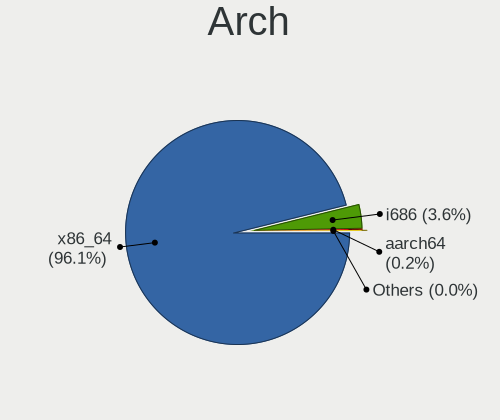
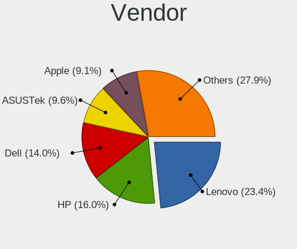
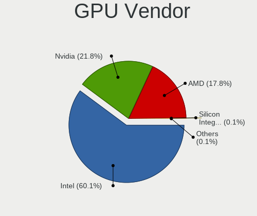
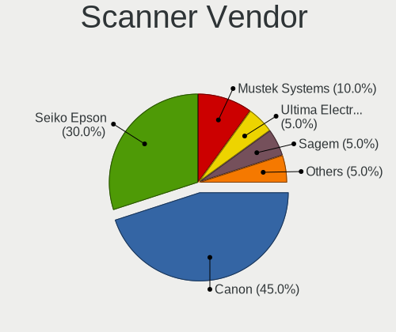

Debian - Tested Hardware & Statistics (Notebooks)
-------------------------------------------------

A project to collect tested hardware configurations for Debian.

Anyone can contribute to this report by the [hw-probe](https://github.com/linuxhw/hw-probe) tool:

    sudo -E hw-probe -all -upload

Please contribute! Especially if your hardware is rare.

Contents
--------

* [ Test Cases ](#test-cases)

* [ System ](#system)
  - [ OS                       ](#os)
  - [ OS Family                ](#os-family)
  - [ Kernel                   ](#kernel)
  - [ Kernel Family            ](#kernel-family)
  - [ Kernel Major Ver.        ](#kernel-major-ver)
  - [ Arch                     ](#arch)
  - [ DE                       ](#de)
  - [ Display Server           ](#display-server)
  - [ Display Manager          ](#display-manager)
  - [ OS Lang                  ](#os-lang)
  - [ Boot Mode                ](#boot-mode)
  - [ Filesystem               ](#filesystem)
  - [ Part. scheme             ](#part-scheme)
  - [ Dual Boot with Linux/BSD ](#dual-boot-with-linuxbsd)
  - [ Dual Boot (Win)          ](#dual-boot-win)

* [ Board ](#board)
  - [ Vendor                   ](#vendor)
  - [ Model                    ](#model)
  - [ Model Family             ](#model-family)
  - [ MFG Year                 ](#mfg-year)
  - [ Form Factor              ](#form-factor)
  - [ Secure Boot              ](#secure-boot)
  - [ Coreboot                 ](#coreboot)
  - [ RAM Size                 ](#ram-size)
  - [ RAM Used                 ](#ram-used)
  - [ Total Drives             ](#total-drives)
  - [ Has CD-ROM               ](#has-cd-rom)
  - [ Has Ethernet             ](#has-ethernet)
  - [ Has WiFi                 ](#has-wifi)
  - [ Has Bluetooth            ](#has-bluetooth)

* [ Location ](#location)
  - [ Country                  ](#country)
  - [ City                     ](#city)

* [ Drives ](#drives)
  - [ Drive Vendor             ](#drive-vendor)
  - [ Drive Model              ](#drive-model)
  - [ HDD Vendor               ](#hdd-vendor)
  - [ SSD Vendor               ](#ssd-vendor)
  - [ Drive Kind               ](#drive-kind)
  - [ Drive Connector          ](#drive-connector)
  - [ Drive Size               ](#drive-size)
  - [ Space Total              ](#space-total)
  - [ Space Used               ](#space-used)
  - [ Malfunc. Drives          ](#malfunc-drives)
  - [ Malfunc. Drive Vendor    ](#malfunc-drive-vendor)
  - [ Malfunc. HDD Vendor      ](#malfunc-hdd-vendor)
  - [ Malfunc. Drive Kind      ](#malfunc-drive-kind)
  - [ Failed Drives            ](#failed-drives)
  - [ Failed Drive Vendor      ](#failed-drive-vendor)
  - [ Drive Status             ](#drive-status)

* [ Storage controller ](#storage-controller)
  - [ Storage Vendor           ](#storage-vendor)
  - [ Storage Model            ](#storage-model)
  - [ Storage Kind             ](#storage-kind)

* [ Processor ](#processor)
  - [ CPU Vendor               ](#cpu-vendor)
  - [ CPU Model                ](#cpu-model)
  - [ CPU Model Family         ](#cpu-model-family)
  - [ CPU Cores                ](#cpu-cores)
  - [ CPU Sockets              ](#cpu-sockets)
  - [ CPU Threads              ](#cpu-threads)
  - [ CPU Op-Modes             ](#cpu-op-modes)
  - [ CPU Microcode            ](#cpu-microcode)
  - [ CPU Microarch            ](#cpu-microarch)

* [ Graphics ](#graphics)
  - [ GPU Vendor               ](#gpu-vendor)
  - [ GPU Model                ](#gpu-model)
  - [ GPU Combo                ](#gpu-combo)
  - [ GPU Driver               ](#gpu-driver)
  - [ GPU Memory               ](#gpu-memory)

* [ Monitor ](#monitor)
  - [ Monitor Vendor           ](#monitor-vendor)
  - [ Monitor Model            ](#monitor-model)
  - [ Monitor Resolution       ](#monitor-resolution)
  - [ Monitor Diagonal         ](#monitor-diagonal)
  - [ Monitor Width            ](#monitor-width)
  - [ Aspect Ratio             ](#aspect-ratio)
  - [ Monitor Area             ](#monitor-area)
  - [ Pixel Density            ](#pixel-density)
  - [ Multiple Monitors        ](#multiple-monitors)

* [ Network ](#network)
  - [ Net Controller Vendor    ](#net-controller-vendor)
  - [ Net Controller Model     ](#net-controller-model)
  - [ Wireless Vendor          ](#wireless-vendor)
  - [ Wireless Model           ](#wireless-model)
  - [ Ethernet Vendor          ](#ethernet-vendor)
  - [ Ethernet Model           ](#ethernet-model)
  - [ Net Controller Kind      ](#net-controller-kind)
  - [ Used Controller          ](#used-controller)
  - [ NICs                     ](#nics)
  - [ IPv6                     ](#ipv6)

* [ Bluetooth ](#bluetooth)
  - [ Bluetooth Vendor         ](#bluetooth-vendor)
  - [ Bluetooth Model          ](#bluetooth-model)

* [ Sound ](#sound)
  - [ Sound Vendor             ](#sound-vendor)
  - [ Sound Model              ](#sound-model)

* [ Memory ](#memory)
  - [ Memory Vendor            ](#memory-vendor)
  - [ Memory Model             ](#memory-model)
  - [ Memory Kind              ](#memory-kind)
  - [ Memory Form Factor       ](#memory-form-factor)
  - [ Memory Size              ](#memory-size)
  - [ Memory Speed             ](#memory-speed)

* [ Printers & scanners ](#printers--scanners)
  - [ Printer Vendor           ](#printer-vendor)
  - [ Printer Model            ](#printer-model)
  - [ Scanner Vendor           ](#scanner-vendor)
  - [ Scanner Model            ](#scanner-model)

* [ Camera ](#camera)
  - [ Camera Vendor            ](#camera-vendor)
  - [ Camera Model             ](#camera-model)

* [ Security ](#security)
  - [ Fingerprint Vendor       ](#fingerprint-vendor)
  - [ Fingerprint Model        ](#fingerprint-model)
  - [ Chipcard Vendor          ](#chipcard-vendor)
  - [ Chipcard Model           ](#chipcard-model)

* [ Unsupported ](#unsupported)
  - [ Unsupported Devices      ](#unsupported-devices)
  - [ Unsupported Device Types ](#unsupported-device-types)

Test Cases
----------

Total: 5876

| Vendor        | Model                       | Probe                                                      | Date         |
|---------------|-----------------------------|------------------------------------------------------------|--------------|
| ASUSTek       | ZenBook UX425UAZ_UM425UA... | [8d33275e7b](https://linux-hardware.org/?probe=8d33275e7b) | Dec 31, 2022 |
| ASUSTek       | VivoBook_ASUSLaptop X509... | [fb22f9430c](https://linux-hardware.org/?probe=fb22f9430c) | Dec 31, 2022 |
| Lenovo        | IdeaPad Y560                | [c9d3a1d0a3](https://linux-hardware.org/?probe=c9d3a1d0a3) | Dec 31, 2022 |
| Acer          | Aspire A514-54              | [5775c77a91](https://linux-hardware.org/?probe=5775c77a91) | Dec 31, 2022 |
| HP            | Compaq 6710b (KE207ES#AB... | [d7d0be3872](https://linux-hardware.org/?probe=d7d0be3872) | Dec 30, 2022 |
| Dell          | Inspiron 5490               | [c8a80649d2](https://linux-hardware.org/?probe=c8a80649d2) | Dec 30, 2022 |
| HP            | 255 G3                      | [89d6bd459c](https://linux-hardware.org/?probe=89d6bd459c) | Dec 30, 2022 |
| Toshiba       | Satellite L775-12V          | [2c601f6366](https://linux-hardware.org/?probe=2c601f6366) | Dec 29, 2022 |
| Lenovo        | ThinkPad T470p 20J7S1JT0... | [4b7bbb186f](https://linux-hardware.org/?probe=4b7bbb186f) | Dec 29, 2022 |
| MACHCREATO... | AB                          | [52a6beb872](https://linux-hardware.org/?probe=52a6beb872) | Dec 29, 2022 |
| Lenovo        | ThinkPad E14 Gen 3 20Y7S... | [5bf3ff5c0e](https://linux-hardware.org/?probe=5bf3ff5c0e) | Dec 29, 2022 |
| Lenovo        | ThinkPad E14 Gen 3 20Y7S... | [4f63c4474c](https://linux-hardware.org/?probe=4f63c4474c) | Dec 29, 2022 |
| HP            | EliteBook Folio 1040 G3     | [6aad572cd5](https://linux-hardware.org/?probe=6aad572cd5) | Dec 29, 2022 |
| HP            | ZBook 15 G6                 | [af1655497e](https://linux-hardware.org/?probe=af1655497e) | Dec 29, 2022 |
| HP            | ProBook 6570b               | [46fd918b7c](https://linux-hardware.org/?probe=46fd918b7c) | Dec 29, 2022 |
| HP            | Pavilion g7                 | [444363b7ec](https://linux-hardware.org/?probe=444363b7ec) | Dec 29, 2022 |
| Dell          | Inspiron 5490               | [457c2ae4ae](https://linux-hardware.org/?probe=457c2ae4ae) | Dec 28, 2022 |
| Dell          | Inspiron 5490               | [fdfd0f21c7](https://linux-hardware.org/?probe=fdfd0f21c7) | Dec 28, 2022 |
| Dell          | Inspiron 3583               | [41c7a16579](https://linux-hardware.org/?probe=41c7a16579) | Dec 28, 2022 |
| Toshiba       | Satellite L455D             | [35c085aa82](https://linux-hardware.org/?probe=35c085aa82) | Dec 28, 2022 |
| Dell          | Vostro 3400                 | [27f58a8ad1](https://linux-hardware.org/?probe=27f58a8ad1) | Dec 28, 2022 |
| Acer          | Aspire ES1-531              | [c29088a63f](https://linux-hardware.org/?probe=c29088a63f) | Dec 28, 2022 |
| HP            | ProBook 6470b               | [055705b3f2](https://linux-hardware.org/?probe=055705b3f2) | Dec 28, 2022 |
| Apple         | MacBookAir7,2               | [10dce91da1](https://linux-hardware.org/?probe=10dce91da1) | Dec 27, 2022 |
| ASUSTek       | ZenBook UX325EA_UX325EA     | [321cc72064](https://linux-hardware.org/?probe=321cc72064) | Dec 27, 2022 |
| Apple         | MacBookAir7,1               | [d174ffb318](https://linux-hardware.org/?probe=d174ffb318) | Dec 27, 2022 |
| MSI           | GE62 2QC                    | [dbd69d70ac](https://linux-hardware.org/?probe=dbd69d70ac) | Dec 27, 2022 |
| Panasonic     | FZ55-2                      | [1699b7c3b2](https://linux-hardware.org/?probe=1699b7c3b2) | Dec 27, 2022 |
| ASUSTek       | VivoBook_ASUS Laptop E40... | [78c6c15502](https://linux-hardware.org/?probe=78c6c15502) | Dec 27, 2022 |
| Notebook      | L14xMU                      | [7644bc65e2](https://linux-hardware.org/?probe=7644bc65e2) | Dec 27, 2022 |
| Dell          | Inspiron 1012               | [3dd6b8a416](https://linux-hardware.org/?probe=3dd6b8a416) | Dec 26, 2022 |
| Exo           | Smart Serie M               | [942ee3b035](https://linux-hardware.org/?probe=942ee3b035) | Dec 26, 2022 |
| Lenovo        | ThinkPad E560 20EV002FUS    | [3bb1c5cc47](https://linux-hardware.org/?probe=3bb1c5cc47) | Dec 26, 2022 |
| Lenovo        | ThinkPad E15 Gen 2 20TD0... | [29a54c4976](https://linux-hardware.org/?probe=29a54c4976) | Dec 26, 2022 |
| Acer          | Aspire ES1-533              | [3b5fa6d85a](https://linux-hardware.org/?probe=3b5fa6d85a) | Dec 26, 2022 |
| Lenovo        | ThinkPad X250 20CLS1UB00    | [fc8b2899fa](https://linux-hardware.org/?probe=fc8b2899fa) | Dec 25, 2022 |
| SANTECH       | NHx0DB,DE                   | [a0996d42bd](https://linux-hardware.org/?probe=a0996d42bd) | Dec 25, 2022 |
| HP            | 470 G8 Notebook PC          | [6d77c48324](https://linux-hardware.org/?probe=6d77c48324) | Dec 25, 2022 |
| ASUSTek       | G751JT                      | [16e989ff99](https://linux-hardware.org/?probe=16e989ff99) | Dec 25, 2022 |
| Dell          | Latitude E6520              | [33a51c934d](https://linux-hardware.org/?probe=33a51c934d) | Dec 25, 2022 |
| Dell          | Inspiron 5490               | [ea09a6daa8](https://linux-hardware.org/?probe=ea09a6daa8) | Dec 25, 2022 |
| Dell          | Inspiron 5490               | [45737153e4](https://linux-hardware.org/?probe=45737153e4) | Dec 25, 2022 |
| HP            | Laptop 15-bw0xx             | [42221f61fb](https://linux-hardware.org/?probe=42221f61fb) | Dec 25, 2022 |
| Unknown       | Apple MacBook Pro (14-in... | [8a5b919c91](https://linux-hardware.org/?probe=8a5b919c91) | Dec 24, 2022 |
| Medion        | E122X                       | [6e4e34bcc3](https://linux-hardware.org/?probe=6e4e34bcc3) | Dec 24, 2022 |
| Medion        | E122X                       | [bf41c45a7d](https://linux-hardware.org/?probe=bf41c45a7d) | Dec 24, 2022 |
| Lenovo        | ThinkBook 15 G3 ACL 21A4    | [096d4fc8c2](https://linux-hardware.org/?probe=096d4fc8c2) | Dec 24, 2022 |
| Lenovo        | ThinkPad X1 Carbon 7th 2... | [c5f2f2db53](https://linux-hardware.org/?probe=c5f2f2db53) | Dec 24, 2022 |
| Lenovo        | ThinkPad X270 20HMS16200    | [6ac6e552a8](https://linux-hardware.org/?probe=6ac6e552a8) | Dec 24, 2022 |
| Dell          | Inspiron 5570               | [1c7e7f8dd2](https://linux-hardware.org/?probe=1c7e7f8dd2) | Dec 24, 2022 |
| HP            | Laptop 15-dy2xxx            | [df787f1286](https://linux-hardware.org/?probe=df787f1286) | Dec 24, 2022 |
| HP            | Laptop 15-dy2xxx            | [0a2ed74cfd](https://linux-hardware.org/?probe=0a2ed74cfd) | Dec 23, 2022 |
| Dell          | Latitude E7440              | [baae52327d](https://linux-hardware.org/?probe=baae52327d) | Dec 23, 2022 |
| Dell          | Latitude E7440              | [bc5d48b831](https://linux-hardware.org/?probe=bc5d48b831) | Dec 23, 2022 |
| Dell          | Latitude E7440              | [fde483d476](https://linux-hardware.org/?probe=fde483d476) | Dec 23, 2022 |
| Dell          | Latitude E7440              | [a746012ffd](https://linux-hardware.org/?probe=a746012ffd) | Dec 23, 2022 |
| Lenovo        | ThinkPad T16 Gen 1 21BWS... | [9e5c4705fa](https://linux-hardware.org/?probe=9e5c4705fa) | Dec 23, 2022 |
| Dell          | Latitude D630               | [8175d003ce](https://linux-hardware.org/?probe=8175d003ce) | Dec 23, 2022 |
| Google        | Reks                        | [ecee690e6e](https://linux-hardware.org/?probe=ecee690e6e) | Dec 23, 2022 |
| Toshiba       | Satellite L10W-B-101        | [54d5cca493](https://linux-hardware.org/?probe=54d5cca493) | Dec 23, 2022 |
| Google        | Reks                        | [58b1b4cac1](https://linux-hardware.org/?probe=58b1b4cac1) | Dec 23, 2022 |
| Dell          | Inspiron 3501               | [297651d437](https://linux-hardware.org/?probe=297651d437) | Dec 23, 2022 |
| Lenovo        | Legion 5 15ACH6A 82NW       | [79b015dcea](https://linux-hardware.org/?probe=79b015dcea) | Dec 23, 2022 |
| Dell          | Inspiron 3501               | [958ee9d145](https://linux-hardware.org/?probe=958ee9d145) | Dec 23, 2022 |
| Dell          | G3 3590                     | [d75d9e6663](https://linux-hardware.org/?probe=d75d9e6663) | Dec 23, 2022 |
| Lenovo        | ThinkPad X260 20F5005NAU    | [5f75bb423d](https://linux-hardware.org/?probe=5f75bb423d) | Dec 23, 2022 |
| Acer          | Aspire 4750                 | [3256c282db](https://linux-hardware.org/?probe=3256c282db) | Dec 23, 2022 |
| HP            | 255 G7 Notebook PC          | [5bedf1557b](https://linux-hardware.org/?probe=5bedf1557b) | Dec 23, 2022 |
| Dell          | Inspiron 5490               | [1c424b5f55](https://linux-hardware.org/?probe=1c424b5f55) | Dec 23, 2022 |
| Unknown       | Unknown                     | [f9c4fecaf4](https://linux-hardware.org/?probe=f9c4fecaf4) | Dec 23, 2022 |
| Unknown       | Unknown                     | [3832db2827](https://linux-hardware.org/?probe=3832db2827) | Dec 23, 2022 |
| Toshiba       | Satellite C55Dt-A           | [67294324c5](https://linux-hardware.org/?probe=67294324c5) | Dec 22, 2022 |
| Dell          | Latitude E7440              | [c6d28912f0](https://linux-hardware.org/?probe=c6d28912f0) | Dec 22, 2022 |
| Dell          | Latitude E7440              | [1a14f26bd3](https://linux-hardware.org/?probe=1a14f26bd3) | Dec 22, 2022 |
| Dell          | Latitude E7440              | [db77bb7a3f](https://linux-hardware.org/?probe=db77bb7a3f) | Dec 22, 2022 |
| Dell          | Latitude E7440              | [d2278ed94d](https://linux-hardware.org/?probe=d2278ed94d) | Dec 22, 2022 |
| Apple         | MacBookAir7,1               | [09ba8ccf48](https://linux-hardware.org/?probe=09ba8ccf48) | Dec 22, 2022 |
| Dell          | Latitude E7440              | [f4e79df709](https://linux-hardware.org/?probe=f4e79df709) | Dec 22, 2022 |
| Apple         | MacBookAir7,1               | [2c3febf6fa](https://linux-hardware.org/?probe=2c3febf6fa) | Dec 22, 2022 |
| Dell          | Latitude E7440              | [cddffa9123](https://linux-hardware.org/?probe=cddffa9123) | Dec 22, 2022 |
| Dell          | Latitude E7440              | [5f911806c8](https://linux-hardware.org/?probe=5f911806c8) | Dec 22, 2022 |
| Lenovo        | ThinkPad X260 20F5005NAU    | [844f589d20](https://linux-hardware.org/?probe=844f589d20) | Dec 22, 2022 |
| Dell          | Latitude D630               | [e1106d8868](https://linux-hardware.org/?probe=e1106d8868) | Dec 22, 2022 |
| Packard Be... | DOT S                       | [c26f1d77e6](https://linux-hardware.org/?probe=c26f1d77e6) | Dec 22, 2022 |
| HP            | Stream Notebook PC 13       | [b049c64ff7](https://linux-hardware.org/?probe=b049c64ff7) | Dec 22, 2022 |
| Lenovo        | ThinkPad T14 Gen 1 20S1S... | [5f132c928b](https://linux-hardware.org/?probe=5f132c928b) | Dec 22, 2022 |
| Dell          | G3 3590                     | [8038491eb0](https://linux-hardware.org/?probe=8038491eb0) | Dec 22, 2022 |
| Lenovo        | IdeaPad 5 15IAL7 82SF       | [16cae3015a](https://linux-hardware.org/?probe=16cae3015a) | Dec 21, 2022 |
| Apple         | MacBookAir7,2               | [b4e828bef3](https://linux-hardware.org/?probe=b4e828bef3) | Dec 21, 2022 |
| Lenovo        | ThinkPad T14 Gen 3 21AHC... | [28013105ef](https://linux-hardware.org/?probe=28013105ef) | Dec 21, 2022 |
| Dell          | Vostro 3583                 | [cf3c6eb18b](https://linux-hardware.org/?probe=cf3c6eb18b) | Dec 21, 2022 |
| Apple         | MacBookAir7,2               | [056d76bae8](https://linux-hardware.org/?probe=056d76bae8) | Dec 21, 2022 |
| Sony          | SVE1112M1EB                 | [74e100e63b](https://linux-hardware.org/?probe=74e100e63b) | Dec 21, 2022 |
| HP            | ZBook Power 15.6 inch G8... | [6b202d6cc2](https://linux-hardware.org/?probe=6b202d6cc2) | Dec 21, 2022 |
| Lenovo        | Legion 5 15ARH05 82B5       | [9438c80c85](https://linux-hardware.org/?probe=9438c80c85) | Dec 21, 2022 |
| Dell          | Inspiron 3501               | [449e38a14d](https://linux-hardware.org/?probe=449e38a14d) | Dec 21, 2022 |
| Dell          | G3 3590                     | [8272655600](https://linux-hardware.org/?probe=8272655600) | Dec 21, 2022 |
| Lenovo        | ThinkPad 13 2nd Gen 20J1... | [cd4fa20e66](https://linux-hardware.org/?probe=cd4fa20e66) | Dec 20, 2022 |
| Lenovo        | ThinkPad 13 2nd Gen 20J1... | [e676fe186f](https://linux-hardware.org/?probe=e676fe186f) | Dec 20, 2022 |
| ASUSTek       | VivoBook_ASUSLaptop M760... | [658e730bd3](https://linux-hardware.org/?probe=658e730bd3) | Dec 20, 2022 |
| HP            | OMEN Laptop 15-en1xxx       | [1e53c20bdd](https://linux-hardware.org/?probe=1e53c20bdd) | Dec 20, 2022 |
| ASUSTek       | T100TA                      | [1dc546e14a](https://linux-hardware.org/?probe=1dc546e14a) | Dec 20, 2022 |
| Lenovo        | ThinkPad T490 20N2CTO1WW    | [2aeb8fd0cd](https://linux-hardware.org/?probe=2aeb8fd0cd) | Dec 19, 2022 |
| HP            | 255 G8 Notebook PC          | [08800ce691](https://linux-hardware.org/?probe=08800ce691) | Dec 19, 2022 |
| ASUSTek       | 900SD                       | [43d2c88062](https://linux-hardware.org/?probe=43d2c88062) | Dec 18, 2022 |
| Dell          | Inspiron 3501               | [956aaecbb9](https://linux-hardware.org/?probe=956aaecbb9) | Dec 18, 2022 |
| Dell          | Inspiron 3501               | [d5ceb48450](https://linux-hardware.org/?probe=d5ceb48450) | Dec 18, 2022 |
| HP            | ENVY Laptop 13-ad1xx        | [756263bf48](https://linux-hardware.org/?probe=756263bf48) | Dec 18, 2022 |
| EUROCOM       | SCORPIUS 3D                 | [4fdf299276](https://linux-hardware.org/?probe=4fdf299276) | Dec 18, 2022 |
| Acer          | TravelMate P253             | [97d650e93f](https://linux-hardware.org/?probe=97d650e93f) | Dec 18, 2022 |
| Dell          | Latitude E6530              | [198a9bc936](https://linux-hardware.org/?probe=198a9bc936) | Dec 18, 2022 |
| HP            | Pavilion g7                 | [9829a799a0](https://linux-hardware.org/?probe=9829a799a0) | Dec 18, 2022 |
| Lenovo        | ThinkPad T470 20HES3JR02    | [f9e4638f19](https://linux-hardware.org/?probe=f9e4638f19) | Dec 18, 2022 |
| Dell          | Inspiron N5110              | [9e4f7a69c9](https://linux-hardware.org/?probe=9e4f7a69c9) | Dec 18, 2022 |
| Dell          | Latitude E4310              | [ace267f47c](https://linux-hardware.org/?probe=ace267f47c) | Dec 18, 2022 |
| Acer          | Aspire E5-573G              | [937a672cb0](https://linux-hardware.org/?probe=937a672cb0) | Dec 17, 2022 |
| Lenovo        | ThinkPad X1 Carbon Gen 9... | [1e2531fdf1](https://linux-hardware.org/?probe=1e2531fdf1) | Dec 17, 2022 |
| Lenovo        | K14 Gen 1 21CUS02600        | [218654b079](https://linux-hardware.org/?probe=218654b079) | Dec 17, 2022 |
| Dell          | Inspiron 14 5425            | [e7d96ccda5](https://linux-hardware.org/?probe=e7d96ccda5) | Dec 17, 2022 |
| HP            | Notebook                    | [844d855f78](https://linux-hardware.org/?probe=844d855f78) | Dec 17, 2022 |
| Unknown       | Unknown                     | [208016df07](https://linux-hardware.org/?probe=208016df07) | Dec 17, 2022 |
| Acer          | TravelMate P253             | [80188fd5bf](https://linux-hardware.org/?probe=80188fd5bf) | Dec 16, 2022 |
| Dell          | Inspiron 7590               | [e8fb837cf5](https://linux-hardware.org/?probe=e8fb837cf5) | Dec 16, 2022 |
| Lenovo        | ThinkPad X230 23255NG       | [5cc0ff812b](https://linux-hardware.org/?probe=5cc0ff812b) | Dec 16, 2022 |
| Lenovo        | ThinkPad X230 23255NG       | [062a6ed428](https://linux-hardware.org/?probe=062a6ed428) | Dec 16, 2022 |
| Google        | Laser14                     | [b07a01ffe4](https://linux-hardware.org/?probe=b07a01ffe4) | Dec 16, 2022 |
| Lenovo        | ThinkPad X1 Carbon Gen 9... | [db670caadd](https://linux-hardware.org/?probe=db670caadd) | Dec 16, 2022 |
| Lenovo        | ThinkPad X1 Extreme Gen ... | [d5cf351351](https://linux-hardware.org/?probe=d5cf351351) | Dec 16, 2022 |
| Lenovo        | ThinkPad X1 Extreme Gen ... | [e2056deb8a](https://linux-hardware.org/?probe=e2056deb8a) | Dec 16, 2022 |
| Intel         | powered classmate PC        | [e0401225a2](https://linux-hardware.org/?probe=e0401225a2) | Dec 15, 2022 |
| Lenovo        | ThinkPad E490 20N8CTO1WW    | [13ee187e45](https://linux-hardware.org/?probe=13ee187e45) | Dec 15, 2022 |
| Lenovo        | Yoga Slim 7 Pro 14ACH5 8... | [bec79890c8](https://linux-hardware.org/?probe=bec79890c8) | Dec 15, 2022 |
| Unknown       | T3 MRD                      | [909e1a1604](https://linux-hardware.org/?probe=909e1a1604) | Dec 15, 2022 |
| Google        | Cyan                        | [2b9f20b7da](https://linux-hardware.org/?probe=2b9f20b7da) | Dec 15, 2022 |
| Lenovo        | ThinkPad T430 2349I62       | [f7590c1a07](https://linux-hardware.org/?probe=f7590c1a07) | Dec 15, 2022 |
| Dell          | Latitude 3490               | [af008f69f1](https://linux-hardware.org/?probe=af008f69f1) | Dec 14, 2022 |
| Acer          | Aspire 5738                 | [c0c4581310](https://linux-hardware.org/?probe=c0c4581310) | Dec 14, 2022 |
| Apple         | MacBook6,1                  | [f19d464a26](https://linux-hardware.org/?probe=f19d464a26) | Dec 14, 2022 |
| ASUSTek       | M3N                         | [4e9f8e4c01](https://linux-hardware.org/?probe=4e9f8e4c01) | Dec 14, 2022 |
| ASUSTek       | X302LA                      | [8404a0b0c6](https://linux-hardware.org/?probe=8404a0b0c6) | Dec 14, 2022 |
| Lenovo        | ThinkPad E15 Gen 3 20YHS... | [14f87b8695](https://linux-hardware.org/?probe=14f87b8695) | Dec 13, 2022 |
| ASUSTek       | M3N                         | [ff772de294](https://linux-hardware.org/?probe=ff772de294) | Dec 13, 2022 |
| Dell          | Latitude 5520               | [7e5d86eaaf](https://linux-hardware.org/?probe=7e5d86eaaf) | Dec 13, 2022 |
| ASUSTek       | G75VW                       | [8d2a0ec4e4](https://linux-hardware.org/?probe=8d2a0ec4e4) | Dec 13, 2022 |
| Exo           | Smart Serie M               | [7fcf3d09bb](https://linux-hardware.org/?probe=7fcf3d09bb) | Dec 13, 2022 |
| HUAWEI        | BOHK-WAX9X                  | [49fad98b7b](https://linux-hardware.org/?probe=49fad98b7b) | Dec 12, 2022 |
| Google        | Terra                       | [765deab389](https://linux-hardware.org/?probe=765deab389) | Dec 12, 2022 |
| HP            | EliteBook 8460p             | [95dc27194a](https://linux-hardware.org/?probe=95dc27194a) | Dec 12, 2022 |
| MSI           | GP73 Leopard 8RD            | [548de8bdae](https://linux-hardware.org/?probe=548de8bdae) | Dec 12, 2022 |
| Acer          | Aspire A515-56              | [5437de2b1b](https://linux-hardware.org/?probe=5437de2b1b) | Dec 12, 2022 |
| Lenovo        | Yoga Slim 7 ProX 14IAH7 ... | [dc916ac78c](https://linux-hardware.org/?probe=dc916ac78c) | Dec 12, 2022 |
| Lenovo        | Yoga Slim 7 ProX 14IAH7 ... | [2bfcc16f6b](https://linux-hardware.org/?probe=2bfcc16f6b) | Dec 12, 2022 |
| Google        | Enguarde                    | [60cce42479](https://linux-hardware.org/?probe=60cce42479) | Dec 12, 2022 |
| Lenovo        | ThinkPad R61e 7650DHU       | [138f60e67c](https://linux-hardware.org/?probe=138f60e67c) | Dec 12, 2022 |
| HP            | EliteBook 8460p             | [99c965b83f](https://linux-hardware.org/?probe=99c965b83f) | Dec 12, 2022 |
| Dell          | Latitude 5411               | [af806502e8](https://linux-hardware.org/?probe=af806502e8) | Dec 12, 2022 |
| Acer          | Nitro AN515-51              | [918c340b04](https://linux-hardware.org/?probe=918c340b04) | Dec 12, 2022 |
| Lenovo        | ThinkPad T470 20HES6HC00    | [ca9d609d9d](https://linux-hardware.org/?probe=ca9d609d9d) | Dec 12, 2022 |
| HP            | Laptop 15-db1xxx            | [3dcbd61f9e](https://linux-hardware.org/?probe=3dcbd61f9e) | Dec 12, 2022 |
| Lenovo        | ThinkPad X201 Tablet 309... | [cd7399049b](https://linux-hardware.org/?probe=cd7399049b) | Dec 11, 2022 |
| Intel         | Kabylake Platform           | [b5c2316016](https://linux-hardware.org/?probe=b5c2316016) | Dec 11, 2022 |
| Lenovo        | G770 20089                  | [f6f1441538](https://linux-hardware.org/?probe=f6f1441538) | Dec 11, 2022 |
| Lenovo        | G50-45 80E3                 | [754e028997](https://linux-hardware.org/?probe=754e028997) | Dec 11, 2022 |
| Lenovo        | G50-45 80E3                 | [fb2f97325d](https://linux-hardware.org/?probe=fb2f97325d) | Dec 11, 2022 |
| Dell          | Latitude 5480               | [01c96ca524](https://linux-hardware.org/?probe=01c96ca524) | Dec 11, 2022 |
| Dell          | Inspiron 13-5368            | [b4ea41e00f](https://linux-hardware.org/?probe=b4ea41e00f) | Dec 11, 2022 |
| Lenovo        | ThinkPad X270 20HMS16200    | [89e7835b90](https://linux-hardware.org/?probe=89e7835b90) | Dec 11, 2022 |
| Notebook      | NJ50_70CU                   | [f77f39af95](https://linux-hardware.org/?probe=f77f39af95) | Dec 11, 2022 |
| ASUSTek       | ZenBook Pro Duo UX581GV_... | [4686ea3469](https://linux-hardware.org/?probe=4686ea3469) | Dec 11, 2022 |
| HP            | Laptop 15s-du3xxx           | [400a0b555d](https://linux-hardware.org/?probe=400a0b555d) | Dec 10, 2022 |
| Dell          | Latitude E7240              | [e0aca47e1b](https://linux-hardware.org/?probe=e0aca47e1b) | Dec 10, 2022 |
| ASUSTek       | VivoBook S15 X510UF         | [5f72ad2758](https://linux-hardware.org/?probe=5f72ad2758) | Dec 10, 2022 |
| Google        | Peppy                       | [59f9af1c52](https://linux-hardware.org/?probe=59f9af1c52) | Dec 10, 2022 |
| Toshiba       | TECRA A11                   | [766f95a2dd](https://linux-hardware.org/?probe=766f95a2dd) | Dec 10, 2022 |
| SANTECH       | NHx0DB,DE                   | [89e8d0f23e](https://linux-hardware.org/?probe=89e8d0f23e) | Dec 10, 2022 |
| Lenovo        | ThinkPad 13 20J10046US      | [170accb6cc](https://linux-hardware.org/?probe=170accb6cc) | Dec 09, 2022 |
| HP            | EliteBook 830 G8 Noteboo... | [5d96a0484a](https://linux-hardware.org/?probe=5d96a0484a) | Dec 08, 2022 |
| HUAWEI        | KLVL-WXXW                   | [adea8bc8d8](https://linux-hardware.org/?probe=adea8bc8d8) | Dec 08, 2022 |
| Toshiba       | Satellite C850-1LJ          | [4af2ab112f](https://linux-hardware.org/?probe=4af2ab112f) | Dec 08, 2022 |
| ASUSTek       | N750JV                      | [e06c6025f3](https://linux-hardware.org/?probe=e06c6025f3) | Dec 08, 2022 |
| Lenovo        | ThinkPad T61 889502U        | [b9d0a07e47](https://linux-hardware.org/?probe=b9d0a07e47) | Dec 08, 2022 |
| Lenovo        | ThinkPad 13 2nd Gen 20J1... | [09de0ec660](https://linux-hardware.org/?probe=09de0ec660) | Dec 08, 2022 |
| Lenovo        | ThinkPad T60 1953PKK        | [fc308e2f1c](https://linux-hardware.org/?probe=fc308e2f1c) | Dec 08, 2022 |
| Lenovo        | ThinkPad X201 Tablet 309... | [e13e889312](https://linux-hardware.org/?probe=e13e889312) | Dec 08, 2022 |
| Lenovo        | ThinkPad T14 Gen 3 21AHC... | [b0f77fed1f](https://linux-hardware.org/?probe=b0f77fed1f) | Dec 08, 2022 |
| Lenovo        | ThinkPad T14 Gen 3 21AHC... | [e56fd20ec9](https://linux-hardware.org/?probe=e56fd20ec9) | Dec 08, 2022 |
| Lenovo        | ThinkPad E495 20NES0J800    | [17182155b5](https://linux-hardware.org/?probe=17182155b5) | Dec 07, 2022 |
| Lenovo        | ThinkPad X230 2320CTO       | [b74f2893d0](https://linux-hardware.org/?probe=b74f2893d0) | Dec 07, 2022 |
| Panasonic     | CFMX4-1                     | [c25c16fc1a](https://linux-hardware.org/?probe=c25c16fc1a) | Dec 06, 2022 |
| Dell          | Latitude 5310               | [06d96a49a1](https://linux-hardware.org/?probe=06d96a49a1) | Dec 06, 2022 |
| HP            | EliteBook 8470p             | [e2be1fe149](https://linux-hardware.org/?probe=e2be1fe149) | Dec 06, 2022 |
| Lenovo        | IdeaPad 700-15ISK 80RU      | [4e43c26029](https://linux-hardware.org/?probe=4e43c26029) | Dec 06, 2022 |
| Dell          | Latitude 5411               | [62e5941721](https://linux-hardware.org/?probe=62e5941721) | Dec 06, 2022 |
| Dell          | Latitude 5411               | [e0815067bd](https://linux-hardware.org/?probe=e0815067bd) | Dec 06, 2022 |
| Dell          | Latitude 5310               | [f3801600ff](https://linux-hardware.org/?probe=f3801600ff) | Dec 06, 2022 |
| HP            | EliteBook 2570p             | [fc7d866c16](https://linux-hardware.org/?probe=fc7d866c16) | Dec 06, 2022 |
| Lenovo        | ThinkPad L15 Gen 2 20X4S... | [03aba4d315](https://linux-hardware.org/?probe=03aba4d315) | Dec 06, 2022 |
| Lenovo        | ThinkPad X230 2325SDE       | [4dc49eeb10](https://linux-hardware.org/?probe=4dc49eeb10) | Dec 06, 2022 |
| ASUSTek       | VivoBook_ASUSLaptop X512... | [0e42e5cbeb](https://linux-hardware.org/?probe=0e42e5cbeb) | Dec 06, 2022 |
| Lenovo        | ThinkPad L470 W10DG 20JV... | [5b72cdbdb8](https://linux-hardware.org/?probe=5b72cdbdb8) | Dec 05, 2022 |
| ASUSTek       | X756UQK                     | [b473216b84](https://linux-hardware.org/?probe=b473216b84) | Dec 05, 2022 |
| HUAWEI        | BOD-WXX9                    | [3027fc2c2f](https://linux-hardware.org/?probe=3027fc2c2f) | Dec 05, 2022 |
| HUAWEI        | BOD-WXX9                    | [a07d55ca40](https://linux-hardware.org/?probe=a07d55ca40) | Dec 05, 2022 |
| MSI           | Creator 15M A9SD            | [f8e6206ba6](https://linux-hardware.org/?probe=f8e6206ba6) | Dec 05, 2022 |
| ASUSTek       | PU403UA                     | [20007b4296](https://linux-hardware.org/?probe=20007b4296) | Dec 05, 2022 |
| Acer          | Aspire A315-23G             | [41e6f6a3fa](https://linux-hardware.org/?probe=41e6f6a3fa) | Dec 05, 2022 |
| GMKtec        | NucBox5                     | [cdfbbcc5b2](https://linux-hardware.org/?probe=cdfbbcc5b2) | Dec 04, 2022 |
| ASUSTek       | S500CA                      | [267ffa24d1](https://linux-hardware.org/?probe=267ffa24d1) | Dec 04, 2022 |
| Lenovo        | ThinkPad T470 W10DG 20JN... | [f5be4eb37d](https://linux-hardware.org/?probe=f5be4eb37d) | Dec 04, 2022 |
| Toshiba       | dynabook R63/P              | [f51571b62c](https://linux-hardware.org/?probe=f51571b62c) | Dec 04, 2022 |
| ASUSTek       | ASUS TUF Gaming A15 FA50... | [b475911aaf](https://linux-hardware.org/?probe=b475911aaf) | Dec 03, 2022 |
| Dell          | Inspiron 15-5578            | [61f5950e07](https://linux-hardware.org/?probe=61f5950e07) | Dec 03, 2022 |
| HP            | Laptop 15-da0xxx            | [9053b5cb8a](https://linux-hardware.org/?probe=9053b5cb8a) | Dec 03, 2022 |
| ASUSTek       | S500CA                      | [7145280e9e](https://linux-hardware.org/?probe=7145280e9e) | Dec 03, 2022 |
| Acer          | Aspire A315-21              | [91eb1913d7](https://linux-hardware.org/?probe=91eb1913d7) | Dec 03, 2022 |
| Unknown       | Unknown                     | [40917baf56](https://linux-hardware.org/?probe=40917baf56) | Dec 03, 2022 |
| HP            | EliteBook 845 G8 Noteboo... | [28ab0eb248](https://linux-hardware.org/?probe=28ab0eb248) | Dec 03, 2022 |
| Lenovo        | XiaoXinPro 16ACH 2021 82... | [2085f260e1](https://linux-hardware.org/?probe=2085f260e1) | Dec 03, 2022 |
| Lenovo        | ThinkPad X280 20KE0015BR    | [4c65d4e572](https://linux-hardware.org/?probe=4c65d4e572) | Dec 03, 2022 |
| Lenovo        | ThinkPad E14 Gen 4 21E3C... | [c99bd4ef76](https://linux-hardware.org/?probe=c99bd4ef76) | Dec 03, 2022 |
| Dell          | Inspiron 5566               | [54e06d37fc](https://linux-hardware.org/?probe=54e06d37fc) | Dec 02, 2022 |
| ASUSTek       | N750JV                      | [0fc50d63c4](https://linux-hardware.org/?probe=0fc50d63c4) | Dec 02, 2022 |
| Dell          | Latitude 5591               | [f5735acca7](https://linux-hardware.org/?probe=f5735acca7) | Dec 02, 2022 |
| HP            | Unknown                     | [741029c3af](https://linux-hardware.org/?probe=741029c3af) | Dec 02, 2022 |
| Aquarius      | NS585                       | [bbd3bd3ca6](https://linux-hardware.org/?probe=bbd3bd3ca6) | Dec 02, 2022 |
| Aquarius      | NS585                       | [50222418e5](https://linux-hardware.org/?probe=50222418e5) | Dec 02, 2022 |
| Aquarius      | NS585                       | [d55d40681f](https://linux-hardware.org/?probe=d55d40681f) | Dec 02, 2022 |
| Aquarius      | NS585                       | [9013a1cce6](https://linux-hardware.org/?probe=9013a1cce6) | Dec 02, 2022 |
| ASUSTek       | ROG Strix G731GU_G731GU     | [38ce706249](https://linux-hardware.org/?probe=38ce706249) | Dec 02, 2022 |
| ASUSTek       | ROG Strix G731GU_G731GU     | [546f2b82c9](https://linux-hardware.org/?probe=546f2b82c9) | Dec 02, 2022 |
| ASUSTek       | ROG Strix G731GU_G731GU     | [000d536e95](https://linux-hardware.org/?probe=000d536e95) | Dec 02, 2022 |
| HP            | 620                         | [6be09298b6](https://linux-hardware.org/?probe=6be09298b6) | Dec 01, 2022 |
| Lenovo        | ThinkPad T440p 20AN0079M... | [79261239c1](https://linux-hardware.org/?probe=79261239c1) | Dec 01, 2022 |
| Lenovo        | ThinkPad E15 Gen 4 21EES... | [674157de54](https://linux-hardware.org/?probe=674157de54) | Dec 01, 2022 |
| Lenovo        | V330-15IKB 81AX             | [becc2328fd](https://linux-hardware.org/?probe=becc2328fd) | Dec 01, 2022 |
| MSI           | GL65 Leopard 10SDR          | [73c388fb61](https://linux-hardware.org/?probe=73c388fb61) | Dec 01, 2022 |
| MSI           | GL65 Leopard 10SDR          | [6d44ef56c9](https://linux-hardware.org/?probe=6d44ef56c9) | Dec 01, 2022 |
| HP            | Pavilion dv5                | [0fc7017b0c](https://linux-hardware.org/?probe=0fc7017b0c) | Nov 30, 2022 |
| HUAWEI        | NBLK-WAX9X                  | [183243daeb](https://linux-hardware.org/?probe=183243daeb) | Nov 30, 2022 |
| Notebook      | RIM2520                     | [5f66abbb8b](https://linux-hardware.org/?probe=5f66abbb8b) | Nov 30, 2022 |
| HP            | Elite x2 1011 G1 Tablet     | [1a00258de3](https://linux-hardware.org/?probe=1a00258de3) | Nov 29, 2022 |
| Apple         | MacBookAir6,2               | [e0187bc636](https://linux-hardware.org/?probe=e0187bc636) | Nov 29, 2022 |
| Apple         | MacBookAir6,2               | [99eb1cfce0](https://linux-hardware.org/?probe=99eb1cfce0) | Nov 29, 2022 |
| Dell          | Latitude 7490               | [8934413cf0](https://linux-hardware.org/?probe=8934413cf0) | Nov 29, 2022 |
| Lenovo        | V310-14IKB 80T2             | [b7c976ef9c](https://linux-hardware.org/?probe=b7c976ef9c) | Nov 29, 2022 |
| HP            | Victus by Laptop 16-e0xx... | [9c45563fb6](https://linux-hardware.org/?probe=9c45563fb6) | Nov 29, 2022 |
| Dell          | XPS 15 9500                 | [9c87ab493e](https://linux-hardware.org/?probe=9c87ab493e) | Nov 29, 2022 |
| ASUSTek       | ZenBook UX325EA_UX325EA     | [1e52ea39e4](https://linux-hardware.org/?probe=1e52ea39e4) | Nov 28, 2022 |
| Lenovo        | ThinkPad X301 2776LEG       | [ebaea0c805](https://linux-hardware.org/?probe=ebaea0c805) | Nov 28, 2022 |
| Dell          | Precision M6400             | [05f69c6917](https://linux-hardware.org/?probe=05f69c6917) | Nov 28, 2022 |
| HP            | ProBook 450 G5              | [e94fd64204](https://linux-hardware.org/?probe=e94fd64204) | Nov 28, 2022 |
| ASUSTek       | GL752VW                     | [edc0678b85](https://linux-hardware.org/?probe=edc0678b85) | Nov 28, 2022 |
| Dell          | XPS 15 9500                 | [f149afb5d1](https://linux-hardware.org/?probe=f149afb5d1) | Nov 28, 2022 |
| ASUSTek       | N61Vg                       | [b5cc07b253](https://linux-hardware.org/?probe=b5cc07b253) | Nov 27, 2022 |
| Lenovo        | ThinkPad T450 20BUS03J00    | [8423f90db0](https://linux-hardware.org/?probe=8423f90db0) | Nov 27, 2022 |
| Lenovo        | ThinkPad T520 4243F53       | [8f9e96442a](https://linux-hardware.org/?probe=8f9e96442a) | Nov 27, 2022 |
| Tactus        | GeoBook 140                 | [e3f4d734da](https://linux-hardware.org/?probe=e3f4d734da) | Nov 27, 2022 |
| ASUSTek       | VivoBook S15 X510UF         | [7bd68a8bb1](https://linux-hardware.org/?probe=7bd68a8bb1) | Nov 27, 2022 |
| HP            | Compaq nx9110 (DU432EA#A... | [1b54092e14](https://linux-hardware.org/?probe=1b54092e14) | Nov 27, 2022 |
| ASUSTek       | VivoBook_ASUSLaptop X421... | [32bfa52fc1](https://linux-hardware.org/?probe=32bfa52fc1) | Nov 27, 2022 |
| Lenovo        | ThinkPad T450 20BV0001US    | [3d1b8f282a](https://linux-hardware.org/?probe=3d1b8f282a) | Nov 27, 2022 |
| HP            | Laptop 15s-fq5xxx           | [f1ef96a2e6](https://linux-hardware.org/?probe=f1ef96a2e6) | Nov 26, 2022 |
| MSI           | Creator 15M A9SD            | [8b47bbf475](https://linux-hardware.org/?probe=8b47bbf475) | Nov 26, 2022 |
| HP            | Laptop 15-da3xxx            | [335fce26dd](https://linux-hardware.org/?probe=335fce26dd) | Nov 26, 2022 |
| HP            | 255 G7 Notebook PC          | [8c389cf5d6](https://linux-hardware.org/?probe=8c389cf5d6) | Nov 26, 2022 |
| HP            | Laptop 15s-du3xxx           | [2902b75068](https://linux-hardware.org/?probe=2902b75068) | Nov 26, 2022 |
| HP            | Laptop 15s-du3xxx           | [973662f8d5](https://linux-hardware.org/?probe=973662f8d5) | Nov 26, 2022 |
| Lenovo        | ThinkPad T495 20NJS0L100    | [1e9e7f34df](https://linux-hardware.org/?probe=1e9e7f34df) | Nov 26, 2022 |
| ASUSTek       | VivoBook_ASUSLaptop X512... | [bede773ce4](https://linux-hardware.org/?probe=bede773ce4) | Nov 26, 2022 |
| ASUSTek       | A6R                         | [68f38deab1](https://linux-hardware.org/?probe=68f38deab1) | Nov 26, 2022 |
| Dell          | Latitude E7240              | [634ebb2a88](https://linux-hardware.org/?probe=634ebb2a88) | Nov 25, 2022 |
| HP            | Pavilion TS Sleekbook 14    | [26440cddbb](https://linux-hardware.org/?probe=26440cddbb) | Nov 25, 2022 |
| MSI           | Creator 15M A9SD            | [a15ef33296](https://linux-hardware.org/?probe=a15ef33296) | Nov 25, 2022 |
| Lenovo        | ThinkPad E14 20RBS3LE00     | [83203a04f2](https://linux-hardware.org/?probe=83203a04f2) | Nov 25, 2022 |
| ASUSTek       | GL752VW                     | [2dfd7f3926](https://linux-hardware.org/?probe=2dfd7f3926) | Nov 25, 2022 |
| Lenovo        | ThinkPad E470 20H2S00700    | [f82ee02c50](https://linux-hardware.org/?probe=f82ee02c50) | Nov 25, 2022 |
| Fujitsu       | LIFEBOOK E756               | [9e69bdbaff](https://linux-hardware.org/?probe=9e69bdbaff) | Nov 25, 2022 |
| Fujitsu       | LIFEBOOK E756               | [16acde36ab](https://linux-hardware.org/?probe=16acde36ab) | Nov 25, 2022 |
| HP            | 255 G7 Notebook PC          | [f5a6bcf0fb](https://linux-hardware.org/?probe=f5a6bcf0fb) | Nov 24, 2022 |
| ASUSTek       | X551CAP                     | [f40e3110d0](https://linux-hardware.org/?probe=f40e3110d0) | Nov 24, 2022 |
| Dell          | Latitude 5310               | [8b4ad51670](https://linux-hardware.org/?probe=8b4ad51670) | Nov 24, 2022 |
| Dell          | Latitude 5310               | [a5265c8a0e](https://linux-hardware.org/?probe=a5265c8a0e) | Nov 24, 2022 |
| Dell          | Latitude E6500              | [73d607f9e1](https://linux-hardware.org/?probe=73d607f9e1) | Nov 24, 2022 |
| ASUSTek       | Zenbook UX535QE_UM535QE     | [299634697d](https://linux-hardware.org/?probe=299634697d) | Nov 24, 2022 |
| ASUSTek       | VivoBook_ASUSLaptop E410... | [ef378a135b](https://linux-hardware.org/?probe=ef378a135b) | Nov 24, 2022 |
| Aquarius      | NS585                       | [d54530cbcb](https://linux-hardware.org/?probe=d54530cbcb) | Nov 24, 2022 |
| Aquarius      | NS585                       | [64d9bcbcde](https://linux-hardware.org/?probe=64d9bcbcde) | Nov 24, 2022 |
| Apple         | MacBookAir6,2               | [1f43ba0436](https://linux-hardware.org/?probe=1f43ba0436) | Nov 24, 2022 |
| MSI           | Modern 14 A10M              | [0545f4e38b](https://linux-hardware.org/?probe=0545f4e38b) | Nov 23, 2022 |
| Lenovo        | ThinkPad T495 20NK000UUS    | [0e8c0e6f07](https://linux-hardware.org/?probe=0e8c0e6f07) | Nov 23, 2022 |
| Lenovo        | ThinkPad T490 20N3S8T211    | [97ea649145](https://linux-hardware.org/?probe=97ea649145) | Nov 23, 2022 |
| HP            | ProBook 450 G7              | [52d46ed47e](https://linux-hardware.org/?probe=52d46ed47e) | Nov 23, 2022 |
| Dell          | Latitude E6530              | [71623eedf3](https://linux-hardware.org/?probe=71623eedf3) | Nov 23, 2022 |
| ASUSTek       | ZenBook UX431FLC_UX431FL    | [df91e2d404](https://linux-hardware.org/?probe=df91e2d404) | Nov 23, 2022 |
| MPMAN         | CONVERTER 102               | [cab847edc0](https://linux-hardware.org/?probe=cab847edc0) | Nov 23, 2022 |
| HP            | Compaq 6720s                | [63a0e0161c](https://linux-hardware.org/?probe=63a0e0161c) | Nov 22, 2022 |
| Lenovo        | ThinkPad 13 2nd Gen 20J1... | [363e0b0149](https://linux-hardware.org/?probe=363e0b0149) | Nov 22, 2022 |
| Unknown       | Unknown                     | [1de34b67e2](https://linux-hardware.org/?probe=1de34b67e2) | Nov 22, 2022 |
| Dell          | Latitude 3420               | [30434de3e9](https://linux-hardware.org/?probe=30434de3e9) | Nov 22, 2022 |
| Unknown       | Wiren Board rev. 7.3.1 (... | [1f9ccab914](https://linux-hardware.org/?probe=1f9ccab914) | Nov 22, 2022 |
| ASUSTek       | VivoBook_ASUSLaptop X515... | [0565ef1a0d](https://linux-hardware.org/?probe=0565ef1a0d) | Nov 22, 2022 |
| Lenovo        | ThinkPad T14 Gen 3 21AJS... | [71c464a407](https://linux-hardware.org/?probe=71c464a407) | Nov 22, 2022 |
| HP            | Pavilion Sleekbook 15       | [add4f71bc0](https://linux-hardware.org/?probe=add4f71bc0) | Nov 22, 2022 |
| HP            | ENVY 6                      | [feb348843e](https://linux-hardware.org/?probe=feb348843e) | Nov 22, 2022 |
| Lenovo        | Y520-15IKBA 80WY            | [c1cccb2b2a](https://linux-hardware.org/?probe=c1cccb2b2a) | Nov 22, 2022 |
| HP            | 255 G6 Notebook PC          | [149cee1720](https://linux-hardware.org/?probe=149cee1720) | Nov 22, 2022 |
| ASUSTek       | K53SD                       | [c127a0db71](https://linux-hardware.org/?probe=c127a0db71) | Nov 21, 2022 |
| Lenovo        | ThinkPad E14 20RAS04700     | [63d93d05db](https://linux-hardware.org/?probe=63d93d05db) | Nov 21, 2022 |
| MSI           | Creator 15M A9SD            | [e6d5440b09](https://linux-hardware.org/?probe=e6d5440b09) | Nov 21, 2022 |
| ASUSTek       | Zenbook UX535QE_UM535QE     | [b58bad1779](https://linux-hardware.org/?probe=b58bad1779) | Nov 21, 2022 |
| Dell          | Latitude 5310               | [9c19a3de68](https://linux-hardware.org/?probe=9c19a3de68) | Nov 21, 2022 |
| Micro Elec... | MG-VCTR002-2060             | [3ba115909e](https://linux-hardware.org/?probe=3ba115909e) | Nov 21, 2022 |
| HP            | Laptop 15-db0xxx            | [f634446cde](https://linux-hardware.org/?probe=f634446cde) | Nov 21, 2022 |
| Acer          | Popcorn                     | [6f446a097a](https://linux-hardware.org/?probe=6f446a097a) | Nov 20, 2022 |
| ASUSTek       | X550LB                      | [466592b744](https://linux-hardware.org/?probe=466592b744) | Nov 20, 2022 |
| ASUSTek       | X550LB                      | [3ca5ee2f7a](https://linux-hardware.org/?probe=3ca5ee2f7a) | Nov 20, 2022 |
| Chuwi         | LarkBook                    | [bef3087526](https://linux-hardware.org/?probe=bef3087526) | Nov 20, 2022 |
| MPMAN         | CONVERTER 102               | [845925720b](https://linux-hardware.org/?probe=845925720b) | Nov 20, 2022 |
| HP            | Laptop 15s-du3xxx           | [a90cea62ff](https://linux-hardware.org/?probe=a90cea62ff) | Nov 19, 2022 |
| Dell          | XPS 13 9380                 | [d42bddbd11](https://linux-hardware.org/?probe=d42bddbd11) | Nov 19, 2022 |
| ASUSTek       | VivoBook_ASUSLaptop M350... | [1af7bd26fd](https://linux-hardware.org/?probe=1af7bd26fd) | Nov 19, 2022 |
| Dell          | Inspiron 15-3567            | [5d6f9e57c5](https://linux-hardware.org/?probe=5d6f9e57c5) | Nov 19, 2022 |
| Tactus        | GeoBook 140                 | [127ec68044](https://linux-hardware.org/?probe=127ec68044) | Nov 19, 2022 |
| Aquarius      | NS585                       | [a0bc8d3f44](https://linux-hardware.org/?probe=a0bc8d3f44) | Nov 19, 2022 |
| Acer          | Aspire ES1-533              | [8c080caac2](https://linux-hardware.org/?probe=8c080caac2) | Nov 19, 2022 |
| Fujitsu       | FMVNQL7PM                   | [28ee68da79](https://linux-hardware.org/?probe=28ee68da79) | Nov 19, 2022 |
| ASUSTek       | VivoBook_ASUSLaptop M350... | [ad7abfb8cb](https://linux-hardware.org/?probe=ad7abfb8cb) | Nov 19, 2022 |
| Dell          | Latitude 7410               | [ce222880fe](https://linux-hardware.org/?probe=ce222880fe) | Nov 18, 2022 |
| Dynabook      | TECRA A50-J                 | [c0ae8746e0](https://linux-hardware.org/?probe=c0ae8746e0) | Nov 18, 2022 |
| HP            | 650                         | [43998a620b](https://linux-hardware.org/?probe=43998a620b) | Nov 18, 2022 |
| Lenovo        | ThinkPad T14 Gen 3 21AJS... | [0278a1f18d](https://linux-hardware.org/?probe=0278a1f18d) | Nov 18, 2022 |
| Apple         | MacBookAir7,2               | [f0fa194e20](https://linux-hardware.org/?probe=f0fa194e20) | Nov 18, 2022 |
| Google        | Terra                       | [9fcc3fb18a](https://linux-hardware.org/?probe=9fcc3fb18a) | Nov 18, 2022 |
| HUAWEI        | BOHK-WAX9X                  | [3b33d1989a](https://linux-hardware.org/?probe=3b33d1989a) | Nov 18, 2022 |
| ASUSTek       | T100TA                      | [871be7733f](https://linux-hardware.org/?probe=871be7733f) | Nov 17, 2022 |
| MPMAN         | CONVERTER8                  | [0c8f7446f7](https://linux-hardware.org/?probe=0c8f7446f7) | Nov 17, 2022 |
| Dell          | Latitude 5310               | [8c9625dc17](https://linux-hardware.org/?probe=8c9625dc17) | Nov 17, 2022 |
| Dell          | Latitude 5310               | [958c48cd54](https://linux-hardware.org/?probe=958c48cd54) | Nov 17, 2022 |
| Lenovo        | B475 Sabine                 | [5be5a7cd5f](https://linux-hardware.org/?probe=5be5a7cd5f) | Nov 17, 2022 |
| HP            | EliteBook 745 G5            | [9d7fefd253](https://linux-hardware.org/?probe=9d7fefd253) | Nov 17, 2022 |
| MSI           | Creator 15M A9SD            | [f1fdc384f9](https://linux-hardware.org/?probe=f1fdc384f9) | Nov 17, 2022 |
| ASUSTek       | ASUS TUF Gaming A15 FA50... | [814b5d3d2e](https://linux-hardware.org/?probe=814b5d3d2e) | Nov 17, 2022 |
| HP            | Laptop 15-db0xxx            | [5aa50e7f6c](https://linux-hardware.org/?probe=5aa50e7f6c) | Nov 17, 2022 |
| HP            | OMEN by Laptop 15-dh0xxx    | [523e8a1c6b](https://linux-hardware.org/?probe=523e8a1c6b) | Nov 17, 2022 |
| Dell          | Latitude 3320               | [fbaf8e5ab9](https://linux-hardware.org/?probe=fbaf8e5ab9) | Nov 16, 2022 |
| Dell          | Latitude 3320               | [377fbd3b41](https://linux-hardware.org/?probe=377fbd3b41) | Nov 16, 2022 |
| Dell          | Inspiron 13 5310            | [3c9865d86e](https://linux-hardware.org/?probe=3c9865d86e) | Nov 16, 2022 |
| HP            | Laptop 15-db0xxx            | [f6202bb6fa](https://linux-hardware.org/?probe=f6202bb6fa) | Nov 16, 2022 |
| MSI           | Prestige 14Evo A11M         | [78601d078c](https://linux-hardware.org/?probe=78601d078c) | Nov 16, 2022 |
| Lenovo        | ThinkPad 13 2nd Gen 20J1... | [8fe0bcfe69](https://linux-hardware.org/?probe=8fe0bcfe69) | Nov 16, 2022 |
| Lenovo        | IdeaPad Z470                | [bc0980a6df](https://linux-hardware.org/?probe=bc0980a6df) | Nov 16, 2022 |
| ASUSTek       | ZenBook UX431FLC_UX431FL    | [5ea39eac4c](https://linux-hardware.org/?probe=5ea39eac4c) | Nov 16, 2022 |
| Lenovo        | Legion 5 15ACH6H 82JU       | [be72c5d9db](https://linux-hardware.org/?probe=be72c5d9db) | Nov 16, 2022 |
| Lenovo        | IdeaPad Y510P 20217         | [c38c6ddff6](https://linux-hardware.org/?probe=c38c6ddff6) | Nov 16, 2022 |
| Lenovo        | G470 20078                  | [55f47f2c19](https://linux-hardware.org/?probe=55f47f2c19) | Nov 16, 2022 |
| Unknown       | Unknown                     | [a86465b0f3](https://linux-hardware.org/?probe=a86465b0f3) | Nov 16, 2022 |
| ASUSTek       | VivoBook_ASUSLaptop M350... | [b5eb364ac6](https://linux-hardware.org/?probe=b5eb364ac6) | Nov 16, 2022 |
| ASUSTek       | VivoBook_ASUSLaptop M760... | [f29e7d7659](https://linux-hardware.org/?probe=f29e7d7659) | Nov 16, 2022 |
| Lenovo        | ThinkPad E15 Gen 4 21E60... | [2cc4a2cf6d](https://linux-hardware.org/?probe=2cc4a2cf6d) | Nov 16, 2022 |
| Lenovo        | ThinkPad 13 2nd Gen 20J1... | [867825d906](https://linux-hardware.org/?probe=867825d906) | Nov 15, 2022 |
| Dell          | Inspiron 5558               | [0674cb5916](https://linux-hardware.org/?probe=0674cb5916) | Nov 15, 2022 |
| GPU Compan... | GWTN116-3                   | [f8d8191f69](https://linux-hardware.org/?probe=f8d8191f69) | Nov 15, 2022 |
| ASUSTek       | X550VX                      | [8e55592803](https://linux-hardware.org/?probe=8e55592803) | Nov 15, 2022 |
| Dell          | G7 7700                     | [2440bebe2c](https://linux-hardware.org/?probe=2440bebe2c) | Nov 15, 2022 |
| IBM           | ThinkPad X31 2672JBU        | [ea0c82f4eb](https://linux-hardware.org/?probe=ea0c82f4eb) | Nov 15, 2022 |
| HP            | EliteBook 820 G3            | [fe84036164](https://linux-hardware.org/?probe=fe84036164) | Nov 15, 2022 |
| Lenovo        | ThinkPad T15 Gen 2i 20W4... | [862e9a2c25](https://linux-hardware.org/?probe=862e9a2c25) | Nov 15, 2022 |
| Lenovo        | ThinkPad T15 Gen 2i 20W4... | [a94cf56482](https://linux-hardware.org/?probe=a94cf56482) | Nov 15, 2022 |
| HUAWEI        | BOHK-WAX9X                  | [ee5852d273](https://linux-hardware.org/?probe=ee5852d273) | Nov 15, 2022 |
| Acer          | Aspire A315-23G             | [16e5672a66](https://linux-hardware.org/?probe=16e5672a66) | Nov 15, 2022 |
| HUAWEI        | BOHK-WAX9X                  | [1604955bcb](https://linux-hardware.org/?probe=1604955bcb) | Nov 15, 2022 |
| Samsung       | 300E4C/300E5C/300E7C        | [100714ed23](https://linux-hardware.org/?probe=100714ed23) | Nov 14, 2022 |
| AXDIA Inte... | MYBOOK 14 PRO               | [8267ec6686](https://linux-hardware.org/?probe=8267ec6686) | Nov 14, 2022 |
| Lenovo        | V14-ADA 82C6                | [7971c5cda7](https://linux-hardware.org/?probe=7971c5cda7) | Nov 14, 2022 |
| Toshiba       | Satellite P50-B-10Q         | [f28064cdad](https://linux-hardware.org/?probe=f28064cdad) | Nov 14, 2022 |
| ASUSTek       | Zenbook UX535QE_UM535QE     | [233791ab06](https://linux-hardware.org/?probe=233791ab06) | Nov 14, 2022 |
| Lenovo        | IdeaPad 330S-15ARR 81FB     | [c6e254c4ed](https://linux-hardware.org/?probe=c6e254c4ed) | Nov 14, 2022 |
| HP            | 530 Notebook PC(KD092AA#... | [b6c682238c](https://linux-hardware.org/?probe=b6c682238c) | Nov 13, 2022 |
| Chuwi         | LarkBook                    | [8c33c61e14](https://linux-hardware.org/?probe=8c33c61e14) | Nov 13, 2022 |
| HP            | Laptop 15s-eq2xxx           | [36df61fb32](https://linux-hardware.org/?probe=36df61fb32) | Nov 13, 2022 |
| Unknown       | Unknown                     | [344e5842d1](https://linux-hardware.org/?probe=344e5842d1) | Nov 13, 2022 |
| Dell          | Inspiron 3521               | [c644f80930](https://linux-hardware.org/?probe=c644f80930) | Nov 13, 2022 |
| MSI           | GF63 8RD                    | [0ca4cc20c5](https://linux-hardware.org/?probe=0ca4cc20c5) | Nov 13, 2022 |
| HP            | ENVY Laptop 17-ch1xxx       | [ff0881b6e4](https://linux-hardware.org/?probe=ff0881b6e4) | Nov 13, 2022 |
| HP            | 250 G8 Notebook PC          | [7e9c7562d6](https://linux-hardware.org/?probe=7e9c7562d6) | Nov 13, 2022 |
| HP            | EliteBook 8460p             | [8cb389e68e](https://linux-hardware.org/?probe=8cb389e68e) | Nov 13, 2022 |
| ASUSTek       | VivoBook_ASUSLaptop M350... | [1067cba3cc](https://linux-hardware.org/?probe=1067cba3cc) | Nov 12, 2022 |
| Lenovo        | ThinkPad X1 Carbon Gen 1... | [6677ca6be8](https://linux-hardware.org/?probe=6677ca6be8) | Nov 12, 2022 |
| GPU Compan... | GWTC116-2                   | [978facebde](https://linux-hardware.org/?probe=978facebde) | Nov 12, 2022 |
| Lenovo        | ThinkPad P14s Gen 1 20Y1... | [904b7c0e89](https://linux-hardware.org/?probe=904b7c0e89) | Nov 12, 2022 |
| HP            | Notebook                    | [2419e7d149](https://linux-hardware.org/?probe=2419e7d149) | Nov 12, 2022 |
| HP            | Notebook                    | [97c6c3c412](https://linux-hardware.org/?probe=97c6c3c412) | Nov 12, 2022 |
| GPU Compan... | GWTC116-2                   | [9e0c2df66d](https://linux-hardware.org/?probe=9e0c2df66d) | Nov 12, 2022 |
| IBM           | ThinkPad X31 2672JBU        | [9f627ba3f8](https://linux-hardware.org/?probe=9f627ba3f8) | Nov 12, 2022 |
| ASUSTek       | VivoBook_ASUSLaptop M350... | [59aa7d31d8](https://linux-hardware.org/?probe=59aa7d31d8) | Nov 11, 2022 |
| HP            | ENVY Laptop 17-ch1xxx       | [22ab694d81](https://linux-hardware.org/?probe=22ab694d81) | Nov 11, 2022 |
| Lenovo        | ThinkPad W700 275236U       | [c79bbe36c5](https://linux-hardware.org/?probe=c79bbe36c5) | Nov 11, 2022 |
| NCA Group     | iRU_Notebook                | [6d22b3942e](https://linux-hardware.org/?probe=6d22b3942e) | Nov 11, 2022 |
| ASUSTek       | Zenbook UX535QE_UM535QE     | [1681f97433](https://linux-hardware.org/?probe=1681f97433) | Nov 11, 2022 |
| HP            | Spectre x2 Detachable       | [0c480bd74d](https://linux-hardware.org/?probe=0c480bd74d) | Nov 11, 2022 |
| ASUSTek       | K50IE                       | [4bd91fccfa](https://linux-hardware.org/?probe=4bd91fccfa) | Nov 11, 2022 |
| ASUSTek       | Zenbook UX535QE_UM535QE     | [139c944b07](https://linux-hardware.org/?probe=139c944b07) | Nov 11, 2022 |
| Positivo B... | VJFE53F11X-XXXXXX           | [7e81c7cf85](https://linux-hardware.org/?probe=7e81c7cf85) | Nov 10, 2022 |
| HP            | ENVY 17 Leap Motion SE N... | [ae40e6e5b3](https://linux-hardware.org/?probe=ae40e6e5b3) | Nov 10, 2022 |
| Lenovo        | Legion 5 15IMH05H 81Y6      | [f8cd836199](https://linux-hardware.org/?probe=f8cd836199) | Nov 10, 2022 |
| Lenovo        | IdeaPad 3 15ALC6 82MF       | [8bb3389cc1](https://linux-hardware.org/?probe=8bb3389cc1) | Nov 10, 2022 |
| Lenovo        | ThinkPad T14s Gen 3 21BS... | [24c5edc9f9](https://linux-hardware.org/?probe=24c5edc9f9) | Nov 10, 2022 |
| Lenovo        | G50-30 80G0                 | [1e0c308a85](https://linux-hardware.org/?probe=1e0c308a85) | Nov 10, 2022 |
| ASUSTek       | X550VXK                     | [f752e7959c](https://linux-hardware.org/?probe=f752e7959c) | Nov 10, 2022 |
| ASUSTek       | K50IE                       | [5176f404f1](https://linux-hardware.org/?probe=5176f404f1) | Nov 10, 2022 |
| Lenovo        | ThinkPad P1 Gen 2 20QT00... | [9a69ea4724](https://linux-hardware.org/?probe=9a69ea4724) | Nov 10, 2022 |
| Dell          | Latitude E6530              | [f71e1a930c](https://linux-hardware.org/?probe=f71e1a930c) | Nov 10, 2022 |
| HP            | Pavilion g7                 | [ae04263783](https://linux-hardware.org/?probe=ae04263783) | Nov 09, 2022 |
| Lenovo        | ThinkPad L14 Gen 1 20U50... | [9d27997bce](https://linux-hardware.org/?probe=9d27997bce) | Nov 09, 2022 |
| ASUSTek       | UX31A                       | [e9bc780ce8](https://linux-hardware.org/?probe=e9bc780ce8) | Nov 09, 2022 |
| Gigabyte      | Sabre 15                    | [1edede0895](https://linux-hardware.org/?probe=1edede0895) | Nov 09, 2022 |
| Lenovo        | ThinkPad P15v Gen 3 21D8... | [098d4ab9ec](https://linux-hardware.org/?probe=098d4ab9ec) | Nov 09, 2022 |
| Lenovo        | ThinkPad T420 4180PEM       | [ad4d7f338d](https://linux-hardware.org/?probe=ad4d7f338d) | Nov 09, 2022 |
| Lenovo        | IdeaPad 5 14ALC05 82LM      | [52080bf6ef](https://linux-hardware.org/?probe=52080bf6ef) | Nov 09, 2022 |
| Lenovo        | ThinkPad E15 Gen 3 20YHS... | [6b1f5f2c2a](https://linux-hardware.org/?probe=6b1f5f2c2a) | Nov 08, 2022 |
| HP            | Pavilion g7                 | [47c2e96181](https://linux-hardware.org/?probe=47c2e96181) | Nov 08, 2022 |
| Aquarius      | NS585                       | [9b20fcc4b8](https://linux-hardware.org/?probe=9b20fcc4b8) | Nov 08, 2022 |
| Razer         | Blade 15 Advanced Model ... | [0596fa3f71](https://linux-hardware.org/?probe=0596fa3f71) | Nov 08, 2022 |
| Dell          | Latitude E7470              | [3938dbeadd](https://linux-hardware.org/?probe=3938dbeadd) | Nov 08, 2022 |
| ASUSTek       | ASUS TUF Gaming A15 FA50... | [da41b87b7c](https://linux-hardware.org/?probe=da41b87b7c) | Nov 07, 2022 |
| Lenovo        | ThinkPad E15 Gen 4 21EES... | [f3c625be2d](https://linux-hardware.org/?probe=f3c625be2d) | Nov 07, 2022 |
| Unknown       | Unknown                     | [6af513692f](https://linux-hardware.org/?probe=6af513692f) | Nov 07, 2022 |
| Unknown       | Unknown                     | [b4859caaba](https://linux-hardware.org/?probe=b4859caaba) | Nov 07, 2022 |
| Lenovo        | G50-70 20351                | [0d4536a010](https://linux-hardware.org/?probe=0d4536a010) | Nov 07, 2022 |
| Lenovo        | ThinkPad W700 275236U       | [d3580b26c6](https://linux-hardware.org/?probe=d3580b26c6) | Nov 06, 2022 |
| HP            | Laptop 15-db0xxx            | [32b59c7a7d](https://linux-hardware.org/?probe=32b59c7a7d) | Nov 06, 2022 |
| HP            | Laptop 15-db0xxx            | [f0c8aff40f](https://linux-hardware.org/?probe=f0c8aff40f) | Nov 06, 2022 |
| Dell          | Latitude E6520              | [9593951427](https://linux-hardware.org/?probe=9593951427) | Nov 06, 2022 |
| Samsung       | 300E4A/300E5A/300E7A        | [e872e8551e](https://linux-hardware.org/?probe=e872e8551e) | Nov 06, 2022 |
| Dell          | Latitude E6520              | [53eedbde1f](https://linux-hardware.org/?probe=53eedbde1f) | Nov 06, 2022 |
| ASUSTek       | VivoBook_ASUSLaptop X531... | [55d115647e](https://linux-hardware.org/?probe=55d115647e) | Nov 06, 2022 |
| ASUSTek       | GL752VW                     | [cc373f85e7](https://linux-hardware.org/?probe=cc373f85e7) | Nov 06, 2022 |
| HP            | EliteBook 845 G8 Noteboo... | [47dda70950](https://linux-hardware.org/?probe=47dda70950) | Nov 06, 2022 |
| HP            | EliteBook 845 G8 Noteboo... | [5a2028bd2d](https://linux-hardware.org/?probe=5a2028bd2d) | Nov 05, 2022 |
| ASUSTek       | VivoBook_ASUSLaptop M350... | [3ec96d66bb](https://linux-hardware.org/?probe=3ec96d66bb) | Nov 05, 2022 |
| Acer          | Aspire 5741G                | [10c1cb72e2](https://linux-hardware.org/?probe=10c1cb72e2) | Nov 05, 2022 |
| Acer          | Aspire V3-572G              | [77f939bab4](https://linux-hardware.org/?probe=77f939bab4) | Nov 05, 2022 |
| ASUSTek       | X756UWK                     | [2d165dd7b0](https://linux-hardware.org/?probe=2d165dd7b0) | Nov 05, 2022 |
| Lenovo        | ThinkPad L380 20M50013MH    | [80ac51627a](https://linux-hardware.org/?probe=80ac51627a) | Nov 05, 2022 |
| ASUSTek       | X756UWK                     | [b89c7882f3](https://linux-hardware.org/?probe=b89c7882f3) | Nov 05, 2022 |
| Dell          | Inspiron 7570               | [158f7b0bcd](https://linux-hardware.org/?probe=158f7b0bcd) | Nov 05, 2022 |
| Lenovo        | ThinkPad 13 2nd Gen 20J1... | [605e06c6ad](https://linux-hardware.org/?probe=605e06c6ad) | Nov 04, 2022 |
| ASUSTek       | K53SD                       | [809577d2bb](https://linux-hardware.org/?probe=809577d2bb) | Nov 04, 2022 |
| Google        | Terra                       | [90518f31df](https://linux-hardware.org/?probe=90518f31df) | Nov 04, 2022 |
| Google        | Terra                       | [46ffa8092b](https://linux-hardware.org/?probe=46ffa8092b) | Nov 04, 2022 |
| Google        | Terra                       | [fc3f4b0ba5](https://linux-hardware.org/?probe=fc3f4b0ba5) | Nov 04, 2022 |
| Google        | Terra                       | [41017e02e4](https://linux-hardware.org/?probe=41017e02e4) | Nov 04, 2022 |
| Google        | Terra                       | [7429a311e4](https://linux-hardware.org/?probe=7429a311e4) | Nov 04, 2022 |
| SK hynix      | HyBook                      | [e758cde5ed](https://linux-hardware.org/?probe=e758cde5ed) | Nov 04, 2022 |
| Lenovo        | ThinkPad X1 Carbon Gen 8... | [f0be03da28](https://linux-hardware.org/?probe=f0be03da28) | Nov 04, 2022 |
| Juana Mans... | SF20GM7                     | [8e8c4f52f4](https://linux-hardware.org/?probe=8e8c4f52f4) | Nov 04, 2022 |
| HP            | ProBook 6450b               | [7e595214cb](https://linux-hardware.org/?probe=7e595214cb) | Nov 04, 2022 |
| Acer          | Nitro AN515-55              | [a1cef4e43d](https://linux-hardware.org/?probe=a1cef4e43d) | Nov 04, 2022 |
| Acer          | Nitro AN515-55              | [b58a40d876](https://linux-hardware.org/?probe=b58a40d876) | Nov 04, 2022 |
| Samsung       | 300E4A/300E5A/300E7A        | [391881cdd5](https://linux-hardware.org/?probe=391881cdd5) | Nov 03, 2022 |
| Lenovo        | ThinkPad 13 2nd Gen 20J1... | [67e9f8d2f4](https://linux-hardware.org/?probe=67e9f8d2f4) | Nov 03, 2022 |
| Lenovo        | ThinkPad 13 2nd Gen 20J1... | [ecf54fa708](https://linux-hardware.org/?probe=ecf54fa708) | Nov 03, 2022 |
| Lenovo        | ThinkPad 13 2nd Gen 20J1... | [8681693f03](https://linux-hardware.org/?probe=8681693f03) | Nov 03, 2022 |
| HP            | EliteBook 745 G6            | [d4d0f735d4](https://linux-hardware.org/?probe=d4d0f735d4) | Nov 03, 2022 |
| HP            | EliteBook 745 G6            | [04e15fb2d7](https://linux-hardware.org/?probe=04e15fb2d7) | Nov 03, 2022 |
| Lenovo        | ThinkPad E475 20H40006US    | [c80c7a9048](https://linux-hardware.org/?probe=c80c7a9048) | Nov 03, 2022 |
| ASUSTek       | VivoBook_ASUSLaptop M350... | [455bdc6c45](https://linux-hardware.org/?probe=455bdc6c45) | Nov 03, 2022 |
| Lenovo        | ThinkPad E475 20H40006US    | [e507b9a974](https://linux-hardware.org/?probe=e507b9a974) | Nov 03, 2022 |
| Lenovo        | ThinkPad E15 Gen 3 20YHS... | [7a5f1eaf6c](https://linux-hardware.org/?probe=7a5f1eaf6c) | Nov 03, 2022 |
| SAGER         | D900F                       | [7e0d0de36a](https://linux-hardware.org/?probe=7e0d0de36a) | Nov 03, 2022 |
| Lenovo        | ThinkPad E15 Gen 3 20YHS... | [cecc0cca9d](https://linux-hardware.org/?probe=cecc0cca9d) | Nov 03, 2022 |
| Lenovo        | ThinkPad E475 20H40006US    | [464cc2acc3](https://linux-hardware.org/?probe=464cc2acc3) | Nov 03, 2022 |
| Lenovo        | ThinkPad T430 23501B6       | [f059837f31](https://linux-hardware.org/?probe=f059837f31) | Nov 03, 2022 |
| Dell          | Latitude 5420               | [717e0e6d40](https://linux-hardware.org/?probe=717e0e6d40) | Nov 03, 2022 |
| Lenovo        | ThinkPad E475 20H40006US    | [d59bd1e8f1](https://linux-hardware.org/?probe=d59bd1e8f1) | Nov 02, 2022 |
| Lenovo        | ThinkPad E475 20H40006US    | [4342ecb0f9](https://linux-hardware.org/?probe=4342ecb0f9) | Nov 02, 2022 |
| Google        | Terra                       | [46299bf228](https://linux-hardware.org/?probe=46299bf228) | Nov 02, 2022 |
| Lenovo        | ThinkPad E475 20H40006US    | [fd32769391](https://linux-hardware.org/?probe=fd32769391) | Nov 02, 2022 |
| Lenovo        | ThinkPad E475 20H40006US    | [d3c1c92563](https://linux-hardware.org/?probe=d3c1c92563) | Nov 02, 2022 |
| Lenovo        | ThinkPad E475 20H40006US    | [0ffaee423b](https://linux-hardware.org/?probe=0ffaee423b) | Nov 02, 2022 |
| ASUSTek       | 1005HA                      | [1d386943d6](https://linux-hardware.org/?probe=1d386943d6) | Nov 02, 2022 |
| HP            | G42                         | [18c487d99d](https://linux-hardware.org/?probe=18c487d99d) | Nov 02, 2022 |
| Digma         | EVE 11 C422 ES1068EW        | [f5177de131](https://linux-hardware.org/?probe=f5177de131) | Nov 02, 2022 |
| Toshiba       | Satellite L755              | [dc3d60731e](https://linux-hardware.org/?probe=dc3d60731e) | Nov 01, 2022 |
| Acer          | Aspire one                  | [bfb9f97d74](https://linux-hardware.org/?probe=bfb9f97d74) | Oct 31, 2022 |
| Lenovo        | ThinkPad L14 Gen 1 20U50... | [c9e0b81f80](https://linux-hardware.org/?probe=c9e0b81f80) | Oct 31, 2022 |
| HP            | Compaq nc6320 (EV073AV)     | [b73f359ded](https://linux-hardware.org/?probe=b73f359ded) | Oct 31, 2022 |
| ASUSTek       | G75VW                       | [6f1d41a85c](https://linux-hardware.org/?probe=6f1d41a85c) | Oct 31, 2022 |
| Acer          | Aspire one                  | [82b34552f6](https://linux-hardware.org/?probe=82b34552f6) | Oct 31, 2022 |
| MSI           | Pulse GL76 12UEK            | [76a2d8c304](https://linux-hardware.org/?probe=76a2d8c304) | Oct 31, 2022 |
| ASUSTek       | ZenBook UX431FAC_UX431FA    | [95554a578b](https://linux-hardware.org/?probe=95554a578b) | Oct 31, 2022 |
| Aquarius      | NS585                       | [e4b4e0456d](https://linux-hardware.org/?probe=e4b4e0456d) | Oct 31, 2022 |
| Apple         | MacBookPro5,5               | [00e1f1f754](https://linux-hardware.org/?probe=00e1f1f754) | Oct 31, 2022 |
| HUAWEI        | NBLB-WAX9N                  | [a872c9888a](https://linux-hardware.org/?probe=a872c9888a) | Oct 30, 2022 |
| HUAWEI        | NBLB-WAX9N                  | [45f670d99f](https://linux-hardware.org/?probe=45f670d99f) | Oct 30, 2022 |
| Lenovo        | V15 G2 ITL 82KB             | [209fa66bb9](https://linux-hardware.org/?probe=209fa66bb9) | Oct 30, 2022 |
| Acer          | Aspire A515-51G             | [12380f78de](https://linux-hardware.org/?probe=12380f78de) | Oct 30, 2022 |
| HP            | x2 210                      | [8ed0a97ee9](https://linux-hardware.org/?probe=8ed0a97ee9) | Oct 30, 2022 |
| Lenovo        | ThinkPad T16 Gen 1 21BVC... | [e8a1f8f6bf](https://linux-hardware.org/?probe=e8a1f8f6bf) | Oct 30, 2022 |
| Dell          | XPS L322X                   | [cacebfe41e](https://linux-hardware.org/?probe=cacebfe41e) | Oct 30, 2022 |
| ASUSTek       | N751JK                      | [eea92055f3](https://linux-hardware.org/?probe=eea92055f3) | Oct 30, 2022 |
| Lenovo        | V15 G2 ITL 82KB             | [89595b2fa9](https://linux-hardware.org/?probe=89595b2fa9) | Oct 30, 2022 |
| Chuwi         | LarkBook                    | [3ff2ff69ce](https://linux-hardware.org/?probe=3ff2ff69ce) | Oct 30, 2022 |
| Dell          | Latitude 5501               | [67f979a26d](https://linux-hardware.org/?probe=67f979a26d) | Oct 29, 2022 |
| Notebook      | W230SD                      | [76ae019222](https://linux-hardware.org/?probe=76ae019222) | Oct 29, 2022 |
| Dell          | Precision 7520              | [f54f6d6354](https://linux-hardware.org/?probe=f54f6d6354) | Oct 29, 2022 |
| Dell          | Latitude 5590               | [c7fa986fbd](https://linux-hardware.org/?probe=c7fa986fbd) | Oct 29, 2022 |
| ASUSTek       | X75VC                       | [9c1ab509ec](https://linux-hardware.org/?probe=9c1ab509ec) | Oct 29, 2022 |
| HP            | Pavilion Laptop 15-eg0xx... | [8cc0e0d828](https://linux-hardware.org/?probe=8cc0e0d828) | Oct 29, 2022 |
| Dell          | Latitude E4310              | [fe6c65dd77](https://linux-hardware.org/?probe=fe6c65dd77) | Oct 29, 2022 |
| Insyde        | Braswell                    | [d98b2d9661](https://linux-hardware.org/?probe=d98b2d9661) | Oct 29, 2022 |
| Samsung       | 300V3A/300V4A/300V5A        | [4acb2d0863](https://linux-hardware.org/?probe=4acb2d0863) | Oct 29, 2022 |
| Dell          | Latitude E4310              | [7a610ca46d](https://linux-hardware.org/?probe=7a610ca46d) | Oct 29, 2022 |
| Dell          | XPS 17 9720                 | [270b988521](https://linux-hardware.org/?probe=270b988521) | Oct 29, 2022 |
| Dell          | Precision 7520              | [30f6ad7a26](https://linux-hardware.org/?probe=30f6ad7a26) | Oct 29, 2022 |
| Dell          | Precision 7520              | [b81923dbd2](https://linux-hardware.org/?probe=b81923dbd2) | Oct 29, 2022 |
| MSI           | Modern 15 A10RBS            | [ddc3eded89](https://linux-hardware.org/?probe=ddc3eded89) | Oct 28, 2022 |
| Lenovo        | ThinkPad E475 20H40006US    | [60d1db050b](https://linux-hardware.org/?probe=60d1db050b) | Oct 28, 2022 |
| Lenovo        | ThinkPad E475 20H40006US    | [2a9f06c2b4](https://linux-hardware.org/?probe=2a9f06c2b4) | Oct 28, 2022 |
| Lenovo        | ThinkPad E475 20H40006US    | [787904d265](https://linux-hardware.org/?probe=787904d265) | Oct 28, 2022 |
| Lenovo        | IdeaPad 3 15ADA05 81W1      | [0971db18ed](https://linux-hardware.org/?probe=0971db18ed) | Oct 28, 2022 |
| Toshiba       | Satellite L755              | [0fa70f29d4](https://linux-hardware.org/?probe=0fa70f29d4) | Oct 28, 2022 |
| Lenovo        | ThinkPad T530 239242U       | [dbf70338e9](https://linux-hardware.org/?probe=dbf70338e9) | Oct 28, 2022 |
| ASUSTek       | ZenBook UX431FLC_UX431FL    | [e34c4fde2c](https://linux-hardware.org/?probe=e34c4fde2c) | Oct 28, 2022 |
| Dell          | Latitude 5280               | [368f237efe](https://linux-hardware.org/?probe=368f237efe) | Oct 28, 2022 |
| Dell          | XPS 17 9700                 | [81121b7762](https://linux-hardware.org/?probe=81121b7762) | Oct 28, 2022 |
| Toshiba       | Satellite C650D             | [0696abd43c](https://linux-hardware.org/?probe=0696abd43c) | Oct 28, 2022 |
| Toshiba       | Satellite C650D             | [d42867d201](https://linux-hardware.org/?probe=d42867d201) | Oct 28, 2022 |
| ASUSTek       | X555QG                      | [bace747804](https://linux-hardware.org/?probe=bace747804) | Oct 28, 2022 |
| Acer          | Aspire A715-75G             | [78b0c55e62](https://linux-hardware.org/?probe=78b0c55e62) | Oct 28, 2022 |
| HP            | EliteBook 840 G8 Noteboo... | [02c6d1fe1a](https://linux-hardware.org/?probe=02c6d1fe1a) | Oct 28, 2022 |
| Lenovo        | ThinkPad E470 20H2S00700    | [768c6c8357](https://linux-hardware.org/?probe=768c6c8357) | Oct 28, 2022 |
| SANTECH       | NHx0DB,DE                   | [db8c0489f4](https://linux-hardware.org/?probe=db8c0489f4) | Oct 28, 2022 |
| Lenovo        | ThinkPad E475 20H40006US    | [63565608d1](https://linux-hardware.org/?probe=63565608d1) | Oct 28, 2022 |
| Google        | Boten                       | [2ed6baabf0](https://linux-hardware.org/?probe=2ed6baabf0) | Oct 27, 2022 |
| ASUSTek       | N501VW                      | [07f7d43f09](https://linux-hardware.org/?probe=07f7d43f09) | Oct 27, 2022 |
| HP            | ZBook 15 G3                 | [2b886c255e](https://linux-hardware.org/?probe=2b886c255e) | Oct 27, 2022 |
| Lenovo        | ThinkPad X1 Carbon Gen 9... | [24da197a3a](https://linux-hardware.org/?probe=24da197a3a) | Oct 27, 2022 |
| Lenovo        | ThinkPad E475 20H40006US    | [3ab1fbc8e8](https://linux-hardware.org/?probe=3ab1fbc8e8) | Oct 27, 2022 |
| Lenovo        | ThinkPad E475 20H40006US    | [faafe16cfb](https://linux-hardware.org/?probe=faafe16cfb) | Oct 27, 2022 |
| Acer          | Aspire A515-45              | [3a09f9ee6b](https://linux-hardware.org/?probe=3a09f9ee6b) | Oct 27, 2022 |
| THTF          | CR F860-T1                  | [0e20f4f61a](https://linux-hardware.org/?probe=0e20f4f61a) | Oct 27, 2022 |
| Acer          | Aspire ES1-131              | [f0edf4897a](https://linux-hardware.org/?probe=f0edf4897a) | Oct 26, 2022 |
| ASUSTek       | X541UAK                     | [87ee863ba2](https://linux-hardware.org/?probe=87ee863ba2) | Oct 26, 2022 |
| Lenovo        | ThinkPad E475 20H40006US    | [bfd570bbef](https://linux-hardware.org/?probe=bfd570bbef) | Oct 26, 2022 |
| Lenovo        | ThinkPad E475 20H40006US    | [58820ca517](https://linux-hardware.org/?probe=58820ca517) | Oct 26, 2022 |
| Lenovo        | ThinkPad E475 20H40006US    | [6b9a3ab27e](https://linux-hardware.org/?probe=6b9a3ab27e) | Oct 26, 2022 |
| Lenovo        | ThinkPad E475 20H40006US    | [a5bd8bebc7](https://linux-hardware.org/?probe=a5bd8bebc7) | Oct 26, 2022 |
| Lenovo        | ThinkPad E475 20H40006US    | [bce3a8b1b3](https://linux-hardware.org/?probe=bce3a8b1b3) | Oct 26, 2022 |
| Lenovo        | ThinkPad E475 20H40006US    | [65a1d5242f](https://linux-hardware.org/?probe=65a1d5242f) | Oct 26, 2022 |
| Lenovo        | ThinkBook 15 G2 ITL 20VE    | [a09e3f3669](https://linux-hardware.org/?probe=a09e3f3669) | Oct 26, 2022 |
| ASUSTek       | 1005HA                      | [118fed891f](https://linux-hardware.org/?probe=118fed891f) | Oct 26, 2022 |
| HP            | Pavilion g6                 | [353259fad4](https://linux-hardware.org/?probe=353259fad4) | Oct 26, 2022 |
| Lenovo        | ThinkPad E475 20H40006US    | [93b8dd8c3e](https://linux-hardware.org/?probe=93b8dd8c3e) | Oct 25, 2022 |
| Lenovo        | ThinkPad E475 20H40006US    | [5e08852d18](https://linux-hardware.org/?probe=5e08852d18) | Oct 25, 2022 |
| Lenovo        | Z50-70 20354                | [08b673e57b](https://linux-hardware.org/?probe=08b673e57b) | Oct 25, 2022 |
| Lenovo        | ThinkPad E475 20H40006US    | [438afb4185](https://linux-hardware.org/?probe=438afb4185) | Oct 25, 2022 |
| Lenovo        | Yoga 900S-12ISK 80ML        | [0c13fbf129](https://linux-hardware.org/?probe=0c13fbf129) | Oct 25, 2022 |
| Toshiba       | dynabook MX/33KBL           | [7ee9057da2](https://linux-hardware.org/?probe=7ee9057da2) | Oct 25, 2022 |
| Dell          | Vostro 5490                 | [6b4c7d3c8b](https://linux-hardware.org/?probe=6b4c7d3c8b) | Oct 24, 2022 |
| Dell          | Latitude E6430              | [3fbd9c277d](https://linux-hardware.org/?probe=3fbd9c277d) | Oct 24, 2022 |
| Lenovo        | ThinkPad X230 Tablet 343... | [eae727e6a0](https://linux-hardware.org/?probe=eae727e6a0) | Oct 24, 2022 |
| Lenovo        | IdeaPad 5 14ARE05 81YM      | [52701ec9f4](https://linux-hardware.org/?probe=52701ec9f4) | Oct 24, 2022 |
| Packard Be... | DOT S                       | [f280a6ccbc](https://linux-hardware.org/?probe=f280a6ccbc) | Oct 24, 2022 |
| Lenovo        | ThinkPad T470 20HES4VB00    | [f7b39d371a](https://linux-hardware.org/?probe=f7b39d371a) | Oct 24, 2022 |
| Packard Be... | H17HV                       | [2e94cfdd84](https://linux-hardware.org/?probe=2e94cfdd84) | Oct 24, 2022 |
| Alienware     | M11xR3                      | [62bf8b7b02](https://linux-hardware.org/?probe=62bf8b7b02) | Oct 24, 2022 |
| HP            | Pavilion g4                 | [3b6666b5ba](https://linux-hardware.org/?probe=3b6666b5ba) | Oct 24, 2022 |
| Lenovo        | V310-14IKB 80T2             | [73f18a6fbb](https://linux-hardware.org/?probe=73f18a6fbb) | Oct 24, 2022 |
| Dell          | Precision 7750              | [dd51bb7ccd](https://linux-hardware.org/?probe=dd51bb7ccd) | Oct 23, 2022 |
| HP            | Pavilion g4                 | [487a972bda](https://linux-hardware.org/?probe=487a972bda) | Oct 23, 2022 |
| Panasonic     | CF-LX3J-50M3                | [949acb4c3a](https://linux-hardware.org/?probe=949acb4c3a) | Oct 22, 2022 |
| HP            | Pavilion TS 11              | [6437fb22e1](https://linux-hardware.org/?probe=6437fb22e1) | Oct 22, 2022 |
| HP            | Pavilion TS 11              | [a19b5987c6](https://linux-hardware.org/?probe=a19b5987c6) | Oct 22, 2022 |
| Dell          | Latitude E6520              | [88af6c857c](https://linux-hardware.org/?probe=88af6c857c) | Oct 22, 2022 |
| Dell          | Latitude E6520              | [246517ceab](https://linux-hardware.org/?probe=246517ceab) | Oct 22, 2022 |
| ASUSTek       | X756UQK                     | [2570a4e51f](https://linux-hardware.org/?probe=2570a4e51f) | Oct 22, 2022 |
| Toshiba       | Satellite P50-B-103         | [011581fdbf](https://linux-hardware.org/?probe=011581fdbf) | Oct 21, 2022 |
| Lenovo        | IdeaPad 120S-14IAP 81A5     | [45d7e6a1aa](https://linux-hardware.org/?probe=45d7e6a1aa) | Oct 21, 2022 |
| Apple         | MacBook5,2                  | [165ce75570](https://linux-hardware.org/?probe=165ce75570) | Oct 21, 2022 |
| MSI           | Prestige 14Evo A11M         | [c63a7ccdeb](https://linux-hardware.org/?probe=c63a7ccdeb) | Oct 21, 2022 |
| Acer          | Swift SF314-42              | [2449f6a1b7](https://linux-hardware.org/?probe=2449f6a1b7) | Oct 21, 2022 |
| Aquarius      | NS585                       | [c953c5090c](https://linux-hardware.org/?probe=c953c5090c) | Oct 21, 2022 |
| Lenovo        | IdeaPad Gaming 3 15ACH6 ... | [1e4d67ad76](https://linux-hardware.org/?probe=1e4d67ad76) | Oct 21, 2022 |
| Lenovo        | V310-14IKB 80T2             | [8a0f6b66e6](https://linux-hardware.org/?probe=8a0f6b66e6) | Oct 21, 2022 |
| Lenovo        | IdeaPad 5 15ITL05 82FG      | [1dc7719a4d](https://linux-hardware.org/?probe=1dc7719a4d) | Oct 21, 2022 |
| HP            | Pavilion Gaming Laptop 1... | [7acb5493d7](https://linux-hardware.org/?probe=7acb5493d7) | Oct 21, 2022 |
| Lenovo        | ThinkPad E15 Gen 4 21EES... | [b13dc58884](https://linux-hardware.org/?probe=b13dc58884) | Oct 20, 2022 |
| ASUSTek       | G75VW                       | [194959e65e](https://linux-hardware.org/?probe=194959e65e) | Oct 20, 2022 |
| Lenovo        | ThinkBook 14 G2 ITL 20VD    | [914bab2302](https://linux-hardware.org/?probe=914bab2302) | Oct 20, 2022 |
| HP            | EliteBook 745 G3            | [3bfbc8dcac](https://linux-hardware.org/?probe=3bfbc8dcac) | Oct 20, 2022 |
| HP            | Laptop 15-ef2xxx            | [823d998220](https://linux-hardware.org/?probe=823d998220) | Oct 20, 2022 |
| HP            | EliteBook 840 Aero G8 No... | [80738ede80](https://linux-hardware.org/?probe=80738ede80) | Oct 20, 2022 |
| Apple         | MacBook5,2                  | [1e76467975](https://linux-hardware.org/?probe=1e76467975) | Oct 20, 2022 |
| Aquarius      | NS585                       | [a134ed693c](https://linux-hardware.org/?probe=a134ed693c) | Oct 20, 2022 |
| HP            | ENVY Laptop 17-ch1xxx       | [162e7a20b2](https://linux-hardware.org/?probe=162e7a20b2) | Oct 20, 2022 |
| ASUSTek       | ZenBook Pro Duo UX581GV_... | [35d4f4cf0e](https://linux-hardware.org/?probe=35d4f4cf0e) | Oct 20, 2022 |
| HP            | 245 G7                      | [9ec088c343](https://linux-hardware.org/?probe=9ec088c343) | Oct 19, 2022 |
| ASUSTek       | X541NA                      | [5b61fd3a38](https://linux-hardware.org/?probe=5b61fd3a38) | Oct 19, 2022 |
| Dell          | Inspiron 7590               | [43ec5b2df8](https://linux-hardware.org/?probe=43ec5b2df8) | Oct 19, 2022 |
| Lenovo        | ThinkPad P14s Gen 2i 20V... | [67ebd92594](https://linux-hardware.org/?probe=67ebd92594) | Oct 19, 2022 |
| Acer          | Aspire A315-23G             | [93584b3b67](https://linux-hardware.org/?probe=93584b3b67) | Oct 19, 2022 |
| Fujitsu       | LIFEBOOK E753               | [1fbb05ae6b](https://linux-hardware.org/?probe=1fbb05ae6b) | Oct 18, 2022 |
| HP            | EliteBook 745 G3            | [e800d683ef](https://linux-hardware.org/?probe=e800d683ef) | Oct 18, 2022 |
| ASUSTek       | G75VW                       | [5ee12be257](https://linux-hardware.org/?probe=5ee12be257) | Oct 18, 2022 |
| UNOWHY        | Y13G010S4EI                 | [f7f13866aa](https://linux-hardware.org/?probe=f7f13866aa) | Oct 18, 2022 |
| Sony          | VPCEH3U1E                   | [aff8f19a59](https://linux-hardware.org/?probe=aff8f19a59) | Oct 18, 2022 |
| Sony          | VPCEH3U1E                   | [c33d20c223](https://linux-hardware.org/?probe=c33d20c223) | Oct 18, 2022 |
| Lenovo        | IdeaPad 5 Pro 16IAH7 82S... | [dfa3140411](https://linux-hardware.org/?probe=dfa3140411) | Oct 17, 2022 |
| Dell          | XPS 17 9700                 | [5368bd3ad6](https://linux-hardware.org/?probe=5368bd3ad6) | Oct 17, 2022 |
| Lenovo        | ThinkPad 13 2nd Gen 20J1... | [e076f9208c](https://linux-hardware.org/?probe=e076f9208c) | Oct 17, 2022 |
| ASUSTek       | G75VW                       | [10bcc184e7](https://linux-hardware.org/?probe=10bcc184e7) | Oct 17, 2022 |
| SLIMBOOK      | TITAN                       | [87177b2371](https://linux-hardware.org/?probe=87177b2371) | Oct 17, 2022 |
| ASUSTek       | UX21A                       | [1d7d76b463](https://linux-hardware.org/?probe=1d7d76b463) | Oct 16, 2022 |
| ASUSTek       | G75VW                       | [a88a291921](https://linux-hardware.org/?probe=a88a291921) | Oct 16, 2022 |
| Lenovo        | Legion Y545 81Q6            | [b6162e2c5e](https://linux-hardware.org/?probe=b6162e2c5e) | Oct 16, 2022 |
| Dell          | Inspiron 1545               | [d9928a4ee9](https://linux-hardware.org/?probe=d9928a4ee9) | Oct 16, 2022 |
| Dell          | Latitude 3320               | [300f16471f](https://linux-hardware.org/?probe=300f16471f) | Oct 16, 2022 |
| Dell          | Latitude 3320               | [e4645890b8](https://linux-hardware.org/?probe=e4645890b8) | Oct 16, 2022 |
| Dell          | Inspiron N5110              | [ae7d737ee5](https://linux-hardware.org/?probe=ae7d737ee5) | Oct 16, 2022 |
| Dell          | Inspiron N5110              | [5cbc449f36](https://linux-hardware.org/?probe=5cbc449f36) | Oct 16, 2022 |
| HP            | Laptop 15-ef2xxx            | [fb37bc6617](https://linux-hardware.org/?probe=fb37bc6617) | Oct 15, 2022 |
| HP            | EliteBook Folio 1040 G1     | [81df2d786a](https://linux-hardware.org/?probe=81df2d786a) | Oct 15, 2022 |
| Panasonic     | CF-LX3J-50M3                | [95386977de](https://linux-hardware.org/?probe=95386977de) | Oct 14, 2022 |
| Lenovo        | ThinkPad T14s Gen 3 21BS... | [766f4b2d1f](https://linux-hardware.org/?probe=766f4b2d1f) | Oct 14, 2022 |
| Lenovo        | ThinkPad T14s Gen 3 21BS... | [bf46cd0c9e](https://linux-hardware.org/?probe=bf46cd0c9e) | Oct 14, 2022 |
| Dell          | Vostro 15 5510              | [8cf96a6d0b](https://linux-hardware.org/?probe=8cf96a6d0b) | Oct 14, 2022 |
| Dell          | Vostro 15 5510              | [a68e7df338](https://linux-hardware.org/?probe=a68e7df338) | Oct 14, 2022 |
| Dell          | Latitude E6330              | [1b1f5a27f7](https://linux-hardware.org/?probe=1b1f5a27f7) | Oct 14, 2022 |
| Lenovo        | IdeaPad S340-15IIL 81VW     | [4e29271bab](https://linux-hardware.org/?probe=4e29271bab) | Oct 14, 2022 |
| Dell          | Inspiron 5502               | [41fb5ecf07](https://linux-hardware.org/?probe=41fb5ecf07) | Oct 14, 2022 |
| MSI           | MS-N014                     | [87e6e540be](https://linux-hardware.org/?probe=87e6e540be) | Oct 14, 2022 |
| Google        | Robo                        | [d070697e72](https://linux-hardware.org/?probe=d070697e72) | Oct 13, 2022 |
| Acer          | Swift SF314-57              | [a1b02901a1](https://linux-hardware.org/?probe=a1b02901a1) | Oct 13, 2022 |
| Acer          | Swift SF314-57              | [a0f4cd454d](https://linux-hardware.org/?probe=a0f4cd454d) | Oct 13, 2022 |
| ASUSTek       | ASUS TUF Gaming F15 FX50... | [0ce5415fa5](https://linux-hardware.org/?probe=0ce5415fa5) | Oct 13, 2022 |
| Lenovo        | ThinkPad X1 Carbon 3rd 2... | [dfc5a5f754](https://linux-hardware.org/?probe=dfc5a5f754) | Oct 13, 2022 |
| Lenovo        | ThinkPad T530 23595JU       | [e560a29570](https://linux-hardware.org/?probe=e560a29570) | Oct 12, 2022 |
| Lenovo        | ThinkBook 15 G2 ITL 20VE    | [00d174fcf4](https://linux-hardware.org/?probe=00d174fcf4) | Oct 12, 2022 |
| Lenovo        | ThinkPad L14 Gen 1 20U50... | [ccee0b66d9](https://linux-hardware.org/?probe=ccee0b66d9) | Oct 12, 2022 |
| MSI           | GE72 2QF                    | [22904f1270](https://linux-hardware.org/?probe=22904f1270) | Oct 12, 2022 |
| MSI           | GE72 2QF                    | [ecd8555f97](https://linux-hardware.org/?probe=ecd8555f97) | Oct 12, 2022 |
| Thomson       | N14C4WH64                   | [bfc16b9ded](https://linux-hardware.org/?probe=bfc16b9ded) | Oct 12, 2022 |
| ASUSTek       | E402MA                      | [807cf84523](https://linux-hardware.org/?probe=807cf84523) | Oct 11, 2022 |
| ASUSTek       | N53Jg                       | [0b4302ed6c](https://linux-hardware.org/?probe=0b4302ed6c) | Oct 11, 2022 |
| Apple         | MacBookAir7,2               | [8b4c66e10a](https://linux-hardware.org/?probe=8b4c66e10a) | Oct 11, 2022 |
| HUAWEI        | NBLB-WAX9N                  | [04cb107be2](https://linux-hardware.org/?probe=04cb107be2) | Oct 11, 2022 |
| Dell          | Precision 7720              | [2252c7bd79](https://linux-hardware.org/?probe=2252c7bd79) | Oct 11, 2022 |
| ASUSTek       | VivoBook_ASUSLaptop X509... | [6ccdbecf19](https://linux-hardware.org/?probe=6ccdbecf19) | Oct 10, 2022 |
| Apple         | MacBook5,2                  | [4687cf8900](https://linux-hardware.org/?probe=4687cf8900) | Oct 10, 2022 |
| Toshiba       | Satellite A100              | [f280857c1c](https://linux-hardware.org/?probe=f280857c1c) | Oct 09, 2022 |
| Dell          | Inspiron 14 5420            | [d9f937a8c4](https://linux-hardware.org/?probe=d9f937a8c4) | Oct 09, 2022 |
| HP            | Pavilion TS 11              | [1a6ea38863](https://linux-hardware.org/?probe=1a6ea38863) | Oct 09, 2022 |
| ASUSTek       | TUF Gaming FX505DY_FX505... | [7785f0ebfb](https://linux-hardware.org/?probe=7785f0ebfb) | Oct 09, 2022 |
| ASUSTek       | VivoBook_ASUSLaptop M350... | [f15acdf9d4](https://linux-hardware.org/?probe=f15acdf9d4) | Oct 09, 2022 |
| ASUSTek       | ASUS TUF Gaming A15 FA50... | [487fd1959f](https://linux-hardware.org/?probe=487fd1959f) | Oct 08, 2022 |
| MSI           | Prestige 14Evo A11M         | [68137e0e8d](https://linux-hardware.org/?probe=68137e0e8d) | Oct 07, 2022 |
| HP            | Pavilion dv7                | [4564037395](https://linux-hardware.org/?probe=4564037395) | Oct 07, 2022 |
| Lenovo        | ThinkPad P50 20EQS1WW00     | [e6eac5c882](https://linux-hardware.org/?probe=e6eac5c882) | Oct 07, 2022 |
| Lenovo        | ThinkPad L512 44444WG       | [b27c3b70a7](https://linux-hardware.org/?probe=b27c3b70a7) | Oct 07, 2022 |
| Google        | Setzer                      | [cdb57d7ddf](https://linux-hardware.org/?probe=cdb57d7ddf) | Oct 07, 2022 |
| Shanghai Z... | ZXE CRB                     | [479f3d24f2](https://linux-hardware.org/?probe=479f3d24f2) | Oct 06, 2022 |
| Shanghai Z... | ZXE CRB                     | [5bacb77f8b](https://linux-hardware.org/?probe=5bacb77f8b) | Oct 06, 2022 |
| HP            | EliteBook 8470p             | [1b09c0a820](https://linux-hardware.org/?probe=1b09c0a820) | Oct 06, 2022 |
| HP            | EliteBook 8470p             | [0fa7893206](https://linux-hardware.org/?probe=0fa7893206) | Oct 06, 2022 |
| Acer          | Predator PH315-53           | [0f3387ce35](https://linux-hardware.org/?probe=0f3387ce35) | Oct 06, 2022 |
| Toshiba       | Satellite L40               | [0f3e9273a6](https://linux-hardware.org/?probe=0f3e9273a6) | Oct 06, 2022 |
| Google        | Akemi                       | [5a165f46bc](https://linux-hardware.org/?probe=5a165f46bc) | Oct 05, 2022 |
| Dell          | Precision 3541              | [bfef2cb8a3](https://linux-hardware.org/?probe=bfef2cb8a3) | Oct 05, 2022 |
| HP            | EliteBook 8570p             | [3079a45a56](https://linux-hardware.org/?probe=3079a45a56) | Oct 05, 2022 |
| Lenovo        | ThinkPad P14s Gen 2a 21A... | [96b4cda722](https://linux-hardware.org/?probe=96b4cda722) | Oct 05, 2022 |
| HP            | EliteBook 8460p             | [02d4090cce](https://linux-hardware.org/?probe=02d4090cce) | Oct 05, 2022 |
| HP            | EliteBook 8460p             | [4f037d4c3d](https://linux-hardware.org/?probe=4f037d4c3d) | Oct 05, 2022 |
| Toshiba       | NB505                       | [9de39780b5](https://linux-hardware.org/?probe=9de39780b5) | Oct 05, 2022 |
| Lenovo        | IdeaPad 3 15ALC6 82MF       | [dea0d04059](https://linux-hardware.org/?probe=dea0d04059) | Oct 05, 2022 |
| Acer          | Aspire A315-23G             | [ab3508b938](https://linux-hardware.org/?probe=ab3508b938) | Oct 05, 2022 |
| Acer          | Aspire E1-571               | [602710e8d3](https://linux-hardware.org/?probe=602710e8d3) | Oct 04, 2022 |
| HP            | EliteBook 8460p             | [8b9d1152e4](https://linux-hardware.org/?probe=8b9d1152e4) | Oct 04, 2022 |
| Lenovo        | ThinkPad 13 2nd Gen 20J1... | [8631c6f717](https://linux-hardware.org/?probe=8631c6f717) | Oct 04, 2022 |
| MSI           | GF65 Thin 10SDR             | [1c2a3b90e2](https://linux-hardware.org/?probe=1c2a3b90e2) | Oct 04, 2022 |
| HP            | EliteBook 735 G6            | [c3f86b0e1a](https://linux-hardware.org/?probe=c3f86b0e1a) | Oct 04, 2022 |
| Dell          | Latitude E5430 non-vPro     | [33b42f3ed1](https://linux-hardware.org/?probe=33b42f3ed1) | Oct 04, 2022 |
| Lenovo        | ThinkPad 13 2nd Gen 20J1... | [5b2fac59ea](https://linux-hardware.org/?probe=5b2fac59ea) | Oct 04, 2022 |
| Shanghai Z... | ZXE CRB                     | [b981993409](https://linux-hardware.org/?probe=b981993409) | Oct 04, 2022 |
| Lenovo        | ThinkPad Twist 20C41A3      | [3da96ac399](https://linux-hardware.org/?probe=3da96ac399) | Oct 04, 2022 |
| Acer          | Aspire A315-56              | [e799907aba](https://linux-hardware.org/?probe=e799907aba) | Oct 04, 2022 |
| Dell          | Precision M4800             | [1099761dca](https://linux-hardware.org/?probe=1099761dca) | Oct 04, 2022 |
| ASUSTek       | PU403UA                     | [8bf4879487](https://linux-hardware.org/?probe=8bf4879487) | Oct 04, 2022 |
| Lenovo        | ThinkPad P14s Gen 2a 21A... | [31fa8b62ff](https://linux-hardware.org/?probe=31fa8b62ff) | Oct 04, 2022 |
| UNOWHY        | Y13G010S4EI                 | [38f5b56e5d](https://linux-hardware.org/?probe=38f5b56e5d) | Oct 04, 2022 |
| Dell          | Inspiron 5590               | [ed3bf1e99b](https://linux-hardware.org/?probe=ed3bf1e99b) | Oct 04, 2022 |
| Lenovo        | ThinkPad T420 4236WS7       | [e42a5888c7](https://linux-hardware.org/?probe=e42a5888c7) | Oct 04, 2022 |
| Dell          | Latitude E7240              | [84ce32d994](https://linux-hardware.org/?probe=84ce32d994) | Oct 03, 2022 |
| Dell          | Latitude E5430 non-vPro     | [81ac41d8b9](https://linux-hardware.org/?probe=81ac41d8b9) | Oct 03, 2022 |
| Dell          | Latitude 2110               | [3fbbac2c8a](https://linux-hardware.org/?probe=3fbbac2c8a) | Oct 03, 2022 |
| ASUSTek       | 1225B                       | [9bb2d54ca7](https://linux-hardware.org/?probe=9bb2d54ca7) | Oct 03, 2022 |
| Lenovo        | ThinkPad E14 20RA001HRT     | [1427143cf0](https://linux-hardware.org/?probe=1427143cf0) | Oct 03, 2022 |
| Lenovo        | ThinkPad T14 Gen 1 20UD0... | [64f2393fde](https://linux-hardware.org/?probe=64f2393fde) | Oct 03, 2022 |
| Toshiba       | Satellite L855              | [66e22581f7](https://linux-hardware.org/?probe=66e22581f7) | Oct 03, 2022 |
| Dell          | Precision 3570              | [f4f047eecf](https://linux-hardware.org/?probe=f4f047eecf) | Oct 03, 2022 |
| Apple         | MacBookAir7,2               | [ae39aea3e9](https://linux-hardware.org/?probe=ae39aea3e9) | Oct 02, 2022 |
| Lenovo        | ThinkPad T460s 20F90060G... | [8d17d38142](https://linux-hardware.org/?probe=8d17d38142) | Oct 02, 2022 |
| ASUSTek       | X71Q                        | [830c8ab6d2](https://linux-hardware.org/?probe=830c8ab6d2) | Oct 02, 2022 |
| Dell          | Vostro 5320                 | [93a0c7d88f](https://linux-hardware.org/?probe=93a0c7d88f) | Oct 02, 2022 |
| Toshiba       | Satellite L45               | [79ff097329](https://linux-hardware.org/?probe=79ff097329) | Oct 02, 2022 |
| Acer          | Aspire A715-41G             | [1a473e9809](https://linux-hardware.org/?probe=1a473e9809) | Oct 01, 2022 |
| Lenovo        | ThinkPad E15 Gen 3 20YHS... | [9cd72ed352](https://linux-hardware.org/?probe=9cd72ed352) | Oct 01, 2022 |
| HP            | Pavilion TS 11              | [5bc67115db](https://linux-hardware.org/?probe=5bc67115db) | Oct 01, 2022 |
| HP            | Pavilion TS 11              | [4758af490a](https://linux-hardware.org/?probe=4758af490a) | Oct 01, 2022 |
| Lenovo        | ThinkPad T440s 20AQCTO1W... | [fbe1e53387](https://linux-hardware.org/?probe=fbe1e53387) | Oct 01, 2022 |
| Lenovo        | ThinkPad L380 20M5SSIN11    | [0cad79b1f7](https://linux-hardware.org/?probe=0cad79b1f7) | Sep 30, 2022 |
| Lenovo        | ThinkPad P50 20EQS1WW00     | [786e0c1f5d](https://linux-hardware.org/?probe=786e0c1f5d) | Sep 30, 2022 |
| HP            | Pavilion Notebook           | [ee72cbd627](https://linux-hardware.org/?probe=ee72cbd627) | Sep 29, 2022 |
| HP            | Compaq nx6325 (EY344EA#A... | [8808f98c62](https://linux-hardware.org/?probe=8808f98c62) | Sep 29, 2022 |
| ASUSTek       | N53SV                       | [6652e85ddd](https://linux-hardware.org/?probe=6652e85ddd) | Sep 29, 2022 |
| HUAWEI        | KLVL-WXXW                   | [fd8b95bb3b](https://linux-hardware.org/?probe=fd8b95bb3b) | Sep 29, 2022 |
| Lenovo        | ThinkPad T460 20FMS43J0V    | [0453cd781f](https://linux-hardware.org/?probe=0453cd781f) | Sep 28, 2022 |
| HP            | 250 G7 Notebook PC          | [6ad96a2beb](https://linux-hardware.org/?probe=6ad96a2beb) | Sep 28, 2022 |
| Dell          | Vostro 15 5510              | [973307d03b](https://linux-hardware.org/?probe=973307d03b) | Sep 28, 2022 |
| Acer          | Aspire A315-23G             | [3eaaf54d1b](https://linux-hardware.org/?probe=3eaaf54d1b) | Sep 28, 2022 |
| Lenovo        | ThinkPad T420 4236WS7       | [ca9c7bf57b](https://linux-hardware.org/?probe=ca9c7bf57b) | Sep 28, 2022 |
| Lenovo        | ThinkPad E15 Gen 4 21EDC... | [fb2de59c3f](https://linux-hardware.org/?probe=fb2de59c3f) | Sep 27, 2022 |
| HP            | EliteBook 845 G8 Noteboo... | [70f86aa587](https://linux-hardware.org/?probe=70f86aa587) | Sep 27, 2022 |
| Fujitsu       | LIFEBOOK E752               | [f4e2b14498](https://linux-hardware.org/?probe=f4e2b14498) | Sep 26, 2022 |
| Lenovo        | G50-70 20351                | [77c0454f45](https://linux-hardware.org/?probe=77c0454f45) | Sep 26, 2022 |
| Lenovo        | IdeaPad 3 15IGL05 81WQ      | [4f58ff1174](https://linux-hardware.org/?probe=4f58ff1174) | Sep 26, 2022 |
| Lenovo        | ThinkPad X1 Extreme Gen ... | [df5fcf14f9](https://linux-hardware.org/?probe=df5fcf14f9) | Sep 26, 2022 |
| MSI           | Alpha 15 A4DEK              | [f3c74059d5](https://linux-hardware.org/?probe=f3c74059d5) | Sep 26, 2022 |
| HP            | OMEN Laptop 15-en1xxx       | [ac296ea23b](https://linux-hardware.org/?probe=ac296ea23b) | Sep 26, 2022 |
| HP            | 250 G8 Notebook PC          | [f4ea1372b7](https://linux-hardware.org/?probe=f4ea1372b7) | Sep 26, 2022 |
| Lenovo        | IdeaPad Gaming 3 15ACH6 ... | [dc6d36a0eb](https://linux-hardware.org/?probe=dc6d36a0eb) | Sep 26, 2022 |
| HP            | 250 G8 Notebook PC          | [ae83bec6ad](https://linux-hardware.org/?probe=ae83bec6ad) | Sep 26, 2022 |
| MSI           | Alpha 15 A4DEK              | [d2e3e7736c](https://linux-hardware.org/?probe=d2e3e7736c) | Sep 26, 2022 |
| HP            | OMEN Laptop 15-en1xxx       | [6527be1bb2](https://linux-hardware.org/?probe=6527be1bb2) | Sep 26, 2022 |
| ASUSTek       | VivoBook 14_ASUS Laptop ... | [56e06deea2](https://linux-hardware.org/?probe=56e06deea2) | Sep 26, 2022 |
| MSI           | GF63 8RD                    | [f6ef1dbd07](https://linux-hardware.org/?probe=f6ef1dbd07) | Sep 25, 2022 |
| Lenovo        | ThinkPad P50 20EQS1WW00     | [2d7ce63bce](https://linux-hardware.org/?probe=2d7ce63bce) | Sep 25, 2022 |
| ASUSTek       | TUF Gaming FX504GD_FX80G... | [f844479504](https://linux-hardware.org/?probe=f844479504) | Sep 25, 2022 |
| Dell          | Inspiron 15-3567            | [9ae6efbc0f](https://linux-hardware.org/?probe=9ae6efbc0f) | Sep 25, 2022 |
| HUAWEI        | RLEF-XX                     | [7bab2cbc57](https://linux-hardware.org/?probe=7bab2cbc57) | Sep 25, 2022 |
| MSI           | GF75 Thin 10SC              | [0bda368d15](https://linux-hardware.org/?probe=0bda368d15) | Sep 24, 2022 |
| Lenovo        | ThinkPad T420 4236WS7       | [23f425e425](https://linux-hardware.org/?probe=23f425e425) | Sep 24, 2022 |
| Dell          | Inspiron 14 5425            | [209be443ac](https://linux-hardware.org/?probe=209be443ac) | Sep 24, 2022 |
| Lenovo        | ThinkPad T420 4236WS7       | [f3527878e5](https://linux-hardware.org/?probe=f3527878e5) | Sep 24, 2022 |
| Unknown       | Apple MacBook Pro (14-in... | [89a019875a](https://linux-hardware.org/?probe=89a019875a) | Sep 24, 2022 |
| ASUSTek       | G501VW                      | [550d6e5438](https://linux-hardware.org/?probe=550d6e5438) | Sep 24, 2022 |
| Dell          | Latitude 3320               | [3296a12784](https://linux-hardware.org/?probe=3296a12784) | Sep 24, 2022 |
| Lenovo        | ThinkPad T530 23595JU       | [0adb7bc0b1](https://linux-hardware.org/?probe=0adb7bc0b1) | Sep 24, 2022 |
| VIT           | P2402                       | [0242b6bb07](https://linux-hardware.org/?probe=0242b6bb07) | Sep 24, 2022 |
| Samsung       | 550XBE/350XBE               | [dec88709ee](https://linux-hardware.org/?probe=dec88709ee) | Sep 23, 2022 |
| Google        | Robo                        | [4772493ae3](https://linux-hardware.org/?probe=4772493ae3) | Sep 23, 2022 |
| Samsung       | 550XBE/350XBE               | [e17fb419bd](https://linux-hardware.org/?probe=e17fb419bd) | Sep 23, 2022 |
| MECHREVO      | Jiaolong Series GM5ZG0O     | [077c05c78d](https://linux-hardware.org/?probe=077c05c78d) | Sep 23, 2022 |
| Acer          | Aspire ES1-732              | [d6ccc5301b](https://linux-hardware.org/?probe=d6ccc5301b) | Sep 23, 2022 |
| Dell          | XPS 15 9520                 | [1a7e610c32](https://linux-hardware.org/?probe=1a7e610c32) | Sep 23, 2022 |
| Lenovo        | ThinkPad T495 20NKS0PG00    | [f77dda559d](https://linux-hardware.org/?probe=f77dda559d) | Sep 23, 2022 |
| Lenovo        | ThinkPad T420 4236WS7       | [c9457ee571](https://linux-hardware.org/?probe=c9457ee571) | Sep 23, 2022 |
| Lenovo        | ThinkPad T420 4236WS7       | [412296c83f](https://linux-hardware.org/?probe=412296c83f) | Sep 22, 2022 |
| Lenovo        | ThinkPad P1 Gen 4i 20Y30... | [db6f733994](https://linux-hardware.org/?probe=db6f733994) | Sep 22, 2022 |
| Lenovo        | ThinkPad T420 4236WS7       | [21ba0d8f46](https://linux-hardware.org/?probe=21ba0d8f46) | Sep 22, 2022 |
| Lenovo        | ThinkPad X220 4291G26       | [33654dfbfa](https://linux-hardware.org/?probe=33654dfbfa) | Sep 22, 2022 |
| Lenovo        | ThinkPad T420 4236WS7       | [0c4627555a](https://linux-hardware.org/?probe=0c4627555a) | Sep 22, 2022 |
| Dell          | Inspiron 5537               | [7e3170527c](https://linux-hardware.org/?probe=7e3170527c) | Sep 22, 2022 |
| HP            | Notebook                    | [18b9221add](https://linux-hardware.org/?probe=18b9221add) | Sep 22, 2022 |
| Toshiba       | Satellite P745              | [963d04c729](https://linux-hardware.org/?probe=963d04c729) | Sep 22, 2022 |
| Dell          | Vostro 15 5510              | [630b3877c4](https://linux-hardware.org/?probe=630b3877c4) | Sep 22, 2022 |
| MSI           | GS60 2PE                    | [1aaaa99706](https://linux-hardware.org/?probe=1aaaa99706) | Sep 22, 2022 |
| HP            | Presario CQ57               | [322f46c499](https://linux-hardware.org/?probe=322f46c499) | Sep 22, 2022 |
| HP            | Stream Notebook PC 13       | [a5dff5d1f6](https://linux-hardware.org/?probe=a5dff5d1f6) | Sep 22, 2022 |
| Lenovo        | ThinkPad T14 Gen 1 20S00... | [5e7597fb17](https://linux-hardware.org/?probe=5e7597fb17) | Sep 22, 2022 |
| Lenovo        | ThinkPad X1 Extreme Gen2... | [87a3d977b1](https://linux-hardware.org/?probe=87a3d977b1) | Sep 22, 2022 |
| Avell High... | B.ON                        | [95c7e35ef3](https://linux-hardware.org/?probe=95c7e35ef3) | Sep 22, 2022 |
| Lenovo        | G50-45 80E3                 | [41af175db4](https://linux-hardware.org/?probe=41af175db4) | Sep 21, 2022 |
| ASUSTek       | ROG Strix G513QM_G513QM     | [080fdb990e](https://linux-hardware.org/?probe=080fdb990e) | Sep 21, 2022 |
| Framework     | Laptop (12th Gen Intel C... | [69d5dcb9b7](https://linux-hardware.org/?probe=69d5dcb9b7) | Sep 21, 2022 |
| Avell High... | B.ON                        | [aaebcf57bb](https://linux-hardware.org/?probe=aaebcf57bb) | Sep 21, 2022 |
| Dell          | Latitude 7530               | [39b655888c](https://linux-hardware.org/?probe=39b655888c) | Sep 21, 2022 |
| Acer          | Aspire A515-45              | [6fb7c9c27a](https://linux-hardware.org/?probe=6fb7c9c27a) | Sep 21, 2022 |
| Dell          | Precision 7540              | [fb7472fe87](https://linux-hardware.org/?probe=fb7472fe87) | Sep 21, 2022 |
| Dell          | Inspiron MP061              | [8e6955cbf6](https://linux-hardware.org/?probe=8e6955cbf6) | Sep 21, 2022 |
| AXDIA Inte... | MYBOOK 14 PRO               | [0ada4a5b83](https://linux-hardware.org/?probe=0ada4a5b83) | Sep 20, 2022 |
| HP            | Folio 13                    | [eafa8204e9](https://linux-hardware.org/?probe=eafa8204e9) | Sep 20, 2022 |
| Lenovo        | ThinkPad T490 20N2001YUS    | [5861c90514](https://linux-hardware.org/?probe=5861c90514) | Sep 20, 2022 |
| HP            | EliteBook 840 14 inch G9... | [450a86c900](https://linux-hardware.org/?probe=450a86c900) | Sep 20, 2022 |
| ASUSTek       | VivoBook_ASUSLaptop X509... | [f03ae050eb](https://linux-hardware.org/?probe=f03ae050eb) | Sep 20, 2022 |
| Lenovo        | ThinkPad X260 20F5003EMB    | [302eacc4ff](https://linux-hardware.org/?probe=302eacc4ff) | Sep 20, 2022 |
| Lenovo        | ThinkPad L15 Gen 1 20U30... | [317ff73ff5](https://linux-hardware.org/?probe=317ff73ff5) | Sep 20, 2022 |
| Chuwi         | CoreBook X                  | [4c963415cd](https://linux-hardware.org/?probe=4c963415cd) | Sep 20, 2022 |
| Lenovo        | IdeaPad Gaming 3 15ARH05... | [ba7800b231](https://linux-hardware.org/?probe=ba7800b231) | Sep 20, 2022 |
| ASUSTek       | VivoBook 15_ASUS Laptop ... | [0fa5921ddf](https://linux-hardware.org/?probe=0fa5921ddf) | Sep 20, 2022 |
| Lenovo        | IdeaPad S340-15IIL 81VW     | [d14a12b8ca](https://linux-hardware.org/?probe=d14a12b8ca) | Sep 20, 2022 |
| ASUSTek       | ROG Strix G513QM_G513QM     | [04252a0991](https://linux-hardware.org/?probe=04252a0991) | Sep 20, 2022 |
| Acer          | TravelMate P414-51          | [2ebd8f21d3](https://linux-hardware.org/?probe=2ebd8f21d3) | Sep 20, 2022 |
| Lenovo        | ThinkPad SL400 2743AQC      | [beb74c65cc](https://linux-hardware.org/?probe=beb74c65cc) | Sep 19, 2022 |
| MSI           | Prestige 14Evo A11M         | [4b412dd569](https://linux-hardware.org/?probe=4b412dd569) | Sep 19, 2022 |
| ASUSTek       | TUF Gaming FX504GD_FX80G... | [b415f7be91](https://linux-hardware.org/?probe=b415f7be91) | Sep 19, 2022 |
| HUAWEI        | HN-WX9X                     | [4a7bdd8ed1](https://linux-hardware.org/?probe=4a7bdd8ed1) | Sep 19, 2022 |
| HP            | 15                          | [50f64276d5](https://linux-hardware.org/?probe=50f64276d5) | Sep 19, 2022 |
| HUAWEI        | NBLB-WAX9N                  | [0f049ae5d6](https://linux-hardware.org/?probe=0f049ae5d6) | Sep 19, 2022 |
| HP            | 15                          | [d74a694eb8](https://linux-hardware.org/?probe=d74a694eb8) | Sep 19, 2022 |
| HP            | G42                         | [3f584eb1af](https://linux-hardware.org/?probe=3f584eb1af) | Sep 19, 2022 |
| HUAWEI        | HN-WX9X                     | [46e9732572](https://linux-hardware.org/?probe=46e9732572) | Sep 19, 2022 |
| Panasonic     | CF-53JAWZYDE                | [f8b1ca10d1](https://linux-hardware.org/?probe=f8b1ca10d1) | Sep 19, 2022 |
| Acer          | Aspire A315-23G             | [9e3edc5b61](https://linux-hardware.org/?probe=9e3edc5b61) | Sep 18, 2022 |
| Lenovo        | IdeaPad 720s-13ARR 81BR     | [fa45602fc5](https://linux-hardware.org/?probe=fa45602fc5) | Sep 18, 2022 |
| Lenovo        | ThinkPad P50 20EQS1WW00     | [b94564300a](https://linux-hardware.org/?probe=b94564300a) | Sep 18, 2022 |
| Dell          | Latitude E6330              | [bbb0a5f1a1](https://linux-hardware.org/?probe=bbb0a5f1a1) | Sep 18, 2022 |
| Dell          | Latitude 3310               | [4de8502362](https://linux-hardware.org/?probe=4de8502362) | Sep 18, 2022 |
| HP            | ProBook 450 G8 Notebook ... | [87c3b99589](https://linux-hardware.org/?probe=87c3b99589) | Sep 18, 2022 |
| Acer          | Aspire A315-23G             | [3de0a6e725](https://linux-hardware.org/?probe=3de0a6e725) | Sep 17, 2022 |
| HP            | Stream Notebook PC 13       | [589078809b](https://linux-hardware.org/?probe=589078809b) | Sep 17, 2022 |
| ASUSTek       | UX430UAR                    | [a265f6053f](https://linux-hardware.org/?probe=a265f6053f) | Sep 17, 2022 |
| MSI           | Prestige 14Evo A11M         | [f474823b5a](https://linux-hardware.org/?probe=f474823b5a) | Sep 17, 2022 |
| Dell          | Latitude E7440              | [5194c92c15](https://linux-hardware.org/?probe=5194c92c15) | Sep 17, 2022 |
| Lenovo        | G50-45 80E3                 | [6c5b0c0659](https://linux-hardware.org/?probe=6c5b0c0659) | Sep 17, 2022 |
| Lenovo        | ThinkPad T450s 20BWS21K0... | [1fa176a244](https://linux-hardware.org/?probe=1fa176a244) | Sep 17, 2022 |
| Lenovo        | G50-45 80E3                 | [8c355ea88e](https://linux-hardware.org/?probe=8c355ea88e) | Sep 17, 2022 |
| HP            | Notebook                    | [9fcfcab16e](https://linux-hardware.org/?probe=9fcfcab16e) | Sep 17, 2022 |
| HP            | Unknown                     | [e87c925eb0](https://linux-hardware.org/?probe=e87c925eb0) | Sep 16, 2022 |
| Dell          | Latitude E5540              | [8e44a11e6c](https://linux-hardware.org/?probe=8e44a11e6c) | Sep 16, 2022 |
| Dell          | Latitude E5540              | [c2d57deba4](https://linux-hardware.org/?probe=c2d57deba4) | Sep 16, 2022 |
| MSI           | GF63 8RD                    | [197ccf755d](https://linux-hardware.org/?probe=197ccf755d) | Sep 16, 2022 |
| MSI           | GF63 8RD                    | [9e7ef8d86d](https://linux-hardware.org/?probe=9e7ef8d86d) | Sep 16, 2022 |
| HUAWEI        | HN-WX9X                     | [6f29359618](https://linux-hardware.org/?probe=6f29359618) | Sep 16, 2022 |
| Lenovo        | ThinkPad 13 2nd Gen 20J1... | [7e865e8b3f](https://linux-hardware.org/?probe=7e865e8b3f) | Sep 16, 2022 |
| Aquarius      | NS585                       | [84054aaa40](https://linux-hardware.org/?probe=84054aaa40) | Sep 16, 2022 |
| HP            | Stream Laptop 11-y0XX       | [b030fff6bb](https://linux-hardware.org/?probe=b030fff6bb) | Sep 16, 2022 |
| Aquarius      | NS585                       | [c4ad74720a](https://linux-hardware.org/?probe=c4ad74720a) | Sep 16, 2022 |
| Lenovo        | IdeaPad Gaming 3 15ARH05... | [2c97d43674](https://linux-hardware.org/?probe=2c97d43674) | Sep 16, 2022 |
| Chuwi         | CoreBook X                  | [d5a3bc0015](https://linux-hardware.org/?probe=d5a3bc0015) | Sep 16, 2022 |
| Aquarius      | NS585                       | [400485718e](https://linux-hardware.org/?probe=400485718e) | Sep 16, 2022 |
| Lenovo        | G50-45 80E3                 | [59c06bcd6f](https://linux-hardware.org/?probe=59c06bcd6f) | Sep 16, 2022 |
| ASUSTek       | ROG Zephyrus G14 GA402RK... | [382325db11](https://linux-hardware.org/?probe=382325db11) | Sep 16, 2022 |
| Lenovo        | ThinkPad T14 Gen 1 20S00... | [38d90248df](https://linux-hardware.org/?probe=38d90248df) | Sep 16, 2022 |
| Lenovo        | ThinkPad T14 Gen 1 20S00... | [4c33a54701](https://linux-hardware.org/?probe=4c33a54701) | Sep 16, 2022 |
| Lenovo        | ThinkPad T14s Gen 1 20UJ... | [a1f16914f7](https://linux-hardware.org/?probe=a1f16914f7) | Sep 16, 2022 |
| Aquarius      | NS585                       | [249e3f9a7c](https://linux-hardware.org/?probe=249e3f9a7c) | Sep 16, 2022 |
| Acer          | Aspire A315-23G             | [283a38bb80](https://linux-hardware.org/?probe=283a38bb80) | Sep 16, 2022 |
| Lenovo        | ThinkPad 13 2nd Gen 20J1... | [14cbf91f0c](https://linux-hardware.org/?probe=14cbf91f0c) | Sep 15, 2022 |
| Google        | Stout                       | [82b966b9ad](https://linux-hardware.org/?probe=82b966b9ad) | Sep 15, 2022 |
| Dell          | Precision 3571              | [01f5d7f7f8](https://linux-hardware.org/?probe=01f5d7f7f8) | Sep 15, 2022 |
| Aquarius      | NS585                       | [e86929e9a3](https://linux-hardware.org/?probe=e86929e9a3) | Sep 15, 2022 |
| Aquarius      | NS585                       | [a1568949cd](https://linux-hardware.org/?probe=a1568949cd) | Sep 15, 2022 |
| Aquarius      | NS585                       | [feedc8a0ba](https://linux-hardware.org/?probe=feedc8a0ba) | Sep 15, 2022 |
| Aquarius      | NS585                       | [eb2906fdc5](https://linux-hardware.org/?probe=eb2906fdc5) | Sep 15, 2022 |
| Lenovo        | ThinkPad X1 Carbon 3rd 2... | [3bf32bc004](https://linux-hardware.org/?probe=3bf32bc004) | Sep 15, 2022 |
| Lenovo        | ThinkPad T430 2347G4U       | [aa5d8a2fc6](https://linux-hardware.org/?probe=aa5d8a2fc6) | Sep 15, 2022 |
| Positivo      | Mobile                      | [f0f7335929](https://linux-hardware.org/?probe=f0f7335929) | Sep 15, 2022 |
| INFINITY      | Unknown                     | [37d2d32628](https://linux-hardware.org/?probe=37d2d32628) | Sep 15, 2022 |
| HP            | Pavilion Laptop 15-eg0xx... | [5bdc2b7041](https://linux-hardware.org/?probe=5bdc2b7041) | Sep 14, 2022 |
| Lenovo        | ThinkPad T470p 20J7S0CF0... | [1e9f44a3da](https://linux-hardware.org/?probe=1e9f44a3da) | Sep 14, 2022 |
| Google        | Terra                       | [9dae30736d](https://linux-hardware.org/?probe=9dae30736d) | Sep 14, 2022 |
| Aquarius      | NS585                       | [8fb883495e](https://linux-hardware.org/?probe=8fb883495e) | Sep 14, 2022 |
| Aquarius      | NS585                       | [2c51e9e9c2](https://linux-hardware.org/?probe=2c51e9e9c2) | Sep 14, 2022 |
| Aquarius      | NS585                       | [54a3f9eec9](https://linux-hardware.org/?probe=54a3f9eec9) | Sep 14, 2022 |
| Aquarius      | NS585                       | [3760a35f01](https://linux-hardware.org/?probe=3760a35f01) | Sep 14, 2022 |
| Dell          | Precision 3571              | [72e1a27ea7](https://linux-hardware.org/?probe=72e1a27ea7) | Sep 14, 2022 |
| Aquarius      | NS585                       | [7927c44ef0](https://linux-hardware.org/?probe=7927c44ef0) | Sep 14, 2022 |
| Aquarius      | NS585                       | [eaa0e46c9f](https://linux-hardware.org/?probe=eaa0e46c9f) | Sep 14, 2022 |
| Lenovo        | ThinkPad E15 Gen 2 20T80... | [8935b3f204](https://linux-hardware.org/?probe=8935b3f204) | Sep 14, 2022 |
| Valve         | Jupiter                     | [28bed644da](https://linux-hardware.org/?probe=28bed644da) | Sep 14, 2022 |
| Aquarius      | NS585                       | [a904acc9e9](https://linux-hardware.org/?probe=a904acc9e9) | Sep 14, 2022 |
| Aquarius      | NS585                       | [7f883700cf](https://linux-hardware.org/?probe=7f883700cf) | Sep 14, 2022 |
| Aquarius      | NS585                       | [8ef03a6208](https://linux-hardware.org/?probe=8ef03a6208) | Sep 14, 2022 |
| Aquarius      | NS585                       | [c3f844b853](https://linux-hardware.org/?probe=c3f844b853) | Sep 14, 2022 |
| Aquarius      | NS585                       | [0a77a87395](https://linux-hardware.org/?probe=0a77a87395) | Sep 14, 2022 |
| Aquarius      | NS585                       | [344bf802ef](https://linux-hardware.org/?probe=344bf802ef) | Sep 14, 2022 |
| ASUSTek       | K54HR                       | [6be4965b4d](https://linux-hardware.org/?probe=6be4965b4d) | Sep 14, 2022 |
| Aquarius      | NS585                       | [f627c1d051](https://linux-hardware.org/?probe=f627c1d051) | Sep 14, 2022 |
| Aquarius      | NS585                       | [67eca2e394](https://linux-hardware.org/?probe=67eca2e394) | Sep 14, 2022 |
| Aquarius      | NS585                       | [8c8644f284](https://linux-hardware.org/?probe=8c8644f284) | Sep 14, 2022 |
| Aquarius      | NS585                       | [09ca233ab5](https://linux-hardware.org/?probe=09ca233ab5) | Sep 14, 2022 |
| Dell          | Latitude E7250              | [80a2e50cfc](https://linux-hardware.org/?probe=80a2e50cfc) | Sep 14, 2022 |
| Aquarius      | NS585                       | [df1a5c5ca1](https://linux-hardware.org/?probe=df1a5c5ca1) | Sep 14, 2022 |
| Lenovo        | ThinkPad X1 Carbon Gen 1... | [5784c0a7e3](https://linux-hardware.org/?probe=5784c0a7e3) | Sep 14, 2022 |
| Acer          | Extensa 215-32              | [b8665b7aed](https://linux-hardware.org/?probe=b8665b7aed) | Sep 14, 2022 |
| ASUSTek       | K54HR                       | [e65b9d439e](https://linux-hardware.org/?probe=e65b9d439e) | Sep 14, 2022 |
| Acer          | Extensa 215-32              | [22c2adf69b](https://linux-hardware.org/?probe=22c2adf69b) | Sep 14, 2022 |
| Dell          | Inspiron 5585               | [2f391f6793](https://linux-hardware.org/?probe=2f391f6793) | Sep 14, 2022 |
| ASUSTek       | VivoBook S15 X510UF         | [c8994c7912](https://linux-hardware.org/?probe=c8994c7912) | Sep 14, 2022 |
| Dell          | Inspiron 15-7568            | [c3b834caec](https://linux-hardware.org/?probe=c3b834caec) | Sep 14, 2022 |
| IPASON        | MaxBook P1X                 | [18d0740712](https://linux-hardware.org/?probe=18d0740712) | Sep 13, 2022 |
| Acer          | Aspire 5742                 | [9c37d390a7](https://linux-hardware.org/?probe=9c37d390a7) | Sep 13, 2022 |
| Google        | Terra                       | [a7150f06c7](https://linux-hardware.org/?probe=a7150f06c7) | Sep 13, 2022 |
| MSI           | Prestige 14Evo A11M         | [5a69611620](https://linux-hardware.org/?probe=5a69611620) | Sep 13, 2022 |
| Lenovo        | ThinkPad T460 20FMA0APAR    | [89339e48f1](https://linux-hardware.org/?probe=89339e48f1) | Sep 13, 2022 |
| Lenovo        | ThinkPad T460 20FMA0APAR    | [d39dcbc8ed](https://linux-hardware.org/?probe=d39dcbc8ed) | Sep 13, 2022 |
| MSI           | Prestige 14Evo A11M         | [4c5dc2ec7d](https://linux-hardware.org/?probe=4c5dc2ec7d) | Sep 13, 2022 |
| Aquarius      | NS585                       | [f76497447f](https://linux-hardware.org/?probe=f76497447f) | Sep 13, 2022 |
| Aquarius      | NS585                       | [042a81998b](https://linux-hardware.org/?probe=042a81998b) | Sep 13, 2022 |
| Aquarius      | NS585                       | [e5078cd5f4](https://linux-hardware.org/?probe=e5078cd5f4) | Sep 13, 2022 |
| Lenovo        | ThinkPad 13 2nd Gen 20J1... | [7acd0e62aa](https://linux-hardware.org/?probe=7acd0e62aa) | Sep 12, 2022 |
| Google        | Terra                       | [6b591d8c39](https://linux-hardware.org/?probe=6b591d8c39) | Sep 12, 2022 |
| Lenovo        | Legion R7000 2020 82B6      | [1d95c5b6ef](https://linux-hardware.org/?probe=1d95c5b6ef) | Sep 12, 2022 |
| Lenovo        | B570e 521524G               | [c08fe13d14](https://linux-hardware.org/?probe=c08fe13d14) | Sep 12, 2022 |
| ASUSTek       | X455LD                      | [c31dc64978](https://linux-hardware.org/?probe=c31dc64978) | Sep 12, 2022 |
| Google        | Reks                        | [28f0932e1a](https://linux-hardware.org/?probe=28f0932e1a) | Sep 12, 2022 |
| Lenovo        | ThinkPad X240 20AL00ETGE    | [95a3df06c9](https://linux-hardware.org/?probe=95a3df06c9) | Sep 12, 2022 |
| Unknown       | Unknown                     | [b686d4f2b7](https://linux-hardware.org/?probe=b686d4f2b7) | Sep 12, 2022 |
| MSI           | Modern 15 A11M              | [bfc50a32ba](https://linux-hardware.org/?probe=bfc50a32ba) | Sep 12, 2022 |
| MSI           | GS60 2PE                    | [0164cbee91](https://linux-hardware.org/?probe=0164cbee91) | Sep 12, 2022 |
| AXDIA Inte... | MYBOOK 14 PRO               | [3a6e62d846](https://linux-hardware.org/?probe=3a6e62d846) | Sep 12, 2022 |
| ASUSTek       | Zenbook UX535QE_UM535QE     | [c18f89b2bb](https://linux-hardware.org/?probe=c18f89b2bb) | Sep 11, 2022 |
| Lenovo        | ThinkPad T470p 20J7S0CF0... | [e916989486](https://linux-hardware.org/?probe=e916989486) | Sep 11, 2022 |
| Dell          | Vostro 3400                 | [06c0b65315](https://linux-hardware.org/?probe=06c0b65315) | Sep 11, 2022 |
| Dell          | Vostro 3400                 | [59d8ed6557](https://linux-hardware.org/?probe=59d8ed6557) | Sep 11, 2022 |
| ASUSTek       | Zenbook UX535QE_UM535QE     | [cd49377ddf](https://linux-hardware.org/?probe=cd49377ddf) | Sep 11, 2022 |
| HP            | G42                         | [092b9e2c38](https://linux-hardware.org/?probe=092b9e2c38) | Sep 11, 2022 |
| Lenovo        | ThinkPad R61 8933W4F        | [c55fef18c3](https://linux-hardware.org/?probe=c55fef18c3) | Sep 11, 2022 |
| HP            | 255 G8 Notebook PC          | [cca78f4488](https://linux-hardware.org/?probe=cca78f4488) | Sep 11, 2022 |
| Lenovo        | ThinkPad L460 20FVS1BC0S    | [e668edf31d](https://linux-hardware.org/?probe=e668edf31d) | Sep 11, 2022 |
| Lenovo        | ThinkPad X1 Carbon 7th 2... | [5a7c8dfacf](https://linux-hardware.org/?probe=5a7c8dfacf) | Sep 10, 2022 |
| Google        | Treeya                      | [d7a00caa63](https://linux-hardware.org/?probe=d7a00caa63) | Sep 10, 2022 |
| Lenovo        | G50-45 80E3                 | [2f4b4e4203](https://linux-hardware.org/?probe=2f4b4e4203) | Sep 10, 2022 |
| Lenovo        | ThinkPad L14 Gen 1 20U6S... | [823dbe2390](https://linux-hardware.org/?probe=823dbe2390) | Sep 10, 2022 |
| ASUSTek       | X200CA                      | [70c2613095](https://linux-hardware.org/?probe=70c2613095) | Sep 09, 2022 |
| Acer          | AO532h                      | [3ea8a4ba38](https://linux-hardware.org/?probe=3ea8a4ba38) | Sep 09, 2022 |
| Toshiba       | Satellite L40               | [ef6556670c](https://linux-hardware.org/?probe=ef6556670c) | Sep 09, 2022 |
| Dell          | Latitude E6330              | [9f2183ce75](https://linux-hardware.org/?probe=9f2183ce75) | Sep 09, 2022 |
| Dell          | Latitude 3320               | [1ab9888966](https://linux-hardware.org/?probe=1ab9888966) | Sep 09, 2022 |
| Dell          | Vostro 3500                 | [92ae6811fa](https://linux-hardware.org/?probe=92ae6811fa) | Sep 09, 2022 |
| HP            | Compaq 8510w                | [a720eb1f63](https://linux-hardware.org/?probe=a720eb1f63) | Sep 09, 2022 |
| Dell          | Vostro 3500                 | [d37b0f4483](https://linux-hardware.org/?probe=d37b0f4483) | Sep 08, 2022 |
| ASUSTek       | K46CB                       | [9449630b6a](https://linux-hardware.org/?probe=9449630b6a) | Sep 08, 2022 |
| HP            | EliteBook 840 G8 Noteboo... | [c8f2e1da45](https://linux-hardware.org/?probe=c8f2e1da45) | Sep 08, 2022 |
| Google        | Reks                        | [a171b11595](https://linux-hardware.org/?probe=a171b11595) | Sep 08, 2022 |
| Lenovo        | Legion R7000 2020 82B6      | [32ab96441e](https://linux-hardware.org/?probe=32ab96441e) | Sep 08, 2022 |
| ASUSTek       | UX430UAR                    | [478d0564a6](https://linux-hardware.org/?probe=478d0564a6) | Sep 08, 2022 |
| HP            | ProBook 440 G7              | [082bf17ff0](https://linux-hardware.org/?probe=082bf17ff0) | Sep 08, 2022 |
| ASUSTek       | X441NA                      | [05b7b3b122](https://linux-hardware.org/?probe=05b7b3b122) | Sep 08, 2022 |
| Acer          | Aspire 5738                 | [141712c674](https://linux-hardware.org/?probe=141712c674) | Sep 07, 2022 |
| Lenovo        | B570e 521524G               | [1926ba3c2f](https://linux-hardware.org/?probe=1926ba3c2f) | Sep 07, 2022 |
| HP            | Laptop 17-ca0xxx            | [c65eb0b5c8](https://linux-hardware.org/?probe=c65eb0b5c8) | Sep 07, 2022 |
| Lenovo        | ThinkPad T16 Gen 1 21BVC... | [044bee5e0c](https://linux-hardware.org/?probe=044bee5e0c) | Sep 07, 2022 |
| Dell          | XPS 17 9720                 | [b85068c001](https://linux-hardware.org/?probe=b85068c001) | Sep 07, 2022 |
| Lenovo        | ThinkPad L14 Gen 1 20U6S... | [c0e98bf9e5](https://linux-hardware.org/?probe=c0e98bf9e5) | Sep 06, 2022 |
| Aquarius      | NS585                       | [74e50c07d8](https://linux-hardware.org/?probe=74e50c07d8) | Sep 06, 2022 |
| HP            | ENVY 17                     | [63411dc061](https://linux-hardware.org/?probe=63411dc061) | Sep 06, 2022 |
| Lenovo        | ThinkPad P51s 20HB000URT    | [8214e1ba30](https://linux-hardware.org/?probe=8214e1ba30) | Sep 06, 2022 |
| HP            | ZBook Power 15.6 inch G9... | [f4a0990d22](https://linux-hardware.org/?probe=f4a0990d22) | Sep 06, 2022 |
| Lenovo        | ThinkPad T480 20L50004GE    | [fefa3f4935](https://linux-hardware.org/?probe=fefa3f4935) | Sep 06, 2022 |
| HP            | ProBook 640 G4              | [b76e5a62e8](https://linux-hardware.org/?probe=b76e5a62e8) | Sep 06, 2022 |
| Dell          | XPS 9320                    | [54c8e046a1](https://linux-hardware.org/?probe=54c8e046a1) | Sep 06, 2022 |
| Dell          | Latitude 5530               | [4a2fb0c4c2](https://linux-hardware.org/?probe=4a2fb0c4c2) | Sep 06, 2022 |
| Dell          | Latitude 5530               | [a0896a063c](https://linux-hardware.org/?probe=a0896a063c) | Sep 06, 2022 |
| ASUSTek       | X555LAB                     | [b10937286d](https://linux-hardware.org/?probe=b10937286d) | Sep 06, 2022 |
| ASUSTek       | Zenbook UX535QE_UM535QE     | [6bd37547d3](https://linux-hardware.org/?probe=6bd37547d3) | Sep 05, 2022 |
| HP            | ProBook 650 G8 Notebook ... | [4c68e17f1a](https://linux-hardware.org/?probe=4c68e17f1a) | Sep 05, 2022 |
| HP            | ProBook 440 G8 Notebook ... | [e6117fb016](https://linux-hardware.org/?probe=e6117fb016) | Sep 05, 2022 |
| Dell          | Vostro 15 5510              | [beb1aeb4ad](https://linux-hardware.org/?probe=beb1aeb4ad) | Sep 05, 2022 |
| Acer          | Aspire A517-52G             | [c1709e40b7](https://linux-hardware.org/?probe=c1709e40b7) | Sep 05, 2022 |
| Unknown       | Unknown                     | [efb1e9883d](https://linux-hardware.org/?probe=efb1e9883d) | Sep 05, 2022 |
| Unknown       | Unknown                     | [20178af23f](https://linux-hardware.org/?probe=20178af23f) | Sep 05, 2022 |
| Dell          | Latitude E6330              | [e4dcf51a84](https://linux-hardware.org/?probe=e4dcf51a84) | Sep 04, 2022 |
| HUAWEI        | BOHK-WAX9X                  | [c2cd1091cd](https://linux-hardware.org/?probe=c2cd1091cd) | Sep 04, 2022 |
| ASUSTek       | ASUS EXPERTBOOK P2451FA_... | [ea93dfd855](https://linux-hardware.org/?probe=ea93dfd855) | Sep 04, 2022 |
| Lenovo        | ThinkPad X230 232438J       | [dca0e2fa77](https://linux-hardware.org/?probe=dca0e2fa77) | Sep 04, 2022 |
| Lenovo        | ThinkPad E450 20DCA087CD    | [26928f83da](https://linux-hardware.org/?probe=26928f83da) | Sep 04, 2022 |
| Dell          | XPS 15 9520                 | [9736522a27](https://linux-hardware.org/?probe=9736522a27) | Sep 03, 2022 |
| HP            | Compaq 8510w                | [a49dcb1261](https://linux-hardware.org/?probe=a49dcb1261) | Sep 03, 2022 |
| PC Special... | 14 Fusion IV                | [dd9ed93b55](https://linux-hardware.org/?probe=dd9ed93b55) | Sep 03, 2022 |
| HP            | Compaq 6910p                | [0165c7d3c6](https://linux-hardware.org/?probe=0165c7d3c6) | Sep 03, 2022 |
| Chuwi         | LarkBook                    | [351478ee65](https://linux-hardware.org/?probe=351478ee65) | Sep 03, 2022 |
| Aquarius      | NS585                       | [b11a34556d](https://linux-hardware.org/?probe=b11a34556d) | Sep 03, 2022 |
| Dell          | Latitude E6330              | [626c1e28b1](https://linux-hardware.org/?probe=626c1e28b1) | Sep 03, 2022 |
| Dell          | Latitude E6330              | [6c7adba5b6](https://linux-hardware.org/?probe=6c7adba5b6) | Sep 03, 2022 |
| Acer          | Aspire A315-23G             | [9a2200f8f8](https://linux-hardware.org/?probe=9a2200f8f8) | Sep 03, 2022 |
| Valve         | Jupiter                     | [b5c7b2be02](https://linux-hardware.org/?probe=b5c7b2be02) | Sep 03, 2022 |
| Lenovo        | Legion 5 15IAH7H 82RB       | [1822ab5853](https://linux-hardware.org/?probe=1822ab5853) | Sep 02, 2022 |
| Lenovo        | Legion 5 15IAH7H 82RB       | [2c5c9d2233](https://linux-hardware.org/?probe=2c5c9d2233) | Sep 02, 2022 |
| HP            | EliteBook 855 G8 Noteboo... | [c8bf09dd8d](https://linux-hardware.org/?probe=c8bf09dd8d) | Sep 02, 2022 |
| Aquarius      | NS585                       | [86de3c4954](https://linux-hardware.org/?probe=86de3c4954) | Sep 02, 2022 |
| Dell          | XPS 13 9350                 | [dc37712dfc](https://linux-hardware.org/?probe=dc37712dfc) | Sep 02, 2022 |
| Google        | Enguarde                    | [50369de0be](https://linux-hardware.org/?probe=50369de0be) | Sep 01, 2022 |
| Dell          | Latitude E6330              | [179123f301](https://linux-hardware.org/?probe=179123f301) | Sep 01, 2022 |
| MSI           | Katana GF66 12UC            | [270a50ac4c](https://linux-hardware.org/?probe=270a50ac4c) | Sep 01, 2022 |
| Google        | Enguarde                    | [b59a9615cd](https://linux-hardware.org/?probe=b59a9615cd) | Sep 01, 2022 |
| ASUSTek       | ZenBook UX425IA_UM425IA     | [f25f0f5499](https://linux-hardware.org/?probe=f25f0f5499) | Sep 01, 2022 |
| Google        | Enguarde                    | [7acc7436b0](https://linux-hardware.org/?probe=7acc7436b0) | Sep 01, 2022 |
| Google        | Enguarde                    | [671a062f6e](https://linux-hardware.org/?probe=671a062f6e) | Sep 01, 2022 |
| Google        | Enguarde                    | [baabafd42b](https://linux-hardware.org/?probe=baabafd42b) | Sep 01, 2022 |
| Google        | Enguarde                    | [4c1595c83e](https://linux-hardware.org/?probe=4c1595c83e) | Sep 01, 2022 |
| Google        | Enguarde                    | [bb6b28b279](https://linux-hardware.org/?probe=bb6b28b279) | Sep 01, 2022 |
| Google        | Terra                       | [b7940ab738](https://linux-hardware.org/?probe=b7940ab738) | Sep 01, 2022 |
| Google        | Enguarde                    | [0cbe57b975](https://linux-hardware.org/?probe=0cbe57b975) | Sep 01, 2022 |
| Google        | Enguarde                    | [9f20842cc5](https://linux-hardware.org/?probe=9f20842cc5) | Sep 01, 2022 |
| Google        | Enguarde                    | [06969489cc](https://linux-hardware.org/?probe=06969489cc) | Sep 01, 2022 |
| Google        | Enguarde                    | [2b4231258e](https://linux-hardware.org/?probe=2b4231258e) | Sep 01, 2022 |
| Google        | Enguarde                    | [1a0596c60d](https://linux-hardware.org/?probe=1a0596c60d) | Sep 01, 2022 |
| Google        | Enguarde                    | [4dfdb5e364](https://linux-hardware.org/?probe=4dfdb5e364) | Sep 01, 2022 |
| Google        | Enguarde                    | [c6db81251c](https://linux-hardware.org/?probe=c6db81251c) | Sep 01, 2022 |
| Google        | Enguarde                    | [05f112ddb7](https://linux-hardware.org/?probe=05f112ddb7) | Sep 01, 2022 |
| Dell          | Vostro 15 5510              | [e14cc69370](https://linux-hardware.org/?probe=e14cc69370) | Sep 01, 2022 |
| ASUSTek       | K50IJ                       | [10dd5d1e15](https://linux-hardware.org/?probe=10dd5d1e15) | Sep 01, 2022 |
| ASUSTek       | X550CC                      | [21f3eb8b1d](https://linux-hardware.org/?probe=21f3eb8b1d) | Sep 01, 2022 |
| ASUSTek       | UX550VD                     | [a43d53b3b7](https://linux-hardware.org/?probe=a43d53b3b7) | Sep 01, 2022 |
| HP            | EliteBook 840 G8 Noteboo... | [7277e72eb4](https://linux-hardware.org/?probe=7277e72eb4) | Aug 31, 2022 |
| Dell          | Latitude E6330              | [b5766d41fa](https://linux-hardware.org/?probe=b5766d41fa) | Aug 31, 2022 |
| HP            | 250 G8 Notebook PC          | [c0a39342c3](https://linux-hardware.org/?probe=c0a39342c3) | Aug 31, 2022 |
| HP            | Compaq 8510w                | [f7e1515654](https://linux-hardware.org/?probe=f7e1515654) | Aug 30, 2022 |
| HP            | Compaq nc6400 (RU626ET#A... | [e94cb8e943](https://linux-hardware.org/?probe=e94cb8e943) | Aug 30, 2022 |

...

See full list of test cases in the file [Test_Cases.md](</Dist/Debian/Notebook/Test_Cases.md>).

System
------

OS
--

Installed operating systems

| Name                            | Notebooks | Percent |
|---------------------------------|-----------|---------|
| Debian 11                       | 2669      | 62.67%  |
| Debian 10                       | 844       | 19.82%  |
| Debian Testing                  | 357       | 8.38%   |
| Debian 9                        | 146       | 3.43%   |
| Debian Unstable                 | 128       | 3.01%   |
| Debian                          | 73        | 1.71%   |
| Debian 11-updates               | 25        | 0.59%   |
| Debian 8                        | 10        | 0.23%   |
| Debian Sid                      | 3         | 0.07%   |
| Debian Testing/unstable         | 2         | 0.05%   |
| Debian Testing-proposed-updates | 1         | 0.02%   |
| Debian 99                       | 1         | 0.02%   |

OS Family
---------

OS without a version

| Name   | Notebooks | Percent |
|--------|-----------|---------|
| Debian | 4140      | 100%    |

Kernel
------

Version of the Linux kernel

| Version           | Notebooks | Percent |
|-------------------|-----------|---------|
| 5.10.0-8-amd64    | 583       | 12.46%  |
| 5.10.0-10-amd64   | 490       | 10.47%  |
| 5.10.0-9-amd64    | 171       | 3.66%   |
| 5.10.0-7-amd64    | 171       | 3.66%   |
| 5.10.0-18-amd64   | 168       | 3.59%   |
| 5.10.0-16-amd64   | 166       | 3.55%   |
| 5.10.0-19-amd64   | 154       | 3.29%   |
| 5.10.0-13-amd64   | 149       | 3.19%   |
| 5.10.0-11-amd64   | 102       | 2.18%   |
| 4.19.0-9-amd64    | 85        | 1.82%   |
| 4.19.0-6-amd64    | 82        | 1.75%   |
| 5.10.0-14-amd64   | 79        | 1.69%   |
| 5.10.0-17-amd64   | 72        | 1.54%   |
| 4.19.0-8-amd64    | 68        | 1.45%   |
| 4.19.0-13-amd64   | 68        | 1.45%   |
| 5.10.0-20-amd64   | 53        | 1.13%   |
| 4.19.0-16-amd64   | 52        | 1.11%   |
| 4.19.0-10-amd64   | 52        | 1.11%   |
| 5.15.0-2-amd64    | 51        | 1.09%   |
| 5.10.0-15-amd64   | 47        | 1%      |
| 4.19.0-12-amd64   | 47        | 1%      |
| 4.19.0-14-amd64   | 42        | 0.9%    |
| 5.10.0-6-amd64    | 41        | 0.88%   |
| 5.10.0-12-amd64   | 40        | 0.86%   |
| 4.19.0-17-amd64   | 40        | 0.86%   |
| 4.9.0-8-amd64     | 39        | 0.83%   |
| 5.10.0-2-amd64    | 35        | 0.75%   |
| 5.18.0-2-amd64    | 31        | 0.66%   |
| 5.10.0-3-amd64    | 31        | 0.66%   |
| 5.19.0-1-amd64    | 27        | 0.58%   |
| 5.10.0-13-686-pae | 26        | 0.56%   |
| 5.4.0-4-amd64     | 25        | 0.53%   |
| 5.17.0-1-amd64    | 24        | 0.51%   |
| 5.18.0-4-amd64    | 23        | 0.49%   |
| 5.19.0-2-amd64    | 22        | 0.47%   |
| 5.16.0-6-amd64    | 22        | 0.47%   |
| 4.19.0-11-amd64   | 22        | 0.47%   |
| 5.7.0-1-amd64     | 21        | 0.45%   |
| 4.19.0-5-amd64    | 21        | 0.45%   |
| 6.0.0-4-amd64     | 20        | 0.43%   |

Kernel Family
-------------

Linux kernel without a distro release

| Version | Notebooks | Percent |
|---------|-----------|---------|
| 5.10.0  | 2558      | 58.4%   |
| 4.19.0  | 647       | 14.77%  |
| 4.9.0   | 120       | 2.74%   |
| 5.18.0  | 104       | 2.37%   |
| 6.0.0   | 91        | 2.08%   |
| 5.15.0  | 91        | 2.08%   |
| 5.9.0   | 74        | 1.69%   |
| 5.16.0  | 65        | 1.48%   |
| 5.4.0   | 64        | 1.46%   |
| 5.19.0  | 63        | 1.44%   |
| 5.7.0   | 59        | 1.35%   |
| 5.8.0   | 56        | 1.28%   |
| 5.14.0  | 53        | 1.21%   |
| 5.6.0   | 45        | 1.03%   |
| 5.17.0  | 39        | 0.89%   |
| 5.3.0   | 19        | 0.43%   |
| 5.5.0   | 16        | 0.37%   |
| 5.2.0   | 12        | 0.27%   |
| 4.18.0  | 12        | 0.27%   |
| 3.16.0  | 8         | 0.18%   |
| 5.12.0  | 6         | 0.14%   |
| 6.1.0   | 3         | 0.07%   |
| 5.17.5  | 3         | 0.07%   |
| 5.13.19 | 3         | 0.07%   |
| 5.13.0  | 3         | 0.07%   |
| 5.11.0  | 3         | 0.07%   |
| 5.10.60 | 3         | 0.07%   |
| 5.10.10 | 3         | 0.07%   |
| 5.0.0   | 3         | 0.07%   |
| 6.0.2   | 2         | 0.05%   |
| 5.8.2   | 2         | 0.05%   |
| 5.8.16  | 2         | 0.05%   |
| 5.4.21  | 2         | 0.05%   |
| 5.3.5   | 2         | 0.05%   |
| 5.18.15 | 2         | 0.05%   |
| 5.17.11 | 2         | 0.05%   |
| 5.16.12 | 2         | 0.05%   |
| 5.15.5  | 2         | 0.05%   |
| 5.15.35 | 2         | 0.05%   |
| 5.15.32 | 2         | 0.05%   |

Kernel Major Ver.
-----------------

Linux kernel major version

| Version | Notebooks | Percent |
|---------|-----------|---------|
| 5.10    | 2579      | 58.99%  |
| 4.19    | 651       | 14.89%  |
| 4.9     | 123       | 2.81%   |
| 5.18    | 109       | 2.49%   |
| 5.15    | 107       | 2.45%   |
| 6.0     | 97        | 2.22%   |
| 5.9     | 80        | 1.83%   |
| 5.4     | 76        | 1.74%   |
| 5.16    | 68        | 1.56%   |
| 5.19    | 67        | 1.53%   |
| 5.7     | 62        | 1.42%   |
| 5.8     | 61        | 1.4%    |
| 5.14    | 58        | 1.33%   |
| 5.6     | 49        | 1.12%   |
| 5.17    | 48        | 1.1%    |
| 5.3     | 23        | 0.53%   |
| 5.5     | 19        | 0.43%   |
| 5.2     | 17        | 0.39%   |
| 5.13    | 12        | 0.27%   |
| 4.18    | 12        | 0.27%   |
| 5.12    | 9         | 0.21%   |
| 5.11    | 9         | 0.21%   |
| 3.16    | 8         | 0.18%   |
| 6.1     | 4         | 0.09%   |
| 3.10    | 4         | 0.09%   |
| 5.1     | 3         | 0.07%   |
| 5.0     | 3         | 0.07%   |
| 4.17    | 2         | 0.05%   |
| 4.15    | 2         | 0.05%   |
| 5.4.104 | 1         | 0.02%   |
| 5.15.6  | 1         | 0.02%   |
| 4.4     | 1         | 0.02%   |
| 4.20    | 1         | 0.02%   |
| 4.14    | 1         | 0.02%   |
| 4.13    | 1         | 0.02%   |
| 4.12    | 1         | 0.02%   |
| 4.10    | 1         | 0.02%   |
| 3.8     | 1         | 0.02%   |
| 3.0     | 1         | 0.02%   |

Arch
----

OS architecture (x86_64, i586, etc.)

| Name    | Notebooks | Percent |
|---------|-----------|---------|
| x86_64  | 3940      | 95.15%  |
| i686    | 189       | 4.56%   |
| armv7l  | 9         | 0.22%   |
| aarch64 | 2         | 0.05%   |
| i586    | 1         | 0.02%   |

DE
--

Desktop Environment

| Name              | Notebooks | Percent |
|-------------------|-----------|---------|
| Unknown           | 1134      | 26.74%  |
| GNOME             | 1097      | 25.87%  |
| XFCE              | 546       | 12.87%  |
| KDE5              | 511       | 12.05%  |
| MATE              | 176       | 4.15%   |
| X-Cinnamon        | 137       | 3.23%   |
| LXDE              | 126       | 2.97%   |
| Cinnamon          | 121       | 2.85%   |
| KDE               | 107       | 2.52%   |
| i3                | 84        | 1.98%   |
| LXQt              | 59        | 1.39%   |
| GNOME Flashback   | 31        | 0.73%   |
| lightdm-xsession  | 23        | 0.54%   |
| openbox           | 13        | 0.31%   |
| Budgie            | 13        | 0.31%   |
| Trinity           | 11        | 0.26%   |
| GNOME Classic     | 9         | 0.21%   |
| sway              | 4         | 0.09%   |
| ICEWM             | 4         | 0.09%   |
| Fluxbox           | 4         | 0.09%   |
| bspwm             | 4         | 0.09%   |
| awesome           | 4         | 0.09%   |
| Enlightenment     | 3         | 0.07%   |
| DWM               | 3         | 0.07%   |
| Cutefish          | 3         | 0.07%   |
| Unity             | 2         | 0.05%   |
| KDE4              | 2         | 0.05%   |
| default           | 2         | 0.05%   |
| xmonad            | 1         | 0.02%   |
| x-session-manager | 1         | 0.02%   |
| wmaker-common     | 1         | 0.02%   |
| matchbox          | 1         | 0.02%   |
| jwm               | 1         | 0.02%   |
| i3-gaps           | 1         | 0.02%   |
| GNUstep           | 1         | 0.02%   |
| Deepin            | 1         | 0.02%   |

Display Server
--------------

X11 or Wayland

| Name        | Notebooks | Percent |
|-------------|-----------|---------|
| X11         | 2354      | 55.74%  |
| Unknown     | 911       | 21.57%  |
| Wayland     | 793       | 18.78%  |
| Tty         | 163       | 3.86%   |
| Web         | 1         | 0.02%   |
| Unspecified | 1         | 0.02%   |

Display Manager
---------------

SDDM, LightDM, etc.

| Name    | Notebooks | Percent |
|---------|-----------|---------|
| Unknown | 1762      | 41.49%  |
| GDM     | 826       | 19.45%  |
| LightDM | 617       | 14.53%  |
| SDDM    | 504       | 11.87%  |
| TDM     | 310       | 7.3%    |
| GDM3    | 183       | 4.31%   |
| XDM     | 17        | 0.4%    |
| SLiM    | 13        | 0.31%   |
| NODM    | 7         | 0.16%   |
| KDM     | 7         | 0.16%   |
| WDM     | 1         | 0.02%   |

OS Lang
-------

Language

| Lang    | Notebooks | Percent |
|---------|-----------|---------|
| en_US   | 1228      | 29.16%  |
| Unknown | 934       | 22.18%  |
| ru_RU   | 283       | 6.72%   |
| de_DE   | 246       | 5.84%   |
| fr_FR   | 223       | 5.3%    |
| en_GB   | 170       | 4.04%   |
| pt_BR   | 142       | 3.37%   |
| es_ES   | 128       | 3.04%   |
| it_IT   | 117       | 2.78%   |
| pl_PL   | 82        | 1.95%   |
| en_CA   | 50        | 1.19%   |
| C       | 44        | 1.04%   |
| es_MX   | 38        | 0.9%    |
| en_IN   | 38        | 0.9%    |
| en_AU   | 38        | 0.9%    |
| zh_CN   | 31        | 0.74%   |
| es_CL   | 27        | 0.64%   |
| es_AR   | 26        | 0.62%   |
| en_IE   | 26        | 0.62%   |
| hu_HU   | 22        | 0.52%   |
| pt_PT   | 16        | 0.38%   |
| de_CH   | 15        | 0.36%   |
| es_VE   | 14        | 0.33%   |
| en_NZ   | 13        | 0.31%   |
| nl_NL   | 12        | 0.28%   |
| fi_FI   | 12        | 0.28%   |
| de_AT   | 12        | 0.28%   |
| cs_CZ   | 12        | 0.28%   |
| sv_SE   | 11        | 0.26%   |
| es_CO   | 11        | 0.26%   |
| en_ZA   | 11        | 0.26%   |
| tr_TR   | 10        | 0.24%   |
| ko_KR   | 10        | 0.24%   |
| ja_JP   | 10        | 0.24%   |
| en_SG   | 9         | 0.21%   |
| ru_UA   | 8         | 0.19%   |
| uk_UA   | 6         | 0.14%   |
| nb_NO   | 6         | 0.14%   |
| fr_CH   | 6         | 0.14%   |
| fr_BE   | 6         | 0.14%   |

Boot Mode
---------

EFI or BIOS

| Mode | Notebooks | Percent |
|------|-----------|---------|
| EFI  | 2548      | 60.91%  |
| BIOS | 1635      | 39.09%  |

Filesystem
----------

Type of filesystem

| Type    | Notebooks | Percent |
|---------|-----------|---------|
| Ext4    | 2903      | 69.75%  |
| Overlay | 966       | 23.21%  |
| Btrfs   | 128       | 3.08%   |
| Unknown | 78        | 1.87%   |
| Xfs     | 39        | 0.94%   |
| Ext2    | 13        | 0.31%   |
| Zfs     | 12        | 0.29%   |
| Tmpfs   | 7         | 0.17%   |
| Rootfs  | 7         | 0.17%   |
| Ext3    | 5         | 0.12%   |
| Aufs    | 3         | 0.07%   |
| F2fs    | 1         | 0.02%   |

Part. scheme
------------

Scheme of partitioning

| Type    | Notebooks | Percent |
|---------|-----------|---------|
| GPT     | 2556      | 60.71%  |
| Unknown | 859       | 20.4%   |
| MBR     | 795       | 18.88%  |

Dual Boot with Linux/BSD
------------------------

Hosting more than one Linux/BSD

| Dual boot | Notebooks | Percent |
|-----------|-----------|---------|
| No        | 3404      | 81.24%  |
| Yes       | 786       | 18.76%  |

Dual Boot (Win)
---------------

Hosting Linux and Windows

| Dual boot | Notebooks | Percent |
|-----------|-----------|---------|
| No        | 3117      | 74.37%  |
| Yes       | 1074      | 25.63%  |

Board
-----

Vendor
------

Motherboard manufacturer

| Name                   | Notebooks | Percent |
|------------------------|-----------|---------|
| Lenovo                 | 911       | 22%     |
| Hewlett-Packard        | 606       | 14.64%  |
| Dell                   | 594       | 14.35%  |
| Apple                  | 584       | 14.11%  |
| ASUSTek Computer       | 384       | 9.28%   |
| Acer                   | 254       | 6.14%   |
| Google                 | 133       | 3.21%   |
| Toshiba                | 70        | 1.69%   |
| MSI                    | 66        | 1.59%   |
| Samsung Electronics    | 60        | 1.45%   |
| Aquarius               | 44        | 1.06%   |
| Sony                   | 38        | 0.92%   |
| HUAWEI                 | 35        | 0.85%   |
| Unknown                | 31        | 0.75%   |
| Notebook               | 24        | 0.58%   |
| Fujitsu                | 17        | 0.41%   |
| Medion                 | 13        | 0.31%   |
| Alienware              | 13        | 0.31%   |
| Panasonic              | 11        | 0.27%   |
| Intel                  | 11        | 0.27%   |
| IBM                    | 11        | 0.27%   |
| Timi                   | 10        | 0.24%   |
| Positivo               | 10        | 0.24%   |
| Packard Bell           | 9         | 0.22%   |
| TUXEDO                 | 8         | 0.19%   |
| LG Electronics         | 8         | 0.19%   |
| Fujitsu Siemens        | 8         | 0.19%   |
| Clevo                  | 8         | 0.19%   |
| Razer                  | 7         | 0.17%   |
| PC Specialist          | 6         | 0.14%   |
| GPU Company            | 6         | 0.14%   |
| SLIMBOOK               | 5         | 0.12%   |
| Gigabyte Technology    | 5         | 0.12%   |
| Chuwi                  | 5         | 0.12%   |
| Avell High Performance | 5         | 0.12%   |
| System76               | 4         | 0.1%    |
| Insyde                 | 4         | 0.1%    |
| HONOR                  | 4         | 0.1%    |
| eMachines              | 4         | 0.1%    |
| Compal                 | 4         | 0.1%    |

Model
-----

Motherboard model

| Name                                  | Notebooks | Percent |
|---------------------------------------|-----------|---------|
| Apple MacBook5,2                      | 306       | 7.39%   |
| Apple MacBookAir7,1                   | 77        | 1.86%   |
| Apple MacBookAir7,2                   | 75        | 1.81%   |
| Google Enguarde                       | 74        | 1.79%   |
| Apple MacBook2,1                      | 56        | 1.35%   |
| Aquarius NS585                        | 44        | 1.06%   |
| Unknown                               | 43        | 1.04%   |
| Lenovo ThinkPad E475 20H40006US       | 24        | 0.58%   |
| Google Terra                          | 23        | 0.56%   |
| Apple MacBook4,1                      | 23        | 0.56%   |
| HP Notebook                           | 21        | 0.51%   |
| Lenovo ThinkPad 13 2nd Gen 20J10046US | 16        | 0.39%   |
| Acer Aspire A315-23                   | 16        | 0.39%   |
| HP Pavilion g6                        | 15        | 0.36%   |
| ASUS 1005HA                           | 15        | 0.36%   |
| Dell Latitude E7440                   | 12        | 0.29%   |
| HP EliteBook 8460p                    | 11        | 0.27%   |
| Google Reks                           | 11        | 0.27%   |
| HP Laptop 15-db0xxx                   | 10        | 0.24%   |
| HP 250 G7 Notebook PC                 | 9         | 0.22%   |
| Dell XPS 13 9310                      | 8         | 0.19%   |
| Dell Latitude E7450                   | 8         | 0.19%   |
| Dell Latitude E6420                   | 8         | 0.19%   |
| Dell Inspiron 5570                    | 8         | 0.19%   |
| Lenovo IdeaPad S145-15API 81V7        | 7         | 0.17%   |
| HP Stream Notebook PC 13              | 7         | 0.17%   |
| HP Pavilion Notebook                  | 7         | 0.17%   |
| HP Pavilion Gaming Laptop 15-ec1xxx   | 7         | 0.17%   |
| HP Pavilion dv6                       | 7         | 0.17%   |
| HP Laptop 15-db1xxx                   | 7         | 0.17%   |
| HP Laptop 15-bw0xx                    | 7         | 0.17%   |
| HP EliteBook 8470p                    | 7         | 0.17%   |
| Dell Latitude E7470                   | 7         | 0.17%   |
| Dell Latitude E6430                   | 7         | 0.17%   |
| Dell Latitude E6330                   | 7         | 0.17%   |
| Dell Latitude 7490                    | 7         | 0.17%   |
| Dell Latitude 7480                    | 7         | 0.17%   |
| Apple MacBook7,1                      | 7         | 0.17%   |
| Samsung 300E4C/300E5C/300E7C          | 6         | 0.14%   |
| HP Pavilion g4                        | 6         | 0.14%   |

Model Family
------------

Motherboard model prefix

| Name              | Notebooks | Percent |
|-------------------|-----------|---------|
| Lenovo ThinkPad   | 609       | 14.71%  |
| Apple MacBook5    | 307       | 7.42%   |
| Dell Latitude     | 225       | 5.43%   |
| Dell Inspiron     | 186       | 4.49%   |
| Acer Aspire       | 167       | 4.03%   |
| Lenovo IdeaPad    | 157       | 3.79%   |
| Apple MacBookAir7 | 152       | 3.67%   |
| HP EliteBook      | 119       | 2.87%   |
| HP Pavilion       | 94        | 2.27%   |
| HP Laptop         | 84        | 2.03%   |
| HP ProBook        | 78        | 1.88%   |
| Google Enguarde   | 74        | 1.79%   |
| Dell XPS          | 64        | 1.55%   |
| Apple MacBook2    | 56        | 1.35%   |
| Toshiba Satellite | 53        | 1.28%   |
| Dell Vostro       | 52        | 1.26%   |
| ASUS VivoBook     | 50        | 1.21%   |
| Aquarius NS585    | 44        | 1.06%   |
| Dell Precision    | 43        | 1.04%   |
| Unknown           | 43        | 1.04%   |
| HP Compaq         | 36        | 0.87%   |
| HP 250            | 28        | 0.68%   |
| ASUS ZenBook      | 26        | 0.63%   |
| HP ZBook          | 24        | 0.58%   |
| Lenovo Legion     | 23        | 0.56%   |
| Google Terra      | 23        | 0.56%   |
| Apple MacBook4    | 23        | 0.56%   |
| HP Notebook       | 21        | 0.51%   |
| Lenovo ThinkBook  | 20        | 0.48%   |
| ASUS ASUS         | 20        | 0.48%   |
| Acer Swift        | 19        | 0.46%   |
| Acer TravelMate   | 18        | 0.43%   |
| Acer Nitro        | 18        | 0.43%   |
| HP 255            | 17        | 0.41%   |
| HP ENVY           | 16        | 0.39%   |
| ASUS ROG          | 15        | 0.36%   |
| ASUS 1005HA       | 15        | 0.36%   |
| HP OMEN           | 14        | 0.34%   |
| Fujitsu LIFEBOOK  | 14        | 0.34%   |
| HP Stream         | 12        | 0.29%   |

MFG Year
--------

Motherboard manufacture year

| Year    | Notebooks | Percent |
|---------|-----------|---------|
| 2009    | 430       | 10.39%  |
| 2019    | 423       | 10.22%  |
| 2020    | 379       | 9.15%   |
| 2021    | 334       | 8.07%   |
| 2016    | 269       | 6.5%    |
| 2018    | 268       | 6.47%   |
| 2011    | 264       | 6.38%   |
| 2015    | 260       | 6.28%   |
| 2012    | 258       | 6.23%   |
| 2017    | 256       | 6.18%   |
| 2013    | 198       | 4.78%   |
| 2014    | 180       | 4.35%   |
| 2010    | 158       | 3.82%   |
| 2022    | 129       | 3.12%   |
| 2008    | 129       | 3.12%   |
| 2007    | 121       | 2.92%   |
| 2006    | 25        | 0.6%    |
| 2005    | 22        | 0.53%   |
| Unknown | 14        | 0.34%   |
| 2004    | 11        | 0.27%   |
| 2003    | 10        | 0.24%   |
| 2002    | 2         | 0.05%   |

Form Factor
-----------

Physical design of the computer

| Name     | Notebooks | Percent |
|----------|-----------|---------|
| Notebook | 4140      | 100%    |

Secure Boot
-----------

Enabled or disabled

| State    | Notebooks | Percent |
|----------|-----------|---------|
| Disabled | 3836      | 92.21%  |
| Enabled  | 324       | 7.79%   |

Coreboot
--------

Have coreboot on board

| Used | Notebooks | Percent |
|------|-----------|---------|
| No   | 3994      | 96.45%  |
| Yes  | 147       | 3.55%   |

RAM Size
--------

Total RAM memory

| Size in GB  | Notebooks | Percent |
|-------------|-----------|---------|
| 4.01-8.0    | 1081      | 25.87%  |
| 3.01-4.0    | 801       | 19.17%  |
| 16.01-24.0  | 652       | 15.61%  |
| 8.01-16.0   | 631       | 15.1%   |
| 1.01-2.0    | 520       | 12.45%  |
| 32.01-64.0  | 229       | 5.48%   |
| 2.01-3.0    | 87        | 2.08%   |
| 0.51-1.0    | 75        | 1.8%    |
| 64.01-256.0 | 40        | 0.96%   |
| 24.01-32.0  | 39        | 0.93%   |
| 0.01-0.5    | 21        | 0.5%    |
| Unknown     | 2         | 0.05%   |

RAM Used
--------

Used RAM memory

| Used GB    | Notebooks | Percent |
|------------|-----------|---------|
| 1.01-2.0   | 1767      | 39.9%   |
| 2.01-3.0   | 883       | 19.94%  |
| 4.01-8.0   | 567       | 12.8%   |
| 3.01-4.0   | 460       | 10.39%  |
| 0.51-1.0   | 458       | 10.34%  |
| 8.01-16.0  | 151       | 3.41%   |
| 0.01-0.5   | 116       | 2.62%   |
| 16.01-24.0 | 13        | 0.29%   |
| Unknown    | 7         | 0.16%   |
| 32.01-64.0 | 3         | 0.07%   |
| 24.01-32.0 | 3         | 0.07%   |
| 0          | 1         | 0.02%   |

Total Drives
------------

Number of drives on board

| Drives | Notebooks | Percent |
|--------|-----------|---------|
| 1      | 3303      | 78.68%  |
| 2      | 766       | 18.25%  |
| 3      | 84        | 2%      |
| 0      | 25        | 0.6%    |
| 4      | 14        | 0.33%   |
| 5      | 4         | 0.1%    |
| 7      | 2         | 0.05%   |

Has CD-ROM
----------

Has CD-ROM on board

| Presented | Notebooks | Percent |
|-----------|-----------|---------|
| No        | 2693      | 64.8%   |
| Yes       | 1463      | 35.2%   |

Has Ethernet
------------

Has Ethernet on board

| Presented | Notebooks | Percent |
|-----------|-----------|---------|
| Yes       | 3376      | 81.27%  |
| No        | 778       | 18.73%  |

Has WiFi
--------

Has WiFi module

| Presented | Notebooks | Percent |
|-----------|-----------|---------|
| Yes       | 4060      | 98%     |
| No        | 83        | 2%      |

Has Bluetooth
-------------

Has Bluetooth module

| Presented | Notebooks | Percent |
|-----------|-----------|---------|
| Yes       | 3330      | 79.91%  |
| No        | 837       | 20.09%  |

Location
--------

Country
-------

Geographic location (country)

| Country      | Notebooks | Percent |
|--------------|-----------|---------|
| USA          | 1154      | 27.67%  |
| Germany      | 370       | 8.87%   |
| Russia       | 330       | 7.91%   |
| France       | 279       | 6.69%   |
| Brazil       | 209       | 5.01%   |
| Spain        | 179       | 4.29%   |
| Italy        | 157       | 3.76%   |
| Poland       | 118       | 2.83%   |
| UK           | 92        | 2.21%   |
| Canada       | 69        | 1.65%   |
| Netherlands  | 66        | 1.58%   |
| Switzerland  | 55        | 1.32%   |
| Mexico       | 55        | 1.32%   |
| India        | 55        | 1.32%   |
| Ukraine      | 49        | 1.18%   |
| China        | 47        | 1.13%   |
| Argentina    | 46        | 1.1%    |
| Australia    | 43        | 1.03%   |
| Sweden       | 37        | 0.89%   |
| Portugal     | 37        | 0.89%   |
| Turkey       | 35        | 0.84%   |
| Chile        | 33        | 0.79%   |
| Hungary      | 32        | 0.77%   |
| Austria      | 30        | 0.72%   |
| Belgium      | 29        | 0.7%    |
| Czechia      | 28        | 0.67%   |
| Greece       | 27        | 0.65%   |
| Norway       | 26        | 0.62%   |
| Ireland      | 22        | 0.53%   |
| Finland      | 22        | 0.53%   |
| Romania      | 21        | 0.5%    |
| Indonesia    | 20        | 0.48%   |
| Colombia     | 20        | 0.48%   |
| Venezuela    | 17        | 0.41%   |
| New Zealand  | 17        | 0.41%   |
| Japan        | 17        | 0.41%   |
| Thailand     | 15        | 0.36%   |
| Denmark      | 15        | 0.36%   |
| Bulgaria     | 14        | 0.34%   |
| South Africa | 13        | 0.31%   |

City
----

Geographic location (city)

| City              | Notebooks | Percent |
|-------------------|-----------|---------|
| Bangor            | 562       | 12.8%   |
| Dover-Foxcroft    | 229       | 5.22%   |
| Voronezh          | 136       | 3.1%    |
| Paris             | 48        | 1.09%   |
| Moscow            | 48        | 1.09%   |
| St Petersburg     | 46        | 1.05%   |
| Berlin            | 40        | 0.91%   |
| Seville           | 35        | 0.8%    |
| Madrid            | 35        | 0.8%    |
| Sao Paulo         | 33        | 0.75%   |
| Warsaw            | 29        | 0.66%   |
| Munich            | 26        | 0.59%   |
| Vienna            | 22        | 0.5%    |
| Milan             | 22        | 0.5%    |
| Amsterdam         | 22        | 0.5%    |
| Hamburg           | 21        | 0.48%   |
| Zurich            | 17        | 0.39%   |
| London            | 17        | 0.39%   |
| Barcelona         | 16        | 0.36%   |
| Prague            | 15        | 0.34%   |
| Frankfurt am Main | 15        | 0.34%   |
| Budapest          | 15        | 0.34%   |
| Athens            | 15        | 0.34%   |
| Sydney            | 14        | 0.32%   |
| Dublin            | 14        | 0.32%   |
| Perm              | 13        | 0.3%    |
| Istanbul          | 13        | 0.3%    |
| Mexico City       | 12        | 0.27%   |
| Lisbon            | 12        | 0.27%   |
| Braslia         | 12        | 0.27%   |
| Toronto           | 11        | 0.25%   |
| Singapore         | 11        | 0.25%   |
| Helsinki          | 11        | 0.25%   |
| Blizniew          | 11        | 0.25%   |
| Bangkok           | 11        | 0.25%   |
| Zagreb            | 10        | 0.23%   |
| Turin             | 10        | 0.23%   |
| San Jos         | 10        | 0.23%   |
| New York          | 10        | 0.23%   |
| Melbourne         | 10        | 0.23%   |

Drives
------

Drive Vendor
------------

Hard drive vendors

| Vendor                    | Notebooks | Drives | Percent |
|---------------------------|-----------|--------|---------|
| Samsung Electronics       | 708       | 903    | 14.29%  |
| WDC                       | 563       | 681    | 11.36%  |
| Seagate                   | 475       | 567    | 9.58%   |
| Toshiba                   | 394       | 441    | 7.95%   |
| Unknown                   | 335       | 429    | 6.76%   |
| Kingston                  | 268       | 327    | 5.41%   |
| Fujitsu                   | 252       | 259    | 5.08%   |
| SanDisk                   | 234       | 283    | 4.72%   |
| Crucial                   | 191       | 233    | 3.85%   |
| SK hynix                  | 186       | 228    | 3.75%   |
| Apple                     | 174       | 209    | 3.51%   |
| Hitachi                   | 141       | 164    | 2.85%   |
| A-DATA Technology         | 117       | 203    | 2.36%   |
| Intel                     | 111       | 133    | 2.24%   |
| Micron Technology         | 106       | 112    | 2.14%   |
| HGST                      | 102       | 118    | 2.06%   |
| KIOXIA                    | 46        | 57     | 0.93%   |
| LITEON                    | 29        | 34     | 0.59%   |
| China                     | 27        | 29     | 0.54%   |
| Transcend                 | 26        | 32     | 0.52%   |
| Silicon Motion            | 21        | 22     | 0.42%   |
| Unknown                   | 21        | 22     | 0.42%   |
| PNY                       | 20        | 23     | 0.4%    |
| Phison                    | 20        | 28     | 0.4%    |
| Intenso                   | 20        | 26     | 0.4%    |
| SPCC                      | 18        | 22     | 0.36%   |
| SABRENT                   | 16        | 17     | 0.32%   |
| Patriot                   | 15        | 17     | 0.3%    |
| LITEONIT                  | 15        | 17     | 0.3%    |
| SSSTC                     | 13        | 13     | 0.26%   |
| Team                      | 12        | 14     | 0.24%   |
| GOODRAM                   | 11        | 13     | 0.22%   |
| OCZ                       | 10        | 12     | 0.2%    |
| Micron/Crucial Technology | 10        | 10     | 0.2%    |
| LDLC                      | 9         | 9      | 0.18%   |
| Lenovo                    | 8         | 10     | 0.16%   |
| JMicron Technology        | 8         | 8      | 0.16%   |
| Hewlett-Packard           | 8         | 7      | 0.16%   |
| Union Memory              | 7         | 8      | 0.14%   |
| Plextor                   | 7         | 7      | 0.14%   |

Drive Model
-----------

Hard drive models

| Model                                | Notebooks | Percent |
|--------------------------------------|-----------|---------|
| Fujitsu MHZ2160BH FFS G1 160GB       | 201       | 3.97%   |
| Apple SSD AP0128H 121GB              | 77        | 1.52%   |
| Apple SSD SM0128G 121GB              | 71        | 1.4%    |
| Seagate ST1000LM035-1RK172 1TB       | 61        | 1.2%    |
| Kingston SA400S37240G 240GB SSD      | 55        | 1.09%   |
| Seagate ST1000LM024 HN-M101MBB 1TB   | 53        | 1.05%   |
| Kingston SA400S37120G 120GB SSD      | 49        | 0.97%   |
| Toshiba MK1655GSXF 160GB             | 46        | 0.91%   |
| A-DATA SU800 512GB SSD               | 46        | 0.91%   |
| Toshiba MK1653GSX 160GB              | 43        | 0.85%   |
| Unknown AGND3R  16GB                 | 39        | 0.77%   |
| HGST HTS721010A9E630 1TB             | 38        | 0.75%   |
| Toshiba MQ01ABD100 1TB               | 36        | 0.71%   |
| Toshiba MQ04ABF100 1TB               | 32        | 0.63%   |
| Toshiba MQ01ABF050 500GB             | 32        | 0.63%   |
| Unknown HAG2e  16GB                  | 31        | 0.61%   |
| Unknown MMC Card  32GB               | 29        | 0.57%   |
| Crucial CT500MX500SSD1 500GB         | 29        | 0.57%   |
| Unknown SDW16G  16GB                 | 25        | 0.49%   |
| Samsung SSD 850 EVO 250GB            | 25        | 0.49%   |
| Seagate ST1000LM048-2E7172 1TB       | 24        | 0.47%   |
| Kingston SA400S37480G 480GB SSD      | 24        | 0.47%   |
| Samsung SSD 860 EVO 500GB            | 23        | 0.45%   |
| Seagate ST500LT012-1DG142 500GB      | 21        | 0.41%   |
| Samsung SSD 860 EVO 1TB              | 21        | 0.41%   |
| Unknown                              | 21        | 0.41%   |
| Samsung SSD 970 EVO Plus 1TB         | 20        | 0.39%   |
| Samsung SSD 860 EVO 250GB            | 20        | 0.39%   |
| Unknown MMC Card  64GB               | 19        | 0.37%   |
| Kingston SV300S37A120G 120GB SSD     | 19        | 0.37%   |
| Crucial CT1000MX500SSD1 1TB          | 19        | 0.37%   |
| WDC WD10SPZX-24Z10 1TB               | 18        | 0.36%   |
| WDC PC SN730 SDBQNTY-512G-1001 512GB | 18        | 0.36%   |
| Seagate ST9500325AS 500GB            | 18        | 0.36%   |
| Seagate ST1000LM049-2GH172 1TB       | 17        | 0.34%   |
| Samsung MZVLB512HBJQ-000L7 512GB     | 17        | 0.34%   |
| HGST HTS725050A7E630 500GB           | 17        | 0.34%   |
| Crucial CT240BX500SSD1 240GB         | 17        | 0.34%   |
| WDC WD1600BUDT-63DPZY0 160GB         | 16        | 0.32%   |
| WDC WD10SPZX-21Z10T0 1TB             | 16        | 0.32%   |

HDD Vendor
----------

Hard disk drive vendors

| Vendor              | Notebooks | Drives | Percent |
|---------------------|-----------|--------|---------|
| Seagate             | 459       | 548    | 27.94%  |
| WDC                 | 331       | 374    | 20.15%  |
| Toshiba             | 292       | 321    | 17.77%  |
| Fujitsu             | 252       | 259    | 15.34%  |
| Hitachi             | 141       | 164    | 8.58%   |
| HGST                | 102       | 118    | 6.21%   |
| Samsung Electronics | 30        | 32     | 1.83%   |
| Unknown             | 10        | 13     | 0.61%   |
| IBM/Hitachi         | 5         | 6      | 0.3%    |
| ASMT                | 5         | 10     | 0.3%    |
| Intenso             | 4         | 5      | 0.24%   |
| SILICONMOTION       | 2         | 2      | 0.12%   |
| USB3.0              | 1         | 1      | 0.06%   |
| Unknown (CF)        | 1         | 1      | 0.06%   |
| SAGE                | 1         | 1      | 0.06%   |
| QNAP                | 1         | 2      | 0.06%   |
| PHD 3.0             | 1         | 1      | 0.06%   |
| Maxone              | 1         | 1      | 0.06%   |
| IBM                 | 1         | 1      | 0.06%   |
| Hewlett-Packard     | 1         | 1      | 0.06%   |
| ASMT109x            | 1         | 1      | 0.06%   |
| Apple               | 1         | 1      | 0.06%   |

SSD Vendor
----------

Solid state drive vendors

| Vendor              | Notebooks | Drives | Percent |
|---------------------|-----------|--------|---------|
| Samsung Electronics | 336       | 423    | 20.75%  |
| Kingston            | 214       | 270    | 13.22%  |
| SanDisk             | 179       | 221    | 11.06%  |
| Crucial             | 173       | 213    | 10.69%  |
| Apple               | 88        | 94     | 5.44%   |
| A-DATA Technology   | 86        | 160    | 5.31%   |
| WDC                 | 61        | 80     | 3.77%   |
| Micron Technology   | 50        | 52     | 3.09%   |
| SK hynix            | 39        | 47     | 2.41%   |
| Intel               | 34        | 38     | 2.1%    |
| Toshiba             | 28        | 31     | 1.73%   |
| China               | 27        | 29     | 1.67%   |
| Transcend           | 24        | 30     | 1.48%   |
| LITEON              | 24        | 28     | 1.48%   |
| PNY                 | 16        | 18     | 0.99%   |
| LITEONIT            | 15        | 17     | 0.93%   |
| Intenso             | 15        | 19     | 0.93%   |
| SPCC                | 14        | 17     | 0.86%   |
| Patriot             | 14        | 16     | 0.86%   |
| Team                | 11        | 13     | 0.68%   |
| OCZ                 | 10        | 12     | 0.62%   |
| LDLC                | 8         | 8      | 0.49%   |
| GOODRAM             | 8         | 10     | 0.49%   |
| Plextor             | 7         | 7      | 0.43%   |
| Netac               | 7         | 11     | 0.43%   |
| KingSpec            | 7         | 7      | 0.43%   |
| Seagate             | 5         | 5      | 0.31%   |
| Lexar               | 5         | 6      | 0.31%   |
| KingDian            | 5         | 5      | 0.31%   |
| JMicron Technology  | 5         | 5      | 0.31%   |
| Corsair             | 5         | 5      | 0.31%   |
| Unknown             | 5         | 5      | 0.31%   |
| Hewlett-Packard     | 4         | 4      | 0.25%   |
| Dogfish             | 4         | 6      | 0.25%   |
| BIWIN               | 4         | 4      | 0.25%   |
| ASUS-PHISON         | 4         | 5      | 0.25%   |
| Apacer              | 4         | 4      | 0.25%   |
| ZTC                 | 3         | 7      | 0.19%   |
| KIOXIA-EXCERIA      | 3         | 4      | 0.19%   |
| Kingchuxing         | 3         | 3      | 0.19%   |

Drive Kind
----------

HDD or SSD

| Kind    | Notebooks | Drives | Percent |
|---------|-----------|--------|---------|
| HDD     | 1605      | 1863   | 33.72%  |
| SSD     | 1512      | 2022   | 31.76%  |
| NVMe    | 1248      | 1618   | 26.22%  |
| MMC     | 352       | 448    | 7.39%   |
| Unknown | 43        | 48     | 0.9%    |

Drive Connector
---------------

SATA, SAS, NVMe, etc.

| Type | Notebooks | Drives | Percent |
|------|-----------|--------|---------|
| SATA | 2826      | 3768   | 62.11%  |
| NVMe | 1236      | 1597   | 27.16%  |
| MMC  | 352       | 448    | 7.74%   |
| SAS  | 136       | 186    | 2.99%   |

Drive Size
----------

Size of hard drive

| Size in TB | Notebooks | Drives | Percent |
|------------|-----------|--------|---------|
| 0.01-0.5   | 2193      | 2733   | 71.27%  |
| 0.51-1.0   | 785       | 1019   | 25.51%  |
| 1.01-2.0   | 71        | 91     | 2.31%   |
| 3.01-4.0   | 16        | 25     | 0.52%   |
| 4.01-10.0  | 10        | 14     | 0.32%   |
| 20.01-50.0 | 1         | 2      | 0.03%   |
| 2.01-3.0   | 1         | 1      | 0.03%   |

Space Total
-----------

Amount of disk space available on the file system

| Size in GB     | Notebooks | Percent |
|----------------|-----------|---------|
| 101-250        | 1219      | 28.45%  |
| 251-500        | 865       | 20.19%  |
| Unknown        | 714       | 16.67%  |
| 501-1000       | 541       | 12.63%  |
| 51-100         | 273       | 6.37%   |
| 1-20           | 218       | 5.09%   |
| 1001-2000      | 214       | 5%      |
| 21-50          | 148       | 3.45%   |
| 2001-3000      | 51        | 1.19%   |
| More than 3000 | 41        | 0.96%   |

Space Used
----------

Amount of used disk space

| Used GB        | Notebooks | Percent |
|----------------|-----------|---------|
| 1-20           | 1538      | 34.8%   |
| Unknown        | 714       | 16.15%  |
| 21-50          | 562       | 12.71%  |
| 101-250        | 556       | 12.58%  |
| 51-100         | 463       | 10.48%  |
| 251-500        | 308       | 6.97%   |
| 501-1000       | 178       | 4.03%   |
| 1001-2000      | 62        | 1.4%    |
| More than 3000 | 16        | 0.36%   |
| 2001-3000      | 12        | 0.27%   |
| 0              | 11        | 0.25%   |

Malfunc. Drives
---------------

Drive models with a malfunction

| Model                                 | Notebooks | Drives | Percent |
|---------------------------------------|-----------|--------|---------|
| Fujitsu MHZ2160BH FFS G1 160GB        | 20        | 20     | 4.84%   |
| Seagate ST1000LM024 HN-M101MBB 1TB    | 11        | 13     | 2.66%   |
| Toshiba MK1653GSX 160GB               | 9         | 9      | 2.18%   |
| Seagate ST9500325AS 500GB             | 9         | 9      | 2.18%   |
| Toshiba MK1655GSXF 160GB              | 7         | 7      | 1.69%   |
| Seagate ST9500420AS 500GB             | 6         | 6      | 1.45%   |
| Hitachi HTS545050B9A300 500GB         | 6         | 6      | 1.45%   |
| Hitachi HTS543216L9SA02 160GB         | 6         | 6      | 1.45%   |
| Toshiba MQ01ABD100 1TB                | 5         | 5      | 1.21%   |
| Seagate ST500LM021-1KJ152 500GB       | 5         | 5      | 1.21%   |
| Seagate ST1000LM035-1RK172 1TB        | 5         | 5      | 1.21%   |
| Hitachi HTS542512K9SA00 120GB         | 5         | 6      | 1.21%   |
| HGST HTS725050A7E630 500GB            | 5         | 5      | 1.21%   |
| WDC WD1600BUDT-63DPZY0 160GB          | 4         | 4      | 0.97%   |
| Toshiba MQ01ABF050 500GB              | 4         | 4      | 0.97%   |
| Seagate ST500LT012-9WS142 500GB       | 4         | 5      | 0.97%   |
| Seagate ST500LM000-SSHD-8GB           | 4         | 4      | 0.97%   |
| Seagate ST320LT007-9ZV142 320GB       | 4         | 6      | 0.97%   |
| Hitachi HTS547575A9E384 752GB         | 4         | 4      | 0.97%   |
| Toshiba MQ04ABF100 1TB                | 3         | 3      | 0.73%   |
| SK hynix PC711 HFS512GDE9X073N 512GB  | 3         | 3      | 0.73%   |
| SK hynix HFS256G39MND-2300A 256GB SSD | 3         | 4      | 0.73%   |
| Seagate ST9320325AS 320GB             | 3         | 3      | 0.73%   |
| Seagate ST9250315AS 250GB             | 3         | 4      | 0.73%   |
| Seagate ST500LT012-1DG142 500GB       | 3         | 3      | 0.73%   |
| Kingston SA400S37240G 240GB SSD       | 3         | 3      | 0.73%   |
| Hitachi HTS547550A9E384 500GB         | 3         | 3      | 0.73%   |
| Hitachi HTS542516K9SA00 160GB         | 3         | 3      | 0.73%   |
| HGST HTS721010A9E630 1TB              | 3         | 4      | 0.73%   |
| HGST HTS541010A9E680 1TB              | 3         | 3      | 0.73%   |
| Crucial CT275MX300SSD1 275GB          | 3         | 3      | 0.73%   |
| WDC WD7500BPVX-22JC3T0 752GB          | 2         | 2      | 0.48%   |
| WDC WD7500BPKT-75PK4T0 752GB          | 2         | 2      | 0.48%   |
| WDC WD5000LPVX-75V0TT0 500GB          | 2         | 2      | 0.48%   |
| WDC WD10SPZX-60Z10T0 1TB              | 2         | 3      | 0.48%   |
| WDC WD10JPVX-22JC3T0 1TB              | 2         | 2      | 0.48%   |
| WDC WD10JPCX-24UE4T0 1TB              | 2         | 3      | 0.48%   |
| Toshiba MQ01ACF050 500GB              | 2         | 2      | 0.48%   |
| Toshiba MQ01ABD050 500GB              | 2         | 2      | 0.48%   |
| SK hynix SH920 mSATA 128GB SSD        | 2         | 2      | 0.48%   |

Malfunc. Drive Vendor
---------------------

Vendors of faulty drives

| Vendor              | Notebooks | Drives | Percent |
|---------------------|-----------|--------|---------|
| Seagate             | 88        | 96     | 21.36%  |
| Hitachi             | 61        | 66     | 14.81%  |
| Toshiba             | 49        | 50     | 11.89%  |
| WDC                 | 41        | 43     | 9.95%   |
| Fujitsu             | 34        | 34     | 8.25%   |
| HGST                | 22        | 23     | 5.34%   |
| Samsung Electronics | 21        | 23     | 5.1%    |
| SK hynix            | 16        | 17     | 3.88%   |
| Micron Technology   | 12        | 12     | 2.91%   |
| Kingston            | 12        | 13     | 2.91%   |
| SanDisk             | 9         | 11     | 2.18%   |
| Intel               | 9         | 10     | 2.18%   |
| Crucial             | 8         | 9      | 1.94%   |
| A-DATA Technology   | 8         | 9      | 1.94%   |
| LITEONIT            | 3         | 4      | 0.73%   |
| LITEON              | 3         | 3      | 0.73%   |
| IBM/Hitachi         | 2         | 2      | 0.49%   |
| Corsair             | 2         | 2      | 0.49%   |
| Team                | 1         | 1      | 0.24%   |
| SSSTC               | 1         | 1      | 0.24%   |
| ShiJi               | 1         | 1      | 0.24%   |
| Lenovo              | 1         | 1      | 0.24%   |
| KingSpec            | 1         | 1      | 0.24%   |
| KingDian            | 1         | 1      | 0.24%   |
| IBM                 | 1         | 1      | 0.24%   |
| GOODRAM             | 1         | 1      | 0.24%   |
| DGM                 | 1         | 1      | 0.24%   |
| China               | 1         | 1      | 0.24%   |
| Apple               | 1         | 1      | 0.24%   |
| Unknown             | 1         | 1      | 0.24%   |

Malfunc. HDD Vendor
-------------------

Vendors of faulty HDD drives

| Vendor              | Notebooks | Drives | Percent |
|---------------------|-----------|--------|---------|
| Seagate             | 88        | 96     | 28.66%  |
| Hitachi             | 61        | 66     | 19.87%  |
| Toshiba             | 48        | 49     | 15.64%  |
| WDC                 | 40        | 42     | 13.03%  |
| Fujitsu             | 34        | 34     | 11.07%  |
| HGST                | 22        | 23     | 7.17%   |
| Samsung Electronics | 11        | 11     | 3.58%   |
| IBM/Hitachi         | 2         | 2      | 0.65%   |
| IBM                 | 1         | 1      | 0.33%   |

Malfunc. Drive Kind
-------------------

Kinds of faulty drives

| Kind | Notebooks | Drives | Percent |
|------|-----------|--------|---------|
| HDD  | 304       | 324    | 74.33%  |
| SSD  | 93        | 103    | 22.74%  |
| NVMe | 12        | 12     | 2.93%   |

Failed Drives
-------------

Failed drive models

| Model                                           | Notebooks | Drives | Percent |
|-------------------------------------------------|-----------|--------|---------|
| WDC WD5000BEVT-35A0RT0 500GB                    | 1         | 1      | 14.29%  |
| Toshiba MK6465GSX 640GB                         | 1         | 1      | 14.29%  |
| Seagate ST500LT012-1DG142 500GB                 | 1         | 1      | 14.29%  |
| Seagate ST500LM000-1EJ162 500GB                 | 1         | 1      | 14.29%  |
| Samsung Electronics MZVLB512HAJQ-000H1 512GB    | 1         | 1      | 14.29%  |
| Samsung Electronics MZMPC032HBCD-000H1 32GB SSD | 1         | 1      | 14.29%  |
| Hitachi HTS545050A7E380 500GB                   | 1         | 2      | 14.29%  |

Failed Drive Vendor
-------------------

Failed drive vendors

| Vendor              | Notebooks | Drives | Percent |
|---------------------|-----------|--------|---------|
| Seagate             | 2         | 2      | 28.57%  |
| Samsung Electronics | 2         | 2      | 28.57%  |
| WDC                 | 1         | 1      | 14.29%  |
| Toshiba             | 1         | 1      | 14.29%  |
| Hitachi             | 1         | 2      | 14.29%  |

Drive Status
------------

Number of failed and malfunc. drives

| Status   | Notebooks | Drives | Percent |
|----------|-----------|--------|---------|
| Works    | 2799      | 3727   | 63%     |
| Detected | 1230      | 1824   | 27.68%  |
| Malfunc  | 406       | 439    | 9.14%   |
| Failed   | 7         | 8      | 0.16%   |
| Limited  | 1         | 1      | 0.02%   |

Storage controller
------------------

Storage Vendor
--------------

Storage controller vendors

| Vendor                           | Notebooks | Percent |
|----------------------------------|-----------|---------|
| Intel                            | 2517      | 55.16%  |
| Samsung Electronics              | 439       | 9.62%   |
| AMD                              | 393       | 8.61%   |
| Nvidia                           | 327       | 7.17%   |
| SanDisk                          | 211       | 4.62%   |
| SK hynix                         | 138       | 3.02%   |
| Apple                            | 84        | 1.84%   |
| Toshiba America Info Systems     | 82        | 1.8%    |
| Micron Technology                | 56        | 1.23%   |
| Kingston Technology Company      | 54        | 1.18%   |
| KIOXIA                           | 44        | 0.96%   |
| Phison Electronics               | 37        | 0.81%   |
| ADATA Technology                 | 37        | 0.81%   |
| Silicon Motion                   | 32        | 0.7%    |
| Micron/Crucial Technology        | 28        | 0.61%   |
| Solid State Storage Technology   | 17        | 0.37%   |
| Union Memory (Shenzhen)          | 11        | 0.24%   |
| Silicon Integrated Systems [SiS] | 11        | 0.24%   |
| Lite-On Technology               | 6         | 0.13%   |
| Shenzhen Longsys Electronics     | 5         | 0.11%   |
| Realtek Semiconductor            | 5         | 0.11%   |
| Lenovo                           | 5         | 0.11%   |
| Silicon Image                    | 3         | 0.07%   |
| Seagate Technology               | 3         | 0.07%   |
| MAXIO Technology (Hangzhou)      | 3         | 0.07%   |
| Unknown                          | 3         | 0.07%   |
| VIA Technologies                 | 2         | 0.04%   |
| ULi Electronics                  | 2         | 0.04%   |
| Marvell Technology Group         | 2         | 0.04%   |
| ASMedia Technology               | 2         | 0.04%   |
| Yangtze Memory Technologies      | 1         | 0.02%   |
| JMicron Technology               | 1         | 0.02%   |
| Biwin Storage Technology         | 1         | 0.02%   |
| Adaptec                          | 1         | 0.02%   |

Storage Model
-------------

Storage controller models

| Model                                                                          | Notebooks | Percent |
|--------------------------------------------------------------------------------|-----------|---------|
| AMD FCH SATA Controller [AHCI mode]                                            | 345       | 7.05%   |
| Intel Sunrise Point-LP SATA Controller [AHCI mode]                             | 329       | 6.72%   |
| Nvidia MCP79 AHCI Controller                                                   | 313       | 6.39%   |
| Intel 7 Series Chipset Family 6-port SATA Controller [AHCI mode]               | 276       | 5.64%   |
| Samsung NVMe SSD Controller SM981/PM981/PM983                                  | 194       | 3.96%   |
| Intel 82801 Mobile SATA Controller [RAID mode]                                 | 193       | 3.94%   |
| Intel 6 Series/C200 Series Chipset Family 6 port Mobile SATA AHCI Controller   | 179       | 3.66%   |
| Intel 8 Series SATA Controller 1 [AHCI mode]                                   | 125       | 2.55%   |
| Intel Volume Management Device NVMe RAID Controller                            | 111       | 2.27%   |
| Intel Wildcat Point-LP SATA Controller [AHCI Mode]                             | 105       | 2.14%   |
| Intel 82801IBM/IEM (ICH9M/ICH9M-E) 4 port SATA Controller [AHCI mode]          | 98        | 2%      |
| Intel 82801GBM/GHM (ICH7-M Family) SATA Controller [AHCI mode]                 | 94        | 1.92%   |
| Samsung NVMe SSD Controller 980                                                | 92        | 1.88%   |
| Intel 82801HM/HEM (ICH8M/ICH8M-E) IDE Controller                               | 81        | 1.65%   |
| Intel 8 Series/C220 Series Chipset Family 6-port SATA Controller 1 [AHCI mode] | 81        | 1.65%   |
| Samsung Electronics SATA controller                                            | 80        | 1.63%   |
| Apple S1X NVMe Controller                                                      | 78        | 1.59%   |
| Intel Cannon Lake Mobile PCH SATA AHCI Controller                              | 76        | 1.55%   |
| Intel 82801G (ICH7 Family) IDE Controller                                      | 75        | 1.53%   |
| Intel 82801HM/HEM (ICH8M/ICH8M-E) SATA Controller [AHCI mode]                  | 73        | 1.49%   |
| SanDisk WD Black SN750 / PC SN730 NVMe SSD                                     | 68        | 1.39%   |
| Intel 5 Series/3400 Series Chipset 4 port SATA AHCI Controller                 | 67        | 1.37%   |
| Intel Comet Lake SATA AHCI Controller                                          | 58        | 1.18%   |
| Micron Non-Volatile memory controller                                          | 56        | 1.14%   |
| Intel HM170/QM170 Chipset SATA Controller [AHCI Mode]                          | 56        | 1.14%   |
| SK hynix Gold P31/PC711 NVMe Solid State Drive                                 | 54        | 1.1%    |
| Intel Tiger Lake-LP SATA Controller                                            | 54        | 1.1%    |
| Intel Cannon Point-LP SATA Controller [AHCI Mode]                              | 49        | 1%      |
| SanDisk WD Blue SN550 NVMe SSD                                                 | 48        | 0.98%   |
| Intel Celeron/Pentium Silver Processor SATA Controller                         | 48        | 0.98%   |
| Toshiba America Info Systems XG6 NVMe SSD Controller                           | 46        | 0.94%   |
| Intel Cannon Lake PCH SATA AHCI Controller                                     | 44        | 0.9%    |
| Intel 5 Series/3400 Series Chipset 6 port SATA AHCI Controller                 | 44        | 0.9%    |
| Intel SSD 660P Series                                                          | 40        | 0.82%   |
| Intel NM10/ICH7 Family SATA Controller [AHCI mode]                             | 38        | 0.78%   |
| KIOXIA NVMe SSD Controller BG4                                                 | 37        | 0.76%   |
| SanDisk Non-Volatile memory controller                                         | 33        | 0.67%   |
| Samsung NVMe SSD Controller PM9A1/PM9A3/980PRO                                 | 33        | 0.67%   |
| Intel Celeron N3350/Pentium N4200/Atom E3900 Series SATA AHCI Controller       | 33        | 0.67%   |
| AMD SB7x0/SB8x0/SB9x0 SATA Controller [AHCI mode]                              | 31        | 0.63%   |

Storage Kind
------------

Kind of storage controller (IDE, SATA, NVMe, SAS, ...)

| Kind | Notebooks | Percent |
|------|-----------|---------|
| SATA | 2865      | 60.06%  |
| NVMe | 1244      | 26.08%  |
| IDE  | 350       | 7.34%   |
| RAID | 310       | 6.5%    |
| SCSI | 1         | 0.02%   |

Processor
---------

CPU Vendor
----------

Processor vendors

| Vendor       | Notebooks | Percent |
|--------------|-----------|---------|
| Intel        | 3566      | 86.11%  |
| AMD          | 560       | 13.52%  |
| ARM          | 10        | 0.24%   |
| CentaurHauls | 3         | 0.07%   |
| Unknown      | 2         | 0.05%   |

CPU Model
---------

Processor models

| Model                                         | Notebooks | Percent |
|-----------------------------------------------|-----------|---------|
| Intel Core 2 Duo CPU P7450 @ 2.13GHz          | 308       | 7.43%   |
| Intel Core i5-5250U CPU @ 1.60GHz             | 145       | 3.5%    |
| Intel Celeron CPU N2840 @ 2.16GHz             | 90        | 2.17%   |
| Intel 11th Gen Core i5-1135G7 @ 2.40GHz       | 75        | 1.81%   |
| Intel Core i7-8550U CPU @ 1.80GHz             | 68        | 1.64%   |
| Intel Core i5-8250U CPU @ 1.60GHz             | 68        | 1.64%   |
| AMD Ryzen 5 3500U with Radeon Vega Mobile Gfx | 62        | 1.5%    |
| Intel 11th Gen Core i7-1165G7 @ 2.80GHz       | 61        | 1.47%   |
| Intel Core i5-7200U CPU @ 2.50GHz             | 60        | 1.45%   |
| Intel Core 2 CPU T7200 @ 2.00GHz              | 60        | 1.45%   |
| Intel Core i7-8565U CPU @ 1.80GHz             | 57        | 1.38%   |
| Intel Core i5-3320M CPU @ 2.60GHz             | 54        | 1.3%    |
| Intel Core i5-10210U CPU @ 1.60GHz            | 50        | 1.21%   |
| Intel Celeron CPU N3060 @ 1.60GHz             | 49        | 1.18%   |
| Intel Core i5-8265U CPU @ 1.60GHz             | 47        | 1.13%   |
| Intel Core i7-10510U CPU @ 1.80GHz            | 45        | 1.09%   |
| Intel Core i5-2520M CPU @ 2.50GHz             | 44        | 1.06%   |
| Intel Core i3-9100 CPU @ 3.60GHz              | 44        | 1.06%   |
| Intel Core i7-7500U CPU @ 2.70GHz             | 39        | 0.94%   |
| Intel Core i5-6200U CPU @ 2.30GHz             | 39        | 0.94%   |
| Intel Core i7-9750H CPU @ 2.60GHz             | 36        | 0.87%   |
| Intel Core i7-10750H CPU @ 2.60GHz            | 34        | 0.82%   |
| Intel Core i5-6300U CPU @ 2.40GHz             | 31        | 0.75%   |
| Intel Core i5-3210M CPU @ 2.50GHz             | 30        | 0.72%   |
| AMD Ryzen 5 5500U with Radeon Graphics        | 30        | 0.72%   |
| Intel Core i7-8750H CPU @ 2.20GHz             | 28        | 0.68%   |
| Intel Atom CPU N270 @ 1.60GHz                 | 28        | 0.68%   |
| Intel Core i7-7700HQ CPU @ 2.80GHz            | 27        | 0.65%   |
| Intel Core i5-5200U CPU @ 2.20GHz             | 26        | 0.63%   |
| Intel Core i5-5300U CPU @ 2.30GHz             | 25        | 0.6%    |
| Intel Core i5-4300U CPU @ 1.90GHz             | 25        | 0.6%    |
| Intel Core i5-4210U CPU @ 1.70GHz             | 25        | 0.6%    |
| Intel Core 2 Duo CPU T8100 @ 2.10GHz          | 25        | 0.6%    |
| Intel Core i7-6700HQ CPU @ 2.60GHz            | 24        | 0.58%   |
| AMD PRO A6-9500B R5, 6 COMPUTE CORES 2C+4G    | 24        | 0.58%   |
| Intel Core i5-2410M CPU @ 2.30GHz             | 22        | 0.53%   |
| Intel Core i5 CPU M 520 @ 2.40GHz             | 22        | 0.53%   |
| AMD Ryzen 7 PRO 4750U with Radeon Graphics    | 22        | 0.53%   |
| Intel Core i5-1035G1 CPU @ 1.00GHz            | 21        | 0.51%   |
| Intel Celeron N4020 CPU @ 1.10GHz             | 21        | 0.51%   |

CPU Model Family
----------------

Processor model prefix

| Model                   | Notebooks | Percent |
|-------------------------|-----------|---------|
| Intel Core i5           | 1032      | 24.91%  |
| Intel Core i7           | 796       | 19.21%  |
| Intel Core 2 Duo        | 477       | 11.51%  |
| Intel Celeron           | 307       | 7.41%   |
| Other                   | 300       | 7.24%   |
| Intel Core i3           | 271       | 6.54%   |
| AMD Ryzen 5             | 164       | 3.96%   |
| Intel Atom              | 123       | 2.97%   |
| AMD Ryzen 7             | 88        | 2.12%   |
| Intel Pentium           | 77        | 1.86%   |
| Intel Core 2            | 69        | 1.67%   |
| AMD Ryzen 7 PRO         | 41        | 0.99%   |
| Intel Pentium M         | 30        | 0.72%   |
| AMD A6                  | 29        | 0.7%    |
| Intel Pentium Dual-Core | 23        | 0.56%   |
| AMD A4                  | 22        | 0.53%   |
| AMD Ryzen 3             | 21        | 0.51%   |
| Intel Genuine           | 20        | 0.48%   |
| Intel Pentium Dual      | 19        | 0.46%   |
| AMD A8                  | 18        | 0.43%   |
| AMD E1                  | 16        | 0.39%   |
| AMD Ryzen 5 PRO         | 15        | 0.36%   |
| Intel Celeron M         | 13        | 0.31%   |
| AMD Ryzen 9             | 13        | 0.31%   |
| AMD E2                  | 11        | 0.27%   |
| AMD A10                 | 11        | 0.27%   |
| AMD E                   | 10        | 0.24%   |
| Intel Pentium 4         | 9         | 0.22%   |
| Intel Pentium Silver    | 8         | 0.19%   |
| Intel Core i9           | 8         | 0.19%   |
| Intel Core m3           | 7         | 0.17%   |
| AMD A12                 | 7         | 0.17%   |
| AMD Athlon              | 6         | 0.14%   |
| Intel Xeon              | 5         | 0.12%   |
| Intel Celeron Dual-Core | 5         | 0.12%   |
| ARM ARMv7               | 5         | 0.12%   |
| AMD Turion 64 X2 Mobile | 5         | 0.12%   |
| AMD C-60                | 5         | 0.12%   |
| Intel Mobile Pentium 4  | 4         | 0.1%    |
| Intel Pentium III       | 3         | 0.07%   |

CPU Cores
---------

Number of processor cores

| Number | Notebooks | Percent |
|--------|-----------|---------|
| 2      | 2326      | 56.13%  |
| 4      | 1215      | 29.32%  |
| 6      | 215       | 5.19%   |
| 1      | 187       | 4.51%   |
| 8      | 157       | 3.79%   |
| 14     | 18        | 0.43%   |
| 12     | 13        | 0.31%   |
| 10     | 12        | 0.29%   |
| 3      | 1         | 0.02%   |

CPU Sockets
-----------

Number of sockets

| Number | Notebooks | Percent |
|--------|-----------|---------|
| 1      | 4139      | 99.98%  |
| 2      | 1         | 0.02%   |

CPU Threads
-----------

Threads per core (Hyper-Threading)

| Number | Notebooks | Percent |
|--------|-----------|---------|
| 2      | 2735      | 66.03%  |
| 1      | 1406      | 33.94%  |
| 4      | 1         | 0.02%   |

CPU Op-Modes
------------

CPU Operation Modes (32-bit, 64-bit)

| Op mode        | Notebooks | Percent |
|----------------|-----------|---------|
| 32-bit, 64-bit | 3960      | 95.61%  |
| 32-bit         | 109       | 2.63%   |
| Unknown        | 71        | 1.71%   |
| 64-bit         | 2         | 0.05%   |

CPU Microcode
-------------

Microcode number

| Number     | Notebooks | Percent |
|------------|-----------|---------|
| Unknown    | 882       | 20.82%  |
| 0x1067a    | 391       | 9.23%   |
| 0x306d4    | 240       | 5.67%   |
| 0x306a9    | 196       | 4.63%   |
| 0x206a7    | 183       | 4.32%   |
| 0x806ec    | 167       | 3.94%   |
| 0x806c1    | 152       | 3.59%   |
| 0x806e9    | 118       | 2.79%   |
| 0x30678    | 113       | 2.67%   |
| 0x806ea    | 110       | 2.6%    |
| 0x40651    | 107       | 2.53%   |
| 0x406e3    | 96        | 2.27%   |
| 0x906ea    | 71        | 1.68%   |
| 0x6f6      | 65        | 1.53%   |
| 0x306c3    | 65        | 1.53%   |
| 0x406c4    | 61        | 1.44%   |
| 0xa0652    | 59        | 1.39%   |
| 0x20655    | 57        | 1.35%   |
| 0x0a50000c | 48        | 1.13%   |
| 0x08600106 | 48        | 1.13%   |
| 0x08108109 | 48        | 1.13%   |
| 0x906eb    | 44        | 1.04%   |
| 0x10676    | 44        | 1.04%   |
| 0x706e5    | 41        | 0.97%   |
| 0x08108102 | 41        | 0.97%   |
| 0x08608103 | 39        | 0.92%   |
| 0x6fd      | 34        | 0.8%    |
| 0x106ca    | 33        | 0.78%   |
| 0x906e9    | 32        | 0.76%   |
| 0x806eb    | 32        | 0.76%   |
| 0x106c2    | 31        | 0.73%   |
| 0x906a3    | 30        | 0.71%   |
| 0x506e3    | 30        | 0.71%   |
| 0x0600611a | 30        | 0.71%   |
| 0x706a8    | 29        | 0.68%   |
| 0x6d8      | 26        | 0.61%   |
| 0x506c9    | 26        | 0.61%   |
| 0x06006705 | 26        | 0.61%   |
| 0x20652    | 24        | 0.57%   |
| 0x406c3    | 21        | 0.5%    |

CPU Microarch
-------------

Microarchitecture

| Name             | Notebooks | Percent |
|------------------|-----------|---------|
| KabyLake         | 776       | 18.72%  |
| Penryn           | 469       | 11.31%  |
| Broadwell        | 269       | 6.49%   |
| IvyBridge        | 268       | 6.47%   |
| SandyBridge      | 252       | 6.08%   |
| Haswell          | 235       | 5.67%   |
| Silvermont       | 223       | 5.38%   |
| TigerLake        | 186       | 4.49%   |
| Skylake          | 182       | 4.39%   |
| Core             | 141       | 3.4%    |
| Zen+             | 112       | 2.7%    |
| Westmere         | 110       | 2.65%   |
| Zen 2            | 94        | 2.27%   |
| CometLake        | 82        | 1.98%   |
| Unknown          | 82        | 1.98%   |
| Bonnell          | 81        | 1.95%   |
| Excavator        | 78        | 1.88%   |
| Zen 3            | 61        | 1.47%   |
| Icelake          | 61        | 1.47%   |
| P6               | 60        | 1.45%   |
| Goldmont plus    | 52        | 1.25%   |
| Goldmont         | 35        | 0.84%   |
| Zen              | 34        | 0.82%   |
| Alderlake Hybrid | 33        | 0.8%    |
| Bobcat           | 30        | 0.72%   |
| Puma             | 23        | 0.55%   |
| Jaguar           | 17        | 0.41%   |
| K8 Hammer        | 16        | 0.39%   |
| K10 Llano        | 16        | 0.39%   |
| NetBurst         | 14        | 0.34%   |
| Nehalem          | 13        | 0.31%   |
| Piledriver       | 11        | 0.27%   |
| Tremont          | 9         | 0.22%   |
| K10              | 8         | 0.19%   |
| Steamroller      | 6         | 0.14%   |
| K8 & K10 hybrid  | 6         | 0.14%   |

Graphics
--------

GPU Vendor
----------

Vendors of graphics cards

| Vendor                           | Notebooks | Percent |
|----------------------------------|-----------|---------|
| Intel                            | 3015      | 60.69%  |
| Nvidia                           | 1155      | 23.25%  |
| AMD                              | 784       | 15.78%  |
| Silicon Integrated Systems [SiS] | 7         | 0.14%   |
| Zhaoxin                          | 2         | 0.04%   |
| VIA Technologies                 | 2         | 0.04%   |
| S3 Graphics                      | 2         | 0.04%   |
| Neomagic                         | 1         | 0.02%   |

GPU Model
---------

Graphics card models

| Model                                                                                    | Notebooks | Percent |
|------------------------------------------------------------------------------------------|-----------|---------|
| Nvidia C79 [GeForce 9400M G]                                                             | 306       | 5.88%   |
| Intel 3rd Gen Core processor Graphics Controller                                         | 246       | 4.73%   |
| Intel 2nd Generation Core Processor Family Integrated Graphics Controller                | 224       | 4.31%   |
| Intel UHD Graphics 620                                                                   | 170       | 3.27%   |
| Intel TigerLake-LP GT2 [Iris Xe Graphics]                                                | 169       | 3.25%   |
| Intel HD Graphics 6000                                                                   | 152       | 2.92%   |
| Intel Haswell-ULT Integrated Graphics Controller                                         | 139       | 2.67%   |
| Intel HD Graphics 620                                                                    | 134       | 2.58%   |
| Intel Skylake GT2 [HD Graphics 520]                                                      | 131       | 2.52%   |
| Intel Atom Processor Z36xxx/Z37xxx Series Graphics & Display                             | 130       | 2.5%    |
| Intel WhiskeyLake-U GT2 [UHD Graphics 620]                                               | 128       | 2.46%   |
| AMD Picasso/Raven 2 [Radeon Vega Series / Radeon Vega Mobile Series]                     | 115       | 2.21%   |
| Intel CometLake-U GT2 [UHD Graphics]                                                     | 114       | 2.19%   |
| Intel Mobile 945GM/GMS/GME, 943/940GML Express Integrated Graphics Controller            | 107       | 2.06%   |
| Intel HD Graphics 5500                                                                   | 107       | 2.06%   |
| Intel CoffeeLake-H GT2 [UHD Graphics 630]                                                | 93        | 1.79%   |
| AMD Renoir                                                                               | 93        | 1.79%   |
| Intel Atom/Celeron/Pentium Processor x5-E8000/J3xxx/N3xxx Integrated Graphics Controller | 92        | 1.77%   |
| Intel Core Processor Integrated Graphics Controller                                      | 84        | 1.62%   |
| Intel Mobile 4 Series Chipset Integrated Graphics Controller                             | 83        | 1.6%    |
| Intel 4th Gen Core Processor Integrated Graphics Controller                              | 80        | 1.54%   |
| Intel Mobile 945GM/GMS, 943/940GML Express Integrated Graphics Controller                | 75        | 1.44%   |
| Intel Mobile GM965/GL960 Integrated Graphics Controller (secondary)                      | 72        | 1.38%   |
| Intel Mobile GM965/GL960 Integrated Graphics Controller (primary)                        | 72        | 1.38%   |
| Intel CometLake-H GT2 [UHD Graphics]                                                     | 64        | 1.23%   |
| AMD Cezanne [Radeon Vega Series / Radeon Vega Mobile Series]                             | 56        | 1.08%   |
| Intel GeminiLake [UHD Graphics 600]                                                      | 48        | 0.92%   |
| AMD Lucienne                                                                             | 45        | 0.87%   |
| Intel CoffeeLake-S GT2 [UHD Graphics 630]                                                | 44        | 0.85%   |
| Intel HD Graphics 630                                                                    | 43        | 0.83%   |
| AMD Wani [Radeon R5/R6/R7 Graphics]                                                      | 42        | 0.81%   |
| Intel Atom Processor D4xx/D5xx/N4xx/N5xx Integrated Graphics Controller                  | 41        | 0.79%   |
| AMD Topaz XT [Radeon R7 M260/M265 / M340/M360 / M440/M445 / 530/535 / 620/625 Mobile]    | 41        | 0.79%   |
| Intel HD Graphics 530                                                                    | 38        | 0.73%   |
| AMD Stoney [Radeon R2/R3/R4/R5 Graphics]                                                 | 36        | 0.69%   |
| Intel Iris Plus Graphics G1 (Ice Lake)                                                   | 33        | 0.63%   |
| Nvidia GP107M [GeForce GTX 1050 Mobile]                                                  | 32        | 0.62%   |
| Intel Mobile 945GSE Express Integrated Graphics Controller                               | 32        | 0.62%   |
| Nvidia GF117M [GeForce 610M/710M/810M/820M / GT 620M/625M/630M/720M]                     | 31        | 0.6%    |
| Intel Alder Lake-P Integrated Graphics Controller                                        | 29        | 0.56%   |

GPU Combo
---------

Combinations of graphics cards

| Name               | Notebooks | Percent |
|--------------------|-----------|---------|
| 1 x Intel          | 2231      | 53.77%  |
| Intel + Nvidia     | 644       | 15.52%  |
| 1 x AMD            | 547       | 13.18%  |
| 1 x Nvidia         | 455       | 10.97%  |
| Intel + AMD        | 134       | 3.23%   |
| AMD + Nvidia       | 56        | 1.35%   |
| 2 x AMD            | 47        | 1.13%   |
| Other              | 18        | 0.43%   |
| 1 x SiS            | 7         | 0.17%   |
| 1 x Zhaoxin        | 2         | 0.05%   |
| 1 x VIA            | 2         | 0.05%   |
| 1 x S3 Graphics    | 2         | 0.05%   |
| Intel + 2 x Nvidia | 2         | 0.05%   |
| 2 x Nvidia         | 1         | 0.02%   |
| 1 x Neomagic       | 1         | 0.02%   |

GPU Driver
----------

Free vs proprietary

| Driver      | Notebooks | Percent |
|-------------|-----------|---------|
| Free        | 3608      | 86.48%  |
| Proprietary | 299       | 7.17%   |
| Unknown     | 265       | 6.35%   |

GPU Memory
----------

Total video memory

| Size in GB     | Notebooks | Percent |
|----------------|-----------|---------|
| Unknown        | 3045      | 72.59%  |
| 0.01-0.5       | 630       | 15.02%  |
| 1.01-2.0       | 230       | 5.48%   |
| 3.01-4.0       | 117       | 2.79%   |
| 0.51-1.0       | 117       | 2.79%   |
| 5.01-6.0       | 25        | 0.6%    |
| 7.01-8.0       | 21        | 0.5%    |
| 2.01-3.0       | 8         | 0.19%   |
| More than 64.0 | 1         | 0.02%   |
| 8.01-16.0      | 1         | 0.02%   |

Monitor
-------

Monitor Vendor
--------------

Monitor vendors

| Vendor                  | Notebooks | Percent |
|-------------------------|-----------|---------|
| AU Optronics            | 807       | 17.91%  |
| Apple                   | 582       | 12.91%  |
| BOE                     | 581       | 12.89%  |
| LG Display              | 543       | 12.05%  |
| Chimei Innolux          | 489       | 10.85%  |
| Samsung Electronics     | 362       | 8.03%   |
| Dell                    | 125       | 2.77%   |
| Lenovo                  | 108       | 2.4%    |
| Goldstar                | 94        | 2.09%   |
| Sharp                   | 90        | 2%      |
| Chi Mei Optoelectronics | 72        | 1.6%    |
| InfoVision              | 57        | 1.26%   |
| Hewlett-Packard         | 54        | 1.2%    |
| PANDA                   | 42        | 0.93%   |
| BenQ                    | 42        | 0.93%   |
| Philips                 | 37        | 0.82%   |
| AOC                     | 32        | 0.71%   |
| HannStar                | 31        | 0.69%   |
| Iiyama                  | 30        | 0.67%   |
| Ancor Communications    | 30        | 0.67%   |
| LG Philips              | 28        | 0.62%   |
| Acer                    | 28        | 0.62%   |
| CSO                     | 24        | 0.53%   |
| Unknown                 | 20        | 0.44%   |
| ViewSonic               | 18        | 0.4%    |
| Sony                    | 16        | 0.36%   |
| CPT                     | 15        | 0.33%   |
| Eizo                    | 14        | 0.31%   |
| Quanta Display          | 8         | 0.18%   |
| NEC Computers           | 7         | 0.16%   |
| ASUSTek Computer        | 7         | 0.16%   |
| Panasonic               | 6         | 0.13%   |
| Pixio                   | 4         | 0.09%   |
| MSI                     | 4         | 0.09%   |
| LGD                     | 4         | 0.09%   |
| InnoLux Display         | 4         | 0.09%   |
| AGO                     | 4         | 0.09%   |
| Toshiba                 | 3         | 0.07%   |
| TMX                     | 3         | 0.07%   |
| SLD                     | 3         | 0.07%   |

Monitor Model
-------------

Monitor models

| Model                                                                | Notebooks | Percent |
|----------------------------------------------------------------------|-----------|---------|
| Apple Color LCD APP9C5B 1280x800 286x179mm 13.3-inch                 | 200       | 4.38%   |
| Apple LCD Monitor APP9C5F 1280x800 286x179mm 13.3-inch               | 152       | 3.33%   |
| BOE LCD Monitor BOE0609 1366x768 256x144mm 11.6-inch                 | 52        | 1.14%   |
| AU Optronics LCD Monitor AUO235C 1366x768 256x144mm 11.6-inch        | 43        | 0.94%   |
| Apple Color LCD APP9CDF 1440x900 286x179mm 13.3-inch                 | 43        | 0.94%   |
| Apple Color LCD APP9CF3 1366x768 260x140mm 11.6-inch                 | 41        | 0.9%    |
| AU Optronics LCD Monitor AUO38ED 1920x1080 344x193mm 15.5-inch       | 39        | 0.85%   |
| Apple Color LCD APP9CF2 1366x768 256x144mm 11.6-inch                 | 36        | 0.79%   |
| Chimei Innolux LCD Monitor CMN14D4 1920x1080 309x173mm 13.9-inch     | 29        | 0.64%   |
| BOE LCD Monitor BOE06B3 1920x1080                                    | 29        | 0.64%   |
| AU Optronics LCD Monitor AUO21ED 1920x1080 344x193mm 15.5-inch       | 26        | 0.57%   |
| Apple Color LCD APP9CF0 1440x900 290x180mm 13.4-inch                 | 26        | 0.57%   |
| AU Optronics LCD Monitor AUO106C 1366x768 276x155mm 12.5-inch        | 25        | 0.55%   |
| Chimei Innolux LCD Monitor CMN1132 1366x768 256x144mm 11.6-inch      | 24        | 0.53%   |
| Chimei Innolux LCD Monitor CMN15DB 1366x768 344x193mm 15.5-inch      | 23        | 0.5%    |
| Samsung Electronics LCD Monitor SEC5441 1366x768 344x194mm 15.5-inch | 22        | 0.48%   |
| HannStar HSD101PFW2 HSD03E9 1024x600 222x125mm 10.0-inch             | 22        | 0.48%   |
| Apple Color LCD APP9C5C 1280x800 286x179mm 13.3-inch                 | 21        | 0.46%   |
| AU Optronics LCD Monitor AUO22EC 1366x768 344x193mm 15.5-inch        | 18        | 0.39%   |
| Unknown LCD Monitor FFFF 2288x1287 2550x2550mm 142.0-inch            | 17        | 0.37%   |
| LG Display LCD Monitor LGD02DC 1366x768 344x194mm 15.5-inch          | 16        | 0.35%   |
| LG Display LCD Monitor LGD02D8 1366x768 277x156mm 12.5-inch          | 15        | 0.33%   |
| BOE LCD Monitor BOE0687 1920x1080 344x193mm 15.5-inch                | 15        | 0.33%   |
| AU Optronics LCD Monitor AUO71EC 1366x768 344x193mm 15.5-inch        | 15        | 0.33%   |
| AU Optronics LCD Monitor AUO61ED 1920x1080 344x194mm 15.5-inch       | 15        | 0.33%   |
| AU Optronics LCD Monitor AUO2E3C 1366x768 309x173mm 13.9-inch        | 15        | 0.33%   |
| Chimei Innolux LCD Monitor CMN15F5 1920x1080 344x193mm 15.5-inch     | 14        | 0.31%   |
| Chimei Innolux LCD Monitor CMN15E8 1920x1080 344x193mm 15.5-inch     | 14        | 0.31%   |
| Chimei Innolux LCD Monitor CMN14C9 1920x1080 309x173mm 13.9-inch     | 14        | 0.31%   |
| Apple Color LCD APP9C5E 1280x800 286x178mm 13.3-inch                 | 14        | 0.31%   |
| AU Optronics LCD Monitor AUO403D 1920x1080 309x173mm 13.9-inch       | 13        | 0.28%   |
| AU Optronics LCD Monitor AUO573D 1920x1080 309x174mm 14.0-inch       | 12        | 0.26%   |
| AU Optronics LCD Monitor AUO26EC 1366x768 344x193mm 15.5-inch        | 12        | 0.26%   |
| AU Optronics LCD Monitor AUO213E 1600x900 309x174mm 14.0-inch        | 12        | 0.26%   |
| AU Optronics LCD Monitor AUO133D 1920x1080 309x173mm 13.9-inch       | 12        | 0.26%   |
| Goldstar ULTRAWIDE GSM59F1 2560x1080 798x334mm 34.1-inch             | 11        | 0.24%   |
| BOE LCD Monitor BOE0718 1920x1080 309x173mm 13.9-inch                | 11        | 0.24%   |
| BOE LCD Monitor BOE06CF 1366x768 277x156mm 12.5-inch                 | 11        | 0.24%   |
| Lenovo LCD Monitor LEN40BA 1920x1080 344x194mm 15.5-inch             | 10        | 0.22%   |
| Chimei Innolux LCD Monitor CMN1735 1920x1080 382x215mm 17.3-inch     | 10        | 0.22%   |

Monitor Resolution
------------------

Monitor screen resolution

| Resolution         | Notebooks | Percent |
|--------------------|-----------|---------|
| 1920x1080 (FHD)    | 1577      | 37.05%  |
| 1366x768 (WXGA)    | 1202      | 28.24%  |
| 1280x800 (WXGA)    | 508       | 11.94%  |
| 1600x900 (HD+)     | 178       | 4.18%   |
| 1440x900 (WXGA+)   | 130       | 3.05%   |
| 3840x2160 (4K)     | 125       | 2.94%   |
| 2560x1440 (QHD)    | 94        | 2.21%   |
| 1920x1200 (WUXGA)  | 87        | 2.04%   |
| 1024x600           | 64        | 1.5%    |
| 1280x1024 (SXGA)   | 34        | 0.8%    |
| 2560x1600          | 29        | 0.68%   |
| 1680x1050 (WSXGA+) | 28        | 0.66%   |
| 2560x1080          | 24        | 0.56%   |
| 1360x768           | 21        | 0.49%   |
| 1024x768 (XGA)     | 18        | 0.42%   |
| 3840x2400          | 17        | 0.4%    |
| 2288x1287          | 17        | 0.4%    |
| 3440x1440          | 14        | 0.33%   |
| 2880x1800          | 14        | 0.33%   |
| 3200x1800 (QHD+)   | 9         | 0.21%   |
| 2160x1440          | 8         | 0.19%   |
| 1600x1200          | 7         | 0.16%   |
| 3840x1080          | 6         | 0.14%   |
| Unknown            | 6         | 0.14%   |
| 1400x1050          | 5         | 0.12%   |
| 3840x1100          | 3         | 0.07%   |
| 2256x1504          | 3         | 0.07%   |
| 2240x1400          | 3         | 0.07%   |
| 1280x720 (HD)      | 3         | 0.07%   |
| 3840x1200          | 2         | 0.05%   |
| 2880x1920          | 2         | 0.05%   |
| 2304x1440          | 2         | 0.05%   |
| 1920x1280          | 2         | 0.05%   |
| 800x1280           | 1         | 0.02%   |
| 7680x2160          | 1         | 0.02%   |
| 640x480            | 1         | 0.02%   |
| 3840x1600          | 1         | 0.02%   |
| 3072x1920          | 1         | 0.02%   |
| 2520x1680          | 1         | 0.02%   |
| 2048x1152          | 1         | 0.02%   |

Monitor Diagonal
----------------

Diagonal size in inches

| Inches  | Notebooks | Percent |
|---------|-----------|---------|
| 15      | 1367      | 30.32%  |
| 13      | 1034      | 22.94%  |
| 14      | 565       | 12.53%  |
| 11      | 266       | 5.9%    |
| 17      | 244       | 5.41%   |
| 12      | 172       | 3.82%   |
| 24      | 153       | 3.39%   |
| 27      | 124       | 2.75%   |
| 23      | 111       | 2.46%   |
| 21      | 91        | 2.02%   |
| 10      | 62        | 1.38%   |
| 18      | 40        | 0.89%   |
| Unknown | 37        | 0.82%   |
| 34      | 32        | 0.71%   |
| 19      | 29        | 0.64%   |
| 16      | 22        | 0.49%   |
| 31      | 21        | 0.47%   |
| 142     | 17        | 0.38%   |
| 22      | 17        | 0.38%   |
| 25      | 15        | 0.33%   |
| 20      | 12        | 0.27%   |
| 72      | 9         | 0.2%    |
| 32      | 9         | 0.2%    |
| 8       | 7         | 0.16%   |
| 54      | 6         | 0.13%   |
| 29      | 6         | 0.13%   |
| 40      | 5         | 0.11%   |
| 84      | 4         | 0.09%   |
| 46      | 4         | 0.09%   |
| 28      | 4         | 0.09%   |
| 52      | 3         | 0.07%   |
| 49      | 3         | 0.07%   |
| 48      | 3         | 0.07%   |
| 43      | 3         | 0.07%   |
| 33      | 2         | 0.04%   |
| 26      | 2         | 0.04%   |
| 58      | 1         | 0.02%   |
| 55      | 1         | 0.02%   |
| 47      | 1         | 0.02%   |
| 41      | 1         | 0.02%   |

Monitor Width
-------------

Physical width

| Width in mm    | Notebooks | Percent |
|----------------|-----------|---------|
| 301-350        | 2241      | 50.16%  |
| 201-300        | 1204      | 26.95%  |
| 501-600        | 368       | 8.24%   |
| 351-400        | 285       | 6.38%   |
| 401-500        | 171       | 3.83%   |
| 601-700        | 49        | 1.1%    |
| 701-800        | 42        | 0.94%   |
| Unknown        | 37        | 0.83%   |
| 1001-1500      | 24        | 0.54%   |
| More than 2000 | 17        | 0.38%   |
| 1501-2000      | 13        | 0.29%   |
| 101-200        | 8         | 0.18%   |
| 801-900        | 7         | 0.16%   |
| 901-1000       | 2         | 0.04%   |

Aspect Ratio
------------

Proportional relationship between the width and the height

| Ratio   | Notebooks | Percent |
|---------|-----------|---------|
| 16/9    | 3024      | 75.13%  |
| 16/10   | 819       | 20.35%  |
| 4/3     | 35        | 0.87%   |
| 21/9    | 35        | 0.87%   |
| 5/4     | 33        | 0.82%   |
| 3/2     | 26        | 0.65%   |
| Unknown | 20        | 0.5%    |
| 1.00    | 17        | 0.42%   |
| 32/9    | 5         | 0.12%   |
| 2.65    | 4         | 0.1%    |
| 3.40    | 3         | 0.07%   |
| 3.20    | 2         | 0.05%   |
| 3.73    | 1         | 0.02%   |
| 0.62    | 1         | 0.02%   |

Monitor Area
------------

Area in inch

| Area in inch | Notebooks | Percent |
|----------------|-----------|---------|
| 101-110        | 1364      | 30.35%  |
| 81-90          | 1324      | 29.46%  |
| 201-250        | 286       | 6.36%   |
| 71-80          | 270       | 6.01%   |
| 51-60          | 269       | 5.99%   |
| 121-130        | 195       | 4.34%   |
| 61-70          | 166       | 3.69%   |
| 301-350        | 125       | 2.78%   |
| 251-300        | 73        | 1.62%   |
| 351-500        | 69        | 1.54%   |
| 151-200        | 64        | 1.42%   |
| 41-50          | 62        | 1.38%   |
| 141-150        | 56        | 1.25%   |
| More than 1000 | 43        | 0.96%   |
| Unknown        | 37        | 0.82%   |
| 131-140        | 29        | 0.65%   |
| 501-1000       | 19        | 0.42%   |
| 91-100         | 19        | 0.42%   |
| 111-120        | 16        | 0.36%   |
| 1-40           | 8         | 0.18%   |

Pixel Density
-------------

Pixels per inch

| Density       | Notebooks | Percent |
|---------------|-----------|---------|
| 121-160       | 1838      | 41.7%   |
| 101-120       | 1500      | 34.03%  |
| 51-100        | 631       | 14.31%  |
| 161-240       | 265       | 6.01%   |
| More than 240 | 84        | 1.91%   |
| 1-50          | 53        | 1.2%    |
| Unknown       | 37        | 0.84%   |

Multiple Monitors
-----------------

Total monitors connected

| Total | Notebooks | Percent |
|-------|-----------|---------|
| 1     | 3291      | 77.76%  |
| 2     | 617       | 14.58%  |
| 0     | 252       | 5.95%   |
| 3     | 70        | 1.65%   |
| 5     | 1         | 0.02%   |
| 4     | 1         | 0.02%   |

Network
-------

Net Controller Vendor
---------------------

Controller vendors

| Vendor                            | Notebooks | Percent |
|-----------------------------------|-----------|---------|
| Intel                             | 2066      | 30.98%  |
| Realtek Semiconductor             | 1796      | 26.93%  |
| Qualcomm Atheros                  | 890       | 13.35%  |
| Broadcom                          | 628       | 9.42%   |
| Nvidia                            | 323       | 4.84%   |
| Broadcom Limited                  | 241       | 3.61%   |
| Marvell Technology Group          | 139       | 2.08%   |
| Ralink                            | 55        | 0.82%   |
| MediaTek                          | 53        | 0.79%   |
| ASIX Electronics                  | 41        | 0.61%   |
| TP-Link                           | 39        | 0.58%   |
| Dell                              | 34        | 0.51%   |
| Lenovo                            | 30        | 0.45%   |
| Sierra Wireless                   | 26        | 0.39%   |
| Samsung Electronics               | 26        | 0.39%   |
| JMicron Technology                | 25        | 0.37%   |
| Ericsson Business Mobile Networks | 21        | 0.31%   |
| Ralink Technology                 | 19        | 0.28%   |
| Qualcomm                          | 18        | 0.27%   |
| DisplayLink                       | 16        | 0.24%   |
| Huawei Technologies               | 15        | 0.22%   |
| Hewlett-Packard                   | 15        | 0.22%   |
| Xiaomi                            | 14        | 0.21%   |
| Fibocom                           | 13        | 0.19%   |
| Silicon Integrated Systems [SiS]  | 10        | 0.15%   |
| Qualcomm Atheros Communications   | 8         | 0.12%   |
| Cypress Semiconductor             | 8         | 0.12%   |
| NetGear                           | 6         | 0.09%   |
| ICS Advent                        | 6         | 0.09%   |
| Attansic Technology               | 6         | 0.09%   |
| ASUSTek Computer                  | 6         | 0.09%   |
| OPPO Electronics                  | 5         | 0.07%   |
| Apple                             | 5         | 0.07%   |
| AMD                               | 5         | 0.07%   |
| Motorola PCS                      | 4         | 0.06%   |
| Microchip Technology              | 4         | 0.06%   |
| U-Blox                            | 3         | 0.04%   |
| Edimax Technology                 | 3         | 0.04%   |
| 3Com                              | 3         | 0.04%   |
| Wilocity                          | 2         | 0.03%   |

Net Controller Model
--------------------

Controller models

| Model                                                                                 | Notebooks | Percent |
|---------------------------------------------------------------------------------------|-----------|---------|
| Realtek RTL8111/8168/8411 PCI Express Gigabit Ethernet Controller                     | 1100      | 13.88%  |
| Realtek RTL810xE PCI Express Fast Ethernet controller                                 | 318       | 4.01%   |
| Nvidia MCP79 Ethernet                                                                 | 313       | 3.95%   |
| Broadcom BCM4322 802.11a/b/g/n Wireless LAN Controller                                | 313       | 3.95%   |
| Intel Wireless 7260                                                                   | 186       | 2.35%   |
| Qualcomm Atheros QCA9377 802.11ac Wireless Network Adapter                            | 185       | 2.33%   |
| Intel 82579LM Gigabit Network Connection (Lewisville)                                 | 166       | 2.09%   |
| Realtek RTL8153 Gigabit Ethernet Adapter                                              | 165       | 2.08%   |
| Intel Wireless 8265 / 8275                                                            | 162       | 2.04%   |
| Broadcom Limited BCM4360 802.11ac Wireless Network Adapter                            | 157       | 1.98%   |
| Intel Wireless 7265                                                                   | 155       | 1.96%   |
| Intel Wi-Fi 6 AX200                                                                   | 155       | 1.96%   |
| Qualcomm Atheros AR9285 Wireless Network Adapter (PCI-Express)                        | 138       | 1.74%   |
| Intel Wi-Fi 6 AX201                                                                   | 129       | 1.63%   |
| Qualcomm Atheros QCA9565 / AR9565 Wireless Network Adapter                            | 110       | 1.39%   |
| Intel Centrino Advanced-N 6205 [Taylor Peak]                                          | 106       | 1.34%   |
| Qualcomm Atheros AR9485 Wireless Network Adapter                                      | 105       | 1.33%   |
| Intel Comet Lake PCH-LP CNVi WiFi                                                     | 103       | 1.3%    |
| Intel Cannon Lake PCH CNVi WiFi                                                       | 96        | 1.21%   |
| Realtek RTL8821CE 802.11ac PCIe Wireless Network Adapter                              | 92        | 1.16%   |
| Intel Wireless 8260                                                                   | 88        | 1.11%   |
| Intel Cannon Point-LP CNVi [Wireless-AC]                                              | 85        | 1.07%   |
| Realtek RTL8822CE 802.11ac PCIe Wireless Network Adapter                              | 82        | 1.03%   |
| Qualcomm Atheros QCA6174 802.11ac Wireless Network Adapter                            | 71        | 0.9%    |
| Intel Comet Lake PCH CNVi WiFi                                                        | 66        | 0.83%   |
| Realtek RTL8723BE PCIe Wireless Network Adapter                                       | 62        | 0.78%   |
| Marvell Group 88E8053 PCI-E Gigabit Ethernet Controller                               | 58        | 0.73%   |
| Qualcomm Atheros AR5418 Wireless Network Adapter [AR5008E 802.11(a)bgn] (PCI-Express) | 57        | 0.72%   |
| Intel Wireless 3165                                                                   | 55        | 0.69%   |
| Broadcom BCM4313 802.11bgn Wireless Network Adapter                                   | 54        | 0.68%   |
| Intel Ethernet Connection I218-LM                                                     | 53        | 0.67%   |
| Intel Ethernet Connection (4) I219-V                                                  | 53        | 0.67%   |
| Intel Ethernet Connection (3) I218-LM                                                 | 50        | 0.63%   |
| Intel Ethernet Connection (4) I219-LM                                                 | 49        | 0.62%   |
| Intel Ethernet Connection I219-LM                                                     | 48        | 0.61%   |
| MediaTek MT7921 802.11ax PCI Express Wireless Network Adapter                         | 43        | 0.54%   |
| Qualcomm Atheros AR9462 Wireless Network Adapter                                      | 42        | 0.53%   |
| Intel 82577LM Gigabit Network Connection                                              | 41        | 0.52%   |
| Intel Wireless-AC 9260                                                                | 40        | 0.5%    |
| Intel PRO/Wireless 3945ABG [Golan] Network Connection                                 | 40        | 0.5%    |

Wireless Vendor
---------------

Wireless vendors

| Vendor                          | Notebooks | Percent |
|---------------------------------|-----------|---------|
| Intel                           | 1950      | 46.19%  |
| Qualcomm Atheros                | 796       | 18.85%  |
| Broadcom                        | 533       | 12.62%  |
| Realtek Semiconductor           | 486       | 11.51%  |
| Broadcom Limited                | 207       | 4.9%    |
| Ralink                          | 55        | 1.3%    |
| MediaTek                        | 51        | 1.21%   |
| Sierra Wireless                 | 26        | 0.62%   |
| TP-Link                         | 22        | 0.52%   |
| Ralink Technology               | 19        | 0.45%   |
| Dell                            | 19        | 0.45%   |
| Fibocom                         | 12        | 0.28%   |
| Qualcomm Atheros Communications | 8         | 0.19%   |
| Qualcomm                        | 7         | 0.17%   |
| NetGear                         | 6         | 0.14%   |
| ASUSTek Computer                | 6         | 0.14%   |
| Hewlett-Packard                 | 3         | 0.07%   |
| Edimax Technology               | 3         | 0.07%   |
| Wilocity                        | 2         | 0.05%   |
| D-Link System                   | 2         | 0.05%   |
| Belkin Components               | 2         | 0.05%   |
| 3Com                            | 2         | 0.05%   |
| ZyXEL Communications            | 1         | 0.02%   |
| Z-Com                           | 1         | 0.02%   |
| Quectel Wireless Solutions      | 1         | 0.02%   |
| Microsoft                       | 1         | 0.02%   |
| Cinterion                       | 1         | 0.02%   |

Wireless Model
--------------

Wireless models

| Model                                                                                 | Notebooks | Percent |
|---------------------------------------------------------------------------------------|-----------|---------|
| Broadcom BCM4322 802.11a/b/g/n Wireless LAN Controller                                | 313       | 7.38%   |
| Intel Wireless 7260                                                                   | 186       | 4.38%   |
| Qualcomm Atheros QCA9377 802.11ac Wireless Network Adapter                            | 185       | 4.36%   |
| Intel Wireless 8265 / 8275                                                            | 162       | 3.82%   |
| Broadcom Limited BCM4360 802.11ac Wireless Network Adapter                            | 157       | 3.7%    |
| Intel Wireless 7265                                                                   | 155       | 3.65%   |
| Intel Wi-Fi 6 AX200                                                                   | 155       | 3.65%   |
| Qualcomm Atheros AR9285 Wireless Network Adapter (PCI-Express)                        | 138       | 3.25%   |
| Intel Wi-Fi 6 AX201                                                                   | 129       | 3.04%   |
| Qualcomm Atheros QCA9565 / AR9565 Wireless Network Adapter                            | 110       | 2.59%   |
| Intel Centrino Advanced-N 6205 [Taylor Peak]                                          | 106       | 2.5%    |
| Qualcomm Atheros AR9485 Wireless Network Adapter                                      | 105       | 2.47%   |
| Intel Comet Lake PCH-LP CNVi WiFi                                                     | 103       | 2.43%   |
| Intel Cannon Lake PCH CNVi WiFi                                                       | 96        | 2.26%   |
| Realtek RTL8821CE 802.11ac PCIe Wireless Network Adapter                              | 92        | 2.17%   |
| Intel Wireless 8260                                                                   | 88        | 2.07%   |
| Intel Cannon Point-LP CNVi [Wireless-AC]                                              | 85        | 2%      |
| Realtek RTL8822CE 802.11ac PCIe Wireless Network Adapter                              | 82        | 1.93%   |
| Qualcomm Atheros QCA6174 802.11ac Wireless Network Adapter                            | 71        | 1.67%   |
| Intel Comet Lake PCH CNVi WiFi                                                        | 66        | 1.56%   |
| Realtek RTL8723BE PCIe Wireless Network Adapter                                       | 62        | 1.46%   |
| Qualcomm Atheros AR5418 Wireless Network Adapter [AR5008E 802.11(a)bgn] (PCI-Express) | 57        | 1.34%   |
| Intel Wireless 3165                                                                   | 55        | 1.3%    |
| Broadcom BCM4313 802.11bgn Wireless Network Adapter                                   | 54        | 1.27%   |
| MediaTek MT7921 802.11ax PCI Express Wireless Network Adapter                         | 43        | 1.01%   |
| Qualcomm Atheros AR9462 Wireless Network Adapter                                      | 42        | 0.99%   |
| Intel Wireless-AC 9260                                                                | 40        | 0.94%   |
| Intel PRO/Wireless 3945ABG [Golan] Network Connection                                 | 40        | 0.94%   |
| Intel Alder Lake-P PCH CNVi WiFi                                                      | 40        | 0.94%   |
| Broadcom BCM43142 802.11b/g/n                                                         | 39        | 0.92%   |
| Qualcomm Atheros AR242x / AR542x Wireless Network Adapter (PCI-Express)               | 38        | 0.9%    |
| Intel Centrino Ultimate-N 6300                                                        | 38        | 0.9%    |
| Intel Wireless 3160                                                                   | 36        | 0.85%   |
| Realtek RTL8188CE 802.11b/g/n WiFi Adapter                                            | 34        | 0.8%    |
| Intel Centrino Advanced-N 6200                                                        | 31        | 0.73%   |
| Intel Dual Band Wireless-AC 3165 Plus Bluetooth                                       | 30        | 0.71%   |
| Realtek RTL8852AE 802.11ax PCIe Wireless Network Adapter                              | 29        | 0.68%   |
| Realtek RTL8822BE 802.11a/b/g/n/ac WiFi adapter                                       | 29        | 0.68%   |
| Intel Dual Band Wireless-AC 3168NGW [Stone Peak]                                      | 29        | 0.68%   |
| Realtek RTL8723DE Wireless Network Adapter                                            | 27        | 0.64%   |

Ethernet Vendor
---------------

Ethernet vendors

| Vendor                           | Notebooks | Percent |
|----------------------------------|-----------|---------|
| Realtek Semiconductor            | 1619      | 45.93%  |
| Intel                            | 830       | 23.55%  |
| Nvidia                           | 323       | 9.16%   |
| Qualcomm Atheros                 | 194       | 5.5%    |
| Marvell Technology Group         | 139       | 3.94%   |
| Broadcom                         | 124       | 3.52%   |
| ASIX Electronics                 | 41        | 1.16%   |
| Broadcom Limited                 | 37        | 1.05%   |
| Lenovo                           | 30        | 0.85%   |
| Samsung Electronics              | 26        | 0.74%   |
| JMicron Technology               | 25        | 0.71%   |
| TP-Link                          | 17        | 0.48%   |
| DisplayLink                      | 16        | 0.45%   |
| Xiaomi                           | 14        | 0.4%    |
| Silicon Integrated Systems [SiS] | 10        | 0.28%   |
| Qualcomm                         | 10        | 0.28%   |
| Huawei Technologies              | 10        | 0.28%   |
| Cypress Semiconductor            | 8         | 0.23%   |
| ICS Advent                       | 6         | 0.17%   |
| Attansic Technology              | 6         | 0.17%   |
| OPPO Electronics                 | 5         | 0.14%   |
| Apple                            | 5         | 0.14%   |
| Microchip Technology             | 4         | 0.11%   |
| Hewlett-Packard                  | 4         | 0.11%   |
| Motorola PCS                     | 3         | 0.09%   |
| Spreadtrum Communications        | 2         | 0.06%   |
| National Semiconductor           | 2         | 0.06%   |
| MediaTek                         | 2         | 0.06%   |
| LG Electronics                   | 2         | 0.06%   |
| D-Link                           | 2         | 0.06%   |
| VIA Technologies                 | 1         | 0.03%   |
| OnePlus Technology (Shenzhen)    | 1         | 0.03%   |
| MosChip Semiconductor            | 1         | 0.03%   |
| Linksys                          | 1         | 0.03%   |
| HTC (High Tech Computer)         | 1         | 0.03%   |
| Google                           | 1         | 0.03%   |
| Foxconn / Hon Hai                | 1         | 0.03%   |
| Davicom Semiconductor            | 1         | 0.03%   |
| 3Com                             | 1         | 0.03%   |

Ethernet Model
--------------

Ethernet models

| Model                                                             | Notebooks | Percent |
|-------------------------------------------------------------------|-----------|---------|
| Realtek RTL8111/8168/8411 PCI Express Gigabit Ethernet Controller | 1100      | 30.88%  |
| Realtek RTL810xE PCI Express Fast Ethernet controller             | 318       | 8.93%   |
| Nvidia MCP79 Ethernet                                             | 313       | 8.79%   |
| Intel 82579LM Gigabit Network Connection (Lewisville)             | 166       | 4.66%   |
| Realtek RTL8153 Gigabit Ethernet Adapter                          | 165       | 4.63%   |
| Marvell Group 88E8053 PCI-E Gigabit Ethernet Controller           | 58        | 1.63%   |
| Intel Ethernet Connection I218-LM                                 | 53        | 1.49%   |
| Intel Ethernet Connection (4) I219-V                              | 53        | 1.49%   |
| Intel Ethernet Connection (3) I218-LM                             | 50        | 1.4%    |
| Intel Ethernet Connection (4) I219-LM                             | 49        | 1.38%   |
| Intel Ethernet Connection I219-LM                                 | 48        | 1.35%   |
| Intel 82577LM Gigabit Network Connection                          | 41        | 1.15%   |
| Intel Ethernet Connection (6) I219-V                              | 38        | 1.07%   |
| Qualcomm Atheros AR8151 v2.0 Gigabit Ethernet                     | 35        | 0.98%   |
| Qualcomm Atheros AR8132 Fast Ethernet                             | 34        | 0.95%   |
| Intel 82567LM Gigabit Network Connection                          | 32        | 0.9%    |
| ASIX AX88179 Gigabit Ethernet                                     | 32        | 0.9%    |
| Intel Ethernet Connection I219-V                                  | 28        | 0.79%   |
| Intel Ethernet Connection (10) I219-V                             | 26        | 0.73%   |
| Marvell Group 88E8058 PCI-E Gigabit Ethernet Controller           | 25        | 0.7%    |
| Intel Ethernet Connection (13) I219-V                             | 24        | 0.67%   |
| Broadcom NetLink BCM57785 Gigabit Ethernet PCIe                   | 24        | 0.67%   |
| Realtek RTL8152 Fast Ethernet Adapter                             | 22        | 0.62%   |
| Intel Ethernet Connection I217-LM                                 | 22        | 0.62%   |
| Marvell Group 88E8040 PCI-E Fast Ethernet Controller              | 20        | 0.56%   |
| Realtek RTL-8100/8101L/8139 PCI Fast Ethernet Adapter             | 18        | 0.51%   |
| JMicron JMC250 PCI Express Gigabit Ethernet Controller            | 18        | 0.51%   |
| Qualcomm Atheros AR8161 Gigabit Ethernet                          | 17        | 0.48%   |
| Intel 82579V Gigabit Network Connection                           | 16        | 0.45%   |
| TP-Link UE300 10/100/1000 LAN (ethernet mode) [Realtek RTL8153]   | 15        | 0.42%   |
| Qualcomm Atheros AR8131 Gigabit Ethernet                          | 15        | 0.42%   |
| Intel Ethernet Connection (7) I219-LM                             | 15        | 0.42%   |
| Intel Ethernet Connection (6) I219-LM                             | 15        | 0.42%   |
| Intel 82566MM Gigabit Network Connection                          | 14        | 0.39%   |
| Qualcomm Atheros QCA8171 Gigabit Ethernet                         | 13        | 0.36%   |
| Samsung GT-I9070 (network tethering, USB debugging enabled)       | 12        | 0.34%   |
| Samsung Galaxy series, misc. (tethering mode)                     | 12        | 0.34%   |
| Realtek Killer E2600 Gigabit Ethernet Controller                  | 12        | 0.34%   |
| Qualcomm Atheros AR8162 Fast Ethernet                             | 12        | 0.34%   |
| Qualcomm Atheros AR8152 v2.0 Fast Ethernet                        | 12        | 0.34%   |

Net Controller Kind
-------------------

Ethernet, WiFi or modem

| Kind     | Notebooks | Percent |
|----------|-----------|---------|
| WiFi     | 4062      | 53.77%  |
| Ethernet | 3373      | 44.65%  |
| Modem    | 111       | 1.47%   |
| Unknown  | 8         | 0.11%   |

Used Controller
---------------

Currently used network controller

| Kind     | Notebooks | Percent |
|----------|-----------|---------|
| WiFi     | 3182      | 72.86%  |
| Ethernet | 1185      | 27.14%  |

NICs
----

Total network controllers on board

| Total | Notebooks | Percent |
|-------|-----------|---------|
| 2     | 3053      | 73.6%   |
| 1     | 990       | 23.87%  |
| 0     | 64        | 1.54%   |
| 3     | 39        | 0.94%   |
| 5     | 1         | 0.02%   |
| 4     | 1         | 0.02%   |

IPv6
----

IPv6 vs IPv4

| Used | Notebooks | Percent |
|------|-----------|---------|
| No   | 3575      | 85.26%  |
| Yes  | 618       | 14.74%  |

Bluetooth
---------

Bluetooth Vendor
----------------

Controller vendors

| Vendor                          | Notebooks | Percent |
|---------------------------------|-----------|---------|
| Intel                           | 1463      | 43.57%  |
| Apple                           | 572       | 17.03%  |
| Qualcomm Atheros Communications | 301       | 8.96%   |
| Realtek Semiconductor           | 279       | 8.31%   |
| Broadcom                        | 167       | 4.97%   |
| Lite-On Technology              | 124       | 3.69%   |
| IMC Networks                    | 121       | 3.6%    |
| Foxconn / Hon Hai               | 79        | 2.35%   |
| Dell                            | 58        | 1.73%   |
| Hewlett-Packard                 | 39        | 1.16%   |
| Cambridge Silicon Radio         | 38        | 1.13%   |
| ASUSTek Computer                | 24        | 0.71%   |
| Toshiba                         | 22        | 0.66%   |
| Realtek                         | 19        | 0.57%   |
| Ralink                          | 19        | 0.57%   |
| Foxconn International           | 8         | 0.24%   |
| Ralink Technology               | 5         | 0.15%   |
| Alps Electric                   | 5         | 0.15%   |
| Taiyo Yuden                     | 3         | 0.09%   |
| MediaTek                        | 3         | 0.09%   |
| Unknown                         | 2         | 0.06%   |
| Fujitsu                         | 2         | 0.06%   |
| Qcom                            | 1         | 0.03%   |
| Opticis                         | 1         | 0.03%   |
| Edimax Technology               | 1         | 0.03%   |
| Chicony Electronics             | 1         | 0.03%   |
| Askey Computer                  | 1         | 0.03%   |

Bluetooth Model
---------------

Controller models

| Model                                               | Notebooks | Percent |
|-----------------------------------------------------|-----------|---------|
| Intel Bluetooth wireless interface                  | 638       | 18.98%  |
| Apple Built-in Bluetooth 2.0+EDR HCI                | 302       | 8.99%   |
| Intel AX201 Bluetooth                               | 264       | 7.85%   |
| Intel Bluetooth 9460/9560 Jefferson Peak (JfP)      | 237       | 7.05%   |
| Realtek Bluetooth Radio                             | 181       | 5.39%   |
| Qualcomm Atheros  Bluetooth Device                  | 172       | 5.12%   |
| Apple Bluetooth USB Host Controller                 | 156       | 4.64%   |
| Intel AX200 Bluetooth                               | 147       | 4.37%   |
| Apple Bluetooth HCI MacBookPro (HID mode)           | 76        | 2.26%   |
| Realtek  Bluetooth 4.2 Adapter                      | 74        | 2.2%    |
| Lite-On Qualcomm Atheros QCA9377 Bluetooth          | 48        | 1.43%   |
| Intel Centrino Bluetooth Wireless Transceiver       | 42        | 1.25%   |
| Qualcomm Atheros AR3012 Bluetooth 4.0               | 38        | 1.13%   |
| Cambridge Silicon Radio Bluetooth Dongle (HCI mode) | 38        | 1.13%   |
| Broadcom BCM2045B (BDC-2.1)                         | 38        | 1.13%   |
| IMC Networks Bluetooth Radio                        | 36        | 1.07%   |
| Intel Wireless-AC 9260 Bluetooth Adapter            | 35        | 1.04%   |
| Broadcom BCM20702 Bluetooth 4.0 [ThinkPad]          | 33        | 0.98%   |
| IMC Networks Bluetooth Device                       | 32        | 0.95%   |
| Lite-On Bluetooth Device                            | 31        | 0.92%   |
| Apple Bluetooth Host Controller                     | 31        | 0.92%   |
| Qualcomm Atheros AR3011 Bluetooth                   | 30        | 0.89%   |
| Foxconn / Hon Hai Bluetooth Device                  | 30        | 0.89%   |
| Intel Centrino Advanced-N 6230 Bluetooth adapter    | 29        | 0.86%   |
| Qualcomm Atheros QCA61x4 Bluetooth 4.0              | 28        | 0.83%   |
| Intel Wireless-AC 3168 Bluetooth                    | 28        | 0.83%   |
| Intel Bluetooth Device                              | 26        | 0.77%   |
| Dell DW375 Bluetooth Module                         | 21        | 0.62%   |
| Intel AX210 Bluetooth                               | 20        | 0.6%    |
| Realtek Bluetooth Radio                             | 19        | 0.57%   |
| Ralink RT3290 Bluetooth                             | 19        | 0.57%   |
| HP Broadcom 2070 Bluetooth Combo                    | 18        | 0.54%   |
| Lite-On Atheros AR3012 Bluetooth                    | 17        | 0.51%   |
| IMC Networks Wireless_Device                        | 17        | 0.51%   |
| Foxconn / Hon Hai Wireless_Device                   | 17        | 0.51%   |
| HP Bluetooth 2.0 Interface [Broadcom BCM2045]       | 15        | 0.45%   |
| Dell BCM20702A0 Bluetooth Module                    | 15        | 0.45%   |
| Realtek RTL8723B Bluetooth                          | 14        | 0.42%   |
| IMC Networks Atheros AR3012 Bluetooth 4.0 Adapter   | 13        | 0.39%   |
| Broadcom BCM2045B (BDC-2) [Bluetooth Controller]    | 12        | 0.36%   |

Sound
-----

Sound Vendor
------------

Sound card vendors

| Vendor                                       | Notebooks | Percent |
|----------------------------------------------|-----------|---------|
| Intel                                        | 3184      | 66.37%  |
| Nvidia                                       | 703       | 14.65%  |
| AMD                                          | 625       | 13.03%  |
| C-Media Electronics                          | 34        | 0.71%   |
| Logitech                                     | 27        | 0.56%   |
| Realtek Semiconductor                        | 24        | 0.5%    |
| Lenovo                                       | 24        | 0.5%    |
| Texas Instruments                            | 17        | 0.35%   |
| Plantronics                                  | 15        | 0.31%   |
| GN Netcom                                    | 14        | 0.29%   |
| Silicon Integrated Systems [SiS]             | 11        | 0.23%   |
| Hewlett-Packard                              | 11        | 0.23%   |
| Generalplus Technology                       | 9         | 0.19%   |
| Creative Technology                          | 6         | 0.13%   |
| Focusrite-Novation                           | 5         | 0.1%    |
| ASUSTek Computer                             | 5         | 0.1%    |
| RODE Microphones                             | 4         | 0.08%   |
| Kingston Technology                          | 4         | 0.08%   |
| JMTek                                        | 4         | 0.08%   |
| Sennheiser Communications                    | 3         | 0.06%   |
| Razer USA                                    | 3         | 0.06%   |
| Microsoft                                    | 3         | 0.06%   |
| Dell                                         | 3         | 0.06%   |
| BEHRINGER International                      | 3         | 0.06%   |
| Zhaoxin                                      | 2         | 0.04%   |
| XMOS                                         | 2         | 0.04%   |
| VIA Technologies                             | 2         | 0.04%   |
| ULi Electronics                              | 2         | 0.04%   |
| SAVITECH                                     | 2         | 0.04%   |
| M-Audio                                      | 2         | 0.04%   |
| ESS Technology                               | 2         | 0.04%   |
| Conexant Systems                             | 2         | 0.04%   |
| CMX Systems                                  | 2         | 0.04%   |
| Blue Microphones                             | 2         | 0.04%   |
| Apple                                        | 2         | 0.04%   |
| Zoran Co. Personal Media Division (Nogatech) | 1         | 0.02%   |
| Yamaha                                       | 1         | 0.02%   |
| Veho                                         | 1         | 0.02%   |
| Trust                                        | 1         | 0.02%   |
| Toshiba                                      | 1         | 0.02%   |

Sound Model
-----------

Sound card models

| Model                                                                                             | Notebooks | Percent |
|---------------------------------------------------------------------------------------------------|-----------|---------|
| Intel Sunrise Point-LP HD Audio                                                                   | 473       | 8.17%   |
| AMD Family 17h/19h HD Audio Controller                                                            | 340       | 5.87%   |
| Nvidia MCP79 High Definition Audio                                                                | 315       | 5.44%   |
| Intel 7 Series/C216 Chipset Family High Definition Audio Controller                               | 315       | 5.44%   |
| Intel Broadwell-U Audio Controller                                                                | 269       | 4.65%   |
| Intel Wildcat Point-LP High Definition Audio Controller                                           | 265       | 4.58%   |
| Intel 6 Series/C200 Series Chipset Family High Definition Audio Controller                        | 204       | 3.52%   |
| Intel Tiger Lake-LP Smart Sound Technology Audio Controller                                       | 184       | 3.18%   |
| AMD Renoir Radeon High Definition Audio Controller                                                | 166       | 2.87%   |
| Intel NM10/ICH7 Family High Definition Audio Controller                                           | 161       | 2.78%   |
| Intel Cannon Lake PCH cAVS                                                                        | 147       | 2.54%   |
| AMD Raven/Raven2/Fenghuang HDMI/DP Audio Controller                                               | 143       | 2.47%   |
| Intel Haswell-ULT HD Audio Controller                                                             | 141       | 2.43%   |
| Intel 8 Series HD Audio Controller                                                                | 141       | 2.43%   |
| Intel Cannon Point-LP High Definition Audio Controller                                            | 133       | 2.3%    |
| Intel Comet Lake PCH-LP cAVS                                                                      | 124       | 2.14%   |
| Intel 5 Series/3400 Series Chipset High Definition Audio                                          | 122       | 2.11%   |
| Intel 82801I (ICH9 Family) HD Audio Controller                                                    | 118       | 2.04%   |
| Intel Atom Processor Z36xxx/Z37xxx Series High Definition Audio Controller                        | 108       | 1.86%   |
| Intel 8 Series/C220 Series Chipset High Definition Audio Controller                               | 93        | 1.61%   |
| Intel 82801H (ICH8 Family) HD Audio Controller                                                    | 90        | 1.55%   |
| AMD FCH Azalia Controller                                                                         | 86        | 1.49%   |
| AMD Kabini HDMI/DP Audio                                                                          | 82        | 1.42%   |
| Intel Xeon E3-1200 v3/4th Gen Core Processor HD Audio Controller                                  | 81        | 1.4%    |
| Intel Atom/Celeron/Pentium Processor x5-E8000/J3xxx/N3xxx Series High Definition Audio Controller | 76        | 1.31%   |
| AMD Family 15h (Models 60h-6fh) Audio Controller                                                  | 76        | 1.31%   |
| Intel Comet Lake PCH cAVS                                                                         | 74        | 1.28%   |
| Nvidia TU107 GeForce GTX 1650 High Definition Audio Controller                                    | 55        | 0.95%   |
| Intel Celeron/Pentium Silver Processor High Definition Audio                                      | 52        | 0.9%    |
| Intel CM238 HD Audio Controller                                                                   | 47        | 0.81%   |
| Nvidia GF108 High Definition Audio Controller                                                     | 46        | 0.79%   |
| Intel Ice Lake-LP Smart Sound Technology Audio Controller                                         | 46        | 0.79%   |
| Intel Alder Lake PCH-P High Definition Audio Controller                                           | 42        | 0.73%   |
| Intel 100 Series/C230 Series Chipset Family HD Audio Controller                                   | 39        | 0.67%   |
| AMD SBx00 Azalia (Intel HDA)                                                                      | 39        | 0.67%   |
| AMD High Definition Audio Controller                                                              | 36        | 0.62%   |
| Nvidia TU106 High Definition Audio Controller                                                     | 35        | 0.6%    |
| Intel Celeron N3350/Pentium N4200/Atom E3900 Series Audio Cluster                                 | 35        | 0.6%    |
| Nvidia GP107GL High Definition Audio Controller                                                   | 30        | 0.52%   |
| Nvidia GK107 HDMI Audio Controller                                                                | 26        | 0.45%   |

Memory
------

Memory Vendor
-------------

Memory module vendors

| Vendor              | Notebooks | Percent |
|---------------------|-----------|---------|
| SK hynix            | 1136      | 28.83%  |
| Samsung Electronics | 1048      | 26.59%  |
| Micron Technology   | 402       | 10.2%   |
| Kingston            | 270       | 6.85%   |
| Unknown             | 258       | 6.55%   |
| Crucial             | 199       | 5.05%   |
| Elpida              | 119       | 3.02%   |
| A-DATA Technology   | 81        | 2.06%   |
| Ramaxel Technology  | 71        | 1.8%    |
| Nanya Technology    | 44        | 1.12%   |
| Corsair             | 38        | 0.96%   |
| Unknown             | 36        | 0.91%   |
| Unknown (ABCD)      | 30        | 0.76%   |
| Smart               | 28        | 0.71%   |
| GOODRAM             | 21        | 0.53%   |
| Transcend           | 17        | 0.43%   |
| G.Skill             | 17        | 0.43%   |
| Team                | 16        | 0.41%   |
| Teikon              | 10        | 0.25%   |
| Apacer              | 7         | 0.18%   |
| 48spaces            | 7         | 0.18%   |
| Smart Brazil        | 6         | 0.15%   |
| Silicon Power       | 6         | 0.15%   |
| Patriot             | 6         | 0.15%   |
| ASint Technology    | 5         | 0.13%   |
| Qimonda             | 4         | 0.1%    |
| PNY                 | 4         | 0.1%    |
| AMD                 | 4         | 0.1%    |
| Wilk                | 3         | 0.08%   |
| Neo Forza           | 3         | 0.08%   |
| Goldkey             | 3         | 0.08%   |
| Avant               | 3         | 0.08%   |
| Unknown (89F7)      | 2         | 0.05%   |
| Unifosa             | 2         | 0.05%   |
| TEXTORM             | 2         | 0.05%   |
| Shenzhen WODPOSIT   | 2         | 0.05%   |
| PUSKILL             | 2         | 0.05%   |
| Infineon            | 2         | 0.05%   |
| High Bridge         | 2         | 0.05%   |
| Essencore           | 2         | 0.05%   |

Memory Model
------------

Memory module models

| Model                                                            | Notebooks | Percent |
|------------------------------------------------------------------|-----------|---------|
| SK hynix RAM Module 1GB SODIMM DDR2 800MT/s                      | 257       | 6.2%    |
| SK hynix RAM Module 1GB SODIMM DDR2 667MT/s                      | 68        | 1.64%   |
| Samsung RAM M471B5674QH0-YK0 2GB SODIMM DDR3 1600MT/s            | 66        | 1.59%   |
| Samsung RAM Module 2GB SODIMM DDR3 1600MT/s                      | 62        | 1.5%    |
| Crucial RAM CT8G4SFRA266.C8FD1 8GB SODIMM DDR4 2667MT/s          | 44        | 1.06%   |
| SK hynix RAM HMA81GS6AFR8N-UH 8GB SODIMM DDR4 2667MT/s           | 41        | 0.99%   |
| Samsung RAM M471A1G44AB0-CWE 8GB SODIMM DDR4 3200MT/s            | 39        | 0.94%   |
| Elpida RAM Module 4GB SODIMM DDR3 1600MT/s                       | 38        | 0.92%   |
| Samsung RAM M471B5273CH0-CH9 4GB SODIMM DDR3 1334MT/s            | 37        | 0.89%   |
| SK hynix RAM HMT451S6BFR8A-PB 4GB SODIMM DDR3 1600MT/s           | 36        | 0.87%   |
| Samsung RAM M471B5173DB0-YK0 4GB SODIMM DDR3 1600MT/s            | 36        | 0.87%   |
| Unknown                                                          | 36        | 0.87%   |
| Samsung RAM M471A5244CB0-CTD 4GB SODIMM DDR4 3266MT/s            | 35        | 0.84%   |
| SK hynix RAM HMT351S6CFR8C-PB 4GB SODIMM DDR3 1600MT/s           | 34        | 0.82%   |
| Micron RAM 4ATF51264HZ-3G2J1 4GB SODIMM DDR4 3200MT/s            | 32        | 0.77%   |
| Samsung RAM M471B5273DH0-CH9 4096MB SODIMM DDR3 1334MT/s         | 31        | 0.75%   |
| Samsung RAM Module 1GB SODIMM DDR2 800MT/s                       | 29        | 0.7%    |
| SK hynix RAM HMT41GS6BFR8A-PB 8GB SODIMM DDR3 1600MT/s           | 28        | 0.68%   |
| Unknown (ABCD) RAM 123456789012345678 2GB SODIMM LPDDR4 2400MT/s | 27        | 0.65%   |
| SK hynix RAM HMAA1GS6CJR6N-XN 8GB SODIMM DDR4 3200MT/s           | 27        | 0.65%   |
| SK hynix RAM HMA81GS6DJR8N-XN 8GB SODIMM DDR4 3200MT/s           | 26        | 0.63%   |
| Samsung RAM M471B5173QH0-YK0 4GB SODIMM DDR3 1600MT/s            | 25        | 0.6%    |
| Crucial RAM CT8G4SFS824A.M8FE 8192MB SODIMM DDR4 2667MT/s        | 25        | 0.6%    |
| SK hynix RAM Module 4GB SODIMM DDR3 1600MT/s                     | 24        | 0.58%   |
| SK hynix RAM Module 2GB SODIMM DDR2 800MT/s                      | 24        | 0.58%   |
| Samsung RAM M471A5244CB0-CRC 4GB SODIMM DDR4 2667MT/s            | 24        | 0.58%   |
| SK hynix RAM HMA81GS6CJR8N-VK 8GB SODIMM DDR4 2667MT/s           | 23        | 0.55%   |
| Samsung RAM M471A1K43DB1-CWE 8GB SODIMM DDR4 3200MT/s            | 22        | 0.53%   |
| Samsung RAM M471A1K43BB1-CRC 8192MB SODIMM DDR4 2667MT/s         | 22        | 0.53%   |
| Samsung RAM Module 4GB SODIMM DDR3 1600MT/s                      | 21        | 0.51%   |
| Samsung RAM M471B5173EB0-YK0 4GB SODIMM DDR3 1600MT/s            | 21        | 0.51%   |
| Samsung RAM M471B1G73DB0-YK0 8GB SODIMM DDR3 1600MT/s            | 21        | 0.51%   |
| SK hynix RAM HMA81GS6JJR8N-VK 8GB SODIMM DDR4 2667MT/s           | 20        | 0.48%   |
| Samsung RAM M471A1K43CB1-CTD 8GB SODIMM DDR4 2667MT/s            | 19        | 0.46%   |
| SK hynix RAM HMA41GS6AFR8N-TF 8GB SODIMM DDR4 2667MT/s           | 18        | 0.43%   |
| Samsung RAM M471B1G73QH0-YK0 8192MB SODIMM DDR3 1600MT/s         | 18        | 0.43%   |
| Samsung RAM M471A1K43DB1-CTD 8GB SODIMM DDR4 2667MT/s            | 18        | 0.43%   |
| Samsung RAM M471A1K43CB1-CRC 8GB SODIMM DDR4 2667MT/s            | 18        | 0.43%   |
| Unknown RAM Module 2GB SODIMM DDR2 667MT/s                       | 17        | 0.41%   |
| Elpida RAM Module 2GB SODIMM DDR3 1600MT/s                       | 17        | 0.41%   |

Memory Kind
-----------

Memory module kinds

| Kind    | Notebooks | Percent |
|---------|-----------|---------|
| DDR4    | 1326      | 38.73%  |
| DDR3    | 1170      | 34.17%  |
| DDR2    | 527       | 15.39%  |
| LPDDR3  | 120       | 3.5%    |
| LPDDR4  | 118       | 3.45%   |
| SDRAM   | 74        | 2.16%   |
| DDR     | 38        | 1.11%   |
| Unknown | 18        | 0.53%   |
| DDR5    | 12        | 0.35%   |
| LPDDR5  | 11        | 0.32%   |
| DRAM    | 9         | 0.26%   |
| RAM     | 1         | 0.03%   |

Memory Form Factor
------------------

Physical design of the memory module

| Name         | Notebooks | Percent |
|--------------|-----------|---------|
| SODIMM       | 3128      | 91.14%  |
| Row Of Chips | 215       | 6.26%   |
| Unknown      | 51        | 1.49%   |
| Chip         | 29        | 0.84%   |
| DIMM         | 9         | 0.26%   |

Memory Size
-----------

Memory module size

| Size  | Notebooks | Percent |
|-------|-----------|---------|
| 8192  | 1113      | 30.02%  |
| 4096  | 991       | 26.73%  |
| 2048  | 570       | 15.37%  |
| 1024  | 516       | 13.92%  |
| 16384 | 384       | 10.36%  |
| 32768 | 76        | 2.05%   |
| 512   | 40        | 1.08%   |
| 256   | 16        | 0.43%   |
| 128   | 2         | 0.05%   |

Memory Speed
------------

Memory module speed

| Speed   | Notebooks | Percent |
|---------|-----------|---------|
| 1600    | 888       | 24.23%  |
| 2667    | 649       | 17.71%  |
| 3200    | 499       | 13.62%  |
| 800     | 330       | 9%      |
| 2400    | 224       | 6.11%   |
| 667     | 167       | 4.56%   |
| 2133    | 154       | 4.2%    |
| 1334    | 153       | 4.17%   |
| 1333    | 125       | 3.41%   |
| Unknown | 94        | 2.56%   |
| 1067    | 52        | 1.42%   |
| 4267    | 48        | 1.31%   |
| 1867    | 42        | 1.15%   |
| 3266    | 35        | 0.95%   |
| 4199    | 26        | 0.71%   |
| 533     | 21        | 0.57%   |
| 1066    | 18        | 0.49%   |
| 975     | 18        | 0.49%   |
| 2048    | 17        | 0.46%   |
| 8400    | 15        | 0.41%   |
| 4800    | 14        | 0.38%   |
| 6400    | 11        | 0.3%    |
| 400     | 11        | 0.3%    |
| 4266    | 10        | 0.27%   |
| 333     | 9         | 0.25%   |
| 266     | 8         | 0.22%   |
| 1866    | 6         | 0.16%   |
| 3733    | 4         | 0.11%   |
| 2933    | 4         | 0.11%   |
| 2666    | 2         | 0.05%   |
| 1776    | 2         | 0.05%   |
| 1639    | 2         | 0.05%   |
| 933     | 2         | 0.05%   |
| 3000    | 1         | 0.03%   |
| 2134    | 1         | 0.03%   |
| 1596    | 1         | 0.03%   |
| 200     | 1         | 0.03%   |
| 133     | 1         | 0.03%   |

Printers & scanners
-------------------

Printer Vendor
--------------

Printer device vendors

| Vendor              | Notebooks | Percent |
|---------------------|-----------|---------|
| Hewlett-Packard     | 10        | 38.46%  |
| Xerox               | 4         | 15.38%  |
| Canon               | 3         | 11.54%  |
| Brother Industries  | 3         | 11.54%  |
| Samsung Electronics | 2         | 7.69%   |
| Xiaomi              | 1         | 3.85%   |
| STMicroelectronics  | 1         | 3.85%   |
| Pantum              | 1         | 3.85%   |
| Kyocera             | 1         | 3.85%   |

Printer Model
-------------

Printer device models

| Model                                                     | Notebooks | Percent |
|-----------------------------------------------------------|-----------|---------|
| Xerox B205                                                | 4         | 14.81%  |
| Xiaomi MiMouse 2                                          | 1         | 3.7%    |
| STMicroelectronics LED badge -- mini LED display -- 11x44 | 1         | 3.7%    |
| Samsung ML-2010P Mono Laser Printer                       | 1         | 3.7%    |
| Samsung CLX-3300 Series                                   | 1         | 3.7%    |
| Pantum P2500W series                                      | 1         | 3.7%    |
| Kyocera ECOSYS P2335d                                     | 1         | 3.7%    |
| HP OfficeJet 3830 series                                  | 1         | 3.7%    |
| HP LaserJet P1102                                         | 1         | 3.7%    |
| HP LaserJet 1200                                          | 1         | 3.7%    |
| HP LaserJet 1160 series                                   | 1         | 3.7%    |
| HP LaserJet 1022                                          | 1         | 3.7%    |
| HP LaserJet 1020                                          | 1         | 3.7%    |
| HP Ink Tank 110 series                                    | 1         | 3.7%    |
| HP EWS UPD                                                | 1         | 3.7%    |
| HP DeskJet 2620 All-in-One Printer                        | 1         | 3.7%    |
| HP Deskjet 2540 series                                    | 1         | 3.7%    |
| HP DeskJet 2130 series                                    | 1         | 3.7%    |
| Canon PIXMA MX920 Series                                  | 1         | 3.7%    |
| Canon LBP3010/LBP3018/LBP3050                             | 1         | 3.7%    |
| Canon G3010 series                                        | 1         | 3.7%    |
| Brother PT-9500PC                                         | 1         | 3.7%    |
| Brother MFC-L2707DW                                       | 1         | 3.7%    |
| Brother HL-L2340D series                                  | 1         | 3.7%    |

Scanner Vendor
--------------

Scanner device vendors

| Vendor          | Notebooks | Percent |
|-----------------|-----------|---------|
| Canon           | 5         | 45.45%  |
| Seiko Epson     | 4         | 36.36%  |
| Mustek Systems  | 1         | 9.09%   |
| Hewlett-Packard | 1         | 9.09%   |

Scanner Model
-------------

Scanner device models

| Model                                             | Notebooks | Percent |
|---------------------------------------------------|-----------|---------|
| Canon CanoScan LiDE 120                           | 2         | 18.18%  |
| Seiko Epson GT-9800F [Perfection 3200]            | 1         | 9.09%   |
| Seiko Epson GT-9300UF [Perfection 2400 PHOTO]     | 1         | 9.09%   |
| Seiko Epson GT-7700U [Perfection 1240U]           | 1         | 9.09%   |
| Seiko Epson GT-7300U [Perfection 1260/1260 PHOTO] | 1         | 9.09%   |
| Mustek Systems SNAPSCAN e22                       | 1         | 9.09%   |
| HP Scanjet 200                                    | 1         | 9.09%   |
| Canon CanoScan LIDE 25                            | 1         | 9.09%   |
| Canon CanoScan LiDE 220                           | 1         | 9.09%   |
| Canon CanoScan LiDE 110                           | 1         | 9.09%   |

Camera
------

Camera Vendor
-------------

Camera device vendors

| Vendor                                 | Notebooks | Percent |
|----------------------------------------|-----------|---------|
| Chicony Electronics                    | 769       | 24.17%  |
| IMC Networks                           | 363       | 11.41%  |
| Acer                                   | 302       | 9.49%   |
| Realtek Semiconductor                  | 273       | 8.58%   |
| Microdia                               | 272       | 8.55%   |
| Quanta                                 | 239       | 7.51%   |
| Sunplus Innovation Technology          | 169       | 5.31%   |
| Suyin                                  | 104       | 3.27%   |
| Cheng Uei Precision Industry (Foxlink) | 95        | 2.99%   |
| Lite-On Technology                     | 78        | 2.45%   |
| Syntek                                 | 69        | 2.17%   |
| Luxvisions Innotech Limited            | 51        | 1.6%    |
| Logitech                               | 47        | 1.48%   |
| Apple                                  | 47        | 1.48%   |
| Silicon Motion                         | 44        | 1.38%   |
| Alcor Micro                            | 35        | 1.1%    |
| Ricoh                                  | 30        | 0.94%   |
| Lenovo                                 | 29        | 0.91%   |
| Z-Star Microelectronics                | 17        | 0.53%   |
| Primax Electronics                     | 17        | 0.53%   |
| Samsung Electronics                    | 14        | 0.44%   |
| Sonix Technology                       | 11        | 0.35%   |
| ALi                                    | 10        | 0.31%   |
| Importek                               | 8         | 0.25%   |
| USB Camera                             | 6         | 0.19%   |
| SunplusIT                              | 6         | 0.19%   |
| Genesys Logic                          | 6         | 0.19%   |
| OmniVision Technologies                | 4         | 0.13%   |
| Intel                                  | 4         | 0.13%   |
| DJJHFA1BIF5595                         | 4         | 0.13%   |
| Y Media                                | 3         | 0.09%   |
| Sunplus Technology                     | 3         | 0.09%   |
| Pixart Imaging                         | 3         | 0.09%   |
| Microsoft                              | 3         | 0.09%   |
| MacroSilicon                           | 3         | 0.09%   |
| GEMBIRD                                | 3         | 0.09%   |
| Unknown                                | 2         | 0.06%   |
| Tobii Technology AB                    | 2         | 0.06%   |
| Mimaki Engineering                     | 2         | 0.06%   |
| Generalplus Technology                 | 2         | 0.06%   |

Camera Model
------------

Camera device models

| Model                                               | Notebooks | Percent |
|-----------------------------------------------------|-----------|---------|
| Chicony Integrated Camera                           | 216       | 6.75%   |
| Microdia Integrated_Webcam_HD                       | 130       | 4.06%   |
| IMC Networks Integrated Camera                      | 124       | 3.87%   |
| Realtek Integrated_Webcam_HD                        | 107       | 3.34%   |
| Acer Integrated Camera                              | 93        | 2.9%    |
| IMC Networks USB2.0 HD UVC WebCam                   | 76        | 2.37%   |
| Chicony HD WebCam                                   | 71        | 2.22%   |
| Quanta Chromebook HD Camera                         | 68        | 2.12%   |
| Sunplus Integrated_Webcam_HD                        | 58        | 1.81%   |
| Acer BisonCam, NB Pro                               | 57        | 1.78%   |
| Chicony HP HD Camera                                | 41        | 1.28%   |
| Chicony USB2.0 HD UVC WebCam                        | 38        | 1.19%   |
| Syntek Integrated Camera                            | 37        | 1.16%   |
| IMC Networks USB2.0 VGA UVC WebCam                  | 34        | 1.06%   |
| Quanta HP TrueVision HD Camera                      | 33        | 1.03%   |
| Lite-On Integrated Camera                           | 32        | 1%      |
| Microdia Integrated Webcam                          | 30        | 0.94%   |
| Acer SunplusIT Integrated Camera                    | 28        | 0.87%   |
| Acer Lenovo EasyCamera                              | 27        | 0.84%   |
| Realtek USB Camera                                  | 24        | 0.75%   |
| Luxvisions Innotech Limited HP TrueVision HD Camera | 24        | 0.75%   |
| Chicony Integrated Camera (1280x720@30)             | 24        | 0.75%   |
| Quanta VGA WebCam                                   | 23        | 0.72%   |
| Quanta HP HD Camera                                 | 23        | 0.72%   |
| Quanta HD User Facing                               | 23        | 0.72%   |
| Chicony HP TrueVision HD Camera                     | 22        | 0.69%   |
| Sunplus HD WebCam                                   | 21        | 0.66%   |
| Chicony HD User Facing                              | 20        | 0.62%   |
| Realtek USB2.0 HD UVC WebCam                        | 19        | 0.59%   |
| Chicony USB2.0 Camera                               | 19        | 0.59%   |
| Chicony HP TrueVision HD                            | 19        | 0.59%   |
| Realtek Integrated Webcam                           | 18        | 0.56%   |
| Acer Lenovo Integrated Webcam                       | 18        | 0.56%   |
| Suyin HP TrueVision HD                              | 17        | 0.53%   |
| Lite-On HP HD Camera                                | 17        | 0.53%   |
| Apple iPhone5/5C/5S/6                               | 17        | 0.53%   |
| Quanta HD Webcam                                    | 16        | 0.5%    |
| Chicony Lenovo EasyCamera                           | 16        | 0.5%    |
| Chicony HP Webcam                                   | 16        | 0.5%    |
| Chicony EasyCamera                                  | 16        | 0.5%    |

Security
--------

Fingerprint Vendor
------------------

Fingerprint sensor vendors

| Vendor                             | Notebooks | Percent |
|------------------------------------|-----------|---------|
| Validity Sensors                   | 225       | 33.14%  |
| Synaptics                          | 207       | 30.49%  |
| Shenzhen Goodix Technology         | 92        | 13.55%  |
| AuthenTec                          | 44        | 6.48%   |
| Upek                               | 38        | 5.6%    |
| Elan Microelectronics              | 34        | 5.01%   |
| LighTuning Technology              | 21        | 3.09%   |
| STMicroelectronics                 | 15        | 2.21%   |
| Samsung Electronics                | 1         | 0.15%   |
| Realtek USB2.0 Finger Print Bridge | 1         | 0.15%   |
| Microsoft                          | 1         | 0.15%   |

Fingerprint Model
-----------------

Fingerprint sensor models

| Model                                                                      | Notebooks | Percent |
|----------------------------------------------------------------------------|-----------|---------|
| Synaptics Prometheus MIS Touch Fingerprint Reader                          | 97        | 14.29%  |
| Validity Sensors VFS5011 Fingerprint Reader                                | 54        | 7.95%   |
| Shenzhen Goodix  FingerPrint Device                                        | 54        | 7.95%   |
| Validity Sensors VFS 5011 fingerprint sensor                               | 45        | 6.63%   |
| Validity Sensors VFS495 Fingerprint Reader                                 | 40        | 5.89%   |
| Upek Biometric Touchchip/Touchstrip Fingerprint Sensor                     | 34        | 5.01%   |
| Unknown                                                                    | 30        | 4.42%   |
| Synaptics Metallica MIS Touch Fingerprint Reader                           | 26        | 3.83%   |
| Shenzhen Goodix Fingerprint Reader                                         | 21        | 3.09%   |
| Elan ELAN:Fingerprint                                                      | 21        | 3.09%   |
| AuthenTec AES2810                                                          | 18        | 2.65%   |
| Shenzhen Goodix FingerPrint                                                | 17        | 2.5%    |
| Synaptics Metallica MOH Touch Fingerprint Reader                           | 16        | 2.36%   |
| Synaptics  FS7604 Touch Fingerprint Sensor with PurePrint                  | 15        | 2.21%   |
| AuthenTec AES2501 Fingerprint Sensor                                       | 14        | 2.06%   |
| Validity Sensors Synaptics WBDI                                            | 13        | 1.91%   |
| Synaptics  VFS7552 Touch Fingerprint Sensor with PurePrint                 | 13        | 1.91%   |
| STMicroelectronics Fingerprint Reader                                      | 13        | 1.91%   |
| LighTuning EgisTec Touch Fingerprint Sensor                                | 13        | 1.91%   |
| Elan ELAN:ARM-M4                                                           | 13        | 1.91%   |
| Validity Sensors Synaptics VFS7552 Touch Fingerprint Sensor with PurePrint | 12        | 1.77%   |
| Validity Sensors VFS471 Fingerprint Reader                                 | 10        | 1.47%   |
| Validity Sensors VFS Fingerprint sensor                                    | 9         | 1.33%   |
| Validity Sensors Swipe Fingerprint Sensor                                  | 9         | 1.33%   |
| Synaptics  WBDI                                                            | 9         | 1.33%   |
| Validity Sensors VFS7500 Touch Fingerprint Sensor                          | 8         | 1.18%   |
| Validity Sensors VFS491                                                    | 8         | 1.18%   |
| LighTuning ES603 Swipe Fingerprint Sensor                                  | 6         | 0.88%   |
| Validity Sensors VFS451 Fingerprint Reader                                 | 5         | 0.74%   |
| Validity Sensors Fingerprint scanner                                       | 5         | 0.74%   |
| Upek TCS5B Fingerprint sensor                                              | 4         | 0.59%   |
| AuthenTec Fingerprint Sensor                                               | 4         | 0.59%   |
| AuthenTec AES1660 Fingerprint Sensor                                       | 4         | 0.59%   |
| AuthenTec AES2550 Fingerprint Sensor                                       | 3         | 0.44%   |
| Validity Sensors VFS7552 Touch Fingerprint Sensor                          | 2         | 0.29%   |
| Validity Sensors VFS301 Fingerprint Reader                                 | 2         | 0.29%   |
| Validity Sensors Synaptics VFS7552 Touch Fingerprint Sensor                | 2         | 0.29%   |
| STMicroelectronics TouchChip Fingerprint Reader                          | 2         | 0.29%   |
| LighTuning Fingerprint Reader                                              | 2         | 0.29%   |
| Validity Sensors VFS101 Fingerprint Reader                                 | 1         | 0.15%   |

Chipcard Vendor
---------------

Chipcard module vendors

| Vendor                    | Notebooks | Percent |
|---------------------------|-----------|---------|
| Broadcom                  | 131       | 37.64%  |
| Alcor Micro               | 127       | 36.49%  |
| Upek                      | 26        | 7.47%   |
| Lenovo                    | 25        | 7.18%   |
| O2 Micro                  | 23        | 6.61%   |
| Gemalto (was Gemplus)     | 4         | 1.15%   |
| Clay Logic                | 3         | 0.86%   |
| Yubico.com                | 2         | 0.57%   |
| Aladdin Knowledge Systems | 2         | 0.57%   |
| SCM Microsystems          | 1         | 0.29%   |
| OmniKey                   | 1         | 0.29%   |
| Cherry                    | 1         | 0.29%   |
| C3PO                      | 1         | 0.29%   |
| Advanced Card Systems     | 1         | 0.29%   |

Chipcard Model
--------------

Chipcard module models

| Model                                                                        | Notebooks | Percent |
|------------------------------------------------------------------------------|-----------|---------|
| Alcor Micro AU9540 Smartcard Reader                                          | 125       | 35.92%  |
| Broadcom BCM5880 Secure Applications Processor                               | 44        | 12.64%  |
| Broadcom 5880                                                                | 34        | 9.77%   |
| Broadcom 58200                                                               | 32        | 9.2%    |
| Upek TouchChip Fingerprint Coprocessor (WBF advanced mode)                   | 26        | 7.47%   |
| Lenovo Integrated Smart Card Reader                                          | 25        | 7.18%   |
| O2 Micro OZ776 CCID Smartcard Reader                                         | 20        | 5.75%   |
| Broadcom BCM5880 Secure Applications Processor with fingerprint swipe sensor | 20        | 5.75%   |
| O2 Micro Oz776 SmartCard Reader                                              | 3         | 0.86%   |
| Yubico.com Yubikey 4/5 U2F+CCID                                              | 2         | 0.57%   |
| Gemalto (was Gemplus) GemPC Twin SmartCard Reader                            | 2         | 0.57%   |
| Gemalto (was Gemplus) Compact Smart Card Reader Writer                       | 2         | 0.57%   |
| Clay Logic Nitrokey Start                                                    | 2         | 0.57%   |
| Alcor Micro Watchdata W 1981                                                 | 2         | 0.57%   |
| Aladdin Knowledge Systems Token JC                                           | 2         | 0.57%   |
| SCM Microsystems uTrust FIDO2 Security Key                                   | 1         | 0.29%   |
| OmniKey CardMan 4321                                                         | 1         | 0.29%   |
| Clay Logic Nitrokey Pro                                                      | 1         | 0.29%   |
| Cherry SmartCard Reader Keyboard KC 1000 SC                                  | 1         | 0.29%   |
| C3PO LTC31v2                                                                 | 1         | 0.29%   |
| Broadcom BCM5880 Secure Applications Processor with fingerprint touch sensor | 1         | 0.29%   |
| Advanced Card Systems ACR38 SmartCard Reader                                 | 1         | 0.29%   |

Unsupported
-----------

Unsupported Devices
-------------------

Total unsupported devices on board

| Total | Notebooks | Percent |
|-------|-----------|---------|
| 0     | 2466      | 58.41%  |
| 1     | 1318      | 31.22%  |
| 2     | 346       | 8.2%    |
| 3     | 77        | 1.82%   |
| 4     | 9         | 0.21%   |
| 5     | 5         | 0.12%   |
| 6     | 1         | 0.02%   |

Unsupported Device Types
------------------------

Types of unsupported devices

| Type                     | Notebooks | Percent |
|--------------------------|-----------|---------|
| Fingerprint reader       | 675       | 30.79%  |
| Graphics card            | 524       | 23.91%  |
| Chipcard                 | 317       | 14.46%  |
| Multimedia controller    | 231       | 10.54%  |
| Net/wireless             | 191       | 8.71%   |
| Bluetooth                | 57        | 2.6%    |
| Camera                   | 44        | 2.01%   |
| Card reader              | 38        | 1.73%   |
| Storage                  | 34        | 1.55%   |
| Communication controller | 29        | 1.32%   |
| Sound                    | 14        | 0.64%   |
| Net/ethernet             | 13        | 0.59%   |
| Network                  | 8         | 0.36%   |
| Modem                    | 6         | 0.27%   |
| Flash memory             | 4         | 0.18%   |
| Unassigned class         | 2         | 0.09%   |
| Firewire controller      | 2         | 0.09%   |
| Wireless                 | 1         | 0.05%   |
| Tv card                  | 1         | 0.05%   |
| Storage/ide              | 1         | 0.05%   |

