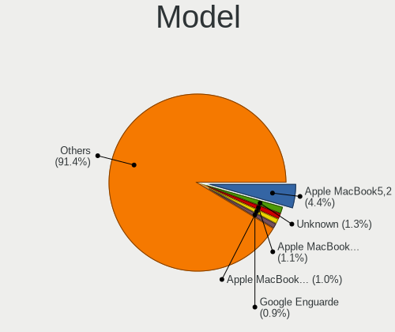
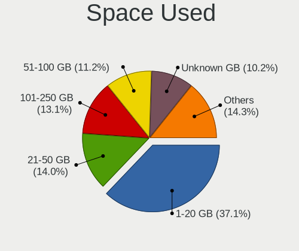
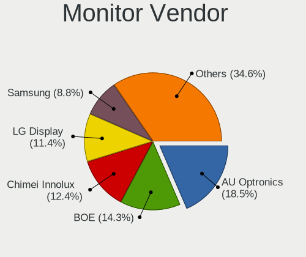
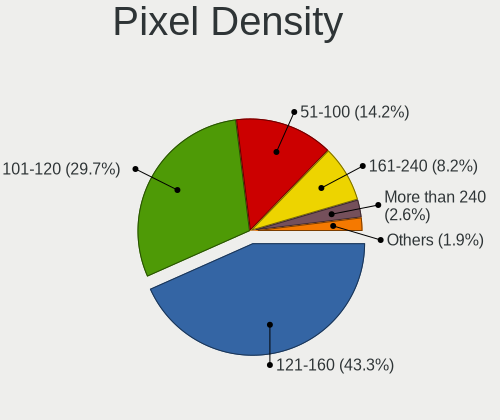
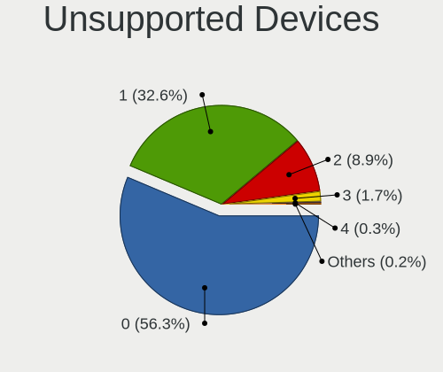

Debian - Tested Hardware & Statistics (Notebooks)
-------------------------------------------------

A project to collect tested hardware configurations for Debian.

Anyone can contribute to this report by the [hw-probe](https://github.com/linuxhw/hw-probe) tool:

    sudo -E hw-probe -all -upload

Please contribute! Especially if your hardware is rare.

Contents
--------

* [ Test Cases ](#test-cases)

* [ System ](#system)
  - [ OS                       ](#os)
  - [ OS Family                ](#os-family)
  - [ Kernel                   ](#kernel)
  - [ Kernel Family            ](#kernel-family)
  - [ Kernel Major Ver.        ](#kernel-major-ver)
  - [ Arch                     ](#arch)
  - [ DE                       ](#de)
  - [ Display Server           ](#display-server)
  - [ Display Manager          ](#display-manager)
  - [ OS Lang                  ](#os-lang)
  - [ Boot Mode                ](#boot-mode)
  - [ Filesystem               ](#filesystem)
  - [ Part. scheme             ](#part-scheme)
  - [ Dual Boot with Linux/BSD ](#dual-boot-with-linuxbsd)
  - [ Dual Boot (Win)          ](#dual-boot-win)

* [ Board ](#board)
  - [ Vendor                   ](#vendor)
  - [ Model                    ](#model)
  - [ Model Family             ](#model-family)
  - [ MFG Year                 ](#mfg-year)
  - [ Form Factor              ](#form-factor)
  - [ Secure Boot              ](#secure-boot)
  - [ Coreboot                 ](#coreboot)
  - [ RAM Size                 ](#ram-size)
  - [ RAM Used                 ](#ram-used)
  - [ Total Drives             ](#total-drives)
  - [ Has CD-ROM               ](#has-cd-rom)
  - [ Has Ethernet             ](#has-ethernet)
  - [ Has WiFi                 ](#has-wifi)
  - [ Has Bluetooth            ](#has-bluetooth)

* [ Location ](#location)
  - [ Country                  ](#country)
  - [ City                     ](#city)

* [ Drives ](#drives)
  - [ Drive Vendor             ](#drive-vendor)
  - [ Drive Model              ](#drive-model)
  - [ HDD Vendor               ](#hdd-vendor)
  - [ SSD Vendor               ](#ssd-vendor)
  - [ Drive Kind               ](#drive-kind)
  - [ Drive Connector          ](#drive-connector)
  - [ Drive Size               ](#drive-size)
  - [ Space Total              ](#space-total)
  - [ Space Used               ](#space-used)
  - [ Malfunc. Drives          ](#malfunc-drives)
  - [ Malfunc. Drive Vendor    ](#malfunc-drive-vendor)
  - [ Malfunc. HDD Vendor      ](#malfunc-hdd-vendor)
  - [ Malfunc. Drive Kind      ](#malfunc-drive-kind)
  - [ Failed Drives            ](#failed-drives)
  - [ Failed Drive Vendor      ](#failed-drive-vendor)
  - [ Drive Status             ](#drive-status)

* [ Storage controller ](#storage-controller)
  - [ Storage Vendor           ](#storage-vendor)
  - [ Storage Model            ](#storage-model)
  - [ Storage Kind             ](#storage-kind)

* [ Processor ](#processor)
  - [ CPU Vendor               ](#cpu-vendor)
  - [ CPU Model                ](#cpu-model)
  - [ CPU Model Family         ](#cpu-model-family)
  - [ CPU Cores                ](#cpu-cores)
  - [ CPU Sockets              ](#cpu-sockets)
  - [ CPU Threads              ](#cpu-threads)
  - [ CPU Op-Modes             ](#cpu-op-modes)
  - [ CPU Microcode            ](#cpu-microcode)
  - [ CPU Microarch            ](#cpu-microarch)

* [ Graphics ](#graphics)
  - [ GPU Vendor               ](#gpu-vendor)
  - [ GPU Model                ](#gpu-model)
  - [ GPU Combo                ](#gpu-combo)
  - [ GPU Driver               ](#gpu-driver)
  - [ GPU Memory               ](#gpu-memory)

* [ Monitor ](#monitor)
  - [ Monitor Vendor           ](#monitor-vendor)
  - [ Monitor Model            ](#monitor-model)
  - [ Monitor Resolution       ](#monitor-resolution)
  - [ Monitor Diagonal         ](#monitor-diagonal)
  - [ Monitor Width            ](#monitor-width)
  - [ Aspect Ratio             ](#aspect-ratio)
  - [ Monitor Area             ](#monitor-area)
  - [ Pixel Density            ](#pixel-density)
  - [ Multiple Monitors        ](#multiple-monitors)

* [ Network ](#network)
  - [ Net Controller Vendor    ](#net-controller-vendor)
  - [ Net Controller Model     ](#net-controller-model)
  - [ Wireless Vendor          ](#wireless-vendor)
  - [ Wireless Model           ](#wireless-model)
  - [ Ethernet Vendor          ](#ethernet-vendor)
  - [ Ethernet Model           ](#ethernet-model)
  - [ Net Controller Kind      ](#net-controller-kind)
  - [ Used Controller          ](#used-controller)
  - [ NICs                     ](#nics)
  - [ IPv6                     ](#ipv6)

* [ Bluetooth ](#bluetooth)
  - [ Bluetooth Vendor         ](#bluetooth-vendor)
  - [ Bluetooth Model          ](#bluetooth-model)

* [ Sound ](#sound)
  - [ Sound Vendor             ](#sound-vendor)
  - [ Sound Model              ](#sound-model)

* [ Memory ](#memory)
  - [ Memory Vendor            ](#memory-vendor)
  - [ Memory Model             ](#memory-model)
  - [ Memory Kind              ](#memory-kind)
  - [ Memory Form Factor       ](#memory-form-factor)
  - [ Memory Size              ](#memory-size)
  - [ Memory Speed             ](#memory-speed)

* [ Printers & scanners ](#printers--scanners)
  - [ Printer Vendor           ](#printer-vendor)
  - [ Printer Model            ](#printer-model)
  - [ Scanner Vendor           ](#scanner-vendor)
  - [ Scanner Model            ](#scanner-model)

* [ Camera ](#camera)
  - [ Camera Vendor            ](#camera-vendor)
  - [ Camera Model             ](#camera-model)

* [ Security ](#security)
  - [ Fingerprint Vendor       ](#fingerprint-vendor)
  - [ Fingerprint Model        ](#fingerprint-model)
  - [ Chipcard Vendor          ](#chipcard-vendor)
  - [ Chipcard Model           ](#chipcard-model)

* [ Unsupported ](#unsupported)
  - [ Unsupported Devices      ](#unsupported-devices)
  - [ Unsupported Device Types ](#unsupported-device-types)

Test Cases
----------

Total: 7266

| Vendor        | Model                       | Probe                                                      | Date         |
|---------------|-----------------------------|------------------------------------------------------------|--------------|
| HUAWEI        | BOM-WXX9                    | [4d4d992cb0](https://linux-hardware.org/?probe=4d4d992cb0) | Jul 01, 2023 |
| HP            | 255 G8 Notebook PC          | [3c3ddffa8b](https://linux-hardware.org/?probe=3c3ddffa8b) | Jul 01, 2023 |
| Acer          | Aspire V5-123               | [8507833f22](https://linux-hardware.org/?probe=8507833f22) | Jul 01, 2023 |
| ASUSTek       | K501UX                      | [a7fb172b7d](https://linux-hardware.org/?probe=a7fb172b7d) | Jun 30, 2023 |
| Apple         | MacBookAir7,2               | [cb1bcce659](https://linux-hardware.org/?probe=cb1bcce659) | Jun 30, 2023 |
| Lenovo        | IdeaPad 330S-15IKB 81F5     | [39a8ee4269](https://linux-hardware.org/?probe=39a8ee4269) | Jun 30, 2023 |
| HP            | EliteBook 850 G1            | [a5f3a5ad14](https://linux-hardware.org/?probe=a5f3a5ad14) | Jun 30, 2023 |
| Lenovo        | ThinkPad T495 20NK000XBR    | [2b5e40efaa](https://linux-hardware.org/?probe=2b5e40efaa) | Jun 30, 2023 |
| Lenovo        | ThinkPad T430s 23554L7      | [501b0860c8](https://linux-hardware.org/?probe=501b0860c8) | Jun 30, 2023 |
| Dell          | G3 3590                     | [5c7312fed9](https://linux-hardware.org/?probe=5c7312fed9) | Jun 30, 2023 |
| Lenovo        | ThinkPad L512 44444NG       | [300a79aa88](https://linux-hardware.org/?probe=300a79aa88) | Jun 30, 2023 |
| ASUSTek       | T100TA                      | [921821fda8](https://linux-hardware.org/?probe=921821fda8) | Jun 30, 2023 |
| ASUSTek       | K52F                        | [98e9b448c7](https://linux-hardware.org/?probe=98e9b448c7) | Jun 30, 2023 |
| Acer          | Aspire V3-772               | [0fae87e118](https://linux-hardware.org/?probe=0fae87e118) | Jun 29, 2023 |
| Acer          | TravelMate P449-G2-M        | [b9291d6951](https://linux-hardware.org/?probe=b9291d6951) | Jun 29, 2023 |
| Lenovo        | ThinkPad E15 Gen 2 20TDC... | [62ff10cadc](https://linux-hardware.org/?probe=62ff10cadc) | Jun 29, 2023 |
| Lenovo        | ThinkPad T440p 2000CT0      | [10c852dc38](https://linux-hardware.org/?probe=10c852dc38) | Jun 29, 2023 |
| Lenovo        | V14 G2 ITL 82NM             | [25a1aaf938](https://linux-hardware.org/?probe=25a1aaf938) | Jun 29, 2023 |
| Lenovo        | ThinkPad T480 20L6S68T00    | [a50310948a](https://linux-hardware.org/?probe=a50310948a) | Jun 29, 2023 |
| HP            | Pavilion dv6                | [b6c2bcb025](https://linux-hardware.org/?probe=b6c2bcb025) | Jun 29, 2023 |
| Dell          | Latitude 3500               | [e1831984f8](https://linux-hardware.org/?probe=e1831984f8) | Jun 28, 2023 |
| Dell          | Latitude 7370               | [cb11921012](https://linux-hardware.org/?probe=cb11921012) | Jun 28, 2023 |
| Aquarius      | NS585                       | [52a07593c9](https://linux-hardware.org/?probe=52a07593c9) | Jun 28, 2023 |
| HP            | Pavilion dv6                | [7fe9e439c0](https://linux-hardware.org/?probe=7fe9e439c0) | Jun 28, 2023 |
| Lenovo        | ThinkPad E15 Gen 2 20TD0... | [4a4411b820](https://linux-hardware.org/?probe=4a4411b820) | Jun 28, 2023 |
| Aquarius      | NS585                       | [b2f86e98f9](https://linux-hardware.org/?probe=b2f86e98f9) | Jun 28, 2023 |
| Lenovo        | ThinkPad E15 Gen 2 20TD0... | [2ed2f000d3](https://linux-hardware.org/?probe=2ed2f000d3) | Jun 28, 2023 |
| ASUSTek       | ZenBook Pro 15 UX550GEX_... | [56eef68e89](https://linux-hardware.org/?probe=56eef68e89) | Jun 28, 2023 |
| Acer          | Aspire A315-23G             | [1c07c9f0b8](https://linux-hardware.org/?probe=1c07c9f0b8) | Jun 28, 2023 |
| Lenovo        | Legion R9000P ARH7H 82RG    | [ab4772fd2e](https://linux-hardware.org/?probe=ab4772fd2e) | Jun 28, 2023 |
| Lenovo        | ThinkPad X280 20KF001RUK    | [a1da72b9a5](https://linux-hardware.org/?probe=a1da72b9a5) | Jun 27, 2023 |
| HP            | EliteBook 845 G8 Noteboo... | [8112f38f33](https://linux-hardware.org/?probe=8112f38f33) | Jun 27, 2023 |
| Coradir       | Coradir/ES10IS5             | [d2d1f5b2a5](https://linux-hardware.org/?probe=d2d1f5b2a5) | Jun 27, 2023 |
| HP            | Laptop 15-ef1xxx            | [765d0708eb](https://linux-hardware.org/?probe=765d0708eb) | Jun 26, 2023 |
| Lenovo        | ThinkPad T480 20L6S5LF00    | [5a062be874](https://linux-hardware.org/?probe=5a062be874) | Jun 26, 2023 |
| ASUSTek       | K53SJ                       | [fe211e4239](https://linux-hardware.org/?probe=fe211e4239) | Jun 26, 2023 |
| HP            | EliteBook 835 13 inch G1... | [e43818af40](https://linux-hardware.org/?probe=e43818af40) | Jun 26, 2023 |
| LG Electro... | 17Z90R-G.AD79F              | [0d641b84fe](https://linux-hardware.org/?probe=0d641b84fe) | Jun 26, 2023 |
| Acer          | Aspire A515-56              | [0ee45fd3e8](https://linux-hardware.org/?probe=0ee45fd3e8) | Jun 26, 2023 |
| Coradir       | Coradir/ES10IS5             | [d6a1e61945](https://linux-hardware.org/?probe=d6a1e61945) | Jun 26, 2023 |
| Lenovo        | IdeaPad 3 15ABA7 82RN       | [b8a3042b9d](https://linux-hardware.org/?probe=b8a3042b9d) | Jun 26, 2023 |
| Aquarius      | NS585                       | [25af22ec30](https://linux-hardware.org/?probe=25af22ec30) | Jun 26, 2023 |
| Aquarius      | NS585                       | [8e957a70f0](https://linux-hardware.org/?probe=8e957a70f0) | Jun 26, 2023 |
| Aquarius      | NS585                       | [bb09ae1f8d](https://linux-hardware.org/?probe=bb09ae1f8d) | Jun 26, 2023 |
| HP            | OMEN by Laptop              | [07d9cc6d71](https://linux-hardware.org/?probe=07d9cc6d71) | Jun 26, 2023 |
| Apple         | MacBook2,1                  | [f5c0a2fd49](https://linux-hardware.org/?probe=f5c0a2fd49) | Jun 26, 2023 |
| HP            | Compaq Mini 110c-1100       | [0dc147bd7c](https://linux-hardware.org/?probe=0dc147bd7c) | Jun 26, 2023 |
| Lenovo        | ThinkPad T430 34766TT       | [06ad7b4a25](https://linux-hardware.org/?probe=06ad7b4a25) | Jun 26, 2023 |
| Dell          | XPS 15 7590                 | [dfc817892b](https://linux-hardware.org/?probe=dfc817892b) | Jun 26, 2023 |
| Lenovo        | IdeaPad 520-15IKB 80YL      | [ed89cd0d05](https://linux-hardware.org/?probe=ed89cd0d05) | Jun 26, 2023 |
| Lenovo        | IdeaPad 520-15IKB 80YL      | [62665eec25](https://linux-hardware.org/?probe=62665eec25) | Jun 26, 2023 |
| ASUSTek       | VivoBook_ASUSLaptop X515... | [0a233c34b3](https://linux-hardware.org/?probe=0a233c34b3) | Jun 26, 2023 |
| Dell          | XPS 15 9530                 | [9c925666a5](https://linux-hardware.org/?probe=9c925666a5) | Jun 26, 2023 |
| Dell          | XPS 15 9530                 | [ea814b3f7b](https://linux-hardware.org/?probe=ea814b3f7b) | Jun 26, 2023 |
| Avell High... | A70 HYB                     | [3ccdaf3c82](https://linux-hardware.org/?probe=3ccdaf3c82) | Jun 26, 2023 |
| ASUSTek       | E403SA                      | [bdc47269c3](https://linux-hardware.org/?probe=bdc47269c3) | Jun 25, 2023 |
| HP            | Laptop 14-dq0xxx            | [695dd94347](https://linux-hardware.org/?probe=695dd94347) | Jun 25, 2023 |
| Lenovo        | IdeaPad Gaming 3 15ARH7 ... | [cee2bb11dc](https://linux-hardware.org/?probe=cee2bb11dc) | Jun 25, 2023 |
| HP            | Laptop 15s-eq2xxx           | [14cc9e067f](https://linux-hardware.org/?probe=14cc9e067f) | Jun 25, 2023 |
| Dell          | Inspiron 5593               | [06f1256f88](https://linux-hardware.org/?probe=06f1256f88) | Jun 25, 2023 |
| Dell          | Latitude E6430              | [be9b6c75da](https://linux-hardware.org/?probe=be9b6c75da) | Jun 25, 2023 |
| Toshiba       | IS 1413G                    | [a87db20468](https://linux-hardware.org/?probe=a87db20468) | Jun 25, 2023 |
| Lenovo        | V15 G2 ALC 82KD             | [a7df01b153](https://linux-hardware.org/?probe=a7df01b153) | Jun 24, 2023 |
| Dell          | Inspiron 1720               | [60c2ef3b92](https://linux-hardware.org/?probe=60c2ef3b92) | Jun 24, 2023 |
| HUAWEI        | BOHK-WAX9X                  | [fe084d5ddb](https://linux-hardware.org/?probe=fe084d5ddb) | Jun 24, 2023 |
| Lenovo        | ThinkPad X120e 0611AN2      | [a8420bc87d](https://linux-hardware.org/?probe=a8420bc87d) | Jun 24, 2023 |
| Acer          | Aspire VN7-591G             | [356b066ca9](https://linux-hardware.org/?probe=356b066ca9) | Jun 24, 2023 |
| Google        | Kip                         | [4e1bfd359e](https://linux-hardware.org/?probe=4e1bfd359e) | Jun 24, 2023 |
| HP            | EliteBook 830 G5            | [2b61a56610](https://linux-hardware.org/?probe=2b61a56610) | Jun 24, 2023 |
| Dell          | XPS 15 9570                 | [2c09eb930c](https://linux-hardware.org/?probe=2c09eb930c) | Jun 23, 2023 |
| Lenovo        | ThinkPad X270 W10DG 20K5... | [3cc7c77a76](https://linux-hardware.org/?probe=3cc7c77a76) | Jun 23, 2023 |
| HP            | 8470p EliteBook             | [da3719515b](https://linux-hardware.org/?probe=da3719515b) | Jun 23, 2023 |
| Acer          | Predator PH315-54           | [46d748a0a1](https://linux-hardware.org/?probe=46d748a0a1) | Jun 23, 2023 |
| Lenovo        | Edge 15 80H1                | [aff25effc2](https://linux-hardware.org/?probe=aff25effc2) | Jun 23, 2023 |
| HP            | EliteBook 8540w             | [6d8c00ff02](https://linux-hardware.org/?probe=6d8c00ff02) | Jun 23, 2023 |
| HP            | EliteBook 8540w             | [1c1a2724f4](https://linux-hardware.org/?probe=1c1a2724f4) | Jun 23, 2023 |
| Lenovo        | ThinkPad X1 Carbon 4th 2... | [3cdf59359c](https://linux-hardware.org/?probe=3cdf59359c) | Jun 23, 2023 |
| ASUSTek       | ZenBook Pro Duo UX581GV_... | [5298e132fc](https://linux-hardware.org/?probe=5298e132fc) | Jun 23, 2023 |
| Acer          | Aspire A515-55              | [bf6de06fb9](https://linux-hardware.org/?probe=bf6de06fb9) | Jun 23, 2023 |
| VIT           | P2423                       | [19242b2ddb](https://linux-hardware.org/?probe=19242b2ddb) | Jun 23, 2023 |
| Lenovo        | Flex 2-14 20404             | [b5576af3f8](https://linux-hardware.org/?probe=b5576af3f8) | Jun 23, 2023 |
| Lenovo        | Flex 2-14 20404             | [911336b572](https://linux-hardware.org/?probe=911336b572) | Jun 23, 2023 |
| Lenovo        | ThinkPad X230 2325SRQ       | [fd42553eea](https://linux-hardware.org/?probe=fd42553eea) | Jun 22, 2023 |
| ASUSTek       | X45U                        | [63a491a160](https://linux-hardware.org/?probe=63a491a160) | Jun 22, 2023 |
| Dell          | Inspiron 1525               | [1cdf3502e8](https://linux-hardware.org/?probe=1cdf3502e8) | Jun 21, 2023 |
| Dell          | Inspiron 1525               | [7bbc89ec0f](https://linux-hardware.org/?probe=7bbc89ec0f) | Jun 21, 2023 |
| Dell          | Latitude E5550              | [72f4d53246](https://linux-hardware.org/?probe=72f4d53246) | Jun 21, 2023 |
| Apple         | MacBookPro10,1              | [9841bf505c](https://linux-hardware.org/?probe=9841bf505c) | Jun 21, 2023 |
| Apple         | MacBookAir7,2               | [9f3829c99f](https://linux-hardware.org/?probe=9f3829c99f) | Jun 21, 2023 |
| Apple         | MacBookAir7,2               | [379e3473e2](https://linux-hardware.org/?probe=379e3473e2) | Jun 21, 2023 |
| Apple         | MacBookAir7,2               | [8a2a9fd293](https://linux-hardware.org/?probe=8a2a9fd293) | Jun 21, 2023 |
| Dell          | Inspiron 5570               | [d661316023](https://linux-hardware.org/?probe=d661316023) | Jun 21, 2023 |
| Lenovo        | IdeaPadFlex 15 20309        | [76fbd356a0](https://linux-hardware.org/?probe=76fbd356a0) | Jun 21, 2023 |
| Dell          | Latitude E5550              | [e1fdcf84b3](https://linux-hardware.org/?probe=e1fdcf84b3) | Jun 21, 2023 |
| Lenovo        | IdeaPad Gaming 3 15ACH6 ... | [8a61f834dd](https://linux-hardware.org/?probe=8a61f834dd) | Jun 21, 2023 |
| Dell          | Vostro 5490                 | [10d1aeda8b](https://linux-hardware.org/?probe=10d1aeda8b) | Jun 21, 2023 |
| Lenovo        | IdeaPad Gaming 3 15ACH6 ... | [291796e3e4](https://linux-hardware.org/?probe=291796e3e4) | Jun 21, 2023 |
| Lenovo        | IdeaPad 330-17AST 81D7      | [dc5a63aacc](https://linux-hardware.org/?probe=dc5a63aacc) | Jun 20, 2023 |
| Apple         | MacBook6,1                  | [c7e1912b55](https://linux-hardware.org/?probe=c7e1912b55) | Jun 20, 2023 |
| Apple         | MacBook5,2                  | [53f708517b](https://linux-hardware.org/?probe=53f708517b) | Jun 20, 2023 |
| Google        | Stout                       | [cb67ad655e](https://linux-hardware.org/?probe=cb67ad655e) | Jun 20, 2023 |
| Packard Be... | EasyNote TE11HC             | [6bbc56b36c](https://linux-hardware.org/?probe=6bbc56b36c) | Jun 20, 2023 |
| Dell          | Latitude E7450              | [4760bb7306](https://linux-hardware.org/?probe=4760bb7306) | Jun 20, 2023 |
| Apple         | MacBookPro5,5               | [16c4045c3b](https://linux-hardware.org/?probe=16c4045c3b) | Jun 20, 2023 |
| HP            | Pavilion Laptop 15-cs0xx... | [c3f77cf346](https://linux-hardware.org/?probe=c3f77cf346) | Jun 20, 2023 |
| Acer          | TravelMate P449-G2-M        | [98626bde6c](https://linux-hardware.org/?probe=98626bde6c) | Jun 20, 2023 |
| Dell          | Latitude 3410               | [1e0348842a](https://linux-hardware.org/?probe=1e0348842a) | Jun 19, 2023 |
| Lenovo        | Yoga Slim 7 Pro 14ACH5 O... | [a0862de551](https://linux-hardware.org/?probe=a0862de551) | Jun 19, 2023 |
| Lenovo        | Yoga Slim 7 Pro 14ACH5 O... | [3cfd8a448c](https://linux-hardware.org/?probe=3cfd8a448c) | Jun 19, 2023 |
| ASUSTek       | VivoBook_ASUSLaptop X513... | [42fd301e8b](https://linux-hardware.org/?probe=42fd301e8b) | Jun 19, 2023 |
| Lenovo        | IdeaPad S340-15APITouch ... | [fe617b45f8](https://linux-hardware.org/?probe=fe617b45f8) | Jun 19, 2023 |
| Toshiba       | TECRA R850                  | [c40116d0de](https://linux-hardware.org/?probe=c40116d0de) | Jun 19, 2023 |
| Lenovo        | IdeaPad 700-15ISK 80RU      | [d8d9101ef6](https://linux-hardware.org/?probe=d8d9101ef6) | Jun 19, 2023 |
| Packard Be... | EasyNote TE11HC             | [33785e2493](https://linux-hardware.org/?probe=33785e2493) | Jun 18, 2023 |
| Dell          | Latitude E7450              | [addda016c8](https://linux-hardware.org/?probe=addda016c8) | Jun 18, 2023 |
| HP            | EliteBook 2530p             | [7d246caf6f](https://linux-hardware.org/?probe=7d246caf6f) | Jun 18, 2023 |
| HP            | EliteBook 8440p             | [4b1b2457a4](https://linux-hardware.org/?probe=4b1b2457a4) | Jun 17, 2023 |
| Lenovo        | IdeaPad Gaming 3 15ACH6 ... | [e4c418382a](https://linux-hardware.org/?probe=e4c418382a) | Jun 17, 2023 |
| Lenovo        | ThinkPad X1 Carbon 5th 2... | [26b4c05332](https://linux-hardware.org/?probe=26b4c05332) | Jun 17, 2023 |
| Lenovo        | ThinkPad T480s 20L8S10T0... | [a3dd392c51](https://linux-hardware.org/?probe=a3dd392c51) | Jun 17, 2023 |
| Dell          | Latitude E6400              | [0f8aca3e72](https://linux-hardware.org/?probe=0f8aca3e72) | Jun 17, 2023 |
| Lenovo        | ThinkPad T14s Gen 1 20UJ... | [d9e1222bc3](https://linux-hardware.org/?probe=d9e1222bc3) | Jun 17, 2023 |
| Dell          | Precision M2800             | [e9f259595a](https://linux-hardware.org/?probe=e9f259595a) | Jun 17, 2023 |
| HP            | OMEN by Laptop 16-c0xxx     | [9cdeeb06de](https://linux-hardware.org/?probe=9cdeeb06de) | Jun 16, 2023 |
| Acer          | Aspire E1-571               | [19e270cab0](https://linux-hardware.org/?probe=19e270cab0) | Jun 16, 2023 |
| Acer          | Aspire E1-571               | [e4b27c6a92](https://linux-hardware.org/?probe=e4b27c6a92) | Jun 16, 2023 |
| Lenovo        | ThinkPad P51 20HJS1SF00     | [664ae7a0f2](https://linux-hardware.org/?probe=664ae7a0f2) | Jun 16, 2023 |
| Dell          | Latitude D620               | [8dc25931d7](https://linux-hardware.org/?probe=8dc25931d7) | Jun 16, 2023 |
| Dell          | Latitude D620               | [819f346812](https://linux-hardware.org/?probe=819f346812) | Jun 16, 2023 |
| HONOR         | NMH-WCX9                    | [ec1b8c4ef4](https://linux-hardware.org/?probe=ec1b8c4ef4) | Jun 16, 2023 |
| Dell          | Latitude E6400              | [7c59595887](https://linux-hardware.org/?probe=7c59595887) | Jun 16, 2023 |
| HUAWEI        | NBD-WXX9                    | [b9bf7ea3c2](https://linux-hardware.org/?probe=b9bf7ea3c2) | Jun 16, 2023 |
| HUAWEI        | BOHK-WAX9X                  | [b05e4ee752](https://linux-hardware.org/?probe=b05e4ee752) | Jun 15, 2023 |
| HP            | Laptop 14-cm0xxx            | [67ed3346c2](https://linux-hardware.org/?probe=67ed3346c2) | Jun 15, 2023 |
| Unknown       | Unknown                     | [f1294224ee](https://linux-hardware.org/?probe=f1294224ee) | Jun 15, 2023 |
| HP            | Laptop 14-cm0xxx            | [07f1089ee7](https://linux-hardware.org/?probe=07f1089ee7) | Jun 15, 2023 |
| HUAWEI        | NBD-WXX9                    | [b55662cc58](https://linux-hardware.org/?probe=b55662cc58) | Jun 15, 2023 |
| Unknown       | Unknown                     | [9b8a05d0f9](https://linux-hardware.org/?probe=9b8a05d0f9) | Jun 15, 2023 |
| Acer          | TravelMate 8172             | [569fde2487](https://linux-hardware.org/?probe=569fde2487) | Jun 15, 2023 |
| Apple         | MacBookAir7,2               | [2db615249d](https://linux-hardware.org/?probe=2db615249d) | Jun 15, 2023 |
| Apple         | MacBookAir7,2               | [138e2807af](https://linux-hardware.org/?probe=138e2807af) | Jun 15, 2023 |
| Apple         | MacBookAir7,1               | [5d8061c350](https://linux-hardware.org/?probe=5d8061c350) | Jun 15, 2023 |
| HP            | EliteBook 845 G8 Noteboo... | [aafa9250df](https://linux-hardware.org/?probe=aafa9250df) | Jun 15, 2023 |
| Medion        | E6214                       | [71b2e69534](https://linux-hardware.org/?probe=71b2e69534) | Jun 15, 2023 |
| Lenovo        | B590 20206                  | [f7e4f16796](https://linux-hardware.org/?probe=f7e4f16796) | Jun 15, 2023 |
| ASUSTek       | VivoBook_ASUSLaptop X513... | [eb0ba3c881](https://linux-hardware.org/?probe=eb0ba3c881) | Jun 15, 2023 |
| Toshiba       | Satellite L45-B             | [4cc6199522](https://linux-hardware.org/?probe=4cc6199522) | Jun 15, 2023 |
| Lenovo        | ThinkPad P14s Gen 1 20Y1... | [65298dde46](https://linux-hardware.org/?probe=65298dde46) | Jun 14, 2023 |
| HONOR         | BBR-WAX9                    | [b980e4f162](https://linux-hardware.org/?probe=b980e4f162) | Jun 14, 2023 |
| Dell          | Latitude 5480               | [677cb87f98](https://linux-hardware.org/?probe=677cb87f98) | Jun 14, 2023 |
| Dell          | XPS M1530                   | [252d777fa0](https://linux-hardware.org/?probe=252d777fa0) | Jun 14, 2023 |
| Acer          | TravelMate 5742Z            | [abf5dbde31](https://linux-hardware.org/?probe=abf5dbde31) | Jun 14, 2023 |
| Apple         | MacBookPro5,5               | [b639a64b45](https://linux-hardware.org/?probe=b639a64b45) | Jun 14, 2023 |
| Dell          | Latitude 7480               | [375fb09bca](https://linux-hardware.org/?probe=375fb09bca) | Jun 14, 2023 |
| Acer          | Aspire A315-23G             | [18a5adccb6](https://linux-hardware.org/?probe=18a5adccb6) | Jun 14, 2023 |
| ASUSTek       | VivoBook_ASUSLaptop X415... | [e073b99b63](https://linux-hardware.org/?probe=e073b99b63) | Jun 13, 2023 |
| HP            | Pavilion Notebook           | [f444f44a49](https://linux-hardware.org/?probe=f444f44a49) | Jun 13, 2023 |
| Samsung       | 750XED                      | [8997330d6a](https://linux-hardware.org/?probe=8997330d6a) | Jun 13, 2023 |
| Fujitsu       | LIFEBOOK E780               | [b8631b65c4](https://linux-hardware.org/?probe=b8631b65c4) | Jun 13, 2023 |
| HP            | Pavilion dv7                | [3c113d457b](https://linux-hardware.org/?probe=3c113d457b) | Jun 13, 2023 |
| Sony          | SVE11116FGW                 | [4c34707bef](https://linux-hardware.org/?probe=4c34707bef) | Jun 13, 2023 |
| Sony          | SVE11116FGW                 | [a048cbcdeb](https://linux-hardware.org/?probe=a048cbcdeb) | Jun 13, 2023 |
| Acer          | TravelMate P449-G2-M        | [97b6ba8bd6](https://linux-hardware.org/?probe=97b6ba8bd6) | Jun 13, 2023 |
| HP            | Pavilion Laptop 15-eh1xx... | [f578df0eb9](https://linux-hardware.org/?probe=f578df0eb9) | Jun 13, 2023 |
| Dell          | Inspiron 1521               | [b4a1eae7be](https://linux-hardware.org/?probe=b4a1eae7be) | Jun 12, 2023 |
| Apple         | MacBookPro12,1              | [a515b0dbf7](https://linux-hardware.org/?probe=a515b0dbf7) | Jun 12, 2023 |
| ASUSTek       | ASUSPRO P5440FA_P5440FA     | [20b91b813f](https://linux-hardware.org/?probe=20b91b813f) | Jun 12, 2023 |
| Lenovo        | ThinkPad P15v Gen 1 20TQ... | [675f082570](https://linux-hardware.org/?probe=675f082570) | Jun 12, 2023 |
| HP            | EliteBook 840 G5            | [331ac1da01](https://linux-hardware.org/?probe=331ac1da01) | Jun 12, 2023 |
| Hampoo        | Cherry Trail CR V200        | [d2ee0bc234](https://linux-hardware.org/?probe=d2ee0bc234) | Jun 12, 2023 |
| HP            | EliteBook 2530p             | [8e5a09ba99](https://linux-hardware.org/?probe=8e5a09ba99) | Jun 12, 2023 |
| Fujitsu       | LIFEBOOK A514               | [45b16c1cdf](https://linux-hardware.org/?probe=45b16c1cdf) | Jun 12, 2023 |
| Fujitsu       | LIFEBOOK A514               | [1da963b3f4](https://linux-hardware.org/?probe=1da963b3f4) | Jun 12, 2023 |
| Dell          | Latitude 3320               | [e467a71dac](https://linux-hardware.org/?probe=e467a71dac) | Jun 12, 2023 |
| Dell          | Latitude 3320               | [ec4f04b63e](https://linux-hardware.org/?probe=ec4f04b63e) | Jun 12, 2023 |
| MSI           | GE62 6QC                    | [5581a5c589](https://linux-hardware.org/?probe=5581a5c589) | Jun 12, 2023 |
| NEC Comput... | VERSA P91 series            | [7a4183e095](https://linux-hardware.org/?probe=7a4183e095) | Jun 12, 2023 |
| NEC Comput... | VERSA P91 series            | [2051db7014](https://linux-hardware.org/?probe=2051db7014) | Jun 12, 2023 |
| Lenovo        | IdeaPad 1 14IGL7 82V6       | [9ed0a99c90](https://linux-hardware.org/?probe=9ed0a99c90) | Jun 12, 2023 |
| Lenovo        | IdeaPad 1 14IGL7 82V6       | [5bc42066ca](https://linux-hardware.org/?probe=5bc42066ca) | Jun 12, 2023 |
| Dell          | Inspiron 5515               | [9ac2f1ed7e](https://linux-hardware.org/?probe=9ac2f1ed7e) | Jun 12, 2023 |
| Dell          | Inspiron 3501               | [8e9562dd9a](https://linux-hardware.org/?probe=8e9562dd9a) | Jun 11, 2023 |
| Lenovo        | ThinkPad T420s 4175A16      | [3d23465019](https://linux-hardware.org/?probe=3d23465019) | Jun 11, 2023 |
| Lenovo        | G565 4385                   | [2fd61f3fc5](https://linux-hardware.org/?probe=2fd61f3fc5) | Jun 11, 2023 |
| MSI           | Prestige 15 A10SC           | [ceb7680734](https://linux-hardware.org/?probe=ceb7680734) | Jun 11, 2023 |
| ASUSTek       | ZenBook UX334FAC_UX334FA    | [ba762c6d80](https://linux-hardware.org/?probe=ba762c6d80) | Jun 11, 2023 |
| ASUSTek       | VivoBook_ASUSLaptop K350... | [8b88702b69](https://linux-hardware.org/?probe=8b88702b69) | Jun 11, 2023 |
| Dell          | Latitude 7440               | [f63ada6c61](https://linux-hardware.org/?probe=f63ada6c61) | Jun 10, 2023 |
| Lenovo        | ThinkPad T470 20HDS14L00    | [a62438daef](https://linux-hardware.org/?probe=a62438daef) | Jun 10, 2023 |
| Lenovo        | ThinkPad T470 20HDS14L00    | [fab548c31e](https://linux-hardware.org/?probe=fab548c31e) | Jun 10, 2023 |
| IT Channel... | N8xEJEK                     | [51a7e3f5b4](https://linux-hardware.org/?probe=51a7e3f5b4) | Jun 10, 2023 |
| Acidanther... | MacBookPro15,2              | [fb30b2eb35](https://linux-hardware.org/?probe=fb30b2eb35) | Jun 10, 2023 |
| Intel         | powered classmate PC        | [e530f037c6](https://linux-hardware.org/?probe=e530f037c6) | Jun 09, 2023 |
| Dell          | Latitude 5480               | [5b3fb0b4f8](https://linux-hardware.org/?probe=5b3fb0b4f8) | Jun 09, 2023 |
| Digibras      | NH4CU03                     | [c66d30943e](https://linux-hardware.org/?probe=c66d30943e) | Jun 09, 2023 |
| Acer          | TravelMate P215-53          | [9536bf547a](https://linux-hardware.org/?probe=9536bf547a) | Jun 09, 2023 |
| Fujitsu       | LIFEBOOK U7411              | [ab35c95b72](https://linux-hardware.org/?probe=ab35c95b72) | Jun 09, 2023 |
| Acer          | TravelMate P449-G2-M        | [6b42200bee](https://linux-hardware.org/?probe=6b42200bee) | Jun 09, 2023 |
| HP            | G42                         | [fe8d2be276](https://linux-hardware.org/?probe=fe8d2be276) | Jun 08, 2023 |
| HP            | Laptop 14-cm0xxx            | [f1100ce875](https://linux-hardware.org/?probe=f1100ce875) | Jun 08, 2023 |
| HP            | G42                         | [4f33462d46](https://linux-hardware.org/?probe=4f33462d46) | Jun 08, 2023 |
| Acer          | TravelMate P449-G2-M        | [0fa009ad04](https://linux-hardware.org/?probe=0fa009ad04) | Jun 08, 2023 |
| MSI           | GE60 2PL                    | [e1d118e2d2](https://linux-hardware.org/?probe=e1d118e2d2) | Jun 08, 2023 |
| HP            | G62                         | [fb9522ceac](https://linux-hardware.org/?probe=fb9522ceac) | Jun 08, 2023 |
| Acer          | Aspire 7741                 | [09b2301e59](https://linux-hardware.org/?probe=09b2301e59) | Jun 08, 2023 |
| Lenovo        | ThinkPad X131e 3374A17      | [d992393271](https://linux-hardware.org/?probe=d992393271) | Jun 08, 2023 |
| Lenovo        | ThinkPad X131e 3374A17      | [dd385507aa](https://linux-hardware.org/?probe=dd385507aa) | Jun 08, 2023 |
| Lenovo        | ThinkPad X1 Carbon Gen 9... | [ef71a1641b](https://linux-hardware.org/?probe=ef71a1641b) | Jun 08, 2023 |
| HP            | Pavilion 17                 | [da809f90cc](https://linux-hardware.org/?probe=da809f90cc) | Jun 07, 2023 |
| Dell          | Latitude 5530               | [1e3452635f](https://linux-hardware.org/?probe=1e3452635f) | Jun 07, 2023 |
| HP            | ProBook 4530s               | [bdb6739deb](https://linux-hardware.org/?probe=bdb6739deb) | Jun 07, 2023 |
| Intel         | HURONRIVER                  | [57035a777c](https://linux-hardware.org/?probe=57035a777c) | Jun 07, 2023 |
| Packard Be... | EasyNote ENTF71BM           | [490ae0bc1c](https://linux-hardware.org/?probe=490ae0bc1c) | Jun 07, 2023 |
| MSI           | Pulse GL66 12UDK            | [8c9a9eb310](https://linux-hardware.org/?probe=8c9a9eb310) | Jun 06, 2023 |
| HP            | Pavilion g7                 | [f8cccf0fec](https://linux-hardware.org/?probe=f8cccf0fec) | Jun 06, 2023 |
| HP            | 250 15.6 inch G9 Noteboo... | [be9987ca28](https://linux-hardware.org/?probe=be9987ca28) | Jun 06, 2023 |
| Fujitsu       | FMVNA4NE-                   | [626a677331](https://linux-hardware.org/?probe=626a677331) | Jun 06, 2023 |
| Lenovo        | ThinkPad T15 Gen 1 20S60... | [c20dd8572a](https://linux-hardware.org/?probe=c20dd8572a) | Jun 05, 2023 |
| HP            | ENVY Laptop 13-ba0xxx       | [22143d333a](https://linux-hardware.org/?probe=22143d333a) | Jun 05, 2023 |
| Aquarius      | NS585                       | [b3f11e4a53](https://linux-hardware.org/?probe=b3f11e4a53) | Jun 05, 2023 |
| Fujitsu       | FMVNA4NE-                   | [b1c1176a5b](https://linux-hardware.org/?probe=b1c1176a5b) | Jun 05, 2023 |
| Dell          | Latitude 3410               | [820e62c9d3](https://linux-hardware.org/?probe=820e62c9d3) | Jun 04, 2023 |
| MSI           | GL75 Leopard 10SER          | [24111ade43](https://linux-hardware.org/?probe=24111ade43) | Jun 04, 2023 |
| Dell          | Latitude 3410               | [12515d41c8](https://linux-hardware.org/?probe=12515d41c8) | Jun 04, 2023 |
| HUAWEI        | BOHK-WAX9X                  | [1352a1d7c7](https://linux-hardware.org/?probe=1352a1d7c7) | Jun 04, 2023 |
| ASUSTek       | Q502LA                      | [679a477085](https://linux-hardware.org/?probe=679a477085) | Jun 04, 2023 |
| Clevo         | M670SRU                     | [0935f74d34](https://linux-hardware.org/?probe=0935f74d34) | Jun 04, 2023 |
| Clevo         | M670SRU                     | [e163d57d56](https://linux-hardware.org/?probe=e163d57d56) | Jun 04, 2023 |
| AVITA         | NS14A8                      | [a576b4d5cc](https://linux-hardware.org/?probe=a576b4d5cc) | Jun 04, 2023 |
| Dell          | Latitude 5420               | [9085f3c8f7](https://linux-hardware.org/?probe=9085f3c8f7) | Jun 04, 2023 |
| Toshiba       | WT8-A                       | [01e8918ef6](https://linux-hardware.org/?probe=01e8918ef6) | Jun 04, 2023 |
| Acer          | Aspire 5738                 | [138d22e03e](https://linux-hardware.org/?probe=138d22e03e) | Jun 04, 2023 |
| Pegatron      | Spring Peak                 | [a10a42a44d](https://linux-hardware.org/?probe=a10a42a44d) | Jun 04, 2023 |
| Pegatron      | Spring Peak                 | [e58b2a1237](https://linux-hardware.org/?probe=e58b2a1237) | Jun 04, 2023 |
| Pegatron      | Spring Peak                 | [ce54d0192d](https://linux-hardware.org/?probe=ce54d0192d) | Jun 04, 2023 |
| Lenovo        | ThinkPad E420 1141R79       | [7f66bf0045](https://linux-hardware.org/?probe=7f66bf0045) | Jun 03, 2023 |
| Apple         | MacBookPro9,2               | [eb51cb6dcf](https://linux-hardware.org/?probe=eb51cb6dcf) | Jun 03, 2023 |
| Acer          | Aspire V3-372               | [1200863830](https://linux-hardware.org/?probe=1200863830) | Jun 03, 2023 |
| Acer          | Aspire A115-31              | [338f025bce](https://linux-hardware.org/?probe=338f025bce) | Jun 03, 2023 |
| Apple         | MacBookPro7,1               | [b1513dc005](https://linux-hardware.org/?probe=b1513dc005) | Jun 03, 2023 |
| HP            | Laptop 14-cm0xxx            | [8933e1b0ad](https://linux-hardware.org/?probe=8933e1b0ad) | Jun 03, 2023 |
| Acer          | Aspire E5-772G              | [5bd684bed6](https://linux-hardware.org/?probe=5bd684bed6) | Jun 02, 2023 |
| Acer          | Aspire E5-772G              | [f454cdf394](https://linux-hardware.org/?probe=f454cdf394) | Jun 02, 2023 |
| Lenovo        | ThinkPad E15 Gen 3 20YHS... | [b546b2e7f1](https://linux-hardware.org/?probe=b546b2e7f1) | Jun 02, 2023 |
| Lenovo        | ThinkPad T470 W10DG 20JN... | [2a67b74a26](https://linux-hardware.org/?probe=2a67b74a26) | Jun 02, 2023 |
| Apple         | MacBookPro5,5               | [9bf36ef4a5](https://linux-hardware.org/?probe=9bf36ef4a5) | Jun 02, 2023 |
| HP            | ZBook 15 G6                 | [2f7bb21988](https://linux-hardware.org/?probe=2f7bb21988) | Jun 02, 2023 |
| Lenovo        | ThinkPad T470 20HES0FW00    | [174ffa62e4](https://linux-hardware.org/?probe=174ffa62e4) | Jun 02, 2023 |
| Aquarius      | NS585                       | [6f93385917](https://linux-hardware.org/?probe=6f93385917) | Jun 02, 2023 |
| Dell          | Inspiron 5567               | [bd3a6c5bd8](https://linux-hardware.org/?probe=bd3a6c5bd8) | Jun 02, 2023 |
| Aquarius      | NS585                       | [091267ec3a](https://linux-hardware.org/?probe=091267ec3a) | Jun 02, 2023 |
| Aquarius      | NS585                       | [7534819f94](https://linux-hardware.org/?probe=7534819f94) | Jun 02, 2023 |
| Lenovo        | S40-70 80GQ                 | [9a3fbc7388](https://linux-hardware.org/?probe=9a3fbc7388) | Jun 02, 2023 |
| Dell          | Latitude E6430              | [b129765265](https://linux-hardware.org/?probe=b129765265) | Jun 02, 2023 |
| HP            | EliteBook 840 G6            | [81ec1cc134](https://linux-hardware.org/?probe=81ec1cc134) | Jun 01, 2023 |
| Dell          | Latitude E5510              | [4a0bc9e53f](https://linux-hardware.org/?probe=4a0bc9e53f) | Jun 01, 2023 |
| Dell          | System Inspiron N4110       | [ea09e45a4f](https://linux-hardware.org/?probe=ea09e45a4f) | Jun 01, 2023 |
| Aquarius      | NS585                       | [ffa7425b95](https://linux-hardware.org/?probe=ffa7425b95) | Jun 01, 2023 |
| Aquarius      | NS585                       | [fafcbbe90e](https://linux-hardware.org/?probe=fafcbbe90e) | Jun 01, 2023 |
| Lenovo        | Legion Y540-15IRH 81SX      | [ffc6b5e345](https://linux-hardware.org/?probe=ffc6b5e345) | Jun 01, 2023 |
| Dell          | Latitude E5510              | [9457826049](https://linux-hardware.org/?probe=9457826049) | Jun 01, 2023 |
| Positivo      | C500                        | [8dba4589fe](https://linux-hardware.org/?probe=8dba4589fe) | Jun 01, 2023 |
| ASUSTek       | X200LA                      | [ae3925153d](https://linux-hardware.org/?probe=ae3925153d) | May 31, 2023 |
| ASUSTek       | 1225B                       | [769a6736f1](https://linux-hardware.org/?probe=769a6736f1) | May 31, 2023 |
| Unknown       | Unknown                     | [412c6d4af8](https://linux-hardware.org/?probe=412c6d4af8) | May 31, 2023 |
| Fujitsu       | LIFEBOOK E780               | [8459f7cfee](https://linux-hardware.org/?probe=8459f7cfee) | May 31, 2023 |
| Apple         | MacBookPro16,1              | [717c7884c8](https://linux-hardware.org/?probe=717c7884c8) | May 31, 2023 |
| HP            | EliteBook 840 G4            | [46ccbd2d62](https://linux-hardware.org/?probe=46ccbd2d62) | May 31, 2023 |
| HP            | EliteBook 840 G4            | [b90cb27f97](https://linux-hardware.org/?probe=b90cb27f97) | May 31, 2023 |
| Lenovo        | IdeaPad 330S-15IKB 81F5     | [5f8bd19e3d](https://linux-hardware.org/?probe=5f8bd19e3d) | May 31, 2023 |
| Acer          | TravelMate P449-G2-M        | [41177ef027](https://linux-hardware.org/?probe=41177ef027) | May 31, 2023 |
| Dell          | Latitude 5411               | [8583aa2091](https://linux-hardware.org/?probe=8583aa2091) | May 31, 2023 |
| ASUSTek       | K52Jc                       | [ad0b57d7c6](https://linux-hardware.org/?probe=ad0b57d7c6) | May 31, 2023 |
| Lenovo        | ThinkPad W500 4058CTO       | [e065b72b88](https://linux-hardware.org/?probe=e065b72b88) | May 31, 2023 |
| ASUSTek       | K52Jc                       | [7709d9fd16](https://linux-hardware.org/?probe=7709d9fd16) | May 31, 2023 |
| Dell          | Latitude E5510              | [52e1023195](https://linux-hardware.org/?probe=52e1023195) | May 31, 2023 |
| Lenovo        | ThinkPad W500 4058CTO       | [52047d2230](https://linux-hardware.org/?probe=52047d2230) | May 31, 2023 |
| Dell          | Latitude E5510              | [aa0f6a81b6](https://linux-hardware.org/?probe=aa0f6a81b6) | May 30, 2023 |
| HP            | Laptop 17-ca0xxx            | [3222c41173](https://linux-hardware.org/?probe=3222c41173) | May 30, 2023 |
| Chuwi         | HeroBook Air                | [80afc31c99](https://linux-hardware.org/?probe=80afc31c99) | May 30, 2023 |
| Lenovo        | ThinkPad T460 20FMS4LL00    | [7519448ca8](https://linux-hardware.org/?probe=7519448ca8) | May 30, 2023 |
| Lenovo        | IdeaPad S340-15API 81NC     | [ad3464fd76](https://linux-hardware.org/?probe=ad3464fd76) | May 30, 2023 |
| Acer          | Aspire A315-58              | [66de62e958](https://linux-hardware.org/?probe=66de62e958) | May 29, 2023 |
| Lenovo        | ThinkPad E15 Gen 4 21E60... | [c8e0efc288](https://linux-hardware.org/?probe=c8e0efc288) | May 29, 2023 |
| Lenovo        | ThinkPad E15 Gen 4 21E60... | [da399dc7cc](https://linux-hardware.org/?probe=da399dc7cc) | May 29, 2023 |
| Fujitsu       | LIFEBOOK E780               | [aac95cf765](https://linux-hardware.org/?probe=aac95cf765) | May 29, 2023 |
| Dell          | Latitude E5470              | [77d85b619e](https://linux-hardware.org/?probe=77d85b619e) | May 29, 2023 |
| Lenovo        | IdeaPad 100-15IBD 80QQ      | [deaa4b357c](https://linux-hardware.org/?probe=deaa4b357c) | May 29, 2023 |
| Lenovo        | IdeaPad 100-15IBD 80QQ      | [af312b5e91](https://linux-hardware.org/?probe=af312b5e91) | May 29, 2023 |
| Dell          | Latitude E6530              | [26f783c383](https://linux-hardware.org/?probe=26f783c383) | May 29, 2023 |
| HP            | EliteBook 735 G6            | [18b33e6fc7](https://linux-hardware.org/?probe=18b33e6fc7) | May 29, 2023 |
| Lenovo        | ThinkPad W530 2447GH2       | [f902d43115](https://linux-hardware.org/?probe=f902d43115) | May 29, 2023 |
| Acer          | Aspire A515-56              | [108833c92b](https://linux-hardware.org/?probe=108833c92b) | May 29, 2023 |
| Dell          | Latitude E6530              | [a47a934500](https://linux-hardware.org/?probe=a47a934500) | May 29, 2023 |
| HP            | Laptop 17-ca0xxx            | [4b53ed4ede](https://linux-hardware.org/?probe=4b53ed4ede) | May 29, 2023 |
| Dell          | Latitude 7480               | [9eb2396796](https://linux-hardware.org/?probe=9eb2396796) | May 28, 2023 |
| Lenovo        | Edge 15 80H1                | [75fdd71ca1](https://linux-hardware.org/?probe=75fdd71ca1) | May 28, 2023 |
| Lenovo        | IdeaPad 5 Pro 16ACH6 82L... | [d5a3141562](https://linux-hardware.org/?probe=d5a3141562) | May 28, 2023 |
| HP            | EliteBook 840 G1            | [c256cd6942](https://linux-hardware.org/?probe=c256cd6942) | May 28, 2023 |
| HP            | Mini 110-3700               | [0f9528a8d2](https://linux-hardware.org/?probe=0f9528a8d2) | May 28, 2023 |
| HP            | G42                         | [7b9612a51a](https://linux-hardware.org/?probe=7b9612a51a) | May 27, 2023 |
| ASUSTek       | X550CA                      | [3ad8935a92](https://linux-hardware.org/?probe=3ad8935a92) | May 27, 2023 |
| Lenovo        | ThinkPad T400 2768WGB       | [447ea38d26](https://linux-hardware.org/?probe=447ea38d26) | May 27, 2023 |
| Lenovo        | ThinkPad T400 2768WGB       | [57dcd55314](https://linux-hardware.org/?probe=57dcd55314) | May 27, 2023 |
| Aquarius      | NS585                       | [a87c8d46b6](https://linux-hardware.org/?probe=a87c8d46b6) | May 27, 2023 |
| HP            | 250 15.6 inch G9 Noteboo... | [9b93292db9](https://linux-hardware.org/?probe=9b93292db9) | May 26, 2023 |
| Lenovo        | ThinkPad L470 W10DG 20JU... | [0696598319](https://linux-hardware.org/?probe=0696598319) | May 26, 2023 |
| ASUSTek       | K53SV                       | [357c1fd091](https://linux-hardware.org/?probe=357c1fd091) | May 26, 2023 |
| Dell          | Latitude 3520               | [bfa8a18cb5](https://linux-hardware.org/?probe=bfa8a18cb5) | May 26, 2023 |
| Fujitsu       | FMVA42ERKS                  | [91fa73184c](https://linux-hardware.org/?probe=91fa73184c) | May 26, 2023 |
| eMachines     | E725                        | [a4be8012a8](https://linux-hardware.org/?probe=a4be8012a8) | May 26, 2023 |
| ASUSTek       | ASUS EXPERTBOOK B1400CEA... | [4c3aa6334b](https://linux-hardware.org/?probe=4c3aa6334b) | May 26, 2023 |
| Acer          | Aspire A315-42              | [d229a8eb01](https://linux-hardware.org/?probe=d229a8eb01) | May 26, 2023 |
| Acer          | Aspire V3-551               | [316db578fe](https://linux-hardware.org/?probe=316db578fe) | May 25, 2023 |
| Aquarius      | NS585                       | [82a0d45251](https://linux-hardware.org/?probe=82a0d45251) | May 25, 2023 |
| Acer          | Aspire E5-575               | [45ac56e70c](https://linux-hardware.org/?probe=45ac56e70c) | May 25, 2023 |
| Dell          | Latitude 7220 Rugged Ext... | [442b7239c8](https://linux-hardware.org/?probe=442b7239c8) | May 24, 2023 |
| Dell          | Latitude E5430 non-vPro     | [278fefa10a](https://linux-hardware.org/?probe=278fefa10a) | May 24, 2023 |
| Notebook      | W54_55SU1,SUW               | [25b79c51e2](https://linux-hardware.org/?probe=25b79c51e2) | May 23, 2023 |
| Lenovo        | ThinkPad P73 20QRCTO1WW     | [f8ef460648](https://linux-hardware.org/?probe=f8ef460648) | May 23, 2023 |
| HP            | 530                         | [70600de142](https://linux-hardware.org/?probe=70600de142) | May 23, 2023 |
| Dell          | Latitude E5430 non-vPro     | [6ab7e9c82d](https://linux-hardware.org/?probe=6ab7e9c82d) | May 23, 2023 |
| Acer          | Nitro AN515-45              | [d784b0822d](https://linux-hardware.org/?probe=d784b0822d) | May 22, 2023 |
| Lenovo        | IdeaPad 100-15IBD 80QQ      | [44b6477648](https://linux-hardware.org/?probe=44b6477648) | May 22, 2023 |
| ASUSTek       | N56VB                       | [0e982abd6b](https://linux-hardware.org/?probe=0e982abd6b) | May 22, 2023 |
| Unknown       | Unknown                     | [2b3ef0afc4](https://linux-hardware.org/?probe=2b3ef0afc4) | May 22, 2023 |
| HP            | Laptop 15-da0xxx            | [82f235bfbb](https://linux-hardware.org/?probe=82f235bfbb) | May 22, 2023 |
| HP            | Laptop 14-dq0xxx            | [4438fdd9b2](https://linux-hardware.org/?probe=4438fdd9b2) | May 22, 2023 |
| Lenovo        | IdeaPad 100-15IBD 80QQ      | [0ab3a9817b](https://linux-hardware.org/?probe=0ab3a9817b) | May 21, 2023 |
| Dell          | Inspiron 5570               | [ca85d5aafa](https://linux-hardware.org/?probe=ca85d5aafa) | May 21, 2023 |
| Lenovo        | ThinkPad T410s 2904FAG      | [742f2c09c5](https://linux-hardware.org/?probe=742f2c09c5) | May 21, 2023 |
| Terrans Fo... | AMD                         | [8087d42d0e](https://linux-hardware.org/?probe=8087d42d0e) | May 21, 2023 |
| Lenovo        | ThinkPad S1 Yoga 12 20DK... | [473ea193d5](https://linux-hardware.org/?probe=473ea193d5) | May 21, 2023 |
| Dell          | Inspiron 3451               | [e69cefc8da](https://linux-hardware.org/?probe=e69cefc8da) | May 21, 2023 |
| Acer          | Aspire 5253                 | [f28727e594](https://linux-hardware.org/?probe=f28727e594) | May 21, 2023 |
| Acer          | Aspire 5739G                | [23a84a79ed](https://linux-hardware.org/?probe=23a84a79ed) | May 20, 2023 |
| Lenovo        | ThinkPad W510 4391DK3       | [ac8db768ce](https://linux-hardware.org/?probe=ac8db768ce) | May 20, 2023 |
| Lenovo        | ThinkPad 11e 5th Gen 20L... | [e6e79ac2ca](https://linux-hardware.org/?probe=e6e79ac2ca) | May 20, 2023 |
| Acer          | Aspire 5739G                | [2ae6c83437](https://linux-hardware.org/?probe=2ae6c83437) | May 20, 2023 |
| Dell          | Latitude E5430 non-vPro     | [51827f5ae5](https://linux-hardware.org/?probe=51827f5ae5) | May 19, 2023 |
| Dell          | Latitude 5411               | [8929285bca](https://linux-hardware.org/?probe=8929285bca) | May 19, 2023 |
| Acer          | Aspire 5253                 | [fa328bbd9c](https://linux-hardware.org/?probe=fa328bbd9c) | May 19, 2023 |
| Avell High... | A40 LIV                     | [d1e00e62c4](https://linux-hardware.org/?probe=d1e00e62c4) | May 19, 2023 |
| Dell          | Vostro 15 3515              | [6b5bc55aeb](https://linux-hardware.org/?probe=6b5bc55aeb) | May 18, 2023 |
| Dell          | Vostro 15 3515              | [e26f4ecf2f](https://linux-hardware.org/?probe=e26f4ecf2f) | May 18, 2023 |
| Lenovo        | ThinkPad X200s 7470WUB      | [e5ad235f60](https://linux-hardware.org/?probe=e5ad235f60) | May 18, 2023 |
| Lenovo        | ThinkPad 13 2nd Gen 20J1... | [5d69cc1112](https://linux-hardware.org/?probe=5d69cc1112) | May 18, 2023 |
| Toshiba       | Satellite C855-22N          | [f5ccfb46ea](https://linux-hardware.org/?probe=f5ccfb46ea) | May 18, 2023 |
| Aquarius      | NS585                       | [dc2b351b40](https://linux-hardware.org/?probe=dc2b351b40) | May 18, 2023 |
| HP            | Laptop 15-db0xxx            | [0c6bb22a24](https://linux-hardware.org/?probe=0c6bb22a24) | May 18, 2023 |
| HP            | Laptop 15-db0xxx            | [e042bb19ba](https://linux-hardware.org/?probe=e042bb19ba) | May 18, 2023 |
| Acer          | Aspire A514-54              | [26dc842484](https://linux-hardware.org/?probe=26dc842484) | May 18, 2023 |
| Dell          | Latitude E7450              | [3000905b05](https://linux-hardware.org/?probe=3000905b05) | May 18, 2023 |
| Dell          | Latitude E7450              | [10f138711f](https://linux-hardware.org/?probe=10f138711f) | May 18, 2023 |
| ASUSTek       | Zenbook UM6702RA_RM6702R... | [66f184855c](https://linux-hardware.org/?probe=66f184855c) | May 17, 2023 |
| Apple         | MacBookPro12,1              | [4aadc89f41](https://linux-hardware.org/?probe=4aadc89f41) | May 17, 2023 |
| Acer          | TravelMate X514-51          | [24465d2184](https://linux-hardware.org/?probe=24465d2184) | May 17, 2023 |
| Dell          | Latitude E5430 non-vPro     | [a1fb71ff2f](https://linux-hardware.org/?probe=a1fb71ff2f) | May 17, 2023 |
| Lenovo        | ThinkPad L13 Gen 3 21BAA... | [5e4e802b87](https://linux-hardware.org/?probe=5e4e802b87) | May 17, 2023 |
| Apple         | MacBookPro12,1              | [8aef05613d](https://linux-hardware.org/?probe=8aef05613d) | May 17, 2023 |
| Lenovo        | ThinkPad L14 Gen 1 20U6S... | [966e89afc3](https://linux-hardware.org/?probe=966e89afc3) | May 17, 2023 |
| Lenovo        | ThinkPad L14 Gen 2 20X10... | [b4bd4b7d23](https://linux-hardware.org/?probe=b4bd4b7d23) | May 17, 2023 |
| Lenovo        | ThinkPad L14 Gen 2 20X10... | [3089c7ab46](https://linux-hardware.org/?probe=3089c7ab46) | May 16, 2023 |
| Lenovo        | ThinkPad L14 Gen 2 20X10... | [a587179a2f](https://linux-hardware.org/?probe=a587179a2f) | May 16, 2023 |
| Lenovo        | ThinkPad T14s Gen 3 21BS... | [0fd753db6d](https://linux-hardware.org/?probe=0fd753db6d) | May 16, 2023 |
| Lenovo        | ThinkPad X230 23257AG       | [0f9a26db5f](https://linux-hardware.org/?probe=0f9a26db5f) | May 16, 2023 |
| Lenovo        | ThinkPad L14 Gen 2 20X10... | [8ab7fe837d](https://linux-hardware.org/?probe=8ab7fe837d) | May 16, 2023 |
| Lenovo        | ThinkPad T490 20N2004JAD    | [c765eed46d](https://linux-hardware.org/?probe=c765eed46d) | May 16, 2023 |
| Dell          | Latitude 5521               | [9f671f21c1](https://linux-hardware.org/?probe=9f671f21c1) | May 16, 2023 |
| Lenovo        | ThinkPad X230 23257AG       | [56056f7c9a](https://linux-hardware.org/?probe=56056f7c9a) | May 15, 2023 |
| Acer          | AO532h                      | [6cfe2a58cc](https://linux-hardware.org/?probe=6cfe2a58cc) | May 15, 2023 |
| Acer          | Aspire 7745G                | [c1bcc07617](https://linux-hardware.org/?probe=c1bcc07617) | May 15, 2023 |
| Acer          | Aspire 7745G                | [7b0f6f3dc2](https://linux-hardware.org/?probe=7b0f6f3dc2) | May 15, 2023 |
| Dell          | G15 5510                    | [5624d414be](https://linux-hardware.org/?probe=5624d414be) | May 15, 2023 |
| Lenovo        | Yoga 7 16IRL8 82YN          | [c82f72f0e2](https://linux-hardware.org/?probe=c82f72f0e2) | May 15, 2023 |
| Lenovo        | B590 20206                  | [70b604bc30](https://linux-hardware.org/?probe=70b604bc30) | May 14, 2023 |
| Lenovo        | ThinkPad Edge E530 3259C... | [cd0a78ce39](https://linux-hardware.org/?probe=cd0a78ce39) | May 14, 2023 |
| HP            | Pavilion Gaming Laptop 1... | [7978974828](https://linux-hardware.org/?probe=7978974828) | May 14, 2023 |
| ASUSTek       | N56VB                       | [87d2f8b907](https://linux-hardware.org/?probe=87d2f8b907) | May 14, 2023 |
| ASUSTek       | N56VB                       | [7e2caae7ea](https://linux-hardware.org/?probe=7e2caae7ea) | May 14, 2023 |
| Lenovo        | B50-70 20384                | [1d3db7b456](https://linux-hardware.org/?probe=1d3db7b456) | May 14, 2023 |
| Lenovo        | B50-70 20384                | [9459f4eae8](https://linux-hardware.org/?probe=9459f4eae8) | May 14, 2023 |
| HP            | OMEN by Laptop 15-dc1xxx    | [2be4ad0e3d](https://linux-hardware.org/?probe=2be4ad0e3d) | May 14, 2023 |
| Dell          | Latitude 7410               | [542e1d7f7b](https://linux-hardware.org/?probe=542e1d7f7b) | May 14, 2023 |
| AMI           | Intel                       | [958f5ffc92](https://linux-hardware.org/?probe=958f5ffc92) | May 14, 2023 |
| AMI           | Intel                       | [0c9a68a20c](https://linux-hardware.org/?probe=0c9a68a20c) | May 13, 2023 |
| HP            | EliteBook 840 G5            | [7b8c68cfcf](https://linux-hardware.org/?probe=7b8c68cfcf) | May 13, 2023 |
| Fujitsu       | LIFEBOOK E5410              | [c62a002948](https://linux-hardware.org/?probe=c62a002948) | May 13, 2023 |
| ASUSTek       | Zenbook UM6702RA_RM6702R... | [a25f9e8d93](https://linux-hardware.org/?probe=a25f9e8d93) | May 13, 2023 |
| ASUSTek       | Zenbook UM6702RA_RM6702R... | [d2ba323017](https://linux-hardware.org/?probe=d2ba323017) | May 13, 2023 |
| HUAWEI        | BOHB-WAX9                   | [89747b6213](https://linux-hardware.org/?probe=89747b6213) | May 12, 2023 |
| ASUSTek       | ROG Zephyrus G14 GA401QM... | [bf54c69e0c](https://linux-hardware.org/?probe=bf54c69e0c) | May 12, 2023 |
| Lenovo        | ThinkPad L13 Gen 2 20VJS... | [17510fcd4f](https://linux-hardware.org/?probe=17510fcd4f) | May 12, 2023 |
| Lenovo        | ThinkPad L13 Gen 2 20VJS... | [b9b6adb18a](https://linux-hardware.org/?probe=b9b6adb18a) | May 12, 2023 |
| Lenovo        | ThinkPad L13 Gen 2 20VJS... | [80dc4be517](https://linux-hardware.org/?probe=80dc4be517) | May 12, 2023 |
| Lenovo        | ThinkPad L13 Gen 2 20VJS... | [6eb320d381](https://linux-hardware.org/?probe=6eb320d381) | May 12, 2023 |
| HP            | ProBook 640 G1              | [4bbb20185b](https://linux-hardware.org/?probe=4bbb20185b) | May 12, 2023 |
| HP            | ProBook 640 G1              | [f89a68e432](https://linux-hardware.org/?probe=f89a68e432) | May 12, 2023 |
| Lenovo        | ThinkPad T480 20L6S29E02    | [d90b0e6626](https://linux-hardware.org/?probe=d90b0e6626) | May 12, 2023 |
| HP            | ProBook 440 14 inch G9 N... | [a07acb448b](https://linux-hardware.org/?probe=a07acb448b) | May 12, 2023 |
| Lenovo        | ThinkPad X260 20F600A7MS    | [67daafed56](https://linux-hardware.org/?probe=67daafed56) | May 12, 2023 |
| HP            | ProBook 6470b               | [7f1a6e0d48](https://linux-hardware.org/?probe=7f1a6e0d48) | May 12, 2023 |
| HP            | ProBook 440 14 inch G9 N... | [f4df381f0e](https://linux-hardware.org/?probe=f4df381f0e) | May 12, 2023 |
| Lenovo        | ThinkPad T440 20B7S2SM00    | [8f6bd394c4](https://linux-hardware.org/?probe=8f6bd394c4) | May 12, 2023 |
| ASUSTek       | Zenbook UM6702RA_RM6702R... | [ba177fa007](https://linux-hardware.org/?probe=ba177fa007) | May 12, 2023 |
| ASUSTek       | ASUS TUF Gaming F17 FX70... | [9201edcfb8](https://linux-hardware.org/?probe=9201edcfb8) | May 12, 2023 |
| Toshiba       | Satellite Pro C660          | [848eedb681](https://linux-hardware.org/?probe=848eedb681) | May 12, 2023 |
| Lenovo        | ThinkPad T470 20HD0001MX    | [65b165e2f1](https://linux-hardware.org/?probe=65b165e2f1) | May 12, 2023 |
| HUAWEI        | MACHD-WXX9                  | [f5d0a04a09](https://linux-hardware.org/?probe=f5d0a04a09) | May 12, 2023 |
| Apple         | MacBook10,1                 | [d26983a399](https://linux-hardware.org/?probe=d26983a399) | May 12, 2023 |
| HP            | ProBook 450 G7              | [ba542c09f2](https://linux-hardware.org/?probe=ba542c09f2) | May 12, 2023 |
| Lenovo        | ThinkPad E15 Gen 3 20YHS... | [f02c2abaab](https://linux-hardware.org/?probe=f02c2abaab) | May 11, 2023 |
| Dell          | XPS 9315                    | [d53e7f5d92](https://linux-hardware.org/?probe=d53e7f5d92) | May 11, 2023 |
| ASUSTek       | VivoBook_ASUSLaptop X512... | [7d19994aa2](https://linux-hardware.org/?probe=7d19994aa2) | May 11, 2023 |
| Dell          | Precision 5520              | [5dfdbeff37](https://linux-hardware.org/?probe=5dfdbeff37) | May 10, 2023 |
| Lenovo        | ThinkPad E14 Gen 3 20Y70... | [eb6941b1b8](https://linux-hardware.org/?probe=eb6941b1b8) | May 10, 2023 |
| Dell          | XPS 15 9560                 | [b904defc14](https://linux-hardware.org/?probe=b904defc14) | May 09, 2023 |
| HP            | 250 G6 Notebook PC          | [f612c54f9c](https://linux-hardware.org/?probe=f612c54f9c) | May 09, 2023 |
| HP            | 250 G6 Notebook PC          | [9c14434a99](https://linux-hardware.org/?probe=9c14434a99) | May 09, 2023 |
| Unknown       | Unknown                     | [4a0ccb88d2](https://linux-hardware.org/?probe=4a0ccb88d2) | May 09, 2023 |
| Lenovo        | ThinkPad E15 Gen 4 21ED0... | [9b21cbbca0](https://linux-hardware.org/?probe=9b21cbbca0) | May 09, 2023 |
| Lenovo        | ThinkPad T530 2394CE2       | [d232fefed2](https://linux-hardware.org/?probe=d232fefed2) | May 09, 2023 |
| Avell High... | A40 LIV                     | [c4c4a1fe74](https://linux-hardware.org/?probe=c4c4a1fe74) | May 09, 2023 |
| Lenovo        | Legion 5 15ACH6 82JW        | [1f874eaf6d](https://linux-hardware.org/?probe=1f874eaf6d) | May 08, 2023 |
| Lenovo        | ThinkPad T14 Gen 3 21AHC... | [36334e327a](https://linux-hardware.org/?probe=36334e327a) | May 08, 2023 |
| Lenovo        | Legion 5 15ACH6 82JW        | [967e39a2d3](https://linux-hardware.org/?probe=967e39a2d3) | May 08, 2023 |
| Lenovo        | ThinkPad T440 20B7A0CYFR    | [f945ec106e](https://linux-hardware.org/?probe=f945ec106e) | May 07, 2023 |
| HP            | 255 G3                      | [d95f6211dc](https://linux-hardware.org/?probe=d95f6211dc) | May 07, 2023 |
| ASUSTek       | K73SJ                       | [13b8c8be10](https://linux-hardware.org/?probe=13b8c8be10) | May 07, 2023 |
| Lenovo        | ThinkPad X260 20F6CTO1WW    | [7998abcdcd](https://linux-hardware.org/?probe=7998abcdcd) | May 07, 2023 |
| Dell          | Vostro 15-3568              | [08b1152328](https://linux-hardware.org/?probe=08b1152328) | May 07, 2023 |
| Acer          | Aspire AV15-51              | [9d7736a816](https://linux-hardware.org/?probe=9d7736a816) | May 06, 2023 |
| Lenovo        | IdeaPad Y480 20131          | [d625664bee](https://linux-hardware.org/?probe=d625664bee) | May 06, 2023 |
| Unknown       | Unknown                     | [dd406112de](https://linux-hardware.org/?probe=dd406112de) | May 06, 2023 |
| HP            | Laptop 15s-fq5xxx           | [8ce0b92713](https://linux-hardware.org/?probe=8ce0b92713) | May 06, 2023 |
| Lenovo        | Mixx-700-12ISK 80QL         | [14bc666ec3](https://linux-hardware.org/?probe=14bc666ec3) | May 06, 2023 |
| Acer          | Aspire 7741                 | [25f9d02593](https://linux-hardware.org/?probe=25f9d02593) | May 06, 2023 |
| Lenovo        | ThinkPad T410 2537CC5       | [10de9f17e1](https://linux-hardware.org/?probe=10de9f17e1) | May 06, 2023 |
| Acer          | TravelMate P215-53          | [f7c7c572e4](https://linux-hardware.org/?probe=f7c7c572e4) | May 05, 2023 |
| HP            | Pavilion Laptop 15-eh1xx... | [e0357a19f3](https://linux-hardware.org/?probe=e0357a19f3) | May 05, 2023 |
| Dell          | Inspiron 5770               | [c545869ec5](https://linux-hardware.org/?probe=c545869ec5) | May 05, 2023 |
| Lenovo        | ThinkPad T15p Gen 2i 21A... | [064df1260c](https://linux-hardware.org/?probe=064df1260c) | May 05, 2023 |
| Samsung       | 530U3C/530U4C/532U3C        | [d016282342](https://linux-hardware.org/?probe=d016282342) | May 05, 2023 |
| Dell          | Latitude D630               | [0bef13413f](https://linux-hardware.org/?probe=0bef13413f) | May 05, 2023 |
| Avell High... | A40 LIV                     | [5745ae021d](https://linux-hardware.org/?probe=5745ae021d) | May 05, 2023 |
| Acer          | Aspire A515-52G             | [4f2fbcc26f](https://linux-hardware.org/?probe=4f2fbcc26f) | May 04, 2023 |
| ASUSTek       | ASUS TUF Gaming F15 FX50... | [2660b0df6d](https://linux-hardware.org/?probe=2660b0df6d) | May 04, 2023 |
| Aquarius      | NS585                       | [817d9a6b62](https://linux-hardware.org/?probe=817d9a6b62) | May 04, 2023 |
| HP            | EliteBook 855 G7 Noteboo... | [b68f20e323](https://linux-hardware.org/?probe=b68f20e323) | May 04, 2023 |
| Notebook      | W54_55SU1,SUW               | [fbcadee14f](https://linux-hardware.org/?probe=fbcadee14f) | May 03, 2023 |
| Notebook      | W54_55SU1,SUW               | [f9071ed10e](https://linux-hardware.org/?probe=f9071ed10e) | May 03, 2023 |
| Aquarius      | NS585                       | [c629501448](https://linux-hardware.org/?probe=c629501448) | May 03, 2023 |
| Lenovo        | ThinkPad 13 2nd Gen 20J1... | [f636b7c230](https://linux-hardware.org/?probe=f636b7c230) | May 03, 2023 |
| HP            | EliteBook 640 14 inch G9... | [fc1bd7fffc](https://linux-hardware.org/?probe=fc1bd7fffc) | May 03, 2023 |
| HP            | EliteBook 640 14 inch G9... | [c8373114ef](https://linux-hardware.org/?probe=c8373114ef) | May 03, 2023 |
| Lenovo        | ThinkPad T495 20NK000XBR    | [c7ca4b1477](https://linux-hardware.org/?probe=c7ca4b1477) | May 03, 2023 |
| Lenovo        | ThinkPad T470 20HES63400    | [6628ac6681](https://linux-hardware.org/?probe=6628ac6681) | May 03, 2023 |
| HP            | Notebook                    | [c6316b5a64](https://linux-hardware.org/?probe=c6316b5a64) | May 03, 2023 |
| Dell          | Precision 7510              | [1e73564cf9](https://linux-hardware.org/?probe=1e73564cf9) | May 03, 2023 |
| MSI           | Unknown                     | [917d7a7fc9](https://linux-hardware.org/?probe=917d7a7fc9) | May 03, 2023 |
| Dell          | Latitude 5414               | [6922f7db46](https://linux-hardware.org/?probe=6922f7db46) | May 03, 2023 |
| HP            | OMEN by Laptop              | [a60578cfe2](https://linux-hardware.org/?probe=a60578cfe2) | May 02, 2023 |
| Aquarius      | NS585                       | [e6922e974c](https://linux-hardware.org/?probe=e6922e974c) | May 02, 2023 |
| Dell          | Latitude D630               | [d8ee0e7ca8](https://linux-hardware.org/?probe=d8ee0e7ca8) | May 02, 2023 |
| Toshiba       | Satellite X200              | [e1674b1234](https://linux-hardware.org/?probe=e1674b1234) | May 02, 2023 |
| Dell          | Latitude 7370               | [c984360af7](https://linux-hardware.org/?probe=c984360af7) | May 02, 2023 |
| Dell          | Latitude 7370               | [295b50d5b2](https://linux-hardware.org/?probe=295b50d5b2) | May 02, 2023 |
| MSI           | Katana GF76 12UEK           | [5af5d6aec3](https://linux-hardware.org/?probe=5af5d6aec3) | May 01, 2023 |
| AXDIA Inte... | MYBOOK 14 PRO               | [3174c98e9c](https://linux-hardware.org/?probe=3174c98e9c) | May 01, 2023 |
| Sony          | VPCF13WFX                   | [6500c354c7](https://linux-hardware.org/?probe=6500c354c7) | May 01, 2023 |
| Lenovo        | Slim 9 14IAP7 82T1          | [fe1b421c9d](https://linux-hardware.org/?probe=fe1b421c9d) | May 01, 2023 |
| Acer          | Aspire E1-571               | [e03d5ff056](https://linux-hardware.org/?probe=e03d5ff056) | Apr 30, 2023 |
| HP            | ProBook 655 G3              | [07e2cc77f8](https://linux-hardware.org/?probe=07e2cc77f8) | Apr 30, 2023 |
| HP            | ProBook 655 G3              | [638e747fb1](https://linux-hardware.org/?probe=638e747fb1) | Apr 30, 2023 |
| HP            | Compaq Mini CQ10-500        | [9a1134210f](https://linux-hardware.org/?probe=9a1134210f) | Apr 30, 2023 |
| Positivo      | Q464C                       | [8e41593bd3](https://linux-hardware.org/?probe=8e41593bd3) | Apr 30, 2023 |
| HP            | 255 G8 Notebook PC          | [7262375294](https://linux-hardware.org/?probe=7262375294) | Apr 30, 2023 |
| Dell          | Inspiron MXC061             | [2d1ab773dd](https://linux-hardware.org/?probe=2d1ab773dd) | Apr 30, 2023 |
| Lenovo        | ThinkPad T14 Gen 2i 20W1... | [0a9a85f5f0](https://linux-hardware.org/?probe=0a9a85f5f0) | Apr 29, 2023 |
| Lenovo        | ThinkPad T14 Gen 2i 20W1... | [83b10185e8](https://linux-hardware.org/?probe=83b10185e8) | Apr 29, 2023 |
| COPELION I... | QX-250 Series               | [409821566f](https://linux-hardware.org/?probe=409821566f) | Apr 29, 2023 |
| Lenovo        | ThinkPad X280 20KESBC402    | [0d5b86146e](https://linux-hardware.org/?probe=0d5b86146e) | Apr 29, 2023 |
| Aquarius      | NS585                       | [b23696ca41](https://linux-hardware.org/?probe=b23696ca41) | Apr 28, 2023 |
| Dell          | Latitude E7450              | [6afa2ff009](https://linux-hardware.org/?probe=6afa2ff009) | Apr 28, 2023 |
| Dell          | Latitude D630               | [a3c3e09675](https://linux-hardware.org/?probe=a3c3e09675) | Apr 28, 2023 |
| ASUSTek       | ASUS TUF Gaming A15 FA50... | [2474e8e580](https://linux-hardware.org/?probe=2474e8e580) | Apr 27, 2023 |
| Lenovo        | ThinkPad E14 Gen 2 20TA0... | [69d1f17b35](https://linux-hardware.org/?probe=69d1f17b35) | Apr 27, 2023 |
| ARDOR GAMI... | PD5x_7xPNP_PNR_PNN_PNT      | [e61f528ba5](https://linux-hardware.org/?probe=e61f528ba5) | Apr 27, 2023 |
| ASUSTek       | Zenbook UX535QE_UM535QE     | [2093399e21](https://linux-hardware.org/?probe=2093399e21) | Apr 27, 2023 |
| Lenovo        | IdeaPad 110S-11IBR 80WG     | [73141c5006](https://linux-hardware.org/?probe=73141c5006) | Apr 27, 2023 |
| Lenovo        | IdeaPad 110S-11IBR 80WG     | [0cb164ac2f](https://linux-hardware.org/?probe=0cb164ac2f) | Apr 27, 2023 |
| HP            | Laptop 15s-eq2xxx           | [198fa6162e](https://linux-hardware.org/?probe=198fa6162e) | Apr 27, 2023 |
| IGEL Techn... | M340C                       | [40970f0528](https://linux-hardware.org/?probe=40970f0528) | Apr 26, 2023 |
| ARDOR GAMI... | PD5x_7xPNP_PNR_PNN_PNT      | [cec3a72c8a](https://linux-hardware.org/?probe=cec3a72c8a) | Apr 26, 2023 |
| Dell          | Latitude D630               | [850df6e76f](https://linux-hardware.org/?probe=850df6e76f) | Apr 26, 2023 |
| Google        | Terra                       | [b22deb9f09](https://linux-hardware.org/?probe=b22deb9f09) | Apr 26, 2023 |
| Dell          | Latitude E6440              | [f5cdf825fa](https://linux-hardware.org/?probe=f5cdf825fa) | Apr 26, 2023 |
| ASUSTek       | VivoBook_ASUSLaptop M640... | [0234325d36](https://linux-hardware.org/?probe=0234325d36) | Apr 26, 2023 |
| HP            | ENVY 15                     | [1f50420c44](https://linux-hardware.org/?probe=1f50420c44) | Apr 26, 2023 |
| HP            | 250 G6 Notebook PC          | [90e4883dca](https://linux-hardware.org/?probe=90e4883dca) | Apr 26, 2023 |
| IGEL Techn... | M340C                       | [c3c972facf](https://linux-hardware.org/?probe=c3c972facf) | Apr 26, 2023 |
| IGEL Techn... | M340C                       | [f993513cd3](https://linux-hardware.org/?probe=f993513cd3) | Apr 26, 2023 |
| HP            | Pavilion Gaming Laptop 1... | [d8088982c3](https://linux-hardware.org/?probe=d8088982c3) | Apr 26, 2023 |
| HP            | Pavilion Gaming Laptop 1... | [4cffa55fb1](https://linux-hardware.org/?probe=4cffa55fb1) | Apr 26, 2023 |
| HP            | Laptop 15-db1xxx            | [e6380a2186](https://linux-hardware.org/?probe=e6380a2186) | Apr 26, 2023 |
| HP            | Laptop 15                   | [34a2ebf6a1](https://linux-hardware.org/?probe=34a2ebf6a1) | Apr 26, 2023 |
| HP            | Laptop 15-db1xxx            | [872138980a](https://linux-hardware.org/?probe=872138980a) | Apr 26, 2023 |
| HP            | Pavilion Gaming Laptop 1... | [2122bd37a5](https://linux-hardware.org/?probe=2122bd37a5) | Apr 26, 2023 |
| HP            | Pavilion Gaming Laptop 1... | [af7b14d259](https://linux-hardware.org/?probe=af7b14d259) | Apr 26, 2023 |
| HP            | Pavilion Gaming Laptop 1... | [7fbd802154](https://linux-hardware.org/?probe=7fbd802154) | Apr 26, 2023 |
| HP            | Pavilion Gaming Laptop 1... | [ffe6065419](https://linux-hardware.org/?probe=ffe6065419) | Apr 26, 2023 |
| HP            | Pavilion Gaming Laptop 1... | [94ddc76aae](https://linux-hardware.org/?probe=94ddc76aae) | Apr 26, 2023 |
| Lenovo        | ThinkPad T530 23594ZC       | [7aec73dfa1](https://linux-hardware.org/?probe=7aec73dfa1) | Apr 25, 2023 |
| Lenovo        | ThinkPad X200 7459KM3       | [cbea785e27](https://linux-hardware.org/?probe=cbea785e27) | Apr 25, 2023 |
| Aquarius      | NS585                       | [a0983c89d8](https://linux-hardware.org/?probe=a0983c89d8) | Apr 25, 2023 |
| Aquarius      | NS585                       | [5d9edb6ed4](https://linux-hardware.org/?probe=5d9edb6ed4) | Apr 25, 2023 |
| Aquarius      | NS585                       | [972d7f6e4a](https://linux-hardware.org/?probe=972d7f6e4a) | Apr 25, 2023 |
| Aquarius      | NS585                       | [c89bbd8bc0](https://linux-hardware.org/?probe=c89bbd8bc0) | Apr 25, 2023 |
| Aquarius      | NS585                       | [a6e5a5f3d1](https://linux-hardware.org/?probe=a6e5a5f3d1) | Apr 25, 2023 |
| Aquarius      | NS585                       | [b6dac5b058](https://linux-hardware.org/?probe=b6dac5b058) | Apr 25, 2023 |
| Aquarius      | NS585                       | [1563889dac](https://linux-hardware.org/?probe=1563889dac) | Apr 25, 2023 |
| Aquarius      | NS585                       | [9bdbad2ab7](https://linux-hardware.org/?probe=9bdbad2ab7) | Apr 25, 2023 |
| Aquarius      | NS585                       | [e30d7dde7b](https://linux-hardware.org/?probe=e30d7dde7b) | Apr 25, 2023 |
| Aquarius      | NS585                       | [68527a900f](https://linux-hardware.org/?probe=68527a900f) | Apr 25, 2023 |
| Aquarius      | NS585                       | [ce99b27fb4](https://linux-hardware.org/?probe=ce99b27fb4) | Apr 25, 2023 |
| Aquarius      | NS585                       | [fc377acae2](https://linux-hardware.org/?probe=fc377acae2) | Apr 25, 2023 |
| Aquarius      | NS585                       | [ed32f24d6e](https://linux-hardware.org/?probe=ed32f24d6e) | Apr 25, 2023 |
| Aquarius      | NS585                       | [ea60267a5b](https://linux-hardware.org/?probe=ea60267a5b) | Apr 25, 2023 |
| Aquarius      | NS585                       | [f71897bf76](https://linux-hardware.org/?probe=f71897bf76) | Apr 25, 2023 |
| Aquarius      | NS585                       | [7aa4561ca5](https://linux-hardware.org/?probe=7aa4561ca5) | Apr 25, 2023 |
| Aquarius      | NS585                       | [385ce8cd93](https://linux-hardware.org/?probe=385ce8cd93) | Apr 25, 2023 |
| Aquarius      | NS585                       | [3fc8926a1a](https://linux-hardware.org/?probe=3fc8926a1a) | Apr 25, 2023 |
| Lenovo        | V15 G2 ALC 82KD             | [9e6ce2eb71](https://linux-hardware.org/?probe=9e6ce2eb71) | Apr 25, 2023 |
| Aquarius      | NS585                       | [58306d0266](https://linux-hardware.org/?probe=58306d0266) | Apr 25, 2023 |
| Acer          | Aspire E5-576G              | [9ca5902786](https://linux-hardware.org/?probe=9ca5902786) | Apr 25, 2023 |
| Lenovo        | ThinkPad P15s Gen 2i 20W... | [aa1b58a2a2](https://linux-hardware.org/?probe=aa1b58a2a2) | Apr 24, 2023 |
| HP            | ProBook 4520s               | [b680525b61](https://linux-hardware.org/?probe=b680525b61) | Apr 24, 2023 |
| HP            | ProBook 4520s               | [e4ce7aed55](https://linux-hardware.org/?probe=e4ce7aed55) | Apr 24, 2023 |
| Apple         | MacBookPro5,5               | [de825a326c](https://linux-hardware.org/?probe=de825a326c) | Apr 24, 2023 |
| Dell          | Inspiron 5537               | [971055139b](https://linux-hardware.org/?probe=971055139b) | Apr 24, 2023 |
| Lenovo        | ThinkBook 14-IML 20RV       | [32546113c8](https://linux-hardware.org/?probe=32546113c8) | Apr 24, 2023 |
| Hampoo        | Cherry Trail CR V200        | [f3d90b0d4a](https://linux-hardware.org/?probe=f3d90b0d4a) | Apr 23, 2023 |
| HP            | 15                          | [fd68fb06af](https://linux-hardware.org/?probe=fd68fb06af) | Apr 23, 2023 |
| Toshiba       | PORTEGE Z20t-C              | [45d7bd0907](https://linux-hardware.org/?probe=45d7bd0907) | Apr 23, 2023 |
| Toshiba       | PORTEGE Z20t-C              | [c7367bfdff](https://linux-hardware.org/?probe=c7367bfdff) | Apr 23, 2023 |
| Acer          | Aspire E1-571G              | [0e2671ee2e](https://linux-hardware.org/?probe=0e2671ee2e) | Apr 23, 2023 |
| Toshiba       | Satellite C70D-A            | [adee59c351](https://linux-hardware.org/?probe=adee59c351) | Apr 23, 2023 |
| Toshiba       | Satellite C70D-A            | [c5c43186bc](https://linux-hardware.org/?probe=c5c43186bc) | Apr 23, 2023 |
| Dell          | G15 5520                    | [238c8f53aa](https://linux-hardware.org/?probe=238c8f53aa) | Apr 22, 2023 |
| Dell          | Latitude E6330              | [b532a9756c](https://linux-hardware.org/?probe=b532a9756c) | Apr 22, 2023 |
| Dell          | G15 5520                    | [07751c950a](https://linux-hardware.org/?probe=07751c950a) | Apr 22, 2023 |
| HP            | Laptop 15s-du3xxx           | [45af810de1](https://linux-hardware.org/?probe=45af810de1) | Apr 21, 2023 |
| ASUSTek       | VivoBook_ASUSLaptop X509... | [5f61e3a174](https://linux-hardware.org/?probe=5f61e3a174) | Apr 21, 2023 |
| Acer          | Nitro AN515-45              | [91f538e2ab](https://linux-hardware.org/?probe=91f538e2ab) | Apr 21, 2023 |
| Lenovo        | IdeaPad S510p 20298         | [8a1e6b7f32](https://linux-hardware.org/?probe=8a1e6b7f32) | Apr 21, 2023 |
| HP            | ZBook Power 15.6 inch G9... | [036616c992](https://linux-hardware.org/?probe=036616c992) | Apr 21, 2023 |
| HP            | OMEN Laptop 15-en1xxx       | [3caa3d5076](https://linux-hardware.org/?probe=3caa3d5076) | Apr 21, 2023 |
| HP            | ZBook Power 15.6 inch G9... | [8c8d2eb3b5](https://linux-hardware.org/?probe=8c8d2eb3b5) | Apr 21, 2023 |
| HP            | ZBook Power 15.6 inch G8... | [cb40e046d8](https://linux-hardware.org/?probe=cb40e046d8) | Apr 21, 2023 |
| Dell          | Precision 3550              | [7434822402](https://linux-hardware.org/?probe=7434822402) | Apr 21, 2023 |
| Toshiba       | Satellite X200              | [15035835d0](https://linux-hardware.org/?probe=15035835d0) | Apr 20, 2023 |
| Toshiba       | Satellite Pro NB10-A-125    | [3a77f344af](https://linux-hardware.org/?probe=3a77f344af) | Apr 20, 2023 |
| ASUSTek       | X550CA                      | [cb5f73ff63](https://linux-hardware.org/?probe=cb5f73ff63) | Apr 20, 2023 |
| HP            | Notebook                    | [7174065ed3](https://linux-hardware.org/?probe=7174065ed3) | Apr 20, 2023 |
| Aquarius      | NS585                       | [753222f54f](https://linux-hardware.org/?probe=753222f54f) | Apr 20, 2023 |
| Aquarius      | NS585                       | [be0bc2be01](https://linux-hardware.org/?probe=be0bc2be01) | Apr 20, 2023 |
| Acer          | Aspire E3-111               | [9af253f4e0](https://linux-hardware.org/?probe=9af253f4e0) | Apr 20, 2023 |
| HP            | EliteBook 830 G5            | [6090be709d](https://linux-hardware.org/?probe=6090be709d) | Apr 20, 2023 |
| Aquarius      | NS585                       | [f7f0464c39](https://linux-hardware.org/?probe=f7f0464c39) | Apr 20, 2023 |
| Aquarius      | NS585                       | [8393642230](https://linux-hardware.org/?probe=8393642230) | Apr 20, 2023 |
| Aquarius      | NS585                       | [a5b9a09e63](https://linux-hardware.org/?probe=a5b9a09e63) | Apr 20, 2023 |
| Medion        | P17605                      | [b68359f3d1](https://linux-hardware.org/?probe=b68359f3d1) | Apr 20, 2023 |
| HP            | Laptop 15-db0xxx            | [9ab965fcb8](https://linux-hardware.org/?probe=9ab965fcb8) | Apr 19, 2023 |
| Lenovo        | ThinkPad T500 2055WAB       | [4e293261bb](https://linux-hardware.org/?probe=4e293261bb) | Apr 19, 2023 |
| HP            | ProBook 450 G2              | [3b8c115c1a](https://linux-hardware.org/?probe=3b8c115c1a) | Apr 19, 2023 |
| Toshiba       | Satellite Pro A100          | [4240870be8](https://linux-hardware.org/?probe=4240870be8) | Apr 19, 2023 |
| Lenovo        | Yoga 300-11IBR 80M1         | [f691871296](https://linux-hardware.org/?probe=f691871296) | Apr 19, 2023 |
| Acer          | Swift SF314-57              | [5fc25cc033](https://linux-hardware.org/?probe=5fc25cc033) | Apr 19, 2023 |
| ASUSTek       | VivoBook_ASUSLaptop M350... | [d669bcc680](https://linux-hardware.org/?probe=d669bcc680) | Apr 19, 2023 |
| HP            | 255 G8 Notebook PC          | [699e2a2a80](https://linux-hardware.org/?probe=699e2a2a80) | Apr 18, 2023 |
| Tactus        | GeoBook 140                 | [704da241f5](https://linux-hardware.org/?probe=704da241f5) | Apr 18, 2023 |
| Dell          | Vostro 5402                 | [e492c87b46](https://linux-hardware.org/?probe=e492c87b46) | Apr 18, 2023 |
| Dell          | Vostro 5402                 | [b15f47258b](https://linux-hardware.org/?probe=b15f47258b) | Apr 18, 2023 |
| PC Special... | NV4XMB,ME,MZ                | [65c0a28c58](https://linux-hardware.org/?probe=65c0a28c58) | Apr 18, 2023 |
| Lenovo        | IdeaPad S510p 20298         | [7f0be1868e](https://linux-hardware.org/?probe=7f0be1868e) | Apr 18, 2023 |
| MSI           | Prestige 15 A12UC           | [0f4c1e1ac3](https://linux-hardware.org/?probe=0f4c1e1ac3) | Apr 18, 2023 |
| Toshiba       | Satellite Pro C850-1J2      | [e5c63957a2](https://linux-hardware.org/?probe=e5c63957a2) | Apr 18, 2023 |
| ASUSTek       | G551JW                      | [65f6143e36](https://linux-hardware.org/?probe=65f6143e36) | Apr 18, 2023 |
| Lenovo        | ThinkPad L540 20AUA39QJP    | [180ef53338](https://linux-hardware.org/?probe=180ef53338) | Apr 18, 2023 |
| Lenovo        | ThinkPad L540 20AUA39QJP    | [fd3b20c292](https://linux-hardware.org/?probe=fd3b20c292) | Apr 18, 2023 |
| LG Electro... | 17Z90Q-K.AA78A1             | [594a7fa16b](https://linux-hardware.org/?probe=594a7fa16b) | Apr 18, 2023 |
| IBM           | ThinkPad R51 1836Q4U        | [ebec8b53eb](https://linux-hardware.org/?probe=ebec8b53eb) | Apr 18, 2023 |
| Lenovo        | ThinkPad E15 Gen 3 20YHS... | [94f62c41e5](https://linux-hardware.org/?probe=94f62c41e5) | Apr 17, 2023 |
| LG Electro... | P530-KE6BK                  | [b1f0863c79](https://linux-hardware.org/?probe=b1f0863c79) | Apr 17, 2023 |
| Lenovo        | Legion Y540-15IRH 81SX      | [d5db24c28d](https://linux-hardware.org/?probe=d5db24c28d) | Apr 17, 2023 |
| Lenovo        | Legion Y540-15IRH 81SX      | [89eb2b2c32](https://linux-hardware.org/?probe=89eb2b2c32) | Apr 17, 2023 |
| Dell          | Latitude 5420               | [4f3345aced](https://linux-hardware.org/?probe=4f3345aced) | Apr 16, 2023 |
| Acer          | Swift SF314-41              | [8c42a0aba8](https://linux-hardware.org/?probe=8c42a0aba8) | Apr 16, 2023 |
| Dell          | XPS 13 9305                 | [838519057f](https://linux-hardware.org/?probe=838519057f) | Apr 16, 2023 |
| Lenovo        | ThinkBook 14-IML 20RV       | [d532f6fdbd](https://linux-hardware.org/?probe=d532f6fdbd) | Apr 16, 2023 |
| Lenovo        | ThinkPad T470s W10DG 20J... | [c622c73721](https://linux-hardware.org/?probe=c622c73721) | Apr 16, 2023 |
| HP            | Notebook                    | [7614984f1d](https://linux-hardware.org/?probe=7614984f1d) | Apr 15, 2023 |
| Lenovo        | XiaoXinPro 16ACH 2021 82... | [8ca60a45fe](https://linux-hardware.org/?probe=8ca60a45fe) | Apr 15, 2023 |
| HP            | EliteBook 850 G4            | [984cf8fd47](https://linux-hardware.org/?probe=984cf8fd47) | Apr 14, 2023 |
| Acer          | Aspire E5-575G              | [39afaea9e3](https://linux-hardware.org/?probe=39afaea9e3) | Apr 14, 2023 |
| HP            | Laptop 17-cp0xxx            | [6fdb6931f0](https://linux-hardware.org/?probe=6fdb6931f0) | Apr 14, 2023 |
| HP            | 255 G8 Notebook PC          | [58ec498e8f](https://linux-hardware.org/?probe=58ec498e8f) | Apr 14, 2023 |
| Acer          | Extensa 5635Z               | [b3c99bf352](https://linux-hardware.org/?probe=b3c99bf352) | Apr 14, 2023 |
| Notebook      | N7x0WU                      | [5d37070bf0](https://linux-hardware.org/?probe=5d37070bf0) | Apr 14, 2023 |
| ASUSTek       | VivoBook_ASUSLaptop M160... | [6af1f492c4](https://linux-hardware.org/?probe=6af1f492c4) | Apr 14, 2023 |
| Lenovo        | Flex 2-14 20404             | [c76a516113](https://linux-hardware.org/?probe=c76a516113) | Apr 14, 2023 |
| Dell          | Inspiron 1525               | [9ab8e04a20](https://linux-hardware.org/?probe=9ab8e04a20) | Apr 14, 2023 |
| Acer          | AO756                       | [58efd2f87f](https://linux-hardware.org/?probe=58efd2f87f) | Apr 14, 2023 |
| Toshiba       | Satellite L850              | [15de4db91b](https://linux-hardware.org/?probe=15de4db91b) | Apr 14, 2023 |
| Dell          | Inspiron 1525               | [1a327ce647](https://linux-hardware.org/?probe=1a327ce647) | Apr 13, 2023 |
| Dell          | G15 5510                    | [6b4ef54307](https://linux-hardware.org/?probe=6b4ef54307) | Apr 13, 2023 |
| Dell          | Inspiron 1525               | [bc3ccff50c](https://linux-hardware.org/?probe=bc3ccff50c) | Apr 13, 2023 |
| HP            | Pavilion Laptop 15-eh1xx... | [60f7db51fa](https://linux-hardware.org/?probe=60f7db51fa) | Apr 13, 2023 |
| HP            | Pavilion Laptop 15-eh1xx... | [e9708d65e9](https://linux-hardware.org/?probe=e9708d65e9) | Apr 13, 2023 |
| Acer          | Aspire A315-51              | [c3962286cb](https://linux-hardware.org/?probe=c3962286cb) | Apr 13, 2023 |
| Apple         | MacBookPro5,5               | [401c4d8143](https://linux-hardware.org/?probe=401c4d8143) | Apr 12, 2023 |
| HP            | Laptop 15s-eq2xxx           | [abedf2741f](https://linux-hardware.org/?probe=abedf2741f) | Apr 12, 2023 |
| HP            | ZBook 15 G3                 | [5411d789c3](https://linux-hardware.org/?probe=5411d789c3) | Apr 12, 2023 |
| Dell          | Latitude 5490               | [38ebdedf58](https://linux-hardware.org/?probe=38ebdedf58) | Apr 12, 2023 |
| HP            | Pavilion dv6                | [09b80dd551](https://linux-hardware.org/?probe=09b80dd551) | Apr 12, 2023 |
| HP            | Pavilion dv7                | [4363479bf0](https://linux-hardware.org/?probe=4363479bf0) | Apr 12, 2023 |
| Dell          | Inspiron 15-3567            | [23c158b19b](https://linux-hardware.org/?probe=23c158b19b) | Apr 12, 2023 |
| Lenovo        | ThinkPad E470 20H2S00700    | [ea2aa5245d](https://linux-hardware.org/?probe=ea2aa5245d) | Apr 11, 2023 |
| Samsung       | 550XCJ/550XCR               | [c074d665d9](https://linux-hardware.org/?probe=c074d665d9) | Apr 11, 2023 |
| Samsung       | 550XCJ/550XCR               | [845a04c326](https://linux-hardware.org/?probe=845a04c326) | Apr 11, 2023 |
| Packard Be... | EasyNote_MX45               | [95935443c0](https://linux-hardware.org/?probe=95935443c0) | Apr 11, 2023 |
| ASUSTek       | X550JF                      | [dff4654bd2](https://linux-hardware.org/?probe=dff4654bd2) | Apr 11, 2023 |
| Acer          | Aspire E1-571G              | [45a3503764](https://linux-hardware.org/?probe=45a3503764) | Apr 11, 2023 |
| Acer          | Aspire 5738                 | [c039220e20](https://linux-hardware.org/?probe=c039220e20) | Apr 11, 2023 |
| Aquarius      | NS585                       | [6f4b987640](https://linux-hardware.org/?probe=6f4b987640) | Apr 11, 2023 |
| Samsung       | 550XDA                      | [e1d5d2f193](https://linux-hardware.org/?probe=e1d5d2f193) | Apr 11, 2023 |
| Dell          | Inspiron 15 5510            | [5d84a5a711](https://linux-hardware.org/?probe=5d84a5a711) | Apr 10, 2023 |
| Apple         | MacBookAir7,2               | [94efe20a0f](https://linux-hardware.org/?probe=94efe20a0f) | Apr 10, 2023 |
| Dell          | Latitude 3320               | [b7c2bb88b3](https://linux-hardware.org/?probe=b7c2bb88b3) | Apr 10, 2023 |
| Dell          | Latitude 3320               | [436e7b8903](https://linux-hardware.org/?probe=436e7b8903) | Apr 10, 2023 |
| Lenovo        | ThinkPad T480 20L6S0CE1M    | [eb794b0dc7](https://linux-hardware.org/?probe=eb794b0dc7) | Apr 10, 2023 |
| Lenovo        | ThinkPad L470 20J4000LGE    | [fec574fe0d](https://linux-hardware.org/?probe=fec574fe0d) | Apr 10, 2023 |
| Lenovo        | Yoga 500-15IBD 80N6         | [885fff9ddb](https://linux-hardware.org/?probe=885fff9ddb) | Apr 10, 2023 |
| Lenovo        | ThinkPad L470 20J4000LGE    | [f97c4e6d47](https://linux-hardware.org/?probe=f97c4e6d47) | Apr 10, 2023 |
| Samsung       | RF511/RF411/RF711           | [ea4fdd80e6](https://linux-hardware.org/?probe=ea4fdd80e6) | Apr 09, 2023 |
| Lenovo        | ThinkPad X220 4291LR6       | [ea86227d59](https://linux-hardware.org/?probe=ea86227d59) | Apr 09, 2023 |
| Lenovo        | ThinkPad P15v Gen 3 21D8... | [8d4288ca33](https://linux-hardware.org/?probe=8d4288ca33) | Apr 09, 2023 |
| ASUSTek       | X756UQ                      | [bff5545041](https://linux-hardware.org/?probe=bff5545041) | Apr 08, 2023 |
| Lenovo        | ThinkPad E15 Gen 2 20TD0... | [fc28f6d3f0](https://linux-hardware.org/?probe=fc28f6d3f0) | Apr 08, 2023 |
| HP            | ENVY dv6                    | [0d89a1797e](https://linux-hardware.org/?probe=0d89a1797e) | Apr 08, 2023 |
| MSI           | GL65 Leopard 10SCSR         | [3063414a8c](https://linux-hardware.org/?probe=3063414a8c) | Apr 08, 2023 |
| Lenovo        | ThinkPad T450 20BUA05900    | [e771177cca](https://linux-hardware.org/?probe=e771177cca) | Apr 07, 2023 |
| Acer          | TravelMate 5735Z            | [6d50e55675](https://linux-hardware.org/?probe=6d50e55675) | Apr 07, 2023 |
| HP            | Pavilion dv7                | [3ec1e98abd](https://linux-hardware.org/?probe=3ec1e98abd) | Apr 07, 2023 |
| Google        | Reks                        | [25341f2040](https://linux-hardware.org/?probe=25341f2040) | Apr 07, 2023 |
| Google        | Reks                        | [21c7e0c282](https://linux-hardware.org/?probe=21c7e0c282) | Apr 07, 2023 |
| Google        | Terra                       | [09a6a1ca8f](https://linux-hardware.org/?probe=09a6a1ca8f) | Apr 07, 2023 |
| Acer          | TravelMate 5735Z            | [a74c66fc15](https://linux-hardware.org/?probe=a74c66fc15) | Apr 07, 2023 |
| Acer          | TravelMate 5735Z            | [46990342e8](https://linux-hardware.org/?probe=46990342e8) | Apr 06, 2023 |
| Acer          | TravelMate 5735Z            | [6d0065dea2](https://linux-hardware.org/?probe=6d0065dea2) | Apr 06, 2023 |
| ASUSTek       | ASUS EXPERTBOOK B1400CEA... | [d5c75a0967](https://linux-hardware.org/?probe=d5c75a0967) | Apr 06, 2023 |
| Dell          | Latitude E7250              | [e5fe0c7962](https://linux-hardware.org/?probe=e5fe0c7962) | Apr 06, 2023 |
| eMachines     | eME728                      | [aff08e7f2d](https://linux-hardware.org/?probe=aff08e7f2d) | Apr 05, 2023 |
| eMachines     | eMachiens G443              | [58c297218a](https://linux-hardware.org/?probe=58c297218a) | Apr 05, 2023 |
| Toshiba       | Satellite C855D-12J         | [cb3dedf5e8](https://linux-hardware.org/?probe=cb3dedf5e8) | Apr 05, 2023 |
| System76      | Lemur Pro                   | [2232424d5a](https://linux-hardware.org/?probe=2232424d5a) | Apr 05, 2023 |
| Acer          | Aspire E1-532               | [ba90a2c123](https://linux-hardware.org/?probe=ba90a2c123) | Apr 05, 2023 |
| Dell          | Precision M4700             | [1e2be52d80](https://linux-hardware.org/?probe=1e2be52d80) | Apr 05, 2023 |
| HONOR         | NMH-WCX9                    | [9ea45909a2](https://linux-hardware.org/?probe=9ea45909a2) | Apr 05, 2023 |
| Acer          | TravelMate P215-53          | [0808bd0d17](https://linux-hardware.org/?probe=0808bd0d17) | Apr 04, 2023 |
| Apple         | MacBookPro10,2              | [ad5d8f611a](https://linux-hardware.org/?probe=ad5d8f611a) | Apr 04, 2023 |
| Dell          | Latitude 5430               | [6494113c9b](https://linux-hardware.org/?probe=6494113c9b) | Apr 04, 2023 |
| Framework     | Laptop                      | [5bb187865d](https://linux-hardware.org/?probe=5bb187865d) | Apr 04, 2023 |
| HP            | EliteBook 840 G3            | [36f4574fd4](https://linux-hardware.org/?probe=36f4574fd4) | Apr 03, 2023 |
| Lenovo        | ThinkPad T530 242962G       | [58d0ea734d](https://linux-hardware.org/?probe=58d0ea734d) | Apr 03, 2023 |
| Toshiba       | Satellite Pro C850-1K0      | [893534249a](https://linux-hardware.org/?probe=893534249a) | Apr 03, 2023 |
| ASUSTek       | ROG Zephyrus G14 GA401QM... | [0f4881cccf](https://linux-hardware.org/?probe=0f4881cccf) | Apr 03, 2023 |
| HP            | EliteBook 850 G6            | [1af731cc92](https://linux-hardware.org/?probe=1af731cc92) | Apr 03, 2023 |
| Clevo         | P170HMx                     | [c963b350fc](https://linux-hardware.org/?probe=c963b350fc) | Apr 03, 2023 |
| Apple         | MacBookAir6,1               | [423c5d2481](https://linux-hardware.org/?probe=423c5d2481) | Apr 03, 2023 |
| HP            | Laptop 15s-eq2xxx           | [3034a3d11a](https://linux-hardware.org/?probe=3034a3d11a) | Apr 03, 2023 |
| ASUSTek       | ASUS TUF Gaming A15 FA50... | [89d4ef9333](https://linux-hardware.org/?probe=89d4ef9333) | Apr 02, 2023 |
| Acer          | Aspire A515-45              | [8fa60907d5](https://linux-hardware.org/?probe=8fa60907d5) | Apr 02, 2023 |
| Dell          | Precision M4700             | [aea1cc51a5](https://linux-hardware.org/?probe=aea1cc51a5) | Apr 02, 2023 |
| HP            | EliteBook Folio 1040 G3     | [9e25dfd6bb](https://linux-hardware.org/?probe=9e25dfd6bb) | Apr 02, 2023 |
| Dell          | Venue 11 Pro 7130 vPro      | [e42bc1dd05](https://linux-hardware.org/?probe=e42bc1dd05) | Apr 02, 2023 |
| Packard Be... | EasyNote TJ65               | [cd6a05149d](https://linux-hardware.org/?probe=cd6a05149d) | Apr 02, 2023 |
| Acer          | TravelMate P215-53          | [bd1d2b4102](https://linux-hardware.org/?probe=bd1d2b4102) | Apr 02, 2023 |
| Google        | Snappy                      | [16dda325bf](https://linux-hardware.org/?probe=16dda325bf) | Apr 02, 2023 |
| Dell          | Precision 5540              | [f25b25b590](https://linux-hardware.org/?probe=f25b25b590) | Apr 02, 2023 |
| HP            | Laptop 15s-eq2xxx           | [2f2326e574](https://linux-hardware.org/?probe=2f2326e574) | Apr 02, 2023 |
| Schenker      | XMG CORE (REN/M20)          | [50e9dee7b1](https://linux-hardware.org/?probe=50e9dee7b1) | Apr 01, 2023 |
| HP            | Notebook                    | [348d80772f](https://linux-hardware.org/?probe=348d80772f) | Apr 01, 2023 |
| HP            | EliteBook 840 G5            | [3c509a7075](https://linux-hardware.org/?probe=3c509a7075) | Apr 01, 2023 |
| Tactus        | GeoBook 140                 | [0ceb5a3b7c](https://linux-hardware.org/?probe=0ceb5a3b7c) | Apr 01, 2023 |
| MSI           | Vector GP66 12UGS           | [4787e68a9c](https://linux-hardware.org/?probe=4787e68a9c) | Apr 01, 2023 |
| MSI           | Vector GP66 12UGS           | [12e105f6da](https://linux-hardware.org/?probe=12e105f6da) | Apr 01, 2023 |
| Lenovo        | G50-45 80E3                 | [f75af97954](https://linux-hardware.org/?probe=f75af97954) | Apr 01, 2023 |
| HP            | Pavilion dv7                | [00bbec023a](https://linux-hardware.org/?probe=00bbec023a) | Apr 01, 2023 |
| ASUSTek       | X202E                       | [cdcccb09e7](https://linux-hardware.org/?probe=cdcccb09e7) | Mar 31, 2023 |
| ASUSTek       | X202E                       | [ac12ec53a3](https://linux-hardware.org/?probe=ac12ec53a3) | Mar 31, 2023 |
| Lenovo        | Yoga 3 11 80J8              | [fce7483fa0](https://linux-hardware.org/?probe=fce7483fa0) | Mar 31, 2023 |
| Dell          | Latitude E6330              | [ae7a7254b8](https://linux-hardware.org/?probe=ae7a7254b8) | Mar 31, 2023 |
| Dell          | Latitude E6330              | [2239e12384](https://linux-hardware.org/?probe=2239e12384) | Mar 31, 2023 |
| Lenovo        | IdeaPad 100-15IBY 80MJ      | [3399c2f210](https://linux-hardware.org/?probe=3399c2f210) | Mar 31, 2023 |
| Dell          | Precision M4700             | [7c93bc178e](https://linux-hardware.org/?probe=7c93bc178e) | Mar 31, 2023 |
| Lenovo        | ThinkPad T460 20FMA0APAR    | [2ca1607b80](https://linux-hardware.org/?probe=2ca1607b80) | Mar 30, 2023 |
| Dell          | XPS 13 7390                 | [990f324256](https://linux-hardware.org/?probe=990f324256) | Mar 30, 2023 |
| Dell          | XPS 13 7390                 | [b6226ae481](https://linux-hardware.org/?probe=b6226ae481) | Mar 30, 2023 |
| Fujitsu       | LIFEBOOK S752               | [bf3d484605](https://linux-hardware.org/?probe=bf3d484605) | Mar 30, 2023 |
| Fujitsu       | LIFEBOOK S752               | [3e4d9fac89](https://linux-hardware.org/?probe=3e4d9fac89) | Mar 30, 2023 |
| ASUSTek       | VivoBook_ASUSLaptop X515... | [e85544a3d7](https://linux-hardware.org/?probe=e85544a3d7) | Mar 30, 2023 |
| Dell          | Precision M4800             | [ebd0442adc](https://linux-hardware.org/?probe=ebd0442adc) | Mar 30, 2023 |
| Lenovo        | ThinkPad T60 195143U        | [4de196550b](https://linux-hardware.org/?probe=4de196550b) | Mar 30, 2023 |
| OEGStone      | W54_55SU1,SUW               | [a771622660](https://linux-hardware.org/?probe=a771622660) | Mar 29, 2023 |
| OEGStone      | W54_55SU1,SUW               | [1e0c5a90c9](https://linux-hardware.org/?probe=1e0c5a90c9) | Mar 29, 2023 |
| Lenovo        | ThinkPad T14s Gen 2i 20W... | [a9e7ad7ecd](https://linux-hardware.org/?probe=a9e7ad7ecd) | Mar 29, 2023 |
| MSI           | Prestige 14Evo A11M         | [fc06b01f31](https://linux-hardware.org/?probe=fc06b01f31) | Mar 29, 2023 |
| MSI           | Prestige 14Evo A11M         | [5ac693dbd4](https://linux-hardware.org/?probe=5ac693dbd4) | Mar 29, 2023 |
| Acer          | Nitro AN515-43              | [47c758c261](https://linux-hardware.org/?probe=47c758c261) | Mar 29, 2023 |
| Unknown       | Unknown                     | [7d3374d52b](https://linux-hardware.org/?probe=7d3374d52b) | Mar 29, 2023 |
| Lenovo        | IdeaPad 100-15IBY 80MJ      | [77e01c9b12](https://linux-hardware.org/?probe=77e01c9b12) | Mar 29, 2023 |
| Lenovo        | G50-45 80E3                 | [7bfed0aedd](https://linux-hardware.org/?probe=7bfed0aedd) | Mar 29, 2023 |
| Acer          | Aspire A315-23G             | [5c6734f5e6](https://linux-hardware.org/?probe=5c6734f5e6) | Mar 29, 2023 |
| Medion        | P7641 MD99856               | [7347a28d53](https://linux-hardware.org/?probe=7347a28d53) | Mar 28, 2023 |
| HP            | Pavilion dv5000 (EW771EA... | [db28f35ce0](https://linux-hardware.org/?probe=db28f35ce0) | Mar 28, 2023 |
| Acer          | Aspire V3-571G              | [289bd8c2fd](https://linux-hardware.org/?probe=289bd8c2fd) | Mar 28, 2023 |
| THUNDEROBO... | 911 Plus                    | [6617ad47b7](https://linux-hardware.org/?probe=6617ad47b7) | Mar 28, 2023 |
| Google        | Swanky                      | [0f32e48b38](https://linux-hardware.org/?probe=0f32e48b38) | Mar 28, 2023 |
| ASUSTek       | X541SA                      | [f281edd494](https://linux-hardware.org/?probe=f281edd494) | Mar 28, 2023 |
| Lenovo        | ThinkPad L13 Gen 3 21B9C... | [0744b26f5c](https://linux-hardware.org/?probe=0744b26f5c) | Mar 27, 2023 |
| HP            | EliteBook 840 G3            | [58d5e99cd1](https://linux-hardware.org/?probe=58d5e99cd1) | Mar 27, 2023 |
| GPD           | P3 MAX                      | [b3627909f1](https://linux-hardware.org/?probe=b3627909f1) | Mar 27, 2023 |
| Dell          | Latitude E5430 non-vPro     | [17794caffa](https://linux-hardware.org/?probe=17794caffa) | Mar 27, 2023 |
| ASUSTek       | VivoBook_ASUSLaptop X403... | [9fd0ee0183](https://linux-hardware.org/?probe=9fd0ee0183) | Mar 27, 2023 |
| ASUSTek       | VivoBook_ASUSLaptop X403... | [d0f84e1bd4](https://linux-hardware.org/?probe=d0f84e1bd4) | Mar 27, 2023 |
| Lenovo        | ThinkPad P73 20QRCTO1WW     | [7cd7234999](https://linux-hardware.org/?probe=7cd7234999) | Mar 27, 2023 |
| HP            | ZBook Fury 16 G9 Mobile ... | [dd84425bc7](https://linux-hardware.org/?probe=dd84425bc7) | Mar 27, 2023 |
| Lenovo        | G50-45 80E3                 | [279d3659a9](https://linux-hardware.org/?probe=279d3659a9) | Mar 26, 2023 |
| Dell          | Venue 11 Pro 7130 vPro      | [d1f406ffe7](https://linux-hardware.org/?probe=d1f406ffe7) | Mar 26, 2023 |
| Lenovo        | ThinkPad P73 20QRCTO1WW     | [2d83ebd124](https://linux-hardware.org/?probe=2d83ebd124) | Mar 26, 2023 |
| Acer          | Nitro AN515-52              | [d2f95decbe](https://linux-hardware.org/?probe=d2f95decbe) | Mar 26, 2023 |
| Dell          | Precision 5570              | [454590a1a8](https://linux-hardware.org/?probe=454590a1a8) | Mar 26, 2023 |
| Acer          | Nitro AN515-52              | [1377a2ea15](https://linux-hardware.org/?probe=1377a2ea15) | Mar 26, 2023 |
| Dell          | Latitude E6330              | [32833b4683](https://linux-hardware.org/?probe=32833b4683) | Mar 25, 2023 |
| Lenovo        | ThinkPad T480s 20L8S0C40... | [39b2a59543](https://linux-hardware.org/?probe=39b2a59543) | Mar 25, 2023 |
| HUAWEI        | NBD-WXX9                    | [7eb3d40bd8](https://linux-hardware.org/?probe=7eb3d40bd8) | Mar 25, 2023 |
| Lenovo        | ThinkPad 13 2nd Gen 20J1... | [9b9a21b7da](https://linux-hardware.org/?probe=9b9a21b7da) | Mar 24, 2023 |
| Packard Be... | H17HV                       | [c4bddccbd8](https://linux-hardware.org/?probe=c4bddccbd8) | Mar 24, 2023 |
| Lenovo        | ThinkPad 13 2nd Gen 20J1... | [58f8d5849a](https://linux-hardware.org/?probe=58f8d5849a) | Mar 24, 2023 |
| Lenovo        | Z50-75 80EC                 | [d6783c57a6](https://linux-hardware.org/?probe=d6783c57a6) | Mar 24, 2023 |
| Lenovo        | Z50-75 80EC                 | [353666c217](https://linux-hardware.org/?probe=353666c217) | Mar 24, 2023 |
| Dell          | Inspiron 7348               | [4011322039](https://linux-hardware.org/?probe=4011322039) | Mar 24, 2023 |
| Toshiba       | Satellite C50-B             | [4b563f19dd](https://linux-hardware.org/?probe=4b563f19dd) | Mar 24, 2023 |
| HP            | EliteBook 850 G5            | [cde421908c](https://linux-hardware.org/?probe=cde421908c) | Mar 24, 2023 |
| Sony          | SVE1512M6ESI                | [db00c70eb7](https://linux-hardware.org/?probe=db00c70eb7) | Mar 24, 2023 |
| ASUSTek       | N56VJ                       | [da2c5d6ff1](https://linux-hardware.org/?probe=da2c5d6ff1) | Mar 24, 2023 |
| Dell          | Inspiron 15 3511            | [7aa41dd248](https://linux-hardware.org/?probe=7aa41dd248) | Mar 23, 2023 |
| HP            | Pavilion Laptop 15-eh1xx... | [32a4fc1880](https://linux-hardware.org/?probe=32a4fc1880) | Mar 23, 2023 |
| Acer          | Aspire VN7-791              | [054efde4e8](https://linux-hardware.org/?probe=054efde4e8) | Mar 22, 2023 |
| Lenovo        | ThinkPad X270 20HMS10600    | [5e97d4fdf3](https://linux-hardware.org/?probe=5e97d4fdf3) | Mar 22, 2023 |
| Apple         | MacBookPro11,2              | [92208949d5](https://linux-hardware.org/?probe=92208949d5) | Mar 22, 2023 |
| Apple         | MacBookPro11,2              | [aa71c25dba](https://linux-hardware.org/?probe=aa71c25dba) | Mar 22, 2023 |
| Unknown       | Unknown                     | [ef5bf53c45](https://linux-hardware.org/?probe=ef5bf53c45) | Mar 22, 2023 |
| Dell          | G3 3579                     | [b6f8dd5ffe](https://linux-hardware.org/?probe=b6f8dd5ffe) | Mar 22, 2023 |
| Unknown       | Unknown                     | [b96104604a](https://linux-hardware.org/?probe=b96104604a) | Mar 22, 2023 |
| ASUSTek       | Zenbook UX535QE_UM535QE     | [1f5d2a057c](https://linux-hardware.org/?probe=1f5d2a057c) | Mar 22, 2023 |
| Lenovo        | ThinkPad T440 20B7S3N304    | [af39e826be](https://linux-hardware.org/?probe=af39e826be) | Mar 22, 2023 |
| Lenovo        | ThinkPad T14s Gen 1 20UJ... | [de7c628210](https://linux-hardware.org/?probe=de7c628210) | Mar 22, 2023 |
| Apple         | MacBookPro5,5               | [849f9d23c7](https://linux-hardware.org/?probe=849f9d23c7) | Mar 21, 2023 |
| Lenovo        | ThinkPad X230s 20AHS0070... | [9d86eaf558](https://linux-hardware.org/?probe=9d86eaf558) | Mar 21, 2023 |
| Lenovo        | ThinkPad T14 Gen 2a 20XL... | [4c7add7cd1](https://linux-hardware.org/?probe=4c7add7cd1) | Mar 21, 2023 |
| Dell          | Inspiron 5570               | [e311e9a53a](https://linux-hardware.org/?probe=e311e9a53a) | Mar 21, 2023 |
| HP            | EliteBook 850 G5            | [5ca3a1b044](https://linux-hardware.org/?probe=5ca3a1b044) | Mar 21, 2023 |
| Lenovo        | G570 20079                  | [8657b8d645](https://linux-hardware.org/?probe=8657b8d645) | Mar 21, 2023 |
| ASUSTek       | S551LB                      | [da9a9373a6](https://linux-hardware.org/?probe=da9a9373a6) | Mar 20, 2023 |
| Toshiba       | Satellite C50-B             | [b9bf22cc53](https://linux-hardware.org/?probe=b9bf22cc53) | Mar 20, 2023 |
| Dell          | Latitude E6420              | [e564f25125](https://linux-hardware.org/?probe=e564f25125) | Mar 20, 2023 |
| Lenovo        | ThinkPad E15 Gen 4 21E60... | [7bc035af43](https://linux-hardware.org/?probe=7bc035af43) | Mar 20, 2023 |
| Fujitsu       | LIFEBOOK E734               | [0c4119f8b3](https://linux-hardware.org/?probe=0c4119f8b3) | Mar 20, 2023 |
| Samsung       | RF511/RF411/RF711           | [bff0b1d8a4](https://linux-hardware.org/?probe=bff0b1d8a4) | Mar 20, 2023 |
| Dell          | Latitude 7480               | [00d8228ec6](https://linux-hardware.org/?probe=00d8228ec6) | Mar 20, 2023 |
| Dell          | G3 3590                     | [cba689e7f5](https://linux-hardware.org/?probe=cba689e7f5) | Mar 20, 2023 |
| ASUSTek       | ZenBook 13 UX331UAL         | [9d44bf5769](https://linux-hardware.org/?probe=9d44bf5769) | Mar 20, 2023 |
| TUXEDO        | N13xWU                      | [e9614af654](https://linux-hardware.org/?probe=e9614af654) | Mar 19, 2023 |
| Dell          | Latitude 7480               | [bbdb75bdce](https://linux-hardware.org/?probe=bbdb75bdce) | Mar 19, 2023 |
| HP            | Pavilion g7                 | [e591ea2173](https://linux-hardware.org/?probe=e591ea2173) | Mar 19, 2023 |
| Lenovo        | ThinkPad T540p 20BE00B8M... | [4cb81db618](https://linux-hardware.org/?probe=4cb81db618) | Mar 19, 2023 |
| Acer          | Aspire V5-552PG             | [d895f0f391](https://linux-hardware.org/?probe=d895f0f391) | Mar 19, 2023 |
| Toshiba       | Satellite C655              | [229dcc2cb0](https://linux-hardware.org/?probe=229dcc2cb0) | Mar 19, 2023 |
| Toshiba       | Satellite C655              | [5037090da8](https://linux-hardware.org/?probe=5037090da8) | Mar 19, 2023 |
| Lenovo        | V15 G2 ITL 82KB             | [eea214ee38](https://linux-hardware.org/?probe=eea214ee38) | Mar 18, 2023 |
| HP            | Laptop 14-cm0xxx            | [b939c61b5a](https://linux-hardware.org/?probe=b939c61b5a) | Mar 18, 2023 |
| Samsung       | RF511/RF411/RF711           | [f3a832587b](https://linux-hardware.org/?probe=f3a832587b) | Mar 18, 2023 |
| Lenovo        | IdeaPad 5 14ALC05 82LM      | [d58b6cfe61](https://linux-hardware.org/?probe=d58b6cfe61) | Mar 18, 2023 |
| HP            | ProBook 470 G3              | [3cdb0bbdf6](https://linux-hardware.org/?probe=3cdb0bbdf6) | Mar 17, 2023 |
| Aquarius      | NS585                       | [cd1e92458f](https://linux-hardware.org/?probe=cd1e92458f) | Mar 17, 2023 |
| Apple         | MacBook5,2                  | [2020cf3584](https://linux-hardware.org/?probe=2020cf3584) | Mar 17, 2023 |
| Apple         | MacBook5,2                  | [e7ebc0ec0e](https://linux-hardware.org/?probe=e7ebc0ec0e) | Mar 17, 2023 |
| Apple         | MacBook5,2                  | [c343e79a84](https://linux-hardware.org/?probe=c343e79a84) | Mar 17, 2023 |
| Apple         | MacBook5,2                  | [5391c84cf4](https://linux-hardware.org/?probe=5391c84cf4) | Mar 17, 2023 |
| Apple         | MacBook5,2                  | [8fcb466fab](https://linux-hardware.org/?probe=8fcb466fab) | Mar 17, 2023 |
| Apple         | MacBook5,2                  | [7aa3efb2fd](https://linux-hardware.org/?probe=7aa3efb2fd) | Mar 17, 2023 |
| Apple         | MacBook5,2                  | [8319fcb9da](https://linux-hardware.org/?probe=8319fcb9da) | Mar 17, 2023 |
| Apple         | MacBook5,2                  | [6bf9694348](https://linux-hardware.org/?probe=6bf9694348) | Mar 17, 2023 |
| Apple         | MacBook5,2                  | [c3c0ef4a31](https://linux-hardware.org/?probe=c3c0ef4a31) | Mar 17, 2023 |
| Lenovo        | ThinkPad E15 Gen 4 21ED0... | [66f4a76724](https://linux-hardware.org/?probe=66f4a76724) | Mar 17, 2023 |
| HP            | 255 G3                      | [3e5f860704](https://linux-hardware.org/?probe=3e5f860704) | Mar 17, 2023 |
| Samsung       | RF511/RF411/RF711           | [ecb08b3c5e](https://linux-hardware.org/?probe=ecb08b3c5e) | Mar 17, 2023 |
| Dell          | Latitude 7480               | [ee6015f962](https://linux-hardware.org/?probe=ee6015f962) | Mar 17, 2023 |
| MSI           | GF72 8RE                    | [4610dffdcc](https://linux-hardware.org/?probe=4610dffdcc) | Mar 17, 2023 |
| HP            | Notebook                    | [e901631805](https://linux-hardware.org/?probe=e901631805) | Mar 17, 2023 |
| Lenovo        | ThinkPad E15 Gen 4 21ED0... | [b50b834744](https://linux-hardware.org/?probe=b50b834744) | Mar 16, 2023 |
| Lenovo        | ThinkPad 13 2nd Gen 20J1... | [f3ee556fb5](https://linux-hardware.org/?probe=f3ee556fb5) | Mar 16, 2023 |
| Dell          | Precision M6800             | [db62a370ed](https://linux-hardware.org/?probe=db62a370ed) | Mar 16, 2023 |
| HP            | EliteBook 8460p             | [e8d00684ac](https://linux-hardware.org/?probe=e8d00684ac) | Mar 16, 2023 |
| PC Special... | P65_67RSRP                  | [71a45943c1](https://linux-hardware.org/?probe=71a45943c1) | Mar 16, 2023 |
| HP            | EliteBook 840 G6            | [57f2de5da4](https://linux-hardware.org/?probe=57f2de5da4) | Mar 16, 2023 |
| HP            | EliteBook 840 G6            | [2a316e6d03](https://linux-hardware.org/?probe=2a316e6d03) | Mar 16, 2023 |
| HP            | EliteBook 830 G5            | [c6aa050dd1](https://linux-hardware.org/?probe=c6aa050dd1) | Mar 16, 2023 |
| Dell          | Latitude 7480               | [72069037ca](https://linux-hardware.org/?probe=72069037ca) | Mar 16, 2023 |
| HP            | ProBook 430 G8 Notebook ... | [ca6ab3c197](https://linux-hardware.org/?probe=ca6ab3c197) | Mar 16, 2023 |
| Samsung       | 550XBE/350XBE               | [3f7d27d637](https://linux-hardware.org/?probe=3f7d27d637) | Mar 16, 2023 |
| HP            | Laptop 14-cf3xxx            | [bdb510861b](https://linux-hardware.org/?probe=bdb510861b) | Mar 16, 2023 |
| HP            | Laptop 14-cf3xxx            | [75a93c0ac6](https://linux-hardware.org/?probe=75a93c0ac6) | Mar 16, 2023 |
| Samsung       | 550XBE/350XBE               | [e670ea3583](https://linux-hardware.org/?probe=e670ea3583) | Mar 16, 2023 |
| Acer          | Aspire ES1-521              | [b78130eae1](https://linux-hardware.org/?probe=b78130eae1) | Mar 16, 2023 |
| Acer          | Aspire ES1-521              | [8ea6223dc5](https://linux-hardware.org/?probe=8ea6223dc5) | Mar 16, 2023 |
| Acer          | AO756                       | [21ba8b2996](https://linux-hardware.org/?probe=21ba8b2996) | Mar 15, 2023 |
| Apple         | MacBook5,2                  | [c8c6ab5fce](https://linux-hardware.org/?probe=c8c6ab5fce) | Mar 15, 2023 |
| Acer          | Aspire 7720                 | [0f040d8292](https://linux-hardware.org/?probe=0f040d8292) | Mar 15, 2023 |
| HP            | Mini 210-1000               | [cccfcdba22](https://linux-hardware.org/?probe=cccfcdba22) | Mar 15, 2023 |
| TUXEDO        | Aura 15 Gen2                | [15d4cdae49](https://linux-hardware.org/?probe=15d4cdae49) | Mar 14, 2023 |
| Apple         | MacBook5,2                  | [634ae1ae2b](https://linux-hardware.org/?probe=634ae1ae2b) | Mar 14, 2023 |
| ASUSTek       | ZenBook UX534FAC_UX533FA... | [83351958e6](https://linux-hardware.org/?probe=83351958e6) | Mar 14, 2023 |
| Apple         | MacBook5,2                  | [a897cf713a](https://linux-hardware.org/?probe=a897cf713a) | Mar 14, 2023 |
| Apple         | MacBook5,2                  | [63cbbd1f57](https://linux-hardware.org/?probe=63cbbd1f57) | Mar 14, 2023 |
| TUXEDO        | InfinityBook Pro 14 v4      | [f5cbc232d7](https://linux-hardware.org/?probe=f5cbc232d7) | Mar 14, 2023 |
| Apple         | MacBook5,2                  | [aeb56fbebc](https://linux-hardware.org/?probe=aeb56fbebc) | Mar 14, 2023 |
| Apple         | MacBook5,2                  | [ee034131c0](https://linux-hardware.org/?probe=ee034131c0) | Mar 14, 2023 |
| Apple         | MacBook5,2                  | [438caf3588](https://linux-hardware.org/?probe=438caf3588) | Mar 14, 2023 |
| Apple         | MacBook5,2                  | [57d173995a](https://linux-hardware.org/?probe=57d173995a) | Mar 14, 2023 |
| Acer          | Aspire 7739G                | [aeff2df11c](https://linux-hardware.org/?probe=aeff2df11c) | Mar 14, 2023 |
| Lenovo        | Flex 2-14 20404             | [812104dae3](https://linux-hardware.org/?probe=812104dae3) | Mar 14, 2023 |
| Apple         | MacBook5,2                  | [27c3c24dfc](https://linux-hardware.org/?probe=27c3c24dfc) | Mar 14, 2023 |
| Apple         | MacBook5,2                  | [714f8e1321](https://linux-hardware.org/?probe=714f8e1321) | Mar 14, 2023 |
| Acer          | Aspire 7720                 | [b80fa5f7ff](https://linux-hardware.org/?probe=b80fa5f7ff) | Mar 14, 2023 |
| Apple         | MacBook5,2                  | [500bee4bb7](https://linux-hardware.org/?probe=500bee4bb7) | Mar 14, 2023 |
| Apple         | MacBook5,2                  | [189b1a8ec7](https://linux-hardware.org/?probe=189b1a8ec7) | Mar 14, 2023 |
| Apple         | MacBook5,2                  | [9be2c9ee2b](https://linux-hardware.org/?probe=9be2c9ee2b) | Mar 14, 2023 |
| Lenovo        | ThinkPad T14 Gen 2a 20XL... | [054bb62a67](https://linux-hardware.org/?probe=054bb62a67) | Mar 14, 2023 |
| Lenovo        | Z710 20250                  | [3a99fb6400](https://linux-hardware.org/?probe=3a99fb6400) | Mar 14, 2023 |
| Acer          | Aspire E5-551G              | [7a992ff109](https://linux-hardware.org/?probe=7a992ff109) | Mar 14, 2023 |
| Lenovo        | ThinkPad X1 Carbon Gen 1... | [d9d4f5649a](https://linux-hardware.org/?probe=d9d4f5649a) | Mar 14, 2023 |
| Schenker      | VIA 15 Pro                  | [ef02f8156e](https://linux-hardware.org/?probe=ef02f8156e) | Mar 13, 2023 |
| Apple         | MacBook5,2                  | [5c4b7a9754](https://linux-hardware.org/?probe=5c4b7a9754) | Mar 13, 2023 |
| Samsung       | 300E4A/300E5A/300E7A        | [6c76af84cb](https://linux-hardware.org/?probe=6c76af84cb) | Mar 13, 2023 |
| Apple         | MacBook5,2                  | [481073d13f](https://linux-hardware.org/?probe=481073d13f) | Mar 13, 2023 |
| Apple         | MacBook5,2                  | [497a7bdef5](https://linux-hardware.org/?probe=497a7bdef5) | Mar 13, 2023 |
| ASUSTek       | VivoBook_ASUSLaptop X515... | [cc878090ee](https://linux-hardware.org/?probe=cc878090ee) | Mar 13, 2023 |
| Apple         | MacBook5,2                  | [07ceb1e102](https://linux-hardware.org/?probe=07ceb1e102) | Mar 13, 2023 |
| ASUSTek       | GL753VE                     | [8100c63113](https://linux-hardware.org/?probe=8100c63113) | Mar 13, 2023 |
| Apple         | MacBook5,2                  | [79fdcb1951](https://linux-hardware.org/?probe=79fdcb1951) | Mar 13, 2023 |
| Apple         | MacBook5,2                  | [73e4261a63](https://linux-hardware.org/?probe=73e4261a63) | Mar 13, 2023 |
| Apple         | MacBook5,2                  | [44784531d4](https://linux-hardware.org/?probe=44784531d4) | Mar 13, 2023 |
| Acer          | Aspire E5-511               | [5343f73c67](https://linux-hardware.org/?probe=5343f73c67) | Mar 13, 2023 |
| Apple         | MacBook5,2                  | [e58e88f5fd](https://linux-hardware.org/?probe=e58e88f5fd) | Mar 13, 2023 |
| Apple         | MacBook5,2                  | [267c6693a0](https://linux-hardware.org/?probe=267c6693a0) | Mar 13, 2023 |
| Apple         | MacBook5,2                  | [bdb4c28449](https://linux-hardware.org/?probe=bdb4c28449) | Mar 13, 2023 |
| Apple         | MacBook5,2                  | [d9226f0ad6](https://linux-hardware.org/?probe=d9226f0ad6) | Mar 13, 2023 |
| Apple         | MacBook5,2                  | [906f70a5e9](https://linux-hardware.org/?probe=906f70a5e9) | Mar 13, 2023 |
| Lenovo        | Yoga 2 Pro 20266            | [f762c7cc29](https://linux-hardware.org/?probe=f762c7cc29) | Mar 13, 2023 |
| Lenovo        | Legion 5 15IAH7H 82RB       | [9841e70d67](https://linux-hardware.org/?probe=9841e70d67) | Mar 13, 2023 |
| Acer          | Aspire 5738                 | [bd231fbff6](https://linux-hardware.org/?probe=bd231fbff6) | Mar 12, 2023 |
| Lenovo        | ThinkPad P14s Gen 2i 20V... | [fd6d58db15](https://linux-hardware.org/?probe=fd6d58db15) | Mar 12, 2023 |
| ASUSTek       | ZenBook UX431FLC_UX431FL    | [fc75288cce](https://linux-hardware.org/?probe=fc75288cce) | Mar 12, 2023 |
| HP            | ZBook 17 G3                 | [f69ef4ff89](https://linux-hardware.org/?probe=f69ef4ff89) | Mar 12, 2023 |
| Lenovo        | ThinkPad X131e 3367AG9      | [0ff86711d1](https://linux-hardware.org/?probe=0ff86711d1) | Mar 12, 2023 |
| Dell          | Latitude 3510               | [13ed29770d](https://linux-hardware.org/?probe=13ed29770d) | Mar 12, 2023 |
| Dell          | Inspiron 5593               | [631b554e46](https://linux-hardware.org/?probe=631b554e46) | Mar 12, 2023 |
| ASUSTek       | VivoBook_ASUSLaptop M340... | [55a73e2e07](https://linux-hardware.org/?probe=55a73e2e07) | Mar 12, 2023 |
| HP            | ProBook 4415s               | [8b974a2717](https://linux-hardware.org/?probe=8b974a2717) | Mar 12, 2023 |
| HP            | Pavilion Notebook           | [158d246d65](https://linux-hardware.org/?probe=158d246d65) | Mar 11, 2023 |
| Dell          | Precision 5570              | [470ba58973](https://linux-hardware.org/?probe=470ba58973) | Mar 11, 2023 |
| HP            | Compaq nx9420 (ES444ET#A... | [f066472937](https://linux-hardware.org/?probe=f066472937) | Mar 11, 2023 |
| Dell          | Latitude E6430              | [080ad6aa2a](https://linux-hardware.org/?probe=080ad6aa2a) | Mar 11, 2023 |
| Acer          | Swift SF314-43              | [dc1a94966b](https://linux-hardware.org/?probe=dc1a94966b) | Mar 11, 2023 |
| Dell          | Latitude 3320               | [2a58a07005](https://linux-hardware.org/?probe=2a58a07005) | Mar 11, 2023 |
| Dell          | Latitude 3320               | [d17364c0ef](https://linux-hardware.org/?probe=d17364c0ef) | Mar 11, 2023 |
| Dell          | XPS 13 9310                 | [c528b16696](https://linux-hardware.org/?probe=c528b16696) | Mar 10, 2023 |
| System76      | Gazelle Professional        | [42f5755b1d](https://linux-hardware.org/?probe=42f5755b1d) | Mar 10, 2023 |
| Apple         | MacBook5,2                  | [ffb66872c2](https://linux-hardware.org/?probe=ffb66872c2) | Mar 10, 2023 |
| Apple         | MacBook5,2                  | [9736a383d7](https://linux-hardware.org/?probe=9736a383d7) | Mar 10, 2023 |
| Apple         | MacBook5,2                  | [f9bd57cf06](https://linux-hardware.org/?probe=f9bd57cf06) | Mar 10, 2023 |
| Apple         | MacBook5,2                  | [a71d5d0d96](https://linux-hardware.org/?probe=a71d5d0d96) | Mar 10, 2023 |
| ASUSTek       | Zenbook UX535QE_UM535QE     | [87aa621d6a](https://linux-hardware.org/?probe=87aa621d6a) | Mar 10, 2023 |
| Dell          | Latitude 7285               | [dfc4961010](https://linux-hardware.org/?probe=dfc4961010) | Mar 09, 2023 |
| Apple         | MacBook5,2                  | [91985ffa00](https://linux-hardware.org/?probe=91985ffa00) | Mar 09, 2023 |
| Apple         | MacBook5,2                  | [40499e56d1](https://linux-hardware.org/?probe=40499e56d1) | Mar 09, 2023 |
| Apple         | MacBook5,2                  | [3abbf961d5](https://linux-hardware.org/?probe=3abbf961d5) | Mar 09, 2023 |
| Apple         | MacBook5,2                  | [734afe2673](https://linux-hardware.org/?probe=734afe2673) | Mar 09, 2023 |
| Apple         | MacBook5,2                  | [364b9159c4](https://linux-hardware.org/?probe=364b9159c4) | Mar 09, 2023 |
| Lenovo        | ThinkPad X1 Carbon Gen 1... | [276ce8bd7c](https://linux-hardware.org/?probe=276ce8bd7c) | Mar 09, 2023 |
| Lenovo        | ThinkPad X1 Carbon Gen 1... | [3daf833362](https://linux-hardware.org/?probe=3daf833362) | Mar 09, 2023 |
| HP            | Compaq nx9420 (ES446EA#A... | [b876c92a6e](https://linux-hardware.org/?probe=b876c92a6e) | Mar 09, 2023 |
| Dell          | Latitude E6440              | [b00f44cd46](https://linux-hardware.org/?probe=b00f44cd46) | Mar 09, 2023 |
| Lenovo        | ThinkBook 14 G3 ACL 21A2    | [5bc1f5d6d8](https://linux-hardware.org/?probe=5bc1f5d6d8) | Mar 09, 2023 |
| Dell          | Latitude E6440              | [3b9229e07a](https://linux-hardware.org/?probe=3b9229e07a) | Mar 09, 2023 |
| Fujitsu       | LIFEBOOK U7312              | [74bbf2c865](https://linux-hardware.org/?probe=74bbf2c865) | Mar 09, 2023 |
| Lenovo        | ThinkPad X1 Carbon Gen 1... | [7f3075e65e](https://linux-hardware.org/?probe=7f3075e65e) | Mar 08, 2023 |
| Medion        | E122X                       | [dad02f1ac7](https://linux-hardware.org/?probe=dad02f1ac7) | Mar 08, 2023 |
| Lenovo        | ThinkPad 13 2nd Gen 20J1... | [07f425d57f](https://linux-hardware.org/?probe=07f425d57f) | Mar 08, 2023 |
| Lenovo        | ThinkPad 13 2nd Gen 20J1... | [f62ef69dcc](https://linux-hardware.org/?probe=f62ef69dcc) | Mar 08, 2023 |
| Dell          | Precision 3560              | [0873d45206](https://linux-hardware.org/?probe=0873d45206) | Mar 08, 2023 |
| HP            | ZBook Studio G3             | [d059dad473](https://linux-hardware.org/?probe=d059dad473) | Mar 08, 2023 |
| Dell          | XPS 15 9570                 | [fc0152a6de](https://linux-hardware.org/?probe=fc0152a6de) | Mar 08, 2023 |
| Acer          | Nitro AN515-43              | [32d1af5dee](https://linux-hardware.org/?probe=32d1af5dee) | Mar 07, 2023 |
| Apple         | MacBook5,2                  | [e6cbad4861](https://linux-hardware.org/?probe=e6cbad4861) | Mar 07, 2023 |
| Apple         | MacBook5,2                  | [6fa1bc8547](https://linux-hardware.org/?probe=6fa1bc8547) | Mar 07, 2023 |
| Apple         | MacBook5,2                  | [ce9ba5580b](https://linux-hardware.org/?probe=ce9ba5580b) | Mar 07, 2023 |
| Apple         | MacBook5,2                  | [9a8f396913](https://linux-hardware.org/?probe=9a8f396913) | Mar 07, 2023 |
| Apple         | MacBook5,2                  | [07709f5f79](https://linux-hardware.org/?probe=07709f5f79) | Mar 07, 2023 |
| Apple         | MacBook5,2                  | [8bbc04cb55](https://linux-hardware.org/?probe=8bbc04cb55) | Mar 07, 2023 |
| Lenovo        | IdeaPad S340-15API 81NC     | [a3682a5cb6](https://linux-hardware.org/?probe=a3682a5cb6) | Mar 07, 2023 |
| Apple         | MacBook5,2                  | [7b1918ab47](https://linux-hardware.org/?probe=7b1918ab47) | Mar 07, 2023 |
| Apple         | MacBook5,2                  | [0d996d4041](https://linux-hardware.org/?probe=0d996d4041) | Mar 07, 2023 |
| Apple         | MacBook5,2                  | [eb4c28b498](https://linux-hardware.org/?probe=eb4c28b498) | Mar 07, 2023 |
| Lenovo        | ThinkBook 14 G4 IAP 21DH    | [124045e654](https://linux-hardware.org/?probe=124045e654) | Mar 07, 2023 |
| ASUSTek       | VivoBook_ASUSLaptop X150... | [ac92e5ce13](https://linux-hardware.org/?probe=ac92e5ce13) | Mar 07, 2023 |
| Lenovo        | ThinkPad X1 Carbon 5th 2... | [92f8093adb](https://linux-hardware.org/?probe=92f8093adb) | Mar 07, 2023 |
| HP            | ZBook 15 G3                 | [b00f87c99b](https://linux-hardware.org/?probe=b00f87c99b) | Mar 06, 2023 |
| Lenovo        | IdeaPad 520-15IKB 81BF      | [119a07048d](https://linux-hardware.org/?probe=119a07048d) | Mar 06, 2023 |
| HP            | EliteBook 830 G7 Noteboo... | [cee8496315](https://linux-hardware.org/?probe=cee8496315) | Mar 06, 2023 |
| Samsung       | 300V3A/300V4A/300V5A/200... | [91db409270](https://linux-hardware.org/?probe=91db409270) | Mar 06, 2023 |
| ASUSTek       | X550JX                      | [a9a82b2395](https://linux-hardware.org/?probe=a9a82b2395) | Mar 06, 2023 |
| Fujitsu       | LIFEBOOK U9312              | [19a72f502b](https://linux-hardware.org/?probe=19a72f502b) | Mar 06, 2023 |
| MSI           | Modern 15 A5M               | [7d708fea96](https://linux-hardware.org/?probe=7d708fea96) | Mar 06, 2023 |
| HUAWEI        | BOHB-WAX9                   | [eb5b9b8cb9](https://linux-hardware.org/?probe=eb5b9b8cb9) | Mar 06, 2023 |
| Acer          | Aspire E1-571               | [2194ce4568](https://linux-hardware.org/?probe=2194ce4568) | Mar 06, 2023 |
| MSI           | PS42 8RB                    | [57231416e1](https://linux-hardware.org/?probe=57231416e1) | Mar 06, 2023 |
| Lenovo        | Yoga 300-11IBR 80M1         | [fc381c78e7](https://linux-hardware.org/?probe=fc381c78e7) | Mar 05, 2023 |
| Apple         | MacBookPro6,2               | [308b516329](https://linux-hardware.org/?probe=308b516329) | Mar 05, 2023 |
| Lenovo        | ThinkPad T440p 20AWS37F0... | [48677f9f86](https://linux-hardware.org/?probe=48677f9f86) | Mar 05, 2023 |
| Toshiba       | Satellite A200              | [b9677c823b](https://linux-hardware.org/?probe=b9677c823b) | Mar 05, 2023 |
| ASUSTek       | ASUS EXPERTBOOK B9450FA_... | [ca566e314e](https://linux-hardware.org/?probe=ca566e314e) | Mar 05, 2023 |
| Acer          | Aspire A315-54              | [cadbbe841e](https://linux-hardware.org/?probe=cadbbe841e) | Mar 05, 2023 |
| Dell          | G5 5500                     | [7da5494dea](https://linux-hardware.org/?probe=7da5494dea) | Mar 05, 2023 |
| HP            | G42                         | [7dee433139](https://linux-hardware.org/?probe=7dee433139) | Mar 05, 2023 |
| Toshiba       | Satellite A200              | [47f08e4094](https://linux-hardware.org/?probe=47f08e4094) | Mar 04, 2023 |
| HP            | EliteBook 840 G3            | [14211fd55f](https://linux-hardware.org/?probe=14211fd55f) | Mar 04, 2023 |
| Dell          | Latitude E5450              | [2f16482775](https://linux-hardware.org/?probe=2f16482775) | Mar 04, 2023 |
| Intel         | powered classmate PC        | [bfd724fd2f](https://linux-hardware.org/?probe=bfd724fd2f) | Mar 04, 2023 |
| SANTECH       | NHx0DB,DE                   | [9ebc94ec48](https://linux-hardware.org/?probe=9ebc94ec48) | Mar 04, 2023 |
| Dell          | Vostro 3700                 | [ea14c47abb](https://linux-hardware.org/?probe=ea14c47abb) | Mar 04, 2023 |
| HP            | EliteBook 830 G5            | [82acbe37f7](https://linux-hardware.org/?probe=82acbe37f7) | Mar 04, 2023 |
| Dell          | Inspiron 3593               | [4e2f59d17e](https://linux-hardware.org/?probe=4e2f59d17e) | Mar 04, 2023 |
| Dell          | Vostro 3350                 | [1bfad93a1e](https://linux-hardware.org/?probe=1bfad93a1e) | Mar 04, 2023 |
| Dell          | Vostro 3350                 | [f782f8e288](https://linux-hardware.org/?probe=f782f8e288) | Mar 04, 2023 |
| Lenovo        | IdeaPad 5 15ARE05 81YQ      | [c4def038d9](https://linux-hardware.org/?probe=c4def038d9) | Mar 04, 2023 |
| Dell          | XPS 15 9520                 | [1bef11c91d](https://linux-hardware.org/?probe=1bef11c91d) | Mar 04, 2023 |
| Lenovo        | ThinkPad X220 429035U       | [83266c1006](https://linux-hardware.org/?probe=83266c1006) | Mar 04, 2023 |
| HP            | Laptop 14s-dq1xxx           | [29fa7c0b23](https://linux-hardware.org/?probe=29fa7c0b23) | Mar 04, 2023 |
| HP            | 255 G8 Notebook PC          | [7dc484b236](https://linux-hardware.org/?probe=7dc484b236) | Mar 03, 2023 |
| HP            | 255 G8 Notebook PC          | [b7e4822b00](https://linux-hardware.org/?probe=b7e4822b00) | Mar 03, 2023 |
| Notebook      | NS5x_NS7xPU                 | [55ca2f6ac5](https://linux-hardware.org/?probe=55ca2f6ac5) | Mar 03, 2023 |
| HUAWEI        | BOHB-WAX9                   | [cdaf43afa8](https://linux-hardware.org/?probe=cdaf43afa8) | Mar 03, 2023 |
| Acer          | Aspire E1-522               | [f102669f1f](https://linux-hardware.org/?probe=f102669f1f) | Mar 03, 2023 |
| Unknown       | Unknown                     | [7afe06d070](https://linux-hardware.org/?probe=7afe06d070) | Mar 03, 2023 |
| HP            | EliteBook 855 G7 Noteboo... | [54a92cd736](https://linux-hardware.org/?probe=54a92cd736) | Mar 03, 2023 |
| HP            | EliteBook 855 G7 Noteboo... | [916405bd1c](https://linux-hardware.org/?probe=916405bd1c) | Mar 03, 2023 |
| HP            | 635                         | [108b9443ea](https://linux-hardware.org/?probe=108b9443ea) | Mar 03, 2023 |
| Dell          | Latitude E7440              | [36439d1a64](https://linux-hardware.org/?probe=36439d1a64) | Mar 03, 2023 |
| Lenovo        | Legion 5 15ACH6 82JW        | [180f5c9379](https://linux-hardware.org/?probe=180f5c9379) | Mar 03, 2023 |
| Dell          | Vostro1710                  | [c24eab7e3d](https://linux-hardware.org/?probe=c24eab7e3d) | Mar 02, 2023 |
| Acer          | Aspire 1640Z                | [915a8900d0](https://linux-hardware.org/?probe=915a8900d0) | Mar 02, 2023 |
| Dell          | Latitude E7440              | [b84f760e8e](https://linux-hardware.org/?probe=b84f760e8e) | Mar 02, 2023 |
| ASUSTek       | X556UR                      | [70c4807d21](https://linux-hardware.org/?probe=70c4807d21) | Mar 02, 2023 |
| MSI           | Creator 15M A9SD            | [b19d8d936c](https://linux-hardware.org/?probe=b19d8d936c) | Mar 02, 2023 |
| HP            | Laptop 17-bs0xx             | [e055e73b69](https://linux-hardware.org/?probe=e055e73b69) | Mar 02, 2023 |
| Dell          | Latitude 3510               | [0bad8d504d](https://linux-hardware.org/?probe=0bad8d504d) | Mar 02, 2023 |
| PC Special... | 14 Fusion IV                | [e465178d82](https://linux-hardware.org/?probe=e465178d82) | Mar 02, 2023 |
| Dell          | XPS 15 9520                 | [2894a5929b](https://linux-hardware.org/?probe=2894a5929b) | Mar 02, 2023 |
| HUAWEI        | NBD-WXX9                    | [9036fa2ef1](https://linux-hardware.org/?probe=9036fa2ef1) | Mar 02, 2023 |
| GMKtec        | NucBox5                     | [fc11280fe6](https://linux-hardware.org/?probe=fc11280fe6) | Mar 02, 2023 |
| Acer          | TravelMate 5720             | [2e0c5ff8f1](https://linux-hardware.org/?probe=2e0c5ff8f1) | Mar 01, 2023 |
| Lenovo        | ThinkPad X270 20HMS10600    | [da2fc6826a](https://linux-hardware.org/?probe=da2fc6826a) | Mar 01, 2023 |
| Lenovo        | IdeaPad 5 15ARE05 81YQ      | [52ecc1a9fb](https://linux-hardware.org/?probe=52ecc1a9fb) | Mar 01, 2023 |
| HP            | ProBook 4415s               | [4e909ec0ad](https://linux-hardware.org/?probe=4e909ec0ad) | Mar 01, 2023 |
| Lenovo        | IdeaPad 5 15ARE05 81YQ      | [1165717061](https://linux-hardware.org/?probe=1165717061) | Feb 28, 2023 |
| TUXEDO        | Aura 15 Gen2                | [26a7db2ed8](https://linux-hardware.org/?probe=26a7db2ed8) | Feb 28, 2023 |
| Lenovo        | ThinkPad T16 Gen 1 21BWS... | [e56350a1c1](https://linux-hardware.org/?probe=e56350a1c1) | Feb 28, 2023 |
| Lenovo        | ThinkPad X270 20HMS10600    | [3fa4d926e0](https://linux-hardware.org/?probe=3fa4d926e0) | Feb 28, 2023 |
| HUAWEI        | BOHB-WAX9                   | [b4bfab8974](https://linux-hardware.org/?probe=b4bfab8974) | Feb 28, 2023 |
| HP            | ProBook 6570b               | [3692011e3f](https://linux-hardware.org/?probe=3692011e3f) | Feb 28, 2023 |
| ASUSTek       | ASUS TUF Gaming F15 FX50... | [83a611b1ab](https://linux-hardware.org/?probe=83a611b1ab) | Feb 27, 2023 |
| ASUSTek       | UX31A                       | [56654a2659](https://linux-hardware.org/?probe=56654a2659) | Feb 27, 2023 |
| SmbiosType... | SmbiosType1_SystemProduc... | [ccac327e17](https://linux-hardware.org/?probe=ccac327e17) | Feb 27, 2023 |
| Dell          | Latitude 5400               | [b788c61c95](https://linux-hardware.org/?probe=b788c61c95) | Feb 27, 2023 |
| Dell          | Latitude 3510               | [de938c4962](https://linux-hardware.org/?probe=de938c4962) | Feb 27, 2023 |
| ASUSTek       | K52F                        | [fa30ea101a](https://linux-hardware.org/?probe=fa30ea101a) | Feb 27, 2023 |
| Dell          | G3 3590                     | [eb9009fad9](https://linux-hardware.org/?probe=eb9009fad9) | Feb 27, 2023 |

...

See full list of test cases in the file [Test_Cases.md](</Dist/Debian/Notebook/Test_Cases.md>).

System
------

OS
--

Installed operating systems

| Name                            | Notebooks | Percent |
|---------------------------------|-----------|---------|
| Debian 11                       | 3303      | 62.97%  |
| Debian 10                       | 854       | 16.28%  |
| Debian Testing                  | 357       | 6.81%   |
| Debian 12                       | 300       | 5.72%   |
| Debian 9                        | 146       | 2.78%   |
| Debian Unstable                 | 128       | 2.44%   |
| Debian                          | 110       | 2.1%    |
| Debian 11-updates               | 27        | 0.51%   |
| Debian 8                        | 10        | 0.19%   |
| Debian Sid                      | 4         | 0.08%   |
| Debian Testing/unstable         | 2         | 0.04%   |
| Debian Testing-proposed-updates | 1         | 0.02%   |
| Debian 99                       | 1         | 0.02%   |
| Debian 23                       | 1         | 0.02%   |
| Debian 22                       | 1         | 0.02%   |

OS Family
---------

OS without a version

| Name   | Notebooks | Percent |
|--------|-----------|---------|
| Debian | 5052      | 100%    |

Kernel
------

Version of the Linux kernel

| Version           | Notebooks | Percent |
|-------------------|-----------|---------|
| 5.10.0-8-amd64    | 584       | 10.12%  |
| 5.10.0-10-amd64   | 491       | 8.51%   |
| 5.10.0-20-amd64   | 241       | 4.18%   |
| 5.10.0-21-amd64   | 236       | 4.09%   |
| 5.10.0-18-amd64   | 177       | 3.07%   |
| 5.10.0-9-amd64    | 173       | 3%      |
| 5.10.0-7-amd64    | 171       | 2.96%   |
| 5.10.0-16-amd64   | 166       | 2.88%   |
| 5.10.0-19-amd64   | 161       | 2.79%   |
| 5.10.0-13-amd64   | 150       | 2.6%    |
| 6.1.0-9-amd64     | 128       | 2.22%   |
| 5.10.0-11-amd64   | 104       | 1.8%    |
| 4.19.0-9-amd64    | 85        | 1.47%   |
| 4.19.0-6-amd64    | 82        | 1.42%   |
| 5.10.0-14-amd64   | 80        | 1.39%   |
| 5.10.0-23-amd64   | 79        | 1.37%   |
| 5.10.0-17-amd64   | 73        | 1.27%   |
| 4.19.0-13-amd64   | 69        | 1.2%    |
| 4.19.0-8-amd64    | 68        | 1.18%   |
| 4.19.0-16-amd64   | 53        | 0.92%   |
| 5.10.0-15-amd64   | 52        | 0.9%    |
| 4.19.0-10-amd64   | 52        | 0.9%    |
| 6.1.0-7-amd64     | 51        | 0.88%   |
| 5.15.0-2-amd64    | 51        | 0.88%   |
| 5.10.0-2-amd64    | 49        | 0.85%   |
| 4.19.0-12-amd64   | 47        | 0.81%   |
| 4.19.0-14-amd64   | 42        | 0.73%   |
| 5.10.0-6-amd64    | 41        | 0.71%   |
| 5.10.0-12-amd64   | 41        | 0.71%   |
| 4.19.0-17-amd64   | 40        | 0.69%   |
| 6.1.0-4-amd64     | 39        | 0.68%   |
| 5.10.0-22-amd64   | 39        | 0.68%   |
| 4.9.0-8-amd64     | 39        | 0.68%   |
| 5.18.0-2-amd64    | 31        | 0.54%   |
| 5.10.0-3-amd64    | 31        | 0.54%   |
| 6.1.0-6-amd64     | 28        | 0.49%   |
| 6.0.0-6-amd64     | 27        | 0.47%   |
| 5.19.0-1-amd64    | 27        | 0.47%   |
| 5.10.0-13-686-pae | 26        | 0.45%   |
| 5.4.0-4-amd64     | 25        | 0.43%   |

Kernel Family
-------------

Linux kernel without a distro release

| Version | Notebooks | Percent |
|---------|-----------|---------|
| 5.10.0  | 3109      | 57.78%  |
| 4.19.0  | 655       | 12.17%  |
| 6.1.0   | 328       | 6.1%    |
| 6.0.0   | 143       | 2.66%   |
| 4.9.0   | 120       | 2.23%   |
| 5.18.0  | 106       | 1.97%   |
| 5.15.0  | 92        | 1.71%   |
| 5.9.0   | 74        | 1.38%   |
| 5.19.0  | 69        | 1.28%   |
| 5.16.0  | 69        | 1.28%   |
| 5.4.0   | 64        | 1.19%   |
| 5.7.0   | 59        | 1.1%    |
| 5.8.0   | 56        | 1.04%   |
| 5.14.0  | 53        | 0.98%   |
| 5.6.0   | 45        | 0.84%   |
| 5.17.0  | 39        | 0.72%   |
| 5.3.0   | 19        | 0.35%   |
| 5.5.0   | 16        | 0.3%    |
| 5.2.0   | 12        | 0.22%   |
| 4.18.0  | 12        | 0.22%   |
| 6.3.0   | 8         | 0.15%   |
| 3.16.0  | 8         | 0.15%   |
| 5.12.0  | 6         | 0.11%   |
| 5.10.10 | 4         | 0.07%   |
| 6.3.4   | 3         | 0.06%   |
| 6.2.8   | 3         | 0.06%   |
| 5.3.5   | 3         | 0.06%   |
| 5.17.5  | 3         | 0.06%   |
| 5.13.19 | 3         | 0.06%   |
| 5.13.0  | 3         | 0.06%   |
| 5.11.0  | 3         | 0.06%   |
| 5.10.60 | 3         | 0.06%   |
| 5.0.0   | 3         | 0.06%   |
| 6.3.9   | 2         | 0.04%   |
| 6.2.11  | 2         | 0.04%   |
| 6.1.15  | 2         | 0.04%   |
| 6.0.9   | 2         | 0.04%   |
| 6.0.2   | 2         | 0.04%   |
| 5.8.2   | 2         | 0.04%   |
| 5.8.16  | 2         | 0.04%   |

Kernel Major Ver.
-----------------

Linux kernel major version

| Version | Notebooks | Percent |
|---------|-----------|---------|
| 5.10    | 3134      | 58.36%  |
| 4.19    | 659       | 12.27%  |
| 6.1     | 334       | 6.22%   |
| 6.0     | 151       | 2.81%   |
| 4.9     | 123       | 2.29%   |
| 5.15    | 117       | 2.18%   |
| 5.18    | 111       | 2.07%   |
| 5.9     | 80        | 1.49%   |
| 5.4     | 76        | 1.42%   |
| 5.19    | 74        | 1.38%   |
| 5.16    | 73        | 1.36%   |
| 5.7     | 62        | 1.15%   |
| 5.8     | 61        | 1.14%   |
| 5.14    | 58        | 1.08%   |
| 5.6     | 49        | 0.91%   |
| 5.17    | 48        | 0.89%   |
| 5.3     | 24        | 0.45%   |
| 5.5     | 19        | 0.35%   |
| 5.2     | 18        | 0.34%   |
| 6.3     | 15        | 0.28%   |
| 5.13    | 12        | 0.22%   |
| 4.18    | 12        | 0.22%   |
| 6.2     | 9         | 0.17%   |
| 5.12    | 9         | 0.17%   |
| 5.11    | 9         | 0.17%   |
| 3.16    | 8         | 0.15%   |
| 3.10    | 4         | 0.07%   |
| 5.1     | 3         | 0.06%   |
| 5.0     | 3         | 0.06%   |
| 4.17    | 2         | 0.04%   |
| 4.15    | 2         | 0.04%   |
| 4.14    | 2         | 0.04%   |
| 5.4.104 | 1         | 0.02%   |
| 5.15.6  | 1         | 0.02%   |
| 4.4     | 1         | 0.02%   |
| 4.20    | 1         | 0.02%   |
| 4.13    | 1         | 0.02%   |
| 4.12    | 1         | 0.02%   |
| 4.10    | 1         | 0.02%   |
| 3.8     | 1         | 0.02%   |

Arch
----

OS architecture (x86_64, i586, etc.)

| Name    | Notebooks | Percent |
|---------|-----------|---------|
| x86_64  | 4820      | 95.39%  |
| i686    | 220       | 4.35%   |
| armv7l  | 9         | 0.18%   |
| aarch64 | 3         | 0.06%   |
| i586    | 1         | 0.02%   |

DE
--

Desktop Environment

| Name              | Notebooks | Percent |
|-------------------|-----------|---------|
| GNOME             | 1407      | 27.15%  |
| Unknown           | 1255      | 24.22%  |
| XFCE              | 685       | 13.22%  |
| KDE5              | 668       | 12.89%  |
| MATE              | 220       | 4.25%   |
| X-Cinnamon        | 187       | 3.61%   |
| LXDE              | 156       | 3.01%   |
| Cinnamon          | 144       | 2.78%   |
| KDE               | 114       | 2.2%    |
| i3                | 94        | 1.81%   |
| LXQt              | 73        | 1.41%   |
| GNOME Flashback   | 38        | 0.73%   |
| lightdm-xsession  | 27        | 0.52%   |
| Openbox           | 16        | 0.31%   |
| Budgie            | 16        | 0.31%   |
| Trinity           | 13        | 0.25%   |
| GNOME Classic     | 13        | 0.25%   |
| sway              | 5         | 0.1%    |
| Enlightenment     | 5         | 0.1%    |
| awesome           | 5         | 0.1%    |
| ICEWM             | 4         | 0.08%   |
| Fluxbox           | 4         | 0.08%   |
| Dwm               | 4         | 0.08%   |
| bspwm             | 4         | 0.08%   |
| Cutefish          | 3         | 0.06%   |
| BunsenLabs        | 3         | 0.06%   |
| xmonad            | 2         | 0.04%   |
| x-session-manager | 2         | 0.04%   |
| Unity             | 2         | 0.04%   |
| KDE4              | 2         | 0.04%   |
| GNUstep           | 2         | 0.04%   |
| default           | 2         | 0.04%   |
| wmaker-common     | 1         | 0.02%   |
| Pantheon          | 1         | 0.02%   |
| mwm               | 1         | 0.02%   |
| matchbox          | 1         | 0.02%   |
| jwm               | 1         | 0.02%   |
| i3-gaps           | 1         | 0.02%   |
| Deepin            | 1         | 0.02%   |

Display Server
--------------

X11 or Wayland

| Name        | Notebooks | Percent |
|-------------|-----------|---------|
| X11         | 2899      | 56.25%  |
| Wayland     | 1040      | 20.18%  |
| Unknown     | 1007      | 19.54%  |
| Tty         | 203       | 3.94%   |
| Unspecified | 4         | 0.08%   |
| Web         | 1         | 0.02%   |

Display Manager
---------------

SDDM, LightDM, etc.

| Name    | Notebooks | Percent |
|---------|-----------|---------|
| Unknown | 1995      | 38.47%  |
| GDM     | 991       | 19.11%  |
| LightDM | 880       | 16.97%  |
| SDDM    | 628       | 12.11%  |
| GDM3    | 318       | 6.13%   |
| TDM     | 310       | 5.98%   |
| XDM     | 20        | 0.39%   |
| SLiM    | 13        | 0.25%   |
| NODM    | 10        | 0.19%   |
| KDM     | 8         | 0.15%   |
| LXDM    | 7         | 0.13%   |
| Ly      | 2         | 0.04%   |
| GREETD  | 2         | 0.04%   |
| WDM     | 1         | 0.02%   |
| SU      | 1         | 0.02%   |

OS Lang
-------

Language

| Lang    | Notebooks | Percent |
|---------|-----------|---------|
| en_US   | 1535      | 29.92%  |
| Unknown | 998       | 19.45%  |
| ru_RU   | 349       | 6.8%    |
| de_DE   | 339       | 6.61%   |
| fr_FR   | 292       | 5.69%   |
| en_GB   | 223       | 4.35%   |
| pt_BR   | 168       | 3.27%   |
| es_ES   | 146       | 2.85%   |
| it_IT   | 142       | 2.77%   |
| pl_PL   | 106       | 2.07%   |
| en_CA   | 60        | 1.17%   |
| C       | 52        | 1.01%   |
| es_MX   | 50        | 0.97%   |
| en_AU   | 47        | 0.92%   |
| zh_CN   | 44        | 0.86%   |
| en_IN   | 41        | 0.8%    |
| es_AR   | 37        | 0.72%   |
| en_IE   | 30        | 0.58%   |
| es_CL   | 28        | 0.55%   |
| sv_SE   | 26        | 0.51%   |
| hu_HU   | 25        | 0.49%   |
| de_CH   | 20        | 0.39%   |
| fi_FI   | 19        | 0.37%   |
| pt_PT   | 18        | 0.35%   |
| nl_NL   | 17        | 0.33%   |
| es_VE   | 17        | 0.33%   |
| de_AT   | 16        | 0.31%   |
| cs_CZ   | 16        | 0.31%   |
| tr_TR   | 14        | 0.27%   |
| es_CO   | 14        | 0.27%   |
| en_NZ   | 14        | 0.27%   |
| ja_JP   | 13        | 0.25%   |
| fr_BE   | 12        | 0.23%   |
| en_ZA   | 12        | 0.23%   |
| en_SG   | 11        | 0.21%   |
| ko_KR   | 10        | 0.19%   |
| ru_UA   | 9         | 0.18%   |
| ca_ES   | 9         | 0.18%   |
| sk_SK   | 8         | 0.16%   |
| fr_CH   | 8         | 0.16%   |

Boot Mode
---------

EFI or BIOS

| Mode | Notebooks | Percent |
|------|-----------|---------|
| EFI  | 3138      | 61.47%  |
| BIOS | 1967      | 38.53%  |

Filesystem
----------

Type of filesystem

| Type    | Notebooks | Percent |
|---------|-----------|---------|
| Ext4    | 3639      | 71.65%  |
| Overlay | 1091      | 21.48%  |
| Btrfs   | 161       | 3.17%   |
| Unknown | 78        | 1.54%   |
| Xfs     | 46        | 0.91%   |
| Zfs     | 15        | 0.3%    |
| Ext2    | 15        | 0.3%    |
| Tmpfs   | 13        | 0.26%   |
| Rootfs  | 10        | 0.2%    |
| Ext3    | 6         | 0.12%   |
| Aufs    | 4         | 0.08%   |
| F2fs    | 1         | 0.02%   |

Part. scheme
------------

Scheme of partitioning

| Type    | Notebooks | Percent |
|---------|-----------|---------|
| GPT     | 3162      | 61.61%  |
| MBR     | 990       | 19.29%  |
| Unknown | 980       | 19.1%   |

Dual Boot with Linux/BSD
------------------------

Hosting more than one Linux/BSD

| Dual boot | Notebooks | Percent |
|-----------|-----------|---------|
| No        | 4230      | 82.62%  |
| Yes       | 890       | 17.38%  |

Dual Boot (Win)
---------------

Hosting Linux and Windows

| Dual boot | Notebooks | Percent |
|-----------|-----------|---------|
| No        | 3782      | 74.06%  |
| Yes       | 1325      | 25.94%  |

Board
-----

Vendor
------

Motherboard manufacturer

| Name                   | Notebooks | Percent |
|------------------------|-----------|---------|
| Lenovo                 | 1125      | 22.27%  |
| Hewlett-Packard        | 754       | 14.92%  |
| Dell                   | 735       | 14.55%  |
| Apple                  | 652       | 12.91%  |
| ASUSTek Computer       | 456       | 9.03%   |
| Acer                   | 338       | 6.69%   |
| Google                 | 145       | 2.87%   |
| Toshiba                | 88        | 1.74%   |
| MSI                    | 81        | 1.6%    |
| Samsung Electronics    | 75        | 1.48%   |
| Aquarius               | 48        | 0.95%   |
| HUAWEI                 | 43        | 0.85%   |
| Sony                   | 42        | 0.83%   |
| Unknown                | 41        | 0.81%   |
| Notebook               | 30        | 0.59%   |
| Fujitsu                | 28        | 0.55%   |
| Medion                 | 17        | 0.34%   |
| Panasonic              | 14        | 0.28%   |
| Packard Bell           | 14        | 0.28%   |
| Intel                  | 14        | 0.28%   |
| TUXEDO                 | 13        | 0.26%   |
| Positivo               | 13        | 0.26%   |
| IBM                    | 13        | 0.26%   |
| Alienware              | 13        | 0.26%   |
| Timi                   | 11        | 0.22%   |
| LG Electronics         | 11        | 0.22%   |
| Clevo                  | 11        | 0.22%   |
| HONOR                  | 8         | 0.16%   |
| Fujitsu Siemens        | 8         | 0.16%   |
| Razer                  | 7         | 0.14%   |
| PC Specialist          | 7         | 0.14%   |
| eMachines              | 7         | 0.14%   |
| System76               | 6         | 0.12%   |
| SLIMBOOK               | 6         | 0.12%   |
| GPU Company            | 6         | 0.12%   |
| Gigabyte Technology    | 6         | 0.12%   |
| Chuwi                  | 6         | 0.12%   |
| Avell High Performance | 6         | 0.12%   |
| Schenker               | 5         | 0.1%    |
| Insyde                 | 4         | 0.08%   |

Model
-----

Motherboard model

| Name                                  | Notebooks | Percent |
|---------------------------------------|-----------|---------|
| Apple MacBook5,2                      | 354       | 7.01%   |
| Apple MacBookAir7,2                   | 78        | 1.54%   |
| Apple MacBookAir7,1                   | 77        | 1.52%   |
| Google Enguarde                       | 74        | 1.46%   |
| Apple MacBook2,1                      | 57        | 1.13%   |
| Unknown                               | 54        | 1.07%   |
| Aquarius NS585                        | 48        | 0.95%   |
| HP Notebook                           | 27        | 0.53%   |
| Lenovo ThinkPad E475 20H40006US       | 24        | 0.48%   |
| Google Terra                          | 23        | 0.46%   |
| Apple MacBook4,1                      | 23        | 0.46%   |
| HP Pavilion g6                        | 17        | 0.34%   |
| Lenovo ThinkPad 13 2nd Gen 20J10046US | 16        | 0.32%   |
| Acer Aspire A315-23                   | 16        | 0.32%   |
| ASUS 1005HA                           | 15        | 0.3%    |
| Google Reks                           | 13        | 0.26%   |
| Dell Latitude E7440                   | 13        | 0.26%   |
| HP Laptop 15-db0xxx                   | 12        | 0.24%   |
| HP EliteBook 8460p                    | 11        | 0.22%   |
| HP 255 G8 Notebook PC                 | 11        | 0.22%   |
| Dell Latitude E7450                   | 11        | 0.22%   |
| Dell Latitude E6430                   | 11        | 0.22%   |
| Dell Latitude 7480                    | 11        | 0.22%   |
| HP Pavilion dv6                       | 10        | 0.2%    |
| Dell Inspiron 5570                    | 10        | 0.2%    |
| HP EliteBook 840 G3                   | 9         | 0.18%   |
| HP 250 G7 Notebook PC                 | 9         | 0.18%   |
| Dell XPS 13 9310                      | 9         | 0.18%   |
| Dell Latitude E6420                   | 9         | 0.18%   |
| Dell Latitude 5420                    | 9         | 0.18%   |
| Dell Inspiron 15-3567                 | 9         | 0.18%   |
| Samsung 300E4C/300E5C/300E7C          | 8         | 0.16%   |
| HP Pavilion Notebook                  | 8         | 0.16%   |
| HP Pavilion Gaming Laptop 15-ec2xxx   | 8         | 0.16%   |
| HP Laptop 15-db1xxx                   | 8         | 0.16%   |
| Dell Latitude E6330                   | 8         | 0.16%   |
| Acer Aspire A515-56                   | 8         | 0.16%   |
| Lenovo IdeaPad S145-15API 81V7        | 7         | 0.14%   |
| HP Stream Notebook PC 13              | 7         | 0.14%   |
| HP Pavilion Gaming Laptop 15-ec1xxx   | 7         | 0.14%   |

Model Family
------------

Motherboard model prefix

| Name              | Notebooks | Percent |
|-------------------|-----------|---------|
| Lenovo ThinkPad   | 745       | 14.75%  |
| Apple MacBook5    | 355       | 7.03%   |
| Dell Latitude     | 288       | 5.7%    |
| Acer Aspire       | 220       | 4.35%   |
| Dell Inspiron     | 217       | 4.3%    |
| Lenovo IdeaPad    | 194       | 3.84%   |
| HP EliteBook      | 158       | 3.13%   |
| Apple MacBookAir7 | 155       | 3.07%   |
| HP Pavilion       | 115       | 2.28%   |
| HP Laptop         | 100       | 1.98%   |
| HP ProBook        | 98        | 1.94%   |
| Dell XPS          | 76        | 1.5%    |
| Google Enguarde   | 74        | 1.46%   |
| Toshiba Satellite | 69        | 1.37%   |
| ASUS VivoBook     | 68        | 1.35%   |
| Dell Vostro       | 60        | 1.19%   |
| Dell Precision    | 58        | 1.15%   |
| Apple MacBook2    | 57        | 1.13%   |
| Unknown           | 54        | 1.07%   |
| Aquarius NS585    | 48        | 0.95%   |
| HP Compaq         | 43        | 0.85%   |
| ASUS ZenBook      | 33        | 0.65%   |
| HP ZBook          | 32        | 0.63%   |
| HP 250            | 32        | 0.63%   |
| Lenovo Legion     | 28        | 0.55%   |
| Acer TravelMate   | 28        | 0.55%   |
| HP Notebook       | 27        | 0.53%   |
| ASUS ASUS         | 27        | 0.53%   |
| Acer Nitro        | 26        | 0.51%   |
| Lenovo ThinkBook  | 24        | 0.48%   |
| HP 255            | 24        | 0.48%   |
| Fujitsu LIFEBOOK  | 24        | 0.48%   |
| Acer Swift        | 24        | 0.48%   |
| Google Terra      | 23        | 0.46%   |
| Apple MacBook4    | 23        | 0.46%   |
| HP OMEN           | 19        | 0.38%   |
| HP ENVY           | 19        | 0.38%   |
| ASUS ROG          | 19        | 0.38%   |
| ASUS 1005HA       | 15        | 0.3%    |
| HP Stream         | 14        | 0.28%   |

MFG Year
--------

Motherboard manufacture year

| Year    | Notebooks | Percent |
|---------|-----------|---------|
| 2009    | 499       | 9.88%   |
| 2019    | 497       | 9.84%   |
| 2020    | 459       | 9.09%   |
| 2021    | 434       | 8.59%   |
| 2018    | 322       | 6.37%   |
| 2012    | 321       | 6.35%   |
| 2017    | 311       | 6.16%   |
| 2016    | 309       | 6.12%   |
| 2011    | 306       | 6.06%   |
| 2015    | 291       | 5.76%   |
| 2013    | 256       | 5.07%   |
| 2014    | 239       | 4.73%   |
| 2022    | 214       | 4.24%   |
| 2010    | 195       | 3.86%   |
| 2008    | 154       | 3.05%   |
| 2007    | 134       | 2.65%   |
| 2006    | 37        | 0.73%   |
| 2005    | 24        | 0.48%   |
| Unknown | 14        | 0.28%   |
| 2023    | 12        | 0.24%   |
| 2004    | 11        | 0.22%   |
| 2003    | 11        | 0.22%   |
| 2002    | 2         | 0.04%   |

Form Factor
-----------

Physical design of the computer

| Name     | Notebooks | Percent |
|----------|-----------|---------|
| Notebook | 5052      | 100%    |

Secure Boot
-----------

Enabled or disabled

| State    | Notebooks | Percent |
|----------|-----------|---------|
| Disabled | 4651      | 91.65%  |
| Enabled  | 424       | 8.35%   |

Coreboot
--------

Have coreboot on board

| Used | Notebooks | Percent |
|------|-----------|---------|
| No   | 4892      | 96.81%  |
| Yes  | 161       | 3.19%   |

RAM Size
--------

Total RAM memory

| Size in GB  | Notebooks | Percent |
|-------------|-----------|---------|
| 4.01-8.0    | 1336      | 26.2%   |
| 3.01-4.0    | 987       | 19.36%  |
| 16.01-24.0  | 817       | 16.02%  |
| 8.01-16.0   | 785       | 15.4%   |
| 1.01-2.0    | 569       | 11.16%  |
| 32.01-64.0  | 293       | 5.75%   |
| 2.01-3.0    | 104       | 2.04%   |
| 0.51-1.0    | 82        | 1.61%   |
| 64.01-256.0 | 55        | 1.08%   |
| 24.01-32.0  | 48        | 0.94%   |
| 0.01-0.5    | 21        | 0.41%   |
| Unknown     | 2         | 0.04%   |

RAM Used
--------

Used RAM memory

| Used GB    | Notebooks | Percent |
|------------|-----------|---------|
| 1.01-2.0   | 2091      | 38.56%  |
| 2.01-3.0   | 1130      | 20.84%  |
| 4.01-8.0   | 724       | 13.35%  |
| 3.01-4.0   | 570       | 10.51%  |
| 0.51-1.0   | 545       | 10.05%  |
| 8.01-16.0  | 196       | 3.61%   |
| 0.01-0.5   | 135       | 2.49%   |
| 16.01-24.0 | 17        | 0.31%   |
| Unknown    | 7         | 0.13%   |
| 32.01-64.0 | 4         | 0.07%   |
| 24.01-32.0 | 3         | 0.06%   |
| 0          | 1         | 0.02%   |

Total Drives
------------

Number of drives on board

| Drives | Notebooks | Percent |
|--------|-----------|---------|
| 1      | 3993      | 77.88%  |
| 2      | 966       | 18.84%  |
| 3      | 111       | 2.17%   |
| 0      | 33        | 0.64%   |
| 4      | 17        | 0.33%   |
| 5      | 5         | 0.1%    |
| 7      | 2         | 0.04%   |

Has CD-ROM
----------

Has CD-ROM on board

| Presented | Notebooks | Percent |
|-----------|-----------|---------|
| No        | 3308      | 65.22%  |
| Yes       | 1764      | 34.78%  |

Has Ethernet
------------

Has Ethernet on board

| Presented | Notebooks | Percent |
|-----------|-----------|---------|
| Yes       | 4134      | 81.52%  |
| No        | 937       | 18.48%  |

Has WiFi
--------

Has WiFi module

| Presented | Notebooks | Percent |
|-----------|-----------|---------|
| Yes       | 4951      | 97.9%   |
| No        | 106       | 2.1%    |

Has Bluetooth
-------------

Has Bluetooth module

| Presented | Notebooks | Percent |
|-----------|-----------|---------|
| Yes       | 4062      | 79.85%  |
| No        | 1025      | 20.15%  |

Location
--------

Country
-------

Geographic location (country)

| Country     | Notebooks | Percent |
|-------------|-----------|---------|
| USA         | 1291      | 25.38%  |
| Germany     | 490       | 9.63%   |
| Russia      | 400       | 7.86%   |
| France      | 361       | 7.1%    |
| Brazil      | 252       | 4.95%   |
| Spain       | 208       | 4.09%   |
| Italy       | 193       | 3.79%   |
| Poland      | 149       | 2.93%   |
| UK          | 116       | 2.28%   |
| Netherlands | 87        | 1.71%   |
| Canada      | 83        | 1.63%   |
| Mexico      | 72        | 1.42%   |
| Switzerland | 69        | 1.36%   |
| Sweden      | 64        | 1.26%   |
| India       | 62        | 1.22%   |
| China       | 60        | 1.18%   |
| Argentina   | 58        | 1.14%   |
| Ukraine     | 56        | 1.1%    |
| Australia   | 56        | 1.1%    |
| Turkey      | 44        | 0.86%   |
| Belgium     | 44        | 0.86%   |
| Portugal    | 43        | 0.85%   |
| Hungary     | 43        | 0.85%   |
| Austria     | 39        | 0.77%   |
| Czechia     | 37        | 0.73%   |
| Finland     | 35        | 0.69%   |
| Chile       | 34        | 0.67%   |
| Norway      | 31        | 0.61%   |
| Greece      | 31        | 0.61%   |
| Romania     | 28        | 0.55%   |
| Indonesia   | 25        | 0.49%   |
| Ireland     | 24        | 0.47%   |
| Colombia    | 24        | 0.47%   |
| Japan       | 23        | 0.45%   |
| Venezuela   | 20        | 0.39%   |
| New Zealand | 19        | 0.37%   |
| Denmark     | 19        | 0.37%   |
| Bulgaria    | 19        | 0.37%   |
| Thailand    | 17        | 0.33%   |
| Croatia     | 16        | 0.31%   |

City
----

Geographic location (city)

| City              | Notebooks | Percent |
|-------------------|-----------|---------|
| Bangor            | 626       | 11.62%  |
| Dover-Foxcroft    | 229       | 4.25%   |
| Voronezh          | 160       | 2.97%   |
| Moscow            | 63        | 1.17%   |
| Paris             | 62        | 1.15%   |
| St Petersburg     | 53        | 0.98%   |
| Berlin            | 49        | 0.91%   |
| Seville           | 39        | 0.72%   |
| Madrid            | 39        | 0.72%   |
| Warsaw            | 37        | 0.69%   |
| Sao Paulo         | 36        | 0.67%   |
| Munich            | 33        | 0.61%   |
| Vienna            | 27        | 0.5%    |
| Hamburg           | 27        | 0.5%    |
| Amsterdam         | 27        | 0.5%    |
| Milan             | 26        | 0.48%   |
| Barcelona         | 22        | 0.41%   |
| London            | 21        | 0.39%   |
| Prague            | 20        | 0.37%   |
| Istanbul          | 19        | 0.35%   |
| Frankfurt am Main | 19        | 0.35%   |
| Zurich            | 18        | 0.33%   |
| Budapest          | 18        | 0.33%   |
| Sydney            | 16        | 0.3%    |
| Mexico City       | 16        | 0.3%    |
| Dublin            | 16        | 0.3%    |
| Braslia         | 16        | 0.3%    |
| Athens            | 16        | 0.3%    |
| Saltsjoe-Boo      | 15        | 0.28%   |
| Lisbon            | 15        | 0.28%   |
| Helsinki          | 15        | 0.28%   |
| Singapore         | 14        | 0.26%   |
| Perm              | 14        | 0.26%   |
| Cologne           | 14        | 0.26%   |
| Toronto           | 13        | 0.24%   |
| Rome              | 13        | 0.24%   |
| Melbourne         | 13        | 0.24%   |
| San Jos         | 12        | 0.22%   |
| Leipzig           | 12        | 0.22%   |
| Buenos Aires      | 12        | 0.22%   |

Drives
------

Drive Vendor
------------

Hard drive vendors

| Vendor                    | Notebooks | Drives | Percent |
|---------------------------|-----------|--------|---------|
| Samsung Electronics       | 900       | 1143   | 14.81%  |
| WDC                       | 686       | 846    | 11.28%  |
| Seagate                   | 556       | 662    | 9.15%   |
| Toshiba                   | 467       | 520    | 7.68%   |
| Unknown                   | 397       | 508    | 6.53%   |
| Kingston                  | 331       | 403    | 5.44%   |
| SanDisk                   | 297       | 366    | 4.89%   |
| Fujitsu                   | 291       | 300    | 4.79%   |
| Crucial                   | 235       | 285    | 3.87%   |
| SK hynix                  | 227       | 280    | 3.73%   |
| Apple                     | 189       | 238    | 3.11%   |
| Hitachi                   | 166       | 191    | 2.73%   |
| Intel                     | 145       | 178    | 2.39%   |
| Micron Technology         | 140       | 152    | 2.3%    |
| A-DATA Technology         | 135       | 264    | 2.22%   |
| HGST                      | 122       | 142    | 2.01%   |
| KIOXIA                    | 65        | 78     | 1.07%   |
| LITEON                    | 36        | 43     | 0.59%   |
| China                     | 36        | 40     | 0.59%   |
| Unknown                   | 32        | 35     | 0.53%   |
| Transcend                 | 29        | 36     | 0.48%   |
| Intenso                   | 27        | 36     | 0.44%   |
| PNY                       | 26        | 31     | 0.43%   |
| Silicon Motion            | 25        | 30     | 0.41%   |
| Phison                    | 25        | 33     | 0.41%   |
| SPCC                      | 23        | 27     | 0.38%   |
| Patriot                   | 20        | 22     | 0.33%   |
| JMicron Technology        | 19        | 20     | 0.31%   |
| SSSTC                     | 18        | 18     | 0.3%    |
| SABRENT                   | 18        | 19     | 0.3%    |
| LITEONIT                  | 18        | 21     | 0.3%    |
| Team                      | 17        | 19     | 0.28%   |
| GOODRAM                   | 14        | 16     | 0.23%   |
| OCZ                       | 13        | 15     | 0.21%   |
| Netac                     | 12        | 17     | 0.2%    |
| Micron/Crucial Technology | 11        | 11     | 0.18%   |
| Lenovo                    | 10        | 12     | 0.16%   |
| LDLC                      | 9         | 9      | 0.15%   |
| Hewlett-Packard           | 9         | 10     | 0.15%   |
| ASMT                      | 9         | 16     | 0.15%   |

Drive Model
-----------

Hard drive models

| Model                                | Notebooks | Percent |
|--------------------------------------|-----------|---------|
| Fujitsu MHZ2160BH FFS G1 160GB       | 237       | 3.81%   |
| Apple SSD AP0128H 121GB              | 77        | 1.24%   |
| Apple SSD SM0128G 121GB              | 73        | 1.17%   |
| Seagate ST1000LM035-1RK172 1TB       | 70        | 1.13%   |
| Kingston SA400S37240G 240GB SSD      | 64        | 1.03%   |
| Seagate ST1000LM024 HN-M101MBB 1TB   | 56        | 0.9%    |
| Kingston SA400S37120G 120GB SSD      | 55        | 0.88%   |
| Toshiba MK1655GSXF 160GB             | 52        | 0.84%   |
| A-DATA SU800 512GB SSD               | 50        | 0.8%    |
| Toshiba MQ01ABD100 1TB               | 46        | 0.74%   |
| HGST HTS721010A9E630 1TB             | 44        | 0.71%   |
| Toshiba MK1653GSX 160GB              | 43        | 0.69%   |
| Unknown AGND3R  16GB                 | 39        | 0.63%   |
| Toshiba MQ04ABF100 1TB               | 39        | 0.63%   |
| Crucial CT500MX500SSD1 500GB         | 39        | 0.63%   |
| Toshiba MQ01ABF050 500GB             | 37        | 0.59%   |
| Unknown MMC Card  32GB               | 35        | 0.56%   |
| Unknown                              | 32        | 0.51%   |
| Unknown HAG2e  16GB                  | 31        | 0.5%    |
| Samsung SSD 860 EVO 500GB            | 31        | 0.5%    |
| Samsung SSD 970 EVO Plus 1TB         | 30        | 0.48%   |
| Samsung SSD 850 EVO 250GB            | 30        | 0.48%   |
| Crucial CT1000MX500SSD1 1TB          | 29        | 0.47%   |
| Seagate ST500LT012-1DG142 500GB      | 28        | 0.45%   |
| Kingston SA400S37480G 480GB SSD      | 28        | 0.45%   |
| Seagate ST1000LM048-2E7172 1TB       | 26        | 0.42%   |
| Unknown SDW16G  16GB                 | 25        | 0.4%    |
| Samsung SSD 860 EVO 1TB              | 24        | 0.39%   |
| Unknown MMC Card  64GB               | 23        | 0.37%   |
| Seagate ST9500325AS 500GB            | 23        | 0.37%   |
| Kingston SV300S37A120G 120GB SSD     | 23        | 0.37%   |
| Seagate ST500LM012 HN-M500MBB 500GB  | 22        | 0.35%   |
| Samsung SSD 860 EVO 250GB            | 22        | 0.35%   |
| Samsung SSD 850 EVO 500GB            | 21        | 0.34%   |
| HGST HTS725050A7E630 500GB           | 21        | 0.34%   |
| WDC PC SN730 SDBQNTY-512G-1001 512GB | 20        | 0.32%   |
| Samsung SSD 980 1TB                  | 20        | 0.32%   |
| Crucial CT240BX500SSD1 240GB         | 20        | 0.32%   |
| WDC WD10SPZX-24Z10 1TB               | 19        | 0.31%   |
| Samsung MZVLB512HBJQ-000L7 512GB     | 19        | 0.31%   |

HDD Vendor
----------

Hard disk drive vendors

| Vendor              | Notebooks | Drives | Percent |
|---------------------|-----------|--------|---------|
| Seagate             | 535       | 637    | 27.79%  |
| WDC                 | 395       | 453    | 20.52%  |
| Toshiba             | 343       | 375    | 17.82%  |
| Fujitsu             | 291       | 300    | 15.12%  |
| Hitachi             | 166       | 191    | 8.62%   |
| HGST                | 122       | 142    | 6.34%   |
| Samsung Electronics | 34        | 36     | 1.77%   |
| Unknown             | 16        | 19     | 0.83%   |
| IBM/Hitachi         | 5         | 6      | 0.26%   |
| Intenso             | 4         | 5      | 0.21%   |
| SILICONMOTION       | 2         | 2      | 0.1%    |
| ASMT                | 2         | 7      | 0.1%    |
| Apple               | 2         | 2      | 0.1%    |
| USB3.0              | 1         | 1      | 0.05%   |
| Unknown (CF)        | 1         | 1      | 0.05%   |
| SAGE                | 1         | 1      | 0.05%   |
| QNAP                | 1         | 2      | 0.05%   |
| PHD 3.0             | 1         | 1      | 0.05%   |
| Maxone              | 1         | 1      | 0.05%   |
| IBM                 | 1         | 1      | 0.05%   |
| Hewlett-Packard     | 1         | 1      | 0.05%   |

SSD Vendor
----------

Solid state drive vendors

| Vendor              | Notebooks | Drives | Percent |
|---------------------|-----------|--------|---------|
| Samsung Electronics | 394       | 497    | 20.01%  |
| Kingston            | 258       | 325    | 13.1%   |
| SanDisk             | 211       | 267    | 10.72%  |
| Crucial             | 209       | 255    | 10.61%  |
| Apple               | 100       | 115    | 5.08%   |
| A-DATA Technology   | 99        | 214    | 5.03%   |
| WDC                 | 83        | 108    | 4.22%   |
| Micron Technology   | 54        | 59     | 2.74%   |
| SK hynix            | 46        | 54     | 2.34%   |
| Intel               | 44        | 48     | 2.23%   |
| China               | 36        | 40     | 1.83%   |
| Toshiba             | 33        | 37     | 1.68%   |
| LITEON              | 30        | 35     | 1.52%   |
| Transcend           | 26        | 33     | 1.32%   |
| PNY                 | 22        | 26     | 1.12%   |
| Intenso             | 21        | 28     | 1.07%   |
| Patriot             | 19        | 21     | 0.96%   |
| SPCC                | 18        | 21     | 0.91%   |
| LITEONIT            | 18        | 21     | 0.91%   |
| Team                | 16        | 18     | 0.81%   |
| OCZ                 | 13        | 15     | 0.66%   |
| Netac               | 11        | 16     | 0.56%   |
| GOODRAM             | 11        | 13     | 0.56%   |
| Plextor             | 8         | 8      | 0.41%   |
| LDLC                | 8         | 8      | 0.41%   |
| KingSpec            | 8         | 8      | 0.41%   |
| Lexar               | 7         | 8      | 0.36%   |
| Apacer              | 7         | 7      | 0.36%   |
| Unknown             | 7         | 7      | 0.36%   |
| Seagate             | 6         | 6      | 0.3%    |
| KingDian            | 6         | 6      | 0.3%    |
| Corsair             | 6         | 6      | 0.3%    |
| ASMT                | 6         | 7      | 0.3%    |
| TO Exter            | 5         | 6      | 0.25%   |
| Hewlett-Packard     | 5         | 7      | 0.25%   |
| Lenovo              | 4         | 4      | 0.2%    |
| KIOXIA-EXCERIA      | 4         | 5      | 0.2%    |
| Gigabyte Technology | 4         | 4      | 0.2%    |
| FORESEE             | 4         | 4      | 0.2%    |
| Dogfish             | 4         | 7      | 0.2%    |

Drive Kind
----------

HDD or SSD

| Kind    | Notebooks | Drives | Percent |
|---------|-----------|--------|---------|
| HDD     | 1885      | 2184   | 32.28%  |
| SSD     | 1842      | 2500   | 31.54%  |
| NVMe    | 1633      | 2131   | 27.96%  |
| MMC     | 422       | 537    | 7.23%   |
| Unknown | 58        | 66     | 0.99%   |

Drive Connector
---------------

SATA, SAS, NVMe, etc.

| Type | Notebooks | Drives | Percent |
|------|-----------|--------|---------|
| SATA | 3369      | 4543   | 60.32%  |
| NVMe | 1611      | 2096   | 28.85%  |
| MMC  | 422       | 537    | 7.56%   |
| SAS  | 183       | 242    | 3.28%   |

Drive Size
----------

Size of hard drive

| Size in TB | Notebooks | Drives | Percent |
|------------|-----------|--------|---------|
| 0.01-0.5   | 2630      | 3300   | 71.62%  |
| 0.51-1.0   | 939       | 1251   | 25.57%  |
| 1.01-2.0   | 79        | 100    | 2.15%   |
| 4.01-10.0  | 15        | 23     | 0.41%   |
| 3.01-4.0   | 7         | 7      | 0.19%   |
| 2.01-3.0   | 2         | 3      | 0.05%   |

Space Total
-----------

Amount of disk space available on the file system

| Size in GB     | Notebooks | Percent |
|----------------|-----------|---------|
| 101-250        | 1466      | 28%     |
| 251-500        | 1102      | 21.05%  |
| Unknown        | 814       | 15.55%  |
| 501-1000       | 679       | 12.97%  |
| 51-100         | 338       | 6.46%   |
| 1001-2000      | 278       | 5.31%   |
| 1-20           | 256       | 4.89%   |
| 21-50          | 190       | 3.63%   |
| 2001-3000      | 61        | 1.17%   |
| More than 3000 | 52        | 0.99%   |

Space Used
----------

Amount of used disk space

| Used GB        | Notebooks | Percent |
|----------------|-----------|---------|
| 1-20           | 1911      | 35.37%  |
| Unknown        | 814       | 15.07%  |
| 21-50          | 695       | 12.86%  |
| 101-250        | 694       | 12.84%  |
| 51-100         | 560       | 10.36%  |
| 251-500        | 375       | 6.94%   |
| 501-1000       | 229       | 4.24%   |
| 1001-2000      | 79        | 1.46%   |
| More than 3000 | 20        | 0.37%   |
| 2001-3000      | 15        | 0.28%   |
| 0              | 11        | 0.2%    |

Malfunc. Drives
---------------

Drive models with a malfunction

| Model                                 | Notebooks | Drives | Percent |
|---------------------------------------|-----------|--------|---------|
| Fujitsu MHZ2160BH FFS G1 160GB        | 25        | 25     | 4.93%   |
| Seagate ST9500325AS 500GB             | 12        | 12     | 2.37%   |
| Seagate ST1000LM024 HN-M101MBB 1TB    | 11        | 13     | 2.17%   |
| Hitachi HTS543216L9SA02 160GB         | 11        | 11     | 2.17%   |
| Toshiba MK1653GSX 160GB               | 9         | 9      | 1.78%   |
| Toshiba MQ01ABD100 1TB                | 8         | 8      | 1.58%   |
| Toshiba MK1655GSXF 160GB              | 8         | 8      | 1.58%   |
| Seagate ST9500420AS 500GB             | 8         | 8      | 1.58%   |
| Hitachi HTS545050B9A300 500GB         | 7         | 7      | 1.38%   |
| SK hynix PC711 HFS512GDE9X073N 512GB  | 6         | 8      | 1.18%   |
| Seagate ST500LM021-1KJ152 500GB       | 6         | 6      | 1.18%   |
| Seagate ST1000LM035-1RK172 1TB        | 6         | 7      | 1.18%   |
| HGST HTS541010A9E680 1TB              | 6         | 6      | 1.18%   |
| Toshiba MQ01ABF050 500GB              | 5         | 5      | 0.99%   |
| Seagate ST500LT012-9WS142 500GB       | 5         | 6      | 0.99%   |
| Hitachi HTS542512K9SA00 120GB         | 5         | 6      | 0.99%   |
| HGST HTS725050A7E630 500GB            | 5         | 6      | 0.99%   |
| WDC WD1600BUDT-63DPZY0 160GB          | 4         | 4      | 0.79%   |
| Seagate ST9320325AS 320GB             | 4         | 4      | 0.79%   |
| Seagate ST500LM000-SSHD-8GB           | 4         | 4      | 0.79%   |
| Seagate ST320LT007-9ZV142 320GB       | 4         | 6      | 0.79%   |
| Kingston SV300S37A120G 120GB SSD      | 4         | 4      | 0.79%   |
| Hitachi HTS547575A9E384 752GB         | 4         | 4      | 0.79%   |
| Crucial CT275MX300SSD1 275GB          | 4         | 4      | 0.79%   |
| Toshiba MQ04ABF100 1TB                | 3         | 3      | 0.59%   |
| SK hynix HFS256G39MND-2300A 256GB SSD | 3         | 4      | 0.59%   |
| Seagate ST9250315AS 250GB             | 3         | 4      | 0.59%   |
| Seagate ST500LT012-1DG142 500GB       | 3         | 3      | 0.59%   |
| Seagate ST500LM012 HN-M500MBB 500GB   | 3         | 3      | 0.59%   |
| Kingston SA400S37240G 240GB SSD       | 3         | 3      | 0.59%   |
| Kingston SA400S37120G 120GB SSD       | 3         | 4      | 0.59%   |
| Hitachi HTS547550A9E384 500GB         | 3         | 3      | 0.59%   |
| Hitachi HTS543232A7A384 320GB         | 3         | 3      | 0.59%   |
| Hitachi HTS542516K9SA00 160GB         | 3         | 3      | 0.59%   |
| HGST HTS721010A9E630 1TB              | 3         | 4      | 0.59%   |
| HGST HTS545050A7E680 500GB            | 3         | 3      | 0.59%   |
| WDC WD7500BPVX-22JC3T0 752GB          | 2         | 2      | 0.39%   |
| WDC WD7500BPKT-75PK4T0 752GB          | 2         | 2      | 0.39%   |
| WDC WD5000LPVX-75V0TT0 500GB          | 2         | 2      | 0.39%   |
| WDC WD10SPZX-60Z10T0 1TB              | 2         | 4      | 0.39%   |

Malfunc. Drive Vendor
---------------------

Vendors of faulty drives

| Vendor              | Notebooks | Drives | Percent |
|---------------------|-----------|--------|---------|
| Seagate             | 107       | 117    | 21.15%  |
| Hitachi             | 76        | 82     | 15.02%  |
| Toshiba             | 63        | 64     | 12.45%  |
| WDC                 | 46        | 50     | 9.09%   |
| Fujitsu             | 40        | 40     | 7.91%   |
| HGST                | 27        | 29     | 5.34%   |
| Samsung Electronics | 25        | 27     | 4.94%   |
| SK hynix            | 21        | 24     | 4.15%   |
| Kingston            | 17        | 18     | 3.36%   |
| SanDisk             | 14        | 16     | 2.77%   |
| Micron Technology   | 13        | 14     | 2.57%   |
| Intel               | 11        | 12     | 2.17%   |
| A-DATA Technology   | 10        | 11     | 1.98%   |
| Crucial             | 9         | 10     | 1.78%   |
| LITEONIT            | 3         | 4      | 0.59%   |
| LITEON              | 3         | 3      | 0.59%   |
| KingSpec            | 2         | 2      | 0.4%    |
| JMicron Technology  | 2         | 2      | 0.4%    |
| IBM/Hitachi         | 2         | 2      | 0.4%    |
| Corsair             | 2         | 2      | 0.4%    |
| Unknown             | 2         | 2      | 0.4%    |
| Team                | 1         | 1      | 0.2%    |
| SSSTC               | 1         | 1      | 0.2%    |
| ShiJi               | 1         | 3      | 0.2%    |
| Plextor             | 1         | 1      | 0.2%    |
| Lenovo              | 1         | 1      | 0.2%    |
| KingDian            | 1         | 1      | 0.2%    |
| IBM                 | 1         | 1      | 0.2%    |
| GOODRAM             | 1         | 1      | 0.2%    |
| DGM                 | 1         | 1      | 0.2%    |
| China               | 1         | 1      | 0.2%    |
| Apple               | 1         | 1      | 0.2%    |

Malfunc. HDD Vendor
-------------------

Vendors of faulty HDD drives

| Vendor              | Notebooks | Drives | Percent |
|---------------------|-----------|--------|---------|
| Seagate             | 107       | 117    | 28.69%  |
| Hitachi             | 76        | 82     | 20.38%  |
| Toshiba             | 62        | 63     | 16.62%  |
| WDC                 | 45        | 49     | 12.06%  |
| Fujitsu             | 40        | 40     | 10.72%  |
| HGST                | 27        | 29     | 7.24%   |
| Samsung Electronics | 13        | 13     | 3.49%   |
| IBM/Hitachi         | 2         | 2      | 0.54%   |
| IBM                 | 1         | 1      | 0.27%   |

Malfunc. Drive Kind
-------------------

Kinds of faulty drives

| Kind    | Notebooks | Drives | Percent |
|---------|-----------|--------|---------|
| HDD     | 370       | 396    | 73.56%  |
| SSD     | 112       | 122    | 22.27%  |
| NVMe    | 20        | 25     | 3.98%   |
| Unknown | 1         | 1      | 0.2%    |

Failed Drives
-------------

Failed drive models

| Model                                           | Notebooks | Drives | Percent |
|-------------------------------------------------|-----------|--------|---------|
| WDC WD5000BEVT-35A0RT0 500GB                    | 1         | 1      | 11.11%  |
| Toshiba MQ04ABF100 1TB                          | 1         | 1      | 11.11%  |
| Toshiba MK6465GSX 640GB                         | 1         | 1      | 11.11%  |
| Seagate ST500LT012-1DG142 500GB                 | 1         | 1      | 11.11%  |
| Seagate ST500LM000-1EJ162 500GB                 | 1         | 1      | 11.11%  |
| Samsung Electronics MZVLB512HAJQ-000H1 512GB    | 1         | 1      | 11.11%  |
| Samsung Electronics MZMPC032HBCD-000H1 32GB SSD | 1         | 1      | 11.11%  |
| Hitachi HTS545050A7E380 500GB                   | 1         | 2      | 11.11%  |
| Crucial CT500P2SSD8 500GB                       | 1         | 1      | 11.11%  |

Failed Drive Vendor
-------------------

Failed drive vendors

| Vendor              | Notebooks | Drives | Percent |
|---------------------|-----------|--------|---------|
| Toshiba             | 2         | 2      | 22.22%  |
| Seagate             | 2         | 2      | 22.22%  |
| Samsung Electronics | 2         | 2      | 22.22%  |
| WDC                 | 1         | 1      | 11.11%  |
| Hitachi             | 1         | 2      | 11.11%  |
| Crucial             | 1         | 1      | 11.11%  |

Drive Status
------------

Number of failed and malfunc. drives

| Status   | Notebooks | Drives | Percent |
|----------|-----------|--------|---------|
| Works    | 3454      | 4670   | 63.66%  |
| Detected | 1462      | 2193   | 26.94%  |
| Malfunc  | 500       | 544    | 9.21%   |
| Failed   | 9         | 10     | 0.17%   |
| Limited  | 1         | 1      | 0.02%   |

Storage controller
------------------

Storage Vendor
--------------

Storage controller vendors

| Vendor                           | Notebooks | Percent |
|----------------------------------|-----------|---------|
| Intel                            | 3066      | 54.42%  |
| Samsung Electronics              | 574       | 10.19%  |
| AMD                              | 481       | 8.54%   |
| Nvidia                           | 378       | 6.71%   |
| SanDisk                          | 282       | 5.01%   |
| SK hynix                         | 169       | 3%      |
| Toshiba America Info Systems     | 98        | 1.74%   |
| Micron Technology                | 86        | 1.53%   |
| Apple                            | 86        | 1.53%   |
| Kingston Technology Company      | 79        | 1.4%    |
| KIOXIA                           | 64        | 1.14%   |
| ADATA Technology                 | 45        | 0.8%    |
| Phison Electronics               | 44        | 0.78%   |
| Silicon Motion                   | 37        | 0.66%   |
| Micron/Crucial Technology        | 37        | 0.66%   |
| Solid State Storage Technology   | 22        | 0.39%   |
| Union Memory (Shenzhen)          | 14        | 0.25%   |
| Silicon Integrated Systems [SiS] | 12        | 0.21%   |
| Realtek Semiconductor            | 8         | 0.14%   |
| Lite-On Technology               | 7         | 0.12%   |
| Shenzhen Longsys Electronics     | 5         | 0.09%   |
| Lenovo                           | 5         | 0.09%   |
| Seagate Technology               | 4         | 0.07%   |
| MAXIO Technology (Hangzhou)      | 4         | 0.07%   |
| VIA Technologies                 | 3         | 0.05%   |
| ULi Electronics                  | 3         | 0.05%   |
| Silicon Image                    | 3         | 0.05%   |
| Marvell Technology Group         | 3         | 0.05%   |
| Jiangsu Huacun Elec.             | 3         | 0.05%   |
| Biwin Storage Technology         | 3         | 0.05%   |
| Yangtze Memory Technologies      | 2         | 0.04%   |
| ASMedia Technology               | 2         | 0.04%   |
| Transcend                        | 1         | 0.02%   |
| JMicron Technology               | 1         | 0.02%   |
| INNOGRIT                         | 1         | 0.02%   |
| Adaptec                          | 1         | 0.02%   |
| Unknown                          | 1         | 0.02%   |

Storage Model
-------------

Storage controller models

| Model                                                                          | Notebooks | Percent |
|--------------------------------------------------------------------------------|-----------|---------|
| AMD FCH SATA Controller [AHCI mode]                                            | 417       | 6.91%   |
| Intel Sunrise Point-LP SATA Controller [AHCI mode]                             | 399       | 6.61%   |
| Nvidia MCP79 AHCI Controller                                                   | 363       | 6.02%   |
| Intel 7 Series Chipset Family 6-port SATA Controller [AHCI mode]               | 338       | 5.6%    |
| Samsung NVMe SSD Controller SM981/PM981/PM983                                  | 237       | 3.93%   |
| Intel 82801 Mobile SATA Controller [RAID mode]                                 | 230       | 3.81%   |
| Intel 6 Series/C200 Series Chipset Family 6 port Mobile SATA AHCI Controller   | 212       | 3.51%   |
| Intel 8 Series SATA Controller 1 [AHCI mode]                                   | 158       | 2.62%   |
| Intel Volume Management Device NVMe RAID Controller                            | 146       | 2.42%   |
| Samsung NVMe SSD Controller 980                                                | 128       | 2.12%   |
| Intel Wildcat Point-LP SATA Controller [AHCI Mode]                             | 126       | 2.09%   |
| Intel 82801IBM/IEM (ICH9M/ICH9M-E) 4 port SATA Controller [AHCI mode]          | 116       | 1.92%   |
| Intel 8 Series/C220 Series Chipset Family 6-port SATA Controller 1 [AHCI mode] | 104       | 1.72%   |
| Intel 82801GBM/GHM (ICH7-M Family) SATA Controller [AHCI mode]                 | 101       | 1.67%   |
| Intel 82801HM/HEM (ICH8M/ICH8M-E) IDE Controller                               | 96        | 1.59%   |
| Intel Cannon Lake Mobile PCH SATA AHCI Controller                              | 90        | 1.49%   |
| Intel 82801HM/HEM (ICH8M/ICH8M-E) SATA Controller [AHCI mode]                  | 87        | 1.44%   |
| Intel 5 Series/3400 Series Chipset 4 port SATA AHCI Controller                 | 86        | 1.43%   |
| SanDisk WD Black SN750 / PC SN730 NVMe SSD                                     | 85        | 1.41%   |
| Samsung Electronics SATA controller                                            | 84        | 1.39%   |
| Intel 82801G (ICH7 Family) IDE Controller                                      | 83        | 1.38%   |
| Apple S1X NVMe Controller                                                      | 78        | 1.29%   |
| Intel Comet Lake SATA AHCI Controller                                          | 76        | 1.26%   |
| SK hynix Gold P31/BC711/PC711 NVMe Solid State Drive                           | 73        | 1.21%   |
| Intel Tiger Lake-LP SATA Controller                                            | 72        | 1.19%   |
| SanDisk WD Blue SN550 NVMe SSD                                                 | 67        | 1.11%   |
| Samsung NVMe SSD Controller PM9A1/PM9A3/980PRO                                 | 65        | 1.08%   |
| Intel HM170/QM170 Chipset SATA Controller [AHCI Mode]                          | 63        | 1.04%   |
| Intel Cannon Point-LP SATA Controller [AHCI Mode]                              | 60        | 0.99%   |
| Intel Celeron/Pentium Silver Processor SATA Controller                         | 58        | 0.96%   |
| Toshiba America Info Systems XG6 NVMe SSD Controller                           | 53        | 0.88%   |
| Intel 5 Series/3400 Series Chipset 6 port SATA AHCI Controller                 | 53        | 0.88%   |
| Micron NVMe Storage Controller                                                 | 52        | 0.86%   |
| KIOXIA NVMe SSD Controller BG4                                                 | 51        | 0.85%   |
| Intel SSD 660P Series                                                          | 48        | 0.8%    |
| Intel Cannon Lake PCH SATA AHCI Controller                                     | 48        | 0.8%    |
| Intel NM10/ICH7 Family SATA Controller [AHCI mode]                             | 45        | 0.75%   |
| AMD SB7x0/SB8x0/SB9x0 SATA Controller [AHCI mode]                              | 44        | 0.73%   |
| Intel 400 Series Chipset Family SATA AHCI Controller                           | 38        | 0.63%   |
| Samsung NVMe SSD Controller SM961/PM961/SM963                                  | 37        | 0.61%   |

Storage Kind
------------

Kind of storage controller (IDE, SATA, NVMe, SAS, ...)

| Kind | Notebooks | Percent |
|------|-----------|---------|
| SATA | 3462      | 58.98%  |
| NVMe | 1618      | 27.56%  |
| IDE  | 404       | 6.88%   |
| RAID | 385       | 6.56%   |
| SCSI | 1         | 0.02%   |

Processor
---------

CPU Vendor
----------

Processor vendors

| Vendor       | Notebooks | Percent |
|--------------|-----------|---------|
| Intel        | 4326      | 85.61%  |
| AMD          | 709       | 14.03%  |
| ARM          | 11        | 0.22%   |
| CentaurHauls | 5         | 0.1%    |
| Unknown      | 2         | 0.04%   |

CPU Model
---------

Processor models

| Model                                         | Notebooks | Percent |
|-----------------------------------------------|-----------|---------|
| Intel Core 2 Duo CPU P7450 @ 2.13GHz          | 356       | 7.04%   |
| Intel Core i5-5250U CPU @ 1.60GHz             | 147       | 2.91%   |
| Intel 11th Gen Core i5-1135G7 @ 2.40GHz       | 98        | 1.94%   |
| Intel Celeron CPU N2840 @ 2.16GHz             | 96        | 1.9%    |
| Intel Core i5-8250U CPU @ 1.60GHz             | 79        | 1.56%   |
| Intel Core i7-8550U CPU @ 1.80GHz             | 75        | 1.48%   |
| Intel Core i5-7200U CPU @ 2.50GHz             | 72        | 1.42%   |
| Intel 11th Gen Core i7-1165G7 @ 2.80GHz       | 72        | 1.42%   |
| AMD Ryzen 5 3500U with Radeon Vega Mobile Gfx | 72        | 1.42%   |
| Intel Core i5-10210U CPU @ 1.60GHz            | 64        | 1.27%   |
| Intel Core i7-8565U CPU @ 1.80GHz             | 63        | 1.25%   |
| Intel Core i5-3320M CPU @ 2.60GHz             | 63        | 1.25%   |
| Intel Core 2 CPU T7200 @ 2.00GHz              | 62        | 1.23%   |
| Intel Core i5-8265U CPU @ 1.60GHz             | 59        | 1.17%   |
| Intel Celeron CPU N3060 @ 1.60GHz             | 54        | 1.07%   |
| Intel Core i7-10510U CPU @ 1.80GHz            | 52        | 1.03%   |
| Intel Core i5-2520M CPU @ 2.50GHz             | 51        | 1.01%   |
| Intel Core i3-9100 CPU @ 3.60GHz              | 48        | 0.95%   |
| Intel Core i5-6200U CPU @ 2.30GHz             | 47        | 0.93%   |
| Intel Core i7-7500U CPU @ 2.70GHz             | 45        | 0.89%   |
| Intel Core i7-9750H CPU @ 2.60GHz             | 42        | 0.83%   |
| Intel Core i5-6300U CPU @ 2.40GHz             | 41        | 0.81%   |
| AMD Ryzen 5 5500U with Radeon Graphics        | 41        | 0.81%   |
| Intel Core i5-3210M CPU @ 2.50GHz             | 39        | 0.77%   |
| Intel Core i7-10750H CPU @ 2.60GHz            | 38        | 0.75%   |
| Intel Core i7-8750H CPU @ 2.20GHz             | 35        | 0.69%   |
| Intel Core i7-7700HQ CPU @ 2.80GHz            | 31        | 0.61%   |
| Intel Core i5-5200U CPU @ 2.20GHz             | 31        | 0.61%   |
| Intel Atom CPU N270 @ 1.60GHz                 | 31        | 0.61%   |
| Intel Core i5-5300U CPU @ 2.30GHz             | 30        | 0.59%   |
| Intel Core i5-4300U CPU @ 1.90GHz             | 29        | 0.57%   |
| Intel Celeron N4020 CPU @ 1.10GHz             | 29        | 0.57%   |
| Intel Core i7-6700HQ CPU @ 2.60GHz            | 28        | 0.55%   |
| Intel Core i5-4210U CPU @ 1.70GHz             | 28        | 0.55%   |
| AMD Ryzen 7 5800H with Radeon Graphics        | 27        | 0.53%   |
| Intel Core i5-2410M CPU @ 2.30GHz             | 26        | 0.51%   |
| Intel Core i5-1035G1 CPU @ 1.00GHz            | 26        | 0.51%   |
| Intel Core 2 Duo CPU T8100 @ 2.10GHz          | 25        | 0.49%   |
| Intel 12th Gen Core i7-12700H                 | 25        | 0.49%   |
| Intel Core i7-6500U CPU @ 2.50GHz             | 24        | 0.47%   |

CPU Model Family
----------------

Processor model prefix

| Model                   | Notebooks | Percent |
|-------------------------|-----------|---------|
| Intel Core i5           | 1233      | 24.39%  |
| Intel Core i7           | 950       | 18.79%  |
| Intel Core 2 Duo        | 558       | 11.04%  |
| Other                   | 429       | 8.48%   |
| Intel Celeron           | 358       | 7.08%   |
| Intel Core i3           | 340       | 6.72%   |
| AMD Ryzen 5             | 201       | 3.98%   |
| Intel Atom              | 145       | 2.87%   |
| AMD Ryzen 7             | 127       | 2.51%   |
| Intel Pentium           | 94        | 1.86%   |
| Intel Core 2            | 73        | 1.44%   |
| AMD Ryzen 7 PRO         | 46        | 0.91%   |
| AMD A6                  | 38        | 0.75%   |
| Intel Pentium M         | 34        | 0.67%   |
| Intel Pentium Dual-Core | 33        | 0.65%   |
| AMD A4                  | 27        | 0.53%   |
| Intel Genuine           | 26        | 0.51%   |
| AMD Ryzen 3             | 23        | 0.45%   |
| Intel Pentium Dual      | 22        | 0.44%   |
| AMD Ryzen 5 PRO         | 22        | 0.44%   |
| AMD A8                  | 22        | 0.44%   |
| AMD Ryzen 9             | 20        | 0.4%    |
| AMD E1                  | 18        | 0.36%   |
| AMD E                   | 15        | 0.3%    |
| AMD A10                 | 15        | 0.3%    |
| AMD E2                  | 14        | 0.28%   |
| Intel Celeron M         | 13        | 0.26%   |
| Intel Pentium Silver    | 11        | 0.22%   |
| Intel Core i9           | 11        | 0.22%   |
| Intel Pentium 4         | 9         | 0.18%   |
| Intel Core m3           | 8         | 0.16%   |
| AMD Turion 64 X2 Mobile | 7         | 0.14%   |
| AMD A12                 | 7         | 0.14%   |
| Intel Xeon              | 6         | 0.12%   |
| AMD C-60                | 6         | 0.12%   |
| AMD Athlon II           | 6         | 0.12%   |
| AMD Athlon              | 6         | 0.12%   |
| Intel Core m7           | 5         | 0.1%    |
| Intel Celeron Dual-Core | 5         | 0.1%    |
| ARM ARMv7               | 5         | 0.1%    |

CPU Cores
---------

Number of processor cores

| Number | Notebooks | Percent |
|--------|-----------|---------|
| 2      | 2786      | 55.1%   |
| 4      | 1478      | 29.23%  |
| 6      | 276       | 5.46%   |
| 8      | 216       | 4.27%   |
| 1      | 201       | 3.98%   |
| 10     | 39        | 0.77%   |
| 14     | 35        | 0.69%   |
| 12     | 23        | 0.45%   |
| 16     | 1         | 0.02%   |
| 3      | 1         | 0.02%   |

CPU Sockets
-----------

Number of sockets

| Number | Notebooks | Percent |
|--------|-----------|---------|
| 1      | 5051      | 99.98%  |
| 2      | 1         | 0.02%   |

CPU Threads
-----------

Threads per core (Hyper-Threading)

| Number | Notebooks | Percent |
|--------|-----------|---------|
| 2      | 3373      | 66.7%   |
| 1      | 1683      | 33.28%  |
| 4      | 1         | 0.02%   |

CPU Op-Modes
------------

CPU Operation Modes (32-bit, 64-bit)

| Op mode        | Notebooks | Percent |
|----------------|-----------|---------|
| 32-bit, 64-bit | 4857      | 96.1%   |
| 32-bit         | 124       | 2.45%   |
| Unknown        | 71        | 1.4%    |
| 64-bit         | 2         | 0.04%   |

CPU Microcode
-------------

Microcode number

| Number     | Notebooks | Percent |
|------------|-----------|---------|
| Unknown    | 1080      | 20.89%  |
| 0x1067a    | 463       | 8.96%   |
| 0x306d4    | 260       | 5.03%   |
| 0x306a9    | 239       | 4.62%   |
| 0x206a7    | 222       | 4.29%   |
| 0x806ec    | 203       | 3.93%   |
| 0x806c1    | 198       | 3.83%   |
| 0x806e9    | 147       | 2.84%   |
| 0x806ea    | 138       | 2.67%   |
| 0x40651    | 133       | 2.57%   |
| 0x406e3    | 125       | 2.42%   |
| 0x30678    | 123       | 2.38%   |
| 0x306c3    | 89        | 1.72%   |
| 0x906ea    | 78        | 1.51%   |
| 0x406c4    | 73        | 1.41%   |
| 0x20655    | 73        | 1.41%   |
| 0xa0652    | 72        | 1.39%   |
| 0x6f6      | 68        | 1.32%   |
| 0x0a50000c | 63        | 1.22%   |
| 0x08600106 | 58        | 1.12%   |
| 0x08108109 | 57        | 1.1%    |
| 0x08608103 | 54        | 1.04%   |
| 0x906a3    | 52        | 1.01%   |
| 0x906eb    | 48        | 0.93%   |
| 0x706e5    | 48        | 0.93%   |
| 0x10676    | 48        | 0.93%   |
| 0x08108102 | 47        | 0.91%   |
| 0x6fd      | 44        | 0.85%   |
| 0x706a8    | 40        | 0.77%   |
| 0x806eb    | 39        | 0.75%   |
| 0x106ca    | 39        | 0.75%   |
| 0x506e3    | 38        | 0.74%   |
| 0x906e9    | 34        | 0.66%   |
| 0x906a4    | 34        | 0.66%   |
| 0x106c2    | 34        | 0.66%   |
| 0x06006705 | 33        | 0.64%   |
| 0x506c9    | 31        | 0.6%    |
| 0x0600611a | 31        | 0.6%    |
| 0x6d8      | 28        | 0.54%   |
| 0x20652    | 27        | 0.52%   |

CPU Microarch
-------------

Microarchitecture

| Name             | Notebooks | Percent |
|------------------|-----------|---------|
| KabyLake         | 929       | 18.37%  |
| Penryn           | 548       | 10.83%  |
| IvyBridge        | 325       | 6.43%   |
| Haswell          | 300       | 5.93%   |
| SandyBridge      | 299       | 5.91%   |
| Broadwell        | 297       | 5.87%   |
| Silvermont       | 258       | 5.1%    |
| TigerLake        | 243       | 4.8%    |
| Skylake          | 231       | 4.57%   |
| Core             | 160       | 3.16%   |
| Unknown          | 143       | 2.83%   |
| Westmere         | 137       | 2.71%   |
| Zen+             | 129       | 2.55%   |
| Zen 2            | 112       | 2.21%   |
| CometLake        | 99        | 1.96%   |
| Zen 3            | 92        | 1.82%   |
| Bonnell          | 91        | 1.8%    |
| Excavator        | 90        | 1.78%   |
| Icelake          | 78        | 1.54%   |
| P6               | 72        | 1.42%   |
| Goldmont plus    | 69        | 1.36%   |
| Alderlake Hybrid | 68        | 1.34%   |
| Goldmont         | 41        | 0.81%   |
| Bobcat           | 41        | 0.81%   |
| Zen              | 36        | 0.71%   |
| Puma             | 29        | 0.57%   |
| Jaguar           | 23        | 0.45%   |
| K8 Hammer        | 19        | 0.38%   |
| K10 Llano        | 16        | 0.32%   |
| Tremont          | 14        | 0.28%   |
| Piledriver       | 14        | 0.28%   |
| NetBurst         | 14        | 0.28%   |
| Nehalem          | 14        | 0.28%   |
| K10              | 13        | 0.26%   |
| Steamroller      | 7         | 0.14%   |
| K8 & K10 hybrid  | 7         | 0.14%   |

Graphics
--------

GPU Vendor
----------

Vendors of graphics cards

| Vendor                           | Notebooks | Percent |
|----------------------------------|-----------|---------|
| Intel                            | 3681      | 60.4%   |
| Nvidia                           | 1420      | 23.3%   |
| AMD                              | 977       | 16.03%  |
| Silicon Integrated Systems [SiS] | 7         | 0.11%   |
| Zhaoxin                          | 4         | 0.07%   |
| VIA Technologies                 | 2         | 0.03%   |
| S3 Graphics                      | 2         | 0.03%   |
| Neomagic                         | 1         | 0.02%   |

GPU Model
---------

Graphics card models

| Model                                                                                    | Notebooks | Percent |
|------------------------------------------------------------------------------------------|-----------|---------|
| Nvidia C79 [GeForce 9400M G]                                                             | 354       | 5.57%   |
| Intel 3rd Gen Core processor Graphics Controller                                         | 300       | 4.72%   |
| Intel 2nd Generation Core Processor Family Integrated Graphics Controller                | 269       | 4.23%   |
| Intel TigerLake-LP GT2 [Iris Xe Graphics]                                                | 217       | 3.41%   |
| Intel UHD Graphics 620                                                                   | 202       | 3.18%   |
| Intel Haswell-ULT Integrated Graphics Controller                                         | 173       | 2.72%   |
| Intel HD Graphics 620                                                                    | 171       | 2.69%   |
| Intel Skylake GT2 [HD Graphics 520]                                                      | 163       | 2.56%   |
| Intel HD Graphics 6000                                                                   | 155       | 2.44%   |
| Intel WhiskeyLake-U GT2 [UHD Graphics 620]                                               | 153       | 2.41%   |
| Intel Atom Processor Z36xxx/Z37xxx Series Graphics & Display                             | 147       | 2.31%   |
| Intel CometLake-U GT2 [UHD Graphics]                                                     | 141       | 2.22%   |
| AMD Picasso/Raven 2 [Radeon Vega Series / Radeon Vega Mobile Series]                     | 133       | 2.09%   |
| Intel HD Graphics 5500                                                                   | 127       | 2%      |
| Intel Mobile 945GM/GMS/GME, 943/940GML Express Integrated Graphics Controller            | 119       | 1.87%   |
| Intel Atom/Celeron/Pentium Processor x5-E8000/J3xxx/N3xxx Integrated Graphics Controller | 110       | 1.73%   |
| AMD Renoir                                                                               | 110       | 1.73%   |
| Intel CoffeeLake-H GT2 [UHD Graphics 630]                                                | 109       | 1.71%   |
| Intel 4th Gen Core Processor Integrated Graphics Controller                              | 106       | 1.67%   |
| Intel Core Processor Integrated Graphics Controller                                      | 105       | 1.65%   |
| Intel Mobile 4 Series Chipset Integrated Graphics Controller                             | 101       | 1.59%   |
| Intel Mobile 945GM/GMS, 943/940GML Express Integrated Graphics Controller                | 83        | 1.31%   |
| AMD Cezanne [Radeon Vega Series / Radeon Vega Mobile Series]                             | 81        | 1.27%   |
| Intel Mobile GM965/GL960 Integrated Graphics Controller (secondary)                      | 79        | 1.24%   |
| Intel Mobile GM965/GL960 Integrated Graphics Controller (primary)                        | 79        | 1.24%   |
| Intel CometLake-H GT2 [UHD Graphics]                                                     | 78        | 1.23%   |
| AMD Lucienne                                                                             | 69        | 1.09%   |
| Intel GeminiLake [UHD Graphics 600]                                                      | 63        | 0.99%   |
| Intel Alder Lake-P Integrated Graphics Controller                                        | 52        | 0.82%   |
| Intel HD Graphics 630                                                                    | 50        | 0.79%   |
| AMD Topaz XT [Radeon R7 M260/M265 / M340/M360 / M440/M445 / 530/535 / 620/625 Mobile]    | 49        | 0.77%   |
| Intel CoffeeLake-S GT2 [UHD Graphics 630]                                                | 48        | 0.76%   |
| Intel Atom Processor D4xx/D5xx/N4xx/N5xx Integrated Graphics Controller                  | 47        | 0.74%   |
| Intel HD Graphics 530                                                                    | 45        | 0.71%   |
| AMD Wani [Radeon R5/R6/R7 Graphics]                                                      | 45        | 0.71%   |
| AMD Stoney [Radeon R2/R3/R4/R5 Graphics]                                                 | 45        | 0.71%   |
| Intel Iris Plus Graphics G1 (Ice Lake)                                                   | 40        | 0.63%   |
| Nvidia TU117M [GeForce GTX 1650 Mobile / Max-Q]                                          | 36        | 0.57%   |
| Nvidia GF117M [GeForce 610M/710M/810M/820M / GT 620M/625M/630M/720M]                     | 36        | 0.57%   |
| Intel Mobile 945GSE Express Integrated Graphics Controller                               | 36        | 0.57%   |

GPU Combo
---------

Combinations of graphics cards

| Name               | Notebooks | Percent |
|--------------------|-----------|---------|
| 1 x Intel          | 2700      | 53.34%  |
| Intel + Nvidia     | 805       | 15.9%   |
| 1 x AMD            | 680       | 13.43%  |
| 1 x Nvidia         | 533       | 10.53%  |
| Intel + AMD        | 161       | 3.18%   |
| AMD + Nvidia       | 80        | 1.58%   |
| 2 x AMD            | 56        | 1.11%   |
| Other              | 23        | 0.45%   |
| 1 x SiS            | 7         | 0.14%   |
| 2 x Intel          | 5         | 0.1%    |
| 1 x Zhaoxin        | 4         | 0.08%   |
| 1 x VIA            | 2         | 0.04%   |
| 1 x S3 Graphics    | 2         | 0.04%   |
| Intel + 2 x Nvidia | 2         | 0.04%   |
| 2 x Nvidia         | 1         | 0.02%   |
| 1 x Neomagic       | 1         | 0.02%   |

GPU Driver
----------

Free vs proprietary

| Driver      | Notebooks | Percent |
|-------------|-----------|---------|
| Free        | 4401      | 86.43%  |
| Proprietary | 357       | 7.01%   |
| Unknown     | 334       | 6.56%   |

GPU Memory
----------

Total video memory

| Size in GB     | Notebooks | Percent |
|----------------|-----------|---------|
| Unknown        | 3703      | 72.39%  |
| 0.01-0.5       | 758       | 14.82%  |
| 1.01-2.0       | 277       | 5.42%   |
| 0.51-1.0       | 155       | 3.03%   |
| 3.01-4.0       | 153       | 2.99%   |
| 5.01-6.0       | 32        | 0.63%   |
| 7.01-8.0       | 27        | 0.53%   |
| 2.01-3.0       | 8         | 0.16%   |
| More than 64.0 | 1         | 0.02%   |
| 8.01-16.0      | 1         | 0.02%   |

Monitor
-------

Monitor Vendor
--------------

Monitor vendors

| Vendor                  | Notebooks | Percent |
|-------------------------|-----------|---------|
| AU Optronics            | 968       | 17.79%  |
| BOE                     | 715       | 13.14%  |
| LG Display              | 660       | 12.13%  |
| Apple                   | 651       | 11.96%  |
| Chimei Innolux          | 610       | 11.21%  |
| Samsung Electronics     | 448       | 8.23%   |
| Dell                    | 144       | 2.65%   |
| Lenovo                  | 129       | 2.37%   |
| Sharp                   | 114       | 2.09%   |
| Goldstar                | 102       | 1.87%   |
| Chi Mei Optoelectronics | 93        | 1.71%   |
| InfoVision              | 72        | 1.32%   |
| Hewlett-Packard         | 64        | 1.18%   |
| PANDA                   | 58        | 1.07%   |
| BenQ                    | 53        | 0.97%   |
| Philips                 | 49        | 0.9%    |
| AOC                     | 41        | 0.75%   |
| LG Philips              | 36        | 0.66%   |
| Iiyama                  | 35        | 0.64%   |
| HannStar                | 35        | 0.64%   |
| Ancor Communications    | 33        | 0.61%   |
| Acer                    | 33        | 0.61%   |
| CSO                     | 31        | 0.57%   |
| Unknown                 | 25        | 0.46%   |
| ViewSonic               | 22        | 0.4%    |
| Sony                    | 19        | 0.35%   |
| CPT                     | 17        | 0.31%   |
| Eizo                    | 14        | 0.26%   |
| Quanta Display          | 10        | 0.18%   |
| ASUSTek Computer        | 9         | 0.17%   |
| Panasonic               | 8         | 0.15%   |
| NEC Computers           | 8         | 0.15%   |
| MSI                     | 7         | 0.13%   |
| LGD                     | 6         | 0.11%   |
| Toshiba                 | 5         | 0.09%   |
| Pixio                   | 5         | 0.09%   |
| InnoLux Display         | 5         | 0.09%   |
| TMX                     | 4         | 0.07%   |
| Fujitsu Siemens         | 4         | 0.07%   |
| AGO                     | 4         | 0.07%   |

Monitor Model
-------------

Monitor models

| Model                                                                | Notebooks | Percent |
|----------------------------------------------------------------------|-----------|---------|
| Apple Color LCD APP9C5B 1280x800 286x179mm 13.3-inch                 | 210       | 3.82%   |
| Apple LCD Monitor APP9C5F 1280x800 286x179mm 13.3-inch               | 190       | 3.45%   |
| BOE LCD Monitor BOE0609 1366x768 256x144mm 11.6-inch                 | 54        | 0.98%   |
| AU Optronics LCD Monitor AUO38ED 1920x1080 344x193mm 15.5-inch       | 45        | 0.82%   |
| AU Optronics LCD Monitor AUO235C 1366x768 256x144mm 11.6-inch        | 45        | 0.82%   |
| Apple Color LCD APP9CDF 1440x900 286x179mm 13.3-inch                 | 44        | 0.8%    |
| Chimei Innolux LCD Monitor CMN14D4 1920x1080 309x173mm 13.9-inch     | 43        | 0.78%   |
| Apple Color LCD APP9CF3 1366x768 260x140mm 11.6-inch                 | 41        | 0.74%   |
| Apple Color LCD APP9CF2 1366x768 256x144mm 11.6-inch                 | 38        | 0.69%   |
| BOE LCD Monitor BOE06B3 1920x1080                                    | 29        | 0.53%   |
| Apple Color LCD APP9CF0 1440x900 290x180mm 13.4-inch                 | 29        | 0.53%   |
| AU Optronics LCD Monitor AUO21ED 1920x1080 344x194mm 15.5-inch       | 28        | 0.51%   |
| AU Optronics LCD Monitor AUO106C 1366x768 277x156mm 12.5-inch        | 27        | 0.49%   |
| Chimei Innolux LCD Monitor CMN15DB 1366x768 344x193mm 15.5-inch      | 25        | 0.45%   |
| Chimei Innolux LCD Monitor CMN1132 1366x768 256x144mm 11.6-inch      | 25        | 0.45%   |
| HannStar HSD101PFW2 HSD03E9 1024x600 222x125mm 10.0-inch             | 24        | 0.44%   |
| Samsung Electronics LCD Monitor SEC5441 1366x768 293x165mm 13.2-inch | 23        | 0.42%   |
| AU Optronics LCD Monitor AUO22EC 1366x768 344x193mm 15.5-inch        | 23        | 0.42%   |
| Apple Color LCD APP9C5C 1280x800 286x179mm 13.3-inch                 | 22        | 0.4%    |
| Unknown LCD Monitor FFFF 2288x1287 2550x2550mm 142.0-inch            | 21        | 0.38%   |
| Chimei Innolux LCD Monitor CMN14C9 1920x1080 309x173mm 13.9-inch     | 20        | 0.36%   |
| LG Display LCD Monitor LGD02DC 1366x768 344x194mm 15.5-inch          | 19        | 0.35%   |
| LG Display LCD Monitor LGD02D8 1366x768 277x156mm 12.5-inch          | 17        | 0.31%   |
| BOE LCD Monitor BOE0687 1920x1080 344x193mm 15.5-inch                | 17        | 0.31%   |
| AU Optronics LCD Monitor AUO403D 1920x1080 309x174mm 14.0-inch       | 17        | 0.31%   |
| AU Optronics LCD Monitor AUO26EC 1366x768 344x193mm 15.5-inch        | 17        | 0.31%   |
| Chimei Innolux LCD Monitor CMN15F5 1920x1080 344x193mm 15.5-inch     | 16        | 0.29%   |
| AU Optronics LCD Monitor AUO71EC 1366x768 344x193mm 15.5-inch        | 16        | 0.29%   |
| AU Optronics LCD Monitor AUO2E3C 1366x768 309x173mm 13.9-inch        | 15        | 0.27%   |
| Chimei Innolux LCD Monitor CMN15E8 1920x1080 344x193mm 15.5-inch     | 14        | 0.25%   |
| Chimei Innolux LCD Monitor CMN14D5 1920x1080 309x173mm 13.9-inch     | 14        | 0.25%   |
| AU Optronics LCD Monitor AUO213E 1600x900 309x174mm 14.0-inch        | 14        | 0.25%   |
| AU Optronics LCD Monitor AUO133D 1920x1080 309x173mm 13.9-inch       | 14        | 0.25%   |
| Apple Color LCD APP9C5E 1280x800 286x178mm 13.3-inch                 | 14        | 0.25%   |
| BOE LCD Monitor BOE0718 1920x1080 309x173mm 13.9-inch                | 13        | 0.24%   |
| AU Optronics LCD Monitor AUO303E 1600x900 309x174mm 14.0-inch        | 13        | 0.24%   |
| AU Optronics LCD Monitor AUO243D 1920x1080 309x173mm 13.9-inch       | 13        | 0.24%   |
| AU Optronics LCD Monitor AUO123D 1920x1080 309x173mm 13.9-inch       | 13        | 0.24%   |
| LG Display LCD Monitor LGD046D 1920x1080 309x174mm 14.0-inch         | 12        | 0.22%   |
| Goldstar ULTRAWIDE GSM59F1 2560x1080 673x284mm 28.8-inch             | 12        | 0.22%   |

Monitor Resolution
------------------

Monitor screen resolution

| Resolution         | Notebooks | Percent |
|--------------------|-----------|---------|
| 1920x1080 (FHD)    | 1970      | 38.33%  |
| 1366x768 (WXGA)    | 1415      | 27.53%  |
| 1280x800 (WXGA)    | 586       | 11.4%   |
| 1600x900 (HD+)     | 218       | 4.24%   |
| 3840x2160 (4K)     | 148       | 2.88%   |
| 1440x900 (WXGA+)   | 148       | 2.88%   |
| 1920x1200 (WUXGA)  | 110       | 2.14%   |
| 2560x1440 (QHD)    | 109       | 2.12%   |
| 1024x600           | 71        | 1.38%   |
| 1280x1024 (SXGA)   | 39        | 0.76%   |
| 2560x1600          | 38        | 0.74%   |
| 1680x1050 (WSXGA+) | 34        | 0.66%   |
| 3840x2400          | 26        | 0.51%   |
| 2560x1080          | 26        | 0.51%   |
| 2288x1287          | 21        | 0.41%   |
| 1360x768           | 21        | 0.41%   |
| 2880x1800          | 20        | 0.39%   |
| 3440x1440          | 19        | 0.37%   |
| 1024x768 (XGA)     | 19        | 0.37%   |
| 3200x1800 (QHD+)   | 11        | 0.21%   |
| 2160x1440          | 9         | 0.18%   |
| Unknown            | 9         | 0.18%   |
| 1600x1200          | 8         | 0.16%   |
| 3840x1080          | 6         | 0.12%   |
| 1400x1050          | 5         | 0.1%    |
| 1280x720 (HD)      | 5         | 0.1%    |
| 2256x1504          | 4         | 0.08%   |
| 1920x540           | 4         | 0.08%   |
| 3840x1200          | 3         | 0.06%   |
| 3840x1100          | 3         | 0.06%   |
| 3072x1920          | 3         | 0.06%   |
| 2880x1920          | 3         | 0.06%   |
| 2304x1440          | 3         | 0.06%   |
| 2240x1400          | 3         | 0.06%   |
| 1024x576           | 3         | 0.06%   |
| 3456x2160          | 2         | 0.04%   |
| 2880x1620          | 2         | 0.04%   |
| 1920x1280          | 2         | 0.04%   |
| 800x1280           | 1         | 0.02%   |
| 7680x2160          | 1         | 0.02%   |

Monitor Diagonal
----------------

Diagonal size in inches

| Inches  | Notebooks | Percent |
|---------|-----------|---------|
| 15      | 1693      | 31.09%  |
| 13      | 1218      | 22.37%  |
| 14      | 701       | 12.87%  |
| 17      | 300       | 5.51%   |
| 11      | 296       | 5.44%   |
| 12      | 195       | 3.58%   |
| 24      | 193       | 3.54%   |
| 27      | 140       | 2.57%   |
| 23      | 125       | 2.3%    |
| 21      | 109       | 2%      |
| 10      | 72        | 1.32%   |
| 18      | 47        | 0.86%   |
| Unknown | 47        | 0.86%   |
| 34      | 39        | 0.72%   |
| 16      | 36        | 0.66%   |
| 19      | 32        | 0.59%   |
| 31      | 31        | 0.57%   |
| 142     | 21        | 0.39%   |
| 22      | 19        | 0.35%   |
| 25      | 15        | 0.28%   |
| 20      | 14        | 0.26%   |
| 72      | 12        | 0.22%   |
| 40      | 11        | 0.2%    |
| 32      | 11        | 0.2%    |
| 84      | 8         | 0.15%   |
| 54      | 8         | 0.15%   |
| 8       | 7         | 0.13%   |
| 29      | 6         | 0.11%   |
| 28      | 6         | 0.11%   |
| 46      | 5         | 0.09%   |
| 48      | 4         | 0.07%   |
| 26      | 4         | 0.07%   |
| 52      | 3         | 0.06%   |
| 49      | 3         | 0.06%   |
| 43      | 3         | 0.06%   |
| 33      | 2         | 0.04%   |
| 65      | 1         | 0.02%   |
| 58      | 1         | 0.02%   |
| 55      | 1         | 0.02%   |
| 47      | 1         | 0.02%   |

Monitor Width
-------------

Physical width

| Width in mm    | Notebooks | Percent |
|----------------|-----------|---------|
| 301-350        | 2787      | 51.64%  |
| 201-300        | 1371      | 25.4%   |
| 501-600        | 431       | 7.99%   |
| 351-400        | 350       | 6.49%   |
| 401-500        | 202       | 3.74%   |
| 601-700        | 63        | 1.17%   |
| 701-800        | 51        | 0.94%   |
| Unknown        | 47        | 0.87%   |
| 1001-1500      | 30        | 0.56%   |
| More than 2000 | 21        | 0.39%   |
| 1501-2000      | 20        | 0.37%   |
| 801-900        | 13        | 0.24%   |
| 101-200        | 8         | 0.15%   |
| 901-1000       | 2         | 0.04%   |
| 1-100          | 1         | 0.02%   |

Aspect Ratio
------------

Proportional relationship between the width and the height

| Ratio   | Notebooks | Percent |
|---------|-----------|---------|
| 16/9    | 3680      | 75.6%   |
| 16/10   | 970       | 19.93%  |
| 21/9    | 42        | 0.86%   |
| 5/4     | 38        | 0.78%   |
| 4/3     | 38        | 0.78%   |
| 3/2     | 32        | 0.66%   |
| Unknown | 30        | 0.62%   |
| 1.00    | 21        | 0.43%   |
| 32/9    | 4         | 0.08%   |
| 2.65    | 4         | 0.08%   |
| 3.40    | 3         | 0.06%   |
| 3.20    | 3         | 0.06%   |
| 6/5     | 1         | 0.02%   |
| 3.73    | 1         | 0.02%   |
| 1.96    | 1         | 0.02%   |

Monitor Area
------------

Area in inch

| Area in inch | Notebooks | Percent |
|----------------|-----------|---------|
| 101-110        | 1685      | 31.03%  |
| 81-90          | 1602      | 29.5%   |
| 201-250        | 342       | 6.3%    |
| 71-80          | 310       | 5.71%   |
| 51-60          | 299       | 5.51%   |
| 121-130        | 237       | 4.36%   |
| 61-70          | 189       | 3.48%   |
| 301-350        | 142       | 2.62%   |
| 351-500        | 90        | 1.66%   |
| 251-300        | 83        | 1.53%   |
| 151-200        | 78        | 1.44%   |
| 41-50          | 72        | 1.33%   |
| 141-150        | 65        | 1.2%    |
| More than 1000 | 58        | 1.07%   |
| Unknown        | 47        | 0.87%   |
| 131-140        | 40        | 0.74%   |
| 111-120        | 34        | 0.63%   |
| 501-1000       | 27        | 0.5%    |
| 91-100         | 21        | 0.39%   |
| 1-40           | 9         | 0.17%   |

Pixel Density
-------------

Pixels per inch

| Density       | Notebooks | Percent |
|---------------|-----------|---------|
| 121-160       | 2227      | 41.81%  |
| 101-120       | 1782      | 33.45%  |
| 51-100        | 763       | 14.32%  |
| 161-240       | 330       | 6.19%   |
| More than 240 | 112       | 2.1%    |
| 1-50          | 66        | 1.24%   |
| Unknown       | 47        | 0.88%   |

Multiple Monitors
-----------------

Total monitors connected

| Total | Notebooks | Percent |
|-------|-----------|---------|
| 1     | 4011      | 77.63%  |
| 2     | 749       | 14.5%   |
| 0     | 325       | 6.29%   |
| 3     | 80        | 1.55%   |
| 5     | 1         | 0.02%   |
| 4     | 1         | 0.02%   |

Network
-------

Net Controller Vendor
---------------------

Controller vendors

| Vendor                            | Notebooks | Percent |
|-----------------------------------|-----------|---------|
| Intel                             | 2541      | 31.18%  |
| Realtek Semiconductor             | 2227      | 27.33%  |
| Qualcomm Atheros                  | 1055      | 12.94%  |
| Broadcom                          | 766       | 9.4%    |
| Nvidia                            | 373       | 4.58%   |
| Broadcom Limited                  | 265       | 3.25%   |
| Marvell Technology Group          | 150       | 1.84%   |
| MediaTek                          | 90        | 1.1%    |
| Ralink                            | 63        | 0.77%   |
| ASIX Electronics                  | 62        | 0.76%   |
| TP-Link                           | 44        | 0.54%   |
| Dell                              | 42        | 0.52%   |
| Sierra Wireless                   | 36        | 0.44%   |
| Samsung Electronics               | 35        | 0.43%   |
| Lenovo                            | 33        | 0.4%    |
| JMicron Technology                | 31        | 0.38%   |
| Xiaomi                            | 28        | 0.34%   |
| Ralink Technology                 | 27        | 0.33%   |
| Ericsson Business Mobile Networks | 27        | 0.33%   |
| Qualcomm                          | 24        | 0.29%   |
| DisplayLink                       | 19        | 0.23%   |
| Huawei Technologies               | 17        | 0.21%   |
| Hewlett-Packard                   | 16        | 0.2%    |
| Fibocom                           | 13        | 0.16%   |
| Silicon Integrated Systems [SiS]  | 11        | 0.13%   |
| Qualcomm Atheros Communications   | 9         | 0.11%   |
| OPPO Electronics                  | 9         | 0.11%   |
| NetGear                           | 9         | 0.11%   |
| Cypress Semiconductor             | 8         | 0.1%    |
| ASUSTek Computer                  | 7         | 0.09%   |
| ICS Advent                        | 6         | 0.07%   |
| Attansic Technology               | 6         | 0.07%   |
| Apple                             | 6         | 0.07%   |
| U-Blox                            | 5         | 0.06%   |
| Motorola PCS                      | 5         | 0.06%   |
| Microchip Technology              | 5         | 0.06%   |
| Edimax Technology                 | 5         | 0.06%   |
| D-Link                            | 5         | 0.06%   |
| AMD                               | 5         | 0.06%   |
| Spreadtrum Communications         | 4         | 0.05%   |

Net Controller Model
--------------------

Controller models

| Model                                                                                 | Notebooks | Percent |
|---------------------------------------------------------------------------------------|-----------|---------|
| Realtek RTL8111/8168/8411 PCI Express Gigabit Ethernet Controller                     | 1355      | 13.93%  |
| Realtek RTL810xE PCI Express Fast Ethernet controller                                 | 384       | 3.95%   |
| Broadcom BCM4322 802.11a/b/g/n Wireless LAN Controller                                | 365       | 3.75%   |
| Nvidia MCP79 Ethernet                                                                 | 363       | 3.73%   |
| Intel Wireless 7260                                                                   | 221       | 2.27%   |
| Qualcomm Atheros QCA9377 802.11ac Wireless Network Adapter                            | 220       | 2.26%   |
| Intel Wireless 8265 / 8275                                                            | 210       | 2.16%   |
| Realtek RTL8153 Gigabit Ethernet Adapter                                              | 205       | 2.11%   |
| Intel 82579LM Gigabit Network Connection (Lewisville)                                 | 195       | 2%      |
| Intel Wireless 7265                                                                   | 182       | 1.87%   |
| Intel Wi-Fi 6 AX200                                                                   | 182       | 1.87%   |
| Intel Wi-Fi 6 AX201                                                                   | 170       | 1.75%   |
| Broadcom Limited BCM4360 802.11ac Wireless Network Adapter                            | 162       | 1.67%   |
| Qualcomm Atheros AR9285 Wireless Network Adapter (PCI-Express)                        | 157       | 1.61%   |
| Qualcomm Atheros QCA9565 / AR9565 Wireless Network Adapter                            | 140       | 1.44%   |
| Intel Comet Lake PCH-LP CNVi WiFi                                                     | 126       | 1.3%    |
| Qualcomm Atheros AR9485 Wireless Network Adapter                                      | 124       | 1.27%   |
| Intel Centrino Advanced-N 6205 [Taylor Peak]                                          | 122       | 1.25%   |
| Realtek RTL8821CE 802.11ac PCIe Wireless Network Adapter                              | 114       | 1.17%   |
| Intel Wireless 8260                                                                   | 111       | 1.14%   |
| Intel Cannon Lake PCH CNVi WiFi                                                       | 110       | 1.13%   |
| Realtek RTL8822CE 802.11ac PCIe Wireless Network Adapter                              | 105       | 1.08%   |
| Intel Cannon Point-LP CNVi [Wireless-AC]                                              | 99        | 1.02%   |
| Qualcomm Atheros QCA6174 802.11ac Wireless Network Adapter                            | 87        | 0.89%   |
| Intel Alder Lake-P PCH CNVi WiFi                                                      | 85        | 0.87%   |
| Intel Comet Lake PCH CNVi WiFi                                                        | 78        | 0.8%    |
| Intel Ethernet Connection (4) I219-LM                                                 | 77        | 0.79%   |
| Realtek RTL8723BE PCIe Wireless Network Adapter                                       | 76        | 0.78%   |
| Broadcom BCM4313 802.11bgn Wireless Network Adapter                                   | 76        | 0.78%   |
| MediaTek MT7921 802.11ax PCI Express Wireless Network Adapter                         | 65        | 0.67%   |
| Intel Wireless 3165                                                                   | 65        | 0.67%   |
| Intel Ethernet Connection (4) I219-V                                                  | 64        | 0.66%   |
| Intel Ethernet Connection I218-LM                                                     | 62        | 0.64%   |
| Intel Ethernet Connection I219-LM                                                     | 61        | 0.63%   |
| Qualcomm Atheros AR5418 Wireless Network Adapter [AR5008E 802.11(a)bgn] (PCI-Express) | 60        | 0.62%   |
| Marvell Group 88E8053 PCI-E Gigabit Ethernet Controller                               | 59        | 0.61%   |
| Intel Ethernet Connection (3) I218-LM                                                 | 59        | 0.61%   |
| Intel PRO/Wireless 3945ABG [Golan] Network Connection                                 | 56        | 0.58%   |
| Qualcomm Atheros AR9462 Wireless Network Adapter                                      | 55        | 0.57%   |
| ASIX AX88179 Gigabit Ethernet                                                         | 52        | 0.53%   |

Wireless Vendor
---------------

Wireless vendors

| Vendor                                | Notebooks | Percent |
|---------------------------------------|-----------|---------|
| Intel                                 | 2398      | 46.39%  |
| Qualcomm Atheros                      | 942       | 18.22%  |
| Broadcom                              | 645       | 12.48%  |
| Realtek Semiconductor                 | 624       | 12.07%  |
| Broadcom Limited                      | 219       | 4.24%   |
| MediaTek                              | 83        | 1.61%   |
| Ralink                                | 63        | 1.22%   |
| Sierra Wireless                       | 36        | 0.7%    |
| Ralink Technology                     | 27        | 0.52%   |
| Dell                                  | 27        | 0.52%   |
| TP-Link                               | 25        | 0.48%   |
| Fibocom                               | 13        | 0.25%   |
| Qualcomm                              | 12        | 0.23%   |
| Qualcomm Atheros Communications       | 9         | 0.17%   |
| NetGear                               | 9         | 0.17%   |
| ASUSTek Computer                      | 7         | 0.14%   |
| Edimax Technology                     | 5         | 0.1%    |
| Hewlett-Packard                       | 4         | 0.08%   |
| D-Link                                | 3         | 0.06%   |
| Wilocity                              | 2         | 0.04%   |
| Quectel Wireless Solutions            | 2         | 0.04%   |
| Microsoft                             | 2         | 0.04%   |
| D-Link System                         | 2         | 0.04%   |
| Belkin Components                     | 2         | 0.04%   |
| 3Com                                  | 2         | 0.04%   |
| ZyXEL Communications                  | 1         | 0.02%   |
| Z-Com                                 | 1         | 0.02%   |
| Winbond Electronics                   | 1         | 0.02%   |
| Wacom                                 | 1         | 0.02%   |
| Cinterion                             | 1         | 0.02%   |
| 802.11g Adapter [Linksys WUSB54GC v3] | 1         | 0.02%   |

Wireless Model
--------------

Wireless models

| Model                                                                                 | Notebooks | Percent |
|---------------------------------------------------------------------------------------|-----------|---------|
| Broadcom BCM4322 802.11a/b/g/n Wireless LAN Controller                                | 365       | 7.02%   |
| Intel Wireless 7260                                                                   | 221       | 4.25%   |
| Qualcomm Atheros QCA9377 802.11ac Wireless Network Adapter                            | 220       | 4.23%   |
| Intel Wireless 8265 / 8275                                                            | 210       | 4.04%   |
| Intel Wireless 7265                                                                   | 182       | 3.5%    |
| Intel Wi-Fi 6 AX200                                                                   | 182       | 3.5%    |
| Intel Wi-Fi 6 AX201                                                                   | 170       | 3.27%   |
| Broadcom Limited BCM4360 802.11ac Wireless Network Adapter                            | 162       | 3.12%   |
| Qualcomm Atheros AR9285 Wireless Network Adapter (PCI-Express)                        | 157       | 3.02%   |
| Qualcomm Atheros QCA9565 / AR9565 Wireless Network Adapter                            | 140       | 2.69%   |
| Intel Comet Lake PCH-LP CNVi WiFi                                                     | 126       | 2.42%   |
| Qualcomm Atheros AR9485 Wireless Network Adapter                                      | 124       | 2.39%   |
| Intel Centrino Advanced-N 6205 [Taylor Peak]                                          | 122       | 2.35%   |
| Realtek RTL8821CE 802.11ac PCIe Wireless Network Adapter                              | 114       | 2.19%   |
| Intel Wireless 8260                                                                   | 111       | 2.14%   |
| Intel Cannon Lake PCH CNVi WiFi                                                       | 110       | 2.12%   |
| Realtek RTL8822CE 802.11ac PCIe Wireless Network Adapter                              | 105       | 2.02%   |
| Intel Cannon Point-LP CNVi [Wireless-AC]                                              | 99        | 1.9%    |
| Qualcomm Atheros QCA6174 802.11ac Wireless Network Adapter                            | 87        | 1.67%   |
| Intel Alder Lake-P PCH CNVi WiFi                                                      | 85        | 1.63%   |
| Intel Comet Lake PCH CNVi WiFi                                                        | 78        | 1.5%    |
| Realtek RTL8723BE PCIe Wireless Network Adapter                                       | 76        | 1.46%   |
| Broadcom BCM4313 802.11bgn Wireless Network Adapter                                   | 76        | 1.46%   |
| MediaTek MT7921 802.11ax PCI Express Wireless Network Adapter                         | 65        | 1.25%   |
| Intel Wireless 3165                                                                   | 65        | 1.25%   |
| Qualcomm Atheros AR5418 Wireless Network Adapter [AR5008E 802.11(a)bgn] (PCI-Express) | 60        | 1.15%   |
| Intel PRO/Wireless 3945ABG [Golan] Network Connection                                 | 56        | 1.08%   |
| Qualcomm Atheros AR9462 Wireless Network Adapter                                      | 55        | 1.06%   |
| Realtek RTL8852AE 802.11ax PCIe Wireless Network Adapter                              | 49        | 0.94%   |
| Intel Wireless-AC 9260                                                                | 48        | 0.92%   |
| Intel Centrino Ultimate-N 6300                                                        | 45        | 0.87%   |
| Broadcom BCM43142 802.11b/g/n                                                         | 45        | 0.87%   |
| Realtek RTL8188CE 802.11b/g/n WiFi Adapter                                            | 44        | 0.85%   |
| Intel Wireless 3160                                                                   | 42        | 0.81%   |
| Qualcomm Atheros AR242x / AR542x Wireless Network Adapter (PCI-Express)               | 39        | 0.75%   |
| Intel Wi-Fi 6 AX210/AX211/AX411 160MHz                                                | 35        | 0.67%   |
| Intel Dual Band Wireless-AC 3165 Plus Bluetooth                                       | 35        | 0.67%   |
| Intel Centrino Advanced-N 6200                                                        | 34        | 0.65%   |
| Intel Dual Band Wireless-AC 3168NGW [Stone Peak]                                      | 33        | 0.63%   |
| Realtek RTL8822BE 802.11a/b/g/n/ac WiFi adapter                                       | 32        | 0.62%   |

Ethernet Vendor
---------------

Ethernet vendors

| Vendor                           | Notebooks | Percent |
|----------------------------------|-----------|---------|
| Realtek Semiconductor            | 1998      | 46.15%  |
| Intel                            | 1041      | 24.05%  |
| Nvidia                           | 373       | 8.62%   |
| Qualcomm Atheros                 | 235       | 5.43%   |
| Broadcom                         | 159       | 3.67%   |
| Marvell Technology Group         | 150       | 3.47%   |
| ASIX Electronics                 | 62        | 1.43%   |
| Broadcom Limited                 | 49        | 1.13%   |
| Lenovo                           | 33        | 0.76%   |
| JMicron Technology               | 31        | 0.72%   |
| Xiaomi                           | 28        | 0.65%   |
| TP-Link                          | 19        | 0.44%   |
| DisplayLink                      | 19        | 0.44%   |
| Samsung Electronics              | 17        | 0.39%   |
| Silicon Integrated Systems [SiS] | 11        | 0.25%   |
| Qualcomm                         | 11        | 0.25%   |
| Huawei Technologies              | 11        | 0.25%   |
| OPPO Electronics                 | 9         | 0.21%   |
| Cypress Semiconductor            | 8         | 0.18%   |
| MediaTek                         | 7         | 0.16%   |
| ICS Advent                       | 6         | 0.14%   |
| Attansic Technology              | 6         | 0.14%   |
| Apple                            | 6         | 0.14%   |
| Microchip Technology             | 5         | 0.12%   |
| Spreadtrum Communications        | 4         | 0.09%   |
| Motorola PCS                     | 4         | 0.09%   |
| Hewlett-Packard                  | 4         | 0.09%   |
| Google                           | 3         | 0.07%   |
| VIA Technologies                 | 2         | 0.05%   |
| OnePlus Technology (Shenzhen)    | 2         | 0.05%   |
| National Semiconductor           | 2         | 0.05%   |
| LG Electronics                   | 2         | 0.05%   |
| D-Link                           | 2         | 0.05%   |
| ULi Electronics                  | 1         | 0.02%   |
| MosChip Semiconductor            | 1         | 0.02%   |
| Linksys                          | 1         | 0.02%   |
| LeEco                            | 1         | 0.02%   |
| HTC (High Tech Computer)         | 1         | 0.02%   |
| Foxconn / Hon Hai                | 1         | 0.02%   |
| Digitech Systems                 | 1         | 0.02%   |

Ethernet Model
--------------

Ethernet models

| Model                                                             | Notebooks | Percent |
|-------------------------------------------------------------------|-----------|---------|
| Realtek RTL8111/8168/8411 PCI Express Gigabit Ethernet Controller | 1355      | 30.97%  |
| Realtek RTL810xE PCI Express Fast Ethernet controller             | 384       | 8.78%   |
| Nvidia MCP79 Ethernet                                             | 363       | 8.3%    |
| Realtek RTL8153 Gigabit Ethernet Adapter                          | 205       | 4.69%   |
| Intel 82579LM Gigabit Network Connection (Lewisville)             | 195       | 4.46%   |
| Intel Ethernet Connection (4) I219-LM                             | 77        | 1.76%   |
| Intel Ethernet Connection (4) I219-V                              | 64        | 1.46%   |
| Intel Ethernet Connection I218-LM                                 | 62        | 1.42%   |
| Intel Ethernet Connection I219-LM                                 | 61        | 1.39%   |
| Marvell Group 88E8053 PCI-E Gigabit Ethernet Controller           | 59        | 1.35%   |
| Intel Ethernet Connection (3) I218-LM                             | 59        | 1.35%   |
| ASIX AX88179 Gigabit Ethernet                                     | 52        | 1.19%   |
| Intel 82577LM Gigabit Network Connection                          | 47        | 1.07%   |
| Intel Ethernet Connection (6) I219-V                              | 41        | 0.94%   |
| Qualcomm Atheros AR8151 v2.0 Gigabit Ethernet                     | 39        | 0.89%   |
| Intel 82567LM Gigabit Network Connection                          | 39        | 0.89%   |
| Qualcomm Atheros AR8132 Fast Ethernet                             | 38        | 0.87%   |
| Intel Ethernet Connection (13) I219-V                             | 35        | 0.8%    |
| Intel Ethernet Connection I217-LM                                 | 33        | 0.75%   |
| Intel Ethernet Connection I219-V                                  | 32        | 0.73%   |
| Realtek RTL8152 Fast Ethernet Adapter                             | 31        | 0.71%   |
| Broadcom NetLink BCM57785 Gigabit Ethernet PCIe                   | 31        | 0.71%   |
| Marvell Group 88E8040 PCI-E Fast Ethernet Controller              | 26        | 0.59%   |
| Intel Ethernet Connection (10) I219-V                             | 26        | 0.59%   |
| Marvell Group 88E8058 PCI-E Gigabit Ethernet Controller           | 25        | 0.57%   |
| JMicron JMC250 PCI Express Gigabit Ethernet Controller            | 24        | 0.55%   |
| Realtek RTL-8100/8101L/8139 PCI Fast Ethernet Adapter             | 21        | 0.48%   |
| Qualcomm Atheros AR8161 Gigabit Ethernet                          | 21        | 0.48%   |
| Intel 82579V Gigabit Network Connection                           | 21        | 0.48%   |
| Xiaomi Mi/Redmi series (RNDIS)                                    | 20        | 0.46%   |
| Intel Ethernet Connection (6) I219-LM                             | 20        | 0.46%   |
| Realtek Killer E2600 Gigabit Ethernet Controller                  | 19        | 0.43%   |
| Qualcomm Atheros QCA8171 Gigabit Ethernet                         | 19        | 0.43%   |
| Qualcomm Atheros AR8131 Gigabit Ethernet                          | 19        | 0.43%   |
| Intel Ethernet Connection (16) I219-V                             | 17        | 0.39%   |
| TP-Link UE300 10/100/1000 LAN (ethernet mode) [Realtek RTL8153]   | 16        | 0.37%   |
| Intel Ethernet Connection (7) I219-LM                             | 16        | 0.37%   |
| Intel Ethernet Connection (13) I219-LM                            | 16        | 0.37%   |
| Qualcomm Atheros AR8162 Fast Ethernet                             | 15        | 0.34%   |
| Qualcomm Atheros AR8152 v2.0 Fast Ethernet                        | 15        | 0.34%   |

Net Controller Kind
-------------------

Ethernet, WiFi or modem

| Kind     | Notebooks | Percent |
|----------|-----------|---------|
| WiFi     | 4954      | 53.63%  |
| Ethernet | 4130      | 44.71%  |
| Modem    | 146       | 1.58%   |
| Unknown  | 8         | 0.09%   |

Used Controller
---------------

Currently used network controller

| Kind     | Notebooks | Percent |
|----------|-----------|---------|
| WiFi     | 3807      | 71.28%  |
| Ethernet | 1533      | 28.7%   |
| Modem    | 1         | 0.02%   |

NICs
----

Total network controllers on board

| Total | Notebooks | Percent |
|-------|-----------|---------|
| 2     | 3736      | 73.82%  |
| 1     | 1198      | 23.67%  |
| 0     | 78        | 1.54%   |
| 3     | 47        | 0.93%   |
| 5     | 1         | 0.02%   |
| 4     | 1         | 0.02%   |

IPv6
----

IPv6 vs IPv4

| Used | Notebooks | Percent |
|------|-----------|---------|
| No   | 4227      | 82.54%  |
| Yes  | 894       | 17.46%  |

Bluetooth
---------

Bluetooth Vendor
----------------

Controller vendors

| Vendor                          | Notebooks | Percent |
|---------------------------------|-----------|---------|
| Intel                           | 1817      | 44.34%  |
| Apple                           | 638       | 15.57%  |
| Realtek Semiconductor           | 363       | 8.86%   |
| Qualcomm Atheros Communications | 357       | 8.71%   |
| Broadcom                        | 195       | 4.76%   |
| Lite-On Technology              | 155       | 3.78%   |
| IMC Networks                    | 151       | 3.68%   |
| Foxconn / Hon Hai               | 109       | 2.66%   |
| Dell                            | 67        | 1.63%   |
| Hewlett-Packard                 | 47        | 1.15%   |
| Cambridge Silicon Radio         | 47        | 1.15%   |
| Toshiba                         | 30        | 0.73%   |
| ASUSTek Computer                | 29        | 0.71%   |
| Realtek                         | 26        | 0.63%   |
| Ralink                          | 19        | 0.46%   |
| Foxconn International           | 10        | 0.24%   |
| Ralink Technology               | 8         | 0.2%    |
| Alps Electric                   | 6         | 0.15%   |
| MediaTek                        | 4         | 0.1%    |
| Taiyo Yuden                     | 3         | 0.07%   |
| Fujitsu                         | 3         | 0.07%   |
| Chicony Electronics             | 2         | 0.05%   |
| Askey Computer                  | 2         | 0.05%   |
| USI                             | 1         | 0.02%   |
| Unknown                         | 1         | 0.02%   |
| Smart Modular Technologies      | 1         | 0.02%   |
| Qcom                            | 1         | 0.02%   |
| Opticis                         | 1         | 0.02%   |
| Micro Star International        | 1         | 0.02%   |
| Edimax Technology               | 1         | 0.02%   |
| Corsair                         | 1         | 0.02%   |
| Belkin Components               | 1         | 0.02%   |
| Unknown                         | 1         | 0.02%   |

Bluetooth Model
---------------

Controller models

| Model                                               | Notebooks | Percent |
|-----------------------------------------------------|-----------|---------|
| Intel Bluetooth wireless interface                  | 776       | 18.91%  |
| Apple Built-in Bluetooth 2.0+EDR HCI                | 351       | 8.55%   |
| Intel AX201 Bluetooth                               | 341       | 8.31%   |
| Intel Bluetooth 9460/9560 Jefferson Peak (JfP)      | 287       | 6.99%   |
| Realtek Bluetooth Radio                             | 232       | 5.65%   |
| Qualcomm Atheros  Bluetooth Device                  | 208       | 5.07%   |
| Intel AX200 Bluetooth                               | 173       | 4.22%   |
| Apple Bluetooth USB Host Controller                 | 162       | 3.95%   |
| Realtek  Bluetooth 4.2 Adapter                      | 85        | 2.07%   |
| Apple Bluetooth HCI MacBookPro (HID mode)           | 76        | 1.85%   |
| Intel Bluetooth Device                              | 59        | 1.44%   |
| Lite-On Qualcomm Atheros QCA9377 Bluetooth          | 55        | 1.34%   |
| Intel Centrino Bluetooth Wireless Transceiver       | 49        | 1.19%   |
| Cambridge Silicon Radio Bluetooth Dongle (HCI mode) | 47        | 1.15%   |
| Qualcomm Atheros AR3012 Bluetooth 4.0               | 46        | 1.12%   |
| Intel Wireless-AC 9260 Bluetooth Adapter            | 43        | 1.05%   |
| IMC Networks Bluetooth Radio                        | 42        | 1.02%   |
| Foxconn / Hon Hai Bluetooth Device                  | 41        | 1%      |
| Apple Bluetooth Host Controller                     | 41        | 1%      |
| Broadcom BCM2045B (BDC-2.1)                         | 40        | 0.97%   |
| IMC Networks Bluetooth Device                       | 39        | 0.95%   |
| Lite-On Bluetooth Device                            | 38        | 0.93%   |
| Broadcom BCM20702 Bluetooth 4.0 [ThinkPad]          | 38        | 0.93%   |
| Qualcomm Atheros QCA61x4 Bluetooth 4.0              | 34        | 0.83%   |
| Qualcomm Atheros AR3011 Bluetooth                   | 34        | 0.83%   |
| Intel Wireless-AC 3168 Bluetooth                    | 33        | 0.8%    |
| Intel Centrino Advanced-N 6230 Bluetooth adapter    | 33        | 0.8%    |
| IMC Networks Wireless_Device                        | 28        | 0.68%   |
| Intel AX210 Bluetooth                               | 27        | 0.66%   |
| Realtek Bluetooth Radio                             | 26        | 0.63%   |
| Lite-On Atheros AR3012 Bluetooth                    | 24        | 0.58%   |
| Realtek RTL8723B Bluetooth                          | 21        | 0.51%   |
| HP Broadcom 2070 Bluetooth Combo                    | 21        | 0.51%   |
| Foxconn / Hon Hai MediaTek Bluetooth Adapter        | 21        | 0.51%   |
| Dell DW375 Bluetooth Module                         | 21        | 0.51%   |
| Dell BCM20702A0 Bluetooth Module                    | 21        | 0.51%   |
| Ralink RT3290 Bluetooth                             | 19        | 0.46%   |
| Lite-On Wireless_Device                             | 18        | 0.44%   |
| HP Bluetooth 2.0 Interface [Broadcom BCM2045]       | 18        | 0.44%   |
| IMC Networks Atheros AR3012 Bluetooth 4.0 Adapter   | 14        | 0.34%   |

Sound
-----

Sound Vendor
------------

Sound card vendors

| Vendor                                       | Notebooks | Percent |
|----------------------------------------------|-----------|---------|
| Intel                                        | 3876      | 65.99%  |
| Nvidia                                       | 859       | 14.62%  |
| AMD                                          | 783       | 13.33%  |
| C-Media Electronics                          | 43        | 0.73%   |
| Logitech                                     | 31        | 0.53%   |
| Lenovo                                       | 30        | 0.51%   |
| Realtek Semiconductor                        | 29        | 0.49%   |
| Texas Instruments                            | 19        | 0.32%   |
| Plantronics                                  | 19        | 0.32%   |
| GN Netcom                                    | 17        | 0.29%   |
| Hewlett-Packard                              | 13        | 0.22%   |
| Silicon Integrated Systems [SiS]             | 12        | 0.2%    |
| Generalplus Technology                       | 10        | 0.17%   |
| ASUSTek Computer                             | 9         | 0.15%   |
| JMTek                                        | 7         | 0.12%   |
| Creative Technology                          | 7         | 0.12%   |
| Zoran Co. Personal Media Division (Nogatech) | 6         | 0.1%    |
| Kingston Technology                          | 5         | 0.09%   |
| Focusrite-Novation                           | 5         | 0.09%   |
| Zhaoxin                                      | 4         | 0.07%   |
| RODE Microphones                             | 4         | 0.07%   |
| Razer USA                                    | 4         | 0.07%   |
| Dell                                         | 4         | 0.07%   |
| VIA Technologies                             | 3         | 0.05%   |
| ULi Electronics                              | 3         | 0.05%   |
| Sennheiser Communications                    | 3         | 0.05%   |
| Microsoft                                    | 3         | 0.05%   |
| BEHRINGER International                      | 3         | 0.05%   |
| Apple                                        | 3         | 0.05%   |
| Yamaha                                       | 2         | 0.03%   |
| XMOS                                         | 2         | 0.03%   |
| SteelSeries ApS                              | 2         | 0.03%   |
| Sony                                         | 2         | 0.03%   |
| SAVITECH                                     | 2         | 0.03%   |
| M-Audio                                      | 2         | 0.03%   |
| ESS Technology                               | 2         | 0.03%   |
| Conexant Systems                             | 2         | 0.03%   |
| CMX Systems                                  | 2         | 0.03%   |
| Blue Microphones                             | 2         | 0.03%   |
| Beyerdynamic                                 | 2         | 0.03%   |

Sound Model
-----------

Sound card models

| Model                                                                                             | Notebooks | Percent |
|---------------------------------------------------------------------------------------------------|-----------|---------|
| Intel Sunrise Point-LP HD Audio                                                                   | 583       | 8.22%   |
| AMD Family 17h/19h HD Audio Controller                                                            | 437       | 6.16%   |
| Intel 7 Series/C216 Chipset Family High Definition Audio Controller                               | 384       | 5.41%   |
| Nvidia MCP79 High Definition Audio                                                                | 365       | 5.15%   |
| Intel Broadwell-U Audio Controller                                                                | 297       | 4.19%   |
| Intel Wildcat Point-LP High Definition Audio Controller                                           | 293       | 4.13%   |
| Intel Tiger Lake-LP Smart Sound Technology Audio Controller                                       | 241       | 3.4%    |
| Intel 6 Series/C200 Series Chipset Family High Definition Audio Controller                        | 239       | 3.37%   |
| AMD Renoir Radeon High Definition Audio Controller                                                | 229       | 3.23%   |
| Intel NM10/ICH7 Family High Definition Audio Controller                                           | 183       | 2.58%   |
| Intel Haswell-ULT HD Audio Controller                                                             | 177       | 2.5%    |
| Intel 8 Series HD Audio Controller                                                                | 177       | 2.5%    |
| Intel Cannon Lake PCH cAVS                                                                        | 168       | 2.37%   |
| AMD Raven/Raven2/Fenghuang HDMI/DP Audio Controller                                               | 161       | 2.27%   |
| Intel Cannon Point-LP High Definition Audio Controller                                            | 158       | 2.23%   |
| Intel Comet Lake PCH-LP cAVS                                                                      | 153       | 2.16%   |
| Intel 5 Series/3400 Series Chipset High Definition Audio                                          | 149       | 2.1%    |
| Intel 82801I (ICH9 Family) HD Audio Controller                                                    | 144       | 2.03%   |
| Intel Atom Processor Z36xxx/Z37xxx Series High Definition Audio Controller                        | 122       | 1.72%   |
| Intel 8 Series/C220 Series Chipset High Definition Audio Controller                               | 122       | 1.72%   |
| Intel Xeon E3-1200 v3/4th Gen Core Processor HD Audio Controller                                  | 107       | 1.51%   |
| AMD FCH Azalia Controller                                                                         | 106       | 1.49%   |
| Intel 82801H (ICH8 Family) HD Audio Controller                                                    | 105       | 1.48%   |
| AMD Kabini HDMI/DP Audio                                                                          | 97        | 1.37%   |
| Intel Alder Lake PCH-P High Definition Audio Controller                                           | 92        | 1.3%    |
| Intel Comet Lake PCH cAVS                                                                         | 89        | 1.25%   |
| AMD Family 15h (Models 60h-6fh) Audio Controller                                                  | 86        | 1.21%   |
| Intel Atom/Celeron/Pentium Processor x5-E8000/J3xxx/N3xxx Series High Definition Audio Controller | 85        | 1.2%    |
| Intel Celeron/Pentium Silver Processor High Definition Audio                                      | 69        | 0.97%   |
| Nvidia TU107 GeForce GTX 1650 High Definition Audio Controller                                    | 67        | 0.94%   |
| Nvidia GF108 High Definition Audio Controller                                                     | 58        | 0.82%   |
| Intel Ice Lake-LP Smart Sound Technology Audio Controller                                         | 55        | 0.78%   |
| Intel CM238 HD Audio Controller                                                                   | 55        | 0.78%   |
| AMD SBx00 Azalia (Intel HDA)                                                                      | 53        | 0.75%   |
| Intel 100 Series/C230 Series Chipset Family HD Audio Controller                                   | 48        | 0.68%   |
| AMD High Definition Audio Controller                                                              | 45        | 0.63%   |
| Nvidia TU106 High Definition Audio Controller                                                     | 43        | 0.61%   |
| Intel Celeron N3350/Pentium N4200/Atom E3900 Series Audio Cluster                                 | 41        | 0.58%   |
| Nvidia GP107GL High Definition Audio Controller                                                   | 35        | 0.49%   |
| Intel Tiger Lake-H HD Audio Controller                                                            | 34        | 0.48%   |

Memory
------

Memory Vendor
-------------

Memory module vendors

| Vendor              | Notebooks | Percent |
|---------------------|-----------|---------|
| SK hynix            | 1347      | 27.81%  |
| Samsung Electronics | 1284      | 26.51%  |
| Micron Technology   | 549       | 11.34%  |
| Kingston            | 345       | 7.12%   |
| Unknown             | 335       | 6.92%   |
| Crucial             | 235       | 4.85%   |
| Elpida              | 138       | 2.85%   |
| A-DATA Technology   | 103       | 2.13%   |
| Ramaxel Technology  | 90        | 1.86%   |
| Nanya Technology    | 51        | 1.05%   |
| Corsair             | 51        | 1.05%   |
| Smart               | 38        | 0.78%   |
| Unknown (ABCD)      | 36        | 0.74%   |
| GOODRAM             | 25        | 0.52%   |
| Transcend           | 21        | 0.43%   |
| G.Skill             | 19        | 0.39%   |
| Unknown             | 19        | 0.39%   |
| Team                | 16        | 0.33%   |
| Teikon              | 10        | 0.21%   |
| Silicon Power       | 9         | 0.19%   |
| ASint Technology    | 8         | 0.17%   |
| Apacer              | 8         | 0.17%   |
| 48spaces            | 8         | 0.17%   |
| Patriot             | 7         | 0.14%   |
| Smart Brazil        | 6         | 0.12%   |
| Qimonda             | 4         | 0.08%   |
| PNY                 | 4         | 0.08%   |
| Neo Forza           | 4         | 0.08%   |
| AMD                 | 4         | 0.08%   |
| Wilk                | 3         | 0.06%   |
| Timetec             | 3         | 0.06%   |
| Infineon            | 3         | 0.06%   |
| Goldkey             | 3         | 0.06%   |
| fef5                | 3         | 0.06%   |
| CSX                 | 3         | 0.06%   |
| Avant               | 3         | 0.06%   |
| Unknown (89F7)      | 2         | 0.04%   |
| Unifosa             | 2         | 0.04%   |
| TEXTORM             | 2         | 0.04%   |
| Shenzhen WODPOSIT   | 2         | 0.04%   |

Memory Model
------------

Memory module models

| Model                                                            | Notebooks | Percent |
|------------------------------------------------------------------|-----------|---------|
| SK hynix RAM Module 1GB SODIMM DDR2 800MT/s                      | 264       | 5.17%   |
| SK hynix RAM Module 1GB SODIMM DDR2 667MT/s                      | 68        | 1.33%   |
| Samsung RAM M471B5674QH0-YK0 2GB SODIMM DDR3 1600MT/s            | 68        | 1.33%   |
| Samsung RAM Module 2GB SODIMM DDR3 1600MT/s                      | 63        | 1.23%   |
| SK hynix RAM HMA81GS6AFR8N-UH 8GB SODIMM DDR4 2667MT/s           | 48        | 0.94%   |
| Crucial RAM CT8G4SFRA266.C8FD1 8GB SODIMM DDR4 2667MT/s          | 48        | 0.94%   |
| Samsung RAM M471A1G44AB0-CWE 8GB SODIMM DDR4 3200MT/s            | 47        | 0.92%   |
| Samsung RAM M471B5173DB0-YK0 4GB SODIMM DDR3 1600MT/s            | 44        | 0.86%   |
| SK hynix RAM HMT351S6CFR8C-PB 4GB SODIMM DDR3 1600MT/s           | 42        | 0.82%   |
| SK hynix RAM HMT451S6BFR8A-PB 4GB SODIMM DDR3 1600MT/s           | 41        | 0.8%    |
| Samsung RAM M471B5273DH0-CH9 4GB SODIMM DDR3 1334MT/s            | 41        | 0.8%    |
| Samsung RAM M471A5244CB0-CTD 4GB SODIMM DDR4 3266MT/s            | 41        | 0.8%    |
| Elpida RAM Module 4GB SODIMM DDR3 1600MT/s                       | 41        | 0.8%    |
| Samsung RAM M471B5273CH0-CH9 4GB SODIMM DDR3 1334MT/s            | 40        | 0.78%   |
| SK hynix RAM HMT41GS6BFR8A-PB 8GB SODIMM DDR3 1600MT/s           | 39        | 0.76%   |
| Micron RAM 4ATF51264HZ-3G2J1 4GB SODIMM DDR4 3200MT/s            | 39        | 0.76%   |
| SK hynix RAM HMA81GS6DJR8N-XN 8GB SODIMM DDR4 3200MT/s           | 37        | 0.72%   |
| Unknown (ABCD) RAM 123456789012345678 3GB SODIMM LPDDR4 2400MT/s | 33        | 0.65%   |
| Samsung RAM M471B5173QH0-YK0 4GB SODIMM DDR3 1600MT/s            | 33        | 0.65%   |
| SK hynix RAM HMAA1GS6CJR6N-XN 8GB SODIMM DDR4 3200MT/s           | 31        | 0.61%   |
| SK hynix RAM Module 4GB SODIMM DDR3 1600MT/s                     | 30        | 0.59%   |
| Samsung RAM Module 1GB SODIMM DDR2 800MT/s                       | 29        | 0.57%   |
| Samsung RAM M471A1K43DB1-CWE 8GB SODIMM DDR4 3200MT/s            | 29        | 0.57%   |
| Samsung RAM M471B5173EB0-YK0 4096MB SODIMM DDR3 1600MT/s         | 27        | 0.53%   |
| Samsung RAM M471B1G73DB0-YK0 8GB SODIMM DDR3 1600MT/s            | 26        | 0.51%   |
| Samsung RAM M471A5244CB0-CRC 4GB SODIMM DDR4 2667MT/s            | 26        | 0.51%   |
| Samsung RAM M471A1K43BB1-CRC 8GB SODIMM DDR4 2667MT/s            | 26        | 0.51%   |
| Unknown RAM Module 2GB SODIMM DDR2 800MT/s                       | 25        | 0.49%   |
| SK hynix RAM Module 2GB SODIMM DDR2 800MT/s                      | 25        | 0.49%   |
| Crucial RAM CT8G4SFS824A.M8FE 8GB SODIMM DDR4 2667MT/s           | 25        | 0.49%   |
| SK hynix RAM HMA81GS6JJR8N-VK 8GB SODIMM DDR4 2667MT/s           | 24        | 0.47%   |
| Samsung RAM M471A1K43EB1-CWE 8GB SODIMM DDR4 3200MT/s            | 24        | 0.47%   |
| Samsung RAM M471A1K43CB1-CRC 8GB SODIMM DDR4 2667MT/s            | 24        | 0.47%   |
| Samsung RAM Module 4GB SODIMM DDR3 1600MT/s                      | 23        | 0.45%   |
| Samsung RAM M471A1K43CB1-CTD 8GB SODIMM DDR4 2667MT/s            | 23        | 0.45%   |
| Samsung RAM M471B1G73QH0-YK0 8GB SODIMM DDR3 1867MT/s            | 22        | 0.43%   |
| SK hynix RAM HMA81GS6CJR8N-VK 8192MB SODIMM DDR4 2667MT/s        | 21        | 0.41%   |
| Samsung RAM M471A1K43DB1-CTD 8GB SODIMM DDR4 2667MT/s            | 21        | 0.41%   |
| Micron RAM EDF8132A3MA-GD-F 2GB LPDDR3 1600MT/s                  | 21        | 0.41%   |
| SK hynix RAM HMT351S6EFR8A-PB 4GB SODIMM DDR3 1600MT/s           | 20        | 0.39%   |

Memory Kind
-----------

Memory module kinds

| Kind    | Notebooks | Percent |
|---------|-----------|---------|
| DDR4    | 1667      | 39.63%  |
| DDR3    | 1410      | 33.52%  |
| DDR2    | 613       | 14.57%  |
| LPDDR4  | 150       | 3.57%   |
| LPDDR3  | 142       | 3.38%   |
| SDRAM   | 88        | 2.09%   |
| DDR     | 44        | 1.05%   |
| DDR5    | 29        | 0.69%   |
| Unknown | 29        | 0.69%   |
| LPDDR5  | 23        | 0.55%   |
| DRAM    | 10        | 0.24%   |
| RAM     | 1         | 0.02%   |

Memory Form Factor
------------------

Physical design of the memory module

| Name         | Notebooks | Percent |
|--------------|-----------|---------|
| SODIMM       | 3821      | 90.78%  |
| Row Of Chips | 280       | 6.65%   |
| Unknown      | 62        | 1.47%   |
| Chip         | 31        | 0.74%   |
| DIMM         | 15        | 0.36%   |

Memory Size
-----------

Memory module size

| Size  | Notebooks | Percent |
|-------|-----------|---------|
| 8192  | 1422      | 31.19%  |
| 4096  | 1195      | 26.21%  |
| 2048  | 707       | 15.51%  |
| 1024  | 563       | 12.35%  |
| 16384 | 507       | 11.12%  |
| 32768 | 98        | 2.15%   |
| 512   | 46        | 1.01%   |
| 256   | 17        | 0.37%   |
| 128   | 2         | 0.04%   |
| 8072  | 1         | 0.02%   |
| 384   | 1         | 0.02%   |

Memory Speed
------------

Memory module speed

| Speed   | Notebooks | Percent |
|---------|-----------|---------|
| 1600    | 1068      | 23.8%   |
| 2667    | 769       | 17.13%  |
| 3200    | 674       | 15.02%  |
| 800     | 394       | 8.78%   |
| 2400    | 276       | 6.15%   |
| 2133    | 193       | 4.3%    |
| 667     | 188       | 4.19%   |
| 1334    | 182       | 4.06%   |
| 1333    | 136       | 3.03%   |
| Unknown | 111       | 2.47%   |
| 1067    | 65        | 1.45%   |
| 4267    | 58        | 1.29%   |
| 1867    | 53        | 1.18%   |
| 3266    | 41        | 0.91%   |
| 4800    | 33        | 0.74%   |
| 4199    | 32        | 0.71%   |
| 1066    | 31        | 0.69%   |
| 6400    | 23        | 0.51%   |
| 533     | 23        | 0.51%   |
| 975     | 22        | 0.49%   |
| 2048    | 20        | 0.45%   |
| 8400    | 17        | 0.38%   |
| 4266    | 13        | 0.29%   |
| 400     | 11        | 0.25%   |
| 3733    | 9         | 0.2%    |
| 333     | 9         | 0.2%    |
| 1866    | 8         | 0.18%   |
| 266     | 8         | 0.18%   |
| 2666    | 4         | 0.09%   |
| 933     | 4         | 0.09%   |
| 2933    | 2         | 0.04%   |
| 1776    | 2         | 0.04%   |
| 1639    | 2         | 0.04%   |
| 3000    | 1         | 0.02%   |
| 2134    | 1         | 0.02%   |
| 1596    | 1         | 0.02%   |
| 200     | 1         | 0.02%   |
| 166     | 1         | 0.02%   |
| 133     | 1         | 0.02%   |
| 100     | 1         | 0.02%   |

Printers & scanners
-------------------

Printer Vendor
--------------

Printer device vendors

| Vendor              | Notebooks | Percent |
|---------------------|-----------|---------|
| Hewlett-Packard     | 12        | 37.5%   |
| Canon               | 5         | 15.63%  |
| Xerox               | 4         | 12.5%   |
| Brother Industries  | 3         | 9.38%   |
| Samsung Electronics | 2         | 6.25%   |
| Kyocera             | 2         | 6.25%   |
| Xiaomi              | 1         | 3.13%   |
| STMicroelectronics  | 1         | 3.13%   |
| Seiko Epson         | 1         | 3.13%   |
| Pantum              | 1         | 3.13%   |

Printer Model
-------------

Printer device models

| Model                                                     | Notebooks | Percent |
|-----------------------------------------------------------|-----------|---------|
| Xerox B205                                                | 4         | 12.12%  |
| Xiaomi MiMouse 2                                          | 1         | 3.03%   |
| STMicroelectronics LED badge -- mini LED display -- 11x44 | 1         | 3.03%   |
| Seiko Epson L120 Series                                   | 1         | 3.03%   |
| Samsung ML-2010P Mono Laser Printer                       | 1         | 3.03%   |
| Samsung CLX-3300 Series                                   | 1         | 3.03%   |
| Pantum P2500W series                                      | 1         | 3.03%   |
| Kyocera FS-1120MFP                                        | 1         | 3.03%   |
| Kyocera ECOSYS P2335d                                     | 1         | 3.03%   |
| HP OfficeJet 3830 series                                  | 1         | 3.03%   |
| HP LaserJet P1102                                         | 1         | 3.03%   |
| HP LaserJet P1005                                         | 1         | 3.03%   |
| HP LaserJet 1200                                          | 1         | 3.03%   |
| HP LaserJet 1160 series                                   | 1         | 3.03%   |
| HP LaserJet 1150                                          | 1         | 3.03%   |
| HP LaserJet 1022                                          | 1         | 3.03%   |
| HP LaserJet 1020                                          | 1         | 3.03%   |
| HP Ink Tank 110 series                                    | 1         | 3.03%   |
| HP EWS UPD                                                | 1         | 3.03%   |
| HP DeskJet 2620 All-in-One Printer                        | 1         | 3.03%   |
| HP Deskjet 2540 series                                    | 1         | 3.03%   |
| HP DeskJet 2130 series                                    | 1         | 3.03%   |
| Canon PIXMA MX920 Series                                  | 1         | 3.03%   |
| Canon LBP3010/LBP3018/LBP3050                             | 1         | 3.03%   |
| Canon LBP2900                                             | 1         | 3.03%   |
| Canon G3010 series                                        | 1         | 3.03%   |
| Canon CanoScan LiDE 300                                   | 1         | 3.03%   |
| Brother PT-9500PC                                         | 1         | 3.03%   |
| Brother MFC-L2707DW                                       | 1         | 3.03%   |
| Brother HL-L2340D series                                  | 1         | 3.03%   |

Scanner Vendor
--------------

Scanner device vendors

| Vendor          | Notebooks | Percent |
|-----------------|-----------|---------|
| Seiko Epson     | 5         | 38.46%  |
| Canon           | 5         | 38.46%  |
| Mustek Systems  | 2         | 15.38%  |
| Hewlett-Packard | 1         | 7.69%   |

Scanner Model
-------------

Scanner device models

| Model                                             | Notebooks | Percent |
|---------------------------------------------------|-----------|---------|
| Canon CanoScan LiDE 120                           | 2         | 15.38%  |
| Seiko Epson GT-X800 [Perfection 4990 PHOTO]       | 1         | 7.69%   |
| Seiko Epson GT-9800F [Perfection 3200]            | 1         | 7.69%   |
| Seiko Epson GT-9300UF [Perfection 2400 PHOTO]     | 1         | 7.69%   |
| Seiko Epson GT-7700U [Perfection 1240U]           | 1         | 7.69%   |
| Seiko Epson GT-7300U [Perfection 1260/1260 PHOTO] | 1         | 7.69%   |
| Mustek Systems SNAPSCAN e22                       | 1         | 7.69%   |
| Mustek Systems BearPaw 2400 CU Plus               | 1         | 7.69%   |
| HP Scanjet 200                                    | 1         | 7.69%   |
| Canon CanoScan LIDE 25                            | 1         | 7.69%   |
| Canon CanoScan LiDE 220                           | 1         | 7.69%   |
| Canon CanoScan LiDE 110                           | 1         | 7.69%   |

Camera
------

Camera Vendor
-------------

Camera device vendors

| Vendor                                 | Notebooks | Percent |
|----------------------------------------|-----------|---------|
| Chicony Electronics                    | 966       | 24.44%  |
| IMC Networks                           | 440       | 11.13%  |
| Realtek Semiconductor                  | 321       | 8.12%   |
| Microdia                               | 320       | 8.1%    |
| Quanta                                 | 288       | 7.29%   |
| Sunplus Innovation Technology          | 219       | 5.54%   |
| Bison Electronics                      | 206       | 5.21%   |
| Acer                                   | 185       | 4.68%   |
| Suyin                                  | 126       | 3.19%   |
| Cheng Uei Precision Industry (Foxlink) | 126       | 3.19%   |
| Lite-On Technology                     | 102       | 2.58%   |
| Syntek                                 | 89        | 2.25%   |
| Luxvisions Innotech Limited            | 77        | 1.95%   |
| Apple                                  | 66        | 1.67%   |
| Silicon Motion                         | 55        | 1.39%   |
| Logitech                               | 52        | 1.32%   |
| Alcor Micro                            | 43        | 1.09%   |
| Lenovo                                 | 36        | 0.91%   |
| Ricoh                                  | 31        | 0.78%   |
| Z-Star Microelectronics                | 19        | 0.48%   |
| Primax Electronics                     | 18        | 0.46%   |
| Sonix Technology                       | 17        | 0.43%   |
| Samsung Electronics                    | 14        | 0.35%   |
| ALi                                    | 12        | 0.3%    |
| USB Camera                             | 10        | 0.25%   |
| Importek                               | 10        | 0.25%   |
| SunplusIT                              | 8         | 0.2%    |
| OmniVision Technologies                | 8         | 0.2%    |
| Genesys Logic                          | 8         | 0.2%    |
| MacroSilicon                           | 5         | 0.13%   |
| Intel                                  | 5         | 0.13%   |
| GEMBIRD                                | 5         | 0.13%   |
| Y Media                                | 4         | 0.1%    |
| Generalplus Technology                 | 4         | 0.1%    |
| Sunplus Technology                     | 3         | 0.08%   |
| Pixart Imaging                         | 3         | 0.08%   |
| Microsoft                              | 3         | 0.08%   |
| ARC International                      | 3         | 0.08%   |
| Tobii Technology AB                    | 2         | 0.05%   |
| Shenzhen Kingcome Optoelectronic       | 2         | 0.05%   |

Camera Model
------------

Camera device models

| Model                                               | Notebooks | Percent |
|-----------------------------------------------------|-----------|---------|
| Chicony Integrated Camera                           | 259       | 6.52%   |
| Microdia Integrated_Webcam_HD                       | 154       | 3.88%   |
| IMC Networks Integrated Camera                      | 146       | 3.67%   |
| Realtek Integrated_Webcam_HD                        | 122       | 3.07%   |
| IMC Networks USB2.0 HD UVC WebCam                   | 100       | 2.52%   |
| Chicony HD Webcam                                   | 87        | 2.19%   |
| Sunplus Integrated_Webcam_HD                        | 78        | 1.96%   |
| Quanta Chromebook HD Camera                         | 70        | 1.76%   |
| Acer BisonCam, NB Pro                               | 59        | 1.48%   |
| Bison Integrated Camera                             | 55        | 1.38%   |
| Chicony HP HD Camera                                | 54        | 1.36%   |
| Syntek Integrated Camera                            | 48        | 1.21%   |
| Acer Integrated Camera                              | 48        | 1.21%   |
| Chicony USB2.0 HD UVC WebCam                        | 45        | 1.13%   |
| Quanta HP TrueVision HD Camera                      | 42        | 1.06%   |
| IMC Networks USB2.0 VGA UVC WebCam                  | 41        | 1.03%   |
| Lite-On Integrated Camera                           | 40        | 1.01%   |
| Quanta HD User Facing                               | 36        | 0.91%   |
| Microdia Integrated Webcam                          | 35        | 0.88%   |
| Bison SunplusIT Integrated Camera                   | 33        | 0.83%   |
| Quanta VGA WebCam                                   | 31        | 0.78%   |
| Quanta HP HD Camera                                 | 30        | 0.75%   |
| Chicony HD User Facing                              | 30        | 0.75%   |
| Luxvisions Innotech Limited HP TrueVision HD Camera | 29        | 0.73%   |
| Chicony Integrated Camera (1280x720@30)             | 29        | 0.73%   |
| Sunplus HD WebCam                                   | 28        | 0.7%    |
| Lite-On HP HD Camera                                | 27        | 0.68%   |
| Chicony HP TrueVision HD Camera                     | 26        | 0.65%   |
| Chicony USB2.0 Camera                               | 25        | 0.63%   |
| Realtek USB Camera                                  | 24        | 0.6%    |
| Realtek Integrated Webcam                           | 24        | 0.6%    |
| Chicony EasyCamera                                  | 22        | 0.55%   |
| Acer HD Webcam                                      | 22        | 0.55%   |
| Chicony USB 2.0 Camera                              | 21        | 0.53%   |
| Chicony Lenovo EasyCamera                           | 21        | 0.53%   |
| Chicony HP Truevision HD                            | 21        | 0.53%   |
| Apple iPhone 5/5C/5S/6/SE/7/8/X                     | 21        | 0.53%   |
| Realtek USB2.0 HD UVC WebCam                        | 20        | 0.5%    |
| Chicony HP Webcam                                   | 20        | 0.5%    |
| Acer Lenovo EasyCamera                              | 20        | 0.5%    |

Security
--------

Fingerprint Vendor
------------------

Fingerprint sensor vendors

| Vendor                             | Notebooks | Percent |
|------------------------------------|-----------|---------|
| Validity Sensors                   | 276       | 32.94%  |
| Synaptics                          | 261       | 31.15%  |
| Shenzhen Goodix Technology         | 110       | 13.13%  |
| Upek                               | 50        | 5.97%   |
| AuthenTec                          | 50        | 5.97%   |
| Elan Microelectronics              | 40        | 4.77%   |
| LighTuning Technology              | 26        | 3.1%    |
| STMicroelectronics                 | 18        | 2.15%   |
| Realtek USB2.0 Finger Print Bridge | 4         | 0.48%   |
| Samsung Electronics                | 1         | 0.12%   |
| Microsoft                          | 1         | 0.12%   |
| Focal-systems.Corp                 | 1         | 0.12%   |

Fingerprint Model
-----------------

Fingerprint sensor models

| Model                                                                      | Notebooks | Percent |
|----------------------------------------------------------------------------|-----------|---------|
| Synaptics Prometheus MIS Touch Fingerprint Reader                          | 115       | 13.72%  |
| Shenzhen Goodix  Fingerprint Device                                        | 68        | 8.11%   |
| Validity Sensors VFS5011 Fingerprint Reader                                | 59        | 7.04%   |
| Validity Sensors VFS 5011 fingerprint sensor                               | 54        | 6.44%   |
| Validity Sensors VFS495 Fingerprint Reader                                 | 51        | 6.09%   |
| Upek Biometric Touchchip/Touchstrip Fingerprint Sensor                     | 44        | 5.25%   |
| Synaptics Metallica MIS Touch Fingerprint Reader                           | 36        | 4.3%    |
| Validity Sensors Synaptics WBDI                                            | 23        | 2.74%   |
| Shenzhen Goodix Fingerprint Reader                                         | 23        | 2.74%   |
| Elan ELAN:Fingerprint                                                      | 23        | 2.74%   |
| Synaptics FS7604 Touch Fingerprint Sensor with PurePrint                   | 21        | 2.51%   |
| AuthenTec AES2810                                                          | 21        | 2.51%   |
| Shenzhen Goodix FingerPrint                                                | 19        | 2.27%   |
| LighTuning EgisTec Touch Fingerprint Sensor                                | 18        | 2.15%   |
| Synaptics  FS7604 Touch Fingerprint Sensor with PurePrint                  | 17        | 2.03%   |
| Synaptics Metallica MOH Touch Fingerprint Reader                           | 17        | 2.03%   |
| Elan ELAN:ARM-M4                                                           | 17        | 2.03%   |
| Validity Sensors Synaptics VFS7552 Touch Fingerprint Sensor with PurePrint | 16        | 1.91%   |
| Synaptics  VFS7552 Touch Fingerprint Sensor with PurePrint                 | 16        | 1.91%   |
| STMicroelectronics Fingerprint Reader                                      | 16        | 1.91%   |
| AuthenTec AES2501 Fingerprint Sensor                                       | 14        | 1.67%   |
| Validity Sensors VFS491                                                    | 12        | 1.43%   |
| Validity Sensors VFS471 Fingerprint Reader                                 | 10        | 1.19%   |
| Validity Sensors Swipe Fingerprint Sensor                                  | 10        | 1.19%   |
| Validity Sensors VFS7500 Touch Fingerprint Sensor                          | 9         | 1.07%   |
| Validity Sensors VFS Fingerprint sensor                                    | 9         | 1.07%   |
| Validity Sensors Fingerprint scanner                                       | 9         | 1.07%   |
| Synaptics  WBDI                                                            | 9         | 1.07%   |
| Synaptics WBDI Fingerprint Reader USB 086                                  | 8         | 0.95%   |
| Synaptics UWP WBDI Device                                                  | 8         | 0.95%   |
| Validity Sensors VFS451 Fingerprint Reader                                 | 7         | 0.84%   |
| Upek TCS5B Fingerprint sensor                                              | 6         | 0.72%   |
| LighTuning ES603 Swipe Fingerprint Sensor                                  | 6         | 0.72%   |
| Synaptics WBDI                                                             | 5         | 0.6%    |
| Synaptics UWP WBDI                                                         | 5         | 0.6%    |
| AuthenTec Fingerprint Sensor                                               | 5         | 0.6%    |
| Realtek USB2.0 Finger Print Bridge FocalTech Fingerprint Device            | 4         | 0.48%   |
| AuthenTec AES2550 Fingerprint Sensor                                       | 4         | 0.48%   |
| AuthenTec AES1660 Fingerprint Sensor                                       | 4         | 0.48%   |
| Unknown                                                                    | 3         | 0.36%   |

Chipcard Vendor
---------------

Chipcard module vendors

| Vendor                    | Notebooks | Percent |
|---------------------------|-----------|---------|
| Broadcom                  | 173       | 38.62%  |
| Alcor Micro               | 164       | 36.61%  |
| Upek                      | 32        | 7.14%   |
| O2 Micro                  | 30        | 6.7%    |
| Lenovo                    | 30        | 6.7%    |
| Gemalto (was Gemplus)     | 4         | 0.89%   |
| Yubico.com                | 3         | 0.67%   |
| Clay Logic                | 3         | 0.67%   |
| SCM Microsystems          | 2         | 0.45%   |
| Aladdin Knowledge Systems | 2         | 0.45%   |
| Advanced Card Systems     | 2         | 0.45%   |
| OmniKey                   | 1         | 0.22%   |
| Cherry                    | 1         | 0.22%   |
| C3PO                      | 1         | 0.22%   |

Chipcard Model
--------------

Chipcard module models

| Model                                                                        | Notebooks | Percent |
|------------------------------------------------------------------------------|-----------|---------|
| Alcor Micro AU9540 Smartcard Reader                                          | 161       | 35.94%  |
| Broadcom BCM5880 Secure Applications Processor                               | 50        | 11.16%  |
| Broadcom 58200                                                               | 46        | 10.27%  |
| Broadcom 5880                                                                | 43        | 9.6%    |
| Upek TouchChip Fingerprint Coprocessor (WBF advanced mode)                   | 32        | 7.14%   |
| Broadcom BCM5880 Secure Applications Processor with fingerprint swipe sensor | 32        | 7.14%   |
| Lenovo Integrated Smart Card Reader                                          | 30        | 6.7%    |
| O2 Micro OZ776 CCID Smartcard Reader                                         | 25        | 5.58%   |
| O2 Micro Oz776 SmartCard Reader                                              | 5         | 1.12%   |
| Yubico.com Yubikey 4/5 U2F+CCID                                              | 3         | 0.67%   |
| Alcor Micro Watchdata W 1981                                                 | 3         | 0.67%   |
| Gemalto (was Gemplus) GemPC Twin SmartCard Reader                            | 2         | 0.45%   |
| Gemalto (was Gemplus) Compact Smart Card Reader Writer                       | 2         | 0.45%   |
| Clay Logic Nitrokey Start                                                    | 2         | 0.45%   |
| Broadcom BCM5880 Secure Applications Processor with fingerprint touch sensor | 2         | 0.45%   |
| Aladdin Knowledge Systems Token JC                                           | 2         | 0.45%   |
| SCM Microsystems uTrust FIDO2 Security Key                                   | 1         | 0.22%   |
| SCM Microsystems SCR3340 - ExpressCard54 Smart Card Reader                   | 1         | 0.22%   |
| OmniKey CardMan 4321                                                         | 1         | 0.22%   |
| Clay Logic Nitrokey Pro                                                      | 1         | 0.22%   |
| Cherry SmartCard Reader Keyboard KC 1000 SC                                  | 1         | 0.22%   |
| C3PO LTC31v2                                                                 | 1         | 0.22%   |
| Advanced Card Systems ACR39U                                                 | 1         | 0.22%   |
| Advanced Card Systems ACR38 SmartCard Reader                                 | 1         | 0.22%   |

Unsupported
-----------

Unsupported Devices
-------------------

Total unsupported devices on board

| Total | Notebooks | Percent |
|-------|-----------|---------|
| 0     | 2950      | 57.24%  |
| 1     | 1656      | 32.13%  |
| 2     | 429       | 8.32%   |
| 3     | 103       | 2%      |
| 4     | 9         | 0.17%   |
| 5     | 6         | 0.12%   |
| 6     | 1         | 0.02%   |

Unsupported Device Types
------------------------

Types of unsupported devices

| Type                     | Notebooks | Percent |
|--------------------------|-----------|---------|
| Fingerprint reader       | 834       | 30.36%  |
| Graphics card            | 677       | 24.65%  |
| Chipcard                 | 412       | 15%     |
| Net/wireless             | 255       | 9.28%   |
| Multimedia controller    | 252       | 9.17%   |
| Camera                   | 67        | 2.44%   |
| Bluetooth                | 64        | 2.33%   |
| Card reader              | 42        | 1.53%   |
| Storage                  | 38        | 1.38%   |
| Communication controller | 37        | 1.35%   |
| Sound                    | 21        | 0.76%   |
| Net/ethernet             | 18        | 0.66%   |
| Network                  | 9         | 0.33%   |
| Modem                    | 7         | 0.25%   |
| Flash memory             | 6         | 0.22%   |
| Wireless                 | 2         | 0.07%   |
| Unassigned class         | 2         | 0.07%   |
| Firewire controller      | 2         | 0.07%   |
| Tv card                  | 1         | 0.04%   |
| Storage/ide              | 1         | 0.04%   |

