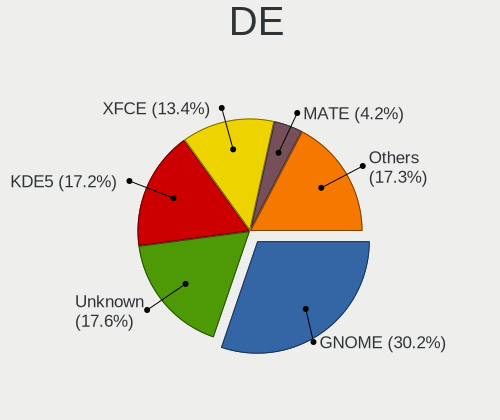
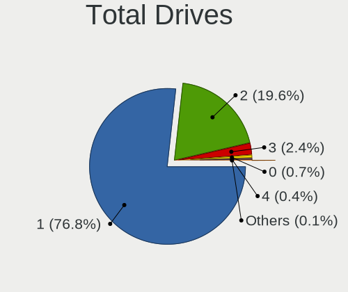
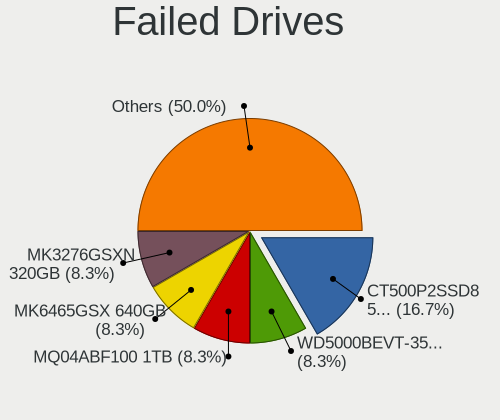
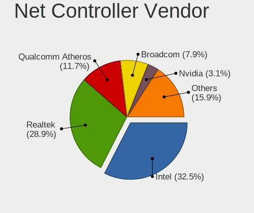
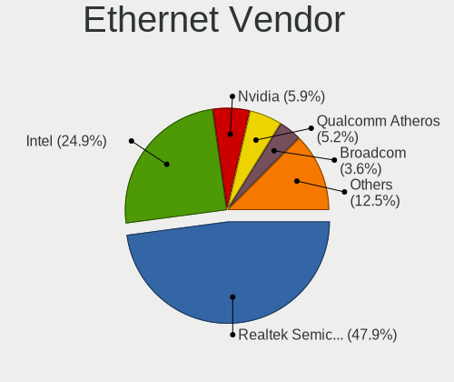
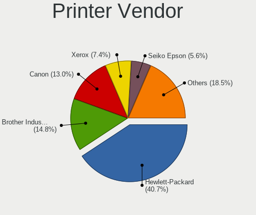

Debian - Tested Hardware & Statistics (Notebooks)
-------------------------------------------------

A project to collect tested hardware configurations for Debian.

Anyone can contribute to this report by the [hw-probe](https://github.com/linuxhw/hw-probe) tool:

    sudo -E hw-probe -all -upload

Please contribute! Especially if your hardware is rare.

Contents
--------

* [ Test Cases ](#test-cases)

* [ System ](#system)
  - [ OS                       ](#os)
  - [ OS Family                ](#os-family)
  - [ Kernel                   ](#kernel)
  - [ Kernel Family            ](#kernel-family)
  - [ Kernel Major Ver.        ](#kernel-major-ver)
  - [ Arch                     ](#arch)
  - [ DE                       ](#de)
  - [ Display Server           ](#display-server)
  - [ Display Manager          ](#display-manager)
  - [ OS Lang                  ](#os-lang)
  - [ Boot Mode                ](#boot-mode)
  - [ Filesystem               ](#filesystem)
  - [ Part. scheme             ](#part-scheme)
  - [ Dual Boot with Linux/BSD ](#dual-boot-with-linuxbsd)
  - [ Dual Boot (Win)          ](#dual-boot-win)

* [ Board ](#board)
  - [ Vendor                   ](#vendor)
  - [ Model                    ](#model)
  - [ Model Family             ](#model-family)
  - [ MFG Year                 ](#mfg-year)
  - [ Form Factor              ](#form-factor)
  - [ Secure Boot              ](#secure-boot)
  - [ Coreboot                 ](#coreboot)
  - [ RAM Size                 ](#ram-size)
  - [ RAM Used                 ](#ram-used)
  - [ Total Drives             ](#total-drives)
  - [ Has CD-ROM               ](#has-cd-rom)
  - [ Has Ethernet             ](#has-ethernet)
  - [ Has WiFi                 ](#has-wifi)
  - [ Has Bluetooth            ](#has-bluetooth)

* [ Location ](#location)
  - [ Country                  ](#country)
  - [ City                     ](#city)

* [ Drives ](#drives)
  - [ Drive Vendor             ](#drive-vendor)
  - [ Drive Model              ](#drive-model)
  - [ HDD Vendor               ](#hdd-vendor)
  - [ SSD Vendor               ](#ssd-vendor)
  - [ Drive Kind               ](#drive-kind)
  - [ Drive Connector          ](#drive-connector)
  - [ Drive Size               ](#drive-size)
  - [ Space Total              ](#space-total)
  - [ Space Used               ](#space-used)
  - [ Malfunc. Drives          ](#malfunc-drives)
  - [ Malfunc. Drive Vendor    ](#malfunc-drive-vendor)
  - [ Malfunc. HDD Vendor      ](#malfunc-hdd-vendor)
  - [ Malfunc. Drive Kind      ](#malfunc-drive-kind)
  - [ Failed Drives            ](#failed-drives)
  - [ Failed Drive Vendor      ](#failed-drive-vendor)
  - [ Drive Status             ](#drive-status)

* [ Storage controller ](#storage-controller)
  - [ Storage Vendor           ](#storage-vendor)
  - [ Storage Model            ](#storage-model)
  - [ Storage Kind             ](#storage-kind)

* [ Processor ](#processor)
  - [ CPU Vendor               ](#cpu-vendor)
  - [ CPU Model                ](#cpu-model)
  - [ CPU Model Family         ](#cpu-model-family)
  - [ CPU Cores                ](#cpu-cores)
  - [ CPU Sockets              ](#cpu-sockets)
  - [ CPU Threads              ](#cpu-threads)
  - [ CPU Op-Modes             ](#cpu-op-modes)
  - [ CPU Microcode            ](#cpu-microcode)
  - [ CPU Microarch            ](#cpu-microarch)

* [ Graphics ](#graphics)
  - [ GPU Vendor               ](#gpu-vendor)
  - [ GPU Model                ](#gpu-model)
  - [ GPU Combo                ](#gpu-combo)
  - [ GPU Driver               ](#gpu-driver)
  - [ GPU Memory               ](#gpu-memory)

* [ Monitor ](#monitor)
  - [ Monitor Vendor           ](#monitor-vendor)
  - [ Monitor Model            ](#monitor-model)
  - [ Monitor Resolution       ](#monitor-resolution)
  - [ Monitor Diagonal         ](#monitor-diagonal)
  - [ Monitor Width            ](#monitor-width)
  - [ Aspect Ratio             ](#aspect-ratio)
  - [ Monitor Area             ](#monitor-area)
  - [ Pixel Density            ](#pixel-density)
  - [ Multiple Monitors        ](#multiple-monitors)

* [ Network ](#network)
  - [ Net Controller Vendor    ](#net-controller-vendor)
  - [ Net Controller Model     ](#net-controller-model)
  - [ Wireless Vendor          ](#wireless-vendor)
  - [ Wireless Model           ](#wireless-model)
  - [ Ethernet Vendor          ](#ethernet-vendor)
  - [ Ethernet Model           ](#ethernet-model)
  - [ Net Controller Kind      ](#net-controller-kind)
  - [ Used Controller          ](#used-controller)
  - [ NICs                     ](#nics)
  - [ IPv6                     ](#ipv6)

* [ Bluetooth ](#bluetooth)
  - [ Bluetooth Vendor         ](#bluetooth-vendor)
  - [ Bluetooth Model          ](#bluetooth-model)

* [ Sound ](#sound)
  - [ Sound Vendor             ](#sound-vendor)
  - [ Sound Model              ](#sound-model)

* [ Memory ](#memory)
  - [ Memory Vendor            ](#memory-vendor)
  - [ Memory Model             ](#memory-model)
  - [ Memory Kind              ](#memory-kind)
  - [ Memory Form Factor       ](#memory-form-factor)
  - [ Memory Size              ](#memory-size)
  - [ Memory Speed             ](#memory-speed)

* [ Printers & scanners ](#printers--scanners)
  - [ Printer Vendor           ](#printer-vendor)
  - [ Printer Model            ](#printer-model)
  - [ Scanner Vendor           ](#scanner-vendor)
  - [ Scanner Model            ](#scanner-model)

* [ Camera ](#camera)
  - [ Camera Vendor            ](#camera-vendor)
  - [ Camera Model             ](#camera-model)

* [ Security ](#security)
  - [ Fingerprint Vendor       ](#fingerprint-vendor)
  - [ Fingerprint Model        ](#fingerprint-model)
  - [ Chipcard Vendor          ](#chipcard-vendor)
  - [ Chipcard Model           ](#chipcard-model)

* [ Unsupported ](#unsupported)
  - [ Unsupported Devices      ](#unsupported-devices)
  - [ Unsupported Device Types ](#unsupported-device-types)

Test Cases
----------

Total: 6796

| Vendor        | Model                       | Probe                                                      | Date         |
|---------------|-----------------------------|------------------------------------------------------------|--------------|
| Lenovo        | Slim 9 14IAP7 82T1          | [fe1b421c9d](https://linux-hardware.org/?probe=fe1b421c9d) | May 01, 2023 |
| Acer          | Aspire E1-571               | [e03d5ff056](https://linux-hardware.org/?probe=e03d5ff056) | Apr 30, 2023 |
| HP            | ProBook 655 G3              | [07e2cc77f8](https://linux-hardware.org/?probe=07e2cc77f8) | Apr 30, 2023 |
| HP            | ProBook 655 G3              | [638e747fb1](https://linux-hardware.org/?probe=638e747fb1) | Apr 30, 2023 |
| HP            | Compaq Mini CQ10-500        | [9a1134210f](https://linux-hardware.org/?probe=9a1134210f) | Apr 30, 2023 |
| Positivo      | Q464C                       | [8e41593bd3](https://linux-hardware.org/?probe=8e41593bd3) | Apr 30, 2023 |
| HP            | 255 G8 Notebook PC          | [7262375294](https://linux-hardware.org/?probe=7262375294) | Apr 30, 2023 |
| Dell          | Inspiron MXC061             | [2d1ab773dd](https://linux-hardware.org/?probe=2d1ab773dd) | Apr 30, 2023 |
| Lenovo        | ThinkPad T14 Gen 2i 20W1... | [0a9a85f5f0](https://linux-hardware.org/?probe=0a9a85f5f0) | Apr 29, 2023 |
| Lenovo        | ThinkPad T14 Gen 2i 20W1... | [83b10185e8](https://linux-hardware.org/?probe=83b10185e8) | Apr 29, 2023 |
| COPELION I... | QX-250 Series               | [409821566f](https://linux-hardware.org/?probe=409821566f) | Apr 29, 2023 |
| Lenovo        | ThinkPad X280 20KESBC402    | [0d5b86146e](https://linux-hardware.org/?probe=0d5b86146e) | Apr 29, 2023 |
| Aquarius      | NS585                       | [b23696ca41](https://linux-hardware.org/?probe=b23696ca41) | Apr 28, 2023 |
| Dell          | Latitude E7450              | [6afa2ff009](https://linux-hardware.org/?probe=6afa2ff009) | Apr 28, 2023 |
| Dell          | Latitude D630               | [a3c3e09675](https://linux-hardware.org/?probe=a3c3e09675) | Apr 28, 2023 |
| ASUSTek       | ASUS TUF Gaming A15 FA50... | [2474e8e580](https://linux-hardware.org/?probe=2474e8e580) | Apr 27, 2023 |
| Lenovo        | ThinkPad E14 Gen 2 20TA0... | [69d1f17b35](https://linux-hardware.org/?probe=69d1f17b35) | Apr 27, 2023 |
| ARDOR GAMI... | PD5x_7xPNP_PNR_PNN_PNT      | [e61f528ba5](https://linux-hardware.org/?probe=e61f528ba5) | Apr 27, 2023 |
| ASUSTek       | Zenbook UX535QE_UM535QE     | [2093399e21](https://linux-hardware.org/?probe=2093399e21) | Apr 27, 2023 |
| Lenovo        | IdeaPad 110S-11IBR 80WG     | [73141c5006](https://linux-hardware.org/?probe=73141c5006) | Apr 27, 2023 |
| Lenovo        | IdeaPad 110S-11IBR 80WG     | [0cb164ac2f](https://linux-hardware.org/?probe=0cb164ac2f) | Apr 27, 2023 |
| HP            | Laptop 15s-eq2xxx           | [198fa6162e](https://linux-hardware.org/?probe=198fa6162e) | Apr 27, 2023 |
| IGEL Techn... | M340C                       | [40970f0528](https://linux-hardware.org/?probe=40970f0528) | Apr 26, 2023 |
| ARDOR GAMI... | PD5x_7xPNP_PNR_PNN_PNT      | [cec3a72c8a](https://linux-hardware.org/?probe=cec3a72c8a) | Apr 26, 2023 |
| Dell          | Latitude D630               | [850df6e76f](https://linux-hardware.org/?probe=850df6e76f) | Apr 26, 2023 |
| Google        | Terra                       | [b22deb9f09](https://linux-hardware.org/?probe=b22deb9f09) | Apr 26, 2023 |
| Dell          | Latitude E6440              | [f5cdf825fa](https://linux-hardware.org/?probe=f5cdf825fa) | Apr 26, 2023 |
| ASUSTek       | VivoBook_ASUSLaptop M640... | [0234325d36](https://linux-hardware.org/?probe=0234325d36) | Apr 26, 2023 |
| HP            | ENVY 15                     | [1f50420c44](https://linux-hardware.org/?probe=1f50420c44) | Apr 26, 2023 |
| HP            | 250 G6 Notebook PC          | [90e4883dca](https://linux-hardware.org/?probe=90e4883dca) | Apr 26, 2023 |
| IGEL Techn... | M340C                       | [c3c972facf](https://linux-hardware.org/?probe=c3c972facf) | Apr 26, 2023 |
| IGEL Techn... | M340C                       | [f993513cd3](https://linux-hardware.org/?probe=f993513cd3) | Apr 26, 2023 |
| HP            | Pavilion Gaming Laptop 1... | [d8088982c3](https://linux-hardware.org/?probe=d8088982c3) | Apr 26, 2023 |
| HP            | Pavilion Gaming Laptop 1... | [4cffa55fb1](https://linux-hardware.org/?probe=4cffa55fb1) | Apr 26, 2023 |
| HP            | Laptop 15-db1xxx            | [e6380a2186](https://linux-hardware.org/?probe=e6380a2186) | Apr 26, 2023 |
| HP            | Laptop 15                   | [34a2ebf6a1](https://linux-hardware.org/?probe=34a2ebf6a1) | Apr 26, 2023 |
| HP            | Laptop 15-db1xxx            | [872138980a](https://linux-hardware.org/?probe=872138980a) | Apr 26, 2023 |
| HP            | Pavilion Gaming Laptop 1... | [2122bd37a5](https://linux-hardware.org/?probe=2122bd37a5) | Apr 26, 2023 |
| HP            | Pavilion Gaming Laptop 1... | [af7b14d259](https://linux-hardware.org/?probe=af7b14d259) | Apr 26, 2023 |
| HP            | Pavilion Gaming Laptop 1... | [7fbd802154](https://linux-hardware.org/?probe=7fbd802154) | Apr 26, 2023 |
| HP            | Pavilion Gaming Laptop 1... | [ffe6065419](https://linux-hardware.org/?probe=ffe6065419) | Apr 26, 2023 |
| HP            | Pavilion Gaming Laptop 1... | [94ddc76aae](https://linux-hardware.org/?probe=94ddc76aae) | Apr 26, 2023 |
| Lenovo        | ThinkPad T530 23594ZC       | [7aec73dfa1](https://linux-hardware.org/?probe=7aec73dfa1) | Apr 25, 2023 |
| Lenovo        | ThinkPad X200 7459KM3       | [cbea785e27](https://linux-hardware.org/?probe=cbea785e27) | Apr 25, 2023 |
| Aquarius      | NS585                       | [a0983c89d8](https://linux-hardware.org/?probe=a0983c89d8) | Apr 25, 2023 |
| Aquarius      | NS585                       | [5d9edb6ed4](https://linux-hardware.org/?probe=5d9edb6ed4) | Apr 25, 2023 |
| Aquarius      | NS585                       | [972d7f6e4a](https://linux-hardware.org/?probe=972d7f6e4a) | Apr 25, 2023 |
| Aquarius      | NS585                       | [c89bbd8bc0](https://linux-hardware.org/?probe=c89bbd8bc0) | Apr 25, 2023 |
| Aquarius      | NS585                       | [a6e5a5f3d1](https://linux-hardware.org/?probe=a6e5a5f3d1) | Apr 25, 2023 |
| Aquarius      | NS585                       | [b6dac5b058](https://linux-hardware.org/?probe=b6dac5b058) | Apr 25, 2023 |
| Aquarius      | NS585                       | [1563889dac](https://linux-hardware.org/?probe=1563889dac) | Apr 25, 2023 |
| Aquarius      | NS585                       | [9bdbad2ab7](https://linux-hardware.org/?probe=9bdbad2ab7) | Apr 25, 2023 |
| Aquarius      | NS585                       | [e30d7dde7b](https://linux-hardware.org/?probe=e30d7dde7b) | Apr 25, 2023 |
| Aquarius      | NS585                       | [68527a900f](https://linux-hardware.org/?probe=68527a900f) | Apr 25, 2023 |
| Aquarius      | NS585                       | [ce99b27fb4](https://linux-hardware.org/?probe=ce99b27fb4) | Apr 25, 2023 |
| Aquarius      | NS585                       | [fc377acae2](https://linux-hardware.org/?probe=fc377acae2) | Apr 25, 2023 |
| Aquarius      | NS585                       | [ed32f24d6e](https://linux-hardware.org/?probe=ed32f24d6e) | Apr 25, 2023 |
| Aquarius      | NS585                       | [ea60267a5b](https://linux-hardware.org/?probe=ea60267a5b) | Apr 25, 2023 |
| Aquarius      | NS585                       | [f71897bf76](https://linux-hardware.org/?probe=f71897bf76) | Apr 25, 2023 |
| Aquarius      | NS585                       | [7aa4561ca5](https://linux-hardware.org/?probe=7aa4561ca5) | Apr 25, 2023 |
| Aquarius      | NS585                       | [385ce8cd93](https://linux-hardware.org/?probe=385ce8cd93) | Apr 25, 2023 |
| Aquarius      | NS585                       | [3fc8926a1a](https://linux-hardware.org/?probe=3fc8926a1a) | Apr 25, 2023 |
| Lenovo        | V15 G2 ALC 82KD             | [9e6ce2eb71](https://linux-hardware.org/?probe=9e6ce2eb71) | Apr 25, 2023 |
| Aquarius      | NS585                       | [58306d0266](https://linux-hardware.org/?probe=58306d0266) | Apr 25, 2023 |
| Acer          | Aspire E5-576G              | [9ca5902786](https://linux-hardware.org/?probe=9ca5902786) | Apr 25, 2023 |
| Lenovo        | ThinkPad P15s Gen 2i 20W... | [aa1b58a2a2](https://linux-hardware.org/?probe=aa1b58a2a2) | Apr 24, 2023 |
| HP            | ProBook 4520s               | [b680525b61](https://linux-hardware.org/?probe=b680525b61) | Apr 24, 2023 |
| HP            | ProBook 4520s               | [e4ce7aed55](https://linux-hardware.org/?probe=e4ce7aed55) | Apr 24, 2023 |
| Apple         | MacBookPro5,5               | [de825a326c](https://linux-hardware.org/?probe=de825a326c) | Apr 24, 2023 |
| Dell          | Inspiron 5537               | [971055139b](https://linux-hardware.org/?probe=971055139b) | Apr 24, 2023 |
| Lenovo        | ThinkBook 14-IML 20RV       | [32546113c8](https://linux-hardware.org/?probe=32546113c8) | Apr 24, 2023 |
| Hampoo        | Cherry Trail CR V200        | [f3d90b0d4a](https://linux-hardware.org/?probe=f3d90b0d4a) | Apr 23, 2023 |
| HP            | 15                          | [fd68fb06af](https://linux-hardware.org/?probe=fd68fb06af) | Apr 23, 2023 |
| Toshiba       | PORTEGE Z20t-C              | [45d7bd0907](https://linux-hardware.org/?probe=45d7bd0907) | Apr 23, 2023 |
| Toshiba       | PORTEGE Z20t-C              | [c7367bfdff](https://linux-hardware.org/?probe=c7367bfdff) | Apr 23, 2023 |
| Acer          | Aspire E1-571G              | [0e2671ee2e](https://linux-hardware.org/?probe=0e2671ee2e) | Apr 23, 2023 |
| Toshiba       | Satellite C70D-A            | [adee59c351](https://linux-hardware.org/?probe=adee59c351) | Apr 23, 2023 |
| Toshiba       | Satellite C70D-A            | [c5c43186bc](https://linux-hardware.org/?probe=c5c43186bc) | Apr 23, 2023 |
| Dell          | G15 5520                    | [238c8f53aa](https://linux-hardware.org/?probe=238c8f53aa) | Apr 22, 2023 |
| Dell          | Latitude E6330              | [b532a9756c](https://linux-hardware.org/?probe=b532a9756c) | Apr 22, 2023 |
| Dell          | G15 5520                    | [07751c950a](https://linux-hardware.org/?probe=07751c950a) | Apr 22, 2023 |
| HP            | Laptop 15s-du3xxx           | [45af810de1](https://linux-hardware.org/?probe=45af810de1) | Apr 21, 2023 |
| ASUSTek       | VivoBook_ASUSLaptop X509... | [5f61e3a174](https://linux-hardware.org/?probe=5f61e3a174) | Apr 21, 2023 |
| Acer          | Nitro AN515-45              | [91f538e2ab](https://linux-hardware.org/?probe=91f538e2ab) | Apr 21, 2023 |
| Lenovo        | IdeaPad S510p 20298         | [8a1e6b7f32](https://linux-hardware.org/?probe=8a1e6b7f32) | Apr 21, 2023 |
| HP            | ZBook Power 15.6 inch G9... | [036616c992](https://linux-hardware.org/?probe=036616c992) | Apr 21, 2023 |
| HP            | OMEN Laptop 15-en1xxx       | [3caa3d5076](https://linux-hardware.org/?probe=3caa3d5076) | Apr 21, 2023 |
| HP            | ZBook Power 15.6 inch G9... | [8c8d2eb3b5](https://linux-hardware.org/?probe=8c8d2eb3b5) | Apr 21, 2023 |
| HP            | ZBook Power 15.6 inch G8... | [cb40e046d8](https://linux-hardware.org/?probe=cb40e046d8) | Apr 21, 2023 |
| Dell          | Precision 3550              | [7434822402](https://linux-hardware.org/?probe=7434822402) | Apr 21, 2023 |
| Toshiba       | Satellite X200              | [15035835d0](https://linux-hardware.org/?probe=15035835d0) | Apr 20, 2023 |
| Toshiba       | Satellite Pro NB10-A-125    | [3a77f344af](https://linux-hardware.org/?probe=3a77f344af) | Apr 20, 2023 |
| ASUSTek       | X550CA                      | [cb5f73ff63](https://linux-hardware.org/?probe=cb5f73ff63) | Apr 20, 2023 |
| HP            | Notebook                    | [7174065ed3](https://linux-hardware.org/?probe=7174065ed3) | Apr 20, 2023 |
| Aquarius      | NS585                       | [753222f54f](https://linux-hardware.org/?probe=753222f54f) | Apr 20, 2023 |
| Aquarius      | NS585                       | [be0bc2be01](https://linux-hardware.org/?probe=be0bc2be01) | Apr 20, 2023 |
| Acer          | Aspire E3-111               | [9af253f4e0](https://linux-hardware.org/?probe=9af253f4e0) | Apr 20, 2023 |
| HP            | EliteBook 830 G5            | [6090be709d](https://linux-hardware.org/?probe=6090be709d) | Apr 20, 2023 |
| Aquarius      | NS585                       | [f7f0464c39](https://linux-hardware.org/?probe=f7f0464c39) | Apr 20, 2023 |
| Aquarius      | NS585                       | [8393642230](https://linux-hardware.org/?probe=8393642230) | Apr 20, 2023 |
| Aquarius      | NS585                       | [a5b9a09e63](https://linux-hardware.org/?probe=a5b9a09e63) | Apr 20, 2023 |
| Medion        | P17605                      | [b68359f3d1](https://linux-hardware.org/?probe=b68359f3d1) | Apr 20, 2023 |
| HP            | Laptop 15-db0xxx            | [9ab965fcb8](https://linux-hardware.org/?probe=9ab965fcb8) | Apr 19, 2023 |
| Lenovo        | ThinkPad T500 2055WAB       | [4e293261bb](https://linux-hardware.org/?probe=4e293261bb) | Apr 19, 2023 |
| HP            | ProBook 450 G2              | [3b8c115c1a](https://linux-hardware.org/?probe=3b8c115c1a) | Apr 19, 2023 |
| Toshiba       | Satellite Pro A100          | [4240870be8](https://linux-hardware.org/?probe=4240870be8) | Apr 19, 2023 |
| Lenovo        | Yoga 300-11IBR 80M1         | [f691871296](https://linux-hardware.org/?probe=f691871296) | Apr 19, 2023 |
| Acer          | Swift SF314-57              | [5fc25cc033](https://linux-hardware.org/?probe=5fc25cc033) | Apr 19, 2023 |
| ASUSTek       | VivoBook_ASUSLaptop M350... | [d669bcc680](https://linux-hardware.org/?probe=d669bcc680) | Apr 19, 2023 |
| HP            | 255 G8 Notebook PC          | [699e2a2a80](https://linux-hardware.org/?probe=699e2a2a80) | Apr 18, 2023 |
| Tactus        | GeoBook 140                 | [704da241f5](https://linux-hardware.org/?probe=704da241f5) | Apr 18, 2023 |
| Dell          | Vostro 5402                 | [e492c87b46](https://linux-hardware.org/?probe=e492c87b46) | Apr 18, 2023 |
| Dell          | Vostro 5402                 | [b15f47258b](https://linux-hardware.org/?probe=b15f47258b) | Apr 18, 2023 |
| PC Special... | NV4XMB,ME,MZ                | [65c0a28c58](https://linux-hardware.org/?probe=65c0a28c58) | Apr 18, 2023 |
| Lenovo        | IdeaPad S510p 20298         | [7f0be1868e](https://linux-hardware.org/?probe=7f0be1868e) | Apr 18, 2023 |
| MSI           | Prestige 15 A12UC           | [0f4c1e1ac3](https://linux-hardware.org/?probe=0f4c1e1ac3) | Apr 18, 2023 |
| Toshiba       | Satellite Pro C850-1J2      | [e5c63957a2](https://linux-hardware.org/?probe=e5c63957a2) | Apr 18, 2023 |
| ASUSTek       | G551JW                      | [65f6143e36](https://linux-hardware.org/?probe=65f6143e36) | Apr 18, 2023 |
| Lenovo        | ThinkPad L540 20AUA39QJP    | [180ef53338](https://linux-hardware.org/?probe=180ef53338) | Apr 18, 2023 |
| Lenovo        | ThinkPad L540 20AUA39QJP    | [fd3b20c292](https://linux-hardware.org/?probe=fd3b20c292) | Apr 18, 2023 |
| LG Electro... | 17Z90Q-K.AA78A1             | [594a7fa16b](https://linux-hardware.org/?probe=594a7fa16b) | Apr 18, 2023 |
| IBM           | ThinkPad R51 1836Q4U        | [ebec8b53eb](https://linux-hardware.org/?probe=ebec8b53eb) | Apr 18, 2023 |
| Lenovo        | ThinkPad E15 Gen 3 20YHS... | [94f62c41e5](https://linux-hardware.org/?probe=94f62c41e5) | Apr 17, 2023 |
| LG Electro... | P530-KE6BK                  | [b1f0863c79](https://linux-hardware.org/?probe=b1f0863c79) | Apr 17, 2023 |
| Lenovo        | Legion Y540-15IRH 81SX      | [d5db24c28d](https://linux-hardware.org/?probe=d5db24c28d) | Apr 17, 2023 |
| Lenovo        | Legion Y540-15IRH 81SX      | [89eb2b2c32](https://linux-hardware.org/?probe=89eb2b2c32) | Apr 17, 2023 |
| Dell          | Latitude 5420               | [4f3345aced](https://linux-hardware.org/?probe=4f3345aced) | Apr 16, 2023 |
| Acer          | Swift SF314-41              | [8c42a0aba8](https://linux-hardware.org/?probe=8c42a0aba8) | Apr 16, 2023 |
| Dell          | XPS 13 9305                 | [838519057f](https://linux-hardware.org/?probe=838519057f) | Apr 16, 2023 |
| Lenovo        | ThinkBook 14-IML 20RV       | [d532f6fdbd](https://linux-hardware.org/?probe=d532f6fdbd) | Apr 16, 2023 |
| Lenovo        | ThinkPad T470s W10DG 20J... | [c622c73721](https://linux-hardware.org/?probe=c622c73721) | Apr 16, 2023 |
| HP            | Notebook                    | [7614984f1d](https://linux-hardware.org/?probe=7614984f1d) | Apr 15, 2023 |
| Lenovo        | XiaoXinPro 16ACH 2021 82... | [8ca60a45fe](https://linux-hardware.org/?probe=8ca60a45fe) | Apr 15, 2023 |
| HP            | EliteBook 850 G4            | [984cf8fd47](https://linux-hardware.org/?probe=984cf8fd47) | Apr 14, 2023 |
| Acer          | Aspire E5-575G              | [39afaea9e3](https://linux-hardware.org/?probe=39afaea9e3) | Apr 14, 2023 |
| HP            | Laptop 17-cp0xxx            | [6fdb6931f0](https://linux-hardware.org/?probe=6fdb6931f0) | Apr 14, 2023 |
| HP            | 255 G8 Notebook PC          | [58ec498e8f](https://linux-hardware.org/?probe=58ec498e8f) | Apr 14, 2023 |
| Acer          | Extensa 5635Z               | [b3c99bf352](https://linux-hardware.org/?probe=b3c99bf352) | Apr 14, 2023 |
| Notebook      | N7x0WU                      | [5d37070bf0](https://linux-hardware.org/?probe=5d37070bf0) | Apr 14, 2023 |
| ASUSTek       | VivoBook_ASUSLaptop M160... | [6af1f492c4](https://linux-hardware.org/?probe=6af1f492c4) | Apr 14, 2023 |
| Lenovo        | Flex 2-14 20404             | [c76a516113](https://linux-hardware.org/?probe=c76a516113) | Apr 14, 2023 |
| Dell          | Inspiron 1525               | [9ab8e04a20](https://linux-hardware.org/?probe=9ab8e04a20) | Apr 14, 2023 |
| Acer          | AO756                       | [58efd2f87f](https://linux-hardware.org/?probe=58efd2f87f) | Apr 14, 2023 |
| Toshiba       | Satellite L850              | [15de4db91b](https://linux-hardware.org/?probe=15de4db91b) | Apr 14, 2023 |
| Dell          | Inspiron 1525               | [1a327ce647](https://linux-hardware.org/?probe=1a327ce647) | Apr 13, 2023 |
| Dell          | G15 5510                    | [6b4ef54307](https://linux-hardware.org/?probe=6b4ef54307) | Apr 13, 2023 |
| Dell          | Inspiron 1525               | [bc3ccff50c](https://linux-hardware.org/?probe=bc3ccff50c) | Apr 13, 2023 |
| HP            | Pavilion Laptop 15-eh1xx... | [60f7db51fa](https://linux-hardware.org/?probe=60f7db51fa) | Apr 13, 2023 |
| HP            | Pavilion Laptop 15-eh1xx... | [e9708d65e9](https://linux-hardware.org/?probe=e9708d65e9) | Apr 13, 2023 |
| Acer          | Aspire A315-51              | [c3962286cb](https://linux-hardware.org/?probe=c3962286cb) | Apr 13, 2023 |
| Apple         | MacBookPro5,5               | [401c4d8143](https://linux-hardware.org/?probe=401c4d8143) | Apr 12, 2023 |
| HP            | Laptop 15s-eq2xxx           | [abedf2741f](https://linux-hardware.org/?probe=abedf2741f) | Apr 12, 2023 |
| HP            | ZBook 15 G3                 | [5411d789c3](https://linux-hardware.org/?probe=5411d789c3) | Apr 12, 2023 |
| Dell          | Latitude 5490               | [38ebdedf58](https://linux-hardware.org/?probe=38ebdedf58) | Apr 12, 2023 |
| HP            | Pavilion dv6                | [09b80dd551](https://linux-hardware.org/?probe=09b80dd551) | Apr 12, 2023 |
| HP            | Pavilion dv7                | [4363479bf0](https://linux-hardware.org/?probe=4363479bf0) | Apr 12, 2023 |
| Dell          | Inspiron 15-3567            | [23c158b19b](https://linux-hardware.org/?probe=23c158b19b) | Apr 12, 2023 |
| Lenovo        | ThinkPad E470 20H2S00700    | [ea2aa5245d](https://linux-hardware.org/?probe=ea2aa5245d) | Apr 11, 2023 |
| Samsung       | 550XCJ/550XCR               | [c074d665d9](https://linux-hardware.org/?probe=c074d665d9) | Apr 11, 2023 |
| Samsung       | 550XCJ/550XCR               | [845a04c326](https://linux-hardware.org/?probe=845a04c326) | Apr 11, 2023 |
| Packard Be... | EasyNote_MX45               | [95935443c0](https://linux-hardware.org/?probe=95935443c0) | Apr 11, 2023 |
| ASUSTek       | X550JF                      | [dff4654bd2](https://linux-hardware.org/?probe=dff4654bd2) | Apr 11, 2023 |
| Acer          | Aspire E1-571G              | [45a3503764](https://linux-hardware.org/?probe=45a3503764) | Apr 11, 2023 |
| Acer          | Aspire 5738                 | [c039220e20](https://linux-hardware.org/?probe=c039220e20) | Apr 11, 2023 |
| Aquarius      | NS585                       | [6f4b987640](https://linux-hardware.org/?probe=6f4b987640) | Apr 11, 2023 |
| Samsung       | 550XDA                      | [e1d5d2f193](https://linux-hardware.org/?probe=e1d5d2f193) | Apr 11, 2023 |
| Dell          | Inspiron 15 5510            | [5d84a5a711](https://linux-hardware.org/?probe=5d84a5a711) | Apr 10, 2023 |
| Apple         | MacBookAir7,2               | [94efe20a0f](https://linux-hardware.org/?probe=94efe20a0f) | Apr 10, 2023 |
| Dell          | Latitude 3320               | [b7c2bb88b3](https://linux-hardware.org/?probe=b7c2bb88b3) | Apr 10, 2023 |
| Dell          | Latitude 3320               | [436e7b8903](https://linux-hardware.org/?probe=436e7b8903) | Apr 10, 2023 |
| Lenovo        | ThinkPad T480 20L6S0CE1M    | [eb794b0dc7](https://linux-hardware.org/?probe=eb794b0dc7) | Apr 10, 2023 |
| Lenovo        | ThinkPad L470 20J4000LGE    | [fec574fe0d](https://linux-hardware.org/?probe=fec574fe0d) | Apr 10, 2023 |
| Lenovo        | Yoga 500-15IBD 80N6         | [885fff9ddb](https://linux-hardware.org/?probe=885fff9ddb) | Apr 10, 2023 |
| Lenovo        | ThinkPad L470 20J4000LGE    | [f97c4e6d47](https://linux-hardware.org/?probe=f97c4e6d47) | Apr 10, 2023 |
| Samsung       | RF511/RF411/RF711           | [ea4fdd80e6](https://linux-hardware.org/?probe=ea4fdd80e6) | Apr 09, 2023 |
| Lenovo        | ThinkPad X220 4291LR6       | [ea86227d59](https://linux-hardware.org/?probe=ea86227d59) | Apr 09, 2023 |
| Lenovo        | ThinkPad P15v Gen 3 21D8... | [8d4288ca33](https://linux-hardware.org/?probe=8d4288ca33) | Apr 09, 2023 |
| ASUSTek       | X756UQ                      | [bff5545041](https://linux-hardware.org/?probe=bff5545041) | Apr 08, 2023 |
| Lenovo        | ThinkPad E15 Gen 2 20TD0... | [fc28f6d3f0](https://linux-hardware.org/?probe=fc28f6d3f0) | Apr 08, 2023 |
| HP            | ENVY dv6                    | [0d89a1797e](https://linux-hardware.org/?probe=0d89a1797e) | Apr 08, 2023 |
| MSI           | GL65 Leopard 10SCSR         | [3063414a8c](https://linux-hardware.org/?probe=3063414a8c) | Apr 08, 2023 |
| Lenovo        | ThinkPad T450 20BUA05900    | [e771177cca](https://linux-hardware.org/?probe=e771177cca) | Apr 07, 2023 |
| Acer          | TravelMate 5735Z            | [6d50e55675](https://linux-hardware.org/?probe=6d50e55675) | Apr 07, 2023 |
| HP            | Pavilion dv7                | [3ec1e98abd](https://linux-hardware.org/?probe=3ec1e98abd) | Apr 07, 2023 |
| Google        | Reks                        | [25341f2040](https://linux-hardware.org/?probe=25341f2040) | Apr 07, 2023 |
| Google        | Reks                        | [21c7e0c282](https://linux-hardware.org/?probe=21c7e0c282) | Apr 07, 2023 |
| Google        | Terra                       | [09a6a1ca8f](https://linux-hardware.org/?probe=09a6a1ca8f) | Apr 07, 2023 |
| Acer          | TravelMate 5735Z            | [a74c66fc15](https://linux-hardware.org/?probe=a74c66fc15) | Apr 07, 2023 |
| Acer          | TravelMate 5735Z            | [46990342e8](https://linux-hardware.org/?probe=46990342e8) | Apr 06, 2023 |
| Acer          | TravelMate 5735Z            | [6d0065dea2](https://linux-hardware.org/?probe=6d0065dea2) | Apr 06, 2023 |
| ASUSTek       | ASUS EXPERTBOOK B1400CEA... | [d5c75a0967](https://linux-hardware.org/?probe=d5c75a0967) | Apr 06, 2023 |
| Dell          | Latitude E7250              | [e5fe0c7962](https://linux-hardware.org/?probe=e5fe0c7962) | Apr 06, 2023 |
| eMachines     | eME728                      | [aff08e7f2d](https://linux-hardware.org/?probe=aff08e7f2d) | Apr 05, 2023 |
| eMachines     | eMachiens G443              | [58c297218a](https://linux-hardware.org/?probe=58c297218a) | Apr 05, 2023 |
| Toshiba       | Satellite C855D-12J         | [cb3dedf5e8](https://linux-hardware.org/?probe=cb3dedf5e8) | Apr 05, 2023 |
| System76      | Lemur Pro                   | [2232424d5a](https://linux-hardware.org/?probe=2232424d5a) | Apr 05, 2023 |
| Acer          | Aspire E1-532               | [ba90a2c123](https://linux-hardware.org/?probe=ba90a2c123) | Apr 05, 2023 |
| Dell          | Precision M4700             | [1e2be52d80](https://linux-hardware.org/?probe=1e2be52d80) | Apr 05, 2023 |
| HONOR         | NMH-WCX9                    | [9ea45909a2](https://linux-hardware.org/?probe=9ea45909a2) | Apr 05, 2023 |
| Acer          | TravelMate P215-53          | [0808bd0d17](https://linux-hardware.org/?probe=0808bd0d17) | Apr 04, 2023 |
| Apple         | MacBookPro10,2              | [ad5d8f611a](https://linux-hardware.org/?probe=ad5d8f611a) | Apr 04, 2023 |
| Dell          | Latitude 5430               | [6494113c9b](https://linux-hardware.org/?probe=6494113c9b) | Apr 04, 2023 |
| Framework     | Laptop                      | [5bb187865d](https://linux-hardware.org/?probe=5bb187865d) | Apr 04, 2023 |
| HP            | EliteBook 840 G3            | [36f4574fd4](https://linux-hardware.org/?probe=36f4574fd4) | Apr 03, 2023 |
| Lenovo        | ThinkPad T530 242962G       | [58d0ea734d](https://linux-hardware.org/?probe=58d0ea734d) | Apr 03, 2023 |
| Toshiba       | Satellite Pro C850-1K0      | [893534249a](https://linux-hardware.org/?probe=893534249a) | Apr 03, 2023 |
| ASUSTek       | ROG Zephyrus G14 GA401QM... | [0f4881cccf](https://linux-hardware.org/?probe=0f4881cccf) | Apr 03, 2023 |
| HP            | EliteBook 850 G6            | [1af731cc92](https://linux-hardware.org/?probe=1af731cc92) | Apr 03, 2023 |
| Clevo         | P170HMx                     | [c963b350fc](https://linux-hardware.org/?probe=c963b350fc) | Apr 03, 2023 |
| Apple         | MacBookAir6,1               | [423c5d2481](https://linux-hardware.org/?probe=423c5d2481) | Apr 03, 2023 |
| HP            | Laptop 15s-eq2xxx           | [3034a3d11a](https://linux-hardware.org/?probe=3034a3d11a) | Apr 03, 2023 |
| ASUSTek       | ASUS TUF Gaming A15 FA50... | [89d4ef9333](https://linux-hardware.org/?probe=89d4ef9333) | Apr 02, 2023 |
| Acer          | Aspire A515-45              | [8fa60907d5](https://linux-hardware.org/?probe=8fa60907d5) | Apr 02, 2023 |
| Dell          | Precision M4700             | [aea1cc51a5](https://linux-hardware.org/?probe=aea1cc51a5) | Apr 02, 2023 |
| HP            | EliteBook Folio 1040 G3     | [9e25dfd6bb](https://linux-hardware.org/?probe=9e25dfd6bb) | Apr 02, 2023 |
| Dell          | Venue 11 Pro 7130 vPro      | [e42bc1dd05](https://linux-hardware.org/?probe=e42bc1dd05) | Apr 02, 2023 |
| Packard Be... | EasyNote TJ65               | [cd6a05149d](https://linux-hardware.org/?probe=cd6a05149d) | Apr 02, 2023 |
| Acer          | TravelMate P215-53          | [bd1d2b4102](https://linux-hardware.org/?probe=bd1d2b4102) | Apr 02, 2023 |
| Google        | Snappy                      | [16dda325bf](https://linux-hardware.org/?probe=16dda325bf) | Apr 02, 2023 |
| Dell          | Precision 5540              | [f25b25b590](https://linux-hardware.org/?probe=f25b25b590) | Apr 02, 2023 |
| HP            | Laptop 15s-eq2xxx           | [2f2326e574](https://linux-hardware.org/?probe=2f2326e574) | Apr 02, 2023 |
| Schenker      | XMG CORE (REN/M20)          | [50e9dee7b1](https://linux-hardware.org/?probe=50e9dee7b1) | Apr 01, 2023 |
| HP            | Notebook                    | [348d80772f](https://linux-hardware.org/?probe=348d80772f) | Apr 01, 2023 |
| HP            | EliteBook 840 G5            | [3c509a7075](https://linux-hardware.org/?probe=3c509a7075) | Apr 01, 2023 |
| Tactus        | GeoBook 140                 | [0ceb5a3b7c](https://linux-hardware.org/?probe=0ceb5a3b7c) | Apr 01, 2023 |
| MSI           | Vector GP66 12UGS           | [4787e68a9c](https://linux-hardware.org/?probe=4787e68a9c) | Apr 01, 2023 |
| MSI           | Vector GP66 12UGS           | [12e105f6da](https://linux-hardware.org/?probe=12e105f6da) | Apr 01, 2023 |
| Lenovo        | G50-45 80E3                 | [f75af97954](https://linux-hardware.org/?probe=f75af97954) | Apr 01, 2023 |
| HP            | Pavilion dv7                | [00bbec023a](https://linux-hardware.org/?probe=00bbec023a) | Apr 01, 2023 |
| ASUSTek       | X202E                       | [cdcccb09e7](https://linux-hardware.org/?probe=cdcccb09e7) | Mar 31, 2023 |
| ASUSTek       | X202E                       | [ac12ec53a3](https://linux-hardware.org/?probe=ac12ec53a3) | Mar 31, 2023 |
| Lenovo        | Yoga 3 11 80J8              | [fce7483fa0](https://linux-hardware.org/?probe=fce7483fa0) | Mar 31, 2023 |
| Dell          | Latitude E6330              | [ae7a7254b8](https://linux-hardware.org/?probe=ae7a7254b8) | Mar 31, 2023 |
| Dell          | Latitude E6330              | [2239e12384](https://linux-hardware.org/?probe=2239e12384) | Mar 31, 2023 |
| Lenovo        | IdeaPad 100-15IBY 80MJ      | [3399c2f210](https://linux-hardware.org/?probe=3399c2f210) | Mar 31, 2023 |
| Dell          | Precision M4700             | [7c93bc178e](https://linux-hardware.org/?probe=7c93bc178e) | Mar 31, 2023 |
| Lenovo        | ThinkPad T460 20FMA0APAR    | [2ca1607b80](https://linux-hardware.org/?probe=2ca1607b80) | Mar 30, 2023 |
| Dell          | XPS 13 7390                 | [990f324256](https://linux-hardware.org/?probe=990f324256) | Mar 30, 2023 |
| Dell          | XPS 13 7390                 | [b6226ae481](https://linux-hardware.org/?probe=b6226ae481) | Mar 30, 2023 |
| Fujitsu       | LIFEBOOK S752               | [bf3d484605](https://linux-hardware.org/?probe=bf3d484605) | Mar 30, 2023 |
| Fujitsu       | LIFEBOOK S752               | [3e4d9fac89](https://linux-hardware.org/?probe=3e4d9fac89) | Mar 30, 2023 |
| ASUSTek       | VivoBook_ASUSLaptop X515... | [e85544a3d7](https://linux-hardware.org/?probe=e85544a3d7) | Mar 30, 2023 |
| Dell          | Precision M4800             | [ebd0442adc](https://linux-hardware.org/?probe=ebd0442adc) | Mar 30, 2023 |
| Lenovo        | ThinkPad T60 195143U        | [4de196550b](https://linux-hardware.org/?probe=4de196550b) | Mar 30, 2023 |
| OEGStone      | W54_55SU1,SUW               | [a771622660](https://linux-hardware.org/?probe=a771622660) | Mar 29, 2023 |
| OEGStone      | W54_55SU1,SUW               | [1e0c5a90c9](https://linux-hardware.org/?probe=1e0c5a90c9) | Mar 29, 2023 |
| Lenovo        | ThinkPad T14s Gen 2i 20W... | [a9e7ad7ecd](https://linux-hardware.org/?probe=a9e7ad7ecd) | Mar 29, 2023 |
| MSI           | Prestige 14Evo A11M         | [fc06b01f31](https://linux-hardware.org/?probe=fc06b01f31) | Mar 29, 2023 |
| MSI           | Prestige 14Evo A11M         | [5ac693dbd4](https://linux-hardware.org/?probe=5ac693dbd4) | Mar 29, 2023 |
| Acer          | Nitro AN515-43              | [47c758c261](https://linux-hardware.org/?probe=47c758c261) | Mar 29, 2023 |
| Unknown       | Unknown                     | [7d3374d52b](https://linux-hardware.org/?probe=7d3374d52b) | Mar 29, 2023 |
| Lenovo        | IdeaPad 100-15IBY 80MJ      | [77e01c9b12](https://linux-hardware.org/?probe=77e01c9b12) | Mar 29, 2023 |
| Lenovo        | G50-45 80E3                 | [7bfed0aedd](https://linux-hardware.org/?probe=7bfed0aedd) | Mar 29, 2023 |
| Acer          | Aspire A315-23G             | [5c6734f5e6](https://linux-hardware.org/?probe=5c6734f5e6) | Mar 29, 2023 |
| Medion        | P7641 MD99856               | [7347a28d53](https://linux-hardware.org/?probe=7347a28d53) | Mar 28, 2023 |
| HP            | Pavilion dv5000 (EW771EA... | [db28f35ce0](https://linux-hardware.org/?probe=db28f35ce0) | Mar 28, 2023 |
| Acer          | Aspire V3-571G              | [289bd8c2fd](https://linux-hardware.org/?probe=289bd8c2fd) | Mar 28, 2023 |
| THUNDEROBO... | 911 Plus                    | [6617ad47b7](https://linux-hardware.org/?probe=6617ad47b7) | Mar 28, 2023 |
| Google        | Swanky                      | [0f32e48b38](https://linux-hardware.org/?probe=0f32e48b38) | Mar 28, 2023 |
| ASUSTek       | X541SA                      | [f281edd494](https://linux-hardware.org/?probe=f281edd494) | Mar 28, 2023 |
| Lenovo        | ThinkPad L13 Gen 3 21B9C... | [0744b26f5c](https://linux-hardware.org/?probe=0744b26f5c) | Mar 27, 2023 |
| HP            | EliteBook 840 G3            | [58d5e99cd1](https://linux-hardware.org/?probe=58d5e99cd1) | Mar 27, 2023 |
| GPD           | P3 MAX                      | [b3627909f1](https://linux-hardware.org/?probe=b3627909f1) | Mar 27, 2023 |
| Dell          | Latitude E5430 non-vPro     | [17794caffa](https://linux-hardware.org/?probe=17794caffa) | Mar 27, 2023 |
| ASUSTek       | VivoBook_ASUSLaptop X403... | [9fd0ee0183](https://linux-hardware.org/?probe=9fd0ee0183) | Mar 27, 2023 |
| ASUSTek       | VivoBook_ASUSLaptop X403... | [d0f84e1bd4](https://linux-hardware.org/?probe=d0f84e1bd4) | Mar 27, 2023 |
| Lenovo        | ThinkPad P73 20QRCTO1WW     | [7cd7234999](https://linux-hardware.org/?probe=7cd7234999) | Mar 27, 2023 |
| HP            | ZBook Fury 16 G9 Mobile ... | [dd84425bc7](https://linux-hardware.org/?probe=dd84425bc7) | Mar 27, 2023 |
| Lenovo        | G50-45 80E3                 | [279d3659a9](https://linux-hardware.org/?probe=279d3659a9) | Mar 26, 2023 |
| Dell          | Venue 11 Pro 7130 vPro      | [d1f406ffe7](https://linux-hardware.org/?probe=d1f406ffe7) | Mar 26, 2023 |
| Lenovo        | ThinkPad P73 20QRCTO1WW     | [2d83ebd124](https://linux-hardware.org/?probe=2d83ebd124) | Mar 26, 2023 |
| Acer          | Nitro AN515-52              | [d2f95decbe](https://linux-hardware.org/?probe=d2f95decbe) | Mar 26, 2023 |
| Dell          | Precision 5570              | [454590a1a8](https://linux-hardware.org/?probe=454590a1a8) | Mar 26, 2023 |
| Acer          | Nitro AN515-52              | [1377a2ea15](https://linux-hardware.org/?probe=1377a2ea15) | Mar 26, 2023 |
| Dell          | Latitude E6330              | [32833b4683](https://linux-hardware.org/?probe=32833b4683) | Mar 25, 2023 |
| Lenovo        | ThinkPad T480s 20L8S0C40... | [39b2a59543](https://linux-hardware.org/?probe=39b2a59543) | Mar 25, 2023 |
| HUAWEI        | NBD-WXX9                    | [7eb3d40bd8](https://linux-hardware.org/?probe=7eb3d40bd8) | Mar 25, 2023 |
| Lenovo        | ThinkPad 13 2nd Gen 20J1... | [9b9a21b7da](https://linux-hardware.org/?probe=9b9a21b7da) | Mar 24, 2023 |
| Packard Be... | H17HV                       | [c4bddccbd8](https://linux-hardware.org/?probe=c4bddccbd8) | Mar 24, 2023 |
| Lenovo        | ThinkPad 13 2nd Gen 20J1... | [58f8d5849a](https://linux-hardware.org/?probe=58f8d5849a) | Mar 24, 2023 |
| Lenovo        | Z50-75 80EC                 | [d6783c57a6](https://linux-hardware.org/?probe=d6783c57a6) | Mar 24, 2023 |
| Lenovo        | Z50-75 80EC                 | [353666c217](https://linux-hardware.org/?probe=353666c217) | Mar 24, 2023 |
| Dell          | Inspiron 7348               | [4011322039](https://linux-hardware.org/?probe=4011322039) | Mar 24, 2023 |
| Toshiba       | Satellite C50-B             | [4b563f19dd](https://linux-hardware.org/?probe=4b563f19dd) | Mar 24, 2023 |
| HP            | EliteBook 850 G5            | [cde421908c](https://linux-hardware.org/?probe=cde421908c) | Mar 24, 2023 |
| Sony          | SVE1512M6ESI                | [db00c70eb7](https://linux-hardware.org/?probe=db00c70eb7) | Mar 24, 2023 |
| ASUSTek       | N56VJ                       | [da2c5d6ff1](https://linux-hardware.org/?probe=da2c5d6ff1) | Mar 24, 2023 |
| Dell          | Inspiron 15 3511            | [7aa41dd248](https://linux-hardware.org/?probe=7aa41dd248) | Mar 23, 2023 |
| HP            | Pavilion Laptop 15-eh1xx... | [32a4fc1880](https://linux-hardware.org/?probe=32a4fc1880) | Mar 23, 2023 |
| Acer          | Aspire VN7-791              | [054efde4e8](https://linux-hardware.org/?probe=054efde4e8) | Mar 22, 2023 |
| Lenovo        | ThinkPad X270 20HMS10600    | [5e97d4fdf3](https://linux-hardware.org/?probe=5e97d4fdf3) | Mar 22, 2023 |
| Apple         | MacBookPro11,2              | [92208949d5](https://linux-hardware.org/?probe=92208949d5) | Mar 22, 2023 |
| Apple         | MacBookPro11,2              | [aa71c25dba](https://linux-hardware.org/?probe=aa71c25dba) | Mar 22, 2023 |
| Unknown       | Unknown                     | [ef5bf53c45](https://linux-hardware.org/?probe=ef5bf53c45) | Mar 22, 2023 |
| Dell          | G3 3579                     | [b6f8dd5ffe](https://linux-hardware.org/?probe=b6f8dd5ffe) | Mar 22, 2023 |
| Unknown       | Unknown                     | [b96104604a](https://linux-hardware.org/?probe=b96104604a) | Mar 22, 2023 |
| ASUSTek       | Zenbook UX535QE_UM535QE     | [1f5d2a057c](https://linux-hardware.org/?probe=1f5d2a057c) | Mar 22, 2023 |
| Lenovo        | ThinkPad T440 20B7S3N304    | [af39e826be](https://linux-hardware.org/?probe=af39e826be) | Mar 22, 2023 |
| Lenovo        | ThinkPad T14s Gen 1 20UJ... | [de7c628210](https://linux-hardware.org/?probe=de7c628210) | Mar 22, 2023 |
| Apple         | MacBookPro5,5               | [849f9d23c7](https://linux-hardware.org/?probe=849f9d23c7) | Mar 21, 2023 |
| Lenovo        | ThinkPad X230s 20AHS0070... | [9d86eaf558](https://linux-hardware.org/?probe=9d86eaf558) | Mar 21, 2023 |
| Lenovo        | ThinkPad T14 Gen 2a 20XL... | [4c7add7cd1](https://linux-hardware.org/?probe=4c7add7cd1) | Mar 21, 2023 |
| Dell          | Inspiron 5570               | [e311e9a53a](https://linux-hardware.org/?probe=e311e9a53a) | Mar 21, 2023 |
| HP            | EliteBook 850 G5            | [5ca3a1b044](https://linux-hardware.org/?probe=5ca3a1b044) | Mar 21, 2023 |
| Lenovo        | G570 20079                  | [8657b8d645](https://linux-hardware.org/?probe=8657b8d645) | Mar 21, 2023 |
| ASUSTek       | S551LB                      | [da9a9373a6](https://linux-hardware.org/?probe=da9a9373a6) | Mar 20, 2023 |
| Toshiba       | Satellite C50-B             | [b9bf22cc53](https://linux-hardware.org/?probe=b9bf22cc53) | Mar 20, 2023 |
| Dell          | Latitude E6420              | [e564f25125](https://linux-hardware.org/?probe=e564f25125) | Mar 20, 2023 |
| Lenovo        | ThinkPad E15 Gen 4 21E60... | [7bc035af43](https://linux-hardware.org/?probe=7bc035af43) | Mar 20, 2023 |
| Fujitsu       | LIFEBOOK E734               | [0c4119f8b3](https://linux-hardware.org/?probe=0c4119f8b3) | Mar 20, 2023 |
| Samsung       | RF511/RF411/RF711           | [bff0b1d8a4](https://linux-hardware.org/?probe=bff0b1d8a4) | Mar 20, 2023 |
| Dell          | Latitude 7480               | [00d8228ec6](https://linux-hardware.org/?probe=00d8228ec6) | Mar 20, 2023 |
| Dell          | G3 3590                     | [cba689e7f5](https://linux-hardware.org/?probe=cba689e7f5) | Mar 20, 2023 |
| ASUSTek       | ZenBook 13 UX331UAL         | [9d44bf5769](https://linux-hardware.org/?probe=9d44bf5769) | Mar 20, 2023 |
| TUXEDO        | N13xWU                      | [e9614af654](https://linux-hardware.org/?probe=e9614af654) | Mar 19, 2023 |
| Dell          | Latitude 7480               | [bbdb75bdce](https://linux-hardware.org/?probe=bbdb75bdce) | Mar 19, 2023 |
| HP            | Pavilion g7                 | [e591ea2173](https://linux-hardware.org/?probe=e591ea2173) | Mar 19, 2023 |
| Lenovo        | ThinkPad T540p 20BE00B8M... | [4cb81db618](https://linux-hardware.org/?probe=4cb81db618) | Mar 19, 2023 |
| Acer          | Aspire V5-552PG             | [d895f0f391](https://linux-hardware.org/?probe=d895f0f391) | Mar 19, 2023 |
| Toshiba       | Satellite C655              | [229dcc2cb0](https://linux-hardware.org/?probe=229dcc2cb0) | Mar 19, 2023 |
| Toshiba       | Satellite C655              | [5037090da8](https://linux-hardware.org/?probe=5037090da8) | Mar 19, 2023 |
| Lenovo        | V15 G2 ITL 82KB             | [eea214ee38](https://linux-hardware.org/?probe=eea214ee38) | Mar 18, 2023 |
| HP            | Laptop 14-cm0xxx            | [b939c61b5a](https://linux-hardware.org/?probe=b939c61b5a) | Mar 18, 2023 |
| Samsung       | RF511/RF411/RF711           | [f3a832587b](https://linux-hardware.org/?probe=f3a832587b) | Mar 18, 2023 |
| Lenovo        | IdeaPad 5 14ALC05 82LM      | [d58b6cfe61](https://linux-hardware.org/?probe=d58b6cfe61) | Mar 18, 2023 |
| HP            | ProBook 470 G3              | [3cdb0bbdf6](https://linux-hardware.org/?probe=3cdb0bbdf6) | Mar 17, 2023 |
| Aquarius      | NS585                       | [cd1e92458f](https://linux-hardware.org/?probe=cd1e92458f) | Mar 17, 2023 |
| Apple         | MacBook5,2                  | [2020cf3584](https://linux-hardware.org/?probe=2020cf3584) | Mar 17, 2023 |
| Apple         | MacBook5,2                  | [e7ebc0ec0e](https://linux-hardware.org/?probe=e7ebc0ec0e) | Mar 17, 2023 |
| Apple         | MacBook5,2                  | [c343e79a84](https://linux-hardware.org/?probe=c343e79a84) | Mar 17, 2023 |
| Apple         | MacBook5,2                  | [5391c84cf4](https://linux-hardware.org/?probe=5391c84cf4) | Mar 17, 2023 |
| Apple         | MacBook5,2                  | [8fcb466fab](https://linux-hardware.org/?probe=8fcb466fab) | Mar 17, 2023 |
| Apple         | MacBook5,2                  | [7aa3efb2fd](https://linux-hardware.org/?probe=7aa3efb2fd) | Mar 17, 2023 |
| Apple         | MacBook5,2                  | [8319fcb9da](https://linux-hardware.org/?probe=8319fcb9da) | Mar 17, 2023 |
| Apple         | MacBook5,2                  | [6bf9694348](https://linux-hardware.org/?probe=6bf9694348) | Mar 17, 2023 |
| Apple         | MacBook5,2                  | [c3c0ef4a31](https://linux-hardware.org/?probe=c3c0ef4a31) | Mar 17, 2023 |
| Lenovo        | ThinkPad E15 Gen 4 21ED0... | [66f4a76724](https://linux-hardware.org/?probe=66f4a76724) | Mar 17, 2023 |
| HP            | 255 G3                      | [3e5f860704](https://linux-hardware.org/?probe=3e5f860704) | Mar 17, 2023 |
| Samsung       | RF511/RF411/RF711           | [ecb08b3c5e](https://linux-hardware.org/?probe=ecb08b3c5e) | Mar 17, 2023 |
| Dell          | Latitude 7480               | [ee6015f962](https://linux-hardware.org/?probe=ee6015f962) | Mar 17, 2023 |
| MSI           | GF72 8RE                    | [4610dffdcc](https://linux-hardware.org/?probe=4610dffdcc) | Mar 17, 2023 |
| HP            | Notebook                    | [e901631805](https://linux-hardware.org/?probe=e901631805) | Mar 17, 2023 |
| Lenovo        | ThinkPad E15 Gen 4 21ED0... | [b50b834744](https://linux-hardware.org/?probe=b50b834744) | Mar 16, 2023 |
| Lenovo        | ThinkPad 13 2nd Gen 20J1... | [f3ee556fb5](https://linux-hardware.org/?probe=f3ee556fb5) | Mar 16, 2023 |
| Dell          | Precision M6800             | [db62a370ed](https://linux-hardware.org/?probe=db62a370ed) | Mar 16, 2023 |
| HP            | EliteBook 8460p             | [e8d00684ac](https://linux-hardware.org/?probe=e8d00684ac) | Mar 16, 2023 |
| PC Special... | P65_67RSRP                  | [71a45943c1](https://linux-hardware.org/?probe=71a45943c1) | Mar 16, 2023 |
| HP            | EliteBook 840 G6            | [57f2de5da4](https://linux-hardware.org/?probe=57f2de5da4) | Mar 16, 2023 |
| HP            | EliteBook 840 G6            | [2a316e6d03](https://linux-hardware.org/?probe=2a316e6d03) | Mar 16, 2023 |
| HP            | EliteBook 830 G5            | [c6aa050dd1](https://linux-hardware.org/?probe=c6aa050dd1) | Mar 16, 2023 |
| Dell          | Latitude 7480               | [72069037ca](https://linux-hardware.org/?probe=72069037ca) | Mar 16, 2023 |
| HP            | ProBook 430 G8 Notebook ... | [ca6ab3c197](https://linux-hardware.org/?probe=ca6ab3c197) | Mar 16, 2023 |
| Samsung       | 550XBE/350XBE               | [3f7d27d637](https://linux-hardware.org/?probe=3f7d27d637) | Mar 16, 2023 |
| HP            | Laptop 14-cf3xxx            | [bdb510861b](https://linux-hardware.org/?probe=bdb510861b) | Mar 16, 2023 |
| HP            | Laptop 14-cf3xxx            | [75a93c0ac6](https://linux-hardware.org/?probe=75a93c0ac6) | Mar 16, 2023 |
| Samsung       | 550XBE/350XBE               | [e670ea3583](https://linux-hardware.org/?probe=e670ea3583) | Mar 16, 2023 |
| Acer          | Aspire ES1-521              | [b78130eae1](https://linux-hardware.org/?probe=b78130eae1) | Mar 16, 2023 |
| Acer          | Aspire ES1-521              | [8ea6223dc5](https://linux-hardware.org/?probe=8ea6223dc5) | Mar 16, 2023 |
| Acer          | AO756                       | [21ba8b2996](https://linux-hardware.org/?probe=21ba8b2996) | Mar 15, 2023 |
| Apple         | MacBook5,2                  | [c8c6ab5fce](https://linux-hardware.org/?probe=c8c6ab5fce) | Mar 15, 2023 |
| Acer          | Aspire 7720                 | [0f040d8292](https://linux-hardware.org/?probe=0f040d8292) | Mar 15, 2023 |
| HP            | Mini 210-1000               | [cccfcdba22](https://linux-hardware.org/?probe=cccfcdba22) | Mar 15, 2023 |
| TUXEDO        | Aura 15 Gen2                | [15d4cdae49](https://linux-hardware.org/?probe=15d4cdae49) | Mar 14, 2023 |
| Apple         | MacBook5,2                  | [634ae1ae2b](https://linux-hardware.org/?probe=634ae1ae2b) | Mar 14, 2023 |
| ASUSTek       | ZenBook UX534FAC_UX533FA... | [83351958e6](https://linux-hardware.org/?probe=83351958e6) | Mar 14, 2023 |
| Apple         | MacBook5,2                  | [a897cf713a](https://linux-hardware.org/?probe=a897cf713a) | Mar 14, 2023 |
| Apple         | MacBook5,2                  | [63cbbd1f57](https://linux-hardware.org/?probe=63cbbd1f57) | Mar 14, 2023 |
| TUXEDO        | InfinityBook Pro 14 v4      | [f5cbc232d7](https://linux-hardware.org/?probe=f5cbc232d7) | Mar 14, 2023 |
| Apple         | MacBook5,2                  | [aeb56fbebc](https://linux-hardware.org/?probe=aeb56fbebc) | Mar 14, 2023 |
| Apple         | MacBook5,2                  | [ee034131c0](https://linux-hardware.org/?probe=ee034131c0) | Mar 14, 2023 |
| Apple         | MacBook5,2                  | [438caf3588](https://linux-hardware.org/?probe=438caf3588) | Mar 14, 2023 |
| Apple         | MacBook5,2                  | [57d173995a](https://linux-hardware.org/?probe=57d173995a) | Mar 14, 2023 |
| Acer          | Aspire 7739G                | [aeff2df11c](https://linux-hardware.org/?probe=aeff2df11c) | Mar 14, 2023 |
| Lenovo        | Flex 2-14 20404             | [812104dae3](https://linux-hardware.org/?probe=812104dae3) | Mar 14, 2023 |
| Apple         | MacBook5,2                  | [27c3c24dfc](https://linux-hardware.org/?probe=27c3c24dfc) | Mar 14, 2023 |
| Apple         | MacBook5,2                  | [714f8e1321](https://linux-hardware.org/?probe=714f8e1321) | Mar 14, 2023 |
| Acer          | Aspire 7720                 | [b80fa5f7ff](https://linux-hardware.org/?probe=b80fa5f7ff) | Mar 14, 2023 |
| Apple         | MacBook5,2                  | [500bee4bb7](https://linux-hardware.org/?probe=500bee4bb7) | Mar 14, 2023 |
| Apple         | MacBook5,2                  | [189b1a8ec7](https://linux-hardware.org/?probe=189b1a8ec7) | Mar 14, 2023 |
| Apple         | MacBook5,2                  | [9be2c9ee2b](https://linux-hardware.org/?probe=9be2c9ee2b) | Mar 14, 2023 |
| Lenovo        | ThinkPad T14 Gen 2a 20XL... | [054bb62a67](https://linux-hardware.org/?probe=054bb62a67) | Mar 14, 2023 |
| Lenovo        | Z710 20250                  | [3a99fb6400](https://linux-hardware.org/?probe=3a99fb6400) | Mar 14, 2023 |
| Acer          | Aspire E5-551G              | [7a992ff109](https://linux-hardware.org/?probe=7a992ff109) | Mar 14, 2023 |
| Lenovo        | ThinkPad X1 Carbon Gen 1... | [d9d4f5649a](https://linux-hardware.org/?probe=d9d4f5649a) | Mar 14, 2023 |
| Schenker      | VIA 15 Pro                  | [ef02f8156e](https://linux-hardware.org/?probe=ef02f8156e) | Mar 13, 2023 |
| Apple         | MacBook5,2                  | [5c4b7a9754](https://linux-hardware.org/?probe=5c4b7a9754) | Mar 13, 2023 |
| Samsung       | 300E4A/300E5A/300E7A        | [6c76af84cb](https://linux-hardware.org/?probe=6c76af84cb) | Mar 13, 2023 |
| Apple         | MacBook5,2                  | [481073d13f](https://linux-hardware.org/?probe=481073d13f) | Mar 13, 2023 |
| Apple         | MacBook5,2                  | [497a7bdef5](https://linux-hardware.org/?probe=497a7bdef5) | Mar 13, 2023 |
| ASUSTek       | VivoBook_ASUSLaptop X515... | [cc878090ee](https://linux-hardware.org/?probe=cc878090ee) | Mar 13, 2023 |
| Apple         | MacBook5,2                  | [07ceb1e102](https://linux-hardware.org/?probe=07ceb1e102) | Mar 13, 2023 |
| ASUSTek       | GL753VE                     | [8100c63113](https://linux-hardware.org/?probe=8100c63113) | Mar 13, 2023 |
| Apple         | MacBook5,2                  | [79fdcb1951](https://linux-hardware.org/?probe=79fdcb1951) | Mar 13, 2023 |
| Apple         | MacBook5,2                  | [73e4261a63](https://linux-hardware.org/?probe=73e4261a63) | Mar 13, 2023 |
| Apple         | MacBook5,2                  | [44784531d4](https://linux-hardware.org/?probe=44784531d4) | Mar 13, 2023 |
| Acer          | Aspire E5-511               | [5343f73c67](https://linux-hardware.org/?probe=5343f73c67) | Mar 13, 2023 |
| Apple         | MacBook5,2                  | [e58e88f5fd](https://linux-hardware.org/?probe=e58e88f5fd) | Mar 13, 2023 |
| Apple         | MacBook5,2                  | [267c6693a0](https://linux-hardware.org/?probe=267c6693a0) | Mar 13, 2023 |
| Apple         | MacBook5,2                  | [bdb4c28449](https://linux-hardware.org/?probe=bdb4c28449) | Mar 13, 2023 |
| Apple         | MacBook5,2                  | [d9226f0ad6](https://linux-hardware.org/?probe=d9226f0ad6) | Mar 13, 2023 |
| Apple         | MacBook5,2                  | [906f70a5e9](https://linux-hardware.org/?probe=906f70a5e9) | Mar 13, 2023 |
| Lenovo        | Yoga 2 Pro 20266            | [f762c7cc29](https://linux-hardware.org/?probe=f762c7cc29) | Mar 13, 2023 |
| Lenovo        | Legion 5 15IAH7H 82RB       | [9841e70d67](https://linux-hardware.org/?probe=9841e70d67) | Mar 13, 2023 |
| Acer          | Aspire 5738                 | [bd231fbff6](https://linux-hardware.org/?probe=bd231fbff6) | Mar 12, 2023 |
| Lenovo        | ThinkPad P14s Gen 2i 20V... | [fd6d58db15](https://linux-hardware.org/?probe=fd6d58db15) | Mar 12, 2023 |
| ASUSTek       | ZenBook UX431FLC_UX431FL    | [fc75288cce](https://linux-hardware.org/?probe=fc75288cce) | Mar 12, 2023 |
| HP            | ZBook 17 G3                 | [f69ef4ff89](https://linux-hardware.org/?probe=f69ef4ff89) | Mar 12, 2023 |
| Lenovo        | ThinkPad X131e 3367AG9      | [0ff86711d1](https://linux-hardware.org/?probe=0ff86711d1) | Mar 12, 2023 |
| Dell          | Latitude 3510               | [13ed29770d](https://linux-hardware.org/?probe=13ed29770d) | Mar 12, 2023 |
| Dell          | Inspiron 5593               | [631b554e46](https://linux-hardware.org/?probe=631b554e46) | Mar 12, 2023 |
| ASUSTek       | VivoBook_ASUSLaptop M340... | [55a73e2e07](https://linux-hardware.org/?probe=55a73e2e07) | Mar 12, 2023 |
| HP            | ProBook 4415s               | [8b974a2717](https://linux-hardware.org/?probe=8b974a2717) | Mar 12, 2023 |
| HP            | Pavilion Notebook           | [158d246d65](https://linux-hardware.org/?probe=158d246d65) | Mar 11, 2023 |
| Dell          | Precision 5570              | [470ba58973](https://linux-hardware.org/?probe=470ba58973) | Mar 11, 2023 |
| HP            | Compaq nx9420 (ES444ET#A... | [f066472937](https://linux-hardware.org/?probe=f066472937) | Mar 11, 2023 |
| Dell          | Latitude E6430              | [080ad6aa2a](https://linux-hardware.org/?probe=080ad6aa2a) | Mar 11, 2023 |
| Acer          | Swift SF314-43              | [dc1a94966b](https://linux-hardware.org/?probe=dc1a94966b) | Mar 11, 2023 |
| Dell          | Latitude 3320               | [2a58a07005](https://linux-hardware.org/?probe=2a58a07005) | Mar 11, 2023 |
| Dell          | Latitude 3320               | [d17364c0ef](https://linux-hardware.org/?probe=d17364c0ef) | Mar 11, 2023 |
| Dell          | XPS 13 9310                 | [c528b16696](https://linux-hardware.org/?probe=c528b16696) | Mar 10, 2023 |
| System76      | Gazelle Professional        | [42f5755b1d](https://linux-hardware.org/?probe=42f5755b1d) | Mar 10, 2023 |
| Apple         | MacBook5,2                  | [ffb66872c2](https://linux-hardware.org/?probe=ffb66872c2) | Mar 10, 2023 |
| Apple         | MacBook5,2                  | [9736a383d7](https://linux-hardware.org/?probe=9736a383d7) | Mar 10, 2023 |
| Apple         | MacBook5,2                  | [f9bd57cf06](https://linux-hardware.org/?probe=f9bd57cf06) | Mar 10, 2023 |
| Apple         | MacBook5,2                  | [a71d5d0d96](https://linux-hardware.org/?probe=a71d5d0d96) | Mar 10, 2023 |
| ASUSTek       | Zenbook UX535QE_UM535QE     | [87aa621d6a](https://linux-hardware.org/?probe=87aa621d6a) | Mar 10, 2023 |
| Dell          | Latitude 7285               | [dfc4961010](https://linux-hardware.org/?probe=dfc4961010) | Mar 09, 2023 |
| Apple         | MacBook5,2                  | [91985ffa00](https://linux-hardware.org/?probe=91985ffa00) | Mar 09, 2023 |
| Apple         | MacBook5,2                  | [40499e56d1](https://linux-hardware.org/?probe=40499e56d1) | Mar 09, 2023 |
| Apple         | MacBook5,2                  | [3abbf961d5](https://linux-hardware.org/?probe=3abbf961d5) | Mar 09, 2023 |
| Apple         | MacBook5,2                  | [734afe2673](https://linux-hardware.org/?probe=734afe2673) | Mar 09, 2023 |
| Apple         | MacBook5,2                  | [364b9159c4](https://linux-hardware.org/?probe=364b9159c4) | Mar 09, 2023 |
| Lenovo        | ThinkPad X1 Carbon Gen 1... | [276ce8bd7c](https://linux-hardware.org/?probe=276ce8bd7c) | Mar 09, 2023 |
| Lenovo        | ThinkPad X1 Carbon Gen 1... | [3daf833362](https://linux-hardware.org/?probe=3daf833362) | Mar 09, 2023 |
| HP            | Compaq nx9420 (ES446EA#A... | [b876c92a6e](https://linux-hardware.org/?probe=b876c92a6e) | Mar 09, 2023 |
| Dell          | Latitude E6440              | [b00f44cd46](https://linux-hardware.org/?probe=b00f44cd46) | Mar 09, 2023 |
| Lenovo        | ThinkBook 14 G3 ACL 21A2    | [5bc1f5d6d8](https://linux-hardware.org/?probe=5bc1f5d6d8) | Mar 09, 2023 |
| Dell          | Latitude E6440              | [3b9229e07a](https://linux-hardware.org/?probe=3b9229e07a) | Mar 09, 2023 |
| Fujitsu       | LIFEBOOK U7312              | [74bbf2c865](https://linux-hardware.org/?probe=74bbf2c865) | Mar 09, 2023 |
| Lenovo        | ThinkPad X1 Carbon Gen 1... | [7f3075e65e](https://linux-hardware.org/?probe=7f3075e65e) | Mar 08, 2023 |
| Medion        | E122X                       | [dad02f1ac7](https://linux-hardware.org/?probe=dad02f1ac7) | Mar 08, 2023 |
| Lenovo        | ThinkPad 13 2nd Gen 20J1... | [07f425d57f](https://linux-hardware.org/?probe=07f425d57f) | Mar 08, 2023 |
| Lenovo        | ThinkPad 13 2nd Gen 20J1... | [f62ef69dcc](https://linux-hardware.org/?probe=f62ef69dcc) | Mar 08, 2023 |
| Dell          | Precision 3560              | [0873d45206](https://linux-hardware.org/?probe=0873d45206) | Mar 08, 2023 |
| HP            | ZBook Studio G3             | [d059dad473](https://linux-hardware.org/?probe=d059dad473) | Mar 08, 2023 |
| Dell          | XPS 15 9570                 | [fc0152a6de](https://linux-hardware.org/?probe=fc0152a6de) | Mar 08, 2023 |
| Acer          | Nitro AN515-43              | [32d1af5dee](https://linux-hardware.org/?probe=32d1af5dee) | Mar 07, 2023 |
| Apple         | MacBook5,2                  | [e6cbad4861](https://linux-hardware.org/?probe=e6cbad4861) | Mar 07, 2023 |
| Apple         | MacBook5,2                  | [6fa1bc8547](https://linux-hardware.org/?probe=6fa1bc8547) | Mar 07, 2023 |
| Apple         | MacBook5,2                  | [ce9ba5580b](https://linux-hardware.org/?probe=ce9ba5580b) | Mar 07, 2023 |
| Apple         | MacBook5,2                  | [9a8f396913](https://linux-hardware.org/?probe=9a8f396913) | Mar 07, 2023 |
| Apple         | MacBook5,2                  | [07709f5f79](https://linux-hardware.org/?probe=07709f5f79) | Mar 07, 2023 |
| Apple         | MacBook5,2                  | [8bbc04cb55](https://linux-hardware.org/?probe=8bbc04cb55) | Mar 07, 2023 |
| Lenovo        | IdeaPad S340-15API 81NC     | [a3682a5cb6](https://linux-hardware.org/?probe=a3682a5cb6) | Mar 07, 2023 |
| Apple         | MacBook5,2                  | [7b1918ab47](https://linux-hardware.org/?probe=7b1918ab47) | Mar 07, 2023 |
| Apple         | MacBook5,2                  | [0d996d4041](https://linux-hardware.org/?probe=0d996d4041) | Mar 07, 2023 |
| Apple         | MacBook5,2                  | [eb4c28b498](https://linux-hardware.org/?probe=eb4c28b498) | Mar 07, 2023 |
| Lenovo        | ThinkBook 14 G4 IAP 21DH    | [124045e654](https://linux-hardware.org/?probe=124045e654) | Mar 07, 2023 |
| ASUSTek       | VivoBook_ASUSLaptop X150... | [ac92e5ce13](https://linux-hardware.org/?probe=ac92e5ce13) | Mar 07, 2023 |
| Lenovo        | ThinkPad X1 Carbon 5th 2... | [92f8093adb](https://linux-hardware.org/?probe=92f8093adb) | Mar 07, 2023 |
| HP            | ZBook 15 G3                 | [b00f87c99b](https://linux-hardware.org/?probe=b00f87c99b) | Mar 06, 2023 |
| Lenovo        | IdeaPad 520-15IKB 81BF      | [119a07048d](https://linux-hardware.org/?probe=119a07048d) | Mar 06, 2023 |
| HP            | EliteBook 830 G7 Noteboo... | [cee8496315](https://linux-hardware.org/?probe=cee8496315) | Mar 06, 2023 |
| Samsung       | 300V3A/300V4A/300V5A/200... | [91db409270](https://linux-hardware.org/?probe=91db409270) | Mar 06, 2023 |
| ASUSTek       | X550JX                      | [a9a82b2395](https://linux-hardware.org/?probe=a9a82b2395) | Mar 06, 2023 |
| Fujitsu       | LIFEBOOK U9312              | [19a72f502b](https://linux-hardware.org/?probe=19a72f502b) | Mar 06, 2023 |
| MSI           | Modern 15 A5M               | [7d708fea96](https://linux-hardware.org/?probe=7d708fea96) | Mar 06, 2023 |
| HUAWEI        | BOHB-WAX9                   | [eb5b9b8cb9](https://linux-hardware.org/?probe=eb5b9b8cb9) | Mar 06, 2023 |
| Acer          | Aspire E1-571               | [2194ce4568](https://linux-hardware.org/?probe=2194ce4568) | Mar 06, 2023 |
| MSI           | PS42 8RB                    | [57231416e1](https://linux-hardware.org/?probe=57231416e1) | Mar 06, 2023 |
| Lenovo        | Yoga 300-11IBR 80M1         | [fc381c78e7](https://linux-hardware.org/?probe=fc381c78e7) | Mar 05, 2023 |
| Apple         | MacBookPro6,2               | [308b516329](https://linux-hardware.org/?probe=308b516329) | Mar 05, 2023 |
| Lenovo        | ThinkPad T440p 20AWS37F0... | [48677f9f86](https://linux-hardware.org/?probe=48677f9f86) | Mar 05, 2023 |
| Toshiba       | Satellite A200              | [b9677c823b](https://linux-hardware.org/?probe=b9677c823b) | Mar 05, 2023 |
| ASUSTek       | ASUS EXPERTBOOK B9450FA_... | [ca566e314e](https://linux-hardware.org/?probe=ca566e314e) | Mar 05, 2023 |
| Acer          | Aspire A315-54              | [cadbbe841e](https://linux-hardware.org/?probe=cadbbe841e) | Mar 05, 2023 |
| Dell          | G5 5500                     | [7da5494dea](https://linux-hardware.org/?probe=7da5494dea) | Mar 05, 2023 |
| HP            | G42                         | [7dee433139](https://linux-hardware.org/?probe=7dee433139) | Mar 05, 2023 |
| Toshiba       | Satellite A200              | [47f08e4094](https://linux-hardware.org/?probe=47f08e4094) | Mar 04, 2023 |
| HP            | EliteBook 840 G3            | [14211fd55f](https://linux-hardware.org/?probe=14211fd55f) | Mar 04, 2023 |
| Dell          | Latitude E5450              | [2f16482775](https://linux-hardware.org/?probe=2f16482775) | Mar 04, 2023 |
| Intel         | powered classmate PC        | [bfd724fd2f](https://linux-hardware.org/?probe=bfd724fd2f) | Mar 04, 2023 |
| SANTECH       | NHx0DB,DE                   | [9ebc94ec48](https://linux-hardware.org/?probe=9ebc94ec48) | Mar 04, 2023 |
| Dell          | Vostro 3700                 | [ea14c47abb](https://linux-hardware.org/?probe=ea14c47abb) | Mar 04, 2023 |
| HP            | EliteBook 830 G5            | [82acbe37f7](https://linux-hardware.org/?probe=82acbe37f7) | Mar 04, 2023 |
| Dell          | Inspiron 3593               | [4e2f59d17e](https://linux-hardware.org/?probe=4e2f59d17e) | Mar 04, 2023 |
| Dell          | Vostro 3350                 | [1bfad93a1e](https://linux-hardware.org/?probe=1bfad93a1e) | Mar 04, 2023 |
| Dell          | Vostro 3350                 | [f782f8e288](https://linux-hardware.org/?probe=f782f8e288) | Mar 04, 2023 |
| Lenovo        | IdeaPad 5 15ARE05 81YQ      | [c4def038d9](https://linux-hardware.org/?probe=c4def038d9) | Mar 04, 2023 |
| Dell          | XPS 15 9520                 | [1bef11c91d](https://linux-hardware.org/?probe=1bef11c91d) | Mar 04, 2023 |
| Lenovo        | ThinkPad X220 429035U       | [83266c1006](https://linux-hardware.org/?probe=83266c1006) | Mar 04, 2023 |
| HP            | Laptop 14s-dq1xxx           | [29fa7c0b23](https://linux-hardware.org/?probe=29fa7c0b23) | Mar 04, 2023 |
| HP            | 255 G8 Notebook PC          | [7dc484b236](https://linux-hardware.org/?probe=7dc484b236) | Mar 03, 2023 |
| HP            | 255 G8 Notebook PC          | [b7e4822b00](https://linux-hardware.org/?probe=b7e4822b00) | Mar 03, 2023 |
| Notebook      | NS5x_NS7xPU                 | [55ca2f6ac5](https://linux-hardware.org/?probe=55ca2f6ac5) | Mar 03, 2023 |
| HUAWEI        | BOHB-WAX9                   | [cdaf43afa8](https://linux-hardware.org/?probe=cdaf43afa8) | Mar 03, 2023 |
| Acer          | Aspire E1-522               | [f102669f1f](https://linux-hardware.org/?probe=f102669f1f) | Mar 03, 2023 |
| Unknown       | Unknown                     | [7afe06d070](https://linux-hardware.org/?probe=7afe06d070) | Mar 03, 2023 |
| HP            | EliteBook 855 G7 Noteboo... | [54a92cd736](https://linux-hardware.org/?probe=54a92cd736) | Mar 03, 2023 |
| HP            | EliteBook 855 G7 Noteboo... | [916405bd1c](https://linux-hardware.org/?probe=916405bd1c) | Mar 03, 2023 |
| HP            | 635                         | [108b9443ea](https://linux-hardware.org/?probe=108b9443ea) | Mar 03, 2023 |
| Dell          | Latitude E7440              | [36439d1a64](https://linux-hardware.org/?probe=36439d1a64) | Mar 03, 2023 |
| Lenovo        | Legion 5 15ACH6 82JW        | [180f5c9379](https://linux-hardware.org/?probe=180f5c9379) | Mar 03, 2023 |
| Dell          | Vostro1710                  | [c24eab7e3d](https://linux-hardware.org/?probe=c24eab7e3d) | Mar 02, 2023 |
| Acer          | Aspire 1640Z                | [915a8900d0](https://linux-hardware.org/?probe=915a8900d0) | Mar 02, 2023 |
| Dell          | Latitude E7440              | [b84f760e8e](https://linux-hardware.org/?probe=b84f760e8e) | Mar 02, 2023 |
| ASUSTek       | X556UR                      | [70c4807d21](https://linux-hardware.org/?probe=70c4807d21) | Mar 02, 2023 |
| MSI           | Creator 15M A9SD            | [b19d8d936c](https://linux-hardware.org/?probe=b19d8d936c) | Mar 02, 2023 |
| HP            | Laptop 17-bs0xx             | [e055e73b69](https://linux-hardware.org/?probe=e055e73b69) | Mar 02, 2023 |
| Dell          | Latitude 3510               | [0bad8d504d](https://linux-hardware.org/?probe=0bad8d504d) | Mar 02, 2023 |
| PC Special... | 14 Fusion IV                | [e465178d82](https://linux-hardware.org/?probe=e465178d82) | Mar 02, 2023 |
| Dell          | XPS 15 9520                 | [2894a5929b](https://linux-hardware.org/?probe=2894a5929b) | Mar 02, 2023 |
| HUAWEI        | NBD-WXX9                    | [9036fa2ef1](https://linux-hardware.org/?probe=9036fa2ef1) | Mar 02, 2023 |
| GMKtec        | NucBox5                     | [fc11280fe6](https://linux-hardware.org/?probe=fc11280fe6) | Mar 02, 2023 |
| Acer          | TravelMate 5720             | [2e0c5ff8f1](https://linux-hardware.org/?probe=2e0c5ff8f1) | Mar 01, 2023 |
| Lenovo        | ThinkPad X270 20HMS10600    | [da2fc6826a](https://linux-hardware.org/?probe=da2fc6826a) | Mar 01, 2023 |
| Lenovo        | IdeaPad 5 15ARE05 81YQ      | [52ecc1a9fb](https://linux-hardware.org/?probe=52ecc1a9fb) | Mar 01, 2023 |
| HP            | ProBook 4415s               | [4e909ec0ad](https://linux-hardware.org/?probe=4e909ec0ad) | Mar 01, 2023 |
| Lenovo        | IdeaPad 5 15ARE05 81YQ      | [1165717061](https://linux-hardware.org/?probe=1165717061) | Feb 28, 2023 |
| TUXEDO        | Aura 15 Gen2                | [26a7db2ed8](https://linux-hardware.org/?probe=26a7db2ed8) | Feb 28, 2023 |
| Lenovo        | ThinkPad T16 Gen 1 21BWS... | [e56350a1c1](https://linux-hardware.org/?probe=e56350a1c1) | Feb 28, 2023 |
| Lenovo        | ThinkPad X270 20HMS10600    | [3fa4d926e0](https://linux-hardware.org/?probe=3fa4d926e0) | Feb 28, 2023 |
| HUAWEI        | BOHB-WAX9                   | [b4bfab8974](https://linux-hardware.org/?probe=b4bfab8974) | Feb 28, 2023 |
| HP            | ProBook 6570b               | [3692011e3f](https://linux-hardware.org/?probe=3692011e3f) | Feb 28, 2023 |
| ASUSTek       | ASUS TUF Gaming F15 FX50... | [83a611b1ab](https://linux-hardware.org/?probe=83a611b1ab) | Feb 27, 2023 |
| ASUSTek       | UX31A                       | [56654a2659](https://linux-hardware.org/?probe=56654a2659) | Feb 27, 2023 |
| SmbiosType... | SmbiosType1_SystemProduc... | [ccac327e17](https://linux-hardware.org/?probe=ccac327e17) | Feb 27, 2023 |
| Dell          | Latitude 5400               | [b788c61c95](https://linux-hardware.org/?probe=b788c61c95) | Feb 27, 2023 |
| Dell          | Latitude 3510               | [de938c4962](https://linux-hardware.org/?probe=de938c4962) | Feb 27, 2023 |
| ASUSTek       | K52F                        | [fa30ea101a](https://linux-hardware.org/?probe=fa30ea101a) | Feb 27, 2023 |
| Dell          | G3 3590                     | [eb9009fad9](https://linux-hardware.org/?probe=eb9009fad9) | Feb 27, 2023 |
| HP            | Pavilion g6                 | [41e4ef16e4](https://linux-hardware.org/?probe=41e4ef16e4) | Feb 26, 2023 |
| Panasonic     | CF-31WEUEEBE                | [40782ba0a7](https://linux-hardware.org/?probe=40782ba0a7) | Feb 26, 2023 |
| Lenovo        | ThinkPad T430 2349GUU       | [95cc420bd5](https://linux-hardware.org/?probe=95cc420bd5) | Feb 26, 2023 |
| Medion        | BEAST X25                   | [3263e2862a](https://linux-hardware.org/?probe=3263e2862a) | Feb 26, 2023 |
| HP            | 250 G7 Notebook PC          | [9e587033a4](https://linux-hardware.org/?probe=9e587033a4) | Feb 26, 2023 |
| HP            | Compaq 6730b (FU594ES#AB... | [810cdb1ad1](https://linux-hardware.org/?probe=810cdb1ad1) | Feb 26, 2023 |
| HP            | EliteBook 2530p             | [28bb1541b4](https://linux-hardware.org/?probe=28bb1541b4) | Feb 26, 2023 |
| HP            | EliteBook 2530p             | [8906540d72](https://linux-hardware.org/?probe=8906540d72) | Feb 26, 2023 |
| Lenovo        | ThinkPad X13s Gen 1 21BX... | [633fb08804](https://linux-hardware.org/?probe=633fb08804) | Feb 26, 2023 |
| Lenovo        | IdeaPad 5 15IAL7 82SF       | [3b2a19c835](https://linux-hardware.org/?probe=3b2a19c835) | Feb 26, 2023 |
| ASUSTek       | Zenbook UX535QE_UM535QE     | [7d7953a826](https://linux-hardware.org/?probe=7d7953a826) | Feb 26, 2023 |
| HP            | ProBook 445 G7              | [f2671a0f62](https://linux-hardware.org/?probe=f2671a0f62) | Feb 25, 2023 |
| ASUSTek       | X551CA                      | [c8ead0e580](https://linux-hardware.org/?probe=c8ead0e580) | Feb 25, 2023 |
| Unknown       | T3 MRD                      | [ae88920ea5](https://linux-hardware.org/?probe=ae88920ea5) | Feb 25, 2023 |
| Acer          | Nitro AN517-55              | [76e7c1c236](https://linux-hardware.org/?probe=76e7c1c236) | Feb 25, 2023 |
| HUAWEI        | WRT-WX9                     | [d49316c5e8](https://linux-hardware.org/?probe=d49316c5e8) | Feb 25, 2023 |
| Dell          | Latitude E5430 non-vPro     | [67e31f8e42](https://linux-hardware.org/?probe=67e31f8e42) | Feb 25, 2023 |
| Dell          | Latitude E5430 non-vPro     | [2bb4e30118](https://linux-hardware.org/?probe=2bb4e30118) | Feb 25, 2023 |
| HP            | ProBook 450 15.6 inch G9... | [f1db9ad466](https://linux-hardware.org/?probe=f1db9ad466) | Feb 25, 2023 |
| Acer          | Aspire A315-54              | [ff08a846b0](https://linux-hardware.org/?probe=ff08a846b0) | Feb 25, 2023 |
| Unknown       | Unknown                     | [2c5d6ab621](https://linux-hardware.org/?probe=2c5d6ab621) | Feb 25, 2023 |
| HP            | Pavilion g6                 | [5cde621e0a](https://linux-hardware.org/?probe=5cde621e0a) | Feb 24, 2023 |
| Lenovo        | ThinkPad T440s 20AQ009DG... | [27e2d41750](https://linux-hardware.org/?probe=27e2d41750) | Feb 24, 2023 |
| Acer          | AO756                       | [ca83ee78ec](https://linux-hardware.org/?probe=ca83ee78ec) | Feb 24, 2023 |
| Lenovo        | KaiTian N70z G1d            | [cbc8e4e008](https://linux-hardware.org/?probe=cbc8e4e008) | Feb 24, 2023 |
| ASUSTek       | X551CA                      | [62b46afbb8](https://linux-hardware.org/?probe=62b46afbb8) | Feb 24, 2023 |
| Toshiba       | IS 1412                     | [c2ca1fb2f3](https://linux-hardware.org/?probe=c2ca1fb2f3) | Feb 24, 2023 |
| HP            | Presario CQ57               | [b41de6d094](https://linux-hardware.org/?probe=b41de6d094) | Feb 24, 2023 |
| Lenovo        | G50-80 80E5                 | [3f28f459bf](https://linux-hardware.org/?probe=3f28f459bf) | Feb 24, 2023 |
| Lenovo        | G50-80 80E5                 | [8ed4158090](https://linux-hardware.org/?probe=8ed4158090) | Feb 24, 2023 |
| Dell          | Latitude D620               | [fba80b099d](https://linux-hardware.org/?probe=fba80b099d) | Feb 24, 2023 |
| HP            | Pavilion g6                 | [5da2f709bb](https://linux-hardware.org/?probe=5da2f709bb) | Feb 24, 2023 |
| HP            | Pavilion g6                 | [bf32299a30](https://linux-hardware.org/?probe=bf32299a30) | Feb 24, 2023 |
| HP            | Pavilion g6                 | [54279e4e30](https://linux-hardware.org/?probe=54279e4e30) | Feb 24, 2023 |
| HP            | EliteBook Folio 9480m       | [788e0929de](https://linux-hardware.org/?probe=788e0929de) | Feb 24, 2023 |
| Samsung       | N150P                       | [662488621d](https://linux-hardware.org/?probe=662488621d) | Feb 24, 2023 |
| Shanghai Z... | ZXE CRB                     | [478a4b921f](https://linux-hardware.org/?probe=478a4b921f) | Feb 24, 2023 |
| HP            | ZBook Firefly 16 inch G9... | [885478dd47](https://linux-hardware.org/?probe=885478dd47) | Feb 23, 2023 |
| HP            | ZBook Firefly 16 inch G9... | [53eb80a44b](https://linux-hardware.org/?probe=53eb80a44b) | Feb 23, 2023 |
| Lenovo        | ThinkPad T410 2537CS0       | [8d4b399341](https://linux-hardware.org/?probe=8d4b399341) | Feb 23, 2023 |
| ASUSTek       | ZenBook UX431FLC_UX431FL    | [53d46c67f9](https://linux-hardware.org/?probe=53d46c67f9) | Feb 23, 2023 |
| LincPlus      | P2                          | [5d4e528621](https://linux-hardware.org/?probe=5d4e528621) | Feb 23, 2023 |
| Lenovo        | ThinkPad E14 20RA0036HV     | [eef601ff61](https://linux-hardware.org/?probe=eef601ff61) | Feb 23, 2023 |
| HP            | ZBook Fury 15 G7 Mobile ... | [09070f52bb](https://linux-hardware.org/?probe=09070f52bb) | Feb 23, 2023 |
| Dell          | Inspiron 5566               | [0233d7525d](https://linux-hardware.org/?probe=0233d7525d) | Feb 22, 2023 |
| Fujitsu       | LIFEBOOK E753               | [8fa3315cca](https://linux-hardware.org/?probe=8fa3315cca) | Feb 22, 2023 |
| Lenovo        | ThinkPad L14 Gen 1 20U50... | [8227fec538](https://linux-hardware.org/?probe=8227fec538) | Feb 22, 2023 |
| Acer          | Aspire A315-54              | [7cf8754a48](https://linux-hardware.org/?probe=7cf8754a48) | Feb 22, 2023 |
| Acer          | AO756                       | [58f52941c7](https://linux-hardware.org/?probe=58f52941c7) | Feb 22, 2023 |
| Dell          | Latitude 7530               | [4844568edb](https://linux-hardware.org/?probe=4844568edb) | Feb 21, 2023 |
| ASUSTek       | X556UQ                      | [8f645fa6fc](https://linux-hardware.org/?probe=8f645fa6fc) | Feb 21, 2023 |
| Lenovo        | ThinkPad T470 20HDS1DL03    | [25e1a3f801](https://linux-hardware.org/?probe=25e1a3f801) | Feb 21, 2023 |
| Dell          | Inspiron 3468               | [e5977ee094](https://linux-hardware.org/?probe=e5977ee094) | Feb 21, 2023 |
| Dell          | Latitude E6430              | [80c9785ef0](https://linux-hardware.org/?probe=80c9785ef0) | Feb 21, 2023 |
| HP            | EliteBook 640 14 inch G9... | [1c0772ccd7](https://linux-hardware.org/?probe=1c0772ccd7) | Feb 21, 2023 |
| Lenovo        | ThinkPad P1 Gen 4i 20Y4S... | [6ab7953740](https://linux-hardware.org/?probe=6ab7953740) | Feb 20, 2023 |
| Notebook      | PB50_70RF,RD,RC             | [b24f005b1d](https://linux-hardware.org/?probe=b24f005b1d) | Feb 20, 2023 |
| HP            | EliteBook 735 G5            | [19d29283ed](https://linux-hardware.org/?probe=19d29283ed) | Feb 20, 2023 |
| HP            | EliteBook 735 G5            | [8d1bb46519](https://linux-hardware.org/?probe=8d1bb46519) | Feb 20, 2023 |
| Acer          | Extensa 2520G               | [823c5829a9](https://linux-hardware.org/?probe=823c5829a9) | Feb 20, 2023 |
| HP            | EliteBook 830 G5            | [0cb773d407](https://linux-hardware.org/?probe=0cb773d407) | Feb 20, 2023 |
| Lenovo        | ThinkPad T430 2349PZG       | [7bd3c5a555](https://linux-hardware.org/?probe=7bd3c5a555) | Feb 20, 2023 |
| Acer          | Aspire V5-573G              | [376b35f5b6](https://linux-hardware.org/?probe=376b35f5b6) | Feb 20, 2023 |
| Dell          | Latitude E7270              | [4eb17c846c](https://linux-hardware.org/?probe=4eb17c846c) | Feb 20, 2023 |
| Acer          | Aspire E1-572               | [234358d23e](https://linux-hardware.org/?probe=234358d23e) | Feb 20, 2023 |
| Acer          | Aspire E1-572               | [1b75d34b95](https://linux-hardware.org/?probe=1b75d34b95) | Feb 20, 2023 |
| Notebook      | W54_55SU1,SUW               | [5a296bed7f](https://linux-hardware.org/?probe=5a296bed7f) | Feb 19, 2023 |
| Dell          | XPS 13 9370                 | [e710561f68](https://linux-hardware.org/?probe=e710561f68) | Feb 19, 2023 |
| ASUSTek       | VivoBook_ASUSLaptop M350... | [5300c136fd](https://linux-hardware.org/?probe=5300c136fd) | Feb 19, 2023 |
| Acer          | Nitro AN515-55              | [3158f1e0d5](https://linux-hardware.org/?probe=3158f1e0d5) | Feb 18, 2023 |
| SmbiosType... | SmbiosType1_SystemProduc... | [8907f179e9](https://linux-hardware.org/?probe=8907f179e9) | Feb 18, 2023 |
| Lenovo        | ThinkPad E480 20KN001QGE    | [008f40a707](https://linux-hardware.org/?probe=008f40a707) | Feb 18, 2023 |
| Dell          | Latitude E5450              | [56827b29dc](https://linux-hardware.org/?probe=56827b29dc) | Feb 18, 2023 |
| HP            | Laptop 17-bs0xx             | [cc805e31b0](https://linux-hardware.org/?probe=cc805e31b0) | Feb 17, 2023 |
| Lenovo        | ThinkPad X1 Yoga 3rd 20L... | [32f5d5e200](https://linux-hardware.org/?probe=32f5d5e200) | Feb 17, 2023 |
| Lenovo        | ThinkPad T61p 6457UN2       | [02e6818311](https://linux-hardware.org/?probe=02e6818311) | Feb 17, 2023 |
| Lenovo        | ThinkPad T61p 6457UN2       | [4bf1ccfe74](https://linux-hardware.org/?probe=4bf1ccfe74) | Feb 17, 2023 |
| Apple         | MacBookPro9,1               | [4ab4c99cab](https://linux-hardware.org/?probe=4ab4c99cab) | Feb 17, 2023 |
| Dell          | System XPS L702X            | [81f9738975](https://linux-hardware.org/?probe=81f9738975) | Feb 16, 2023 |
| Dell          | Precision 5570              | [d5f9d13ae3](https://linux-hardware.org/?probe=d5f9d13ae3) | Feb 16, 2023 |
| Apple         | MacBookAir6,2               | [46aafc59c4](https://linux-hardware.org/?probe=46aafc59c4) | Feb 16, 2023 |
| Lenovo        | ThinkPad T480 20L5000UUS    | [a4fd7cdaa8](https://linux-hardware.org/?probe=a4fd7cdaa8) | Feb 16, 2023 |
| HP            | EliteBook 2530p             | [5398361b68](https://linux-hardware.org/?probe=5398361b68) | Feb 16, 2023 |
| ASUSTek       | ZenBook UX425EA_UX425EA     | [73787e9141](https://linux-hardware.org/?probe=73787e9141) | Feb 16, 2023 |
| Dell          | Precision 5570              | [d0f2fa25c3](https://linux-hardware.org/?probe=d0f2fa25c3) | Feb 15, 2023 |
| ASUSTek       | VivoBook_ASUSLaptop X515... | [13866e78a2](https://linux-hardware.org/?probe=13866e78a2) | Feb 15, 2023 |
| Google        | Grunt                       | [89c633c2c1](https://linux-hardware.org/?probe=89c633c2c1) | Feb 15, 2023 |
| ASUSTek       | K53U                        | [e9a6a69e01](https://linux-hardware.org/?probe=e9a6a69e01) | Feb 15, 2023 |
| Unknown       | T3 MRD                      | [df134a8199](https://linux-hardware.org/?probe=df134a8199) | Feb 14, 2023 |
| Lenovo        | ThinkPad S1 Yoga 12 20DL... | [e9faf4ce80](https://linux-hardware.org/?probe=e9faf4ce80) | Feb 14, 2023 |
| Acer          | Aspire V5-572G              | [7f360258ff](https://linux-hardware.org/?probe=7f360258ff) | Feb 14, 2023 |
| ASUSTek       | ROG Strix G731GU_G731GU     | [977650806e](https://linux-hardware.org/?probe=977650806e) | Feb 14, 2023 |
| Lenovo        | ThinkPad T14 Gen 1 20UD0... | [f6bcdb7c6b](https://linux-hardware.org/?probe=f6bcdb7c6b) | Feb 14, 2023 |
| Lenovo        | ThinkPad T14 Gen 1 20UD0... | [345021f7f6](https://linux-hardware.org/?probe=345021f7f6) | Feb 14, 2023 |
| Lenovo        | ThinkPad P51 20HJS0AR16     | [ad0f22fe34](https://linux-hardware.org/?probe=ad0f22fe34) | Feb 14, 2023 |
| ASUSTek       | X505BP                      | [579388a539](https://linux-hardware.org/?probe=579388a539) | Feb 13, 2023 |
| HP            | Laptop 15s-du3xxx           | [4750f3ad3a](https://linux-hardware.org/?probe=4750f3ad3a) | Feb 13, 2023 |
| Dell          | Latitude D630               | [04c083db36](https://linux-hardware.org/?probe=04c083db36) | Feb 13, 2023 |
| Dell          | Inspiron 15-3567            | [6fe738fa6d](https://linux-hardware.org/?probe=6fe738fa6d) | Feb 13, 2023 |
| Dell          | Inspiron 15-3567            | [122eded37e](https://linux-hardware.org/?probe=122eded37e) | Feb 13, 2023 |
| Google        | Droid                       | [435ab67598](https://linux-hardware.org/?probe=435ab67598) | Feb 12, 2023 |
| Lenovo        | ThinkBook 13s G3 ACN 20Y... | [89c31e6f8c](https://linux-hardware.org/?probe=89c31e6f8c) | Feb 12, 2023 |
| Unknown       | Unknown                     | [72ce8d1929](https://linux-hardware.org/?probe=72ce8d1929) | Feb 12, 2023 |
| HP            | EliteBook 850 G1            | [54e092f58f](https://linux-hardware.org/?probe=54e092f58f) | Feb 12, 2023 |
| HUAWEI        | CREM-WXX9                   | [09266b8b06](https://linux-hardware.org/?probe=09266b8b06) | Feb 12, 2023 |
| Medion        | E1239T MD60139              | [a541cb52eb](https://linux-hardware.org/?probe=a541cb52eb) | Feb 12, 2023 |
| Medion        | E1239T MD60139              | [35563886e8](https://linux-hardware.org/?probe=35563886e8) | Feb 12, 2023 |
| Lenovo        | IdeaPad 5 Pro 16ACH6 82L... | [b54b603772](https://linux-hardware.org/?probe=b54b603772) | Feb 12, 2023 |
| Apple         | MacBookPro10,2              | [4a6ea9bd99](https://linux-hardware.org/?probe=4a6ea9bd99) | Feb 12, 2023 |
| Apple         | MacBookPro10,2              | [063d6eb482](https://linux-hardware.org/?probe=063d6eb482) | Feb 12, 2023 |
| Lenovo        | Z50-70 20354                | [3932889971](https://linux-hardware.org/?probe=3932889971) | Feb 11, 2023 |
| Notebook      | MAM2120                     | [300a622d96](https://linux-hardware.org/?probe=300a622d96) | Feb 11, 2023 |
| Lenovo        | Z710 20250                  | [94ee6da4d3](https://linux-hardware.org/?probe=94ee6da4d3) | Feb 11, 2023 |
| HP            | Pavilion g6                 | [27323a90bb](https://linux-hardware.org/?probe=27323a90bb) | Feb 11, 2023 |
| Acer          | Predator G9-793             | [8c11736bf0](https://linux-hardware.org/?probe=8c11736bf0) | Feb 11, 2023 |
| Dell          | Latitude E6330              | [1b5cdf846f](https://linux-hardware.org/?probe=1b5cdf846f) | Feb 11, 2023 |
| Lenovo        | IdeaPad 5 15ITL05 82FG      | [20a75bea61](https://linux-hardware.org/?probe=20a75bea61) | Feb 11, 2023 |
| HP            | Pavilion g6                 | [35b93693a5](https://linux-hardware.org/?probe=35b93693a5) | Feb 10, 2023 |
| Dell          | Latitude 7370               | [30c62c9e44](https://linux-hardware.org/?probe=30c62c9e44) | Feb 10, 2023 |
| Dell          | Latitude 7370               | [b4e7a5cb63](https://linux-hardware.org/?probe=b4e7a5cb63) | Feb 10, 2023 |
| ASUSTek       | N751JX                      | [fd591a3e67](https://linux-hardware.org/?probe=fd591a3e67) | Feb 10, 2023 |
| Novatech      | NL40_50CU                   | [cca307c7db](https://linux-hardware.org/?probe=cca307c7db) | Feb 10, 2023 |
| HP            | OMEN Laptop 15-en1xxx       | [7ac6f508b2](https://linux-hardware.org/?probe=7ac6f508b2) | Feb 10, 2023 |
| ASUSTek       | VivoBook_ASUSLaptop X403... | [8239d80ae0](https://linux-hardware.org/?probe=8239d80ae0) | Feb 10, 2023 |
| Lenovo        | ThinkPad SL510 28477MG      | [8f22e1beaa](https://linux-hardware.org/?probe=8f22e1beaa) | Feb 10, 2023 |
| Samsung       | 550XDA                      | [45d947c9f9](https://linux-hardware.org/?probe=45d947c9f9) | Feb 10, 2023 |
| IBM           | ThinkPad T43 18714AG        | [0730c9228d](https://linux-hardware.org/?probe=0730c9228d) | Feb 10, 2023 |
| HP            | Laptop 17-bs0xx             | [84eb5f0ad8](https://linux-hardware.org/?probe=84eb5f0ad8) | Feb 09, 2023 |
| Acer          | Aspire ES1-111M             | [82eea49fcd](https://linux-hardware.org/?probe=82eea49fcd) | Feb 09, 2023 |
| Acer          | Aspire ES1-111M             | [accbac47d5](https://linux-hardware.org/?probe=accbac47d5) | Feb 09, 2023 |
| Lenovo        | ThinkPad E15 Gen 4 21ED0... | [02adcb8587](https://linux-hardware.org/?probe=02adcb8587) | Feb 09, 2023 |
| Acer          | Aspire E1-571               | [fe1dac78bb](https://linux-hardware.org/?probe=fe1dac78bb) | Feb 09, 2023 |
| Dell          | Latitude E7250              | [e3c1b1e038](https://linux-hardware.org/?probe=e3c1b1e038) | Feb 09, 2023 |
| Lenovo        | Legion Y520-15IKBN 80WK     | [ec17af9e06](https://linux-hardware.org/?probe=ec17af9e06) | Feb 09, 2023 |
| AMI           | Cherry Trail CR             | [e7eab93323](https://linux-hardware.org/?probe=e7eab93323) | Feb 09, 2023 |
| Dell          | Latitude E6330              | [291e0fd64f](https://linux-hardware.org/?probe=291e0fd64f) | Feb 08, 2023 |
| HUAWEI        | CREM-WXX9                   | [965758f3ea](https://linux-hardware.org/?probe=965758f3ea) | Feb 08, 2023 |
| Acer          | Aspire A515-52G             | [e521c55b1a](https://linux-hardware.org/?probe=e521c55b1a) | Feb 08, 2023 |
| ASUSTek       | ZenBook UX325EA_UX325EA     | [cc897fe72d](https://linux-hardware.org/?probe=cc897fe72d) | Feb 08, 2023 |
| Intel         | Calistoga & ICH7M Chipse... | [9f6079baf2](https://linux-hardware.org/?probe=9f6079baf2) | Feb 08, 2023 |
| Dell          | Precision 5570              | [6c257e667d](https://linux-hardware.org/?probe=6c257e667d) | Feb 08, 2023 |
| HUAWEI        | NBLK-WAX9X                  | [d37cc19110](https://linux-hardware.org/?probe=d37cc19110) | Feb 08, 2023 |
| Dell          | Precision 5570              | [e81b3de663](https://linux-hardware.org/?probe=e81b3de663) | Feb 08, 2023 |
| Dell          | Inspiron 5555               | [f5aeb173ba](https://linux-hardware.org/?probe=f5aeb173ba) | Feb 08, 2023 |
| Lenovo        | ThinkPad E15 Gen 4 21E60... | [def4679f84](https://linux-hardware.org/?probe=def4679f84) | Feb 07, 2023 |
| Intel         | Calistoga & ICH7M Chipse... | [db2f72084a](https://linux-hardware.org/?probe=db2f72084a) | Feb 07, 2023 |
| ASUSTek       | VivoBook_ASUSLaptop M340... | [eca3a05d41](https://linux-hardware.org/?probe=eca3a05d41) | Feb 07, 2023 |
| Panasonic     | CF-54-1                     | [32a2acc07e](https://linux-hardware.org/?probe=32a2acc07e) | Feb 07, 2023 |
| Samsung       | R530/R730                   | [f212e58647](https://linux-hardware.org/?probe=f212e58647) | Feb 07, 2023 |
| Samsung       | R530/R730                   | [9ccb976ccd](https://linux-hardware.org/?probe=9ccb976ccd) | Feb 07, 2023 |
| Dell          | Latitude E7250              | [b4a7701aa4](https://linux-hardware.org/?probe=b4a7701aa4) | Feb 07, 2023 |
| Dell          | Precision 5570              | [d279e97c00](https://linux-hardware.org/?probe=d279e97c00) | Feb 07, 2023 |
| Toshiba       | Satellite C655              | [a0c2eb7db1](https://linux-hardware.org/?probe=a0c2eb7db1) | Feb 07, 2023 |
| Google        | Terra                       | [edfe00266c](https://linux-hardware.org/?probe=edfe00266c) | Feb 06, 2023 |
| Dell          | Latitude E5430 non-vPro     | [7d2d46a579](https://linux-hardware.org/?probe=7d2d46a579) | Feb 06, 2023 |
| SLIMBOOK      | Essential15L                | [e2af97d5d3](https://linux-hardware.org/?probe=e2af97d5d3) | Feb 06, 2023 |
| ASUSTek       | X71Q                        | [c89b078e8f](https://linux-hardware.org/?probe=c89b078e8f) | Feb 06, 2023 |
| Aquarius      | NS585                       | [e9deef3f9e](https://linux-hardware.org/?probe=e9deef3f9e) | Feb 06, 2023 |
| Lenovo        | ThinkPad X250 20CLS2TQ22    | [112a65a03e](https://linux-hardware.org/?probe=112a65a03e) | Feb 06, 2023 |
| Lenovo        | ThinkPad E15 Gen 3 20YHS... | [413341361a](https://linux-hardware.org/?probe=413341361a) | Feb 05, 2023 |
| Toshiba       | Satellite C660              | [b2247eafed](https://linux-hardware.org/?probe=b2247eafed) | Feb 05, 2023 |
| Acer          | Aspire A317-53              | [2f56f41681](https://linux-hardware.org/?probe=2f56f41681) | Feb 05, 2023 |
| Google        | Ampton                      | [74d5b6aa4d](https://linux-hardware.org/?probe=74d5b6aa4d) | Feb 05, 2023 |
| Google        | Ampton                      | [2785bde3f9](https://linux-hardware.org/?probe=2785bde3f9) | Feb 05, 2023 |
| HP            | 255 G3                      | [dfa2e96880](https://linux-hardware.org/?probe=dfa2e96880) | Feb 05, 2023 |
| Apple         | MacBookAir7,2               | [29d133e858](https://linux-hardware.org/?probe=29d133e858) | Feb 05, 2023 |
| Acer          | Aspire E1-772               | [147ad71a27](https://linux-hardware.org/?probe=147ad71a27) | Feb 05, 2023 |
| Notebook      | W65_67SJ                    | [870af12011](https://linux-hardware.org/?probe=870af12011) | Feb 05, 2023 |
| Lenovo        | G50-45 80E3                 | [229050fbe5](https://linux-hardware.org/?probe=229050fbe5) | Feb 05, 2023 |
| ASUSTek       | F5SL                        | [1e5bb7661e](https://linux-hardware.org/?probe=1e5bb7661e) | Feb 04, 2023 |
| Lenovo        | G50-45 80E3                 | [885ad2ae95](https://linux-hardware.org/?probe=885ad2ae95) | Feb 04, 2023 |
| Toshiba       | Satellite P775              | [df8aa8c06a](https://linux-hardware.org/?probe=df8aa8c06a) | Feb 04, 2023 |
| HP            | Laptop 17-bs0xx             | [78ca889e8d](https://linux-hardware.org/?probe=78ca889e8d) | Feb 04, 2023 |
| Lenovo        | ThinkPad T440p 20ANS09W0... | [17f9df8f2c](https://linux-hardware.org/?probe=17f9df8f2c) | Feb 03, 2023 |
| Lenovo        | V310-15IKB 80T3             | [a39fb673c7](https://linux-hardware.org/?probe=a39fb673c7) | Feb 03, 2023 |
| HP            | Pavilion Laptop 15-eh1xx... | [4de96841bf](https://linux-hardware.org/?probe=4de96841bf) | Feb 03, 2023 |
| HP            | Pavilion 15                 | [5909dd08e7](https://linux-hardware.org/?probe=5909dd08e7) | Feb 03, 2023 |
| Acer          | Predator PH315-54           | [fe381cbbfe](https://linux-hardware.org/?probe=fe381cbbfe) | Feb 03, 2023 |
| Aquarius      | NS585                       | [7e944d88b3](https://linux-hardware.org/?probe=7e944d88b3) | Feb 03, 2023 |
| HP            | ProBook 450 G7              | [ae290fa64e](https://linux-hardware.org/?probe=ae290fa64e) | Feb 03, 2023 |
| HP            | ProBook 450 G7              | [7820377760](https://linux-hardware.org/?probe=7820377760) | Feb 03, 2023 |
| ASUSTek       | ASUS TUF Dash F15 FX517Z... | [c122070f4f](https://linux-hardware.org/?probe=c122070f4f) | Feb 03, 2023 |
| HUAWEI        | NBLB-WAX9N                  | [2f2c8adb0c](https://linux-hardware.org/?probe=2f2c8adb0c) | Feb 02, 2023 |
| Apple         | MacBook5,2                  | [6d7a27b213](https://linux-hardware.org/?probe=6d7a27b213) | Feb 02, 2023 |
| Google        | Babymega                    | [2a8b81c6f4](https://linux-hardware.org/?probe=2a8b81c6f4) | Feb 02, 2023 |
| Dell          | Vostro 3580                 | [7efc294bac](https://linux-hardware.org/?probe=7efc294bac) | Feb 02, 2023 |
| Lenovo        | ThinkPad E495 20NE001GMX    | [29660bbd04](https://linux-hardware.org/?probe=29660bbd04) | Feb 02, 2023 |
| Dell          | Latitude 7480               | [8a7e0b16d5](https://linux-hardware.org/?probe=8a7e0b16d5) | Feb 02, 2023 |
| Dell          | Latitude E6520              | [548b13cd43](https://linux-hardware.org/?probe=548b13cd43) | Feb 02, 2023 |
| Timi          | Mi Laptop Pro 15            | [9deaff7467](https://linux-hardware.org/?probe=9deaff7467) | Feb 02, 2023 |
| Lenovo        | ThinkPad 13 20J10046US      | [85b9d54087](https://linux-hardware.org/?probe=85b9d54087) | Feb 02, 2023 |
| Apple         | MacBook5,2                  | [b8c8ed32e5](https://linux-hardware.org/?probe=b8c8ed32e5) | Feb 01, 2023 |
| Samsung       | 600B4B/600B5B               | [d3cf4446d5](https://linux-hardware.org/?probe=d3cf4446d5) | Feb 01, 2023 |
| Apple         | MacBookAir7,2               | [352c998936](https://linux-hardware.org/?probe=352c998936) | Feb 01, 2023 |
| Toshiba       | Satellite P775              | [c03f7668ac](https://linux-hardware.org/?probe=c03f7668ac) | Feb 01, 2023 |
| HP            | Compaq nx9420 (ES444ET#A... | [ac78478b3b](https://linux-hardware.org/?probe=ac78478b3b) | Feb 01, 2023 |
| HUAWEI        | HLYL-WXX9                   | [6e8d45f76b](https://linux-hardware.org/?probe=6e8d45f76b) | Jan 31, 2023 |
| HP            | Notebook                    | [3cea0a0519](https://linux-hardware.org/?probe=3cea0a0519) | Jan 31, 2023 |
| ASUSTek       | VivoBook_ASUSLaptop K350... | [1c798340db](https://linux-hardware.org/?probe=1c798340db) | Jan 31, 2023 |
| Fujitsu       | LIFEBOOK S751               | [35948f3b5e](https://linux-hardware.org/?probe=35948f3b5e) | Jan 31, 2023 |
| HP            | Stream Laptop 14-cb1XX      | [3f17be7a85](https://linux-hardware.org/?probe=3f17be7a85) | Jan 30, 2023 |
| HP            | Laptop 17-bs0xx             | [ed57a59e39](https://linux-hardware.org/?probe=ed57a59e39) | Jan 30, 2023 |
| ASUSTek       | VivoBook_ASUSLaptop K350... | [3ecd91770e](https://linux-hardware.org/?probe=3ecd91770e) | Jan 30, 2023 |
| MSI           | GE60 0NC/GE60 0ND           | [a7ef98ea02](https://linux-hardware.org/?probe=a7ef98ea02) | Jan 30, 2023 |
| Acer          | Aspire 5552                 | [f1168775a7](https://linux-hardware.org/?probe=f1168775a7) | Jan 30, 2023 |
| Sony          | PCG-Z1VA(UC)                | [db4f48132e](https://linux-hardware.org/?probe=db4f48132e) | Jan 29, 2023 |
| HUAWEI        | NBLK-WAX9X                  | [933e5a5b96](https://linux-hardware.org/?probe=933e5a5b96) | Jan 29, 2023 |
| Lenovo        | S21e-20 80M4                | [7017fcf775](https://linux-hardware.org/?probe=7017fcf775) | Jan 29, 2023 |
| Lenovo        | S21e-20 80M4                | [9afa780018](https://linux-hardware.org/?probe=9afa780018) | Jan 29, 2023 |
| Lenovo        | ThinkPad X220 42915CG       | [d058eeaad5](https://linux-hardware.org/?probe=d058eeaad5) | Jan 29, 2023 |
| HP            | ZBook 17 G3                 | [a1b5cdf1db](https://linux-hardware.org/?probe=a1b5cdf1db) | Jan 28, 2023 |
| HUAWEI        | NBLK-WAX9X                  | [a88e343a83](https://linux-hardware.org/?probe=a88e343a83) | Jan 28, 2023 |
| ASUSTek       | UX410UAR                    | [e9ac16c8ef](https://linux-hardware.org/?probe=e9ac16c8ef) | Jan 28, 2023 |
| Dell          | Inspiron 3581               | [8c8db10ac2](https://linux-hardware.org/?probe=8c8db10ac2) | Jan 28, 2023 |
| HP            | ProBook 430 G6              | [24fd7df5b6](https://linux-hardware.org/?probe=24fd7df5b6) | Jan 28, 2023 |
| HP            | EliteBook 640 14 inch G9... | [bbdf827cef](https://linux-hardware.org/?probe=bbdf827cef) | Jan 27, 2023 |
| Acer          | Aspire 7750G                | [0b05244a15](https://linux-hardware.org/?probe=0b05244a15) | Jan 27, 2023 |
| Dell          | Latitude E7440              | [9ba078f6ab](https://linux-hardware.org/?probe=9ba078f6ab) | Jan 27, 2023 |
| Lenovo        | ThinkPad T14s Gen 1 20UJ... | [8ef4f014f2](https://linux-hardware.org/?probe=8ef4f014f2) | Jan 27, 2023 |
| Dell          | Latitude E5430 non-vPro     | [c83903fdc8](https://linux-hardware.org/?probe=c83903fdc8) | Jan 27, 2023 |
| Lenovo        | B570e HuronRiver Platfor... | [376c580dcb](https://linux-hardware.org/?probe=376c580dcb) | Jan 27, 2023 |
| Lenovo        | ThinkPad E560 20EVCTO1WW    | [d3adeb692c](https://linux-hardware.org/?probe=d3adeb692c) | Jan 27, 2023 |
| Lenovo        | ThinkPad E560 20EVCTO1WW    | [46b1227255](https://linux-hardware.org/?probe=46b1227255) | Jan 27, 2023 |
| MSI           | Creator 17 B11UE            | [fcf56cfe4d](https://linux-hardware.org/?probe=fcf56cfe4d) | Jan 27, 2023 |
| Dell          | Latitude 5420               | [379a2dc9ab](https://linux-hardware.org/?probe=379a2dc9ab) | Jan 26, 2023 |
| Dell          | Latitude 5420               | [eec8ef8ddb](https://linux-hardware.org/?probe=eec8ef8ddb) | Jan 26, 2023 |
| Lenovo        | ThinkPad T440 20B7S0JC0P    | [1a36af70e8](https://linux-hardware.org/?probe=1a36af70e8) | Jan 26, 2023 |
| Google        | Careena                     | [75ca1a25dd](https://linux-hardware.org/?probe=75ca1a25dd) | Jan 26, 2023 |
| Lenovo        | ThinkPad T14s Gen 3 21CQ... | [a780c8d844](https://linux-hardware.org/?probe=a780c8d844) | Jan 25, 2023 |
| Lenovo        | ThinkPad T14s Gen 3 21CQ... | [e6a1506275](https://linux-hardware.org/?probe=e6a1506275) | Jan 25, 2023 |
| Apple         | MacBookPro10,1              | [4643f751cf](https://linux-hardware.org/?probe=4643f751cf) | Jan 25, 2023 |
| Dell          | Latitude E5430 non-vPro     | [3b96eac8a9](https://linux-hardware.org/?probe=3b96eac8a9) | Jan 25, 2023 |
| Panasonic     | FZ55-2                      | [dd9ddb12b6](https://linux-hardware.org/?probe=dd9ddb12b6) | Jan 25, 2023 |
| Lenovo        | ThinkPad X220 4291IR6       | [cc41fa5174](https://linux-hardware.org/?probe=cc41fa5174) | Jan 25, 2023 |
| Dell          | Vostro 5470                 | [bfd4198155](https://linux-hardware.org/?probe=bfd4198155) | Jan 25, 2023 |
| Samsung       | R710                        | [17a3e2ddd9](https://linux-hardware.org/?probe=17a3e2ddd9) | Jan 25, 2023 |
| HP            | ZBook 15 G3                 | [0bde1ca99a](https://linux-hardware.org/?probe=0bde1ca99a) | Jan 24, 2023 |
| Packard Be... | EasyNote MH36               | [07ba548a55](https://linux-hardware.org/?probe=07ba548a55) | Jan 24, 2023 |
| HP            | Pavilion Laptop 15-eh1xx... | [bf21a44322](https://linux-hardware.org/?probe=bf21a44322) | Jan 23, 2023 |
| Lenovo        | ThinkPad E15 Gen 3 20YHS... | [fd6d2ec3c2](https://linux-hardware.org/?probe=fd6d2ec3c2) | Jan 23, 2023 |
| Samsung       | 300E4A/300E5A/300E7A        | [c8ec385a88](https://linux-hardware.org/?probe=c8ec385a88) | Jan 23, 2023 |
| Samsung       | 300E4C/300E5C/300E7C        | [5648fbf4a0](https://linux-hardware.org/?probe=5648fbf4a0) | Jan 23, 2023 |
| ASUSTek       | VivoBook_ASUSLaptop X415... | [62ac206f7e](https://linux-hardware.org/?probe=62ac206f7e) | Jan 23, 2023 |
| ASUSTek       | VivoBook_ASUSLaptop E510... | [5c7625e3f8](https://linux-hardware.org/?probe=5c7625e3f8) | Jan 23, 2023 |
| Fujitsu       | LIFEBOOK S751               | [ff727a3560](https://linux-hardware.org/?probe=ff727a3560) | Jan 22, 2023 |
| Fujitsu       | LIFEBOOK S751               | [df0676ac87](https://linux-hardware.org/?probe=df0676ac87) | Jan 22, 2023 |
| ASUSTek       | VivoBook_ASUSLaptop K350... | [ae270718a7](https://linux-hardware.org/?probe=ae270718a7) | Jan 22, 2023 |
| Dell          | G3 3579                     | [63298dcee9](https://linux-hardware.org/?probe=63298dcee9) | Jan 22, 2023 |
| Danew         | Dbook 131                   | [08911c133e](https://linux-hardware.org/?probe=08911c133e) | Jan 22, 2023 |
| Clevo         | W150ER                      | [ba5d06437c](https://linux-hardware.org/?probe=ba5d06437c) | Jan 21, 2023 |
| Acer          | Aspire F5-573G              | [68847eb1e6](https://linux-hardware.org/?probe=68847eb1e6) | Jan 21, 2023 |
| Unknown       | Apple MacBook Pro (14-in... | [4b9d2e6e26](https://linux-hardware.org/?probe=4b9d2e6e26) | Jan 21, 2023 |
| Lenovo        | Yoga Slim 7 ProX 14ARH7 ... | [15dde971f3](https://linux-hardware.org/?probe=15dde971f3) | Jan 21, 2023 |
| Unknown       | Apple MacBook Pro (14-in... | [f5bb76ae13](https://linux-hardware.org/?probe=f5bb76ae13) | Jan 21, 2023 |
| Google        | Phaser                      | [557e69c5f1](https://linux-hardware.org/?probe=557e69c5f1) | Jan 21, 2023 |
| HP            | EliteBook Folio 9480m       | [cf1b67c224](https://linux-hardware.org/?probe=cf1b67c224) | Jan 21, 2023 |
| HP            | EliteBook 840 G3            | [06f6499264](https://linux-hardware.org/?probe=06f6499264) | Jan 21, 2023 |
| HUAWEI        | BOHK-WAX9X                  | [27e484698b](https://linux-hardware.org/?probe=27e484698b) | Jan 20, 2023 |
| Dell          | Latitude 5501               | [d31f972a20](https://linux-hardware.org/?probe=d31f972a20) | Jan 20, 2023 |
| Lenovo        | G505 20240                  | [c591d80181](https://linux-hardware.org/?probe=c591d80181) | Jan 20, 2023 |
| UMAX          | VisionBook 12Wr             | [0707d617f7](https://linux-hardware.org/?probe=0707d617f7) | Jan 20, 2023 |
| Lenovo        | ThinkPad T490s 20NYS3SX0... | [3e08ab25c6](https://linux-hardware.org/?probe=3e08ab25c6) | Jan 20, 2023 |
| Dell          | Latitude E6540              | [34c018d211](https://linux-hardware.org/?probe=34c018d211) | Jan 20, 2023 |
| ASUSTek       | VivoBook_ASUSLaptop E410... | [80cb1c8239](https://linux-hardware.org/?probe=80cb1c8239) | Jan 19, 2023 |
| Lenovo        | IdeaPad 330S-15ARR 81FB     | [7ecc4d20c3](https://linux-hardware.org/?probe=7ecc4d20c3) | Jan 19, 2023 |
| Lenovo        | ThinkPad E470 20H1004SMX    | [0d8528f0d2](https://linux-hardware.org/?probe=0d8528f0d2) | Jan 19, 2023 |
| ASUSTek       | VivoBook_ASUSLaptop X512... | [0efa802a32](https://linux-hardware.org/?probe=0efa802a32) | Jan 19, 2023 |
| Dell          | XPS 15 9500                 | [606ba17221](https://linux-hardware.org/?probe=606ba17221) | Jan 19, 2023 |
| Insyde        | Braswell                    | [18526fdbe2](https://linux-hardware.org/?probe=18526fdbe2) | Jan 19, 2023 |
| Lenovo        | IdeaPad 320-15ABR 80XS      | [20749dc72f](https://linux-hardware.org/?probe=20749dc72f) | Jan 19, 2023 |
| HP            | Pavilion Laptop 14-dv1xx... | [db998abdae](https://linux-hardware.org/?probe=db998abdae) | Jan 19, 2023 |
| Lenovo        | IdeaPad 5 14IIL05 81YH      | [368ed9c856](https://linux-hardware.org/?probe=368ed9c856) | Jan 18, 2023 |
| Novatech      | NL40_50CU                   | [395dab7c43](https://linux-hardware.org/?probe=395dab7c43) | Jan 18, 2023 |
| HP            | Compaq 6910p                | [61d820a040](https://linux-hardware.org/?probe=61d820a040) | Jan 18, 2023 |
| Lenovo        | Legion Y540-15IRH 81SX      | [7b62e27d7a](https://linux-hardware.org/?probe=7b62e27d7a) | Jan 18, 2023 |
| Lenovo        | ThinkPad T15 Gen 2i 20W5... | [393e6cd6d2](https://linux-hardware.org/?probe=393e6cd6d2) | Jan 18, 2023 |
| Lenovo        | ThinkPad T14 Gen 2i 20W1... | [6dab459ed2](https://linux-hardware.org/?probe=6dab459ed2) | Jan 18, 2023 |
| HP            | EliteBook 820 G4            | [430b938694](https://linux-hardware.org/?probe=430b938694) | Jan 18, 2023 |
| HP            | EliteBook 2170p             | [46705d578e](https://linux-hardware.org/?probe=46705d578e) | Jan 18, 2023 |
| HP            | EliteBook 840 G4            | [952c81c314](https://linux-hardware.org/?probe=952c81c314) | Jan 18, 2023 |
| Dell          | Latitude 5500               | [e0ae9cb026](https://linux-hardware.org/?probe=e0ae9cb026) | Jan 17, 2023 |
| Lenovo        | ThinkPad X61 Tablet 7767... | [99e10e5d0f](https://linux-hardware.org/?probe=99e10e5d0f) | Jan 17, 2023 |
| Lenovo        | ThinkPad X61 Tablet 7767... | [624f47d1e3](https://linux-hardware.org/?probe=624f47d1e3) | Jan 17, 2023 |
| HP            | Compaq 6730b (GW687AV)      | [e967b291d5](https://linux-hardware.org/?probe=e967b291d5) | Jan 17, 2023 |
| Dell          | Inspiron 5502               | [43c4f532aa](https://linux-hardware.org/?probe=43c4f532aa) | Jan 17, 2023 |
| Lenovo        | IdeaPad 3 14ARE05 81W3      | [804fe39b80](https://linux-hardware.org/?probe=804fe39b80) | Jan 16, 2023 |
| Positivo      | CHT14B                      | [ab4518f121](https://linux-hardware.org/?probe=ab4518f121) | Jan 16, 2023 |
| Dell          | Inspiron 15-3567            | [020e19b05d](https://linux-hardware.org/?probe=020e19b05d) | Jan 16, 2023 |
| Lenovo        | ThinkPad T490s 20NX0076M... | [4c896e2c0e](https://linux-hardware.org/?probe=4c896e2c0e) | Jan 16, 2023 |
| Dell          | Inspiron 5502               | [9403074843](https://linux-hardware.org/?probe=9403074843) | Jan 16, 2023 |
| HP            | OMEN by Laptop 16-b0xxx     | [47d090108d](https://linux-hardware.org/?probe=47d090108d) | Jan 16, 2023 |
| HP            | OMEN by Laptop 16-b0xxx     | [219091b4e0](https://linux-hardware.org/?probe=219091b4e0) | Jan 15, 2023 |
| Lenovo        | IdeaPad 510-15IKB 80SV      | [a09ace045e](https://linux-hardware.org/?probe=a09ace045e) | Jan 15, 2023 |
| Apple         | MacBookAir5,1               | [f316bddcf2](https://linux-hardware.org/?probe=f316bddcf2) | Jan 15, 2023 |
| Acer          | Swift SF314-510G            | [b929f53536](https://linux-hardware.org/?probe=b929f53536) | Jan 15, 2023 |
| Dell          | Inspiron 15-3567            | [5426686264](https://linux-hardware.org/?probe=5426686264) | Jan 15, 2023 |
| ASUSTek       | ASUS TUF Gaming F17 FX70... | [0ec206a07d](https://linux-hardware.org/?probe=0ec206a07d) | Jan 15, 2023 |
| HP            | EliteBook 8570w             | [53eb92efda](https://linux-hardware.org/?probe=53eb92efda) | Jan 15, 2023 |
| Lenovo        | ThinkPad T470 20HES0MV00    | [7e3b019181](https://linux-hardware.org/?probe=7e3b019181) | Jan 14, 2023 |
| HP            | Pavilion g6                 | [7d44980bca](https://linux-hardware.org/?probe=7d44980bca) | Jan 14, 2023 |
| Lenovo        | ThinkPad W520 4284W2U       | [576a509224](https://linux-hardware.org/?probe=576a509224) | Jan 14, 2023 |
| HP            | Laptop 14s-dk0xxx           | [6efb68b8da](https://linux-hardware.org/?probe=6efb68b8da) | Jan 14, 2023 |
| Lenovo        | IdeaPad 110S-11IBR 80WG     | [0899d995dd](https://linux-hardware.org/?probe=0899d995dd) | Jan 14, 2023 |
| Apple         | MacBookPro12,1              | [1402c185c7](https://linux-hardware.org/?probe=1402c185c7) | Jan 14, 2023 |
| Samsung       | 300E4C/300E5C/300E7C        | [f862a7e702](https://linux-hardware.org/?probe=f862a7e702) | Jan 14, 2023 |
| HONOR         | HLYL-WXX9                   | [e5b02d94cd](https://linux-hardware.org/?probe=e5b02d94cd) | Jan 14, 2023 |
| Dell          | Inspiron 11 - 3147          | [7193100d05](https://linux-hardware.org/?probe=7193100d05) | Jan 14, 2023 |
| HP            | Pavilion g6                 | [7672e1178a](https://linux-hardware.org/?probe=7672e1178a) | Jan 14, 2023 |
| Panasonic     | CFSZ6-2                     | [7a9f534294](https://linux-hardware.org/?probe=7a9f534294) | Jan 13, 2023 |
| Unknown       | Unknown                     | [ce69bfd81b](https://linux-hardware.org/?probe=ce69bfd81b) | Jan 13, 2023 |
| HP            | ProBook 445 G7              | [baf20b6914](https://linux-hardware.org/?probe=baf20b6914) | Jan 13, 2023 |
| ASUSTek       | X450LD                      | [859eb05149](https://linux-hardware.org/?probe=859eb05149) | Jan 13, 2023 |
| Dell          | Latitude 3320               | [f10d2a0741](https://linux-hardware.org/?probe=f10d2a0741) | Jan 13, 2023 |
| Dell          | Latitude 3320               | [613d7d50eb](https://linux-hardware.org/?probe=613d7d50eb) | Jan 13, 2023 |
| HP            | Compaq 6735b                | [01878ee027](https://linux-hardware.org/?probe=01878ee027) | Jan 12, 2023 |
| Dell          | Inspiron 3521               | [694d5be301](https://linux-hardware.org/?probe=694d5be301) | Jan 12, 2023 |
| Lenovo        | ThinkPad T460 20FMA0APAR    | [d4691b9969](https://linux-hardware.org/?probe=d4691b9969) | Jan 12, 2023 |
| Lenovo        | IdeaPad Z570 HuronRiver ... | [2316d5dc8b](https://linux-hardware.org/?probe=2316d5dc8b) | Jan 12, 2023 |
| Lenovo        | ThinkPad T470p 20J7S1JT0... | [856d91c1ca](https://linux-hardware.org/?probe=856d91c1ca) | Jan 12, 2023 |
| Gateway       | M-6854m                     | [76f293b62b](https://linux-hardware.org/?probe=76f293b62b) | Jan 12, 2023 |
| Dell          | Precision M4400             | [27da7825fb](https://linux-hardware.org/?probe=27da7825fb) | Jan 12, 2023 |
| Dell          | Inspiron 3421               | [055d61383e](https://linux-hardware.org/?probe=055d61383e) | Jan 12, 2023 |
| Acer          | Swift SF314-56              | [46aebbe972](https://linux-hardware.org/?probe=46aebbe972) | Jan 11, 2023 |
| Lenovo        | V110-15ISK 80TL             | [c00918a4c8](https://linux-hardware.org/?probe=c00918a4c8) | Jan 11, 2023 |
| SLIMBOOK      | PRO                         | [551a4bd378](https://linux-hardware.org/?probe=551a4bd378) | Jan 11, 2023 |
| HP            | ProBook 430 G5              | [6403930d67](https://linux-hardware.org/?probe=6403930d67) | Jan 11, 2023 |
| SmbiosType... | SmbiosType1_SystemProduc... | [6c67fc3995](https://linux-hardware.org/?probe=6c67fc3995) | Jan 11, 2023 |
| Aquarius      | NS585                       | [6fbcdf4d2f](https://linux-hardware.org/?probe=6fbcdf4d2f) | Jan 10, 2023 |
| HP            | Mini 110-1000               | [05c4656700](https://linux-hardware.org/?probe=05c4656700) | Jan 10, 2023 |
| SmbiosType... | SmbiosType1_SystemProduc... | [8367c27d81](https://linux-hardware.org/?probe=8367c27d81) | Jan 10, 2023 |
| Aquarius      | NS585                       | [2d37eb6524](https://linux-hardware.org/?probe=2d37eb6524) | Jan 10, 2023 |
| MPMAN         | CONVERTER 102               | [cc1eb56fbc](https://linux-hardware.org/?probe=cc1eb56fbc) | Jan 10, 2023 |
| HP            | 15                          | [f6b287dae1](https://linux-hardware.org/?probe=f6b287dae1) | Jan 10, 2023 |
| Acer          | Nitro AN517-54              | [8ea20821c8](https://linux-hardware.org/?probe=8ea20821c8) | Jan 10, 2023 |
| HP            | Compaq nx9420 (ES444ET#A... | [8d0b4a504d](https://linux-hardware.org/?probe=8d0b4a504d) | Jan 09, 2023 |
| Acer          | Aspire A515-54G             | [dea6736468](https://linux-hardware.org/?probe=dea6736468) | Jan 09, 2023 |
| Lenovo        | ThinkPad X1 Carbon 6th 2... | [e85e91a7f2](https://linux-hardware.org/?probe=e85e91a7f2) | Jan 09, 2023 |
| Acer          | Aspire one 1-131            | [06c3411258](https://linux-hardware.org/?probe=06c3411258) | Jan 08, 2023 |
| HP            | ZBook 15 G3                 | [648dcae4c6](https://linux-hardware.org/?probe=648dcae4c6) | Jan 08, 2023 |
| ASUSTek       | K53U                        | [63849b1b5a](https://linux-hardware.org/?probe=63849b1b5a) | Jan 08, 2023 |
| Apple         | MacBookAir7,2               | [a4e777ea7d](https://linux-hardware.org/?probe=a4e777ea7d) | Jan 08, 2023 |
| Digma         | Pro Fortis M DN15P3-8CXN... | [077fd44029](https://linux-hardware.org/?probe=077fd44029) | Jan 08, 2023 |
| Lenovo        | ThinkPad T480s 20L8S2SX1... | [3c35917c78](https://linux-hardware.org/?probe=3c35917c78) | Jan 07, 2023 |
| ASUSTek       | X441NA                      | [e546680389](https://linux-hardware.org/?probe=e546680389) | Jan 07, 2023 |
| ASUSTek       | X441NA                      | [d556eedbbf](https://linux-hardware.org/?probe=d556eedbbf) | Jan 07, 2023 |
| Acer          | Aspire 7745G                | [9119962d1f](https://linux-hardware.org/?probe=9119962d1f) | Jan 07, 2023 |
| Gigabyte      | G5 GE                       | [d6a4584809](https://linux-hardware.org/?probe=d6a4584809) | Jan 07, 2023 |
| Dell          | Latitude 2110               | [9910f8985b](https://linux-hardware.org/?probe=9910f8985b) | Jan 07, 2023 |
| HP            | Elite x2 1011 G1 Tablet     | [28c9b60939](https://linux-hardware.org/?probe=28c9b60939) | Jan 07, 2023 |
| TUXEDO        | Aura 15 Gen1                | [fa91397209](https://linux-hardware.org/?probe=fa91397209) | Jan 07, 2023 |
| Lenovo        | IdeaPad 130-15IKB 81H7      | [9776545fc4](https://linux-hardware.org/?probe=9776545fc4) | Jan 06, 2023 |
| Toshiba       | Satellite C55Dt-A           | [f3cfb5dbb5](https://linux-hardware.org/?probe=f3cfb5dbb5) | Jan 06, 2023 |
| Lenovo        | IdeaPad 320-15IKB 80YE      | [9b0a8d487e](https://linux-hardware.org/?probe=9b0a8d487e) | Jan 06, 2023 |
| Lenovo        | IdeaPad 100-15IBD 80QQ      | [d069cbd46b](https://linux-hardware.org/?probe=d069cbd46b) | Jan 06, 2023 |
| &#er &&       | Aspire 5100                 | [26da9e8ee1](https://linux-hardware.org/?probe=26da9e8ee1) | Jan 06, 2023 |
| Google        | Stout                       | [5ef816b9a6](https://linux-hardware.org/?probe=5ef816b9a6) | Jan 05, 2023 |
| Samsung       | 300E4C/300E5C/300E7C        | [3245d27cb7](https://linux-hardware.org/?probe=3245d27cb7) | Jan 05, 2023 |
| HP            | EliteBook 840 Aero G8 No... | [b9f4ca82d2](https://linux-hardware.org/?probe=b9f4ca82d2) | Jan 05, 2023 |
| Acer          | Extensa 2540                | [4442f2c14a](https://linux-hardware.org/?probe=4442f2c14a) | Jan 05, 2023 |
| Acer          | Extensa 2540                | [ec8b49d7b0](https://linux-hardware.org/?probe=ec8b49d7b0) | Jan 04, 2023 |
| Dell          | Inspiron 15-3567            | [0042419ccb](https://linux-hardware.org/?probe=0042419ccb) | Jan 04, 2023 |
| Dell          | Inspiron 15-3567            | [82e42c0d42](https://linux-hardware.org/?probe=82e42c0d42) | Jan 04, 2023 |
| Lenovo        | ThinkPad T430s 2356BQ5      | [fdf6545b20](https://linux-hardware.org/?probe=fdf6545b20) | Jan 04, 2023 |
| HP            | 255 G8 Notebook PC          | [b876c5797a](https://linux-hardware.org/?probe=b876c5797a) | Jan 03, 2023 |
| Dell          | Inspiron 5566               | [258412ac0a](https://linux-hardware.org/?probe=258412ac0a) | Jan 03, 2023 |
| ASUSTek       | F5SL                        | [67882c0f69](https://linux-hardware.org/?probe=67882c0f69) | Jan 02, 2023 |
| ASUSTek       | F5SL                        | [42ef1fbf40](https://linux-hardware.org/?probe=42ef1fbf40) | Jan 02, 2023 |
| Acer          | Aspire V3-574G              | [a889bba557](https://linux-hardware.org/?probe=a889bba557) | Jan 02, 2023 |
| Acer          | Aspire ES1-711              | [735e062168](https://linux-hardware.org/?probe=735e062168) | Jan 02, 2023 |
| HP            | EliteBook 840 G8 Noteboo... | [90603e4ab3](https://linux-hardware.org/?probe=90603e4ab3) | Jan 02, 2023 |
| ASUSTek       | VivoBook_ASUSLaptop X740... | [70c50fe035](https://linux-hardware.org/?probe=70c50fe035) | Jan 02, 2023 |
| MSI           | GE75 Raider 8SG             | [b6fa9be350](https://linux-hardware.org/?probe=b6fa9be350) | Jan 02, 2023 |
| ASUSTek       | ASUS TUF Gaming F17 FX70... | [b54f3aab7b](https://linux-hardware.org/?probe=b54f3aab7b) | Jan 02, 2023 |
| HP            | 250 G8 Notebook PC          | [42e877ed10](https://linux-hardware.org/?probe=42e877ed10) | Jan 02, 2023 |
| ASUSTek       | VivoBook_ASUSLaptop X740... | [8d4934bc09](https://linux-hardware.org/?probe=8d4934bc09) | Jan 02, 2023 |
| Lenovo        | ThinkPad T480 20L6S29E0D    | [a1f966e5e8](https://linux-hardware.org/?probe=a1f966e5e8) | Jan 02, 2023 |
| Lenovo        | IdeaPad 100-15IBD 80QQ      | [08fb8de608](https://linux-hardware.org/?probe=08fb8de608) | Jan 02, 2023 |
| Lenovo        | ThinkPad T430u 33519LC      | [87af3fa7f0](https://linux-hardware.org/?probe=87af3fa7f0) | Jan 02, 2023 |
| ASUSTek       | ZenBook UX333FN_U3300FN     | [750a40a3cc](https://linux-hardware.org/?probe=750a40a3cc) | Jan 02, 2023 |
| ASUSTek       | T100TA                      | [2c33e446d4](https://linux-hardware.org/?probe=2c33e446d4) | Jan 02, 2023 |
| Lenovo        | ThinkPad X260 20F5005NAU    | [3f68b8438c](https://linux-hardware.org/?probe=3f68b8438c) | Jan 02, 2023 |
| Lenovo        | IdeaPad 100-15IBD 80QQ      | [bca75efbe5](https://linux-hardware.org/?probe=bca75efbe5) | Jan 02, 2023 |
| HP            | Stream Laptop 14-cb1xxx     | [2396307897](https://linux-hardware.org/?probe=2396307897) | Jan 02, 2023 |
| ASUSTek       | ROG Strix G513RM_G513RM     | [13df46e700](https://linux-hardware.org/?probe=13df46e700) | Jan 02, 2023 |
| ASUSTek       | TUF Gaming FX505DT_TUF50... | [f9db70d551](https://linux-hardware.org/?probe=f9db70d551) | Jan 01, 2023 |
| Lenovo        | G565 20071                  | [e974b446ae](https://linux-hardware.org/?probe=e974b446ae) | Jan 01, 2023 |
| Panasonic     | CF-54-2                     | [dfe3d2e06b](https://linux-hardware.org/?probe=dfe3d2e06b) | Jan 01, 2023 |
| Lenovo        | IdeaPad 3 15ITL6 82H8       | [7474151c7e](https://linux-hardware.org/?probe=7474151c7e) | Jan 01, 2023 |
| Dell          | Inspiron 5566               | [9eadf42d31](https://linux-hardware.org/?probe=9eadf42d31) | Jan 01, 2023 |
| Samsung       | 940XFG                      | [8d33275e7b](https://linux-hardware.org/?probe=8d33275e7b) | Dec 31, 2022 |
| ASUSTek       | VivoBook_ASUSLaptop X509... | [fb22f9430c](https://linux-hardware.org/?probe=fb22f9430c) | Dec 31, 2022 |
| Lenovo        | IdeaPad Y560                | [c9d3a1d0a3](https://linux-hardware.org/?probe=c9d3a1d0a3) | Dec 31, 2022 |
| Acer          | Aspire A514-54              | [5775c77a91](https://linux-hardware.org/?probe=5775c77a91) | Dec 31, 2022 |
| HP            | Compaq 6710b (KE207ES#AB... | [d7d0be3872](https://linux-hardware.org/?probe=d7d0be3872) | Dec 30, 2022 |
| Dell          | Inspiron 5490               | [c8a80649d2](https://linux-hardware.org/?probe=c8a80649d2) | Dec 30, 2022 |
| HP            | 255 G3                      | [89d6bd459c](https://linux-hardware.org/?probe=89d6bd459c) | Dec 30, 2022 |
| Toshiba       | Satellite L775-12V          | [2c601f6366](https://linux-hardware.org/?probe=2c601f6366) | Dec 29, 2022 |
| Lenovo        | ThinkPad T470p 20J7S1JT0... | [4b7bbb186f](https://linux-hardware.org/?probe=4b7bbb186f) | Dec 29, 2022 |
| MACHCREATO... | AB                          | [52a6beb872](https://linux-hardware.org/?probe=52a6beb872) | Dec 29, 2022 |
| Lenovo        | ThinkPad E14 Gen 3 20Y7S... | [5bf3ff5c0e](https://linux-hardware.org/?probe=5bf3ff5c0e) | Dec 29, 2022 |
| Lenovo        | ThinkPad E14 Gen 3 20Y7S... | [4f63c4474c](https://linux-hardware.org/?probe=4f63c4474c) | Dec 29, 2022 |
| HP            | EliteBook Folio 1040 G3     | [6aad572cd5](https://linux-hardware.org/?probe=6aad572cd5) | Dec 29, 2022 |
| HP            | ZBook 15 G6                 | [af1655497e](https://linux-hardware.org/?probe=af1655497e) | Dec 29, 2022 |
| HP            | ProBook 6570b               | [46fd918b7c](https://linux-hardware.org/?probe=46fd918b7c) | Dec 29, 2022 |
| HP            | Pavilion g7                 | [444363b7ec](https://linux-hardware.org/?probe=444363b7ec) | Dec 29, 2022 |
| Dell          | Inspiron 5490               | [457c2ae4ae](https://linux-hardware.org/?probe=457c2ae4ae) | Dec 28, 2022 |
| Dell          | Inspiron 5490               | [fdfd0f21c7](https://linux-hardware.org/?probe=fdfd0f21c7) | Dec 28, 2022 |
| Dell          | Inspiron 3583               | [41c7a16579](https://linux-hardware.org/?probe=41c7a16579) | Dec 28, 2022 |
| Toshiba       | Satellite L455D             | [35c085aa82](https://linux-hardware.org/?probe=35c085aa82) | Dec 28, 2022 |
| Dell          | Vostro 3400                 | [27f58a8ad1](https://linux-hardware.org/?probe=27f58a8ad1) | Dec 28, 2022 |
| Acer          | Aspire ES1-531              | [c29088a63f](https://linux-hardware.org/?probe=c29088a63f) | Dec 28, 2022 |
| HP            | ProBook 6470b               | [055705b3f2](https://linux-hardware.org/?probe=055705b3f2) | Dec 28, 2022 |
| Apple         | MacBookAir7,2               | [10dce91da1](https://linux-hardware.org/?probe=10dce91da1) | Dec 27, 2022 |
| ASUSTek       | ZenBook UX325EA_UX325EA     | [321cc72064](https://linux-hardware.org/?probe=321cc72064) | Dec 27, 2022 |
| Apple         | MacBookAir7,1               | [d174ffb318](https://linux-hardware.org/?probe=d174ffb318) | Dec 27, 2022 |
| MSI           | GE62 2QC                    | [dbd69d70ac](https://linux-hardware.org/?probe=dbd69d70ac) | Dec 27, 2022 |
| Panasonic     | FZ55-2                      | [1699b7c3b2](https://linux-hardware.org/?probe=1699b7c3b2) | Dec 27, 2022 |
| ASUSTek       | VivoBook_ASUS Laptop E40... | [78c6c15502](https://linux-hardware.org/?probe=78c6c15502) | Dec 27, 2022 |
| Notebook      | L14xMU                      | [7644bc65e2](https://linux-hardware.org/?probe=7644bc65e2) | Dec 27, 2022 |
| Dell          | Inspiron 1012               | [3dd6b8a416](https://linux-hardware.org/?probe=3dd6b8a416) | Dec 26, 2022 |
| Exo           | Smart Serie M               | [942ee3b035](https://linux-hardware.org/?probe=942ee3b035) | Dec 26, 2022 |
| Lenovo        | ThinkPad E560 20EV002FUS    | [3bb1c5cc47](https://linux-hardware.org/?probe=3bb1c5cc47) | Dec 26, 2022 |
| Lenovo        | ThinkPad E15 Gen 2 20TD0... | [29a54c4976](https://linux-hardware.org/?probe=29a54c4976) | Dec 26, 2022 |
| Acer          | Aspire ES1-533              | [3b5fa6d85a](https://linux-hardware.org/?probe=3b5fa6d85a) | Dec 26, 2022 |
| Lenovo        | ThinkPad X250 20CLS1UB00    | [fc8b2899fa](https://linux-hardware.org/?probe=fc8b2899fa) | Dec 25, 2022 |
| SANTECH       | NHx0DB,DE                   | [a0996d42bd](https://linux-hardware.org/?probe=a0996d42bd) | Dec 25, 2022 |
| HP            | 470 G8 Notebook PC          | [6d77c48324](https://linux-hardware.org/?probe=6d77c48324) | Dec 25, 2022 |
| ASUSTek       | G751JT                      | [16e989ff99](https://linux-hardware.org/?probe=16e989ff99) | Dec 25, 2022 |
| Dell          | Latitude E6520              | [33a51c934d](https://linux-hardware.org/?probe=33a51c934d) | Dec 25, 2022 |
| Dell          | Inspiron 5490               | [ea09a6daa8](https://linux-hardware.org/?probe=ea09a6daa8) | Dec 25, 2022 |
| Dell          | Inspiron 5490               | [45737153e4](https://linux-hardware.org/?probe=45737153e4) | Dec 25, 2022 |
| HP            | Laptop 15-bw0xx             | [42221f61fb](https://linux-hardware.org/?probe=42221f61fb) | Dec 25, 2022 |
| Unknown       | Apple MacBook Pro (14-in... | [8a5b919c91](https://linux-hardware.org/?probe=8a5b919c91) | Dec 24, 2022 |
| Medion        | E122X                       | [6e4e34bcc3](https://linux-hardware.org/?probe=6e4e34bcc3) | Dec 24, 2022 |
| Medion        | E122X                       | [bf41c45a7d](https://linux-hardware.org/?probe=bf41c45a7d) | Dec 24, 2022 |
| Lenovo        | ThinkBook 15 G3 ACL 21A4    | [096d4fc8c2](https://linux-hardware.org/?probe=096d4fc8c2) | Dec 24, 2022 |
| Lenovo        | ThinkPad X1 Carbon 7th 2... | [c5f2f2db53](https://linux-hardware.org/?probe=c5f2f2db53) | Dec 24, 2022 |
| Lenovo        | ThinkPad X270 20HMS16200    | [6ac6e552a8](https://linux-hardware.org/?probe=6ac6e552a8) | Dec 24, 2022 |
| Dell          | Inspiron 5570               | [1c7e7f8dd2](https://linux-hardware.org/?probe=1c7e7f8dd2) | Dec 24, 2022 |
| HP            | Laptop 15-dy2xxx            | [df787f1286](https://linux-hardware.org/?probe=df787f1286) | Dec 24, 2022 |
| HP            | Laptop 15-dy2xxx            | [0a2ed74cfd](https://linux-hardware.org/?probe=0a2ed74cfd) | Dec 23, 2022 |
| Dell          | Latitude E7440              | [baae52327d](https://linux-hardware.org/?probe=baae52327d) | Dec 23, 2022 |
| Dell          | Latitude E7440              | [bc5d48b831](https://linux-hardware.org/?probe=bc5d48b831) | Dec 23, 2022 |
| Dell          | Latitude E7440              | [fde483d476](https://linux-hardware.org/?probe=fde483d476) | Dec 23, 2022 |
| Dell          | Latitude E7440              | [a746012ffd](https://linux-hardware.org/?probe=a746012ffd) | Dec 23, 2022 |
| Lenovo        | ThinkPad T16 Gen 1 21BWS... | [9e5c4705fa](https://linux-hardware.org/?probe=9e5c4705fa) | Dec 23, 2022 |
| Dell          | Latitude D630               | [8175d003ce](https://linux-hardware.org/?probe=8175d003ce) | Dec 23, 2022 |
| Google        | Reks                        | [ecee690e6e](https://linux-hardware.org/?probe=ecee690e6e) | Dec 23, 2022 |
| Toshiba       | Satellite L10W-B-101        | [54d5cca493](https://linux-hardware.org/?probe=54d5cca493) | Dec 23, 2022 |
| Google        | Reks                        | [58b1b4cac1](https://linux-hardware.org/?probe=58b1b4cac1) | Dec 23, 2022 |
| Dell          | Inspiron 3501               | [297651d437](https://linux-hardware.org/?probe=297651d437) | Dec 23, 2022 |
| Lenovo        | Legion 5 15ACH6A 82NW       | [79b015dcea](https://linux-hardware.org/?probe=79b015dcea) | Dec 23, 2022 |
| Dell          | Inspiron 3501               | [958ee9d145](https://linux-hardware.org/?probe=958ee9d145) | Dec 23, 2022 |
| Dell          | G3 3590                     | [d75d9e6663](https://linux-hardware.org/?probe=d75d9e6663) | Dec 23, 2022 |
| Lenovo        | ThinkPad X260 20F5005NAU    | [5f75bb423d](https://linux-hardware.org/?probe=5f75bb423d) | Dec 23, 2022 |
| Acer          | Aspire 4750                 | [3256c282db](https://linux-hardware.org/?probe=3256c282db) | Dec 23, 2022 |
| HP            | 255 G7 Notebook PC          | [5bedf1557b](https://linux-hardware.org/?probe=5bedf1557b) | Dec 23, 2022 |
| Dell          | Inspiron 5490               | [1c424b5f55](https://linux-hardware.org/?probe=1c424b5f55) | Dec 23, 2022 |
| Unknown       | Unknown                     | [f9c4fecaf4](https://linux-hardware.org/?probe=f9c4fecaf4) | Dec 23, 2022 |
| Unknown       | Unknown                     | [3832db2827](https://linux-hardware.org/?probe=3832db2827) | Dec 23, 2022 |
| Toshiba       | Satellite C55Dt-A           | [67294324c5](https://linux-hardware.org/?probe=67294324c5) | Dec 22, 2022 |
| Dell          | Latitude E7440              | [c6d28912f0](https://linux-hardware.org/?probe=c6d28912f0) | Dec 22, 2022 |
| Dell          | Latitude E7440              | [1a14f26bd3](https://linux-hardware.org/?probe=1a14f26bd3) | Dec 22, 2022 |
| Dell          | Latitude E7440              | [db77bb7a3f](https://linux-hardware.org/?probe=db77bb7a3f) | Dec 22, 2022 |
| Dell          | Latitude E7440              | [d2278ed94d](https://linux-hardware.org/?probe=d2278ed94d) | Dec 22, 2022 |
| Apple         | MacBookAir7,1               | [09ba8ccf48](https://linux-hardware.org/?probe=09ba8ccf48) | Dec 22, 2022 |
| Dell          | Latitude E7440              | [f4e79df709](https://linux-hardware.org/?probe=f4e79df709) | Dec 22, 2022 |
| Apple         | MacBookAir7,1               | [2c3febf6fa](https://linux-hardware.org/?probe=2c3febf6fa) | Dec 22, 2022 |
| Dell          | Latitude E7440              | [cddffa9123](https://linux-hardware.org/?probe=cddffa9123) | Dec 22, 2022 |
| Dell          | Latitude E7440              | [5f911806c8](https://linux-hardware.org/?probe=5f911806c8) | Dec 22, 2022 |

...

See full list of test cases in the file [Test_Cases.md](</Dist/Debian/Notebook/Test_Cases.md>).

System
------

OS
--

Installed operating systems

| Name                            | Notebooks | Percent |
|---------------------------------|-----------|---------|
| Debian 11                       | 3144      | 63.97%  |
| Debian 10                       | 853       | 17.36%  |
| Debian Testing                  | 357       | 7.26%   |
| Debian                          | 151       | 3.07%   |
| Debian 9                        | 146       | 2.97%   |
| Debian Unstable                 | 128       | 2.6%    |
| Debian 12                       | 91        | 1.85%   |
| Debian 11-updates               | 27        | 0.55%   |
| Debian 8                        | 10        | 0.2%    |
| Debian Sid                      | 4         | 0.08%   |
| Debian Testing/unstable         | 2         | 0.04%   |
| Debian Testing-proposed-updates | 1         | 0.02%   |
| Debian 99                       | 1         | 0.02%   |

OS Family
---------

OS without a version

| Name   | Notebooks | Percent |
|--------|-----------|---------|
| Debian | 4751      | 100%    |

Kernel
------

Version of the Linux kernel

| Version               | Notebooks | Percent |
|-----------------------|-----------|---------|
| 5.10.0-8-amd64        | 583       | 10.77%  |
| 5.10.0-10-amd64       | 491       | 9.07%   |
| 5.10.0-20-amd64       | 235       | 4.34%   |
| 5.10.0-21-amd64       | 223       | 4.12%   |
| 5.10.0-18-amd64       | 176       | 3.25%   |
| 5.10.0-9-amd64        | 173       | 3.2%    |
| 5.10.0-7-amd64        | 171       | 3.16%   |
| 5.10.0-16-amd64       | 166       | 3.07%   |
| 5.10.0-19-amd64       | 161       | 2.97%   |
| 5.10.0-13-amd64       | 150       | 2.77%   |
| 5.10.0-11-amd64       | 103       | 1.9%    |
| 4.19.0-9-amd64        | 85        | 1.57%   |
| 4.19.0-6-amd64        | 82        | 1.51%   |
| 5.10.0-14-amd64       | 80        | 1.48%   |
| 5.10.0-17-amd64       | 73        | 1.35%   |
| 4.19.0-13-amd64       | 69        | 1.27%   |
| 4.19.0-8-amd64        | 68        | 1.26%   |
| 4.19.0-16-amd64       | 53        | 0.98%   |
| 4.19.0-10-amd64       | 52        | 0.96%   |
| 5.15.0-2-amd64        | 51        | 0.94%   |
| 5.10.0-15-amd64       | 50        | 0.92%   |
| 5.10.0-2-amd64        | 49        | 0.91%   |
| 4.19.0-12-amd64       | 47        | 0.87%   |
| 4.19.0-14-amd64       | 42        | 0.78%   |
| 5.10.0-6-amd64        | 41        | 0.76%   |
| 5.10.0-12-amd64       | 40        | 0.74%   |
| 4.19.0-17-amd64       | 40        | 0.74%   |
| 4.9.0-8-amd64         | 39        | 0.72%   |
| 6.1.0-7-amd64         | 36        | 0.67%   |
| 6.1.0-4-amd64         | 33        | 0.61%   |
| 5.18.0-2-amd64        | 31        | 0.57%   |
| 5.10.0-3-amd64        | 31        | 0.57%   |
| 6.0.0-6-amd64         | 27        | 0.5%    |
| 5.19.0-1-amd64        | 27        | 0.5%    |
| 6.1.0-6-amd64         | 26        | 0.48%   |
| 5.10.0-13-686-pae     | 26        | 0.48%   |
| 5.4.0-4-amd64         | 25        | 0.46%   |
| 5.17.0-1-amd64        | 24        | 0.44%   |
| 6.0.0-0.deb11.6-amd64 | 23        | 0.42%   |
| 5.18.0-4-amd64        | 23        | 0.42%   |

Kernel Family
-------------

Linux kernel without a distro release

| Version | Notebooks | Percent |
|---------|-----------|---------|
| 5.10.0  | 2971      | 58.87%  |
| 4.19.0  | 654       | 12.96%  |
| 6.1.0   | 166       | 3.29%   |
| 6.0.0   | 139       | 2.75%   |
| 4.9.0   | 120       | 2.38%   |
| 5.18.0  | 106       | 2.1%    |
| 5.15.0  | 92        | 1.82%   |
| 5.9.0   | 74        | 1.47%   |
| 5.19.0  | 69        | 1.37%   |
| 5.16.0  | 68        | 1.35%   |
| 5.4.0   | 64        | 1.27%   |
| 5.7.0   | 59        | 1.17%   |
| 5.8.0   | 56        | 1.11%   |
| 5.14.0  | 53        | 1.05%   |
| 5.6.0   | 45        | 0.89%   |
| 5.17.0  | 39        | 0.77%   |
| 5.3.0   | 19        | 0.38%   |
| 5.5.0   | 16        | 0.32%   |
| 5.2.0   | 12        | 0.24%   |
| 4.18.0  | 12        | 0.24%   |
| 3.16.0  | 8         | 0.16%   |
| 5.12.0  | 6         | 0.12%   |
| 5.10.10 | 4         | 0.08%   |
| 5.3.5   | 3         | 0.06%   |
| 5.17.5  | 3         | 0.06%   |
| 5.13.19 | 3         | 0.06%   |
| 5.13.0  | 3         | 0.06%   |
| 5.11.0  | 3         | 0.06%   |
| 5.10.60 | 3         | 0.06%   |
| 5.0.0   | 3         | 0.06%   |
| 6.2.11  | 2         | 0.04%   |
| 6.1.15  | 2         | 0.04%   |
| 6.0.2   | 2         | 0.04%   |
| 5.8.2   | 2         | 0.04%   |
| 5.8.16  | 2         | 0.04%   |
| 5.4.21  | 2         | 0.04%   |
| 5.2.5   | 2         | 0.04%   |
| 5.18.15 | 2         | 0.04%   |
| 5.17.11 | 2         | 0.04%   |
| 5.16.12 | 2         | 0.04%   |

Kernel Major Ver.
-----------------

Linux kernel major version

| Version | Notebooks | Percent |
|---------|-----------|---------|
| 5.10    | 2995      | 59.46%  |
| 4.19    | 658       | 13.06%  |
| 6.1     | 171       | 3.39%   |
| 6.0     | 146       | 2.9%    |
| 4.9     | 123       | 2.44%   |
| 5.15    | 112       | 2.22%   |
| 5.18    | 111       | 2.2%    |
| 5.9     | 80        | 1.59%   |
| 5.4     | 76        | 1.51%   |
| 5.19    | 74        | 1.47%   |
| 5.16    | 72        | 1.43%   |
| 5.7     | 62        | 1.23%   |
| 5.8     | 61        | 1.21%   |
| 5.14    | 58        | 1.15%   |
| 5.6     | 49        | 0.97%   |
| 5.17    | 48        | 0.95%   |
| 5.3     | 24        | 0.48%   |
| 5.5     | 19        | 0.38%   |
| 5.2     | 18        | 0.36%   |
| 5.13    | 12        | 0.24%   |
| 4.18    | 12        | 0.24%   |
| 5.12    | 9         | 0.18%   |
| 5.11    | 9         | 0.18%   |
| 3.16    | 8         | 0.16%   |
| 6.2     | 5         | 0.1%    |
| 3.10    | 4         | 0.08%   |
| 5.1     | 3         | 0.06%   |
| 5.0     | 3         | 0.06%   |
| 4.17    | 2         | 0.04%   |
| 4.15    | 2         | 0.04%   |
| 4.14    | 2         | 0.04%   |
| 5.4.104 | 1         | 0.02%   |
| 5.15.6  | 1         | 0.02%   |
| 4.4     | 1         | 0.02%   |
| 4.20    | 1         | 0.02%   |
| 4.13    | 1         | 0.02%   |
| 4.12    | 1         | 0.02%   |
| 4.10    | 1         | 0.02%   |
| 3.8     | 1         | 0.02%   |
| 3.0     | 1         | 0.02%   |

Arch
----

OS architecture (x86_64, i586, etc.)

| Name    | Notebooks | Percent |
|---------|-----------|---------|
| x86_64  | 4528      | 95.29%  |
| i686    | 211       | 4.44%   |
| armv7l  | 9         | 0.19%   |
| aarch64 | 3         | 0.06%   |
| i586    | 1         | 0.02%   |

DE
--

Desktop Environment

| Name              | Notebooks | Percent |
|-------------------|-----------|---------|
| GNOME             | 1284      | 26.37%  |
| Unknown           | 1233      | 25.32%  |
| XFCE              | 637       | 13.08%  |
| KDE5              | 609       | 12.51%  |
| MATE              | 205       | 4.21%   |
| X-Cinnamon        | 169       | 3.47%   |
| LXDE              | 151       | 3.1%    |
| Cinnamon          | 142       | 2.92%   |
| KDE               | 113       | 2.32%   |
| i3                | 91        | 1.87%   |
| LXQt              | 68        | 1.4%    |
| GNOME Flashback   | 37        | 0.76%   |
| lightdm-xsession  | 25        | 0.51%   |
| Openbox           | 15        | 0.31%   |
| Budgie            | 14        | 0.29%   |
| Trinity           | 13        | 0.27%   |
| GNOME Classic     | 11        | 0.23%   |
| sway              | 5         | 0.1%    |
| Enlightenment     | 5         | 0.1%    |
| awesome           | 5         | 0.1%    |
| ICEWM             | 4         | 0.08%   |
| Fluxbox           | 4         | 0.08%   |
| bspwm             | 4         | 0.08%   |
| DWM               | 3         | 0.06%   |
| Cutefish          | 3         | 0.06%   |
| BunsenLabs        | 3         | 0.06%   |
| xmonad            | 2         | 0.04%   |
| x-session-manager | 2         | 0.04%   |
| Unity             | 2         | 0.04%   |
| KDE4              | 2         | 0.04%   |
| default           | 2         | 0.04%   |
| wmaker-common     | 1         | 0.02%   |
| mwm               | 1         | 0.02%   |
| matchbox          | 1         | 0.02%   |
| jwm               | 1         | 0.02%   |
| i3-gaps           | 1         | 0.02%   |
| GNUstep           | 1         | 0.02%   |
| Deepin            | 1         | 0.02%   |

Display Server
--------------

X11 or Wayland

| Name        | Notebooks | Percent |
|-------------|-----------|---------|
| X11         | 2720      | 56.14%  |
| Unknown     | 996       | 20.56%  |
| Wayland     | 938       | 19.36%  |
| Tty         | 186       | 3.84%   |
| Unspecified | 4         | 0.08%   |
| Web         | 1         | 0.02%   |

Display Manager
---------------

SDDM, LightDM, etc.

| Name    | Notebooks | Percent |
|---------|-----------|---------|
| Unknown | 1910      | 39.22%  |
| GDM     | 955       | 19.61%  |
| LightDM | 800       | 16.43%  |
| SDDM    | 586       | 12.03%  |
| TDM     | 310       | 6.37%   |
| GDM3    | 248       | 5.09%   |
| XDM     | 20        | 0.41%   |
| SLiM    | 13        | 0.27%   |
| NODM    | 10        | 0.21%   |
| KDM     | 8         | 0.16%   |
| LXDM    | 4         | 0.08%   |
| Ly      | 2         | 0.04%   |
| GREETD  | 2         | 0.04%   |
| WDM     | 1         | 0.02%   |
| SU      | 1         | 0.02%   |

OS Lang
-------

Language

| Lang    | Notebooks | Percent |
|---------|-----------|---------|
| en_US   | 1434      | 29.71%  |
| Unknown | 992       | 20.55%  |
| ru_RU   | 329       | 6.82%   |
| de_DE   | 310       | 6.42%   |
| fr_FR   | 267       | 5.53%   |
| en_GB   | 207       | 4.29%   |
| pt_BR   | 158       | 3.27%   |
| es_ES   | 141       | 2.92%   |
| it_IT   | 132       | 2.73%   |
| pl_PL   | 99        | 2.05%   |
| en_CA   | 53        | 1.1%    |
| C       | 50        | 1.04%   |
| es_MX   | 47        | 0.97%   |
| en_AU   | 43        | 0.89%   |
| zh_CN   | 38        | 0.79%   |
| en_IN   | 38        | 0.79%   |
| es_AR   | 34        | 0.7%    |
| es_CL   | 28        | 0.58%   |
| en_IE   | 26        | 0.54%   |
| hu_HU   | 25        | 0.52%   |
| de_CH   | 20        | 0.41%   |
| pt_PT   | 18        | 0.37%   |
| fi_FI   | 17        | 0.35%   |
| nl_NL   | 16        | 0.33%   |
| es_VE   | 15        | 0.31%   |
| cs_CZ   | 15        | 0.31%   |
| en_NZ   | 14        | 0.29%   |
| de_AT   | 14        | 0.29%   |
| es_CO   | 13        | 0.27%   |
| sv_SE   | 12        | 0.25%   |
| ja_JP   | 12        | 0.25%   |
| fr_BE   | 12        | 0.25%   |
| tr_TR   | 11        | 0.23%   |
| en_ZA   | 11        | 0.23%   |
| ko_KR   | 10        | 0.21%   |
| en_SG   | 10        | 0.21%   |
| ru_UA   | 8         | 0.17%   |
| ca_ES   | 8         | 0.17%   |
| uk_UA   | 7         | 0.15%   |
| sk_SK   | 7         | 0.15%   |

Boot Mode
---------

EFI or BIOS

| Mode | Notebooks | Percent |
|------|-----------|---------|
| EFI  | 2969      | 61.84%  |
| BIOS | 1832      | 38.16%  |

Filesystem
----------

Type of filesystem

| Type    | Notebooks | Percent |
|---------|-----------|---------|
| Ext4    | 3377      | 70.72%  |
| Overlay | 1070      | 22.41%  |
| Btrfs   | 149       | 3.12%   |
| Unknown | 78        | 1.63%   |
| Xfs     | 44        | 0.92%   |
| Ext2    | 14        | 0.29%   |
| Zfs     | 13        | 0.27%   |
| Rootfs  | 10        | 0.21%   |
| Tmpfs   | 9         | 0.19%   |
| Ext3    | 6         | 0.13%   |
| Aufs    | 4         | 0.08%   |
| F2fs    | 1         | 0.02%   |

Part. scheme
------------

Scheme of partitioning

| Type    | Notebooks | Percent |
|---------|-----------|---------|
| GPT     | 2988      | 61.91%  |
| MBR     | 927       | 19.21%  |
| Unknown | 911       | 18.88%  |

Dual Boot with Linux/BSD
------------------------

Hosting more than one Linux/BSD

| Dual boot | Notebooks | Percent |
|-----------|-----------|---------|
| No        | 3954      | 82.24%  |
| Yes       | 854       | 17.76%  |

Dual Boot (Win)
---------------

Hosting Linux and Windows

| Dual boot | Notebooks | Percent |
|-----------|-----------|---------|
| No        | 3561      | 74.13%  |
| Yes       | 1243      | 25.87%  |

Board
-----

Vendor
------

Motherboard manufacturer

| Name                   | Notebooks | Percent |
|------------------------|-----------|---------|
| Lenovo                 | 1039      | 21.87%  |
| Hewlett-Packard        | 703       | 14.8%   |
| Dell                   | 679       | 14.29%  |
| Apple                  | 644       | 13.56%  |
| ASUSTek Computer       | 436       | 9.18%   |
| Acer                   | 310       | 6.52%   |
| Google                 | 144       | 3.03%   |
| Toshiba                | 84        | 1.77%   |
| MSI                    | 75        | 1.58%   |
| Samsung Electronics    | 73        | 1.54%   |
| Aquarius               | 48        | 1.01%   |
| Sony                   | 40        | 0.84%   |
| HUAWEI                 | 39        | 0.82%   |
| Unknown                | 39        | 0.82%   |
| Notebook               | 29        | 0.61%   |
| Fujitsu                | 23        | 0.48%   |
| Medion                 | 16        | 0.34%   |
| Panasonic              | 14        | 0.29%   |
| TUXEDO                 | 13        | 0.27%   |
| IBM                    | 13        | 0.27%   |
| Alienware              | 13        | 0.27%   |
| Positivo               | 12        | 0.25%   |
| Packard Bell           | 12        | 0.25%   |
| Intel                  | 12        | 0.25%   |
| Timi                   | 11        | 0.23%   |
| LG Electronics         | 10        | 0.21%   |
| Clevo                  | 10        | 0.21%   |
| Fujitsu Siemens        | 8         | 0.17%   |
| Razer                  | 7         | 0.15%   |
| PC Specialist          | 7         | 0.15%   |
| System76               | 6         | 0.13%   |
| SLIMBOOK               | 6         | 0.13%   |
| HONOR                  | 6         | 0.13%   |
| GPU Company            | 6         | 0.13%   |
| Gigabyte Technology    | 6         | 0.13%   |
| eMachines              | 6         | 0.13%   |
| Schenker               | 5         | 0.11%   |
| Chuwi                  | 5         | 0.11%   |
| Avell High Performance | 5         | 0.11%   |
| Insyde                 | 4         | 0.08%   |

Model
-----

Motherboard model

| Name                                  | Notebooks | Percent |
|---------------------------------------|-----------|---------|
| Apple MacBook5,2                      | 354       | 7.45%   |
| Apple MacBookAir7,2                   | 77        | 1.62%   |
| Apple MacBookAir7,1                   | 77        | 1.62%   |
| Google Enguarde                       | 74        | 1.56%   |
| Apple MacBook2,1                      | 56        | 1.18%   |
| Unknown                               | 51        | 1.07%   |
| Aquarius NS585                        | 48        | 1.01%   |
| HP Notebook                           | 26        | 0.55%   |
| Lenovo ThinkPad E475 20H40006US       | 24        | 0.51%   |
| Google Terra                          | 23        | 0.48%   |
| Apple MacBook4,1                      | 23        | 0.48%   |
| HP Pavilion g6                        | 17        | 0.36%   |
| Lenovo ThinkPad 13 2nd Gen 20J10046US | 16        | 0.34%   |
| Acer Aspire A315-23                   | 16        | 0.34%   |
| ASUS 1005HA                           | 15        | 0.32%   |
| Google Reks                           | 13        | 0.27%   |
| Dell Latitude E7440                   | 13        | 0.27%   |
| HP Laptop 15-db0xxx                   | 11        | 0.23%   |
| HP EliteBook 8460p                    | 11        | 0.23%   |
| HP 255 G8 Notebook PC                 | 10        | 0.21%   |
| HP EliteBook 840 G3                   | 9         | 0.19%   |
| HP 250 G7 Notebook PC                 | 9         | 0.19%   |
| Dell XPS 13 9310                      | 9         | 0.19%   |
| Dell Latitude E7450                   | 9         | 0.19%   |
| Dell Latitude E6430                   | 9         | 0.19%   |
| Dell Latitude E6420                   | 9         | 0.19%   |
| Dell Latitude 7480                    | 9         | 0.19%   |
| Dell Inspiron 15-3567                 | 9         | 0.19%   |
| Samsung 300E4C/300E5C/300E7C          | 8         | 0.17%   |
| HP Pavilion Notebook                  | 8         | 0.17%   |
| HP Pavilion Gaming Laptop 15-ec2xxx   | 8         | 0.17%   |
| HP Pavilion dv6                       | 8         | 0.17%   |
| HP Laptop 15-db1xxx                   | 8         | 0.17%   |
| Dell Latitude E6330                   | 8         | 0.17%   |
| Dell Latitude 5420                    | 8         | 0.17%   |
| Dell Inspiron 5570                    | 8         | 0.17%   |
| Lenovo IdeaPad S145-15API 81V7        | 7         | 0.15%   |
| HP Stream Notebook PC 13              | 7         | 0.15%   |
| HP Pavilion Gaming Laptop 15-ec1xxx   | 7         | 0.15%   |
| HP Laptop 15-bw0xx                    | 7         | 0.15%   |

Model Family
------------

Motherboard model prefix

| Name              | Notebooks | Percent |
|-------------------|-----------|---------|
| Lenovo ThinkPad   | 685       | 14.42%  |
| Apple MacBook5    | 355       | 7.47%   |
| Dell Latitude     | 258       | 5.43%   |
| Dell Inspiron     | 206       | 4.34%   |
| Acer Aspire       | 200       | 4.21%   |
| Lenovo IdeaPad    | 179       | 3.77%   |
| Apple MacBookAir7 | 154       | 3.24%   |
| HP EliteBook      | 143       | 3.01%   |
| HP Pavilion       | 108       | 2.27%   |
| HP Laptop         | 93        | 1.96%   |
| HP ProBook        | 91        | 1.92%   |
| Google Enguarde   | 74        | 1.56%   |
| Dell XPS          | 70        | 1.47%   |
| Toshiba Satellite | 66        | 1.39%   |
| ASUS VivoBook     | 65        | 1.37%   |
| Dell Vostro       | 57        | 1.2%    |
| Apple MacBook2    | 56        | 1.18%   |
| Dell Precision    | 55        | 1.16%   |
| Unknown           | 51        | 1.07%   |
| Aquarius NS585    | 48        | 1.01%   |
| HP Compaq         | 42        | 0.88%   |
| HP ZBook          | 32        | 0.67%   |
| ASUS ZenBook      | 31        | 0.65%   |
| HP 250            | 29        | 0.61%   |
| Lenovo Legion     | 27        | 0.57%   |
| HP Notebook       | 26        | 0.55%   |
| ASUS ASUS         | 26        | 0.55%   |
| Acer Nitro        | 25        | 0.53%   |
| Lenovo ThinkBook  | 24        | 0.51%   |
| Acer Swift        | 24        | 0.51%   |
| Google Terra      | 23        | 0.48%   |
| Apple MacBook4    | 23        | 0.48%   |
| Acer TravelMate   | 23        | 0.48%   |
| HP 255            | 22        | 0.46%   |
| Fujitsu LIFEBOOK  | 20        | 0.42%   |
| HP ENVY           | 18        | 0.38%   |
| ASUS ROG          | 18        | 0.38%   |
| HP OMEN           | 16        | 0.34%   |
| ASUS 1005HA       | 15        | 0.32%   |
| HP Stream         | 14        | 0.29%   |

MFG Year
--------

Motherboard manufacture year

| Year    | Notebooks | Percent |
|---------|-----------|---------|
| 2009    | 489       | 10.29%  |
| 2019    | 481       | 10.12%  |
| 2020    | 427       | 8.99%   |
| 2021    | 403       | 8.48%   |
| 2018    | 302       | 6.36%   |
| 2016    | 300       | 6.31%   |
| 2012    | 296       | 6.23%   |
| 2011    | 295       | 6.21%   |
| 2015    | 287       | 6.04%   |
| 2017    | 285       | 6%      |
| 2013    | 239       | 5.03%   |
| 2014    | 208       | 4.38%   |
| 2022    | 188       | 3.96%   |
| 2010    | 175       | 3.68%   |
| 2008    | 145       | 3.05%   |
| 2007    | 129       | 2.72%   |
| 2006    | 36        | 0.76%   |
| 2005    | 24        | 0.51%   |
| Unknown | 14        | 0.29%   |
| 2004    | 11        | 0.23%   |
| 2003    | 11        | 0.23%   |
| 2023    | 4         | 0.08%   |
| 2002    | 2         | 0.04%   |

Form Factor
-----------

Physical design of the computer

| Name     | Notebooks | Percent |
|----------|-----------|---------|
| Notebook | 4751      | 100%    |

Secure Boot
-----------

Enabled or disabled

| State    | Notebooks | Percent |
|----------|-----------|---------|
| Disabled | 4386      | 91.89%  |
| Enabled  | 387       | 8.11%   |

Coreboot
--------

Have coreboot on board

| Used | Notebooks | Percent |
|------|-----------|---------|
| No   | 4592      | 96.63%  |
| Yes  | 160       | 3.37%   |

RAM Size
--------

Total RAM memory

| Size in GB  | Notebooks | Percent |
|-------------|-----------|---------|
| 4.01-8.0    | 1236      | 25.77%  |
| 3.01-4.0    | 935       | 19.5%   |
| 16.01-24.0  | 767       | 15.99%  |
| 8.01-16.0   | 730       | 15.22%  |
| 1.01-2.0    | 559       | 11.66%  |
| 32.01-64.0  | 267       | 5.57%   |
| 2.01-3.0    | 99        | 2.06%   |
| 0.51-1.0    | 81        | 1.69%   |
| 64.01-256.0 | 52        | 1.08%   |
| 24.01-32.0  | 47        | 0.98%   |
| 0.01-0.5    | 21        | 0.44%   |
| Unknown     | 2         | 0.04%   |

RAM Used
--------

Used RAM memory

| Used GB    | Notebooks | Percent |
|------------|-----------|---------|
| 1.01-2.0   | 1993      | 39.12%  |
| 2.01-3.0   | 1037      | 20.35%  |
| 4.01-8.0   | 672       | 13.19%  |
| 3.01-4.0   | 531       | 10.42%  |
| 0.51-1.0   | 522       | 10.25%  |
| 8.01-16.0  | 181       | 3.55%   |
| 0.01-0.5   | 130       | 2.55%   |
| 16.01-24.0 | 14        | 0.27%   |
| Unknown    | 7         | 0.14%   |
| 32.01-64.0 | 4         | 0.08%   |
| 24.01-32.0 | 3         | 0.06%   |
| 0          | 1         | 0.02%   |

Total Drives
------------

Number of drives on board

| Drives | Notebooks | Percent |
|--------|-----------|---------|
| 1      | 3765      | 78.13%  |
| 2      | 900       | 18.68%  |
| 3      | 101       | 2.1%    |
| 0      | 31        | 0.64%   |
| 4      | 16        | 0.33%   |
| 5      | 4         | 0.08%   |
| 7      | 2         | 0.04%   |

Has CD-ROM
----------

Has CD-ROM on board

| Presented | Notebooks | Percent |
|-----------|-----------|---------|
| No        | 3089      | 64.77%  |
| Yes       | 1680      | 35.23%  |

Has Ethernet
------------

Has Ethernet on board

| Presented | Notebooks | Percent |
|-----------|-----------|---------|
| Yes       | 3883      | 81.44%  |
| No        | 885       | 18.56%  |

Has WiFi
--------

Has WiFi module

| Presented | Notebooks | Percent |
|-----------|-----------|---------|
| Yes       | 4659      | 97.98%  |
| No        | 96        | 2.02%   |

Has Bluetooth
-------------

Has Bluetooth module

| Presented | Notebooks | Percent |
|-----------|-----------|---------|
| Yes       | 3827      | 80.01%  |
| No        | 956       | 19.99%  |

Location
--------

Country
-------

Geographic location (country)

| Country     | Notebooks | Percent |
|-------------|-----------|---------|
| USA         | 1265      | 26.45%  |
| Germany     | 452       | 9.45%   |
| Russia      | 380       | 7.95%   |
| France      | 333       | 6.96%   |
| Brazil      | 235       | 4.91%   |
| Spain       | 199       | 4.16%   |
| Italy       | 180       | 3.76%   |
| Poland      | 140       | 2.93%   |
| UK          | 108       | 2.26%   |
| Netherlands | 80        | 1.67%   |
| Canada      | 74        | 1.55%   |
| Mexico      | 68        | 1.42%   |
| Switzerland | 65        | 1.36%   |
| India       | 57        | 1.19%   |
| Argentina   | 55        | 1.15%   |
| China       | 54        | 1.13%   |
| Ukraine     | 53        | 1.11%   |
| Australia   | 50        | 1.05%   |
| Sweden      | 43        | 0.9%    |
| Belgium     | 43        | 0.9%    |
| Turkey      | 42        | 0.88%   |
| Portugal    | 42        | 0.88%   |
| Hungary     | 41        | 0.86%   |
| Austria     | 36        | 0.75%   |
| Czechia     | 34        | 0.71%   |
| Chile       | 34        | 0.71%   |
| Finland     | 33        | 0.69%   |
| Greece      | 30        | 0.63%   |
| Norway      | 29        | 0.61%   |
| Romania     | 26        | 0.54%   |
| Indonesia   | 24        | 0.5%    |
| Colombia    | 23        | 0.48%   |
| Japan       | 22        | 0.46%   |
| Ireland     | 22        | 0.46%   |
| Venezuela   | 18        | 0.38%   |
| New Zealand | 18        | 0.38%   |
| Thailand    | 17        | 0.36%   |
| Denmark     | 16        | 0.33%   |
| Bulgaria    | 16        | 0.33%   |
| Croatia     | 14        | 0.29%   |

City
----

Geographic location (city)

| City              | Notebooks | Percent |
|-------------------|-----------|---------|
| Bangor            | 618       | 12.21%  |
| Dover-Foxcroft    | 229       | 4.52%   |
| Voronezh          | 157       | 3.1%    |
| Paris             | 64        | 1.26%   |
| Moscow            | 55        | 1.09%   |
| St Petersburg     | 52        | 1.03%   |
| Berlin            | 46        | 0.91%   |
| Seville           | 38        | 0.75%   |
| Madrid            | 38        | 0.75%   |
| Sao Paulo         | 35        | 0.69%   |
| Warsaw            | 34        | 0.67%   |
| Munich            | 33        | 0.65%   |
| Vienna            | 26        | 0.51%   |
| Hamburg           | 25        | 0.49%   |
| Milan             | 24        | 0.47%   |
| Amsterdam         | 24        | 0.47%   |
| Barcelona         | 21        | 0.41%   |
| London            | 20        | 0.4%    |
| Prague            | 19        | 0.38%   |
| Zurich            | 18        | 0.36%   |
| Mexico City       | 18        | 0.36%   |
| Istanbul          | 18        | 0.36%   |
| Helsinki          | 18        | 0.36%   |
| Frankfurt am Main | 18        | 0.36%   |
| Budapest          | 17        | 0.34%   |
| Athens            | 17        | 0.34%   |
| Sydney            | 16        | 0.32%   |
| Lisbon            | 15        | 0.3%    |
| Dublin            | 14        | 0.28%   |
| Braslia         | 14        | 0.28%   |
| Singapore         | 13        | 0.26%   |
| Rome              | 13        | 0.26%   |
| Perm              | 13        | 0.26%   |
| Zagreb            | 12        | 0.24%   |
| Cologne           | 12        | 0.24%   |
| Buenos Aires      | 12        | 0.24%   |
| Toronto           | 11        | 0.22%   |
| San Jos         | 11        | 0.22%   |
| New York          | 11        | 0.22%   |
| Leipzig           | 11        | 0.22%   |

Drives
------

Drive Vendor
------------

Hard drive vendors

| Vendor                    | Notebooks | Drives | Percent |
|---------------------------|-----------|--------|---------|
| Samsung Electronics       | 837       | 1063   | 14.67%  |
| WDC                       | 643       | 790    | 11.27%  |
| Seagate                   | 530       | 632    | 9.29%   |
| Toshiba                   | 436       | 486    | 7.64%   |
| Unknown                   | 376       | 484    | 6.59%   |
| Kingston                  | 311       | 377    | 5.45%   |
| Fujitsu                   | 289       | 296    | 5.07%   |
| SanDisk                   | 275       | 337    | 4.82%   |
| Crucial                   | 221       | 266    | 3.87%   |
| SK hynix                  | 214       | 264    | 3.75%   |
| Apple                     | 184       | 225    | 3.23%   |
| Hitachi                   | 161       | 186    | 2.82%   |
| Intel                     | 135       | 168    | 2.37%   |
| A-DATA Technology         | 132       | 245    | 2.31%   |
| Micron Technology         | 127       | 139    | 2.23%   |
| HGST                      | 113       | 132    | 1.98%   |
| KIOXIA                    | 56        | 69     | 0.98%   |
| LITEON                    | 34        | 41     | 0.6%    |
| China                     | 33        | 36     | 0.58%   |
| Unknown                   | 30        | 32     | 0.53%   |
| Transcend                 | 27        | 34     | 0.47%   |
| Phison                    | 25        | 33     | 0.44%   |
| Intenso                   | 25        | 34     | 0.44%   |
| PNY                       | 24        | 29     | 0.42%   |
| Silicon Motion            | 23        | 27     | 0.4%    |
| SPCC                      | 21        | 25     | 0.37%   |
| SABRENT                   | 18        | 19     | 0.32%   |
| SSSTC                     | 17        | 17     | 0.3%    |
| Patriot                   | 17        | 19     | 0.3%    |
| Team                      | 16        | 18     | 0.28%   |
| LITEONIT                  | 16        | 19     | 0.28%   |
| JMicron Technology        | 15        | 15     | 0.26%   |
| OCZ                       | 13        | 15     | 0.23%   |
| GOODRAM                   | 13        | 15     | 0.23%   |
| Micron/Crucial Technology | 11        | 11     | 0.19%   |
| Netac                     | 9         | 14     | 0.16%   |
| LDLC                      | 9         | 9      | 0.16%   |
| ASMT                      | 9         | 15     | 0.16%   |
| Plextor                   | 8         | 8      | 0.14%   |
| Lenovo                    | 8         | 10     | 0.14%   |

Drive Model
-----------

Hard drive models

| Model                                | Notebooks | Percent |
|--------------------------------------|-----------|---------|
| Fujitsu MHZ2160BH FFS G1 160GB       | 237       | 4.06%   |
| Apple SSD AP0128H 121GB              | 77        | 1.32%   |
| Apple SSD SM0128G 121GB              | 72        | 1.23%   |
| Seagate ST1000LM035-1RK172 970GB     | 69        | 1.18%   |
| Kingston SA400S37240G 240GB SSD      | 62        | 1.06%   |
| Seagate ST1000LM024 HN-M101MBB 1TB   | 56        | 0.96%   |
| Kingston SA400S37120G 120GB SSD      | 53        | 0.91%   |
| Toshiba MK1655GSXF 160GB             | 52        | 0.89%   |
| A-DATA SU800 512GB SSD               | 50        | 0.86%   |
| Toshiba MQ01ABD100 1TB               | 44        | 0.75%   |
| Toshiba MK1653GSX 160GB              | 43        | 0.74%   |
| HGST HTS721010A9E630 1TB             | 40        | 0.69%   |
| Unknown AGND3R  16GB                 | 39        | 0.67%   |
| Crucial CT500MX500SSD1 500GB         | 36        | 0.62%   |
| Toshiba MQ04ABF100 1TB               | 35        | 0.6%    |
| Toshiba MQ01ABF050 500GB             | 34        | 0.58%   |
| Unknown MMC Card  32GB               | 32        | 0.55%   |
| Unknown HAG2e  16GB                  | 31        | 0.53%   |
| Unknown                              | 30        | 0.51%   |
| Samsung SSD 850 EVO 250GB            | 29        | 0.5%    |
| Samsung SSD 860 EVO 500GB            | 28        | 0.48%   |
| Kingston SA400S37480G 480GB SSD      | 28        | 0.48%   |
| Seagate ST500LT012-1DG142 500GB      | 27        | 0.46%   |
| Samsung SSD 970 EVO Plus 1TB         | 27        | 0.46%   |
| Seagate ST1000LM048-2E7172 1TB       | 26        | 0.45%   |
| Unknown SDW16G  16GB                 | 25        | 0.43%   |
| Crucial CT1000MX500SSD1 1TB          | 24        | 0.41%   |
| Samsung SSD 860 EVO 1TB              | 23        | 0.39%   |
| Unknown MMC Card  64GB               | 22        | 0.38%   |
| Kingston SV300S37A120G 120GB SSD     | 22        | 0.38%   |
| Seagate ST500LM012 HN-M500MBB 500GB  | 21        | 0.36%   |
| Samsung SSD 860 EVO 250GB            | 21        | 0.36%   |
| Seagate ST9500325AS 500GB            | 20        | 0.34%   |
| Crucial CT240BX500SSD1 240GB         | 20        | 0.34%   |
| WDC PC SN730 SDBQNTY-512G-1001 512GB | 19        | 0.33%   |
| Samsung MZVLB512HBJQ-000L7 512GB     | 19        | 0.33%   |
| HGST HTS725050A7E630 500GB           | 19        | 0.33%   |
| WDC WD10SPZX-24Z10 1TB               | 18        | 0.31%   |
| Seagate ST1000LM049-2GH172 1TB       | 18        | 0.31%   |
| Samsung SSD 980 1TB                  | 18        | 0.31%   |

HDD Vendor
----------

Hard disk drive vendors

| Vendor              | Notebooks | Drives | Percent |
|---------------------|-----------|--------|---------|
| Seagate             | 511       | 609    | 27.7%   |
| WDC                 | 369       | 422    | 20%     |
| Toshiba             | 322       | 353    | 17.45%  |
| Fujitsu             | 289       | 296    | 15.66%  |
| Hitachi             | 161       | 186    | 8.73%   |
| HGST                | 113       | 132    | 6.12%   |
| Samsung Electronics | 34        | 36     | 1.84%   |
| Unknown             | 14        | 17     | 0.76%   |
| JMicron Technology  | 8         | 8      | 0.43%   |
| IBM/Hitachi         | 5         | 6      | 0.27%   |
| Intenso             | 4         | 5      | 0.22%   |
| SILICONMOTION       | 2         | 2      | 0.11%   |
| ASMT                | 2         | 7      | 0.11%   |
| Apple               | 2         | 2      | 0.11%   |
| USB3.0              | 1         | 1      | 0.05%   |
| Unknown (CF)        | 1         | 1      | 0.05%   |
| SAGE                | 1         | 1      | 0.05%   |
| QNAP                | 1         | 2      | 0.05%   |
| PHD 3.0             | 1         | 1      | 0.05%   |
| Maxone              | 1         | 1      | 0.05%   |
| IBM                 | 1         | 1      | 0.05%   |
| Hewlett-Packard     | 1         | 1      | 0.05%   |
| ASMT109x            | 1         | 1      | 0.05%   |

SSD Vendor
----------

Solid state drive vendors

| Vendor              | Notebooks | Drives | Percent |
|---------------------|-----------|--------|---------|
| Samsung Electronics | 374       | 472    | 20.15%  |
| Kingston            | 246       | 307    | 13.25%  |
| SanDisk             | 201       | 254    | 10.83%  |
| Crucial             | 198       | 240    | 10.67%  |
| A-DATA Technology   | 98        | 198    | 5.28%   |
| Apple               | 97        | 106    | 5.23%   |
| WDC                 | 77        | 99     | 4.15%   |
| Micron Technology   | 52        | 57     | 2.8%    |
| SK hynix            | 43        | 51     | 2.32%   |
| Intel               | 41        | 45     | 2.21%   |
| China               | 33        | 36     | 1.78%   |
| Toshiba             | 31        | 34     | 1.67%   |
| LITEON              | 28        | 33     | 1.51%   |
| Transcend           | 25        | 32     | 1.35%   |
| PNY                 | 20        | 24     | 1.08%   |
| Intenso             | 19        | 26     | 1.02%   |
| SPCC                | 16        | 19     | 0.86%   |
| Patriot             | 16        | 18     | 0.86%   |
| LITEONIT            | 16        | 19     | 0.86%   |
| Team                | 15        | 17     | 0.81%   |
| OCZ                 | 13        | 15     | 0.7%    |
| GOODRAM             | 10        | 12     | 0.54%   |
| Netac               | 9         | 14     | 0.48%   |
| Plextor             | 8         | 8      | 0.43%   |
| LDLC                | 8         | 8      | 0.43%   |
| KingSpec            | 8         | 8      | 0.43%   |
| Lexar               | 6         | 7      | 0.32%   |
| KingDian            | 6         | 6      | 0.32%   |
| Corsair             | 6         | 6      | 0.32%   |
| ASMT                | 6         | 6      | 0.32%   |
| Apacer              | 6         | 6      | 0.32%   |
| Unknown             | 6         | 6      | 0.32%   |
| Seagate             | 5         | 5      | 0.27%   |
| TO Exter            | 4         | 5      | 0.22%   |
| Hewlett-Packard     | 4         | 6      | 0.22%   |
| Gigabyte Technology | 4         | 4      | 0.22%   |
| Dogfish             | 4         | 7      | 0.22%   |
| BIWIN               | 4         | 4      | 0.22%   |
| ASUS-PHISON         | 4         | 5      | 0.22%   |
| ZTC                 | 3         | 7      | 0.16%   |

Drive Kind
----------

HDD or SSD

| Kind    | Notebooks | Drives | Percent |
|---------|-----------|--------|---------|
| HDD     | 1802      | 2091   | 32.88%  |
| SSD     | 1738      | 2339   | 31.72%  |
| NVMe    | 1485      | 1942   | 27.1%   |
| MMC     | 400       | 511    | 7.3%    |
| Unknown | 55        | 61     | 1%      |

Drive Connector
---------------

SATA, SAS, NVMe, etc.

| Type | Notebooks | Drives | Percent |
|------|-----------|--------|---------|
| SATA | 3196      | 4289   | 61.02%  |
| NVMe | 1471      | 1919   | 28.08%  |
| MMC  | 400       | 511    | 7.64%   |
| SAS  | 171       | 225    | 3.26%   |

Drive Size
----------

Size of hard drive

| Size in TB | Notebooks | Drives | Percent |
|------------|-----------|--------|---------|
| 0.01-0.5   | 2499      | 3123   | 71.67%  |
| 0.51-1.0   | 881       | 1169   | 25.27%  |
| 1.01-2.0   | 79        | 100    | 2.27%   |
| 4.01-10.0  | 13        | 19     | 0.37%   |
| 3.01-4.0   | 12        | 15     | 0.34%   |
| 10.01-20.0 | 2         | 3      | 0.06%   |
| 2.01-3.0   | 1         | 1      | 0.03%   |

Space Total
-----------

Amount of disk space available on the file system

| Size in GB     | Notebooks | Percent |
|----------------|-----------|---------|
| 101-250        | 1366      | 27.78%  |
| 251-500        | 1006      | 20.46%  |
| Unknown        | 799       | 16.25%  |
| 501-1000       | 635       | 12.91%  |
| 51-100         | 322       | 6.55%   |
| 1001-2000      | 259       | 5.27%   |
| 1-20           | 242       | 4.92%   |
| 21-50          | 183       | 3.72%   |
| 2001-3000      | 59        | 1.2%    |
| More than 3000 | 47        | 0.96%   |

Space Used
----------

Amount of used disk space

| Used GB        | Notebooks | Percent |
|----------------|-----------|---------|
| 1-20           | 1772      | 34.9%   |
| Unknown        | 799       | 15.74%  |
| 101-250        | 658       | 12.96%  |
| 21-50          | 641       | 12.63%  |
| 51-100         | 525       | 10.34%  |
| 251-500        | 348       | 6.85%   |
| 501-1000       | 216       | 4.25%   |
| 1001-2000      | 75        | 1.48%   |
| More than 3000 | 18        | 0.35%   |
| 2001-3000      | 14        | 0.28%   |
| 0              | 11        | 0.22%   |

Malfunc. Drives
---------------

Drive models with a malfunction

| Model                                 | Notebooks | Drives | Percent |
|---------------------------------------|-----------|--------|---------|
| Fujitsu MHZ2160BH FFS G1 160GB        | 25        | 25     | 5.21%   |
| Seagate ST1000LM024 HN-M101MBB 1TB    | 11        | 13     | 2.29%   |
| Hitachi HTS543216L9SA02 160GB         | 11        | 11     | 2.29%   |
| Seagate ST9500325AS 500GB             | 10        | 10     | 2.08%   |
| Toshiba MK1653GSX 160GB               | 9         | 9      | 1.88%   |
| Toshiba MQ01ABD100 1TB                | 8         | 8      | 1.67%   |
| Toshiba MK1655GSXF 160GB              | 8         | 8      | 1.67%   |
| Seagate ST9500420AS 500GB             | 7         | 7      | 1.46%   |
| SK hynix PC711 HFS512GDE9X073N 512GB  | 6         | 7      | 1.25%   |
| Seagate ST500LM021-1KJ152 500GB       | 6         | 6      | 1.25%   |
| Seagate ST1000LM035-1RK172 970GB      | 6         | 7      | 1.25%   |
| Hitachi HTS545050B9A300 500GB         | 6         | 6      | 1.25%   |
| HGST HTS541010A9E680 1TB              | 6         | 6      | 1.25%   |
| Seagate ST500LT012-9WS142 500GB       | 5         | 6      | 1.04%   |
| Hitachi HTS542512K9SA00 120GB         | 5         | 6      | 1.04%   |
| HGST HTS725050A7E630 500GB            | 5         | 6      | 1.04%   |
| WDC WD1600BUDT-63DPZY0 160GB          | 4         | 4      | 0.83%   |
| Toshiba MQ01ABF050 500GB              | 4         | 4      | 0.83%   |
| Seagate ST500LM000-SSHD-8GB           | 4         | 4      | 0.83%   |
| Seagate ST320LT007-9ZV142 320GB       | 4         | 6      | 0.83%   |
| Hitachi HTS547575A9E384 752GB         | 4         | 4      | 0.83%   |
| Crucial CT275MX300SSD1 275GB          | 4         | 4      | 0.83%   |
| Toshiba MQ04ABF100 1TB                | 3         | 3      | 0.63%   |
| SK hynix HFS256G39MND-2300A 256GB SSD | 3         | 4      | 0.63%   |
| Seagate ST9320325AS 320GB             | 3         | 3      | 0.63%   |
| Seagate ST9250315AS 250GB             | 3         | 4      | 0.63%   |
| Seagate ST500LT012-1DG142 500GB       | 3         | 3      | 0.63%   |
| Seagate ST500LM012 HN-M500MBB 500GB   | 3         | 3      | 0.63%   |
| Kingston SV300S37A120G 120GB SSD      | 3         | 3      | 0.63%   |
| Kingston SA400S37240G 240GB SSD       | 3         | 3      | 0.63%   |
| Kingston SA400S37120G 120GB SSD       | 3         | 4      | 0.63%   |
| Hitachi HTS547550A9E384 500GB         | 3         | 3      | 0.63%   |
| Hitachi HTS542516K9SA00 160GB         | 3         | 3      | 0.63%   |
| HGST HTS721010A9E630 1TB              | 3         | 4      | 0.63%   |
| WDC WD7500BPVX-22JC3T0 752GB          | 2         | 2      | 0.42%   |
| WDC WD7500BPKT-75PK4T0 752GB          | 2         | 2      | 0.42%   |
| WDC WD5000LPVX-75V0TT0 500GB          | 2         | 2      | 0.42%   |
| WDC WD10SPZX-60Z10T0 1TB              | 2         | 4      | 0.42%   |
| WDC WD10JPVX-22JC3T0 1TB              | 2         | 2      | 0.42%   |
| WDC WD10JPCX-24UE4T0 1TB              | 2         | 3      | 0.42%   |

Malfunc. Drive Vendor
---------------------

Vendors of faulty drives

| Vendor              | Notebooks | Drives | Percent |
|---------------------|-----------|--------|---------|
| Seagate             | 99        | 108    | 20.67%  |
| Hitachi             | 74        | 80     | 15.45%  |
| Toshiba             | 56        | 57     | 11.69%  |
| WDC                 | 44        | 47     | 9.19%   |
| Fujitsu             | 39        | 39     | 8.14%   |
| Samsung Electronics | 25        | 27     | 5.22%   |
| HGST                | 25        | 27     | 5.22%   |
| SK hynix            | 21        | 23     | 4.38%   |
| Kingston            | 15        | 16     | 3.13%   |
| SanDisk             | 14        | 16     | 2.92%   |
| Micron Technology   | 13        | 14     | 2.71%   |
| Intel               | 10        | 11     | 2.09%   |
| Crucial             | 9         | 10     | 1.88%   |
| A-DATA Technology   | 9         | 10     | 1.88%   |
| LITEONIT            | 3         | 4      | 0.63%   |
| LITEON              | 3         | 3      | 0.63%   |
| KingSpec            | 2         | 2      | 0.42%   |
| IBM/Hitachi         | 2         | 2      | 0.42%   |
| Corsair             | 2         | 2      | 0.42%   |
| Unknown             | 2         | 2      | 0.42%   |
| Team                | 1         | 1      | 0.21%   |
| SSSTC               | 1         | 1      | 0.21%   |
| ShiJi               | 1         | 1      | 0.21%   |
| Plextor             | 1         | 1      | 0.21%   |
| Lenovo              | 1         | 1      | 0.21%   |
| KingDian            | 1         | 1      | 0.21%   |
| JMicron Technology  | 1         | 1      | 0.21%   |
| IBM                 | 1         | 1      | 0.21%   |
| GOODRAM             | 1         | 1      | 0.21%   |
| DGM                 | 1         | 1      | 0.21%   |
| China               | 1         | 1      | 0.21%   |
| Apple               | 1         | 1      | 0.21%   |

Malfunc. HDD Vendor
-------------------

Vendors of faulty HDD drives

| Vendor              | Notebooks | Drives | Percent |
|---------------------|-----------|--------|---------|
| Seagate             | 99        | 108    | 28.13%  |
| Hitachi             | 74        | 80     | 21.02%  |
| Toshiba             | 55        | 56     | 15.63%  |
| WDC                 | 43        | 46     | 12.22%  |
| Fujitsu             | 39        | 39     | 11.08%  |
| HGST                | 25        | 27     | 7.1%    |
| Samsung Electronics | 13        | 13     | 3.69%   |
| IBM/Hitachi         | 2         | 2      | 0.57%   |
| JMicron Technology  | 1         | 1      | 0.28%   |
| IBM                 | 1         | 1      | 0.28%   |

Malfunc. Drive Kind
-------------------

Kinds of faulty drives

| Kind | Notebooks | Drives | Percent |
|------|-----------|--------|---------|
| HDD  | 349       | 373    | 73.32%  |
| SSD  | 108       | 118    | 22.69%  |
| NVMe | 19        | 21     | 3.99%   |

Failed Drives
-------------

Failed drive models

| Model                                           | Notebooks | Drives | Percent |
|-------------------------------------------------|-----------|--------|---------|
| WDC WD5000BEVT-35A0RT0 500GB                    | 1         | 1      | 12.5%   |
| Toshiba MK6465GSX 640GB                         | 1         | 1      | 12.5%   |
| Seagate ST500LT012-1DG142 500GB                 | 1         | 1      | 12.5%   |
| Seagate ST500LM000-1EJ162 500GB                 | 1         | 1      | 12.5%   |
| Samsung Electronics MZVLB512HAJQ-000H1 512GB    | 1         | 1      | 12.5%   |
| Samsung Electronics MZMPC032HBCD-000H1 32GB SSD | 1         | 1      | 12.5%   |
| Hitachi HTS545050A7E380 500GB                   | 1         | 2      | 12.5%   |
| Crucial CT500P2SSD8 500GB                       | 1         | 1      | 12.5%   |

Failed Drive Vendor
-------------------

Failed drive vendors

| Vendor              | Notebooks | Drives | Percent |
|---------------------|-----------|--------|---------|
| Seagate             | 2         | 2      | 25%     |
| Samsung Electronics | 2         | 2      | 25%     |
| WDC                 | 1         | 1      | 12.5%   |
| Toshiba             | 1         | 1      | 12.5%   |
| Hitachi             | 1         | 2      | 12.5%   |
| Crucial             | 1         | 1      | 12.5%   |

Drive Status
------------

Number of failed and malfunc. drives

| Status   | Notebooks | Drives | Percent |
|----------|-----------|--------|---------|
| Works    | 3258      | 4382   | 63.83%  |
| Detected | 1364      | 2040   | 26.72%  |
| Malfunc  | 473       | 512    | 9.27%   |
| Failed   | 8         | 9      | 0.16%   |
| Limited  | 1         | 1      | 0.02%   |

Storage controller
------------------

Storage Vendor
--------------

Storage controller vendors

| Vendor                           | Notebooks | Percent |
|----------------------------------|-----------|---------|
| Intel                            | 2875      | 54.54%  |
| Samsung Electronics              | 530       | 10.06%  |
| AMD                              | 453       | 8.59%   |
| Nvidia                           | 376       | 7.13%   |
| SanDisk                          | 257       | 4.88%   |
| SK hynix                         | 160       | 3.04%   |
| Toshiba America Info Systems     | 89        | 1.69%   |
| Apple                            | 84        | 1.59%   |
| Micron Technology                | 75        | 1.42%   |
| Kingston Technology Company      | 65        | 1.23%   |
| KIOXIA                           | 56        | 1.06%   |
| Phison Electronics               | 44        | 0.83%   |
| ADATA Technology                 | 41        | 0.78%   |
| Silicon Motion                   | 34        | 0.65%   |
| Micron/Crucial Technology        | 33        | 0.63%   |
| Solid State Storage Technology   | 21        | 0.4%    |
| Union Memory (Shenzhen)          | 12        | 0.23%   |
| Silicon Integrated Systems [SiS] | 12        | 0.23%   |
| Lite-On Technology               | 7         | 0.13%   |
| Realtek Semiconductor            | 6         | 0.11%   |
| Shenzhen Longsys Electronics     | 5         | 0.09%   |
| Lenovo                           | 5         | 0.09%   |
| MAXIO Technology (Hangzhou)      | 4         | 0.08%   |
| ULi Electronics                  | 3         | 0.06%   |
| Silicon Image                    | 3         | 0.06%   |
| Seagate Technology               | 3         | 0.06%   |
| Marvell Technology Group         | 3         | 0.06%   |
| Jiangsu Huacun Elec.             | 3         | 0.06%   |
| Biwin Storage Technology         | 3         | 0.06%   |
| VIA Technologies                 | 2         | 0.04%   |
| ASMedia Technology               | 2         | 0.04%   |
| Yangtze Memory Technologies      | 1         | 0.02%   |
| JMicron Technology               | 1         | 0.02%   |
| INNOGRIT                         | 1         | 0.02%   |
| Adaptec                          | 1         | 0.02%   |
| Unknown                          | 1         | 0.02%   |

Storage Model
-------------

Storage controller models

| Model                                                                            | Notebooks | Percent |
|----------------------------------------------------------------------------------|-----------|---------|
| AMD FCH SATA Controller [AHCI mode]                                              | 395       | 7%      |
| Intel Sunrise Point-LP SATA Controller [AHCI mode]                               | 374       | 6.63%   |
| Nvidia MCP79 AHCI Controller                                                     | 362       | 6.42%   |
| Intel 7 Series Chipset Family 6-port SATA Controller [AHCI mode]                 | 317       | 5.62%   |
| Samsung NVMe SSD Controller SM981/PM981/PM983                                    | 222       | 3.94%   |
| Intel 82801 Mobile SATA Controller [RAID mode]                                   | 217       | 3.85%   |
| Intel 6 Series/C200 Series Chipset Family 6 port Mobile SATA AHCI Controller     | 203       | 3.6%    |
| Intel 8 Series SATA Controller 1 [AHCI mode]                                     | 147       | 2.61%   |
| Intel Volume Management Device NVMe RAID Controller                              | 134       | 2.38%   |
| Intel Wildcat Point-LP SATA Controller [AHCI Mode]                               | 121       | 2.15%   |
| Samsung NVMe SSD Controller 980                                                  | 115       | 2.04%   |
| Intel 82801IBM/IEM (ICH9M/ICH9M-E) 4 port SATA Controller [AHCI mode]            | 109       | 1.93%   |
| Intel 82801GBM/GHM (ICH7-M Family) SATA Controller [AHCI mode]                   | 98        | 1.74%   |
| Intel 8 Series/C220 Series Chipset Family 6-port SATA Controller 1 [AHCI mode]   | 97        | 1.72%   |
| Intel 82801HM/HEM (ICH8M/ICH8M-E) IDE Controller                                 | 92        | 1.63%   |
| Intel Cannon Lake Mobile PCH SATA AHCI Controller                                | 87        | 1.54%   |
| Samsung Electronics SATA controller                                              | 83        | 1.47%   |
| Intel 82801HM/HEM (ICH8M/ICH8M-E) SATA Controller [AHCI mode]                    | 83        | 1.47%   |
| Intel 82801G (ICH7 Family) IDE Controller                                        | 81        | 1.44%   |
| Apple S1X NVMe Controller                                                        | 78        | 1.38%   |
| SanDisk WD Black SN750 / PC SN730 NVMe SSD                                       | 77        | 1.37%   |
| Intel 5 Series/3400 Series Chipset 4 port SATA AHCI Controller                   | 75        | 1.33%   |
| Micron NVMe Storage Controller                                                   | 74        | 1.31%   |
| Intel Comet Lake SATA AHCI Controller                                            | 70        | 1.24%   |
| SK hynix Gold P31/PC711 NVMe Solid State Drive                                   | 68        | 1.21%   |
| SanDisk WD Blue SN550 NVMe SSD                                                   | 62        | 1.1%    |
| Intel Tiger Lake-LP SATA Controller                                              | 62        | 1.1%    |
| Samsung NVMe SSD Controller PM9A1/PM9A3/980PRO                                   | 60        | 1.06%   |
| Intel HM170/QM170 Chipset SATA Controller [AHCI Mode]                            | 58        | 1.03%   |
| Intel Cannon Point-LP SATA Controller [AHCI Mode]                                | 56        | 0.99%   |
| Intel Celeron/Pentium Silver Processor SATA Controller                           | 54        | 0.96%   |
| Toshiba America Info Systems XG6 NVMe SSD Controller                             | 48        | 0.85%   |
| Intel Cannon Lake PCH SATA AHCI Controller                                       | 48        | 0.85%   |
| Intel 5 Series/3400 Series Chipset 6 port SATA AHCI Controller                   | 47        | 0.83%   |
| KIOXIA NVMe SSD Controller BG4                                                   | 46        | 0.82%   |
| Intel SSD 660P Series                                                            | 45        | 0.8%    |
| Intel NM10/ICH7 Family SATA Controller [AHCI mode]                               | 42        | 0.74%   |
| AMD SB7x0/SB8x0/SB9x0 SATA Controller [AHCI mode]                                | 39        | 0.69%   |
| Intel Celeron N3350/Pentium N4200/Atom E3900 Series SATA AHCI Controller         | 36        | 0.64%   |
| Intel Atom/Celeron/Pentium Processor x5-E8000/J3xxx/N3xxx Series SATA Controller | 35        | 0.62%   |

Storage Kind
------------

Kind of storage controller (IDE, SATA, NVMe, SAS, ...)

| Kind | Notebooks | Percent |
|------|-----------|---------|
| SATA | 3268      | 59.5%   |
| NVMe | 1478      | 26.91%  |
| IDE  | 387       | 7.05%   |
| RAID | 358       | 6.52%   |
| SCSI | 1         | 0.02%   |

Processor
---------

CPU Vendor
----------

Processor vendors

| Vendor       | Notebooks | Percent |
|--------------|-----------|---------|
| Intel        | 4074      | 85.73%  |
| AMD          | 660       | 13.89%  |
| ARM          | 11        | 0.23%   |
| CentaurHauls | 5         | 0.11%   |
| Unknown      | 2         | 0.04%   |

CPU Model
---------

Processor models

| Model                                         | Notebooks | Percent |
|-----------------------------------------------|-----------|---------|
| Intel Core 2 Duo CPU P7450 @ 2.13GHz          | 356       | 7.48%   |
| Intel Core i5-5250U CPU @ 1.60GHz             | 146       | 3.07%   |
| Intel Celeron CPU N2840 @ 2.16GHz             | 94        | 1.98%   |
| Intel 11th Gen Core i5-1135G7 @ 2.40GHz       | 84        | 1.77%   |
| Intel Core i5-8250U CPU @ 1.60GHz             | 75        | 1.58%   |
| Intel Core i7-8550U CPU @ 1.80GHz             | 74        | 1.56%   |
| Intel 11th Gen Core i7-1165G7 @ 2.80GHz       | 71        | 1.49%   |
| Intel Core i5-7200U CPU @ 2.50GHz             | 68        | 1.43%   |
| AMD Ryzen 5 3500U with Radeon Vega Mobile Gfx | 67        | 1.41%   |
| Intel Core i7-8565U CPU @ 1.80GHz             | 61        | 1.28%   |
| Intel Core i5-10210U CPU @ 1.60GHz            | 61        | 1.28%   |
| Intel Core 2 CPU T7200 @ 2.00GHz              | 61        | 1.28%   |
| Intel Core i5-3320M CPU @ 2.60GHz             | 59        | 1.24%   |
| Intel Core i5-8265U CPU @ 1.60GHz             | 56        | 1.18%   |
| Intel Celeron CPU N3060 @ 1.60GHz             | 54        | 1.14%   |
| Intel Core i5-2520M CPU @ 2.50GHz             | 49        | 1.03%   |
| Intel Core i7-10510U CPU @ 1.80GHz            | 48        | 1.01%   |
| Intel Core i3-9100 CPU @ 3.60GHz              | 48        | 1.01%   |
| Intel Core i5-6200U CPU @ 2.30GHz             | 43        | 0.9%    |
| Intel Core i7-7500U CPU @ 2.70GHz             | 41        | 0.86%   |
| Intel Core i7-9750H CPU @ 2.60GHz             | 39        | 0.82%   |
| AMD Ryzen 5 5500U with Radeon Graphics        | 39        | 0.82%   |
| Intel Core i5-6300U CPU @ 2.40GHz             | 37        | 0.78%   |
| Intel Core i7-10750H CPU @ 2.60GHz            | 36        | 0.76%   |
| Intel Core i7-8750H CPU @ 2.20GHz             | 34        | 0.71%   |
| Intel Core i5-3210M CPU @ 2.50GHz             | 34        | 0.71%   |
| Intel Atom CPU N270 @ 1.60GHz                 | 30        | 0.63%   |
| Intel Core i5-5300U CPU @ 2.30GHz             | 29        | 0.61%   |
| Intel Core i5-5200U CPU @ 2.20GHz             | 29        | 0.61%   |
| Intel Core i7-7700HQ CPU @ 2.80GHz            | 28        | 0.59%   |
| Intel Core i5-4300U CPU @ 1.90GHz             | 27        | 0.57%   |
| Intel Celeron N4020 CPU @ 1.10GHz             | 27        | 0.57%   |
| Intel Core i5-4210U CPU @ 1.70GHz             | 26        | 0.55%   |
| Intel Core i7-6700HQ CPU @ 2.60GHz            | 25        | 0.53%   |
| Intel Core i5-1035G1 CPU @ 1.00GHz            | 25        | 0.53%   |
| Intel Core 2 Duo CPU T8100 @ 2.10GHz          | 25        | 0.53%   |
| Intel Core i7-6500U CPU @ 2.50GHz             | 24        | 0.5%    |
| Intel Core i5-2410M CPU @ 2.30GHz             | 24        | 0.5%    |
| AMD Ryzen 7 PRO 4750U with Radeon Graphics    | 24        | 0.5%    |
| AMD Ryzen 7 5800H with Radeon Graphics        | 24        | 0.5%    |

CPU Model Family
----------------

Processor model prefix

| Model                   | Notebooks | Percent |
|-------------------------|-----------|---------|
| Intel Core i5           | 1159      | 24.37%  |
| Intel Core i7           | 896       | 18.84%  |
| Intel Core 2 Duo        | 543       | 11.42%  |
| Other                   | 381       | 8.01%   |
| Intel Celeron           | 343       | 7.21%   |
| Intel Core i3           | 319       | 6.71%   |
| AMD Ryzen 5             | 191       | 4.02%   |
| Intel Atom              | 137       | 2.88%   |
| AMD Ryzen 7             | 115       | 2.42%   |
| Intel Pentium           | 87        | 1.83%   |
| Intel Core 2            | 72        | 1.51%   |
| AMD Ryzen 7 PRO         | 46        | 0.97%   |
| Intel Pentium M         | 34        | 0.72%   |
| AMD A6                  | 34        | 0.72%   |
| Intel Pentium Dual-Core | 32        | 0.67%   |
| AMD A4                  | 27        | 0.57%   |
| Intel Genuine           | 25        | 0.53%   |
| AMD Ryzen 3             | 22        | 0.46%   |
| Intel Pentium Dual      | 21        | 0.44%   |
| AMD A8                  | 20        | 0.42%   |
| AMD Ryzen 9             | 17        | 0.36%   |
| AMD Ryzen 5 PRO         | 17        | 0.36%   |
| AMD E1                  | 16        | 0.34%   |
| AMD A10                 | 15        | 0.32%   |
| Intel Celeron M         | 13        | 0.27%   |
| AMD E2                  | 12        | 0.25%   |
| AMD E                   | 12        | 0.25%   |
| Intel Pentium Silver    | 11        | 0.23%   |
| Intel Core i9           | 10        | 0.21%   |
| Intel Pentium 4         | 9         | 0.19%   |
| Intel Core m3           | 7         | 0.15%   |
| AMD A12                 | 7         | 0.15%   |
| AMD Turion 64 X2 Mobile | 6         | 0.13%   |
| AMD Athlon              | 6         | 0.13%   |
| Intel Xeon              | 5         | 0.11%   |
| Intel Celeron Dual-Core | 5         | 0.11%   |
| ARM ARMv7               | 5         | 0.11%   |
| AMD C-60                | 5         | 0.11%   |
| AMD C-50                | 5         | 0.11%   |
| Intel Mobile Pentium 4  | 4         | 0.08%   |

CPU Cores
---------

Number of processor cores

| Number | Notebooks | Percent |
|--------|-----------|---------|
| 2      | 2633      | 55.37%  |
| 4      | 1390      | 29.23%  |
| 6      | 257       | 5.4%    |
| 8      | 199       | 4.19%   |
| 1      | 198       | 4.16%   |
| 14     | 31        | 0.65%   |
| 10     | 25        | 0.53%   |
| 12     | 20        | 0.42%   |
| 16     | 1         | 0.02%   |
| 3      | 1         | 0.02%   |

CPU Sockets
-----------

Number of sockets

| Number | Notebooks | Percent |
|--------|-----------|---------|
| 1      | 4750      | 99.98%  |
| 2      | 1         | 0.02%   |

CPU Threads
-----------

Threads per core (Hyper-Threading)

| Number | Notebooks | Percent |
|--------|-----------|---------|
| 2      | 3143      | 66.08%  |
| 1      | 1612      | 33.89%  |
| 4      | 1         | 0.02%   |

CPU Op-Modes
------------

CPU Operation Modes (32-bit, 64-bit)

| Op mode        | Notebooks | Percent |
|----------------|-----------|---------|
| 32-bit, 64-bit | 4559      | 95.92%  |
| 32-bit         | 121       | 2.55%   |
| Unknown        | 71        | 1.49%   |
| 64-bit         | 2         | 0.04%   |

CPU Microcode
-------------

Microcode number

| Number     | Notebooks | Percent |
|------------|-----------|---------|
| Unknown    | 987       | 20.32%  |
| 0x1067a    | 455       | 9.37%   |
| 0x306d4    | 255       | 5.25%   |
| 0x306a9    | 227       | 4.67%   |
| 0x206a7    | 210       | 4.32%   |
| 0x806ec    | 190       | 3.91%   |
| 0x806c1    | 179       | 3.68%   |
| 0x806e9    | 133       | 2.74%   |
| 0x806ea    | 131       | 2.7%    |
| 0x40651    | 128       | 2.63%   |
| 0x30678    | 122       | 2.51%   |
| 0x406e3    | 114       | 2.35%   |
| 0x306c3    | 82        | 1.69%   |
| 0x906ea    | 75        | 1.54%   |
| 0x406c4    | 72        | 1.48%   |
| 0x6f6      | 68        | 1.4%    |
| 0xa0652    | 67        | 1.38%   |
| 0x20655    | 64        | 1.32%   |
| 0x0a50000c | 59        | 1.21%   |
| 0x08600106 | 55        | 1.13%   |
| 0x08608103 | 51        | 1.05%   |
| 0x08108109 | 50        | 1.03%   |
| 0x906eb    | 48        | 0.99%   |
| 0x906a3    | 48        | 0.99%   |
| 0x706e5    | 48        | 0.99%   |
| 0x10676    | 47        | 0.97%   |
| 0x08108102 | 46        | 0.95%   |
| 0x6fd      | 42        | 0.86%   |
| 0x806eb    | 38        | 0.78%   |
| 0x106ca    | 37        | 0.76%   |
| 0x706a8    | 36        | 0.74%   |
| 0x506e3    | 34        | 0.7%    |
| 0x906e9    | 33        | 0.68%   |
| 0x106c2    | 33        | 0.68%   |
| 0x06006705 | 31        | 0.64%   |
| 0x0600611a | 31        | 0.64%   |
| 0x506c9    | 30        | 0.62%   |
| 0x6d8      | 28        | 0.58%   |
| 0x906a4    | 24        | 0.49%   |
| 0x20652    | 24        | 0.49%   |

CPU Microarch
-------------

Microarchitecture

| Name             | Notebooks | Percent |
|------------------|-----------|---------|
| KabyLake         | 875       | 18.39%  |
| Penryn           | 536       | 11.27%  |
| IvyBridge        | 305       | 6.41%   |
| Broadwell        | 289       | 6.08%   |
| SandyBridge      | 284       | 5.97%   |
| Haswell          | 282       | 5.93%   |
| Silvermont       | 249       | 5.23%   |
| TigerLake        | 218       | 4.58%   |
| Skylake          | 210       | 4.41%   |
| Core             | 154       | 3.24%   |
| Unknown          | 126       | 2.65%   |
| Zen+             | 121       | 2.54%   |
| Westmere         | 121       | 2.54%   |
| Zen 2            | 108       | 2.27%   |
| CometLake        | 91        | 1.91%   |
| Excavator        | 87        | 1.83%   |
| Bonnell          | 87        | 1.83%   |
| Zen 3            | 81        | 1.7%    |
| Icelake          | 74        | 1.56%   |
| P6               | 70        | 1.47%   |
| Goldmont plus    | 63        | 1.32%   |
| Alderlake Hybrid | 55        | 1.16%   |
| Goldmont         | 40        | 0.84%   |
| Zen              | 36        | 0.76%   |
| Bobcat           | 35        | 0.74%   |
| Puma             | 28        | 0.59%   |
| Jaguar           | 20        | 0.42%   |
| K8 Hammer        | 18        | 0.38%   |
| K10 Llano        | 16        | 0.34%   |
| NetBurst         | 14        | 0.29%   |
| Tremont          | 13        | 0.27%   |
| Piledriver       | 13        | 0.27%   |
| Nehalem          | 13        | 0.27%   |
| K10              | 11        | 0.23%   |
| Steamroller      | 7         | 0.15%   |
| K8 & K10 hybrid  | 7         | 0.15%   |

Graphics
--------

GPU Vendor
----------

Vendors of graphics cards

| Vendor                           | Notebooks | Percent |
|----------------------------------|-----------|---------|
| Intel                            | 3444      | 60.13%  |
| Nvidia                           | 1353      | 23.62%  |
| AMD                              | 915       | 15.97%  |
| Silicon Integrated Systems [SiS] | 7         | 0.12%   |
| Zhaoxin                          | 4         | 0.07%   |
| VIA Technologies                 | 2         | 0.03%   |
| S3 Graphics                      | 2         | 0.03%   |
| Neomagic                         | 1         | 0.02%   |

GPU Model
---------

Graphics card models

| Model                                                                                    | Notebooks | Percent |
|------------------------------------------------------------------------------------------|-----------|---------|
| Nvidia C79 [GeForce 9400M G]                                                             | 354       | 5.92%   |
| Intel 3rd Gen Core processor Graphics Controller                                         | 280       | 4.68%   |
| Intel 2nd Generation Core Processor Family Integrated Graphics Controller                | 253       | 4.23%   |
| Intel TigerLake-LP GT2 [Iris Xe Graphics]                                                | 198       | 3.31%   |
| Intel UHD Graphics 620                                                                   | 191       | 3.19%   |
| Intel Haswell-ULT Integrated Graphics Controller                                         | 162       | 2.71%   |
| Intel HD Graphics 620                                                                    | 156       | 2.61%   |
| Intel HD Graphics 6000                                                                   | 154       | 2.57%   |
| Intel Skylake GT2 [HD Graphics 520]                                                      | 150       | 2.51%   |
| Intel WhiskeyLake-U GT2 [UHD Graphics 620]                                               | 145       | 2.42%   |
| Intel Atom Processor Z36xxx/Z37xxx Series Graphics & Display                             | 141       | 2.36%   |
| Intel CometLake-U GT2 [UHD Graphics]                                                     | 132       | 2.21%   |
| AMD Picasso/Raven 2 [Radeon Vega Series / Radeon Vega Mobile Series]                     | 125       | 2.09%   |
| Intel HD Graphics 5500                                                                   | 121       | 2.02%   |
| Intel Mobile 945GM/GMS/GME, 943/940GML Express Integrated Graphics Controller            | 115       | 1.92%   |
| Intel Atom/Celeron/Pentium Processor x5-E8000/J3xxx/N3xxx Integrated Graphics Controller | 107       | 1.79%   |
| AMD Renoir                                                                               | 107       | 1.79%   |
| Intel CoffeeLake-H GT2 [UHD Graphics 630]                                                | 104       | 1.74%   |
| Intel 4th Gen Core Processor Integrated Graphics Controller                              | 99        | 1.65%   |
| Intel Mobile 4 Series Chipset Integrated Graphics Controller                             | 95        | 1.59%   |
| Intel Core Processor Integrated Graphics Controller                                      | 92        | 1.54%   |
| Intel Mobile 945GM/GMS, 943/940GML Express Integrated Graphics Controller                | 81        | 1.35%   |
| Intel Mobile GM965/GL960 Integrated Graphics Controller (secondary)                      | 78        | 1.3%    |
| Intel Mobile GM965/GL960 Integrated Graphics Controller (primary)                        | 78        | 1.3%    |
| AMD Cezanne [Radeon Vega Series / Radeon Vega Mobile Series]                             | 73        | 1.22%   |
| Intel CometLake-H GT2 [UHD Graphics]                                                     | 71        | 1.19%   |
| AMD Lucienne                                                                             | 63        | 1.05%   |
| Intel GeminiLake [UHD Graphics 600]                                                      | 57        | 0.95%   |
| Intel CoffeeLake-S GT2 [UHD Graphics 630]                                                | 48        | 0.8%    |
| Intel Alder Lake-P Integrated Graphics Controller                                        | 48        | 0.8%    |
| Intel HD Graphics 630                                                                    | 46        | 0.77%   |
| Intel Atom Processor D4xx/D5xx/N4xx/N5xx Integrated Graphics Controller                  | 45        | 0.75%   |
| AMD Wani [Radeon R5/R6/R7 Graphics]                                                      | 45        | 0.75%   |
| AMD Topaz XT [Radeon R7 M260/M265 / M340/M360 / M440/M445 / 530/535 / 620/625 Mobile]    | 44        | 0.74%   |
| Intel HD Graphics 530                                                                    | 42        | 0.7%    |
| AMD Stoney [Radeon R2/R3/R4/R5 Graphics]                                                 | 42        | 0.7%    |
| Intel Iris Plus Graphics G1 (Ice Lake)                                                   | 39        | 0.65%   |
| Nvidia GF117M [GeForce 610M/710M/810M/820M / GT 620M/625M/630M/720M]                     | 35        | 0.59%   |
| Intel Mobile 945GSE Express Integrated Graphics Controller                               | 34        | 0.57%   |
| Nvidia GP107M [GeForce GTX 1050 Mobile]                                                  | 33        | 0.55%   |

GPU Combo
---------

Combinations of graphics cards

| Name               | Notebooks | Percent |
|--------------------|-----------|---------|
| 1 x Intel          | 2522      | 52.97%  |
| Intel + Nvidia     | 758       | 15.92%  |
| 1 x AMD            | 636       | 13.36%  |
| 1 x Nvidia         | 521       | 10.94%  |
| Intel + AMD        | 152       | 3.19%   |
| AMD + Nvidia       | 74        | 1.55%   |
| 2 x AMD            | 53        | 1.11%   |
| Other              | 23        | 0.48%   |
| 1 x SiS            | 7         | 0.15%   |
| 1 x Zhaoxin        | 4         | 0.08%   |
| 2 x Intel          | 3         | 0.06%   |
| 1 x VIA            | 2         | 0.04%   |
| 1 x S3 Graphics    | 2         | 0.04%   |
| Intel + 2 x Nvidia | 2         | 0.04%   |
| 2 x Nvidia         | 1         | 0.02%   |
| 1 x Neomagic       | 1         | 0.02%   |

GPU Driver
----------

Free vs proprietary

| Driver      | Notebooks | Percent |
|-------------|-----------|---------|
| Free        | 4131      | 86.24%  |
| Proprietary | 339       | 7.08%   |
| Unknown     | 320       | 6.68%   |

GPU Memory
----------

Total video memory

| Size in GB     | Notebooks | Percent |
|----------------|-----------|---------|
| Unknown        | 3465      | 72.02%  |
| 0.01-0.5       | 732       | 15.22%  |
| 1.01-2.0       | 263       | 5.47%   |
| 0.51-1.0       | 143       | 2.97%   |
| 3.01-4.0       | 142       | 2.95%   |
| 5.01-6.0       | 31        | 0.64%   |
| 7.01-8.0       | 25        | 0.52%   |
| 2.01-3.0       | 8         | 0.17%   |
| More than 64.0 | 1         | 0.02%   |
| 8.01-16.0      | 1         | 0.02%   |

Monitor
-------

Monitor Vendor
--------------

Monitor vendors

| Vendor                  | Notebooks | Percent |
|-------------------------|-----------|---------|
| AU Optronics            | 895       | 17.48%  |
| BOE                     | 664       | 12.97%  |
| Apple                   | 643       | 12.56%  |
| LG Display              | 617       | 12.05%  |
| Chimei Innolux          | 574       | 11.21%  |
| Samsung Electronics     | 417       | 8.14%   |
| Dell                    | 140       | 2.73%   |
| Lenovo                  | 119       | 2.32%   |
| Sharp                   | 104       | 2.03%   |
| Goldstar                | 99        | 1.93%   |
| Chi Mei Optoelectronics | 87        | 1.7%    |
| InfoVision              | 68        | 1.33%   |
| Hewlett-Packard         | 59        | 1.15%   |
| PANDA                   | 51        | 1%      |
| BenQ                    | 51        | 1%      |
| Philips                 | 48        | 0.94%   |
| AOC                     | 37        | 0.72%   |
| Iiyama                  | 35        | 0.68%   |
| HannStar                | 34        | 0.66%   |
| LG Philips              | 33        | 0.64%   |
| Acer                    | 32        | 0.62%   |
| Ancor Communications    | 30        | 0.59%   |
| CSO                     | 28        | 0.55%   |
| Unknown                 | 24        | 0.47%   |
| ViewSonic               | 21        | 0.41%   |
| Sony                    | 18        | 0.35%   |
| CPT                     | 16        | 0.31%   |
| Eizo                    | 14        | 0.27%   |
| Quanta Display          | 10        | 0.2%    |
| ASUSTek Computer        | 9         | 0.18%   |
| Panasonic               | 8         | 0.16%   |
| NEC Computers           | 8         | 0.16%   |
| MSI                     | 6         | 0.12%   |
| LGD                     | 6         | 0.12%   |
| Pixio                   | 5         | 0.1%    |
| InnoLux Display         | 5         | 0.1%    |
| TMX                     | 4         | 0.08%   |
| AGO                     | 4         | 0.08%   |
| Unknown                 | 4         | 0.08%   |
| Toshiba                 | 3         | 0.06%   |

Monitor Model
-------------

Monitor models

| Model                                                                 | Notebooks | Percent |
|-----------------------------------------------------------------------|-----------|---------|
| Apple Color LCD APP9C5B 1280x800 286x179mm 13.3-inch                  | 210       | 4.05%   |
| Apple LCD Monitor APP9C5F 1280x800 286x179mm 13.3-inch                | 189       | 3.65%   |
| BOE LCD Monitor BOE0609 1366x768 256x144mm 11.6-inch                  | 54        | 1.04%   |
| AU Optronics LCD Monitor AUO235C 1366x768 256x144mm 11.6-inch         | 44        | 0.85%   |
| Apple Color LCD APP9CDF 1440x900 286x179mm 13.3-inch                  | 44        | 0.85%   |
| AU Optronics LCD Monitor AUO38ED 1920x1080 344x193mm 15.5-inch        | 43        | 0.83%   |
| Apple Color LCD APP9CF3 1366x768 260x140mm 11.6-inch                  | 41        | 0.79%   |
| Apple Color LCD APP9CF2 1366x768 256x144mm 11.6-inch                  | 38        | 0.73%   |
| Chimei Innolux LCD Monitor CMN14D4 1920x1080 309x173mm 13.9-inch      | 34        | 0.66%   |
| BOE LCD Monitor BOE06B3 1366x768 309x173mm 13.9-inch                  | 29        | 0.56%   |
| Apple Color LCD APP9CF0 1440x900 290x180mm 13.4-inch                  | 28        | 0.54%   |
| AU Optronics LCD Monitor AUO21ED 1920x1080 344x193mm 15.5-inch        | 27        | 0.52%   |
| AU Optronics LCD Monitor AUO106C 1366x768 277x156mm 12.5-inch         | 26        | 0.5%    |
| Chimei Innolux LCD Monitor CMN15DB 1366x768 344x193mm 15.5-inch       | 25        | 0.48%   |
| Chimei Innolux LCD Monitor CMN1132 1366x768 256x144mm 11.6-inch       | 25        | 0.48%   |
| HannStar LCD Monitor HSD03E9 1024x600 220x129mm 10.0-inch             | 23        | 0.44%   |
| Samsung Electronics LCD Monitor SEC5441 1366x768 344x194mm 15.5-inch  | 22        | 0.42%   |
| Apple Color LCD APP9C5C 1280x800 286x179mm 13.3-inch                  | 22        | 0.42%   |
| AU Optronics LCD Monitor AUO22EC 1366x768 344x193mm 15.5-inch         | 21        | 0.41%   |
| Unknown LCD Monitor FFFF 2288x1287 2550x2550mm 142.0-inch             | 20        | 0.39%   |
| Chimei Innolux LCD Monitor CMN14C9 1920x1080 309x173mm 13.9-inch      | 18        | 0.35%   |
| LG Display LCD Monitor LGD02DC 1366x768 344x194mm 15.5-inch           | 17        | 0.33%   |
| BOE LCD Monitor BOE0687 1920x1080 344x193mm 15.5-inch                 | 17        | 0.33%   |
| LG Display LCD Monitor LGD02D8 1366x768 277x156mm 12.5-inch           | 16        | 0.31%   |
| Chimei Innolux LCD Monitor CMN15F5 1920x1080 344x193mm 15.5-inch      | 16        | 0.31%   |
| AU Optronics LCD Monitor AUO71EC 1366x768 344x193mm 15.5-inch         | 16        | 0.31%   |
| AU Optronics LCD Monitor AUO403D 1920x1080 309x174mm 14.0-inch        | 16        | 0.31%   |
| AU Optronics LCD Monitor AUO2E3C 1366x768 309x173mm 13.9-inch         | 15        | 0.29%   |
| AU Optronics LCD Monitor AUO26EC 1366x768 344x193mm 15.5-inch         | 15        | 0.29%   |
| Chimei Innolux LCD Monitor CMN15E8 1920x1080 344x193mm 15.5-inch      | 14        | 0.27%   |
| AU Optronics LCD Monitor AUO133D 1920x1080 309x173mm 13.9-inch        | 14        | 0.27%   |
| Apple Color LCD APP9C5E 1280x800 286x178mm 13.3-inch                  | 14        | 0.27%   |
| Chimei Innolux LCD Monitor CMN14D5 1920x1080 309x173mm 13.9-inch      | 13        | 0.25%   |
| BOE LCD Monitor BOE0718 1920x1080 309x173mm 13.9-inch                 | 13        | 0.25%   |
| AU Optronics LCD Monitor AUO213E 1600x900 309x174mm 14.0-inch         | 13        | 0.25%   |
| Goldstar ULTRAWIDE GSM59F1 2560x1080 673x284mm 28.8-inch              | 12        | 0.23%   |
| AU Optronics LCD Monitor AUO573D 1920x1080 309x174mm 14.0-inch        | 12        | 0.23%   |
| AU Optronics LCD Monitor AUO303E 1600x900 309x174mm 14.0-inch         | 12        | 0.23%   |
| Samsung Electronics LCD Monitor SDC4C48 1920x1080 344x194mm 15.5-inch | 11        | 0.21%   |
| LG Display LCD Monitor LGD046D 1920x1080 309x174mm 14.0-inch          | 11        | 0.21%   |

Monitor Resolution
------------------

Monitor screen resolution

| Resolution         | Notebooks | Percent |
|--------------------|-----------|---------|
| 1920x1080 (FHD)    | 1828      | 37.82%  |
| 1366x768 (WXGA)    | 1336      | 27.64%  |
| 1280x800 (WXGA)    | 574       | 11.88%  |
| 1600x900 (HD+)     | 199       | 4.12%   |
| 1440x900 (WXGA+)   | 140       | 2.9%    |
| 3840x2160 (4K)     | 136       | 2.81%   |
| 2560x1440 (QHD)    | 105       | 2.17%   |
| 1920x1200 (WUXGA)  | 100       | 2.07%   |
| 1024x600           | 67        | 1.39%   |
| 2560x1600          | 35        | 0.72%   |
| 1280x1024 (SXGA)   | 35        | 0.72%   |
| 1680x1050 (WSXGA+) | 34        | 0.7%    |
| 3840x2400          | 26        | 0.54%   |
| 2560x1080          | 26        | 0.54%   |
| 1360x768           | 21        | 0.43%   |
| 2288x1287          | 20        | 0.41%   |
| 2880x1800          | 19        | 0.39%   |
| 1024x768 (XGA)     | 19        | 0.39%   |
| 3440x1440          | 18        | 0.37%   |
| 3200x1800 (QHD+)   | 11        | 0.23%   |
| 2160x1440          | 9         | 0.19%   |
| Unknown            | 9         | 0.19%   |
| 1600x1200          | 7         | 0.14%   |
| 3840x1080          | 6         | 0.12%   |
| 1400x1050          | 5         | 0.1%    |
| 1280x720 (HD)      | 5         | 0.1%    |
| 2256x1504          | 4         | 0.08%   |
| 3840x1200          | 3         | 0.06%   |
| 3840x1100          | 3         | 0.06%   |
| 2880x1920          | 3         | 0.06%   |
| 2240x1400          | 3         | 0.06%   |
| 1920x540           | 3         | 0.06%   |
| 1024x576           | 3         | 0.06%   |
| 3072x1920          | 2         | 0.04%   |
| 2304x1440          | 2         | 0.04%   |
| 1920x1280          | 2         | 0.04%   |
| 800x1280           | 1         | 0.02%   |
| 7680x2160          | 1         | 0.02%   |
| 640x480            | 1         | 0.02%   |
| 3840x1600          | 1         | 0.02%   |

Monitor Diagonal
----------------

Diagonal size in inches

| Inches  | Notebooks | Percent |
|---------|-----------|---------|
| 15      | 1568      | 30.59%  |
| 13      | 1167      | 22.77%  |
| 14      | 646       | 12.6%   |
| 11      | 287       | 5.6%    |
| 17      | 283       | 5.52%   |
| 12      | 186       | 3.63%   |
| 24      | 181       | 3.53%   |
| 27      | 132       | 2.58%   |
| 23      | 126       | 2.46%   |
| 21      | 102       | 1.99%   |
| 10      | 68        | 1.33%   |
| Unknown | 47        | 0.92%   |
| 18      | 46        | 0.9%    |
| 34      | 38        | 0.74%   |
| 16      | 33        | 0.64%   |
| 19      | 29        | 0.57%   |
| 31      | 28        | 0.55%   |
| 142     | 20        | 0.39%   |
| 22      | 18        | 0.35%   |
| 25      | 15        | 0.29%   |
| 40      | 12        | 0.23%   |
| 20      | 12        | 0.23%   |
| 32      | 11        | 0.21%   |
| 72      | 10        | 0.2%    |
| 54      | 8         | 0.16%   |
| 8       | 7         | 0.14%   |
| 84      | 6         | 0.12%   |
| 29      | 6         | 0.12%   |
| 48      | 4         | 0.08%   |
| 46      | 4         | 0.08%   |
| 28      | 4         | 0.08%   |
| 52      | 3         | 0.06%   |
| 49      | 3         | 0.06%   |
| 43      | 3         | 0.06%   |
| 26      | 3         | 0.06%   |
| 33      | 2         | 0.04%   |
| 65      | 1         | 0.02%   |
| 58      | 1         | 0.02%   |
| 55      | 1         | 0.02%   |
| 47      | 1         | 0.02%   |

Monitor Width
-------------

Physical width

| Width in mm    | Notebooks | Percent |
|----------------|-----------|---------|
| 301-350        | 2578      | 50.75%  |
| 201-300        | 1329      | 26.16%  |
| 501-600        | 412       | 8.11%   |
| 351-400        | 329       | 6.48%   |
| 401-500        | 189       | 3.72%   |
| 601-700        | 58        | 1.14%   |
| 701-800        | 50        | 0.98%   |
| Unknown        | 47        | 0.93%   |
| 1001-1500      | 29        | 0.57%   |
| More than 2000 | 20        | 0.39%   |
| 1501-2000      | 16        | 0.31%   |
| 801-900        | 14        | 0.28%   |
| 101-200        | 8         | 0.16%   |
| 901-1000       | 1         | 0.02%   |

Aspect Ratio
------------

Proportional relationship between the width and the height

| Ratio   | Notebooks | Percent |
|---------|-----------|---------|
| 16/9    | 3434      | 75.04%  |
| 16/10   | 933       | 20.39%  |
| 21/9    | 41        | 0.9%    |
| 4/3     | 36        | 0.79%   |
| 5/4     | 35        | 0.76%   |
| 3/2     | 30        | 0.66%   |
| Unknown | 30        | 0.66%   |
| 1.00    | 20        | 0.44%   |
| 32/9    | 4         | 0.09%   |
| 2.65    | 4         | 0.09%   |
| 3.40    | 3         | 0.07%   |
| 3.20    | 3         | 0.07%   |
| 3.73    | 1         | 0.02%   |
| 1.96    | 1         | 0.02%   |
| 0.62    | 1         | 0.02%   |

Monitor Area
------------

Area in inch

| Area in inch | Notebooks | Percent |
|----------------|-----------|---------|
| 101-110        | 1564      | 30.61%  |
| 81-90          | 1507      | 29.49%  |
| 201-250        | 330       | 6.46%   |
| 71-80          | 299       | 5.85%   |
| 51-60          | 290       | 5.68%   |
| 121-130        | 227       | 4.44%   |
| 61-70          | 180       | 3.52%   |
| 301-350        | 133       | 2.6%    |
| 351-500        | 84        | 1.64%   |
| 251-300        | 81        | 1.59%   |
| 41-50          | 68        | 1.33%   |
| 151-200        | 68        | 1.33%   |
| 141-150        | 62        | 1.21%   |
| More than 1000 | 53        | 1.04%   |
| Unknown        | 47        | 0.92%   |
| 131-140        | 35        | 0.68%   |
| 111-120        | 27        | 0.53%   |
| 501-1000       | 26        | 0.51%   |
| 91-100         | 21        | 0.41%   |
| 1-40           | 8         | 0.16%   |

Pixel Density
-------------

Pixels per inch

| Density       | Notebooks | Percent |
|---------------|-----------|---------|
| 121-160       | 2083      | 41.55%  |
| 101-120       | 1691      | 33.73%  |
| 51-100        | 721       | 14.38%  |
| 161-240       | 305       | 6.08%   |
| More than 240 | 104       | 2.07%   |
| 1-50          | 62        | 1.24%   |
| Unknown       | 47        | 0.94%   |

Multiple Monitors
-----------------

Total monitors connected

| Total | Notebooks | Percent |
|-------|-----------|---------|
| 1     | 3760      | 77.33%  |
| 2     | 712       | 14.64%  |
| 0     | 315       | 6.48%   |
| 3     | 73        | 1.5%    |
| 5     | 1         | 0.02%   |
| 4     | 1         | 0.02%   |

Network
-------

Net Controller Vendor
---------------------

Controller vendors

| Vendor                            | Notebooks | Percent |
|-----------------------------------|-----------|---------|
| Intel                             | 2377      | 30.98%  |
| Realtek Semiconductor             | 2078      | 27.08%  |
| Qualcomm Atheros                  | 997       | 12.99%  |
| Broadcom                          | 733       | 9.55%   |
| Nvidia                            | 372       | 4.85%   |
| Broadcom Limited                  | 258       | 3.36%   |
| Marvell Technology Group          | 146       | 1.9%    |
| MediaTek                          | 78        | 1.02%   |
| Ralink                            | 59        | 0.77%   |
| ASIX Electronics                  | 55        | 0.72%   |
| TP-Link                           | 44        | 0.57%   |
| Dell                              | 40        | 0.52%   |
| Sierra Wireless                   | 33        | 0.43%   |
| Lenovo                            | 33        | 0.43%   |
| Samsung Electronics               | 32        | 0.42%   |
| JMicron Technology                | 27        | 0.35%   |
| Ralink Technology                 | 26        | 0.34%   |
| Ericsson Business Mobile Networks | 25        | 0.33%   |
| Xiaomi                            | 24        | 0.31%   |
| Qualcomm                          | 22        | 0.29%   |
| DisplayLink                       | 18        | 0.23%   |
| Huawei Technologies               | 17        | 0.22%   |
| Hewlett-Packard                   | 15        | 0.2%    |
| Fibocom                           | 13        | 0.17%   |
| Silicon Integrated Systems [SiS]  | 11        | 0.14%   |
| Qualcomm Atheros Communications   | 9         | 0.12%   |
| NetGear                           | 9         | 0.12%   |
| Cypress Semiconductor             | 8         | 0.1%    |
| OPPO Electronics                  | 7         | 0.09%   |
| ASUSTek Computer                  | 7         | 0.09%   |
| ICS Advent                        | 6         | 0.08%   |
| Attansic Technology               | 6         | 0.08%   |
| Motorola PCS                      | 5         | 0.07%   |
| Microchip Technology              | 5         | 0.07%   |
| Edimax Technology                 | 5         | 0.07%   |
| D-Link                            | 5         | 0.07%   |
| Apple                             | 5         | 0.07%   |
| AMD                               | 5         | 0.07%   |
| ULi Electronics                   | 3         | 0.04%   |
| U-Blox                            | 3         | 0.04%   |

Net Controller Model
--------------------

Controller models

| Model                                                                                 | Notebooks | Percent |
|---------------------------------------------------------------------------------------|-----------|---------|
| Realtek RTL8111/8168/8411 PCI Express Gigabit Ethernet Controller                     | 1270      | 13.91%  |
| Realtek RTL810xE PCI Express Fast Ethernet controller                                 | 363       | 3.98%   |
| Broadcom BCM4322 802.11a/b/g/n Wireless LAN Controller                                | 363       | 3.98%   |
| Nvidia MCP79 Ethernet                                                                 | 362       | 3.97%   |
| Intel Wireless 7260                                                                   | 210       | 2.3%    |
| Qualcomm Atheros QCA9377 802.11ac Wireless Network Adapter                            | 204       | 2.23%   |
| Intel Wireless 8265 / 8275                                                            | 191       | 2.09%   |
| Realtek RTL8153 Gigabit Ethernet Adapter                                              | 187       | 2.05%   |
| Intel 82579LM Gigabit Network Connection (Lewisville)                                 | 185       | 2.03%   |
| Intel Wi-Fi 6 AX200                                                                   | 175       | 1.92%   |
| Intel Wireless 7265                                                                   | 174       | 1.91%   |
| Broadcom Limited BCM4360 802.11ac Wireless Network Adapter                            | 161       | 1.76%   |
| Intel Wi-Fi 6 AX201                                                                   | 155       | 1.7%    |
| Qualcomm Atheros AR9285 Wireless Network Adapter (PCI-Express)                        | 149       | 1.63%   |
| Qualcomm Atheros QCA9565 / AR9565 Wireless Network Adapter                            | 135       | 1.48%   |
| Qualcomm Atheros AR9485 Wireless Network Adapter                                      | 121       | 1.33%   |
| Intel Comet Lake PCH-LP CNVi WiFi                                                     | 118       | 1.29%   |
| Intel Centrino Advanced-N 6205 [Taylor Peak]                                          | 115       | 1.26%   |
| Intel Cannon Lake PCH CNVi WiFi                                                       | 109       | 1.19%   |
| Realtek RTL8821CE 802.11ac PCIe Wireless Network Adapter                              | 108       | 1.18%   |
| Intel Wireless 8260                                                                   | 101       | 1.11%   |
| Realtek RTL8822CE 802.11ac PCIe Wireless Network Adapter                              | 96        | 1.05%   |
| Intel Cannon Point-LP CNVi [Wireless-AC]                                              | 96        | 1.05%   |
| Qualcomm Atheros QCA6174 802.11ac Wireless Network Adapter                            | 82        | 0.9%    |
| Intel Alder Lake-P PCH CNVi WiFi                                                      | 74        | 0.81%   |
| Realtek RTL8723BE PCIe Wireless Network Adapter                                       | 73        | 0.8%    |
| Intel Comet Lake PCH CNVi WiFi                                                        | 72        | 0.79%   |
| Broadcom BCM4313 802.11bgn Wireless Network Adapter                                   | 67        | 0.73%   |
| Intel Ethernet Connection (4) I219-LM                                                 | 65        | 0.71%   |
| Intel Wireless 3165                                                                   | 62        | 0.68%   |
| Intel Ethernet Connection (4) I219-V                                                  | 60        | 0.66%   |
| Qualcomm Atheros AR5418 Wireless Network Adapter [AR5008E 802.11(a)bgn] (PCI-Express) | 59        | 0.65%   |
| MediaTek MT7921 802.11ax PCI Express Wireless Network Adapter                         | 59        | 0.65%   |
| Intel Ethernet Connection I218-LM                                                     | 59        | 0.65%   |
| Marvell Group 88E8053 PCI-E Gigabit Ethernet Controller                               | 58        | 0.64%   |
| Intel Ethernet Connection (3) I218-LM                                                 | 56        | 0.61%   |
| Intel Ethernet Connection I219-LM                                                     | 55        | 0.6%    |
| Intel PRO/Wireless 3945ABG [Golan] Network Connection                                 | 53        | 0.58%   |
| Qualcomm Atheros AR9462 Wireless Network Adapter                                      | 50        | 0.55%   |
| Intel Wireless-AC 9260                                                                | 46        | 0.5%    |

Wireless Vendor
---------------

Wireless vendors

| Vendor                                | Notebooks | Percent |
|---------------------------------------|-----------|---------|
| Intel                                 | 2247      | 46.36%  |
| Qualcomm Atheros                      | 896       | 18.49%  |
| Broadcom                              | 618       | 12.75%  |
| Realtek Semiconductor                 | 565       | 11.66%  |
| Broadcom Limited                      | 217       | 4.48%   |
| MediaTek                              | 73        | 1.51%   |
| Ralink                                | 59        | 1.22%   |
| Ralink Technology                     | 26        | 0.54%   |
| TP-Link                               | 25        | 0.52%   |
| Dell                                  | 25        | 0.52%   |
| Sierra Wireless                       | 20        | 0.41%   |
| Fibocom                               | 13        | 0.27%   |
| Qualcomm                              | 11        | 0.23%   |
| Qualcomm Atheros Communications       | 9         | 0.19%   |
| NetGear                               | 9         | 0.19%   |
| ASUSTek Computer                      | 7         | 0.14%   |
| Edimax Technology                     | 5         | 0.1%    |
| Hewlett-Packard                       | 3         | 0.06%   |
| D-Link                                | 3         | 0.06%   |
| Wilocity                              | 2         | 0.04%   |
| Quectel Wireless Solutions            | 2         | 0.04%   |
| D-Link System                         | 2         | 0.04%   |
| Belkin Components                     | 2         | 0.04%   |
| 3Com                                  | 2         | 0.04%   |
| ZyXEL Communications                  | 1         | 0.02%   |
| Z-Com                                 | 1         | 0.02%   |
| Winbond Electronics                   | 1         | 0.02%   |
| Microsoft                             | 1         | 0.02%   |
| Cinterion                             | 1         | 0.02%   |
| 802.11g Adapter [Linksys WUSB54GC v3] | 1         | 0.02%   |

Wireless Model
--------------

Wireless models

| Model                                                                                 | Notebooks | Percent |
|---------------------------------------------------------------------------------------|-----------|---------|
| Broadcom BCM4322 802.11a/b/g/n Wireless LAN Controller                                | 363       | 7.45%   |
| Intel Wireless 7260                                                                   | 210       | 4.31%   |
| Qualcomm Atheros QCA9377 802.11ac Wireless Network Adapter                            | 204       | 4.19%   |
| Intel Wireless 8265 / 8275                                                            | 191       | 3.92%   |
| Intel Wi-Fi 6 AX200                                                                   | 175       | 3.59%   |
| Intel Wireless 7265                                                                   | 174       | 3.57%   |
| Broadcom Limited BCM4360 802.11ac Wireless Network Adapter                            | 161       | 3.3%    |
| Intel Wi-Fi 6 AX201                                                                   | 155       | 3.18%   |
| Qualcomm Atheros AR9285 Wireless Network Adapter (PCI-Express)                        | 149       | 3.06%   |
| Qualcomm Atheros QCA9565 / AR9565 Wireless Network Adapter                            | 135       | 2.77%   |
| Qualcomm Atheros AR9485 Wireless Network Adapter                                      | 121       | 2.48%   |
| Intel Comet Lake PCH-LP CNVi WiFi                                                     | 118       | 2.42%   |
| Intel Centrino Advanced-N 6205 [Taylor Peak]                                          | 115       | 2.36%   |
| Intel Cannon Lake PCH CNVi WiFi                                                       | 109       | 2.24%   |
| Realtek RTL8821CE 802.11ac PCIe Wireless Network Adapter                              | 108       | 2.22%   |
| Intel Wireless 8260                                                                   | 101       | 2.07%   |
| Realtek RTL8822CE 802.11ac PCIe Wireless Network Adapter                              | 96        | 1.97%   |
| Intel Cannon Point-LP CNVi [Wireless-AC]                                              | 96        | 1.97%   |
| Qualcomm Atheros QCA6174 802.11ac Wireless Network Adapter                            | 82        | 1.68%   |
| Intel Alder Lake-P PCH CNVi WiFi                                                      | 74        | 1.52%   |
| Realtek RTL8723BE PCIe Wireless Network Adapter                                       | 73        | 1.5%    |
| Intel Comet Lake PCH CNVi WiFi                                                        | 72        | 1.48%   |
| Broadcom BCM4313 802.11bgn Wireless Network Adapter                                   | 67        | 1.38%   |
| Intel Wireless 3165                                                                   | 62        | 1.27%   |
| Qualcomm Atheros AR5418 Wireless Network Adapter [AR5008E 802.11(a)bgn] (PCI-Express) | 59        | 1.21%   |
| MediaTek MT7921 802.11ax PCI Express Wireless Network Adapter                         | 59        | 1.21%   |
| Intel PRO/Wireless 3945ABG [Golan] Network Connection                                 | 53        | 1.09%   |
| Qualcomm Atheros AR9462 Wireless Network Adapter                                      | 50        | 1.03%   |
| Intel Wireless-AC 9260                                                                | 46        | 0.94%   |
| Broadcom BCM43142 802.11b/g/n                                                         | 43        | 0.88%   |
| Intel Centrino Ultimate-N 6300                                                        | 42        | 0.86%   |
| Realtek RTL8852AE 802.11ax PCIe Wireless Network Adapter                              | 40        | 0.82%   |
| Intel Wireless 3160                                                                   | 40        | 0.82%   |
| Realtek RTL8188CE 802.11b/g/n WiFi Adapter                                            | 38        | 0.78%   |
| Qualcomm Atheros AR242x / AR542x Wireless Network Adapter (PCI-Express)               | 38        | 0.78%   |
| Intel Dual Band Wireless-AC 3165 Plus Bluetooth                                       | 33        | 0.68%   |
| Intel Wi-Fi 6 AX210/AX211/AX411 160MHz                                                | 32        | 0.66%   |
| Intel Centrino Advanced-N 6200                                                        | 32        | 0.66%   |
| Intel Dual Band Wireless-AC 3168NGW [Stone Peak]                                      | 31        | 0.64%   |
| Realtek RTL8822BE 802.11a/b/g/n/ac WiFi adapter                                       | 30        | 0.62%   |

Ethernet Vendor
---------------

Ethernet vendors

| Vendor                           | Notebooks | Percent |
|----------------------------------|-----------|---------|
| Realtek Semiconductor            | 1871      | 45.95%  |
| Intel                            | 959       | 23.55%  |
| Nvidia                           | 372       | 9.14%   |
| Qualcomm Atheros                 | 218       | 5.35%   |
| Broadcom                         | 150       | 3.68%   |
| Marvell Technology Group         | 146       | 3.59%   |
| ASIX Electronics                 | 55        | 1.35%   |
| Broadcom Limited                 | 44        | 1.08%   |
| Lenovo                           | 33        | 0.81%   |
| JMicron Technology               | 27        | 0.66%   |
| Xiaomi                           | 24        | 0.59%   |
| TP-Link                          | 19        | 0.47%   |
| DisplayLink                      | 18        | 0.44%   |
| Samsung Electronics              | 17        | 0.42%   |
| Sierra Wireless                  | 13        | 0.32%   |
| Silicon Integrated Systems [SiS] | 11        | 0.27%   |
| Huawei Technologies              | 11        | 0.27%   |
| Qualcomm                         | 10        | 0.25%   |
| Cypress Semiconductor            | 8         | 0.2%    |
| OPPO Electronics                 | 7         | 0.17%   |
| ICS Advent                       | 6         | 0.15%   |
| Attansic Technology              | 6         | 0.15%   |
| Microchip Technology             | 5         | 0.12%   |
| MediaTek                         | 5         | 0.12%   |
| Apple                            | 5         | 0.12%   |
| Motorola PCS                     | 4         | 0.1%    |
| Hewlett-Packard                  | 4         | 0.1%    |
| Spreadtrum Communications        | 3         | 0.07%   |
| OnePlus Technology (Shenzhen)    | 2         | 0.05%   |
| National Semiconductor           | 2         | 0.05%   |
| LG Electronics                   | 2         | 0.05%   |
| D-Link                           | 2         | 0.05%   |
| ZTE WCDMA Technologies MSM       | 1         | 0.02%   |
| VIA Technologies                 | 1         | 0.02%   |
| ULi Electronics                  | 1         | 0.02%   |
| MosChip Semiconductor            | 1         | 0.02%   |
| Linksys                          | 1         | 0.02%   |
| LeEco                            | 1         | 0.02%   |
| HTC (High Tech Computer)         | 1         | 0.02%   |
| Google                           | 1         | 0.02%   |

Ethernet Model
--------------

Ethernet models

| Model                                                             | Notebooks | Percent |
|-------------------------------------------------------------------|-----------|---------|
| Realtek RTL8111/8168/8411 PCI Express Gigabit Ethernet Controller | 1270      | 30.87%  |
| Realtek RTL810xE PCI Express Fast Ethernet controller             | 363       | 8.82%   |
| Nvidia MCP79 Ethernet                                             | 362       | 8.8%    |
| Realtek RTL8153 Gigabit Ethernet Adapter                          | 187       | 4.55%   |
| Intel 82579LM Gigabit Network Connection (Lewisville)             | 185       | 4.5%    |
| Intel Ethernet Connection (4) I219-LM                             | 65        | 1.58%   |
| Intel Ethernet Connection (4) I219-V                              | 60        | 1.46%   |
| Intel Ethernet Connection I218-LM                                 | 59        | 1.43%   |
| Marvell Group 88E8053 PCI-E Gigabit Ethernet Controller           | 58        | 1.41%   |
| Intel Ethernet Connection (3) I218-LM                             | 56        | 1.36%   |
| Intel Ethernet Connection I219-LM                                 | 55        | 1.34%   |
| ASIX AX88179 Gigabit Ethernet                                     | 45        | 1.09%   |
| Intel 82577LM Gigabit Network Connection                          | 42        | 1.02%   |
| Intel Ethernet Connection (6) I219-V                              | 40        | 0.97%   |
| Qualcomm Atheros AR8151 v2.0 Gigabit Ethernet                     | 36        | 0.88%   |
| Qualcomm Atheros AR8132 Fast Ethernet                             | 35        | 0.85%   |
| Intel 82567LM Gigabit Network Connection                          | 35        | 0.85%   |
| Intel Ethernet Connection I217-LM                                 | 31        | 0.75%   |
| Intel Ethernet Connection I219-V                                  | 29        | 0.7%    |
| Broadcom NetLink BCM57785 Gigabit Ethernet PCIe                   | 29        | 0.7%    |
| Realtek RTL8152 Fast Ethernet Adapter                             | 28        | 0.68%   |
| Intel Ethernet Connection (13) I219-V                             | 27        | 0.66%   |
| Intel Ethernet Connection (10) I219-V                             | 26        | 0.63%   |
| Marvell Group 88E8058 PCI-E Gigabit Ethernet Controller           | 25        | 0.61%   |
| Marvell Group 88E8040 PCI-E Fast Ethernet Controller              | 24        | 0.58%   |
| Realtek RTL-8100/8101L/8139 PCI Fast Ethernet Adapter             | 21        | 0.51%   |
| JMicron JMC250 PCI Express Gigabit Ethernet Controller            | 20        | 0.49%   |
| Intel 82579V Gigabit Network Connection                           | 20        | 0.49%   |
| Intel Ethernet Connection (6) I219-LM                             | 19        | 0.46%   |
| Xiaomi Mi/Redmi series (RNDIS)                                    | 18        | 0.44%   |
| Qualcomm Atheros AR8161 Gigabit Ethernet                          | 18        | 0.44%   |
| Realtek Killer E2600 Gigabit Ethernet Controller                  | 17        | 0.41%   |
| Qualcomm Atheros QCA8171 Gigabit Ethernet                         | 17        | 0.41%   |
| Qualcomm Atheros AR8131 Gigabit Ethernet                          | 17        | 0.41%   |
| TP-Link UE300 10/100/1000 LAN (ethernet mode) [Realtek RTL8153]   | 16        | 0.39%   |
| Intel Ethernet Connection (7) I219-LM                             | 16        | 0.39%   |
| Intel Ethernet Connection (16) I219-V                             | 16        | 0.39%   |
| Qualcomm Atheros AR8162 Fast Ethernet                             | 15        | 0.36%   |
| Qualcomm Atheros AR8152 v2.0 Fast Ethernet                        | 15        | 0.36%   |
| Intel 82566MM Gigabit Network Connection                          | 15        | 0.36%   |

Net Controller Kind
-------------------

Ethernet, WiFi or modem

| Kind     | Notebooks | Percent |
|----------|-----------|---------|
| WiFi     | 4662      | 53.7%   |
| Ethernet | 3878      | 44.67%  |
| Modem    | 135       | 1.55%   |
| Unknown  | 7         | 0.08%   |

Used Controller
---------------

Currently used network controller

| Kind     | Notebooks | Percent |
|----------|-----------|---------|
| WiFi     | 3597      | 71.6%   |
| Ethernet | 1427      | 28.4%   |

NICs
----

Total network controllers on board

| Total | Notebooks | Percent |
|-------|-----------|---------|
| 2     | 3512      | 73.78%  |
| 1     | 1128      | 23.7%   |
| 0     | 73        | 1.53%   |
| 3     | 45        | 0.95%   |
| 5     | 1         | 0.02%   |
| 4     | 1         | 0.02%   |

IPv6
----

IPv6 vs IPv4

| Used | Notebooks | Percent |
|------|-----------|---------|
| No   | 4018      | 83.46%  |
| Yes  | 796       | 16.54%  |

Bluetooth
---------

Bluetooth Vendor
----------------

Controller vendors

| Vendor                          | Notebooks | Percent |
|---------------------------------|-----------|---------|
| Intel                           | 1701      | 44.06%  |
| Apple                           | 632       | 16.37%  |
| Qualcomm Atheros Communications | 335       | 8.68%   |
| Realtek Semiconductor           | 327       | 8.47%   |
| Broadcom                        | 185       | 4.79%   |
| Lite-On Technology              | 146       | 3.78%   |
| IMC Networks                    | 145       | 3.76%   |
| Foxconn / Hon Hai               | 99        | 2.56%   |
| Dell                            | 64        | 1.66%   |
| Cambridge Silicon Radio         | 46        | 1.19%   |
| Hewlett-Packard                 | 44        | 1.14%   |
| Toshiba                         | 27        | 0.7%    |
| ASUSTek Computer                | 27        | 0.7%    |
| Realtek                         | 23        | 0.6%    |
| Ralink                          | 19        | 0.49%   |
| Foxconn International           | 9         | 0.23%   |
| Ralink Technology               | 6         | 0.16%   |
| Alps Electric                   | 6         | 0.16%   |
| MediaTek                        | 4         | 0.1%    |
| Taiyo Yuden                     | 3         | 0.08%   |
| Fujitsu                         | 2         | 0.05%   |
| Chicony Electronics             | 2         | 0.05%   |
| USI                             | 1         | 0.03%   |
| Unknown                         | 1         | 0.03%   |
| Smart Modular Technologies      | 1         | 0.03%   |
| Qcom                            | 1         | 0.03%   |
| Opticis                         | 1         | 0.03%   |
| Edimax Technology               | 1         | 0.03%   |
| Belkin Components               | 1         | 0.03%   |
| Askey Computer                  | 1         | 0.03%   |
| Unknown                         | 1         | 0.03%   |

Bluetooth Model
---------------

Controller models

| Model                                               | Notebooks | Percent |
|-----------------------------------------------------|-----------|---------|
| Intel Bluetooth wireless interface                  | 727       | 18.8%   |
| Apple Built-in Bluetooth 2.0+EDR HCI                | 351       | 9.08%   |
| Intel AX201 Bluetooth                               | 312       | 8.07%   |
| Intel Bluetooth 9460/9560 Jefferson Peak (JfP)      | 275       | 7.11%   |
| Qualcomm Atheros  Bluetooth Device                  | 225       | 5.82%   |
| Realtek Bluetooth Radio                             | 202       | 5.23%   |
| Intel AX200 Bluetooth                               | 167       | 4.32%   |
| Apple Bluetooth USB Host Controller                 | 160       | 4.14%   |
| Realtek  Bluetooth 4.2 Adapter                      | 81        | 2.1%    |
| Apple Bluetooth HCI MacBookPro (HID mode)           | 76        | 1.97%   |
| Lite-On Qualcomm Atheros QCA9377 Bluetooth          | 52        | 1.35%   |
| Intel Bluetooth Device                              | 51        | 1.32%   |
| Intel Centrino Bluetooth Wireless Transceiver       | 47        | 1.22%   |
| Cambridge Silicon Radio Bluetooth Dongle (HCI mode) | 46        | 1.19%   |
| Qualcomm Atheros AR3012 Bluetooth 4.0               | 44        | 1.14%   |
| IMC Networks Bluetooth Radio                        | 41        | 1.06%   |
| Intel Wireless-AC 9260 Bluetooth Adapter            | 40        | 1.03%   |
| Broadcom BCM2045B (BDC-2.1)                         | 39        | 1.01%   |
| Apple Bluetooth Host Controller                     | 38        | 0.98%   |
| Lite-On Bluetooth Device                            | 37        | 0.96%   |
| IMC Networks Bluetooth Device                       | 37        | 0.96%   |
| Foxconn / Hon Hai Bluetooth Device                  | 37        | 0.96%   |
| Broadcom BCM20702 Bluetooth 4.0 [ThinkPad]          | 36        | 0.93%   |
| Intel Centrino Advanced-N 6230 Bluetooth adapter    | 32        | 0.83%   |
| Qualcomm Atheros AR3011 Bluetooth                   | 31        | 0.8%    |
| Intel Wireless-AC 3168 Bluetooth                    | 30        | 0.78%   |
| IMC Networks Wireless_Device                        | 27        | 0.7%    |
| Intel AX210 Bluetooth                               | 24        | 0.62%   |
| Foxconn / Hon Hai Wireless_Device                   | 24        | 0.62%   |
| Lite-On Atheros AR3012 Bluetooth                    | 22        | 0.57%   |
| Dell DW375 Bluetooth Module                         | 21        | 0.54%   |
| HP Broadcom 2070 Bluetooth Combo                    | 20        | 0.52%   |
| Realtek RTL8723B Bluetooth                          | 19        | 0.49%   |
| Realtek 802.11ac WLAN Adapter                       | 19        | 0.49%   |
| Ralink RT3290 Bluetooth                             | 19        | 0.49%   |
| Dell BCM20702A0 Bluetooth Module                    | 18        | 0.47%   |
| HP Bluetooth 2.0 Interface [Broadcom BCM2045]       | 17        | 0.44%   |
| Lite-On Wireless_Device                             | 15        | 0.39%   |
| IMC Networks Atheros AR3012 Bluetooth 4.0 Adapter   | 14        | 0.36%   |
| Qualcomm Atheros AR9462 Bluetooth                   | 13        | 0.34%   |

Sound
-----

Sound Vendor
------------

Sound card vendors

| Vendor                                       | Notebooks | Percent |
|----------------------------------------------|-----------|---------|
| Intel                                        | 3634      | 65.76%  |
| Nvidia                                       | 827       | 14.97%  |
| AMD                                          | 729       | 13.19%  |
| C-Media Electronics                          | 39        | 0.71%   |
| Logitech                                     | 30        | 0.54%   |
| Lenovo                                       | 29        | 0.52%   |
| Realtek Semiconductor                        | 28        | 0.51%   |
| Texas Instruments                            | 18        | 0.33%   |
| Plantronics                                  | 17        | 0.31%   |
| GN Netcom                                    | 17        | 0.31%   |
| Silicon Integrated Systems [SiS]             | 12        | 0.22%   |
| Hewlett-Packard                              | 12        | 0.22%   |
| Generalplus Technology                       | 10        | 0.18%   |
| ASUSTek Computer                             | 9         | 0.16%   |
| Creative Technology                          | 7         | 0.13%   |
| JMTek                                        | 6         | 0.11%   |
| Zoran Co. Personal Media Division (Nogatech) | 5         | 0.09%   |
| Kingston Technology                          | 5         | 0.09%   |
| Focusrite-Novation                           | 5         | 0.09%   |
| Zhaoxin                                      | 4         | 0.07%   |
| RODE Microphones                             | 4         | 0.07%   |
| Razer USA                                    | 4         | 0.07%   |
| Dell                                         | 4         | 0.07%   |
| ULi Electronics                              | 3         | 0.05%   |
| Sennheiser Communications                    | 3         | 0.05%   |
| Microsoft                                    | 3         | 0.05%   |
| BEHRINGER International                      | 3         | 0.05%   |
| XMOS                                         | 2         | 0.04%   |
| VIA Technologies                             | 2         | 0.04%   |
| SteelSeries ApS                              | 2         | 0.04%   |
| Sony                                         | 2         | 0.04%   |
| SAVITECH                                     | 2         | 0.04%   |
| M-Audio                                      | 2         | 0.04%   |
| ESS Technology                               | 2         | 0.04%   |
| Conexant Systems                             | 2         | 0.04%   |
| CMX Systems                                  | 2         | 0.04%   |
| Blue Microphones                             | 2         | 0.04%   |
| Beyerdynamic                                 | 2         | 0.04%   |
| Apple                                        | 2         | 0.04%   |
| Yamaha                                       | 1         | 0.02%   |

Sound Model
-----------

Sound card models

| Model                                                                                             | Notebooks | Percent |
|---------------------------------------------------------------------------------------------------|-----------|---------|
| Intel Sunrise Point-LP HD Audio                                                                   | 540       | 8.09%   |
| AMD Family 17h/19h HD Audio Controller                                                            | 407       | 6.1%    |
| Nvidia MCP79 High Definition Audio                                                                | 364       | 5.46%   |
| Intel 7 Series/C216 Chipset Family High Definition Audio Controller                               | 359       | 5.38%   |
| Intel Broadwell-U Audio Controller                                                                | 289       | 4.33%   |
| Intel Wildcat Point-LP High Definition Audio Controller                                           | 285       | 4.27%   |
| Intel 6 Series/C200 Series Chipset Family High Definition Audio Controller                        | 229       | 3.43%   |
| Intel Tiger Lake-LP Smart Sound Technology Audio Controller                                       | 216       | 3.24%   |
| AMD Renoir Radeon High Definition Audio Controller                                                | 210       | 3.15%   |
| Intel NM10/ICH7 Family High Definition Audio Controller                                           | 176       | 2.64%   |
| Intel Haswell-ULT HD Audio Controller                                                             | 166       | 2.49%   |
| Intel 8 Series HD Audio Controller                                                                | 166       | 2.49%   |
| Intel Cannon Lake PCH cAVS                                                                        | 164       | 2.46%   |
| AMD Raven/Raven2/Fenghuang HDMI/DP Audio Controller                                               | 153       | 2.29%   |
| Intel Cannon Point-LP High Definition Audio Controller                                            | 150       | 2.25%   |
| Intel Comet Lake PCH-LP cAVS                                                                      | 143       | 2.14%   |
| Intel 82801I (ICH9 Family) HD Audio Controller                                                    | 134       | 2.01%   |
| Intel 5 Series/3400 Series Chipset High Definition Audio                                          | 133       | 1.99%   |
| Intel Atom Processor Z36xxx/Z37xxx Series High Definition Audio Controller                        | 118       | 1.77%   |
| Intel 8 Series/C220 Series Chipset High Definition Audio Controller                               | 115       | 1.72%   |
| Intel 82801H (ICH8 Family) HD Audio Controller                                                    | 101       | 1.51%   |
| Intel Xeon E3-1200 v3/4th Gen Core Processor HD Audio Controller                                  | 100       | 1.5%    |
| AMD FCH Azalia Controller                                                                         | 98        | 1.47%   |
| AMD Kabini HDMI/DP Audio                                                                          | 93        | 1.39%   |
| Intel Atom/Celeron/Pentium Processor x5-E8000/J3xxx/N3xxx Series High Definition Audio Controller | 84        | 1.26%   |
| AMD Family 15h (Models 60h-6fh) Audio Controller                                                  | 83        | 1.24%   |
| Intel Comet Lake PCH cAVS                                                                         | 82        | 1.23%   |
| Intel Alder Lake PCH-P High Definition Audio Controller                                           | 77        | 1.15%   |
| Nvidia TU107 GeForce GTX 1650 High Definition Audio Controller                                    | 63        | 0.94%   |
| Intel Celeron/Pentium Silver Processor High Definition Audio                                      | 63        | 0.94%   |
| Nvidia GF108 High Definition Audio Controller                                                     | 56        | 0.84%   |
| Intel Ice Lake-LP Smart Sound Technology Audio Controller                                         | 53        | 0.79%   |
| Intel CM238 HD Audio Controller                                                                   | 50        | 0.75%   |
| AMD SBx00 Azalia (Intel HDA)                                                                      | 47        | 0.7%    |
| Intel 100 Series/C230 Series Chipset Family HD Audio Controller                                   | 44        | 0.66%   |
| AMD High Definition Audio Controller                                                              | 42        | 0.63%   |
| Nvidia TU106 High Definition Audio Controller                                                     | 41        | 0.61%   |
| Intel Celeron N3350/Pentium N4200/Atom E3900 Series Audio Cluster                                 | 40        | 0.6%    |
| Nvidia GP107GL High Definition Audio Controller                                                   | 32        | 0.48%   |
| Nvidia GK107 HDMI Audio Controller                                                                | 31        | 0.46%   |

Memory
------

Memory Vendor
-------------

Memory module vendors

| Vendor              | Notebooks | Percent |
|---------------------|-----------|---------|
| SK hynix            | 1292      | 28.25%  |
| Samsung Electronics | 1205      | 26.34%  |
| Micron Technology   | 517       | 11.3%   |
| Kingston            | 321       | 7.02%   |
| Unknown             | 320       | 7%      |
| Crucial             | 222       | 4.85%   |
| Elpida              | 133       | 2.91%   |
| A-DATA Technology   | 93        | 2.03%   |
| Ramaxel Technology  | 83        | 1.81%   |
| Nanya Technology    | 49        | 1.07%   |
| Corsair             | 43        | 0.94%   |
| Smart               | 36        | 0.79%   |
| Unknown (ABCD)      | 34        | 0.74%   |
| GOODRAM             | 25        | 0.55%   |
| Transcend           | 19        | 0.42%   |
| G.Skill             | 19        | 0.42%   |
| Team                | 16        | 0.35%   |
| Unknown             | 16        | 0.35%   |
| Teikon              | 10        | 0.22%   |
| Apacer              | 8         | 0.17%   |
| 48spaces            | 8         | 0.17%   |
| Silicon Power       | 7         | 0.15%   |
| Patriot             | 7         | 0.15%   |
| ASint Technology    | 7         | 0.15%   |
| Smart Brazil        | 6         | 0.13%   |
| Qimonda             | 4         | 0.09%   |
| PNY                 | 4         | 0.09%   |
| Neo Forza           | 4         | 0.09%   |
| AMD                 | 4         | 0.09%   |
| Wilk                | 3         | 0.07%   |
| Infineon            | 3         | 0.07%   |
| Goldkey             | 3         | 0.07%   |
| fef5                | 3         | 0.07%   |
| Avant               | 3         | 0.07%   |
| Unknown (89F7)      | 2         | 0.04%   |
| Unifosa             | 2         | 0.04%   |
| Timetec             | 2         | 0.04%   |
| TEXTORM             | 2         | 0.04%   |
| Shenzhen WODPOSIT   | 2         | 0.04%   |
| SHARETRONIC         | 2         | 0.04%   |

Memory Model
------------

Memory module models

| Model                                                            | Notebooks | Percent |
|------------------------------------------------------------------|-----------|---------|
| SK hynix RAM Module 1GB SODIMM DDR2 800MT/s                      | 264       | 5.48%   |
| SK hynix RAM Module 1GB SODIMM DDR2 667MT/s                      | 68        | 1.41%   |
| Samsung RAM M471B5674QH0-YK0 2GB SODIMM DDR3 1600MT/s            | 67        | 1.39%   |
| Samsung RAM Module 2GB SODIMM DDR3 1600MT/s                      | 63        | 1.31%   |
| Crucial RAM CT8G4SFRA266.C8FD1 8GB SODIMM DDR4 2667MT/s          | 48        | 1%      |
| SK hynix RAM HMA81GS6AFR8N-UH 8GB SODIMM DDR4 2667MT/s           | 45        | 0.93%   |
| Samsung RAM M471A1G44AB0-CWE 8GB SODIMM DDR4 3200MT/s            | 43        | 0.89%   |
| Samsung RAM M471B5173DB0-YK0 4GB SODIMM DDR3 1600MT/s            | 41        | 0.85%   |
| SK hynix RAM HMT451S6BFR8A-PB 4GB SODIMM DDR3 1600MT/s           | 40        | 0.83%   |
| SK hynix RAM HMT351S6CFR8C-PB 4GB SODIMM DDR3 1600MT/s           | 40        | 0.83%   |
| Elpida RAM Module 4GB SODIMM DDR3 1600MT/s                       | 40        | 0.83%   |
| Samsung RAM M471B5273CH0-CH9 4GB SODIMM DDR3 1334MT/s            | 39        | 0.81%   |
| Samsung RAM M471A5244CB0-CTD 4GB SODIMM DDR4 3266MT/s            | 38        | 0.79%   |
| SK hynix RAM HMT41GS6BFR8A-PB 8GB SODIMM DDR3 1600MT/s           | 37        | 0.77%   |
| Samsung RAM M471B5273DH0-CH9 4GB SODIMM DDR3 1334MT/s            | 37        | 0.77%   |
| SK hynix RAM HMA81GS6DJR8N-XN 8GB SODIMM DDR4 3200MT/s           | 35        | 0.73%   |
| Micron RAM 4ATF51264HZ-3G2J1 4GB SODIMM DDR4 3200MT/s            | 35        | 0.73%   |
| Unknown (ABCD) RAM 123456789012345678 3GB SODIMM LPDDR4 2400MT/s | 31        | 0.64%   |
| Samsung RAM M471B5173QH0-YK0 4GB SODIMM DDR3 1600MT/s            | 31        | 0.64%   |
| SK hynix RAM Module 4GB SODIMM DDR3 1600MT/s                     | 30        | 0.62%   |
| SK hynix RAM HMAA1GS6CJR6N-XN 8GB SODIMM DDR4 3200MT/s           | 29        | 0.6%    |
| Samsung RAM Module 1GB SODIMM DDR2 800MT/s                       | 29        | 0.6%    |
| Samsung RAM M471B5173EB0-YK0 4GB SODIMM DDR3 1600MT/s            | 27        | 0.56%   |
| Samsung RAM M471A1K43DB1-CWE 8GB SODIMM DDR4 3200MT/s            | 27        | 0.56%   |
| SK hynix RAM HMA81GS6CJR8N-VK 8GB SODIMM DDR4 2667MT/s           | 26        | 0.54%   |
| Samsung RAM M471B1G73DB0-YK0 8GB SODIMM DDR3 1600MT/s            | 26        | 0.54%   |
| Unknown RAM Module 2GB SODIMM DDR2 800MT/s                       | 25        | 0.52%   |
| SK hynix RAM Module 2GB SODIMM DDR2 800MT/s                      | 25        | 0.52%   |
| Samsung RAM M471A5244CB0-CRC 4GB SODIMM DDR4 2667MT/s            | 25        | 0.52%   |
| Crucial RAM CT8G4SFS824A.M8FE 8GB SODIMM DDR4 2667MT/s           | 25        | 0.52%   |
| Samsung RAM M471A1K43BB1-CRC 8GB SODIMM DDR4 2667MT/s            | 24        | 0.5%    |
| SK hynix RAM HMA81GS6JJR8N-VK 8GB SODIMM DDR4 2667MT/s           | 23        | 0.48%   |
| Samsung RAM Module 4GB SODIMM DDR3 1600MT/s                      | 22        | 0.46%   |
| Samsung RAM M471B1G73QH0-YK0 8GB SODIMM DDR3 1867MT/s            | 22        | 0.46%   |
| Samsung RAM M471A1K43CB1-CTD 8GB SODIMM DDR4 2667MT/s            | 22        | 0.46%   |
| Samsung RAM M471A1K43CB1-CRC 8GB SODIMM DDR4 2667MT/s            | 22        | 0.46%   |
| Micron RAM EDF8132A3MA-GD-F 2GB LPDDR3 1600MT/s                  | 21        | 0.44%   |
| SK hynix RAM HMT351S6EFR8A-PB 4GB SODIMM DDR3 1600MT/s           | 20        | 0.42%   |
| Unknown RAM Module 2GB SODIMM DDR2 667MT/s                       | 19        | 0.39%   |
| Samsung RAM M471A1K43DB1-CTD 8GB SODIMM DDR4 2667MT/s            | 19        | 0.39%   |

Memory Kind
-----------

Memory module kinds

| Kind    | Notebooks | Percent |
|---------|-----------|---------|
| DDR4    | 1549      | 38.98%  |
| DDR3    | 1334      | 33.57%  |
| DDR2    | 603       | 15.17%  |
| LPDDR4  | 143       | 3.6%    |
| LPDDR3  | 135       | 3.4%    |
| SDRAM   | 85        | 2.14%   |
| DDR     | 44        | 1.11%   |
| Unknown | 26        | 0.65%   |
| DDR5    | 25        | 0.63%   |
| LPDDR5  | 20        | 0.5%    |
| DRAM    | 9         | 0.23%   |
| RAM     | 1         | 0.03%   |

Memory Form Factor
------------------

Physical design of the memory module

| Name         | Notebooks | Percent |
|--------------|-----------|---------|
| SODIMM       | 3612      | 90.8%   |
| Row Of Chips | 262       | 6.59%   |
| Unknown      | 60        | 1.51%   |
| Chip         | 30        | 0.75%   |
| DIMM         | 14        | 0.35%   |

Memory Size
-----------

Memory module size

| Size  | Notebooks | Percent |
|-------|-----------|---------|
| 8192  | 1319      | 30.67%  |
| 4096  | 1139      | 26.49%  |
| 2048  | 674       | 15.67%  |
| 1024  | 555       | 12.91%  |
| 16384 | 456       | 10.6%   |
| 32768 | 92        | 2.14%   |
| 512   | 45        | 1.05%   |
| 256   | 17        | 0.4%    |
| 128   | 2         | 0.05%   |
| 384   | 1         | 0.02%   |

Memory Speed
------------

Memory module speed

| Speed   | Notebooks | Percent |
|---------|-----------|---------|
| 1600    | 1023      | 24.1%   |
| 2667    | 729       | 17.18%  |
| 3200    | 615       | 14.49%  |
| 800     | 389       | 9.17%   |
| 2400    | 262       | 6.17%   |
| 667     | 184       | 4.34%   |
| 2133    | 181       | 4.26%   |
| 1334    | 171       | 4.03%   |
| 1333    | 129       | 3.04%   |
| Unknown | 106       | 2.5%    |
| 1067    | 57        | 1.34%   |
| 4267    | 54        | 1.27%   |
| 1867    | 48        | 1.13%   |
| 3266    | 38        | 0.9%    |
| 4199    | 31        | 0.73%   |
| 4800    | 29        | 0.68%   |
| 1066    | 25        | 0.59%   |
| 533     | 23        | 0.54%   |
| 6400    | 19        | 0.45%   |
| 2048    | 19        | 0.45%   |
| 975     | 19        | 0.45%   |
| 8400    | 16        | 0.38%   |
| 4266    | 13        | 0.31%   |
| 400     | 11        | 0.26%   |
| 3733    | 9         | 0.21%   |
| 333     | 9         | 0.21%   |
| 1866    | 8         | 0.19%   |
| 266     | 8         | 0.19%   |
| 933     | 4         | 0.09%   |
| 2666    | 3         | 0.07%   |
| 1776    | 2         | 0.05%   |
| 1639    | 2         | 0.05%   |
| 3000    | 1         | 0.02%   |
| 2933    | 1         | 0.02%   |
| 2134    | 1         | 0.02%   |
| 1596    | 1         | 0.02%   |
| 200     | 1         | 0.02%   |
| 166     | 1         | 0.02%   |
| 133     | 1         | 0.02%   |
| 100     | 1         | 0.02%   |

Printers & scanners
-------------------

Printer Vendor
--------------

Printer device vendors

| Vendor              | Notebooks | Percent |
|---------------------|-----------|---------|
| Hewlett-Packard     | 11        | 36.67%  |
| Xerox               | 4         | 13.33%  |
| Canon               | 4         | 13.33%  |
| Brother Industries  | 3         | 10%     |
| Samsung Electronics | 2         | 6.67%   |
| Kyocera             | 2         | 6.67%   |
| Xiaomi              | 1         | 3.33%   |
| STMicroelectronics  | 1         | 3.33%   |
| Seiko Epson         | 1         | 3.33%   |
| Pantum              | 1         | 3.33%   |

Printer Model
-------------

Printer device models

| Model                                                     | Notebooks | Percent |
|-----------------------------------------------------------|-----------|---------|
| Xerox B205                                                | 4         | 12.9%   |
| Xiaomi MiMouse 2                                          | 1         | 3.23%   |
| STMicroelectronics LED badge -- mini LED display -- 11x44 | 1         | 3.23%   |
| Seiko Epson L120 Series                                   | 1         | 3.23%   |
| Samsung ML-2010P Mono Laser Printer                       | 1         | 3.23%   |
| Samsung CLX-3300 Series                                   | 1         | 3.23%   |
| Pantum P2500W series                                      | 1         | 3.23%   |
| Kyocera FS-1120MFP                                        | 1         | 3.23%   |
| Kyocera ECOSYS P2335d                                     | 1         | 3.23%   |
| HP OfficeJet 3830 series                                  | 1         | 3.23%   |
| HP LaserJet P1102                                         | 1         | 3.23%   |
| HP LaserJet 1200                                          | 1         | 3.23%   |
| HP LaserJet 1160 series                                   | 1         | 3.23%   |
| HP LaserJet 1150                                          | 1         | 3.23%   |
| HP LaserJet 1022                                          | 1         | 3.23%   |
| HP LaserJet 1020                                          | 1         | 3.23%   |
| HP Ink Tank 110 series                                    | 1         | 3.23%   |
| HP EWS UPD                                                | 1         | 3.23%   |
| HP DeskJet 2620 All-in-One Printer                        | 1         | 3.23%   |
| HP Deskjet 2540 series                                    | 1         | 3.23%   |
| HP DeskJet 2130 series                                    | 1         | 3.23%   |
| Canon PIXMA MX920 Series                                  | 1         | 3.23%   |
| Canon LiDE 300                                            | 1         | 3.23%   |
| Canon LBP3010/LBP3018/LBP3050                             | 1         | 3.23%   |
| Canon G3010 series                                        | 1         | 3.23%   |
| Brother PT-9500PC                                         | 1         | 3.23%   |
| Brother MFC-L2707DW                                       | 1         | 3.23%   |
| Brother HL-L2340D series                                  | 1         | 3.23%   |

Scanner Vendor
--------------

Scanner device vendors

| Vendor          | Notebooks | Percent |
|-----------------|-----------|---------|
| Canon           | 5         | 45.45%  |
| Seiko Epson     | 4         | 36.36%  |
| Mustek Systems  | 1         | 9.09%   |
| Hewlett-Packard | 1         | 9.09%   |

Scanner Model
-------------

Scanner device models

| Model                                             | Notebooks | Percent |
|---------------------------------------------------|-----------|---------|
| Canon CanoScan LiDE 120                           | 2         | 18.18%  |
| Seiko Epson GT-9800F [Perfection 3200]            | 1         | 9.09%   |
| Seiko Epson GT-9300UF [Perfection 2400 PHOTO]     | 1         | 9.09%   |
| Seiko Epson GT-7700U [Perfection 1240U]           | 1         | 9.09%   |
| Seiko Epson GT-7300U [Perfection 1260/1260 PHOTO] | 1         | 9.09%   |
| Mustek Systems SNAPSCAN e22                       | 1         | 9.09%   |
| HP Scanjet 200                                    | 1         | 9.09%   |
| Canon CanoScan LIDE 25                            | 1         | 9.09%   |
| Canon CanoScan LiDE 220                           | 1         | 9.09%   |
| Canon CanoScan LiDE 110                           | 1         | 9.09%   |

Camera
------

Camera Vendor
-------------

Camera device vendors

| Vendor                                 | Notebooks | Percent |
|----------------------------------------|-----------|---------|
| Chicony Electronics                    | 887       | 24.06%  |
| IMC Networks                           | 412       | 11.17%  |
| Microdia                               | 305       | 8.27%   |
| Realtek Semiconductor                  | 303       | 8.22%   |
| Quanta                                 | 275       | 7.46%   |
| Acer                                   | 211       | 5.72%   |
| Sunplus Innovation Technology          | 198       | 5.37%   |
| Bison Electronics                      | 154       | 4.18%   |
| Suyin                                  | 118       | 3.2%    |
| Cheng Uei Precision Industry (Foxlink) | 115       | 3.12%   |
| Lite-On Technology                     | 92        | 2.5%    |
| Syntek                                 | 81        | 2.2%    |
| Luxvisions Innotech Limited            | 71        | 1.93%   |
| Apple                                  | 63        | 1.71%   |
| Silicon Motion                         | 53        | 1.44%   |
| Logitech                               | 52        | 1.41%   |
| Alcor Micro                            | 40        | 1.08%   |
| Lenovo                                 | 32        | 0.87%   |
| Ricoh                                  | 30        | 0.81%   |
| Z-Star Microelectronics                | 19        | 0.52%   |
| Primax Electronics                     | 18        | 0.49%   |
| Sonix Technology                       | 17        | 0.46%   |
| Samsung Electronics                    | 14        | 0.38%   |
| ALi                                    | 11        | 0.3%    |
| Importek                               | 10        | 0.27%   |
| icSpring                               | 8         | 0.22%   |
| Genesys Logic                          | 8         | 0.22%   |
| SunplusIT                              | 7         | 0.19%   |
| OmniVision Technologies                | 5         | 0.14%   |
| MacroSilicon                           | 5         | 0.14%   |
| Intel                                  | 5         | 0.14%   |
| Y Media                                | 4         | 0.11%   |
| Sunplus Technology                     | 3         | 0.08%   |
| Pixart Imaging                         | 3         | 0.08%   |
| Microsoft                              | 3         | 0.08%   |
| Generalplus Technology                 | 3         | 0.08%   |
| GEMBIRD                                | 3         | 0.08%   |
| ARC International                      | 3         | 0.08%   |
| Tobii Technology AB                    | 2         | 0.05%   |
| Shenzhen Kingcome Optoelectronic       | 2         | 0.05%   |

Camera Model
------------

Camera device models

| Model                                               | Notebooks | Percent |
|-----------------------------------------------------|-----------|---------|
| Chicony Integrated Camera                           | 241       | 6.5%    |
| Microdia Integrated_Webcam_HD                       | 147       | 3.97%   |
| IMC Networks Integrated Camera                      | 136       | 3.67%   |
| Realtek Integrated_Webcam_HD                        | 112       | 3.02%   |
| IMC Networks USB2.0 HD UVC WebCam                   | 95        | 2.56%   |
| Chicony HD WebCam                                   | 84        | 2.27%   |
| Sunplus Integrated_Webcam_HD                        | 71        | 1.92%   |
| Quanta Chromebook HD Camera                         | 70        | 1.89%   |
| Acer BisonCam, NB Pro                               | 62        | 1.67%   |
| Chicony HP HD Camera                                | 48        | 1.29%   |
| Bison Integrated Camera                             | 46        | 1.24%   |
| Acer Integrated Camera                              | 46        | 1.24%   |
| Chicony USB2.0 HD UVC WebCam                        | 44        | 1.19%   |
| Syntek Integrated Camera                            | 42        | 1.13%   |
| Quanta HP TrueVision HD Camera                      | 41        | 1.11%   |
| IMC Networks USB2.0 VGA UVC WebCam                  | 40        | 1.08%   |
| Lite-On Integrated Camera                           | 36        | 0.97%   |
| Microdia Integrated Webcam                          | 34        | 0.92%   |
| Bison SunplusIT Integrated Camera                   | 32        | 0.86%   |
| Quanta HD User Facing                               | 31        | 0.84%   |
| Quanta HP HD Camera                                 | 30        | 0.81%   |
| Luxvisions Innotech Limited HP TrueVision HD Camera | 27        | 0.73%   |
| Sunplus HD Webcam                                   | 25        | 0.67%   |
| Chicony Integrated Camera (1280x720@30)             | 25        | 0.67%   |
| Chicony HP Truevision HD camera                     | 25        | 0.67%   |
| Chicony HD User Facing                              | 25        | 0.67%   |
| Quanta VGA WebCam                                   | 24        | 0.65%   |
| Chicony USB2.0 Camera                               | 24        | 0.65%   |
| Realtek USB Camera                                  | 23        | 0.62%   |
| Lite-On HP HD Camera                                | 23        | 0.62%   |
| Acer Lenovo EasyCamera                              | 22        | 0.59%   |
| Realtek USB2.0 HD UVC WebCam                        | 21        | 0.57%   |
| Realtek Integrated Webcam                           | 21        | 0.57%   |
| Chicony HP Truevision HD                            | 21        | 0.57%   |
| Chicony EasyCamera                                  | 21        | 0.57%   |
| Apple iPhone 5/5C/5S/6/SE/7/8/X                     | 21        | 0.57%   |
| Chicony Lenovo EasyCamera                           | 20        | 0.54%   |
| Bison HD Webcam                                     | 19        | 0.51%   |
| Bison BisonCam,NB Pro                               | 19        | 0.51%   |
| Acer Lenovo Integrated Webcam                       | 19        | 0.51%   |

Security
--------

Fingerprint Vendor
------------------

Fingerprint sensor vendors

| Vendor                             | Notebooks | Percent |
|------------------------------------|-----------|---------|
| Validity Sensors                   | 258       | 33.25%  |
| Synaptics                          | 240       | 30.93%  |
| Shenzhen Goodix Technology         | 105       | 13.53%  |
| Upek                               | 45        | 5.8%    |
| AuthenTec                          | 45        | 5.8%    |
| Elan Microelectronics              | 37        | 4.77%   |
| LighTuning Technology              | 24        | 3.09%   |
| STMicroelectronics                 | 17        | 2.19%   |
| Realtek USB2.0 Finger Print Bridge | 3         | 0.39%   |
| Samsung Electronics                | 1         | 0.13%   |
| Microsoft                          | 1         | 0.13%   |

Fingerprint Model
-----------------

Fingerprint sensor models

| Model                                                                      | Notebooks | Percent |
|----------------------------------------------------------------------------|-----------|---------|
| Synaptics Prometheus MIS Touch Fingerprint Reader                          | 107       | 13.79%  |
| Shenzhen Goodix  FingerPrint Device                                        | 63        | 8.12%   |
| Validity Sensors VFS5011 Fingerprint Reader                                | 57        | 7.35%   |
| Validity Sensors VFS 5011 fingerprint sensor                               | 52        | 6.7%    |
| Validity Sensors VFS495 Fingerprint Reader                                 | 47        | 6.06%   |
| Upek Biometric Touchchip/Touchstrip Fingerprint Sensor                     | 40        | 5.15%   |
| Synaptics Metallica MIS Touch Fingerprint Reader                           | 32        | 4.12%   |
| Shenzhen Goodix Fingerprint Reader                                         | 23        | 2.96%   |
| Elan ELAN:Fingerprint                                                      | 23        | 2.96%   |
| Synaptics FS7604 Touch Fingerprint Sensor with PurePrint                   | 19        | 2.45%   |
| Shenzhen Goodix FingerPrint                                                | 19        | 2.45%   |
| AuthenTec AES2810                                                          | 19        | 2.45%   |
| Validity Sensors Synaptics WBDI                                            | 18        | 2.32%   |
| Synaptics  FS7604 Touch Fingerprint Sensor with PurePrint                  | 17        | 2.19%   |
| Synaptics Metallica MOH Touch Fingerprint Reader                           | 17        | 2.19%   |
| LighTuning EgisTec Touch Fingerprint Sensor                                | 16        | 2.06%   |
| Synaptics  VFS7552 Touch Fingerprint Sensor with PurePrint                 | 15        | 1.93%   |
| STMicroelectronics Fingerprint Reader                                      | 15        | 1.93%   |
| Elan ELAN:ARM-M4                                                           | 14        | 1.8%    |
| AuthenTec AES2501 Fingerprint Sensor                                       | 14        | 1.8%    |
| Validity Sensors Synaptics VFS7552 Touch Fingerprint Sensor with PurePrint | 13        | 1.68%   |
| Validity Sensors VFS491                                                    | 12        | 1.55%   |
| Validity Sensors VFS471 Fingerprint Reader                                 | 10        | 1.29%   |
| Validity Sensors Swipe Fingerprint Sensor                                  | 10        | 1.29%   |
| Validity Sensors VFS Fingerprint sensor                                    | 9         | 1.16%   |
| Validity Sensors Fingerprint scanner                                       | 9         | 1.16%   |
| Synaptics  WBDI                                                            | 9         | 1.16%   |
| Validity Sensors VFS7500 Touch Fingerprint Sensor                          | 8         | 1.03%   |
| Validity Sensors VFS451 Fingerprint Reader                                 | 6         | 0.77%   |
| Synaptics WBDI Fingerprint Reader USB 086                                  | 6         | 0.77%   |
| Synaptics UWP WBDI Device                                                  | 6         | 0.77%   |
| LighTuning ES603 Swipe Fingerprint Sensor                                  | 6         | 0.77%   |
| Upek TCS5B Fingerprint sensor                                              | 5         | 0.64%   |
| Synaptics WBDI                                                             | 5         | 0.64%   |
| Synaptics UWP WBDI                                                         | 4         | 0.52%   |
| AuthenTec Fingerprint Sensor                                               | 4         | 0.52%   |
| AuthenTec AES1660 Fingerprint Sensor                                       | 4         | 0.52%   |
| Realtek USB2.0 Finger Print Bridge FocalTech Fingerprint Device            | 3         | 0.39%   |
| AuthenTec AES2550 Fingerprint Sensor                                       | 3         | 0.39%   |
| Validity Sensors VFS7552 Touch Fingerprint Sensor                          | 2         | 0.26%   |

Chipcard Vendor
---------------

Chipcard module vendors

| Vendor                    | Notebooks | Percent |
|---------------------------|-----------|---------|
| Broadcom                  | 154       | 38.12%  |
| Alcor Micro               | 147       | 36.39%  |
| O2 Micro                  | 29        | 7.18%   |
| Upek                      | 28        | 6.93%   |
| Lenovo                    | 27        | 6.68%   |
| Gemalto (was Gemplus)     | 4         | 0.99%   |
| Yubico.com                | 3         | 0.74%   |
| Clay Logic                | 3         | 0.74%   |
| SCM Microsystems          | 2         | 0.5%    |
| Aladdin Knowledge Systems | 2         | 0.5%    |
| Advanced Card Systems     | 2         | 0.5%    |
| OmniKey                   | 1         | 0.25%   |
| Cherry                    | 1         | 0.25%   |
| C3PO                      | 1         | 0.25%   |

Chipcard Model
--------------

Chipcard module models

| Model                                                                        | Notebooks | Percent |
|------------------------------------------------------------------------------|-----------|---------|
| Alcor Micro AU9540 Smartcard Reader                                          | 144       | 35.64%  |
| Broadcom BCM5880 Secure Applications Processor                               | 49        | 12.13%  |
| Broadcom 58200                                                               | 39        | 9.65%   |
| Broadcom 5880                                                                | 37        | 9.16%   |
| Upek TouchChip Fingerprint Coprocessor (WBF advanced mode)                   | 28        | 6.93%   |
| Lenovo Integrated Smart Card Reader                                          | 27        | 6.68%   |
| Broadcom BCM5880 Secure Applications Processor with fingerprint swipe sensor | 27        | 6.68%   |
| O2 Micro OZ776 CCID Smartcard Reader                                         | 25        | 6.19%   |
| O2 Micro Oz776 SmartCard Reader                                              | 4         | 0.99%   |
| Yubico.com Yubikey 4 U2F+CCID                                                | 3         | 0.74%   |
| Alcor Micro Watchdata W 1981                                                 | 3         | 0.74%   |
| Gemalto (was Gemplus) GemPC Twin SmartCard Reader                            | 2         | 0.5%    |
| Gemalto (was Gemplus) Compact Smart Card Reader Writer                       | 2         | 0.5%    |
| Clay Logic Nitrokey Start                                                    | 2         | 0.5%    |
| Broadcom BCM5880 Secure Applications Processor with fingerprint touch sensor | 2         | 0.5%    |
| Aladdin Knowledge Systems Token JC                                           | 2         | 0.5%    |
| SCM Microsystems uTrust FIDO2 Security Key                                   | 1         | 0.25%   |
| SCM Microsystems SCR3340 - ExpressCard54 Smart Card Reader                   | 1         | 0.25%   |
| OmniKey CardMan 4321                                                         | 1         | 0.25%   |
| Clay Logic Nitrokey Pro                                                      | 1         | 0.25%   |
| Cherry SmartCard Reader Keyboard KC 1000 SC                                  | 1         | 0.25%   |
| C3PO LTC31v2                                                                 | 1         | 0.25%   |
| Advanced Card Systems ACR39U                                                 | 1         | 0.25%   |
| Advanced Card Systems ACR38 SmartCard Reader                                 | 1         | 0.25%   |

Unsupported
-----------

Unsupported Devices
-------------------

Total unsupported devices on board

| Total | Notebooks | Percent |
|-------|-----------|---------|
| 0     | 2787      | 57.48%  |
| 1     | 1548      | 31.92%  |
| 2     | 400       | 8.25%   |
| 3     | 99        | 2.04%   |
| 4     | 8         | 0.16%   |
| 5     | 6         | 0.12%   |
| 6     | 1         | 0.02%   |

Unsupported Device Types
------------------------

Types of unsupported devices

| Type                     | Notebooks | Percent |
|--------------------------|-----------|---------|
| Fingerprint reader       | 772       | 30.04%  |
| Graphics card            | 667       | 25.95%  |
| Chipcard                 | 371       | 14.44%  |
| Multimedia controller    | 242       | 9.42%   |
| Net/wireless             | 231       | 8.99%   |
| Bluetooth                | 59        | 2.3%    |
| Camera                   | 55        | 2.14%   |
| Card reader              | 39        | 1.52%   |
| Storage                  | 36        | 1.4%    |
| Communication controller | 34        | 1.32%   |
| Sound                    | 20        | 0.78%   |
| Net/ethernet             | 17        | 0.66%   |
| Network                  | 8         | 0.31%   |
| Modem                    | 7         | 0.27%   |
| Flash memory             | 5         | 0.19%   |
| Unassigned class         | 2         | 0.08%   |
| Firewire controller      | 2         | 0.08%   |
| Wireless                 | 1         | 0.04%   |
| Tv card                  | 1         | 0.04%   |
| Storage/ide              | 1         | 0.04%   |

