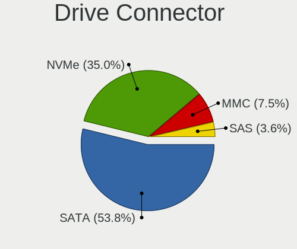
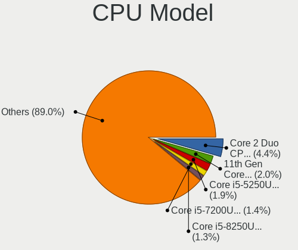
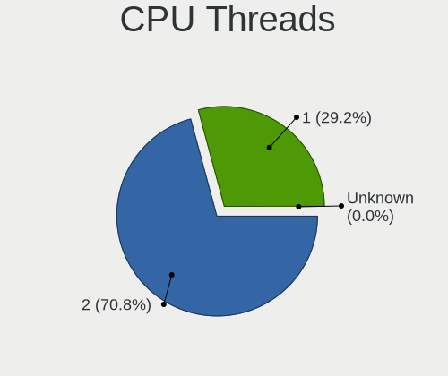
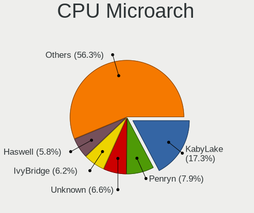
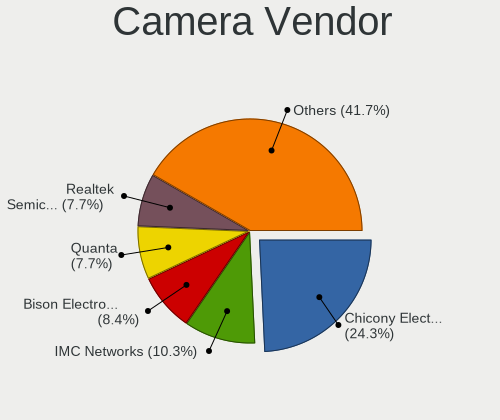
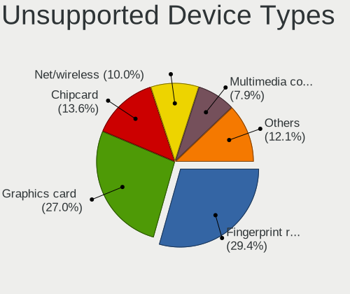

Debian - Tested Hardware & Statistics (Notebooks)
-------------------------------------------------

A project to collect tested hardware configurations for Debian.

Anyone can contribute to this report by the [hw-probe](https://github.com/linuxhw/hw-probe) tool:

    sudo -E hw-probe -all -upload

Please contribute! Especially if your hardware is rare.

Contents
--------

* [ Test Cases ](#test-cases)

* [ System ](#system)
  - [ OS                       ](#os)
  - [ OS Family                ](#os-family)
  - [ Kernel                   ](#kernel)
  - [ Kernel Family            ](#kernel-family)
  - [ Kernel Major Ver.        ](#kernel-major-ver)
  - [ Arch                     ](#arch)
  - [ DE                       ](#de)
  - [ Display Server           ](#display-server)
  - [ Display Manager          ](#display-manager)
  - [ OS Lang                  ](#os-lang)
  - [ Boot Mode                ](#boot-mode)
  - [ Filesystem               ](#filesystem)
  - [ Part. scheme             ](#part-scheme)
  - [ Dual Boot with Linux/BSD ](#dual-boot-with-linuxbsd)
  - [ Dual Boot (Win)          ](#dual-boot-win)

* [ Board ](#board)
  - [ Vendor                   ](#vendor)
  - [ Model                    ](#model)
  - [ Model Family             ](#model-family)
  - [ MFG Year                 ](#mfg-year)
  - [ Form Factor              ](#form-factor)
  - [ Secure Boot              ](#secure-boot)
  - [ Coreboot                 ](#coreboot)
  - [ RAM Size                 ](#ram-size)
  - [ RAM Used                 ](#ram-used)
  - [ Total Drives             ](#total-drives)
  - [ Has CD-ROM               ](#has-cd-rom)
  - [ Has Ethernet             ](#has-ethernet)
  - [ Has WiFi                 ](#has-wifi)
  - [ Has Bluetooth            ](#has-bluetooth)

* [ Location ](#location)
  - [ Country                  ](#country)
  - [ City                     ](#city)

* [ Drives ](#drives)
  - [ Drive Vendor             ](#drive-vendor)
  - [ Drive Model              ](#drive-model)
  - [ HDD Vendor               ](#hdd-vendor)
  - [ SSD Vendor               ](#ssd-vendor)
  - [ Drive Kind               ](#drive-kind)
  - [ Drive Connector          ](#drive-connector)
  - [ Drive Size               ](#drive-size)
  - [ Space Total              ](#space-total)
  - [ Space Used               ](#space-used)
  - [ Malfunc. Drives          ](#malfunc-drives)
  - [ Malfunc. Drive Vendor    ](#malfunc-drive-vendor)
  - [ Malfunc. HDD Vendor      ](#malfunc-hdd-vendor)
  - [ Malfunc. Drive Kind      ](#malfunc-drive-kind)
  - [ Failed Drives            ](#failed-drives)
  - [ Failed Drive Vendor      ](#failed-drive-vendor)
  - [ Drive Status             ](#drive-status)

* [ Storage controller ](#storage-controller)
  - [ Storage Vendor           ](#storage-vendor)
  - [ Storage Model            ](#storage-model)
  - [ Storage Kind             ](#storage-kind)

* [ Processor ](#processor)
  - [ CPU Vendor               ](#cpu-vendor)
  - [ CPU Model                ](#cpu-model)
  - [ CPU Model Family         ](#cpu-model-family)
  - [ CPU Cores                ](#cpu-cores)
  - [ CPU Sockets              ](#cpu-sockets)
  - [ CPU Threads              ](#cpu-threads)
  - [ CPU Op-Modes             ](#cpu-op-modes)
  - [ CPU Microcode            ](#cpu-microcode)
  - [ CPU Microarch            ](#cpu-microarch)

* [ Graphics ](#graphics)
  - [ GPU Vendor               ](#gpu-vendor)
  - [ GPU Model                ](#gpu-model)
  - [ GPU Combo                ](#gpu-combo)
  - [ GPU Driver               ](#gpu-driver)
  - [ GPU Memory               ](#gpu-memory)

* [ Monitor ](#monitor)
  - [ Monitor Vendor           ](#monitor-vendor)
  - [ Monitor Model            ](#monitor-model)
  - [ Monitor Resolution       ](#monitor-resolution)
  - [ Monitor Diagonal         ](#monitor-diagonal)
  - [ Monitor Width            ](#monitor-width)
  - [ Aspect Ratio             ](#aspect-ratio)
  - [ Monitor Area             ](#monitor-area)
  - [ Pixel Density            ](#pixel-density)
  - [ Multiple Monitors        ](#multiple-monitors)

* [ Network ](#network)
  - [ Net Controller Vendor    ](#net-controller-vendor)
  - [ Net Controller Model     ](#net-controller-model)
  - [ Wireless Vendor          ](#wireless-vendor)
  - [ Wireless Model           ](#wireless-model)
  - [ Ethernet Vendor          ](#ethernet-vendor)
  - [ Ethernet Model           ](#ethernet-model)
  - [ Net Controller Kind      ](#net-controller-kind)
  - [ Used Controller          ](#used-controller)
  - [ NICs                     ](#nics)
  - [ IPv6                     ](#ipv6)

* [ Bluetooth ](#bluetooth)
  - [ Bluetooth Vendor         ](#bluetooth-vendor)
  - [ Bluetooth Model          ](#bluetooth-model)

* [ Sound ](#sound)
  - [ Sound Vendor             ](#sound-vendor)
  - [ Sound Model              ](#sound-model)

* [ Memory ](#memory)
  - [ Memory Vendor            ](#memory-vendor)
  - [ Memory Model             ](#memory-model)
  - [ Memory Kind              ](#memory-kind)
  - [ Memory Form Factor       ](#memory-form-factor)
  - [ Memory Size              ](#memory-size)
  - [ Memory Speed             ](#memory-speed)

* [ Printers & scanners ](#printers--scanners)
  - [ Printer Vendor           ](#printer-vendor)
  - [ Printer Model            ](#printer-model)
  - [ Scanner Vendor           ](#scanner-vendor)
  - [ Scanner Model            ](#scanner-model)

* [ Camera ](#camera)
  - [ Camera Vendor            ](#camera-vendor)
  - [ Camera Model             ](#camera-model)

* [ Security ](#security)
  - [ Fingerprint Vendor       ](#fingerprint-vendor)
  - [ Fingerprint Model        ](#fingerprint-model)
  - [ Chipcard Vendor          ](#chipcard-vendor)
  - [ Chipcard Model           ](#chipcard-model)

* [ Unsupported ](#unsupported)
  - [ Unsupported Devices      ](#unsupported-devices)
  - [ Unsupported Device Types ](#unsupported-device-types)

Test Cases
----------

Total: 5402

| Vendor        | Model                       | Probe                                                      | Date         |
|---------------|-----------------------------|------------------------------------------------------------|--------------|
| Lenovo        | ThinkPad E475 20H40006US    | [d59bd1e8f1](https://linux-hardware.org/?probe=d59bd1e8f1) | Nov 02, 2022 |
| Lenovo        | ThinkPad E475 20H40006US    | [4342ecb0f9](https://linux-hardware.org/?probe=4342ecb0f9) | Nov 02, 2022 |
| Google        | Terra                       | [46299bf228](https://linux-hardware.org/?probe=46299bf228) | Nov 02, 2022 |
| Lenovo        | ThinkPad E475 20H40006US    | [fd32769391](https://linux-hardware.org/?probe=fd32769391) | Nov 02, 2022 |
| Lenovo        | ThinkPad E475 20H40006US    | [d3c1c92563](https://linux-hardware.org/?probe=d3c1c92563) | Nov 02, 2022 |
| Lenovo        | ThinkPad E475 20H40006US    | [0ffaee423b](https://linux-hardware.org/?probe=0ffaee423b) | Nov 02, 2022 |
| ASUSTek       | 1005HA                      | [1d386943d6](https://linux-hardware.org/?probe=1d386943d6) | Nov 02, 2022 |
| HP            | G42                         | [18c487d99d](https://linux-hardware.org/?probe=18c487d99d) | Nov 02, 2022 |
| Digma         | EVE 11 C422 ES1068EW        | [f5177de131](https://linux-hardware.org/?probe=f5177de131) | Nov 02, 2022 |
| Toshiba       | Satellite L755              | [dc3d60731e](https://linux-hardware.org/?probe=dc3d60731e) | Nov 01, 2022 |
| Acer          | Aspire one                  | [bfb9f97d74](https://linux-hardware.org/?probe=bfb9f97d74) | Oct 31, 2022 |
| Lenovo        | ThinkPad L14 Gen 1 20U50... | [c9e0b81f80](https://linux-hardware.org/?probe=c9e0b81f80) | Oct 31, 2022 |
| HP            | Compaq nc6320 (EV073AV)     | [b73f359ded](https://linux-hardware.org/?probe=b73f359ded) | Oct 31, 2022 |
| ASUSTek       | G75VW                       | [6f1d41a85c](https://linux-hardware.org/?probe=6f1d41a85c) | Oct 31, 2022 |
| Acer          | Aspire one                  | [82b34552f6](https://linux-hardware.org/?probe=82b34552f6) | Oct 31, 2022 |
| MSI           | Pulse GL76 12UEK            | [76a2d8c304](https://linux-hardware.org/?probe=76a2d8c304) | Oct 31, 2022 |
| ASUSTek       | ZenBook UX431FAC_UX431FA    | [95554a578b](https://linux-hardware.org/?probe=95554a578b) | Oct 31, 2022 |
| Aquarius      | NS585                       | [e4b4e0456d](https://linux-hardware.org/?probe=e4b4e0456d) | Oct 31, 2022 |
| Apple         | MacBookPro5,5               | [00e1f1f754](https://linux-hardware.org/?probe=00e1f1f754) | Oct 31, 2022 |
| HUAWEI        | NBLB-WAX9N                  | [a872c9888a](https://linux-hardware.org/?probe=a872c9888a) | Oct 30, 2022 |
| HUAWEI        | NBLB-WAX9N                  | [45f670d99f](https://linux-hardware.org/?probe=45f670d99f) | Oct 30, 2022 |
| Lenovo        | V15 G2 ITL 82KB             | [209fa66bb9](https://linux-hardware.org/?probe=209fa66bb9) | Oct 30, 2022 |
| Acer          | Aspire A515-51G             | [12380f78de](https://linux-hardware.org/?probe=12380f78de) | Oct 30, 2022 |
| HP            | x2 210                      | [8ed0a97ee9](https://linux-hardware.org/?probe=8ed0a97ee9) | Oct 30, 2022 |
| Lenovo        | ThinkPad T16 Gen 1 21BVC... | [e8a1f8f6bf](https://linux-hardware.org/?probe=e8a1f8f6bf) | Oct 30, 2022 |
| Dell          | XPS L322X                   | [cacebfe41e](https://linux-hardware.org/?probe=cacebfe41e) | Oct 30, 2022 |
| ASUSTek       | N751JK                      | [eea92055f3](https://linux-hardware.org/?probe=eea92055f3) | Oct 30, 2022 |
| Lenovo        | V15 G2 ITL 82KB             | [89595b2fa9](https://linux-hardware.org/?probe=89595b2fa9) | Oct 30, 2022 |
| Chuwi         | LarkBook                    | [3ff2ff69ce](https://linux-hardware.org/?probe=3ff2ff69ce) | Oct 30, 2022 |
| Dell          | Latitude 5501               | [67f979a26d](https://linux-hardware.org/?probe=67f979a26d) | Oct 29, 2022 |
| Notebook      | W230SD                      | [76ae019222](https://linux-hardware.org/?probe=76ae019222) | Oct 29, 2022 |
| Dell          | Precision 7520              | [f54f6d6354](https://linux-hardware.org/?probe=f54f6d6354) | Oct 29, 2022 |
| Dell          | Latitude 5590               | [c7fa986fbd](https://linux-hardware.org/?probe=c7fa986fbd) | Oct 29, 2022 |
| ASUSTek       | X75VC                       | [9c1ab509ec](https://linux-hardware.org/?probe=9c1ab509ec) | Oct 29, 2022 |
| HP            | Pavilion Laptop 15-eg0xx... | [8cc0e0d828](https://linux-hardware.org/?probe=8cc0e0d828) | Oct 29, 2022 |
| Dell          | Latitude E4310              | [fe6c65dd77](https://linux-hardware.org/?probe=fe6c65dd77) | Oct 29, 2022 |
| Insyde        | Braswell                    | [d98b2d9661](https://linux-hardware.org/?probe=d98b2d9661) | Oct 29, 2022 |
| Samsung       | 300V3A/300V4A/300V5A        | [4acb2d0863](https://linux-hardware.org/?probe=4acb2d0863) | Oct 29, 2022 |
| Dell          | Latitude E4310              | [7a610ca46d](https://linux-hardware.org/?probe=7a610ca46d) | Oct 29, 2022 |
| Dell          | XPS 17 9720                 | [270b988521](https://linux-hardware.org/?probe=270b988521) | Oct 29, 2022 |
| Dell          | Precision 7520              | [30f6ad7a26](https://linux-hardware.org/?probe=30f6ad7a26) | Oct 29, 2022 |
| Dell          | Precision 7520              | [b81923dbd2](https://linux-hardware.org/?probe=b81923dbd2) | Oct 29, 2022 |
| MSI           | Modern 15 A10RBS            | [ddc3eded89](https://linux-hardware.org/?probe=ddc3eded89) | Oct 28, 2022 |
| Lenovo        | ThinkPad E475 20H40006US    | [60d1db050b](https://linux-hardware.org/?probe=60d1db050b) | Oct 28, 2022 |
| Lenovo        | ThinkPad E475 20H40006US    | [2a9f06c2b4](https://linux-hardware.org/?probe=2a9f06c2b4) | Oct 28, 2022 |
| Lenovo        | ThinkPad E475 20H40006US    | [787904d265](https://linux-hardware.org/?probe=787904d265) | Oct 28, 2022 |
| Lenovo        | IdeaPad 3 15ADA05 81W1      | [0971db18ed](https://linux-hardware.org/?probe=0971db18ed) | Oct 28, 2022 |
| Toshiba       | Satellite L755              | [0fa70f29d4](https://linux-hardware.org/?probe=0fa70f29d4) | Oct 28, 2022 |
| Lenovo        | ThinkPad T530 239242U       | [dbf70338e9](https://linux-hardware.org/?probe=dbf70338e9) | Oct 28, 2022 |
| ASUSTek       | ZenBook UX431FLC_UX431FL    | [e34c4fde2c](https://linux-hardware.org/?probe=e34c4fde2c) | Oct 28, 2022 |
| Dell          | Latitude 5280               | [368f237efe](https://linux-hardware.org/?probe=368f237efe) | Oct 28, 2022 |
| Dell          | XPS 17 9700                 | [81121b7762](https://linux-hardware.org/?probe=81121b7762) | Oct 28, 2022 |
| Toshiba       | Satellite C650D             | [0696abd43c](https://linux-hardware.org/?probe=0696abd43c) | Oct 28, 2022 |
| Toshiba       | Satellite C650D             | [d42867d201](https://linux-hardware.org/?probe=d42867d201) | Oct 28, 2022 |
| ASUSTek       | X555QG                      | [bace747804](https://linux-hardware.org/?probe=bace747804) | Oct 28, 2022 |
| Acer          | Aspire A715-75G             | [78b0c55e62](https://linux-hardware.org/?probe=78b0c55e62) | Oct 28, 2022 |
| HP            | EliteBook 840 G8 Noteboo... | [02c6d1fe1a](https://linux-hardware.org/?probe=02c6d1fe1a) | Oct 28, 2022 |
| Lenovo        | ThinkPad E470 20H2S00700    | [768c6c8357](https://linux-hardware.org/?probe=768c6c8357) | Oct 28, 2022 |
| SANTECH       | NHx0DB,DE                   | [db8c0489f4](https://linux-hardware.org/?probe=db8c0489f4) | Oct 28, 2022 |
| Lenovo        | ThinkPad E475 20H40006US    | [63565608d1](https://linux-hardware.org/?probe=63565608d1) | Oct 28, 2022 |
| Google        | Boten                       | [2ed6baabf0](https://linux-hardware.org/?probe=2ed6baabf0) | Oct 27, 2022 |
| ASUSTek       | N501VW                      | [07f7d43f09](https://linux-hardware.org/?probe=07f7d43f09) | Oct 27, 2022 |
| HP            | ZBook 15 G3                 | [2b886c255e](https://linux-hardware.org/?probe=2b886c255e) | Oct 27, 2022 |
| Lenovo        | ThinkPad X1 Carbon Gen 9... | [24da197a3a](https://linux-hardware.org/?probe=24da197a3a) | Oct 27, 2022 |
| Lenovo        | ThinkPad E475 20H40006US    | [3ab1fbc8e8](https://linux-hardware.org/?probe=3ab1fbc8e8) | Oct 27, 2022 |
| Lenovo        | ThinkPad E475 20H40006US    | [faafe16cfb](https://linux-hardware.org/?probe=faafe16cfb) | Oct 27, 2022 |
| Acer          | Aspire A515-45              | [3a09f9ee6b](https://linux-hardware.org/?probe=3a09f9ee6b) | Oct 27, 2022 |
| THTF          | CR F860-T1                  | [0e20f4f61a](https://linux-hardware.org/?probe=0e20f4f61a) | Oct 27, 2022 |
| Acer          | Aspire ES1-131              | [f0edf4897a](https://linux-hardware.org/?probe=f0edf4897a) | Oct 26, 2022 |
| ASUSTek       | X541UAK                     | [87ee863ba2](https://linux-hardware.org/?probe=87ee863ba2) | Oct 26, 2022 |
| Lenovo        | ThinkPad E475 20H40006US    | [bfd570bbef](https://linux-hardware.org/?probe=bfd570bbef) | Oct 26, 2022 |
| Lenovo        | ThinkPad E475 20H40006US    | [58820ca517](https://linux-hardware.org/?probe=58820ca517) | Oct 26, 2022 |
| Lenovo        | ThinkPad E475 20H40006US    | [6b9a3ab27e](https://linux-hardware.org/?probe=6b9a3ab27e) | Oct 26, 2022 |
| Lenovo        | ThinkPad E475 20H40006US    | [a5bd8bebc7](https://linux-hardware.org/?probe=a5bd8bebc7) | Oct 26, 2022 |
| Lenovo        | ThinkPad E475 20H40006US    | [bce3a8b1b3](https://linux-hardware.org/?probe=bce3a8b1b3) | Oct 26, 2022 |
| Lenovo        | ThinkPad E475 20H40006US    | [65a1d5242f](https://linux-hardware.org/?probe=65a1d5242f) | Oct 26, 2022 |
| Lenovo        | ThinkBook 15 G2 ITL 20VE    | [a09e3f3669](https://linux-hardware.org/?probe=a09e3f3669) | Oct 26, 2022 |
| ASUSTek       | 1005HA                      | [118fed891f](https://linux-hardware.org/?probe=118fed891f) | Oct 26, 2022 |
| HP            | Pavilion g6                 | [353259fad4](https://linux-hardware.org/?probe=353259fad4) | Oct 26, 2022 |
| Lenovo        | ThinkPad E475 20H40006US    | [93b8dd8c3e](https://linux-hardware.org/?probe=93b8dd8c3e) | Oct 25, 2022 |
| Lenovo        | ThinkPad E475 20H40006US    | [5e08852d18](https://linux-hardware.org/?probe=5e08852d18) | Oct 25, 2022 |
| Lenovo        | Z50-70 20354                | [08b673e57b](https://linux-hardware.org/?probe=08b673e57b) | Oct 25, 2022 |
| Lenovo        | ThinkPad E475 20H40006US    | [438afb4185](https://linux-hardware.org/?probe=438afb4185) | Oct 25, 2022 |
| Lenovo        | Yoga 900S-12ISK 80ML        | [0c13fbf129](https://linux-hardware.org/?probe=0c13fbf129) | Oct 25, 2022 |
| Toshiba       | dynabook MX/33KBL           | [7ee9057da2](https://linux-hardware.org/?probe=7ee9057da2) | Oct 25, 2022 |
| Dell          | Vostro 5490                 | [6b4c7d3c8b](https://linux-hardware.org/?probe=6b4c7d3c8b) | Oct 24, 2022 |
| Dell          | Latitude E6430              | [3fbd9c277d](https://linux-hardware.org/?probe=3fbd9c277d) | Oct 24, 2022 |
| Lenovo        | ThinkPad X230 Tablet 343... | [eae727e6a0](https://linux-hardware.org/?probe=eae727e6a0) | Oct 24, 2022 |
| Lenovo        | IdeaPad 5 14ARE05 81YM      | [52701ec9f4](https://linux-hardware.org/?probe=52701ec9f4) | Oct 24, 2022 |
| Packard Be... | DOT S                       | [f280a6ccbc](https://linux-hardware.org/?probe=f280a6ccbc) | Oct 24, 2022 |
| Lenovo        | ThinkPad T470 20HES4VB00    | [f7b39d371a](https://linux-hardware.org/?probe=f7b39d371a) | Oct 24, 2022 |
| Packard Be... | H17HV                       | [2e94cfdd84](https://linux-hardware.org/?probe=2e94cfdd84) | Oct 24, 2022 |
| Alienware     | M11xR3                      | [62bf8b7b02](https://linux-hardware.org/?probe=62bf8b7b02) | Oct 24, 2022 |
| HP            | Pavilion g4                 | [3b6666b5ba](https://linux-hardware.org/?probe=3b6666b5ba) | Oct 24, 2022 |
| Lenovo        | V310-14IKB 80T2             | [73f18a6fbb](https://linux-hardware.org/?probe=73f18a6fbb) | Oct 24, 2022 |
| Dell          | Precision 7750              | [dd51bb7ccd](https://linux-hardware.org/?probe=dd51bb7ccd) | Oct 23, 2022 |
| HP            | Pavilion g4                 | [487a972bda](https://linux-hardware.org/?probe=487a972bda) | Oct 23, 2022 |
| Panasonic     | CF-LX3J-50M3                | [949acb4c3a](https://linux-hardware.org/?probe=949acb4c3a) | Oct 22, 2022 |
| HP            | Pavilion TS 11              | [6437fb22e1](https://linux-hardware.org/?probe=6437fb22e1) | Oct 22, 2022 |
| HP            | Pavilion TS 11              | [a19b5987c6](https://linux-hardware.org/?probe=a19b5987c6) | Oct 22, 2022 |
| Dell          | Latitude E6520              | [88af6c857c](https://linux-hardware.org/?probe=88af6c857c) | Oct 22, 2022 |
| Dell          | Latitude E6520              | [246517ceab](https://linux-hardware.org/?probe=246517ceab) | Oct 22, 2022 |
| ASUSTek       | X756UQK                     | [2570a4e51f](https://linux-hardware.org/?probe=2570a4e51f) | Oct 22, 2022 |
| Toshiba       | Satellite P50-B-103         | [011581fdbf](https://linux-hardware.org/?probe=011581fdbf) | Oct 21, 2022 |
| Lenovo        | IdeaPad 120S-14IAP 81A5     | [45d7e6a1aa](https://linux-hardware.org/?probe=45d7e6a1aa) | Oct 21, 2022 |
| Apple         | MacBook5,2                  | [165ce75570](https://linux-hardware.org/?probe=165ce75570) | Oct 21, 2022 |
| MSI           | Prestige 14Evo A11M         | [c63a7ccdeb](https://linux-hardware.org/?probe=c63a7ccdeb) | Oct 21, 2022 |
| Acer          | Swift SF314-42              | [2449f6a1b7](https://linux-hardware.org/?probe=2449f6a1b7) | Oct 21, 2022 |
| Aquarius      | NS585                       | [c953c5090c](https://linux-hardware.org/?probe=c953c5090c) | Oct 21, 2022 |
| Lenovo        | IdeaPad Gaming 3 15ACH6 ... | [1e4d67ad76](https://linux-hardware.org/?probe=1e4d67ad76) | Oct 21, 2022 |
| Lenovo        | V310-14IKB 80T2             | [8a0f6b66e6](https://linux-hardware.org/?probe=8a0f6b66e6) | Oct 21, 2022 |
| Lenovo        | IdeaPad 5 15ITL05 82FG      | [1dc7719a4d](https://linux-hardware.org/?probe=1dc7719a4d) | Oct 21, 2022 |
| HP            | Pavilion Gaming Laptop 1... | [7acb5493d7](https://linux-hardware.org/?probe=7acb5493d7) | Oct 21, 2022 |
| Lenovo        | ThinkPad E15 Gen 4 21EES... | [b13dc58884](https://linux-hardware.org/?probe=b13dc58884) | Oct 20, 2022 |
| ASUSTek       | G75VW                       | [194959e65e](https://linux-hardware.org/?probe=194959e65e) | Oct 20, 2022 |
| Lenovo        | ThinkBook 14 G2 ITL 20VD    | [914bab2302](https://linux-hardware.org/?probe=914bab2302) | Oct 20, 2022 |
| HP            | EliteBook 745 G3            | [3bfbc8dcac](https://linux-hardware.org/?probe=3bfbc8dcac) | Oct 20, 2022 |
| HP            | Laptop 15-ef2xxx            | [823d998220](https://linux-hardware.org/?probe=823d998220) | Oct 20, 2022 |
| HP            | EliteBook 840 Aero G8 No... | [80738ede80](https://linux-hardware.org/?probe=80738ede80) | Oct 20, 2022 |
| Apple         | MacBook5,2                  | [1e76467975](https://linux-hardware.org/?probe=1e76467975) | Oct 20, 2022 |
| Aquarius      | NS585                       | [a134ed693c](https://linux-hardware.org/?probe=a134ed693c) | Oct 20, 2022 |
| HP            | ENVY Laptop 17-ch1xxx       | [162e7a20b2](https://linux-hardware.org/?probe=162e7a20b2) | Oct 20, 2022 |
| ASUSTek       | ZenBook Pro Duo UX581GV_... | [35d4f4cf0e](https://linux-hardware.org/?probe=35d4f4cf0e) | Oct 20, 2022 |
| HP            | 245 G7                      | [9ec088c343](https://linux-hardware.org/?probe=9ec088c343) | Oct 19, 2022 |
| ASUSTek       | X541NA                      | [5b61fd3a38](https://linux-hardware.org/?probe=5b61fd3a38) | Oct 19, 2022 |
| Dell          | Inspiron 7590               | [43ec5b2df8](https://linux-hardware.org/?probe=43ec5b2df8) | Oct 19, 2022 |
| Lenovo        | ThinkPad P14s Gen 2i 20V... | [67ebd92594](https://linux-hardware.org/?probe=67ebd92594) | Oct 19, 2022 |
| Acer          | Aspire A315-23G             | [93584b3b67](https://linux-hardware.org/?probe=93584b3b67) | Oct 19, 2022 |
| Fujitsu       | LIFEBOOK E753               | [1fbb05ae6b](https://linux-hardware.org/?probe=1fbb05ae6b) | Oct 18, 2022 |
| HP            | EliteBook 745 G3            | [e800d683ef](https://linux-hardware.org/?probe=e800d683ef) | Oct 18, 2022 |
| ASUSTek       | G75VW                       | [5ee12be257](https://linux-hardware.org/?probe=5ee12be257) | Oct 18, 2022 |
| UNOWHY        | Y13G010S4EI                 | [f7f13866aa](https://linux-hardware.org/?probe=f7f13866aa) | Oct 18, 2022 |
| Sony          | VPCEH3U1E                   | [aff8f19a59](https://linux-hardware.org/?probe=aff8f19a59) | Oct 18, 2022 |
| Sony          | VPCEH3U1E                   | [c33d20c223](https://linux-hardware.org/?probe=c33d20c223) | Oct 18, 2022 |
| Lenovo        | IdeaPad 5 Pro 16IAH7 82S... | [dfa3140411](https://linux-hardware.org/?probe=dfa3140411) | Oct 17, 2022 |
| Dell          | XPS 17 9700                 | [5368bd3ad6](https://linux-hardware.org/?probe=5368bd3ad6) | Oct 17, 2022 |
| Lenovo        | ThinkPad 13 2nd Gen 20J1... | [e076f9208c](https://linux-hardware.org/?probe=e076f9208c) | Oct 17, 2022 |
| ASUSTek       | G75VW                       | [10bcc184e7](https://linux-hardware.org/?probe=10bcc184e7) | Oct 17, 2022 |
| SLIMBOOK      | TITAN                       | [87177b2371](https://linux-hardware.org/?probe=87177b2371) | Oct 17, 2022 |
| ASUSTek       | UX21A                       | [1d7d76b463](https://linux-hardware.org/?probe=1d7d76b463) | Oct 16, 2022 |
| ASUSTek       | G75VW                       | [a88a291921](https://linux-hardware.org/?probe=a88a291921) | Oct 16, 2022 |
| Lenovo        | Legion Y545 81Q6            | [b6162e2c5e](https://linux-hardware.org/?probe=b6162e2c5e) | Oct 16, 2022 |
| Dell          | Inspiron 1545               | [d9928a4ee9](https://linux-hardware.org/?probe=d9928a4ee9) | Oct 16, 2022 |
| Dell          | Latitude 3320               | [300f16471f](https://linux-hardware.org/?probe=300f16471f) | Oct 16, 2022 |
| Dell          | Latitude 3320               | [e4645890b8](https://linux-hardware.org/?probe=e4645890b8) | Oct 16, 2022 |
| Dell          | Inspiron N5110              | [ae7d737ee5](https://linux-hardware.org/?probe=ae7d737ee5) | Oct 16, 2022 |
| Dell          | Inspiron N5110              | [5cbc449f36](https://linux-hardware.org/?probe=5cbc449f36) | Oct 16, 2022 |
| HP            | Laptop 15-ef2xxx            | [fb37bc6617](https://linux-hardware.org/?probe=fb37bc6617) | Oct 15, 2022 |
| HP            | EliteBook Folio 1040 G1     | [81df2d786a](https://linux-hardware.org/?probe=81df2d786a) | Oct 15, 2022 |
| Panasonic     | CF-LX3J-50M3                | [95386977de](https://linux-hardware.org/?probe=95386977de) | Oct 14, 2022 |
| Lenovo        | ThinkPad T14s Gen 3 21BS... | [766f4b2d1f](https://linux-hardware.org/?probe=766f4b2d1f) | Oct 14, 2022 |
| Lenovo        | ThinkPad T14s Gen 3 21BS... | [bf46cd0c9e](https://linux-hardware.org/?probe=bf46cd0c9e) | Oct 14, 2022 |
| Dell          | Vostro 15 5510              | [8cf96a6d0b](https://linux-hardware.org/?probe=8cf96a6d0b) | Oct 14, 2022 |
| Dell          | Vostro 15 5510              | [a68e7df338](https://linux-hardware.org/?probe=a68e7df338) | Oct 14, 2022 |
| Dell          | Latitude E6330              | [1b1f5a27f7](https://linux-hardware.org/?probe=1b1f5a27f7) | Oct 14, 2022 |
| Lenovo        | IdeaPad S340-15IIL 81VW     | [4e29271bab](https://linux-hardware.org/?probe=4e29271bab) | Oct 14, 2022 |
| Dell          | Inspiron 5502               | [41fb5ecf07](https://linux-hardware.org/?probe=41fb5ecf07) | Oct 14, 2022 |
| MSI           | MS-N014                     | [87e6e540be](https://linux-hardware.org/?probe=87e6e540be) | Oct 14, 2022 |
| Google        | Robo                        | [d070697e72](https://linux-hardware.org/?probe=d070697e72) | Oct 13, 2022 |
| Acer          | Swift SF314-57              | [a1b02901a1](https://linux-hardware.org/?probe=a1b02901a1) | Oct 13, 2022 |
| Acer          | Swift SF314-57              | [a0f4cd454d](https://linux-hardware.org/?probe=a0f4cd454d) | Oct 13, 2022 |
| ASUSTek       | ASUS TUF Gaming F15 FX50... | [0ce5415fa5](https://linux-hardware.org/?probe=0ce5415fa5) | Oct 13, 2022 |
| Lenovo        | ThinkPad X1 Carbon 3rd 2... | [dfc5a5f754](https://linux-hardware.org/?probe=dfc5a5f754) | Oct 13, 2022 |
| Lenovo        | ThinkPad T530 23595JU       | [e560a29570](https://linux-hardware.org/?probe=e560a29570) | Oct 12, 2022 |
| Lenovo        | ThinkBook 15 G2 ITL 20VE    | [00d174fcf4](https://linux-hardware.org/?probe=00d174fcf4) | Oct 12, 2022 |
| Lenovo        | ThinkPad L14 Gen 1 20U50... | [ccee0b66d9](https://linux-hardware.org/?probe=ccee0b66d9) | Oct 12, 2022 |
| MSI           | GE72 2QF                    | [22904f1270](https://linux-hardware.org/?probe=22904f1270) | Oct 12, 2022 |
| MSI           | GE72 2QF                    | [ecd8555f97](https://linux-hardware.org/?probe=ecd8555f97) | Oct 12, 2022 |
| Thomson       | N14C4WH64                   | [bfc16b9ded](https://linux-hardware.org/?probe=bfc16b9ded) | Oct 12, 2022 |
| ASUSTek       | E402MA                      | [807cf84523](https://linux-hardware.org/?probe=807cf84523) | Oct 11, 2022 |
| ASUSTek       | N53Jg                       | [0b4302ed6c](https://linux-hardware.org/?probe=0b4302ed6c) | Oct 11, 2022 |
| Apple         | MacBookAir7,2               | [8b4c66e10a](https://linux-hardware.org/?probe=8b4c66e10a) | Oct 11, 2022 |
| HUAWEI        | NBLB-WAX9N                  | [04cb107be2](https://linux-hardware.org/?probe=04cb107be2) | Oct 11, 2022 |
| Dell          | Precision 7720              | [2252c7bd79](https://linux-hardware.org/?probe=2252c7bd79) | Oct 11, 2022 |
| ASUSTek       | VivoBook_ASUSLaptop X509... | [6ccdbecf19](https://linux-hardware.org/?probe=6ccdbecf19) | Oct 10, 2022 |
| Apple         | MacBook5,2                  | [4687cf8900](https://linux-hardware.org/?probe=4687cf8900) | Oct 10, 2022 |
| Toshiba       | Satellite A100              | [f280857c1c](https://linux-hardware.org/?probe=f280857c1c) | Oct 09, 2022 |
| Dell          | Inspiron 14 5420            | [d9f937a8c4](https://linux-hardware.org/?probe=d9f937a8c4) | Oct 09, 2022 |
| HP            | Pavilion TS 11              | [1a6ea38863](https://linux-hardware.org/?probe=1a6ea38863) | Oct 09, 2022 |
| ASUSTek       | TUF Gaming FX505DY_FX505... | [7785f0ebfb](https://linux-hardware.org/?probe=7785f0ebfb) | Oct 09, 2022 |
| ASUSTek       | VivoBook_ASUSLaptop M350... | [f15acdf9d4](https://linux-hardware.org/?probe=f15acdf9d4) | Oct 09, 2022 |
| ASUSTek       | ASUS TUF Gaming A15 FA50... | [487fd1959f](https://linux-hardware.org/?probe=487fd1959f) | Oct 08, 2022 |
| MSI           | Prestige 14Evo A11M         | [68137e0e8d](https://linux-hardware.org/?probe=68137e0e8d) | Oct 07, 2022 |
| HP            | Pavilion dv7                | [4564037395](https://linux-hardware.org/?probe=4564037395) | Oct 07, 2022 |
| Lenovo        | ThinkPad P50 20EQS1WW00     | [e6eac5c882](https://linux-hardware.org/?probe=e6eac5c882) | Oct 07, 2022 |
| Lenovo        | ThinkPad L512 44444WG       | [b27c3b70a7](https://linux-hardware.org/?probe=b27c3b70a7) | Oct 07, 2022 |
| Google        | Setzer                      | [cdb57d7ddf](https://linux-hardware.org/?probe=cdb57d7ddf) | Oct 07, 2022 |
| Shanghai Z... | ZXE CRB                     | [479f3d24f2](https://linux-hardware.org/?probe=479f3d24f2) | Oct 06, 2022 |
| Shanghai Z... | ZXE CRB                     | [5bacb77f8b](https://linux-hardware.org/?probe=5bacb77f8b) | Oct 06, 2022 |
| HP            | EliteBook 8470p             | [1b09c0a820](https://linux-hardware.org/?probe=1b09c0a820) | Oct 06, 2022 |
| HP            | EliteBook 8470p             | [0fa7893206](https://linux-hardware.org/?probe=0fa7893206) | Oct 06, 2022 |
| Acer          | Predator PH315-53           | [0f3387ce35](https://linux-hardware.org/?probe=0f3387ce35) | Oct 06, 2022 |
| Toshiba       | Satellite L40               | [0f3e9273a6](https://linux-hardware.org/?probe=0f3e9273a6) | Oct 06, 2022 |
| Google        | Akemi                       | [5a165f46bc](https://linux-hardware.org/?probe=5a165f46bc) | Oct 05, 2022 |
| Dell          | Precision 3541              | [bfef2cb8a3](https://linux-hardware.org/?probe=bfef2cb8a3) | Oct 05, 2022 |
| HP            | EliteBook 8570p             | [3079a45a56](https://linux-hardware.org/?probe=3079a45a56) | Oct 05, 2022 |
| Lenovo        | ThinkPad P14s Gen 2a 21A... | [96b4cda722](https://linux-hardware.org/?probe=96b4cda722) | Oct 05, 2022 |
| HP            | EliteBook 8460p             | [02d4090cce](https://linux-hardware.org/?probe=02d4090cce) | Oct 05, 2022 |
| HP            | EliteBook 8460p             | [4f037d4c3d](https://linux-hardware.org/?probe=4f037d4c3d) | Oct 05, 2022 |
| Toshiba       | NB505                       | [9de39780b5](https://linux-hardware.org/?probe=9de39780b5) | Oct 05, 2022 |
| Lenovo        | IdeaPad 3 15ALC6 82MF       | [dea0d04059](https://linux-hardware.org/?probe=dea0d04059) | Oct 05, 2022 |
| Acer          | Aspire A315-23G             | [ab3508b938](https://linux-hardware.org/?probe=ab3508b938) | Oct 05, 2022 |
| Acer          | Aspire E1-571               | [602710e8d3](https://linux-hardware.org/?probe=602710e8d3) | Oct 04, 2022 |
| HP            | EliteBook 8460p             | [8b9d1152e4](https://linux-hardware.org/?probe=8b9d1152e4) | Oct 04, 2022 |
| Lenovo        | ThinkPad 13 2nd Gen 20J1... | [8631c6f717](https://linux-hardware.org/?probe=8631c6f717) | Oct 04, 2022 |
| MSI           | GF65 Thin 10SDR             | [1c2a3b90e2](https://linux-hardware.org/?probe=1c2a3b90e2) | Oct 04, 2022 |
| HP            | EliteBook 735 G6            | [c3f86b0e1a](https://linux-hardware.org/?probe=c3f86b0e1a) | Oct 04, 2022 |
| Dell          | Latitude E5430 non-vPro     | [33b42f3ed1](https://linux-hardware.org/?probe=33b42f3ed1) | Oct 04, 2022 |
| Lenovo        | ThinkPad 13 2nd Gen 20J1... | [5b2fac59ea](https://linux-hardware.org/?probe=5b2fac59ea) | Oct 04, 2022 |
| Shanghai Z... | ZXE CRB                     | [b981993409](https://linux-hardware.org/?probe=b981993409) | Oct 04, 2022 |
| Lenovo        | ThinkPad Twist 20C41A3      | [3da96ac399](https://linux-hardware.org/?probe=3da96ac399) | Oct 04, 2022 |
| Acer          | Aspire A315-56              | [e799907aba](https://linux-hardware.org/?probe=e799907aba) | Oct 04, 2022 |
| Dell          | Precision M4800             | [1099761dca](https://linux-hardware.org/?probe=1099761dca) | Oct 04, 2022 |
| ASUSTek       | PU403UA                     | [8bf4879487](https://linux-hardware.org/?probe=8bf4879487) | Oct 04, 2022 |
| Lenovo        | ThinkPad P14s Gen 2a 21A... | [31fa8b62ff](https://linux-hardware.org/?probe=31fa8b62ff) | Oct 04, 2022 |
| UNOWHY        | Y13G010S4EI                 | [38f5b56e5d](https://linux-hardware.org/?probe=38f5b56e5d) | Oct 04, 2022 |
| Dell          | Inspiron 5590               | [ed3bf1e99b](https://linux-hardware.org/?probe=ed3bf1e99b) | Oct 04, 2022 |
| Lenovo        | ThinkPad T420 4236WS7       | [e42a5888c7](https://linux-hardware.org/?probe=e42a5888c7) | Oct 04, 2022 |
| Dell          | Latitude E7240              | [84ce32d994](https://linux-hardware.org/?probe=84ce32d994) | Oct 03, 2022 |
| Dell          | Latitude E5430 non-vPro     | [81ac41d8b9](https://linux-hardware.org/?probe=81ac41d8b9) | Oct 03, 2022 |
| Dell          | Latitude 2110               | [3fbbac2c8a](https://linux-hardware.org/?probe=3fbbac2c8a) | Oct 03, 2022 |
| ASUSTek       | 1225B                       | [9bb2d54ca7](https://linux-hardware.org/?probe=9bb2d54ca7) | Oct 03, 2022 |
| Lenovo        | ThinkPad E14 20RA001HRT     | [1427143cf0](https://linux-hardware.org/?probe=1427143cf0) | Oct 03, 2022 |
| Lenovo        | ThinkPad T14 Gen 1 20UD0... | [64f2393fde](https://linux-hardware.org/?probe=64f2393fde) | Oct 03, 2022 |
| Toshiba       | Satellite L855              | [66e22581f7](https://linux-hardware.org/?probe=66e22581f7) | Oct 03, 2022 |
| Dell          | Precision 3570              | [f4f047eecf](https://linux-hardware.org/?probe=f4f047eecf) | Oct 03, 2022 |
| Apple         | MacBookAir7,2               | [ae39aea3e9](https://linux-hardware.org/?probe=ae39aea3e9) | Oct 02, 2022 |
| Lenovo        | ThinkPad T460s 20F90060G... | [8d17d38142](https://linux-hardware.org/?probe=8d17d38142) | Oct 02, 2022 |
| ASUSTek       | X71Q                        | [830c8ab6d2](https://linux-hardware.org/?probe=830c8ab6d2) | Oct 02, 2022 |
| Dell          | Vostro 5320                 | [93a0c7d88f](https://linux-hardware.org/?probe=93a0c7d88f) | Oct 02, 2022 |
| Toshiba       | Satellite L45               | [79ff097329](https://linux-hardware.org/?probe=79ff097329) | Oct 02, 2022 |
| Acer          | Aspire A715-41G             | [1a473e9809](https://linux-hardware.org/?probe=1a473e9809) | Oct 01, 2022 |
| Lenovo        | ThinkPad E15 Gen 3 20YHS... | [9cd72ed352](https://linux-hardware.org/?probe=9cd72ed352) | Oct 01, 2022 |
| HP            | Pavilion TS 11              | [5bc67115db](https://linux-hardware.org/?probe=5bc67115db) | Oct 01, 2022 |
| HP            | Pavilion TS 11              | [4758af490a](https://linux-hardware.org/?probe=4758af490a) | Oct 01, 2022 |
| Lenovo        | ThinkPad T440s 20AQCTO1W... | [fbe1e53387](https://linux-hardware.org/?probe=fbe1e53387) | Oct 01, 2022 |
| Lenovo        | ThinkPad L380 20M5SSIN11    | [0cad79b1f7](https://linux-hardware.org/?probe=0cad79b1f7) | Sep 30, 2022 |
| Lenovo        | ThinkPad P50 20EQS1WW00     | [786e0c1f5d](https://linux-hardware.org/?probe=786e0c1f5d) | Sep 30, 2022 |
| HP            | Pavilion Notebook           | [ee72cbd627](https://linux-hardware.org/?probe=ee72cbd627) | Sep 29, 2022 |
| HP            | Compaq nx6325 (EY344EA#A... | [8808f98c62](https://linux-hardware.org/?probe=8808f98c62) | Sep 29, 2022 |
| ASUSTek       | N53SV                       | [6652e85ddd](https://linux-hardware.org/?probe=6652e85ddd) | Sep 29, 2022 |
| HUAWEI        | KLVL-WXXW                   | [fd8b95bb3b](https://linux-hardware.org/?probe=fd8b95bb3b) | Sep 29, 2022 |
| Lenovo        | ThinkPad T460 20FMS43J0V    | [0453cd781f](https://linux-hardware.org/?probe=0453cd781f) | Sep 28, 2022 |
| HP            | 250 G7 Notebook PC          | [6ad96a2beb](https://linux-hardware.org/?probe=6ad96a2beb) | Sep 28, 2022 |
| Dell          | Vostro 15 5510              | [973307d03b](https://linux-hardware.org/?probe=973307d03b) | Sep 28, 2022 |
| Acer          | Aspire A315-23G             | [3eaaf54d1b](https://linux-hardware.org/?probe=3eaaf54d1b) | Sep 28, 2022 |
| Lenovo        | ThinkPad T420 4236WS7       | [ca9c7bf57b](https://linux-hardware.org/?probe=ca9c7bf57b) | Sep 28, 2022 |
| Lenovo        | ThinkPad E15 Gen 4 21EDC... | [fb2de59c3f](https://linux-hardware.org/?probe=fb2de59c3f) | Sep 27, 2022 |
| HP            | EliteBook 845 G8 Noteboo... | [70f86aa587](https://linux-hardware.org/?probe=70f86aa587) | Sep 27, 2022 |
| Fujitsu       | LIFEBOOK E752               | [f4e2b14498](https://linux-hardware.org/?probe=f4e2b14498) | Sep 26, 2022 |
| Lenovo        | G50-70 20351                | [77c0454f45](https://linux-hardware.org/?probe=77c0454f45) | Sep 26, 2022 |
| Lenovo        | IdeaPad 3 15IGL05 81WQ      | [4f58ff1174](https://linux-hardware.org/?probe=4f58ff1174) | Sep 26, 2022 |
| Lenovo        | ThinkPad X1 Extreme Gen ... | [df5fcf14f9](https://linux-hardware.org/?probe=df5fcf14f9) | Sep 26, 2022 |
| MSI           | Alpha 15 A4DEK              | [f3c74059d5](https://linux-hardware.org/?probe=f3c74059d5) | Sep 26, 2022 |
| HP            | OMEN Laptop 15-en1xxx       | [ac296ea23b](https://linux-hardware.org/?probe=ac296ea23b) | Sep 26, 2022 |
| HP            | 250 G8 Notebook PC          | [f4ea1372b7](https://linux-hardware.org/?probe=f4ea1372b7) | Sep 26, 2022 |
| Lenovo        | IdeaPad Gaming 3 15ACH6 ... | [dc6d36a0eb](https://linux-hardware.org/?probe=dc6d36a0eb) | Sep 26, 2022 |
| HP            | 250 G8 Notebook PC          | [ae83bec6ad](https://linux-hardware.org/?probe=ae83bec6ad) | Sep 26, 2022 |
| MSI           | Alpha 15 A4DEK              | [d2e3e7736c](https://linux-hardware.org/?probe=d2e3e7736c) | Sep 26, 2022 |
| HP            | OMEN Laptop 15-en1xxx       | [6527be1bb2](https://linux-hardware.org/?probe=6527be1bb2) | Sep 26, 2022 |
| ASUSTek       | VivoBook 14_ASUS Laptop ... | [56e06deea2](https://linux-hardware.org/?probe=56e06deea2) | Sep 26, 2022 |
| MSI           | GF63 8RD                    | [f6ef1dbd07](https://linux-hardware.org/?probe=f6ef1dbd07) | Sep 25, 2022 |
| Lenovo        | ThinkPad P50 20EQS1WW00     | [2d7ce63bce](https://linux-hardware.org/?probe=2d7ce63bce) | Sep 25, 2022 |
| ASUSTek       | TUF Gaming FX504GD_FX80G... | [f844479504](https://linux-hardware.org/?probe=f844479504) | Sep 25, 2022 |
| Dell          | Inspiron 15-3567            | [9ae6efbc0f](https://linux-hardware.org/?probe=9ae6efbc0f) | Sep 25, 2022 |
| HUAWEI        | RLEF-XX                     | [7bab2cbc57](https://linux-hardware.org/?probe=7bab2cbc57) | Sep 25, 2022 |
| MSI           | GF75 Thin 10SC              | [0bda368d15](https://linux-hardware.org/?probe=0bda368d15) | Sep 24, 2022 |
| Lenovo        | ThinkPad T420 4236WS7       | [23f425e425](https://linux-hardware.org/?probe=23f425e425) | Sep 24, 2022 |
| Dell          | Inspiron 14 5425            | [209be443ac](https://linux-hardware.org/?probe=209be443ac) | Sep 24, 2022 |
| Lenovo        | ThinkPad T420 4236WS7       | [f3527878e5](https://linux-hardware.org/?probe=f3527878e5) | Sep 24, 2022 |
| Unknown       | Apple MacBook Pro (14-in... | [89a019875a](https://linux-hardware.org/?probe=89a019875a) | Sep 24, 2022 |
| ASUSTek       | G501VW                      | [550d6e5438](https://linux-hardware.org/?probe=550d6e5438) | Sep 24, 2022 |
| Dell          | Latitude 3320               | [3296a12784](https://linux-hardware.org/?probe=3296a12784) | Sep 24, 2022 |
| Lenovo        | ThinkPad T530 23595JU       | [0adb7bc0b1](https://linux-hardware.org/?probe=0adb7bc0b1) | Sep 24, 2022 |
| VIT           | P2402                       | [0242b6bb07](https://linux-hardware.org/?probe=0242b6bb07) | Sep 24, 2022 |
| Samsung       | 550XBE/350XBE               | [dec88709ee](https://linux-hardware.org/?probe=dec88709ee) | Sep 23, 2022 |
| Google        | Robo                        | [4772493ae3](https://linux-hardware.org/?probe=4772493ae3) | Sep 23, 2022 |
| Samsung       | 550XBE/350XBE               | [e17fb419bd](https://linux-hardware.org/?probe=e17fb419bd) | Sep 23, 2022 |
| MECHREVO      | Jiaolong Series GM5ZG0O     | [077c05c78d](https://linux-hardware.org/?probe=077c05c78d) | Sep 23, 2022 |
| Acer          | Aspire ES1-732              | [d6ccc5301b](https://linux-hardware.org/?probe=d6ccc5301b) | Sep 23, 2022 |
| Dell          | XPS 15 9520                 | [1a7e610c32](https://linux-hardware.org/?probe=1a7e610c32) | Sep 23, 2022 |
| Lenovo        | ThinkPad T495 20NKS0PG00    | [f77dda559d](https://linux-hardware.org/?probe=f77dda559d) | Sep 23, 2022 |
| Lenovo        | ThinkPad T420 4236WS7       | [c9457ee571](https://linux-hardware.org/?probe=c9457ee571) | Sep 23, 2022 |
| Lenovo        | ThinkPad T420 4236WS7       | [412296c83f](https://linux-hardware.org/?probe=412296c83f) | Sep 22, 2022 |
| Lenovo        | ThinkPad P1 Gen 4i 20Y30... | [db6f733994](https://linux-hardware.org/?probe=db6f733994) | Sep 22, 2022 |
| Lenovo        | ThinkPad T420 4236WS7       | [21ba0d8f46](https://linux-hardware.org/?probe=21ba0d8f46) | Sep 22, 2022 |
| Lenovo        | ThinkPad X220 4291G26       | [33654dfbfa](https://linux-hardware.org/?probe=33654dfbfa) | Sep 22, 2022 |
| Lenovo        | ThinkPad T420 4236WS7       | [0c4627555a](https://linux-hardware.org/?probe=0c4627555a) | Sep 22, 2022 |
| Dell          | Inspiron 5537               | [7e3170527c](https://linux-hardware.org/?probe=7e3170527c) | Sep 22, 2022 |
| HP            | Notebook                    | [18b9221add](https://linux-hardware.org/?probe=18b9221add) | Sep 22, 2022 |
| Toshiba       | Satellite P745              | [963d04c729](https://linux-hardware.org/?probe=963d04c729) | Sep 22, 2022 |
| Dell          | Vostro 15 5510              | [630b3877c4](https://linux-hardware.org/?probe=630b3877c4) | Sep 22, 2022 |
| MSI           | GS60 2PE                    | [1aaaa99706](https://linux-hardware.org/?probe=1aaaa99706) | Sep 22, 2022 |
| HP            | Presario CQ57               | [322f46c499](https://linux-hardware.org/?probe=322f46c499) | Sep 22, 2022 |
| HP            | Stream Notebook PC 13       | [a5dff5d1f6](https://linux-hardware.org/?probe=a5dff5d1f6) | Sep 22, 2022 |
| Lenovo        | ThinkPad T14 Gen 1 20S00... | [5e7597fb17](https://linux-hardware.org/?probe=5e7597fb17) | Sep 22, 2022 |
| Lenovo        | ThinkPad X1 Extreme Gen2... | [87a3d977b1](https://linux-hardware.org/?probe=87a3d977b1) | Sep 22, 2022 |
| Avell High... | B.ON                        | [95c7e35ef3](https://linux-hardware.org/?probe=95c7e35ef3) | Sep 22, 2022 |
| Lenovo        | G50-45 80E3                 | [41af175db4](https://linux-hardware.org/?probe=41af175db4) | Sep 21, 2022 |
| ASUSTek       | ROG Strix G513QM_G513QM     | [080fdb990e](https://linux-hardware.org/?probe=080fdb990e) | Sep 21, 2022 |
| Framework     | Laptop (12th Gen Intel C... | [69d5dcb9b7](https://linux-hardware.org/?probe=69d5dcb9b7) | Sep 21, 2022 |
| Avell High... | B.ON                        | [aaebcf57bb](https://linux-hardware.org/?probe=aaebcf57bb) | Sep 21, 2022 |
| Dell          | Latitude 7530               | [39b655888c](https://linux-hardware.org/?probe=39b655888c) | Sep 21, 2022 |
| Acer          | Aspire A515-45              | [6fb7c9c27a](https://linux-hardware.org/?probe=6fb7c9c27a) | Sep 21, 2022 |
| Dell          | Precision 7540              | [fb7472fe87](https://linux-hardware.org/?probe=fb7472fe87) | Sep 21, 2022 |
| Dell          | Inspiron MP061              | [8e6955cbf6](https://linux-hardware.org/?probe=8e6955cbf6) | Sep 21, 2022 |
| AXDIA Inte... | MYBOOK 14 PRO               | [0ada4a5b83](https://linux-hardware.org/?probe=0ada4a5b83) | Sep 20, 2022 |
| HP            | Folio 13                    | [eafa8204e9](https://linux-hardware.org/?probe=eafa8204e9) | Sep 20, 2022 |
| Lenovo        | ThinkPad T490 20N2001YUS    | [5861c90514](https://linux-hardware.org/?probe=5861c90514) | Sep 20, 2022 |
| HP            | EliteBook 840 14 inch G9... | [450a86c900](https://linux-hardware.org/?probe=450a86c900) | Sep 20, 2022 |
| ASUSTek       | VivoBook_ASUSLaptop X509... | [f03ae050eb](https://linux-hardware.org/?probe=f03ae050eb) | Sep 20, 2022 |
| Lenovo        | ThinkPad X260 20F5003EMB    | [302eacc4ff](https://linux-hardware.org/?probe=302eacc4ff) | Sep 20, 2022 |
| Lenovo        | ThinkPad L15 Gen 1 20U30... | [317ff73ff5](https://linux-hardware.org/?probe=317ff73ff5) | Sep 20, 2022 |
| Chuwi         | CoreBook X                  | [4c963415cd](https://linux-hardware.org/?probe=4c963415cd) | Sep 20, 2022 |
| Lenovo        | IdeaPad Gaming 3 15ARH05... | [ba7800b231](https://linux-hardware.org/?probe=ba7800b231) | Sep 20, 2022 |
| ASUSTek       | VivoBook 15_ASUS Laptop ... | [0fa5921ddf](https://linux-hardware.org/?probe=0fa5921ddf) | Sep 20, 2022 |
| Lenovo        | IdeaPad S340-15IIL 81VW     | [d14a12b8ca](https://linux-hardware.org/?probe=d14a12b8ca) | Sep 20, 2022 |
| ASUSTek       | ROG Strix G513QM_G513QM     | [04252a0991](https://linux-hardware.org/?probe=04252a0991) | Sep 20, 2022 |
| Acer          | TravelMate P414-51          | [2ebd8f21d3](https://linux-hardware.org/?probe=2ebd8f21d3) | Sep 20, 2022 |
| Lenovo        | ThinkPad SL400 2743AQC      | [beb74c65cc](https://linux-hardware.org/?probe=beb74c65cc) | Sep 19, 2022 |
| MSI           | Prestige 14Evo A11M         | [4b412dd569](https://linux-hardware.org/?probe=4b412dd569) | Sep 19, 2022 |
| ASUSTek       | TUF Gaming FX504GD_FX80G... | [b415f7be91](https://linux-hardware.org/?probe=b415f7be91) | Sep 19, 2022 |
| HUAWEI        | HN-WX9X                     | [4a7bdd8ed1](https://linux-hardware.org/?probe=4a7bdd8ed1) | Sep 19, 2022 |
| HP            | 15                          | [50f64276d5](https://linux-hardware.org/?probe=50f64276d5) | Sep 19, 2022 |
| HUAWEI        | NBLB-WAX9N                  | [0f049ae5d6](https://linux-hardware.org/?probe=0f049ae5d6) | Sep 19, 2022 |
| HP            | 15                          | [d74a694eb8](https://linux-hardware.org/?probe=d74a694eb8) | Sep 19, 2022 |
| HP            | G42                         | [3f584eb1af](https://linux-hardware.org/?probe=3f584eb1af) | Sep 19, 2022 |
| HUAWEI        | HN-WX9X                     | [46e9732572](https://linux-hardware.org/?probe=46e9732572) | Sep 19, 2022 |
| Panasonic     | CF-53JAWZYDE                | [f8b1ca10d1](https://linux-hardware.org/?probe=f8b1ca10d1) | Sep 19, 2022 |
| Acer          | Aspire A315-23G             | [9e3edc5b61](https://linux-hardware.org/?probe=9e3edc5b61) | Sep 18, 2022 |
| Lenovo        | IdeaPad 720s-13ARR 81BR     | [fa45602fc5](https://linux-hardware.org/?probe=fa45602fc5) | Sep 18, 2022 |
| Lenovo        | ThinkPad P50 20EQS1WW00     | [b94564300a](https://linux-hardware.org/?probe=b94564300a) | Sep 18, 2022 |
| Dell          | Latitude E6330              | [bbb0a5f1a1](https://linux-hardware.org/?probe=bbb0a5f1a1) | Sep 18, 2022 |
| Dell          | Latitude 3310               | [4de8502362](https://linux-hardware.org/?probe=4de8502362) | Sep 18, 2022 |
| HP            | ProBook 450 G8 Notebook ... | [87c3b99589](https://linux-hardware.org/?probe=87c3b99589) | Sep 18, 2022 |
| Acer          | Aspire A315-23G             | [3de0a6e725](https://linux-hardware.org/?probe=3de0a6e725) | Sep 17, 2022 |
| HP            | Stream Notebook PC 13       | [589078809b](https://linux-hardware.org/?probe=589078809b) | Sep 17, 2022 |
| ASUSTek       | UX430UAR                    | [a265f6053f](https://linux-hardware.org/?probe=a265f6053f) | Sep 17, 2022 |
| MSI           | Prestige 14Evo A11M         | [f474823b5a](https://linux-hardware.org/?probe=f474823b5a) | Sep 17, 2022 |
| Dell          | Latitude E7440              | [5194c92c15](https://linux-hardware.org/?probe=5194c92c15) | Sep 17, 2022 |
| Lenovo        | G50-45 80E3                 | [6c5b0c0659](https://linux-hardware.org/?probe=6c5b0c0659) | Sep 17, 2022 |
| Lenovo        | ThinkPad T450s 20BWS21K0... | [1fa176a244](https://linux-hardware.org/?probe=1fa176a244) | Sep 17, 2022 |
| Lenovo        | G50-45 80E3                 | [8c355ea88e](https://linux-hardware.org/?probe=8c355ea88e) | Sep 17, 2022 |
| HP            | Notebook                    | [9fcfcab16e](https://linux-hardware.org/?probe=9fcfcab16e) | Sep 17, 2022 |
| HP            | Unknown                     | [e87c925eb0](https://linux-hardware.org/?probe=e87c925eb0) | Sep 16, 2022 |
| Dell          | Latitude E5540              | [8e44a11e6c](https://linux-hardware.org/?probe=8e44a11e6c) | Sep 16, 2022 |
| Dell          | Latitude E5540              | [c2d57deba4](https://linux-hardware.org/?probe=c2d57deba4) | Sep 16, 2022 |
| MSI           | GF63 8RD                    | [197ccf755d](https://linux-hardware.org/?probe=197ccf755d) | Sep 16, 2022 |
| MSI           | GF63 8RD                    | [9e7ef8d86d](https://linux-hardware.org/?probe=9e7ef8d86d) | Sep 16, 2022 |
| HUAWEI        | HN-WX9X                     | [6f29359618](https://linux-hardware.org/?probe=6f29359618) | Sep 16, 2022 |
| Lenovo        | ThinkPad 13 2nd Gen 20J1... | [7e865e8b3f](https://linux-hardware.org/?probe=7e865e8b3f) | Sep 16, 2022 |
| Aquarius      | NS585                       | [84054aaa40](https://linux-hardware.org/?probe=84054aaa40) | Sep 16, 2022 |
| HP            | Stream Laptop 11-y0XX       | [b030fff6bb](https://linux-hardware.org/?probe=b030fff6bb) | Sep 16, 2022 |
| Aquarius      | NS585                       | [c4ad74720a](https://linux-hardware.org/?probe=c4ad74720a) | Sep 16, 2022 |
| Lenovo        | IdeaPad Gaming 3 15ARH05... | [2c97d43674](https://linux-hardware.org/?probe=2c97d43674) | Sep 16, 2022 |
| Chuwi         | CoreBook X                  | [d5a3bc0015](https://linux-hardware.org/?probe=d5a3bc0015) | Sep 16, 2022 |
| Aquarius      | NS585                       | [400485718e](https://linux-hardware.org/?probe=400485718e) | Sep 16, 2022 |
| Lenovo        | G50-45 80E3                 | [59c06bcd6f](https://linux-hardware.org/?probe=59c06bcd6f) | Sep 16, 2022 |
| ASUSTek       | ROG Zephyrus G14 GA402RK... | [382325db11](https://linux-hardware.org/?probe=382325db11) | Sep 16, 2022 |
| Lenovo        | ThinkPad T14 Gen 1 20S00... | [38d90248df](https://linux-hardware.org/?probe=38d90248df) | Sep 16, 2022 |
| Lenovo        | ThinkPad T14 Gen 1 20S00... | [4c33a54701](https://linux-hardware.org/?probe=4c33a54701) | Sep 16, 2022 |
| Lenovo        | ThinkPad T14s Gen 1 20UJ... | [a1f16914f7](https://linux-hardware.org/?probe=a1f16914f7) | Sep 16, 2022 |
| Aquarius      | NS585                       | [249e3f9a7c](https://linux-hardware.org/?probe=249e3f9a7c) | Sep 16, 2022 |
| Acer          | Aspire A315-23G             | [283a38bb80](https://linux-hardware.org/?probe=283a38bb80) | Sep 16, 2022 |
| Lenovo        | ThinkPad 13 2nd Gen 20J1... | [14cbf91f0c](https://linux-hardware.org/?probe=14cbf91f0c) | Sep 15, 2022 |
| Google        | Stout                       | [82b966b9ad](https://linux-hardware.org/?probe=82b966b9ad) | Sep 15, 2022 |
| Dell          | Precision 3571              | [01f5d7f7f8](https://linux-hardware.org/?probe=01f5d7f7f8) | Sep 15, 2022 |
| Aquarius      | NS585                       | [e86929e9a3](https://linux-hardware.org/?probe=e86929e9a3) | Sep 15, 2022 |
| Aquarius      | NS585                       | [a1568949cd](https://linux-hardware.org/?probe=a1568949cd) | Sep 15, 2022 |
| Aquarius      | NS585                       | [feedc8a0ba](https://linux-hardware.org/?probe=feedc8a0ba) | Sep 15, 2022 |
| Aquarius      | NS585                       | [eb2906fdc5](https://linux-hardware.org/?probe=eb2906fdc5) | Sep 15, 2022 |
| Lenovo        | ThinkPad X1 Carbon 3rd 2... | [3bf32bc004](https://linux-hardware.org/?probe=3bf32bc004) | Sep 15, 2022 |
| Lenovo        | ThinkPad T430 2347G4U       | [aa5d8a2fc6](https://linux-hardware.org/?probe=aa5d8a2fc6) | Sep 15, 2022 |
| Positivo      | Mobile                      | [f0f7335929](https://linux-hardware.org/?probe=f0f7335929) | Sep 15, 2022 |
| INFINITY      | Unknown                     | [37d2d32628](https://linux-hardware.org/?probe=37d2d32628) | Sep 15, 2022 |
| HP            | Pavilion Laptop 15-eg0xx... | [5bdc2b7041](https://linux-hardware.org/?probe=5bdc2b7041) | Sep 14, 2022 |
| Lenovo        | ThinkPad T470p 20J7S0CF0... | [1e9f44a3da](https://linux-hardware.org/?probe=1e9f44a3da) | Sep 14, 2022 |
| Google        | Terra                       | [9dae30736d](https://linux-hardware.org/?probe=9dae30736d) | Sep 14, 2022 |
| Aquarius      | NS585                       | [8fb883495e](https://linux-hardware.org/?probe=8fb883495e) | Sep 14, 2022 |
| Aquarius      | NS585                       | [2c51e9e9c2](https://linux-hardware.org/?probe=2c51e9e9c2) | Sep 14, 2022 |
| Aquarius      | NS585                       | [54a3f9eec9](https://linux-hardware.org/?probe=54a3f9eec9) | Sep 14, 2022 |
| Aquarius      | NS585                       | [3760a35f01](https://linux-hardware.org/?probe=3760a35f01) | Sep 14, 2022 |
| Dell          | Precision 3571              | [72e1a27ea7](https://linux-hardware.org/?probe=72e1a27ea7) | Sep 14, 2022 |
| Aquarius      | NS585                       | [7927c44ef0](https://linux-hardware.org/?probe=7927c44ef0) | Sep 14, 2022 |
| Aquarius      | NS585                       | [eaa0e46c9f](https://linux-hardware.org/?probe=eaa0e46c9f) | Sep 14, 2022 |
| Lenovo        | ThinkPad E15 Gen 2 20T80... | [8935b3f204](https://linux-hardware.org/?probe=8935b3f204) | Sep 14, 2022 |
| Valve         | Jupiter                     | [28bed644da](https://linux-hardware.org/?probe=28bed644da) | Sep 14, 2022 |
| Aquarius      | NS585                       | [a904acc9e9](https://linux-hardware.org/?probe=a904acc9e9) | Sep 14, 2022 |
| Aquarius      | NS585                       | [7f883700cf](https://linux-hardware.org/?probe=7f883700cf) | Sep 14, 2022 |
| Aquarius      | NS585                       | [8ef03a6208](https://linux-hardware.org/?probe=8ef03a6208) | Sep 14, 2022 |
| Aquarius      | NS585                       | [c3f844b853](https://linux-hardware.org/?probe=c3f844b853) | Sep 14, 2022 |
| Aquarius      | NS585                       | [0a77a87395](https://linux-hardware.org/?probe=0a77a87395) | Sep 14, 2022 |
| Aquarius      | NS585                       | [344bf802ef](https://linux-hardware.org/?probe=344bf802ef) | Sep 14, 2022 |
| ASUSTek       | K54HR                       | [6be4965b4d](https://linux-hardware.org/?probe=6be4965b4d) | Sep 14, 2022 |
| Aquarius      | NS585                       | [f627c1d051](https://linux-hardware.org/?probe=f627c1d051) | Sep 14, 2022 |
| Aquarius      | NS585                       | [67eca2e394](https://linux-hardware.org/?probe=67eca2e394) | Sep 14, 2022 |
| Aquarius      | NS585                       | [8c8644f284](https://linux-hardware.org/?probe=8c8644f284) | Sep 14, 2022 |
| Aquarius      | NS585                       | [09ca233ab5](https://linux-hardware.org/?probe=09ca233ab5) | Sep 14, 2022 |
| Dell          | Latitude E7250              | [80a2e50cfc](https://linux-hardware.org/?probe=80a2e50cfc) | Sep 14, 2022 |
| Aquarius      | NS585                       | [df1a5c5ca1](https://linux-hardware.org/?probe=df1a5c5ca1) | Sep 14, 2022 |
| Lenovo        | ThinkPad X1 Carbon Gen 1... | [5784c0a7e3](https://linux-hardware.org/?probe=5784c0a7e3) | Sep 14, 2022 |
| Acer          | Extensa 215-32              | [b8665b7aed](https://linux-hardware.org/?probe=b8665b7aed) | Sep 14, 2022 |
| ASUSTek       | K54HR                       | [e65b9d439e](https://linux-hardware.org/?probe=e65b9d439e) | Sep 14, 2022 |
| Acer          | Extensa 215-32              | [22c2adf69b](https://linux-hardware.org/?probe=22c2adf69b) | Sep 14, 2022 |
| Dell          | Inspiron 5585               | [2f391f6793](https://linux-hardware.org/?probe=2f391f6793) | Sep 14, 2022 |
| ASUSTek       | VivoBook S15 X510UF         | [c8994c7912](https://linux-hardware.org/?probe=c8994c7912) | Sep 14, 2022 |
| Dell          | Inspiron 15-7568            | [c3b834caec](https://linux-hardware.org/?probe=c3b834caec) | Sep 14, 2022 |
| IPASON        | MaxBook P1X                 | [18d0740712](https://linux-hardware.org/?probe=18d0740712) | Sep 13, 2022 |
| Acer          | Aspire 5742                 | [9c37d390a7](https://linux-hardware.org/?probe=9c37d390a7) | Sep 13, 2022 |
| Google        | Terra                       | [a7150f06c7](https://linux-hardware.org/?probe=a7150f06c7) | Sep 13, 2022 |
| MSI           | Prestige 14Evo A11M         | [5a69611620](https://linux-hardware.org/?probe=5a69611620) | Sep 13, 2022 |
| Lenovo        | ThinkPad T460 20FMA0APAR    | [89339e48f1](https://linux-hardware.org/?probe=89339e48f1) | Sep 13, 2022 |
| Lenovo        | ThinkPad T460 20FMA0APAR    | [d39dcbc8ed](https://linux-hardware.org/?probe=d39dcbc8ed) | Sep 13, 2022 |
| MSI           | Prestige 14Evo A11M         | [4c5dc2ec7d](https://linux-hardware.org/?probe=4c5dc2ec7d) | Sep 13, 2022 |
| Aquarius      | NS585                       | [f76497447f](https://linux-hardware.org/?probe=f76497447f) | Sep 13, 2022 |
| Aquarius      | NS585                       | [042a81998b](https://linux-hardware.org/?probe=042a81998b) | Sep 13, 2022 |
| Aquarius      | NS585                       | [e5078cd5f4](https://linux-hardware.org/?probe=e5078cd5f4) | Sep 13, 2022 |
| Lenovo        | ThinkPad 13 2nd Gen 20J1... | [7acd0e62aa](https://linux-hardware.org/?probe=7acd0e62aa) | Sep 12, 2022 |
| Google        | Terra                       | [6b591d8c39](https://linux-hardware.org/?probe=6b591d8c39) | Sep 12, 2022 |
| Lenovo        | Legion R7000 2020 82B6      | [1d95c5b6ef](https://linux-hardware.org/?probe=1d95c5b6ef) | Sep 12, 2022 |
| Lenovo        | B570e 521524G               | [c08fe13d14](https://linux-hardware.org/?probe=c08fe13d14) | Sep 12, 2022 |
| ASUSTek       | X455LD                      | [c31dc64978](https://linux-hardware.org/?probe=c31dc64978) | Sep 12, 2022 |
| Google        | Reks                        | [28f0932e1a](https://linux-hardware.org/?probe=28f0932e1a) | Sep 12, 2022 |
| Lenovo        | ThinkPad X240 20AL00ETGE    | [95a3df06c9](https://linux-hardware.org/?probe=95a3df06c9) | Sep 12, 2022 |
| Unknown       | Unknown                     | [b686d4f2b7](https://linux-hardware.org/?probe=b686d4f2b7) | Sep 12, 2022 |
| MSI           | Modern 15 A11M              | [bfc50a32ba](https://linux-hardware.org/?probe=bfc50a32ba) | Sep 12, 2022 |
| MSI           | GS60 2PE                    | [0164cbee91](https://linux-hardware.org/?probe=0164cbee91) | Sep 12, 2022 |
| AXDIA Inte... | MYBOOK 14 PRO               | [3a6e62d846](https://linux-hardware.org/?probe=3a6e62d846) | Sep 12, 2022 |
| ASUSTek       | Zenbook UX535QE_UM535QE     | [c18f89b2bb](https://linux-hardware.org/?probe=c18f89b2bb) | Sep 11, 2022 |
| Lenovo        | ThinkPad T470p 20J7S0CF0... | [e916989486](https://linux-hardware.org/?probe=e916989486) | Sep 11, 2022 |
| Dell          | Vostro 3400                 | [06c0b65315](https://linux-hardware.org/?probe=06c0b65315) | Sep 11, 2022 |
| Dell          | Vostro 3400                 | [59d8ed6557](https://linux-hardware.org/?probe=59d8ed6557) | Sep 11, 2022 |
| ASUSTek       | Zenbook UX535QE_UM535QE     | [cd49377ddf](https://linux-hardware.org/?probe=cd49377ddf) | Sep 11, 2022 |
| HP            | G42                         | [092b9e2c38](https://linux-hardware.org/?probe=092b9e2c38) | Sep 11, 2022 |
| Lenovo        | ThinkPad R61 8933W4F        | [c55fef18c3](https://linux-hardware.org/?probe=c55fef18c3) | Sep 11, 2022 |
| HP            | 255 G8 Notebook PC          | [cca78f4488](https://linux-hardware.org/?probe=cca78f4488) | Sep 11, 2022 |
| Lenovo        | ThinkPad L460 20FVS1BC0S    | [e668edf31d](https://linux-hardware.org/?probe=e668edf31d) | Sep 11, 2022 |
| Lenovo        | ThinkPad X1 Carbon 7th 2... | [5a7c8dfacf](https://linux-hardware.org/?probe=5a7c8dfacf) | Sep 10, 2022 |
| Google        | Treeya                      | [d7a00caa63](https://linux-hardware.org/?probe=d7a00caa63) | Sep 10, 2022 |
| Lenovo        | G50-45 80E3                 | [2f4b4e4203](https://linux-hardware.org/?probe=2f4b4e4203) | Sep 10, 2022 |
| Lenovo        | ThinkPad L14 Gen 1 20U6S... | [823dbe2390](https://linux-hardware.org/?probe=823dbe2390) | Sep 10, 2022 |
| ASUSTek       | X200CA                      | [70c2613095](https://linux-hardware.org/?probe=70c2613095) | Sep 09, 2022 |
| Acer          | AO532h                      | [3ea8a4ba38](https://linux-hardware.org/?probe=3ea8a4ba38) | Sep 09, 2022 |
| Toshiba       | Satellite L40               | [ef6556670c](https://linux-hardware.org/?probe=ef6556670c) | Sep 09, 2022 |
| Dell          | Latitude E6330              | [9f2183ce75](https://linux-hardware.org/?probe=9f2183ce75) | Sep 09, 2022 |
| Dell          | Latitude 3320               | [1ab9888966](https://linux-hardware.org/?probe=1ab9888966) | Sep 09, 2022 |
| Dell          | Vostro 3500                 | [92ae6811fa](https://linux-hardware.org/?probe=92ae6811fa) | Sep 09, 2022 |
| HP            | Compaq 8510w                | [a720eb1f63](https://linux-hardware.org/?probe=a720eb1f63) | Sep 09, 2022 |
| Dell          | Vostro 3500                 | [d37b0f4483](https://linux-hardware.org/?probe=d37b0f4483) | Sep 08, 2022 |
| ASUSTek       | K46CB                       | [9449630b6a](https://linux-hardware.org/?probe=9449630b6a) | Sep 08, 2022 |
| HP            | EliteBook 840 G8 Noteboo... | [c8f2e1da45](https://linux-hardware.org/?probe=c8f2e1da45) | Sep 08, 2022 |
| Google        | Reks                        | [a171b11595](https://linux-hardware.org/?probe=a171b11595) | Sep 08, 2022 |
| Lenovo        | Legion R7000 2020 82B6      | [32ab96441e](https://linux-hardware.org/?probe=32ab96441e) | Sep 08, 2022 |
| ASUSTek       | UX430UAR                    | [478d0564a6](https://linux-hardware.org/?probe=478d0564a6) | Sep 08, 2022 |
| HP            | ProBook 440 G7              | [082bf17ff0](https://linux-hardware.org/?probe=082bf17ff0) | Sep 08, 2022 |
| ASUSTek       | X441NA                      | [05b7b3b122](https://linux-hardware.org/?probe=05b7b3b122) | Sep 08, 2022 |
| Acer          | Aspire 5738                 | [141712c674](https://linux-hardware.org/?probe=141712c674) | Sep 07, 2022 |
| Lenovo        | B570e 521524G               | [1926ba3c2f](https://linux-hardware.org/?probe=1926ba3c2f) | Sep 07, 2022 |
| HP            | Laptop 17-ca0xxx            | [c65eb0b5c8](https://linux-hardware.org/?probe=c65eb0b5c8) | Sep 07, 2022 |
| Lenovo        | ThinkPad T16 Gen 1 21BVC... | [044bee5e0c](https://linux-hardware.org/?probe=044bee5e0c) | Sep 07, 2022 |
| Dell          | XPS 17 9720                 | [b85068c001](https://linux-hardware.org/?probe=b85068c001) | Sep 07, 2022 |
| Lenovo        | ThinkPad L14 Gen 1 20U6S... | [c0e98bf9e5](https://linux-hardware.org/?probe=c0e98bf9e5) | Sep 06, 2022 |
| Aquarius      | NS585                       | [74e50c07d8](https://linux-hardware.org/?probe=74e50c07d8) | Sep 06, 2022 |
| HP            | ENVY 17                     | [63411dc061](https://linux-hardware.org/?probe=63411dc061) | Sep 06, 2022 |
| Lenovo        | ThinkPad P51s 20HB000URT    | [8214e1ba30](https://linux-hardware.org/?probe=8214e1ba30) | Sep 06, 2022 |
| HP            | ZBook Power 15.6 inch G9... | [f4a0990d22](https://linux-hardware.org/?probe=f4a0990d22) | Sep 06, 2022 |
| Lenovo        | ThinkPad T480 20L50004GE    | [fefa3f4935](https://linux-hardware.org/?probe=fefa3f4935) | Sep 06, 2022 |
| HP            | ProBook 640 G4              | [b76e5a62e8](https://linux-hardware.org/?probe=b76e5a62e8) | Sep 06, 2022 |
| Dell          | XPS 9320                    | [54c8e046a1](https://linux-hardware.org/?probe=54c8e046a1) | Sep 06, 2022 |
| Dell          | Latitude 5530               | [4a2fb0c4c2](https://linux-hardware.org/?probe=4a2fb0c4c2) | Sep 06, 2022 |
| Dell          | Latitude 5530               | [a0896a063c](https://linux-hardware.org/?probe=a0896a063c) | Sep 06, 2022 |
| ASUSTek       | X555LAB                     | [b10937286d](https://linux-hardware.org/?probe=b10937286d) | Sep 06, 2022 |
| ASUSTek       | Zenbook UX535QE_UM535QE     | [6bd37547d3](https://linux-hardware.org/?probe=6bd37547d3) | Sep 05, 2022 |
| HP            | ProBook 650 G8 Notebook ... | [4c68e17f1a](https://linux-hardware.org/?probe=4c68e17f1a) | Sep 05, 2022 |
| HP            | ProBook 440 G8 Notebook ... | [e6117fb016](https://linux-hardware.org/?probe=e6117fb016) | Sep 05, 2022 |
| Dell          | Vostro 15 5510              | [beb1aeb4ad](https://linux-hardware.org/?probe=beb1aeb4ad) | Sep 05, 2022 |
| Acer          | Aspire A517-52G             | [c1709e40b7](https://linux-hardware.org/?probe=c1709e40b7) | Sep 05, 2022 |
| Unknown       | Unknown                     | [efb1e9883d](https://linux-hardware.org/?probe=efb1e9883d) | Sep 05, 2022 |
| Unknown       | Unknown                     | [20178af23f](https://linux-hardware.org/?probe=20178af23f) | Sep 05, 2022 |
| Dell          | Latitude E6330              | [e4dcf51a84](https://linux-hardware.org/?probe=e4dcf51a84) | Sep 04, 2022 |
| HUAWEI        | BOHK-WAX9X                  | [c2cd1091cd](https://linux-hardware.org/?probe=c2cd1091cd) | Sep 04, 2022 |
| ASUSTek       | ASUS EXPERTBOOK P2451FA_... | [ea93dfd855](https://linux-hardware.org/?probe=ea93dfd855) | Sep 04, 2022 |
| Lenovo        | ThinkPad X230 232438J       | [dca0e2fa77](https://linux-hardware.org/?probe=dca0e2fa77) | Sep 04, 2022 |
| Lenovo        | ThinkPad E450 20DCA087CD    | [26928f83da](https://linux-hardware.org/?probe=26928f83da) | Sep 04, 2022 |
| Dell          | XPS 15 9520                 | [9736522a27](https://linux-hardware.org/?probe=9736522a27) | Sep 03, 2022 |
| HP            | Compaq 8510w                | [a49dcb1261](https://linux-hardware.org/?probe=a49dcb1261) | Sep 03, 2022 |
| PC Special... | 14 Fusion IV                | [dd9ed93b55](https://linux-hardware.org/?probe=dd9ed93b55) | Sep 03, 2022 |
| HP            | Compaq 6910p                | [0165c7d3c6](https://linux-hardware.org/?probe=0165c7d3c6) | Sep 03, 2022 |
| Chuwi         | LarkBook                    | [351478ee65](https://linux-hardware.org/?probe=351478ee65) | Sep 03, 2022 |
| Aquarius      | NS585                       | [b11a34556d](https://linux-hardware.org/?probe=b11a34556d) | Sep 03, 2022 |
| Dell          | Latitude E6330              | [626c1e28b1](https://linux-hardware.org/?probe=626c1e28b1) | Sep 03, 2022 |
| Dell          | Latitude E6330              | [6c7adba5b6](https://linux-hardware.org/?probe=6c7adba5b6) | Sep 03, 2022 |
| Acer          | Aspire A315-23G             | [9a2200f8f8](https://linux-hardware.org/?probe=9a2200f8f8) | Sep 03, 2022 |
| Valve         | Jupiter                     | [b5c7b2be02](https://linux-hardware.org/?probe=b5c7b2be02) | Sep 03, 2022 |
| Lenovo        | Legion 5 15IAH7H 82RB       | [1822ab5853](https://linux-hardware.org/?probe=1822ab5853) | Sep 02, 2022 |
| Lenovo        | Legion 5 15IAH7H 82RB       | [2c5c9d2233](https://linux-hardware.org/?probe=2c5c9d2233) | Sep 02, 2022 |
| HP            | EliteBook 855 G8 Noteboo... | [c8bf09dd8d](https://linux-hardware.org/?probe=c8bf09dd8d) | Sep 02, 2022 |
| Aquarius      | NS585                       | [86de3c4954](https://linux-hardware.org/?probe=86de3c4954) | Sep 02, 2022 |
| Dell          | XPS 13 9350                 | [dc37712dfc](https://linux-hardware.org/?probe=dc37712dfc) | Sep 02, 2022 |
| Google        | Enguarde                    | [50369de0be](https://linux-hardware.org/?probe=50369de0be) | Sep 01, 2022 |
| Dell          | Latitude E6330              | [179123f301](https://linux-hardware.org/?probe=179123f301) | Sep 01, 2022 |
| MSI           | Katana GF66 12UC            | [270a50ac4c](https://linux-hardware.org/?probe=270a50ac4c) | Sep 01, 2022 |
| Google        | Enguarde                    | [b59a9615cd](https://linux-hardware.org/?probe=b59a9615cd) | Sep 01, 2022 |
| ASUSTek       | ZenBook UX425IA_UM425IA     | [f25f0f5499](https://linux-hardware.org/?probe=f25f0f5499) | Sep 01, 2022 |
| Google        | Enguarde                    | [7acc7436b0](https://linux-hardware.org/?probe=7acc7436b0) | Sep 01, 2022 |
| Google        | Enguarde                    | [671a062f6e](https://linux-hardware.org/?probe=671a062f6e) | Sep 01, 2022 |
| Google        | Enguarde                    | [baabafd42b](https://linux-hardware.org/?probe=baabafd42b) | Sep 01, 2022 |
| Google        | Enguarde                    | [4c1595c83e](https://linux-hardware.org/?probe=4c1595c83e) | Sep 01, 2022 |
| Google        | Enguarde                    | [bb6b28b279](https://linux-hardware.org/?probe=bb6b28b279) | Sep 01, 2022 |
| Google        | Terra                       | [b7940ab738](https://linux-hardware.org/?probe=b7940ab738) | Sep 01, 2022 |
| Google        | Enguarde                    | [0cbe57b975](https://linux-hardware.org/?probe=0cbe57b975) | Sep 01, 2022 |
| Google        | Enguarde                    | [9f20842cc5](https://linux-hardware.org/?probe=9f20842cc5) | Sep 01, 2022 |
| Google        | Enguarde                    | [06969489cc](https://linux-hardware.org/?probe=06969489cc) | Sep 01, 2022 |
| Google        | Enguarde                    | [2b4231258e](https://linux-hardware.org/?probe=2b4231258e) | Sep 01, 2022 |
| Google        | Enguarde                    | [1a0596c60d](https://linux-hardware.org/?probe=1a0596c60d) | Sep 01, 2022 |
| Google        | Enguarde                    | [4dfdb5e364](https://linux-hardware.org/?probe=4dfdb5e364) | Sep 01, 2022 |
| Google        | Enguarde                    | [c6db81251c](https://linux-hardware.org/?probe=c6db81251c) | Sep 01, 2022 |
| Google        | Enguarde                    | [05f112ddb7](https://linux-hardware.org/?probe=05f112ddb7) | Sep 01, 2022 |
| Dell          | Vostro 15 5510              | [e14cc69370](https://linux-hardware.org/?probe=e14cc69370) | Sep 01, 2022 |
| ASUSTek       | K50IJ                       | [10dd5d1e15](https://linux-hardware.org/?probe=10dd5d1e15) | Sep 01, 2022 |
| ASUSTek       | X550CC                      | [21f3eb8b1d](https://linux-hardware.org/?probe=21f3eb8b1d) | Sep 01, 2022 |
| ASUSTek       | UX550VD                     | [a43d53b3b7](https://linux-hardware.org/?probe=a43d53b3b7) | Sep 01, 2022 |
| HP            | EliteBook 840 G8 Noteboo... | [7277e72eb4](https://linux-hardware.org/?probe=7277e72eb4) | Aug 31, 2022 |
| Dell          | Latitude E6330              | [b5766d41fa](https://linux-hardware.org/?probe=b5766d41fa) | Aug 31, 2022 |
| HP            | 250 G8 Notebook PC          | [c0a39342c3](https://linux-hardware.org/?probe=c0a39342c3) | Aug 31, 2022 |
| HP            | Compaq 8510w                | [f7e1515654](https://linux-hardware.org/?probe=f7e1515654) | Aug 30, 2022 |
| HP            | Compaq nc6400 (RU626ET#A... | [e94cb8e943](https://linux-hardware.org/?probe=e94cb8e943) | Aug 30, 2022 |
| Google        | Reks                        | [71f6228c3d](https://linux-hardware.org/?probe=71f6228c3d) | Aug 30, 2022 |
| Google        | Reks                        | [48174b01b3](https://linux-hardware.org/?probe=48174b01b3) | Aug 30, 2022 |
| ASUSTek       | X550CC                      | [f9a9be3a35](https://linux-hardware.org/?probe=f9a9be3a35) | Aug 30, 2022 |
| Google        | Terra                       | [25f50ae6d9](https://linux-hardware.org/?probe=25f50ae6d9) | Aug 30, 2022 |
| Google        | Reks                        | [e768a1940e](https://linux-hardware.org/?probe=e768a1940e) | Aug 30, 2022 |
| Lenovo        | ThinkPad L490 20Q5001YPB    | [daae538154](https://linux-hardware.org/?probe=daae538154) | Aug 30, 2022 |
| Lenovo        | ThinkBook 15 G2 ITL 20VE    | [52f02ff7f1](https://linux-hardware.org/?probe=52f02ff7f1) | Aug 29, 2022 |
| Lenovo        | ThinkPad 13 2nd Gen 20J1... | [30b240a3fe](https://linux-hardware.org/?probe=30b240a3fe) | Aug 29, 2022 |
| ASUSTek       | Zenbook UX535QE_UM535QE     | [ddc175428b](https://linux-hardware.org/?probe=ddc175428b) | Aug 29, 2022 |
| Dell          | Latitude 5590               | [e06f40dae9](https://linux-hardware.org/?probe=e06f40dae9) | Aug 29, 2022 |
| Acer          | TravelMate P215-53          | [4ba2e9fbba](https://linux-hardware.org/?probe=4ba2e9fbba) | Aug 29, 2022 |
| ASUSTek       | K55VM                       | [ec5806d544](https://linux-hardware.org/?probe=ec5806d544) | Aug 29, 2022 |
| ASUSTek       | VivoBook_ASUSLaptop M350... | [7ed4b144d7](https://linux-hardware.org/?probe=7ed4b144d7) | Aug 28, 2022 |
| Apple         | MacBookPro14,1              | [31d4a8fc43](https://linux-hardware.org/?probe=31d4a8fc43) | Aug 28, 2022 |
| Lenovo        | ThinkPad T61 7661CV7        | [bc62619f59](https://linux-hardware.org/?probe=bc62619f59) | Aug 28, 2022 |
| Dell          | XPS 15 7590                 | [9158baf2c0](https://linux-hardware.org/?probe=9158baf2c0) | Aug 28, 2022 |
| Dell          | Latitude 5420               | [0d5e8a9703](https://linux-hardware.org/?probe=0d5e8a9703) | Aug 28, 2022 |
| Notebook      | N2x0WU                      | [c7065dc0c9](https://linux-hardware.org/?probe=c7065dc0c9) | Aug 28, 2022 |
| BANGHO        | AERO X2 I1002               | [f24ddb9619](https://linux-hardware.org/?probe=f24ddb9619) | Aug 28, 2022 |
| Packard Be... | EasyNote_MX37-U-017         | [abc3dbdaec](https://linux-hardware.org/?probe=abc3dbdaec) | Aug 28, 2022 |
| Lenovo        | ThinkPad T420s 4173RT4      | [a10cbdb73b](https://linux-hardware.org/?probe=a10cbdb73b) | Aug 27, 2022 |
| Lenovo        | ThinkPad T420s 4173RT4      | [562d827323](https://linux-hardware.org/?probe=562d827323) | Aug 27, 2022 |
| HUAWEI        | NBLBZ-WAX9N                 | [3d1138a71c](https://linux-hardware.org/?probe=3d1138a71c) | Aug 27, 2022 |
| Lenovo        | IdeaPad 3 15ALC6 82MF       | [c155c4b324](https://linux-hardware.org/?probe=c155c4b324) | Aug 27, 2022 |
| Dell          | Vostro 3500                 | [e4cd019582](https://linux-hardware.org/?probe=e4cd019582) | Aug 27, 2022 |
| Lenovo        | IdeaPad 3 15ALC6 82KU       | [8231da35ed](https://linux-hardware.org/?probe=8231da35ed) | Aug 27, 2022 |
| Lenovo        | ThinkPad T440s 20ARS2KU0... | [6500c142f5](https://linux-hardware.org/?probe=6500c142f5) | Aug 27, 2022 |
| Lenovo        | ThinkPad X260 20F5A050IG    | [33b5154a7a](https://linux-hardware.org/?probe=33b5154a7a) | Aug 27, 2022 |
| Dell          | Vostro 3500                 | [634c973e53](https://linux-hardware.org/?probe=634c973e53) | Aug 27, 2022 |
| Medion        | Akoya P2213T                | [c8d10c3b3f](https://linux-hardware.org/?probe=c8d10c3b3f) | Aug 27, 2022 |
| Google        | Terra                       | [717b3cc17f](https://linux-hardware.org/?probe=717b3cc17f) | Aug 26, 2022 |
| Google        | Terra                       | [f9856d813e](https://linux-hardware.org/?probe=f9856d813e) | Aug 26, 2022 |
| ASUSTek       | X455LD                      | [5351e31366](https://linux-hardware.org/?probe=5351e31366) | Aug 26, 2022 |
| MSI           | Creator 15 A11UH            | [fdd5e2b26a](https://linux-hardware.org/?probe=fdd5e2b26a) | Aug 26, 2022 |
| Lenovo        | ThinkPad T590 20N4001NUS    | [479ef1a89c](https://linux-hardware.org/?probe=479ef1a89c) | Aug 26, 2022 |
| ASUSTek       | M70Vn                       | [2e84d460f5](https://linux-hardware.org/?probe=2e84d460f5) | Aug 26, 2022 |
| SLIMBOOK      | PROX15-AMD                  | [73c598ebe7](https://linux-hardware.org/?probe=73c598ebe7) | Aug 26, 2022 |
| Lenovo        | ThinkPad T400 2768BM2       | [f2d91055c9](https://linux-hardware.org/?probe=f2d91055c9) | Aug 26, 2022 |
| Lenovo        | ThinkPad T440p 20AWS17N0... | [a624a45cda](https://linux-hardware.org/?probe=a624a45cda) | Aug 26, 2022 |
| HP            | ProBook 450 G6              | [def45574de](https://linux-hardware.org/?probe=def45574de) | Aug 26, 2022 |
| Lenovo        | IdeaPad 3 15ALC6 82MF       | [843ee79f1b](https://linux-hardware.org/?probe=843ee79f1b) | Aug 25, 2022 |
| Lenovo        | IdeaPad 5 14ARE05 81YM      | [783495e971](https://linux-hardware.org/?probe=783495e971) | Aug 25, 2022 |
| Google        | Terra                       | [72965945d5](https://linux-hardware.org/?probe=72965945d5) | Aug 25, 2022 |
| Google        | Terra                       | [78436fd3bf](https://linux-hardware.org/?probe=78436fd3bf) | Aug 25, 2022 |
| Apple         | MacBookAir7,2               | [b2dc63405c](https://linux-hardware.org/?probe=b2dc63405c) | Aug 25, 2022 |
| Dell          | Inspiron 600m               | [6acc515c79](https://linux-hardware.org/?probe=6acc515c79) | Aug 25, 2022 |
| Dell          | Latitude 3570               | [287cfa2ce8](https://linux-hardware.org/?probe=287cfa2ce8) | Aug 25, 2022 |
| MSI           | GF63 Thin 10SCSR            | [f3facd36da](https://linux-hardware.org/?probe=f3facd36da) | Aug 24, 2022 |
| Lenovo        | ThinkPad E490 20N8001EUS    | [1620f0e5ff](https://linux-hardware.org/?probe=1620f0e5ff) | Aug 24, 2022 |
| LG Electro... | 14Z90P-G.AA89B              | [bccfbd256c](https://linux-hardware.org/?probe=bccfbd256c) | Aug 24, 2022 |
| Dell          | XPS 15 9500                 | [b3a7cd094e](https://linux-hardware.org/?probe=b3a7cd094e) | Aug 24, 2022 |
| HP            | Laptop 14-dq2xxx            | [bc4f5f8811](https://linux-hardware.org/?probe=bc4f5f8811) | Aug 24, 2022 |
| Lenovo        | IdeaPad S145-15API 81V7     | [8b346ab142](https://linux-hardware.org/?probe=8b346ab142) | Aug 24, 2022 |
| Google        | Reks                        | [043b648dc5](https://linux-hardware.org/?probe=043b648dc5) | Aug 23, 2022 |
| Google        | Terra                       | [b720f3ca23](https://linux-hardware.org/?probe=b720f3ca23) | Aug 23, 2022 |
| Google        | Terra                       | [0fd5baced8](https://linux-hardware.org/?probe=0fd5baced8) | Aug 23, 2022 |
| Dell          | Inspiron 3583               | [dfbced302f](https://linux-hardware.org/?probe=dfbced302f) | Aug 23, 2022 |
| Google        | Terra                       | [92efdef775](https://linux-hardware.org/?probe=92efdef775) | Aug 23, 2022 |
| Lenovo        | ThinkPad X61 Tablet 7767... | [e5d3453caa](https://linux-hardware.org/?probe=e5d3453caa) | Aug 23, 2022 |
| HUAWEI        | BOHB-WAX9                   | [91f1311a5f](https://linux-hardware.org/?probe=91f1311a5f) | Aug 23, 2022 |
| Lenovo        | ThinkPad E475 20H40006US    | [801a4be04d](https://linux-hardware.org/?probe=801a4be04d) | Aug 23, 2022 |
| Lenovo        | IdeaPad S540-13API 81XC     | [2ac415ca87](https://linux-hardware.org/?probe=2ac415ca87) | Aug 23, 2022 |
| HP            | EliteBook 820 G1            | [1231c2fabe](https://linux-hardware.org/?probe=1231c2fabe) | Aug 23, 2022 |
| Lenovo        | ThinkPad X13 Gen 2a 20XH... | [d0b18cffdb](https://linux-hardware.org/?probe=d0b18cffdb) | Aug 23, 2022 |
| Dell          | Vostro 15 5510              | [3224d8bdcc](https://linux-hardware.org/?probe=3224d8bdcc) | Aug 23, 2022 |
| VANT          | MOOVE3-15                   | [854b7f42d4](https://linux-hardware.org/?probe=854b7f42d4) | Aug 22, 2022 |
| Acer          | Aspire 5742                 | [6692313edb](https://linux-hardware.org/?probe=6692313edb) | Aug 22, 2022 |
| TUXEDO        | Pulse 15 Gen1               | [936ce5ca55](https://linux-hardware.org/?probe=936ce5ca55) | Aug 22, 2022 |
| ASUSTek       | VivoBook_ASUS Laptop E41... | [aacdd42304](https://linux-hardware.org/?probe=aacdd42304) | Aug 22, 2022 |
| HP            | Laptop 15-dy2xxx            | [2431fa78d1](https://linux-hardware.org/?probe=2431fa78d1) | Aug 21, 2022 |
| HP            | Laptop 15-dy2xxx            | [532e1358b6](https://linux-hardware.org/?probe=532e1358b6) | Aug 21, 2022 |
| Dell          | XPS 15 9550                 | [8ab7fcb6ff](https://linux-hardware.org/?probe=8ab7fcb6ff) | Aug 21, 2022 |
| Dell          | Precision 7720              | [60ad0b7b3d](https://linux-hardware.org/?probe=60ad0b7b3d) | Aug 21, 2022 |
| Positivo      | Mobile                      | [8678ddf7ac](https://linux-hardware.org/?probe=8678ddf7ac) | Aug 20, 2022 |
| Positivo      | Mobile                      | [d1cf6b8c9e](https://linux-hardware.org/?probe=d1cf6b8c9e) | Aug 20, 2022 |
| VANT          | MOOVE3-15                   | [2b5a36a1e6](https://linux-hardware.org/?probe=2b5a36a1e6) | Aug 20, 2022 |
| Dell          | Vostro 15 5510              | [9f5e59e0b9](https://linux-hardware.org/?probe=9f5e59e0b9) | Aug 20, 2022 |
| MSI           | GF75 Thin 10SCSXR           | [095c130069](https://linux-hardware.org/?probe=095c130069) | Aug 20, 2022 |
| HP            | 620                         | [d3b1eb8b4e](https://linux-hardware.org/?probe=d3b1eb8b4e) | Aug 20, 2022 |
| HP            | Laptop 17-cp0xxx            | [6ba8616656](https://linux-hardware.org/?probe=6ba8616656) | Aug 20, 2022 |
| Samsung       | 935XDB                      | [a8d4f5e6a0](https://linux-hardware.org/?probe=a8d4f5e6a0) | Aug 20, 2022 |
| Google        | Reks                        | [e5cde69ff7](https://linux-hardware.org/?probe=e5cde69ff7) | Aug 19, 2022 |
| HP            | Laptop 17-cp0xxx            | [9e72f598eb](https://linux-hardware.org/?probe=9e72f598eb) | Aug 19, 2022 |
| HP            | EliteBook 840 G8 Noteboo... | [45bfdfa985](https://linux-hardware.org/?probe=45bfdfa985) | Aug 19, 2022 |
| HP            | 620                         | [259635c419](https://linux-hardware.org/?probe=259635c419) | Aug 19, 2022 |
| ICL           | N7x0WU                      | [7b9c4ad6b1](https://linux-hardware.org/?probe=7b9c4ad6b1) | Aug 19, 2022 |
| HP            | Compaq nx7300 (RH678EA#A... | [6fc01cef23](https://linux-hardware.org/?probe=6fc01cef23) | Aug 19, 2022 |
| HP            | EliteBook 840 G8 Noteboo... | [e6003f393e](https://linux-hardware.org/?probe=e6003f393e) | Aug 19, 2022 |
| Dell          | Latitude 5500               | [1c7c8639aa](https://linux-hardware.org/?probe=1c7c8639aa) | Aug 19, 2022 |
| Google        | Reks                        | [d09d250717](https://linux-hardware.org/?probe=d09d250717) | Aug 18, 2022 |
| Google        | Terra                       | [4eca7693ab](https://linux-hardware.org/?probe=4eca7693ab) | Aug 18, 2022 |
| Google        | Reks                        | [9fc034e8a0](https://linux-hardware.org/?probe=9fc034e8a0) | Aug 18, 2022 |
| Google        | Terra                       | [aabdca917b](https://linux-hardware.org/?probe=aabdca917b) | Aug 18, 2022 |
| Acer          | TravelMate 5620             | [5b1df1054c](https://linux-hardware.org/?probe=5b1df1054c) | Aug 18, 2022 |
| Lenovo        | ThinkPad Edge E431 62774... | [b7d37d0c4c](https://linux-hardware.org/?probe=b7d37d0c4c) | Aug 18, 2022 |
| ASUSTek       | VivoBook 15_ASUS Laptop ... | [e500790878](https://linux-hardware.org/?probe=e500790878) | Aug 18, 2022 |
| Dell          | Vostro 3405                 | [2b5840062a](https://linux-hardware.org/?probe=2b5840062a) | Aug 18, 2022 |
| Acer          | TravelMate 5620             | [cdb6e6d5d6](https://linux-hardware.org/?probe=cdb6e6d5d6) | Aug 17, 2022 |
| ASUSTek       | K70IJ                       | [99bb1459e7](https://linux-hardware.org/?probe=99bb1459e7) | Aug 17, 2022 |
| Shuttle       | DS437                       | [21e0ca6a77](https://linux-hardware.org/?probe=21e0ca6a77) | Aug 17, 2022 |
| Acer          | Nitro AN515-56              | [c62f8ea53b](https://linux-hardware.org/?probe=c62f8ea53b) | Aug 17, 2022 |
| HUAWEI        | BOHK-WAX9X                  | [57732104cd](https://linux-hardware.org/?probe=57732104cd) | Aug 17, 2022 |
| Dell          | Precision M6600             | [2e1eaedbc4](https://linux-hardware.org/?probe=2e1eaedbc4) | Aug 17, 2022 |
| HP            | Laptop 14-dq2xxx            | [9cefc23bb3](https://linux-hardware.org/?probe=9cefc23bb3) | Aug 17, 2022 |
| HP            | 255 G5 Notebook PC          | [fdeea5b020](https://linux-hardware.org/?probe=fdeea5b020) | Aug 16, 2022 |
| Lenovo        | ThinkPad T450s 20BWS21K0... | [74e8d1be5b](https://linux-hardware.org/?probe=74e8d1be5b) | Aug 16, 2022 |
| Lenovo        | ThinkPad T450s 20BWS21K0... | [d04d18b241](https://linux-hardware.org/?probe=d04d18b241) | Aug 16, 2022 |
| Dell          | Inspiron 5547               | [84a3ba511d](https://linux-hardware.org/?probe=84a3ba511d) | Aug 16, 2022 |
| PCBOX         | Kant                        | [1b5c160d93](https://linux-hardware.org/?probe=1b5c160d93) | Aug 16, 2022 |
| Google        | Terra                       | [8c5b7a9814](https://linux-hardware.org/?probe=8c5b7a9814) | Aug 15, 2022 |
| Google        | Terra                       | [43c28dadff](https://linux-hardware.org/?probe=43c28dadff) | Aug 15, 2022 |
| Google        | Terra                       | [98b7a9a377](https://linux-hardware.org/?probe=98b7a9a377) | Aug 15, 2022 |
| Google        | Terra                       | [3bfcb2b1b4](https://linux-hardware.org/?probe=3bfcb2b1b4) | Aug 15, 2022 |
| Dell          | Latitude 5420               | [0dec3e9676](https://linux-hardware.org/?probe=0dec3e9676) | Aug 15, 2022 |
| Lenovo        | ThinkPad X131e 33672K5      | [e32eeecfaa](https://linux-hardware.org/?probe=e32eeecfaa) | Aug 15, 2022 |
| Toshiba       | Satellite P50-B-103         | [39da8f51fe](https://linux-hardware.org/?probe=39da8f51fe) | Aug 14, 2022 |
| Lenovo        | IdeaPad 5 Pro 16ACH6 82L... | [49e3ff7af1](https://linux-hardware.org/?probe=49e3ff7af1) | Aug 14, 2022 |
| Dell          | Latitude 3320               | [b8e1190875](https://linux-hardware.org/?probe=b8e1190875) | Aug 14, 2022 |
| Dell          | Latitude 3320               | [f489cd4f21](https://linux-hardware.org/?probe=f489cd4f21) | Aug 14, 2022 |
| HP            | Laptop 14-dq2xxx            | [eeed6b3d08](https://linux-hardware.org/?probe=eeed6b3d08) | Aug 14, 2022 |
| Dell          | Latitude E5430 vPro         | [08f713e80b](https://linux-hardware.org/?probe=08f713e80b) | Aug 13, 2022 |
| Acer          | Aspire A315-23G             | [cdba281a27](https://linux-hardware.org/?probe=cdba281a27) | Aug 13, 2022 |
| HP            | Pavilion g7                 | [34a327329a](https://linux-hardware.org/?probe=34a327329a) | Aug 13, 2022 |
| Apple         | MacBookPro12,1              | [8b417889e1](https://linux-hardware.org/?probe=8b417889e1) | Aug 13, 2022 |
| HP            | Presario CQ56               | [48dfc2da91](https://linux-hardware.org/?probe=48dfc2da91) | Aug 13, 2022 |
| HONOR         | BMH-WCX9                    | [188bfa465d](https://linux-hardware.org/?probe=188bfa465d) | Aug 13, 2022 |
| Dell          | Latitude E6330              | [b48c021700](https://linux-hardware.org/?probe=b48c021700) | Aug 13, 2022 |
| Samsung       | 300E4C/300E5C/300E7C        | [94eb72e4ac](https://linux-hardware.org/?probe=94eb72e4ac) | Aug 13, 2022 |
| HP            | Pavilion Notebook           | [3dd4d44be4](https://linux-hardware.org/?probe=3dd4d44be4) | Aug 12, 2022 |
| Acer          | Aspire A114-33              | [471a1ec71e](https://linux-hardware.org/?probe=471a1ec71e) | Aug 12, 2022 |
| Unknown       | Unknown                     | [84771d9750](https://linux-hardware.org/?probe=84771d9750) | Aug 12, 2022 |
| HONOR         | BMH-WCX9                    | [ed37ad46b6](https://linux-hardware.org/?probe=ed37ad46b6) | Aug 12, 2022 |
| HONOR         | BMH-WCX9                    | [2fab557514](https://linux-hardware.org/?probe=2fab557514) | Aug 12, 2022 |
| Dell          | XPS 13 9350                 | [6f828c5743](https://linux-hardware.org/?probe=6f828c5743) | Aug 12, 2022 |
| System76      | Oryx Pro                    | [87b38f5a99](https://linux-hardware.org/?probe=87b38f5a99) | Aug 12, 2022 |
| Apple         | MacBookAir7,2               | [c38e80ade4](https://linux-hardware.org/?probe=c38e80ade4) | Aug 11, 2022 |
| HP            | ENVY 17 Leap Motion SE N... | [efd4ec3ee7](https://linux-hardware.org/?probe=efd4ec3ee7) | Aug 11, 2022 |
| HP            | ProBook 450 G5              | [4d052b34a7](https://linux-hardware.org/?probe=4d052b34a7) | Aug 11, 2022 |
| ASUSTek       | UX410UAR                    | [9de54b22a8](https://linux-hardware.org/?probe=9de54b22a8) | Aug 11, 2022 |
| Casper        | NIRVANA NOTEBOOK            | [d64d35a05d](https://linux-hardware.org/?probe=d64d35a05d) | Aug 11, 2022 |
| Dell          | Latitude 6430U              | [d21ca8c2e6](https://linux-hardware.org/?probe=d21ca8c2e6) | Aug 11, 2022 |
| HP            | ZBook Fury 15.6 inch G8 ... | [23b946fc6d](https://linux-hardware.org/?probe=23b946fc6d) | Aug 11, 2022 |
| Lenovo        | ThinkPad X1 Carbon Gen 1... | [3d7e2cfbcb](https://linux-hardware.org/?probe=3d7e2cfbcb) | Aug 11, 2022 |
| Toshiba       | Satellite M645              | [9fa1e00c24](https://linux-hardware.org/?probe=9fa1e00c24) | Aug 10, 2022 |
| Toshiba       | TECRA R950                  | [d428bef65b](https://linux-hardware.org/?probe=d428bef65b) | Aug 10, 2022 |
| HUAWEI        | BDZ-WXX9                    | [d3d3023a41](https://linux-hardware.org/?probe=d3d3023a41) | Aug 10, 2022 |
| ASUSTek       | X751LJ                      | [5c3767ccc2](https://linux-hardware.org/?probe=5c3767ccc2) | Aug 10, 2022 |
| Dell          | Latitude E6420              | [7c907987cb](https://linux-hardware.org/?probe=7c907987cb) | Aug 10, 2022 |
| HP            | Pavilion g6                 | [5b3f1dcc95](https://linux-hardware.org/?probe=5b3f1dcc95) | Aug 10, 2022 |
| GPU Compan... | GWTC116-2                   | [b92ffbefad](https://linux-hardware.org/?probe=b92ffbefad) | Aug 09, 2022 |
| ASUSTek       | X751LJ                      | [e35689c8f1](https://linux-hardware.org/?probe=e35689c8f1) | Aug 09, 2022 |
| Acer          | Aspire A515-56              | [21fdf57c32](https://linux-hardware.org/?probe=21fdf57c32) | Aug 09, 2022 |
| HP            | EliteBook 725 G3            | [7e36a68724](https://linux-hardware.org/?probe=7e36a68724) | Aug 09, 2022 |
| Lenovo        | ThinkPad P14s Gen 2i 20V... | [66235597aa](https://linux-hardware.org/?probe=66235597aa) | Aug 09, 2022 |
| NVN-ED01      | Unknown                     | [0a677cad6c](https://linux-hardware.org/?probe=0a677cad6c) | Aug 09, 2022 |
| Dell          | Latitude 3320               | [b99f237d17](https://linux-hardware.org/?probe=b99f237d17) | Aug 09, 2022 |
| Alienware     | m15 R6                      | [675208eaec](https://linux-hardware.org/?probe=675208eaec) | Aug 09, 2022 |
| Lenovo        | ThinkPad L15 Gen 1 20U4S... | [b8ae818291](https://linux-hardware.org/?probe=b8ae818291) | Aug 08, 2022 |
| Alienware     | m15 R4                      | [d134cf97e4](https://linux-hardware.org/?probe=d134cf97e4) | Aug 08, 2022 |
| Dell          | Latitude E7450              | [f2d8a030f4](https://linux-hardware.org/?probe=f2d8a030f4) | Aug 08, 2022 |
| HP            | EliteBook 725 G3            | [e48eff307c](https://linux-hardware.org/?probe=e48eff307c) | Aug 08, 2022 |
| Acer          | Aspire A315-23G             | [46b74e61f0](https://linux-hardware.org/?probe=46b74e61f0) | Aug 08, 2022 |
| Samsung       | 935XDB                      | [fcfe8368c6](https://linux-hardware.org/?probe=fcfe8368c6) | Aug 08, 2022 |
| Dell          | Latitude E6430              | [17d0fce9e5](https://linux-hardware.org/?probe=17d0fce9e5) | Aug 08, 2022 |
| HP            | Laptop 15-ef2xxx            | [b1420b630f](https://linux-hardware.org/?probe=b1420b630f) | Aug 07, 2022 |
| Acer          | Aspire 5738                 | [31d08ab231](https://linux-hardware.org/?probe=31d08ab231) | Aug 07, 2022 |
| Toshiba       | Satellite M645              | [a7225934dc](https://linux-hardware.org/?probe=a7225934dc) | Aug 07, 2022 |
| HP            | OMEN Laptop 15-ek0xxx       | [19b3f7fe4b](https://linux-hardware.org/?probe=19b3f7fe4b) | Aug 07, 2022 |
| Dell          | Precision 7720              | [db2f868372](https://linux-hardware.org/?probe=db2f868372) | Aug 07, 2022 |
| ASUSTek       | VivoBook 15_ASUS Laptop ... | [0564acfb6c](https://linux-hardware.org/?probe=0564acfb6c) | Aug 07, 2022 |
| SANTECH       | NHx0DB,DE                   | [1eba623e90](https://linux-hardware.org/?probe=1eba623e90) | Aug 06, 2022 |
| Dell          | XPS 9320                    | [358ffe39cd](https://linux-hardware.org/?probe=358ffe39cd) | Aug 06, 2022 |
| Dell          | XPS 13 9300                 | [b139d0b71f](https://linux-hardware.org/?probe=b139d0b71f) | Aug 06, 2022 |
| ASUSTek       | ASUS BR1100CKA BR1100CKA... | [53c997fe1f](https://linux-hardware.org/?probe=53c997fe1f) | Aug 05, 2022 |
| ASUSTek       | VivoBook_ASUSLaptop X415... | [d5786b75a3](https://linux-hardware.org/?probe=d5786b75a3) | Aug 05, 2022 |
| Lenovo        | ThinkPad T15 Gen 1 20S60... | [24d8a6228c](https://linux-hardware.org/?probe=24d8a6228c) | Aug 05, 2022 |
| HP            | EliteBook 845 G7 Noteboo... | [83c6e58e51](https://linux-hardware.org/?probe=83c6e58e51) | Aug 05, 2022 |
| Lenovo        | IdeaPad 310-15IKB 80TV      | [d12e654f35](https://linux-hardware.org/?probe=d12e654f35) | Aug 05, 2022 |
| HP            | ProBook 430 G5              | [72a09e7b69](https://linux-hardware.org/?probe=72a09e7b69) | Aug 05, 2022 |
| ASUSTek       | X550CC                      | [9d032c38b4](https://linux-hardware.org/?probe=9d032c38b4) | Aug 05, 2022 |
| ASUSTek       | X550CC                      | [433126127b](https://linux-hardware.org/?probe=433126127b) | Aug 05, 2022 |
| Dell          | XPS 9320                    | [ebc62403a7](https://linux-hardware.org/?probe=ebc62403a7) | Aug 05, 2022 |
| Acer          | Aspire 5315                 | [7be46d4930](https://linux-hardware.org/?probe=7be46d4930) | Aug 05, 2022 |
| Fujitsu Si... | AMILO Li1705                | [87d90381e1](https://linux-hardware.org/?probe=87d90381e1) | Aug 04, 2022 |
| HP            | EliteBook 8460p             | [7948505598](https://linux-hardware.org/?probe=7948505598) | Aug 04, 2022 |
| ASUSTek       | X75VC                       | [f293c53dec](https://linux-hardware.org/?probe=f293c53dec) | Aug 04, 2022 |
| ASUSTek       | VivoBook_ASUSLaptop X513... | [e74155922c](https://linux-hardware.org/?probe=e74155922c) | Aug 04, 2022 |
| Acer          | AO532h                      | [9a35f25fba](https://linux-hardware.org/?probe=9a35f25fba) | Aug 04, 2022 |
| Acer          | Aspire A315-23G             | [52e4d5e94f](https://linux-hardware.org/?probe=52e4d5e94f) | Aug 03, 2022 |
| Lenovo        | ThinkPad Edge E531 6885C... | [7fbe005ec3](https://linux-hardware.org/?probe=7fbe005ec3) | Aug 03, 2022 |
| MSI           | Pulse GL76 12UEK            | [5ab3e7f74f](https://linux-hardware.org/?probe=5ab3e7f74f) | Aug 03, 2022 |
| Google        | Droid                       | [15d4518ba0](https://linux-hardware.org/?probe=15d4518ba0) | Aug 03, 2022 |
| MSI           | Pulse GL76 12UEK            | [02d4876457](https://linux-hardware.org/?probe=02d4876457) | Aug 03, 2022 |
| ASUSTek       | X756UQK                     | [97b2316a06](https://linux-hardware.org/?probe=97b2316a06) | Aug 03, 2022 |
| ASUSTek       | TUF Gaming FX505DY_TUF50... | [8754f8caa3](https://linux-hardware.org/?probe=8754f8caa3) | Aug 03, 2022 |
| HP            | ZBook Fury 15 G7 Mobile ... | [94ccc2e14f](https://linux-hardware.org/?probe=94ccc2e14f) | Aug 03, 2022 |
| Lenovo        | ThinkPad T450s 20BXCTO1W... | [eb77f8f852](https://linux-hardware.org/?probe=eb77f8f852) | Aug 03, 2022 |
| Razer         | Blade 14 - RZ09-0370        | [0bf365f767](https://linux-hardware.org/?probe=0bf365f767) | Aug 02, 2022 |
| Lenovo        | ThinkPad P1 Gen 3 20TJS2... | [e586e6ee53](https://linux-hardware.org/?probe=e586e6ee53) | Aug 02, 2022 |
| HP            | 255 G3                      | [46ad188006](https://linux-hardware.org/?probe=46ad188006) | Aug 02, 2022 |
| HUAWEI        | CREM-WXX9                   | [9e48213e39](https://linux-hardware.org/?probe=9e48213e39) | Aug 02, 2022 |
| HUAWEI        | CREM-WXX9                   | [2efb41280c](https://linux-hardware.org/?probe=2efb41280c) | Aug 02, 2022 |
| Lenovo        | ThinkPad E14 Gen 3 20Y70... | [f5d4fdde00](https://linux-hardware.org/?probe=f5d4fdde00) | Aug 02, 2022 |
| Dell          | Latitude 5490               | [743422e837](https://linux-hardware.org/?probe=743422e837) | Aug 02, 2022 |
| Dell          | Latitude 5490               | [78bde5c7cc](https://linux-hardware.org/?probe=78bde5c7cc) | Aug 02, 2022 |
| Dell          | Inspiron 13-7378            | [c08447d945](https://linux-hardware.org/?probe=c08447d945) | Aug 01, 2022 |
| Notebook      | V15x_V17xPNKPNJPNH          | [ae2fa8b811](https://linux-hardware.org/?probe=ae2fa8b811) | Aug 01, 2022 |
| Dell          | Latitude 7420               | [d498af2db5](https://linux-hardware.org/?probe=d498af2db5) | Aug 01, 2022 |
| Toshiba       | TECRA Z40-C                 | [9612659f60](https://linux-hardware.org/?probe=9612659f60) | Aug 01, 2022 |
| Apple         | MacBookPro11,5              | [24ccaddbf8](https://linux-hardware.org/?probe=24ccaddbf8) | Jul 31, 2022 |
| HP            | ProBook 4310s               | [d15b493637](https://linux-hardware.org/?probe=d15b493637) | Jul 31, 2022 |
| Dell          | Latitude 3320               | [183ae38016](https://linux-hardware.org/?probe=183ae38016) | Jul 31, 2022 |
| Dell          | Latitude 3320               | [a849c0d90a](https://linux-hardware.org/?probe=a849c0d90a) | Jul 30, 2022 |
| Lenovo        | ThinkPad T15 Gen 1 20S60... | [9b362907fc](https://linux-hardware.org/?probe=9b362907fc) | Jul 30, 2022 |
| Lenovo        | ThinkPad T15 Gen 1 20S60... | [61aed5ab55](https://linux-hardware.org/?probe=61aed5ab55) | Jul 30, 2022 |
| Apple         | MacBookPro11,5              | [1b94bd5797](https://linux-hardware.org/?probe=1b94bd5797) | Jul 29, 2022 |
| Acer          | AO756                       | [8203ac54d7](https://linux-hardware.org/?probe=8203ac54d7) | Jul 29, 2022 |
| ASUSTek       | GL553VE                     | [0bbcd152c5](https://linux-hardware.org/?probe=0bbcd152c5) | Jul 29, 2022 |
| Samsung       | R505                        | [4f92cf3c93](https://linux-hardware.org/?probe=4f92cf3c93) | Jul 29, 2022 |
| Lenovo        | ThinkPad E14 Gen 4 21E30... | [0121efa569](https://linux-hardware.org/?probe=0121efa569) | Jul 29, 2022 |
| HUAWEI        | BOHK-WAX9X                  | [bc5b132a8d](https://linux-hardware.org/?probe=bc5b132a8d) | Jul 29, 2022 |
| Lenovo        | ThinkPad L480 20LS002CPB    | [35764371d6](https://linux-hardware.org/?probe=35764371d6) | Jul 29, 2022 |
| HP            | EliteBook 820 G2            | [0735a357ee](https://linux-hardware.org/?probe=0735a357ee) | Jul 28, 2022 |
| Dell          | Latitude E5500              | [ba214335da](https://linux-hardware.org/?probe=ba214335da) | Jul 28, 2022 |
| HP            | Compaq 8510p                | [2a005b06da](https://linux-hardware.org/?probe=2a005b06da) | Jul 28, 2022 |
| ASUSTek       | ROG Zephyrus M15 GU502LW... | [a05f5dc510](https://linux-hardware.org/?probe=a05f5dc510) | Jul 28, 2022 |
| Lenovo        | S21e-20 80M4                | [bec71c2353](https://linux-hardware.org/?probe=bec71c2353) | Jul 27, 2022 |
| Lenovo        | IdeaPad 5 Pro 14ACN6 82L... | [f062c9d4c7](https://linux-hardware.org/?probe=f062c9d4c7) | Jul 27, 2022 |
| Lenovo        | IdeaPad 3 15ALC6 82MF       | [87f0eb95eb](https://linux-hardware.org/?probe=87f0eb95eb) | Jul 27, 2022 |
| HP            | Stream Notebook PC 11       | [e3c8a52e5b](https://linux-hardware.org/?probe=e3c8a52e5b) | Jul 27, 2022 |
| Acer          | Aspire A515-43              | [d378021961](https://linux-hardware.org/?probe=d378021961) | Jul 26, 2022 |
| HP            | Notebook                    | [9a4fc65b6a](https://linux-hardware.org/?probe=9a4fc65b6a) | Jul 26, 2022 |
| ASUSTek       | ZenBook UX325UA             | [587ea51239](https://linux-hardware.org/?probe=587ea51239) | Jul 26, 2022 |
| Notebook      | V15x_V17xPNKPNJPNH          | [8aa5207a61](https://linux-hardware.org/?probe=8aa5207a61) | Jul 26, 2022 |
| Notebook      | V15x_V17xPNKPNJPNH          | [fc5bf3cb22](https://linux-hardware.org/?probe=fc5bf3cb22) | Jul 26, 2022 |
| HONOR         | BBR-WAX9                    | [afe7a4d56a](https://linux-hardware.org/?probe=afe7a4d56a) | Jul 26, 2022 |
| Lenovo        | ThinkPad T14 Gen 2a 20XL... | [c80bf22d79](https://linux-hardware.org/?probe=c80bf22d79) | Jul 26, 2022 |
| Panasonic     | CF-53SJCZYLM                | [188bf4dcb5](https://linux-hardware.org/?probe=188bf4dcb5) | Jul 26, 2022 |
| Lenovo        | G410 20237                  | [c23a040e55](https://linux-hardware.org/?probe=c23a040e55) | Jul 25, 2022 |
| HP            | Notebook                    | [fdc7478b06](https://linux-hardware.org/?probe=fdc7478b06) | Jul 25, 2022 |
| ASUSTek       | VivoBook_ASUSLaptop X515... | [bf2cecb453](https://linux-hardware.org/?probe=bf2cecb453) | Jul 25, 2022 |
| Acer          | Aspire A315-23G             | [df57effbc5](https://linux-hardware.org/?probe=df57effbc5) | Jul 25, 2022 |
| ASUSTek       | VivoBook_ASUSLaptop X515... | [e2a1804b90](https://linux-hardware.org/?probe=e2a1804b90) | Jul 24, 2022 |
| Lenovo        | ThinkBook 15 G2 ARE 20VG    | [04737cec4e](https://linux-hardware.org/?probe=04737cec4e) | Jul 24, 2022 |
| Dell          | Latitude E5430 non-vPro     | [f8808faaf0](https://linux-hardware.org/?probe=f8808faaf0) | Jul 24, 2022 |
| HP            | EliteBook 845 G8 Noteboo... | [45e79d015c](https://linux-hardware.org/?probe=45e79d015c) | Jul 23, 2022 |
| HP            | ProBook 450 G3              | [288db20204](https://linux-hardware.org/?probe=288db20204) | Jul 23, 2022 |
| Lenovo        | B50-30 80ES                 | [086b4a93eb](https://linux-hardware.org/?probe=086b4a93eb) | Jul 22, 2022 |
| ASUSTek       | X541UVK                     | [fb1513d31e](https://linux-hardware.org/?probe=fb1513d31e) | Jul 21, 2022 |
| Dell          | Latitude 5420               | [51cf24b119](https://linux-hardware.org/?probe=51cf24b119) | Jul 21, 2022 |
| Lenovo        | ThinkPad T490 20N2000FIX    | [a68ebe9c0c](https://linux-hardware.org/?probe=a68ebe9c0c) | Jul 21, 2022 |
| HP            | ZBook 15 G3                 | [758ce4f6b4](https://linux-hardware.org/?probe=758ce4f6b4) | Jul 21, 2022 |
| Unknown       | W1415A                      | [3a2f4f9848](https://linux-hardware.org/?probe=3a2f4f9848) | Jul 21, 2022 |
| Acer          | TravelMate 8371             | [4af529e1c4](https://linux-hardware.org/?probe=4af529e1c4) | Jul 20, 2022 |
| Avell High... | A40 LIV                     | [7a685eedd0](https://linux-hardware.org/?probe=7a685eedd0) | Jul 20, 2022 |
| ASUSTek       | 1215P                       | [3bb44d06d1](https://linux-hardware.org/?probe=3bb44d06d1) | Jul 20, 2022 |
| Dell          | Precision 7760              | [742cb747ef](https://linux-hardware.org/?probe=742cb747ef) | Jul 20, 2022 |
| Lenovo        | G550 2958                   | [caeec900b9](https://linux-hardware.org/?probe=caeec900b9) | Jul 19, 2022 |
| Acer          | Aspire A515-45              | [4189e96860](https://linux-hardware.org/?probe=4189e96860) | Jul 19, 2022 |
| HP            | 255 G8 Notebook PC          | [59e9017400](https://linux-hardware.org/?probe=59e9017400) | Jul 19, 2022 |
| Sony          | VPCEH37FJ                   | [1cc39f5c15](https://linux-hardware.org/?probe=1cc39f5c15) | Jul 19, 2022 |
| Lenovo        | G550 2958                   | [ee73634801](https://linux-hardware.org/?probe=ee73634801) | Jul 19, 2022 |
| Lenovo        | ThinkPad E14 Gen 3 20YDS... | [9d756ec471](https://linux-hardware.org/?probe=9d756ec471) | Jul 18, 2022 |
| HP            | Compaq 6910p                | [e6a5ffa902](https://linux-hardware.org/?probe=e6a5ffa902) | Jul 18, 2022 |
| Dell          | Inspiron 3583               | [6f281be47b](https://linux-hardware.org/?probe=6f281be47b) | Jul 18, 2022 |
| Razer         | Blade 15 Advanced Model ... | [8f3842495f](https://linux-hardware.org/?probe=8f3842495f) | Jul 18, 2022 |
| Notebook      | V15x_V17xPNKPNJPNH          | [56fbc3bbaa](https://linux-hardware.org/?probe=56fbc3bbaa) | Jul 18, 2022 |
| ASUSTek       | ZenBook UX391FA_UX391FA     | [aa5bdf4dd0](https://linux-hardware.org/?probe=aa5bdf4dd0) | Jul 18, 2022 |
| Acer          | Aspire A315-23G             | [268d2145ff](https://linux-hardware.org/?probe=268d2145ff) | Jul 17, 2022 |
| ASUSTek       | ZenBook UX391FA_UX391FA     | [42d7df651d](https://linux-hardware.org/?probe=42d7df651d) | Jul 17, 2022 |
| ASUSTek       | ZenBook UX391FA_UX391FA     | [9fd4b3dd50](https://linux-hardware.org/?probe=9fd4b3dd50) | Jul 17, 2022 |
| Lenovo        | ThinkPad P51s 20HB000URT    | [7f9c1a586d](https://linux-hardware.org/?probe=7f9c1a586d) | Jul 17, 2022 |
| Lenovo        | ThinkPad T14 Gen 2a 20XK... | [41fd0bf728](https://linux-hardware.org/?probe=41fd0bf728) | Jul 16, 2022 |
| Dell          | Vostro 3550                 | [9bd81d608a](https://linux-hardware.org/?probe=9bd81d608a) | Jul 15, 2022 |
| HP            | ZBook Power 15.6 inch G8... | [e442e954fb](https://linux-hardware.org/?probe=e442e954fb) | Jul 15, 2022 |
| ASUSTek       | Zephyrus S GX531GS_GX531... | [28257dbd66](https://linux-hardware.org/?probe=28257dbd66) | Jul 15, 2022 |
| HP            | Unknown                     | [e4ccba30f8](https://linux-hardware.org/?probe=e4ccba30f8) | Jul 15, 2022 |
| Dell          | XPS 13 7390                 | [82b077a668](https://linux-hardware.org/?probe=82b077a668) | Jul 15, 2022 |
| GPU Compan... | GWTN156-9                   | [df5c4b480d](https://linux-hardware.org/?probe=df5c4b480d) | Jul 15, 2022 |
| Acer          | Aspire 7741                 | [c243e256b8](https://linux-hardware.org/?probe=c243e256b8) | Jul 14, 2022 |
| Acer          | Aspire 7741                 | [0578837b28](https://linux-hardware.org/?probe=0578837b28) | Jul 14, 2022 |
| Acer          | AOD257                      | [ba11099c7f](https://linux-hardware.org/?probe=ba11099c7f) | Jul 14, 2022 |
| HUAWEI        | BOM-WXX9                    | [63c4a7a0bd](https://linux-hardware.org/?probe=63c4a7a0bd) | Jul 14, 2022 |
| HP            | Pavilion g4                 | [40067cace0](https://linux-hardware.org/?probe=40067cace0) | Jul 14, 2022 |
| Acer          | Aspire A315-23G             | [09f86c23ae](https://linux-hardware.org/?probe=09f86c23ae) | Jul 14, 2022 |
| Dell          | Latitude 5310               | [bc161b95e9](https://linux-hardware.org/?probe=bc161b95e9) | Jul 13, 2022 |
| HP            | Laptop 15-ef2xxx            | [77bf0433d1](https://linux-hardware.org/?probe=77bf0433d1) | Jul 13, 2022 |
| HP            | Laptop 15-ef2xxx            | [6b488ff0fd](https://linux-hardware.org/?probe=6b488ff0fd) | Jul 13, 2022 |
| Lenovo        | ThinkPad X1 Carbon Gen 8... | [3a612ba2bd](https://linux-hardware.org/?probe=3a612ba2bd) | Jul 12, 2022 |
| Lenovo        | ThinkPad X140e 20BLA00C0... | [8c160ae192](https://linux-hardware.org/?probe=8c160ae192) | Jul 12, 2022 |
| HP            | 250 G8 Notebook PC          | [17cdd0291e](https://linux-hardware.org/?probe=17cdd0291e) | Jul 12, 2022 |
| Lenovo        | IdeaPad L340-15IWL 81LG     | [7cab42adeb](https://linux-hardware.org/?probe=7cab42adeb) | Jul 12, 2022 |
| ASUSTek       | X541UJ                      | [1725714269](https://linux-hardware.org/?probe=1725714269) | Jul 11, 2022 |
| ASUSTek       | X541UJ                      | [cc10e6800a](https://linux-hardware.org/?probe=cc10e6800a) | Jul 11, 2022 |
| Dell          | Latitude 5510               | [5f1abb9d12](https://linux-hardware.org/?probe=5f1abb9d12) | Jul 11, 2022 |
| HP            | Compaq Presario C700        | [46a0239813](https://linux-hardware.org/?probe=46a0239813) | Jul 11, 2022 |
| Lenovo        | ThinkPad T490 20N3SEYA00    | [3370fd5142](https://linux-hardware.org/?probe=3370fd5142) | Jul 11, 2022 |
| ASUSTek       | VivoBook_ASUSLaptop M350... | [a42efbead1](https://linux-hardware.org/?probe=a42efbead1) | Jul 11, 2022 |
| HP            | Pavilion g4                 | [96ba266748](https://linux-hardware.org/?probe=96ba266748) | Jul 11, 2022 |
| Fujitsu       | FMVNP7HER                   | [e87161bce7](https://linux-hardware.org/?probe=e87161bce7) | Jul 10, 2022 |
| Lenovo        | ThinkPad T400 2768WGB       | [6998a6fb37](https://linux-hardware.org/?probe=6998a6fb37) | Jul 10, 2022 |
| ASUSTek       | VivoBook_ASUSLaptop M350... | [0e13eaa824](https://linux-hardware.org/?probe=0e13eaa824) | Jul 10, 2022 |
| Lenovo        | ThinkPad P15v Gen 3 21D8... | [179ad71f6a](https://linux-hardware.org/?probe=179ad71f6a) | Jul 10, 2022 |
| Lenovo        | ThinkPad P15v Gen 3 21D8... | [7cfc308ed6](https://linux-hardware.org/?probe=7cfc308ed6) | Jul 10, 2022 |
| Acer          | Aspire A315-23G             | [a2ef844aef](https://linux-hardware.org/?probe=a2ef844aef) | Jul 10, 2022 |
| HUAWEI        | WRTB-WXX9                   | [b7efa7907b](https://linux-hardware.org/?probe=b7efa7907b) | Jul 09, 2022 |
| AXDIA Inte... | MYBOOK 14 PRO               | [6f45ac99b1](https://linux-hardware.org/?probe=6f45ac99b1) | Jul 08, 2022 |
| Acer          | Aspire A715-75G             | [4a6cc98dd6](https://linux-hardware.org/?probe=4a6cc98dd6) | Jul 08, 2022 |
| Dell          | Latitude D620               | [70be0d553e](https://linux-hardware.org/?probe=70be0d553e) | Jul 08, 2022 |
| Google        | Terra                       | [7623f51d7a](https://linux-hardware.org/?probe=7623f51d7a) | Jul 08, 2022 |
| HUAWEI        | BOD-WXX9                    | [f4d2c6bb1e](https://linux-hardware.org/?probe=f4d2c6bb1e) | Jul 08, 2022 |
| AZW           | T3 MRD                      | [7f8d8245e1](https://linux-hardware.org/?probe=7f8d8245e1) | Jul 08, 2022 |
| Dell          | Latitude E5530 non-vPro     | [6a78826e86](https://linux-hardware.org/?probe=6a78826e86) | Jul 07, 2022 |
| Dell          | Latitude 5285               | [1faeae7b00](https://linux-hardware.org/?probe=1faeae7b00) | Jul 07, 2022 |
| HP            | Laptop 15-bw0xx             | [c5cc2b52bb](https://linux-hardware.org/?probe=c5cc2b52bb) | Jul 07, 2022 |
| Dell          | Vostro 15 3510              | [bb44d4f6ba](https://linux-hardware.org/?probe=bb44d4f6ba) | Jul 07, 2022 |
| Google        | Enguarde                    | [bd97b057e3](https://linux-hardware.org/?probe=bd97b057e3) | Jul 06, 2022 |
| Google        | Peppy                       | [fe053f74c7](https://linux-hardware.org/?probe=fe053f74c7) | Jul 06, 2022 |
| Google        | Coral                       | [47442944de](https://linux-hardware.org/?probe=47442944de) | Jul 06, 2022 |
| Dell          | Latitude 3120               | [361c9c4fa3](https://linux-hardware.org/?probe=361c9c4fa3) | Jul 06, 2022 |
| HP            | EliteBook 2530p             | [a4b4609db8](https://linux-hardware.org/?probe=a4b4609db8) | Jul 05, 2022 |
| ASUSTek       | G55VW                       | [fa0346f5df](https://linux-hardware.org/?probe=fa0346f5df) | Jul 05, 2022 |
| ASUSTek       | G55VW                       | [832ca8cf45](https://linux-hardware.org/?probe=832ca8cf45) | Jul 05, 2022 |
| HUAWEI        | KLVD-WXX9                   | [422a12c217](https://linux-hardware.org/?probe=422a12c217) | Jul 05, 2022 |
| Dell          | Latitude 5421               | [8a40be5ce5](https://linux-hardware.org/?probe=8a40be5ce5) | Jul 05, 2022 |
| HUAWEI        | NBLB-WAX9N                  | [b06bcf591e](https://linux-hardware.org/?probe=b06bcf591e) | Jul 04, 2022 |
| Dell          | Inspiron 5570               | [2a161e0d10](https://linux-hardware.org/?probe=2a161e0d10) | Jul 04, 2022 |
| Unknown       | Unknown                     | [78e8133c88](https://linux-hardware.org/?probe=78e8133c88) | Jul 03, 2022 |
| Dell          | Vostro 3549                 | [d23ff685fc](https://linux-hardware.org/?probe=d23ff685fc) | Jul 03, 2022 |
| Lenovo        | IdeaPad 3 15ALC6 82MF       | [75f07cbe46](https://linux-hardware.org/?probe=75f07cbe46) | Jul 02, 2022 |
| Acer          | Nitro AN517-52              | [3920a80387](https://linux-hardware.org/?probe=3920a80387) | Jul 02, 2022 |
| Unknown       | Unknown                     | [72833df63f](https://linux-hardware.org/?probe=72833df63f) | Jul 02, 2022 |
| Acer          | Nitro AN517-52              | [37fbd3a600](https://linux-hardware.org/?probe=37fbd3a600) | Jul 02, 2022 |
| Medion        | E122X                       | [ccc1d37532](https://linux-hardware.org/?probe=ccc1d37532) | Jul 02, 2022 |
| Lenovo        | ThinkBook 16p Gen 2 20YM    | [ad993981af](https://linux-hardware.org/?probe=ad993981af) | Jul 02, 2022 |
| Acer          | Aspire A315-23G             | [6fc80d8654](https://linux-hardware.org/?probe=6fc80d8654) | Jul 02, 2022 |
| Dell          | Vostro 3550                 | [d68e2660b7](https://linux-hardware.org/?probe=d68e2660b7) | Jul 02, 2022 |
| HP            | Pavilion Aero Laptop 13-... | [9b8bb07ff0](https://linux-hardware.org/?probe=9b8bb07ff0) | Jul 01, 2022 |
| ASUSTek       | X756UQK                     | [62595fe324](https://linux-hardware.org/?probe=62595fe324) | Jul 01, 2022 |
| Sony          | VPCEH37FJ                   | [509fe56362](https://linux-hardware.org/?probe=509fe56362) | Jul 01, 2022 |
| Lenovo        | IdeaPad Slim 1-14AST-05 ... | [75b3bd3b8c](https://linux-hardware.org/?probe=75b3bd3b8c) | Jun 30, 2022 |
| LG Electro... | A410-G.BC48P1               | [41e6b25be5](https://linux-hardware.org/?probe=41e6b25be5) | Jun 30, 2022 |
| Acer          | Aspire V3-571G              | [e5283c0142](https://linux-hardware.org/?probe=e5283c0142) | Jun 30, 2022 |
| AXDIA Inte... | MYBOOK 14 PRO               | [980925115f](https://linux-hardware.org/?probe=980925115f) | Jun 30, 2022 |
| Acer          | Aspire V3-571G              | [5e795f7aa1](https://linux-hardware.org/?probe=5e795f7aa1) | Jun 30, 2022 |
| ASUSTek       | VivoBook_ASUSLaptop X515... | [3a423eae14](https://linux-hardware.org/?probe=3a423eae14) | Jun 30, 2022 |
| Acer          | Aspire A315-23G             | [f5ca75e65b](https://linux-hardware.org/?probe=f5ca75e65b) | Jun 30, 2022 |
| ASUSTek       | ZenBook UX425EA_UX425EA     | [91c5f849c5](https://linux-hardware.org/?probe=91c5f849c5) | Jun 29, 2022 |
| Lenovo        | ThinkPad P1 20MDCTO1WW      | [4b2106c800](https://linux-hardware.org/?probe=4b2106c800) | Jun 29, 2022 |
| Dell          | Latitude D610               | [0d55e1e388](https://linux-hardware.org/?probe=0d55e1e388) | Jun 29, 2022 |
| Lenovo        | ThinkPad X230 2325AEG       | [eaa3a2096e](https://linux-hardware.org/?probe=eaa3a2096e) | Jun 29, 2022 |
| Dell          | Latitude 5430               | [119502eddb](https://linux-hardware.org/?probe=119502eddb) | Jun 29, 2022 |
| HP            | EliteBook 840 G3            | [d7282a0f61](https://linux-hardware.org/?probe=d7282a0f61) | Jun 29, 2022 |
| ASUSTek       | G752VT                      | [d51730ccbf](https://linux-hardware.org/?probe=d51730ccbf) | Jun 29, 2022 |
| Lenovo        | IdeaPad S340-15IWL 81N8     | [c4dea8fa5d](https://linux-hardware.org/?probe=c4dea8fa5d) | Jun 28, 2022 |
| Razer         | Blade 15 Base Model (Ear... | [93c43f6ee7](https://linux-hardware.org/?probe=93c43f6ee7) | Jun 28, 2022 |
| Lenovo        | ThinkPad X140e 20BLA00C0... | [01fbfc98f8](https://linux-hardware.org/?probe=01fbfc98f8) | Jun 27, 2022 |
| BenQ          | Joybook Lite U102           | [49bbad20bd](https://linux-hardware.org/?probe=49bbad20bd) | Jun 27, 2022 |
| Dell          | Vostro 3550                 | [5c998424fb](https://linux-hardware.org/?probe=5c998424fb) | Jun 27, 2022 |
| HP            | EliteBook 840 G1            | [a1bfc8261f](https://linux-hardware.org/?probe=a1bfc8261f) | Jun 27, 2022 |
| Lenovo        | ThinkPad T470 20HES07J00    | [4be29eb5f1](https://linux-hardware.org/?probe=4be29eb5f1) | Jun 27, 2022 |
| HP            | ProBook 440 G0              | [4dbdbb04d3](https://linux-hardware.org/?probe=4dbdbb04d3) | Jun 27, 2022 |
| Aquarius      | NS585                       | [107a5ae472](https://linux-hardware.org/?probe=107a5ae472) | Jun 27, 2022 |
| ASUSTek       | ZenBook UX431DA_UM431DA     | [e7f9c90280](https://linux-hardware.org/?probe=e7f9c90280) | Jun 27, 2022 |
| HUAWEI        | KLVD-WXX9                   | [b947b14fe4](https://linux-hardware.org/?probe=b947b14fe4) | Jun 27, 2022 |
| Dell          | Inspiron 13-7378            | [cc5a145cac](https://linux-hardware.org/?probe=cc5a145cac) | Jun 27, 2022 |
| Dell          | Inspiron 13-7378            | [a9fdf3f471](https://linux-hardware.org/?probe=a9fdf3f471) | Jun 26, 2022 |
| Dell          | Latitude E6520              | [3cbcb5e5d5](https://linux-hardware.org/?probe=3cbcb5e5d5) | Jun 26, 2022 |
| Dell          | Inspiron 5502               | [c3e90d4ebd](https://linux-hardware.org/?probe=c3e90d4ebd) | Jun 26, 2022 |
| Acer          | Aspire A114-31              | [8fd4467dfd](https://linux-hardware.org/?probe=8fd4467dfd) | Jun 25, 2022 |
| Dell          | Latitude E6520              | [e4aeec08da](https://linux-hardware.org/?probe=e4aeec08da) | Jun 25, 2022 |
| Lenovo        | Edge 15 80K9                | [9399fd58cc](https://linux-hardware.org/?probe=9399fd58cc) | Jun 25, 2022 |
| Medion        | E16402                      | [1e16a44daa](https://linux-hardware.org/?probe=1e16a44daa) | Jun 25, 2022 |
| Lenovo        | ThinkBook 14p Gen 2 20YN    | [e91c32dba7](https://linux-hardware.org/?probe=e91c32dba7) | Jun 25, 2022 |
| Dell          | Latitude E6330              | [969981b8cb](https://linux-hardware.org/?probe=969981b8cb) | Jun 25, 2022 |
| Lenovo        | ThinkPad T61 7659CA1        | [adce1c6762](https://linux-hardware.org/?probe=adce1c6762) | Jun 25, 2022 |
| AXDIA Inte... | MYBOOK 14 PRO               | [ba9c4d7141](https://linux-hardware.org/?probe=ba9c4d7141) | Jun 25, 2022 |
| ASUSTek       | X751LK                      | [e864b5e674](https://linux-hardware.org/?probe=e864b5e674) | Jun 24, 2022 |
| Lenovo        | XiaoXinPro-13ARE 2020 82... | [eaf51fc79f](https://linux-hardware.org/?probe=eaf51fc79f) | Jun 24, 2022 |
| Lenovo        | IdeaPad Slim 1-14AST-05 ... | [d742e624c6](https://linux-hardware.org/?probe=d742e624c6) | Jun 23, 2022 |
| Lenovo        | IdeaPad Slim 1-14AST-05 ... | [8df3dc4de2](https://linux-hardware.org/?probe=8df3dc4de2) | Jun 23, 2022 |
| Aquarius      | NS585                       | [1e0b20db82](https://linux-hardware.org/?probe=1e0b20db82) | Jun 23, 2022 |
| Dell          | Latitude 5490               | [f0726860d4](https://linux-hardware.org/?probe=f0726860d4) | Jun 23, 2022 |
| Dell          | Precision 7560              | [760bb908b9](https://linux-hardware.org/?probe=760bb908b9) | Jun 22, 2022 |
| Lenovo        | IdeaPad 5 Pro 16IHU6 82L... | [a2a6f48fe2](https://linux-hardware.org/?probe=a2a6f48fe2) | Jun 22, 2022 |
| Dell          | Latitude E6440              | [ea3bfb384f](https://linux-hardware.org/?probe=ea3bfb384f) | Jun 22, 2022 |
| HP            | 255 G3                      | [def96ad707](https://linux-hardware.org/?probe=def96ad707) | Jun 21, 2022 |
| Dell          | G15 5510                    | [cfd6e8f4d6](https://linux-hardware.org/?probe=cfd6e8f4d6) | Jun 21, 2022 |
| Fujitsu       | LIFEBOOK E744               | [093dfd12e4](https://linux-hardware.org/?probe=093dfd12e4) | Jun 21, 2022 |
| Fujitsu       | LIFEBOOK E744               | [b741aac903](https://linux-hardware.org/?probe=b741aac903) | Jun 21, 2022 |
| Lenovo        | ThinkPad T14s Gen 1 20UH... | [0fab4a4228](https://linux-hardware.org/?probe=0fab4a4228) | Jun 21, 2022 |
| HP            | 250 G6 Notebook PC          | [30d0a46d81](https://linux-hardware.org/?probe=30d0a46d81) | Jun 21, 2022 |
| Acer          | Nitro AN515-55              | [b3b8a4d0c8](https://linux-hardware.org/?probe=b3b8a4d0c8) | Jun 21, 2022 |
| Lenovo        | ThinkPad X260 VB6R77903H    | [bd4de35624](https://linux-hardware.org/?probe=bd4de35624) | Jun 20, 2022 |
| Lenovo        | ThinkPad X260 VB6R77903H    | [9dd9dbdaa4](https://linux-hardware.org/?probe=9dd9dbdaa4) | Jun 20, 2022 |
| Lenovo        | ThinkPad X260 VB6R77903H    | [0483d0dd9e](https://linux-hardware.org/?probe=0483d0dd9e) | Jun 20, 2022 |
| ASUSTek       | X556UQK                     | [6ce6e1d459](https://linux-hardware.org/?probe=6ce6e1d459) | Jun 20, 2022 |
| Samsung       | 935XDB                      | [7089a0f6bc](https://linux-hardware.org/?probe=7089a0f6bc) | Jun 20, 2022 |
| PC Special... | Standard                    | [ab0d32b043](https://linux-hardware.org/?probe=ab0d32b043) | Jun 20, 2022 |
| Lenovo        | ThinkPad X1 Carbon 4th 2... | [f013ebb91b](https://linux-hardware.org/?probe=f013ebb91b) | Jun 20, 2022 |
| Aquarius      | NS585                       | [b08de59180](https://linux-hardware.org/?probe=b08de59180) | Jun 20, 2022 |
| Aquarius      | NS585                       | [28e0ced692](https://linux-hardware.org/?probe=28e0ced692) | Jun 20, 2022 |
| Aquarius      | NS585                       | [446cb710dc](https://linux-hardware.org/?probe=446cb710dc) | Jun 20, 2022 |
| Notebook      | NL40_50CU                   | [b0b1068b47](https://linux-hardware.org/?probe=b0b1068b47) | Jun 20, 2022 |
| Lenovo        | ThinkPad T470 20HD000EUK    | [6cc2ca4099](https://linux-hardware.org/?probe=6cc2ca4099) | Jun 19, 2022 |
| Acer          | Aspire V5-571               | [694dbcacc1](https://linux-hardware.org/?probe=694dbcacc1) | Jun 19, 2022 |
| Dell          | Inspiron 3442               | [b71d801e61](https://linux-hardware.org/?probe=b71d801e61) | Jun 18, 2022 |
| Lenovo        | ThinkPad X1 Carbon Gen 1... | [bfc7b65dee](https://linux-hardware.org/?probe=bfc7b65dee) | Jun 18, 2022 |
| Dell          | Inspiron 7370               | [e8a53b7f1b](https://linux-hardware.org/?probe=e8a53b7f1b) | Jun 18, 2022 |
| Lenovo        | ThinkPad X1 Carbon Gen 1... | [eb60cda77f](https://linux-hardware.org/?probe=eb60cda77f) | Jun 18, 2022 |
| Acer          | Aspire A315-23G             | [2ec41b35a4](https://linux-hardware.org/?probe=2ec41b35a4) | Jun 18, 2022 |
| ASUSTek       | S550CM                      | [43ddcf21fb](https://linux-hardware.org/?probe=43ddcf21fb) | Jun 17, 2022 |
| Lenovo        | XiaoXinPro-13ARE 2020 82... | [8d56f09226](https://linux-hardware.org/?probe=8d56f09226) | Jun 17, 2022 |
| Acer          | Nitro AN515-51              | [51caf7f2a3](https://linux-hardware.org/?probe=51caf7f2a3) | Jun 16, 2022 |
| TUXEDO        | Aura 15 Gen1                | [cc3a77a798](https://linux-hardware.org/?probe=cc3a77a798) | Jun 16, 2022 |
| Aquarius      | NS585                       | [e569242ae1](https://linux-hardware.org/?probe=e569242ae1) | Jun 16, 2022 |
| Aquarius      | NS585                       | [955b8f0fb2](https://linux-hardware.org/?probe=955b8f0fb2) | Jun 16, 2022 |
| Aquarius      | NS585                       | [815d2fd86a](https://linux-hardware.org/?probe=815d2fd86a) | Jun 16, 2022 |
| Aquarius      | NS585                       | [95b4800d70](https://linux-hardware.org/?probe=95b4800d70) | Jun 16, 2022 |
| Aquarius      | NS585                       | [944dcbf099](https://linux-hardware.org/?probe=944dcbf099) | Jun 16, 2022 |
| HUAWEI        | KLVD-WXX9                   | [4c97b8cc3a](https://linux-hardware.org/?probe=4c97b8cc3a) | Jun 16, 2022 |
| HP            | Stream Laptop 11-y0XX       | [5a762627ab](https://linux-hardware.org/?probe=5a762627ab) | Jun 16, 2022 |
| Lenovo        | ThinkPad P15s Gen 2i 20W... | [b61e91e363](https://linux-hardware.org/?probe=b61e91e363) | Jun 15, 2022 |
| Aquarius      | NS585                       | [bf740af11c](https://linux-hardware.org/?probe=bf740af11c) | Jun 15, 2022 |
| Aquarius      | NS585                       | [e2906f745c](https://linux-hardware.org/?probe=e2906f745c) | Jun 15, 2022 |
| Aquarius      | NS585                       | [ced17caa07](https://linux-hardware.org/?probe=ced17caa07) | Jun 15, 2022 |
| Aquarius      | NS585                       | [08614740a5](https://linux-hardware.org/?probe=08614740a5) | Jun 15, 2022 |
| Aquarius      | NS585                       | [ba7a3660fb](https://linux-hardware.org/?probe=ba7a3660fb) | Jun 15, 2022 |
| Aquarius      | NS585                       | [a2cfae14e3](https://linux-hardware.org/?probe=a2cfae14e3) | Jun 15, 2022 |
| Aquarius      | NS585                       | [ea1cdaa121](https://linux-hardware.org/?probe=ea1cdaa121) | Jun 15, 2022 |
| Aquarius      | NS585                       | [358e315ac6](https://linux-hardware.org/?probe=358e315ac6) | Jun 15, 2022 |
| Aquarius      | NS585                       | [906c1b911b](https://linux-hardware.org/?probe=906c1b911b) | Jun 15, 2022 |
| Lenovo        | ThinkPad X1 Carbon Gen 9... | [ce37872e58](https://linux-hardware.org/?probe=ce37872e58) | Jun 15, 2022 |
| Lenovo        | IdeaPad S145-15API 81UT     | [60969fcd9a](https://linux-hardware.org/?probe=60969fcd9a) | Jun 15, 2022 |
| Google        | Celes                       | [7f6beef1e7](https://linux-hardware.org/?probe=7f6beef1e7) | Jun 15, 2022 |
| Lenovo        | ThinkPad T480 20L5000BGE    | [8f42361336](https://linux-hardware.org/?probe=8f42361336) | Jun 14, 2022 |
| Lenovo        | ThinkPad T480 20L5000BGE    | [e06841340d](https://linux-hardware.org/?probe=e06841340d) | Jun 14, 2022 |
| Dell          | Latitude E5470              | [a4533cfbc7](https://linux-hardware.org/?probe=a4533cfbc7) | Jun 14, 2022 |
| Acer          | Aspire A315-23G             | [b7223cfa1f](https://linux-hardware.org/?probe=b7223cfa1f) | Jun 14, 2022 |
| Dell          | Latitude 3120               | [c5c6eed0d9](https://linux-hardware.org/?probe=c5c6eed0d9) | Jun 14, 2022 |
| Lenovo        | Legion 5 17ACH6 82K0        | [67dece9099](https://linux-hardware.org/?probe=67dece9099) | Jun 13, 2022 |
| Lenovo        | ThinkPad L15 Gen 1 20U70... | [0da40dea6c](https://linux-hardware.org/?probe=0da40dea6c) | Jun 12, 2022 |
| Toshiba       | Satellite A300              | [3bfbcd1181](https://linux-hardware.org/?probe=3bfbcd1181) | Jun 12, 2022 |
| Timi          | A7S                         | [a43809f0a8](https://linux-hardware.org/?probe=a43809f0a8) | Jun 12, 2022 |
| Apple         | MacBookPro14,1              | [537b26aaf0](https://linux-hardware.org/?probe=537b26aaf0) | Jun 12, 2022 |
| HP            | EliteBook 830 G5            | [f7d3ee91c6](https://linux-hardware.org/?probe=f7d3ee91c6) | Jun 12, 2022 |
| HP            | EliteBook 830 G5            | [4347d50981](https://linux-hardware.org/?probe=4347d50981) | Jun 12, 2022 |
| Apple         | MacBookPro14,1              | [ca2c0e822c](https://linux-hardware.org/?probe=ca2c0e822c) | Jun 11, 2022 |
| Acer          | Aspire T5000                | [38e164657d](https://linux-hardware.org/?probe=38e164657d) | Jun 11, 2022 |
| HP            | EliteBook 840 G6            | [f2351bb361](https://linux-hardware.org/?probe=f2351bb361) | Jun 11, 2022 |
| ASUSTek       | N550JK                      | [2c4116c1eb](https://linux-hardware.org/?probe=2c4116c1eb) | Jun 10, 2022 |
| Aquarius      | NS585                       | [bec14fe850](https://linux-hardware.org/?probe=bec14fe850) | Jun 10, 2022 |
| Dell          | Latitude 5310               | [fe0ffed6e4](https://linux-hardware.org/?probe=fe0ffed6e4) | Jun 10, 2022 |
| HP            | EliteBook 850 G3            | [e086b31446](https://linux-hardware.org/?probe=e086b31446) | Jun 10, 2022 |
| Dell          | Latitude E6410              | [6e26870ebe](https://linux-hardware.org/?probe=6e26870ebe) | Jun 10, 2022 |
| HP            | 240 G7                      | [bf52288eb2](https://linux-hardware.org/?probe=bf52288eb2) | Jun 10, 2022 |
| HUAWEI        | NBD-WXX9                    | [b8e097f983](https://linux-hardware.org/?probe=b8e097f983) | Jun 10, 2022 |
| Lenovo        | IdeaPad 5-15IIL05 81YK      | [b194866bb7](https://linux-hardware.org/?probe=b194866bb7) | Jun 10, 2022 |
| ASUSTek       | X541UAK                     | [111ebf5004](https://linux-hardware.org/?probe=111ebf5004) | Jun 09, 2022 |
| HP            | Pavilion 17                 | [f4afc30981](https://linux-hardware.org/?probe=f4afc30981) | Jun 09, 2022 |
| Acer          | Aspire R5-471T              | [d621ad4f4a](https://linux-hardware.org/?probe=d621ad4f4a) | Jun 09, 2022 |
| Aquarius      | NS585                       | [43bdbb4f7c](https://linux-hardware.org/?probe=43bdbb4f7c) | Jun 09, 2022 |
| Fujitsu       | LIFEBOOK E752               | [6047335005](https://linux-hardware.org/?probe=6047335005) | Jun 09, 2022 |
| ASUSTek       | X541UAK                     | [6903499468](https://linux-hardware.org/?probe=6903499468) | Jun 08, 2022 |
| Aquarius      | NS585                       | [5b578cce47](https://linux-hardware.org/?probe=5b578cce47) | Jun 08, 2022 |
| Aquarius      | NS585                       | [c621cccd03](https://linux-hardware.org/?probe=c621cccd03) | Jun 08, 2022 |
| Aquarius      | NS585                       | [901fd6aaa4](https://linux-hardware.org/?probe=901fd6aaa4) | Jun 08, 2022 |
| HP            | Pavilion 15                 | [08a042a74a](https://linux-hardware.org/?probe=08a042a74a) | Jun 08, 2022 |
| Lenovo        | ThinkPad L14 Gen 1 20U50... | [d9ac2ec5c8](https://linux-hardware.org/?probe=d9ac2ec5c8) | Jun 08, 2022 |
| Lenovo        | ThinkBook 15 G3 ACL 21A4    | [a38fb61dfb](https://linux-hardware.org/?probe=a38fb61dfb) | Jun 08, 2022 |
| ASUSTek       | G752VT                      | [bb5bb68126](https://linux-hardware.org/?probe=bb5bb68126) | Jun 08, 2022 |
| Dell          | Vostro 15 3510              | [471dc7f2db](https://linux-hardware.org/?probe=471dc7f2db) | Jun 07, 2022 |
| Lenovo        | ThinkPad T14 Gen 1 20S1S... | [ea589a3279](https://linux-hardware.org/?probe=ea589a3279) | Jun 07, 2022 |
| Flipkart I... | NKi510TL85S                 | [6e1326c27f](https://linux-hardware.org/?probe=6e1326c27f) | Jun 07, 2022 |

...

See full list of test cases in the file [Test_Cases.md](</Dist/Debian/Notebook/Test_Cases.md>).

System
------

OS
--

Installed operating systems

| Name                            | Notebooks | Percent |
|---------------------------------|-----------|---------|
| Debian 11                       | 2431      | 61.54%  |
| Debian 10                       | 838       | 21.22%  |
| Debian Testing                  | 356       | 9.01%   |
| Debian 9                        | 146       | 3.7%    |
| Debian Unstable                 | 127       | 3.22%   |
| Debian 11-updates               | 23        | 0.58%   |
| Debian                          | 13        | 0.33%   |
| Debian 8                        | 10        | 0.25%   |
| Debian Testing/unstable         | 2         | 0.05%   |
| Debian Sid                      | 2         | 0.05%   |
| Debian Testing-proposed-updates | 1         | 0.03%   |
| Debian 99                       | 1         | 0.03%   |

OS Family
---------

OS without a version

| Name   | Notebooks | Percent |
|--------|-----------|---------|
| Debian | 3851      | 100%    |

Kernel
------

Version of the Linux kernel

| Version           | Notebooks | Percent |
|-------------------|-----------|---------|
| 5.10.0-8-amd64    | 583       | 13.48%  |
| 5.10.0-10-amd64   | 490       | 11.33%  |
| 5.10.0-9-amd64    | 170       | 3.93%   |
| 5.10.0-7-amd64    | 167       | 3.86%   |
| 5.10.0-16-amd64   | 161       | 3.72%   |
| 5.10.0-13-amd64   | 148       | 3.42%   |
| 5.10.0-18-amd64   | 130       | 3.01%   |
| 5.10.0-11-amd64   | 102       | 2.36%   |
| 4.19.0-9-amd64    | 85        | 1.96%   |
| 4.19.0-6-amd64    | 82        | 1.9%    |
| 5.10.0-14-amd64   | 79        | 1.83%   |
| 5.10.0-17-amd64   | 71        | 1.64%   |
| 4.19.0-13-amd64   | 68        | 1.57%   |
| 4.19.0-8-amd64    | 67        | 1.55%   |
| 4.19.0-10-amd64   | 52        | 1.2%    |
| 5.15.0-2-amd64    | 51        | 1.18%   |
| 4.19.0-16-amd64   | 51        | 1.18%   |
| 4.19.0-12-amd64   | 47        | 1.09%   |
| 5.10.0-15-amd64   | 43        | 0.99%   |
| 4.19.0-14-amd64   | 42        | 0.97%   |
| 5.10.0-6-amd64    | 41        | 0.95%   |
| 5.10.0-12-amd64   | 40        | 0.92%   |
| 4.19.0-17-amd64   | 40        | 0.92%   |
| 4.9.0-8-amd64     | 39        | 0.9%    |
| 5.10.0-19-amd64   | 36        | 0.83%   |
| 5.10.0-2-amd64    | 35        | 0.81%   |
| 5.18.0-2-amd64    | 31        | 0.72%   |
| 5.10.0-3-amd64    | 31        | 0.72%   |
| 5.19.0-1-amd64    | 26        | 0.6%    |
| 5.10.0-13-686-pae | 26        | 0.6%    |
| 5.4.0-4-amd64     | 25        | 0.58%   |
| 5.18.0-4-amd64    | 23        | 0.53%   |
| 5.17.0-1-amd64    | 23        | 0.53%   |
| 5.16.0-6-amd64    | 22        | 0.51%   |
| 4.19.0-11-amd64   | 22        | 0.51%   |
| 5.7.0-1-amd64     | 21        | 0.49%   |
| 5.19.0-2-amd64    | 21        | 0.49%   |
| 4.19.0-5-amd64    | 21        | 0.49%   |
| 5.6.0-2-amd64     | 20        | 0.46%   |
| 4.19.0-18-amd64   | 19        | 0.44%   |

Kernel Family
-------------

Linux kernel without a distro release

| Version  | Notebooks | Percent |
|----------|-----------|---------|
| 5.10.0   | 2352      | 57.9%   |
| 4.19.0   | 642       | 15.81%  |
| 4.9.0    | 120       | 2.95%   |
| 5.18.0   | 101       | 2.49%   |
| 5.15.0   | 91        | 2.24%   |
| 5.9.0    | 73        | 1.8%    |
| 5.16.0   | 65        | 1.6%    |
| 5.4.0    | 64        | 1.58%   |
| 5.7.0    | 59        | 1.45%   |
| 5.8.0    | 56        | 1.38%   |
| 5.19.0   | 53        | 1.3%    |
| 5.14.0   | 52        | 1.28%   |
| 5.6.0    | 45        | 1.11%   |
| 5.17.0   | 38        | 0.94%   |
| 5.3.0    | 19        | 0.47%   |
| 5.5.0    | 16        | 0.39%   |
| 6.0.0    | 15        | 0.37%   |
| 5.2.0    | 12        | 0.3%    |
| 4.18.0   | 12        | 0.3%    |
| 3.16.0   | 8         | 0.2%    |
| 5.12.0   | 6         | 0.15%   |
| 5.17.5   | 3         | 0.07%   |
| 5.13.19  | 3         | 0.07%   |
| 5.13.0   | 3         | 0.07%   |
| 5.11.0   | 3         | 0.07%   |
| 5.10.60  | 3         | 0.07%   |
| 5.10.10  | 3         | 0.07%   |
| 5.0.0    | 3         | 0.07%   |
| 5.8.2    | 2         | 0.05%   |
| 5.8.16   | 2         | 0.05%   |
| 5.4.21   | 2         | 0.05%   |
| 5.3.5    | 2         | 0.05%   |
| 5.18.15  | 2         | 0.05%   |
| 5.17.11  | 2         | 0.05%   |
| 5.15.5   | 2         | 0.05%   |
| 5.15.35  | 2         | 0.05%   |
| 5.15.32  | 2         | 0.05%   |
| 5.13.8   | 2         | 0.05%   |
| 5.10.88  | 2         | 0.05%   |
| 5.10.109 | 2         | 0.05%   |

Kernel Major Ver.
-----------------

Linux kernel major version

| Version | Notebooks | Percent |
|---------|-----------|---------|
| 5.10    | 2371      | 58.49%  |
| 4.19    | 646       | 15.93%  |
| 4.9     | 123       | 3.03%   |
| 5.18    | 106       | 2.61%   |
| 5.15    | 104       | 2.57%   |
| 5.9     | 79        | 1.95%   |
| 5.4     | 76        | 1.87%   |
| 5.16    | 67        | 1.65%   |
| 5.7     | 62        | 1.53%   |
| 5.8     | 61        | 1.5%    |
| 5.19    | 57        | 1.41%   |
| 5.14    | 56        | 1.38%   |
| 5.6     | 49        | 1.21%   |
| 5.17    | 47        | 1.16%   |
| 5.3     | 23        | 0.57%   |
| 5.5     | 19        | 0.47%   |
| 6.0     | 17        | 0.42%   |
| 5.2     | 17        | 0.42%   |
| 5.13    | 12        | 0.3%    |
| 4.18    | 12        | 0.3%    |
| 5.12    | 9         | 0.22%   |
| 5.11    | 9         | 0.22%   |
| 3.16    | 8         | 0.2%    |
| 3.10    | 4         | 0.1%    |
| 5.1     | 3         | 0.07%   |
| 5.0     | 3         | 0.07%   |
| 4.17    | 2         | 0.05%   |
| 4.15    | 2         | 0.05%   |
| 5.4.104 | 1         | 0.02%   |
| 5.15.6  | 1         | 0.02%   |
| 4.4     | 1         | 0.02%   |
| 4.20    | 1         | 0.02%   |
| 4.14    | 1         | 0.02%   |
| 4.13    | 1         | 0.02%   |
| 4.12    | 1         | 0.02%   |
| 4.10    | 1         | 0.02%   |
| 3.8     | 1         | 0.02%   |
| 3.0     | 1         | 0.02%   |

Arch
----

OS architecture (x86_64, i586, etc.)

| Name    | Notebooks | Percent |
|---------|-----------|---------|
| x86_64  | 3662      | 95.07%  |
| i686    | 179       | 4.65%   |
| armv7l  | 8         | 0.21%   |
| aarch64 | 2         | 0.05%   |
| i586    | 1         | 0.03%   |

DE
--

Desktop Environment

| Name             | Notebooks | Percent |
|------------------|-----------|---------|
| Unknown          | 1109      | 28.13%  |
| GNOME            | 1002      | 25.42%  |
| XFCE             | 498       | 12.63%  |
| KDE5             | 459       | 11.64%  |
| MATE             | 165       | 4.19%   |
| X-Cinnamon       | 120       | 3.04%   |
| LXDE             | 110       | 2.79%   |
| Cinnamon         | 110       | 2.79%   |
| KDE              | 104       | 2.64%   |
| i3               | 78        | 1.98%   |
| LXQt             | 52        | 1.32%   |
| GNOME Flashback  | 29        | 0.74%   |
| lightdm-xsession | 22        | 0.56%   |
| openbox          | 13        | 0.33%   |
| Budgie           | 12        | 0.3%    |
| Trinity          | 11        | 0.28%   |
| GNOME Classic    | 8         | 0.2%    |
| sway             | 4         | 0.1%    |
| ICEWM            | 4         | 0.1%    |
| bspwm            | 4         | 0.1%    |
| awesome          | 4         | 0.1%    |
| Enlightenment    | 3         | 0.08%   |
| DWM              | 3         | 0.08%   |
| Cutefish         | 3         | 0.08%   |
| Unity            | 2         | 0.05%   |
| KDE4             | 2         | 0.05%   |
| Fluxbox          | 2         | 0.05%   |
| default          | 2         | 0.05%   |
| xmonad           | 1         | 0.03%   |
| wmaker-common    | 1         | 0.03%   |
| matchbox         | 1         | 0.03%   |
| jwm              | 1         | 0.03%   |
| i3-gaps          | 1         | 0.03%   |
| GNUstep          | 1         | 0.03%   |
| Deepin           | 1         | 0.03%   |

Display Server
--------------

X11 or Wayland

| Name    | Notebooks | Percent |
|---------|-----------|---------|
| X11     | 2163      | 55.09%  |
| Unknown | 899       | 22.9%   |
| Wayland | 723       | 18.42%  |
| Tty     | 141       | 3.59%   |

Display Manager
---------------

SDDM, LightDM, etc.

| Name    | Notebooks | Percent |
|---------|-----------|---------|
| Unknown | 1705      | 43.2%   |
| GDM     | 755       | 19.13%  |
| LightDM | 518       | 13.12%  |
| SDDM    | 457       | 11.58%  |
| TDM     | 310       | 7.85%   |
| GDM3    | 159       | 4.03%   |
| XDM     | 16        | 0.41%   |
| SLiM    | 13        | 0.33%   |
| NODM    | 7         | 0.18%   |
| KDM     | 6         | 0.15%   |
| WDM     | 1         | 0.03%   |

OS Lang
-------

Language

| Lang    | Notebooks | Percent |
|---------|-----------|---------|
| en_US   | 1114      | 28.48%  |
| Unknown | 925       | 23.65%  |
| ru_RU   | 268       | 6.85%   |
| de_DE   | 224       | 5.73%   |
| fr_FR   | 197       | 5.04%   |
| en_GB   | 158       | 4.04%   |
| pt_BR   | 135       | 3.45%   |
| es_ES   | 118       | 3.02%   |
| it_IT   | 96        | 2.45%   |
| pl_PL   | 74        | 1.89%   |
| en_CA   | 43        | 1.1%    |
| C       | 40        | 1.02%   |
| es_MX   | 36        | 0.92%   |
| en_AU   | 35        | 0.89%   |
| en_IN   | 33        | 0.84%   |
| zh_CN   | 28        | 0.72%   |
| es_CL   | 27        | 0.69%   |
| en_IE   | 22        | 0.56%   |
| es_AR   | 21        | 0.54%   |
| hu_HU   | 20        | 0.51%   |
| pt_PT   | 15        | 0.38%   |
| es_VE   | 14        | 0.36%   |
| de_CH   | 14        | 0.36%   |
| fi_FI   | 12        | 0.31%   |
| de_AT   | 12        | 0.31%   |
| sv_SE   | 11        | 0.28%   |
| nl_NL   | 11        | 0.28%   |
| es_CO   | 11        | 0.28%   |
| en_ZA   | 11        | 0.28%   |
| en_NZ   | 11        | 0.28%   |
| cs_CZ   | 11        | 0.28%   |
| tr_TR   | 9         | 0.23%   |
| ja_JP   | 9         | 0.23%   |
| ru_UA   | 8         | 0.2%    |
| en_SG   | 8         | 0.2%    |
| uk_UA   | 6         | 0.15%   |
| fr_CH   | 6         | 0.15%   |
| fr_BE   | 6         | 0.15%   |
| es_PE   | 6         | 0.15%   |
| da_DK   | 6         | 0.15%   |

Boot Mode
---------

EFI or BIOS

| Mode | Notebooks | Percent |
|------|-----------|---------|
| EFI  | 2354      | 60.47%  |
| BIOS | 1539      | 39.53%  |

Filesystem
----------

Type of filesystem

| Type    | Notebooks | Percent |
|---------|-----------|---------|
| Ext4    | 2663      | 68.78%  |
| Overlay | 933       | 24.1%   |
| Btrfs   | 119       | 3.07%   |
| Unknown | 78        | 2.01%   |
| Xfs     | 36        | 0.93%   |
| Ext2    | 13        | 0.34%   |
| Zfs     | 10        | 0.26%   |
| Rootfs  | 6         | 0.15%   |
| Tmpfs   | 5         | 0.13%   |
| Ext3    | 5         | 0.13%   |
| Aufs    | 3         | 0.08%   |
| F2fs    | 1         | 0.03%   |

Part. scheme
------------

Scheme of partitioning

| Type    | Notebooks | Percent |
|---------|-----------|---------|
| GPT     | 2356      | 60.16%  |
| Unknown | 827       | 21.12%  |
| MBR     | 733       | 18.72%  |

Dual Boot with Linux/BSD
------------------------

Hosting more than one Linux/BSD

| Dual boot | Notebooks | Percent |
|-----------|-----------|---------|
| No        | 3143      | 80.65%  |
| Yes       | 754       | 19.35%  |

Dual Boot (Win)
---------------

Hosting Linux and Windows

| Dual boot | Notebooks | Percent |
|-----------|-----------|---------|
| No        | 2910      | 74.67%  |
| Yes       | 987       | 25.33%  |

Board
-----

Vendor
------

Motherboard manufacturer

| Name                   | Notebooks | Percent |
|------------------------|-----------|---------|
| Lenovo                 | 839       | 21.79%  |
| Apple                  | 579       | 15.04%  |
| Hewlett-Packard        | 555       | 14.41%  |
| Dell                   | 545       | 14.15%  |
| ASUSTek Computer       | 350       | 9.09%   |
| Acer                   | 239       | 6.21%   |
| Google                 | 123       | 3.19%   |
| Toshiba                | 62        | 1.61%   |
| MSI                    | 61        | 1.58%   |
| Samsung Electronics    | 58        | 1.51%   |
| Aquarius               | 44        | 1.14%   |
| Sony                   | 37        | 0.96%   |
| HUAWEI                 | 32        | 0.83%   |
| Unknown                | 23        | 0.6%    |
| Notebook               | 22        | 0.57%   |
| Fujitsu                | 15        | 0.39%   |
| Alienware              | 13        | 0.34%   |
| Medion                 | 12        | 0.31%   |
| Timi                   | 10        | 0.26%   |
| Positivo               | 10        | 0.26%   |
| Intel                  | 10        | 0.26%   |
| IBM                    | 10        | 0.26%   |
| Panasonic              | 9         | 0.23%   |
| Packard Bell           | 9         | 0.23%   |
| TUXEDO                 | 8         | 0.21%   |
| LG Electronics         | 8         | 0.21%   |
| Fujitsu Siemens        | 8         | 0.21%   |
| Clevo                  | 8         | 0.21%   |
| Razer                  | 6         | 0.16%   |
| PC Specialist          | 6         | 0.16%   |
| SLIMBOOK               | 5         | 0.13%   |
| Chuwi                  | 5         | 0.13%   |
| Avell High Performance | 5         | 0.13%   |
| System76               | 4         | 0.1%    |
| Insyde                 | 4         | 0.1%    |
| HONOR                  | 4         | 0.1%    |
| GPU Company            | 4         | 0.1%    |
| Gigabyte Technology    | 4         | 0.1%    |
| eMachines              | 4         | 0.1%    |
| Compal                 | 4         | 0.1%    |

Model
-----

Motherboard model

| Name                                  | Notebooks | Percent |
|---------------------------------------|-----------|---------|
| Apple MacBook5,2                      | 306       | 7.95%   |
| Apple MacBookAir7,1                   | 75        | 1.95%   |
| Google Enguarde                       | 74        | 1.92%   |
| Apple MacBookAir7,2                   | 74        | 1.92%   |
| Apple MacBook2,1                      | 56        | 1.45%   |
| Aquarius NS585                        | 44        | 1.14%   |
| Unknown                               | 35        | 0.91%   |
| Lenovo ThinkPad E475 20H40006US       | 24        | 0.62%   |
| Apple MacBook4,1                      | 23        | 0.6%    |
| HP Notebook                           | 19        | 0.49%   |
| Google Terra                          | 18        | 0.47%   |
| Lenovo ThinkPad 13 2nd Gen 20J10046US | 16        | 0.42%   |
| Acer Aspire A315-23                   | 16        | 0.42%   |
| HP Pavilion g6                        | 15        | 0.39%   |
| ASUS 1005HA                           | 15        | 0.39%   |
| HP EliteBook 8460p                    | 10        | 0.26%   |
| HP 250 G7 Notebook PC                 | 9         | 0.23%   |
| Google Reks                           | 9         | 0.23%   |
| HP Laptop 15-db0xxx                   | 8         | 0.21%   |
| Dell XPS 13 9310                      | 8         | 0.21%   |
| Dell Latitude E7450                   | 8         | 0.21%   |
| Dell Latitude E6420                   | 8         | 0.21%   |
| Dell Inspiron 5570                    | 8         | 0.21%   |
| Lenovo IdeaPad S145-15API 81V7        | 7         | 0.18%   |
| HP Pavilion Notebook                  | 7         | 0.18%   |
| HP Pavilion Gaming Laptop 15-ec1xxx   | 7         | 0.18%   |
| HP Pavilion dv6                       | 7         | 0.18%   |
| Dell Latitude E6430                   | 7         | 0.18%   |
| Dell Latitude E6330                   | 7         | 0.18%   |
| Dell Latitude 7480                    | 7         | 0.18%   |
| Apple MacBook7,1                      | 7         | 0.18%   |
| HP Stream Notebook PC 13              | 6         | 0.16%   |
| HP Pavilion g4                        | 6         | 0.16%   |
| HP Laptop 15s-fq2xxx                  | 6         | 0.16%   |
| HP Laptop 15-db1xxx                   | 6         | 0.16%   |
| HP Laptop 15-bw0xx                    | 6         | 0.16%   |
| HP EliteBook 8470p                    | 6         | 0.16%   |
| HP EliteBook 840 G8 Notebook PC       | 6         | 0.16%   |
| HP EliteBook 840 G3                   | 6         | 0.16%   |
| HP EliteBook 840 G1                   | 6         | 0.16%   |

Model Family
------------

Motherboard model prefix

| Name              | Notebooks | Percent |
|-------------------|-----------|---------|
| Lenovo ThinkPad   | 557       | 14.46%  |
| Apple MacBook5    | 307       | 7.97%   |
| Dell Latitude     | 197       | 5.12%   |
| Dell Inspiron     | 173       | 4.49%   |
| Acer Aspire       | 156       | 4.05%   |
| Lenovo IdeaPad    | 151       | 3.92%   |
| Apple MacBookAir7 | 149       | 3.87%   |
| HP EliteBook      | 109       | 2.83%   |
| HP Pavilion       | 91        | 2.36%   |
| HP ProBook        | 74        | 1.92%   |
| HP Laptop         | 74        | 1.92%   |
| Google Enguarde   | 74        | 1.92%   |
| Dell XPS          | 61        | 1.58%   |
| Apple MacBook2    | 56        | 1.45%   |
| Dell Vostro       | 50        | 1.3%    |
| Toshiba Satellite | 47        | 1.22%   |
| Aquarius NS585    | 44        | 1.14%   |
| Dell Precision    | 42        | 1.09%   |
| ASUS VivoBook     | 39        | 1.01%   |
| Unknown           | 35        | 0.91%   |
| HP Compaq         | 33        | 0.86%   |
| HP 250            | 27        | 0.7%    |
| ASUS ZenBook      | 24        | 0.62%   |
| Apple MacBook4    | 23        | 0.6%    |
| HP ZBook          | 22        | 0.57%   |
| Lenovo ThinkBook  | 19        | 0.49%   |
| Lenovo Legion     | 19        | 0.49%   |
| HP Notebook       | 19        | 0.49%   |
| Acer Swift        | 19        | 0.49%   |
| Google Terra      | 18        | 0.47%   |
| ASUS ASUS         | 18        | 0.47%   |
| Acer TravelMate   | 17        | 0.44%   |
| Acer Nitro        | 16        | 0.42%   |
| ASUS ROG          | 15        | 0.39%   |
| ASUS 1005HA       | 15        | 0.39%   |
| HP ENVY           | 14        | 0.36%   |
| HP OMEN           | 13        | 0.34%   |
| Fujitsu LIFEBOOK  | 13        | 0.34%   |
| HP 255            | 12        | 0.31%   |
| ASUS TUF          | 12        | 0.31%   |

MFG Year
--------

Motherboard manufacture year

| Year    | Notebooks | Percent |
|---------|-----------|---------|
| 2009    | 421       | 10.93%  |
| 2019    | 390       | 10.13%  |
| 2020    | 349       | 9.06%   |
| 2021    | 293       | 7.61%   |
| 2016    | 259       | 6.73%   |
| 2018    | 252       | 6.54%   |
| 2011    | 249       | 6.47%   |
| 2015    | 239       | 6.21%   |
| 2012    | 239       | 6.21%   |
| 2017    | 237       | 6.15%   |
| 2013    | 176       | 4.57%   |
| 2014    | 173       | 4.49%   |
| 2010    | 149       | 3.87%   |
| 2008    | 125       | 3.25%   |
| 2007    | 118       | 3.06%   |
| 2022    | 106       | 2.75%   |
| 2006    | 21        | 0.55%   |
| 2005    | 21        | 0.55%   |
| Unknown | 13        | 0.34%   |
| 2003    | 10        | 0.26%   |
| 2004    | 9         | 0.23%   |
| 2002    | 2         | 0.05%   |

Form Factor
-----------

Physical design of the computer

| Name     | Notebooks | Percent |
|----------|-----------|---------|
| Notebook | 3851      | 100%    |

Secure Boot
-----------

Enabled or disabled

| State    | Notebooks | Percent |
|----------|-----------|---------|
| Disabled | 3581      | 92.56%  |
| Enabled  | 288       | 7.44%   |

Coreboot
--------

Have coreboot on board

| Used | Notebooks | Percent |
|------|-----------|---------|
| No   | 3717      | 96.5%   |
| Yes  | 135       | 3.5%    |

RAM Size
--------

Total RAM memory

| Size in GB  | Notebooks | Percent |
|-------------|-----------|---------|
| 4.01-8.0    | 997       | 25.66%  |
| 3.01-4.0    | 742       | 19.09%  |
| 16.01-24.0  | 609       | 15.67%  |
| 8.01-16.0   | 581       | 14.95%  |
| 1.01-2.0    | 507       | 13.05%  |
| 32.01-64.0  | 205       | 5.28%   |
| 2.01-3.0    | 83        | 2.14%   |
| 0.51-1.0    | 70        | 1.8%    |
| 64.01-256.0 | 37        | 0.95%   |
| 24.01-32.0  | 33        | 0.85%   |
| 0.01-0.5    | 20        | 0.51%   |
| Unknown     | 2         | 0.05%   |

RAM Used
--------

Used RAM memory

| Used GB    | Notebooks | Percent |
|------------|-----------|---------|
| 1.01-2.0   | 1677      | 40.77%  |
| 2.01-3.0   | 803       | 19.52%  |
| 4.01-8.0   | 529       | 12.86%  |
| 0.51-1.0   | 426       | 10.36%  |
| 3.01-4.0   | 412       | 10.02%  |
| 8.01-16.0  | 136       | 3.31%   |
| 0.01-0.5   | 103       | 2.5%    |
| 16.01-24.0 | 13        | 0.32%   |
| Unknown    | 7         | 0.17%   |
| 32.01-64.0 | 3         | 0.07%   |
| 24.01-32.0 | 3         | 0.07%   |
| 0          | 1         | 0.02%   |

Total Drives
------------

Number of drives on board

| Drives | Notebooks | Percent |
|--------|-----------|---------|
| 1      | 3078      | 78.82%  |
| 2      | 709       | 18.16%  |
| 3      | 79        | 2.02%   |
| 0      | 21        | 0.54%   |
| 4      | 12        | 0.31%   |
| 5      | 4         | 0.1%    |
| 7      | 2         | 0.05%   |

Has CD-ROM
----------

Has CD-ROM on board

| Presented | Notebooks | Percent |
|-----------|-----------|---------|
| No        | 2468      | 63.81%  |
| Yes       | 1400      | 36.19%  |

Has Ethernet
------------

Has Ethernet on board

| Presented | Notebooks | Percent |
|-----------|-----------|---------|
| Yes       | 3148      | 81.51%  |
| No        | 714       | 18.49%  |

Has WiFi
--------

Has WiFi module

| Presented | Notebooks | Percent |
|-----------|-----------|---------|
| Yes       | 3783      | 98.16%  |
| No        | 71        | 1.84%   |

Has Bluetooth
-------------

Has Bluetooth module

| Presented | Notebooks | Percent |
|-----------|-----------|---------|
| Yes       | 3101      | 79.96%  |
| No        | 777       | 20.04%  |

Location
--------

Country
-------

Geographic location (country)

| Country      | Notebooks | Percent |
|--------------|-----------|---------|
| USA          | 1103      | 28.43%  |
| Germany      | 336       | 8.66%   |
| Russia       | 310       | 7.99%   |
| France       | 252       | 6.49%   |
| Brazil       | 200       | 5.15%   |
| Spain        | 165       | 4.25%   |
| Italy        | 135       | 3.48%   |
| Poland       | 105       | 2.71%   |
| UK           | 87        | 2.24%   |
| Netherlands  | 61        | 1.57%   |
| Canada       | 61        | 1.57%   |
| Switzerland  | 52        | 1.34%   |
| Mexico       | 51        | 1.31%   |
| India        | 50        | 1.29%   |
| Ukraine      | 49        | 1.26%   |
| China        | 45        | 1.16%   |
| Argentina    | 40        | 1.03%   |
| Australia    | 39        | 1.01%   |
| Sweden       | 35        | 0.9%    |
| Portugal     | 33        | 0.85%   |
| Turkey       | 32        | 0.82%   |
| Chile        | 32        | 0.82%   |
| Hungary      | 30        | 0.77%   |
| Belgium      | 28        | 0.72%   |
| Austria      | 28        | 0.72%   |
| Czechia      | 27        | 0.7%    |
| Greece       | 26        | 0.67%   |
| Norway       | 23        | 0.59%   |
| Finland      | 22        | 0.57%   |
| Ireland      | 20        | 0.52%   |
| Colombia     | 20        | 0.52%   |
| Indonesia    | 19        | 0.49%   |
| Romania      | 18        | 0.46%   |
| Venezuela    | 17        | 0.44%   |
| New Zealand  | 16        | 0.41%   |
| Japan        | 16        | 0.41%   |
| Thailand     | 15        | 0.39%   |
| Denmark      | 15        | 0.39%   |
| Bulgaria     | 13        | 0.34%   |
| South Africa | 12        | 0.31%   |

City
----

Geographic location (city)

| City              | Notebooks | Percent |
|-------------------|-----------|---------|
| Bangor            | 537       | 13.18%  |
| Dover-Foxcroft    | 229       | 5.62%   |
| Voronezh          | 131       | 3.21%   |
| Moscow            | 45        | 1.1%    |
| Paris             | 44        | 1.08%   |
| St Petersburg     | 42        | 1.03%   |
| Berlin            | 37        | 0.91%   |
| Madrid            | 32        | 0.79%   |
| Seville           | 31        | 0.76%   |
| Sao Paulo         | 31        | 0.76%   |
| Warsaw            | 26        | 0.64%   |
| Munich            | 24        | 0.59%   |
| Vienna            | 21        | 0.52%   |
| Amsterdam         | 21        | 0.52%   |
| Hamburg           | 18        | 0.44%   |
| Zurich            | 17        | 0.42%   |
| Milan             | 17        | 0.42%   |
| London            | 17        | 0.42%   |
| Barcelona         | 16        | 0.39%   |
| Prague            | 15        | 0.37%   |
| Athens            | 14        | 0.34%   |
| Sydney            | 13        | 0.32%   |
| Frankfurt am Main | 13        | 0.32%   |
| Dublin            | 13        | 0.32%   |
| Budapest          | 13        | 0.32%   |
| Braslia         | 12        | 0.29%   |
| Singapore         | 11        | 0.27%   |
| Perm              | 11        | 0.27%   |
| Mexico City       | 11        | 0.27%   |
| Istanbul          | 11        | 0.27%   |
| Helsinki          | 11        | 0.27%   |
| Blizniew          | 11        | 0.27%   |
| Bangkok           | 11        | 0.27%   |
| Turin             | 10        | 0.25%   |
| Toronto           | 10        | 0.25%   |
| Lisbon            | 10        | 0.25%   |
| Kyiv              | 10        | 0.25%   |
| Belo Horizonte    | 10        | 0.25%   |
| Zagreb            | 9         | 0.22%   |
| San Jos         | 9         | 0.22%   |

Drives
------

Drive Vendor
------------

Hard drive vendors

| Vendor                    | Notebooks | Drives | Percent |
|---------------------------|-----------|--------|---------|
| Samsung Electronics       | 644       | 821    | 13.99%  |
| WDC                       | 526       | 631    | 11.43%  |
| Seagate                   | 450       | 538    | 9.78%   |
| Toshiba                   | 371       | 415    | 8.06%   |
| Unknown                   | 301       | 388    | 6.54%   |
| Fujitsu                   | 251       | 256    | 5.45%   |
| Kingston                  | 246       | 298    | 5.34%   |
| SanDisk                   | 219       | 262    | 4.76%   |
| Crucial                   | 174       | 215    | 3.78%   |
| SK hynix                  | 171       | 209    | 3.71%   |
| Apple                     | 170       | 199    | 3.69%   |
| Hitachi                   | 138       | 157    | 3%      |
| A-DATA Technology         | 110       | 185    | 2.39%   |
| Intel                     | 99        | 118    | 2.15%   |
| Micron Technology         | 96        | 101    | 2.09%   |
| HGST                      | 96        | 109    | 2.09%   |
| KIOXIA                    | 40        | 51     | 0.87%   |
| LITEON                    | 27        | 31     | 0.59%   |
| China                     | 25        | 27     | 0.54%   |
| Transcend                 | 24        | 30     | 0.52%   |
| Silicon Motion            | 20        | 21     | 0.43%   |
| PNY                       | 19        | 21     | 0.41%   |
| Phison                    | 19        | 26     | 0.41%   |
| Intenso                   | 17        | 23     | 0.37%   |
| Unknown                   | 17        | 18     | 0.37%   |
| SABRENT                   | 16        | 17     | 0.35%   |
| Patriot                   | 14        | 16     | 0.3%    |
| SPCC                      | 13        | 17     | 0.28%   |
| LITEONIT                  | 12        | 13     | 0.26%   |
| Team                      | 10        | 12     | 0.22%   |
| OCZ                       | 10        | 12     | 0.22%   |
| Micron/Crucial Technology | 10        | 10     | 0.22%   |
| GOODRAM                   | 10        | 12     | 0.22%   |
| SSSTC                     | 8         | 8      | 0.17%   |
| Lenovo                    | 8         | 10     | 0.17%   |
| LDLC                      | 8         | 8      | 0.17%   |
| Hewlett-Packard           | 8         | 7      | 0.17%   |
| Union Memory              | 7         | 8      | 0.15%   |
| Plextor                   | 7         | 7      | 0.15%   |
| KingSpec                  | 7         | 7      | 0.15%   |

Drive Model
-----------

Hard drive models

| Model                                | Notebooks | Percent |
|--------------------------------------|-----------|---------|
| Fujitsu MHZ2160BH FFS G1 160GB       | 201       | 4.27%   |
| Apple SSD AP0128H 121GB              | 75        | 1.59%   |
| Apple SSD SM0128G 121GB              | 71        | 1.51%   |
| Seagate ST1000LM035-1RK172 1TB       | 61        | 1.3%    |
| Seagate ST1000LM024 HN-M101MBB 1TB   | 51        | 1.08%   |
| Kingston SA400S37240G 240GB SSD      | 48        | 1.02%   |
| Kingston SA400S37120G 120GB SSD      | 48        | 1.02%   |
| Toshiba MK1655GSXF 160GB             | 46        | 0.98%   |
| A-DATA SU800 512GB SSD               | 46        | 0.98%   |
| Toshiba MK1653GSX 160GB              | 43        | 0.91%   |
| Unknown AGND3R  16GB                 | 39        | 0.83%   |
| Toshiba MQ01ABD100 1TB               | 35        | 0.74%   |
| HGST HTS721010A9E630 1TB             | 35        | 0.74%   |
| Unknown HAG2e  16GB                  | 31        | 0.66%   |
| Toshiba MQ04ABF100 1TB               | 29        | 0.62%   |
| Toshiba MQ01ABF050 500GB             | 29        | 0.62%   |
| Unknown MMC Card  32GB               | 27        | 0.57%   |
| Crucial CT500MX500SSD1 500GB         | 27        | 0.57%   |
| Seagate ST1000LM048-2E7172 1TB       | 23        | 0.49%   |
| Samsung SSD 860 EVO 500GB            | 23        | 0.49%   |
| Samsung SSD 850 EVO 250GB            | 23        | 0.49%   |
| Kingston SA400S37480G 480GB SSD      | 22        | 0.47%   |
| Unknown SDW16G  16GB                 | 21        | 0.45%   |
| Seagate ST500LT012-1DG142 500GB      | 21        | 0.45%   |
| Samsung SSD 970 EVO Plus 1TB         | 19        | 0.4%    |
| Samsung SSD 860 EVO 1TB              | 19        | 0.4%    |
| Crucial CT1000MX500SSD1 1TB          | 19        | 0.4%    |
| WDC WD10SPZX-24Z10 1TB               | 18        | 0.38%   |
| WDC PC SN730 SDBQNTY-512G-1001 512GB | 18        | 0.38%   |
| Kingston SV300S37A120G 120GB SSD     | 18        | 0.38%   |
| Unknown MMC Card  64GB               | 17        | 0.36%   |
| Seagate ST9500325AS 500GB            | 17        | 0.36%   |
| Crucial CT240BX500SSD1 240GB         | 17        | 0.36%   |
| Unknown                              | 17        | 0.36%   |
| WDC WD1600BUDT-63DPZY0 160GB         | 16        | 0.34%   |
| Seagate ST500LM012 HN-M500MBB 500GB  | 16        | 0.34%   |
| Samsung SSD 860 EVO 250GB            | 16        | 0.34%   |
| Samsung MZVLB512HBJQ-000L7 512GB     | 16        | 0.34%   |
| SABRENT Disk 500GB                   | 16        | 0.34%   |
| HGST HTS725050A7E630 500GB           | 16        | 0.34%   |

HDD Vendor
----------

Hard disk drive vendors

| Vendor              | Notebooks | Drives | Percent |
|---------------------|-----------|--------|---------|
| Seagate             | 435       | 521    | 27.46%  |
| WDC                 | 309       | 347    | 19.51%  |
| Toshiba             | 281       | 308    | 17.74%  |
| Fujitsu             | 251       | 256    | 15.85%  |
| Hitachi             | 138       | 157    | 8.71%   |
| HGST                | 96        | 109    | 6.06%   |
| Samsung Electronics | 29        | 31     | 1.83%   |
| SABRENT             | 16        | 17     | 1.01%   |
| Unknown             | 8         | 11     | 0.51%   |
| IBM/Hitachi         | 5         | 6      | 0.32%   |
| Intenso             | 3         | 4      | 0.19%   |
| SILICONMOTION       | 2         | 2      | 0.13%   |
| ASMT                | 2         | 7      | 0.13%   |
| USB3.0              | 1         | 1      | 0.06%   |
| Unknown (CF)        | 1         | 1      | 0.06%   |
| QNAP                | 1         | 2      | 0.06%   |
| PHD 3.0             | 1         | 1      | 0.06%   |
| Maxone              | 1         | 1      | 0.06%   |
| IBM                 | 1         | 1      | 0.06%   |
| Hewlett-Packard     | 1         | 1      | 0.06%   |
| ASMT109x            | 1         | 1      | 0.06%   |
| Apple               | 1         | 1      | 0.06%   |

SSD Vendor
----------

Solid state drive vendors

| Vendor              | Notebooks | Drives | Percent |
|---------------------|-----------|--------|---------|
| Samsung Electronics | 309       | 391    | 20.66%  |
| Kingston            | 197       | 246    | 13.17%  |
| SanDisk             | 170       | 206    | 11.36%  |
| Crucial             | 159       | 198    | 10.63%  |
| Apple               | 86        | 90     | 5.75%   |
| A-DATA Technology   | 82        | 146    | 5.48%   |
| WDC                 | 58        | 74     | 3.88%   |
| Micron Technology   | 46        | 48     | 3.07%   |
| SK hynix            | 38        | 45     | 2.54%   |
| Intel               | 31        | 34     | 2.07%   |
| Toshiba             | 25        | 27     | 1.67%   |
| China               | 25        | 27     | 1.67%   |
| LITEON              | 23        | 27     | 1.54%   |
| Transcend           | 22        | 28     | 1.47%   |
| PNY                 | 15        | 17     | 1%      |
| Patriot             | 13        | 15     | 0.87%   |
| Intenso             | 13        | 17     | 0.87%   |
| LITEONIT            | 12        | 13     | 0.8%    |
| Team                | 10        | 12     | 0.67%   |
| SPCC                | 10        | 13     | 0.67%   |
| OCZ                 | 10        | 12     | 0.67%   |
| GOODRAM             | 8         | 10     | 0.53%   |
| Plextor             | 7         | 7      | 0.47%   |
| LDLC                | 7         | 7      | 0.47%   |
| KingSpec            | 7         | 7      | 0.47%   |
| Netac               | 6         | 9      | 0.4%    |
| Seagate             | 5         | 5      | 0.33%   |
| Lexar               | 5         | 6      | 0.33%   |
| Corsair             | 5         | 5      | 0.33%   |
| KingDian            | 4         | 4      | 0.27%   |
| Hewlett-Packard     | 4         | 4      | 0.27%   |
| BIWIN               | 4         | 4      | 0.27%   |
| ASUS-PHISON         | 4         | 5      | 0.27%   |
| Apacer              | 4         | 4      | 0.27%   |
| KIOXIA-EXCERIA      | 3         | 4      | 0.2%    |
| Kingchuxing         | 3         | 3      | 0.2%    |
| Gigabyte Technology | 3         | 3      | 0.2%    |
| Dogfish             | 3         | 4      | 0.2%    |
| Unknown             | 3         | 3      | 0.2%    |
| ZTC                 | 2         | 6      | 0.13%   |

Drive Kind
----------

HDD or SSD

| Kind    | Notebooks | Drives | Percent |
|---------|-----------|--------|---------|
| HDD     | 1537      | 1786   | 34.79%  |
| SSD     | 1403      | 1856   | 31.76%  |
| NVMe    | 1126      | 1453   | 25.49%  |
| MMC     | 314       | 403    | 7.11%   |
| Unknown | 38        | 43     | 0.86%   |

Drive Connector
---------------

SATA, SAS, NVMe, etc.

| Type | Notebooks | Drives | Percent |
|------|-----------|--------|---------|
| SATA | 2669      | 3523   | 63.13%  |
| NVMe | 1122      | 1444   | 26.54%  |
| MMC  | 314       | 403    | 7.43%   |
| SAS  | 123       | 171    | 2.91%   |

Drive Size
----------

Size of hard drive

| Size in TB | Notebooks | Drives | Percent |
|------------|-----------|--------|---------|
| 0.01-0.5   | 2072      | 2558   | 71.25%  |
| 0.51-1.0   | 752       | 973    | 25.86%  |
| 1.01-2.0   | 65        | 81     | 2.24%   |
| 3.01-4.0   | 11        | 20     | 0.38%   |
| 4.01-10.0  | 4         | 5      | 0.14%   |
| 2.01-3.0   | 3         | 3      | 0.1%    |
| 20.01-50.0 | 1         | 2      | 0.03%   |

Space Total
-----------

Amount of disk space available on the file system

| Size in GB     | Notebooks | Percent |
|----------------|-----------|---------|
| 101-250        | 1125      | 28.29%  |
| 251-500        | 798       | 20.07%  |
| Unknown        | 683       | 17.18%  |
| 501-1000       | 497       | 12.5%   |
| 51-100         | 250       | 6.29%   |
| 1-20           | 204       | 5.13%   |
| 1001-2000      | 199       | 5.01%   |
| 21-50          | 133       | 3.35%   |
| 2001-3000      | 48        | 1.21%   |
| More than 3000 | 39        | 0.98%   |

Space Used
----------

Amount of used disk space

| Used GB        | Notebooks | Percent |
|----------------|-----------|---------|
| 1-20           | 1407      | 34.34%  |
| Unknown        | 683       | 16.67%  |
| 21-50          | 521       | 12.72%  |
| 101-250        | 512       | 12.5%   |
| 51-100         | 424       | 10.35%  |
| 251-500        | 288       | 7.03%   |
| 501-1000       | 165       | 4.03%   |
| 1001-2000      | 61        | 1.49%   |
| More than 3000 | 15        | 0.37%   |
| 2001-3000      | 11        | 0.27%   |
| 0              | 10        | 0.24%   |

Malfunc. Drives
---------------

Drive models with a malfunction

| Model                                 | Notebooks | Drives | Percent |
|---------------------------------------|-----------|--------|---------|
| Fujitsu MHZ2160BH FFS G1 160GB        | 20        | 20     | 5.29%   |
| Toshiba MK1653GSX 160GB               | 9         | 9      | 2.38%   |
| Seagate ST1000LM024 HN-M101MBB 1TB    | 9         | 11     | 2.38%   |
| Seagate ST9500325AS 500GB             | 8         | 8      | 2.12%   |
| Toshiba MK1655GSXF 160GB              | 7         | 7      | 1.85%   |
| Seagate ST9500420AS 500GB             | 6         | 6      | 1.59%   |
| Hitachi HTS543216L9SA02 160GB         | 6         | 6      | 1.59%   |
| Toshiba MQ01ABD100 1TB                | 5         | 5      | 1.32%   |
| Seagate ST1000LM035-1RK172 1TB        | 5         | 5      | 1.32%   |
| Hitachi HTS545050B9A300 500GB         | 5         | 5      | 1.32%   |
| Hitachi HTS542512K9SA00 120GB         | 5         | 6      | 1.32%   |
| HGST HTS725050A7E630 500GB            | 5         | 5      | 1.32%   |
| WDC WD1600BUDT-63DPZY0 160GB          | 4         | 4      | 1.06%   |
| Toshiba MQ01ABF050 500GB              | 4         | 4      | 1.06%   |
| Seagate ST500LT012-9WS142 500GB       | 4         | 5      | 1.06%   |
| Seagate ST500LM000-SSHD-8GB           | 4         | 4      | 1.06%   |
| Toshiba MQ04ABF100 1TB                | 3         | 3      | 0.79%   |
| SK hynix HFS256G39MND-2300A 256GB SSD | 3         | 4      | 0.79%   |
| Seagate ST9250315AS 250GB             | 3         | 4      | 0.79%   |
| Seagate ST500LT012-1DG142 500GB       | 3         | 3      | 0.79%   |
| Seagate ST500LM021-1KJ152 500GB       | 3         | 3      | 0.79%   |
| Kingston SA400S37240G 240GB SSD       | 3         | 3      | 0.79%   |
| Hitachi HTS547575A9E384 752GB         | 3         | 3      | 0.79%   |
| Hitachi HTS547550A9E384 500GB         | 3         | 3      | 0.79%   |
| Hitachi HTS542516K9SA00 160GB         | 3         | 3      | 0.79%   |
| HGST HTS541010A9E680 1TB              | 3         | 3      | 0.79%   |
| Crucial CT275MX300SSD1 275GB          | 3         | 3      | 0.79%   |
| WDC WD7500BPVX-22JC3T0 752GB          | 2         | 2      | 0.53%   |
| WDC WD7500BPKT-75PK4T0 752GB          | 2         | 2      | 0.53%   |
| WDC WD10SPZX-60Z10T0 1TB              | 2         | 3      | 0.53%   |
| WDC WD10JPVX-22JC3T0 1TB              | 2         | 2      | 0.53%   |
| WDC WD10JPCX-24UE4T0 1TB              | 2         | 2      | 0.53%   |
| Toshiba MQ01ACF050 500GB              | 2         | 2      | 0.53%   |
| Toshiba MQ01ABD050 500GB              | 2         | 2      | 0.53%   |
| SK hynix PC711 HFS512GDE9X073N 512GB  | 2         | 2      | 0.53%   |
| SK hynix HFS256G39TND-N210A 256GB SSD | 2         | 2      | 0.53%   |
| Seagate ST980811AS 80GB               | 2         | 2      | 0.53%   |
| Seagate ST94811A 40GB                 | 2         | 2      | 0.53%   |
| Seagate ST9320325AS 320GB             | 2         | 2      | 0.53%   |
| Seagate ST9160412AS 160GB             | 2         | 2      | 0.53%   |

Malfunc. Drive Vendor
---------------------

Vendors of faulty drives

| Vendor              | Notebooks | Drives | Percent |
|---------------------|-----------|--------|---------|
| Seagate             | 76        | 84     | 20.16%  |
| Hitachi             | 58        | 63     | 15.38%  |
| Toshiba             | 48        | 48     | 12.73%  |
| WDC                 | 36        | 37     | 9.55%   |
| Fujitsu             | 34        | 34     | 9.02%   |
| Samsung Electronics | 20        | 22     | 5.31%   |
| HGST                | 20        | 21     | 5.31%   |
| SK hynix            | 14        | 15     | 3.71%   |
| Micron Technology   | 10        | 10     | 2.65%   |
| Kingston            | 10        | 11     | 2.65%   |
| SanDisk             | 9         | 11     | 2.39%   |
| Intel               | 8         | 9      | 2.12%   |
| Crucial             | 7         | 8      | 1.86%   |
| A-DATA Technology   | 7         | 8      | 1.86%   |
| LITEONIT            | 3         | 3      | 0.8%    |
| LITEON              | 3         | 3      | 0.8%    |
| IBM/Hitachi         | 2         | 2      | 0.53%   |
| Corsair             | 2         | 2      | 0.53%   |
| Team                | 1         | 1      | 0.27%   |
| ShiJi               | 1         | 1      | 0.27%   |
| Lenovo              | 1         | 1      | 0.27%   |
| KingSpec            | 1         | 1      | 0.27%   |
| KingDian            | 1         | 1      | 0.27%   |
| IBM                 | 1         | 1      | 0.27%   |
| GOODRAM             | 1         | 1      | 0.27%   |
| DGM                 | 1         | 1      | 0.27%   |
| China               | 1         | 1      | 0.27%   |
| Apple               | 1         | 1      | 0.27%   |

Malfunc. HDD Vendor
-------------------

Vendors of faulty HDD drives

| Vendor              | Notebooks | Drives | Percent |
|---------------------|-----------|--------|---------|
| Seagate             | 76        | 84     | 26.86%  |
| Hitachi             | 58        | 63     | 20.49%  |
| Toshiba             | 47        | 47     | 16.61%  |
| WDC                 | 35        | 36     | 12.37%  |
| Fujitsu             | 34        | 34     | 12.01%  |
| HGST                | 20        | 21     | 7.07%   |
| Samsung Electronics | 10        | 10     | 3.53%   |
| IBM/Hitachi         | 2         | 2      | 0.71%   |
| IBM                 | 1         | 1      | 0.35%   |

Malfunc. Drive Kind
-------------------

Kinds of faulty drives

| Kind | Notebooks | Drives | Percent |
|------|-----------|--------|---------|
| HDD  | 280       | 298    | 74.87%  |
| SSD  | 83        | 92     | 22.19%  |
| NVMe | 11        | 11     | 2.94%   |

Failed Drives
-------------

Failed drive models

| Model                                        | Notebooks | Drives | Percent |
|----------------------------------------------|-----------|--------|---------|
| WDC WD5000BEVT-35A0RT0 500GB                 | 1         | 1      | 16.67%  |
| Toshiba MK6465GSX 640GB                      | 1         | 1      | 16.67%  |
| Seagate ST500LT012-1DG142 500GB              | 1         | 1      | 16.67%  |
| Seagate ST500LM000-1EJ162 500GB              | 1         | 1      | 16.67%  |
| Samsung Electronics MZVLB512HAJQ-000H1 512GB | 1         | 1      | 16.67%  |
| Hitachi HTS545050A7E380 500GB                | 1         | 1      | 16.67%  |

Failed Drive Vendor
-------------------

Failed drive vendors

| Vendor              | Notebooks | Drives | Percent |
|---------------------|-----------|--------|---------|
| Seagate             | 2         | 2      | 33.33%  |
| WDC                 | 1         | 1      | 16.67%  |
| Toshiba             | 1         | 1      | 16.67%  |
| Samsung Electronics | 1         | 1      | 16.67%  |
| Hitachi             | 1         | 1      | 16.67%  |

Drive Status
------------

Number of failed and malfunc. drives

| Status   | Notebooks | Drives | Percent |
|----------|-----------|--------|---------|
| Works    | 2602      | 3426   | 62.99%  |
| Detected | 1151      | 1707   | 27.86%  |
| Malfunc  | 371       | 401    | 8.98%   |
| Failed   | 6         | 6      | 0.15%   |
| Limited  | 1         | 1      | 0.02%   |

Storage controller
------------------

Storage Vendor
--------------

Storage controller vendors

| Vendor                           | Notebooks | Percent |
|----------------------------------|-----------|---------|
| Intel                            | 2333      | 55.04%  |
| Samsung Electronics              | 402       | 9.48%   |
| AMD                              | 367       | 8.66%   |
| Nvidia                           | 325       | 7.67%   |
| SanDisk                          | 195       | 4.6%    |
| SK hynix                         | 125       | 2.95%   |
| Apple                            | 82        | 1.93%   |
| Toshiba America Info Systems     | 73        | 1.72%   |
| Micron Technology                | 50        | 1.18%   |
| Kingston Technology Company      | 49        | 1.16%   |
| KIOXIA                           | 38        | 0.9%    |
| Phison Electronics               | 35        | 0.83%   |
| ADATA Technology                 | 34        | 0.8%    |
| Silicon Motion                   | 30        | 0.71%   |
| Micron/Crucial Technology        | 25        | 0.59%   |
| Solid State Storage Technology   | 13        | 0.31%   |
| Union Memory (Shenzhen)          | 11        | 0.26%   |
| Silicon Integrated Systems [SiS] | 11        | 0.26%   |
| Shenzhen Longsys Electronics     | 5         | 0.12%   |
| Realtek Semiconductor            | 5         | 0.12%   |
| Lite-On Technology               | 5         | 0.12%   |
| Lenovo                           | 5         | 0.12%   |
| Silicon Image                    | 3         | 0.07%   |
| Seagate Technology               | 3         | 0.07%   |
| Unknown                          | 3         | 0.07%   |
| VIA Technologies                 | 2         | 0.05%   |
| ULi Electronics                  | 2         | 0.05%   |
| ASMedia Technology               | 2         | 0.05%   |
| Yangtze Memory Technologies      | 1         | 0.02%   |
| MAXIO Technology (Hangzhou)      | 1         | 0.02%   |
| Marvell Technology Group         | 1         | 0.02%   |
| JMicron Technology               | 1         | 0.02%   |
| Biwin Storage Technology         | 1         | 0.02%   |
| Adaptec                          | 1         | 0.02%   |

Storage Model
-------------

Storage controller models

| Model                                                                            | Notebooks | Percent |
|----------------------------------------------------------------------------------|-----------|---------|
| AMD FCH SATA Controller [AHCI mode]                                              | 322       | 7.08%   |
| Intel Sunrise Point-LP SATA Controller [AHCI mode]                               | 314       | 6.9%    |
| Nvidia MCP79 AHCI Controller                                                     | 311       | 6.84%   |
| Intel 7 Series Chipset Family 6-port SATA Controller [AHCI mode]                 | 254       | 5.58%   |
| Samsung NVMe SSD Controller SM981/PM981/PM983                                    | 180       | 3.96%   |
| Intel 82801 Mobile SATA Controller [RAID mode]                                   | 170       | 3.74%   |
| Intel 6 Series/C200 Series Chipset Family 6 port Mobile SATA AHCI Controller     | 167       | 3.67%   |
| Intel 8 Series SATA Controller 1 [AHCI mode]                                     | 119       | 2.62%   |
| Intel Volume Management Device NVMe RAID Controller                              | 99        | 2.18%   |
| Intel Wildcat Point-LP SATA Controller [AHCI Mode]                               | 96        | 2.11%   |
| Intel 82801IBM/IEM (ICH9M/ICH9M-E) 4 port SATA Controller [AHCI mode]            | 94        | 2.07%   |
| Intel 82801GBM/GHM (ICH7-M Family) SATA Controller [AHCI mode]                   | 91        | 2%      |
| Samsung NVMe SSD Controller 980                                                  | 82        | 1.8%    |
| Intel 82801HM/HEM (ICH8M/ICH8M-E) IDE Controller                                 | 79        | 1.74%   |
| Samsung Electronics SATA controller                                              | 78        | 1.71%   |
| Apple S1X NVMe Controller                                                        | 76        | 1.67%   |
| Intel 8 Series/C220 Series Chipset Family 6-port SATA Controller 1 [AHCI mode]   | 75        | 1.65%   |
| Intel 82801G (ICH7 Family) IDE Controller                                        | 72        | 1.58%   |
| Intel Cannon Lake Mobile PCH SATA AHCI Controller                                | 71        | 1.56%   |
| Intel 82801HM/HEM (ICH8M/ICH8M-E) SATA Controller [AHCI mode]                    | 71        | 1.56%   |
| SanDisk WD Black SN750 / PC SN730 NVMe SSD                                       | 65        | 1.43%   |
| Intel 5 Series/3400 Series Chipset 4 port SATA AHCI Controller                   | 65        | 1.43%   |
| Intel Comet Lake SATA AHCI Controller                                            | 52        | 1.14%   |
| Micron Non-Volatile memory controller                                            | 50        | 1.1%    |
| Intel HM170/QM170 Chipset SATA Controller [AHCI Mode]                            | 48        | 1.05%   |
| SK hynix Gold P31 SSD                                                            | 47        | 1.03%   |
| Intel Cannon Point-LP SATA Controller [AHCI Mode]                                | 46        | 1.01%   |
| SanDisk WD Blue SN550 NVMe SSD                                                   | 44        | 0.97%   |
| Intel Cannon Lake PCH SATA AHCI Controller                                       | 44        | 0.97%   |
| Toshiba America Info Systems XG6 NVMe SSD Controller                             | 42        | 0.92%   |
| Intel Tiger Lake-LP SATA Controller                                              | 42        | 0.92%   |
| Intel 5 Series/3400 Series Chipset 6 port SATA AHCI Controller                   | 42        | 0.92%   |
| Intel Celeron/Pentium Silver Processor SATA Controller                           | 40        | 0.88%   |
| Intel NM10/ICH7 Family SATA Controller [AHCI mode]                               | 37        | 0.81%   |
| Intel SSD 660P Series                                                            | 36        | 0.79%   |
| KIOXIA NVMe SSD Controller BG4                                                   | 32        | 0.7%    |
| AMD SB7x0/SB8x0/SB9x0 SATA Controller [AHCI mode]                                | 30        | 0.66%   |
| SanDisk Non-Volatile memory controller                                           | 28        | 0.62%   |
| Intel Celeron N3350/Pentium N4200/Atom E3900 Series SATA AHCI Controller         | 28        | 0.62%   |
| Intel Atom/Celeron/Pentium Processor x5-E8000/J3xxx/N3xxx Series SATA Controller | 28        | 0.62%   |

Storage Kind
------------

Kind of storage controller (IDE, SATA, NVMe, SAS, ...)

| Kind | Notebooks | Percent |
|------|-----------|---------|
| SATA | 2697      | 60.85%  |
| NVMe | 1130      | 25.5%   |
| IDE  | 332       | 7.49%   |
| RAID | 272       | 6.14%   |
| SCSI | 1         | 0.02%   |

Processor
---------

CPU Vendor
----------

Processor vendors

| Vendor       | Notebooks | Percent |
|--------------|-----------|---------|
| Intel        | 3323      | 86.27%  |
| AMD          | 515       | 13.37%  |
| ARM          | 9         | 0.23%   |
| CentaurHauls | 3         | 0.08%   |
| Unknown      | 2         | 0.05%   |

CPU Model
---------

Processor models

| Model                                         | Notebooks | Percent |
|-----------------------------------------------|-----------|---------|
| Intel Core 2 Duo CPU P7450 @ 2.13GHz          | 308       | 7.99%   |
| Intel Core i5-5250U CPU @ 1.60GHz             | 142       | 3.68%   |
| Intel Celeron CPU N2840 @ 2.16GHz             | 89        | 2.31%   |
| Intel Core i5-8250U CPU @ 1.60GHz             | 67        | 1.74%   |
| Intel 11th Gen Core i5-1135G7 @ 2.40GHz       | 67        | 1.74%   |
| Intel Core i7-8550U CPU @ 1.80GHz             | 64        | 1.66%   |
| Intel Core 2 CPU T7200 @ 2.00GHz              | 60        | 1.56%   |
| Intel Core i5-7200U CPU @ 2.50GHz             | 58        | 1.5%    |
| Intel Core i7-8565U CPU @ 1.80GHz             | 55        | 1.43%   |
| Intel 11th Gen Core i7-1165G7 @ 2.80GHz       | 54        | 1.4%    |
| AMD Ryzen 5 3500U with Radeon Vega Mobile Gfx | 54        | 1.4%    |
| Intel Core i5-3320M CPU @ 2.60GHz             | 50        | 1.3%    |
| Intel Core i5-10210U CPU @ 1.60GHz            | 44        | 1.14%   |
| Intel Core i3-9100 CPU @ 3.60GHz              | 44        | 1.14%   |
| Intel Core i7-10510U CPU @ 1.80GHz            | 43        | 1.12%   |
| Intel Core i5-8265U CPU @ 1.60GHz             | 43        | 1.12%   |
| Intel Core i5-2520M CPU @ 2.50GHz             | 41        | 1.06%   |
| Intel Celeron CPU N3060 @ 1.60GHz             | 41        | 1.06%   |
| Intel Core i7-7500U CPU @ 2.70GHz             | 37        | 0.96%   |
| Intel Core i5-6200U CPU @ 2.30GHz             | 35        | 0.91%   |
| Intel Core i7-9750H CPU @ 2.60GHz             | 31        | 0.8%    |
| Intel Core i5-6300U CPU @ 2.40GHz             | 30        | 0.78%   |
| Intel Core i7-10750H CPU @ 2.60GHz            | 29        | 0.75%   |
| Intel Atom CPU N270 @ 1.60GHz                 | 28        | 0.73%   |
| Intel Core i7-8750H CPU @ 2.20GHz             | 27        | 0.7%    |
| Intel Core i5-3210M CPU @ 2.50GHz             | 27        | 0.7%    |
| AMD Ryzen 5 5500U with Radeon Graphics        | 27        | 0.7%    |
| Intel Core i5-5200U CPU @ 2.20GHz             | 26        | 0.67%   |
| Intel Core i7-7700HQ CPU @ 2.80GHz            | 25        | 0.65%   |
| Intel Core 2 Duo CPU T8100 @ 2.10GHz          | 24        | 0.62%   |
| AMD PRO A6-9500B R5, 6 COMPUTE CORES 2C+4G    | 24        | 0.62%   |
| Intel Core i5-4210U CPU @ 1.70GHz             | 23        | 0.6%    |
| Intel Core i5 CPU M 520 @ 2.40GHz             | 22        | 0.57%   |
| Intel Core i5-5300U CPU @ 2.30GHz             | 21        | 0.54%   |
| AMD Ryzen 7 PRO 4750U with Radeon Graphics    | 21        | 0.54%   |
| Intel Core i7-6700HQ CPU @ 2.60GHz            | 20        | 0.52%   |
| Intel Core i7-6500U CPU @ 2.50GHz             | 20        | 0.52%   |
| Intel Core i7-5600U CPU @ 2.60GHz             | 20        | 0.52%   |
| Intel Core i5-4300U CPU @ 1.90GHz             | 20        | 0.52%   |
| Intel Core i5-2410M CPU @ 2.30GHz             | 20        | 0.52%   |

CPU Model Family
----------------

Processor model prefix

| Model                   | Notebooks | Percent |
|-------------------------|-----------|---------|
| Intel Core i5           | 964       | 25.02%  |
| Intel Core i7           | 739       | 19.18%  |
| Intel Core 2 Duo        | 467       | 12.12%  |
| Intel Celeron           | 279       | 7.24%   |
| Other                   | 259       | 6.72%   |
| Intel Core i3           | 251       | 6.51%   |
| AMD Ryzen 5             | 147       | 3.82%   |
| Intel Atom              | 114       | 2.96%   |
| AMD Ryzen 7             | 82        | 2.13%   |
| Intel Pentium           | 74        | 1.92%   |
| Intel Core 2            | 68        | 1.76%   |
| AMD Ryzen 7 PRO         | 36        | 0.93%   |
| Intel Pentium M         | 28        | 0.73%   |
| AMD A6                  | 28        | 0.73%   |
| Intel Pentium Dual-Core | 21        | 0.55%   |
| AMD A4                  | 21        | 0.55%   |
| AMD Ryzen 3             | 20        | 0.52%   |
| Intel Pentium Dual      | 19        | 0.49%   |
| Intel Genuine           | 19        | 0.49%   |
| AMD A8                  | 18        | 0.47%   |
| AMD E1                  | 16        | 0.42%   |
| AMD Ryzen 9             | 12        | 0.31%   |
| Intel Celeron M         | 11        | 0.29%   |
| AMD Ryzen 5 PRO         | 11        | 0.29%   |
| AMD A10                 | 11        | 0.29%   |
| AMD E                   | 10        | 0.26%   |
| AMD E2                  | 9         | 0.23%   |
| Intel Pentium Silver    | 8         | 0.21%   |
| Intel Pentium 4         | 8         | 0.21%   |
| Intel Core i9           | 8         | 0.21%   |
| AMD A12                 | 7         | 0.18%   |
| Intel Core m3           | 6         | 0.16%   |
| AMD Athlon              | 6         | 0.16%   |
| Intel Xeon              | 5         | 0.13%   |
| Intel Celeron Dual-Core | 5         | 0.13%   |
| ARM ARMv7               | 5         | 0.13%   |
| AMD Turion 64 X2 Mobile | 5         | 0.13%   |
| AMD C-60                | 5         | 0.13%   |
| Intel Mobile Pentium 4  | 4         | 0.1%    |
| Intel Pentium III       | 3         | 0.08%   |

CPU Cores
---------

Number of processor cores

| Number | Notebooks | Percent |
|--------|-----------|---------|
| 2      | 2201      | 57.11%  |
| 4      | 1105      | 28.67%  |
| 6      | 192       | 4.98%   |
| 1      | 179       | 4.64%   |
| 8      | 144       | 3.74%   |
| 14     | 16        | 0.42%   |
| 12     | 8         | 0.21%   |
| 10     | 8         | 0.21%   |
| 3      | 1         | 0.03%   |

CPU Sockets
-----------

Number of sockets

| Number | Notebooks | Percent |
|--------|-----------|---------|
| 1      | 3850      | 99.97%  |
| 2      | 1         | 0.03%   |

CPU Threads
-----------

Threads per core (Hyper-Threading)

| Number | Notebooks | Percent |
|--------|-----------|---------|
| 2      | 2525      | 65.55%  |
| 1      | 1326      | 34.42%  |
| 4      | 1         | 0.03%   |

CPU Op-Modes
------------

CPU Operation Modes (32-bit, 64-bit)

| Op mode        | Notebooks | Percent |
|----------------|-----------|---------|
| 32-bit, 64-bit | 3679      | 95.48%  |
| 32-bit         | 102       | 2.65%   |
| Unknown        | 70        | 1.82%   |
| 64-bit         | 2         | 0.05%   |

CPU Microcode
-------------

Microcode number

| Number     | Notebooks | Percent |
|------------|-----------|---------|
| Unknown    | 833       | 21.15%  |
| 0x1067a    | 388       | 9.85%   |
| 0x306d4    | 231       | 5.86%   |
| 0x306a9    | 176       | 4.47%   |
| 0x206a7    | 169       | 4.29%   |
| 0x806ec    | 155       | 3.94%   |
| 0x806c1    | 130       | 3.3%    |
| 0x806e9    | 111       | 2.82%   |
| 0x30678    | 110       | 2.79%   |
| 0x806ea    | 105       | 2.67%   |
| 0x40651    | 95        | 2.41%   |
| 0x406e3    | 88        | 2.23%   |
| 0x906ea    | 64        | 1.62%   |
| 0x6f6      | 64        | 1.62%   |
| 0x306c3    | 60        | 1.52%   |
| 0x20655    | 55        | 1.4%    |
| 0xa0652    | 52        | 1.32%   |
| 0x406c4    | 51        | 1.29%   |
| 0x906eb    | 44        | 1.12%   |
| 0x08600106 | 44        | 1.12%   |
| 0x0a50000c | 43        | 1.09%   |
| 0x08108109 | 41        | 1.04%   |
| 0x10676    | 40        | 1.02%   |
| 0x08108102 | 39        | 0.99%   |
| 0x706e5    | 38        | 0.96%   |
| 0x08608103 | 34        | 0.86%   |
| 0x6fd      | 32        | 0.81%   |
| 0x106ca    | 32        | 0.81%   |
| 0x806eb    | 31        | 0.79%   |
| 0x106c2    | 31        | 0.79%   |
| 0x0600611a | 30        | 0.76%   |
| 0x906e9    | 28        | 0.71%   |
| 0x506e3    | 26        | 0.66%   |
| 0x906a3    | 24        | 0.61%   |
| 0x6d8      | 24        | 0.61%   |
| 0x706a8    | 23        | 0.58%   |
| 0x506c9    | 22        | 0.56%   |
| 0x20652    | 21        | 0.53%   |
| 0x06006705 | 21        | 0.53%   |
| 0x406c3    | 19        | 0.48%   |

CPU Microarch
-------------

Microarchitecture

| Name             | Notebooks | Percent |
|------------------|-----------|---------|
| KabyLake         | 729       | 18.91%  |
| Penryn           | 460       | 11.93%  |
| Broadwell        | 257       | 6.67%   |
| IvyBridge        | 249       | 6.46%   |
| SandyBridge      | 233       | 6.04%   |
| Haswell          | 215       | 5.58%   |
| Silvermont       | 204       | 5.29%   |
| Skylake          | 169       | 4.38%   |
| TigerLake        | 162       | 4.2%    |
| Core             | 136       | 3.53%   |
| Westmere         | 105       | 2.72%   |
| Zen+             | 101       | 2.62%   |
| Zen 2            | 89        | 2.31%   |
| Bonnell          | 79        | 2.05%   |
| CometLake        | 72        | 1.87%   |
| Unknown          | 72        | 1.87%   |
| Excavator        | 71        | 1.84%   |
| IceLake          | 56        | 1.45%   |
| P6               | 54        | 1.4%    |
| Zen 3            | 52        | 1.35%   |
| Goldmont plus    | 43        | 1.12%   |
| Zen              | 31        | 0.8%    |
| Goldmont         | 30        | 0.78%   |
| Bobcat           | 29        | 0.75%   |
| Alderlake Hybrid | 24        | 0.62%   |
| Puma             | 23        | 0.6%    |
| K8 Hammer        | 16        | 0.42%   |
| K10 Llano        | 16        | 0.42%   |
| Jaguar           | 16        | 0.42%   |
| NetBurst         | 13        | 0.34%   |
| Piledriver       | 11        | 0.29%   |
| Nehalem          | 11        | 0.29%   |
| Tremont          | 8         | 0.21%   |
| K10              | 8         | 0.21%   |
| Steamroller      | 6         | 0.16%   |
| K8 & K10 hybrid  | 5         | 0.13%   |

Graphics
--------

GPU Vendor
----------

Vendors of graphics cards

| Vendor                           | Notebooks | Percent |
|----------------------------------|-----------|---------|
| Intel                            | 2793      | 60.48%  |
| Nvidia                           | 1083      | 23.45%  |
| AMD                              | 728       | 15.76%  |
| Silicon Integrated Systems [SiS] | 7         | 0.15%   |
| Zhaoxin                          | 2         | 0.04%   |
| VIA Technologies                 | 2         | 0.04%   |
| S3 Graphics                      | 2         | 0.04%   |
| Neomagic                         | 1         | 0.02%   |

GPU Model
---------

Graphics card models

| Model                                                                                    | Notebooks | Percent |
|------------------------------------------------------------------------------------------|-----------|---------|
| Nvidia C79 [GeForce 9400M G]                                                             | 306       | 6.32%   |
| Intel 3rd Gen Core processor Graphics Controller                                         | 230       | 4.75%   |
| Intel 2nd Generation Core Processor Family Integrated Graphics Controller                | 206       | 4.25%   |
| Intel UHD Graphics 620                                                                   | 162       | 3.35%   |
| Intel TigerLake-LP GT2 [Iris Xe Graphics]                                                | 149       | 3.08%   |
| Intel HD Graphics 6000                                                                   | 149       | 3.08%   |
| Intel Haswell-ULT Integrated Graphics Controller                                         | 125       | 2.58%   |
| Intel Atom Processor Z36xxx/Z37xxx Series Graphics & Display                             | 124       | 2.56%   |
| Intel Skylake GT2 [HD Graphics 520]                                                      | 123       | 2.54%   |
| Intel WhiskeyLake-U GT2 [UHD Graphics 620]                                               | 120       | 2.48%   |
| Intel HD Graphics 620                                                                    | 119       | 2.46%   |
| Intel Mobile 945GM/GMS/GME, 943/940GML Express Integrated Graphics Controller            | 105       | 2.17%   |
| Intel CometLake-U GT2 [UHD Graphics]                                                     | 104       | 2.15%   |
| AMD Picasso/Raven 2 [Radeon Vega Series / Radeon Vega Mobile Series]                     | 103       | 2.13%   |
| Intel HD Graphics 5500                                                                   | 99        | 2.04%   |
| AMD Renoir                                                                               | 88        | 1.82%   |
| Intel CoffeeLake-H GT2 [UHD Graphics 630]                                                | 86        | 1.78%   |
| Intel Core Processor Integrated Graphics Controller                                      | 80        | 1.65%   |
| Intel Mobile 4 Series Chipset Integrated Graphics Controller                             | 79        | 1.63%   |
| Intel Atom/Celeron/Pentium Processor x5-E8000/J3xxx/N3xxx Integrated Graphics Controller | 79        | 1.63%   |
| Intel 4th Gen Core Processor Integrated Graphics Controller                              | 75        | 1.55%   |
| Intel Mobile 945GM/GMS, 943/940GML Express Integrated Graphics Controller                | 74        | 1.53%   |
| Intel Mobile GM965/GL960 Integrated Graphics Controller (secondary)                      | 70        | 1.45%   |
| Intel Mobile GM965/GL960 Integrated Graphics Controller (primary)                        | 70        | 1.45%   |
| Intel CometLake-H GT2 [UHD Graphics]                                                     | 58        | 1.2%    |
| AMD Cezanne                                                                              | 47        | 0.97%   |
| Intel CoffeeLake-S GT2 [UHD Graphics 630]                                                | 44        | 0.91%   |
| AMD Wani [Radeon R5/R6/R7 Graphics]                                                      | 42        | 0.87%   |
| AMD Topaz XT [Radeon R7 M260/M265 / M340/M360 / M440/M445 / 530/535 / 620/625 Mobile]    | 40        | 0.83%   |
| AMD Lucienne                                                                             | 40        | 0.83%   |
| Intel GeminiLake [UHD Graphics 600]                                                      | 39        | 0.81%   |
| Intel Atom Processor D4xx/D5xx/N4xx/N5xx Integrated Graphics Controller                  | 39        | 0.81%   |
| Intel HD Graphics 630                                                                    | 38        | 0.78%   |
| Intel HD Graphics 530                                                                    | 34        | 0.7%    |
| Nvidia GP107M [GeForce GTX 1050 Mobile]                                                  | 31        | 0.64%   |
| Intel Mobile 945GSE Express Integrated Graphics Controller                               | 31        | 0.64%   |
| Nvidia GF117M [GeForce 610M/710M/810M/820M / GT 620M/625M/630M/720M]                     | 30        | 0.62%   |
| Intel Iris Plus Graphics G1 (Ice Lake)                                                   | 30        | 0.62%   |
| AMD Stoney [Radeon R2/R3/R4/R5 Graphics]                                                 | 29        | 0.6%    |
| AMD Raven Ridge [Radeon Vega Series / Radeon Vega Mobile Series]                         | 27        | 0.56%   |

GPU Combo
---------

Combinations of graphics cards

| Name               | Notebooks | Percent |
|--------------------|-----------|---------|
| 1 x Intel          | 2064      | 53.49%  |
| Intel + Nvidia     | 595       | 15.42%  |
| 1 x AMD            | 507       | 13.14%  |
| 1 x Nvidia         | 439       | 11.38%  |
| Intel + AMD        | 128       | 3.32%   |
| AMD + Nvidia       | 49        | 1.27%   |
| 2 x AMD            | 44        | 1.14%   |
| Other              | 16        | 0.41%   |
| 1 x SiS            | 7         | 0.18%   |
| 1 x Zhaoxin        | 2         | 0.05%   |
| 1 x VIA            | 2         | 0.05%   |
| 1 x S3 Graphics    | 2         | 0.05%   |
| Intel + 2 x Nvidia | 2         | 0.05%   |
| 2 x Nvidia         | 1         | 0.03%   |
| 1 x Neomagic       | 1         | 0.03%   |

GPU Driver
----------

Free vs proprietary

| Driver      | Notebooks | Percent |
|-------------|-----------|---------|
| Free        | 3359      | 86.51%  |
| Proprietary | 277       | 7.13%   |
| Unknown     | 247       | 6.36%   |

GPU Memory
----------

Total video memory

| Size in GB | Notebooks | Percent |
|------------|-----------|---------|
| Unknown    | 2824      | 72.35%  |
| 0.01-0.5   | 608       | 15.58%  |
| 1.01-2.0   | 209       | 5.35%   |
| 3.01-4.0   | 110       | 2.82%   |
| 0.51-1.0   | 107       | 2.74%   |
| 5.01-6.0   | 20        | 0.51%   |
| 7.01-8.0   | 18        | 0.46%   |
| 2.01-3.0   | 6         | 0.15%   |
| 8.01-16.0  | 1         | 0.03%   |

Monitor
-------

Monitor Vendor
--------------

Monitor vendors

| Vendor                  | Notebooks | Percent |
|-------------------------|-----------|---------|
| AU Optronics            | 736       | 17.52%  |
| Apple                   | 577       | 13.73%  |
| BOE                     | 534       | 12.71%  |
| LG Display              | 503       | 11.97%  |
| Chimei Innolux          | 448       | 10.66%  |
| Samsung Electronics     | 340       | 8.09%   |
| Dell                    | 114       | 2.71%   |
| Lenovo                  | 100       | 2.38%   |
| Goldstar                | 88        | 2.09%   |
| Sharp                   | 87        | 2.07%   |
| Chi Mei Optoelectronics | 67        | 1.59%   |
| Hewlett-Packard         | 51        | 1.21%   |
| InfoVision              | 48        | 1.14%   |
| BenQ                    | 41        | 0.98%   |
| PANDA                   | 39        | 0.93%   |
| Philips                 | 36        | 0.86%   |
| AOC                     | 32        | 0.76%   |
| HannStar                | 31        | 0.74%   |
| Iiyama                  | 28        | 0.67%   |
| Ancor Communications    | 28        | 0.67%   |
| LG Philips              | 26        | 0.62%   |
| Acer                    | 26        | 0.62%   |
| CSO                     | 22        | 0.52%   |
| Unknown                 | 18        | 0.43%   |
| Sony                    | 16        | 0.38%   |
| ViewSonic               | 14        | 0.33%   |
| CPT                     | 14        | 0.33%   |
| Eizo                    | 10        | 0.24%   |
| Quanta Display          | 8         | 0.19%   |
| ASUSTek Computer        | 7         | 0.17%   |
| Panasonic               | 6         | 0.14%   |
| NEC Computers           | 6         | 0.14%   |
| Pixio                   | 4         | 0.1%    |
| MSI                     | 4         | 0.1%    |
| InnoLux Display         | 4         | 0.1%    |
| AGO                     | 4         | 0.1%    |
| Toshiba                 | 3         | 0.07%   |
| TMX                     | 3         | 0.07%   |
| RTK                     | 3         | 0.07%   |
| LGD                     | 3         | 0.07%   |

Monitor Model
-------------

Monitor models

| Model                                                                | Notebooks | Percent |
|----------------------------------------------------------------------|-----------|---------|
| Apple Color LCD APP9C5B 1280x800 286x179mm 13.3-inch                 | 200       | 4.7%    |
| Apple LCD Monitor APP9C5F 1280x800 286x179mm 13.3-inch               | 152       | 3.58%   |
| BOE LCD Monitor BOE0609 1366x768 256x144mm 11.6-inch                 | 52        | 1.22%   |
| Apple Color LCD APP9CDF 1440x900 286x179mm 13.3-inch                 | 43        | 1.01%   |
| Apple Color LCD APP9CF3 1366x768 260x140mm 11.6-inch                 | 40        | 0.94%   |
| AU Optronics LCD Monitor AUO38ED 1920x1080 344x193mm 15.5-inch       | 38        | 0.89%   |
| AU Optronics LCD Monitor AUO235C 1366x768 256x144mm 11.6-inch        | 38        | 0.89%   |
| Apple Color LCD APP9CF2 1366x768 256x144mm 11.6-inch                 | 35        | 0.82%   |
| BOE LCD Monitor BOE06B3 1366x768 309x173mm 13.9-inch                 | 29        | 0.68%   |
| Chimei Innolux LCD Monitor CMN14D4 1920x1080 309x173mm 13.9-inch     | 26        | 0.61%   |
| AU Optronics LCD Monitor AUO21ED 1920x1080 344x193mm 15.5-inch       | 24        | 0.56%   |
| Apple Color LCD APP9CF0 1440x900 290x180mm 13.4-inch                 | 24        | 0.56%   |
| Chimei Innolux LCD Monitor CMN1132 1366x768 256x144mm 11.6-inch      | 23        | 0.54%   |
| AU Optronics LCD Monitor AUO106C 1366x768 276x155mm 12.5-inch        | 23        | 0.54%   |
| HannStar LCD Monitor HSD03E9 1024x600 220x129mm 10.0-inch            | 22        | 0.52%   |
| Chimei Innolux LCD Monitor CMN15DB 1366x768 344x193mm 15.5-inch      | 22        | 0.52%   |
| Samsung Electronics LCD Monitor SEC5441 1366x768 344x194mm 15.5-inch | 21        | 0.49%   |
| Apple Color LCD APP9C5C 1280x800 286x179mm 13.3-inch                 | 21        | 0.49%   |
| LG Display LCD Monitor LGD02DC 1366x768 344x194mm 15.5-inch          | 16        | 0.38%   |
| AU Optronics LCD Monitor AUO22EC 1366x768 344x193mm 15.5-inch        | 16        | 0.38%   |
| Unknown LCD Monitor FFFF 2288x1287 2550x2550mm 142.0-inch            | 15        | 0.35%   |
| LG Display LCD Monitor LGD02D8 1366x768 277x156mm 12.5-inch          | 14        | 0.33%   |
| Chimei Innolux LCD Monitor CMN15E8 1920x1080 344x193mm 15.5-inch     | 14        | 0.33%   |
| AU Optronics LCD Monitor AUO71EC 1366x768 344x193mm 15.5-inch        | 14        | 0.33%   |
| AU Optronics LCD Monitor AUO61ED 1920x1080 344x194mm 15.5-inch       | 14        | 0.33%   |
| Apple Color LCD APP9C5E 1280x800 286x178mm 13.3-inch                 | 14        | 0.33%   |
| Chimei Innolux LCD Monitor CMN15F5 1920x1080 344x193mm 15.5-inch     | 13        | 0.31%   |
| Chimei Innolux LCD Monitor CMN14C9 1920x1080 309x173mm 13.9-inch     | 13        | 0.31%   |
| BOE LCD Monitor BOE0687 1920x1080 344x193mm 15.5-inch                | 13        | 0.31%   |
| AU Optronics LCD Monitor AUO403D 1920x1080 309x173mm 13.9-inch       | 13        | 0.31%   |
| AU Optronics LCD Monitor AUO2E3C 1366x768 309x173mm 13.9-inch        | 13        | 0.31%   |
| AU Optronics LCD Monitor AUO213E 1600x900 309x174mm 14.0-inch        | 12        | 0.28%   |
| AU Optronics LCD Monitor AUO133D 1920x1080 309x173mm 13.9-inch       | 12        | 0.28%   |
| BOE LCD Monitor BOE0718 1920x1080 309x173mm 13.9-inch                | 11        | 0.26%   |
| BOE LCD Monitor BOE06CF 1366x768 277x156mm 12.5-inch                 | 11        | 0.26%   |
| AU Optronics LCD Monitor AUO26EC 1366x768 344x193mm 15.5-inch        | 11        | 0.26%   |
| Lenovo LCD Monitor LEN40BA 1920x1080 344x194mm 15.5-inch             | 10        | 0.24%   |
| Goldstar ULTRAWIDE GSM59F1 2560x1080 798x334mm 34.1-inch             | 10        | 0.24%   |
| Chimei Innolux LCD Monitor CMN15E7 1920x1080 344x193mm 15.5-inch     | 10        | 0.24%   |
| Chimei Innolux LCD Monitor CMN1482 1600x900 309x174mm 14.0-inch      | 10        | 0.24%   |

Monitor Resolution
------------------

Monitor screen resolution

| Resolution         | Notebooks | Percent |
|--------------------|-----------|---------|
| 1920x1080 (FHD)    | 1454      | 36.66%  |
| 1366x768 (WXGA)    | 1107      | 27.91%  |
| 1280x800 (WXGA)    | 501       | 12.63%  |
| 1600x900 (HD+)     | 171       | 4.31%   |
| 1440x900 (WXGA+)   | 124       | 3.13%   |
| 3840x2160 (4K)     | 117       | 2.95%   |
| 2560x1440 (QHD)    | 89        | 2.24%   |
| 1920x1200 (WUXGA)  | 73        | 1.84%   |
| 1024x600           | 61        | 1.54%   |
| 1280x1024 (SXGA)   | 33        | 0.83%   |
| 2560x1600          | 28        | 0.71%   |
| 1680x1050 (WSXGA+) | 27        | 0.68%   |
| 2560x1080          | 22        | 0.55%   |
| 1360x768           | 20        | 0.5%    |
| 3840x2400          | 15        | 0.38%   |
| 2288x1287          | 15        | 0.38%   |
| 1024x768 (XGA)     | 15        | 0.38%   |
| 2880x1800          | 14        | 0.35%   |
| 3440x1440          | 11        | 0.28%   |
| 3200x1800 (QHD+)   | 9         | 0.23%   |
| 2160x1440          | 8         | 0.2%    |
| 1600x1200          | 6         | 0.15%   |
| 3840x1080          | 5         | 0.13%   |
| Unknown            | 5         | 0.13%   |
| 1400x1050          | 4         | 0.1%    |
| 3840x1100          | 3         | 0.08%   |
| 2256x1504          | 3         | 0.08%   |
| 2240x1400          | 3         | 0.08%   |
| 1280x720 (HD)      | 3         | 0.08%   |
| 3840x1200          | 2         | 0.05%   |
| 2880x1920          | 2         | 0.05%   |
| 2304x1440          | 2         | 0.05%   |
| 800x1280           | 1         | 0.03%   |
| 7680x2160          | 1         | 0.03%   |
| 640x480            | 1         | 0.03%   |
| 3840x1600          | 1         | 0.03%   |
| 2520x1680          | 1         | 0.03%   |
| 2048x1152          | 1         | 0.03%   |
| 1920x540           | 1         | 0.03%   |
| 1920x515           | 1         | 0.03%   |

Monitor Diagonal
----------------

Diagonal size in inches

| Inches  | Notebooks | Percent |
|---------|-----------|---------|
| 15      | 1258      | 29.95%  |
| 13      | 988       | 23.52%  |
| 14      | 516       | 12.28%  |
| 11      | 253       | 6.02%   |
| 17      | 226       | 5.38%   |
| 12      | 158       | 3.76%   |
| 24      | 141       | 3.36%   |
| 27      | 112       | 2.67%   |
| 23      | 102       | 2.43%   |
| 21      | 89        | 2.12%   |
| 10      | 60        | 1.43%   |
| 18      | 37        | 0.88%   |
| Unknown | 36        | 0.86%   |
| 19      | 29        | 0.69%   |
| 34      | 27        | 0.64%   |
| 31      | 19        | 0.45%   |
| 16      | 19        | 0.45%   |
| 22      | 16        | 0.38%   |
| 142     | 15        | 0.36%   |
| 25      | 15        | 0.36%   |
| 20      | 12        | 0.29%   |
| 72      | 9         | 0.21%   |
| 32      | 9         | 0.21%   |
| 54      | 6         | 0.14%   |
| 29      | 6         | 0.14%   |
| 8       | 6         | 0.14%   |
| 40      | 5         | 0.12%   |
| 84      | 4         | 0.1%    |
| 46      | 4         | 0.1%    |
| 28      | 4         | 0.1%    |
| 52      | 3         | 0.07%   |
| 48      | 3         | 0.07%   |
| 43      | 3         | 0.07%   |
| 49      | 2         | 0.05%   |
| 33      | 2         | 0.05%   |
| 26      | 2         | 0.05%   |
| 55      | 1         | 0.02%   |
| 47      | 1         | 0.02%   |
| 39      | 1         | 0.02%   |
| 37      | 1         | 0.02%   |

Monitor Width
-------------

Physical width

| Width in mm    | Notebooks | Percent |
|----------------|-----------|---------|
| 301-350        | 2055      | 49.38%  |
| 201-300        | 1157      | 27.8%   |
| 501-600        | 339       | 8.15%   |
| 351-400        | 264       | 6.34%   |
| 401-500        | 165       | 3.96%   |
| 601-700        | 44        | 1.06%   |
| 701-800        | 37        | 0.89%   |
| Unknown        | 36        | 0.86%   |
| 1001-1500      | 22        | 0.53%   |
| More than 2000 | 15        | 0.36%   |
| 1501-2000      | 13        | 0.31%   |
| 801-900        | 7         | 0.17%   |
| 101-200        | 7         | 0.17%   |
| 901-1000       | 1         | 0.02%   |

Aspect Ratio
------------

Proportional relationship between the width and the height

| Ratio   | Notebooks | Percent |
|---------|-----------|---------|
| 16/9    | 2793      | 74.56%  |
| 16/10   | 786       | 20.98%  |
| 5/4     | 32        | 0.85%   |
| 4/3     | 31        | 0.83%   |
| 21/9    | 30        | 0.8%    |
| 3/2     | 24        | 0.64%   |
| Unknown | 19        | 0.51%   |
| 1.00    | 15        | 0.4%    |
| 32/9    | 5         | 0.13%   |
| 2.65    | 4         | 0.11%   |
| 3.40    | 3         | 0.08%   |
| 3.20    | 2         | 0.05%   |
| 3.73    | 1         | 0.03%   |
| 0.62    | 1         | 0.03%   |

Monitor Area
------------

Area in inch

| Area in inch | Notebooks | Percent |
|----------------|-----------|---------|
| 101-110        | 1256      | 30%     |
| 81-90          | 1243      | 29.69%  |
| 201-250        | 269       | 6.42%   |
| 71-80          | 258       | 6.16%   |
| 51-60          | 256       | 6.11%   |
| 121-130        | 183       | 4.37%   |
| 61-70          | 152       | 3.63%   |
| 301-350        | 113       | 2.7%    |
| 251-300        | 66        | 1.58%   |
| 151-200        | 63        | 1.5%    |
| 351-500        | 62        | 1.48%   |
| 41-50          | 60        | 1.43%   |
| 141-150        | 53        | 1.27%   |
| More than 1000 | 39        | 0.93%   |
| Unknown        | 36        | 0.86%   |
| 131-140        | 24        | 0.57%   |
| 501-1000       | 18        | 0.43%   |
| 91-100         | 16        | 0.38%   |
| 111-120        | 13        | 0.31%   |
| 1-40           | 7         | 0.17%   |

Pixel Density
-------------

Pixels per inch

| Density       | Notebooks | Percent |
|---------------|-----------|---------|
| 121-160       | 1699      | 41.37%  |
| 101-120       | 1416      | 34.48%  |
| 51-100        | 585       | 14.24%  |
| 161-240       | 242       | 5.89%   |
| More than 240 | 81        | 1.97%   |
| 1-50          | 48        | 1.17%   |
| Unknown       | 36        | 0.88%   |

Multiple Monitors
-----------------

Total monitors connected

| Total | Notebooks | Percent |
|-------|-----------|---------|
| 1     | 3056      | 77.66%  |
| 2     | 578       | 14.69%  |
| 0     | 233       | 5.92%   |
| 3     | 66        | 1.68%   |
| 5     | 1         | 0.03%   |
| 4     | 1         | 0.03%   |

Network
-------

Net Controller Vendor
---------------------

Controller vendors

| Vendor                            | Notebooks | Percent |
|-----------------------------------|-----------|---------|
| Intel                             | 1895      | 30.43%  |
| Realtek Semiconductor             | 1650      | 26.49%  |
| Qualcomm Atheros                  | 845       | 13.57%  |
| Broadcom                          | 617       | 9.91%   |
| Nvidia                            | 322       | 5.17%   |
| Broadcom Limited                  | 231       | 3.71%   |
| Marvell Technology Group          | 139       | 2.23%   |
| Ralink                            | 55        | 0.88%   |
| MediaTek                          | 43        | 0.69%   |
| ASIX Electronics                  | 37        | 0.59%   |
| TP-Link                           | 35        | 0.56%   |
| Dell                              | 30        | 0.48%   |
| Lenovo                            | 27        | 0.43%   |
| JMicron Technology                | 25        | 0.4%    |
| Samsung Electronics               | 24        | 0.39%   |
| Sierra Wireless                   | 23        | 0.37%   |
| Ralink Technology                 | 17        | 0.27%   |
| Ericsson Business Mobile Networks | 17        | 0.27%   |
| Xiaomi                            | 14        | 0.22%   |
| Qualcomm                          | 14        | 0.22%   |
| Huawei Technologies               | 14        | 0.22%   |
| DisplayLink                       | 14        | 0.22%   |
| FIBOCOM                           | 13        | 0.21%   |
| Silicon Integrated Systems [SiS]  | 10        | 0.16%   |
| Hewlett-Packard                   | 10        | 0.16%   |
| Qualcomm Atheros Communications   | 8         | 0.13%   |
| Cypress Semiconductor             | 8         | 0.13%   |
| ICS Advent                        | 6         | 0.1%    |
| Attansic Technology               | 6         | 0.1%    |
| ASUSTek Computer                  | 6         | 0.1%    |
| NetGear                           | 5         | 0.08%   |
| Apple                             | 5         | 0.08%   |
| Motorola PCS                      | 4         | 0.06%   |
| Microchip Technology              | 4         | 0.06%   |
| AMD                               | 4         | 0.06%   |
| U-Blox                            | 3         | 0.05%   |
| OPPO Electronics                  | 3         | 0.05%   |
| Edimax Technology                 | 3         | 0.05%   |
| 3Com                              | 3         | 0.05%   |
| Wilocity                          | 2         | 0.03%   |

Net Controller Model
--------------------

Controller models

| Model                                                                                 | Notebooks | Percent |
|---------------------------------------------------------------------------------------|-----------|---------|
| Realtek RTL8111/8168/8411 PCI Express Gigabit Ethernet Controller                     | 1018      | 13.81%  |
| Broadcom BCM4322 802.11a/b/g/n Wireless LAN Controller                                | 313       | 4.25%   |
| Nvidia MCP79 Ethernet                                                                 | 312       | 4.23%   |
| Realtek RTL810xE PCI Express Fast Ethernet controller                                 | 301       | 4.08%   |
| Qualcomm Atheros QCA9377 802.11ac Wireless Network Adapter                            | 177       | 2.4%    |
| Intel Wireless 7260                                                                   | 176       | 2.39%   |
| Broadcom Limited BCM4360 802.11ac Wireless Network Adapter                            | 153       | 2.08%   |
| Intel 82579LM Gigabit Network Connection (Lewisville)                                 | 151       | 2.05%   |
| Intel Wireless 8265 / 8275                                                            | 150       | 2.04%   |
| Realtek RTL8153 Gigabit Ethernet Adapter                                              | 149       | 2.02%   |
| Intel Wi-Fi 6 AX200                                                                   | 148       | 2.01%   |
| Intel Wireless 7265                                                                   | 138       | 1.87%   |
| Qualcomm Atheros AR9285 Wireless Network Adapter (PCI-Express)                        | 132       | 1.79%   |
| Intel Wi-Fi 6 AX201                                                                   | 113       | 1.53%   |
| Qualcomm Atheros QCA9565 / AR9565 Wireless Network Adapter                            | 107       | 1.45%   |
| Intel Centrino Advanced-N 6205 [Taylor Peak]                                          | 101       | 1.37%   |
| Qualcomm Atheros AR9485 Wireless Network Adapter                                      | 98        | 1.33%   |
| Intel Comet Lake PCH-LP CNVi WiFi                                                     | 92        | 1.25%   |
| Intel Cannon Lake PCH CNVi WiFi                                                       | 91        | 1.23%   |
| Intel Wireless 8260                                                                   | 82        | 1.11%   |
| Intel Cannon Point-LP CNVi [Wireless-AC]                                              | 82        | 1.11%   |
| Realtek RTL8821CE 802.11ac PCIe Wireless Network Adapter                              | 81        | 1.1%    |
| Realtek RTL8822CE 802.11ac PCIe Wireless Network Adapter                              | 74        | 1%      |
| Qualcomm Atheros QCA6174 802.11ac Wireless Network Adapter                            | 67        | 0.91%   |
| Marvell Group 88E8053 PCI-E Gigabit Ethernet Controller                               | 58        | 0.79%   |
| Intel Comet Lake PCH CNVi WiFi                                                        | 58        | 0.79%   |
| Realtek RTL8723BE PCIe Wireless Network Adapter                                       | 57        | 0.77%   |
| Qualcomm Atheros AR5418 Wireless Network Adapter [AR5008E 802.11(a)bgn] (PCI-Express) | 57        | 0.77%   |
| Intel Wireless 3165                                                                   | 52        | 0.71%   |
| Intel Ethernet Connection (4) I219-V                                                  | 52        | 0.71%   |
| Broadcom BCM4313 802.11bgn Wireless Network Adapter                                   | 51        | 0.69%   |
| Intel Ethernet Connection I219-LM                                                     | 46        | 0.62%   |
| Intel Ethernet Connection (3) I218-LM                                                 | 46        | 0.62%   |
| Intel Ethernet Connection I218-LM                                                     | 44        | 0.6%    |
| Intel Ethernet Connection (4) I219-LM                                                 | 44        | 0.6%    |
| Intel 82577LM Gigabit Network Connection                                              | 39        | 0.53%   |
| Qualcomm Atheros AR242x / AR542x Wireless Network Adapter (PCI-Express)               | 38        | 0.52%   |
| Intel Ethernet Connection (6) I219-V                                                  | 37        | 0.5%    |
| Broadcom BCM43142 802.11b/g/n                                                         | 37        | 0.5%    |
| Qualcomm Atheros AR9462 Wireless Network Adapter                                      | 36        | 0.49%   |

Wireless Vendor
---------------

Wireless vendors

| Vendor                          | Notebooks | Percent |
|---------------------------------|-----------|---------|
| Intel                           | 1791      | 45.57%  |
| Qualcomm Atheros                | 759       | 19.31%  |
| Broadcom                        | 524       | 13.33%  |
| Realtek Semiconductor           | 431       | 10.97%  |
| Broadcom Limited                | 199       | 5.06%   |
| Ralink                          | 55        | 1.4%    |
| MediaTek                        | 41        | 1.04%   |
| Sierra Wireless                 | 23        | 0.59%   |
| TP-Link                         | 19        | 0.48%   |
| Ralink Technology               | 17        | 0.43%   |
| Dell                            | 16        | 0.41%   |
| FIBOCOM                         | 12        | 0.31%   |
| Qualcomm Atheros Communications | 8         | 0.2%    |
| ASUSTek Computer                | 6         | 0.15%   |
| Qualcomm                        | 5         | 0.13%   |
| NetGear                         | 5         | 0.13%   |
| Hewlett-Packard                 | 3         | 0.08%   |
| Edimax Technology               | 3         | 0.08%   |
| Wilocity                        | 2         | 0.05%   |
| D-Link System                   | 2         | 0.05%   |
| Belkin Components               | 2         | 0.05%   |
| 3Com                            | 2         | 0.05%   |
| ZyXEL Communications            | 1         | 0.03%   |
| Z-Com                           | 1         | 0.03%   |
| Quectel Wireless Solutions      | 1         | 0.03%   |
| Microsoft                       | 1         | 0.03%   |
| Cinterion                       | 1         | 0.03%   |

Wireless Model
--------------

Wireless models

| Model                                                                                 | Notebooks | Percent |
|---------------------------------------------------------------------------------------|-----------|---------|
| Broadcom BCM4322 802.11a/b/g/n Wireless LAN Controller                                | 313       | 7.93%   |
| Qualcomm Atheros QCA9377 802.11ac Wireless Network Adapter                            | 177       | 4.48%   |
| Intel Wireless 7260                                                                   | 176       | 4.46%   |
| Broadcom Limited BCM4360 802.11ac Wireless Network Adapter                            | 153       | 3.87%   |
| Intel Wireless 8265 / 8275                                                            | 150       | 3.8%    |
| Intel Wi-Fi 6 AX200                                                                   | 148       | 3.75%   |
| Intel Wireless 7265                                                                   | 138       | 3.49%   |
| Qualcomm Atheros AR9285 Wireless Network Adapter (PCI-Express)                        | 132       | 3.34%   |
| Intel Wi-Fi 6 AX201                                                                   | 113       | 2.86%   |
| Qualcomm Atheros QCA9565 / AR9565 Wireless Network Adapter                            | 107       | 2.71%   |
| Intel Centrino Advanced-N 6205 [Taylor Peak]                                          | 101       | 2.56%   |
| Qualcomm Atheros AR9485 Wireless Network Adapter                                      | 98        | 2.48%   |
| Intel Comet Lake PCH-LP CNVi WiFi                                                     | 92        | 2.33%   |
| Intel Cannon Lake PCH CNVi WiFi                                                       | 91        | 2.3%    |
| Intel Wireless 8260                                                                   | 82        | 2.08%   |
| Intel Cannon Point-LP CNVi [Wireless-AC]                                              | 82        | 2.08%   |
| Realtek RTL8821CE 802.11ac PCIe Wireless Network Adapter                              | 81        | 2.05%   |
| Realtek RTL8822CE 802.11ac PCIe Wireless Network Adapter                              | 74        | 1.87%   |
| Qualcomm Atheros QCA6174 802.11ac Wireless Network Adapter                            | 67        | 1.7%    |
| Intel Comet Lake PCH CNVi WiFi                                                        | 58        | 1.47%   |
| Realtek RTL8723BE PCIe Wireless Network Adapter                                       | 57        | 1.44%   |
| Qualcomm Atheros AR5418 Wireless Network Adapter [AR5008E 802.11(a)bgn] (PCI-Express) | 57        | 1.44%   |
| Intel Wireless 3165                                                                   | 52        | 1.32%   |
| Broadcom BCM4313 802.11bgn Wireless Network Adapter                                   | 51        | 1.29%   |
| Qualcomm Atheros AR242x / AR542x Wireless Network Adapter (PCI-Express)               | 38        | 0.96%   |
| Broadcom BCM43142 802.11b/g/n                                                         | 37        | 0.94%   |
| Qualcomm Atheros AR9462 Wireless Network Adapter                                      | 36        | 0.91%   |
| MediaTek MT7921 802.11ax PCI Express Wireless Network Adapter                         | 35        | 0.89%   |
| Intel Wireless-AC 9260                                                                | 34        | 0.86%   |
| Intel Wireless 3160                                                                   | 34        | 0.86%   |
| Intel PRO/Wireless 3945ABG [Golan] Network Connection                                 | 34        | 0.86%   |
| Realtek RTL8188CE 802.11b/g/n WiFi Adapter                                            | 31        | 0.79%   |
| Intel Centrino Ultimate-N 6300                                                        | 31        | 0.79%   |
| Intel Alder Lake-P PCH CNVi WiFi                                                      | 31        | 0.79%   |
| Intel Centrino Advanced-N 6200                                                        | 30        | 0.76%   |
| Realtek RTL8822BE 802.11a/b/g/n/ac WiFi adapter                                       | 28        | 0.71%   |
| Intel Dual Band Wireless-AC 3165 Plus Bluetooth                                       | 27        | 0.68%   |
| Intel Dual Band Wireless-AC 3168NGW [Stone Peak]                                      | 26        | 0.66%   |
| Intel Wi-Fi 6 AX210/AX211/AX411 160MHz                                                | 25        | 0.63%   |
| Broadcom BCM4321 802.11a/b/g/n                                                        | 25        | 0.63%   |

Ethernet Vendor
---------------

Ethernet vendors

| Vendor                           | Notebooks | Percent |
|----------------------------------|-----------|---------|
| Realtek Semiconductor            | 1501      | 45.76%  |
| Intel                            | 745       | 22.71%  |
| Nvidia                           | 322       | 9.82%   |
| Qualcomm Atheros                 | 182       | 5.55%   |
| Marvell Technology Group         | 139       | 4.24%   |
| Broadcom                         | 120       | 3.66%   |
| ASIX Electronics                 | 37        | 1.13%   |
| Broadcom Limited                 | 34        | 1.04%   |
| Lenovo                           | 27        | 0.82%   |
| JMicron Technology               | 25        | 0.76%   |
| Samsung Electronics              | 24        | 0.73%   |
| TP-Link                          | 16        | 0.49%   |
| Xiaomi                           | 14        | 0.43%   |
| DisplayLink                      | 14        | 0.43%   |
| Silicon Integrated Systems [SiS] | 10        | 0.3%    |
| Huawei Technologies              | 9         | 0.27%   |
| Qualcomm                         | 8         | 0.24%   |
| Cypress Semiconductor            | 8         | 0.24%   |
| ICS Advent                       | 6         | 0.18%   |
| Attansic Technology              | 6         | 0.18%   |
| Apple                            | 5         | 0.15%   |
| Microchip Technology             | 4         | 0.12%   |
| OPPO Electronics                 | 3         | 0.09%   |
| Motorola PCS                     | 3         | 0.09%   |
| Spreadtrum Communications        | 2         | 0.06%   |
| National Semiconductor           | 2         | 0.06%   |
| MediaTek                         | 2         | 0.06%   |
| LG Electronics                   | 2         | 0.06%   |
| Hewlett-Packard                  | 2         | 0.06%   |
| D-Link                           | 2         | 0.06%   |
| VIA Technologies                 | 1         | 0.03%   |
| MosChip Semiconductor            | 1         | 0.03%   |
| Google                           | 1         | 0.03%   |
| Foxconn / Hon Hai                | 1         | 0.03%   |
| Davicom Semiconductor            | 1         | 0.03%   |
| 3Com                             | 1         | 0.03%   |

Ethernet Model
--------------

Ethernet models

| Model                                                             | Notebooks | Percent |
|-------------------------------------------------------------------|-----------|---------|
| Realtek RTL8111/8168/8411 PCI Express Gigabit Ethernet Controller | 1018      | 30.72%  |
| Nvidia MCP79 Ethernet                                             | 312       | 9.41%   |
| Realtek RTL810xE PCI Express Fast Ethernet controller             | 301       | 9.08%   |
| Intel 82579LM Gigabit Network Connection (Lewisville)             | 151       | 4.56%   |
| Realtek RTL8153 Gigabit Ethernet Adapter                          | 149       | 4.5%    |
| Marvell Group 88E8053 PCI-E Gigabit Ethernet Controller           | 58        | 1.75%   |
| Intel Ethernet Connection (4) I219-V                              | 52        | 1.57%   |
| Intel Ethernet Connection I219-LM                                 | 46        | 1.39%   |
| Intel Ethernet Connection (3) I218-LM                             | 46        | 1.39%   |
| Intel Ethernet Connection I218-LM                                 | 44        | 1.33%   |
| Intel Ethernet Connection (4) I219-LM                             | 44        | 1.33%   |
| Intel 82577LM Gigabit Network Connection                          | 39        | 1.18%   |
| Intel Ethernet Connection (6) I219-V                              | 37        | 1.12%   |
| Qualcomm Atheros AR8132 Fast Ethernet                             | 33        | 1%      |
| Qualcomm Atheros AR8151 v2.0 Gigabit Ethernet                     | 32        | 0.97%   |
| Intel 82567LM Gigabit Network Connection                          | 29        | 0.88%   |
| ASIX AX88179 Gigabit Ethernet                                     | 29        | 0.88%   |
| Marvell Group 88E8058 PCI-E Gigabit Ethernet Controller           | 25        | 0.75%   |
| Intel Ethernet Connection I219-V                                  | 23        | 0.69%   |
| Intel Ethernet Connection (10) I219-V                             | 23        | 0.69%   |
| Broadcom NetLink BCM57785 Gigabit Ethernet PCIe                   | 22        | 0.66%   |
| Realtek RTL8152 Fast Ethernet Adapter                             | 21        | 0.63%   |
| Intel Ethernet Connection I217-LM                                 | 21        | 0.63%   |
| Marvell Group 88E8040 PCI-E Fast Ethernet Controller              | 20        | 0.6%    |
| Intel Ethernet Connection (13) I219-V                             | 19        | 0.57%   |
| JMicron JMC250 PCI Express Gigabit Ethernet Controller            | 18        | 0.54%   |
| Qualcomm Atheros AR8161 Gigabit Ethernet                          | 16        | 0.48%   |
| TP-Link UE300 10/100/1000 LAN (ethernet mode) [Realtek RTL8153]   | 15        | 0.45%   |
| Realtek RTL-8100/8101L/8139 PCI Fast Ethernet Adapter             | 15        | 0.45%   |
| Intel 82579V Gigabit Network Connection                           | 15        | 0.45%   |
| Qualcomm Atheros AR8131 Gigabit Ethernet                          | 14        | 0.42%   |
| Intel Ethernet Connection (6) I219-LM                             | 14        | 0.42%   |
| Intel Ethernet Connection (7) I219-LM                             | 13        | 0.39%   |
| Intel 82566MM Gigabit Network Connection                          | 13        | 0.39%   |
| Qualcomm Atheros QCA8171 Gigabit Ethernet                         | 12        | 0.36%   |
| Qualcomm Atheros AR8162 Fast Ethernet                             | 12        | 0.36%   |
| Marvell Group 88E8055 PCI-E Gigabit Ethernet Controller           | 12        | 0.36%   |
| Samsung GT-I9070 (network tethering, USB debugging enabled)       | 11        | 0.33%   |
| Samsung Galaxy series, misc. (tethering mode)                     | 11        | 0.33%   |
| Realtek Killer E2600 Gigabit Ethernet Controller                  | 11        | 0.33%   |

Net Controller Kind
-------------------

Ethernet, WiFi or modem

| Kind     | Notebooks | Percent |
|----------|-----------|---------|
| WiFi     | 3785      | 53.79%  |
| Ethernet | 3145      | 44.69%  |
| Modem    | 99        | 1.41%   |
| Unknown  | 8         | 0.11%   |

Used Controller
---------------

Currently used network controller

| Kind     | Notebooks | Percent |
|----------|-----------|---------|
| WiFi     | 2974      | 73.11%  |
| Ethernet | 1093      | 26.87%  |
| Modem    | 1         | 0.02%   |

NICs
----

Total network controllers on board

| Total | Notebooks | Percent |
|-------|-----------|---------|
| 2     | 2854      | 73.98%  |
| 1     | 917       | 23.77%  |
| 0     | 50        | 1.3%    |
| 3     | 35        | 0.91%   |
| 5     | 1         | 0.03%   |
| 4     | 1         | 0.03%   |

IPv6
----

IPv6 vs IPv4

| Used | Notebooks | Percent |
|------|-----------|---------|
| No   | 3353      | 86%     |
| Yes  | 546       | 14%     |

Bluetooth
---------

Bluetooth Vendor
----------------

Controller vendors

| Vendor                          | Notebooks | Percent |
|---------------------------------|-----------|---------|
| Intel                           | 1343      | 42.95%  |
| Apple                           | 567       | 18.13%  |
| Qualcomm Atheros Communications | 289       | 9.24%   |
| Realtek Semiconductor           | 249       | 7.96%   |
| Broadcom                        | 153       | 4.89%   |
| Lite-On Technology              | 114       | 3.65%   |
| IMC Networks                    | 109       | 3.49%   |
| Foxconn / Hon Hai               | 68        | 2.17%   |
| Dell                            | 54        | 1.73%   |
| Hewlett-Packard                 | 37        | 1.18%   |
| Cambridge Silicon Radio         | 36        | 1.15%   |
| ASUSTek Computer                | 24        | 0.77%   |
| Toshiba                         | 20        | 0.64%   |
| Ralink                          | 19        | 0.61%   |
| Realtek                         | 16        | 0.51%   |
| Foxconn International           | 7         | 0.22%   |
| Ralink Technology               | 5         | 0.16%   |
| Alps Electric                   | 5         | 0.16%   |
| Taiyo Yuden                     | 3         | 0.1%    |
| Unknown                         | 2         | 0.06%   |
| MediaTek                        | 2         | 0.06%   |
| Qcom                            | 1         | 0.03%   |
| Opticis                         | 1         | 0.03%   |
| Fujitsu                         | 1         | 0.03%   |
| Chicony Electronics             | 1         | 0.03%   |
| Askey Computer                  | 1         | 0.03%   |

Bluetooth Model
---------------

Controller models

| Model                                               | Notebooks | Percent |
|-----------------------------------------------------|-----------|---------|
| Intel Bluetooth wireless interface                  | 590       | 18.85%  |
| Apple Built-in Bluetooth 2.0+EDR HCI                | 302       | 9.65%   |
| Intel AX201 Bluetooth                               | 234       | 7.48%   |
| Intel Bluetooth 9460/9560 Jefferson Peak (JfP)      | 218       | 6.96%   |
| Qualcomm Atheros  Bluetooth Device                  | 167       | 5.34%   |
| Apple Bluetooth USB Host Controller                 | 152       | 4.86%   |
| Realtek Bluetooth Radio                             | 149       | 4.76%   |
| Intel AX200 Bluetooth                               | 142       | 4.54%   |
| Apple Bluetooth HCI MacBookPro (HID mode)           | 76        | 2.43%   |
| Realtek  Bluetooth 4.2 Adapter                      | 67        | 2.14%   |
| Lite-On Qualcomm Atheros QCA9377 Bluetooth          | 45        | 1.44%   |
| Intel Centrino Bluetooth Wireless Transceiver       | 41        | 1.31%   |
| Cambridge Silicon Radio Bluetooth Dongle (HCI mode) | 36        | 1.15%   |
| Broadcom BCM2045B (BDC-2.1)                         | 36        | 1.15%   |
| Qualcomm Atheros AR3012 Bluetooth 4.0               | 35        | 1.12%   |
| IMC Networks Bluetooth Radio                        | 33        | 1.05%   |
| IMC Networks Bluetooth Device                       | 31        | 0.99%   |
| Intel Wireless-AC 9260 Bluetooth Adapter            | 30        | 0.96%   |
| Apple Bluetooth Host Controller                     | 30        | 0.96%   |
| Broadcom BCM20702 Bluetooth 4.0 [ThinkPad]          | 29        | 0.93%   |
| Qualcomm Atheros AR3011 Bluetooth                   | 28        | 0.89%   |
| Lite-On Bluetooth Device                            | 28        | 0.89%   |
| Qualcomm Atheros QCA61x4 Bluetooth 4.0              | 27        | 0.86%   |
| Intel Centrino Advanced-N 6230 Bluetooth adapter    | 27        | 0.86%   |
| Intel Wireless-AC 3168 Bluetooth                    | 25        | 0.8%    |
| Foxconn / Hon Hai Bluetooth Device                  | 25        | 0.8%    |
| Intel Bluetooth Device                              | 21        | 0.67%   |
| Ralink RT3290 Bluetooth                             | 19        | 0.61%   |
| Dell DW375 Bluetooth Module                         | 19        | 0.61%   |
| Intel AX210 Bluetooth                               | 18        | 0.58%   |
| HP Broadcom 2070 Bluetooth Combo                    | 17        | 0.54%   |
| Realtek Bluetooth Radio                             | 16        | 0.51%   |
| Lite-On Atheros AR3012 Bluetooth                    | 16        | 0.51%   |
| HP Bluetooth 2.0 Interface [Broadcom BCM2045]       | 15        | 0.48%   |
| Foxconn / Hon Hai Wireless_Device                   | 14        | 0.45%   |
| Dell BCM20702A0 Bluetooth Module                    | 14        | 0.45%   |
| Realtek RTL8723B Bluetooth                          | 13        | 0.42%   |
| IMC Networks Wireless_Device                        | 13        | 0.42%   |
| IMC Networks Atheros AR3012 Bluetooth 4.0 Adapter   | 13        | 0.42%   |
| Qualcomm Atheros AR9462 Bluetooth                   | 11        | 0.35%   |

Sound
-----

Sound Vendor
------------

Sound card vendors

| Vendor                               | Notebooks | Percent |
|--------------------------------------|-----------|---------|
| Intel                                | 2952      | 66.19%  |
| Nvidia                               | 668       | 14.98%  |
| AMD                                  | 578       | 12.96%  |
| C-Media Electronics                  | 31        | 0.7%    |
| Logitech                             | 26        | 0.58%   |
| Lenovo                               | 23        | 0.52%   |
| Realtek Semiconductor                | 22        | 0.49%   |
| Texas Instruments                    | 17        | 0.38%   |
| GN Netcom                            | 14        | 0.31%   |
| Plantronics                          | 13        | 0.29%   |
| Silicon Integrated Systems [SiS]     | 11        | 0.25%   |
| Hewlett-Packard                      | 10        | 0.22%   |
| Generalplus Technology               | 9         | 0.2%    |
| Creative Technology                  | 6         | 0.13%   |
| Kingston Technology                  | 4         | 0.09%   |
| Focusrite-Novation                   | 4         | 0.09%   |
| RODE Microphones                     | 3         | 0.07%   |
| Razer USA                            | 3         | 0.07%   |
| Microsoft                            | 3         | 0.07%   |
| JMTek                                | 3         | 0.07%   |
| Dell                                 | 3         | 0.07%   |
| ASUSTek Computer                     | 3         | 0.07%   |
| Zhaoxin                              | 2         | 0.04%   |
| VIA Technologies                     | 2         | 0.04%   |
| ULi Electronics                      | 2         | 0.04%   |
| Sennheiser Communications            | 2         | 0.04%   |
| M-Audio                              | 2         | 0.04%   |
| ESS Technology                       | 2         | 0.04%   |
| CMX Systems                          | 2         | 0.04%   |
| Blue Microphones                     | 2         | 0.04%   |
| BEHRINGER International              | 2         | 0.04%   |
| Apple                                | 2         | 0.04%   |
| Yamaha                               | 1         | 0.02%   |
| XMOS                                 | 1         | 0.02%   |
| Veho                                 | 1         | 0.02%   |
| Trust                                | 1         | 0.02%   |
| Toshiba                              | 1         | 0.02%   |
| Thomann                              | 1         | 0.02%   |
| Thesycon Systemsoftware & Consulting | 1         | 0.02%   |
| Tenx Technology                      | 1         | 0.02%   |

Sound Model
-----------

Sound card models

| Model                                                                                             | Notebooks | Percent |
|---------------------------------------------------------------------------------------------------|-----------|---------|
| Intel Sunrise Point-LP HD Audio                                                                   | 448       | 8.33%   |
| Nvidia MCP79 High Definition Audio                                                                | 313       | 5.82%   |
| AMD Family 17h/19h HD Audio Controller                                                            | 306       | 5.69%   |
| Intel 7 Series/C216 Chipset Family High Definition Audio Controller                               | 291       | 5.41%   |
| Intel Broadwell-U Audio Controller                                                                | 257       | 4.78%   |
| Intel Wildcat Point-LP High Definition Audio Controller                                           | 254       | 4.72%   |
| Intel 6 Series/C200 Series Chipset Family High Definition Audio Controller                        | 190       | 3.53%   |
| Intel Tiger Lake-LP Smart Sound Technology Audio Controller                                       | 160       | 2.97%   |
| Intel NM10/ICH7 Family High Definition Audio Controller                                           | 156       | 2.9%    |
| AMD Renoir Radeon High Definition Audio Controller                                                | 150       | 2.79%   |
| Intel Cannon Lake PCH cAVS                                                                        | 139       | 2.58%   |
| AMD Raven/Raven2/Fenghuang HDMI/DP Audio Controller                                               | 129       | 2.4%    |
| Intel Haswell-ULT HD Audio Controller                                                             | 127       | 2.36%   |
| Intel 8 Series HD Audio Controller                                                                | 127       | 2.36%   |
| Intel Cannon Point-LP High Definition Audio Controller                                            | 125       | 2.32%   |
| Intel 5 Series/3400 Series Chipset High Definition Audio                                          | 116       | 2.16%   |
| Intel Comet Lake PCH-LP cAVS                                                                      | 112       | 2.08%   |
| Intel 82801I (ICH9 Family) HD Audio Controller                                                    | 111       | 2.06%   |
| Intel Atom Processor Z36xxx/Z37xxx Series High Definition Audio Controller                        | 107       | 1.99%   |
| Intel 8 Series/C220 Series Chipset High Definition Audio Controller                               | 87        | 1.62%   |
| Intel 82801H (ICH8 Family) HD Audio Controller                                                    | 86        | 1.6%    |
| AMD FCH Azalia Controller                                                                         | 84        | 1.56%   |
| AMD Kabini HDMI/DP Audio                                                                          | 81        | 1.51%   |
| Intel Xeon E3-1200 v3/4th Gen Core Processor HD Audio Controller                                  | 76        | 1.41%   |
| AMD Family 15h (Models 60h-6fh) Audio Controller                                                  | 69        | 1.28%   |
| Intel Comet Lake PCH cAVS                                                                         | 66        | 1.23%   |
| Intel Atom/Celeron/Pentium Processor x5-E8000/J3xxx/N3xxx Series High Definition Audio Controller | 65        | 1.21%   |
| Nvidia TU107 GeForce GTX 1650 High Definition Audio Controller                                    | 52        | 0.97%   |
| Intel Celeron/Pentium Silver Processor High Definition Audio                                      | 43        | 0.8%    |
| Intel Ice Lake-LP Smart Sound Technology Audio Controller                                         | 42        | 0.78%   |
| Intel CM238 HD Audio Controller                                                                   | 42        | 0.78%   |
| Nvidia GF108 High Definition Audio Controller                                                     | 40        | 0.74%   |
| AMD SBx00 Azalia (Intel HDA)                                                                      | 38        | 0.71%   |
| Intel 100 Series/C230 Series Chipset Family HD Audio Controller                                   | 35        | 0.65%   |
| Nvidia TU106 High Definition Audio Controller                                                     | 33        | 0.61%   |
| Intel Alder Lake PCH-P High Definition Audio Controller                                           | 32        | 0.59%   |
| Intel Celeron N3350/Pentium N4200/Atom E3900 Series Audio Cluster                                 | 30        | 0.56%   |
| AMD High Definition Audio Controller                                                              | 29        | 0.54%   |
| Nvidia GP107GL High Definition Audio Controller                                                   | 28        | 0.52%   |
| Nvidia GK107 HDMI Audio Controller                                                                | 25        | 0.46%   |

Memory
------

Memory Vendor
-------------

Memory module vendors

| Vendor              | Notebooks | Percent |
|---------------------|-----------|---------|
| SK hynix            | 1068      | 29.36%  |
| Samsung Electronics | 955       | 26.26%  |
| Micron Technology   | 372       | 10.23%  |
| Kingston            | 246       | 6.76%   |
| Unknown             | 240       | 6.6%    |
| Crucial             | 187       | 5.14%   |
| Elpida              | 113       | 3.11%   |
| A-DATA Technology   | 70        | 1.92%   |
| Ramaxel Technology  | 67        | 1.84%   |
| Nanya Technology    | 42        | 1.15%   |
| Corsair             | 36        | 0.99%   |
| Smart               | 28        | 0.77%   |
| Unknown             | 27        | 0.74%   |
| Unknown (ABCD)      | 22        | 0.6%    |
| GOODRAM             | 20        | 0.55%   |
| G.Skill             | 16        | 0.44%   |
| Team                | 15        | 0.41%   |
| Transcend           | 14        | 0.38%   |
| Teikon              | 10        | 0.27%   |
| Apacer              | 7         | 0.19%   |
| 48spaces            | 7         | 0.19%   |
| Smart Brazil        | 6         | 0.16%   |
| Patriot             | 6         | 0.16%   |
| Silicon Power       | 5         | 0.14%   |
| ASint Technology    | 5         | 0.14%   |
| Wilk                | 3         | 0.08%   |
| PNY                 | 3         | 0.08%   |
| Neo Forza           | 3         | 0.08%   |
| Goldkey             | 3         | 0.08%   |
| Avant               | 3         | 0.08%   |
| AMD                 | 3         | 0.08%   |
| Unknown (89F7)      | 2         | 0.05%   |
| Unifosa             | 2         | 0.05%   |
| TEXTORM             | 2         | 0.05%   |
| Shenzhen WODPOSIT   | 2         | 0.05%   |
| Qimonda             | 2         | 0.05%   |
| Infineon            | 2         | 0.05%   |
| High Bridge         | 2         | 0.05%   |
| Essencore           | 2         | 0.05%   |
| CSX                 | 2         | 0.05%   |

Memory Model
------------

Memory module models

| Model                                                            | Notebooks | Percent |
|------------------------------------------------------------------|-----------|---------|
| SK hynix RAM Module 1GB SODIMM DDR2 800MT/s                      | 257       | 6.72%   |
| SK hynix RAM Module 1GB SODIMM DDR2 667MT/s                      | 68        | 1.78%   |
| Samsung RAM M471B5674QH0-YK0 2GB SODIMM DDR3 1600MT/s            | 66        | 1.72%   |
| Samsung RAM Module 2GB SODIMM DDR3 1600MT/s                      | 61        | 1.59%   |
| Crucial RAM CT8G4SFRA266.C8FD1 8GB SODIMM DDR4 2667MT/s          | 44        | 1.15%   |
| SK hynix RAM HMA81GS6AFR8N-UH 8GB SODIMM DDR4 2667MT/s           | 40        | 1.05%   |
| Elpida RAM Module 4GB SODIMM DDR3 1600MT/s                       | 37        | 0.97%   |
| Samsung RAM M471B5273CH0-CH9 4GB SODIMM DDR3 1334MT/s            | 34        | 0.89%   |
| SK hynix RAM HMT351S6CFR8C-PB 4GB SODIMM DDR3 1600MT/s           | 33        | 0.86%   |
| Samsung RAM M471A5244CB0-CTD 4GB SODIMM DDR4 3266MT/s            | 32        | 0.84%   |
| Samsung RAM M471A1G44AB0-CWE 8GB SODIMM DDR4 3200MT/s            | 32        | 0.84%   |
| Samsung RAM Module 1GB SODIMM DDR2 800MT/s                       | 29        | 0.76%   |
| Samsung RAM M471B5273DH0-CH9 4GB SODIMM DDR3 1334MT/s            | 29        | 0.76%   |
| Micron RAM 4ATF51264HZ-3G2J1 4GB SODIMM DDR4 3200MT/s            | 29        | 0.76%   |
| SK hynix RAM HMT451S6BFR8A-PB 4GB SODIMM DDR3 1600MT/s           | 28        | 0.73%   |
| Samsung RAM M471B5173DB0-YK0 4GB SODIMM DDR3 1600MT/s            | 27        | 0.71%   |
| Unknown                                                          | 27        | 0.71%   |
| SK hynix RAM HMT41GS6BFR8A-PB 8GB SODIMM DDR3 1600MT/s           | 25        | 0.65%   |
| Crucial RAM CT8G4SFS824A.M8FE 8GB SODIMM DDR4 2667MT/s           | 25        | 0.65%   |
| SK hynix RAM Module 2GB SODIMM DDR2 800MT/s                      | 24        | 0.63%   |
| SK hynix RAM Module 4GB SODIMM DDR3 1600MT/s                     | 23        | 0.6%    |
| SK hynix RAM HMA81GS6DJR8N-XN 8GB SODIMM DDR4 3200MT/s           | 23        | 0.6%    |
| Samsung RAM M471B5173QH0-YK0 4GB SODIMM DDR3 1600MT/s            | 23        | 0.6%    |
| Samsung RAM M471A5244CB0-CRC 4GB SODIMM DDR4 2667MT/s            | 23        | 0.6%    |
| SK hynix RAM HMA81GS6CJR8N-VK 8GB SODIMM DDR4 2667MT/s           | 21        | 0.55%   |
| Samsung RAM M471A1K43BB1-CRC 8GB SODIMM DDR4 2667MT/s            | 21        | 0.55%   |
| Unknown (ABCD) RAM 123456789012345678 2GB SODIMM LPDDR4 2400MT/s | 20        | 0.52%   |
| Samsung RAM Module 4GB SODIMM DDR3 1600MT/s                      | 20        | 0.52%   |
| Samsung RAM M471B5173EB0-YK0 4GB SODIMM DDR3 1600MT/s            | 20        | 0.52%   |
| Samsung RAM M471B1G73DB0-YK0 8GB SODIMM DDR3 1600MT/s            | 20        | 0.52%   |
| SK hynix RAM HMT351S6EFR8A-PB 4GB SODIMM DDR3 1600MT/s           | 19        | 0.5%    |
| Samsung RAM M471A1K43DB1-CWE 8GB SODIMM DDR4 3200MT/s            | 19        | 0.5%    |
| SK hynix RAM HMA81GS6JJR8N-VK 8GB SODIMM DDR4 2667MT/s           | 18        | 0.47%   |
| Samsung RAM M471B1G73QH0-YK0 8GB SODIMM DDR3 1600MT/s            | 17        | 0.44%   |
| Elpida RAM Module 2GB SODIMM DDR3 1600MT/s                       | 17        | 0.44%   |
| Unknown RAM Module 2GB SODIMM DDR2 667MT/s                       | 16        | 0.42%   |
| Unknown RAM Module 1GB SODIMM SDRAM                              | 16        | 0.42%   |
| Samsung RAM M471A1K43CB1-CTD 8GB SODIMM DDR4 2667MT/s            | 16        | 0.42%   |
| Micron RAM 4KTF25664HZ-1G6E 2GB SODIMM DDR3 1333MT/s             | 16        | 0.42%   |
| SK hynix RAM HMA41GS6AFR8N-TF 8192MB SODIMM DDR4 2667MT/s        | 15        | 0.39%   |

Memory Kind
-----------

Memory module kinds

| Kind    | Notebooks | Percent |
|---------|-----------|---------|
| DDR4    | 1203      | 37.96%  |
| DDR3    | 1091      | 34.43%  |
| DDR2    | 517       | 16.31%  |
| LPDDR3  | 108       | 3.41%   |
| LPDDR4  | 104       | 3.28%   |
| SDRAM   | 69        | 2.18%   |
| DDR     | 34        | 1.07%   |
| Unknown | 16        | 0.5%    |
| DDR5    | 10        | 0.32%   |
| LPDDR5  | 8         | 0.25%   |
| DRAM    | 8         | 0.25%   |
| RAM     | 1         | 0.03%   |

Memory Form Factor
------------------

Physical design of the memory module

| Name         | Notebooks | Percent |
|--------------|-----------|---------|
| SODIMM       | 2902      | 91.34%  |
| Row Of Chips | 197       | 6.2%    |
| Unknown      | 43        | 1.35%   |
| Chip         | 29        | 0.91%   |
| DIMM         | 6         | 0.19%   |

Memory Size
-----------

Memory module size

| Size  | Notebooks | Percent |
|-------|-----------|---------|
| 8192  | 977       | 28.44%  |
| 4096  | 952       | 27.71%  |
| 2048  | 541       | 15.75%  |
| 1024  | 502       | 14.61%  |
| 16384 | 343       | 9.99%   |
| 32768 | 67        | 1.95%   |
| 512   | 36        | 1.05%   |
| 256   | 15        | 0.44%   |
| 128   | 2         | 0.06%   |

Memory Speed
------------

Memory module speed

| Speed   | Notebooks | Percent |
|---------|-----------|---------|
| 1600    | 830       | 24.48%  |
| 2667    | 601       | 17.72%  |
| 3200    | 436       | 12.86%  |
| 800     | 328       | 9.67%   |
| 2400    | 203       | 5.99%   |
| 667     | 161       | 4.75%   |
| 2133    | 143       | 4.22%   |
| 1334    | 140       | 4.13%   |
| 1333    | 117       | 3.45%   |
| Unknown | 87        | 2.57%   |
| 1067    | 47        | 1.39%   |
| 4267    | 46        | 1.36%   |
| 1867    | 39        | 1.15%   |
| 3266    | 32        | 0.94%   |
| 4199    | 24        | 0.71%   |
| 533     | 21        | 0.62%   |
| 975     | 18        | 0.53%   |
| 2048    | 15        | 0.44%   |
| 8400    | 13        | 0.38%   |
| 1066    | 13        | 0.38%   |
| 4800    | 12        | 0.35%   |
| 400     | 10        | 0.29%   |
| 4266    | 9         | 0.27%   |
| 333     | 9         | 0.27%   |
| 266     | 8         | 0.24%   |
| 6400    | 7         | 0.21%   |
| 1866    | 6         | 0.18%   |
| 3733    | 3         | 0.09%   |
| 2933    | 3         | 0.09%   |
| 2666    | 2         | 0.06%   |
| 1776    | 2         | 0.06%   |
| 933     | 2         | 0.06%   |
| 3000    | 1         | 0.03%   |
| 1639    | 1         | 0.03%   |
| 1596    | 1         | 0.03%   |
| 200     | 1         | 0.03%   |

Printers & scanners
-------------------

Printer Vendor
--------------

Printer device vendors

| Vendor              | Notebooks | Percent |
|---------------------|-----------|---------|
| Hewlett-Packard     | 10        | 38.46%  |
| Xerox               | 4         | 15.38%  |
| Canon               | 3         | 11.54%  |
| Brother Industries  | 3         | 11.54%  |
| Samsung Electronics | 2         | 7.69%   |
| Xiaomi              | 1         | 3.85%   |
| STMicroelectronics  | 1         | 3.85%   |
| Pantum              | 1         | 3.85%   |
| Kyocera             | 1         | 3.85%   |

Printer Model
-------------

Printer device models

| Model                                                     | Notebooks | Percent |
|-----------------------------------------------------------|-----------|---------|
| Xerox B205                                                | 4         | 14.81%  |
| Xiaomi MiMouse 2                                          | 1         | 3.7%    |
| STMicroelectronics LED badge -- mini LED display -- 11x44 | 1         | 3.7%    |
| Samsung ML-2010P Mono Laser Printer                       | 1         | 3.7%    |
| Samsung CLX-3300 Series                                   | 1         | 3.7%    |
| Pantum P2500W series                                      | 1         | 3.7%    |
| Kyocera ECOSYS P2335d                                     | 1         | 3.7%    |
| HP OfficeJet 3830 series                                  | 1         | 3.7%    |
| HP LaserJet P1102                                         | 1         | 3.7%    |
| HP LaserJet 1200                                          | 1         | 3.7%    |
| HP LaserJet 1160 series                                   | 1         | 3.7%    |
| HP LaserJet 1022                                          | 1         | 3.7%    |
| HP LaserJet 1020                                          | 1         | 3.7%    |
| HP Ink Tank 110 series                                    | 1         | 3.7%    |
| HP EWS UPD                                                | 1         | 3.7%    |
| HP DeskJet 2620 All-in-One Printer                        | 1         | 3.7%    |
| HP Deskjet 2540 series                                    | 1         | 3.7%    |
| HP DeskJet 2130 series                                    | 1         | 3.7%    |
| Canon PIXMA MX920 Series                                  | 1         | 3.7%    |
| Canon LBP3010/LBP3018/LBP3050                             | 1         | 3.7%    |
| Canon G3010 series                                        | 1         | 3.7%    |
| Brother PT-9500PC                                         | 1         | 3.7%    |
| Brother MFC-L2707DW                                       | 1         | 3.7%    |
| Brother HL-L2340D series                                  | 1         | 3.7%    |

Scanner Vendor
--------------

Scanner device vendors

| Vendor          | Notebooks | Percent |
|-----------------|-----------|---------|
| Canon           | 5         | 45.45%  |
| Seiko Epson     | 4         | 36.36%  |
| Mustek Systems  | 1         | 9.09%   |
| Hewlett-Packard | 1         | 9.09%   |

Scanner Model
-------------

Scanner device models

| Model                                             | Notebooks | Percent |
|---------------------------------------------------|-----------|---------|
| Canon CanoScan LiDE 120                           | 2         | 18.18%  |
| Seiko Epson GT-9800F [Perfection 3200]            | 1         | 9.09%   |
| Seiko Epson GT-9300UF [Perfection 2400 PHOTO]     | 1         | 9.09%   |
| Seiko Epson GT-7700U [Perfection 1240U]           | 1         | 9.09%   |
| Seiko Epson GT-7300U [Perfection 1260/1260 PHOTO] | 1         | 9.09%   |
| Mustek Systems SNAPSCAN e22                       | 1         | 9.09%   |
| HP Scanjet 200                                    | 1         | 9.09%   |
| Canon CanoScan LIDE 25                            | 1         | 9.09%   |
| Canon CanoScan LiDE 220                           | 1         | 9.09%   |
| Canon CanoScan LiDE 110                           | 1         | 9.09%   |

Camera
------

Camera Vendor
-------------

Camera device vendors

| Vendor                                 | Notebooks | Percent |
|----------------------------------------|-----------|---------|
| Chicony Electronics                    | 704       | 23.95%  |
| IMC Networks                           | 337       | 11.46%  |
| Acer                                   | 282       | 9.59%   |
| Microdia                               | 254       | 8.64%   |
| Realtek Semiconductor                  | 252       | 8.57%   |
| Quanta                                 | 220       | 7.48%   |
| Sunplus Innovation Technology          | 160       | 5.44%   |
| Suyin                                  | 100       | 3.4%    |
| Cheng Uei Precision Industry (Foxlink) | 91        | 3.1%    |
| Lite-On Technology                     | 72        | 2.45%   |
| Syntek                                 | 61        | 2.07%   |
| Luxvisions Innotech Limited            | 47        | 1.6%    |
| Apple                                  | 45        | 1.53%   |
| Logitech                               | 44        | 1.5%    |
| Silicon Motion                         | 43        | 1.46%   |
| Alcor Micro                            | 30        | 1.02%   |
| Ricoh                                  | 28        | 0.95%   |
| Lenovo                                 | 25        | 0.85%   |
| Z-Star Microelectronics                | 16        | 0.54%   |
| Samsung Electronics                    | 13        | 0.44%   |
| Primax Electronics                     | 13        | 0.44%   |
| ALi                                    | 10        | 0.34%   |
| Sonix Technology                       | 8         | 0.27%   |
| Importek                               | 7         | 0.24%   |
| Genesys Logic                          | 6         | 0.2%    |
| OmniVision Technologies                | 4         | 0.14%   |
| icSpring                               | 4         | 0.14%   |
| Y Media                                | 3         | 0.1%    |
| SunplusIT                              | 3         | 0.1%    |
| Sunplus Technology                     | 3         | 0.1%    |
| Microsoft                              | 3         | 0.1%    |
| MacroSilicon                           | 3         | 0.1%    |
| Intel                                  | 3         | 0.1%    |
| GEMBIRD                                | 3         | 0.1%    |
| Unknown                                | 2         | 0.07%   |
| Tobii Technology AB                    | 2         | 0.07%   |
| Pixart Imaging                         | 2         | 0.07%   |
| Mimaki Engineering                     | 2         | 0.07%   |
| Generalplus Technology                 | 2         | 0.07%   |
| eMPIA Technology                       | 2         | 0.07%   |

Camera Model
------------

Camera device models

| Model                                               | Notebooks | Percent |
|-----------------------------------------------------|-----------|---------|
| Chicony Integrated Camera                           | 200       | 6.76%   |
| IMC Networks Integrated Camera                      | 116       | 3.92%   |
| Microdia Integrated_Webcam_HD                       | 113       | 3.82%   |
| Realtek Integrated_Webcam_HD                        | 92        | 3.11%   |
| Acer Integrated Camera                              | 72        | 2.43%   |
| IMC Networks USB2.0 HD UVC WebCam                   | 69        | 2.33%   |
| Quanta Chromebook HD Camera                         | 68        | 2.3%    |
| Chicony HD Webcam                                   | 66        | 2.23%   |
| Acer BisonCam, NB Pro                               | 56        | 1.89%   |
| Sunplus Integrated_Webcam_HD                        | 53        | 1.79%   |
| Chicony HP HD Camera                                | 36        | 1.22%   |
| IMC Networks USB2.0 VGA UVC WebCam                  | 33        | 1.12%   |
| Syntek Integrated Camera                            | 32        | 1.08%   |
| Lite-On Integrated Camera                           | 31        | 1.05%   |
| Chicony USB2.0 HD UVC WebCam                        | 31        | 1.05%   |
| Quanta HP TrueVision HD Camera                      | 29        | 0.98%   |
| Acer SunplusIT Integrated Camera                    | 27        | 0.91%   |
| Acer Lenovo EasyCamera                              | 25        | 0.84%   |
| Microdia Integrated Webcam                          | 24        | 0.81%   |
| Quanta HD User Facing                               | 23        | 0.78%   |
| Quanta VGA WebCam                                   | 22        | 0.74%   |
| Luxvisions Innotech Limited HP TrueVision HD Camera | 22        | 0.74%   |
| Sunplus HD WebCam                                   | 21        | 0.71%   |
| Chicony Integrated Camera (1280x720@30)             | 21        | 0.71%   |
| Realtek USB2.0 HD UVC WebCam                        | 19        | 0.64%   |
| Realtek USB Camera                                  | 19        | 0.64%   |
| Quanta HP HD Camera                                 | 19        | 0.64%   |
| Microdia Laptop_Integrated_Webcam_HD                | 18        | 0.61%   |
| Acer Lenovo Integrated Webcam                       | 18        | 0.61%   |
| Suyin HP Truevision HD                              | 17        | 0.57%   |
| Realtek Integrated Webcam                           | 17        | 0.57%   |
| Lite-On HP HD Camera                                | 17        | 0.57%   |
| Chicony HD User Facing                              | 17        | 0.57%   |
| Chicony USB2.0 Camera                               | 16        | 0.54%   |
| Chicony HP Webcam                                   | 16        | 0.54%   |
| Chicony HP TrueVision HD Camera                     | 16        | 0.54%   |
| Chicony EasyCamera                                  | 16        | 0.54%   |
| Apple iPhone 5/5C/5S/6/SE                           | 16        | 0.54%   |
| Sunplus Laptop_Integrated_Webcam_FHD                | 15        | 0.51%   |
| Quanta HD Webcam                                    | 15        | 0.51%   |

Security
--------

Fingerprint Vendor
------------------

Fingerprint sensor vendors

| Vendor                     | Notebooks | Percent |
|----------------------------|-----------|---------|
| Validity Sensors           | 213       | 33.81%  |
| Synaptics                  | 188       | 29.84%  |
| Shenzhen Goodix Technology | 84        | 13.33%  |
| AuthenTec                  | 41        | 6.51%   |
| Upek                       | 37        | 5.87%   |
| Elan Microelectronics      | 31        | 4.92%   |
| LighTuning Technology      | 21        | 3.33%   |
| STMicroelectronics         | 13        | 2.06%   |
| Samsung Electronics        | 1         | 0.16%   |
| Microsoft                  | 1         | 0.16%   |

Fingerprint Model
-----------------

Fingerprint sensor models

| Model                                                                      | Notebooks | Percent |
|----------------------------------------------------------------------------|-----------|---------|
| Synaptics Prometheus MIS Touch Fingerprint Reader                          | 87        | 13.81%  |
| Validity Sensors VFS5011 Fingerprint Reader                                | 53        | 8.41%   |
| Shenzhen Goodix  FingerPrint Device                                        | 49        | 7.78%   |
| Validity Sensors VFS 5011 fingerprint sensor                               | 42        | 6.67%   |
| Validity Sensors VFS495 Fingerprint Reader                                 | 38        | 6.03%   |
| Upek Biometric Touchchip/Touchstrip Fingerprint Sensor                     | 33        | 5.24%   |
| Unknown                                                                    | 26        | 4.13%   |
| Synaptics Metallica MIS Touch Fingerprint Reader                           | 25        | 3.97%   |
| Elan ELAN:Fingerprint                                                      | 21        | 3.33%   |
| Shenzhen Goodix Fingerprint Reader                                         | 20        | 3.17%   |
| AuthenTec AES2810                                                          | 16        | 2.54%   |
| Shenzhen Goodix FingerPrint                                                | 15        | 2.38%   |
| Synaptics  FS7604 Touch Fingerprint Sensor with PurePrint                  | 14        | 2.22%   |
| Synaptics Metallica MOH Touch Fingerprint Reader                           | 14        | 2.22%   |
| AuthenTec AES2501 Fingerprint Sensor                                       | 14        | 2.22%   |
| LighTuning EgisTec Touch Fingerprint Sensor                                | 13        | 2.06%   |
| Validity Sensors Synaptics WBDI                                            | 12        | 1.9%    |
| Synaptics  VFS7552 Touch Fingerprint Sensor with PurePrint                 | 12        | 1.9%    |
| Validity Sensors Synaptics VFS7552 Touch Fingerprint Sensor with PurePrint | 11        | 1.75%   |
| STMicroelectronics Fingerprint Reader                                      | 11        | 1.75%   |
| Elan ELAN:ARM-M4                                                           | 10        | 1.59%   |
| Validity Sensors VFS471 Fingerprint Reader                                 | 9         | 1.43%   |
| Validity Sensors VFS Fingerprint sensor                                    | 9         | 1.43%   |
| Synaptics  WBDI                                                            | 9         | 1.43%   |
| Validity Sensors VFS7500 Touch Fingerprint Sensor                          | 8         | 1.27%   |
| Validity Sensors Swipe Fingerprint Sensor                                  | 8         | 1.27%   |
| Validity Sensors VFS491                                                    | 7         | 1.11%   |
| LighTuning EgisTec_ES603                                                   | 6         | 0.95%   |
| Validity Sensors Fingerprint scanner                                       | 5         | 0.79%   |
| Validity Sensors VFS451 Fingerprint Reader                                 | 4         | 0.63%   |
| Upek TCS5B Fingerprint sensor                                              | 4         | 0.63%   |
| AuthenTec AES1660 Fingerprint Sensor                                       | 4         | 0.63%   |
| AuthenTec Fingerprint Sensor                                               | 3         | 0.48%   |
| AuthenTec AES2550 Fingerprint Sensor                                       | 3         | 0.48%   |
| Validity Sensors VFS7552 Touch Fingerprint Sensor                          | 2         | 0.32%   |
| Validity Sensors VFS301 Fingerprint Reader                                 | 2         | 0.32%   |
| Validity Sensors Synaptics VFS7552 Touch Fingerprint Sensor                | 2         | 0.32%   |
| STMicroelectronics TouchChip Fingerprint Reader                          | 2         | 0.32%   |
| LighTuning Fingerprint Reader                                              | 2         | 0.32%   |
| Validity Sensors VFS101 Fingerprint Reader                                 | 1         | 0.16%   |

Chipcard Vendor
---------------

Chipcard module vendors

| Vendor                    | Notebooks | Percent |
|---------------------------|-----------|---------|
| Broadcom                  | 122       | 37.77%  |
| Alcor Micro               | 117       | 36.22%  |
| Upek                      | 26        | 8.05%   |
| Lenovo                    | 22        | 6.81%   |
| O2 Micro                  | 21        | 6.5%    |
| Gemalto (was Gemplus)     | 3         | 0.93%   |
| Clay Logic                | 3         | 0.93%   |
| Yubico.com                | 2         | 0.62%   |
| Aladdin Knowledge Systems | 2         | 0.62%   |
| SCM Microsystems          | 1         | 0.31%   |
| OmniKey                   | 1         | 0.31%   |
| Cherry                    | 1         | 0.31%   |
| C3PO                      | 1         | 0.31%   |
| Advanced Card Systems     | 1         | 0.31%   |

Chipcard Model
--------------

Chipcard module models

| Model                                                                        | Notebooks | Percent |
|------------------------------------------------------------------------------|-----------|---------|
| Alcor Micro AU9540 Smartcard Reader                                          | 115       | 35.6%   |
| Broadcom BCM5880 Secure Applications Processor                               | 41        | 12.69%  |
| Broadcom 5880                                                                | 33        | 10.22%  |
| Broadcom 58200                                                               | 29        | 8.98%   |
| Upek TouchChip Fingerprint Coprocessor (WBF advanced mode)                   | 26        | 8.05%   |
| Lenovo Integrated Smart Card Reader                                          | 22        | 6.81%   |
| O2 Micro OZ776 CCID Smartcard Reader                                         | 18        | 5.57%   |
| Broadcom BCM5880 Secure Applications Processor with fingerprint swipe sensor | 18        | 5.57%   |
| O2 Micro Oz776 SmartCard Reader                                              | 3         | 0.93%   |
| Yubico.com Yubikey 4/5 U2F+CCID                                              | 2         | 0.62%   |
| Gemalto (was Gemplus) Compact Smart Card Reader Writer                       | 2         | 0.62%   |
| Clay Logic Nitrokey Start                                                    | 2         | 0.62%   |
| Alcor Micro Watchdata W 1981                                                 | 2         | 0.62%   |
| Aladdin Knowledge Systems Token JC                                           | 2         | 0.62%   |
| SCM Microsystems uTrust FIDO2 Security Key                                   | 1         | 0.31%   |
| OmniKey CardMan 4321                                                         | 1         | 0.31%   |
| Gemalto (was Gemplus) GemPC Twin SmartCard Reader                            | 1         | 0.31%   |
| Clay Logic Nitrokey Pro                                                      | 1         | 0.31%   |
| Cherry SmartCard Reader Keyboard KC 1000 SC                                  | 1         | 0.31%   |
| C3PO LTC31v2                                                                 | 1         | 0.31%   |
| Broadcom BCM5880 Secure Applications Processor with fingerprint touch sensor | 1         | 0.31%   |
| Advanced Card Systems ACR38 SmartCard Reader                                 | 1         | 0.31%   |

Unsupported
-----------

Unsupported Devices
-------------------

Total unsupported devices on board

| Total | Notebooks | Percent |
|-------|-----------|---------|
| 0     | 2276      | 57.9%   |
| 1     | 1258      | 32%     |
| 2     | 311       | 7.91%   |
| 3     | 73        | 1.86%   |
| 4     | 8         | 0.2%    |
| 5     | 4         | 0.1%    |
| 6     | 1         | 0.03%   |

Unsupported Device Types
------------------------

Types of unsupported devices

| Type                     | Notebooks | Percent |
|--------------------------|-----------|---------|
| Fingerprint reader       | 626       | 30.58%  |
| Graphics card            | 497       | 24.28%  |
| Chipcard                 | 293       | 14.31%  |
| Multimedia controller    | 221       | 10.8%   |
| Net/wireless             | 174       | 8.5%    |
| Bluetooth                | 56        | 2.74%   |
| Camera                   | 36        | 1.76%   |
| Card reader              | 35        | 1.71%   |
| Storage                  | 32        | 1.56%   |
| Communication controller | 28        | 1.37%   |
| Sound                    | 14        | 0.68%   |
| Net/ethernet             | 11        | 0.54%   |
| Network                  | 7         | 0.34%   |
| Modem                    | 6         | 0.29%   |
| Flash memory             | 4         | 0.2%    |
| Unassigned class         | 2         | 0.1%    |
| Firewire controller      | 2         | 0.1%    |
| Wireless                 | 1         | 0.05%   |
| Tv card                  | 1         | 0.05%   |
| Storage/ide              | 1         | 0.05%   |

