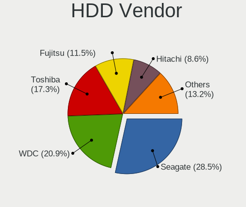
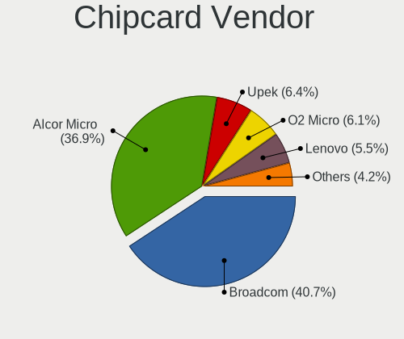

Debian - Tested Hardware & Statistics (Notebooks)
-------------------------------------------------

A project to collect tested hardware configurations for Debian.

Anyone can contribute to this report by the [hw-probe](https://github.com/linuxhw/hw-probe) tool:

    sudo -E hw-probe -all -upload

Please contribute! Especially if your hardware is rare.

Contents
--------

* [ Test Cases ](#test-cases)

* [ System ](#system)
  - [ OS                       ](#os)
  - [ OS Family                ](#os-family)
  - [ Kernel                   ](#kernel)
  - [ Kernel Family            ](#kernel-family)
  - [ Kernel Major Ver.        ](#kernel-major-ver)
  - [ Arch                     ](#arch)
  - [ DE                       ](#de)
  - [ Display Server           ](#display-server)
  - [ Display Manager          ](#display-manager)
  - [ OS Lang                  ](#os-lang)
  - [ Boot Mode                ](#boot-mode)
  - [ Filesystem               ](#filesystem)
  - [ Part. scheme             ](#part-scheme)
  - [ Dual Boot with Linux/BSD ](#dual-boot-with-linuxbsd)
  - [ Dual Boot (Win)          ](#dual-boot-win)

* [ Board ](#board)
  - [ Vendor                   ](#vendor)
  - [ Model                    ](#model)
  - [ Model Family             ](#model-family)
  - [ MFG Year                 ](#mfg-year)
  - [ Form Factor              ](#form-factor)
  - [ Secure Boot              ](#secure-boot)
  - [ Coreboot                 ](#coreboot)
  - [ RAM Size                 ](#ram-size)
  - [ RAM Used                 ](#ram-used)
  - [ Total Drives             ](#total-drives)
  - [ Has CD-ROM               ](#has-cd-rom)
  - [ Has Ethernet             ](#has-ethernet)
  - [ Has WiFi                 ](#has-wifi)
  - [ Has Bluetooth            ](#has-bluetooth)

* [ Location ](#location)
  - [ Country                  ](#country)
  - [ City                     ](#city)

* [ Drives ](#drives)
  - [ Drive Vendor             ](#drive-vendor)
  - [ Drive Model              ](#drive-model)
  - [ HDD Vendor               ](#hdd-vendor)
  - [ SSD Vendor               ](#ssd-vendor)
  - [ Drive Kind               ](#drive-kind)
  - [ Drive Connector          ](#drive-connector)
  - [ Drive Size               ](#drive-size)
  - [ Space Total              ](#space-total)
  - [ Space Used               ](#space-used)
  - [ Malfunc. Drives          ](#malfunc-drives)
  - [ Malfunc. Drive Vendor    ](#malfunc-drive-vendor)
  - [ Malfunc. HDD Vendor      ](#malfunc-hdd-vendor)
  - [ Malfunc. Drive Kind      ](#malfunc-drive-kind)
  - [ Failed Drives            ](#failed-drives)
  - [ Failed Drive Vendor      ](#failed-drive-vendor)
  - [ Drive Status             ](#drive-status)

* [ Storage controller ](#storage-controller)
  - [ Storage Vendor           ](#storage-vendor)
  - [ Storage Model            ](#storage-model)
  - [ Storage Kind             ](#storage-kind)

* [ Processor ](#processor)
  - [ CPU Vendor               ](#cpu-vendor)
  - [ CPU Model                ](#cpu-model)
  - [ CPU Model Family         ](#cpu-model-family)
  - [ CPU Cores                ](#cpu-cores)
  - [ CPU Sockets              ](#cpu-sockets)
  - [ CPU Threads              ](#cpu-threads)
  - [ CPU Op-Modes             ](#cpu-op-modes)
  - [ CPU Microcode            ](#cpu-microcode)
  - [ CPU Microarch            ](#cpu-microarch)

* [ Graphics ](#graphics)
  - [ GPU Vendor               ](#gpu-vendor)
  - [ GPU Model                ](#gpu-model)
  - [ GPU Combo                ](#gpu-combo)
  - [ GPU Driver               ](#gpu-driver)
  - [ GPU Memory               ](#gpu-memory)

* [ Monitor ](#monitor)
  - [ Monitor Vendor           ](#monitor-vendor)
  - [ Monitor Model            ](#monitor-model)
  - [ Monitor Resolution       ](#monitor-resolution)
  - [ Monitor Diagonal         ](#monitor-diagonal)
  - [ Monitor Width            ](#monitor-width)
  - [ Aspect Ratio             ](#aspect-ratio)
  - [ Monitor Area             ](#monitor-area)
  - [ Pixel Density            ](#pixel-density)
  - [ Multiple Monitors        ](#multiple-monitors)

* [ Network ](#network)
  - [ Net Controller Vendor    ](#net-controller-vendor)
  - [ Net Controller Model     ](#net-controller-model)
  - [ Wireless Vendor          ](#wireless-vendor)
  - [ Wireless Model           ](#wireless-model)
  - [ Ethernet Vendor          ](#ethernet-vendor)
  - [ Ethernet Model           ](#ethernet-model)
  - [ Net Controller Kind      ](#net-controller-kind)
  - [ Used Controller          ](#used-controller)
  - [ NICs                     ](#nics)
  - [ IPv6                     ](#ipv6)

* [ Bluetooth ](#bluetooth)
  - [ Bluetooth Vendor         ](#bluetooth-vendor)
  - [ Bluetooth Model          ](#bluetooth-model)

* [ Sound ](#sound)
  - [ Sound Vendor             ](#sound-vendor)
  - [ Sound Model              ](#sound-model)

* [ Memory ](#memory)
  - [ Memory Vendor            ](#memory-vendor)
  - [ Memory Model             ](#memory-model)
  - [ Memory Kind              ](#memory-kind)
  - [ Memory Form Factor       ](#memory-form-factor)
  - [ Memory Size              ](#memory-size)
  - [ Memory Speed             ](#memory-speed)

* [ Printers & scanners ](#printers--scanners)
  - [ Printer Vendor           ](#printer-vendor)
  - [ Printer Model            ](#printer-model)
  - [ Scanner Vendor           ](#scanner-vendor)
  - [ Scanner Model            ](#scanner-model)

* [ Camera ](#camera)
  - [ Camera Vendor            ](#camera-vendor)
  - [ Camera Model             ](#camera-model)

* [ Security ](#security)
  - [ Fingerprint Vendor       ](#fingerprint-vendor)
  - [ Fingerprint Model        ](#fingerprint-model)
  - [ Chipcard Vendor          ](#chipcard-vendor)
  - [ Chipcard Model           ](#chipcard-model)

* [ Unsupported ](#unsupported)
  - [ Unsupported Devices      ](#unsupported-devices)
  - [ Unsupported Device Types ](#unsupported-device-types)

Test Cases
----------

Total: 9916

| Vendor        | Model                       | Probe                                                      | Date         |
|---------------|-----------------------------|------------------------------------------------------------|--------------|
| HP            | Pavilion dv6500             | [a9906a0a37](https://linux-hardware.org/?probe=a9906a0a37) | May 09, 2024 |
| HP            | EliteBook 840 G1            | [369a002b88](https://linux-hardware.org/?probe=369a002b88) | May 09, 2024 |
| Toshiba       | Satellite C650D             | [9e66892f4b](https://linux-hardware.org/?probe=9e66892f4b) | May 09, 2024 |
| Lenovo        | ThinkBook 13x G4 IMH 21K... | [7cfc568eb2](https://linux-hardware.org/?probe=7cfc568eb2) | May 09, 2024 |
| Lenovo        | G50-45 80E3                 | [801eeb31ef](https://linux-hardware.org/?probe=801eeb31ef) | May 08, 2024 |
| VALE          | Notebook Evolution i5-11... | [55764ee04d](https://linux-hardware.org/?probe=55764ee04d) | May 08, 2024 |
| Dell          | XPS 15 7590                 | [a4b733d1fe](https://linux-hardware.org/?probe=a4b733d1fe) | May 08, 2024 |
| HP            | EliteBook 735 G5            | [628e01fd2b](https://linux-hardware.org/?probe=628e01fd2b) | May 08, 2024 |
| ASUSTek       | ASUS TUF Gaming F15 FX50... | [7c01de63e1](https://linux-hardware.org/?probe=7c01de63e1) | May 08, 2024 |
| Sony          | VGN-NS12M_W                 | [e364d75564](https://linux-hardware.org/?probe=e364d75564) | May 08, 2024 |
| ASUSTek       | ASUS TUF Gaming F15 FX50... | [10c139f22b](https://linux-hardware.org/?probe=10c139f22b) | May 08, 2024 |
| Dell          | Inspiron 3542               | [fcc3b9cc19](https://linux-hardware.org/?probe=fcc3b9cc19) | May 08, 2024 |
| Razer         | Blade 14 (2022) - RZ09-0... | [eab2642002](https://linux-hardware.org/?probe=eab2642002) | May 08, 2024 |
| Digma         | Pro Magnus M DN16R9-ADXW... | [beee17622d](https://linux-hardware.org/?probe=beee17622d) | May 08, 2024 |
| Dell          | Latitude D830               | [831a2196a3](https://linux-hardware.org/?probe=831a2196a3) | May 07, 2024 |
| HP            | 250 G3                      | [5f00c46a92](https://linux-hardware.org/?probe=5f00c46a92) | May 07, 2024 |
| Razer         | Blade 14 (2022) - RZ09-0... | [94766b9a5d](https://linux-hardware.org/?probe=94766b9a5d) | May 07, 2024 |
| MSI           | GF63 Thin 8SC               | [59abbac521](https://linux-hardware.org/?probe=59abbac521) | May 07, 2024 |
| HP            | G60                         | [c9e5d3832d](https://linux-hardware.org/?probe=c9e5d3832d) | May 07, 2024 |
| HP            | Pavilion Laptop 15-eh0xx... | [cf6fc980de](https://linux-hardware.org/?probe=cf6fc980de) | May 07, 2024 |
| ASUSTek       | VivoBook_ASUSLaptop M350... | [e6dfd023b6](https://linux-hardware.org/?probe=e6dfd023b6) | May 06, 2024 |
| ASUSTek       | VivoBook_ASUSLaptop M350... | [6ece3912e8](https://linux-hardware.org/?probe=6ece3912e8) | May 06, 2024 |
| Lenovo        | ThinkPad X230 2325BK0       | [0c39b2e745](https://linux-hardware.org/?probe=0c39b2e745) | May 05, 2024 |
| Lenovo        | ThinkPad T470 20HES6VG00    | [f87983a9a9](https://linux-hardware.org/?probe=f87983a9a9) | May 05, 2024 |
| Unknown       | Unknown                     | [ce0eb6aa57](https://linux-hardware.org/?probe=ce0eb6aa57) | May 05, 2024 |
| Dell          | Latitude 7480               | [124ec816c7](https://linux-hardware.org/?probe=124ec816c7) | May 05, 2024 |
| Lenovo        | ThinkPad T480 20L6SADD00    | [ad52d07a71](https://linux-hardware.org/?probe=ad52d07a71) | May 04, 2024 |
| ASUSTek       | ROG Strix G733QM_G733QM     | [c7e3ed99cc](https://linux-hardware.org/?probe=c7e3ed99cc) | May 04, 2024 |
| HP            | EliteBook 840 G2            | [616bda869b](https://linux-hardware.org/?probe=616bda869b) | May 04, 2024 |
| HP            | G62                         | [3e3af3a851](https://linux-hardware.org/?probe=3e3af3a851) | May 04, 2024 |
| ASUSTek       | X751MA                      | [ab76aeaddb](https://linux-hardware.org/?probe=ab76aeaddb) | May 04, 2024 |
| Acer          | Aspire E1-531               | [27d57e495a](https://linux-hardware.org/?probe=27d57e495a) | May 04, 2024 |
| Chuwi         | MiniBook X                  | [64c7ac113f](https://linux-hardware.org/?probe=64c7ac113f) | May 04, 2024 |
| Apple         | MacBookPro8,1               | [221d8e684d](https://linux-hardware.org/?probe=221d8e684d) | May 04, 2024 |
| Lenovo        | ThinkBook 16 G6 IRL 21KH    | [b8f0474451](https://linux-hardware.org/?probe=b8f0474451) | May 03, 2024 |
| HP            | ProBook 430 G8 Notebook ... | [67f5f847c9](https://linux-hardware.org/?probe=67f5f847c9) | May 03, 2024 |
| Lenovo        | G500s 20245                 | [54adaed795](https://linux-hardware.org/?probe=54adaed795) | May 03, 2024 |
| Itautec       | Infoway w7730               | [65fba1a766](https://linux-hardware.org/?probe=65fba1a766) | May 03, 2024 |
| Intel         | powered classmate PC        | [2f4933a503](https://linux-hardware.org/?probe=2f4933a503) | May 02, 2024 |
| Dell          | XPS 15 9500                 | [efce8fa0ba](https://linux-hardware.org/?probe=efce8fa0ba) | May 02, 2024 |
| Google        | Phaser                      | [feb45bf2a2](https://linux-hardware.org/?probe=feb45bf2a2) | May 02, 2024 |
| HP            | Pavilion Laptop 15-eh0xx... | [3380a14ae9](https://linux-hardware.org/?probe=3380a14ae9) | May 02, 2024 |
| Lenovo        | ThinkPad T480 20L6SADD00    | [b9fcd48ed1](https://linux-hardware.org/?probe=b9fcd48ed1) | May 02, 2024 |
| Dell          | Precision 5510              | [a010faffda](https://linux-hardware.org/?probe=a010faffda) | May 01, 2024 |
| Apple         | MacBookPro6,2               | [1307008025](https://linux-hardware.org/?probe=1307008025) | May 01, 2024 |
| Lenovo        | V330-14ARR 81B1             | [edceb0e782](https://linux-hardware.org/?probe=edceb0e782) | May 01, 2024 |
| IGEL Techn... | M350C                       | [c63a48250c](https://linux-hardware.org/?probe=c63a48250c) | May 01, 2024 |
| Acer          | Extensa 4210                | [1b24527bdf](https://linux-hardware.org/?probe=1b24527bdf) | May 01, 2024 |
| Dell          | XPS 13 9360                 | [da66fe35d4](https://linux-hardware.org/?probe=da66fe35d4) | May 01, 2024 |
| Lenovo        | ThinkPad T14s Gen 3 21BS... | [859396f855](https://linux-hardware.org/?probe=859396f855) | Apr 30, 2024 |
| Apple         | MacBookPro11,5              | [c0fa280156](https://linux-hardware.org/?probe=c0fa280156) | Apr 30, 2024 |
| Lenovo        | ThinkPad T460s 20FAS1QU0... | [5429ec2fa3](https://linux-hardware.org/?probe=5429ec2fa3) | Apr 30, 2024 |
| Digma         | CITI E301 ES3008EW          | [91b8be60a0](https://linux-hardware.org/?probe=91b8be60a0) | Apr 30, 2024 |
| Digma         | CITI E301 ES3008EW          | [586069736d](https://linux-hardware.org/?probe=586069736d) | Apr 30, 2024 |
| Lenovo        | ThinkPad T460s 20FAS1QU0... | [60d21b08c6](https://linux-hardware.org/?probe=60d21b08c6) | Apr 30, 2024 |
| Lenovo        | Legion 5 15ACH6H 82JU       | [56c9f37671](https://linux-hardware.org/?probe=56c9f37671) | Apr 29, 2024 |
| Dell          | Inspiron 3442               | [05db1722f8](https://linux-hardware.org/?probe=05db1722f8) | Apr 29, 2024 |
| Lenovo        | ThinkPad S1 Yoga 12 20DK... | [62b6fb2419](https://linux-hardware.org/?probe=62b6fb2419) | Apr 29, 2024 |
| Acer          | Aspire A515-56              | [ebb78c775c](https://linux-hardware.org/?probe=ebb78c775c) | Apr 29, 2024 |
| Acer          | Aspire A515-56              | [55b3ada50c](https://linux-hardware.org/?probe=55b3ada50c) | Apr 29, 2024 |
| ASUSTek       | E203NA                      | [2caea60de4](https://linux-hardware.org/?probe=2caea60de4) | Apr 29, 2024 |
| HP            | Laptop 15s-eq2xxx           | [90d5348bf5](https://linux-hardware.org/?probe=90d5348bf5) | Apr 28, 2024 |
| ASUSTek       | ASUS TUF Gaming F15 FX50... | [3f5beab74c](https://linux-hardware.org/?probe=3f5beab74c) | Apr 28, 2024 |
| HP            | ProBook 4535s               | [34910d04e7](https://linux-hardware.org/?probe=34910d04e7) | Apr 28, 2024 |
| Acer          | Aspire E1-532               | [b50154d060](https://linux-hardware.org/?probe=b50154d060) | Apr 28, 2024 |
| HP            | Notebook                    | [b45aa2251b](https://linux-hardware.org/?probe=b45aa2251b) | Apr 28, 2024 |
| HP            | Notebook                    | [9f5ae93269](https://linux-hardware.org/?probe=9f5ae93269) | Apr 28, 2024 |
| Lenovo        | Z50-75 80EC                 | [278dad8d5a](https://linux-hardware.org/?probe=278dad8d5a) | Apr 28, 2024 |
| MSI           | GF63 Thin 8SC               | [b375d81404](https://linux-hardware.org/?probe=b375d81404) | Apr 28, 2024 |
| HP            | Laptop 15-da0xxx            | [a0fcbd666f](https://linux-hardware.org/?probe=a0fcbd666f) | Apr 28, 2024 |
| Acer          | Aspire ES1-431              | [ff9ee70831](https://linux-hardware.org/?probe=ff9ee70831) | Apr 28, 2024 |
| HP            | 15                          | [0e0d6ab57a](https://linux-hardware.org/?probe=0e0d6ab57a) | Apr 28, 2024 |
| HP            | 15                          | [d329164137](https://linux-hardware.org/?probe=d329164137) | Apr 28, 2024 |
| Lenovo        | ThinkPad X390 20Q1S62G00    | [e7319a730f](https://linux-hardware.org/?probe=e7319a730f) | Apr 27, 2024 |
| HP            | OMEN Laptop 15-ek0xxx       | [bbd6e87bc4](https://linux-hardware.org/?probe=bbd6e87bc4) | Apr 27, 2024 |
| Dell          | Inspiron 5567               | [caf8879e78](https://linux-hardware.org/?probe=caf8879e78) | Apr 27, 2024 |
| Dixonsxp      | Crestline & ICH8M Chipse... | [a9e235a9db](https://linux-hardware.org/?probe=a9e235a9db) | Apr 27, 2024 |
| HP            | ZBook 14                    | [42c92ec19d](https://linux-hardware.org/?probe=42c92ec19d) | Apr 27, 2024 |
| Fujitsu       | LIFEBOOK U7411              | [f1e695e218](https://linux-hardware.org/?probe=f1e695e218) | Apr 27, 2024 |
| Acer          | TravelMate P215-53          | [00d58edb3b](https://linux-hardware.org/?probe=00d58edb3b) | Apr 27, 2024 |
| HP            | EliteBook 735 G5            | [9e1b0b4220](https://linux-hardware.org/?probe=9e1b0b4220) | Apr 27, 2024 |
| Samsung       | 550XDA                      | [de2396f0a2](https://linux-hardware.org/?probe=de2396f0a2) | Apr 27, 2024 |
| Lenovo        | ThinkPad E14 Gen 3 20YD0... | [b52a110875](https://linux-hardware.org/?probe=b52a110875) | Apr 27, 2024 |
| Dell          | Latitude E6400              | [fe74dc08cd](https://linux-hardware.org/?probe=fe74dc08cd) | Apr 27, 2024 |
| Lenovo        | ThinkPad T460s 20FAS21A0... | [f8c5a44d3d](https://linux-hardware.org/?probe=f8c5a44d3d) | Apr 27, 2024 |
| Lenovo        | ThinkPad P52 20MAS04M23     | [3cc3f4dcc1](https://linux-hardware.org/?probe=3cc3f4dcc1) | Apr 27, 2024 |
| HP            | ZBook 14                    | [d6e2400956](https://linux-hardware.org/?probe=d6e2400956) | Apr 26, 2024 |
| HP            | EliteBook 850 G8 Noteboo... | [a5cb6f40d5](https://linux-hardware.org/?probe=a5cb6f40d5) | Apr 26, 2024 |
| ASUSTek       | UX32VD                      | [abf6c0658a](https://linux-hardware.org/?probe=abf6c0658a) | Apr 26, 2024 |
| HP            | Pavilion 15                 | [ef9f89946b](https://linux-hardware.org/?probe=ef9f89946b) | Apr 26, 2024 |
| HP            | EliteBook 860 16 inch G1... | [6d6550e6dc](https://linux-hardware.org/?probe=6d6550e6dc) | Apr 26, 2024 |
| Lenovo        | ThinkPad E14 20RA001HRT     | [714f84cadb](https://linux-hardware.org/?probe=714f84cadb) | Apr 26, 2024 |
| Lenovo        | ThinkPad T570 20HAS03W00    | [6d4f2cc6ca](https://linux-hardware.org/?probe=6d4f2cc6ca) | Apr 26, 2024 |
| Acer          | Aspire A315-510P            | [b5d2df5a85](https://linux-hardware.org/?probe=b5d2df5a85) | Apr 26, 2024 |
| MobileDema... | Cherry Trail CR             | [45127b07b2](https://linux-hardware.org/?probe=45127b07b2) | Apr 26, 2024 |
| HP            | Pavilion Laptop 14-bf1xx    | [3daa76cdd8](https://linux-hardware.org/?probe=3daa76cdd8) | Apr 26, 2024 |
| ASUSTek       | VivoBook_ASUSLaptop X150... | [10a878e186](https://linux-hardware.org/?probe=10a878e186) | Apr 25, 2024 |
| Acer          | Aspire V3-551G              | [86b4773429](https://linux-hardware.org/?probe=86b4773429) | Apr 25, 2024 |
| Dell          | Precision M6800             | [1d41e8bb92](https://linux-hardware.org/?probe=1d41e8bb92) | Apr 25, 2024 |
| Lenovo        | ThinkPad L420 7829A71       | [11c76a20a0](https://linux-hardware.org/?probe=11c76a20a0) | Apr 25, 2024 |
| Toshiba       | PORTEGE Z30-A               | [e6fa07d931](https://linux-hardware.org/?probe=e6fa07d931) | Apr 25, 2024 |
| Acer          | Aspire A315-510P            | [353dfb074d](https://linux-hardware.org/?probe=353dfb074d) | Apr 25, 2024 |
| Dell          | Latitude 5420               | [604846386f](https://linux-hardware.org/?probe=604846386f) | Apr 24, 2024 |
| Lenovo        | ThinkPad T470s 20HGS6Y80... | [96569e2ad7](https://linux-hardware.org/?probe=96569e2ad7) | Apr 24, 2024 |
| HP            | OMEN Laptop 15-ek0xxx       | [42a4906c7d](https://linux-hardware.org/?probe=42a4906c7d) | Apr 24, 2024 |
| Lenovo        | ThinkPad T470s W10DG 20J... | [bc030e73d5](https://linux-hardware.org/?probe=bc030e73d5) | Apr 24, 2024 |
| HP            | Pavilion Gaming Laptop 1... | [fefcca9318](https://linux-hardware.org/?probe=fefcca9318) | Apr 24, 2024 |
| Unknown       | Unknown                     | [8dec2bd904](https://linux-hardware.org/?probe=8dec2bd904) | Apr 24, 2024 |
| Lenovo        | G50-80 80L0                 | [882a343fea](https://linux-hardware.org/?probe=882a343fea) | Apr 23, 2024 |
| Dell          | XPS 13 9370                 | [f5d49e0d32](https://linux-hardware.org/?probe=f5d49e0d32) | Apr 23, 2024 |
| Acer          | Nitro AN16-41               | [4cfb726ac6](https://linux-hardware.org/?probe=4cfb726ac6) | Apr 23, 2024 |
| Lenovo        | IdeaPad L340-15API 81LW     | [e61e4963d5](https://linux-hardware.org/?probe=e61e4963d5) | Apr 23, 2024 |
| HP            | EliteBook 840 G3            | [efcac49277](https://linux-hardware.org/?probe=efcac49277) | Apr 23, 2024 |
| HP            | EliteBook 840 G3            | [ae4c858581](https://linux-hardware.org/?probe=ae4c858581) | Apr 23, 2024 |
| Lenovo        | XiaoXinPro 16 AHP9 83D5     | [8ee1de3473](https://linux-hardware.org/?probe=8ee1de3473) | Apr 23, 2024 |
| Dell          | Latitude 7490               | [13f0f49982](https://linux-hardware.org/?probe=13f0f49982) | Apr 23, 2024 |
| Dell          | Latitude 7490               | [1f22d48915](https://linux-hardware.org/?probe=1f22d48915) | Apr 23, 2024 |
| Dell          | Latitude 5420               | [f3182ce0c2](https://linux-hardware.org/?probe=f3182ce0c2) | Apr 23, 2024 |
| ASUSTek       | VivoBook_ASUSLaptop X521... | [044858db54](https://linux-hardware.org/?probe=044858db54) | Apr 23, 2024 |
| Acer          | Swift SF314-42              | [c5ab9f2681](https://linux-hardware.org/?probe=c5ab9f2681) | Apr 22, 2024 |
| MSI           | Prestige 13Evo A13M         | [9103acf647](https://linux-hardware.org/?probe=9103acf647) | Apr 22, 2024 |
| HP            | ZBook Studio G3             | [c78e54109c](https://linux-hardware.org/?probe=c78e54109c) | Apr 22, 2024 |
| ASUSTek       | X441SA                      | [4ebc6f3907](https://linux-hardware.org/?probe=4ebc6f3907) | Apr 22, 2024 |
| Itautec       | Infoway w7730               | [904234ad57](https://linux-hardware.org/?probe=904234ad57) | Apr 22, 2024 |
| Lenovo        | IdeaPadFlex 15 20309        | [a290c311d1](https://linux-hardware.org/?probe=a290c311d1) | Apr 22, 2024 |
| Lenovo        | ThinkPad T470 20HES6VG00    | [b122ffbcd4](https://linux-hardware.org/?probe=b122ffbcd4) | Apr 21, 2024 |
| Lenovo        | ThinkPad T14 Gen 1 20UD0... | [0231457347](https://linux-hardware.org/?probe=0231457347) | Apr 21, 2024 |
| MSI           | Thin GF63 12VE              | [797980dc42](https://linux-hardware.org/?probe=797980dc42) | Apr 21, 2024 |
| Lenovo        | ThinkPad E15 Gen 2 20T80... | [482d5d1221](https://linux-hardware.org/?probe=482d5d1221) | Apr 21, 2024 |
| Lenovo        | Legion Y540-17IRH-PG0 81... | [a206f7f2d5](https://linux-hardware.org/?probe=a206f7f2d5) | Apr 21, 2024 |
| Acer          | Aspire S3                   | [e43ba2d3ae](https://linux-hardware.org/?probe=e43ba2d3ae) | Apr 21, 2024 |
| LNV           | M14LC2-256                  | [582ccc43d4](https://linux-hardware.org/?probe=582ccc43d4) | Apr 21, 2024 |
| Lenovo        | G50-45 80E3                 | [61882ea818](https://linux-hardware.org/?probe=61882ea818) | Apr 21, 2024 |
| Lenovo        | G50-45 80E3                 | [2ee14c9eff](https://linux-hardware.org/?probe=2ee14c9eff) | Apr 20, 2024 |
| HP            | Pavilion Gaming Laptop 1... | [82a3685099](https://linux-hardware.org/?probe=82a3685099) | Apr 20, 2024 |
| Apple         | MacBookPro8,1               | [e7c1f32086](https://linux-hardware.org/?probe=e7c1f32086) | Apr 20, 2024 |
| Dell          | XPS 13 9360                 | [5f76fcfd59](https://linux-hardware.org/?probe=5f76fcfd59) | Apr 20, 2024 |
| ASUSTek       | K53E                        | [0db457945f](https://linux-hardware.org/?probe=0db457945f) | Apr 20, 2024 |
| HP            | EliteBook 830 G5            | [2df78096e3](https://linux-hardware.org/?probe=2df78096e3) | Apr 20, 2024 |
| ASUSTek       | ASUS TUF Gaming F15 FX50... | [22edc4d418](https://linux-hardware.org/?probe=22edc4d418) | Apr 20, 2024 |
| Lenovo        | ThinkPad L570 20J80013US    | [0f79928572](https://linux-hardware.org/?probe=0f79928572) | Apr 20, 2024 |
| Toshiba       | Satellite C870-192          | [563eab96cf](https://linux-hardware.org/?probe=563eab96cf) | Apr 20, 2024 |
| Lenovo        | ThinkPad T480s 20L8S6BW1... | [778bb54578](https://linux-hardware.org/?probe=778bb54578) | Apr 20, 2024 |
| Lenovo        | ThinkPad L420 7829A71       | [06f7d10927](https://linux-hardware.org/?probe=06f7d10927) | Apr 20, 2024 |
| Dell          | Precision M6800             | [c44a2aee51](https://linux-hardware.org/?probe=c44a2aee51) | Apr 20, 2024 |
| HP            | ZBook 15 G5                 | [e6dc5df04b](https://linux-hardware.org/?probe=e6dc5df04b) | Apr 19, 2024 |
| Dell          | Latitude E6420              | [88731c458f](https://linux-hardware.org/?probe=88731c458f) | Apr 19, 2024 |
| Apple         | MacBook6,1                  | [3f4764c0ee](https://linux-hardware.org/?probe=3f4764c0ee) | Apr 19, 2024 |
| Dell          | Inspiron 910                | [150577a3da](https://linux-hardware.org/?probe=150577a3da) | Apr 19, 2024 |
| Unknown       | Unknown                     | [4c1ff1ccf5](https://linux-hardware.org/?probe=4c1ff1ccf5) | Apr 19, 2024 |
| HP            | EliteBook 830 G5            | [257bad95d7](https://linux-hardware.org/?probe=257bad95d7) | Apr 18, 2024 |
| Dell          | Precision 3560              | [2f847b171f](https://linux-hardware.org/?probe=2f847b171f) | Apr 18, 2024 |
| HP            | EliteBook 840 G8 Noteboo... | [01121cc898](https://linux-hardware.org/?probe=01121cc898) | Apr 18, 2024 |
| Lenovo        | ThinkPad T460s 20FAS5NN0... | [156dedcc62](https://linux-hardware.org/?probe=156dedcc62) | Apr 18, 2024 |
| Samsung       | 300E4A/300E5A/300E7A/343... | [fd71b9d36c](https://linux-hardware.org/?probe=fd71b9d36c) | Apr 17, 2024 |
| Lenovo        | ThinkPad T450s 20BWS00V0... | [c6cafaee9d](https://linux-hardware.org/?probe=c6cafaee9d) | Apr 17, 2024 |
| HP            | 245 G6                      | [17b7e55361](https://linux-hardware.org/?probe=17b7e55361) | Apr 17, 2024 |
| HP            | 245 G6                      | [7c3534813c](https://linux-hardware.org/?probe=7c3534813c) | Apr 17, 2024 |
| Acer          | Aspire ES1-731              | [cd5f5f6530](https://linux-hardware.org/?probe=cd5f5f6530) | Apr 17, 2024 |
| MSI           | Modern 15 B12M              | [b1786f8a58](https://linux-hardware.org/?probe=b1786f8a58) | Apr 17, 2024 |
| Dell          | Latitude E6400              | [6a6279d4c0](https://linux-hardware.org/?probe=6a6279d4c0) | Apr 17, 2024 |
| HP            | Laptop 17-bs0xx             | [2de1af4835](https://linux-hardware.org/?probe=2de1af4835) | Apr 16, 2024 |
| HP            | Laptop 15-db0xxx            | [a3eb57bb17](https://linux-hardware.org/?probe=a3eb57bb17) | Apr 16, 2024 |
| Lenovo        | IdeaPadFlex 14 20308        | [7ccf67d720](https://linux-hardware.org/?probe=7ccf67d720) | Apr 16, 2024 |
| HP            | Laptop 14-cm0xxx            | [9dd5160f8f](https://linux-hardware.org/?probe=9dd5160f8f) | Apr 16, 2024 |
| Sony          | SVF15A17CLB                 | [7b947c3636](https://linux-hardware.org/?probe=7b947c3636) | Apr 16, 2024 |
| HP            | EliteBook 840 G1            | [a41037f2e9](https://linux-hardware.org/?probe=a41037f2e9) | Apr 15, 2024 |
| Dell          | XPS 13 9340                 | [02b603ef6e](https://linux-hardware.org/?probe=02b603ef6e) | Apr 15, 2024 |
| ASUSTek       | X502CA                      | [80390054a8](https://linux-hardware.org/?probe=80390054a8) | Apr 15, 2024 |
| ASUSTek       | Vivobook Go E1504GA_E150... | [2f8ba18ab4](https://linux-hardware.org/?probe=2f8ba18ab4) | Apr 15, 2024 |
| Dell          | Latitude E6440              | [9a85d3d85f](https://linux-hardware.org/?probe=9a85d3d85f) | Apr 15, 2024 |
| ASUSTek       | ROG Zephyrus G14 GA401II... | [00c4bda850](https://linux-hardware.org/?probe=00c4bda850) | Apr 14, 2024 |
| Lenovo        | ThinkPad T470s 20HGS6Y80... | [56bf2bd4d4](https://linux-hardware.org/?probe=56bf2bd4d4) | Apr 14, 2024 |
| HP            | Laptop 14s-dq2xxx           | [d6865e9438](https://linux-hardware.org/?probe=d6865e9438) | Apr 14, 2024 |
| Notebook      | NS5x_NS7xAU                 | [fef58e28df](https://linux-hardware.org/?probe=fef58e28df) | Apr 14, 2024 |
| Dell          | Inspiron 5515               | [5847899f83](https://linux-hardware.org/?probe=5847899f83) | Apr 14, 2024 |
| Lenovo        | Legion S7 15ACH6 82K8       | [4e8dddab03](https://linux-hardware.org/?probe=4e8dddab03) | Apr 14, 2024 |
| Unknown       | Unknown                     | [da4225e583](https://linux-hardware.org/?probe=da4225e583) | Apr 14, 2024 |
| Schenker      | XMG FUSION 15 (XFU15L19)    | [46106cf0ed](https://linux-hardware.org/?probe=46106cf0ed) | Apr 14, 2024 |
| Unknown       | Unknown                     | [7dbc8ebb37](https://linux-hardware.org/?probe=7dbc8ebb37) | Apr 13, 2024 |
| Apple         | MacBookAir6,2               | [4b92f0d2d3](https://linux-hardware.org/?probe=4b92f0d2d3) | Apr 13, 2024 |
| Google        | Atlas                       | [9073524bfb](https://linux-hardware.org/?probe=9073524bfb) | Apr 13, 2024 |
| ASUSTek       | VivoBook_ASUSLaptop M150... | [b40a1b3e44](https://linux-hardware.org/?probe=b40a1b3e44) | Apr 12, 2024 |
| ASUSTek       | Vivobook Go E1504GA_E150... | [6fbf514771](https://linux-hardware.org/?probe=6fbf514771) | Apr 12, 2024 |
| MSI           | GE62 2QC                    | [af7a9f75d6](https://linux-hardware.org/?probe=af7a9f75d6) | Apr 12, 2024 |
| MSI           | GE62 2QC                    | [2b18322513](https://linux-hardware.org/?probe=2b18322513) | Apr 12, 2024 |
| ASUSTek       | UX32VD                      | [a063aa7aef](https://linux-hardware.org/?probe=a063aa7aef) | Apr 12, 2024 |
| Samsung       | RV411/RV511/E3511/S3511/... | [b21773434d](https://linux-hardware.org/?probe=b21773434d) | Apr 12, 2024 |
| Notebook      | NS5x_NS7xAU                 | [d2fa3daec7](https://linux-hardware.org/?probe=d2fa3daec7) | Apr 12, 2024 |
| Fujitsu       | LIFEBOOK E752               | [57b8f56426](https://linux-hardware.org/?probe=57b8f56426) | Apr 12, 2024 |
| Apple         | MacBookPro11,3              | [57ccbefc29](https://linux-hardware.org/?probe=57ccbefc29) | Apr 11, 2024 |
| Dell          | Inspiron 15-3567            | [7e75593e22](https://linux-hardware.org/?probe=7e75593e22) | Apr 11, 2024 |
| Dell          | Inspiron 15 3525            | [a10b3d14be](https://linux-hardware.org/?probe=a10b3d14be) | Apr 11, 2024 |
| Samsung       | RV411/RV511/E3511/S3511/... | [86056cf6ca](https://linux-hardware.org/?probe=86056cf6ca) | Apr 11, 2024 |
| HP            | EliteBook 840 G5            | [045700832b](https://linux-hardware.org/?probe=045700832b) | Apr 11, 2024 |
| Dell          | XPS 15 7590                 | [245aabbb91](https://linux-hardware.org/?probe=245aabbb91) | Apr 11, 2024 |
| Lenovo        | ThinkPad L14 Gen 4 21H1C... | [4d834b6378](https://linux-hardware.org/?probe=4d834b6378) | Apr 11, 2024 |
| Lenovo        | ThinkPad L14 Gen 4 21H1C... | [12ad1e078b](https://linux-hardware.org/?probe=12ad1e078b) | Apr 11, 2024 |
| HP            | Pavilion Laptop 14-bf1xx    | [4c3351faf0](https://linux-hardware.org/?probe=4c3351faf0) | Apr 11, 2024 |
| ASUSTek       | TUF Gaming FA706II_TUF76... | [ee6a729006](https://linux-hardware.org/?probe=ee6a729006) | Apr 11, 2024 |
| ASUSTek       | X450CC                      | [5ead7a9dea](https://linux-hardware.org/?probe=5ead7a9dea) | Apr 11, 2024 |
| ASUSTek       | X450CC                      | [752a03f0de](https://linux-hardware.org/?probe=752a03f0de) | Apr 11, 2024 |
| MSI           | CR70 2M/CX70 2OC/CX70 2O... | [c473133c45](https://linux-hardware.org/?probe=c473133c45) | Apr 11, 2024 |
| Dell          | Latitude 5590               | [dd558c6b50](https://linux-hardware.org/?probe=dd558c6b50) | Apr 10, 2024 |
| Dell          | Latitude E7440              | [d7c3a0d9c9](https://linux-hardware.org/?probe=d7c3a0d9c9) | Apr 10, 2024 |
| Dell          | Latitude E7440              | [2ea80bdebb](https://linux-hardware.org/?probe=2ea80bdebb) | Apr 10, 2024 |
| ASUSTek       | VivoBook_ASUS Laptop X50... | [8d05f71f6b](https://linux-hardware.org/?probe=8d05f71f6b) | Apr 10, 2024 |
| ASUSTek       | VivoBook_ASUS Laptop X50... | [4b2cfbf4b2](https://linux-hardware.org/?probe=4b2cfbf4b2) | Apr 10, 2024 |
| Dell          | Latitude E7440              | [9f0e547b50](https://linux-hardware.org/?probe=9f0e547b50) | Apr 10, 2024 |
| HP            | Presario V6000 (GH918EA#... | [19c9124453](https://linux-hardware.org/?probe=19c9124453) | Apr 10, 2024 |
| Dell          | Precision 5510              | [d44f5034b5](https://linux-hardware.org/?probe=d44f5034b5) | Apr 10, 2024 |
| Lenovo        | ThinkPad T420 4180DS7       | [e8ea27e460](https://linux-hardware.org/?probe=e8ea27e460) | Apr 09, 2024 |
| HP            | ProBook 4510s               | [9992995d43](https://linux-hardware.org/?probe=9992995d43) | Apr 09, 2024 |
| Acer          | Aspire ES1-311              | [cd38e8b3bd](https://linux-hardware.org/?probe=cd38e8b3bd) | Apr 09, 2024 |
| Lenovo        | G710 20252                  | [6859d6ad04](https://linux-hardware.org/?probe=6859d6ad04) | Apr 09, 2024 |
| Lenovo        | Legion 5 15ACH6H 82JU       | [67c665fbe5](https://linux-hardware.org/?probe=67c665fbe5) | Apr 09, 2024 |
| HP            | Mini 210-1000               | [0afce35d6b](https://linux-hardware.org/?probe=0afce35d6b) | Apr 09, 2024 |
| HP            | Pavilion dv9500             | [19def7ab9a](https://linux-hardware.org/?probe=19def7ab9a) | Apr 09, 2024 |
| Lenovo        | ThinkPad P15v Gen 1 20TQ... | [fba34eaafb](https://linux-hardware.org/?probe=fba34eaafb) | Apr 09, 2024 |
| Samsung       | 750XED                      | [bfcfd0dab7](https://linux-hardware.org/?probe=bfcfd0dab7) | Apr 08, 2024 |
| Apple         | MacBookPro5,3               | [4661f5b412](https://linux-hardware.org/?probe=4661f5b412) | Apr 08, 2024 |
| ASUSTek       | ROG Strix G513QC_G513QC     | [e54693d43a](https://linux-hardware.org/?probe=e54693d43a) | Apr 08, 2024 |
| Lenovo        | ThinkPad L14 Gen 2a 20X5... | [95b6780794](https://linux-hardware.org/?probe=95b6780794) | Apr 08, 2024 |
| Lenovo        | LOQ 15IRH8 82XV             | [78fa4035a9](https://linux-hardware.org/?probe=78fa4035a9) | Apr 08, 2024 |
| Lenovo        | ThinkPad L430 2465C32       | [788733ca44](https://linux-hardware.org/?probe=788733ca44) | Apr 07, 2024 |
| HP            | 240 G6 Notebook PC          | [00731ce19b](https://linux-hardware.org/?probe=00731ce19b) | Apr 07, 2024 |
| Dell          | Latitude E6410              | [af5738b699](https://linux-hardware.org/?probe=af5738b699) | Apr 07, 2024 |
| Dell          | Inspiron 3443               | [0794f7cac6](https://linux-hardware.org/?probe=0794f7cac6) | Apr 07, 2024 |
| Lenovo        | ThinkPad T550 20CKCTO1WW    | [616e9e6be4](https://linux-hardware.org/?probe=616e9e6be4) | Apr 07, 2024 |
| MSI           | Prestige 16 AI Studio B1... | [03e388324a](https://linux-hardware.org/?probe=03e388324a) | Apr 07, 2024 |
| Lenovo        | ThinkPad E14 Gen 5 21JSS... | [327b8112a5](https://linux-hardware.org/?probe=327b8112a5) | Apr 06, 2024 |
| Lenovo        | ThinkPad T420 4180WA8       | [b8975f4296](https://linux-hardware.org/?probe=b8975f4296) | Apr 06, 2024 |
| Dell          | Inspiron 5537               | [304df5369f](https://linux-hardware.org/?probe=304df5369f) | Apr 06, 2024 |
| Dell          | Latitude 7480               | [60c813fedb](https://linux-hardware.org/?probe=60c813fedb) | Apr 06, 2024 |
| Acer          | Aspire 3690                 | [a3091a1ceb](https://linux-hardware.org/?probe=a3091a1ceb) | Apr 06, 2024 |
| Lenovo        | ThinkPad E15 Gen 2 20T80... | [169c6755af](https://linux-hardware.org/?probe=169c6755af) | Apr 05, 2024 |
| Jumper        | EZbook                      | [8061ab16a4](https://linux-hardware.org/?probe=8061ab16a4) | Apr 05, 2024 |
| TUXEDO        | Aura 15 Gen1                | [8f75e91c04](https://linux-hardware.org/?probe=8f75e91c04) | Apr 05, 2024 |
| ASUSTek       | VivoBook_ASUSLaptop X150... | [45bd209357](https://linux-hardware.org/?probe=45bd209357) | Apr 05, 2024 |
| ASUSTek       | K53E                        | [4cde59e125](https://linux-hardware.org/?probe=4cde59e125) | Apr 05, 2024 |
| Google        | Peppy                       | [18d00034d7](https://linux-hardware.org/?probe=18d00034d7) | Apr 05, 2024 |
| HP            | Pavilion dv7                | [f7ecb14c8e](https://linux-hardware.org/?probe=f7ecb14c8e) | Apr 05, 2024 |
| HUAWEI        | CREM-WXX9                   | [8fb4cdf244](https://linux-hardware.org/?probe=8fb4cdf244) | Apr 04, 2024 |
| Digibras      | CL341                       | [7cc99d85ef](https://linux-hardware.org/?probe=7cc99d85ef) | Apr 04, 2024 |
| Lenovo        | ThinkPad T420 4180W1A       | [274454a883](https://linux-hardware.org/?probe=274454a883) | Apr 04, 2024 |
| Lenovo        | IdeaPad 320-15IKB 81BT      | [b2d57c4c76](https://linux-hardware.org/?probe=b2d57c4c76) | Apr 04, 2024 |
| Lenovo        | ThinkBook 15 G2 ARE 20VG    | [e759ee33bf](https://linux-hardware.org/?probe=e759ee33bf) | Apr 04, 2024 |
| Lenovo        | IdeaPad 320-15IKB 81BT      | [f4f685c50a](https://linux-hardware.org/?probe=f4f685c50a) | Apr 04, 2024 |
| Digibras      | CL341                       | [da58ad0afb](https://linux-hardware.org/?probe=da58ad0afb) | Apr 04, 2024 |
| ASUSTek       | P553UA                      | [71fe936f4b](https://linux-hardware.org/?probe=71fe936f4b) | Apr 04, 2024 |
| ASUSTek       | P553UA                      | [d14e714f0c](https://linux-hardware.org/?probe=d14e714f0c) | Apr 04, 2024 |
| Dell          | XPS 13 9360                 | [4bff34786c](https://linux-hardware.org/?probe=4bff34786c) | Apr 04, 2024 |
| ASUSTek       | ROG Strix G733QM_G733QM     | [556039fa6c](https://linux-hardware.org/?probe=556039fa6c) | Apr 04, 2024 |
| Lenovo        | IdeaPad 3 15ALC6 82MF       | [9ae8603096](https://linux-hardware.org/?probe=9ae8603096) | Apr 03, 2024 |
| Lenovo        | ThinkPad P14s Gen 4 21K5... | [4b5619e1d7](https://linux-hardware.org/?probe=4b5619e1d7) | Apr 03, 2024 |
| Lenovo        | ThinkPad E15 20RD001FPB     | [209962ecb2](https://linux-hardware.org/?probe=209962ecb2) | Apr 03, 2024 |
| Lenovo        | ThinkPad E15 Gen 2 20T80... | [c2482a6360](https://linux-hardware.org/?probe=c2482a6360) | Apr 03, 2024 |
| Lenovo        | ThinkPad E15 20RD001FPB     | [ac7a313a3c](https://linux-hardware.org/?probe=ac7a313a3c) | Apr 03, 2024 |
| HUAWEI        | NBLBZ-WAX9N                 | [f0688bc1c1](https://linux-hardware.org/?probe=f0688bc1c1) | Apr 03, 2024 |
| Lenovo        | ThinkPad X1 Extreme 2nd ... | [83e03938be](https://linux-hardware.org/?probe=83e03938be) | Apr 03, 2024 |
| ASUSTek       | X456UQ                      | [e7ae74a0ed](https://linux-hardware.org/?probe=e7ae74a0ed) | Apr 03, 2024 |
| Fujitsu       | LIFEBOOK A557               | [0c26980268](https://linux-hardware.org/?probe=0c26980268) | Apr 03, 2024 |
| Dell          | Latitude 5440               | [19eee079f1](https://linux-hardware.org/?probe=19eee079f1) | Apr 03, 2024 |
| HP            | Laptop 15-db0xxx            | [86bf1e5346](https://linux-hardware.org/?probe=86bf1e5346) | Apr 03, 2024 |
| Dell          | Vostro 5590                 | [9046f24617](https://linux-hardware.org/?probe=9046f24617) | Apr 03, 2024 |
| ASUSTek       | ASUS EXPERTBOOK B1500CEA... | [2bb5c3d295](https://linux-hardware.org/?probe=2bb5c3d295) | Apr 03, 2024 |
| Lenovo        | ThinkPad L380 20M50011PG    | [663de4db43](https://linux-hardware.org/?probe=663de4db43) | Apr 03, 2024 |
| Apple         | MacBook6,1                  | [224f00ec38](https://linux-hardware.org/?probe=224f00ec38) | Apr 03, 2024 |
| Panasonic     | CF-C1BTCREFF                | [6a749f6baf](https://linux-hardware.org/?probe=6a749f6baf) | Apr 03, 2024 |
| Juana Mans... | SF20GM7                     | [8571d52a38](https://linux-hardware.org/?probe=8571d52a38) | Apr 02, 2024 |
| Lenovo        | IdeaPad 3 15ALC6 82KU       | [955dc4530f](https://linux-hardware.org/?probe=955dc4530f) | Apr 02, 2024 |
| HP            | EliteBook 840 G3            | [992cf5c5a6](https://linux-hardware.org/?probe=992cf5c5a6) | Apr 02, 2024 |
| ASUSTek       | ROG Zephyrus M16 GU604VY... | [7d3a698648](https://linux-hardware.org/?probe=7d3a698648) | Apr 02, 2024 |
| Lenovo        | IdeaPad Pro 5 16APH8 83A... | [054b7415b5](https://linux-hardware.org/?probe=054b7415b5) | Apr 01, 2024 |
| Acer          | Aspire A315-58              | [42c853e695](https://linux-hardware.org/?probe=42c853e695) | Apr 01, 2024 |
| Apple         | MacBookAir6,2               | [6c8467a122](https://linux-hardware.org/?probe=6c8467a122) | Apr 01, 2024 |
| Dell          | Latitude E6520              | [d359664665](https://linux-hardware.org/?probe=d359664665) | Apr 01, 2024 |
| Dell          | Latitude 7400               | [5de339a7cc](https://linux-hardware.org/?probe=5de339a7cc) | Apr 01, 2024 |
| ASUSTek       | N55SF                       | [69918bf880](https://linux-hardware.org/?probe=69918bf880) | Apr 01, 2024 |
| ASUSTek       | ZenBook UX425UAZ_UM425UA... | [d7142dfd4d](https://linux-hardware.org/?probe=d7142dfd4d) | Apr 01, 2024 |
| Lenovo        | ThinkPad T460 20FMS06V00    | [9bda4cf2a7](https://linux-hardware.org/?probe=9bda4cf2a7) | Apr 01, 2024 |
| Lenovo        | ThinkPad E16 Gen 1 21JT0... | [1d1e0bf9da](https://linux-hardware.org/?probe=1d1e0bf9da) | Apr 01, 2024 |
| Panasonic     | CF-C1BTCREFF                | [bb492a4906](https://linux-hardware.org/?probe=bb492a4906) | Apr 01, 2024 |
| Lenovo        | ThinkPad P15v Gen 3 21D8... | [2a236e9fd5](https://linux-hardware.org/?probe=2a236e9fd5) | Apr 01, 2024 |
| Lenovo        | ThinkPad T430s 2355AR2      | [645e34f6c3](https://linux-hardware.org/?probe=645e34f6c3) | Apr 01, 2024 |
| HP            | EliteBook 840 G4            | [b4724cc6b0](https://linux-hardware.org/?probe=b4724cc6b0) | Mar 31, 2024 |
| HP            | ENVY Laptop 13-ah0xxx       | [38d1d0b6b6](https://linux-hardware.org/?probe=38d1d0b6b6) | Mar 31, 2024 |
| Dell          | Latitude 7390 2-in-1        | [e1a08cb929](https://linux-hardware.org/?probe=e1a08cb929) | Mar 31, 2024 |
| ASUSTek       | GL553VD                     | [cdb08c255c](https://linux-hardware.org/?probe=cdb08c255c) | Mar 30, 2024 |
| Lenovo        | IdeaPad S340-14API 81NB     | [b6bb7745a9](https://linux-hardware.org/?probe=b6bb7745a9) | Mar 30, 2024 |
| Sony          | SVF14221CLW                 | [a6a658aa9b](https://linux-hardware.org/?probe=a6a658aa9b) | Mar 30, 2024 |
| HP            | EliteBook 2740p             | [796c12edc5](https://linux-hardware.org/?probe=796c12edc5) | Mar 30, 2024 |
| Lenovo        | ThinkPad P53 20QQS5WG00     | [15499f30af](https://linux-hardware.org/?probe=15499f30af) | Mar 30, 2024 |
| Sony          | SVF14221CLW                 | [1530abd2d4](https://linux-hardware.org/?probe=1530abd2d4) | Mar 30, 2024 |
| Dell          | Vostro 1015                 | [f9ca91d526](https://linux-hardware.org/?probe=f9ca91d526) | Mar 29, 2024 |
| Samsung       | RV411/RV511/E3511/S3511/... | [af9f697c2d](https://linux-hardware.org/?probe=af9f697c2d) | Mar 29, 2024 |
| Lenovo        | ThinkPad X220 4291W3B       | [c4fdbba9d2](https://linux-hardware.org/?probe=c4fdbba9d2) | Mar 29, 2024 |
| Lenovo        | ThinkPad X1 Carbon 5th 2... | [5eccb2015c](https://linux-hardware.org/?probe=5eccb2015c) | Mar 29, 2024 |
| Lenovo        | ThinkPad 13 2nd Gen 20J1... | [176e1c469e](https://linux-hardware.org/?probe=176e1c469e) | Mar 29, 2024 |
| Dell          | Latitude 5414               | [debd534bcb](https://linux-hardware.org/?probe=debd534bcb) | Mar 29, 2024 |
| ASUSTek       | K53SJ                       | [7542f194a2](https://linux-hardware.org/?probe=7542f194a2) | Mar 28, 2024 |
| ASUSTek       | K53SJ                       | [34d7c41e80](https://linux-hardware.org/?probe=34d7c41e80) | Mar 28, 2024 |
| ASUSTek       | VivoBook_ASUSLaptop X515... | [4b1c2afd39](https://linux-hardware.org/?probe=4b1c2afd39) | Mar 28, 2024 |
| HP            | EliteBook 835 13 inch G9... | [2b2e2a0296](https://linux-hardware.org/?probe=2b2e2a0296) | Mar 28, 2024 |
| ASUSTek       | X553MA                      | [5d1d7ed87a](https://linux-hardware.org/?probe=5d1d7ed87a) | Mar 28, 2024 |
| Dell          | Latitude 5480               | [21dd5f9667](https://linux-hardware.org/?probe=21dd5f9667) | Mar 28, 2024 |
| HP            | EliteBook 835 13 inch G9... | [430635ac56](https://linux-hardware.org/?probe=430635ac56) | Mar 27, 2024 |
| Lenovo        | IdeaPad 100S-14IBR 80R9     | [05bab22d87](https://linux-hardware.org/?probe=05bab22d87) | Mar 27, 2024 |
| Google        | Stout                       | [8b022ae66a](https://linux-hardware.org/?probe=8b022ae66a) | Mar 27, 2024 |
| Google        | Stout                       | [4e9784a9a7](https://linux-hardware.org/?probe=4e9784a9a7) | Mar 27, 2024 |
| Google        | Stout                       | [7646bacc68](https://linux-hardware.org/?probe=7646bacc68) | Mar 27, 2024 |
| Google        | Stout                       | [352f4368da](https://linux-hardware.org/?probe=352f4368da) | Mar 27, 2024 |
| ASUSTek       | F52Q                        | [edb335c489](https://linux-hardware.org/?probe=edb335c489) | Mar 27, 2024 |
| Lenovo        | ThinkPad T470 W10DG 20JN... | [0d34620042](https://linux-hardware.org/?probe=0d34620042) | Mar 27, 2024 |
| Lenovo        | B50-10 80QR                 | [cf333072f0](https://linux-hardware.org/?probe=cf333072f0) | Mar 27, 2024 |
| Lenovo        | Unknown                     | [3bbef18998](https://linux-hardware.org/?probe=3bbef18998) | Mar 27, 2024 |
| ASUSTek       | Q502LAB                     | [d9dc351db0](https://linux-hardware.org/?probe=d9dc351db0) | Mar 26, 2024 |
| Lenovo        | ThinkPad 13 20J10046US      | [160ac60377](https://linux-hardware.org/?probe=160ac60377) | Mar 26, 2024 |
| Framework     | Laptop (12th Gen Intel C... | [5eb093e5c7](https://linux-hardware.org/?probe=5eb093e5c7) | Mar 26, 2024 |
| Google        | Stout                       | [ff192d759c](https://linux-hardware.org/?probe=ff192d759c) | Mar 26, 2024 |
| Digma         | EVE 15 C419 ES5065EW        | [83810dcd33](https://linux-hardware.org/?probe=83810dcd33) | Mar 26, 2024 |
| ASUSTek       | VivoBook_ASUSLaptop X340... | [d8ce553b41](https://linux-hardware.org/?probe=d8ce553b41) | Mar 26, 2024 |
| Google        | Stout                       | [a8643e01ca](https://linux-hardware.org/?probe=a8643e01ca) | Mar 26, 2024 |
| Samsung       | 550XED                      | [ab624683ca](https://linux-hardware.org/?probe=ab624683ca) | Mar 26, 2024 |
| Google        | Stout                       | [a554b971b4](https://linux-hardware.org/?probe=a554b971b4) | Mar 26, 2024 |
| HP            | Presario V2000 (EH459UA#... | [af3a09ea38](https://linux-hardware.org/?probe=af3a09ea38) | Mar 26, 2024 |
| Google        | Stout                       | [042f9d9837](https://linux-hardware.org/?probe=042f9d9837) | Mar 26, 2024 |
| Lenovo        | ThinkPad 13 2nd Gen 20J1... | [bfe7baf9c6](https://linux-hardware.org/?probe=bfe7baf9c6) | Mar 26, 2024 |
| Dell          | Inspiron 5593               | [1630ab92c1](https://linux-hardware.org/?probe=1630ab92c1) | Mar 26, 2024 |
| ASUSTek       | K53SC                       | [dadf168399](https://linux-hardware.org/?probe=dadf168399) | Mar 26, 2024 |
| Acer          | Aspire 5820TG               | [9e3a75ab14](https://linux-hardware.org/?probe=9e3a75ab14) | Mar 26, 2024 |
| Toshiba       | Satellite A210              | [37734a1409](https://linux-hardware.org/?probe=37734a1409) | Mar 26, 2024 |
| ASUSTek       | X542UQ                      | [75455c4a87](https://linux-hardware.org/?probe=75455c4a87) | Mar 26, 2024 |
| ASUSTek       | X540LA                      | [2c593ff829](https://linux-hardware.org/?probe=2c593ff829) | Mar 26, 2024 |
| Lenovo        | Legion 5 15ACH6H 82JU       | [c2dedfbe62](https://linux-hardware.org/?probe=c2dedfbe62) | Mar 25, 2024 |
| HUAWEI        | KLVL-WXX9                   | [f4276dd02c](https://linux-hardware.org/?probe=f4276dd02c) | Mar 25, 2024 |
| Google        | Stout                       | [8ac4ec7cd8](https://linux-hardware.org/?probe=8ac4ec7cd8) | Mar 25, 2024 |
| Dell          | Vostro 15-3568              | [25184ad945](https://linux-hardware.org/?probe=25184ad945) | Mar 25, 2024 |
| Dell          | Vostro 15-3568              | [b48921d197](https://linux-hardware.org/?probe=b48921d197) | Mar 25, 2024 |
| Dell          | Vostro 15-3568              | [c906c9dc87](https://linux-hardware.org/?probe=c906c9dc87) | Mar 25, 2024 |
| HP            | Pavilion 17                 | [8bf3b9d8bd](https://linux-hardware.org/?probe=8bf3b9d8bd) | Mar 25, 2024 |
| HP            | ProBook 655 G2              | [49a85fae09](https://linux-hardware.org/?probe=49a85fae09) | Mar 25, 2024 |
| Dell          | Vostro 15-3568              | [43d5eddd6e](https://linux-hardware.org/?probe=43d5eddd6e) | Mar 25, 2024 |
| Dell          | Vostro 15-3568              | [756f5d9aca](https://linux-hardware.org/?probe=756f5d9aca) | Mar 25, 2024 |
| LG Electro... | 17Z90R-H.ADC8U1             | [d0bcf896cf](https://linux-hardware.org/?probe=d0bcf896cf) | Mar 25, 2024 |
| ASUSTek       | ROG Strix G513QY_G513QY     | [954efe1d9b](https://linux-hardware.org/?probe=954efe1d9b) | Mar 25, 2024 |
| Acer          | Swift SF514-56T             | [37cec8bd6a](https://linux-hardware.org/?probe=37cec8bd6a) | Mar 24, 2024 |
| Lenovo        | ThinkPad Edge 03014CG       | [2b57d89f5a](https://linux-hardware.org/?probe=2b57d89f5a) | Mar 24, 2024 |
| Unknown       | Home a2 lite                | [88544e3a1c](https://linux-hardware.org/?probe=88544e3a1c) | Mar 24, 2024 |
| HP            | EliteBook 840 G1            | [afa5872c09](https://linux-hardware.org/?probe=afa5872c09) | Mar 24, 2024 |
| HP            | EliteBook 8530w             | [68ee7621ae](https://linux-hardware.org/?probe=68ee7621ae) | Mar 24, 2024 |
| Dell          | Latitude 7490               | [ac2f810336](https://linux-hardware.org/?probe=ac2f810336) | Mar 23, 2024 |
| Lenovo        | ThinkPad T14s Gen 4 21F8... | [674e134686](https://linux-hardware.org/?probe=674e134686) | Mar 23, 2024 |
| Lenovo        | ThinkPad T14s Gen 4 21F8... | [cef6c03ce2](https://linux-hardware.org/?probe=cef6c03ce2) | Mar 23, 2024 |
| Primux Tec... | Primux ioxbook 1402FX       | [53e6d67001](https://linux-hardware.org/?probe=53e6d67001) | Mar 23, 2024 |
| HP            | 15                          | [d44f6d6211](https://linux-hardware.org/?probe=d44f6d6211) | Mar 23, 2024 |
| Lenovo        | ThinkPad X1 Carbon 7th 2... | [a20d8894bd](https://linux-hardware.org/?probe=a20d8894bd) | Mar 23, 2024 |
| HP            | Pavilion 17                 | [80b1ad1d8b](https://linux-hardware.org/?probe=80b1ad1d8b) | Mar 23, 2024 |
| HP            | Drawcia                     | [11b3cbe426](https://linux-hardware.org/?probe=11b3cbe426) | Mar 22, 2024 |
| Dell          | Precision 7560              | [2de886c9c9](https://linux-hardware.org/?probe=2de886c9c9) | Mar 22, 2024 |
| Lenovo        | ThinkPad S1 Yoga 12 20DK... | [df5c12540c](https://linux-hardware.org/?probe=df5c12540c) | Mar 22, 2024 |
| Fujitsu       | LIFEBOOK E754               | [4558c9a4f4](https://linux-hardware.org/?probe=4558c9a4f4) | Mar 22, 2024 |
| Google        | Laser14                     | [3bbaadcb60](https://linux-hardware.org/?probe=3bbaadcb60) | Mar 22, 2024 |
| Acer          | Aspire 5315                 | [01f4e47340](https://linux-hardware.org/?probe=01f4e47340) | Mar 22, 2024 |
| Dell          | Inspiron 15 3515            | [b6096d2468](https://linux-hardware.org/?probe=b6096d2468) | Mar 22, 2024 |
| Google        | Stout                       | [0b8bfbcc32](https://linux-hardware.org/?probe=0b8bfbcc32) | Mar 21, 2024 |
| Lenovo        | Legion 5 15ACH6H 82JU       | [99ff7d5b73](https://linux-hardware.org/?probe=99ff7d5b73) | Mar 21, 2024 |
| HP            | Victus by Gaming Laptop ... | [8b380f5ddd](https://linux-hardware.org/?probe=8b380f5ddd) | Mar 21, 2024 |
| Google        | Stout                       | [f6e58b7398](https://linux-hardware.org/?probe=f6e58b7398) | Mar 21, 2024 |
| Acer          | Aspire A315-59              | [ccbeaff8e3](https://linux-hardware.org/?probe=ccbeaff8e3) | Mar 21, 2024 |
| Google        | Stout                       | [e0156c0090](https://linux-hardware.org/?probe=e0156c0090) | Mar 21, 2024 |
| Google        | Stout                       | [c0b128f965](https://linux-hardware.org/?probe=c0b128f965) | Mar 21, 2024 |
| Google        | Astronaut                   | [b2e117a773](https://linux-hardware.org/?probe=b2e117a773) | Mar 21, 2024 |
| Google        | Reks                        | [5b8248765d](https://linux-hardware.org/?probe=5b8248765d) | Mar 21, 2024 |
| Lenovo        | ThinkPad T440p              | [39d16a18ec](https://linux-hardware.org/?probe=39d16a18ec) | Mar 21, 2024 |
| Dell          | Vostro 5568                 | [bafabe8708](https://linux-hardware.org/?probe=bafabe8708) | Mar 21, 2024 |
| Timi          | Mi NoteBook Ultra           | [c92aa3d747](https://linux-hardware.org/?probe=c92aa3d747) | Mar 21, 2024 |
| Dell          | Vostro 5568                 | [e45d89ada7](https://linux-hardware.org/?probe=e45d89ada7) | Mar 21, 2024 |
| HONOR         | FRI-FXX                     | [52c0d69000](https://linux-hardware.org/?probe=52c0d69000) | Mar 21, 2024 |
| HP            | EliteBook 845 14 inch G9... | [42b75efcf6](https://linux-hardware.org/?probe=42b75efcf6) | Mar 21, 2024 |
| Google        | Stout                       | [51ca299022](https://linux-hardware.org/?probe=51ca299022) | Mar 21, 2024 |
| HP            | ProBook 640 G1              | [83fb273295](https://linux-hardware.org/?probe=83fb273295) | Mar 20, 2024 |
| Google        | Stout                       | [930075bd96](https://linux-hardware.org/?probe=930075bd96) | Mar 20, 2024 |
| ASUSTek       | VivoBook_ASUSLaptop X712... | [00f9ee02d9](https://linux-hardware.org/?probe=00f9ee02d9) | Mar 20, 2024 |
| ASUSTek       | X756UQ                      | [9557771f1d](https://linux-hardware.org/?probe=9557771f1d) | Mar 20, 2024 |
| Google        | Stout                       | [ed81fe0a4b](https://linux-hardware.org/?probe=ed81fe0a4b) | Mar 20, 2024 |
| Google        | Stout                       | [52a0fe0e8f](https://linux-hardware.org/?probe=52a0fe0e8f) | Mar 20, 2024 |
| Google        | Stout                       | [5e43bced95](https://linux-hardware.org/?probe=5e43bced95) | Mar 20, 2024 |
| Acer          | Aspire ES1-111              | [429ee44acd](https://linux-hardware.org/?probe=429ee44acd) | Mar 20, 2024 |
| HP            | Pavilion g6                 | [4d90befad6](https://linux-hardware.org/?probe=4d90befad6) | Mar 20, 2024 |
| HP            | Pavilion Plus Laptop 14z... | [0b0ad40c3d](https://linux-hardware.org/?probe=0b0ad40c3d) | Mar 20, 2024 |
| Apple         | MacBookAir5,1               | [f1e5e55e2c](https://linux-hardware.org/?probe=f1e5e55e2c) | Mar 20, 2024 |
| Alienware     | 17 R4                       | [a89397f827](https://linux-hardware.org/?probe=a89397f827) | Mar 20, 2024 |
| HP            | ProBook 440 G6              | [15167e6cda](https://linux-hardware.org/?probe=15167e6cda) | Mar 19, 2024 |
| Framework     | Laptop 13 (AMD Ryzen 704... | [9f6517d4ce](https://linux-hardware.org/?probe=9f6517d4ce) | Mar 19, 2024 |
| Framework     | Laptop 13 (AMD Ryzen 704... | [2a287a57dd](https://linux-hardware.org/?probe=2a287a57dd) | Mar 19, 2024 |
| Dell          | Latitude E7440              | [c39e459211](https://linux-hardware.org/?probe=c39e459211) | Mar 19, 2024 |
| HP            | EliteBook 840 G3            | [febfdac13f](https://linux-hardware.org/?probe=febfdac13f) | Mar 19, 2024 |
| Dell          | Latitude E7440              | [e6fabe11b0](https://linux-hardware.org/?probe=e6fabe11b0) | Mar 19, 2024 |
| TUXEDO        | Stellaris Intel Gen5        | [d2b4d77618](https://linux-hardware.org/?probe=d2b4d77618) | Mar 19, 2024 |
| Acer          | Nitro AN515-43              | [85aae083ad](https://linux-hardware.org/?probe=85aae083ad) | Mar 19, 2024 |
| HP            | Notebook                    | [5790810149](https://linux-hardware.org/?probe=5790810149) | Mar 19, 2024 |
| Lenovo        | ThinkPad T480s 20L8S9DL0... | [0df7e53a5b](https://linux-hardware.org/?probe=0df7e53a5b) | Mar 19, 2024 |
| Lenovo        | IdeaPad 320-17IKB 80XM      | [64e69c2ba1](https://linux-hardware.org/?probe=64e69c2ba1) | Mar 18, 2024 |
| HP            | EliteBook 745 G3            | [505719d41e](https://linux-hardware.org/?probe=505719d41e) | Mar 18, 2024 |
| HP            | EliteBook 745 G3            | [612e881108](https://linux-hardware.org/?probe=612e881108) | Mar 18, 2024 |
| Dell          | XPS 13 9340                 | [7ce248eeb6](https://linux-hardware.org/?probe=7ce248eeb6) | Mar 18, 2024 |
| Dell          | Latitude E7440              | [274a06f022](https://linux-hardware.org/?probe=274a06f022) | Mar 18, 2024 |
| HP            | Laptop 15-dy2xxx            | [79eb548cbc](https://linux-hardware.org/?probe=79eb548cbc) | Mar 18, 2024 |
| ASUSTek       | VivoBook_ASUSLaptop M160... | [d6d2c95a7a](https://linux-hardware.org/?probe=d6d2c95a7a) | Mar 17, 2024 |
| ASUSTek       | ROG Zephyrus G14 GA401IV... | [030fe7cb7a](https://linux-hardware.org/?probe=030fe7cb7a) | Mar 17, 2024 |
| HP            | ZBook 15 G3                 | [d565c68c67](https://linux-hardware.org/?probe=d565c68c67) | Mar 17, 2024 |
| ASUSTek       | ROG GU501GM                 | [6a2786c694](https://linux-hardware.org/?probe=6a2786c694) | Mar 17, 2024 |
| Lenovo        | V15-ADA 82C7                | [3c3545a34f](https://linux-hardware.org/?probe=3c3545a34f) | Mar 17, 2024 |
| Dell          | Latitude 7490               | [2d06821968](https://linux-hardware.org/?probe=2d06821968) | Mar 17, 2024 |
| HP            | EliteBook 745 G3            | [b881a5b337](https://linux-hardware.org/?probe=b881a5b337) | Mar 17, 2024 |
| HP            | EliteBook 745 G3            | [988b3c3ebc](https://linux-hardware.org/?probe=988b3c3ebc) | Mar 17, 2024 |
| HP            | EliteBook 745 G3            | [ff007ff23e](https://linux-hardware.org/?probe=ff007ff23e) | Mar 16, 2024 |
| HP            | EliteBook 745 G3            | [18bed734d1](https://linux-hardware.org/?probe=18bed734d1) | Mar 16, 2024 |
| Lenovo        | ThinkPad T460 20FMS06V00    | [a781e10290](https://linux-hardware.org/?probe=a781e10290) | Mar 16, 2024 |
| Acer          | Aspire A114-31              | [899c6f43f5](https://linux-hardware.org/?probe=899c6f43f5) | Mar 16, 2024 |
| Google        | Lick                        | [38f3dae4fc](https://linux-hardware.org/?probe=38f3dae4fc) | Mar 16, 2024 |
| Dell          | Latitude 5480               | [84cc86e4f5](https://linux-hardware.org/?probe=84cc86e4f5) | Mar 16, 2024 |
| ASUSTek       | VivoBook_ASUSLaptop X515... | [e05236c14d](https://linux-hardware.org/?probe=e05236c14d) | Mar 16, 2024 |
| Dell          | XPS 17 9730                 | [eee424c6c6](https://linux-hardware.org/?probe=eee424c6c6) | Mar 16, 2024 |
| HUAWEI        | BOHK-WAX9X                  | [250f1255fd](https://linux-hardware.org/?probe=250f1255fd) | Mar 16, 2024 |
| HUAWEI        | BOHK-WAX9X                  | [b24d70c129](https://linux-hardware.org/?probe=b24d70c129) | Mar 16, 2024 |
| Samsung       | N145P/N250P/N260P           | [5883806cc2](https://linux-hardware.org/?probe=5883806cc2) | Mar 16, 2024 |
| Lenovo        | V310-14IKB 80T2             | [0018e3e74d](https://linux-hardware.org/?probe=0018e3e74d) | Mar 16, 2024 |
| Dell          | Latitude E6320              | [3dfd6b80a4](https://linux-hardware.org/?probe=3dfd6b80a4) | Mar 15, 2024 |
| Lenovo        | ThinkBook 16 G6 ABP 21KK    | [80abcbac38](https://linux-hardware.org/?probe=80abcbac38) | Mar 15, 2024 |
| Lenovo        | IdeaPad 5 15ITL05 82FG      | [e88369fa4d](https://linux-hardware.org/?probe=e88369fa4d) | Mar 15, 2024 |
| GPD           | P3 MAX                      | [2e933fa77d](https://linux-hardware.org/?probe=2e933fa77d) | Mar 15, 2024 |
| Dell          | Latitude E7440              | [5d4aea2b82](https://linux-hardware.org/?probe=5d4aea2b82) | Mar 15, 2024 |
| Micro Comp... | Venus series                | [ffb53207eb](https://linux-hardware.org/?probe=ffb53207eb) | Mar 15, 2024 |
| Dell          | Latitude E7440              | [c9db9548cf](https://linux-hardware.org/?probe=c9db9548cf) | Mar 15, 2024 |
| Dell          | Latitude E7440              | [79365ef1b3](https://linux-hardware.org/?probe=79365ef1b3) | Mar 15, 2024 |
| Dell          | Latitude E7440              | [373307ea06](https://linux-hardware.org/?probe=373307ea06) | Mar 15, 2024 |
| Dell          | Latitude E7440              | [702daa8fd3](https://linux-hardware.org/?probe=702daa8fd3) | Mar 15, 2024 |
| Dell          | Latitude E7440              | [5e6e833281](https://linux-hardware.org/?probe=5e6e833281) | Mar 15, 2024 |
| Dell          | Latitude E7440              | [db5d402e08](https://linux-hardware.org/?probe=db5d402e08) | Mar 15, 2024 |
| Dell          | Latitude E7440              | [796f48ebbb](https://linux-hardware.org/?probe=796f48ebbb) | Mar 15, 2024 |
| Lenovo        | ThinkPad T495s 20QJCTO1W... | [ba8c04d50e](https://linux-hardware.org/?probe=ba8c04d50e) | Mar 15, 2024 |
| Apple         | MacBookAir5,1               | [ae670d563a](https://linux-hardware.org/?probe=ae670d563a) | Mar 15, 2024 |
| Lenovo        | ThinkPad T460s 20FAS1QU0... | [0aeadde0d2](https://linux-hardware.org/?probe=0aeadde0d2) | Mar 15, 2024 |
| ASUSTek       | VivoBook_ASUSLaptop X150... | [96f5ad9c2b](https://linux-hardware.org/?probe=96f5ad9c2b) | Mar 15, 2024 |
| Dell          | Latitude E7440              | [d294aa428c](https://linux-hardware.org/?probe=d294aa428c) | Mar 14, 2024 |
| Dell          | Latitude E6320              | [b889e2e692](https://linux-hardware.org/?probe=b889e2e692) | Mar 14, 2024 |
| Lenovo        | IdeaPad C340-14API 81N6     | [08ca6f8423](https://linux-hardware.org/?probe=08ca6f8423) | Mar 14, 2024 |
| Lenovo        | G50-80 80L0                 | [995f47afbb](https://linux-hardware.org/?probe=995f47afbb) | Mar 14, 2024 |
| Dell          | Latitude E6420              | [bd0e21e6e8](https://linux-hardware.org/?probe=bd0e21e6e8) | Mar 14, 2024 |
| Lenovo        | IdeaPad 5 15ITL05 82FG      | [d9dcb9a8f4](https://linux-hardware.org/?probe=d9dcb9a8f4) | Mar 14, 2024 |
| Dell          | Latitude E6420              | [b8474e8eaa](https://linux-hardware.org/?probe=b8474e8eaa) | Mar 14, 2024 |
| Dell          | Latitude E6420              | [94b6aa0ebf](https://linux-hardware.org/?probe=94b6aa0ebf) | Mar 14, 2024 |
| XIAOMI        | Redmi Book Pro 14 2024      | [91890298e9](https://linux-hardware.org/?probe=91890298e9) | Mar 14, 2024 |
| ASUSTek       | ZenBook UX431DA_UM431DA     | [721d5ddfe6](https://linux-hardware.org/?probe=721d5ddfe6) | Mar 14, 2024 |
| Dell          | Latitude 5401               | [651b3a2f09](https://linux-hardware.org/?probe=651b3a2f09) | Mar 14, 2024 |
| Lenovo        | G565 20071                  | [53c4aa7525](https://linux-hardware.org/?probe=53c4aa7525) | Mar 14, 2024 |
| Lenovo        | Legion Pro 7 16ARX8H 82W... | [ec652b3d4e](https://linux-hardware.org/?probe=ec652b3d4e) | Mar 14, 2024 |
| Lenovo        | IdeaPad Gaming 3 15ACH6 ... | [33164bcce1](https://linux-hardware.org/?probe=33164bcce1) | Mar 14, 2024 |
| HP            | EliteBook 8460p             | [3598522f0a](https://linux-hardware.org/?probe=3598522f0a) | Mar 13, 2024 |
| HP            | EliteBook 8460p             | [4137469fd5](https://linux-hardware.org/?probe=4137469fd5) | Mar 13, 2024 |
| Google        | Bobba                       | [f01b89f659](https://linux-hardware.org/?probe=f01b89f659) | Mar 13, 2024 |
| HP            | EliteBook 8460p             | [6cba9dc6dd](https://linux-hardware.org/?probe=6cba9dc6dd) | Mar 13, 2024 |
| HP            | EliteBook 8460p             | [85dd7ddf92](https://linux-hardware.org/?probe=85dd7ddf92) | Mar 13, 2024 |
| HP            | ProBook 6450b               | [71e2ba1acd](https://linux-hardware.org/?probe=71e2ba1acd) | Mar 13, 2024 |
| Google        | Reks                        | [8e0c35418b](https://linux-hardware.org/?probe=8e0c35418b) | Mar 13, 2024 |
| HP            | ProBook 6450b               | [758d6b94cf](https://linux-hardware.org/?probe=758d6b94cf) | Mar 13, 2024 |
| HP            | ProBook 6450b               | [79851a4f52](https://linux-hardware.org/?probe=79851a4f52) | Mar 13, 2024 |
| Samsung       | 300E5EV/300E4EV/270E5EV/... | [4c2166e670](https://linux-hardware.org/?probe=4c2166e670) | Mar 13, 2024 |
| HP            | Pavilion dm3                | [0f22d77b49](https://linux-hardware.org/?probe=0f22d77b49) | Mar 12, 2024 |
| Lenovo        | IdeaPad 700-15ISK 80RU      | [77f28d5d35](https://linux-hardware.org/?probe=77f28d5d35) | Mar 12, 2024 |
| Google        | Bobba                       | [8b2b9ab225](https://linux-hardware.org/?probe=8b2b9ab225) | Mar 12, 2024 |
| Lenovo        | B590 62742BG                | [5e3e316020](https://linux-hardware.org/?probe=5e3e316020) | Mar 12, 2024 |
| Lenovo        | ThinkPad Edge E431 62774... | [4055861a67](https://linux-hardware.org/?probe=4055861a67) | Mar 12, 2024 |
| Lenovo        | ThinkPad L540 20AVA05CJP    | [ac69dd4e65](https://linux-hardware.org/?probe=ac69dd4e65) | Mar 12, 2024 |
| ASUSTek       | VivoBook_ASUSLaptop E210... | [ce32eab65d](https://linux-hardware.org/?probe=ce32eab65d) | Mar 12, 2024 |
| Dell          | Latitude 5401               | [b68db5aef2](https://linux-hardware.org/?probe=b68db5aef2) | Mar 12, 2024 |
| Apple         | MacBookAir5,1               | [d928c71a48](https://linux-hardware.org/?probe=d928c71a48) | Mar 12, 2024 |
| Dell          | Inspiron 15 3525            | [5fc6a99a63](https://linux-hardware.org/?probe=5fc6a99a63) | Mar 11, 2024 |
| Dell          | Latitude 3490               | [ac7317cebc](https://linux-hardware.org/?probe=ac7317cebc) | Mar 11, 2024 |
| Lenovo        | ThinkPad T470 W10DG 20JN... | [d0c902f508](https://linux-hardware.org/?probe=d0c902f508) | Mar 11, 2024 |
| Lenovo        | ThinkPad L540 20AVA05CJP    | [b38dfb0116](https://linux-hardware.org/?probe=b38dfb0116) | Mar 11, 2024 |
| HP            | Pavilion Gaming Laptop 1... | [10c1897017](https://linux-hardware.org/?probe=10c1897017) | Mar 11, 2024 |
| Dell          | System XPS L702X            | [09313dcc56](https://linux-hardware.org/?probe=09313dcc56) | Mar 11, 2024 |
| Star Labs     | StarBook                    | [6dfcd28891](https://linux-hardware.org/?probe=6dfcd28891) | Mar 11, 2024 |
| HP            | Laptop 15-dw0xxx            | [2581c54872](https://linux-hardware.org/?probe=2581c54872) | Mar 11, 2024 |
| Lenovo        | ThinkPad X230 2325AEG       | [8e4dbd3b9a](https://linux-hardware.org/?probe=8e4dbd3b9a) | Mar 10, 2024 |
| Acer          | TravelMate 5730             | [06d52ce1c4](https://linux-hardware.org/?probe=06d52ce1c4) | Mar 10, 2024 |
| Dell          | Inspiron 3583               | [bd115bc176](https://linux-hardware.org/?probe=bd115bc176) | Mar 10, 2024 |
| Lenovo        | XiaoXinPro 14 APH8 83AM     | [c8304d2f20](https://linux-hardware.org/?probe=c8304d2f20) | Mar 09, 2024 |
| Acer          | Aspire A114-31              | [2af6274287](https://linux-hardware.org/?probe=2af6274287) | Mar 09, 2024 |
| Google        | Lillipup                    | [3e55a8fd00](https://linux-hardware.org/?probe=3e55a8fd00) | Mar 09, 2024 |
| MSI           | Stealth GS77 12UH           | [892a9a5e88](https://linux-hardware.org/?probe=892a9a5e88) | Mar 09, 2024 |
| Clevo         | W55xEU                      | [0ee8318d3f](https://linux-hardware.org/?probe=0ee8318d3f) | Mar 09, 2024 |
| Lenovo        | ThinkPad E14 Gen 5 21JSS... | [d2bc937dc1](https://linux-hardware.org/?probe=d2bc937dc1) | Mar 09, 2024 |
| HUAWEI        | BoDE-WXX9                   | [0d827eec25](https://linux-hardware.org/?probe=0d827eec25) | Mar 09, 2024 |
| ASUSTek       | Q502LAB                     | [00512805b9](https://linux-hardware.org/?probe=00512805b9) | Mar 09, 2024 |
| Dell          | Inspiron 11-3168            | [6f4fde28c7](https://linux-hardware.org/?probe=6f4fde28c7) | Mar 08, 2024 |
| Dell          | Inspiron 11-3168            | [fc26237c72](https://linux-hardware.org/?probe=fc26237c72) | Mar 08, 2024 |
| HP            | Notebook                    | [17c617ba03](https://linux-hardware.org/?probe=17c617ba03) | Mar 08, 2024 |
| HP            | Notebook                    | [73813f7d70](https://linux-hardware.org/?probe=73813f7d70) | Mar 08, 2024 |
| Maibenben     | MaiBook M                   | [b7ead3f3ea](https://linux-hardware.org/?probe=b7ead3f3ea) | Mar 08, 2024 |
| Dell          | Inspiron 3593               | [e5931414ce](https://linux-hardware.org/?probe=e5931414ce) | Mar 08, 2024 |
| Framework     | Laptop 13 (AMD Ryzen 704... | [696ef5f453](https://linux-hardware.org/?probe=696ef5f453) | Mar 07, 2024 |
| Framework     | Laptop 13 (AMD Ryzen 704... | [c449550473](https://linux-hardware.org/?probe=c449550473) | Mar 07, 2024 |
| Dell          | XPS 15 7590                 | [d981893991](https://linux-hardware.org/?probe=d981893991) | Mar 07, 2024 |
| ASUSTek       | ZenBook UX325EA_UX325EA     | [e6af29a837](https://linux-hardware.org/?probe=e6af29a837) | Mar 07, 2024 |
| HP            | Pavilion Notebook           | [83525aec38](https://linux-hardware.org/?probe=83525aec38) | Mar 07, 2024 |
| Apple         | MacBookAir7,2               | [9dae6d704f](https://linux-hardware.org/?probe=9dae6d704f) | Mar 07, 2024 |
| Apple         | MacBook7,1                  | [942bc3410e](https://linux-hardware.org/?probe=942bc3410e) | Mar 07, 2024 |
| Lenovo        | Legion 5 15IAH7 82RC        | [f25ce70502](https://linux-hardware.org/?probe=f25ce70502) | Mar 07, 2024 |
| Acer          | One 14 Z8-415               | [369734aa1f](https://linux-hardware.org/?probe=369734aa1f) | Mar 07, 2024 |
| Acer          | One 14 Z8-415               | [6fce03c633](https://linux-hardware.org/?probe=6fce03c633) | Mar 07, 2024 |
| Dell          | Latitude 5440               | [555765316a](https://linux-hardware.org/?probe=555765316a) | Mar 07, 2024 |
| Lenovo        | IdeaPad 5 15IIL05 81YK      | [d79cbc134e](https://linux-hardware.org/?probe=d79cbc134e) | Mar 07, 2024 |
| Lenovo        | ThinkPad T14 Gen 3 21AH0... | [644841f4df](https://linux-hardware.org/?probe=644841f4df) | Mar 07, 2024 |
| HP            | Compaq Presario CQ50        | [a690fc2f4c](https://linux-hardware.org/?probe=a690fc2f4c) | Mar 06, 2024 |
| Alienware     | 17 R4                       | [f3eab6ab63](https://linux-hardware.org/?probe=f3eab6ab63) | Mar 06, 2024 |
| Apple         | MacBook7,1                  | [e6500f99bb](https://linux-hardware.org/?probe=e6500f99bb) | Mar 06, 2024 |
| Lenovo        | ThinkPad X1 Carbon Gen 1... | [dadfd2990c](https://linux-hardware.org/?probe=dadfd2990c) | Mar 06, 2024 |
| ASUSTek       | VivoBook 15_ASUS Laptop ... | [9ac6447d8f](https://linux-hardware.org/?probe=9ac6447d8f) | Mar 06, 2024 |
| HP            | Pavilion dv6000 (GH906EA... | [be0ca4a00c](https://linux-hardware.org/?probe=be0ca4a00c) | Mar 06, 2024 |
| Lenovo        | ThinkPad T14s Gen 4 21F9... | [29c17b9a8d](https://linux-hardware.org/?probe=29c17b9a8d) | Mar 05, 2024 |
| Lenovo        | ThinkPad T14s Gen 4 21F9... | [ef854dbf77](https://linux-hardware.org/?probe=ef854dbf77) | Mar 05, 2024 |
| HP            | ENVY 15                     | [6f74377b0a](https://linux-hardware.org/?probe=6f74377b0a) | Mar 05, 2024 |
| Lenovo        | ThinkPad T480s 20L8002UM... | [a8c23be08a](https://linux-hardware.org/?probe=a8c23be08a) | Mar 05, 2024 |
| Lenovo        | ThinkPad T15 Gen 1 20S7S... | [dede36b712](https://linux-hardware.org/?probe=dede36b712) | Mar 04, 2024 |
| Lenovo        | ThinkPad P53 20QQS5WG00     | [c9b881db8b](https://linux-hardware.org/?probe=c9b881db8b) | Mar 04, 2024 |
| Lenovo        | ThinkPad A275 20KDS01S00    | [21f2a28872](https://linux-hardware.org/?probe=21f2a28872) | Mar 04, 2024 |
| Lenovo        | ThinkPad L14 Gen 4 21H50... | [6b1f0885d9](https://linux-hardware.org/?probe=6b1f0885d9) | Mar 04, 2024 |
| Dell          | Latitude 5420 Rugged        | [18acc91a94](https://linux-hardware.org/?probe=18acc91a94) | Mar 03, 2024 |
| Dell          | XPS 13 9360                 | [0d4da56914](https://linux-hardware.org/?probe=0d4da56914) | Mar 03, 2024 |
| Lenovo        | ThinkPad X260 20F5A21WJP    | [51eeb3af20](https://linux-hardware.org/?probe=51eeb3af20) | Mar 03, 2024 |
| HP            | EliteBook 8570p             | [f91440705e](https://linux-hardware.org/?probe=f91440705e) | Mar 03, 2024 |
| HP            | EliteBook 850 G6            | [20d430b7b1](https://linux-hardware.org/?probe=20d430b7b1) | Mar 03, 2024 |
| HP            | Pavilion Gaming Laptop 1... | [16e5aeca08](https://linux-hardware.org/?probe=16e5aeca08) | Mar 03, 2024 |
| HUAWEI        | CREM-WXX9                   | [eeb2d3dcd6](https://linux-hardware.org/?probe=eeb2d3dcd6) | Mar 02, 2024 |
| Dell          | Latitude E6330              | [6a84be56da](https://linux-hardware.org/?probe=6a84be56da) | Mar 02, 2024 |
| Dell          | Latitude 3320               | [2383dad71c](https://linux-hardware.org/?probe=2383dad71c) | Mar 02, 2024 |
| Dell          | Latitude 3320               | [39e3b01c69](https://linux-hardware.org/?probe=39e3b01c69) | Mar 02, 2024 |
| Infinix       | INBook X1                   | [be2654d4f7](https://linux-hardware.org/?probe=be2654d4f7) | Mar 02, 2024 |
| Dell          | Latitude E5550              | [a518091c09](https://linux-hardware.org/?probe=a518091c09) | Mar 02, 2024 |
| Positivo B... | VJFE52F11X-B0611H           | [e0d963006b](https://linux-hardware.org/?probe=e0d963006b) | Mar 02, 2024 |
| Dell          | Latitude E6330              | [99ff4fda14](https://linux-hardware.org/?probe=99ff4fda14) | Mar 02, 2024 |
| HONOR         | NBR-WAX9                    | [9f871c7f7e](https://linux-hardware.org/?probe=9f871c7f7e) | Mar 02, 2024 |
| Lenovo        | ThinkPad T400 741723U       | [32959f7736](https://linux-hardware.org/?probe=32959f7736) | Mar 02, 2024 |
| Dell          | Latitude E6400              | [1b07f0b83e](https://linux-hardware.org/?probe=1b07f0b83e) | Mar 01, 2024 |
| Toshiba       | Satellite C855-1V3          | [e7dcf2bbb4](https://linux-hardware.org/?probe=e7dcf2bbb4) | Mar 01, 2024 |
| ASUSTek       | ASUS TUF Gaming F17 FX70... | [d4cd3ca805](https://linux-hardware.org/?probe=d4cd3ca805) | Feb 29, 2024 |
| Lenovo        | ThinkPad X1 Carbon Gen 9... | [33230a5a0b](https://linux-hardware.org/?probe=33230a5a0b) | Feb 29, 2024 |
| Lenovo        | ThinkPad S1 Yoga 20CD003... | [e64f4ad280](https://linux-hardware.org/?probe=e64f4ad280) | Feb 29, 2024 |
| Acer          | Predator PT516-51s          | [f3e05a8ef2](https://linux-hardware.org/?probe=f3e05a8ef2) | Feb 29, 2024 |
| HP            | ENVY dv7                    | [20d2fbda35](https://linux-hardware.org/?probe=20d2fbda35) | Feb 29, 2024 |
| Micro Comp... | Venus series                | [48e8bb7676](https://linux-hardware.org/?probe=48e8bb7676) | Feb 29, 2024 |
| ASUSTek       | Zenbook UM3402YAR_UM3402... | [0973b9cfb2](https://linux-hardware.org/?probe=0973b9cfb2) | Feb 29, 2024 |
| Lenovo        | ThinkPad E14 20RA003CCD     | [c8cbfa128f](https://linux-hardware.org/?probe=c8cbfa128f) | Feb 29, 2024 |
| Juana Mans... | SF20GM7                     | [5436ace14c](https://linux-hardware.org/?probe=5436ace14c) | Feb 29, 2024 |
| HP            | ProBook 640 G2              | [70cfce9afd](https://linux-hardware.org/?probe=70cfce9afd) | Feb 28, 2024 |
| MSI           | Modern 14 B11MOU            | [66a88413c4](https://linux-hardware.org/?probe=66a88413c4) | Feb 28, 2024 |
| ASUSTek       | X750LN                      | [7629638be0](https://linux-hardware.org/?probe=7629638be0) | Feb 28, 2024 |
| Dell          | Latitude E7440              | [8c8c2af9b6](https://linux-hardware.org/?probe=8c8c2af9b6) | Feb 28, 2024 |
| HP            | ENVY Laptop 13-ad1xx        | [10fa6234cf](https://linux-hardware.org/?probe=10fa6234cf) | Feb 27, 2024 |
| Lenovo        | ThinkPad 13 2nd Gen 20J1... | [ec64313796](https://linux-hardware.org/?probe=ec64313796) | Feb 27, 2024 |
| MSI           | Unknown                     | [935d5db57b](https://linux-hardware.org/?probe=935d5db57b) | Feb 27, 2024 |
| Dell          | XPS 15 7590                 | [0b9ccc8770](https://linux-hardware.org/?probe=0b9ccc8770) | Feb 27, 2024 |
| VANT          | MOOVE2-14                   | [9d5df13f40](https://linux-hardware.org/?probe=9d5df13f40) | Feb 27, 2024 |
| Packard Be... | H17HV                       | [aa7bdcf198](https://linux-hardware.org/?probe=aa7bdcf198) | Feb 27, 2024 |
| HP            | ENVY 15                     | [068d2786f7](https://linux-hardware.org/?probe=068d2786f7) | Feb 27, 2024 |
| HP            | Pavilion Laptop 15-cw1xx... | [135aa487e2](https://linux-hardware.org/?probe=135aa487e2) | Feb 27, 2024 |
| Acer          | NC-E1-530-21174G            | [56d0444e6b](https://linux-hardware.org/?probe=56d0444e6b) | Feb 27, 2024 |
| HP            | ProBook 4540s               | [da8c81f864](https://linux-hardware.org/?probe=da8c81f864) | Feb 27, 2024 |
| Dell          | Latitude E6520              | [ddcde00351](https://linux-hardware.org/?probe=ddcde00351) | Feb 27, 2024 |
| Lenovo        | IdeaPad 3 15ALC6 82MF       | [ad9632b089](https://linux-hardware.org/?probe=ad9632b089) | Feb 27, 2024 |
| HP            | ZBook Firefly 15 G7 Mobi... | [33a670b14a](https://linux-hardware.org/?probe=33a670b14a) | Feb 27, 2024 |
| Toshiba       | Satellite Pro R50-B         | [977a4b5cc2](https://linux-hardware.org/?probe=977a4b5cc2) | Feb 26, 2024 |
| Lenovo        | IdeaPad 3 14ITL6 82H7       | [d44ed1a56f](https://linux-hardware.org/?probe=d44ed1a56f) | Feb 26, 2024 |
| HP            | ENVY 15                     | [9e0dd7e26e](https://linux-hardware.org/?probe=9e0dd7e26e) | Feb 26, 2024 |
| HP            | ZBook Studio 16 inch G9 ... | [97741aa467](https://linux-hardware.org/?probe=97741aa467) | Feb 26, 2024 |
| HP            | ZBook Studio 16 inch G9 ... | [a07f8097b9](https://linux-hardware.org/?probe=a07f8097b9) | Feb 26, 2024 |
| Lenovo        | ThinkPad P50 20EQS6LJ00     | [9feccf4738](https://linux-hardware.org/?probe=9feccf4738) | Feb 26, 2024 |
| Google        | Eldrid                      | [476937b35b](https://linux-hardware.org/?probe=476937b35b) | Feb 26, 2024 |
| Dell          | Vostro 5468                 | [02f46d2755](https://linux-hardware.org/?probe=02f46d2755) | Feb 26, 2024 |
| HP            | Spectre Notebook            | [3530672860](https://linux-hardware.org/?probe=3530672860) | Feb 26, 2024 |
| Dell          | G5 5587                     | [b3ed40c415](https://linux-hardware.org/?probe=b3ed40c415) | Feb 26, 2024 |
| HP            | Pavilion dv7                | [4712b3d187](https://linux-hardware.org/?probe=4712b3d187) | Feb 25, 2024 |
| Purism        | Librem 13 v2                | [1c54fb5bf1](https://linux-hardware.org/?probe=1c54fb5bf1) | Feb 25, 2024 |
| Lenovo        | V15 G3 IAP 82TT             | [6d9fbfffcd](https://linux-hardware.org/?probe=6d9fbfffcd) | Feb 25, 2024 |
| Lenovo        | ThinkPad T14s Gen 2i 20W... | [f3ecf83f86](https://linux-hardware.org/?probe=f3ecf83f86) | Feb 24, 2024 |
| MicroByte     | ezbook                      | [f498a6892f](https://linux-hardware.org/?probe=f498a6892f) | Feb 24, 2024 |
| Clevo         | M815P                       | [8db215c91c](https://linux-hardware.org/?probe=8db215c91c) | Feb 24, 2024 |
| Lenovo        | ThinkPad T530 2429AL0       | [6040b9b7e2](https://linux-hardware.org/?probe=6040b9b7e2) | Feb 24, 2024 |
| ASUSTek       | ROG GU501GM                 | [7ce7387f87](https://linux-hardware.org/?probe=7ce7387f87) | Feb 24, 2024 |
| Dell          | Inspiron 15 3511            | [cf8780be93](https://linux-hardware.org/?probe=cf8780be93) | Feb 24, 2024 |
| Lenovo        | ThinkPad T400 741723U       | [9bcfda7ea6](https://linux-hardware.org/?probe=9bcfda7ea6) | Feb 24, 2024 |
| Lenovo        | Yoga Slim 7 Pro 14IAP7 8... | [9a9aab7762](https://linux-hardware.org/?probe=9a9aab7762) | Feb 24, 2024 |
| ASUSTek       | ZenBook S UX391UA           | [b4912fccbb](https://linux-hardware.org/?probe=b4912fccbb) | Feb 23, 2024 |
| MicroByte     | ezbook                      | [46e3ae346a](https://linux-hardware.org/?probe=46e3ae346a) | Feb 23, 2024 |
| Acer          | Aspire A315-24P             | [7c8a8743da](https://linux-hardware.org/?probe=7c8a8743da) | Feb 23, 2024 |
| HP            | ENVY Laptop 13-ad1xx        | [0c4acba1f5](https://linux-hardware.org/?probe=0c4acba1f5) | Feb 23, 2024 |
| Lenovo        | IdeaPad 700-17ISK 80RV      | [f4a020c2d5](https://linux-hardware.org/?probe=f4a020c2d5) | Feb 23, 2024 |
| HP            | Compaq Presario CQ50        | [dc0f4d581f](https://linux-hardware.org/?probe=dc0f4d581f) | Feb 23, 2024 |
| Framework     | Laptop 16 (AMD Ryzen 704... | [6b4361b5e4](https://linux-hardware.org/?probe=6b4361b5e4) | Feb 22, 2024 |
| MSI           | GS60 2PE                    | [271700ec06](https://linux-hardware.org/?probe=271700ec06) | Feb 22, 2024 |
| Sony          | VPCSB1Z9E                   | [aeb30cde62](https://linux-hardware.org/?probe=aeb30cde62) | Feb 22, 2024 |
| MSI           | GE62 2QC                    | [62ed1b10e2](https://linux-hardware.org/?probe=62ed1b10e2) | Feb 22, 2024 |
| Dell          | Inspiron 7375               | [0a54e4db51](https://linux-hardware.org/?probe=0a54e4db51) | Feb 22, 2024 |
| MSI           | GE62 2QC                    | [335f256e19](https://linux-hardware.org/?probe=335f256e19) | Feb 22, 2024 |
| Samsung       | 340XAA/350XAA/550XAA        | [8003385539](https://linux-hardware.org/?probe=8003385539) | Feb 22, 2024 |
| Acer          | Nitro AN515-43              | [033fe9a8a6](https://linux-hardware.org/?probe=033fe9a8a6) | Feb 22, 2024 |
| HP            | Laptop 15-db0xxx            | [8808c41478](https://linux-hardware.org/?probe=8808c41478) | Feb 22, 2024 |
| Lenovo        | ThinkPad P51 20HJS1C721     | [59ce13a4d2](https://linux-hardware.org/?probe=59ce13a4d2) | Feb 22, 2024 |
| Lenovo        | ThinkPad P51 20HJS1C721     | [03c3e68dce](https://linux-hardware.org/?probe=03c3e68dce) | Feb 22, 2024 |
| HP            | Laptop 15z-ef3xxx           | [783bf10165](https://linux-hardware.org/?probe=783bf10165) | Feb 22, 2024 |
| Samsung       | SQ1US                       | [96fc573e2f](https://linux-hardware.org/?probe=96fc573e2f) | Feb 21, 2024 |
| Lenovo        | ThinkPad L530 24793J2       | [43ffa6eb0c](https://linux-hardware.org/?probe=43ffa6eb0c) | Feb 21, 2024 |
| Acer          | Aspire A515-54              | [7a847ee2ac](https://linux-hardware.org/?probe=7a847ee2ac) | Feb 21, 2024 |
| Dell          | Latitude 7490               | [fe72045f0c](https://linux-hardware.org/?probe=fe72045f0c) | Feb 21, 2024 |
| Dell          | Latitude 7490               | [cb7fb2ce96](https://linux-hardware.org/?probe=cb7fb2ce96) | Feb 21, 2024 |
| Google        | Blorb                       | [7c14929b13](https://linux-hardware.org/?probe=7c14929b13) | Feb 21, 2024 |
| Positivo B... | VJFE59F11X-B1011H           | [24245b6f59](https://linux-hardware.org/?probe=24245b6f59) | Feb 21, 2024 |
| ASUSTek       | Vivobook Go E1504FA_E150... | [d1df1f4690](https://linux-hardware.org/?probe=d1df1f4690) | Feb 21, 2024 |
| ASUSTek       | Vivobook Go E1504FA_E150... | [6898b49b84](https://linux-hardware.org/?probe=6898b49b84) | Feb 21, 2024 |
| HP            | ProBook 450 G3              | [70b0008a79](https://linux-hardware.org/?probe=70b0008a79) | Feb 20, 2024 |
| HP            | ProBook 450 G3              | [277047b5ca](https://linux-hardware.org/?probe=277047b5ca) | Feb 20, 2024 |
| Lenovo        | ThinkPad T460 20FMS4E900    | [c8b5b2db19](https://linux-hardware.org/?probe=c8b5b2db19) | Feb 20, 2024 |
| Dell          | Precision 7560              | [eb83d325a4](https://linux-hardware.org/?probe=eb83d325a4) | Feb 20, 2024 |
| Lenovo        | IdeaPad 3 15ALC6 82KU       | [500e3a58df](https://linux-hardware.org/?probe=500e3a58df) | Feb 20, 2024 |
| Lenovo        | V14 G3 IAP 82TS             | [91aad182bd](https://linux-hardware.org/?probe=91aad182bd) | Feb 20, 2024 |
| Dell          | Latitude 7300               | [c06f8840a5](https://linux-hardware.org/?probe=c06f8840a5) | Feb 20, 2024 |
| HP            | Laptop 15s-du0xxx           | [74cbc8a10f](https://linux-hardware.org/?probe=74cbc8a10f) | Feb 20, 2024 |
| HP            | ProBook 655 G2              | [35963fed1e](https://linux-hardware.org/?probe=35963fed1e) | Feb 19, 2024 |
| 10ZiG Tech... | 5900q                       | [99b0385f93](https://linux-hardware.org/?probe=99b0385f93) | Feb 19, 2024 |
| Dell          | Vostro 15-3568              | [f8db4dca33](https://linux-hardware.org/?probe=f8db4dca33) | Feb 19, 2024 |
| Lenovo        | ThinkPad P15s Gen 2i 20W... | [c766f7fd38](https://linux-hardware.org/?probe=c766f7fd38) | Feb 19, 2024 |
| Razer         | Blade Stealth               | [3ecba176f6](https://linux-hardware.org/?probe=3ecba176f6) | Feb 19, 2024 |
| Dell          | Latitude E5430 non-vPro     | [9d8878f095](https://linux-hardware.org/?probe=9d8878f095) | Feb 19, 2024 |
| ASUSTek       | TUF Gaming FX705DT_FX705... | [b6fb308e13](https://linux-hardware.org/?probe=b6fb308e13) | Feb 19, 2024 |
| Sony          | VPCSB1Z9E                   | [e80db1062b](https://linux-hardware.org/?probe=e80db1062b) | Feb 19, 2024 |
| Sony          | VPCSB1Z9E                   | [8f990384cb](https://linux-hardware.org/?probe=8f990384cb) | Feb 18, 2024 |
| Acer          | Aspire A515-51G             | [d9cac2b5cc](https://linux-hardware.org/?probe=d9cac2b5cc) | Feb 18, 2024 |
| Lenovo        | ThinkPad P1 Gen 2 20QUS2... | [2de0f8d0a7](https://linux-hardware.org/?probe=2de0f8d0a7) | Feb 18, 2024 |
| Lenovo        | ThinkPad L530 24793J2       | [08cc7e9149](https://linux-hardware.org/?probe=08cc7e9149) | Feb 18, 2024 |
| Lenovo        | ThinkPad L530 24793J2       | [16c653e553](https://linux-hardware.org/?probe=16c653e553) | Feb 18, 2024 |
| HP            | Pavilion dv7                | [8e0789c207](https://linux-hardware.org/?probe=8e0789c207) | Feb 18, 2024 |
| HP            | 250 15.6 inch G9 Noteboo... | [2814bf63c1](https://linux-hardware.org/?probe=2814bf63c1) | Feb 18, 2024 |
| Lenovo        | ThinkPad E14 Gen 5 21JR0... | [81c013369e](https://linux-hardware.org/?probe=81c013369e) | Feb 18, 2024 |
| Dell          | Latitude E5430 non-vPro     | [8e8d51a88a](https://linux-hardware.org/?probe=8e8d51a88a) | Feb 18, 2024 |
| Dell          | Latitude E5430 non-vPro     | [96cdef22a1](https://linux-hardware.org/?probe=96cdef22a1) | Feb 18, 2024 |
| MSI           | GE62 2QC                    | [f8881f445f](https://linux-hardware.org/?probe=f8881f445f) | Feb 18, 2024 |
| Unknown       | Apple MacBook Pro (14-in... | [f4e4925aa3](https://linux-hardware.org/?probe=f4e4925aa3) | Feb 18, 2024 |
| Lenovo        | ThinkPad X130e 0629W3H      | [fd00fda707](https://linux-hardware.org/?probe=fd00fda707) | Feb 17, 2024 |
| HP            | Pavilion Laptop 15-eh1xx... | [46990d3920](https://linux-hardware.org/?probe=46990d3920) | Feb 17, 2024 |
| Dell          | Precision 5480              | [fa2a2e2bb2](https://linux-hardware.org/?probe=fa2a2e2bb2) | Feb 17, 2024 |
| MSI           | GE62 2QC                    | [2aef4483de](https://linux-hardware.org/?probe=2aef4483de) | Feb 17, 2024 |
| Unknown       | Apple MacBook Pro (14-in... | [5fd8e872af](https://linux-hardware.org/?probe=5fd8e872af) | Feb 17, 2024 |
| Notebook      | PD5x_7xPNP_PNN_PNT          | [19c33bf4bc](https://linux-hardware.org/?probe=19c33bf4bc) | Feb 17, 2024 |
| HP            | ZBook 17 G3                 | [99c9f62b68](https://linux-hardware.org/?probe=99c9f62b68) | Feb 17, 2024 |
| Lenovo        | ThinkPad L540 20AUS2J000    | [0a4d82764c](https://linux-hardware.org/?probe=0a4d82764c) | Feb 17, 2024 |
| HP            | ZBook 17 G3                 | [83d0f5a817](https://linux-hardware.org/?probe=83d0f5a817) | Feb 17, 2024 |
| Apple         | MacBookPro11,5              | [e342f33cae](https://linux-hardware.org/?probe=e342f33cae) | Feb 17, 2024 |
| Dell          | Latitude E5450              | [1c613864e8](https://linux-hardware.org/?probe=1c613864e8) | Feb 17, 2024 |
| Dell          | Latitude E5450              | [560a8e72d5](https://linux-hardware.org/?probe=560a8e72d5) | Feb 17, 2024 |
| Lenovo        | ThinkPad E14 Gen 5 21JR0... | [d21c0dc712](https://linux-hardware.org/?probe=d21c0dc712) | Feb 17, 2024 |
| ASUSTek       | F5SL                        | [6116ec25d6](https://linux-hardware.org/?probe=6116ec25d6) | Feb 17, 2024 |
| Toshiba       | Satellite C670D-121         | [e72d5daf72](https://linux-hardware.org/?probe=e72d5daf72) | Feb 17, 2024 |
| Lenovo        | ThinkPad E14 20RA007TUE     | [84059a6773](https://linux-hardware.org/?probe=84059a6773) | Feb 16, 2024 |
| Acer          | Swift SFG14-42              | [e9afc5f040](https://linux-hardware.org/?probe=e9afc5f040) | Feb 16, 2024 |
| Dell          | XPS 13 9360                 | [cb203b751f](https://linux-hardware.org/?probe=cb203b751f) | Feb 16, 2024 |
| Lenovo        | ThinkBook 14 G4+ IAP 21C... | [a515bf1923](https://linux-hardware.org/?probe=a515bf1923) | Feb 16, 2024 |
| Lenovo        | ThinkPad 13 2nd Gen 20J1... | [bfdaa2090f](https://linux-hardware.org/?probe=bfdaa2090f) | Feb 16, 2024 |
| Apple         | MacBook2,1                  | [9ecd43ad9f](https://linux-hardware.org/?probe=9ecd43ad9f) | Feb 15, 2024 |
| ASUSTek       | GL752VW                     | [1ebb68ea10](https://linux-hardware.org/?probe=1ebb68ea10) | Feb 15, 2024 |
| Toshiba       | Satellite C670D-121         | [31876b1946](https://linux-hardware.org/?probe=31876b1946) | Feb 15, 2024 |
| Unknown       | Apple MacBook Pro (14-in... | [b390f478e1](https://linux-hardware.org/?probe=b390f478e1) | Feb 15, 2024 |
| Dell          | Inspiron 3576               | [740a10ea1f](https://linux-hardware.org/?probe=740a10ea1f) | Feb 15, 2024 |
| Unknown       | Apple MacBook Pro (13-in... | [d26317ef4d](https://linux-hardware.org/?probe=d26317ef4d) | Feb 15, 2024 |
| Apple         | MacBook2,1                  | [a9e211f593](https://linux-hardware.org/?probe=a9e211f593) | Feb 15, 2024 |
| Lenovo        | ThinkPad T14 Gen 3 21AH0... | [8888984d3d](https://linux-hardware.org/?probe=8888984d3d) | Feb 14, 2024 |
| HP            | EliteBook 840 G6            | [b3ffbe3673](https://linux-hardware.org/?probe=b3ffbe3673) | Feb 14, 2024 |
| Acer          | Extensa 5620                | [bf36bc9fc4](https://linux-hardware.org/?probe=bf36bc9fc4) | Feb 14, 2024 |
| HP            | EliteBook 820 G3            | [c9895bde68](https://linux-hardware.org/?probe=c9895bde68) | Feb 14, 2024 |
| HP            | EliteBook 820 G3            | [7fe1594df6](https://linux-hardware.org/?probe=7fe1594df6) | Feb 14, 2024 |
| Dell          | G5 5587                     | [f281daeada](https://linux-hardware.org/?probe=f281daeada) | Feb 14, 2024 |
| ASUSTek       | ASUS TUF Gaming F15 FX50... | [ba049eb9f2](https://linux-hardware.org/?probe=ba049eb9f2) | Feb 14, 2024 |
| Dell          | Latitude E6400              | [6c33cbfd96](https://linux-hardware.org/?probe=6c33cbfd96) | Feb 14, 2024 |
| BANGHO        | MAX L5                      | [3ca729d54d](https://linux-hardware.org/?probe=3ca729d54d) | Feb 14, 2024 |
| Sony          | VPCSE25FX                   | [59d9bfad69](https://linux-hardware.org/?probe=59d9bfad69) | Feb 13, 2024 |
| Acer          | Swift SFG14-42              | [53a7087db0](https://linux-hardware.org/?probe=53a7087db0) | Feb 13, 2024 |
| Lenovo        | ThinkPad X280 20KF001JMX    | [d370fcec49](https://linux-hardware.org/?probe=d370fcec49) | Feb 13, 2024 |
| HP            | ProBook 450 G4              | [25a3c438a1](https://linux-hardware.org/?probe=25a3c438a1) | Feb 13, 2024 |
| GPU Compan... | GWNR71517                   | [f1874d2a0d](https://linux-hardware.org/?probe=f1874d2a0d) | Feb 13, 2024 |
| HP            | Notebook                    | [145f1a6992](https://linux-hardware.org/?probe=145f1a6992) | Feb 13, 2024 |
| Lenovo        | ThinkPad L13 Gen 3a 4810... | [b26cbf0a95](https://linux-hardware.org/?probe=b26cbf0a95) | Feb 13, 2024 |
| Dell          | Latitude D630               | [85dcd19b00](https://linux-hardware.org/?probe=85dcd19b00) | Feb 13, 2024 |
| Lenovo        | ThinkPad T400 741723U       | [21e52400be](https://linux-hardware.org/?probe=21e52400be) | Feb 13, 2024 |
| MSI           | GS73 Stealth 8RF            | [b05303ea12](https://linux-hardware.org/?probe=b05303ea12) | Feb 12, 2024 |
| Acer          | Aspire A515-54G             | [dbcfefeabb](https://linux-hardware.org/?probe=dbcfefeabb) | Feb 12, 2024 |
| ASUSTek       | X751LB                      | [e2b955fef7](https://linux-hardware.org/?probe=e2b955fef7) | Feb 12, 2024 |
| Lenovo        | IdeaPad 110-15ACL 80TJ      | [a2a847f5f1](https://linux-hardware.org/?probe=a2a847f5f1) | Feb 12, 2024 |
| Acer          | Aspire E5-523               | [767125e215](https://linux-hardware.org/?probe=767125e215) | Feb 12, 2024 |
| ASUSTek       | VivoBook_ASUSLaptop S540... | [74e865625b](https://linux-hardware.org/?probe=74e865625b) | Feb 12, 2024 |
| HP            | 240 G7 Notebook PC          | [de6bdd8e6b](https://linux-hardware.org/?probe=de6bdd8e6b) | Feb 12, 2024 |
| Lenovo        | ThinkPad P53 20QQS2J700     | [46f9aefc3c](https://linux-hardware.org/?probe=46f9aefc3c) | Feb 12, 2024 |
| Sony          | SVF1521V1EB                 | [ec01d30645](https://linux-hardware.org/?probe=ec01d30645) | Feb 12, 2024 |
| ASUSTek       | VivoBook_ASUSLaptop X515... | [bd31a096fc](https://linux-hardware.org/?probe=bd31a096fc) | Feb 11, 2024 |
| Lenovo        | ThinkPad T14s Gen 2i 20W... | [4c3d70277f](https://linux-hardware.org/?probe=4c3d70277f) | Feb 11, 2024 |
| Lenovo        | ThinkPad L450 20DS0001GE    | [1924ee1778](https://linux-hardware.org/?probe=1924ee1778) | Feb 11, 2024 |
| Notebook      | NS5x_NS7xPU                 | [a1a96da00c](https://linux-hardware.org/?probe=a1a96da00c) | Feb 11, 2024 |
| Lenovo        | ThinkPad X240 20AMS1E201    | [469bc2a33d](https://linux-hardware.org/?probe=469bc2a33d) | Feb 11, 2024 |
| Acer          | Swift SFE16-43              | [b389c520a1](https://linux-hardware.org/?probe=b389c520a1) | Feb 11, 2024 |
| Dell          | Latitude E6440              | [af1136c398](https://linux-hardware.org/?probe=af1136c398) | Feb 11, 2024 |
| Dell          | Latitude E6440              | [3d82406435](https://linux-hardware.org/?probe=3d82406435) | Feb 11, 2024 |
| Lenovo        | ThinkPad T420 4236AQ7       | [28e70842be](https://linux-hardware.org/?probe=28e70842be) | Feb 11, 2024 |
| SANTECH       | NHx0DB,DE                   | [64b3cdd595](https://linux-hardware.org/?probe=64b3cdd595) | Feb 10, 2024 |
| Lenovo        | ThinkPad T420 4236AQ7       | [0d14425cfd](https://linux-hardware.org/?probe=0d14425cfd) | Feb 10, 2024 |
| Lenovo        | ThinkPad P53 20QQS2J700     | [21ec659510](https://linux-hardware.org/?probe=21ec659510) | Feb 10, 2024 |
| ASUSTek       | GX800VHK                    | [5c51a7b75a](https://linux-hardware.org/?probe=5c51a7b75a) | Feb 10, 2024 |
| MSI           | GS73 Stealth 8RF            | [a5326d4166](https://linux-hardware.org/?probe=a5326d4166) | Feb 10, 2024 |
| Unknown       | Unknown                     | [5b951e583b](https://linux-hardware.org/?probe=5b951e583b) | Feb 10, 2024 |
| Monster       | ABRA A7 V11.5               | [4d2e3f43ac](https://linux-hardware.org/?probe=4d2e3f43ac) | Feb 10, 2024 |
| Positivo B... | VJFE59F11X-B0821H           | [749f5aacff](https://linux-hardware.org/?probe=749f5aacff) | Feb 10, 2024 |
| Lenovo        | ThinkPad P14s Gen 4 21K5... | [f459bb5ede](https://linux-hardware.org/?probe=f459bb5ede) | Feb 10, 2024 |
| Dell          | XPS 15 9530                 | [ad2cb2b559](https://linux-hardware.org/?probe=ad2cb2b559) | Feb 10, 2024 |
| ASUSTek       | ROG Strix G713QM_G713QM     | [cb11452db9](https://linux-hardware.org/?probe=cb11452db9) | Feb 10, 2024 |
| MSI           | GS73 Stealth 8RF            | [4e24507fe8](https://linux-hardware.org/?probe=4e24507fe8) | Feb 09, 2024 |
| Dell          | Studio XPS 1645             | [cb868b4ea2](https://linux-hardware.org/?probe=cb868b4ea2) | Feb 09, 2024 |
| Fujitsu       | LIFEBOOK E780               | [313ffa1b82](https://linux-hardware.org/?probe=313ffa1b82) | Feb 09, 2024 |
| Fujitsu Si... | ESPRIMO Mobile V6555        | [10e4757aa7](https://linux-hardware.org/?probe=10e4757aa7) | Feb 09, 2024 |
| Lenovo        | Z51-70 80K6                 | [255ad6e265](https://linux-hardware.org/?probe=255ad6e265) | Feb 09, 2024 |
| HP            | ProBook 6475b               | [e8a155c0d9](https://linux-hardware.org/?probe=e8a155c0d9) | Feb 09, 2024 |
| Toshiba       | Satellite L755              | [51db691206](https://linux-hardware.org/?probe=51db691206) | Feb 09, 2024 |
| HP            | ZBook Studio G5             | [ac8738f9d5](https://linux-hardware.org/?probe=ac8738f9d5) | Feb 09, 2024 |
| MSI           | Modern 14 B11MOU            | [da8a74088f](https://linux-hardware.org/?probe=da8a74088f) | Feb 09, 2024 |
| Acer          | Swift SF314-511             | [d7bf624b97](https://linux-hardware.org/?probe=d7bf624b97) | Feb 09, 2024 |
| Apple         | MacBookAir7,1               | [7a4fac13ba](https://linux-hardware.org/?probe=7a4fac13ba) | Feb 09, 2024 |
| Apple         | MacBookAir7,1               | [5441e78866](https://linux-hardware.org/?probe=5441e78866) | Feb 09, 2024 |
| Acer          | AOD255E                     | [fd8a88ea1a](https://linux-hardware.org/?probe=fd8a88ea1a) | Feb 09, 2024 |
| HP            | ProBook x360 11 G1 EE       | [247a43a5fe](https://linux-hardware.org/?probe=247a43a5fe) | Feb 09, 2024 |
| ASUSTek       | N56VB                       | [fd2523e121](https://linux-hardware.org/?probe=fd2523e121) | Feb 09, 2024 |
| HP            | EliteBook 840 G6            | [0e5f891819](https://linux-hardware.org/?probe=0e5f891819) | Feb 08, 2024 |
| HP            | Victus by Gaming Laptop ... | [3b920b7ddd](https://linux-hardware.org/?probe=3b920b7ddd) | Feb 08, 2024 |
| Dell          | XPS 13 9360                 | [2bbfa1412e](https://linux-hardware.org/?probe=2bbfa1412e) | Feb 08, 2024 |
| HP            | Laptop 15-da1xxx            | [f82dcf7a8c](https://linux-hardware.org/?probe=f82dcf7a8c) | Feb 08, 2024 |
| ASUSTek       | Vivobook Go E1504FA_E150... | [139cdcc6d9](https://linux-hardware.org/?probe=139cdcc6d9) | Feb 08, 2024 |
| Lenovo        | IdeaPad 530S-14IKB 81EU     | [3e2e86741b](https://linux-hardware.org/?probe=3e2e86741b) | Feb 08, 2024 |
| Acer          | Aspire A514-54              | [efbe704c3e](https://linux-hardware.org/?probe=efbe704c3e) | Feb 08, 2024 |
| ASUSTek       | N56VZ                       | [92f01a7d57](https://linux-hardware.org/?probe=92f01a7d57) | Feb 08, 2024 |
| Alienware     | m18 R1 AMD                  | [e51433dd64](https://linux-hardware.org/?probe=e51433dd64) | Feb 07, 2024 |
| ASUSTek       | X541UV                      | [89ba873ea4](https://linux-hardware.org/?probe=89ba873ea4) | Feb 07, 2024 |
| Lenovo        | ThinkPad T14 Gen 2i 20W1... | [9a9eb96b8f](https://linux-hardware.org/?probe=9a9eb96b8f) | Feb 07, 2024 |
| Lenovo        | IdeaPad 1 11IGL05 81VT      | [10a9284561](https://linux-hardware.org/?probe=10a9284561) | Feb 07, 2024 |
| Dell          | Vostro 3520                 | [2769de4998](https://linux-hardware.org/?probe=2769de4998) | Feb 06, 2024 |
| ASUSTek       | ASUS TUF Gaming A15 FA50... | [1fcf02a6c3](https://linux-hardware.org/?probe=1fcf02a6c3) | Feb 06, 2024 |
| Dell          | Vostro 3520                 | [8c1c97cf43](https://linux-hardware.org/?probe=8c1c97cf43) | Feb 06, 2024 |
| HP            | Compaq 15                   | [beb2ca6a98](https://linux-hardware.org/?probe=beb2ca6a98) | Feb 06, 2024 |
| Lenovo        | IdeaPad 1 15IAU7 82QD       | [d5bdc5d0a6](https://linux-hardware.org/?probe=d5bdc5d0a6) | Feb 06, 2024 |
| Lenovo        | ThinkPad T14 Gen 3 21AJS... | [8b57cc0dcf](https://linux-hardware.org/?probe=8b57cc0dcf) | Feb 06, 2024 |
| Avell High... | B.ON                        | [770ca9cf75](https://linux-hardware.org/?probe=770ca9cf75) | Feb 06, 2024 |
| Lenovo        | ThinkPad Yoga 11e 20DAS0... | [244b8daf08](https://linux-hardware.org/?probe=244b8daf08) | Feb 06, 2024 |
| HP            | 215 G1                      | [52df684d4c](https://linux-hardware.org/?probe=52df684d4c) | Feb 05, 2024 |
| HP            | 215 G1                      | [c992749b63](https://linux-hardware.org/?probe=c992749b63) | Feb 05, 2024 |
| Lenovo        | ThinkPad T14 Gen 3 21AH0... | [c1799350c3](https://linux-hardware.org/?probe=c1799350c3) | Feb 05, 2024 |
| Dell          | XPS 9320                    | [c4ec3dbc2b](https://linux-hardware.org/?probe=c4ec3dbc2b) | Feb 05, 2024 |
| Google        | Candy                       | [31c816be30](https://linux-hardware.org/?probe=31c816be30) | Feb 05, 2024 |
| Lenovo        | ThinkPad T520 424049U       | [c6f06f1cc5](https://linux-hardware.org/?probe=c6f06f1cc5) | Feb 05, 2024 |
| HONOR         | HYM-WXX                     | [35503217de](https://linux-hardware.org/?probe=35503217de) | Feb 05, 2024 |
| Lenovo        | ThinkPad P15s Gen 2i 20W... | [cc3af3614a](https://linux-hardware.org/?probe=cc3af3614a) | Feb 04, 2024 |
| Lenovo        | Unknown                     | [46ccd12f05](https://linux-hardware.org/?probe=46ccd12f05) | Feb 04, 2024 |
| Fujitsu       | LIFEBOOK E780               | [f9cbd84f16](https://linux-hardware.org/?probe=f9cbd84f16) | Feb 04, 2024 |
| HUAWEI        | MCLF-XX                     | [576dea5a59](https://linux-hardware.org/?probe=576dea5a59) | Feb 04, 2024 |
| Lenovo        | Yoga Pro 7 14APH8 82Y8      | [07deb1efe3](https://linux-hardware.org/?probe=07deb1efe3) | Feb 04, 2024 |
| GMKtec        | NucBox5                     | [551199a88c](https://linux-hardware.org/?probe=551199a88c) | Feb 04, 2024 |
| Acer          | Aspire A715-42G             | [5d9022e087](https://linux-hardware.org/?probe=5d9022e087) | Feb 03, 2024 |
| Lenovo        | IdeaPad 700-17ISK 80RV      | [8934a46052](https://linux-hardware.org/?probe=8934a46052) | Feb 03, 2024 |
| Acer          | Aspire A715-42G             | [7d73e7c77a](https://linux-hardware.org/?probe=7d73e7c77a) | Feb 03, 2024 |
| Acer          | Aspire 7741                 | [65e4664bc8](https://linux-hardware.org/?probe=65e4664bc8) | Feb 03, 2024 |
| Micro Comp... | Venus series                | [d379353977](https://linux-hardware.org/?probe=d379353977) | Feb 03, 2024 |
| MSI           | Modern 15 B7M               | [fd2a8cddd9](https://linux-hardware.org/?probe=fd2a8cddd9) | Feb 03, 2024 |
| Micro Comp... | Venus series                | [657c184103](https://linux-hardware.org/?probe=657c184103) | Feb 03, 2024 |
| Apple         | MacBookAir5,1               | [4851418e61](https://linux-hardware.org/?probe=4851418e61) | Feb 03, 2024 |
| HP            | Pavilion g4                 | [c918dcf201](https://linux-hardware.org/?probe=c918dcf201) | Feb 03, 2024 |
| Acer          | Swift SF314-511             | [824d466f68](https://linux-hardware.org/?probe=824d466f68) | Feb 03, 2024 |
| Lenovo        | IdeaPad 320-15ABR 80XS      | [2d5d06f897](https://linux-hardware.org/?probe=2d5d06f897) | Feb 03, 2024 |
| HP            | EliteBook 2570p             | [1d1f140c71](https://linux-hardware.org/?probe=1d1f140c71) | Feb 03, 2024 |
| Lenovo        | ThinkPad P50 20EQS57700     | [39735c6cd2](https://linux-hardware.org/?probe=39735c6cd2) | Feb 03, 2024 |
| Lenovo        | ThinkPad E595 20NF0005IX    | [171aaf5d57](https://linux-hardware.org/?probe=171aaf5d57) | Feb 02, 2024 |
| Lenovo        | ThinkPad E595 20NF0005IX    | [c834e4941b](https://linux-hardware.org/?probe=c834e4941b) | Feb 02, 2024 |
| ASUSTek       | N56VZ                       | [2209fe1372](https://linux-hardware.org/?probe=2209fe1372) | Feb 02, 2024 |
| MSI           | Modern 14 B11MOU            | [f7d0fcd205](https://linux-hardware.org/?probe=f7d0fcd205) | Feb 02, 2024 |
| MSI           | Raider GE68HX 13VF          | [72ac680d91](https://linux-hardware.org/?probe=72ac680d91) | Feb 02, 2024 |
| HP            | EliteBook 2570p             | [59778f5513](https://linux-hardware.org/?probe=59778f5513) | Feb 02, 2024 |
| Lenovo        | ThinkPad T410 2537AF8       | [88794835fb](https://linux-hardware.org/?probe=88794835fb) | Feb 02, 2024 |
| Apple         | MacBookAir7,2               | [632421d681](https://linux-hardware.org/?probe=632421d681) | Feb 01, 2024 |
| ASUSTek       | K54C                        | [59e4e733f0](https://linux-hardware.org/?probe=59e4e733f0) | Feb 01, 2024 |
| Acer          | Aspire 7740                 | [a329ef6c37](https://linux-hardware.org/?probe=a329ef6c37) | Feb 01, 2024 |
| Lenovo        | V17 G4 IRU 83A2             | [f33e772962](https://linux-hardware.org/?probe=f33e772962) | Feb 01, 2024 |
| Acer          | Aspire A515-56              | [5599d65127](https://linux-hardware.org/?probe=5599d65127) | Feb 01, 2024 |
| HP            | Pavilion Notebook           | [397f03250d](https://linux-hardware.org/?probe=397f03250d) | Feb 01, 2024 |
| Panasonic     | CF-54-2                     | [7758f322a6](https://linux-hardware.org/?probe=7758f322a6) | Feb 01, 2024 |
| Lenovo        | IdeaPad 320-15ISK 80XH      | [a3932a77fb](https://linux-hardware.org/?probe=a3932a77fb) | Feb 01, 2024 |
| HP            | Pavilion dv4                | [09400a55bb](https://linux-hardware.org/?probe=09400a55bb) | Feb 01, 2024 |
| Lenovo        | Flex 2-14 20404             | [b2d8a38af3](https://linux-hardware.org/?probe=b2d8a38af3) | Feb 01, 2024 |
| Lenovo        | ThinkPad 13 2nd Gen 20J1... | [7f20bd79c9](https://linux-hardware.org/?probe=7f20bd79c9) | Jan 31, 2024 |
| Unknown       | Unknown                     | [13b20f5383](https://linux-hardware.org/?probe=13b20f5383) | Jan 31, 2024 |
| HP            | EliteBook 2570p             | [7d98ca3c90](https://linux-hardware.org/?probe=7d98ca3c90) | Jan 31, 2024 |
| HP            | ProBook 4510s               | [2982cc0a30](https://linux-hardware.org/?probe=2982cc0a30) | Jan 31, 2024 |
| HP            | Pavilion Laptop 15-eh1xx... | [d743247f69](https://linux-hardware.org/?probe=d743247f69) | Jan 31, 2024 |
| HP            | 15                          | [5abc868cce](https://linux-hardware.org/?probe=5abc868cce) | Jan 31, 2024 |
| HP            | ProBook 430 G8 Notebook ... | [ccf29ffd3d](https://linux-hardware.org/?probe=ccf29ffd3d) | Jan 31, 2024 |
| ASUSTek       | VivoBook_ASUSLaptop E410... | [8d8a09ab09](https://linux-hardware.org/?probe=8d8a09ab09) | Jan 31, 2024 |
| Lenovo        | Yoga 900-13ISK 80MK         | [c5e686c940](https://linux-hardware.org/?probe=c5e686c940) | Jan 30, 2024 |
| Apple         | MacBookPro9,1               | [741671df2c](https://linux-hardware.org/?probe=741671df2c) | Jan 30, 2024 |
| OriginPC      | EVO16-S                     | [6d96755039](https://linux-hardware.org/?probe=6d96755039) | Jan 30, 2024 |
| Dell          | XPS 13 9360                 | [fb5ea12034](https://linux-hardware.org/?probe=fb5ea12034) | Jan 30, 2024 |
| Medion        | E15423                      | [2d39a42a0a](https://linux-hardware.org/?probe=2d39a42a0a) | Jan 29, 2024 |
| Dell          | XPS 9315                    | [c705e51d0e](https://linux-hardware.org/?probe=c705e51d0e) | Jan 29, 2024 |
| Dell          | XPS 15 7590                 | [0db74aab7e](https://linux-hardware.org/?probe=0db74aab7e) | Jan 29, 2024 |
| HUAWEI        | KPRC-WX0                    | [dea81917ae](https://linux-hardware.org/?probe=dea81917ae) | Jan 29, 2024 |
| Acer          | Aspire A315-58              | [c1af8d7ca2](https://linux-hardware.org/?probe=c1af8d7ca2) | Jan 29, 2024 |
| Dell          | XPS 9315                    | [9beaeed93b](https://linux-hardware.org/?probe=9beaeed93b) | Jan 29, 2024 |
| Apple         | MacBookPro5,4               | [c16bc8a6c2](https://linux-hardware.org/?probe=c16bc8a6c2) | Jan 29, 2024 |
| ASUSTek       | N550JK                      | [097f96652f](https://linux-hardware.org/?probe=097f96652f) | Jan 29, 2024 |
| Lenovo        | IdeaPad P585 20181          | [d54756c11a](https://linux-hardware.org/?probe=d54756c11a) | Jan 28, 2024 |
| Lenovo        | ThinkPad T480 20L6S4T80H    | [cb5f6705aa](https://linux-hardware.org/?probe=cb5f6705aa) | Jan 28, 2024 |
| Dell          | G3 3590                     | [7fb3fcb32c](https://linux-hardware.org/?probe=7fb3fcb32c) | Jan 28, 2024 |
| HP            | Laptop 15z-ef3xxx           | [bde6b1bdd9](https://linux-hardware.org/?probe=bde6b1bdd9) | Jan 28, 2024 |
| HP            | Compaq nc6320 (EN371UA#A... | [24bcfc0005](https://linux-hardware.org/?probe=24bcfc0005) | Jan 28, 2024 |
| Dell          | Latitude 7380               | [c383a1c7dc](https://linux-hardware.org/?probe=c383a1c7dc) | Jan 28, 2024 |
| Lenovo        | ThinkPad T490 20N3S5GP12    | [b0cc2bbbed](https://linux-hardware.org/?probe=b0cc2bbbed) | Jan 28, 2024 |
| Medion        | Akoya P7628                 | [77cd29bced](https://linux-hardware.org/?probe=77cd29bced) | Jan 27, 2024 |
| LG Electro... | 17Z90P-K.AA78A1             | [7280098d0c](https://linux-hardware.org/?probe=7280098d0c) | Jan 27, 2024 |
| Lenovo        | ThinkPad T480s 20L7001SG... | [bb998df843](https://linux-hardware.org/?probe=bb998df843) | Jan 27, 2024 |
| Lenovo        | G40-45 80E1                 | [1e01df8e73](https://linux-hardware.org/?probe=1e01df8e73) | Jan 27, 2024 |
| Lenovo        | ThinkPad T480s 20L7001SG... | [5810c5dc2b](https://linux-hardware.org/?probe=5810c5dc2b) | Jan 27, 2024 |
| Dell          | Inspiron 5405               | [c9256b244b](https://linux-hardware.org/?probe=c9256b244b) | Jan 27, 2024 |
| Lenovo        | ThinkPad P14s Gen 1 20Y1... | [4b4af4b9b4](https://linux-hardware.org/?probe=4b4af4b9b4) | Jan 26, 2024 |
| Lenovo        | ThinkPad T530 2394EN6       | [4110faba77](https://linux-hardware.org/?probe=4110faba77) | Jan 26, 2024 |
| HP            | Pavilion Laptop 15-eh1xx... | [7423289dfa](https://linux-hardware.org/?probe=7423289dfa) | Jan 26, 2024 |
| HP            | 15                          | [4bce029b1f](https://linux-hardware.org/?probe=4bce029b1f) | Jan 26, 2024 |
| Dell          | Inspiron 1720               | [cff6e1a58a](https://linux-hardware.org/?probe=cff6e1a58a) | Jan 26, 2024 |
| HP            | Victus by Gaming Laptop ... | [313cd1cfba](https://linux-hardware.org/?probe=313cd1cfba) | Jan 26, 2024 |
| HP            | EliteBook 850 G7 Noteboo... | [7f749dfabf](https://linux-hardware.org/?probe=7f749dfabf) | Jan 26, 2024 |
| HP            | Victus by Gaming Laptop ... | [9a3ff54cf8](https://linux-hardware.org/?probe=9a3ff54cf8) | Jan 26, 2024 |
| HP            | Spectre Notebook            | [e98f815ca2](https://linux-hardware.org/?probe=e98f815ca2) | Jan 26, 2024 |
| Dell          | Latitude D620               | [d46bb1fc6b](https://linux-hardware.org/?probe=d46bb1fc6b) | Jan 25, 2024 |
| Lenovo        | ThinkPad T495s 20QKS01E0... | [633b93c14e](https://linux-hardware.org/?probe=633b93c14e) | Jan 25, 2024 |
| Google        | Bobba360                    | [a4c97c836d](https://linux-hardware.org/?probe=a4c97c836d) | Jan 25, 2024 |
| HP            | ProBook 645 G4              | [af6ac91f2a](https://linux-hardware.org/?probe=af6ac91f2a) | Jan 25, 2024 |
| Google        | Bobba360                    | [0b03c9a8f7](https://linux-hardware.org/?probe=0b03c9a8f7) | Jan 24, 2024 |
| HP            | Pavilion Laptop 15-eg1xx... | [215df1823f](https://linux-hardware.org/?probe=215df1823f) | Jan 24, 2024 |
| Dell          | Vostro1710                  | [1fc84171b5](https://linux-hardware.org/?probe=1fc84171b5) | Jan 24, 2024 |
| HP            | Pavilion dv9500             | [a2f58c7d83](https://linux-hardware.org/?probe=a2f58c7d83) | Jan 24, 2024 |
| HP            | Pavilion dv9500             | [6311362acc](https://linux-hardware.org/?probe=6311362acc) | Jan 24, 2024 |
| Dell          | Inspiron 7559               | [b82f00532c](https://linux-hardware.org/?probe=b82f00532c) | Jan 24, 2024 |
| MSI           | GL62M 7RDX                  | [bd42ee7dc8](https://linux-hardware.org/?probe=bd42ee7dc8) | Jan 24, 2024 |
| Lenovo        | ThinkPad T14 Gen 4 21HD0... | [ff7b63a668](https://linux-hardware.org/?probe=ff7b63a668) | Jan 23, 2024 |
| Dell          | XPS 13 9360                 | [cf5a6036e8](https://linux-hardware.org/?probe=cf5a6036e8) | Jan 23, 2024 |
| HP            | EliteBook 855 G8 Noteboo... | [c22fff0afb](https://linux-hardware.org/?probe=c22fff0afb) | Jan 23, 2024 |
| Acer          | Aspire E5-575G              | [1523773c75](https://linux-hardware.org/?probe=1523773c75) | Jan 23, 2024 |
| HP            | 15                          | [7728ab654b](https://linux-hardware.org/?probe=7728ab654b) | Jan 23, 2024 |
| Novatech      | C141EK3-CI3TX               | [72b4b6b3ff](https://linux-hardware.org/?probe=72b4b6b3ff) | Jan 23, 2024 |
| Lenovo        | IdeaPad 330-15IKB 81DE      | [7039b3ef95](https://linux-hardware.org/?probe=7039b3ef95) | Jan 23, 2024 |
| Lenovo        | ThinkPad X220 4290W4H       | [067daab9fb](https://linux-hardware.org/?probe=067daab9fb) | Jan 23, 2024 |
| Unknown       | Unknown                     | [b35ba11b64](https://linux-hardware.org/?probe=b35ba11b64) | Jan 22, 2024 |
| Dell          | G3 3579                     | [994425af24](https://linux-hardware.org/?probe=994425af24) | Jan 22, 2024 |
| HP            | Pavilion g4                 | [1edc58a524](https://linux-hardware.org/?probe=1edc58a524) | Jan 22, 2024 |
| Acer          | Swift SF314-511             | [69ce4e086f](https://linux-hardware.org/?probe=69ce4e086f) | Jan 22, 2024 |
| HP            | Pavilion g4                 | [ecddd3e100](https://linux-hardware.org/?probe=ecddd3e100) | Jan 21, 2024 |
| HP            | Pavilion Gaming Laptop 1... | [58f6bacae6](https://linux-hardware.org/?probe=58f6bacae6) | Jan 21, 2024 |
| HP            | ProBook 4740s               | [681810a3c1](https://linux-hardware.org/?probe=681810a3c1) | Jan 21, 2024 |
| Lenovo        | ThinkPad X260 20F5S0VU00    | [921683c8c0](https://linux-hardware.org/?probe=921683c8c0) | Jan 21, 2024 |
| Lenovo        | ThinkPad E15 Gen 3 20YG0... | [80456342d9](https://linux-hardware.org/?probe=80456342d9) | Jan 21, 2024 |
| Dell          | Latitude D630               | [bf9ce8c208](https://linux-hardware.org/?probe=bf9ce8c208) | Jan 21, 2024 |
| Dell          | Latitude D630               | [b2a68014db](https://linux-hardware.org/?probe=b2a68014db) | Jan 21, 2024 |
| Lenovo        | ThinkPad T490 20N3SA9100    | [02efe357c0](https://linux-hardware.org/?probe=02efe357c0) | Jan 21, 2024 |
| Lenovo        | IdeaPad 3 15ALC6 82KU       | [53887e0fb9](https://linux-hardware.org/?probe=53887e0fb9) | Jan 21, 2024 |
| Lenovo        | ThinkBook 15 G2 ARE 20VG    | [5df8be927b](https://linux-hardware.org/?probe=5df8be927b) | Jan 20, 2024 |
| Acer          | Aspire 3050                 | [7231400f5d](https://linux-hardware.org/?probe=7231400f5d) | Jan 20, 2024 |
| Dell          | Inspiron 3583               | [e47c76af02](https://linux-hardware.org/?probe=e47c76af02) | Jan 20, 2024 |
| Lenovo        | IdeaPad 3 15IAU7 82RK       | [fa6a332180](https://linux-hardware.org/?probe=fa6a332180) | Jan 20, 2024 |
| Lenovo        | ThinkPad T490 20N2000RRT    | [b48f14a503](https://linux-hardware.org/?probe=b48f14a503) | Jan 20, 2024 |
| Acer          | AOD255E                     | [379ad2d74c](https://linux-hardware.org/?probe=379ad2d74c) | Jan 20, 2024 |
| Apple         | MacBookAir7,2               | [336ae86aff](https://linux-hardware.org/?probe=336ae86aff) | Jan 20, 2024 |
| Apple         | MacBookAir7,2               | [e0591611fa](https://linux-hardware.org/?probe=e0591611fa) | Jan 20, 2024 |
| Apple         | MacBookPro11,3              | [f129b719a5](https://linux-hardware.org/?probe=f129b719a5) | Jan 20, 2024 |
| Panasonic     | CF-31ATAAX1M                | [f9cc94a1c9](https://linux-hardware.org/?probe=f9cc94a1c9) | Jan 19, 2024 |
| Google        | Reks                        | [03f2d33169](https://linux-hardware.org/?probe=03f2d33169) | Jan 19, 2024 |
| Lenovo        | ThinkPad T14 Gen 2i 20W1... | [c5644b867a](https://linux-hardware.org/?probe=c5644b867a) | Jan 19, 2024 |
| Lenovo        | ThinkPad T14 Gen 2i 20W1... | [20e88d4383](https://linux-hardware.org/?probe=20e88d4383) | Jan 19, 2024 |
| Acer          | Aspire A515-43              | [2c2f4e8e3b](https://linux-hardware.org/?probe=2c2f4e8e3b) | Jan 19, 2024 |
| Dell          | XPS 15 7590                 | [f3a79354a8](https://linux-hardware.org/?probe=f3a79354a8) | Jan 19, 2024 |
| Medion        | S4216                       | [74fd2044d5](https://linux-hardware.org/?probe=74fd2044d5) | Jan 19, 2024 |
| Lenovo        | ThinkPad T14 Gen 1 20UD0... | [9226bd619b](https://linux-hardware.org/?probe=9226bd619b) | Jan 19, 2024 |
| GTZS          | Unknown                     | [6b926d1595](https://linux-hardware.org/?probe=6b926d1595) | Jan 19, 2024 |
| HP            | ProBook 640 G2              | [b09c608815](https://linux-hardware.org/?probe=b09c608815) | Jan 19, 2024 |
| Lenovo        | ThinkPad X230 23205XG       | [384ae6ddfb](https://linux-hardware.org/?probe=384ae6ddfb) | Jan 19, 2024 |
| Lenovo        | IdeaPad S410p 20296         | [cd1e18703e](https://linux-hardware.org/?probe=cd1e18703e) | Jan 19, 2024 |
| HP            | Laptop 14-dq1xxx            | [048c8842d1](https://linux-hardware.org/?probe=048c8842d1) | Jan 19, 2024 |
| Lenovo        | IdeaPad S410p 20296         | [f07c9d75f0](https://linux-hardware.org/?probe=f07c9d75f0) | Jan 18, 2024 |
| Fujitsu       | LIFEBOOK P771               | [47367bff01](https://linux-hardware.org/?probe=47367bff01) | Jan 18, 2024 |
| Apple         | MacBookPro6,2               | [d39ea787aa](https://linux-hardware.org/?probe=d39ea787aa) | Jan 18, 2024 |
| Schenker      | N13xWU                      | [8aaa9891ee](https://linux-hardware.org/?probe=8aaa9891ee) | Jan 18, 2024 |
| ASUSTek       | VivoBook_ASUSLaptop M350... | [187a8a84af](https://linux-hardware.org/?probe=187a8a84af) | Jan 18, 2024 |
| Schenker      | N13xWU                      | [358f331708](https://linux-hardware.org/?probe=358f331708) | Jan 18, 2024 |
| Lenovo        | G50-45 80E3                 | [7fa6be7205](https://linux-hardware.org/?probe=7fa6be7205) | Jan 18, 2024 |
| Medion        | Crawler E30e                | [537214d414](https://linux-hardware.org/?probe=537214d414) | Jan 18, 2024 |
| Medion        | Crawler E30e                | [76c56f06b5](https://linux-hardware.org/?probe=76c56f06b5) | Jan 18, 2024 |
| Lenovo        | G500 20236                  | [a0fdd98d15](https://linux-hardware.org/?probe=a0fdd98d15) | Jan 18, 2024 |
| Dell          | Inspiron N5010              | [d19deae8ea](https://linux-hardware.org/?probe=d19deae8ea) | Jan 18, 2024 |
| MSI           | Alpha 17 C7VG               | [262343435e](https://linux-hardware.org/?probe=262343435e) | Jan 17, 2024 |
| Dell          | Latitude E6540              | [5f657f15c8](https://linux-hardware.org/?probe=5f657f15c8) | Jan 17, 2024 |
| ASUSTek       | K53U                        | [04cc25d38b](https://linux-hardware.org/?probe=04cc25d38b) | Jan 17, 2024 |
| HP            | 250 G8 Notebook PC          | [87e1df2a62](https://linux-hardware.org/?probe=87e1df2a62) | Jan 17, 2024 |
| Aquarius      | NS585                       | [21185900ad](https://linux-hardware.org/?probe=21185900ad) | Jan 17, 2024 |
| Monster       | ABRA A5 V16.6               | [181ed8314a](https://linux-hardware.org/?probe=181ed8314a) | Jan 17, 2024 |
| ASUSTek       | Zenbook UM3402YA_UM3402Y... | [acda9d9537](https://linux-hardware.org/?probe=acda9d9537) | Jan 17, 2024 |
| Dell          | Latitude E6400              | [acde30b0c9](https://linux-hardware.org/?probe=acde30b0c9) | Jan 17, 2024 |
| ASUSTek       | N501VW                      | [958a5f9a29](https://linux-hardware.org/?probe=958a5f9a29) | Jan 16, 2024 |
| Lenovo        | ThinkPad P15v Gen 3 21D8... | [bfbba978c3](https://linux-hardware.org/?probe=bfbba978c3) | Jan 16, 2024 |
| Lenovo        | ThinkPad T490 20N3S5XF01    | [cf4a861856](https://linux-hardware.org/?probe=cf4a861856) | Jan 16, 2024 |
| Dell          | Latitude 3320               | [3846698872](https://linux-hardware.org/?probe=3846698872) | Jan 16, 2024 |
| Dell          | Latitude 3320               | [8fbe313e34](https://linux-hardware.org/?probe=8fbe313e34) | Jan 16, 2024 |
| Lenovo        | IdeaPad 320-15ISK 80XH      | [24da300af6](https://linux-hardware.org/?probe=24da300af6) | Jan 16, 2024 |
| Toshiba       | Satellite L40               | [f5e9dbe1c8](https://linux-hardware.org/?probe=f5e9dbe1c8) | Jan 16, 2024 |
| Dell          | XPS 13 9360                 | [846113dc1c](https://linux-hardware.org/?probe=846113dc1c) | Jan 16, 2024 |
| HP            | Laptop 15-da1xxx            | [cd726b3a5a](https://linux-hardware.org/?probe=cd726b3a5a) | Jan 15, 2024 |
| Dell          | XPS 15 9530                 | [61ade3f6d3](https://linux-hardware.org/?probe=61ade3f6d3) | Jan 15, 2024 |
| HP            | ProBook 450 15.6 inch G1... | [54ed51acbb](https://linux-hardware.org/?probe=54ed51acbb) | Jan 15, 2024 |
| Clevo         | M815P                       | [3ee9aaa992](https://linux-hardware.org/?probe=3ee9aaa992) | Jan 15, 2024 |
| Clevo         | M815P                       | [398ddcd746](https://linux-hardware.org/?probe=398ddcd746) | Jan 15, 2024 |
| Acer          | Swift SFX14-41G             | [947678b939](https://linux-hardware.org/?probe=947678b939) | Jan 15, 2024 |
| COIN COMPU... | LUM580                      | [e9f6bacb29](https://linux-hardware.org/?probe=e9f6bacb29) | Jan 15, 2024 |
| HP            | Laptop 15s-du0xxx           | [530c5882b9](https://linux-hardware.org/?probe=530c5882b9) | Jan 15, 2024 |
| Lenovo        | ThinkPad X230 Tablet 343... | [b1804aa7bc](https://linux-hardware.org/?probe=b1804aa7bc) | Jan 15, 2024 |
| Multilaser    | MLGW08                      | [abfe537d6f](https://linux-hardware.org/?probe=abfe537d6f) | Jan 15, 2024 |
| Lenovo        | ThinkPad T440 20B7A07NGE    | [0038076556](https://linux-hardware.org/?probe=0038076556) | Jan 14, 2024 |
| Lenovo        | ThinkPad 13 2nd Gen 20J1... | [bdbb97ace1](https://linux-hardware.org/?probe=bdbb97ace1) | Jan 14, 2024 |
| Acer          | Aspire A515-43              | [9bec25152a](https://linux-hardware.org/?probe=9bec25152a) | Jan 14, 2024 |
| Apple         | MacBookPro11,1              | [e865dbe75e](https://linux-hardware.org/?probe=e865dbe75e) | Jan 14, 2024 |
| HONOR         | BMH-WCX9                    | [11d4c3f75d](https://linux-hardware.org/?probe=11d4c3f75d) | Jan 14, 2024 |
| Samsung       | R780                        | [68eae1df45](https://linux-hardware.org/?probe=68eae1df45) | Jan 14, 2024 |
| Lenovo        | ThinkPad X280 20KESAC100    | [888ed5a8d8](https://linux-hardware.org/?probe=888ed5a8d8) | Jan 14, 2024 |
| Lenovo        | ThinkPad T520 42406AG       | [df565d9a02](https://linux-hardware.org/?probe=df565d9a02) | Jan 14, 2024 |
| Dell          | XPS 9315                    | [1a129dea48](https://linux-hardware.org/?probe=1a129dea48) | Jan 14, 2024 |
| HUAWEI        | BOD-WXX9                    | [9000ce06e8](https://linux-hardware.org/?probe=9000ce06e8) | Jan 14, 2024 |
| Acer          | TravelMate P259-G2-M        | [24d3ae9a88](https://linux-hardware.org/?probe=24d3ae9a88) | Jan 14, 2024 |
| Positivo      | Mobile                      | [750ee7ae05](https://linux-hardware.org/?probe=750ee7ae05) | Jan 14, 2024 |
| Lenovo        | Yoga Pro 7 14IRH8 82Y7      | [55b05d17b6](https://linux-hardware.org/?probe=55b05d17b6) | Jan 14, 2024 |
| ASUSTek       | X556UQK                     | [151b6ad9fb](https://linux-hardware.org/?probe=151b6ad9fb) | Jan 13, 2024 |
| HP            | Compaq 6720s                | [4b6c283ab3](https://linux-hardware.org/?probe=4b6c283ab3) | Jan 13, 2024 |
| Lenovo        | IdeaPad 100-15IBY 80MJ      | [6b6751dc04](https://linux-hardware.org/?probe=6b6751dc04) | Jan 13, 2024 |
| Lenovo        | ThinkPad X220 4291QQ1       | [ad00b0ae02](https://linux-hardware.org/?probe=ad00b0ae02) | Jan 13, 2024 |
| Unknown       | Apple MacBook Pro (13-in... | [13ba69dada](https://linux-hardware.org/?probe=13ba69dada) | Jan 13, 2024 |
| TUXEDO        | Pulse 14 Gen3               | [5e82c88e53](https://linux-hardware.org/?probe=5e82c88e53) | Jan 12, 2024 |
| Lenovo        | ThinkPad 13 2nd Gen 20J1... | [91a1cfb426](https://linux-hardware.org/?probe=91a1cfb426) | Jan 12, 2024 |
| HP            | ZBook 15                    | [390b667998](https://linux-hardware.org/?probe=390b667998) | Jan 12, 2024 |
| Apple         | MacBookAir7,2               | [191e908130](https://linux-hardware.org/?probe=191e908130) | Jan 12, 2024 |
| Apple         | MacBookAir7,2               | [3d1d09a8cb](https://linux-hardware.org/?probe=3d1d09a8cb) | Jan 12, 2024 |
| Dell          | Precision 3581              | [07c4e8e9b5](https://linux-hardware.org/?probe=07c4e8e9b5) | Jan 12, 2024 |
| Dell          | Precision 7560              | [c540ef8073](https://linux-hardware.org/?probe=c540ef8073) | Jan 12, 2024 |
| HP            | ZBook 15                    | [5649070333](https://linux-hardware.org/?probe=5649070333) | Jan 12, 2024 |
| Lenovo        | ThinkPad T14 Gen 1 20S00... | [a485e19625](https://linux-hardware.org/?probe=a485e19625) | Jan 12, 2024 |
| MSI           | Alpha 17 C7VG               | [586cfee5f8](https://linux-hardware.org/?probe=586cfee5f8) | Jan 12, 2024 |
| Dell          | Inspiron 3593               | [60b15cb73b](https://linux-hardware.org/?probe=60b15cb73b) | Jan 12, 2024 |
| Samsung       | RC530/RC730                 | [c96ada8967](https://linux-hardware.org/?probe=c96ada8967) | Jan 12, 2024 |
| Acer          | Aspire 3050                 | [ed5a4cc94d](https://linux-hardware.org/?probe=ed5a4cc94d) | Jan 12, 2024 |
| Apple         | MacBookPro8,2               | [1637fa5ff8](https://linux-hardware.org/?probe=1637fa5ff8) | Jan 12, 2024 |
| Apple         | MacBookPro8,2               | [5990a6e929](https://linux-hardware.org/?probe=5990a6e929) | Jan 12, 2024 |
| HP            | 348 G5                      | [a7c6a60aaf](https://linux-hardware.org/?probe=a7c6a60aaf) | Jan 12, 2024 |
| HP            | Laptop 15s-du0xxx           | [75a6760096](https://linux-hardware.org/?probe=75a6760096) | Jan 12, 2024 |
| Dell          | XPS 13 9310                 | [5c6de2d4a2](https://linux-hardware.org/?probe=5c6de2d4a2) | Jan 11, 2024 |
| HP            | 530 Notebook PC(GH634AA#... | [a17c4145f4](https://linux-hardware.org/?probe=a17c4145f4) | Jan 11, 2024 |
| Lenovo        | IdeaPad 330-15AST 81D6      | [5479dc0213](https://linux-hardware.org/?probe=5479dc0213) | Jan 11, 2024 |
| Lenovo        | IdeaPad 330-15AST 81D6      | [48bddf33da](https://linux-hardware.org/?probe=48bddf33da) | Jan 11, 2024 |
| Unknown       | Unknown                     | [0f2d55f419](https://linux-hardware.org/?probe=0f2d55f419) | Jan 11, 2024 |
| Unknown       | Unknown                     | [f5d4b22b3c](https://linux-hardware.org/?probe=f5d4b22b3c) | Jan 11, 2024 |
| Pegatron      | C15B                        | [168aedbfba](https://linux-hardware.org/?probe=168aedbfba) | Jan 11, 2024 |
| Lenovo        | Yoga 900-13ISK 80MK         | [d1201e3b8f](https://linux-hardware.org/?probe=d1201e3b8f) | Jan 11, 2024 |
| Dell          | Latitude 7490               | [51cfb0b7ec](https://linux-hardware.org/?probe=51cfb0b7ec) | Jan 11, 2024 |
| Google        | Phaser360                   | [7402fc6e46](https://linux-hardware.org/?probe=7402fc6e46) | Jan 11, 2024 |
| Apple         | MacBookPro5,5               | [38c0ed167d](https://linux-hardware.org/?probe=38c0ed167d) | Jan 11, 2024 |
| Razer         | Blade Stealth               | [a8c542db2c](https://linux-hardware.org/?probe=a8c542db2c) | Jan 11, 2024 |
| HP            | EliteBook 745 G6            | [e7c4951a31](https://linux-hardware.org/?probe=e7c4951a31) | Jan 10, 2024 |
| HUAWEI        | KLVF-XX                     | [133633238b](https://linux-hardware.org/?probe=133633238b) | Jan 10, 2024 |
| HP            | ProBook 650 G1              | [90b63b0d8a](https://linux-hardware.org/?probe=90b63b0d8a) | Jan 10, 2024 |
| Dell          | Latitude 5490               | [aa516822e2](https://linux-hardware.org/?probe=aa516822e2) | Jan 10, 2024 |
| Sony          | VPCSA2CFX                   | [d408905e99](https://linux-hardware.org/?probe=d408905e99) | Jan 10, 2024 |
| Dell          | Latitude E6520              | [08e48552ea](https://linux-hardware.org/?probe=08e48552ea) | Jan 10, 2024 |
| HP            | EliteBook 2530p             | [0de99e6532](https://linux-hardware.org/?probe=0de99e6532) | Jan 09, 2024 |
| HP            | ProBook 6545b               | [278d4aea3c](https://linux-hardware.org/?probe=278d4aea3c) | Jan 09, 2024 |
| Dell          | Latitude 5440               | [6ab5039217](https://linux-hardware.org/?probe=6ab5039217) | Jan 09, 2024 |
| Lenovo        | ThinkPad E470 20H2S00700    | [38cefcdff9](https://linux-hardware.org/?probe=38cefcdff9) | Jan 09, 2024 |
| Aquarius      | NS585                       | [ad17f295fa](https://linux-hardware.org/?probe=ad17f295fa) | Jan 09, 2024 |
| Aquarius      | NS585                       | [c74d9cb486](https://linux-hardware.org/?probe=c74d9cb486) | Jan 09, 2024 |
| Aquarius      | NS585                       | [8710764b3b](https://linux-hardware.org/?probe=8710764b3b) | Jan 09, 2024 |
| Aquarius      | NS585                       | [23ec56d03f](https://linux-hardware.org/?probe=23ec56d03f) | Jan 09, 2024 |
| Aquarius      | NS585                       | [a9250fd152](https://linux-hardware.org/?probe=a9250fd152) | Jan 09, 2024 |
| Aquarius      | NS585                       | [f3090f70d2](https://linux-hardware.org/?probe=f3090f70d2) | Jan 09, 2024 |
| Aquarius      | NS585                       | [a167167f54](https://linux-hardware.org/?probe=a167167f54) | Jan 09, 2024 |
| Aquarius      | NS585                       | [0d67b1f360](https://linux-hardware.org/?probe=0d67b1f360) | Jan 09, 2024 |

...

See full list of test cases in the file [Test_Cases.md](</Dist/Debian/Notebook/Test_Cases.md>).

System
------

OS
--

Installed operating systems

| Name                            | Notebooks | Percent |
|---------------------------------|-----------|---------|
| Debian 11                       | 3489      | 48.45%  |
| Debian 12                       | 1838      | 25.52%  |
| Debian 10                       | 857       | 11.9%   |
| Debian Testing                  | 357       | 4.96%   |
| Debian                          | 305       | 4.24%   |
| Debian 9                        | 146       | 2.03%   |
| Debian Unstable                 | 128       | 1.78%   |
| Debian 11-updates               | 27        | 0.37%   |
| Debian Testing/unstable         | 25        | 0.35%   |
| Debian 8                        | 11        | 0.15%   |
| Debian Sid                      | 5         | 0.07%   |
| Debian 23                       | 5         | 0.07%   |
| Debian 22                       | 3         | 0.04%   |
| Debian 6                        | 2         | 0.03%   |
| Debian Testing-proposed-updates | 1         | 0.01%   |
| Debian 99                       | 1         | 0.01%   |
| Debian 12-updates               | 1         | 0.01%   |

OS Family
---------

OS without a version

| Name   | Notebooks | Percent |
|--------|-----------|---------|
| Debian | 6834      | 100%    |

Kernel
------

Version of the Linux kernel

| Version         | Notebooks | Percent |
|-----------------|-----------|---------|
| 5.10.0-8-amd64  | 586       | 7.41%   |
| 5.10.0-10-amd64 | 492       | 6.22%   |
| 6.1.0-13-amd64  | 313       | 3.96%   |
| 6.1.0-18-amd64  | 277       | 3.5%    |
| 5.10.0-20-amd64 | 250       | 3.16%   |
| 5.10.0-21-amd64 | 238       | 3.01%   |
| 5.10.0-18-amd64 | 179       | 2.26%   |
| 6.1.0-10-amd64  | 178       | 2.25%   |
| 6.1.0-9-amd64   | 176       | 2.23%   |
| 5.10.0-9-amd64  | 173       | 2.19%   |
| 5.10.0-7-amd64  | 171       | 2.16%   |
| 5.10.0-16-amd64 | 168       | 2.12%   |
| 6.1.0-17-amd64  | 162       | 2.05%   |
| 5.10.0-19-amd64 | 162       | 2.05%   |
| 5.10.0-13-amd64 | 151       | 1.91%   |
| 6.1.0-12-amd64  | 123       | 1.56%   |
| 5.10.0-23-amd64 | 113       | 1.43%   |
| 6.1.0-11-amd64  | 109       | 1.38%   |
| 5.10.0-11-amd64 | 104       | 1.31%   |
| 6.1.0-16-amd64  | 89        | 1.13%   |
| 4.19.0-9-amd64  | 85        | 1.07%   |
| 4.19.0-6-amd64  | 82        | 1.04%   |
| 5.10.0-14-amd64 | 80        | 1.01%   |
| 5.10.0-17-amd64 | 73        | 0.92%   |
| 6.1.0-4-amd64   | 72        | 0.91%   |
| 4.19.0-13-amd64 | 69        | 0.87%   |
| 4.19.0-8-amd64  | 68        | 0.86%   |
| 6.1.0-20-amd64  | 63        | 0.8%    |
| 5.10.0-15-amd64 | 57        | 0.72%   |
| 6.1.0-15-amd64  | 54        | 0.68%   |
| 6.1.0-7-amd64   | 53        | 0.67%   |
| 4.19.0-16-amd64 | 53        | 0.67%   |
| 4.19.0-10-amd64 | 52        | 0.66%   |
| 5.15.0-2-amd64  | 51        | 0.64%   |
| 5.10.0-2-amd64  | 50        | 0.63%   |
| 4.19.0-12-amd64 | 47        | 0.59%   |
| 5.10.0-22-amd64 | 44        | 0.56%   |
| 4.19.0-14-amd64 | 42        | 0.53%   |
| 5.10.0-6-amd64  | 41        | 0.52%   |
| 4.19.0-17-amd64 | 40        | 0.51%   |

Kernel Family
-------------

Linux kernel without a distro release

| Version | Notebooks | Percent |
|---------|-----------|---------|
| 5.10.0  | 3260      | 44.08%  |
| 6.1.0   | 1744      | 23.58%  |
| 4.19.0  | 657       | 8.88%   |
| 6.0.0   | 151       | 2.04%   |
| 4.9.0   | 120       | 1.62%   |
| 5.18.0  | 111       | 1.5%    |
| 6.5.0   | 109       | 1.47%   |
| 5.15.0  | 92        | 1.24%   |
| 5.9.0   | 74        | 1%      |
| 5.16.0  | 72        | 0.97%   |
| 5.19.0  | 71        | 0.96%   |
| 5.4.0   | 65        | 0.88%   |
| 5.7.0   | 59        | 0.8%    |
| 5.8.0   | 56        | 0.76%   |
| 5.14.0  | 53        | 0.72%   |
| 6.4.0   | 46        | 0.62%   |
| 5.6.0   | 45        | 0.61%   |
| 6.6.15  | 39        | 0.53%   |
| 5.17.0  | 39        | 0.53%   |
| 6.3.0   | 31        | 0.42%   |
| 5.10.10 | 28        | 0.38%   |
| 6.6.13  | 23        | 0.31%   |
| 5.3.0   | 19        | 0.26%   |
| 5.5.0   | 16        | 0.22%   |
| 5.2.0   | 12        | 0.16%   |
| 4.18.0  | 12        | 0.16%   |
| 6.2.16  | 11        | 0.15%   |
| 6.7.9   | 10        | 0.14%   |
| 6.6.9   | 9         | 0.12%   |
| 3.16.0  | 9         | 0.12%   |
| 6.8.4   | 8         | 0.11%   |
| 6.6.11  | 7         | 0.09%   |
| 6.6.0   | 7         | 0.09%   |
| 5.12.0  | 6         | 0.08%   |
| 6.7.7   | 5         | 0.07%   |
| 6.7     | 5         | 0.07%   |
| 6.5.11  | 5         | 0.07%   |
| 6.7.4   | 4         | 0.05%   |
| 5.10.60 | 4         | 0.05%   |
| 6.9.0   | 3         | 0.04%   |

Kernel Major Ver.
-----------------

Linux kernel major version

| Version | Notebooks | Percent |
|---------|-----------|---------|
| 5.10    | 3318      | 45%     |
| 6.1     | 1761      | 23.88%  |
| 4.19    | 661       | 8.96%   |
| 6.0     | 159       | 2.16%   |
| 6.5     | 124       | 1.68%   |
| 5.15    | 123       | 1.67%   |
| 4.9     | 123       | 1.67%   |
| 5.18    | 116       | 1.57%   |
| 6.6     | 94        | 1.27%   |
| 5.9     | 80        | 1.08%   |
| 5.4     | 77        | 1.04%   |
| 5.19    | 76        | 1.03%   |
| 5.16    | 76        | 1.03%   |
| 5.7     | 62        | 0.84%   |
| 5.8     | 61        | 0.83%   |
| 6.4     | 59        | 0.8%    |
| 5.14    | 58        | 0.79%   |
| 5.6     | 49        | 0.66%   |
| 5.17    | 48        | 0.65%   |
| 6.3     | 39        | 0.53%   |
| 6.7     | 28        | 0.38%   |
| 5.3     | 24        | 0.33%   |
| 6.2     | 19        | 0.26%   |
| 5.5     | 19        | 0.26%   |
| 5.2     | 18        | 0.24%   |
| 6.8     | 17        | 0.23%   |
| 5.13    | 13        | 0.18%   |
| 4.18    | 12        | 0.16%   |
| 5.12    | 9         | 0.12%   |
| 5.11    | 9         | 0.12%   |
| 3.16    | 9         | 0.12%   |
| 6       | 5         | 0.07%   |
| 3.10    | 4         | 0.05%   |
| 6.9     | 3         | 0.04%   |
| 5.1     | 3         | 0.04%   |
| 5.0     | 3         | 0.04%   |
| 4.17    | 2         | 0.03%   |
| 4.15    | 2         | 0.03%   |
| 4.14    | 2         | 0.03%   |
| 5.4.104 | 1         | 0.01%   |

Arch
----

OS architecture (x86_64, i586, etc.)

| Name    | Notebooks | Percent |
|---------|-----------|---------|
| x86_64  | 6562      | 95.99%  |
| i686    | 253       | 3.7%    |
| armv7l  | 10        | 0.15%   |
| aarch64 | 10        | 0.15%   |
| i586    | 1         | 0.01%   |

DE
--

Desktop Environment

| Name              | Notebooks | Percent |
|-------------------|-----------|---------|
| GNOME             | 2054      | 29.22%  |
| Unknown           | 1406      | 20%     |
| KDE5              | 1112      | 15.82%  |
| XFCE              | 907       | 12.9%   |
| MATE              | 299       | 4.25%   |
| X-Cinnamon        | 286       | 4.07%   |
| LXDE              | 217       | 3.09%   |
| Cinnamon          | 172       | 2.45%   |
| KDE               | 122       | 1.74%   |
| i3                | 119       | 1.69%   |
| lxqt              | 108       | 1.54%   |
| GNOME Flashback   | 47        | 0.67%   |
| lightdm-xsession  | 30        | 0.43%   |
| Budgie            | 21        | 0.3%    |
| Openbox           | 19        | 0.27%   |
| GNOME Classic     | 19        | 0.27%   |
| Trinity           | 18        | 0.26%   |
| sway              | 6         | 0.09%   |
| Enlightenment     | 6         | 0.09%   |
| awesome           | 6         | 0.09%   |
| icewm             | 5         | 0.07%   |
| fluxbox           | 5         | 0.07%   |
| dwm               | 5         | 0.07%   |
| BunsenLabs        | 5         | 0.07%   |
| bspwm             | 5         | 0.07%   |
| GNUstep           | 4         | 0.06%   |
| x-session-manager | 3         | 0.04%   |
| Unity             | 3         | 0.04%   |
| Cutefish          | 3         | 0.04%   |
| xmonad            | 2         | 0.03%   |
| KDE4              | 2         | 0.03%   |
| default           | 2         | 0.03%   |
| Deepin            | 2         | 0.03%   |
| wmaker-common     | 1         | 0.01%   |
| TOS:GNOME         | 1         | 0.01%   |
| qtile             | 1         | 0.01%   |
| Pantheon          | 1         | 0.01%   |
| mwm               | 1         | 0.01%   |
| matchbox          | 1         | 0.01%   |
| jwm               | 1         | 0.01%   |

Display Server
--------------

X11 or Wayland

| Name        | Notebooks | Percent |
|-------------|-----------|---------|
| X11         | 3810      | 54.39%  |
| Wayland     | 1795      | 25.62%  |
| Unknown     | 1113      | 15.89%  |
| Tty         | 281       | 4.01%   |
| Unspecified | 4         | 0.06%   |
| Web         | 2         | 0.03%   |

Display Manager
---------------

SDDM, LightDM, etc.

| Name          | Notebooks | Percent |
|---------------|-----------|---------|
| Unknown       | 2526      | 35.89%  |
| LightDM       | 1261      | 17.92%  |
| GDM           | 1041      | 14.79%  |
| SDDM          | 963       | 13.68%  |
| GDM3          | 826       | 11.74%  |
| TDM           | 312       | 4.43%   |
| NODM          | 35        | 0.5%    |
| XDM           | 24        | 0.34%   |
| SLiM          | 16        | 0.23%   |
| LXDM          | 13        | 0.18%   |
| KDM           | 8         | 0.11%   |
| GREETD        | 5         | 0.07%   |
| Ly            | 4         | 0.06%   |
| WDM           | 2         | 0.03%   |
| SU            | 1         | 0.01%   |
| DARKDM_ON_TTY | 1         | 0.01%   |

OS Lang
-------

Language

| Lang    | Notebooks | Percent |
|---------|-----------|---------|
| en_US   | 2315      | 33.25%  |
| Unknown | 1099      | 15.78%  |
| de_DE   | 464       | 6.66%   |
| ru_RU   | 437       | 6.28%   |
| fr_FR   | 418       | 6%      |
| en_GB   | 327       | 4.7%    |
| pt_BR   | 223       | 3.2%    |
| it_IT   | 190       | 2.73%   |
| es_ES   | 190       | 2.73%   |
| pl_PL   | 137       | 1.97%   |
| en_CA   | 93        | 1.34%   |
| C       | 87        | 1.25%   |
| es_MX   | 67        | 0.96%   |
| en_IN   | 67        | 0.96%   |
| en_AU   | 67        | 0.96%   |
| zh_CN   | 57        | 0.82%   |
| es_AR   | 53        | 0.76%   |
| es_CL   | 40        | 0.57%   |
| en_IE   | 38        | 0.55%   |
| sv_SE   | 34        | 0.49%   |
| hu_HU   | 34        | 0.49%   |
| de_CH   | 28        | 0.4%    |
| nl_NL   | 25        | 0.36%   |
| cs_CZ   | 25        | 0.36%   |
| es_CO   | 24        | 0.34%   |
| fi_FI   | 23        | 0.33%   |
| tr_TR   | 22        | 0.32%   |
| pt_PT   | 22        | 0.32%   |
| de_AT   | 22        | 0.32%   |
| es_VE   | 20        | 0.29%   |
| en_NZ   | 18        | 0.26%   |
| ca_ES   | 15        | 0.22%   |
| ja_JP   | 14        | 0.2%    |
| en_ZA   | 14        | 0.2%    |
| ko_KR   | 13        | 0.19%   |
| fr_BE   | 13        | 0.19%   |
| zh_TW   | 12        | 0.17%   |
| sk_SK   | 12        | 0.17%   |
| en_SG   | 12        | 0.17%   |
| da_DK   | 12        | 0.17%   |

Boot Mode
---------

EFI or BIOS

| Mode | Notebooks | Percent |
|------|-----------|---------|
| EFI  | 4244      | 61.39%  |
| BIOS | 2669      | 38.61%  |

Filesystem
----------

Type of filesystem

| Type    | Notebooks | Percent |
|---------|-----------|---------|
| Ext4    | 5095      | 73.98%  |
| Overlay | 1259      | 18.28%  |
| Btrfs   | 244       | 3.54%   |
| Unknown | 80        | 1.16%   |
| Xfs     | 61        | 0.89%   |
| Tmpfs   | 56        | 0.81%   |
| Rootfs  | 34        | 0.49%   |
| Zfs     | 25        | 0.36%   |
| Ext2    | 16        | 0.23%   |
| Ext3    | 9         | 0.13%   |
| Aufs    | 4         | 0.06%   |
| F2fs    | 3         | 0.04%   |
| Jfs     | 1         | 0.01%   |

Part. scheme
------------

Scheme of partitioning

| Type    | Notebooks | Percent |
|---------|-----------|---------|
| GPT     | 4309      | 61.99%  |
| Unknown | 1369      | 19.7%   |
| MBR     | 1273      | 18.31%  |

Dual Boot with Linux/BSD
------------------------

Hosting more than one Linux/BSD

| Dual boot | Notebooks | Percent |
|-----------|-----------|---------|
| No        | 5851      | 84.37%  |
| Yes       | 1084      | 15.63%  |

Dual Boot (Win)
---------------

Hosting Linux and Windows

| Dual boot | Notebooks | Percent |
|-----------|-----------|---------|
| No        | 5126      | 74.05%  |
| Yes       | 1796      | 25.95%  |

Board
-----

Vendor
------

Motherboard manufacturer

| Name                   | Notebooks | Percent |
|------------------------|-----------|---------|
| Lenovo                 | 1573      | 23.02%  |
| Hewlett-Packard        | 1081      | 15.82%  |
| Dell                   | 957       | 14%     |
| Apple                  | 704       | 10.3%   |
| ASUSTek Computer       | 638       | 9.34%   |
| Acer                   | 477       | 6.98%   |
| Google                 | 225       | 3.29%   |
| MSI                    | 125       | 1.83%   |
| Toshiba                | 115       | 1.68%   |
| Samsung Electronics    | 102       | 1.49%   |
| HUAWEI                 | 65        | 0.95%   |
| Unknown                | 60        | 0.88%   |
| Sony                   | 57        | 0.83%   |
| Aquarius               | 48        | 0.7%    |
| Fujitsu                | 38        | 0.56%   |
| Notebook               | 36        | 0.53%   |
| Medion                 | 24        | 0.35%   |
| Alienware              | 22        | 0.32%   |
| TUXEDO                 | 20        | 0.29%   |
| Panasonic              | 19        | 0.28%   |
| Packard Bell           | 18        | 0.26%   |
| Timi                   | 17        | 0.25%   |
| Positivo               | 17        | 0.25%   |
| Intel                  | 15        | 0.22%   |
| IBM                    | 15        | 0.22%   |
| Framework              | 15        | 0.22%   |
| HONOR                  | 14        | 0.2%    |
| Clevo                  | 14        | 0.2%    |
| LG Electronics         | 13        | 0.19%   |
| Razer                  | 10        | 0.15%   |
| Gigabyte Technology    | 10        | 0.15%   |
| Fujitsu Siemens        | 10        | 0.15%   |
| PC Specialist          | 8         | 0.12%   |
| GPU Company            | 8         | 0.12%   |
| eMachines              | 8         | 0.12%   |
| Schenker               | 7         | 0.1%    |
| Chuwi                  | 7         | 0.1%    |
| Avell High Performance | 7         | 0.1%    |
| System76               | 6         | 0.09%   |
| SLIMBOOK               | 6         | 0.09%   |

Model
-----

Motherboard model

| Name                                  | Notebooks | Percent |
|---------------------------------------|-----------|---------|
| Apple MacBook5,2                      | 355       | 5.19%   |
| Apple MacBookAir7,2                   | 84        | 1.23%   |
| Unknown                               | 82        | 1.2%    |
| Apple MacBookAir7,1                   | 78        | 1.14%   |
| Google Enguarde                       | 74        | 1.08%   |
| Apple MacBook2,1                      | 59        | 0.86%   |
| Aquarius NS585                        | 48        | 0.7%    |
| Google Reks                           | 45        | 0.66%   |
| HP NOTEBOOK                           | 32        | 0.47%   |
| Lenovo ThinkPad E475 20H40006US       | 24        | 0.35%   |
| Google Terra                          | 24        | 0.35%   |
| Apple MacBook4,1                      | 23        | 0.34%   |
| HP Pavilion g6                        | 20        | 0.29%   |
| Google Stout                          | 18        | 0.26%   |
| Dell Latitude E7440                   | 18        | 0.26%   |
| Acer Aspire A315-23                   | 17        | 0.25%   |
| Lenovo ThinkPad 13 2nd Gen 20J10046US | 16        | 0.23%   |
| HP Laptop 15-db0xxx                   | 16        | 0.23%   |
| HP EliteBook 840 G3                   | 15        | 0.22%   |
| ASUS 1005HA                           | 15        | 0.22%   |
| HP Pavilion dv6                       | 14        | 0.2%    |
| Dell Latitude 7480                    | 14        | 0.2%    |
| HP EliteBook 8460p                    | 13        | 0.19%   |
| Dell Latitude E6430                   | 13        | 0.19%   |
| Dell Latitude E6420                   | 13        | 0.19%   |
| Dell Latitude 7490                    | 13        | 0.19%   |
| HP Pavilion Notebook                  | 12        | 0.18%   |
| HP 255 G8 Notebook PC                 | 12        | 0.18%   |
| Dell Latitude 5420                    | 12        | 0.18%   |
| Acer Aspire A515-56                   | 12        | 0.18%   |
| HP Laptop 15s-eq2xxx                  | 11        | 0.16%   |
| HP EliteBook 840 G6                   | 11        | 0.16%   |
| HP EliteBook 840 G1                   | 11        | 0.16%   |
| HP 250 G7 Notebook PC                 | 11        | 0.16%   |
| HP 15                                 | 11        | 0.16%   |
| Dell Latitude E7450                   | 11        | 0.16%   |
| Dell Inspiron 5570                    | 11        | 0.16%   |
| HP ProBook 650 G1                     | 10        | 0.15%   |
| HP Pavilion Gaming Laptop 15-ec1xxx   | 10        | 0.15%   |
| Dell XPS 13 9370                      | 10        | 0.15%   |

Model Family
------------

Motherboard model prefix

| Name              | Notebooks | Percent |
|-------------------|-----------|---------|
| Lenovo ThinkPad   | 1016      | 14.87%  |
| Dell Latitude     | 375       | 5.49%   |
| Apple MacBook5    | 357       | 5.22%   |
| Acer Aspire       | 306       | 4.48%   |
| Lenovo IdeaPad    | 269       | 3.94%   |
| Dell Inspiron     | 260       | 3.8%    |
| HP EliteBook      | 226       | 3.31%   |
| HP Pavilion       | 172       | 2.52%   |
| Apple MacBookAir7 | 162       | 2.37%   |
| HP ProBook        | 153       | 2.24%   |
| HP Laptop         | 143       | 2.09%   |
| ASUS VivoBook     | 119       | 1.74%   |
| Dell XPS          | 115       | 1.68%   |
| Toshiba Satellite | 89        | 1.3%    |
| Dell Vostro       | 83        | 1.21%   |
| Unknown           | 82        | 1.2%    |
| Dell Precision    | 77        | 1.13%   |
| Google Enguarde   | 74        | 1.08%   |
| Apple MacBook2    | 59        | 0.86%   |
| HP Compaq         | 52        | 0.76%   |
| ASUS ASUS         | 51        | 0.75%   |
| Lenovo Legion     | 48        | 0.7%    |
| HP ZBook          | 48        | 0.7%    |
| Aquarius NS585    | 48        | 0.7%    |
| Google Reks       | 45        | 0.66%   |
| ASUS ZenBook      | 45        | 0.66%   |
| Lenovo ThinkBook  | 40        | 0.59%   |
| Acer Swift        | 39        | 0.57%   |
| HP 250            | 38        | 0.56%   |
| ASUS ROG          | 38        | 0.56%   |
| Acer TravelMate   | 37        | 0.54%   |
| Acer Nitro        | 37        | 0.54%   |
| Fujitsu LIFEBOOK  | 34        | 0.5%    |
| HP Notebook       | 32        | 0.47%   |
| HP ENVY           | 29        | 0.42%   |
| HP 255            | 27        | 0.4%    |
| Lenovo Yoga       | 26        | 0.38%   |
| HP OMEN           | 24        | 0.35%   |
| Google Terra      | 24        | 0.35%   |
| Apple MacBook4    | 23        | 0.34%   |

MFG Year
--------

Motherboard manufacture year

| Year    | Notebooks | Percent |
|---------|-----------|---------|
| 2021    | 645       | 9.44%   |
| 2019    | 613       | 8.97%   |
| 2020    | 598       | 8.75%   |
| 2009    | 534       | 7.81%   |
| 2018    | 432       | 6.32%   |
| 2012    | 409       | 5.98%   |
| 2011    | 407       | 5.96%   |
| 2017    | 393       | 5.75%   |
| 2022    | 373       | 5.46%   |
| 2013    | 365       | 5.34%   |
| 2015    | 360       | 5.27%   |
| 2016    | 325       | 4.76%   |
| 2014    | 307       | 4.49%   |
| 2010    | 241       | 3.53%   |
| 2008    | 241       | 3.53%   |
| 2007    | 239       | 3.5%    |
| 2023    | 211       | 3.09%   |
| 2006    | 43        | 0.63%   |
| 2005    | 29        | 0.42%   |
| Unknown | 23        | 0.34%   |
| 2024    | 21        | 0.31%   |
| 2004    | 12        | 0.18%   |
| 2003    | 11        | 0.16%   |
| 2002    | 2         | 0.03%   |

Form Factor
-----------

Physical design of the computer

| Name     | Notebooks | Percent |
|----------|-----------|---------|
| Notebook | 6834      | 100%    |

Secure Boot
-----------

Enabled or disabled

| State    | Notebooks | Percent |
|----------|-----------|---------|
| Disabled | 6264      | 91.09%  |
| Enabled  | 613       | 8.91%   |

Coreboot
--------

Have coreboot on board

| Used | Notebooks | Percent |
|------|-----------|---------|
| No   | 6589      | 96.4%   |
| Yes  | 246       | 3.6%    |

RAM Size
--------

Total RAM memory

| Size in GB  | Notebooks | Percent |
|-------------|-----------|---------|
| 4.01-8.0    | 1803      | 26.07%  |
| 3.01-4.0    | 1299      | 18.78%  |
| 16.01-24.0  | 1183      | 17.11%  |
| 8.01-16.0   | 1098      | 15.88%  |
| 1.01-2.0    | 620       | 8.96%   |
| 32.01-64.0  | 467       | 6.75%   |
| 2.01-3.0    | 133       | 1.92%   |
| 64.01-256.0 | 101       | 1.46%   |
| 24.01-32.0  | 98        | 1.42%   |
| 0.51-1.0    | 89        | 1.29%   |
| 0.01-0.5    | 23        | 0.33%   |
| Unknown     | 2         | 0.03%   |

RAM Used
--------

Used RAM memory

| Used GB    | Notebooks | Percent |
|------------|-----------|---------|
| 1.01-2.0   | 2607      | 35.39%  |
| 2.01-3.0   | 1593      | 21.62%  |
| 4.01-8.0   | 1105      | 15%     |
| 3.01-4.0   | 884       | 12%     |
| 0.51-1.0   | 661       | 8.97%   |
| 8.01-16.0  | 300       | 4.07%   |
| 0.01-0.5   | 163       | 2.21%   |
| 16.01-24.0 | 32        | 0.43%   |
| 24.01-32.0 | 9         | 0.12%   |
| Unknown    | 7         | 0.1%    |
| 32.01-64.0 | 5         | 0.07%   |
| 0          | 1         | 0.01%   |

Total Drives
------------

Number of drives on board

| Drives | Notebooks | Percent |
|--------|-----------|---------|
| 1      | 5346      | 76.98%  |
| 2      | 1346      | 19.38%  |
| 3      | 167       | 2.4%    |
| 0      | 49        | 0.71%   |
| 4      | 30        | 0.43%   |
| 5      | 5         | 0.07%   |
| 7      | 2         | 0.03%   |

Has CD-ROM
----------

Has CD-ROM on board

| Presented | Notebooks | Percent |
|-----------|-----------|---------|
| No        | 4699      | 68.5%   |
| Yes       | 2161      | 31.5%   |

Has Ethernet
------------

Has Ethernet on board

| Presented | Notebooks | Percent |
|-----------|-----------|---------|
| Yes       | 5505      | 80.22%  |
| No        | 1357      | 19.78%  |

Has WiFi
--------

Has WiFi module

| Presented | Notebooks | Percent |
|-----------|-----------|---------|
| Yes       | 6696      | 97.91%  |
| No        | 143       | 2.09%   |

Has Bluetooth
-------------

Has Bluetooth module

| Presented | Notebooks | Percent |
|-----------|-----------|---------|
| Yes       | 5539      | 80.46%  |
| No        | 1345      | 19.54%  |

Location
--------

Country
-------

Geographic location (country)

| Country     | Notebooks | Percent |
|-------------|-----------|---------|
| USA         | 1590      | 23.12%  |
| Germany     | 675       | 9.81%   |
| Russia      | 525       | 7.63%   |
| France      | 516       | 7.5%    |
| Brazil      | 330       | 4.8%    |
| Italy       | 280       | 4.07%   |
| Spain       | 279       | 4.06%   |
| Poland      | 208       | 3.02%   |
| UK          | 165       | 2.4%    |
| Canada      | 159       | 2.31%   |
| Netherlands | 123       | 1.79%   |
| Mexico      | 97        | 1.41%   |
| India       | 97        | 1.41%   |
| Switzerland | 91        | 1.32%   |
| Sweden      | 87        | 1.26%   |
| China       | 82        | 1.19%   |
| Australia   | 77        | 1.12%   |
| Argentina   | 77        | 1.12%   |
| Turkey      | 72        | 1.05%   |
| Ukraine     | 61        | 0.89%   |
| Portugal    | 60        | 0.87%   |
| Austria     | 56        | 0.81%   |
| Hungary     | 55        | 0.8%    |
| Czechia     | 55        | 0.8%    |
| Belgium     | 55        | 0.8%    |
| Chile       | 50        | 0.73%   |
| Finland     | 45        | 0.65%   |
| Colombia    | 45        | 0.65%   |
| Greece      | 44        | 0.64%   |
| Romania     | 42        | 0.61%   |
| Norway      | 42        | 0.61%   |
| Indonesia   | 38        | 0.55%   |
| Ireland     | 33        | 0.48%   |
| Japan       | 27        | 0.39%   |
| Venezuela   | 26        | 0.38%   |
| Denmark     | 26        | 0.38%   |
| New Zealand | 24        | 0.35%   |
| Bulgaria    | 24        | 0.35%   |
| Slovakia    | 22        | 0.32%   |
| Thailand    | 21        | 0.31%   |

City
----

Geographic location (city)

| City              | Notebooks | Percent |
|-------------------|-----------|---------|
| Bangor            | 700       | 9.6%    |
| Dover-Foxcroft    | 229       | 3.14%   |
| Voronezh          | 183       | 2.51%   |
| Moscow            | 102       | 1.4%    |
| Paris             | 80        | 1.1%    |
| Berlin            | 66        | 0.9%    |
| St Petersburg     | 59        | 0.81%   |
| Madrid            | 52        | 0.71%   |
| Warsaw            | 46        | 0.63%   |
| Milan             | 46        | 0.63%   |
| Sao Paulo         | 44        | 0.6%    |
| Seville           | 42        | 0.58%   |
| Amsterdam         | 41        | 0.56%   |
| Roubaix           | 39        | 0.53%   |
| Munich            | 38        | 0.52%   |
| Vienna            | 36        | 0.49%   |
| Hamburg           | 36        | 0.49%   |
| Prague            | 29        | 0.4%    |
| Istanbul          | 27        | 0.37%   |
| Dublin            | 27        | 0.37%   |
| Barcelona         | 27        | 0.37%   |
| Frankfurt am Main | 25        | 0.34%   |
| Budapest          | 25        | 0.34%   |
| London            | 24        | 0.33%   |
| Zurich            | 23        | 0.32%   |
| Sydney            | 23        | 0.32%   |
| Lisbon            | 23        | 0.32%   |
| Braslia         | 23        | 0.32%   |
| Athens            | 23        | 0.32%   |
| Rome              | 21        | 0.29%   |
| Perm              | 21        | 0.29%   |
| Mexico City       | 21        | 0.29%   |
| Toronto           | 20        | 0.27%   |
| Helsinki          | 20        | 0.27%   |
| Santiago          | 19        | 0.26%   |
| Leipzig           | 19        | 0.26%   |
| Bogot           | 19        | 0.26%   |
| Cologne           | 18        | 0.25%   |
| Melbourne         | 17        | 0.23%   |
| Stockholm         | 16        | 0.22%   |

Drives
------

Drive Vendor
------------

Hard drive vendors

| Vendor                      | Notebooks | Drives | Percent |
|-----------------------------|-----------|--------|---------|
| Samsung Electronics         | 1310      | 1689   | 15.78%  |
| WDC                         | 884       | 1084   | 10.65%  |
| Seagate                     | 689       | 820    | 8.3%    |
| Toshiba                     | 582       | 654    | 7.01%   |
| Unknown                     | 524       | 685    | 6.31%   |
| SanDisk                     | 464       | 577    | 5.59%   |
| Kingston                    | 439       | 559    | 5.29%   |
| SK hynix                    | 354       | 443    | 4.26%   |
| Crucial                     | 312       | 381    | 3.76%   |
| Fujitsu                     | 297       | 310    | 3.58%   |
| Micron Technology           | 243       | 266    | 2.93%   |
| Intel                       | 214       | 275    | 2.58%   |
| Apple                       | 213       | 282    | 2.57%   |
| Hitachi                     | 203       | 239    | 2.45%   |
| A-DATA Technology           | 164       | 319    | 1.98%   |
| HGST                        | 163       | 189    | 1.96%   |
| KIOXIA                      | 103       | 120    | 1.24%   |
| Unknown                     | 61        | 71     | 0.73%   |
| China                       | 57        | 65     | 0.69%   |
| LITEON                      | 44        | 54     | 0.53%   |
| Transcend                   | 43        | 51     | 0.52%   |
| Phison                      | 40        | 49     | 0.48%   |
| Silicon Motion              | 37        | 43     | 0.45%   |
| Intenso                     | 36        | 48     | 0.43%   |
| SPCC                        | 35        | 47     | 0.42%   |
| PNY                         | 33        | 42     | 0.4%    |
| SSSTC                       | 31        | 33     | 0.37%   |
| Patriot                     | 31        | 33     | 0.37%   |
| JMicron Technology          | 29        | 30     | 0.35%   |
| Team                        | 26        | 28     | 0.31%   |
| LITEONIT                    | 22        | 27     | 0.26%   |
| Netac                       | 21        | 27     | 0.25%   |
| GOODRAM                     | 21        | 24     | 0.25%   |
| Kingston Technology Company | 20        | 22     | 0.24%   |
| SABRENT                     | 19        | 20     | 0.23%   |
| Micron/Crucial Technology   | 19        | 20     | 0.23%   |
| Phison Electronics          | 17        | 22     | 0.2%    |
| Lexar                       | 17        | 19     | 0.2%    |
| UMIS                        | 14        | 19     | 0.17%   |
| Hewlett-Packard             | 14        | 16     | 0.17%   |

Drive Model
-----------

Hard drive models

| Model                                             | Notebooks | Percent |
|---------------------------------------------------|-----------|---------|
| Fujitsu MHZ2160BH FFS G1 160GB                    | 238       | 2.79%   |
| Seagate ST1000LM035-1RK172 1TB                    | 89        | 1.04%   |
| Kingston SA400S37240G 240GB SSD                   | 80        | 0.94%   |
| Apple SSD SM0128G 121GB                           | 77        | 0.9%    |
| Apple SSD AP0128H 121GB                           | 77        | 0.9%    |
| Seagate ST1000LM024 HN-M101MBB 1TB                | 67        | 0.79%   |
| Kingston SA400S37120G 120GB SSD                   | 67        | 0.79%   |
| Unknown                                           | 61        | 0.72%   |
| Toshiba MQ01ABD100 1TB                            | 60        | 0.7%    |
| HGST HTS721010A9E630 1TB                          | 54        | 0.63%   |
| Toshiba MK1655GSXF 160GB                          | 52        | 0.61%   |
| Toshiba MQ04ABF100 1TB                            | 51        | 0.6%    |
| Toshiba MQ01ABF050 500GB                          | 50        | 0.59%   |
| A-DATA SU800 512GB SSD                            | 50        | 0.59%   |
| Crucial CT500MX500SSD1 500GB                      | 48        | 0.56%   |
| Unknown MMC Card  32GB                            | 46        | 0.54%   |
| Kingston SA400S37480G 480GB SSD                   | 46        | 0.54%   |
| Toshiba MK1653GSX 160GB                           | 43        | 0.5%    |
| Unknown AGND3R  16GB                              | 39        | 0.46%   |
| Samsung SSD 860 EVO 500GB                         | 39        | 0.46%   |
| Samsung SSD 850 EVO 250GB                         | 39        | 0.46%   |
| Samsung SSD 970 EVO Plus 1TB                      | 38        | 0.45%   |
| Samsung NVMe SSD Controller SM981/PM981/PM983 1TB | 38        | 0.45%   |
| Seagate ST500LT012-1DG142 500GB                   | 36        | 0.42%   |
| Unknown MMC Card  64GB                            | 35        | 0.41%   |
| Seagate ST9500325AS 500GB                         | 33        | 0.39%   |
| SanDisk NVMe SSD Drive 512GB                      | 33        | 0.39%   |
| Samsung SSD 860 EVO 250GB                         | 33        | 0.39%   |
| Unknown HAG2e  16GB                               | 32        | 0.38%   |
| Samsung SSD 860 EVO 1TB                           | 32        | 0.38%   |
| Crucial CT1000MX500SSD1 1TB                       | 32        | 0.38%   |
| Seagate ST1000LM048-2E7172 1TB                    | 29        | 0.34%   |
| SanDisk NVMe SSD Drive 1TB                        | 29        | 0.34%   |
| Samsung SSD 980 1TB                               | 28        | 0.33%   |
| Samsung SSD 850 EVO 500GB                         | 28        | 0.33%   |
| Crucial CT240BX500SSD1 240GB                      | 28        | 0.33%   |
| Unknown SDW16G  16GB                              | 27        | 0.32%   |
| HGST HTS725050A7E630 500GB                        | 27        | 0.32%   |
| Kingston SV300S37A120G 120GB SSD                  | 26        | 0.3%    |
| Unknown DF4016  16GB                              | 25        | 0.29%   |

HDD Vendor
----------

Hard disk drive vendors

| Vendor              | Notebooks | Drives | Percent |
|---------------------|-----------|--------|---------|
| Seagate             | 664       | 790    | 27.95%  |
| WDC                 | 499       | 573    | 21%     |
| Toshiba             | 414       | 457    | 17.42%  |
| Fujitsu             | 297       | 310    | 12.5%   |
| Hitachi             | 203       | 239    | 8.54%   |
| HGST                | 163       | 189    | 6.86%   |
| Samsung Electronics | 44        | 46     | 1.85%   |
| Unknown             | 19        | 25     | 0.8%    |
| SABRENT             | 19        | 20     | 0.8%    |
| JMicron Technology  | 16        | 16     | 0.67%   |
| TO Exter            | 5         | 6      | 0.21%   |
| IBM/Hitachi         | 5         | 6      | 0.21%   |
| Intenso             | 4         | 5      | 0.17%   |
| ASMT                | 4         | 9      | 0.17%   |
| Apple               | 3         | 4      | 0.13%   |
| Unknown             | 3         | 3      | 0.13%   |
| SILICONMOTION       | 2         | 2      | 0.08%   |
| LaCie               | 2         | 2      | 0.08%   |
| WALRAM              | 1         | 1      | 0.04%   |
| Unknown (CF)        | 1         | 1      | 0.04%   |
| SYMTEC              | 1         | 1      | 0.04%   |
| STEC                | 1         | 1      | 0.04%   |
| Space ke            | 1         | 1      | 0.04%   |
| SAGE                | 1         | 1      | 0.04%   |
| QNAP                | 1         | 2      | 0.04%   |
| Maxone              | 1         | 1      | 0.04%   |
| IBM                 | 1         | 1      | 0.04%   |
| Hewlett-Packard     | 1         | 1      | 0.04%   |

SSD Vendor
----------

Solid state drive vendors

| Vendor              | Notebooks | Drives | Percent |
|---------------------|-----------|--------|---------|
| Samsung Electronics | 542       | 690    | 20.45%  |
| Kingston            | 334       | 442    | 12.6%   |
| SanDisk             | 277       | 362    | 10.45%  |
| Crucial             | 261       | 322    | 9.85%   |
| A-DATA Technology   | 120       | 259    | 4.53%   |
| WDC                 | 116       | 146    | 4.38%   |
| Apple               | 116       | 134    | 4.38%   |
| Micron Technology   | 76        | 85     | 2.87%   |
| SK hynix            | 70        | 82     | 2.64%   |
| China               | 57        | 65     | 2.15%   |
| Intel               | 56        | 61     | 2.11%   |
| Toshiba             | 46        | 52     | 1.74%   |
| Transcend           | 38        | 46     | 1.43%   |
| LITEON              | 37        | 44     | 1.4%    |
| Intenso             | 30        | 40     | 1.13%   |
| PNY                 | 28        | 36     | 1.06%   |
| Patriot             | 28        | 30     | 1.06%   |
| SPCC                | 25        | 36     | 0.94%   |
| Team                | 22        | 24     | 0.83%   |
| LITEONIT            | 22        | 27     | 0.83%   |
| Netac               | 19        | 25     | 0.72%   |
| GOODRAM             | 17        | 20     | 0.64%   |
| OCZ                 | 13        | 15     | 0.49%   |
| Lexar               | 11        | 12     | 0.42%   |
| Unknown             | 11        | 11     | 0.42%   |
| Plextor             | 10        | 10     | 0.38%   |
| KingSpec            | 10        | 10     | 0.38%   |
| Apacer              | 10        | 10     | 0.38%   |
| KIOXIA-EXCERIA      | 9         | 10     | 0.34%   |
| Hewlett-Packard     | 9         | 12     | 0.34%   |
| LDLC                | 8         | 8      | 0.3%    |
| Dogfish             | 8         | 11     | 0.3%    |
| Corsair             | 8         | 8      | 0.3%    |
| Seagate             | 7         | 7      | 0.26%   |
| KingDian            | 7         | 7      | 0.26%   |
| ASMT                | 7         | 10     | 0.26%   |
| AMD                 | 7         | 9      | 0.26%   |
| Gigabyte Technology | 6         | 6      | 0.23%   |
| Fanxiang            | 6         | 7      | 0.23%   |
| Kingchuxing         | 5         | 5      | 0.19%   |

Drive Kind
----------

HDD or SSD

| Kind    | Notebooks | Drives | Percent |
|---------|-----------|--------|---------|
| NVMe    | 2480      | 3304   | 31.35%  |
| SSD     | 2468      | 3390   | 31.2%   |
| HDD     | 2310      | 2713   | 29.2%   |
| MMC     | 571       | 740    | 7.22%   |
| Unknown | 81        | 90     | 1.02%   |

Drive Connector
---------------

SATA, SAS, NVMe, etc.

| Type | Notebooks | Drives | Percent |
|------|-----------|--------|---------|
| SATA | 4279      | 5871   | 56.38%  |
| NVMe | 2479      | 3286   | 32.67%  |
| MMC  | 571       | 740    | 7.52%   |
| SAS  | 260       | 340    | 3.43%   |

Drive Size
----------

Size of hard drive

| Size in TB | Notebooks | Drives | Percent |
|------------|-----------|--------|---------|
| 0.01-0.5   | 3343      | 4286   | 70.99%  |
| 0.51-1.0   | 1198      | 1602   | 25.44%  |
| 1.01-2.0   | 134       | 173    | 2.85%   |
| 3.01-4.0   | 17        | 21     | 0.36%   |
| 4.01-10.0  | 12        | 15     | 0.25%   |
| 2.01-3.0   | 4         | 5      | 0.08%   |
| 0          | 1         | 1      | 0.02%   |

Space Total
-----------

Amount of disk space available on the file system

| Size in GB     | Notebooks | Percent |
|----------------|-----------|---------|
| 101-250        | 2002      | 28.18%  |
| 251-500        | 1619      | 22.79%  |
| 501-1000       | 976       | 13.74%  |
| Unknown        | 868       | 12.22%  |
| 51-100         | 446       | 6.28%   |
| 1-20           | 392       | 5.52%   |
| 1001-2000      | 377       | 5.31%   |
| 21-50          | 254       | 3.57%   |
| More than 3000 | 86        | 1.21%   |
| 2001-3000      | 85        | 1.2%    |

Space Used
----------

Amount of used disk space

| Used GB        | Notebooks | Percent |
|----------------|-----------|---------|
| 1-20           | 2731      | 37.19%  |
| 21-50          | 999       | 13.6%   |
| 101-250        | 950       | 12.94%  |
| Unknown        | 868       | 11.82%  |
| 51-100         | 790       | 10.76%  |
| 251-500        | 526       | 7.16%   |
| 501-1000       | 297       | 4.04%   |
| 1001-2000      | 120       | 1.63%   |
| More than 3000 | 26        | 0.35%   |
| 2001-3000      | 25        | 0.34%   |
| 0              | 11        | 0.15%   |

Malfunc. Drives
---------------

Drive models with a malfunction

| Model                                               | Notebooks | Drives | Percent |
|-----------------------------------------------------|-----------|--------|---------|
| Fujitsu MHZ2160BH FFS G1 160GB                      | 25        | 25     | 3.74%   |
| Seagate ST9500325AS 500GB                           | 15        | 15     | 2.24%   |
| Seagate ST1000LM024 HN-M101MBB 1TB                  | 12        | 14     | 1.79%   |
| Toshiba MQ01ABD100 1TB                              | 11        | 12     | 1.64%   |
| Hitachi HTS543216L9SA02 160GB                       | 11        | 11     | 1.64%   |
| HGST HTS725050A7E630 500GB                          | 10        | 12     | 1.49%   |
| Toshiba MK1653GSX 160GB                             | 9         | 9      | 1.35%   |
| Toshiba MQ01ABF050 500GB                            | 8         | 8      | 1.2%    |
| Toshiba MK1655GSXF 160GB                            | 8         | 8      | 1.2%    |
| SK hynix PC711 HFS512GDE9X073N 512GB                | 8         | 10     | 1.2%    |
| Seagate ST9500420AS 500GB                           | 8         | 9      | 1.2%    |
| Seagate ST500LM021-1KJ152 500GB                     | 8         | 8      | 1.2%    |
| Seagate ST1000LM035-1RK172 1TB                      | 8         | 9      | 1.2%    |
| HGST HTS541010A9E680 1TB                            | 8         | 8      | 1.2%    |
| Seagate ST9320325AS 320GB                           | 7         | 7      | 1.05%   |
| Seagate ST500LT012-9WS142 500GB                     | 7         | 8      | 1.05%   |
| Hitachi HTS545050B9A300 500GB                       | 7         | 7      | 1.05%   |
| Seagate ST500LT012-1DG142 500GB                     | 6         | 6      | 0.9%    |
| Kingston SV300S37A120G 120GB SSD                    | 6         | 6      | 0.9%    |
| SK hynix BC711 HFM512GD3JX013N 512GB                | 5         | 5      | 0.75%   |
| Seagate ST320LT007-9ZV142 320GB                     | 5         | 7      | 0.75%   |
| Hitachi HTS542512K9SA00 120GB                       | 5         | 6      | 0.75%   |
| HGST HTS721010A9E630 1TB                            | 5         | 7      | 0.75%   |
| WDC WD1600BUDT-63DPZY0 160GB                        | 4         | 4      | 0.6%    |
| Toshiba MQ04ABF100 1TB                              | 4         | 4      | 0.6%    |
| SK hynix HFS128G39TND-N210A 128GB SSD               | 4         | 4      | 0.6%    |
| Seagate ST500LM000-SSHD-8GB                         | 4         | 4      | 0.6%    |
| Samsung Electronics SSD 870 EVO 500GB               | 4         | 4      | 0.6%    |
| Micron Technology MTFDDAV256TDL-1AW1ZABHA 256GB SSD | 4         | 4      | 0.6%    |
| Kingston SA400S37240G 240GB SSD                     | 4         | 4      | 0.6%    |
| Hitachi HTS547575A9E384 752GB                       | 4         | 4      | 0.6%    |
| Hitachi HTS543232A7A384 320GB                       | 4         | 4      | 0.6%    |
| Hitachi HTS542516K9SA00 160GB                       | 4         | 4      | 0.6%    |
| HGST HTS545050A7E680 500GB                          | 4         | 5      | 0.6%    |
| Crucial CT275MX300SSD1 275GB                        | 4         | 4      | 0.6%    |
| WDC WD10SPZX-60Z10T0 1TB                            | 3         | 5      | 0.45%   |
| Toshiba MQ01ACF050 500GB                            | 3         | 3      | 0.45%   |
| SK hynix SH920 mSATA 128GB SSD                      | 3         | 4      | 0.45%   |
| SK hynix HFS256G39TND-N210A 256GB SSD               | 3         | 3      | 0.45%   |
| SK hynix HFS256G39MND-2300A 256GB SSD               | 3         | 4      | 0.45%   |

Malfunc. Drive Vendor
---------------------

Vendors of faulty drives

| Vendor              | Notebooks | Drives | Percent |
|---------------------|-----------|--------|---------|
| Seagate             | 135       | 146    | 20.24%  |
| Hitachi             | 87        | 97     | 13.04%  |
| Toshiba             | 80        | 82     | 11.99%  |
| WDC                 | 63        | 68     | 9.45%   |
| HGST                | 43        | 48     | 6.45%   |
| Samsung Electronics | 40        | 46     | 6%      |
| Fujitsu             | 40        | 42     | 6%      |
| SK hynix            | 37        | 43     | 5.55%   |
| Kingston            | 23        | 24     | 3.45%   |
| SanDisk             | 19        | 21     | 2.85%   |
| Intel               | 18        | 19     | 2.7%    |
| Micron Technology   | 17        | 19     | 2.55%   |
| Crucial             | 12        | 13     | 1.8%    |
| A-DATA Technology   | 10        | 11     | 1.5%    |
| LITEON              | 5         | 5      | 0.75%   |
| Apple               | 4         | 5      | 0.6%    |
| SSSTC               | 3         | 3      | 0.45%   |
| LITEONIT            | 3         | 4      | 0.45%   |
| Unknown             | 3         | 3      | 0.45%   |
| Lenovo              | 2         | 2      | 0.3%    |
| KingSpec            | 2         | 2      | 0.3%    |
| Kimtigo             | 2         | 2      | 0.3%    |
| JMicron Technology  | 2         | 2      | 0.3%    |
| IBM/Hitachi         | 2         | 2      | 0.3%    |
| Corsair             | 2         | 2      | 0.3%    |
| Team                | 1         | 1      | 0.15%   |
| ShiJi               | 1         | 4      | 0.15%   |
| Plextor             | 1         | 1      | 0.15%   |
| Phison              | 1         | 1      | 0.15%   |
| KLEVV               | 1         | 1      | 0.15%   |
| KingDian            | 1         | 1      | 0.15%   |
| IBM                 | 1         | 1      | 0.15%   |
| HECTRON             | 1         | 1      | 0.15%   |
| GOODRAM             | 1         | 1      | 0.15%   |
| GLOWAY              | 1         | 1      | 0.15%   |
| Dogfish             | 1         | 1      | 0.15%   |
| DGM                 | 1         | 1      | 0.15%   |
| China               | 1         | 1      | 0.15%   |

Malfunc. HDD Vendor
-------------------

Vendors of faulty HDD drives

| Vendor              | Notebooks | Drives | Percent |
|---------------------|-----------|--------|---------|
| Seagate             | 135       | 146    | 29.09%  |
| Hitachi             | 87        | 97     | 18.75%  |
| Toshiba             | 79        | 81     | 17.03%  |
| WDC                 | 59        | 64     | 12.72%  |
| HGST                | 43        | 48     | 9.27%   |
| Fujitsu             | 40        | 42     | 8.62%   |
| Samsung Electronics | 16        | 16     | 3.45%   |
| IBM/Hitachi         | 2         | 2      | 0.43%   |
| JMicron Technology  | 1         | 1      | 0.22%   |
| IBM                 | 1         | 1      | 0.22%   |
| Apple               | 1         | 2      | 0.22%   |

Malfunc. Drive Kind
-------------------

Kinds of faulty drives

| Kind    | Notebooks | Drives | Percent |
|---------|-----------|--------|---------|
| HDD     | 460       | 500    | 69.38%  |
| SSD     | 162       | 176    | 24.43%  |
| NVMe    | 40        | 50     | 6.03%   |
| Unknown | 1         | 1      | 0.15%   |

Failed Drives
-------------

Failed drive models

| Model                                           | Notebooks | Drives | Percent |
|-------------------------------------------------|-----------|--------|---------|
| WDC WD5000BEVT-35A0RT0 500GB                    | 1         | 1      | 10%     |
| Toshiba MQ04ABF100 1TB                          | 1         | 1      | 10%     |
| Toshiba MK6465GSX 640GB                         | 1         | 1      | 10%     |
| Toshiba MK3276GSXN 320GB                        | 1         | 1      | 10%     |
| Seagate ST500LT012-1DG142 500GB                 | 1         | 1      | 10%     |
| Seagate ST500LM000-1EJ162 500GB                 | 1         | 1      | 10%     |
| Samsung Electronics MZVLB512HAJQ-000H1 512GB    | 1         | 1      | 10%     |
| Samsung Electronics MZMPC032HBCD-000H1 32GB SSD | 1         | 1      | 10%     |
| Hitachi HTS545050A7E380 500GB                   | 1         | 2      | 10%     |
| Crucial CT500P2SSD8 500GB                       | 1         | 1      | 10%     |

Failed Drive Vendor
-------------------

Failed drive vendors

| Vendor              | Notebooks | Drives | Percent |
|---------------------|-----------|--------|---------|
| Toshiba             | 3         | 3      | 30%     |
| Seagate             | 2         | 2      | 20%     |
| Samsung Electronics | 2         | 2      | 20%     |
| WDC                 | 1         | 1      | 10%     |
| Hitachi             | 1         | 2      | 10%     |
| Crucial             | 1         | 1      | 10%     |

Drive Status
------------

Number of failed and malfunc. drives

| Status   | Notebooks | Drives | Percent |
|----------|-----------|--------|---------|
| Works    | 4578      | 6334   | 62.35%  |
| Detected | 2096      | 3164   | 28.54%  |
| Malfunc  | 658       | 727    | 8.96%   |
| Failed   | 10        | 11     | 0.14%   |
| Limited  | 1         | 1      | 0.01%   |

Storage controller
------------------

Storage Vendor
--------------

Storage controller vendors

| Vendor                                  | Notebooks | Percent |
|-----------------------------------------|-----------|---------|
| Intel                                   | 4113      | 52.91%  |
| Samsung Electronics                     | 840       | 10.81%  |
| AMD                                     | 654       | 8.41%   |
| SanDisk                                 | 436       | 5.61%   |
| Nvidia                                  | 395       | 5.08%   |
| SK hynix                                | 270       | 3.47%   |
| Micron Technology                       | 169       | 2.17%   |
| Toshiba America Info Systems            | 133       | 1.71%   |
| Kingston Technology Company             | 123       | 1.58%   |
| KIOXIA                                  | 100       | 1.29%   |
| Apple                                   | 89        | 1.14%   |
| Phison Electronics                      | 79        | 1.02%   |
| Micron/Crucial Technology               | 70        | 0.9%    |
| ADATA Technology                        | 57        | 0.73%   |
| Silicon Motion                          | 56        | 0.72%   |
| Solid State Storage Technology          | 38        | 0.49%   |
| Union Memory (Shenzhen)                 | 24        | 0.31%   |
| Realtek Semiconductor                   | 17        | 0.22%   |
| Silicon Integrated Systems [SiS]        | 16        | 0.21%   |
| MAXIO Technology (Hangzhou)             | 16        | 0.21%   |
| Shenzhen Longsys Electronics            | 12        | 0.15%   |
| Lite-On Technology                      | 8         | 0.1%    |
| Yangtze Memory Technologies             | 7         | 0.09%   |
| Lenovo                                  | 7         | 0.09%   |
| Seagate Technology                      | 6         | 0.08%   |
| Marvell Technology Group                | 6         | 0.08%   |
| Biwin Storage Technology                | 6         | 0.08%   |
| VIA Technologies                        | 3         | 0.04%   |
| ULi Electronics                         | 3         | 0.04%   |
| Transcend                               | 3         | 0.04%   |
| Silicon Image                           | 3         | 0.04%   |
| Jiangsu Huacun Elec.                    | 3         | 0.04%   |
| ASMedia Technology                      | 3         | 0.04%   |
| INNOGRIT                                | 2         | 0.03%   |
| Solidigm                                | 1         | 0.01%   |
| Shenzhen Unionmemory Information System | 1         | 0.01%   |
| ShenZhen TIGO Semiconductor             | 1         | 0.01%   |
| JMicron Technology                      | 1         | 0.01%   |
| Adaptec                                 | 1         | 0.01%   |
| Unknown                                 | 1         | 0.01%   |

Storage Model
-------------

Storage controller models

| Model                                                                          | Notebooks | Percent |
|--------------------------------------------------------------------------------|-----------|---------|
| AMD FCH SATA Controller [AHCI mode]                                            | 565       | 6.81%   |
| Intel Sunrise Point-LP SATA Controller [AHCI mode]                             | 525       | 6.33%   |
| Intel 7 Series Chipset Family 6-port SATA Controller [AHCI mode]               | 446       | 5.38%   |
| Nvidia MCP79 AHCI Controller                                                   | 372       | 4.48%   |
| Samsung NVMe SSD Controller SM981/PM981/PM983                                  | 319       | 3.85%   |
| Intel 82801 Mobile SATA Controller [RAID mode]                                 | 308       | 3.71%   |
| Intel 6 Series/C200 Series Chipset Family 6 port Mobile SATA AHCI Controller   | 291       | 3.51%   |
| Intel Volume Management Device NVMe RAID Controller                            | 243       | 2.93%   |
| Intel 8 Series SATA Controller 1 [AHCI mode]                                   | 202       | 2.43%   |
| Samsung NVMe SSD Controller 980 (DRAM-less)                                    | 195       | 2.35%   |
| Intel Wildcat Point-LP SATA Controller [AHCI Mode]                             | 159       | 1.92%   |
| Intel 82801IBM/IEM (ICH9M/ICH9M-E) 4 port SATA Controller [AHCI mode]          | 150       | 1.81%   |
| Intel 8 Series/C220 Series Chipset Family 6-port SATA Controller 1 [AHCI mode] | 148       | 1.78%   |
| Samsung NVMe SSD Controller PM9A1/PM9A3/980PRO                                 | 127       | 1.53%   |
| Intel Cannon Lake Mobile PCH SATA AHCI Controller                              | 120       | 1.45%   |
| SK hynix Gold P31/BC711/PC711 NVMe Solid State Drive                           | 119       | 1.43%   |
| SanDisk Extreme Pro / WD Black SN750 / PC SN730 / Red SN700 NVMe SSD           | 114       | 1.37%   |
| Intel Tiger Lake-LP SATA Controller                                            | 112       | 1.35%   |
| Intel 5 Series/3400 Series Chipset 4 port SATA AHCI Controller                 | 112       | 1.35%   |
| Intel 82801HM/HEM (ICH8M/ICH8M-E) IDE Controller                               | 110       | 1.33%   |
| Intel 82801GBM/GHM (ICH7-M Family) SATA Controller [AHCI mode]                 | 110       | 1.33%   |
| Intel 82801HM/HEM (ICH8M/ICH8M-E) SATA Controller [AHCI mode]                  | 101       | 1.22%   |
| Intel Comet Lake SATA AHCI Controller                                          | 99        | 1.19%   |
| Samsung S4LN058A01[SSUBX] AHCI SSD Controller (Apple slot)                     | 92        | 1.11%   |
| Intel 82801G (ICH7 Family) IDE Controller                                      | 91        | 1.1%    |
| SanDisk Ultra 3D / WD Blue SN550 NVMe SSD                                      | 87        | 1.05%   |
| Intel Celeron/Pentium Silver Processor SATA Controller                         | 85        | 1.02%   |
| Intel HM170/QM170 Chipset SATA Controller [AHCI Mode]                          | 80        | 0.96%   |
| Apple S1X NVMe Controller                                                      | 79        | 0.95%   |
| Intel Cannon Point-LP SATA Controller [AHCI Mode]                              | 77        | 0.93%   |
| Toshiba America Info Systems XG6 NVMe SSD Controller                           | 72        | 0.87%   |
| Intel 5 Series/3400 Series Chipset 6 port SATA AHCI Controller                 | 67        | 0.81%   |
| AMD SB7x0/SB8x0/SB9x0 SATA Controller [AHCI mode]                              | 64        | 0.77%   |
| KIOXIA NVMe SSD Controller BG4 (DRAM-less)                                     | 61        | 0.74%   |
| Intel NM10/ICH7 Family SATA Controller [AHCI mode]                             | 60        | 0.72%   |
| Intel SSD 660P Series                                                          | 59        | 0.71%   |
| Samsung NVMe SSD Controller SM961/PM961/SM963                                  | 52        | 0.63%   |
| Intel SSD 670p Series [Keystone Harbor]                                        | 50        | 0.6%    |
| Intel 400 Series Chipset Family SATA AHCI Controller                           | 50        | 0.6%    |
| Intel Celeron N3350/Pentium N4200/Atom E3900 Series SATA AHCI Controller       | 49        | 0.59%   |

Storage Kind
------------

Kind of storage controller (IDE, SATA, NVMe, SAS, ...)

| Kind | Notebooks | Percent |
|------|-----------|---------|
| SATA | 4483      | 55.86%  |
| NVMe | 2478      | 30.87%  |
| RAID | 592       | 7.38%   |
| IDE  | 472       | 5.88%   |
| SCSI | 1         | 0.01%   |

Processor
---------

CPU Vendor
----------

Processor vendors

| Vendor       | Notebooks | Percent |
|--------------|-----------|---------|
| Intel        | 5733      | 83.85%  |
| AMD          | 1078      | 15.77%  |
| ARM          | 15        | 0.22%   |
| Unknown      | 6         | 0.09%   |
| CentaurHauls | 5         | 0.07%   |

CPU Model
---------

Processor models

| Model                                         | Notebooks | Percent |
|-----------------------------------------------|-----------|---------|
| Intel Core 2 Duo CPU P7450 @ 2.13GHz          | 357       | 5.21%   |
| Intel Core i5-5250U CPU @ 1.60GHz             | 151       | 2.21%   |
| Intel 11th Gen Core i5-1135G7 @ 2.40GHz       | 138       | 2.02%   |
| Intel Celeron CPU N2840 @ 2.16GHz             | 102       | 1.49%   |
| Intel Core i5-7200U CPU @ 2.50GHz             | 98        | 1.43%   |
| Intel Core i5-8250U CPU @ 1.60GHz             | 95        | 1.39%   |
| Intel Celeron CPU N3060 @ 1.60GHz             | 94        | 1.37%   |
| Intel 11th Gen Core i7-1165G7 @ 2.80GHz       | 93        | 1.36%   |
| Intel Core i7-8550U CPU @ 1.80GHz             | 88        | 1.29%   |
| AMD Ryzen 5 3500U with Radeon Vega Mobile Gfx | 85        | 1.24%   |
| Intel Core i5-10210U CPU @ 1.60GHz            | 81        | 1.18%   |
| Intel Core i7-8565U CPU @ 1.80GHz             | 79        | 1.15%   |
| Intel Core i5-3320M CPU @ 2.60GHz             | 74        | 1.08%   |
| Intel Core i5-8265U CPU @ 1.60GHz             | 71        | 1.04%   |
| Intel Core i5-2520M CPU @ 2.50GHz             | 71        | 1.04%   |
| Intel Core i7-10510U CPU @ 1.80GHz            | 64        | 0.93%   |
| Intel Core 2 CPU T7200 @ 2.00GHz              | 64        | 0.93%   |
| Intel Core i5-6300U CPU @ 2.40GHz             | 63        | 0.92%   |
| Intel Core i5-6200U CPU @ 2.30GHz             | 61        | 0.89%   |
| AMD Ryzen 5 5500U with Radeon Graphics        | 60        | 0.88%   |
| Intel Core i7-7500U CPU @ 2.70GHz             | 58        | 0.85%   |
| Intel Core i7-9750H CPU @ 2.60GHz             | 52        | 0.76%   |
| Intel Celeron N4020 CPU @ 1.10GHz             | 52        | 0.76%   |
| Intel Core i7-8750H CPU @ 2.20GHz             | 50        | 0.73%   |
| Intel Core i7-10750H CPU @ 2.60GHz            | 50        | 0.73%   |
| Intel Core i3-9100 CPU @ 3.60GHz              | 48        | 0.7%    |
| Intel Core i5-3210M CPU @ 2.50GHz             | 46        | 0.67%   |
| AMD Ryzen 7 5700U with Radeon Graphics        | 44        | 0.64%   |
| Intel Core i5-4300U CPU @ 1.90GHz             | 43        | 0.63%   |
| Intel Core i5-5200U CPU @ 2.20GHz             | 42        | 0.61%   |
| Intel Core i5-3230M CPU @ 2.60GHz             | 42        | 0.61%   |
| Intel 12th Gen Core i5-1235U                  | 42        | 0.61%   |
| AMD Ryzen 7 5800H with Radeon Graphics        | 42        | 0.61%   |
| Intel Core i5-1035G1 CPU @ 1.00GHz            | 41        | 0.6%    |
| Intel 12th Gen Core i7-12700H                 | 41        | 0.6%    |
| Intel Core i7-7700HQ CPU @ 2.80GHz            | 40        | 0.58%   |
| Intel Core i7-6700HQ CPU @ 2.60GHz            | 40        | 0.58%   |
| Intel Core i5-5300U CPU @ 2.30GHz             | 39        | 0.57%   |
| Intel Core i5-8350U CPU @ 1.70GHz             | 38        | 0.55%   |
| Intel Atom CPU N270 @ 1.60GHz                 | 36        | 0.53%   |

CPU Model Family
----------------

Processor model prefix

| Model                   | Notebooks | Percent |
|-------------------------|-----------|---------|
| Intel Core i5           | 1609      | 23.51%  |
| Intel Core i7           | 1248      | 18.24%  |
| Other                   | 762       | 11.14%  |
| Intel Core 2 Duo        | 609       | 8.9%    |
| Intel Celeron           | 505       | 7.38%   |
| Intel Core i3           | 441       | 6.44%   |
| AMD Ryzen 5             | 295       | 4.31%   |
| AMD Ryzen 7             | 225       | 3.29%   |
| Intel Atom              | 182       | 2.66%   |
| Intel Pentium           | 123       | 1.8%    |
| AMD Ryzen 7 PRO         | 83        | 1.21%   |
| Intel Core 2            | 80        | 1.17%   |
| AMD A6                  | 52        | 0.76%   |
| Intel Pentium Dual-Core | 41        | 0.6%    |
| AMD Ryzen 3             | 40        | 0.58%   |
| Intel Pentium M         | 37        | 0.54%   |
| AMD Ryzen 9             | 36        | 0.53%   |
| Intel Genuine           | 33        | 0.48%   |
| AMD A4                  | 32        | 0.47%   |
| AMD Ryzen 5 PRO         | 30        | 0.44%   |
| AMD A8                  | 30        | 0.44%   |
| AMD E                   | 26        | 0.38%   |
| Intel Pentium Dual      | 24        | 0.35%   |
| AMD E2                  | 21        | 0.31%   |
| AMD E1                  | 21        | 0.31%   |
| Intel Pentium Silver    | 19        | 0.28%   |
| AMD A10                 | 19        | 0.28%   |
| Intel Celeron M         | 18        | 0.26%   |
| Intel Core i9           | 13        | 0.19%   |
| AMD PRO A10             | 13        | 0.19%   |
| Intel Xeon              | 12        | 0.18%   |
| AMD Athlon II           | 10        | 0.15%   |
| AMD Athlon              | 10        | 0.15%   |
| Intel Pentium 4         | 9         | 0.13%   |
| Intel Core m3           | 9         | 0.13%   |
| AMD Turion 64 X2 Mobile | 9         | 0.13%   |
| AMD A12                 | 8         | 0.12%   |
| AMD C-50                | 7         | 0.1%    |
| AMD C-60                | 6         | 0.09%   |
| Intel Pentium Gold      | 5         | 0.07%   |

CPU Cores
---------

Number of processor cores

| Number | Notebooks | Percent |
|--------|-----------|---------|
| 2      | 3550      | 51.87%  |
| 4      | 1972      | 28.81%  |
| 6      | 420       | 6.14%   |
| 8      | 384       | 5.61%   |
| 1      | 239       | 3.49%   |
| 10     | 111       | 1.62%   |
| 14     | 84        | 1.23%   |
| 12     | 63        | 0.92%   |
| 16     | 14        | 0.2%    |
| 24     | 4         | 0.06%   |
| 5      | 2         | 0.03%   |
| 3      | 1         | 0.01%   |

CPU Sockets
-----------

Number of sockets

| Number | Notebooks | Percent |
|--------|-----------|---------|
| 1      | 6833      | 99.99%  |
| 2      | 1         | 0.01%   |

CPU Threads
-----------

Threads per core (Hyper-Threading)

| Number | Notebooks | Percent |
|--------|-----------|---------|
| 2      | 4753      | 69.43%  |
| 1      | 2092      | 30.56%  |
| 4      | 1         | 0.01%   |

CPU Op-Modes
------------

CPU Operation Modes (32-bit, 64-bit)

| Op mode        | Notebooks | Percent |
|----------------|-----------|---------|
| 32-bit, 64-bit | 6616      | 96.78%  |
| 32-bit         | 142       | 2.08%   |
| Unknown        | 72        | 1.05%   |
| 64-bit         | 6         | 0.09%   |

CPU Microcode
-------------

Microcode number

| Number     | Notebooks | Percent |
|------------|-----------|---------|
| Unknown    | 1766      | 25.16%  |
| 0x1067a    | 490       | 6.98%   |
| 0x306a9    | 306       | 4.36%   |
| 0x306d4    | 292       | 4.16%   |
| 0x206a7    | 287       | 4.09%   |
| 0x806c1    | 251       | 3.58%   |
| 0x806ec    | 246       | 3.5%    |
| 0x406e3    | 180       | 2.56%   |
| 0x806ea    | 173       | 2.46%   |
| 0x806e9    | 170       | 2.42%   |
| 0x40651    | 169       | 2.41%   |
| 0x30678    | 140       | 1.99%   |
| 0x306c3    | 123       | 1.75%   |
| 0x406c4    | 119       | 1.7%    |
| 0x906ea    | 97        | 1.38%   |
| 0x20655    | 92        | 1.31%   |
| 0x08108109 | 89        | 1.27%   |
| 0x906a3    | 88        | 1.25%   |
| 0xa0652    | 87        | 1.24%   |
| 0x0a50000c | 86        | 1.23%   |
| 0x08608103 | 77        | 1.1%    |
| 0x08600106 | 73        | 1.04%   |
| 0x906a4    | 70        | 1%      |
| 0x6f6      | 69        | 0.98%   |
| 0x706e5    | 60        | 0.85%   |
| 0x706a8    | 59        | 0.84%   |
| 0x10676    | 55        | 0.78%   |
| 0x6fd      | 54        | 0.77%   |
| 0x08108102 | 53        | 0.75%   |
| 0x906eb    | 48        | 0.68%   |
| 0x506e3    | 48        | 0.68%   |
| 0x106ca    | 48        | 0.68%   |
| 0x806eb    | 47        | 0.67%   |
| 0x906e9    | 44        | 0.63%   |
| 0x06006705 | 44        | 0.63%   |
| 0x806d1    | 41        | 0.58%   |
| 0x0a50000d | 41        | 0.58%   |
| 0x506c9    | 40        | 0.57%   |
| 0x106c2    | 39        | 0.56%   |
| 0x0600611a | 38        | 0.54%   |

CPU Microarch
-------------

Microarchitecture

| Name              | Notebooks | Percent |
|-------------------|-----------|---------|
| KabyLake          | 1204      | 17.57%  |
| Penryn            | 596       | 8.7%    |
| IvyBridge         | 426       | 6.22%   |
| Haswell           | 407       | 5.94%   |
| SandyBridge       | 403       | 5.88%   |
| Broadwell         | 346       | 5.05%   |
| TigerLake         | 343       | 5%      |
| Silvermont        | 338       | 4.93%   |
| Skylake           | 334       | 4.87%   |
| Unknown           | 328       | 4.79%   |
| Alderlake Hybrid  | 207       | 3.02%   |
| Core              | 189       | 2.76%   |
| Zen 3             | 177       | 2.58%   |
| Westmere          | 175       | 2.55%   |
| Zen+              | 171       | 2.49%   |
| Zen 2             | 150       | 2.19%   |
| CometLake         | 127       | 1.85%   |
| Icelake           | 119       | 1.74%   |
| Excavator         | 118       | 1.72%   |
| Bonnell           | 114       | 1.66%   |
| Goldmont plus     | 110       | 1.6%    |
| P6                | 83        | 1.21%   |
| Goldmont          | 56        | 0.82%   |
| Bobcat            | 56        | 0.82%   |
| Zen               | 47        | 0.69%   |
| Puma              | 40        | 0.58%   |
| Jaguar            | 30        | 0.44%   |
| Piledriver        | 24        | 0.35%   |
| K8 Hammer         | 24        | 0.35%   |
| Tremont           | 20        | 0.29%   |
| K10 Llano         | 19        | 0.28%   |
| K10               | 18        | 0.26%   |
| Nehalem           | 16        | 0.23%   |
| NetBurst          | 14        | 0.2%    |
| K8 & K10 hybrid   | 11        | 0.16%   |
| Steamroller       | 7         | 0.1%    |
| Gracemont         | 5         | 0.07%   |
| Meteorlake Hybrid | 2         | 0.03%   |

Graphics
--------

GPU Vendor
----------

Vendors of graphics cards

| Vendor                           | Notebooks | Percent |
|----------------------------------|-----------|---------|
| Intel                            | 5006      | 60.42%  |
| Nvidia                           | 1845      | 22.27%  |
| AMD                              | 1415      | 17.08%  |
| Silicon Integrated Systems [SiS] | 10        | 0.12%   |
| Zhaoxin                          | 4         | 0.05%   |
| VIA Technologies                 | 2         | 0.02%   |
| S3 Graphics                      | 2         | 0.02%   |
| Neomagic                         | 1         | 0.01%   |

GPU Model
---------

Graphics card models

| Model                                                                                    | Notebooks | Percent |
|------------------------------------------------------------------------------------------|-----------|---------|
| Intel 3rd Gen Core processor Graphics Controller                                         | 400       | 4.65%   |
| Intel 2nd Generation Core Processor Family Integrated Graphics Controller                | 367       | 4.26%   |
| Nvidia C79 [GeForce 9400M G]                                                             | 355       | 4.12%   |
| Intel TigerLake-LP GT2 [Iris Xe Graphics]                                                | 304       | 3.53%   |
| Intel UHD Graphics 620                                                                   | 262       | 3.04%   |
| Intel Skylake GT2 [HD Graphics 520]                                                      | 234       | 2.72%   |
| Intel HD Graphics 620                                                                    | 227       | 2.64%   |
| Intel Haswell-ULT Integrated Graphics Controller                                         | 223       | 2.59%   |
| Intel WhiskeyLake-U GT2 [UHD Graphics 620]                                               | 200       | 2.32%   |
| AMD Picasso/Raven 2 [Radeon Vega Series / Radeon Vega Mobile Series]                     | 179       | 2.08%   |
| Intel CometLake-U GT2 [UHD Graphics]                                                     | 177       | 2.06%   |
| Intel Atom Processor Z36xxx/Z37xxx Series Graphics & Display                             | 171       | 1.99%   |
| Intel Atom/Celeron/Pentium Processor x5-E8000/J3xxx/N3xxx Integrated Graphics Controller | 166       | 1.93%   |
| Intel HD Graphics 6000                                                                   | 163       | 1.89%   |
| Intel HD Graphics 5500                                                                   | 163       | 1.89%   |
| Intel CoffeeLake-H GT2 [UHD Graphics 630]                                                | 152       | 1.77%   |
| Intel 4th Gen Core Processor Integrated Graphics Controller                              | 149       | 1.73%   |
| AMD Renoir [Radeon RX Vega 6 (Ryzen 4000/5000 Mobile Series)]                            | 146       | 1.7%    |
| Intel Mobile 945GM/GMS/GME, 943/940GML Express Integrated Graphics Controller            | 138       | 1.6%    |
| AMD Cezanne [Radeon Vega Series / Radeon Vega Mobile Series]                             | 133       | 1.55%   |
| Intel Core Processor Integrated Graphics Controller                                      | 132       | 1.53%   |
| Intel Mobile 4 Series Chipset Integrated Graphics Controller                             | 129       | 1.5%    |
| AMD Lucienne                                                                             | 114       | 1.32%   |
| Intel CometLake-H GT2 [UHD Graphics]                                                     | 100       | 1.16%   |
| Intel GeminiLake [UHD Graphics 600]                                                      | 98        | 1.14%   |
| Nvidia TU117M [GeForce GTX 1650 Mobile / Max-Q]                                          | 97        | 1.13%   |
| Intel Mobile 945GM/GMS, 943/940GML Express Integrated Graphics Controller                | 96        | 1.12%   |
| Intel Mobile GM965/GL960 Integrated Graphics Controller (secondary)                      | 90        | 1.05%   |
| Intel Mobile GM965/GL960 Integrated Graphics Controller (primary)                        | 90        | 1.05%   |
| Intel Alder Lake-P GT2 [Iris Xe Graphics]                                                | 86        | 1%      |
| Intel HD Graphics 630                                                                    | 63        | 0.73%   |
| Intel TigerLake-H GT1 [UHD Graphics]                                                     | 62        | 0.72%   |
| Intel Raptor Lake-P [Iris Xe Graphics]                                                   | 61        | 0.71%   |
| Intel HD Graphics 530                                                                    | 60        | 0.7%    |
| AMD Wani [Radeon R5/R6/R7 Graphics]                                                      | 60        | 0.7%    |
| Intel Iris Plus Graphics G1 (Ice Lake)                                                   | 59        | 0.69%   |
| Intel Atom Processor D4xx/D5xx/N4xx/N5xx Integrated Graphics Controller                  | 58        | 0.67%   |
| AMD Topaz XT [Radeon R7 M260/M265 / M340/M360 / M440/M445 / 530/535 / 620/625 Mobile]    | 58        | 0.67%   |
| AMD Stoney [Radeon R2/R3/R4/R5 Graphics]                                                 | 58        | 0.67%   |
| Intel Alder Lake-UP3 GT2 [Iris Xe Graphics]                                              | 55        | 0.64%   |

GPU Combo
---------

Combinations of graphics cards

| Name                   | Notebooks | Percent |
|------------------------|-----------|---------|
| 1 x Intel              | 3623      | 52.88%  |
| Intel + Nvidia         | 1117      | 16.3%   |
| 1 x AMD                | 995       | 14.52%  |
| 1 x Nvidia             | 597       | 8.71%   |
| Intel + AMD            | 213       | 3.11%   |
| AMD + Nvidia           | 129       | 1.88%   |
| 2 x AMD                | 79        | 1.15%   |
| 2 x Intel              | 40        | 0.58%   |
| Other                  | 33        | 0.48%   |
| 1 x SiS                | 10        | 0.15%   |
| 1 x Zhaoxin            | 4         | 0.06%   |
| 2 x Nvidia             | 3         | 0.04%   |
| 1 x VIA                | 2         | 0.03%   |
| 1 x S3 Graphics        | 2         | 0.03%   |
| Intel + 2 x Nvidia     | 2         | 0.03%   |
| 2 x Intel + 1 x Nvidia | 1         | 0.01%   |
| 1 x Neomagic           | 1         | 0.01%   |

GPU Driver
----------

Free vs proprietary

| Driver      | Notebooks | Percent |
|-------------|-----------|---------|
| Free        | 5970      | 86.26%  |
| Proprietary | 508       | 7.34%   |
| Unknown     | 443       | 6.4%    |

GPU Memory
----------

Total video memory

| Size in GB     | Notebooks | Percent |
|----------------|-----------|---------|
| Unknown        | 5058      | 73.04%  |
| 0.01-0.5       | 939       | 13.56%  |
| 1.01-2.0       | 381       | 5.5%    |
| 3.01-4.0       | 222       | 3.21%   |
| 0.51-1.0       | 214       | 3.09%   |
| 5.01-6.0       | 54        | 0.78%   |
| 7.01-8.0       | 39        | 0.56%   |
| 2.01-3.0       | 11        | 0.16%   |
| 8.01-16.0      | 4         | 0.06%   |
| More than 64.0 | 1         | 0.01%   |
| 16.01-24.0     | 1         | 0.01%   |
| 0              | 1         | 0.01%   |

Monitor
-------

Monitor Vendor
--------------

Monitor vendors

| Vendor                  | Notebooks | Percent |
|-------------------------|-----------|---------|
| AU Optronics            | 1367      | 18.35%  |
| BOE                     | 1032      | 13.85%  |
| Chimei Innolux          | 899       | 12.07%  |
| LG Display              | 866       | 11.63%  |
| Apple                   | 700       | 9.4%    |
| Samsung Electronics     | 636       | 8.54%   |
| Dell                    | 198       | 2.66%   |
| Lenovo                  | 169       | 2.27%   |
| Sharp                   | 162       | 2.17%   |
| Goldstar                | 138       | 1.85%   |
| InfoVision              | 124       | 1.66%   |
| Chi Mei Optoelectronics | 117       | 1.57%   |
| PANDA                   | 94        | 1.26%   |
| Hewlett-Packard         | 83        | 1.11%   |
| BenQ                    | 71        | 0.95%   |
| Philips                 | 70        | 0.94%   |
| AOC                     | 60        | 0.81%   |
| CSO                     | 58        | 0.78%   |
| Acer                    | 53        | 0.71%   |
| LG Philips              | 48        | 0.64%   |
| Iiyama                  | 43        | 0.58%   |
| Ancor Communications    | 42        | 0.56%   |
| HannStar                | 41        | 0.55%   |
| ViewSonic               | 27        | 0.36%   |
| Unknown                 | 27        | 0.36%   |
| Sony                    | 22        | 0.3%    |
| ASUSTek Computer        | 21        | 0.28%   |
| CPT                     | 19        | 0.26%   |
| Eizo                    | 18        | 0.24%   |
| Quanta Display          | 13        | 0.17%   |
| MSI                     | 11        | 0.15%   |
| Panasonic               | 10        | 0.13%   |
| NEC Computers           | 10        | 0.13%   |
| Toshiba                 | 7         | 0.09%   |
| TMX                     | 7         | 0.09%   |
| Pixio                   | 7         | 0.09%   |
| LGD                     | 7         | 0.09%   |
| InnoLux Display         | 7         | 0.09%   |
| Vizio                   | 6         | 0.08%   |
| Unknown                 | 6         | 0.08%   |

Monitor Model
-------------

Monitor models

| Model                                                                | Notebooks | Percent |
|----------------------------------------------------------------------|-----------|---------|
| Apple Color LCD APP9C5B 1280x800 286x179mm 13.3-inch                 | 210       | 2.79%   |
| Apple LCD Monitor APP9C5F 1280x800 286x179mm 13.3-inch               | 192       | 2.55%   |
| BOE LCD Monitor BOE0609 1366x768 256x144mm 11.6-inch                 | 70        | 0.93%   |
| Chimei Innolux LCD Monitor CMN14D4 1920x1080 309x173mm 13.9-inch     | 64        | 0.85%   |
| AU Optronics LCD Monitor AUO38ED 1920x1080 344x193mm 15.5-inch       | 52        | 0.69%   |
| AU Optronics LCD Monitor AUO235C 1366x768 256x144mm 11.6-inch        | 48        | 0.64%   |
| Apple Color LCD APP9CDF 1440x900 286x179mm 13.3-inch                 | 45        | 0.6%    |
| AU Optronics LCD Monitor AUO106C 1366x768 277x156mm 12.5-inch        | 44        | 0.58%   |
| Apple Color LCD APP9CF3 1366x768 260x140mm 11.6-inch                 | 42        | 0.56%   |
| Chimei Innolux LCD Monitor CMN1132 1366x768 256x144mm 11.6-inch      | 40        | 0.53%   |
| Apple Color LCD APP9CF2 1366x768 256x144mm 11.6-inch                 | 40        | 0.53%   |
| Chimei Innolux LCD Monitor CMN15DB 1366x768 344x193mm 15.5-inch      | 36        | 0.48%   |
| AU Optronics LCD Monitor AUO21ED 1920x1080 344x193mm 15.5-inch       | 35        | 0.46%   |
| Apple Color LCD APP9CF0 1440x900 290x180mm 13.4-inch                 | 33        | 0.44%   |
| Chimei Innolux LCD Monitor CMN15F5 1920x1080 344x193mm 15.5-inch     | 32        | 0.42%   |
| BOE LCD Monitor BOE06B3 1366x768 309x173mm 13.9-inch                 | 29        | 0.39%   |
| Samsung Electronics LCD Monitor SEC5441 1366x768 344x194mm 15.5-inch | 28        | 0.37%   |
| AU Optronics LCD Monitor AUO403D 1920x1080 309x174mm 14.0-inch       | 28        | 0.37%   |
| Chimei Innolux LCD Monitor CMN14C9 1920x1080 309x173mm 13.9-inch     | 27        | 0.36%   |
| AU Optronics LCD Monitor AUO22EC 1366x768 344x193mm 15.5-inch        | 27        | 0.36%   |
| HannStar LCD Monitor HSD03E9 1024x600 220x129mm 10.0-inch            | 26        | 0.35%   |
| Chimei Innolux LCD Monitor CMN15E7 1920x1080 344x193mm 15.5-inch     | 26        | 0.35%   |
| InfoVision LCD Monitor IVO0489 1366x768 256x144mm 11.6-inch          | 23        | 0.31%   |
| AU Optronics LCD Monitor AUO2E3C 1366x768 309x173mm 13.9-inch        | 23        | 0.31%   |
| AU Optronics LCD Monitor AUO26EC 1366x768 344x193mm 15.5-inch        | 23        | 0.31%   |
| Apple Color LCD APP9C5C 1280x800 286x179mm 13.3-inch                 | 23        | 0.31%   |
| Unknown LCD Monitor FFFF 2288x1287 2550x2550mm 142.0-inch            | 22        | 0.29%   |
| LG Display LCD Monitor LGD02D8 1366x768 277x156mm 12.5-inch          | 22        | 0.29%   |
| AU Optronics LCD Monitor AUO133D 1920x1080 309x173mm 13.9-inch       | 22        | 0.29%   |
| Chimei Innolux LCD Monitor CMN1521 1920x1080 344x193mm 15.5-inch     | 21        | 0.28%   |
| AU Optronics LCD Monitor AUO123D 1920x1080 309x173mm 13.9-inch       | 20        | 0.27%   |
| LG Display LCD Monitor LGD0521 1920x1080 309x174mm 14.0-inch         | 19        | 0.25%   |
| LG Display LCD Monitor LGD02DC 1366x768 344x194mm 15.5-inch          | 19        | 0.25%   |
| BOE LCD Monitor BOE0687 1920x1080 344x193mm 15.5-inch                | 19        | 0.25%   |
| PANDA LCD Monitor NCP004D 1920x1080 344x194mm 15.5-inch              | 18        | 0.24%   |
| AU Optronics LCD Monitor AUO303E 1600x900 309x174mm 14.0-inch        | 18        | 0.24%   |
| Chimei Innolux LCD Monitor CMN15E8 1920x1080 344x193mm 15.5-inch     | 17        | 0.23%   |
| Chimei Innolux LCD Monitor CMN14F2 1920x1080 309x173mm 13.9-inch     | 17        | 0.23%   |
| Chimei Innolux LCD Monitor CMN14D5 1920x1080 309x173mm 13.9-inch     | 17        | 0.23%   |
| BOE LCD Monitor BOE0872 1920x1080 344x194mm 15.5-inch                | 17        | 0.23%   |

Monitor Resolution
------------------

Monitor screen resolution

| Resolution         | Notebooks | Percent |
|--------------------|-----------|---------|
| 1920x1080 (FHD)    | 2807      | 39.95%  |
| 1366x768 (WXGA)    | 1875      | 26.69%  |
| 1280x800 (WXGA)    | 639       | 9.09%   |
| 1600x900 (HD+)     | 285       | 4.06%   |
| 3840x2160 (4K)     | 221       | 3.15%   |
| 1920x1200 (WUXGA)  | 203       | 2.89%   |
| 1440x900 (WXGA+)   | 178       | 2.53%   |
| 2560x1440 (QHD)    | 174       | 2.48%   |
| 1024x600           | 86        | 1.22%   |
| 2560x1600          | 82        | 1.17%   |
| 1680x1050 (WSXGA+) | 50        | 0.71%   |
| 1280x1024 (SXGA)   | 46        | 0.65%   |
| 2880x1800          | 43        | 0.61%   |
| 3840x2400          | 39        | 0.56%   |
| 2560x1080          | 34        | 0.48%   |
| 3440x1440          | 33        | 0.47%   |
| 1360x768           | 23        | 0.33%   |
| 2288x1287          | 22        | 0.31%   |
| 1024x768 (XGA)     | 21        | 0.3%    |
| 3200x1800 (QHD+)   | 17        | 0.24%   |
| 2256x1504          | 15        | 0.21%   |
| 2160x1440          | 14        | 0.2%    |
| 1600x1200          | 12        | 0.17%   |
| Unknown            | 11        | 0.16%   |
| 3840x1080          | 7         | 0.1%    |
| 3200x2000          | 7         | 0.1%    |
| 1400x1050          | 7         | 0.1%    |
| 3072x1920          | 6         | 0.09%   |
| 2240x1400          | 5         | 0.07%   |
| 1920x540           | 5         | 0.07%   |
| 1280x720 (HD)      | 5         | 0.07%   |
| 3456x2160          | 4         | 0.06%   |
| 2880x1920          | 4         | 0.06%   |
| 2520x1680          | 4         | 0.06%   |
| 1024x576           | 4         | 0.06%   |
| 800x1280           | 3         | 0.04%   |
| 3840x1200          | 3         | 0.04%   |
| 3840x1100          | 3         | 0.04%   |
| 2880x1620          | 3         | 0.04%   |
| 2304x1440          | 3         | 0.04%   |

Monitor Diagonal
----------------

Diagonal size in inches

| Inches  | Notebooks | Percent |
|---------|-----------|---------|
| 15      | 2410      | 32.35%  |
| 13      | 1508      | 20.24%  |
| 14      | 983       | 13.2%   |
| 17      | 413       | 5.54%   |
| 11      | 374       | 5.02%   |
| 24      | 270       | 3.62%   |
| 12      | 259       | 3.48%   |
| 27      | 204       | 2.74%   |
| 23      | 166       | 2.23%   |
| 21      | 148       | 1.99%   |
| 16      | 117       | 1.57%   |
| 10      | 86        | 1.15%   |
| 18      | 65        | 0.87%   |
| Unknown | 61        | 0.82%   |
| 31      | 55        | 0.74%   |
| 34      | 52        | 0.7%    |
| 19      | 44        | 0.59%   |
| 22      | 26        | 0.35%   |
| 142     | 22        | 0.3%    |
| 20      | 21        | 0.28%   |
| 25      | 19        | 0.26%   |
| 72      | 14        | 0.19%   |
| 40      | 14        | 0.19%   |
| 32      | 14        | 0.19%   |
| 28      | 11        | 0.15%   |
| 8       | 11        | 0.15%   |
| 54      | 10        | 0.13%   |
| 84      | 9         | 0.12%   |
| 29      | 9         | 0.12%   |
| 46      | 7         | 0.09%   |
| 49      | 5         | 0.07%   |
| 26      | 5         | 0.07%   |
| 48      | 4         | 0.05%   |
| 33      | 4         | 0.05%   |
| 52      | 3         | 0.04%   |
| 43      | 3         | 0.04%   |
| 69      | 2         | 0.03%   |
| 65      | 2         | 0.03%   |
| 41      | 2         | 0.03%   |
| 37      | 2         | 0.03%   |

Monitor Width
-------------

Physical width

| Width in mm    | Notebooks | Percent |
|----------------|-----------|---------|
| 301-350        | 3998      | 54.13%  |
| 201-300        | 1661      | 22.49%  |
| 501-600        | 608       | 8.23%   |
| 351-400        | 491       | 6.65%   |
| 401-500        | 275       | 3.72%   |
| 601-700        | 98        | 1.33%   |
| 701-800        | 70        | 0.95%   |
| Unknown        | 61        | 0.83%   |
| 1001-1500      | 39        | 0.53%   |
| 1501-2000      | 26        | 0.35%   |
| More than 2000 | 22        | 0.3%    |
| 801-900        | 19        | 0.26%   |
| 101-200        | 12        | 0.16%   |
| 901-1000       | 3         | 0.04%   |
| 1-100          | 3         | 0.04%   |

Aspect Ratio
------------

Proportional relationship between the width and the height

| Ratio   | Notebooks | Percent |
|---------|-----------|---------|
| 16/9    | 5096      | 76.69%  |
| 16/10   | 1252      | 18.84%  |
| 21/9    | 61        | 0.92%   |
| 3/2     | 58        | 0.87%   |
| 5/4     | 46        | 0.69%   |
| 4/3     | 45        | 0.68%   |
| Unknown | 40        | 0.6%    |
| 1.00    | 22        | 0.33%   |
| 32/9    | 6         | 0.09%   |
| 2.65    | 6         | 0.09%   |
| 3.40    | 3         | 0.05%   |
| 3.20    | 3         | 0.05%   |
| 0.67    | 2         | 0.03%   |
| 6/5     | 1         | 0.02%   |
| 3.73    | 1         | 0.02%   |
| 1.96    | 1         | 0.02%   |
| 0.58    | 1         | 0.02%   |
| 0.56    | 1         | 0.02%   |

Monitor Area
------------

Area in inch

| Area in inch | Notebooks | Percent |
|----------------|-----------|---------|
| 101-110        | 2410      | 32.44%  |
| 81-90          | 2071      | 27.87%  |
| 201-250        | 469       | 6.31%   |
| 71-80          | 405       | 5.45%   |
| 51-60          | 377       | 5.07%   |
| 121-130        | 342       | 4.6%    |
| 61-70          | 251       | 3.38%   |
| 301-350        | 208       | 2.8%    |
| 351-500        | 137       | 1.84%   |
| 251-300        | 121       | 1.63%   |
| 111-120        | 102       | 1.37%   |
| 151-200        | 101       | 1.36%   |
| 41-50          | 86        | 1.16%   |
| 141-150        | 83        | 1.12%   |
| More than 1000 | 70        | 0.94%   |
| Unknown        | 61        | 0.82%   |
| 131-140        | 53        | 0.71%   |
| 501-1000       | 37        | 0.5%    |
| 91-100         | 31        | 0.42%   |
| 1-40           | 15        | 0.2%    |

Pixel Density
-------------

Pixels per inch

| Density       | Notebooks | Percent |
|---------------|-----------|---------|
| 121-160       | 3139      | 43.11%  |
| 101-120       | 2252      | 30.93%  |
| 51-100        | 1019      | 13.99%  |
| 161-240       | 550       | 7.55%   |
| More than 240 | 178       | 2.44%   |
| 1-50          | 83        | 1.14%   |
| Unknown       | 61        | 0.84%   |

Multiple Monitors
-----------------

Total monitors connected

| Total | Notebooks | Percent |
|-------|-----------|---------|
| 1     | 5441      | 77.92%  |
| 2     | 1014      | 14.52%  |
| 0     | 406       | 5.81%   |
| 3     | 117       | 1.68%   |
| 4     | 4         | 0.06%   |
| 5     | 1         | 0.01%   |

Network
-------

Net Controller Vendor
---------------------

Controller vendors

| Vendor                            | Notebooks | Percent |
|-----------------------------------|-----------|---------|
| Intel                             | 3530      | 32.25%  |
| Realtek Semiconductor             | 3116      | 28.46%  |
| Qualcomm Atheros                  | 1333      | 12.18%  |
| Broadcom                          | 918       | 8.39%   |
| Nvidia                            | 389       | 3.55%   |
| Broadcom Limited                  | 301       | 2.75%   |
| MediaTek                          | 219       | 2%      |
| Marvell Technology Group          | 172       | 1.57%   |
| ASIX Electronics                  | 93        | 0.85%   |
| Ralink                            | 77        | 0.7%    |
| TP-Link                           | 62        | 0.57%   |
| Qualcomm                          | 56        | 0.51%   |
| Sierra Wireless                   | 50        | 0.46%   |
| Samsung Electronics               | 49        | 0.45%   |
| Lenovo                            | 49        | 0.45%   |
| Dell                              | 47        | 0.43%   |
| Xiaomi                            | 43        | 0.39%   |
| Ericsson Business Mobile Networks | 42        | 0.38%   |
| Ralink Technology                 | 41        | 0.37%   |
| JMicron Technology                | 36        | 0.33%   |
| Hewlett-Packard                   | 33        | 0.3%    |
| DisplayLink                       | 33        | 0.3%    |
| FIBOCOM                           | 22        | 0.2%    |
| Huawei Technologies               | 19        | 0.17%   |
| Silicon Integrated Systems [SiS]  | 15        | 0.14%   |
| Qualcomm Atheros Communications   | 11        | 0.1%    |
| NetGear                           | 11        | 0.1%    |
| OPPO Electronics                  | 10        | 0.09%   |
| Google                            | 10        | 0.09%   |
| Cypress Semiconductor             | 10        | 0.09%   |
| Attansic Technology               | 9         | 0.08%   |
| Motorola PCS                      | 8         | 0.07%   |
| ASUSTek Computer                  | 8         | 0.07%   |
| Microchip Technology              | 7         | 0.06%   |
| ICS Advent                        | 7         | 0.06%   |
| D-Link                            | 7         | 0.06%   |
| U-Blox                            | 6         | 0.05%   |
| Edimax Technology                 | 6         | 0.05%   |
| Apple                             | 6         | 0.05%   |
| AMD                               | 6         | 0.05%   |

Net Controller Model
--------------------

Controller models

| Model                                                                  | Notebooks | Percent |
|------------------------------------------------------------------------|-----------|---------|
| Realtek RTL8111/8168/8211/8411 PCI Express Gigabit Ethernet Controller | 1875      | 14.3%   |
| Realtek RTL810xE PCI Express Fast Ethernet controller                  | 492       | 3.75%   |
| Broadcom BCM4322 802.11a/b/g/n Wireless LAN Controller                 | 374       | 2.85%   |
| Nvidia MCP79 Ethernet                                                  | 373       | 2.85%   |
| Realtek RTL8153 Gigabit Ethernet Adapter                               | 301       | 2.3%    |
| Intel Wireless 8265 / 8275                                             | 291       | 2.22%   |
| Intel Wireless 7260                                                    | 271       | 2.07%   |
| Qualcomm Atheros QCA9377 802.11ac Wireless Network Adapter             | 270       | 2.06%   |
| Intel Wireless 7265                                                    | 269       | 2.05%   |
| Intel 82579LM Gigabit Network Connection (Lewisville)                  | 265       | 2.02%   |
| Intel Wi-Fi 6 AX200                                                    | 249       | 1.9%    |
| Intel Wi-Fi 6 AX201                                                    | 240       | 1.83%   |
| Qualcomm Atheros AR9285 Wireless Network Adapter (PCI-Express)         | 181       | 1.38%   |
| Qualcomm Atheros QCA9565 / AR9565 Wireless Network Adapter             | 177       | 1.35%   |
| Broadcom Limited BCM4360 802.11ac Dual Band Wireless Network Adapter   | 172       | 1.31%   |
| Realtek RTL8821CE 802.11ac PCIe Wireless Network Adapter               | 171       | 1.3%    |
| Intel Alder Lake-P PCH CNVi WiFi                                       | 169       | 1.29%   |
| Intel Wireless 8260                                                    | 165       | 1.26%   |
| Intel Centrino Advanced-N 6205 [Taylor Peak]                           | 164       | 1.25%   |
| Realtek RTL8822CE 802.11ac PCIe Wireless Network Adapter               | 162       | 1.24%   |
| Qualcomm Atheros AR9485 Wireless Network Adapter                       | 159       | 1.21%   |
| Intel Comet Lake PCH-LP CNVi WiFi                                      | 159       | 1.21%   |
| Intel Cannon Lake PCH CNVi WiFi                                        | 137       | 1.05%   |
| MediaTek MT7921 802.11ax PCI Express Wireless Network Adapter          | 128       | 0.98%   |
| Qualcomm Atheros QCA6174 802.11ac Wireless Network Adapter             | 126       | 0.96%   |
| Intel Cannon Point-LP CNVi [Wireless-AC]                               | 125       | 0.95%   |
| Intel Ethernet Connection (4) I219-LM                                  | 118       | 0.9%    |
| Broadcom BCM4313 802.11bgn Wireless Network Adapter                    | 103       | 0.79%   |
| Realtek RTL8723BE PCIe Wireless Network Adapter                        | 99        | 0.76%   |
| Intel Comet Lake PCH CNVi WiFi                                         | 98        | 0.75%   |
| Intel Ethernet Connection I219-LM                                      | 90        | 0.69%   |
| Intel Wireless 3165                                                    | 89        | 0.68%   |
| Intel Ethernet Connection (4) I219-V                                   | 82        | 0.63%   |
| Intel Ethernet Connection I218-LM                                      | 81        | 0.62%   |
| ASIX AX88179 Gigabit Ethernet                                          | 79        | 0.6%    |
| Qualcomm Atheros AR9462 Wireless Network Adapter                       | 77        | 0.59%   |
| Intel Ethernet Connection (3) I218-LM                                  | 75        | 0.57%   |
| Realtek RTL8188CE 802.11b/g/n WiFi Adapter                             | 72        | 0.55%   |
| Intel Wi-Fi 6E(802.11ax) AX210/AX1675* 2x2 [Typhoon Peak]              | 66        | 0.5%    |
| Realtek RTL8852AE 802.11ax PCIe Wireless Network Adapter               | 64        | 0.49%   |

Wireless Vendor
---------------

Wireless vendors

| Vendor                                | Notebooks | Percent |
|---------------------------------------|-----------|---------|
| Intel                                 | 3329      | 47.5%   |
| Qualcomm Atheros                      | 1175      | 16.76%  |
| Realtek Semiconductor                 | 902       | 12.87%  |
| Broadcom                              | 769       | 10.97%  |
| Broadcom Limited                      | 249       | 3.55%   |
| MediaTek                              | 210       | 3%      |
| Ralink                                | 77        | 1.1%    |
| Sierra Wireless                       | 50        | 0.71%   |
| Ralink Technology                     | 41        | 0.58%   |
| TP-Link                               | 40        | 0.57%   |
| Qualcomm                              | 39        | 0.56%   |
| Dell                                  | 31        | 0.44%   |
| FIBOCOM                               | 22        | 0.31%   |
| Qualcomm Atheros Communications       | 11        | 0.16%   |
| NetGear                               | 11        | 0.16%   |
| ASUSTek Computer                      | 8         | 0.11%   |
| Hewlett-Packard                       | 7         | 0.1%    |
| Edimax Technology                     | 6         | 0.09%   |
| D-Link                                | 5         | 0.07%   |
| Microsoft                             | 4         | 0.06%   |
| D-Link System                         | 3         | 0.04%   |
| Wilocity                              | 2         | 0.03%   |
| Quectel Wireless Solutions            | 2         | 0.03%   |
| Qualcomm Technologies                 | 2         | 0.03%   |
| Linksys                               | 2         | 0.03%   |
| Belkin Components                     | 2         | 0.03%   |
| 3Com                                  | 2         | 0.03%   |
| ZyXEL Communications                  | 1         | 0.01%   |
| Z-Com                                 | 1         | 0.01%   |
| Winbond Electronics                   | 1         | 0.01%   |
| Wacom                                 | 1         | 0.01%   |
| Ovislink                              | 1         | 0.01%   |
| Marvell Technology Group              | 1         | 0.01%   |
| Cinterion                             | 1         | 0.01%   |
| 802.11g Adapter [Linksys WUSB54GC v3] | 1         | 0.01%   |

Wireless Model
--------------

Wireless models

| Model                                                                                 | Notebooks | Percent |
|---------------------------------------------------------------------------------------|-----------|---------|
| Broadcom BCM4322 802.11a/b/g/n Wireless LAN Controller                                | 374       | 5.31%   |
| Intel Wireless 8265 / 8275                                                            | 291       | 4.13%   |
| Intel Wireless 7260                                                                   | 271       | 3.85%   |
| Qualcomm Atheros QCA9377 802.11ac Wireless Network Adapter                            | 270       | 3.83%   |
| Intel Wireless 7265                                                                   | 269       | 3.82%   |
| Intel Wi-Fi 6 AX200                                                                   | 249       | 3.53%   |
| Intel Wi-Fi 6 AX201                                                                   | 240       | 3.41%   |
| Qualcomm Atheros AR9285 Wireless Network Adapter (PCI-Express)                        | 181       | 2.57%   |
| Qualcomm Atheros QCA9565 / AR9565 Wireless Network Adapter                            | 177       | 2.51%   |
| Broadcom Limited BCM4360 802.11ac Dual Band Wireless Network Adapter                  | 172       | 2.44%   |
| Realtek RTL8821CE 802.11ac PCIe Wireless Network Adapter                              | 171       | 2.43%   |
| Intel Alder Lake-P PCH CNVi WiFi                                                      | 169       | 2.4%    |
| Intel Wireless 8260                                                                   | 165       | 2.34%   |
| Intel Centrino Advanced-N 6205 [Taylor Peak]                                          | 164       | 2.33%   |
| Realtek RTL8822CE 802.11ac PCIe Wireless Network Adapter                              | 162       | 2.3%    |
| Qualcomm Atheros AR9485 Wireless Network Adapter                                      | 159       | 2.26%   |
| Intel Comet Lake PCH-LP CNVi WiFi                                                     | 159       | 2.26%   |
| Intel Cannon Lake PCH CNVi WiFi                                                       | 137       | 1.94%   |
| MediaTek MT7921 802.11ax PCI Express Wireless Network Adapter                         | 128       | 1.82%   |
| Qualcomm Atheros QCA6174 802.11ac Wireless Network Adapter                            | 126       | 1.79%   |
| Intel Cannon Point-LP CNVi [Wireless-AC]                                              | 125       | 1.77%   |
| Broadcom BCM4313 802.11bgn Wireless Network Adapter                                   | 103       | 1.46%   |
| Realtek RTL8723BE PCIe Wireless Network Adapter                                       | 99        | 1.4%    |
| Intel Comet Lake PCH CNVi WiFi                                                        | 98        | 1.39%   |
| Intel Wireless 3165                                                                   | 89        | 1.26%   |
| Qualcomm Atheros AR9462 Wireless Network Adapter                                      | 77        | 1.09%   |
| Realtek RTL8188CE 802.11b/g/n WiFi Adapter                                            | 72        | 1.02%   |
| Intel Wi-Fi 6E(802.11ax) AX210/AX1675* 2x2 [Typhoon Peak]                             | 66        | 0.94%   |
| Realtek RTL8852AE 802.11ax PCIe Wireless Network Adapter                              | 64        | 0.91%   |
| Qualcomm Atheros AR5418 Wireless Network Adapter [AR5008E 802.11(a)bgn] (PCI-Express) | 62        | 0.88%   |
| Intel PRO/Wireless 3945ABG [Golan] Network Connection                                 | 62        | 0.88%   |
| Broadcom BCM43142 802.11b/g/n                                                         | 62        | 0.88%   |
| Intel Wi-Fi 5(802.11ac) Wireless-AC 9x6x [Thunder Peak]                               | 60        | 0.85%   |
| Intel Centrino Ultimate-N 6300                                                        | 56        | 0.79%   |
| Intel Wireless 3160                                                                   | 51        | 0.72%   |
| Qualcomm Atheros AR242x / AR542x Wireless Network Adapter (PCI-Express)               | 49        | 0.7%    |
| Intel Raptor Lake PCH CNVi WiFi                                                       | 49        | 0.7%    |
| Intel Dual Band Wireless-AC 3165 Plus Bluetooth                                       | 45        | 0.64%   |
| MediaTek MT7922 802.11ax PCI Express Wireless Network Adapter                         | 44        | 0.62%   |
| Intel Dual Band Wireless-AC 3168NGW [Stone Peak]                                      | 44        | 0.62%   |

Ethernet Vendor
---------------

Ethernet vendors

| Vendor                           | Notebooks | Percent |
|----------------------------------|-----------|---------|
| Realtek Semiconductor            | 2755      | 47.4%   |
| Intel                            | 1433      | 24.66%  |
| Nvidia                           | 389       | 6.69%   |
| Qualcomm Atheros                 | 308       | 5.3%    |
| Broadcom                         | 213       | 3.66%   |
| Marvell Technology Group         | 171       | 2.94%   |
| ASIX Electronics                 | 93        | 1.6%    |
| Broadcom Limited                 | 56        | 0.96%   |
| Samsung Electronics              | 49        | 0.84%   |
| Lenovo                           | 49        | 0.84%   |
| Xiaomi                           | 43        | 0.74%   |
| JMicron Technology               | 36        | 0.62%   |
| DisplayLink                      | 33        | 0.57%   |
| TP-Link                          | 22        | 0.38%   |
| Qualcomm                         | 16        | 0.28%   |
| Silicon Integrated Systems [SiS] | 15        | 0.26%   |
| Hewlett-Packard                  | 14        | 0.24%   |
| Huawei Technologies              | 13        | 0.22%   |
| OPPO Electronics                 | 10        | 0.17%   |
| Google                           | 10        | 0.17%   |
| Cypress Semiconductor            | 10        | 0.17%   |
| MediaTek                         | 9         | 0.15%   |
| Attansic Technology              | 9         | 0.15%   |
| Microchip Technology             | 7         | 0.12%   |
| ICS Advent                       | 7         | 0.12%   |
| Motorola PCS                     | 6         | 0.1%    |
| Apple                            | 6         | 0.1%    |
| Spreadtrum Communications        | 4         | 0.07%   |
| VIA Technologies                 | 2         | 0.03%   |
| QinHeng Electronics              | 2         | 0.03%   |
| OnePlus Technology (Shenzhen)    | 2         | 0.03%   |
| National Semiconductor           | 2         | 0.03%   |
| LG Electronics                   | 2         | 0.03%   |
| D-Link                           | 2         | 0.03%   |
| ZTE WCDMA Technologies MSM       | 1         | 0.02%   |
| ULi Electronics                  | 1         | 0.02%   |
| TOMTOM                           | 1         | 0.02%   |
| MosChip Semiconductor            | 1         | 0.02%   |
| Linksys                          | 1         | 0.02%   |
| LeEco                            | 1         | 0.02%   |

Ethernet Model
--------------

Ethernet models

| Model                                                                  | Notebooks | Percent |
|------------------------------------------------------------------------|-----------|---------|
| Realtek RTL8111/8168/8211/8411 PCI Express Gigabit Ethernet Controller | 1875      | 31.83%  |
| Realtek RTL810xE PCI Express Fast Ethernet controller                  | 492       | 8.35%   |
| Nvidia MCP79 Ethernet                                                  | 373       | 6.33%   |
| Realtek RTL8153 Gigabit Ethernet Adapter                               | 301       | 5.11%   |
| Intel 82579LM Gigabit Network Connection (Lewisville)                  | 265       | 4.5%    |
| Intel Ethernet Connection (4) I219-LM                                  | 118       | 2%      |
| Intel Ethernet Connection I219-LM                                      | 90        | 1.53%   |
| Intel Ethernet Connection (4) I219-V                                   | 82        | 1.39%   |
| Intel Ethernet Connection I218-LM                                      | 81        | 1.38%   |
| ASIX AX88179 Gigabit Ethernet                                          | 79        | 1.34%   |
| Intel Ethernet Connection (3) I218-LM                                  | 75        | 1.27%   |
| Marvell Group 88E8053 PCI-E Gigabit Ethernet Controller                | 61        | 1.04%   |
| Intel 82577LM Gigabit Network Connection                               | 56        | 0.95%   |
| Qualcomm Atheros AR8151 v2.0 Gigabit Ethernet                          | 52        | 0.88%   |
| Intel 82567LM Gigabit Network Connection                               | 51        | 0.87%   |
| Intel Ethernet Connection I217-LM                                      | 49        | 0.83%   |
| Intel Ethernet Connection I219-V                                       | 48        | 0.81%   |
| Intel Ethernet Connection (6) I219-V                                   | 48        | 0.81%   |
| Realtek RTL8152 Fast Ethernet Adapter                                  | 44        | 0.75%   |
| Qualcomm Atheros AR8132 Fast Ethernet                                  | 44        | 0.75%   |
| Intel Ethernet Connection (13) I219-V                                  | 42        | 0.71%   |
| Broadcom NetLink BCM57785 Gigabit Ethernet PCIe                        | 39        | 0.66%   |
| Intel Ethernet Connection (6) I219-LM                                  | 33        | 0.56%   |
| Intel Ethernet Connection (16) I219-V                                  | 33        | 0.56%   |
| Intel Ethernet Connection (10) I219-V                                  | 32        | 0.54%   |
| Xiaomi Mi/Redmi series (RNDIS)                                         | 30        | 0.51%   |
| Marvell Group 88E8040 PCI-E Fast Ethernet Controller                   | 30        | 0.51%   |
| Realtek RTL8125 2.5GbE Controller                                      | 29        | 0.49%   |
| Realtek Killer E2600 GbE Controller                                    | 27        | 0.46%   |
| Qualcomm Atheros AR8161 Gigabit Ethernet                               | 27        | 0.46%   |
| JMicron JMC250 PCI Express Gigabit Ethernet Controller                 | 26        | 0.44%   |
| Intel Ethernet Connection (13) I219-LM                                 | 26        | 0.44%   |
| Intel 82579V Gigabit Network Connection                                | 26        | 0.44%   |
| Marvell Group 88E8058 PCI-E Gigabit Ethernet Controller                | 25        | 0.42%   |
| Intel Ethernet Connection (7) I219-LM                                  | 25        | 0.42%   |
| Samsung Galaxy series, misc. (tethering mode)                          | 24        | 0.41%   |
| Realtek RTL-8100/8101L/8139 PCI Fast Ethernet Adapter                  | 24        | 0.41%   |
| Intel Ethernet Connection I217-V                                       | 24        | 0.41%   |
| Qualcomm Atheros QCA8171 Gigabit Ethernet                              | 23        | 0.39%   |
| Intel Ethernet Connection (16) I219-LM                                 | 22        | 0.37%   |

Net Controller Kind
-------------------

Ethernet, WiFi or modem

| Kind     | Notebooks | Percent |
|----------|-----------|---------|
| WiFi     | 6699      | 54.16%  |
| Ethernet | 5496      | 44.44%  |
| Modem    | 159       | 1.29%   |
| Unknown  | 14        | 0.11%   |

Used Controller
---------------

Currently used network controller

| Kind     | Notebooks | Percent |
|----------|-----------|---------|
| WiFi     | 5198      | 71.69%  |
| Ethernet | 2052      | 28.3%   |
| Modem    | 1         | 0.01%   |

NICs
----

Total network controllers on board

| Total | Notebooks | Percent |
|-------|-----------|---------|
| 2     | 4929      | 72%     |
| 1     | 1753      | 25.61%  |
| 0     | 102       | 1.49%   |
| 3     | 60        | 0.88%   |
| 5     | 1         | 0.01%   |
| 4     | 1         | 0.01%   |

IPv6
----

IPv6 vs IPv4

| Used | Notebooks | Percent |
|------|-----------|---------|
| No   | 5484      | 79.01%  |
| Yes  | 1457      | 20.99%  |

Bluetooth
---------

Bluetooth Vendor
----------------

Controller vendors

| Vendor                          | Notebooks | Percent |
|---------------------------------|-----------|---------|
| Intel                           | 2581      | 46.19%  |
| Apple                           | 683       | 12.22%  |
| Realtek Semiconductor           | 521       | 9.32%   |
| Qualcomm Atheros Communications | 464       | 8.3%    |
| Broadcom                        | 267       | 4.78%   |
| IMC Networks                    | 251       | 4.49%   |
| Lite-On Technology              | 204       | 3.65%   |
| Foxconn / Hon Hai               | 176       | 3.15%   |
| Dell                            | 82        | 1.47%   |
| Hewlett-Packard                 | 70        | 1.25%   |
| Cambridge Silicon Radio         | 61        | 1.09%   |
| Realtek                         | 37        | 0.66%   |
| Toshiba                         | 35        | 0.63%   |
| ASUSTek Computer                | 31        | 0.55%   |
| Ralink                          | 23        | 0.41%   |
| MediaTek                        | 20        | 0.36%   |
| USI                             | 16        | 0.29%   |
| Foxconn International           | 15        | 0.27%   |
| Alps Electric                   | 10        | 0.18%   |
| Ralink Technology               | 9         | 0.16%   |
| Taiyo Yuden                     | 5         | 0.09%   |
| Fujitsu                         | 4         | 0.07%   |
| Chicony Electronics             | 4         | 0.07%   |
| TP-Link                         | 2         | 0.04%   |
| Opticis                         | 2         | 0.04%   |
| Micro Star International        | 2         | 0.04%   |
| Edimax Technology               | 2         | 0.04%   |
| Askey Computer                  | 2         | 0.04%   |
| Unknown                         | 1         | 0.02%   |
| Smart Modular Technologies      | 1         | 0.02%   |
| Qcom                            | 1         | 0.02%   |
| Marvell Semiconductor           | 1         | 0.02%   |
| Integrated System Solution      | 1         | 0.02%   |
| Corsair                         | 1         | 0.02%   |
| Conwise Technology              | 1         | 0.02%   |
| Belkin Components               | 1         | 0.02%   |
| Unknown                         | 1         | 0.02%   |

Bluetooth Model
---------------

Controller models

| Model                                               | Notebooks | Percent |
|-----------------------------------------------------|-----------|---------|
| Intel Bluetooth wireless interface                  | 662       | 11.83%  |
| Intel AX201 Bluetooth                               | 481       | 8.6%    |
| Intel Bluetooth Device                              | 402       | 7.18%   |
| Intel Bluetooth 9460/9560 Jefferson Peak (JfP)      | 396       | 7.08%   |
| Apple Built-in Bluetooth 2.0+EDR HCI                | 354       | 6.33%   |
| Realtek Bluetooth Radio                             | 318       | 5.68%   |
| Qualcomm Atheros  Bluetooth Device                  | 253       | 4.52%   |
| Intel AX200 Bluetooth                               | 238       | 4.25%   |
| Apple Bluetooth USB Host Controller                 | 176       | 3.15%   |
| Intel AX211 Bluetooth                               | 154       | 2.75%   |
| Realtek  Bluetooth 4.2 Adapter                      | 85        | 1.52%   |
| IMC Networks Wireless_Device                        | 84        | 1.5%    |
| Apple Bluetooth HCI MacBookPro (HID mode)           | 76        | 1.36%   |
| Qualcomm Atheros AR3012 Bluetooth 4.0               | 72        | 1.29%   |
| Apple Bluetooth Host Controller                     | 67        | 1.2%    |
| Lite-On Qualcomm Atheros QCA9377 Bluetooth          | 66        | 1.18%   |
| Realtek 802.11ac WLAN Adapter                       | 62        | 1.11%   |
| Intel Centrino Bluetooth Wireless Transceiver       | 62        | 1.11%   |
| IMC Networks Bluetooth Radio                        | 62        | 1.11%   |
| Foxconn / Hon Hai Bluetooth Device                  | 61        | 1.09%   |
| Cambridge Silicon Radio Bluetooth Dongle (HCI mode) | 61        | 1.09%   |
| Intel Wireless-AC 9260 Bluetooth Adapter            | 55        | 0.98%   |
| Intel AX210 Bluetooth                               | 55        | 0.98%   |
| Broadcom BCM20702 Bluetooth 4.0 [ThinkPad]          | 55        | 0.98%   |
| Broadcom BCM2045B (BDC-2.1)                         | 55        | 0.98%   |
| IMC Networks Bluetooth Device                       | 54        | 0.96%   |
| Qualcomm Atheros QCA61x4 Bluetooth 4.0              | 50        | 0.89%   |
| Lite-On Bluetooth Device                            | 49        | 0.88%   |
| Qualcomm Atheros AR3011 Bluetooth                   | 43        | 0.77%   |
| Intel Wireless-AC 3168 Bluetooth                    | 43        | 0.77%   |
| Intel Centrino Advanced-N 6230 Bluetooth adapter    | 40        | 0.71%   |
| Realtek Bluetooth Radio                             | 37        | 0.66%   |
| HP Broadcom 2070 Bluetooth Combo                    | 34        | 0.61%   |
| Foxconn / Hon Hai MediaTek Bluetooth Adapter        | 34        | 0.61%   |
| Lite-On Wireless_Device                             | 32        | 0.57%   |
| Foxconn / Hon Hai Wireless_Device                   | 32        | 0.57%   |
| Lite-On Atheros AR3012 Bluetooth                    | 29        | 0.52%   |
| HP Bluetooth 2.0 Interface [Broadcom BCM2045]       | 25        | 0.45%   |
| Realtek RTL8723B Bluetooth                          | 24        | 0.43%   |
| Dell DW375 Bluetooth Module                         | 24        | 0.43%   |

Sound
-----

Sound Vendor
------------

Sound card vendors

| Vendor                                       | Notebooks | Percent |
|----------------------------------------------|-----------|---------|
| Intel                                        | 5250      | 65.14%  |
| AMD                                          | 1177      | 14.6%   |
| Nvidia                                       | 1123      | 13.93%  |
| C-Media Electronics                          | 61        | 0.76%   |
| Lenovo                                       | 47        | 0.58%   |
| Realtek Semiconductor                        | 46        | 0.57%   |
| Logitech                                     | 44        | 0.55%   |
| GN Netcom                                    | 29        | 0.36%   |
| Texas Instruments                            | 23        | 0.29%   |
| Plantronics                                  | 19        | 0.24%   |
| Hewlett-Packard                              | 18        | 0.22%   |
| Silicon Integrated Systems [SiS]             | 16        | 0.2%    |
| Generalplus Technology                       | 16        | 0.2%    |
| JMTek                                        | 15        | 0.19%   |
| ASUSTek Computer                             | 13        | 0.16%   |
| Creative Technology                          | 10        | 0.12%   |
| Kingston Technology                          | 8         | 0.1%    |
| Zoran Co. Personal Media Division (Nogatech) | 7         | 0.09%   |
| SteelSeries ApS                              | 7         | 0.09%   |
| Focusrite-Novation                           | 7         | 0.09%   |
| Dell                                         | 6         | 0.07%   |
| RODE Microphones                             | 5         | 0.06%   |
| Razer USA                                    | 5         | 0.06%   |
| CMX Systems                                  | 5         | 0.06%   |
| Zhaoxin                                      | 4         | 0.05%   |
| Apple                                        | 4         | 0.05%   |
| Yamaha                                       | 3         | 0.04%   |
| VIA Technologies                             | 3         | 0.04%   |
| ULi Electronics                              | 3         | 0.04%   |
| Sennheiser Communications                    | 3         | 0.04%   |
| Microsoft                                    | 3         | 0.04%   |
| Conexant Systems                             | 3         | 0.04%   |
| BEHRINGER International                      | 3         | 0.04%   |
| XMOS                                         | 2         | 0.02%   |
| Thomann                                      | 2         | 0.02%   |
| Syntek                                       | 2         | 0.02%   |
| Sony                                         | 2         | 0.02%   |
| SAVITECH                                     | 2         | 0.02%   |
| M-Audio                                      | 2         | 0.02%   |
| Huawei Technologies                          | 2         | 0.02%   |

Sound Model
-----------

Sound card models

| Model                                                                                             | Notebooks | Percent |
|---------------------------------------------------------------------------------------------------|-----------|---------|
| Intel Sunrise Point-LP HD Audio                                                                   | 783       | 8.01%   |
| AMD Family 17h/19h HD Audio Controller                                                            | 711       | 7.28%   |
| Intel 7 Series/C216 Chipset Family High Definition Audio Controller                               | 499       | 5.11%   |
| AMD Renoir Radeon High Definition Audio Controller                                                | 382       | 3.91%   |
| Nvidia MCP79 High Definition Audio                                                                | 375       | 3.84%   |
| Intel Broadwell-U Audio Controller                                                                | 346       | 3.54%   |
| Intel Wildcat Point-LP High Definition Audio Controller                                           | 342       | 3.5%    |
| Intel Tiger Lake-LP Smart Sound Technology Audio Controller                                       | 340       | 3.48%   |
| Intel 6 Series/C200 Series Chipset Family High Definition Audio Controller                        | 329       | 3.37%   |
| Intel Haswell-ULT HD Audio Controller                                                             | 228       | 2.33%   |
| Intel 8 Series HD Audio Controller                                                                | 228       | 2.33%   |
| Intel NM10/ICH7 Family High Definition Audio Controller                                           | 219       | 2.24%   |
| Intel Cannon Lake PCH cAVS                                                                        | 217       | 2.22%   |
| AMD Raven/Raven2/Fenghuang HDMI/DP Audio Controller                                               | 213       | 2.18%   |
| Intel Cannon Point-LP High Definition Audio Controller                                            | 207       | 2.12%   |
| Intel Alder Lake PCH-P High Definition Audio Controller                                           | 194       | 1.99%   |
| Intel Comet Lake PCH-LP cAVS                                                                      | 193       | 1.98%   |
| Intel 5 Series/3400 Series Chipset High Definition Audio                                          | 189       | 1.93%   |
| Intel 82801I (ICH9 Family) HD Audio Controller                                                    | 182       | 1.86%   |
| Intel 8 Series/C220 Series Chipset High Definition Audio Controller                               | 177       | 1.81%   |
| Intel Xeon E3-1200 v3/4th Gen Core Processor HD Audio Controller                                  | 153       | 1.57%   |
| Intel Atom Processor Z36xxx/Z37xxx Series High Definition Audio Controller                        | 140       | 1.43%   |
| AMD FCH Azalia Controller                                                                         | 139       | 1.42%   |
| Intel Atom/Celeron/Pentium Processor x5-E8000/J3xxx/N3xxx Series High Definition Audio Controller | 132       | 1.35%   |
| AMD Kabini HDMI/DP Audio                                                                          | 130       | 1.33%   |
| Intel 82801H (ICH8 Family) HD Audio Controller                                                    | 120       | 1.23%   |
| Intel Comet Lake PCH cAVS                                                                         | 115       | 1.18%   |
| AMD Family 15h (Models 60h-6fh) Audio Controller                                                  | 113       | 1.16%   |
| Intel Celeron/Pentium Silver Processor High Definition Audio                                      | 110       | 1.13%   |
| Nvidia TU107 GeForce GTX 1650 High Definition Audio Controller                                    | 100       | 1.02%   |
| Nvidia Audio device                                                                               | 82        | 0.84%   |
| Intel Ice Lake-LP Smart Sound Technology Audio Controller                                         | 77        | 0.79%   |
| AMD SBx00 Azalia (Intel HDA)                                                                      | 74        | 0.76%   |
| Intel CM238 HD Audio Controller                                                                   | 72        | 0.74%   |
| Intel 100 Series/C230 Series Chipset Family HD Audio Controller                                   | 72        | 0.74%   |
| Nvidia GF108 High Definition Audio Controller                                                     | 70        | 0.72%   |
| Intel Tiger Lake-H HD Audio Controller                                                            | 66        | 0.68%   |
| Intel Raptor Lake-P/U/H cAVS                                                                      | 66        | 0.68%   |
| AMD Rembrandt Radeon High Definition Audio Controller                                             | 62        | 0.63%   |
| AMD High Definition Audio Controller                                                              | 58        | 0.59%   |

Memory
------

Memory Vendor
-------------

Memory module vendors

| Vendor              | Notebooks | Percent |
|---------------------|-----------|---------|
| Samsung Electronics | 1778      | 27.23%  |
| SK hynix            | 1716      | 26.28%  |
| Micron Technology   | 787       | 12.05%  |
| Kingston            | 458       | 7.01%   |
| Unknown             | 423       | 6.48%   |
| Crucial             | 319       | 4.89%   |
| Elpida              | 167       | 2.56%   |
| Ramaxel Technology  | 135       | 2.07%   |
| A-DATA Technology   | 125       | 1.91%   |
| Corsair             | 69        | 1.06%   |
| Nanya Technology    | 64        | 0.98%   |
| Unknown             | 55        | 0.84%   |
| Smart               | 50        | 0.77%   |
| Unknown (ABCD)      | 48        | 0.74%   |
| G.Skill             | 34        | 0.52%   |
| GOODRAM             | 30        | 0.46%   |
| Team                | 28        | 0.43%   |
| Transcend           | 24        | 0.37%   |
| 4ea5                | 14        | 0.21%   |
| Teikon              | 13        | 0.2%    |
| Silicon Power       | 11        | 0.17%   |
| Patriot             | 11        | 0.17%   |
| ff                  | 11        | 0.17%   |
| Timetec             | 10        | 0.15%   |
| ASint Technology    | 10        | 0.15%   |
| 48spaces            | 10        | 0.15%   |
| Apacer              | 9         | 0.14%   |
| Smart Brazil        | 7         | 0.11%   |
| Qimonda             | 6         | 0.09%   |
| fef5                | 6         | 0.09%   |
| AMD                 | 5         | 0.08%   |
| PNY                 | 4         | 0.06%   |
| Neo Forza           | 4         | 0.06%   |
| Goldkey             | 4         | 0.06%   |
| Wilk                | 3         | 0.05%   |
| Kllisre             | 3         | 0.05%   |
| Infineon            | 3         | 0.05%   |
| CSX                 | 3         | 0.05%   |
| Avant               | 3         | 0.05%   |
| 2B0B00000000        | 3         | 0.05%   |

Memory Model
------------

Memory module models

| Model                                                            | Notebooks | Percent |
|------------------------------------------------------------------|-----------|---------|
| SK hynix RAM Module 1GB SODIMM DDR2 800MT/s                      | 265       | 3.85%   |
| SK hynix RAM HMA81GS6AFR8N-UH 8GB SODIMM DDR4 2667MT/s           | 75        | 1.09%   |
| SK hynix RAM Module 1GB SODIMM DDR2 667MT/s                      | 68        | 0.99%   |
| Samsung RAM M471B5674QH0-YK0 2GB SODIMM DDR3 3200MT/s            | 68        | 0.99%   |
| Samsung RAM M471A1G44AB0-CWE 8192MB SODIMM DDR4 3200MT/s         | 68        | 0.99%   |
| Samsung RAM Module 2GB SODIMM DDR3 1600MT/s                      | 64        | 0.93%   |
| Samsung RAM M471B5273DH0-CH9 4GB SODIMM DDR3 1334MT/s            | 57        | 0.83%   |
| Samsung RAM M471A5244CB0-CTD 4GB SODIMM DDR4 3266MT/s            | 57        | 0.83%   |
| SK hynix RAM HMT451S6BFR8A-PB 4GB SODIMM DDR3 1600MT/s           | 55        | 0.8%    |
| Samsung RAM M471B5173DB0-YK0 4GB SODIMM DDR3 1600MT/s            | 55        | 0.8%    |
| Unknown                                                          | 55        | 0.8%    |
| SK hynix RAM HMT41GS6BFR8A-PB 8GB SODIMM DDR3 1600MT/s           | 54        | 0.79%   |
| Samsung RAM M471A1K43EB1-CWE 8GB SODIMM DDR4 3200MT/s            | 54        | 0.79%   |
| SK hynix RAM HMT351S6CFR8C-PB 4GB SODIMM DDR3 1600MT/s           | 51        | 0.74%   |
| Crucial RAM CT8G4SFRA266.C8FD1 8GB SODIMM DDR4 2667MT/s          | 50        | 0.73%   |
| Samsung RAM M471B5273CH0-CH9 4GB SODIMM DDR3 1334MT/s            | 49        | 0.71%   |
| Samsung RAM K4E8E324EB-EGCF 2GB LPDDR3 1867MT/s                  | 44        | 0.64%   |
| Micron RAM 4ATF51264HZ-3G2J1 4GB SODIMM DDR4 3200MT/s            | 44        | 0.64%   |
| Unknown (ABCD) RAM 123456789012345678 2GB SODIMM LPDDR4 2400MT/s | 43        | 0.63%   |
| Elpida RAM Module 4GB SODIMM DDR3 1600MT/s                       | 43        | 0.63%   |
| SK hynix RAM HMAA1GS6CJR6N-XN 8GB SODIMM DDR4 3200MT/s           | 42        | 0.61%   |
| Samsung RAM M471B5173QH0-YK0 4GB SODIMM DDR3 1600MT/s            | 42        | 0.61%   |
| Samsung RAM M471A1K43DB1-CWE 8GB SODIMM DDR4 3200MT/s            | 42        | 0.61%   |
| SK hynix RAM Module 4GB SODIMM DDR3 1600MT/s                     | 41        | 0.6%    |
| Samsung RAM M471B5173EB0-YK0 4GB SODIMM DDR3 1600MT/s            | 40        | 0.58%   |
| Samsung RAM M471A1G44BB0-CWE 8GB SODIMM DDR4 3200MT/s            | 36        | 0.52%   |
| SK hynix RAM HMA81GS6CJR8N-VK 8GB SODIMM DDR4 2667MT/s           | 35        | 0.51%   |
| SK hynix RAM HMA81GS6JJR8N-VK 8GB SODIMM DDR4 2667MT/s           | 32        | 0.47%   |
| Samsung RAM M471B1G73QH0-YK0 8GB SODIMM DDR3 1600MT/s            | 32        | 0.47%   |
| Samsung RAM M471A1K43CB1-CRC 8GB SODIMM DDR4 2667MT/s            | 32        | 0.47%   |
| Samsung RAM M471B1G73DB0-YK0 8GB SODIMM DDR3 1600MT/s            | 31        | 0.45%   |
| Samsung RAM M471A5244CB0-CWE 4GB SODIMM DDR4 3200MT/s            | 31        | 0.45%   |
| Samsung RAM M471A1K43BB1-CRC 8192MB SODIMM DDR4 2667MT/s         | 31        | 0.45%   |
| Samsung RAM M471A1K43CB1-CTD 8GB SODIMM DDR4 2667MT/s            | 30        | 0.44%   |
| Unknown RAM Module 2GB SODIMM DDR2 800MT/s                       | 29        | 0.42%   |
| Samsung RAM Module 1GB SODIMM DDR2 800MT/s                       | 29        | 0.42%   |
| Samsung RAM M471A5244CB0-CRC 4GB SODIMM DDR4 2667MT/s            | 29        | 0.42%   |
| Samsung RAM Module 4GB SODIMM DDR3 1600MT/s                      | 28        | 0.41%   |
| Unknown RAM Module 2GB SODIMM DDR2 667MT/s                       | 27        | 0.39%   |
| SK hynix RAM HMA81GS6DJR8N-XN 8192MB SODIMM DDR4 3200MT/s        | 27        | 0.39%   |

Memory Kind
-----------

Memory module kinds

| Kind    | Notebooks | Percent |
|---------|-----------|---------|
| DDR4    | 2298      | 40.98%  |
| DDR3    | 1811      | 32.3%   |
| DDR2    | 660       | 11.77%  |
| LPDDR4  | 228       | 4.07%   |
| LPDDR3  | 212       | 3.78%   |
| SDRAM   | 105       | 1.87%   |
| LPDDR5  | 98        | 1.75%   |
| DDR5    | 97        | 1.73%   |
| DDR     | 49        | 0.87%   |
| Unknown | 35        | 0.62%   |
| DRAM    | 13        | 0.23%   |
| RAM     | 1         | 0.02%   |

Memory Form Factor
------------------

Physical design of the memory module

| Name         | Notebooks | Percent |
|--------------|-----------|---------|
| SODIMM       | 5004      | 88.87%  |
| Row Of Chips | 449       | 7.97%   |
| Unknown      | 119       | 2.11%   |
| Chip         | 39        | 0.69%   |
| DIMM         | 20        | 0.36%   |

Memory Size
-----------

Memory module size

| Size  | Notebooks | Percent |
|-------|-----------|---------|
| 8192  | 2049      | 33.46%  |
| 4096  | 1542      | 25.18%  |
| 2048  | 897       | 14.65%  |
| 16384 | 772       | 12.61%  |
| 1024  | 613       | 10.01%  |
| 32768 | 176       | 2.87%   |
| 512   | 51        | 0.83%   |
| 256   | 18        | 0.29%   |
| 128   | 2         | 0.03%   |
| 8072  | 1         | 0.02%   |
| 1536  | 1         | 0.02%   |
| 384   | 1         | 0.02%   |

Memory Speed
------------

Memory module speed

| Speed   | Notebooks | Percent |
|---------|-----------|---------|
| 1600    | 1270      | 21.17%  |
| 3200    | 1115      | 18.59%  |
| 2667    | 979       | 16.32%  |
| 800     | 408       | 6.8%    |
| 2400    | 371       | 6.18%   |
| 2133    | 262       | 4.37%   |
| 1334    | 241       | 4.02%   |
| 667     | 209       | 3.48%   |
| 1333    | 183       | 3.05%   |
| Unknown | 134       | 2.23%   |
| 1867    | 105       | 1.75%   |
| 1067    | 84        | 1.4%    |
| 6400    | 82        | 1.37%   |
| 4267    | 81        | 1.35%   |
| 4800    | 75        | 1.25%   |
| 3266    | 57        | 0.95%   |
| 4199    | 38        | 0.63%   |
| 1066    | 38        | 0.63%   |
| 533     | 31        | 0.52%   |
| 975     | 28        | 0.47%   |
| 2048    | 27        | 0.45%   |
| 5600    | 25        | 0.42%   |
| 4266    | 23        | 0.38%   |
| 8400    | 20        | 0.33%   |
| 1596    | 16        | 0.27%   |
| 3733    | 13        | 0.22%   |
| 400     | 12        | 0.2%    |
| 333     | 10        | 0.17%   |
| 7500    | 9         | 0.15%   |
| 1866    | 9         | 0.15%   |
| 266     | 8         | 0.13%   |
| 2933    | 6         | 0.1%    |
| 2666    | 5         | 0.08%   |
| 1639    | 4         | 0.07%   |
| 7467    | 3         | 0.05%   |
| 933     | 3         | 0.05%   |
| 8533    | 2         | 0.03%   |
| 1776    | 2         | 0.03%   |
| 7400    | 1         | 0.02%   |
| 5500    | 1         | 0.02%   |

Printers & scanners
-------------------

Printer Vendor
--------------

Printer device vendors

| Vendor                | Notebooks | Percent |
|-----------------------|-----------|---------|
| Hewlett-Packard       | 17        | 36.96%  |
| Canon                 | 7         | 15.22%  |
| Brother Industries    | 6         | 13.04%  |
| Xerox                 | 4         | 8.7%    |
| Samsung Electronics   | 3         | 6.52%   |
| Seiko Epson           | 2         | 4.35%   |
| Kyocera               | 2         | 4.35%   |
| Xiaomi                | 1         | 2.17%   |
| STMicroelectronics    | 1         | 2.17%   |
| Pantum                | 1         | 2.17%   |
| Lexmark International | 1         | 2.17%   |
| Dymo-CoStar           | 1         | 2.17%   |

Printer Model
-------------

Printer device models

| Model                                                     | Notebooks | Percent |
|-----------------------------------------------------------|-----------|---------|
| Xerox B205                                                | 4         | 8.33%   |
| Canon LiDE 400                                            | 2         | 4.17%   |
| Brother HL-L2340D series                                  | 2         | 4.17%   |
| Xiaomi MiMouse 2                                          | 1         | 2.08%   |
| STMicroelectronics LED badge -- mini LED display -- 11x44 | 1         | 2.08%   |
| Seiko Epson Printer                                       | 1         | 2.08%   |
| Seiko Epson L120 Series                                   | 1         | 2.08%   |
| Samsung SCX-472x Series                                   | 1         | 2.08%   |
| Samsung ML-2010P Mono Laser Printer                       | 1         | 2.08%   |
| Samsung CLX-3300 Series                                   | 1         | 2.08%   |
| Pantum P2500W series                                      | 1         | 2.08%   |
| Lexmark International E260dn                              | 1         | 2.08%   |
| Kyocera FS-1120MFP                                        | 1         | 2.08%   |
| Kyocera ECOSYS P2335d                                     | 1         | 2.08%   |
| HP Printing Support                                       | 1         | 2.08%   |
| HP Officejet 4500 G510g-m                                 | 1         | 2.08%   |
| HP OfficeJet 3830 series                                  | 1         | 2.08%   |
| HP LaserJet P2055 series                                  | 1         | 2.08%   |
| HP LaserJet P1102                                         | 1         | 2.08%   |
| HP LaserJet P1005                                         | 1         | 2.08%   |
| HP LaserJet 1200                                          | 1         | 2.08%   |
| HP LaserJet 1160 series                                   | 1         | 2.08%   |
| HP LaserJet 1150                                          | 1         | 2.08%   |
| HP LaserJet 1022                                          | 1         | 2.08%   |
| HP LaserJet 1020                                          | 1         | 2.08%   |
| HP LaserJet 1018                                          | 1         | 2.08%   |
| HP Ink Tank 110 series                                    | 1         | 2.08%   |
| HP EWS UPD                                                | 1         | 2.08%   |
| HP DeskJet 2700 series                                    | 1         | 2.08%   |
| HP DeskJet 2600 series                                    | 1         | 2.08%   |
| HP Deskjet 2540 series                                    | 1         | 2.08%   |
| HP DeskJet 2130 series                                    | 1         | 2.08%   |
| Dymo-CoStar DYMO XTL                                      | 1         | 2.08%   |
| Dymo-CoStar DYMO LabelWriter 4XL                          | 1         | 2.08%   |
| Canon PIXMA MX920 Series                                  | 1         | 2.08%   |
| Canon LiDE 300                                            | 1         | 2.08%   |
| Canon LBP3010/LBP3018/LBP3050                             | 1         | 2.08%   |
| Canon LBP2900                                             | 1         | 2.08%   |
| Canon G3010 series                                        | 1         | 2.08%   |
| Brother PT-9500PC                                         | 1         | 2.08%   |

Scanner Vendor
--------------

Scanner device vendors

| Vendor             | Notebooks | Percent |
|--------------------|-----------|---------|
| Canon              | 9         | 50%     |
| Seiko Epson        | 5         | 27.78%  |
| Mustek Systems     | 2         | 11.11%  |
| Ultima Electronics | 1         | 5.56%   |
| Hewlett-Packard    | 1         | 5.56%   |

Scanner Model
-------------

Scanner device models

| Model                                                                                 | Notebooks | Percent |
|---------------------------------------------------------------------------------------|-----------|---------|
| Canon CanoScan LiDE 220                                                               | 3         | 16.67%  |
| Canon CanoScan LiDE 120                                                               | 2         | 11.11%  |
| Canon CanoScan LiDE 110                                                               | 2         | 11.11%  |
| Ultima Artec Ultima 2000 (GT6801 based)/Lifetec LT9385/ScanMagic 1200 UB Plus Scanner | 1         | 5.56%   |
| Seiko Epson GT-X800 [Perfection 4990 PHOTO]                                           | 1         | 5.56%   |
| Seiko Epson GT-9800F [Perfection 3200]                                                | 1         | 5.56%   |
| Seiko Epson GT-9300UF [Perfection 2400 PHOTO]                                         | 1         | 5.56%   |
| Seiko Epson GT-7700U [Perfection 1240U]                                               | 1         | 5.56%   |
| Seiko Epson GT-7300U [Perfection 1260/1260 PHOTO]                                     | 1         | 5.56%   |
| Mustek Systems SNAPSCAN e22                                                           | 1         | 5.56%   |
| Mustek Systems BearPaw 2400 CU Plus                                                   | 1         | 5.56%   |
| HP Scanjet 200                                                                        | 1         | 5.56%   |
| Canon CanoScan LIDE 25                                                                | 1         | 5.56%   |
| Canon CanoScan LiDE 210                                                               | 1         | 5.56%   |

Camera
------

Camera Vendor
-------------

Camera device vendors

| Vendor                                 | Notebooks | Percent |
|----------------------------------------|-----------|---------|
| Chicony Electronics                    | 1337      | 24.1%   |
| IMC Networks                           | 589       | 10.62%  |
| Realtek Semiconductor                  | 434       | 7.82%   |
| Microdia                               | 428       | 7.71%   |
| Quanta                                 | 422       | 7.61%   |
| Bison Electronics                      | 399       | 7.19%   |
| Sunplus Innovation Technology          | 302       | 5.44%   |
| Cheng Uei Precision Industry (Foxlink) | 180       | 3.24%   |
| Acer                                   | 162       | 2.92%   |
| Suyin                                  | 154       | 2.78%   |
| Lite-On Technology                     | 145       | 2.61%   |
| Luxvisions Innotech Limited            | 143       | 2.58%   |
| Syntek                                 | 127       | 2.29%   |
| Apple                                  | 105       | 1.89%   |
| Logitech                               | 75        | 1.35%   |
| Silicon Motion                         | 74        | 1.33%   |
| Alcor Micro                            | 54        | 0.97%   |
| Sonix Technology                       | 48        | 0.87%   |
| Lenovo                                 | 43        | 0.78%   |
| Ricoh                                  | 38        | 0.68%   |
| Z-Star Microelectronics                | 26        | 0.47%   |
| Samsung Electronics                    | 22        | 0.4%    |
| Primax Electronics                     | 22        | 0.4%    |
| SunplusIT                              | 19        | 0.34%   |
| icSpring                               | 16        | 0.29%   |
| Importek                               | 14        | 0.25%   |
| ALi                                    | 13        | 0.23%   |
| ShineTech                              | 12        | 0.22%   |
| OmniVision Technologies                | 9         | 0.16%   |
| Microsoft                              | 8         | 0.14%   |
| Genesys Logic                          | 8         | 0.14%   |
| Generalplus Technology                 | 7         | 0.13%   |
| Y Media                                | 6         | 0.11%   |
| Intel                                  | 6         | 0.11%   |
| GEMBIRD                                | 6         | 0.11%   |
| MacroSilicon                           | 5         | 0.09%   |
| Unknown                                | 5         | 0.09%   |
| Sunplus Technology                     | 3         | 0.05%   |
| Pixart Imaging                         | 3         | 0.05%   |
| Google                                 | 3         | 0.05%   |

Camera Model
------------

Camera device models

| Model                                               | Notebooks | Percent |
|-----------------------------------------------------|-----------|---------|
| Chicony Integrated Camera                           | 361       | 6.46%   |
| Microdia Integrated_Webcam_HD                       | 204       | 3.65%   |
| IMC Networks Integrated Camera                      | 200       | 3.58%   |
| Realtek Integrated_Webcam_HD                        | 153       | 2.74%   |
| IMC Networks USB2.0 HD UVC WebCam                   | 150       | 2.69%   |
| Bison Integrated Camera                             | 107       | 1.92%   |
| Chicony HD Webcam                                   | 104       | 1.86%   |
| Quanta Chromebook HD Camera                         | 102       | 1.83%   |
| Sunplus Integrated_Webcam_HD                        | 96        | 1.72%   |
| Chicony HP HD Camera                                | 82        | 1.47%   |
| Syntek Integrated Camera                            | 75        | 1.34%   |
| Bison BisonCam, NB Pro                              | 62        | 1.11%   |
| Quanta HD User Facing                               | 61        | 1.09%   |
| Acer Integrated Camera                              | 61        | 1.09%   |
| Quanta HP TrueVision HD Camera                      | 57        | 1.02%   |
| IMC Networks USB2.0 VGA UVC WebCam                  | 53        | 0.95%   |
| Chicony USB2.0 HD UVC WebCam                        | 52        | 0.93%   |
| Lite-On Integrated Camera                           | 51        | 0.91%   |
| Bison SunplusIT Integrated Camera                   | 51        | 0.91%   |
| Luxvisions Innotech Limited HP TrueVision HD Camera | 47        | 0.84%   |
| Microdia Integrated Webcam                          | 44        | 0.79%   |
| Chicony Integrated Camera (1280x720@30)             | 42        | 0.75%   |
| Chicony HD User Facing                              | 42        | 0.75%   |
| Quanta HP HD Camera                                 | 41        | 0.73%   |
| Lite-On HP HD Camera                                | 41        | 0.73%   |
| Chicony HP Truevision HD camera                     | 41        | 0.73%   |
| Realtek USB Camera                                  | 39        | 0.7%    |
| Bison HD Webcam                                     | 38        | 0.68%   |
| Sunplus HD WebCam                                   | 37        | 0.66%   |
| Quanta VGA WebCam                                   | 37        | 0.66%   |
| Sonix USB2.0 HD UVC WebCam                          | 36        | 0.64%   |
| Chicony USB2.0 Camera                               | 36        | 0.64%   |
| Chicony HP TrueVision HD                            | 36        | 0.64%   |
| Realtek Integrated Webcam                           | 34        | 0.61%   |
| Apple Built-in iSight                               | 32        | 0.57%   |
| Chicony EasyCamera                                  | 31        | 0.56%   |
| Cheng Uei Precision Industry (Foxlink) HP HD Camera | 31        | 0.56%   |
| Apple iPhone 5/5C/5S/6/SE/7/8/X                     | 30        | 0.54%   |
| Chicony USB2.0 VGA UVC WebCam                       | 29        | 0.52%   |
| Chicony Lenovo EasyCamera                           | 28        | 0.5%    |

Security
--------

Fingerprint Vendor
------------------

Fingerprint sensor vendors

| Vendor                             | Notebooks | Percent |
|------------------------------------|-----------|---------|
| Validity Sensors                   | 370       | 32.69%  |
| Synaptics                          | 362       | 31.98%  |
| Shenzhen Goodix Technology         | 144       | 12.72%  |
| AuthenTec                          | 69        | 6.1%    |
| Upek                               | 62        | 5.48%   |
| Elan Microelectronics              | 62        | 5.48%   |
| LighTuning Technology              | 32        | 2.83%   |
| STMicroelectronics                 | 19        | 1.68%   |
| Realtek USB2.0 Finger Print Bridge | 5         | 0.44%   |
| Focal-systems.Corp                 | 2         | 0.18%   |
| DigitalPersona                     | 2         | 0.18%   |
| Samsung Electronics                | 1         | 0.09%   |
| Microsoft                          | 1         | 0.09%   |
| HOLTEK                             | 1         | 0.09%   |

Fingerprint Model
-----------------

Fingerprint sensor models

| Model                                                                      | Notebooks | Percent |
|----------------------------------------------------------------------------|-----------|---------|
| Synaptics Prometheus MIS Touch Fingerprint Reader                          | 159       | 14.05%  |
| Shenzhen Goodix  Fingerprint Device                                        | 93        | 8.22%   |
| Validity Sensors VFS495 Fingerprint Reader                                 | 82        | 7.24%   |
| Validity Sensors VFS5011 Fingerprint Reader                                | 64        | 5.65%   |
| Validity Sensors VFS 5011 fingerprint sensor                               | 64        | 5.65%   |
| Synaptics Metallica MIS Touch Fingerprint Reader                           | 58        | 5.12%   |
| Upek Biometric Touchchip/Touchstrip Fingerprint Sensor                     | 56        | 4.95%   |
| Validity Sensors Synaptics WBDI                                            | 32        | 2.83%   |
| Elan ELAN:ARM-M4                                                           | 32        | 2.83%   |
| Elan ELAN:Fingerprint                                                      | 29        | 2.56%   |
| AuthenTec AES2810                                                          | 29        | 2.56%   |
| Synaptics FS7604 Touch Fingerprint Sensor with PurePrint                   | 28        | 2.47%   |
| Shenzhen Goodix Fingerprint Reader                                         | 27        | 2.39%   |
| Shenzhen Goodix FingerPrint                                                | 24        | 2.12%   |
| Synaptics Fingerprint reader [HP G6]                                       | 22        | 1.94%   |
| Synaptics Metallica MOH Touch Fingerprint Reader                           | 21        | 1.86%   |
| Validity Sensors VFS491                                                    | 20        | 1.77%   |
| Validity Sensors Synaptics VFS7552 Touch Fingerprint Sensor with PurePrint | 20        | 1.77%   |
| LighTuning EgisTec Touch Fingerprint Sensor                                | 20        | 1.77%   |
| Synaptics  FS7604 Touch Fingerprint Sensor with PurePrint                  | 19        | 1.68%   |
| Synaptics UWP WBDI Device                                                  | 18        | 1.59%   |
| STMicroelectronics Fingerprint Reader                                      | 17        | 1.5%    |
| AuthenTec AES2501 Fingerprint Sensor                                       | 16        | 1.41%   |
| Validity Sensors Swipe Fingerprint Sensor                                  | 15        | 1.33%   |
| Validity Sensors VFS7500 Touch Fingerprint Sensor                          | 14        | 1.24%   |
| Validity Sensors VFS471 Fingerprint Reader                                 | 14        | 1.24%   |
| Validity Sensors Fingerprint scanner                                       | 14        | 1.24%   |
| Validity Sensors VFS Fingerprint sensor                                    | 12        | 1.06%   |
| Validity Sensors VFS451 Fingerprint Reader                                 | 10        | 0.88%   |
| Synaptics  WBDI                                                            | 10        | 0.88%   |
| Synaptics WBDI Fingerprint Reader USB 086                                  | 9         | 0.8%    |
| LighTuning ES603 Swipe Fingerprint Sensor                                  | 9         | 0.8%    |
| AuthenTec Fingerprint Sensor                                               | 7         | 0.62%   |
| AuthenTec AES1660 Fingerprint Sensor                                       | 7         | 0.62%   |
| Upek TCS5B Fingerprint sensor                                              | 6         | 0.53%   |
| Synaptics WBDI                                                             | 6         | 0.53%   |
| Realtek USB2.0 Finger Print Bridge FocalTech Fingerprint Device            | 5         | 0.44%   |
| AuthenTec AES2550 Fingerprint Sensor                                       | 5         | 0.44%   |
| AuthenTec AES1600                                                          | 5         | 0.44%   |
| Unknown                                                                    | 4         | 0.35%   |

Chipcard Vendor
---------------

Chipcard module vendors

| Vendor                    | Notebooks | Percent |
|---------------------------|-----------|---------|
| Broadcom                  | 228       | 38.78%  |
| Alcor Micro               | 223       | 37.93%  |
| Upek                      | 40        | 6.8%    |
| O2 Micro                  | 39        | 6.63%   |
| Lenovo                    | 35        | 5.95%   |
| Yubico.com                | 5         | 0.85%   |
| Gemalto (was Gemplus)     | 5         | 0.85%   |
| Clay Logic                | 3         | 0.51%   |
| SCM Microsystems          | 2         | 0.34%   |
| C3PO                      | 2         | 0.34%   |
| Aladdin Knowledge Systems | 2         | 0.34%   |
| Advanced Card Systems     | 2         | 0.34%   |
| OmniKey                   | 1         | 0.17%   |
| CHERRY                    | 1         | 0.17%   |

Chipcard Model
--------------

Chipcard module models

| Model                                                                        | Notebooks | Percent |
|------------------------------------------------------------------------------|-----------|---------|
| Alcor Micro AU9540 Smartcard Reader                                          | 220       | 37.41%  |
| Broadcom BCM5880 Secure Applications Processor                               | 66        | 11.22%  |
| Broadcom 58200                                                               | 60        | 10.2%   |
| Broadcom 5880                                                                | 55        | 9.35%   |
| Broadcom BCM5880 Secure Applications Processor with fingerprint swipe sensor | 44        | 7.48%   |
| Upek TouchChip Fingerprint Coprocessor (WBF advanced mode)                   | 40        | 6.8%    |
| Lenovo Integrated Smart Card Reader                                          | 35        | 5.95%   |
| O2 Micro OZ776 CCID Smartcard Reader                                         | 33        | 5.61%   |
| O2 Micro Oz776 SmartCard Reader                                              | 6         | 1.02%   |
| Yubico.com Yubikey 4/5 U2F+CCID                                              | 4         | 0.68%   |
| Gemalto (was Gemplus) Compact Smart Card Reader Writer                       | 3         | 0.51%   |
| Broadcom BCM5880 Secure Applications Processor with fingerprint touch sensor | 3         | 0.51%   |
| Alcor Micro Watchdata W 1981                                                 | 3         | 0.51%   |
| Gemalto (was Gemplus) GemPC Twin SmartCard Reader                            | 2         | 0.34%   |
| Clay Logic Nitrokey Start                                                    | 2         | 0.34%   |
| Aladdin Knowledge Systems Token JC                                           | 2         | 0.34%   |
| Yubico.com Yubikey 4/5 CCID                                                  | 1         | 0.17%   |
| SCM Microsystems uTrust FIDO2 Security Key                                   | 1         | 0.17%   |
| SCM Microsystems SCR3340 - ExpressCard54 Smart Card Reader                   | 1         | 0.17%   |
| OmniKey CardMan 4321                                                         | 1         | 0.17%   |
| Clay Logic Nitrokey Pro                                                      | 1         | 0.17%   |
| CHERRY SmartCard Reader Keyboard KC 1000 SC                                  | 1         | 0.17%   |
| C3PO LTC31v2                                                                 | 1         | 0.17%   |
| C3PO KBR36                                                                   | 1         | 0.17%   |
| Advanced Card Systems ACR39U                                                 | 1         | 0.17%   |
| Advanced Card Systems ACR38 SmartCard Reader                                 | 1         | 0.17%   |

Unsupported
-----------

Unsupported Devices
-------------------

Total unsupported devices on board

| Total | Notebooks | Percent |
|-------|-----------|---------|
| 0     | 4027      | 57.34%  |
| 1     | 2235      | 31.82%  |
| 2     | 600       | 8.54%   |
| 3     | 123       | 1.75%   |
| 4     | 20        | 0.28%   |
| 5     | 13        | 0.19%   |
| 6     | 5         | 0.07%   |

Unsupported Device Types
------------------------

Types of unsupported devices

| Type                     | Notebooks | Percent |
|--------------------------|-----------|---------|
| Fingerprint reader       | 1123      | 29.87%  |
| Graphics card            | 950       | 25.27%  |
| Chipcard                 | 537       | 14.28%  |
| Net/wireless             | 355       | 9.44%   |
| Multimedia controller    | 312       | 8.3%    |
| Camera                   | 127       | 3.38%   |
| Bluetooth                | 80        | 2.13%   |
| Card reader              | 59        | 1.57%   |
| Communication controller | 56        | 1.49%   |
| Storage                  | 49        | 1.3%    |
| Sound                    | 39        | 1.04%   |
| Net/ethernet             | 21        | 0.56%   |
| Modem                    | 17        | 0.45%   |
| Network                  | 11        | 0.29%   |
| Flash memory             | 9         | 0.24%   |
| Wireless                 | 4         | 0.11%   |
| Storage/raid             | 4         | 0.11%   |
| Unassigned class         | 3         | 0.08%   |
| Firewire controller      | 2         | 0.05%   |
| Tv card                  | 1         | 0.03%   |
| Storage/ide              | 1         | 0.03%   |

