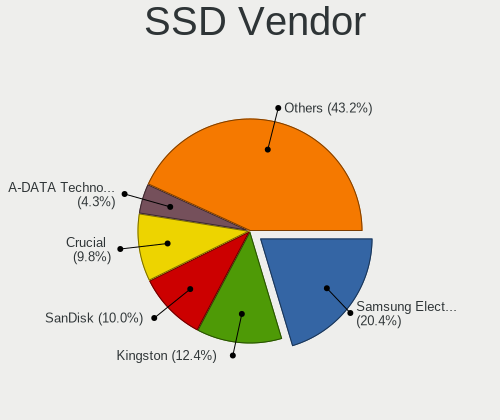
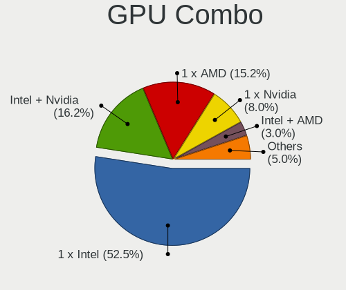

Debian - Tested Hardware & Statistics (Notebooks)
-------------------------------------------------

A project to collect tested hardware configurations for Debian.

Anyone can contribute to this report by the [hw-probe](https://github.com/linuxhw/hw-probe) tool:

    sudo -E hw-probe -all -upload

Please contribute! Especially if your hardware is rare.

Contents
--------

* [ Test Cases ](#test-cases)

* [ System ](#system)
  - [ OS                       ](#os)
  - [ OS Family                ](#os-family)
  - [ Kernel                   ](#kernel)
  - [ Kernel Family            ](#kernel-family)
  - [ Kernel Major Ver.        ](#kernel-major-ver)
  - [ Arch                     ](#arch)
  - [ DE                       ](#de)
  - [ Display Server           ](#display-server)
  - [ Display Manager          ](#display-manager)
  - [ OS Lang                  ](#os-lang)
  - [ Boot Mode                ](#boot-mode)
  - [ Filesystem               ](#filesystem)
  - [ Part. scheme             ](#part-scheme)
  - [ Dual Boot with Linux/BSD ](#dual-boot-with-linuxbsd)
  - [ Dual Boot (Win)          ](#dual-boot-win)

* [ Board ](#board)
  - [ Vendor                   ](#vendor)
  - [ Model                    ](#model)
  - [ Model Family             ](#model-family)
  - [ MFG Year                 ](#mfg-year)
  - [ Form Factor              ](#form-factor)
  - [ Secure Boot              ](#secure-boot)
  - [ Coreboot                 ](#coreboot)
  - [ RAM Size                 ](#ram-size)
  - [ RAM Used                 ](#ram-used)
  - [ Total Drives             ](#total-drives)
  - [ Has CD-ROM               ](#has-cd-rom)
  - [ Has Ethernet             ](#has-ethernet)
  - [ Has WiFi                 ](#has-wifi)
  - [ Has Bluetooth            ](#has-bluetooth)

* [ Location ](#location)
  - [ Country                  ](#country)
  - [ City                     ](#city)

* [ Drives ](#drives)
  - [ Drive Vendor             ](#drive-vendor)
  - [ Drive Model              ](#drive-model)
  - [ HDD Vendor               ](#hdd-vendor)
  - [ SSD Vendor               ](#ssd-vendor)
  - [ Drive Kind               ](#drive-kind)
  - [ Drive Connector          ](#drive-connector)
  - [ Drive Size               ](#drive-size)
  - [ Space Total              ](#space-total)
  - [ Space Used               ](#space-used)
  - [ Malfunc. Drives          ](#malfunc-drives)
  - [ Malfunc. Drive Vendor    ](#malfunc-drive-vendor)
  - [ Malfunc. HDD Vendor      ](#malfunc-hdd-vendor)
  - [ Malfunc. Drive Kind      ](#malfunc-drive-kind)
  - [ Failed Drives            ](#failed-drives)
  - [ Failed Drive Vendor      ](#failed-drive-vendor)
  - [ Drive Status             ](#drive-status)

* [ Storage controller ](#storage-controller)
  - [ Storage Vendor           ](#storage-vendor)
  - [ Storage Model            ](#storage-model)
  - [ Storage Kind             ](#storage-kind)

* [ Processor ](#processor)
  - [ CPU Vendor               ](#cpu-vendor)
  - [ CPU Model                ](#cpu-model)
  - [ CPU Model Family         ](#cpu-model-family)
  - [ CPU Cores                ](#cpu-cores)
  - [ CPU Sockets              ](#cpu-sockets)
  - [ CPU Threads              ](#cpu-threads)
  - [ CPU Op-Modes             ](#cpu-op-modes)
  - [ CPU Microcode            ](#cpu-microcode)
  - [ CPU Microarch            ](#cpu-microarch)

* [ Graphics ](#graphics)
  - [ GPU Vendor               ](#gpu-vendor)
  - [ GPU Model                ](#gpu-model)
  - [ GPU Combo                ](#gpu-combo)
  - [ GPU Driver               ](#gpu-driver)
  - [ GPU Memory               ](#gpu-memory)

* [ Monitor ](#monitor)
  - [ Monitor Vendor           ](#monitor-vendor)
  - [ Monitor Model            ](#monitor-model)
  - [ Monitor Resolution       ](#monitor-resolution)
  - [ Monitor Diagonal         ](#monitor-diagonal)
  - [ Monitor Width            ](#monitor-width)
  - [ Aspect Ratio             ](#aspect-ratio)
  - [ Monitor Area             ](#monitor-area)
  - [ Pixel Density            ](#pixel-density)
  - [ Multiple Monitors        ](#multiple-monitors)

* [ Network ](#network)
  - [ Net Controller Vendor    ](#net-controller-vendor)
  - [ Net Controller Model     ](#net-controller-model)
  - [ Wireless Vendor          ](#wireless-vendor)
  - [ Wireless Model           ](#wireless-model)
  - [ Ethernet Vendor          ](#ethernet-vendor)
  - [ Ethernet Model           ](#ethernet-model)
  - [ Net Controller Kind      ](#net-controller-kind)
  - [ Used Controller          ](#used-controller)
  - [ NICs                     ](#nics)
  - [ IPv6                     ](#ipv6)

* [ Bluetooth ](#bluetooth)
  - [ Bluetooth Vendor         ](#bluetooth-vendor)
  - [ Bluetooth Model          ](#bluetooth-model)

* [ Sound ](#sound)
  - [ Sound Vendor             ](#sound-vendor)
  - [ Sound Model              ](#sound-model)

* [ Memory ](#memory)
  - [ Memory Vendor            ](#memory-vendor)
  - [ Memory Model             ](#memory-model)
  - [ Memory Kind              ](#memory-kind)
  - [ Memory Form Factor       ](#memory-form-factor)
  - [ Memory Size              ](#memory-size)
  - [ Memory Speed             ](#memory-speed)

* [ Printers & scanners ](#printers--scanners)
  - [ Printer Vendor           ](#printer-vendor)
  - [ Printer Model            ](#printer-model)
  - [ Scanner Vendor           ](#scanner-vendor)
  - [ Scanner Model            ](#scanner-model)

* [ Camera ](#camera)
  - [ Camera Vendor            ](#camera-vendor)
  - [ Camera Model             ](#camera-model)

* [ Security ](#security)
  - [ Fingerprint Vendor       ](#fingerprint-vendor)
  - [ Fingerprint Model        ](#fingerprint-model)
  - [ Chipcard Vendor          ](#chipcard-vendor)
  - [ Chipcard Model           ](#chipcard-model)

* [ Unsupported ](#unsupported)
  - [ Unsupported Devices      ](#unsupported-devices)
  - [ Unsupported Device Types ](#unsupported-device-types)

Test Cases
----------

Total: 7779

| Vendor        | Model                       | Probe                                                      | Date         |
|---------------|-----------------------------|------------------------------------------------------------|--------------|
| ASUSTek       | N751JX                      | [8ece217753](https://linux-hardware.org/?probe=8ece217753) | Sep 06, 2023 |
| Lenovo        | ThinkPad E14 Gen 2 20TA0... | [0468bc91fc](https://linux-hardware.org/?probe=0468bc91fc) | Sep 06, 2023 |
| ASUSTek       | X542UQ                      | [50ecc5159c](https://linux-hardware.org/?probe=50ecc5159c) | Sep 06, 2023 |
| ASUSTek       | X542UQ                      | [b34e0e7866](https://linux-hardware.org/?probe=b34e0e7866) | Sep 06, 2023 |
| Acer          | Aspire E1-531               | [9d5880bc6c](https://linux-hardware.org/?probe=9d5880bc6c) | Sep 06, 2023 |
| Acer          | Aspire E1-531               | [6ffc334cf9](https://linux-hardware.org/?probe=6ffc334cf9) | Sep 06, 2023 |
| HP            | Laptop 15s-eq2xxx           | [03f6b3b62b](https://linux-hardware.org/?probe=03f6b3b62b) | Sep 06, 2023 |
| Toshiba       | Satellite A205              | [9a44e74608](https://linux-hardware.org/?probe=9a44e74608) | Sep 06, 2023 |
| Toshiba       | Satellite A205              | [a2b456886d](https://linux-hardware.org/?probe=a2b456886d) | Sep 05, 2023 |
| HP            | ZBook 15 G3                 | [faac131992](https://linux-hardware.org/?probe=faac131992) | Sep 05, 2023 |
| Framework     | Laptop (13th Gen Intel C... | [1bcf7b95c6](https://linux-hardware.org/?probe=1bcf7b95c6) | Sep 05, 2023 |
| Lenovo        | ThinkPad T490 20N2001YUS    | [75c15ac2e8](https://linux-hardware.org/?probe=75c15ac2e8) | Sep 05, 2023 |
| ASUSTek       | K53SD                       | [051fefc7ca](https://linux-hardware.org/?probe=051fefc7ca) | Sep 05, 2023 |
| Lenovo        | ThinkPad T520 4243WCR       | [181ef642cd](https://linux-hardware.org/?probe=181ef642cd) | Sep 05, 2023 |
| Sony          | VGN-CS108D                  | [24bf5bb06c](https://linux-hardware.org/?probe=24bf5bb06c) | Sep 05, 2023 |
| Lenovo        | IdeaPad 330S-15ARR 81FB     | [eb05baece5](https://linux-hardware.org/?probe=eb05baece5) | Sep 05, 2023 |
| HUAWEI        | NBD-WXX9                    | [005ebd39ce](https://linux-hardware.org/?probe=005ebd39ce) | Sep 05, 2023 |
| ASUSTek       | X541NC                      | [927ba04557](https://linux-hardware.org/?probe=927ba04557) | Sep 05, 2023 |
| Acer          | Aspire E1-531               | [7f9460a97c](https://linux-hardware.org/?probe=7f9460a97c) | Sep 04, 2023 |
| eMachines     | Rhine V1.42                 | [c18c4d64bd](https://linux-hardware.org/?probe=c18c4d64bd) | Sep 04, 2023 |
| ASUSTek       | ROG Strix G531GT_G531GT     | [f7a6b9d479](https://linux-hardware.org/?probe=f7a6b9d479) | Sep 04, 2023 |
| HP            | Pavilion Gaming Laptop 1... | [d075cbe2e0](https://linux-hardware.org/?probe=d075cbe2e0) | Sep 04, 2023 |
| Acer          | Aspire ES1-533              | [9c788645a1](https://linux-hardware.org/?probe=9c788645a1) | Sep 03, 2023 |
| ASUSTek       | X507UB                      | [e74c3ad568](https://linux-hardware.org/?probe=e74c3ad568) | Sep 03, 2023 |
| HP            | EliteBook 2740p             | [c6d9dc5a3b](https://linux-hardware.org/?probe=c6d9dc5a3b) | Sep 03, 2023 |
| Dell          | Latitude 5414               | [704d861366](https://linux-hardware.org/?probe=704d861366) | Sep 03, 2023 |
| Lenovo        | ThinkPad X1 Carbon 6th 2... | [526a6826ab](https://linux-hardware.org/?probe=526a6826ab) | Sep 03, 2023 |
| Google        | Droid                       | [da26431a82](https://linux-hardware.org/?probe=da26431a82) | Sep 03, 2023 |
| Google        | Droid                       | [278861e9e8](https://linux-hardware.org/?probe=278861e9e8) | Sep 03, 2023 |
| Lenovo        | ThinkPad T480 20L6S2KV20    | [248ef69016](https://linux-hardware.org/?probe=248ef69016) | Sep 03, 2023 |
| Acer          | Aspire A515-56              | [435cb2d610](https://linux-hardware.org/?probe=435cb2d610) | Sep 03, 2023 |
| HP            | 255 15.6 inch G9 Noteboo... | [7ba8b58ea7](https://linux-hardware.org/?probe=7ba8b58ea7) | Sep 03, 2023 |
| Toshiba       | Satellite L10W-B-101        | [1865cdf1ad](https://linux-hardware.org/?probe=1865cdf1ad) | Sep 02, 2023 |
| HP            | ZBook 15 G2                 | [d20f8f324d](https://linux-hardware.org/?probe=d20f8f324d) | Sep 02, 2023 |
| Lenovo        | IdeaPad 3 15IML05 81WB      | [d00f64dfcf](https://linux-hardware.org/?probe=d00f64dfcf) | Sep 02, 2023 |
| Samsung       | RF511/RF411/RF711           | [ab39767c20](https://linux-hardware.org/?probe=ab39767c20) | Sep 02, 2023 |
| Dell          | Latitude E6520              | [b53cd78958](https://linux-hardware.org/?probe=b53cd78958) | Sep 02, 2023 |
| Lenovo        | G505 20240                  | [ea15ab596a](https://linux-hardware.org/?probe=ea15ab596a) | Sep 02, 2023 |
| Lenovo        | IdeaPad 5 14ARE05 81YM      | [155023d91f](https://linux-hardware.org/?probe=155023d91f) | Sep 02, 2023 |
| Lenovo        | Legion 5 15ACH6 82QJ        | [5897684d9e](https://linux-hardware.org/?probe=5897684d9e) | Sep 02, 2023 |
| Dell          | Latitude 5430               | [7a9eb9995d](https://linux-hardware.org/?probe=7a9eb9995d) | Sep 02, 2023 |
| Lenovo        | ThinkPad Z13 Gen 1 21D20... | [52e8a720ba](https://linux-hardware.org/?probe=52e8a720ba) | Sep 01, 2023 |
| Lenovo        | ThinkPad X1 Carbon 6th 2... | [062f19958d](https://linux-hardware.org/?probe=062f19958d) | Sep 01, 2023 |
| ASUSTek       | VivoBook_ASUSLaptop M160... | [af78cafb1a](https://linux-hardware.org/?probe=af78cafb1a) | Sep 01, 2023 |
| Lenovo        | IdeaPad 1 15IGL7 82V7       | [5db10955f8](https://linux-hardware.org/?probe=5db10955f8) | Sep 01, 2023 |
| Lenovo        | ThinkPad 13 2nd Gen 20J1... | [f98a2afc33](https://linux-hardware.org/?probe=f98a2afc33) | Aug 31, 2023 |
| Acer          | Swift SF314-42              | [80bebab849](https://linux-hardware.org/?probe=80bebab849) | Aug 31, 2023 |
| Google        | Enguarde                    | [d67a18c110](https://linux-hardware.org/?probe=d67a18c110) | Aug 30, 2023 |
| HP            | ProBook 6460b               | [18deeb6be6](https://linux-hardware.org/?probe=18deeb6be6) | Aug 30, 2023 |
| GPU Compan... | GWTN156-9                   | [4c8ea16ab2](https://linux-hardware.org/?probe=4c8ea16ab2) | Aug 30, 2023 |
| HP            | Laptop 15s-fq2xxx           | [6d85c1d397](https://linux-hardware.org/?probe=6d85c1d397) | Aug 30, 2023 |
| Acer          | Aspire A515-57              | [c9a61f810d](https://linux-hardware.org/?probe=c9a61f810d) | Aug 30, 2023 |
| Acer          | Aspire A515-57              | [d6fded6169](https://linux-hardware.org/?probe=d6fded6169) | Aug 30, 2023 |
| Google        | Enguarde                    | [08ff2764b2](https://linux-hardware.org/?probe=08ff2764b2) | Aug 30, 2023 |
| Unknown       | Unknown                     | [3718299cea](https://linux-hardware.org/?probe=3718299cea) | Aug 29, 2023 |
| Google        | Enguarde                    | [e2e5a3dadc](https://linux-hardware.org/?probe=e2e5a3dadc) | Aug 29, 2023 |
| Google        | Enguarde                    | [e7a59ac286](https://linux-hardware.org/?probe=e7a59ac286) | Aug 29, 2023 |
| Lenovo        | ThinkPad T495s 20QJCTO1W... | [4bdfa8b9ea](https://linux-hardware.org/?probe=4bdfa8b9ea) | Aug 29, 2023 |
| HP            | EliteBook 845 14 inch G9... | [41ce572b6d](https://linux-hardware.org/?probe=41ce572b6d) | Aug 29, 2023 |
| Acer          | Swift SF314-512             | [a41a08d4ae](https://linux-hardware.org/?probe=a41a08d4ae) | Aug 29, 2023 |
| ASUSTek       | TUF Gaming FX504GD_FX80G... | [62ff88eaf7](https://linux-hardware.org/?probe=62ff88eaf7) | Aug 29, 2023 |
| ASUSTek       | ASUS EXPERTBOOK B1500CBA... | [243b20df85](https://linux-hardware.org/?probe=243b20df85) | Aug 28, 2023 |
| Lenovo        | ThinkPad E470 20H2S00700    | [cea73826dc](https://linux-hardware.org/?probe=cea73826dc) | Aug 28, 2023 |
| win elemen... | MoreFine S500+              | [9675488adc](https://linux-hardware.org/?probe=9675488adc) | Aug 28, 2023 |
| win elemen... | MoreFine S500+              | [29e062fb36](https://linux-hardware.org/?probe=29e062fb36) | Aug 27, 2023 |
| Apple         | MacBookPro6,2               | [e25e18e9b1](https://linux-hardware.org/?probe=e25e18e9b1) | Aug 27, 2023 |
| Lenovo        | B590 20208                  | [65bf0970da](https://linux-hardware.org/?probe=65bf0970da) | Aug 27, 2023 |
| ASUSTek       | VivoBook_ASUSLaptop X760... | [5ef3048a11](https://linux-hardware.org/?probe=5ef3048a11) | Aug 26, 2023 |
| Dell          | Latitude E6420              | [ae48a8c618](https://linux-hardware.org/?probe=ae48a8c618) | Aug 26, 2023 |
| MSI           | GP76 Leopard 11UG           | [5de726089b](https://linux-hardware.org/?probe=5de726089b) | Aug 26, 2023 |
| Lenovo        | ThinkPad W540 20BG0016US    | [3b5476180b](https://linux-hardware.org/?probe=3b5476180b) | Aug 26, 2023 |
| Alienware     | m16 R1                      | [75f20a1519](https://linux-hardware.org/?probe=75f20a1519) | Aug 26, 2023 |
| Alienware     | m16 R1                      | [89cffc75ea](https://linux-hardware.org/?probe=89cffc75ea) | Aug 26, 2023 |
| Lenovo        | ThinkPad 13 2nd Gen 20J1... | [4ca70b63ef](https://linux-hardware.org/?probe=4ca70b63ef) | Aug 25, 2023 |
| HP            | EliteBook 845 G8 Noteboo... | [c288ff6b78](https://linux-hardware.org/?probe=c288ff6b78) | Aug 25, 2023 |
| HP            | Pavilion dv5                | [8e621682ec](https://linux-hardware.org/?probe=8e621682ec) | Aug 25, 2023 |
| Acer          | Aspire VN7-793G             | [5d748b1e22](https://linux-hardware.org/?probe=5d748b1e22) | Aug 25, 2023 |
| Acer          | TravelMate P215-53          | [113a5418ca](https://linux-hardware.org/?probe=113a5418ca) | Aug 25, 2023 |
| Acer          | TravelMate P215-53          | [b2579f594d](https://linux-hardware.org/?probe=b2579f594d) | Aug 25, 2023 |
| MSI           | GS65 Stealth Thin 8RE       | [b53212efce](https://linux-hardware.org/?probe=b53212efce) | Aug 24, 2023 |
| Dell          | XPS 9320                    | [1ba8e13634](https://linux-hardware.org/?probe=1ba8e13634) | Aug 24, 2023 |
| ASUSTek       | X450LD                      | [b9187b37b7](https://linux-hardware.org/?probe=b9187b37b7) | Aug 24, 2023 |
| Acer          | Aspire 7741                 | [648f667e11](https://linux-hardware.org/?probe=648f667e11) | Aug 24, 2023 |
| Lenovo        | ThinkPad Z13 Gen 1 21D20... | [4d1d53f6d8](https://linux-hardware.org/?probe=4d1d53f6d8) | Aug 24, 2023 |
| ASUSTek       | VivoBook_ASUSLaptop X150... | [5a6247f9b2](https://linux-hardware.org/?probe=5a6247f9b2) | Aug 24, 2023 |
| HP            | Laptop 17-by4xxx            | [9fd582b91e](https://linux-hardware.org/?probe=9fd582b91e) | Aug 24, 2023 |
| HP            | ZBook 14 G2                 | [fcbebfc95a](https://linux-hardware.org/?probe=fcbebfc95a) | Aug 23, 2023 |
| Acer          | Aspire ES1-311              | [93f204808e](https://linux-hardware.org/?probe=93f204808e) | Aug 23, 2023 |
| Lenovo        | IdeaPad Z485 20151          | [599346f806](https://linux-hardware.org/?probe=599346f806) | Aug 23, 2023 |
| Panasonic     | CFMX4-1                     | [fd352acae8](https://linux-hardware.org/?probe=fd352acae8) | Aug 23, 2023 |
| Acer          | TravelMate P214-52          | [6d7eeef62a](https://linux-hardware.org/?probe=6d7eeef62a) | Aug 23, 2023 |
| Acer          | TravelMate P214-52          | [0a000435ae](https://linux-hardware.org/?probe=0a000435ae) | Aug 23, 2023 |
| MSI           | Stealth 17Studio A13VF      | [ca952946e9](https://linux-hardware.org/?probe=ca952946e9) | Aug 23, 2023 |
| ASUSTek       | X507UB                      | [6c8e9739d4](https://linux-hardware.org/?probe=6c8e9739d4) | Aug 23, 2023 |
| Gigabyte      | AORUS 5 KE                  | [abfb96067f](https://linux-hardware.org/?probe=abfb96067f) | Aug 23, 2023 |
| Lenovo        | IdeaPad 1 15IGL7 82V7       | [3e831762f2](https://linux-hardware.org/?probe=3e831762f2) | Aug 22, 2023 |
| Positivo      | Mobile                      | [e39dbd02a9](https://linux-hardware.org/?probe=e39dbd02a9) | Aug 22, 2023 |
| ASUSTek       | ZenBook UX425UG_Q408UG      | [8b219ffa3b](https://linux-hardware.org/?probe=8b219ffa3b) | Aug 22, 2023 |
| Lenovo        | ThinkPad T14 Gen 2a 20XL... | [b460d0aa2d](https://linux-hardware.org/?probe=b460d0aa2d) | Aug 22, 2023 |
| Lenovo        | ThinkPad T14 Gen 2i 20W0... | [285b51551c](https://linux-hardware.org/?probe=285b51551c) | Aug 22, 2023 |
| Samsung       | 905S3G/906S3G/915S3G        | [ae599c9d4b](https://linux-hardware.org/?probe=ae599c9d4b) | Aug 22, 2023 |
| ASUSTek       | ROG Strix G531GU_G531GU     | [627606b933](https://linux-hardware.org/?probe=627606b933) | Aug 22, 2023 |
| HP            | Laptop 15z-ef3xxx           | [cf603a20c0](https://linux-hardware.org/?probe=cf603a20c0) | Aug 22, 2023 |
| Sony          | SVE14123CBW                 | [b7891b51b2](https://linux-hardware.org/?probe=b7891b51b2) | Aug 21, 2023 |
| Sony          | SVE14123CBW                 | [9730d7f8f5](https://linux-hardware.org/?probe=9730d7f8f5) | Aug 21, 2023 |
| HP            | 250 G7 Notebook PC          | [cb4da51551](https://linux-hardware.org/?probe=cb4da51551) | Aug 21, 2023 |
| Lenovo        | ThinkPad T14 Gen 2i 20W0... | [0baece8878](https://linux-hardware.org/?probe=0baece8878) | Aug 21, 2023 |
| Lenovo        | Legion 5 15ACH6H 82JU       | [43d120af0e](https://linux-hardware.org/?probe=43d120af0e) | Aug 21, 2023 |
| Dell          | Inspiron 15 3515            | [534e1dc3e5](https://linux-hardware.org/?probe=534e1dc3e5) | Aug 21, 2023 |
| Sony          | VPCEH2J9R                   | [a919beee79](https://linux-hardware.org/?probe=a919beee79) | Aug 21, 2023 |
| Lenovo        | IdeaPad S145-15IIL 82DJ     | [e2c346429e](https://linux-hardware.org/?probe=e2c346429e) | Aug 21, 2023 |
| Acer          | Aspire A517-53G             | [692bd3fa37](https://linux-hardware.org/?probe=692bd3fa37) | Aug 20, 2023 |
| Acer          | Aspire A517-53G             | [6313b3f69e](https://linux-hardware.org/?probe=6313b3f69e) | Aug 20, 2023 |
| Dell          | Latitude E5550              | [0f3afef2ac](https://linux-hardware.org/?probe=0f3afef2ac) | Aug 20, 2023 |
| Valve         | Jupiter                     | [36e4b2146b](https://linux-hardware.org/?probe=36e4b2146b) | Aug 20, 2023 |
| EUROCOM       | RACER 2.0                   | [b27f687c16](https://linux-hardware.org/?probe=b27f687c16) | Aug 20, 2023 |
| Acer          | Aspire A515-56              | [501ee4caf7](https://linux-hardware.org/?probe=501ee4caf7) | Aug 20, 2023 |
| Apple         | MacBookAir7,2               | [fb3c8c793c](https://linux-hardware.org/?probe=fb3c8c793c) | Aug 19, 2023 |
| Lenovo        | ThinkPad X1 Carbon Gen 9... | [ab5bc08964](https://linux-hardware.org/?probe=ab5bc08964) | Aug 19, 2023 |
| Dell          | Vostro 3501                 | [5369c283ad](https://linux-hardware.org/?probe=5369c283ad) | Aug 18, 2023 |
| Acer          | Extensa 5235                | [1dc9843f33](https://linux-hardware.org/?probe=1dc9843f33) | Aug 18, 2023 |
| Acer          | Aspire VN7-793G             | [b88e1a5605](https://linux-hardware.org/?probe=b88e1a5605) | Aug 18, 2023 |
| Lenovo        | ThinkPad 13 2nd Gen 20J1... | [95c536cff4](https://linux-hardware.org/?probe=95c536cff4) | Aug 18, 2023 |
| ASUSTek       | M3N                         | [7c4b9386db](https://linux-hardware.org/?probe=7c4b9386db) | Aug 18, 2023 |
| Lenovo        | ThinkPad T430s 2355C33      | [4c589a0320](https://linux-hardware.org/?probe=4c589a0320) | Aug 18, 2023 |
| HUAWEI        | NBLK-WAX9X                  | [e66c463188](https://linux-hardware.org/?probe=e66c463188) | Aug 18, 2023 |
| Lenovo        | IdeaPad S145-15IIL 82DJ     | [55b9d87888](https://linux-hardware.org/?probe=55b9d87888) | Aug 18, 2023 |
| HP            | Laptop 15-dy0xxx            | [f938725821](https://linux-hardware.org/?probe=f938725821) | Aug 18, 2023 |
| Alienware     | 17 R4                       | [c16cb58f29](https://linux-hardware.org/?probe=c16cb58f29) | Aug 18, 2023 |
| Lenovo        | ThinkPad T14 Gen 2i 20W1... | [748298f0c8](https://linux-hardware.org/?probe=748298f0c8) | Aug 18, 2023 |
| HP            | ProBook 445 G8 Notebook ... | [24a295f95b](https://linux-hardware.org/?probe=24a295f95b) | Aug 17, 2023 |
| Lenovo        | ThinkPad X220 4291MW5       | [adf4aceec8](https://linux-hardware.org/?probe=adf4aceec8) | Aug 17, 2023 |
| HP            | Laptop 15s-eq2xxx           | [c647987aaf](https://linux-hardware.org/?probe=c647987aaf) | Aug 16, 2023 |
| Acer          | Aspire one                  | [47131c09b2](https://linux-hardware.org/?probe=47131c09b2) | Aug 16, 2023 |
| Acer          | Aspire A515-52G             | [2d38a6554a](https://linux-hardware.org/?probe=2d38a6554a) | Aug 16, 2023 |
| Lenovo        | G505s 20255                 | [2486dc323f](https://linux-hardware.org/?probe=2486dc323f) | Aug 16, 2023 |
| Lenovo        | ThinkPad L580 20LW000WGE    | [69e443b8a8](https://linux-hardware.org/?probe=69e443b8a8) | Aug 16, 2023 |
| Lenovo        | ThinkPad T480 20L5S2J200    | [66c997fdec](https://linux-hardware.org/?probe=66c997fdec) | Aug 16, 2023 |
| Lenovo        | ThinkPad T480 20L5S2J200    | [e57e76260c](https://linux-hardware.org/?probe=e57e76260c) | Aug 16, 2023 |
| Google        | Phaser360                   | [3c248cc2c8](https://linux-hardware.org/?probe=3c248cc2c8) | Aug 16, 2023 |
| Dell          | Vostro 3501                 | [c36d4d9de0](https://linux-hardware.org/?probe=c36d4d9de0) | Aug 15, 2023 |
| Acer          | Aspire A315-59              | [901f34e440](https://linux-hardware.org/?probe=901f34e440) | Aug 15, 2023 |
| Framework     | Laptop (13th Gen Intel C... | [268eeb2657](https://linux-hardware.org/?probe=268eeb2657) | Aug 15, 2023 |
| Lenovo        | ThinkPad L14 Gen 1 20U50... | [4c24f10db4](https://linux-hardware.org/?probe=4c24f10db4) | Aug 15, 2023 |
| Lenovo        | Yoga Pro 9 16IRP8 83BY      | [6242833326](https://linux-hardware.org/?probe=6242833326) | Aug 15, 2023 |
| Lenovo        | Yoga Pro 9 16IRP8 83BY      | [22252eb1d9](https://linux-hardware.org/?probe=22252eb1d9) | Aug 15, 2023 |
| Alienware     | m15 R4                      | [40d4ad1e4f](https://linux-hardware.org/?probe=40d4ad1e4f) | Aug 14, 2023 |
| Framework     | Laptop (13th Gen Intel C... | [72e71d1afc](https://linux-hardware.org/?probe=72e71d1afc) | Aug 14, 2023 |
| Dell          | XPS 13 9360                 | [69b51e3f5a](https://linux-hardware.org/?probe=69b51e3f5a) | Aug 14, 2023 |
| MSI           | Z790 GAMING WIFI            | [95e340d91b](https://linux-hardware.org/?probe=95e340d91b) | Aug 14, 2023 |
| Beelink       | Gemini X                    | [1610652627](https://linux-hardware.org/?probe=1610652627) | Aug 14, 2023 |
| Google        | Blooglet                    | [b9967e65c2](https://linux-hardware.org/?probe=b9967e65c2) | Aug 14, 2023 |
| Lenovo        | ThinkPad P50 20EQS1WW00     | [57af1d89d6](https://linux-hardware.org/?probe=57af1d89d6) | Aug 14, 2023 |
| ASUSTek       | VivoBook_ASUSLaptop M760... | [ab5728ee52](https://linux-hardware.org/?probe=ab5728ee52) | Aug 13, 2023 |
| ASUSTek       | GL552VW                     | [1d77ac2450](https://linux-hardware.org/?probe=1d77ac2450) | Aug 13, 2023 |
| Lenovo        | ThinkPad W530 24477V0       | [2e09955f2f](https://linux-hardware.org/?probe=2e09955f2f) | Aug 13, 2023 |
| HP            | Pavilion dv5                | [78530d4418](https://linux-hardware.org/?probe=78530d4418) | Aug 13, 2023 |
| Apple         | MacBookPro8,1               | [c7bc7c3f16](https://linux-hardware.org/?probe=c7bc7c3f16) | Aug 13, 2023 |
| Lenovo        | ThinkPad E15 Gen 4 21ED0... | [b0524c4203](https://linux-hardware.org/?probe=b0524c4203) | Aug 13, 2023 |
| ASUSTek       | GL552VW                     | [6986ca63da](https://linux-hardware.org/?probe=6986ca63da) | Aug 12, 2023 |
| Acer          | Swift SF314-512             | [7158f3e437](https://linux-hardware.org/?probe=7158f3e437) | Aug 12, 2023 |
| Dell          | Vostro 3500                 | [2ec62f31c9](https://linux-hardware.org/?probe=2ec62f31c9) | Aug 12, 2023 |
| Dell          | Latitude E6430              | [8037585070](https://linux-hardware.org/?probe=8037585070) | Aug 12, 2023 |
| HP            | ZBook 17 G3                 | [475b07d2dc](https://linux-hardware.org/?probe=475b07d2dc) | Aug 12, 2023 |
| Unknown       | Unknown                     | [2e76349d2c](https://linux-hardware.org/?probe=2e76349d2c) | Aug 12, 2023 |
| Unknown       | Unknown                     | [8d7674c3b3](https://linux-hardware.org/?probe=8d7674c3b3) | Aug 11, 2023 |
| HP            | Pavilion dv5                | [41c7682f98](https://linux-hardware.org/?probe=41c7682f98) | Aug 11, 2023 |
| HP            | Pavilion dv5                | [a8f62e42dc](https://linux-hardware.org/?probe=a8f62e42dc) | Aug 11, 2023 |
| Unknown       | Unknown                     | [a064a2d5fd](https://linux-hardware.org/?probe=a064a2d5fd) | Aug 11, 2023 |
| Dell          | Inspiron 3531               | [0384e8a950](https://linux-hardware.org/?probe=0384e8a950) | Aug 11, 2023 |
| Avell High... | A40 LIV                     | [9bc62c7eec](https://linux-hardware.org/?probe=9bc62c7eec) | Aug 11, 2023 |
| HP            | Laptop 15s-eq2xxx           | [e45562b838](https://linux-hardware.org/?probe=e45562b838) | Aug 10, 2023 |
| ASUSTek       | 1005PE                      | [088a155ec9](https://linux-hardware.org/?probe=088a155ec9) | Aug 10, 2023 |
| Acer          | Swift SF314-512             | [e168ac1e62](https://linux-hardware.org/?probe=e168ac1e62) | Aug 10, 2023 |
| PC Special... | NH5xAx                      | [891b5ec398](https://linux-hardware.org/?probe=891b5ec398) | Aug 10, 2023 |
| Lenovo        | ThinkPad T410 25372E6       | [69c4723b51](https://linux-hardware.org/?probe=69c4723b51) | Aug 10, 2023 |
| Lenovo        | ThinkPad T480 20L6S29D00    | [a728658683](https://linux-hardware.org/?probe=a728658683) | Aug 10, 2023 |
| HP            | Laptop 15s-eq2xxx           | [c87b299407](https://linux-hardware.org/?probe=c87b299407) | Aug 10, 2023 |
| Acer          | Aspire A515-57              | [b95e28ab5d](https://linux-hardware.org/?probe=b95e28ab5d) | Aug 09, 2023 |
| Lenovo        | G460 20041                  | [709445c691](https://linux-hardware.org/?probe=709445c691) | Aug 09, 2023 |
| Lenovo        | ThinkPad X1 Carbon 4th 2... | [72655a5d65](https://linux-hardware.org/?probe=72655a5d65) | Aug 08, 2023 |
| Dell          | Inspiron 7537               | [61093a9af1](https://linux-hardware.org/?probe=61093a9af1) | Aug 08, 2023 |
| Lenovo        | IdeaPad 330-15IKB 81FE      | [965f96493c](https://linux-hardware.org/?probe=965f96493c) | Aug 08, 2023 |
| HONOR         | HYM-WXX                     | [6f5e2be121](https://linux-hardware.org/?probe=6f5e2be121) | Aug 08, 2023 |
| Lenovo        | IdeaPad Gaming 3 15IHU6 ... | [c06b23398a](https://linux-hardware.org/?probe=c06b23398a) | Aug 08, 2023 |
| Acer          | Aspire E5-573G              | [305061b67e](https://linux-hardware.org/?probe=305061b67e) | Aug 08, 2023 |
| Avell High... | A40 LIV                     | [4022d66d9a](https://linux-hardware.org/?probe=4022d66d9a) | Aug 08, 2023 |
| Lenovo        | ThinkPad T530 2394EN6       | [d348a65379](https://linux-hardware.org/?probe=d348a65379) | Aug 07, 2023 |
| Echips Imp... | NQ15E                       | [7d5e97a545](https://linux-hardware.org/?probe=7d5e97a545) | Aug 07, 2023 |
| ASUSTek       | ZenBook UX431DA_UM431DA     | [36c52dfe36](https://linux-hardware.org/?probe=36c52dfe36) | Aug 07, 2023 |
| Lenovo        | IdeaPad Gaming 3 15IHU6 ... | [543719cf07](https://linux-hardware.org/?probe=543719cf07) | Aug 07, 2023 |
| ASUSTek       | ZenBook UX431DA_UM431DA     | [be823adc05](https://linux-hardware.org/?probe=be823adc05) | Aug 07, 2023 |
| Acer          | Aspire V5-121               | [4b8b0f132d](https://linux-hardware.org/?probe=4b8b0f132d) | Aug 07, 2023 |
| Lenovo        | ThinkPad T480 20L6S29E02    | [a3e3489451](https://linux-hardware.org/?probe=a3e3489451) | Aug 07, 2023 |
| Lenovo        | IdeaPad 330-15IKB 81FE      | [7e185ae211](https://linux-hardware.org/?probe=7e185ae211) | Aug 07, 2023 |
| Lenovo        | IdeaPad 120S-14IAP 81A5     | [053d461635](https://linux-hardware.org/?probe=053d461635) | Aug 06, 2023 |
| Apple         | MacBook7,1                  | [38d285144e](https://linux-hardware.org/?probe=38d285144e) | Aug 06, 2023 |
| Lenovo        | ThinkPad T440s 20AQ005TU... | [55e9e43f37](https://linux-hardware.org/?probe=55e9e43f37) | Aug 06, 2023 |
| Dell          | Inspiron 5547               | [8f33c0cf28](https://linux-hardware.org/?probe=8f33c0cf28) | Aug 06, 2023 |
| HP            | Presario CQ57               | [cd84f6fa01](https://linux-hardware.org/?probe=cd84f6fa01) | Aug 06, 2023 |
| GPU Compan... | GWNR71517                   | [d754d51977](https://linux-hardware.org/?probe=d754d51977) | Aug 06, 2023 |
| Dell          | Latitude E5440              | [326ba9627a](https://linux-hardware.org/?probe=326ba9627a) | Aug 06, 2023 |
| Dell          | Latitude 5290 2-in-1        | [b4cc5c436c](https://linux-hardware.org/?probe=b4cc5c436c) | Aug 06, 2023 |
| HP            | ENVY Laptop 17-ch1xxx       | [89119ae1fc](https://linux-hardware.org/?probe=89119ae1fc) | Aug 06, 2023 |
| HP            | EliteBook 840 G3            | [9c2b1b1da7](https://linux-hardware.org/?probe=9c2b1b1da7) | Aug 06, 2023 |
| Dell          | Inspiron 15 3511            | [217bd70a25](https://linux-hardware.org/?probe=217bd70a25) | Aug 06, 2023 |
| Acer          | Aspire E5-553G              | [39140ff7de](https://linux-hardware.org/?probe=39140ff7de) | Aug 05, 2023 |
| Acer          | Aspire A315-59              | [fc1d6007aa](https://linux-hardware.org/?probe=fc1d6007aa) | Aug 05, 2023 |
| Acer          | Aspire A315-59              | [deff4c99b6](https://linux-hardware.org/?probe=deff4c99b6) | Aug 05, 2023 |
| Lenovo        | ThinkBook 16p Gen 2 20YM    | [2f529a830c](https://linux-hardware.org/?probe=2f529a830c) | Aug 05, 2023 |
| Lenovo        | ThinkBook 16p Gen 2 20YM    | [9d00f10bab](https://linux-hardware.org/?probe=9d00f10bab) | Aug 05, 2023 |
| HUAWEI        | MACHD-WXX9                  | [8511f4c245](https://linux-hardware.org/?probe=8511f4c245) | Aug 05, 2023 |
| Acer          | Swift SF314-512             | [ca109297da](https://linux-hardware.org/?probe=ca109297da) | Aug 05, 2023 |
| Sony          | VGN-NS11S_S                 | [8ad31bd20c](https://linux-hardware.org/?probe=8ad31bd20c) | Aug 05, 2023 |
| Shuttle       | DS47D                       | [7d1ceb9b3a](https://linux-hardware.org/?probe=7d1ceb9b3a) | Aug 05, 2023 |
| Lenovo        | IdeaPad 5 14ALC05 82LM      | [76662ba2c9](https://linux-hardware.org/?probe=76662ba2c9) | Aug 05, 2023 |
| ASUSTek       | N501JW                      | [e7d254dbe5](https://linux-hardware.org/?probe=e7d254dbe5) | Aug 04, 2023 |
| Dell          | Latitude E6400              | [ca61145546](https://linux-hardware.org/?probe=ca61145546) | Aug 04, 2023 |
| Lenovo        | Legion Pro 5 16IRX8 82WK    | [12948b89f6](https://linux-hardware.org/?probe=12948b89f6) | Aug 04, 2023 |
| HP            | ProBook 640 G2              | [7cacb46425](https://linux-hardware.org/?probe=7cacb46425) | Aug 04, 2023 |
| Dell          | XPS 9320                    | [140f8f8b2e](https://linux-hardware.org/?probe=140f8f8b2e) | Aug 04, 2023 |
| Sony          | VGN-FW373D                  | [535f0edf33](https://linux-hardware.org/?probe=535f0edf33) | Aug 04, 2023 |
| HP            | Lantis                      | [2c917365b3](https://linux-hardware.org/?probe=2c917365b3) | Aug 04, 2023 |
| Lenovo        | ThinkPad E15 Gen 4 21ED0... | [51ad22a795](https://linux-hardware.org/?probe=51ad22a795) | Aug 03, 2023 |
| Dell          | Vostro 3405                 | [db4954c21d](https://linux-hardware.org/?probe=db4954c21d) | Aug 03, 2023 |
| Lenovo        | ThinkPad T480 20L6S5LF00    | [6bc628f4e6](https://linux-hardware.org/?probe=6bc628f4e6) | Aug 03, 2023 |
| Google        | Enguarde                    | [663e44ce58](https://linux-hardware.org/?probe=663e44ce58) | Aug 03, 2023 |
| Dell          | Inspiron 5566               | [21d7f13381](https://linux-hardware.org/?probe=21d7f13381) | Aug 03, 2023 |
| Acer          | Nitro AN515-57              | [cef74aa3cb](https://linux-hardware.org/?probe=cef74aa3cb) | Aug 03, 2023 |
| Lenovo        | Yoga Pro 7 14ARP8 83AU      | [1317097350](https://linux-hardware.org/?probe=1317097350) | Aug 03, 2023 |
| ASUSTek       | TUF Gaming FX505DV_FX505... | [8036065591](https://linux-hardware.org/?probe=8036065591) | Aug 03, 2023 |
| Samsung       | 305U1A                      | [f65d34a8fb](https://linux-hardware.org/?probe=f65d34a8fb) | Aug 03, 2023 |
| ASUSTek       | 1015BX                      | [4770dbfc22](https://linux-hardware.org/?probe=4770dbfc22) | Aug 02, 2023 |
| ASUSTek       | ZenBook UX431DA_UM431DA     | [a1f99c3e4d](https://linux-hardware.org/?probe=a1f99c3e4d) | Aug 02, 2023 |
| Lenovo        | Legion 5 15ARH05 82B5       | [433a85501a](https://linux-hardware.org/?probe=433a85501a) | Aug 02, 2023 |
| HP            | EliteBook 840 G3            | [0ae0b35097](https://linux-hardware.org/?probe=0ae0b35097) | Aug 02, 2023 |
| Dell          | Vostro 5515                 | [0e031a4729](https://linux-hardware.org/?probe=0e031a4729) | Aug 02, 2023 |
| HP            | Laptop 15s-eq2xxx           | [2d046d70cc](https://linux-hardware.org/?probe=2d046d70cc) | Aug 02, 2023 |
| Samsung       | 300E5M/300E5L               | [d4c5149060](https://linux-hardware.org/?probe=d4c5149060) | Aug 02, 2023 |
| Lenovo        | ThinkPad X1 Carbon Gen 8... | [291bf82303](https://linux-hardware.org/?probe=291bf82303) | Aug 02, 2023 |
| Lenovo        | ThinkPad X1 Carbon Gen 8... | [7a9c57ad84](https://linux-hardware.org/?probe=7a9c57ad84) | Aug 02, 2023 |
| Lenovo        | ThinkPad E475 20H40006US    | [dfb33be517](https://linux-hardware.org/?probe=dfb33be517) | Aug 01, 2023 |
| HP            | EliteBook 840 G3            | [b53d4c2fad](https://linux-hardware.org/?probe=b53d4c2fad) | Aug 01, 2023 |
| Lenovo        | ThinkPad 13 2nd Gen 20J1... | [d3250ef8d7](https://linux-hardware.org/?probe=d3250ef8d7) | Aug 01, 2023 |
| HP            | Laptop 15s-eq2xxx           | [4a4ac95dcc](https://linux-hardware.org/?probe=4a4ac95dcc) | Aug 01, 2023 |
| Timi          | Xiaomi Book Pro 16 2022     | [1e963cc76b](https://linux-hardware.org/?probe=1e963cc76b) | Aug 01, 2023 |
| ASUSTek       | G750JX                      | [06279baf34](https://linux-hardware.org/?probe=06279baf34) | Aug 01, 2023 |
| Samsung       | 305E4Z/305E5Z/305E7Z        | [a9232da3e4](https://linux-hardware.org/?probe=a9232da3e4) | Jul 31, 2023 |
| Lenovo        | Flex 2-14 20404             | [dd24507513](https://linux-hardware.org/?probe=dd24507513) | Jul 31, 2023 |
| Google        | Kevin                       | [ca1037f6ca](https://linux-hardware.org/?probe=ca1037f6ca) | Jul 31, 2023 |
| Lenovo        | IdeaPad C340-14API 81N6     | [961a4eebbd](https://linux-hardware.org/?probe=961a4eebbd) | Jul 31, 2023 |
| Packard Be... | H17HV                       | [de2003d390](https://linux-hardware.org/?probe=de2003d390) | Jul 31, 2023 |
| HP            | ProBook 640 G2              | [9e297e7c8e](https://linux-hardware.org/?probe=9e297e7c8e) | Jul 31, 2023 |
| Dell          | Inspiron 15 3511            | [3ea3ff2535](https://linux-hardware.org/?probe=3ea3ff2535) | Jul 31, 2023 |
| NEC Comput... | PC-VY22GXZCA                | [180d6cf97d](https://linux-hardware.org/?probe=180d6cf97d) | Jul 31, 2023 |
| Apple         | MacBookAir3,1               | [1859204a6f](https://linux-hardware.org/?probe=1859204a6f) | Jul 31, 2023 |
| Apple         | MacBookPro5,5               | [f201460a34](https://linux-hardware.org/?probe=f201460a34) | Jul 30, 2023 |
| Dell          | Inspiron 5547               | [f3de23350d](https://linux-hardware.org/?probe=f3de23350d) | Jul 30, 2023 |
| Dell          | Inspiron 5547               | [3be466c09c](https://linux-hardware.org/?probe=3be466c09c) | Jul 30, 2023 |
| Apple         | MacBookPro6,2               | [c5205f5512](https://linux-hardware.org/?probe=c5205f5512) | Jul 30, 2023 |
| Dell          | Latitude E5270              | [ae07c57989](https://linux-hardware.org/?probe=ae07c57989) | Jul 30, 2023 |
| Apple         | MacBookPro8,2               | [ffda715e5e](https://linux-hardware.org/?probe=ffda715e5e) | Jul 30, 2023 |
| Apple         | MacBookPro9,1               | [3b030b25ac](https://linux-hardware.org/?probe=3b030b25ac) | Jul 30, 2023 |
| Lenovo        | ThinkPad X220 42914XG       | [053a30cc87](https://linux-hardware.org/?probe=053a30cc87) | Jul 30, 2023 |
| HP            | ProBook 640 G2              | [87a4b835cf](https://linux-hardware.org/?probe=87a4b835cf) | Jul 30, 2023 |
| Lenovo        | ThinkPad Edge E430 32543... | [b30651e46f](https://linux-hardware.org/?probe=b30651e46f) | Jul 30, 2023 |
| Lenovo        | ThinkPad T480s 20L8S0YW0... | [3ff995e8b7](https://linux-hardware.org/?probe=3ff995e8b7) | Jul 30, 2023 |
| ASUSTek       | Zephyrus S GX701GX_GX701... | [69da742061](https://linux-hardware.org/?probe=69da742061) | Jul 30, 2023 |
| Lenovo        | ThinkPad X201 3680BF5       | [dd11ccaaad](https://linux-hardware.org/?probe=dd11ccaaad) | Jul 29, 2023 |
| ASUSTek       | VivoBook_ASUSLaptop M350... | [d1a4b2769a](https://linux-hardware.org/?probe=d1a4b2769a) | Jul 29, 2023 |
| ASUSTek       | ASUS TUF Gaming F17 FX70... | [d1bf55b135](https://linux-hardware.org/?probe=d1bf55b135) | Jul 29, 2023 |
| ASUSTek       | ASUS TUF Gaming F17 FX70... | [ea8a893b11](https://linux-hardware.org/?probe=ea8a893b11) | Jul 29, 2023 |
| Sony          | SVS13A1Z9RN                 | [533b3018ea](https://linux-hardware.org/?probe=533b3018ea) | Jul 29, 2023 |
| Acer          | Swift SF315-52G             | [aca997f2b5](https://linux-hardware.org/?probe=aca997f2b5) | Jul 29, 2023 |
| ASUSTek       | VivoBook_ASUS Laptop E41... | [ce140941bc](https://linux-hardware.org/?probe=ce140941bc) | Jul 29, 2023 |
| ASUSTek       | VivoBook_ASUS Laptop E41... | [19850c3ad1](https://linux-hardware.org/?probe=19850c3ad1) | Jul 29, 2023 |
| Lenovo        | IdeaPad 1 15ADA7 82R1       | [7207a12cd1](https://linux-hardware.org/?probe=7207a12cd1) | Jul 29, 2023 |
| Dell          | Latitude 5520               | [5151c4275a](https://linux-hardware.org/?probe=5151c4275a) | Jul 29, 2023 |
| VALE          | Notebook Classic C140       | [ec65662265](https://linux-hardware.org/?probe=ec65662265) | Jul 28, 2023 |
| HP            | Pavilion Gaming Laptop      | [b277fcda26](https://linux-hardware.org/?probe=b277fcda26) | Jul 28, 2023 |
| HP            | Victus by Gaming Laptop ... | [7595472fb4](https://linux-hardware.org/?probe=7595472fb4) | Jul 28, 2023 |
| Dell          | Latitude 7480               | [4287f8186f](https://linux-hardware.org/?probe=4287f8186f) | Jul 28, 2023 |
| Chitech Sh... | Tibuta_MasterPad-W100       | [202a9be7b7](https://linux-hardware.org/?probe=202a9be7b7) | Jul 28, 2023 |
| Casper        | EXCALIBUR G770              | [1b416b9f01](https://linux-hardware.org/?probe=1b416b9f01) | Jul 28, 2023 |
| Dell          | Precision 3520              | [bc2e0ff018](https://linux-hardware.org/?probe=bc2e0ff018) | Jul 28, 2023 |
| ASUSTek       | VivoBook_ASUSLaptop M350... | [9cbedced8b](https://linux-hardware.org/?probe=9cbedced8b) | Jul 28, 2023 |
| Dell          | System XPS L702X            | [5e9f83aa10](https://linux-hardware.org/?probe=5e9f83aa10) | Jul 28, 2023 |
| Acer          | Aspire A315-21G             | [0a4e1c4510](https://linux-hardware.org/?probe=0a4e1c4510) | Jul 28, 2023 |
| Apple         | MacBookPro5,2               | [2c6617e2f9](https://linux-hardware.org/?probe=2c6617e2f9) | Jul 27, 2023 |
| Acer          | Extensa 215-32              | [18d32a6c36](https://linux-hardware.org/?probe=18d32a6c36) | Jul 27, 2023 |
| Compaq        | PRESARIOCQ18                | [c528c90b50](https://linux-hardware.org/?probe=c528c90b50) | Jul 27, 2023 |
| Lenovo        | ThinkPad P15 Gen 2i 20YQ... | [6e7d094f7f](https://linux-hardware.org/?probe=6e7d094f7f) | Jul 27, 2023 |
| Dell          | Inspiron 5720               | [8674c464bd](https://linux-hardware.org/?probe=8674c464bd) | Jul 27, 2023 |
| Google        | Vortininja                  | [70f9ee30d3](https://linux-hardware.org/?probe=70f9ee30d3) | Jul 27, 2023 |
| Acer          | Aspire A315-23G             | [4d7b874be2](https://linux-hardware.org/?probe=4d7b874be2) | Jul 27, 2023 |
| Fujitsu       | LIFEBOOK U748               | [23d71a87d0](https://linux-hardware.org/?probe=23d71a87d0) | Jul 26, 2023 |
| Unknown       | Apple MacBook Pro (14-in... | [0552cb3e44](https://linux-hardware.org/?probe=0552cb3e44) | Jul 26, 2023 |
| Lenovo        | IdeaPad 120S-14IAP 81A5     | [b2dd23136f](https://linux-hardware.org/?probe=b2dd23136f) | Jul 26, 2023 |
| Dell          | XPS 13 7390                 | [0217675942](https://linux-hardware.org/?probe=0217675942) | Jul 26, 2023 |
| Dell          | Precision 3520              | [2502fbaef2](https://linux-hardware.org/?probe=2502fbaef2) | Jul 26, 2023 |
| Acer          | Swift SF314-512             | [856e36fa9c](https://linux-hardware.org/?probe=856e36fa9c) | Jul 26, 2023 |
| Dell          | Vostro 3405                 | [82a990b785](https://linux-hardware.org/?probe=82a990b785) | Jul 26, 2023 |
| Dell          | Vostro 3405                 | [dc97ca175a](https://linux-hardware.org/?probe=dc97ca175a) | Jul 25, 2023 |
| HP            | ProBook 640 G2              | [ae244aab21](https://linux-hardware.org/?probe=ae244aab21) | Jul 25, 2023 |
| Apple         | MacBookPro5,5               | [9cf2abf318](https://linux-hardware.org/?probe=9cf2abf318) | Jul 25, 2023 |
| Google        | Droid                       | [ae803483c2](https://linux-hardware.org/?probe=ae803483c2) | Jul 25, 2023 |
| Dell          | XPS 13 9370                 | [835ca23b88](https://linux-hardware.org/?probe=835ca23b88) | Jul 25, 2023 |
| HP            | Laptop 15-db0xxx            | [f01ec95642](https://linux-hardware.org/?probe=f01ec95642) | Jul 25, 2023 |
| Dell          | XPS 13 9370                 | [321bdf6295](https://linux-hardware.org/?probe=321bdf6295) | Jul 25, 2023 |
| Acer          | Aspire 3610                 | [b40dd6ad17](https://linux-hardware.org/?probe=b40dd6ad17) | Jul 25, 2023 |
| MSI           | Katana GF66 11UG            | [bd45023e8e](https://linux-hardware.org/?probe=bd45023e8e) | Jul 25, 2023 |
| HP            | Laptop 15-fc0xxx            | [5c52eecd16](https://linux-hardware.org/?probe=5c52eecd16) | Jul 25, 2023 |
| SANTECH       | NHx0DB,DE                   | [80aa11a7e8](https://linux-hardware.org/?probe=80aa11a7e8) | Jul 25, 2023 |
| Dell          | Latitude 3420               | [18d920dab2](https://linux-hardware.org/?probe=18d920dab2) | Jul 24, 2023 |
| Lenovo        | ThinkPad 13 2nd Gen 20J1... | [fd441fa52f](https://linux-hardware.org/?probe=fd441fa52f) | Jul 24, 2023 |
| ASUSTek       | X541UV                      | [eb0aac9c32](https://linux-hardware.org/?probe=eb0aac9c32) | Jul 24, 2023 |
| Acer          | Nitro AN515-57              | [ae6caf81d7](https://linux-hardware.org/?probe=ae6caf81d7) | Jul 24, 2023 |
| Acer          | Aspire A515-45              | [e1de4fabc7](https://linux-hardware.org/?probe=e1de4fabc7) | Jul 24, 2023 |
| Timi          | A7S                         | [d0bcd36416](https://linux-hardware.org/?probe=d0bcd36416) | Jul 24, 2023 |
| Dell          | Inspiron 15 3511            | [980ed56abe](https://linux-hardware.org/?probe=980ed56abe) | Jul 24, 2023 |
| MSI           | Alpha 15 B5EEK              | [ea2f3666ba](https://linux-hardware.org/?probe=ea2f3666ba) | Jul 23, 2023 |
| Dell          | Latitude E7250              | [4b91b375d4](https://linux-hardware.org/?probe=4b91b375d4) | Jul 23, 2023 |
| Dell          | Latitude 7480               | [acad753aa8](https://linux-hardware.org/?probe=acad753aa8) | Jul 23, 2023 |
| HP            | EliteBook 835 G8 Noteboo... | [a3350e1d80](https://linux-hardware.org/?probe=a3350e1d80) | Jul 23, 2023 |
| Acer          | Aspire A315-21              | [17f482e878](https://linux-hardware.org/?probe=17f482e878) | Jul 23, 2023 |
| Lenovo        | ThinkPad X1 Carbon 7th 2... | [d957d5efe0](https://linux-hardware.org/?probe=d957d5efe0) | Jul 22, 2023 |
| Lenovo        | IdeaPad L340-15IRH Gamin... | [467cc30f89](https://linux-hardware.org/?probe=467cc30f89) | Jul 22, 2023 |
| ASUSTek       | ROG Strix G713QM_G713QM     | [bbd3181f1f](https://linux-hardware.org/?probe=bbd3181f1f) | Jul 22, 2023 |
| HP            | EliteBook 840 G1            | [cafa1082f8](https://linux-hardware.org/?probe=cafa1082f8) | Jul 22, 2023 |
| HP            | Presario CQ57               | [2c1bcfe898](https://linux-hardware.org/?probe=2c1bcfe898) | Jul 22, 2023 |
| Dell          | Inspiron 3558               | [2cad6d3cb7](https://linux-hardware.org/?probe=2cad6d3cb7) | Jul 22, 2023 |
| Dell          | Latitude 5580               | [06c9677557](https://linux-hardware.org/?probe=06c9677557) | Jul 22, 2023 |
| HP            | ENVY Laptop 17-ch2xxx       | [7d88a01e49](https://linux-hardware.org/?probe=7d88a01e49) | Jul 22, 2023 |
| HP            | 635                         | [bb148a8b2b](https://linux-hardware.org/?probe=bb148a8b2b) | Jul 21, 2023 |
| ASUSTek       | K72Jr                       | [cdb9b29f94](https://linux-hardware.org/?probe=cdb9b29f94) | Jul 21, 2023 |
| Lenovo        | V14 G2 ITL 82NM             | [031d46c9d0](https://linux-hardware.org/?probe=031d46c9d0) | Jul 21, 2023 |
| Lenovo        | ThinkPad T450s 20BWS05G0... | [fc45e9b064](https://linux-hardware.org/?probe=fc45e9b064) | Jul 21, 2023 |
| Acer          | Swift SF314-512             | [d82c78621f](https://linux-hardware.org/?probe=d82c78621f) | Jul 20, 2023 |
| Lenovo        | ThinkPad T520 42435UG       | [820630ba9e](https://linux-hardware.org/?probe=820630ba9e) | Jul 20, 2023 |
| Lenovo        | ThinkPad P73 20QRCTO1WW     | [7527ca0197](https://linux-hardware.org/?probe=7527ca0197) | Jul 20, 2023 |
| HP            | Pavilion Notebook           | [d366e7101c](https://linux-hardware.org/?probe=d366e7101c) | Jul 20, 2023 |
| ASUSTek       | T100TAM                     | [43cb18f0ee](https://linux-hardware.org/?probe=43cb18f0ee) | Jul 20, 2023 |
| ASUSTek       | VivoBook E14 E402YA_L402... | [311144e138](https://linux-hardware.org/?probe=311144e138) | Jul 20, 2023 |
| Shanghai Z... | ZXE CRB                     | [da6bb4265c](https://linux-hardware.org/?probe=da6bb4265c) | Jul 20, 2023 |
| Notebook      | N650DU                      | [c04f4faa06](https://linux-hardware.org/?probe=c04f4faa06) | Jul 19, 2023 |
| Acer          | Swift SF314-43              | [6f00498896](https://linux-hardware.org/?probe=6f00498896) | Jul 19, 2023 |
| HP            | Pavilion 15                 | [e1bfe97e63](https://linux-hardware.org/?probe=e1bfe97e63) | Jul 19, 2023 |
| Lenovo        | ThinkPad X1 Carbon 5th 2... | [524d69b498](https://linux-hardware.org/?probe=524d69b498) | Jul 19, 2023 |
| Acer          | Aspire 7739Z                | [3e75dec5e0](https://linux-hardware.org/?probe=3e75dec5e0) | Jul 19, 2023 |
| ASUSTek       | ZenBook Pro Duo UX581GV_... | [9672a393c9](https://linux-hardware.org/?probe=9672a393c9) | Jul 19, 2023 |
| HP            | Pavilion 17                 | [bf76e4c333](https://linux-hardware.org/?probe=bf76e4c333) | Jul 19, 2023 |
| Acer          | Extensa 215-22              | [fc3dadd5bc](https://linux-hardware.org/?probe=fc3dadd5bc) | Jul 19, 2023 |
| Acer          | Nitro AN515-57              | [cdad3aa931](https://linux-hardware.org/?probe=cdad3aa931) | Jul 19, 2023 |
| Lenovo        | IdeaPad 3 15ALC6 82MF       | [bddb3e26c1](https://linux-hardware.org/?probe=bddb3e26c1) | Jul 19, 2023 |
| ASUSTek       | VivoBook_ASUSLaptop X421... | [a4584a139f](https://linux-hardware.org/?probe=a4584a139f) | Jul 19, 2023 |
| HP            | EliteBook 8570p             | [8e456f1108](https://linux-hardware.org/?probe=8e456f1108) | Jul 18, 2023 |
| Lenovo        | ThinkPad T520 42435UG       | [f789cd31fa](https://linux-hardware.org/?probe=f789cd31fa) | Jul 18, 2023 |
| MSI           | GF63 Thin 11UC              | [3ef8cdcacb](https://linux-hardware.org/?probe=3ef8cdcacb) | Jul 18, 2023 |
| Dell          | Vostro 3500                 | [69cc1eb6f6](https://linux-hardware.org/?probe=69cc1eb6f6) | Jul 18, 2023 |
| Google        | Lillipup                    | [7f7ba76942](https://linux-hardware.org/?probe=7f7ba76942) | Jul 18, 2023 |
| HP            | Pavilion 15                 | [a5485bb7e0](https://linux-hardware.org/?probe=a5485bb7e0) | Jul 18, 2023 |
| Lenovo        | ThinkPad P16s Gen 1 21CK... | [c6da4f3b1e](https://linux-hardware.org/?probe=c6da4f3b1e) | Jul 18, 2023 |
| Lenovo        | ThinkPad L580 20LW000WGE    | [1b210ca778](https://linux-hardware.org/?probe=1b210ca778) | Jul 18, 2023 |
| Lenovo        | ThinkPad E15 Gen 2 20T80... | [35d510901b](https://linux-hardware.org/?probe=35d510901b) | Jul 18, 2023 |
| HP            | Laptop 17-cp0xxx            | [9d9ff78d29](https://linux-hardware.org/?probe=9d9ff78d29) | Jul 18, 2023 |
| Toshiba       | Satellite L755              | [da4d6e8a5c](https://linux-hardware.org/?probe=da4d6e8a5c) | Jul 18, 2023 |
| MSI           | GF63 Thin 11UC              | [f4fc84ba4b](https://linux-hardware.org/?probe=f4fc84ba4b) | Jul 17, 2023 |
| ASUSTek       | X505BA                      | [fcd96492f0](https://linux-hardware.org/?probe=fcd96492f0) | Jul 17, 2023 |
| Unknown       | TU-142                      | [d62ade82c2](https://linux-hardware.org/?probe=d62ade82c2) | Jul 17, 2023 |
| Dell          | Inspiron 16 7610            | [6d77ef17a0](https://linux-hardware.org/?probe=6d77ef17a0) | Jul 17, 2023 |
| HP            | Pavilion dm1                | [135bb20fbd](https://linux-hardware.org/?probe=135bb20fbd) | Jul 17, 2023 |
| Acer          | Aspire A515-57T             | [dd4a3bf595](https://linux-hardware.org/?probe=dd4a3bf595) | Jul 17, 2023 |
| Acer          | Aspire A315-23G             | [df26ae3dab](https://linux-hardware.org/?probe=df26ae3dab) | Jul 17, 2023 |
| Lenovo        | IdeaPad 3 15IML05 81WB      | [ab43e6b8ef](https://linux-hardware.org/?probe=ab43e6b8ef) | Jul 16, 2023 |
| Lenovo        | IdeaPad 3 15IML05 81WB      | [6b52cef555](https://linux-hardware.org/?probe=6b52cef555) | Jul 16, 2023 |
| Dell          | Latitude E6440              | [c1de0cf4d1](https://linux-hardware.org/?probe=c1de0cf4d1) | Jul 16, 2023 |
| Dell          | Latitude E6320              | [0087a8e5cf](https://linux-hardware.org/?probe=0087a8e5cf) | Jul 16, 2023 |
| ASUSTek       | TUF Gaming FX505GT_FX505... | [65e4fb1356](https://linux-hardware.org/?probe=65e4fb1356) | Jul 16, 2023 |
| Lenovo        | Yoga 14sITL 2021 82G2       | [899c1452e4](https://linux-hardware.org/?probe=899c1452e4) | Jul 16, 2023 |
| Lenovo        | ThinkPad X120e 0611AN2      | [497e6c5432](https://linux-hardware.org/?probe=497e6c5432) | Jul 16, 2023 |
| HP            | Laptop 14s-dq2xxx           | [cd9bfc68b6](https://linux-hardware.org/?probe=cd9bfc68b6) | Jul 16, 2023 |
| SIRAGON       | LM-C100                     | [daef084233](https://linux-hardware.org/?probe=daef084233) | Jul 16, 2023 |
| Lenovo        | ThinkPad X1 Carbon 5th 2... | [1625385cef](https://linux-hardware.org/?probe=1625385cef) | Jul 16, 2023 |
| Dell          | Latitude D610               | [791cabd713](https://linux-hardware.org/?probe=791cabd713) | Jul 16, 2023 |
| Lenovo        | ThinkPad T440p 20AN0069U... | [02af27da78](https://linux-hardware.org/?probe=02af27da78) | Jul 16, 2023 |
| ASUSTek       | VivoBook_ASUSLaptop X515... | [d43ad7594c](https://linux-hardware.org/?probe=d43ad7594c) | Jul 16, 2023 |
| Dell          | Latitude E6330              | [6adb67344f](https://linux-hardware.org/?probe=6adb67344f) | Jul 15, 2023 |
| Lenovo        | ThinkPad X260 20F5S04B00    | [8d3168b6c4](https://linux-hardware.org/?probe=8d3168b6c4) | Jul 15, 2023 |
| Acer          | Aspire R7-371T              | [c4f6270bdb](https://linux-hardware.org/?probe=c4f6270bdb) | Jul 15, 2023 |
| SLIMBOOK      | PROX15-AMD                  | [7e088e838b](https://linux-hardware.org/?probe=7e088e838b) | Jul 15, 2023 |
| Lenovo        | ThinkPad T470s 20HGS1VD0... | [b62ed55325](https://linux-hardware.org/?probe=b62ed55325) | Jul 15, 2023 |
| Dell          | Latitude 7490               | [6811ebe45a](https://linux-hardware.org/?probe=6811ebe45a) | Jul 15, 2023 |
| Apple         | MacBookPro14,3              | [bd2e85e3ce](https://linux-hardware.org/?probe=bd2e85e3ce) | Jul 15, 2023 |
| HUAWEI        | KLVL-WXXW                   | [c76e3df311](https://linux-hardware.org/?probe=c76e3df311) | Jul 14, 2023 |
| Lenovo        | ThinkPad T530 2429HD6       | [1c48702f3c](https://linux-hardware.org/?probe=1c48702f3c) | Jul 14, 2023 |
| Coradir       | Coradir/ES10IS5             | [571080a9d5](https://linux-hardware.org/?probe=571080a9d5) | Jul 14, 2023 |
| Lenovo        | ThinkPad X220 4290FC1       | [d6c0ccb8f1](https://linux-hardware.org/?probe=d6c0ccb8f1) | Jul 14, 2023 |
| HP            | ProBook 640 G2              | [e5efd1b971](https://linux-hardware.org/?probe=e5efd1b971) | Jul 14, 2023 |
| HP            | EliteBook 840 G5            | [02b5ea8525](https://linux-hardware.org/?probe=02b5ea8525) | Jul 14, 2023 |
| HP            | Pavilion dm1                | [3b05c5dc5c](https://linux-hardware.org/?probe=3b05c5dc5c) | Jul 14, 2023 |
| Dell          | Inspiron 15 3511            | [e6d47a005f](https://linux-hardware.org/?probe=e6d47a005f) | Jul 14, 2023 |
| HP            | Pavilion Aero Laptop 13-... | [e790a3c22f](https://linux-hardware.org/?probe=e790a3c22f) | Jul 14, 2023 |
| HP            | Pavilion Aero Laptop 13-... | [dae11c33ed](https://linux-hardware.org/?probe=dae11c33ed) | Jul 14, 2023 |
| Google        | Blorb                       | [6bbcc9b8f3](https://linux-hardware.org/?probe=6bbcc9b8f3) | Jul 14, 2023 |
| Lenovo        | ThinkPad X260 20F5S04B00    | [ae8ecf10e7](https://linux-hardware.org/?probe=ae8ecf10e7) | Jul 13, 2023 |
| Lenovo        | V14-IIL 82C4                | [42aba63af0](https://linux-hardware.org/?probe=42aba63af0) | Jul 13, 2023 |
| HP            | 245 G8                      | [07eefc20b0](https://linux-hardware.org/?probe=07eefc20b0) | Jul 13, 2023 |
| Valve         | Jupiter                     | [14f7ea4a48](https://linux-hardware.org/?probe=14f7ea4a48) | Jul 13, 2023 |
| Dell          | XPS 17 9730                 | [b074a1deb3](https://linux-hardware.org/?probe=b074a1deb3) | Jul 13, 2023 |
| Google        | Reks                        | [680b857c0d](https://linux-hardware.org/?probe=680b857c0d) | Jul 13, 2023 |
| Lenovo        | ThinkPad E475 20H40006US    | [7d2bb16563](https://linux-hardware.org/?probe=7d2bb16563) | Jul 13, 2023 |
| Lenovo        | ThinkPad E475 20H40006US    | [b054249d03](https://linux-hardware.org/?probe=b054249d03) | Jul 13, 2023 |
| MSI           | Alpha 15 A4DEK              | [9a192c4a0b](https://linux-hardware.org/?probe=9a192c4a0b) | Jul 13, 2023 |
| ASUSTek       | VivoBook E14 E402YA_L402... | [34ec75d601](https://linux-hardware.org/?probe=34ec75d601) | Jul 13, 2023 |
| Dell          | Latitude E6330              | [58ec0684cd](https://linux-hardware.org/?probe=58ec0684cd) | Jul 13, 2023 |
| MSI           | Stealth 16Studio A13VG      | [ab3683571a](https://linux-hardware.org/?probe=ab3683571a) | Jul 13, 2023 |
| Acer          | Aspire A515-52              | [56b110f152](https://linux-hardware.org/?probe=56b110f152) | Jul 13, 2023 |
| Acer          | Aspire A515-52              | [ad9fd505fa](https://linux-hardware.org/?probe=ad9fd505fa) | Jul 13, 2023 |
| Toshiba       | Satellite S75-B             | [ee71e28c8f](https://linux-hardware.org/?probe=ee71e28c8f) | Jul 12, 2023 |
| Lenovo        | ThinkPad 13 2nd Gen 20J1... | [603a591fcb](https://linux-hardware.org/?probe=603a591fcb) | Jul 12, 2023 |
| Google        | Lillipup                    | [b7b430e7b4](https://linux-hardware.org/?probe=b7b430e7b4) | Jul 12, 2023 |
| Positivo      | Mobile                      | [463636c0a2](https://linux-hardware.org/?probe=463636c0a2) | Jul 12, 2023 |
| Lenovo        | G570 4334                   | [27a207ead6](https://linux-hardware.org/?probe=27a207ead6) | Jul 12, 2023 |
| Acer          | Aspire 5820TG               | [86cfbf79ce](https://linux-hardware.org/?probe=86cfbf79ce) | Jul 12, 2023 |
| MSI           | FX603                       | [a2c598f9eb](https://linux-hardware.org/?probe=a2c598f9eb) | Jul 12, 2023 |
| MSI           | SUMMIT E13FlipEvo A12MT     | [90faae34f3](https://linux-hardware.org/?probe=90faae34f3) | Jul 12, 2023 |
| ASUSTek       | ASUS TUF Gaming F15 FX50... | [15c5dec8dc](https://linux-hardware.org/?probe=15c5dec8dc) | Jul 12, 2023 |
| Dell          | XPS 13 9380                 | [e40c69408d](https://linux-hardware.org/?probe=e40c69408d) | Jul 11, 2023 |
| Lenovo        | IdeaPad S540-14API 81NH     | [9fc68063e3](https://linux-hardware.org/?probe=9fc68063e3) | Jul 11, 2023 |
| Dell          | Latitude 7275               | [0647894f7f](https://linux-hardware.org/?probe=0647894f7f) | Jul 11, 2023 |
| Fujitsu       | LIFEBOOK E780               | [ab432dcb0e](https://linux-hardware.org/?probe=ab432dcb0e) | Jul 11, 2023 |
| HP            | ProBook 4730s               | [0b6a6c7260](https://linux-hardware.org/?probe=0b6a6c7260) | Jul 11, 2023 |
| HP            | EliteBook 645 14 inch G9... | [65f4b4e813](https://linux-hardware.org/?probe=65f4b4e813) | Jul 11, 2023 |
| Unknown       | HP Chromebook 14            | [63b183aa51](https://linux-hardware.org/?probe=63b183aa51) | Jul 11, 2023 |
| HP            | EliteBook 1040 G4           | [d7209e7141](https://linux-hardware.org/?probe=d7209e7141) | Jul 11, 2023 |
| Dell          | Inspiron 7560               | [a761bfffd2](https://linux-hardware.org/?probe=a761bfffd2) | Jul 11, 2023 |
| HP            | ZBook 15 G6                 | [47ea5a35cb](https://linux-hardware.org/?probe=47ea5a35cb) | Jul 11, 2023 |
| HP            | EliteBook 1040 G4           | [33aa3fcdbc](https://linux-hardware.org/?probe=33aa3fcdbc) | Jul 10, 2023 |
| Acer          | Aspire 4937                 | [fe9bfd5f77](https://linux-hardware.org/?probe=fe9bfd5f77) | Jul 10, 2023 |
| Acer          | Aspire 4937                 | [d4dadd2e77](https://linux-hardware.org/?probe=d4dadd2e77) | Jul 10, 2023 |
| ASUSTek       | ASUS TUF Gaming F15 FX50... | [707f0b8eeb](https://linux-hardware.org/?probe=707f0b8eeb) | Jul 10, 2023 |
| HP            | Victus by Laptop 16-e1xx... | [a14d8855bc](https://linux-hardware.org/?probe=a14d8855bc) | Jul 10, 2023 |
| Dell          | OptiPlex 9020               | [3384a64b67](https://linux-hardware.org/?probe=3384a64b67) | Jul 10, 2023 |
| Fujitsu       | LIFEBOOK U727               | [ce095d85c9](https://linux-hardware.org/?probe=ce095d85c9) | Jul 09, 2023 |
| HP            | Pro x2 612 G1 Tablet USA... | [c10c965a51](https://linux-hardware.org/?probe=c10c965a51) | Jul 09, 2023 |
| Acer          | Aspire V3-372T              | [566ff1d23e](https://linux-hardware.org/?probe=566ff1d23e) | Jul 09, 2023 |
| Toshiba       | PORTEGE Z30-C               | [f9d1d19d05](https://linux-hardware.org/?probe=f9d1d19d05) | Jul 09, 2023 |
| MSI           | Modern 14 B11MOU            | [c2e76ab704](https://linux-hardware.org/?probe=c2e76ab704) | Jul 09, 2023 |
| ASUSTek       | VivoBook S14 X430UA         | [fdb15c83de](https://linux-hardware.org/?probe=fdb15c83de) | Jul 09, 2023 |
| Lenovo        | IdeaPad 3 15IAU7 82RK       | [59f06e2baf](https://linux-hardware.org/?probe=59f06e2baf) | Jul 09, 2023 |
| Acer          | Aspire F5-573G              | [10cf2c3aa5](https://linux-hardware.org/?probe=10cf2c3aa5) | Jul 09, 2023 |
| Acer          | Aspire V3-372T              | [f2a9fbdf50](https://linux-hardware.org/?probe=f2a9fbdf50) | Jul 09, 2023 |
| HP            | EliteBook 8560p             | [39fe220963](https://linux-hardware.org/?probe=39fe220963) | Jul 09, 2023 |
| Dell          | Inspiron N4050              | [d5fa70cfda](https://linux-hardware.org/?probe=d5fa70cfda) | Jul 08, 2023 |
| Acer          | TravelMate P215-53          | [5810f4f1f8](https://linux-hardware.org/?probe=5810f4f1f8) | Jul 08, 2023 |
| Apple         | MacBookPro14,3              | [6a739102d0](https://linux-hardware.org/?probe=6a739102d0) | Jul 08, 2023 |
| Dell          | Vostro 15 3535              | [8b67e5b282](https://linux-hardware.org/?probe=8b67e5b282) | Jul 08, 2023 |
| ASUSTek       | VivoBook_ASUSLaptop M760... | [ae008e5343](https://linux-hardware.org/?probe=ae008e5343) | Jul 07, 2023 |
| Fujitsu       | LIFEBOOK E5512A             | [96d1578908](https://linux-hardware.org/?probe=96d1578908) | Jul 07, 2023 |
| HP            | EliteBook 1040 G4           | [cbc100e6b1](https://linux-hardware.org/?probe=cbc100e6b1) | Jul 07, 2023 |
| HP            | EliteBook 1040 G4           | [3177785c7f](https://linux-hardware.org/?probe=3177785c7f) | Jul 07, 2023 |
| HP            | ProBook 430 G1              | [abb4e75faa](https://linux-hardware.org/?probe=abb4e75faa) | Jul 07, 2023 |
| Lenovo        | ThinkPad X270 20HMS10600    | [5d03b4b2ad](https://linux-hardware.org/?probe=5d03b4b2ad) | Jul 07, 2023 |
| Lenovo        | ThinkPad T450s 20BWS0PJ0... | [2345d00757](https://linux-hardware.org/?probe=2345d00757) | Jul 07, 2023 |
| Lenovo        | Flex 2-14 20404             | [93f50211c2](https://linux-hardware.org/?probe=93f50211c2) | Jul 07, 2023 |
| HUAWEI        | BOM-WXX9                    | [905af6686d](https://linux-hardware.org/?probe=905af6686d) | Jul 06, 2023 |
| Dell          | Latitude 7430               | [743d41d534](https://linux-hardware.org/?probe=743d41d534) | Jul 06, 2023 |
| Lenovo        | ThinkPad E15 Gen 4 21ED0... | [37f1a0082b](https://linux-hardware.org/?probe=37f1a0082b) | Jul 06, 2023 |
| Lenovo        | ThinkPad T470 20HES05500    | [12b31081e2](https://linux-hardware.org/?probe=12b31081e2) | Jul 06, 2023 |
| HONOR         | BOHK-WAX9X                  | [95d2ae1051](https://linux-hardware.org/?probe=95d2ae1051) | Jul 06, 2023 |
| HONOR         | BOHK-WAX9X                  | [4f6d2375a3](https://linux-hardware.org/?probe=4f6d2375a3) | Jul 06, 2023 |
| Apple         | MacBookAir7,2               | [c1d387dfc5](https://linux-hardware.org/?probe=c1d387dfc5) | Jul 06, 2023 |
| Dell          | XPS 15 9520                 | [f255433162](https://linux-hardware.org/?probe=f255433162) | Jul 06, 2023 |
| Dell          | Precision M6800             | [4b8d02d04a](https://linux-hardware.org/?probe=4b8d02d04a) | Jul 06, 2023 |
| Dell          | Precision M6800             | [239c3ea2b9](https://linux-hardware.org/?probe=239c3ea2b9) | Jul 06, 2023 |
| Apple         | MacBookPro14,3              | [d6153317bf](https://linux-hardware.org/?probe=d6153317bf) | Jul 05, 2023 |
| Samsung       | 770Z5E/780Z5E               | [2d38e98c83](https://linux-hardware.org/?probe=2d38e98c83) | Jul 05, 2023 |
| Apple         | MacBook5,2                  | [41366bcd54](https://linux-hardware.org/?probe=41366bcd54) | Jul 05, 2023 |
| HUAWEI        | BOHK-WAX9X                  | [9d57d6a85f](https://linux-hardware.org/?probe=9d57d6a85f) | Jul 05, 2023 |
| Dell          | Inspiron 15-3565            | [69d01e9a98](https://linux-hardware.org/?probe=69d01e9a98) | Jul 05, 2023 |
| HP            | ProBook 450 G5              | [7a15493631](https://linux-hardware.org/?probe=7a15493631) | Jul 05, 2023 |
| Lenovo        | ThinkPad E16 Gen 1 21JT0... | [fc1c7254b3](https://linux-hardware.org/?probe=fc1c7254b3) | Jul 04, 2023 |
| NEC Comput... | PC-VK27MBZCG                | [5db0d02025](https://linux-hardware.org/?probe=5db0d02025) | Jul 04, 2023 |
| MSI           | Creator 15M A9SD            | [84c85a8969](https://linux-hardware.org/?probe=84c85a8969) | Jul 04, 2023 |
| Lenovo        | ThinkPad P15v Gen 1 20TQ... | [79c5344e62](https://linux-hardware.org/?probe=79c5344e62) | Jul 04, 2023 |
| Google        | Lick                        | [f2b9397a8b](https://linux-hardware.org/?probe=f2b9397a8b) | Jul 04, 2023 |
| ASUSTek       | G750JX                      | [10f49d74ef](https://linux-hardware.org/?probe=10f49d74ef) | Jul 04, 2023 |
| HP            | EliteBook 6930p             | [b7328dc212](https://linux-hardware.org/?probe=b7328dc212) | Jul 04, 2023 |
| Acer          | Aspire 6930                 | [772d3d7f4a](https://linux-hardware.org/?probe=772d3d7f4a) | Jul 04, 2023 |
| HP            | Pavilion dv6                | [517e6b81c1](https://linux-hardware.org/?probe=517e6b81c1) | Jul 04, 2023 |
| ASUSTek       | VivoBook_ASUSLaptop M150... | [73146ccba2](https://linux-hardware.org/?probe=73146ccba2) | Jul 03, 2023 |
| ASUSTek       | VivoBook_ASUSLaptop M760... | [19a254cdee](https://linux-hardware.org/?probe=19a254cdee) | Jul 03, 2023 |
| Lenovo        | ThinkPad T440s 20ARA1DJM... | [18230f7c64](https://linux-hardware.org/?probe=18230f7c64) | Jul 03, 2023 |
| HP            | EliteBook 840 G3            | [ed37dd6278](https://linux-hardware.org/?probe=ed37dd6278) | Jul 03, 2023 |
| Fujitsu       | LIFEBOOK E780               | [2eb6c4356c](https://linux-hardware.org/?probe=2eb6c4356c) | Jul 02, 2023 |
| HONOR         | NMH-WCX9                    | [a8caf9af8e](https://linux-hardware.org/?probe=a8caf9af8e) | Jul 02, 2023 |
| HUAWEI        | BOHB-WAX9                   | [4055aa6f2b](https://linux-hardware.org/?probe=4055aa6f2b) | Jul 02, 2023 |
| Dell          | Latitude 3410               | [11d9814008](https://linux-hardware.org/?probe=11d9814008) | Jul 02, 2023 |
| Lenovo        | ThinkPad T61p 6457UN2       | [4708f2b480](https://linux-hardware.org/?probe=4708f2b480) | Jul 02, 2023 |
| Lenovo        | ThinkPad T14 Gen 1 20UDC... | [54987b03a1](https://linux-hardware.org/?probe=54987b03a1) | Jul 02, 2023 |
| HP            | Laptop 15-dw3xxx            | [3fe182f682](https://linux-hardware.org/?probe=3fe182f682) | Jul 02, 2023 |
| HP            | Pavilion dv7                | [e10b64716f](https://linux-hardware.org/?probe=e10b64716f) | Jul 01, 2023 |
| Lenovo        | ThinkPad T400 2768WGB       | [b98b20a82c](https://linux-hardware.org/?probe=b98b20a82c) | Jul 01, 2023 |
| Lenovo        | IdeaPad 3 15ABA7 82RN       | [1cc2f89c1a](https://linux-hardware.org/?probe=1cc2f89c1a) | Jul 01, 2023 |
| Lenovo        | ThinkPad T400 2768WGB       | [6484578658](https://linux-hardware.org/?probe=6484578658) | Jul 01, 2023 |
| HP            | EliteBook 2570p             | [c55a78c98a](https://linux-hardware.org/?probe=c55a78c98a) | Jul 01, 2023 |
| ASUSTek       | X541UV                      | [d0fc2ea58e](https://linux-hardware.org/?probe=d0fc2ea58e) | Jul 01, 2023 |
| Dell          | Inspiron 7720               | [9d8f40247e](https://linux-hardware.org/?probe=9d8f40247e) | Jul 01, 2023 |
| ASUSTek       | X541UV                      | [8b5dc3456b](https://linux-hardware.org/?probe=8b5dc3456b) | Jul 01, 2023 |
| Lenovo        | ThinkPad E14 Gen 3 20YDC... | [0aed51f639](https://linux-hardware.org/?probe=0aed51f639) | Jul 01, 2023 |
| Lenovo        | ThinkPad T400 2768WGB       | [55bfc9f544](https://linux-hardware.org/?probe=55bfc9f544) | Jul 01, 2023 |
| Apple         | MacBookPro14,3              | [4a51b35cb8](https://linux-hardware.org/?probe=4a51b35cb8) | Jul 01, 2023 |
| Dell          | Latitude 3500               | [8e82f9abda](https://linux-hardware.org/?probe=8e82f9abda) | Jul 01, 2023 |
| HUAWEI        | BOM-WXX9                    | [4d4d992cb0](https://linux-hardware.org/?probe=4d4d992cb0) | Jul 01, 2023 |
| HP            | 255 G8 Notebook PC          | [3c3ddffa8b](https://linux-hardware.org/?probe=3c3ddffa8b) | Jul 01, 2023 |
| Acer          | Aspire V5-123               | [8507833f22](https://linux-hardware.org/?probe=8507833f22) | Jul 01, 2023 |
| ASUSTek       | K501UX                      | [a7fb172b7d](https://linux-hardware.org/?probe=a7fb172b7d) | Jun 30, 2023 |
| Apple         | MacBookAir7,2               | [cb1bcce659](https://linux-hardware.org/?probe=cb1bcce659) | Jun 30, 2023 |
| Lenovo        | IdeaPad 330S-15IKB 81F5     | [39a8ee4269](https://linux-hardware.org/?probe=39a8ee4269) | Jun 30, 2023 |
| HP            | EliteBook 850 G1            | [a5f3a5ad14](https://linux-hardware.org/?probe=a5f3a5ad14) | Jun 30, 2023 |
| Lenovo        | ThinkPad T495 20NK000XBR    | [2b5e40efaa](https://linux-hardware.org/?probe=2b5e40efaa) | Jun 30, 2023 |
| Lenovo        | ThinkPad T430s 23554L7      | [501b0860c8](https://linux-hardware.org/?probe=501b0860c8) | Jun 30, 2023 |
| Dell          | G3 3590                     | [5c7312fed9](https://linux-hardware.org/?probe=5c7312fed9) | Jun 30, 2023 |
| Lenovo        | ThinkPad L512 44444NG       | [300a79aa88](https://linux-hardware.org/?probe=300a79aa88) | Jun 30, 2023 |
| ASUSTek       | T100TA                      | [921821fda8](https://linux-hardware.org/?probe=921821fda8) | Jun 30, 2023 |
| ASUSTek       | K52F                        | [98e9b448c7](https://linux-hardware.org/?probe=98e9b448c7) | Jun 30, 2023 |
| Acer          | Aspire V3-772               | [0fae87e118](https://linux-hardware.org/?probe=0fae87e118) | Jun 29, 2023 |
| Acer          | TravelMate P449-G2-M        | [b9291d6951](https://linux-hardware.org/?probe=b9291d6951) | Jun 29, 2023 |
| Lenovo        | ThinkPad E15 Gen 2 20TDC... | [62ff10cadc](https://linux-hardware.org/?probe=62ff10cadc) | Jun 29, 2023 |
| Lenovo        | ThinkPad T440p 2000CT0      | [10c852dc38](https://linux-hardware.org/?probe=10c852dc38) | Jun 29, 2023 |
| Lenovo        | V14 G2 ITL 82NM             | [25a1aaf938](https://linux-hardware.org/?probe=25a1aaf938) | Jun 29, 2023 |
| Lenovo        | ThinkPad T480 20L6S68T00    | [a50310948a](https://linux-hardware.org/?probe=a50310948a) | Jun 29, 2023 |
| HP            | Pavilion dv6                | [b6c2bcb025](https://linux-hardware.org/?probe=b6c2bcb025) | Jun 29, 2023 |
| Dell          | Latitude 3500               | [e1831984f8](https://linux-hardware.org/?probe=e1831984f8) | Jun 28, 2023 |
| Dell          | Latitude 7370               | [cb11921012](https://linux-hardware.org/?probe=cb11921012) | Jun 28, 2023 |
| Aquarius      | NS585                       | [52a07593c9](https://linux-hardware.org/?probe=52a07593c9) | Jun 28, 2023 |
| HP            | Pavilion dv6                | [7fe9e439c0](https://linux-hardware.org/?probe=7fe9e439c0) | Jun 28, 2023 |
| Lenovo        | ThinkPad E15 Gen 2 20TD0... | [4a4411b820](https://linux-hardware.org/?probe=4a4411b820) | Jun 28, 2023 |
| Aquarius      | NS585                       | [b2f86e98f9](https://linux-hardware.org/?probe=b2f86e98f9) | Jun 28, 2023 |
| Lenovo        | ThinkPad E15 Gen 2 20TD0... | [2ed2f000d3](https://linux-hardware.org/?probe=2ed2f000d3) | Jun 28, 2023 |
| ASUSTek       | ZenBook Pro 15 UX550GEX_... | [56eef68e89](https://linux-hardware.org/?probe=56eef68e89) | Jun 28, 2023 |
| Acer          | Aspire A315-23G             | [1c07c9f0b8](https://linux-hardware.org/?probe=1c07c9f0b8) | Jun 28, 2023 |
| Lenovo        | Legion R9000P ARH7H 82RG    | [ab4772fd2e](https://linux-hardware.org/?probe=ab4772fd2e) | Jun 28, 2023 |
| Lenovo        | ThinkPad X280 20KF001RUK    | [a1da72b9a5](https://linux-hardware.org/?probe=a1da72b9a5) | Jun 27, 2023 |
| HP            | EliteBook 845 G8 Noteboo... | [8112f38f33](https://linux-hardware.org/?probe=8112f38f33) | Jun 27, 2023 |
| Coradir       | Coradir/ES10IS5             | [d2d1f5b2a5](https://linux-hardware.org/?probe=d2d1f5b2a5) | Jun 27, 2023 |
| HP            | Laptop 15-ef1xxx            | [765d0708eb](https://linux-hardware.org/?probe=765d0708eb) | Jun 26, 2023 |
| Lenovo        | ThinkPad T480 20L6S5LF00    | [5a062be874](https://linux-hardware.org/?probe=5a062be874) | Jun 26, 2023 |
| ASUSTek       | K53SJ                       | [fe211e4239](https://linux-hardware.org/?probe=fe211e4239) | Jun 26, 2023 |
| HP            | EliteBook 835 13 inch G1... | [e43818af40](https://linux-hardware.org/?probe=e43818af40) | Jun 26, 2023 |
| LG Electro... | 17Z90R-G.AD79F              | [0d641b84fe](https://linux-hardware.org/?probe=0d641b84fe) | Jun 26, 2023 |
| Acer          | Aspire A515-56              | [0ee45fd3e8](https://linux-hardware.org/?probe=0ee45fd3e8) | Jun 26, 2023 |
| Coradir       | Coradir/ES10IS5             | [d6a1e61945](https://linux-hardware.org/?probe=d6a1e61945) | Jun 26, 2023 |
| Lenovo        | IdeaPad 3 15ABA7 82RN       | [b8a3042b9d](https://linux-hardware.org/?probe=b8a3042b9d) | Jun 26, 2023 |
| Aquarius      | NS585                       | [25af22ec30](https://linux-hardware.org/?probe=25af22ec30) | Jun 26, 2023 |
| Aquarius      | NS585                       | [8e957a70f0](https://linux-hardware.org/?probe=8e957a70f0) | Jun 26, 2023 |
| Aquarius      | NS585                       | [bb09ae1f8d](https://linux-hardware.org/?probe=bb09ae1f8d) | Jun 26, 2023 |
| HP            | OMEN by Laptop              | [07d9cc6d71](https://linux-hardware.org/?probe=07d9cc6d71) | Jun 26, 2023 |
| Apple         | MacBook2,1                  | [f5c0a2fd49](https://linux-hardware.org/?probe=f5c0a2fd49) | Jun 26, 2023 |
| HP            | Compaq Mini 110c-1100       | [0dc147bd7c](https://linux-hardware.org/?probe=0dc147bd7c) | Jun 26, 2023 |
| Lenovo        | ThinkPad T430 34766TT       | [06ad7b4a25](https://linux-hardware.org/?probe=06ad7b4a25) | Jun 26, 2023 |
| Dell          | XPS 15 7590                 | [dfc817892b](https://linux-hardware.org/?probe=dfc817892b) | Jun 26, 2023 |
| Lenovo        | IdeaPad 520-15IKB 80YL      | [ed89cd0d05](https://linux-hardware.org/?probe=ed89cd0d05) | Jun 26, 2023 |
| Lenovo        | IdeaPad 520-15IKB 80YL      | [62665eec25](https://linux-hardware.org/?probe=62665eec25) | Jun 26, 2023 |
| ASUSTek       | VivoBook_ASUSLaptop X515... | [0a233c34b3](https://linux-hardware.org/?probe=0a233c34b3) | Jun 26, 2023 |
| Dell          | XPS 15 9530                 | [9c925666a5](https://linux-hardware.org/?probe=9c925666a5) | Jun 26, 2023 |
| Dell          | XPS 15 9530                 | [ea814b3f7b](https://linux-hardware.org/?probe=ea814b3f7b) | Jun 26, 2023 |
| Avell High... | A70 HYB                     | [3ccdaf3c82](https://linux-hardware.org/?probe=3ccdaf3c82) | Jun 26, 2023 |
| ASUSTek       | E403SA                      | [bdc47269c3](https://linux-hardware.org/?probe=bdc47269c3) | Jun 25, 2023 |
| HP            | Laptop 14-dq0xxx            | [695dd94347](https://linux-hardware.org/?probe=695dd94347) | Jun 25, 2023 |
| Lenovo        | IdeaPad Gaming 3 15ARH7 ... | [cee2bb11dc](https://linux-hardware.org/?probe=cee2bb11dc) | Jun 25, 2023 |
| HP            | Laptop 15s-eq2xxx           | [14cc9e067f](https://linux-hardware.org/?probe=14cc9e067f) | Jun 25, 2023 |
| Dell          | Inspiron 5593               | [06f1256f88](https://linux-hardware.org/?probe=06f1256f88) | Jun 25, 2023 |
| Dell          | Latitude E6430              | [be9b6c75da](https://linux-hardware.org/?probe=be9b6c75da) | Jun 25, 2023 |
| Toshiba       | IS 1413G                    | [a87db20468](https://linux-hardware.org/?probe=a87db20468) | Jun 25, 2023 |
| Lenovo        | V15 G2 ALC 82KD             | [a7df01b153](https://linux-hardware.org/?probe=a7df01b153) | Jun 24, 2023 |
| Dell          | Inspiron 1720               | [60c2ef3b92](https://linux-hardware.org/?probe=60c2ef3b92) | Jun 24, 2023 |
| HUAWEI        | BOHK-WAX9X                  | [fe084d5ddb](https://linux-hardware.org/?probe=fe084d5ddb) | Jun 24, 2023 |
| Lenovo        | ThinkPad X120e 0611AN2      | [a8420bc87d](https://linux-hardware.org/?probe=a8420bc87d) | Jun 24, 2023 |
| Acer          | Aspire VN7-591G             | [356b066ca9](https://linux-hardware.org/?probe=356b066ca9) | Jun 24, 2023 |
| Google        | Kip                         | [4e1bfd359e](https://linux-hardware.org/?probe=4e1bfd359e) | Jun 24, 2023 |
| HP            | EliteBook 830 G5            | [2b61a56610](https://linux-hardware.org/?probe=2b61a56610) | Jun 24, 2023 |
| Dell          | XPS 15 9570                 | [2c09eb930c](https://linux-hardware.org/?probe=2c09eb930c) | Jun 23, 2023 |
| Lenovo        | ThinkPad X270 W10DG 20K5... | [3cc7c77a76](https://linux-hardware.org/?probe=3cc7c77a76) | Jun 23, 2023 |
| HP            | 8470p EliteBook             | [da3719515b](https://linux-hardware.org/?probe=da3719515b) | Jun 23, 2023 |
| Acer          | Predator PH315-54           | [46d748a0a1](https://linux-hardware.org/?probe=46d748a0a1) | Jun 23, 2023 |
| Lenovo        | Edge 15 80H1                | [aff25effc2](https://linux-hardware.org/?probe=aff25effc2) | Jun 23, 2023 |
| HP            | EliteBook 8540w             | [6d8c00ff02](https://linux-hardware.org/?probe=6d8c00ff02) | Jun 23, 2023 |
| HP            | EliteBook 8540w             | [1c1a2724f4](https://linux-hardware.org/?probe=1c1a2724f4) | Jun 23, 2023 |
| Lenovo        | ThinkPad X1 Carbon 4th 2... | [3cdf59359c](https://linux-hardware.org/?probe=3cdf59359c) | Jun 23, 2023 |
| ASUSTek       | ZenBook Pro Duo UX581GV_... | [5298e132fc](https://linux-hardware.org/?probe=5298e132fc) | Jun 23, 2023 |
| Acer          | Aspire A515-55              | [bf6de06fb9](https://linux-hardware.org/?probe=bf6de06fb9) | Jun 23, 2023 |
| VIT           | P2423                       | [19242b2ddb](https://linux-hardware.org/?probe=19242b2ddb) | Jun 23, 2023 |
| Lenovo        | Flex 2-14 20404             | [b5576af3f8](https://linux-hardware.org/?probe=b5576af3f8) | Jun 23, 2023 |
| Lenovo        | Flex 2-14 20404             | [911336b572](https://linux-hardware.org/?probe=911336b572) | Jun 23, 2023 |
| Lenovo        | ThinkPad X230 2325SRQ       | [fd42553eea](https://linux-hardware.org/?probe=fd42553eea) | Jun 22, 2023 |
| ASUSTek       | X45U                        | [63a491a160](https://linux-hardware.org/?probe=63a491a160) | Jun 22, 2023 |
| Dell          | Inspiron 1525               | [1cdf3502e8](https://linux-hardware.org/?probe=1cdf3502e8) | Jun 21, 2023 |
| Dell          | Inspiron 1525               | [7bbc89ec0f](https://linux-hardware.org/?probe=7bbc89ec0f) | Jun 21, 2023 |
| Dell          | Latitude E5550              | [72f4d53246](https://linux-hardware.org/?probe=72f4d53246) | Jun 21, 2023 |
| Apple         | MacBookPro10,1              | [9841bf505c](https://linux-hardware.org/?probe=9841bf505c) | Jun 21, 2023 |
| Apple         | MacBookAir7,2               | [9f3829c99f](https://linux-hardware.org/?probe=9f3829c99f) | Jun 21, 2023 |
| Apple         | MacBookAir7,2               | [379e3473e2](https://linux-hardware.org/?probe=379e3473e2) | Jun 21, 2023 |
| Apple         | MacBookAir7,2               | [8a2a9fd293](https://linux-hardware.org/?probe=8a2a9fd293) | Jun 21, 2023 |
| Dell          | Inspiron 5570               | [d661316023](https://linux-hardware.org/?probe=d661316023) | Jun 21, 2023 |
| Lenovo        | IdeaPadFlex 15 20309        | [76fbd356a0](https://linux-hardware.org/?probe=76fbd356a0) | Jun 21, 2023 |
| Dell          | Latitude E5550              | [e1fdcf84b3](https://linux-hardware.org/?probe=e1fdcf84b3) | Jun 21, 2023 |
| Lenovo        | IdeaPad Gaming 3 15ACH6 ... | [8a61f834dd](https://linux-hardware.org/?probe=8a61f834dd) | Jun 21, 2023 |
| Dell          | Vostro 5490                 | [10d1aeda8b](https://linux-hardware.org/?probe=10d1aeda8b) | Jun 21, 2023 |
| Lenovo        | IdeaPad Gaming 3 15ACH6 ... | [291796e3e4](https://linux-hardware.org/?probe=291796e3e4) | Jun 21, 2023 |
| Lenovo        | IdeaPad 330-17AST 81D7      | [dc5a63aacc](https://linux-hardware.org/?probe=dc5a63aacc) | Jun 20, 2023 |
| Apple         | MacBook6,1                  | [c7e1912b55](https://linux-hardware.org/?probe=c7e1912b55) | Jun 20, 2023 |
| Apple         | MacBook5,2                  | [53f708517b](https://linux-hardware.org/?probe=53f708517b) | Jun 20, 2023 |
| Google        | Stout                       | [cb67ad655e](https://linux-hardware.org/?probe=cb67ad655e) | Jun 20, 2023 |
| Packard Be... | EasyNote TE11HC             | [6bbc56b36c](https://linux-hardware.org/?probe=6bbc56b36c) | Jun 20, 2023 |
| Dell          | Latitude E7450              | [4760bb7306](https://linux-hardware.org/?probe=4760bb7306) | Jun 20, 2023 |
| Apple         | MacBookPro5,5               | [16c4045c3b](https://linux-hardware.org/?probe=16c4045c3b) | Jun 20, 2023 |
| HP            | Pavilion Laptop 15-cs0xx... | [c3f77cf346](https://linux-hardware.org/?probe=c3f77cf346) | Jun 20, 2023 |
| Acer          | TravelMate P449-G2-M        | [98626bde6c](https://linux-hardware.org/?probe=98626bde6c) | Jun 20, 2023 |
| Dell          | Latitude 3410               | [1e0348842a](https://linux-hardware.org/?probe=1e0348842a) | Jun 19, 2023 |
| Lenovo        | Yoga Slim 7 Pro 14ACH5 O... | [a0862de551](https://linux-hardware.org/?probe=a0862de551) | Jun 19, 2023 |
| Lenovo        | Yoga Slim 7 Pro 14ACH5 O... | [3cfd8a448c](https://linux-hardware.org/?probe=3cfd8a448c) | Jun 19, 2023 |
| ASUSTek       | VivoBook_ASUSLaptop X513... | [42fd301e8b](https://linux-hardware.org/?probe=42fd301e8b) | Jun 19, 2023 |
| Lenovo        | IdeaPad S340-15APITouch ... | [fe617b45f8](https://linux-hardware.org/?probe=fe617b45f8) | Jun 19, 2023 |
| Toshiba       | TECRA R850                  | [c40116d0de](https://linux-hardware.org/?probe=c40116d0de) | Jun 19, 2023 |
| Lenovo        | IdeaPad 700-15ISK 80RU      | [d8d9101ef6](https://linux-hardware.org/?probe=d8d9101ef6) | Jun 19, 2023 |
| Packard Be... | EasyNote TE11HC             | [33785e2493](https://linux-hardware.org/?probe=33785e2493) | Jun 18, 2023 |
| Dell          | Latitude E7450              | [addda016c8](https://linux-hardware.org/?probe=addda016c8) | Jun 18, 2023 |
| HP            | EliteBook 2530p             | [7d246caf6f](https://linux-hardware.org/?probe=7d246caf6f) | Jun 18, 2023 |
| HP            | EliteBook 8440p             | [4b1b2457a4](https://linux-hardware.org/?probe=4b1b2457a4) | Jun 17, 2023 |
| Lenovo        | IdeaPad Gaming 3 15ACH6 ... | [e4c418382a](https://linux-hardware.org/?probe=e4c418382a) | Jun 17, 2023 |
| Lenovo        | ThinkPad X1 Carbon 5th 2... | [26b4c05332](https://linux-hardware.org/?probe=26b4c05332) | Jun 17, 2023 |
| Lenovo        | ThinkPad T480s 20L8S10T0... | [a3dd392c51](https://linux-hardware.org/?probe=a3dd392c51) | Jun 17, 2023 |
| Dell          | Latitude E6400              | [0f8aca3e72](https://linux-hardware.org/?probe=0f8aca3e72) | Jun 17, 2023 |
| Lenovo        | ThinkPad T14s Gen 1 20UJ... | [d9e1222bc3](https://linux-hardware.org/?probe=d9e1222bc3) | Jun 17, 2023 |
| Dell          | Precision M2800             | [e9f259595a](https://linux-hardware.org/?probe=e9f259595a) | Jun 17, 2023 |
| HP            | OMEN by Laptop 16-c0xxx     | [9cdeeb06de](https://linux-hardware.org/?probe=9cdeeb06de) | Jun 16, 2023 |
| Acer          | Aspire E1-571               | [19e270cab0](https://linux-hardware.org/?probe=19e270cab0) | Jun 16, 2023 |
| Acer          | Aspire E1-571               | [e4b27c6a92](https://linux-hardware.org/?probe=e4b27c6a92) | Jun 16, 2023 |
| Lenovo        | ThinkPad P51 20HJS1SF00     | [664ae7a0f2](https://linux-hardware.org/?probe=664ae7a0f2) | Jun 16, 2023 |
| Dell          | Latitude D620               | [8dc25931d7](https://linux-hardware.org/?probe=8dc25931d7) | Jun 16, 2023 |
| Dell          | Latitude D620               | [819f346812](https://linux-hardware.org/?probe=819f346812) | Jun 16, 2023 |
| HONOR         | NMH-WCX9                    | [ec1b8c4ef4](https://linux-hardware.org/?probe=ec1b8c4ef4) | Jun 16, 2023 |
| Dell          | Latitude E6400              | [7c59595887](https://linux-hardware.org/?probe=7c59595887) | Jun 16, 2023 |
| HUAWEI        | NBD-WXX9                    | [b9bf7ea3c2](https://linux-hardware.org/?probe=b9bf7ea3c2) | Jun 16, 2023 |
| HUAWEI        | BOHK-WAX9X                  | [b05e4ee752](https://linux-hardware.org/?probe=b05e4ee752) | Jun 15, 2023 |
| HP            | Laptop 14-cm0xxx            | [67ed3346c2](https://linux-hardware.org/?probe=67ed3346c2) | Jun 15, 2023 |
| Unknown       | Unknown                     | [f1294224ee](https://linux-hardware.org/?probe=f1294224ee) | Jun 15, 2023 |
| HP            | Laptop 14-cm0xxx            | [07f1089ee7](https://linux-hardware.org/?probe=07f1089ee7) | Jun 15, 2023 |
| HUAWEI        | NBD-WXX9                    | [b55662cc58](https://linux-hardware.org/?probe=b55662cc58) | Jun 15, 2023 |
| Unknown       | Unknown                     | [9b8a05d0f9](https://linux-hardware.org/?probe=9b8a05d0f9) | Jun 15, 2023 |
| Acer          | TravelMate 8172             | [569fde2487](https://linux-hardware.org/?probe=569fde2487) | Jun 15, 2023 |
| Apple         | MacBookAir7,2               | [2db615249d](https://linux-hardware.org/?probe=2db615249d) | Jun 15, 2023 |
| Apple         | MacBookAir7,2               | [138e2807af](https://linux-hardware.org/?probe=138e2807af) | Jun 15, 2023 |
| Apple         | MacBookAir7,1               | [5d8061c350](https://linux-hardware.org/?probe=5d8061c350) | Jun 15, 2023 |
| HP            | EliteBook 845 G8 Noteboo... | [aafa9250df](https://linux-hardware.org/?probe=aafa9250df) | Jun 15, 2023 |
| Medion        | E6214                       | [71b2e69534](https://linux-hardware.org/?probe=71b2e69534) | Jun 15, 2023 |
| Lenovo        | B590 20206                  | [f7e4f16796](https://linux-hardware.org/?probe=f7e4f16796) | Jun 15, 2023 |
| ASUSTek       | VivoBook_ASUSLaptop X513... | [eb0ba3c881](https://linux-hardware.org/?probe=eb0ba3c881) | Jun 15, 2023 |
| Toshiba       | Satellite L45-B             | [4cc6199522](https://linux-hardware.org/?probe=4cc6199522) | Jun 15, 2023 |
| Lenovo        | ThinkPad P14s Gen 1 20Y1... | [65298dde46](https://linux-hardware.org/?probe=65298dde46) | Jun 14, 2023 |
| HONOR         | BBR-WAX9                    | [b980e4f162](https://linux-hardware.org/?probe=b980e4f162) | Jun 14, 2023 |
| Dell          | Latitude 5480               | [677cb87f98](https://linux-hardware.org/?probe=677cb87f98) | Jun 14, 2023 |
| Dell          | XPS M1530                   | [252d777fa0](https://linux-hardware.org/?probe=252d777fa0) | Jun 14, 2023 |
| Acer          | TravelMate 5742Z            | [abf5dbde31](https://linux-hardware.org/?probe=abf5dbde31) | Jun 14, 2023 |
| Apple         | MacBookPro5,5               | [b639a64b45](https://linux-hardware.org/?probe=b639a64b45) | Jun 14, 2023 |
| Dell          | Latitude 7480               | [375fb09bca](https://linux-hardware.org/?probe=375fb09bca) | Jun 14, 2023 |
| Acer          | Aspire A315-23G             | [18a5adccb6](https://linux-hardware.org/?probe=18a5adccb6) | Jun 14, 2023 |
| ASUSTek       | VivoBook_ASUSLaptop X415... | [e073b99b63](https://linux-hardware.org/?probe=e073b99b63) | Jun 13, 2023 |
| HP            | Pavilion Notebook           | [f444f44a49](https://linux-hardware.org/?probe=f444f44a49) | Jun 13, 2023 |
| Samsung       | 750XED                      | [8997330d6a](https://linux-hardware.org/?probe=8997330d6a) | Jun 13, 2023 |
| Fujitsu       | LIFEBOOK E780               | [b8631b65c4](https://linux-hardware.org/?probe=b8631b65c4) | Jun 13, 2023 |
| HP            | Pavilion dv7                | [3c113d457b](https://linux-hardware.org/?probe=3c113d457b) | Jun 13, 2023 |
| Sony          | SVE11116FGW                 | [4c34707bef](https://linux-hardware.org/?probe=4c34707bef) | Jun 13, 2023 |
| Sony          | SVE11116FGW                 | [a048cbcdeb](https://linux-hardware.org/?probe=a048cbcdeb) | Jun 13, 2023 |
| Acer          | TravelMate P449-G2-M        | [97b6ba8bd6](https://linux-hardware.org/?probe=97b6ba8bd6) | Jun 13, 2023 |
| HP            | Pavilion Laptop 15-eh1xx... | [f578df0eb9](https://linux-hardware.org/?probe=f578df0eb9) | Jun 13, 2023 |
| Dell          | Inspiron 1521               | [b4a1eae7be](https://linux-hardware.org/?probe=b4a1eae7be) | Jun 12, 2023 |
| Apple         | MacBookPro12,1              | [a515b0dbf7](https://linux-hardware.org/?probe=a515b0dbf7) | Jun 12, 2023 |
| ASUSTek       | ASUSPRO P5440FA_P5440FA     | [20b91b813f](https://linux-hardware.org/?probe=20b91b813f) | Jun 12, 2023 |
| Lenovo        | ThinkPad P15v Gen 1 20TQ... | [675f082570](https://linux-hardware.org/?probe=675f082570) | Jun 12, 2023 |
| HP            | EliteBook 840 G5            | [331ac1da01](https://linux-hardware.org/?probe=331ac1da01) | Jun 12, 2023 |
| Hampoo        | Cherry Trail CR V200        | [d2ee0bc234](https://linux-hardware.org/?probe=d2ee0bc234) | Jun 12, 2023 |
| HP            | EliteBook 2530p             | [8e5a09ba99](https://linux-hardware.org/?probe=8e5a09ba99) | Jun 12, 2023 |
| Fujitsu       | LIFEBOOK A514               | [45b16c1cdf](https://linux-hardware.org/?probe=45b16c1cdf) | Jun 12, 2023 |
| Fujitsu       | LIFEBOOK A514               | [1da963b3f4](https://linux-hardware.org/?probe=1da963b3f4) | Jun 12, 2023 |
| Dell          | Latitude 3320               | [e467a71dac](https://linux-hardware.org/?probe=e467a71dac) | Jun 12, 2023 |
| Dell          | Latitude 3320               | [ec4f04b63e](https://linux-hardware.org/?probe=ec4f04b63e) | Jun 12, 2023 |
| MSI           | GE62 6QC                    | [5581a5c589](https://linux-hardware.org/?probe=5581a5c589) | Jun 12, 2023 |
| NEC Comput... | VERSA P91 series            | [7a4183e095](https://linux-hardware.org/?probe=7a4183e095) | Jun 12, 2023 |
| NEC Comput... | VERSA P91 series            | [2051db7014](https://linux-hardware.org/?probe=2051db7014) | Jun 12, 2023 |
| Lenovo        | IdeaPad 1 14IGL7 82V6       | [9ed0a99c90](https://linux-hardware.org/?probe=9ed0a99c90) | Jun 12, 2023 |
| Lenovo        | IdeaPad 1 14IGL7 82V6       | [5bc42066ca](https://linux-hardware.org/?probe=5bc42066ca) | Jun 12, 2023 |
| Dell          | Inspiron 5515               | [9ac2f1ed7e](https://linux-hardware.org/?probe=9ac2f1ed7e) | Jun 12, 2023 |
| Dell          | Inspiron 3501               | [8e9562dd9a](https://linux-hardware.org/?probe=8e9562dd9a) | Jun 11, 2023 |
| Lenovo        | ThinkPad T420s 4175A16      | [3d23465019](https://linux-hardware.org/?probe=3d23465019) | Jun 11, 2023 |
| Lenovo        | G565 4385                   | [2fd61f3fc5](https://linux-hardware.org/?probe=2fd61f3fc5) | Jun 11, 2023 |
| MSI           | Prestige 15 A10SC           | [ceb7680734](https://linux-hardware.org/?probe=ceb7680734) | Jun 11, 2023 |
| ASUSTek       | ZenBook UX334FAC_UX334FA    | [ba762c6d80](https://linux-hardware.org/?probe=ba762c6d80) | Jun 11, 2023 |
| ASUSTek       | VivoBook_ASUSLaptop K350... | [8b88702b69](https://linux-hardware.org/?probe=8b88702b69) | Jun 11, 2023 |
| Dell          | Latitude 7440               | [f63ada6c61](https://linux-hardware.org/?probe=f63ada6c61) | Jun 10, 2023 |
| Lenovo        | ThinkPad T470 20HDS14L00    | [a62438daef](https://linux-hardware.org/?probe=a62438daef) | Jun 10, 2023 |
| Lenovo        | ThinkPad T470 20HDS14L00    | [fab548c31e](https://linux-hardware.org/?probe=fab548c31e) | Jun 10, 2023 |
| IT Channel... | N8xEJEK                     | [51a7e3f5b4](https://linux-hardware.org/?probe=51a7e3f5b4) | Jun 10, 2023 |
| Acidanther... | MacBookPro15,2              | [fb30b2eb35](https://linux-hardware.org/?probe=fb30b2eb35) | Jun 10, 2023 |
| Intel         | powered classmate PC        | [e530f037c6](https://linux-hardware.org/?probe=e530f037c6) | Jun 09, 2023 |
| Dell          | Latitude 5480               | [5b3fb0b4f8](https://linux-hardware.org/?probe=5b3fb0b4f8) | Jun 09, 2023 |
| Digibras      | NH4CU03                     | [c66d30943e](https://linux-hardware.org/?probe=c66d30943e) | Jun 09, 2023 |
| Acer          | TravelMate P215-53          | [9536bf547a](https://linux-hardware.org/?probe=9536bf547a) | Jun 09, 2023 |
| Fujitsu       | LIFEBOOK U7411              | [ab35c95b72](https://linux-hardware.org/?probe=ab35c95b72) | Jun 09, 2023 |
| Acer          | TravelMate P449-G2-M        | [6b42200bee](https://linux-hardware.org/?probe=6b42200bee) | Jun 09, 2023 |
| HP            | G42                         | [fe8d2be276](https://linux-hardware.org/?probe=fe8d2be276) | Jun 08, 2023 |
| HP            | Laptop 14-cm0xxx            | [f1100ce875](https://linux-hardware.org/?probe=f1100ce875) | Jun 08, 2023 |
| HP            | G42                         | [4f33462d46](https://linux-hardware.org/?probe=4f33462d46) | Jun 08, 2023 |
| Acer          | TravelMate P449-G2-M        | [0fa009ad04](https://linux-hardware.org/?probe=0fa009ad04) | Jun 08, 2023 |
| MSI           | GE60 2PL                    | [e1d118e2d2](https://linux-hardware.org/?probe=e1d118e2d2) | Jun 08, 2023 |
| HP            | G62                         | [fb9522ceac](https://linux-hardware.org/?probe=fb9522ceac) | Jun 08, 2023 |
| Acer          | Aspire 7741                 | [09b2301e59](https://linux-hardware.org/?probe=09b2301e59) | Jun 08, 2023 |
| Lenovo        | ThinkPad X131e 3374A17      | [d992393271](https://linux-hardware.org/?probe=d992393271) | Jun 08, 2023 |
| Lenovo        | ThinkPad X131e 3374A17      | [dd385507aa](https://linux-hardware.org/?probe=dd385507aa) | Jun 08, 2023 |
| Lenovo        | ThinkPad X1 Carbon Gen 9... | [ef71a1641b](https://linux-hardware.org/?probe=ef71a1641b) | Jun 08, 2023 |
| HP            | Pavilion 17                 | [da809f90cc](https://linux-hardware.org/?probe=da809f90cc) | Jun 07, 2023 |
| Dell          | Latitude 5530               | [1e3452635f](https://linux-hardware.org/?probe=1e3452635f) | Jun 07, 2023 |
| HP            | ProBook 4530s               | [bdb6739deb](https://linux-hardware.org/?probe=bdb6739deb) | Jun 07, 2023 |
| Intel         | HURONRIVER                  | [57035a777c](https://linux-hardware.org/?probe=57035a777c) | Jun 07, 2023 |
| Packard Be... | EasyNote ENTF71BM           | [490ae0bc1c](https://linux-hardware.org/?probe=490ae0bc1c) | Jun 07, 2023 |
| MSI           | Pulse GL66 12UDK            | [8c9a9eb310](https://linux-hardware.org/?probe=8c9a9eb310) | Jun 06, 2023 |
| HP            | Pavilion g7                 | [f8cccf0fec](https://linux-hardware.org/?probe=f8cccf0fec) | Jun 06, 2023 |
| HP            | 250 15.6 inch G9 Noteboo... | [be9987ca28](https://linux-hardware.org/?probe=be9987ca28) | Jun 06, 2023 |
| Fujitsu       | FMVNA4NE-                   | [626a677331](https://linux-hardware.org/?probe=626a677331) | Jun 06, 2023 |
| Lenovo        | ThinkPad T15 Gen 1 20S60... | [c20dd8572a](https://linux-hardware.org/?probe=c20dd8572a) | Jun 05, 2023 |
| HP            | ENVY Laptop 13-ba0xxx       | [22143d333a](https://linux-hardware.org/?probe=22143d333a) | Jun 05, 2023 |
| Aquarius      | NS585                       | [b3f11e4a53](https://linux-hardware.org/?probe=b3f11e4a53) | Jun 05, 2023 |
| Fujitsu       | FMVNA4NE-                   | [b1c1176a5b](https://linux-hardware.org/?probe=b1c1176a5b) | Jun 05, 2023 |
| Dell          | Latitude 3410               | [820e62c9d3](https://linux-hardware.org/?probe=820e62c9d3) | Jun 04, 2023 |
| MSI           | GL75 Leopard 10SER          | [24111ade43](https://linux-hardware.org/?probe=24111ade43) | Jun 04, 2023 |
| Dell          | Latitude 3410               | [12515d41c8](https://linux-hardware.org/?probe=12515d41c8) | Jun 04, 2023 |
| HUAWEI        | BOHK-WAX9X                  | [1352a1d7c7](https://linux-hardware.org/?probe=1352a1d7c7) | Jun 04, 2023 |
| ASUSTek       | Q502LA                      | [679a477085](https://linux-hardware.org/?probe=679a477085) | Jun 04, 2023 |
| Clevo         | M670SRU                     | [0935f74d34](https://linux-hardware.org/?probe=0935f74d34) | Jun 04, 2023 |
| Clevo         | M670SRU                     | [e163d57d56](https://linux-hardware.org/?probe=e163d57d56) | Jun 04, 2023 |
| AVITA         | NS14A8                      | [a576b4d5cc](https://linux-hardware.org/?probe=a576b4d5cc) | Jun 04, 2023 |
| Dell          | Latitude 5420               | [9085f3c8f7](https://linux-hardware.org/?probe=9085f3c8f7) | Jun 04, 2023 |
| Toshiba       | WT8-A                       | [01e8918ef6](https://linux-hardware.org/?probe=01e8918ef6) | Jun 04, 2023 |
| Acer          | Aspire 5738                 | [138d22e03e](https://linux-hardware.org/?probe=138d22e03e) | Jun 04, 2023 |
| Pegatron      | Spring Peak                 | [a10a42a44d](https://linux-hardware.org/?probe=a10a42a44d) | Jun 04, 2023 |
| Pegatron      | Spring Peak                 | [e58b2a1237](https://linux-hardware.org/?probe=e58b2a1237) | Jun 04, 2023 |
| Pegatron      | Spring Peak                 | [ce54d0192d](https://linux-hardware.org/?probe=ce54d0192d) | Jun 04, 2023 |
| Lenovo        | ThinkPad E420 1141R79       | [7f66bf0045](https://linux-hardware.org/?probe=7f66bf0045) | Jun 03, 2023 |
| Apple         | MacBookPro9,2               | [eb51cb6dcf](https://linux-hardware.org/?probe=eb51cb6dcf) | Jun 03, 2023 |
| Acer          | Aspire V3-372               | [1200863830](https://linux-hardware.org/?probe=1200863830) | Jun 03, 2023 |
| Acer          | Aspire A115-31              | [338f025bce](https://linux-hardware.org/?probe=338f025bce) | Jun 03, 2023 |
| Apple         | MacBookPro7,1               | [b1513dc005](https://linux-hardware.org/?probe=b1513dc005) | Jun 03, 2023 |
| HP            | Laptop 14-cm0xxx            | [8933e1b0ad](https://linux-hardware.org/?probe=8933e1b0ad) | Jun 03, 2023 |
| Acer          | Aspire E5-772G              | [5bd684bed6](https://linux-hardware.org/?probe=5bd684bed6) | Jun 02, 2023 |
| Acer          | Aspire E5-772G              | [f454cdf394](https://linux-hardware.org/?probe=f454cdf394) | Jun 02, 2023 |
| Lenovo        | ThinkPad E15 Gen 3 20YHS... | [b546b2e7f1](https://linux-hardware.org/?probe=b546b2e7f1) | Jun 02, 2023 |
| Lenovo        | ThinkPad T470 W10DG 20JN... | [2a67b74a26](https://linux-hardware.org/?probe=2a67b74a26) | Jun 02, 2023 |
| Apple         | MacBookPro5,5               | [9bf36ef4a5](https://linux-hardware.org/?probe=9bf36ef4a5) | Jun 02, 2023 |
| HP            | ZBook 15 G6                 | [2f7bb21988](https://linux-hardware.org/?probe=2f7bb21988) | Jun 02, 2023 |
| Lenovo        | ThinkPad T470 20HES0FW00    | [174ffa62e4](https://linux-hardware.org/?probe=174ffa62e4) | Jun 02, 2023 |
| Aquarius      | NS585                       | [6f93385917](https://linux-hardware.org/?probe=6f93385917) | Jun 02, 2023 |
| Dell          | Inspiron 5567               | [bd3a6c5bd8](https://linux-hardware.org/?probe=bd3a6c5bd8) | Jun 02, 2023 |
| Aquarius      | NS585                       | [091267ec3a](https://linux-hardware.org/?probe=091267ec3a) | Jun 02, 2023 |
| Aquarius      | NS585                       | [7534819f94](https://linux-hardware.org/?probe=7534819f94) | Jun 02, 2023 |
| Lenovo        | S40-70 80GQ                 | [9a3fbc7388](https://linux-hardware.org/?probe=9a3fbc7388) | Jun 02, 2023 |
| Dell          | Latitude E6430              | [b129765265](https://linux-hardware.org/?probe=b129765265) | Jun 02, 2023 |
| HP            | EliteBook 840 G6            | [81ec1cc134](https://linux-hardware.org/?probe=81ec1cc134) | Jun 01, 2023 |
| Dell          | Latitude E5510              | [4a0bc9e53f](https://linux-hardware.org/?probe=4a0bc9e53f) | Jun 01, 2023 |
| Dell          | System Inspiron N4110       | [ea09e45a4f](https://linux-hardware.org/?probe=ea09e45a4f) | Jun 01, 2023 |
| Aquarius      | NS585                       | [ffa7425b95](https://linux-hardware.org/?probe=ffa7425b95) | Jun 01, 2023 |
| Aquarius      | NS585                       | [fafcbbe90e](https://linux-hardware.org/?probe=fafcbbe90e) | Jun 01, 2023 |
| Lenovo        | Legion Y540-15IRH 81SX      | [ffc6b5e345](https://linux-hardware.org/?probe=ffc6b5e345) | Jun 01, 2023 |
| Dell          | Latitude E5510              | [9457826049](https://linux-hardware.org/?probe=9457826049) | Jun 01, 2023 |
| Positivo      | C500                        | [8dba4589fe](https://linux-hardware.org/?probe=8dba4589fe) | Jun 01, 2023 |
| ASUSTek       | X200LA                      | [ae3925153d](https://linux-hardware.org/?probe=ae3925153d) | May 31, 2023 |
| ASUSTek       | 1225B                       | [769a6736f1](https://linux-hardware.org/?probe=769a6736f1) | May 31, 2023 |
| Unknown       | Unknown                     | [412c6d4af8](https://linux-hardware.org/?probe=412c6d4af8) | May 31, 2023 |
| Fujitsu       | LIFEBOOK E780               | [8459f7cfee](https://linux-hardware.org/?probe=8459f7cfee) | May 31, 2023 |
| Apple         | MacBookPro16,1              | [717c7884c8](https://linux-hardware.org/?probe=717c7884c8) | May 31, 2023 |
| HP            | EliteBook 840 G4            | [46ccbd2d62](https://linux-hardware.org/?probe=46ccbd2d62) | May 31, 2023 |
| HP            | EliteBook 840 G4            | [b90cb27f97](https://linux-hardware.org/?probe=b90cb27f97) | May 31, 2023 |
| Lenovo        | IdeaPad 330S-15IKB 81F5     | [5f8bd19e3d](https://linux-hardware.org/?probe=5f8bd19e3d) | May 31, 2023 |
| Acer          | TravelMate P449-G2-M        | [41177ef027](https://linux-hardware.org/?probe=41177ef027) | May 31, 2023 |
| Dell          | Latitude 5411               | [8583aa2091](https://linux-hardware.org/?probe=8583aa2091) | May 31, 2023 |
| ASUSTek       | K52Jc                       | [ad0b57d7c6](https://linux-hardware.org/?probe=ad0b57d7c6) | May 31, 2023 |
| Lenovo        | ThinkPad W500 4058CTO       | [e065b72b88](https://linux-hardware.org/?probe=e065b72b88) | May 31, 2023 |
| ASUSTek       | K52Jc                       | [7709d9fd16](https://linux-hardware.org/?probe=7709d9fd16) | May 31, 2023 |
| Dell          | Latitude E5510              | [52e1023195](https://linux-hardware.org/?probe=52e1023195) | May 31, 2023 |
| Lenovo        | ThinkPad W500 4058CTO       | [52047d2230](https://linux-hardware.org/?probe=52047d2230) | May 31, 2023 |
| Dell          | Latitude E5510              | [aa0f6a81b6](https://linux-hardware.org/?probe=aa0f6a81b6) | May 30, 2023 |
| HP            | Laptop 17-ca0xxx            | [3222c41173](https://linux-hardware.org/?probe=3222c41173) | May 30, 2023 |
| Chuwi         | HeroBook Air                | [80afc31c99](https://linux-hardware.org/?probe=80afc31c99) | May 30, 2023 |
| Lenovo        | ThinkPad T460 20FMS4LL00    | [7519448ca8](https://linux-hardware.org/?probe=7519448ca8) | May 30, 2023 |
| Lenovo        | IdeaPad S340-15API 81NC     | [ad3464fd76](https://linux-hardware.org/?probe=ad3464fd76) | May 30, 2023 |
| Acer          | Aspire A315-58              | [66de62e958](https://linux-hardware.org/?probe=66de62e958) | May 29, 2023 |
| Lenovo        | ThinkPad E15 Gen 4 21E60... | [c8e0efc288](https://linux-hardware.org/?probe=c8e0efc288) | May 29, 2023 |
| Lenovo        | ThinkPad E15 Gen 4 21E60... | [da399dc7cc](https://linux-hardware.org/?probe=da399dc7cc) | May 29, 2023 |
| Fujitsu       | LIFEBOOK E780               | [aac95cf765](https://linux-hardware.org/?probe=aac95cf765) | May 29, 2023 |
| Dell          | Latitude E5470              | [77d85b619e](https://linux-hardware.org/?probe=77d85b619e) | May 29, 2023 |
| Lenovo        | IdeaPad 100-15IBD 80QQ      | [deaa4b357c](https://linux-hardware.org/?probe=deaa4b357c) | May 29, 2023 |
| Lenovo        | IdeaPad 100-15IBD 80QQ      | [af312b5e91](https://linux-hardware.org/?probe=af312b5e91) | May 29, 2023 |
| Dell          | Latitude E6530              | [26f783c383](https://linux-hardware.org/?probe=26f783c383) | May 29, 2023 |
| HP            | EliteBook 735 G6            | [18b33e6fc7](https://linux-hardware.org/?probe=18b33e6fc7) | May 29, 2023 |
| Lenovo        | ThinkPad W530 2447GH2       | [f902d43115](https://linux-hardware.org/?probe=f902d43115) | May 29, 2023 |
| Acer          | Aspire A515-56              | [108833c92b](https://linux-hardware.org/?probe=108833c92b) | May 29, 2023 |
| Dell          | Latitude E6530              | [a47a934500](https://linux-hardware.org/?probe=a47a934500) | May 29, 2023 |
| HP            | Laptop 17-ca0xxx            | [4b53ed4ede](https://linux-hardware.org/?probe=4b53ed4ede) | May 29, 2023 |
| Dell          | Latitude 7480               | [9eb2396796](https://linux-hardware.org/?probe=9eb2396796) | May 28, 2023 |
| Lenovo        | Edge 15 80H1                | [75fdd71ca1](https://linux-hardware.org/?probe=75fdd71ca1) | May 28, 2023 |
| Lenovo        | IdeaPad 5 Pro 16ACH6 82L... | [d5a3141562](https://linux-hardware.org/?probe=d5a3141562) | May 28, 2023 |
| HP            | EliteBook 840 G1            | [c256cd6942](https://linux-hardware.org/?probe=c256cd6942) | May 28, 2023 |
| HP            | Mini 110-3700               | [0f9528a8d2](https://linux-hardware.org/?probe=0f9528a8d2) | May 28, 2023 |
| HP            | G42                         | [7b9612a51a](https://linux-hardware.org/?probe=7b9612a51a) | May 27, 2023 |
| ASUSTek       | X550CA                      | [3ad8935a92](https://linux-hardware.org/?probe=3ad8935a92) | May 27, 2023 |
| Lenovo        | ThinkPad T400 2768WGB       | [447ea38d26](https://linux-hardware.org/?probe=447ea38d26) | May 27, 2023 |
| Lenovo        | ThinkPad T400 2768WGB       | [57dcd55314](https://linux-hardware.org/?probe=57dcd55314) | May 27, 2023 |
| Aquarius      | NS585                       | [a87c8d46b6](https://linux-hardware.org/?probe=a87c8d46b6) | May 27, 2023 |
| HP            | 250 15.6 inch G9 Noteboo... | [9b93292db9](https://linux-hardware.org/?probe=9b93292db9) | May 26, 2023 |
| Lenovo        | ThinkPad L470 W10DG 20JU... | [0696598319](https://linux-hardware.org/?probe=0696598319) | May 26, 2023 |
| ASUSTek       | K53SV                       | [357c1fd091](https://linux-hardware.org/?probe=357c1fd091) | May 26, 2023 |
| Dell          | Latitude 3520               | [bfa8a18cb5](https://linux-hardware.org/?probe=bfa8a18cb5) | May 26, 2023 |
| Fujitsu       | FMVA42ERKS                  | [91fa73184c](https://linux-hardware.org/?probe=91fa73184c) | May 26, 2023 |
| eMachines     | E725                        | [a4be8012a8](https://linux-hardware.org/?probe=a4be8012a8) | May 26, 2023 |
| ASUSTek       | ASUS EXPERTBOOK B1400CEA... | [4c3aa6334b](https://linux-hardware.org/?probe=4c3aa6334b) | May 26, 2023 |
| Acer          | Aspire A315-42              | [d229a8eb01](https://linux-hardware.org/?probe=d229a8eb01) | May 26, 2023 |
| Acer          | Aspire V3-551               | [316db578fe](https://linux-hardware.org/?probe=316db578fe) | May 25, 2023 |
| Aquarius      | NS585                       | [82a0d45251](https://linux-hardware.org/?probe=82a0d45251) | May 25, 2023 |
| Acer          | Aspire E5-575               | [45ac56e70c](https://linux-hardware.org/?probe=45ac56e70c) | May 25, 2023 |
| Dell          | Latitude 7220 Rugged Ext... | [442b7239c8](https://linux-hardware.org/?probe=442b7239c8) | May 24, 2023 |
| Dell          | Latitude E5430 non-vPro     | [278fefa10a](https://linux-hardware.org/?probe=278fefa10a) | May 24, 2023 |
| Notebook      | W54_55SU1,SUW               | [25b79c51e2](https://linux-hardware.org/?probe=25b79c51e2) | May 23, 2023 |
| Lenovo        | ThinkPad P73 20QRCTO1WW     | [f8ef460648](https://linux-hardware.org/?probe=f8ef460648) | May 23, 2023 |
| HP            | 530                         | [70600de142](https://linux-hardware.org/?probe=70600de142) | May 23, 2023 |
| Dell          | Latitude E5430 non-vPro     | [6ab7e9c82d](https://linux-hardware.org/?probe=6ab7e9c82d) | May 23, 2023 |
| Acer          | Nitro AN515-45              | [d784b0822d](https://linux-hardware.org/?probe=d784b0822d) | May 22, 2023 |
| Lenovo        | IdeaPad 100-15IBD 80QQ      | [44b6477648](https://linux-hardware.org/?probe=44b6477648) | May 22, 2023 |
| ASUSTek       | N56VB                       | [0e982abd6b](https://linux-hardware.org/?probe=0e982abd6b) | May 22, 2023 |
| Unknown       | Unknown                     | [2b3ef0afc4](https://linux-hardware.org/?probe=2b3ef0afc4) | May 22, 2023 |
| HP            | Laptop 15-da0xxx            | [82f235bfbb](https://linux-hardware.org/?probe=82f235bfbb) | May 22, 2023 |
| HP            | Laptop 14-dq0xxx            | [4438fdd9b2](https://linux-hardware.org/?probe=4438fdd9b2) | May 22, 2023 |
| Lenovo        | IdeaPad 100-15IBD 80QQ      | [0ab3a9817b](https://linux-hardware.org/?probe=0ab3a9817b) | May 21, 2023 |
| Dell          | Inspiron 5570               | [ca85d5aafa](https://linux-hardware.org/?probe=ca85d5aafa) | May 21, 2023 |
| Lenovo        | ThinkPad T410s 2904FAG      | [742f2c09c5](https://linux-hardware.org/?probe=742f2c09c5) | May 21, 2023 |
| Terrans Fo... | AMD                         | [8087d42d0e](https://linux-hardware.org/?probe=8087d42d0e) | May 21, 2023 |
| Lenovo        | ThinkPad S1 Yoga 12 20DK... | [473ea193d5](https://linux-hardware.org/?probe=473ea193d5) | May 21, 2023 |
| Dell          | Inspiron 3451               | [e69cefc8da](https://linux-hardware.org/?probe=e69cefc8da) | May 21, 2023 |
| Acer          | Aspire 5253                 | [f28727e594](https://linux-hardware.org/?probe=f28727e594) | May 21, 2023 |
| Acer          | Aspire 5739G                | [23a84a79ed](https://linux-hardware.org/?probe=23a84a79ed) | May 20, 2023 |
| Lenovo        | ThinkPad W510 4391DK3       | [ac8db768ce](https://linux-hardware.org/?probe=ac8db768ce) | May 20, 2023 |
| Lenovo        | ThinkPad 11e 5th Gen 20L... | [e6e79ac2ca](https://linux-hardware.org/?probe=e6e79ac2ca) | May 20, 2023 |
| Acer          | Aspire 5739G                | [2ae6c83437](https://linux-hardware.org/?probe=2ae6c83437) | May 20, 2023 |
| Dell          | Latitude E5430 non-vPro     | [51827f5ae5](https://linux-hardware.org/?probe=51827f5ae5) | May 19, 2023 |
| Dell          | Latitude 5411               | [8929285bca](https://linux-hardware.org/?probe=8929285bca) | May 19, 2023 |
| Acer          | Aspire 5253                 | [fa328bbd9c](https://linux-hardware.org/?probe=fa328bbd9c) | May 19, 2023 |
| Avell High... | A40 LIV                     | [d1e00e62c4](https://linux-hardware.org/?probe=d1e00e62c4) | May 19, 2023 |
| Dell          | Vostro 15 3515              | [6b5bc55aeb](https://linux-hardware.org/?probe=6b5bc55aeb) | May 18, 2023 |
| Dell          | Vostro 15 3515              | [e26f4ecf2f](https://linux-hardware.org/?probe=e26f4ecf2f) | May 18, 2023 |
| Lenovo        | ThinkPad X200s 7470WUB      | [e5ad235f60](https://linux-hardware.org/?probe=e5ad235f60) | May 18, 2023 |
| Lenovo        | ThinkPad 13 2nd Gen 20J1... | [5d69cc1112](https://linux-hardware.org/?probe=5d69cc1112) | May 18, 2023 |
| Toshiba       | Satellite C855-22N          | [f5ccfb46ea](https://linux-hardware.org/?probe=f5ccfb46ea) | May 18, 2023 |
| Aquarius      | NS585                       | [dc2b351b40](https://linux-hardware.org/?probe=dc2b351b40) | May 18, 2023 |
| HP            | Laptop 15-db0xxx            | [0c6bb22a24](https://linux-hardware.org/?probe=0c6bb22a24) | May 18, 2023 |
| HP            | Laptop 15-db0xxx            | [e042bb19ba](https://linux-hardware.org/?probe=e042bb19ba) | May 18, 2023 |
| Acer          | Aspire A514-54              | [26dc842484](https://linux-hardware.org/?probe=26dc842484) | May 18, 2023 |
| Dell          | Latitude E7450              | [3000905b05](https://linux-hardware.org/?probe=3000905b05) | May 18, 2023 |
| Dell          | Latitude E7450              | [10f138711f](https://linux-hardware.org/?probe=10f138711f) | May 18, 2023 |
| ASUSTek       | Zenbook UM6702RA_RM6702R... | [66f184855c](https://linux-hardware.org/?probe=66f184855c) | May 17, 2023 |
| Apple         | MacBookPro12,1              | [4aadc89f41](https://linux-hardware.org/?probe=4aadc89f41) | May 17, 2023 |
| Acer          | TravelMate X514-51          | [24465d2184](https://linux-hardware.org/?probe=24465d2184) | May 17, 2023 |
| Dell          | Latitude E5430 non-vPro     | [a1fb71ff2f](https://linux-hardware.org/?probe=a1fb71ff2f) | May 17, 2023 |
| Lenovo        | ThinkPad L13 Gen 3 21BAA... | [5e4e802b87](https://linux-hardware.org/?probe=5e4e802b87) | May 17, 2023 |
| Apple         | MacBookPro12,1              | [8aef05613d](https://linux-hardware.org/?probe=8aef05613d) | May 17, 2023 |
| Lenovo        | ThinkPad L14 Gen 1 20U6S... | [966e89afc3](https://linux-hardware.org/?probe=966e89afc3) | May 17, 2023 |
| Lenovo        | ThinkPad L14 Gen 2 20X10... | [b4bd4b7d23](https://linux-hardware.org/?probe=b4bd4b7d23) | May 17, 2023 |
| Lenovo        | ThinkPad L14 Gen 2 20X10... | [3089c7ab46](https://linux-hardware.org/?probe=3089c7ab46) | May 16, 2023 |
| Lenovo        | ThinkPad L14 Gen 2 20X10... | [a587179a2f](https://linux-hardware.org/?probe=a587179a2f) | May 16, 2023 |
| Lenovo        | ThinkPad T14s Gen 3 21BS... | [0fd753db6d](https://linux-hardware.org/?probe=0fd753db6d) | May 16, 2023 |
| Lenovo        | ThinkPad X230 23257AG       | [0f9a26db5f](https://linux-hardware.org/?probe=0f9a26db5f) | May 16, 2023 |
| Lenovo        | ThinkPad L14 Gen 2 20X10... | [8ab7fe837d](https://linux-hardware.org/?probe=8ab7fe837d) | May 16, 2023 |
| Lenovo        | ThinkPad T490 20N2004JAD    | [c765eed46d](https://linux-hardware.org/?probe=c765eed46d) | May 16, 2023 |
| Dell          | Latitude 5521               | [9f671f21c1](https://linux-hardware.org/?probe=9f671f21c1) | May 16, 2023 |
| Lenovo        | ThinkPad X230 23257AG       | [56056f7c9a](https://linux-hardware.org/?probe=56056f7c9a) | May 15, 2023 |
| Acer          | AO532h                      | [6cfe2a58cc](https://linux-hardware.org/?probe=6cfe2a58cc) | May 15, 2023 |
| Acer          | Aspire 7745G                | [c1bcc07617](https://linux-hardware.org/?probe=c1bcc07617) | May 15, 2023 |
| Acer          | Aspire 7745G                | [7b0f6f3dc2](https://linux-hardware.org/?probe=7b0f6f3dc2) | May 15, 2023 |
| Dell          | G15 5510                    | [5624d414be](https://linux-hardware.org/?probe=5624d414be) | May 15, 2023 |
| Lenovo        | Yoga 7 16IRL8 82YN          | [c82f72f0e2](https://linux-hardware.org/?probe=c82f72f0e2) | May 15, 2023 |
| Lenovo        | B590 20206                  | [70b604bc30](https://linux-hardware.org/?probe=70b604bc30) | May 14, 2023 |
| Lenovo        | ThinkPad Edge E530 3259C... | [cd0a78ce39](https://linux-hardware.org/?probe=cd0a78ce39) | May 14, 2023 |
| HP            | Pavilion Gaming Laptop 1... | [7978974828](https://linux-hardware.org/?probe=7978974828) | May 14, 2023 |
| ASUSTek       | N56VB                       | [87d2f8b907](https://linux-hardware.org/?probe=87d2f8b907) | May 14, 2023 |
| ASUSTek       | N56VB                       | [7e2caae7ea](https://linux-hardware.org/?probe=7e2caae7ea) | May 14, 2023 |
| Lenovo        | B50-70 20384                | [1d3db7b456](https://linux-hardware.org/?probe=1d3db7b456) | May 14, 2023 |
| Lenovo        | B50-70 20384                | [9459f4eae8](https://linux-hardware.org/?probe=9459f4eae8) | May 14, 2023 |
| HP            | OMEN by Laptop 15-dc1xxx    | [2be4ad0e3d](https://linux-hardware.org/?probe=2be4ad0e3d) | May 14, 2023 |
| Dell          | Latitude 7410               | [542e1d7f7b](https://linux-hardware.org/?probe=542e1d7f7b) | May 14, 2023 |
| AMI           | Intel                       | [958f5ffc92](https://linux-hardware.org/?probe=958f5ffc92) | May 14, 2023 |
| AMI           | Intel                       | [0c9a68a20c](https://linux-hardware.org/?probe=0c9a68a20c) | May 13, 2023 |
| HP            | EliteBook 840 G5            | [7b8c68cfcf](https://linux-hardware.org/?probe=7b8c68cfcf) | May 13, 2023 |
| Fujitsu       | LIFEBOOK E5410              | [c62a002948](https://linux-hardware.org/?probe=c62a002948) | May 13, 2023 |
| ASUSTek       | Zenbook UM6702RA_RM6702R... | [a25f9e8d93](https://linux-hardware.org/?probe=a25f9e8d93) | May 13, 2023 |
| ASUSTek       | Zenbook UM6702RA_RM6702R... | [d2ba323017](https://linux-hardware.org/?probe=d2ba323017) | May 13, 2023 |
| HUAWEI        | BOHB-WAX9                   | [89747b6213](https://linux-hardware.org/?probe=89747b6213) | May 12, 2023 |
| ASUSTek       | ROG Zephyrus G14 GA401QM... | [bf54c69e0c](https://linux-hardware.org/?probe=bf54c69e0c) | May 12, 2023 |
| Lenovo        | ThinkPad L13 Gen 2 20VJS... | [17510fcd4f](https://linux-hardware.org/?probe=17510fcd4f) | May 12, 2023 |
| Lenovo        | ThinkPad L13 Gen 2 20VJS... | [b9b6adb18a](https://linux-hardware.org/?probe=b9b6adb18a) | May 12, 2023 |
| Lenovo        | ThinkPad L13 Gen 2 20VJS... | [80dc4be517](https://linux-hardware.org/?probe=80dc4be517) | May 12, 2023 |
| Lenovo        | ThinkPad L13 Gen 2 20VJS... | [6eb320d381](https://linux-hardware.org/?probe=6eb320d381) | May 12, 2023 |
| HP            | ProBook 640 G1              | [4bbb20185b](https://linux-hardware.org/?probe=4bbb20185b) | May 12, 2023 |
| HP            | ProBook 640 G1              | [f89a68e432](https://linux-hardware.org/?probe=f89a68e432) | May 12, 2023 |
| Lenovo        | ThinkPad T480 20L6S29E02    | [d90b0e6626](https://linux-hardware.org/?probe=d90b0e6626) | May 12, 2023 |
| HP            | ProBook 440 14 inch G9 N... | [a07acb448b](https://linux-hardware.org/?probe=a07acb448b) | May 12, 2023 |
| Lenovo        | ThinkPad X260 20F600A7MS    | [67daafed56](https://linux-hardware.org/?probe=67daafed56) | May 12, 2023 |
| HP            | ProBook 6470b               | [7f1a6e0d48](https://linux-hardware.org/?probe=7f1a6e0d48) | May 12, 2023 |
| HP            | ProBook 440 14 inch G9 N... | [f4df381f0e](https://linux-hardware.org/?probe=f4df381f0e) | May 12, 2023 |
| Lenovo        | ThinkPad T440 20B7S2SM00    | [8f6bd394c4](https://linux-hardware.org/?probe=8f6bd394c4) | May 12, 2023 |
| ASUSTek       | Zenbook UM6702RA_RM6702R... | [ba177fa007](https://linux-hardware.org/?probe=ba177fa007) | May 12, 2023 |
| ASUSTek       | ASUS TUF Gaming F17 FX70... | [9201edcfb8](https://linux-hardware.org/?probe=9201edcfb8) | May 12, 2023 |
| Toshiba       | Satellite Pro C660          | [848eedb681](https://linux-hardware.org/?probe=848eedb681) | May 12, 2023 |
| Lenovo        | ThinkPad T470 20HD0001MX    | [65b165e2f1](https://linux-hardware.org/?probe=65b165e2f1) | May 12, 2023 |
| HUAWEI        | MACHD-WXX9                  | [f5d0a04a09](https://linux-hardware.org/?probe=f5d0a04a09) | May 12, 2023 |
| Apple         | MacBook10,1                 | [d26983a399](https://linux-hardware.org/?probe=d26983a399) | May 12, 2023 |
| HP            | ProBook 450 G7              | [ba542c09f2](https://linux-hardware.org/?probe=ba542c09f2) | May 12, 2023 |
| Lenovo        | ThinkPad E15 Gen 3 20YHS... | [f02c2abaab](https://linux-hardware.org/?probe=f02c2abaab) | May 11, 2023 |
| Dell          | XPS 9315                    | [d53e7f5d92](https://linux-hardware.org/?probe=d53e7f5d92) | May 11, 2023 |
| ASUSTek       | VivoBook_ASUSLaptop X512... | [7d19994aa2](https://linux-hardware.org/?probe=7d19994aa2) | May 11, 2023 |
| Dell          | Precision 5520              | [5dfdbeff37](https://linux-hardware.org/?probe=5dfdbeff37) | May 10, 2023 |
| Lenovo        | ThinkPad E14 Gen 3 20Y70... | [eb6941b1b8](https://linux-hardware.org/?probe=eb6941b1b8) | May 10, 2023 |
| Dell          | XPS 15 9560                 | [b904defc14](https://linux-hardware.org/?probe=b904defc14) | May 09, 2023 |
| HP            | 250 G6 Notebook PC          | [f612c54f9c](https://linux-hardware.org/?probe=f612c54f9c) | May 09, 2023 |
| HP            | 250 G6 Notebook PC          | [9c14434a99](https://linux-hardware.org/?probe=9c14434a99) | May 09, 2023 |
| Unknown       | Unknown                     | [4a0ccb88d2](https://linux-hardware.org/?probe=4a0ccb88d2) | May 09, 2023 |
| Lenovo        | ThinkPad E15 Gen 4 21ED0... | [9b21cbbca0](https://linux-hardware.org/?probe=9b21cbbca0) | May 09, 2023 |
| Lenovo        | ThinkPad T530 2394CE2       | [d232fefed2](https://linux-hardware.org/?probe=d232fefed2) | May 09, 2023 |
| Avell High... | A40 LIV                     | [c4c4a1fe74](https://linux-hardware.org/?probe=c4c4a1fe74) | May 09, 2023 |
| Lenovo        | Legion 5 15ACH6 82JW        | [1f874eaf6d](https://linux-hardware.org/?probe=1f874eaf6d) | May 08, 2023 |
| Lenovo        | ThinkPad T14 Gen 3 21AHC... | [36334e327a](https://linux-hardware.org/?probe=36334e327a) | May 08, 2023 |
| Lenovo        | Legion 5 15ACH6 82JW        | [967e39a2d3](https://linux-hardware.org/?probe=967e39a2d3) | May 08, 2023 |
| Lenovo        | ThinkPad T440 20B7A0CYFR    | [f945ec106e](https://linux-hardware.org/?probe=f945ec106e) | May 07, 2023 |
| HP            | 255 G3                      | [d95f6211dc](https://linux-hardware.org/?probe=d95f6211dc) | May 07, 2023 |
| ASUSTek       | K73SJ                       | [13b8c8be10](https://linux-hardware.org/?probe=13b8c8be10) | May 07, 2023 |
| Lenovo        | ThinkPad X260 20F6CTO1WW    | [7998abcdcd](https://linux-hardware.org/?probe=7998abcdcd) | May 07, 2023 |
| Dell          | Vostro 15-3568              | [08b1152328](https://linux-hardware.org/?probe=08b1152328) | May 07, 2023 |
| Acer          | Aspire AV15-51              | [9d7736a816](https://linux-hardware.org/?probe=9d7736a816) | May 06, 2023 |
| Lenovo        | IdeaPad Y480 20131          | [d625664bee](https://linux-hardware.org/?probe=d625664bee) | May 06, 2023 |
| Unknown       | Unknown                     | [dd406112de](https://linux-hardware.org/?probe=dd406112de) | May 06, 2023 |
| HP            | Laptop 15s-fq5xxx           | [8ce0b92713](https://linux-hardware.org/?probe=8ce0b92713) | May 06, 2023 |
| Lenovo        | Mixx-700-12ISK 80QL         | [14bc666ec3](https://linux-hardware.org/?probe=14bc666ec3) | May 06, 2023 |
| Acer          | Aspire 7741                 | [25f9d02593](https://linux-hardware.org/?probe=25f9d02593) | May 06, 2023 |
| Lenovo        | ThinkPad T410 2537CC5       | [10de9f17e1](https://linux-hardware.org/?probe=10de9f17e1) | May 06, 2023 |
| Acer          | TravelMate P215-53          | [f7c7c572e4](https://linux-hardware.org/?probe=f7c7c572e4) | May 05, 2023 |
| HP            | Pavilion Laptop 15-eh1xx... | [e0357a19f3](https://linux-hardware.org/?probe=e0357a19f3) | May 05, 2023 |
| Dell          | Inspiron 5770               | [c545869ec5](https://linux-hardware.org/?probe=c545869ec5) | May 05, 2023 |
| Lenovo        | ThinkPad T15p Gen 2i 21A... | [064df1260c](https://linux-hardware.org/?probe=064df1260c) | May 05, 2023 |
| Samsung       | 530U3C/530U4C/532U3C        | [d016282342](https://linux-hardware.org/?probe=d016282342) | May 05, 2023 |
| Dell          | Latitude D630               | [0bef13413f](https://linux-hardware.org/?probe=0bef13413f) | May 05, 2023 |
| Avell High... | A40 LIV                     | [5745ae021d](https://linux-hardware.org/?probe=5745ae021d) | May 05, 2023 |
| Acer          | Aspire A515-52G             | [4f2fbcc26f](https://linux-hardware.org/?probe=4f2fbcc26f) | May 04, 2023 |
| ASUSTek       | ASUS TUF Gaming F15 FX50... | [2660b0df6d](https://linux-hardware.org/?probe=2660b0df6d) | May 04, 2023 |
| Aquarius      | NS585                       | [817d9a6b62](https://linux-hardware.org/?probe=817d9a6b62) | May 04, 2023 |
| HP            | EliteBook 855 G7 Noteboo... | [b68f20e323](https://linux-hardware.org/?probe=b68f20e323) | May 04, 2023 |
| Notebook      | W54_55SU1,SUW               | [fbcadee14f](https://linux-hardware.org/?probe=fbcadee14f) | May 03, 2023 |
| Notebook      | W54_55SU1,SUW               | [f9071ed10e](https://linux-hardware.org/?probe=f9071ed10e) | May 03, 2023 |
| Aquarius      | NS585                       | [c629501448](https://linux-hardware.org/?probe=c629501448) | May 03, 2023 |
| Lenovo        | ThinkPad 13 2nd Gen 20J1... | [f636b7c230](https://linux-hardware.org/?probe=f636b7c230) | May 03, 2023 |
| HP            | EliteBook 640 14 inch G9... | [fc1bd7fffc](https://linux-hardware.org/?probe=fc1bd7fffc) | May 03, 2023 |
| HP            | EliteBook 640 14 inch G9... | [c8373114ef](https://linux-hardware.org/?probe=c8373114ef) | May 03, 2023 |
| Lenovo        | ThinkPad T495 20NK000XBR    | [c7ca4b1477](https://linux-hardware.org/?probe=c7ca4b1477) | May 03, 2023 |
| Lenovo        | ThinkPad T470 20HES63400    | [6628ac6681](https://linux-hardware.org/?probe=6628ac6681) | May 03, 2023 |
| HP            | Notebook                    | [c6316b5a64](https://linux-hardware.org/?probe=c6316b5a64) | May 03, 2023 |
| Dell          | Precision 7510              | [1e73564cf9](https://linux-hardware.org/?probe=1e73564cf9) | May 03, 2023 |
| MSI           | Unknown                     | [917d7a7fc9](https://linux-hardware.org/?probe=917d7a7fc9) | May 03, 2023 |
| Dell          | Latitude 5414               | [6922f7db46](https://linux-hardware.org/?probe=6922f7db46) | May 03, 2023 |
| HP            | OMEN by Laptop              | [a60578cfe2](https://linux-hardware.org/?probe=a60578cfe2) | May 02, 2023 |
| Aquarius      | NS585                       | [e6922e974c](https://linux-hardware.org/?probe=e6922e974c) | May 02, 2023 |
| Dell          | Latitude D630               | [d8ee0e7ca8](https://linux-hardware.org/?probe=d8ee0e7ca8) | May 02, 2023 |
| Toshiba       | Satellite X200              | [e1674b1234](https://linux-hardware.org/?probe=e1674b1234) | May 02, 2023 |
| Dell          | Latitude 7370               | [c984360af7](https://linux-hardware.org/?probe=c984360af7) | May 02, 2023 |
| Dell          | Latitude 7370               | [295b50d5b2](https://linux-hardware.org/?probe=295b50d5b2) | May 02, 2023 |
| MSI           | Katana GF76 12UEK           | [5af5d6aec3](https://linux-hardware.org/?probe=5af5d6aec3) | May 01, 2023 |
| AXDIA Inte... | MYBOOK 14 PRO               | [3174c98e9c](https://linux-hardware.org/?probe=3174c98e9c) | May 01, 2023 |
| Sony          | VPCF13WFX                   | [6500c354c7](https://linux-hardware.org/?probe=6500c354c7) | May 01, 2023 |
| Lenovo        | Slim 9 14IAP7 82T1          | [fe1b421c9d](https://linux-hardware.org/?probe=fe1b421c9d) | May 01, 2023 |
| Acer          | Aspire E1-571               | [e03d5ff056](https://linux-hardware.org/?probe=e03d5ff056) | Apr 30, 2023 |
| HP            | ProBook 655 G3              | [07e2cc77f8](https://linux-hardware.org/?probe=07e2cc77f8) | Apr 30, 2023 |
| HP            | ProBook 655 G3              | [638e747fb1](https://linux-hardware.org/?probe=638e747fb1) | Apr 30, 2023 |
| HP            | Compaq Mini CQ10-500        | [9a1134210f](https://linux-hardware.org/?probe=9a1134210f) | Apr 30, 2023 |
| Positivo      | Q464C                       | [8e41593bd3](https://linux-hardware.org/?probe=8e41593bd3) | Apr 30, 2023 |
| HP            | 255 G8 Notebook PC          | [7262375294](https://linux-hardware.org/?probe=7262375294) | Apr 30, 2023 |
| Dell          | Inspiron MXC061             | [2d1ab773dd](https://linux-hardware.org/?probe=2d1ab773dd) | Apr 30, 2023 |
| Lenovo        | ThinkPad T14 Gen 2i 20W1... | [0a9a85f5f0](https://linux-hardware.org/?probe=0a9a85f5f0) | Apr 29, 2023 |
| Lenovo        | ThinkPad T14 Gen 2i 20W1... | [83b10185e8](https://linux-hardware.org/?probe=83b10185e8) | Apr 29, 2023 |
| COPELION I... | QX-250 Series               | [409821566f](https://linux-hardware.org/?probe=409821566f) | Apr 29, 2023 |
| Lenovo        | ThinkPad X280 20KESBC402    | [0d5b86146e](https://linux-hardware.org/?probe=0d5b86146e) | Apr 29, 2023 |
| Aquarius      | NS585                       | [b23696ca41](https://linux-hardware.org/?probe=b23696ca41) | Apr 28, 2023 |
| Dell          | Latitude E7450              | [6afa2ff009](https://linux-hardware.org/?probe=6afa2ff009) | Apr 28, 2023 |
| Dell          | Latitude D630               | [a3c3e09675](https://linux-hardware.org/?probe=a3c3e09675) | Apr 28, 2023 |
| ASUSTek       | ASUS TUF Gaming A15 FA50... | [2474e8e580](https://linux-hardware.org/?probe=2474e8e580) | Apr 27, 2023 |
| Lenovo        | ThinkPad E14 Gen 2 20TA0... | [69d1f17b35](https://linux-hardware.org/?probe=69d1f17b35) | Apr 27, 2023 |
| ARDOR GAMI... | PD5x_7xPNP_PNR_PNN_PNT      | [e61f528ba5](https://linux-hardware.org/?probe=e61f528ba5) | Apr 27, 2023 |

...

See full list of test cases in the file [Test_Cases.md](</Dist/Debian/Notebook/Test_Cases.md>).

System
------

OS
--

Installed operating systems

| Name                            | Notebooks | Percent |
|---------------------------------|-----------|---------|
| Debian 11                       | 3351      | 59.57%  |
| Debian 10                       | 854       | 15.18%  |
| Debian 12                       | 587       | 10.44%  |
| Debian Testing                  | 357       | 6.35%   |
| Debian                          | 151       | 2.68%   |
| Debian 9                        | 146       | 2.6%    |
| Debian Unstable                 | 128       | 2.28%   |
| Debian 11-updates               | 27        | 0.48%   |
| Debian 8                        | 11        | 0.2%    |
| Debian Sid                      | 4         | 0.07%   |
| Debian 22                       | 3         | 0.05%   |
| Debian Testing/unstable         | 2         | 0.04%   |
| Debian 23                       | 2         | 0.04%   |
| Debian Testing-proposed-updates | 1         | 0.02%   |
| Debian 99                       | 1         | 0.02%   |

OS Family
---------

OS without a version

| Name   | Notebooks | Percent |
|--------|-----------|---------|
| Debian | 5403      | 100%    |

Kernel
------

Version of the Linux kernel

| Version         | Notebooks | Percent |
|-----------------|-----------|---------|
| 5.10.0-8-amd64  | 585       | 9.48%   |
| 5.10.0-10-amd64 | 491       | 7.95%   |
| 5.10.0-20-amd64 | 243       | 3.94%   |
| 5.10.0-21-amd64 | 239       | 3.87%   |
| 5.10.0-18-amd64 | 177       | 2.87%   |
| 5.10.0-9-amd64  | 173       | 2.8%    |
| 6.1.0-9-amd64   | 172       | 2.79%   |
| 5.10.0-7-amd64  | 171       | 2.77%   |
| 5.10.0-16-amd64 | 167       | 2.71%   |
| 5.10.0-19-amd64 | 162       | 2.62%   |
| 5.10.0-13-amd64 | 151       | 2.45%   |
| 6.1.0-10-amd64  | 145       | 2.35%   |
| 5.10.0-11-amd64 | 105       | 1.7%    |
| 5.10.0-23-amd64 | 102       | 1.65%   |
| 4.19.0-9-amd64  | 85        | 1.38%   |
| 4.19.0-6-amd64  | 82        | 1.33%   |
| 5.10.0-14-amd64 | 80        | 1.3%    |
| 5.10.0-17-amd64 | 73        | 1.18%   |
| 6.1.0-11-amd64  | 71        | 1.15%   |
| 4.19.0-13-amd64 | 69        | 1.12%   |
| 4.19.0-8-amd64  | 68        | 1.1%    |
| 5.10.0-15-amd64 | 53        | 0.86%   |
| 4.19.0-16-amd64 | 53        | 0.86%   |
| 6.1.0-7-amd64   | 52        | 0.84%   |
| 4.19.0-10-amd64 | 52        | 0.84%   |
| 5.15.0-2-amd64  | 51        | 0.83%   |
| 5.10.0-2-amd64  | 49        | 0.79%   |
| 4.19.0-12-amd64 | 47        | 0.76%   |
| 5.10.0-22-amd64 | 42        | 0.68%   |
| 4.19.0-14-amd64 | 42        | 0.68%   |
| 5.10.0-6-amd64  | 41        | 0.66%   |
| 5.10.0-12-amd64 | 41        | 0.66%   |
| 6.1.0-4-amd64   | 40        | 0.65%   |
| 4.19.0-17-amd64 | 40        | 0.65%   |
| 4.9.0-8-amd64   | 39        | 0.63%   |
| 5.18.0-2-amd64  | 31        | 0.5%    |
| 5.10.0-3-amd64  | 31        | 0.5%    |
| 6.1.0-6-amd64   | 28        | 0.45%   |
| 6.0.0-6-amd64   | 27        | 0.44%   |
| 5.19.0-1-amd64  | 27        | 0.44%   |

Kernel Family
-------------

Linux kernel without a distro release

| Version  | Notebooks | Percent |
|----------|-----------|---------|
| 5.10.0   | 3149      | 54.62%  |
| 4.19.0   | 655       | 11.36%  |
| 6.1.0    | 592       | 10.27%  |
| 6.0.0    | 147       | 2.55%   |
| 4.9.0    | 120       | 2.08%   |
| 5.18.0   | 107       | 1.86%   |
| 5.15.0   | 92        | 1.6%    |
| 5.9.0    | 74        | 1.28%   |
| 5.19.0   | 70        | 1.21%   |
| 5.16.0   | 69        | 1.2%    |
| 5.4.0    | 64        | 1.11%   |
| 5.7.0    | 59        | 1.02%   |
| 5.8.0    | 56        | 0.97%   |
| 5.14.0   | 53        | 0.92%   |
| 5.6.0    | 45        | 0.78%   |
| 5.17.0   | 39        | 0.68%   |
| 6.3.0    | 28        | 0.49%   |
| 6.4.0    | 24        | 0.42%   |
| 5.3.0    | 19        | 0.33%   |
| 5.5.0    | 16        | 0.28%   |
| 5.2.0    | 12        | 0.21%   |
| 4.18.0   | 12        | 0.21%   |
| 3.16.0   | 9         | 0.16%   |
| 6.2.16   | 7         | 0.12%   |
| 5.12.0   | 6         | 0.1%    |
| 5.10.10  | 4         | 0.07%   |
| 6.4.3    | 3         | 0.05%   |
| 6.4.2    | 3         | 0.05%   |
| 6.3.4    | 3         | 0.05%   |
| 6.2.8    | 3         | 0.05%   |
| 5.3.5    | 3         | 0.05%   |
| 5.17.5   | 3         | 0.05%   |
| 5.15.107 | 3         | 0.05%   |
| 5.13.19  | 3         | 0.05%   |
| 5.13.0   | 3         | 0.05%   |
| 5.11.0   | 3         | 0.05%   |
| 5.10.60  | 3         | 0.05%   |
| 5.0.0    | 3         | 0.05%   |
| 6.5.0    | 2         | 0.03%   |
| 6.4.11   | 2         | 0.03%   |

Kernel Major Ver.
-----------------

Linux kernel major version

| Version | Notebooks | Percent |
|---------|-----------|---------|
| 5.10    | 3176      | 55.2%   |
| 4.19    | 659       | 11.45%  |
| 6.1     | 602       | 10.46%  |
| 6.0     | 155       | 2.69%   |
| 4.9     | 123       | 2.14%   |
| 5.15    | 118       | 2.05%   |
| 5.18    | 112       | 1.95%   |
| 5.9     | 80        | 1.39%   |
| 5.4     | 76        | 1.32%   |
| 5.19    | 75        | 1.3%    |
| 5.16    | 73        | 1.27%   |
| 5.7     | 62        | 1.08%   |
| 5.8     | 61        | 1.06%   |
| 5.14    | 58        | 1.01%   |
| 5.6     | 49        | 0.85%   |
| 5.17    | 48        | 0.83%   |
| 6.4     | 37        | 0.64%   |
| 6.3     | 36        | 0.63%   |
| 5.3     | 24        | 0.42%   |
| 5.5     | 19        | 0.33%   |
| 5.2     | 18        | 0.31%   |
| 6.2     | 15        | 0.26%   |
| 5.13    | 12        | 0.21%   |
| 4.18    | 12        | 0.21%   |
| 5.12    | 9         | 0.16%   |
| 5.11    | 9         | 0.16%   |
| 3.16    | 9         | 0.16%   |
| 3.10    | 4         | 0.07%   |
| 5.1     | 3         | 0.05%   |
| 5.0     | 3         | 0.05%   |
| 6.5     | 2         | 0.03%   |
| 4.17    | 2         | 0.03%   |
| 4.15    | 2         | 0.03%   |
| 4.14    | 2         | 0.03%   |
| 5.4.104 | 1         | 0.02%   |
| 5.15.6  | 1         | 0.02%   |
| 4.4     | 1         | 0.02%   |
| 4.20    | 1         | 0.02%   |
| 4.13    | 1         | 0.02%   |
| 4.12    | 1         | 0.02%   |

Arch
----

OS architecture (x86_64, i586, etc.)

| Name    | Notebooks | Percent |
|---------|-----------|---------|
| x86_64  | 5160      | 95.48%  |
| i686    | 229       | 4.24%   |
| armv7l  | 10        | 0.19%   |
| aarch64 | 4         | 0.07%   |
| i586    | 1         | 0.02%   |

DE
--

Desktop Environment

| Name              | Notebooks | Percent |
|-------------------|-----------|---------|
| GNOME             | 1537      | 27.7%   |
| Unknown           | 1278      | 23.04%  |
| KDE5              | 748       | 13.48%  |
| XFCE              | 734       | 13.23%  |
| MATE              | 239       | 4.31%   |
| X-Cinnamon        | 213       | 3.84%   |
| LXDE              | 165       | 2.97%   |
| Cinnamon          | 151       | 2.72%   |
| KDE               | 115       | 2.07%   |
| i3                | 99        | 1.78%   |
| LXQt              | 84        | 1.51%   |
| GNOME Flashback   | 39        | 0.7%    |
| lightdm-xsession  | 27        | 0.49%   |
| openbox           | 16        | 0.29%   |
| Budgie            | 16        | 0.29%   |
| GNOME Classic     | 15        | 0.27%   |
| Trinity           | 14        | 0.25%   |
| sway              | 5         | 0.09%   |
| Enlightenment     | 5         | 0.09%   |
| Dwm               | 5         | 0.09%   |
| bspwm             | 5         | 0.09%   |
| awesome           | 5         | 0.09%   |
| ICEWM             | 4         | 0.07%   |
| fluxbox           | 4         | 0.07%   |
| Cutefish          | 3         | 0.05%   |
| BunsenLabs        | 3         | 0.05%   |
| xmonad            | 2         | 0.04%   |
| x-session-manager | 2         | 0.04%   |
| Unity             | 2         | 0.04%   |
| KDE4              | 2         | 0.04%   |
| GNUstep           | 2         | 0.04%   |
| default           | 2         | 0.04%   |
| wmaker-common     | 1         | 0.02%   |
| Pantheon          | 1         | 0.02%   |
| mwm               | 1         | 0.02%   |
| matchbox          | 1         | 0.02%   |
| jwm               | 1         | 0.02%   |
| i3-gaps           | 1         | 0.02%   |
| Deepin            | 1         | 0.02%   |

Display Server
--------------

X11 or Wayland

| Name        | Notebooks | Percent |
|-------------|-----------|---------|
| X11         | 3095      | 56.06%  |
| Wayland     | 1183      | 21.43%  |
| Unknown     | 1017      | 18.42%  |
| Tty         | 221       | 4%      |
| Unspecified | 4         | 0.07%   |
| Web         | 1         | 0.02%   |

Display Manager
---------------

SDDM, LightDM, etc.

| Name    | Notebooks | Percent |
|---------|-----------|---------|
| Unknown | 2106      | 37.95%  |
| GDM     | 999       | 18%     |
| LightDM | 969       | 17.46%  |
| SDDM    | 693       | 12.49%  |
| GDM3    | 405       | 7.3%    |
| TDM     | 310       | 5.59%   |
| XDM     | 21        | 0.38%   |
| SLiM    | 13        | 0.23%   |
| NODM    | 10        | 0.18%   |
| LXDM    | 8         | 0.14%   |
| KDM     | 8         | 0.14%   |
| Ly      | 4         | 0.07%   |
| GREETD  | 2         | 0.04%   |
| WDM     | 1         | 0.02%   |
| SU      | 1         | 0.02%   |

OS Lang
-------

Language

| Lang    | Notebooks | Percent |
|---------|-----------|---------|
| en_US   | 1691      | 30.82%  |
| Unknown | 1005      | 18.32%  |
| ru_RU   | 371       | 6.76%   |
| de_DE   | 361       | 6.58%   |
| fr_FR   | 308       | 5.61%   |
| en_GB   | 249       | 4.54%   |
| pt_BR   | 188       | 3.43%   |
| es_ES   | 153       | 2.79%   |
| it_IT   | 146       | 2.66%   |
| pl_PL   | 108       | 1.97%   |
| en_CA   | 68        | 1.24%   |
| C       | 56        | 1.02%   |
| es_MX   | 52        | 0.95%   |
| en_AU   | 52        | 0.95%   |
| en_IN   | 50        | 0.91%   |
| zh_CN   | 47        | 0.86%   |
| es_AR   | 38        | 0.69%   |
| en_IE   | 33        | 0.6%    |
| es_CL   | 32        | 0.58%   |
| hu_HU   | 29        | 0.53%   |
| sv_SE   | 27        | 0.49%   |
| de_CH   | 21        | 0.38%   |
| es_VE   | 20        | 0.36%   |
| pt_PT   | 19        | 0.35%   |
| nl_NL   | 19        | 0.35%   |
| fi_FI   | 19        | 0.35%   |
| cs_CZ   | 18        | 0.33%   |
| de_AT   | 16        | 0.29%   |
| es_CO   | 15        | 0.27%   |
| en_NZ   | 15        | 0.27%   |
| tr_TR   | 14        | 0.26%   |
| ja_JP   | 14        | 0.26%   |
| fr_BE   | 12        | 0.22%   |
| en_ZA   | 12        | 0.22%   |
| ca_ES   | 12        | 0.22%   |
| ko_KR   | 11        | 0.2%    |
| en_SG   | 11        | 0.2%    |
| fr_CH   | 10        | 0.18%   |
| zh_TW   | 9         | 0.16%   |
| sk_SK   | 9         | 0.16%   |

Boot Mode
---------

EFI or BIOS

| Mode | Notebooks | Percent |
|------|-----------|---------|
| EFI  | 3335      | 61.06%  |
| BIOS | 2127      | 38.94%  |

Filesystem
----------

Type of filesystem

| Type    | Notebooks | Percent |
|---------|-----------|---------|
| Ext4    | 3937      | 72.42%  |
| Overlay | 1113      | 20.47%  |
| Btrfs   | 181       | 3.33%   |
| Unknown | 78        | 1.43%   |
| Xfs     | 50        | 0.92%   |
| Tmpfs   | 23        | 0.42%   |
| Zfs     | 17        | 0.31%   |
| Ext2    | 15        | 0.28%   |
| Rootfs  | 10        | 0.18%   |
| Ext3    | 7         | 0.13%   |
| Aufs    | 4         | 0.07%   |
| F2fs    | 1         | 0.02%   |

Part. scheme
------------

Scheme of partitioning

| Type    | Notebooks | Percent |
|---------|-----------|---------|
| GPT     | 3373      | 61.46%  |
| Unknown | 1069      | 19.48%  |
| MBR     | 1046      | 19.06%  |

Dual Boot with Linux/BSD
------------------------

Hosting more than one Linux/BSD

| Dual boot | Notebooks | Percent |
|-----------|-----------|---------|
| No        | 4543      | 82.96%  |
| Yes       | 933       | 17.04%  |

Dual Boot (Win)
---------------

Hosting Linux and Windows

| Dual boot | Notebooks | Percent |
|-----------|-----------|---------|
| No        | 4051      | 74.15%  |
| Yes       | 1412      | 25.85%  |

Board
-----

Vendor
------

Motherboard manufacturer

| Name                   | Notebooks | Percent |
|------------------------|-----------|---------|
| Lenovo                 | 1199      | 22.19%  |
| Hewlett-Packard        | 811       | 15.01%  |
| Dell                   | 788       | 14.58%  |
| Apple                  | 664       | 12.29%  |
| ASUSTek Computer       | 492       | 9.11%   |
| Acer                   | 376       | 6.96%   |
| Google                 | 154       | 2.85%   |
| Toshiba                | 93        | 1.72%   |
| MSI                    | 93        | 1.72%   |
| Samsung Electronics    | 81        | 1.5%    |
| Sony                   | 48        | 0.89%   |
| Aquarius               | 48        | 0.89%   |
| HUAWEI                 | 46        | 0.85%   |
| Unknown                | 46        | 0.85%   |
| Notebook               | 31        | 0.57%   |
| Fujitsu                | 31        | 0.57%   |
| Medion                 | 17        | 0.31%   |
| Alienware              | 16        | 0.3%    |
| Positivo               | 15        | 0.28%   |
| Panasonic              | 15        | 0.28%   |
| Packard Bell           | 14        | 0.26%   |
| Intel                  | 14        | 0.26%   |
| TUXEDO                 | 13        | 0.24%   |
| Timi                   | 13        | 0.24%   |
| IBM                    | 13        | 0.24%   |
| LG Electronics         | 11        | 0.2%    |
| HONOR                  | 11        | 0.2%    |
| Clevo                  | 11        | 0.2%    |
| PC Specialist          | 8         | 0.15%   |
| Fujitsu Siemens        | 8         | 0.15%   |
| eMachines              | 8         | 0.15%   |
| Razer                  | 7         | 0.13%   |
| GPU Company            | 7         | 0.13%   |
| Gigabyte Technology    | 7         | 0.13%   |
| System76               | 6         | 0.11%   |
| SLIMBOOK               | 6         | 0.11%   |
| Framework              | 6         | 0.11%   |
| Chuwi                  | 6         | 0.11%   |
| Avell High Performance | 6         | 0.11%   |
| Schenker               | 5         | 0.09%   |

Model
-----

Motherboard model

| Name                                  | Notebooks | Percent |
|---------------------------------------|-----------|---------|
| Apple MacBook5,2                      | 355       | 6.57%   |
| Apple MacBookAir7,2                   | 79        | 1.46%   |
| Apple MacBookAir7,1                   | 77        | 1.43%   |
| Google Enguarde                       | 74        | 1.37%   |
| Unknown                               | 59        | 1.09%   |
| Apple MacBook2,1                      | 57        | 1.05%   |
| Aquarius NS585                        | 48        | 0.89%   |
| HP Notebook                           | 27        | 0.5%    |
| Lenovo ThinkPad E475 20H40006US       | 24        | 0.44%   |
| Google Terra                          | 23        | 0.43%   |
| Apple MacBook4,1                      | 23        | 0.43%   |
| HP Pavilion g6                        | 17        | 0.31%   |
| Lenovo ThinkPad 13 2nd Gen 20J10046US | 16        | 0.3%    |
| Acer Aspire A315-23                   | 16        | 0.3%    |
| ASUS 1005HA                           | 15        | 0.28%   |
| Google Reks                           | 14        | 0.26%   |
| HP Laptop 15-db0xxx                   | 13        | 0.24%   |
| HP EliteBook 840 G3                   | 13        | 0.24%   |
| Dell Latitude E7440                   | 13        | 0.24%   |
| Dell Latitude 7480                    | 13        | 0.24%   |
| Dell Latitude E6430                   | 12        | 0.22%   |
| HP Pavilion dv6                       | 11        | 0.2%    |
| HP EliteBook 8460p                    | 11        | 0.2%    |
| HP 255 G8 Notebook PC                 | 11        | 0.2%    |
| Dell Latitude E7450                   | 11        | 0.2%    |
| HP Laptop 15s-eq2xxx                  | 10        | 0.19%   |
| HP 250 G7 Notebook PC                 | 10        | 0.19%   |
| Dell Latitude E6420                   | 10        | 0.19%   |
| Dell Inspiron 5570                    | 10        | 0.19%   |
| HP Pavilion Notebook                  | 9         | 0.17%   |
| Dell XPS 13 9310                      | 9         | 0.17%   |
| Dell Latitude 5420                    | 9         | 0.17%   |
| Dell Inspiron 15-3567                 | 9         | 0.17%   |
| Acer Aspire A515-56                   | 9         | 0.17%   |
| Samsung 300E4C/300E5C/300E7C          | 8         | 0.15%   |
| HP Pavilion Gaming Laptop 15-ec2xxx   | 8         | 0.15%   |
| HP Laptop 15-db1xxx                   | 8         | 0.15%   |
| HP EliteBook 840 G1                   | 8         | 0.15%   |
| Dell XPS 13 7390                      | 8         | 0.15%   |
| Dell Latitude E6330                   | 8         | 0.15%   |

Model Family
------------

Motherboard model prefix

| Name              | Notebooks | Percent |
|-------------------|-----------|---------|
| Lenovo ThinkPad   | 787       | 14.57%  |
| Apple MacBook5    | 356       | 6.59%   |
| Dell Latitude     | 310       | 5.74%   |
| Acer Aspire       | 246       | 4.55%   |
| Dell Inspiron     | 230       | 4.26%   |
| Lenovo IdeaPad    | 212       | 3.92%   |
| HP EliteBook      | 172       | 3.18%   |
| Apple MacBookAir7 | 156       | 2.89%   |
| HP Pavilion       | 124       | 2.3%    |
| HP Laptop         | 112       | 2.07%   |
| HP ProBook        | 105       | 1.94%   |
| Dell XPS          | 84        | 1.55%   |
| ASUS VivoBook     | 78        | 1.44%   |
| Google Enguarde   | 74        | 1.37%   |
| Toshiba Satellite | 73        | 1.35%   |
| Dell Vostro       | 66        | 1.22%   |
| Dell Precision    | 60        | 1.11%   |
| Unknown           | 59        | 1.09%   |
| Apple MacBook2    | 57        | 1.05%   |
| Aquarius NS585    | 48        | 0.89%   |
| HP Compaq         | 43        | 0.8%    |
| HP ZBook          | 36        | 0.67%   |
| ASUS ZenBook      | 35        | 0.65%   |
| HP 250            | 33        | 0.61%   |
| Lenovo Legion     | 32        | 0.59%   |
| Acer TravelMate   | 31        | 0.57%   |
| ASUS ASUS         | 30        | 0.56%   |
| Acer Swift        | 28        | 0.52%   |
| Acer Nitro        | 28        | 0.52%   |
| HP Notebook       | 27        | 0.5%    |
| Fujitsu LIFEBOOK  | 27        | 0.5%    |
| Lenovo ThinkBook  | 25        | 0.46%   |
| HP 255            | 25        | 0.46%   |
| Google Terra      | 23        | 0.43%   |
| Apple MacBook4    | 23        | 0.43%   |
| ASUS ROG          | 22        | 0.41%   |
| HP ENVY           | 20        | 0.37%   |
| HP OMEN           | 19        | 0.35%   |
| Lenovo Yoga       | 16        | 0.3%    |
| ASUS TUF          | 16        | 0.3%    |

MFG Year
--------

Motherboard manufacture year

| Year    | Notebooks | Percent |
|---------|-----------|---------|
| 2019    | 514       | 9.51%   |
| 2009    | 509       | 9.42%   |
| 2021    | 492       | 9.11%   |
| 2020    | 485       | 8.98%   |
| 2018    | 346       | 6.4%    |
| 2012    | 343       | 6.35%   |
| 2011    | 331       | 6.13%   |
| 2017    | 329       | 6.09%   |
| 2016    | 329       | 6.09%   |
| 2015    | 302       | 5.59%   |
| 2013    | 276       | 5.11%   |
| 2022    | 253       | 4.68%   |
| 2014    | 253       | 4.68%   |
| 2010    | 208       | 3.85%   |
| 2008    | 165       | 3.05%   |
| 2007    | 134       | 2.48%   |
| 2006    | 37        | 0.68%   |
| 2023    | 31        | 0.57%   |
| 2005    | 26        | 0.48%   |
| Unknown | 16        | 0.3%    |
| 2004    | 11        | 0.2%    |
| 2003    | 11        | 0.2%    |
| 2002    | 2         | 0.04%   |

Form Factor
-----------

Physical design of the computer

| Name     | Notebooks | Percent |
|----------|-----------|---------|
| Notebook | 5403      | 100%    |

Secure Boot
-----------

Enabled or disabled

| State    | Notebooks | Percent |
|----------|-----------|---------|
| Disabled | 4969      | 91.49%  |
| Enabled  | 462       | 8.51%   |

Coreboot
--------

Have coreboot on board

| Used | Notebooks | Percent |
|------|-----------|---------|
| No   | 5233      | 96.84%  |
| Yes  | 171       | 3.16%   |

RAM Size
--------

Total RAM memory

| Size in GB  | Notebooks | Percent |
|-------------|-----------|---------|
| 4.01-8.0    | 1434      | 26.29%  |
| 3.01-4.0    | 1026      | 18.81%  |
| 16.01-24.0  | 900       | 16.5%   |
| 8.01-16.0   | 860       | 15.77%  |
| 1.01-2.0    | 579       | 10.61%  |
| 32.01-64.0  | 325       | 5.96%   |
| 2.01-3.0    | 109       | 2%      |
| 0.51-1.0    | 84        | 1.54%   |
| 64.01-256.0 | 62        | 1.14%   |
| 24.01-32.0  | 53        | 0.97%   |
| 0.01-0.5    | 21        | 0.38%   |
| Unknown     | 2         | 0.04%   |

RAM Used
--------

Used RAM memory

| Used GB    | Notebooks | Percent |
|------------|-----------|---------|
| 1.01-2.0   | 2185      | 37.67%  |
| 2.01-3.0   | 1225      | 21.12%  |
| 4.01-8.0   | 808       | 13.93%  |
| 3.01-4.0   | 629       | 10.84%  |
| 0.51-1.0   | 561       | 9.67%   |
| 8.01-16.0  | 218       | 3.76%   |
| 0.01-0.5   | 140       | 2.41%   |
| 16.01-24.0 | 19        | 0.33%   |
| Unknown    | 7         | 0.12%   |
| 32.01-64.0 | 4         | 0.07%   |
| 24.01-32.0 | 4         | 0.07%   |
| 0          | 1         | 0.02%   |

Total Drives
------------

Number of drives on board

| Drives | Notebooks | Percent |
|--------|-----------|---------|
| 1      | 4245      | 77.42%  |
| 2      | 1052      | 19.19%  |
| 3      | 125       | 2.28%   |
| 0      | 34        | 0.62%   |
| 4      | 20        | 0.36%   |
| 5      | 5         | 0.09%   |
| 7      | 2         | 0.04%   |

Has CD-ROM
----------

Has CD-ROM on board

| Presented | Notebooks | Percent |
|-----------|-----------|---------|
| No        | 3595      | 66.27%  |
| Yes       | 1830      | 33.73%  |

Has Ethernet
------------

Has Ethernet on board

| Presented | Notebooks | Percent |
|-----------|-----------|---------|
| Yes       | 4407      | 81.26%  |
| No        | 1016      | 18.74%  |

Has WiFi
--------

Has WiFi module

| Presented | Notebooks | Percent |
|-----------|-----------|---------|
| Yes       | 5293      | 97.87%  |
| No        | 115       | 2.13%   |

Has Bluetooth
-------------

Has Bluetooth module

| Presented | Notebooks | Percent |
|-----------|-----------|---------|
| Yes       | 4351      | 79.95%  |
| No        | 1091      | 20.05%  |

Location
--------

Country
-------

Geographic location (country)

| Country     | Notebooks | Percent |
|-------------|-----------|---------|
| USA         | 1346      | 24.74%  |
| Germany     | 521       | 9.58%   |
| Russia      | 429       | 7.88%   |
| France      | 379       | 6.97%   |
| Brazil      | 273       | 5.02%   |
| Spain       | 222       | 4.08%   |
| Italy       | 202       | 3.71%   |
| Poland      | 157       | 2.89%   |
| UK          | 126       | 2.32%   |
| Canada      | 97        | 1.78%   |
| Netherlands | 95        | 1.75%   |
| Mexico      | 75        | 1.38%   |
| Switzerland | 73        | 1.34%   |
| India       | 73        | 1.34%   |
| Sweden      | 68        | 1.25%   |
| China       | 68        | 1.25%   |
| Australia   | 62        | 1.14%   |
| Argentina   | 60        | 1.1%    |
| Ukraine     | 59        | 1.08%   |
| Turkey      | 54        | 0.99%   |
| Hungary     | 48        | 0.88%   |
| Portugal    | 45        | 0.83%   |
| Belgium     | 44        | 0.81%   |
| Austria     | 43        | 0.79%   |
| Czechia     | 41        | 0.75%   |
| Chile       | 39        | 0.72%   |
| Finland     | 35        | 0.64%   |
| Greece      | 34        | 0.62%   |
| Norway      | 33        | 0.61%   |
| Romania     | 31        | 0.57%   |
| Indonesia   | 28        | 0.51%   |
| Colombia    | 27        | 0.5%    |
| Ireland     | 26        | 0.48%   |
| Japan       | 25        | 0.46%   |
| Venezuela   | 24        | 0.44%   |
| New Zealand | 20        | 0.37%   |
| Bulgaria    | 20        | 0.37%   |
| Thailand    | 19        | 0.35%   |
| Denmark     | 19        | 0.35%   |
| Belarus     | 18        | 0.33%   |

City
----

Geographic location (city)

| City              | Notebooks | Percent |
|-------------------|-----------|---------|
| Bangor            | 631       | 10.95%  |
| Dover-Foxcroft    | 229       | 3.97%   |
| Voronezh          | 162       | 2.81%   |
| Moscow            | 76        | 1.32%   |
| Paris             | 66        | 1.15%   |
| St Petersburg     | 55        | 0.95%   |
| Berlin            | 53        | 0.92%   |
| Madrid            | 42        | 0.73%   |
| Seville           | 39        | 0.68%   |
| Warsaw            | 38        | 0.66%   |
| Sao Paulo         | 38        | 0.66%   |
| Munich            | 33        | 0.57%   |
| Vienna            | 29        | 0.5%    |
| Milan             | 28        | 0.49%   |
| Hamburg           | 27        | 0.47%   |
| Amsterdam         | 27        | 0.47%   |
| London            | 23        | 0.4%    |
| Barcelona         | 23        | 0.4%    |
| Prague            | 22        | 0.38%   |
| Istanbul          | 21        | 0.36%   |
| Sydney            | 19        | 0.33%   |
| Frankfurt am Main | 19        | 0.33%   |
| Budapest          | 19        | 0.33%   |
| Braslia         | 19        | 0.33%   |
| Zurich            | 18        | 0.31%   |
| Dublin            | 18        | 0.31%   |
| Athens            | 18        | 0.31%   |
| Mexico City       | 16        | 0.28%   |
| Toronto           | 15        | 0.26%   |
| Singapore         | 15        | 0.26%   |
| Saltsjoe-Boo      | 15        | 0.26%   |
| Lisbon            | 15        | 0.26%   |
| Helsinki          | 15        | 0.26%   |
| Rome              | 14        | 0.24%   |
| Perm              | 14        | 0.24%   |
| Melbourne         | 14        | 0.24%   |
| Cologne           | 14        | 0.24%   |
| Santiago          | 13        | 0.23%   |
| San Jose          | 13        | 0.23%   |
| Leipzig           | 13        | 0.23%   |

Drives
------

Drive Vendor
------------

Hard drive vendors

| Vendor                      | Notebooks | Drives | Percent |
|-----------------------------|-----------|--------|---------|
| Samsung Electronics         | 976       | 1243   | 14.93%  |
| WDC                         | 727       | 897    | 11.12%  |
| Seagate                     | 585       | 697    | 8.95%   |
| Toshiba                     | 486       | 543    | 7.43%   |
| Unknown                     | 420       | 542    | 6.42%   |
| Kingston                    | 358       | 432    | 5.48%   |
| SanDisk                     | 328       | 405    | 5.02%   |
| Fujitsu                     | 293       | 303    | 4.48%   |
| SK hynix                    | 261       | 316    | 3.99%   |
| Crucial                     | 249       | 301    | 3.81%   |
| Apple                       | 192       | 246    | 2.94%   |
| Hitachi                     | 175       | 201    | 2.68%   |
| Micron Technology           | 162       | 177    | 2.48%   |
| Intel                       | 161       | 197    | 2.46%   |
| A-DATA Technology           | 142       | 273    | 2.17%   |
| HGST                        | 131       | 151    | 2%      |
| KIOXIA                      | 70        | 84     | 1.07%   |
| China                       | 41        | 47     | 0.63%   |
| LITEON                      | 38        | 46     | 0.58%   |
| Unknown                     | 35        | 38     | 0.54%   |
| Intenso                     | 31        | 40     | 0.47%   |
| Transcend                   | 29        | 36     | 0.44%   |
| SPCC                        | 28        | 35     | 0.43%   |
| PNY                         | 28        | 35     | 0.43%   |
| Silicon Motion              | 27        | 32     | 0.41%   |
| Phison                      | 27        | 36     | 0.41%   |
| Patriot                     | 23        | 25     | 0.35%   |
| SSSTC                       | 22        | 22     | 0.34%   |
| JMicron Technology          | 21        | 22     | 0.32%   |
| LITEONIT                    | 20        | 24     | 0.31%   |
| Team                        | 18        | 20     | 0.28%   |
| SABRENT                     | 18        | 19     | 0.28%   |
| Netac                       | 14        | 19     | 0.21%   |
| Micron/Crucial Technology   | 14        | 14     | 0.21%   |
| GOODRAM                     | 14        | 16     | 0.21%   |
| OCZ                         | 13        | 15     | 0.2%    |
| ADATA Technology            | 12        | 12     | 0.18%   |
| Kingston Technology Company | 11        | 12     | 0.17%   |
| Lenovo                      | 10        | 12     | 0.15%   |
| Hewlett-Packard             | 10        | 11     | 0.15%   |

Drive Model
-----------

Hard drive models

| Model                                               | Notebooks | Percent |
|-----------------------------------------------------|-----------|---------|
| Fujitsu MHZ2160BH FFS G1 160GB                      | 238       | 3.55%   |
| Apple SSD AP0128H 121GB                             | 77        | 1.15%   |
| Seagate ST1000LM035-1RK172 1TB                      | 76        | 1.14%   |
| Apple SSD SM0128G 121GB                             | 73        | 1.09%   |
| Kingston SA400S37240G 240GB SSD                     | 66        | 0.99%   |
| Seagate ST1000LM024 HN-M101MBB 1TB                  | 59        | 0.88%   |
| Kingston SA400S37120G 120GB SSD                     | 57        | 0.85%   |
| Toshiba MK1655GSXF 160GB                            | 52        | 0.78%   |
| A-DATA SU800 512GB SSD                              | 50        | 0.75%   |
| Toshiba MQ01ABD100 1TB                              | 47        | 0.7%    |
| HGST HTS721010A9E630 1TB                            | 46        | 0.69%   |
| Toshiba MK1653GSX 160GB                             | 43        | 0.64%   |
| Toshiba MQ04ABF100 1TB                              | 42        | 0.63%   |
| Crucial CT500MX500SSD1 500GB                        | 41        | 0.61%   |
| Toshiba MQ01ABF050 500GB                            | 40        | 0.6%    |
| Unknown AGND3R  16GB                                | 39        | 0.58%   |
| Unknown MMC Card  32GB                              | 36        | 0.54%   |
| Kingston SA400S37480G 480GB SSD                     | 36        | 0.54%   |
| Unknown                                             | 35        | 0.52%   |
| Samsung SSD 860 EVO 500GB                           | 34        | 0.51%   |
| Samsung SSD 850 EVO 250GB                           | 33        | 0.49%   |
| Unknown HAG2e  16GB                                 | 32        | 0.48%   |
| Samsung SSD 970 EVO Plus 1TB                        | 31        | 0.46%   |
| Crucial CT1000MX500SSD1 1TB                         | 30        | 0.45%   |
| Seagate ST500LT012-1DG142 500GB                     | 29        | 0.43%   |
| Seagate ST1000LM048-2E7172 1TB                      | 28        | 0.42%   |
| Unknown MMC Card  64GB                              | 26        | 0.39%   |
| Unknown SDW16G  16GB                                | 25        | 0.37%   |
| Samsung SSD 860 EVO 1TB                             | 25        | 0.37%   |
| Seagate ST9500325AS 500GB                           | 24        | 0.36%   |
| Seagate ST500LM012 HN-M500MBB 500GB                 | 23        | 0.34%   |
| Samsung SSD 980 1TB                                 | 23        | 0.34%   |
| Samsung SSD 860 EVO 250GB                           | 23        | 0.34%   |
| Kingston SV300S37A120G 120GB SSD                    | 23        | 0.34%   |
| Samsung SSD 850 EVO 500GB                           | 22        | 0.33%   |
| HGST HTS725050A7E630 500GB                          | 22        | 0.33%   |
| Samsung NVMe SSD Controller SM981/PM981/PM983 500GB | 21        | 0.31%   |
| Crucial CT240BX500SSD1 240GB                        | 21        | 0.31%   |
| WDC PC SN730 SDBQNTY-512G-1001 512GB                | 20        | 0.3%    |
| WDC WD10SPZX-24Z10 1TB                              | 19        | 0.28%   |

HDD Vendor
----------

Hard disk drive vendors

| Vendor              | Notebooks | Drives | Percent |
|---------------------|-----------|--------|---------|
| Seagate             | 564       | 672    | 27.78%  |
| WDC                 | 415       | 476    | 20.44%  |
| Toshiba             | 355       | 389    | 17.49%  |
| Fujitsu             | 293       | 303    | 14.43%  |
| Hitachi             | 175       | 201    | 8.62%   |
| HGST                | 131       | 151    | 6.45%   |
| Samsung Electronics | 36        | 38     | 1.77%   |
| SABRENT             | 18        | 19     | 0.89%   |
| Unknown             | 16        | 19     | 0.79%   |
| IBM/Hitachi         | 5         | 6      | 0.25%   |
| Intenso             | 4         | 5      | 0.2%    |
| Apple               | 3         | 4      | 0.15%   |
| SILICONMOTION       | 2         | 2      | 0.1%    |
| ASMT                | 2         | 7      | 0.1%    |
| WALRAM              | 1         | 1      | 0.05%   |
| USB3.0              | 1         | 1      | 0.05%   |
| Unknown (CF)        | 1         | 1      | 0.05%   |
| SYMTEC              | 1         | 1      | 0.05%   |
| SAGE                | 1         | 1      | 0.05%   |
| QNAP                | 1         | 2      | 0.05%   |
| PHD 3.0             | 1         | 1      | 0.05%   |
| Maxone              | 1         | 1      | 0.05%   |
| IBM                 | 1         | 1      | 0.05%   |
| Hewlett-Packard     | 1         | 1      | 0.05%   |
| External            | 1         | 1      | 0.05%   |

SSD Vendor
----------

Solid state drive vendors

| Vendor              | Notebooks | Drives | Percent |
|---------------------|-----------|--------|---------|
| Samsung Electronics | 426       | 532    | 20.01%  |
| Kingston            | 275       | 344    | 12.92%  |
| SanDisk             | 221       | 284    | 10.38%  |
| Crucial             | 220       | 268    | 10.33%  |
| A-DATA Technology   | 104       | 219    | 4.88%   |
| Apple               | 102       | 118    | 4.79%   |
| WDC                 | 91        | 119    | 4.27%   |
| Micron Technology   | 60        | 66     | 2.82%   |
| SK hynix            | 52        | 60     | 2.44%   |
| Intel               | 46        | 50     | 2.16%   |
| China               | 41        | 47     | 1.93%   |
| Toshiba             | 36        | 40     | 1.69%   |
| LITEON              | 32        | 37     | 1.5%    |
| Transcend           | 26        | 33     | 1.22%   |
| Intenso             | 25        | 32     | 1.17%   |
| PNY                 | 24        | 30     | 1.13%   |
| SPCC                | 22        | 28     | 1.03%   |
| Patriot             | 20        | 22     | 0.94%   |
| LITEONIT            | 20        | 24     | 0.94%   |
| Team                | 17        | 19     | 0.8%    |
| OCZ                 | 13        | 15     | 0.61%   |
| Netac               | 13        | 18     | 0.61%   |
| JMicron Technology  | 12        | 12     | 0.56%   |
| GOODRAM             | 11        | 13     | 0.52%   |
| Plextor             | 9         | 9      | 0.42%   |
| Lexar               | 8         | 9      | 0.38%   |
| LDLC                | 8         | 8      | 0.38%   |
| KingSpec            | 8         | 8      | 0.38%   |
| Apacer              | 8         | 8      | 0.38%   |
| Unknown             | 8         | 8      | 0.38%   |
| KingDian            | 7         | 7      | 0.33%   |
| Seagate             | 6         | 6      | 0.28%   |
| Hewlett-Packard     | 6         | 8      | 0.28%   |
| Corsair             | 6         | 6      | 0.28%   |
| ASMT                | 6         | 8      | 0.28%   |
| TO Exter            | 5         | 6      | 0.23%   |
| KIOXIA-EXCERIA      | 5         | 6      | 0.23%   |
| Gigabyte Technology | 5         | 5      | 0.23%   |
| Lenovo              | 4         | 4      | 0.19%   |
| Kingchuxing         | 4         | 4      | 0.19%   |

Drive Kind
----------

HDD or SSD

| Kind    | Notebooks | Drives | Percent |
|---------|-----------|--------|---------|
| HDD     | 1979      | 2304   | 31.65%  |
| SSD     | 1978      | 2689   | 31.64%  |
| NVMe    | 1785      | 2345   | 28.55%  |
| MMC     | 446       | 571    | 7.13%   |
| Unknown | 64        | 72     | 1.02%   |

Drive Connector
---------------

SATA, SAS, NVMe, etc.

| Type | Notebooks | Drives | Percent |
|------|-----------|--------|---------|
| SATA | 3560      | 4813   | 59.44%  |
| NVMe | 1785      | 2337   | 29.8%   |
| MMC  | 446       | 571    | 7.45%   |
| SAS  | 198       | 260    | 3.31%   |

Drive Size
----------

Size of hard drive

| Size in TB | Notebooks | Drives | Percent |
|------------|-----------|--------|---------|
| 0.01-0.5   | 2776      | 3488   | 71.05%  |
| 0.51-1.0   | 1011      | 1349   | 25.88%  |
| 1.01-2.0   | 97        | 123    | 2.48%   |
| 4.01-10.0  | 13        | 16     | 0.33%   |
| 3.01-4.0   | 9         | 16     | 0.23%   |
| 2.01-3.0   | 1         | 1      | 0.03%   |

Space Total
-----------

Amount of disk space available on the file system

| Size in GB     | Notebooks | Percent |
|----------------|-----------|---------|
| 101-250        | 1564      | 27.92%  |
| 251-500        | 1205      | 21.51%  |
| Unknown        | 824       | 14.71%  |
| 501-1000       | 733       | 13.09%  |
| 51-100         | 366       | 6.53%   |
| 1001-2000      | 304       | 5.43%   |
| 1-20           | 272       | 4.86%   |
| 21-50          | 208       | 3.71%   |
| 2001-3000      | 66        | 1.18%   |
| More than 3000 | 59        | 1.05%   |

Space Used
----------

Amount of used disk space

| Used GB        | Notebooks | Percent |
|----------------|-----------|---------|
| 1-20           | 2056      | 35.52%  |
| Unknown        | 824       | 14.23%  |
| 21-50          | 768       | 13.27%  |
| 101-250        | 745       | 12.87%  |
| 51-100         | 609       | 10.52%  |
| 251-500        | 407       | 7.03%   |
| 501-1000       | 245       | 4.23%   |
| 1001-2000      | 85        | 1.47%   |
| More than 3000 | 22        | 0.38%   |
| 2001-3000      | 17        | 0.29%   |
| 0              | 11        | 0.19%   |

Malfunc. Drives
---------------

Drive models with a malfunction

| Model                                 | Notebooks | Drives | Percent |
|---------------------------------------|-----------|--------|---------|
| Fujitsu MHZ2160BH FFS G1 160GB        | 25        | 25     | 4.59%   |
| Seagate ST9500325AS 500GB             | 13        | 13     | 2.39%   |
| Seagate ST1000LM024 HN-M101MBB 1TB    | 11        | 13     | 2.02%   |
| Hitachi HTS543216L9SA02 160GB         | 11        | 11     | 2.02%   |
| Toshiba MQ01ABD100 1TB                | 9         | 9      | 1.65%   |
| Toshiba MK1653GSX 160GB               | 9         | 9      | 1.65%   |
| Toshiba MK1655GSXF 160GB              | 8         | 8      | 1.47%   |
| SK hynix PC711 HFS512GDE9X073N 512GB  | 8         | 10     | 1.47%   |
| Seagate ST9500420AS 500GB             | 8         | 8      | 1.47%   |
| Seagate ST500LM021-1KJ152 500GB       | 7         | 7      | 1.28%   |
| Hitachi HTS545050B9A300 500GB         | 7         | 7      | 1.28%   |
| Seagate ST1000LM035-1RK172 1TB        | 6         | 7      | 1.1%    |
| HGST HTS725050A7E630 500GB            | 6         | 7      | 1.1%    |
| HGST HTS541010A9E680 1TB              | 6         | 6      | 1.1%    |
| Toshiba MQ01ABF050 500GB              | 5         | 5      | 0.92%   |
| Seagate ST500LT012-9WS142 500GB       | 5         | 6      | 0.92%   |
| Hitachi HTS542512K9SA00 120GB         | 5         | 6      | 0.92%   |
| WDC WD1600BUDT-63DPZY0 160GB          | 4         | 4      | 0.73%   |
| Seagate ST9320325AS 320GB             | 4         | 4      | 0.73%   |
| Seagate ST500LM000-SSHD-8GB           | 4         | 4      | 0.73%   |
| Seagate ST320LT007-9ZV142 320GB       | 4         | 6      | 0.73%   |
| Kingston SV300S37A120G 120GB SSD      | 4         | 4      | 0.73%   |
| Kingston SA400S37240G 240GB SSD       | 4         | 4      | 0.73%   |
| Hitachi HTS547575A9E384 752GB         | 4         | 4      | 0.73%   |
| HGST HTS721010A9E630 1TB              | 4         | 5      | 0.73%   |
| Crucial CT275MX300SSD1 275GB          | 4         | 4      | 0.73%   |
| Toshiba MQ04ABF100 1TB                | 3         | 3      | 0.55%   |
| SK hynix HFS256G39MND-2300A 256GB SSD | 3         | 4      | 0.55%   |
| SK hynix HFS128G39TND-N210A 128GB SSD | 3         | 3      | 0.55%   |
| SK hynix BC711 HFM512GD3JX013N 512GB  | 3         | 3      | 0.55%   |
| Seagate ST9250315AS 250GB             | 3         | 4      | 0.55%   |
| Seagate ST500LT012-1DG142 500GB       | 3         | 3      | 0.55%   |
| Seagate ST500LM012 HN-M500MBB 500GB   | 3         | 3      | 0.55%   |
| Samsung Electronics SSD 870 EVO 500GB | 3         | 3      | 0.55%   |
| Kingston SA400S37120G 120GB SSD       | 3         | 4      | 0.55%   |
| Hitachi HTS547550A9E384 500GB         | 3         | 3      | 0.55%   |
| Hitachi HTS545050A7E380 500GB         | 3         | 3      | 0.55%   |
| Hitachi HTS543232A7A384 320GB         | 3         | 3      | 0.55%   |
| Hitachi HTS542516K9SA00 160GB         | 3         | 3      | 0.55%   |
| HGST HTS545050A7E680 500GB            | 3         | 3      | 0.55%   |

Malfunc. Drive Vendor
---------------------

Vendors of faulty drives

| Vendor              | Notebooks | Drives | Percent |
|---------------------|-----------|--------|---------|
| Seagate             | 110       | 120    | 20.22%  |
| Hitachi             | 78        | 84     | 14.34%  |
| Toshiba             | 67        | 68     | 12.32%  |
| WDC                 | 51        | 55     | 9.38%   |
| Fujitsu             | 40        | 40     | 7.35%   |
| HGST                | 33        | 35     | 6.07%   |
| SK hynix            | 27        | 30     | 4.96%   |
| Samsung Electronics | 27        | 29     | 4.96%   |
| Kingston            | 19        | 20     | 3.49%   |
| SanDisk             | 14        | 16     | 2.57%   |
| Micron Technology   | 14        | 15     | 2.57%   |
| Intel               | 13        | 14     | 2.39%   |
| Crucial             | 11        | 12     | 2.02%   |
| A-DATA Technology   | 10        | 11     | 1.84%   |
| LITEONIT            | 3         | 4      | 0.55%   |
| LITEON              | 3         | 3      | 0.55%   |
| SSSTC               | 2         | 2      | 0.37%   |
| KingSpec            | 2         | 2      | 0.37%   |
| JMicron Technology  | 2         | 2      | 0.37%   |
| IBM/Hitachi         | 2         | 2      | 0.37%   |
| Corsair             | 2         | 2      | 0.37%   |
| Apple               | 2         | 3      | 0.37%   |
| Unknown             | 2         | 2      | 0.37%   |
| Team                | 1         | 1      | 0.18%   |
| ShiJi               | 1         | 4      | 0.18%   |
| Plextor             | 1         | 1      | 0.18%   |
| Lenovo              | 1         | 1      | 0.18%   |
| KingDian            | 1         | 1      | 0.18%   |
| IBM                 | 1         | 1      | 0.18%   |
| GOODRAM             | 1         | 1      | 0.18%   |
| GLOWAY              | 1         | 1      | 0.18%   |
| DGM                 | 1         | 1      | 0.18%   |
| China               | 1         | 1      | 0.18%   |

Malfunc. HDD Vendor
-------------------

Vendors of faulty HDD drives

| Vendor              | Notebooks | Drives | Percent |
|---------------------|-----------|--------|---------|
| Seagate             | 110       | 120    | 27.85%  |
| Hitachi             | 78        | 84     | 19.75%  |
| Toshiba             | 66        | 67     | 16.71%  |
| WDC                 | 50        | 54     | 12.66%  |
| Fujitsu             | 40        | 40     | 10.13%  |
| HGST                | 33        | 35     | 8.35%   |
| Samsung Electronics | 14        | 14     | 3.54%   |
| IBM/Hitachi         | 2         | 2      | 0.51%   |
| IBM                 | 1         | 1      | 0.25%   |
| Apple               | 1         | 2      | 0.25%   |

Malfunc. Drive Kind
-------------------

Kinds of faulty drives

| Kind    | Notebooks | Drives | Percent |
|---------|-----------|--------|---------|
| HDD     | 392       | 419    | 72.46%  |
| SSD     | 123       | 133    | 22.74%  |
| NVMe    | 25        | 31     | 4.62%   |
| Unknown | 1         | 1      | 0.18%   |

Failed Drives
-------------

Failed drive models

| Model                                           | Notebooks | Drives | Percent |
|-------------------------------------------------|-----------|--------|---------|
| WDC WD5000BEVT-35A0RT0 500GB                    | 1         | 1      | 11.11%  |
| Toshiba MQ04ABF100 1TB                          | 1         | 1      | 11.11%  |
| Toshiba MK6465GSX 640GB                         | 1         | 1      | 11.11%  |
| Seagate ST500LT012-1DG142 500GB                 | 1         | 1      | 11.11%  |
| Seagate ST500LM000-1EJ162 500GB                 | 1         | 1      | 11.11%  |
| Samsung Electronics MZVLB512HAJQ-000H1 512GB    | 1         | 1      | 11.11%  |
| Samsung Electronics MZMPC032HBCD-000H1 32GB SSD | 1         | 1      | 11.11%  |
| Hitachi HTS545050A7E380 500GB                   | 1         | 2      | 11.11%  |
| Crucial CT500P2SSD8 500GB                       | 1         | 1      | 11.11%  |

Failed Drive Vendor
-------------------

Failed drive vendors

| Vendor              | Notebooks | Drives | Percent |
|---------------------|-----------|--------|---------|
| Toshiba             | 2         | 2      | 22.22%  |
| Seagate             | 2         | 2      | 22.22%  |
| Samsung Electronics | 2         | 2      | 22.22%  |
| WDC                 | 1         | 1      | 11.11%  |
| Hitachi             | 1         | 2      | 11.11%  |
| Crucial             | 1         | 1      | 11.11%  |

Drive Status
------------

Number of failed and malfunc. drives

| Status   | Notebooks | Drives | Percent |
|----------|-----------|--------|---------|
| Works    | 3665      | 4976   | 63.09%  |
| Detected | 1596      | 2410   | 27.47%  |
| Malfunc  | 538       | 584    | 9.26%   |
| Failed   | 9         | 10     | 0.15%   |
| Limited  | 1         | 1      | 0.02%   |

Storage controller
------------------

Storage Vendor
--------------

Storage controller vendors

| Vendor                           | Notebooks | Percent |
|----------------------------------|-----------|---------|
| Intel                            | 3285      | 54.05%  |
| Samsung Electronics              | 616       | 10.13%  |
| AMD                              | 523       | 8.6%    |
| Nvidia                           | 382       | 6.28%   |
| SanDisk                          | 318       | 5.23%   |
| SK hynix                         | 196       | 3.22%   |
| Toshiba America Info Systems     | 103       | 1.69%   |
| Micron Technology                | 102       | 1.68%   |
| Kingston Technology Company      | 93        | 1.53%   |
| Apple                            | 86        | 1.41%   |
| KIOXIA                           | 69        | 1.14%   |
| Phison Electronics               | 50        | 0.82%   |
| ADATA Technology                 | 50        | 0.82%   |
| Micron/Crucial Technology        | 43        | 0.71%   |
| Silicon Motion                   | 39        | 0.64%   |
| Solid State Storage Technology   | 27        | 0.44%   |
| Union Memory (Shenzhen)          | 16        | 0.26%   |
| Silicon Integrated Systems [SiS] | 13        | 0.21%   |
| Realtek Semiconductor            | 9         | 0.15%   |
| Lite-On Technology               | 7         | 0.12%   |
| MAXIO Technology (Hangzhou)      | 6         | 0.1%    |
| Yangtze Memory Technologies      | 5         | 0.08%   |
| Shenzhen Longsys Electronics     | 5         | 0.08%   |
| Lenovo                           | 5         | 0.08%   |
| Seagate Technology               | 4         | 0.07%   |
| VIA Technologies                 | 3         | 0.05%   |
| ULi Electronics                  | 3         | 0.05%   |
| Silicon Image                    | 3         | 0.05%   |
| Marvell Technology Group         | 3         | 0.05%   |
| Jiangsu Huacun Elec.             | 3         | 0.05%   |
| Biwin Storage Technology         | 3         | 0.05%   |
| INNOGRIT                         | 2         | 0.03%   |
| ASMedia Technology               | 2         | 0.03%   |
| Transcend                        | 1         | 0.02%   |
| JMicron Technology               | 1         | 0.02%   |
| Adaptec                          | 1         | 0.02%   |
| Unknown                          | 1         | 0.02%   |

Storage Model
-------------

Storage controller models

| Model                                                                          | Notebooks | Percent |
|--------------------------------------------------------------------------------|-----------|---------|
| AMD FCH SATA Controller [AHCI mode]                                            | 453       | 6.96%   |
| Intel Sunrise Point-LP SATA Controller [AHCI mode]                             | 427       | 6.56%   |
| Nvidia MCP79 AHCI Controller                                                   | 365       | 5.61%   |
| Intel 7 Series Chipset Family 6-port SATA Controller [AHCI mode]               | 357       | 5.48%   |
| Samsung NVMe SSD Controller SM981/PM981/PM983                                  | 251       | 3.86%   |
| Intel 82801 Mobile SATA Controller [RAID mode]                                 | 242       | 3.72%   |
| Intel 6 Series/C200 Series Chipset Family 6 port Mobile SATA AHCI Controller   | 229       | 3.52%   |
| Intel Volume Management Device NVMe RAID Controller                            | 171       | 2.63%   |
| Intel 8 Series SATA Controller 1 [AHCI mode]                                   | 164       | 2.52%   |
| Samsung NVMe SSD Controller 980                                                | 142       | 2.18%   |
| Intel Wildcat Point-LP SATA Controller [AHCI Mode]                             | 131       | 2.01%   |
| Intel 82801IBM/IEM (ICH9M/ICH9M-E) 4 port SATA Controller [AHCI mode]          | 128       | 1.97%   |
| Intel 8 Series/C220 Series Chipset Family 6-port SATA Controller 1 [AHCI mode] | 113       | 1.74%   |
| Intel 82801GBM/GHM (ICH7-M Family) SATA Controller [AHCI mode]                 | 102       | 1.57%   |
| Intel 82801HM/HEM (ICH8M/ICH8M-E) IDE Controller                               | 98        | 1.51%   |
| Intel Cannon Lake Mobile PCH SATA AHCI Controller                              | 95        | 1.46%   |
| Intel 5 Series/3400 Series Chipset 4 port SATA AHCI Controller                 | 95        | 1.46%   |
| SanDisk WD Black SN750 / PC SN730 NVMe SSD                                     | 89        | 1.37%   |
| Intel 82801HM/HEM (ICH8M/ICH8M-E) SATA Controller [AHCI mode]                  | 89        | 1.37%   |
| SK hynix Gold P31/BC711/PC711 NVMe Solid State Drive                           | 87        | 1.34%   |
| Samsung S4LN058A01[SSUBX] AHCI SSD Controller (Apple slot)                     | 85        | 1.31%   |
| Intel Tiger Lake-LP SATA Controller                                            | 85        | 1.31%   |
| Intel 82801G (ICH7 Family) IDE Controller                                      | 83        | 1.28%   |
| Intel Comet Lake SATA AHCI Controller                                          | 81        | 1.24%   |
| Apple S1X NVMe Controller                                                      | 78        | 1.2%    |
| SanDisk WD Blue SN550 NVMe SSD                                                 | 77        | 1.18%   |
| Samsung NVMe SSD Controller PM9A1/PM9A3/980PRO                                 | 76        | 1.17%   |
| Intel HM170/QM170 Chipset SATA Controller [AHCI Mode]                          | 65        | 1%      |
| Intel Celeron/Pentium Silver Processor SATA Controller                         | 63        | 0.97%   |
| Intel Cannon Point-LP SATA Controller [AHCI Mode]                              | 63        | 0.97%   |
| Toshiba America Info Systems XG6 NVMe SSD Controller                           | 56        | 0.86%   |
| Intel 5 Series/3400 Series Chipset 6 port SATA AHCI Controller                 | 56        | 0.86%   |
| KIOXIA NVMe SSD Controller BG4 (DRAM-less)                                     | 52        | 0.8%    |
| Intel SSD 660P Series                                                          | 51        | 0.78%   |
| AMD SB7x0/SB8x0/SB9x0 SATA Controller [AHCI mode]                              | 50        | 0.77%   |
| Intel Cannon Lake PCH SATA AHCI Controller                                     | 48        | 0.74%   |
| Intel NM10/ICH7 Family SATA Controller [AHCI mode]                             | 47        | 0.72%   |
| Intel Celeron N3350/Pentium N4200/Atom E3900 Series SATA AHCI Controller       | 42        | 0.65%   |
| Samsung NVMe SSD Controller SM961/PM961/SM963                                  | 40        | 0.61%   |
| Intel 400 Series Chipset Family SATA AHCI Controller                           | 39        | 0.6%    |

Storage Kind
------------

Kind of storage controller (IDE, SATA, NVMe, SAS, ...)

| Kind | Notebooks | Percent |
|------|-----------|---------|
| SATA | 3689      | 58.38%  |
| NVMe | 1792      | 28.36%  |
| RAID | 423       | 6.69%   |
| IDE  | 414       | 6.55%   |
| SCSI | 1         | 0.02%   |

Processor
---------

CPU Vendor
----------

Processor vendors

| Vendor       | Notebooks | Percent |
|--------------|-----------|---------|
| Intel        | 4593      | 84.99%  |
| AMD          | 791       | 14.64%  |
| ARM          | 13        | 0.24%   |
| CentaurHauls | 5         | 0.09%   |
| Unknown      | 2         | 0.04%   |

CPU Model
---------

Processor models

| Model                                         | Notebooks | Percent |
|-----------------------------------------------|-----------|---------|
| Intel Core 2 Duo CPU P7450 @ 2.13GHz          | 357       | 6.6%    |
| Intel Core i5-5250U CPU @ 1.60GHz             | 148       | 2.74%   |
| Intel 11th Gen Core i5-1135G7 @ 2.40GHz       | 111       | 2.05%   |
| Intel Celeron CPU N2840 @ 2.16GHz             | 97        | 1.79%   |
| Intel Core i5-8250U CPU @ 1.60GHz             | 83        | 1.53%   |
| Intel Core i7-8550U CPU @ 1.80GHz             | 76        | 1.4%    |
| Intel Core i5-7200U CPU @ 2.50GHz             | 76        | 1.4%    |
| Intel 11th Gen Core i7-1165G7 @ 2.80GHz       | 76        | 1.4%    |
| AMD Ryzen 5 3500U with Radeon Vega Mobile Gfx | 76        | 1.4%    |
| Intel Core i5-10210U CPU @ 1.60GHz            | 67        | 1.24%   |
| Intel Core i5-3320M CPU @ 2.60GHz             | 66        | 1.22%   |
| Intel Core i7-8565U CPU @ 1.80GHz             | 64        | 1.18%   |
| Intel Core 2 CPU T7200 @ 2.00GHz              | 62        | 1.15%   |
| Intel Core i5-8265U CPU @ 1.60GHz             | 61        | 1.13%   |
| Intel Core i5-2520M CPU @ 2.50GHz             | 55        | 1.02%   |
| Intel Celeron CPU N3060 @ 1.60GHz             | 55        | 1.02%   |
| Intel Core i7-10510U CPU @ 1.80GHz            | 53        | 0.98%   |
| Intel Core i5-6200U CPU @ 2.30GHz             | 50        | 0.92%   |
| Intel Core i3-9100 CPU @ 3.60GHz              | 48        | 0.89%   |
| Intel Core i5-6300U CPU @ 2.40GHz             | 47        | 0.87%   |
| AMD Ryzen 5 5500U with Radeon Graphics        | 47        | 0.87%   |
| Intel Core i7-7500U CPU @ 2.70GHz             | 46        | 0.85%   |
| Intel Core i7-9750H CPU @ 2.60GHz             | 44        | 0.81%   |
| Intel Core i5-3210M CPU @ 2.50GHz             | 39        | 0.72%   |
| Intel Core i7-8750H CPU @ 2.20GHz             | 38        | 0.7%    |
| Intel Core i7-10750H CPU @ 2.60GHz            | 38        | 0.7%    |
| Intel Celeron N4020 CPU @ 1.10GHz             | 35        | 0.65%   |
| Intel Core i5-5300U CPU @ 2.30GHz             | 33        | 0.61%   |
| Intel Core i7-7700HQ CPU @ 2.80GHz            | 32        | 0.59%   |
| AMD Ryzen 7 5800H with Radeon Graphics        | 32        | 0.59%   |
| Intel Core i5-5200U CPU @ 2.20GHz             | 31        | 0.57%   |
| Intel Core i5-4300U CPU @ 1.90GHz             | 31        | 0.57%   |
| Intel Atom CPU N270 @ 1.60GHz                 | 31        | 0.57%   |
| Intel Core i7-6700HQ CPU @ 2.60GHz            | 30        | 0.55%   |
| Intel Core i5-4210U CPU @ 1.70GHz             | 28        | 0.52%   |
| Intel Core i5-1035G1 CPU @ 1.00GHz            | 28        | 0.52%   |
| Intel Core i7-8650U CPU @ 1.90GHz             | 27        | 0.5%    |
| Intel 12th Gen Core i7-12700H                 | 27        | 0.5%    |
| AMD Ryzen 7 5700U with Radeon Graphics        | 27        | 0.5%    |
| Intel Core i7-6500U CPU @ 2.50GHz             | 26        | 0.48%   |

CPU Model Family
----------------

Processor model prefix

| Model                   | Notebooks | Percent |
|-------------------------|-----------|---------|
| Intel Core i5           | 1301      | 24.06%  |
| Intel Core i7           | 1012      | 18.71%  |
| Intel Core 2 Duo        | 572       | 10.58%  |
| Other                   | 497       | 9.19%   |
| Intel Celeron           | 380       | 7.03%   |
| Intel Core i3           | 359       | 6.64%   |
| AMD Ryzen 5             | 229       | 4.23%   |
| Intel Atom              | 150       | 2.77%   |
| AMD Ryzen 7             | 148       | 2.74%   |
| Intel Pentium           | 101       | 1.87%   |
| Intel Core 2            | 73        | 1.35%   |
| AMD Ryzen 7 PRO         | 52        | 0.96%   |
| AMD A6                  | 41        | 0.76%   |
| Intel Pentium M         | 35        | 0.65%   |
| Intel Pentium Dual-Core | 34        | 0.63%   |
| AMD A4                  | 29        | 0.54%   |
| Intel Genuine           | 28        | 0.52%   |
| AMD Ryzen 3             | 25        | 0.46%   |
| AMD Ryzen 9             | 23        | 0.43%   |
| AMD Ryzen 5 PRO         | 23        | 0.43%   |
| AMD A8                  | 23        | 0.43%   |
| Intel Pentium Dual      | 22        | 0.41%   |
| AMD E1                  | 19        | 0.35%   |
| AMD E                   | 19        | 0.35%   |
| AMD A10                 | 16        | 0.3%    |
| AMD E2                  | 15        | 0.28%   |
| Intel Celeron M         | 14        | 0.26%   |
| Intel Pentium Silver    | 13        | 0.24%   |
| Intel Core i9           | 11        | 0.2%    |
| Intel Pentium 4         | 9         | 0.17%   |
| Intel Core m3           | 8         | 0.15%   |
| AMD Turion 64 X2 Mobile | 7         | 0.13%   |
| AMD Athlon              | 7         | 0.13%   |
| AMD A12                 | 7         | 0.13%   |
| Intel Xeon              | 6         | 0.11%   |
| AMD C-60                | 6         | 0.11%   |
| AMD C-50                | 6         | 0.11%   |
| AMD Athlon II           | 6         | 0.11%   |
| Intel Core m7           | 5         | 0.09%   |
| Intel Celeron Dual-Core | 5         | 0.09%   |

CPU Cores
---------

Number of processor cores

| Number | Notebooks | Percent |
|--------|-----------|---------|
| 2      | 2940      | 54.36%  |
| 4      | 1575      | 29.12%  |
| 6      | 308       | 5.7%    |
| 8      | 248       | 4.59%   |
| 1      | 209       | 3.86%   |
| 10     | 48        | 0.89%   |
| 14     | 42        | 0.78%   |
| 12     | 33        | 0.61%   |
| 16     | 4         | 0.07%   |
| 3      | 1         | 0.02%   |

CPU Sockets
-----------

Number of sockets

| Number | Notebooks | Percent |
|--------|-----------|---------|
| 1      | 5402      | 99.98%  |
| 2      | 1         | 0.02%   |

CPU Threads
-----------

Threads per core (Hyper-Threading)

| Number | Notebooks | Percent |
|--------|-----------|---------|
| 2      | 3649      | 67.47%  |
| 1      | 1758      | 32.51%  |
| 4      | 1         | 0.02%   |

CPU Op-Modes
------------

CPU Operation Modes (32-bit, 64-bit)

| Op mode        | Notebooks | Percent |
|----------------|-----------|---------|
| 32-bit, 64-bit | 5204      | 96.28%  |
| 32-bit         | 127       | 2.35%   |
| Unknown        | 72        | 1.33%   |
| 64-bit         | 2         | 0.04%   |

CPU Microcode
-------------

Microcode number

| Number     | Notebooks | Percent |
|------------|-----------|---------|
| Unknown    | 1231      | 22.25%  |
| 0x1067a    | 469       | 8.48%   |
| 0x306d4    | 266       | 4.81%   |
| 0x306a9    | 249       | 4.5%    |
| 0x206a7    | 236       | 4.27%   |
| 0x806c1    | 210       | 3.8%    |
| 0x806ec    | 209       | 3.78%   |
| 0x806e9    | 151       | 2.73%   |
| 0x806ea    | 143       | 2.58%   |
| 0x40651    | 138       | 2.49%   |
| 0x406e3    | 133       | 2.4%    |
| 0x30678    | 127       | 2.3%    |
| 0x306c3    | 94        | 1.7%    |
| 0x906ea    | 83        | 1.5%    |
| 0x20655    | 80        | 1.45%   |
| 0x406c4    | 74        | 1.34%   |
| 0xa0652    | 73        | 1.32%   |
| 0x0a50000c | 71        | 1.28%   |
| 0x6f6      | 68        | 1.23%   |
| 0x08108109 | 66        | 1.19%   |
| 0x08600106 | 59        | 1.07%   |
| 0x08608103 | 57        | 1.03%   |
| 0x906a3    | 56        | 1.01%   |
| 0x10676    | 51        | 0.92%   |
| 0x706e5    | 50        | 0.9%    |
| 0x906eb    | 48        | 0.87%   |
| 0x706a8    | 47        | 0.85%   |
| 0x08108102 | 47        | 0.85%   |
| 0x6fd      | 45        | 0.81%   |
| 0x906a4    | 42        | 0.76%   |
| 0x806eb    | 42        | 0.76%   |
| 0x106ca    | 41        | 0.74%   |
| 0x506e3    | 39        | 0.7%    |
| 0x06006705 | 37        | 0.67%   |
| 0x906e9    | 35        | 0.63%   |
| 0x106c2    | 35        | 0.63%   |
| 0x506c9    | 34        | 0.61%   |
| 0x0600611a | 31        | 0.56%   |
| 0x6d8      | 30        | 0.54%   |
| 0x20652    | 28        | 0.51%   |

CPU Microarch
-------------

Microarchitecture

| Name             | Notebooks | Percent |
|------------------|-----------|---------|
| KabyLake         | 979       | 18.09%  |
| Penryn           | 563       | 10.4%   |
| IvyBridge        | 342       | 6.32%   |
| SandyBridge      | 322       | 5.95%   |
| Haswell          | 317       | 5.86%   |
| Broadwell        | 306       | 5.66%   |
| TigerLake        | 268       | 4.95%   |
| Silvermont       | 263       | 4.86%   |
| Skylake          | 252       | 4.66%   |
| Unknown          | 175       | 3.23%   |
| Core             | 164       | 3.03%   |
| Westmere         | 149       | 2.75%   |
| Zen+             | 141       | 2.61%   |
| Zen 2            | 120       | 2.22%   |
| Zen 3            | 117       | 2.16%   |
| CometLake        | 103       | 1.9%    |
| Bonnell          | 95        | 1.76%   |
| Excavator        | 94        | 1.74%   |
| Alderlake Hybrid | 92        | 1.7%    |
| Icelake          | 85        | 1.57%   |
| Goldmont plus    | 79        | 1.46%   |
| P6               | 74        | 1.37%   |
| Bobcat           | 47        | 0.87%   |
| Goldmont         | 46        | 0.85%   |
| Zen              | 37        | 0.68%   |
| Puma             | 30        | 0.55%   |
| Jaguar           | 25        | 0.46%   |
| K8 Hammer        | 19        | 0.35%   |
| Tremont          | 17        | 0.31%   |
| Piledriver       | 17        | 0.31%   |
| K10 Llano        | 17        | 0.31%   |
| NetBurst         | 14        | 0.26%   |
| Nehalem          | 14        | 0.26%   |
| K10              | 13        | 0.24%   |
| K8 & K10 hybrid  | 8         | 0.15%   |
| Steamroller      | 7         | 0.13%   |

Graphics
--------

GPU Vendor
----------

Vendors of graphics cards

| Vendor                           | Notebooks | Percent |
|----------------------------------|-----------|---------|
| Intel                            | 3926      | 60.16%  |
| Nvidia                           | 1510      | 23.14%  |
| AMD                              | 1073      | 16.44%  |
| Silicon Integrated Systems [SiS] | 8         | 0.12%   |
| Zhaoxin                          | 4         | 0.06%   |
| VIA Technologies                 | 2         | 0.03%   |
| S3 Graphics                      | 2         | 0.03%   |
| Neomagic                         | 1         | 0.02%   |

GPU Model
---------

Graphics card models

| Model                                                                                    | Notebooks | Percent |
|------------------------------------------------------------------------------------------|-----------|---------|
| Nvidia C79 [GeForce 9400M G]                                                             | 355       | 5.22%   |
| Intel 3rd Gen Core processor Graphics Controller                                         | 316       | 4.65%   |
| Intel 2nd Generation Core Processor Family Integrated Graphics Controller                | 289       | 4.25%   |
| Intel TigerLake-LP GT2 [Iris Xe Graphics]                                                | 238       | 3.5%    |
| Intel UHD Graphics 620                                                                   | 213       | 3.13%   |
| Intel HD Graphics 620                                                                    | 184       | 2.71%   |
| Intel Haswell-ULT Integrated Graphics Controller                                         | 180       | 2.65%   |
| Intel Skylake GT2 [HD Graphics 520]                                                      | 177       | 2.6%    |
| Intel WhiskeyLake-U GT2 [UHD Graphics 620]                                               | 159       | 2.34%   |
| Intel HD Graphics 6000                                                                   | 156       | 2.29%   |
| Intel Atom Processor Z36xxx/Z37xxx Series Graphics & Display                             | 151       | 2.22%   |
| AMD Picasso/Raven 2 [Radeon Vega Series / Radeon Vega Mobile Series]                     | 147       | 2.16%   |
| Intel CometLake-U GT2 [UHD Graphics]                                                     | 146       | 2.15%   |
| Intel HD Graphics 5500                                                                   | 135       | 1.98%   |
| Intel Mobile 945GM/GMS/GME, 943/940GML Express Integrated Graphics Controller            | 120       | 1.76%   |
| Intel CoffeeLake-H GT2 [UHD Graphics 630]                                                | 116       | 1.71%   |
| AMD Renoir                                                                               | 116       | 1.71%   |
| Intel Core Processor Integrated Graphics Controller                                      | 115       | 1.69%   |
| Intel 4th Gen Core Processor Integrated Graphics Controller                              | 112       | 1.65%   |
| Intel Atom/Celeron/Pentium Processor x5-E8000/J3xxx/N3xxx Integrated Graphics Controller | 111       | 1.63%   |
| Intel Mobile 4 Series Chipset Integrated Graphics Controller                             | 108       | 1.59%   |
| AMD Cezanne [Radeon Vega Series / Radeon Vega Mobile Series]                             | 97        | 1.43%   |
| Intel Mobile 945GM/GMS, 943/940GML Express Integrated Graphics Controller                | 83        | 1.22%   |
| Intel Mobile GM965/GL960 Integrated Graphics Controller (secondary)                      | 81        | 1.19%   |
| Intel Mobile GM965/GL960 Integrated Graphics Controller (primary)                        | 81        | 1.19%   |
| Intel CometLake-H GT2 [UHD Graphics]                                                     | 81        | 1.19%   |
| AMD Lucienne                                                                             | 81        | 1.19%   |
| Intel GeminiLake [UHD Graphics 600]                                                      | 72        | 1.06%   |
| Intel Alder Lake-P Integrated Graphics Controller                                        | 60        | 0.88%   |
| Intel HD Graphics 630                                                                    | 52        | 0.76%   |
| Intel HD Graphics 530                                                                    | 50        | 0.74%   |
| AMD Topaz XT [Radeon R7 M260/M265 / M340/M360 / M440/M445 / 530/535 / 620/625 Mobile]    | 50        | 0.74%   |
| Intel Atom Processor D4xx/D5xx/N4xx/N5xx Integrated Graphics Controller                  | 49        | 0.72%   |
| AMD Stoney [Radeon R2/R3/R4/R5 Graphics]                                                 | 49        | 0.72%   |
| Intel CoffeeLake-S GT2 [UHD Graphics 630]                                                | 48        | 0.71%   |
| AMD Wani [Radeon R5/R6/R7 Graphics]                                                      | 45        | 0.66%   |
| Intel Iris Plus Graphics G1 (Ice Lake)                                                   | 44        | 0.65%   |
| Intel TigerLake-H GT1 [UHD Graphics]                                                     | 41        | 0.6%    |
| Nvidia TU117M [GeForce GTX 1650 Mobile / Max-Q]                                          | 40        | 0.59%   |
| Nvidia GF117M [GeForce 610M/710M/810M/820M / GT 620M/625M/630M/720M]                     | 37        | 0.54%   |

GPU Combo
---------

Combinations of graphics cards

| Name               | Notebooks | Percent |
|--------------------|-----------|---------|
| 1 x Intel          | 2865      | 52.91%  |
| Intel + Nvidia     | 870       | 16.07%  |
| 1 x AMD            | 751       | 13.87%  |
| 1 x Nvidia         | 548       | 10.12%  |
| Intel + AMD        | 169       | 3.12%   |
| AMD + Nvidia       | 90        | 1.66%   |
| 2 x AMD            | 63        | 1.16%   |
| Other              | 26        | 0.48%   |
| 2 x Intel          | 12        | 0.22%   |
| 1 x SiS            | 8         | 0.15%   |
| 1 x Zhaoxin        | 4         | 0.07%   |
| 2 x Nvidia         | 2         | 0.04%   |
| 1 x VIA            | 2         | 0.04%   |
| 1 x S3 Graphics    | 2         | 0.04%   |
| Intel + 2 x Nvidia | 2         | 0.04%   |
| 1 x Neomagic       | 1         | 0.02%   |

GPU Driver
----------

Free vs proprietary

| Driver      | Notebooks | Percent |
|-------------|-----------|---------|
| Free        | 4709      | 86.4%   |
| Proprietary | 398       | 7.3%    |
| Unknown     | 343       | 6.29%   |

GPU Memory
----------

Total video memory

| Size in GB     | Notebooks | Percent |
|----------------|-----------|---------|
| Unknown        | 3960      | 72.36%  |
| 0.01-0.5       | 798       | 14.58%  |
| 1.01-2.0       | 302       | 5.52%   |
| 3.01-4.0       | 166       | 3.03%   |
| 0.51-1.0       | 166       | 3.03%   |
| 5.01-6.0       | 36        | 0.66%   |
| 7.01-8.0       | 31        | 0.57%   |
| 2.01-3.0       | 10        | 0.18%   |
| More than 64.0 | 1         | 0.02%   |
| 16.01-24.0     | 1         | 0.02%   |
| 8.01-16.0      | 1         | 0.02%   |
| 0              | 1         | 0.02%   |

Monitor
-------

Monitor Vendor
--------------

Monitor vendors

| Vendor                  | Notebooks | Percent |
|-------------------------|-----------|---------|
| AU Optronics            | 1051      | 17.98%  |
| BOE                     | 768       | 13.14%  |
| LG Display              | 701       | 11.99%  |
| Chimei Innolux          | 666       | 11.39%  |
| Apple                   | 662       | 11.33%  |
| Samsung Electronics     | 483       | 8.26%   |
| Dell                    | 154       | 2.63%   |
| Lenovo                  | 143       | 2.45%   |
| Sharp                   | 124       | 2.12%   |
| Goldstar                | 109       | 1.86%   |
| Chi Mei Optoelectronics | 96        | 1.64%   |
| InfoVision              | 82        | 1.4%    |
| Hewlett-Packard         | 72        | 1.23%   |
| PANDA                   | 69        | 1.18%   |
| BenQ                    | 58        | 0.99%   |
| Philips                 | 54        | 0.92%   |
| AOC                     | 45        | 0.77%   |
| LG Philips              | 38        | 0.65%   |
| CSO                     | 37        | 0.63%   |
| Acer                    | 37        | 0.63%   |
| Iiyama                  | 36        | 0.62%   |
| HannStar                | 36        | 0.62%   |
| Ancor Communications    | 34        | 0.58%   |
| Unknown                 | 25        | 0.43%   |
| ViewSonic               | 22        | 0.38%   |
| Sony                    | 19        | 0.33%   |
| CPT                     | 17        | 0.29%   |
| Eizo                    | 14        | 0.24%   |
| ASUSTek Computer        | 14        | 0.24%   |
| Quanta Display          | 10        | 0.17%   |
| Panasonic               | 9         | 0.15%   |
| NEC Computers           | 8         | 0.14%   |
| MSI                     | 7         | 0.12%   |
| LGD                     | 6         | 0.1%    |
| InnoLux Display         | 6         | 0.1%    |
| Toshiba                 | 5         | 0.09%   |
| Pixio                   | 5         | 0.09%   |
| TMX                     | 4         | 0.07%   |
| Fujitsu Siemens         | 4         | 0.07%   |
| AGO                     | 4         | 0.07%   |

Monitor Model
-------------

Monitor models

| Model                                                                | Notebooks | Percent |
|----------------------------------------------------------------------|-----------|---------|
| Apple Color LCD APP9C5B 1280x800 286x179mm 13.3-inch                 | 210       | 3.55%   |
| Apple LCD Monitor APP9C5F 1280x800 286x179mm 13.3-inch               | 191       | 3.23%   |
| BOE LCD Monitor BOE0609 1366x768 256x144mm 11.6-inch                 | 54        | 0.91%   |
| AU Optronics LCD Monitor AUO38ED 1920x1080 344x193mm 15.5-inch       | 46        | 0.78%   |
| Chimei Innolux LCD Monitor CMN14D4 1920x1080 309x173mm 13.9-inch     | 45        | 0.76%   |
| AU Optronics LCD Monitor AUO235C 1366x768 256x144mm 11.6-inch        | 45        | 0.76%   |
| Apple Color LCD APP9CDF 1440x900 286x179mm 13.3-inch                 | 44        | 0.74%   |
| Apple Color LCD APP9CF3 1366x768 260x140mm 11.6-inch                 | 42        | 0.71%   |
| Apple Color LCD APP9CF2 1366x768 256x144mm 11.6-inch                 | 38        | 0.64%   |
| BOE LCD Monitor BOE06B3 1920x1080                                    | 29        | 0.49%   |
| AU Optronics LCD Monitor AUO21ED 1920x1080 344x193mm 15.5-inch       | 29        | 0.49%   |
| Apple Color LCD APP9CF0 1440x900 290x180mm 13.4-inch                 | 29        | 0.49%   |
| Chimei Innolux LCD Monitor CMN15DB 1366x768 344x193mm 15.5-inch      | 28        | 0.47%   |
| AU Optronics LCD Monitor AUO106C 1366x768 276x155mm 12.5-inch        | 28        | 0.47%   |
| Chimei Innolux LCD Monitor CMN1132 1366x768 256x144mm 11.6-inch      | 26        | 0.44%   |
| HannStar LCD Monitor HSD03E9 1024x600 220x129mm 10.0-inch            | 25        | 0.42%   |
| Samsung Electronics LCD Monitor SEC5441 1280x800 331x207mm 15.4-inch | 24        | 0.41%   |
| AU Optronics LCD Monitor AUO22EC 1366x768 344x193mm 15.5-inch        | 24        | 0.41%   |
| Apple Color LCD APP9C5C 1280x800 286x179mm 13.3-inch                 | 22        | 0.37%   |
| Unknown LCD Monitor FFFF 2288x1287 2550x2550mm 142.0-inch            | 21        | 0.36%   |
| Chimei Innolux LCD Monitor CMN14C9 1920x1080 309x173mm 13.9-inch     | 20        | 0.34%   |
| LG Display LCD Monitor LGD02DC 1366x768 344x194mm 15.5-inch          | 19        | 0.32%   |
| Chimei Innolux LCD Monitor CMN15F5 1920x1080 344x193mm 15.5-inch     | 19        | 0.32%   |
| AU Optronics LCD Monitor AUO403D 1920x1080 309x173mm 13.9-inch       | 19        | 0.32%   |
| LG Display LCD Monitor LGD02D8 1366x768 277x156mm 12.5-inch          | 18        | 0.3%    |
| AU Optronics LCD Monitor AUO2E3C 1366x768 309x173mm 13.9-inch        | 18        | 0.3%    |
| AU Optronics LCD Monitor AUO26EC 1366x768 344x193mm 15.5-inch        | 18        | 0.3%    |
| BOE LCD Monitor BOE0687 1920x1080 344x193mm 15.5-inch                | 17        | 0.29%   |
| AU Optronics LCD Monitor AUO71EC 1366x768 344x193mm 15.5-inch        | 16        | 0.27%   |
| AU Optronics LCD Monitor AUO133D 1920x1080 309x173mm 13.9-inch       | 16        | 0.27%   |
| Chimei Innolux LCD Monitor CMN14D5 1920x1080 309x173mm 13.9-inch     | 15        | 0.25%   |
| AU Optronics LCD Monitor AUO213E 1600x900 309x174mm 14.0-inch        | 15        | 0.25%   |
| Chimei Innolux LCD Monitor CMN15E8 1920x1080 344x193mm 15.5-inch     | 14        | 0.24%   |
| Chimei Innolux LCD Monitor CMN15E7 1920x1080 344x193mm 15.5-inch     | 14        | 0.24%   |
| Chimei Innolux LCD Monitor CMN1521 1920x1080 344x193mm 15.5-inch     | 14        | 0.24%   |
| AU Optronics LCD Monitor AUOE48D 1920x1080 344x194mm 15.5-inch       | 14        | 0.24%   |
| AU Optronics LCD Monitor AUO243D 1920x1080 310x170mm 13.9-inch       | 14        | 0.24%   |
| AU Optronics LCD Monitor AUO123D 1920x1080 309x173mm 13.9-inch       | 14        | 0.24%   |
| Apple Color LCD APP9C5E 1280x800 286x178mm 13.3-inch                 | 14        | 0.24%   |
| LG Display LCD Monitor LGD046D 1920x1080 309x174mm 14.0-inch         | 13        | 0.22%   |

Monitor Resolution
------------------

Monitor screen resolution

| Resolution         | Notebooks | Percent |
|--------------------|-----------|---------|
| 1920x1080 (FHD)    | 2148      | 38.94%  |
| 1366x768 (WXGA)    | 1495      | 27.1%   |
| 1280x800 (WXGA)    | 596       | 10.8%   |
| 1600x900 (HD+)     | 231       | 4.19%   |
| 3840x2160 (4K)     | 162       | 2.94%   |
| 1440x900 (WXGA+)   | 154       | 2.79%   |
| 2560x1440 (QHD)    | 126       | 2.28%   |
| 1920x1200 (WUXGA)  | 121       | 2.19%   |
| 1024x600           | 73        | 1.32%   |
| 2560x1600          | 45        | 0.82%   |
| 1280x1024 (SXGA)   | 43        | 0.78%   |
| 1680x1050 (WSXGA+) | 38        | 0.69%   |
| 3840x2400          | 29        | 0.53%   |
| 2560x1080          | 29        | 0.53%   |
| 2880x1800          | 23        | 0.42%   |
| 3440x1440          | 22        | 0.4%    |
| 1360x768           | 22        | 0.4%    |
| 2288x1287          | 21        | 0.38%   |
| 1024x768 (XGA)     | 20        | 0.36%   |
| 3200x1800 (QHD+)   | 11        | 0.2%    |
| Unknown            | 10        | 0.18%   |
| 2160x1440          | 9         | 0.16%   |
| 1600x1200          | 8         | 0.15%   |
| 2256x1504          | 7         | 0.13%   |
| 3840x1080          | 6         | 0.11%   |
| 1400x1050          | 6         | 0.11%   |
| 3072x1920          | 5         | 0.09%   |
| 1920x540           | 5         | 0.09%   |
| 1280x720 (HD)      | 5         | 0.09%   |
| 3456x2160          | 4         | 0.07%   |
| 3840x1200          | 3         | 0.05%   |
| 3840x1100          | 3         | 0.05%   |
| 2880x1920          | 3         | 0.05%   |
| 2304x1440          | 3         | 0.05%   |
| 2240x1400          | 3         | 0.05%   |
| 1920x1280          | 3         | 0.05%   |
| 1024x576           | 3         | 0.05%   |
| 800x1280           | 2         | 0.04%   |
| 3000x2000          | 2         | 0.04%   |
| 2880x1620          | 2         | 0.04%   |

Monitor Diagonal
----------------

Diagonal size in inches

| Inches  | Notebooks | Percent |
|---------|-----------|---------|
| 15      | 1836      | 31.41%  |
| 13      | 1272      | 21.76%  |
| 14      | 759       | 12.99%  |
| 17      | 325       | 5.56%   |
| 11      | 305       | 5.22%   |
| 12      | 208       | 3.56%   |
| 24      | 207       | 3.54%   |
| 27      | 157       | 2.69%   |
| 23      | 134       | 2.29%   |
| 21      | 115       | 1.97%   |
| 10      | 74        | 1.27%   |
| 16      | 52        | 0.89%   |
| Unknown | 51        | 0.87%   |
| 18      | 50        | 0.86%   |
| 34      | 44        | 0.75%   |
| 31      | 35        | 0.6%    |
| 19      | 35        | 0.6%    |
| 142     | 21        | 0.36%   |
| 22      | 21        | 0.36%   |
| 25      | 17        | 0.29%   |
| 20      | 16        | 0.27%   |
| 72      | 12        | 0.21%   |
| 32      | 12        | 0.21%   |
| 40      | 11        | 0.19%   |
| 54      | 10        | 0.17%   |
| 84      | 8         | 0.14%   |
| 8       | 8         | 0.14%   |
| 29      | 6         | 0.1%    |
| 28      | 6         | 0.1%    |
| 26      | 6         | 0.1%    |
| 46      | 5         | 0.09%   |
| 48      | 4         | 0.07%   |
| 52      | 3         | 0.05%   |
| 49      | 3         | 0.05%   |
| 43      | 3         | 0.05%   |
| 33      | 3         | 0.05%   |
| 65      | 1         | 0.02%   |
| 58      | 1         | 0.02%   |
| 55      | 1         | 0.02%   |
| 42      | 1         | 0.02%   |

Monitor Width
-------------

Physical width

| Width in mm    | Notebooks | Percent |
|----------------|-----------|---------|
| 301-350        | 3030      | 52.3%   |
| 201-300        | 1419      | 24.49%  |
| 501-600        | 471       | 8.13%   |
| 351-400        | 382       | 6.59%   |
| 401-500        | 214       | 3.69%   |
| 601-700        | 70        | 1.21%   |
| 701-800        | 59        | 1.02%   |
| Unknown        | 51        | 0.88%   |
| 1001-1500      | 31        | 0.54%   |
| More than 2000 | 21        | 0.36%   |
| 1501-2000      | 20        | 0.35%   |
| 801-900        | 13        | 0.22%   |
| 101-200        | 9         | 0.16%   |
| 901-1000       | 2         | 0.03%   |
| 1-100          | 2         | 0.03%   |

Aspect Ratio
------------

Proportional relationship between the width and the height

| Ratio   | Notebooks | Percent |
|---------|-----------|---------|
| 16/9    | 3963      | 75.92%  |
| 16/10   | 1016      | 19.46%  |
| 21/9    | 47        | 0.9%    |
| 5/4     | 43        | 0.82%   |
| 4/3     | 40        | 0.77%   |
| 3/2     | 38        | 0.73%   |
| Unknown | 33        | 0.63%   |
| 1.00    | 21        | 0.4%    |
| 32/9    | 4         | 0.08%   |
| 2.65    | 4         | 0.08%   |
| 3.40    | 3         | 0.06%   |
| 3.20    | 3         | 0.06%   |
| 6/5     | 1         | 0.02%   |
| 3.73    | 1         | 0.02%   |
| 1.96    | 1         | 0.02%   |
| 0.67    | 1         | 0.02%   |
| 0.58    | 1         | 0.02%   |

Monitor Area
------------

Area in inch

| Area in inch | Notebooks | Percent |
|----------------|-----------|---------|
| 101-110        | 1829      | 31.38%  |
| 81-90          | 1696      | 29.1%   |
| 201-250        | 369       | 6.33%   |
| 71-80          | 326       | 5.59%   |
| 51-60          | 308       | 5.28%   |
| 121-130        | 259       | 4.44%   |
| 61-70          | 202       | 3.47%   |
| 301-350        | 161       | 2.76%   |
| 351-500        | 101       | 1.73%   |
| 251-300        | 88        | 1.51%   |
| 151-200        | 83        | 1.42%   |
| 41-50          | 74        | 1.27%   |
| 141-150        | 69        | 1.18%   |
| More than 1000 | 60        | 1.03%   |
| Unknown        | 51        | 0.88%   |
| 111-120        | 49        | 0.84%   |
| 131-140        | 42        | 0.72%   |
| 501-1000       | 27        | 0.46%   |
| 91-100         | 23        | 0.39%   |
| 1-40           | 11        | 0.19%   |

Pixel Density
-------------

Pixels per inch

| Density       | Notebooks | Percent |
|---------------|-----------|---------|
| 121-160       | 2411      | 42.18%  |
| 101-120       | 1875      | 32.8%   |
| 51-100        | 811       | 14.19%  |
| 161-240       | 376       | 6.58%   |
| More than 240 | 122       | 2.13%   |
| 1-50          | 70        | 1.22%   |
| Unknown       | 51        | 0.89%   |

Multiple Monitors
-----------------

Total monitors connected

| Total | Notebooks | Percent |
|-------|-----------|---------|
| 1     | 4293      | 77.7%   |
| 2     | 808       | 14.62%  |
| 0     | 336       | 6.08%   |
| 3     | 86        | 1.56%   |
| 5     | 1         | 0.02%   |
| 4     | 1         | 0.02%   |

Network
-------

Net Controller Vendor
---------------------

Controller vendors

| Vendor                            | Notebooks | Percent |
|-----------------------------------|-----------|---------|
| Intel                             | 2734      | 31.45%  |
| Realtek Semiconductor             | 2413      | 27.76%  |
| Qualcomm Atheros                  | 1108      | 12.75%  |
| Broadcom                          | 790       | 9.09%   |
| Nvidia                            | 376       | 4.33%   |
| Broadcom Limited                  | 273       | 3.14%   |
| Marvell Technology Group          | 154       | 1.77%   |
| MediaTek                          | 109       | 1.25%   |
| ASIX Electronics                  | 68        | 0.78%   |
| Ralink                            | 64        | 0.74%   |
| TP-Link                           | 47        | 0.54%   |
| Dell                              | 42        | 0.48%   |
| Sierra Wireless                   | 41        | 0.47%   |
| Samsung Electronics               | 36        | 0.41%   |
| Lenovo                            | 36        | 0.41%   |
| Qualcomm                          | 34        | 0.39%   |
| Ralink Technology                 | 33        | 0.38%   |
| JMicron Technology                | 32        | 0.37%   |
| Ericsson Business Mobile Networks | 29        | 0.33%   |
| Xiaomi                            | 28        | 0.32%   |
| DisplayLink                       | 21        | 0.24%   |
| Huawei Technologies               | 18        | 0.21%   |
| Hewlett-Packard                   | 18        | 0.21%   |
| Fibocom                           | 14        | 0.16%   |
| Silicon Integrated Systems [SiS]  | 12        | 0.14%   |
| Qualcomm Atheros Communications   | 9         | 0.1%    |
| OPPO Electronics                  | 9         | 0.1%    |
| NetGear                           | 9         | 0.1%    |
| Cypress Semiconductor             | 8         | 0.09%   |
| ASUSTek Computer                  | 8         | 0.09%   |
| Attansic Technology               | 7         | 0.08%   |
| Microchip Technology              | 6         | 0.07%   |
| ICS Advent                        | 6         | 0.07%   |
| Apple                             | 6         | 0.07%   |
| U-Blox                            | 5         | 0.06%   |
| Motorola PCS                      | 5         | 0.06%   |
| Edimax Technology                 | 5         | 0.06%   |
| D-Link                            | 5         | 0.06%   |
| AMD                               | 5         | 0.06%   |
| Spreadtrum Communications         | 4         | 0.05%   |

Net Controller Model
--------------------

Controller models

| Model                                                                                 | Notebooks | Percent |
|---------------------------------------------------------------------------------------|-----------|---------|
| Realtek RTL8111/8168/8411 PCI Express Gigabit Ethernet Controller                     | 1456      | 14%     |
| Realtek RTL810xE PCI Express Fast Ethernet controller                                 | 408       | 3.92%   |
| Broadcom BCM4322 802.11a/b/g/n Wireless LAN Controller                                | 368       | 3.54%   |
| Nvidia MCP79 Ethernet                                                                 | 365       | 3.51%   |
| Intel Wireless 8265 / 8275                                                            | 232       | 2.23%   |
| Realtek RTL8153 Gigabit Ethernet Adapter                                              | 230       | 2.21%   |
| Intel Wireless 7260                                                                   | 229       | 2.2%    |
| Qualcomm Atheros QCA9377 802.11ac Wireless Network Adapter                            | 227       | 2.18%   |
| Intel 82579LM Gigabit Network Connection (Lewisville)                                 | 209       | 2.01%   |
| Intel Wi-Fi 6 AX200                                                                   | 193       | 1.86%   |
| Intel Wireless 7265                                                                   | 191       | 1.84%   |
| Intel Wi-Fi 6 AX201                                                                   | 187       | 1.8%    |
| Qualcomm Atheros AR9285 Wireless Network Adapter (PCI-Express)                        | 164       | 1.58%   |
| Broadcom Limited BCM4360 802.11ac Wireless Network Adapter                            | 163       | 1.57%   |
| Qualcomm Atheros QCA9565 / AR9565 Wireless Network Adapter                            | 146       | 1.4%    |
| Intel Centrino Advanced-N 6205 [Taylor Peak]                                          | 135       | 1.3%    |
| Intel Comet Lake PCH-LP CNVi WiFi                                                     | 132       | 1.27%   |
| Realtek RTL8821CE 802.11ac PCIe Wireless Network Adapter                              | 131       | 1.26%   |
| Qualcomm Atheros AR9485 Wireless Network Adapter                                      | 131       | 1.26%   |
| Intel Wireless 8260                                                                   | 125       | 1.2%    |
| Realtek RTL8822CE 802.11ac PCIe Wireless Network Adapter                              | 121       | 1.16%   |
| Intel Cannon Lake PCH CNVi WiFi                                                       | 116       | 1.12%   |
| Intel Cannon Point-LP CNVi [Wireless-AC]                                              | 101       | 0.97%   |
| Intel Alder Lake-P PCH CNVi WiFi                                                      | 98        | 0.94%   |
| Qualcomm Atheros QCA6174 802.11ac Wireless Network Adapter                            | 94        | 0.9%    |
| Intel Ethernet Connection (4) I219-LM                                                 | 88        | 0.85%   |
| Realtek RTL8723BE PCIe Wireless Network Adapter                                       | 80        | 0.77%   |
| Intel Comet Lake PCH CNVi WiFi                                                        | 80        | 0.77%   |
| Broadcom BCM4313 802.11bgn Wireless Network Adapter                                   | 80        | 0.77%   |
| MediaTek MT7921 802.11ax PCI Express Wireless Network Adapter                         | 78        | 0.75%   |
| Intel Ethernet Connection I219-LM                                                     | 70        | 0.67%   |
| Intel Wireless 3165                                                                   | 67        | 0.64%   |
| Intel Ethernet Connection (4) I219-V                                                  | 66        | 0.63%   |
| Intel Ethernet Connection I218-LM                                                     | 65        | 0.63%   |
| Intel Ethernet Connection (3) I218-LM                                                 | 64        | 0.62%   |
| Qualcomm Atheros AR5418 Wireless Network Adapter [AR5008E 802.11(a)bgn] (PCI-Express) | 60        | 0.58%   |
| Marvell Group 88E8053 PCI-E Gigabit Ethernet Controller                               | 59        | 0.57%   |
| ASIX AX88179 Gigabit Ethernet                                                         | 57        | 0.55%   |
| Qualcomm Atheros AR9462 Wireless Network Adapter                                      | 56        | 0.54%   |
| Intel PRO/Wireless 3945ABG [Golan] Network Connection                                 | 56        | 0.54%   |

Wireless Vendor
---------------

Wireless vendors

| Vendor                                | Notebooks | Percent |
|---------------------------------------|-----------|---------|
| Intel                                 | 2582      | 46.61%  |
| Qualcomm Atheros                      | 985       | 17.78%  |
| Realtek Semiconductor                 | 689       | 12.44%  |
| Broadcom                              | 667       | 12.04%  |
| Broadcom Limited                      | 226       | 4.08%   |
| MediaTek                              | 102       | 1.84%   |
| Ralink                                | 64        | 1.16%   |
| Sierra Wireless                       | 41        | 0.74%   |
| Ralink Technology                     | 33        | 0.6%    |
| TP-Link                               | 28        | 0.51%   |
| Dell                                  | 27        | 0.49%   |
| Qualcomm                              | 19        | 0.34%   |
| Fibocom                               | 14        | 0.25%   |
| Qualcomm Atheros Communications       | 9         | 0.16%   |
| NetGear                               | 9         | 0.16%   |
| ASUSTek Computer                      | 8         | 0.14%   |
| Ericsson Business Mobile Networks     | 5         | 0.09%   |
| Edimax Technology                     | 5         | 0.09%   |
| Hewlett-Packard                       | 4         | 0.07%   |
| Microsoft                             | 3         | 0.05%   |
| D-Link                                | 3         | 0.05%   |
| Wilocity                              | 2         | 0.04%   |
| Quectel Wireless Solutions            | 2         | 0.04%   |
| D-Link System                         | 2         | 0.04%   |
| Belkin Components                     | 2         | 0.04%   |
| 3Com                                  | 2         | 0.04%   |
| ZyXEL Communications                  | 1         | 0.02%   |
| Z-Com                                 | 1         | 0.02%   |
| Winbond Electronics                   | 1         | 0.02%   |
| Wacom                                 | 1         | 0.02%   |
| Marvell Technology Group              | 1         | 0.02%   |
| Cinterion                             | 1         | 0.02%   |
| 802.11g Adapter [Linksys WUSB54GC v3] | 1         | 0.02%   |

Wireless Model
--------------

Wireless models

| Model                                                                                 | Notebooks | Percent |
|---------------------------------------------------------------------------------------|-----------|---------|
| Broadcom BCM4322 802.11a/b/g/n Wireless LAN Controller                                | 368       | 6.6%    |
| Intel Wireless 8265 / 8275                                                            | 232       | 4.16%   |
| Intel Wireless 7260                                                                   | 229       | 4.11%   |
| Qualcomm Atheros QCA9377 802.11ac Wireless Network Adapter                            | 227       | 4.07%   |
| Intel Wi-Fi 6 AX200                                                                   | 193       | 3.46%   |
| Intel Wireless 7265                                                                   | 191       | 3.43%   |
| Intel Wi-Fi 6 AX201                                                                   | 187       | 3.36%   |
| Qualcomm Atheros AR9285 Wireless Network Adapter (PCI-Express)                        | 164       | 2.94%   |
| Broadcom Limited BCM4360 802.11ac Wireless Network Adapter                            | 163       | 2.93%   |
| Qualcomm Atheros QCA9565 / AR9565 Wireless Network Adapter                            | 146       | 2.62%   |
| Intel Centrino Advanced-N 6205 [Taylor Peak]                                          | 135       | 2.42%   |
| Intel Comet Lake PCH-LP CNVi WiFi                                                     | 132       | 2.37%   |
| Realtek RTL8821CE 802.11ac PCIe Wireless Network Adapter                              | 131       | 2.35%   |
| Qualcomm Atheros AR9485 Wireless Network Adapter                                      | 131       | 2.35%   |
| Intel Wireless 8260                                                                   | 125       | 2.24%   |
| Realtek RTL8822CE 802.11ac PCIe Wireless Network Adapter                              | 121       | 2.17%   |
| Intel Cannon Lake PCH CNVi WiFi                                                       | 116       | 2.08%   |
| Intel Cannon Point-LP CNVi [Wireless-AC]                                              | 101       | 1.81%   |
| Intel Alder Lake-P PCH CNVi WiFi                                                      | 98        | 1.76%   |
| Qualcomm Atheros QCA6174 802.11ac Wireless Network Adapter                            | 94        | 1.69%   |
| Realtek RTL8723BE PCIe Wireless Network Adapter                                       | 80        | 1.44%   |
| Intel Comet Lake PCH CNVi WiFi                                                        | 80        | 1.44%   |
| Broadcom BCM4313 802.11bgn Wireless Network Adapter                                   | 80        | 1.44%   |
| MediaTek MT7921 802.11ax PCI Express Wireless Network Adapter                         | 78        | 1.4%    |
| Intel Wireless 3165                                                                   | 67        | 1.2%    |
| Qualcomm Atheros AR5418 Wireless Network Adapter [AR5008E 802.11(a)bgn] (PCI-Express) | 60        | 1.08%   |
| Qualcomm Atheros AR9462 Wireless Network Adapter                                      | 56        | 1.01%   |
| Intel PRO/Wireless 3945ABG [Golan] Network Connection                                 | 56        | 1.01%   |
| Realtek RTL8852AE 802.11ax PCIe Wireless Network Adapter                              | 51        | 0.92%   |
| Realtek RTL8188CE 802.11b/g/n WiFi Adapter                                            | 50        | 0.9%    |
| Intel Wireless-AC 9260                                                                | 50        | 0.9%    |
| Broadcom BCM43142 802.11b/g/n                                                         | 47        | 0.84%   |
| Intel Centrino Ultimate-N 6300                                                        | 46        | 0.83%   |
| Intel Wi-Fi 6 AX210/AX211/AX411 160MHz                                                | 44        | 0.79%   |
| Intel Wireless 3160                                                                   | 43        | 0.77%   |
| Qualcomm Atheros AR242x / AR542x Wireless Network Adapter (PCI-Express)               | 42        | 0.75%   |
| Intel Dual Band Wireless-AC 3165 Plus Bluetooth                                       | 38        | 0.68%   |
| Intel Dual Band Wireless-AC 3168NGW [Stone Peak]                                      | 36        | 0.65%   |
| Intel Centrino Advanced-N 6200                                                        | 36        | 0.65%   |
| Realtek RTL8822BE 802.11a/b/g/n/ac WiFi adapter                                       | 35        | 0.63%   |

Ethernet Vendor
---------------

Ethernet vendors

| Vendor                           | Notebooks | Percent |
|----------------------------------|-----------|---------|
| Realtek Semiconductor            | 2156      | 46.55%  |
| Intel                            | 1113      | 24.03%  |
| Nvidia                           | 376       | 8.12%   |
| Qualcomm Atheros                 | 251       | 5.42%   |
| Broadcom                         | 167       | 3.61%   |
| Marvell Technology Group         | 153       | 3.3%    |
| ASIX Electronics                 | 68        | 1.47%   |
| Broadcom Limited                 | 50        | 1.08%   |
| Samsung Electronics              | 36        | 0.78%   |
| Lenovo                           | 36        | 0.78%   |
| JMicron Technology               | 32        | 0.69%   |
| Xiaomi                           | 28        | 0.6%    |
| DisplayLink                      | 21        | 0.45%   |
| TP-Link                          | 19        | 0.41%   |
| Qualcomm                         | 14        | 0.3%    |
| Silicon Integrated Systems [SiS] | 12        | 0.26%   |
| Huawei Technologies              | 12        | 0.26%   |
| OPPO Electronics                 | 9         | 0.19%   |
| Cypress Semiconductor            | 8         | 0.17%   |
| MediaTek                         | 7         | 0.15%   |
| Attansic Technology              | 7         | 0.15%   |
| Microchip Technology             | 6         | 0.13%   |
| ICS Advent                       | 6         | 0.13%   |
| Hewlett-Packard                  | 6         | 0.13%   |
| Apple                            | 6         | 0.13%   |
| Spreadtrum Communications        | 4         | 0.09%   |
| Motorola PCS                     | 4         | 0.09%   |
| Google                           | 4         | 0.09%   |
| VIA Technologies                 | 2         | 0.04%   |
| OnePlus Technology (Shenzhen)    | 2         | 0.04%   |
| National Semiconductor           | 2         | 0.04%   |
| LG Electronics                   | 2         | 0.04%   |
| D-Link                           | 2         | 0.04%   |
| ZTE WCDMA Technologies MSM       | 1         | 0.02%   |
| ULi Electronics                  | 1         | 0.02%   |
| MosChip Semiconductor            | 1         | 0.02%   |
| Linksys                          | 1         | 0.02%   |
| LeEco                            | 1         | 0.02%   |
| HTC (High Tech Computer)         | 1         | 0.02%   |
| Foxconn / Hon Hai                | 1         | 0.02%   |

Ethernet Model
--------------

Ethernet models

| Model                                                             | Notebooks | Percent |
|-------------------------------------------------------------------|-----------|---------|
| Realtek RTL8111/8168/8411 PCI Express Gigabit Ethernet Controller | 1456      | 31.05%  |
| Realtek RTL810xE PCI Express Fast Ethernet controller             | 408       | 8.7%    |
| Nvidia MCP79 Ethernet                                             | 365       | 7.78%   |
| Realtek RTL8153 Gigabit Ethernet Adapter                          | 230       | 4.91%   |
| Intel 82579LM Gigabit Network Connection (Lewisville)             | 209       | 4.46%   |
| Intel Ethernet Connection (4) I219-LM                             | 88        | 1.88%   |
| Intel Ethernet Connection I219-LM                                 | 70        | 1.49%   |
| Intel Ethernet Connection (4) I219-V                              | 66        | 1.41%   |
| Intel Ethernet Connection I218-LM                                 | 65        | 1.39%   |
| Intel Ethernet Connection (3) I218-LM                             | 64        | 1.36%   |
| Marvell Group 88E8053 PCI-E Gigabit Ethernet Controller           | 59        | 1.26%   |
| ASIX AX88179 Gigabit Ethernet                                     | 57        | 1.22%   |
| Intel 82577LM Gigabit Network Connection                          | 50        | 1.07%   |
| Intel 82567LM Gigabit Network Connection                          | 42        | 0.9%    |
| Intel Ethernet Connection (6) I219-V                              | 41        | 0.87%   |
| Qualcomm Atheros AR8151 v2.0 Gigabit Ethernet                     | 40        | 0.85%   |
| Qualcomm Atheros AR8132 Fast Ethernet                             | 40        | 0.85%   |
| Intel Ethernet Connection I217-LM                                 | 39        | 0.83%   |
| Intel Ethernet Connection (13) I219-V                             | 36        | 0.77%   |
| Realtek RTL8152 Fast Ethernet Adapter                             | 35        | 0.75%   |
| Intel Ethernet Connection I219-V                                  | 35        | 0.75%   |
| Broadcom NetLink BCM57785 Gigabit Ethernet PCIe                   | 32        | 0.68%   |
| Marvell Group 88E8040 PCI-E Fast Ethernet Controller              | 27        | 0.58%   |
| Intel Ethernet Connection (10) I219-V                             | 27        | 0.58%   |
| Marvell Group 88E8058 PCI-E Gigabit Ethernet Controller           | 25        | 0.53%   |
| JMicron JMC250 PCI Express Gigabit Ethernet Controller            | 24        | 0.51%   |
| Realtek RTL-8100/8101L/8139 PCI Fast Ethernet Adapter             | 22        | 0.47%   |
| Intel 82579V Gigabit Network Connection                           | 22        | 0.47%   |
| Realtek Killer E2600 Gigabit Ethernet Controller                  | 21        | 0.45%   |
| Qualcomm Atheros QCA8171 Gigabit Ethernet                         | 21        | 0.45%   |
| Qualcomm Atheros AR8161 Gigabit Ethernet                          | 21        | 0.45%   |
| Qualcomm Atheros AR8131 Gigabit Ethernet                          | 21        | 0.45%   |
| Intel Ethernet Connection (6) I219-LM                             | 21        | 0.45%   |
| Xiaomi Mi/Redmi series (RNDIS)                                    | 20        | 0.43%   |
| Samsung GT-I9070 (network tethering, USB debugging enabled)       | 19        | 0.41%   |
| Intel Ethernet Connection (16) I219-V                             | 18        | 0.38%   |
| Qualcomm Atheros AR8152 v2.0 Fast Ethernet                        | 17        | 0.36%   |
| Intel Ethernet Connection (13) I219-LM                            | 17        | 0.36%   |
| TP-Link UE300 10/100/1000 LAN (ethernet mode) [Realtek RTL8153]   | 16        | 0.34%   |
| Realtek RTL8125 2.5GbE Controller                                 | 16        | 0.34%   |

Net Controller Kind
-------------------

Ethernet, WiFi or modem

| Kind     | Notebooks | Percent |
|----------|-----------|---------|
| WiFi     | 5297      | 53.85%  |
| Ethernet | 4403      | 44.76%  |
| Modem    | 128       | 1.3%    |
| Unknown  | 8         | 0.08%   |

Used Controller
---------------

Currently used network controller

| Kind     | Notebooks | Percent |
|----------|-----------|---------|
| WiFi     | 4072      | 71.28%  |
| Ethernet | 1641      | 28.72%  |

NICs
----

Total network controllers on board

| Total | Notebooks | Percent |
|-------|-----------|---------|
| 2     | 3964      | 73.24%  |
| 1     | 1315      | 24.3%   |
| 0     | 81        | 1.5%    |
| 3     | 50        | 0.92%   |
| 5     | 1         | 0.02%   |
| 4     | 1         | 0.02%   |

IPv6
----

IPv6 vs IPv4

| Used | Notebooks | Percent |
|------|-----------|---------|
| No   | 4488      | 81.85%  |
| Yes  | 995       | 18.15%  |

Bluetooth
---------

Bluetooth Vendor
----------------

Controller vendors

| Vendor                          | Notebooks | Percent |
|---------------------------------|-----------|---------|
| Intel                           | 1969      | 44.86%  |
| Apple                           | 646       | 14.72%  |
| Realtek Semiconductor           | 406       | 9.25%   |
| Qualcomm Atheros Communications | 374       | 8.52%   |
| Broadcom                        | 208       | 4.74%   |
| IMC Networks                    | 169       | 3.85%   |
| Lite-On Technology              | 166       | 3.78%   |
| Foxconn / Hon Hai               | 120       | 2.73%   |
| Dell                            | 68        | 1.55%   |
| Hewlett-Packard                 | 51        | 1.16%   |
| Cambridge Silicon Radio         | 48        | 1.09%   |
| Toshiba                         | 31        | 0.71%   |
| ASUSTek Computer                | 30        | 0.68%   |
| Realtek                         | 29        | 0.66%   |
| Ralink                          | 19        | 0.43%   |
| Foxconn International           | 10        | 0.23%   |
| Ralink Technology               | 8         | 0.18%   |
| Alps Electric                   | 7         | 0.16%   |
| MediaTek                        | 5         | 0.11%   |
| Fujitsu                         | 4         | 0.09%   |
| USI                             | 3         | 0.07%   |
| Taiyo Yuden                     | 3         | 0.07%   |
| Micro Star International        | 2         | 0.05%   |
| Chicony Electronics             | 2         | 0.05%   |
| Askey Computer                  | 2         | 0.05%   |
| Unknown                         | 1         | 0.02%   |
| Smart Modular Technologies      | 1         | 0.02%   |
| Qcom                            | 1         | 0.02%   |
| Opticis                         | 1         | 0.02%   |
| Marvell Semiconductor           | 1         | 0.02%   |
| Edimax Technology               | 1         | 0.02%   |
| Corsair                         | 1         | 0.02%   |
| Belkin Components               | 1         | 0.02%   |
| Unknown                         | 1         | 0.02%   |

Bluetooth Model
---------------

Controller models

| Model                                               | Notebooks | Percent |
|-----------------------------------------------------|-----------|---------|
| Intel Bluetooth wireless interface                  | 835       | 19%     |
| Intel AX201 Bluetooth                               | 366       | 8.33%   |
| Apple Built-in Bluetooth 2.0+EDR HCI                | 352       | 8.01%   |
| Intel Bluetooth 9460/9560 Jefferson Peak (JfP)      | 309       | 7.03%   |
| Realtek Bluetooth Radio                             | 289       | 6.58%   |
| Qualcomm Atheros  Bluetooth Device                  | 214       | 4.87%   |
| Intel AX200 Bluetooth                               | 184       | 4.19%   |
| Apple Bluetooth USB Host Controller                 | 164       | 3.73%   |
| Intel Bluetooth Device                              | 112       | 2.55%   |
| Realtek  Bluetooth 4.2 Adapter                      | 88        | 2%      |
| Apple Bluetooth HCI MacBookPro (HID mode)           | 76        | 1.73%   |
| Lite-On Qualcomm Atheros QCA9377 Bluetooth          | 57        | 1.3%    |
| Intel Centrino Bluetooth Wireless Transceiver       | 52        | 1.18%   |
| Qualcomm Atheros AR3012 Bluetooth 4.0               | 49        | 1.12%   |
| Foxconn / Hon Hai Bluetooth Device                  | 48        | 1.09%   |
| Cambridge Silicon Radio Bluetooth Dongle (HCI mode) | 48        | 1.09%   |
| IMC Networks Bluetooth Radio                        | 46        | 1.05%   |
| Apple Bluetooth Host Controller                     | 46        | 1.05%   |
| Intel Wireless-AC 9260 Bluetooth Adapter            | 45        | 1.02%   |
| Broadcom BCM2045B (BDC-2.1)                         | 43        | 0.98%   |
| IMC Networks Bluetooth Device                       | 42        | 0.96%   |
| Lite-On Bluetooth Device                            | 41        | 0.93%   |
| Broadcom BCM20702 Bluetooth 4.0 [ThinkPad]          | 40        | 0.91%   |
| Qualcomm Atheros AR3011 Bluetooth                   | 38        | 0.86%   |
| IMC Networks Wireless_Device                        | 37        | 0.84%   |
| Qualcomm Atheros QCA61x4 Bluetooth 4.0              | 36        | 0.82%   |
| Intel AX210 Bluetooth                               | 36        | 0.82%   |
| Intel Centrino Advanced-N 6230 Bluetooth adapter    | 34        | 0.77%   |
| Realtek 802.11ac WLAN Adapter                       | 25        | 0.57%   |
| Lite-On Atheros AR3012 Bluetooth                    | 25        | 0.57%   |
| Lite-On Wireless_Device                             | 23        | 0.52%   |
| HP Broadcom 2070 Bluetooth Combo                    | 22        | 0.5%    |
| Foxconn / Hon Hai MediaTek Bluetooth Adapter        | 21        | 0.48%   |
| Dell DW375 Bluetooth Module                         | 21        | 0.48%   |
| Dell BCM20702A0 Bluetooth Module                    | 21        | 0.48%   |
| Ralink RT3290 Bluetooth                             | 19        | 0.43%   |
| HP Bluetooth 2.0 Interface [Broadcom BCM2045]       | 19        | 0.43%   |
| IMC Networks Atheros AR3012 Bluetooth 4.0 Adapter   | 15        | 0.34%   |
| Broadcom HP Portable SoftSailing                    | 15        | 0.34%   |
| Broadcom BCM2045B (BDC-2.1) [Bluetooth Controller]  | 14        | 0.32%   |

Sound
-----

Sound Vendor
------------

Sound card vendors

| Vendor                                       | Notebooks | Percent |
|----------------------------------------------|-----------|---------|
| Intel                                        | 4137      | 65.59%  |
| Nvidia                                       | 915       | 14.51%  |
| AMD                                          | 874       | 13.86%  |
| C-Media Electronics                          | 45        | 0.71%   |
| Realtek Semiconductor                        | 33        | 0.52%   |
| Logitech                                     | 33        | 0.52%   |
| Lenovo                                       | 33        | 0.52%   |
| Texas Instruments                            | 19        | 0.3%    |
| Plantronics                                  | 19        | 0.3%    |
| GN Netcom                                    | 18        | 0.29%   |
| Hewlett-Packard                              | 14        | 0.22%   |
| Silicon Integrated Systems [SiS]             | 13        | 0.21%   |
| Generalplus Technology                       | 11        | 0.17%   |
| ASUSTek Computer                             | 10        | 0.16%   |
| JMTek                                        | 8         | 0.13%   |
| Creative Technology                          | 8         | 0.13%   |
| Zoran Co. Personal Media Division (Nogatech) | 6         | 0.1%    |
| Focusrite-Novation                           | 6         | 0.1%    |
| Kingston Technology                          | 5         | 0.08%   |
| Zhaoxin                                      | 4         | 0.06%   |
| RODE Microphones                             | 4         | 0.06%   |
| Razer USA                                    | 4         | 0.06%   |
| Dell                                         | 4         | 0.06%   |
| CMX Systems                                  | 4         | 0.06%   |
| Yamaha                                       | 3         | 0.05%   |
| VIA Technologies                             | 3         | 0.05%   |
| ULi Electronics                              | 3         | 0.05%   |
| Sennheiser Communications                    | 3         | 0.05%   |
| Microsoft                                    | 3         | 0.05%   |
| BEHRINGER International                      | 3         | 0.05%   |
| Apple                                        | 3         | 0.05%   |
| XMOS                                         | 2         | 0.03%   |
| SteelSeries ApS                              | 2         | 0.03%   |
| Sony                                         | 2         | 0.03%   |
| SAVITECH                                     | 2         | 0.03%   |
| M-Audio                                      | 2         | 0.03%   |
| Fujitsu                                      | 2         | 0.03%   |
| ESS Technology                               | 2         | 0.03%   |
| Conexant Systems                             | 2         | 0.03%   |
| Blue Microphones                             | 2         | 0.03%   |

Sound Model
-----------

Sound card models

| Model                                                                                             | Notebooks | Percent |
|---------------------------------------------------------------------------------------------------|-----------|---------|
| Intel Sunrise Point-LP HD Audio                                                                   | 623       | 8.17%   |
| AMD Family 17h/19h HD Audio Controller                                                            | 500       | 6.55%   |
| Intel 7 Series/C216 Chipset Family High Definition Audio Controller                               | 405       | 5.31%   |
| Nvidia MCP79 High Definition Audio                                                                | 367       | 4.81%   |
| Intel Broadwell-U Audio Controller                                                                | 306       | 4.01%   |
| Intel Wildcat Point-LP High Definition Audio Controller                                           | 302       | 3.96%   |
| AMD Renoir Radeon High Definition Audio Controller                                                | 267       | 3.5%    |
| Intel Tiger Lake-LP Smart Sound Technology Audio Controller                                       | 266       | 3.49%   |
| Intel 6 Series/C200 Series Chipset Family High Definition Audio Controller                        | 258       | 3.38%   |
| Intel NM10/ICH7 Family High Definition Audio Controller                                           | 187       | 2.45%   |
| Intel Haswell-ULT HD Audio Controller                                                             | 185       | 2.42%   |
| Intel 8 Series HD Audio Controller                                                                | 185       | 2.42%   |
| Intel Cannon Lake PCH cAVS                                                                        | 176       | 2.31%   |
| AMD Raven/Raven2/Fenghuang HDMI/DP Audio Controller                                               | 174       | 2.28%   |
| Intel Cannon Point-LP High Definition Audio Controller                                            | 164       | 2.15%   |
| Intel 5 Series/3400 Series Chipset High Definition Audio                                          | 161       | 2.11%   |
| Intel Comet Lake PCH-LP cAVS                                                                      | 160       | 2.1%    |
| Intel 82801I (ICH9 Family) HD Audio Controller                                                    | 156       | 2.04%   |
| Intel 8 Series/C220 Series Chipset High Definition Audio Controller                               | 131       | 1.72%   |
| Intel Atom Processor Z36xxx/Z37xxx Series High Definition Audio Controller                        | 125       | 1.64%   |
| Intel Xeon E3-1200 v3/4th Gen Core Processor HD Audio Controller                                  | 114       | 1.49%   |
| AMD FCH Azalia Controller                                                                         | 114       | 1.49%   |
| Intel Alder Lake PCH-P High Definition Audio Controller                                           | 109       | 1.43%   |
| Intel 82801H (ICH8 Family) HD Audio Controller                                                    | 107       | 1.4%    |
| AMD Kabini HDMI/DP Audio                                                                          | 100       | 1.31%   |
| Intel Comet Lake PCH cAVS                                                                         | 92        | 1.21%   |
| AMD Family 15h (Models 60h-6fh) Audio Controller                                                  | 90        | 1.18%   |
| Intel Atom/Celeron/Pentium Processor x5-E8000/J3xxx/N3xxx Series High Definition Audio Controller | 86        | 1.13%   |
| Intel Celeron/Pentium Silver Processor High Definition Audio                                      | 79        | 1.04%   |
| Nvidia TU107 GeForce GTX 1650 High Definition Audio Controller                                    | 74        | 0.97%   |
| Nvidia GF108 High Definition Audio Controller                                                     | 63        | 0.83%   |
| Intel Ice Lake-LP Smart Sound Technology Audio Controller                                         | 59        | 0.77%   |
| AMD SBx00 Azalia (Intel HDA)                                                                      | 59        | 0.77%   |
| Intel CM238 HD Audio Controller                                                                   | 58        | 0.76%   |
| Intel 100 Series/C230 Series Chipset Family HD Audio Controller                                   | 55        | 0.72%   |
| AMD High Definition Audio Controller                                                              | 49        | 0.64%   |
| Intel Celeron N3350/Pentium N4200/Atom E3900 Series Audio Cluster                                 | 46        | 0.6%    |
| Nvidia TU106 High Definition Audio Controller                                                     | 45        | 0.59%   |
| Intel Tiger Lake-H HD Audio Controller                                                            | 43        | 0.56%   |
| AMD Wrestler HDMI Audio                                                                           | 38        | 0.5%    |

Memory
------

Memory Vendor
-------------

Memory module vendors

| Vendor              | Notebooks | Percent |
|---------------------|-----------|---------|
| SK hynix            | 1417      | 27.41%  |
| Samsung Electronics | 1371      | 26.52%  |
| Micron Technology   | 600       | 11.61%  |
| Kingston            | 363       | 7.02%   |
| Unknown             | 347       | 6.71%   |
| Crucial             | 256       | 4.95%   |
| Elpida              | 147       | 2.84%   |
| A-DATA Technology   | 108       | 2.09%   |
| Ramaxel Technology  | 97        | 1.88%   |
| Nanya Technology    | 55        | 1.06%   |
| Corsair             | 54        | 1.04%   |
| Smart               | 42        | 0.81%   |
| Unknown (ABCD)      | 39        | 0.75%   |
| GOODRAM             | 26        | 0.5%    |
| G.Skill             | 25        | 0.48%   |
| Transcend           | 22        | 0.43%   |
| Unknown             | 21        | 0.41%   |
| Team                | 17        | 0.33%   |
| Teikon              | 10        | 0.19%   |
| Silicon Power       | 9         | 0.17%   |
| ASint Technology    | 9         | 0.17%   |
| Apacer              | 9         | 0.17%   |
| Patriot             | 8         | 0.15%   |
| 48spaces            | 8         | 0.15%   |
| ff                  | 7         | 0.14%   |
| 4ea5                | 7         | 0.14%   |
| Smart Brazil        | 6         | 0.12%   |
| Timetec             | 5         | 0.1%    |
| AMD                 | 5         | 0.1%    |
| Qimonda             | 4         | 0.08%   |
| PNY                 | 4         | 0.08%   |
| Neo Forza           | 4         | 0.08%   |
| Wilk                | 3         | 0.06%   |
| Kllisre             | 3         | 0.06%   |
| Infineon            | 3         | 0.06%   |
| Goldkey             | 3         | 0.06%   |
| fef5                | 3         | 0.06%   |
| CSX                 | 3         | 0.06%   |
| Avant               | 3         | 0.06%   |
| Unknown (89F7)      | 2         | 0.04%   |

Memory Model
------------

Memory module models

| Model                                                            | Notebooks | Percent |
|------------------------------------------------------------------|-----------|---------|
| SK hynix RAM Module 1GB SODIMM DDR2 800MT/s                      | 265       | 4.86%   |
| SK hynix RAM Module 1GB SODIMM DDR2 667MT/s                      | 68        | 1.25%   |
| Samsung RAM M471B5674QH0-YK0 2048MB SODIMM DDR3 1600MT/s         | 68        | 1.25%   |
| Samsung RAM Module 2GB SODIMM DDR3 1600MT/s                      | 63        | 1.16%   |
| SK hynix RAM HMA81GS6AFR8N-UH 8GB SODIMM DDR4 2667MT/s           | 51        | 0.94%   |
| Samsung RAM M471A1G44AB0-CWE 8GB SODIMM DDR4 3200MT/s            | 51        | 0.94%   |
| Crucial RAM CT8G4SFRA266.C8FD1 8GB SODIMM DDR4 2667MT/s          | 48        | 0.88%   |
| Samsung RAM M471B5173DB0-YK0 4GB SODIMM DDR3 1600MT/s            | 45        | 0.83%   |
| SK hynix RAM HMT351S6CFR8C-PB 4GB SODIMM DDR3 1600MT/s           | 44        | 0.81%   |
| Samsung RAM M471B5273DH0-CH9 4GB SODIMM DDR3 1334MT/s            | 44        | 0.81%   |
| Samsung RAM M471B5273CH0-CH9 4GB SODIMM DDR3 1334MT/s            | 44        | 0.81%   |
| Samsung RAM M471A5244CB0-CTD 4GB SODIMM DDR4 3266MT/s            | 44        | 0.81%   |
| Elpida RAM Module 4GB SODIMM DDR3 1600MT/s                       | 43        | 0.79%   |
| SK hynix RAM HMT451S6BFR8A-PB 4GB SODIMM DDR3 1600MT/s           | 42        | 0.77%   |
| Micron RAM 4ATF51264HZ-3G2J1 4GB SODIMM DDR4 3200MT/s            | 40        | 0.73%   |
| SK hynix RAM HMAA1GS6CJR6N-XN 8GB SODIMM DDR4 3200MT/s           | 37        | 0.68%   |
| SK hynix RAM HMA81GS6DJR8N-XN 8GB SODIMM DDR4 3200MT/s           | 37        | 0.68%   |
| Samsung RAM M471B5173QH0-YK0 4GB SODIMM DDR3 1600MT/s            | 37        | 0.68%   |
| Unknown (ABCD) RAM 123456789012345678 4GB SODIMM LPDDR4 2400MT/s | 36        | 0.66%   |
| Samsung RAM M471A1K43EB1-CWE 8GB SODIMM DDR4 3200MT/s            | 33        | 0.61%   |
| SK hynix RAM Module 4GB SODIMM DDR3 1600MT/s                     | 31        | 0.57%   |
| SK hynix RAM HMT41GS6BFR8A-PB 8192MB SODIMM DDR3 1600MT/s        | 31        | 0.57%   |
| Samsung RAM M471A1K43DB1-CWE 8GB SODIMM DDR4 3200MT/s            | 31        | 0.57%   |
| SK hynix RAM HMA81GS6CJR8N-VK 8GB SODIMM DDR4 2667MT/s           | 30        | 0.55%   |
| Samsung RAM M471B5173EB0-YK0 4GB SODIMM DDR3 1600MT/s            | 30        | 0.55%   |
| Samsung RAM Module 1GB SODIMM DDR2 800MT/s                       | 29        | 0.53%   |
| Samsung RAM M471A1K43BB1-CRC 8GB SODIMM DDR4 2667MT/s            | 27        | 0.5%    |
| Samsung RAM M471B1G73DB0-YK0 8GB SODIMM DDR3 1600MT/s            | 26        | 0.48%   |
| Samsung RAM M471A5244CB0-CRC 4GB SODIMM DDR4 2667MT/s            | 26        | 0.48%   |
| Samsung RAM M471A1K43CB1-CRC 8GB SODIMM DDR4 2667MT/s            | 26        | 0.48%   |
| Unknown RAM Module 2GB SODIMM DDR2 800MT/s                       | 25        | 0.46%   |
| SK hynix RAM Module 2GB SODIMM DDR2 800MT/s                      | 25        | 0.46%   |
| SK hynix RAM HMA81GS6JJR8N-VK 8GB SODIMM DDR4 2667MT/s           | 25        | 0.46%   |
| Samsung RAM M471A1K43CB1-CTD 8GB SODIMM DDR4 2667MT/s            | 25        | 0.46%   |
| Crucial RAM CT8G4SFS824A.M8FE 8GB SODIMM DDR4 2667MT/s           | 25        | 0.46%   |
| Samsung RAM Module 4GB SODIMM DDR3 1600MT/s                      | 24        | 0.44%   |
| Samsung RAM M471B1G73QH0-YK0 8GB SODIMM DDR3 1867MT/s            | 23        | 0.42%   |
| Samsung RAM M471A1K43DB1-CTD 8GB SODIMM DDR4 2667MT/s            | 21        | 0.39%   |
| Micron RAM EDF8132A3MA-GD-F 2GB LPDDR3 1600MT/s                  | 21        | 0.39%   |
| Micron RAM 4ATF1G64HZ-3G2E2 8GB SODIMM DDR4 3200MT/s             | 21        | 0.39%   |

Memory Kind
-----------

Memory module kinds

| Kind    | Notebooks | Percent |
|---------|-----------|---------|
| DDR4    | 1789      | 40.08%  |
| DDR3    | 1488      | 33.33%  |
| DDR2    | 618       | 13.84%  |
| LPDDR4  | 169       | 3.79%   |
| LPDDR3  | 154       | 3.45%   |
| SDRAM   | 91        | 2.04%   |
| DDR     | 46        | 1.03%   |
| DDR5    | 36        | 0.81%   |
| Unknown | 31        | 0.69%   |
| LPDDR5  | 30        | 0.67%   |
| DRAM    | 11        | 0.25%   |
| RAM     | 1         | 0.02%   |

Memory Form Factor
------------------

Physical design of the memory module

| Name         | Notebooks | Percent |
|--------------|-----------|---------|
| SODIMM       | 4047      | 90.4%   |
| Row Of Chips | 312       | 6.97%   |
| Unknown      | 69        | 1.54%   |
| Chip         | 32        | 0.71%   |
| DIMM         | 17        | 0.38%   |

Memory Size
-----------

Memory module size

| Size  | Notebooks | Percent |
|-------|-----------|---------|
| 8192  | 1596      | 32.78%  |
| 4096  | 1240      | 25.47%  |
| 2048  | 727       | 14.93%  |
| 1024  | 578       | 11.87%  |
| 16384 | 541       | 11.11%  |
| 32768 | 120       | 2.46%   |
| 512   | 46        | 0.94%   |
| 256   | 17        | 0.35%   |
| 128   | 2         | 0.04%   |
| 8072  | 1         | 0.02%   |
| 384   | 1         | 0.02%   |

Memory Speed
------------

Memory module speed

| Speed   | Notebooks | Percent |
|---------|-----------|---------|
| 1600    | 1114      | 23.32%  |
| 2667    | 803       | 16.81%  |
| 3200    | 762       | 15.95%  |
| 800     | 396       | 8.29%   |
| 2400    | 289       | 6.05%   |
| 2133    | 214       | 4.48%   |
| 1334    | 203       | 4.25%   |
| 667     | 190       | 3.98%   |
| 1333    | 149       | 3.12%   |
| Unknown | 117       | 2.45%   |
| 1067    | 71        | 1.49%   |
| 4267    | 65        | 1.36%   |
| 1867    | 57        | 1.19%   |
| 3266    | 44        | 0.92%   |
| 4800    | 36        | 0.75%   |
| 4199    | 33        | 0.69%   |
| 1066    | 32        | 0.67%   |
| 6400    | 31        | 0.65%   |
| 533     | 25        | 0.52%   |
| 2048    | 22        | 0.46%   |
| 975     | 22        | 0.46%   |
| 8400    | 17        | 0.36%   |
| 4266    | 14        | 0.29%   |
| 400     | 11        | 0.23%   |
| 3733    | 9         | 0.19%   |
| 333     | 9         | 0.19%   |
| 1866    | 8         | 0.17%   |
| 266     | 8         | 0.17%   |
| 2666    | 4         | 0.08%   |
| 933     | 4         | 0.08%   |
| 5600    | 3         | 0.06%   |
| 2933    | 3         | 0.06%   |
| 1776    | 2         | 0.04%   |
| 1639    | 2         | 0.04%   |
| 3000    | 1         | 0.02%   |
| 2134    | 1         | 0.02%   |
| 1596    | 1         | 0.02%   |
| 666     | 1         | 0.02%   |
| 200     | 1         | 0.02%   |
| 166     | 1         | 0.02%   |

Printers & scanners
-------------------

Printer Vendor
--------------

Printer device vendors

| Vendor              | Notebooks | Percent |
|---------------------|-----------|---------|
| Hewlett-Packard     | 12        | 36.36%  |
| Canon               | 5         | 15.15%  |
| Xerox               | 4         | 12.12%  |
| Brother Industries  | 4         | 12.12%  |
| Samsung Electronics | 2         | 6.06%   |
| Kyocera             | 2         | 6.06%   |
| Xiaomi              | 1         | 3.03%   |
| STMicroelectronics  | 1         | 3.03%   |
| Seiko Epson         | 1         | 3.03%   |
| Pantum              | 1         | 3.03%   |

Printer Model
-------------

Printer device models

| Model                                                     | Notebooks | Percent |
|-----------------------------------------------------------|-----------|---------|
| Xerox B205                                                | 4         | 11.76%  |
| Xiaomi MiMouse 2                                          | 1         | 2.94%   |
| STMicroelectronics LED badge -- mini LED display -- 11x44 | 1         | 2.94%   |
| Seiko Epson L120 Series                                   | 1         | 2.94%   |
| Samsung ML-2010P Mono Laser Printer                       | 1         | 2.94%   |
| Samsung CLX-3300 Series                                   | 1         | 2.94%   |
| Pantum P2500W series                                      | 1         | 2.94%   |
| Kyocera FS-1120MFP                                        | 1         | 2.94%   |
| Kyocera ECOSYS P2335d                                     | 1         | 2.94%   |
| HP OfficeJet 3830 series                                  | 1         | 2.94%   |
| HP LaserJet P1102                                         | 1         | 2.94%   |
| HP LaserJet P1005                                         | 1         | 2.94%   |
| HP LaserJet 1200                                          | 1         | 2.94%   |
| HP LaserJet 1160 series                                   | 1         | 2.94%   |
| HP LaserJet 1150                                          | 1         | 2.94%   |
| HP LaserJet 1022                                          | 1         | 2.94%   |
| HP LaserJet 1020                                          | 1         | 2.94%   |
| HP Ink Tank 110 series                                    | 1         | 2.94%   |
| HP EWS UPD                                                | 1         | 2.94%   |
| HP DeskJet 2600 series                                    | 1         | 2.94%   |
| HP Deskjet 2540 series                                    | 1         | 2.94%   |
| HP DeskJet 2130 series                                    | 1         | 2.94%   |
| Canon PIXMA MX920 Series                                  | 1         | 2.94%   |
| Canon LBP3010/LBP3018/LBP3050                             | 1         | 2.94%   |
| Canon LBP2900                                             | 1         | 2.94%   |
| Canon G3010 series                                        | 1         | 2.94%   |
| Canon CanoScan LiDE 300                                   | 1         | 2.94%   |
| Brother PT-9500PC                                         | 1         | 2.94%   |
| Brother MFC-L2707DW                                       | 1         | 2.94%   |
| Brother HL-L2340D series                                  | 1         | 2.94%   |
| Brother DCP-7010                                          | 1         | 2.94%   |

Scanner Vendor
--------------

Scanner device vendors

| Vendor          | Notebooks | Percent |
|-----------------|-----------|---------|
| Canon           | 6         | 42.86%  |
| Seiko Epson     | 5         | 35.71%  |
| Mustek Systems  | 2         | 14.29%  |
| Hewlett-Packard | 1         | 7.14%   |

Scanner Model
-------------

Scanner device models

| Model                                             | Notebooks | Percent |
|---------------------------------------------------|-----------|---------|
| Canon CanoScan LiDE 120                           | 2         | 14.29%  |
| Canon CanoScan LiDE 110                           | 2         | 14.29%  |
| Seiko Epson GT-X800 [Perfection 4990 PHOTO]       | 1         | 7.14%   |
| Seiko Epson GT-9800F [Perfection 3200]            | 1         | 7.14%   |
| Seiko Epson GT-9300UF [Perfection 2400 PHOTO]     | 1         | 7.14%   |
| Seiko Epson GT-7700U [Perfection 1240U]           | 1         | 7.14%   |
| Seiko Epson GT-7300U [Perfection 1260/1260 PHOTO] | 1         | 7.14%   |
| Mustek Systems SNAPSCAN e22                       | 1         | 7.14%   |
| Mustek Systems BearPaw 2400 CU Plus               | 1         | 7.14%   |
| HP Scanjet 200                                    | 1         | 7.14%   |
| Canon CanoScan LIDE 25                            | 1         | 7.14%   |
| Canon CanoScan LiDE 220                           | 1         | 7.14%   |

Camera
------

Camera Vendor
-------------

Camera device vendors

| Vendor                                 | Notebooks | Percent |
|----------------------------------------|-----------|---------|
| Chicony Electronics                    | 1036      | 24.32%  |
| IMC Networks                           | 474       | 11.13%  |
| Microdia                               | 347       | 8.15%   |
| Bison Electronics                      | 343       | 8.05%   |
| Realtek Semiconductor                  | 338       | 7.94%   |
| Quanta                                 | 313       | 7.35%   |
| Sunplus Innovation Technology          | 236       | 5.54%   |
| Suyin                                  | 132       | 3.1%    |
| Cheng Uei Precision Industry (Foxlink) | 132       | 3.1%    |
| Lite-On Technology                     | 108       | 2.54%   |
| Syntek                                 | 95        | 2.23%   |
| Luxvisions Innotech Limited            | 94        | 2.21%   |
| Apple                                  | 76        | 1.78%   |
| Acer                                   | 74        | 1.74%   |
| Silicon Motion                         | 62        | 1.46%   |
| Logitech                               | 58        | 1.36%   |
| Alcor Micro                            | 44        | 1.03%   |
| Lenovo                                 | 38        | 0.89%   |
| Ricoh                                  | 34        | 0.8%    |
| Z-Star Microelectronics                | 20        | 0.47%   |
| Sonix Technology                       | 20        | 0.47%   |
| Primax Electronics                     | 19        | 0.45%   |
| Samsung Electronics                    | 14        | 0.33%   |
| ALi                                    | 13        | 0.31%   |
| Importek                               | 11        | 0.26%   |
| icSpring                               | 11        | 0.26%   |
| SunplusIT                              | 9         | 0.21%   |
| OmniVision Technologies                | 8         | 0.19%   |
| Genesys Logic                          | 8         | 0.19%   |
| Microsoft                              | 6         | 0.14%   |
| MacroSilicon                           | 5         | 0.12%   |
| Intel                                  | 5         | 0.12%   |
| Generalplus Technology                 | 5         | 0.12%   |
| GEMBIRD                                | 5         | 0.12%   |
| Y Media                                | 4         | 0.09%   |
| Sunplus Technology                     | 3         | 0.07%   |
| Pixart Imaging                         | 3         | 0.07%   |
| ARC International                      | 3         | 0.07%   |
| Tobii Technology AB                    | 2         | 0.05%   |
| Shenzhen Kingcome Optoelectronic       | 2         | 0.05%   |

Camera Model
------------

Camera device models

| Model                                               | Notebooks | Percent |
|-----------------------------------------------------|-----------|---------|
| Chicony Integrated Camera                           | 281       | 6.55%   |
| Microdia Integrated_Webcam_HD                       | 168       | 3.92%   |
| IMC Networks Integrated Camera                      | 155       | 3.61%   |
| Realtek Integrated_Webcam_HD                        | 126       | 2.94%   |
| IMC Networks USB2.0 HD UVC WebCam                   | 111       | 2.59%   |
| Bison Integrated Camera                             | 95        | 2.22%   |
| Sunplus Integrated_Webcam_HD                        | 85        | 1.98%   |
| Chicony HD WebCam                                   | 84        | 1.96%   |
| Quanta Chromebook HD Camera                         | 71        | 1.66%   |
| Chicony HP HD Camera                                | 62        | 1.45%   |
| Bison BisonCam, NB Pro                              | 62        | 1.45%   |
| Syntek Integrated Camera                            | 53        | 1.24%   |
| IMC Networks USB2.0 VGA UVC WebCam                  | 46        | 1.07%   |
| Chicony USB2.0 HD UVC WebCam                        | 46        | 1.07%   |
| Quanta HP TrueVision HD Camera                      | 45        | 1.05%   |
| Quanta HD User Facing                               | 43        | 1%      |
| Lite-On Integrated Camera                           | 42        | 0.98%   |
| Microdia Integrated Webcam                          | 37        | 0.86%   |
| Luxvisions Innotech Limited HP TrueVision HD Camera | 37        | 0.86%   |
| Bison SunplusIT Integrated Camera                   | 36        | 0.84%   |
| Chicony HD User Facing                              | 34        | 0.79%   |
| Sunplus HD WebCam                                   | 32        | 0.75%   |
| Chicony Integrated Camera (1280x720@30)             | 31        | 0.72%   |
| Quanta HP HD Camera                                 | 30        | 0.7%    |
| Chicony HP TrueVision HD Camera                     | 30        | 0.7%    |
| Lite-On HP HD Camera                                | 29        | 0.68%   |
| Quanta VGA WebCam                                   | 27        | 0.63%   |
| Chicony USB2.0 Camera                               | 26        | 0.61%   |
| Realtek USB Camera                                  | 25        | 0.58%   |
| Realtek Integrated Webcam                           | 25        | 0.58%   |
| Bison HD Webcam                                     | 25        | 0.58%   |
| Chicony EasyCamera                                  | 24        | 0.56%   |
| Apple Built-in iSight                               | 23        | 0.54%   |
| Chicony USB 2.0 Camera                              | 22        | 0.51%   |
| Chicony Lenovo EasyCamera                           | 22        | 0.51%   |
| Chicony HP Truevision HD                            | 22        | 0.51%   |
| Apple iPhone 5/5C/5S/6/SE/7/8/X                     | 22        | 0.51%   |
| Realtek USB2.0 HD UVC WebCam                        | 21        | 0.49%   |
| Luxvisions Innotech Limited HP HD Camera            | 21        | 0.49%   |
| Bison Lenovo Integrated Webcam                      | 21        | 0.49%   |

Security
--------

Fingerprint Vendor
------------------

Fingerprint sensor vendors

| Vendor                             | Notebooks | Percent |
|------------------------------------|-----------|---------|
| Validity Sensors                   | 292       | 32.66%  |
| Synaptics                          | 279       | 31.21%  |
| Shenzhen Goodix Technology         | 118       | 13.2%   |
| Upek                               | 53        | 5.93%   |
| AuthenTec                          | 53        | 5.93%   |
| Elan Microelectronics              | 47        | 5.26%   |
| LighTuning Technology              | 26        | 2.91%   |
| STMicroelectronics                 | 18        | 2.01%   |
| Realtek USB2.0 Finger Print Bridge | 4         | 0.45%   |
| Focal-systems.Corp                 | 2         | 0.22%   |
| Samsung Electronics                | 1         | 0.11%   |
| Microsoft                          | 1         | 0.11%   |

Fingerprint Model
-----------------

Fingerprint sensor models

| Model                                                                      | Notebooks | Percent |
|----------------------------------------------------------------------------|-----------|---------|
| Synaptics Prometheus MIS Touch Fingerprint Reader                          | 123       | 13.76%  |
| Shenzhen Goodix  FingerPrint Device                                        | 75        | 8.39%   |
| Validity Sensors VFS495 Fingerprint Reader                                 | 60        | 6.71%   |
| Validity Sensors VFS5011 Fingerprint Reader                                | 59        | 6.6%    |
| Validity Sensors VFS 5011 fingerprint sensor                               | 55        | 6.15%   |
| Upek Biometric Touchchip/Touchstrip Fingerprint Sensor                     | 47        | 5.26%   |
| Synaptics Metallica MIS Touch Fingerprint Reader                           | 42        | 4.7%    |
| Validity Sensors Synaptics WBDI                                            | 24        | 2.68%   |
| Shenzhen Goodix Fingerprint Reader                                         | 24        | 2.68%   |
| Synaptics FS7604 Touch Fingerprint Sensor with PurePrint                   | 22        | 2.46%   |
| AuthenTec AES2810                                                          | 22        | 2.46%   |
| Elan ELAN:Fingerprint                                                      | 20        | 2.24%   |
| Elan ELAN:ARM-M4                                                           | 20        | 2.24%   |
| Shenzhen Goodix FingerPrint                                                | 19        | 2.13%   |
| LighTuning EgisTec Touch Fingerprint Sensor                                | 18        | 2.01%   |
| Synaptics  FS7604 Touch Fingerprint Sensor with PurePrint                  | 17        | 1.9%    |
| Synaptics Metallica MOH Touch Fingerprint Reader                           | 17        | 1.9%    |
| Validity Sensors Synaptics VFS7552 Touch Fingerprint Sensor with PurePrint | 16        | 1.79%   |
| Synaptics Fingerprint reader [HP G6]                                       | 16        | 1.79%   |
| STMicroelectronics Fingerprint Reader                                      | 16        | 1.79%   |
| AuthenTec AES2501 Fingerprint Sensor                                       | 14        | 1.57%   |
| Validity Sensors VFS491                                                    | 13        | 1.45%   |
| Validity Sensors VFS7500 Touch Fingerprint Sensor                          | 10        | 1.12%   |
| Validity Sensors VFS471 Fingerprint Reader                                 | 10        | 1.12%   |
| Validity Sensors VFS Fingerprint sensor                                    | 10        | 1.12%   |
| Validity Sensors Swipe Fingerprint Sensor                                  | 10        | 1.12%   |
| Validity Sensors Fingerprint scanner                                       | 10        | 1.12%   |
| Synaptics UWP WBDI Device                                                  | 9         | 1.01%   |
| Synaptics  WBDI                                                            | 9         | 1.01%   |
| Synaptics WBDI Fingerprint Reader USB 086                                  | 8         | 0.89%   |
| Validity Sensors VFS451 Fingerprint Reader                                 | 7         | 0.78%   |
| Elan WBF Fingerprint Sensor                                                | 7         | 0.78%   |
| Upek TCS5B Fingerprint sensor                                              | 6         | 0.67%   |
| Synaptics WBDI                                                             | 6         | 0.67%   |
| LighTuning ES603 Swipe Fingerprint Sensor                                  | 6         | 0.67%   |
| Synaptics UWP WBDI                                                         | 5         | 0.56%   |
| AuthenTec Fingerprint Sensor                                               | 5         | 0.56%   |
| AuthenTec AES1660 Fingerprint Sensor                                       | 5         | 0.56%   |
| Realtek USB2.0 Finger Print Bridge FocalTech Fingerprint Device            | 4         | 0.45%   |
| AuthenTec AES2550 Fingerprint Sensor                                       | 4         | 0.45%   |

Chipcard Vendor
---------------

Chipcard module vendors

| Vendor                    | Notebooks | Percent |
|---------------------------|-----------|---------|
| Broadcom                  | 185       | 39.53%  |
| Alcor Micro               | 168       | 35.9%   |
| Upek                      | 33        | 7.05%   |
| O2 Micro                  | 31        | 6.62%   |
| Lenovo                    | 31        | 6.62%   |
| Gemalto (was Gemplus)     | 5         | 1.07%   |
| Yubico.com                | 3         | 0.64%   |
| Clay Logic                | 3         | 0.64%   |
| SCM Microsystems          | 2         | 0.43%   |
| Aladdin Knowledge Systems | 2         | 0.43%   |
| Advanced Card Systems     | 2         | 0.43%   |
| OmniKey                   | 1         | 0.21%   |
| Cherry                    | 1         | 0.21%   |
| C3PO                      | 1         | 0.21%   |

Chipcard Model
--------------

Chipcard module models

| Model                                                                        | Notebooks | Percent |
|------------------------------------------------------------------------------|-----------|---------|
| Alcor Micro AU9540 Smartcard Reader                                          | 165       | 35.26%  |
| Broadcom BCM5880 Secure Applications Processor                               | 53        | 11.32%  |
| Broadcom 58200                                                               | 49        | 10.47%  |
| Broadcom 5880                                                                | 46        | 9.83%   |
| Broadcom BCM5880 Secure Applications Processor with fingerprint swipe sensor | 35        | 7.48%   |
| Upek TouchChip Fingerprint Coprocessor (WBF advanced mode)                   | 33        | 7.05%   |
| Lenovo Integrated Smart Card Reader                                          | 31        | 6.62%   |
| O2 Micro OZ776 CCID Smartcard Reader                                         | 26        | 5.56%   |
| O2 Micro Oz776 SmartCard Reader                                              | 5         | 1.07%   |
| Yubico.com Yubikey 4/5 U2F+CCID                                              | 3         | 0.64%   |
| Gemalto (was Gemplus) Compact Smart Card Reader Writer                       | 3         | 0.64%   |
| Alcor Micro Watchdata W 1981                                                 | 3         | 0.64%   |
| Gemalto (was Gemplus) GemPC Twin SmartCard Reader                            | 2         | 0.43%   |
| Clay Logic Nitrokey Start                                                    | 2         | 0.43%   |
| Broadcom BCM5880 Secure Applications Processor with fingerprint touch sensor | 2         | 0.43%   |
| Aladdin Knowledge Systems Token JC                                           | 2         | 0.43%   |
| SCM Microsystems uTrust FIDO2 Security Key                                   | 1         | 0.21%   |
| SCM Microsystems SCR3340 - ExpressCard54 Smart Card Reader                   | 1         | 0.21%   |
| OmniKey CardMan 4321                                                         | 1         | 0.21%   |
| Clay Logic Nitrokey Pro                                                      | 1         | 0.21%   |
| Cherry SmartCard Reader Keyboard KC 1000 SC                                  | 1         | 0.21%   |
| C3PO LTC31v2                                                                 | 1         | 0.21%   |
| Advanced Card Systems ACR39U                                                 | 1         | 0.21%   |
| Advanced Card Systems ACR38 SmartCard Reader                                 | 1         | 0.21%   |

Unsupported
-----------

Unsupported Devices
-------------------

Total unsupported devices on board

| Total | Notebooks | Percent |
|-------|-----------|---------|
| 0     | 3128      | 56.72%  |
| 1     | 1792      | 32.49%  |
| 2     | 471       | 8.54%   |
| 3     | 104       | 1.89%   |
| 4     | 12        | 0.22%   |
| 5     | 7         | 0.13%   |
| 6     | 1         | 0.02%   |

Unsupported Device Types
------------------------

Types of unsupported devices

| Type                     | Notebooks | Percent |
|--------------------------|-----------|---------|
| Fingerprint reader       | 889       | 29.88%  |
| Graphics card            | 779       | 26.18%  |
| Chipcard                 | 430       | 14.45%  |
| Net/wireless             | 269       | 9.04%   |
| Multimedia controller    | 265       | 8.91%   |
| Camera                   | 84        | 2.82%   |
| Bluetooth                | 67        | 2.25%   |
| Card reader              | 43        | 1.45%   |
| Storage                  | 39        | 1.31%   |
| Communication controller | 38        | 1.28%   |
| Sound                    | 22        | 0.74%   |
| Net/ethernet             | 18        | 0.61%   |
| Network                  | 11        | 0.37%   |
| Modem                    | 7         | 0.24%   |
| Flash memory             | 6         | 0.2%    |
| Wireless                 | 2         | 0.07%   |
| Unassigned class         | 2         | 0.07%   |
| Firewire controller      | 2         | 0.07%   |
| Tv card                  | 1         | 0.03%   |
| Storage/ide              | 1         | 0.03%   |

