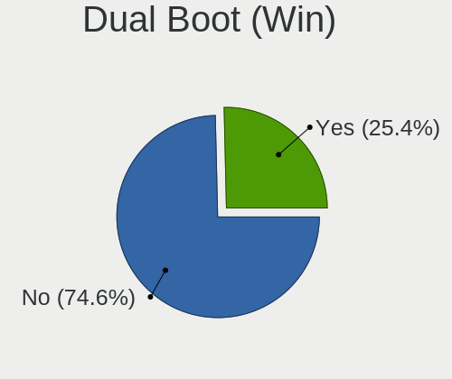
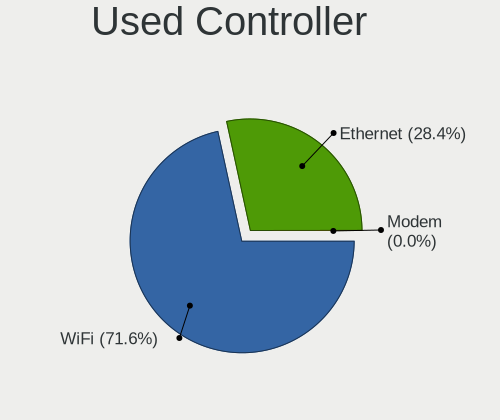
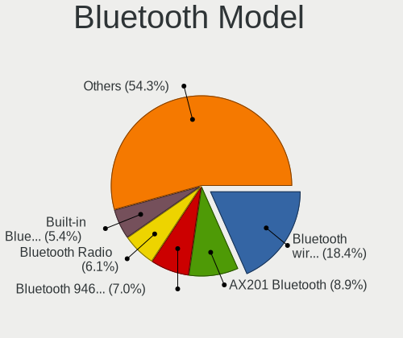
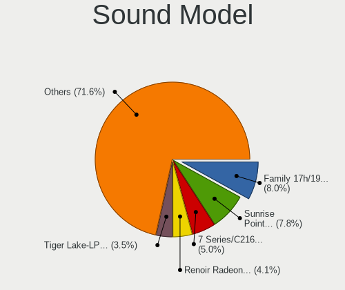
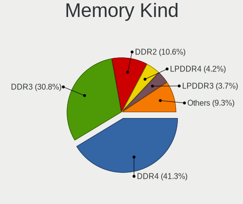

Debian - Tested Hardware & Statistics (Notebooks)
-------------------------------------------------

A project to collect tested hardware configurations for Debian.

Anyone can contribute to this report by the [hw-probe](https://github.com/linuxhw/hw-probe) tool:

    sudo -E hw-probe -all -upload

Please contribute! Especially if your hardware is rare.

Contents
--------

* [ Test Cases ](#test-cases)

* [ System ](#system)
  - [ OS                       ](#os)
  - [ OS Family                ](#os-family)
  - [ Kernel                   ](#kernel)
  - [ Kernel Family            ](#kernel-family)
  - [ Kernel Major Ver.        ](#kernel-major-ver)
  - [ Arch                     ](#arch)
  - [ DE                       ](#de)
  - [ Display Server           ](#display-server)
  - [ Display Manager          ](#display-manager)
  - [ OS Lang                  ](#os-lang)
  - [ Boot Mode                ](#boot-mode)
  - [ Filesystem               ](#filesystem)
  - [ Part. scheme             ](#part-scheme)
  - [ Dual Boot with Linux/BSD ](#dual-boot-with-linuxbsd)
  - [ Dual Boot (Win)          ](#dual-boot-win)

* [ Board ](#board)
  - [ Vendor                   ](#vendor)
  - [ Model                    ](#model)
  - [ Model Family             ](#model-family)
  - [ MFG Year                 ](#mfg-year)
  - [ Form Factor              ](#form-factor)
  - [ Secure Boot              ](#secure-boot)
  - [ Coreboot                 ](#coreboot)
  - [ RAM Size                 ](#ram-size)
  - [ RAM Used                 ](#ram-used)
  - [ Total Drives             ](#total-drives)
  - [ Has CD-ROM               ](#has-cd-rom)
  - [ Has Ethernet             ](#has-ethernet)
  - [ Has WiFi                 ](#has-wifi)
  - [ Has Bluetooth            ](#has-bluetooth)

* [ Location ](#location)
  - [ Country                  ](#country)
  - [ City                     ](#city)

* [ Drives ](#drives)
  - [ Drive Vendor             ](#drive-vendor)
  - [ Drive Model              ](#drive-model)
  - [ HDD Vendor               ](#hdd-vendor)
  - [ SSD Vendor               ](#ssd-vendor)
  - [ Drive Kind               ](#drive-kind)
  - [ Drive Connector          ](#drive-connector)
  - [ Drive Size               ](#drive-size)
  - [ Space Total              ](#space-total)
  - [ Space Used               ](#space-used)
  - [ Malfunc. Drives          ](#malfunc-drives)
  - [ Malfunc. Drive Vendor    ](#malfunc-drive-vendor)
  - [ Malfunc. HDD Vendor      ](#malfunc-hdd-vendor)
  - [ Malfunc. Drive Kind      ](#malfunc-drive-kind)
  - [ Failed Drives            ](#failed-drives)
  - [ Failed Drive Vendor      ](#failed-drive-vendor)
  - [ Drive Status             ](#drive-status)

* [ Storage controller ](#storage-controller)
  - [ Storage Vendor           ](#storage-vendor)
  - [ Storage Model            ](#storage-model)
  - [ Storage Kind             ](#storage-kind)

* [ Processor ](#processor)
  - [ CPU Vendor               ](#cpu-vendor)
  - [ CPU Model                ](#cpu-model)
  - [ CPU Model Family         ](#cpu-model-family)
  - [ CPU Cores                ](#cpu-cores)
  - [ CPU Sockets              ](#cpu-sockets)
  - [ CPU Threads              ](#cpu-threads)
  - [ CPU Op-Modes             ](#cpu-op-modes)
  - [ CPU Microcode            ](#cpu-microcode)
  - [ CPU Microarch            ](#cpu-microarch)

* [ Graphics ](#graphics)
  - [ GPU Vendor               ](#gpu-vendor)
  - [ GPU Model                ](#gpu-model)
  - [ GPU Combo                ](#gpu-combo)
  - [ GPU Driver               ](#gpu-driver)
  - [ GPU Memory               ](#gpu-memory)

* [ Monitor ](#monitor)
  - [ Monitor Vendor           ](#monitor-vendor)
  - [ Monitor Model            ](#monitor-model)
  - [ Monitor Resolution       ](#monitor-resolution)
  - [ Monitor Diagonal         ](#monitor-diagonal)
  - [ Monitor Width            ](#monitor-width)
  - [ Aspect Ratio             ](#aspect-ratio)
  - [ Monitor Area             ](#monitor-area)
  - [ Pixel Density            ](#pixel-density)
  - [ Multiple Monitors        ](#multiple-monitors)

* [ Network ](#network)
  - [ Net Controller Vendor    ](#net-controller-vendor)
  - [ Net Controller Model     ](#net-controller-model)
  - [ Wireless Vendor          ](#wireless-vendor)
  - [ Wireless Model           ](#wireless-model)
  - [ Ethernet Vendor          ](#ethernet-vendor)
  - [ Ethernet Model           ](#ethernet-model)
  - [ Net Controller Kind      ](#net-controller-kind)
  - [ Used Controller          ](#used-controller)
  - [ NICs                     ](#nics)
  - [ IPv6                     ](#ipv6)

* [ Bluetooth ](#bluetooth)
  - [ Bluetooth Vendor         ](#bluetooth-vendor)
  - [ Bluetooth Model          ](#bluetooth-model)

* [ Sound ](#sound)
  - [ Sound Vendor             ](#sound-vendor)
  - [ Sound Model              ](#sound-model)

* [ Memory ](#memory)
  - [ Memory Vendor            ](#memory-vendor)
  - [ Memory Model             ](#memory-model)
  - [ Memory Kind              ](#memory-kind)
  - [ Memory Form Factor       ](#memory-form-factor)
  - [ Memory Size              ](#memory-size)
  - [ Memory Speed             ](#memory-speed)

* [ Printers & scanners ](#printers--scanners)
  - [ Printer Vendor           ](#printer-vendor)
  - [ Printer Model            ](#printer-model)
  - [ Scanner Vendor           ](#scanner-vendor)
  - [ Scanner Model            ](#scanner-model)

* [ Camera ](#camera)
  - [ Camera Vendor            ](#camera-vendor)
  - [ Camera Model             ](#camera-model)

* [ Security ](#security)
  - [ Fingerprint Vendor       ](#fingerprint-vendor)
  - [ Fingerprint Model        ](#fingerprint-model)
  - [ Chipcard Vendor          ](#chipcard-vendor)
  - [ Chipcard Model           ](#chipcard-model)

* [ Unsupported ](#unsupported)
  - [ Unsupported Devices      ](#unsupported-devices)
  - [ Unsupported Device Types ](#unsupported-device-types)

Test Cases
----------

Total: 9132

| Vendor        | Model                       | Probe                                                      | Date         |
|---------------|-----------------------------|------------------------------------------------------------|--------------|
| Lenovo        | ThinkPad E595 20NF0005IX    | [171aaf5d57](https://linux-hardware.org/?probe=171aaf5d57) | Feb 02, 2024 |
| Lenovo        | ThinkPad E595 20NF0005IX    | [c834e4941b](https://linux-hardware.org/?probe=c834e4941b) | Feb 02, 2024 |
| ASUSTek       | N56VZ                       | [2209fe1372](https://linux-hardware.org/?probe=2209fe1372) | Feb 02, 2024 |
| MSI           | Modern 14 B11MOU            | [f7d0fcd205](https://linux-hardware.org/?probe=f7d0fcd205) | Feb 02, 2024 |
| MSI           | Raider GE68HX 13VF          | [72ac680d91](https://linux-hardware.org/?probe=72ac680d91) | Feb 02, 2024 |
| HP            | EliteBook 2570p             | [59778f5513](https://linux-hardware.org/?probe=59778f5513) | Feb 02, 2024 |
| Lenovo        | ThinkPad T410 2537AF8       | [88794835fb](https://linux-hardware.org/?probe=88794835fb) | Feb 02, 2024 |
| Apple         | MacBookAir7,2               | [632421d681](https://linux-hardware.org/?probe=632421d681) | Feb 01, 2024 |
| ASUSTek       | K54C                        | [59e4e733f0](https://linux-hardware.org/?probe=59e4e733f0) | Feb 01, 2024 |
| Acer          | Aspire 7740                 | [a329ef6c37](https://linux-hardware.org/?probe=a329ef6c37) | Feb 01, 2024 |
| Lenovo        | V17 G4 IRU 83A2             | [f33e772962](https://linux-hardware.org/?probe=f33e772962) | Feb 01, 2024 |
| Acer          | Aspire A515-56              | [5599d65127](https://linux-hardware.org/?probe=5599d65127) | Feb 01, 2024 |
| HP            | Pavilion Notebook           | [397f03250d](https://linux-hardware.org/?probe=397f03250d) | Feb 01, 2024 |
| Panasonic     | CF-54-2                     | [7758f322a6](https://linux-hardware.org/?probe=7758f322a6) | Feb 01, 2024 |
| Lenovo        | IdeaPad 320-15ISK 80XH      | [a3932a77fb](https://linux-hardware.org/?probe=a3932a77fb) | Feb 01, 2024 |
| HP            | Pavilion dv4                | [09400a55bb](https://linux-hardware.org/?probe=09400a55bb) | Feb 01, 2024 |
| Lenovo        | Flex 2-14 20404             | [b2d8a38af3](https://linux-hardware.org/?probe=b2d8a38af3) | Feb 01, 2024 |
| Lenovo        | ThinkPad 13 2nd Gen 20J1... | [7f20bd79c9](https://linux-hardware.org/?probe=7f20bd79c9) | Jan 31, 2024 |
| Unknown       | Unknown                     | [13b20f5383](https://linux-hardware.org/?probe=13b20f5383) | Jan 31, 2024 |
| HP            | EliteBook 2570p             | [7d98ca3c90](https://linux-hardware.org/?probe=7d98ca3c90) | Jan 31, 2024 |
| HP            | ProBook 4510s               | [2982cc0a30](https://linux-hardware.org/?probe=2982cc0a30) | Jan 31, 2024 |
| HP            | Pavilion Laptop 15-eh1xx... | [d743247f69](https://linux-hardware.org/?probe=d743247f69) | Jan 31, 2024 |
| HP            | 15                          | [5abc868cce](https://linux-hardware.org/?probe=5abc868cce) | Jan 31, 2024 |
| HP            | ProBook 430 G8 Notebook ... | [ccf29ffd3d](https://linux-hardware.org/?probe=ccf29ffd3d) | Jan 31, 2024 |
| ASUSTek       | VivoBook_ASUSLaptop E410... | [8d8a09ab09](https://linux-hardware.org/?probe=8d8a09ab09) | Jan 31, 2024 |
| Lenovo        | Yoga 900-13ISK 80MK         | [c5e686c940](https://linux-hardware.org/?probe=c5e686c940) | Jan 30, 2024 |
| Apple         | MacBookPro9,1               | [741671df2c](https://linux-hardware.org/?probe=741671df2c) | Jan 30, 2024 |
| OriginPC      | EVO16-S                     | [6d96755039](https://linux-hardware.org/?probe=6d96755039) | Jan 30, 2024 |
| Dell          | XPS 13 9360                 | [fb5ea12034](https://linux-hardware.org/?probe=fb5ea12034) | Jan 30, 2024 |
| Medion        | E15423                      | [2d39a42a0a](https://linux-hardware.org/?probe=2d39a42a0a) | Jan 29, 2024 |
| Dell          | XPS 9315                    | [c705e51d0e](https://linux-hardware.org/?probe=c705e51d0e) | Jan 29, 2024 |
| Dell          | XPS 15 7590                 | [0db74aab7e](https://linux-hardware.org/?probe=0db74aab7e) | Jan 29, 2024 |
| HUAWEI        | KPRC-WX0                    | [dea81917ae](https://linux-hardware.org/?probe=dea81917ae) | Jan 29, 2024 |
| Acer          | Aspire A315-58              | [c1af8d7ca2](https://linux-hardware.org/?probe=c1af8d7ca2) | Jan 29, 2024 |
| Dell          | XPS 9315                    | [9beaeed93b](https://linux-hardware.org/?probe=9beaeed93b) | Jan 29, 2024 |
| Apple         | MacBookPro5,4               | [c16bc8a6c2](https://linux-hardware.org/?probe=c16bc8a6c2) | Jan 29, 2024 |
| ASUSTek       | N550JK                      | [097f96652f](https://linux-hardware.org/?probe=097f96652f) | Jan 29, 2024 |
| Lenovo        | IdeaPad P585 20181          | [d54756c11a](https://linux-hardware.org/?probe=d54756c11a) | Jan 28, 2024 |
| Lenovo        | ThinkPad T480 20L6S4T80H    | [cb5f6705aa](https://linux-hardware.org/?probe=cb5f6705aa) | Jan 28, 2024 |
| Dell          | G3 3590                     | [7fb3fcb32c](https://linux-hardware.org/?probe=7fb3fcb32c) | Jan 28, 2024 |
| HP            | Laptop 15z-ef3xxx           | [bde6b1bdd9](https://linux-hardware.org/?probe=bde6b1bdd9) | Jan 28, 2024 |
| HP            | Compaq nc6320 (EN371UA#A... | [24bcfc0005](https://linux-hardware.org/?probe=24bcfc0005) | Jan 28, 2024 |
| Dell          | Latitude 7380               | [c383a1c7dc](https://linux-hardware.org/?probe=c383a1c7dc) | Jan 28, 2024 |
| Lenovo        | ThinkPad T490 20N3S5GP12    | [b0cc2bbbed](https://linux-hardware.org/?probe=b0cc2bbbed) | Jan 28, 2024 |
| Medion        | Akoya P7628                 | [77cd29bced](https://linux-hardware.org/?probe=77cd29bced) | Jan 27, 2024 |
| LG Electro... | 17Z90P-K.AA78A1             | [7280098d0c](https://linux-hardware.org/?probe=7280098d0c) | Jan 27, 2024 |
| Lenovo        | ThinkPad T480s 20L7001SG... | [bb998df843](https://linux-hardware.org/?probe=bb998df843) | Jan 27, 2024 |
| Lenovo        | G40-45 80E1                 | [1e01df8e73](https://linux-hardware.org/?probe=1e01df8e73) | Jan 27, 2024 |
| Lenovo        | ThinkPad T480s 20L7001SG... | [5810c5dc2b](https://linux-hardware.org/?probe=5810c5dc2b) | Jan 27, 2024 |
| Dell          | Inspiron 5405               | [c9256b244b](https://linux-hardware.org/?probe=c9256b244b) | Jan 27, 2024 |
| Lenovo        | ThinkPad P14s Gen 1 20Y1... | [4b4af4b9b4](https://linux-hardware.org/?probe=4b4af4b9b4) | Jan 26, 2024 |
| Lenovo        | ThinkPad T530 2394EN6       | [4110faba77](https://linux-hardware.org/?probe=4110faba77) | Jan 26, 2024 |
| HP            | Pavilion Laptop 15-eh1xx... | [7423289dfa](https://linux-hardware.org/?probe=7423289dfa) | Jan 26, 2024 |
| HP            | 15                          | [4bce029b1f](https://linux-hardware.org/?probe=4bce029b1f) | Jan 26, 2024 |
| Dell          | Inspiron 1720               | [cff6e1a58a](https://linux-hardware.org/?probe=cff6e1a58a) | Jan 26, 2024 |
| HP            | Victus by Gaming Laptop ... | [313cd1cfba](https://linux-hardware.org/?probe=313cd1cfba) | Jan 26, 2024 |
| HP            | EliteBook 850 G7 Noteboo... | [7f749dfabf](https://linux-hardware.org/?probe=7f749dfabf) | Jan 26, 2024 |
| HP            | Victus by Gaming Laptop ... | [9a3ff54cf8](https://linux-hardware.org/?probe=9a3ff54cf8) | Jan 26, 2024 |
| HP            | Spectre Notebook            | [e98f815ca2](https://linux-hardware.org/?probe=e98f815ca2) | Jan 26, 2024 |
| Dell          | Latitude D620               | [d46bb1fc6b](https://linux-hardware.org/?probe=d46bb1fc6b) | Jan 25, 2024 |
| Lenovo        | ThinkPad T495s 20QKS01E0... | [633b93c14e](https://linux-hardware.org/?probe=633b93c14e) | Jan 25, 2024 |
| Google        | Bobba360                    | [a4c97c836d](https://linux-hardware.org/?probe=a4c97c836d) | Jan 25, 2024 |
| HP            | ProBook 645 G4              | [af6ac91f2a](https://linux-hardware.org/?probe=af6ac91f2a) | Jan 25, 2024 |
| Google        | Bobba360                    | [0b03c9a8f7](https://linux-hardware.org/?probe=0b03c9a8f7) | Jan 24, 2024 |
| HP            | Pavilion Laptop 15-eg1xx... | [215df1823f](https://linux-hardware.org/?probe=215df1823f) | Jan 24, 2024 |
| Dell          | Vostro1710                  | [1fc84171b5](https://linux-hardware.org/?probe=1fc84171b5) | Jan 24, 2024 |
| HP            | Pavilion dv9500             | [a2f58c7d83](https://linux-hardware.org/?probe=a2f58c7d83) | Jan 24, 2024 |
| HP            | Pavilion dv9500             | [6311362acc](https://linux-hardware.org/?probe=6311362acc) | Jan 24, 2024 |
| Dell          | Inspiron 7559               | [b82f00532c](https://linux-hardware.org/?probe=b82f00532c) | Jan 24, 2024 |
| MSI           | GL62M 7RDX                  | [bd42ee7dc8](https://linux-hardware.org/?probe=bd42ee7dc8) | Jan 24, 2024 |
| Lenovo        | ThinkPad T14 Gen 4 21HD0... | [ff7b63a668](https://linux-hardware.org/?probe=ff7b63a668) | Jan 23, 2024 |
| Dell          | XPS 13 9360                 | [cf5a6036e8](https://linux-hardware.org/?probe=cf5a6036e8) | Jan 23, 2024 |
| HP            | EliteBook 855 G8 Noteboo... | [c22fff0afb](https://linux-hardware.org/?probe=c22fff0afb) | Jan 23, 2024 |
| Acer          | Aspire E5-575G              | [1523773c75](https://linux-hardware.org/?probe=1523773c75) | Jan 23, 2024 |
| HP            | 15                          | [7728ab654b](https://linux-hardware.org/?probe=7728ab654b) | Jan 23, 2024 |
| Novatech      | C141EK3-CI3TX               | [72b4b6b3ff](https://linux-hardware.org/?probe=72b4b6b3ff) | Jan 23, 2024 |
| Lenovo        | IdeaPad 330-15IKB 81DE      | [7039b3ef95](https://linux-hardware.org/?probe=7039b3ef95) | Jan 23, 2024 |
| Lenovo        | ThinkPad X220 4290W4H       | [067daab9fb](https://linux-hardware.org/?probe=067daab9fb) | Jan 23, 2024 |
| Unknown       | Unknown                     | [b35ba11b64](https://linux-hardware.org/?probe=b35ba11b64) | Jan 22, 2024 |
| Dell          | G3 3579                     | [994425af24](https://linux-hardware.org/?probe=994425af24) | Jan 22, 2024 |
| HP            | Pavilion g4                 | [1edc58a524](https://linux-hardware.org/?probe=1edc58a524) | Jan 22, 2024 |
| Acer          | Swift SF314-511             | [69ce4e086f](https://linux-hardware.org/?probe=69ce4e086f) | Jan 22, 2024 |
| HP            | Pavilion g4                 | [ecddd3e100](https://linux-hardware.org/?probe=ecddd3e100) | Jan 21, 2024 |
| HP            | Pavilion Gaming Laptop 1... | [58f6bacae6](https://linux-hardware.org/?probe=58f6bacae6) | Jan 21, 2024 |
| HP            | ProBook 4740s               | [681810a3c1](https://linux-hardware.org/?probe=681810a3c1) | Jan 21, 2024 |
| Lenovo        | ThinkPad X260 20F5S0VU00    | [921683c8c0](https://linux-hardware.org/?probe=921683c8c0) | Jan 21, 2024 |
| Lenovo        | ThinkPad E15 Gen 3 20YG0... | [80456342d9](https://linux-hardware.org/?probe=80456342d9) | Jan 21, 2024 |
| Dell          | Latitude D630               | [bf9ce8c208](https://linux-hardware.org/?probe=bf9ce8c208) | Jan 21, 2024 |
| Dell          | Latitude D630               | [b2a68014db](https://linux-hardware.org/?probe=b2a68014db) | Jan 21, 2024 |
| Lenovo        | ThinkPad T490 20N3SA9100    | [02efe357c0](https://linux-hardware.org/?probe=02efe357c0) | Jan 21, 2024 |
| Lenovo        | IdeaPad 3 15ALC6 82KU       | [53887e0fb9](https://linux-hardware.org/?probe=53887e0fb9) | Jan 21, 2024 |
| Lenovo        | ThinkBook 15 G2 ARE 20VG    | [5df8be927b](https://linux-hardware.org/?probe=5df8be927b) | Jan 20, 2024 |
| Acer          | Aspire 3050                 | [7231400f5d](https://linux-hardware.org/?probe=7231400f5d) | Jan 20, 2024 |
| Dell          | Inspiron 3583               | [e47c76af02](https://linux-hardware.org/?probe=e47c76af02) | Jan 20, 2024 |
| Lenovo        | IdeaPad 3 15IAU7 82RK       | [fa6a332180](https://linux-hardware.org/?probe=fa6a332180) | Jan 20, 2024 |
| Lenovo        | ThinkPad T490 20N2000RRT    | [b48f14a503](https://linux-hardware.org/?probe=b48f14a503) | Jan 20, 2024 |
| Acer          | AOD255E                     | [379ad2d74c](https://linux-hardware.org/?probe=379ad2d74c) | Jan 20, 2024 |
| Apple         | MacBookAir7,2               | [336ae86aff](https://linux-hardware.org/?probe=336ae86aff) | Jan 20, 2024 |
| Apple         | MacBookAir7,2               | [e0591611fa](https://linux-hardware.org/?probe=e0591611fa) | Jan 20, 2024 |
| Apple         | MacBookPro11,3              | [f129b719a5](https://linux-hardware.org/?probe=f129b719a5) | Jan 20, 2024 |
| Panasonic     | CF-31ATAAX1M                | [f9cc94a1c9](https://linux-hardware.org/?probe=f9cc94a1c9) | Jan 19, 2024 |
| Google        | Reks                        | [03f2d33169](https://linux-hardware.org/?probe=03f2d33169) | Jan 19, 2024 |
| Lenovo        | ThinkPad T14 Gen 2i 20W1... | [c5644b867a](https://linux-hardware.org/?probe=c5644b867a) | Jan 19, 2024 |
| Lenovo        | ThinkPad T14 Gen 2i 20W1... | [20e88d4383](https://linux-hardware.org/?probe=20e88d4383) | Jan 19, 2024 |
| Acer          | Aspire A515-43              | [2c2f4e8e3b](https://linux-hardware.org/?probe=2c2f4e8e3b) | Jan 19, 2024 |
| Dell          | XPS 15 7590                 | [f3a79354a8](https://linux-hardware.org/?probe=f3a79354a8) | Jan 19, 2024 |
| Medion        | S4216                       | [74fd2044d5](https://linux-hardware.org/?probe=74fd2044d5) | Jan 19, 2024 |
| Lenovo        | ThinkPad T14 Gen 1 20UD0... | [9226bd619b](https://linux-hardware.org/?probe=9226bd619b) | Jan 19, 2024 |
| GTZS          | Unknown                     | [6b926d1595](https://linux-hardware.org/?probe=6b926d1595) | Jan 19, 2024 |
| HP            | ProBook 640 G2              | [b09c608815](https://linux-hardware.org/?probe=b09c608815) | Jan 19, 2024 |
| Lenovo        | ThinkPad X230 23205XG       | [384ae6ddfb](https://linux-hardware.org/?probe=384ae6ddfb) | Jan 19, 2024 |
| Lenovo        | IdeaPad S410p 20296         | [cd1e18703e](https://linux-hardware.org/?probe=cd1e18703e) | Jan 19, 2024 |
| HP            | Laptop 14-dq1xxx            | [048c8842d1](https://linux-hardware.org/?probe=048c8842d1) | Jan 19, 2024 |
| Lenovo        | IdeaPad S410p 20296         | [f07c9d75f0](https://linux-hardware.org/?probe=f07c9d75f0) | Jan 18, 2024 |
| Fujitsu       | LIFEBOOK P771               | [47367bff01](https://linux-hardware.org/?probe=47367bff01) | Jan 18, 2024 |
| Apple         | MacBookPro6,2               | [d39ea787aa](https://linux-hardware.org/?probe=d39ea787aa) | Jan 18, 2024 |
| Schenker      | N13xWU                      | [8aaa9891ee](https://linux-hardware.org/?probe=8aaa9891ee) | Jan 18, 2024 |
| ASUSTek       | VivoBook_ASUSLaptop M350... | [187a8a84af](https://linux-hardware.org/?probe=187a8a84af) | Jan 18, 2024 |
| Schenker      | N13xWU                      | [358f331708](https://linux-hardware.org/?probe=358f331708) | Jan 18, 2024 |
| Lenovo        | G50-45 80E3                 | [7fa6be7205](https://linux-hardware.org/?probe=7fa6be7205) | Jan 18, 2024 |
| Medion        | Crawler E30e                | [537214d414](https://linux-hardware.org/?probe=537214d414) | Jan 18, 2024 |
| Medion        | Crawler E30e                | [76c56f06b5](https://linux-hardware.org/?probe=76c56f06b5) | Jan 18, 2024 |
| Lenovo        | G500 20236                  | [a0fdd98d15](https://linux-hardware.org/?probe=a0fdd98d15) | Jan 18, 2024 |
| Dell          | Inspiron N5010              | [d19deae8ea](https://linux-hardware.org/?probe=d19deae8ea) | Jan 18, 2024 |
| MSI           | Alpha 17 C7VG               | [262343435e](https://linux-hardware.org/?probe=262343435e) | Jan 17, 2024 |
| Dell          | Latitude E6540              | [5f657f15c8](https://linux-hardware.org/?probe=5f657f15c8) | Jan 17, 2024 |
| ASUSTek       | K53U                        | [04cc25d38b](https://linux-hardware.org/?probe=04cc25d38b) | Jan 17, 2024 |
| HP            | 250 G8 Notebook PC          | [87e1df2a62](https://linux-hardware.org/?probe=87e1df2a62) | Jan 17, 2024 |
| Aquarius      | NS585                       | [21185900ad](https://linux-hardware.org/?probe=21185900ad) | Jan 17, 2024 |
| Monster       | ABRA A5 V16.6               | [181ed8314a](https://linux-hardware.org/?probe=181ed8314a) | Jan 17, 2024 |
| ASUSTek       | Zenbook UM3402YA_UM3402Y... | [acda9d9537](https://linux-hardware.org/?probe=acda9d9537) | Jan 17, 2024 |
| Dell          | Latitude E6400              | [acde30b0c9](https://linux-hardware.org/?probe=acde30b0c9) | Jan 17, 2024 |
| ASUSTek       | N501VW                      | [958a5f9a29](https://linux-hardware.org/?probe=958a5f9a29) | Jan 16, 2024 |
| Lenovo        | ThinkPad P15v Gen 3 21D8... | [bfbba978c3](https://linux-hardware.org/?probe=bfbba978c3) | Jan 16, 2024 |
| Lenovo        | ThinkPad T490 20N3S5XF01    | [cf4a861856](https://linux-hardware.org/?probe=cf4a861856) | Jan 16, 2024 |
| Dell          | Latitude 3320               | [3846698872](https://linux-hardware.org/?probe=3846698872) | Jan 16, 2024 |
| Dell          | Latitude 3320               | [8fbe313e34](https://linux-hardware.org/?probe=8fbe313e34) | Jan 16, 2024 |
| Lenovo        | IdeaPad 320-15ISK 80XH      | [24da300af6](https://linux-hardware.org/?probe=24da300af6) | Jan 16, 2024 |
| Toshiba       | Satellite L40               | [f5e9dbe1c8](https://linux-hardware.org/?probe=f5e9dbe1c8) | Jan 16, 2024 |
| Dell          | XPS 13 9360                 | [846113dc1c](https://linux-hardware.org/?probe=846113dc1c) | Jan 16, 2024 |
| HP            | Laptop 15-da1xxx            | [cd726b3a5a](https://linux-hardware.org/?probe=cd726b3a5a) | Jan 15, 2024 |
| Dell          | XPS 15 9530                 | [61ade3f6d3](https://linux-hardware.org/?probe=61ade3f6d3) | Jan 15, 2024 |
| HP            | ProBook 450 15.6 inch G1... | [54ed51acbb](https://linux-hardware.org/?probe=54ed51acbb) | Jan 15, 2024 |
| Clevo         | M815P                       | [3ee9aaa992](https://linux-hardware.org/?probe=3ee9aaa992) | Jan 15, 2024 |
| Clevo         | M815P                       | [398ddcd746](https://linux-hardware.org/?probe=398ddcd746) | Jan 15, 2024 |
| Acer          | Swift SFX14-41G             | [947678b939](https://linux-hardware.org/?probe=947678b939) | Jan 15, 2024 |
| COIN COMPU... | LUM580                      | [e9f6bacb29](https://linux-hardware.org/?probe=e9f6bacb29) | Jan 15, 2024 |
| HP            | Laptop 15s-du0xxx           | [530c5882b9](https://linux-hardware.org/?probe=530c5882b9) | Jan 15, 2024 |
| Lenovo        | ThinkPad X230 Tablet 343... | [b1804aa7bc](https://linux-hardware.org/?probe=b1804aa7bc) | Jan 15, 2024 |
| Multilaser    | MLGW08                      | [abfe537d6f](https://linux-hardware.org/?probe=abfe537d6f) | Jan 15, 2024 |
| Lenovo        | ThinkPad T440 20B7A07NGE    | [0038076556](https://linux-hardware.org/?probe=0038076556) | Jan 14, 2024 |
| Lenovo        | ThinkPad 13 2nd Gen 20J1... | [bdbb97ace1](https://linux-hardware.org/?probe=bdbb97ace1) | Jan 14, 2024 |
| Acer          | Aspire A515-43              | [9bec25152a](https://linux-hardware.org/?probe=9bec25152a) | Jan 14, 2024 |
| Apple         | MacBookPro11,1              | [e865dbe75e](https://linux-hardware.org/?probe=e865dbe75e) | Jan 14, 2024 |
| HONOR         | BMH-WCX9                    | [11d4c3f75d](https://linux-hardware.org/?probe=11d4c3f75d) | Jan 14, 2024 |
| Samsung       | R780                        | [68eae1df45](https://linux-hardware.org/?probe=68eae1df45) | Jan 14, 2024 |
| Lenovo        | ThinkPad X280 20KESAC100    | [888ed5a8d8](https://linux-hardware.org/?probe=888ed5a8d8) | Jan 14, 2024 |
| Lenovo        | ThinkPad T520 42406AG       | [df565d9a02](https://linux-hardware.org/?probe=df565d9a02) | Jan 14, 2024 |
| Dell          | XPS 9315                    | [1a129dea48](https://linux-hardware.org/?probe=1a129dea48) | Jan 14, 2024 |
| HUAWEI        | BOD-WXX9                    | [9000ce06e8](https://linux-hardware.org/?probe=9000ce06e8) | Jan 14, 2024 |
| Acer          | TravelMate P259-G2-M        | [24d3ae9a88](https://linux-hardware.org/?probe=24d3ae9a88) | Jan 14, 2024 |
| Positivo      | Mobile                      | [750ee7ae05](https://linux-hardware.org/?probe=750ee7ae05) | Jan 14, 2024 |
| Lenovo        | Yoga Pro 7 14IRH8 82Y7      | [55b05d17b6](https://linux-hardware.org/?probe=55b05d17b6) | Jan 14, 2024 |
| ASUSTek       | X556UQK                     | [151b6ad9fb](https://linux-hardware.org/?probe=151b6ad9fb) | Jan 13, 2024 |
| HP            | Compaq 6720s                | [4b6c283ab3](https://linux-hardware.org/?probe=4b6c283ab3) | Jan 13, 2024 |
| Lenovo        | IdeaPad 100-15IBY 80MJ      | [6b6751dc04](https://linux-hardware.org/?probe=6b6751dc04) | Jan 13, 2024 |
| Lenovo        | ThinkPad X220 4291QQ1       | [ad00b0ae02](https://linux-hardware.org/?probe=ad00b0ae02) | Jan 13, 2024 |
| Unknown       | Apple MacBook Pro (13-in... | [13ba69dada](https://linux-hardware.org/?probe=13ba69dada) | Jan 13, 2024 |
| TUXEDO        | Pulse 14 Gen3               | [5e82c88e53](https://linux-hardware.org/?probe=5e82c88e53) | Jan 12, 2024 |
| Lenovo        | ThinkPad 13 2nd Gen 20J1... | [91a1cfb426](https://linux-hardware.org/?probe=91a1cfb426) | Jan 12, 2024 |
| HP            | ZBook 15                    | [390b667998](https://linux-hardware.org/?probe=390b667998) | Jan 12, 2024 |
| Apple         | MacBookAir7,2               | [191e908130](https://linux-hardware.org/?probe=191e908130) | Jan 12, 2024 |
| Apple         | MacBookAir7,2               | [3d1d09a8cb](https://linux-hardware.org/?probe=3d1d09a8cb) | Jan 12, 2024 |
| Dell          | Precision 3581              | [07c4e8e9b5](https://linux-hardware.org/?probe=07c4e8e9b5) | Jan 12, 2024 |
| Dell          | Precision 7560              | [c540ef8073](https://linux-hardware.org/?probe=c540ef8073) | Jan 12, 2024 |
| HP            | ZBook 15                    | [5649070333](https://linux-hardware.org/?probe=5649070333) | Jan 12, 2024 |
| Lenovo        | ThinkPad T14 Gen 1 20S00... | [a485e19625](https://linux-hardware.org/?probe=a485e19625) | Jan 12, 2024 |
| MSI           | Alpha 17 C7VG               | [586cfee5f8](https://linux-hardware.org/?probe=586cfee5f8) | Jan 12, 2024 |
| Dell          | Inspiron 3593               | [60b15cb73b](https://linux-hardware.org/?probe=60b15cb73b) | Jan 12, 2024 |
| Samsung       | RC530/RC730                 | [c96ada8967](https://linux-hardware.org/?probe=c96ada8967) | Jan 12, 2024 |
| Acer          | Aspire 3050                 | [ed5a4cc94d](https://linux-hardware.org/?probe=ed5a4cc94d) | Jan 12, 2024 |
| Apple         | MacBookPro8,2               | [1637fa5ff8](https://linux-hardware.org/?probe=1637fa5ff8) | Jan 12, 2024 |
| Apple         | MacBookPro8,2               | [5990a6e929](https://linux-hardware.org/?probe=5990a6e929) | Jan 12, 2024 |
| HP            | 348 G5                      | [a7c6a60aaf](https://linux-hardware.org/?probe=a7c6a60aaf) | Jan 12, 2024 |
| HP            | Laptop 15s-du0xxx           | [75a6760096](https://linux-hardware.org/?probe=75a6760096) | Jan 12, 2024 |
| Dell          | XPS 13 9310                 | [5c6de2d4a2](https://linux-hardware.org/?probe=5c6de2d4a2) | Jan 11, 2024 |
| HP            | 530 Notebook PC(GH634AA#... | [a17c4145f4](https://linux-hardware.org/?probe=a17c4145f4) | Jan 11, 2024 |
| Lenovo        | IdeaPad 330-15AST 81D6      | [5479dc0213](https://linux-hardware.org/?probe=5479dc0213) | Jan 11, 2024 |
| Lenovo        | IdeaPad 330-15AST 81D6      | [48bddf33da](https://linux-hardware.org/?probe=48bddf33da) | Jan 11, 2024 |
| Unknown       | Unknown                     | [0f2d55f419](https://linux-hardware.org/?probe=0f2d55f419) | Jan 11, 2024 |
| Unknown       | Unknown                     | [f5d4b22b3c](https://linux-hardware.org/?probe=f5d4b22b3c) | Jan 11, 2024 |
| Pegatron      | C15B                        | [168aedbfba](https://linux-hardware.org/?probe=168aedbfba) | Jan 11, 2024 |
| Lenovo        | Yoga 900-13ISK 80MK         | [d1201e3b8f](https://linux-hardware.org/?probe=d1201e3b8f) | Jan 11, 2024 |
| Dell          | Latitude 7490               | [51cfb0b7ec](https://linux-hardware.org/?probe=51cfb0b7ec) | Jan 11, 2024 |
| Google        | Phaser360                   | [7402fc6e46](https://linux-hardware.org/?probe=7402fc6e46) | Jan 11, 2024 |
| Apple         | MacBookPro5,5               | [38c0ed167d](https://linux-hardware.org/?probe=38c0ed167d) | Jan 11, 2024 |
| Razer         | Blade Stealth               | [a8c542db2c](https://linux-hardware.org/?probe=a8c542db2c) | Jan 11, 2024 |
| HP            | EliteBook 745 G6            | [e7c4951a31](https://linux-hardware.org/?probe=e7c4951a31) | Jan 10, 2024 |
| HUAWEI        | KLVF-XX                     | [133633238b](https://linux-hardware.org/?probe=133633238b) | Jan 10, 2024 |
| HP            | ProBook 650 G1              | [90b63b0d8a](https://linux-hardware.org/?probe=90b63b0d8a) | Jan 10, 2024 |
| Dell          | Latitude 5490               | [aa516822e2](https://linux-hardware.org/?probe=aa516822e2) | Jan 10, 2024 |
| Sony          | VPCSA2CFX                   | [d408905e99](https://linux-hardware.org/?probe=d408905e99) | Jan 10, 2024 |
| Dell          | Latitude E6520              | [08e48552ea](https://linux-hardware.org/?probe=08e48552ea) | Jan 10, 2024 |
| HP            | EliteBook 2530p             | [0de99e6532](https://linux-hardware.org/?probe=0de99e6532) | Jan 09, 2024 |
| HP            | ProBook 6545b               | [278d4aea3c](https://linux-hardware.org/?probe=278d4aea3c) | Jan 09, 2024 |
| Dell          | Latitude 5440               | [6ab5039217](https://linux-hardware.org/?probe=6ab5039217) | Jan 09, 2024 |
| Lenovo        | ThinkPad E470 20H2S00700    | [38cefcdff9](https://linux-hardware.org/?probe=38cefcdff9) | Jan 09, 2024 |
| Aquarius      | NS585                       | [ad17f295fa](https://linux-hardware.org/?probe=ad17f295fa) | Jan 09, 2024 |
| Aquarius      | NS585                       | [c74d9cb486](https://linux-hardware.org/?probe=c74d9cb486) | Jan 09, 2024 |
| Aquarius      | NS585                       | [8710764b3b](https://linux-hardware.org/?probe=8710764b3b) | Jan 09, 2024 |
| Aquarius      | NS585                       | [23ec56d03f](https://linux-hardware.org/?probe=23ec56d03f) | Jan 09, 2024 |
| Aquarius      | NS585                       | [a9250fd152](https://linux-hardware.org/?probe=a9250fd152) | Jan 09, 2024 |
| Aquarius      | NS585                       | [f3090f70d2](https://linux-hardware.org/?probe=f3090f70d2) | Jan 09, 2024 |
| Aquarius      | NS585                       | [a167167f54](https://linux-hardware.org/?probe=a167167f54) | Jan 09, 2024 |
| Aquarius      | NS585                       | [0d67b1f360](https://linux-hardware.org/?probe=0d67b1f360) | Jan 09, 2024 |
| Sony          | VPCSA2CFX                   | [1f326a66b0](https://linux-hardware.org/?probe=1f326a66b0) | Jan 09, 2024 |
| Google        | Blooguard                   | [18f4177827](https://linux-hardware.org/?probe=18f4177827) | Jan 09, 2024 |
| Acer          | TMP455-M                    | [559512a222](https://linux-hardware.org/?probe=559512a222) | Jan 09, 2024 |
| Lenovo        | ThinkPad X260 20F5S6V200    | [421cb02ac3](https://linux-hardware.org/?probe=421cb02ac3) | Jan 08, 2024 |
| ASUSTek       | K42JK                       | [458158ebaf](https://linux-hardware.org/?probe=458158ebaf) | Jan 08, 2024 |
| HP            | Laptop 15-db0xxx            | [5de015033e](https://linux-hardware.org/?probe=5de015033e) | Jan 08, 2024 |
| Google        | Cave                        | [197a15aab2](https://linux-hardware.org/?probe=197a15aab2) | Jan 08, 2024 |
| Toshiba       | Satellite C55-C             | [1c4c7bfa99](https://linux-hardware.org/?probe=1c4c7bfa99) | Jan 08, 2024 |
| Dell          | Precision 5680              | [047734c28f](https://linux-hardware.org/?probe=047734c28f) | Jan 08, 2024 |
| HP            | Laptop 15-db0xxx            | [f9da9135c7](https://linux-hardware.org/?probe=f9da9135c7) | Jan 08, 2024 |
| Dell          | Precision 5570              | [acc6213478](https://linux-hardware.org/?probe=acc6213478) | Jan 08, 2024 |
| Lenovo        | ThinkPad T14 Gen 3 21CF0... | [8d2846dc8e](https://linux-hardware.org/?probe=8d2846dc8e) | Jan 08, 2024 |
| Lenovo        | IdeaPad S340-15IWL 81N8     | [45b99e2412](https://linux-hardware.org/?probe=45b99e2412) | Jan 08, 2024 |
| Lenovo        | ThinkPad L15 Gen 3 21C30... | [41c3c041a9](https://linux-hardware.org/?probe=41c3c041a9) | Jan 07, 2024 |
| Acer          | TravelMate 5735Z            | [07415a9534](https://linux-hardware.org/?probe=07415a9534) | Jan 07, 2024 |
| Google        | Kefka                       | [0e0bad77fd](https://linux-hardware.org/?probe=0e0bad77fd) | Jan 07, 2024 |
| HP            | 350 G2                      | [75e4063ce8](https://linux-hardware.org/?probe=75e4063ce8) | Jan 07, 2024 |
| Lenovo        | ThinkPad X120e 0611AN2      | [8d06f74a60](https://linux-hardware.org/?probe=8d06f74a60) | Jan 07, 2024 |
| Toshiba       | PORTEGE R500                | [315837012b](https://linux-hardware.org/?probe=315837012b) | Jan 07, 2024 |
| Sony          | SVF1521H1EW                 | [f73763fd0c](https://linux-hardware.org/?probe=f73763fd0c) | Jan 06, 2024 |
| Gateway       | NV57H                       | [65a76b3627](https://linux-hardware.org/?probe=65a76b3627) | Jan 06, 2024 |
| Lenovo        | Legion 5 15IMH05H 81Y6      | [ddc660cbfb](https://linux-hardware.org/?probe=ddc660cbfb) | Jan 06, 2024 |
| Apple         | MacBookAir4,2               | [0f70d0e831](https://linux-hardware.org/?probe=0f70d0e831) | Jan 06, 2024 |
| HUAWEI        | HKFG-XX                     | [a90398b4f6](https://linux-hardware.org/?probe=a90398b4f6) | Jan 06, 2024 |
| ASUSTek       | VivoBook_ASUSLaptop X740... | [4d0a7d86bb](https://linux-hardware.org/?probe=4d0a7d86bb) | Jan 06, 2024 |
| TUXEDO        | Aura 14 Gen3                | [eade03882d](https://linux-hardware.org/?probe=eade03882d) | Jan 06, 2024 |
| Dell          | Precision 5680              | [0d58e93f98](https://linux-hardware.org/?probe=0d58e93f98) | Jan 06, 2024 |
| Dynabook      | Satellite Pro C40-G-109     | [0247395541](https://linux-hardware.org/?probe=0247395541) | Jan 05, 2024 |
| Dell          | XPS 15 9570                 | [090d0eae61](https://linux-hardware.org/?probe=090d0eae61) | Jan 05, 2024 |
| HP            | Pavilion dv7                | [2ecfa94f3b](https://linux-hardware.org/?probe=2ecfa94f3b) | Jan 05, 2024 |
| Thomson       | N17V3C8WH512                | [37fa4a2a98](https://linux-hardware.org/?probe=37fa4a2a98) | Jan 05, 2024 |
| Acer          | Nitro AN517-51              | [f34d450f22](https://linux-hardware.org/?probe=f34d450f22) | Jan 05, 2024 |
| HP            | EliteBook 6930p             | [868c32afaa](https://linux-hardware.org/?probe=868c32afaa) | Jan 05, 2024 |
| Lenovo        | 14w Gen 2 82N9              | [0f5b96cfff](https://linux-hardware.org/?probe=0f5b96cfff) | Jan 05, 2024 |
| Lenovo        | ThinkBook 14 G4+ IAP 21C... | [f41e200b1c](https://linux-hardware.org/?probe=f41e200b1c) | Jan 05, 2024 |
| ASUSTek       | P553UJ                      | [6e0de808da](https://linux-hardware.org/?probe=6e0de808da) | Jan 05, 2024 |
| HP            | EliteBook 745 G3            | [ac230e7d9a](https://linux-hardware.org/?probe=ac230e7d9a) | Jan 04, 2024 |
| HP            | EliteBook 745 G3            | [c5209d0e41](https://linux-hardware.org/?probe=c5209d0e41) | Jan 04, 2024 |
| Lenovo        | ThinkPad X1 Carbon 7th 2... | [afb1d878cd](https://linux-hardware.org/?probe=afb1d878cd) | Jan 04, 2024 |
| HP            | Mini 210-1000               | [ddd4183f45](https://linux-hardware.org/?probe=ddd4183f45) | Jan 04, 2024 |
| HP            | Mini 210-1000               | [65f80ec87f](https://linux-hardware.org/?probe=65f80ec87f) | Jan 04, 2024 |
| Lenovo        | Yoga Pro 7 14APH8 82Y8      | [761431c40c](https://linux-hardware.org/?probe=761431c40c) | Jan 04, 2024 |
| Toshiba       | PORTEGE R30-A               | [8830dd30d3](https://linux-hardware.org/?probe=8830dd30d3) | Jan 04, 2024 |
| Lenovo        | ThinkPad T14s Gen 3 21CQ... | [fbf70c614e](https://linux-hardware.org/?probe=fbf70c614e) | Jan 03, 2024 |
| HP            | Pavilion g6                 | [f1a54c438d](https://linux-hardware.org/?probe=f1a54c438d) | Jan 03, 2024 |
| ASUSTek       | 1015CX                      | [55d418530d](https://linux-hardware.org/?probe=55d418530d) | Jan 03, 2024 |
| HP            | Pavilion g6                 | [254ad76cac](https://linux-hardware.org/?probe=254ad76cac) | Jan 03, 2024 |
| Lenovo        | ThinkBook 14 G4 IAP 21DH    | [f845df595a](https://linux-hardware.org/?probe=f845df595a) | Jan 03, 2024 |
| HP            | EliteBook 645 14 inch G1... | [c828174b3c](https://linux-hardware.org/?probe=c828174b3c) | Jan 03, 2024 |
| Lenovo        | IdeaPad 330S-15IKB 81F5     | [a24e1e9937](https://linux-hardware.org/?probe=a24e1e9937) | Jan 03, 2024 |
| ASUSTek       | VivoBook_ASUSLaptop M140... | [d139ce529e](https://linux-hardware.org/?probe=d139ce529e) | Jan 03, 2024 |
| Lenovo        | ThinkBook 15-IML 20RW       | [9712812ff0](https://linux-hardware.org/?probe=9712812ff0) | Jan 03, 2024 |
| Acer          | Nitro AN515-52              | [b789e33c24](https://linux-hardware.org/?probe=b789e33c24) | Jan 03, 2024 |
| Lenovo        | ThinkPad E14 Gen 4 21E3C... | [f490c2378e](https://linux-hardware.org/?probe=f490c2378e) | Jan 03, 2024 |
| ASUSTek       | VivoBook_ASUSLaptop X515... | [473cff2d66](https://linux-hardware.org/?probe=473cff2d66) | Jan 02, 2024 |
| Lenovo        | Legion 5 Pro 16ARH7H 82R... | [7c849a7e11](https://linux-hardware.org/?probe=7c849a7e11) | Jan 02, 2024 |
| HP            | EliteBook 2570p             | [5299a026ab](https://linux-hardware.org/?probe=5299a026ab) | Jan 02, 2024 |
| Lenovo        | ThinkPad T14 Gen 3 21CF0... | [a333274a33](https://linux-hardware.org/?probe=a333274a33) | Jan 02, 2024 |
| HP            | Laptop 14s-dy5xxx           | [4c531fb260](https://linux-hardware.org/?probe=4c531fb260) | Jan 02, 2024 |
| Lenovo        | G505 20240                  | [ff10a3ab7d](https://linux-hardware.org/?probe=ff10a3ab7d) | Jan 02, 2024 |
| Lenovo        | IdeaPad Slim 5 16IRL8 82... | [5570fbf22f](https://linux-hardware.org/?probe=5570fbf22f) | Jan 02, 2024 |
| HP            | Laptop 15-db0xxx            | [dc302f3b3e](https://linux-hardware.org/?probe=dc302f3b3e) | Jan 02, 2024 |
| Dell          | XPS 13 9380                 | [d290e010eb](https://linux-hardware.org/?probe=d290e010eb) | Jan 02, 2024 |
| Lenovo        | IdeaPad Slim 5 16IRL8 82... | [197c876252](https://linux-hardware.org/?probe=197c876252) | Jan 02, 2024 |
| HP            | Pavilion 15                 | [277c4aa7d6](https://linux-hardware.org/?probe=277c4aa7d6) | Jan 02, 2024 |
| TUXEDO        | N8xxEZ                      | [4eb785f281](https://linux-hardware.org/?probe=4eb785f281) | Jan 01, 2024 |
| Lenovo        | G400s 20244                 | [29ab65f09e](https://linux-hardware.org/?probe=29ab65f09e) | Jan 01, 2024 |
| Lenovo        | G400s 20244                 | [3afdb557c8](https://linux-hardware.org/?probe=3afdb557c8) | Jan 01, 2024 |
| Dell          | Vostro 3405                 | [78db308528](https://linux-hardware.org/?probe=78db308528) | Jan 01, 2024 |
| HP            | Stream Laptop 14-ax0XX      | [4434600249](https://linux-hardware.org/?probe=4434600249) | Jan 01, 2024 |
| Lenovo        | ThinkPad T430 23426QU       | [70bbf55180](https://linux-hardware.org/?probe=70bbf55180) | Dec 31, 2023 |
| ASUSTek       | VivoBook_ASUSLaptop K540... | [70c84eadc0](https://linux-hardware.org/?probe=70c84eadc0) | Dec 31, 2023 |
| Lenovo        | ThinkPad T420 4178AFU       | [8fb51545f7](https://linux-hardware.org/?probe=8fb51545f7) | Dec 31, 2023 |
| HP            | Laptop 15s-fq5xxx           | [b5bf7051ef](https://linux-hardware.org/?probe=b5bf7051ef) | Dec 31, 2023 |
| Lenovo        | ThinkPad T14s Gen 4 21F8... | [49a4d9cad0](https://linux-hardware.org/?probe=49a4d9cad0) | Dec 31, 2023 |
| HP            | OMEN by Laptop 15-dc0xxx    | [942c025f11](https://linux-hardware.org/?probe=942c025f11) | Dec 31, 2023 |
| Lenovo        | IdeaPad Slim 3 15ABR8 82... | [4f95b9d510](https://linux-hardware.org/?probe=4f95b9d510) | Dec 30, 2023 |
| Lenovo        | ThinkPad T480 20L6S29E1T    | [f96a0610cb](https://linux-hardware.org/?probe=f96a0610cb) | Dec 30, 2023 |
| Lenovo        | Legion 5 Pro 16IAH7H 82R... | [0b8c1c9e17](https://linux-hardware.org/?probe=0b8c1c9e17) | Dec 30, 2023 |
| Lenovo        | Legion 5 Pro 16IAH7H 82R... | [ca0a0fe5cf](https://linux-hardware.org/?probe=ca0a0fe5cf) | Dec 30, 2023 |
| HP            | Pavilion 17                 | [d6e11fbd64](https://linux-hardware.org/?probe=d6e11fbd64) | Dec 30, 2023 |
| ASUSTek       | X751LJ                      | [0ebf64067f](https://linux-hardware.org/?probe=0ebf64067f) | Dec 30, 2023 |
| HP            | Pavilion Plus Laptop 14-... | [c6751f4e51](https://linux-hardware.org/?probe=c6751f4e51) | Dec 30, 2023 |
| Lenovo        | V15-ADA 82C7                | [80604ec459](https://linux-hardware.org/?probe=80604ec459) | Dec 30, 2023 |
| HP            | Laptop 15-dy2xxx            | [c10327a38f](https://linux-hardware.org/?probe=c10327a38f) | Dec 29, 2023 |
| Acer          | Aspire A115-31              | [01aeb12545](https://linux-hardware.org/?probe=01aeb12545) | Dec 29, 2023 |
| Lenovo        | ThinkBook 16p Gen 4 21J8    | [afd9883450](https://linux-hardware.org/?probe=afd9883450) | Dec 29, 2023 |
| Lenovo        | IdeaPad 3 14ALC6 82KT       | [d11d965739](https://linux-hardware.org/?probe=d11d965739) | Dec 29, 2023 |
| HP            | ProBook 650 G1              | [c7383a1237](https://linux-hardware.org/?probe=c7383a1237) | Dec 29, 2023 |
| HP            | ProBook 650 G1              | [cc8196ebec](https://linux-hardware.org/?probe=cc8196ebec) | Dec 29, 2023 |
| Toshiba       | Satellite C50D-A-138        | [cfb74314e2](https://linux-hardware.org/?probe=cfb74314e2) | Dec 29, 2023 |
| HP            | ProBook 655 G2              | [50589e94ba](https://linux-hardware.org/?probe=50589e94ba) | Dec 29, 2023 |
| ASUSTek       | K53BE                       | [23efadbf2f](https://linux-hardware.org/?probe=23efadbf2f) | Dec 29, 2023 |
| HP            | ProBook 655 G2              | [71ef8433cc](https://linux-hardware.org/?probe=71ef8433cc) | Dec 29, 2023 |
| Lenovo        | ThinkPad X230 2325V2Y       | [791788fbbc](https://linux-hardware.org/?probe=791788fbbc) | Dec 29, 2023 |
| Lenovo        | ThinkPad X230 2325V2Y       | [4861953728](https://linux-hardware.org/?probe=4861953728) | Dec 29, 2023 |
| Lenovo        | ThinkPad X230 2325V2Y       | [650d02f634](https://linux-hardware.org/?probe=650d02f634) | Dec 29, 2023 |
| Lenovo        | ThinkPad X230 2325V2Y       | [0a2d1d5688](https://linux-hardware.org/?probe=0a2d1d5688) | Dec 29, 2023 |
| Lenovo        | ThinkPad X230 2325V2Y       | [3d0513bb6c](https://linux-hardware.org/?probe=3d0513bb6c) | Dec 29, 2023 |
| HP            | OMEN by Laptop 15-dc0xxx    | [690962312c](https://linux-hardware.org/?probe=690962312c) | Dec 29, 2023 |
| Lenovo        | 3000 N500 42333GS           | [523a81b813](https://linux-hardware.org/?probe=523a81b813) | Dec 29, 2023 |
| COIN COMPU... | LUM580                      | [6a8246b500](https://linux-hardware.org/?probe=6a8246b500) | Dec 28, 2023 |
| MACHENIKE     | T58-V                       | [bbcdf32afc](https://linux-hardware.org/?probe=bbcdf32afc) | Dec 28, 2023 |
| Lenovo        | ThinkPad X230 2325V2Y       | [76b6ceb6cf](https://linux-hardware.org/?probe=76b6ceb6cf) | Dec 28, 2023 |
| Lenovo        | ThinkPad X230 2325V2Y       | [32b6e45042](https://linux-hardware.org/?probe=32b6e45042) | Dec 28, 2023 |
| Framework     | Laptop 13 (AMD Ryzen 704... | [5d86cb3268](https://linux-hardware.org/?probe=5d86cb3268) | Dec 28, 2023 |
| Lenovo        | ThinkPad L540 20AUS0N200    | [e94a7fb094](https://linux-hardware.org/?probe=e94a7fb094) | Dec 28, 2023 |
| Lenovo        | ThinkPad L540 20AV0031FR    | [96e1e4403d](https://linux-hardware.org/?probe=96e1e4403d) | Dec 28, 2023 |
| Lenovo        | ThinkPad X230 2325V2Y       | [98b0838eb2](https://linux-hardware.org/?probe=98b0838eb2) | Dec 28, 2023 |
| Lenovo        | ThinkPad X230 2325V2Y       | [4eb0a16723](https://linux-hardware.org/?probe=4eb0a16723) | Dec 28, 2023 |
| Lenovo        | ThinkPad T440s 20ARS0J60... | [0f46c7112d](https://linux-hardware.org/?probe=0f46c7112d) | Dec 28, 2023 |
| Google        | Lillipup                    | [e8ac3dc206](https://linux-hardware.org/?probe=e8ac3dc206) | Dec 28, 2023 |
| HP            | Laptop 17-cp0xxx            | [4118aee355](https://linux-hardware.org/?probe=4118aee355) | Dec 28, 2023 |
| ASUSTek       | K73SV                       | [2a36715319](https://linux-hardware.org/?probe=2a36715319) | Dec 28, 2023 |
| Lenovo        | ThinkPad T480 20L6S29E1T    | [1948c445d8](https://linux-hardware.org/?probe=1948c445d8) | Dec 27, 2023 |
| Lenovo        | ThinkPad E15 Gen 2 20TD0... | [40c72fd8c2](https://linux-hardware.org/?probe=40c72fd8c2) | Dec 27, 2023 |
| HP            | Laptop 17-cp0xxx            | [7b5e390f00](https://linux-hardware.org/?probe=7b5e390f00) | Dec 27, 2023 |
| Lenovo        | ThinkBook 15-IML 20RW       | [5ef2e29839](https://linux-hardware.org/?probe=5ef2e29839) | Dec 27, 2023 |
| ASUSTek       | ASUS TUF Gaming F15 FX50... | [6d222bdbcb](https://linux-hardware.org/?probe=6d222bdbcb) | Dec 27, 2023 |
| Lenovo        | ThinkPad L530 2475A61       | [990d8dce86](https://linux-hardware.org/?probe=990d8dce86) | Dec 27, 2023 |
| HP            | ProBook 650 G1              | [e623c937a6](https://linux-hardware.org/?probe=e623c937a6) | Dec 27, 2023 |
| HP            | ProBook 650 G1              | [f6c6dba166](https://linux-hardware.org/?probe=f6c6dba166) | Dec 27, 2023 |
| HP            | ProBook 650 G2              | [705f4fa6fd](https://linux-hardware.org/?probe=705f4fa6fd) | Dec 27, 2023 |
| HP            | ProBook 450 G3              | [9435700f28](https://linux-hardware.org/?probe=9435700f28) | Dec 27, 2023 |
| HP            | ProBook 650 G2              | [06264d7b71](https://linux-hardware.org/?probe=06264d7b71) | Dec 27, 2023 |
| HP            | ProBook 650 G2              | [09c41915d8](https://linux-hardware.org/?probe=09c41915d8) | Dec 27, 2023 |
| HP            | ProBook 650 G2              | [a89881fc3b](https://linux-hardware.org/?probe=a89881fc3b) | Dec 27, 2023 |
| HP            | ProBook 650 G2              | [b18f714a89](https://linux-hardware.org/?probe=b18f714a89) | Dec 27, 2023 |
| HP            | ProBook 450 G3              | [2424999ad8](https://linux-hardware.org/?probe=2424999ad8) | Dec 27, 2023 |
| HP            | ProBook 650 G1              | [1126414dff](https://linux-hardware.org/?probe=1126414dff) | Dec 27, 2023 |
| HP            | ProBook 450 G3              | [2ddc54287d](https://linux-hardware.org/?probe=2ddc54287d) | Dec 27, 2023 |
| Dell          | Latitude E6430              | [a5ce676225](https://linux-hardware.org/?probe=a5ce676225) | Dec 27, 2023 |
| Lenovo        | ThinkPad X220 4290B52       | [f4ec8bd5f1](https://linux-hardware.org/?probe=f4ec8bd5f1) | Dec 27, 2023 |
| Lenovo        | ThinkPad T16 Gen 2 21K7C... | [5a76629311](https://linux-hardware.org/?probe=5a76629311) | Dec 26, 2023 |
| HP            | ProBook 450 G3              | [1e952ed878](https://linux-hardware.org/?probe=1e952ed878) | Dec 26, 2023 |
| Schenker      | N13xWU                      | [c94ab912c7](https://linux-hardware.org/?probe=c94ab912c7) | Dec 26, 2023 |
| Schenker      | N13xWU                      | [b2ff4375a0](https://linux-hardware.org/?probe=b2ff4375a0) | Dec 26, 2023 |
| HP            | ENVY Notebook               | [6ffaa62d3d](https://linux-hardware.org/?probe=6ffaa62d3d) | Dec 26, 2023 |
| Lenovo        | ThinkPad P51 20HH0016GE     | [27f368f0df](https://linux-hardware.org/?probe=27f368f0df) | Dec 26, 2023 |
| Acer          | Predator PH18-71            | [d1434eb282](https://linux-hardware.org/?probe=d1434eb282) | Dec 25, 2023 |
| Acer          | Aspire A314-22              | [83c0e37ece](https://linux-hardware.org/?probe=83c0e37ece) | Dec 25, 2023 |
| Lenovo        | ThinkPad T490s 20NYS5HM0... | [b30f25ba57](https://linux-hardware.org/?probe=b30f25ba57) | Dec 25, 2023 |
| Samsung       | NC210/NC110                 | [cba7a81460](https://linux-hardware.org/?probe=cba7a81460) | Dec 25, 2023 |
| Samsung       | NC210/NC110                 | [5820853b65](https://linux-hardware.org/?probe=5820853b65) | Dec 24, 2023 |
| HP            | Pavilion dv6                | [e9120b7c4e](https://linux-hardware.org/?probe=e9120b7c4e) | Dec 24, 2023 |
| HP            | Pavilion dv6                | [b3b2c1f621](https://linux-hardware.org/?probe=b3b2c1f621) | Dec 24, 2023 |
| HP            | OMEN by Laptop 15-dc0xxx    | [8e4881d45c](https://linux-hardware.org/?probe=8e4881d45c) | Dec 24, 2023 |
| HP            | Laptop 14-dk0xxx            | [0762c25f51](https://linux-hardware.org/?probe=0762c25f51) | Dec 24, 2023 |
| Toshiba       | Satellite C55-C             | [abd0319296](https://linux-hardware.org/?probe=abd0319296) | Dec 24, 2023 |
| Toshiba       | Satellite C55-C             | [256b476a15](https://linux-hardware.org/?probe=256b476a15) | Dec 24, 2023 |
| Dell          | Inspiron 15 7000 Gaming     | [9eff3f535e](https://linux-hardware.org/?probe=9eff3f535e) | Dec 24, 2023 |
| HUAWEI        | KLVD-WXX9                   | [ee7b7ce7cc](https://linux-hardware.org/?probe=ee7b7ce7cc) | Dec 24, 2023 |
| Toshiba       | Satellite A205              | [c3680bfd29](https://linux-hardware.org/?probe=c3680bfd29) | Dec 24, 2023 |
| HP            | Pavilion g7                 | [bbe3fb1914](https://linux-hardware.org/?probe=bbe3fb1914) | Dec 24, 2023 |
| IBM           | ThinkPad R50e 1842QDU       | [32a349ab97](https://linux-hardware.org/?probe=32a349ab97) | Dec 23, 2023 |
| Lenovo        | ThinkPad T420 4178AFU       | [c2681f33cc](https://linux-hardware.org/?probe=c2681f33cc) | Dec 23, 2023 |
| HP            | ProBook 655 G2              | [033325e722](https://linux-hardware.org/?probe=033325e722) | Dec 23, 2023 |
| AVITA         | NS14A6                      | [adf732b1b6](https://linux-hardware.org/?probe=adf732b1b6) | Dec 23, 2023 |
| Lenovo        | ThinkPad T480 20L5000BGE    | [8753b04999](https://linux-hardware.org/?probe=8753b04999) | Dec 23, 2023 |
| Google        | Reks                        | [52375a57c5](https://linux-hardware.org/?probe=52375a57c5) | Dec 22, 2023 |
| HP            | EliteBook 850 G3            | [5e8dc79e2c](https://linux-hardware.org/?probe=5e8dc79e2c) | Dec 22, 2023 |
| Samsung       | 300E4C/300E5C/300E7C        | [a11f0a948c](https://linux-hardware.org/?probe=a11f0a948c) | Dec 22, 2023 |
| Irbis         | NB264                       | [8821679765](https://linux-hardware.org/?probe=8821679765) | Dec 22, 2023 |
| Lenovo        | Legion S7 15IMH5 82BC       | [5d41a0e0d5](https://linux-hardware.org/?probe=5d41a0e0d5) | Dec 22, 2023 |
| Lenovo        | Legion S7 15IMH5 82BC       | [ad67aeb103](https://linux-hardware.org/?probe=ad67aeb103) | Dec 22, 2023 |
| HP            | ENVY 15                     | [2997ffe5cf](https://linux-hardware.org/?probe=2997ffe5cf) | Dec 22, 2023 |
| Lenovo        | ThinkBook 16 G6 IRL 21KH    | [c6cefd749d](https://linux-hardware.org/?probe=c6cefd749d) | Dec 22, 2023 |
| Dell          | Inspiron 15 3515            | [cdff1cf322](https://linux-hardware.org/?probe=cdff1cf322) | Dec 22, 2023 |
| HP            | ENVY Notebook               | [ca2e6f9061](https://linux-hardware.org/?probe=ca2e6f9061) | Dec 22, 2023 |
| HP            | EliteBook 830 G5            | [aa3d919a29](https://linux-hardware.org/?probe=aa3d919a29) | Dec 22, 2023 |
| HONOR         | HYM-WXX                     | [1c225a853e](https://linux-hardware.org/?probe=1c225a853e) | Dec 21, 2023 |
| Lenovo        | ThinkPad T490 20N3S5GP12    | [093906d110](https://linux-hardware.org/?probe=093906d110) | Dec 21, 2023 |
| HP            | EliteBook 650 15.6 inch ... | [2e9f8a97e5](https://linux-hardware.org/?probe=2e9f8a97e5) | Dec 21, 2023 |
| Google        | Reks                        | [9a6f15c5d9](https://linux-hardware.org/?probe=9a6f15c5d9) | Dec 21, 2023 |
| HP            | Victus by Laptop 16-e0xx... | [a102e5839d](https://linux-hardware.org/?probe=a102e5839d) | Dec 21, 2023 |
| Acer          | Swift SF314-54              | [edc5223b9b](https://linux-hardware.org/?probe=edc5223b9b) | Dec 21, 2023 |
| Lenovo        | Legion 5 Pro 16ARH7H 82R... | [1c3113c9b9](https://linux-hardware.org/?probe=1c3113c9b9) | Dec 20, 2023 |
| Lenovo        | IdeaPad 530S-14ARR 81H1     | [2785a8b9c6](https://linux-hardware.org/?probe=2785a8b9c6) | Dec 20, 2023 |
| Dell          | XPS 15 7590                 | [74136911a0](https://linux-hardware.org/?probe=74136911a0) | Dec 20, 2023 |
| Apple         | MacBookAir6,2               | [ef17f12758](https://linux-hardware.org/?probe=ef17f12758) | Dec 20, 2023 |
| HP            | ENVY m6                     | [237331a1ba](https://linux-hardware.org/?probe=237331a1ba) | Dec 20, 2023 |
| Dynabook      | CS40L-HB                    | [da68e155cd](https://linux-hardware.org/?probe=da68e155cd) | Dec 20, 2023 |
| Clevo         | W240BU                      | [a0d883bb3d](https://linux-hardware.org/?probe=a0d883bb3d) | Dec 20, 2023 |
| ASUSTek       | ASUS TUF Gaming F15 FX50... | [54ed87ec87](https://linux-hardware.org/?probe=54ed87ec87) | Dec 20, 2023 |
| Dell          | G7 7790                     | [bcc6b4046b](https://linux-hardware.org/?probe=bcc6b4046b) | Dec 19, 2023 |
| DellInc.      | Venue 8 Pro 5830            | [d6408a26a1](https://linux-hardware.org/?probe=d6408a26a1) | Dec 19, 2023 |
| Acer          | Aspire AV15-52              | [daf4aa326d](https://linux-hardware.org/?probe=daf4aa326d) | Dec 19, 2023 |
| MSI           | Pulse 17 B13VGK             | [71d0660568](https://linux-hardware.org/?probe=71d0660568) | Dec 18, 2023 |
| ASUSTek       | Zenbook UX3402VA_UX3402V... | [e94e9e0fd9](https://linux-hardware.org/?probe=e94e9e0fd9) | Dec 18, 2023 |
| HP            | ZBook Firefly 15 G7 Mobi... | [020e3af833](https://linux-hardware.org/?probe=020e3af833) | Dec 18, 2023 |
| Gigabyte      | AORUS 17H BXF               | [ad8b646e5c](https://linux-hardware.org/?probe=ad8b646e5c) | Dec 18, 2023 |
| Dell          | Vostro 15 3515              | [baf5b47a47](https://linux-hardware.org/?probe=baf5b47a47) | Dec 18, 2023 |
| ASUSTek       | ROG Strix G513RM_G513RM     | [f47c731a09](https://linux-hardware.org/?probe=f47c731a09) | Dec 18, 2023 |
| Dell          | XPS 15 7590                 | [229df442f5](https://linux-hardware.org/?probe=229df442f5) | Dec 18, 2023 |
| Acer          | Swift SF314-71              | [5a5f20e49a](https://linux-hardware.org/?probe=5a5f20e49a) | Dec 18, 2023 |
| Apple         | MacBookPro13,2              | [dd9d263269](https://linux-hardware.org/?probe=dd9d263269) | Dec 18, 2023 |
| ASUSTek       | ROG Strix G513QY_G513QY     | [5fae29f23f](https://linux-hardware.org/?probe=5fae29f23f) | Dec 18, 2023 |
| Lenovo        | Legion Pro 5 16IRX8 82WK    | [f46bf3981f](https://linux-hardware.org/?probe=f46bf3981f) | Dec 18, 2023 |
| HP            | 15 Notebook PC              | [1293ea8b65](https://linux-hardware.org/?probe=1293ea8b65) | Dec 18, 2023 |
| Unknown       | Unknown                     | [81187bebc0](https://linux-hardware.org/?probe=81187bebc0) | Dec 18, 2023 |
| ASUSTek       | ASUS TUF Gaming F15 FX50... | [709891824c](https://linux-hardware.org/?probe=709891824c) | Dec 18, 2023 |
| MSI           | Vector GP77 13VG            | [7b6b5a14f8](https://linux-hardware.org/?probe=7b6b5a14f8) | Dec 18, 2023 |
| HUAWEI        | BOHB-WAX9                   | [94757e986e](https://linux-hardware.org/?probe=94757e986e) | Dec 18, 2023 |
| Panasonic     | FZ-M1CCA17E3                | [87024c17b5](https://linux-hardware.org/?probe=87024c17b5) | Dec 17, 2023 |
| ASUSTek       | ROG Strix G513RM_G513RM     | [fd17674af7](https://linux-hardware.org/?probe=fd17674af7) | Dec 17, 2023 |
| MSI           | Cyborg 15 A12VF             | [af666cc67d](https://linux-hardware.org/?probe=af666cc67d) | Dec 17, 2023 |
| Panasonic     | FZ-M1CCA17E3                | [8f2a76eb09](https://linux-hardware.org/?probe=8f2a76eb09) | Dec 17, 2023 |
| Medion        | BEAST X30                   | [cec06735ba](https://linux-hardware.org/?probe=cec06735ba) | Dec 17, 2023 |
| ASUSTek       | 1215N                       | [9d204d6a41](https://linux-hardware.org/?probe=9d204d6a41) | Dec 17, 2023 |
| MSI           | Vector GP77 13VG            | [267679e074](https://linux-hardware.org/?probe=267679e074) | Dec 17, 2023 |
| Acer          | Swift SF314-43              | [7ff498fc83](https://linux-hardware.org/?probe=7ff498fc83) | Dec 17, 2023 |
| HP            | Compaq 6730s                | [628e8cf362](https://linux-hardware.org/?probe=628e8cf362) | Dec 17, 2023 |
| HP            | Compaq 6730s                | [774f3d4feb](https://linux-hardware.org/?probe=774f3d4feb) | Dec 17, 2023 |
| HP            | Pavilion Laptop 15-eh1xx... | [b212e62ef7](https://linux-hardware.org/?probe=b212e62ef7) | Dec 17, 2023 |
| Samsung       | 760XDA                      | [53ab21d486](https://linux-hardware.org/?probe=53ab21d486) | Dec 17, 2023 |
| ASUSTek       | ROG Zephyrus M16 GU603ZM... | [e0fa989ed0](https://linux-hardware.org/?probe=e0fa989ed0) | Dec 17, 2023 |
| Packard Be... | EasyNote TE11HC             | [a155267edc](https://linux-hardware.org/?probe=a155267edc) | Dec 17, 2023 |
| Alienware     | m18 R1                      | [a136406723](https://linux-hardware.org/?probe=a136406723) | Dec 16, 2023 |
| ASUSTek       | VivoBook_ASUSLaptop M160... | [7162b25b98](https://linux-hardware.org/?probe=7162b25b98) | Dec 16, 2023 |
| PC Special... | N150CU                      | [92a4f7a5a4](https://linux-hardware.org/?probe=92a4f7a5a4) | Dec 16, 2023 |
| Dell          | XPS 13 9360                 | [0aa5382212](https://linux-hardware.org/?probe=0aa5382212) | Dec 16, 2023 |
| PC Special... | N150CU                      | [07686d110e](https://linux-hardware.org/?probe=07686d110e) | Dec 16, 2023 |
| Lenovo        | ThinkBook 14 G2 ITL 20VD    | [5f19b6ce4f](https://linux-hardware.org/?probe=5f19b6ce4f) | Dec 16, 2023 |
| HP            | Pavilion Laptop 15-eh1xx... | [314b3b98d7](https://linux-hardware.org/?probe=314b3b98d7) | Dec 16, 2023 |
| Dell          | Vostro 5490                 | [ca117be9d4](https://linux-hardware.org/?probe=ca117be9d4) | Dec 16, 2023 |
| Lenovo        | ThinkPad P1 20MDS02BGE      | [65eb962233](https://linux-hardware.org/?probe=65eb962233) | Dec 15, 2023 |
| HP            | EliteBook 745 G3            | [ec4a48125c](https://linux-hardware.org/?probe=ec4a48125c) | Dec 15, 2023 |
| HP            | EliteBook 745 G3            | [d43271b873](https://linux-hardware.org/?probe=d43271b873) | Dec 15, 2023 |
| Medion        | Akoya E7226                 | [a8677e8420](https://linux-hardware.org/?probe=a8677e8420) | Dec 15, 2023 |
| Medion        | Akoya E7226                 | [059918d809](https://linux-hardware.org/?probe=059918d809) | Dec 15, 2023 |
| Gigabyte      | AERO 15 KD                  | [ef9cf1d767](https://linux-hardware.org/?probe=ef9cf1d767) | Dec 15, 2023 |
| ASUSTek       | ROG Strix G713QE_G713QE     | [b4bcda5523](https://linux-hardware.org/?probe=b4bcda5523) | Dec 15, 2023 |
| Dell          | XPS 15 7590                 | [69e37f3d93](https://linux-hardware.org/?probe=69e37f3d93) | Dec 14, 2023 |
| ASUSTek       | K52Jc                       | [dfa5dc9cd9](https://linux-hardware.org/?probe=dfa5dc9cd9) | Dec 14, 2023 |
| ASUSTek       | ROG Strix G713QE_G713QE     | [de24d459c5](https://linux-hardware.org/?probe=de24d459c5) | Dec 14, 2023 |
| Apple         | MacBookAir7,2               | [09a184f2e4](https://linux-hardware.org/?probe=09a184f2e4) | Dec 14, 2023 |
| Lenovo        | ThinkPad T480s 20L8S7232... | [d9de3edb6b](https://linux-hardware.org/?probe=d9de3edb6b) | Dec 14, 2023 |
| Lenovo        | ThinkPad T480s 20L8S7232... | [84f162f88f](https://linux-hardware.org/?probe=84f162f88f) | Dec 14, 2023 |
| Dell          | XPS 15 9570                 | [67a32f0dd0](https://linux-hardware.org/?probe=67a32f0dd0) | Dec 14, 2023 |
| Dell          | XPS 15 9570                 | [283dc2dab5](https://linux-hardware.org/?probe=283dc2dab5) | Dec 14, 2023 |
| Sony          | VPCEG18FG                   | [3cf20aa9ea](https://linux-hardware.org/?probe=3cf20aa9ea) | Dec 14, 2023 |
| HP            | ProBook 4540s               | [24875256cd](https://linux-hardware.org/?probe=24875256cd) | Dec 14, 2023 |
| Dell          | Inspiron 7560               | [83034fb404](https://linux-hardware.org/?probe=83034fb404) | Dec 14, 2023 |
| Lenovo        | IdeaPad Gaming 3 15IHU6 ... | [d2b1e67451](https://linux-hardware.org/?probe=d2b1e67451) | Dec 14, 2023 |
| Apple         | MacBookAir7,2               | [05c8fb1ded](https://linux-hardware.org/?probe=05c8fb1ded) | Dec 13, 2023 |
| HP            | Pavilion Aero Laptop 13-... | [c4e3486e91](https://linux-hardware.org/?probe=c4e3486e91) | Dec 13, 2023 |
| Lenovo        | Flex 2 Pro-15               | [da278da4b6](https://linux-hardware.org/?probe=da278da4b6) | Dec 13, 2023 |
| ASUSTek       | VivoBook_ASUSLaptop X150... | [68e68f1683](https://linux-hardware.org/?probe=68e68f1683) | Dec 13, 2023 |
| Acer          | Aspire R3-131T              | [5fc8de17bb](https://linux-hardware.org/?probe=5fc8de17bb) | Dec 13, 2023 |
| Lenovo        | G50-45 80E3                 | [cfa115323d](https://linux-hardware.org/?probe=cfa115323d) | Dec 13, 2023 |
| HP            | Pavilion g6                 | [920939b6c0](https://linux-hardware.org/?probe=920939b6c0) | Dec 13, 2023 |
| Dell          | Latitude 5424 Rugged        | [ce56e420fc](https://linux-hardware.org/?probe=ce56e420fc) | Dec 13, 2023 |
| ASUSTek       | X556UQK                     | [1ac3287ee1](https://linux-hardware.org/?probe=1ac3287ee1) | Dec 13, 2023 |
| Lenovo        | V15 G3 IAP 82TT             | [e28730f84d](https://linux-hardware.org/?probe=e28730f84d) | Dec 12, 2023 |
| Lenovo        | V15 G3 IAP 82TT             | [f90b33b7d5](https://linux-hardware.org/?probe=f90b33b7d5) | Dec 12, 2023 |
| Dell          | XPS 15 7590                 | [97ca767d40](https://linux-hardware.org/?probe=97ca767d40) | Dec 12, 2023 |
| HP            | EliteBook 830 G7 Noteboo... | [774925ed25](https://linux-hardware.org/?probe=774925ed25) | Dec 12, 2023 |
| Lenovo        | ThinkPad X13 Gen 4 21J3C... | [e99a0bd1db](https://linux-hardware.org/?probe=e99a0bd1db) | Dec 12, 2023 |
| Positivo      | H14BT58                     | [74530bb40a](https://linux-hardware.org/?probe=74530bb40a) | Dec 12, 2023 |
| ASUSTek       | VivoBook_ASUSLaptop X340... | [53ee047174](https://linux-hardware.org/?probe=53ee047174) | Dec 12, 2023 |
| Acer          | Aspire one                  | [fb1f2ccd2e](https://linux-hardware.org/?probe=fb1f2ccd2e) | Dec 12, 2023 |
| Lenovo        | IdeaPad 3 15ALC6 82KU       | [756283ec58](https://linux-hardware.org/?probe=756283ec58) | Dec 12, 2023 |
| Lenovo        | IdeaPad 3 15ALC6 82KU       | [c258c213e6](https://linux-hardware.org/?probe=c258c213e6) | Dec 12, 2023 |
| HP            | EliteBook 830 G5            | [a4bdf16134](https://linux-hardware.org/?probe=a4bdf16134) | Dec 12, 2023 |
| HP            | ProBook 455 G7              | [1bec383138](https://linux-hardware.org/?probe=1bec383138) | Dec 11, 2023 |
| Unknown       | Unknown                     | [79c6d70468](https://linux-hardware.org/?probe=79c6d70468) | Dec 11, 2023 |
| Lenovo        | ThinkPad E15 Gen 3 20YG0... | [0d7abecf9b](https://linux-hardware.org/?probe=0d7abecf9b) | Dec 11, 2023 |
| Lenovo        | ThinkPad E15 Gen 3 20YG0... | [3dcb225ff4](https://linux-hardware.org/?probe=3dcb225ff4) | Dec 11, 2023 |
| HP            | Laptop 15-fd0xxx            | [f5b7104728](https://linux-hardware.org/?probe=f5b7104728) | Dec 11, 2023 |
| HP            | Laptop 14s-dy5xxx           | [bfe021294b](https://linux-hardware.org/?probe=bfe021294b) | Dec 11, 2023 |
| Google        | Electro                     | [503645df79](https://linux-hardware.org/?probe=503645df79) | Dec 11, 2023 |
| HP            | ProBook 450 G3              | [57a80d9d1b](https://linux-hardware.org/?probe=57a80d9d1b) | Dec 11, 2023 |
| Dell          | XPS 13 9370                 | [201fa157d6](https://linux-hardware.org/?probe=201fa157d6) | Dec 10, 2023 |
| ASUSTek       | TUF Gaming FX504GD_FX80G... | [324e195003](https://linux-hardware.org/?probe=324e195003) | Dec 10, 2023 |
| ASUSTek       | TUF Gaming FX504GD_FX80G... | [f60e90cfd0](https://linux-hardware.org/?probe=f60e90cfd0) | Dec 10, 2023 |
| Fujitsu Si... | LIFEBOOK S7110              | [bb7ea992e6](https://linux-hardware.org/?probe=bb7ea992e6) | Dec 09, 2023 |
| Lenovo        | ThinkPad T530 242922G       | [2b8062d3cc](https://linux-hardware.org/?probe=2b8062d3cc) | Dec 09, 2023 |
| Dell          | Latitude E7240              | [93f24d2411](https://linux-hardware.org/?probe=93f24d2411) | Dec 09, 2023 |
| HP            | EliteBook 830 G5            | [b2743fd826](https://linux-hardware.org/?probe=b2743fd826) | Dec 09, 2023 |
| Lenovo        | ThinkPad P15v Gen 1 20TQ... | [1435c0e9db](https://linux-hardware.org/?probe=1435c0e9db) | Dec 09, 2023 |
| Dell          | Latitude 7490               | [ad002286ac](https://linux-hardware.org/?probe=ad002286ac) | Dec 09, 2023 |
| Apple         | MacBookPro12,1              | [9d633902a0](https://linux-hardware.org/?probe=9d633902a0) | Dec 09, 2023 |
| HP            | Laptop 15-da0xxx            | [4106c6dbcf](https://linux-hardware.org/?probe=4106c6dbcf) | Dec 09, 2023 |
| ASUSTek       | X507UB                      | [f1a1ea60e6](https://linux-hardware.org/?probe=f1a1ea60e6) | Dec 09, 2023 |
| Dell          | Precision 3550              | [a3be7ab761](https://linux-hardware.org/?probe=a3be7ab761) | Dec 09, 2023 |
| Dell          | Vostro 15 3515              | [0257ed619f](https://linux-hardware.org/?probe=0257ed619f) | Dec 08, 2023 |
| Toshiba       | Satellite L50-A-19P         | [cd3314169e](https://linux-hardware.org/?probe=cd3314169e) | Dec 08, 2023 |
| HP            | G42                         | [f23e6ffe56](https://linux-hardware.org/?probe=f23e6ffe56) | Dec 08, 2023 |
| HP            | EliteBook 840 G6            | [b53080f09f](https://linux-hardware.org/?probe=b53080f09f) | Dec 08, 2023 |
| HONOR         | HYM-WXX                     | [b008f53987](https://linux-hardware.org/?probe=b008f53987) | Dec 08, 2023 |
| ASUSTek       | ASUS EXPERTBOOK B1502CBA    | [b46d0490b6](https://linux-hardware.org/?probe=b46d0490b6) | Dec 08, 2023 |
| Lenovo        | ThinkBook 16p Gen 2 20YM    | [ba71538aed](https://linux-hardware.org/?probe=ba71538aed) | Dec 08, 2023 |
| ASUSTek       | Zenbook UX5401EA_UX5401E... | [0e2900b443](https://linux-hardware.org/?probe=0e2900b443) | Dec 08, 2023 |
| Lenovo        | ThinkPad X250 20CLS8H800    | [49fbd4df76](https://linux-hardware.org/?probe=49fbd4df76) | Dec 08, 2023 |
| Lenovo        | ThinkPad X250 20CLS8C000    | [bff5eac6db](https://linux-hardware.org/?probe=bff5eac6db) | Dec 08, 2023 |
| Lenovo        | ThinkPad Mini10 3507A31     | [1229fd52f5](https://linux-hardware.org/?probe=1229fd52f5) | Dec 08, 2023 |
| HP            | G62                         | [c2f10412aa](https://linux-hardware.org/?probe=c2f10412aa) | Dec 07, 2023 |
| HP            | EliteBook 8470p             | [c723bcc62a](https://linux-hardware.org/?probe=c723bcc62a) | Dec 07, 2023 |
| Lenovo        | IdeaPad 3 15ALC6 82KU       | [e7fabdedad](https://linux-hardware.org/?probe=e7fabdedad) | Dec 07, 2023 |
| Acer          | Extensa 4210                | [4f8a82394a](https://linux-hardware.org/?probe=4f8a82394a) | Dec 07, 2023 |
| Aquarius      | NS585                       | [b6b0a78cfa](https://linux-hardware.org/?probe=b6b0a78cfa) | Dec 07, 2023 |
| MSI           | Prestige 15 A10SC           | [b1c3e47458](https://linux-hardware.org/?probe=b1c3e47458) | Dec 07, 2023 |
| Dell          | Precision 7550              | [11f63c8ba3](https://linux-hardware.org/?probe=11f63c8ba3) | Dec 07, 2023 |
| Lenovo        | IdeaPad 110-15ISK 80UD      | [256fbd42a6](https://linux-hardware.org/?probe=256fbd42a6) | Dec 06, 2023 |
| HP            | Pavilion Laptop 15-eg0xx... | [21b8166e02](https://linux-hardware.org/?probe=21b8166e02) | Dec 06, 2023 |
| Lenovo        | ThinkPad P16s Gen 2 21K9... | [b118593b9d](https://linux-hardware.org/?probe=b118593b9d) | Dec 06, 2023 |
| Lenovo        | ThinkPad P16s Gen 2 21K9... | [d4ece1c445](https://linux-hardware.org/?probe=d4ece1c445) | Dec 06, 2023 |
| Lenovo        | Yoga Pro 7 14ARP8 83AU      | [280a9a93e6](https://linux-hardware.org/?probe=280a9a93e6) | Dec 06, 2023 |
| Dell          | Inspiron 1545               | [d54ba07f49](https://linux-hardware.org/?probe=d54ba07f49) | Dec 06, 2023 |
| Lenovo        | IdeaPad Pro 5 16APH8 83A... | [46bc5ee727](https://linux-hardware.org/?probe=46bc5ee727) | Dec 06, 2023 |
| HP            | ENVY Notebook               | [26a4295a68](https://linux-hardware.org/?probe=26a4295a68) | Dec 06, 2023 |
| ASUSTek       | ASUS TUF Gaming F15 FX50... | [0cb29ce493](https://linux-hardware.org/?probe=0cb29ce493) | Dec 05, 2023 |
| Acer          | Aspire A314-22              | [ce624b95df](https://linux-hardware.org/?probe=ce624b95df) | Dec 05, 2023 |
| ASUSTek       | P553UJ                      | [e5ed994bf9](https://linux-hardware.org/?probe=e5ed994bf9) | Dec 05, 2023 |
| Lenovo        | IdeaPad 300-14ISK 80Q6      | [68784031ca](https://linux-hardware.org/?probe=68784031ca) | Dec 05, 2023 |
| HP            | EliteBook 840 G1            | [1b39d673f8](https://linux-hardware.org/?probe=1b39d673f8) | Dec 05, 2023 |
| ASUSTek       | ROG Strix G614JU_G614JU     | [68ec81b134](https://linux-hardware.org/?probe=68ec81b134) | Dec 04, 2023 |
| HP            | Spectre Notebook            | [95b8230b80](https://linux-hardware.org/?probe=95b8230b80) | Dec 04, 2023 |
| HUAWEI        | BOD-WXX9                    | [da8437565a](https://linux-hardware.org/?probe=da8437565a) | Dec 04, 2023 |
| ASUSTek       | ASUS TUF Gaming F15 FX50... | [de877c77b2](https://linux-hardware.org/?probe=de877c77b2) | Dec 04, 2023 |
| MSI           | Thin GF63 12VE              | [ada68f6d8a](https://linux-hardware.org/?probe=ada68f6d8a) | Dec 04, 2023 |
| Apple         | MacBookPro5,5               | [82dedf4be4](https://linux-hardware.org/?probe=82dedf4be4) | Dec 04, 2023 |
| MSI           | GF65 Thin 10SER             | [f382271478](https://linux-hardware.org/?probe=f382271478) | Dec 04, 2023 |
| Dell          | Inspiron 5567               | [03fe12170c](https://linux-hardware.org/?probe=03fe12170c) | Dec 04, 2023 |
| Dell          | Inspiron 16 Plus 7620       | [969efab4b8](https://linux-hardware.org/?probe=969efab4b8) | Dec 04, 2023 |
| Acer          | Extensa 215-55              | [87616f0d71](https://linux-hardware.org/?probe=87616f0d71) | Dec 04, 2023 |
| Lenovo        | ThinkPad T480s 20L8S1WH0... | [01485bc011](https://linux-hardware.org/?probe=01485bc011) | Dec 04, 2023 |
| ASUSTek       | ASUS TUF Gaming F15 FX50... | [23cf3c751a](https://linux-hardware.org/?probe=23cf3c751a) | Dec 04, 2023 |
| Lenovo        | Legion 5 15IMH05 82AU       | [890efb3114](https://linux-hardware.org/?probe=890efb3114) | Dec 04, 2023 |
| ASUSTek       | ASUS TUF Gaming F15 FX50... | [22b736c30d](https://linux-hardware.org/?probe=22b736c30d) | Dec 04, 2023 |
| ASUSTek       | ASUS TUF Gaming F17 FX70... | [3f26c37883](https://linux-hardware.org/?probe=3f26c37883) | Dec 04, 2023 |
| Lenovo        | ThinkPad T450 20BUS3L502    | [592eb925fd](https://linux-hardware.org/?probe=592eb925fd) | Dec 04, 2023 |
| Lenovo        | ThinkPad T480 20L5S2J200    | [75603d3c20](https://linux-hardware.org/?probe=75603d3c20) | Dec 04, 2023 |
| Lenovo        | ThinkPad T14 Gen 3 21AHC... | [7afcab06a4](https://linux-hardware.org/?probe=7afcab06a4) | Dec 04, 2023 |
| HUAWEI        | BOD-WXX9                    | [961b00cfbe](https://linux-hardware.org/?probe=961b00cfbe) | Dec 04, 2023 |
| Samsung       | R530/R730/R540              | [7c16c8b9ac](https://linux-hardware.org/?probe=7c16c8b9ac) | Dec 03, 2023 |
| Lenovo        | ThinkPad T14 Gen 3 21AHC... | [bbd413d34b](https://linux-hardware.org/?probe=bbd413d34b) | Dec 03, 2023 |
| Lenovo        | V14-IIL 82C4                | [848e0dbd37](https://linux-hardware.org/?probe=848e0dbd37) | Dec 03, 2023 |
| Acer          | Aspire A315-24P             | [b8af3ee6d5](https://linux-hardware.org/?probe=b8af3ee6d5) | Dec 03, 2023 |
| Acer          | Unknown                     | [6555dd06ac](https://linux-hardware.org/?probe=6555dd06ac) | Dec 03, 2023 |
| Acer          | Aspire A315-24P             | [67efae847f](https://linux-hardware.org/?probe=67efae847f) | Dec 03, 2023 |
| HP            | 255 G8 Notebook PC          | [2afc97f78a](https://linux-hardware.org/?probe=2afc97f78a) | Dec 03, 2023 |
| HP            | ENVY Laptop 17-ch1xxx       | [595fc0137d](https://linux-hardware.org/?probe=595fc0137d) | Dec 03, 2023 |
| Timi          | Mi Laptop Pro 15            | [41ef064705](https://linux-hardware.org/?probe=41ef064705) | Dec 03, 2023 |
| Timi          | Mi Laptop Pro 15            | [b14a847625](https://linux-hardware.org/?probe=b14a847625) | Dec 03, 2023 |
| Dell          | Precision M4800             | [ff01ff15f9](https://linux-hardware.org/?probe=ff01ff15f9) | Dec 03, 2023 |
| Jumper        | EZbook                      | [54cf2bf1d4](https://linux-hardware.org/?probe=54cf2bf1d4) | Dec 03, 2023 |
| Lenovo        | ThinkPad T14 Gen 2i 20W1... | [3222457362](https://linux-hardware.org/?probe=3222457362) | Dec 03, 2023 |
| Lenovo        | ThinkPad P16s Gen 2 21K9... | [744c430aa7](https://linux-hardware.org/?probe=744c430aa7) | Dec 02, 2023 |
| Lenovo        | ThinkPad L470 W10DG 20JV... | [1462381824](https://linux-hardware.org/?probe=1462381824) | Dec 02, 2023 |
| HP            | Laptop 15s-eq2xxx           | [0869816e7a](https://linux-hardware.org/?probe=0869816e7a) | Dec 02, 2023 |
| Apple         | MacBookPro12,1              | [138a63b91b](https://linux-hardware.org/?probe=138a63b91b) | Dec 02, 2023 |
| Lenovo        | Flex 2-14 20404             | [f366381075](https://linux-hardware.org/?probe=f366381075) | Dec 02, 2023 |
| Sony          | VPCEB46FX                   | [b331dc017f](https://linux-hardware.org/?probe=b331dc017f) | Dec 02, 2023 |
| Lenovo        | ThinkPad X220 4291OL3       | [d07f89fdd6](https://linux-hardware.org/?probe=d07f89fdd6) | Dec 02, 2023 |
| Sony          | VPCF11M1E                   | [f185cc14da](https://linux-hardware.org/?probe=f185cc14da) | Dec 01, 2023 |
| Dell          | Latitude 7440               | [b4179d70c3](https://linux-hardware.org/?probe=b4179d70c3) | Dec 01, 2023 |
| Lenovo        | IdeaPad 3 15ALC6 82KU       | [d4a1f56f8d](https://linux-hardware.org/?probe=d4a1f56f8d) | Dec 01, 2023 |
| HP            | ProBook 450 15.6 inch G9... | [fc30a356f0](https://linux-hardware.org/?probe=fc30a356f0) | Dec 01, 2023 |
| Toshiba       | Satellite L775              | [da7cc192f7](https://linux-hardware.org/?probe=da7cc192f7) | Dec 01, 2023 |
| Lenovo        | V15 G4 AMN 82YU             | [f17a1eb208](https://linux-hardware.org/?probe=f17a1eb208) | Dec 01, 2023 |
| Lenovo        | ThinkPad L14 Gen 4 21H1C... | [7590036270](https://linux-hardware.org/?probe=7590036270) | Dec 01, 2023 |
| Lenovo        | G700 20251                  | [e4e63d5300](https://linux-hardware.org/?probe=e4e63d5300) | Nov 30, 2023 |
| HP            | OMEN Laptop 15-en1xxx       | [a828388299](https://linux-hardware.org/?probe=a828388299) | Nov 30, 2023 |
| Dell          | Inspiron 5570               | [6642e4462f](https://linux-hardware.org/?probe=6642e4462f) | Nov 30, 2023 |
| Lenovo        | ThinkPad T590 20N5S56P00    | [352fffb7a9](https://linux-hardware.org/?probe=352fffb7a9) | Nov 30, 2023 |
| Toshiba       | Satellite L455D             | [d08710e3d3](https://linux-hardware.org/?probe=d08710e3d3) | Nov 29, 2023 |
| Samsung       | RC530/RC730                 | [01aee620f1](https://linux-hardware.org/?probe=01aee620f1) | Nov 29, 2023 |
| HP            | Pavilion dv6                | [ddce26dd72](https://linux-hardware.org/?probe=ddce26dd72) | Nov 29, 2023 |
| Lenovo        | IdeaPad 3 17ALC6 82KV       | [1b7f8a15dd](https://linux-hardware.org/?probe=1b7f8a15dd) | Nov 29, 2023 |
| HP            | Laptop 15s-du0xxx           | [bf583ba008](https://linux-hardware.org/?probe=bf583ba008) | Nov 29, 2023 |
| Lenovo        | IdeaPad Slim 5 16IRL8 82... | [ef2a2ab2a9](https://linux-hardware.org/?probe=ef2a2ab2a9) | Nov 29, 2023 |
| ASUSTek       | M50Vc                       | [0eba431c7a](https://linux-hardware.org/?probe=0eba431c7a) | Nov 29, 2023 |
| Acer          | Nitro AN515-55              | [6865be0fd7](https://linux-hardware.org/?probe=6865be0fd7) | Nov 29, 2023 |
| Lenovo        | IdeaPad Slim 5 16IRL8 82... | [414132dc07](https://linux-hardware.org/?probe=414132dc07) | Nov 29, 2023 |
| Lenovo        | ThinkPad T520 4243VU3       | [6cbaf1893d](https://linux-hardware.org/?probe=6cbaf1893d) | Nov 29, 2023 |
| Lenovo        | ThinkPad T14 Gen 2a 20XL... | [66847c493b](https://linux-hardware.org/?probe=66847c493b) | Nov 29, 2023 |
| Dell          | Precision 7560              | [035f0d6f41](https://linux-hardware.org/?probe=035f0d6f41) | Nov 29, 2023 |
| HP            | ProBook 450 G3              | [0d6a4cd900](https://linux-hardware.org/?probe=0d6a4cd900) | Nov 28, 2023 |
| HP            | Victus by Gaming Laptop ... | [b01d99f799](https://linux-hardware.org/?probe=b01d99f799) | Nov 28, 2023 |
| Samsung       | 530U3C/530U4C/532U3C        | [6b10244910](https://linux-hardware.org/?probe=6b10244910) | Nov 28, 2023 |
| ASUSTek       | Zenbook UX3402ZA_UX3402Z... | [413049d0f4](https://linux-hardware.org/?probe=413049d0f4) | Nov 28, 2023 |
| MSI           | Prestige 16Studio A13VF     | [4d8fb7dd05](https://linux-hardware.org/?probe=4d8fb7dd05) | Nov 28, 2023 |
| HP            | ZBook 15 G6                 | [1f87fc5fca](https://linux-hardware.org/?probe=1f87fc5fca) | Nov 28, 2023 |
| HP            | Pavilion Laptop 15-eg3xx... | [93d9d89a9a](https://linux-hardware.org/?probe=93d9d89a9a) | Nov 27, 2023 |
| Lenovo        | ThinkPad E15 Gen 4 21ED0... | [3fe11b3243](https://linux-hardware.org/?probe=3fe11b3243) | Nov 27, 2023 |
| Lenovo        | Flex 2 Pro-15               | [7e7f94ca3b](https://linux-hardware.org/?probe=7e7f94ca3b) | Nov 27, 2023 |
| ASUSTek       | F52Q                        | [705aa34dce](https://linux-hardware.org/?probe=705aa34dce) | Nov 27, 2023 |
| ASUSTek       | F52Q                        | [569db41ca1](https://linux-hardware.org/?probe=569db41ca1) | Nov 27, 2023 |
| Daten Tecn... | DCM3A-4                     | [66b8d06d48](https://linux-hardware.org/?probe=66b8d06d48) | Nov 27, 2023 |
| Lenovo        | ThinkPad T490 20N3S2YS00    | [635d73bd44](https://linux-hardware.org/?probe=635d73bd44) | Nov 27, 2023 |
| HP            | ProBook 440 G8 Notebook ... | [2715c8329f](https://linux-hardware.org/?probe=2715c8329f) | Nov 27, 2023 |
| Google        | Terra                       | [b21072bf0e](https://linux-hardware.org/?probe=b21072bf0e) | Nov 27, 2023 |
| HP            | Pavilion Gaming Laptop 1... | [97e207d679](https://linux-hardware.org/?probe=97e207d679) | Nov 27, 2023 |
| Acer          | Aspire A515-56              | [419daf1e57](https://linux-hardware.org/?probe=419daf1e57) | Nov 27, 2023 |
| Lenovo        | ThinkPad X200 7458PN6       | [e37f4ef1d4](https://linux-hardware.org/?probe=e37f4ef1d4) | Nov 27, 2023 |
| HUAWEI        | BOM-WXX9                    | [13c14b2399](https://linux-hardware.org/?probe=13c14b2399) | Nov 27, 2023 |
| Unknown       | Unknown                     | [5cf9f0b3e1](https://linux-hardware.org/?probe=5cf9f0b3e1) | Nov 27, 2023 |
| Lenovo        | Legion 7 15IMH05 81YT       | [f18c7cb67b](https://linux-hardware.org/?probe=f18c7cb67b) | Nov 26, 2023 |
| HP            | Laptop 15s-fq2xxx           | [f0b4d1d85c](https://linux-hardware.org/?probe=f0b4d1d85c) | Nov 26, 2023 |
| ASUSTek       | VivoBook_ASUSLaptop M340... | [332eec50ca](https://linux-hardware.org/?probe=332eec50ca) | Nov 26, 2023 |
| Apple         | MacBook5,1                  | [9e05915f77](https://linux-hardware.org/?probe=9e05915f77) | Nov 26, 2023 |
| Apple         | MacBook5,1                  | [ff1af2d7d2](https://linux-hardware.org/?probe=ff1af2d7d2) | Nov 26, 2023 |
| HP            | Laptop 15-dy2xxx            | [484699c792](https://linux-hardware.org/?probe=484699c792) | Nov 26, 2023 |
| Acer          | Swift SF314-42              | [bebbc2f6c4](https://linux-hardware.org/?probe=bebbc2f6c4) | Nov 25, 2023 |
| Lenovo        | IdeaPad Gaming 3 15IMH05... | [0f05f2568e](https://linux-hardware.org/?probe=0f05f2568e) | Nov 25, 2023 |
| ASUSTek       | Zenbook UX3402ZA_UX3402Z... | [8cba28d4a5](https://linux-hardware.org/?probe=8cba28d4a5) | Nov 25, 2023 |
| HP            | OMEN by Laptop 15-dc1xxx    | [1e4a3ed089](https://linux-hardware.org/?probe=1e4a3ed089) | Nov 25, 2023 |
| Lenovo        | IdeaPad 520S-14IKB 80X2     | [f740e978fc](https://linux-hardware.org/?probe=f740e978fc) | Nov 25, 2023 |
| HP            | EliteBook 735 G6            | [a0480513dd](https://linux-hardware.org/?probe=a0480513dd) | Nov 25, 2023 |
| HP            | EliteBook 2570p             | [e01ac99a92](https://linux-hardware.org/?probe=e01ac99a92) | Nov 25, 2023 |
| HP            | Laptop 15s-du0xxx           | [7e541895b2](https://linux-hardware.org/?probe=7e541895b2) | Nov 25, 2023 |
| HP            | Compaq 6730b (NB027EA#AK... | [3b3bf03eee](https://linux-hardware.org/?probe=3b3bf03eee) | Nov 25, 2023 |
| HP            | EliteBook 865 16 inch G9... | [9620d48b2f](https://linux-hardware.org/?probe=9620d48b2f) | Nov 25, 2023 |
| Dell          | Latitude 3510               | [0ebe37e56d](https://linux-hardware.org/?probe=0ebe37e56d) | Nov 25, 2023 |
| Lenovo        | V14-IIL 82C4                | [eb4379efae](https://linux-hardware.org/?probe=eb4379efae) | Nov 24, 2023 |
| HP            | EliteBook 845 G7 Noteboo... | [4b725b7022](https://linux-hardware.org/?probe=4b725b7022) | Nov 24, 2023 |
| Lenovo        | IdeaPad Y500 20193          | [9a8395f2ac](https://linux-hardware.org/?probe=9a8395f2ac) | Nov 24, 2023 |
| HUAWEI        | NBD-WXX9                    | [59a3d34f64](https://linux-hardware.org/?probe=59a3d34f64) | Nov 24, 2023 |
| ASUSTek       | VivoBook_ASUSLaptop M160... | [499c7927dd](https://linux-hardware.org/?probe=499c7927dd) | Nov 23, 2023 |
| HP            | Pavilion Gaming Laptop 1... | [9102327ebf](https://linux-hardware.org/?probe=9102327ebf) | Nov 23, 2023 |
| Lenovo        | IdeaPad Gaming 3 15ACH6 ... | [1e5ad7dda0](https://linux-hardware.org/?probe=1e5ad7dda0) | Nov 23, 2023 |
| Samsung       | 270E5J/2570EJ               | [d6ab9c6df5](https://linux-hardware.org/?probe=d6ab9c6df5) | Nov 23, 2023 |
| Lenovo        | ThinkPad T460 20FMS57C00    | [adabeb3e91](https://linux-hardware.org/?probe=adabeb3e91) | Nov 23, 2023 |
| Lenovo        | IdeaPad 130-15AST 81H5      | [b6496b25f7](https://linux-hardware.org/?probe=b6496b25f7) | Nov 23, 2023 |
| ASUSTek       | VivoBook_ASUSLaptop K660... | [be47adc197](https://linux-hardware.org/?probe=be47adc197) | Nov 23, 2023 |
| Google        | Edgar                       | [12d8e1b6af](https://linux-hardware.org/?probe=12d8e1b6af) | Nov 22, 2023 |
| Lenovo        | ThinkPad E15 Gen 2 20TD0... | [0337023dbe](https://linux-hardware.org/?probe=0337023dbe) | Nov 22, 2023 |
| Dell          | XPS 13 9360                 | [ace74e0228](https://linux-hardware.org/?probe=ace74e0228) | Nov 22, 2023 |
| HP            | Laptop 15-dw1xxx            | [d05f324edf](https://linux-hardware.org/?probe=d05f324edf) | Nov 22, 2023 |
| Dell          | Precision M4600             | [864f0c5cfe](https://linux-hardware.org/?probe=864f0c5cfe) | Nov 22, 2023 |
| Lenovo        | ThinkPad P52 20MAS21905     | [ada7aab2dd](https://linux-hardware.org/?probe=ada7aab2dd) | Nov 22, 2023 |
| Lenovo        | G500 20236                  | [43a399828f](https://linux-hardware.org/?probe=43a399828f) | Nov 22, 2023 |
| Lenovo        | G500 20236                  | [b72fbdf43a](https://linux-hardware.org/?probe=b72fbdf43a) | Nov 22, 2023 |
| Dell          | Latitude E6400              | [adb43d89ab](https://linux-hardware.org/?probe=adb43d89ab) | Nov 22, 2023 |
| Dell          | Latitude 7440               | [fa13937043](https://linux-hardware.org/?probe=fa13937043) | Nov 22, 2023 |
| Dell          | Latitude E6400              | [96e98f8c80](https://linux-hardware.org/?probe=96e98f8c80) | Nov 22, 2023 |
| HP            | G62                         | [de2f290631](https://linux-hardware.org/?probe=de2f290631) | Nov 20, 2023 |
| Lenovo        | ThinkPad P15v Gen 3 21D8... | [7c6999858f](https://linux-hardware.org/?probe=7c6999858f) | Nov 20, 2023 |
| Lenovo        | G580 2189                   | [3ec9fbcdea](https://linux-hardware.org/?probe=3ec9fbcdea) | Nov 20, 2023 |
| Dell          | Latitude 5401               | [b3698296b0](https://linux-hardware.org/?probe=b3698296b0) | Nov 20, 2023 |
| Lenovo        | IdeaPad Y700-15ISK 80NV     | [a090e73dbf](https://linux-hardware.org/?probe=a090e73dbf) | Nov 20, 2023 |
| Lenovo        | Yoga Pro 7 14ARP8 83AU      | [e0d3e7cba3](https://linux-hardware.org/?probe=e0d3e7cba3) | Nov 19, 2023 |
| Lenovo        | G510 20238                  | [2567713f24](https://linux-hardware.org/?probe=2567713f24) | Nov 19, 2023 |
| Dell          | XPS 15 7590                 | [a40bc78bcf](https://linux-hardware.org/?probe=a40bc78bcf) | Nov 19, 2023 |
| Toshiba       | QOSMIO X70-A                | [4173fd74a2](https://linux-hardware.org/?probe=4173fd74a2) | Nov 19, 2023 |
| IBM           | ThinkPad T42 2374GB1        | [455a2c937b](https://linux-hardware.org/?probe=455a2c937b) | Nov 19, 2023 |
| HUAWEI        | BOHK-WAX9X                  | [ebfe063207](https://linux-hardware.org/?probe=ebfe063207) | Nov 19, 2023 |
| HP            | ProBook 650 G1              | [80d502e7c1](https://linux-hardware.org/?probe=80d502e7c1) | Nov 19, 2023 |
| Lenovo        | Yoga 2 Pro 20266            | [65f7027c84](https://linux-hardware.org/?probe=65f7027c84) | Nov 19, 2023 |
| Lenovo        | ThinkPad X1 Carbon Gen 8... | [deea1f8184](https://linux-hardware.org/?probe=deea1f8184) | Nov 19, 2023 |
| ASUSTek       | VivoBook_ASUSLaptop M340... | [08f1313c20](https://linux-hardware.org/?probe=08f1313c20) | Nov 19, 2023 |
| HP            | Laptop 15-da0xxx            | [fa116d20dc](https://linux-hardware.org/?probe=fa116d20dc) | Nov 19, 2023 |
| Lenovo        | ThinkPad T14 Gen 2i 20W0... | [a566513a93](https://linux-hardware.org/?probe=a566513a93) | Nov 19, 2023 |
| Framework     | Laptop (12th Gen Intel C... | [8ebb2df251](https://linux-hardware.org/?probe=8ebb2df251) | Nov 18, 2023 |
| MSI           | N6105                       | [647e6d71a4](https://linux-hardware.org/?probe=647e6d71a4) | Nov 18, 2023 |
| Lenovo        | G580 2189                   | [9a96aff4c7](https://linux-hardware.org/?probe=9a96aff4c7) | Nov 18, 2023 |
| HP            | Laptop 15-da0xxx            | [666f76f4e9](https://linux-hardware.org/?probe=666f76f4e9) | Nov 18, 2023 |
| Dell          | Latitude E6230              | [2a2d7c242e](https://linux-hardware.org/?probe=2a2d7c242e) | Nov 18, 2023 |
| HP            | Stream Notebook             | [5d318f7956](https://linux-hardware.org/?probe=5d318f7956) | Nov 18, 2023 |
| Lenovo        | ThinkPad 13 2nd Gen 20J1... | [0fcb08b949](https://linux-hardware.org/?probe=0fcb08b949) | Nov 18, 2023 |
| Toshiba       | Satellite L300              | [416018ed84](https://linux-hardware.org/?probe=416018ed84) | Nov 17, 2023 |
| Irbis         | NB120                       | [a90949861b](https://linux-hardware.org/?probe=a90949861b) | Nov 17, 2023 |
| Lenovo        | ThinkBook 16p Gen 2 20YM    | [204303d116](https://linux-hardware.org/?probe=204303d116) | Nov 17, 2023 |
| Lenovo        | Yoga Slim 7 14ARE05 82A2    | [c8af1c096b](https://linux-hardware.org/?probe=c8af1c096b) | Nov 17, 2023 |
| Lenovo        | IdeaPad 3 17ALC6 82KV       | [026b13382d](https://linux-hardware.org/?probe=026b13382d) | Nov 17, 2023 |
| Samsung       | N102SP/N100SP/N101SP        | [be914025c2](https://linux-hardware.org/?probe=be914025c2) | Nov 17, 2023 |
| Lenovo        | ThinkPad T590 20N4S02F00    | [f61bc8d881](https://linux-hardware.org/?probe=f61bc8d881) | Nov 17, 2023 |
| Lenovo        | ThinkPad T590 20N4S02F00    | [53dd735333](https://linux-hardware.org/?probe=53dd735333) | Nov 17, 2023 |
| Lenovo        | IdeaPad 3 17ALC6 82KV       | [893762777e](https://linux-hardware.org/?probe=893762777e) | Nov 17, 2023 |
| MSI           | GS65 Stealth 9SD            | [b0eba2e921](https://linux-hardware.org/?probe=b0eba2e921) | Nov 16, 2023 |
| Lenovo        | ThinkPad T480 20L6S55K00    | [ba85d81d10](https://linux-hardware.org/?probe=ba85d81d10) | Nov 16, 2023 |
| Schenker      | VIA 15 Pro                  | [604f785353](https://linux-hardware.org/?probe=604f785353) | Nov 16, 2023 |
| Lenovo        | ThinkPad T480 20L6S55K00    | [b2c3886395](https://linux-hardware.org/?probe=b2c3886395) | Nov 16, 2023 |
| Acer          | Aspire V3-771               | [5b38f976c4](https://linux-hardware.org/?probe=5b38f976c4) | Nov 16, 2023 |
| MSI           | GS65 Stealth 9SD            | [0331447937](https://linux-hardware.org/?probe=0331447937) | Nov 16, 2023 |
| Dell          | Latitude 5530               | [4490ae8afe](https://linux-hardware.org/?probe=4490ae8afe) | Nov 16, 2023 |
| Lenovo        | G50-70 20351                | [7f136c3e39](https://linux-hardware.org/?probe=7f136c3e39) | Nov 16, 2023 |
| HP            | ZBook Fury 17.3 inch G8 ... | [e7e00bb090](https://linux-hardware.org/?probe=e7e00bb090) | Nov 16, 2023 |
| Dell          | Latitude 3320               | [19a9472e3c](https://linux-hardware.org/?probe=19a9472e3c) | Nov 16, 2023 |
| Dell          | Latitude 3320               | [285ad2f27a](https://linux-hardware.org/?probe=285ad2f27a) | Nov 16, 2023 |
| Acer          | Aspire A315-42              | [a21066a759](https://linux-hardware.org/?probe=a21066a759) | Nov 15, 2023 |
| Acer          | Aspire E1-572               | [c7c8df77be](https://linux-hardware.org/?probe=c7c8df77be) | Nov 15, 2023 |
| HP            | Laptop 15-da0xxx            | [3f0b4a0bfe](https://linux-hardware.org/?probe=3f0b4a0bfe) | Nov 15, 2023 |
| Acer          | Extensa 215-32              | [477b965e66](https://linux-hardware.org/?probe=477b965e66) | Nov 15, 2023 |
| Acer          | Aspire E5-576G              | [694833562c](https://linux-hardware.org/?probe=694833562c) | Nov 15, 2023 |
| HP            | Pavilion dv6                | [a7404738ed](https://linux-hardware.org/?probe=a7404738ed) | Nov 15, 2023 |
| Lenovo        | XiaoXinPro 16 IRH8 83AQ     | [1eb15d0477](https://linux-hardware.org/?probe=1eb15d0477) | Nov 15, 2023 |
| ASUSTek       | VivoBook_ASUSLaptop K660... | [98dd1a4a4f](https://linux-hardware.org/?probe=98dd1a4a4f) | Nov 15, 2023 |
| Dell          | Inspiron 1545               | [fd459af24b](https://linux-hardware.org/?probe=fd459af24b) | Nov 15, 2023 |
| Lenovo        | ThinkPad X1 Carbon 7th 2... | [049356e4bc](https://linux-hardware.org/?probe=049356e4bc) | Nov 15, 2023 |
| Lenovo        | ThinkPad X280 20KES5840A    | [8800b951d8](https://linux-hardware.org/?probe=8800b951d8) | Nov 14, 2023 |
| Phoenix/Si... | M730SR                      | [59e9d07293](https://linux-hardware.org/?probe=59e9d07293) | Nov 14, 2023 |
| TUXEDO        | Unknown                     | [e90f4e1799](https://linux-hardware.org/?probe=e90f4e1799) | Nov 14, 2023 |
| MSI           | Thin GF63 12HW              | [bdac7a70aa](https://linux-hardware.org/?probe=bdac7a70aa) | Nov 14, 2023 |
| Acer          | Extensa 2540                | [22e65d0a5b](https://linux-hardware.org/?probe=22e65d0a5b) | Nov 14, 2023 |
| Packard Be... | EasyNote TK81               | [a44fd2dc7a](https://linux-hardware.org/?probe=a44fd2dc7a) | Nov 14, 2023 |
| Acer          | Aspire A315-42              | [42d05f19a2](https://linux-hardware.org/?probe=42d05f19a2) | Nov 13, 2023 |
| Apple         | MacBookPro5,5               | [57e4a13fab](https://linux-hardware.org/?probe=57e4a13fab) | Nov 13, 2023 |
| Lenovo        | ThinkPad L15 Gen 3 21C30... | [137d579104](https://linux-hardware.org/?probe=137d579104) | Nov 13, 2023 |
| Lenovo        | ThinkPad L15 Gen 3 21C30... | [aacc7d1f61](https://linux-hardware.org/?probe=aacc7d1f61) | Nov 13, 2023 |
| Acer          | Aspire ES1-521              | [429add2d41](https://linux-hardware.org/?probe=429add2d41) | Nov 13, 2023 |
| Lenovo        | ThinkPad X230 23257AG       | [2bc7d7c816](https://linux-hardware.org/?probe=2bc7d7c816) | Nov 13, 2023 |
| HP            | Presario CQ57               | [0d4999d483](https://linux-hardware.org/?probe=0d4999d483) | Nov 13, 2023 |
| HP            | Laptop 15-dy2xxx            | [189c917237](https://linux-hardware.org/?probe=189c917237) | Nov 13, 2023 |
| HP            | ZBook 15 G2                 | [960b3732b0](https://linux-hardware.org/?probe=960b3732b0) | Nov 13, 2023 |
| Toshiba       | Satellite L40               | [0d2accfed1](https://linux-hardware.org/?probe=0d2accfed1) | Nov 13, 2023 |
| Apple         | MacBookPro16,2              | [bbc6a54b40](https://linux-hardware.org/?probe=bbc6a54b40) | Nov 12, 2023 |
| Google        | Hanawl                      | [39b8f28b8e](https://linux-hardware.org/?probe=39b8f28b8e) | Nov 12, 2023 |
| Google        | Hana                        | [80ae861cdf](https://linux-hardware.org/?probe=80ae861cdf) | Nov 12, 2023 |
| Acer          | Aspire 5735                 | [539da3b61a](https://linux-hardware.org/?probe=539da3b61a) | Nov 12, 2023 |
| Google        | Akemi                       | [c0722184e7](https://linux-hardware.org/?probe=c0722184e7) | Nov 12, 2023 |
| Lenovo        | ThinkPad Edge E535 32607... | [f5bea4eb8b](https://linux-hardware.org/?probe=f5bea4eb8b) | Nov 12, 2023 |
| Lenovo        | ThinkPad T14 Gen 3 21AH0... | [929afc7ae1](https://linux-hardware.org/?probe=929afc7ae1) | Nov 12, 2023 |
| HUAWEI        | BOM-WXX9                    | [d3fd2f491d](https://linux-hardware.org/?probe=d3fd2f491d) | Nov 12, 2023 |
| HP            | EliteBook 2530p             | [4a9666ef8a](https://linux-hardware.org/?probe=4a9666ef8a) | Nov 12, 2023 |
| HP            | 15                          | [dbd704fdbb](https://linux-hardware.org/?probe=dbd704fdbb) | Nov 11, 2023 |
| ASUSTek       | VivoBook_ASUSLaptop X160... | [daab2f9dc6](https://linux-hardware.org/?probe=daab2f9dc6) | Nov 11, 2023 |
| Lenovo        | ThinkBook 13s G4 IAP 21A... | [e713ed7256](https://linux-hardware.org/?probe=e713ed7256) | Nov 11, 2023 |
| Lenovo        | ThinkPad L15 Gen 2a 20X8... | [4bf49cfb42](https://linux-hardware.org/?probe=4bf49cfb42) | Nov 11, 2023 |
| Timi          | Mi NoteBook Pro             | [f08c831e30](https://linux-hardware.org/?probe=f08c831e30) | Nov 11, 2023 |
| Apple         | MacBookPro8,1               | [3da6dfb4b3](https://linux-hardware.org/?probe=3da6dfb4b3) | Nov 11, 2023 |
| Lenovo        | IdeaPad Y500 20193          | [de5f1aa77e](https://linux-hardware.org/?probe=de5f1aa77e) | Nov 11, 2023 |
| Lenovo        | ThinkPad X1 Carbon 7th 2... | [f4dc3b24c4](https://linux-hardware.org/?probe=f4dc3b24c4) | Nov 11, 2023 |
| HP            | Stream Notebook             | [f93159b053](https://linux-hardware.org/?probe=f93159b053) | Nov 11, 2023 |
| Lenovo        | ThinkPad X270 W10DG 20K5... | [b88ecdebac](https://linux-hardware.org/?probe=b88ecdebac) | Nov 10, 2023 |
| Acer          | Aspire A315-54              | [a83ac39876](https://linux-hardware.org/?probe=a83ac39876) | Nov 10, 2023 |
| Dell          | Latitude E5430 non-vPro     | [518492850b](https://linux-hardware.org/?probe=518492850b) | Nov 10, 2023 |
| HP            | ProBook 4510s               | [9b83dea197](https://linux-hardware.org/?probe=9b83dea197) | Nov 10, 2023 |
| Aquarius      | NS585                       | [0f0c55bda1](https://linux-hardware.org/?probe=0f0c55bda1) | Nov 10, 2023 |
| Acer          | Aspire A315-23              | [95ea718240](https://linux-hardware.org/?probe=95ea718240) | Nov 10, 2023 |
| Lenovo        | ThinkPad T420 4180AZ8       | [089405c957](https://linux-hardware.org/?probe=089405c957) | Nov 09, 2023 |
| Apple         | MacBook2,1                  | [448165ceca](https://linux-hardware.org/?probe=448165ceca) | Nov 09, 2023 |
| ASUSTek       | S400CA                      | [0e5628865a](https://linux-hardware.org/?probe=0e5628865a) | Nov 09, 2023 |
| ASUSTek       | Vivobook Go E1504GA_E150... | [50b3f888e9](https://linux-hardware.org/?probe=50b3f888e9) | Nov 09, 2023 |
| ASUSTek       | Vivobook Go E1504GA_E150... | [a2c63a08f3](https://linux-hardware.org/?probe=a2c63a08f3) | Nov 09, 2023 |
| Acer          | Aspire A515-47              | [50a18dd494](https://linux-hardware.org/?probe=50a18dd494) | Nov 09, 2023 |
| ASUSTek       | ROG Zephyrus M16 GU603HE... | [4b96ca83d1](https://linux-hardware.org/?probe=4b96ca83d1) | Nov 09, 2023 |
| Dell          | Latitude 5420               | [efa8caa859](https://linux-hardware.org/?probe=efa8caa859) | Nov 09, 2023 |
| HP            | Pavilion Notebook           | [c8c4c09226](https://linux-hardware.org/?probe=c8c4c09226) | Nov 08, 2023 |
| Dell          | Latitude E5430 non-vPro     | [39e2c7584e](https://linux-hardware.org/?probe=39e2c7584e) | Nov 08, 2023 |
| Acer          | Aspire F5-573G              | [afeda2ac5e](https://linux-hardware.org/?probe=afeda2ac5e) | Nov 08, 2023 |
| HP            | Stream Notebook PC 13       | [25387a2c6f](https://linux-hardware.org/?probe=25387a2c6f) | Nov 08, 2023 |
| Lenovo        | ThinkPad X121e 30515YG      | [4008ec0eb0](https://linux-hardware.org/?probe=4008ec0eb0) | Nov 08, 2023 |
| ASUSTek       | VivoBook_ASUSLaptop K660... | [46458a043d](https://linux-hardware.org/?probe=46458a043d) | Nov 08, 2023 |
| ASUSTek       | ROG Zephyrus G15 GA503QS... | [52b0129f48](https://linux-hardware.org/?probe=52b0129f48) | Nov 08, 2023 |
| ASUSTek       | ROG Zephyrus G15 GA503QS... | [b05a5bff97](https://linux-hardware.org/?probe=b05a5bff97) | Nov 08, 2023 |
| MACHENIKE     | L16P                        | [c8e67672f3](https://linux-hardware.org/?probe=c8e67672f3) | Nov 08, 2023 |
| Samsung       | 767XCL                      | [beba8edd4f](https://linux-hardware.org/?probe=beba8edd4f) | Nov 08, 2023 |
| Apple         | MacBook5,1                  | [ed339d2cbb](https://linux-hardware.org/?probe=ed339d2cbb) | Nov 08, 2023 |
| Lenovo        | ThinkPad E14 Gen 4 21EBC... | [0fceea6321](https://linux-hardware.org/?probe=0fceea6321) | Nov 08, 2023 |
| Lenovo        | ThinkPad T470s W10DG 20J... | [b111aacb49](https://linux-hardware.org/?probe=b111aacb49) | Nov 08, 2023 |
| Acer          | Aspire A515-43              | [6e215a4ade](https://linux-hardware.org/?probe=6e215a4ade) | Nov 08, 2023 |
| Lenovo        | ThinkPad X1 Carbon Gen 1... | [54b91fa265](https://linux-hardware.org/?probe=54b91fa265) | Nov 08, 2023 |
| Dell          | Latitude 5414               | [ad924833a5](https://linux-hardware.org/?probe=ad924833a5) | Nov 08, 2023 |
| ASUSTek       | VivoBook_ASUSLaptop M760... | [696f32a866](https://linux-hardware.org/?probe=696f32a866) | Nov 08, 2023 |
| Apple         | MacBook5,2                  | [24a63b1a77](https://linux-hardware.org/?probe=24a63b1a77) | Nov 07, 2023 |
| Google        | Akemi                       | [e3010845ab](https://linux-hardware.org/?probe=e3010845ab) | Nov 07, 2023 |
| Apple         | MacBookAir7,1               | [dcbc2d171e](https://linux-hardware.org/?probe=dcbc2d171e) | Nov 07, 2023 |
| Aquarius      | NS585                       | [a5b5734657](https://linux-hardware.org/?probe=a5b5734657) | Nov 07, 2023 |
| Lenovo        | ThinkPad T470 20HES3JR02    | [4cdded6623](https://linux-hardware.org/?probe=4cdded6623) | Nov 07, 2023 |
| Aquarius      | NS585                       | [d9d5e97f89](https://linux-hardware.org/?probe=d9d5e97f89) | Nov 07, 2023 |
| Unknown       | Unknown                     | [988072756b](https://linux-hardware.org/?probe=988072756b) | Nov 07, 2023 |
| Aquarius      | NS585                       | [83a4894072](https://linux-hardware.org/?probe=83a4894072) | Nov 07, 2023 |
| Lenovo        | ThinkPad P15v Gen 3 21D8... | [1d557ddec8](https://linux-hardware.org/?probe=1d557ddec8) | Nov 07, 2023 |
| Lenovo        | ThinkPad P15v Gen 3 21D8... | [beca8ba507](https://linux-hardware.org/?probe=beca8ba507) | Nov 07, 2023 |
| ASUSTek       | X200CA                      | [a982252e30](https://linux-hardware.org/?probe=a982252e30) | Nov 07, 2023 |
| Lenovo        | ThinkPad T430 23475H2       | [3dcdf3830e](https://linux-hardware.org/?probe=3dcdf3830e) | Nov 07, 2023 |
| HP            | Pavilion Notebook           | [8cf5696a9e](https://linux-hardware.org/?probe=8cf5696a9e) | Nov 07, 2023 |
| MSI           | Modern 15 A10M              | [e1120cd270](https://linux-hardware.org/?probe=e1120cd270) | Nov 06, 2023 |
| MSI           | Sword 15 A12UGS             | [956c05cdfe](https://linux-hardware.org/?probe=956c05cdfe) | Nov 06, 2023 |
| HP            | EliteBook 8460p             | [cc6b66c576](https://linux-hardware.org/?probe=cc6b66c576) | Nov 06, 2023 |
| Aquarius      | NS585                       | [ddc8256647](https://linux-hardware.org/?probe=ddc8256647) | Nov 06, 2023 |
| Aquarius      | NS585                       | [2f4e49837d](https://linux-hardware.org/?probe=2f4e49837d) | Nov 06, 2023 |
| Aquarius      | NS585                       | [4fea63336a](https://linux-hardware.org/?probe=4fea63336a) | Nov 06, 2023 |
| HP            | 250 G7 Notebook PC          | [a2ad36d26c](https://linux-hardware.org/?probe=a2ad36d26c) | Nov 06, 2023 |
| Toshiba       | TECRA R950                  | [864877692e](https://linux-hardware.org/?probe=864877692e) | Nov 05, 2023 |
| ASUSTek       | X541NA                      | [f0399efc08](https://linux-hardware.org/?probe=f0399efc08) | Nov 05, 2023 |
| ASUSTek       | VivoBook_ASUSLaptop X140... | [92ed6d25c3](https://linux-hardware.org/?probe=92ed6d25c3) | Nov 05, 2023 |
| HP            | Mini 210-3000               | [8b55a876a9](https://linux-hardware.org/?probe=8b55a876a9) | Nov 05, 2023 |
| Google        | Nami                        | [19c94b9484](https://linux-hardware.org/?probe=19c94b9484) | Nov 05, 2023 |
| HP            | Laptop 15-bw0xx             | [7d9395e4a7](https://linux-hardware.org/?probe=7d9395e4a7) | Nov 05, 2023 |
| HP            | EliteBook 840 G3            | [1bb894cf19](https://linux-hardware.org/?probe=1bb894cf19) | Nov 04, 2023 |
| HP            | Pavilion dv7                | [6a44cc2c3c](https://linux-hardware.org/?probe=6a44cc2c3c) | Nov 04, 2023 |
| Acer          | AO532h                      | [0b3d66b04a](https://linux-hardware.org/?probe=0b3d66b04a) | Nov 04, 2023 |
| Dell          | Inspiron 16 5620            | [04d425d450](https://linux-hardware.org/?probe=04d425d450) | Nov 04, 2023 |
| Google        | Bluebird                    | [55dbc11653](https://linux-hardware.org/?probe=55dbc11653) | Nov 04, 2023 |
| Google        | Bluebird                    | [9e12130a28](https://linux-hardware.org/?probe=9e12130a28) | Nov 04, 2023 |
| HP            | OMEN by Laptop 17-ck1xxx    | [bea6a6babf](https://linux-hardware.org/?probe=bea6a6babf) | Nov 04, 2023 |
| Lenovo        | ThinkPad T530 2429F27       | [0767db36fe](https://linux-hardware.org/?probe=0767db36fe) | Nov 04, 2023 |
| Dell          | Precision 7560              | [54a8deb305](https://linux-hardware.org/?probe=54a8deb305) | Nov 04, 2023 |
| ASUSTek       | X551CA                      | [20bee22e0a](https://linux-hardware.org/?probe=20bee22e0a) | Nov 03, 2023 |
| Packard Be... | EasyNote TK87               | [3ff2e66179](https://linux-hardware.org/?probe=3ff2e66179) | Nov 03, 2023 |
| Dell          | Latitude E6420              | [43ccf36bf0](https://linux-hardware.org/?probe=43ccf36bf0) | Nov 03, 2023 |
| Google        | Enguarde                    | [bc6a541eb9](https://linux-hardware.org/?probe=bc6a541eb9) | Nov 03, 2023 |
| Lenovo        | ThinkBook 14 G3 ACL 21A2    | [8b855ce4f4](https://linux-hardware.org/?probe=8b855ce4f4) | Nov 03, 2023 |
| Lenovo        | G500s 20245                 | [c4aa915297](https://linux-hardware.org/?probe=c4aa915297) | Nov 03, 2023 |
| ASUSTek       | VivoBook_ASUSLaptop X515... | [1bdfa38b3e](https://linux-hardware.org/?probe=1bdfa38b3e) | Nov 03, 2023 |
| Lenovo        | IdeaPad Y500 20193          | [f96f6e6127](https://linux-hardware.org/?probe=f96f6e6127) | Nov 03, 2023 |
| ASUSTek       | X205TA                      | [b29e9ebfbe](https://linux-hardware.org/?probe=b29e9ebfbe) | Nov 03, 2023 |
| HP            | 250 G7 Notebook PC          | [1889111d8a](https://linux-hardware.org/?probe=1889111d8a) | Nov 03, 2023 |
| Lenovo        | ThinkPad P15s Gen 2i 20W... | [212105774f](https://linux-hardware.org/?probe=212105774f) | Nov 02, 2023 |
| ASUSTek       | G750JX                      | [9493bec7e6](https://linux-hardware.org/?probe=9493bec7e6) | Nov 02, 2023 |
| Framework     | Laptop (12th Gen Intel C... | [7c06ac2664](https://linux-hardware.org/?probe=7c06ac2664) | Nov 02, 2023 |
| Dell          | Vostro 14-3468              | [33a984f9f8](https://linux-hardware.org/?probe=33a984f9f8) | Nov 02, 2023 |
| HP            | Pavilion g6                 | [8c9de8be4f](https://linux-hardware.org/?probe=8c9de8be4f) | Nov 02, 2023 |
| HP            | Pavilion g6                 | [c35f9a55aa](https://linux-hardware.org/?probe=c35f9a55aa) | Nov 02, 2023 |
| Google        | Nasher360                   | [0d1cc1b584](https://linux-hardware.org/?probe=0d1cc1b584) | Nov 02, 2023 |
| Framework     | Laptop (13th Gen Intel C... | [df4f43ca44](https://linux-hardware.org/?probe=df4f43ca44) | Nov 01, 2023 |
| Lenovo        | ThinkPad 13 2nd Gen 20J1... | [bb5bbc3e51](https://linux-hardware.org/?probe=bb5bbc3e51) | Nov 01, 2023 |
| Acer          | TravelMate P215-52          | [b9c3643e62](https://linux-hardware.org/?probe=b9c3643e62) | Nov 01, 2023 |
| Lenovo        | ThinkPad L15 Gen 2 20X4S... | [ac563e5542](https://linux-hardware.org/?probe=ac563e5542) | Nov 01, 2023 |
| HP            | Laptop 15s-eq1xxx           | [075049b538](https://linux-hardware.org/?probe=075049b538) | Nov 01, 2023 |
| Dell          | Precision M4700             | [1d7e76c1d9](https://linux-hardware.org/?probe=1d7e76c1d9) | Nov 01, 2023 |
| Lenovo        | ThinkPad P16s Gen 2 21K9... | [317aadad91](https://linux-hardware.org/?probe=317aadad91) | Nov 01, 2023 |
| Dell          | Vostro 5590                 | [300630cf8c](https://linux-hardware.org/?probe=300630cf8c) | Nov 01, 2023 |
| Dell          | Latitude 5480               | [1bf5aeba87](https://linux-hardware.org/?probe=1bf5aeba87) | Nov 01, 2023 |
| Toshiba       | Satellite L845              | [90e266bd8e](https://linux-hardware.org/?probe=90e266bd8e) | Oct 31, 2023 |
| Lenovo        | ThinkPad P14s Gen 4 21K5... | [2bdd27dc18](https://linux-hardware.org/?probe=2bdd27dc18) | Oct 31, 2023 |
| Lenovo        | ThinkPad P14s Gen 4 21K5... | [cb35a8d8f6](https://linux-hardware.org/?probe=cb35a8d8f6) | Oct 31, 2023 |
| HP            | 255 G8 Notebook PC          | [b9d1b13098](https://linux-hardware.org/?probe=b9d1b13098) | Oct 31, 2023 |
| Lenovo        | ThinkPad 13 2nd Gen 20J1... | [4ebd30711e](https://linux-hardware.org/?probe=4ebd30711e) | Oct 31, 2023 |
| Lenovo        | ThinkPad 13 2nd Gen 20J1... | [a664733aaf](https://linux-hardware.org/?probe=a664733aaf) | Oct 31, 2023 |
| Lenovo        | ThinkPad 13 2nd Gen 20J2... | [72131fb5de](https://linux-hardware.org/?probe=72131fb5de) | Oct 31, 2023 |
| HP            | ProBook 450 15.6 inch G9... | [ea29ba4b58](https://linux-hardware.org/?probe=ea29ba4b58) | Oct 31, 2023 |
| VANT          | MOOVE3-15                   | [5fc04a6d0a](https://linux-hardware.org/?probe=5fc04a6d0a) | Oct 31, 2023 |
| Lenovo        | ThinkPad X230 2325T55       | [bb4d04c61d](https://linux-hardware.org/?probe=bb4d04c61d) | Oct 31, 2023 |
| Apple         | MacBookPro9,1               | [8f7c5b801b](https://linux-hardware.org/?probe=8f7c5b801b) | Oct 31, 2023 |
| Apple         | MacBookPro9,1               | [4e15275faa](https://linux-hardware.org/?probe=4e15275faa) | Oct 31, 2023 |
| HP            | Victus by Gaming Laptop ... | [0f4fa9169b](https://linux-hardware.org/?probe=0f4fa9169b) | Oct 31, 2023 |
| ASUSTek       | VivoBook_ASUSLaptop K350... | [40ae523147](https://linux-hardware.org/?probe=40ae523147) | Oct 31, 2023 |
| Lenovo        | ThinkPad L14 Gen 3 21C10... | [2f63bfb399](https://linux-hardware.org/?probe=2f63bfb399) | Oct 31, 2023 |
| VANT          | MOOVE3-15                   | [7e12621e6d](https://linux-hardware.org/?probe=7e12621e6d) | Oct 31, 2023 |
| Timi          | RedmiBook Pro 14S           | [780e721e24](https://linux-hardware.org/?probe=780e721e24) | Oct 30, 2023 |
| Lenovo        | ThinkPad X260 VB6R77903H    | [c4baf8a67b](https://linux-hardware.org/?probe=c4baf8a67b) | Oct 30, 2023 |
| THUNDEROBO... | 911AirD                     | [698adeeba7](https://linux-hardware.org/?probe=698adeeba7) | Oct 30, 2023 |
| Dell          | XPS 15 9520                 | [0fb7ced892](https://linux-hardware.org/?probe=0fb7ced892) | Oct 30, 2023 |
| Lenovo        | Flex 2 Pro-15               | [ff5f14115e](https://linux-hardware.org/?probe=ff5f14115e) | Oct 30, 2023 |
| Google        | Blooguard                   | [cd817fb666](https://linux-hardware.org/?probe=cd817fb666) | Oct 30, 2023 |
| Lenovo        | ThinkPad 13 2nd Gen 20J1... | [995b159589](https://linux-hardware.org/?probe=995b159589) | Oct 30, 2023 |
| Lenovo        | ThinkPad P14s Gen 3 21J5... | [8b1fe7cf44](https://linux-hardware.org/?probe=8b1fe7cf44) | Oct 30, 2023 |
| Gigabyte      | A5 X1                       | [981be88a61](https://linux-hardware.org/?probe=981be88a61) | Oct 30, 2023 |
| HP            | EliteBook 840 G6            | [586f08e1dc](https://linux-hardware.org/?probe=586f08e1dc) | Oct 30, 2023 |
| Lenovo        | ThinkPad 25 20K70000GE      | [ce13c83c47](https://linux-hardware.org/?probe=ce13c83c47) | Oct 29, 2023 |
| Lenovo        | ThinkPad 25 20K70000GE      | [597958381f](https://linux-hardware.org/?probe=597958381f) | Oct 29, 2023 |
| HP            | Pavilion g6                 | [57441db309](https://linux-hardware.org/?probe=57441db309) | Oct 29, 2023 |
| Lenovo        | ThinkPad E15 Gen 3 20YGC... | [91f7b242b9](https://linux-hardware.org/?probe=91f7b242b9) | Oct 28, 2023 |
| Lenovo        | ThinkPad T14s Gen 3 21CQ... | [4aceca5660](https://linux-hardware.org/?probe=4aceca5660) | Oct 28, 2023 |
| Acer          | Aspire 4752                 | [ce321700bc](https://linux-hardware.org/?probe=ce321700bc) | Oct 28, 2023 |
| Toshiba       | TECRA R950                  | [afa984b0d3](https://linux-hardware.org/?probe=afa984b0d3) | Oct 28, 2023 |
| Lenovo        | ThinkPad T15g Gen 2i 20Y... | [dcd6988b7a](https://linux-hardware.org/?probe=dcd6988b7a) | Oct 28, 2023 |
| Acer          | Aspire A115-31              | [137821ca25](https://linux-hardware.org/?probe=137821ca25) | Oct 28, 2023 |
| TELECOMITA... | M7x0S                       | [feabc7e111](https://linux-hardware.org/?probe=feabc7e111) | Oct 28, 2023 |
| MSI           | WS63 7RK                    | [dcfa2c2f75](https://linux-hardware.org/?probe=dcfa2c2f75) | Oct 27, 2023 |
| Lenovo        | ThinkPad X230 2325SDE       | [cbdbd4a156](https://linux-hardware.org/?probe=cbdbd4a156) | Oct 27, 2023 |
| Lenovo        | IdeaPad Gaming 3 15IAH7 ... | [d8bfe77d00](https://linux-hardware.org/?probe=d8bfe77d00) | Oct 27, 2023 |
| Lenovo        | ThinkPad T470 20HES0FW00    | [198bee98eb](https://linux-hardware.org/?probe=198bee98eb) | Oct 27, 2023 |
| Lenovo        | G50-70 20351                | [39e2fb6be6](https://linux-hardware.org/?probe=39e2fb6be6) | Oct 27, 2023 |
| ASUSTek       | ROG Strix G513QC_G513QC     | [bdf8012e05](https://linux-hardware.org/?probe=bdf8012e05) | Oct 27, 2023 |
| Lenovo        | ThinkPad P15v Gen 3 21D8... | [67b966e75c](https://linux-hardware.org/?probe=67b966e75c) | Oct 27, 2023 |
| Google        | Enguarde                    | [074b44ce16](https://linux-hardware.org/?probe=074b44ce16) | Oct 26, 2023 |
| Acer          | Aspire 5750G                | [afe742ceca](https://linux-hardware.org/?probe=afe742ceca) | Oct 26, 2023 |
| Dell          | Latitude 5414               | [78fb4f9907](https://linux-hardware.org/?probe=78fb4f9907) | Oct 26, 2023 |
| Medion        | Unknown                     | [ffcdfb3003](https://linux-hardware.org/?probe=ffcdfb3003) | Oct 26, 2023 |
| Lenovo        | ThinkPad T540p 20BE00B4I... | [afce107e0d](https://linux-hardware.org/?probe=afce107e0d) | Oct 26, 2023 |
| HP            | ProBook 4530s               | [b86df6ad72](https://linux-hardware.org/?probe=b86df6ad72) | Oct 26, 2023 |
| Lenovo        | IdeaPad S145-15IIL 81W8     | [cc3370083d](https://linux-hardware.org/?probe=cc3370083d) | Oct 26, 2023 |
| Exo           | Smart Serie R               | [d68b300ca7](https://linux-hardware.org/?probe=d68b300ca7) | Oct 26, 2023 |
| Toshiba       | Satellite L455D             | [29337c2310](https://linux-hardware.org/?probe=29337c2310) | Oct 26, 2023 |
| HUAWEI        | KLVL-WXXW                   | [303c4197c7](https://linux-hardware.org/?probe=303c4197c7) | Oct 26, 2023 |
| HP            | Compaq 15                   | [83fab35dec](https://linux-hardware.org/?probe=83fab35dec) | Oct 26, 2023 |
| Dell          | Latitude 5414               | [692b53f9d9](https://linux-hardware.org/?probe=692b53f9d9) | Oct 26, 2023 |
| HP            | Compaq 15                   | [41ada9e77d](https://linux-hardware.org/?probe=41ada9e77d) | Oct 26, 2023 |
| ASUSTek       | VivoBook_ASUSLaptop X512... | [bd6ab7e486](https://linux-hardware.org/?probe=bd6ab7e486) | Oct 26, 2023 |
| ASUSTek       | VivoBook_ASUSLaptop X512... | [bfe12f37dc](https://linux-hardware.org/?probe=bfe12f37dc) | Oct 25, 2023 |
| HP            | 15                          | [629c50d53a](https://linux-hardware.org/?probe=629c50d53a) | Oct 25, 2023 |
| Acer          | Aspire 5750G                | [b726b22da1](https://linux-hardware.org/?probe=b726b22da1) | Oct 25, 2023 |
| Lenovo        | ThinkPad X1C 5th W10DG 2... | [c66ebc8e70](https://linux-hardware.org/?probe=c66ebc8e70) | Oct 25, 2023 |
| Matsushita... | CF-30CTWAZBM                | [4211783dac](https://linux-hardware.org/?probe=4211783dac) | Oct 25, 2023 |
| Google        | Reks                        | [d397eae4e5](https://linux-hardware.org/?probe=d397eae4e5) | Oct 25, 2023 |
| Acer          | Aspire ES1-521              | [2df6fb3e2a](https://linux-hardware.org/?probe=2df6fb3e2a) | Oct 25, 2023 |
| MSI           | Katana GF76 11SC            | [b1a5449e72](https://linux-hardware.org/?probe=b1a5449e72) | Oct 25, 2023 |
| HP            | Victus by Gaming Laptop ... | [71a22f4706](https://linux-hardware.org/?probe=71a22f4706) | Oct 25, 2023 |
| HP            | Laptop 15-dw3xxx            | [8994962017](https://linux-hardware.org/?probe=8994962017) | Oct 25, 2023 |
| Lenovo        | ThinkPad T480 20L6S29D00    | [b270ca3670](https://linux-hardware.org/?probe=b270ca3670) | Oct 24, 2023 |
| Lenovo        | ThinkPad T440p 20AWS18U0... | [1406d2f4d5](https://linux-hardware.org/?probe=1406d2f4d5) | Oct 24, 2023 |
| Medion        | Unknown                     | [fa168b5e75](https://linux-hardware.org/?probe=fa168b5e75) | Oct 24, 2023 |
| Lenovo        | ThinkPad T440p 20AWS18U0... | [56fa067caa](https://linux-hardware.org/?probe=56fa067caa) | Oct 24, 2023 |
| HP            | EliteBook 8740w             | [3669a01d21](https://linux-hardware.org/?probe=3669a01d21) | Oct 24, 2023 |
| Notebook      | P7xxDM(-G)                  | [bb211b2fb4](https://linux-hardware.org/?probe=bb211b2fb4) | Oct 24, 2023 |
| HP            | EliteBook 820 G1            | [0fb2b25961](https://linux-hardware.org/?probe=0fb2b25961) | Oct 24, 2023 |
| Alienware     | m15 Ryzen Ed. R5            | [dd704a643f](https://linux-hardware.org/?probe=dd704a643f) | Oct 24, 2023 |
| Acer          | Aspire 7750G                | [91006bdfa7](https://linux-hardware.org/?probe=91006bdfa7) | Oct 24, 2023 |
| Alienware     | m15 R6                      | [c6711f7b02](https://linux-hardware.org/?probe=c6711f7b02) | Oct 24, 2023 |
| ASUSTek       | G551JX                      | [db16c87fe8](https://linux-hardware.org/?probe=db16c87fe8) | Oct 24, 2023 |
| MSI           | GT62VR 6RD                  | [0d10c5251c](https://linux-hardware.org/?probe=0d10c5251c) | Oct 23, 2023 |
| Lenovo        | IdeaPad 3 15ALC6 82KU       | [8754714bce](https://linux-hardware.org/?probe=8754714bce) | Oct 23, 2023 |
| Lenovo        | Yoga Slim 7 ProX 14IAH7 ... | [f4375f7115](https://linux-hardware.org/?probe=f4375f7115) | Oct 23, 2023 |
| Aquarius      | NS585                       | [3c793ad14b](https://linux-hardware.org/?probe=3c793ad14b) | Oct 23, 2023 |
| Aquarius      | NS585                       | [9e7366fb3a](https://linux-hardware.org/?probe=9e7366fb3a) | Oct 23, 2023 |
| Dell          | XPS 9315                    | [c03a4ad29d](https://linux-hardware.org/?probe=c03a4ad29d) | Oct 23, 2023 |
| Timi          | Mi NoteBook Pro             | [470eb40837](https://linux-hardware.org/?probe=470eb40837) | Oct 23, 2023 |
| Acer          | Aspire E5-573               | [d83f4bf9ad](https://linux-hardware.org/?probe=d83f4bf9ad) | Oct 23, 2023 |
| HP            | Laptop 14s-dy5xxx           | [e873e5d24c](https://linux-hardware.org/?probe=e873e5d24c) | Oct 23, 2023 |
| Lenovo        | ThinkPad T480s 20L8S1WH0... | [4d383aebdc](https://linux-hardware.org/?probe=4d383aebdc) | Oct 23, 2023 |
| Lenovo        | ThinkPad T480s 20L8S1WH0... | [4cb151fdfe](https://linux-hardware.org/?probe=4cb151fdfe) | Oct 23, 2023 |
| Dell          | XPS 13 9300                 | [9d7ecc567c](https://linux-hardware.org/?probe=9d7ecc567c) | Oct 23, 2023 |
| Dell          | Precision 3571              | [a2ba806246](https://linux-hardware.org/?probe=a2ba806246) | Oct 22, 2023 |
| Dell          | Precision 3571              | [efedaee27d](https://linux-hardware.org/?probe=efedaee27d) | Oct 22, 2023 |
| Dell          | Inspiron 6000               | [be4108e195](https://linux-hardware.org/?probe=be4108e195) | Oct 22, 2023 |
| Dell          | XPS 15 9560                 | [c2c4d81d07](https://linux-hardware.org/?probe=c2c4d81d07) | Oct 22, 2023 |
| GPU Compan... | GWTC51427                   | [69b6cd7a6f](https://linux-hardware.org/?probe=69b6cd7a6f) | Oct 22, 2023 |
| Dell          | Vostro 14-3468              | [c9c6a8db9f](https://linux-hardware.org/?probe=c9c6a8db9f) | Oct 22, 2023 |
| Acer          | Swift SF314-42              | [e19b58f8be](https://linux-hardware.org/?probe=e19b58f8be) | Oct 21, 2023 |
| Lenovo        | V130-15IGM 81HL             | [fc8d54a39c](https://linux-hardware.org/?probe=fc8d54a39c) | Oct 21, 2023 |
| Lenovo        | ThinkPad P15v Gen 3 21D8... | [5e57624ceb](https://linux-hardware.org/?probe=5e57624ceb) | Oct 21, 2023 |
| Packard Be... | EasyNote TE11HC             | [dc33bae348](https://linux-hardware.org/?probe=dc33bae348) | Oct 21, 2023 |
| ASUSTek       | ASUS TUF Gaming A17 FA70... | [f30ccc13f5](https://linux-hardware.org/?probe=f30ccc13f5) | Oct 21, 2023 |
| ASUSTek       | ASUS TUF Dash F15 FX517Z... | [d9a8c7946e](https://linux-hardware.org/?probe=d9a8c7946e) | Oct 20, 2023 |
| ASUSTek       | ASUS TUF Dash F15 FX517Z... | [5cac857cd9](https://linux-hardware.org/?probe=5cac857cd9) | Oct 20, 2023 |
| Lenovo        | V15-IIL 82C5                | [50f6d4cb01](https://linux-hardware.org/?probe=50f6d4cb01) | Oct 20, 2023 |
| MSI           | Alpha 17 B5EEK              | [125e76df80](https://linux-hardware.org/?probe=125e76df80) | Oct 20, 2023 |
| MSI           | Alpha 17 B5EEK              | [3a5c553fcb](https://linux-hardware.org/?probe=3a5c553fcb) | Oct 20, 2023 |
| ASUSTek       | ROG Zephyrus G14 GA401QM... | [2147efec4e](https://linux-hardware.org/?probe=2147efec4e) | Oct 20, 2023 |
| Lenovo        | ThinkPad E14 Gen 5 21JK0... | [f35c9d006e](https://linux-hardware.org/?probe=f35c9d006e) | Oct 20, 2023 |
| Lenovo        | ThinkPad T470 20HES4VB00    | [423a16c64a](https://linux-hardware.org/?probe=423a16c64a) | Oct 20, 2023 |
| Dell          | G5 5505                     | [363d3c6d9c](https://linux-hardware.org/?probe=363d3c6d9c) | Oct 20, 2023 |
| Razer         | Blade 14 (2022) - RZ09-0... | [64929e25f7](https://linux-hardware.org/?probe=64929e25f7) | Oct 20, 2023 |
| Razer         | Blade 14 (2022) - RZ09-0... | [da8f06a8e0](https://linux-hardware.org/?probe=da8f06a8e0) | Oct 19, 2023 |
| Acer          | Aspire A315-34              | [1ec00092e6](https://linux-hardware.org/?probe=1ec00092e6) | Oct 19, 2023 |
| HP            | Laptop 15s-eq2xxx           | [9c9781a7ee](https://linux-hardware.org/?probe=9c9781a7ee) | Oct 19, 2023 |
| Dell          | XPS 13 9380                 | [a108313537](https://linux-hardware.org/?probe=a108313537) | Oct 19, 2023 |
| ASUSTek       | ASUS TUF Gaming F15 FX50... | [a8e2b482f4](https://linux-hardware.org/?probe=a8e2b482f4) | Oct 19, 2023 |
| Lenovo        | ThinkPad P15v Gen 3 21D8... | [81bfadb2d9](https://linux-hardware.org/?probe=81bfadb2d9) | Oct 18, 2023 |
| Dell          | Precision 7560              | [847d5dfd06](https://linux-hardware.org/?probe=847d5dfd06) | Oct 18, 2023 |
| Lenovo        | ThinkPad P16s Gen 2 21K9... | [8762d7b263](https://linux-hardware.org/?probe=8762d7b263) | Oct 18, 2023 |
| Acer          | Aspire 5920G                | [5921ebc3f7](https://linux-hardware.org/?probe=5921ebc3f7) | Oct 18, 2023 |
| Acer          | Aspire 5920G                | [b6619c64fd](https://linux-hardware.org/?probe=b6619c64fd) | Oct 18, 2023 |
| Dell          | Latitude E6420              | [f703c6bd74](https://linux-hardware.org/?probe=f703c6bd74) | Oct 17, 2023 |
| Dell          | Latitude E6430              | [54d411b12d](https://linux-hardware.org/?probe=54d411b12d) | Oct 17, 2023 |
| Google        | Reks                        | [1053eb8fee](https://linux-hardware.org/?probe=1053eb8fee) | Oct 17, 2023 |
| Google        | Reks                        | [84b42b74a0](https://linux-hardware.org/?probe=84b42b74a0) | Oct 17, 2023 |
| HP            | ProBook 645 G1              | [d1eeca057f](https://linux-hardware.org/?probe=d1eeca057f) | Oct 17, 2023 |
| Lenovo        | ThinkPad P15 Gen 2i 20YQ... | [f9a0ba2cba](https://linux-hardware.org/?probe=f9a0ba2cba) | Oct 17, 2023 |
| Unknown       | Unknown                     | [f776cdb186](https://linux-hardware.org/?probe=f776cdb186) | Oct 17, 2023 |
| Lenovo        | ThinkPad P15 Gen 2i 20YQ... | [902d95cec2](https://linux-hardware.org/?probe=902d95cec2) | Oct 17, 2023 |
| HP            | EliteBook 820 G2            | [14f5dbdc5a](https://linux-hardware.org/?probe=14f5dbdc5a) | Oct 17, 2023 |
| Acer          | Aspire V3-771               | [e56b3d3602](https://linux-hardware.org/?probe=e56b3d3602) | Oct 17, 2023 |
| Acer          | Aspire 7750G                | [6c7f890049](https://linux-hardware.org/?probe=6c7f890049) | Oct 17, 2023 |
| Acer          | Aspire A515-54              | [a89d6c8f24](https://linux-hardware.org/?probe=a89d6c8f24) | Oct 17, 2023 |
| Dell          | Precision 7560              | [5d9dd29a22](https://linux-hardware.org/?probe=5d9dd29a22) | Oct 17, 2023 |
| Juana Mans... | SF20GM7                     | [ea7e37eb5d](https://linux-hardware.org/?probe=ea7e37eb5d) | Oct 17, 2023 |
| Google        | Reks                        | [7610580a91](https://linux-hardware.org/?probe=7610580a91) | Oct 16, 2023 |
| HP            | Laptop 15-fd0xxx            | [0e6cc9fc48](https://linux-hardware.org/?probe=0e6cc9fc48) | Oct 16, 2023 |
| Acer          | Aspire 7750G                | [2a2d5e2425](https://linux-hardware.org/?probe=2a2d5e2425) | Oct 16, 2023 |
| ASUSTek       | 1015PN                      | [b6cbd56a75](https://linux-hardware.org/?probe=b6cbd56a75) | Oct 16, 2023 |
| Apple         | MacBookPro8,1               | [abfce57204](https://linux-hardware.org/?probe=abfce57204) | Oct 16, 2023 |
| Lenovo        | ThinkPad E565 20EY000XUK    | [b7cf6113c4](https://linux-hardware.org/?probe=b7cf6113c4) | Oct 16, 2023 |
| HUAWEI        | HVY-WXX9                    | [57e0cf4149](https://linux-hardware.org/?probe=57e0cf4149) | Oct 16, 2023 |
| ASUSTek       | Vivobook Go E1504FA_E150... | [2408be3605](https://linux-hardware.org/?probe=2408be3605) | Oct 16, 2023 |
| Dell          | Inspiron 5567               | [d632a645e1](https://linux-hardware.org/?probe=d632a645e1) | Oct 16, 2023 |
| MSI           | GF63 Thin 11SC              | [1072e8d802](https://linux-hardware.org/?probe=1072e8d802) | Oct 16, 2023 |
| HP            | 250 G8 Notebook PC          | [38c84587d8](https://linux-hardware.org/?probe=38c84587d8) | Oct 16, 2023 |
| Apple         | MacBookAir4,1               | [f63091b76b](https://linux-hardware.org/?probe=f63091b76b) | Oct 16, 2023 |
| Lenovo        | ThinkPad P16v Gen 1 21FC... | [33ce923fc9](https://linux-hardware.org/?probe=33ce923fc9) | Oct 15, 2023 |
| Apple         | MacBookPro6,2               | [1df7e29365](https://linux-hardware.org/?probe=1df7e29365) | Oct 15, 2023 |
| HP            | 15                          | [7cde663ae0](https://linux-hardware.org/?probe=7cde663ae0) | Oct 15, 2023 |
| Lenovo        | G50-70 20351                | [bdd8aeaf43](https://linux-hardware.org/?probe=bdd8aeaf43) | Oct 14, 2023 |
| HP            | Victus by Laptop 16-d1xx... | [50ebc1407b](https://linux-hardware.org/?probe=50ebc1407b) | Oct 14, 2023 |
| HUAWEI        | KLVD-WXX9                   | [9d77b16e0b](https://linux-hardware.org/?probe=9d77b16e0b) | Oct 14, 2023 |
| Dell          | Inspiron 3501               | [a1ada382fa](https://linux-hardware.org/?probe=a1ada382fa) | Oct 14, 2023 |
| Dell          | Latitude 5400               | [26c8a94f7f](https://linux-hardware.org/?probe=26c8a94f7f) | Oct 14, 2023 |
| Fujitsu       | LIFEBOOK T5010              | [f35263745a](https://linux-hardware.org/?probe=f35263745a) | Oct 14, 2023 |
| Dell          | Latitude 5414               | [2984ae5140](https://linux-hardware.org/?probe=2984ae5140) | Oct 14, 2023 |
| Google        | Reks                        | [066e8305fe](https://linux-hardware.org/?probe=066e8305fe) | Oct 13, 2023 |
| Google        | Reks                        | [acb8eb7f44](https://linux-hardware.org/?probe=acb8eb7f44) | Oct 13, 2023 |
| Google        | Reks                        | [707eb71f31](https://linux-hardware.org/?probe=707eb71f31) | Oct 13, 2023 |
| Lenovo        | ThinkPad E550 20DF00F0GE    | [61c5a7e37a](https://linux-hardware.org/?probe=61c5a7e37a) | Oct 13, 2023 |
| Lenovo        | IdeaPad 110-14IBR 80T6      | [94e6d9d3cb](https://linux-hardware.org/?probe=94e6d9d3cb) | Oct 13, 2023 |
| Google        | Reks                        | [4bc10c8b6b](https://linux-hardware.org/?probe=4bc10c8b6b) | Oct 13, 2023 |
| Lenovo        | V17 G4 IRU 83A2             | [5298e96c35](https://linux-hardware.org/?probe=5298e96c35) | Oct 13, 2023 |
| Lenovo        | ThinkPad X1 Carbon Gen 1... | [7ee4351584](https://linux-hardware.org/?probe=7ee4351584) | Oct 13, 2023 |
| Apple         | MacBookPro9,2               | [27b7cf72ac](https://linux-hardware.org/?probe=27b7cf72ac) | Oct 13, 2023 |
| Dell          | Latitude E6520              | [30a511af92](https://linux-hardware.org/?probe=30a511af92) | Oct 13, 2023 |
| Lenovo        | ThinkPad 13 2nd Gen 20J1... | [02c3723dae](https://linux-hardware.org/?probe=02c3723dae) | Oct 12, 2023 |
| Lenovo        | ThinkPad E475 20H40006US    | [d874291459](https://linux-hardware.org/?probe=d874291459) | Oct 12, 2023 |

...

See full list of test cases in the file [Test_Cases.md](</Dist/Debian/Notebook/Test_Cases.md>).

System
------

OS
--

Installed operating systems

| Name                            | Notebooks | Percent |
|---------------------------------|-----------|---------|
| Debian 11                       | 3441      | 51.89%  |
| Debian 12                       | 1382      | 20.84%  |
| Debian 10                       | 856       | 12.91%  |
| Debian Testing                  | 357       | 5.38%   |
| Debian                          | 242       | 3.65%   |
| Debian 9                        | 146       | 2.2%    |
| Debian Unstable                 | 128       | 1.93%   |
| Debian 11-updates               | 27        | 0.41%   |
| Debian Testing/unstable         | 25        | 0.38%   |
| Debian 8                        | 11        | 0.17%   |
| Debian Sid                      | 5         | 0.08%   |
| Debian 23                       | 4         | 0.06%   |
| Debian 22                       | 3         | 0.05%   |
| Debian Testing-proposed-updates | 1         | 0.02%   |
| Debian 99                       | 1         | 0.02%   |
| Debian 6                        | 1         | 0.02%   |
| Debian 12-updates               | 1         | 0.02%   |

OS Family
---------

OS without a version

| Name   | Notebooks | Percent |
|--------|-----------|---------|
| Debian | 6303      | 100%    |

Kernel
------

Version of the Linux kernel

| Version         | Notebooks | Percent |
|-----------------|-----------|---------|
| 5.10.0-8-amd64  | 586       | 8.06%   |
| 5.10.0-10-amd64 | 491       | 6.75%   |
| 6.1.0-13-amd64  | 308       | 4.24%   |
| 5.10.0-20-amd64 | 247       | 3.4%    |
| 5.10.0-21-amd64 | 242       | 3.33%   |
| 5.10.0-18-amd64 | 179       | 2.46%   |
| 6.1.0-10-amd64  | 176       | 2.42%   |
| 6.1.0-9-amd64   | 175       | 2.41%   |
| 5.10.0-9-amd64  | 173       | 2.38%   |
| 5.10.0-7-amd64  | 171       | 2.35%   |
| 5.10.0-16-amd64 | 167       | 2.3%    |
| 5.10.0-19-amd64 | 163       | 2.24%   |
| 5.10.0-13-amd64 | 151       | 2.08%   |
| 6.1.0-12-amd64  | 122       | 1.68%   |
| 6.1.0-17-amd64  | 114       | 1.57%   |
| 5.10.0-23-amd64 | 108       | 1.49%   |
| 6.1.0-11-amd64  | 106       | 1.46%   |
| 5.10.0-11-amd64 | 105       | 1.44%   |
| 6.1.0-16-amd64  | 86        | 1.18%   |
| 4.19.0-9-amd64  | 85        | 1.17%   |
| 4.19.0-6-amd64  | 82        | 1.13%   |
| 5.10.0-14-amd64 | 80        | 1.1%    |
| 5.10.0-17-amd64 | 74        | 1.02%   |
| 4.19.0-13-amd64 | 69        | 0.95%   |
| 4.19.0-8-amd64  | 68        | 0.94%   |
| 6.1.0-4-amd64   | 60        | 0.83%   |
| 5.10.0-15-amd64 | 56        | 0.77%   |
| 4.19.0-16-amd64 | 53        | 0.73%   |
| 6.1.0-7-amd64   | 52        | 0.72%   |
| 4.19.0-10-amd64 | 52        | 0.72%   |
| 5.15.0-2-amd64  | 51        | 0.7%    |
| 5.10.0-2-amd64  | 50        | 0.69%   |
| 6.1.0-15-amd64  | 47        | 0.65%   |
| 4.19.0-12-amd64 | 47        | 0.65%   |
| 5.10.0-22-amd64 | 45        | 0.62%   |
| 4.19.0-14-amd64 | 42        | 0.58%   |
| 5.10.0-6-amd64  | 41        | 0.56%   |
| 5.10.0-12-amd64 | 40        | 0.55%   |
| 4.19.0-17-amd64 | 40        | 0.55%   |
| 4.9.0-8-amd64   | 39        | 0.54%   |

Kernel Family
-------------

Linux kernel without a distro release

| Version | Notebooks | Percent |
|---------|-----------|---------|
| 5.10.0  | 3224      | 47.42%  |
| 6.1.0   | 1341      | 19.72%  |
| 4.19.0  | 657       | 9.66%   |
| 6.0.0   | 149       | 2.19%   |
| 4.9.0   | 120       | 1.76%   |
| 5.18.0  | 109       | 1.6%    |
| 6.5.0   | 92        | 1.35%   |
| 5.15.0  | 92        | 1.35%   |
| 5.9.0   | 74        | 1.09%   |
| 5.19.0  | 71        | 1.04%   |
| 5.16.0  | 69        | 1.01%   |
| 5.4.0   | 65        | 0.96%   |
| 5.7.0   | 59        | 0.87%   |
| 5.8.0   | 56        | 0.82%   |
| 5.14.0  | 53        | 0.78%   |
| 5.6.0   | 45        | 0.66%   |
| 6.4.0   | 43        | 0.63%   |
| 5.17.0  | 39        | 0.57%   |
| 6.3.0   | 31        | 0.46%   |
| 5.10.10 | 28        | 0.41%   |
| 5.3.0   | 19        | 0.28%   |
| 5.5.0   | 16        | 0.24%   |
| 5.2.0   | 12        | 0.18%   |
| 4.18.0  | 12        | 0.18%   |
| 6.2.16  | 11        | 0.16%   |
| 3.16.0  | 9         | 0.13%   |
| 6.6.9   | 8         | 0.12%   |
| 6.6.0   | 6         | 0.09%   |
| 5.12.0  | 6         | 0.09%   |
| 6.6.11  | 5         | 0.07%   |
| 6.6.13  | 4         | 0.06%   |
| 6.7     | 3         | 0.04%   |
| 6.5.11  | 3         | 0.04%   |
| 6.4.3   | 3         | 0.04%   |
| 6.4.2   | 3         | 0.04%   |
| 6.3.4   | 3         | 0.04%   |
| 6.2.8   | 3         | 0.04%   |
| 6.1.15  | 3         | 0.04%   |
| 5.3.5   | 3         | 0.04%   |
| 5.17.5  | 3         | 0.04%   |

Kernel Major Ver.
-----------------

Linux kernel major version

| Version | Notebooks | Percent |
|---------|-----------|---------|
| 5.10    | 3278      | 48.33%  |
| 6.1     | 1357      | 20.01%  |
| 4.19    | 661       | 9.75%   |
| 6.0     | 157       | 2.31%   |
| 4.9     | 123       | 1.81%   |
| 5.15    | 120       | 1.77%   |
| 5.18    | 114       | 1.68%   |
| 6.5     | 101       | 1.49%   |
| 5.9     | 80        | 1.18%   |
| 5.4     | 77        | 1.14%   |
| 5.19    | 76        | 1.12%   |
| 5.16    | 73        | 1.08%   |
| 5.7     | 62        | 0.91%   |
| 5.8     | 61        | 0.9%    |
| 5.14    | 58        | 0.86%   |
| 6.4     | 56        | 0.83%   |
| 5.6     | 49        | 0.72%   |
| 5.17    | 48        | 0.71%   |
| 6.3     | 39        | 0.58%   |
| 6.6     | 29        | 0.43%   |
| 5.3     | 24        | 0.35%   |
| 6.2     | 19        | 0.28%   |
| 5.5     | 19        | 0.28%   |
| 5.2     | 18        | 0.27%   |
| 5.13    | 12        | 0.18%   |
| 4.18    | 12        | 0.18%   |
| 5.12    | 9         | 0.13%   |
| 5.11    | 9         | 0.13%   |
| 3.16    | 9         | 0.13%   |
| 6.7     | 4         | 0.06%   |
| 3.10    | 4         | 0.06%   |
| 6       | 3         | 0.04%   |
| 5.1     | 3         | 0.04%   |
| 5.0     | 3         | 0.04%   |
| 4.17    | 2         | 0.03%   |
| 4.15    | 2         | 0.03%   |
| 4.14    | 2         | 0.03%   |
| 5.4.104 | 1         | 0.01%   |
| 5.15.6  | 1         | 0.01%   |
| 4.4     | 1         | 0.01%   |

Arch
----

OS architecture (x86_64, i586, etc.)

| Name    | Notebooks | Percent |
|---------|-----------|---------|
| x86_64  | 6042      | 95.84%  |
| i686    | 244       | 3.87%   |
| armv7l  | 10        | 0.16%   |
| aarch64 | 7         | 0.11%   |
| i586    | 1         | 0.02%   |

DE
--

Desktop Environment

| Name              | Notebooks | Percent |
|-------------------|-----------|---------|
| GNOME             | 1878      | 28.98%  |
| Unknown           | 1347      | 20.78%  |
| KDE5              | 972       | 15%     |
| XFCE              | 837       | 12.91%  |
| MATE              | 272       | 4.2%    |
| X-Cinnamon        | 260       | 4.01%   |
| LXDE              | 208       | 3.21%   |
| Cinnamon          | 165       | 2.55%   |
| KDE               | 118       | 1.82%   |
| i3                | 112       | 1.73%   |
| LXQt              | 96        | 1.48%   |
| GNOME Flashback   | 45        | 0.69%   |
| lightdm-xsession  | 31        | 0.48%   |
| Budgie            | 20        | 0.31%   |
| GNOME Classic     | 18        | 0.28%   |
| Openbox           | 16        | 0.25%   |
| Trinity           | 15        | 0.23%   |
| sway              | 6         | 0.09%   |
| Enlightenment     | 6         | 0.09%   |
| awesome           | 6         | 0.09%   |
| ICEWM             | 5         | 0.08%   |
| DWM               | 5         | 0.08%   |
| bspwm             | 5         | 0.08%   |
| GNUstep           | 4         | 0.06%   |
| Fluxbox           | 4         | 0.06%   |
| BunsenLabs        | 4         | 0.06%   |
| x-session-manager | 3         | 0.05%   |
| Unity             | 3         | 0.05%   |
| Cutefish          | 3         | 0.05%   |
| xmonad            | 2         | 0.03%   |
| KDE4              | 2         | 0.03%   |
| default           | 2         | 0.03%   |
| Deepin            | 2         | 0.03%   |
| wmaker-common     | 1         | 0.02%   |
| TOS:GNOME         | 1         | 0.02%   |
| qtile             | 1         | 0.02%   |
| Pantheon          | 1         | 0.02%   |
| mwm               | 1         | 0.02%   |
| matchbox          | 1         | 0.02%   |
| jwm               | 1         | 0.02%   |

Display Server
--------------

X11 or Wayland

| Name        | Notebooks | Percent |
|-------------|-----------|---------|
| X11         | 3535      | 54.83%  |
| Wayland     | 1583      | 24.55%  |
| Unknown     | 1070      | 16.6%   |
| Tty         | 253       | 3.92%   |
| Unspecified | 4         | 0.06%   |
| Web         | 2         | 0.03%   |

Display Manager
---------------

SDDM, LightDM, etc.

| Name          | Notebooks | Percent |
|---------------|-----------|---------|
| Unknown       | 2367      | 36.53%  |
| LightDM       | 1145      | 17.67%  |
| GDM           | 1027      | 15.85%  |
| SDDM          | 848       | 13.09%  |
| GDM3          | 679       | 10.48%  |
| TDM           | 311       | 4.8%    |
| NODM          | 35        | 0.54%   |
| XDM           | 24        | 0.37%   |
| SLiM          | 14        | 0.22%   |
| LXDM          | 10        | 0.15%   |
| KDM           | 8         | 0.12%   |
| Ly            | 4         | 0.06%   |
| GREETD        | 4         | 0.06%   |
| WDM           | 2         | 0.03%   |
| SU            | 1         | 0.02%   |
| DARKDM_ON_TTY | 1         | 0.02%   |

OS Lang
-------

Language

| Lang    | Notebooks | Percent |
|---------|-----------|---------|
| en_US   | 2092      | 32.64%  |
| Unknown | 1051      | 16.4%   |
| de_DE   | 436       | 6.8%    |
| ru_RU   | 406       | 6.33%   |
| fr_FR   | 377       | 5.88%   |
| en_GB   | 299       | 4.67%   |
| pt_BR   | 206       | 3.21%   |
| es_ES   | 179       | 2.79%   |
| it_IT   | 178       | 2.78%   |
| pl_PL   | 126       | 1.97%   |
| en_CA   | 83        | 1.3%    |
| C       | 71        | 1.11%   |
| en_AU   | 65        | 1.01%   |
| es_MX   | 63        | 0.98%   |
| en_IN   | 61        | 0.95%   |
| zh_CN   | 53        | 0.83%   |
| es_AR   | 47        | 0.73%   |
| en_IE   | 35        | 0.55%   |
| hu_HU   | 34        | 0.53%   |
| es_CL   | 34        | 0.53%   |
| sv_SE   | 33        | 0.51%   |
| de_CH   | 26        | 0.41%   |
| fi_FI   | 22        | 0.34%   |
| pt_PT   | 21        | 0.33%   |
| de_AT   | 21        | 0.33%   |
| cs_CZ   | 21        | 0.33%   |
| nl_NL   | 20        | 0.31%   |
| es_VE   | 20        | 0.31%   |
| es_CO   | 20        | 0.31%   |
| tr_TR   | 19        | 0.3%    |
| en_NZ   | 16        | 0.25%   |
| ja_JP   | 14        | 0.22%   |
| ko_KR   | 13        | 0.2%    |
| fr_BE   | 13        | 0.2%    |
| en_ZA   | 13        | 0.2%    |
| ca_ES   | 13        | 0.2%    |
| zh_TW   | 12        | 0.19%   |
| en_SG   | 12        | 0.19%   |
| sk_SK   | 10        | 0.16%   |
| nb_NO   | 10        | 0.16%   |

Boot Mode
---------

EFI or BIOS

| Mode | Notebooks | Percent |
|------|-----------|---------|
| EFI  | 3900      | 61.18%  |
| BIOS | 2475      | 38.82%  |

Filesystem
----------

Type of filesystem

| Type    | Notebooks | Percent |
|---------|-----------|---------|
| Ext4    | 4658      | 73.34%  |
| Overlay | 1199      | 18.88%  |
| Btrfs   | 221       | 3.48%   |
| Unknown | 78        | 1.23%   |
| Xfs     | 57        | 0.9%    |
| Tmpfs   | 48        | 0.76%   |
| Rootfs  | 34        | 0.54%   |
| Zfs     | 23        | 0.36%   |
| Ext2    | 16        | 0.25%   |
| Ext3    | 9         | 0.14%   |
| Aufs    | 4         | 0.06%   |
| F2fs    | 3         | 0.05%   |
| Jfs     | 1         | 0.02%   |

Part. scheme
------------

Scheme of partitioning

| Type    | Notebooks | Percent |
|---------|-----------|---------|
| GPT     | 3951      | 61.72%  |
| Unknown | 1264      | 19.75%  |
| MBR     | 1186      | 18.53%  |

Dual Boot with Linux/BSD
------------------------

Hosting more than one Linux/BSD

| Dual boot | Notebooks | Percent |
|-----------|-----------|---------|
| No        | 5364      | 83.88%  |
| Yes       | 1031      | 16.12%  |

Dual Boot (Win)
---------------

Hosting Linux and Windows

| Dual boot | Notebooks | Percent |
|-----------|-----------|---------|
| No        | 4717      | 73.97%  |
| Yes       | 1660      | 26.03%  |

Board
-----

Vendor
------

Motherboard manufacturer

| Name                   | Notebooks | Percent |
|------------------------|-----------|---------|
| Lenovo                 | 1444      | 22.91%  |
| Hewlett-Packard        | 985       | 15.63%  |
| Dell                   | 884       | 14.03%  |
| Apple                  | 690       | 10.95%  |
| ASUSTek Computer       | 578       | 9.17%   |
| Acer                   | 443       | 7.03%   |
| Google                 | 202       | 3.2%    |
| MSI                    | 114       | 1.81%   |
| Toshiba                | 107       | 1.7%    |
| Samsung Electronics    | 92        | 1.46%   |
| HUAWEI                 | 58        | 0.92%   |
| Unknown                | 55        | 0.87%   |
| Sony                   | 51        | 0.81%   |
| Aquarius               | 48        | 0.76%   |
| Fujitsu                | 34        | 0.54%   |
| Notebook               | 33        | 0.52%   |
| Medion                 | 24        | 0.38%   |
| Alienware              | 19        | 0.3%    |
| TUXEDO                 | 18        | 0.29%   |
| Panasonic              | 18        | 0.29%   |
| Packard Bell           | 18        | 0.29%   |
| Positivo               | 17        | 0.27%   |
| Timi                   | 16        | 0.25%   |
| IBM                    | 15        | 0.24%   |
| Intel                  | 14        | 0.22%   |
| Clevo                  | 13        | 0.21%   |
| LG Electronics         | 12        | 0.19%   |
| HONOR                  | 12        | 0.19%   |
| Framework              | 11        | 0.17%   |
| Gigabyte Technology    | 10        | 0.16%   |
| Fujitsu Siemens        | 10        | 0.16%   |
| Razer                  | 9         | 0.14%   |
| PC Specialist          | 8         | 0.13%   |
| GPU Company            | 8         | 0.13%   |
| eMachines              | 8         | 0.13%   |
| System76               | 6         | 0.1%    |
| SLIMBOOK               | 6         | 0.1%    |
| Schenker               | 6         | 0.1%    |
| Chuwi                  | 6         | 0.1%    |
| Avell High Performance | 6         | 0.1%    |

Model
-----

Motherboard model

| Name                                  | Notebooks | Percent |
|---------------------------------------|-----------|---------|
| Apple MacBook5,2                      | 355       | 5.63%   |
| Apple MacBookAir7,2                   | 83        | 1.32%   |
| Apple MacBookAir7,1                   | 77        | 1.22%   |
| Google Enguarde                       | 74        | 1.17%   |
| Unknown                               | 74        | 1.17%   |
| Apple MacBook2,1                      | 58        | 0.92%   |
| Aquarius NS585                        | 48        | 0.76%   |
| Google Reks                           | 45        | 0.71%   |
| HP Notebook                           | 28        | 0.44%   |
| Lenovo ThinkPad E475 20H40006US       | 24        | 0.38%   |
| Google Terra                          | 24        | 0.38%   |
| Apple MacBook4,1                      | 23        | 0.36%   |
| HP Pavilion g6                        | 19        | 0.3%    |
| Acer Aspire A315-23                   | 17        | 0.27%   |
| Lenovo ThinkPad 13 2nd Gen 20J10046US | 16        | 0.25%   |
| HP Laptop 15-db0xxx                   | 15        | 0.24%   |
| ASUS 1005HA                           | 15        | 0.24%   |
| HP Pavilion dv6                       | 14        | 0.22%   |
| HP EliteBook 840 G3                   | 14        | 0.22%   |
| Dell Latitude E7440                   | 13        | 0.21%   |
| Dell Latitude E6430                   | 13        | 0.21%   |
| Dell Latitude 7480                    | 13        | 0.21%   |
| HP Pavilion Notebook                  | 12        | 0.19%   |
| HP EliteBook 8460p                    | 12        | 0.19%   |
| HP 255 G8 Notebook PC                 | 12        | 0.19%   |
| Dell Latitude E6420                   | 12        | 0.19%   |
| HP Laptop 15s-eq2xxx                  | 11        | 0.17%   |
| HP 250 G7 Notebook PC                 | 11        | 0.17%   |
| Dell Latitude E7450                   | 11        | 0.17%   |
| Dell Latitude 5420                    | 11        | 0.17%   |
| Dell Inspiron 5570                    | 11        | 0.17%   |
| Acer Aspire A515-56                   | 11        | 0.17%   |
| HP ProBook 650 G1                     | 10        | 0.16%   |
| Dell XPS 13 9360                      | 10        | 0.16%   |
| Dell XPS 13 9310                      | 10        | 0.16%   |
| Dell Latitude 7490                    | 10        | 0.16%   |
| Samsung 300E4C/300E5C/300E7C          | 9         | 0.14%   |
| HP EliteBook 840 G6                   | 9         | 0.14%   |
| HP EliteBook 840 G1                   | 9         | 0.14%   |
| HP 15                                 | 9         | 0.14%   |

Model Family
------------

Motherboard model prefix

| Name              | Notebooks | Percent |
|-------------------|-----------|---------|
| Lenovo ThinkPad   | 938       | 14.88%  |
| Apple MacBook5    | 357       | 5.66%   |
| Dell Latitude     | 343       | 5.44%   |
| Acer Aspire       | 286       | 4.54%   |
| Lenovo IdeaPad    | 250       | 3.97%   |
| Dell Inspiron     | 245       | 3.89%   |
| HP EliteBook      | 200       | 3.17%   |
| Apple MacBookAir7 | 160       | 2.54%   |
| HP Pavilion       | 154       | 2.44%   |
| HP ProBook        | 141       | 2.24%   |
| HP Laptop         | 136       | 2.16%   |
| Dell XPS          | 108       | 1.71%   |
| ASUS VivoBook     | 101       | 1.6%    |
| Toshiba Satellite | 82        | 1.3%    |
| Google Enguarde   | 74        | 1.17%   |
| Unknown           | 74        | 1.17%   |
| Dell Vostro       | 72        | 1.14%   |
| Dell Precision    | 72        | 1.14%   |
| Apple MacBook2    | 58        | 0.92%   |
| HP Compaq         | 50        | 0.79%   |
| Aquarius NS585    | 48        | 0.76%   |
| Google Reks       | 45        | 0.71%   |
| ASUS ASUS         | 44        | 0.7%    |
| Lenovo Legion     | 43        | 0.68%   |
| HP ZBook          | 41        | 0.65%   |
| ASUS ZenBook      | 41        | 0.65%   |
| HP 250            | 38        | 0.6%    |
| Lenovo ThinkBook  | 36        | 0.57%   |
| Acer TravelMate   | 35        | 0.56%   |
| Acer Swift        | 35        | 0.56%   |
| Acer Nitro        | 33        | 0.52%   |
| ASUS ROG          | 32        | 0.51%   |
| Fujitsu LIFEBOOK  | 30        | 0.48%   |
| HP Notebook       | 28        | 0.44%   |
| HP 255            | 27        | 0.43%   |
| Lenovo Yoga       | 24        | 0.38%   |
| HP ENVY           | 24        | 0.38%   |
| Google Terra      | 24        | 0.38%   |
| HP OMEN           | 23        | 0.36%   |
| Apple MacBook4    | 23        | 0.36%   |

MFG Year
--------

Motherboard manufacture year

| Year    | Notebooks | Percent |
|---------|-----------|---------|
| 2021    | 589       | 9.34%   |
| 2019    | 575       | 9.12%   |
| 2020    | 563       | 8.93%   |
| 2009    | 529       | 8.39%   |
| 2018    | 399       | 6.33%   |
| 2012    | 380       | 6.03%   |
| 2011    | 379       | 6.01%   |
| 2016    | 367       | 5.82%   |
| 2017    | 363       | 5.76%   |
| 2022    | 337       | 5.35%   |
| 2013    | 328       | 5.2%    |
| 2014    | 285       | 4.52%   |
| 2015    | 253       | 4.01%   |
| 2007    | 229       | 3.63%   |
| 2010    | 226       | 3.59%   |
| 2008    | 226       | 3.59%   |
| 2023    | 160       | 2.54%   |
| 2006    | 42        | 0.67%   |
| 2005    | 28        | 0.44%   |
| Unknown | 20        | 0.32%   |
| 2004    | 12        | 0.19%   |
| 2003    | 11        | 0.17%   |
| 2002    | 2         | 0.03%   |

Form Factor
-----------

Physical design of the computer

| Name     | Notebooks | Percent |
|----------|-----------|---------|
| Notebook | 6303      | 100%    |

Secure Boot
-----------

Enabled or disabled

| State    | Notebooks | Percent |
|----------|-----------|---------|
| Disabled | 5801      | 91.48%  |
| Enabled  | 540       | 8.52%   |

Coreboot
--------

Have coreboot on board

| Used | Notebooks | Percent |
|------|-----------|---------|
| No   | 6085      | 96.53%  |
| Yes  | 219       | 3.47%   |

RAM Size
--------

Total RAM memory

| Size in GB  | Notebooks | Percent |
|-------------|-----------|---------|
| 4.01-8.0    | 1651      | 25.92%  |
| 3.01-4.0    | 1202      | 18.87%  |
| 16.01-24.0  | 1077      | 16.91%  |
| 8.01-16.0   | 1016      | 15.95%  |
| 1.01-2.0    | 609       | 9.56%   |
| 32.01-64.0  | 416       | 6.53%   |
| 2.01-3.0    | 124       | 1.95%   |
| 0.51-1.0    | 88        | 1.38%   |
| 64.01-256.0 | 84        | 1.32%   |
| 24.01-32.0  | 78        | 1.22%   |
| 0.01-0.5    | 23        | 0.36%   |
| Unknown     | 2         | 0.03%   |

RAM Used
--------

Used RAM memory

| Used GB    | Notebooks | Percent |
|------------|-----------|---------|
| 1.01-2.0   | 2450      | 36.11%  |
| 2.01-3.0   | 1461      | 21.53%  |
| 4.01-8.0   | 988       | 14.56%  |
| 3.01-4.0   | 786       | 11.58%  |
| 0.51-1.0   | 625       | 9.21%   |
| 8.01-16.0  | 271       | 3.99%   |
| 0.01-0.5   | 156       | 2.3%    |
| 16.01-24.0 | 28        | 0.41%   |
| 24.01-32.0 | 8         | 0.12%   |
| Unknown    | 7         | 0.1%    |
| 32.01-64.0 | 4         | 0.06%   |
| 0          | 1         | 0.01%   |

Total Drives
------------

Number of drives on board

| Drives | Notebooks | Percent |
|--------|-----------|---------|
| 1      | 4927      | 76.94%  |
| 2      | 1247      | 19.47%  |
| 3      | 152       | 2.37%   |
| 0      | 44        | 0.69%   |
| 4      | 27        | 0.42%   |
| 5      | 5         | 0.08%   |
| 7      | 2         | 0.03%   |

Has CD-ROM
----------

Has CD-ROM on board

| Presented | Notebooks | Percent |
|-----------|-----------|---------|
| No        | 4292      | 67.83%  |
| Yes       | 2036      | 32.17%  |

Has Ethernet
------------

Has Ethernet on board

| Presented | Notebooks | Percent |
|-----------|-----------|---------|
| Yes       | 5091      | 80.46%  |
| No        | 1236      | 19.54%  |

Has WiFi
--------

Has WiFi module

| Presented | Notebooks | Percent |
|-----------|-----------|---------|
| Yes       | 6171      | 97.83%  |
| No        | 137       | 2.17%   |

Has Bluetooth
-------------

Has Bluetooth module

| Presented | Notebooks | Percent |
|-----------|-----------|---------|
| Yes       | 5086      | 80.11%  |
| No        | 1263      | 19.89%  |

Location
--------

Country
-------

Geographic location (country)

| Country     | Notebooks | Percent |
|-------------|-----------|---------|
| USA         | 1502      | 23.67%  |
| Germany     | 627       | 9.88%   |
| Russia      | 485       | 7.64%   |
| France      | 463       | 7.3%    |
| Brazil      | 305       | 4.81%   |
| Italy       | 261       | 4.11%   |
| Spain       | 256       | 4.03%   |
| Poland      | 188       | 2.96%   |
| UK          | 152       | 2.4%    |
| Canada      | 143       | 2.25%   |
| Netherlands | 111       | 1.75%   |
| Mexico      | 90        | 1.42%   |
| India       | 86        | 1.36%   |
| Switzerland | 85        | 1.34%   |
| Sweden      | 79        | 1.24%   |
| China       | 78        | 1.23%   |
| Australia   | 75        | 1.18%   |
| Argentina   | 70        | 1.1%    |
| Turkey      | 66        | 1.04%   |
| Ukraine     | 61        | 0.96%   |
| Hungary     | 55        | 0.87%   |
| Portugal    | 53        | 0.84%   |
| Austria     | 53        | 0.84%   |
| Belgium     | 51        | 0.8%    |
| Czechia     | 49        | 0.77%   |
| Chile       | 44        | 0.69%   |
| Finland     | 43        | 0.68%   |
| Greece      | 42        | 0.66%   |
| Norway      | 39        | 0.61%   |
| Romania     | 37        | 0.58%   |
| Colombia    | 36        | 0.57%   |
| Indonesia   | 33        | 0.52%   |
| Ireland     | 29        | 0.46%   |
| Venezuela   | 25        | 0.39%   |
| Japan       | 25        | 0.39%   |
| Bulgaria    | 23        | 0.36%   |
| New Zealand | 22        | 0.35%   |
| Denmark     | 22        | 0.35%   |
| Thailand    | 21        | 0.33%   |
| Taiwan      | 19        | 0.3%    |

City
----

Geographic location (city)

| City              | Notebooks | Percent |
|-------------------|-----------|---------|
| Bangor            | 670       | 9.96%   |
| Dover-Foxcroft    | 229       | 3.41%   |
| Voronezh          | 173       | 2.57%   |
| Moscow            | 91        | 1.35%   |
| Paris             | 79        | 1.17%   |
| Berlin            | 62        | 0.92%   |
| St Petersburg     | 59        | 0.88%   |
| Madrid            | 46        | 0.68%   |
| Milan             | 44        | 0.65%   |
| Warsaw            | 41        | 0.61%   |
| Seville           | 41        | 0.61%   |
| Sao Paulo         | 40        | 0.59%   |
| Munich            | 35        | 0.52%   |
| Vienna            | 34        | 0.51%   |
| Hamburg           | 34        | 0.51%   |
| Roubaix           | 33        | 0.49%   |
| Amsterdam         | 33        | 0.49%   |
| Prague            | 25        | 0.37%   |
| Istanbul          | 25        | 0.37%   |
| Budapest          | 25        | 0.37%   |
| Barcelona         | 24        | 0.36%   |
| Sydney            | 23        | 0.34%   |
| London            | 23        | 0.34%   |
| Dublin            | 23        | 0.34%   |
| Zurich            | 22        | 0.33%   |
| Frankfurt am Main | 22        | 0.33%   |
| Perm              | 21        | 0.31%   |
| Braslia         | 21        | 0.31%   |
| Toronto           | 20        | 0.3%    |
| Rome              | 20        | 0.3%    |
| Mexico City       | 20        | 0.3%    |
| Athens            | 20        | 0.3%    |
| Lisbon            | 19        | 0.28%   |
| Leipzig           | 19        | 0.28%   |
| Helsinki          | 19        | 0.28%   |
| Singapore         | 16        | 0.24%   |
| Melbourne         | 16        | 0.24%   |
| Cologne           | 16        | 0.24%   |
| Santiago          | 15        | 0.22%   |
| San Jos         | 15        | 0.22%   |

Drives
------

Drive Vendor
------------

Hard drive vendors

| Vendor                      | Notebooks | Drives | Percent |
|-----------------------------|-----------|--------|---------|
| Samsung Electronics         | 1194      | 1539   | 15.6%   |
| WDC                         | 828       | 1019   | 10.82%  |
| Seagate                     | 647       | 771    | 8.45%   |
| Toshiba                     | 547       | 612    | 7.15%   |
| Unknown                     | 496       | 649    | 6.48%   |
| Kingston                    | 403       | 513    | 5.27%   |
| SanDisk                     | 400       | 496    | 5.23%   |
| SK hynix                    | 318       | 386    | 4.15%   |
| Fujitsu                     | 295       | 308    | 3.85%   |
| Crucial                     | 288       | 350    | 3.76%   |
| Micron Technology           | 210       | 229    | 2.74%   |
| Apple                       | 206       | 266    | 2.69%   |
| Intel                       | 201       | 252    | 2.63%   |
| Hitachi                     | 193       | 224    | 2.52%   |
| HGST                        | 156       | 179    | 2.04%   |
| A-DATA Technology           | 156       | 311    | 2.04%   |
| KIOXIA                      | 91        | 107    | 1.19%   |
| Unknown                     | 57        | 66     | 0.74%   |
| China                       | 50        | 58     | 0.65%   |
| LITEON                      | 40        | 49     | 0.52%   |
| Phison                      | 38        | 47     | 0.5%    |
| Transcend                   | 35        | 43     | 0.46%   |
| Silicon Motion              | 35        | 40     | 0.46%   |
| Intenso                     | 35        | 46     | 0.46%   |
| SPCC                        | 32        | 42     | 0.42%   |
| PNY                         | 31        | 39     | 0.41%   |
| JMicron Technology          | 28        | 29     | 0.37%   |
| Patriot                     | 27        | 29     | 0.35%   |
| SSSTC                       | 26        | 28     | 0.34%   |
| Team                        | 23        | 25     | 0.3%    |
| LITEONIT                    | 20        | 25     | 0.26%   |
| SABRENT                     | 19        | 20     | 0.25%   |
| Netac                       | 18        | 23     | 0.24%   |
| Micron/Crucial Technology   | 18        | 19     | 0.24%   |
| GOODRAM                     | 17        | 20     | 0.22%   |
| Phison Electronics          | 16        | 21     | 0.21%   |
| Kingston Technology Company | 15        | 16     | 0.2%    |
| UMIS                        | 13        | 18     | 0.17%   |
| OCZ                         | 13        | 15     | 0.17%   |
| Lexar                       | 13        | 14     | 0.17%   |

Drive Model
-----------

Hard drive models

| Model                                             | Notebooks | Percent |
|---------------------------------------------------|-----------|---------|
| Fujitsu MHZ2160BH FFS G1 160GB                    | 238       | 3.03%   |
| Seagate ST1000LM035-1RK172 1TB                    | 81        | 1.03%   |
| Apple SSD SM0128G 121GB                           | 77        | 0.98%   |
| Apple SSD AP0128H 121GB                           | 77        | 0.98%   |
| Kingston SA400S37240G 240GB SSD                   | 76        | 0.97%   |
| Seagate ST1000LM024 HN-M101MBB 1TB                | 63        | 0.8%    |
| Kingston SA400S37120G 120GB SSD                   | 63        | 0.8%    |
| Unknown                                           | 57        | 0.72%   |
| Toshiba MQ01ABD100 1TB                            | 53        | 0.67%   |
| Toshiba MK1655GSXF 160GB                          | 52        | 0.66%   |
| HGST HTS721010A9E630 1TB                          | 52        | 0.66%   |
| A-DATA SU800 512GB SSD                            | 50        | 0.64%   |
| Toshiba MQ04ABF100 1TB                            | 48        | 0.61%   |
| Toshiba MQ01ABF050 500GB                          | 48        | 0.61%   |
| Crucial CT500MX500SSD1 500GB                      | 46        | 0.58%   |
| Unknown MMC Card  32GB                            | 43        | 0.55%   |
| Toshiba MK1653GSX 160GB                           | 43        | 0.55%   |
| Unknown AGND3R  16GB                              | 39        | 0.5%    |
| Samsung SSD 850 EVO 250GB                         | 38        | 0.48%   |
| Kingston SA400S37480G 480GB SSD                   | 38        | 0.48%   |
| Samsung SSD 860 EVO 500GB                         | 37        | 0.47%   |
| Samsung SSD 970 EVO Plus 1TB                      | 36        | 0.46%   |
| Unknown MMC Card  64GB                            | 33        | 0.42%   |
| Unknown HAG2e  16GB                               | 32        | 0.41%   |
| Seagate ST9500325AS 500GB                         | 32        | 0.41%   |
| Seagate ST500LT012-1DG142 500GB                   | 32        | 0.41%   |
| Samsung SSD 860 EVO 250GB                         | 31        | 0.39%   |
| Crucial CT1000MX500SSD1 1TB                       | 31        | 0.39%   |
| Samsung SSD 860 EVO 1TB                           | 30        | 0.38%   |
| Samsung NVMe SSD Controller SM981/PM981/PM983 1TB | 30        | 0.38%   |
| Seagate ST1000LM048-2E7172 1TB                    | 29        | 0.37%   |
| Samsung SSD 980 1TB                               | 27        | 0.34%   |
| Unknown SDW16G  16GB                              | 26        | 0.33%   |
| Samsung SSD 850 EVO 500GB                         | 26        | 0.33%   |
| HGST HTS725050A7E630 500GB                        | 26        | 0.33%   |
| Crucial CT240BX500SSD1 240GB                      | 26        | 0.33%   |
| Unknown DF4016  16GB                              | 25        | 0.32%   |
| Seagate ST500LM012 HN-M500MBB 500GB               | 25        | 0.32%   |
| SanDisk NVMe SSD Drive 1TB                        | 25        | 0.32%   |
| SanDisk NVMe SSD Drive 512GB                      | 24        | 0.31%   |

HDD Vendor
----------

Hard disk drive vendors

| Vendor              | Notebooks | Drives | Percent |
|---------------------|-----------|--------|---------|
| Seagate             | 624       | 743    | 27.88%  |
| WDC                 | 466       | 536    | 20.82%  |
| Toshiba             | 393       | 433    | 17.56%  |
| Fujitsu             | 295       | 308    | 13.18%  |
| Hitachi             | 193       | 224    | 8.62%   |
| HGST                | 156       | 179    | 6.97%   |
| Samsung Electronics | 42        | 44     | 1.88%   |
| Unknown             | 18        | 21     | 0.8%    |
| JMicron Technology  | 15        | 15     | 0.67%   |
| TO Exter            | 5         | 6      | 0.22%   |
| IBM/Hitachi         | 5         | 6      | 0.22%   |
| Intenso             | 4         | 5      | 0.18%   |
| ASMT                | 3         | 8      | 0.13%   |
| Apple               | 3         | 4      | 0.13%   |
| SILICONMOTION       | 2         | 2      | 0.09%   |
| LaCie               | 2         | 2      | 0.09%   |
| Unknown             | 2         | 2      | 0.09%   |
| WALRAM              | 1         | 1      | 0.04%   |
| Unknown (CF)        | 1         | 1      | 0.04%   |
| SYMTEC              | 1         | 1      | 0.04%   |
| Space ke            | 1         | 1      | 0.04%   |
| SAGE                | 1         | 1      | 0.04%   |
| QNAP                | 1         | 2      | 0.04%   |
| Maxone              | 1         | 1      | 0.04%   |
| IBM                 | 1         | 1      | 0.04%   |
| Hewlett-Packard     | 1         | 1      | 0.04%   |
| External            | 1         | 1      | 0.04%   |

SSD Vendor
----------

Solid state drive vendors

| Vendor              | Notebooks | Drives | Percent |
|---------------------|-----------|--------|---------|
| Samsung Electronics | 500       | 634    | 20.49%  |
| Kingston            | 308       | 407    | 12.62%  |
| SanDisk             | 245       | 321    | 10.04%  |
| Crucial             | 245       | 300    | 10.04%  |
| A-DATA Technology   | 115       | 254    | 4.71%   |
| Apple               | 113       | 131    | 4.63%   |
| WDC                 | 106       | 135    | 4.34%   |
| Micron Technology   | 67        | 74     | 2.75%   |
| SK hynix            | 61        | 69     | 2.5%    |
| Intel               | 52        | 57     | 2.13%   |
| China               | 50        | 58     | 2.05%   |
| Toshiba             | 41        | 45     | 1.68%   |
| LITEON              | 34        | 40     | 1.39%   |
| Transcend           | 30        | 38     | 1.23%   |
| Intenso             | 29        | 38     | 1.19%   |
| PNY                 | 26        | 33     | 1.07%   |
| SPCC                | 24        | 33     | 0.98%   |
| Patriot             | 24        | 26     | 0.98%   |
| LITEONIT            | 20        | 25     | 0.82%   |
| Team                | 19        | 21     | 0.78%   |
| SABRENT             | 19        | 20     | 0.78%   |
| Netac               | 17        | 22     | 0.7%    |
| GOODRAM             | 14        | 17     | 0.57%   |
| OCZ                 | 13        | 15     | 0.53%   |
| Plextor             | 10        | 10     | 0.41%   |
| Lexar               | 10        | 11     | 0.41%   |
| Apacer              | 10        | 10     | 0.41%   |
| KIOXIA-EXCERIA      | 9         | 10     | 0.37%   |
| KingSpec            | 9         | 9      | 0.37%   |
| Unknown             | 9         | 9      | 0.37%   |
| LDLC                | 8         | 8      | 0.33%   |
| Hewlett-Packard     | 8         | 11     | 0.33%   |
| KingDian            | 7         | 7      | 0.29%   |
| Dogfish             | 7         | 10     | 0.29%   |
| Corsair             | 7         | 7      | 0.29%   |
| ASMT                | 7         | 10     | 0.29%   |
| Seagate             | 6         | 6      | 0.25%   |
| Gigabyte Technology | 6         | 6      | 0.25%   |
| FORESEE             | 5         | 5      | 0.2%    |
| Lenovo              | 4         | 4      | 0.16%   |

Drive Kind
----------

HDD or SSD

| Kind    | Notebooks | Drives | Percent |
|---------|-----------|--------|---------|
| SSD     | 2268      | 3124   | 31.04%  |
| NVMe    | 2238      | 2958   | 30.63%  |
| HDD     | 2186      | 2549   | 29.92%  |
| MMC     | 542       | 705    | 7.42%   |
| Unknown | 72        | 82     | 0.99%   |

Drive Connector
---------------

SATA, SAS, NVMe, etc.

| Type | Notebooks | Drives | Percent |
|------|-----------|--------|---------|
| SATA | 3988      | 5455   | 56.92%  |
| NVMe | 2237      | 2947   | 31.93%  |
| MMC  | 542       | 705    | 7.74%   |
| SAS  | 239       | 311    | 3.41%   |

Drive Size
----------

Size of hard drive

| Size in TB | Notebooks | Drives | Percent |
|------------|-----------|--------|---------|
| 0.01-0.5   | 3113      | 3984   | 71.17%  |
| 0.51-1.0   | 1124      | 1511   | 25.7%   |
| 1.01-2.0   | 111       | 144    | 2.54%   |
| 4.01-10.0  | 17        | 24     | 0.39%   |
| 3.01-4.0   | 5         | 5      | 0.11%   |
| 2.01-3.0   | 4         | 5      | 0.09%   |

Space Total
-----------

Amount of disk space available on the file system

| Size in GB     | Notebooks | Percent |
|----------------|-----------|---------|
| 101-250        | 1817      | 27.76%  |
| 251-500        | 1472      | 22.49%  |
| 501-1000       | 888       | 13.57%  |
| Unknown        | 852       | 13.02%  |
| 51-100         | 423       | 6.46%   |
| 1001-2000      | 353       | 5.39%   |
| 1-20           | 352       | 5.38%   |
| 21-50          | 233       | 3.56%   |
| More than 3000 | 78        | 1.19%   |
| 2001-3000      | 77        | 1.18%   |

Space Used
----------

Amount of used disk space

| Used GB        | Notebooks | Percent |
|----------------|-----------|---------|
| 1-20           | 2488      | 36.76%  |
| 21-50          | 902       | 13.33%  |
| 101-250        | 868       | 12.83%  |
| Unknown        | 852       | 12.59%  |
| 51-100         | 737       | 10.89%  |
| 251-500        | 477       | 7.05%   |
| 501-1000       | 279       | 4.12%   |
| 1001-2000      | 109       | 1.61%   |
| More than 3000 | 24        | 0.35%   |
| 2001-3000      | 21        | 0.31%   |
| 0              | 11        | 0.16%   |

Malfunc. Drives
---------------

Drive models with a malfunction

| Model                                               | Notebooks | Drives | Percent |
|-----------------------------------------------------|-----------|--------|---------|
| Fujitsu MHZ2160BH FFS G1 160GB                      | 25        | 25     | 4.01%   |
| Seagate ST9500325AS 500GB                           | 15        | 15     | 2.41%   |
| Seagate ST1000LM024 HN-M101MBB 1TB                  | 12        | 14     | 1.93%   |
| Toshiba MQ01ABD100 1TB                              | 11        | 12     | 1.77%   |
| Hitachi HTS543216L9SA02 160GB                       | 11        | 11     | 1.77%   |
| Toshiba MK1653GSX 160GB                             | 9         | 9      | 1.44%   |
| HGST HTS725050A7E630 500GB                          | 9         | 11     | 1.44%   |
| Toshiba MK1655GSXF 160GB                            | 8         | 8      | 1.28%   |
| SK hynix PC711 HFS512GDE9X073N 512GB                | 8         | 10     | 1.28%   |
| Seagate ST9500420AS 500GB                           | 8         | 8      | 1.28%   |
| HGST HTS541010A9E680 1TB                            | 8         | 8      | 1.28%   |
| Toshiba MQ01ABF050 500GB                            | 7         | 7      | 1.12%   |
| Seagate ST500LM021-1KJ152 500GB                     | 7         | 7      | 1.12%   |
| Seagate ST1000LM035-1RK172 1TB                      | 7         | 8      | 1.12%   |
| Hitachi HTS545050B9A300 500GB                       | 7         | 7      | 1.12%   |
| Seagate ST9320325AS 320GB                           | 6         | 6      | 0.96%   |
| Seagate ST500LT012-9WS142 500GB                     | 6         | 7      | 0.96%   |
| Seagate ST320LT007-9ZV142 320GB                     | 5         | 7      | 0.8%    |
| Kingston SV300S37A120G 120GB SSD                    | 5         | 5      | 0.8%    |
| Hitachi HTS542512K9SA00 120GB                       | 5         | 6      | 0.8%    |
| HGST HTS721010A9E630 1TB                            | 5         | 7      | 0.8%    |
| WDC WD1600BUDT-63DPZY0 160GB                        | 4         | 4      | 0.64%   |
| SK hynix HFS128G39TND-N210A 128GB SSD               | 4         | 4      | 0.64%   |
| SK hynix BC711 HFM512GD3JX013N 512GB                | 4         | 4      | 0.64%   |
| Seagate ST500LT012-1DG142 500GB                     | 4         | 4      | 0.64%   |
| Seagate ST500LM000-SSHD-8GB                         | 4         | 4      | 0.64%   |
| Samsung Electronics SSD 870 EVO 500GB               | 4         | 4      | 0.64%   |
| Micron Technology MTFDDAV256TDL-1AW1ZABHA 256GB SSD | 4         | 4      | 0.64%   |
| Kingston SA400S37240G 240GB SSD                     | 4         | 4      | 0.64%   |
| Hitachi HTS547575A9E384 752GB                       | 4         | 4      | 0.64%   |
| HGST HTS545050A7E680 500GB                          | 4         | 4      | 0.64%   |
| Crucial CT275MX300SSD1 275GB                        | 4         | 4      | 0.64%   |
| WDC WD10SPZX-60Z10T0 1TB                            | 3         | 5      | 0.48%   |
| Toshiba MQ04ABF100 1TB                              | 3         | 3      | 0.48%   |
| SK hynix HFS256G39TND-N210A 256GB SSD               | 3         | 3      | 0.48%   |
| SK hynix HFS256G39MND-2300A 256GB SSD               | 3         | 4      | 0.48%   |
| Seagate ST9250315AS 250GB                           | 3         | 4      | 0.48%   |
| Seagate ST500LM012 HN-M500MBB 500GB                 | 3         | 3      | 0.48%   |
| Kingston SA400S37120G 120GB SSD                     | 3         | 4      | 0.48%   |
| Hitachi HTS547550A9E384 500GB                       | 3         | 3      | 0.48%   |

Malfunc. Drive Vendor
---------------------

Vendors of faulty drives

| Vendor              | Notebooks | Drives | Percent |
|---------------------|-----------|--------|---------|
| Seagate             | 122       | 132    | 19.61%  |
| Hitachi             | 84        | 92     | 13.5%   |
| Toshiba             | 74        | 76     | 11.9%   |
| WDC                 | 60        | 64     | 9.65%   |
| HGST                | 42        | 46     | 6.75%   |
| Fujitsu             | 40        | 42     | 6.43%   |
| Samsung Electronics | 36        | 39     | 5.79%   |
| SK hynix            | 33        | 36     | 5.31%   |
| Kingston            | 20        | 21     | 3.22%   |
| SanDisk             | 18        | 20     | 2.89%   |
| Intel               | 18        | 19     | 2.89%   |
| Micron Technology   | 16        | 17     | 2.57%   |
| Crucial             | 11        | 12     | 1.77%   |
| A-DATA Technology   | 10        | 11     | 1.61%   |
| LITEON              | 4         | 4      | 0.64%   |
| LITEONIT            | 3         | 4      | 0.48%   |
| SSSTC               | 2         | 2      | 0.32%   |
| Lenovo              | 2         | 2      | 0.32%   |
| KingSpec            | 2         | 2      | 0.32%   |
| Kimtigo             | 2         | 2      | 0.32%   |
| JMicron Technology  | 2         | 2      | 0.32%   |
| IBM/Hitachi         | 2         | 2      | 0.32%   |
| Corsair             | 2         | 2      | 0.32%   |
| Apple               | 2         | 3      | 0.32%   |
| Unknown             | 2         | 2      | 0.32%   |
| Team                | 1         | 1      | 0.16%   |
| ShiJi               | 1         | 4      | 0.16%   |
| Plextor             | 1         | 1      | 0.16%   |
| Phison              | 1         | 1      | 0.16%   |
| KLEVV               | 1         | 1      | 0.16%   |
| KingDian            | 1         | 1      | 0.16%   |
| IBM                 | 1         | 1      | 0.16%   |
| HECTRON             | 1         | 1      | 0.16%   |
| GOODRAM             | 1         | 1      | 0.16%   |
| GLOWAY              | 1         | 1      | 0.16%   |
| Dogfish             | 1         | 1      | 0.16%   |
| DGM                 | 1         | 1      | 0.16%   |
| China               | 1         | 1      | 0.16%   |

Malfunc. HDD Vendor
-------------------

Vendors of faulty HDD drives

| Vendor              | Notebooks | Drives | Percent |
|---------------------|-----------|--------|---------|
| Seagate             | 122       | 132    | 27.85%  |
| Hitachi             | 84        | 92     | 19.18%  |
| Toshiba             | 73        | 75     | 16.67%  |
| WDC                 | 57        | 61     | 13.01%  |
| HGST                | 42        | 46     | 9.59%   |
| Fujitsu             | 40        | 42     | 9.13%   |
| Samsung Electronics | 15        | 15     | 3.42%   |
| IBM/Hitachi         | 2         | 2      | 0.46%   |
| JMicron Technology  | 1         | 1      | 0.23%   |
| IBM                 | 1         | 1      | 0.23%   |
| Apple               | 1         | 2      | 0.23%   |

Malfunc. Drive Kind
-------------------

Kinds of faulty drives

| Kind    | Notebooks | Drives | Percent |
|---------|-----------|--------|---------|
| HDD     | 435       | 469    | 70.27%  |
| SSD     | 148       | 158    | 23.91%  |
| NVMe    | 35        | 42     | 5.65%   |
| Unknown | 1         | 1      | 0.16%   |

Failed Drives
-------------

Failed drive models

| Model                                           | Notebooks | Drives | Percent |
|-------------------------------------------------|-----------|--------|---------|
| WDC WD5000BEVT-35A0RT0 500GB                    | 1         | 1      | 11.11%  |
| Toshiba MQ04ABF100 1TB                          | 1         | 1      | 11.11%  |
| Toshiba MK6465GSX 640GB                         | 1         | 1      | 11.11%  |
| Seagate ST500LT012-1DG142 500GB                 | 1         | 1      | 11.11%  |
| Seagate ST500LM000-1EJ162 500GB                 | 1         | 1      | 11.11%  |
| Samsung Electronics MZVLB512HAJQ-000H1 512GB    | 1         | 1      | 11.11%  |
| Samsung Electronics MZMPC032HBCD-000H1 32GB SSD | 1         | 1      | 11.11%  |
| Hitachi HTS545050A7E380 500GB                   | 1         | 2      | 11.11%  |
| Crucial CT500P2SSD8 500GB                       | 1         | 1      | 11.11%  |

Failed Drive Vendor
-------------------

Failed drive vendors

| Vendor              | Notebooks | Drives | Percent |
|---------------------|-----------|--------|---------|
| Toshiba             | 2         | 2      | 22.22%  |
| Seagate             | 2         | 2      | 22.22%  |
| Samsung Electronics | 2         | 2      | 22.22%  |
| WDC                 | 1         | 1      | 11.11%  |
| Hitachi             | 1         | 2      | 11.11%  |
| Crucial             | 1         | 1      | 11.11%  |

Drive Status
------------

Number of failed and malfunc. drives

| Status   | Notebooks | Drives | Percent |
|----------|-----------|--------|---------|
| Works    | 4222      | 5821   | 62.25%  |
| Detected | 1936      | 2916   | 28.55%  |
| Malfunc  | 614       | 670    | 9.05%   |
| Failed   | 9         | 10     | 0.13%   |
| Limited  | 1         | 1      | 0.01%   |

Storage controller
------------------

Storage Vendor
--------------

Storage controller vendors

| Vendor                                  | Notebooks | Percent |
|-----------------------------------------|-----------|---------|
| Intel                                   | 3797      | 53.15%  |
| Samsung Electronics                     | 766       | 10.72%  |
| AMD                                     | 596       | 8.34%   |
| SanDisk                                 | 395       | 5.53%   |
| Nvidia                                  | 390       | 5.46%   |
| SK hynix                                | 243       | 3.4%    |
| Micron Technology                       | 144       | 2.02%   |
| Toshiba America Info Systems            | 123       | 1.72%   |
| Kingston Technology Company             | 109       | 1.53%   |
| KIOXIA                                  | 88        | 1.23%   |
| Apple                                   | 88        | 1.23%   |
| Phison Electronics                      | 74        | 1.04%   |
| Micron/Crucial Technology               | 62        | 0.87%   |
| ADATA Technology                        | 54        | 0.76%   |
| Silicon Motion                          | 51        | 0.71%   |
| Solid State Storage Technology          | 30        | 0.42%   |
| Union Memory (Shenzhen)                 | 22        | 0.31%   |
| Silicon Integrated Systems [SiS]        | 15        | 0.21%   |
| Realtek Semiconductor                   | 15        | 0.21%   |
| MAXIO Technology (Hangzhou)             | 15        | 0.21%   |
| Shenzhen Longsys Electronics            | 9         | 0.13%   |
| Lite-On Technology                      | 7         | 0.1%    |
| Yangtze Memory Technologies             | 6         | 0.08%   |
| Seagate Technology                      | 6         | 0.08%   |
| Lenovo                                  | 6         | 0.08%   |
| Marvell Technology Group                | 5         | 0.07%   |
| VIA Technologies                        | 3         | 0.04%   |
| ULi Electronics                         | 3         | 0.04%   |
| Transcend                               | 3         | 0.04%   |
| Silicon Image                           | 3         | 0.04%   |
| Jiangsu Huacun Elec.                    | 3         | 0.04%   |
| Biwin Storage Technology                | 3         | 0.04%   |
| ASMedia Technology                      | 3         | 0.04%   |
| INNOGRIT                                | 2         | 0.03%   |
| Shenzhen Unionmemory Information System | 1         | 0.01%   |
| ShenZhen TIGO Semiconductor             | 1         | 0.01%   |
| JMicron Technology                      | 1         | 0.01%   |
| Adaptec                                 | 1         | 0.01%   |
| Unknown                                 | 1         | 0.01%   |

Storage Model
-------------

Storage controller models

| Model                                                                          | Notebooks | Percent |
|--------------------------------------------------------------------------------|-----------|---------|
| AMD FCH SATA Controller [AHCI mode]                                            | 516       | 6.76%   |
| Intel Sunrise Point-LP SATA Controller [AHCI mode]                             | 480       | 6.29%   |
| Intel 7 Series Chipset Family 6-port SATA Controller [AHCI mode]               | 406       | 5.32%   |
| Nvidia MCP79 AHCI Controller                                                   | 369       | 4.83%   |
| Samsung NVMe SSD Controller SM981/PM981/PM983                                  | 293       | 3.84%   |
| Intel 82801 Mobile SATA Controller [RAID mode]                                 | 279       | 3.66%   |
| Intel 6 Series/C200 Series Chipset Family 6 port Mobile SATA AHCI Controller   | 267       | 3.5%    |
| Intel Volume Management Device NVMe RAID Controller                            | 222       | 2.91%   |
| Samsung NVMe SSD Controller 980 (DRAM-less)                                    | 184       | 2.41%   |
| Intel 8 Series SATA Controller 1 [AHCI mode]                                   | 181       | 2.37%   |
| Intel Wildcat Point-LP SATA Controller [AHCI Mode]                             | 148       | 1.94%   |
| Intel 82801IBM/IEM (ICH9M/ICH9M-E) 4 port SATA Controller [AHCI mode]          | 143       | 1.87%   |
| Intel 8 Series/C220 Series Chipset Family 6-port SATA Controller 1 [AHCI mode] | 138       | 1.81%   |
| Samsung NVMe SSD Controller PM9A1/PM9A3/980PRO                                 | 112       | 1.47%   |
| SK hynix Gold P31/BC711/PC711 NVMe Solid State Drive                           | 110       | 1.44%   |
| Intel Cannon Lake Mobile PCH SATA AHCI Controller                              | 109       | 1.43%   |
| SanDisk Extreme Pro / WD Black SN750 / PC SN730 / Red SN700 NVMe SSD           | 108       | 1.42%   |
| Intel 82801GBM/GHM (ICH7-M Family) SATA Controller [AHCI mode]                 | 108       | 1.42%   |
| Intel 82801HM/HEM (ICH8M/ICH8M-E) IDE Controller                               | 106       | 1.39%   |
| Intel 5 Series/3400 Series Chipset 4 port SATA AHCI Controller                 | 106       | 1.39%   |
| Intel Tiger Lake-LP SATA Controller                                            | 100       | 1.31%   |
| Intel 82801HM/HEM (ICH8M/ICH8M-E) SATA Controller [AHCI mode]                  | 98        | 1.28%   |
| Intel Comet Lake SATA AHCI Controller                                          | 92        | 1.21%   |
| Samsung S4LN058A01[SSUBX] AHCI SSD Controller (Apple slot)                     | 91        | 1.19%   |
| Intel 82801G (ICH7 Family) IDE Controller                                      | 87        | 1.14%   |
| SanDisk Ultra 3D / WD Blue SN550 NVMe SSD                                      | 83        | 1.09%   |
| Intel Celeron/Pentium Silver Processor SATA Controller                         | 78        | 1.02%   |
| Apple S1X NVMe Controller                                                      | 78        | 1.02%   |
| Intel HM170/QM170 Chipset SATA Controller [AHCI Mode]                          | 76        | 1%      |
| Intel Cannon Point-LP SATA Controller [AHCI Mode]                              | 74        | 0.97%   |
| Toshiba America Info Systems XG6 NVMe SSD Controller                           | 67        | 0.88%   |
| Intel 5 Series/3400 Series Chipset 6 port SATA AHCI Controller                 | 62        | 0.81%   |
| AMD SB7x0/SB8x0/SB9x0 SATA Controller [AHCI mode]                              | 59        | 0.77%   |
| Intel NM10/ICH7 Family SATA Controller [AHCI mode]                             | 58        | 0.76%   |
| KIOXIA NVMe SSD Controller BG4 (DRAM-less)                                     | 57        | 0.75%   |
| Intel SSD 660P Series                                                          | 56        | 0.73%   |
| Intel Cannon Lake PCH SATA AHCI Controller                                     | 49        | 0.64%   |
| Intel 400 Series Chipset Family SATA AHCI Controller                           | 48        | 0.63%   |
| Samsung NVMe SSD Controller SM961/PM961/SM963                                  | 47        | 0.62%   |
| Intel SSD 670p Series [Keystone Harbor]                                        | 46        | 0.6%    |

Storage Kind
------------

Kind of storage controller (IDE, SATA, NVMe, SAS, ...)

| Kind | Notebooks | Percent |
|------|-----------|---------|
| SATA | 4160      | 56.35%  |
| NVMe | 2240      | 30.34%  |
| RAID | 531       | 7.19%   |
| IDE  | 451       | 6.11%   |
| SCSI | 1         | 0.01%   |

Processor
---------

CPU Vendor
----------

Processor vendors

| Vendor       | Notebooks | Percent |
|--------------|-----------|---------|
| Intel        | 5318      | 84.35%  |
| AMD          | 964       | 15.29%  |
| ARM          | 15        | 0.24%   |
| CentaurHauls | 5         | 0.08%   |
| Unknown      | 3         | 0.05%   |

CPU Model
---------

Processor models

| Model                                         | Notebooks | Percent |
|-----------------------------------------------|-----------|---------|
| Intel Core 2 Duo CPU P7450 @ 2.13GHz          | 357       | 5.65%   |
| Intel Core i5-5250U CPU @ 1.60GHz             | 150       | 2.38%   |
| Intel 11th Gen Core i5-1135G7 @ 2.40GHz       | 127       | 2.01%   |
| Intel Celeron CPU N2840 @ 2.16GHz             | 98        | 1.55%   |
| Intel Core i5-8250U CPU @ 1.60GHz             | 91        | 1.44%   |
| Intel Celeron CPU N3060 @ 1.60GHz             | 90        | 1.43%   |
| Intel Core i5-7200U CPU @ 2.50GHz             | 87        | 1.38%   |
| Intel 11th Gen Core i7-1165G7 @ 2.80GHz       | 84        | 1.33%   |
| AMD Ryzen 5 3500U with Radeon Vega Mobile Gfx | 82        | 1.3%    |
| Intel Core i7-8550U CPU @ 1.80GHz             | 81        | 1.28%   |
| Intel Core i5-10210U CPU @ 1.60GHz            | 77        | 1.22%   |
| Intel Core i7-8565U CPU @ 1.80GHz             | 76        | 1.2%    |
| Intel Core i5-3320M CPU @ 2.60GHz             | 73        | 1.16%   |
| Intel Core i5-8265U CPU @ 1.60GHz             | 66        | 1.05%   |
| Intel Core 2 CPU T7200 @ 2.00GHz              | 63        | 1%      |
| Intel Core i7-10510U CPU @ 1.80GHz            | 62        | 0.98%   |
| Intel Core i5-2520M CPU @ 2.50GHz             | 61        | 0.97%   |
| AMD Ryzen 5 5500U with Radeon Graphics        | 58        | 0.92%   |
| Intel Core i5-6200U CPU @ 2.30GHz             | 57        | 0.9%    |
| Intel Core i7-7500U CPU @ 2.70GHz             | 55        | 0.87%   |
| Intel Core i5-6300U CPU @ 2.40GHz             | 55        | 0.87%   |
| Intel Core i7-9750H CPU @ 2.60GHz             | 49        | 0.78%   |
| Intel Core i7-10750H CPU @ 2.60GHz            | 49        | 0.78%   |
| Intel Core i3-9100 CPU @ 3.60GHz              | 48        | 0.76%   |
| Intel Core i7-8750H CPU @ 2.20GHz             | 44        | 0.7%    |
| Intel Celeron N4020 CPU @ 1.10GHz             | 44        | 0.7%    |
| Intel Core i5-3210M CPU @ 2.50GHz             | 42        | 0.67%   |
| Intel 12th Gen Core i7-12700H                 | 39        | 0.62%   |
| AMD Ryzen 7 5800H with Radeon Graphics        | 38        | 0.6%    |
| Intel Core i7-7700HQ CPU @ 2.80GHz            | 37        | 0.59%   |
| Intel Core i5-1035G1 CPU @ 1.00GHz            | 37        | 0.59%   |
| Intel 12th Gen Core i5-1235U                  | 37        | 0.59%   |
| AMD Ryzen 7 5700U with Radeon Graphics        | 37        | 0.59%   |
| Intel Core i7-6700HQ CPU @ 2.60GHz            | 36        | 0.57%   |
| Intel Core i5-5300U CPU @ 2.30GHz             | 36        | 0.57%   |
| Intel Core i5-5200U CPU @ 2.20GHz             | 36        | 0.57%   |
| Intel Core i5-4300U CPU @ 1.90GHz             | 36        | 0.57%   |
| Intel Core i5-3230M CPU @ 2.60GHz             | 36        | 0.57%   |
| Intel Atom CPU N270 @ 1.60GHz                 | 35        | 0.55%   |
| Intel Core i7-8650U CPU @ 1.90GHz             | 31        | 0.49%   |

CPU Model Family
----------------

Processor model prefix

| Model                   | Notebooks | Percent |
|-------------------------|-----------|---------|
| Intel Core i5           | 1485      | 23.53%  |
| Intel Core i7           | 1163      | 18.43%  |
| Other                   | 680       | 10.78%  |
| Intel Core 2 Duo        | 593       | 9.4%    |
| Intel Celeron           | 458       | 7.26%   |
| Intel Core i3           | 409       | 6.48%   |
| AMD Ryzen 5             | 266       | 4.22%   |
| AMD Ryzen 7             | 192       | 3.04%   |
| Intel Atom              | 174       | 2.76%   |
| Intel Pentium           | 112       | 1.77%   |
| Intel Core 2            | 78        | 1.24%   |
| AMD Ryzen 7 PRO         | 75        | 1.19%   |
| AMD A6                  | 48        | 0.76%   |
| Intel Pentium Dual-Core | 40        | 0.63%   |
| Intel Pentium M         | 37        | 0.59%   |
| AMD Ryzen 3             | 36        | 0.57%   |
| AMD A4                  | 31        | 0.49%   |
| Intel Genuine           | 30        | 0.48%   |
| AMD Ryzen 9             | 30        | 0.48%   |
| AMD Ryzen 5 PRO         | 29        | 0.46%   |
| AMD A8                  | 27        | 0.43%   |
| Intel Pentium Dual      | 24        | 0.38%   |
| AMD E                   | 23        | 0.36%   |
| AMD E1                  | 21        | 0.33%   |
| AMD A10                 | 18        | 0.29%   |
| Intel Celeron M         | 17        | 0.27%   |
| Intel Pentium Silver    | 16        | 0.25%   |
| AMD E2                  | 16        | 0.25%   |
| Intel Core i9           | 12        | 0.19%   |
| Intel Xeon              | 10        | 0.16%   |
| AMD Athlon              | 10        | 0.16%   |
| Intel Pentium 4         | 9         | 0.14%   |
| Intel Core m3           | 9         | 0.14%   |
| AMD Turion 64 X2 Mobile | 9         | 0.14%   |
| AMD PRO A10             | 9         | 0.14%   |
| AMD Athlon II           | 8         | 0.13%   |
| AMD C-50                | 7         | 0.11%   |
| AMD A12                 | 7         | 0.11%   |
| AMD C-60                | 6         | 0.1%    |
| Intel Core m7           | 5         | 0.08%   |

CPU Cores
---------

Number of processor cores

| Number | Notebooks | Percent |
|--------|-----------|---------|
| 2      | 3310      | 52.46%  |
| 4      | 1816      | 28.78%  |
| 6      | 381       | 6.04%   |
| 8      | 334       | 5.29%   |
| 1      | 229       | 3.63%   |
| 10     | 100       | 1.58%   |
| 14     | 73        | 1.16%   |
| 12     | 53        | 0.84%   |
| 16     | 8         | 0.13%   |
| 24     | 3         | 0.05%   |
| 5      | 2         | 0.03%   |
| 3      | 1         | 0.02%   |

CPU Sockets
-----------

Number of sockets

| Number | Notebooks | Percent |
|--------|-----------|---------|
| 1      | 6302      | 99.98%  |
| 2      | 1         | 0.02%   |

CPU Threads
-----------

Threads per core (Hyper-Threading)

| Number | Notebooks | Percent |
|--------|-----------|---------|
| 2      | 4351      | 68.91%  |
| 1      | 1962      | 31.07%  |
| 4      | 1         | 0.02%   |

CPU Op-Modes
------------

CPU Operation Modes (32-bit, 64-bit)

| Op mode        | Notebooks | Percent |
|----------------|-----------|---------|
| 32-bit, 64-bit | 6092      | 96.62%  |
| 32-bit         | 138       | 2.19%   |
| Unknown        | 72        | 1.14%   |
| 64-bit         | 3         | 0.05%   |

CPU Microcode
-------------

Microcode number

| Number     | Notebooks | Percent |
|------------|-----------|---------|
| Unknown    | 1551      | 23.97%  |
| 0x1067a    | 481       | 7.43%   |
| 0x306d4    | 285       | 4.4%    |
| 0x306a9    | 281       | 4.34%   |
| 0x206a7    | 268       | 4.14%   |
| 0x806c1    | 236       | 3.65%   |
| 0x806ec    | 232       | 3.59%   |
| 0x806e9    | 163       | 2.52%   |
| 0x406e3    | 163       | 2.52%   |
| 0x806ea    | 160       | 2.47%   |
| 0x40651    | 151       | 2.33%   |
| 0x30678    | 135       | 2.09%   |
| 0x306c3    | 113       | 1.75%   |
| 0x406c4    | 111       | 1.72%   |
| 0x906ea    | 94        | 1.45%   |
| 0x20655    | 88        | 1.36%   |
| 0xa0652    | 84        | 1.3%    |
| 0x0a50000c | 82        | 1.27%   |
| 0x906a3    | 81        | 1.25%   |
| 0x08108109 | 81        | 1.25%   |
| 0x08608103 | 71        | 1.1%    |
| 0x6f6      | 69        | 1.07%   |
| 0x08600106 | 68        | 1.05%   |
| 0x906a4    | 63        | 0.97%   |
| 0x706e5    | 56        | 0.87%   |
| 0x706a8    | 55        | 0.85%   |
| 0x10676    | 54        | 0.83%   |
| 0x6fd      | 53        | 0.82%   |
| 0x08108102 | 51        | 0.79%   |
| 0x906eb    | 48        | 0.74%   |
| 0x106ca    | 47        | 0.73%   |
| 0x806eb    | 46        | 0.71%   |
| 0x506e3    | 44        | 0.68%   |
| 0x906e9    | 43        | 0.66%   |
| 0x06006705 | 42        | 0.65%   |
| 0x806d1    | 39        | 0.6%    |
| 0x506c9    | 38        | 0.59%   |
| 0x106c2    | 38        | 0.59%   |
| 0x0600611a | 34        | 0.53%   |
| 0x0a50000d | 33        | 0.51%   |

CPU Microarch
-------------

Microarchitecture

| Name             | Notebooks | Percent |
|------------------|-----------|---------|
| KabyLake         | 1119      | 17.72%  |
| Penryn           | 584       | 9.25%   |
| IvyBridge        | 388       | 6.14%   |
| SandyBridge      | 373       | 5.91%   |
| Haswell          | 365       | 5.78%   |
| Broadwell        | 331       | 5.24%   |
| Silvermont       | 318       | 5.03%   |
| TigerLake        | 311       | 4.92%   |
| Skylake          | 300       | 4.75%   |
| Unknown          | 278       | 4.4%    |
| Core             | 181       | 2.87%   |
| Alderlake Hybrid | 173       | 2.74%   |
| Westmere         | 165       | 2.61%   |
| Zen+             | 161       | 2.55%   |
| Zen 3            | 156       | 2.47%   |
| Zen 2            | 136       | 2.15%   |
| CometLake        | 123       | 1.95%   |
| Bonnell          | 111       | 1.76%   |
| IceLake          | 108       | 1.71%   |
| Excavator        | 106       | 1.68%   |
| Goldmont plus    | 98        | 1.55%   |
| P6               | 80        | 1.27%   |
| Bobcat           | 53        | 0.84%   |
| Goldmont         | 52        | 0.82%   |
| Zen              | 41        | 0.65%   |
| Puma             | 34        | 0.54%   |
| Jaguar           | 29        | 0.46%   |
| K8 Hammer        | 22        | 0.35%   |
| Piledriver       | 21        | 0.33%   |
| Tremont          | 18        | 0.28%   |
| K10 Llano        | 18        | 0.28%   |
| K10              | 16        | 0.25%   |
| Nehalem          | 15        | 0.24%   |
| NetBurst         | 14        | 0.22%   |
| K8 & K10 hybrid  | 10        | 0.16%   |
| Steamroller      | 7         | 0.11%   |
| Gracemont        | 1         | 0.02%   |

Graphics
--------

GPU Vendor
----------

Vendors of graphics cards

| Vendor                           | Notebooks | Percent |
|----------------------------------|-----------|---------|
| Intel                            | 4614      | 60.37%  |
| Nvidia                           | 1736      | 22.71%  |
| AMD                              | 1274      | 16.67%  |
| Silicon Integrated Systems [SiS] | 10        | 0.13%   |
| Zhaoxin                          | 4         | 0.05%   |
| VIA Technologies                 | 2         | 0.03%   |
| S3 Graphics                      | 2         | 0.03%   |
| Neomagic                         | 1         | 0.01%   |

GPU Model
---------

Graphics card models

| Model                                                                                    | Notebooks | Percent |
|------------------------------------------------------------------------------------------|-----------|---------|
| Intel 3rd Gen Core processor Graphics Controller                                         | 361       | 4.54%   |
| Nvidia C79 [GeForce 9400M G]                                                             | 355       | 4.47%   |
| Intel 2nd Generation Core Processor Family Integrated Graphics Controller                | 339       | 4.27%   |
| Intel TigerLake-LP GT2 [Iris Xe Graphics]                                                | 275       | 3.46%   |
| Intel UHD Graphics 620                                                                   | 241       | 3.03%   |
| Intel Skylake GT2 [HD Graphics 520]                                                      | 209       | 2.63%   |
| Intel HD Graphics 620                                                                    | 209       | 2.63%   |
| Intel Haswell-ULT Integrated Graphics Controller                                         | 199       | 2.5%    |
| Intel WhiskeyLake-U GT2 [UHD Graphics 620]                                               | 187       | 2.35%   |
| AMD Picasso/Raven 2 [Radeon Vega Series / Radeon Vega Mobile Series]                     | 168       | 2.11%   |
| Intel CometLake-U GT2 [UHD Graphics]                                                     | 167       | 2.1%    |
| Intel Atom Processor Z36xxx/Z37xxx Series Graphics & Display                             | 162       | 2.04%   |
| Intel HD Graphics 6000                                                                   | 161       | 2.03%   |
| Intel Atom/Celeron/Pentium Processor x5-E8000/J3xxx/N3xxx Integrated Graphics Controller | 155       | 1.95%   |
| Intel HD Graphics 5500                                                                   | 150       | 1.89%   |
| Intel CoffeeLake-H GT2 [UHD Graphics 630]                                                | 136       | 1.71%   |
| Intel 4th Gen Core Processor Integrated Graphics Controller                              | 136       | 1.71%   |
| Intel Mobile 945GM/GMS/GME, 943/940GML Express Integrated Graphics Controller            | 132       | 1.66%   |
| AMD Renoir [Radeon RX Vega 6 (Ryzen 4000/5000 Mobile Series)]                            | 132       | 1.66%   |
| Intel Core Processor Integrated Graphics Controller                                      | 126       | 1.59%   |
| Intel Mobile 4 Series Chipset Integrated Graphics Controller                             | 122       | 1.53%   |
| AMD Cezanne [Radeon Vega Series / Radeon Vega Mobile Series]                             | 122       | 1.53%   |
| AMD Lucienne                                                                             | 104       | 1.31%   |
| Intel CometLake-H GT2 [UHD Graphics]                                                     | 96        | 1.21%   |
| Intel Mobile 945GM/GMS, 943/940GML Express Integrated Graphics Controller                | 91        | 1.14%   |
| Intel GeminiLake [UHD Graphics 600]                                                      | 88        | 1.11%   |
| Nvidia TU117M [GeForce GTX 1650 Mobile / Max-Q]                                          | 87        | 1.09%   |
| Intel Mobile GM965/GL960 Integrated Graphics Controller (secondary)                      | 87        | 1.09%   |
| Intel Mobile GM965/GL960 Integrated Graphics Controller (primary)                        | 87        | 1.09%   |
| Intel Alder Lake-P GT2 [Iris Xe Graphics]                                                | 76        | 0.96%   |
| Intel HD Graphics 630                                                                    | 59        | 0.74%   |
| Intel TigerLake-H GT1 [UHD Graphics]                                                     | 58        | 0.73%   |
| Intel Atom Processor D4xx/D5xx/N4xx/N5xx Integrated Graphics Controller                  | 57        | 0.72%   |
| Intel HD Graphics 530                                                                    | 55        | 0.69%   |
| AMD Topaz XT [Radeon R7 M260/M265 / M340/M360 / M440/M445 / 530/535 / 620/625 Mobile]    | 55        | 0.69%   |
| AMD Stoney [Radeon R2/R3/R4/R5 Graphics]                                                 | 55        | 0.69%   |
| Intel Iris Plus Graphics G1 (Ice Lake)                                                   | 53        | 0.67%   |
| AMD Wani [Radeon R5/R6/R7 Graphics]                                                      | 51        | 0.64%   |
| Intel Raptor Lake-P [Iris Xe Graphics]                                                   | 49        | 0.62%   |
| Intel Alder Lake-UP3 GT2 [Iris Xe Graphics]                                              | 49        | 0.62%   |

GPU Combo
---------

Combinations of graphics cards

| Name                   | Notebooks | Percent |
|------------------------|-----------|---------|
| 1 x Intel              | 3337      | 52.83%  |
| Intel + Nvidia         | 1040      | 16.46%  |
| 1 x AMD                | 896       | 14.18%  |
| 1 x Nvidia             | 580       | 9.18%   |
| Intel + AMD            | 192       | 3.04%   |
| AMD + Nvidia           | 114       | 1.8%    |
| 2 x AMD                | 72        | 1.14%   |
| 2 x Intel              | 32        | 0.51%   |
| Other                  | 30        | 0.47%   |
| 1 x SiS                | 10        | 0.16%   |
| 1 x Zhaoxin            | 4         | 0.06%   |
| 2 x Nvidia             | 2         | 0.03%   |
| 1 x VIA                | 2         | 0.03%   |
| 1 x S3 Graphics        | 2         | 0.03%   |
| Intel + 2 x Nvidia     | 2         | 0.03%   |
| 2 x Intel + 1 x Nvidia | 1         | 0.02%   |
| 1 x Neomagic           | 1         | 0.02%   |

GPU Driver
----------

Free vs proprietary

| Driver      | Notebooks | Percent |
|-------------|-----------|---------|
| Free        | 5495      | 86.06%  |
| Proprietary | 475       | 7.44%   |
| Unknown     | 415       | 6.5%    |

GPU Memory
----------

Total video memory

| Size in GB     | Notebooks | Percent |
|----------------|-----------|---------|
| Unknown        | 4660      | 72.98%  |
| 0.01-0.5       | 871       | 13.64%  |
| 1.01-2.0       | 348       | 5.45%   |
| 3.01-4.0       | 208       | 3.26%   |
| 0.51-1.0       | 193       | 3.02%   |
| 5.01-6.0       | 50        | 0.78%   |
| 7.01-8.0       | 38        | 0.6%    |
| 2.01-3.0       | 11        | 0.17%   |
| 8.01-16.0      | 3         | 0.05%   |
| More than 64.0 | 1         | 0.02%   |
| 16.01-24.0     | 1         | 0.02%   |
| 0              | 1         | 0.02%   |

Monitor
-------

Monitor Vendor
--------------

Monitor vendors

| Vendor                  | Notebooks | Percent |
|-------------------------|-----------|---------|
| AU Optronics            | 1264      | 18.47%  |
| BOE                     | 932       | 13.62%  |
| Chimei Innolux          | 808       | 11.81%  |
| LG Display              | 807       | 11.79%  |
| Apple                   | 687       | 10.04%  |
| Samsung Electronics     | 571       | 8.34%   |
| Dell                    | 181       | 2.64%   |
| Lenovo                  | 160       | 2.34%   |
| Sharp                   | 148       | 2.16%   |
| Goldstar                | 129       | 1.88%   |
| Chi Mei Optoelectronics | 110       | 1.61%   |
| InfoVision              | 99        | 1.45%   |
| PANDA                   | 87        | 1.27%   |
| Hewlett-Packard         | 80        | 1.17%   |
| Philips                 | 64        | 0.94%   |
| BenQ                    | 62        | 0.91%   |
| AOC                     | 55        | 0.8%    |
| CSO                     | 49        | 0.72%   |
| Acer                    | 47        | 0.69%   |
| LG Philips              | 45        | 0.66%   |
| Iiyama                  | 42        | 0.61%   |
| HannStar                | 40        | 0.58%   |
| Ancor Communications    | 39        | 0.57%   |
| ViewSonic               | 26        | 0.38%   |
| Unknown                 | 25        | 0.37%   |
| Sony                    | 20        | 0.29%   |
| CPT                     | 18        | 0.26%   |
| Eizo                    | 17        | 0.25%   |
| ASUSTek Computer        | 17        | 0.25%   |
| Quanta Display          | 12        | 0.18%   |
| NEC Computers           | 10        | 0.15%   |
| Panasonic               | 9         | 0.13%   |
| MSI                     | 9         | 0.13%   |
| LGD                     | 7         | 0.1%    |
| TMX                     | 6         | 0.09%   |
| Pixio                   | 6         | 0.09%   |
| InnoLux Display         | 6         | 0.09%   |
| Toshiba                 | 5         | 0.07%   |
| Denver                  | 5         | 0.07%   |
| Unknown                 | 5         | 0.07%   |

Monitor Model
-------------

Monitor models

| Model                                                                | Notebooks | Percent |
|----------------------------------------------------------------------|-----------|---------|
| Apple Color LCD APP9C5B 1280x800 286x179mm 13.3-inch                 | 210       | 3.03%   |
| Apple LCD Monitor APP9C5F 1280x800 286x179mm 13.3-inch               | 191       | 2.76%   |
| BOE LCD Monitor BOE0609 1366x768 256x144mm 11.6-inch                 | 70        | 1.01%   |
| Chimei Innolux LCD Monitor CMN14D4 1920x1080 309x173mm 13.9-inch     | 56        | 0.81%   |
| AU Optronics LCD Monitor AUO38ED 1920x1080 344x193mm 15.5-inch       | 50        | 0.72%   |
| AU Optronics LCD Monitor AUO235C 1366x768 256x144mm 11.6-inch        | 48        | 0.69%   |
| Apple Color LCD APP9CDF 1440x900 286x179mm 13.3-inch                 | 45        | 0.65%   |
| Apple Color LCD APP9CF3 1366x768 260x140mm 11.6-inch                 | 42        | 0.61%   |
| AU Optronics LCD Monitor AUO106C 1366x768 276x155mm 12.5-inch        | 41        | 0.59%   |
| Apple Color LCD APP9CF2 1366x768 256x144mm 11.6-inch                 | 38        | 0.55%   |
| Chimei Innolux LCD Monitor CMN1132 1366x768 256x144mm 11.6-inch      | 36        | 0.52%   |
| Chimei Innolux LCD Monitor CMN15DB 1366x768 344x193mm 15.5-inch      | 34        | 0.49%   |
| AU Optronics LCD Monitor AUO21ED 1920x1080 344x193mm 15.5-inch       | 34        | 0.49%   |
| Apple Color LCD APP9CF0 1440x900 290x180mm 13.4-inch                 | 33        | 0.48%   |
| BOE LCD Monitor BOE06B3 1366x768 309x173mm 13.9-inch                 | 29        | 0.42%   |
| AU Optronics LCD Monitor AUO22EC 1366x768 344x193mm 15.5-inch        | 27        | 0.39%   |
| HannStar LCD Monitor HSD03E9 1024x600 220x129mm 10.0-inch            | 26        | 0.38%   |
| Chimei Innolux LCD Monitor CMN15F5 1920x1080 344x193mm 15.5-inch     | 26        | 0.38%   |
| Samsung Electronics LCD Monitor SEC5441 1366x768 344x194mm 15.5-inch | 25        | 0.36%   |
| Chimei Innolux LCD Monitor CMN14C9 1920x1080 309x173mm 13.9-inch     | 25        | 0.36%   |
| AU Optronics LCD Monitor AUO403D 1920x1080 309x174mm 14.0-inch       | 23        | 0.33%   |
| Apple Color LCD APP9C5C 1280x800 286x179mm 13.3-inch                 | 23        | 0.33%   |
| Unknown LCD Monitor FFFF 2288x1287 2550x2550mm 142.0-inch            | 21        | 0.3%    |
| LG Display LCD Monitor LGD02D8 1366x768 277x156mm 12.5-inch          | 21        | 0.3%    |
| Chimei Innolux LCD Monitor CMN15E7 1920x1080 344x193mm 15.5-inch     | 21        | 0.3%    |
| AU Optronics LCD Monitor AUO2E3C 1366x768 309x173mm 13.9-inch        | 21        | 0.3%    |
| AU Optronics LCD Monitor AUO26EC 1366x768 344x193mm 15.5-inch        | 21        | 0.3%    |
| Chimei Innolux LCD Monitor CMN1521 1920x1080 344x193mm 15.5-inch     | 20        | 0.29%   |
| LG Display LCD Monitor LGD02DC 1366x768 344x194mm 15.5-inch          | 19        | 0.27%   |
| BOE LCD Monitor BOE0687 1920x1080 344x193mm 15.5-inch                | 19        | 0.27%   |
| AU Optronics LCD Monitor AUO133D 1920x1080 309x173mm 13.9-inch       | 19        | 0.27%   |
| AU Optronics LCD Monitor AUO71EC 1366x768 344x193mm 15.5-inch        | 17        | 0.25%   |
| AU Optronics LCD Monitor AUO303E 1600x900 309x174mm 14.0-inch        | 17        | 0.25%   |
| PANDA LCD Monitor NCP004D 1920x1080 344x194mm 15.5-inch              | 16        | 0.23%   |
| LG Display LCD Monitor LGD0521 1920x1080 309x174mm 14.0-inch         | 16        | 0.23%   |
| Chimei Innolux LCD Monitor CMN14D5 1920x1080 309x173mm 13.9-inch     | 16        | 0.23%   |
| BOE LCD Monitor BOE0872 1920x1080 344x194mm 15.5-inch                | 16        | 0.23%   |
| AU Optronics LCD Monitor AUO573D 1920x1080 309x174mm 14.0-inch       | 16        | 0.23%   |
| AU Optronics LCD Monitor AUO123D 1920x1080 309x173mm 13.9-inch       | 16        | 0.23%   |
| InfoVision LCD Monitor IVO057D 1920x1080 309x174mm 14.0-inch         | 15        | 0.22%   |

Monitor Resolution
------------------

Monitor screen resolution

| Resolution         | Notebooks | Percent |
|--------------------|-----------|---------|
| 1920x1080 (FHD)    | 2547      | 39.46%  |
| 1366x768 (WXGA)    | 1736      | 26.89%  |
| 1280x800 (WXGA)    | 619       | 9.59%   |
| 1600x900 (HD+)     | 260       | 4.03%   |
| 3840x2160 (4K)     | 199       | 3.08%   |
| 1920x1200 (WUXGA)  | 180       | 2.79%   |
| 1440x900 (WXGA+)   | 173       | 2.68%   |
| 2560x1440 (QHD)    | 155       | 2.4%    |
| 1024x600           | 84        | 1.3%    |
| 2560x1600          | 67        | 1.04%   |
| 1680x1050 (WSXGA+) | 46        | 0.71%   |
| 1280x1024 (SXGA)   | 44        | 0.68%   |
| 3840x2400          | 35        | 0.54%   |
| 2880x1800          | 34        | 0.53%   |
| 3440x1440          | 31        | 0.48%   |
| 2560x1080          | 31        | 0.48%   |
| 1360x768           | 22        | 0.34%   |
| 2288x1287          | 21        | 0.33%   |
| 1024x768 (XGA)     | 21        | 0.33%   |
| 3200x1800 (QHD+)   | 16        | 0.25%   |
| 2160x1440          | 13        | 0.2%    |
| 2256x1504          | 12        | 0.19%   |
| 1600x1200          | 11        | 0.17%   |
| Unknown            | 11        | 0.17%   |
| 3840x1080          | 7         | 0.11%   |
| 1400x1050          | 7         | 0.11%   |
| 3072x1920          | 6         | 0.09%   |
| 3200x2000          | 5         | 0.08%   |
| 1920x540           | 5         | 0.08%   |
| 1280x720 (HD)      | 5         | 0.08%   |
| 3456x2160          | 4         | 0.06%   |
| 2240x1400          | 4         | 0.06%   |
| 1024x576           | 4         | 0.06%   |
| 800x1280           | 3         | 0.05%   |
| 3840x1200          | 3         | 0.05%   |
| 3840x1100          | 3         | 0.05%   |
| 2880x1920          | 3         | 0.05%   |
| 2880x1620          | 3         | 0.05%   |
| 2304x1440          | 3         | 0.05%   |
| 1920x1280          | 3         | 0.05%   |

Monitor Diagonal
----------------

Diagonal size in inches

| Inches  | Notebooks | Percent |
|---------|-----------|---------|
| 15      | 2186      | 31.96%  |
| 13      | 1413      | 20.66%  |
| 14      | 901       | 13.17%  |
| 17      | 375       | 5.48%   |
| 11      | 356       | 5.21%   |
| 12      | 244       | 3.57%   |
| 24      | 239       | 3.49%   |
| 27      | 190       | 2.78%   |
| 23      | 153       | 2.24%   |
| 21      | 135       | 1.97%   |
| 16      | 98        | 1.43%   |
| 10      | 85        | 1.24%   |
| 18      | 57        | 0.83%   |
| Unknown | 56        | 0.82%   |
| 34      | 50        | 0.73%   |
| 31      | 50        | 0.73%   |
| 19      | 41        | 0.6%    |
| 22      | 24        | 0.35%   |
| 142     | 21        | 0.31%   |
| 20      | 20        | 0.29%   |
| 25      | 19        | 0.28%   |
| 32      | 13        | 0.19%   |
| 72      | 12        | 0.18%   |
| 40      | 12        | 0.18%   |
| 54      | 10        | 0.15%   |
| 8       | 10        | 0.15%   |
| 84      | 8         | 0.12%   |
| 29      | 8         | 0.12%   |
| 28      | 8         | 0.12%   |
| 49      | 5         | 0.07%   |
| 46      | 5         | 0.07%   |
| 26      | 5         | 0.07%   |
| 48      | 4         | 0.06%   |
| 52      | 3         | 0.04%   |
| 43      | 3         | 0.04%   |
| 33      | 3         | 0.04%   |
| 37      | 2         | 0.03%   |
| 35      | 2         | 0.03%   |
| 7       | 2         | 0.03%   |
| 86      | 1         | 0.01%   |

Monitor Width
-------------

Physical width

| Width in mm    | Notebooks | Percent |
|----------------|-----------|---------|
| 301-350        | 3623      | 53.41%  |
| 201-300        | 1591      | 23.46%  |
| 501-600        | 550       | 8.11%   |
| 351-400        | 445       | 6.56%   |
| 401-500        | 252       | 3.72%   |
| 601-700        | 91        | 1.34%   |
| 701-800        | 66        | 0.97%   |
| Unknown        | 56        | 0.83%   |
| 1001-1500      | 34        | 0.5%    |
| More than 2000 | 21        | 0.31%   |
| 1501-2000      | 21        | 0.31%   |
| 801-900        | 17        | 0.25%   |
| 101-200        | 11        | 0.16%   |
| 1-100          | 3         | 0.04%   |
| 901-1000       | 2         | 0.03%   |

Aspect Ratio
------------

Proportional relationship between the width and the height

| Ratio   | Notebooks | Percent |
|---------|-----------|---------|
| 16/9    | 4667      | 76.32%  |
| 16/10   | 1173      | 19.18%  |
| 21/9    | 57        | 0.93%   |
| 3/2     | 49        | 0.8%    |
| 5/4     | 44        | 0.72%   |
| 4/3     | 43        | 0.7%    |
| Unknown | 37        | 0.61%   |
| 1.00    | 21        | 0.34%   |
| 32/9    | 6         | 0.1%    |
| 2.65    | 5         | 0.08%   |
| 3.40    | 3         | 0.05%   |
| 3.20    | 3         | 0.05%   |
| 0.67    | 2         | 0.03%   |
| 6/5     | 1         | 0.02%   |
| 3.73    | 1         | 0.02%   |
| 1.96    | 1         | 0.02%   |
| 0.58    | 1         | 0.02%   |
| 0.56    | 1         | 0.02%   |

Monitor Area
------------

Area in inch

| Area in inch | Notebooks | Percent |
|----------------|-----------|---------|
| 101-110        | 2187      | 32.05%  |
| 81-90          | 1925      | 28.21%  |
| 201-250        | 427       | 6.26%   |
| 71-80          | 375       | 5.5%    |
| 51-60          | 359       | 5.26%   |
| 121-130        | 308       | 4.51%   |
| 61-70          | 238       | 3.49%   |
| 301-350        | 194       | 2.84%   |
| 351-500        | 127       | 1.86%   |
| 251-300        | 103       | 1.51%   |
| 151-200        | 97        | 1.42%   |
| 41-50          | 85        | 1.25%   |
| 111-120        | 82        | 1.2%    |
| 141-150        | 76        | 1.11%   |
| More than 1000 | 62        | 0.91%   |
| Unknown        | 56        | 0.82%   |
| 131-140        | 48        | 0.7%    |
| 501-1000       | 31        | 0.45%   |
| 91-100         | 29        | 0.43%   |
| 1-40           | 14        | 0.21%   |

Pixel Density
-------------

Pixels per inch

| Density       | Notebooks | Percent |
|---------------|-----------|---------|
| 121-160       | 2884      | 43.12%  |
| 101-120       | 2095      | 31.32%  |
| 51-100        | 937       | 14.01%  |
| 161-240       | 482       | 7.21%   |
| More than 240 | 162       | 2.42%   |
| 1-50          | 73        | 1.09%   |
| Unknown       | 56        | 0.84%   |

Multiple Monitors
-----------------

Total monitors connected

| Total | Notebooks | Percent |
|-------|-----------|---------|
| 1     | 5014      | 77.83%  |
| 2     | 934       | 14.5%   |
| 0     | 386       | 5.99%   |
| 3     | 104       | 1.61%   |
| 4     | 3         | 0.05%   |
| 5     | 1         | 0.02%   |

Network
-------

Net Controller Vendor
---------------------

Controller vendors

| Vendor                            | Notebooks | Percent |
|-----------------------------------|-----------|---------|
| Intel                             | 3239      | 32.08%  |
| Realtek Semiconductor             | 2846      | 28.19%  |
| Qualcomm Atheros                  | 1237      | 12.25%  |
| Broadcom                          | 868       | 8.6%    |
| Nvidia                            | 384       | 3.8%    |
| Broadcom Limited                  | 291       | 2.88%   |
| MediaTek                          | 177       | 1.75%   |
| Marvell Technology Group          | 169       | 1.67%   |
| ASIX Electronics                  | 78        | 0.77%   |
| Ralink                            | 73        | 0.72%   |
| TP-Link                           | 58        | 0.57%   |
| Qualcomm                          | 52        | 0.52%   |
| Sierra Wireless                   | 46        | 0.46%   |
| Samsung Electronics               | 46        | 0.46%   |
| Lenovo                            | 45        | 0.45%   |
| Dell                              | 44        | 0.44%   |
| Ericsson Business Mobile Networks | 40        | 0.4%    |
| Xiaomi                            | 39        | 0.39%   |
| Ralink Technology                 | 39        | 0.39%   |
| JMicron Technology                | 36        | 0.36%   |
| DisplayLink                       | 29        | 0.29%   |
| Hewlett-Packard                   | 24        | 0.24%   |
| Huawei Technologies               | 19        | 0.19%   |
| Fibocom                           | 19        | 0.19%   |
| Silicon Integrated Systems [SiS]  | 14        | 0.14%   |
| Qualcomm Atheros Communications   | 10        | 0.1%    |
| OPPO Electronics                  | 10        | 0.1%    |
| NetGear                           | 10        | 0.1%    |
| Cypress Semiconductor             | 9         | 0.09%   |
| Attansic Technology               | 9         | 0.09%   |
| Google                            | 8         | 0.08%   |
| ASUSTek Computer                  | 8         | 0.08%   |
| Motorola PCS                      | 7         | 0.07%   |
| Microchip Technology              | 7         | 0.07%   |
| ICS Advent                        | 6         | 0.06%   |
| Edimax Technology                 | 6         | 0.06%   |
| D-Link                            | 6         | 0.06%   |
| Apple                             | 6         | 0.06%   |
| U-Blox                            | 5         | 0.05%   |
| AMD                               | 5         | 0.05%   |

Net Controller Model
--------------------

Controller models

| Model                                                                                 | Notebooks | Percent |
|---------------------------------------------------------------------------------------|-----------|---------|
| Realtek RTL8111/8168/8211/8411 PCI Express Gigabit Ethernet Controller                | 1704      | 14.1%   |
| Realtek RTL810xE PCI Express Fast Ethernet controller                                 | 452       | 3.74%   |
| Broadcom BCM4322 802.11a/b/g/n Wireless LAN Controller                                | 373       | 3.09%   |
| Nvidia MCP79 Ethernet                                                                 | 370       | 3.06%   |
| Realtek RTL8153 Gigabit Ethernet Adapter                                              | 284       | 2.35%   |
| Intel Wireless 8265 / 8275                                                            | 264       | 2.18%   |
| Intel Wireless 7260                                                                   | 252       | 2.09%   |
| Intel Wireless 7265                                                                   | 250       | 2.07%   |
| Qualcomm Atheros QCA9377 802.11ac Wireless Network Adapter                            | 249       | 2.06%   |
| Intel 82579LM Gigabit Network Connection (Lewisville)                                 | 249       | 2.06%   |
| Intel Wi-Fi 6 AX200                                                                   | 227       | 1.88%   |
| Intel Wi-Fi 6 AX201                                                                   | 215       | 1.78%   |
| Qualcomm Atheros AR9285 Wireless Network Adapter (PCI-Express)                        | 173       | 1.43%   |
| Broadcom Limited BCM4360 802.11ac Dual Band Wireless Network Adapter                  | 170       | 1.41%   |
| Qualcomm Atheros QCA9565 / AR9565 Wireless Network Adapter                            | 162       | 1.34%   |
| Realtek RTL8821CE 802.11ac PCIe Wireless Network Adapter                              | 158       | 1.31%   |
| Intel Centrino Advanced-N 6205 [Taylor Peak]                                          | 154       | 1.27%   |
| Qualcomm Atheros AR9485 Wireless Network Adapter                                      | 153       | 1.27%   |
| Intel Alder Lake-P PCH CNVi WiFi                                                      | 151       | 1.25%   |
| Intel Comet Lake PCH-LP CNVi WiFi                                                     | 150       | 1.24%   |
| Realtek RTL8822CE 802.11ac PCIe Wireless Network Adapter                              | 149       | 1.23%   |
| Intel Wireless 8260                                                                   | 144       | 1.19%   |
| Intel Cannon Lake PCH CNVi WiFi                                                       | 126       | 1.04%   |
| Intel Cannon Point-LP CNVi [Wireless-AC]                                              | 118       | 0.98%   |
| Qualcomm Atheros QCA6174 802.11ac Wireless Network Adapter                            | 115       | 0.95%   |
| MediaTek MT7921 802.11ax PCI Express Wireless Network Adapter                         | 112       | 0.93%   |
| Intel Ethernet Connection (4) I219-LM                                                 | 106       | 0.88%   |
| Intel Comet Lake PCH CNVi WiFi                                                        | 96        | 0.79%   |
| Broadcom BCM4313 802.11bgn Wireless Network Adapter                                   | 96        | 0.79%   |
| Realtek RTL8723BE PCIe Wireless Network Adapter                                       | 89        | 0.74%   |
| Intel Wireless 3165                                                                   | 83        | 0.69%   |
| Intel Ethernet Connection I219-LM                                                     | 82        | 0.68%   |
| Intel Ethernet Connection (4) I219-V                                                  | 75        | 0.62%   |
| Intel Ethernet Connection I218-LM                                                     | 71        | 0.59%   |
| Intel Ethernet Connection (3) I218-LM                                                 | 70        | 0.58%   |
| Realtek RTL8188CE 802.11b/g/n WiFi Adapter                                            | 66        | 0.55%   |
| ASIX AX88179 Gigabit Ethernet                                                         | 64        | 0.53%   |
| Qualcomm Atheros AR5418 Wireless Network Adapter [AR5008E 802.11(a)bgn] (PCI-Express) | 61        | 0.5%    |
| Realtek RTL8852AE 802.11ax PCIe Wireless Network Adapter                              | 60        | 0.5%    |
| Marvell Group 88E8053 PCI-E Gigabit Ethernet Controller                               | 60        | 0.5%    |

Wireless Vendor
---------------

Wireless vendors

| Vendor                                | Notebooks | Percent |
|---------------------------------------|-----------|---------|
| Intel                                 | 3052      | 47.27%  |
| Qualcomm Atheros                      | 1089      | 16.87%  |
| Realtek Semiconductor                 | 825       | 12.78%  |
| Broadcom                              | 733       | 11.35%  |
| Broadcom Limited                      | 240       | 3.72%   |
| MediaTek                              | 169       | 2.62%   |
| Ralink                                | 73        | 1.13%   |
| Sierra Wireless                       | 46        | 0.71%   |
| Ralink Technology                     | 39        | 0.6%    |
| TP-Link                               | 37        | 0.57%   |
| Qualcomm                              | 36        | 0.56%   |
| Dell                                  | 28        | 0.43%   |
| Fibocom                               | 19        | 0.29%   |
| Qualcomm Atheros Communications       | 10        | 0.15%   |
| NetGear                               | 10        | 0.15%   |
| ASUSTek Computer                      | 8         | 0.12%   |
| Edimax Technology                     | 6         | 0.09%   |
| Hewlett-Packard                       | 5         | 0.08%   |
| Ericsson Business Mobile Networks     | 5         | 0.08%   |
| D-Link                                | 4         | 0.06%   |
| Microsoft                             | 3         | 0.05%   |
| D-Link System                         | 3         | 0.05%   |
| Wilocity                              | 2         | 0.03%   |
| Quectel Wireless Solutions            | 2         | 0.03%   |
| Linksys                               | 2         | 0.03%   |
| Belkin Components                     | 2         | 0.03%   |
| 3Com                                  | 2         | 0.03%   |
| ZyXEL Communications                  | 1         | 0.02%   |
| Z-Com                                 | 1         | 0.02%   |
| Winbond Electronics                   | 1         | 0.02%   |
| Wacom                                 | 1         | 0.02%   |
| Marvell Technology Group              | 1         | 0.02%   |
| Cinterion                             | 1         | 0.02%   |
| 802.11g Adapter [Linksys WUSB54GC v3] | 1         | 0.02%   |

Wireless Model
--------------

Wireless models

| Model                                                                                 | Notebooks | Percent |
|---------------------------------------------------------------------------------------|-----------|---------|
| Broadcom BCM4322 802.11a/b/g/n Wireless LAN Controller                                | 373       | 5.75%   |
| Intel Wireless 8265 / 8275                                                            | 264       | 4.07%   |
| Intel Wireless 7260                                                                   | 252       | 3.88%   |
| Intel Wireless 7265                                                                   | 250       | 3.85%   |
| Qualcomm Atheros QCA9377 802.11ac Wireless Network Adapter                            | 249       | 3.84%   |
| Intel Wi-Fi 6 AX200                                                                   | 227       | 3.5%    |
| Intel Wi-Fi 6 AX201                                                                   | 215       | 3.31%   |
| Qualcomm Atheros AR9285 Wireless Network Adapter (PCI-Express)                        | 173       | 2.67%   |
| Broadcom Limited BCM4360 802.11ac Dual Band Wireless Network Adapter                  | 170       | 2.62%   |
| Qualcomm Atheros QCA9565 / AR9565 Wireless Network Adapter                            | 162       | 2.5%    |
| Realtek RTL8821CE 802.11ac PCIe Wireless Network Adapter                              | 158       | 2.43%   |
| Intel Centrino Advanced-N 6205 [Taylor Peak]                                          | 154       | 2.37%   |
| Qualcomm Atheros AR9485 Wireless Network Adapter                                      | 153       | 2.36%   |
| Intel Alder Lake-P PCH CNVi WiFi                                                      | 151       | 2.33%   |
| Intel Comet Lake PCH-LP CNVi WiFi                                                     | 150       | 2.31%   |
| Realtek RTL8822CE 802.11ac PCIe Wireless Network Adapter                              | 149       | 2.3%    |
| Intel Wireless 8260                                                                   | 144       | 2.22%   |
| Intel Cannon Lake PCH CNVi WiFi                                                       | 126       | 1.94%   |
| Intel Cannon Point-LP CNVi [Wireless-AC]                                              | 118       | 1.82%   |
| Qualcomm Atheros QCA6174 802.11ac Wireless Network Adapter                            | 115       | 1.77%   |
| MediaTek MT7921 802.11ax PCI Express Wireless Network Adapter                         | 112       | 1.73%   |
| Intel Comet Lake PCH CNVi WiFi                                                        | 96        | 1.48%   |
| Broadcom BCM4313 802.11bgn Wireless Network Adapter                                   | 96        | 1.48%   |
| Realtek RTL8723BE PCIe Wireless Network Adapter                                       | 89        | 1.37%   |
| Intel Wireless 3165                                                                   | 83        | 1.28%   |
| Realtek RTL8188CE 802.11b/g/n WiFi Adapter                                            | 66        | 1.02%   |
| Qualcomm Atheros AR5418 Wireless Network Adapter [AR5008E 802.11(a)bgn] (PCI-Express) | 61        | 0.94%   |
| Realtek RTL8852AE 802.11ax PCIe Wireless Network Adapter                              | 60        | 0.92%   |
| Intel Wi-Fi 6E(802.11ax) AX210/AX1675* 2x2 [Typhoon Peak]                             | 60        | 0.92%   |
| Intel PRO/Wireless 3945ABG [Golan] Network Connection                                 | 60        | 0.92%   |
| Qualcomm Atheros AR9462 Wireless Network Adapter                                      | 59        | 0.91%   |
| Intel Wi-Fi 5(802.11ac) Wireless-AC 9x6x [Thunder Peak]                               | 58        | 0.89%   |
| Broadcom BCM43142 802.11b/g/n                                                         | 56        | 0.86%   |
| Intel Centrino Ultimate-N 6300                                                        | 53        | 0.82%   |
| Qualcomm Atheros AR242x / AR542x Wireless Network Adapter (PCI-Express)               | 46        | 0.71%   |
| Intel Wireless 3160                                                                   | 45        | 0.69%   |
| Intel Dual Band Wireless-AC 3168NGW [Stone Peak]                                      | 42        | 0.65%   |
| Realtek RTL8822BE 802.11a/b/g/n/ac WiFi adapter                                       | 40        | 0.62%   |
| Intel Dual Band Wireless-AC 3165 Plus Bluetooth                                       | 40        | 0.62%   |
| Realtek RTL8723DE Wireless Network Adapter                                            | 39        | 0.6%    |

Ethernet Vendor
---------------

Ethernet vendors

| Vendor                           | Notebooks | Percent |
|----------------------------------|-----------|---------|
| Realtek Semiconductor            | 2517      | 46.92%  |
| Intel                            | 1316      | 24.53%  |
| Nvidia                           | 384       | 7.16%   |
| Qualcomm Atheros                 | 290       | 5.41%   |
| Broadcom                         | 195       | 3.63%   |
| Marvell Technology Group         | 168       | 3.13%   |
| ASIX Electronics                 | 78        | 1.45%   |
| Broadcom Limited                 | 55        | 1.03%   |
| Samsung Electronics              | 46        | 0.86%   |
| Lenovo                           | 45        | 0.84%   |
| Xiaomi                           | 39        | 0.73%   |
| JMicron Technology               | 36        | 0.67%   |
| DisplayLink                      | 29        | 0.54%   |
| TP-Link                          | 21        | 0.39%   |
| Qualcomm                         | 15        | 0.28%   |
| Silicon Integrated Systems [SiS] | 14        | 0.26%   |
| Huawei Technologies              | 13        | 0.24%   |
| OPPO Electronics                 | 10        | 0.19%   |
| Cypress Semiconductor            | 9         | 0.17%   |
| Attansic Technology              | 9         | 0.17%   |
| MediaTek                         | 8         | 0.15%   |
| Hewlett-Packard                  | 8         | 0.15%   |
| Google                           | 8         | 0.15%   |
| Microchip Technology             | 7         | 0.13%   |
| ICS Advent                       | 6         | 0.11%   |
| Apple                            | 6         | 0.11%   |
| Motorola PCS                     | 5         | 0.09%   |
| Spreadtrum Communications        | 4         | 0.07%   |
| VIA Technologies                 | 2         | 0.04%   |
| OnePlus Technology (Shenzhen)    | 2         | 0.04%   |
| National Semiconductor           | 2         | 0.04%   |
| LG Electronics                   | 2         | 0.04%   |
| D-Link                           | 2         | 0.04%   |
| ZTE WCDMA Technologies MSM       | 1         | 0.02%   |
| ULi Electronics                  | 1         | 0.02%   |
| QinHeng Electronics              | 1         | 0.02%   |
| MosChip Semiconductor            | 1         | 0.02%   |
| Linksys                          | 1         | 0.02%   |
| LeEco                            | 1         | 0.02%   |
| HTC (High Tech Computer)         | 1         | 0.02%   |

Ethernet Model
--------------

Ethernet models

| Model                                                                  | Notebooks | Percent |
|------------------------------------------------------------------------|-----------|---------|
| Realtek RTL8111/8168/8211/8411 PCI Express Gigabit Ethernet Controller | 1704      | 31.34%  |
| Realtek RTL810xE PCI Express Fast Ethernet controller                  | 452       | 8.31%   |
| Nvidia MCP79 Ethernet                                                  | 370       | 6.81%   |
| Realtek RTL8153 Gigabit Ethernet Adapter                               | 284       | 5.22%   |
| Intel 82579LM Gigabit Network Connection (Lewisville)                  | 249       | 4.58%   |
| Intel Ethernet Connection (4) I219-LM                                  | 106       | 1.95%   |
| Intel Ethernet Connection I219-LM                                      | 82        | 1.51%   |
| Intel Ethernet Connection (4) I219-V                                   | 75        | 1.38%   |
| Intel Ethernet Connection I218-LM                                      | 71        | 1.31%   |
| Intel Ethernet Connection (3) I218-LM                                  | 70        | 1.29%   |
| ASIX AX88179 Gigabit Ethernet                                          | 64        | 1.18%   |
| Marvell Group 88E8053 PCI-E Gigabit Ethernet Controller                | 60        | 1.1%    |
| Intel 82577LM Gigabit Network Connection                               | 54        | 0.99%   |
| Qualcomm Atheros AR8151 v2.0 Gigabit Ethernet                          | 47        | 0.86%   |
| Intel 82567LM Gigabit Network Connection                               | 47        | 0.86%   |
| Intel Ethernet Connection (6) I219-V                                   | 46        | 0.85%   |
| Qualcomm Atheros AR8132 Fast Ethernet                                  | 44        | 0.81%   |
| Intel Ethernet Connection I219-V                                       | 44        | 0.81%   |
| Intel Ethernet Connection I217-LM                                      | 43        | 0.79%   |
| Realtek RTL8152 Fast Ethernet Adapter                                  | 40        | 0.74%   |
| Broadcom NetLink BCM57785 Gigabit Ethernet PCIe                        | 39        | 0.72%   |
| Intel Ethernet Connection (13) I219-V                                  | 37        | 0.68%   |
| Intel Ethernet Connection (10) I219-V                                  | 31        | 0.57%   |
| Intel Ethernet Connection (6) I219-LM                                  | 30        | 0.55%   |
| Intel Ethernet Connection (16) I219-V                                  | 30        | 0.55%   |
| Marvell Group 88E8040 PCI-E Fast Ethernet Controller                   | 29        | 0.53%   |
| Xiaomi Mi/Redmi series (RNDIS)                                         | 28        | 0.51%   |
| Realtek RTL8125 2.5GbE Controller                                      | 26        | 0.48%   |
| Realtek Killer E2600 GbE Controller                                    | 26        | 0.48%   |
| JMicron JMC250 PCI Express Gigabit Ethernet Controller                 | 26        | 0.48%   |
| Qualcomm Atheros AR8161 Gigabit Ethernet                               | 25        | 0.46%   |
| Marvell Group 88E8058 PCI-E Gigabit Ethernet Controller                | 25        | 0.46%   |
| Intel 82579V Gigabit Network Connection                                | 25        | 0.46%   |
| Realtek RTL-8100/8101L/8139 PCI Fast Ethernet Adapter                  | 23        | 0.42%   |
| Qualcomm Atheros QCA8171 Gigabit Ethernet                              | 23        | 0.42%   |
| Samsung Galaxy series, misc. (tethering mode)                          | 22        | 0.4%    |
| Intel Ethernet Connection I217-V                                       | 22        | 0.4%    |
| Intel Ethernet Connection (16) I219-LM                                 | 22        | 0.4%    |
| Intel Ethernet Connection (13) I219-LM                                 | 22        | 0.4%    |
| Qualcomm Atheros AR8131 Gigabit Ethernet                               | 21        | 0.39%   |

Net Controller Kind
-------------------

Ethernet, WiFi or modem

| Kind     | Notebooks | Percent |
|----------|-----------|---------|
| WiFi     | 6175      | 54.1%   |
| Ethernet | 5082      | 44.52%  |
| Modem    | 147       | 1.29%   |
| Unknown  | 11        | 0.1%    |

Used Controller
---------------

Currently used network controller

| Kind     | Notebooks | Percent |
|----------|-----------|---------|
| WiFi     | 4771      | 71.28%  |
| Ethernet | 1921      | 28.7%   |
| Modem    | 1         | 0.01%   |

NICs
----

Total network controllers on board

| Total | Notebooks | Percent |
|-------|-----------|---------|
| 2     | 4558      | 72.18%  |
| 1     | 1600      | 25.34%  |
| 0     | 98        | 1.55%   |
| 3     | 57        | 0.9%    |
| 5     | 1         | 0.02%   |
| 4     | 1         | 0.02%   |

IPv6
----

IPv6 vs IPv4

| Used | Notebooks | Percent |
|------|-----------|---------|
| No   | 5122      | 80.02%  |
| Yes  | 1279      | 19.98%  |

Bluetooth
---------

Bluetooth Vendor
----------------

Controller vendors

| Vendor                          | Notebooks | Percent |
|---------------------------------|-----------|---------|
| Intel                           | 2351      | 45.84%  |
| Apple                           | 670       | 13.06%  |
| Realtek Semiconductor           | 484       | 9.44%   |
| Qualcomm Atheros Communications | 416       | 8.11%   |
| Broadcom                        | 243       | 4.74%   |
| IMC Networks                    | 218       | 4.25%   |
| Lite-On Technology              | 186       | 3.63%   |
| Foxconn / Hon Hai               | 158       | 3.08%   |
| Dell                            | 78        | 1.52%   |
| Hewlett-Packard                 | 64        | 1.25%   |
| Cambridge Silicon Radio         | 56        | 1.09%   |
| Toshiba                         | 35        | 0.68%   |
| Realtek                         | 34        | 0.66%   |
| ASUSTek Computer                | 30        | 0.58%   |
| Ralink                          | 21        | 0.41%   |
| USI                             | 15        | 0.29%   |
| Foxconn International           | 13        | 0.25%   |
| MediaTek                        | 12        | 0.23%   |
| Ralink Technology               | 9         | 0.18%   |
| Alps Electric                   | 9         | 0.18%   |
| Taiyo Yuden                     | 5         | 0.1%    |
| Fujitsu                         | 4         | 0.08%   |
| Chicony Electronics             | 3         | 0.06%   |
| Opticis                         | 2         | 0.04%   |
| Micro Star International        | 2         | 0.04%   |
| Askey Computer                  | 2         | 0.04%   |
| Unknown                         | 1         | 0.02%   |
| TP-Link                         | 1         | 0.02%   |
| Smart Modular Technologies      | 1         | 0.02%   |
| Qcom                            | 1         | 0.02%   |
| Marvell Semiconductor           | 1         | 0.02%   |
| Edimax Technology               | 1         | 0.02%   |
| Corsair                         | 1         | 0.02%   |
| Belkin Components               | 1         | 0.02%   |
| Unknown                         | 1         | 0.02%   |

Bluetooth Model
---------------

Controller models

| Model                                               | Notebooks | Percent |
|-----------------------------------------------------|-----------|---------|
| Intel Bluetooth wireless interface                  | 966       | 18.82%  |
| Intel AX201 Bluetooth                               | 436       | 8.49%   |
| Intel Bluetooth 9460/9560 Jefferson Peak (JfP)      | 362       | 7.05%   |
| Apple Built-in Bluetooth 2.0+EDR HCI                | 353       | 6.88%   |
| Realtek Bluetooth Radio                             | 341       | 6.64%   |
| Qualcomm Atheros  Bluetooth Device                  | 230       | 4.48%   |
| Intel AX200 Bluetooth                               | 216       | 4.21%   |
| Apple Bluetooth USB Host Controller                 | 174       | 3.39%   |
| Intel Bluetooth Device                              | 172       | 3.35%   |
| Realtek  Bluetooth 4.2 Adapter                      | 101       | 1.97%   |
| Apple Bluetooth HCI MacBookPro (HID mode)           | 76        | 1.48%   |
| IMC Networks Wireless_Device                        | 65        | 1.27%   |
| Lite-On Qualcomm Atheros QCA9377 Bluetooth          | 64        | 1.25%   |
| Intel Centrino Bluetooth Wireless Transceiver       | 58        | 1.13%   |
| Apple Bluetooth Host Controller                     | 58        | 1.13%   |
| Foxconn / Hon Hai Bluetooth Device                  | 57        | 1.11%   |
| Qualcomm Atheros AR3012 Bluetooth 4.0               | 56        | 1.09%   |
| IMC Networks Bluetooth Radio                        | 56        | 1.09%   |
| Cambridge Silicon Radio Bluetooth Dongle (HCI mode) | 56        | 1.09%   |
| Foxconn / Hon Hai Wireless_Device                   | 54        | 1.05%   |
| Intel Wireless-AC 9260 Bluetooth Adapter            | 53        | 1.03%   |
| Intel AX210 Bluetooth                               | 51        | 0.99%   |
| Broadcom BCM20702 Bluetooth 4.0 [ThinkPad]          | 51        | 0.99%   |
| Qualcomm Atheros QCA61x4 Bluetooth 4.0              | 49        | 0.95%   |
| IMC Networks Bluetooth Device                       | 49        | 0.95%   |
| Broadcom BCM2045B (BDC-2.1)                         | 49        | 0.95%   |
| Lite-On Bluetooth Device                            | 44        | 0.86%   |
| Intel Wireless-AC 3168 Bluetooth                    | 41        | 0.8%    |
| Qualcomm Atheros AR3011 Bluetooth                   | 40        | 0.78%   |
| Realtek Bluetooth Radio                             | 34        | 0.66%   |
| Lite-On Wireless_Device                             | 30        | 0.58%   |
| HP Broadcom 2070 Bluetooth Combo                    | 29        | 0.56%   |
| Lite-On Atheros AR3012 Bluetooth                    | 25        | 0.49%   |
| HP Bluetooth 2.0 Interface [Broadcom BCM2045]       | 24        | 0.47%   |
| Dell DW375 Bluetooth Module                         | 24        | 0.47%   |
| Realtek RTL8723B Bluetooth                          | 22        | 0.43%   |
| Dell BCM20702A0 Bluetooth Module                    | 22        | 0.43%   |
| Ralink RT3290 Bluetooth                             | 21        | 0.41%   |
| Broadcom HP Portable SoftSailing                    | 18        | 0.35%   |
| IMC Networks Atheros AR3012 Bluetooth 4.0 Adapter   | 16        | 0.31%   |

Sound
-----

Sound Vendor
------------

Sound card vendors

| Vendor                                       | Notebooks | Percent |
|----------------------------------------------|-----------|---------|
| Intel                                        | 4848      | 65.34%  |
| Nvidia                                       | 1059      | 14.27%  |
| AMD                                          | 1055      | 14.22%  |
| C-Media Electronics                          | 55        | 0.74%   |
| Lenovo                                       | 43        | 0.58%   |
| Realtek Semiconductor                        | 40        | 0.54%   |
| Logitech                                     | 39        | 0.53%   |
| GN Netcom                                    | 24        | 0.32%   |
| Texas Instruments                            | 22        | 0.3%    |
| Plantronics                                  | 19        | 0.26%   |
| Hewlett-Packard                              | 18        | 0.24%   |
| Silicon Integrated Systems [SiS]             | 15        | 0.2%    |
| JMTek                                        | 13        | 0.18%   |
| ASUSTek Computer                             | 13        | 0.18%   |
| Generalplus Technology                       | 12        | 0.16%   |
| Creative Technology                          | 9         | 0.12%   |
| Kingston Technology                          | 8         | 0.11%   |
| Focusrite-Novation                           | 7         | 0.09%   |
| Zoran Co. Personal Media Division (Nogatech) | 6         | 0.08%   |
| SteelSeries ApS                              | 5         | 0.07%   |
| RODE Microphones                             | 5         | 0.07%   |
| Razer USA                                    | 5         | 0.07%   |
| CMX Systems                                  | 5         | 0.07%   |
| Zhaoxin                                      | 4         | 0.05%   |
| Dell                                         | 4         | 0.05%   |
| Apple                                        | 4         | 0.05%   |
| Yamaha                                       | 3         | 0.04%   |
| VIA Technologies                             | 3         | 0.04%   |
| ULi Electronics                              | 3         | 0.04%   |
| Sennheiser Communications                    | 3         | 0.04%   |
| Microsoft                                    | 3         | 0.04%   |
| BEHRINGER International                      | 3         | 0.04%   |
| XMOS                                         | 2         | 0.03%   |
| Thomann                                      | 2         | 0.03%   |
| Sony                                         | 2         | 0.03%   |
| SAVITECH                                     | 2         | 0.03%   |
| M-Audio                                      | 2         | 0.03%   |
| Huawei Technologies                          | 2         | 0.03%   |
| Fujitsu                                      | 2         | 0.03%   |
| ESS Technology                               | 2         | 0.03%   |

Sound Model
-----------

Sound card models

| Model                                                                                             | Notebooks | Percent |
|---------------------------------------------------------------------------------------------------|-----------|---------|
| Intel Sunrise Point-LP HD Audio                                                                   | 718       | 8%      |
| AMD Family 17h/19h HD Audio Controller                                                            | 628       | 7%      |
| Intel 7 Series/C216 Chipset Family High Definition Audio Controller                               | 457       | 5.09%   |
| Nvidia MCP79 High Definition Audio                                                                | 372       | 4.15%   |
| AMD Renoir Radeon High Definition Audio Controller                                                | 341       | 3.8%    |
| Intel Broadwell-U Audio Controller                                                                | 331       | 3.69%   |
| Intel Wildcat Point-LP High Definition Audio Controller                                           | 327       | 3.64%   |
| Intel Tiger Lake-LP Smart Sound Technology Audio Controller                                       | 309       | 3.44%   |
| Intel 6 Series/C200 Series Chipset Family High Definition Audio Controller                        | 303       | 3.38%   |
| Intel NM10/ICH7 Family High Definition Audio Controller                                           | 211       | 2.35%   |
| Intel Haswell-ULT HD Audio Controller                                                             | 204       | 2.27%   |
| Intel 8 Series HD Audio Controller                                                                | 204       | 2.27%   |
| Intel Cannon Lake PCH cAVS                                                                        | 200       | 2.23%   |
| AMD Raven/Raven2/Fenghuang HDMI/DP Audio Controller                                               | 197       | 2.2%    |
| Intel Cannon Point-LP High Definition Audio Controller                                            | 194       | 2.16%   |
| Intel Comet Lake PCH-LP cAVS                                                                      | 183       | 2.04%   |
| Intel 5 Series/3400 Series Chipset High Definition Audio                                          | 178       | 1.98%   |
| Intel 82801I (ICH9 Family) HD Audio Controller                                                    | 173       | 1.93%   |
| Intel Alder Lake PCH-P High Definition Audio Controller                                           | 172       | 1.92%   |
| Intel 8 Series/C220 Series Chipset High Definition Audio Controller                               | 160       | 1.78%   |
| Intel Xeon E3-1200 v3/4th Gen Core Processor HD Audio Controller                                  | 139       | 1.55%   |
| Intel Atom Processor Z36xxx/Z37xxx Series High Definition Audio Controller                        | 131       | 1.46%   |
| AMD FCH Azalia Controller                                                                         | 128       | 1.43%   |
| Intel Atom/Celeron/Pentium Processor x5-E8000/J3xxx/N3xxx Series High Definition Audio Controller | 127       | 1.42%   |
| Intel 82801H (ICH8 Family) HD Audio Controller                                                    | 116       | 1.29%   |
| AMD Kabini HDMI/DP Audio                                                                          | 114       | 1.27%   |
| Intel Comet Lake PCH cAVS                                                                         | 111       | 1.24%   |
| AMD Family 15h (Models 60h-6fh) Audio Controller                                                  | 101       | 1.13%   |
| Intel Celeron/Pentium Silver Processor High Definition Audio                                      | 98        | 1.09%   |
| Nvidia TU107 GeForce GTX 1650 High Definition Audio Controller                                    | 90        | 1%      |
| Nvidia Audio device                                                                               | 69        | 0.77%   |
| Intel Ice Lake-LP Smart Sound Technology Audio Controller                                         | 69        | 0.77%   |
| Nvidia GF108 High Definition Audio Controller                                                     | 68        | 0.76%   |
| AMD SBx00 Azalia (Intel HDA)                                                                      | 68        | 0.76%   |
| Intel CM238 HD Audio Controller                                                                   | 67        | 0.75%   |
| Intel 100 Series/C230 Series Chipset Family HD Audio Controller                                   | 63        | 0.7%    |
| Intel Tiger Lake-H HD Audio Controller                                                            | 62        | 0.69%   |
| AMD High Definition Audio Controller                                                              | 55        | 0.61%   |
| Intel Raptor Lake-P/U/H cAVS                                                                      | 53        | 0.59%   |
| Nvidia TU106 High Definition Audio Controller                                                     | 52        | 0.58%   |

Memory
------

Memory Vendor
-------------

Memory module vendors

| Vendor              | Notebooks | Percent |
|---------------------|-----------|---------|
| Samsung Electronics | 1641      | 27.25%  |
| SK hynix            | 1595      | 26.48%  |
| Micron Technology   | 722       | 11.99%  |
| Kingston            | 419       | 6.96%   |
| Unknown             | 397       | 6.59%   |
| Crucial             | 297       | 4.93%   |
| Elpida              | 159       | 2.64%   |
| Ramaxel Technology  | 123       | 2.04%   |
| A-DATA Technology   | 116       | 1.93%   |
| Corsair             | 65        | 1.08%   |
| Nanya Technology    | 61        | 1.01%   |
| Unknown (ABCD)      | 47        | 0.78%   |
| Smart               | 47        | 0.78%   |
| Unknown             | 32        | 0.53%   |
| G.Skill             | 29        | 0.48%   |
| GOODRAM             | 26        | 0.43%   |
| Transcend           | 24        | 0.4%    |
| Team                | 23        | 0.38%   |
| Teikon              | 13        | 0.22%   |
| Patriot             | 11        | 0.18%   |
| 4ea5                | 11        | 0.18%   |
| ff                  | 10        | 0.17%   |
| ASint Technology    | 10        | 0.17%   |
| Silicon Power       | 9         | 0.15%   |
| Apacer              | 9         | 0.15%   |
| 48spaces            | 9         | 0.15%   |
| Timetec             | 8         | 0.13%   |
| Smart Brazil        | 6         | 0.1%    |
| Qimonda             | 6         | 0.1%    |
| fef5                | 5         | 0.08%   |
| AMD                 | 5         | 0.08%   |
| PNY                 | 4         | 0.07%   |
| Neo Forza           | 4         | 0.07%   |
| Goldkey             | 4         | 0.07%   |
| Wilk                | 3         | 0.05%   |
| Kllisre             | 3         | 0.05%   |
| Infineon            | 3         | 0.05%   |
| CSX                 | 3         | 0.05%   |
| Avant               | 3         | 0.05%   |
| 2B0B00000000        | 3         | 0.05%   |

Memory Model
------------

Memory module models

| Model                                                               | Notebooks | Percent |
|---------------------------------------------------------------------|-----------|---------|
| SK hynix RAM Module 1GB SODIMM DDR2 800MT/s                         | 265       | 4.18%   |
| SK hynix RAM Module 1GB SODIMM DDR2 667MT/s                         | 68        | 1.07%   |
| Samsung RAM M471B5674QH0-YK0 2GB SODIMM DDR3 3200MT/s               | 68        | 1.07%   |
| Samsung RAM Module 2GB SODIMM DDR3 1600MT/s                         | 64        | 1.01%   |
| Samsung RAM M471A1G44AB0-CWE 8GB SODIMM DDR4 3200MT/s               | 63        | 0.99%   |
| SK hynix RAM HMA81GS6AFR8N-UH 8GB SODIMM DDR4 2667MT/s              | 60        | 0.95%   |
| Samsung RAM M471B5273DH0-CH9 4GB SODIMM DDR3 1334MT/s               | 53        | 0.84%   |
| Samsung RAM M471A5244CB0-CTD 4096MB SODIMM DDR4 3266MT/s            | 53        | 0.84%   |
| Samsung RAM M471A1K43EB1-CWE 8GB SODIMM DDR4 3200MT/s               | 51        | 0.8%    |
| SK hynix RAM HMT351S6CFR8C-PB 4GB SODIMM DDR3 1600MT/s              | 50        | 0.79%   |
| Crucial RAM CT8G4SFRA266.C8FD1 8GB SODIMM DDR4 2667MT/s             | 50        | 0.79%   |
| SK hynix RAM HMT451S6BFR8A-PB 4GB SODIMM DDR3 1600MT/s              | 49        | 0.77%   |
| SK hynix RAM HMT41GS6BFR8A-PB 8GB SODIMM DDR3 1600MT/s              | 49        | 0.77%   |
| Samsung RAM M471B5173DB0-YK0 4GB SODIMM DDR3 1600MT/s               | 47        | 0.74%   |
| Samsung RAM M471B5273CH0-CH9 4GB SODIMM DDR3 1334MT/s               | 46        | 0.73%   |
| Samsung RAM K4E8E324EB-EGCF 2GB LPDDR3 1867MT/s                     | 44        | 0.69%   |
| Micron RAM 4ATF51264HZ-3G2J1 4GB SODIMM DDR4 3200MT/s               | 44        | 0.69%   |
| Elpida RAM Module 4GB SODIMM DDR3 1600MT/s                          | 43        | 0.68%   |
| Unknown (ABCD) RAM 123456789012345678 2048MB SODIMM LPDDR4 2400MT/s | 42        | 0.66%   |
| SK hynix RAM HMAA1GS6CJR6N-XN 8GB SODIMM DDR4 3200MT/s              | 42        | 0.66%   |
| Samsung RAM M471B5173QH0-YK0 4096MB SODIMM DDR3 1600MT/s            | 39        | 0.61%   |
| SK hynix RAM Module 4GB SODIMM DDR3 1600MT/s                        | 38        | 0.6%    |
| SK hynix RAM HMA81GS6DJR8N-XN 8GB SODIMM DDR4 3200MT/s              | 38        | 0.6%    |
| Samsung RAM M471A1K43DB1-CWE 8GB SODIMM DDR4 3200MT/s               | 38        | 0.6%    |
| SK hynix RAM HMA81GS6CJR8N-VK 8GB SODIMM DDR4 2667MT/s              | 34        | 0.54%   |
| Samsung RAM M471B5173EB0-YK0 4GB SODIMM DDR3 1600MT/s               | 33        | 0.52%   |
| Unknown                                                             | 32        | 0.5%    |
| Samsung RAM M471B1G73QH0-YK0 8GB SODIMM DDR3 1600MT/s               | 31        | 0.49%   |
| Samsung RAM M471A1K43CB1-CRC 8GB SODIMM DDR4 2667MT/s               | 31        | 0.49%   |
| SK hynix RAM HMA81GS6JJR8N-VK 8GB SODIMM DDR4 2667MT/s              | 30        | 0.47%   |
| Samsung RAM M471B1G73DB0-YK0 8GB SODIMM DDR3 1600MT/s               | 30        | 0.47%   |
| Samsung RAM M471A1K43CB1-CTD 8GB SODIMM DDR4 2667MT/s               | 30        | 0.47%   |
| Unknown RAM Module 2GB SODIMM DDR2 800MT/s                          | 29        | 0.46%   |
| Samsung RAM Module 1GB SODIMM DDR2 800MT/s                          | 29        | 0.46%   |
| Samsung RAM M471A1K43BB1-CRC 8GB SODIMM DDR4 2667MT/s               | 29        | 0.46%   |
| Samsung RAM M471A1G44BB0-CWE 8GB SODIMM DDR4 3200MT/s               | 28        | 0.44%   |
| Samsung RAM M471A5244CB0-CWE 4GB SODIMM DDR4 3200MT/s               | 27        | 0.43%   |
| Samsung RAM M471A5244CB0-CRC 4GB SODIMM DDR4 2667MT/s               | 27        | 0.43%   |
| Unknown RAM Module 2GB SODIMM DDR2 667MT/s                          | 26        | 0.41%   |
| Samsung RAM Module 4GB SODIMM DDR3 1600MT/s                         | 26        | 0.41%   |

Memory Kind
-----------

Memory module kinds

| Kind    | Notebooks | Percent |
|---------|-----------|---------|
| DDR4    | 2116      | 40.83%  |
| DDR3    | 1662      | 32.07%  |
| DDR2    | 650       | 12.54%  |
| LPDDR4  | 206       | 3.97%   |
| LPDDR3  | 203       | 3.92%   |
| SDRAM   | 100       | 1.93%   |
| DDR5    | 78        | 1.5%    |
| LPDDR5  | 72        | 1.39%   |
| DDR     | 49        | 0.95%   |
| Unknown | 34        | 0.66%   |
| DRAM    | 12        | 0.23%   |
| RAM     | 1         | 0.02%   |

Memory Form Factor
------------------

Physical design of the memory module

| Name         | Notebooks | Percent |
|--------------|-----------|---------|
| SODIMM       | 4632      | 89.09%  |
| Row Of Chips | 401       | 7.71%   |
| Unknown      | 111       | 2.14%   |
| Chip         | 35        | 0.67%   |
| DIMM         | 20        | 0.38%   |

Memory Size
-----------

Memory module size

| Size  | Notebooks | Percent |
|-------|-----------|---------|
| 8192  | 1893      | 33.5%   |
| 4096  | 1408      | 24.92%  |
| 2048  | 840       | 14.87%  |
| 16384 | 682       | 12.07%  |
| 1024  | 602       | 10.65%  |
| 32768 | 153       | 2.71%   |
| 512   | 49        | 0.87%   |
| 256   | 18        | 0.32%   |
| 128   | 2         | 0.04%   |
| 8072  | 1         | 0.02%   |
| 1536  | 1         | 0.02%   |
| 384   | 1         | 0.02%   |

Memory Speed
------------

Memory module speed

| Speed   | Notebooks | Percent |
|---------|-----------|---------|
| 1600    | 1174      | 21.17%  |
| 3200    | 1021      | 18.41%  |
| 2667    | 912       | 16.45%  |
| 800     | 407       | 7.34%   |
| 2400    | 337       | 6.08%   |
| 2133    | 246       | 4.44%   |
| 1334    | 226       | 4.08%   |
| 667     | 205       | 3.7%    |
| 1333    | 167       | 3.01%   |
| Unknown | 126       | 2.27%   |
| 1867    | 101       | 1.82%   |
| 1067    | 79        | 1.42%   |
| 4267    | 74        | 1.33%   |
| 6400    | 67        | 1.21%   |
| 4800    | 63        | 1.14%   |
| 3266    | 53        | 0.96%   |
| 4199    | 38        | 0.69%   |
| 1066    | 34        | 0.61%   |
| 533     | 29        | 0.52%   |
| 975     | 26        | 0.47%   |
| 2048    | 24        | 0.43%   |
| 4266    | 20        | 0.36%   |
| 8400    | 19        | 0.34%   |
| 5600    | 18        | 0.32%   |
| 400     | 12        | 0.22%   |
| 3733    | 10        | 0.18%   |
| 333     | 10        | 0.18%   |
| 1866    | 8         | 0.14%   |
| 266     | 8         | 0.14%   |
| 7500    | 4         | 0.07%   |
| 2933    | 4         | 0.07%   |
| 2666    | 4         | 0.07%   |
| 1639    | 3         | 0.05%   |
| 933     | 3         | 0.05%   |
| 1776    | 2         | 0.04%   |
| 7467    | 1         | 0.02%   |
| 7400    | 1         | 0.02%   |
| 3000    | 1         | 0.02%   |
| 2800    | 1         | 0.02%   |
| 2134    | 1         | 0.02%   |

Printers & scanners
-------------------

Printer Vendor
--------------

Printer device vendors

| Vendor                | Notebooks | Percent |
|-----------------------|-----------|---------|
| Hewlett-Packard       | 16        | 36.36%  |
| Canon                 | 6         | 13.64%  |
| Brother Industries    | 6         | 13.64%  |
| Xerox                 | 4         | 9.09%   |
| Samsung Electronics   | 3         | 6.82%   |
| Seiko Epson           | 2         | 4.55%   |
| Kyocera               | 2         | 4.55%   |
| Xiaomi                | 1         | 2.27%   |
| STMicroelectronics    | 1         | 2.27%   |
| Pantum                | 1         | 2.27%   |
| Lexmark International | 1         | 2.27%   |
| Dymo-CoStar           | 1         | 2.27%   |

Printer Model
-------------

Printer device models

| Model                                                     | Notebooks | Percent |
|-----------------------------------------------------------|-----------|---------|
| Xerox B205                                                | 4         | 8.7%    |
| Brother HL-L2340D series                                  | 2         | 4.35%   |
| Xiaomi MiMouse 2                                          | 1         | 2.17%   |
| STMicroelectronics LED badge -- mini LED display -- 11x44 | 1         | 2.17%   |
| Seiko Epson Printer                                       | 1         | 2.17%   |
| Seiko Epson L120 Series                                   | 1         | 2.17%   |
| Samsung SCX-472x Series                                   | 1         | 2.17%   |
| Samsung ML-2010P Mono Laser Printer                       | 1         | 2.17%   |
| Samsung CLX-3300 Series                                   | 1         | 2.17%   |
| Pantum P2500W series                                      | 1         | 2.17%   |
| Lexmark International E260dn                              | 1         | 2.17%   |
| Kyocera FS-1120MFP                                        | 1         | 2.17%   |
| Kyocera ECOSYS P2335d                                     | 1         | 2.17%   |
| HP Printing Support                                       | 1         | 2.17%   |
| HP Officejet 4500 G510g-m                                 | 1         | 2.17%   |
| HP OfficeJet 3830 series                                  | 1         | 2.17%   |
| HP LaserJet P1102                                         | 1         | 2.17%   |
| HP LaserJet P1005                                         | 1         | 2.17%   |
| HP LaserJet 1200                                          | 1         | 2.17%   |
| HP LaserJet 1160 series                                   | 1         | 2.17%   |
| HP LaserJet 1150                                          | 1         | 2.17%   |
| HP LaserJet 1022                                          | 1         | 2.17%   |
| HP LaserJet 1020                                          | 1         | 2.17%   |
| HP LaserJet 1018                                          | 1         | 2.17%   |
| HP Ink Tank 110 series                                    | 1         | 2.17%   |
| HP EWS UPD                                                | 1         | 2.17%   |
| HP DeskJet 2700 series                                    | 1         | 2.17%   |
| HP DeskJet 2600 series                                    | 1         | 2.17%   |
| HP Deskjet 2540 series                                    | 1         | 2.17%   |
| HP DeskJet 2130 series                                    | 1         | 2.17%   |
| Dymo-CoStar DYMO XTL                                      | 1         | 2.17%   |
| Dymo-CoStar DYMO LabelWriter 4XL                          | 1         | 2.17%   |
| Canon PIXMA MX920 Series                                  | 1         | 2.17%   |
| Canon LiDE 400                                            | 1         | 2.17%   |
| Canon LBP3010/LBP3018/LBP3050                             | 1         | 2.17%   |
| Canon LBP2900                                             | 1         | 2.17%   |
| Canon G3010 series                                        | 1         | 2.17%   |
| Canon CanoScan LiDE 300                                   | 1         | 2.17%   |
| Brother PT-9500PC                                         | 1         | 2.17%   |
| Brother MFC-L2707DW                                       | 1         | 2.17%   |

Scanner Vendor
--------------

Scanner device vendors

| Vendor             | Notebooks | Percent |
|--------------------|-----------|---------|
| Canon              | 9         | 50%     |
| Seiko Epson        | 5         | 27.78%  |
| Mustek Systems     | 2         | 11.11%  |
| Ultima Electronics | 1         | 5.56%   |
| Hewlett-Packard    | 1         | 5.56%   |

Scanner Model
-------------

Scanner device models

| Model                                                                                 | Notebooks | Percent |
|---------------------------------------------------------------------------------------|-----------|---------|
| Canon CanoScan LiDE 220                                                               | 3         | 16.67%  |
| Canon CanoScan LiDE 120                                                               | 2         | 11.11%  |
| Canon CanoScan LiDE 110                                                               | 2         | 11.11%  |
| Ultima Artec Ultima 2000 (GT6801 based)/Lifetec LT9385/ScanMagic 1200 UB Plus Scanner | 1         | 5.56%   |
| Seiko Epson GT-X800 [Perfection 4990 PHOTO]                                           | 1         | 5.56%   |
| Seiko Epson GT-9800F [Perfection 3200]                                                | 1         | 5.56%   |
| Seiko Epson GT-9300UF [Perfection 2400 PHOTO]                                         | 1         | 5.56%   |
| Seiko Epson GT-7700U [Perfection 1240U]                                               | 1         | 5.56%   |
| Seiko Epson GT-7300U [Perfection 1260/1260 PHOTO]                                     | 1         | 5.56%   |
| Mustek Systems SNAPSCAN e22                                                           | 1         | 5.56%   |
| Mustek Systems BearPaw 2400 CU Plus                                                   | 1         | 5.56%   |
| HP Scanjet 200                                                                        | 1         | 5.56%   |
| Canon CanoScan LIDE 25                                                                | 1         | 5.56%   |
| Canon CanoScan LiDE 210                                                               | 1         | 5.56%   |

Camera
------

Camera Vendor
-------------

Camera device vendors

| Vendor                                 | Notebooks | Percent |
|----------------------------------------|-----------|---------|
| Chicony Electronics                    | 1219      | 23.99%  |
| IMC Networks                           | 543       | 10.68%  |
| Microdia                               | 407       | 8.01%   |
| Quanta                                 | 397       | 7.81%   |
| Realtek Semiconductor                  | 384       | 7.56%   |
| Bison Electronics                      | 295       | 5.8%    |
| Sunplus Innovation Technology          | 279       | 5.49%   |
| Acer                                   | 213       | 4.19%   |
| Cheng Uei Precision Industry (Foxlink) | 165       | 3.25%   |
| Suyin                                  | 147       | 2.89%   |
| Lite-On Technology                     | 133       | 2.62%   |
| Luxvisions Innotech Limited            | 122       | 2.4%    |
| Syntek                                 | 119       | 2.34%   |
| Apple                                  | 98        | 1.93%   |
| Logitech                               | 69        | 1.36%   |
| Silicon Motion                         | 66        | 1.3%    |
| Alcor Micro                            | 50        | 0.98%   |
| Lenovo                                 | 41        | 0.81%   |
| Sonix Technology                       | 40        | 0.79%   |
| Ricoh                                  | 36        | 0.71%   |
| Z-Star Microelectronics                | 25        | 0.49%   |
| Primax Electronics                     | 22        | 0.43%   |
| Samsung Electronics                    | 19        | 0.37%   |
| USB Camera                             | 15        | 0.3%    |
| SunplusIT                              | 13        | 0.26%   |
| Importek                               | 13        | 0.26%   |
| ALi                                    | 13        | 0.26%   |
| OmniVision Technologies                | 9         | 0.18%   |
| Microsoft                              | 8         | 0.16%   |
| Genesys Logic                          | 8         | 0.16%   |
| Intel                                  | 6         | 0.12%   |
| GEMBIRD                                | 6         | 0.12%   |
| Y Media                                | 5         | 0.1%    |
| ShineTech                              | 5         | 0.1%    |
| MacroSilicon                           | 5         | 0.1%    |
| Generalplus Technology                 | 5         | 0.1%    |
| 8SSC21D67422V1SR3AV5KW1                | 4         | 0.08%   |
| Sunplus Technology                     | 3         | 0.06%   |
| Pixart Imaging                         | 3         | 0.06%   |
| DigiTech                               | 3         | 0.06%   |

Camera Model
------------

Camera device models

| Model                                               | Notebooks | Percent |
|-----------------------------------------------------|-----------|---------|
| Chicony Integrated Camera                           | 334       | 6.53%   |
| Microdia Integrated_Webcam_HD                       | 194       | 3.79%   |
| IMC Networks Integrated Camera                      | 182       | 3.56%   |
| Realtek Integrated_Webcam_HD                        | 151       | 2.95%   |
| IMC Networks USB2.0 HD UVC WebCam                   | 136       | 2.66%   |
| Chicony HD WebCam                                   | 107       | 2.09%   |
| Quanta Chromebook HD Camera                         | 102       | 2%      |
| Sunplus Integrated_Webcam_HD                        | 92        | 1.8%    |
| Bison Integrated Camera                             | 91        | 1.78%   |
| Chicony HP HD Camera                                | 71        | 1.39%   |
| Syntek Integrated Camera                            | 70        | 1.37%   |
| Acer BisonCam, NB Pro                               | 61        | 1.19%   |
| Quanta HP TrueVision HD Camera                      | 53        | 1.04%   |
| Acer Integrated Camera                              | 53        | 1.04%   |
| Quanta HD User Facing                               | 52        | 1.02%   |
| Chicony USB2.0 HD UVC WebCam                        | 50        | 0.98%   |
| Lite-On Integrated Camera                           | 49        | 0.96%   |
| IMC Networks USB2.0 VGA UVC WebCam                  | 48        | 0.94%   |
| Acer SunplusIT Integrated Camera                    | 47        | 0.92%   |
| Luxvisions Innotech Limited HP TrueVision HD Camera | 45        | 0.88%   |
| Microdia Integrated Webcam                          | 40        | 0.78%   |
| Chicony HD User Facing                              | 40        | 0.78%   |
| Lite-On HP HD Camera                                | 37        | 0.72%   |
| Quanta HP HD Camera                                 | 36        | 0.7%    |
| Chicony Integrated Camera (1280x720@30)             | 36        | 0.7%    |
| Chicony HP Truevision HD camera                     | 36        | 0.7%    |
| Sunplus HD WebCam                                   | 35        | 0.68%   |
| Realtek USB Camera                                  | 35        | 0.68%   |
| Bison Lenovo EasyCamera                             | 33        | 0.65%   |
| Quanta VGA WebCam                                   | 32        | 0.63%   |
| Chicony USB2.0 Camera                               | 32        | 0.63%   |
| Sonix USB2.0 HD UVC WebCam                          | 30        | 0.59%   |
| Chicony HP Truevision HD                            | 30        | 0.59%   |
| Apple iPhone 5/5C/5S/6/SE/7/8/X/XR                  | 30        | 0.59%   |
| Chicony EasyCamera                                  | 29        | 0.57%   |
| Realtek Integrated Webcam                           | 28        | 0.55%   |
| Apple Built-in iSight                               | 27        | 0.53%   |
| Chicony USB 2.0 Camera                              | 26        | 0.51%   |
| Chicony Lenovo EasyCamera                           | 26        | 0.51%   |
| Bison Lenovo Integrated Webcam                      | 26        | 0.51%   |

Security
--------

Fingerprint Vendor
------------------

Fingerprint sensor vendors

| Vendor                             | Notebooks | Percent |
|------------------------------------|-----------|---------|
| Synaptics                          | 336       | 32.03%  |
| Validity Sensors                   | 331       | 31.55%  |
| Shenzhen Goodix Technology         | 135       | 12.87%  |
| AuthenTec                          | 64        | 6.1%    |
| Upek                               | 61        | 5.82%   |
| Elan Microelectronics              | 59        | 5.62%   |
| LighTuning Technology              | 32        | 3.05%   |
| STMicroelectronics                 | 19        | 1.81%   |
| Realtek USB2.0 Finger Print Bridge | 5         | 0.48%   |
| Focal-systems.Corp                 | 2         | 0.19%   |
| DigitalPersona                     | 2         | 0.19%   |
| Samsung Electronics                | 1         | 0.1%    |
| Microsoft                          | 1         | 0.1%    |
| HOLTEK                             | 1         | 0.1%    |

Fingerprint Model
-----------------

Fingerprint sensor models

| Model                                                                      | Notebooks | Percent |
|----------------------------------------------------------------------------|-----------|---------|
| Synaptics Prometheus MIS Touch Fingerprint Reader                          | 148       | 14.11%  |
| Shenzhen Goodix  FingerPrint Device                                        | 86        | 8.2%    |
| Validity Sensors VFS495 Fingerprint Reader                                 | 70        | 6.67%   |
| Validity Sensors VFS5011 Fingerprint Reader                                | 61        | 5.82%   |
| Validity Sensors VFS 5011 fingerprint sensor                               | 61        | 5.82%   |
| Upek Biometric Touchchip/Touchstrip Fingerprint Sensor                     | 55        | 5.24%   |
| Synaptics Metallica MIS Touch Fingerprint Reader                           | 54        | 5.15%   |
| Elan ELAN:ARM-M4                                                           | 30        | 2.86%   |
| Validity Sensors Synaptics WBDI                                            | 29        | 2.76%   |
| Elan ELAN:Fingerprint                                                      | 29        | 2.76%   |
| AuthenTec AES2810                                                          | 27        | 2.57%   |
| Shenzhen Goodix Fingerprint Reader                                         | 26        | 2.48%   |
| Synaptics FS7604 Touch Fingerprint Sensor with PurePrint                   | 24        | 2.29%   |
| Shenzhen Goodix FingerPrint                                                | 23        | 2.19%   |
| Validity Sensors VFS491                                                    | 20        | 1.91%   |
| Synaptics Metallica MOH Touch Fingerprint Reader                           | 20        | 1.91%   |
| Synaptics Fingerprint reader [HP G6]                                       | 20        | 1.91%   |
| LighTuning EgisTec Touch Fingerprint Sensor                                | 20        | 1.91%   |
| Synaptics  FS7604 Touch Fingerprint Sensor with PurePrint                  | 18        | 1.72%   |
| Validity Sensors Synaptics VFS7552 Touch Fingerprint Sensor with PurePrint | 17        | 1.62%   |
| STMicroelectronics Fingerprint Reader                                      | 17        | 1.62%   |
| Synaptics UWP WBDI Device                                                  | 15        | 1.43%   |
| AuthenTec AES2501 Fingerprint Sensor                                       | 15        | 1.43%   |
| Validity Sensors VFS471 Fingerprint Reader                                 | 13        | 1.24%   |
| Validity Sensors VFS Fingerprint sensor                                    | 11        | 1.05%   |
| Validity Sensors Swipe Fingerprint Sensor                                  | 11        | 1.05%   |
| Validity Sensors VFS7500 Touch Fingerprint Sensor                          | 10        | 0.95%   |
| Validity Sensors Fingerprint scanner                                       | 10        | 0.95%   |
| Synaptics  WBDI                                                            | 10        | 0.95%   |
| Validity Sensors VFS451 Fingerprint Reader                                 | 9         | 0.86%   |
| Synaptics WBDI Fingerprint Reader USB 086                                  | 9         | 0.86%   |
| LighTuning ES603 Swipe Fingerprint Sensor                                  | 9         | 0.86%   |
| AuthenTec Fingerprint Sensor                                               | 7         | 0.67%   |
| Upek TCS5B Fingerprint sensor                                              | 6         | 0.57%   |
| Synaptics WBDI                                                             | 6         | 0.57%   |
| AuthenTec AES1660 Fingerprint Sensor                                       | 6         | 0.57%   |
| Realtek USB2.0 Finger Print Bridge FocalTech Fingerprint Device            | 5         | 0.48%   |
| AuthenTec AES2550 Fingerprint Sensor                                       | 5         | 0.48%   |
| AuthenTec AES1600                                                          | 4         | 0.38%   |
| Unknown                                                                    | 4         | 0.38%   |

Chipcard Vendor
---------------

Chipcard module vendors

| Vendor                    | Notebooks | Percent |
|---------------------------|-----------|---------|
| Broadcom                  | 212       | 38.76%  |
| Alcor Micro               | 208       | 38.03%  |
| Upek                      | 37        | 6.76%   |
| O2 Micro                  | 34        | 6.22%   |
| Lenovo                    | 34        | 6.22%   |
| Yubico.com                | 5         | 0.91%   |
| Gemalto (was Gemplus)     | 5         | 0.91%   |
| Clay Logic                | 3         | 0.55%   |
| SCM Microsystems          | 2         | 0.37%   |
| Aladdin Knowledge Systems | 2         | 0.37%   |
| Advanced Card Systems     | 2         | 0.37%   |
| OmniKey                   | 1         | 0.18%   |
| Cherry                    | 1         | 0.18%   |
| C3PO                      | 1         | 0.18%   |

Chipcard Model
--------------

Chipcard module models

| Model                                                                        | Notebooks | Percent |
|------------------------------------------------------------------------------|-----------|---------|
| Alcor Micro AU9540 Smartcard Reader                                          | 205       | 37.48%  |
| Broadcom BCM5880 Secure Applications Processor                               | 59        | 10.79%  |
| Broadcom 58200                                                               | 58        | 10.6%   |
| Broadcom 5880                                                                | 52        | 9.51%   |
| Broadcom BCM5880 Secure Applications Processor with fingerprint swipe sensor | 41        | 7.5%    |
| Upek TouchChip Fingerprint Coprocessor (WBF advanced mode)                   | 37        | 6.76%   |
| Lenovo Integrated Smart Card Reader                                          | 34        | 6.22%   |
| O2 Micro OZ776 CCID Smartcard Reader                                         | 28        | 5.12%   |
| O2 Micro Oz776 SmartCard Reader                                              | 6         | 1.1%    |
| Yubico.com Yubikey 4/5 U2F+CCID                                              | 4         | 0.73%   |
| Gemalto (was Gemplus) Compact Smart Card Reader Writer                       | 3         | 0.55%   |
| Alcor Micro Watchdata W 1981                                                 | 3         | 0.55%   |
| Gemalto (was Gemplus) GemPC Twin SmartCard Reader                            | 2         | 0.37%   |
| Clay Logic Nitrokey Start                                                    | 2         | 0.37%   |
| Broadcom BCM5880 Secure Applications Processor with fingerprint touch sensor | 2         | 0.37%   |
| Aladdin Knowledge Systems Token JC                                           | 2         | 0.37%   |
| Yubico.com Yubikey 4/5 CCID                                                  | 1         | 0.18%   |
| SCM Microsystems uTrust FIDO2 Security Key                                   | 1         | 0.18%   |
| SCM Microsystems SCR3340 - ExpressCard54 Smart Card Reader                   | 1         | 0.18%   |
| OmniKey CardMan 4321                                                         | 1         | 0.18%   |
| Clay Logic Nitrokey Pro                                                      | 1         | 0.18%   |
| Cherry SmartCard Reader Keyboard KC 1000 SC                                  | 1         | 0.18%   |
| C3PO LTC31v2                                                                 | 1         | 0.18%   |
| Advanced Card Systems ACR39U                                                 | 1         | 0.18%   |
| Advanced Card Systems ACR38 SmartCard Reader                                 | 1         | 0.18%   |

Unsupported
-----------

Unsupported Devices
-------------------

Total unsupported devices on board

| Total | Notebooks | Percent |
|-------|-----------|---------|
| 0     | 3612      | 55.78%  |
| 1     | 2165      | 33.43%  |
| 2     | 542       | 8.37%   |
| 3     | 121       | 1.87%   |
| 4     | 18        | 0.28%   |
| 5     | 13        | 0.2%    |
| 6     | 5         | 0.08%   |

Unsupported Device Types
------------------------

Types of unsupported devices

| Type                     | Notebooks | Percent |
|--------------------------|-----------|---------|
| Fingerprint reader       | 1043      | 29.1%   |
| Graphics card            | 963       | 26.87%  |
| Chipcard                 | 500       | 13.95%  |
| Net/wireless             | 324       | 9.04%   |
| Multimedia controller    | 292       | 8.15%   |
| Camera                   | 122       | 3.4%    |
| Bluetooth                | 77        | 2.15%   |
| Communication controller | 56        | 1.56%   |
| Card reader              | 54        | 1.51%   |
| Storage                  | 45        | 1.26%   |
| Sound                    | 38        | 1.06%   |
| Net/ethernet             | 19        | 0.53%   |
| Modem                    | 16        | 0.45%   |
| Network                  | 12        | 0.33%   |
| Flash memory             | 8         | 0.22%   |
| Wireless                 | 4         | 0.11%   |
| Storage/raid             | 4         | 0.11%   |
| Unassigned class         | 3         | 0.08%   |
| Firewire controller      | 2         | 0.06%   |
| Tv card                  | 1         | 0.03%   |
| Storage/ide              | 1         | 0.03%   |

