Debian - Tested Hardware & Statistics
-------------------------------------

A project to collect tested hardware configurations for Debian.

Anyone can contribute to this report by the [hw-probe](https://github.com/linuxhw/hw-probe) tool:

    sudo -E hw-probe -all -upload

Please contribute! Especially if your hardware is rare.

This is a report for all computer types. See also reports for [desktops](/Dist/Debian/Desktop/README.md) and [notebooks](/Dist/Debian/Notebook/README.md).

Contents
--------

* [ Test Cases ](#test-cases)

* [ System ](#system)
  - [ OS                       ](#os)
  - [ OS Family                ](#os-family)
  - [ Kernel                   ](#kernel)
  - [ Kernel Family            ](#kernel-family)
  - [ Kernel Major Ver.        ](#kernel-major-ver)
  - [ Arch                     ](#arch)
  - [ DE                       ](#de)
  - [ Display Server           ](#display-server)
  - [ Display Manager          ](#display-manager)
  - [ OS Lang                  ](#os-lang)
  - [ Boot Mode                ](#boot-mode)
  - [ Filesystem               ](#filesystem)
  - [ Part. scheme             ](#part-scheme)
  - [ Dual Boot with Linux/BSD ](#dual-boot-with-linuxbsd)
  - [ Dual Boot (Win)          ](#dual-boot-win)

* [ Board ](#board)
  - [ Vendor                   ](#vendor)
  - [ Model                    ](#model)
  - [ Model Family             ](#model-family)
  - [ MFG Year                 ](#mfg-year)
  - [ Form Factor              ](#form-factor)
  - [ Secure Boot              ](#secure-boot)
  - [ Coreboot                 ](#coreboot)
  - [ RAM Size                 ](#ram-size)
  - [ RAM Used                 ](#ram-used)
  - [ Total Drives             ](#total-drives)
  - [ Has CD-ROM               ](#has-cd-rom)
  - [ Has Ethernet             ](#has-ethernet)
  - [ Has WiFi                 ](#has-wifi)
  - [ Has Bluetooth            ](#has-bluetooth)

* [ Location ](#location)
  - [ Country                  ](#country)
  - [ City                     ](#city)

* [ Drives ](#drives)
  - [ Drive Vendor             ](#drive-vendor)
  - [ Drive Model              ](#drive-model)
  - [ HDD Vendor               ](#hdd-vendor)
  - [ SSD Vendor               ](#ssd-vendor)
  - [ Drive Kind               ](#drive-kind)
  - [ Drive Connector          ](#drive-connector)
  - [ Drive Size               ](#drive-size)
  - [ Space Total              ](#space-total)
  - [ Space Used               ](#space-used)
  - [ Malfunc. Drives          ](#malfunc-drives)
  - [ Malfunc. Drive Vendor    ](#malfunc-drive-vendor)
  - [ Malfunc. HDD Vendor      ](#malfunc-hdd-vendor)
  - [ Malfunc. Drive Kind      ](#malfunc-drive-kind)
  - [ Failed Drives            ](#failed-drives)
  - [ Failed Drive Vendor      ](#failed-drive-vendor)
  - [ Drive Status             ](#drive-status)

* [ Storage controller ](#storage-controller)
  - [ Storage Vendor           ](#storage-vendor)
  - [ Storage Model            ](#storage-model)
  - [ Storage Kind             ](#storage-kind)

* [ Processor ](#processor)
  - [ CPU Vendor               ](#cpu-vendor)
  - [ CPU Model                ](#cpu-model)
  - [ CPU Model Family         ](#cpu-model-family)
  - [ CPU Cores                ](#cpu-cores)
  - [ CPU Sockets              ](#cpu-sockets)
  - [ CPU Threads              ](#cpu-threads)
  - [ CPU Op-Modes             ](#cpu-op-modes)
  - [ CPU Microcode            ](#cpu-microcode)
  - [ CPU Microarch            ](#cpu-microarch)

* [ Graphics ](#graphics)
  - [ GPU Vendor               ](#gpu-vendor)
  - [ GPU Model                ](#gpu-model)
  - [ GPU Combo                ](#gpu-combo)
  - [ GPU Driver               ](#gpu-driver)
  - [ GPU Memory               ](#gpu-memory)

* [ Monitor ](#monitor)
  - [ Monitor Vendor           ](#monitor-vendor)
  - [ Monitor Model            ](#monitor-model)
  - [ Monitor Resolution       ](#monitor-resolution)
  - [ Monitor Diagonal         ](#monitor-diagonal)
  - [ Monitor Width            ](#monitor-width)
  - [ Aspect Ratio             ](#aspect-ratio)
  - [ Monitor Area             ](#monitor-area)
  - [ Pixel Density            ](#pixel-density)
  - [ Multiple Monitors        ](#multiple-monitors)

* [ Network ](#network)
  - [ Net Controller Vendor    ](#net-controller-vendor)
  - [ Net Controller Model     ](#net-controller-model)
  - [ Wireless Vendor          ](#wireless-vendor)
  - [ Wireless Model           ](#wireless-model)
  - [ Ethernet Vendor          ](#ethernet-vendor)
  - [ Ethernet Model           ](#ethernet-model)
  - [ Net Controller Kind      ](#net-controller-kind)
  - [ Used Controller          ](#used-controller)
  - [ NICs                     ](#nics)
  - [ IPv6                     ](#ipv6)

* [ Bluetooth ](#bluetooth)
  - [ Bluetooth Vendor         ](#bluetooth-vendor)
  - [ Bluetooth Model          ](#bluetooth-model)

* [ Sound ](#sound)
  - [ Sound Vendor             ](#sound-vendor)
  - [ Sound Model              ](#sound-model)

* [ Memory ](#memory)
  - [ Memory Vendor            ](#memory-vendor)
  - [ Memory Model             ](#memory-model)
  - [ Memory Kind              ](#memory-kind)
  - [ Memory Form Factor       ](#memory-form-factor)
  - [ Memory Size              ](#memory-size)
  - [ Memory Speed             ](#memory-speed)

* [ Printers & scanners ](#printers--scanners)
  - [ Printer Vendor           ](#printer-vendor)
  - [ Printer Model            ](#printer-model)
  - [ Scanner Vendor           ](#scanner-vendor)
  - [ Scanner Model            ](#scanner-model)

* [ Camera ](#camera)
  - [ Camera Vendor            ](#camera-vendor)
  - [ Camera Model             ](#camera-model)

* [ Security ](#security)
  - [ Fingerprint Vendor       ](#fingerprint-vendor)
  - [ Fingerprint Model        ](#fingerprint-model)
  - [ Chipcard Vendor          ](#chipcard-vendor)
  - [ Chipcard Model           ](#chipcard-model)

* [ Unsupported ](#unsupported)
  - [ Unsupported Devices      ](#unsupported-devices)
  - [ Unsupported Device Types ](#unsupported-device-types)

Test Cases
----------

Total: 31535

| Vendor        | Model                       | Form-Factor | Probe                                                      | Date         |
|---------------|-----------------------------|-------------|------------------------------------------------------------|--------------|
| Gigabyte      | B550M DS3H AC               | Desktop     | [767ad8fe5b](https://linux-hardware.org/?probe=767ad8fe5b) | Jan 03, 2026 |
| Gigabyte      | B75M-D3H                    | Desktop     | [8bb1fac150](https://linux-hardware.org/?probe=8bb1fac150) | Jan 03, 2026 |
| HP            | ProLiant DL380 Gen9         | Server      | [8062e1ff6a](https://linux-hardware.org/?probe=8062e1ff6a) | Jan 03, 2026 |
| ASUSTek       | P8H61-M LX3 R2.0            | Desktop     | [6c0b6c148a](https://linux-hardware.org/?probe=6c0b6c148a) | Jan 03, 2026 |
| Dell          | 0HHV7N A00                  | Desktop     | [1ce8d9c3fd](https://linux-hardware.org/?probe=1ce8d9c3fd) | Jan 03, 2026 |
| Dell          | 02C2CP A08                  | Server      | [1e87f711d7](https://linux-hardware.org/?probe=1e87f711d7) | Jan 03, 2026 |
| HP            | ProLiant DL360 Gen9         | Server      | [0eeee142e2](https://linux-hardware.org/?probe=0eeee142e2) | Jan 03, 2026 |
| ASUSTek       | P552LA                      | Notebook    | [63e3a831ce](https://linux-hardware.org/?probe=63e3a831ce) | Jan 03, 2026 |
| ASUSTek       | P552LA                      | Notebook    | [2c96c1460f](https://linux-hardware.org/?probe=2c96c1460f) | Jan 03, 2026 |
| Apple         | MacBookPro5,4               | Notebook    | [c3fb332713](https://linux-hardware.org/?probe=c3fb332713) | Jan 03, 2026 |
| ASUSTek       | Pro B560M-C                 | Desktop     | [e9abe3bb3e](https://linux-hardware.org/?probe=e9abe3bb3e) | Jan 03, 2026 |
| HUAWEI        | BOHK-WAX9X                  | Notebook    | [30854b7414](https://linux-hardware.org/?probe=30854b7414) | Jan 03, 2026 |
| ASUSTek       | X555LA                      | Notebook    | [f7bd0b32f8](https://linux-hardware.org/?probe=f7bd0b32f8) | Jan 03, 2026 |
| Unknown       | RX16                        | Notebook    | [4a6cece2c9](https://linux-hardware.org/?probe=4a6cece2c9) | Jan 03, 2026 |
| HP            | ProLiant DL380 Gen9         | Server      | [2979ad58e8](https://linux-hardware.org/?probe=2979ad58e8) | Jan 03, 2026 |
| HP            | 1495                        | Desktop     | [50dfd57e41](https://linux-hardware.org/?probe=50dfd57e41) | Jan 03, 2026 |
| ASUSTek       | H110M-K                     | Desktop     | [8469e35f9e](https://linux-hardware.org/?probe=8469e35f9e) | Jan 03, 2026 |
| Unknown       | Unknown                     | Desktop     | [960aa7cc3b](https://linux-hardware.org/?probe=960aa7cc3b) | Jan 03, 2026 |
| Unknown       | Unknown                     | Desktop     | [1e30355424](https://linux-hardware.org/?probe=1e30355424) | Jan 03, 2026 |
| Gigabyte      | B85M-D3H                    | Desktop     | [26a175c6d5](https://linux-hardware.org/?probe=26a175c6d5) | Jan 03, 2026 |
| Supermicro    | X11SSL-F                    | Desktop     | [f72734eea5](https://linux-hardware.org/?probe=f72734eea5) | Jan 02, 2026 |
| HP            | Laptop                      | Notebook    | [74f04603cd](https://linux-hardware.org/?probe=74f04603cd) | Jan 02, 2026 |
| Gigabyte      | B560M DS3H V3               | Desktop     | [4c4765d381](https://linux-hardware.org/?probe=4c4765d381) | Jan 02, 2026 |
| MSI           | Z77MA-G45                   | Desktop     | [1d364a6571](https://linux-hardware.org/?probe=1d364a6571) | Jan 02, 2026 |
| ASUSTek       | H170-PRO                    | Desktop     | [a8a9697752](https://linux-hardware.org/?probe=a8a9697752) | Jan 02, 2026 |
| ASUSTek       | BM6820_BM6620_BP6320-8      | Desktop     | [48b9578d1c](https://linux-hardware.org/?probe=48b9578d1c) | Jan 02, 2026 |
| HP            | ProLiant DL360 Gen9         | Server      | [6976f9849d](https://linux-hardware.org/?probe=6976f9849d) | Jan 02, 2026 |
| Dell          | 02C2CP A04                  | Server      | [711e824c4b](https://linux-hardware.org/?probe=711e824c4b) | Jan 02, 2026 |
| BBEN          | N14W                        | Notebook    | [0f00331ed9](https://linux-hardware.org/?probe=0f00331ed9) | Jan 02, 2026 |
| HP            | ProLiant DL380 Gen9         | Server      | [0c289e7d88](https://linux-hardware.org/?probe=0c289e7d88) | Jan 02, 2026 |
| Lenovo        | ThinkPad T470s W10DG 20J... | Notebook    | [e49b6b210a](https://linux-hardware.org/?probe=e49b6b210a) | Jan 02, 2026 |
| Fujitsu       | D3220-A1 S26361-D3220-A1    | Desktop     | [a2343ee413](https://linux-hardware.org/?probe=a2343ee413) | Jan 02, 2026 |
| HP            | ProLiant DL380 Gen9         | Server      | [9f2d042a46](https://linux-hardware.org/?probe=9f2d042a46) | Jan 02, 2026 |
| Gigabyte      | B550M DS3H AC               | Desktop     | [82300c5831](https://linux-hardware.org/?probe=82300c5831) | Jan 02, 2026 |
| Fujitsu       | D3220-A1 S26361-D3220-A1    | Desktop     | [c9201ffff3](https://linux-hardware.org/?probe=c9201ffff3) | Jan 02, 2026 |
| Dell          | 0H21J3 A04                  | Server      | [edcc0fdfb6](https://linux-hardware.org/?probe=edcc0fdfb6) | Jan 02, 2026 |
| Apple         | Mac-942B5BF58194151B        | All in one  | [c22a2c33ea](https://linux-hardware.org/?probe=c22a2c33ea) | Jan 02, 2026 |
| Supermicro    | X8DTU                       | Server      | [6afa21e9fd](https://linux-hardware.org/?probe=6afa21e9fd) | Jan 02, 2026 |
| ASUSTek       | PRIME A320M-K               | Desktop     | [acf3987772](https://linux-hardware.org/?probe=acf3987772) | Jan 02, 2026 |
| HP            | ProLiant DL360 Gen9         | Server      | [161ebb6336](https://linux-hardware.org/?probe=161ebb6336) | Jan 02, 2026 |
| Dell          | 088DT1 A01                  | Desktop     | [bae99b6912](https://linux-hardware.org/?probe=bae99b6912) | Jan 02, 2026 |
| ASRock        | 970 Extreme4                | Desktop     | [2c76513dbb](https://linux-hardware.org/?probe=2c76513dbb) | Jan 02, 2026 |
| ASRock        | 970 Extreme4                | Desktop     | [9ca7b2d407](https://linux-hardware.org/?probe=9ca7b2d407) | Jan 02, 2026 |
| Lenovo        | Legion R7000P APH8 82Y9     | Notebook    | [4cc7d78ce4](https://linux-hardware.org/?probe=4cc7d78ce4) | Jan 01, 2026 |
| HP            | ProLiant DL360 Gen9         | Server      | [fbb103570a](https://linux-hardware.org/?probe=fbb103570a) | Jan 01, 2026 |
| Lenovo        | IdeaPad Gaming 3 15ACH6 ... | Notebook    | [5c94ecebcf](https://linux-hardware.org/?probe=5c94ecebcf) | Jan 01, 2026 |
| HP            | Laptop 15-dy2xxx            | Notebook    | [2569885983](https://linux-hardware.org/?probe=2569885983) | Jan 01, 2026 |
| HUAWEI        | BoDE-WXX9                   | Notebook    | [e51c3aa90a](https://linux-hardware.org/?probe=e51c3aa90a) | Jan 01, 2026 |
| Chuwi         | LarkBox X                   | Mini pc     | [24ed294ec0](https://linux-hardware.org/?probe=24ed294ec0) | Jan 01, 2026 |
| Gigabyte      | B85M-D3H                    | Desktop     | [f1d9fa32e7](https://linux-hardware.org/?probe=f1d9fa32e7) | Jan 01, 2026 |
| HP            | ProLiant ML310e Gen8 v2     | Desktop     | [e928287a16](https://linux-hardware.org/?probe=e928287a16) | Jan 01, 2026 |
| Dell          | Latitude 3420               | Notebook    | [abfeb95a4a](https://linux-hardware.org/?probe=abfeb95a4a) | Jan 01, 2026 |
| HP            | ProLiant DL360 Gen9         | Server      | [be6364d133](https://linux-hardware.org/?probe=be6364d133) | Jan 01, 2026 |
| HP            | ProLiant DL380 Gen9         | Server      | [bb39946164](https://linux-hardware.org/?probe=bb39946164) | Jan 01, 2026 |
| Dell          | 0H21J3 A12                  | Server      | [6c7fd43e45](https://linux-hardware.org/?probe=6c7fd43e45) | Jan 01, 2026 |
| HP            | ProLiant DL360 Gen9         | Server      | [f5790d88d5](https://linux-hardware.org/?probe=f5790d88d5) | Jan 01, 2026 |
| Dell          | 02C2CP A06                  | Server      | [b5d5fb656b](https://linux-hardware.org/?probe=b5d5fb656b) | Jan 01, 2026 |
| Toshiba       | IS 1412                     | Notebook    | [3d23ac137a](https://linux-hardware.org/?probe=3d23ac137a) | Jan 01, 2026 |
| HPE           | ProLiant DL360 Gen10        | Server      | [2c036f5486](https://linux-hardware.org/?probe=2c036f5486) | Jan 01, 2026 |
| HP            | 8A98                        | Desktop     | [526423f9a0](https://linux-hardware.org/?probe=526423f9a0) | Jan 01, 2026 |
| HP            | ProLiant DL380 Gen9         | Server      | [c0c1229614](https://linux-hardware.org/?probe=c0c1229614) | Jan 01, 2026 |
| ASRock        | J3355M                      | Desktop     | [38e0553402](https://linux-hardware.org/?probe=38e0553402) | Jan 01, 2026 |
| KaiTian       | 2OBEA009KX                  | Notebook    | [03ecd95419](https://linux-hardware.org/?probe=03ecd95419) | Jan 01, 2026 |
| Dell          | 0CNCJW A05                  | Server      | [9ba89b7612](https://linux-hardware.org/?probe=9ba89b7612) | Jan 01, 2026 |
| HP            | ZBook Fury 15.6 inch G8 ... | Notebook    | [f9759f5163](https://linux-hardware.org/?probe=f9759f5163) | Jan 01, 2026 |
| Lenovo        | 31900058 STD                | Desktop     | [4919dcca6c](https://linux-hardware.org/?probe=4919dcca6c) | Jan 01, 2026 |
| Gigabyte      | B85M-D3H                    | Desktop     | [fc7019227b](https://linux-hardware.org/?probe=fc7019227b) | Jan 01, 2026 |
| ASUSTek       | Z9PR-D12 Series             | Server      | [e89ff7264d](https://linux-hardware.org/?probe=e89ff7264d) | Dec 31, 2025 |
| Supermicro    | X9SCL/X9SCMA                | Desktop     | [cf4cd95cec](https://linux-hardware.org/?probe=cf4cd95cec) | Dec 31, 2025 |
| ASUSTek       | NUC14MNB2 60AS00H0-MB8A0... | Mini pc     | [0c340b8a34](https://linux-hardware.org/?probe=0c340b8a34) | Dec 31, 2025 |
| ASUSTek       | P8H61-MX R2.0               | Desktop     | [2ecb264aac](https://linux-hardware.org/?probe=2ecb264aac) | Dec 31, 2025 |
| Microsoft     | Surface Book 3              | Tablet      | [afa4ff6f63](https://linux-hardware.org/?probe=afa4ff6f63) | Dec 31, 2025 |
| Gigabyte      | B85M-D3H                    | Desktop     | [e8a048432f](https://linux-hardware.org/?probe=e8a048432f) | Dec 31, 2025 |
| ASUSTek       | Maximus Formula             | Desktop     | [f30d975e99](https://linux-hardware.org/?probe=f30d975e99) | Dec 31, 2025 |
| Gigabyte      | GB-BSi5-1135G7              | Desktop     | [6ae53887a0](https://linux-hardware.org/?probe=6ae53887a0) | Dec 31, 2025 |
| Gigabyte      | B85M-D3H                    | Desktop     | [01f623530e](https://linux-hardware.org/?probe=01f623530e) | Dec 31, 2025 |
| ASUSTek       | NUC15CRBU7 60AS00K0-MBKA... | Mini pc     | [9f5ca4cc62](https://linux-hardware.org/?probe=9f5ca4cc62) | Dec 31, 2025 |
| Gigabyte      | GA-78LMT-USB3 R2 sex        | Desktop     | [106fa592cd](https://linux-hardware.org/?probe=106fa592cd) | Dec 31, 2025 |
| ForeScout ... | 04N3DF A09                  | Server      | [e53bd2c01a](https://linux-hardware.org/?probe=e53bd2c01a) | Dec 31, 2025 |
| Gigabyte      | B85M-D3H                    | Desktop     | [e9a41c29f7](https://linux-hardware.org/?probe=e9a41c29f7) | Dec 31, 2025 |
| Dell          | 02C2CP A06                  | Server      | [da04a56960](https://linux-hardware.org/?probe=da04a56960) | Dec 31, 2025 |
| Fujitsu       | LIFEBOOK U7411              | Notebook    | [ee1179e852](https://linux-hardware.org/?probe=ee1179e852) | Dec 31, 2025 |
| ASUSTek       | PRIME B365M-A               | Desktop     | [c827dc109a](https://linux-hardware.org/?probe=c827dc109a) | Dec 31, 2025 |
| CYX           | V1.0                        | Mini pc     | [af43bf6c33](https://linux-hardware.org/?probe=af43bf6c33) | Dec 31, 2025 |
| Dell          | 0CRH6C A01                  | Desktop     | [0b0797155a](https://linux-hardware.org/?probe=0b0797155a) | Dec 31, 2025 |
| Supermicro    | X10SRi-FB                   | Server      | [6897b791ce](https://linux-hardware.org/?probe=6897b791ce) | Dec 31, 2025 |
| Dell          | 0CNCJW A08                  | Server      | [0afaaa01e3](https://linux-hardware.org/?probe=0afaaa01e3) | Dec 31, 2025 |
| HP            | ProLiant DL380 Gen9         | Server      | [1cfe5b59b6](https://linux-hardware.org/?probe=1cfe5b59b6) | Dec 31, 2025 |
| ASRock        | B550M-HDV                   | Desktop     | [580197f54a](https://linux-hardware.org/?probe=580197f54a) | Dec 31, 2025 |
| ASUSTek       | K14PA-U24-T Series 60SB0... | Server      | [ddedd042b2](https://linux-hardware.org/?probe=ddedd042b2) | Dec 31, 2025 |
| Lenovo        | SHARKBAY SDK0E50510 WIN     | Desktop     | [131893b445](https://linux-hardware.org/?probe=131893b445) | Dec 31, 2025 |
| Gigabyte      | GA-A55M-DS2                 | Desktop     | [56d1314a4a](https://linux-hardware.org/?probe=56d1314a4a) | Dec 31, 2025 |
| Dell          | Latitude 5520               | Notebook    | [46759fdbbc](https://linux-hardware.org/?probe=46759fdbbc) | Dec 31, 2025 |
| MSI           | MAG B760M MORTAR WIFI       | Desktop     | [88cafa55e3](https://linux-hardware.org/?probe=88cafa55e3) | Dec 30, 2025 |
| Apple         | Mac-F65AE981FFA204ED Mac... | Mini pc     | [813b2901ba](https://linux-hardware.org/?probe=813b2901ba) | Dec 30, 2025 |
| HP            | EliteBook 8 G1a 14 inch ... | Notebook    | [11a03d4d80](https://linux-hardware.org/?probe=11a03d4d80) | Dec 30, 2025 |
| Acer          | Aspire V3-572G              | Notebook    | [25d883bb85](https://linux-hardware.org/?probe=25d883bb85) | Dec 30, 2025 |
| Gigabyte      | B560M DS3H V3               | Desktop     | [ad7e683061](https://linux-hardware.org/?probe=ad7e683061) | Dec 30, 2025 |
| HP            | ProLiant DL380 Gen9         | Server      | [0603e46e73](https://linux-hardware.org/?probe=0603e46e73) | Dec 30, 2025 |
| Lenovo        | ThinkBook 13s-IWL 20R9      | Notebook    | [39a33c6ef3](https://linux-hardware.org/?probe=39a33c6ef3) | Dec 30, 2025 |
| Intel         | DH77EB AAG39073-304         | Desktop     | [da93cde201](https://linux-hardware.org/?probe=da93cde201) | Dec 30, 2025 |
| ASUSTek       | X705UA                      | Notebook    | [46b3aaca9a](https://linux-hardware.org/?probe=46b3aaca9a) | Dec 30, 2025 |
| HP            | ProLiant DL360 Gen9         | Server      | [f0d60bde94](https://linux-hardware.org/?probe=f0d60bde94) | Dec 30, 2025 |
| HP            | 18E7                        | Desktop     | [6cb55bfbd6](https://linux-hardware.org/?probe=6cb55bfbd6) | Dec 30, 2025 |
| HP            | 18E7                        | Desktop     | [8944362361](https://linux-hardware.org/?probe=8944362361) | Dec 30, 2025 |
| Dell          | Latitude 5400               | Notebook    | [302a883b7d](https://linux-hardware.org/?probe=302a883b7d) | Dec 30, 2025 |
| HP            | ProLiant DL360 Gen9         | Server      | [4120d6db10](https://linux-hardware.org/?probe=4120d6db10) | Dec 30, 2025 |
| AZW           | EQ V1.0                     | Desktop     | [d222f8dc87](https://linux-hardware.org/?probe=d222f8dc87) | Dec 30, 2025 |
| ASUSTek       | ASUS Vivobook 15 X1504VA... | Notebook    | [97d15f34ef](https://linux-hardware.org/?probe=97d15f34ef) | Dec 30, 2025 |
| HP            | ProLiant DL360 Gen9         | Server      | [7290bdc06b](https://linux-hardware.org/?probe=7290bdc06b) | Dec 30, 2025 |
| Intel         | S1200BTL E98681-352         | Server      | [9cd9a01237](https://linux-hardware.org/?probe=9cd9a01237) | Dec 30, 2025 |
| Unknown       | F8N100                      | Desktop     | [9b308e20b1](https://linux-hardware.org/?probe=9b308e20b1) | Dec 30, 2025 |
| KaiTian       | 2OBEA009KX                  | Notebook    | [7759f0539d](https://linux-hardware.org/?probe=7759f0539d) | Dec 30, 2025 |
| Supermicro    | X8DT3                       | Server      | [017a5588cc](https://linux-hardware.org/?probe=017a5588cc) | Dec 30, 2025 |
| ASUSTek       | TUF Gaming B550M-PLUS       | Desktop     | [356f323819](https://linux-hardware.org/?probe=356f323819) | Dec 30, 2025 |
| HUAWEI        | CREFG-XX                    | Notebook    | [1730da8466](https://linux-hardware.org/?probe=1730da8466) | Dec 30, 2025 |
| HP            | ProLiant DL360 Gen9         | Server      | [47dd41dff8](https://linux-hardware.org/?probe=47dd41dff8) | Dec 30, 2025 |
| Chuwi         | LarkBox X                   | Mini pc     | [a058a8c54e](https://linux-hardware.org/?probe=a058a8c54e) | Dec 30, 2025 |
| Lenovo        | ThinkPad T14 Gen 1 20UD0... | Notebook    | [2cd900b46a](https://linux-hardware.org/?probe=2cd900b46a) | Dec 30, 2025 |
| Dell          | Inspiron 1012               | Notebook    | [8f45624a14](https://linux-hardware.org/?probe=8f45624a14) | Dec 30, 2025 |
| Dell          | 0WRPXK A00                  | Server      | [441aab416d](https://linux-hardware.org/?probe=441aab416d) | Dec 30, 2025 |
| Supermicro    | X9DRD-iF                    | Server      | [3e808f262a](https://linux-hardware.org/?probe=3e808f262a) | Dec 30, 2025 |
| ASUSTek       | Z97-A                       | Desktop     | [932662072b](https://linux-hardware.org/?probe=932662072b) | Dec 30, 2025 |
| ASRock        | B650M Pro RS WiFi           | Desktop     | [2fed8b928f](https://linux-hardware.org/?probe=2fed8b928f) | Dec 30, 2025 |
| Lenovo        | Yoga Slim 7 14AKP10 83JY    | Notebook    | [b8f463f4d9](https://linux-hardware.org/?probe=b8f463f4d9) | Dec 30, 2025 |
| HP            | ProLiant DL380 Gen9         | Server      | [a65e2f9b35](https://linux-hardware.org/?probe=a65e2f9b35) | Dec 30, 2025 |
| MSI           | A68HM-E33                   | Desktop     | [b2ffdfedb2](https://linux-hardware.org/?probe=b2ffdfedb2) | Dec 29, 2025 |
| Apple         | Mac-F42386C8 PVT            | All in one  | [de62f2e11a](https://linux-hardware.org/?probe=de62f2e11a) | Dec 29, 2025 |
| HP            | G62                         | Notebook    | [2d1e058098](https://linux-hardware.org/?probe=2d1e058098) | Dec 29, 2025 |
| ASUSTek       | X541SA                      | Notebook    | [e2ec195e2c](https://linux-hardware.org/?probe=e2ec195e2c) | Dec 29, 2025 |
| HP            | ProLiant DL360 Gen9         | Server      | [a48c9c6ea9](https://linux-hardware.org/?probe=a48c9c6ea9) | Dec 29, 2025 |
| Lenovo        | G50-45 80E3                 | Notebook    | [3108b9897d](https://linux-hardware.org/?probe=3108b9897d) | Dec 29, 2025 |
| ASUSTek       | PRIME B350-PLUS             | Desktop     | [a054ca0c18](https://linux-hardware.org/?probe=a054ca0c18) | Dec 29, 2025 |
| ASRock        | Z170 Pro4S                  | Desktop     | [9afe1e4378](https://linux-hardware.org/?probe=9afe1e4378) | Dec 29, 2025 |
| ASUSTek       | VivoBook_ASUSLaptop X150... | Notebook    | [063d8dc14f](https://linux-hardware.org/?probe=063d8dc14f) | Dec 29, 2025 |
| Unknown       | Unknown                     | Desktop     | [cd73ca1ad4](https://linux-hardware.org/?probe=cd73ca1ad4) | Dec 29, 2025 |
| Gigabyte      | H61M-DS2 DVI                | Desktop     | [26114c408e](https://linux-hardware.org/?probe=26114c408e) | Dec 29, 2025 |
| Intel         | NUC7i3BNB J22859-309        | Mini pc     | [1da9050f02](https://linux-hardware.org/?probe=1da9050f02) | Dec 29, 2025 |
| Lenovo        | 7033EW4                     | Desktop     | [d00f32a20e](https://linux-hardware.org/?probe=d00f32a20e) | Dec 29, 2025 |
| Unknown       | sun60iw2                    | Soc         | [49791b76f4](https://linux-hardware.org/?probe=49791b76f4) | Dec 29, 2025 |
| ASUSTek       | ASUS TUF Gaming A16 FA60... | Notebook    | [13923006a0](https://linux-hardware.org/?probe=13923006a0) | Dec 29, 2025 |
| HP            | ProLiant DL380 Gen9         | Server      | [fbce165bbd](https://linux-hardware.org/?probe=fbce165bbd) | Dec 29, 2025 |
| HP            | ProLiant DL360 Gen9         | Server      | [4fa584e75d](https://linux-hardware.org/?probe=4fa584e75d) | Dec 29, 2025 |
| Dell          | Latitude D620               | Notebook    | [4e471fb978](https://linux-hardware.org/?probe=4e471fb978) | Dec 29, 2025 |
| Dell          | Latitude D620               | Notebook    | [c0ee547b3d](https://linux-hardware.org/?probe=c0ee547b3d) | Dec 29, 2025 |
| Unknown       | sun60iw2                    | Soc         | [b7c6b4cc64](https://linux-hardware.org/?probe=b7c6b4cc64) | Dec 29, 2025 |
| ICL Techno    | B51i                        | Mini pc     | [a6f679ef36](https://linux-hardware.org/?probe=a6f679ef36) | Dec 29, 2025 |
| HP            | ProLiant DL380 Gen9         | Server      | [9218cb10f7](https://linux-hardware.org/?probe=9218cb10f7) | Dec 29, 2025 |
| Dell          | Inspiron 16 7640 2-in-1     | Notebook    | [5e476ddae2](https://linux-hardware.org/?probe=5e476ddae2) | Dec 29, 2025 |
| ASUSTek       | ASUS Vivobook 15 X1504VA... | Notebook    | [5ad8ef0444](https://linux-hardware.org/?probe=5ad8ef0444) | Dec 29, 2025 |
| Dell          | 072T6D A01                  | Server      | [6e9f46993b](https://linux-hardware.org/?probe=6e9f46993b) | Dec 29, 2025 |
| Dell          | 02C2CP A02                  | Server      | [060678465b](https://linux-hardware.org/?probe=060678465b) | Dec 29, 2025 |
| Gigabyte      | AERO X16 1VH                | Notebook    | [80007b31ce](https://linux-hardware.org/?probe=80007b31ce) | Dec 29, 2025 |
| Lenovo        | ThinkPad X270 20HMS2C003    | Notebook    | [70c0c049ac](https://linux-hardware.org/?probe=70c0c049ac) | Dec 28, 2025 |
| Dell          | Latitude 5400               | Notebook    | [02cbf3ff21](https://linux-hardware.org/?probe=02cbf3ff21) | Dec 28, 2025 |
| Lenovo        | ThinkBook 16 G6 IRL 21KH    | Notebook    | [1f8d6aed5d](https://linux-hardware.org/?probe=1f8d6aed5d) | Dec 28, 2025 |
| HP            | Compaq 615                  | Notebook    | [96c7d029d2](https://linux-hardware.org/?probe=96c7d029d2) | Dec 28, 2025 |
| Dell          | Latitude 5400               | Notebook    | [71b8b07f05](https://linux-hardware.org/?probe=71b8b07f05) | Dec 28, 2025 |
| HP            | EliteBook 8 G1a 14 inch ... | Notebook    | [3713c79ca3](https://linux-hardware.org/?probe=3713c79ca3) | Dec 28, 2025 |
| Lenovo        | ThinkPad X1 Fold Gen 1 2... | Tablet      | [e2f7bcb988](https://linux-hardware.org/?probe=e2f7bcb988) | Dec 28, 2025 |
| HP            | ProLiant DL380 Gen9         | Server      | [6762500a24](https://linux-hardware.org/?probe=6762500a24) | Dec 28, 2025 |
| Shenzhen M... | F7BSI                       | Mini pc     | [c899f1ea0c](https://linux-hardware.org/?probe=c899f1ea0c) | Dec 28, 2025 |
| ASUSTek       | P8H61-M LX3 R2.0            | Desktop     | [c2d4df5c8f](https://linux-hardware.org/?probe=c2d4df5c8f) | Dec 28, 2025 |
| HP            | 15                          | Notebook    | [f050d7e3b4](https://linux-hardware.org/?probe=f050d7e3b4) | Dec 28, 2025 |
| HP            | 3397                        | Desktop     | [d21a114362](https://linux-hardware.org/?probe=d21a114362) | Dec 28, 2025 |
| Dell          | 02C2CP A08                  | Server      | [6a93e4efaa](https://linux-hardware.org/?probe=6a93e4efaa) | Dec 28, 2025 |
| HP            | ProLiant DL360 Gen9         | Server      | [2df5b21f60](https://linux-hardware.org/?probe=2df5b21f60) | Dec 28, 2025 |
| Acer          | Swift SF314-42              | Notebook    | [ce40cc4f9f](https://linux-hardware.org/?probe=ce40cc4f9f) | Dec 28, 2025 |
| Lenovo        | 3000 N200 0769BAG           | Notebook    | [d23f436c41](https://linux-hardware.org/?probe=d23f436c41) | Dec 28, 2025 |
| HP            | ProLiant DL380 Gen9         | Server      | [889a75da2e](https://linux-hardware.org/?probe=889a75da2e) | Dec 28, 2025 |
| ASUSTek       | P5KPL-AM-CKD-VISUM-SI       | Desktop     | [a0d89d8c43](https://linux-hardware.org/?probe=a0d89d8c43) | Dec 28, 2025 |
| Gigabyte      | X870E AORUS ELITE WIFI7     | Desktop     | [8dd29f9fe6](https://linux-hardware.org/?probe=8dd29f9fe6) | Dec 28, 2025 |
| ASUSTek       | P5KPL-AM-CKD-VISUM-SI       | Desktop     | [8c6ef3db45](https://linux-hardware.org/?probe=8c6ef3db45) | Dec 28, 2025 |
| ASUSTek       | H110M-K                     | Desktop     | [c50e050234](https://linux-hardware.org/?probe=c50e050234) | Dec 28, 2025 |
| Lenovo        | IdeaPad Slim 3 15ABR8 82... | Notebook    | [e4c160aa4f](https://linux-hardware.org/?probe=e4c160aa4f) | Dec 28, 2025 |
| ASUSTek       | Pro B560M-C                 | Desktop     | [c72185f26d](https://linux-hardware.org/?probe=c72185f26d) | Dec 28, 2025 |
| Supermicro    | X11SSL-F                    | Desktop     | [2b66708a42](https://linux-hardware.org/?probe=2b66708a42) | Dec 27, 2025 |
| ASRock        | B860M LiveMixer WiFi        | Desktop     | [01ea54ecc9](https://linux-hardware.org/?probe=01ea54ecc9) | Dec 27, 2025 |
| Samsung       | 930QED                      | Convertible | [2f3181c52e](https://linux-hardware.org/?probe=2f3181c52e) | Dec 27, 2025 |
| Lenovo        | 3000 N200 0769BAG           | Notebook    | [4edd8a9b0e](https://linux-hardware.org/?probe=4edd8a9b0e) | Dec 27, 2025 |
| Gigabyte      | GA-78LMT-USB3 R2 sex        | Desktop     | [595a172529](https://linux-hardware.org/?probe=595a172529) | Dec 27, 2025 |
| Giga Compu... | MZ33-AR1-000 03000300       | Server      | [817c588f53](https://linux-hardware.org/?probe=817c588f53) | Dec 27, 2025 |
| HP            | EliteBook 830 G5            | Notebook    | [8cbbe4e2e0](https://linux-hardware.org/?probe=8cbbe4e2e0) | Dec 27, 2025 |
| Xunlong       | Orange Pi One               | Soc         | [84e1192e8a](https://linux-hardware.org/?probe=84e1192e8a) | Dec 27, 2025 |
| HP            | ProLiant DL360 Gen9         | Server      | [d2c8ea8453](https://linux-hardware.org/?probe=d2c8ea8453) | Dec 27, 2025 |
| Dell          | 02C2CP A04                  | Server      | [8d1374913f](https://linux-hardware.org/?probe=8d1374913f) | Dec 27, 2025 |
| Lenovo        | ThinkPad X270 20HMS2C003    | Notebook    | [08f72fcc9d](https://linux-hardware.org/?probe=08f72fcc9d) | Dec 27, 2025 |
| HP            | ProLiant DL380 Gen9         | Server      | [aadfa94437](https://linux-hardware.org/?probe=aadfa94437) | Dec 27, 2025 |
| HP            | Pavilion 15                 | Notebook    | [ce11e5d5ed](https://linux-hardware.org/?probe=ce11e5d5ed) | Dec 27, 2025 |
| HP            | ProLiant DL380 Gen9         | Server      | [91651b261b](https://linux-hardware.org/?probe=91651b261b) | Dec 27, 2025 |
| Lenovo        | ThinkBook 15-IIL 20SM       | Notebook    | [b39b2377d9](https://linux-hardware.org/?probe=b39b2377d9) | Dec 27, 2025 |
| Dell          | 0H21J3 A04                  | Server      | [ce6c3a5718](https://linux-hardware.org/?probe=ce6c3a5718) | Dec 27, 2025 |
| Lenovo        | ThinkPad T14 Gen 1 20UDA... | Notebook    | [b3a37f36dc](https://linux-hardware.org/?probe=b3a37f36dc) | Dec 27, 2025 |
| ASUSTek       | X540YA                      | Notebook    | [f3e5553779](https://linux-hardware.org/?probe=f3e5553779) | Dec 27, 2025 |
| Supermicro    | X8DTU                       | Server      | [9b2726c010](https://linux-hardware.org/?probe=9b2726c010) | Dec 27, 2025 |
| HP            | ProLiant DL360 Gen9         | Server      | [32d7c4e449](https://linux-hardware.org/?probe=32d7c4e449) | Dec 27, 2025 |
| ASUSTek       | ROG STRIX B550-F GAMING     | Desktop     | [0242008f4f](https://linux-hardware.org/?probe=0242008f4f) | Dec 27, 2025 |
| Lenovo        | Legion Pro 5 16AFR10 83F... | Notebook    | [9482997283](https://linux-hardware.org/?probe=9482997283) | Dec 27, 2025 |
| Supermicro    | X11DPL-i                    | Server      | [f1fe2f7f24](https://linux-hardware.org/?probe=f1fe2f7f24) | Dec 27, 2025 |
| Hardkernel    | ODROID-C1                   | Soc         | [8a43f9653c](https://linux-hardware.org/?probe=8a43f9653c) | Dec 27, 2025 |
| Lenovo        | IdeaPad S145-15AST 81N3     | Notebook    | [c5bb84e014](https://linux-hardware.org/?probe=c5bb84e014) | Dec 26, 2025 |
| HP            | Pavilion Laptop 15-eg0xx... | Notebook    | [f99c8bb8b1](https://linux-hardware.org/?probe=f99c8bb8b1) | Dec 26, 2025 |
| HP            | ProLiant DL360 Gen9         | Server      | [731b4cd769](https://linux-hardware.org/?probe=731b4cd769) | Dec 26, 2025 |
| Lenovo        | Legion Pro 7 16ARX8H 82W... | Notebook    | [478cbffa75](https://linux-hardware.org/?probe=478cbffa75) | Dec 26, 2025 |
| ASUSTek       | TUF B450M-PRO GAMING        | Desktop     | [0aec2c77ab](https://linux-hardware.org/?probe=0aec2c77ab) | Dec 26, 2025 |
| Dell          | 06D7TR A00                  | Desktop     | [c3d1e081e6](https://linux-hardware.org/?probe=c3d1e081e6) | Dec 26, 2025 |
| ASUSTek       | VivoBook_ASUSLaptop M350... | Notebook    | [ddfa01a20f](https://linux-hardware.org/?probe=ddfa01a20f) | Dec 26, 2025 |
| Apple         | Mac-7BA5B2DFE22DDD8C Mac... | Mini pc     | [71f2b60bb7](https://linux-hardware.org/?probe=71f2b60bb7) | Dec 26, 2025 |
| Chuwi         | LarkBox X                   | Mini pc     | [1c8954e05e](https://linux-hardware.org/?probe=1c8954e05e) | Dec 26, 2025 |
| Fujitsu       | D3313-E1 S26361-D3313-E1    | Desktop     | [2fdb6c227e](https://linux-hardware.org/?probe=2fdb6c227e) | Dec 26, 2025 |
| HP            | ProLiant ML310e Gen8 v2     | Desktop     | [4330164804](https://linux-hardware.org/?probe=4330164804) | Dec 26, 2025 |
| HP            | Laptop 15-fd0xxx            | Notebook    | [06da632045](https://linux-hardware.org/?probe=06da632045) | Dec 26, 2025 |
| HP            | Laptop 15-fd0xxx            | Notebook    | [52c905c54b](https://linux-hardware.org/?probe=52c905c54b) | Dec 26, 2025 |
| HP            | ProLiant DL360 Gen9         | Server      | [dda5b77f0f](https://linux-hardware.org/?probe=dda5b77f0f) | Dec 26, 2025 |
| ASRock        | H55M-LE                     | Desktop     | [4ef317d8bb](https://linux-hardware.org/?probe=4ef317d8bb) | Dec 26, 2025 |
| HP            | ProLiant DL380 Gen9         | Server      | [274d6a964f](https://linux-hardware.org/?probe=274d6a964f) | Dec 26, 2025 |
| Dell          | 0H21J3 A12                  | Server      | [9ea213090a](https://linux-hardware.org/?probe=9ea213090a) | Dec 26, 2025 |
| HP            | ProLiant DL360 Gen9         | Server      | [a8e66dbd0e](https://linux-hardware.org/?probe=a8e66dbd0e) | Dec 26, 2025 |
| Dell          | 02C2CP A06                  | Server      | [178eee07ed](https://linux-hardware.org/?probe=178eee07ed) | Dec 26, 2025 |
| ASRock        | X670E Taichi                | Desktop     | [59b6fced17](https://linux-hardware.org/?probe=59b6fced17) | Dec 26, 2025 |
| HPE           | ProLiant DL360 Gen10        | Server      | [4f7444e318](https://linux-hardware.org/?probe=4f7444e318) | Dec 26, 2025 |
| Lenovo        | IdeaPad Slim 3 15ABR8 82... | Notebook    | [732b8b021d](https://linux-hardware.org/?probe=732b8b021d) | Dec 26, 2025 |
| Dell          | G3 3579                     | Notebook    | [a89cadf284](https://linux-hardware.org/?probe=a89cadf284) | Dec 26, 2025 |
| HP            | ProLiant DL380 Gen9         | Server      | [2db529768c](https://linux-hardware.org/?probe=2db529768c) | Dec 26, 2025 |
| MSI           | 870-C45                     | Desktop     | [40a4b2c8ad](https://linux-hardware.org/?probe=40a4b2c8ad) | Dec 26, 2025 |
| Dell          | Latitude 5490               | Notebook    | [adbe981dd3](https://linux-hardware.org/?probe=adbe981dd3) | Dec 26, 2025 |
| ASUSTek       | PRIME H310M-E R2.0          | Desktop     | [fe3d617714](https://linux-hardware.org/?probe=fe3d617714) | Dec 26, 2025 |
| Lenovo        | ThinkPad T410 2522W53       | Notebook    | [7a2568e1f3](https://linux-hardware.org/?probe=7a2568e1f3) | Dec 26, 2025 |
| Fujitsu       | D2619 S26361-D2619-N15 W... | Server      | [f7fab72853](https://linux-hardware.org/?probe=f7fab72853) | Dec 26, 2025 |
| HP            | Laptop 14-dq2xxx            | Notebook    | [b5fd85a55e](https://linux-hardware.org/?probe=b5fd85a55e) | Dec 26, 2025 |
| Dell          | 0CNCJW A05                  | Server      | [92ef81f8fb](https://linux-hardware.org/?probe=92ef81f8fb) | Dec 26, 2025 |
| MSI           | MPG X570 GAMING EDGE WIF... | Desktop     | [0354f3a510](https://linux-hardware.org/?probe=0354f3a510) | Dec 26, 2025 |
| Apple         | MacBookPro11,1              | Notebook    | [780ba8b895](https://linux-hardware.org/?probe=780ba8b895) | Dec 26, 2025 |
| HP            | Pavilion Laptop 15-eg2xx... | Notebook    | [2b330ff2a3](https://linux-hardware.org/?probe=2b330ff2a3) | Dec 26, 2025 |
| Acer          | H810M41 V10                 | Desktop     | [3b000d2777](https://linux-hardware.org/?probe=3b000d2777) | Dec 26, 2025 |
| Lenovo        | Yoga Slim 7 14ILL10 83JX    | Notebook    | [77d066aeb7](https://linux-hardware.org/?probe=77d066aeb7) | Dec 26, 2025 |
| ASUSTek       | ASUS Zenbook 14 UX3405MA... | Notebook    | [769fab7934](https://linux-hardware.org/?probe=769fab7934) | Dec 25, 2025 |
| HP            | ProBook x360 440 G1         | Convertible | [8600428374](https://linux-hardware.org/?probe=8600428374) | Dec 25, 2025 |
| ASUSTek       | Z9PR-D12 Series             | Server      | [73a28f55f0](https://linux-hardware.org/?probe=73a28f55f0) | Dec 25, 2025 |
| Supermicro    | X9SCL/X9SCMA                | Desktop     | [b353285ef4](https://linux-hardware.org/?probe=b353285ef4) | Dec 25, 2025 |
| Fujitsu       | LIFEBOOK P772               | Notebook    | [142d548293](https://linux-hardware.org/?probe=142d548293) | Dec 25, 2025 |
| Dell          | Latitude 7490               | Notebook    | [76b26b7cff](https://linux-hardware.org/?probe=76b26b7cff) | Dec 25, 2025 |
| HP            | Laptop 15s-fq1xxx           | Notebook    | [83007b87a1](https://linux-hardware.org/?probe=83007b87a1) | Dec 25, 2025 |
| Minix         | NEO Z150-0dB                | Mini pc     | [939f3fff14](https://linux-hardware.org/?probe=939f3fff14) | Dec 25, 2025 |
| ForeScout ... | 04N3DF A09                  | Server      | [dcab445060](https://linux-hardware.org/?probe=dcab445060) | Dec 25, 2025 |
| Acer          | Aspire VN7-571G             | Notebook    | [3ae6b29bf3](https://linux-hardware.org/?probe=3ae6b29bf3) | Dec 25, 2025 |
| MSI           | B150 PC MATE                | Desktop     | [4925414980](https://linux-hardware.org/?probe=4925414980) | Dec 25, 2025 |
| Toshiba       | Satellite L305D             | Notebook    | [46484c414f](https://linux-hardware.org/?probe=46484c414f) | Dec 24, 2025 |
| ASUSTek       | PRIME H310I-PLUS R2.0       | Desktop     | [ad7fdaf936](https://linux-hardware.org/?probe=ad7fdaf936) | Dec 24, 2025 |
| Apple         | Mac-F2238AC8                | All in one  | [3e4cd77418](https://linux-hardware.org/?probe=3e4cd77418) | Dec 24, 2025 |
| Sony          | VPCF11C5E                   | Notebook    | [57e5d4302c](https://linux-hardware.org/?probe=57e5d4302c) | Dec 24, 2025 |
| HP            | ProBook 450 G3              | Notebook    | [172030c8db](https://linux-hardware.org/?probe=172030c8db) | Dec 24, 2025 |
| Intel         | S1200BTL E98681-352         | Server      | [7f392e8788](https://linux-hardware.org/?probe=7f392e8788) | Dec 24, 2025 |
| MSI           | Z170A GAMING M5             | Desktop     | [5ab183c898](https://linux-hardware.org/?probe=5ab183c898) | Dec 24, 2025 |
| Lenovo        | Yoga 730-15IKB 81CU         | Convertible | [3da156842e](https://linux-hardware.org/?probe=3da156842e) | Dec 24, 2025 |
| Lenovo        | G560 20042                  | Notebook    | [e17c822249](https://linux-hardware.org/?probe=e17c822249) | Dec 24, 2025 |
| Unknown       | Unknown                     | Notebook    | [4a4cca86ac](https://linux-hardware.org/?probe=4a4cca86ac) | Dec 23, 2025 |
| ASRock        | Z690 Pro RS                 | Desktop     | [5ff5881e1a](https://linux-hardware.org/?probe=5ff5881e1a) | Dec 23, 2025 |
| Unknown       | Unknown                     | Notebook    | [b39d9c2ede](https://linux-hardware.org/?probe=b39d9c2ede) | Dec 23, 2025 |
| Google        | Edgar                       | Notebook    | [75ebcf8a6d](https://linux-hardware.org/?probe=75ebcf8a6d) | Dec 23, 2025 |
| Raspberry ... | Raspberry Pi 3 Model B P... | Soc         | [33d7824d2a](https://linux-hardware.org/?probe=33d7824d2a) | Dec 23, 2025 |
| Raspberry ... | Raspberry Pi 3 Model B P... | Soc         | [4afd2ee4ad](https://linux-hardware.org/?probe=4afd2ee4ad) | Dec 23, 2025 |
| HP            | Pavilion x2 Detachable      | Tablet      | [b7923b2940](https://linux-hardware.org/?probe=b7923b2940) | Dec 23, 2025 |
| Fanless Mi... | PCG02 GLE                   | Stick pc    | [11c66c6746](https://linux-hardware.org/?probe=11c66c6746) | Dec 23, 2025 |
| Dell          | Latitude 3420               | Notebook    | [9e676e8215](https://linux-hardware.org/?probe=9e676e8215) | Dec 23, 2025 |
| Lenovo        | ThinkPad X1 Carbon Gen 9... | Notebook    | [df03b3bde2](https://linux-hardware.org/?probe=df03b3bde2) | Dec 23, 2025 |
| MSI           | MAG X870 TOMAHAWK WIFI      | Desktop     | [420802b86a](https://linux-hardware.org/?probe=420802b86a) | Dec 23, 2025 |
| MSI           | Z170A GAMING M5             | Desktop     | [17d3c977e5](https://linux-hardware.org/?probe=17d3c977e5) | Dec 23, 2025 |
| ASUSTek       | ROG STRIX B550-F GAMING     | Desktop     | [107f649f96](https://linux-hardware.org/?probe=107f649f96) | Dec 23, 2025 |
| HP            | EliteBook 840 G8 Noteboo... | Notebook    | [73f71ef22f](https://linux-hardware.org/?probe=73f71ef22f) | Dec 23, 2025 |
| ASUSTek       | ROG Strix G532LWS_G532LW... | Notebook    | [1d4014bda0](https://linux-hardware.org/?probe=1d4014bda0) | Dec 23, 2025 |
| HP            | 83E8                        | Desktop     | [f22d743618](https://linux-hardware.org/?probe=f22d743618) | Dec 22, 2025 |
| Unknown       | RX16                        | Notebook    | [fc0af65f24](https://linux-hardware.org/?probe=fc0af65f24) | Dec 22, 2025 |
| Lenovo        | ThinkPad E14 20RA001LGE     | Notebook    | [2cfe28347f](https://linux-hardware.org/?probe=2cfe28347f) | Dec 22, 2025 |
| Acer          | Aspire 4745                 | Notebook    | [bbba5f5295](https://linux-hardware.org/?probe=bbba5f5295) | Dec 22, 2025 |
| ASUSTek       | K53SK                       | Notebook    | [3e10902997](https://linux-hardware.org/?probe=3e10902997) | Dec 22, 2025 |
| Google        | Markarth                    | Notebook    | [bd53f6de31](https://linux-hardware.org/?probe=bd53f6de31) | Dec 22, 2025 |
| Google        | Markarth                    | Notebook    | [79bd4851d0](https://linux-hardware.org/?probe=79bd4851d0) | Dec 22, 2025 |
| Lenovo        | ThinkCentre M91 2491A3G     | Desktop     | [c78b201924](https://linux-hardware.org/?probe=c78b201924) | Dec 22, 2025 |
| HP            | 245 14 inch G9 Notebook ... | Notebook    | [e60a9cd704](https://linux-hardware.org/?probe=e60a9cd704) | Dec 22, 2025 |
| Lenovo        | SHARKBAY 0B98401 PRO        | Desktop     | [27c2aca4a1](https://linux-hardware.org/?probe=27c2aca4a1) | Dec 22, 2025 |
| ASUSTek       | Z170-A                      | Desktop     | [a1d88d703a](https://linux-hardware.org/?probe=a1d88d703a) | Dec 22, 2025 |
| Lenovo        | Yoga 7 15ITL5 82BJ          | Convertible | [d3d4dc052f](https://linux-hardware.org/?probe=d3d4dc052f) | Dec 22, 2025 |
| ASUSTek       | ProArt X870E-CREATOR WIF... | Desktop     | [379f50471c](https://linux-hardware.org/?probe=379f50471c) | Dec 22, 2025 |
| Dell          | 0KM5PX A04                  | Server      | [e508580f86](https://linux-hardware.org/?probe=e508580f86) | Dec 21, 2025 |
| MSI           | B450M PRO-VDH V2            | Desktop     | [3452944fa4](https://linux-hardware.org/?probe=3452944fa4) | Dec 21, 2025 |
| Lenovo        | ThinkCentre M71e 3157C46    | Desktop     | [7214e6bf9a](https://linux-hardware.org/?probe=7214e6bf9a) | Dec 21, 2025 |
| Lenovo        | IdeaPad 5 14ITL05 82FE      | Notebook    | [5ad20426c7](https://linux-hardware.org/?probe=5ad20426c7) | Dec 21, 2025 |
| Haier         | ZEB19 V1.1                  | Desktop     | [439d06b0b4](https://linux-hardware.org/?probe=439d06b0b4) | Dec 21, 2025 |
| HP            | 82FE 11                     | Desktop     | [2b31ff2283](https://linux-hardware.org/?probe=2b31ff2283) | Dec 21, 2025 |
| Dell          | XPS 13 9360                 | Notebook    | [ec6c1b98d7](https://linux-hardware.org/?probe=ec6c1b98d7) | Dec 21, 2025 |
| Lenovo        | G50-70 20351                | Notebook    | [6aa1d5d59c](https://linux-hardware.org/?probe=6aa1d5d59c) | Dec 21, 2025 |
| Lenovo        | ThinkPad P16s Gen 4 21QV... | Notebook    | [bb5bb12e42](https://linux-hardware.org/?probe=bb5bb12e42) | Dec 21, 2025 |
| Dell          | 006CX9 A02                  | Desktop     | [73153aff0f](https://linux-hardware.org/?probe=73153aff0f) | Dec 21, 2025 |
| ASRock        | B450M Steel Legend          | Desktop     | [988eb48329](https://linux-hardware.org/?probe=988eb48329) | Dec 21, 2025 |
| ASUSTek       | PRIME X570-PRO              | Desktop     | [ec52a63866](https://linux-hardware.org/?probe=ec52a63866) | Dec 21, 2025 |
| Lenovo        | IdeaPad Slim 3 15ABR8 82... | Notebook    | [566004df31](https://linux-hardware.org/?probe=566004df31) | Dec 21, 2025 |
| Micro Comp... | Venus series                | Notebook    | [842ddabda9](https://linux-hardware.org/?probe=842ddabda9) | Dec 20, 2025 |
| WeiBu         | ADL-N Prod                  | Desktop     | [d5ce906d92](https://linux-hardware.org/?probe=d5ce906d92) | Dec 20, 2025 |
| ASUSTek       | PN53-G                      | Mini pc     | [50a7ada0ea](https://linux-hardware.org/?probe=50a7ada0ea) | Dec 20, 2025 |
| ASUSTek       | ROG Zephyrus G14 GA403UI... | Notebook    | [702b86e496](https://linux-hardware.org/?probe=702b86e496) | Dec 20, 2025 |
| Gigabyte      | 970A-DS3P                   | Desktop     | [0a26d95a63](https://linux-hardware.org/?probe=0a26d95a63) | Dec 20, 2025 |
| Hampoo        | C3W6_AP108_4GB Reserved     | Notebook    | [ca282449a7](https://linux-hardware.org/?probe=ca282449a7) | Dec 20, 2025 |
| ASUSTek       | PN62                        | Mini pc     | [7a6f127af8](https://linux-hardware.org/?probe=7a6f127af8) | Dec 20, 2025 |
| Lenovo        | V15 G3 IAP 82TT             | Notebook    | [e8d2bd87e8](https://linux-hardware.org/?probe=e8d2bd87e8) | Dec 20, 2025 |
| Unknown       | Unknown                     | Desktop     | [058e813173](https://linux-hardware.org/?probe=058e813173) | Dec 20, 2025 |
| Lenovo        | Yoga 7 15ITL5 82BJ          | Convertible | [798a8312bb](https://linux-hardware.org/?probe=798a8312bb) | Dec 19, 2025 |
| HP            | Laptop 15-dy2xxx            | Notebook    | [e92f8d8b97](https://linux-hardware.org/?probe=e92f8d8b97) | Dec 19, 2025 |
| Lenovo        | IdeaPad 3 14ITL6 82H7       | Notebook    | [b0aa711a06](https://linux-hardware.org/?probe=b0aa711a06) | Dec 19, 2025 |
| VANT          | MOOVE3-15                   | Notebook    | [c36e437662](https://linux-hardware.org/?probe=c36e437662) | Dec 19, 2025 |
| Apple         | MacBookPro5,5               | Notebook    | [9d5a4fa935](https://linux-hardware.org/?probe=9d5a4fa935) | Dec 19, 2025 |
| Centerm       | C73N                        | Notebook    | [442fefc6bc](https://linux-hardware.org/?probe=442fefc6bc) | Dec 19, 2025 |
| Intel         | S5520HC E26045-453          | Server      | [b6efc30078](https://linux-hardware.org/?probe=b6efc30078) | Dec 19, 2025 |
| ASUSTek       | VivoBook_ASUSLaptop K360... | Notebook    | [953622387b](https://linux-hardware.org/?probe=953622387b) | Dec 19, 2025 |
| ASUSTek       | VivoBook_ASUSLaptop M350... | Notebook    | [e06345e713](https://linux-hardware.org/?probe=e06345e713) | Dec 19, 2025 |
| Lenovo        | 3140 NOK                    | Desktop     | [a9d284ef6a](https://linux-hardware.org/?probe=a9d284ef6a) | Dec 19, 2025 |
| Dell          | XPS 13 9343                 | Notebook    | [2532464d1c](https://linux-hardware.org/?probe=2532464d1c) | Dec 19, 2025 |
| Acer          | Iconia Tab W501             | Tablet      | [b5b7327e69](https://linux-hardware.org/?probe=b5b7327e69) | Dec 19, 2025 |
| Microsoft     | Surface Book 2              | Tablet      | [6e782f17da](https://linux-hardware.org/?probe=6e782f17da) | Dec 19, 2025 |
| Acer          | Iconia Tab W501             | Tablet      | [8ab923f041](https://linux-hardware.org/?probe=8ab923f041) | Dec 19, 2025 |
| ASUSTek       | VivoBook_ASUSLaptop X515... | Notebook    | [397e5839b5](https://linux-hardware.org/?probe=397e5839b5) | Dec 19, 2025 |
| ASUSTek       | VivoBook_ASUSLaptop X515... | Notebook    | [c82686e766](https://linux-hardware.org/?probe=c82686e766) | Dec 19, 2025 |
| ASUSTek       | ASUS TUF Gaming A16 FA60... | Notebook    | [dc683e4c3c](https://linux-hardware.org/?probe=dc683e4c3c) | Dec 19, 2025 |
| ASUSTek       | Benicia                     | Desktop     | [f874a42769](https://linux-hardware.org/?probe=f874a42769) | Dec 19, 2025 |
| Giga Compu... | MZ72-HB2-00 01010101        | Server      | [e42b4e97ab](https://linux-hardware.org/?probe=e42b4e97ab) | Dec 19, 2025 |
| HP            | 8299                        | Desktop     | [8fe19e6f2e](https://linux-hardware.org/?probe=8fe19e6f2e) | Dec 19, 2025 |
| Lenovo        | ThinkPad E590 20NB001LUS    | Notebook    | [3f36ff0d54](https://linux-hardware.org/?probe=3f36ff0d54) | Dec 19, 2025 |
| Shenzhen A... | KSM1                        | Desktop     | [191a20f668](https://linux-hardware.org/?probe=191a20f668) | Dec 19, 2025 |
| Lenovo        | 500w 2-in-1 Gen 5 83LH      | Convertible | [490f0bf4c4](https://linux-hardware.org/?probe=490f0bf4c4) | Dec 19, 2025 |
| Raspberry ... | Raspberry Pi 5 Model B R... | Soc         | [6cc360a24b](https://linux-hardware.org/?probe=6cc360a24b) | Dec 18, 2025 |
| Dell          | Pro 14 Premium PA14250      | Notebook    | [6471e97b1d](https://linux-hardware.org/?probe=6471e97b1d) | Dec 18, 2025 |
| Toshiba       | Satellite C660              | Notebook    | [d63ad5b3fc](https://linux-hardware.org/?probe=d63ad5b3fc) | Dec 18, 2025 |
| ASUSTek       | AM1M-A                      | Desktop     | [ddc38822e2](https://linux-hardware.org/?probe=ddc38822e2) | Dec 18, 2025 |
| Unknown       | F8N100                      | Desktop     | [1968a0e4e9](https://linux-hardware.org/?probe=1968a0e4e9) | Dec 18, 2025 |
| Supermicro    | X8DT3                       | Server      | [4b17d953ee](https://linux-hardware.org/?probe=4b17d953ee) | Dec 18, 2025 |
| HP            | ProLiant DL360 Gen9         | Server      | [aae0e2a719](https://linux-hardware.org/?probe=aae0e2a719) | Dec 18, 2025 |
| Lenovo        | IdeaPad Y500 20193          | Notebook    | [4e62e767d0](https://linux-hardware.org/?probe=4e62e767d0) | Dec 18, 2025 |
| Intel         | cloudstar itx-c246          | Desktop     | [d363cd3981](https://linux-hardware.org/?probe=d363cd3981) | Dec 18, 2025 |
| ASUSTek       | K55VM                       | Notebook    | [2cb7533a97](https://linux-hardware.org/?probe=2cb7533a97) | Dec 18, 2025 |
| Lenovo        | ThinkPad E14 Gen 7 21SXC... | Notebook    | [bf4bcacd24](https://linux-hardware.org/?probe=bf4bcacd24) | Dec 18, 2025 |
| Lenovo        | V15 G3 IAP 82TT             | Notebook    | [0bf2469ca8](https://linux-hardware.org/?probe=0bf2469ca8) | Dec 17, 2025 |
| Supermicro    | X13DET-B                    | Server      | [510c3710b5](https://linux-hardware.org/?probe=510c3710b5) | Dec 17, 2025 |
| Supermicro    | X13DET-B                    | Server      | [4281cc79ca](https://linux-hardware.org/?probe=4281cc79ca) | Dec 17, 2025 |
| HP            | ENVY 14                     | Notebook    | [20ee37d801](https://linux-hardware.org/?probe=20ee37d801) | Dec 17, 2025 |
| Lenovo        | V15 G4 AMN 82YU             | Notebook    | [0f48018cad](https://linux-hardware.org/?probe=0f48018cad) | Dec 17, 2025 |
| CYX           | V1.0                        | Mini pc     | [ffda1f08eb](https://linux-hardware.org/?probe=ffda1f08eb) | Dec 17, 2025 |
| HP            | 1494                        | Desktop     | [0847fe437b](https://linux-hardware.org/?probe=0847fe437b) | Dec 17, 2025 |
| ASUSTek       | ASUS Vivobook S 14 M5406... | Notebook    | [15e5b3c65f](https://linux-hardware.org/?probe=15e5b3c65f) | Dec 17, 2025 |
| Dell          | XPS 13 9310                 | Notebook    | [eee8919d13](https://linux-hardware.org/?probe=eee8919d13) | Dec 17, 2025 |
| Lenovo        | ThinkBook 14 G6 IRL 21KG    | Notebook    | [9512d3ad71](https://linux-hardware.org/?probe=9512d3ad71) | Dec 17, 2025 |
| Dell          | XPS 15 9530                 | Notebook    | [67458766f9](https://linux-hardware.org/?probe=67458766f9) | Dec 17, 2025 |
| Gigabyte      | Z370 HD3-CF M2PMEX1OE19H... | Desktop     | [d102ed75af](https://linux-hardware.org/?probe=d102ed75af) | Dec 17, 2025 |
| Lenovo        | ThinkPad T580 20LAS24800    | Notebook    | [ff9c1d1d5c](https://linux-hardware.org/?probe=ff9c1d1d5c) | Dec 16, 2025 |
| Dell          | 0K1D6X A00                  | Desktop     | [288b97496a](https://linux-hardware.org/?probe=288b97496a) | Dec 16, 2025 |
| Lenovo        | ThinkBook 14 G6 IRL 21KG    | Notebook    | [398c75668c](https://linux-hardware.org/?probe=398c75668c) | Dec 16, 2025 |
| HP            | ProLiant DL380 Gen9         | Server      | [c14c7ff098](https://linux-hardware.org/?probe=c14c7ff098) | Dec 16, 2025 |
| Unknown       | Unknown                     | Soc         | [47a14d48fc](https://linux-hardware.org/?probe=47a14d48fc) | Dec 16, 2025 |
| ASUSTek       | P8H61-M LX3 R2.0            | Desktop     | [e38613d71b](https://linux-hardware.org/?probe=e38613d71b) | Dec 16, 2025 |
| Dell          | 0278MP A00                  | Desktop     | [c1cf483ceb](https://linux-hardware.org/?probe=c1cf483ceb) | Dec 16, 2025 |
| Loongson      | CTCI02LS3A6000C-K CTCI V... | Desktop     | [9b5fd8e975](https://linux-hardware.org/?probe=9b5fd8e975) | Dec 16, 2025 |
| Acer          | TravelMate B113             | Notebook    | [cf37c037fd](https://linux-hardware.org/?probe=cf37c037fd) | Dec 16, 2025 |
| PC Special... | Lafite Pro IV 14            | Notebook    | [ee71857098](https://linux-hardware.org/?probe=ee71857098) | Dec 16, 2025 |
| OrangePi      | Zero2 W                     | Soc         | [b17ea4a2c2](https://linux-hardware.org/?probe=b17ea4a2c2) | Dec 16, 2025 |
| Unknown       | Unknown                     | Desktop     | [0b0325e732](https://linux-hardware.org/?probe=0b0325e732) | Dec 16, 2025 |
| Apple         | MacBookPro11,4              | Notebook    | [59bc7e12e7](https://linux-hardware.org/?probe=59bc7e12e7) | Dec 16, 2025 |
| Raspberry ... | Raspberry Pi 5 Model B R... | Soc         | [b9730ba912](https://linux-hardware.org/?probe=b9730ba912) | Dec 16, 2025 |
| ASUSTek       | ROG STRIX Z790-A GAMING ... | Desktop     | [17ca5f848b](https://linux-hardware.org/?probe=17ca5f848b) | Dec 16, 2025 |
| MSI           | B460M PRO-VDH WIFI          | Desktop     | [9b21f76c38](https://linux-hardware.org/?probe=9b21f76c38) | Dec 15, 2025 |
| Intel         | D865GBF AAC25843-406        | Desktop     | [479b6048b9](https://linux-hardware.org/?probe=479b6048b9) | Dec 15, 2025 |
| Lenovo        | ThinkPad X1 Carbon Gen 1... | Notebook    | [f4f4b91b3a](https://linux-hardware.org/?probe=f4f4b91b3a) | Dec 15, 2025 |
| Lenovo        | ThinkPad T420 4180MBG       | Notebook    | [a93a240d0c](https://linux-hardware.org/?probe=a93a240d0c) | Dec 15, 2025 |
| Raspberry ... | Raspberry Pi 5 Model B R... | Soc         | [03eda17ec7](https://linux-hardware.org/?probe=03eda17ec7) | Dec 15, 2025 |
| HUAWEI        | BOHK-WAX9X                  | Notebook    | [6cf0709e6f](https://linux-hardware.org/?probe=6cf0709e6f) | Dec 15, 2025 |
| HP            | ProLiant DL360 Gen9         | Server      | [431b581b1b](https://linux-hardware.org/?probe=431b581b1b) | Dec 15, 2025 |
| Medion        | MS-7848                     | Desktop     | [d0891bac56](https://linux-hardware.org/?probe=d0891bac56) | Dec 15, 2025 |
| Lenovo        | ThinkPad X1 Carbon Gen 1... | Notebook    | [30482d9000](https://linux-hardware.org/?probe=30482d9000) | Dec 15, 2025 |
| ERYING        | i5-14500HX HM770 NAS 10G... | Desktop     | [cae2d65ba6](https://linux-hardware.org/?probe=cae2d65ba6) | Dec 15, 2025 |
| AMD           | 990FXA-UD3                  | Desktop     | [9634dbe392](https://linux-hardware.org/?probe=9634dbe392) | Dec 15, 2025 |
| ASUSTek       | VivoBook_ASUSLaptop E410... | Notebook    | [80de692b63](https://linux-hardware.org/?probe=80de692b63) | Dec 15, 2025 |
| ASUSTek       | VivoBook_ASUSLaptop E410... | Notebook    | [c4605c23c0](https://linux-hardware.org/?probe=c4605c23c0) | Dec 15, 2025 |
| ASUSTek       | Benicia                     | Desktop     | [9f6ab40de5](https://linux-hardware.org/?probe=9f6ab40de5) | Dec 15, 2025 |
| HP            | EliteBook 840 G6            | Notebook    | [f010d73e85](https://linux-hardware.org/?probe=f010d73e85) | Dec 14, 2025 |
| MSI           | H110M PRO-VH PLUS           | Desktop     | [30fe3e1f95](https://linux-hardware.org/?probe=30fe3e1f95) | Dec 14, 2025 |
| Raspberry ... | Raspberry Pi 5 Model B R... | Soc         | [39e24ac488](https://linux-hardware.org/?probe=39e24ac488) | Dec 14, 2025 |
| LinuxConta... | Incus pc-q35-7.2            | Desktop     | [7a887b8b7f](https://linux-hardware.org/?probe=7a887b8b7f) | Dec 14, 2025 |
| Lenovo        | 20WE                        | Convertible | [961201c121](https://linux-hardware.org/?probe=961201c121) | Dec 14, 2025 |
| ASUSTek       | GL503VD                     | Notebook    | [b269117396](https://linux-hardware.org/?probe=b269117396) | Dec 14, 2025 |
| Lenovo        | Legion R7000P APH8 82Y9     | Notebook    | [0f9bd26403](https://linux-hardware.org/?probe=0f9bd26403) | Dec 14, 2025 |
| Sony          | VGN-FW41J_H                 | Notebook    | [2115e3ab1a](https://linux-hardware.org/?probe=2115e3ab1a) | Dec 14, 2025 |
| Apple         | Mac-F60DEB81FF30ACF6 Mac... | Desktop     | [52ef84b987](https://linux-hardware.org/?probe=52ef84b987) | Dec 14, 2025 |
| Lenovo        | MAHOBAY NO DPK              | Desktop     | [5410484a9c](https://linux-hardware.org/?probe=5410484a9c) | Dec 14, 2025 |
| ASUSTek       | ASUS Vivobook 16 Flip TP... | Notebook    | [c60cbcb548](https://linux-hardware.org/?probe=c60cbcb548) | Dec 14, 2025 |
| ASUSTek       | Z97-DELUXE                  | Desktop     | [8a3c304b0d](https://linux-hardware.org/?probe=8a3c304b0d) | Dec 14, 2025 |
| Fujitsu       | LIFEBOOK T901               | Notebook    | [24cfaae1a7](https://linux-hardware.org/?probe=24cfaae1a7) | Dec 14, 2025 |
| Fujitsu       | D2619 S26361-D2619-N15 W... | Server      | [3873e4b38a](https://linux-hardware.org/?probe=3873e4b38a) | Dec 14, 2025 |
| MSI           | Lion i3-5005U               | Desktop     | [7e5b944223](https://linux-hardware.org/?probe=7e5b944223) | Dec 14, 2025 |
| Dell          | Latitude E6410              | Notebook    | [270d84c5b3](https://linux-hardware.org/?probe=270d84c5b3) | Dec 14, 2025 |
| Lenovo        | 0B98401 PRO                 | Desktop     | [f0f9383cdc](https://linux-hardware.org/?probe=f0f9383cdc) | Dec 14, 2025 |
| AZW           | LZX TBD                     | Desktop     | [7306b65d94](https://linux-hardware.org/?probe=7306b65d94) | Dec 13, 2025 |
| Shanghai Z... | ZXE CRB                     | Notebook    | [e22d161ef6](https://linux-hardware.org/?probe=e22d161ef6) | Dec 13, 2025 |
| GMKtec        | NucBox K8 Plus              | Desktop     | [92d6c532e7](https://linux-hardware.org/?probe=92d6c532e7) | Dec 13, 2025 |
| ASUSTek       | H97-PLUS                    | Desktop     | [863a9d49fa](https://linux-hardware.org/?probe=863a9d49fa) | Dec 13, 2025 |
| Dell          | 0XR1GT A00                  | Desktop     | [cacd7c9d52](https://linux-hardware.org/?probe=cacd7c9d52) | Dec 13, 2025 |
| Dell          | 0XR1GT A00                  | Desktop     | [c9d76de46b](https://linux-hardware.org/?probe=c9d76de46b) | Dec 13, 2025 |
| Lenovo        | ThinkPad X13 Gen 1 20UF0... | Notebook    | [84400c7a3a](https://linux-hardware.org/?probe=84400c7a3a) | Dec 13, 2025 |
| MSI           | Katana GF76 11UD            | Notebook    | [c837bdf10f](https://linux-hardware.org/?probe=c837bdf10f) | Dec 13, 2025 |
| Dell          | Precision 3530              | Notebook    | [4adec01ce3](https://linux-hardware.org/?probe=4adec01ce3) | Dec 13, 2025 |
| Dell          | Precision 3530              | Notebook    | [9b05052f21](https://linux-hardware.org/?probe=9b05052f21) | Dec 13, 2025 |
| GMKtec        | NucBox K11                  | Desktop     | [43bb7f7819](https://linux-hardware.org/?probe=43bb7f7819) | Dec 12, 2025 |
| Lenovo        | IdeaPad S340-14IWL 81N7     | Notebook    | [305cba68c0](https://linux-hardware.org/?probe=305cba68c0) | Dec 12, 2025 |
| Kontron       | K3851-R1 K3851-R1           | Desktop     | [15c79939d1](https://linux-hardware.org/?probe=15c79939d1) | Dec 12, 2025 |
| ASUSTek       | X555UJ                      | Notebook    | [da57824006](https://linux-hardware.org/?probe=da57824006) | Dec 12, 2025 |
| Dell          | 0HV8FN A01                  | Desktop     | [d348280020](https://linux-hardware.org/?probe=d348280020) | Dec 12, 2025 |
| GMKtec        | M5 Pro                      | Mini pc     | [d9f076faf3](https://linux-hardware.org/?probe=d9f076faf3) | Dec 12, 2025 |
| HP            | ProLiant DL360 Gen9         | Server      | [06b6fb99c0](https://linux-hardware.org/?probe=06b6fb99c0) | Dec 12, 2025 |
| HP            | EliteBook 840 G4            | Notebook    | [3a34088921](https://linux-hardware.org/?probe=3a34088921) | Dec 12, 2025 |
| HP            | ProLiant DL360p Gen8        | Server      | [08830e9941](https://linux-hardware.org/?probe=08830e9941) | Dec 12, 2025 |
| Dell          | 0XNNCJ A03                  | Server      | [5b09bc335a](https://linux-hardware.org/?probe=5b09bc335a) | Dec 12, 2025 |
| Dell          | Latitude E5470              | Notebook    | [12936ab77a](https://linux-hardware.org/?probe=12936ab77a) | Dec 12, 2025 |
| HP            | ProLiant DL360 Gen9         | Server      | [1a3de708ec](https://linux-hardware.org/?probe=1a3de708ec) | Dec 12, 2025 |
| Dell          | 0YDJK3 A02                  | Server      | [68c3dfd7da](https://linux-hardware.org/?probe=68c3dfd7da) | Dec 12, 2025 |
| Lenovo        | IdeaPad 3 15ADA05 81W1      | Notebook    | [a2313d85e6](https://linux-hardware.org/?probe=a2313d85e6) | Dec 12, 2025 |
| Kontron       | K3851-R1 K3851-R1           | Desktop     | [02948f16a7](https://linux-hardware.org/?probe=02948f16a7) | Dec 12, 2025 |
| Dell          | XPS 9315                    | Notebook    | [4465e96249](https://linux-hardware.org/?probe=4465e96249) | Dec 12, 2025 |
| Lenovo        | ThinkPad E16 Gen 2 21MA0... | Notebook    | [05253ad5a0](https://linux-hardware.org/?probe=05253ad5a0) | Dec 12, 2025 |
| ASUSTek       | TUF Gaming B850-PLUS WIF... | Desktop     | [69ed4b2945](https://linux-hardware.org/?probe=69ed4b2945) | Dec 12, 2025 |
| MSI           | MS-B0A91                    | Desktop     | [25d69e44da](https://linux-hardware.org/?probe=25d69e44da) | Dec 12, 2025 |
| Raspberry ... | Raspberry Pi 5 Model B R... | Soc         | [43a6680793](https://linux-hardware.org/?probe=43a6680793) | Dec 12, 2025 |
| HP            | Compaq Mini CQ10-500        | Notebook    | [e650be230d](https://linux-hardware.org/?probe=e650be230d) | Dec 12, 2025 |
| ASUSTek       | N56VZ                       | Notebook    | [34a4e6d6c7](https://linux-hardware.org/?probe=34a4e6d6c7) | Dec 12, 2025 |
| Supermicro    | X13DET-B                    | Server      | [e42025b74f](https://linux-hardware.org/?probe=e42025b74f) | Dec 12, 2025 |
| HP            | ProLiant DL320s G1          | Server      | [31c57d802d](https://linux-hardware.org/?probe=31c57d802d) | Dec 12, 2025 |
| Lenovo        | ThinkPad T430 2347AY1       | Notebook    | [82657de520](https://linux-hardware.org/?probe=82657de520) | Dec 11, 2025 |
| ASUSTek       | ROG STRIX B360-F GAMING     | Desktop     | [fc8d928afd](https://linux-hardware.org/?probe=fc8d928afd) | Dec 11, 2025 |
| Fujitsu       | LIFEBOOK E754               | Notebook    | [53219c5a81](https://linux-hardware.org/?probe=53219c5a81) | Dec 11, 2025 |
| HP            | ProLiant DL360 Gen9         | Server      | [1efc3441bb](https://linux-hardware.org/?probe=1efc3441bb) | Dec 11, 2025 |
| Lenovo        | ThinkPad T410 2522AZ6       | Notebook    | [20b34c851d](https://linux-hardware.org/?probe=20b34c851d) | Dec 11, 2025 |
| MSI           | PRO Z690-A DDR4             | Desktop     | [afc482d7df](https://linux-hardware.org/?probe=afc482d7df) | Dec 11, 2025 |
| ASUSTek       | VivoBook_ASUSLaptop TN34... | Convertible | [7893526d39](https://linux-hardware.org/?probe=7893526d39) | Dec 11, 2025 |
| Dell          | 02D0WN A00                  | Mini pc     | [0f84c14622](https://linux-hardware.org/?probe=0f84c14622) | Dec 11, 2025 |
| AZW           | LZX TBD                     | Desktop     | [10ba7b03f3](https://linux-hardware.org/?probe=10ba7b03f3) | Dec 11, 2025 |
| IPASON        | LL300                       | Notebook    | [298a93383f](https://linux-hardware.org/?probe=298a93383f) | Dec 11, 2025 |
| IPASON        | LL300                       | Notebook    | [317788ff9e](https://linux-hardware.org/?probe=317788ff9e) | Dec 11, 2025 |
| HP            | Pavilion Laptop 15-eg0xx... | Notebook    | [9d85596544](https://linux-hardware.org/?probe=9d85596544) | Dec 11, 2025 |
| Lenovo        | Legion Pro 5 16IAX10H 83... | Notebook    | [5809b3af7f](https://linux-hardware.org/?probe=5809b3af7f) | Dec 11, 2025 |
| IBM           | ThinkPad T40 2373MU1        | Notebook    | [7fb3c2c8fc](https://linux-hardware.org/?probe=7fb3c2c8fc) | Dec 11, 2025 |
| Fujitsu       | LIFEBOOK E754               | Notebook    | [10a2682006](https://linux-hardware.org/?probe=10a2682006) | Dec 11, 2025 |
| ASUSTek       | X751YI                      | Notebook    | [18f7571f23](https://linux-hardware.org/?probe=18f7571f23) | Dec 11, 2025 |
| Intel         | NUC7i5BNB J31144-304        | Mini pc     | [652b7c2298](https://linux-hardware.org/?probe=652b7c2298) | Dec 10, 2025 |
| GMKtec        | NucBox K11                  | Desktop     | [f3a480c29d](https://linux-hardware.org/?probe=f3a480c29d) | Dec 10, 2025 |
| Dell          | XPS 15 9570                 | Notebook    | [c646fe0533](https://linux-hardware.org/?probe=c646fe0533) | Dec 10, 2025 |
| Raspberry ... | Raspberry Pi 4 Model B R... | Soc         | [c960359934](https://linux-hardware.org/?probe=c960359934) | Dec 10, 2025 |
| HP            | OMEN by Laptop 15-dc1xxx    | Notebook    | [2590ab7421](https://linux-hardware.org/?probe=2590ab7421) | Dec 10, 2025 |
| Dell          | XPS 13 9370                 | Notebook    | [d081d78019](https://linux-hardware.org/?probe=d081d78019) | Dec 10, 2025 |
| Dell          | Latitude 5450               | Notebook    | [18da4425b5](https://linux-hardware.org/?probe=18da4425b5) | Dec 10, 2025 |
| Sony          | VPCF11M1E                   | Notebook    | [9ea5dd76eb](https://linux-hardware.org/?probe=9ea5dd76eb) | Dec 10, 2025 |
| OrangePi      | Zero2 W                     | Soc         | [239a58eeb9](https://linux-hardware.org/?probe=239a58eeb9) | Dec 10, 2025 |
| Positivo      | I38256CI-15                 | Notebook    | [d3d1f978b9](https://linux-hardware.org/?probe=d3d1f978b9) | Dec 10, 2025 |
| Dell          | 02C2CP A08                  | Server      | [234d8fcfca](https://linux-hardware.org/?probe=234d8fcfca) | Dec 10, 2025 |
| Lenovo        | IdeaPad Flex-14API 81SS     | Notebook    | [52ba83ab78](https://linux-hardware.org/?probe=52ba83ab78) | Dec 10, 2025 |
| Lenovo        | ThinkBook 16 G7+ IAH 21T... | Notebook    | [c8e741d2ce](https://linux-hardware.org/?probe=c8e741d2ce) | Dec 10, 2025 |
| Supermicro    | X14DBT-B                    | Server      | [0c64252d9b](https://linux-hardware.org/?probe=0c64252d9b) | Dec 10, 2025 |
| HP            | 2187 A01                    | Desktop     | [af0c4c45f5](https://linux-hardware.org/?probe=af0c4c45f5) | Dec 10, 2025 |
| HP            | 2187 A01                    | Desktop     | [dd3f3fe409](https://linux-hardware.org/?probe=dd3f3fe409) | Dec 10, 2025 |
| Gigabyte      | GA-770T-USB3                | Desktop     | [fef6d2be97](https://linux-hardware.org/?probe=fef6d2be97) | Dec 10, 2025 |
| HP            | EliteBook 8470p             | Notebook    | [dba7602e4f](https://linux-hardware.org/?probe=dba7602e4f) | Dec 10, 2025 |
| HP            | EliteBook 8470p             | Notebook    | [ef80a1cfd4](https://linux-hardware.org/?probe=ef80a1cfd4) | Dec 10, 2025 |
| ASUSTek       | TUF Gaming A620M-PLUS WI... | Desktop     | [c103994b47](https://linux-hardware.org/?probe=c103994b47) | Dec 10, 2025 |
| ASUSTek       | M5A78L-M PLUS/USB3          | Desktop     | [8a3c1cfa03](https://linux-hardware.org/?probe=8a3c1cfa03) | Dec 09, 2025 |
| HP            | ProBook 640 G1              | Notebook    | [c2d0492cb6](https://linux-hardware.org/?probe=c2d0492cb6) | Dec 09, 2025 |
| Dell          | 07VWPG A01                  | Desktop     | [3565b99abd](https://linux-hardware.org/?probe=3565b99abd) | Dec 09, 2025 |
| Apple         | MacBookAir6,1               | Notebook    | [20a5912095](https://linux-hardware.org/?probe=20a5912095) | Dec 09, 2025 |
| ASRock        | H370M Pro4                  | Desktop     | [d7d5df04e8](https://linux-hardware.org/?probe=d7d5df04e8) | Dec 09, 2025 |
| Dell          | 0KHVV7 A02                  | Desktop     | [8868bd6797](https://linux-hardware.org/?probe=8868bd6797) | Dec 09, 2025 |
| VANT          | MOOVE3-15                   | Notebook    | [8194e9afdd](https://linux-hardware.org/?probe=8194e9afdd) | Dec 09, 2025 |
| MSI           | MEG X570 UNIFY              | Desktop     | [c33da3b6eb](https://linux-hardware.org/?probe=c33da3b6eb) | Dec 09, 2025 |
| Dell          | Latitude 5414               | Notebook    | [0c1ecd9ea2](https://linux-hardware.org/?probe=0c1ecd9ea2) | Dec 09, 2025 |
| HP            | Elite x2 1012 G2            | Tablet      | [6fc9ac6399](https://linux-hardware.org/?probe=6fc9ac6399) | Dec 09, 2025 |
| Dell          | 0WWJRX A00                  | Desktop     | [f542585620](https://linux-hardware.org/?probe=f542585620) | Dec 09, 2025 |
| Lenovo        | Yoga 7 2-in-1 14AKP10 83... | Convertible | [20e12843c8](https://linux-hardware.org/?probe=20e12843c8) | Dec 09, 2025 |
| ASRock        | B450M Steel Legend          | Desktop     | [1532c65e66](https://linux-hardware.org/?probe=1532c65e66) | Dec 09, 2025 |
| Lenovo        | Yoga 7 2-in-1 14AKP10 83... | Convertible | [87ff360c61](https://linux-hardware.org/?probe=87ff360c61) | Dec 09, 2025 |
| Medion        | P2211T                      | Tablet      | [3fcb9cdc41](https://linux-hardware.org/?probe=3fcb9cdc41) | Dec 09, 2025 |
| Lenovo        | ThinkPad X230 2325CN9       | Notebook    | [01ed588d92](https://linux-hardware.org/?probe=01ed588d92) | Dec 09, 2025 |
| Apple         | MacBookPro5,5               | Notebook    | [d934ad991b](https://linux-hardware.org/?probe=d934ad991b) | Dec 08, 2025 |
| ASUSTek       | PRIME B450-PLUS             | Desktop     | [67875a89e2](https://linux-hardware.org/?probe=67875a89e2) | Dec 08, 2025 |
| Gigabyte      | H77N-WIFI                   | Desktop     | [4880ab8346](https://linux-hardware.org/?probe=4880ab8346) | Dec 08, 2025 |
| Gigabyte      | X58A-UD7                    | Desktop     | [a42fef94bc](https://linux-hardware.org/?probe=a42fef94bc) | Dec 08, 2025 |
| Raspberry ... | Raspberry Pi                | Soc         | [d6b6bf60ad](https://linux-hardware.org/?probe=d6b6bf60ad) | Dec 08, 2025 |
| Lenovo        | Legion Pro 5 16AFR10 83F... | Notebook    | [7d6a494643](https://linux-hardware.org/?probe=7d6a494643) | Dec 08, 2025 |
| Lenovo        | ThinkBook 14 G7+ IAH 21T... | Notebook    | [924f90096a](https://linux-hardware.org/?probe=924f90096a) | Dec 08, 2025 |
| Lenovo        | ThinkPad X220 4291YL5       | Notebook    | [8c9b63e559](https://linux-hardware.org/?probe=8c9b63e559) | Dec 08, 2025 |
| Dell          | 04JN2K A02                  | Server      | [04fce8d39a](https://linux-hardware.org/?probe=04fce8d39a) | Dec 08, 2025 |
| Lenovo        | ThinkPad T61 7658CTO        | Notebook    | [0c74136c4c](https://linux-hardware.org/?probe=0c74136c4c) | Dec 08, 2025 |
| Acer          | Aspire A315-24P             | Notebook    | [56c68dee93](https://linux-hardware.org/?probe=56c68dee93) | Dec 08, 2025 |
| Lenovo        | ThinkPad E14 Gen 4 21E30... | Notebook    | [ad7d44ca83](https://linux-hardware.org/?probe=ad7d44ca83) | Dec 07, 2025 |
| Gigabyte      | G41MT-USB3                  | Desktop     | [4bd97809ed](https://linux-hardware.org/?probe=4bd97809ed) | Dec 07, 2025 |
| Lenovo        | 7033EW4                     | Desktop     | [60017b764f](https://linux-hardware.org/?probe=60017b764f) | Dec 07, 2025 |
| Dell          | Vostro 1500                 | Notebook    | [252795720f](https://linux-hardware.org/?probe=252795720f) | Dec 07, 2025 |
| Lenovo        | 20WE                        | Convertible | [5338836de7](https://linux-hardware.org/?probe=5338836de7) | Dec 07, 2025 |
| HP            | 83E1                        | Desktop     | [6c92b5ba5b](https://linux-hardware.org/?probe=6c92b5ba5b) | Dec 07, 2025 |
| ASUSTek       | H110M-A/M.2                 | Desktop     | [c77b817dae](https://linux-hardware.org/?probe=c77b817dae) | Dec 07, 2025 |
| Gigabyte      | Z370 HD3-CF M2PMEX1OE19H... | Desktop     | [9ee0667ad8](https://linux-hardware.org/?probe=9ee0667ad8) | Dec 07, 2025 |
| Dell          | Latitude E5540              | Notebook    | [fd12b61341](https://linux-hardware.org/?probe=fd12b61341) | Dec 07, 2025 |
| Dell          | Latitude E5540              | Notebook    | [bbb4b51060](https://linux-hardware.org/?probe=bbb4b51060) | Dec 07, 2025 |
| MSI           | MEG Z390 ACE                | Desktop     | [6df4ffd05c](https://linux-hardware.org/?probe=6df4ffd05c) | Dec 07, 2025 |
| ASRock        | X870 Pro RS                 | Desktop     | [10d8d33429](https://linux-hardware.org/?probe=10d8d33429) | Dec 07, 2025 |
| Lenovo        | ThinkPad T14 Gen 6 21QC0... | Notebook    | [48f8cb5252](https://linux-hardware.org/?probe=48f8cb5252) | Dec 07, 2025 |
| Lenovo        | ThinkPad X280 20KF001GGE    | Notebook    | [d58c2d578f](https://linux-hardware.org/?probe=d58c2d578f) | Dec 07, 2025 |
| Lenovo        | ThinkPad E560 20EV000YGE    | Notebook    | [16fa2037ac](https://linux-hardware.org/?probe=16fa2037ac) | Dec 07, 2025 |
| HP            | ENVY Laptop 17-ce0xxx       | Notebook    | [8185eae581](https://linux-hardware.org/?probe=8185eae581) | Dec 07, 2025 |
| Lenovo        | IdeaPad Slim 3 15AMN8 82... | Notebook    | [1c48186e4b](https://linux-hardware.org/?probe=1c48186e4b) | Dec 07, 2025 |
| Gigabyte      | X570 AORUS MASTER           | Desktop     | [4caec7192d](https://linux-hardware.org/?probe=4caec7192d) | Dec 07, 2025 |
| Gigabyte      | X570 AORUS MASTER           | Desktop     | [32979f82e0](https://linux-hardware.org/?probe=32979f82e0) | Dec 07, 2025 |
| Intel         | CedarTrail                  | Notebook    | [6367a570d1](https://linux-hardware.org/?probe=6367a570d1) | Dec 07, 2025 |
| ASUSTek       | PRIME A320M-K               | Desktop     | [587d914e27](https://linux-hardware.org/?probe=587d914e27) | Dec 07, 2025 |
| Gigabyte      | H97N-WIFI                   | Desktop     | [5e097fd1aa](https://linux-hardware.org/?probe=5e097fd1aa) | Dec 07, 2025 |
| Acer          | Nitro AN515-52              | Notebook    | [de8d4849dd](https://linux-hardware.org/?probe=de8d4849dd) | Dec 07, 2025 |
| Raspberry ... | Raspberry Pi 5 Model B R... | Soc         | [f4fad9f106](https://linux-hardware.org/?probe=f4fad9f106) | Dec 07, 2025 |
| Raspberry ... | Raspberry Pi 5 Model B R... | Soc         | [9ceb6731e0](https://linux-hardware.org/?probe=9ceb6731e0) | Dec 07, 2025 |
| Dell          | Latitude 2120               | Notebook    | [bcfef96715](https://linux-hardware.org/?probe=bcfef96715) | Dec 07, 2025 |
| Unknown       | Unknown                     | Soc         | [f418150e7f](https://linux-hardware.org/?probe=f418150e7f) | Dec 07, 2025 |
| ASRock        | B650I Lightning WiFi        | Desktop     | [11bd2beaf1](https://linux-hardware.org/?probe=11bd2beaf1) | Dec 07, 2025 |
| Acer          | Aspire V3-772               | Notebook    | [93c8493ecc](https://linux-hardware.org/?probe=93c8493ecc) | Dec 07, 2025 |
| Lenovo        | IdeaPad 3 15ITL6 82H8       | Notebook    | [079a5e033f](https://linux-hardware.org/?probe=079a5e033f) | Dec 07, 2025 |
| Fujitsu Si... | ESPRIMO Mobile V6545        | Notebook    | [8b19328596](https://linux-hardware.org/?probe=8b19328596) | Dec 07, 2025 |
| ASUSTek       | K52F                        | Notebook    | [92f40ae93e](https://linux-hardware.org/?probe=92f40ae93e) | Dec 07, 2025 |
| Intel         | NUC7i5BNB J31144-311        | Mini pc     | [212c01cab6](https://linux-hardware.org/?probe=212c01cab6) | Dec 06, 2025 |
| MSI           | MAG B550M MORTAR WIFI       | Desktop     | [a397d5a01a](https://linux-hardware.org/?probe=a397d5a01a) | Dec 06, 2025 |
| Dell          | Latitude E6410              | Notebook    | [209ed84c17](https://linux-hardware.org/?probe=209ed84c17) | Dec 06, 2025 |
| Lenovo        | ThinkPad T410 2522AT6       | Notebook    | [359bbced84](https://linux-hardware.org/?probe=359bbced84) | Dec 06, 2025 |
| ZOTAC         | ZBOX-CI323NANO              | Mini pc     | [b50ed4ebc7](https://linux-hardware.org/?probe=b50ed4ebc7) | Dec 06, 2025 |
| ASRock        | B650M PG Lightning          | Desktop     | [75b005301b](https://linux-hardware.org/?probe=75b005301b) | Dec 06, 2025 |
| ZOTAC         | ZBOX-CI337NANO              | Mini pc     | [79fdb7b53c](https://linux-hardware.org/?probe=79fdb7b53c) | Dec 06, 2025 |
| Lenovo        | ThinkBook 16 G6 ABP 21KK    | Notebook    | [8dbce76147](https://linux-hardware.org/?probe=8dbce76147) | Dec 06, 2025 |
| Alienware     | m17 R3                      | Notebook    | [cc9787caa3](https://linux-hardware.org/?probe=cc9787caa3) | Dec 06, 2025 |
| TUXEDO        | InfinityBook S 15/17 Gen... | Notebook    | [c59c8363c6](https://linux-hardware.org/?probe=c59c8363c6) | Dec 06, 2025 |
| MSI           | B450M-A PRO MAX II          | Desktop     | [4e57d2a11e](https://linux-hardware.org/?probe=4e57d2a11e) | Dec 06, 2025 |
| Unknown       | Unknown                     | Desktop     | [7998300422](https://linux-hardware.org/?probe=7998300422) | Dec 06, 2025 |
| ASRock        | A320M-DVS R4.0              | Desktop     | [34dd678569](https://linux-hardware.org/?probe=34dd678569) | Dec 06, 2025 |
| JINGSHA       | X99S D4 PLUS                | Desktop     | [825c4975fd](https://linux-hardware.org/?probe=825c4975fd) | Dec 06, 2025 |
| ASUSTek       | VivoBook_ASUSLaptop K340... | Notebook    | [f86aa25a9a](https://linux-hardware.org/?probe=f86aa25a9a) | Dec 06, 2025 |
| IP3 Tech      | EA170 TBD                   | Desktop     | [5a4934878f](https://linux-hardware.org/?probe=5a4934878f) | Dec 06, 2025 |
| HP            | 256R 15.6 inch G9 Notebo... | Notebook    | [37114d861d](https://linux-hardware.org/?probe=37114d861d) | Dec 06, 2025 |
| ASUSTek       | TUF Gaming H470-PRO         | Desktop     | [981b1be827](https://linux-hardware.org/?probe=981b1be827) | Dec 06, 2025 |
| ASRock        | A320M/ac                    | Desktop     | [a9ff3ee29a](https://linux-hardware.org/?probe=a9ff3ee29a) | Dec 06, 2025 |
| ASUSTek       | Zenbook UX3402ZA            | Notebook    | [1a4cd9e3ed](https://linux-hardware.org/?probe=1a4cd9e3ed) | Dec 06, 2025 |
| TUXEDO        | InfinityBook Pro AMD Gen... | Notebook    | [c34d4ca62e](https://linux-hardware.org/?probe=c34d4ca62e) | Dec 06, 2025 |
| Intel         | NUC7i5BNB J31144-311        | Mini pc     | [3f3c14dd2f](https://linux-hardware.org/?probe=3f3c14dd2f) | Dec 06, 2025 |
| Intel         | NUC10i3FNB K61362-303       | Mini pc     | [c900cc80c5](https://linux-hardware.org/?probe=c900cc80c5) | Dec 06, 2025 |
| Lenovo        | ThinkPad T480s 20L8S0SA0... | Notebook    | [7631bddab7](https://linux-hardware.org/?probe=7631bddab7) | Dec 06, 2025 |
| Raspberry ... | Raspberry Pi 5 Model B R... | Soc         | [68768a2202](https://linux-hardware.org/?probe=68768a2202) | Dec 06, 2025 |
| Gigabyte      | H67MA-USB3-B3               | Desktop     | [c8857ee3f5](https://linux-hardware.org/?probe=c8857ee3f5) | Dec 06, 2025 |
| Lenovo        | IdeaPad 3 15ADA05 81W1      | Notebook    | [62ede911e0](https://linux-hardware.org/?probe=62ede911e0) | Dec 06, 2025 |
| Gigabyte      | X870E AORUS MASTER X3D I... | Desktop     | [2d7af4a362](https://linux-hardware.org/?probe=2d7af4a362) | Dec 06, 2025 |
| Dell          | Latitude 3400               | Notebook    | [57b6b912fc](https://linux-hardware.org/?probe=57b6b912fc) | Dec 06, 2025 |
| MSI           | B450M MORTAR MAX            | Desktop     | [79ddc2c2b4](https://linux-hardware.org/?probe=79ddc2c2b4) | Dec 06, 2025 |
| MSI           | Modern 15 H AI C1MOG        | Notebook    | [a22bb91f00](https://linux-hardware.org/?probe=a22bb91f00) | Dec 06, 2025 |
| ASUSTek       | NUC13ANBi3 60AS0040-MB2A... | Mini pc     | [bd28a1a8d1](https://linux-hardware.org/?probe=bd28a1a8d1) | Dec 06, 2025 |
| Lenovo        | ThinkBook 14 G8 IRL 21SG    | Notebook    | [b1b2ca205c](https://linux-hardware.org/?probe=b1b2ca205c) | Dec 06, 2025 |
| Intel         | DH67CL AAG10212-210         | Desktop     | [ce52ce5d77](https://linux-hardware.org/?probe=ce52ce5d77) | Dec 06, 2025 |
| HP            | 250 G8 Notebook PC          | Notebook    | [4f80d7e143](https://linux-hardware.org/?probe=4f80d7e143) | Dec 06, 2025 |
| Raspberry ... | Raspberry Pi 5 Model B R... | Soc         | [c7cb193145](https://linux-hardware.org/?probe=c7cb193145) | Dec 06, 2025 |
| ASUSTek       | X451MA                      | Notebook    | [08f18c8824](https://linux-hardware.org/?probe=08f18c8824) | Dec 06, 2025 |
| Unknown       | Unknown                     | Notebook    | [784a5b6b1e](https://linux-hardware.org/?probe=784a5b6b1e) | Dec 06, 2025 |
| Gigabyte      | B85M-D3H                    | Desktop     | [39b644fb27](https://linux-hardware.org/?probe=39b644fb27) | Dec 05, 2025 |
| ASUSTek       | TUF Gaming B550-PLUS        | Desktop     | [835662f9c8](https://linux-hardware.org/?probe=835662f9c8) | Dec 05, 2025 |
| Acer          | Aspire 5736Z                | Notebook    | [896e139c76](https://linux-hardware.org/?probe=896e139c76) | Dec 05, 2025 |
| ASUSTek       | ROG Flow X13 GV301QH_GV3... | Notebook    | [acf20b4f53](https://linux-hardware.org/?probe=acf20b4f53) | Dec 05, 2025 |
| Supermicro    | X10DRU-i+                   | Desktop     | [3f87897f7b](https://linux-hardware.org/?probe=3f87897f7b) | Dec 05, 2025 |
| Supermicro    | X10DRU-i+                   | Desktop     | [e5e8363c87](https://linux-hardware.org/?probe=e5e8363c87) | Dec 05, 2025 |
| Lenovo        | ThinkPad L13 Yoga Gen 2 ... | Convertible | [2128d98075](https://linux-hardware.org/?probe=2128d98075) | Dec 05, 2025 |
| Intel         | NUC10i7FNB M38062-307       | Mini pc     | [cc31726ee8](https://linux-hardware.org/?probe=cc31726ee8) | Dec 05, 2025 |
| MSI           | A88XM-E35 V2                | Desktop     | [f3017661e5](https://linux-hardware.org/?probe=f3017661e5) | Dec 05, 2025 |
| Fujitsu Si... | ESPRIMO Mobile V6535        | Notebook    | [140e0c359a](https://linux-hardware.org/?probe=140e0c359a) | Dec 05, 2025 |
| Shenzhen M... | HPBSD                       | Mini pc     | [841f5f4138](https://linux-hardware.org/?probe=841f5f4138) | Dec 05, 2025 |
| Lenovo        | 318E NOK                    | Desktop     | [e56613b588](https://linux-hardware.org/?probe=e56613b588) | Dec 05, 2025 |
| Gigabyte      | H61M-DS2 DVI                | Desktop     | [c9ca14a0d7](https://linux-hardware.org/?probe=c9ca14a0d7) | Dec 05, 2025 |
| Intel         | NUC7i3BNB J22859-309        | Mini pc     | [0ef5c23980](https://linux-hardware.org/?probe=0ef5c23980) | Dec 05, 2025 |
| HP            | ProLiant DL380 Gen9         | Server      | [c843d4b37c](https://linux-hardware.org/?probe=c843d4b37c) | Dec 05, 2025 |
| HP            | ProLiant DL360 Gen9         | Server      | [126e321dd5](https://linux-hardware.org/?probe=126e321dd5) | Dec 05, 2025 |
| ICL Techno    | B51i                        | Mini pc     | [2c0dca92b8](https://linux-hardware.org/?probe=2c0dca92b8) | Dec 05, 2025 |
| HP            | ProLiant DL380 Gen9         | Server      | [d61d4ab9c0](https://linux-hardware.org/?probe=d61d4ab9c0) | Dec 05, 2025 |
| ASUSTek       | Pro WS WRX90E-SAGE SE       | Desktop     | [24a4caf098](https://linux-hardware.org/?probe=24a4caf098) | Dec 05, 2025 |
| Dell          | 072T6D A01                  | Server      | [d23277e62c](https://linux-hardware.org/?probe=d23277e62c) | Dec 05, 2025 |
| Lenovo        | IdeaPad Slim 3 15IAH8 83... | Notebook    | [a11c88481c](https://linux-hardware.org/?probe=a11c88481c) | Dec 05, 2025 |
| Dell          | 02C2CP A02                  | Server      | [7e8957c156](https://linux-hardware.org/?probe=7e8957c156) | Dec 05, 2025 |
| MSI           | X370 SLI PLUS               | Desktop     | [8ab3ac9292](https://linux-hardware.org/?probe=8ab3ac9292) | Dec 05, 2025 |
| Unknown       | Unknown                     | Desktop     | [b5090f8c5a](https://linux-hardware.org/?probe=b5090f8c5a) | Dec 05, 2025 |
| ASUSTek       | Z170-K                      | Desktop     | [ab4e14ed6a](https://linux-hardware.org/?probe=ab4e14ed6a) | Dec 04, 2025 |
| ASUSTek       | Pro B760M-CT                | Desktop     | [34e0283978](https://linux-hardware.org/?probe=34e0283978) | Dec 04, 2025 |
| ASUSTek       | Pro B760M-CT                | Desktop     | [0261ab004c](https://linux-hardware.org/?probe=0261ab004c) | Dec 04, 2025 |
| Toshiba       | SATE                        | Notebook    | [051e444724](https://linux-hardware.org/?probe=051e444724) | Dec 04, 2025 |
| ASUSTek       | K72F                        | Notebook    | [2c1cf09861](https://linux-hardware.org/?probe=2c1cf09861) | Dec 04, 2025 |
| Centerm       | C73N                        | Notebook    | [5e57934530](https://linux-hardware.org/?probe=5e57934530) | Dec 04, 2025 |
| ASUSTek       | P6T                         | Desktop     | [900e47edf4](https://linux-hardware.org/?probe=900e47edf4) | Dec 04, 2025 |
| ASRock        | H77 Pro4/MVP                | Desktop     | [e8b717a2e4](https://linux-hardware.org/?probe=e8b717a2e4) | Dec 04, 2025 |
| HP            | ProLiant DL360 Gen9         | Server      | [1edc3ea13d](https://linux-hardware.org/?probe=1edc3ea13d) | Dec 04, 2025 |
| TongFang      | GX4HRXL                     | Notebook    | [b41383f833](https://linux-hardware.org/?probe=b41383f833) | Dec 04, 2025 |
| Unknown       | Orange Pi 5 Plus            | Soc         | [8943c22496](https://linux-hardware.org/?probe=8943c22496) | Dec 04, 2025 |
| HP            | ProLiant DL360 Gen9         | Server      | [746892a1ab](https://linux-hardware.org/?probe=746892a1ab) | Dec 04, 2025 |
| HP            | ProLiant DL380 Gen9         | Server      | [9272b8fa13](https://linux-hardware.org/?probe=9272b8fa13) | Dec 04, 2025 |
| HP            | ProLiant DL360p Gen8        | Server      | [4a1b28cbcd](https://linux-hardware.org/?probe=4a1b28cbcd) | Dec 04, 2025 |
| HP            | ProLiant ML310e Gen8 v2     | Desktop     | [7586cfc487](https://linux-hardware.org/?probe=7586cfc487) | Dec 04, 2025 |
| Dell          | 0RGP26 A03                  | Server      | [5d53990088](https://linux-hardware.org/?probe=5d53990088) | Dec 04, 2025 |
| ASRock        | 990FX Extreme4              | Desktop     | [644673ff57](https://linux-hardware.org/?probe=644673ff57) | Dec 04, 2025 |
| ASRock        | 990FX Extreme4              | Desktop     | [8f7db6a1c9](https://linux-hardware.org/?probe=8f7db6a1c9) | Dec 04, 2025 |
| ASRock        | 990FX Extreme4              | Desktop     | [26bbde99c1](https://linux-hardware.org/?probe=26bbde99c1) | Dec 04, 2025 |
| ASRock        | 990FX Extreme4              | Desktop     | [97d5ed2502](https://linux-hardware.org/?probe=97d5ed2502) | Dec 04, 2025 |
| ASUSTek       | ROG STRIX B550-F GAMING     | Desktop     | [9539838f81](https://linux-hardware.org/?probe=9539838f81) | Dec 04, 2025 |
| Raspberry ... | Raspberry Pi                | Soc         | [b63835cd79](https://linux-hardware.org/?probe=b63835cd79) | Dec 04, 2025 |
| HP            | ProLiant DL380 Gen9         | Server      | [df43bf0b2b](https://linux-hardware.org/?probe=df43bf0b2b) | Dec 04, 2025 |
| HP            | Laptop 15z-ef1xxx           | Notebook    | [529b885d44](https://linux-hardware.org/?probe=529b885d44) | Dec 04, 2025 |
| Lenovo        | ThinkPad X230 2325SG2       | Notebook    | [38b00653b3](https://linux-hardware.org/?probe=38b00653b3) | Dec 04, 2025 |
| ASUSTek       | H110M-K                     | Desktop     | [5987744aac](https://linux-hardware.org/?probe=5987744aac) | Dec 04, 2025 |
| ASRock        | B360 Pro4                   | Desktop     | [3e7cb7e39f](https://linux-hardware.org/?probe=3e7cb7e39f) | Dec 04, 2025 |
| Gigabyte      | X570 AORUS PRO              | Desktop     | [3cce6b0eb4](https://linux-hardware.org/?probe=3cce6b0eb4) | Dec 03, 2025 |
| HP            | Spectre x360 Convertible... | Convertible | [bb91cc751a](https://linux-hardware.org/?probe=bb91cc751a) | Dec 03, 2025 |
| ASUSTek       | 1011PX                      | Notebook    | [708d2993b7](https://linux-hardware.org/?probe=708d2993b7) | Dec 03, 2025 |
| Framework     | Laptop 13 (AMD Ryzen AI ... | Notebook    | [9dd54ed569](https://linux-hardware.org/?probe=9dd54ed569) | Dec 03, 2025 |
| Gigabyte      | X670E AORUS XTREME          | Desktop     | [0c77a696ce](https://linux-hardware.org/?probe=0c77a696ce) | Dec 03, 2025 |
| GPD           | G1688-08                    | Notebook    | [41a7fbb7bb](https://linux-hardware.org/?probe=41a7fbb7bb) | Dec 03, 2025 |
| BANGHO        | GM-15Z11 RTX3050 i5         | Notebook    | [7f5eff99e9](https://linux-hardware.org/?probe=7f5eff99e9) | Dec 03, 2025 |
| Gigabyte      | X670E AORUS XTREME          | Desktop     | [6c1b86081b](https://linux-hardware.org/?probe=6c1b86081b) | Dec 03, 2025 |
| IPASON        | LL300                       | Notebook    | [6a9b6c1048](https://linux-hardware.org/?probe=6a9b6c1048) | Dec 03, 2025 |
| Dell          | 0GWHMW A00                  | Desktop     | [4be3a7729b](https://linux-hardware.org/?probe=4be3a7729b) | Dec 03, 2025 |
| MSI           | MS-7309                     | Desktop     | [b31a5ee8e1](https://linux-hardware.org/?probe=b31a5ee8e1) | Dec 03, 2025 |
| HP            | ProLiant DL360 Gen9         | Server      | [6e5b141e28](https://linux-hardware.org/?probe=6e5b141e28) | Dec 03, 2025 |
| Dell          | 02C2CP A04                  | Server      | [f7ae1375f6](https://linux-hardware.org/?probe=f7ae1375f6) | Dec 03, 2025 |
| HP            | ProLiant DL380 Gen9         | Server      | [f946a85e2a](https://linux-hardware.org/?probe=f946a85e2a) | Dec 03, 2025 |
| HP            | ProLiant DL380 Gen9         | Server      | [4524ff2e53](https://linux-hardware.org/?probe=4524ff2e53) | Dec 03, 2025 |
| Dell          | 0H21J3 A04                  | Server      | [61539b1f3a](https://linux-hardware.org/?probe=61539b1f3a) | Dec 03, 2025 |
| AZW           | SER V01                     | Mini pc     | [329154ccf1](https://linux-hardware.org/?probe=329154ccf1) | Dec 03, 2025 |
| ASUSTek       | M5A78L-M PLUS/USB3          | Desktop     | [19931e5374](https://linux-hardware.org/?probe=19931e5374) | Dec 03, 2025 |
| AZW           | LZX TBD                     | Desktop     | [3663e001c9](https://linux-hardware.org/?probe=3663e001c9) | Dec 03, 2025 |
| KaiTian       | 2OBEA009KX                  | Notebook    | [0d8eab5d45](https://linux-hardware.org/?probe=0d8eab5d45) | Dec 03, 2025 |
| Lenovo        | ThinkPad T410 2522AZ6       | Notebook    | [16ec4362b8](https://linux-hardware.org/?probe=16ec4362b8) | Dec 03, 2025 |
| HP            | 8AB6 SMVB                   | Desktop     | [ea97c66bb6](https://linux-hardware.org/?probe=ea97c66bb6) | Dec 03, 2025 |
| Dell          | 0XNNCJ A03                  | Server      | [ffc0f429c6](https://linux-hardware.org/?probe=ffc0f429c6) | Dec 02, 2025 |
| Apple         | Mac-FC02E91DDD3FA6A4 iMa... | All in one  | [320b7710ef](https://linux-hardware.org/?probe=320b7710ef) | Dec 02, 2025 |
| Unknown       | RX16                        | Notebook    | [057105d6c7](https://linux-hardware.org/?probe=057105d6c7) | Dec 02, 2025 |
| HP            | ProLiant DL360 Gen9         | Server      | [bd7422dd81](https://linux-hardware.org/?probe=bd7422dd81) | Dec 02, 2025 |
| Gigabyte      | P55-UD5                     | Desktop     | [c1f4437d90](https://linux-hardware.org/?probe=c1f4437d90) | Dec 02, 2025 |
| Intel         | S1200SP H57532-250          | Server      | [ce6565b3e8](https://linux-hardware.org/?probe=ce6565b3e8) | Dec 02, 2025 |
| Chuwi         | LarkBox X                   | Mini pc     | [1f685c0064](https://linux-hardware.org/?probe=1f685c0064) | Dec 02, 2025 |
| Raspberry ... | Raspberry Pi Compute Mod... | Soc         | [24deaf7aa4](https://linux-hardware.org/?probe=24deaf7aa4) | Dec 02, 2025 |
| Supermicro    | X10SLM+-LN4F                | Server      | [91e5d2c668](https://linux-hardware.org/?probe=91e5d2c668) | Dec 02, 2025 |
| HP            | ProLiant DL380p Gen8        | Server      | [0083e25909](https://linux-hardware.org/?probe=0083e25909) | Dec 02, 2025 |
| HP            | ProLiant DL360 Gen9         | Server      | [1a1c384771](https://linux-hardware.org/?probe=1a1c384771) | Dec 02, 2025 |
| Haier         | ZEB19 V1.1                  | Desktop     | [6f8c2fd403](https://linux-hardware.org/?probe=6f8c2fd403) | Dec 02, 2025 |
| HP            | ProLiant DL380 Gen9         | Server      | [7357a41501](https://linux-hardware.org/?probe=7357a41501) | Dec 02, 2025 |
| Dell          | 0H21J3 A12                  | Server      | [bdd0b2e9a6](https://linux-hardware.org/?probe=bdd0b2e9a6) | Dec 02, 2025 |
| HP            | ProLiant DL360 Gen9         | Server      | [0af0b91233](https://linux-hardware.org/?probe=0af0b91233) | Dec 02, 2025 |
| Dell          | 02C2CP A06                  | Server      | [03129b64a7](https://linux-hardware.org/?probe=03129b64a7) | Dec 02, 2025 |
| HPE           | ProLiant DL360 Gen10        | Server      | [2349d88315](https://linux-hardware.org/?probe=2349d88315) | Dec 02, 2025 |
| Lenovo        | ThinkPad L14 Gen 1 20U6S... | Notebook    | [c98a361949](https://linux-hardware.org/?probe=c98a361949) | Dec 02, 2025 |
| Lenovo        | ThinkPad L14 Gen 1 20U6S... | Notebook    | [0d40477c06](https://linux-hardware.org/?probe=0d40477c06) | Dec 02, 2025 |
| HP            | ProLiant DL380 Gen9         | Server      | [76186f40ba](https://linux-hardware.org/?probe=76186f40ba) | Dec 02, 2025 |
| Sapphire      | PI-AM3RS760G2               | Desktop     | [c8eaa0a5f9](https://linux-hardware.org/?probe=c8eaa0a5f9) | Dec 02, 2025 |
| Unknown       | Seagate Personal Cloud 2... | Other       | [c63f2f4256](https://linux-hardware.org/?probe=c63f2f4256) | Dec 02, 2025 |
| Apple         | Mac-F221BEC8                | Desktop     | [f6cc3444d6](https://linux-hardware.org/?probe=f6cc3444d6) | Dec 02, 2025 |
| HP            | ENVY Laptop 17-cr1xxx       | Notebook    | [11e3edbe83](https://linux-hardware.org/?probe=11e3edbe83) | Dec 02, 2025 |
| HUAWEI        | CREFG-XX                    | Notebook    | [95a826dd0c](https://linux-hardware.org/?probe=95a826dd0c) | Dec 02, 2025 |
| Dell          | 0CNCJW A05                  | Server      | [2fa1a811e9](https://linux-hardware.org/?probe=2fa1a811e9) | Dec 02, 2025 |
| Dell          | Latitude 3420               | Notebook    | [8e97ed0edf](https://linux-hardware.org/?probe=8e97ed0edf) | Dec 02, 2025 |
| Lenovo        | IdeaPad 320-14IAP 80XQ      | Notebook    | [e162338a65](https://linux-hardware.org/?probe=e162338a65) | Dec 02, 2025 |
| Dell          | Inspiron 7577               | Notebook    | [f43608b331](https://linux-hardware.org/?probe=f43608b331) | Dec 02, 2025 |
| Dell          | G3 3500                     | Notebook    | [1cf20bf08d](https://linux-hardware.org/?probe=1cf20bf08d) | Dec 02, 2025 |
| Lenovo        | 318E NOK                    | Desktop     | [ba0a495a6c](https://linux-hardware.org/?probe=ba0a495a6c) | Dec 02, 2025 |
| Dell          | 0W6TWP A01                  | Server      | [3448609ed5](https://linux-hardware.org/?probe=3448609ed5) | Dec 02, 2025 |
| Lenovo        | ThinkPad L13 Yoga Gen 2a... | Convertible | [a13cfea5a7](https://linux-hardware.org/?probe=a13cfea5a7) | Dec 02, 2025 |
| Dell          | 0W6TWP A01                  | Server      | [1e472b0cf5](https://linux-hardware.org/?probe=1e472b0cf5) | Dec 02, 2025 |
| Clevo         | R100AU                      | Mini pc     | [1f2ba25cf3](https://linux-hardware.org/?probe=1f2ba25cf3) | Dec 02, 2025 |
| HP            | ProLiant DL360 Gen9         | Server      | [c95d1a7b73](https://linux-hardware.org/?probe=c95d1a7b73) | Dec 01, 2025 |
| ASUSTek       | Z9PR-D12 Series             | Server      | [216d10772d](https://linux-hardware.org/?probe=216d10772d) | Dec 01, 2025 |
| Supermicro    | X9SCL/X9SCMA                | Desktop     | [efd2d3dc35](https://linux-hardware.org/?probe=efd2d3dc35) | Dec 01, 2025 |
| Apple         | Mac-BE088AF8C5EB4FA2 iMa... | All in one  | [475e836191](https://linux-hardware.org/?probe=475e836191) | Dec 01, 2025 |
| ASUSTek       | ASUS EXPERTBOOK B2502CBA... | Notebook    | [a0544344ca](https://linux-hardware.org/?probe=a0544344ca) | Dec 01, 2025 |
| MSI           | PRO X870E-P WIFI            | Desktop     | [07d17c9333](https://linux-hardware.org/?probe=07d17c9333) | Dec 01, 2025 |
| MSI           | PRO X870E-P WIFI            | Desktop     | [c7fd0540ed](https://linux-hardware.org/?probe=c7fd0540ed) | Dec 01, 2025 |
| Gigabyte      | MTGU3CS-SD                  | Desktop     | [116dd23ca9](https://linux-hardware.org/?probe=116dd23ca9) | Dec 01, 2025 |
| ASRock        | B850M Pro-A WiFi            | Desktop     | [26ec7b08f8](https://linux-hardware.org/?probe=26ec7b08f8) | Dec 01, 2025 |
| Fujitsu Si... | D2348-A3 S26361-D2348-A3    | Desktop     | [9060ebd537](https://linux-hardware.org/?probe=9060ebd537) | Dec 01, 2025 |
| Fujitsu Si... | D2348-A3 S26361-D2348-A3    | Desktop     | [55b73695a7](https://linux-hardware.org/?probe=55b73695a7) | Dec 01, 2025 |
| ASUSTek       | Vivobook Go E1504FA_E150... | Notebook    | [533f7586be](https://linux-hardware.org/?probe=533f7586be) | Dec 01, 2025 |
| Apple         | MacBookPro13,1              | Notebook    | [50834ebce4](https://linux-hardware.org/?probe=50834ebce4) | Dec 01, 2025 |
| Supermicro    | X8DTU                       | Server      | [7d7325afb2](https://linux-hardware.org/?probe=7d7325afb2) | Dec 01, 2025 |
| HP            | ProLiant DL360 Gen9         | Server      | [78213af98b](https://linux-hardware.org/?probe=78213af98b) | Dec 01, 2025 |
| ForeScout ... | 04N3DF A09                  | Server      | [fe3c4980fa](https://linux-hardware.org/?probe=fe3c4980fa) | Dec 01, 2025 |
| Dell          | 02C2CP A06                  | Server      | [edced6be21](https://linux-hardware.org/?probe=edced6be21) | Dec 01, 2025 |
| Supermicro    | X11SSL-F                    | Desktop     | [d964f145fd](https://linux-hardware.org/?probe=d964f145fd) | Dec 01, 2025 |
| Dell          | 0CRH6C A01                  | Desktop     | [9d6f6251d5](https://linux-hardware.org/?probe=9d6f6251d5) | Dec 01, 2025 |
| ASUSTek       | Pro B560M-C                 | Desktop     | [1910ca386d](https://linux-hardware.org/?probe=1910ca386d) | Dec 01, 2025 |
| HP            | ProLiant DL360 Gen9         | Server      | [b6445c2b66](https://linux-hardware.org/?probe=b6445c2b66) | Dec 01, 2025 |
| Supermicro    | X10SRi-FB                   | Server      | [364352aa5b](https://linux-hardware.org/?probe=364352aa5b) | Dec 01, 2025 |
| Gigabyte      | H110M-S2-CF                 | Desktop     | [bb3657a14d](https://linux-hardware.org/?probe=bb3657a14d) | Dec 01, 2025 |
| Dell          | 0CNCJW A08                  | Server      | [344d1c46f2](https://linux-hardware.org/?probe=344d1c46f2) | Dec 01, 2025 |
| HP            | ProLiant DL380 Gen9         | Server      | [dc5e3760a1](https://linux-hardware.org/?probe=dc5e3760a1) | Dec 01, 2025 |
| Gigabyte      | GA-990FXA-UD3               | Desktop     | [0f84c98196](https://linux-hardware.org/?probe=0f84c98196) | Dec 01, 2025 |
| Dell          | 077RRV A00                  | Desktop     | [113c84b16e](https://linux-hardware.org/?probe=113c84b16e) | Dec 01, 2025 |
| Sony          | SVJ20213CXW                 | Notebook    | [e871264b58](https://linux-hardware.org/?probe=e871264b58) | Dec 01, 2025 |
| Conectar I... | SF20GM7                     | Notebook    | [c100bfa5fa](https://linux-hardware.org/?probe=c100bfa5fa) | Dec 01, 2025 |
| Raspberry ... | Raspberry Pi 5 Model B R... | Soc         | [1bb118741c](https://linux-hardware.org/?probe=1bb118741c) | Dec 01, 2025 |
| MSI           | X670E GAMING PLUS WIFI      | Notebook    | [adba6e7cee](https://linux-hardware.org/?probe=adba6e7cee) | Nov 30, 2025 |
| Unknown       | Unknown                     | Soc         | [2fb47d8524](https://linux-hardware.org/?probe=2fb47d8524) | Nov 30, 2025 |
| ASRock        | B365M-HDV                   | Desktop     | [5e56d1e238](https://linux-hardware.org/?probe=5e56d1e238) | Nov 30, 2025 |
| Dell          | Latitude 7490               | Notebook    | [5f44a8415d](https://linux-hardware.org/?probe=5f44a8415d) | Nov 30, 2025 |
| Centerm       | C73N                        | Notebook    | [d474498003](https://linux-hardware.org/?probe=d474498003) | Nov 30, 2025 |
| HP            | ProLiant DL380 Gen9         | Server      | [77c3a8f853](https://linux-hardware.org/?probe=77c3a8f853) | Nov 30, 2025 |
| ASUSTek       | ProArt B650-CREATOR         | Desktop     | [9cb53349b2](https://linux-hardware.org/?probe=9cb53349b2) | Nov 30, 2025 |
| MSI           | Z97 GAMING 9 AC             | Desktop     | [aa2695777a](https://linux-hardware.org/?probe=aa2695777a) | Nov 30, 2025 |
| Intel         | DH77EB AAG39073-304         | Desktop     | [ec19aafe06](https://linux-hardware.org/?probe=ec19aafe06) | Nov 30, 2025 |
| HP            | ProLiant DL360 Gen9         | Server      | [777b59565b](https://linux-hardware.org/?probe=777b59565b) | Nov 30, 2025 |
| Lenovo        | IdeaPad Slim 5 16ABR8 82... | Notebook    | [ea0654048d](https://linux-hardware.org/?probe=ea0654048d) | Nov 30, 2025 |
| Centerm       | C73N                        | Notebook    | [3b325e602f](https://linux-hardware.org/?probe=3b325e602f) | Nov 30, 2025 |
| Raspberry ... | Raspberry Pi 5 Model B R... | Soc         | [e4f4aa4ce5](https://linux-hardware.org/?probe=e4f4aa4ce5) | Nov 30, 2025 |
| Chuwi         | LarkBox X                   | Mini pc     | [d535daf8cf](https://linux-hardware.org/?probe=d535daf8cf) | Nov 30, 2025 |
| HP            | ProLiant DL360 Gen9         | Server      | [638136e97b](https://linux-hardware.org/?probe=638136e97b) | Nov 30, 2025 |
| Dell          | 0WRPXK A00                  | Server      | [14a82fedd3](https://linux-hardware.org/?probe=14a82fedd3) | Nov 30, 2025 |
| Supermicro    | X9DRD-iF                    | Server      | [7e974c2173](https://linux-hardware.org/?probe=7e974c2173) | Nov 30, 2025 |
| Lenovo        | ThinkPad A275 20KCS0CX2M    | Notebook    | [624030e89d](https://linux-hardware.org/?probe=624030e89d) | Nov 30, 2025 |
| Fujitsu       | LIFEBOOK P772               | Notebook    | [a90b04be98](https://linux-hardware.org/?probe=a90b04be98) | Nov 30, 2025 |
| HP            | ProLiant DL380 Gen9         | Server      | [3ab364a32a](https://linux-hardware.org/?probe=3ab364a32a) | Nov 30, 2025 |
| HP            | Laptop 17-ca1xxx            | Notebook    | [3d419fcada](https://linux-hardware.org/?probe=3d419fcada) | Nov 30, 2025 |
| HP            | Laptop 17-ca1xxx            | Notebook    | [06ebe83264](https://linux-hardware.org/?probe=06ebe83264) | Nov 29, 2025 |
| HP            | ProLiant DL360 Gen9         | Server      | [9a40995cf7](https://linux-hardware.org/?probe=9a40995cf7) | Nov 29, 2025 |
| Dell          | 073MMW A03                  | Desktop     | [a8108e134f](https://linux-hardware.org/?probe=a8108e134f) | Nov 29, 2025 |
| Acer          | Swift SFG16-72              | Notebook    | [e8d131ac23](https://linux-hardware.org/?probe=e8d131ac23) | Nov 29, 2025 |
| Dell          | Latitude 5420               | Notebook    | [c880f6bad5](https://linux-hardware.org/?probe=c880f6bad5) | Nov 29, 2025 |
| HP            | EliteBook Folio 9470m       | Notebook    | [be920ced80](https://linux-hardware.org/?probe=be920ced80) | Nov 29, 2025 |
| HP            | EliteBook Folio 9470m       | Notebook    | [878402758a](https://linux-hardware.org/?probe=878402758a) | Nov 29, 2025 |
| Lenovo        | ThinkPad E570 20H500B4GE    | Notebook    | [ebb1705aec](https://linux-hardware.org/?probe=ebb1705aec) | Nov 29, 2025 |
| Dell          | XPS 13 9360                 | Notebook    | [6765cc9eaf](https://linux-hardware.org/?probe=6765cc9eaf) | Nov 29, 2025 |
| ASUSTek       | TUF Gaming B550M-PLUS       | Desktop     | [2a82b17bc8](https://linux-hardware.org/?probe=2a82b17bc8) | Nov 29, 2025 |
| Dell          | 0PC5F7 A03                  | Desktop     | [24fefaac6e](https://linux-hardware.org/?probe=24fefaac6e) | Nov 29, 2025 |
| Gigabyte      | H61M-DS2 DVI                | Desktop     | [c23d395130](https://linux-hardware.org/?probe=c23d395130) | Nov 29, 2025 |
| Loongson      | CTCI02LS3A6000C-K CTCI V... | Desktop     | [bc0d27f083](https://linux-hardware.org/?probe=bc0d27f083) | Nov 29, 2025 |
| Intel         | NUC7i3BNB J22859-309        | Mini pc     | [3989bd739e](https://linux-hardware.org/?probe=3989bd739e) | Nov 29, 2025 |
| HC Technol... | HCAR5000-MI                 | Desktop     | [2b850b012e](https://linux-hardware.org/?probe=2b850b012e) | Nov 29, 2025 |
| Lenovo        | V15 G4 IRU 83A1             | Notebook    | [258e25887f](https://linux-hardware.org/?probe=258e25887f) | Nov 29, 2025 |
| HP            | ProLiant DL380 Gen9         | Server      | [19d1c338df](https://linux-hardware.org/?probe=19d1c338df) | Nov 29, 2025 |
| ASRock        | FM2A68M-HD+                 | Desktop     | [c88a0441c2](https://linux-hardware.org/?probe=c88a0441c2) | Nov 29, 2025 |
| Dell          | 02C2CP A08                  | Server      | [8f69afee3b](https://linux-hardware.org/?probe=8f69afee3b) | Nov 29, 2025 |
| HP            | ProLiant DL360 Gen9         | Server      | [fc79d03bd0](https://linux-hardware.org/?probe=fc79d03bd0) | Nov 29, 2025 |
| ASUSTek       | K14PA-U12 Series 60SB0CI... | Desktop     | [f397c3ec74](https://linux-hardware.org/?probe=f397c3ec74) | Nov 29, 2025 |
| Shenzhen M... | HPBSD                       | Mini pc     | [d69fb56bd5](https://linux-hardware.org/?probe=d69fb56bd5) | Nov 29, 2025 |
| ICL Techno    | B51i                        | Mini pc     | [8cff4e5a94](https://linux-hardware.org/?probe=8cff4e5a94) | Nov 29, 2025 |
| Raspberry ... | Raspberry Pi 4 Model B R... | Soc         | [b902aac5fa](https://linux-hardware.org/?probe=b902aac5fa) | Nov 29, 2025 |
| Centerm       | C73N                        | Notebook    | [99ab7320bc](https://linux-hardware.org/?probe=99ab7320bc) | Nov 29, 2025 |
| AZW           | LZX TBD                     | Desktop     | [f046259f39](https://linux-hardware.org/?probe=f046259f39) | Nov 29, 2025 |
| HP            | ProLiant DL380 Gen9         | Server      | [5f1947d012](https://linux-hardware.org/?probe=5f1947d012) | Nov 29, 2025 |
| Lenovo        | 3000 N200 0769BAG           | Notebook    | [f56bb80d7d](https://linux-hardware.org/?probe=f56bb80d7d) | Nov 29, 2025 |
| Dell          | 072T6D A01                  | Server      | [dfc3fa81b1](https://linux-hardware.org/?probe=dfc3fa81b1) | Nov 29, 2025 |
| Dell          | 02C2CP A02                  | Server      | [e5a76716d5](https://linux-hardware.org/?probe=e5a76716d5) | Nov 29, 2025 |
| ASUSTek       | X550EA                      | Notebook    | [8e74840ba1](https://linux-hardware.org/?probe=8e74840ba1) | Nov 29, 2025 |
| ASUSTek       | P5GC-MX/1333                | Desktop     | [119394b3e6](https://linux-hardware.org/?probe=119394b3e6) | Nov 29, 2025 |
| Raspberry ... | Raspberry Pi 5 Model B R... | Soc         | [2a2db6533f](https://linux-hardware.org/?probe=2a2db6533f) | Nov 29, 2025 |
| Dell          | 0VGHXY A01                  | Desktop     | [56a6bba9ce](https://linux-hardware.org/?probe=56a6bba9ce) | Nov 29, 2025 |
| Dell          | Inspiron 7566               | Notebook    | [a46222591c](https://linux-hardware.org/?probe=a46222591c) | Nov 29, 2025 |
| Radxa Comp... | Orion O6                    | Soc         | [173753c410](https://linux-hardware.org/?probe=173753c410) | Nov 28, 2025 |
| Radxa Comp... | Orion O6                    | Soc         | [94dc94c113](https://linux-hardware.org/?probe=94dc94c113) | Nov 28, 2025 |
| Radxa Comp... | Orion O6                    | Soc         | [d4f5e8518d](https://linux-hardware.org/?probe=d4f5e8518d) | Nov 28, 2025 |
| Framework     | Laptop 12 (13th Gen Inte... | Convertible | [45a6ed09b3](https://linux-hardware.org/?probe=45a6ed09b3) | Nov 28, 2025 |
| Lenovo        | ThinkBook 14 G6 IRL 21KG    | Notebook    | [fd6ae7db7c](https://linux-hardware.org/?probe=fd6ae7db7c) | Nov 28, 2025 |
| Lenovo        | ThinkPad T530 239242U       | Notebook    | [ad193a3ec8](https://linux-hardware.org/?probe=ad193a3ec8) | Nov 28, 2025 |
| HP            | OMEN Gaming Laptop 17-db... | Notebook    | [74b093f5f2](https://linux-hardware.org/?probe=74b093f5f2) | Nov 28, 2025 |
| ASUSTek       | M5A97 LE R2.0               | Desktop     | [f810f75c7d](https://linux-hardware.org/?probe=f810f75c7d) | Nov 28, 2025 |
| Dell          | 072T6D A01                  | Server      | [1c1be0ff95](https://linux-hardware.org/?probe=1c1be0ff95) | Nov 28, 2025 |
| HP            | ProLiant DL360 Gen9         | Server      | [b0939961b2](https://linux-hardware.org/?probe=b0939961b2) | Nov 28, 2025 |
| Dell          | Inspiron 3593               | Notebook    | [4d6848cbbe](https://linux-hardware.org/?probe=4d6848cbbe) | Nov 28, 2025 |
| HP            | ProLiant DL360 Gen9         | Server      | [fccfb270de](https://linux-hardware.org/?probe=fccfb270de) | Nov 28, 2025 |
| HP            | ProLiant DL380 Gen9         | Server      | [8575a5e130](https://linux-hardware.org/?probe=8575a5e130) | Nov 28, 2025 |
| HP            | ProLiant DL360p Gen8        | Server      | [dec945fbd4](https://linux-hardware.org/?probe=dec945fbd4) | Nov 28, 2025 |
| HP            | ProLiant DL360p Gen8        | Server      | [532feca954](https://linux-hardware.org/?probe=532feca954) | Nov 28, 2025 |
| HP            | ProLiant ML310e Gen8 v2     | Desktop     | [4c5dc9d36b](https://linux-hardware.org/?probe=4c5dc9d36b) | Nov 28, 2025 |
| Dell          | 0RGP26 A03                  | Server      | [3142b1e897](https://linux-hardware.org/?probe=3142b1e897) | Nov 28, 2025 |
| ASRock        | B450M Steel Legend          | Desktop     | [e5aa4bcd7b](https://linux-hardware.org/?probe=e5aa4bcd7b) | Nov 28, 2025 |
| Dell          | Latitude E5540              | Notebook    | [69f68aeaf1](https://linux-hardware.org/?probe=69f68aeaf1) | Nov 28, 2025 |
| ASUSTek       | M5A97 LE R2.0               | Desktop     | [792fcdda4b](https://linux-hardware.org/?probe=792fcdda4b) | Nov 28, 2025 |
| HP            | 8446                        | All in one  | [cf5765a65a](https://linux-hardware.org/?probe=cf5765a65a) | Nov 28, 2025 |
| Raspberry ... | Raspberry Pi Zero 2 W Re... | Soc         | [fe02a069ce](https://linux-hardware.org/?probe=fe02a069ce) | Nov 28, 2025 |
| Gigabyte      | B550M DS3H                  | Desktop     | [61049440ff](https://linux-hardware.org/?probe=61049440ff) | Nov 28, 2025 |
| ASUSTek       | P9D-M Series                | Server      | [d13a1f511d](https://linux-hardware.org/?probe=d13a1f511d) | Nov 28, 2025 |
| ASUSTek       | PRIME A520M-K               | Desktop     | [a1f3296e93](https://linux-hardware.org/?probe=a1f3296e93) | Nov 28, 2025 |
| HP            | 2B47                        | Desktop     | [f63115ddc1](https://linux-hardware.org/?probe=f63115ddc1) | Nov 28, 2025 |
| ASRock        | B650 Steel Legend WiFi      | Desktop     | [2b05ab93d0](https://linux-hardware.org/?probe=2b05ab93d0) | Nov 27, 2025 |
| Dell          | XPS 13 9360                 | Notebook    | [bc01163886](https://linux-hardware.org/?probe=bc01163886) | Nov 27, 2025 |
| Toshiba       | dynabook R731/D             | Notebook    | [9ba06df630](https://linux-hardware.org/?probe=9ba06df630) | Nov 27, 2025 |
| Gigabyte      | H87-D3H-CF                  | Desktop     | [0fb700fa69](https://linux-hardware.org/?probe=0fb700fa69) | Nov 27, 2025 |
| Raspberry ... | Raspberry Pi 5 Model B R... | Soc         | [907c5e32bf](https://linux-hardware.org/?probe=907c5e32bf) | Nov 27, 2025 |
| Raspberry ... | Raspberry Pi 5 Model B R... | Soc         | [78094d314b](https://linux-hardware.org/?probe=78094d314b) | Nov 27, 2025 |
| ASUSTek       | H81M-C                      | Desktop     | [1add95ac6d](https://linux-hardware.org/?probe=1add95ac6d) | Nov 27, 2025 |
| Supermicro    | X10DRU-i+                   | Desktop     | [bf87bf5077](https://linux-hardware.org/?probe=bf87bf5077) | Nov 27, 2025 |
| HP            | ProLiant DL360 Gen9         | Server      | [23f1c9b793](https://linux-hardware.org/?probe=23f1c9b793) | Nov 27, 2025 |
| Dell          | 02C2CP A04                  | Server      | [d5aada540b](https://linux-hardware.org/?probe=d5aada540b) | Nov 27, 2025 |
| MSI           | B350 PC MATE                | Desktop     | [5d2b7de212](https://linux-hardware.org/?probe=5d2b7de212) | Nov 27, 2025 |
| HP            | ProLiant DL380 Gen9         | Server      | [f27ef9df92](https://linux-hardware.org/?probe=f27ef9df92) | Nov 27, 2025 |
| HP            | ProLiant DL380 Gen9         | Server      | [022acc53e2](https://linux-hardware.org/?probe=022acc53e2) | Nov 27, 2025 |
| Gigabyte      | B85M-D3H                    | Desktop     | [3bb774b0cc](https://linux-hardware.org/?probe=3bb774b0cc) | Nov 27, 2025 |
| Dell          | 0H21J3 A04                  | Server      | [aa8221b2ee](https://linux-hardware.org/?probe=aa8221b2ee) | Nov 27, 2025 |
| Dell          | Precision 3550              | Notebook    | [417aebbb59](https://linux-hardware.org/?probe=417aebbb59) | Nov 27, 2025 |
| Raspberry ... | Raspberry Pi 4 Model B R... | Soc         | [919e1da1cb](https://linux-hardware.org/?probe=919e1da1cb) | Nov 27, 2025 |
| Lenovo        | 3111 SDK0J40697 WIN 3305... | Desktop     | [ae778a54bf](https://linux-hardware.org/?probe=ae778a54bf) | Nov 27, 2025 |
| ASUSTek       | ROG STRIX B550-F GAMING ... | Desktop     | [ef6e9c736a](https://linux-hardware.org/?probe=ef6e9c736a) | Nov 27, 2025 |
| MSI           | MAG B560 TOMAHAWK WIFI      | Desktop     | [c08f14850e](https://linux-hardware.org/?probe=c08f14850e) | Nov 27, 2025 |
| Unknown       | Unknown                     | Desktop     | [5d2868ca1e](https://linux-hardware.org/?probe=5d2868ca1e) | Nov 27, 2025 |
| ASUSTek       | Z170 PRO GAMING             | Desktop     | [f42fd613ed](https://linux-hardware.org/?probe=f42fd613ed) | Nov 26, 2025 |
| ASUSTek       | Z9PA-D8 Series              | Server      | [73fc8697c8](https://linux-hardware.org/?probe=73fc8697c8) | Nov 26, 2025 |
| HP            | ProLiant DL360 Gen9         | Server      | [d6a66176c6](https://linux-hardware.org/?probe=d6a66176c6) | Nov 26, 2025 |
| ASUSTek       | P8H61-M LX3 PLUS R2.0       | Desktop     | [69c79d5749](https://linux-hardware.org/?probe=69c79d5749) | Nov 26, 2025 |
| ASUSTek       | P8H61-M LX3 PLUS R2.0       | Desktop     | [b313ea6b41](https://linux-hardware.org/?probe=b313ea6b41) | Nov 26, 2025 |
| Dell          | 0KM697 A00                  | Server      | [fc5ed403d0](https://linux-hardware.org/?probe=fc5ed403d0) | Nov 26, 2025 |
| SZQFTX        | MI2-SC                      | Desktop     | [2b09d460ec](https://linux-hardware.org/?probe=2b09d460ec) | Nov 26, 2025 |
| Apple         | Mac-FC02E91DDD3FA6A4 iMa... | All in one  | [d0541b7eda](https://linux-hardware.org/?probe=d0541b7eda) | Nov 26, 2025 |
| Intel         | Jasper Lake Client Platf... | Notebook    | [697f168e7e](https://linux-hardware.org/?probe=697f168e7e) | Nov 26, 2025 |
| Chuwi         | LarkBox X                   | Mini pc     | [51faba3ec0](https://linux-hardware.org/?probe=51faba3ec0) | Nov 26, 2025 |
| SZQFTX        | MI2-SC                      | Desktop     | [4c05b7dd50](https://linux-hardware.org/?probe=4c05b7dd50) | Nov 26, 2025 |
| HP            | 339A                        | Desktop     | [5cdaaab7b5](https://linux-hardware.org/?probe=5cdaaab7b5) | Nov 26, 2025 |
| Bosgame       | ARB51                       | Desktop     | [999c7eb8df](https://linux-hardware.org/?probe=999c7eb8df) | Nov 26, 2025 |
| Unknown       | F16pro(F1P3)                | Notebook    | [7bafed87f6](https://linux-hardware.org/?probe=7bafed87f6) | Nov 26, 2025 |
| HP            | ProLiant DL360 Gen9         | Server      | [b73baba1d4](https://linux-hardware.org/?probe=b73baba1d4) | Nov 26, 2025 |
| HONOR         | BRN-GXXXA                   | Notebook    | [49c8b82ad5](https://linux-hardware.org/?probe=49c8b82ad5) | Nov 26, 2025 |
| TrekStor      | SurfTab twin 11.6           | Convertible | [494ed63c2e](https://linux-hardware.org/?probe=494ed63c2e) | Nov 26, 2025 |
| HP            | ProLiant DL360 Gen9         | Server      | [55f6c45008](https://linux-hardware.org/?probe=55f6c45008) | Nov 26, 2025 |
| ASUSTek       | ROG STRIX B550-F GAMING ... | Desktop     | [e1ed5f6d7f](https://linux-hardware.org/?probe=e1ed5f6d7f) | Nov 26, 2025 |
| HP            | ProLiant DL380 Gen9         | Server      | [14cdffed53](https://linux-hardware.org/?probe=14cdffed53) | Nov 26, 2025 |
| HP            | ProLiant DL360 Gen9         | Server      | [d3fe81eb50](https://linux-hardware.org/?probe=d3fe81eb50) | Nov 26, 2025 |
| Dell          | 0H21J3 A12                  | Server      | [61a912eb1d](https://linux-hardware.org/?probe=61a912eb1d) | Nov 26, 2025 |
| Dell          | 02C2CP A06                  | Server      | [4cbfc86291](https://linux-hardware.org/?probe=4cbfc86291) | Nov 26, 2025 |
| MECHREVO      | WUJIE14XA                   | Notebook    | [f3f9354627](https://linux-hardware.org/?probe=f3f9354627) | Nov 26, 2025 |
| TUXEDO        | Book XP14 Gen12             | Notebook    | [c8e3e8cd95](https://linux-hardware.org/?probe=c8e3e8cd95) | Nov 26, 2025 |
| HPE           | ProLiant DL360 Gen10        | Server      | [09f419ca44](https://linux-hardware.org/?probe=09f419ca44) | Nov 26, 2025 |
| HP            | 1589                        | Desktop     | [1c7465f7df](https://linux-hardware.org/?probe=1c7465f7df) | Nov 26, 2025 |
| HP            | ProLiant DL380 Gen9         | Server      | [7fc57873df](https://linux-hardware.org/?probe=7fc57873df) | Nov 26, 2025 |
| ASUSTek       | PRIME B550M-K               | Desktop     | [af5f370a3d](https://linux-hardware.org/?probe=af5f370a3d) | Nov 26, 2025 |
| Dell          | 0CNCJW A05                  | Server      | [cd34035f83](https://linux-hardware.org/?probe=cd34035f83) | Nov 26, 2025 |
| Gigabyte      | H610M H V3 DDR4             | Desktop     | [5a3106ef0b](https://linux-hardware.org/?probe=5a3106ef0b) | Nov 26, 2025 |
| MSI           | MPG X870E EDGE TI WIFI      | Desktop     | [463bbe6f3c](https://linux-hardware.org/?probe=463bbe6f3c) | Nov 25, 2025 |
| ASUSTek       | B85M-G                      | Desktop     | [7ff9b822d8](https://linux-hardware.org/?probe=7ff9b822d8) | Nov 25, 2025 |
| MSI           | MPG X870E EDGE TI WIFI      | Desktop     | [bd91f360ac](https://linux-hardware.org/?probe=bd91f360ac) | Nov 25, 2025 |
| HP            | ProLiant DL360 Gen9         | Server      | [bc3fbe2e1e](https://linux-hardware.org/?probe=bc3fbe2e1e) | Nov 25, 2025 |
| ASUSTek       | Z9PR-D12 Series             | Server      | [f8e64abf33](https://linux-hardware.org/?probe=f8e64abf33) | Nov 25, 2025 |
| Supermicro    | X9SCL/X9SCMA                | Desktop     | [63d8a38142](https://linux-hardware.org/?probe=63d8a38142) | Nov 25, 2025 |
| Dell          | XPS 13 9370                 | Notebook    | [68526269fd](https://linux-hardware.org/?probe=68526269fd) | Nov 25, 2025 |
| ASUSTek       | Pro B560M-C                 | Desktop     | [47c8e065b3](https://linux-hardware.org/?probe=47c8e065b3) | Nov 25, 2025 |
| Gigabyte      | H110M-S2H-CF                | Desktop     | [4afe8d0be4](https://linux-hardware.org/?probe=4afe8d0be4) | Nov 25, 2025 |
| Dell          | Precision 5520              | Notebook    | [dd48eb4042](https://linux-hardware.org/?probe=dd48eb4042) | Nov 25, 2025 |
| ASUSTek       | ProArt Z790-CREATOR WIFI    | Desktop     | [43e62a7896](https://linux-hardware.org/?probe=43e62a7896) | Nov 25, 2025 |
| Pegatron      | Benicia                     | Desktop     | [e7fb4cd369](https://linux-hardware.org/?probe=e7fb4cd369) | Nov 25, 2025 |
| Dell          | 0WCJNT A08                  | Server      | [e9c6a553f1](https://linux-hardware.org/?probe=e9c6a553f1) | Nov 25, 2025 |
| Dell          | 072T6D A07                  | Server      | [24c3fa77d3](https://linux-hardware.org/?probe=24c3fa77d3) | Nov 25, 2025 |
| Dell          | 072T6D A01                  | Server      | [430fba94c2](https://linux-hardware.org/?probe=430fba94c2) | Nov 25, 2025 |
| ForeScout ... | 04N3DF A09                  | Server      | [6ff30c399b](https://linux-hardware.org/?probe=6ff30c399b) | Nov 25, 2025 |
| Dell          | 02C2CP A06                  | Server      | [45e68d1ed9](https://linux-hardware.org/?probe=45e68d1ed9) | Nov 25, 2025 |
| Supermicro    | X11SSL-F                    | Desktop     | [0ad3265e88](https://linux-hardware.org/?probe=0ad3265e88) | Nov 25, 2025 |
| Dell          | 0CRH6C A01                  | Desktop     | [9bc5c63562](https://linux-hardware.org/?probe=9bc5c63562) | Nov 25, 2025 |
| HP            | ProLiant DL360 Gen9         | Server      | [11020cccb6](https://linux-hardware.org/?probe=11020cccb6) | Nov 25, 2025 |
| Supermicro    | X10SRi-FB                   | Server      | [d5374d2f51](https://linux-hardware.org/?probe=d5374d2f51) | Nov 25, 2025 |
| Foxconn       | 2ADA                        | Desktop     | [913bb02694](https://linux-hardware.org/?probe=913bb02694) | Nov 25, 2025 |
| Raspberry ... | Raspberry Pi 500 Rev 1.0    | Soc         | [a751d34321](https://linux-hardware.org/?probe=a751d34321) | Nov 25, 2025 |
| Dell          | 0CNCJW A08                  | Server      | [80b3b1e513](https://linux-hardware.org/?probe=80b3b1e513) | Nov 25, 2025 |
| HP            | ProLiant DL380 Gen9         | Server      | [a439193ef7](https://linux-hardware.org/?probe=a439193ef7) | Nov 25, 2025 |
| MECHREVO      | JIAOLONG Series             | Notebook    | [2ea3590957](https://linux-hardware.org/?probe=2ea3590957) | Nov 25, 2025 |
| MECHREVO      | JIAOLONG Series             | Notebook    | [58a5d46684](https://linux-hardware.org/?probe=58a5d46684) | Nov 24, 2025 |
| Dell          | Latitude E7440              | Notebook    | [11e97d9785](https://linux-hardware.org/?probe=11e97d9785) | Nov 24, 2025 |
| HP            | 1589                        | Desktop     | [e4ac4c979e](https://linux-hardware.org/?probe=e4ac4c979e) | Nov 24, 2025 |
| HP            | ProLiant DL380p Gen8        | Server      | [eb36b4958b](https://linux-hardware.org/?probe=eb36b4958b) | Nov 24, 2025 |
| Biostar       | N68S3+                      | Desktop     | [c4c7d41ba4](https://linux-hardware.org/?probe=c4c7d41ba4) | Nov 24, 2025 |
| Unknown       | Unknown                     | Mini pc     | [5fab5fe00f](https://linux-hardware.org/?probe=5fab5fe00f) | Nov 24, 2025 |
| Unknown       | Apple MacBook Pro (13-in... | Notebook    | [ac31cb4315](https://linux-hardware.org/?probe=ac31cb4315) | Nov 24, 2025 |
| HP            | ProLiant DL380 Gen9         | Server      | [4d5c0c8d23](https://linux-hardware.org/?probe=4d5c0c8d23) | Nov 24, 2025 |
| MW            | GMLK-2_5G4L                 | Desktop     | [94e684032b](https://linux-hardware.org/?probe=94e684032b) | Nov 24, 2025 |
| Gigabyte      | H510M S2H V2                | Desktop     | [1f47256a68](https://linux-hardware.org/?probe=1f47256a68) | Nov 24, 2025 |
| Gigabyte      | Z590 UD AC                  | Desktop     | [b2c7c9a40b](https://linux-hardware.org/?probe=b2c7c9a40b) | Nov 24, 2025 |
| Intel         | DH77EB AAG39073-304         | Desktop     | [f0b523d5b2](https://linux-hardware.org/?probe=f0b523d5b2) | Nov 24, 2025 |
| Gigabyte      | Z590 UD AC                  | Desktop     | [378adb3dd1](https://linux-hardware.org/?probe=378adb3dd1) | Nov 24, 2025 |
| KaiTian       | 2OBEA009KX                  | Notebook    | [a6a9e0d353](https://linux-hardware.org/?probe=a6a9e0d353) | Nov 24, 2025 |
| HP            | ProLiant DL360 Gen9         | Server      | [59cafd89b4](https://linux-hardware.org/?probe=59cafd89b4) | Nov 24, 2025 |
| Unknown       | Unknown                     | Desktop     | [3a80899432](https://linux-hardware.org/?probe=3a80899432) | Nov 24, 2025 |
| Intel         | JSL MRD                     | Desktop     | [1cef161567](https://linux-hardware.org/?probe=1cef161567) | Nov 24, 2025 |
| Intel         | X99                         | Desktop     | [d5f620a9a2](https://linux-hardware.org/?probe=d5f620a9a2) | Nov 24, 2025 |
| Gigabyte      | H81M-S                      | Desktop     | [d88df4e749](https://linux-hardware.org/?probe=d88df4e749) | Nov 24, 2025 |
| HP            | 829A                        | Mini pc     | [b9047d1aa2](https://linux-hardware.org/?probe=b9047d1aa2) | Nov 24, 2025 |
| HP            | 829A                        | Mini pc     | [cbef3f8558](https://linux-hardware.org/?probe=cbef3f8558) | Nov 24, 2025 |
| Lenovo        | 3111 NOK                    | Desktop     | [fec6efc117](https://linux-hardware.org/?probe=fec6efc117) | Nov 24, 2025 |
| Unknown       | X96 MAX PLUS Q2, X96 Air... | Soc         | [e50a3374d1](https://linux-hardware.org/?probe=e50a3374d1) | Nov 24, 2025 |
| Gigabyte      | B550M DS3H                  | Desktop     | [6914900269](https://linux-hardware.org/?probe=6914900269) | Nov 24, 2025 |
| AZW           | ME mini                     | Desktop     | [cf9dd59e9a](https://linux-hardware.org/?probe=cf9dd59e9a) | Nov 24, 2025 |
| ASUSTek       | ASUS TUF Gaming A16 FA60... | Notebook    | [e694ff36fe](https://linux-hardware.org/?probe=e694ff36fe) | Nov 24, 2025 |
| Chuwi         | LarkBox X                   | Mini pc     | [ef018e4192](https://linux-hardware.org/?probe=ef018e4192) | Nov 24, 2025 |
| HP            | ProLiant DL360 Gen9         | Server      | [f0763712c5](https://linux-hardware.org/?probe=f0763712c5) | Nov 24, 2025 |
| HP            | ProLiant DL380 Gen9         | Server      | [417d08d4c3](https://linux-hardware.org/?probe=417d08d4c3) | Nov 24, 2025 |
| Dell          | Vostro 5490                 | Notebook    | [f9ebd41a74](https://linux-hardware.org/?probe=f9ebd41a74) | Nov 24, 2025 |
| Dell          | 0WRPXK A00                  | Server      | [90c5dc3b8f](https://linux-hardware.org/?probe=90c5dc3b8f) | Nov 24, 2025 |
| Supermicro    | X9DRD-iF                    | Server      | [9a4f8d6fd4](https://linux-hardware.org/?probe=9a4f8d6fd4) | Nov 24, 2025 |
| Lenovo        | IdeaPad 3 14ADA05 81W0      | Notebook    | [3800aebfb5](https://linux-hardware.org/?probe=3800aebfb5) | Nov 24, 2025 |
| ASUSTek       | B85M-G                      | Desktop     | [eabd187d46](https://linux-hardware.org/?probe=eabd187d46) | Nov 24, 2025 |
| Lenovo        | ThinkPad X380 Yoga 20LJS... | Convertible | [64732cd758](https://linux-hardware.org/?probe=64732cd758) | Nov 24, 2025 |
| ASUSTek       | VivoBook_ASUSLaptop X415... | Notebook    | [ef57d4dd32](https://linux-hardware.org/?probe=ef57d4dd32) | Nov 24, 2025 |
| HP            | ProLiant DL380 Gen9         | Server      | [b06c576f93](https://linux-hardware.org/?probe=b06c576f93) | Nov 24, 2025 |
| HP            | ProLiant DL360 Gen9         | Server      | [fbed6863cd](https://linux-hardware.org/?probe=fbed6863cd) | Nov 23, 2025 |
| Dell          | Latitude E7470              | Notebook    | [5fce78d658](https://linux-hardware.org/?probe=5fce78d658) | Nov 23, 2025 |
| Apple         | MacBookPro12,1              | Notebook    | [2f08220ea3](https://linux-hardware.org/?probe=2f08220ea3) | Nov 23, 2025 |
| SHENZHEN Y... | M1                          | Mini pc     | [7f479ea872](https://linux-hardware.org/?probe=7f479ea872) | Nov 23, 2025 |
| TUXEDO        | InfinityBook Pro AMD Gen... | Notebook    | [2cb9ad1c99](https://linux-hardware.org/?probe=2cb9ad1c99) | Nov 23, 2025 |
| Google        | Droid                       | Notebook    | [cd7eea13c7](https://linux-hardware.org/?probe=cd7eea13c7) | Nov 23, 2025 |
| HP            | ProLiant DL360 Gen9         | Server      | [0b69a6146c](https://linux-hardware.org/?probe=0b69a6146c) | Nov 23, 2025 |
| Acer          | Aspire 5736Z                | Notebook    | [a1f8c828e4](https://linux-hardware.org/?probe=a1f8c828e4) | Nov 23, 2025 |
| HP            | ENVY x360 2-in-1 Laptop ... | Convertible | [2bdded7f2a](https://linux-hardware.org/?probe=2bdded7f2a) | Nov 23, 2025 |
| Dell          | 08CYF7 A04                  | Server      | [fc1472e48b](https://linux-hardware.org/?probe=fc1472e48b) | Nov 22, 2025 |
| Supermicro    | X8DTU                       | Server      | [c524cb7870](https://linux-hardware.org/?probe=c524cb7870) | Nov 22, 2025 |
| HP            | ProLiant DL360 Gen9         | Server      | [4ecf7a50bb](https://linux-hardware.org/?probe=4ecf7a50bb) | Nov 22, 2025 |
| HP            | 82F2 A01                    | Desktop     | [ce4517e15b](https://linux-hardware.org/?probe=ce4517e15b) | Nov 22, 2025 |
| Lenovo        | Yoga 7 2-in-1 16IML9 83D... | Convertible | [7cb70d1789](https://linux-hardware.org/?probe=7cb70d1789) | Nov 22, 2025 |
| Lenovo        | G505 20240                  | Notebook    | [dfee17c37c](https://linux-hardware.org/?probe=dfee17c37c) | Nov 22, 2025 |
| Lenovo        | G505 20240                  | Notebook    | [ff967d66ae](https://linux-hardware.org/?probe=ff967d66ae) | Nov 22, 2025 |
| MSI           | B350 PC MATE                | Desktop     | [56e1597bd6](https://linux-hardware.org/?probe=56e1597bd6) | Nov 22, 2025 |
| ASUSTek       | TUF Gaming B850M-PLUS       | Desktop     | [6fa7d9e6df](https://linux-hardware.org/?probe=6fa7d9e6df) | Nov 22, 2025 |
| Fujitsu       | LIFEBOOK U7411              | Notebook    | [7a108d58e7](https://linux-hardware.org/?probe=7a108d58e7) | Nov 22, 2025 |
| Sony          | SVE1511A1EW                 | Notebook    | [b3f7144ad3](https://linux-hardware.org/?probe=b3f7144ad3) | Nov 22, 2025 |
| Sony          | SVE1511A1EW                 | Notebook    | [8b078f1b51](https://linux-hardware.org/?probe=8b078f1b51) | Nov 22, 2025 |
| HP            | Spectre x360 Convertible... | Convertible | [406d632c56](https://linux-hardware.org/?probe=406d632c56) | Nov 22, 2025 |
| ASUSTek       | M2N-VM DH                   | Desktop     | [33b2c7edf5](https://linux-hardware.org/?probe=33b2c7edf5) | Nov 22, 2025 |
| MACHINIST     | X99-MR9S V6.2               | Desktop     | [45389a4883](https://linux-hardware.org/?probe=45389a4883) | Nov 22, 2025 |
| Dell          | Latitude 3420               | Notebook    | [064670fd4a](https://linux-hardware.org/?probe=064670fd4a) | Nov 22, 2025 |
| HP            | ProBook 650 G1              | Notebook    | [058d98d527](https://linux-hardware.org/?probe=058d98d527) | Nov 22, 2025 |
| Apple         | MacBookPro14,3              | Notebook    | [7c0d877acf](https://linux-hardware.org/?probe=7c0d877acf) | Nov 22, 2025 |
| Apple         | Mac-DB15BD556843C820 iMa... | All in one  | [77550e14c0](https://linux-hardware.org/?probe=77550e14c0) | Nov 22, 2025 |
| Intel         | DB85FL AAG89861-203         | Desktop     | [621845ec38](https://linux-hardware.org/?probe=621845ec38) | Nov 22, 2025 |
| Unknown       | Beelink GT1 Ultimate        | Soc         | [a8ad2338dc](https://linux-hardware.org/?probe=a8ad2338dc) | Nov 22, 2025 |
| Google        | Reks                        | Notebook    | [d2d24394dd](https://linux-hardware.org/?probe=d2d24394dd) | Nov 22, 2025 |
| ASUSTek       | Z97-K                       | Desktop     | [d8c30c78f9](https://linux-hardware.org/?probe=d8c30c78f9) | Nov 21, 2025 |
| ASUSTek       | UX430UNR                    | Notebook    | [4a6cbe034b](https://linux-hardware.org/?probe=4a6cbe034b) | Nov 21, 2025 |
| Lenovo        | ThinkServer TS440           | Desktop     | [dc8e73b4d6](https://linux-hardware.org/?probe=dc8e73b4d6) | Nov 21, 2025 |
| ASUSTek       | UX430UNR                    | Notebook    | [f599980604](https://linux-hardware.org/?probe=f599980604) | Nov 21, 2025 |
| Lenovo        | IdeaPad 3 15ALC6 82KU       | Notebook    | [11dbee4707](https://linux-hardware.org/?probe=11dbee4707) | Nov 21, 2025 |
| AZW           | ME mini                     | Desktop     | [e7c0a77ccc](https://linux-hardware.org/?probe=e7c0a77ccc) | Nov 21, 2025 |
| Lenovo        | ThinkPad L13 Yoga Gen 2 ... | Convertible | [ba31a04cd0](https://linux-hardware.org/?probe=ba31a04cd0) | Nov 21, 2025 |
| Dell          | Vostro 3478                 | Notebook    | [41818a5684](https://linux-hardware.org/?probe=41818a5684) | Nov 21, 2025 |
| Google        | Reks                        | Notebook    | [dafda78a19](https://linux-hardware.org/?probe=dafda78a19) | Nov 21, 2025 |
| Lenovo        | ThinkPad L13 Yoga Gen 2 ... | Convertible | [d42143466f](https://linux-hardware.org/?probe=d42143466f) | Nov 21, 2025 |
| ASUSTek       | ROG STRIX X370-F GAMING     | Desktop     | [01d1d01d95](https://linux-hardware.org/?probe=01d1d01d95) | Nov 21, 2025 |
| Lenovo        | ThinkPad L14 Gen 6 21S8C... | Notebook    | [87bcb61fdf](https://linux-hardware.org/?probe=87bcb61fdf) | Nov 21, 2025 |
| Lenovo        | ThinkBook 14 G6 IRL 21KG    | Notebook    | [ad7136f0b4](https://linux-hardware.org/?probe=ad7136f0b4) | Nov 21, 2025 |
| Dell          | 0JP3NX A01                  | Desktop     | [0a4bbe5ce9](https://linux-hardware.org/?probe=0a4bbe5ce9) | Nov 21, 2025 |
| Raspberry ... | Raspberry Pi 5 Model B R... | Soc         | [5b0baf8a85](https://linux-hardware.org/?probe=5b0baf8a85) | Nov 21, 2025 |
| ASUSTek       | KRPA-U16 Series             | Desktop     | [f190b57629](https://linux-hardware.org/?probe=f190b57629) | Nov 21, 2025 |
| Dell          | 0CNCJW A05                  | Server      | [fee0716789](https://linux-hardware.org/?probe=fee0716789) | Nov 21, 2025 |
| Rockchip      | RK3588 OPi 5 Plus           | Soc         | [9de96927b0](https://linux-hardware.org/?probe=9de96927b0) | Nov 21, 2025 |
| ASUSTek       | K55VM                       | Notebook    | [f97e627195](https://linux-hardware.org/?probe=f97e627195) | Nov 21, 2025 |
| ASUSTek       | ROG STRIX B550-F GAMING     | Desktop     | [e92680c045](https://linux-hardware.org/?probe=e92680c045) | Nov 21, 2025 |
| MSI           | PRO Z790-VC WIFI            | Desktop     | [c242013ddb](https://linux-hardware.org/?probe=c242013ddb) | Nov 21, 2025 |
| Apple         | MacBookPro9,2               | Notebook    | [c688046539](https://linux-hardware.org/?probe=c688046539) | Nov 21, 2025 |
| ASUSTek       | Z170M-PLUS                  | Desktop     | [feba3de312](https://linux-hardware.org/?probe=feba3de312) | Nov 21, 2025 |
| Intel         | NUC5CPYB H61145-404         | Mini pc     | [6e3d5f1864](https://linux-hardware.org/?probe=6e3d5f1864) | Nov 20, 2025 |
| Acidanther... | MacBookPro10,2              | Notebook    | [eb0e6db113](https://linux-hardware.org/?probe=eb0e6db113) | Nov 20, 2025 |
| Intel         | cloudstar itx-c246          | Desktop     | [ea5bf45805](https://linux-hardware.org/?probe=ea5bf45805) | Nov 20, 2025 |
| Lenovo        | Z50-75 80EC                 | Notebook    | [6ba3d4a548](https://linux-hardware.org/?probe=6ba3d4a548) | Nov 20, 2025 |
| ASUSTek       | ASUS TUF Gaming F15 FX50... | Notebook    | [ab9277b88c](https://linux-hardware.org/?probe=ab9277b88c) | Nov 20, 2025 |
| Apple         | MacBookAir7,2               | Notebook    | [fbcb1aa740](https://linux-hardware.org/?probe=fbcb1aa740) | Nov 20, 2025 |
| Apple         | MacBookAir7,2               | Notebook    | [77ef1c96f9](https://linux-hardware.org/?probe=77ef1c96f9) | Nov 20, 2025 |
| Apple         | MacBookAir7,2               | Notebook    | [227dbe8f4a](https://linux-hardware.org/?probe=227dbe8f4a) | Nov 20, 2025 |
| Apple         | MacBookAir7,2               | Notebook    | [25fb8dc16e](https://linux-hardware.org/?probe=25fb8dc16e) | Nov 20, 2025 |
| ASUSTek       | K52JU                       | Notebook    | [ba13d9ecf1](https://linux-hardware.org/?probe=ba13d9ecf1) | Nov 20, 2025 |
| Lenovo        | 1056 SDK0T76557 WIN 3915... | Desktop     | [13c7045b90](https://linux-hardware.org/?probe=13c7045b90) | Nov 20, 2025 |
| Lenovo        | IdeaPad Slim 3 15IRH8 83... | Notebook    | [8c0e4768ab](https://linux-hardware.org/?probe=8c0e4768ab) | Nov 20, 2025 |
| Supermicro    | X9DRW                       | Server      | [72198e9f48](https://linux-hardware.org/?probe=72198e9f48) | Nov 20, 2025 |
| HP            | 255 G1                      | Notebook    | [c6565d7200](https://linux-hardware.org/?probe=c6565d7200) | Nov 20, 2025 |
| Unknown       | Unknown                     | Desktop     | [5053f26753](https://linux-hardware.org/?probe=5053f26753) | Nov 20, 2025 |
| Unknown       | 065TRV A00                  | Server      | [0b57470ef3](https://linux-hardware.org/?probe=0b57470ef3) | Nov 20, 2025 |
| HP            | ProLiant ML350p Gen8        | Desktop     | [3210436591](https://linux-hardware.org/?probe=3210436591) | Nov 20, 2025 |
| Dell          | 0R5MYN A01                  | Desktop     | [3bbcc72d74](https://linux-hardware.org/?probe=3bbcc72d74) | Nov 20, 2025 |
| ASUSTek       | X556UQK                     | Notebook    | [f99f2a0d51](https://linux-hardware.org/?probe=f99f2a0d51) | Nov 20, 2025 |
| Gigabyte      | Z97P-D3                     | Desktop     | [c2ce4e2866](https://linux-hardware.org/?probe=c2ce4e2866) | Nov 19, 2025 |
| Hardkernel    | ODROID-C1                   | Soc         | [857180e621](https://linux-hardware.org/?probe=857180e621) | Nov 19, 2025 |
| Lenovo        | ThinkPad L13 Yoga Gen 2 ... | Convertible | [360518944b](https://linux-hardware.org/?probe=360518944b) | Nov 19, 2025 |
| Raspberry ... | Raspberry Pi                | Soc         | [bc2c2f64f0](https://linux-hardware.org/?probe=bc2c2f64f0) | Nov 19, 2025 |
| MSI           | B550-A PRO                  | Desktop     | [ace65ac649](https://linux-hardware.org/?probe=ace65ac649) | Nov 19, 2025 |
| Lenovo        | ThinkPad 13 2nd Gen 20J1... | Notebook    | [c4a7b5e7fe](https://linux-hardware.org/?probe=c4a7b5e7fe) | Nov 19, 2025 |
| ONDA          | H610E-B Ver:5.00            | Desktop     | [7c3f408140](https://linux-hardware.org/?probe=7c3f408140) | Nov 19, 2025 |
| ASUSTek       | Pro B560M-C                 | Desktop     | [63ee261c00](https://linux-hardware.org/?probe=63ee261c00) | Nov 19, 2025 |
| Positivo B... | VJFE69F11X-B0121H           | Notebook    | [f34a38678d](https://linux-hardware.org/?probe=f34a38678d) | Nov 19, 2025 |
| Supermicro    | X11SSL-F                    | Desktop     | [2633168bb7](https://linux-hardware.org/?probe=2633168bb7) | Nov 19, 2025 |
| Dell          | 0Y5DDC A00                  | Desktop     | [8d074ba7e0](https://linux-hardware.org/?probe=8d074ba7e0) | Nov 19, 2025 |
| Dell          | 0XR1GT A00                  | Desktop     | [75709347f2](https://linux-hardware.org/?probe=75709347f2) | Nov 19, 2025 |
| Lenovo        | ThinkPad T510 43843BU       | Notebook    | [785978ef35](https://linux-hardware.org/?probe=785978ef35) | Nov 19, 2025 |
| UNICOMPUTE    | CB.Z60E.MA61                | Desktop     | [2b8ef05fa3](https://linux-hardware.org/?probe=2b8ef05fa3) | Nov 19, 2025 |
| Supermicro    | X7SBL                       | Desktop     | [aba30640d1](https://linux-hardware.org/?probe=aba30640d1) | Nov 19, 2025 |
| ASUSTek       | ASUS Vivobook 18 M1807HA... | Notebook    | [0889f17439](https://linux-hardware.org/?probe=0889f17439) | Nov 19, 2025 |
| Lenovo        | ThinkPad T520 4243CJ2       | Notebook    | [9b28025027](https://linux-hardware.org/?probe=9b28025027) | Nov 19, 2025 |
| ASUSTek       | TUF Gaming X570-PLUS        | Desktop     | [dc84007c27](https://linux-hardware.org/?probe=dc84007c27) | Nov 18, 2025 |
| Dell          | Precision 3490              | Notebook    | [67233bb710](https://linux-hardware.org/?probe=67233bb710) | Nov 18, 2025 |
| Dell          | Latitude E7440              | Notebook    | [29a70d267d](https://linux-hardware.org/?probe=29a70d267d) | Nov 18, 2025 |
| Apple         | MacBookAir7,2               | Notebook    | [895346eca2](https://linux-hardware.org/?probe=895346eca2) | Nov 18, 2025 |
| Apple         | MacBookAir7,1               | Notebook    | [fdb9a01fa2](https://linux-hardware.org/?probe=fdb9a01fa2) | Nov 18, 2025 |
| Google        | Reks                        | Notebook    | [f17eb18563](https://linux-hardware.org/?probe=f17eb18563) | Nov 18, 2025 |
| HP            | ProLiant DL380p Gen8        | Server      | [1817782141](https://linux-hardware.org/?probe=1817782141) | Nov 18, 2025 |
| Supermicro    | X10SLM+-LN4F                | Desktop     | [fb792ac368](https://linux-hardware.org/?probe=fb792ac368) | Nov 18, 2025 |
| Intel         | D865GBF AAC25843-406        | Desktop     | [1ba147b04d](https://linux-hardware.org/?probe=1ba147b04d) | Nov 18, 2025 |
| Gigabyte      | GB-BRR7H-4800               | Desktop     | [580a05422b](https://linux-hardware.org/?probe=580a05422b) | Nov 18, 2025 |
| ASUSTek       | Z170-DELUXE                 | Desktop     | [5d261f7c7c](https://linux-hardware.org/?probe=5d261f7c7c) | Nov 18, 2025 |

...

See full list of test cases in the file [Test_Cases.md](</Dist/Debian/All/Test_Cases.md>).

System
------

OS
--

Installed operating systems

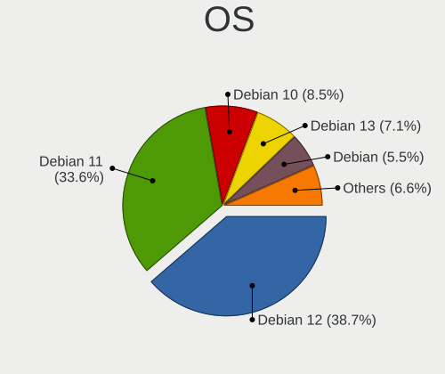

| Name                            | Computers | Percent |
|---------------------------------|-----------|---------|
| Debian 12                       | 8362      | 38.65%  |
| Debian 11                       | 7268      | 33.6%   |
| Debian 10                       | 1835      | 8.48%   |
| Debian 13                       | 1535      | 7.1%    |
| Debian                          | 1198      | 5.54%   |
| Debian Testing                  | 645       | 2.98%   |
| Debian 9                        | 330       | 1.53%   |
| Debian Unstable                 | 263       | 1.22%   |
| Debian 11-updates               | 49        | 0.23%   |
| Debian 8                        | 43        | 0.2%    |
| Debian Testing/unstable         | 31        | 0.14%   |
| Debian 23                       | 27        | 0.12%   |
| Debian 2                        | 9         | 0.04%   |
| Debian Sid                      | 8         | 0.04%   |
| Debian 7                        | 6         | 0.03%   |
| Debian 6                        | 4         | 0.02%   |
| Debian Testing-proposed-updates | 3         | 0.01%   |
| Debian 24                       | 3         | 0.01%   |
| Debian 22                       | 3         | 0.01%   |
| Debian 23100609                 | 2         | 0.01%   |
| Debian 2025                     | 2         | 0.01%   |
| Debian 12-updates               | 2         | 0.01%   |
| Debian N/a                      | 1         | 0.005%  |
| Debian 99                       | 1         | 0.005%  |
| Debian 2024                     | 1         | 0.005%  |
| Debian 20                       | 1         | 0.005%  |
| Debian 14                       | 1         | 0.005%  |
| Debian 1                        | 1         | 0.005%  |

OS Family
---------

OS without a version

| Name   | Computers | Percent |
|--------|-----------|---------|
| Debian | 20328     | 100%    |

Kernel
------

Version of the Linux kernel

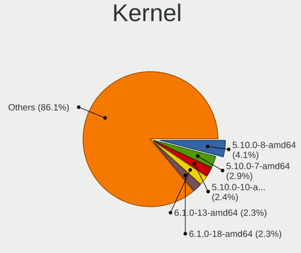

| Version             | Computers | Percent |
|---------------------|-----------|---------|
| 5.10.0-8-amd64      | 984       | 4.06%   |
| 5.10.0-7-amd64      | 693       | 2.86%   |
| 5.10.0-10-amd64     | 581       | 2.4%    |
| 6.1.0-13-amd64      | 569       | 2.35%   |
| 6.1.0-18-amd64      | 545       | 2.25%   |
| 5.10.0-21-amd64     | 477       | 1.97%   |
| 5.10.0-20-amd64     | 385       | 1.59%   |
| 6.1.0-37-amd64      | 376       | 1.55%   |
| 5.10.0-16-amd64     | 373       | 1.54%   |
| 6.1.0-4-amd64       | 366       | 1.51%   |
| 6.12.48+deb13-amd64 | 355       | 1.47%   |
| 6.1.0-21-amd64      | 345       | 1.42%   |
| 6.12.57+deb13-amd64 | 337       | 1.39%   |
| 5.10.0-9-amd64      | 332       | 1.37%   |
| 6.1.0-10-amd64      | 323       | 1.33%   |
| 6.1.0-23-amd64      | 315       | 1.3%    |
| 6.1.0-17-amd64      | 314       | 1.3%    |
| 6.1.0-9-amd64       | 310       | 1.28%   |
| 5.10.0-19-amd64     | 297       | 1.23%   |
| 5.10.0-18-amd64     | 297       | 1.23%   |
| 6.1.0-11-amd64      | 294       | 1.21%   |
| 6.1.0-28-amd64      | 283       | 1.17%   |
| 6.1.0-25-amd64      | 281       | 1.16%   |
| 5.10.0-13-amd64     | 266       | 1.1%    |
| 6.1.0-26-amd64      | 251       | 1.04%   |
| 6.12.41+deb13-amd64 | 236       | 0.97%   |
| 5.10.0-23-amd64     | 229       | 0.95%   |
| 6.1.0-12-amd64      | 214       | 0.88%   |
| 6.1.0-31-amd64      | 211       | 0.87%   |
| 6.1.0-32-amd64      | 208       | 0.86%   |
| 6.1.0-27-amd64      | 202       | 0.83%   |
| 6.1.0-22-amd64      | 196       | 0.81%   |
| 5.10.0-11-amd64     | 196       | 0.81%   |
| 6.1.0-16-amd64      | 191       | 0.79%   |
| 6.1.0-30-amd64      | 187       | 0.77%   |
| 6.12.43+deb13-amd64 | 184       | 0.76%   |
| 5.10.0-2-amd64      | 167       | 0.69%   |
| 4.19.0-6-amd64      | 146       | 0.6%    |
| 6.1.0-20-amd64      | 144       | 0.59%   |
| 5.10.0-14-amd64     | 143       | 0.59%   |

Kernel Family
-------------

Linux kernel without a distro release

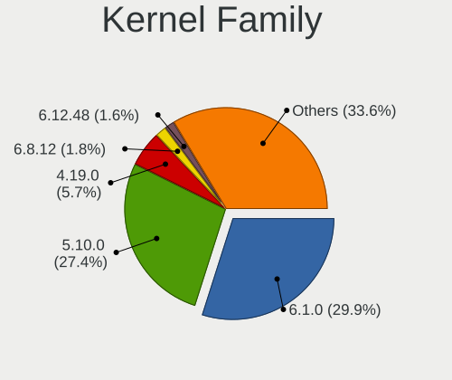

| Version | Computers | Percent |
|---------|-----------|---------|
| 6.1.0   | 6757      | 29.91%  |
| 5.10.0  | 6188      | 27.39%  |
| 4.19.0  | 1281      | 5.67%   |
| 6.8.12  | 407       | 1.8%    |
| 6.12.48 | 356       | 1.58%   |
| 6.12.57 | 351       | 1.55%   |
| 6.0.0   | 271       | 1.2%    |
| 4.9.0   | 243       | 1.08%   |
| 6.12.41 | 238       | 1.05%   |
| 6.5.0   | 223       | 0.99%   |
| 5.18.0  | 204       | 0.9%    |
| 6.12.43 | 195       | 0.86%   |
| 5.15.0  | 169       | 0.75%   |
| 5.9.0   | 150       | 0.66%   |
| 6.12.38 | 143       | 0.63%   |
| 5.16.0  | 140       | 0.62%   |
| 5.19.0  | 123       | 0.54%   |
| 5.7.0   | 121       | 0.54%   |
| 5.8.0   | 120       | 0.53%   |
| 5.4.0   | 118       | 0.52%   |
| 6.2.16  | 117       | 0.52%   |
| 5.6.0   | 100       | 0.44%   |
| 6.5.11  | 99        | 0.44%   |
| 6.4.0   | 93        | 0.41%   |
| 5.14.0  | 93        | 0.41%   |
| 6.8.4   | 90        | 0.4%    |
| 6.12.12 | 78        | 0.35%   |
| 5.17.0  | 73        | 0.32%   |
| 6.7.12  | 72        | 0.32%   |
| 6.6.15  | 69        | 0.31%   |
| 6.10.11 | 65        | 0.29%   |
| 6.11.10 | 63        | 0.28%   |
| 6.6.13  | 61        | 0.27%   |
| 5.13.19 | 60        | 0.27%   |
| 6.12.22 | 59        | 0.26%   |
| 6.10.6  | 57        | 0.25%   |
| 6.1.21  | 57        | 0.25%   |
| 6.8.8   | 54        | 0.24%   |
| 6.5.13  | 54        | 0.24%   |
| 6.3.0   | 54        | 0.24%   |

Kernel Major Ver.
-----------------

Linux kernel major version

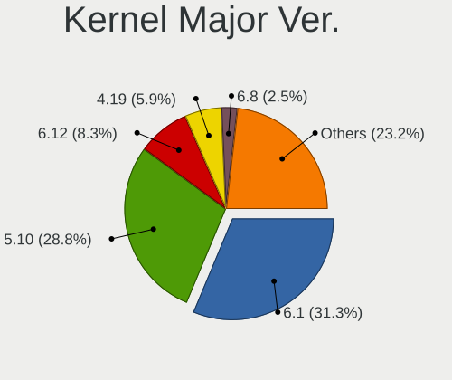

| Version | Computers | Percent |
|---------|-----------|---------|
| 6.1     | 6972      | 31.3%   |
| 5.10    | 6409      | 28.77%  |
| 6.12    | 1853      | 8.32%   |
| 4.19    | 1310      | 5.88%   |
| 6.8     | 566       | 2.54%   |
| 5.15    | 557       | 2.5%    |
| 6.6     | 387       | 1.74%   |
| 6.5     | 385       | 1.73%   |
| 6.0     | 294       | 1.32%   |
| 4.9     | 257       | 1.15%   |
| 5.4     | 227       | 1.02%   |
| 5.18    | 217       | 0.97%   |
| 6.10    | 190       | 0.85%   |
| 6.11    | 180       | 0.81%   |
| 5.9     | 159       | 0.71%   |
| 5.16    | 159       | 0.71%   |
| 6.2     | 152       | 0.68%   |
| 5.19    | 147       | 0.66%   |
| 5.8     | 132       | 0.59%   |
| 5.7     | 129       | 0.58%   |
| 6.7     | 128       | 0.57%   |
| 6.4     | 118       | 0.53%   |
| 6.9     | 117       | 0.53%   |
| 6.14    | 114       | 0.51%   |
| 5.6     | 110       | 0.49%   |
| 6.17    | 106       | 0.48%   |
| 5.14    | 103       | 0.46%   |
| 6.16    | 99        | 0.44%   |
| 5.17    | 88        | 0.4%    |
| 5.13    | 84        | 0.38%   |
| 6.3     | 70        | 0.31%   |
| 5.3     | 66        | 0.3%    |
| 5.11    | 51        | 0.23%   |
| 5.5     | 38        | 0.17%   |
| 6       | 27        | 0.12%   |
| 5.2     | 27        | 0.12%   |
| 6.15    | 25        | 0.11%   |
| 4.18    | 22        | 0.1%    |
| 3.16    | 22        | 0.1%    |
| 4.15    | 19        | 0.09%   |

Arch
----

OS architecture (x86_64, i586, etc.)

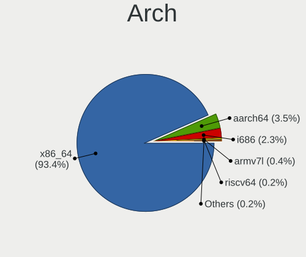

| Name        | Computers | Percent |
|-------------|-----------|---------|
| x86_64      | 18991     | 93.39%  |
| aarch64     | 716       | 3.52%   |
| i686        | 461       | 2.27%   |
| armv7l      | 83        | 0.41%   |
| riscv64     | 36        | 0.18%   |
| loongarch64 | 23        | 0.11%   |
| ppc64       | 7         | 0.03%   |
| i586        | 4         | 0.02%   |
| ppc64le     | 3         | 0.01%   |
| mips64      | 3         | 0.01%   |
| sparc64     | 2         | 0.01%   |
| ppc         | 2         | 0.01%   |
| sh4a        | 1         | 0.005%  |
| mips        | 1         | 0.005%  |
| i486        | 1         | 0.005%  |
| armv6l      | 1         | 0.005%  |

DE
--

Desktop Environment

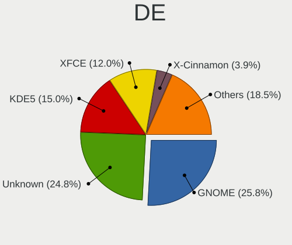

| Name              | Computers | Percent |
|-------------------|-----------|---------|
| GNOME             | 5415      | 25.84%  |
| Unknown           | 5200      | 24.82%  |
| KDE5              | 3138      | 14.98%  |
| XFCE              | 2524      | 12.05%  |
| X-Cinnamon        | 808       | 3.86%   |
| MATE              | 790       | 3.77%   |
| LXDE              | 555       | 2.65%   |
| KDE6              | 442       | 2.11%   |
| Cinnamon          | 409       | 1.95%   |
| LXQt              | 318       | 1.52%   |
| KDE               | 314       | 1.5%    |
| i3                | 233       | 1.11%   |
| openbox           | 140       | 0.67%   |
| GNOME Flashback   | 106       | 0.51%   |
| lightdm-xsession  | 64        | 0.31%   |
| Trinity           | 60        | 0.29%   |
| labwc:wlroots     | 60        | 0.29%   |
| GNOME Classic     | 60        | 0.29%   |
| Budgie            | 49        | 0.23%   |
| sway              | 29        | 0.14%   |
| LXDE-pi-wayfire   | 29        | 0.14%   |
| awesome           | 15        | 0.07%   |
| fluxbox           | 14        | 0.07%   |
| BunsenLabs        | 14        | 0.07%   |
| ICEWM             | 13        | 0.06%   |
| default           | 13        | 0.06%   |
| Enlightenment     | 12        | 0.06%   |
| dwm               | 12        | 0.06%   |
| bspwm             | 12        | 0.06%   |
| wlroots           | 11        | 0.05%   |
| Phosh:GNOME       | 10        | 0.05%   |
| Hyprland          | 10        | 0.05%   |
| GNUstep           | 9         | 0.04%   |
| Cutefish          | 9         | 0.04%   |
| x-session-manager | 6         | 0.03%   |
| KDE4              | 6         | 0.03%   |
| xmonad            | 4         | 0.02%   |
| Unity             | 4         | 0.02%   |
| Deepin            | 4         | 0.02%   |
| WindowMaker       | 3         | 0.01%   |

Display Server
--------------

X11 or Wayland

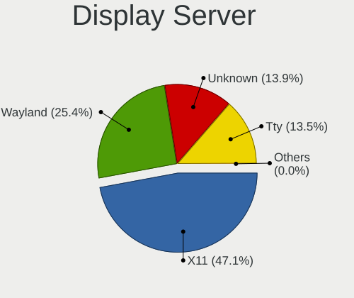

| Name        | Computers | Percent |
|-------------|-----------|---------|
| X11         | 9874      | 47.09%  |
| Wayland     | 5329      | 25.41%  |
| Unknown     | 2912      | 13.89%  |
| Tty         | 2838      | 13.53%  |
| Web         | 8         | 0.04%   |
| Unspecified | 8         | 0.04%   |

Display Manager
---------------

SDDM, LightDM, etc.

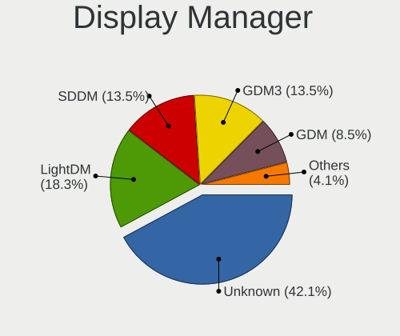

| Name          | Computers | Percent |
|---------------|-----------|---------|
| Unknown       | 8782      | 42.14%  |
| LightDM       | 3810      | 18.28%  |
| SDDM          | 2820      | 13.53%  |
| GDM3          | 2811      | 13.49%  |
| GDM           | 1771      | 8.5%    |
| TDM           | 610       | 2.93%   |
| NODM          | 56        | 0.27%   |
| XDM           | 54        | 0.26%   |
| SLiM          | 49        | 0.24%   |
| LXDM          | 29        | 0.14%   |
| KDM           | 15        | 0.07%   |
| GREETD        | 12        | 0.06%   |
| WDM           | 9         | 0.04%   |
| Ly            | 7         | 0.03%   |
| SU            | 3         | 0.01%   |
| LIDM          | 1         | 0.005%  |
| LDM           | 1         | 0.005%  |
| I3            | 1         | 0.005%  |
| DARKDM_ON_TTY | 1         | 0.005%  |

OS Lang
-------

Language

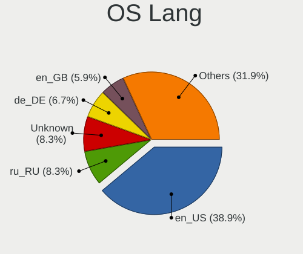

| Lang    | Computers | Percent |
|---------|-----------|---------|
| en_US   | 8036      | 38.9%   |
| ru_RU   | 1719      | 8.32%   |
| Unknown | 1719      | 8.32%   |
| de_DE   | 1392      | 6.74%   |
| en_GB   | 1209      | 5.85%   |
| fr_FR   | 1163      | 5.63%   |
| pt_BR   | 585       | 2.83%   |
| it_IT   | 561       | 2.72%   |
| es_ES   | 550       | 2.66%   |
| C       | 365       | 1.77%   |
| en_CA   | 303       | 1.47%   |
| pl_PL   | 297       | 1.44%   |
| en_AU   | 249       | 1.21%   |
| es_MX   | 184       | 0.89%   |
| zh_CN   | 160       | 0.77%   |
| en_IN   | 149       | 0.72%   |
| es_AR   | 145       | 0.7%    |
| en_IE   | 114       | 0.55%   |
| hu_HU   | 98        | 0.47%   |
| nl_NL   | 87        | 0.42%   |
| de_CH   | 75        | 0.36%   |
| de_AT   | 75        | 0.36%   |
| es_CL   | 69        | 0.33%   |
| es_VE   | 67        | 0.32%   |
| sv_SE   | 66        | 0.32%   |
| cs_CZ   | 64        | 0.31%   |
| en_NZ   | 60        | 0.29%   |
| pt_PT   | 54        | 0.26%   |
| en_ZA   | 54        | 0.26%   |
| ja_JP   | 51        | 0.25%   |
| tr_TR   | 50        | 0.24%   |
| fr_BE   | 50        | 0.24%   |
| es_CO   | 50        | 0.24%   |
| fi_FI   | 41        | 0.2%    |
| ca_ES   | 39        | 0.19%   |
| fr_CH   | 36        | 0.17%   |
| da_DK   | 36        | 0.17%   |
| en_PH   | 30        | 0.15%   |
| nl_BE   | 29        | 0.14%   |
| fr_CA   | 27        | 0.13%   |

Boot Mode
---------

EFI or BIOS

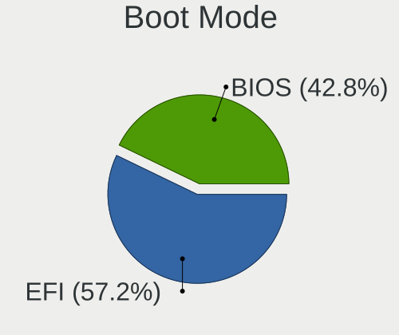

| Mode | Computers | Percent |
|------|-----------|---------|
| EFI  | 11763     | 57.16%  |
| BIOS | 8815      | 42.84%  |

Filesystem
----------

Type of filesystem

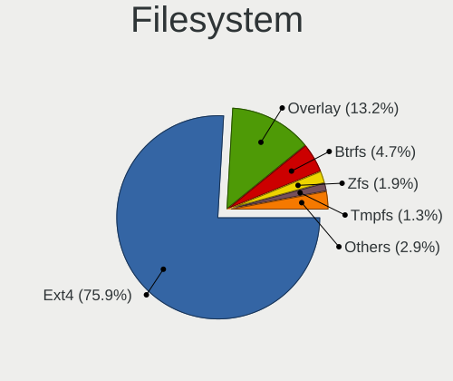

| Type       | Computers | Percent |
|------------|-----------|---------|
| Ext4       | 15606     | 75.91%  |
| Overlay    | 2723      | 13.25%  |
| Btrfs      | 965       | 4.69%   |
| Zfs        | 396       | 1.93%   |
| Tmpfs      | 272       | 1.32%   |
| Xfs        | 241       | 1.17%   |
| Unknown    | 182       | 0.89%   |
| Rootfs     | 50        | 0.24%   |
| Ext3       | 50        | 0.24%   |
| Ext2       | 38        | 0.18%   |
| F2fs       | 13        | 0.06%   |
| Aufs       | 13        | 0.06%   |
| Jfs        | 3         | 0.01%   |
| Ubifs      | 2         | 0.01%   |
| XXXXXXX    | 1         | 0.005%  |
| XXXXX      | 1         | 0.005%  |
| Reiserfs   | 1         | 0.005%  |
| Fuse.sshfs | 1         | 0.005%  |

Part. scheme
------------

Scheme of partitioning

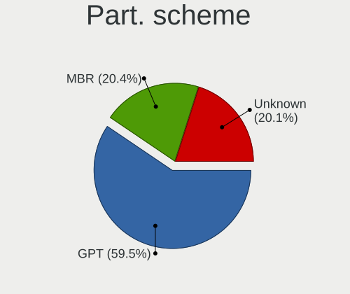

| Type    | Computers | Percent |
|---------|-----------|---------|
| GPT     | 12283     | 59.47%  |
| MBR     | 4216      | 20.41%  |
| Unknown | 4156      | 20.12%  |

Dual Boot with Linux/BSD
------------------------

Hosting more than one Linux/BSD

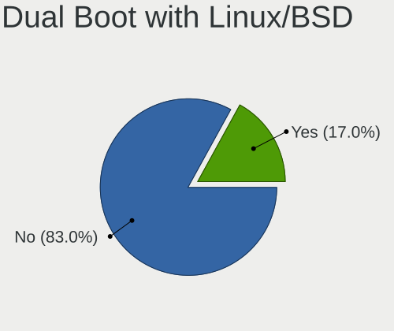

| Dual boot | Computers | Percent |
|-----------|-----------|---------|
| No        | 17175     | 83%     |
| Yes       | 3517      | 17%     |

Dual Boot (Win)
---------------

Hosting Linux and Windows

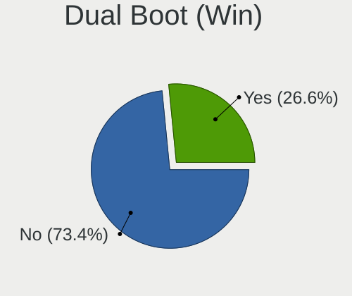

| Dual boot | Computers | Percent |
|-----------|-----------|---------|
| No        | 15146     | 73.45%  |
| Yes       | 5476      | 26.55%  |

Board
-----

Vendor
------

Motherboard manufacturer

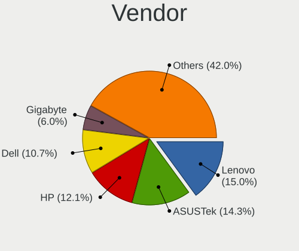

| Name                                 | Computers | Percent |
|--------------------------------------|-----------|---------|
| Lenovo                               | 3040      | 14.95%  |
| ASUSTek Computer                     | 2906      | 14.3%   |
| Hewlett-Packard                      | 2459      | 12.1%   |
| Dell                                 | 2165      | 10.65%  |
| Gigabyte Technology                  | 1226      | 6.03%   |
| Apple                                | 990       | 4.87%   |
| MSI                                  | 979       | 4.82%   |
| Acer                                 | 790       | 3.89%   |
| ASRock                               | 720       | 3.54%   |
| Intel                                | 488       | 2.4%    |
| Raspberry Pi Foundation              | 472       | 2.32%   |
| Unknown                              | 448       | 2.2%    |
| Google                               | 308       | 1.52%   |
| Supermicro                           | 216       | 1.06%   |
| Fujitsu                              | 177       | 0.87%   |
| Toshiba                              | 160       | 0.79%   |
| Samsung Electronics                  | 159       | 0.78%   |
| AZW                                  | 115       | 0.57%   |
| HUAWEI                               | 102       | 0.5%    |
| Sony                                 | 85        | 0.42%   |
| ECS                                  | 74        | 0.36%   |
| Foxconn                              | 61        | 0.3%    |
| ASRockRack                           | 61        | 0.3%    |
| Microsoft                            | 54        | 0.27%   |
| Medion                               | 54        | 0.27%   |
| Shenzhen Meigao Electronic Equipment | 53        | 0.26%   |
| Biostar                              | 52        | 0.26%   |
| Aquarius                             | 52        | 0.26%   |
| AMI                                  | 50        | 0.25%   |
| Positivo                             | 47        | 0.23%   |
| Notebook                             | 44        | 0.22%   |
| Pegatron                             | 40        | 0.2%    |
| Alienware                            | 40        | 0.2%    |
| Packard Bell                         | 37        | 0.18%   |
| Framework                            | 37        | 0.18%   |
| IBM                                  | 34        | 0.17%   |
| Fujitsu Siemens                      | 33        | 0.16%   |
| TUXEDO                               | 31        | 0.15%   |
| sunxi                                | 31        | 0.15%   |
| Rockchip                             | 30        | 0.15%   |

Model
-----

Motherboard model

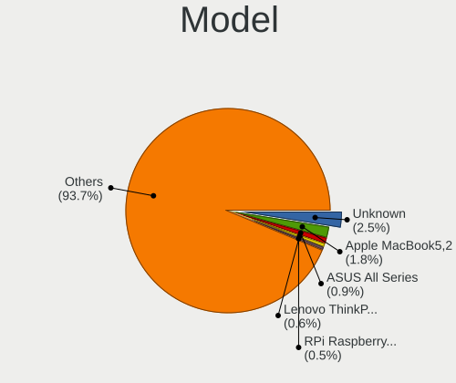

| Name                                              | Computers | Percent |
|---------------------------------------------------|-----------|---------|
| Unknown                                           | 512       | 2.52%   |
| Apple MacBook5,2                                  | 357       | 1.76%   |
| ASUS All Series                                   | 190       | 0.93%   |
| Lenovo ThinkPad L13 Yoga Gen 2 20VK0019US         | 114       | 0.56%   |
| RPi Raspberry Pi 5 Model B Rev 1.0                | 102       | 0.5%    |
| Apple MacBookAir7,2                               | 93        | 0.46%   |
| Apple MacBookAir7,1                               | 79        | 0.39%   |
| Google Enguarde                                   | 74        | 0.36%   |
| Apple MacBook2,1                                  | 60        | 0.3%    |
| Supermicro Super Server                           | 58        | 0.29%   |
| RPi Raspberry Pi 4 Model B Rev 1.4                | 56        | 0.28%   |
| ASUS S20 K29                                      | 55        | 0.27%   |
| RPi Raspberry Pi 4 Model B Rev 1.5                | 54        | 0.27%   |
| MSI MS-7996                                       | 53        | 0.26%   |
| Google Reks                                       | 48        | 0.24%   |
| Aquarius NS585                                    | 48        | 0.24%   |
| HP ProLiant DL360 Gen9                            | 47        | 0.23%   |
| HP Notebook                                       | 47        | 0.23%   |
| RPi Raspberry Pi 4 Model B Rev 1.2                | 43        | 0.21%   |
| RPi Raspberry Pi 3 Model B Rev 1.2                | 41        | 0.2%    |
| RPi Raspberry Pi 4 Model B Rev 1.1                | 40        | 0.2%    |
| Dell OptiPlex 7010                                | 34        | 0.17%   |
| RPi Raspberry Pi                                  | 32        | 0.16%   |
| MSI MS-7817                                       | 31        | 0.15%   |
| ECS G31T-M9                                       | 28        | 0.14%   |
| AZW SER                                           | 28        | 0.14%   |
| ASUS TUF Gaming X570-PLUS                         | 28        | 0.14%   |
| Gigabyte B450M DS3H                               | 27        | 0.13%   |
| Shenzhen Meigao Electronic Equipment Venus series | 26        | 0.13%   |
| HP Pavilion g6                                    | 26        | 0.13%   |
| Gigabyte H81M-S2V                                 | 26        | 0.13%   |
| ASUS PRIME A320M-K                                | 26        | 0.13%   |
| MSI MS-7C56                                       | 25        | 0.12%   |
| Lenovo ThinkPad E475 20H40006US                   | 25        | 0.12%   |
| HP ProLiant DL380 Gen9                            | 25        | 0.12%   |
| Apple MacBook4,1                                  | 25        | 0.12%   |
| Google Terra                                      | 24        | 0.12%   |
| Dell OptiPlex 9020                                | 24        | 0.12%   |
| AZW MINI S                                        | 24        | 0.12%   |
| HP Pavilion dv6                                   | 23        | 0.11%   |

Model Family
------------

Motherboard model prefix

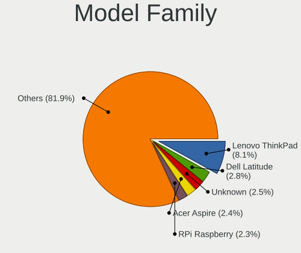

| Name               | Computers | Percent |
|--------------------|-----------|---------|
| Lenovo ThinkPad    | 1638      | 8.06%   |
| Dell Latitude      | 567       | 2.79%   |
| Unknown            | 512       | 2.52%   |
| Acer Aspire        | 494       | 2.43%   |
| RPi Raspberry      | 472       | 2.32%   |
| Dell Inspiron      | 425       | 2.09%   |
| Lenovo IdeaPad     | 422       | 2.08%   |
| ASUS PRIME         | 411       | 2.02%   |
| Apple MacBook5     | 360       | 1.77%   |
| HP EliteBook       | 346       | 1.7%    |
| Dell OptiPlex      | 317       | 1.56%   |
| HP Pavilion        | 290       | 1.43%   |
| Lenovo ThinkCentre | 284       | 1.4%    |
| ASUS ROG           | 259       | 1.27%   |
| Dell Precision     | 240       | 1.18%   |
| HP Laptop          | 216       | 1.06%   |
| ASUS VivoBook      | 214       | 1.05%   |
| HP ProBook         | 208       | 1.02%   |
| HP Compaq          | 190       | 0.93%   |
| ASUS All           | 190       | 0.93%   |
| Dell XPS           | 185       | 0.91%   |
| ASUS TUF           | 179       | 0.88%   |
| HP ProLiant        | 176       | 0.87%   |
| Dell PowerEdge     | 176       | 0.87%   |
| Apple MacBookAir7  | 172       | 0.85%   |
| Dell Vostro        | 127       | 0.62%   |
| Toshiba Satellite  | 120       | 0.59%   |
| ASUS ASUS          | 120       | 0.59%   |
| HP EliteDesk       | 119       | 0.59%   |
| Lenovo Yoga        | 112       | 0.55%   |
| HP ProDesk         | 110       | 0.54%   |
| Lenovo Legion      | 78        | 0.38%   |
| ASUS Zenbook       | 78        | 0.38%   |
| HP ENVY            | 76        | 0.37%   |
| HP ZBook           | 74        | 0.36%   |
| Google Enguarde    | 74        | 0.36%   |
| Lenovo ThinkBook   | 70        | 0.34%   |
| Acer Nitro         | 63        | 0.31%   |
| Gigabyte B450M     | 61        | 0.3%    |
| Apple MacBook2     | 60        | 0.3%    |

MFG Year
--------

Motherboard manufacture year

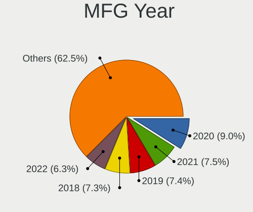

| Year    | Computers | Percent |
|---------|-----------|---------|
| 2020    | 1833      | 9.02%   |
| 2021    | 1527      | 7.51%   |
| 2019    | 1514      | 7.45%   |
| 2018    | 1474      | 7.25%   |
| 2022    | 1274      | 6.27%   |
| 2012    | 1239      | 6.1%    |
| 2017    | 1102      | 5.42%   |
| 2013    | 1078      | 5.3%    |
| 2023    | 1028      | 5.06%   |
| 2011    | 1028      | 5.06%   |
| 2015    | 993       | 4.88%   |
| 2014    | 976       | 4.8%    |
| 2009    | 955       | 4.7%    |
| 2016    | 849       | 4.18%   |
| Unknown | 762       | 3.75%   |
| 2010    | 677       | 3.33%   |
| 2024    | 574       | 2.82%   |
| 2008    | 555       | 2.73%   |
| 2007    | 384       | 1.89%   |
| 2006    | 216       | 1.06%   |
| 2025    | 157       | 0.77%   |
| 2005    | 66        | 0.32%   |
| 2004    | 33        | 0.16%   |
| 2003    | 20        | 0.1%    |
| 2002    | 5         | 0.02%   |
| 2001    | 5         | 0.02%   |
| 2000    | 4         | 0.02%   |

Form Factor
-----------

Physical design of the computer

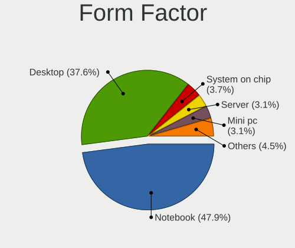

| Name           | Computers | Percent |
|----------------|-----------|---------|
| Notebook       | 9743      | 47.93%  |
| Desktop        | 7653      | 37.65%  |
| System on chip | 754       | 3.71%   |
| Server         | 632       | 3.11%   |
| Mini pc        | 628       | 3.09%   |
| Convertible    | 520       | 2.56%   |
| All in one     | 217       | 1.07%   |
| Tablet         | 155       | 0.76%   |
| Phone          | 12        | 0.06%   |
| Other          | 7         | 0.03%   |
| Stick pc       | 5         | 0.02%   |
| Firewall       | 2         | 0.01%   |

Secure Boot
-----------

Enabled or disabled

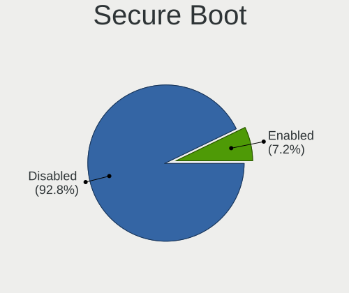

| State    | Computers | Percent |
|----------|-----------|---------|
| Disabled | 19084     | 92.83%  |
| Enabled  | 1473      | 7.17%   |

Coreboot
--------

Have coreboot on board

| Used | Computers | Percent |
|------|-----------|---------|
| No   | 19980     | 98.28%  |
| Yes  | 350       | 1.72%   |

RAM Size
--------

Total RAM memory

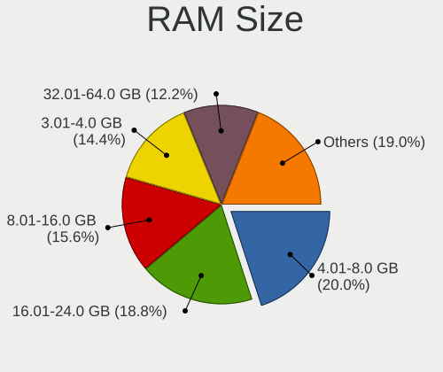

| Size in GB      | Computers | Percent |
|-----------------|-----------|---------|
| 4.01-8.0        | 4154      | 20%     |
| 16.01-24.0      | 3912      | 18.84%  |
| 8.01-16.0       | 3244      | 15.62%  |
| 3.01-4.0        | 2980      | 14.35%  |
| 32.01-64.0      | 2530      | 12.18%  |
| 64.01-256.0     | 1317      | 6.34%   |
| 1.01-2.0        | 1146      | 5.52%   |
| 24.01-32.0      | 590       | 2.84%   |
| 2.01-3.0        | 324       | 1.56%   |
| 0.51-1.0        | 280       | 1.35%   |
| More than 256.0 | 181       | 0.87%   |
| 0.01-0.5        | 82        | 0.39%   |
| Unknown         | 23        | 0.11%   |
| 0               | 2         | 0.01%   |

RAM Used
--------

Used RAM memory

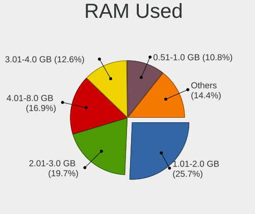

| Used GB         | Computers | Percent |
|-----------------|-----------|---------|
| 1.01-2.0        | 5724      | 25.68%  |
| 2.01-3.0        | 4381      | 19.66%  |
| 4.01-8.0        | 3765      | 16.89%  |
| 3.01-4.0        | 2802      | 12.57%  |
| 0.51-1.0        | 2412      | 10.82%  |
| 8.01-16.0       | 1328      | 5.96%   |
| 0.01-0.5        | 912       | 4.09%   |
| 16.01-24.0      | 361       | 1.62%   |
| 32.01-64.0      | 213       | 0.96%   |
| 24.01-32.0      | 171       | 0.77%   |
| 64.01-256.0     | 169       | 0.76%   |
| Unknown         | 33        | 0.15%   |
| More than 256.0 | 13        | 0.06%   |
| 0               | 2         | 0.01%   |

Total Drives
------------

Number of drives on board

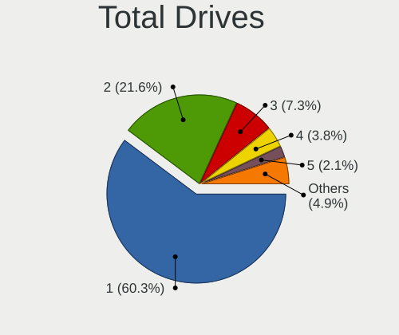

| Drives  | Computers | Percent |
|---------|-----------|---------|
| 1       | 12610     | 60.25%  |
| 2       | 4523      | 21.61%  |
| 3       | 1536      | 7.34%   |
| 4       | 798       | 3.81%   |
| 5       | 432       | 2.06%   |
| 6       | 238       | 1.14%   |
| 0       | 173       | 0.83%   |
| 7       | 162       | 0.77%   |
| 8       | 105       | 0.5%    |
| 10      | 67        | 0.32%   |
| 9       | 66        | 0.32%   |
| 11      | 34        | 0.16%   |
| 14      | 28        | 0.13%   |
| 12      | 25        | 0.12%   |
| 13      | 23        | 0.11%   |
| 18      | 15        | 0.07%   |
| 16      | 11        | 0.05%   |
| 17      | 8         | 0.04%   |
| 19      | 7         | 0.03%   |
| 21      | 5         | 0.02%   |
| 15      | 5         | 0.02%   |
| 36      | 4         | 0.02%   |
| 33      | 4         | 0.02%   |
| 27      | 4         | 0.02%   |
| 26      | 4         | 0.02%   |
| 29      | 3         | 0.01%   |
| 28      | 3         | 0.01%   |
| Unknown | 3         | 0.01%   |
| 55      | 2         | 0.01%   |
| 46      | 2         | 0.01%   |
| 44      | 2         | 0.01%   |
| 41      | 2         | 0.01%   |
| 31      | 2         | 0.01%   |
| 30      | 2         | 0.01%   |
| 22      | 2         | 0.01%   |
| 111     | 1         | 0.005%  |
| 79      | 1         | 0.005%  |
| 70      | 1         | 0.005%  |
| 61      | 1         | 0.005%  |
| 56      | 1         | 0.005%  |

Has CD-ROM
----------

Has CD-ROM on board

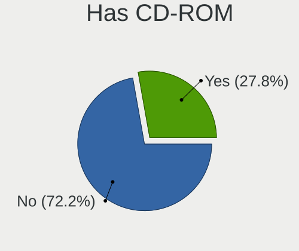

| Presented | Computers | Percent |
|-----------|-----------|---------|
| No        | 14772     | 72.21%  |
| Yes       | 5686      | 27.79%  |

Has Ethernet
------------

Has Ethernet on board

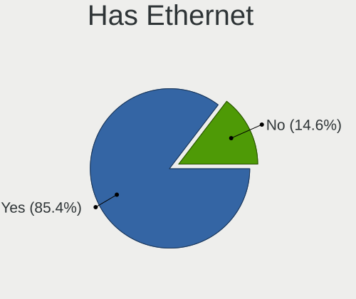

| Presented | Computers | Percent |
|-----------|-----------|---------|
| Yes       | 17418     | 85.38%  |
| No        | 2982      | 14.62%  |

Has WiFi
--------

Has WiFi module

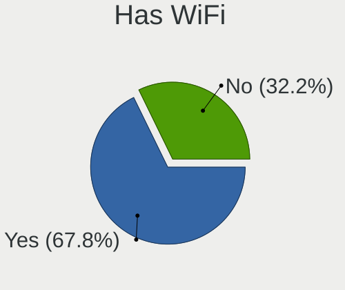

| Presented | Computers | Percent |
|-----------|-----------|---------|
| Yes       | 13622     | 66.67%  |
| No        | 6811      | 33.33%  |

Has Bluetooth
-------------

Has Bluetooth module

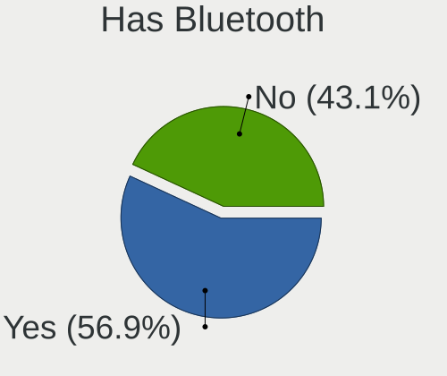

| Presented | Computers | Percent |
|-----------|-----------|---------|
| Yes       | 11675     | 56.88%  |
| No        | 8849      | 43.12%  |

Location
--------

Country
-------

Geographic location (country)

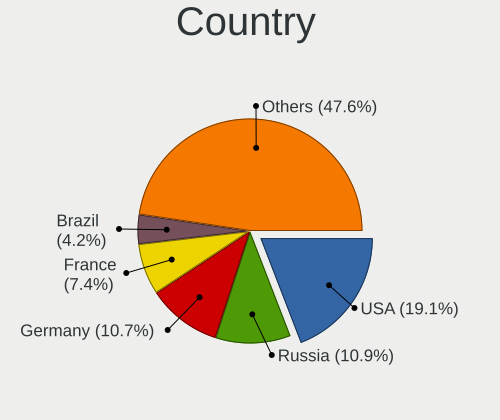

| Country      | Computers | Percent |
|--------------|-----------|---------|
| USA          | 3911      | 19.13%  |
| Russia       | 2219      | 10.86%  |
| Germany      | 2195      | 10.74%  |
| France       | 1513      | 7.4%    |
| Brazil       | 865       | 4.23%   |
| Italy        | 857       | 4.19%   |
| Spain        | 784       | 3.84%   |
| UK           | 635       | 3.11%   |
| Canada       | 565       | 2.76%   |
| Poland       | 495       | 2.42%   |
| Netherlands  | 358       | 1.75%   |
| Australia    | 336       | 1.64%   |
| China        | 309       | 1.51%   |
| Switzerland  | 303       | 1.48%   |
| Mexico       | 275       | 1.35%   |
| India        | 231       | 1.13%   |
| Sweden       | 222       | 1.09%   |
| Argentina    | 220       | 1.08%   |
| Austria      | 219       | 1.07%   |
| Belgium      | 208       | 1.02%   |
| Finland      | 194       | 0.95%   |
| Hungary      | 177       | 0.87%   |
| Czechia      | 150       | 0.73%   |
| Turkey       | 147       | 0.72%   |
| Portugal     | 147       | 0.72%   |
| Ukraine      | 127       | 0.62%   |
| Romania      | 127       | 0.62%   |
| Norway       | 125       | 0.61%   |
| Greece       | 107       | 0.52%   |
| Japan        | 106       | 0.52%   |
| Indonesia    | 106       | 0.52%   |
| Colombia     | 92        | 0.45%   |
| Chile        | 92        | 0.45%   |
| Denmark      | 91        | 0.45%   |
| Venezuela    | 89        | 0.44%   |
| Bulgaria     | 88        | 0.43%   |
| New Zealand  | 84        | 0.41%   |
| Ireland      | 82        | 0.4%    |
| South Africa | 68        | 0.33%   |
| Slovakia     | 65        | 0.32%   |

City
----

Geographic location (city)

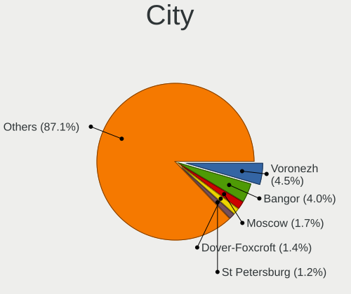

| City              | Computers | Percent |
|-------------------|-----------|---------|
| Voronezh          | 975       | 4.51%   |
| Bangor            | 875       | 4.05%   |
| Moscow            | 362       | 1.67%   |
| Dover-Foxcroft    | 304       | 1.41%   |
| St Petersburg     | 267       | 1.23%   |
| Paris             | 223       | 1.03%   |
| Berlin            | 202       | 0.93%   |
| Vienna            | 138       | 0.64%   |
| Milan             | 131       | 0.61%   |
| Madrid            | 123       | 0.57%   |
| Sao Paulo         | 121       | 0.56%   |
| Amsterdam         | 116       | 0.54%   |
| Helsinki          | 104       | 0.48%   |
| Warsaw            | 102       | 0.47%   |
| Frankfurt am Main | 99        | 0.46%   |
| Seville           | 98        | 0.45%   |
| Toronto           | 97        | 0.45%   |
| Sydney            | 94        | 0.43%   |
| Zurich            | 92        | 0.43%   |
| Munich            | 91        | 0.42%   |
| Hamburg           | 83        | 0.38%   |
| Barcelona         | 83        | 0.38%   |
| Roubaix           | 80        | 0.37%   |
| Budapest          | 75        | 0.35%   |
| Melbourne         | 74        | 0.34%   |
| Prague            | 71        | 0.33%   |
| Cologne           | 64        | 0.3%    |
| Beijing           | 61        | 0.28%   |
| Rome              | 60        | 0.28%   |
| Rio de Janeiro    | 60        | 0.28%   |
| Dublin            | 60        | 0.28%   |
| Athens            | 59        | 0.27%   |
| Bagneux           | 56        | 0.26%   |
| Perm              | 55        | 0.25%   |
| Istanbul          | 55        | 0.25%   |
| London            | 54        | 0.25%   |
| New York          | 53        | 0.25%   |
| Brisbane          | 53        | 0.25%   |
| Los Angeles       | 52        | 0.24%   |
| Montreal          | 50        | 0.23%   |

Drives
------

Drive Vendor
------------

Hard drive vendors

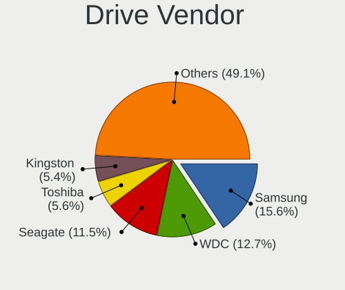

| Vendor                      | Computers | Drives | Percent |
|-----------------------------|-----------|--------|---------|
| Samsung Electronics         | 4686      | 10395  | 15.59%  |
| WDC                         | 3809      | 7987   | 12.67%  |
| Seagate                     | 3462      | 7253   | 11.52%  |
| Toshiba                     | 1691      | 2979   | 5.63%   |
| Kingston                    | 1635      | 2391   | 5.44%   |
| Unknown                     | 1606      | 2128   | 5.34%   |
| SanDisk                     | 1517      | 2038   | 5.05%   |
| Crucial                     | 1370      | 2089   | 4.56%   |
| SK hynix                    | 771       | 1074   | 2.57%   |
| Hitachi                     | 692       | 1057   | 2.3%    |
| Intel                       | 674       | 1055   | 2.24%   |
| Micron Technology           | 577       | 710    | 1.92%   |
| HGST                        | 463       | 2064   | 1.54%   |
| A-DATA Technology           | 456       | 746    | 1.52%   |
| China                       | 353       | 434    | 1.17%   |
| Apple                       | 345       | 473    | 1.15%   |
| Unknown                     | 340       | 399    | 1.13%   |
| Fujitsu                     | 331       | 377    | 1.1%    |
| KIOXIA                      | 273       | 387    | 0.91%   |
| SPCC                        | 199       | 242    | 0.66%   |
| Kingston Technology Company | 191       | 245    | 0.64%   |
| PNY                         | 178       | 279    | 0.59%   |
| Transcend                   | 169       | 240    | 0.56%   |
| Hewlett-Packard             | 157       | 790    | 0.52%   |
| Intenso                     | 154       | 213    | 0.51%   |
| Phison                      | 151       | 199    | 0.5%    |
| Patriot                     | 139       | 182    | 0.46%   |
| Silicon Motion              | 120       | 141    | 0.4%    |
| Netac                       | 115       | 250    | 0.38%   |
| JMicron Technology          | 111       | 121    | 0.37%   |
| Corsair                     | 106       | 146    | 0.35%   |
| LITEON                      | 98        | 124    | 0.33%   |
| Team                        | 94        | 158    | 0.31%   |
| Phison Electronics          | 94        | 135    | 0.31%   |
| MAXIO Technology (Hangzhou) | 90        | 111    | 0.3%    |
| Lexar                       | 90        | 119    | 0.3%    |
| OCZ                         | 88        | 106    | 0.29%   |
| GOODRAM                     | 88        | 143    | 0.29%   |
| Micron/Crucial Technology   | 86        | 108    | 0.29%   |
| Gigabyte Technology         | 76        | 108    | 0.25%   |

Drive Model
-----------

Hard drive models

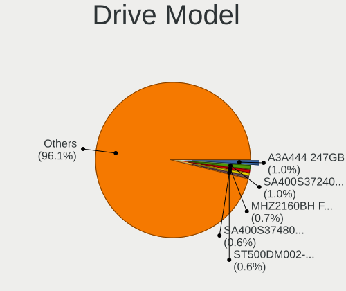

| Model                                              | Computers | Percent |
|----------------------------------------------------|-----------|---------|
| Unknown                                            | 340       | 1.01%   |
| Kingston SA400S37240G 240GB SSD                    | 320       | 0.95%   |
| Fujitsu MHZ2160BH FFS G1 160GB                     | 241       | 0.72%   |
| Kingston SA400S37480G 480GB SSD                    | 202       | 0.6%    |
| Seagate ST500DM002-1BD142 500GB                    | 197       | 0.59%   |
| SanDisk NVMe SSD Drive 1TB                         | 185       | 0.55%   |
| Seagate ST1000DM010-2EP102 1TB                     | 181       | 0.54%   |
| Samsung SSD 860 EVO 500GB                          | 171       | 0.51%   |
| Kingston SA400S37120G 120GB SSD                    | 168       | 0.5%    |
| Samsung SSD 850 EVO 250GB                          | 162       | 0.48%   |
| Samsung NVMe SSD Controller SM981/PM981/PM983 1TB  | 159       | 0.47%   |
| Crucial CT500MX500SSD1 500GB                       | 156       | 0.46%   |
| Samsung MZVLB512HBJQ-000L7 512GB                   | 152       | 0.45%   |
| Crucial CT1000MX500SSD1 1TB                        | 148       | 0.44%   |
| Samsung SSD 970 EVO Plus 1TB                       | 145       | 0.43%   |
| Unknown MMC Card  32GB                             | 139       | 0.41%   |
| Samsung SSD 850 EVO 500GB                          | 139       | 0.41%   |
| Samsung SSD 860 EVO 1TB                            | 138       | 0.41%   |
| Seagate ST1000LM035-1RK172 1TB                     | 136       | 0.4%    |
| Crucial CT480BX500SSD1 480GB                       | 132       | 0.39%   |
| Crucial CT240BX500SSD1 240GB                       | 129       | 0.38%   |
| Samsung SSD 860 EVO 250GB                          | 128       | 0.38%   |
| Samsung SSD 870 EVO 1TB                            | 125       | 0.37%   |
| Seagate ST1000LM024 HN-M101MBB 1TB                 | 123       | 0.37%   |
| Kingston SV300S37A120G 120GB SSD                   | 123       | 0.37%   |
| Samsung SSD 870 EVO 500GB                          | 119       | 0.35%   |
| Toshiba DT01ACA050 500GB                           | 113       | 0.34%   |
| Toshiba DT01ACA100 1TB                             | 111       | 0.33%   |
| Samsung SSD 980 1TB                                | 107       | 0.32%   |
| Unknown MMC Card  64GB                             | 106       | 0.31%   |
| Seagate ST2000DM008-2FR102 2TB                     | 103       | 0.31%   |
| Toshiba MQ01ABD100 1TB                             | 97        | 0.29%   |
| SanDisk NVMe SSD Drive 512GB                       | 96        | 0.29%   |
| Apple SSD SM0128G 121GB                            | 91        | 0.27%   |
| WDC WD10EZEX-08WN4A0 1TB                           | 90        | 0.27%   |
| Samsung SSD 970 EVO Plus 500GB                     | 89        | 0.26%   |
| Samsung NVMe SSD Controller PM9A1/PM9A3/980PRO 1TB | 88        | 0.26%   |
| HGST HTS721010A9E630 1TB                           | 88        | 0.26%   |
| Seagate ST4000DM004-2CV104 4TB                     | 86        | 0.26%   |
| SanDisk NVMe SSD Drive 2TB                         | 86        | 0.26%   |

HDD Vendor
----------

Hard disk drive vendors

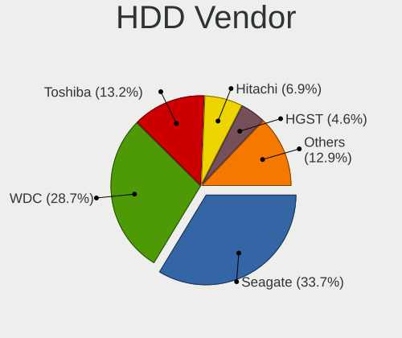

| Vendor              | Computers | Drives | Percent |
|---------------------|-----------|--------|---------|
| Seagate             | 3363      | 7063   | 33.69%  |
| WDC                 | 2867      | 6232   | 28.72%  |
| Toshiba             | 1320      | 2480   | 13.22%  |
| Hitachi             | 690       | 1053   | 6.91%   |
| HGST                | 456       | 1866   | 4.57%   |
| Fujitsu             | 330       | 376    | 3.31%   |
| Samsung Electronics | 322       | 427    | 3.23%   |
| Unknown             | 89        | 110    | 0.89%   |
| Hewlett-Packard     | 82        | 643    | 0.82%   |
| Maxtor              | 68        | 81     | 0.68%   |
| Apple               | 63        | 71     | 0.63%   |
| JMicron Technology  | 49        | 55     | 0.49%   |
| ASMT                | 28        | 63     | 0.28%   |
| TO Exter            | 21        | 31     | 0.21%   |
| Intenso             | 17        | 22     | 0.17%   |
| External            | 17        | 19     | 0.17%   |
| HPE                 | 14        | 58     | 0.14%   |
| USB3.0              | 12        | 16     | 0.12%   |
| IBM/Hitachi         | 10        | 12     | 0.1%    |
| ASMedia             | 10        | 10     | 0.1%    |
| QNAP                | 8         | 15     | 0.08%   |
| NETAPP              | 8         | 95     | 0.08%   |
| LaCie               | 7         | 7      | 0.07%   |
| IBM-ESXS            | 7         | 17     | 0.07%   |
| WD MediaMax         | 6         | 17     | 0.06%   |
| SABRENT             | 6         | 11     | 0.06%   |
| Unknown             | 6         | 15     | 0.06%   |
| USB                 | 5         | 7      | 0.05%   |
| HGST HTS            | 5         | 5      | 0.05%   |
| JetFlash            | 4         | 6      | 0.04%   |
| IET                 | 4         | 11     | 0.04%   |
| SSK                 | 3         | 3      | 0.03%   |
| MARSHAL             | 3         | 3      | 0.03%   |
| Inateck             | 3         | 3      | 0.03%   |
| IB-AC703            | 3         | 3      | 0.03%   |
| USB 3.1             | 2         | 2      | 0.02%   |
| TrueNAS             | 2         | 3      | 0.02%   |
| TDAS                | 2         | 8      | 0.02%   |
| Synology            | 2         | 2      | 0.02%   |
| SILICONMOTION       | 2         | 2      | 0.02%   |

SSD Vendor
----------

Solid state drive vendors

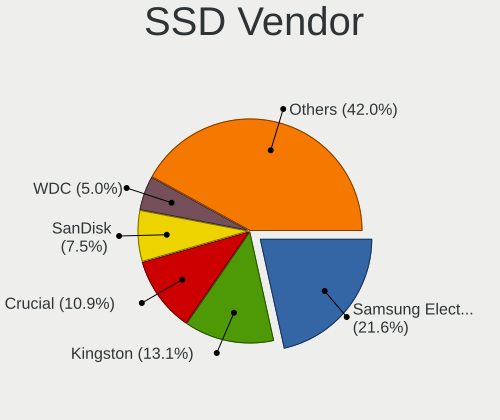

| Vendor              | Computers | Drives | Percent |
|---------------------|-----------|--------|---------|
| Samsung Electronics | 2091      | 5918   | 21.55%  |
| Kingston            | 1267      | 1876   | 13.06%  |
| Crucial             | 1062      | 1641   | 10.95%  |
| SanDisk             | 723       | 972    | 7.45%   |
| WDC                 | 484       | 940    | 4.99%   |
| China               | 337       | 416    | 3.47%   |
| A-DATA Technology   | 317       | 557    | 3.27%   |
| Intel               | 268       | 481    | 2.76%   |
| Apple               | 171       | 198    | 1.76%   |
| Micron Technology   | 170       | 237    | 1.75%   |
| SPCC                | 153       | 187    | 1.58%   |
| PNY                 | 144       | 230    | 1.48%   |
| Transcend           | 142       | 197    | 1.46%   |
| SK hynix            | 140       | 212    | 1.44%   |
| Toshiba             | 135       | 200    | 1.39%   |
| Intenso             | 127       | 176    | 1.31%   |
| Patriot             | 109       | 144    | 1.12%   |
| OCZ                 | 88        | 106    | 0.91%   |
| Netac               | 88        | 197    | 0.91%   |
| LITEON              | 80        | 103    | 0.82%   |
| Team                | 68        | 124    | 0.7%    |
| GOODRAM             | 68        | 98     | 0.7%    |
| Unknown             | 66        | 76     | 0.68%   |
| SABRENT             | 56        | 61     | 0.58%   |
| Apacer              | 52        | 68     | 0.54%   |
| LITEONIT            | 42        | 65     | 0.43%   |
| Hewlett-Packard     | 42        | 91     | 0.43%   |
| Corsair             | 41        | 48     | 0.42%   |
| Lexar               | 39        | 48     | 0.4%    |
| KingSpec            | 37        | 40     | 0.38%   |
| Fanxiang            | 34        | 45     | 0.35%   |
| Gigabyte Technology | 33        | 39     | 0.34%   |
| Plextor             | 32        | 41     | 0.33%   |
| Seagate             | 31        | 41     | 0.32%   |
| ASMT                | 30        | 34     | 0.31%   |
| KIOXIA-EXCERIA      | 27        | 31     | 0.28%   |
| KingDian            | 26        | 28     | 0.27%   |
| Emtec               | 24        | 26     | 0.25%   |
| Verbatim            | 22        | 26     | 0.23%   |
| FORESEE             | 19        | 21     | 0.2%    |

Drive Kind
----------

HDD or SSD

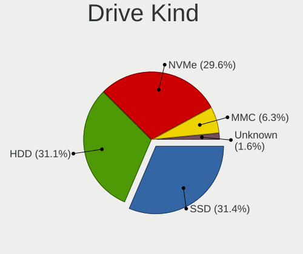

| Kind    | Computers | Drives | Percent |
|---------|-----------|--------|---------|
| SSD     | 8370      | 17308  | 31.43%  |
| HDD     | 8271      | 21135  | 31.06%  |
| NVMe    | 7888      | 12328  | 29.62%  |
| MMC     | 1686      | 2168   | 6.33%   |
| Unknown | 418       | 663    | 1.57%   |

Drive Connector
---------------

SATA, SAS, NVMe, etc.

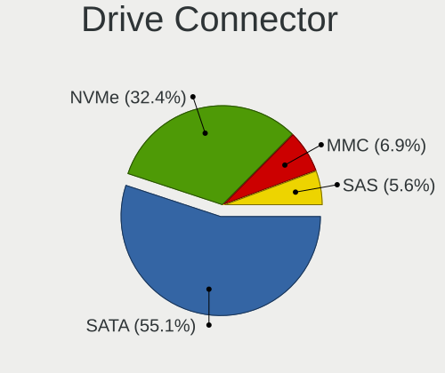

| Type | Computers | Drives | Percent |
|------|-----------|--------|---------|
| SATA | 13367     | 36300  | 55.07%  |
| NVMe | 7852      | 12197  | 32.35%  |
| MMC  | 1686      | 2168   | 6.95%   |
| SAS  | 1367      | 2937   | 5.63%   |

Drive Size
----------

Size of hard drive

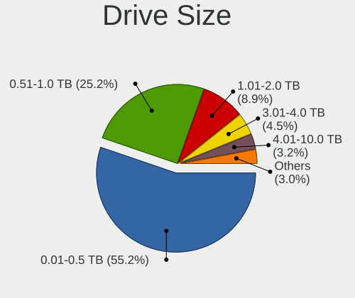

| Size in TB  | Computers | Drives | Percent |
|-------------|-----------|--------|---------|
| 0.01-0.5    | 9906      | 16450  | 55.25%  |
| 0.51-1.0    | 4520      | 10043  | 25.21%  |
| 1.01-2.0    | 1589      | 4074   | 8.86%   |
| 3.01-4.0    | 810       | 2970   | 4.52%   |
| 4.01-10.0   | 573       | 3240   | 3.2%    |
| 2.01-3.0    | 336       | 736    | 1.87%   |
| 10.01-20.0  | 187       | 913    | 1.04%   |
| 20.01-50.0  | 6         | 11     | 0.03%   |
| 0           | 3         | 2      | 0.02%   |
| 50.01-100.0 | 1         | 4      | 0.01%   |

Space Total
-----------

Amount of disk space available on the file system

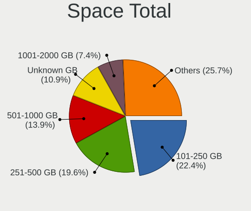

| Size in GB     | Computers | Percent |
|----------------|-----------|---------|
| 101-250        | 4755      | 22.39%  |
| 251-500        | 4170      | 19.64%  |
| 501-1000       | 2960      | 13.94%  |
| Unknown        | 2315      | 10.9%   |
| 1001-2000      | 1570      | 7.39%   |
| 51-100         | 1461      | 6.88%   |
| More than 3000 | 1310      | 6.17%   |
| 1-20           | 1131      | 5.33%   |
| 21-50          | 962       | 4.53%   |
| 2001-3000      | 602       | 2.83%   |

Space Used
----------

Amount of used disk space

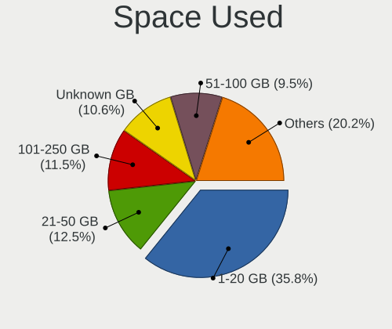

| Used GB        | Computers | Percent |
|----------------|-----------|---------|
| 1-20           | 7847      | 35.8%   |
| 21-50          | 2729      | 12.45%  |
| 101-250        | 2516      | 11.48%  |
| Unknown        | 2315      | 10.56%  |
| 51-100         | 2093      | 9.55%   |
| 251-500        | 1614      | 7.36%   |
| 501-1000       | 1194      | 5.45%   |
| 1001-2000      | 757       | 3.45%   |
| More than 3000 | 547       | 2.5%    |
| 2001-3000      | 269       | 1.23%   |
| 0              | 36        | 0.16%   |

Malfunc. Drives
---------------

Drive models with a malfunction

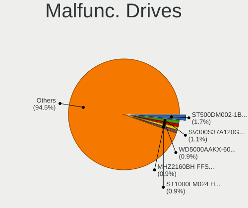

| Model                                 | Computers | Drives | Percent |
|---------------------------------------|-----------|--------|---------|
| Seagate ST500DM002-1BD142 500GB       | 47        | 66     | 1.7%    |
| Kingston SV300S37A120G 120GB SSD      | 30        | 34     | 1.08%   |
| WDC WD5000AAKX-60U6AA0 500GB          | 25        | 42     | 0.9%    |
| Fujitsu MHZ2160BH FFS G1 160GB        | 25        | 25     | 0.9%    |
| Seagate ST1000LM024 HN-M101MBB 1TB    | 24        | 27     | 0.87%   |
| Seagate ST9500325AS 500GB             | 23        | 35     | 0.83%   |
| Seagate ST3500418AS 500GB             | 20        | 26     | 0.72%   |
| WDC WD3200AAJS-00L7A0 320GB           | 16        | 17     | 0.58%   |
| Toshiba MQ01ABD100 1TB                | 15        | 16     | 0.54%   |
| Seagate ST500LM021-1KJ152 500GB       | 15        | 15     | 0.54%   |
| Seagate ST1000LM035-1RK172 1TB        | 15        | 18     | 0.54%   |
| Seagate ST1000DM003-9YN162 1TB        | 15        | 22     | 0.54%   |
| Hitachi HDS721050CLA362 500GB         | 15        | 17     | 0.54%   |
| HGST HTS725050A7E630 500GB            | 15        | 21     | 0.54%   |
| Samsung Electronics SSD 870 EVO 500GB | 14        | 17     | 0.51%   |
| WDC WD5000AAKX-08U6AA0 500GB          | 13        | 15     | 0.47%   |
| WDC WD20EFRX-68EUZN0 2TB              | 13        | 41     | 0.47%   |
| Seagate ST500LT012-1DG142 500GB       | 13        | 13     | 0.47%   |
| Seagate ST31000528AS 1TB              | 13        | 15     | 0.47%   |
| HGST HTS541010A9E680 1TB              | 13        | 23     | 0.47%   |
| Toshiba MQ01ABF050 500GB              | 12        | 12     | 0.43%   |
| Toshiba DT01ACA050 500GB              | 12        | 13     | 0.43%   |
| Seagate ST9500420AS 500GB             | 12        | 13     | 0.43%   |
| Seagate ST500LT012-9WS142 500GB       | 12        | 13     | 0.43%   |
| Seagate ST31500341AS 1TB              | 12        | 20     | 0.43%   |
| Hitachi HTS543216L9SA02 160GB         | 12        | 12     | 0.43%   |
| HGST HTS721010A9E630 1TB              | 12        | 14     | 0.43%   |
| SK hynix PC711 HFS512GDE9X073N 512GB  | 11        | 14     | 0.4%    |
| Seagate ST3250318AS 250GB             | 11        | 13     | 0.4%    |
| Seagate ST250DM000-1BD141 250GB       | 11        | 11     | 0.4%    |
| Samsung Electronics SSD 870 EVO 1TB   | 11        | 31     | 0.4%    |
| Kingston SA400S37240G 240GB SSD       | 11        | 13     | 0.4%    |
| WDC WD30EFRX-68EUZN0 3TB              | 10        | 14     | 0.36%   |
| WDC WD20EARX-00PASB0 2TB              | 10        | 15     | 0.36%   |
| Seagate ST3250410AS 250GB             | 10        | 11     | 0.36%   |
| Seagate ST320LT007-9ZV142 320GB       | 10        | 12     | 0.36%   |
| Seagate ST2000DM006-2DM164 2TB        | 10        | 11     | 0.36%   |
| Seagate ST2000DM001-1CH164 2TB        | 10        | 15     | 0.36%   |
| Seagate ST2000DL003-9VT166 2TB        | 10        | 10     | 0.36%   |
| Hitachi HTS547575A9E384 752GB         | 10        | 13     | 0.36%   |

Malfunc. Drive Vendor
---------------------

Vendors of faulty drives

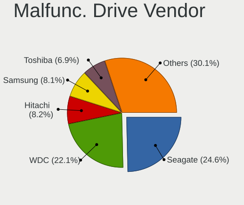

| Vendor              | Computers | Drives | Percent |
|---------------------|-----------|--------|---------|
| Seagate             | 655       | 903    | 24.63%  |
| WDC                 | 588       | 1137   | 22.11%  |
| Hitachi             | 217       | 279    | 8.16%   |
| Samsung Electronics | 215       | 378    | 8.09%   |
| Toshiba             | 183       | 234    | 6.88%   |
| Kingston            | 94        | 116    | 3.54%   |
| Intel               | 86        | 123    | 3.23%   |
| HGST                | 80        | 111    | 3.01%   |
| SK hynix            | 65        | 80     | 2.44%   |
| Crucial             | 61        | 83     | 2.29%   |
| SanDisk             | 49        | 56     | 1.84%   |
| Fujitsu             | 43        | 46     | 1.62%   |
| A-DATA Technology   | 41        | 55     | 1.54%   |
| Micron Technology   | 34        | 44     | 1.28%   |
| Maxtor              | 30        | 36     | 1.13%   |
| China               | 13        | 14     | 0.49%   |
| OCZ                 | 12        | 13     | 0.45%   |
| Apple               | 12        | 13     | 0.45%   |
| LITEON              | 11        | 11     | 0.41%   |
| Transcend           | 9         | 10     | 0.34%   |
| Hewlett-Packard     | 9         | 17     | 0.34%   |
| Corsair             | 8         | 9      | 0.3%    |
| SSSTC               | 7         | 7      | 0.26%   |
| LITEONIT            | 7         | 9      | 0.26%   |
| KingDian            | 7         | 7      | 0.26%   |
| SPCC                | 6         | 7      | 0.23%   |
| Netac               | 6         | 8      | 0.23%   |
| Unknown             | 6         | 6      | 0.23%   |
| PNY                 | 5         | 11     | 0.19%   |
| XPG                 | 4         | 5      | 0.15%   |
| Team                | 4         | 4      | 0.15%   |
| KingSpec            | 4         | 4      | 0.15%   |
| JMicron Technology  | 4         | 5      | 0.15%   |
| Intenso             | 4         | 5      | 0.15%   |
| HP Phison           | 4         | 4      | 0.15%   |
| ASMT                | 4         | 5      | 0.15%   |
| Apacer              | 4         | 4      | 0.15%   |
| ShiJi               | 3         | 9      | 0.11%   |
| Lenovo              | 3         | 3      | 0.11%   |
| IBM/Hitachi         | 3         | 3      | 0.11%   |

Malfunc. HDD Vendor
-------------------

Vendors of faulty HDD drives

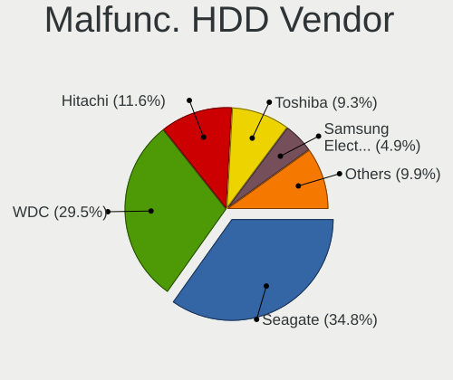

| Vendor              | Computers | Drives | Percent |
|---------------------|-----------|--------|---------|
| Seagate             | 654       | 899    | 34.82%  |
| WDC                 | 554       | 1080   | 29.5%   |
| Hitachi             | 217       | 279    | 11.55%  |
| Toshiba             | 175       | 225    | 9.32%   |
| Samsung Electronics | 92        | 104    | 4.9%    |
| HGST                | 80        | 111    | 4.26%   |
| Fujitsu             | 42        | 45     | 2.24%   |
| Maxtor              | 30        | 36     | 1.6%    |
| Hewlett-Packard     | 9         | 17     | 0.48%   |
| Apple               | 7         | 8      | 0.37%   |
| IBM/Hitachi         | 3         | 3      | 0.16%   |
| USB3.0              | 2         | 2      | 0.11%   |
| JMicron Technology  | 2         | 3      | 0.11%   |
| IBM                 | 2         | 5      | 0.11%   |
| HPE                 | 2         | 2      | 0.11%   |
| ASMT                | 2         | 3      | 0.11%   |
| Unknown             | 1         | 1      | 0.05%   |
| TerraMas            | 1         | 4      | 0.05%   |
| TDAS                | 1         | 4      | 0.05%   |
| ExcelStor           | 1         | 1      | 0.05%   |
| ASMedia             | 1         | 1      | 0.05%   |

Malfunc. Drive Kind
-------------------

Kinds of faulty drives

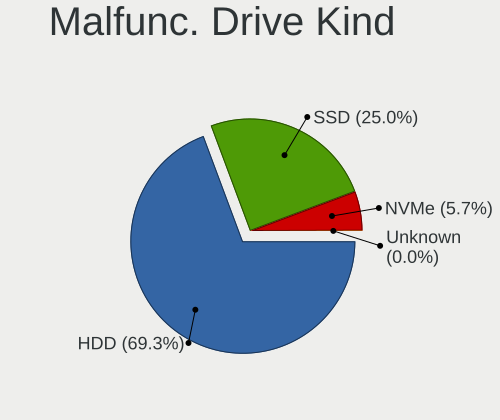

| Kind    | Computers | Drives | Percent |
|---------|-----------|--------|---------|
| HDD     | 1744      | 2833   | 69.32%  |
| SSD     | 628       | 918    | 24.96%  |
| NVMe    | 143       | 198    | 5.68%   |
| Unknown | 1         | 1      | 0.04%   |

Failed Drives
-------------

Failed drive models

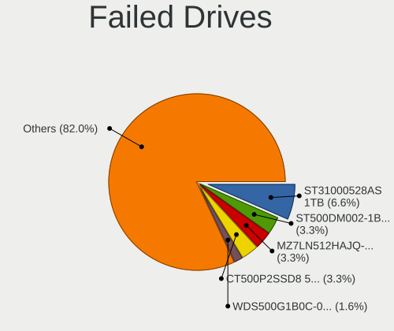

| Model                                            | Computers | Drives | Percent |
|--------------------------------------------------|-----------|--------|---------|
| Seagate ST31000528AS 1TB                         | 4         | 8      | 6.56%   |
| Seagate ST500DM002-1BD142 500GB                  | 2         | 3      | 3.28%   |
| Samsung Electronics MZ7LN512HAJQ-00000 512GB SSD | 2         | 5      | 3.28%   |
| Crucial CT500P2SSD8 500GB                        | 2         | 2      | 3.28%   |
| WDC WDS500G1B0C-00S6U0 500GB                     | 1         | 1      | 1.64%   |
| WDC WD5000BEVT-35A0RT0 500GB                     | 1         | 1      | 1.64%   |
| WDC WD4001FFSX-68JNUN0 4TB                       | 1         | 1      | 1.64%   |
| WDC WD30EZRS-00J99B0 3TB                         | 1         | 1      | 1.64%   |
| WDC WD2000F9YZ-09N20L0 2TB                       | 1         | 16     | 1.64%   |
| WDC WD1503FYYS-02W0B0 1TB                        | 1         | 4      | 1.64%   |
| Toshiba MQ04ABF100 1TB                           | 1         | 1      | 1.64%   |
| Toshiba MK6465GSX 640GB                          | 1         | 1      | 1.64%   |
| Toshiba MK3276GSXN 320GB                         | 1         | 1      | 1.64%   |
| Toshiba MD06ACA800 8TB                           | 1         | 1      | 1.64%   |
| Toshiba DT01ACA300 3TB                           | 1         | 1      | 1.64%   |
| Toshiba DT01ACA200 2TB                           | 1         | 1      | 1.64%   |
| SOLIDIGM SSDSC2KB076TZ 8TB                       | 1         | 1      | 1.64%   |
| SK hynix SC308 SATA 512GB SSD                    | 1         | 1      | 1.64%   |
| SK hynix BC501 HFM128GDJTNG-8310A 128GB          | 1         | 1      | 1.64%   |
| Seagate ST6000NM0034 6TB                         | 1         | 42     | 1.64%   |
| Seagate ST500LT012-1DG142 500GB                  | 1         | 1      | 1.64%   |
| Seagate ST500LM000-1EJ162 500GB                  | 1         | 1      | 1.64%   |
| Seagate ST500DM005 HD502HJ 500GB                 | 1         | 1      | 1.64%   |
| Seagate ST3600057SS 600GB                        | 1         | 8      | 1.64%   |
| Seagate ST3500830AS 500GB                        | 1         | 1      | 1.64%   |
| Seagate ST3500630A 500GB                         | 1         | 1      | 1.64%   |
| Seagate ST3500418ASQ 500GB                       | 1         | 1      | 1.64%   |
| Seagate ST3500418AS 500GB                        | 1         | 1      | 1.64%   |
| Seagate ST2000NM0011 2TB                         | 1         | 1      | 1.64%   |
| Seagate ST1000NM0011 1TB                         | 1         | 1      | 1.64%   |
| Samsung Electronics SSD PM871 2.5 7mm 128GB      | 1         | 1      | 1.64%   |
| Samsung Electronics SSD 980 250GB                | 1         | 1      | 1.64%   |
| Samsung Electronics SSD 980 1TB                  | 1         | 1      | 1.64%   |
| Samsung Electronics SP0802N 80GB                 | 1         | 1      | 1.64%   |
| Samsung Electronics MZVLB512HAJQ-000H1 512GB     | 1         | 1      | 1.64%   |
| Samsung Electronics MZMPC032HBCD-000H1 32GB SSD  | 1         | 1      | 1.64%   |
| Samsung Electronics HM321HI 320GB                | 1         | 8      | 1.64%   |
| Samsung Electronics HE103SJ 1TB                  | 1         | 2      | 1.64%   |
| Samsung Electronics HD253GJ 250GB                | 1         | 1      | 1.64%   |
| Samsung Electronics HD204UI 2TB                  | 1         | 1      | 1.64%   |

Failed Drive Vendor
-------------------

Failed drive vendors

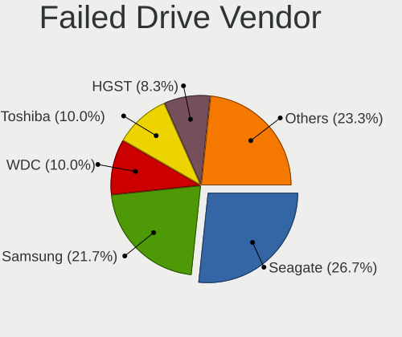

| Vendor              | Computers | Drives | Percent |
|---------------------|-----------|--------|---------|
| Seagate             | 16        | 70     | 26.67%  |
| Samsung Electronics | 13        | 25     | 21.67%  |
| WDC                 | 6         | 24     | 10%     |
| Toshiba             | 6         | 6      | 10%     |
| HGST                | 5         | 6      | 8.33%   |
| Crucial             | 3         | 3      | 5%      |
| SK hynix            | 2         | 2      | 3.33%   |
| SOLIDIGM            | 1         | 1      | 1.67%   |
| KingDian            | 1         | 1      | 1.67%   |
| Intel               | 1         | 1      | 1.67%   |
| Inland              | 1         | 1      | 1.67%   |
| IBM-ESXS            | 1         | 2      | 1.67%   |
| Hitachi             | 1         | 2      | 1.67%   |
| Hewlett-Packard     | 1         | 2      | 1.67%   |
| Gigabyte Technology | 1         | 1      | 1.67%   |
| Emtec               | 1         | 1      | 1.67%   |

Drive Status
------------

Number of failed and malfunc. drives

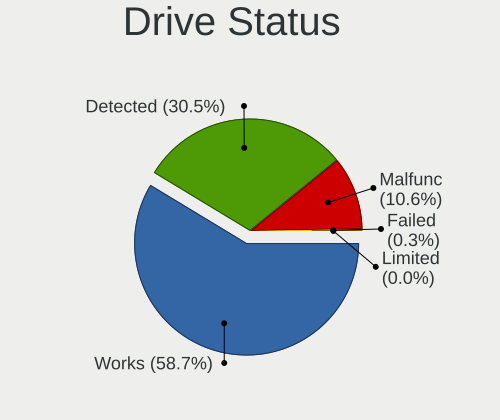

| Status   | Computers | Drives | Percent |
|----------|-----------|--------|---------|
| Works    | 13484     | 35270  | 58.66%  |
| Detected | 7005      | 14231  | 30.48%  |
| Malfunc  | 2435      | 3950   | 10.59%  |
| Failed   | 59        | 148    | 0.26%   |
| Limited  | 3         | 3      | 0.01%   |

Storage controller
------------------

Storage Vendor
--------------

Storage controller vendors

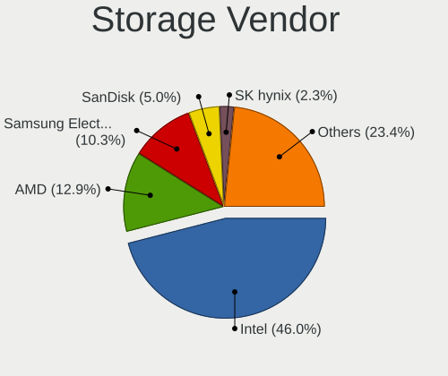

| Vendor                           | Computers | Percent |
|----------------------------------|-----------|---------|
| Intel                            | 11984     | 46%     |
| AMD                              | 3370      | 12.93%  |
| Samsung Electronics              | 2695      | 10.34%  |
| SanDisk                          | 1306      | 5.01%   |
| SK hynix                         | 607       | 2.33%   |
| Kingston Technology Company      | 577       | 2.21%   |
| Nvidia                           | 575       | 2.21%   |
| Micron Technology                | 460       | 1.77%   |
| ASMedia Technology               | 449       | 1.72%   |
| Phison Electronics               | 437       | 1.68%   |
| Micron/Crucial Technology        | 365       | 1.4%    |
| KIOXIA                           | 283       | 1.09%   |
| Toshiba America Info Systems     | 265       | 1.02%   |
| Marvell Technology Group         | 264       | 1.01%   |
| Silicon Motion                   | 242       | 0.93%   |
| ADATA Technology                 | 216       | 0.83%   |
| Broadcom / LSI                   | 210       | 0.81%   |
| JMicron Technology               | 209       | 0.8%    |
| LSI Logic / Symbios Logic        | 208       | 0.8%    |
| MAXIO Technology (Hangzhou)      | 193       | 0.74%   |
| Hewlett-Packard                  | 125       | 0.48%   |
| Apple                            | 109       | 0.42%   |
| Realtek Semiconductor            | 98        | 0.38%   |
| Shenzhen Longsys Electronics     | 81        | 0.31%   |
| VIA Technologies                 | 70        | 0.27%   |
| Adaptec                          | 69        | 0.26%   |
| Solid State Storage Technology   | 65        | 0.25%   |
| Union Memory (Shenzhen)          | 51        | 0.2%    |
| Seagate Technology               | 39        | 0.15%   |
| Silicon Image                    | 37        | 0.14%   |
| INNOGRIT                         | 37        | 0.14%   |
| Yangtze Memory Technologies      | 35        | 0.13%   |
| Solidigm                         | 31        | 0.12%   |
| Lite-On Technology               | 30        | 0.12%   |
| Biwin Storage Technology         | 27        | 0.1%    |
| Silicon Integrated Systems [SiS] | 26        | 0.1%    |
| Loongson Technology              | 24        | 0.09%   |
| Transcend                        | 18        | 0.07%   |
| Netac Technology                 | 16        | 0.06%   |
| Unknown                          | 15        | 0.06%   |

Storage Model
-------------

Storage controller models

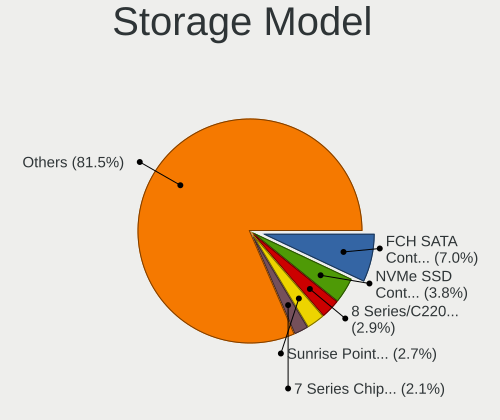

| Model                                                                          | Computers | Percent |
|--------------------------------------------------------------------------------|-----------|---------|
| AMD FCH SATA Controller [AHCI mode]                                            | 2072      | 7.01%   |
| Samsung NVMe SSD Controller SM981/PM981/PM983                                  | 1123      | 3.8%    |
| Intel 8 Series/C220 Series Chipset Family 6-port SATA Controller 1 [AHCI mode] | 846       | 2.86%   |
| Intel Sunrise Point-LP SATA Controller [AHCI mode]                             | 800       | 2.71%   |
| Intel 7 Series Chipset Family 6-port SATA Controller [AHCI mode]               | 626       | 2.12%   |
| Intel Volume Management Device NVMe RAID Controller                            | 520       | 1.76%   |
| Intel Q170/Q150/B150/H170/H110/Z170/CM236 Chipset SATA Controller [AHCI Mode]  | 496       | 1.68%   |
| Samsung NVMe SSD Controller PM9A1/PM9A3/980PRO                                 | 479       | 1.62%   |
| Samsung NVMe SSD Controller 980 (DRAM-less)                                    | 460       | 1.56%   |
| AMD 400 Series Chipset SATA Controller                                         | 455       | 1.54%   |
| Intel 82801 Mobile SATA Controller [RAID mode]                                 | 443       | 1.5%    |
| Intel 200 Series PCH SATA controller [AHCI mode]                               | 414       | 1.4%    |
| Intel 6 Series/C200 Series Chipset Family 6 port Mobile SATA AHCI Controller   | 409       | 1.38%   |
| Nvidia MCP79 AHCI Controller                                                   | 404       | 1.37%   |
| Intel 6 Series/C200 Series Chipset Family 6 port Desktop SATA AHCI Controller  | 376       | 1.27%   |
| ASMedia ASM1061/ASM1062 Serial ATA Controller                                  | 365       | 1.24%   |
| AMD 500 Series Chipset SATA Controller                                         | 364       | 1.23%   |
| AMD SB7x0/SB8x0/SB9x0 SATA Controller [AHCI mode]                              | 339       | 1.15%   |
| Intel 82801G (ICH7 Family) IDE Controller                                      | 337       | 1.14%   |
| Intel 8 Series SATA Controller 1 [AHCI mode]                                   | 315       | 1.07%   |
| Intel Cannon Lake PCH SATA AHCI Controller                                     | 314       | 1.06%   |
| Intel NM10/ICH7 Family SATA Controller [IDE mode]                              | 295       | 1%      |
| Intel Comet Lake SATA AHCI Controller                                          | 288       | 0.97%   |
| Intel Celeron/Pentium Silver Processor SATA Controller                         | 262       | 0.89%   |
| AMD SB7x0/SB8x0/SB9x0 IDE Controller                                           | 258       | 0.87%   |
| Intel SATA Controller [RAID Mode]                                              | 256       | 0.87%   |
| Intel 7 Series/C210 Series Chipset Family 6-port SATA Controller [AHCI mode]   | 246       | 0.83%   |
| AMD 600 Series Chipset SATA Controller                                         | 239       | 0.81%   |
| Intel Wildcat Point-LP SATA Controller [AHCI Mode]                             | 231       | 0.78%   |
| SanDisk Extreme Pro / WD Black SN750 / PC SN730 / Red SN700 NVMe SSD           | 229       | 0.77%   |
| Samsung NVMe SSD Controller SM961/PM961/SM963                                  | 228       | 0.77%   |
| Intel 82801IBM/IEM (ICH9M/ICH9M-E) 4 port SATA Controller [AHCI mode]          | 218       | 0.74%   |
| SK hynix Gold P31/BC711/PC711 NVMe Solid State Drive                           | 207       | 0.7%    |
| Micron/Crucial P2 [Nick P2] / P3 / P3 Plus NVMe PCIe SSD (DRAM-less)           | 203       | 0.69%   |
| SanDisk Ultra 3D / WD PC SN530, IX SN530, Blue SN550 NVMe SSD (DRAM-less)      | 199       | 0.67%   |
| Intel Alder Lake-S PCH SATA Controller [AHCI Mode]                             | 198       | 0.67%   |
| Intel C610/X99 series chipset 6-Port SATA Controller [AHCI mode]               | 189       | 0.64%   |
| Intel Tiger Lake-LP SATA Controller                                            | 186       | 0.63%   |
| Silicon Motion SM2263EN/SM2263XT (DRAM-less) NVMe SSD Controllers              | 179       | 0.61%   |
| Intel 5 Series/3400 Series Chipset 6 port SATA AHCI Controller                 | 178       | 0.6%    |

Storage Kind
------------

Kind of storage controller (IDE, SATA, NVMe, SAS, ...)

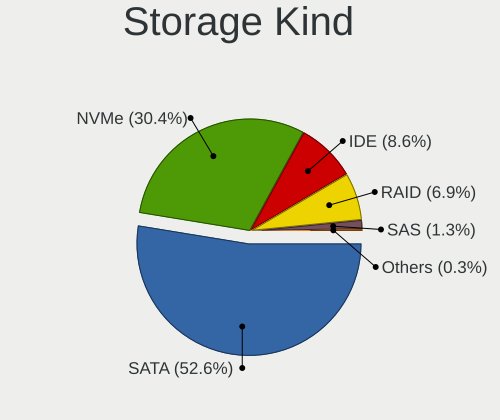

| Kind | Computers | Percent |
|------|-----------|---------|
| SATA | 13599     | 52.58%  |
| NVMe | 7853      | 30.36%  |
| IDE  | 2226      | 8.61%   |
| RAID | 1778      | 6.87%   |
| SAS  | 341       | 1.32%   |
| SCSI | 68        | 0.26%   |

Processor
---------

CPU Vendor
----------

Processor vendors

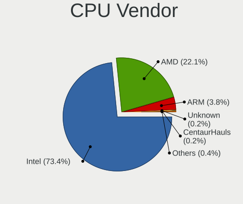

| Vendor                   | Computers | Percent |
|--------------------------|-----------|---------|
| Intel                    | 14925     | 73.4%   |
| AMD                      | 4496      | 22.11%  |
| ARM                      | 771       | 3.79%   |
| Unknown                  | 32        | 0.16%   |
| CentaurHauls             | 31        | 0.15%   |
| Loongson                 | 23        | 0.11%   |
| sifive,u74-mc            | 16        | 0.08%   |
| Qualcomm                 | 9         | 0.04%   |
| CHRP IBM,8233-E8B        | 5         | 0.02%   |
| Phytium                  | 4         | 0.02%   |
| eswin,eic770x            | 4         | 0.02%   |
| sifive,bullet0           | 3         | 0.01%   |
| Marvell Semiconductor    | 3         | 0.01%   |
| CHRP IBM,9131-52A        | 2         | 0.01%   |
| thead,c906               | 1         | 0.005%  |
| spacemit,x60             | 1         | 0.005%  |
| PowerNV FP5466G2         | 1         | 0.005%  |
| PowerNV C829UAG3         | 1         | 0.005%  |
| PowerNV C1P9S01 REV 1.02 | 1         | 0.005%  |
| PowerMac10,1             | 1         | 0.005%  |
| PowerBook3,5             | 1         | 0.005%  |
| MIPS                     | 1         | 0.005%  |
| HISILICON                | 1         | 0.005%  |
| AppliedMicro             | 1         | 0.005%  |

CPU Model
---------

Processor models

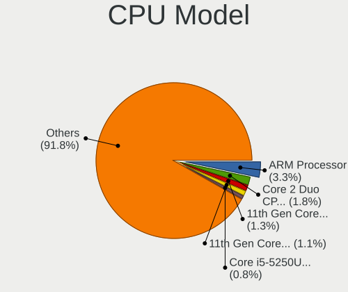

| Model                                         | Computers | Percent |
|-----------------------------------------------|-----------|---------|
| ARM Processor                                 | 679       | 3.33%   |
| Intel Core 2 Duo CPU P7450 @ 2.13GHz          | 361       | 1.77%   |
| Intel 11th Gen Core i7-1165G7 @ 2.80GHz       | 258       | 1.26%   |
| Intel 11th Gen Core i5-1135G7 @ 2.40GHz       | 221       | 1.08%   |
| Intel Core i5-5250U CPU @ 1.60GHz             | 158       | 0.77%   |
| Intel Core i7-8550U CPU @ 1.80GHz             | 149       | 0.73%   |
| Intel Core i5-7200U CPU @ 2.50GHz             | 147       | 0.72%   |
| Intel Core i5-8250U CPU @ 1.60GHz             | 140       | 0.69%   |
| Intel Core i5-10210U CPU @ 1.60GHz            | 124       | 0.61%   |
| AMD Ryzen 5 3600 6-Core Processor             | 121       | 0.59%   |
| Intel Celeron CPU N2840 @ 2.16GHz             | 114       | 0.56%   |
| Intel Core i5-8265U CPU @ 1.60GHz             | 113       | 0.55%   |
| AMD Ryzen 5 3500U with Radeon Vega Mobile Gfx | 112       | 0.55%   |
| Intel Celeron CPU N3060 @ 1.60GHz             | 107       | 0.52%   |
| Intel Core i7-8565U CPU @ 1.80GHz             | 103       | 0.5%    |
| Intel Core i5-2520M CPU @ 2.50GHz             | 101       | 0.49%   |
| AMD Ryzen 7 5700U with Radeon Graphics        | 101       | 0.49%   |
| AMD Ryzen 5 5500U with Radeon Graphics        | 101       | 0.49%   |
| Intel Core i5-3320M CPU @ 2.60GHz             | 95        | 0.47%   |
| Intel Core i5-6300U CPU @ 2.40GHz             | 94        | 0.46%   |
| Intel 12th Gen Core i5-1235U                  | 93        | 0.46%   |
| Intel Core i5-6200U CPU @ 2.30GHz             | 91        | 0.45%   |
| Intel N100                                    | 88        | 0.43%   |
| Intel Core i7-10510U CPU @ 1.80GHz            | 88        | 0.43%   |
| Intel Core i7-7500U CPU @ 2.70GHz             | 87        | 0.43%   |
| Intel Celeron N4020 CPU @ 1.10GHz             | 81        | 0.4%    |
| AMD Ryzen 7 3700X 8-Core Processor            | 80        | 0.39%   |
| Intel Core i7-3770 CPU @ 3.40GHz              | 77        | 0.38%   |
| Intel Core i5-3210M CPU @ 2.50GHz             | 77        | 0.38%   |
| Intel Core i5-8350U CPU @ 1.70GHz             | 76        | 0.37%   |
| AMD Ryzen 9 5950X 16-Core Processor           | 76        | 0.37%   |
| Intel Core i7-4790 CPU @ 3.60GHz              | 75        | 0.37%   |
| Intel Atom x5-Z8350 CPU @ 1.44GHz             | 75        | 0.37%   |
| Intel Core i5-9400 CPU @ 2.90GHz              | 72        | 0.35%   |
| Intel Core i5-3470 CPU @ 3.20GHz              | 71        | 0.35%   |
| Intel Core i5-1035G1 CPU @ 1.00GHz            | 69        | 0.34%   |
| AMD Ryzen 7 5800X 8-Core Processor            | 69        | 0.34%   |
| Intel Core i7-10750H CPU @ 2.60GHz            | 68        | 0.33%   |
| Intel Core i5-6500 CPU @ 3.20GHz              | 68        | 0.33%   |
| AMD Ryzen 7 5700G with Radeon Graphics        | 68        | 0.33%   |

CPU Model Family
----------------

Processor model prefix

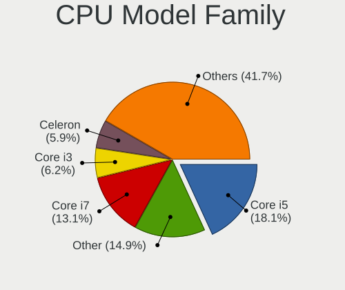

| Model                   | Computers | Percent |
|-------------------------|-----------|---------|
| Intel Core i5           | 3695      | 18.14%  |
| Other                   | 3038      | 14.91%  |
| Intel Core i7           | 2676      | 13.13%  |
| Intel Core i3           | 1268      | 6.22%   |
| Intel Celeron           | 1204      | 5.91%   |
| AMD Ryzen 5             | 1121      | 5.5%    |
| AMD Ryzen 7             | 1027      | 5.04%   |
| Intel Xeon              | 983       | 4.82%   |
| Intel Core 2 Duo        | 952       | 4.67%   |
| Intel Pentium           | 495       | 2.43%   |
| AMD Ryzen 9             | 430       | 2.11%   |
| Intel Atom              | 398       | 1.95%   |
| AMD FX                  | 211       | 1.04%   |
| AMD Ryzen 3             | 189       | 0.93%   |
| Intel Pentium Dual-Core | 177       | 0.87%   |
| Intel Core              | 155       | 0.76%   |
| Intel Core 2            | 148       | 0.73%   |
| AMD Ryzen 7 PRO         | 142       | 0.7%    |
| AMD Ryzen 5 PRO         | 115       | 0.56%   |
| Intel Core 2 Quad       | 113       | 0.55%   |
| Intel Core i9           | 95        | 0.47%   |
| AMD A6                  | 81        | 0.4%    |
| AMD A8                  | 79        | 0.39%   |
| AMD A10                 | 75        | 0.37%   |
| Intel Pentium Silver    | 73        | 0.36%   |
| AMD A4                  | 63        | 0.31%   |
| AMD Athlon              | 61        | 0.3%    |
| Intel Pentium Dual      | 58        | 0.28%   |
| AMD Athlon 64 X2        | 55        | 0.27%   |
| Intel Pentium Gold      | 53        | 0.26%   |
| AMD Ryzen Threadripper  | 53        | 0.26%   |
| Intel Pentium 4         | 52        | 0.26%   |
| Intel Genuine           | 52        | 0.26%   |
| AMD E                   | 52        | 0.26%   |
| AMD Athlon II X2        | 48        | 0.24%   |
| Intel Xeon Gold         | 46        | 0.23%   |
| AMD Phenom II X4        | 45        | 0.22%   |
| Intel Pentium M         | 44        | 0.22%   |
| AMD E1                  | 44        | 0.22%   |
| Intel Xeon Silver       | 39        | 0.19%   |

CPU Cores
---------

Number of processor cores

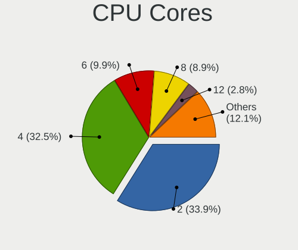

| Number  | Computers | Percent |
|---------|-----------|---------|
| 2       | 6924      | 33.91%  |
| 4       | 6632      | 32.48%  |
| 6       | 2012      | 9.85%   |
| 8       | 1822      | 8.92%   |
| 12      | 564       | 2.76%   |
| 1       | 505       | 2.47%   |
| 16      | 430       | 2.11%   |
| 10      | 409       | 2%      |
| Unknown | 386       | 1.89%   |
| 14      | 263       | 1.29%   |
| 24      | 114       | 0.56%   |
| 20      | 105       | 0.51%   |
| 3       | 83        | 0.41%   |
| 32      | 45        | 0.22%   |
| 28      | 30        | 0.15%   |
| 48      | 14        | 0.07%   |
| 36      | 14        | 0.07%   |
| 40      | 12        | 0.06%   |
| 18      | 11        | 0.05%   |
| 5       | 9         | 0.04%   |
| 64      | 8         | 0.04%   |
| 44      | 5         | 0.02%   |
| 22      | 5         | 0.02%   |
| 128     | 3         | 0.01%   |
| 96      | 3         | 0.01%   |
| 256     | 2         | 0.01%   |
| 56      | 2         | 0.01%   |
| 7       | 2         | 0.01%   |
| 192     | 1         | 0.005%  |
| 112     | 1         | 0.005%  |
| 80      | 1         | 0.005%  |
| 52      | 1         | 0.005%  |

CPU Sockets
-----------

Number of sockets

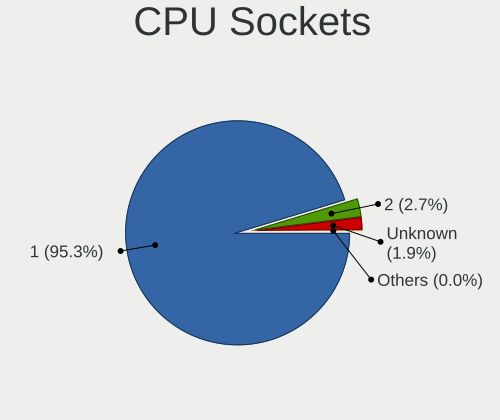

| Number  | Computers | Percent |
|---------|-----------|---------|
| 1       | 19398     | 95.31%  |
| 2       | 548       | 2.69%   |
| Unknown | 383       | 1.88%   |
| 4       | 12        | 0.06%   |
| 3       | 6         | 0.03%   |
| 8       | 3         | 0.01%   |
| 16      | 1         | 0.005%  |
| 14      | 1         | 0.005%  |
| 0       | 1         | 0.005%  |

CPU Threads
-----------

Threads per core (Hyper-Threading)

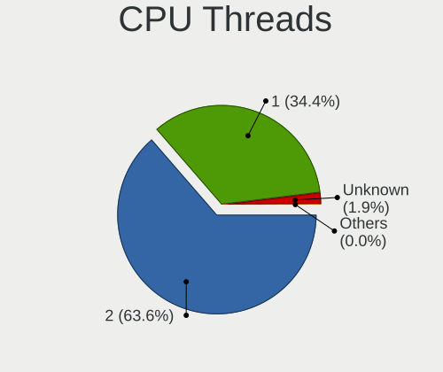

| Number  | Computers | Percent |
|---------|-----------|---------|
| 2       | 12982     | 63.64%  |
| 1       | 7020      | 34.41%  |
| Unknown | 386       | 1.89%   |
| 4       | 9         | 0.04%   |
| 24      | 1         | 0.005%  |
| 12      | 1         | 0.005%  |
| 8       | 1         | 0.005%  |

CPU Op-Modes
------------

CPU Operation Modes (32-bit, 64-bit)

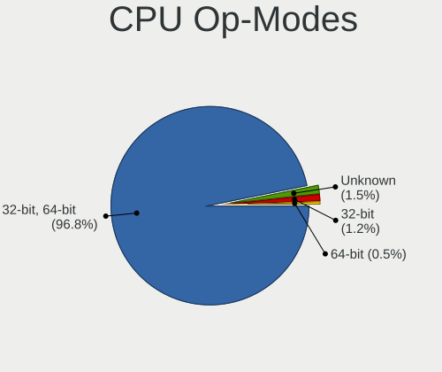

| Op mode        | Computers | Percent |
|----------------|-----------|---------|
| 32-bit, 64-bit | 19694     | 96.8%   |
| Unknown        | 303       | 1.49%   |
| 32-bit         | 242       | 1.19%   |
| 64-bit         | 106       | 0.52%   |

CPU Microcode
-------------

Microcode number

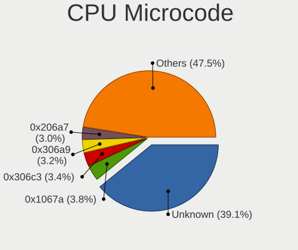

| Number     | Computers | Percent |
|------------|-----------|---------|
| Unknown    | 8260      | 39.12%  |
| 0x1067a    | 806       | 3.82%   |
| 0x306c3    | 708       | 3.35%   |
| 0x306a9    | 680       | 3.22%   |
| 0x206a7    | 637       | 3.02%   |
| 0x806c1    | 480       | 2.27%   |
| 0x806ec    | 346       | 1.64%   |
| 0x506e3    | 340       | 1.61%   |
| 0x306d4    | 333       | 1.58%   |
| 0x906ea    | 328       | 1.55%   |
| 0x806ea    | 278       | 1.32%   |
| 0x806e9    | 277       | 1.31%   |
| 0x40651    | 245       | 1.16%   |
| 0x406e3    | 238       | 1.13%   |
| 0x906e9    | 215       | 1.02%   |
| 0x30678    | 209       | 0.99%   |
| 0x08108109 | 194       | 0.92%   |
| 0x406c4    | 181       | 0.86%   |
| 0x08701021 | 161       | 0.76%   |
| 0x20655    | 155       | 0.73%   |
| 0x906a3    | 150       | 0.71%   |
| 0x706a8    | 141       | 0.67%   |
| 0x0a50000d | 138       | 0.65%   |
| 0x0a50000c | 137       | 0.65%   |
| 0x906a4    | 133       | 0.63%   |
| 0xa0653    | 132       | 0.63%   |
| 0x08600106 | 126       | 0.6%    |
| 0x906c0    | 114       | 0.54%   |
| 0x6fd      | 112       | 0.53%   |
| 0x08608103 | 108       | 0.51%   |
| 0xa0652    | 107       | 0.51%   |
| 0x506c9    | 107       | 0.51%   |
| 0x10676    | 105       | 0.5%    |
| 0x906eb    | 103       | 0.49%   |
| 0x6f6      | 93        | 0.44%   |
| 0x706e5    | 86        | 0.41%   |
| 0x906ed    | 82        | 0.39%   |
| 0x306f2    | 82        | 0.39%   |
| 0x0800820d | 82        | 0.39%   |
| 0x90672    | 81        | 0.38%   |

CPU Microarch
-------------

Microarchitecture

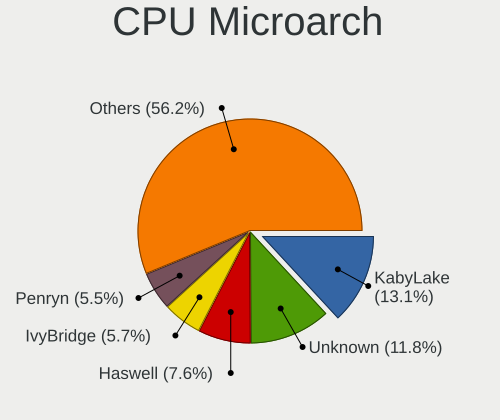

| Name              | Computers | Percent |
|-------------------|-----------|---------|
| KabyLake          | 2678      | 13.11%  |
| Unknown           | 2408      | 11.79%  |
| Haswell           | 1558      | 7.63%   |
| IvyBridge         | 1164      | 5.7%    |
| Penryn            | 1132      | 5.54%   |
| SandyBridge       | 1070      | 5.24%   |
| Skylake           | 1036      | 5.07%   |
| Zen 3             | 855       | 4.19%   |
| Alderlake Hybrid  | 771       | 3.77%   |
| TigerLake         | 698       | 3.42%   |
| Zen 2             | 686       | 3.36%   |
| Silvermont        | 635       | 3.11%   |
| Broadwell         | 631       | 3.09%   |
| Zen+              | 525       | 2.57%   |
| CometLake         | 481       | 2.35%   |
| Core              | 442       | 2.16%   |
| Westmere          | 426       | 2.09%   |
| Goldmont plus     | 317       | 1.55%   |
| Zen               | 296       | 1.45%   |
| IceLake           | 269       | 1.32%   |
| Piledriver        | 243       | 1.19%   |
| K10               | 229       | 1.12%   |
| Excavator         | 225       | 1.1%    |
| Bonnell           | 201       | 0.98%   |
| Goldmont          | 168       | 0.82%   |
| Nehalem           | 158       | 0.77%   |
| Tremont           | 149       | 0.73%   |
| Gracemont         | 122       | 0.6%    |
| P6                | 117       | 0.57%   |
| K8 Hammer         | 115       | 0.56%   |
| Bobcat            | 107       | 0.52%   |
| NetBurst          | 86        | 0.42%   |
| Puma              | 82        | 0.4%    |
| Jaguar            | 81        | 0.4%    |
| Steamroller       | 68        | 0.33%   |
| Meteorlake Hybrid | 58        | 0.28%   |
| Bulldozer         | 47        | 0.23%   |
| K10 Llano         | 36        | 0.18%   |
| K8 & K10 hybrid   | 17        | 0.08%   |
| Lunarlake Hybrid  | 16        | 0.08%   |

Graphics
--------

GPU Vendor
----------

Vendors of graphics cards

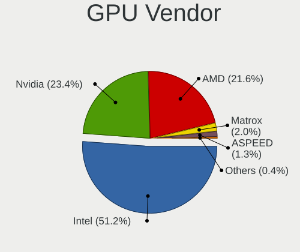

| Vendor                                       | Computers | Percent |
|----------------------------------------------|-----------|---------|
| Intel                                        | 11397     | 51.16%  |
| Nvidia                                       | 5221      | 23.44%  |
| AMD                                          | 4816      | 21.62%  |
| Matrox Electronics Systems                   | 448       | 2.01%   |
| ASPEED Technology                            | 299       | 1.34%   |
| VIA Technologies                             | 22        | 0.1%    |
| Zhaoxin                                      | 19        | 0.09%   |
| Loongson Technology                          | 19        | 0.09%   |
| Silicon Integrated Systems [SiS]             | 16        | 0.07%   |
| Red Hat                                      | 4         | 0.02%   |
| Huawei Technologies                          | 4         | 0.02%   |
| XGI Technology (eXtreme Graphics Innovation) | 3         | 0.01%   |
| S3 Graphics                                  | 3         | 0.01%   |
| Silicon Motion                               | 2         | 0.01%   |
| ATI Technologies                             | 2         | 0.01%   |
| Neomagic                                     | 1         | 0.004%  |
| Cirrus Logic                                 | 1         | 0.004%  |
| 3DLabs                                       | 1         | 0.004%  |

GPU Model
---------

Graphics card models

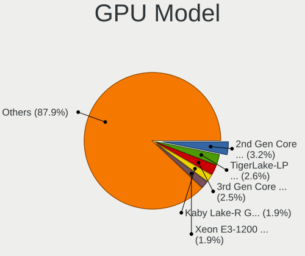

| Model                                                                                    | Computers | Percent |
|------------------------------------------------------------------------------------------|-----------|---------|
| Intel 2nd Generation Core Processor Family Integrated Graphics Controller                | 727       | 3.17%   |
| Intel TigerLake-LP GT2 [Iris Xe Graphics]                                                | 606       | 2.64%   |
| Intel 3rd Gen Core processor Graphics Controller                                         | 572       | 2.49%   |
| Intel Kaby Lake-R GT2 [UHD Graphics 620]                                                 | 437       | 1.9%    |
| Intel Xeon E3-1200 v3/4th Gen Core Processor Integrated Graphics Controller              | 427       | 1.86%   |
| Intel Kaby Lake-U GT2 [HD Graphics 620]                                                  | 376       | 1.64%   |
| Intel Haswell-ULT Integrated Graphics Controller                                         | 361       | 1.57%   |
| AMD Picasso/Raven 2 [Radeon Vega Series / Radeon Vega Mobile Series]                     | 360       | 1.57%   |
| Nvidia C79 [GeForce 9400M G]                                                             | 358       | 1.56%   |
| AMD Cezanne [Radeon Vega Series / Radeon Vega Mobile Series]                             | 346       | 1.51%   |
| Intel Skylake-U GT2 [HD Graphics 520]                                                    | 336       | 1.46%   |
| Intel CoffeeLake-S GT2 [UHD Graphics 630]                                                | 326       | 1.42%   |
| Intel WhiskeyLake-U GT2 [UHD Graphics 620]                                               | 315       | 1.37%   |
| Intel Atom Processor Z36xxx/Z37xxx Series Graphics & Display                             | 314       | 1.37%   |
| Intel Atom/Celeron/Pentium Processor x5-E8000/J3xxx/N3xxx Integrated Graphics Controller | 313       | 1.36%   |
| ASPEED Technology ASPEED Graphics Family                                                 | 299       | 1.3%    |
| AMD Renoir [Radeon Vega Series / Radeon Vega Mobile Series]                              | 279       | 1.21%   |
| Intel GeminiLake [UHD Graphics 600]                                                      | 271       | 1.18%   |
| Intel CometLake-U GT2 [UHD Graphics]                                                     | 270       | 1.18%   |
| AMD Ellesmere [Radeon RX 470/480/570/570X/580/580X/590]                                  | 248       | 1.08%   |
| Intel Skylake-S GT2 [HD Graphics 530]                                                    | 228       | 0.99%   |
| AMD Lucienne                                                                             | 222       | 0.97%   |
| Intel Broadwell-U GT2 [HD Graphics 5500]                                                 | 220       | 0.96%   |
| Intel Core Processor Integrated Graphics Controller                                      | 219       | 0.95%   |
| Intel CoffeeLake-H GT2 [UHD Graphics 630]                                                | 210       | 0.91%   |
| Intel 4th Gen Core Processor Integrated Graphics Controller                              | 200       | 0.87%   |
| Intel Xeon E3-1200 v2/3rd Gen Core processor Graphics Controller                         | 190       | 0.83%   |
| Intel Raptor Lake-P [Iris Xe Graphics]                                                   | 183       | 0.8%    |
| Intel Mobile 4 Series Chipset Integrated Graphics Controller                             | 183       | 0.8%    |
| Intel Broadwell-U GT3 [HD Graphics 6000]                                                 | 178       | 0.78%   |
| Intel Alder Lake-P GT2 [Iris Xe Graphics]                                                | 177       | 0.77%   |
| Intel Mobile 945GM/GMS/GME, 943/940GML Express Integrated Graphics Controller            | 172       | 0.75%   |
| Intel CometLake-S GT2 [UHD Graphics 630]                                                 | 168       | 0.73%   |
| AMD Raphael                                                                              | 156       | 0.68%   |
| Intel JasperLake [UHD Graphics]                                                          | 152       | 0.66%   |
| Nvidia GK208B [GeForce GT 710]                                                           | 149       | 0.65%   |
| Intel 4 Series Chipset Integrated Graphics Controller                                    | 144       | 0.63%   |
| AMD Raven Ridge [Radeon Vega Series / Radeon Vega Mobile Series]                         | 142       | 0.62%   |
| Intel Alder Lake-N [UHD Graphics]                                                        | 141       | 0.61%   |
| AMD Rembrandt [Radeon 680M]                                                              | 141       | 0.61%   |

GPU Combo
---------

Combinations of graphics cards

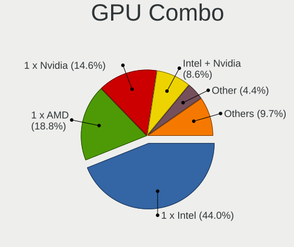

| Name                              | Computers | Percent |
|-----------------------------------|-----------|---------|
| 1 x Intel                         | 8998      | 43.96%  |
| 1 x AMD                           | 3847      | 18.8%   |
| 1 x Nvidia                        | 2994      | 14.63%  |
| Intel + Nvidia                    | 1760      | 8.6%    |
| Other                             | 891       | 4.35%   |
| 1 x Matrox                        | 389       | 1.9%    |
| Intel + AMD                       | 351       | 1.71%   |
| AMD + Nvidia                      | 336       | 1.64%   |
| 2 x AMD                           | 252       | 1.23%   |
| 1 x ASPEED                        | 232       | 1.13%   |
| 2 x Intel                         | 144       | 0.7%    |
| Nvidia + Matrox                   | 52        | 0.25%   |
| Nvidia + ASPEED                   | 41        | 0.2%    |
| 2 x Nvidia                        | 28        | 0.14%   |
| 1 x VIA                           | 22        | 0.11%   |
| AMD + ASPEED                      | 20        | 0.1%    |
| 1 x Zhaoxin                       | 19        | 0.09%   |
| 1 x SiS                           | 16        | 0.08%   |
| 1 x Loongson Technology           | 16        | 0.08%   |
| AMD + Matrox                      | 6         | 0.03%   |
| 3 x AMD                           | 5         | 0.02%   |
| Intel + 2 x Nvidia                | 5         | 0.02%   |
| 2 x Nvidia + 1 x ASPEED           | 4         | 0.02%   |
| 1 x Red Hat                       | 4         | 0.02%   |
| 2 x Nvidia + 1 x Matrox           | 3         | 0.01%   |
| 1 x S3 Graphics                   | 3         | 0.01%   |
| Intel + Matrox                    | 3         | 0.01%   |
| Intel + ASPEED                    | 3         | 0.01%   |
| 1 x Huawei Technologies           | 3         | 0.01%   |
| 2 x Intel + 1 x Nvidia            | 2         | 0.01%   |
| 1 x XGI                           | 2         | 0.01%   |
| 1 x Silicon Motion                | 2         | 0.01%   |
| AMD + Loongson Technology         | 2         | 0.01%   |
| 3 x Nvidia                        | 1         | 0.005%  |
| 2 x Loongson Technology           | 1         | 0.005%  |
| 2 x AMD + 1 x Nvidia + 1 x ASPEED | 1         | 0.005%  |
| 2 x AMD + 1 x Nvidia              | 1         | 0.005%  |
| Nvidia + XGI                      | 1         | 0.005%  |
| Nvidia + Huawei Technologies      | 1         | 0.005%  |
| 1 x Neomagic                      | 1         | 0.005%  |

GPU Driver
----------

Free vs proprietary

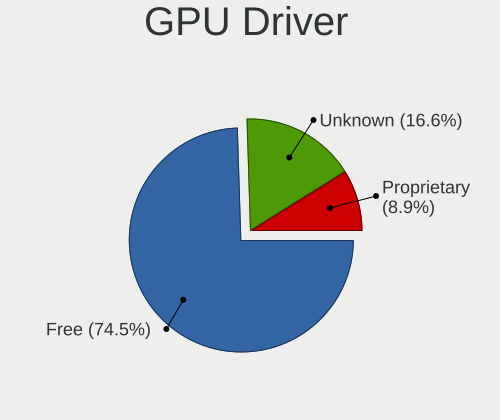

| Driver      | Computers | Percent |
|-------------|-----------|---------|
| Free        | 15428     | 74.51%  |
| Unknown     | 3440      | 16.61%  |
| Proprietary | 1839      | 8.88%   |

GPU Memory
----------

Total video memory

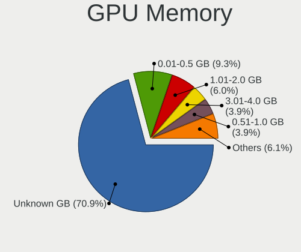

| Size in GB     | Computers | Percent |
|----------------|-----------|---------|
| Unknown        | 14668     | 70.9%   |
| 0.01-0.5       | 1930      | 9.33%   |
| 1.01-2.0       | 1234      | 5.96%   |
| 3.01-4.0       | 803       | 3.88%   |
| 0.51-1.0       | 797       | 3.85%   |
| 7.01-8.0       | 577       | 2.79%   |
| 5.01-6.0       | 276       | 1.33%   |
| 8.01-16.0      | 236       | 1.14%   |
| 2.01-3.0       | 91        | 0.44%   |
| 16.01-24.0     | 59        | 0.29%   |
| 4.01-5.0       | 10        | 0.05%   |
| 32.01-64.0     | 3         | 0.01%   |
| 24.01-32.0     | 3         | 0.01%   |
| More than 64.0 | 1         | 0.005%  |
| 0              | 1         | 0.005%  |

Monitor
-------

Monitor Vendor
--------------

Monitor vendors

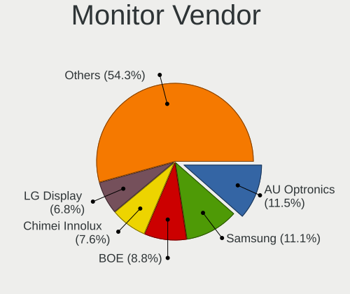

| Vendor                  | Computers | Percent |
|-------------------------|-----------|---------|
| AU Optronics            | 2222      | 11.47%  |
| Samsung Electronics     | 2156      | 11.13%  |
| BOE                     | 1701      | 8.78%   |
| Chimei Innolux          | 1466      | 7.57%   |
| LG Display              | 1317      | 6.8%    |
| Dell                    | 1181      | 6.1%    |
| Goldstar                | 952       | 4.91%   |
| Apple                   | 909       | 4.69%   |
| Hewlett-Packard         | 630       | 3.25%   |
| Acer                    | 562       | 2.9%    |
| Philips                 | 511       | 2.64%   |
| AOC                     | 497       | 2.57%   |
| BenQ                    | 467       | 2.41%   |
| Lenovo                  | 414       | 2.14%   |
| Ancor Communications    | 362       | 1.87%   |
| Iiyama                  | 254       | 1.31%   |
| Sharp                   | 248       | 1.28%   |
| InfoVision              | 214       | 1.1%    |
| ASUSTek Computer        | 212       | 1.09%   |
| ViewSonic               | 204       | 1.05%   |
| Chi Mei Optoelectronics | 179       | 0.92%   |
| Unknown                 | 146       | 0.75%   |
| PANDA                   | 137       | 0.71%   |
| Sony                    | 112       | 0.58%   |
| Eizo                    | 106       | 0.55%   |
| MSI                     | 96        | 0.5%    |
| LG Electronics          | 82        | 0.42%   |
| NEC Computers           | 80        | 0.41%   |
| HannStar                | 78        | 0.4%    |
| CSO                     | 77        | 0.4%    |
| LG Philips              | 73        | 0.38%   |
| Fujitsu Siemens         | 61        | 0.31%   |
| Unknown                 | 58        | 0.3%    |
| RTK                     | 52        | 0.27%   |
| Sceptre Tech            | 49        | 0.25%   |
| Panasonic               | 49        | 0.25%   |
| Toshiba                 | 48        | 0.25%   |
| Gigabyte Technology     | 41        | 0.21%   |
| Vizio                   | 38        | 0.2%    |
| Mi                      | 38        | 0.2%    |

Monitor Model
-------------

Monitor models

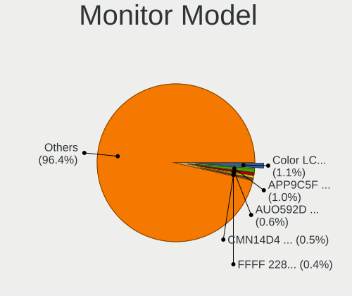

| Model                                                                | Computers | Percent |
|----------------------------------------------------------------------|-----------|---------|
| Apple Color LCD APP9C5B 1280x800 286x179mm 13.3-inch                 | 211       | 1.05%   |
| Apple LCD Monitor APP9C5F 1280x800 286x179mm 13.3-inch               | 197       | 0.98%   |
| AU Optronics LCD Monitor AUO592D 1920x1080 293x165mm 13.2-inch       | 115       | 0.57%   |
| Chimei Innolux LCD Monitor CMN14D4 1920x1080 309x173mm 13.9-inch     | 101       | 0.5%    |
| Unknown LCD Monitor FFFF 2288x1287 2550x2550mm 142.0-inch            | 89        | 0.44%   |
| BOE LCD Monitor BOE0609 1366x768 256x144mm 11.6-inch                 | 71        | 0.35%   |
| Philips 197EL PHLC08B 1366x768 410x230mm 18.5-inch                   | 69        | 0.34%   |
| AU Optronics LCD Monitor AUO38ED 1920x1080 344x193mm 15.5-inch       | 65        | 0.32%   |
| Goldstar LG ULTRAWIDE GSM59F1 2560x1080 670x280mm 28.6-inch          | 63        | 0.31%   |
| Chimei Innolux LCD Monitor CMN15F5 1920x1080 344x193mm 15.5-inch     | 63        | 0.31%   |
| AU Optronics LCD Monitor AUO106C 1366x768 276x155mm 12.5-inch        | 60        | 0.3%    |
| Unknown                                                              | 58        | 0.29%   |
| Goldstar FULL HD GSM5B55 1920x1080 480x270mm 21.7-inch               | 56        | 0.28%   |
| AU Optronics LCD Monitor AUO235C 1366x768 256x144mm 11.6-inch        | 54        | 0.27%   |
| Chimei Innolux LCD Monitor CMN15E7 1920x1080 344x193mm 15.5-inch     | 52        | 0.26%   |
| Chimei Innolux LCD Monitor CMN15DB 1366x768 344x193mm 15.5-inch      | 50        | 0.25%   |
| Apple Color LCD APP9CDF 1440x900 286x179mm 13.3-inch                 | 50        | 0.25%   |
| Chimei Innolux LCD Monitor CMN1132 1366x768 256x144mm 11.6-inch      | 45        | 0.22%   |
| AU Optronics LCD Monitor AUO403D 1920x1080 309x174mm 14.0-inch       | 45        | 0.22%   |
| AU Optronics LCD Monitor AUO21ED 1920x1080 344x193mm 15.5-inch       | 44        | 0.22%   |
| AU Optronics LCD Monitor AUO22EC 1366x768 344x193mm 15.5-inch        | 43        | 0.21%   |
| Apple Color LCD APP9CF3 1366x768 260x140mm 11.6-inch                 | 43        | 0.21%   |
| Apple Color LCD APP9CF2 1366x768 256x144mm 11.6-inch                 | 43        | 0.21%   |
| Chimei Innolux LCD Monitor CMN14C9 1920x1080 309x173mm 13.9-inch     | 40        | 0.2%    |
| Samsung Electronics LCD Monitor SEC5441 1280x800 331x207mm 15.4-inch | 39        | 0.19%   |
| Chimei Innolux LCD Monitor CMN1521 1920x1080 344x193mm 15.5-inch     | 39        | 0.19%   |
| Apple Color LCD APP9CF0 1440x900 290x180mm 13.4-inch                 | 37        | 0.18%   |
| AU Optronics LCD Monitor AUO26EC 1366x768 344x193mm 15.5-inch        | 35        | 0.17%   |
| Samsung Electronics C24F390 SAM0D2C 1920x1080 521x293mm 23.5-inch    | 33        | 0.16%   |
| Dell U2412M DELA07A 1920x1200 518x324mm 24.1-inch                    | 33        | 0.16%   |
| BOE LCD Monitor BOE0872 1920x1080 344x194mm 15.5-inch                | 32        | 0.16%   |
| AOC 27G2G4 AOC2702 1920x1080 598x336mm 27.0-inch                     | 32        | 0.16%   |
| HannStar LCD Monitor HSD03E9 1024x600 220x129mm 10.0-inch            | 31        | 0.15%   |
| BOE LCD Monitor BOE06B3 1366x768 309x173mm 13.9-inch                 | 31        | 0.15%   |
| AU Optronics LCD Monitor AUO573D 1920x1080 309x174mm 14.0-inch       | 31        | 0.15%   |
| AU Optronics LCD Monitor AUO243D 1920x1080 309x173mm 13.9-inch       | 31        | 0.15%   |
| Samsung Electronics C27F390 SAM0D32 1920x1080 598x336mm 27.0-inch    | 30        | 0.15%   |
| LG Display LCD Monitor LGD02D8 1366x768 277x156mm 12.5-inch          | 30        | 0.15%   |
| AU Optronics LCD Monitor AUO61ED 1920x1080 344x194mm 15.5-inch       | 29        | 0.14%   |
| Samsung Electronics S24F350 SAM0D20 1920x1080 521x293mm 23.5-inch    | 28        | 0.14%   |

Monitor Resolution
------------------

Monitor screen resolution

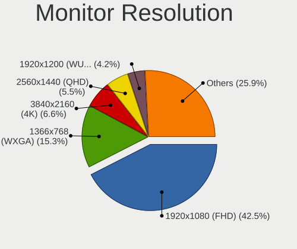

| Resolution         | Computers | Percent |
|--------------------|-----------|---------|
| 1920x1080 (FHD)    | 7894      | 42.49%  |
| 1366x768 (WXGA)    | 2845      | 15.31%  |
| 3840x2160 (4K)     | 1231      | 6.63%   |
| 2560x1440 (QHD)    | 1023      | 5.51%   |
| 1920x1200 (WUXGA)  | 778       | 4.19%   |
| 1280x800 (WXGA)    | 738       | 3.97%   |
| 1280x1024 (SXGA)   | 576       | 3.1%    |
| 1600x900 (HD+)     | 570       | 3.07%   |
| 1440x900 (WXGA+)   | 415       | 2.23%   |
| 1680x1050 (WSXGA+) | 377       | 2.03%   |
| 2560x1600          | 201       | 1.08%   |
| Unknown            | 198       | 1.07%   |
| 3440x1440          | 192       | 1.03%   |
| 2560x1080          | 169       | 0.91%   |
| 2880x1800          | 141       | 0.76%   |
| 1360x768           | 115       | 0.62%   |
| 1024x600           | 115       | 0.62%   |
| 1024x768 (XGA)     | 103       | 0.55%   |
| 2288x1287          | 94        | 0.51%   |
| 3840x1080          | 84        | 0.45%   |
| 1600x1200          | 67        | 0.36%   |
| 3840x2400          | 63        | 0.34%   |
| 1920x540           | 43        | 0.23%   |
| 2160x1440          | 41        | 0.22%   |
| 2880x1920          | 35        | 0.19%   |
| 2256x1504          | 32        | 0.17%   |
| 3200x1800 (QHD+)   | 24        | 0.13%   |
| 1400x1050          | 24        | 0.13%   |
| 1920x1280          | 23        | 0.12%   |
| 1280x720 (HD)      | 20        | 0.11%   |
| 3840x1600          | 19        | 0.1%    |
| 2240x1400          | 19        | 0.1%    |
| 4480x1440          | 16        | 0.09%   |
| 3200x2000          | 16        | 0.09%   |
| 3072x1920          | 13        | 0.07%   |
| 3000x2000          | 12        | 0.06%   |
| 5760x2160          | 11        | 0.06%   |
| 3840x1200          | 11        | 0.06%   |
| 2736x1824          | 11        | 0.06%   |
| 2048x1152          | 11        | 0.06%   |

Monitor Diagonal
----------------

Diagonal size in inches

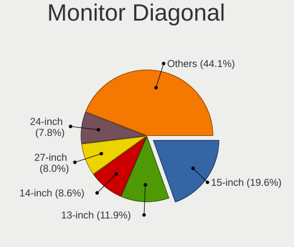

| Inches  | Computers | Percent |
|---------|-----------|---------|
| 15      | 3772      | 19.56%  |
| 13      | 2302      | 11.93%  |
| 14      | 1661      | 8.61%   |
| 27      | 1537      | 7.97%   |
| 24      | 1509      | 7.82%   |
| 23      | 1160      | 6.01%   |
| 21      | 1001      | 5.19%   |
| 17      | 851       | 4.41%   |
| Unknown | 657       | 3.41%   |
| 19      | 507       | 2.63%   |
| 31      | 491       | 2.55%   |
| 11      | 486       | 2.52%   |
| 18      | 398       | 2.06%   |
| 12      | 383       | 1.99%   |
| 16      | 341       | 1.77%   |
| 34      | 268       | 1.39%   |
| 22      | 255       | 1.32%   |
| 20      | 244       | 1.26%   |
| 84      | 146       | 0.76%   |
| 32      | 133       | 0.69%   |
| 10      | 133       | 0.69%   |
| 25      | 108       | 0.56%   |
| 142     | 89        | 0.46%   |
| 72      | 86        | 0.45%   |
| 54      | 76        | 0.39%   |
| 40      | 76        | 0.39%   |
| 26      | 55        | 0.29%   |
| 28      | 52        | 0.27%   |
| 29      | 42        | 0.22%   |
| 48      | 39        | 0.2%    |
| 52      | 36        | 0.19%   |
| 43      | 36        | 0.19%   |
| 65      | 31        | 0.16%   |
| 49      | 29        | 0.15%   |
| 46      | 27        | 0.14%   |
| 63      | 26        | 0.13%   |
| 42      | 23        | 0.12%   |
| 33      | 23        | 0.12%   |
| 37      | 21        | 0.11%   |
| 8       | 17        | 0.09%   |

Monitor Width
-------------

Physical width

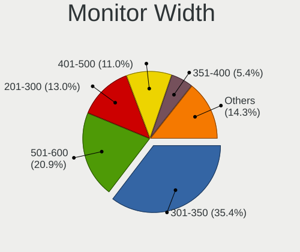

| Width in mm    | Computers | Percent |
|----------------|-----------|---------|
| 301-350        | 6705      | 35.38%  |
| 501-600        | 3952      | 20.85%  |
| 201-300        | 2472      | 13.04%  |
| 401-500        | 2082      | 10.99%  |
| 351-400        | 1023      | 5.4%    |
| 601-700        | 729       | 3.85%   |
| Unknown        | 657       | 3.47%   |
| 701-800        | 430       | 2.27%   |
| 1001-1500      | 318       | 1.68%   |
| 1501-2000      | 261       | 1.38%   |
| 801-900        | 136       | 0.72%   |
| More than 2000 | 91        | 0.48%   |
| 901-1000       | 63        | 0.33%   |
| 101-200        | 28        | 0.15%   |
| 1-100          | 6         | 0.03%   |

Aspect Ratio
------------

Proportional relationship between the width and the height

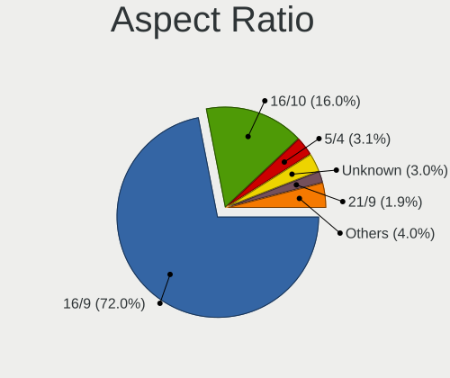

| Ratio   | Computers | Percent |
|---------|-----------|---------|
| 16/9    | 12598     | 71.96%  |
| 16/10   | 2807      | 16.03%  |
| 5/4     | 537       | 3.07%   |
| Unknown | 529       | 3.02%   |
| 21/9    | 329       | 1.88%   |
| 4/3     | 239       | 1.37%   |
| 3/2     | 214       | 1.22%   |
| 1.00    | 93        | 0.53%   |
| 32/9    | 52        | 0.3%    |
| 6/5     | 33        | 0.19%   |
| 2.65    | 12        | 0.07%   |
| 0.56    | 12        | 0.07%   |
| 1.96    | 7         | 0.04%   |
| 3.40    | 6         | 0.03%   |
| 3.20    | 6         | 0.03%   |
| 2.64    | 5         | 0.03%   |
| 2.00    | 4         | 0.02%   |
| 0.89    | 4         | 0.02%   |
| 0.67    | 4         | 0.02%   |
| 0.63    | 3         | 0.02%   |
| 0.45    | 3         | 0.02%   |
| 3.73    | 1         | 0.01%   |
| 2.70    | 1         | 0.01%   |
| 2.67    | 1         | 0.01%   |
| 2.51    | 1         | 0.01%   |
| 2.07    | 1         | 0.01%   |
| 11/10   | 1         | 0.01%   |
| 0.62    | 1         | 0.01%   |
| 0.58    | 1         | 0.01%   |
| 0.25    | 1         | 0.01%   |

Monitor Area
------------

Area in inch²

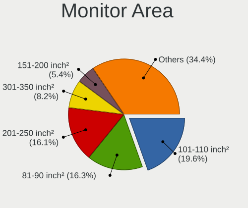

| Area in inch² | Computers | Percent |
|----------------|-----------|---------|
| 101-110        | 3739      | 19.56%  |
| 81-90          | 3119      | 16.31%  |
| 201-250        | 3073      | 16.07%  |
| 301-350        | 1573      | 8.23%   |
| 151-200        | 1030      | 5.39%   |
| 351-500        | 981       | 5.13%   |
| 71-80          | 823       | 4.3%    |
| Unknown        | 657       | 3.44%   |
| 251-300        | 645       | 3.37%   |
| 141-150        | 594       | 3.11%   |
| More than 1000 | 587       | 3.07%   |
| 121-130        | 511       | 2.67%   |
| 51-60          | 493       | 2.58%   |
| 61-70          | 362       | 1.89%   |
| 111-120        | 329       | 1.72%   |
| 501-1000       | 275       | 1.44%   |
| 41-50          | 131       | 0.69%   |
| 131-140        | 98        | 0.51%   |
| 91-100         | 65        | 0.34%   |
| 1-40           | 33        | 0.17%   |

Pixel Density
-------------

Pixels per inch

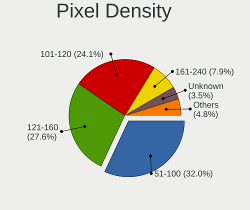

| Density       | Computers | Percent |
|---------------|-----------|---------|
| 51-100        | 5959      | 31.98%  |
| 121-160       | 5144      | 27.61%  |
| 101-120       | 4498      | 24.14%  |
| 161-240       | 1476      | 7.92%   |
| Unknown       | 658       | 3.53%   |
| 1-50          | 502       | 2.69%   |
| More than 240 | 397       | 2.13%   |

Multiple Monitors
-----------------

Total monitors connected

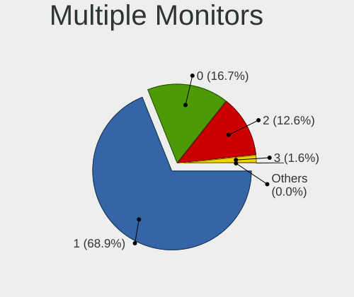

| Total | Computers | Percent |
|-------|-----------|---------|
| 1     | 14355     | 68.94%  |
| 0     | 3480      | 16.71%  |
| 2     | 2630      | 12.63%  |
| 3     | 332       | 1.59%   |
| 4     | 22        | 0.11%   |
| 5     | 3         | 0.01%   |

Network
-------

Net Controller Vendor
---------------------

Controller vendors

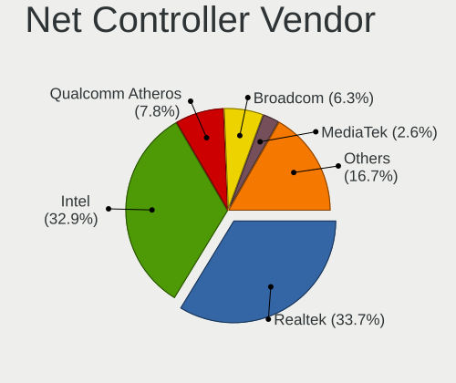

| Vendor                            | Computers | Percent |
|-----------------------------------|-----------|---------|
| Realtek Semiconductor             | 10025     | 33.72%  |
| Intel                             | 9768      | 32.85%  |
| Qualcomm Atheros                  | 2311      | 7.77%   |
| Broadcom                          | 1866      | 6.28%   |
| MediaTek                          | 786       | 2.64%   |
| Nvidia                            | 541       | 1.82%   |
| Broadcom Limited                  | 503       | 1.69%   |
| Marvell Technology Group          | 337       | 1.13%   |
| TP-Link                           | 282       | 0.95%   |
| Ralink Technology                 | 264       | 0.89%   |
| ASIX Electronics                  | 234       | 0.79%   |
| Ralink                            | 183       | 0.62%   |
| Samsung Electronics               | 145       | 0.49%   |
| Raspberry Pi                      | 138       | 0.46%   |
| Qualcomm                          | 129       | 0.43%   |
| Aquantia                          | 100       | 0.34%   |
| Xiaomi                            | 98        | 0.33%   |
| Microchip Technology              | 93        | 0.31%   |
| Mellanox Technologies             | 93        | 0.31%   |
| Dell                              | 89        | 0.3%    |
| Lenovo                            | 84        | 0.28%   |
| Sierra Wireless                   | 81        | 0.27%   |
| Huawei Technologies               | 59        | 0.2%    |
| DisplayLink                       | 57        | 0.19%   |
| Shenzhen Goodix Technology        | 56        | 0.19%   |
| JMicron Technology                | 53        | 0.18%   |
| Qualcomm Atheros Communications   | 52        | 0.17%   |
| QinHeng Electronics               | 52        | 0.17%   |
| Microsoft                         | 52        | 0.17%   |
| Ericsson Business Mobile Networks | 52        | 0.17%   |
| NetGear                           | 51        | 0.17%   |
| D-Link                            | 50        | 0.17%   |
| ASUSTek Computer                  | 49        | 0.16%   |
| Hewlett-Packard                   | 48        | 0.16%   |
| D-Link System                     | 44        | 0.15%   |
| American Megatrends               | 44        | 0.15%   |
| Fibocom                           | 35        | 0.12%   |
| Edimax Technology                 | 34        | 0.11%   |
| VIA Technologies                  | 33        | 0.11%   |
| Motorola PCS                      | 32        | 0.11%   |

Net Controller Model
--------------------

Controller models

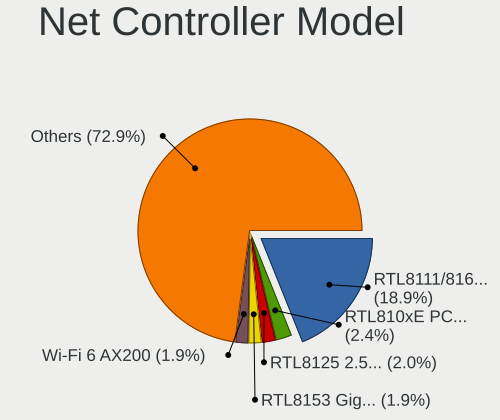

| Model                                                                  | Computers | Percent |
|------------------------------------------------------------------------|-----------|---------|
| Realtek RTL8111/8168/8211/8411 PCI Express Gigabit Ethernet Controller | 6640      | 18.92%  |
| Realtek RTL810xE PCI Express Fast Ethernet controller                  | 839       | 2.39%   |
| Realtek RTL8125 2.5GbE Controller                                      | 710       | 2.02%   |
| Realtek RTL8153 Gigabit Ethernet Adapter                               | 669       | 1.91%   |
| Intel Wi-Fi 6 AX200                                                    | 658       | 1.87%   |
| Intel 82579LM Gigabit Network Connection (Lewisville)                  | 600       | 1.71%   |
| Intel Wireless 8265 / 8275                                             | 570       | 1.62%   |
| Intel Wi-Fi 6 AX201                                                    | 537       | 1.53%   |
| Intel Wireless 7265                                                    | 435       | 1.24%   |
| Realtek RTL8821CE 802.11ac PCIe Wireless Network Adapter               | 405       | 1.15%   |
| Nvidia MCP79 Ethernet                                                  | 405       | 1.15%   |
| Broadcom BCM4322 802.11a/b/g/n Wireless LAN Controller                 | 396       | 1.13%   |
| Qualcomm Atheros QCA9377 802.11ac Wireless Network Adapter             | 383       | 1.09%   |
| Intel Wireless 7260                                                    | 379       | 1.08%   |
| Intel I211 Gigabit Network Connection                                  | 365       | 1.04%   |
| Intel Alder Lake-P PCH CNVi WiFi                                       | 333       | 0.95%   |
| Intel Ethernet Controller I225-V                                       | 312       | 0.89%   |
| Intel Wi-Fi 6E(802.11ax) AX210/AX1675* 2x2 [Typhoon Peak]              | 299       | 0.85%   |
| Realtek RTL8822CE 802.11ac PCIe Wireless Network Adapter               | 295       | 0.84%   |
| Intel Wireless 8260                                                    | 278       | 0.79%   |
| Intel Ethernet Connection I217-LM                                      | 266       | 0.76%   |
| Qualcomm Atheros AR9485 Wireless Network Adapter                       | 261       | 0.74%   |
| MediaTek MT7921 802.11ax PCIe Wireless Network Adapter [Filogic 330]   | 256       | 0.73%   |
| Intel Comet Lake PCH-LP CNVi WiFi                                      | 256       | 0.73%   |
| MediaTek MT7922 802.11ax PCI Express Wireless Network Adapter          | 254       | 0.72%   |
| Qualcomm Atheros AR9285 Wireless Network Adapter (PCI-Express)         | 249       | 0.71%   |
| Qualcomm Atheros QCA9565 / AR9565 Wireless Network Adapter             | 243       | 0.69%   |
| Intel I210 Gigabit Network Connection                                  | 237       | 0.68%   |
| Intel Ethernet Connection (2) I219-V                                   | 232       | 0.66%   |
| Intel Cannon Point-LP CNVi [Wireless-AC]                               | 230       | 0.66%   |
| Realtek RTL8852BE PCIe 802.11ax Wireless Network Controller            | 229       | 0.65%   |
| Intel Centrino Advanced-N 6205 [Taylor Peak]                           | 223       | 0.64%   |
| Broadcom Limited BCM4360 802.11ac Dual Band Wireless Network Adapter   | 220       | 0.63%   |
| Qualcomm Atheros QCA6174 802.11ac Wireless Network Adapter             | 217       | 0.62%   |
| Intel Wireless 3165                                                    | 215       | 0.61%   |
| Intel Cannon Lake PCH CNVi WiFi                                        | 209       | 0.6%    |
| Intel Ethernet Connection (4) I219-LM                                  | 201       | 0.57%   |
| ASIX AX88179 Gigabit Ethernet                                          | 201       | 0.57%   |
| Intel I350 Gigabit Network Connection                                  | 186       | 0.53%   |
| Intel Ethernet Controller I226-V                                       | 183       | 0.52%   |

Wireless Vendor
---------------

Wireless vendors

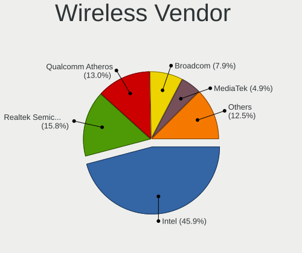

| Vendor                                | Computers | Percent |
|---------------------------------------|-----------|---------|
| Intel                                 | 6578      | 45.9%   |
| Realtek Semiconductor                 | 2268      | 15.82%  |
| Qualcomm Atheros                      | 1862      | 12.99%  |
| Broadcom                              | 1137      | 7.93%   |
| MediaTek                              | 701       | 4.89%   |
| Broadcom Limited                      | 369       | 2.57%   |
| Ralink Technology                     | 264       | 1.84%   |
| TP-Link                               | 234       | 1.63%   |
| Ralink                                | 183       | 1.28%   |
| Qualcomm                              | 94        | 0.66%   |
| Sierra Wireless                       | 81        | 0.57%   |
| Qualcomm Atheros Communications       | 52        | 0.36%   |
| NetGear                               | 50        | 0.35%   |
| ASUSTek Computer                      | 48        | 0.33%   |
| D-Link                                | 46        | 0.32%   |
| Dell                                  | 44        | 0.31%   |
| Marvell Technology Group              | 42        | 0.29%   |
| Microsoft                             | 36        | 0.25%   |
| Fibocom                               | 35        | 0.24%   |
| Edimax Technology                     | 34        | 0.24%   |
| D-Link System                         | 22        | 0.15%   |
| Linksys                               | 18        | 0.13%   |
| Qualcomm Technologies                 | 13        | 0.09%   |
| Belkin Components                     | 13        | 0.09%   |
| AVM                                   | 11        | 0.08%   |
| Hewlett-Packard                       | 10        | 0.07%   |
| Quectel Wireless Solutions            | 9         | 0.06%   |
| IMC Networks                          | 8         | 0.06%   |
| Wilocity                              | 7         | 0.05%   |
| Gemtek                                | 7         | 0.05%   |
| Sitecom Europe                        | 5         | 0.03%   |
| ZyDAS                                 | 4         | 0.03%   |
| Mercucys                              | 4         | 0.03%   |
| 802.11g Adapter [Linksys WUSB54GC v3] | 4         | 0.03%   |
| ZyXEL Communications                  | 3         | 0.02%   |
| Wacom                                 | 3         | 0.02%   |
| Realtek                               | 3         | 0.02%   |
| 3Com                                  | 3         | 0.02%   |
| ZTopInc                               | 2         | 0.01%   |
| Micro Star International              | 2         | 0.01%   |

Wireless Model
--------------

Wireless models

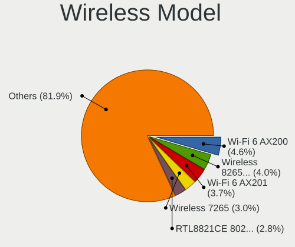

| Model                                                                | Computers | Percent |
|----------------------------------------------------------------------|-----------|---------|
| Intel Wi-Fi 6 AX200                                                  | 658       | 4.56%   |
| Intel Wireless 8265 / 8275                                           | 570       | 3.95%   |
| Intel Wi-Fi 6 AX201                                                  | 537       | 3.72%   |
| Intel Wireless 7265                                                  | 435       | 3.02%   |
| Realtek RTL8821CE 802.11ac PCIe Wireless Network Adapter             | 405       | 2.81%   |
| Broadcom BCM4322 802.11a/b/g/n Wireless LAN Controller               | 396       | 2.75%   |
| Qualcomm Atheros QCA9377 802.11ac Wireless Network Adapter           | 383       | 2.66%   |
| Intel Wireless 7260                                                  | 379       | 2.63%   |
| Intel Wi-Fi 6E(802.11ax) AX210/AX1675* 2x2 [Typhoon Peak]            | 299       | 2.07%   |
| Realtek RTL8822CE 802.11ac PCIe Wireless Network Adapter             | 295       | 2.05%   |
| Intel Wireless 8260                                                  | 278       | 1.93%   |
| Qualcomm Atheros AR9485 Wireless Network Adapter                     | 261       | 1.81%   |
| MediaTek MT7921 802.11ax PCIe Wireless Network Adapter [Filogic 330] | 256       | 1.78%   |
| Intel Comet Lake PCH-LP CNVi WiFi                                    | 256       | 1.78%   |
| Qualcomm Atheros AR9285 Wireless Network Adapter (PCI-Express)       | 249       | 1.73%   |
| Qualcomm Atheros QCA9565 / AR9565 Wireless Network Adapter           | 243       | 1.68%   |
| Intel Cannon Point-LP CNVi [Wireless-AC]                             | 230       | 1.59%   |
| Intel Centrino Advanced-N 6205 [Taylor Peak]                         | 223       | 1.55%   |
| MediaTek MT7922 802.11ax PCI Express Wireless Network Adapter        | 220       | 1.53%   |
| Broadcom Limited BCM4360 802.11ac Dual Band Wireless Network Adapter | 220       | 1.53%   |
| Qualcomm Atheros QCA6174 802.11ac Wireless Network Adapter           | 217       | 1.5%    |
| Intel Wireless 3165                                                  | 215       | 1.49%   |
| Intel Cannon Lake PCH CNVi WiFi                                      | 209       | 1.45%   |
| Intel Alder Lake-P PCH CNVi WiFi                                     | 195       | 1.35%   |
| Intel Dual Band Wireless-AC 3168NGW [Stone Peak]                     | 180       | 1.25%   |
| Intel Raptor Lake PCH CNVi WiFi                                      | 176       | 1.22%   |
| Intel Comet Lake PCH CNVi WiFi                                       | 172       | 1.19%   |
| Realtek RTL8852BE PCIe 802.11ax Wireless Network Controller          | 164       | 1.14%   |
| Intel Wi-Fi 5(802.11ac) Wireless-AC 9x6x [Thunder Peak]              | 153       | 1.06%   |
| Realtek 802.11ac NIC                                                 | 147       | 1.02%   |
| Broadcom BCM4313 802.11bgn Wireless Network Adapter                  | 147       | 1.02%   |
| Realtek RTL8723BE PCIe Wireless Network Adapter                      | 135       | 0.94%   |
| Qualcomm Atheros AR9462 Wireless Network Adapter                     | 120       | 0.83%   |
| Ralink MT7601U Wireless Adapter                                      | 111       | 0.77%   |
| Realtek RTL88x2bu [AC1200 Techkey]                                   | 100       | 0.69%   |
| Broadcom BCM43142 802.11b/g/n                                        | 99        | 0.69%   |
| Realtek RTL8822BE 802.11a/b/g/n/ac WiFi adapter                      | 96        | 0.67%   |
| Realtek RTL8188CE 802.11b/g/n WiFi Adapter                           | 94        | 0.65%   |
| MediaTek MT7921K (RZ608) Wi-Fi 6E 80MHz                              | 94        | 0.65%   |
| Intel Wireless 3160                                                  | 92        | 0.64%   |

Ethernet Vendor
---------------

Ethernet vendors

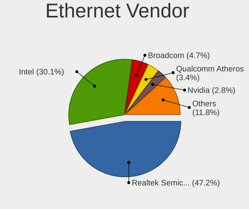

| Vendor                                 | Computers | Percent |
|----------------------------------------|-----------|---------|
| Realtek Semiconductor                  | 9053      | 47.16%  |
| Intel                                  | 5780      | 30.11%  |
| Broadcom                               | 900       | 4.69%   |
| Qualcomm Atheros                       | 659       | 3.43%   |
| Nvidia                                 | 540       | 2.81%   |
| Marvell Technology Group               | 296       | 1.54%   |
| ASIX Electronics                       | 234       | 1.22%   |
| Samsung Electronics                    | 140       | 0.73%   |
| Broadcom Limited                       | 138       | 0.72%   |
| Raspberry Pi                           | 136       | 0.71%   |
| Aquantia                               | 100       | 0.52%   |
| Xiaomi                                 | 97        | 0.51%   |
| Microchip Technology                   | 88        | 0.46%   |
| Mellanox Technologies                  | 88        | 0.46%   |
| Lenovo                                 | 84        | 0.44%   |
| MediaTek                               | 79        | 0.41%   |
| DisplayLink                            | 57        | 0.3%    |
| JMicron Technology                     | 53        | 0.28%   |
| TP-Link                                | 48        | 0.25%   |
| American Megatrends                    | 44        | 0.23%   |
| Huawei Technologies                    | 38        | 0.2%    |
| VIA Technologies                       | 32        | 0.17%   |
| Motorola PCS                           | 32        | 0.17%   |
| Qualcomm                               | 31        | 0.16%   |
| Google                                 | 28        | 0.15%   |
| Silicon Integrated Systems [SiS]       | 24        | 0.13%   |
| Hewlett-Packard                        | 24        | 0.13%   |
| OPPO Electronics                       | 23        | 0.12%   |
| Dell                                   | 22        | 0.11%   |
| D-Link System                          | 22        | 0.11%   |
| Suzhou Motorcomm Electronic Technology | 21        | 0.11%   |
| Insyde Software                        | 21        | 0.11%   |
| IBM                                    | 20        | 0.1%    |
| ICS Advent                             | 19        | 0.1%    |
| Attansic Technology                    | 16        | 0.08%   |
| Microsoft                              | 15        | 0.08%   |
| Cypress Semiconductor                  | 15        | 0.08%   |
| 3Com                                   | 15        | 0.08%   |
| Qualcomm Technologies                  | 14        | 0.07%   |
| Apple                                  | 14        | 0.07%   |

Ethernet Model
--------------

Ethernet models

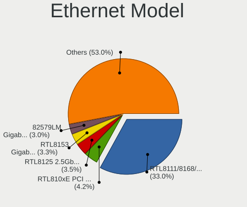

| Model                                                                  | Computers | Percent |
|------------------------------------------------------------------------|-----------|---------|
| Realtek RTL8111/8168/8211/8411 PCI Express Gigabit Ethernet Controller | 6640      | 32.99%  |
| Realtek RTL810xE PCI Express Fast Ethernet controller                  | 839       | 4.17%   |
| Realtek RTL8125 2.5GbE Controller                                      | 710       | 3.53%   |
| Realtek RTL8153 Gigabit Ethernet Adapter                               | 669       | 3.32%   |
| Intel 82579LM Gigabit Network Connection (Lewisville)                  | 600       | 2.98%   |
| Nvidia MCP79 Ethernet                                                  | 405       | 2.01%   |
| Intel I211 Gigabit Network Connection                                  | 365       | 1.81%   |
| Intel Ethernet Controller I225-V                                       | 312       | 1.55%   |
| Intel Ethernet Connection I217-LM                                      | 266       | 1.32%   |
| Intel I210 Gigabit Network Connection                                  | 237       | 1.18%   |
| Intel Ethernet Connection (2) I219-V                                   | 232       | 1.15%   |
| Intel Ethernet Connection (4) I219-LM                                  | 201       | 1%      |
| ASIX AX88179 Gigabit Ethernet                                          | 201       | 1%      |
| Intel I350 Gigabit Network Connection                                  | 186       | 0.92%   |
| Intel Ethernet Controller I226-V                                       | 183       | 0.91%   |
| Intel Ethernet Connection (13) I219-V                                  | 174       | 0.86%   |
| Intel Ethernet Connection (2) I219-LM                                  | 153       | 0.76%   |
| Intel Ethernet Connection (4) I219-V                                   | 152       | 0.76%   |
| Intel 82579V Gigabit Network Connection                                | 146       | 0.73%   |
| Intel Alder Lake-P PCH CNVi WiFi                                       | 138       | 0.69%   |
| Intel Ethernet Connection I219-LM                                      | 137       | 0.68%   |
| Raspberry Pi RP1 PCIe 2.0 South Bridge                                 | 136       | 0.68%   |
| Intel 82574L Gigabit Network Connection                                | 136       | 0.68%   |
| Intel Ethernet Connection (7) I219-V                                   | 121       | 0.6%    |
| Intel Ethernet Connection I217-V                                       | 118       | 0.59%   |
| Intel Ethernet Connection (6) I219-V                                   | 115       | 0.57%   |
| Qualcomm Atheros AR8151 v2.0 Gigabit Ethernet                          | 114       | 0.57%   |
| Intel Ethernet Connection (7) I219-LM                                  | 111       | 0.55%   |
| Broadcom NetXtreme BCM5719 Gigabit Ethernet PCIe                       | 111       | 0.55%   |
| Intel Ethernet Connection I218-LM                                      | 106       | 0.53%   |
| Broadcom NetXtreme BCM5720 Gigabit Ethernet PCIe                       | 103       | 0.51%   |
| Realtek RTL8152 Fast Ethernet Adapter                                  | 102       | 0.51%   |
| Broadcom NetXtreme BCM57766 Gigabit Ethernet PCIe                      | 97        | 0.48%   |
| Samsung Galaxy series, misc. (tethering mode)                          | 90        | 0.45%   |
| Intel Ethernet Connection (5) I219-LM                                  | 88        | 0.44%   |
| Intel Ethernet Connection (3) I218-LM                                  | 88        | 0.44%   |
| Realtek RTL-8100/8101L/8139 PCI Fast Ethernet Adapter                  | 85        | 0.42%   |
| Intel 82599ES 10-Gigabit SFI/SFP+ Network Connection                   | 84        | 0.42%   |
| Marvell Group 88E8053 PCI-E Gigabit Ethernet Controller                | 77        | 0.38%   |
| Intel 82577LM Gigabit Network Connection                               | 77        | 0.38%   |

Net Controller Kind
-------------------

Ethernet, WiFi or modem

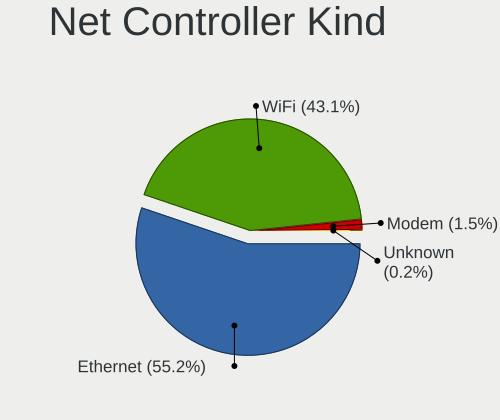

| Kind     | Computers | Percent |
|----------|-----------|---------|
| Ethernet | 17397     | 55.2%   |
| WiFi     | 13595     | 43.14%  |
| Modem    | 474       | 1.5%    |
| Unknown  | 50        | 0.16%   |

Used Controller
---------------

Currently used network controller

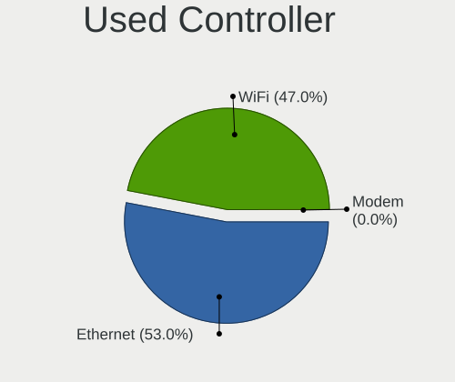

| Kind     | Computers | Percent |
|----------|-----------|---------|
| Ethernet | 10629     | 53.02%  |
| WiFi     | 9417      | 46.97%  |
| Modem    | 3         | 0.01%   |

NICs
----

Total network controllers on board

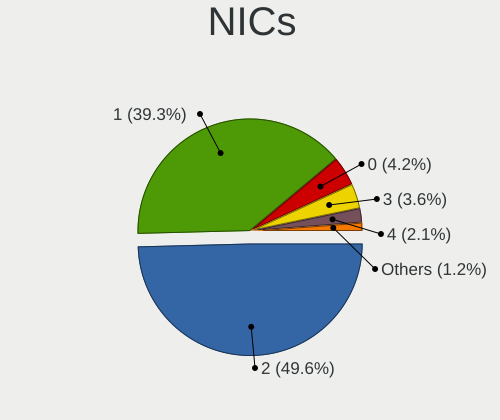

| Total | Computers | Percent |
|-------|-----------|---------|
| 2     | 10137     | 49.59%  |
| 1     | 8038      | 39.32%  |
| 0     | 867       | 4.24%   |
| 3     | 731       | 3.58%   |
| 4     | 422       | 2.06%   |
| 6     | 101       | 0.49%   |
| 5     | 57        | 0.28%   |
| 8     | 37        | 0.18%   |
| 7     | 21        | 0.1%    |
| 9     | 8         | 0.04%   |
| 12    | 6         | 0.03%   |
| 10    | 6         | 0.03%   |
| 20    | 2         | 0.01%   |
| 33    | 1         | 0.005%  |
| 22    | 1         | 0.005%  |
| 21    | 1         | 0.005%  |
| 17    | 1         | 0.005%  |
| 16    | 1         | 0.005%  |
| 13    | 1         | 0.005%  |
| 11    | 1         | 0.005%  |

IPv6
----

IPv6 vs IPv4

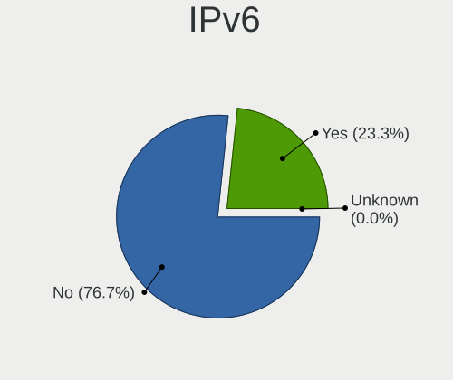

| Used    | Computers | Percent |
|---------|-----------|---------|
| No      | 15852     | 76.65%  |
| Yes     | 4827      | 23.34%  |
| Unknown | 1         | 0.005%  |

Bluetooth
---------

Bluetooth Vendor
----------------

Controller vendors

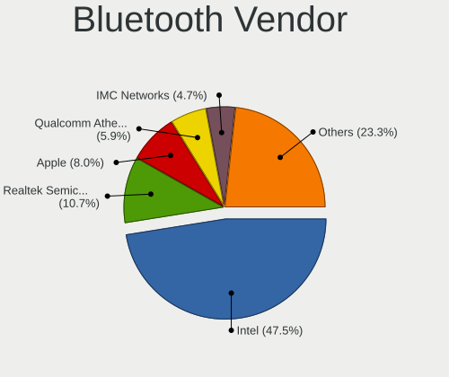

| Vendor                          | Computers | Percent |
|---------------------------------|-----------|---------|
| Intel                           | 5640      | 47.48%  |
| Realtek Semiconductor           | 1271      | 10.7%   |
| Apple                           | 951       | 8.01%   |
| Qualcomm Atheros Communications | 697       | 5.87%   |
| IMC Networks                    | 555       | 4.67%   |
| Cambridge Silicon Radio         | 505       | 4.25%   |
| Broadcom                        | 457       | 3.85%   |
| Foxconn / Hon Hai               | 424       | 3.57%   |
| Lite-On Technology              | 280       | 2.36%   |
| MediaTek                        | 233       | 1.96%   |
| ASUSTek Computer                | 193       | 1.62%   |
| Dell                            | 110       | 0.93%   |
| Hewlett-Packard                 | 99        | 0.83%   |
| TP-Link                         | 63        | 0.53%   |
| Realtek                         | 62        | 0.52%   |
| USI                             | 54        | 0.45%   |
| Toshiba                         | 49        | 0.41%   |
| Ralink                          | 36        | 0.3%    |
| Marvell Semiconductor           | 25        | 0.21%   |
| Edimax Technology               | 20        | 0.17%   |
| Foxconn International           | 19        | 0.16%   |
| Alps Electric                   | 17        | 0.14%   |
| Unknown                         | 16        | 0.13%   |
| Ralink Technology               | 12        | 0.1%    |
| Integrated System Solution      | 12        | 0.1%    |
| Actions                         | 11        | 0.09%   |
| Belkin Components               | 7         | 0.06%   |
| Taiyo Yuden                     | 5         | 0.04%   |
| Qcom                            | 5         | 0.04%   |
| Micro Star International        | 5         | 0.04%   |
| Fujitsu                         | 5         | 0.04%   |
| Quectel Wireless Solutions      | 4         | 0.03%   |
| Dynex                           | 4         | 0.03%   |
| Chicony Electronics             | 4         | 0.03%   |
| SINO WEALTH                     | 3         | 0.03%   |
| Opticis                         | 3         | 0.03%   |
| Conwise Technology              | 3         | 0.03%   |
| Askey Computer                  | 3         | 0.03%   |
| HTC (High Tech Computer)        | 2         | 0.02%   |
| Corsair                         | 2         | 0.02%   |

Bluetooth Model
---------------

Controller models

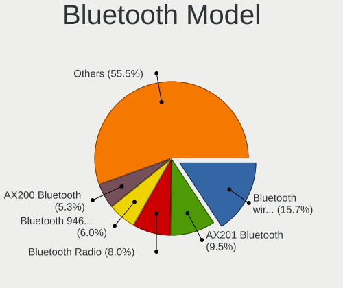

| Model                                               | Computers | Percent |
|-----------------------------------------------------|-----------|---------|
| Intel Bluetooth wireless interface                  | 1867      | 15.7%   |
| Intel AX201 Bluetooth                               | 1135      | 9.55%   |
| Realtek Bluetooth Radio                             | 949       | 7.98%   |
| Intel Bluetooth 9460/9560 Jefferson Peak (JfP)      | 709       | 5.96%   |
| Intel AX200 Bluetooth                               | 628       | 5.28%   |
| Intel Bluetooth Device                              | 566       | 4.76%   |
| Cambridge Silicon Radio Bluetooth Dongle (HCI mode) | 505       | 4.25%   |
| Apple Built-in Bluetooth 2.0+EDR HCI                | 408       | 3.43%   |
| Qualcomm Atheros  Bluetooth Device                  | 370       | 3.11%   |
| Intel AX210 Bluetooth                               | 263       | 2.21%   |
| Apple Bluetooth USB Host Controller                 | 247       | 2.08%   |
| MediaTek Wireless_Device                            | 232       | 1.95%   |
| IMC Networks Wireless_Device                        | 209       | 1.76%   |
| Realtek  Bluetooth 4.2 Adapter                      | 183       | 1.54%   |
| Apple Bluetooth Host Controller                     | 179       | 1.51%   |
| IMC Networks Bluetooth Radio                        | 177       | 1.49%   |
| Intel Wireless-AC 3168 Bluetooth                    | 174       | 1.46%   |
| Intel Wireless-AC 9260 Bluetooth Adapter            | 147       | 1.24%   |
| Foxconn / Hon Hai Wireless_Device                   | 138       | 1.16%   |
| Foxconn / Hon Hai Bluetooth Device                  | 106       | 0.89%   |
| Intel Centrino Bluetooth Wireless Transceiver       | 100       | 0.84%   |
| Qualcomm Atheros AR3012 Bluetooth 4.0               | 93        | 0.78%   |
| IMC Networks Bluetooth Device                       | 93        | 0.78%   |
| Lite-On Qualcomm Atheros QCA9377 Bluetooth          | 92        | 0.77%   |
| Qualcomm Atheros QCA61x4 Bluetooth 4.0              | 87        | 0.73%   |
| Foxconn / Hon Hai MediaTek Bluetooth Adapter        | 83        | 0.7%    |
| Apple Bluetooth HCI MacBookPro (HID mode)           | 81        | 0.68%   |
| Broadcom BCM2045B (BDC-2.1)                         | 75        | 0.63%   |
| Broadcom BCM20702 Bluetooth 4.0 [ThinkPad]          | 66        | 0.56%   |
| Qualcomm Atheros AR3011 Bluetooth                   | 64        | 0.54%   |
| Lite-On Bluetooth Device                            | 64        | 0.54%   |
| TP-Link TP-T@- UB500 Adapter                        | 63        | 0.53%   |
| Broadcom BCM20702A0 Bluetooth 4.0                   | 63        | 0.53%   |
| Realtek Bluetooth Radio                             | 62        | 0.52%   |
| Lite-On Wireless_Device                             | 54        | 0.45%   |
| ASUS ASUS USB-BT500                                 | 54        | 0.45%   |
| USI Bluetooth Device                                | 53        | 0.45%   |
| Intel Centrino Advanced-N 6230 Bluetooth adapter    | 52        | 0.44%   |
| HP Broadcom 2070 Bluetooth Combo                    | 51        | 0.43%   |
| ASUS Broadcom BCM20702A0 Bluetooth                  | 50        | 0.42%   |

Sound
-----

Sound Vendor
------------

Sound card vendors

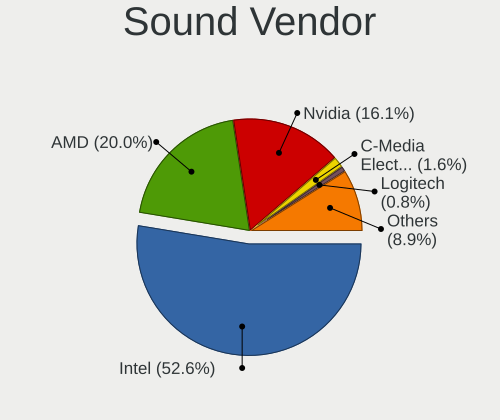

| Vendor                                       | Computers | Percent |
|----------------------------------------------|-----------|---------|
| Intel                                        | 13355     | 52.61%  |
| AMD                                          | 5076      | 20%     |
| Nvidia                                       | 4085      | 16.09%  |
| C-Media Electronics                          | 406       | 1.6%    |
| Logitech                                     | 193       | 0.76%   |
| Creative Labs                                | 116       | 0.46%   |
| Texas Instruments                            | 115       | 0.45%   |
| ASUSTek Computer                             | 106       | 0.42%   |
| GN Netcom                                    | 99        | 0.39%   |
| Lenovo                                       | 98        | 0.39%   |
| Realtek Semiconductor                        | 88        | 0.35%   |
| Generalplus Technology                       | 80        | 0.32%   |
| Zoran Co. Personal Media Division (Nogatech) | 77        | 0.3%    |
| JMTek                                        | 69        | 0.27%   |
| Creative Technology                          | 67        | 0.26%   |
| Micro Star International                     | 63        | 0.25%   |
| Focusrite-Novation                           | 60        | 0.24%   |
| Plantronics                                  | 57        | 0.22%   |
| Hewlett-Packard                              | 54        | 0.21%   |
| VIA Technologies                             | 47        | 0.19%   |
| SteelSeries ApS                              | 44        | 0.17%   |
| Kingston Technology                          | 44        | 0.17%   |
| Razer USA                                    | 43        | 0.17%   |
| KTMicro                                      | 41        | 0.16%   |
| Jieli Technology                             | 33        | 0.13%   |
| Dell                                         | 30        | 0.12%   |
| BEHRINGER International                      | 30        | 0.12%   |
| Corsair                                      | 28        | 0.11%   |
| Silicon Integrated Systems [SiS]             | 26        | 0.1%    |
| RODE Microphones                             | 25        | 0.1%    |
| Loongson Technology                          | 25        | 0.1%    |
| DSEA A/S                                     | 25        | 0.1%    |
| Apple                                        | 23        | 0.09%   |
| Tenx Technology                              | 22        | 0.09%   |
| Blue Microphones                             | 21        | 0.08%   |
| Yamaha                                       | 20        | 0.08%   |
| Zhaoxin                                      | 19        | 0.07%   |
| M-Audio                                      | 17        | 0.07%   |
| Conexant Systems                             | 17        | 0.07%   |
| Sony                                         | 16        | 0.06%   |

Sound Model
-----------

Sound card models

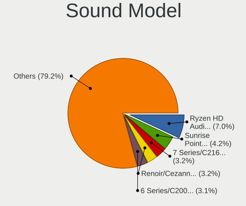

| Model                                                                      | Computers | Percent |
|----------------------------------------------------------------------------|-----------|---------|
| AMD Ryzen HD Audio Controller                                              | 2129      | 7%      |
| Intel Sunrise Point-LP HD Audio                                            | 1285      | 4.22%   |
| Intel 7 Series/C216 Chipset Family High Definition Audio Controller        | 986       | 3.24%   |
| AMD Renoir/Cezanne HDMI/DP Audio Controller                                | 968       | 3.18%   |
| Intel 6 Series/C200 Series Chipset Family High Definition Audio Controller | 953       | 3.13%   |
| Intel 8 Series/C220 Series Chipset High Definition Audio Controller        | 900       | 2.96%   |
| Intel Tiger Lake-LP Smart Sound Technology Audio Controller                | 693       | 2.28%   |
| Intel Xeon E3-1200 v3/4th Gen Core Processor HD Audio Controller           | 688       | 2.26%   |
| AMD Starship/Matisse HD Audio Controller                                   | 652       | 2.14%   |
| AMD Radeon High Definition Audio Controller                                | 582       | 1.91%   |
| Intel NM10/ICH7 Family High Definition Audio Controller                    | 576       | 1.89%   |
| Intel Cannon Lake PCH cAVS                                                 | 534       | 1.75%   |
| Intel 100 Series/C230 Series Chipset Family HD Audio Controller            | 499       | 1.64%   |
| AMD Raven/Raven2/Fenghuang HDMI/DP Audio Controller                        | 484       | 1.59%   |
| AMD SBx00 Azalia (Intel HDA)                                               | 469       | 1.54%   |
| Intel Broadwell-U Audio Controller                                         | 442       | 1.45%   |
| Intel Alder Lake PCH-P High Definition Audio Controller                    | 439       | 1.44%   |
| Intel Wildcat Point-LP High Definition Audio Controller                    | 431       | 1.42%   |
| Intel 200 Series PCH HD Audio                                              | 429       | 1.41%   |
| Nvidia MCP79 High Definition Audio                                         | 412       | 1.35%   |
| Intel 5 Series/3400 Series Chipset High Definition Audio                   | 389       | 1.28%   |
| Intel Haswell-ULT HD Audio Controller                                      | 366       | 1.2%    |
| Intel 8 Series HD Audio Controller                                         | 366       | 1.2%    |
| AMD FCH Azalia Controller                                                  | 365       | 1.2%    |
| Intel Cannon Point-LP High Definition Audio Controller                     | 359       | 1.18%   |
| Intel 82801I (ICH9 Family) HD Audio Controller                             | 348       | 1.14%   |
| Intel Celeron/Pentium Silver Processor High Definition Audio               | 312       | 1.03%   |
| Intel Comet Lake PCH-LP cAVS                                               | 305       | 1%      |
| Intel Comet Lake PCH cAVS                                                  | 287       | 0.94%   |
| Nvidia GP107GL High Definition Audio Controller                            | 277       | 0.91%   |
| AMD Family 17h (Models 00h-0fh) HD Audio Controller                        | 277       | 0.91%   |
| AMD Ellesmere HDMI Audio [Radeon RX 470/480 / 570/580/590]                 | 275       | 0.9%    |
| Intel Raptor Lake-P/U/H cAVS                                               | 272       | 0.89%   |
| Nvidia GK208 HDMI/DP Audio Controller                                      | 268       | 0.88%   |
| AMD Kabini HDMI/DP Audio                                                   | 264       | 0.87%   |
| Intel Atom Processor Z36xxx/Z37xxx Series High Definition Audio Controller | 254       | 0.83%   |
| AMD Navi 21/23 HDMI/DP Audio Controller                                    | 241       | 0.79%   |
| Nvidia GF108 High Definition Audio Controller                              | 234       | 0.77%   |
| Intel 82801H (ICH8 Family) HD Audio Controller                             | 223       | 0.73%   |
| AMD Family 15h (Models 60h-6fh) Audio Controller                           | 203       | 0.67%   |

Memory
------

Memory Vendor
-------------

Memory module vendors

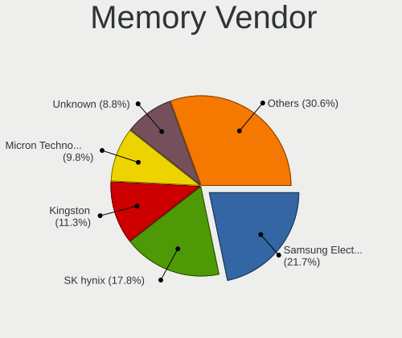

| Vendor                       | Computers | Percent |
|------------------------------|-----------|---------|
| Samsung Electronics          | 3926      | 21.74%  |
| SK hynix                     | 3206      | 17.75%  |
| Kingston                     | 2044      | 11.32%  |
| Micron Technology            | 1774      | 9.82%   |
| Unknown                      | 1592      | 8.81%   |
| Crucial                      | 1227      | 6.79%   |
| Corsair                      | 806       | 4.46%   |
| G.Skill                      | 550       | 3.05%   |
| A-DATA Technology            | 340       | 1.88%   |
| Unknown                      | 328       | 1.82%   |
| Elpida                       | 258       | 1.43%   |
| Ramaxel Technology           | 241       | 1.33%   |
| Unknown (ABCD)               | 153       | 0.85%   |
| Nanya Technology             | 150       | 0.83%   |
| Patriot                      | 144       | 0.8%    |
| Team                         | 112       | 0.62%   |
| Smart                        | 84        | 0.47%   |
| Hewlett-Packard              | 83        | 0.46%   |
| Transcend                    | 71        | 0.39%   |
| GOODRAM                      | 59        | 0.33%   |
| AMD                          | 46        | 0.25%   |
| Timetec                      | 42        | 0.23%   |
| Apacer                       | 42        | 0.23%   |
| Hikvision                    | 29        | 0.16%   |
| 4ea5                         | 24        | 0.13%   |
| Silicon Power                | 23        | 0.13%   |
| ASint Technology             | 22        | 0.12%   |
| PNY                          | 21        | 0.12%   |
| Teikon                       | 20        | 0.11%   |
| Avant                        | 19        | 0.11%   |
| ff                           | 18        | 0.1%    |
| Unknown (0x0E9D)             | 17        | 0.09%   |
| Qimonda                      | 17        | 0.09%   |
| 48spaces                     | 16        | 0.09%   |
| Patriot Memory (PDP Systems) | 15        | 0.08%   |
| GeIL                         | 15        | 0.08%   |
| fef5                         | 15        | 0.08%   |
| Neo Forza                    | 14        | 0.08%   |
| Lexar Co Limited             | 12        | 0.07%   |
| KLEVV                        | 11        | 0.06%   |

Memory Model
------------

Memory module models

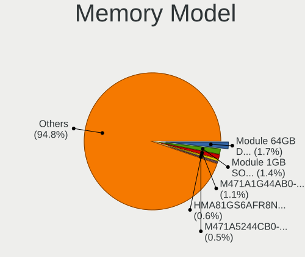

| Model                                                            | Computers | Percent |
|------------------------------------------------------------------|-----------|---------|
| Unknown                                                          | 328       | 1.7%    |
| SK hynix RAM Module 1GB SODIMM DDR2 800MT/s                      | 266       | 1.38%   |
| Samsung RAM M471A1G44AB0-CWE 8GiB SODIMM DDR4 3200MT/s           | 206       | 1.06%   |
| SK hynix RAM HMA81GS6AFR8N-UH 8GB SODIMM DDR4 2667MT/s           | 116       | 0.6%    |
| Samsung RAM M471A5244CB0-CTD 4GB SODIMM DDR4 3266MT/s            | 98        | 0.51%   |
| Samsung RAM M471A1K43EB1-CWE 8GB SODIMM DDR4 3200MT/s            | 87        | 0.45%   |
| SK hynix RAM HMT451S6BFR8A-PB 4GB SODIMM DDR3 1600MT/s           | 85        | 0.44%   |
| Samsung RAM M471B5173DB0-YK0 4GB SODIMM DDR3 1600MT/s            | 85        | 0.44%   |
| Unknown (ABCD) RAM 123456789012345678 2GB SODIMM LPDDR4 2400MT/s | 84        | 0.43%   |
| SK hynix RAM HMAA1GS6CJR6N-XN 8GB SODIMM DDR4 3200MT/s           | 76        | 0.39%   |
| Samsung RAM M471B5273DH0-CH9 4GB SODIMM DDR3 1600MT/s            | 74        | 0.38%   |
| Unknown RAM Module 2GB DIMM SDRAM                                | 73        | 0.38%   |
| Samsung RAM M471B5674QH0-YK0 2GB SODIMM DDR3 3200MT/s            | 72        | 0.37%   |
| Samsung RAM M471A1G44BB0-CWE 8GB SODIMM DDR4 3200MT/s            | 72        | 0.37%   |
| Samsung RAM M471B5173QH0-YK0 4GB SODIMM DDR3 1600MT/s            | 70        | 0.36%   |
| Unknown (ABCD) RAM 123456789012345678 2GB DIMM LPDDR4 2133MT/s   | 69        | 0.36%   |
| SK hynix RAM Module 1GB SODIMM DDR2 667MT/s                      | 69        | 0.36%   |
| Samsung RAM M471B5173EB0-YK0 4GB SODIMM DDR3 1600MT/s            | 67        | 0.35%   |
| Samsung RAM M471A5244CB0-CWE 4GB SODIMM DDR4 3200MT/s            | 67        | 0.35%   |
| SK hynix RAM Module 4GB SODIMM DDR3 1600MT/s                     | 66        | 0.34%   |
| Samsung RAM Module 2GB SODIMM DDR3 1600MT/s                      | 64        | 0.33%   |
| Samsung RAM M471A1K43CB1-CRC 8GB SODIMM DDR4 8400MT/s            | 64        | 0.33%   |
| SK hynix RAM HMT41GS6BFR8A-PB 8GB SODIMM DDR3 2667MT/s           | 63        | 0.33%   |
| Samsung RAM M471A1K43DB1-CWE 8GB SODIMM DDR4 3200MT/s            | 62        | 0.32%   |
| SK hynix RAM HMT351S6CFR8C-PB 4GB SODIMM DDR3 1600MT/s           | 59        | 0.31%   |
| Samsung RAM M471B5273CH0-CH9 4GB SODIMM DDR3 1334MT/s            | 59        | 0.31%   |
| Corsair RAM CMK16GX4M2B3200C16 8GB DIMM DDR4 3600MT/s            | 59        | 0.31%   |
| SK hynix RAM HMA81GS6DJR8N-XN 8GB SODIMM DDR4 3200MT/s           | 58        | 0.3%    |
| SK hynix RAM HMA81GS6CJR8N-VK 8GB SODIMM DDR4 2667MT/s           | 56        | 0.29%   |
| Elpida RAM Module 4GB SODIMM DDR3 1600MT/s                       | 56        | 0.29%   |
| Samsung RAM M471A1K43BB1-CRC 8GB SODIMM DDR4 2667MT/s            | 55        | 0.28%   |
| Unknown RAM Module 2GB DIMM DDR2 800MT/s                         | 54        | 0.28%   |
| Micron RAM 8ATF1G64HZ-3G2R1 8GB SODIMM DDR4 3200MT/s             | 54        | 0.28%   |
| Samsung RAM M471A1K43CB1-CTD 8GB SODIMM DDR4 3200MT/s            | 53        | 0.27%   |
| Micron RAM 4ATF51264HZ-3G2J1 4GB SODIMM DDR4 3200MT/s            | 53        | 0.27%   |
| Crucial RAM CT8G4SFRA266.C8FD1 8GB SODIMM DDR4 2667MT/s          | 51        | 0.26%   |
| Unknown RAM Module 4GB DIMM 1333MT/s                             | 50        | 0.26%   |
| Samsung RAM M471B1G73QH0-YK0 8GB SODIMM DDR3 1600MT/s            | 50        | 0.26%   |
| Micron RAM 4ATF1G64HZ-3G2F1 8GB SODIMM DDR4 3200MT/s             | 50        | 0.26%   |
| Unknown RAM Module 1GB DIMM SDRAM                                | 48        | 0.25%   |

Memory Kind
-----------

Memory module kinds

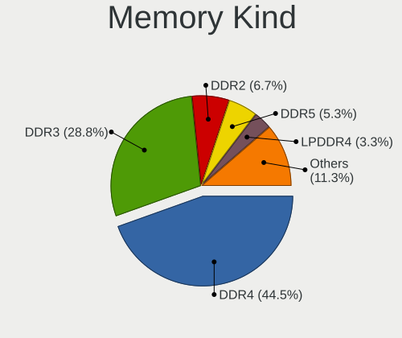

| Kind         | Computers | Percent |
|--------------|-----------|---------|
| DDR4         | 7059      | 44.54%  |
| DDR3         | 4570      | 28.84%  |
| DDR2         | 1061      | 6.69%   |
| DDR5         | 844       | 5.33%   |
| LPDDR4       | 518       | 3.27%   |
| SDRAM        | 449       | 2.83%   |
| Unknown      | 389       | 2.45%   |
| LPDDR5       | 387       | 2.44%   |
| LPDDR3       | 361       | 2.28%   |
| DDR          | 120       | 0.76%   |
| DRAM         | 80        | 0.5%    |
| RAM          | 4         | 0.03%   |
| EPROM        | 2         | 0.01%   |
| EEPROM       | 2         | 0.01%   |
| LPDDR2       | 1         | 0.01%   |
| DDR2 FB-DIMM | 1         | 0.01%   |

Memory Form Factor
------------------

Physical design of the memory module

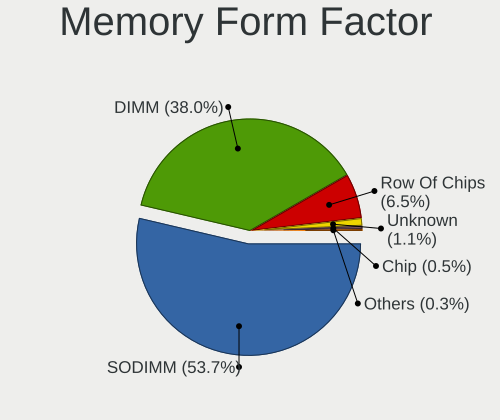

| Name            | Computers | Percent |
|-----------------|-----------|---------|
| SODIMM          | 8457      | 53.66%  |
| DIMM            | 5994      | 38.03%  |
| Row Of Chips    | 1020      | 6.47%   |
| Unknown         | 171       | 1.08%   |
| Chip            | 74        | 0.47%   |
| FB-DIMM         | 24        | 0.15%   |
| RIMM            | 20        | 0.13%   |
| Proprietary Car | 1         | 0.01%   |

Memory Size
-----------

Memory module size

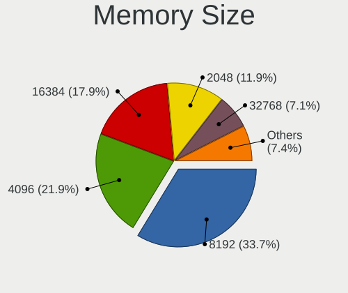

| Size    | Computers | Percent |
|---------|-----------|---------|
| 8192    | 5793      | 33.74%  |
| 4096    | 3767      | 21.94%  |
| 16384   | 3076      | 17.92%  |
| 2048    | 2044      | 11.91%  |
| 32768   | 1211      | 7.05%   |
| 1024    | 977       | 5.69%   |
| 512     | 120       | 0.7%    |
| 65536   | 62        | 0.36%   |
| 49152   | 32        | 0.19%   |
| 256     | 30        | 0.17%   |
| 3072    | 18        | 0.1%    |
| 24576   | 6         | 0.03%   |
| 12288   | 6         | 0.03%   |
| 1536    | 5         | 0.03%   |
| 128     | 5         | 0.03%   |
| 6144    | 3         | 0.02%   |
| 131072  | 2         | 0.01%   |
| 1       | 2         | 0.01%   |
| Unknown | 2         | 0.01%   |
| 16315   | 1         | 0.01%   |
| 8072    | 1         | 0.01%   |
| 8000    | 1         | 0.01%   |
| 5120    | 1         | 0.01%   |
| 384     | 1         | 0.01%   |
| 64      | 1         | 0.01%   |
| 16      | 1         | 0.01%   |

Memory Speed
------------

Memory module speed

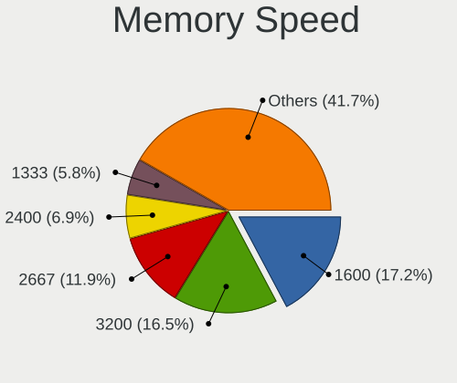

| Speed   | Computers | Percent |
|---------|-----------|---------|
| 1600    | 2938      | 17.24%  |
| 3200    | 2811      | 16.49%  |
| 2667    | 2024      | 11.88%  |
| 2400    | 1176      | 6.9%    |
| 1333    | 986       | 5.79%   |
| 2133    | 838       | 4.92%   |
| 800     | 652       | 3.83%   |
| 3600    | 501       | 2.94%   |
| 667     | 437       | 2.56%   |
| Unknown | 386       | 2.26%   |
| 5600    | 362       | 2.12%   |
| 1867    | 305       | 1.79%   |
| 4800    | 291       | 1.71%   |
| 6400    | 254       | 1.49%   |
| 1334    | 249       | 1.46%   |
| 4267    | 179       | 1.05%   |
| 1866    | 171       | 1%      |
| 1067    | 159       | 0.93%   |
| 1066    | 158       | 0.93%   |
| 2666    | 154       | 0.9%    |
| 3733    | 134       | 0.79%   |
| 3266    | 117       | 0.69%   |
| 3800    | 100       | 0.59%   |
| 8400    | 96        | 0.56%   |
| 7500    | 91        | 0.53%   |
| 6000    | 90        | 0.53%   |
| 2933    | 89        | 0.52%   |
| 3000    | 86        | 0.5%    |
| 533     | 78        | 0.46%   |
| 4199    | 72        | 0.42%   |
| 1800    | 69        | 0.4%    |
| 3400    | 68        | 0.4%    |
| 4000    | 66        | 0.39%   |
| 3466    | 63        | 0.37%   |
| 2048    | 55        | 0.32%   |
| 400     | 44        | 0.26%   |
| 4266    | 36        | 0.21%   |
| 975     | 34        | 0.2%    |
| 5200    | 32        | 0.19%   |
| 3933    | 30        | 0.18%   |

Printers & scanners
-------------------

Printer Vendor
--------------

Printer device vendors

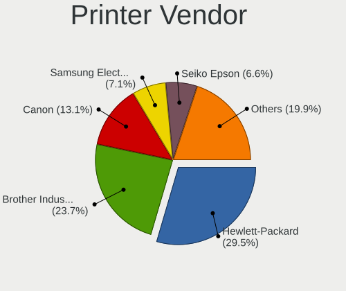

| Vendor                 | Computers | Percent |
|------------------------|-----------|---------|
| Hewlett-Packard        | 117       | 29.55%  |
| Brother Industries     | 94        | 23.74%  |
| Canon                  | 52        | 13.13%  |
| Samsung Electronics    | 28        | 7.07%   |
| Seiko Epson            | 26        | 6.57%   |
| Dymo-CoStar            | 13        | 3.28%   |
| Xerox                  | 9         | 2.27%   |
| Lexmark International  | 9         | 2.27%   |
| Prolific Technology    | 8         | 2.02%   |
| Pantum                 | 6         | 1.52%   |
| Kyocera                | 5         | 1.26%   |
| Zebra                  | 4         | 1.01%   |
| STMicroelectronics     | 4         | 1.01%   |
| Ricoh                  | 4         | 1.01%   |
| QinHeng Electronics    | 4         | 1.01%   |
| Oki Data               | 2         | 0.51%   |
| Datamax-O'Neil         | 2         | 0.51%   |
| Xiaomi                 | 1         | 0.25%   |
| Printer                | 1         | 0.25%   |
| Panasonic (Matsushita) | 1         | 0.25%   |
| nemonic                | 1         | 0.25%   |
| Konica Minolta         | 1         | 0.25%   |
| GODEX INTERNATIONAL    | 1         | 0.25%   |
| Dell                   | 1         | 0.25%   |
| Custom Engineering SPA | 1         | 0.25%   |
| Apple                  | 1         | 0.25%   |

Printer Model
-------------

Printer device models

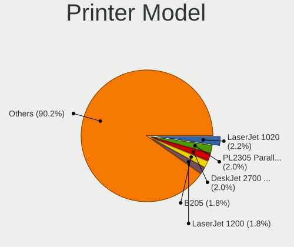

| Model                                                     | Computers | Percent |
|-----------------------------------------------------------|-----------|---------|
| HP LaserJet 1020                                          | 9         | 2.25%   |
| Prolific PL2305 Parallel Port                             | 8         | 2%      |
| HP DeskJet 2700 series                                    | 8         | 2%      |
| Xerox B205                                                | 7         | 1.75%   |
| HP LaserJet 1200                                          | 7         | 1.75%   |
| Canon LiDE 400                                            | 6         | 1.5%    |
| Canon PIXMA MG3600 Series                                 | 5         | 1.25%   |
| Brother HL-52x0 series                                    | 5         | 1.25%   |
| STMicroelectronics LED badge -- mini LED display -- 11x44 | 4         | 1%      |
| Samsung ML-1660 Series                                    | 4         | 1%      |
| Samsung M2020 Series                                      | 4         | 1%      |
| QinHeng CH340S                                            | 4         | 1%      |
| HP LaserJet M14-M17                                       | 4         | 1%      |
| HP HP LaserJet M101-M106                                  | 4         | 1%      |
| HP DeskJet 2130 series                                    | 4         | 1%      |
| Canon LiDE 300                                            | 4         | 1%      |
| Brother Printer                                           | 4         | 1%      |
| Brother HL-2030 Laser Printer                             | 4         | 1%      |
| Seiko Epson Printer                                       | 3         | 0.75%   |
| Seiko Epson L3050 Series                                  | 3         | 0.75%   |
| Samsung ML-216x Series Laser Printer                      | 3         | 0.75%   |
| Samsung M2070 Series                                      | 3         | 0.75%   |
| Pantum P2500W series                                      | 3         | 0.75%   |
| HP LaserJet P1005                                         | 3         | 0.75%   |
| HP LaserJet 1022                                          | 3         | 0.75%   |
| HP HP LaserJet Pro M404-M405                              | 3         | 0.75%   |
| HP DeskJet Plus 4100 series                               | 3         | 0.75%   |
| Dymo-CoStar LabelWriter 450                               | 3         | 0.75%   |
| Dymo-CoStar DYMO LabelWriter 450 Turbo                    | 3         | 0.75%   |
| Canon PIXMA MG2500 Series                                 | 3         | 0.75%   |
| Canon MF4410                                              | 3         | 0.75%   |
| Brother HL-L2340D series                                  | 3         | 0.75%   |
| Brother HL-3142CW series                                  | 3         | 0.75%   |
| Brother HL-2270DW Laser Printer                           | 3         | 0.75%   |
| Seiko Epson ET-2850 Series                                | 2         | 0.5%    |
| Seiko Epson ET-2710 Series                                | 2         | 0.5%    |
| Samsung SCX-3200 Series                                   | 2         | 0.5%    |
| Lexmark International CS417dn                             | 2         | 0.5%    |
| HP OfficeJet 5200 series                                  | 2         | 0.5%    |
| HP OfficeJet 4650 series                                  | 2         | 0.5%    |

Scanner Vendor
--------------

Scanner device vendors

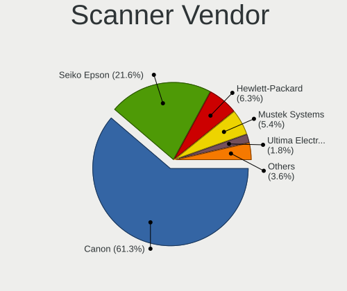

| Vendor             | Computers | Percent |
|--------------------|-----------|---------|
| Canon              | 68        | 61.26%  |
| Seiko Epson        | 24        | 21.62%  |
| Hewlett-Packard    | 7         | 6.31%   |
| Mustek Systems     | 6         | 5.41%   |
| Ultima Electronics | 2         | 1.8%    |
| AGFA-Gevaert NV    | 2         | 1.8%    |
| Sagem              | 1         | 0.9%    |
| Plustek            | 1         | 0.9%    |

Scanner Model
-------------

Scanner device models

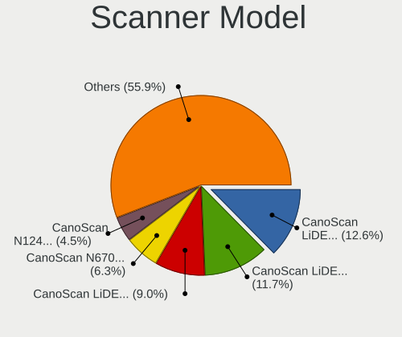

| Model                                                                                 | Computers | Percent |
|---------------------------------------------------------------------------------------|-----------|---------|
| Canon CanoScan LiDE 110                                                               | 14        | 12.61%  |
| Canon CanoScan LiDE 220                                                               | 13        | 11.71%  |
| Canon CanoScan LiDE 210                                                               | 10        | 9.01%   |
| Canon CanoScan N670U/N676U/LiDE 20                                                    | 7         | 6.31%   |
| Canon CanoScan N1240U/LiDE 30                                                         | 5         | 4.5%    |
| Canon CanoScan LiDE 120                                                               | 4         | 3.6%    |
| Seiko Epson GT-F650 [GT-S600/Perfection V10/V100]                                     | 3         | 2.7%    |
| Seiko Epson GT-8300UF [Perfection 1660 PHOTO]                                         | 3         | 2.7%    |
| Canon CanoScan LiDE 50/LiDE 35/LiDE 40                                                | 3         | 2.7%    |
| Canon CanoScan LIDE 25                                                                | 3         | 2.7%    |
| Ultima Artec Ultima 2000 (GT6801 based)/Lifetec LT9385/ScanMagic 1200 UB Plus Scanner | 2         | 1.8%    |
| Seiko Epson GT-X770 [Perfection V500]                                                 | 2         | 1.8%    |
| Seiko Epson GT-F500/GT-F550 [Perfection 2480/2580 PHOTO]                              | 2         | 1.8%    |
| Seiko Epson GT-7700U [Perfection 1240U]                                               | 2         | 1.8%    |
| Seiko Epson GT-7300U [Perfection 1260/1260 PHOTO]                                     | 2         | 1.8%    |
| Mustek Systems SNAPSCAN e22                                                           | 2         | 1.8%    |
| Canon CanoScan LiDE 60                                                                | 2         | 1.8%    |
| AGFA-Gevaert NV SnapScan 1212U (?)                                                    | 2         | 1.8%    |
| Seiko Epson Perfection V37/V370                                                       | 1         | 0.9%    |
| Seiko Epson GT-X900 [Perfection V700/V750 Photo]                                      | 1         | 0.9%    |
| Seiko Epson GT-X800 [Perfection 4990 PHOTO]                                           | 1         | 0.9%    |
| Seiko Epson GT-F720 [GT-S620/Perfection V30/V300 Photo]                               | 1         | 0.9%    |
| Seiko Epson GT-9800F [Perfection 3200]                                                | 1         | 0.9%    |
| Seiko Epson GT-9700F [Perfection 2450 PHOTO]                                          | 1         | 0.9%    |
| Seiko Epson GT-9300UF [Perfection 2400 PHOTO]                                         | 1         | 0.9%    |
| Seiko Epson GT-8700/GT-8700F [Perfection 1640SU/1640SU PHOTO]                         | 1         | 0.9%    |
| Seiko Epson GT-8200U/GT-8200UF [Perfection 1650/1650 PHOTO]                           | 1         | 0.9%    |
| Seiko Epson GT-6600U [Perfection 610]                                                 | 1         | 0.9%    |
| Sagem 600dpi USB Scanner                                                              | 1         | 0.9%    |
| Plustek 1200dpi USB Scanner                                                           | 1         | 0.9%    |
| Mustek Systems ScanExpress 1200 UB                                                    | 1         | 0.9%    |
| Mustek Systems BearPaw 2448 TA Pro                                                    | 1         | 0.9%    |
| Mustek Systems BearPaw 2400 CU Plus                                                   | 1         | 0.9%    |
| Mustek Systems BearPaw 1200 CU Plus                                                   | 1         | 0.9%    |
| HP ScanJet Pro 2500 f1                                                                | 1         | 0.9%    |
| HP ScanJet 82x0C                                                                      | 1         | 0.9%    |
| HP ScanJet 7650                                                                       | 1         | 0.9%    |
| HP ScanJet 5300c/5370c                                                                | 1         | 0.9%    |
| HP ScanJet 3970c                                                                      | 1         | 0.9%    |
| HP Scanjet 200                                                                        | 1         | 0.9%    |

Camera
------

Camera Vendor
-------------

Camera device vendors

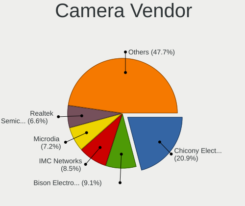

| Vendor                                 | Computers | Percent |
|----------------------------------------|-----------|---------|
| Chicony Electronics                    | 2152      | 20.91%  |
| Bison Electronics                      | 934       | 9.08%   |
| IMC Networks                           | 877       | 8.52%   |
| Microdia                               | 745       | 7.24%   |
| Realtek Semiconductor                  | 675       | 6.56%   |
| Quanta                                 | 653       | 6.34%   |
| Logitech                               | 637       | 6.19%   |
| Sunplus Innovation Technology          | 504       | 4.9%    |
| Luxvisions Innotech Limited            | 318       | 3.09%   |
| Apple                                  | 291       | 2.83%   |
| Cheng Uei Precision Industry (Foxlink) | 282       | 2.74%   |
| Syntek                                 | 243       | 2.36%   |
| Lite-On Technology                     | 218       | 2.12%   |
| Suyin                                  | 205       | 1.99%   |
| Silicon Motion                         | 100       | 0.97%   |
| Alcor Micro                            | 98        | 0.95%   |
| Sonix Technology                       | 95        | 0.92%   |
| Microsoft                              | 93        | 0.9%    |
| Samsung Electronics                    | 79        | 0.77%   |
| Z-Star Microelectronics                | 66        | 0.64%   |
| Lenovo                                 | 66        | 0.64%   |
| Ricoh                                  | 59        | 0.57%   |
| Generalplus Technology                 | 56        | 0.54%   |
| ShineTech                              | 51        | 0.5%    |
| Acer                                   | 50        | 0.49%   |
| SunplusIT                              | 49        | 0.48%   |
| icSpring                               | 31        | 0.3%    |
| Creative Technology                    | 29        | 0.28%   |
| Primax Electronics                     | 27        | 0.26%   |
| MacroSilicon                           | 26        | 0.25%   |
| Jieli Technology                       | 24        | 0.23%   |
| GEMBIRD                                | 24        | 0.23%   |
| ARC International                      | 24        | 0.23%   |
| Importek                               | 23        | 0.22%   |
| Unknown                                | 23        | 0.22%   |
| KYE Systems (Mouse Systems)            | 21        | 0.2%    |
| ALi                                    | 20        | 0.19%   |
| Genesys Logic                          | 19        | 0.18%   |
| Trust                                  | 16        | 0.16%   |
| Shine-optics                           | 15        | 0.15%   |

Camera Model
------------

Camera device models

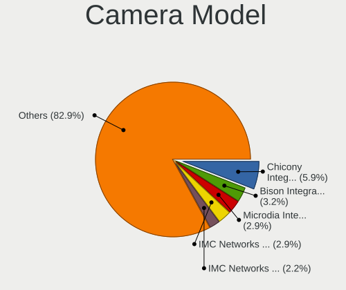

| Model                                               | Computers | Percent |
|-----------------------------------------------------|-----------|---------|
| Chicony Integrated Camera                           | 618       | 5.93%   |
| Bison Integrated Camera                             | 329       | 3.16%   |
| Microdia Integrated_Webcam_HD                       | 299       | 2.87%   |
| IMC Networks Integrated Camera                      | 299       | 2.87%   |
| IMC Networks USB2.0 HD UVC WebCam                   | 234       | 2.25%   |
| Realtek Integrated_Webcam_HD                        | 232       | 2.23%   |
| Syntek Integrated Camera                            | 167       | 1.6%    |
| Logitech Webcam C270                                | 154       | 1.48%   |
| Chicony HD WebCam                                   | 147       | 1.41%   |
| Sunplus Integrated_Webcam_HD                        | 144       | 1.38%   |
| Chicony HP HD Camera                                | 121       | 1.16%   |
| Quanta Chromebook HD Camera                         | 103       | 0.99%   |
| Quanta HD User Facing                               | 91        | 0.87%   |
| Luxvisions Innotech Limited Integrated Camera       | 89        | 0.85%   |
| Logitech HD Pro Webcam C920                         | 86        | 0.83%   |
| Apple FaceTime HD Camera (Built-in)                 | 85        | 0.82%   |
| Lite-On Integrated Camera                           | 84        | 0.81%   |
| Apple Built-in iSight                               | 81        | 0.78%   |
| IMC Networks USB2.0 VGA UVC WebCam                  | 80        | 0.77%   |
| Samsung Galaxy series, misc. (MTP mode)             | 75        | 0.72%   |
| Quanta HP TrueVision HD Camera                      | 74        | 0.71%   |
| Bison Integrated 5M Camera                          | 74        | 0.71%   |
| Bison BisonCam, NB Pro                              | 73        | 0.7%    |
| Luxvisions Innotech Limited HP TrueVision HD Camera | 70        | 0.67%   |
| Chicony Integrated Camera (1280x720@30)             | 70        | 0.67%   |
| Quanta HP HD Camera                                 | 67        | 0.64%   |
| Chicony USB2.0 HD UVC WebCam                        | 66        | 0.63%   |
| Bison SunplusIT Integrated Camera                   | 65        | 0.62%   |
| Apple iPhone 5/5C/5S/6/SE/7/8/X                     | 65        | 0.62%   |
| Chicony HP Truevision HD camera                     | 61        | 0.59%   |
| Microdia Integrated Webcam                          | 59        | 0.57%   |
| Sonix USB2.0 HD UVC WebCam                          | 58        | 0.56%   |
| Lite-On HP HD Camera                                | 58        | 0.56%   |
| Bison Lenovo Integrated Webcam                      | 58        | 0.56%   |
| Chicony HD User Facing                              | 56        | 0.54%   |
| Bison HD Webcam                                     | 56        | 0.54%   |
| Logitech C922 Pro Stream Webcam                     | 55        | 0.53%   |
| Bison Lenovo EasyCamera                             | 52        | 0.5%    |
| Quanta HD Webcam                                    | 51        | 0.49%   |
| Chicony HP Truevision HD                            | 51        | 0.49%   |

Security
--------

Fingerprint Vendor
------------------

Fingerprint sensor vendors

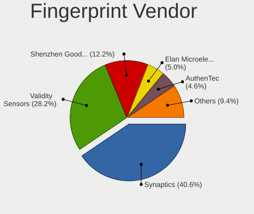

| Vendor                             | Computers | Percent |
|------------------------------------|-----------|---------|
| Synaptics                          | 769       | 40.56%  |
| Validity Sensors                   | 534       | 28.16%  |
| Shenzhen Goodix Technology         | 232       | 12.24%  |
| Elan Microelectronics              | 95        | 5.01%   |
| AuthenTec                          | 87        | 4.59%   |
| Upek                               | 78        | 4.11%   |
| LighTuning Technology              | 42        | 2.22%   |
| STMicroelectronics                 | 26        | 1.37%   |
| Realtek USB2.0 Finger Print Bridge | 10        | 0.53%   |
| HOLTEK                             | 8         | 0.42%   |
| Samsung Electronics                | 5         | 0.26%   |
| Focal-systems.Corp                 | 4         | 0.21%   |
| Microsoft                          | 2         | 0.11%   |
| DigitalPersona                     | 2         | 0.11%   |
| Yamila                             | 1         | 0.05%   |
| GDMicroelectronics                 | 1         | 0.05%   |

Fingerprint Model
-----------------

Fingerprint sensor models

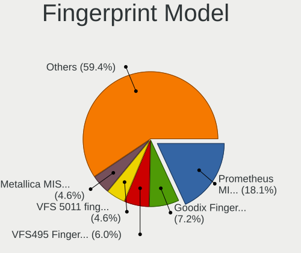

| Model                                                                      | Computers | Percent |
|----------------------------------------------------------------------------|-----------|---------|
| Synaptics Prometheus MIS Touch Fingerprint Reader                          | 343       | 18.09%  |
| Shenzhen Goodix  Fingerprint Device                                        | 137       | 7.23%   |
| Validity Sensors VFS495 Fingerprint Reader                                 | 114       | 6.01%   |
| Validity Sensors VFS 5011 fingerprint sensor                               | 88        | 4.64%   |
| Synaptics Metallica MIS Touch Fingerprint Reader                           | 88        | 4.64%   |
| Validity Sensors VFS5011 Fingerprint Reader                                | 74        | 3.9%    |
| Upek Biometric Touchchip/Touchstrip Fingerprint Sensor                     | 71        | 3.74%   |
| Validity Sensors Synaptics WBDI                                            | 65        | 3.43%   |
| Shenzhen Goodix Fingerprint Reader                                         | 65        | 3.43%   |
| Elan ELAN:ARM-M4                                                           | 51        | 2.69%   |
| Synaptics FS7604 Touch Fingerprint Sensor with PurePrint                   | 50        | 2.64%   |
| Synaptics UWP WBDI Device                                                  | 48        | 2.53%   |
| Elan ELAN:Fingerprint                                                      | 42        | 2.22%   |
| Synaptics Fingerprint reader [HP G6]                                       | 38        | 2%      |
| Synaptics Prometheus Fingerprint Reader                                    | 36        | 1.9%    |
| Validity Sensors Synaptics VFS7552 Touch Fingerprint Sensor with PurePrint | 33        | 1.74%   |
| Synaptics Metallica MOH Touch Fingerprint Reader                           | 32        | 1.69%   |
| Synaptics WBDI                                                             | 31        | 1.64%   |
| Synaptics  WBDI                                                            | 31        | 1.64%   |
| AuthenTec AES2810                                                          | 31        | 1.64%   |
| Shenzhen Goodix FingerPrint                                                | 30        | 1.58%   |
| Synaptics  FS7604 Touch Fingerprint Sensor with PurePrint                  | 28        | 1.48%   |
| Validity Sensors VFS7500 Touch Fingerprint Sensor                          | 25        | 1.32%   |
| Validity Sensors VFS491                                                    | 24        | 1.27%   |
| STMicroelectronics Fingerprint Reader                                      | 24        | 1.27%   |
| LighTuning EgisTec Touch Fingerprint Sensor                                | 24        | 1.27%   |
| AuthenTec AES2501 Fingerprint Sensor                                       | 23        | 1.21%   |
| Validity Sensors VFS471 Fingerprint Reader                                 | 21        | 1.11%   |
| Validity Sensors Swipe Fingerprint Sensor                                  | 18        | 0.95%   |
| Validity Sensors Fingerprint scanner                                       | 17        | 0.9%    |
| Synaptics UWP WBDI                                                         | 17        | 0.9%    |
| Validity Sensors VFS Fingerprint sensor                                    | 16        | 0.84%   |
| Validity Sensors VFS451 Fingerprint Reader                                 | 14        | 0.74%   |
| Validity Sensors Synaptics VFS7552 Touch Fingerprint Sensor                | 14        | 0.74%   |
| Synaptics WBDI Fingerprint Reader USB 086                                  | 12        | 0.63%   |
| Realtek USB2.0 Finger Print Bridge FocalTech Fingerprint Device            | 10        | 0.53%   |
| AuthenTec Fingerprint Sensor                                               | 10        | 0.53%   |
| LighTuning ES603 Swipe Fingerprint Sensor                                  | 9         | 0.47%   |
| AuthenTec AES1660 Fingerprint Sensor                                       | 9         | 0.47%   |
| AuthenTec AES1600                                                          | 9         | 0.47%   |

Chipcard Vendor
---------------

Chipcard module vendors

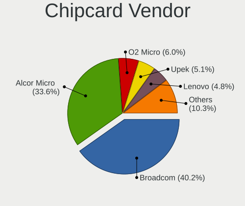

| Vendor                     | Computers | Percent |
|----------------------------|-----------|---------|
| Broadcom                   | 370       | 40.22%  |
| Alcor Micro                | 309       | 33.59%  |
| O2 Micro                   | 55        | 5.98%   |
| Upek                       | 47        | 5.11%   |
| Lenovo                     | 44        | 4.78%   |
| Gemalto (was Gemplus)      | 14        | 1.52%   |
| Yubico.com                 | 10        | 1.09%   |
| SCM Microsystems           | 9         | 0.98%   |
| Aladdin Knowledge Systems  | 8         | 0.87%   |
| Advanced Card Systems      | 8         | 0.87%   |
| Clay Logic                 | 7         | 0.76%   |
| Reiner SCT Kartensysteme   | 6         | 0.65%   |
| Realtek Semiconductor      | 6         | 0.65%   |
| OmniKey                    | 5         | 0.54%   |
| Cherry                     | 5         | 0.54%   |
| Chicony Electronics        | 4         | 0.43%   |
| Aktiv                      | 4         | 0.43%   |
| C3PO                       | 2         | 0.22%   |
| NXP Semiconductors         | 1         | 0.11%   |
| Hewlett-Packard            | 1         | 0.11%   |
| Giesecke & Devrient        | 1         | 0.11%   |
| Feitian Technologies       | 1         | 0.11%   |
| CREATOR                    | 1         | 0.11%   |
| Bit4id                     | 1         | 0.11%   |
| Athena Smartcard Solutions | 1         | 0.11%   |

Chipcard Model
--------------

Chipcard module models

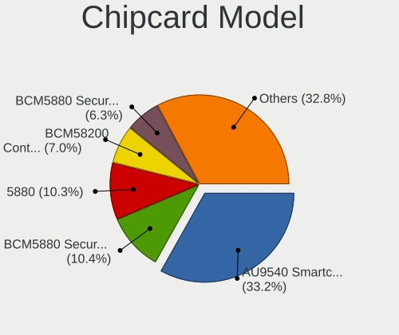

| Model                                                                        | Computers | Percent |
|------------------------------------------------------------------------------|-----------|---------|
| Alcor Micro AU9540 Smartcard Reader                                          | 305       | 33.15%  |
| Broadcom BCM5880 Secure Applications Processor                               | 96        | 10.43%  |
| Broadcom 5880                                                                | 95        | 10.33%  |
| Broadcom BCM58200 ControlVault 3 (FingerPrint sensor + Contacted SmartCard)  | 64        | 6.96%   |
| Broadcom BCM5880 Secure Applications Processor with fingerprint swipe sensor | 58        | 6.3%    |
| Broadcom 58200                                                               | 52        | 5.65%   |
| Upek TouchChip Fingerprint Coprocessor (WBF advanced mode)                   | 47        | 5.11%   |
| O2 Micro OZ776 CCID Smartcard Reader                                         | 46        | 5%      |
| Lenovo Integrated Smart Card Reader                                          | 42        | 4.57%   |
| O2 Micro Oz776 SmartCard Reader                                              | 9         | 0.98%   |
| Yubico.com Yubikey 4/5 U2F+CCID                                              | 8         | 0.87%   |
| Gemalto (was Gemplus) GemPC Twin SmartCard Reader                            | 8         | 0.87%   |
| Aladdin Knowledge Systems Token JC                                           | 8         | 0.87%   |
| Reiner SCT Kartensysteme cyberJack RFID basis contactless smartcard reader   | 6         | 0.65%   |
| Realtek Semiconductor Smart Card Reader Interface                            | 6         | 0.65%   |
| Broadcom BCM5880 Secure Applications Processor with fingerprint touch sensor | 5         | 0.54%   |
| Gemalto (was Gemplus) Compact Smart Card Reader Writer                       | 4         | 0.43%   |
| Chicony Electronics HP Skylab USB Smartcard Keyboard                         | 4         | 0.43%   |
| Alcor Micro Watchdata W 1981                                                 | 4         | 0.43%   |
| Aktiv Rutoken lite                                                           | 4         | 0.43%   |
| SCM Microsystems SCR331-LC1 / SCR3310 SmartCard Reader                       | 3         | 0.33%   |
| Clay Logic Nitrokey Start                                                    | 3         | 0.33%   |
| Clay Logic Nitrokey Pro                                                      | 3         | 0.33%   |
| Cherry SmartCard Reader Keyboard KC 1000 SC                                  | 3         | 0.33%   |
| Advanced Card Systems ACR39U                                                 | 3         | 0.33%   |
| Yubico.com Yubikey 4/5 CCID                                                  | 2         | 0.22%   |
| OmniKey CardMan 4321                                                         | 2         | 0.22%   |
| OmniKey CardMan 3021 / 3121                                                  | 2         | 0.22%   |
| Lenovo Smartcard Keyboard                                                    | 2         | 0.22%   |
| Gemalto (was Gemplus) GemPC Key SmartCard Reader                             | 2         | 0.22%   |
| Advanced Card Systems ACR38 SmartCard Reader                                 | 2         | 0.22%   |
| Advanced Card Systems ACR122U                                                | 2         | 0.22%   |
| SCM Microsystems uTrust FIDO2 Security Key                                   | 1         | 0.11%   |
| SCM Microsystems uTrust 3512 SAM slot Token                                  | 1         | 0.11%   |
| SCM Microsystems SCR35xx Smart Card Reader                                   | 1         | 0.11%   |
| SCM Microsystems SCR335 SmartCard Reader                                     | 1         | 0.11%   |
| SCM Microsystems SCR3340 - ExpressCard54 Smart Card Reader                   | 1         | 0.11%   |
| SCM Microsystems SCR331 SmartCard Reader                                     | 1         | 0.11%   |
| OmniKey 3x21 Smart Card Reader                                               | 1         | 0.11%   |
| NXP Semiconductors HUSCR-NFC                                                 | 1         | 0.11%   |

Unsupported
-----------

Unsupported Devices
-------------------

Total unsupported devices on board

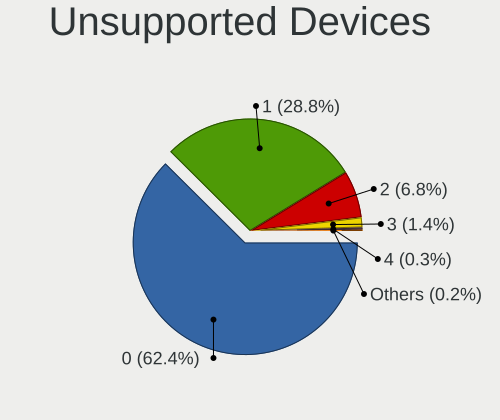

| Total | Computers | Percent |
|-------|-----------|---------|
| 0     | 12996     | 62.45%  |
| 1     | 5996      | 28.81%  |
| 2     | 1413      | 6.79%   |
| 3     | 300       | 1.44%   |
| 4     | 70        | 0.34%   |
| 5     | 25        | 0.12%   |
| 6     | 9         | 0.04%   |
| 7     | 2         | 0.01%   |

Unsupported Device Types
------------------------

Types of unsupported devices

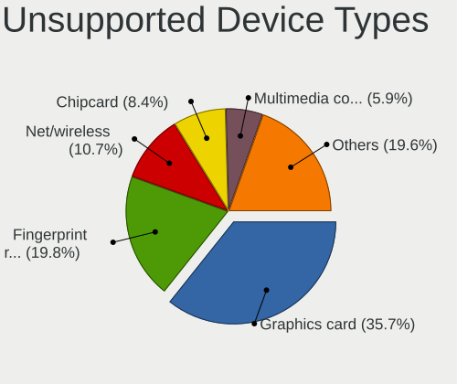

| Type                     | Computers | Percent |
|--------------------------|-----------|---------|
| Graphics card            | 3389      | 35.72%  |
| Fingerprint reader       | 1877      | 19.78%  |
| Net/wireless             | 1015      | 10.7%   |
| Chipcard                 | 793       | 8.36%   |
| Multimedia controller    | 558       | 5.88%   |
| Communication controller | 492       | 5.19%   |
| Unassigned class         | 418       | 4.41%   |
| Camera                   | 190       | 2%      |
| Bluetooth                | 164       | 1.73%   |
| Sound                    | 137       | 1.44%   |
| Card reader              | 122       | 1.29%   |
| Net/ethernet             | 98        | 1.03%   |
| Storage                  | 75        | 0.79%   |
| Network                  | 39        | 0.41%   |
| Modem                    | 36        | 0.38%   |
| Storage/raid             | 23        | 0.24%   |
| Storage/ide              | 12        | 0.13%   |
| Dvb card                 | 12        | 0.13%   |
| Flash memory             | 11        | 0.12%   |
| Wireless                 | 6         | 0.06%   |
| Tv card                  | 6         | 0.06%   |
| Storage/nvme             | 6         | 0.06%   |
| Firewire controller      | 6         | 0.06%   |
| Video                    | 1         | 0.01%   |
| Unclassified device      | 1         | 0.01%   |
| Storage/ata              | 1         | 0.01%   |

