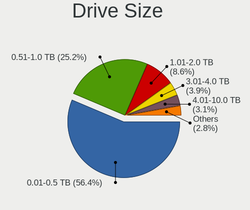
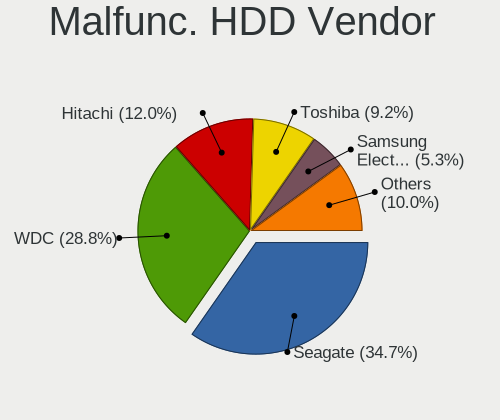
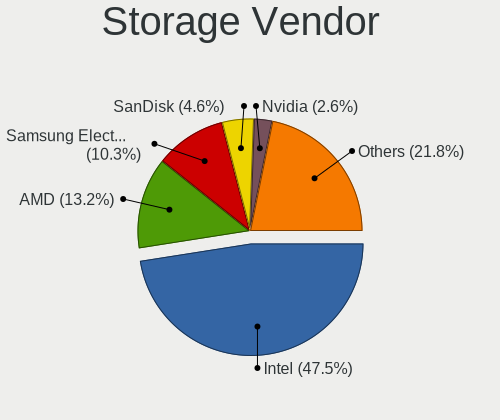
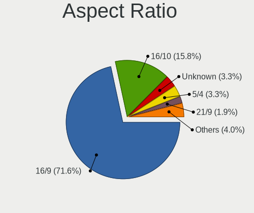
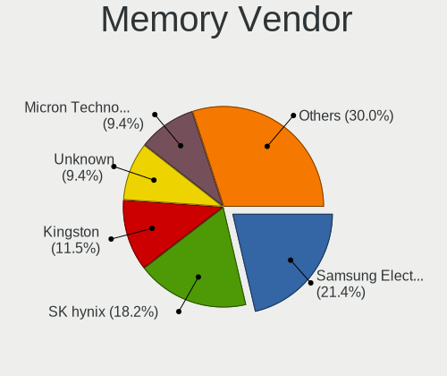

Debian - Tested Hardware & Statistics
-------------------------------------

A project to collect tested hardware configurations for Debian.

Anyone can contribute to this report by the [hw-probe](https://github.com/linuxhw/hw-probe) tool:

    sudo -E hw-probe -all -upload

Please contribute! Especially if your hardware is rare.

This is a report for all computer types. See also reports for [desktops](/Dist/Debian/Desktop/README.md) and [notebooks](/Dist/Debian/Notebook/README.md).

Contents
--------

* [ Test Cases ](#test-cases)

* [ System ](#system)
  - [ OS                       ](#os)
  - [ OS Family                ](#os-family)
  - [ Kernel                   ](#kernel)
  - [ Kernel Family            ](#kernel-family)
  - [ Kernel Major Ver.        ](#kernel-major-ver)
  - [ Arch                     ](#arch)
  - [ DE                       ](#de)
  - [ Display Server           ](#display-server)
  - [ Display Manager          ](#display-manager)
  - [ OS Lang                  ](#os-lang)
  - [ Boot Mode                ](#boot-mode)
  - [ Filesystem               ](#filesystem)
  - [ Part. scheme             ](#part-scheme)
  - [ Dual Boot with Linux/BSD ](#dual-boot-with-linuxbsd)
  - [ Dual Boot (Win)          ](#dual-boot-win)

* [ Board ](#board)
  - [ Vendor                   ](#vendor)
  - [ Model                    ](#model)
  - [ Model Family             ](#model-family)
  - [ MFG Year                 ](#mfg-year)
  - [ Form Factor              ](#form-factor)
  - [ Secure Boot              ](#secure-boot)
  - [ Coreboot                 ](#coreboot)
  - [ RAM Size                 ](#ram-size)
  - [ RAM Used                 ](#ram-used)
  - [ Total Drives             ](#total-drives)
  - [ Has CD-ROM               ](#has-cd-rom)
  - [ Has Ethernet             ](#has-ethernet)
  - [ Has WiFi                 ](#has-wifi)
  - [ Has Bluetooth            ](#has-bluetooth)

* [ Location ](#location)
  - [ Country                  ](#country)
  - [ City                     ](#city)

* [ Drives ](#drives)
  - [ Drive Vendor             ](#drive-vendor)
  - [ Drive Model              ](#drive-model)
  - [ HDD Vendor               ](#hdd-vendor)
  - [ SSD Vendor               ](#ssd-vendor)
  - [ Drive Kind               ](#drive-kind)
  - [ Drive Connector          ](#drive-connector)
  - [ Drive Size               ](#drive-size)
  - [ Space Total              ](#space-total)
  - [ Space Used               ](#space-used)
  - [ Malfunc. Drives          ](#malfunc-drives)
  - [ Malfunc. Drive Vendor    ](#malfunc-drive-vendor)
  - [ Malfunc. HDD Vendor      ](#malfunc-hdd-vendor)
  - [ Malfunc. Drive Kind      ](#malfunc-drive-kind)
  - [ Failed Drives            ](#failed-drives)
  - [ Failed Drive Vendor      ](#failed-drive-vendor)
  - [ Drive Status             ](#drive-status)

* [ Storage controller ](#storage-controller)
  - [ Storage Vendor           ](#storage-vendor)
  - [ Storage Model            ](#storage-model)
  - [ Storage Kind             ](#storage-kind)

* [ Processor ](#processor)
  - [ CPU Vendor               ](#cpu-vendor)
  - [ CPU Model                ](#cpu-model)
  - [ CPU Model Family         ](#cpu-model-family)
  - [ CPU Cores                ](#cpu-cores)
  - [ CPU Sockets              ](#cpu-sockets)
  - [ CPU Threads              ](#cpu-threads)
  - [ CPU Op-Modes             ](#cpu-op-modes)
  - [ CPU Microcode            ](#cpu-microcode)
  - [ CPU Microarch            ](#cpu-microarch)

* [ Graphics ](#graphics)
  - [ GPU Vendor               ](#gpu-vendor)
  - [ GPU Model                ](#gpu-model)
  - [ GPU Combo                ](#gpu-combo)
  - [ GPU Driver               ](#gpu-driver)
  - [ GPU Memory               ](#gpu-memory)

* [ Monitor ](#monitor)
  - [ Monitor Vendor           ](#monitor-vendor)
  - [ Monitor Model            ](#monitor-model)
  - [ Monitor Resolution       ](#monitor-resolution)
  - [ Monitor Diagonal         ](#monitor-diagonal)
  - [ Monitor Width            ](#monitor-width)
  - [ Aspect Ratio             ](#aspect-ratio)
  - [ Monitor Area             ](#monitor-area)
  - [ Pixel Density            ](#pixel-density)
  - [ Multiple Monitors        ](#multiple-monitors)

* [ Network ](#network)
  - [ Net Controller Vendor    ](#net-controller-vendor)
  - [ Net Controller Model     ](#net-controller-model)
  - [ Wireless Vendor          ](#wireless-vendor)
  - [ Wireless Model           ](#wireless-model)
  - [ Ethernet Vendor          ](#ethernet-vendor)
  - [ Ethernet Model           ](#ethernet-model)
  - [ Net Controller Kind      ](#net-controller-kind)
  - [ Used Controller          ](#used-controller)
  - [ NICs                     ](#nics)
  - [ IPv6                     ](#ipv6)

* [ Bluetooth ](#bluetooth)
  - [ Bluetooth Vendor         ](#bluetooth-vendor)
  - [ Bluetooth Model          ](#bluetooth-model)

* [ Sound ](#sound)
  - [ Sound Vendor             ](#sound-vendor)
  - [ Sound Model              ](#sound-model)

* [ Memory ](#memory)
  - [ Memory Vendor            ](#memory-vendor)
  - [ Memory Model             ](#memory-model)
  - [ Memory Kind              ](#memory-kind)
  - [ Memory Form Factor       ](#memory-form-factor)
  - [ Memory Size              ](#memory-size)
  - [ Memory Speed             ](#memory-speed)

* [ Printers & scanners ](#printers--scanners)
  - [ Printer Vendor           ](#printer-vendor)
  - [ Printer Model            ](#printer-model)
  - [ Scanner Vendor           ](#scanner-vendor)
  - [ Scanner Model            ](#scanner-model)

* [ Camera ](#camera)
  - [ Camera Vendor            ](#camera-vendor)
  - [ Camera Model             ](#camera-model)

* [ Security ](#security)
  - [ Fingerprint Vendor       ](#fingerprint-vendor)
  - [ Fingerprint Model        ](#fingerprint-model)
  - [ Chipcard Vendor          ](#chipcard-vendor)
  - [ Chipcard Model           ](#chipcard-model)

* [ Unsupported ](#unsupported)
  - [ Unsupported Devices      ](#unsupported-devices)
  - [ Unsupported Device Types ](#unsupported-device-types)

Test Cases
----------

Total: 18722

| Vendor        | Model                       | Form-Factor | Probe                                                      | Date         |
|---------------|-----------------------------|-------------|------------------------------------------------------------|--------------|
| ASUSTek       | P7P55D-E                    | Desktop     | [7173101a68](https://linux-hardware.org/?probe=7173101a68) | Feb 02, 2024 |
| Gigabyte      | AB350M-Gaming 3-CF          | Desktop     | [ef41c12950](https://linux-hardware.org/?probe=ef41c12950) | Feb 02, 2024 |
| Sapphire      | PI-AM3RS760G2               | Desktop     | [9b2e938cb4](https://linux-hardware.org/?probe=9b2e938cb4) | Feb 02, 2024 |
| HP            | ProLiant DL360 Gen9         | Server      | [d71cef49ca](https://linux-hardware.org/?probe=d71cef49ca) | Feb 02, 2024 |
| Gigabyte      | B560M H                     | Desktop     | [84e64db583](https://linux-hardware.org/?probe=84e64db583) | Feb 02, 2024 |
| Lenovo        | ThinkPad E595 20NF0005IX    | Notebook    | [171aaf5d57](https://linux-hardware.org/?probe=171aaf5d57) | Feb 02, 2024 |
| ASRock        | 990FX Extreme4              | Desktop     | [b412a671e4](https://linux-hardware.org/?probe=b412a671e4) | Feb 02, 2024 |
| Lenovo        | ThinkPad E595 20NF0005IX    | Notebook    | [c834e4941b](https://linux-hardware.org/?probe=c834e4941b) | Feb 02, 2024 |
| Lenovo        | 312A NOK                    | Desktop     | [366174cd75](https://linux-hardware.org/?probe=366174cd75) | Feb 02, 2024 |
| ASUSTek       | N56VZ                       | Notebook    | [2209fe1372](https://linux-hardware.org/?probe=2209fe1372) | Feb 02, 2024 |
| MSI           | Modern 14 B11MOU            | Notebook    | [f7d0fcd205](https://linux-hardware.org/?probe=f7d0fcd205) | Feb 02, 2024 |
| HP            | 1998                        | Desktop     | [0056c33526](https://linux-hardware.org/?probe=0056c33526) | Feb 02, 2024 |
| Lenovo        | Yoga 6 13ALC6 82ND          | Convertible | [2eec21d0eb](https://linux-hardware.org/?probe=2eec21d0eb) | Feb 02, 2024 |
| Dell          | 0PV3YR A05                  | Server      | [25e7def18b](https://linux-hardware.org/?probe=25e7def18b) | Feb 02, 2024 |
| MSI           | Raider GE68HX 13VF          | Notebook    | [72ac680d91](https://linux-hardware.org/?probe=72ac680d91) | Feb 02, 2024 |
| Lenovo        | SHARKBAY NOK                | Desktop     | [f4caef7bf1](https://linux-hardware.org/?probe=f4caef7bf1) | Feb 02, 2024 |
| HP            | EliteBook 2570p             | Notebook    | [59778f5513](https://linux-hardware.org/?probe=59778f5513) | Feb 02, 2024 |
| Lenovo        | ThinkPad T410 2537AF8       | Notebook    | [88794835fb](https://linux-hardware.org/?probe=88794835fb) | Feb 02, 2024 |
| Apple         | MacBookAir7,2               | Notebook    | [632421d681](https://linux-hardware.org/?probe=632421d681) | Feb 01, 2024 |
| ASUSTek       | K54C                        | Notebook    | [59e4e733f0](https://linux-hardware.org/?probe=59e4e733f0) | Feb 01, 2024 |
| Lenovo        | 3330 NOK                    | Mini pc     | [c925201205](https://linux-hardware.org/?probe=c925201205) | Feb 01, 2024 |
| Acer          | Aspire 7740                 | Notebook    | [a329ef6c37](https://linux-hardware.org/?probe=a329ef6c37) | Feb 01, 2024 |
| Lenovo        | V17 G4 IRU 83A2             | Notebook    | [f33e772962](https://linux-hardware.org/?probe=f33e772962) | Feb 01, 2024 |
| Dell          | 0G214D A00                  | Desktop     | [2973076de3](https://linux-hardware.org/?probe=2973076de3) | Feb 01, 2024 |
| Acer          | Aspire A515-56              | Notebook    | [5599d65127](https://linux-hardware.org/?probe=5599d65127) | Feb 01, 2024 |
| HP            | Pavilion Notebook           | Notebook    | [397f03250d](https://linux-hardware.org/?probe=397f03250d) | Feb 01, 2024 |
| Panasonic     | CF-54-2                     | Notebook    | [7758f322a6](https://linux-hardware.org/?probe=7758f322a6) | Feb 01, 2024 |
| Lenovo        | IdeaPad 320-15ISK 80XH      | Notebook    | [a3932a77fb](https://linux-hardware.org/?probe=a3932a77fb) | Feb 01, 2024 |
| HP            | Pavilion dv4                | Notebook    | [09400a55bb](https://linux-hardware.org/?probe=09400a55bb) | Feb 01, 2024 |
| Dell          | 0PV3YR A05                  | Server      | [58467e737b](https://linux-hardware.org/?probe=58467e737b) | Feb 01, 2024 |
| Supermicro    | H11SSL-i                    | Server      | [2bc6c0e61b](https://linux-hardware.org/?probe=2bc6c0e61b) | Feb 01, 2024 |
| Lenovo        | Flex 2-14 20404             | Notebook    | [b2d8a38af3](https://linux-hardware.org/?probe=b2d8a38af3) | Feb 01, 2024 |
| Supermicro    | H11SSL-i                    | Server      | [a588d3636b](https://linux-hardware.org/?probe=a588d3636b) | Jan 31, 2024 |
| Raspberry ... | Raspberry Pi 4 Model B R... | Soc         | [0f7b0cced4](https://linux-hardware.org/?probe=0f7b0cced4) | Jan 31, 2024 |
| Lenovo        | ThinkPad 13 2nd Gen 20J1... | Notebook    | [7f20bd79c9](https://linux-hardware.org/?probe=7f20bd79c9) | Jan 31, 2024 |
| Unknown       | Unknown                     | Notebook    | [13b20f5383](https://linux-hardware.org/?probe=13b20f5383) | Jan 31, 2024 |
| Lenovo        | ThinkCentre M55p 8808D8U    | Desktop     | [763dd9417b](https://linux-hardware.org/?probe=763dd9417b) | Jan 31, 2024 |
| HP            | EliteBook 2570p             | Notebook    | [7d98ca3c90](https://linux-hardware.org/?probe=7d98ca3c90) | Jan 31, 2024 |
| Gigabyte      | B85M-D3H                    | Desktop     | [059252dc92](https://linux-hardware.org/?probe=059252dc92) | Jan 31, 2024 |
| HP            | ProBook 4510s               | Notebook    | [2982cc0a30](https://linux-hardware.org/?probe=2982cc0a30) | Jan 31, 2024 |
| Dell          | 018D1Y A00                  | Desktop     | [28a3a41219](https://linux-hardware.org/?probe=28a3a41219) | Jan 31, 2024 |
| HP            | Pavilion Laptop 15-eh1xx... | Notebook    | [d743247f69](https://linux-hardware.org/?probe=d743247f69) | Jan 31, 2024 |
| ASRock        | X99 Taichi                  | Desktop     | [1799faad1e](https://linux-hardware.org/?probe=1799faad1e) | Jan 31, 2024 |
| Supermicro    | X8DTH                       | Server      | [53d7109f48](https://linux-hardware.org/?probe=53d7109f48) | Jan 31, 2024 |
| HP            | 15                          | Notebook    | [5abc868cce](https://linux-hardware.org/?probe=5abc868cce) | Jan 31, 2024 |
| HP            | Elite x360 830 13 inch G... | Convertible | [d8081ec509](https://linux-hardware.org/?probe=d8081ec509) | Jan 31, 2024 |
| Unknown       | T3 MRD                      | Desktop     | [744984b9d3](https://linux-hardware.org/?probe=744984b9d3) | Jan 31, 2024 |
| ASUSTek       | PRIME A320M-K               | Desktop     | [348cad0405](https://linux-hardware.org/?probe=348cad0405) | Jan 31, 2024 |
| HP            | ProBook 430 G8 Notebook ... | Notebook    | [ccf29ffd3d](https://linux-hardware.org/?probe=ccf29ffd3d) | Jan 31, 2024 |
| MSI           | H110M PRO-VD                | Desktop     | [29fd183b3b](https://linux-hardware.org/?probe=29fd183b3b) | Jan 31, 2024 |
| ASUSTek       | VivoBook_ASUSLaptop E410... | Notebook    | [8d8a09ab09](https://linux-hardware.org/?probe=8d8a09ab09) | Jan 31, 2024 |
| ASRock        | A520M-HDV                   | Desktop     | [fa42ae183a](https://linux-hardware.org/?probe=fa42ae183a) | Jan 31, 2024 |
| Rockchip      | RK3318 BOX                  | Soc         | [38bcbeddee](https://linux-hardware.org/?probe=38bcbeddee) | Jan 31, 2024 |
| Dell          | 0PV3YR A05                  | Server      | [399221e733](https://linux-hardware.org/?probe=399221e733) | Jan 31, 2024 |
| ASRock        | A520M-HDV                   | Desktop     | [23be9724fe](https://linux-hardware.org/?probe=23be9724fe) | Jan 31, 2024 |
| Intel         | NUC8BEB J72692-309          | Mini pc     | [a2536bd0a5](https://linux-hardware.org/?probe=a2536bd0a5) | Jan 31, 2024 |
| ASUSTek       | Z10PE-D16 WS                | Server      | [3cb0e7e907](https://linux-hardware.org/?probe=3cb0e7e907) | Jan 30, 2024 |
| Lenovo        | Yoga 900-13ISK 80MK         | Notebook    | [c5e686c940](https://linux-hardware.org/?probe=c5e686c940) | Jan 30, 2024 |
| Apple         | MacBookPro9,1               | Notebook    | [741671df2c](https://linux-hardware.org/?probe=741671df2c) | Jan 30, 2024 |
| Lenovo        | 312A NOK                    | Desktop     | [4cb29324fc](https://linux-hardware.org/?probe=4cb29324fc) | Jan 30, 2024 |
| HP            | 1495                        | Desktop     | [a2017adb28](https://linux-hardware.org/?probe=a2017adb28) | Jan 30, 2024 |
| Lenovo        | ThinkPad L13 Yoga Gen 2 ... | Convertible | [510407768d](https://linux-hardware.org/?probe=510407768d) | Jan 30, 2024 |
| ASUSTek       | B85M-E/BR                   | Desktop     | [d3a20c90d1](https://linux-hardware.org/?probe=d3a20c90d1) | Jan 30, 2024 |
| Lenovo        | 312A NOK                    | Desktop     | [dea06ca305](https://linux-hardware.org/?probe=dea06ca305) | Jan 30, 2024 |
| Lenovo        | 312A NOK                    | Desktop     | [83eec08588](https://linux-hardware.org/?probe=83eec08588) | Jan 30, 2024 |
| Raspberry ... | Raspberry Pi 4 Model B R... | Soc         | [1127b13645](https://linux-hardware.org/?probe=1127b13645) | Jan 30, 2024 |
| Raspberry ... | Raspberry Pi 5 Model B R... | Soc         | [88ff9ffee3](https://linux-hardware.org/?probe=88ff9ffee3) | Jan 30, 2024 |
| Raspberry ... | Raspberry Pi 4 Model B R... | Soc         | [a214537a22](https://linux-hardware.org/?probe=a214537a22) | Jan 30, 2024 |
| ASRock        | 990FX Extreme4              | Desktop     | [dbb897d3e1](https://linux-hardware.org/?probe=dbb897d3e1) | Jan 30, 2024 |
| OriginPC      | EVO16-S                     | Notebook    | [6d96755039](https://linux-hardware.org/?probe=6d96755039) | Jan 30, 2024 |
| Raspberry ... | Raspberry Pi 5 Model B R... | Soc         | [f47e169ab1](https://linux-hardware.org/?probe=f47e169ab1) | Jan 30, 2024 |
| Dell          | 0XDN97 A06                  | Server      | [50ae98a42d](https://linux-hardware.org/?probe=50ae98a42d) | Jan 30, 2024 |
| Dell          | 0X3D66 A02                  | Server      | [9e355872f9](https://linux-hardware.org/?probe=9e355872f9) | Jan 30, 2024 |
| Dell          | 082F9M A00                  | Server      | [ab607bac6c](https://linux-hardware.org/?probe=ab607bac6c) | Jan 30, 2024 |
| Dell          | XPS 13 9360                 | Notebook    | [fb5ea12034](https://linux-hardware.org/?probe=fb5ea12034) | Jan 30, 2024 |
| Gigabyte      | B550M AORUS ELITE           | Desktop     | [e5435a9682](https://linux-hardware.org/?probe=e5435a9682) | Jan 30, 2024 |
| Dell          | 0D4MD1 A00                  | Desktop     | [9dd5ab2544](https://linux-hardware.org/?probe=9dd5ab2544) | Jan 30, 2024 |
| Lenovo        | SHARKBAY 0B98401 PRO        | Desktop     | [141329c8f3](https://linux-hardware.org/?probe=141329c8f3) | Jan 29, 2024 |
| Medion        | E15423                      | Notebook    | [2d39a42a0a](https://linux-hardware.org/?probe=2d39a42a0a) | Jan 29, 2024 |
| Dell          | XPS 9315                    | Notebook    | [c705e51d0e](https://linux-hardware.org/?probe=c705e51d0e) | Jan 29, 2024 |
| Dell          | XPS 15 7590                 | Notebook    | [0db74aab7e](https://linux-hardware.org/?probe=0db74aab7e) | Jan 29, 2024 |
| HUAWEI        | KPRC-WX0                    | Notebook    | [dea81917ae](https://linux-hardware.org/?probe=dea81917ae) | Jan 29, 2024 |
| Lenovo        | ThinkPad L13 Yoga Gen 2 ... | Convertible | [9ecf3a5292](https://linux-hardware.org/?probe=9ecf3a5292) | Jan 29, 2024 |
| Huanan        | X99-4MF V1.0                | Desktop     | [63f228ae04](https://linux-hardware.org/?probe=63f228ae04) | Jan 29, 2024 |
| Acer          | Aspire A315-58              | Notebook    | [c1af8d7ca2](https://linux-hardware.org/?probe=c1af8d7ca2) | Jan 29, 2024 |
| Dell          | XPS 9315                    | Notebook    | [9beaeed93b](https://linux-hardware.org/?probe=9beaeed93b) | Jan 29, 2024 |
| Quanta        | S2S-MB 31S2SMB0050          | Server      | [26f324ef34](https://linux-hardware.org/?probe=26f324ef34) | Jan 29, 2024 |
| Quanta        | S2S-MB 31S2SMB0050          | Server      | [a2ed25aac4](https://linux-hardware.org/?probe=a2ed25aac4) | Jan 29, 2024 |
| Radxa         | ROCK Pi 4B                  | Soc         | [b1450de77f](https://linux-hardware.org/?probe=b1450de77f) | Jan 29, 2024 |
| Apple         | MacBookPro5,4               | Notebook    | [c16bc8a6c2](https://linux-hardware.org/?probe=c16bc8a6c2) | Jan 29, 2024 |
| AZW           | SER V1.0                    | Mini pc     | [385d8d4782](https://linux-hardware.org/?probe=385d8d4782) | Jan 29, 2024 |
| Raspberry ... | Raspberry Pi 3 Model B R... | Soc         | [66d4abe24d](https://linux-hardware.org/?probe=66d4abe24d) | Jan 29, 2024 |
| Shenzhen M... | F6BFC                       | Desktop     | [3ecbf7ef23](https://linux-hardware.org/?probe=3ecbf7ef23) | Jan 29, 2024 |
| HP            | 3397                        | Desktop     | [fcbc5b3ac6](https://linux-hardware.org/?probe=fcbc5b3ac6) | Jan 29, 2024 |
| ASRock        | X300TM-ITX                  | Desktop     | [c3277a6c4c](https://linux-hardware.org/?probe=c3277a6c4c) | Jan 29, 2024 |
| ASUSTek       | N550JK                      | Notebook    | [097f96652f](https://linux-hardware.org/?probe=097f96652f) | Jan 29, 2024 |
| MSI           | MS-7060                     | Desktop     | [cfc1584314](https://linux-hardware.org/?probe=cfc1584314) | Jan 29, 2024 |
| HP            | ENVY x360 Convertible 13... | Convertible | [dda9e159b9](https://linux-hardware.org/?probe=dda9e159b9) | Jan 29, 2024 |
| Rockchip      | RK3318 BOX                  | Soc         | [d52d85d882](https://linux-hardware.org/?probe=d52d85d882) | Jan 29, 2024 |
| HP            | 1495                        | Desktop     | [2bf6b5d794](https://linux-hardware.org/?probe=2bf6b5d794) | Jan 28, 2024 |
| HP            | ProLiant DL385p Gen8        | Server      | [c6ad62b067](https://linux-hardware.org/?probe=c6ad62b067) | Jan 28, 2024 |
| HP            | ProLiant DL380 G6           | Server      | [05b7c13538](https://linux-hardware.org/?probe=05b7c13538) | Jan 28, 2024 |
| MSI           | MAG X670E TOMAHAWK WIFI     | Desktop     | [e4b1d774f6](https://linux-hardware.org/?probe=e4b1d774f6) | Jan 28, 2024 |
| Lenovo        | IdeaPad P585 20181          | Notebook    | [d54756c11a](https://linux-hardware.org/?probe=d54756c11a) | Jan 28, 2024 |
| Intel         | DX58SO AAE29331-503         | Desktop     | [57959fa365](https://linux-hardware.org/?probe=57959fa365) | Jan 28, 2024 |
| ASUSTek       | PRIME X570-P                | Desktop     | [0b1a4a9d6c](https://linux-hardware.org/?probe=0b1a4a9d6c) | Jan 28, 2024 |
| Lenovo        | ThinkPad T480 20L6S4T80H    | Notebook    | [cb5f6705aa](https://linux-hardware.org/?probe=cb5f6705aa) | Jan 28, 2024 |
| Apple         | Mac-F42386C8 PVT            | All in one  | [dbbc24a0ed](https://linux-hardware.org/?probe=dbbc24a0ed) | Jan 28, 2024 |
| ASUSTek       | PRIME B250M-C               | Desktop     | [5c34879ea0](https://linux-hardware.org/?probe=5c34879ea0) | Jan 28, 2024 |
| ASRock        | B550M Phantom Gaming 4      | Desktop     | [19712e098a](https://linux-hardware.org/?probe=19712e098a) | Jan 28, 2024 |
| Apple         | Mac-F42386C8 PVT            | All in one  | [4a48eb8f58](https://linux-hardware.org/?probe=4a48eb8f58) | Jan 28, 2024 |
| Dell          | G3 3590                     | Notebook    | [7fb3fcb32c](https://linux-hardware.org/?probe=7fb3fcb32c) | Jan 28, 2024 |
| ASUSTek       | Z97-K                       | Desktop     | [777446f160](https://linux-hardware.org/?probe=777446f160) | Jan 28, 2024 |
| Gateway       | DS10G                       | Desktop     | [869339de12](https://linux-hardware.org/?probe=869339de12) | Jan 28, 2024 |
| HP            | Laptop 15z-ef3xxx           | Notebook    | [bde6b1bdd9](https://linux-hardware.org/?probe=bde6b1bdd9) | Jan 28, 2024 |
| Unknown       | Unknown                     | Desktop     | [52ae8cfe76](https://linux-hardware.org/?probe=52ae8cfe76) | Jan 28, 2024 |
| Unknown       | Unknown                     | Desktop     | [1834dd7444](https://linux-hardware.org/?probe=1834dd7444) | Jan 28, 2024 |
| Unknown       | Phicomm N1                  | Soc         | [96a0dce3c6](https://linux-hardware.org/?probe=96a0dce3c6) | Jan 28, 2024 |
| Gigabyte      | H61M-D2-B3                  | Desktop     | [a177c22fb5](https://linux-hardware.org/?probe=a177c22fb5) | Jan 28, 2024 |
| HP            | Compaq nc6320 (EN371UA#A... | Notebook    | [24bcfc0005](https://linux-hardware.org/?probe=24bcfc0005) | Jan 28, 2024 |
| ASUSTek       | PRIME A320M-K               | Desktop     | [c5777be509](https://linux-hardware.org/?probe=c5777be509) | Jan 28, 2024 |
| ASUSTek       | PRIME A320M-K               | Desktop     | [4fa63d205f](https://linux-hardware.org/?probe=4fa63d205f) | Jan 28, 2024 |
| Dell          | Latitude 7380               | Notebook    | [c383a1c7dc](https://linux-hardware.org/?probe=c383a1c7dc) | Jan 28, 2024 |
| Lenovo        | ThinkPad T490 20N3S5GP12    | Notebook    | [b0cc2bbbed](https://linux-hardware.org/?probe=b0cc2bbbed) | Jan 28, 2024 |
| HP            | 21EF                        | Desktop     | [9fcfe8d663](https://linux-hardware.org/?probe=9fcfe8d663) | Jan 28, 2024 |
| Supermicro    | X13DEI                      | Server      | [044e82e684](https://linux-hardware.org/?probe=044e82e684) | Jan 27, 2024 |
| Dell          | 01W23F A05                  | Server      | [93f017d8b0](https://linux-hardware.org/?probe=93f017d8b0) | Jan 27, 2024 |
| Lenovo        | Yoga 6 13ALC7 82UD          | Convertible | [018e1f4232](https://linux-hardware.org/?probe=018e1f4232) | Jan 27, 2024 |
| ASUSTek       | TUF Gaming B450-PLUS II     | Desktop     | [08f64cc902](https://linux-hardware.org/?probe=08f64cc902) | Jan 27, 2024 |
| Medion        | Akoya P7628                 | Notebook    | [77cd29bced](https://linux-hardware.org/?probe=77cd29bced) | Jan 27, 2024 |
| Dell          | 042P49 A01                  | Desktop     | [c419b892e0](https://linux-hardware.org/?probe=c419b892e0) | Jan 27, 2024 |
| Unknown       | Unknown                     | Desktop     | [2bf1eac05d](https://linux-hardware.org/?probe=2bf1eac05d) | Jan 27, 2024 |
| Intel         | NUC8BEB J72692-309          | Mini pc     | [380fafe6a3](https://linux-hardware.org/?probe=380fafe6a3) | Jan 27, 2024 |
| LG Electro... | 17Z90P-K.AA78A1             | Notebook    | [7280098d0c](https://linux-hardware.org/?probe=7280098d0c) | Jan 27, 2024 |
| Raspberry ... | Raspberry Pi 5 Model B R... | Soc         | [7f3a619e25](https://linux-hardware.org/?probe=7f3a619e25) | Jan 27, 2024 |
| ASUSTek       | TUF Gaming B450-PLUS II     | Desktop     | [a6240580d2](https://linux-hardware.org/?probe=a6240580d2) | Jan 27, 2024 |
| Raspberry ... | Raspberry Pi 4 Model B R... | Soc         | [e20cfe6ad1](https://linux-hardware.org/?probe=e20cfe6ad1) | Jan 27, 2024 |
| Apple         | Mac-27ADBB7B4CEE8E61 iMa... | All in one  | [b5fb647895](https://linux-hardware.org/?probe=b5fb647895) | Jan 27, 2024 |
| Lenovo        | ThinkPad T480s 20L7001SG... | Notebook    | [bb998df843](https://linux-hardware.org/?probe=bb998df843) | Jan 27, 2024 |
| Lenovo        | G40-45 80E1                 | Notebook    | [1e01df8e73](https://linux-hardware.org/?probe=1e01df8e73) | Jan 27, 2024 |
| Lenovo        | ThinkPad T480s 20L7001SG... | Notebook    | [5810c5dc2b](https://linux-hardware.org/?probe=5810c5dc2b) | Jan 27, 2024 |
| Biostar       | A10N-8800E                  | Desktop     | [6035efec56](https://linux-hardware.org/?probe=6035efec56) | Jan 27, 2024 |
| ASUSTek       | ROG STRIX B550-E GAMING     | Desktop     | [48d7c58756](https://linux-hardware.org/?probe=48d7c58756) | Jan 27, 2024 |
| Biostar       | A10N-8800E                  | Desktop     | [9eab4dee46](https://linux-hardware.org/?probe=9eab4dee46) | Jan 27, 2024 |
| ASUSTek       | ROG STRIX B550-E GAMING     | Desktop     | [ff65cf66c3](https://linux-hardware.org/?probe=ff65cf66c3) | Jan 27, 2024 |
| Medion        | MS-7616                     | Desktop     | [3645021c62](https://linux-hardware.org/?probe=3645021c62) | Jan 27, 2024 |
| ASUSTek       | PN53-G                      | Mini pc     | [79b22a6e7b](https://linux-hardware.org/?probe=79b22a6e7b) | Jan 27, 2024 |
| Gigabyte      | A520M DS3H V2               | Desktop     | [507d3e9bbf](https://linux-hardware.org/?probe=507d3e9bbf) | Jan 27, 2024 |
| ASUSTek       | ROG STRIX B450-F GAMING     | Desktop     | [f7b37dcead](https://linux-hardware.org/?probe=f7b37dcead) | Jan 27, 2024 |
| HC Technol... | HCAR5000-MI2                | Desktop     | [19a4048799](https://linux-hardware.org/?probe=19a4048799) | Jan 27, 2024 |
| Dell          | Inspiron 5405               | Notebook    | [c9256b244b](https://linux-hardware.org/?probe=c9256b244b) | Jan 27, 2024 |
| Raspberry ... | Raspberry Pi 5 Model B R... | Soc         | [5e62a52683](https://linux-hardware.org/?probe=5e62a52683) | Jan 27, 2024 |
| Lenovo        | ThinkPad P14s Gen 1 20Y1... | Notebook    | [4b4af4b9b4](https://linux-hardware.org/?probe=4b4af4b9b4) | Jan 26, 2024 |
| Lenovo        | ThinkPad T530 2394EN6       | Notebook    | [4110faba77](https://linux-hardware.org/?probe=4110faba77) | Jan 26, 2024 |
| HP            | Pavilion Laptop 15-eh1xx... | Notebook    | [7423289dfa](https://linux-hardware.org/?probe=7423289dfa) | Jan 26, 2024 |
| Lenovo        | 1052 SDK0J40697 WIN 3305... | Desktop     | [b0019abd70](https://linux-hardware.org/?probe=b0019abd70) | Jan 26, 2024 |
| MSI           | MPG B550 GAMING PLUS        | Desktop     | [fcdc8fc8e3](https://linux-hardware.org/?probe=fcdc8fc8e3) | Jan 26, 2024 |
| Intel         | S1200BTL E98681-352         | Server      | [93da2d648d](https://linux-hardware.org/?probe=93da2d648d) | Jan 26, 2024 |
| HP            | 15                          | Notebook    | [4bce029b1f](https://linux-hardware.org/?probe=4bce029b1f) | Jan 26, 2024 |
| ASUSTek       | Z87-C                       | Desktop     | [a63ba339e5](https://linux-hardware.org/?probe=a63ba339e5) | Jan 26, 2024 |
| ASUSTek       | PRIME X570-P                | Desktop     | [f0eb2463d7](https://linux-hardware.org/?probe=f0eb2463d7) | Jan 26, 2024 |
| ECS           | G31T-M9                     | Desktop     | [8af1e631e7](https://linux-hardware.org/?probe=8af1e631e7) | Jan 26, 2024 |
| MSI           | G31M3 V2                    | Desktop     | [b98a012c0e](https://linux-hardware.org/?probe=b98a012c0e) | Jan 26, 2024 |
| Gigabyte      | H81M-S2V                    | Desktop     | [42abec13ac](https://linux-hardware.org/?probe=42abec13ac) | Jan 26, 2024 |
| HP            | 2AAC                        | Desktop     | [d397b1b3b3](https://linux-hardware.org/?probe=d397b1b3b3) | Jan 26, 2024 |
| Dell          | Inspiron 1720               | Notebook    | [cff6e1a58a](https://linux-hardware.org/?probe=cff6e1a58a) | Jan 26, 2024 |
| ASUSTek       | TUF Gaming B450-PLUS II     | Desktop     | [431bc1335a](https://linux-hardware.org/?probe=431bc1335a) | Jan 26, 2024 |
| HP            | Victus by Gaming Laptop ... | Notebook    | [313cd1cfba](https://linux-hardware.org/?probe=313cd1cfba) | Jan 26, 2024 |
| HP            | EliteBook 850 G7 Noteboo... | Notebook    | [7f749dfabf](https://linux-hardware.org/?probe=7f749dfabf) | Jan 26, 2024 |
| HP            | Victus by Gaming Laptop ... | Notebook    | [9a3ff54cf8](https://linux-hardware.org/?probe=9a3ff54cf8) | Jan 26, 2024 |
| ASUSTek       | PRIME B350-PLUS             | Desktop     | [c9df4c296f](https://linux-hardware.org/?probe=c9df4c296f) | Jan 26, 2024 |
| HP            | Spectre Notebook            | Notebook    | [e98f815ca2](https://linux-hardware.org/?probe=e98f815ca2) | Jan 26, 2024 |
| Dell          | Latitude D620               | Notebook    | [d46bb1fc6b](https://linux-hardware.org/?probe=d46bb1fc6b) | Jan 25, 2024 |
| Lenovo        | ThinkPad T495s 20QKS01E0... | Notebook    | [633b93c14e](https://linux-hardware.org/?probe=633b93c14e) | Jan 25, 2024 |
| ASRock        | 990FX Extreme4              | Desktop     | [80c0bacde5](https://linux-hardware.org/?probe=80c0bacde5) | Jan 25, 2024 |
| ASRock        | 990FX Extreme4              | Desktop     | [70a0ef842a](https://linux-hardware.org/?probe=70a0ef842a) | Jan 25, 2024 |
| Unknown       | Unknown                     | Desktop     | [a1cdf62b17](https://linux-hardware.org/?probe=a1cdf62b17) | Jan 25, 2024 |
| Google        | Bobba360                    | Notebook    | [a4c97c836d](https://linux-hardware.org/?probe=a4c97c836d) | Jan 25, 2024 |
| HP            | ProBook 645 G4              | Notebook    | [af6ac91f2a](https://linux-hardware.org/?probe=af6ac91f2a) | Jan 25, 2024 |
| Google        | Bobba360                    | Notebook    | [0b03c9a8f7](https://linux-hardware.org/?probe=0b03c9a8f7) | Jan 24, 2024 |
| Raspberry ... | Raspberry Pi 5 Model B R... | Soc         | [c81b352aed](https://linux-hardware.org/?probe=c81b352aed) | Jan 24, 2024 |
| Unknown       | Unknown                     | Desktop     | [a743ba7b8b](https://linux-hardware.org/?probe=a743ba7b8b) | Jan 24, 2024 |
| Microsoft     | Surface Pro 3               | Tablet      | [aa46ef22c8](https://linux-hardware.org/?probe=aa46ef22c8) | Jan 24, 2024 |
| ECS           | G31T-M9                     | Desktop     | [87e9fbf4fd](https://linux-hardware.org/?probe=87e9fbf4fd) | Jan 24, 2024 |
| HP            | Pavilion Laptop 15-eg1xx... | Notebook    | [215df1823f](https://linux-hardware.org/?probe=215df1823f) | Jan 24, 2024 |
| ASUSTek       | Z170 PRO GAMING             | Desktop     | [298f2d1380](https://linux-hardware.org/?probe=298f2d1380) | Jan 24, 2024 |
| ASRock        | G31M-GS                     | Desktop     | [8c46163f5c](https://linux-hardware.org/?probe=8c46163f5c) | Jan 24, 2024 |
| ASRock        | G31M-GS                     | Desktop     | [dbe6d0fdd4](https://linux-hardware.org/?probe=dbe6d0fdd4) | Jan 24, 2024 |
| Foxconn       | G33M03                      | Desktop     | [dd33710847](https://linux-hardware.org/?probe=dd33710847) | Jan 24, 2024 |
| ASUSTek       | P7H55-M LE                  | Desktop     | [a864af0be4](https://linux-hardware.org/?probe=a864af0be4) | Jan 24, 2024 |
| Gigabyte      | H55M-UD2H                   | Desktop     | [10c2d49a41](https://linux-hardware.org/?probe=10c2d49a41) | Jan 24, 2024 |
| Foxconn       | G33M03                      | Desktop     | [bd9087ac07](https://linux-hardware.org/?probe=bd9087ac07) | Jan 24, 2024 |
| ASUSTek       | H110M-R                     | Desktop     | [7ed41d411e](https://linux-hardware.org/?probe=7ed41d411e) | Jan 24, 2024 |
| Dell          | Vostro1710                  | Notebook    | [1fc84171b5](https://linux-hardware.org/?probe=1fc84171b5) | Jan 24, 2024 |
| ASUSTek       | P8H61-M LX3 PLUS R2.0       | Desktop     | [0dc2ae0570](https://linux-hardware.org/?probe=0dc2ae0570) | Jan 24, 2024 |
| MSI           | MAG Z790 TOMAHAWK WIFI      | Desktop     | [8b61369e83](https://linux-hardware.org/?probe=8b61369e83) | Jan 24, 2024 |
| Gigabyte      | H61M-S1                     | Desktop     | [b0ac9a9edd](https://linux-hardware.org/?probe=b0ac9a9edd) | Jan 24, 2024 |
| HP            | Pavilion dv9500             | Notebook    | [a2f58c7d83](https://linux-hardware.org/?probe=a2f58c7d83) | Jan 24, 2024 |
| HP            | Pavilion dv9500             | Notebook    | [6311362acc](https://linux-hardware.org/?probe=6311362acc) | Jan 24, 2024 |
| Dell          | Inspiron 7559               | Notebook    | [b82f00532c](https://linux-hardware.org/?probe=b82f00532c) | Jan 24, 2024 |
| MSI           | GL62M 7RDX                  | Notebook    | [bd42ee7dc8](https://linux-hardware.org/?probe=bd42ee7dc8) | Jan 24, 2024 |
| Lenovo        | ThinkPad T14 Gen 4 21HD0... | Notebook    | [ff7b63a668](https://linux-hardware.org/?probe=ff7b63a668) | Jan 23, 2024 |
| HP            | 158B                        | Desktop     | [d433cc30c0](https://linux-hardware.org/?probe=d433cc30c0) | Jan 23, 2024 |
| ASUSTek       | Pro WS 565-ACE              | Desktop     | [46ef259c25](https://linux-hardware.org/?probe=46ef259c25) | Jan 23, 2024 |
| ASUSTek       | ROG STRIX B560-A GAMING ... | Desktop     | [6887beeb2a](https://linux-hardware.org/?probe=6887beeb2a) | Jan 23, 2024 |
| Dell          | XPS 13 9360                 | Notebook    | [cf5a6036e8](https://linux-hardware.org/?probe=cf5a6036e8) | Jan 23, 2024 |
| ASUSTek       | M2N-E SLI                   | Desktop     | [113665efbe](https://linux-hardware.org/?probe=113665efbe) | Jan 23, 2024 |
| HP            | EliteBook 855 G8 Noteboo... | Notebook    | [c22fff0afb](https://linux-hardware.org/?probe=c22fff0afb) | Jan 23, 2024 |
| Gigabyte      | H61M-D2-B3                  | Desktop     | [a8315f32a0](https://linux-hardware.org/?probe=a8315f32a0) | Jan 23, 2024 |
| ASUSTek       | B150-PRO D3                 | Desktop     | [1f8cd5afac](https://linux-hardware.org/?probe=1f8cd5afac) | Jan 23, 2024 |
| Acer          | Aspire E5-575G              | Notebook    | [1523773c75](https://linux-hardware.org/?probe=1523773c75) | Jan 23, 2024 |
| HP            | 15                          | Notebook    | [7728ab654b](https://linux-hardware.org/?probe=7728ab654b) | Jan 23, 2024 |
| ASRock        | 990FX Extreme4              | Desktop     | [1a19df4d59](https://linux-hardware.org/?probe=1a19df4d59) | Jan 23, 2024 |
| Novatech      | C141EK3-CI3TX               | Notebook    | [72b4b6b3ff](https://linux-hardware.org/?probe=72b4b6b3ff) | Jan 23, 2024 |
| Lenovo        | IdeaPad 330-15IKB 81DE      | Notebook    | [7039b3ef95](https://linux-hardware.org/?probe=7039b3ef95) | Jan 23, 2024 |
| ASUSTek       | SABERTOOTH 990FX R2.0       | Desktop     | [70551a607e](https://linux-hardware.org/?probe=70551a607e) | Jan 23, 2024 |
| ASRock        | 970M Pro3                   | Desktop     | [f5a09bd7f0](https://linux-hardware.org/?probe=f5a09bd7f0) | Jan 23, 2024 |
| Lenovo        | ThinkPad X220 4290W4H       | Notebook    | [067daab9fb](https://linux-hardware.org/?probe=067daab9fb) | Jan 23, 2024 |
| Lenovo        | ThinkCentre M55p 8808D8U    | Desktop     | [f265beb810](https://linux-hardware.org/?probe=f265beb810) | Jan 22, 2024 |
| Intel         | DX58SO AAE29331-503         | Desktop     | [ed61279750](https://linux-hardware.org/?probe=ed61279750) | Jan 22, 2024 |
| Unknown       | Unknown                     | Notebook    | [b35ba11b64](https://linux-hardware.org/?probe=b35ba11b64) | Jan 22, 2024 |
| MSI           | MEG X570 ACE                | Desktop     | [85c7d79003](https://linux-hardware.org/?probe=85c7d79003) | Jan 22, 2024 |
| AZW           | SER V1.0                    | Mini pc     | [d0993fff77](https://linux-hardware.org/?probe=d0993fff77) | Jan 22, 2024 |
| ASUSTek       | J1800I-C                    | Desktop     | [6adb9446f3](https://linux-hardware.org/?probe=6adb9446f3) | Jan 22, 2024 |
| ASUSTek       | H81M-R                      | Desktop     | [dd7840e283](https://linux-hardware.org/?probe=dd7840e283) | Jan 22, 2024 |
| Intel         | S1200SP H57532-250          | Server      | [94a4904dc7](https://linux-hardware.org/?probe=94a4904dc7) | Jan 22, 2024 |
| MSI           | MPG B460I GAMING EDGE WI... | Desktop     | [2449b6b678](https://linux-hardware.org/?probe=2449b6b678) | Jan 22, 2024 |
| Inventec      | D CLASS A02                 | Desktop     | [25d4886028](https://linux-hardware.org/?probe=25d4886028) | Jan 22, 2024 |
| Dell          | G3 3579                     | Notebook    | [994425af24](https://linux-hardware.org/?probe=994425af24) | Jan 22, 2024 |
| Rockchip      | RK3288 Asus Tinker          | Soc         | [b21fbd5b1c](https://linux-hardware.org/?probe=b21fbd5b1c) | Jan 22, 2024 |
| HC            | HCAR357-MI V1.0             | Desktop     | [1f15fb2119](https://linux-hardware.org/?probe=1f15fb2119) | Jan 22, 2024 |
| ASUSTek       | PRIME B350-PLUS             | Desktop     | [d2c27751fe](https://linux-hardware.org/?probe=d2c27751fe) | Jan 22, 2024 |
| HP            | Pavilion g4                 | Notebook    | [1edc58a524](https://linux-hardware.org/?probe=1edc58a524) | Jan 22, 2024 |
| ASRock        | H61M-HVS                    | Desktop     | [3cfc574d2d](https://linux-hardware.org/?probe=3cfc574d2d) | Jan 22, 2024 |
| Acer          | Swift SF314-511             | Notebook    | [69ce4e086f](https://linux-hardware.org/?probe=69ce4e086f) | Jan 22, 2024 |
| Gigabyte      | B650 GAMING X AX V2         | Desktop     | [24555759ee](https://linux-hardware.org/?probe=24555759ee) | Jan 22, 2024 |
| MSI           | MS-B1711                    | Desktop     | [0949139f7e](https://linux-hardware.org/?probe=0949139f7e) | Jan 22, 2024 |
| HP            | Pavilion g4                 | Notebook    | [ecddd3e100](https://linux-hardware.org/?probe=ecddd3e100) | Jan 21, 2024 |
| HP            | Pavilion Gaming Laptop 1... | Notebook    | [58f6bacae6](https://linux-hardware.org/?probe=58f6bacae6) | Jan 21, 2024 |
| MSI           | PRO B760M-P DDR4            | Desktop     | [75f120a935](https://linux-hardware.org/?probe=75f120a935) | Jan 21, 2024 |
| Dell          | 0H603H A01                  | Server      | [b213e7f803](https://linux-hardware.org/?probe=b213e7f803) | Jan 21, 2024 |
| HP            | ProBook 4740s               | Notebook    | [681810a3c1](https://linux-hardware.org/?probe=681810a3c1) | Jan 21, 2024 |
| Lenovo        | ThinkPad X260 20F5S0VU00    | Notebook    | [921683c8c0](https://linux-hardware.org/?probe=921683c8c0) | Jan 21, 2024 |
| ASRock        | 990FX Extreme4              | Desktop     | [5722aa300f](https://linux-hardware.org/?probe=5722aa300f) | Jan 21, 2024 |
| MACHINIST     | X99 PR9                     | Desktop     | [2cac18e4ae](https://linux-hardware.org/?probe=2cac18e4ae) | Jan 21, 2024 |
| ASRock        | 990FX Extreme4              | Desktop     | [bc8248af06](https://linux-hardware.org/?probe=bc8248af06) | Jan 21, 2024 |
| Lenovo        | ThinkPad E15 Gen 3 20YG0... | Notebook    | [80456342d9](https://linux-hardware.org/?probe=80456342d9) | Jan 21, 2024 |
| Dell          | 0WCJNT A06                  | Server      | [f98fce82ef](https://linux-hardware.org/?probe=f98fce82ef) | Jan 21, 2024 |
| Dell          | Latitude D630               | Notebook    | [bf9ce8c208](https://linux-hardware.org/?probe=bf9ce8c208) | Jan 21, 2024 |
| Dell          | Latitude D630               | Notebook    | [b2a68014db](https://linux-hardware.org/?probe=b2a68014db) | Jan 21, 2024 |
| Lenovo        | ThinkPad T490 20N3SA9100    | Notebook    | [02efe357c0](https://linux-hardware.org/?probe=02efe357c0) | Jan 21, 2024 |
| Lenovo        | IdeaPad 3 15ALC6 82KU       | Notebook    | [53887e0fb9](https://linux-hardware.org/?probe=53887e0fb9) | Jan 21, 2024 |
| Gigabyte      | 945GZM-S2                   | Desktop     | [41c285445b](https://linux-hardware.org/?probe=41c285445b) | Jan 21, 2024 |
| Unknown       | Unknown                     | Desktop     | [8e5e6256ee](https://linux-hardware.org/?probe=8e5e6256ee) | Jan 21, 2024 |
| Raspberry ... | Raspberry Pi 5 Model B R... | Soc         | [89d2162e7f](https://linux-hardware.org/?probe=89d2162e7f) | Jan 21, 2024 |
| ASRock        | 990FX Extreme4              | Desktop     | [17f186ad10](https://linux-hardware.org/?probe=17f186ad10) | Jan 20, 2024 |
| Unknown       | Unknown                     | Desktop     | [98da52d37e](https://linux-hardware.org/?probe=98da52d37e) | Jan 20, 2024 |
| Lenovo        | ThinkBook 15 G2 ARE 20VG    | Notebook    | [5df8be927b](https://linux-hardware.org/?probe=5df8be927b) | Jan 20, 2024 |
| Acer          | Aspire 3050                 | Notebook    | [7231400f5d](https://linux-hardware.org/?probe=7231400f5d) | Jan 20, 2024 |
| Dell          | Inspiron 3583               | Notebook    | [e47c76af02](https://linux-hardware.org/?probe=e47c76af02) | Jan 20, 2024 |
| Gigabyte      | H110M-S2H-CF                | Desktop     | [d57cdb4371](https://linux-hardware.org/?probe=d57cdb4371) | Jan 20, 2024 |
| Lenovo        | IdeaPad 3 15IAU7 82RK       | Notebook    | [fa6a332180](https://linux-hardware.org/?probe=fa6a332180) | Jan 20, 2024 |
| Dell          | 0H603H A01                  | Server      | [c7aab10227](https://linux-hardware.org/?probe=c7aab10227) | Jan 20, 2024 |
| Lenovo        | ThinkPad T490 20N2000RRT    | Notebook    | [b48f14a503](https://linux-hardware.org/?probe=b48f14a503) | Jan 20, 2024 |
| Acer          | AOD255E                     | Notebook    | [379ad2d74c](https://linux-hardware.org/?probe=379ad2d74c) | Jan 20, 2024 |
| Apple         | MacBookAir7,2               | Notebook    | [336ae86aff](https://linux-hardware.org/?probe=336ae86aff) | Jan 20, 2024 |
| Apple         | MacBookAir7,2               | Notebook    | [e0591611fa](https://linux-hardware.org/?probe=e0591611fa) | Jan 20, 2024 |
| ASUSTek       | PRIME B450M-K               | Desktop     | [5e16786940](https://linux-hardware.org/?probe=5e16786940) | Jan 20, 2024 |
| Apple         | MacBookPro11,3              | Notebook    | [f129b719a5](https://linux-hardware.org/?probe=f129b719a5) | Jan 20, 2024 |
| ASRock        | 970M Pro3                   | Desktop     | [37613f1ec6](https://linux-hardware.org/?probe=37613f1ec6) | Jan 20, 2024 |
| IBM           | 830381U                     | Desktop     | [8af6dd9c05](https://linux-hardware.org/?probe=8af6dd9c05) | Jan 20, 2024 |
| Intel         | NUC13ANBi7 M89645-203       | Mini pc     | [eb11d352e9](https://linux-hardware.org/?probe=eb11d352e9) | Jan 20, 2024 |
| Panasonic     | CF-31ATAAX1M                | Notebook    | [f9cc94a1c9](https://linux-hardware.org/?probe=f9cc94a1c9) | Jan 19, 2024 |
| Google        | Reks                        | Notebook    | [03f2d33169](https://linux-hardware.org/?probe=03f2d33169) | Jan 19, 2024 |
| Lenovo        | ThinkPad T14 Gen 2i 20W1... | Notebook    | [c5644b867a](https://linux-hardware.org/?probe=c5644b867a) | Jan 19, 2024 |
| ASRock        | N100DC-ITX                  | Desktop     | [dbca9c4ba2](https://linux-hardware.org/?probe=dbca9c4ba2) | Jan 19, 2024 |
| Lenovo        | ThinkPad T14 Gen 2i 20W1... | Notebook    | [20e88d4383](https://linux-hardware.org/?probe=20e88d4383) | Jan 19, 2024 |
| ASUSTek       | TUF Z390-PLUS GAMING        | Desktop     | [a77218f826](https://linux-hardware.org/?probe=a77218f826) | Jan 19, 2024 |
| Gigabyte      | B250M-DS3H-CF               | Desktop     | [b4073d28df](https://linux-hardware.org/?probe=b4073d28df) | Jan 19, 2024 |
| ASUSTek       | Pro WS WRX80E-SAGE SE WI... | Desktop     | [e62243f63a](https://linux-hardware.org/?probe=e62243f63a) | Jan 19, 2024 |
| Intel         | DH77EB AAG39073-304         | Desktop     | [6c6bbd8cc8](https://linux-hardware.org/?probe=6c6bbd8cc8) | Jan 19, 2024 |
| Lenovo        | Yoga 7 16IAH7 82UF          | Convertible | [eaa4b4106c](https://linux-hardware.org/?probe=eaa4b4106c) | Jan 19, 2024 |
| Acer          | Aspire A515-43              | Notebook    | [2c2f4e8e3b](https://linux-hardware.org/?probe=2c2f4e8e3b) | Jan 19, 2024 |
| Dell          | XPS 15 7590                 | Notebook    | [f3a79354a8](https://linux-hardware.org/?probe=f3a79354a8) | Jan 19, 2024 |
| Lenovo        | Yoga 7 16IAH7 82UF          | Convertible | [b00ba2737e](https://linux-hardware.org/?probe=b00ba2737e) | Jan 19, 2024 |
| Dell          | 0YJMC0 A02                  | Desktop     | [6dcdea7ca2](https://linux-hardware.org/?probe=6dcdea7ca2) | Jan 19, 2024 |
| ASUSTek       | PN51-E1                     | Mini pc     | [e99a545f6b](https://linux-hardware.org/?probe=e99a545f6b) | Jan 19, 2024 |
| Medion        | S4216                       | Notebook    | [74fd2044d5](https://linux-hardware.org/?probe=74fd2044d5) | Jan 19, 2024 |
| IBM           | 94Y7718 SIT                 | Server      | [4c4fece75e](https://linux-hardware.org/?probe=4c4fece75e) | Jan 19, 2024 |
| IBM           | 69Y1006 SIT                 | Server      | [b9e00770bb](https://linux-hardware.org/?probe=b9e00770bb) | Jan 19, 2024 |
| ASUSTek       | Z170 PRO GAMING             | Desktop     | [d64ba116db](https://linux-hardware.org/?probe=d64ba116db) | Jan 19, 2024 |
| Lenovo        | ThinkPad T14 Gen 1 20UD0... | Notebook    | [9226bd619b](https://linux-hardware.org/?probe=9226bd619b) | Jan 19, 2024 |
| GTZS          | Unknown                     | Notebook    | [6b926d1595](https://linux-hardware.org/?probe=6b926d1595) | Jan 19, 2024 |
| HP            | ProBook 640 G2              | Notebook    | [b09c608815](https://linux-hardware.org/?probe=b09c608815) | Jan 19, 2024 |
| Lenovo        | ThinkPad X230 23205XG       | Notebook    | [384ae6ddfb](https://linux-hardware.org/?probe=384ae6ddfb) | Jan 19, 2024 |
| Lenovo        | IdeaPad S410p 20296         | Notebook    | [cd1e18703e](https://linux-hardware.org/?probe=cd1e18703e) | Jan 19, 2024 |
| HP            | Laptop 14-dq1xxx            | Notebook    | [048c8842d1](https://linux-hardware.org/?probe=048c8842d1) | Jan 19, 2024 |
| IceWhale T... | ZimaBoard 832 ZMB           | Desktop     | [5b5d90211c](https://linux-hardware.org/?probe=5b5d90211c) | Jan 18, 2024 |
| Lenovo        | IdeaPad S410p 20296         | Notebook    | [f07c9d75f0](https://linux-hardware.org/?probe=f07c9d75f0) | Jan 18, 2024 |
| Fujitsu       | LIFEBOOK P771               | Notebook    | [47367bff01](https://linux-hardware.org/?probe=47367bff01) | Jan 18, 2024 |
| ASUSTek       | P5QL-CM                     | Desktop     | [a8adaf0c17](https://linux-hardware.org/?probe=a8adaf0c17) | Jan 18, 2024 |
| ASUSTek       | P5QL-CM                     | Desktop     | [26510e18f5](https://linux-hardware.org/?probe=26510e18f5) | Jan 18, 2024 |
| ASUSTek       | P5QL-CM                     | Desktop     | [4ca7c404f0](https://linux-hardware.org/?probe=4ca7c404f0) | Jan 18, 2024 |
| ASUSTek       | P5QL-CM                     | Desktop     | [a2967a1948](https://linux-hardware.org/?probe=a2967a1948) | Jan 18, 2024 |
| Gigabyte      | H610M H DDR4                | Desktop     | [1d9bce4a06](https://linux-hardware.org/?probe=1d9bce4a06) | Jan 18, 2024 |
| ASUSTek       | P5QL-CM                     | Desktop     | [a0c4c6c96a](https://linux-hardware.org/?probe=a0c4c6c96a) | Jan 18, 2024 |
| Apple         | MacBookPro6,2               | Notebook    | [d39ea787aa](https://linux-hardware.org/?probe=d39ea787aa) | Jan 18, 2024 |
| Schenker      | N13xWU                      | Notebook    | [8aaa9891ee](https://linux-hardware.org/?probe=8aaa9891ee) | Jan 18, 2024 |
| ASUSTek       | VivoBook_ASUSLaptop M350... | Notebook    | [187a8a84af](https://linux-hardware.org/?probe=187a8a84af) | Jan 18, 2024 |
| Schenker      | N13xWU                      | Notebook    | [358f331708](https://linux-hardware.org/?probe=358f331708) | Jan 18, 2024 |
| ASUSTek       | PRIME H310M-E               | Desktop     | [6674d084a8](https://linux-hardware.org/?probe=6674d084a8) | Jan 18, 2024 |
| Lenovo        | G50-45 80E3                 | Notebook    | [7fa6be7205](https://linux-hardware.org/?probe=7fa6be7205) | Jan 18, 2024 |
| Grandstrea... | T3 MRD                      | Desktop     | [21c38a3719](https://linux-hardware.org/?probe=21c38a3719) | Jan 18, 2024 |
| Medion        | Crawler E30e                | Notebook    | [537214d414](https://linux-hardware.org/?probe=537214d414) | Jan 18, 2024 |
| Medion        | Crawler E30e                | Notebook    | [76c56f06b5](https://linux-hardware.org/?probe=76c56f06b5) | Jan 18, 2024 |
| ASUSTek       | P5QL-CM                     | Desktop     | [900d299461](https://linux-hardware.org/?probe=900d299461) | Jan 18, 2024 |
| ASUSTek       | P5QL-CM                     | Desktop     | [56d6cc2713](https://linux-hardware.org/?probe=56d6cc2713) | Jan 18, 2024 |
| ASUSTek       | P5QL-CM                     | Desktop     | [3bc6ca5cba](https://linux-hardware.org/?probe=3bc6ca5cba) | Jan 18, 2024 |
| ASUSTek       | P5QL-CM                     | Desktop     | [a71b94ef53](https://linux-hardware.org/?probe=a71b94ef53) | Jan 18, 2024 |
| ASRock        | H61M                        | Desktop     | [653436b855](https://linux-hardware.org/?probe=653436b855) | Jan 18, 2024 |
| ASUSTek       | P5QL-CM                     | Desktop     | [01d717f8fc](https://linux-hardware.org/?probe=01d717f8fc) | Jan 18, 2024 |
| ASUSTek       | P5QL-CM                     | Desktop     | [12129124f0](https://linux-hardware.org/?probe=12129124f0) | Jan 18, 2024 |
| ASUSTek       | P5QL-CM                     | Desktop     | [6ebd6d855d](https://linux-hardware.org/?probe=6ebd6d855d) | Jan 18, 2024 |
| ASUSTek       | P5QL-CM                     | Desktop     | [362052b28a](https://linux-hardware.org/?probe=362052b28a) | Jan 18, 2024 |
| Lenovo        | G500 20236                  | Notebook    | [a0fdd98d15](https://linux-hardware.org/?probe=a0fdd98d15) | Jan 18, 2024 |
| OEM           | X79G                        | Desktop     | [992b83b632](https://linux-hardware.org/?probe=992b83b632) | Jan 18, 2024 |
| HP            | 1495                        | Desktop     | [0e16d785bc](https://linux-hardware.org/?probe=0e16d785bc) | Jan 18, 2024 |
| Intel         | NUC13ANBi7 M89645-203       | Mini pc     | [a2ddade589](https://linux-hardware.org/?probe=a2ddade589) | Jan 18, 2024 |
| ASUSTek       | ROG STRIX X670E-E GAMING... | Desktop     | [9cea75cc3c](https://linux-hardware.org/?probe=9cea75cc3c) | Jan 18, 2024 |
| Dell          | Inspiron N5010              | Notebook    | [d19deae8ea](https://linux-hardware.org/?probe=d19deae8ea) | Jan 18, 2024 |
| MSI           | PRO Z790-A WIFI             | Desktop     | [9c84b7f26a](https://linux-hardware.org/?probe=9c84b7f26a) | Jan 17, 2024 |
| HP            | 82A2                        | Desktop     | [2d14e52635](https://linux-hardware.org/?probe=2d14e52635) | Jan 17, 2024 |
| FriendlyEl... | NanoPi R5S                  | Soc         | [cabd5a1ac3](https://linux-hardware.org/?probe=cabd5a1ac3) | Jan 17, 2024 |
| SYWZ          | S210H Series                | Desktop     | [b918a28247](https://linux-hardware.org/?probe=b918a28247) | Jan 17, 2024 |
| MSI           | Alpha 17 C7VG               | Notebook    | [262343435e](https://linux-hardware.org/?probe=262343435e) | Jan 17, 2024 |
| Dell          | Latitude E6540              | Notebook    | [5f657f15c8](https://linux-hardware.org/?probe=5f657f15c8) | Jan 17, 2024 |
| ASUSTek       | K53U                        | Notebook    | [04cc25d38b](https://linux-hardware.org/?probe=04cc25d38b) | Jan 17, 2024 |
| HP            | 250 G8 Notebook PC          | Notebook    | [87e1df2a62](https://linux-hardware.org/?probe=87e1df2a62) | Jan 17, 2024 |
| Intel         | NUC7i3BNB J22859-303        | Mini pc     | [319dc86edc](https://linux-hardware.org/?probe=319dc86edc) | Jan 17, 2024 |
| ASUSTek       | PRIME H310M-R R2.0          | Desktop     | [2b7eda6458](https://linux-hardware.org/?probe=2b7eda6458) | Jan 17, 2024 |
| MSI           | X470 GAMING PLUS MAX        | Desktop     | [f5e8165d7b](https://linux-hardware.org/?probe=f5e8165d7b) | Jan 17, 2024 |
| Aquarius      | NS585                       | Notebook    | [21185900ad](https://linux-hardware.org/?probe=21185900ad) | Jan 17, 2024 |
| ASRock        | 990FX Extreme4              | Desktop     | [99bcba4ae3](https://linux-hardware.org/?probe=99bcba4ae3) | Jan 17, 2024 |
| Monster       | ABRA A5 V16.6               | Notebook    | [181ed8314a](https://linux-hardware.org/?probe=181ed8314a) | Jan 17, 2024 |
| ASUSTek       | Zenbook UM3402YA_UM3402Y... | Notebook    | [acda9d9537](https://linux-hardware.org/?probe=acda9d9537) | Jan 17, 2024 |
| Intel         | DH77KC AAG39641-400         | Desktop     | [b9c3c9837d](https://linux-hardware.org/?probe=b9c3c9837d) | Jan 17, 2024 |
| Dell          | Latitude E6400              | Notebook    | [acde30b0c9](https://linux-hardware.org/?probe=acde30b0c9) | Jan 17, 2024 |
| Apple         | Mac-BE088AF8C5EB4FA2 iMa... | All in one  | [930cd5c4f3](https://linux-hardware.org/?probe=930cd5c4f3) | Jan 17, 2024 |
| IBM           | 830381U                     | Desktop     | [114d68f889](https://linux-hardware.org/?probe=114d68f889) | Jan 17, 2024 |
| Lenovo        | Legion Go 8APU1 83E1        | Tablet      | [0feec8d4cc](https://linux-hardware.org/?probe=0feec8d4cc) | Jan 17, 2024 |
| ASUSTek       | PRIME A320M-K               | Desktop     | [832ff6a79d](https://linux-hardware.org/?probe=832ff6a79d) | Jan 16, 2024 |
| ASUSTek       | N501VW                      | Notebook    | [958a5f9a29](https://linux-hardware.org/?probe=958a5f9a29) | Jan 16, 2024 |
| Lenovo        | IdeaPadFlex 5 14IRU8 82Y... | Convertible | [c9177a0874](https://linux-hardware.org/?probe=c9177a0874) | Jan 16, 2024 |
| Raspberry ... | Raspberry Pi 4 Model B R... | Soc         | [05f29e3449](https://linux-hardware.org/?probe=05f29e3449) | Jan 16, 2024 |
| Lenovo        | ThinkPad P15v Gen 3 21D8... | Notebook    | [bfbba978c3](https://linux-hardware.org/?probe=bfbba978c3) | Jan 16, 2024 |
| HP            | ProLiant ML310e Gen8 v2     | Desktop     | [75c345abd6](https://linux-hardware.org/?probe=75c345abd6) | Jan 16, 2024 |
| Supermicro    | H12SSL-CT                   | Server      | [ec270d0cfc](https://linux-hardware.org/?probe=ec270d0cfc) | Jan 16, 2024 |
| MSI           | X470 GAMING PLUS MAX        | Desktop     | [60694d3668](https://linux-hardware.org/?probe=60694d3668) | Jan 16, 2024 |
| Lenovo        | ThinkPad T490 20N3S5XF01    | Notebook    | [cf4a861856](https://linux-hardware.org/?probe=cf4a861856) | Jan 16, 2024 |
| ASUSTek       | P5Q SE2                     | Desktop     | [e357bf8b25](https://linux-hardware.org/?probe=e357bf8b25) | Jan 16, 2024 |
| Dell          | Latitude 3320               | Notebook    | [3846698872](https://linux-hardware.org/?probe=3846698872) | Jan 16, 2024 |
| Dell          | Latitude 3320               | Notebook    | [8fbe313e34](https://linux-hardware.org/?probe=8fbe313e34) | Jan 16, 2024 |
| ASRock        | 990FX Extreme4              | Desktop     | [196ce97a62](https://linux-hardware.org/?probe=196ce97a62) | Jan 16, 2024 |
| Lenovo        | IdeaPad 320-15ISK 80XH      | Notebook    | [24da300af6](https://linux-hardware.org/?probe=24da300af6) | Jan 16, 2024 |
| Toshiba       | Satellite L40               | Notebook    | [f5e9dbe1c8](https://linux-hardware.org/?probe=f5e9dbe1c8) | Jan 16, 2024 |
| Dell          | XPS 13 9360                 | Notebook    | [846113dc1c](https://linux-hardware.org/?probe=846113dc1c) | Jan 16, 2024 |
| HP            | Laptop 15-da1xxx            | Notebook    | [cd726b3a5a](https://linux-hardware.org/?probe=cd726b3a5a) | Jan 15, 2024 |
| Dell          | XPS 15 9530                 | Notebook    | [61ade3f6d3](https://linux-hardware.org/?probe=61ade3f6d3) | Jan 15, 2024 |
| Raspberry ... | Raspberry Pi 4 Model B R... | Soc         | [3bb258a169](https://linux-hardware.org/?probe=3bb258a169) | Jan 15, 2024 |
| Gigabyte      | B560M DS3H V2               | Desktop     | [01f214a86d](https://linux-hardware.org/?probe=01f214a86d) | Jan 15, 2024 |
| ASRock        | 990FX Extreme4              | Desktop     | [bf7672b4a4](https://linux-hardware.org/?probe=bf7672b4a4) | Jan 15, 2024 |
| HP            | 8105                        | Desktop     | [003cac54c4](https://linux-hardware.org/?probe=003cac54c4) | Jan 15, 2024 |
| HP            | 8062                        | Desktop     | [58b81c8ab8](https://linux-hardware.org/?probe=58b81c8ab8) | Jan 15, 2024 |
| HP            | 8105                        | Desktop     | [36e0151976](https://linux-hardware.org/?probe=36e0151976) | Jan 15, 2024 |
| HP            | 8062                        | Desktop     | [9ff293cb06](https://linux-hardware.org/?probe=9ff293cb06) | Jan 15, 2024 |
| HP            | 8105                        | Desktop     | [2ee1b30f19](https://linux-hardware.org/?probe=2ee1b30f19) | Jan 15, 2024 |
| HP            | 8062                        | Desktop     | [64be9fb79c](https://linux-hardware.org/?probe=64be9fb79c) | Jan 15, 2024 |
| HP            | 8062                        | Desktop     | [502adc9396](https://linux-hardware.org/?probe=502adc9396) | Jan 15, 2024 |
| HP            | 8105                        | Desktop     | [142985ca4f](https://linux-hardware.org/?probe=142985ca4f) | Jan 15, 2024 |
| HP            | 8105                        | Desktop     | [aa402dfc3b](https://linux-hardware.org/?probe=aa402dfc3b) | Jan 15, 2024 |
| HP            | 8105                        | Desktop     | [f508c2b4c4](https://linux-hardware.org/?probe=f508c2b4c4) | Jan 15, 2024 |
| HP            | 8105                        | Desktop     | [eb9adb982e](https://linux-hardware.org/?probe=eb9adb982e) | Jan 15, 2024 |
| HP            | 8105                        | Desktop     | [fc6c21da40](https://linux-hardware.org/?probe=fc6c21da40) | Jan 15, 2024 |
| MSI           | B450M MORTAR MAX            | Desktop     | [6ddfddee65](https://linux-hardware.org/?probe=6ddfddee65) | Jan 15, 2024 |
| HP            | ProBook 450 15.6 inch G1... | Notebook    | [54ed51acbb](https://linux-hardware.org/?probe=54ed51acbb) | Jan 15, 2024 |
| ASUSTek       | Z97M-PLUS/BR                | Desktop     | [8c2cab8ef9](https://linux-hardware.org/?probe=8c2cab8ef9) | Jan 15, 2024 |
| Gigabyte      | B550M AORUS PRO             | Desktop     | [a91d050e76](https://linux-hardware.org/?probe=a91d050e76) | Jan 15, 2024 |
| Clevo         | M815P                       | Notebook    | [3ee9aaa992](https://linux-hardware.org/?probe=3ee9aaa992) | Jan 15, 2024 |
| Clevo         | M815P                       | Notebook    | [398ddcd746](https://linux-hardware.org/?probe=398ddcd746) | Jan 15, 2024 |
| Acer          | Swift SFX14-41G             | Notebook    | [947678b939](https://linux-hardware.org/?probe=947678b939) | Jan 15, 2024 |
| ASRock        | 990FX Extreme4              | Desktop     | [8a02dab1f4](https://linux-hardware.org/?probe=8a02dab1f4) | Jan 15, 2024 |
| COIN COMPU... | LUM580                      | Notebook    | [e9f6bacb29](https://linux-hardware.org/?probe=e9f6bacb29) | Jan 15, 2024 |
| HP            | Laptop 15s-du0xxx           | Notebook    | [530c5882b9](https://linux-hardware.org/?probe=530c5882b9) | Jan 15, 2024 |
| ASUSTek       | PRIME A320M-K               | Desktop     | [2ce7044dec](https://linux-hardware.org/?probe=2ce7044dec) | Jan 15, 2024 |
| Lenovo        | ThinkPad X230 Tablet 343... | Notebook    | [b1804aa7bc](https://linux-hardware.org/?probe=b1804aa7bc) | Jan 15, 2024 |
| Multilaser    | MLGW08                      | Notebook    | [abfe537d6f](https://linux-hardware.org/?probe=abfe537d6f) | Jan 15, 2024 |
| MSI           | MAG X670E TOMAHAWK WIFI     | Desktop     | [236dc2d07a](https://linux-hardware.org/?probe=236dc2d07a) | Jan 15, 2024 |
| Dell          | 09CGW2 A08                  | Server      | [017c48fd55](https://linux-hardware.org/?probe=017c48fd55) | Jan 14, 2024 |
| Dell          | 09CGW2 A08                  | Server      | [39383a063d](https://linux-hardware.org/?probe=39383a063d) | Jan 14, 2024 |
| Lenovo        | ThinkPad T440 20B7A07NGE    | Notebook    | [0038076556](https://linux-hardware.org/?probe=0038076556) | Jan 14, 2024 |
| ASRock        | J5040-ITX                   | Desktop     | [1d65e65b24](https://linux-hardware.org/?probe=1d65e65b24) | Jan 14, 2024 |
| Lenovo        | ThinkPad 13 2nd Gen 20J1... | Notebook    | [bdbb97ace1](https://linux-hardware.org/?probe=bdbb97ace1) | Jan 14, 2024 |
| Acer          | Aspire A515-43              | Notebook    | [9bec25152a](https://linux-hardware.org/?probe=9bec25152a) | Jan 14, 2024 |
| AZW           | EQ MINI 10                  | Desktop     | [e702ea54ea](https://linux-hardware.org/?probe=e702ea54ea) | Jan 14, 2024 |
| T-bao Tian... | GOD78                       | Desktop     | [c2f6e2c9e1](https://linux-hardware.org/?probe=c2f6e2c9e1) | Jan 14, 2024 |
| ASRock        | 990FX Extreme4              | Desktop     | [cb5bd1f14f](https://linux-hardware.org/?probe=cb5bd1f14f) | Jan 14, 2024 |
| Apple         | MacBookPro11,1              | Notebook    | [e865dbe75e](https://linux-hardware.org/?probe=e865dbe75e) | Jan 14, 2024 |
| HONOR         | BMH-WCX9                    | Notebook    | [11d4c3f75d](https://linux-hardware.org/?probe=11d4c3f75d) | Jan 14, 2024 |
| Unknown       | Unknown                     | Soc         | [8eb428515e](https://linux-hardware.org/?probe=8eb428515e) | Jan 14, 2024 |
| Raspberry ... | Raspberry Pi 5 Model B      | Soc         | [88453e89db](https://linux-hardware.org/?probe=88453e89db) | Jan 14, 2024 |
| Samsung       | R780                        | Notebook    | [68eae1df45](https://linux-hardware.org/?probe=68eae1df45) | Jan 14, 2024 |
| ASUSTek       | ET1610PT                    | Desktop     | [f71bcea580](https://linux-hardware.org/?probe=f71bcea580) | Jan 14, 2024 |
| Lenovo        | ThinkPad X280 20KESAC100    | Notebook    | [888ed5a8d8](https://linux-hardware.org/?probe=888ed5a8d8) | Jan 14, 2024 |
| ASRock        | 990FX Extreme4              | Desktop     | [439b30f633](https://linux-hardware.org/?probe=439b30f633) | Jan 14, 2024 |
| ASRock        | C2750D4I                    | Desktop     | [c1426b3157](https://linux-hardware.org/?probe=c1426b3157) | Jan 14, 2024 |
| Lenovo        | ThinkPad T520 42406AG       | Notebook    | [df565d9a02](https://linux-hardware.org/?probe=df565d9a02) | Jan 14, 2024 |
| Dell          | XPS 9315                    | Notebook    | [1a129dea48](https://linux-hardware.org/?probe=1a129dea48) | Jan 14, 2024 |
| ASRock        | Z68 Extreme3 Gen3           | Desktop     | [9bc7ba0294](https://linux-hardware.org/?probe=9bc7ba0294) | Jan 14, 2024 |
| HUAWEI        | BOD-WXX9                    | Notebook    | [9000ce06e8](https://linux-hardware.org/?probe=9000ce06e8) | Jan 14, 2024 |
| Acer          | TravelMate P259-G2-M        | Notebook    | [24d3ae9a88](https://linux-hardware.org/?probe=24d3ae9a88) | Jan 14, 2024 |
| Positivo      | Mobile                      | Notebook    | [750ee7ae05](https://linux-hardware.org/?probe=750ee7ae05) | Jan 14, 2024 |
| Lenovo        | Yoga Pro 7 14IRH8 82Y7      | Notebook    | [55b05d17b6](https://linux-hardware.org/?probe=55b05d17b6) | Jan 14, 2024 |
| ASRock        | 990FX Extreme4              | Desktop     | [35533bf402](https://linux-hardware.org/?probe=35533bf402) | Jan 14, 2024 |
| ASUSTek       | PRIME B550M-K               | Desktop     | [3b6eae725e](https://linux-hardware.org/?probe=3b6eae725e) | Jan 13, 2024 |
| ASRock        | 990FX Extreme4              | Desktop     | [783185e5af](https://linux-hardware.org/?probe=783185e5af) | Jan 13, 2024 |
| ASRock        | 990FX Extreme4              | Desktop     | [1742e2e526](https://linux-hardware.org/?probe=1742e2e526) | Jan 13, 2024 |
| ASUSTek       | X556UQK                     | Notebook    | [151b6ad9fb](https://linux-hardware.org/?probe=151b6ad9fb) | Jan 13, 2024 |
| Lenovo        | 312D NOK                    | Mini pc     | [cabe15fe5c](https://linux-hardware.org/?probe=cabe15fe5c) | Jan 13, 2024 |
| ASRock        | 990FX Extreme4              | Desktop     | [43ceb02173](https://linux-hardware.org/?probe=43ceb02173) | Jan 13, 2024 |
| HP            | Compaq 6720s                | Notebook    | [4b6c283ab3](https://linux-hardware.org/?probe=4b6c283ab3) | Jan 13, 2024 |
| Lenovo        | IdeaPad 100-15IBY 80MJ      | Notebook    | [6b6751dc04](https://linux-hardware.org/?probe=6b6751dc04) | Jan 13, 2024 |
| Gigabyte      | X570 AORUS XTREME           | Desktop     | [58771677c3](https://linux-hardware.org/?probe=58771677c3) | Jan 13, 2024 |
| Gigabyte      | B450M S2H                   | Desktop     | [f29e741e2b](https://linux-hardware.org/?probe=f29e741e2b) | Jan 13, 2024 |
| ASRock        | 990FX Extreme4              | Desktop     | [6adea77d15](https://linux-hardware.org/?probe=6adea77d15) | Jan 13, 2024 |
| Unknown       | Unknown                     | Soc         | [951b07d2a5](https://linux-hardware.org/?probe=951b07d2a5) | Jan 13, 2024 |
| Apple         | Mac-F2268DC8                | All in one  | [02122a5ac3](https://linux-hardware.org/?probe=02122a5ac3) | Jan 13, 2024 |
| Lenovo        | ThinkPad X220 4291QQ1       | Notebook    | [ad00b0ae02](https://linux-hardware.org/?probe=ad00b0ae02) | Jan 13, 2024 |
| Unknown       | Apple MacBook Pro (13-in... | Notebook    | [13ba69dada](https://linux-hardware.org/?probe=13ba69dada) | Jan 13, 2024 |
| TUXEDO        | Pulse 14 Gen3               | Notebook    | [5e82c88e53](https://linux-hardware.org/?probe=5e82c88e53) | Jan 12, 2024 |
| ASUSTek       | Z87-C                       | Desktop     | [acc914cabd](https://linux-hardware.org/?probe=acc914cabd) | Jan 12, 2024 |
| Biostar       | A320MH                      | Desktop     | [5bec64f55c](https://linux-hardware.org/?probe=5bec64f55c) | Jan 12, 2024 |
| Lenovo        | ThinkPad 13 2nd Gen 20J1... | Notebook    | [91a1cfb426](https://linux-hardware.org/?probe=91a1cfb426) | Jan 12, 2024 |
| HP            | ZBook 15                    | Notebook    | [390b667998](https://linux-hardware.org/?probe=390b667998) | Jan 12, 2024 |
| ASRock        | 990FX Extreme4              | Desktop     | [cde9d2553f](https://linux-hardware.org/?probe=cde9d2553f) | Jan 12, 2024 |
| Apple         | MacBookAir7,2               | Notebook    | [191e908130](https://linux-hardware.org/?probe=191e908130) | Jan 12, 2024 |
| Apple         | MacBookAir7,2               | Notebook    | [3d1d09a8cb](https://linux-hardware.org/?probe=3d1d09a8cb) | Jan 12, 2024 |
| Dell          | Precision 3581              | Notebook    | [07c4e8e9b5](https://linux-hardware.org/?probe=07c4e8e9b5) | Jan 12, 2024 |
| ASRock        | 990FX Extreme4              | Desktop     | [6c82d498ba](https://linux-hardware.org/?probe=6c82d498ba) | Jan 12, 2024 |
| ASUSTek       | ROG STRIX B650E-F GAMING... | Desktop     | [e73c5fda0f](https://linux-hardware.org/?probe=e73c5fda0f) | Jan 12, 2024 |
| Dell          | Precision 7560              | Notebook    | [c540ef8073](https://linux-hardware.org/?probe=c540ef8073) | Jan 12, 2024 |
| HP            | ZBook 15                    | Notebook    | [5649070333](https://linux-hardware.org/?probe=5649070333) | Jan 12, 2024 |
| Lenovo        | ThinkPad T14 Gen 1 20S00... | Notebook    | [a485e19625](https://linux-hardware.org/?probe=a485e19625) | Jan 12, 2024 |
| MSI           | Alpha 17 C7VG               | Notebook    | [586cfee5f8](https://linux-hardware.org/?probe=586cfee5f8) | Jan 12, 2024 |
| Dell          | Inspiron 3593               | Notebook    | [60b15cb73b](https://linux-hardware.org/?probe=60b15cb73b) | Jan 12, 2024 |
| HP            | 339A                        | Desktop     | [75faedbb21](https://linux-hardware.org/?probe=75faedbb21) | Jan 12, 2024 |
| Dell          | 0F6X5P A00                  | Desktop     | [bf6a022632](https://linux-hardware.org/?probe=bf6a022632) | Jan 12, 2024 |
| Dell          | 0F6X5P A00                  | Desktop     | [8d2b313d2a](https://linux-hardware.org/?probe=8d2b313d2a) | Jan 12, 2024 |
| Dell          | 0F6X5P A00                  | Desktop     | [6f7cf4ae8d](https://linux-hardware.org/?probe=6f7cf4ae8d) | Jan 12, 2024 |
| Samsung       | RC530/RC730                 | Notebook    | [c96ada8967](https://linux-hardware.org/?probe=c96ada8967) | Jan 12, 2024 |
| Apple         | Mac-F4228EC8 DVT            | All in one  | [854720405d](https://linux-hardware.org/?probe=854720405d) | Jan 12, 2024 |
| ASUSTek       | PRIME B350M-A               | Desktop     | [7eabdfe5d0](https://linux-hardware.org/?probe=7eabdfe5d0) | Jan 12, 2024 |
| HP            | 0B4Ch D                     | Desktop     | [d04339c0dc](https://linux-hardware.org/?probe=d04339c0dc) | Jan 12, 2024 |
| MSI           | H110M PRO-VD                | Desktop     | [10efa0c4e5](https://linux-hardware.org/?probe=10efa0c4e5) | Jan 12, 2024 |
| Acer          | Aspire 3050                 | Notebook    | [ed5a4cc94d](https://linux-hardware.org/?probe=ed5a4cc94d) | Jan 12, 2024 |
| Raspberry ... | Raspberry Pi 4 Model B R... | Soc         | [9daf5ba4ce](https://linux-hardware.org/?probe=9daf5ba4ce) | Jan 12, 2024 |
| Apple         | MacBookPro8,2               | Notebook    | [1637fa5ff8](https://linux-hardware.org/?probe=1637fa5ff8) | Jan 12, 2024 |
| Raspberry ... | Raspberry Pi 400 Rev 1.0    | Soc         | [a54906a2ea](https://linux-hardware.org/?probe=a54906a2ea) | Jan 12, 2024 |
| Apple         | MacBookPro8,2               | Notebook    | [5990a6e929](https://linux-hardware.org/?probe=5990a6e929) | Jan 12, 2024 |
| MSI           | X470 GAMING PLUS MAX        | Desktop     | [95c2b6739c](https://linux-hardware.org/?probe=95c2b6739c) | Jan 12, 2024 |
| HP            | 348 G5                      | Notebook    | [a7c6a60aaf](https://linux-hardware.org/?probe=a7c6a60aaf) | Jan 12, 2024 |
| Raspberry ... | Raspberry Pi 4 Model B R... | Soc         | [14074475e8](https://linux-hardware.org/?probe=14074475e8) | Jan 12, 2024 |
| ASUSTek       | PRIME B360M-A               | Desktop     | [5fb795a75b](https://linux-hardware.org/?probe=5fb795a75b) | Jan 12, 2024 |
| HP            | Laptop 15s-du0xxx           | Notebook    | [75a6760096](https://linux-hardware.org/?probe=75a6760096) | Jan 12, 2024 |
| Lenovo        | SHARKBAY NOK                | Desktop     | [1ece67bdd1](https://linux-hardware.org/?probe=1ece67bdd1) | Jan 12, 2024 |
| Dell          | 0XDN97 A06                  | Server      | [b9fa25d75a](https://linux-hardware.org/?probe=b9fa25d75a) | Jan 12, 2024 |
| Dell          | 0X3D66 A02                  | Server      | [6d5ec45578](https://linux-hardware.org/?probe=6d5ec45578) | Jan 11, 2024 |
| Dell          | XPS 13 9310                 | Notebook    | [5c6de2d4a2](https://linux-hardware.org/?probe=5c6de2d4a2) | Jan 11, 2024 |
| HP            | 530 Notebook PC(GH634AA#... | Notebook    | [a17c4145f4](https://linux-hardware.org/?probe=a17c4145f4) | Jan 11, 2024 |
| Lenovo        | IdeaPad 330-15AST 81D6      | Notebook    | [5479dc0213](https://linux-hardware.org/?probe=5479dc0213) | Jan 11, 2024 |
| Lenovo        | IdeaPad 330-15AST 81D6      | Notebook    | [48bddf33da](https://linux-hardware.org/?probe=48bddf33da) | Jan 11, 2024 |
| Unknown       | Unknown                     | Notebook    | [0f2d55f419](https://linux-hardware.org/?probe=0f2d55f419) | Jan 11, 2024 |
| MSI           | MS-7318                     | Desktop     | [58f55e6bd3](https://linux-hardware.org/?probe=58f55e6bd3) | Jan 11, 2024 |
| Gigabyte      | H77N-WIFI                   | Desktop     | [aeb566949b](https://linux-hardware.org/?probe=aeb566949b) | Jan 11, 2024 |
| Unknown       | Unknown                     | Notebook    | [f5d4b22b3c](https://linux-hardware.org/?probe=f5d4b22b3c) | Jan 11, 2024 |
| Rockchip      | RK3288 Asus Tinker Board... | Soc         | [37e9eaf244](https://linux-hardware.org/?probe=37e9eaf244) | Jan 11, 2024 |
| Gigabyte      | MFLP5IP-00                  | Desktop     | [82e2bfd859](https://linux-hardware.org/?probe=82e2bfd859) | Jan 11, 2024 |
| Pegatron      | C15B                        | Notebook    | [168aedbfba](https://linux-hardware.org/?probe=168aedbfba) | Jan 11, 2024 |
| HP            | ProLiant ML310e Gen8 v2     | Desktop     | [d6e4987996](https://linux-hardware.org/?probe=d6e4987996) | Jan 11, 2024 |
| Lenovo        | Yoga 900-13ISK 80MK         | Notebook    | [d1201e3b8f](https://linux-hardware.org/?probe=d1201e3b8f) | Jan 11, 2024 |
| Gigabyte      | GA-M56S-S3                  | Desktop     | [77af17feec](https://linux-hardware.org/?probe=77af17feec) | Jan 11, 2024 |
| ASUSTek       | PRIME B350-PLUS             | Desktop     | [53c94d0753](https://linux-hardware.org/?probe=53c94d0753) | Jan 11, 2024 |
| Dell          | Latitude 7490               | Notebook    | [51cfb0b7ec](https://linux-hardware.org/?probe=51cfb0b7ec) | Jan 11, 2024 |
| Google        | Phaser360                   | Notebook    | [7402fc6e46](https://linux-hardware.org/?probe=7402fc6e46) | Jan 11, 2024 |
| Phoenix       | 945GM                       | Desktop     | [12f56a36d9](https://linux-hardware.org/?probe=12f56a36d9) | Jan 11, 2024 |
| MSI           | Z97S SLI Krait Edition      | Desktop     | [24a9b78491](https://linux-hardware.org/?probe=24a9b78491) | Jan 11, 2024 |
| Apple         | MacBookPro5,5               | Notebook    | [38c0ed167d](https://linux-hardware.org/?probe=38c0ed167d) | Jan 11, 2024 |
| Razer         | Blade Stealth               | Notebook    | [a8c542db2c](https://linux-hardware.org/?probe=a8c542db2c) | Jan 11, 2024 |
| MSI           | MS-B1711                    | Desktop     | [dc032b6456](https://linux-hardware.org/?probe=dc032b6456) | Jan 11, 2024 |
| Apple         | Mac-F4228EC8 DVT            | All in one  | [e4bcfdfed2](https://linux-hardware.org/?probe=e4bcfdfed2) | Jan 10, 2024 |
| HP            | 8767 A                      | Desktop     | [b8a28f8c5f](https://linux-hardware.org/?probe=b8a28f8c5f) | Jan 10, 2024 |
| Dell          | 072T6D A05                  | Server      | [081a7baae9](https://linux-hardware.org/?probe=081a7baae9) | Jan 10, 2024 |
| Microsoft     | Surface Pro 4               | Tablet      | [8f4190a60f](https://linux-hardware.org/?probe=8f4190a60f) | Jan 10, 2024 |
| Gigabyte      | A520M K V2                  | Desktop     | [3485cdf9ff](https://linux-hardware.org/?probe=3485cdf9ff) | Jan 10, 2024 |
| HP            | EliteBook 745 G6            | Notebook    | [e7c4951a31](https://linux-hardware.org/?probe=e7c4951a31) | Jan 10, 2024 |
| HUAWEI        | KLVF-XX                     | Notebook    | [133633238b](https://linux-hardware.org/?probe=133633238b) | Jan 10, 2024 |
| HP            | ENVY x360 Convertible       | Convertible | [5223d11808](https://linux-hardware.org/?probe=5223d11808) | Jan 10, 2024 |
| ASRock        | 990FX Extreme4              | Desktop     | [975fff0a28](https://linux-hardware.org/?probe=975fff0a28) | Jan 10, 2024 |
| ASRock        | 990FX Extreme4              | Desktop     | [4d91095fa0](https://linux-hardware.org/?probe=4d91095fa0) | Jan 10, 2024 |
| Gigabyte      | A520M K V2                  | Desktop     | [2f7bb41141](https://linux-hardware.org/?probe=2f7bb41141) | Jan 10, 2024 |
| ASRock        | 990FX Extreme4              | Desktop     | [6909d543b0](https://linux-hardware.org/?probe=6909d543b0) | Jan 10, 2024 |
| HP            | ProBook 650 G1              | Notebook    | [90b63b0d8a](https://linux-hardware.org/?probe=90b63b0d8a) | Jan 10, 2024 |
| Dell          | Latitude 5490               | Notebook    | [aa516822e2](https://linux-hardware.org/?probe=aa516822e2) | Jan 10, 2024 |
| Sony          | VPCSA2CFX                   | Notebook    | [d408905e99](https://linux-hardware.org/?probe=d408905e99) | Jan 10, 2024 |
| Medion        | MS-7616                     | Desktop     | [c8a2c8be49](https://linux-hardware.org/?probe=c8a2c8be49) | Jan 10, 2024 |
| Dell          | Latitude E6520              | Notebook    | [08e48552ea](https://linux-hardware.org/?probe=08e48552ea) | Jan 10, 2024 |
| Raspberry ... | Raspberry Pi 5 Model B R... | Soc         | [47166edf57](https://linux-hardware.org/?probe=47166edf57) | Jan 09, 2024 |
| Raspberry ... | Raspberry Pi 5 Model B R... | Soc         | [51572fb7b4](https://linux-hardware.org/?probe=51572fb7b4) | Jan 09, 2024 |
| HP            | EliteBook 2530p             | Notebook    | [0de99e6532](https://linux-hardware.org/?probe=0de99e6532) | Jan 09, 2024 |
| HP            | ProBook 6545b               | Notebook    | [278d4aea3c](https://linux-hardware.org/?probe=278d4aea3c) | Jan 09, 2024 |
| Intel         | NUC11ATBC2 M53055-202       | Mini pc     | [bd58f02266](https://linux-hardware.org/?probe=bd58f02266) | Jan 09, 2024 |
| Dell          | Latitude 5440               | Notebook    | [6ab5039217](https://linux-hardware.org/?probe=6ab5039217) | Jan 09, 2024 |
| newplatfor... | NP-1008i.1                  | Desktop     | [3da4bb5017](https://linux-hardware.org/?probe=3da4bb5017) | Jan 09, 2024 |
| Lenovo        | ThinkPad E470 20H2S00700    | Notebook    | [38cefcdff9](https://linux-hardware.org/?probe=38cefcdff9) | Jan 09, 2024 |
| Sapphire      | PI-AM3RS760G2               | Desktop     | [e08d38f8a0](https://linux-hardware.org/?probe=e08d38f8a0) | Jan 09, 2024 |
| TI            | AM335x PocketBeagle         | Soc         | [dc70357482](https://linux-hardware.org/?probe=dc70357482) | Jan 09, 2024 |
| Aquarius      | NS585                       | Notebook    | [ad17f295fa](https://linux-hardware.org/?probe=ad17f295fa) | Jan 09, 2024 |
| Aquarius      | NS585                       | Notebook    | [c74d9cb486](https://linux-hardware.org/?probe=c74d9cb486) | Jan 09, 2024 |
| Aquarius      | NS585                       | Notebook    | [8710764b3b](https://linux-hardware.org/?probe=8710764b3b) | Jan 09, 2024 |
| Aquarius      | NS585                       | Notebook    | [23ec56d03f](https://linux-hardware.org/?probe=23ec56d03f) | Jan 09, 2024 |
| Aquarius      | NS585                       | Notebook    | [a9250fd152](https://linux-hardware.org/?probe=a9250fd152) | Jan 09, 2024 |
| Aquarius      | NS585                       | Notebook    | [f3090f70d2](https://linux-hardware.org/?probe=f3090f70d2) | Jan 09, 2024 |
| Aquarius      | NS585                       | Notebook    | [a167167f54](https://linux-hardware.org/?probe=a167167f54) | Jan 09, 2024 |
| ASRock        | 990FX Extreme4              | Desktop     | [a3fa43281d](https://linux-hardware.org/?probe=a3fa43281d) | Jan 09, 2024 |
| Aquarius      | NS585                       | Notebook    | [0d67b1f360](https://linux-hardware.org/?probe=0d67b1f360) | Jan 09, 2024 |
| Sony          | VPCSA2CFX                   | Notebook    | [1f326a66b0](https://linux-hardware.org/?probe=1f326a66b0) | Jan 09, 2024 |
| Google        | Blooguard                   | Notebook    | [18f4177827](https://linux-hardware.org/?probe=18f4177827) | Jan 09, 2024 |
| Acer          | TMP455-M                    | Notebook    | [559512a222](https://linux-hardware.org/?probe=559512a222) | Jan 09, 2024 |
| Intel         | X99H                        | Desktop     | [b0bb3cb105](https://linux-hardware.org/?probe=b0bb3cb105) | Jan 09, 2024 |
| Lenovo        | 332D NOK                    | Mini pc     | [df67911f36](https://linux-hardware.org/?probe=df67911f36) | Jan 09, 2024 |
| Dell          | 00V62H A01                  | Desktop     | [6f8302ddde](https://linux-hardware.org/?probe=6f8302ddde) | Jan 08, 2024 |
| ASRock        | 990FX Extreme4              | Desktop     | [ddc21e0978](https://linux-hardware.org/?probe=ddc21e0978) | Jan 08, 2024 |
| Lenovo        | ThinkPad X260 20F5S6V200    | Notebook    | [421cb02ac3](https://linux-hardware.org/?probe=421cb02ac3) | Jan 08, 2024 |
| HP            | 8105                        | Desktop     | [ff8505bc17](https://linux-hardware.org/?probe=ff8505bc17) | Jan 08, 2024 |
| HP            | 8105                        | Desktop     | [7f6df56de0](https://linux-hardware.org/?probe=7f6df56de0) | Jan 08, 2024 |
| HP            | 8105                        | Desktop     | [bff2ea3f8f](https://linux-hardware.org/?probe=bff2ea3f8f) | Jan 08, 2024 |
| HP            | 8105                        | Desktop     | [ca99b2e20d](https://linux-hardware.org/?probe=ca99b2e20d) | Jan 08, 2024 |
| HP            | 8062                        | Desktop     | [4250f0bb2a](https://linux-hardware.org/?probe=4250f0bb2a) | Jan 08, 2024 |
| HP            | 8105                        | Desktop     | [4c3d033a45](https://linux-hardware.org/?probe=4c3d033a45) | Jan 08, 2024 |
| HP            | 8062                        | Desktop     | [2ed973c58e](https://linux-hardware.org/?probe=2ed973c58e) | Jan 08, 2024 |
| HP            | 8062                        | Desktop     | [d644042c15](https://linux-hardware.org/?probe=d644042c15) | Jan 08, 2024 |
| HP            | 8105                        | Desktop     | [e4afcbf22b](https://linux-hardware.org/?probe=e4afcbf22b) | Jan 08, 2024 |
| HP            | 8105                        | Desktop     | [86900314fe](https://linux-hardware.org/?probe=86900314fe) | Jan 08, 2024 |
| HP            | 8105                        | Desktop     | [5eacb006cf](https://linux-hardware.org/?probe=5eacb006cf) | Jan 08, 2024 |
| HP            | 8105                        | Desktop     | [5c691ff566](https://linux-hardware.org/?probe=5c691ff566) | Jan 08, 2024 |
| HP            | 8105                        | Desktop     | [a049370355](https://linux-hardware.org/?probe=a049370355) | Jan 08, 2024 |
| HP            | 8105                        | Desktop     | [98eef698ee](https://linux-hardware.org/?probe=98eef698ee) | Jan 08, 2024 |
| HP            | 8105                        | Desktop     | [6c13f7a773](https://linux-hardware.org/?probe=6c13f7a773) | Jan 08, 2024 |
| Shenzhen M... | F6BFC                       | Desktop     | [5b8c8357ea](https://linux-hardware.org/?probe=5b8c8357ea) | Jan 08, 2024 |
| Rockchip      | RK3318 BOX                  | Soc         | [38b73ab5a1](https://linux-hardware.org/?probe=38b73ab5a1) | Jan 08, 2024 |
| ASUSTek       | K42JK                       | Notebook    | [458158ebaf](https://linux-hardware.org/?probe=458158ebaf) | Jan 08, 2024 |
| HP            | Laptop 15-db0xxx            | Notebook    | [5de015033e](https://linux-hardware.org/?probe=5de015033e) | Jan 08, 2024 |
| Google        | Cave                        | Notebook    | [197a15aab2](https://linux-hardware.org/?probe=197a15aab2) | Jan 08, 2024 |
| ASRock        | 990FX Extreme4              | Desktop     | [40407d3445](https://linux-hardware.org/?probe=40407d3445) | Jan 08, 2024 |
| Raspberry ... | Raspberry Pi 3 Model B R... | Soc         | [ded26713a9](https://linux-hardware.org/?probe=ded26713a9) | Jan 08, 2024 |
| Toshiba       | Satellite C55-C             | Notebook    | [1c4c7bfa99](https://linux-hardware.org/?probe=1c4c7bfa99) | Jan 08, 2024 |
| Gigabyte      | 945GZM-S2                   | Desktop     | [931f2e4a0e](https://linux-hardware.org/?probe=931f2e4a0e) | Jan 08, 2024 |
| Dell          | Precision 5680              | Notebook    | [047734c28f](https://linux-hardware.org/?probe=047734c28f) | Jan 08, 2024 |
| HP            | Laptop 15-db0xxx            | Notebook    | [f9da9135c7](https://linux-hardware.org/?probe=f9da9135c7) | Jan 08, 2024 |
| Dell          | Precision 5570              | Notebook    | [acc6213478](https://linux-hardware.org/?probe=acc6213478) | Jan 08, 2024 |
| Lenovo        | 3111 SDK0J40697 WIN 3305... | Mini pc     | [82b3dcb60a](https://linux-hardware.org/?probe=82b3dcb60a) | Jan 08, 2024 |
| Lenovo        | ThinkPad T14 Gen 3 21CF0... | Notebook    | [8d2846dc8e](https://linux-hardware.org/?probe=8d2846dc8e) | Jan 08, 2024 |
| Lenovo        | IdeaPad S340-15IWL 81N8     | Notebook    | [45b99e2412](https://linux-hardware.org/?probe=45b99e2412) | Jan 08, 2024 |
| Lenovo        | ThinkPad L15 Gen 3 21C30... | Notebook    | [41c3c041a9](https://linux-hardware.org/?probe=41c3c041a9) | Jan 07, 2024 |
| Acer          | TravelMate 5735Z            | Notebook    | [07415a9534](https://linux-hardware.org/?probe=07415a9534) | Jan 07, 2024 |
| Apple         | Mac-35C5E08120C7EEAF Mac... | Mini pc     | [79755225b6](https://linux-hardware.org/?probe=79755225b6) | Jan 07, 2024 |
| ASUSTek       | PRIME X670-P WIFI           | Desktop     | [19d6b3732e](https://linux-hardware.org/?probe=19d6b3732e) | Jan 07, 2024 |
| ASRock        | B450 Pro4 R2.0              | Desktop     | [9729786ea6](https://linux-hardware.org/?probe=9729786ea6) | Jan 07, 2024 |
| Google        | Kefka                       | Notebook    | [0e0bad77fd](https://linux-hardware.org/?probe=0e0bad77fd) | Jan 07, 2024 |
| HP            | 350 G2                      | Notebook    | [75e4063ce8](https://linux-hardware.org/?probe=75e4063ce8) | Jan 07, 2024 |
| Dell          | 0NK5PH A00                  | Desktop     | [6a6d55183a](https://linux-hardware.org/?probe=6a6d55183a) | Jan 07, 2024 |
| Lenovo        | ThinkPad X120e 0611AN2      | Notebook    | [8d06f74a60](https://linux-hardware.org/?probe=8d06f74a60) | Jan 07, 2024 |
| ASRock        | J5040-ITX                   | Desktop     | [2dc9e2367b](https://linux-hardware.org/?probe=2dc9e2367b) | Jan 07, 2024 |
| ASRock        | 990FX Extreme4              | Desktop     | [cb1ceea0b8](https://linux-hardware.org/?probe=cb1ceea0b8) | Jan 07, 2024 |
| ASRock        | 990FX Extreme4              | Desktop     | [ca81fd63fd](https://linux-hardware.org/?probe=ca81fd63fd) | Jan 07, 2024 |
| Toshiba       | PORTEGE R500                | Notebook    | [315837012b](https://linux-hardware.org/?probe=315837012b) | Jan 07, 2024 |
| HP            | 82F2                        | Desktop     | [eaa0d60c1f](https://linux-hardware.org/?probe=eaa0d60c1f) | Jan 07, 2024 |
| HP            | ProLiant DL20 Gen9          | Server      | [b78e0fdb9f](https://linux-hardware.org/?probe=b78e0fdb9f) | Jan 07, 2024 |
| Sony          | SVF1521H1EW                 | Notebook    | [f73763fd0c](https://linux-hardware.org/?probe=f73763fd0c) | Jan 06, 2024 |
| newplatfor... | NP-1004i.1                  | Desktop     | [95788038c5](https://linux-hardware.org/?probe=95788038c5) | Jan 06, 2024 |
| Gateway       | NV57H                       | Notebook    | [65a76b3627](https://linux-hardware.org/?probe=65a76b3627) | Jan 06, 2024 |
| Intel         | NUC13ANBi7 M89645-203       | Mini pc     | [0bfac6ed12](https://linux-hardware.org/?probe=0bfac6ed12) | Jan 06, 2024 |
| MSI           | X79A-GD65                   | Desktop     | [55c0071638](https://linux-hardware.org/?probe=55c0071638) | Jan 06, 2024 |
| Lenovo        | Legion 5 15IMH05H 81Y6      | Notebook    | [ddc660cbfb](https://linux-hardware.org/?probe=ddc660cbfb) | Jan 06, 2024 |
| Apple         | MacBookAir4,2               | Notebook    | [0f70d0e831](https://linux-hardware.org/?probe=0f70d0e831) | Jan 06, 2024 |
| HUAWEI        | HKFG-XX                     | Notebook    | [a90398b4f6](https://linux-hardware.org/?probe=a90398b4f6) | Jan 06, 2024 |
| ASUSTek       | VivoBook_ASUSLaptop X740... | Notebook    | [4d0a7d86bb](https://linux-hardware.org/?probe=4d0a7d86bb) | Jan 06, 2024 |
| Dell          | 00V62H A01                  | Desktop     | [a44b8f65f6](https://linux-hardware.org/?probe=a44b8f65f6) | Jan 06, 2024 |
| ASUSTek       | PRIME B550M-K               | Desktop     | [7536a68c05](https://linux-hardware.org/?probe=7536a68c05) | Jan 06, 2024 |
| TUXEDO        | Aura 14 Gen3                | Notebook    | [eade03882d](https://linux-hardware.org/?probe=eade03882d) | Jan 06, 2024 |
| Dell          | Precision 5680              | Notebook    | [0d58e93f98](https://linux-hardware.org/?probe=0d58e93f98) | Jan 06, 2024 |
| Dell          | 0G919G A00                  | Desktop     | [29eda2d272](https://linux-hardware.org/?probe=29eda2d272) | Jan 06, 2024 |
| ASUSTek       | ROG STRIX X670E-E GAMING... | Desktop     | [af48a525ff](https://linux-hardware.org/?probe=af48a525ff) | Jan 06, 2024 |
| HP            | x2 Detachable 10-p0XX       | Tablet      | [b380a7aa65](https://linux-hardware.org/?probe=b380a7aa65) | Jan 06, 2024 |
| ASUSTek       | PRIME B650M-A WIFI II       | Desktop     | [a7c6792366](https://linux-hardware.org/?probe=a7c6792366) | Jan 05, 2024 |
| ASUSTek       | PRIME B650M-A WIFI II       | Desktop     | [bb1b5c33d2](https://linux-hardware.org/?probe=bb1b5c33d2) | Jan 05, 2024 |
| Dynabook      | Satellite Pro C40-G-109     | Notebook    | [0247395541](https://linux-hardware.org/?probe=0247395541) | Jan 05, 2024 |
| Sapphire      | PI-AM3RS760G2               | Desktop     | [c192611a71](https://linux-hardware.org/?probe=c192611a71) | Jan 05, 2024 |
| MSI           | Z590 PRO WIFI               | Desktop     | [4cec5133bd](https://linux-hardware.org/?probe=4cec5133bd) | Jan 05, 2024 |
| Sapphire      | PI-AM3RS760G2               | Desktop     | [78696f8410](https://linux-hardware.org/?probe=78696f8410) | Jan 05, 2024 |
| Raspberry ... | Raspberry Pi 5 Model B R... | Soc         | [555cd52c4c](https://linux-hardware.org/?probe=555cd52c4c) | Jan 05, 2024 |
| Dell          | XPS 15 9570                 | Notebook    | [090d0eae61](https://linux-hardware.org/?probe=090d0eae61) | Jan 05, 2024 |
| IceWhale T... | ZimaBoard 832 ZMB           | Desktop     | [408830a147](https://linux-hardware.org/?probe=408830a147) | Jan 05, 2024 |
| HP            | Pavilion dv7                | Notebook    | [2ecfa94f3b](https://linux-hardware.org/?probe=2ecfa94f3b) | Jan 05, 2024 |
| Thomson       | N17V3C8WH512                | Notebook    | [37fa4a2a98](https://linux-hardware.org/?probe=37fa4a2a98) | Jan 05, 2024 |
| Acer          | Nitro AN517-51              | Notebook    | [f34d450f22](https://linux-hardware.org/?probe=f34d450f22) | Jan 05, 2024 |
| ASRock        | 990FX Extreme4              | Desktop     | [c4f303d6a1](https://linux-hardware.org/?probe=c4f303d6a1) | Jan 05, 2024 |
| ASRock        | 990FX Extreme4              | Desktop     | [37999c37df](https://linux-hardware.org/?probe=37999c37df) | Jan 05, 2024 |
| ASRock        | 990FX Extreme4              | Desktop     | [1aec475668](https://linux-hardware.org/?probe=1aec475668) | Jan 05, 2024 |
| ASUSTek       | ROG STRIX B650E-F GAMING... | Desktop     | [05f8b32828](https://linux-hardware.org/?probe=05f8b32828) | Jan 05, 2024 |
| HP            | EliteBook 6930p             | Notebook    | [868c32afaa](https://linux-hardware.org/?probe=868c32afaa) | Jan 05, 2024 |
| Lenovo        | Win8 STD EM DPK IPG         | All in one  | [492077995d](https://linux-hardware.org/?probe=492077995d) | Jan 05, 2024 |
| Lenovo        | SHARKBAY SDK0E50510 WIN     | Desktop     | [fe773de97b](https://linux-hardware.org/?probe=fe773de97b) | Jan 05, 2024 |
| Raspberry ... | Raspberry Pi 400 Rev 1.0    | Soc         | [5c7a9c03df](https://linux-hardware.org/?probe=5c7a9c03df) | Jan 05, 2024 |
| Lenovo        | ThinkPad X390 Yoga 20NQS... | Convertible | [34c9582792](https://linux-hardware.org/?probe=34c9582792) | Jan 05, 2024 |
| Dell          | 01XK1W A00                  | Desktop     | [90e3c8644a](https://linux-hardware.org/?probe=90e3c8644a) | Jan 05, 2024 |
| Lenovo        | 14w Gen 2 82N9              | Notebook    | [0f5b96cfff](https://linux-hardware.org/?probe=0f5b96cfff) | Jan 05, 2024 |
| Apple         | Mac-F2238BAE iMac11,3       | All in one  | [2cf96ce326](https://linux-hardware.org/?probe=2cf96ce326) | Jan 05, 2024 |
| Lenovo        | ThinkBook 14 G4+ IAP 21C... | Notebook    | [f41e200b1c](https://linux-hardware.org/?probe=f41e200b1c) | Jan 05, 2024 |
| ASUSTek       | P553UJ                      | Notebook    | [6e0de808da](https://linux-hardware.org/?probe=6e0de808da) | Jan 05, 2024 |
| HP            | EliteBook 745 G3            | Notebook    | [ac230e7d9a](https://linux-hardware.org/?probe=ac230e7d9a) | Jan 04, 2024 |
| HP            | EliteBook 745 G3            | Notebook    | [c5209d0e41](https://linux-hardware.org/?probe=c5209d0e41) | Jan 04, 2024 |
| ASRock        | 990FX Extreme4              | Desktop     | [8e8ffbd00e](https://linux-hardware.org/?probe=8e8ffbd00e) | Jan 04, 2024 |
| Dell          | 0PU052                      | Desktop     | [06e3c796ba](https://linux-hardware.org/?probe=06e3c796ba) | Jan 04, 2024 |
| ASRock        | J5040-ITX                   | Desktop     | [18b422e05b](https://linux-hardware.org/?probe=18b422e05b) | Jan 04, 2024 |
| Lenovo        | ThinkPad X1 Carbon 7th 2... | Notebook    | [afb1d878cd](https://linux-hardware.org/?probe=afb1d878cd) | Jan 04, 2024 |
| HP            | Mini 210-1000               | Notebook    | [ddd4183f45](https://linux-hardware.org/?probe=ddd4183f45) | Jan 04, 2024 |
| HP            | Mini 210-1000               | Notebook    | [65f80ec87f](https://linux-hardware.org/?probe=65f80ec87f) | Jan 04, 2024 |
| ASUSTek       | PRIME Z270-P                | Desktop     | [e4413dc480](https://linux-hardware.org/?probe=e4413dc480) | Jan 04, 2024 |
| Lenovo        | Yoga Pro 7 14APH8 82Y8      | Notebook    | [761431c40c](https://linux-hardware.org/?probe=761431c40c) | Jan 04, 2024 |
| Toshiba       | PORTEGE R30-A               | Notebook    | [8830dd30d3](https://linux-hardware.org/?probe=8830dd30d3) | Jan 04, 2024 |
| ASRock        | 990FX Extreme4              | Desktop     | [11efc6aeb2](https://linux-hardware.org/?probe=11efc6aeb2) | Jan 04, 2024 |
| Gigabyte      | B650 AORUS ELITE AX         | Desktop     | [74565d105e](https://linux-hardware.org/?probe=74565d105e) | Jan 04, 2024 |
| Gigabyte      | B650 AORUS ELITE AX         | Desktop     | [461cbd9fc4](https://linux-hardware.org/?probe=461cbd9fc4) | Jan 04, 2024 |
| Phoenix Co... | PSB514 A12                  | Desktop     | [424bbc0491](https://linux-hardware.org/?probe=424bbc0491) | Jan 03, 2024 |
| Raspberry ... | Raspberry Pi 400 Rev 1.1    | Soc         | [63582c85bf](https://linux-hardware.org/?probe=63582c85bf) | Jan 03, 2024 |
| Lenovo        | ThinkPad T14s Gen 3 21CQ... | Notebook    | [fbf70c614e](https://linux-hardware.org/?probe=fbf70c614e) | Jan 03, 2024 |
| Unknown       | Unknown                     | Other       | [ceb8edb5ac](https://linux-hardware.org/?probe=ceb8edb5ac) | Jan 03, 2024 |
| HP            | Pavilion g6                 | Notebook    | [f1a54c438d](https://linux-hardware.org/?probe=f1a54c438d) | Jan 03, 2024 |
| ASUSTek       | 1015CX                      | Notebook    | [55d418530d](https://linux-hardware.org/?probe=55d418530d) | Jan 03, 2024 |
| TYAN Compu... | S8030GM2NE 5411T6180004     | Desktop     | [b8716bfb8f](https://linux-hardware.org/?probe=b8716bfb8f) | Jan 03, 2024 |
| HP            | Pavilion g6                 | Notebook    | [254ad76cac](https://linux-hardware.org/?probe=254ad76cac) | Jan 03, 2024 |
| Gowin Solu... | GW-MB-U01                   | Desktop     | [9cbf31ad86](https://linux-hardware.org/?probe=9cbf31ad86) | Jan 03, 2024 |
| ASUSTek       | PRIME B760-PLUS             | Desktop     | [59769c2318](https://linux-hardware.org/?probe=59769c2318) | Jan 03, 2024 |
| Lenovo        | ThinkBook 14 G4 IAP 21DH    | Notebook    | [f845df595a](https://linux-hardware.org/?probe=f845df595a) | Jan 03, 2024 |
| HP            | EliteBook 645 14 inch G1... | Notebook    | [c828174b3c](https://linux-hardware.org/?probe=c828174b3c) | Jan 03, 2024 |
| Lenovo        | IdeaPad 330S-15IKB 81F5     | Notebook    | [a24e1e9937](https://linux-hardware.org/?probe=a24e1e9937) | Jan 03, 2024 |
| Dell          | 0C2XKD A01                  | Desktop     | [2db4c37daa](https://linux-hardware.org/?probe=2db4c37daa) | Jan 03, 2024 |
| ASRock        | 990FX Extreme4              | Desktop     | [beb2119db9](https://linux-hardware.org/?probe=beb2119db9) | Jan 03, 2024 |
| ASUSTek       | VivoBook_ASUSLaptop M140... | Notebook    | [d139ce529e](https://linux-hardware.org/?probe=d139ce529e) | Jan 03, 2024 |
| Lenovo        | ThinkBook 15-IML 20RW       | Notebook    | [9712812ff0](https://linux-hardware.org/?probe=9712812ff0) | Jan 03, 2024 |
| ASRock        | 990FX Extreme4              | Desktop     | [8ea5e6198c](https://linux-hardware.org/?probe=8ea5e6198c) | Jan 03, 2024 |
| ASRock        | 990FX Extreme4              | Desktop     | [5744834a9e](https://linux-hardware.org/?probe=5744834a9e) | Jan 03, 2024 |
| Dell          | 0PV3YR A05                  | Server      | [cb77338610](https://linux-hardware.org/?probe=cb77338610) | Jan 03, 2024 |
| Acer          | Nitro AN515-52              | Notebook    | [b789e33c24](https://linux-hardware.org/?probe=b789e33c24) | Jan 03, 2024 |
| Fujitsu       | D3313-A1 S26361-D3313-A1    | Desktop     | [ee8caab1b7](https://linux-hardware.org/?probe=ee8caab1b7) | Jan 03, 2024 |
| Lenovo        | 3172 SDK0J40697 WIN 3305... | Mini pc     | [83582f654c](https://linux-hardware.org/?probe=83582f654c) | Jan 03, 2024 |
| Intel         | NUC13ANBi7 M89645-203       | Mini pc     | [52caf62742](https://linux-hardware.org/?probe=52caf62742) | Jan 03, 2024 |
| Lenovo        | ThinkPad E14 Gen 4 21E3C... | Notebook    | [f490c2378e](https://linux-hardware.org/?probe=f490c2378e) | Jan 03, 2024 |
| ASUSTek       | VivoBook_ASUSLaptop X515... | Notebook    | [473cff2d66](https://linux-hardware.org/?probe=473cff2d66) | Jan 02, 2024 |
| Lenovo        | Legion 5 Pro 16ARH7H 82R... | Notebook    | [7c849a7e11](https://linux-hardware.org/?probe=7c849a7e11) | Jan 02, 2024 |
| Lenovo        | ThinkPad L13 Yoga Gen 2 ... | Convertible | [b31b30508c](https://linux-hardware.org/?probe=b31b30508c) | Jan 02, 2024 |
| Sapphire      | PI-AM3RS760G2               | Desktop     | [4d0fa4b70d](https://linux-hardware.org/?probe=4d0fa4b70d) | Jan 02, 2024 |
| Sapphire      | PI-AM3RS760G2               | Desktop     | [edfe085e75](https://linux-hardware.org/?probe=edfe085e75) | Jan 02, 2024 |
| HP            | EliteBook 2570p             | Notebook    | [5299a026ab](https://linux-hardware.org/?probe=5299a026ab) | Jan 02, 2024 |
| Lenovo        | ThinkPad T14 Gen 3 21CF0... | Notebook    | [a333274a33](https://linux-hardware.org/?probe=a333274a33) | Jan 02, 2024 |
| Acer          | Veriton X2611G V1.0         | Desktop     | [6bd375379c](https://linux-hardware.org/?probe=6bd375379c) | Jan 02, 2024 |
| Acer          | Veriton X2631G V:1.0        | Desktop     | [09ab487a05](https://linux-hardware.org/?probe=09ab487a05) | Jan 02, 2024 |
| Lenovo        | SHARKBAY SDK0E50510 WIN     | Desktop     | [5dc394a7e9](https://linux-hardware.org/?probe=5dc394a7e9) | Jan 02, 2024 |
| Lenovo        | SHARKBAY SDK0E50510 WIN     | Desktop     | [6e68bc0fac](https://linux-hardware.org/?probe=6e68bc0fac) | Jan 02, 2024 |
| HP            | 18E7                        | Desktop     | [e1269783df](https://linux-hardware.org/?probe=e1269783df) | Jan 02, 2024 |
| Lenovo        | SHARKBAY SDK0E50510 WIN     | Desktop     | [acadabf6d3](https://linux-hardware.org/?probe=acadabf6d3) | Jan 02, 2024 |
| Gigabyte      | X570 AORUS ELITE WIFI       | Desktop     | [e5c35b5d54](https://linux-hardware.org/?probe=e5c35b5d54) | Jan 02, 2024 |
| HP            | Laptop 14s-dy5xxx           | Notebook    | [4c531fb260](https://linux-hardware.org/?probe=4c531fb260) | Jan 02, 2024 |
| Gigabyte      | B85M-D3H                    | Desktop     | [a146bec6e1](https://linux-hardware.org/?probe=a146bec6e1) | Jan 02, 2024 |
| Lenovo        | SHARKBAY SDK0E50510 WIN     | Desktop     | [b5c2b00a99](https://linux-hardware.org/?probe=b5c2b00a99) | Jan 02, 2024 |
| Lenovo        | SHARKBAY SDK0E50510 WIN     | Desktop     | [a2146214ff](https://linux-hardware.org/?probe=a2146214ff) | Jan 02, 2024 |
| Lenovo        | 30BE SDK0J40697 WIN 3305... | Desktop     | [fd906c174e](https://linux-hardware.org/?probe=fd906c174e) | Jan 02, 2024 |
| Lenovo        | 30BE SDK0J40697 WIN 3305... | Desktop     | [260c5bb8f6](https://linux-hardware.org/?probe=260c5bb8f6) | Jan 02, 2024 |
| HP            | 198E                        | Desktop     | [e7e8af40a6](https://linux-hardware.org/?probe=e7e8af40a6) | Jan 02, 2024 |
| Lenovo        | Win8 STD EM DPK IPG         | All in one  | [26647a45b1](https://linux-hardware.org/?probe=26647a45b1) | Jan 02, 2024 |
| Lenovo        | G505 20240                  | Notebook    | [ff10a3ab7d](https://linux-hardware.org/?probe=ff10a3ab7d) | Jan 02, 2024 |
| Dell          | 0PV3YR A05                  | Server      | [d87da5bee4](https://linux-hardware.org/?probe=d87da5bee4) | Jan 02, 2024 |
| Lenovo        | IdeaPad Slim 5 16IRL8 82... | Notebook    | [5570fbf22f](https://linux-hardware.org/?probe=5570fbf22f) | Jan 02, 2024 |
| HP            | Laptop 15-db0xxx            | Notebook    | [dc302f3b3e](https://linux-hardware.org/?probe=dc302f3b3e) | Jan 02, 2024 |
| Dell          | XPS 13 9380                 | Notebook    | [d290e010eb](https://linux-hardware.org/?probe=d290e010eb) | Jan 02, 2024 |
| Lenovo        | IdeaPad Slim 5 16IRL8 82... | Notebook    | [197c876252](https://linux-hardware.org/?probe=197c876252) | Jan 02, 2024 |
| HP            | Pavilion 15                 | Notebook    | [277c4aa7d6](https://linux-hardware.org/?probe=277c4aa7d6) | Jan 02, 2024 |
| BESSTAR Te... | GB7                         | Mini pc     | [48afb483d6](https://linux-hardware.org/?probe=48afb483d6) | Jan 02, 2024 |
| TUXEDO        | N8xxEZ                      | Notebook    | [4eb785f281](https://linux-hardware.org/?probe=4eb785f281) | Jan 01, 2024 |
| Gigabyte      | X58A-UD3R                   | Desktop     | [757bac1cef](https://linux-hardware.org/?probe=757bac1cef) | Jan 01, 2024 |
| Intel         | NUC11TNBi5 M11904-404       | Mini pc     | [769eb69c0e](https://linux-hardware.org/?probe=769eb69c0e) | Jan 01, 2024 |
| Sapphire      | PI-AM3RS760G2               | Desktop     | [5f34a26ab3](https://linux-hardware.org/?probe=5f34a26ab3) | Jan 01, 2024 |
| Supermicro    | X10SRi-FB                   | Server      | [f4d124acc9](https://linux-hardware.org/?probe=f4d124acc9) | Jan 01, 2024 |
| HP            | ProLiant ML310e Gen8 v2     | Desktop     | [7271f244c2](https://linux-hardware.org/?probe=7271f244c2) | Jan 01, 2024 |
| ASUSTek       | PRIME Z270-A                | Desktop     | [dea2dc38e4](https://linux-hardware.org/?probe=dea2dc38e4) | Jan 01, 2024 |
| Raspberry ... | Raspberry Pi 3 Model B R... | Soc         | [2f74327d87](https://linux-hardware.org/?probe=2f74327d87) | Jan 01, 2024 |
| Lenovo        | G400s 20244                 | Notebook    | [29ab65f09e](https://linux-hardware.org/?probe=29ab65f09e) | Jan 01, 2024 |
| Lenovo        | G400s 20244                 | Notebook    | [3afdb557c8](https://linux-hardware.org/?probe=3afdb557c8) | Jan 01, 2024 |
| Dell          | 0PV3YR A05                  | Server      | [0bf596656b](https://linux-hardware.org/?probe=0bf596656b) | Jan 01, 2024 |
| Dell          | Vostro 3405                 | Notebook    | [78db308528](https://linux-hardware.org/?probe=78db308528) | Jan 01, 2024 |
| HP            | Stream Laptop 14-ax0XX      | Notebook    | [4434600249](https://linux-hardware.org/?probe=4434600249) | Jan 01, 2024 |
| Intel         | NUC13ANBi7 M89645-203       | Mini pc     | [23f3ddf830](https://linux-hardware.org/?probe=23f3ddf830) | Dec 31, 2023 |
| ASUSTek       | TUF Gaming X570-PRO         | Desktop     | [ca2b52b64f](https://linux-hardware.org/?probe=ca2b52b64f) | Dec 31, 2023 |
| ASRock        | 990FX Extreme4              | Desktop     | [edf3eae913](https://linux-hardware.org/?probe=edf3eae913) | Dec 31, 2023 |
| Lenovo        | ThinkPad T430 23426QU       | Notebook    | [70bbf55180](https://linux-hardware.org/?probe=70bbf55180) | Dec 31, 2023 |
| Dell          | 0PV3YR A05                  | Server      | [b67462ae25](https://linux-hardware.org/?probe=b67462ae25) | Dec 31, 2023 |
| ASUSTek       | ROG STRIX B550-E GAMING     | Desktop     | [eb264efa92](https://linux-hardware.org/?probe=eb264efa92) | Dec 31, 2023 |
| ASUSTek       | VivoBook_ASUSLaptop K540... | Notebook    | [70c84eadc0](https://linux-hardware.org/?probe=70c84eadc0) | Dec 31, 2023 |
| Gigabyte      | B650 AORUS ELITE AX         | Desktop     | [5f1c662ba4](https://linux-hardware.org/?probe=5f1c662ba4) | Dec 31, 2023 |
| Gigabyte      | B650 AORUS ELITE AX         | Desktop     | [fde784b0b5](https://linux-hardware.org/?probe=fde784b0b5) | Dec 31, 2023 |
| Lenovo        | ThinkPad T420 4178AFU       | Notebook    | [8fb51545f7](https://linux-hardware.org/?probe=8fb51545f7) | Dec 31, 2023 |
| HP            | Laptop 15s-fq5xxx           | Notebook    | [b5bf7051ef](https://linux-hardware.org/?probe=b5bf7051ef) | Dec 31, 2023 |
| Lenovo        | ThinkPad T14s Gen 4 21F8... | Notebook    | [49a4d9cad0](https://linux-hardware.org/?probe=49a4d9cad0) | Dec 31, 2023 |
| HP            | OMEN by Laptop 15-dc0xxx    | Notebook    | [942c025f11](https://linux-hardware.org/?probe=942c025f11) | Dec 31, 2023 |
| ASUSTek       | P11C-I Series               | Desktop     | [b38bcf215d](https://linux-hardware.org/?probe=b38bcf215d) | Dec 30, 2023 |
| Lenovo        | IdeaPad Slim 3 15ABR8 82... | Notebook    | [4f95b9d510](https://linux-hardware.org/?probe=4f95b9d510) | Dec 30, 2023 |
| Apple         | Mac-031AEE4D24BFF0B1 Mac... | Mini pc     | [2b7e4fe145](https://linux-hardware.org/?probe=2b7e4fe145) | Dec 30, 2023 |
| Lenovo        | ThinkPad T480 20L6S29E1T    | Notebook    | [f96a0610cb](https://linux-hardware.org/?probe=f96a0610cb) | Dec 30, 2023 |
| ASRockRack    | E3C256D4U-2L2T              | Server      | [b599abfcfe](https://linux-hardware.org/?probe=b599abfcfe) | Dec 30, 2023 |
| Seeed Stud... | ODYSSEY-X86J41X5 SD-BS-C... | Desktop     | [90b5ba3d1e](https://linux-hardware.org/?probe=90b5ba3d1e) | Dec 30, 2023 |
| Lenovo        | Legion 5 Pro 16IAH7H 82R... | Notebook    | [0b8c1c9e17](https://linux-hardware.org/?probe=0b8c1c9e17) | Dec 30, 2023 |
| ASRock        | X300M-STX                   | Desktop     | [7cd1d9d16c](https://linux-hardware.org/?probe=7cd1d9d16c) | Dec 30, 2023 |
| Lenovo        | Legion 5 Pro 16IAH7H 82R... | Notebook    | [ca0a0fe5cf](https://linux-hardware.org/?probe=ca0a0fe5cf) | Dec 30, 2023 |
| ASRock        | X300M-STX                   | Desktop     | [5fa6e9f755](https://linux-hardware.org/?probe=5fa6e9f755) | Dec 30, 2023 |
| Dell          | 0C4Y3R A00                  | Server      | [c49d0c3239](https://linux-hardware.org/?probe=c49d0c3239) | Dec 30, 2023 |
| MSI           | H270 GAMING M3              | Desktop     | [92615e0827](https://linux-hardware.org/?probe=92615e0827) | Dec 30, 2023 |
| HP            | Pavilion 17                 | Notebook    | [d6e11fbd64](https://linux-hardware.org/?probe=d6e11fbd64) | Dec 30, 2023 |
| ASUSTek       | X751LJ                      | Notebook    | [0ebf64067f](https://linux-hardware.org/?probe=0ebf64067f) | Dec 30, 2023 |
| HP            | Pavilion Plus Laptop 14-... | Notebook    | [c6751f4e51](https://linux-hardware.org/?probe=c6751f4e51) | Dec 30, 2023 |
| Gigabyte      | B550M K                     | Desktop     | [8340ced087](https://linux-hardware.org/?probe=8340ced087) | Dec 30, 2023 |
| HP            | 1495                        | Desktop     | [48d0ae2bf5](https://linux-hardware.org/?probe=48d0ae2bf5) | Dec 30, 2023 |
| Radxa         | ROCK 5B                     | Soc         | [b95cb4b883](https://linux-hardware.org/?probe=b95cb4b883) | Dec 30, 2023 |
| Lenovo        | V15-ADA 82C7                | Notebook    | [80604ec459](https://linux-hardware.org/?probe=80604ec459) | Dec 30, 2023 |
| Apple         | Mac-F4208AC8 PVT            | Desktop     | [11a7c2b836](https://linux-hardware.org/?probe=11a7c2b836) | Dec 30, 2023 |
| HP            | Laptop 15-dy2xxx            | Notebook    | [c10327a38f](https://linux-hardware.org/?probe=c10327a38f) | Dec 29, 2023 |
| HC Technol... | HCAR5000-MI2                | Desktop     | [44a9ba60e7](https://linux-hardware.org/?probe=44a9ba60e7) | Dec 29, 2023 |
| Acer          | Aspire A115-31              | Notebook    | [01aeb12545](https://linux-hardware.org/?probe=01aeb12545) | Dec 29, 2023 |
| Lenovo        | ThinkBook 16p Gen 4 21J8    | Notebook    | [afd9883450](https://linux-hardware.org/?probe=afd9883450) | Dec 29, 2023 |
| HP            | x2 Detachable 10-p0XX       | Tablet      | [604c05059a](https://linux-hardware.org/?probe=604c05059a) | Dec 29, 2023 |
| Lenovo        | IdeaPad 3 14ALC6 82KT       | Notebook    | [d11d965739](https://linux-hardware.org/?probe=d11d965739) | Dec 29, 2023 |
| BESSTAR Te... | GB7                         | Mini pc     | [80ed6c8614](https://linux-hardware.org/?probe=80ed6c8614) | Dec 29, 2023 |
| HP            | ProBook 650 G1              | Notebook    | [c7383a1237](https://linux-hardware.org/?probe=c7383a1237) | Dec 29, 2023 |
| HP            | ProLiant MicroServer        | Desktop     | [30f06f373e](https://linux-hardware.org/?probe=30f06f373e) | Dec 29, 2023 |
| HP            | ProBook 650 G1              | Notebook    | [cc8196ebec](https://linux-hardware.org/?probe=cc8196ebec) | Dec 29, 2023 |
| Toshiba       | Satellite C50D-A-138        | Notebook    | [cfb74314e2](https://linux-hardware.org/?probe=cfb74314e2) | Dec 29, 2023 |
| Lenovo        | 1038                        | Server      | [99f96df8da](https://linux-hardware.org/?probe=99f96df8da) | Dec 29, 2023 |
| HP            | ProBook 655 G2              | Notebook    | [50589e94ba](https://linux-hardware.org/?probe=50589e94ba) | Dec 29, 2023 |
| ASUSTek       | K53BE                       | Notebook    | [23efadbf2f](https://linux-hardware.org/?probe=23efadbf2f) | Dec 29, 2023 |
| HP            | ProBook 655 G2              | Notebook    | [71ef8433cc](https://linux-hardware.org/?probe=71ef8433cc) | Dec 29, 2023 |
| Lenovo        | ThinkPad X230 2325V2Y       | Notebook    | [791788fbbc](https://linux-hardware.org/?probe=791788fbbc) | Dec 29, 2023 |
| Lenovo        | ThinkPad X230 2325V2Y       | Notebook    | [4861953728](https://linux-hardware.org/?probe=4861953728) | Dec 29, 2023 |
| Lenovo        | ThinkPad X230 2325V2Y       | Notebook    | [650d02f634](https://linux-hardware.org/?probe=650d02f634) | Dec 29, 2023 |
| Lenovo        | ThinkPad X230 2325V2Y       | Notebook    | [0a2d1d5688](https://linux-hardware.org/?probe=0a2d1d5688) | Dec 29, 2023 |
| Lenovo        | ThinkPad X230 2325V2Y       | Notebook    | [3d0513bb6c](https://linux-hardware.org/?probe=3d0513bb6c) | Dec 29, 2023 |
| HP            | OMEN by Laptop 15-dc0xxx    | Notebook    | [690962312c](https://linux-hardware.org/?probe=690962312c) | Dec 29, 2023 |
| ASRock        | X570S PG Riptide            | Desktop     | [aa3f2ed203](https://linux-hardware.org/?probe=aa3f2ed203) | Dec 29, 2023 |
| ASUSTek       | M5A97 R2.0                  | Desktop     | [c5bc64bc85](https://linux-hardware.org/?probe=c5bc64bc85) | Dec 29, 2023 |
| Lenovo        | 3000 N500 42333GS           | Notebook    | [523a81b813](https://linux-hardware.org/?probe=523a81b813) | Dec 29, 2023 |
| ASUSTek       | PN53                        | Mini pc     | [e648f1abef](https://linux-hardware.org/?probe=e648f1abef) | Dec 29, 2023 |
| ASUSTek       | CM6870                      | Desktop     | [529b92f758](https://linux-hardware.org/?probe=529b92f758) | Dec 28, 2023 |
| COIN COMPU... | LUM580                      | Notebook    | [6a8246b500](https://linux-hardware.org/?probe=6a8246b500) | Dec 28, 2023 |
| MACHENIKE     | T58-V                       | Notebook    | [bbcdf32afc](https://linux-hardware.org/?probe=bbcdf32afc) | Dec 28, 2023 |
| Dell          | 054KM3 A01                  | Desktop     | [1d078128fe](https://linux-hardware.org/?probe=1d078128fe) | Dec 28, 2023 |
| Raspberry ... | Raspberry Pi 4 Model B R... | Soc         | [e91f6abee5](https://linux-hardware.org/?probe=e91f6abee5) | Dec 28, 2023 |
| Lenovo        | ThinkPad X230 2325V2Y       | Notebook    | [76b6ceb6cf](https://linux-hardware.org/?probe=76b6ceb6cf) | Dec 28, 2023 |
| Lenovo        | ThinkPad X230 2325V2Y       | Notebook    | [32b6e45042](https://linux-hardware.org/?probe=32b6e45042) | Dec 28, 2023 |
| Framework     | Laptop 13 (AMD Ryzen 704... | Notebook    | [5d86cb3268](https://linux-hardware.org/?probe=5d86cb3268) | Dec 28, 2023 |
| MACHINIST     | X99 RS9                     | Desktop     | [1e431dc2fc](https://linux-hardware.org/?probe=1e431dc2fc) | Dec 28, 2023 |
| Sapphire      | PI-AM3RS760G2               | Desktop     | [cb13028da5](https://linux-hardware.org/?probe=cb13028da5) | Dec 28, 2023 |
| AZW           | SER V1                      | Desktop     | [9491b3dfb6](https://linux-hardware.org/?probe=9491b3dfb6) | Dec 28, 2023 |
| ASRock        | G41M-VS3                    | Desktop     | [96266413d3](https://linux-hardware.org/?probe=96266413d3) | Dec 28, 2023 |
| Lenovo        | ThinkPad L540 20AUS0N200    | Notebook    | [e94a7fb094](https://linux-hardware.org/?probe=e94a7fb094) | Dec 28, 2023 |
| Lenovo        | ThinkPad L540 20AV0031FR    | Notebook    | [96e1e4403d](https://linux-hardware.org/?probe=96e1e4403d) | Dec 28, 2023 |
| Lenovo        | ThinkPad X230 2325V2Y       | Notebook    | [98b0838eb2](https://linux-hardware.org/?probe=98b0838eb2) | Dec 28, 2023 |
| Lenovo        | ThinkPad X230 2325V2Y       | Notebook    | [4eb0a16723](https://linux-hardware.org/?probe=4eb0a16723) | Dec 28, 2023 |
| Lenovo        | ThinkPad T440s 20ARS0J60... | Notebook    | [0f46c7112d](https://linux-hardware.org/?probe=0f46c7112d) | Dec 28, 2023 |
| MSI           | PRO A620M-E                 | Desktop     | [b2e410ff06](https://linux-hardware.org/?probe=b2e410ff06) | Dec 28, 2023 |
| Google        | Lillipup                    | Notebook    | [e8ac3dc206](https://linux-hardware.org/?probe=e8ac3dc206) | Dec 28, 2023 |
| ASRock        | 990FX Extreme4              | Desktop     | [7345f4357e](https://linux-hardware.org/?probe=7345f4357e) | Dec 28, 2023 |
| ASRock        | 990FX Extreme4              | Desktop     | [de1329753d](https://linux-hardware.org/?probe=de1329753d) | Dec 28, 2023 |
| Lenovo        | IdeaPadFlex 5 14ALC05 82... | Convertible | [de88e1d09c](https://linux-hardware.org/?probe=de88e1d09c) | Dec 28, 2023 |
| ASUSTek       | ROG STRIX B550-F GAMING     | Desktop     | [37fe922c9d](https://linux-hardware.org/?probe=37fe922c9d) | Dec 28, 2023 |
| HP            | Laptop 17-cp0xxx            | Notebook    | [4118aee355](https://linux-hardware.org/?probe=4118aee355) | Dec 28, 2023 |
| ASUSTek       | K73SV                       | Notebook    | [2a36715319](https://linux-hardware.org/?probe=2a36715319) | Dec 28, 2023 |
| Lenovo        | ThinkPad T480 20L6S29E1T    | Notebook    | [1948c445d8](https://linux-hardware.org/?probe=1948c445d8) | Dec 27, 2023 |
| Raspberry ... | Raspberry Pi 3 Model B R... | Soc         | [f1144c99b2](https://linux-hardware.org/?probe=f1144c99b2) | Dec 27, 2023 |
| Lenovo        | ThinkPad E15 Gen 2 20TD0... | Notebook    | [40c72fd8c2](https://linux-hardware.org/?probe=40c72fd8c2) | Dec 27, 2023 |
| ASRock        | X570 Taichi Razer Editio... | Desktop     | [08d900cdbb](https://linux-hardware.org/?probe=08d900cdbb) | Dec 27, 2023 |
| MSI           | X470 GAMING PLUS MAX        | Desktop     | [758aa4d9a1](https://linux-hardware.org/?probe=758aa4d9a1) | Dec 27, 2023 |
| Apple         | Mac-27ADBB7B4CEE8E61 iMa... | All in one  | [175d9f4391](https://linux-hardware.org/?probe=175d9f4391) | Dec 27, 2023 |
| HP            | Laptop 17-cp0xxx            | Notebook    | [7b5e390f00](https://linux-hardware.org/?probe=7b5e390f00) | Dec 27, 2023 |
| Biostar       | A68N-5000                   | Desktop     | [19f4961efd](https://linux-hardware.org/?probe=19f4961efd) | Dec 27, 2023 |
| Lenovo        | ThinkBook 15-IML 20RW       | Notebook    | [5ef2e29839](https://linux-hardware.org/?probe=5ef2e29839) | Dec 27, 2023 |
| ASUSTek       | ASUS TUF Gaming F15 FX50... | Notebook    | [6d222bdbcb](https://linux-hardware.org/?probe=6d222bdbcb) | Dec 27, 2023 |
| ASRock        | X670E Steel Legend          | Desktop     | [fde01139b9](https://linux-hardware.org/?probe=fde01139b9) | Dec 27, 2023 |
| Lenovo        | ThinkPad L530 2475A61       | Notebook    | [990d8dce86](https://linux-hardware.org/?probe=990d8dce86) | Dec 27, 2023 |
| HP            | ProBook 650 G1              | Notebook    | [e623c937a6](https://linux-hardware.org/?probe=e623c937a6) | Dec 27, 2023 |
| HP            | ProBook 650 G1              | Notebook    | [f6c6dba166](https://linux-hardware.org/?probe=f6c6dba166) | Dec 27, 2023 |
| HP            | ProBook 650 G2              | Notebook    | [705f4fa6fd](https://linux-hardware.org/?probe=705f4fa6fd) | Dec 27, 2023 |
| HP            | ProBook 450 G3              | Notebook    | [9435700f28](https://linux-hardware.org/?probe=9435700f28) | Dec 27, 2023 |
| HP            | ProBook 650 G2              | Notebook    | [06264d7b71](https://linux-hardware.org/?probe=06264d7b71) | Dec 27, 2023 |
| HP            | ProBook 650 G2              | Notebook    | [09c41915d8](https://linux-hardware.org/?probe=09c41915d8) | Dec 27, 2023 |
| HP            | ProBook 650 G2              | Notebook    | [a89881fc3b](https://linux-hardware.org/?probe=a89881fc3b) | Dec 27, 2023 |
| HP            | ProBook 650 G2              | Notebook    | [b18f714a89](https://linux-hardware.org/?probe=b18f714a89) | Dec 27, 2023 |
| HP            | ProBook 450 G3              | Notebook    | [2424999ad8](https://linux-hardware.org/?probe=2424999ad8) | Dec 27, 2023 |
| HP            | ProBook 650 G1              | Notebook    | [1126414dff](https://linux-hardware.org/?probe=1126414dff) | Dec 27, 2023 |
| HP            | ProBook 450 G3              | Notebook    | [2ddc54287d](https://linux-hardware.org/?probe=2ddc54287d) | Dec 27, 2023 |
| Dell          | Latitude E6430              | Notebook    | [a5ce676225](https://linux-hardware.org/?probe=a5ce676225) | Dec 27, 2023 |
| AZW           | SER V1.0                    | Mini pc     | [69dbcf46c7](https://linux-hardware.org/?probe=69dbcf46c7) | Dec 27, 2023 |
| Lenovo        | ThinkPad X220 4290B52       | Notebook    | [f4ec8bd5f1](https://linux-hardware.org/?probe=f4ec8bd5f1) | Dec 27, 2023 |
| Gigabyte      | Z370M D3H-CF                | Desktop     | [d73ec66a3a](https://linux-hardware.org/?probe=d73ec66a3a) | Dec 26, 2023 |
| Lenovo        | ThinkPad T16 Gen 2 21K7C... | Notebook    | [5a76629311](https://linux-hardware.org/?probe=5a76629311) | Dec 26, 2023 |
| Biostar       | A68N-5000                   | Desktop     | [39703ac1bc](https://linux-hardware.org/?probe=39703ac1bc) | Dec 26, 2023 |
| HP            | ProBook 450 G3              | Notebook    | [1e952ed878](https://linux-hardware.org/?probe=1e952ed878) | Dec 26, 2023 |
| Rockchip      | RK3318 BOX                  | Soc         | [9dc03fd3b7](https://linux-hardware.org/?probe=9dc03fd3b7) | Dec 26, 2023 |
| Schenker      | N13xWU                      | Notebook    | [c94ab912c7](https://linux-hardware.org/?probe=c94ab912c7) | Dec 26, 2023 |
| Lenovo        | 102F SDK0E50510 WIN 2625... | Desktop     | [9227fed37d](https://linux-hardware.org/?probe=9227fed37d) | Dec 26, 2023 |
| Gigabyte      | B75M-D3V                    | Desktop     | [a58934ade1](https://linux-hardware.org/?probe=a58934ade1) | Dec 26, 2023 |
| Schenker      | N13xWU                      | Notebook    | [b2ff4375a0](https://linux-hardware.org/?probe=b2ff4375a0) | Dec 26, 2023 |
| Gigabyte      | B75M-D3V                    | Desktop     | [8616b021c1](https://linux-hardware.org/?probe=8616b021c1) | Dec 26, 2023 |
| ASRock        | B660M Steel Legend          | Desktop     | [81860bf790](https://linux-hardware.org/?probe=81860bf790) | Dec 26, 2023 |
| HP            | ENVY Notebook               | Notebook    | [6ffaa62d3d](https://linux-hardware.org/?probe=6ffaa62d3d) | Dec 26, 2023 |
| HP            | ProLiant DL60 Gen9          | Server      | [6f39c976b7](https://linux-hardware.org/?probe=6f39c976b7) | Dec 26, 2023 |
| Lenovo        | ThinkPad P51 20HH0016GE     | Notebook    | [27f368f0df](https://linux-hardware.org/?probe=27f368f0df) | Dec 26, 2023 |
| Acer          | Predator PH18-71            | Notebook    | [d1434eb282](https://linux-hardware.org/?probe=d1434eb282) | Dec 25, 2023 |
| Acer          | Aspire A314-22              | Notebook    | [83c0e37ece](https://linux-hardware.org/?probe=83c0e37ece) | Dec 25, 2023 |
| HP            | 8876 11                     | Desktop     | [ffec9b5140](https://linux-hardware.org/?probe=ffec9b5140) | Dec 25, 2023 |
| Sapphire      | PI-AM3RS760G2               | Desktop     | [7a4d238793](https://linux-hardware.org/?probe=7a4d238793) | Dec 25, 2023 |
| Intel         | S1200BTL E98681-352         | Server      | [14157f8630](https://linux-hardware.org/?probe=14157f8630) | Dec 25, 2023 |
| ASUSTek       | Z9PR-D12 Series             | Server      | [59a7d0cee6](https://linux-hardware.org/?probe=59a7d0cee6) | Dec 25, 2023 |
| AMI           | Aptio CRB                   | Mini pc     | [edc0cbda53](https://linux-hardware.org/?probe=edc0cbda53) | Dec 25, 2023 |
| AMI           | Aptio CRB                   | Mini pc     | [a0c82919c0](https://linux-hardware.org/?probe=a0c82919c0) | Dec 25, 2023 |
| Gigabyte      | B550 AORUS ELITE V2         | Desktop     | [9a82f5d4ae](https://linux-hardware.org/?probe=9a82f5d4ae) | Dec 25, 2023 |
| Acer          | Aspire A5SP14-51MTN         | Convertible | [873ace2728](https://linux-hardware.org/?probe=873ace2728) | Dec 25, 2023 |
| sunxi         | Unknown                     | Soc         | [fb46535d30](https://linux-hardware.org/?probe=fb46535d30) | Dec 25, 2023 |
| HP            | Pavilion x360 Convertibl... | Convertible | [a9fdc9aee5](https://linux-hardware.org/?probe=a9fdc9aee5) | Dec 25, 2023 |
| Gigabyte      | P55-UD4P                    | Desktop     | [62b547894e](https://linux-hardware.org/?probe=62b547894e) | Dec 25, 2023 |
| Dell          | 0PV3YR A05                  | Server      | [75a45b1c88](https://linux-hardware.org/?probe=75a45b1c88) | Dec 25, 2023 |
| Lenovo        | ThinkPad T490s 20NYS5HM0... | Notebook    | [b30f25ba57](https://linux-hardware.org/?probe=b30f25ba57) | Dec 25, 2023 |
| MSI           | MPG X570S CARBON MAX WIF... | Desktop     | [463b7572aa](https://linux-hardware.org/?probe=463b7572aa) | Dec 25, 2023 |
| Samsung       | NC210/NC110                 | Notebook    | [cba7a81460](https://linux-hardware.org/?probe=cba7a81460) | Dec 25, 2023 |
| Samsung       | NC210/NC110                 | Notebook    | [5820853b65](https://linux-hardware.org/?probe=5820853b65) | Dec 24, 2023 |
| HP            | Pavilion dv6                | Notebook    | [e9120b7c4e](https://linux-hardware.org/?probe=e9120b7c4e) | Dec 24, 2023 |
| HP            | Pavilion dv6                | Notebook    | [b3b2c1f621](https://linux-hardware.org/?probe=b3b2c1f621) | Dec 24, 2023 |
| ASUSTek       | PN53                        | Mini pc     | [e94cee527d](https://linux-hardware.org/?probe=e94cee527d) | Dec 24, 2023 |
| HP            | OMEN by Laptop 15-dc0xxx    | Notebook    | [8e4881d45c](https://linux-hardware.org/?probe=8e4881d45c) | Dec 24, 2023 |
| ASUSTek       | Z97-A-USB31                 | Desktop     | [7789aa889f](https://linux-hardware.org/?probe=7789aa889f) | Dec 24, 2023 |
| HP            | Laptop 14-dk0xxx            | Notebook    | [0762c25f51](https://linux-hardware.org/?probe=0762c25f51) | Dec 24, 2023 |
| Intel         | D34010WYK H14771-304        | Desktop     | [95ab790a9c](https://linux-hardware.org/?probe=95ab790a9c) | Dec 24, 2023 |
| MSI           | H110M PRO-VH PLUS           | Desktop     | [3c112941d6](https://linux-hardware.org/?probe=3c112941d6) | Dec 24, 2023 |
| iRU           | LPGR.469559.012             | Desktop     | [0f955d2b87](https://linux-hardware.org/?probe=0f955d2b87) | Dec 24, 2023 |
| Toshiba       | Satellite C55-C             | Notebook    | [abd0319296](https://linux-hardware.org/?probe=abd0319296) | Dec 24, 2023 |
| Toshiba       | Satellite C55-C             | Notebook    | [256b476a15](https://linux-hardware.org/?probe=256b476a15) | Dec 24, 2023 |
| Dell          | Inspiron 15 7000 Gaming     | Notebook    | [9eff3f535e](https://linux-hardware.org/?probe=9eff3f535e) | Dec 24, 2023 |
| ASRock        | 990FX Extreme4              | Desktop     | [d698ea94f5](https://linux-hardware.org/?probe=d698ea94f5) | Dec 24, 2023 |
| ASRock        | 990FX Extreme4              | Desktop     | [bfe0870fab](https://linux-hardware.org/?probe=bfe0870fab) | Dec 24, 2023 |
| ASRock        | 990FX Extreme4              | Desktop     | [d6c1f0d202](https://linux-hardware.org/?probe=d6c1f0d202) | Dec 24, 2023 |
| HUAWEI        | KLVD-WXX9                   | Notebook    | [ee7b7ce7cc](https://linux-hardware.org/?probe=ee7b7ce7cc) | Dec 24, 2023 |
| Dell          | 0PV3YR A05                  | Server      | [43718a5746](https://linux-hardware.org/?probe=43718a5746) | Dec 24, 2023 |
| BESSTAR Te... | GB7                         | Mini pc     | [f76e4b41dc](https://linux-hardware.org/?probe=f76e4b41dc) | Dec 24, 2023 |
| Toshiba       | Satellite A205              | Notebook    | [c3680bfd29](https://linux-hardware.org/?probe=c3680bfd29) | Dec 24, 2023 |
| Intel         | NUC13ANBi7 M89645-203       | Mini pc     | [27124f064a](https://linux-hardware.org/?probe=27124f064a) | Dec 24, 2023 |
| Intel         | NUC13ANBi7 M89645-203       | Mini pc     | [e12710e5bd](https://linux-hardware.org/?probe=e12710e5bd) | Dec 24, 2023 |
| Intel         | NUC13ANBi7 M89645-203       | Mini pc     | [1fe8e8f18d](https://linux-hardware.org/?probe=1fe8e8f18d) | Dec 24, 2023 |
| Intel         | NUC13ANBi7 M89645-203       | Mini pc     | [381955efac](https://linux-hardware.org/?probe=381955efac) | Dec 24, 2023 |
| HP            | Pavilion g7                 | Notebook    | [bbe3fb1914](https://linux-hardware.org/?probe=bbe3fb1914) | Dec 24, 2023 |
| HP            | 1998                        | Desktop     | [c2e72e513c](https://linux-hardware.org/?probe=c2e72e513c) | Dec 23, 2023 |
| IBM           | ThinkPad R50e 1842QDU       | Notebook    | [32a349ab97](https://linux-hardware.org/?probe=32a349ab97) | Dec 23, 2023 |
| Lenovo        | ThinkPad T420 4178AFU       | Notebook    | [c2681f33cc](https://linux-hardware.org/?probe=c2681f33cc) | Dec 23, 2023 |
| Gigabyte      | M68MT-S2                    | Desktop     | [ba4e48312e](https://linux-hardware.org/?probe=ba4e48312e) | Dec 23, 2023 |
| ASUSTek       | M4A785-M                    | Desktop     | [fe6c638acc](https://linux-hardware.org/?probe=fe6c638acc) | Dec 23, 2023 |
| Intel         | S5000PSL                    | Server      | [4abb5e39fc](https://linux-hardware.org/?probe=4abb5e39fc) | Dec 23, 2023 |
| Gigabyte      | M68MT-S2                    | Desktop     | [e91530e41d](https://linux-hardware.org/?probe=e91530e41d) | Dec 23, 2023 |
| HP            | ProBook 655 G2              | Notebook    | [033325e722](https://linux-hardware.org/?probe=033325e722) | Dec 23, 2023 |
| MSI           | MPG B760I EDGE WIFI DDR4    | Desktop     | [58bbd67a73](https://linux-hardware.org/?probe=58bbd67a73) | Dec 23, 2023 |
| AVITA         | NS14A6                      | Notebook    | [adf732b1b6](https://linux-hardware.org/?probe=adf732b1b6) | Dec 23, 2023 |
| T-bao Tian... | GOD78                       | Desktop     | [cd28753d06](https://linux-hardware.org/?probe=cd28753d06) | Dec 23, 2023 |
| Lenovo        | ThinkPad T480 20L5000BGE    | Notebook    | [8753b04999](https://linux-hardware.org/?probe=8753b04999) | Dec 23, 2023 |
| eMachines     | EMCP61M                     | Desktop     | [d464b480dd](https://linux-hardware.org/?probe=d464b480dd) | Dec 23, 2023 |
| Gigabyte      | X570 AORUS ELITE WIFI       | Desktop     | [6c9e82db47](https://linux-hardware.org/?probe=6c9e82db47) | Dec 23, 2023 |
| HPE           | ProLiant MicroServer Gen... | Desktop     | [4d38d67af1](https://linux-hardware.org/?probe=4d38d67af1) | Dec 23, 2023 |
| Gigabyte      | X570 AORUS PRO WIFI         | Desktop     | [bbd50ba27b](https://linux-hardware.org/?probe=bbd50ba27b) | Dec 23, 2023 |
| Intel         | NUC10i3FNB M38070-308       | Mini pc     | [006c2edbad](https://linux-hardware.org/?probe=006c2edbad) | Dec 22, 2023 |
| Google        | Reks                        | Notebook    | [52375a57c5](https://linux-hardware.org/?probe=52375a57c5) | Dec 22, 2023 |
| HP            | EliteBook 850 G3            | Notebook    | [5e8dc79e2c](https://linux-hardware.org/?probe=5e8dc79e2c) | Dec 22, 2023 |
| Samsung       | 300E4C/300E5C/300E7C        | Notebook    | [a11f0a948c](https://linux-hardware.org/?probe=a11f0a948c) | Dec 22, 2023 |
| Gigabyte      | B550 AORUS ELITE V2         | Desktop     | [f71924e3e4](https://linux-hardware.org/?probe=f71924e3e4) | Dec 22, 2023 |
| ASUSTek       | PN53                        | Mini pc     | [1310ad15a9](https://linux-hardware.org/?probe=1310ad15a9) | Dec 22, 2023 |
| Irbis         | NB264                       | Notebook    | [8821679765](https://linux-hardware.org/?probe=8821679765) | Dec 22, 2023 |
| Lenovo        | Legion S7 15IMH5 82BC       | Notebook    | [5d41a0e0d5](https://linux-hardware.org/?probe=5d41a0e0d5) | Dec 22, 2023 |
| Lenovo        | Legion S7 15IMH5 82BC       | Notebook    | [ad67aeb103](https://linux-hardware.org/?probe=ad67aeb103) | Dec 22, 2023 |
| HP            | ENVY 15                     | Notebook    | [2997ffe5cf](https://linux-hardware.org/?probe=2997ffe5cf) | Dec 22, 2023 |
| Lenovo        | ThinkBook 16 G6 IRL 21KH    | Notebook    | [c6cefd749d](https://linux-hardware.org/?probe=c6cefd749d) | Dec 22, 2023 |
| MSI           | B75A-G43                    | Desktop     | [70c44f3ff8](https://linux-hardware.org/?probe=70c44f3ff8) | Dec 22, 2023 |
| Raspberry ... | Raspberry Pi 4 Model B R... | Soc         | [dfc1d4289e](https://linux-hardware.org/?probe=dfc1d4289e) | Dec 22, 2023 |
| Dell          | Inspiron 15 3515            | Notebook    | [cdff1cf322](https://linux-hardware.org/?probe=cdff1cf322) | Dec 22, 2023 |
| ASUSTek       | B150-PRO D3                 | Desktop     | [a686071950](https://linux-hardware.org/?probe=a686071950) | Dec 22, 2023 |
| HP            | ENVY Notebook               | Notebook    | [ca2e6f9061](https://linux-hardware.org/?probe=ca2e6f9061) | Dec 22, 2023 |
| Intel         | NUC10i3FNB K61362-302       | Mini pc     | [26743f9015](https://linux-hardware.org/?probe=26743f9015) | Dec 22, 2023 |
| Gigabyte      | MZ72-HB0-00 01020102        | Server      | [771f7edd98](https://linux-hardware.org/?probe=771f7edd98) | Dec 22, 2023 |
| Supermicro    | M11SDV-8C-LN4F              | Server      | [3256f09051](https://linux-hardware.org/?probe=3256f09051) | Dec 22, 2023 |
| HP            | EliteBook 830 G5            | Notebook    | [aa3d919a29](https://linux-hardware.org/?probe=aa3d919a29) | Dec 22, 2023 |
| HONOR         | HYM-WXX                     | Notebook    | [1c225a853e](https://linux-hardware.org/?probe=1c225a853e) | Dec 21, 2023 |
| Lenovo        | ThinkPad T490 20N3S5GP12    | Notebook    | [093906d110](https://linux-hardware.org/?probe=093906d110) | Dec 21, 2023 |
| Gigabyte      | B560M AORUS ELITE           | Desktop     | [82304c2a5f](https://linux-hardware.org/?probe=82304c2a5f) | Dec 21, 2023 |
| HP            | EliteBook 650 15.6 inch ... | Notebook    | [2e9f8a97e5](https://linux-hardware.org/?probe=2e9f8a97e5) | Dec 21, 2023 |
| Google        | Reks                        | Notebook    | [9a6f15c5d9](https://linux-hardware.org/?probe=9a6f15c5d9) | Dec 21, 2023 |
| ASUSTek       | Maximus VIII RANGER         | Desktop     | [b87a575222](https://linux-hardware.org/?probe=b87a575222) | Dec 21, 2023 |
| Lenovo        | Yoga 9 14ITL5 82BG          | Convertible | [22b9c27eb8](https://linux-hardware.org/?probe=22b9c27eb8) | Dec 21, 2023 |
| HP            | Victus by Laptop 16-e0xx... | Notebook    | [a102e5839d](https://linux-hardware.org/?probe=a102e5839d) | Dec 21, 2023 |
| sunxi         | Unknown                     | Soc         | [07307d0820](https://linux-hardware.org/?probe=07307d0820) | Dec 21, 2023 |
| ASRock        | B760 Pro RS/D4              | Desktop     | [4b020f53e1](https://linux-hardware.org/?probe=4b020f53e1) | Dec 21, 2023 |
| Dell          | 0NKW6Y A02                  | Desktop     | [d41c926291](https://linux-hardware.org/?probe=d41c926291) | Dec 21, 2023 |
| Acer          | Spin SP314-54N              | Convertible | [3a065e8d32](https://linux-hardware.org/?probe=3a065e8d32) | Dec 21, 2023 |
| Acer          | Swift SF314-54              | Notebook    | [edc5223b9b](https://linux-hardware.org/?probe=edc5223b9b) | Dec 21, 2023 |
| AZW           | EQ                          | Desktop     | [11b8a012c0](https://linux-hardware.org/?probe=11b8a012c0) | Dec 21, 2023 |
| ASUSTek       | ROG STRIX Z690-E GAMING ... | Desktop     | [47d1d26375](https://linux-hardware.org/?probe=47d1d26375) | Dec 21, 2023 |
| Lenovo        | Legion 5 Pro 16ARH7H 82R... | Notebook    | [1c3113c9b9](https://linux-hardware.org/?probe=1c3113c9b9) | Dec 20, 2023 |
| ASUSTek       | TUF Gaming B550M-PLUS       | Desktop     | [d5f60126bb](https://linux-hardware.org/?probe=d5f60126bb) | Dec 20, 2023 |
| HP            | 3396                        | Desktop     | [d0d084ecc8](https://linux-hardware.org/?probe=d0d084ecc8) | Dec 20, 2023 |
| Cisco Syst... | UCSC-C220-M4S 74-12419-0... | Server      | [80f235148b](https://linux-hardware.org/?probe=80f235148b) | Dec 20, 2023 |
| ASUSTek       | TUF Gaming B650M-E WIFI     | Desktop     | [2464a532b8](https://linux-hardware.org/?probe=2464a532b8) | Dec 20, 2023 |
| Dell          | 0D6H9T A00                  | Desktop     | [2c968508ee](https://linux-hardware.org/?probe=2c968508ee) | Dec 20, 2023 |
| Gigabyte      | Z77X-UD3H                   | Desktop     | [25a077d35e](https://linux-hardware.org/?probe=25a077d35e) | Dec 20, 2023 |
| Lenovo        | IdeaPad 530S-14ARR 81H1     | Notebook    | [2785a8b9c6](https://linux-hardware.org/?probe=2785a8b9c6) | Dec 20, 2023 |
| Dell          | XPS 15 7590                 | Notebook    | [74136911a0](https://linux-hardware.org/?probe=74136911a0) | Dec 20, 2023 |
| ASUSTek       | V6-P5G31E                   | Desktop     | [83a8408a7e](https://linux-hardware.org/?probe=83a8408a7e) | Dec 20, 2023 |
| Gigabyte      | H370M DS3H-CF               | Desktop     | [4b6f645ef6](https://linux-hardware.org/?probe=4b6f645ef6) | Dec 20, 2023 |
| Apple         | MacBookAir6,2               | Notebook    | [ef17f12758](https://linux-hardware.org/?probe=ef17f12758) | Dec 20, 2023 |
| Unknown       | Unknown                     | Desktop     | [32f0587c3f](https://linux-hardware.org/?probe=32f0587c3f) | Dec 20, 2023 |
| HP            | ENVY m6                     | Notebook    | [237331a1ba](https://linux-hardware.org/?probe=237331a1ba) | Dec 20, 2023 |
| Dynabook      | CS40L-HB                    | Notebook    | [da68e155cd](https://linux-hardware.org/?probe=da68e155cd) | Dec 20, 2023 |
| Clevo         | W240BU                      | Notebook    | [a0d883bb3d](https://linux-hardware.org/?probe=a0d883bb3d) | Dec 20, 2023 |
| ASUSTek       | ASUS TUF Gaming F15 FX50... | Notebook    | [54ed87ec87](https://linux-hardware.org/?probe=54ed87ec87) | Dec 20, 2023 |
| Unknown       | Unknown                     | Desktop     | [2ff77e3571](https://linux-hardware.org/?probe=2ff77e3571) | Dec 20, 2023 |
| Gigabyte      | B85M-D3H                    | Desktop     | [a641f9b41d](https://linux-hardware.org/?probe=a641f9b41d) | Dec 20, 2023 |
| BESSTAR Te... | GB7                         | Mini pc     | [8e678ffb8c](https://linux-hardware.org/?probe=8e678ffb8c) | Dec 20, 2023 |
| ASUSTek       | PRIME H510M-K               | Desktop     | [b6b4165e86](https://linux-hardware.org/?probe=b6b4165e86) | Dec 20, 2023 |
| Cisco Syst... | UCSC-C220-M4S 74-12419-0... | Server      | [ccb072d03a](https://linux-hardware.org/?probe=ccb072d03a) | Dec 20, 2023 |
| Raspberry ... | Raspberry Pi 4 Model B R... | Soc         | [fecbe03785](https://linux-hardware.org/?probe=fecbe03785) | Dec 20, 2023 |
| ASUSTek       | PRIME A320M-K               | Desktop     | [3eead324a8](https://linux-hardware.org/?probe=3eead324a8) | Dec 19, 2023 |
| ASRock        | 970M Pro3                   | Desktop     | [85233c464d](https://linux-hardware.org/?probe=85233c464d) | Dec 19, 2023 |
| ASUSTek       | H110M-R                     | Desktop     | [ca0eab5d48](https://linux-hardware.org/?probe=ca0eab5d48) | Dec 19, 2023 |
| ASRock        | 970M Pro3                   | Desktop     | [acebee7435](https://linux-hardware.org/?probe=acebee7435) | Dec 19, 2023 |
| Unknown       | Unknown                     | Other       | [92d87c0e52](https://linux-hardware.org/?probe=92d87c0e52) | Dec 19, 2023 |
| Lenovo        | 30BE SDK0J40697 WIN 3305... | Desktop     | [9b8d8ec134](https://linux-hardware.org/?probe=9b8d8ec134) | Dec 19, 2023 |
| Lenovo        | MAHOBAY NOK                 | Desktop     | [7fe77a3476](https://linux-hardware.org/?probe=7fe77a3476) | Dec 19, 2023 |
| Lenovo        | 30BE SDK0J40705 WIN 3425... | Desktop     | [65b6d3dcc0](https://linux-hardware.org/?probe=65b6d3dcc0) | Dec 19, 2023 |
| Lenovo        | 30BE SDK0J40705 WIN 3425... | Desktop     | [ab5bffcf0a](https://linux-hardware.org/?probe=ab5bffcf0a) | Dec 19, 2023 |
| Lenovo        | SHARKBAY 0B98401 PRO        | Desktop     | [9f3471e435](https://linux-hardware.org/?probe=9f3471e435) | Dec 19, 2023 |
| Lenovo        | SKYBAY SDK0J40705 WIN 34... | Desktop     | [752a59a0cc](https://linux-hardware.org/?probe=752a59a0cc) | Dec 19, 2023 |
| Lenovo        | SHARKBAY SDK0E50510 WIN     | Desktop     | [bff7dced45](https://linux-hardware.org/?probe=bff7dced45) | Dec 19, 2023 |
| Dell          | G7 7790                     | Notebook    | [bcc6b4046b](https://linux-hardware.org/?probe=bcc6b4046b) | Dec 19, 2023 |
| Lenovo        | IdeaPadFlex 4-1570 80SB     | Convertible | [c55227422a](https://linux-hardware.org/?probe=c55227422a) | Dec 19, 2023 |
| ASUSTek       | H110M-R                     | Desktop     | [61211b72bb](https://linux-hardware.org/?probe=61211b72bb) | Dec 19, 2023 |
| DellInc.      | Venue 8 Pro 5830            | Notebook    | [d6408a26a1](https://linux-hardware.org/?probe=d6408a26a1) | Dec 19, 2023 |
| Lenovo        | SHARKBAY 0B98401 PRO        | Desktop     | [993b9536cf](https://linux-hardware.org/?probe=993b9536cf) | Dec 19, 2023 |
| Lenovo        | 30BE SDK0J40705 WIN 3425... | Desktop     | [782dad2128](https://linux-hardware.org/?probe=782dad2128) | Dec 19, 2023 |
| MSI           | MAG Z790 TOMAHAWK WIFI      | Desktop     | [619bbec719](https://linux-hardware.org/?probe=619bbec719) | Dec 19, 2023 |
| ASUSTek       | ROG STRIX Z690-E GAMING ... | Desktop     | [6a962e40ec](https://linux-hardware.org/?probe=6a962e40ec) | Dec 19, 2023 |
| Acer          | Aspire AV15-52              | Notebook    | [daf4aa326d](https://linux-hardware.org/?probe=daf4aa326d) | Dec 19, 2023 |
| Biostar       | A55MH                       | Desktop     | [f1106ef8c7](https://linux-hardware.org/?probe=f1106ef8c7) | Dec 19, 2023 |
| MSI           | B450M BAZOOKA               | Desktop     | [0bfcb5be94](https://linux-hardware.org/?probe=0bfcb5be94) | Dec 19, 2023 |
| ASUSTek       | ROG STRIX B560-E GAMING ... | Desktop     | [fd9a0ec0c4](https://linux-hardware.org/?probe=fd9a0ec0c4) | Dec 19, 2023 |
| MSI           | Pulse 17 B13VGK             | Notebook    | [71d0660568](https://linux-hardware.org/?probe=71d0660568) | Dec 18, 2023 |
| ASUSTek       | Zenbook UX3402VA_UX3402V... | Notebook    | [e94e9e0fd9](https://linux-hardware.org/?probe=e94e9e0fd9) | Dec 18, 2023 |
| HP            | ZBook Firefly 15 G7 Mobi... | Notebook    | [020e3af833](https://linux-hardware.org/?probe=020e3af833) | Dec 18, 2023 |
| Gigabyte      | AORUS 17H BXF               | Notebook    | [ad8b646e5c](https://linux-hardware.org/?probe=ad8b646e5c) | Dec 18, 2023 |
| HP            | 2B45                        | All in one  | [dbc7094ab4](https://linux-hardware.org/?probe=dbc7094ab4) | Dec 18, 2023 |
| Dell          | Vostro 15 3515              | Notebook    | [baf5b47a47](https://linux-hardware.org/?probe=baf5b47a47) | Dec 18, 2023 |
| ASUSTek       | ROG Strix G513RM_G513RM     | Notebook    | [f47c731a09](https://linux-hardware.org/?probe=f47c731a09) | Dec 18, 2023 |
| Dell          | XPS 15 7590                 | Notebook    | [229df442f5](https://linux-hardware.org/?probe=229df442f5) | Dec 18, 2023 |
| HP            | 1998                        | Desktop     | [1d45f9958a](https://linux-hardware.org/?probe=1d45f9958a) | Dec 18, 2023 |
| Gigabyte      | B85M-D3H                    | Desktop     | [95d29a0474](https://linux-hardware.org/?probe=95d29a0474) | Dec 18, 2023 |
| Acer          | Swift SF314-71              | Notebook    | [5a5f20e49a](https://linux-hardware.org/?probe=5a5f20e49a) | Dec 18, 2023 |
| Dell          | 072T6D A05                  | Server      | [70a0b85bf3](https://linux-hardware.org/?probe=70a0b85bf3) | Dec 18, 2023 |
| Apple         | MacBookPro13,2              | Notebook    | [dd9d263269](https://linux-hardware.org/?probe=dd9d263269) | Dec 18, 2023 |
| Dell          | 072T6D A05                  | Server      | [b9942f8526](https://linux-hardware.org/?probe=b9942f8526) | Dec 18, 2023 |
| Unknown       | Unknown                     | Soc         | [86edce9654](https://linux-hardware.org/?probe=86edce9654) | Dec 18, 2023 |
| ASUSTek       | ROG Strix G513QY_G513QY     | Notebook    | [5fae29f23f](https://linux-hardware.org/?probe=5fae29f23f) | Dec 18, 2023 |
| Gigabyte      | H510M H V2                  | Desktop     | [3228539880](https://linux-hardware.org/?probe=3228539880) | Dec 18, 2023 |
| Unknown       | Unknown                     | Desktop     | [3764b249f4](https://linux-hardware.org/?probe=3764b249f4) | Dec 18, 2023 |
| Dell          | 0PV3YR A05                  | Server      | [ec4da8d1a3](https://linux-hardware.org/?probe=ec4da8d1a3) | Dec 18, 2023 |
| Lenovo        | Legion Pro 5 16IRX8 82WK    | Notebook    | [f46bf3981f](https://linux-hardware.org/?probe=f46bf3981f) | Dec 18, 2023 |
| HP            | 15 Notebook PC              | Notebook    | [1293ea8b65](https://linux-hardware.org/?probe=1293ea8b65) | Dec 18, 2023 |
| Unknown       | Unknown                     | Notebook    | [81187bebc0](https://linux-hardware.org/?probe=81187bebc0) | Dec 18, 2023 |
| ASUSTek       | ASUS TUF Gaming F15 FX50... | Notebook    | [709891824c](https://linux-hardware.org/?probe=709891824c) | Dec 18, 2023 |
| MSI           | Vector GP77 13VG            | Notebook    | [7b6b5a14f8](https://linux-hardware.org/?probe=7b6b5a14f8) | Dec 18, 2023 |
| MSI           | A75MA-G55                   | Desktop     | [6af3c61744](https://linux-hardware.org/?probe=6af3c61744) | Dec 18, 2023 |
| HUAWEI        | BOHB-WAX9                   | Notebook    | [94757e986e](https://linux-hardware.org/?probe=94757e986e) | Dec 18, 2023 |
| Raspberry ... | Raspberry Pi                | Soc         | [9133031c56](https://linux-hardware.org/?probe=9133031c56) | Dec 18, 2023 |

...

See full list of test cases in the file [Test_Cases.md](</Dist/Debian/All/Test_Cases.md>).

System
------

OS
--

Installed operating systems

| Name                            | Computers | Percent |
|---------------------------------|-----------|---------|
| Debian 11                       | 6861      | 51.2%   |
| Debian 12                       | 2909      | 21.71%  |
| Debian 10                       | 1789      | 13.35%  |
| Debian Testing                  | 644       | 4.81%   |
| Debian                          | 459       | 3.43%   |
| Debian 9                        | 324       | 2.42%   |
| Debian Unstable                 | 263       | 1.96%   |
| Debian 11-updates               | 47        | 0.35%   |
| Debian 8                        | 40        | 0.3%    |
| Debian Testing/unstable         | 31        | 0.23%   |
| Debian Sid                      | 8         | 0.06%   |
| Debian 23                       | 7         | 0.05%   |
| Debian 7                        | 5         | 0.04%   |
| Debian Testing-proposed-updates | 3         | 0.02%   |
| Debian 6                        | 3         | 0.02%   |
| Debian 22                       | 3         | 0.02%   |
| Debian 12-updates               | 2         | 0.01%   |
| Debian 99                       | 1         | 0.01%   |
| Debian 23100609                 | 1         | 0.01%   |

OS Family
---------

OS without a version

| Name   | Computers | Percent |
|--------|-----------|---------|
| Debian | 12648     | 100%    |

Kernel
------

Version of the Linux kernel

| Version         | Computers | Percent |
|-----------------|-----------|---------|
| 5.10.0-8-amd64  | 983       | 6.68%   |
| 5.10.0-7-amd64  | 691       | 4.69%   |
| 5.10.0-10-amd64 | 578       | 3.93%   |
| 6.1.0-13-amd64  | 540       | 3.67%   |
| 5.10.0-21-amd64 | 478       | 3.25%   |
| 5.10.0-20-amd64 | 377       | 2.56%   |
| 5.10.0-16-amd64 | 372       | 2.53%   |
| 5.10.0-9-amd64  | 330       | 2.24%   |
| 6.1.0-10-amd64  | 305       | 2.07%   |
| 6.1.0-9-amd64   | 302       | 2.05%   |
| 5.10.0-19-amd64 | 296       | 2.01%   |
| 5.10.0-18-amd64 | 294       | 2%      |
| 6.1.0-11-amd64  | 291       | 1.98%   |
| 6.1.0-4-amd64   | 269       | 1.83%   |
| 5.10.0-13-amd64 | 265       | 1.8%    |
| 5.10.0-23-amd64 | 218       | 1.48%   |
| 6.1.0-12-amd64  | 208       | 1.41%   |
| 6.1.0-17-amd64  | 198       | 1.34%   |
| 5.10.0-11-amd64 | 196       | 1.33%   |
| 6.1.0-16-amd64  | 183       | 1.24%   |
| 5.10.0-2-amd64  | 167       | 1.13%   |
| 4.19.0-6-amd64  | 145       | 0.98%   |
| 4.19.0-9-amd64  | 143       | 0.97%   |
| 5.10.0-14-amd64 | 142       | 0.96%   |
| 5.10.0-17-amd64 | 127       | 0.86%   |
| 4.19.0-13-amd64 | 125       | 0.85%   |
| 4.19.0-8-amd64  | 120       | 0.81%   |
| 5.10.0-15-amd64 | 110       | 0.75%   |
| 4.19.0-16-amd64 | 110       | 0.75%   |
| 5.10.0-22-amd64 | 107       | 0.73%   |
| 4.19.0-14-amd64 | 104       | 0.71%   |
| 5.15.0-2-amd64  | 96        | 0.65%   |
| 6.1.0-7-amd64   | 95        | 0.65%   |
| 4.19.0-17-amd64 | 94        | 0.64%   |
| 4.19.0-10-amd64 | 92        | 0.62%   |
| 4.19.0-12-amd64 | 88        | 0.6%    |
| 5.10.0-12-amd64 | 74        | 0.5%    |
| 6.1.0-15-amd64  | 72        | 0.49%   |
| 5.10.0-26-amd64 | 70        | 0.48%   |
| 4.9.0-8-amd64   | 70        | 0.48%   |

Kernel Family
-------------

Linux kernel without a distro release

| Version  | Computers | Percent |
|----------|-----------|---------|
| 5.10.0   | 5905      | 42.77%  |
| 6.1.0    | 2681      | 19.42%  |
| 4.19.0   | 1262      | 9.14%   |
| 6.0.0    | 265       | 1.92%   |
| 4.9.0    | 242       | 1.75%   |
| 5.18.0   | 202       | 1.46%   |
| 6.5.0    | 170       | 1.23%   |
| 5.15.0   | 169       | 1.22%   |
| 5.9.0    | 150       | 1.09%   |
| 5.16.0   | 137       | 0.99%   |
| 5.19.0   | 123       | 0.89%   |
| 5.7.0    | 121       | 0.88%   |
| 5.8.0    | 120       | 0.87%   |
| 5.4.0    | 118       | 0.85%   |
| 6.2.16   | 101       | 0.73%   |
| 5.6.0    | 100       | 0.72%   |
| 5.14.0   | 92        | 0.67%   |
| 6.4.0    | 86        | 0.62%   |
| 5.17.0   | 71        | 0.51%   |
| 5.13.19  | 60        | 0.43%   |
| 6.5.11   | 56        | 0.41%   |
| 6.3.0    | 54        | 0.39%   |
| 5.3.0    | 39        | 0.28%   |
| 5.15.107 | 35        | 0.25%   |
| 5.10.10  | 35        | 0.25%   |
| 6.1.21   | 34        | 0.25%   |
| 5.5.0    | 32        | 0.23%   |
| 5.15.74  | 32        | 0.23%   |
| 5.11.22  | 28        | 0.2%    |
| 5.15.85  | 22        | 0.16%   |
| 5.2.0    | 21        | 0.15%   |
| 4.18.0   | 21        | 0.15%   |
| 5.15.84  | 20        | 0.14%   |
| 5.15.102 | 20        | 0.14%   |
| 3.16.0   | 20        | 0.14%   |
| 5.15.83  | 19        | 0.14%   |
| 5.15.32  | 19        | 0.14%   |
| 5.15.39  | 18        | 0.13%   |
| 5.15.30  | 18        | 0.13%   |
| 5.15.35  | 17        | 0.12%   |

Kernel Major Ver.
-----------------

Linux kernel major version

| Version | Computers | Percent |
|---------|-----------|---------|
| 5.10    | 6070      | 44.22%  |
| 6.1     | 2791      | 20.33%  |
| 4.19    | 1282      | 9.34%   |
| 5.15    | 516       | 3.76%   |
| 6.0     | 286       | 2.08%   |
| 4.9     | 256       | 1.86%   |
| 6.5     | 240       | 1.75%   |
| 5.4     | 223       | 1.62%   |
| 5.18    | 215       | 1.57%   |
| 5.9     | 159       | 1.16%   |
| 5.16    | 151       | 1.1%    |
| 5.19    | 144       | 1.05%   |
| 6.2     | 134       | 0.98%   |
| 5.8     | 132       | 0.96%   |
| 5.7     | 129       | 0.94%   |
| 6.4     | 110       | 0.8%    |
| 5.6     | 110       | 0.8%    |
| 5.14    | 102       | 0.74%   |
| 5.17    | 86        | 0.63%   |
| 5.13    | 83        | 0.6%    |
| 6.3     | 68        | 0.5%    |
| 5.3     | 66        | 0.48%   |
| 6.6     | 61        | 0.44%   |
| 5.11    | 51        | 0.37%   |
| 5.5     | 38        | 0.28%   |
| 5.2     | 27        | 0.2%    |
| 4.18    | 22        | 0.16%   |
| 3.16    | 20        | 0.15%   |
| 4.15    | 19        | 0.14%   |
| 5.12    | 16        | 0.12%   |
| 5.0     | 13        | 0.09%   |
| 4.4     | 13        | 0.09%   |
| 5       | 11        | 0.08%   |
| 6.7     | 9         | 0.07%   |
| 4.14    | 9         | 0.07%   |
| 4.17    | 8         | 0.06%   |
| 4.1     | 8         | 0.06%   |
| 6       | 6         | 0.04%   |
| 5.1     | 6         | 0.04%   |
| 3.10    | 4         | 0.03%   |

Arch
----

OS architecture (x86_64, i586, etc.)

| Name        | Computers | Percent |
|-------------|-----------|---------|
| x86_64      | 11852     | 93.68%  |
| i686        | 358       | 2.83%   |
| aarch64     | 332       | 2.62%   |
| armv7l      | 67        | 0.53%   |
| riscv64     | 20        | 0.16%   |
| ppc64       | 7         | 0.06%   |
| mips64      | 3         | 0.02%   |
| i586        | 3         | 0.02%   |
| ppc64le     | 2         | 0.02%   |
| loongarch64 | 2         | 0.02%   |
| sparc64     | 1         | 0.01%   |
| sh4a        | 1         | 0.01%   |
| ppc         | 1         | 0.01%   |
| i486        | 1         | 0.01%   |
| armv6l      | 1         | 0.01%   |

DE
--

Desktop Environment

| Name              | Computers | Percent |
|-------------------|-----------|---------|
| Unknown           | 3742      | 28.83%  |
| GNOME             | 3192      | 24.6%   |
| KDE5              | 1757      | 13.54%  |
| XFCE              | 1550      | 11.94%  |
| MATE              | 533       | 4.11%   |
| X-Cinnamon        | 471       | 3.63%   |
| LXDE              | 393       | 3.03%   |
| Cinnamon          | 321       | 2.47%   |
| KDE               | 223       | 1.72%   |
| LXQt              | 198       | 1.53%   |
| i3                | 163       | 1.26%   |
| GNOME Flashback   | 76        | 0.59%   |
| openbox           | 74        | 0.57%   |
| lightdm-xsession  | 52        | 0.4%    |
| GNOME Classic     | 37        | 0.29%   |
| Budgie            | 37        | 0.29%   |
| trinity           | 31        | 0.24%   |
| sway              | 12        | 0.09%   |
| awesome           | 11        | 0.08%   |
| LXDE-pi-wayfire   | 10        | 0.08%   |
| GNUstep           | 8         | 0.06%   |
| fluxbox           | 8         | 0.06%   |
| Enlightenment     | 8         | 0.06%   |
| icewm             | 7         | 0.05%   |
| dwm               | 7         | 0.05%   |
| KDE4              | 6         | 0.05%   |
| x-session-manager | 5         | 0.04%   |
| bspwm             | 5         | 0.04%   |
| Unity             | 4         | 0.03%   |
| Phosh:GNOME       | 4         | 0.03%   |
| Cutefish          | 4         | 0.03%   |
| BunsenLabs        | 4         | 0.03%   |
| xmonad            | 3         | 0.02%   |
| default           | 3         | 0.02%   |
| fvwm              | 2         | 0.02%   |
| Deepin            | 2         | 0.02%   |
| wmaker-common     | 1         | 0.01%   |
| UKUI              | 1         | 0.01%   |
| TOS:GNOME         | 1         | 0.01%   |
| sway:GNOME        | 1         | 0.01%   |

Display Server
--------------

X11 or Wayland

| Name        | Computers | Percent |
|-------------|-----------|---------|
| X11         | 6565      | 50.79%  |
| Wayland     | 2496      | 19.31%  |
| Unknown     | 2378      | 18.4%   |
| Tty         | 1475      | 11.41%  |
| Web         | 7         | 0.05%   |
| Unspecified | 6         | 0.05%   |

Display Manager
---------------

SDDM, LightDM, etc.

| Name          | Computers | Percent |
|---------------|-----------|---------|
| Unknown       | 5642      | 43.54%  |
| LightDM       | 2221      | 17.14%  |
| GDM           | 1668      | 12.87%  |
| SDDM          | 1530      | 11.81%  |
| GDM3          | 1108      | 8.55%   |
| TDM           | 601       | 4.64%   |
| NODM          | 52        | 0.4%    |
| XDM           | 46        | 0.35%   |
| SLiM          | 36        | 0.28%   |
| LXDM          | 20        | 0.15%   |
| KDM           | 15        | 0.12%   |
| Ly            | 6         | 0.05%   |
| WDM           | 5         | 0.04%   |
| GREETD        | 5         | 0.04%   |
| SU            | 2         | 0.02%   |
| LDM           | 1         | 0.01%   |
| DARKDM_ON_TTY | 1         | 0.01%   |

OS Lang
-------

Language

| Lang    | Computers | Percent |
|---------|-----------|---------|
| en_US   | 4519      | 35.16%  |
| Unknown | 1563      | 12.16%  |
| ru_RU   | 1376      | 10.71%  |
| de_DE   | 823       | 6.4%    |
| fr_FR   | 702       | 5.46%   |
| en_GB   | 663       | 5.16%   |
| pt_BR   | 369       | 2.87%   |
| es_ES   | 341       | 2.65%   |
| it_IT   | 306       | 2.38%   |
| C       | 199       | 1.55%   |
| pl_PL   | 185       | 1.44%   |
| en_CA   | 177       | 1.38%   |
| en_AU   | 155       | 1.21%   |
| zh_CN   | 95        | 0.74%   |
| es_MX   | 93        | 0.72%   |
| en_IN   | 91        | 0.71%   |
| es_AR   | 76        | 0.59%   |
| en_IE   | 68        | 0.53%   |
| hu_HU   | 60        | 0.47%   |
| de_CH   | 50        | 0.39%   |
| es_VE   | 48        | 0.37%   |
| sv_SE   | 46        | 0.36%   |
| es_CL   | 46        | 0.36%   |
| de_AT   | 44        | 0.34%   |
| en_ZA   | 38        | 0.3%    |
| pt_PT   | 37        | 0.29%   |
| nl_NL   | 37        | 0.29%   |
| ja_JP   | 37        | 0.29%   |
| cs_CZ   | 33        | 0.26%   |
| en_NZ   | 32        | 0.25%   |
| fi_FI   | 31        | 0.24%   |
| fr_BE   | 28        | 0.22%   |
| es_CO   | 24        | 0.19%   |
| tr_TR   | 23        | 0.18%   |
| nl_BE   | 23        | 0.18%   |
| fr_CH   | 21        | 0.16%   |
| ca_ES   | 21        | 0.16%   |
| ru_UA   | 17        | 0.13%   |
| ko_KR   | 17        | 0.13%   |
| zh_TW   | 16        | 0.12%   |

Boot Mode
---------

EFI or BIOS

| Mode | Computers | Percent |
|------|-----------|---------|
| EFI  | 6956      | 54.34%  |
| BIOS | 5845      | 45.66%  |

Filesystem
----------

Type of filesystem

| Type       | Computers | Percent |
|------------|-----------|---------|
| Ext4       | 9256      | 72.47%  |
| Overlay    | 2251      | 17.62%  |
| Btrfs      | 479       | 3.75%   |
| Zfs        | 215       | 1.68%   |
| Unknown    | 172       | 1.35%   |
| Xfs        | 155       | 1.21%   |
| Tmpfs      | 102       | 0.8%    |
| Rootfs     | 47        | 0.37%   |
| Ext3       | 38        | 0.3%    |
| Ext2       | 30        | 0.23%   |
| F2fs       | 10        | 0.08%   |
| Aufs       | 8         | 0.06%   |
| Jfs        | 3         | 0.02%   |
| XXXXXXX    | 2         | 0.02%   |
| Ubifs      | 2         | 0.02%   |
| XXXXX      | 1         | 0.01%   |
| Fuse.sshfs | 1         | 0.01%   |

Part. scheme
------------

Scheme of partitioning

| Type    | Computers | Percent |
|---------|-----------|---------|
| GPT     | 7377      | 57.4%   |
| MBR     | 3052      | 23.75%  |
| Unknown | 2424      | 18.86%  |

Dual Boot with Linux/BSD
------------------------

Hosting more than one Linux/BSD

| Dual boot | Computers | Percent |
|-----------|-----------|---------|
| No        | 10601     | 82.56%  |
| Yes       | 2240      | 17.44%  |

Dual Boot (Win)
---------------

Hosting Linux and Windows

| Dual boot | Computers | Percent |
|-----------|-----------|---------|
| No        | 9143      | 71.44%  |
| Yes       | 3655      | 28.56%  |

Board
-----

Vendor
------

Motherboard manufacturer

| Name                    | Computers | Percent |
|-------------------------|-----------|---------|
| ASUSTek Computer        | 1903      | 15.05%  |
| Lenovo                  | 1874      | 14.82%  |
| Hewlett-Packard         | 1457      | 11.52%  |
| Dell                    | 1340      | 10.59%  |
| Gigabyte Technology     | 811       | 6.41%   |
| Apple                   | 802       | 6.34%   |
| MSI                     | 630       | 4.98%   |
| Acer                    | 504       | 3.98%   |
| ASRock                  | 462       | 3.65%   |
| Intel                   | 288       | 2.28%   |
| Unknown                 | 226       | 1.79%   |
| Google                  | 215       | 1.7%    |
| Raspberry Pi Foundation | 209       | 1.65%   |
| Supermicro              | 134       | 1.06%   |
| Toshiba                 | 107       | 0.85%   |
| Samsung Electronics     | 98        | 0.77%   |
| Fujitsu                 | 96        | 0.76%   |
| HUAWEI                  | 62        | 0.49%   |
| AZW                     | 61        | 0.48%   |
| ECS                     | 60        | 0.47%   |
| Aquarius                | 52        | 0.41%   |
| Sony                    | 51        | 0.4%    |
| Foxconn                 | 46        | 0.36%   |
| ASRockRack              | 41        | 0.32%   |
| Medion                  | 38        | 0.3%    |
| Notebook                | 33        | 0.26%   |
| Biostar                 | 32        | 0.25%   |
| Positivo                | 31        | 0.25%   |
| Pegatron                | 28        | 0.22%   |
| Microsoft               | 27        | 0.21%   |
| IBM                     | 27        | 0.21%   |
| AMI                     | 26        | 0.21%   |
| Packard Bell            | 23        | 0.18%   |
| Alienware               | 23        | 0.18%   |
| sunxi                   | 21        | 0.17%   |
| Fujitsu Siemens         | 21        | 0.17%   |
| BESSTAR Tech            | 21        | 0.17%   |
| Shuttle                 | 19        | 0.15%   |
| Panasonic               | 19        | 0.15%   |
| TUXEDO                  | 18        | 0.14%   |

Model
-----

Motherboard model

| Name                                      | Computers | Percent |
|-------------------------------------------|-----------|---------|
| Apple MacBook5,2                          | 355       | 2.81%   |
| Unknown                                   | 267       | 2.11%   |
| ASUS All Series                           | 145       | 1.15%   |
| Lenovo ThinkPad L13 Yoga Gen 2 20VK0019US | 114       | 0.9%    |
| Apple MacBookAir7,2                       | 83        | 0.66%   |
| Apple MacBookAir7,1                       | 77        | 0.61%   |
| Google Enguarde                           | 74        | 0.59%   |
| Apple MacBook2,1                          | 58        | 0.46%   |
| ASUS S20 K29                              | 55        | 0.43%   |
| Aquarius NS585                            | 48        | 0.38%   |
| MSI MS-7996                               | 47        | 0.37%   |
| Google Reks                               | 45        | 0.36%   |
| RPi Raspberry Pi 4 Model B Rev 1.4        | 39        | 0.31%   |
| Supermicro Super Server                   | 33        | 0.26%   |
| HP Notebook                               | 28        | 0.22%   |
| RPi Raspberry Pi 4 Model B Rev 1.1        | 27        | 0.21%   |
| MSI MS-7817                               | 27        | 0.21%   |
| RPi Raspberry Pi 4 Model B Rev 1.2        | 26        | 0.21%   |
| ECS G31T-M9                               | 26        | 0.21%   |
| RPi Raspberry Pi 4 Model B Rev 1.5        | 25        | 0.2%    |
| Gigabyte H81M-S2V                         | 25        | 0.2%    |
| RPi Raspberry Pi 3 Model B Rev 1.2        | 24        | 0.19%   |
| Lenovo ThinkPad E475 20H40006US           | 24        | 0.19%   |
| Google Terra                              | 24        | 0.19%   |
| Apple MacBook4,1                          | 23        | 0.18%   |
| Dell OptiPlex 7010                        | 21        | 0.17%   |
| HP ProDesk 400 G2.5 SFF                   | 20        | 0.16%   |
| ASUS PRIME H510M-A                        | 20        | 0.16%   |
| ASUS PRIME A320M-K                        | 20        | 0.16%   |
| ASRock H470M-HVS                          | 20        | 0.16%   |
| HP Pavilion g6                            | 19        | 0.15%   |
| Gigabyte B450M DS3H                       | 19        | 0.15%   |
| ASUS TUF Gaming X570-PLUS                 | 19        | 0.15%   |
| MSI MS-7B79                               | 17        | 0.13%   |
| ECS H61H2-M13                             | 17        | 0.13%   |
| ASUS H110M-R                              | 17        | 0.13%   |
| Acer Aspire A315-23                       | 17        | 0.13%   |
| RPi Raspberry Pi                          | 16        | 0.13%   |
| Lenovo ThinkPad 13 2nd Gen 20J10046US     | 16        | 0.13%   |
| Lenovo ThinkCentre M55p 8808D8U           | 16        | 0.13%   |

Model Family
------------

Motherboard model prefix

| Name               | Computers | Percent |
|--------------------|-----------|---------|
| Lenovo ThinkPad    | 1083      | 8.56%   |
| Apple MacBook5     | 357       | 2.82%   |
| Dell Latitude      | 356       | 2.81%   |
| Acer Aspire        | 316       | 2.5%    |
| Dell Inspiron      | 289       | 2.28%   |
| ASUS PRIME         | 283       | 2.24%   |
| Unknown            | 267       | 2.11%   |
| Lenovo IdeaPad     | 252       | 1.99%   |
| HP EliteBook       | 211       | 1.67%   |
| RPi Raspberry      | 209       | 1.65%   |
| Dell OptiPlex      | 180       | 1.42%   |
| HP Pavilion        | 179       | 1.42%   |
| Apple MacBookAir7  | 160       | 1.27%   |
| ASUS ROG           | 157       | 1.24%   |
| ASUS All           | 145       | 1.15%   |
| HP ProBook         | 141       | 1.11%   |
| HP Laptop          | 136       | 1.08%   |
| Dell Precision     | 135       | 1.07%   |
| Lenovo ThinkCentre | 132       | 1.04%   |
| Dell XPS           | 131       | 1.04%   |
| HP Compaq          | 128       | 1.01%   |
| ASUS VivoBook      | 103       | 0.81%   |
| ASUS TUF           | 101       | 0.8%    |
| Dell PowerEdge     | 95        | 0.75%   |
| Dell Vostro        | 90        | 0.71%   |
| Toshiba Satellite  | 82        | 0.65%   |
| Google Enguarde    | 74        | 0.59%   |
| HP ProLiant        | 66        | 0.52%   |
| HP ProDesk         | 63        | 0.5%    |
| Lenovo Yoga        | 61        | 0.48%   |
| Apple MacBook2     | 58        | 0.46%   |
| ASUS S20           | 55        | 0.43%   |
| HP ENVY            | 50        | 0.4%    |
| ASUS ASUS          | 50        | 0.4%    |
| HP EliteDesk       | 49        | 0.39%   |
| Aquarius NS585     | 48        | 0.38%   |
| MSI MS-7996        | 47        | 0.37%   |
| Lenovo Legion      | 47        | 0.37%   |
| Gigabyte B450M     | 46        | 0.36%   |
| Google Reks        | 45        | 0.36%   |

MFG Year
--------

Motherboard manufacture year

| Year    | Computers | Percent |
|---------|-----------|---------|
| 2020    | 1254      | 9.91%   |
| 2021    | 1015      | 8.02%   |
| 2019    | 1012      | 8%      |
| 2018    | 980       | 7.75%   |
| 2012    | 843       | 6.67%   |
| 2009    | 788       | 6.23%   |
| 2013    | 721       | 5.7%    |
| 2017    | 711       | 5.62%   |
| 2011    | 698       | 5.52%   |
| 2022    | 685       | 5.42%   |
| 2016    | 631       | 4.99%   |
| 2014    | 608       | 4.81%   |
| 2015    | 561       | 4.44%   |
| 2010    | 469       | 3.71%   |
| 2008    | 410       | 3.24%   |
| Unknown | 392       | 3.1%    |
| 2007    | 375       | 2.96%   |
| 2023    | 294       | 2.32%   |
| 2006    | 92        | 0.73%   |
| 2005    | 54        | 0.43%   |
| 2004    | 26        | 0.21%   |
| 2003    | 17        | 0.13%   |
| 2002    | 4         | 0.03%   |
| 2024    | 3         | 0.02%   |
| 2001    | 3         | 0.02%   |
| 2000    | 2         | 0.02%   |

Form Factor
-----------

Physical design of the computer

| Name           | Computers | Percent |
|----------------|-----------|---------|
| Notebook       | 6303      | 49.83%  |
| Desktop        | 4848      | 38.33%  |
| System on chip | 361       | 2.85%   |
| Convertible    | 333       | 2.63%   |
| Mini pc        | 304       | 2.4%    |
| Server         | 291       | 2.3%    |
| All in one     | 118       | 0.93%   |
| Tablet         | 73        | 0.58%   |
| Phone          | 11        | 0.09%   |
| Other          | 3         | 0.02%   |
| Stick pc       | 2         | 0.02%   |
| Firewall       | 1         | 0.01%   |

Secure Boot
-----------

Enabled or disabled

| State    | Computers | Percent |
|----------|-----------|---------|
| Disabled | 11977     | 94.17%  |
| Enabled  | 741       | 5.83%   |

Coreboot
--------

Have coreboot on board

| Used | Computers | Percent |
|------|-----------|---------|
| No   | 12409     | 98.1%   |
| Yes  | 240       | 1.9%    |

RAM Size
--------

Total RAM memory

| Size in GB      | Computers | Percent |
|-----------------|-----------|---------|
| 4.01-8.0        | 2690      | 20.82%  |
| 16.01-24.0      | 2394      | 18.53%  |
| 3.01-4.0        | 2143      | 16.58%  |
| 8.01-16.0       | 2038      | 15.77%  |
| 32.01-64.0      | 1296      | 10.03%  |
| 1.01-2.0        | 901       | 6.97%   |
| 64.01-256.0     | 652       | 5.05%   |
| 24.01-32.0      | 242       | 1.87%   |
| 2.01-3.0        | 231       | 1.79%   |
| 0.51-1.0        | 198       | 1.53%   |
| More than 256.0 | 59        | 0.46%   |
| 0.01-0.5        | 58        | 0.45%   |
| Unknown         | 19        | 0.15%   |
| 0               | 2         | 0.02%   |

RAM Used
--------

Used RAM memory

| Used GB         | Computers | Percent |
|-----------------|-----------|---------|
| 1.01-2.0        | 3995      | 29.23%  |
| 2.01-3.0        | 2571      | 18.81%  |
| 4.01-8.0        | 2002      | 14.65%  |
| 0.51-1.0        | 1872      | 13.7%   |
| 3.01-4.0        | 1491      | 10.91%  |
| 8.01-16.0       | 683       | 5%      |
| 0.01-0.5        | 608       | 4.45%   |
| 16.01-24.0      | 184       | 1.35%   |
| 32.01-64.0      | 102       | 0.75%   |
| 24.01-32.0      | 78        | 0.57%   |
| 64.01-256.0     | 50        | 0.37%   |
| Unknown         | 28        | 0.2%    |
| More than 256.0 | 3         | 0.02%   |
| 0               | 1         | 0.01%   |

Total Drives
------------

Number of drives on board

| Drives  | Computers | Percent |
|---------|-----------|---------|
| 1       | 8032      | 62.01%  |
| 2       | 2735      | 21.11%  |
| 3       | 900       | 6.95%   |
| 4       | 514       | 3.97%   |
| 5       | 237       | 1.83%   |
| 6       | 146       | 1.13%   |
| 0       | 105       | 0.81%   |
| 7       | 85        | 0.66%   |
| 8       | 63        | 0.49%   |
| 9       | 36        | 0.28%   |
| 10      | 22        | 0.17%   |
| 13      | 13        | 0.1%    |
| 11      | 12        | 0.09%   |
| 12      | 9         | 0.07%   |
| 14      | 7         | 0.05%   |
| 16      | 5         | 0.04%   |
| 19      | 4         | 0.03%   |
| 21      | 3         | 0.02%   |
| 17      | 3         | 0.02%   |
| Unknown | 3         | 0.02%   |
| 29      | 2         | 0.02%   |
| 28      | 2         | 0.02%   |
| 27      | 2         | 0.02%   |
| 26      | 2         | 0.02%   |
| 18      | 2         | 0.02%   |
| 79      | 1         | 0.01%   |
| 70      | 1         | 0.01%   |
| 47      | 1         | 0.01%   |
| 46      | 1         | 0.01%   |
| 33      | 1         | 0.01%   |
| 32      | 1         | 0.01%   |
| 23      | 1         | 0.01%   |
| 22      | 1         | 0.01%   |
| 15      | 1         | 0.01%   |

Has CD-ROM
----------

Has CD-ROM on board

| Presented | Computers | Percent |
|-----------|-----------|---------|
| No        | 8796      | 69.15%  |
| Yes       | 3924      | 30.85%  |

Has Ethernet
------------

Has Ethernet on board

| Presented | Computers | Percent |
|-----------|-----------|---------|
| Yes       | 10909     | 86.04%  |
| No        | 1770      | 13.96%  |

Has WiFi
--------

Has WiFi module

| Presented | Computers | Percent |
|-----------|-----------|---------|
| Yes       | 8596      | 67.69%  |
| No        | 4103      | 32.31%  |

Has Bluetooth
-------------

Has Bluetooth module

| Presented | Computers | Percent |
|-----------|-----------|---------|
| Yes       | 7103      | 55.69%  |
| No        | 5651      | 44.31%  |

Location
--------

Country
-------

Geographic location (country)

| Country      | Computers | Percent |
|--------------|-----------|---------|
| USA          | 2633      | 20.72%  |
| Russia       | 1651      | 12.99%  |
| Germany      | 1303      | 10.25%  |
| France       | 887       | 6.98%   |
| Brazil       | 565       | 4.45%   |
| Spain        | 489       | 3.85%   |
| Italy        | 479       | 3.77%   |
| UK           | 367       | 2.89%   |
| Canada       | 324       | 2.55%   |
| Poland       | 305       | 2.4%    |
| Netherlands  | 213       | 1.68%   |
| Australia    | 204       | 1.61%   |
| Switzerland  | 201       | 1.58%   |
| China        | 174       | 1.37%   |
| Mexico       | 154       | 1.21%   |
| Sweden       | 137       | 1.08%   |
| India        | 133       | 1.05%   |
| Austria      | 123       | 0.97%   |
| Argentina    | 120       | 0.94%   |
| Belgium      | 113       | 0.89%   |
| Hungary      | 108       | 0.85%   |
| Ukraine      | 105       | 0.83%   |
| Finland      | 94        | 0.74%   |
| Czechia      | 92        | 0.72%   |
| Turkey       | 90        | 0.71%   |
| Portugal     | 90        | 0.71%   |
| Norway       | 76        | 0.6%    |
| Romania      | 68        | 0.54%   |
| Greece       | 65        | 0.51%   |
| Japan        | 60        | 0.47%   |
| Chile        | 60        | 0.47%   |
| Venezuela    | 57        | 0.45%   |
| Bulgaria     | 54        | 0.42%   |
| Denmark      | 50        | 0.39%   |
| Ireland      | 49        | 0.39%   |
| South Africa | 48        | 0.38%   |
| Indonesia    | 46        | 0.36%   |
| Colombia     | 45        | 0.35%   |
| New Zealand  | 44        | 0.35%   |
| Slovakia     | 40        | 0.31%   |

City
----

Geographic location (city)

| City              | Computers | Percent |
|-------------------|-----------|---------|
| Voronezh          | 888       | 6.63%   |
| Bangor            | 828       | 6.19%   |
| Dover-Foxcroft    | 304       | 2.27%   |
| Moscow            | 210       | 1.57%   |
| St Petersburg     | 156       | 1.17%   |
| Paris             | 134       | 1%      |
| Berlin            | 107       | 0.8%    |
| Vienna            | 83        | 0.62%   |
| Sao Paulo         | 80        | 0.6%    |
| Madrid            | 77        | 0.58%   |
| Milan             | 71        | 0.53%   |
| Zurich            | 67        | 0.5%    |
| Roubaix           | 67        | 0.5%    |
| Warsaw            | 66        | 0.49%   |
| Seville           | 66        | 0.49%   |
| Amsterdam         | 60        | 0.45%   |
| Sydney            | 57        | 0.43%   |
| Munich            | 54        | 0.4%    |
| Hamburg           | 54        | 0.4%    |
| Toronto           | 53        | 0.4%    |
| Frankfurt am Main | 51        | 0.38%   |
| Barcelona         | 50        | 0.37%   |
| Budapest          | 47        | 0.35%   |
| Perm              | 44        | 0.33%   |
| Prague            | 41        | 0.31%   |
| Rio de Janeiro    | 40        | 0.3%    |
| Melbourne         | 40        | 0.3%    |
| Helsinki          | 40        | 0.3%    |
| Falkenstein       | 37        | 0.28%   |
| London            | 36        | 0.27%   |
| Dublin            | 36        | 0.27%   |
| Cologne           | 36        | 0.27%   |
| Brisbane          | 36        | 0.27%   |
| Istanbul          | 35        | 0.26%   |
| Rome              | 34        | 0.25%   |
| Braslia         | 34        | 0.25%   |
| Athens            | 34        | 0.25%   |
| Stuttgart         | 32        | 0.24%   |
| Leipzig           | 31        | 0.23%   |
| Beijing           | 31        | 0.23%   |

Drives
------

Drive Vendor
------------

Hard drive vendors

| Vendor                      | Computers | Drives | Percent |
|-----------------------------|-----------|--------|---------|
| Samsung Electronics         | 2835      | 4396   | 15.53%  |
| WDC                         | 2556      | 4408   | 14%     |
| Seagate                     | 2315      | 4192   | 12.68%  |
| Toshiba                     | 1158      | 1721   | 6.34%   |
| Kingston                    | 1057      | 1394   | 5.79%   |
| Unknown                     | 987       | 1333   | 5.41%   |
| Crucial                     | 832       | 1132   | 4.56%   |
| SanDisk                     | 785       | 1017   | 4.3%    |
| Hitachi                     | 512       | 729    | 2.8%    |
| Intel                       | 430       | 616    | 2.36%   |
| SK hynix                    | 398       | 505    | 2.18%   |
| HGST                        | 318       | 648    | 1.74%   |
| Fujitsu                     | 307       | 333    | 1.68%   |
| A-DATA Technology           | 304       | 512    | 1.67%   |
| Micron Technology           | 273       | 323    | 1.5%    |
| Apple                       | 256       | 332    | 1.4%    |
| China                       | 183       | 221    | 1%      |
| Unknown                     | 145       | 162    | 0.79%   |
| KIOXIA                      | 123       | 141    | 0.67%   |
| SPCC                        | 110       | 133    | 0.6%    |
| Phison                      | 104       | 140    | 0.57%   |
| Transcend                   | 101       | 122    | 0.55%   |
| PNY                         | 93        | 161    | 0.51%   |
| Patriot                     | 78        | 95     | 0.43%   |
| Intenso                     | 78        | 104    | 0.43%   |
| Corsair                     | 75        | 106    | 0.41%   |
| OCZ                         | 73        | 86     | 0.4%    |
| JMicron Technology          | 70        | 78     | 0.38%   |
| Silicon Motion              | 67        | 79     | 0.37%   |
| Hewlett-Packard             | 66        | 109    | 0.36%   |
| LITEON                      | 64        | 77     | 0.35%   |
| Netac                       | 62        | 147    | 0.34%   |
| Maxtor                      | 57        | 71     | 0.31%   |
| Kingston Technology Company | 49        | 61     | 0.27%   |
| Goodram                     | 49        | 84     | 0.27%   |
| Gigabyte Technology         | 48        | 57     | 0.26%   |
| Micron/Crucial Technology   | 45        | 56     | 0.25%   |
| Team                        | 42        | 74     | 0.23%   |
| Phison Electronics          | 40        | 59     | 0.22%   |
| SABRENT                     | 38        | 40     | 0.21%   |

Drive Model
-----------

Hard drive models

| Model                                             | Computers | Percent |
|---------------------------------------------------|-----------|---------|
| Fujitsu MHZ2160BH FFS G1 160GB                    | 239       | 1.17%   |
| Kingston SA400S37240G 240GB SSD                   | 228       | 1.12%   |
| Seagate ST500DM002-1BD142 500GB                   | 146       | 0.72%   |
| Unknown                                           | 145       | 0.71%   |
| Samsung MZVLB512HBJQ-000L7 512GB                  | 138       | 0.68%   |
| Kingston SA400S37120G 120GB SSD                   | 131       | 0.64%   |
| Kingston SA400S37480G 480GB SSD                   | 118       | 0.58%   |
| Samsung SSD 860 EVO 500GB                         | 116       | 0.57%   |
| Seagate ST1000DM010-2EP102 1TB                    | 115       | 0.56%   |
| Samsung SSD 850 EVO 250GB                         | 112       | 0.55%   |
| Crucial CT500MX500SSD1 500GB                      | 110       | 0.54%   |
| Crucial CT480BX500SSD1 480GB                      | 107       | 0.52%   |
| Samsung SSD 970 EVO Plus 1TB                      | 106       | 0.52%   |
| Samsung SSD 860 EVO 250GB                         | 102       | 0.5%    |
| Kingston SV300S37A120G 120GB SSD                  | 98        | 0.48%   |
| Toshiba DT01ACA050 500GB                          | 94        | 0.46%   |
| Samsung SSD 860 EVO 1TB                           | 94        | 0.46%   |
| Crucial CT1000MX500SSD1 1TB                       | 93        | 0.46%   |
| Seagate ST1000LM035-1RK172 1TB                    | 90        | 0.44%   |
| Unknown MMC Card  32GB                            | 88        | 0.43%   |
| Crucial CT240BX500SSD1 240GB                      | 85        | 0.42%   |
| Samsung SSD 850 EVO 500GB                         | 82        | 0.4%    |
| Apple SSD SM0128G 121GB                           | 79        | 0.39%   |
| Seagate ST1000LM024 HN-M101MBB 1TB                | 78        | 0.38%   |
| Apple SSD AP0128H 121GB                           | 77        | 0.38%   |
| Toshiba DT01ACA100 1TB                            | 76        | 0.37%   |
| Toshiba MQ01ABD100 1TB                            | 68        | 0.33%   |
| SanDisk NVMe SSD Drive 1TB                        | 68        | 0.33%   |
| Samsung SSD 970 EVO Plus 500GB                    | 67        | 0.33%   |
| WDC WD10EZEX-08WN4A0 1TB                          | 65        | 0.32%   |
| Seagate ST2000DM008-2FR102 2TB                    | 64        | 0.31%   |
| HGST HTS721010A9E630 1TB                          | 64        | 0.31%   |
| Seagate ST1000DM003-1ER162 1TB                    | 63        | 0.31%   |
| Unknown MMC Card  64GB                            | 61        | 0.3%    |
| Samsung SSD 870 EVO 500GB                         | 61        | 0.3%    |
| Samsung SSD 980 1TB                               | 60        | 0.29%   |
| Samsung NVMe SSD Controller SM981/PM981/PM983 1TB | 60        | 0.29%   |
| Samsung SSD 980 PRO 1TB                           | 57        | 0.28%   |
| A-DATA SU800 512GB SSD                            | 55        | 0.27%   |
| Toshiba MQ01ABF050 500GB                          | 54        | 0.26%   |

HDD Vendor
----------

Hard disk drive vendors

| Vendor              | Computers | Drives | Percent |
|---------------------|-----------|--------|---------|
| Seagate             | 2253      | 4075   | 33.16%  |
| WDC                 | 1946      | 3493   | 28.64%  |
| Toshiba             | 914       | 1410   | 13.45%  |
| Hitachi             | 511       | 727    | 7.52%   |
| HGST                | 316       | 644    | 4.65%   |
| Fujitsu             | 307       | 333    | 4.52%   |
| Samsung Electronics | 223       | 289    | 3.28%   |
| Unknown             | 55        | 69     | 0.81%   |
| Maxtor              | 54        | 62     | 0.79%   |
| Apple               | 40        | 46     | 0.59%   |
| JMicron Technology  | 36        | 42     | 0.53%   |
| Hewlett-Packard     | 14        | 35     | 0.21%   |
| TO Exter            | 11        | 12     | 0.16%   |
| ASMT                | 10        | 30     | 0.15%   |
| Intenso             | 8         | 10     | 0.12%   |
| IBM/Hitachi         | 6         | 7      | 0.09%   |
| HPE                 | 6         | 14     | 0.09%   |
| External            | 6         | 8      | 0.09%   |
| ASMedia             | 6         | 6      | 0.09%   |
| QNAP                | 4         | 6      | 0.06%   |
| LaCie               | 4         | 4      | 0.06%   |
| IBM-ESXS            | 4         | 7      | 0.06%   |
| Unknown (CF)        | 3         | 3      | 0.04%   |
| MARSHAL             | 3         | 3      | 0.04%   |
| Unknown             | 3         | 3      | 0.04%   |
| USB3.0              | 2         | 2      | 0.03%   |
| USB                 | 2         | 2      | 0.03%   |
| StoreJet            | 2         | 2      | 0.03%   |
| SILICONMOTION       | 2         | 2      | 0.03%   |
| Pear 2TB            | 2         | 2      | 0.03%   |
| NETAPP              | 2         | 6      | 0.03%   |
| Inateck             | 2         | 2      | 0.03%   |
| IET                 | 2         | 2      | 0.03%   |
| IBM                 | 2         | 2      | 0.03%   |
| H/W                 | 2         | 10     | 0.03%   |
| DELLBOSS            | 2         | 3      | 0.03%   |
| WD MediaMax         | 1         | 6      | 0.01%   |
| WALRAM              | 1         | 1      | 0.01%   |
| USB 3.0             | 1         | 2      | 0.01%   |
| Synology            | 1         | 1      | 0.01%   |

SSD Vendor
----------

Solid state drive vendors

| Vendor              | Computers | Drives | Percent |
|---------------------|-----------|--------|---------|
| Samsung Electronics | 1304      | 1856   | 21.59%  |
| Kingston            | 870       | 1152   | 14.4%   |
| Crucial             | 705       | 947    | 11.67%  |
| SanDisk             | 477       | 633    | 7.9%    |
| WDC                 | 299       | 380    | 4.95%   |
| A-DATA Technology   | 215       | 383    | 3.56%   |
| China               | 180       | 218    | 2.98%   |
| Intel               | 173       | 260    | 2.86%   |
| Apple               | 127       | 146    | 2.1%    |
| Micron Technology   | 107       | 140    | 1.77%   |
| Transcend           | 88        | 108    | 1.46%   |
| SPCC                | 88        | 105    | 1.46%   |
| Toshiba             | 86        | 109    | 1.42%   |
| SK hynix            | 83        | 98     | 1.37%   |
| PNY                 | 73        | 134    | 1.21%   |
| OCZ                 | 73        | 86     | 1.21%   |
| Intenso             | 66        | 86     | 1.09%   |
| Patriot             | 63        | 74     | 1.04%   |
| Netac               | 55        | 140    | 0.91%   |
| LITEON              | 52        | 62     | 0.86%   |
| GOODRAM             | 43        | 63     | 0.71%   |
| SABRENT             | 37        | 38     | 0.61%   |
| Team                | 34        | 62     | 0.56%   |
| Corsair             | 30        | 35     | 0.5%    |
| Apacer              | 30        | 36     | 0.5%    |
| LITEONIT            | 28        | 38     | 0.46%   |
| Plextor             | 27        | 33     | 0.45%   |
| Hewlett-Packard     | 27        | 36     | 0.45%   |
| Unknown             | 25        | 30     | 0.41%   |
| Gigabyte Technology | 23        | 25     | 0.38%   |
| Seagate             | 21        | 27     | 0.35%   |
| ASMT                | 21        | 25     | 0.35%   |
| KingDian            | 20        | 21     | 0.33%   |
| Lexar               | 17        | 20     | 0.28%   |
| KingSpec            | 15        | 16     | 0.25%   |
| Unknown             | 13        | 16     | 0.22%   |
| LDLC                | 13        | 13     | 0.22%   |
| Fanxiang            | 13        | 18     | 0.22%   |
| Mushkin             | 12        | 13     | 0.2%    |
| KIOXIA-EXCERIA      | 12        | 15     | 0.2%    |

Drive Kind
----------

HDD or SSD

| Kind    | Computers | Drives | Percent |
|---------|-----------|--------|---------|
| HDD     | 5720      | 11435  | 34.98%  |
| SSD     | 5268      | 8174   | 32.21%  |
| NVMe    | 4133      | 6162   | 25.27%  |
| MMC     | 1022      | 1321   | 6.25%   |
| Unknown | 210       | 332    | 1.28%   |

Drive Connector
---------------

SATA, SAS, NVMe, etc.

| Type | Computers | Drives | Percent |
|------|-----------|--------|---------|
| SATA | 8897      | 18582  | 60.32%  |
| NVMe | 4122      | 6125   | 27.95%  |
| MMC  | 1022      | 1321   | 6.93%   |
| SAS  | 708       | 1396   | 4.8%    |

Drive Size
----------

Size of hard drive

| Size in TB  | Computers | Drives  | Percent |
|-------------|-----------|---------|---------|
| 0.01-0.5    | 6781      | 10166   | 57.99%  |
| 0.51-1.0    | 2949      | 4758    | 25.22%  |
| 1.01-2.0    | 903       | 1718    | 7.72%   |
| 3.01-4.0    | 399       | 1044    | 3.41%   |
| 4.01-10.0   | 334       | 1064    | 2.86%   |
| 2.01-3.0    | 232       | 454     | 1.98%   |
| 10.01-20.0  | 93        | 400     | 0.8%    |
| 20.01-50.0  | 1         | 1       | 0.01%   |
| 50.01-100.0 | 1         | 4       | 0.01%   |
| 0           | 1         | Unknown | 0.01%   |

Space Total
-----------

Amount of disk space available on the file system

| Size in GB     | Computers | Percent |
|----------------|-----------|---------|
| 101-250        | 2901      | 22.08%  |
| 251-500        | 2500      | 19.03%  |
| Unknown        | 1953      | 14.87%  |
| 501-1000       | 1706      | 12.99%  |
| 1001-2000      | 894       | 6.81%   |
| 51-100         | 878       | 6.68%   |
| More than 3000 | 749       | 5.7%    |
| 1-20           | 670       | 5.1%    |
| 21-50          | 534       | 4.07%   |
| 2001-3000      | 351       | 2.67%   |

Space Used
----------

Amount of used disk space

| Used GB        | Computers | Percent |
|----------------|-----------|---------|
| 1-20           | 4707      | 34.85%  |
| Unknown        | 1953      | 14.46%  |
| 21-50          | 1530      | 11.33%  |
| 101-250        | 1506      | 11.15%  |
| 51-100         | 1212      | 8.97%   |
| 251-500        | 954       | 7.06%   |
| 501-1000       | 712       | 5.27%   |
| 1001-2000      | 433       | 3.21%   |
| More than 3000 | 310       | 2.3%    |
| 2001-3000      | 163       | 1.21%   |
| 0              | 25        | 0.19%   |

Malfunc. Drives
---------------

Drive models with a malfunction

| Model                                | Computers | Drives | Percent |
|--------------------------------------|-----------|--------|---------|
| Seagate ST500DM002-1BD142 500GB      | 35        | 50     | 1.87%   |
| Kingston SV300S37A120G 120GB SSD     | 26        | 28     | 1.39%   |
| Fujitsu MHZ2160BH FFS G1 160GB       | 25        | 25     | 1.34%   |
| WDC WD5000AAKX-60U6AA0 500GB         | 22        | 38     | 1.18%   |
| Seagate ST9500325AS 500GB            | 19        | 21     | 1.02%   |
| Seagate ST1000LM024 HN-M101MBB 1TB   | 16        | 19     | 0.86%   |
| WDC WD3200AAJS-00L7A0 320GB          | 14        | 15     | 0.75%   |
| Toshiba MQ01ABD100 1TB               | 13        | 14     | 0.7%    |
| Seagate ST3500418AS 500GB            | 13        | 19     | 0.7%    |
| Hitachi HDS721050CLA362 500GB        | 13        | 15     | 0.7%    |
| Seagate ST1000DM003-9YN162 1TB       | 12        | 14     | 0.64%   |
| Seagate ST9500420AS 500GB            | 11        | 11     | 0.59%   |
| Seagate ST31000528AS 1TB             | 11        | 13     | 0.59%   |
| Hitachi HTS543216L9SA02 160GB        | 11        | 11     | 0.59%   |
| HGST HTS725050A7E630 500GB           | 11        | 14     | 0.59%   |
| WDC WD5000AAKX-08U6AA0 500GB         | 10        | 10     | 0.54%   |
| Toshiba MK1655GSXF 160GB             | 9         | 9      | 0.48%   |
| Toshiba MK1653GSX 160GB              | 9         | 9      | 0.48%   |
| Seagate ST3250318AS 250GB            | 9         | 10     | 0.48%   |
| Seagate ST31500341AS 1TB             | 9         | 15     | 0.48%   |
| Seagate ST1000LM035-1RK172 1TB       | 9         | 12     | 0.48%   |
| HGST HTS541010A9E680 1TB             | 9         | 9      | 0.48%   |
| WDC WD20EARS-00MVWB0 2TB             | 8         | 8      | 0.43%   |
| Toshiba MQ01ABF050 500GB             | 8         | 8      | 0.43%   |
| Toshiba DT01ACA050 500GB             | 8         | 9      | 0.43%   |
| SK hynix PC711 HFS512GDE9X073N 512GB | 8         | 10     | 0.43%   |
| Seagate ST500LT012-9WS142 500GB      | 8         | 9      | 0.43%   |
| Seagate ST500LM021-1KJ152 500GB      | 8         | 8      | 0.43%   |
| Seagate ST3250410AS 250GB            | 8         | 9      | 0.43%   |
| Seagate ST3160815AS 160GB            | 8         | 10     | 0.43%   |
| Seagate ST250DM000-1BD141 250GB      | 8         | 8      | 0.43%   |
| Seagate ST2000DM006-2DM164 2TB       | 8         | 9      | 0.43%   |
| Kingston SA400S37240G 240GB SSD      | 8         | 9      | 0.43%   |
| Hitachi HTS545050B9A300 500GB        | 8         | 8      | 0.43%   |
| WDC WD20EFRX-68EUZN0 2TB             | 7         | 18     | 0.37%   |
| WDC WD20EARX-00PASB0 2TB             | 7         | 10     | 0.37%   |
| Toshiba DT01ACA100 1TB               | 7         | 9      | 0.37%   |
| Seagate ST3320613AS 320GB            | 7         | 7      | 0.37%   |
| Seagate ST320LT007-9ZV142 320GB      | 7         | 9      | 0.37%   |
| Seagate ST1000DM003-1CH162 1TB       | 7         | 7      | 0.37%   |

Malfunc. Drive Vendor
---------------------

Vendors of faulty drives

| Vendor              | Computers | Drives | Percent |
|---------------------|-----------|--------|---------|
| Seagate             | 456       | 619    | 25.36%  |
| WDC                 | 388       | 547    | 21.58%  |
| Hitachi             | 165       | 204    | 9.18%   |
| Samsung Electronics | 141       | 158    | 7.84%   |
| Toshiba             | 128       | 146    | 7.12%   |
| Kingston            | 70        | 80     | 3.89%   |
| Intel               | 57        | 75     | 3.17%   |
| HGST                | 54        | 60     | 3%      |
| Fujitsu             | 41        | 44     | 2.28%   |
| SK hynix            | 39        | 46     | 2.17%   |
| Crucial             | 37        | 45     | 2.06%   |
| SanDisk             | 32        | 37     | 1.78%   |
| A-DATA Technology   | 29        | 37     | 1.61%   |
| Micron Technology   | 24        | 32     | 1.33%   |
| Maxtor              | 22        | 24     | 1.22%   |
| OCZ                 | 10        | 11     | 0.56%   |
| LITEON              | 7         | 7      | 0.39%   |
| Corsair             | 7         | 7      | 0.39%   |
| China               | 7         | 8      | 0.39%   |
| Apple               | 6         | 7      | 0.33%   |
| LITEONIT            | 5         | 6      | 0.28%   |
| KingDian            | 5         | 5      | 0.28%   |
| JMicron Technology  | 4         | 5      | 0.22%   |
| Hewlett-Packard     | 4         | 7      | 0.22%   |
| SSSTC               | 3         | 3      | 0.17%   |
| SPCC                | 3         | 3      | 0.17%   |
| Lenovo              | 3         | 3      | 0.17%   |
| KingSpec            | 3         | 3      | 0.17%   |
| Unknown             | 2         | 2      | 0.11%   |
| Transcend           | 2         | 2      | 0.11%   |
| ShiJi               | 2         | 5      | 0.11%   |
| PNY                 | 2         | 7      | 0.11%   |
| Plextor             | 2         | 3      | 0.11%   |
| Netac               | 2         | 3      | 0.11%   |
| Kimtigo             | 2         | 2      | 0.11%   |
| IBM/Hitachi         | 2         | 2      | 0.11%   |
| IBM                 | 2         | 2      | 0.11%   |
| ASMT                | 2         | 3      | 0.11%   |
| Apacer              | 2         | 2      | 0.11%   |
| Unknown             | 2         | 2      | 0.11%   |

Malfunc. HDD Vendor
-------------------

Vendors of faulty HDD drives

| Vendor              | Computers | Drives | Percent |
|---------------------|-----------|--------|---------|
| Seagate             | 456       | 619    | 34.47%  |
| WDC                 | 371       | 528    | 28.04%  |
| Hitachi             | 165       | 204    | 12.47%  |
| Toshiba             | 124       | 142    | 9.37%   |
| Samsung Electronics | 70        | 76     | 5.29%   |
| HGST                | 54        | 60     | 4.08%   |
| Fujitsu             | 41        | 44     | 3.1%    |
| Maxtor              | 22        | 24     | 1.66%   |
| Apple               | 5         | 6      | 0.38%   |
| Hewlett-Packard     | 4         | 7      | 0.3%    |
| JMicron Technology  | 3         | 4      | 0.23%   |
| IBM/Hitachi         | 2         | 2      | 0.15%   |
| IBM                 | 2         | 2      | 0.15%   |
| USB3.0              | 1         | 1      | 0.08%   |
| Unknown             | 1         | 1      | 0.08%   |
| ASMT                | 1         | 2      | 0.08%   |
| ASMedia             | 1         | 1      | 0.08%   |

Malfunc. Drive Kind
-------------------

Kinds of faulty drives

| Kind    | Computers | Drives | Percent |
|---------|-----------|--------|---------|
| HDD     | 1238      | 1723   | 72.44%  |
| SSD     | 389       | 463    | 22.76%  |
| NVMe    | 81        | 102    | 4.74%   |
| Unknown | 1         | 1      | 0.06%   |

Failed Drives
-------------

Failed drive models

| Model                                            | Computers | Drives | Percent |
|--------------------------------------------------|-----------|--------|---------|
| Seagate ST500DM002-1BD142 500GB                  | 2         | 3      | 5.41%   |
| Samsung Electronics MZ7LN512HAJQ-00000 512GB SSD | 2         | 5      | 5.41%   |
| WDC WD5000BEVT-35A0RT0 500GB                     | 1         | 1      | 2.7%    |
| WDC WD4001FFSX-68JNUN0 4TB                       | 1         | 1      | 2.7%    |
| WDC WD30EZRS-00J99B0 3TB                         | 1         | 1      | 2.7%    |
| Toshiba MQ04ABF100 1TB                           | 1         | 1      | 2.7%    |
| Toshiba MK6465GSX 640GB                          | 1         | 1      | 2.7%    |
| Seagate ST500LT012-1DG142 500GB                  | 1         | 1      | 2.7%    |
| Seagate ST500LM000-1EJ162 500GB                  | 1         | 1      | 2.7%    |
| Seagate ST500DM005 HD502HJ 500GB                 | 1         | 1      | 2.7%    |
| Seagate ST3500830AS 500GB                        | 1         | 1      | 2.7%    |
| Seagate ST3500630A 500GB                         | 1         | 1      | 2.7%    |
| Seagate ST3500418ASQ 500GB                       | 1         | 1      | 2.7%    |
| Seagate ST31000528AS 1TB                         | 1         | 1      | 2.7%    |
| Seagate ST2000NM0011 2TB                         | 1         | 1      | 2.7%    |
| Samsung Electronics SSD PM871 2.5 7mm 128GB      | 1         | 1      | 2.7%    |
| Samsung Electronics SSD 980 250GB                | 1         | 1      | 2.7%    |
| Samsung Electronics SSD 980 1TB                  | 1         | 1      | 2.7%    |
| Samsung Electronics SP0802N 80GB                 | 1         | 1      | 2.7%    |
| Samsung Electronics MZVLB512HAJQ-000H1 512GB     | 1         | 1      | 2.7%    |
| Samsung Electronics MZMPC032HBCD-000H1 32GB SSD  | 1         | 1      | 2.7%    |
| Samsung Electronics HE103SJ 1TB                  | 1         | 2      | 2.7%    |
| Samsung Electronics HD253GJ 250GB                | 1         | 1      | 2.7%    |
| Samsung Electronics HD103SJ 1TB                  | 1         | 2      | 2.7%    |
| KingDian S400 120GB                              | 1         | 1      | 2.7%    |
| Intel SSDSC2KW256G8 256GB                        | 1         | 1      | 2.7%    |
| Inland SATA SSD 128GB                            | 1         | 1      | 2.7%    |
| IBM-ESXS ST9300605SS 304GB                       | 1         | 2      | 2.7%    |
| Hitachi HTS545050A7E380 500GB                    | 1         | 2      | 2.7%    |
| HGST HUH728080ALN600 8TB                         | 1         | 1      | 2.7%    |
| HGST HTS725050A7E630 500GB                       | 1         | 2      | 2.7%    |
| HGST HDN724040ALE640 4TB                         | 1         | 1      | 2.7%    |
| Hewlett-Packard SSD S700 500GB                   | 1         | 2      | 2.7%    |
| Crucial CT500P2SSD8 500GB                        | 1         | 1      | 2.7%    |
| Crucial CT1000P1SSD8 1TB                         | 1         | 1      | 2.7%    |

Failed Drive Vendor
-------------------

Failed drive vendors

| Vendor              | Computers | Drives | Percent |
|---------------------|-----------|--------|---------|
| Samsung Electronics | 11        | 16     | 29.73%  |
| Seagate             | 10        | 11     | 27.03%  |
| WDC                 | 3         | 3      | 8.11%   |
| HGST                | 3         | 4      | 8.11%   |
| Toshiba             | 2         | 2      | 5.41%   |
| Crucial             | 2         | 2      | 5.41%   |
| KingDian            | 1         | 1      | 2.7%    |
| Intel               | 1         | 1      | 2.7%    |
| Inland              | 1         | 1      | 2.7%    |
| IBM-ESXS            | 1         | 2      | 2.7%    |
| Hitachi             | 1         | 2      | 2.7%    |
| Hewlett-Packard     | 1         | 2      | 2.7%    |

Drive Status
------------

Number of failed and malfunc. drives

| Status   | Computers | Drives | Percent |
|----------|-----------|--------|---------|
| Works    | 8573      | 17374  | 60.54%  |
| Detected | 3889      | 7711   | 27.46%  |
| Malfunc  | 1660      | 2289   | 11.72%  |
| Failed   | 37        | 47     | 0.26%   |
| Limited  | 3         | 3      | 0.02%   |

Storage controller
------------------

Storage Vendor
--------------

Storage controller vendors

| Vendor                           | Computers | Percent |
|----------------------------------|-----------|---------|
| Intel                            | 7659      | 48.79%  |
| AMD                              | 2145      | 13.66%  |
| Samsung Electronics              | 1597      | 10.17%  |
| SanDisk                          | 658       | 4.19%   |
| Nvidia                           | 508       | 3.24%   |
| SK hynix                         | 299       | 1.9%    |
| ASMedia Technology               | 287       | 1.83%   |
| Phison Electronics               | 251       | 1.6%    |
| Kingston Technology Company      | 247       | 1.57%   |
| Marvell Technology Group         | 195       | 1.24%   |
| Micron/Crucial Technology        | 184       | 1.17%   |
| Toshiba America Info Systems     | 178       | 1.13%   |
| Micron Technology                | 168       | 1.07%   |
| JMicron Technology               | 150       | 0.96%   |
| Silicon Motion                   | 126       | 0.8%    |
| LSI Logic / Symbios Logic        | 125       | 0.8%    |
| KIOXIA                           | 125       | 0.8%    |
| ADATA Technology                 | 123       | 0.78%   |
| Broadcom / LSI                   | 107       | 0.68%   |
| Apple                            | 91        | 0.58%   |
| VIA Technologies                 | 51        | 0.32%   |
| MAXIO Technology (Hangzhou)      | 42        | 0.27%   |
| Adaptec                          | 38        | 0.24%   |
| Solid State Storage Technology   | 35        | 0.22%   |
| Realtek Semiconductor            | 34        | 0.22%   |
| Hewlett-Packard                  | 33        | 0.21%   |
| Silicon Image                    | 29        | 0.18%   |
| Union Memory (Shenzhen)          | 26        | 0.17%   |
| Seagate Technology               | 24        | 0.15%   |
| Silicon Integrated Systems [SiS] | 20        | 0.13%   |
| Shenzhen Longsys Electronics     | 19        | 0.12%   |
| Lite-On Technology               | 19        | 0.12%   |
| Yangtze Memory Technologies      | 13        | 0.08%   |
| INNOGRIT                         | 12        | 0.08%   |
| Biwin Storage Technology         | 9         | 0.06%   |
| Transcend                        | 6         | 0.04%   |
| Lenovo                           | 6         | 0.04%   |
| IBM                              | 5         | 0.03%   |
| 3ware                            | 5         | 0.03%   |
| ULi Electronics                  | 4         | 0.03%   |

Storage Model
-------------

Storage controller models

| Model                                                                          | Computers | Percent |
|--------------------------------------------------------------------------------|-----------|---------|
| AMD FCH SATA Controller [AHCI mode]                                            | 1395      | 7.73%   |
| Samsung NVMe SSD Controller SM981/PM981/PM983                                  | 769       | 4.26%   |
| Intel 8 Series/C220 Series Chipset Family 6-port SATA Controller 1 [AHCI mode] | 572       | 3.17%   |
| Intel Sunrise Point-LP SATA Controller [AHCI mode]                             | 547       | 3.03%   |
| Intel 7 Series Chipset Family 6-port SATA Controller [AHCI mode]               | 424       | 2.35%   |
| Nvidia MCP79 AHCI Controller                                                   | 382       | 2.12%   |
| AMD 400 Series Chipset SATA Controller                                         | 317       | 1.76%   |
| Intel Q170/Q150/B150/H170/H110/Z170/CM236 Chipset SATA Controller [AHCI Mode]  | 311       | 1.72%   |
| Intel Volume Management Device NVMe RAID Controller                            | 294       | 1.63%   |
| Intel 82801 Mobile SATA Controller [RAID mode]                                 | 287       | 1.59%   |
| Samsung NVMe SSD Controller 980 (DRAM-less)                                    | 278       | 1.54%   |
| Intel 6 Series/C200 Series Chipset Family 6 port Mobile SATA AHCI Controller   | 274       | 1.52%   |
| Intel 82801G (ICH7 Family) IDE Controller                                      | 269       | 1.49%   |
| Intel 200 Series PCH SATA controller [AHCI mode]                               | 264       | 1.46%   |
| Samsung NVMe SSD Controller PM9A1/PM9A3/980PRO                                 | 262       | 1.45%   |
| Intel 6 Series/C200 Series Chipset Family 6 port Desktop SATA AHCI Controller  | 252       | 1.4%    |
| ASMedia ASM1061/ASM1062 Serial ATA Controller                                  | 246       | 1.36%   |
| AMD SB7x0/SB8x0/SB9x0 SATA Controller [AHCI mode]                              | 238       | 1.32%   |
| Intel NM10/ICH7 Family SATA Controller [IDE mode]                              | 236       | 1.31%   |
| Intel 8 Series SATA Controller 1 [AHCI mode]                                   | 210       | 1.16%   |
| Intel Comet Lake SATA AHCI Controller                                          | 200       | 1.11%   |
| AMD 500 Series Chipset SATA Controller                                         | 194       | 1.08%   |
| AMD SB7x0/SB8x0/SB9x0 IDE Controller                                           | 192       | 1.06%   |
| Intel Cannon Lake PCH SATA AHCI Controller                                     | 188       | 1.04%   |
| Intel Wildcat Point-LP SATA Controller [AHCI Mode]                             | 166       | 0.92%   |
| Intel 7 Series/C210 Series Chipset Family 6-port SATA Controller [AHCI mode]   | 161       | 0.89%   |
| SanDisk Extreme Pro / WD Black SN750 / PC SN730 / Red SN700 NVMe SSD           | 157       | 0.87%   |
| Intel SATA Controller [RAID Mode]                                              | 156       | 0.86%   |
| Intel Celeron/Pentium Silver Processor SATA Controller                         | 156       | 0.86%   |
| Intel 82801IBM/IEM (ICH9M/ICH9M-E) 4 port SATA Controller [AHCI mode]          | 147       | 0.81%   |
| SK hynix Gold P31/BC711/PC711 NVMe Solid State Drive                           | 130       | 0.72%   |
| SanDisk Ultra 3D / WD Blue SN550 NVMe SSD                                      | 130       | 0.72%   |
| Samsung NVMe SSD Controller SM961/PM961/SM963                                  | 130       | 0.72%   |
| Intel Tiger Lake-LP SATA Controller                                            | 120       | 0.67%   |
| Intel 5 Series/3400 Series Chipset 6 port SATA AHCI Controller                 | 120       | 0.67%   |
| Micron/Crucial P2 [Nick P2] / P3 / P3 Plus NVMe PCIe SSD (DRAM-less)           | 115       | 0.64%   |
| Intel 82801HM/HEM (ICH8M/ICH8M-E) IDE Controller                               | 115       | 0.64%   |
| Intel 82801GBM/GHM (ICH7-M Family) SATA Controller [AHCI mode]                 | 115       | 0.64%   |
| AMD SB7x0/SB8x0/SB9x0 SATA Controller [IDE mode]                               | 114       | 0.63%   |
| Intel 500 Series Chipset Family SATA AHCI Controller                           | 112       | 0.62%   |

Storage Kind
------------

Kind of storage controller (IDE, SATA, NVMe, SAS, ...)

| Kind | Computers | Percent |
|------|-----------|---------|
| SATA | 8787      | 55.69%  |
| NVMe | 4132      | 26.19%  |
| IDE  | 1650      | 10.46%  |
| RAID | 989       | 6.27%   |
| SAS  | 169       | 1.07%   |
| SCSI | 50        | 0.32%   |

Processor
---------

CPU Vendor
----------

Processor vendors

| Vendor                | Computers | Percent |
|-----------------------|-----------|---------|
| Intel                 | 9534      | 75.36%  |
| AMD                   | 2665      | 21.07%  |
| ARM                   | 382       | 3.02%   |
| Unknown               | 18        | 0.14%   |
| CentaurHauls          | 12        | 0.09%   |
| sifive,u74-mc         | 10        | 0.08%   |
| Qualcomm              | 6         | 0.05%   |
| CHRP IBM,8233-E8B     | 5         | 0.04%   |
| Phytium               | 4         | 0.03%   |
| sifive,bullet0        | 3         | 0.02%   |
| Marvell Semiconductor | 2         | 0.02%   |
| Loongson              | 2         | 0.02%   |
| CHRP IBM,9131-52A     | 2         | 0.02%   |
| thead,c906            | 1         | 0.01%   |
| PowerNV FP5466G2      | 1         | 0.01%   |
| PowerNV C829UAG3      | 1         | 0.01%   |
| PowerBook3,5          | 1         | 0.01%   |
| HISILICON             | 1         | 0.01%   |
| AppliedMicro          | 1         | 0.01%   |

CPU Model
---------

Processor models

| Model                                         | Computers | Percent |
|-----------------------------------------------|-----------|---------|
| Intel Core 2 Duo CPU P7450 @ 2.13GHz          | 357       | 2.81%   |
| ARM Processor                                 | 307       | 2.42%   |
| Intel 11th Gen Core i7-1165G7 @ 2.80GHz       | 216       | 1.7%    |
| Intel Core i5-5250U CPU @ 1.60GHz             | 153       | 1.21%   |
| Intel 11th Gen Core i5-1135G7 @ 2.40GHz       | 142       | 1.12%   |
| Intel Core i5-8250U CPU @ 1.60GHz             | 102       | 0.8%    |
| Intel Core i5-7200U CPU @ 2.50GHz             | 101       | 0.8%    |
| Intel Celeron CPU N2840 @ 2.16GHz             | 99        | 0.78%   |
| Intel Core i7-8550U CPU @ 1.80GHz             | 96        | 0.76%   |
| Intel Celeron CPU N3060 @ 1.60GHz             | 92        | 0.73%   |
| Intel Core i5-10210U CPU @ 1.60GHz            | 87        | 0.69%   |
| AMD Ryzen 5 3500U with Radeon Vega Mobile Gfx | 85        | 0.67%   |
| Intel Core i7-8565U CPU @ 1.80GHz             | 84        | 0.66%   |
| AMD Ryzen 5 3600 6-Core Processor             | 80        | 0.63%   |
| Intel Core i5-3320M CPU @ 2.60GHz             | 73        | 0.58%   |
| Intel Core i5-8265U CPU @ 1.60GHz             | 72        | 0.57%   |
| Intel Core i7-10510U CPU @ 1.80GHz            | 71        | 0.56%   |
| Intel Core i5-9400 CPU @ 2.90GHz              | 67        | 0.53%   |
| AMD Ryzen 5 5500U with Radeon Graphics        | 67        | 0.53%   |
| Intel Core i7-7500U CPU @ 2.70GHz             | 64        | 0.5%    |
| Intel Core 2 CPU T7200 @ 2.00GHz              | 64        | 0.5%    |
| Intel Core i5-2520M CPU @ 2.50GHz             | 62        | 0.49%   |
| Intel Core i5-6200U CPU @ 2.30GHz             | 60        | 0.47%   |
| Intel Core i5-6300U CPU @ 2.40GHz             | 59        | 0.46%   |
| AMD Ryzen 7 3700X 8-Core Processor            | 55        | 0.43%   |
| Intel Core i3-9100 CPU @ 3.60GHz              | 52        | 0.41%   |
| Intel Core i7-10750H CPU @ 2.60GHz            | 51        | 0.4%    |
| AMD Ryzen 9 5950X 16-Core Processor           | 50        | 0.39%   |
| Intel Core i7-9750H CPU @ 2.60GHz             | 49        | 0.39%   |
| Intel Celeron N4020 CPU @ 1.10GHz             | 49        | 0.39%   |
| Intel Pentium CPU G4400 @ 3.30GHz             | 48        | 0.38%   |
| AMD Ryzen 5 5600X 6-Core Processor            | 48        | 0.38%   |
| Intel Core i5-3210M CPU @ 2.50GHz             | 47        | 0.37%   |
| AMD Ryzen 9 3900X 12-Core Processor           | 46        | 0.36%   |
| Intel Atom x5-Z8350 CPU @ 1.44GHz             | 45        | 0.35%   |
| Intel 12th Gen Core i5-1235U                  | 45        | 0.35%   |
| AMD Ryzen 7 5700U with Radeon Graphics        | 45        | 0.35%   |
| Intel Core i7-8750H CPU @ 2.20GHz             | 44        | 0.35%   |
| Intel Core i7-4790 CPU @ 3.60GHz              | 44        | 0.35%   |
| Intel Core i5-3470 CPU @ 3.20GHz              | 44        | 0.35%   |

CPU Model Family
----------------

Processor model prefix

| Model                   | Computers | Percent |
|-------------------------|-----------|---------|
| Intel Core i5           | 2392      | 18.87%  |
| Intel Core i7           | 1749      | 13.8%   |
| Other                   | 1481      | 11.69%  |
| Intel Core i3           | 861       | 6.79%   |
| Intel Celeron           | 810       | 6.39%   |
| Intel Core 2 Duo        | 800       | 6.31%   |
| AMD Ryzen 5             | 666       | 5.26%   |
| Intel Xeon              | 535       | 4.22%   |
| AMD Ryzen 7             | 529       | 4.17%   |
| Intel Pentium           | 373       | 2.94%   |
| Intel Atom              | 266       | 2.1%    |
| AMD Ryzen 9             | 225       | 1.78%   |
| AMD FX                  | 145       | 1.14%   |
| Intel Pentium Dual-Core | 126       | 0.99%   |
| Intel Core 2            | 126       | 0.99%   |
| AMD Ryzen 3             | 119       | 0.94%   |
| AMD Ryzen 7 PRO         | 81        | 0.64%   |
| Intel Core 2 Quad       | 79        | 0.62%   |
| AMD A6                  | 60        | 0.47%   |
| Intel Core i9           | 58        | 0.46%   |
| AMD A8                  | 58        | 0.46%   |
| AMD Ryzen 5 PRO         | 55        | 0.43%   |
| AMD A10                 | 51        | 0.4%    |
| AMD A4                  | 46        | 0.36%   |
| AMD Athlon              | 44        | 0.35%   |
| Intel Pentium Silver    | 42        | 0.33%   |
| Intel Pentium Dual      | 41        | 0.32%   |
| Intel Pentium 4         | 41        | 0.32%   |
| AMD Ryzen Threadripper  | 41        | 0.32%   |
| Intel Genuine           | 39        | 0.31%   |
| AMD Athlon 64 X2        | 39        | 0.31%   |
| Intel Pentium M         | 37        | 0.29%   |
| AMD Phenom II X4        | 37        | 0.29%   |
| AMD E                   | 37        | 0.29%   |
| AMD Athlon II X2        | 36        | 0.28%   |
| Intel Pentium Gold      | 35        | 0.28%   |
| ARM Allwinner           | 28        | 0.22%   |
| AMD E1                  | 27        | 0.21%   |
| AMD GX                  | 26        | 0.21%   |
| Intel Xeon Silver       | 21        | 0.17%   |

CPU Cores
---------

Number of processor cores

| Number  | Computers | Percent |
|---------|-----------|---------|
| 2       | 4944      | 38.98%  |
| 4       | 4237      | 33.41%  |
| 6       | 1176      | 9.27%   |
| 8       | 956       | 7.54%   |
| 1       | 388       | 3.06%   |
| 12      | 275       | 2.17%   |
| 16      | 179       | 1.41%   |
| 10      | 159       | 1.25%   |
| 14      | 93        | 0.73%   |
| Unknown | 84        | 0.66%   |
| 3       | 54        | 0.43%   |
| 24      | 49        | 0.39%   |
| 32      | 25        | 0.2%    |
| 20      | 16        | 0.13%   |
| 28      | 9         | 0.07%   |
| 18      | 6         | 0.05%   |
| 64      | 5         | 0.04%   |
| 48      | 4         | 0.03%   |
| 44      | 4         | 0.03%   |
| 40      | 4         | 0.03%   |
| 22      | 4         | 0.03%   |
| 36      | 3         | 0.02%   |
| 5       | 3         | 0.02%   |
| 192     | 1         | 0.01%   |
| 128     | 1         | 0.01%   |
| 96      | 1         | 0.01%   |
| 80      | 1         | 0.01%   |
| 56      | 1         | 0.01%   |

CPU Sockets
-----------

Number of sockets

| Number  | Computers | Percent |
|---------|-----------|---------|
| 1       | 12302     | 97.2%   |
| 2       | 255       | 2.01%   |
| Unknown | 83        | 0.66%   |
| 4       | 8         | 0.06%   |
| 3       | 6         | 0.05%   |
| 16      | 1         | 0.01%   |
| 8       | 1         | 0.01%   |
| 0       | 1         | 0.01%   |

CPU Threads
-----------

Threads per core (Hyper-Threading)

| Number  | Computers | Percent |
|---------|-----------|---------|
| 2       | 7797      | 61.52%  |
| 1       | 4785      | 37.75%  |
| Unknown | 84        | 0.66%   |
| 4       | 7         | 0.06%   |
| 8       | 1         | 0.01%   |

CPU Op-Modes
------------

CPU Operation Modes (32-bit, 64-bit)

| Op mode        | Computers | Percent |
|----------------|-----------|---------|
| 32-bit, 64-bit | 12176     | 96.17%  |
| Unknown        | 267       | 2.11%   |
| 32-bit         | 186       | 1.47%   |
| 64-bit         | 32        | 0.25%   |

CPU Microcode
-------------

Microcode number

| Number     | Computers | Percent |
|------------|-----------|---------|
| Unknown    | 3426      | 26.35%  |
| 0x1067a    | 721       | 5.54%   |
| 0x306c3    | 537       | 4.13%   |
| 0x306a9    | 516       | 3.97%   |
| 0x206a7    | 493       | 3.79%   |
| 0x806c1    | 388       | 2.98%   |
| 0x306d4    | 297       | 2.28%   |
| 0x806ec    | 266       | 2.05%   |
| 0x906ea    | 258       | 1.98%   |
| 0x506e3    | 245       | 1.88%   |
| 0x806e9    | 209       | 1.61%   |
| 0x806ea    | 203       | 1.56%   |
| 0x406e3    | 180       | 1.38%   |
| 0x40651    | 172       | 1.32%   |
| 0x906e9    | 167       | 1.28%   |
| 0x30678    | 162       | 1.25%   |
| 0x08108109 | 157       | 1.21%   |
| 0x406c4    | 145       | 1.12%   |
| 0x08701021 | 138       | 1.06%   |
| 0x0a50000c | 114       | 0.88%   |
| 0x20655    | 112       | 0.86%   |
| 0x08600106 | 106       | 0.82%   |
| 0xa0653    | 102       | 0.78%   |
| 0x706a8    | 95        | 0.73%   |
| 0x906a3    | 93        | 0.72%   |
| 0x906c0    | 92        | 0.71%   |
| 0x6fd      | 88        | 0.68%   |
| 0x10676    | 88        | 0.68%   |
| 0x0a50000d | 88        | 0.68%   |
| 0xa0652    | 86        | 0.66%   |
| 0x6f6      | 86        | 0.66%   |
| 0x08608103 | 83        | 0.64%   |
| 0x906eb    | 79        | 0.61%   |
| 0x506c9    | 77        | 0.59%   |
| 0x906a4    | 73        | 0.56%   |
| 0x0800820d | 73        | 0.56%   |
| 0x706e5    | 65        | 0.5%    |
| 0x0a201016 | 64        | 0.49%   |
| 0x906ed    | 62        | 0.48%   |
| 0x08108102 | 62        | 0.48%   |

CPU Microarch
-------------

Microarchitecture

| Name             | Computers | Percent |
|------------------|-----------|---------|
| KabyLake         | 1760      | 13.87%  |
| Haswell          | 1020      | 8.04%   |
| Unknown          | 926       | 7.3%    |
| Penryn           | 925       | 7.29%   |
| IvyBridge        | 746       | 5.88%   |
| SandyBridge      | 734       | 5.78%   |
| Skylake          | 637       | 5.02%   |
| TigerLake        | 477       | 3.76%   |
| Zen 2            | 472       | 3.72%   |
| Zen 3            | 458       | 3.61%   |
| Silvermont       | 440       | 3.47%   |
| Broadwell        | 401       | 3.16%   |
| Zen+             | 392       | 3.09%   |
| Core             | 341       | 2.69%   |
| CometLake        | 332       | 2.62%   |
| Alderlake Hybrid | 283       | 2.23%   |
| Westmere         | 282       | 2.22%   |
| Zen              | 213       | 1.68%   |
| Goldmont plus    | 177       | 1.39%   |
| K10              | 174       | 1.37%   |
| Piledriver       | 162       | 1.28%   |
| IceLake          | 157       | 1.24%   |
| Bonnell          | 145       | 1.14%   |
| Excavator        | 142       | 1.12%   |
| Goldmont         | 111       | 0.87%   |
| Tremont          | 107       | 0.84%   |
| Nehalem          | 105       | 0.83%   |
| P6               | 86        | 0.68%   |
| K8 Hammer        | 85        | 0.67%   |
| Bobcat           | 84        | 0.66%   |
| NetBurst         | 69        | 0.54%   |
| Jaguar           | 55        | 0.43%   |
| Puma             | 49        | 0.39%   |
| Steamroller      | 47        | 0.37%   |
| Bulldozer        | 37        | 0.29%   |
| K10 Llano        | 27        | 0.21%   |
| Gracemont        | 13        | 0.1%    |
| K8 & K10 hybrid  | 10        | 0.08%   |
| K6               | 7         | 0.06%   |
| Sapphire Rapids  | 1         | 0.01%   |

Graphics
--------

GPU Vendor
----------

Vendors of graphics cards

| Vendor                                       | Computers | Percent |
|----------------------------------------------|-----------|---------|
| Intel                                        | 7242      | 51.87%  |
| Nvidia                                       | 3440      | 24.64%  |
| AMD                                          | 2848      | 20.4%   |
| Matrox Electronics Systems                   | 209       | 1.5%    |
| ASPEED Technology                            | 178       | 1.27%   |
| VIA Technologies                             | 13        | 0.09%   |
| Silicon Integrated Systems [SiS]             | 13        | 0.09%   |
| Zhaoxin                                      | 4         | 0.03%   |
| Loongson Technology                          | 3         | 0.02%   |
| XGI Technology (eXtreme Graphics Innovation) | 2         | 0.01%   |
| S3 Graphics                                  | 2         | 0.01%   |
| Huawei Technologies                          | 2         | 0.01%   |
| Silicon Motion                               | 1         | 0.01%   |
| Neomagic                                     | 1         | 0.01%   |
| Cirrus Logic                                 | 1         | 0.01%   |
| ATI Technologies                             | 1         | 0.01%   |
| 3DLabs                                       | 1         | 0.01%   |

GPU Model
---------

Graphics card models

| Model                                                                                    | Computers | Percent |
|------------------------------------------------------------------------------------------|-----------|---------|
| Intel 2nd Generation Core Processor Family Integrated Graphics Controller                | 496       | 3.44%   |
| Intel TigerLake-LP GT2 [Iris Xe Graphics]                                                | 433       | 3.01%   |
| Intel 3rd Gen Core processor Graphics Controller                                         | 382       | 2.65%   |
| Nvidia C79 [GeForce 9400M G]                                                             | 355       | 2.46%   |
| Intel UHD Graphics 620                                                                   | 279       | 1.94%   |
| Intel Xeon E3-1200 v3/4th Gen Core Processor Integrated Graphics Controller              | 278       | 1.93%   |
| AMD Picasso/Raven 2 [Radeon Vega Series / Radeon Vega Mobile Series]                     | 264       | 1.83%   |
| Intel HD Graphics 620                                                                    | 257       | 1.78%   |
| Intel Haswell-ULT Integrated Graphics Controller                                         | 231       | 1.6%    |
| Intel CoffeeLake-S GT2 [UHD Graphics 630]                                                | 226       | 1.57%   |
| Intel Skylake GT2 [HD Graphics 520]                                                      | 224       | 1.56%   |
| Intel Atom/Celeron/Pentium Processor x5-E8000/J3xxx/N3xxx Integrated Graphics Controller | 224       | 1.56%   |
| Intel WhiskeyLake-U GT2 [UHD Graphics 620]                                               | 211       | 1.46%   |
| Intel Atom Processor Z36xxx/Z37xxx Series Graphics & Display                             | 210       | 1.46%   |
| AMD Cezanne [Radeon Vega Series / Radeon Vega Mobile Series]                             | 209       | 1.45%   |
| Intel CometLake-U GT2 [UHD Graphics]                                                     | 194       | 1.35%   |
| AMD Renoir [Radeon RX Vega 6 (Ryzen 4000/5000 Mobile Series)]                            | 193       | 1.34%   |
| ASPEED Technology ASPEED Graphics Family                                                 | 178       | 1.24%   |
| Intel HD Graphics 530                                                                    | 168       | 1.17%   |
| AMD Ellesmere [Radeon RX 470/480/570/570X/580/580X/590]                                  | 168       | 1.17%   |
| Intel HD Graphics 6000                                                                   | 164       | 1.14%   |
| Intel HD Graphics 5500                                                                   | 161       | 1.12%   |
| Intel GeminiLake [UHD Graphics 600]                                                      | 153       | 1.06%   |
| Intel Core Processor Integrated Graphics Controller                                      | 150       | 1.04%   |
| Intel HD Graphics 630                                                                    | 143       | 0.99%   |
| Intel Mobile 945GM/GMS/GME, 943/940GML Express Integrated Graphics Controller            | 138       | 0.96%   |
| Intel CoffeeLake-H GT2 [UHD Graphics 630]                                                | 138       | 0.96%   |
| Intel 4th Gen Core Processor Integrated Graphics Controller                              | 137       | 0.95%   |
| Intel Mobile 4 Series Chipset Integrated Graphics Controller                             | 131       | 0.91%   |
| Intel Xeon E3-1200 v2/3rd Gen Core processor Graphics Controller                         | 129       | 0.9%    |
| AMD Lucienne                                                                             | 122       | 0.85%   |
| Intel CometLake-S GT2 [UHD Graphics 630]                                                 | 120       | 0.83%   |
| Intel 4 Series Chipset Integrated Graphics Controller                                    | 104       | 0.72%   |
| AMD Raven Ridge [Radeon Vega Series / Radeon Vega Mobile Series]                         | 100       | 0.69%   |
| Nvidia GK208B [GeForce GT 710]                                                           | 98        | 0.68%   |
| Intel CometLake-H GT2 [UHD Graphics]                                                     | 98        | 0.68%   |
| Intel JasperLake [UHD Graphics]                                                          | 97        | 0.67%   |
| Intel Mobile 945GM/GMS, 943/940GML Express Integrated Graphics Controller                | 94        | 0.65%   |
| Intel HD Graphics 500                                                                    | 89        | 0.62%   |
| Intel 4th Generation Core Processor Family Integrated Graphics Controller                | 89        | 0.62%   |

GPU Combo
---------

Combinations of graphics cards

| Name                              | Computers | Percent |
|-----------------------------------|-----------|---------|
| 1 x Intel                         | 5709      | 44.88%  |
| 1 x AMD                           | 2304      | 18.11%  |
| 1 x Nvidia                        | 2070      | 16.27%  |
| Intel + Nvidia                    | 1148      | 9.02%   |
| Other                             | 459       | 3.61%   |
| Intel + AMD                       | 226       | 1.78%   |
| 1 x Matrox                        | 196       | 1.54%   |
| AMD + Nvidia                      | 161       | 1.27%   |
| 1 x ASPEED                        | 143       | 1.12%   |
| 2 x AMD                           | 135       | 1.06%   |
| 2 x Intel                         | 47        | 0.37%   |
| 2 x Nvidia                        | 20        | 0.16%   |
| Nvidia + ASPEED                   | 20        | 0.16%   |
| 1 x VIA                           | 13        | 0.1%    |
| 1 x SiS                           | 13        | 0.1%    |
| Nvidia + Matrox                   | 11        | 0.09%   |
| AMD + ASPEED                      | 11        | 0.09%   |
| Intel + 2 x Nvidia                | 5         | 0.04%   |
| 1 x Zhaoxin                       | 4         | 0.03%   |
| AMD + Matrox                      | 4         | 0.03%   |
| 2 x Nvidia + 1 x ASPEED           | 3         | 0.02%   |
| 3 x AMD                           | 2         | 0.02%   |
| 1 x S3 Graphics                   | 2         | 0.02%   |
| 2 x Nvidia + 1 x Matrox           | 1         | 0.01%   |
| 2 x Loongson Technology           | 1         | 0.01%   |
| 2 x Intel + 1 x Nvidia            | 1         | 0.01%   |
| 2 x AMD + 1 x Nvidia + 1 x ASPEED | 1         | 0.01%   |
| 1 x XGI                           | 1         | 0.01%   |
| 1 x Silicon Motion                | 1         | 0.01%   |
| Nvidia + XGI                      | 1         | 0.01%   |
| Nvidia + Huawei Technologies      | 1         | 0.01%   |
| 1 x Neomagic                      | 1         | 0.01%   |
| 1 x Loongson Technology           | 1         | 0.01%   |
| Intel + ASPEED                    | 1         | 0.01%   |
| 1 x Huawei Technologies           | 1         | 0.01%   |
| 1 x Cirrus Logic                  | 1         | 0.01%   |
| AMD + Loongson Technology         | 1         | 0.01%   |
| AMD + 3DLabs                      | 1         | 0.01%   |

GPU Driver
----------

Free vs proprietary

| Driver      | Computers | Percent |
|-------------|-----------|---------|
| Free        | 9403      | 73.51%  |
| Unknown     | 2084      | 16.29%  |
| Proprietary | 1304      | 10.19%  |

GPU Memory
----------

Total video memory

| Size in GB     | Computers | Percent |
|----------------|-----------|---------|
| Unknown        | 9004      | 70.05%  |
| 0.01-0.5       | 1289      | 10.03%  |
| 1.01-2.0       | 820       | 6.38%   |
| 0.51-1.0       | 530       | 4.12%   |
| 3.01-4.0       | 518       | 4.03%   |
| 7.01-8.0       | 328       | 2.55%   |
| 5.01-6.0       | 180       | 1.4%    |
| 8.01-16.0      | 89        | 0.69%   |
| 2.01-3.0       | 62        | 0.48%   |
| 16.01-24.0     | 23        | 0.18%   |
| 4.01-5.0       | 6         | 0.05%   |
| More than 64.0 | 1         | 0.01%   |
| 32.01-64.0     | 1         | 0.01%   |
| 24.01-32.0     | 1         | 0.01%   |
| 0              | 1         | 0.01%   |

Monitor
-------

Monitor Vendor
--------------

Monitor vendors

| Vendor                  | Computers | Percent |
|-------------------------|-----------|---------|
| AU Optronics            | 1433      | 12.11%  |
| Samsung Electronics     | 1287      | 10.88%  |
| BOE                     | 995       | 8.41%   |
| Chimei Innolux          | 863       | 7.29%   |
| LG Display              | 857       | 7.24%   |
| Apple                   | 750       | 6.34%   |
| Dell                    | 738       | 6.24%   |
| Goldstar                | 552       | 4.66%   |
| Hewlett-Packard         | 369       | 3.12%   |
| Philips                 | 326       | 2.75%   |
| Acer                    | 324       | 2.74%   |
| BenQ                    | 302       | 2.55%   |
| AOC                     | 275       | 2.32%   |
| Lenovo                  | 256       | 2.16%   |
| Ancor Communications    | 241       | 2.04%   |
| Sharp                   | 169       | 1.43%   |
| Iiyama                  | 145       | 1.23%   |
| ViewSonic               | 137       | 1.16%   |
| InfoVision              | 118       | 1%      |
| Chi Mei Optoelectronics | 115       | 0.97%   |
| Unknown                 | 106       | 0.9%    |
| ASUSTek Computer        | 102       | 0.86%   |
| PANDA                   | 94        | 0.79%   |
| Eizo                    | 69        | 0.58%   |
| Sony                    | 65        | 0.55%   |
| NEC Computers           | 57        | 0.48%   |
| LG Electronics          | 57        | 0.48%   |
| HannStar                | 54        | 0.46%   |
| CSO                     | 52        | 0.44%   |
| LG Philips              | 45        | 0.38%   |
| Unknown                 | 33        | 0.28%   |
| Fujitsu Siemens         | 28        | 0.24%   |
| MSI                     | 27        | 0.23%   |
| Panasonic               | 25        | 0.21%   |
| Vizio                   | 23        | 0.19%   |
| Sceptre Tech            | 23        | 0.19%   |
| Medion                  | 22        | 0.19%   |
| RTK                     | 20        | 0.17%   |
| Toshiba                 | 18        | 0.15%   |
| CPT                     | 18        | 0.15%   |

Monitor Model
-------------

Monitor models

| Model                                                                 | Computers | Percent |
|-----------------------------------------------------------------------|-----------|---------|
| Apple Color LCD APP9C5B 1280x800 286x179mm 13.3-inch                  | 210       | 1.72%   |
| Apple LCD Monitor APP9C5F 1280x800 286x179mm 13.3-inch                | 191       | 1.57%   |
| AU Optronics LCD Monitor AUO592D 1920x1080 293x165mm 13.2-inch        | 112       | 0.92%   |
| BOE LCD Monitor BOE0609 1366x768 256x144mm 11.6-inch                  | 70        | 0.57%   |
| Chimei Innolux LCD Monitor CMN14D4 1920x1080 309x173mm 13.9-inch      | 63        | 0.52%   |
| Unknown LCD Monitor FFFF 2288x1287 2550x2550mm 142.0-inch             | 62        | 0.51%   |
| AU Optronics LCD Monitor AUO38ED 1920x1080 344x193mm 15.5-inch        | 50        | 0.41%   |
| Goldstar ULTRAWIDE GSM59F1 2560x1080 673x284mm 28.8-inch              | 49        | 0.4%    |
| AU Optronics LCD Monitor AUO235C 1366x768 256x144mm 11.6-inch         | 48        | 0.39%   |
| Apple Color LCD APP9CDF 1440x900 286x179mm 13.3-inch                  | 45        | 0.37%   |
| Philips 197EL PHLC08B 1366x768 410x230mm 18.5-inch                    | 44        | 0.36%   |
| Apple Color LCD APP9CF3 1366x768 260x140mm 11.6-inch                  | 42        | 0.34%   |
| AU Optronics LCD Monitor AUO106C 1366x768 276x155mm 12.5-inch         | 41        | 0.34%   |
| Apple Color LCD APP9CF2 1366x768 256x144mm 11.6-inch                  | 38        | 0.31%   |
| Chimei Innolux LCD Monitor CMN1132 1366x768 256x144mm 11.6-inch       | 36        | 0.3%    |
| Chimei Innolux LCD Monitor CMN15DB 1366x768 344x193mm 15.5-inch       | 35        | 0.29%   |
| AU Optronics LCD Monitor AUO21ED 1920x1080 344x193mm 15.5-inch        | 34        | 0.28%   |
| Apple Color LCD APP9CF0 1440x900 290x180mm 13.4-inch                  | 33        | 0.27%   |
| Unknown                                                               | 33        | 0.27%   |
| BOE LCD Monitor BOE06B3 1366x768 309x173mm 13.9-inch                  | 29        | 0.24%   |
| Goldstar FULL HD GSM5B55 1920x1080 480x270mm 21.7-inch                | 28        | 0.23%   |
| Chimei Innolux LCD Monitor CMN15F5 1920x1080 344x193mm 15.5-inch      | 27        | 0.22%   |
| AU Optronics LCD Monitor AUO22EC 1366x768 344x193mm 15.5-inch         | 27        | 0.22%   |
| HannStar LCD Monitor HSD03E9 1024x600 220x129mm 10.0-inch             | 26        | 0.21%   |
| AU Optronics LCD Monitor AUO403D 1920x1080 309x174mm 14.0-inch        | 26        | 0.21%   |
| Samsung Electronics LCD Monitor SEC5441 1366x768 344x194mm 15.5-inch  | 25        | 0.21%   |
| Chimei Innolux LCD Monitor CMN14C9 1920x1080 309x173mm 13.9-inch      | 25        | 0.21%   |
| Dell U2412M DELA07A 1920x1200 518x324mm 24.1-inch                     | 24        | 0.2%    |
| Apple Color LCD APP9C5C 1280x800 286x179mm 13.3-inch                  | 23        | 0.19%   |
| AU Optronics LCD Monitor AUO2E3C 1366x768 309x173mm 13.9-inch         | 22        | 0.18%   |
| LG Display LCD Monitor LGD02D8 1366x768 277x156mm 12.5-inch           | 21        | 0.17%   |
| Chimei Innolux LCD Monitor CMN15E7 1920x1080 344x193mm 15.5-inch      | 21        | 0.17%   |
| AU Optronics LCD Monitor AUO26EC 1366x768 344x193mm 15.5-inch         | 21        | 0.17%   |
| Ancor Communications ASUS VS229 ACI22D3 1920x1080 475x267mm 21.5-inch | 21        | 0.17%   |
| ViewSonic VG730m VSC951E 1280x1024 338x270mm 17.0-inch                | 20        | 0.16%   |
| Samsung Electronics C27F390 SAM0D32 1920x1080 598x336mm 27.0-inch     | 20        | 0.16%   |
| Samsung Electronics C24F390 SAM0D2C 1920x1080 521x293mm 23.5-inch     | 20        | 0.16%   |
| Chimei Innolux LCD Monitor CMN1521 1920x1080 344x193mm 15.5-inch      | 20        | 0.16%   |
| LG Display LCD Monitor LGD02DC 1366x768 344x194mm 15.5-inch           | 19        | 0.16%   |
| BOE LCD Monitor BOE0687 1920x1080 344x193mm 15.5-inch                 | 19        | 0.16%   |

Monitor Resolution
------------------

Monitor screen resolution

| Resolution         | Computers | Percent |
|--------------------|-----------|---------|
| 1920x1080 (FHD)    | 4711      | 41.48%  |
| 1366x768 (WXGA)    | 1936      | 17.05%  |
| 3840x2160 (4K)     | 660       | 5.81%   |
| 1280x800 (WXGA)    | 624       | 5.49%   |
| 2560x1440 (QHD)    | 524       | 4.61%   |
| 1280x1024 (SXGA)   | 408       | 3.59%   |
| 1600x900 (HD+)     | 379       | 3.34%   |
| 1920x1200 (WUXGA)  | 351       | 3.09%   |
| 1440x900 (WXGA+)   | 289       | 2.54%   |
| 1680x1050 (WSXGA+) | 263       | 2.32%   |
| Unknown            | 142       | 1.25%   |
| 2560x1080          | 108       | 0.95%   |
| 3440x1440          | 100       | 0.88%   |
| 2560x1600          | 85        | 0.75%   |
| 1024x600           | 85        | 0.75%   |
| 1024x768 (XGA)     | 74        | 0.65%   |
| 1360x768           | 70        | 0.62%   |
| 2288x1287          | 64        | 0.56%   |
| 3840x1080          | 53        | 0.47%   |
| 1600x1200          | 46        | 0.41%   |
| 3840x2400          | 38        | 0.33%   |
| 2880x1800          | 37        | 0.33%   |
| 1920x540           | 27        | 0.24%   |
| 2160x1440          | 21        | 0.18%   |
| 3200x1800 (QHD+)   | 16        | 0.14%   |
| 2736x1824          | 16        | 0.14%   |
| 4480x1440          | 12        | 0.11%   |
| 3840x1600          | 12        | 0.11%   |
| 2256x1504          | 12        | 0.11%   |
| 1400x1050          | 12        | 0.11%   |
| 1280x720 (HD)      | 12        | 0.11%   |
| 1920x1280          | 11        | 0.1%    |
| 5760x2160          | 9         | 0.08%   |
| 2048x1152          | 8         | 0.07%   |
| 3840x1200          | 7         | 0.06%   |
| 3200x1080          | 7         | 0.06%   |
| 3072x1920          | 7         | 0.06%   |
| 3000x2000          | 7         | 0.06%   |
| 7680x2160          | 6         | 0.05%   |
| 5760x1080          | 6         | 0.05%   |

Monitor Diagonal
----------------

Diagonal size in inches

| Inches  | Computers | Percent |
|---------|-----------|---------|
| 15      | 2333      | 19.82%  |
| 13      | 1643      | 13.96%  |
| 14      | 976       | 8.29%   |
| 24      | 892       | 7.58%   |
| 27      | 801       | 6.81%   |
| 23      | 678       | 5.76%   |
| 21      | 611       | 5.19%   |
| 17      | 561       | 4.77%   |
| Unknown | 461       | 3.92%   |
| 11      | 369       | 3.14%   |
| 19      | 319       | 2.71%   |
| 12      | 277       | 2.35%   |
| 18      | 256       | 2.18%   |
| 31      | 213       | 1.81%   |
| 22      | 162       | 1.38%   |
| 20      | 159       | 1.35%   |
| 34      | 156       | 1.33%   |
| 16      | 111       | 0.94%   |
| 10      | 94        | 0.8%    |
| 84      | 72        | 0.61%   |
| 142     | 62        | 0.53%   |
| 25      | 59        | 0.5%    |
| 32      | 56        | 0.48%   |
| 72      | 53        | 0.45%   |
| 54      | 48        | 0.41%   |
| 40      | 45        | 0.38%   |
| 28      | 36        | 0.31%   |
| 26      | 33        | 0.28%   |
| 29      | 24        | 0.2%    |
| 52      | 21        | 0.18%   |
| 48      | 19        | 0.16%   |
| 65      | 16        | 0.14%   |
| 33      | 14        | 0.12%   |
| 46      | 13        | 0.11%   |
| 43      | 12        | 0.1%    |
| 8       | 12        | 0.1%    |
| 39      | 11        | 0.09%   |
| 49      | 10        | 0.08%   |
| 37      | 10        | 0.08%   |
| 35      | 10        | 0.08%   |

Monitor Width
-------------

Physical width

| Width in mm    | Computers | Percent |
|----------------|-----------|---------|
| 301-350        | 4046      | 34.94%  |
| 501-600        | 2221      | 19.18%  |
| 201-300        | 1854      | 16.01%  |
| 401-500        | 1299      | 11.22%  |
| 351-400        | 639       | 5.52%   |
| Unknown        | 461       | 3.98%   |
| 601-700        | 366       | 3.16%   |
| 701-800        | 232       | 2%      |
| 1001-1500      | 150       | 1.3%    |
| 1501-2000      | 132       | 1.14%   |
| 801-900        | 78        | 0.67%   |
| More than 2000 | 63        | 0.54%   |
| 901-1000       | 21        | 0.18%   |
| 101-200        | 15        | 0.13%   |
| 1-100          | 3         | 0.03%   |

Aspect Ratio
------------

Proportional relationship between the width and the height

| Ratio   | Computers | Percent |
|---------|-----------|---------|
| 16/9    | 7651      | 71.33%  |
| 16/10   | 1710      | 15.94%  |
| Unknown | 380       | 3.54%   |
| 5/4     | 379       | 3.53%   |
| 21/9    | 196       | 1.83%   |
| 4/3     | 160       | 1.49%   |
| 3/2     | 114       | 1.06%   |
| 1.00    | 66        | 0.62%   |
| 6/5     | 21        | 0.2%    |
| 32/9    | 19        | 0.18%   |
| 2.65    | 7         | 0.07%   |
| 0.56    | 5         | 0.05%   |
| 3.40    | 3         | 0.03%   |
| 3.20    | 3         | 0.03%   |
| 1.96    | 3         | 0.03%   |
| 2.00    | 2         | 0.02%   |
| 0.67    | 2         | 0.02%   |
| 0.45    | 2         | 0.02%   |
| 3.73    | 1         | 0.01%   |
| 11/10   | 1         | 0.01%   |
| 0.58    | 1         | 0.01%   |

Monitor Area
------------

Area in inch

| Area in inch | Computers | Percent |
|----------------|-----------|---------|
| 101-110        | 2318      | 19.85%  |
| 81-90          | 2031      | 17.39%  |
| 201-250        | 1849      | 15.84%  |
| 301-350        | 825       | 7.07%   |
| 151-200        | 649       | 5.56%   |
| 71-80          | 588       | 5.04%   |
| 351-500        | 489       | 4.19%   |
| Unknown        | 461       | 3.95%   |
| 141-150        | 404       | 3.46%   |
| 51-60          | 372       | 3.19%   |
| 251-300        | 368       | 3.15%   |
| 121-130        | 322       | 2.76%   |
| More than 1000 | 315       | 2.7%    |
| 61-70          | 254       | 2.18%   |
| 501-1000       | 125       | 1.07%   |
| 111-120        | 98        | 0.84%   |
| 41-50          | 93        | 0.8%    |
| 131-140        | 63        | 0.54%   |
| 91-100         | 34        | 0.29%   |
| 1-40           | 18        | 0.15%   |

Pixel Density
-------------

Pixels per inch

| Density       | Computers | Percent |
|---------------|-----------|---------|
| 51-100        | 3503      | 30.85%  |
| 121-160       | 3220      | 28.36%  |
| 101-120       | 2897      | 25.51%  |
| 161-240       | 800       | 7.04%   |
| Unknown       | 462       | 4.07%   |
| 1-50          | 271       | 2.39%   |
| More than 240 | 203       | 1.79%   |

Multiple Monitors
-----------------

Total monitors connected

| Total | Computers | Percent |
|-------|-----------|---------|
| 1     | 8780      | 68.03%  |
| 0     | 2292      | 17.76%  |
| 2     | 1635      | 12.67%  |
| 3     | 190       | 1.47%   |
| 4     | 8         | 0.06%   |
| 5     | 1         | 0.01%   |

Network
-------

Net Controller Vendor
---------------------

Controller vendors

| Vendor                            | Computers | Percent |
|-----------------------------------|-----------|---------|
| Realtek Semiconductor             | 6164      | 33.49%  |
| Intel                             | 5966      | 32.42%  |
| Qualcomm Atheros                  | 1654      | 8.99%   |
| Broadcom                          | 1249      | 6.79%   |
| Nvidia                            | 482       | 2.62%   |
| Broadcom Limited                  | 371       | 2.02%   |
| MediaTek                          | 293       | 1.59%   |
| Marvell Technology Group          | 244       | 1.33%   |
| Ralink Technology                 | 171       | 0.93%   |
| TP-Link                           | 153       | 0.83%   |
| ASIX Electronics                  | 127       | 0.69%   |
| Ralink                            | 123       | 0.67%   |
| Samsung Electronics               | 80        | 0.43%   |
| Qualcomm                          | 60        | 0.33%   |
| Dell                              | 56        | 0.3%    |
| Xiaomi                            | 54        | 0.29%   |
| Lenovo                            | 52        | 0.28%   |
| Sierra Wireless                   | 50        | 0.27%   |
| Aquantia                          | 48        | 0.26%   |
| Microchip Technology              | 44        | 0.24%   |
| Mellanox Technologies             | 43        | 0.23%   |
| Huawei Technologies               | 41        | 0.22%   |
| Ericsson Business Mobile Networks | 40        | 0.22%   |
| JMicron Technology                | 39        | 0.21%   |
| DisplayLink                       | 38        | 0.21%   |
| Qualcomm Atheros Communications   | 37        | 0.2%    |
| Microsoft                         | 33        | 0.18%   |
| D-Link System                     | 33        | 0.18%   |
| ASUSTek Computer                  | 31        | 0.17%   |
| NetGear                           | 29        | 0.16%   |
| D-Link                            | 28        | 0.15%   |
| Hewlett-Packard                   | 26        | 0.14%   |
| American Megatrends               | 24        | 0.13%   |
| Edimax Technology                 | 23        | 0.12%   |
| VIA Technologies                  | 20        | 0.11%   |
| Fibocom                           | 20        | 0.11%   |
| QinHeng Electronics               | 19        | 0.1%    |
| IBM                               | 19        | 0.1%    |
| Silicon Integrated Systems [SiS]  | 18        | 0.1%    |
| Sigma Designs                     | 18        | 0.1%    |

Net Controller Model
--------------------

Controller models

| Model                                                                  | Computers | Percent |
|------------------------------------------------------------------------|-----------|---------|
| Realtek RTL8111/8168/8211/8411 PCI Express Gigabit Ethernet Controller | 4250      | 19.63%  |
| Realtek RTL810xE PCI Express Fast Ethernet controller                  | 579       | 2.67%   |
| Intel Wi-Fi 6 AX200                                                    | 422       | 1.95%   |
| Intel 82579LM Gigabit Network Connection (Lewisville)                  | 400       | 1.85%   |
| Nvidia MCP79 Ethernet                                                  | 385       | 1.78%   |
| Realtek RTL8153 Gigabit Ethernet Adapter                               | 383       | 1.77%   |
| Broadcom BCM4322 802.11a/b/g/n Wireless LAN Controller                 | 380       | 1.76%   |
| Intel Wi-Fi 6 AX201                                                    | 369       | 1.7%    |
| Intel Wireless 8265 / 8275                                             | 328       | 1.52%   |
| Realtek RTL8125 2.5GbE Controller                                      | 310       | 1.43%   |
| Intel Wireless 7265                                                    | 305       | 1.41%   |
| Intel Wireless 7260                                                    | 282       | 1.3%    |
| Qualcomm Atheros QCA9377 802.11ac Wireless Network Adapter             | 277       | 1.28%   |
| Intel I211 Gigabit Network Connection                                  | 251       | 1.16%   |
| Realtek RTL8821CE 802.11ac PCIe Wireless Network Adapter               | 213       | 0.98%   |
| Qualcomm Atheros AR9285 Wireless Network Adapter (PCI-Express)         | 188       | 0.87%   |
| Broadcom Limited BCM4360 802.11ac Dual Band Wireless Network Adapter   | 184       | 0.85%   |
| Qualcomm Atheros AR9485 Wireless Network Adapter                       | 182       | 0.84%   |
| Intel Comet Lake PCH-LP CNVi WiFi                                      | 181       | 0.84%   |
| Intel Wireless 8260                                                    | 180       | 0.83%   |
| Qualcomm Atheros QCA9565 / AR9565 Wireless Network Adapter             | 178       | 0.82%   |
| Intel Ethernet Controller I225-V                                       | 175       | 0.81%   |
| Intel Alder Lake-P PCH CNVi WiFi                                       | 172       | 0.79%   |
| Realtek RTL8822CE 802.11ac PCIe Wireless Network Adapter               | 171       | 0.79%   |
| Intel Ethernet Connection I217-LM                                      | 164       | 0.76%   |
| Intel Wireless 3165                                                    | 159       | 0.73%   |
| Intel Centrino Advanced-N 6205 [Taylor Peak]                           | 157       | 0.73%   |
| Intel Ethernet Connection (13) I219-V                                  | 155       | 0.72%   |
| Intel Cannon Point-LP CNVi [Wireless-AC]                               | 151       | 0.7%    |
| Qualcomm Atheros QCA6174 802.11ac Wireless Network Adapter             | 150       | 0.69%   |
| Intel Cannon Lake PCH CNVi WiFi                                        | 147       | 0.68%   |
| Intel I210 Gigabit Network Connection                                  | 146       | 0.67%   |
| Intel Ethernet Connection (2) I219-V                                   | 145       | 0.67%   |
| Intel Wi-Fi 6E(802.11ax) AX210/AX1675* 2x2 [Typhoon Peak]              | 135       | 0.62%   |
| MediaTek MT7921 802.11ax PCI Express Wireless Network Adapter          | 127       | 0.59%   |
| Intel Comet Lake PCH CNVi WiFi                                         | 124       | 0.57%   |
| Intel Dual Band Wireless-AC 3168NGW [Stone Peak]                       | 121       | 0.56%   |
| Intel Ethernet Connection (4) I219-LM                                  | 113       | 0.52%   |
| Intel Wi-Fi 5(802.11ac) Wireless-AC 9x6x [Thunder Peak]                | 109       | 0.5%    |
| Intel 82579V Gigabit Network Connection                                | 107       | 0.49%   |

Wireless Vendor
---------------

Wireless vendors

| Vendor                                | Computers | Percent |
|---------------------------------------|-----------|---------|
| Intel                                 | 4172      | 46.36%  |
| Qualcomm Atheros                      | 1336      | 14.84%  |
| Realtek Semiconductor                 | 1267      | 14.08%  |
| Broadcom                              | 837       | 9.3%    |
| MediaTek                              | 276       | 3.07%   |
| Broadcom Limited                      | 276       | 3.07%   |
| Ralink Technology                     | 171       | 1.9%    |
| TP-Link                               | 123       | 1.37%   |
| Ralink                                | 123       | 1.37%   |
| Sierra Wireless                       | 50        | 0.56%   |
| Qualcomm                              | 38        | 0.42%   |
| Qualcomm Atheros Communications       | 37        | 0.41%   |
| ASUSTek Computer                      | 31        | 0.34%   |
| Dell                                  | 30        | 0.33%   |
| NetGear                               | 29        | 0.32%   |
| Marvell Technology Group              | 25        | 0.28%   |
| D-Link                                | 25        | 0.28%   |
| Edimax Technology                     | 23        | 0.26%   |
| Microsoft                             | 20        | 0.22%   |
| Fibocom                               | 20        | 0.22%   |
| D-Link System                         | 17        | 0.19%   |
| Belkin Components                     | 11        | 0.12%   |
| Wilocity                              | 7         | 0.08%   |
| Linksys                               | 7         | 0.08%   |
| IMC Networks                          | 6         | 0.07%   |
| Gemtek                                | 6         | 0.07%   |
| Hewlett-Packard                       | 5         | 0.06%   |
| Ericsson Business Mobile Networks     | 5         | 0.06%   |
| AVM                                   | 4         | 0.04%   |
| Quectel Wireless Solutions            | 2         | 0.02%   |
| Micro Star International              | 2         | 0.02%   |
| 802.11g Adapter [Linksys WUSB54GC v3] | 2         | 0.02%   |
| 3Com                                  | 2         | 0.02%   |
| ZyXEL Communications                  | 1         | 0.01%   |
| ZyDAS                                 | 1         | 0.01%   |
| Z-Com                                 | 1         | 0.01%   |
| Xiaomi                                | 1         | 0.01%   |
| Winbond Electronics                   | 1         | 0.01%   |
| Wacom                                 | 1         | 0.01%   |
| TRENDnet                              | 1         | 0.01%   |

Wireless Model
--------------

Wireless models

| Model                                                                                 | Computers | Percent |
|---------------------------------------------------------------------------------------|-----------|---------|
| Intel Wi-Fi 6 AX200                                                                   | 422       | 4.66%   |
| Broadcom BCM4322 802.11a/b/g/n Wireless LAN Controller                                | 380       | 4.2%    |
| Intel Wi-Fi 6 AX201                                                                   | 369       | 4.08%   |
| Intel Wireless 8265 / 8275                                                            | 328       | 3.62%   |
| Intel Wireless 7265                                                                   | 305       | 3.37%   |
| Intel Wireless 7260                                                                   | 282       | 3.12%   |
| Qualcomm Atheros QCA9377 802.11ac Wireless Network Adapter                            | 277       | 3.06%   |
| Realtek RTL8821CE 802.11ac PCIe Wireless Network Adapter                              | 213       | 2.35%   |
| Qualcomm Atheros AR9285 Wireless Network Adapter (PCI-Express)                        | 188       | 2.08%   |
| Broadcom Limited BCM4360 802.11ac Dual Band Wireless Network Adapter                  | 184       | 2.03%   |
| Qualcomm Atheros AR9485 Wireless Network Adapter                                      | 182       | 2.01%   |
| Intel Comet Lake PCH-LP CNVi WiFi                                                     | 181       | 2%      |
| Intel Wireless 8260                                                                   | 180       | 1.99%   |
| Qualcomm Atheros QCA9565 / AR9565 Wireless Network Adapter                            | 178       | 1.97%   |
| Intel Alder Lake-P PCH CNVi WiFi                                                      | 172       | 1.9%    |
| Realtek RTL8822CE 802.11ac PCIe Wireless Network Adapter                              | 171       | 1.89%   |
| Intel Wireless 3165                                                                   | 159       | 1.76%   |
| Intel Centrino Advanced-N 6205 [Taylor Peak]                                          | 157       | 1.73%   |
| Intel Cannon Point-LP CNVi [Wireless-AC]                                              | 151       | 1.67%   |
| Qualcomm Atheros QCA6174 802.11ac Wireless Network Adapter                            | 150       | 1.66%   |
| Intel Cannon Lake PCH CNVi WiFi                                                       | 147       | 1.62%   |
| Intel Wi-Fi 6E(802.11ax) AX210/AX1675* 2x2 [Typhoon Peak]                             | 135       | 1.49%   |
| MediaTek MT7921 802.11ax PCI Express Wireless Network Adapter                         | 127       | 1.4%    |
| Intel Comet Lake PCH CNVi WiFi                                                        | 124       | 1.37%   |
| Intel Dual Band Wireless-AC 3168NGW [Stone Peak]                                      | 121       | 1.34%   |
| Intel Wi-Fi 5(802.11ac) Wireless-AC 9x6x [Thunder Peak]                               | 109       | 1.2%    |
| Realtek RTL8723BE PCIe Wireless Network Adapter                                       | 100       | 1.1%    |
| Broadcom BCM4313 802.11bgn Wireless Network Adapter                                   | 97        | 1.07%   |
| Qualcomm Atheros AR9462 Wireless Network Adapter                                      | 78        | 0.86%   |
| Realtek RTL8188CE 802.11b/g/n WiFi Adapter                                            | 71        | 0.78%   |
| MediaTek MT7922 802.11ax PCI Express Wireless Network Adapter                         | 66        | 0.73%   |
| Realtek RTL8852AE 802.11ax PCIe Wireless Network Adapter                              | 63        | 0.7%    |
| Ralink MT7601U Wireless Adapter                                                       | 62        | 0.69%   |
| Qualcomm Atheros AR5418 Wireless Network Adapter [AR5008E 802.11(a)bgn] (PCI-Express) | 62        | 0.69%   |
| Intel PRO/Wireless 3945ABG [Golan] Network Connection                                 | 61        | 0.67%   |
| Broadcom BCM43142 802.11b/g/n                                                         | 61        | 0.67%   |
| Realtek RTL8822BE 802.11a/b/g/n/ac WiFi adapter                                       | 59        | 0.65%   |
| Realtek RTL88x2bu [AC1200 Techkey]                                                    | 58        | 0.64%   |
| Realtek 802.11ac NIC                                                                  | 58        | 0.64%   |
| Intel Wireless 3160                                                                   | 58        | 0.64%   |

Ethernet Vendor
---------------

Ethernet vendors

| Vendor                           | Computers | Percent |
|----------------------------------|-----------|---------|
| Realtek Semiconductor            | 5648      | 47.64%  |
| Intel                            | 3470      | 29.27%  |
| Broadcom                         | 514       | 4.34%   |
| Nvidia                           | 481       | 4.06%   |
| Qualcomm Atheros                 | 477       | 4.02%   |
| Marvell Technology Group         | 220       | 1.86%   |
| ASIX Electronics                 | 127       | 1.07%   |
| Broadcom Limited                 | 99        | 0.84%   |
| Samsung Electronics              | 80        | 0.67%   |
| Xiaomi                           | 53        | 0.45%   |
| Lenovo                           | 52        | 0.44%   |
| Aquantia                         | 48        | 0.4%    |
| Microchip Technology             | 42        | 0.35%   |
| Mellanox Technologies            | 40        | 0.34%   |
| JMicron Technology               | 39        | 0.33%   |
| DisplayLink                      | 38        | 0.32%   |
| TP-Link                          | 30        | 0.25%   |
| Huawei Technologies              | 29        | 0.24%   |
| American Megatrends              | 24        | 0.2%    |
| VIA Technologies                 | 20        | 0.17%   |
| Qualcomm                         | 20        | 0.17%   |
| IBM                              | 19        | 0.16%   |
| Silicon Integrated Systems [SiS] | 18        | 0.15%   |
| MediaTek                         | 16        | 0.13%   |
| Google                           | 16        | 0.13%   |
| D-Link System                    | 16        | 0.13%   |
| OPPO Electronics                 | 13        | 0.11%   |
| ICS Advent                       | 13        | 0.11%   |
| 3Com                             | 13        | 0.11%   |
| Microsoft                        | 12        | 0.1%    |
| Raspberry Pi                     | 11        | 0.09%   |
| Motorola PCS                     | 11        | 0.09%   |
| Hewlett-Packard                  | 10        | 0.08%   |
| Dell                             | 10        | 0.08%   |
| Standard Microsystems            | 9         | 0.08%   |
| Insyde Software                  | 9         | 0.08%   |
| Cypress Semiconductor            | 9         | 0.08%   |
| Attansic Technology              | 9         | 0.08%   |
| Emulex                           | 8         | 0.07%   |
| Apple                            | 8         | 0.07%   |

Ethernet Model
--------------

Ethernet models

| Model                                                                  | Computers | Percent |
|------------------------------------------------------------------------|-----------|---------|
| Realtek RTL8111/8168/8211/8411 PCI Express Gigabit Ethernet Controller | 4250      | 34.56%  |
| Realtek RTL810xE PCI Express Fast Ethernet controller                  | 579       | 4.71%   |
| Intel 82579LM Gigabit Network Connection (Lewisville)                  | 400       | 3.25%   |
| Nvidia MCP79 Ethernet                                                  | 385       | 3.13%   |
| Realtek RTL8153 Gigabit Ethernet Adapter                               | 383       | 3.11%   |
| Realtek RTL8125 2.5GbE Controller                                      | 310       | 2.52%   |
| Intel I211 Gigabit Network Connection                                  | 251       | 2.04%   |
| Intel Ethernet Controller I225-V                                       | 175       | 1.42%   |
| Intel Ethernet Connection I217-LM                                      | 164       | 1.33%   |
| Intel Ethernet Connection (13) I219-V                                  | 155       | 1.26%   |
| Intel I210 Gigabit Network Connection                                  | 146       | 1.19%   |
| Intel Ethernet Connection (2) I219-V                                   | 145       | 1.18%   |
| Intel Ethernet Connection (4) I219-LM                                  | 113       | 0.92%   |
| Intel 82579V Gigabit Network Connection                                | 107       | 0.87%   |
| ASIX AX88179 Gigabit Ethernet                                          | 99        | 0.81%   |
| Intel I350 Gigabit Network Connection                                  | 98        | 0.8%    |
| Intel 82574L Gigabit Network Connection                                | 96        | 0.78%   |
| Intel Ethernet Connection I219-LM                                      | 92        | 0.75%   |
| Intel Ethernet Connection (4) I219-V                                   | 89        | 0.72%   |
| Qualcomm Atheros AR8151 v2.0 Gigabit Ethernet                          | 82        | 0.67%   |
| Intel Ethernet Connection (2) I219-LM                                  | 78        | 0.63%   |
| Intel Ethernet Connection (6) I219-V                                   | 76        | 0.62%   |
| Intel Ethernet Connection (7) I219-V                                   | 73        | 0.59%   |
| Intel Ethernet Connection I218-LM                                      | 71        | 0.58%   |
| Realtek RTL8152 Fast Ethernet Adapter                                  | 70        | 0.57%   |
| Intel Ethernet Connection (3) I218-LM                                  | 70        | 0.57%   |
| Marvell Group 88E8053 PCI-E Gigabit Ethernet Controller                | 69        | 0.56%   |
| Realtek RTL-8100/8101L/8139 PCI Fast Ethernet Adapter                  | 67        | 0.54%   |
| Intel Ethernet Connection I217-V                                       | 67        | 0.54%   |
| Intel Ethernet Connection (10) I219-V                                  | 56        | 0.46%   |
| Intel Ethernet Connection (14) I219-V                                  | 55        | 0.45%   |
| Broadcom NetXtreme BCM5720 Gigabit Ethernet PCIe                       | 55        | 0.45%   |
| Intel 82577LM Gigabit Network Connection                               | 54        | 0.44%   |
| Broadcom NetXtreme BCM57766 Gigabit Ethernet PCIe                      | 52        | 0.42%   |
| Samsung Galaxy series, misc. (tethering mode)                          | 48        | 0.39%   |
| Nvidia MCP61 Ethernet                                                  | 48        | 0.39%   |
| Intel Ethernet Connection I219-V                                       | 47        | 0.38%   |
| Intel 82567LM Gigabit Network Connection                               | 47        | 0.38%   |
| Qualcomm Atheros AR8132 Fast Ethernet                                  | 46        | 0.37%   |
| Intel Ethernet Connection (7) I219-LM                                  | 46        | 0.37%   |

Net Controller Kind
-------------------

Ethernet, WiFi or modem

| Kind     | Computers | Percent |
|----------|-----------|---------|
| Ethernet | 10898     | 55.12%  |
| WiFi     | 8580      | 43.39%  |
| Modem    | 262       | 1.33%   |
| Unknown  | 32        | 0.16%   |

Used Controller
---------------

Currently used network controller

| Kind     | Computers | Percent |
|----------|-----------|---------|
| Ethernet | 6705      | 52.95%  |
| WiFi     | 5957      | 47.04%  |
| Modem    | 1         | 0.01%   |

NICs
----

Total network controllers on board

| Total | Computers | Percent |
|-------|-----------|---------|
| 2     | 6498      | 51.15%  |
| 1     | 4986      | 39.25%  |
| 0     | 523       | 4.12%   |
| 3     | 379       | 2.98%   |
| 4     | 182       | 1.43%   |
| 6     | 54        | 0.43%   |
| 5     | 29        | 0.23%   |
| 8     | 23        | 0.18%   |
| 7     | 11        | 0.09%   |
| 9     | 4         | 0.03%   |
| 12    | 3         | 0.02%   |
| 20    | 2         | 0.02%   |
| 10    | 2         | 0.02%   |
| 33    | 1         | 0.01%   |
| 21    | 1         | 0.01%   |
| 17    | 1         | 0.01%   |
| 16    | 1         | 0.01%   |
| 14    | 1         | 0.01%   |
| 13    | 1         | 0.01%   |
| 11    | 1         | 0.01%   |

IPv6
----

IPv6 vs IPv4

| Used    | Computers | Percent |
|---------|-----------|---------|
| No      | 10390     | 80.99%  |
| Yes     | 2438      | 19%     |
| Unknown | 1         | 0.01%   |

Bluetooth
---------

Bluetooth Vendor
----------------

Controller vendors

| Vendor                          | Computers | Percent |
|---------------------------------|-----------|---------|
| Intel                           | 3415      | 47.46%  |
| Apple                           | 775       | 10.77%  |
| Realtek Semiconductor           | 656       | 9.12%   |
| Qualcomm Atheros Communications | 487       | 6.77%   |
| Cambridge Silicon Radio         | 333       | 4.63%   |
| Broadcom                        | 312       | 4.34%   |
| IMC Networks                    | 262       | 3.64%   |
| Lite-On Technology              | 195       | 2.71%   |
| Foxconn / Hon Hai               | 188       | 2.61%   |
| ASUSTek Computer                | 122       | 1.7%    |
| Dell                            | 78        | 1.08%   |
| MediaTek                        | 77        | 1.07%   |
| Hewlett-Packard                 | 65        | 0.9%    |
| Realtek                         | 39        | 0.54%   |
| Toshiba                         | 36        | 0.5%    |
| Ralink                          | 21        | 0.29%   |
| TP-Link                         | 19        | 0.26%   |
| USI                             | 16        | 0.22%   |
| Foxconn International           | 13        | 0.18%   |
| Marvell Semiconductor           | 12        | 0.17%   |
| Ralink Technology               | 9         | 0.13%   |
| Alps Electric                   | 9         | 0.13%   |
| Edimax Technology               | 6         | 0.08%   |
| Taiyo Yuden                     | 5         | 0.07%   |
| Belkin Components               | 5         | 0.07%   |
| Micro Star International        | 4         | 0.06%   |
| Integrated System Solution      | 4         | 0.06%   |
| Fujitsu                         | 4         | 0.06%   |
| Dynex                           | 4         | 0.06%   |
| Chicony Electronics             | 3         | 0.04%   |
| Actions                         | 3         | 0.04%   |
| Unknown                         | 3         | 0.04%   |
| Qcom                            | 2         | 0.03%   |
| Opticis                         | 2         | 0.03%   |
| Askey Computer                  | 2         | 0.03%   |
| Unknown                         | 1         | 0.01%   |
| Smart Modular Technologies      | 1         | 0.01%   |
| Sitecom Europe                  | 1         | 0.01%   |
| SINO WEALTH                     | 1         | 0.01%   |
| Microsoft                       | 1         | 0.01%   |

Bluetooth Model
---------------

Controller models

| Model                                               | Computers | Percent |
|-----------------------------------------------------|-----------|---------|
| Intel Bluetooth wireless interface                  | 1234      | 17.13%  |
| Intel AX201 Bluetooth                               | 688       | 9.55%   |
| Realtek Bluetooth Radio                             | 478       | 6.64%   |
| Intel Bluetooth 9460/9560 Jefferson Peak (JfP)      | 454       | 6.3%    |
| Intel AX200 Bluetooth                               | 400       | 5.55%   |
| Apple Built-in Bluetooth 2.0+EDR HCI                | 380       | 5.28%   |
| Cambridge Silicon Radio Bluetooth Dongle (HCI mode) | 333       | 4.62%   |
| Qualcomm Atheros  Bluetooth Device                  | 261       | 3.62%   |
| Intel Bluetooth Device                              | 239       | 3.32%   |
| Apple Bluetooth USB Host Controller                 | 199       | 2.76%   |
| Realtek  Bluetooth 4.2 Adapter                      | 127       | 1.76%   |
| Intel Wireless-AC 3168 Bluetooth                    | 117       | 1.62%   |
| Intel AX210 Bluetooth                               | 116       | 1.61%   |
| Intel Wireless-AC 9260 Bluetooth Adapter            | 105       | 1.46%   |
| Apple Bluetooth Host Controller                     | 95        | 1.32%   |
| Foxconn / Hon Hai Wireless_Device                   | 80        | 1.11%   |
| Apple Bluetooth HCI MacBookPro (HID mode)           | 79        | 1.1%    |
| MediaTek Wireless_Device                            | 76        | 1.06%   |
| IMC Networks Bluetooth Radio                        | 75        | 1.04%   |
| IMC Networks Wireless_Device                        | 71        | 0.99%   |
| Intel Centrino Bluetooth Wireless Transceiver       | 68        | 0.94%   |
| IMC Networks Bluetooth Device                       | 67        | 0.93%   |
| Lite-On Qualcomm Atheros QCA9377 Bluetooth          | 65        | 0.9%    |
| Qualcomm Atheros QCA61x4 Bluetooth 4.0              | 62        | 0.86%   |
| Qualcomm Atheros AR3012 Bluetooth 4.0               | 59        | 0.82%   |
| Foxconn / Hon Hai Bluetooth Device                  | 58        | 0.81%   |
| Lite-On Bluetooth Device                            | 51        | 0.71%   |
| Broadcom BCM20702 Bluetooth 4.0 [ThinkPad]          | 51        | 0.71%   |
| Broadcom BCM2045B (BDC-2.1)                         | 49        | 0.68%   |
| Broadcom BCM20702A0 Bluetooth 4.0                   | 47        | 0.65%   |
| Qualcomm Atheros AR3011 Bluetooth                   | 44        | 0.61%   |
| Realtek Bluetooth Radio                             | 39        | 0.54%   |
| ASUS Broadcom BCM20702A0 Bluetooth                  | 34        | 0.47%   |
| Lite-On Wireless_Device                             | 30        | 0.42%   |
| HP Broadcom 2070 Bluetooth Combo                    | 29        | 0.4%    |
| Realtek RTL8723B Bluetooth                          | 26        | 0.36%   |
| Lite-On Atheros AR3012 Bluetooth                    | 26        | 0.36%   |
| HP Bluetooth 2.0 Interface [Broadcom BCM2045]       | 25        | 0.35%   |
| Dell DW375 Bluetooth Module                         | 24        | 0.33%   |
| Qualcomm Atheros AR9462 Bluetooth                   | 22        | 0.31%   |

Sound
-----

Sound Vendor
------------

Sound card vendors

| Vendor                                       | Computers | Percent |
|----------------------------------------------|-----------|---------|
| Intel                                        | 8491      | 53.89%  |
| AMD                                          | 3010      | 19.1%   |
| Nvidia                                       | 2651      | 16.83%  |
| C-Media Electronics                          | 242       | 1.54%   |
| Logitech                                     | 123       | 0.78%   |
| Creative Labs                                | 77        | 0.49%   |
| ASUSTek Computer                             | 69        | 0.44%   |
| Realtek Semiconductor                        | 62        | 0.39%   |
| Texas Instruments                            | 60        | 0.38%   |
| Lenovo                                       | 57        | 0.36%   |
| GN Netcom                                    | 49        | 0.31%   |
| Generalplus Technology                       | 47        | 0.3%    |
| Plantronics                                  | 43        | 0.27%   |
| JMTek                                        | 43        | 0.27%   |
| Focusrite-Novation                           | 35        | 0.22%   |
| Creative Technology                          | 35        | 0.22%   |
| Micro Star International                     | 34        | 0.22%   |
| KTMicro                                      | 31        | 0.2%    |
| Kingston Technology                          | 28        | 0.18%   |
| Zoran Co. Personal Media Division (Nogatech) | 27        | 0.17%   |
| VIA Technologies                             | 26        | 0.17%   |
| SteelSeries ApS                              | 25        | 0.16%   |
| Hewlett-Packard                              | 24        | 0.15%   |
| Silicon Integrated Systems [SiS]             | 20        | 0.13%   |
| Dell                                         | 20        | 0.13%   |
| Razer USA                                    | 19        | 0.12%   |
| BEHRINGER International                      | 16        | 0.1%    |
| RODE Microphones                             | 15        | 0.1%    |
| Corsair                                      | 15        | 0.1%    |
| Microsoft                                    | 14        | 0.09%   |
| Blue Microphones                             | 14        | 0.09%   |
| GYROCOM C&C                                  | 12        | 0.08%   |
| Cambridge Silicon Radio                      | 11        | 0.07%   |
| BR23                                         | 11        | 0.07%   |
| Yamaha                                       | 10        | 0.06%   |
| Tenx Technology                              | 10        | 0.06%   |
| Sennheiser Communications                    | 10        | 0.06%   |
| M-Audio                                      | 10        | 0.06%   |
| Apple                                        | 9         | 0.06%   |
| DSEA A/S                                     | 8         | 0.05%   |

Sound Model
-----------

Sound card models

| Model                                                                                             | Computers | Percent |
|---------------------------------------------------------------------------------------------------|-----------|---------|
| AMD Family 17h/19h HD Audio Controller                                                            | 1058      | 5.64%   |
| Intel Sunrise Point-LP HD Audio                                                                   | 841       | 4.48%   |
| Intel 7 Series/C216 Chipset Family High Definition Audio Controller                               | 659       | 3.51%   |
| Intel 6 Series/C200 Series Chipset Family High Definition Audio Controller                        | 644       | 3.43%   |
| Intel 8 Series/C220 Series Chipset High Definition Audio Controller                               | 604       | 3.22%   |
| AMD Renoir Radeon High Definition Audio Controller                                                | 537       | 2.86%   |
| Intel Tiger Lake-LP Smart Sound Technology Audio Controller                                       | 475       | 2.53%   |
| Intel Xeon E3-1200 v3/4th Gen Core Processor HD Audio Controller                                  | 471       | 2.51%   |
| Intel NM10/ICH7 Family High Definition Audio Controller                                           | 449       | 2.39%   |
| AMD Starship/Matisse HD Audio Controller                                                          | 417       | 2.22%   |
| Nvidia MCP79 High Definition Audio                                                                | 389       | 2.07%   |
| AMD Raven/Raven2/Fenghuang HDMI/DP Audio Controller                                               | 350       | 1.87%   |
| Intel Broadwell-U Audio Controller                                                                | 348       | 1.85%   |
| Intel Wildcat Point-LP High Definition Audio Controller                                           | 344       | 1.83%   |
| AMD SBx00 Azalia (Intel HDA)                                                                      | 341       | 1.82%   |
| Intel Cannon Lake PCH cAVS                                                                        | 334       | 1.78%   |
| Intel 100 Series/C230 Series Chipset Family HD Audio Controller                                   | 314       | 1.67%   |
| Intel 200 Series PCH HD Audio                                                                     | 271       | 1.44%   |
| Intel 5 Series/3400 Series Chipset High Definition Audio                                          | 256       | 1.36%   |
| AMD FCH Azalia Controller                                                                         | 254       | 1.35%   |
| Intel 82801I (ICH9 Family) HD Audio Controller                                                    | 245       | 1.31%   |
| Intel Cannon Point-LP High Definition Audio Controller                                            | 240       | 1.28%   |
| Intel Haswell-ULT HD Audio Controller                                                             | 236       | 1.26%   |
| Intel 8 Series HD Audio Controller                                                                | 236       | 1.26%   |
| Intel Comet Lake PCH-LP cAVS                                                                      | 219       | 1.17%   |
| AMD Family 17h (Models 00h-0fh) HD Audio Controller                                               | 210       | 1.12%   |
| Intel Comet Lake PCH cAVS                                                                         | 199       | 1.06%   |
| Intel Alder Lake PCH-P High Definition Audio Controller                                           | 196       | 1.04%   |
| Nvidia GF108 High Definition Audio Controller                                                     | 187       | 1%      |
| Nvidia GK208 HDMI/DP Audio Controller                                                             | 183       | 0.98%   |
| AMD Ellesmere HDMI Audio [Radeon RX 470/480 / 570/580/590]                                        | 179       | 0.95%   |
| Nvidia GP107GL High Definition Audio Controller                                                   | 177       | 0.94%   |
| Intel Celeron/Pentium Silver Processor High Definition Audio                                      | 174       | 0.93%   |
| Intel Atom Processor Z36xxx/Z37xxx Series High Definition Audio Controller                        | 171       | 0.91%   |
| AMD Kabini HDMI/DP Audio                                                                          | 169       | 0.9%    |
| Intel 82801H (ICH8 Family) HD Audio Controller                                                    | 164       | 0.87%   |
| Intel Atom/Celeron/Pentium Processor x5-E8000/J3xxx/N3xxx Series High Definition Audio Controller | 154       | 0.82%   |
| Nvidia TU107 GeForce GTX 1650 High Definition Audio Controller                                    | 132       | 0.7%    |
| AMD Family 15h (Models 60h-6fh) Audio Controller                                                  | 127       | 0.68%   |
| Nvidia GP106 High Definition Audio Controller                                                     | 118       | 0.63%   |

Memory
------

Memory Vendor
-------------

Memory module vendors

| Vendor              | Computers | Percent |
|---------------------|-----------|---------|
| Samsung Electronics | 2491      | 21.52%  |
| SK hynix            | 2158      | 18.64%  |
| Kingston            | 1348      | 11.64%  |
| Unknown             | 1150      | 9.93%   |
| Micron Technology   | 1021      | 8.82%   |
| Crucial             | 837       | 7.23%   |
| Corsair             | 475       | 4.1%    |
| G.Skill             | 349       | 3.01%   |
| A-DATA Technology   | 210       | 1.81%   |
| Elpida              | 193       | 1.67%   |
| Ramaxel Technology  | 170       | 1.47%   |
| Unknown             | 115       | 0.99%   |
| Unknown (ABCD)      | 109       | 0.94%   |
| Patriot             | 109       | 0.94%   |
| Nanya Technology    | 97        | 0.84%   |
| Team                | 66        | 0.57%   |
| Smart               | 64        | 0.55%   |
| Transcend           | 51        | 0.44%   |
| GOODRAM             | 39        | 0.34%   |
| AMD                 | 35        | 0.3%    |
| Hewlett-Packard     | 25        | 0.22%   |
| Apacer              | 22        | 0.19%   |
| Hikvision           | 21        | 0.18%   |
| Timetec             | 19        | 0.16%   |
| Teikon              | 16        | 0.14%   |
| Qimonda             | 14        | 0.12%   |
| ASint Technology    | 14        | 0.12%   |
| Silicon Power       | 13        | 0.11%   |
| Avant               | 13        | 0.11%   |
| 48spaces            | 13        | 0.11%   |
| PNY                 | 11        | 0.1%    |
| 4ea5                | 11        | 0.1%    |
| GeIL                | 10        | 0.09%   |
| ff                  | 10        | 0.09%   |
| Micro Memory Bank   | 9         | 0.08%   |
| Unknown (0x5846)    | 7         | 0.06%   |
| Wilk                | 6         | 0.05%   |
| Unifosa             | 6         | 0.05%   |
| Toshiba             | 6         | 0.05%   |
| Smart Brazil        | 6         | 0.05%   |

Memory Model
------------

Memory module models

| Model                                                               | Computers | Percent |
|---------------------------------------------------------------------|-----------|---------|
| SK hynix RAM Module 1GB SODIMM DDR2 800MT/s                         | 265       | 2.13%   |
| Samsung RAM M471A1G44AB0-CWE 8GB SODIMM DDR4 3200MT/s               | 177       | 1.43%   |
| Unknown                                                             | 115       | 0.93%   |
| SK hynix RAM HMA81GS6AFR8N-UH 8GB SODIMM DDR4 2667MT/s              | 71        | 0.57%   |
| SK hynix RAM Module 1GB SODIMM DDR2 667MT/s                         | 69        | 0.56%   |
| Samsung RAM M471B5674QH0-YK0 2GB SODIMM DDR3 3200MT/s               | 69        | 0.56%   |
| Samsung RAM Module 2GB SODIMM DDR3 1600MT/s                         | 64        | 0.52%   |
| Samsung RAM M471A5244CB0-CTD 4096MB SODIMM DDR4 3266MT/s            | 62        | 0.5%    |
| Unknown RAM Module 2GB DIMM SDRAM                                   | 58        | 0.47%   |
| SK hynix RAM HMT451S6BFR8A-PB 4GB SODIMM DDR3 1600MT/s              | 57        | 0.46%   |
| Unknown (ABCD) RAM 123456789012345678 2048MB SODIMM LPDDR4 2400MT/s | 56        | 0.45%   |
| Samsung RAM M471A1K43EB1-CWE 8GB SODIMM DDR4 3200MT/s               | 56        | 0.45%   |
| SK hynix RAM HMT351S6CFR8C-PB 4GB SODIMM DDR3 1600MT/s              | 55        | 0.44%   |
| Samsung RAM M471B5273DH0-CH9 4GB SODIMM DDR3 1334MT/s               | 55        | 0.44%   |
| Unknown (ABCD) RAM 123456789012345678 2GB DIMM LPDDR4 2400MT/s      | 53        | 0.43%   |
| SK hynix RAM HMT41GS6BFR8A-PB 8GB SODIMM DDR3 1600MT/s              | 53        | 0.43%   |
| Samsung RAM M471B5173DB0-YK0 4GB SODIMM DDR3 1600MT/s               | 52        | 0.42%   |
| Crucial RAM CT8G4SFRA266.C8FD1 8GB SODIMM DDR4 2667MT/s             | 50        | 0.4%    |
| SK hynix RAM Module 4GB SODIMM DDR3 1600MT/s                        | 49        | 0.39%   |
| Samsung RAM M471B5173QH0-YK0 4096MB SODIMM DDR3 1600MT/s            | 49        | 0.39%   |
| SK hynix RAM HMAA1GS6CJR6N-XN 8GB SODIMM DDR4 3200MT/s              | 47        | 0.38%   |
| Samsung RAM M471B5273CH0-CH9 4GB SODIMM DDR3 1334MT/s               | 47        | 0.38%   |
| Elpida RAM Module 4GB SODIMM DDR3 1600MT/s                          | 46        | 0.37%   |
| Samsung RAM M471B5173EB0-YK0 4GB SODIMM DDR3 1600MT/s               | 45        | 0.36%   |
| Micron RAM 4ATF51264HZ-3G2J1 4GB SODIMM DDR4 3200MT/s               | 45        | 0.36%   |
| Unknown RAM Module 2GB DIMM DDR2 800MT/s                            | 44        | 0.35%   |
| Samsung RAM K4E8E324EB-EGCF 2GB LPDDR3 1867MT/s                     | 44        | 0.35%   |
| SK hynix RAM HMA81GS6DJR8N-XN 8GB SODIMM DDR4 3200MT/s              | 41        | 0.33%   |
| SK hynix RAM HMA81GS6CJR8N-VK 8GB SODIMM DDR4 2667MT/s              | 41        | 0.33%   |
| Samsung RAM M471A1K43DB1-CWE 8GB SODIMM DDR4 3200MT/s               | 41        | 0.33%   |
| Samsung RAM M471A1K43CB1-CTD 8GB SODIMM DDR4 2667MT/s               | 39        | 0.31%   |
| Samsung RAM M471A1K43CB1-CRC 8GB SODIMM DDR4 2667MT/s               | 39        | 0.31%   |
| Corsair RAM CMK16GX4M2B3200C16 8GB DIMM DDR4 3600MT/s               | 39        | 0.31%   |
| Kingston RAM 99U5584-010.A00LF 4096MB DIMM DDR3 1866MT/s            | 38        | 0.31%   |
| Crucial RAM CT4G4DFS8213.C8FAR2 4GB DIMM DDR4 2133MT/s              | 38        | 0.31%   |
| Unknown RAM Module 1GB DIMM SDRAM                                   | 37        | 0.3%    |
| Samsung RAM M471A5244CB0-CWE 4GB SODIMM DDR4 3200MT/s               | 36        | 0.29%   |
| Samsung RAM M471B1G73DB0-YK0 8GB SODIMM DDR3 1600MT/s               | 34        | 0.27%   |
| Samsung RAM M471A5244CB0-CRC 4GB SODIMM DDR4 2667MT/s               | 34        | 0.27%   |
| SK hynix RAM HMA81GS6JJR8N-VK 8GB SODIMM DDR4 2667MT/s              | 33        | 0.27%   |

Memory Kind
-----------

Memory module kinds

| Kind         | Computers | Percent |
|--------------|-----------|---------|
| DDR4         | 4462      | 43.78%  |
| DDR3         | 3228      | 31.68%  |
| DDR2         | 902       | 8.85%   |
| LPDDR4       | 323       | 3.17%   |
| Unknown      | 310       | 3.04%   |
| SDRAM        | 304       | 2.98%   |
| LPDDR3       | 252       | 2.47%   |
| DDR5         | 194       | 1.9%    |
| DDR          | 93        | 0.91%   |
| LPDDR5       | 87        | 0.85%   |
| DRAM         | 31        | 0.3%    |
| EPROM        | 2         | 0.02%   |
| RAM          | 1         | 0.01%   |
| LPDDR2       | 1         | 0.01%   |
| DDR2 FB-DIMM | 1         | 0.01%   |

Memory Form Factor
------------------

Physical design of the memory module

| Name         | Computers | Percent |
|--------------|-----------|---------|
| SODIMM       | 5521      | 54.4%   |
| DIMM         | 3899      | 38.42%  |
| Row Of Chips | 534       | 5.26%   |
| Unknown      | 119       | 1.17%   |
| Chip         | 43        | 0.42%   |
| FB-DIMM      | 19        | 0.19%   |
| RIMM         | 14        | 0.14%   |

Memory Size
-----------

Memory module size

| Size    | Computers | Percent |
|---------|-----------|---------|
| 8192    | 3745      | 33.88%  |
| 4096    | 2605      | 23.57%  |
| 16384   | 1614      | 14.6%   |
| 2048    | 1578      | 14.28%  |
| 1024    | 818       | 7.4%    |
| 32768   | 536       | 4.85%   |
| 512     | 97        | 0.88%   |
| 256     | 25        | 0.23%   |
| 65536   | 15        | 0.14%   |
| 1536    | 5         | 0.05%   |
| 128     | 4         | 0.04%   |
| 3072    | 2         | 0.02%   |
| 49152   | 1         | 0.01%   |
| 24576   | 1         | 0.01%   |
| 16315   | 1         | 0.01%   |
| 8072    | 1         | 0.01%   |
| 6144    | 1         | 0.01%   |
| 384     | 1         | 0.01%   |
| 64      | 1         | 0.01%   |
| 16      | 1         | 0.01%   |
| Unknown | 1         | 0.01%   |

Memory Speed
------------

Memory module speed

| Speed   | Computers | Percent |
|---------|-----------|---------|
| 1600    | 2078      | 19%     |
| 3200    | 1686      | 15.42%  |
| 2667    | 1363      | 12.46%  |
| 2400    | 720       | 6.58%   |
| 1333    | 699       | 6.39%   |
| 800     | 610       | 5.58%   |
| 2133    | 545       | 4.98%   |
| 667     | 344       | 3.15%   |
| Unknown | 285       | 2.61%   |
| 1334    | 245       | 2.24%   |
| 3600    | 240       | 2.19%   |
| 1867    | 207       | 1.89%   |
| 1067    | 127       | 1.16%   |
| 4800    | 125       | 1.14%   |
| 1866    | 118       | 1.08%   |
| 2666    | 111       | 1.01%   |
| 4267    | 108       | 0.99%   |
| 1066    | 107       | 0.98%   |
| 6400    | 89        | 0.81%   |
| 3266    | 76        | 0.69%   |
| 3733    | 72        | 0.66%   |
| 2933    | 68        | 0.62%   |
| 3800    | 54        | 0.49%   |
| 1800    | 53        | 0.48%   |
| 3000    | 52        | 0.48%   |
| 533     | 50        | 0.46%   |
| 3400    | 48        | 0.44%   |
| 4199    | 42        | 0.38%   |
| 2048    | 38        | 0.35%   |
| 400     | 36        | 0.33%   |
| 5600    | 32        | 0.29%   |
| 2866    | 28        | 0.26%   |
| 3466    | 27        | 0.25%   |
| 975     | 26        | 0.24%   |
| 6000    | 25        | 0.23%   |
| 8400    | 21        | 0.19%   |
| 4266    | 21        | 0.19%   |
| 3533    | 20        | 0.18%   |
| 333     | 20        | 0.18%   |
| 3866    | 17        | 0.16%   |

Printers & scanners
-------------------

Printer Vendor
--------------

Printer device vendors

| Vendor                 | Computers | Percent |
|------------------------|-----------|---------|
| Hewlett-Packard        | 79        | 30.86%  |
| Brother Industries     | 49        | 19.14%  |
| Canon                  | 34        | 13.28%  |
| Samsung Electronics    | 18        | 7.03%   |
| Seiko Epson            | 15        | 5.86%   |
| Xerox                  | 9         | 3.52%   |
| Dymo-CoStar            | 9         | 3.52%   |
| Prolific Technology    | 6         | 2.34%   |
| Lexmark International  | 6         | 2.34%   |
| Pantum                 | 5         | 1.95%   |
| Zebra                  | 4         | 1.56%   |
| Kyocera                | 4         | 1.56%   |
| QinHeng Electronics    | 3         | 1.17%   |
| STMicroelectronics     | 2         | 0.78%   |
| Oki Data               | 2         | 0.78%   |
| Datamax-O'Neil         | 2         | 0.78%   |
| Xiaomi                 | 1         | 0.39%   |
| Ricoh                  | 1         | 0.39%   |
| Printer                | 1         | 0.39%   |
| Panasonic (Matsushita) | 1         | 0.39%   |
| nemonic                | 1         | 0.39%   |
| Konica Minolta         | 1         | 0.39%   |
| GODEX INTERNATIONAL    | 1         | 0.39%   |
| Dell                   | 1         | 0.39%   |
| Apple                  | 1         | 0.39%   |

Printer Model
-------------

Printer device models

| Model                                                     | Computers | Percent |
|-----------------------------------------------------------|-----------|---------|
| Xerox B205                                                | 7         | 2.7%    |
| HP LaserJet 1020                                          | 7         | 2.7%    |
| Prolific PL2305 Parallel Port                             | 6         | 2.32%   |
| HP LaserJet 1200                                          | 6         | 2.32%   |
| Canon LiDE 400                                            | 5         | 1.93%   |
| HP DeskJet 2130 series                                    | 4         | 1.54%   |
| Canon PIXMA MG3600 Series                                 | 4         | 1.54%   |
| Seiko Epson Printer                                       | 3         | 1.16%   |
| Samsung ML-1660 Series                                    | 3         | 1.16%   |
| QinHeng CH340S                                            | 3         | 1.16%   |
| Pantum P2500W series                                      | 3         | 1.16%   |
| HP LaserJet P1005                                         | 3         | 1.16%   |
| HP LaserJet M101-M106                                     | 3         | 1.16%   |
| HP DeskJet 2700 series                                    | 3         | 1.16%   |
| Dymo-CoStar DYMO LabelWriter 450 Turbo                    | 3         | 1.16%   |
| Brother HL-52x0 series                                    | 3         | 1.16%   |
| STMicroelectronics LED badge -- mini LED display -- 11x44 | 2         | 0.77%   |
| Samsung ML-216x Series Laser Printer                      | 2         | 0.77%   |
| Samsung M2020 Series                                      | 2         | 0.77%   |
| Lexmark International CS417dn                             | 2         | 0.77%   |
| HP LaserJet Pro M404-M405                                 | 2         | 0.77%   |
| HP LaserJet 400 M401dn                                    | 2         | 0.77%   |
| HP LaserJet 1150                                          | 2         | 0.77%   |
| HP LaserJet 1022                                          | 2         | 0.77%   |
| HP LaserJet 1018                                          | 2         | 0.77%   |
| HP HP LaserJet M14-M17                                    | 2         | 0.77%   |
| HP ENVY Photo 6200 series                                 | 2         | 0.77%   |
| HP ENVY 4520 series                                       | 2         | 0.77%   |
| HP DeskJet Plus 4100 series                               | 2         | 0.77%   |
| HP DeskJet 2600 series                                    | 2         | 0.77%   |
| Dymo-CoStar LabelWriter 450                               | 2         | 0.77%   |
| Datamax-O'Neil Datamax E-4304                             | 2         | 0.77%   |
| Canon PIXMA MX920 Series                                  | 2         | 0.77%   |
| Canon MF4410                                              | 2         | 0.77%   |
| Canon MF3010                                              | 2         | 0.77%   |
| Canon G3010 series                                        | 2         | 0.77%   |
| Canon CanoScan LiDE 300                                   | 2         | 0.77%   |
| Brother PT-9500PC                                         | 2         | 0.77%   |
| Brother Printer                                           | 2         | 0.77%   |
| Brother MFC-L2710DW series                                | 2         | 0.77%   |

Scanner Vendor
--------------

Scanner device vendors

| Vendor             | Computers | Percent |
|--------------------|-----------|---------|
| Canon              | 45        | 58.44%  |
| Seiko Epson        | 18        | 23.38%  |
| Hewlett-Packard    | 6         | 7.79%   |
| Mustek Systems     | 3         | 3.9%    |
| Ultima Electronics | 2         | 2.6%    |
| AGFA-Gevaert NV    | 2         | 2.6%    |
| Plustek            | 1         | 1.3%    |

Scanner Model
-------------

Scanner device models

| Model                                                                                 | Computers | Percent |
|---------------------------------------------------------------------------------------|-----------|---------|
| Canon CanoScan LiDE 110                                                               | 9         | 11.69%  |
| Canon CanoScan N670U/N676U/LiDE 20                                                    | 7         | 9.09%   |
| Canon CanoScan LiDE 220                                                               | 7         | 9.09%   |
| Canon CanoScan LiDE 210                                                               | 7         | 9.09%   |
| Seiko Epson GT-F650 [GT-S600/Perfection V10/V100]                                     | 3         | 3.9%    |
| Seiko Epson GT-8300UF [Perfection 1660 PHOTO]                                         | 3         | 3.9%    |
| Canon CanoScan LIDE 25                                                                | 3         | 3.9%    |
| Ultima Artec Ultima 2000 (GT6801 based)/Lifetec LT9385/ScanMagic 1200 UB Plus Scanner | 2         | 2.6%    |
| Seiko Epson GT-7300U [Perfection 1260/1260 PHOTO]                                     | 2         | 2.6%    |
| Canon CanoScan N1240U/LiDE 30                                                         | 2         | 2.6%    |
| Canon CanoScan LiDE 60                                                                | 2         | 2.6%    |
| Canon CanoScan LiDE 50/LiDE 35/LiDE 40                                                | 2         | 2.6%    |
| Canon CanoScan LiDE 120                                                               | 2         | 2.6%    |
| AGFA-Gevaert NV SnapScan 1212U (?)                                                    | 2         | 2.6%    |
| Seiko Epson GT-X800 [Perfection 4990 PHOTO]                                           | 1         | 1.3%    |
| Seiko Epson GT-X770 [Perfection V500]                                                 | 1         | 1.3%    |
| Seiko Epson GT-F500/GT-F550 [Perfection 2480/2580 PHOTO]                              | 1         | 1.3%    |
| Seiko Epson GT-9800F [Perfection 3200]                                                | 1         | 1.3%    |
| Seiko Epson GT-9700F [Perfection 2450 PHOTO]                                          | 1         | 1.3%    |
| Seiko Epson GT-9300UF [Perfection 2400 PHOTO]                                         | 1         | 1.3%    |
| Seiko Epson GT-8700/GT-8700F [Perfection 1640SU/1640SU PHOTO]                         | 1         | 1.3%    |
| Seiko Epson GT-8200U/GT-8200UF [Perfection 1650/1650 PHOTO]                           | 1         | 1.3%    |
| Seiko Epson GT-7700U [Perfection 1240U]                                               | 1         | 1.3%    |
| Seiko Epson GT-6600U [Perfection 610]                                                 | 1         | 1.3%    |
| Plustek 1200dpi USB Scanner                                                           | 1         | 1.3%    |
| Mustek Systems SNAPSCAN e22                                                           | 1         | 1.3%    |
| Mustek Systems BearPaw 2448 TA Pro                                                    | 1         | 1.3%    |
| Mustek Systems BearPaw 2400 CU Plus                                                   | 1         | 1.3%    |
| HP ScanJet Pro 2500 f1                                                                | 1         | 1.3%    |
| HP ScanJet 82x0C                                                                      | 1         | 1.3%    |
| HP ScanJet 7650                                                                       | 1         | 1.3%    |
| HP ScanJet 3970c                                                                      | 1         | 1.3%    |
| HP Scanjet 300                                                                        | 1         | 1.3%    |
| HP Scanjet 200                                                                        | 1         | 1.3%    |
| Canon CanoScan 9000F Mark II                                                          | 1         | 1.3%    |
| Canon CanoScan 8800F                                                                  | 1         | 1.3%    |
| Canon CanoScan 5600F                                                                  | 1         | 1.3%    |
| Canon CanoScan 4400F                                                                  | 1         | 1.3%    |

Camera
------

Camera Vendor
-------------

Camera device vendors

| Vendor                                 | Computers | Percent |
|----------------------------------------|-----------|---------|
| Chicony Electronics                    | 1374      | 21.4%   |
| IMC Networks                           | 571       | 8.89%   |
| Microdia                               | 489       | 7.62%   |
| Bison Electronics                      | 429       | 6.68%   |
| Realtek Semiconductor                  | 417       | 6.5%    |
| Quanta                                 | 417       | 6.5%    |
| Logitech                               | 406       | 6.32%   |
| Sunplus Innovation Technology          | 318       | 4.95%   |
| Acer                                   | 224       | 3.49%   |
| Cheng Uei Precision Industry (Foxlink) | 182       | 2.83%   |
| Apple                                  | 178       | 2.77%   |
| Suyin                                  | 151       | 2.35%   |
| Lite-On Technology                     | 145       | 2.26%   |
| Syntek                                 | 140       | 2.18%   |
| Luxvisions Innotech Limited            | 134       | 2.09%   |
| Silicon Motion                         | 69        | 1.07%   |
| Microsoft                              | 65        | 1.01%   |
| Alcor Micro                            | 61        | 0.95%   |
| Samsung Electronics                    | 52        | 0.81%   |
| Z-Star Microelectronics                | 45        | 0.7%    |
| Lenovo                                 | 44        | 0.69%   |
| Sonix Technology                       | 43        | 0.67%   |
| Ricoh                                  | 37        | 0.58%   |
| Generalplus Technology                 | 35        | 0.55%   |
| Primax Electronics                     | 22        | 0.34%   |
| GEMBIRD                                | 20        | 0.31%   |
| Jieli Technology                       | 19        | 0.3%    |
| Creative Technology                    | 19        | 0.3%    |
| ARC International                      | 16        | 0.25%   |
| USB Camera                             | 15        | 0.23%   |
| KYE Systems (Mouse Systems)            | 15        | 0.23%   |
| SunplusIT                              | 14        | 0.22%   |
| Importek                               | 13        | 0.2%    |
| Genesys Logic                          | 13        | 0.2%    |
| ALi                                    | 13        | 0.2%    |
| MacroSilicon                           | 12        | 0.19%   |
| OmniVision Technologies                | 10        | 0.16%   |
| Intel                                  | 7         | 0.11%   |
| Huawei Technologies                    | 7         | 0.11%   |
| Cubeternet                             | 7         | 0.11%   |

Camera Model
------------

Camera device models

| Model                                               | Computers | Percent |
|-----------------------------------------------------|-----------|---------|
| Chicony Integrated Camera                           | 385       | 5.92%   |
| Microdia Integrated_Webcam_HD                       | 202       | 3.1%    |
| IMC Networks Integrated Camera                      | 193       | 2.97%   |
| Bison Integrated Camera                             | 177       | 2.72%   |
| Realtek Integrated_Webcam_HD                        | 166       | 2.55%   |
| IMC Networks USB2.0 HD UVC WebCam                   | 141       | 2.17%   |
| Chicony HD WebCam                                   | 111       | 1.71%   |
| Quanta Chromebook HD Camera                         | 102       | 1.57%   |
| Logitech Webcam C270                                | 99        | 1.52%   |
| Sunplus Integrated_Webcam_HD                        | 96        | 1.48%   |
| Syntek Integrated Camera                            | 85        | 1.31%   |
| Chicony HP HD Camera                                | 73        | 1.12%   |
| Bison Integrated 5M Camera                          | 73        | 1.12%   |
| Acer BisonCam, NB Pro                               | 62        | 0.95%   |
| Logitech HD Pro Webcam C920                         | 60        | 0.92%   |
| Acer Integrated Camera                              | 56        | 0.86%   |
| Quanta HP TrueVision HD Camera                      | 55        | 0.85%   |
| Quanta HD User Facing                               | 54        | 0.83%   |
| Lite-On Integrated Camera                           | 54        | 0.83%   |
| Apple Built-in iSight                               | 53        | 0.81%   |
| IMC Networks USB2.0 VGA UVC WebCam                  | 52        | 0.8%    |
| Samsung Galaxy series, misc. (MTP mode)             | 51        | 0.78%   |
| Chicony USB2.0 HD UVC WebCam                        | 50        | 0.77%   |
| Acer SunplusIT Integrated Camera                    | 48        | 0.74%   |
| Apple iPhone 5/5C/5S/6/SE/7/8/X/XR                  | 47        | 0.72%   |
| Luxvisions Innotech Limited HP TrueVision HD Camera | 45        | 0.69%   |
| Chicony Integrated 5M Camera                        | 44        | 0.68%   |
| Microdia Integrated Webcam                          | 41        | 0.63%   |
| Chicony Integrated Camera (1280x720@30)             | 41        | 0.63%   |
| Chicony HD User Facing                              | 41        | 0.63%   |
| Quanta HP HD Camera                                 | 40        | 0.61%   |
| Apple FaceTime HD Camera (Built-in)                 | 40        | 0.61%   |
| Microdia USB 2.0 Camera                             | 39        | 0.6%    |
| Logitech C922 Pro Stream Webcam                     | 37        | 0.57%   |
| Lite-On HP HD Camera                                | 37        | 0.57%   |
| Chicony HP Truevision HD camera                     | 37        | 0.57%   |
| Chicony EasyCamera                                  | 36        | 0.55%   |
| Sunplus HD WebCam                                   | 35        | 0.54%   |
| Realtek USB Camera                                  | 35        | 0.54%   |
| Bison Lenovo EasyCamera                             | 33        | 0.51%   |

Security
--------

Fingerprint Vendor
------------------

Fingerprint sensor vendors

| Vendor                             | Computers | Percent |
|------------------------------------|-----------|---------|
| Synaptics                          | 501       | 39.57%  |
| Validity Sensors                   | 350       | 27.65%  |
| Shenzhen Goodix Technology         | 154       | 12.16%  |
| Elan Microelectronics              | 67        | 5.29%   |
| AuthenTec                          | 64        | 5.06%   |
| Upek                               | 61        | 4.82%   |
| LighTuning Technology              | 33        | 2.61%   |
| STMicroelectronics                 | 19        | 1.5%    |
| Realtek USB2.0 Finger Print Bridge | 6         | 0.47%   |
| Samsung Electronics                | 4         | 0.32%   |
| Focal-systems.Corp                 | 3         | 0.24%   |
| DigitalPersona                     | 2         | 0.16%   |
| Microsoft                          | 1         | 0.08%   |
| HOLTEK                             | 1         | 0.08%   |

Fingerprint Model
-----------------

Fingerprint sensor models

| Model                                                                      | Computers | Percent |
|----------------------------------------------------------------------------|-----------|---------|
| Synaptics Prometheus MIS Touch Fingerprint Reader                          | 267       | 21.09%  |
| Shenzhen Goodix  FingerPrint Device                                        | 87        | 6.87%   |
| Validity Sensors VFS495 Fingerprint Reader                                 | 70        | 5.53%   |
| Validity Sensors VFS 5011 fingerprint sensor                               | 62        | 4.9%    |
| Validity Sensors VFS5011 Fingerprint Reader                                | 61        | 4.82%   |
| Synaptics Metallica MIS Touch Fingerprint Reader                           | 56        | 4.42%   |
| Upek Biometric Touchchip/Touchstrip Fingerprint Sensor                     | 55        | 4.34%   |
| Shenzhen Goodix Fingerprint Reader                                         | 44        | 3.48%   |
| Validity Sensors Synaptics WBDI                                            | 38        | 3%      |
| Elan ELAN:Fingerprint                                                      | 33        | 2.61%   |
| Elan ELAN:ARM-M4                                                           | 33        | 2.61%   |
| AuthenTec AES2810                                                          | 27        | 2.13%   |
| Synaptics Metallica MOH Touch Fingerprint Reader                           | 25        | 1.97%   |
| Synaptics FS7604 Touch Fingerprint Sensor with PurePrint                   | 24        | 1.9%    |
| Shenzhen Goodix FingerPrint                                                | 23        | 1.82%   |
| Synaptics Fingerprint reader [HP G6]                                       | 22        | 1.74%   |
| Validity Sensors VFS491                                                    | 20        | 1.58%   |
| Synaptics WBDI                                                             | 20        | 1.58%   |
| Synaptics  FS7604 Touch Fingerprint Sensor with PurePrint                  | 20        | 1.58%   |
| LighTuning EgisTec Touch Fingerprint Sensor                                | 20        | 1.58%   |
| Validity Sensors Synaptics VFS7552 Touch Fingerprint Sensor with PurePrint | 19        | 1.5%    |
| Synaptics  WBDI                                                            | 19        | 1.5%    |
| STMicroelectronics Fingerprint Reader                                      | 17        | 1.34%   |
| Synaptics UWP WBDI Device                                                  | 15        | 1.18%   |
| AuthenTec AES2501 Fingerprint Sensor                                       | 15        | 1.18%   |
| Validity Sensors VFS471 Fingerprint Reader                                 | 13        | 1.03%   |
| Validity Sensors VFS7500 Touch Fingerprint Sensor                          | 12        | 0.95%   |
| Synaptics UWP WBDI                                                         | 12        | 0.95%   |
| Validity Sensors VFS Fingerprint sensor                                    | 11        | 0.87%   |
| Validity Sensors Swipe Fingerprint Sensor                                  | 11        | 0.87%   |
| Validity Sensors Fingerprint scanner                                       | 10        | 0.79%   |
| Validity Sensors VFS451 Fingerprint Reader                                 | 9         | 0.71%   |
| Synaptics WBDI Fingerprint Reader USB 086                                  | 9         | 0.71%   |
| LighTuning ES603 Swipe Fingerprint Sensor                                  | 9         | 0.71%   |
| Validity Sensors Synaptics VFS7552 Touch Fingerprint Sensor                | 8         | 0.63%   |
| AuthenTec Fingerprint Sensor                                               | 7         | 0.55%   |
| Upek TCS5B Fingerprint sensor                                              | 6         | 0.47%   |
| Realtek USB2.0 Finger Print Bridge FocalTech Fingerprint Device            | 6         | 0.47%   |
| AuthenTec AES1660 Fingerprint Sensor                                       | 6         | 0.47%   |
| AuthenTec AES2550 Fingerprint Sensor                                       | 5         | 0.39%   |

Chipcard Vendor
---------------

Chipcard module vendors

| Vendor                     | Computers | Percent |
|----------------------------|-----------|---------|
| Broadcom                   | 220       | 36.24%  |
| Alcor Micro                | 216       | 35.58%  |
| Upek                       | 37        | 6.1%    |
| Lenovo                     | 35        | 5.77%   |
| O2 Micro                   | 34        | 5.6%    |
| Gemalto (was Gemplus)      | 11        | 1.81%   |
| SCM Microsystems           | 8         | 1.32%   |
| Yubico.com                 | 7         | 1.15%   |
| Advanced Card Systems      | 7         | 1.15%   |
| Clay Logic                 | 6         | 0.99%   |
| Cherry                     | 5         | 0.82%   |
| Realtek Semiconductor      | 4         | 0.66%   |
| Chicony Electronics        | 4         | 0.66%   |
| Aladdin Knowledge Systems  | 4         | 0.66%   |
| Reiner SCT Kartensysteme   | 3         | 0.49%   |
| OmniKey                    | 2         | 0.33%   |
| Hewlett-Packard            | 1         | 0.16%   |
| Feitian Technologies       | 1         | 0.16%   |
| C3PO                       | 1         | 0.16%   |
| Athena Smartcard Solutions | 1         | 0.16%   |

Chipcard Model
--------------

Chipcard module models

| Model                                                                        | Computers | Percent |
|------------------------------------------------------------------------------|-----------|---------|
| Alcor Micro AU9540 Smartcard Reader                                          | 212       | 34.93%  |
| Broadcom 58200                                                               | 64        | 10.54%  |
| Broadcom BCM5880 Secure Applications Processor                               | 59        | 9.72%   |
| Broadcom 5880                                                                | 54        | 8.9%    |
| Broadcom BCM5880 Secure Applications Processor with fingerprint swipe sensor | 41        | 6.75%   |
| Upek TouchChip Fingerprint Coprocessor (WBF advanced mode)                   | 37        | 6.1%    |
| Lenovo Integrated Smart Card Reader                                          | 34        | 5.6%    |
| O2 Micro OZ776 CCID Smartcard Reader                                         | 28        | 4.61%   |
| Gemalto (was Gemplus) GemPC Twin SmartCard Reader                            | 7         | 1.15%   |
| O2 Micro Oz776 SmartCard Reader                                              | 6         | 0.99%   |
| Yubico.com Yubikey 4/5 U2F+CCID                                              | 5         | 0.82%   |
| Realtek Semiconductor Smart Card Reader Interface                            | 4         | 0.66%   |
| Chicony Electronics HP Skylab USB Smartcard Keyboard                         | 4         | 0.66%   |
| Alcor Micro Watchdata W 1981                                                 | 4         | 0.66%   |
| Aladdin Knowledge Systems Token JC                                           | 4         | 0.66%   |
| SCM Microsystems SCR331-LC1 / SCR3310 SmartCard Reader                       | 3         | 0.49%   |
| Reiner SCT Kartensysteme cyberJack RFID basis contactless smartcard reader   | 3         | 0.49%   |
| Gemalto (was Gemplus) Compact Smart Card Reader Writer                       | 3         | 0.49%   |
| Clay Logic Nitrokey Start                                                    | 3         | 0.49%   |
| Clay Logic Nitrokey Pro                                                      | 3         | 0.49%   |
| Cherry SmartCard Reader Keyboard KC 1000 SC                                  | 3         | 0.49%   |
| Yubico.com Yubikey 4/5 CCID                                                  | 2         | 0.33%   |
| Broadcom BCM5880 Secure Applications Processor with fingerprint touch sensor | 2         | 0.33%   |
| Advanced Card Systems ACR39U                                                 | 2         | 0.33%   |
| Advanced Card Systems ACR38 SmartCard Reader                                 | 2         | 0.33%   |
| Advanced Card Systems ACR122U                                                | 2         | 0.33%   |
| SCM Microsystems uTrust FIDO2 Security Key                                   | 1         | 0.16%   |
| SCM Microsystems uTrust 3512 SAM slot Token                                  | 1         | 0.16%   |
| SCM Microsystems SCR335 SmartCard Reader                                     | 1         | 0.16%   |
| SCM Microsystems SCR3340 - ExpressCard54 Smart Card Reader                   | 1         | 0.16%   |
| SCM Microsystems SCR331 SmartCard Reader                                     | 1         | 0.16%   |
| OmniKey CardMan 4321                                                         | 1         | 0.16%   |
| OmniKey CardMan 3021 / 3121                                                  | 1         | 0.16%   |
| Lenovo Smartcard Keyboard                                                    | 1         | 0.16%   |
| Hewlett-Packard SC Keyboard - Apollo (Liteon)                                | 1         | 0.16%   |
| Gemalto (was Gemplus) GemPC Key SmartCard Reader                             | 1         | 0.16%   |
| Feitian Technologies SCR301                                                  | 1         | 0.16%   |
| Cherry SmartTerminal XX1X                                                    | 1         | 0.16%   |
| Cherry Cherry GmbH CHERRY SECURE BOARD 1.0                                   | 1         | 0.16%   |
| C3PO LTC31v2                                                                 | 1         | 0.16%   |

Unsupported
-----------

Unsupported Devices
-------------------

Total unsupported devices on board

| Total | Computers | Percent |
|-------|-----------|---------|
| 0     | 7784      | 60.29%  |
| 1     | 4015      | 31.1%   |
| 2     | 857       | 6.64%   |
| 3     | 186       | 1.44%   |
| 4     | 41        | 0.32%   |
| 5     | 19        | 0.15%   |
| 6     | 8         | 0.06%   |
| 7     | 2         | 0.02%   |

Unsupported Device Types
------------------------

Types of unsupported devices

| Type                     | Computers | Percent |
|--------------------------|-----------|---------|
| Graphics card            | 2370      | 38.37%  |
| Fingerprint reader       | 1259      | 20.39%  |
| Net/wireless             | 573       | 9.28%   |
| Chipcard                 | 533       | 8.63%   |
| Multimedia controller    | 376       | 6.09%   |
| Communication controller | 271       | 4.39%   |
| Unassigned class         | 176       | 2.85%   |
| Camera                   | 150       | 2.43%   |
| Bluetooth                | 112       | 1.81%   |
| Sound                    | 85        | 1.38%   |
| Card reader              | 68        | 1.1%    |
| Storage                  | 51        | 0.83%   |
| Net/ethernet             | 46        | 0.74%   |
| Network                  | 26        | 0.42%   |
| Modem                    | 22        | 0.36%   |
| Storage/raid             | 16        | 0.26%   |
| Storage/ide              | 9         | 0.15%   |
| Flash memory             | 8         | 0.13%   |
| Dvb card                 | 7         | 0.11%   |
| Wireless                 | 6         | 0.1%    |
| Tv card                  | 5         | 0.08%   |
| Storage/nvme             | 3         | 0.05%   |
| Firewire controller      | 3         | 0.05%   |
| Storage/ata              | 1         | 0.02%   |

