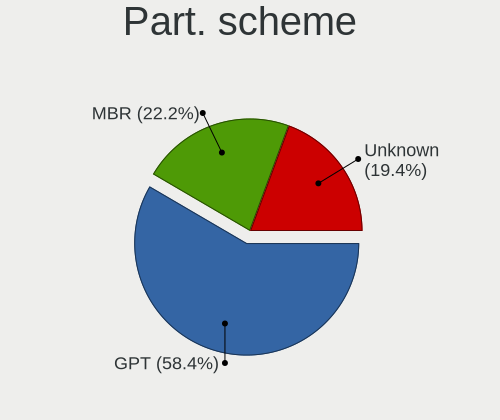
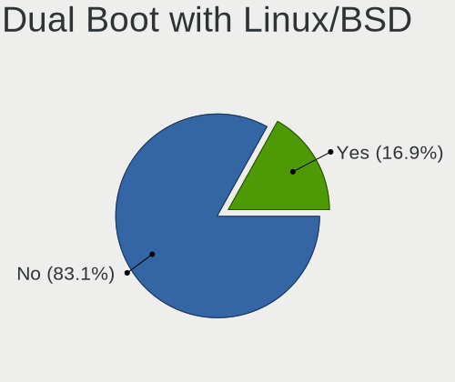
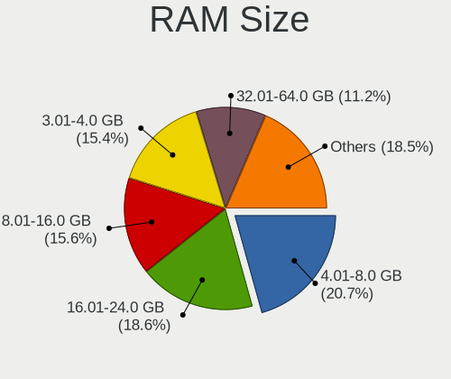
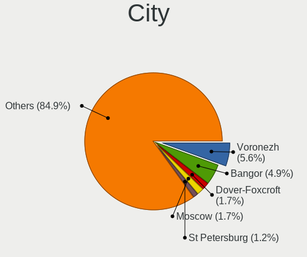
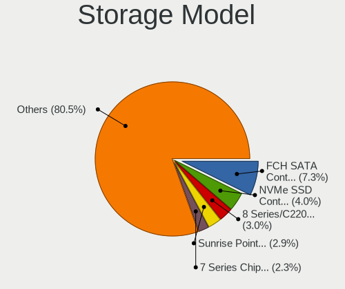
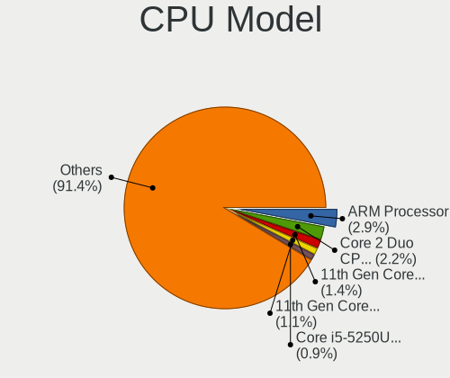

Debian - Tested Hardware & Statistics
-------------------------------------

A project to collect tested hardware configurations for Debian.

Anyone can contribute to this report by the [hw-probe](https://github.com/linuxhw/hw-probe) tool:

    sudo -E hw-probe -all -upload

Please contribute! Especially if your hardware is rare.

This is a report for all computer types. See also reports for [desktops](/Dist/Debian/Desktop/README.md) and [notebooks](/Dist/Debian/Notebook/README.md).

Contents
--------

* [ Test Cases ](#test-cases)

* [ System ](#system)
  - [ OS                       ](#os)
  - [ OS Family                ](#os-family)
  - [ Kernel                   ](#kernel)
  - [ Kernel Family            ](#kernel-family)
  - [ Kernel Major Ver.        ](#kernel-major-ver)
  - [ Arch                     ](#arch)
  - [ DE                       ](#de)
  - [ Display Server           ](#display-server)
  - [ Display Manager          ](#display-manager)
  - [ OS Lang                  ](#os-lang)
  - [ Boot Mode                ](#boot-mode)
  - [ Filesystem               ](#filesystem)
  - [ Part. scheme             ](#part-scheme)
  - [ Dual Boot with Linux/BSD ](#dual-boot-with-linuxbsd)
  - [ Dual Boot (Win)          ](#dual-boot-win)

* [ Board ](#board)
  - [ Vendor                   ](#vendor)
  - [ Model                    ](#model)
  - [ Model Family             ](#model-family)
  - [ MFG Year                 ](#mfg-year)
  - [ Form Factor              ](#form-factor)
  - [ Secure Boot              ](#secure-boot)
  - [ Coreboot                 ](#coreboot)
  - [ RAM Size                 ](#ram-size)
  - [ RAM Used                 ](#ram-used)
  - [ Total Drives             ](#total-drives)
  - [ Has CD-ROM               ](#has-cd-rom)
  - [ Has Ethernet             ](#has-ethernet)
  - [ Has WiFi                 ](#has-wifi)
  - [ Has Bluetooth            ](#has-bluetooth)

* [ Location ](#location)
  - [ Country                  ](#country)
  - [ City                     ](#city)

* [ Drives ](#drives)
  - [ Drive Vendor             ](#drive-vendor)
  - [ Drive Model              ](#drive-model)
  - [ HDD Vendor               ](#hdd-vendor)
  - [ SSD Vendor               ](#ssd-vendor)
  - [ Drive Kind               ](#drive-kind)
  - [ Drive Connector          ](#drive-connector)
  - [ Drive Size               ](#drive-size)
  - [ Space Total              ](#space-total)
  - [ Space Used               ](#space-used)
  - [ Malfunc. Drives          ](#malfunc-drives)
  - [ Malfunc. Drive Vendor    ](#malfunc-drive-vendor)
  - [ Malfunc. HDD Vendor      ](#malfunc-hdd-vendor)
  - [ Malfunc. Drive Kind      ](#malfunc-drive-kind)
  - [ Failed Drives            ](#failed-drives)
  - [ Failed Drive Vendor      ](#failed-drive-vendor)
  - [ Drive Status             ](#drive-status)

* [ Storage controller ](#storage-controller)
  - [ Storage Vendor           ](#storage-vendor)
  - [ Storage Model            ](#storage-model)
  - [ Storage Kind             ](#storage-kind)

* [ Processor ](#processor)
  - [ CPU Vendor               ](#cpu-vendor)
  - [ CPU Model                ](#cpu-model)
  - [ CPU Model Family         ](#cpu-model-family)
  - [ CPU Cores                ](#cpu-cores)
  - [ CPU Sockets              ](#cpu-sockets)
  - [ CPU Threads              ](#cpu-threads)
  - [ CPU Op-Modes             ](#cpu-op-modes)
  - [ CPU Microcode            ](#cpu-microcode)
  - [ CPU Microarch            ](#cpu-microarch)

* [ Graphics ](#graphics)
  - [ GPU Vendor               ](#gpu-vendor)
  - [ GPU Model                ](#gpu-model)
  - [ GPU Combo                ](#gpu-combo)
  - [ GPU Driver               ](#gpu-driver)
  - [ GPU Memory               ](#gpu-memory)

* [ Monitor ](#monitor)
  - [ Monitor Vendor           ](#monitor-vendor)
  - [ Monitor Model            ](#monitor-model)
  - [ Monitor Resolution       ](#monitor-resolution)
  - [ Monitor Diagonal         ](#monitor-diagonal)
  - [ Monitor Width            ](#monitor-width)
  - [ Aspect Ratio             ](#aspect-ratio)
  - [ Monitor Area             ](#monitor-area)
  - [ Pixel Density            ](#pixel-density)
  - [ Multiple Monitors        ](#multiple-monitors)

* [ Network ](#network)
  - [ Net Controller Vendor    ](#net-controller-vendor)
  - [ Net Controller Model     ](#net-controller-model)
  - [ Wireless Vendor          ](#wireless-vendor)
  - [ Wireless Model           ](#wireless-model)
  - [ Ethernet Vendor          ](#ethernet-vendor)
  - [ Ethernet Model           ](#ethernet-model)
  - [ Net Controller Kind      ](#net-controller-kind)
  - [ Used Controller          ](#used-controller)
  - [ NICs                     ](#nics)
  - [ IPv6                     ](#ipv6)

* [ Bluetooth ](#bluetooth)
  - [ Bluetooth Vendor         ](#bluetooth-vendor)
  - [ Bluetooth Model          ](#bluetooth-model)

* [ Sound ](#sound)
  - [ Sound Vendor             ](#sound-vendor)
  - [ Sound Model              ](#sound-model)

* [ Memory ](#memory)
  - [ Memory Vendor            ](#memory-vendor)
  - [ Memory Model             ](#memory-model)
  - [ Memory Kind              ](#memory-kind)
  - [ Memory Form Factor       ](#memory-form-factor)
  - [ Memory Size              ](#memory-size)
  - [ Memory Speed             ](#memory-speed)

* [ Printers & scanners ](#printers--scanners)
  - [ Printer Vendor           ](#printer-vendor)
  - [ Printer Model            ](#printer-model)
  - [ Scanner Vendor           ](#scanner-vendor)
  - [ Scanner Model            ](#scanner-model)

* [ Camera ](#camera)
  - [ Camera Vendor            ](#camera-vendor)
  - [ Camera Model             ](#camera-model)

* [ Security ](#security)
  - [ Fingerprint Vendor       ](#fingerprint-vendor)
  - [ Fingerprint Model        ](#fingerprint-model)
  - [ Chipcard Vendor          ](#chipcard-vendor)
  - [ Chipcard Model           ](#chipcard-model)

* [ Unsupported ](#unsupported)
  - [ Unsupported Devices      ](#unsupported-devices)
  - [ Unsupported Device Types ](#unsupported-device-types)

Test Cases
----------

Total: 24563

| Vendor        | Model                       | Form-Factor | Probe                                                      | Date         |
|---------------|-----------------------------|-------------|------------------------------------------------------------|--------------|
| Gigabyte      | B85M-D3H                    | Desktop     | [27053ca724](https://linux-hardware.org/?probe=27053ca724) | Jan 06, 2025 |
| Apple         | Mac-35C5E08120C7EEAF Mac... | Mini pc     | [70c961d7b8](https://linux-hardware.org/?probe=70c961d7b8) | Jan 06, 2025 |
| ASUSTek       | VivoBook S13 X330FN_S330... | Notebook    | [50ff12c678](https://linux-hardware.org/?probe=50ff12c678) | Jan 06, 2025 |
| Gigabyte      | B85M-D3H                    | Desktop     | [3d3b4d1ab3](https://linux-hardware.org/?probe=3d3b4d1ab3) | Jan 06, 2025 |
| Lenovo        | V15-ADA 82C7                | Notebook    | [c5c9a457aa](https://linux-hardware.org/?probe=c5c9a457aa) | Jan 06, 2025 |
| Lenovo        | ThinkPad L15 Gen 2 20X4S... | Notebook    | [928b89625a](https://linux-hardware.org/?probe=928b89625a) | Jan 06, 2025 |
| Lenovo        | 0B98401 PRO                 | Desktop     | [319423b279](https://linux-hardware.org/?probe=319423b279) | Jan 06, 2025 |
| HP            | Presario CQ57               | Notebook    | [970ab9cc5f](https://linux-hardware.org/?probe=970ab9cc5f) | Jan 06, 2025 |
| Dell          | 0PV3YR A05                  | Server      | [48e00d403a](https://linux-hardware.org/?probe=48e00d403a) | Jan 06, 2025 |
| Positivo B... | VJFE59F11X-B1011H           | Notebook    | [eeea3c518d](https://linux-hardware.org/?probe=eeea3c518d) | Jan 06, 2025 |
| HP            | 81C5 MVB                    | Desktop     | [af63b5ba1c](https://linux-hardware.org/?probe=af63b5ba1c) | Jan 06, 2025 |
| Lenovo        | ThinkPad T14 Gen 3 21AH0... | Notebook    | [d195e02226](https://linux-hardware.org/?probe=d195e02226) | Jan 06, 2025 |
| HP            | 8299                        | Desktop     | [a87a33b9e2](https://linux-hardware.org/?probe=a87a33b9e2) | Jan 06, 2025 |
| Lenovo        | ThinkPad T14 Gen 3 21AH0... | Notebook    | [58b338f268](https://linux-hardware.org/?probe=58b338f268) | Jan 06, 2025 |
| Lenovo        | ThinkPad E475 20H40006US    | Notebook    | [69908d16ca](https://linux-hardware.org/?probe=69908d16ca) | Jan 06, 2025 |
| Acer          | AOD257                      | Notebook    | [48ac1f7a96](https://linux-hardware.org/?probe=48ac1f7a96) | Jan 06, 2025 |
| Lenovo        | ThinkPad E475 20H40006US    | Notebook    | [78b9a699ff](https://linux-hardware.org/?probe=78b9a699ff) | Jan 05, 2025 |
| Lenovo        | ThinkPad T490s 20NYS60C0... | Notebook    | [795bfc1246](https://linux-hardware.org/?probe=795bfc1246) | Jan 05, 2025 |
| HP            | ProLiant DL360 G7           | Server      | [b076cbf109](https://linux-hardware.org/?probe=b076cbf109) | Jan 05, 2025 |
| MSI           | GE60 0NC\0ND                | Notebook    | [423eca6c8c](https://linux-hardware.org/?probe=423eca6c8c) | Jan 05, 2025 |
| OEM           | B75 Ver:1.41                | Desktop     | [72dd3048a2](https://linux-hardware.org/?probe=72dd3048a2) | Jan 05, 2025 |
| Lenovo        | ThinkPad T14 Gen 3 21AH0... | Notebook    | [a40f8a9531](https://linux-hardware.org/?probe=a40f8a9531) | Jan 05, 2025 |
| Lenovo        | ThinkPad X1 Carbon 4th 2... | Notebook    | [8d1fc60351](https://linux-hardware.org/?probe=8d1fc60351) | Jan 05, 2025 |
| Unknown       | Unknown                     | Desktop     | [bfe6d86060](https://linux-hardware.org/?probe=bfe6d86060) | Jan 05, 2025 |
| Unknown       | Unknown                     | Desktop     | [bafe044b60](https://linux-hardware.org/?probe=bafe044b60) | Jan 05, 2025 |
| Supermicro    | X9SRE/X9SRE-3F/X9SRi/X9S... | Server      | [f3d2f362e8](https://linux-hardware.org/?probe=f3d2f362e8) | Jan 05, 2025 |
| Lenovo        | ThinkPad T14 Gen 3 21AH0... | Notebook    | [8e4aafe314](https://linux-hardware.org/?probe=8e4aafe314) | Jan 05, 2025 |
| HP            | 2B38                        | Desktop     | [2ea8b8918b](https://linux-hardware.org/?probe=2ea8b8918b) | Jan 05, 2025 |
| HP            | Presario CQ57               | Notebook    | [8c1782d787](https://linux-hardware.org/?probe=8c1782d787) | Jan 05, 2025 |
| GITSTAR       | GDC-1461                    | Notebook    | [08243d6a0b](https://linux-hardware.org/?probe=08243d6a0b) | Jan 05, 2025 |
| Lenovo        | ThinkPad T480 20L5S1S000    | Notebook    | [c35541e56b](https://linux-hardware.org/?probe=c35541e56b) | Jan 05, 2025 |
| Lenovo        | ThinkPad T14 Gen 5 21MCC... | Notebook    | [6e4f05f56f](https://linux-hardware.org/?probe=6e4f05f56f) | Jan 05, 2025 |
| UNOWHY        | Y13G113S4EI                 | Notebook    | [8d772f9e5a](https://linux-hardware.org/?probe=8d772f9e5a) | Jan 05, 2025 |
| Intel         | NUC8BEB J72693-308          | Mini pc     | [cc4e4ffe1a](https://linux-hardware.org/?probe=cc4e4ffe1a) | Jan 05, 2025 |
| Fujitsu       | D3062-A1 S26361-D3062-A1    | Desktop     | [edc190a229](https://linux-hardware.org/?probe=edc190a229) | Jan 04, 2025 |
| Unknown       | FP7R2AIO                    | All in one  | [7c37fce41a](https://linux-hardware.org/?probe=7c37fce41a) | Jan 04, 2025 |
| Lenovo        | ThinkPad T460 20FMS0EP00    | Notebook    | [438781676d](https://linux-hardware.org/?probe=438781676d) | Jan 04, 2025 |
| Unknown       | FP7R2AIO                    | All in one  | [d64e3db9ce](https://linux-hardware.org/?probe=d64e3db9ce) | Jan 04, 2025 |
| Dell          | 09KPNV A00                  | Desktop     | [d2a1de9dc7](https://linux-hardware.org/?probe=d2a1de9dc7) | Jan 04, 2025 |
| OEM           | B75 Ver:1.41                | Desktop     | [b5e4cb38f7](https://linux-hardware.org/?probe=b5e4cb38f7) | Jan 04, 2025 |
| ASRock        | H61M-DGS                    | Desktop     | [0e1053e06a](https://linux-hardware.org/?probe=0e1053e06a) | Jan 04, 2025 |
| TongFang      | GM5HG0A                     | Notebook    | [7613e29f5b](https://linux-hardware.org/?probe=7613e29f5b) | Jan 04, 2025 |
| ASUSTek       | Z97M-PLUS                   | Desktop     | [92c4bf7d7e](https://linux-hardware.org/?probe=92c4bf7d7e) | Jan 04, 2025 |
| MSI           | B550-A PRO                  | Desktop     | [b689309781](https://linux-hardware.org/?probe=b689309781) | Jan 04, 2025 |
| TongFang      | GM5HG0A                     | Notebook    | [dd74d3e454](https://linux-hardware.org/?probe=dd74d3e454) | Jan 04, 2025 |
| Lenovo        | ThinkPad T560 20FH001RUS    | Notebook    | [00bb35dd31](https://linux-hardware.org/?probe=00bb35dd31) | Jan 04, 2025 |
| HP            | Pavilion Laptop 15-eh1xx... | Notebook    | [24988d9cd8](https://linux-hardware.org/?probe=24988d9cd8) | Jan 04, 2025 |
| Unknown       | Unknown                     | Soc         | [c5274f59f2](https://linux-hardware.org/?probe=c5274f59f2) | Jan 04, 2025 |
| Gigabyte      | B550M DS3H                  | Desktop     | [a917c66504](https://linux-hardware.org/?probe=a917c66504) | Jan 04, 2025 |
| ASUSTek       | PRIME A320M-K               | Desktop     | [76cfde7dc3](https://linux-hardware.org/?probe=76cfde7dc3) | Jan 04, 2025 |
| Apple         | MacBookPro14,3              | Notebook    | [f0fd4c6916](https://linux-hardware.org/?probe=f0fd4c6916) | Jan 04, 2025 |
| Lenovo        | ThinkPad E475 20H40006US    | Notebook    | [1f287326ed](https://linux-hardware.org/?probe=1f287326ed) | Jan 04, 2025 |
| Lenovo        | IdeaPad 110-15ACL 80TJ      | Notebook    | [976937be1b](https://linux-hardware.org/?probe=976937be1b) | Jan 04, 2025 |
| Apple         | MacBookPro14,3              | Notebook    | [bb8ec4a124](https://linux-hardware.org/?probe=bb8ec4a124) | Jan 04, 2025 |
| Lenovo        | ThinkPad E475 20H40006US    | Notebook    | [74d7973a3d](https://linux-hardware.org/?probe=74d7973a3d) | Jan 03, 2025 |
| Dell          | Vostro 3520                 | Notebook    | [77b90abaf0](https://linux-hardware.org/?probe=77b90abaf0) | Jan 03, 2025 |
| Samsung       | 940XGK                      | Notebook    | [71e577e3c1](https://linux-hardware.org/?probe=71e577e3c1) | Jan 03, 2025 |
| ASUSTek       | Pro B560M-C                 | Desktop     | [00895d3b67](https://linux-hardware.org/?probe=00895d3b67) | Jan 03, 2025 |
| ASUSTek       | M5A97 R2.0                  | Desktop     | [a671d43d86](https://linux-hardware.org/?probe=a671d43d86) | Jan 03, 2025 |
| Raspberry ... | Raspberry Pi 4 Model B R... | Soc         | [b5468ebfdc](https://linux-hardware.org/?probe=b5468ebfdc) | Jan 03, 2025 |
| ASUSTek       | U56E                        | Notebook    | [e777c929c0](https://linux-hardware.org/?probe=e777c929c0) | Jan 03, 2025 |
| HP            | 3399                        | Desktop     | [1371b1c64d](https://linux-hardware.org/?probe=1371b1c64d) | Jan 03, 2025 |
| ASUSTek       | ASUS Vivobook S 14 M5406... | Notebook    | [c1bc9188a7](https://linux-hardware.org/?probe=c1bc9188a7) | Jan 03, 2025 |
| Dell          | 0HHV7N A00                  | Desktop     | [25ccd84cbc](https://linux-hardware.org/?probe=25ccd84cbc) | Jan 03, 2025 |
| ASUSTek       | PRIME A320M-K               | Desktop     | [65588fd6c1](https://linux-hardware.org/?probe=65588fd6c1) | Jan 03, 2025 |
| Lenovo        | Legion 5 Pro 16IAH7H 82R... | Notebook    | [5bf46c517c](https://linux-hardware.org/?probe=5bf46c517c) | Jan 03, 2025 |
| Lenovo        | Legion 5 Pro 16IAH7H 82R... | Notebook    | [763d34b165](https://linux-hardware.org/?probe=763d34b165) | Jan 03, 2025 |
| HP            | 339A                        | Desktop     | [37e08931cc](https://linux-hardware.org/?probe=37e08931cc) | Jan 03, 2025 |
| Dell          | 0F6X5P A00                  | Desktop     | [7cad62d105](https://linux-hardware.org/?probe=7cad62d105) | Jan 03, 2025 |
| Dell          | 0F6X5P A00                  | Desktop     | [2014bb07e8](https://linux-hardware.org/?probe=2014bb07e8) | Jan 03, 2025 |
| Dell          | 0F6X5P A00                  | Desktop     | [1fc923f99b](https://linux-hardware.org/?probe=1fc923f99b) | Jan 03, 2025 |
| Samsung       | RC530/RC730                 | Notebook    | [e7b266b86e](https://linux-hardware.org/?probe=e7b266b86e) | Jan 03, 2025 |
| Acer          | Aspire 5741G                | Notebook    | [3785e1f57b](https://linux-hardware.org/?probe=3785e1f57b) | Jan 03, 2025 |
| ASUSTek       | PRIME B350M-A               | Desktop     | [014692b809](https://linux-hardware.org/?probe=014692b809) | Jan 03, 2025 |
| HP            | 0B4Ch D                     | Desktop     | [689bb32b5c](https://linux-hardware.org/?probe=689bb32b5c) | Jan 03, 2025 |
| CWWK          | CW-AD4L-N V1                | Desktop     | [ed9e661757](https://linux-hardware.org/?probe=ed9e661757) | Jan 03, 2025 |
| Dell          | Inspiron 14 5425            | Notebook    | [573be124f2](https://linux-hardware.org/?probe=573be124f2) | Jan 03, 2025 |
| Google        | Dragonair                   | Notebook    | [69b034d6b7](https://linux-hardware.org/?probe=69b034d6b7) | Jan 03, 2025 |
| Lenovo        | Yoga Slim 7 14IMH9 83CV     | Notebook    | [efa06f4775](https://linux-hardware.org/?probe=efa06f4775) | Jan 03, 2025 |
| HP            | ProLiant ML150 G6           | Desktop     | [d281d0b24d](https://linux-hardware.org/?probe=d281d0b24d) | Jan 03, 2025 |
| Google        | Chell                       | Notebook    | [165f302be9](https://linux-hardware.org/?probe=165f302be9) | Jan 03, 2025 |
| Dell          | Inspiron 5405               | Notebook    | [e6c57490c8](https://linux-hardware.org/?probe=e6c57490c8) | Jan 02, 2025 |
| HP            | ProLiant MicroServer        | Desktop     | [f99b996d05](https://linux-hardware.org/?probe=f99b996d05) | Jan 02, 2025 |
| HP            | ProLiant MicroServer        | Desktop     | [74107b78f7](https://linux-hardware.org/?probe=74107b78f7) | Jan 02, 2025 |
| Raspberry ... | Raspberry Pi 5 Model B R... | Soc         | [d769297945](https://linux-hardware.org/?probe=d769297945) | Jan 02, 2025 |
| ASUSTek       | Vivobook Go E1404FA_E140... | Notebook    | [d65b464077](https://linux-hardware.org/?probe=d65b464077) | Jan 02, 2025 |
| ASUSTek       | ROG Strix G713PI_G713PI     | Notebook    | [d086aef8fc](https://linux-hardware.org/?probe=d086aef8fc) | Jan 02, 2025 |
| HP            | ENVY Laptop 13-ah0xxx       | Notebook    | [2bf35e6afa](https://linux-hardware.org/?probe=2bf35e6afa) | Jan 02, 2025 |
| Lenovo        | ThinkPad P14s Gen 4 21K5... | Notebook    | [419e7b4071](https://linux-hardware.org/?probe=419e7b4071) | Jan 02, 2025 |
| Lenovo        | ThinkCentre M93p            | Desktop     | [3a7e0b811f](https://linux-hardware.org/?probe=3a7e0b811f) | Jan 02, 2025 |
| Dell          | Precision 5530              | Notebook    | [5913ba1fdc](https://linux-hardware.org/?probe=5913ba1fdc) | Jan 02, 2025 |
| Raspberry ... | Raspberry Pi 3 Model B P... | Soc         | [15906a9eaa](https://linux-hardware.org/?probe=15906a9eaa) | Jan 02, 2025 |
| ASUSTek       | TUF B450M-PLUS GAMING       | Desktop     | [5058b592ae](https://linux-hardware.org/?probe=5058b592ae) | Jan 02, 2025 |
| ASUSTek       | M5A97 R2.0                  | Desktop     | [bb11de9504](https://linux-hardware.org/?probe=bb11de9504) | Jan 02, 2025 |
| Gigabyte      | B460M DS3H V2               | Desktop     | [f3f3a540d4](https://linux-hardware.org/?probe=f3f3a540d4) | Jan 02, 2025 |
| Google        | Ekko                        | Notebook    | [865ffecf0e](https://linux-hardware.org/?probe=865ffecf0e) | Jan 02, 2025 |
| Google        | Ekko                        | Notebook    | [54fbbe0cfb](https://linux-hardware.org/?probe=54fbbe0cfb) | Jan 01, 2025 |
| Gigabyte      | GA-970A-UD3                 | Desktop     | [92b3ee2679](https://linux-hardware.org/?probe=92b3ee2679) | Jan 01, 2025 |
| MSI           | B150M MORTAR                | Desktop     | [798c953e09](https://linux-hardware.org/?probe=798c953e09) | Jan 01, 2025 |
| MSI           | PRO B760-P WIFI DDR4        | Desktop     | [5b2124b8e7](https://linux-hardware.org/?probe=5b2124b8e7) | Jan 01, 2025 |
| GITSTAR       | GDC-1461                    | Notebook    | [e2fee21ed2](https://linux-hardware.org/?probe=e2fee21ed2) | Jan 01, 2025 |
| Dell          | XPS 9315                    | Notebook    | [1620c81455](https://linux-hardware.org/?probe=1620c81455) | Jan 01, 2025 |
| Dell          | 04Y8V0 A02                  | Desktop     | [2864d95f71](https://linux-hardware.org/?probe=2864d95f71) | Jan 01, 2025 |
| Dell          | 04Y8V0 A02                  | Desktop     | [dd5b8644a1](https://linux-hardware.org/?probe=dd5b8644a1) | Jan 01, 2025 |
| Dell          | Precision 5530              | Notebook    | [64afde2c05](https://linux-hardware.org/?probe=64afde2c05) | Jan 01, 2025 |
| HP            | Laptop 15s-du1xxx           | Notebook    | [5029ac1a06](https://linux-hardware.org/?probe=5029ac1a06) | Jan 01, 2025 |
| Dell          | 0PV3YR A05                  | Server      | [0252731c50](https://linux-hardware.org/?probe=0252731c50) | Jan 01, 2025 |
| Gigabyte      | B85M-D3H                    | Desktop     | [1766ca8469](https://linux-hardware.org/?probe=1766ca8469) | Jan 01, 2025 |
| Dell          | Latitude 5480               | Notebook    | [d4da596a26](https://linux-hardware.org/?probe=d4da596a26) | Jan 01, 2025 |
| Unknown       | Unknown                     | Desktop     | [209186df09](https://linux-hardware.org/?probe=209186df09) | Jan 01, 2025 |
| Gigabyte      | B85M-D3H                    | Desktop     | [b52a4bed1c](https://linux-hardware.org/?probe=b52a4bed1c) | Dec 31, 2024 |
| ASUSTek       | TUF Gaming Z790-PLUS WIF... | Desktop     | [cdbb6290eb](https://linux-hardware.org/?probe=cdbb6290eb) | Dec 31, 2024 |
| HP            | 8299                        | Desktop     | [dc5728b605](https://linux-hardware.org/?probe=dc5728b605) | Dec 31, 2024 |
| HP            | ENVY x360 Convertible 13... | Convertible | [8bf9b1ce8c](https://linux-hardware.org/?probe=8bf9b1ce8c) | Dec 31, 2024 |
| HP            | EliteBook 830 G5            | Notebook    | [8382fe388f](https://linux-hardware.org/?probe=8382fe388f) | Dec 31, 2024 |
| HP            | EliteBook 830 G5            | Notebook    | [a61a178741](https://linux-hardware.org/?probe=a61a178741) | Dec 31, 2024 |
| HP            | ProBook 440 G2              | Notebook    | [8f1c0b45da](https://linux-hardware.org/?probe=8f1c0b45da) | Dec 31, 2024 |
| HP            | ProBook 440 G2              | Notebook    | [98d64b84a8](https://linux-hardware.org/?probe=98d64b84a8) | Dec 31, 2024 |
| Loongson      | CTCI02LS3A6000C-K CTCI V... | Desktop     | [b6f0fc1399](https://linux-hardware.org/?probe=b6f0fc1399) | Dec 31, 2024 |
| ASUSTek       | PRIME Z490-A                | Desktop     | [f1762af529](https://linux-hardware.org/?probe=f1762af529) | Dec 31, 2024 |
| ASUSTek       | ProArt X870E-CREATOR WIF... | Desktop     | [682520faf1](https://linux-hardware.org/?probe=682520faf1) | Dec 31, 2024 |
| Unknown       | Unknown                     | Soc         | [8d3dea2269](https://linux-hardware.org/?probe=8d3dea2269) | Dec 31, 2024 |
| Acer          | Nitro AN515-51              | Notebook    | [3555e1e029](https://linux-hardware.org/?probe=3555e1e029) | Dec 31, 2024 |
| Dell          | 0PV3YR A05                  | Server      | [05ae3d9e19](https://linux-hardware.org/?probe=05ae3d9e19) | Dec 31, 2024 |
| AMI           | Intel                       | Desktop     | [40322fe630](https://linux-hardware.org/?probe=40322fe630) | Dec 31, 2024 |
| ASUSTek       | Pro B560M-C                 | Desktop     | [0d9d36f397](https://linux-hardware.org/?probe=0d9d36f397) | Dec 30, 2024 |
| ASUSTek       | VivoBook_ASUSLaptop X580... | Notebook    | [994b1d92c5](https://linux-hardware.org/?probe=994b1d92c5) | Dec 30, 2024 |
| Dell          | XPS 17 9730                 | Notebook    | [216ff4e7eb](https://linux-hardware.org/?probe=216ff4e7eb) | Dec 30, 2024 |
| Packard Be... | EasyNote_MX45               | Notebook    | [e696c77b8f](https://linux-hardware.org/?probe=e696c77b8f) | Dec 30, 2024 |
| ASUSTek       | PRIME B650-PLUS             | Desktop     | [d94ee9a862](https://linux-hardware.org/?probe=d94ee9a862) | Dec 30, 2024 |
| Dell          | Precision 5530              | Notebook    | [b9cd482095](https://linux-hardware.org/?probe=b9cd482095) | Dec 30, 2024 |
| Lenovo        | ThinkPad T430 2349TFK       | Notebook    | [976885ff78](https://linux-hardware.org/?probe=976885ff78) | Dec 30, 2024 |
| Gigabyte      | B460M DS3H V2               | Desktop     | [2bb09385c0](https://linux-hardware.org/?probe=2bb09385c0) | Dec 30, 2024 |
| Fujitsu Si... | D2348-A3 S26361-D2348-A3    | Desktop     | [88cfef1da9](https://linux-hardware.org/?probe=88cfef1da9) | Dec 30, 2024 |
| ASRock        | 990FX Extreme4              | Desktop     | [4b37ae65f2](https://linux-hardware.org/?probe=4b37ae65f2) | Dec 30, 2024 |
| Unknown       | Unknown                     | Desktop     | [ea27b3376d](https://linux-hardware.org/?probe=ea27b3376d) | Dec 30, 2024 |
| Gigabyte      | X670 AORUS ELITE AX         | Desktop     | [ad6953ff2e](https://linux-hardware.org/?probe=ad6953ff2e) | Dec 30, 2024 |
| AMI           | Intel                       | Desktop     | [92f821a69c](https://linux-hardware.org/?probe=92f821a69c) | Dec 30, 2024 |
| HP            | EliteBook 660 16 inch G1... | Notebook    | [97a21cd2b9](https://linux-hardware.org/?probe=97a21cd2b9) | Dec 30, 2024 |
| Raspberry ... | Raspberry Pi 400 Rev 1.0    | Soc         | [3a664eb92f](https://linux-hardware.org/?probe=3a664eb92f) | Dec 29, 2024 |
| Unknown       | Orange Pi 5 Pro             | Soc         | [b77549122f](https://linux-hardware.org/?probe=b77549122f) | Dec 29, 2024 |
| Raspberry ... | Raspberry Pi 5 Model B R... | Soc         | [5326be3af7](https://linux-hardware.org/?probe=5326be3af7) | Dec 29, 2024 |
| Apple         | MacBookPro9,2               | Notebook    | [3cda74dca1](https://linux-hardware.org/?probe=3cda74dca1) | Dec 29, 2024 |
| HP            | 255 G7 Notebook PC          | Notebook    | [c4f95fe88f](https://linux-hardware.org/?probe=c4f95fe88f) | Dec 29, 2024 |
| Gigabyte      | B560M AORUS ELITE           | Desktop     | [408b834306](https://linux-hardware.org/?probe=408b834306) | Dec 29, 2024 |
| Lenovo        | ThinkPad E490 20N8CTO1WW    | Notebook    | [61fe1222c2](https://linux-hardware.org/?probe=61fe1222c2) | Dec 29, 2024 |
| Lenovo        | IdeaPad 330-15ARR 81D2      | Notebook    | [0ce672d09f](https://linux-hardware.org/?probe=0ce672d09f) | Dec 29, 2024 |
| ASUSTek       | VivoBook_ASUSLaptop M160... | Notebook    | [dc70a933c3](https://linux-hardware.org/?probe=dc70a933c3) | Dec 29, 2024 |
| Unknown       | Unknown                     | Server      | [122b21a8e4](https://linux-hardware.org/?probe=122b21a8e4) | Dec 29, 2024 |
| Packard Be... | EasyNote_MX45               | Notebook    | [8ef7bf6e6d](https://linux-hardware.org/?probe=8ef7bf6e6d) | Dec 29, 2024 |
| ICP / iEi     | SA16 V1.00                  | Desktop     | [6c89b49dd8](https://linux-hardware.org/?probe=6c89b49dd8) | Dec 29, 2024 |
| HP            | ENVY x360 2-in-1 Laptop ... | Convertible | [e565ebfee3](https://linux-hardware.org/?probe=e565ebfee3) | Dec 29, 2024 |
| Gigabyte      | GB-BER7-5700                | Desktop     | [915da57e07](https://linux-hardware.org/?probe=915da57e07) | Dec 29, 2024 |
| Dell          | 08WXMX A02                  | Desktop     | [81f35b96d9](https://linux-hardware.org/?probe=81f35b96d9) | Dec 29, 2024 |
| Raspberry ... | Raspberry Pi 5 Model B R... | Soc         | [58e1d1052c](https://linux-hardware.org/?probe=58e1d1052c) | Dec 29, 2024 |
| sunxi         | FriendlyARM NanoPi NEO      | Soc         | [e898c23a51](https://linux-hardware.org/?probe=e898c23a51) | Dec 29, 2024 |
| Lenovo        | IdeaPadFlex 5 14ABR8 82X... | Convertible | [a5a6ea1389](https://linux-hardware.org/?probe=a5a6ea1389) | Dec 29, 2024 |
| MSI           | MPG B550 GAMING EDGE WIF... | Desktop     | [ea3e3598c1](https://linux-hardware.org/?probe=ea3e3598c1) | Dec 29, 2024 |
| Lenovo        | IdeaPad Y700-15ISK 80NV     | Notebook    | [4122ae81a0](https://linux-hardware.org/?probe=4122ae81a0) | Dec 29, 2024 |
| Lenovo        | LOQ 16APH8 82XU             | Notebook    | [1a6aebd2e4](https://linux-hardware.org/?probe=1a6aebd2e4) | Dec 29, 2024 |
| MSI           | PRO Z790-VC WIFI            | Desktop     | [536d20f5de](https://linux-hardware.org/?probe=536d20f5de) | Dec 29, 2024 |
| HP            | 21D0                        | Desktop     | [33452ea42c](https://linux-hardware.org/?probe=33452ea42c) | Dec 28, 2024 |
| Shenzhen M... | F7BSC                       | Mini pc     | [fe538f1976](https://linux-hardware.org/?probe=fe538f1976) | Dec 28, 2024 |
| ASUSTek       | Zenbook UX3402ZA            | Notebook    | [be06529f29](https://linux-hardware.org/?probe=be06529f29) | Dec 28, 2024 |
| HP            | 845A                        | Desktop     | [c79d5baf3e](https://linux-hardware.org/?probe=c79d5baf3e) | Dec 28, 2024 |
| Supermicro    | X8DTU                       | Server      | [6918605d42](https://linux-hardware.org/?probe=6918605d42) | Dec 28, 2024 |
| MSI           | MAG B660 TOMAHAWK WIFI D... | Desktop     | [84f3fb88dd](https://linux-hardware.org/?probe=84f3fb88dd) | Dec 28, 2024 |
| MSI           | MS-16F1                     | Notebook    | [9906c1fa28](https://linux-hardware.org/?probe=9906c1fa28) | Dec 28, 2024 |
| Acer          | Aspire A315-54K             | Notebook    | [9d416da92a](https://linux-hardware.org/?probe=9d416da92a) | Dec 28, 2024 |
| Fujitsu Si... | ESPRIMO Mobile V5555        | Notebook    | [e443699b8d](https://linux-hardware.org/?probe=e443699b8d) | Dec 28, 2024 |
| ASRock        | J5040-ITX                   | Desktop     | [cfe9a3c37e](https://linux-hardware.org/?probe=cfe9a3c37e) | Dec 28, 2024 |
| Lenovo        | ThinkBook 16 G6 IRL 21KH    | Notebook    | [caa200d745](https://linux-hardware.org/?probe=caa200d745) | Dec 28, 2024 |
| ASUSTek       | ASUS TUF Gaming A17 FA70... | Notebook    | [2831363437](https://linux-hardware.org/?probe=2831363437) | Dec 28, 2024 |
| Raspberry ... | Raspberry Pi 2 Model B R... | Soc         | [0567331b7f](https://linux-hardware.org/?probe=0567331b7f) | Dec 28, 2024 |
| Raspberry ... | Raspberry Pi 4 Model B R... | Soc         | [0d73d730f6](https://linux-hardware.org/?probe=0d73d730f6) | Dec 28, 2024 |
| Alienware     | M17xR3                      | Notebook    | [2363abbe5c](https://linux-hardware.org/?probe=2363abbe5c) | Dec 28, 2024 |
| Lenovo        | 1056 SDK0T76557 WIN 3915... | Desktop     | [9f23de610a](https://linux-hardware.org/?probe=9f23de610a) | Dec 28, 2024 |
| HP            | Compaq Mini 311-1100        | Notebook    | [bb10d0f283](https://linux-hardware.org/?probe=bb10d0f283) | Dec 28, 2024 |
| Gigabyte      | B460M DS3H V2               | Desktop     | [b85d81f6b7](https://linux-hardware.org/?probe=b85d81f6b7) | Dec 28, 2024 |
| Dell          | 0FG011                      | Desktop     | [2056b909f7](https://linux-hardware.org/?probe=2056b909f7) | Dec 28, 2024 |
| HP            | EliteBook Revolve 810 G3    | Notebook    | [e75ee3d7ac](https://linux-hardware.org/?probe=e75ee3d7ac) | Dec 28, 2024 |
| Intel         | S5000VSA                    | Server      | [ec199dc348](https://linux-hardware.org/?probe=ec199dc348) | Dec 27, 2024 |
| Intel         | NUC12WSBi7 M46422-302       | Mini pc     | [72c75ed73b](https://linux-hardware.org/?probe=72c75ed73b) | Dec 27, 2024 |
| Lenovo        | ThinkPad P1 20MES1V800      | Notebook    | [1241156e04](https://linux-hardware.org/?probe=1241156e04) | Dec 27, 2024 |
| Lenovo        | IdeaPad 5 2-in-1 14AHP9 ... | Convertible | [759077cb3e](https://linux-hardware.org/?probe=759077cb3e) | Dec 27, 2024 |
| Gigabyte      | A520I AC                    | Desktop     | [1574cc05d9](https://linux-hardware.org/?probe=1574cc05d9) | Dec 27, 2024 |
| Insyde        | Purley                      | Server      | [943c34d6fe](https://linux-hardware.org/?probe=943c34d6fe) | Dec 27, 2024 |
| Intel         | S5520UR E22554-751          | Server      | [e32d8048dd](https://linux-hardware.org/?probe=e32d8048dd) | Dec 27, 2024 |
| Insyde        | Purley                      | Server      | [0a1ed074fe](https://linux-hardware.org/?probe=0a1ed074fe) | Dec 27, 2024 |
| Dell          | Venue 11 Pro 7140           | Notebook    | [a91398af2a](https://linux-hardware.org/?probe=a91398af2a) | Dec 27, 2024 |
| Dell          | XPS L701X                   | Notebook    | [6cd016a478](https://linux-hardware.org/?probe=6cd016a478) | Dec 27, 2024 |
| Dell          | 0JP3NX A01                  | Desktop     | [84b0bca79f](https://linux-hardware.org/?probe=84b0bca79f) | Dec 27, 2024 |
| IBM           | 94Y7718 SIT                 | Server      | [133f7bc9a5](https://linux-hardware.org/?probe=133f7bc9a5) | Dec 27, 2024 |
| IBM           | 69Y1006 SIT                 | Server      | [31413f8015](https://linux-hardware.org/?probe=31413f8015) | Dec 27, 2024 |
| HP            | 15 TouchSmart               | Notebook    | [dbea1582fb](https://linux-hardware.org/?probe=dbea1582fb) | Dec 27, 2024 |
| Acer          | Swift SF314-511             | Notebook    | [f0e61d80d6](https://linux-hardware.org/?probe=f0e61d80d6) | Dec 27, 2024 |
| Lenovo        | ThinkPad P1 20MES1V800      | Notebook    | [0bd80b0050](https://linux-hardware.org/?probe=0bd80b0050) | Dec 27, 2024 |
| Gigabyte      | 970A-DS3P                   | Desktop     | [127d67d58a](https://linux-hardware.org/?probe=127d67d58a) | Dec 27, 2024 |
| Dell          | Precision 7520              | Notebook    | [ad770a5b2a](https://linux-hardware.org/?probe=ad770a5b2a) | Dec 27, 2024 |
| ASRock        | 990FX Extreme4              | Desktop     | [ae4ac86e01](https://linux-hardware.org/?probe=ae4ac86e01) | Dec 27, 2024 |
| Lenovo        | ThinkPad E14 Gen 3 20Y70... | Notebook    | [9f0e63713d](https://linux-hardware.org/?probe=9f0e63713d) | Dec 27, 2024 |
| Lenovo        | 3317 SDK0T76463 WIN 3422... | Desktop     | [05481678ba](https://linux-hardware.org/?probe=05481678ba) | Dec 27, 2024 |
| Lenovo        | ThinkPad T490 20N3S64400    | Notebook    | [86b8ea0471](https://linux-hardware.org/?probe=86b8ea0471) | Dec 27, 2024 |
| Loongson      | CTCI02LS3A6000C-K CTCI V... | Desktop     | [0cc3198ea4](https://linux-hardware.org/?probe=0cc3198ea4) | Dec 27, 2024 |
| Haier         | ZEB19 V1.1                  | Desktop     | [fa29b7de8f](https://linux-hardware.org/?probe=fa29b7de8f) | Dec 27, 2024 |
| AZW           | LZX TBD                     | Desktop     | [92975fb393](https://linux-hardware.org/?probe=92975fb393) | Dec 27, 2024 |
| AZW           | LZX TBD                     | Desktop     | [7bad615f3c](https://linux-hardware.org/?probe=7bad615f3c) | Dec 27, 2024 |
| AZW           | LZX TBD                     | Desktop     | [ea53b402e4](https://linux-hardware.org/?probe=ea53b402e4) | Dec 27, 2024 |
| GITSTAR       | GDC-1461                    | Notebook    | [5d52d6cbb3](https://linux-hardware.org/?probe=5d52d6cbb3) | Dec 27, 2024 |
| Shanghai Z... | ZXE CRB                     | Notebook    | [b1723d54f1](https://linux-hardware.org/?probe=b1723d54f1) | Dec 27, 2024 |
| Shanghai Z... | ZXE CRB                     | Notebook    | [b991e63212](https://linux-hardware.org/?probe=b991e63212) | Dec 27, 2024 |
| Shanghai Z... | ZXE CRB                     | Notebook    | [6d28566eaf](https://linux-hardware.org/?probe=6d28566eaf) | Dec 27, 2024 |
| Shanghai Z... | ZXE CRB                     | Notebook    | [af6004637f](https://linux-hardware.org/?probe=af6004637f) | Dec 27, 2024 |
| GITSTAR       | GDC-1461                    | Notebook    | [d3d0e4ef66](https://linux-hardware.org/?probe=d3d0e4ef66) | Dec 27, 2024 |
| Morshow       | CB01 V100                   | Notebook    | [0f58cef0a2](https://linux-hardware.org/?probe=0f58cef0a2) | Dec 27, 2024 |
| Lenovo        | 1038 SDK0Q40104 WIN 3305... | Server      | [cafaee2fc7](https://linux-hardware.org/?probe=cafaee2fc7) | Dec 27, 2024 |
| ASRock        | B450M Pro4-F                | Desktop     | [932175112d](https://linux-hardware.org/?probe=932175112d) | Dec 27, 2024 |
| ASRock        | Z97X Killer                 | Desktop     | [447cd42486](https://linux-hardware.org/?probe=447cd42486) | Dec 26, 2024 |
| Intel         | NUC7i5BNB J31144-314        | Mini pc     | [d06adf16e1](https://linux-hardware.org/?probe=d06adf16e1) | Dec 26, 2024 |
| ASUSTek       | ASUS TUF Gaming A17 FA70... | Notebook    | [ae31e6ad1c](https://linux-hardware.org/?probe=ae31e6ad1c) | Dec 26, 2024 |
| Acer          | Aspire ES1-311              | Notebook    | [d4cf291b46](https://linux-hardware.org/?probe=d4cf291b46) | Dec 26, 2024 |
| AZW           | MINI S                      | Desktop     | [b73091a664](https://linux-hardware.org/?probe=b73091a664) | Dec 26, 2024 |
| MSI           | P45 Neo3                    | Desktop     | [4952d3011f](https://linux-hardware.org/?probe=4952d3011f) | Dec 26, 2024 |
| Dell          | 0F3KHR A01                  | Desktop     | [2a4ad29ef8](https://linux-hardware.org/?probe=2a4ad29ef8) | Dec 26, 2024 |
| Fujitsu       | D3099-B1 S26361-D3099-B1... | Server      | [ed6a47b6f9](https://linux-hardware.org/?probe=ed6a47b6f9) | Dec 26, 2024 |
| ASUSTek       | G53SW                       | Notebook    | [89009e0426](https://linux-hardware.org/?probe=89009e0426) | Dec 26, 2024 |
| ASUSTek       | NUC12WSB-M 60AS00F0-MB5A... | Mini pc     | [0da8180c1f](https://linux-hardware.org/?probe=0da8180c1f) | Dec 26, 2024 |
| Shuttle       | NC03U                       | Notebook    | [7262526f1a](https://linux-hardware.org/?probe=7262526f1a) | Dec 26, 2024 |
| Intel         | NUC8BEB J72692-309          | Mini pc     | [31f432f98b](https://linux-hardware.org/?probe=31f432f98b) | Dec 26, 2024 |
| ASUSTek       | VivoBook_ASUSLaptop K360... | Notebook    | [4c2cba015f](https://linux-hardware.org/?probe=4c2cba015f) | Dec 26, 2024 |
| GEEKOM        | A5                          | Desktop     | [2bdc0b3030](https://linux-hardware.org/?probe=2bdc0b3030) | Dec 26, 2024 |
| HP            | EliteBook 8460p             | Notebook    | [0916dd5986](https://linux-hardware.org/?probe=0916dd5986) | Dec 25, 2024 |
| Lenovo        | V15 G3 ABA 82TV             | Notebook    | [75b2764000](https://linux-hardware.org/?probe=75b2764000) | Dec 25, 2024 |
| MSI           | PRO B650-P WIFI             | Desktop     | [0a8d8bc701](https://linux-hardware.org/?probe=0a8d8bc701) | Dec 25, 2024 |
| MSI           | Z370-A PRO                  | Desktop     | [9ce2977625](https://linux-hardware.org/?probe=9ce2977625) | Dec 25, 2024 |
| ASUSTek       | VivoBook_ASUSLaptop K360... | Notebook    | [fcb6f7fe6c](https://linux-hardware.org/?probe=fcb6f7fe6c) | Dec 25, 2024 |
| TB            | WTR R1                      | Desktop     | [587979f8d3](https://linux-hardware.org/?probe=587979f8d3) | Dec 25, 2024 |
| Gigabyte      | B450M DS3H V2               | Desktop     | [9bb72b7cbd](https://linux-hardware.org/?probe=9bb72b7cbd) | Dec 25, 2024 |
| Samsung       | 750XGK                      | Notebook    | [178e559f24](https://linux-hardware.org/?probe=178e559f24) | Dec 25, 2024 |
| ZOTAC         | NM10                        | Desktop     | [48bdd764c8](https://linux-hardware.org/?probe=48bdd764c8) | Dec 25, 2024 |
| HP            | 1998                        | Desktop     | [5cbefdf3a2](https://linux-hardware.org/?probe=5cbefdf3a2) | Dec 25, 2024 |
| Lenovo        | 317C SDK0J40700 WIN 3258... | Desktop     | [0ab0a286ad](https://linux-hardware.org/?probe=0ab0a286ad) | Dec 25, 2024 |
| HP            | ENVY m7                     | Notebook    | [1eae0d7a3f](https://linux-hardware.org/?probe=1eae0d7a3f) | Dec 25, 2024 |
| Unknown       | Unknown                     | Notebook    | [e3c37d254f](https://linux-hardware.org/?probe=e3c37d254f) | Dec 25, 2024 |
| Lenovo        | ThinkPad P53 20QQS5WG00     | Notebook    | [8afcf6a4e5](https://linux-hardware.org/?probe=8afcf6a4e5) | Dec 25, 2024 |
| ASUSTek       | M5A97 PLUS                  | Desktop     | [a3e4e7043e](https://linux-hardware.org/?probe=a3e4e7043e) | Dec 25, 2024 |
| Apple         | Mac-F2268DC8                | All in one  | [e82b0c22fb](https://linux-hardware.org/?probe=e82b0c22fb) | Dec 24, 2024 |
| EVGA          | 122-CK-NF68 2               | Desktop     | [a7af4d0592](https://linux-hardware.org/?probe=a7af4d0592) | Dec 24, 2024 |
| Dell          | Latitude 7480               | Notebook    | [faa26e30d0](https://linux-hardware.org/?probe=faa26e30d0) | Dec 24, 2024 |
| ASUSTek       | Vivobook Go E1404FA_E140... | Notebook    | [b67b195148](https://linux-hardware.org/?probe=b67b195148) | Dec 24, 2024 |
| Gigabyte      | H370M D3H-CF                | Desktop     | [293052fc3b](https://linux-hardware.org/?probe=293052fc3b) | Dec 24, 2024 |
| HP            | Pavilion dv6                | Notebook    | [db20c486f1](https://linux-hardware.org/?probe=db20c486f1) | Dec 24, 2024 |
| Raspberry ... | Raspberry Pi 5 Model B R... | Soc         | [099d0b6f62](https://linux-hardware.org/?probe=099d0b6f62) | Dec 24, 2024 |
| Gigabyte      | B450M DS3H V2               | Desktop     | [ad7ff9155c](https://linux-hardware.org/?probe=ad7ff9155c) | Dec 24, 2024 |
| Schenker      | XMG Mobile A507 VE          | Notebook    | [883657a313](https://linux-hardware.org/?probe=883657a313) | Dec 24, 2024 |
| Dell          | XPS 13 9300                 | Notebook    | [496f49c231](https://linux-hardware.org/?probe=496f49c231) | Dec 24, 2024 |
| Dell          | 0HGFJM A00                  | Desktop     | [f849a74d2e](https://linux-hardware.org/?probe=f849a74d2e) | Dec 24, 2024 |
| ASRock        | B760M Pro RS/D4 WiFi        | Desktop     | [9c915961fc](https://linux-hardware.org/?probe=9c915961fc) | Dec 24, 2024 |
| Gigabyte      | B450M DS3H-CF               | Desktop     | [cf730d4359](https://linux-hardware.org/?probe=cf730d4359) | Dec 24, 2024 |
| AZW           | GTR V01                     | Mini pc     | [2f81ae96b1](https://linux-hardware.org/?probe=2f81ae96b1) | Dec 24, 2024 |
| ASUSTek       | P8H61-MX                    | Desktop     | [b9f7d12796](https://linux-hardware.org/?probe=b9f7d12796) | Dec 24, 2024 |
| Supermicro    | X13SCH-SYS                  | Desktop     | [4291b9f111](https://linux-hardware.org/?probe=4291b9f111) | Dec 24, 2024 |
| Google        | Lava                        | Notebook    | [8e4deea274](https://linux-hardware.org/?probe=8e4deea274) | Dec 24, 2024 |
| Supermicro    | X13SCH-SYS                  | Desktop     | [e8b89f7b32](https://linux-hardware.org/?probe=e8b89f7b32) | Dec 24, 2024 |
| Supermicro    | X13SCH-SYS                  | Desktop     | [1f136d48ed](https://linux-hardware.org/?probe=1f136d48ed) | Dec 24, 2024 |
| ASUSTek       | VivoBook S13 X330FN_S330... | Notebook    | [b9714a1c2f](https://linux-hardware.org/?probe=b9714a1c2f) | Dec 23, 2024 |
| Lenovo        | Yoga 530-14IKB 81EK         | Convertible | [72f62139ad](https://linux-hardware.org/?probe=72f62139ad) | Dec 23, 2024 |
| Lenovo        | ThinkPad X1 Carbon 7th 2... | Notebook    | [e871f1fdc6](https://linux-hardware.org/?probe=e871f1fdc6) | Dec 23, 2024 |
| Shenzhen M... | AHBNB OEM                   | Desktop     | [3d886fdf20](https://linux-hardware.org/?probe=3d886fdf20) | Dec 23, 2024 |
| Shenzhen M... | AHBNB OEM                   | Desktop     | [14cd81f727](https://linux-hardware.org/?probe=14cd81f727) | Dec 23, 2024 |
| ECT           | Unknown                     | Notebook    | [1bcbfee6c4](https://linux-hardware.org/?probe=1bcbfee6c4) | Dec 23, 2024 |
| Lenovo        | IdeaPad 1 15ALC7 82R4       | Notebook    | [20dc00eb37](https://linux-hardware.org/?probe=20dc00eb37) | Dec 23, 2024 |
| ASRock        | 990FX Extreme4              | Desktop     | [51e8b5da5d](https://linux-hardware.org/?probe=51e8b5da5d) | Dec 23, 2024 |
| ASUSTek       | Pro A620M-C                 | Desktop     | [9138796588](https://linux-hardware.org/?probe=9138796588) | Dec 23, 2024 |
| Dell          | Latitude E6440              | Notebook    | [d5e7ca3b8f](https://linux-hardware.org/?probe=d5e7ca3b8f) | Dec 23, 2024 |
| Dell          | 0D9JG3 A01                  | Desktop     | [0e667d9d3c](https://linux-hardware.org/?probe=0e667d9d3c) | Dec 23, 2024 |
| ASUSTek       | VivoBook_ASUSLaptop K360... | Notebook    | [8690e3274f](https://linux-hardware.org/?probe=8690e3274f) | Dec 23, 2024 |
| ASUSTek       | VivoBook_ASUSLaptop K360... | Notebook    | [5a779ffa7e](https://linux-hardware.org/?probe=5a779ffa7e) | Dec 23, 2024 |
| Fujitsu Si... | ESPRIMO Mobile V5555        | Notebook    | [0a16cb4410](https://linux-hardware.org/?probe=0a16cb4410) | Dec 22, 2024 |
| Lenovo        | ThinkPad L390 20NR001HPG    | Notebook    | [30c7fd95ce](https://linux-hardware.org/?probe=30c7fd95ce) | Dec 22, 2024 |
| ASRock        | N100DC-ITX                  | Desktop     | [3bc5422fdb](https://linux-hardware.org/?probe=3bc5422fdb) | Dec 22, 2024 |
| Gigabyte      | A520M DS3H V2               | Desktop     | [667755c495](https://linux-hardware.org/?probe=667755c495) | Dec 22, 2024 |
| Gigabyte      | GA-MA790XT-UD4P             | Desktop     | [64b32f0a2d](https://linux-hardware.org/?probe=64b32f0a2d) | Dec 22, 2024 |
| Lenovo        | ThinkPad T440s 20ARA000A... | Notebook    | [606caa4eb0](https://linux-hardware.org/?probe=606caa4eb0) | Dec 22, 2024 |
| Lenovo        | ThinkPad T440s 20ARA000A... | Notebook    | [813d572708](https://linux-hardware.org/?probe=813d572708) | Dec 22, 2024 |
| UGREEN        | DXP8800 Plus                | Desktop     | [b774f3c225](https://linux-hardware.org/?probe=b774f3c225) | Dec 22, 2024 |
| ASRock        | X399 Taichi                 | Desktop     | [fb9ee0f91d](https://linux-hardware.org/?probe=fb9ee0f91d) | Dec 22, 2024 |
| HP            | EliteBook 855 G7 Noteboo... | Notebook    | [b10a15562d](https://linux-hardware.org/?probe=b10a15562d) | Dec 22, 2024 |
| Gigabyte      | H55M-UD2H                   | Desktop     | [282061195d](https://linux-hardware.org/?probe=282061195d) | Dec 22, 2024 |
| Gigabyte      | P55V5                       | Notebook    | [5a6d2df08d](https://linux-hardware.org/?probe=5a6d2df08d) | Dec 22, 2024 |
| Lenovo        | IdeaPad U330 Touch 20268    | Notebook    | [480ee6fe0c](https://linux-hardware.org/?probe=480ee6fe0c) | Dec 22, 2024 |
| MSI           | X470 GAMING PRO CARBON      | Desktop     | [976a838d5e](https://linux-hardware.org/?probe=976a838d5e) | Dec 22, 2024 |
| Lenovo        | IdeaPad 3 15ALC6 82KU       | Notebook    | [532c54f7ee](https://linux-hardware.org/?probe=532c54f7ee) | Dec 22, 2024 |
| Supermicro    | X9DRi-LN4+/X9DR3-LN4+       | Server      | [39232dfde3](https://linux-hardware.org/?probe=39232dfde3) | Dec 22, 2024 |
| ASUSTek       | P8Z77-V LE                  | Desktop     | [468d9fdcd3](https://linux-hardware.org/?probe=468d9fdcd3) | Dec 22, 2024 |
| Lenovo        | ThinkPad S2 Gen 6 20VMA0... | Notebook    | [df6fdd6e8a](https://linux-hardware.org/?probe=df6fdd6e8a) | Dec 22, 2024 |
| Dell          | Precision 3591              | Notebook    | [e1c2dd2dce](https://linux-hardware.org/?probe=e1c2dd2dce) | Dec 21, 2024 |
| HP            | Notebook                    | Notebook    | [0382c42708](https://linux-hardware.org/?probe=0382c42708) | Dec 21, 2024 |
| Dell          | Latitude 7490               | Notebook    | [31661d6299](https://linux-hardware.org/?probe=31661d6299) | Dec 21, 2024 |
| Gigabyte      | AB350-Gaming 3-CF           | Desktop     | [7ef9e03f35](https://linux-hardware.org/?probe=7ef9e03f35) | Dec 21, 2024 |
| Raspberry ... | Raspberry Pi 4 Model B R... | Soc         | [48c1078969](https://linux-hardware.org/?probe=48c1078969) | Dec 21, 2024 |
| Lenovo        | ThinkPad S2 Gen 6 20VMA0... | Notebook    | [17282fe4c7](https://linux-hardware.org/?probe=17282fe4c7) | Dec 21, 2024 |
| Rockchip      | RK3318 BOX                  | Soc         | [41d68fa34c](https://linux-hardware.org/?probe=41d68fa34c) | Dec 21, 2024 |
| HONOR         | BRN-GXXXA                   | Notebook    | [807540b5a6](https://linux-hardware.org/?probe=807540b5a6) | Dec 21, 2024 |
| HP            | EliteBook 840 G6            | Notebook    | [fdcfe34b78](https://linux-hardware.org/?probe=fdcfe34b78) | Dec 21, 2024 |
| Raspberry ... | Raspberry Pi 5 Model B R... | Soc         | [894916e9cc](https://linux-hardware.org/?probe=894916e9cc) | Dec 21, 2024 |
| HP            | 339A                        | Desktop     | [cde6aa76f1](https://linux-hardware.org/?probe=cde6aa76f1) | Dec 21, 2024 |
| Unknown       | Unknown                     | Desktop     | [97ee68a841](https://linux-hardware.org/?probe=97ee68a841) | Dec 21, 2024 |
| HP            | 18E7                        | Desktop     | [d0b93f0461](https://linux-hardware.org/?probe=d0b93f0461) | Dec 21, 2024 |
| Lenovo        | IdeaPad 120S-14IAP 81A5     | Notebook    | [b458c0587b](https://linux-hardware.org/?probe=b458c0587b) | Dec 21, 2024 |
| Lenovo        | ThinkPad T490 20N3S2XL00    | Notebook    | [dd701f3856](https://linux-hardware.org/?probe=dd701f3856) | Dec 20, 2024 |
| HP            | ProLiant DL380 Gen9         | Server      | [7afc8353d7](https://linux-hardware.org/?probe=7afc8353d7) | Dec 20, 2024 |
| HP            | ProLiant DL380 Gen9         | Server      | [fddb4fa4a6](https://linux-hardware.org/?probe=fddb4fa4a6) | Dec 20, 2024 |
| Lenovo        | ThinkPad T14 Gen 3 21AH0... | Notebook    | [8145f1c8c7](https://linux-hardware.org/?probe=8145f1c8c7) | Dec 20, 2024 |
| Lenovo        | 364F SDK0J40700 WIN 3258... | Desktop     | [ee33250a81](https://linux-hardware.org/?probe=ee33250a81) | Dec 20, 2024 |
| Gigabyte      | B550 AORUS ELITE AX V2      | Desktop     | [fec2e89dd2](https://linux-hardware.org/?probe=fec2e89dd2) | Dec 20, 2024 |
| Unknown       | Unknown                     | Desktop     | [581bac2845](https://linux-hardware.org/?probe=581bac2845) | Dec 20, 2024 |
| HP            | InsydeH2O EFI BIOS          | Notebook    | [11d54a43ed](https://linux-hardware.org/?probe=11d54a43ed) | Dec 20, 2024 |
| Notebook      | P375SM                      | Notebook    | [d888f7c54b](https://linux-hardware.org/?probe=d888f7c54b) | Dec 20, 2024 |
| Dell          | Latitude 5480               | Notebook    | [2e3bc581e6](https://linux-hardware.org/?probe=2e3bc581e6) | Dec 19, 2024 |
| Unknown       | Unknown                     | Soc         | [6e6b939c62](https://linux-hardware.org/?probe=6e6b939c62) | Dec 19, 2024 |
| Dell          | Latitude E6410              | Notebook    | [b51666dd6f](https://linux-hardware.org/?probe=b51666dd6f) | Dec 19, 2024 |
| Lenovo        | IdeaPad 3 15ALC6 82MF       | Notebook    | [ec99b76d7b](https://linux-hardware.org/?probe=ec99b76d7b) | Dec 19, 2024 |
| ASRock        | B450 Gaming-ITX/ac          | Desktop     | [be8f18e2ad](https://linux-hardware.org/?probe=be8f18e2ad) | Dec 19, 2024 |
| ASUSTek       | VivoBook_ASUSLaptop E210... | Notebook    | [35a79619d9](https://linux-hardware.org/?probe=35a79619d9) | Dec 19, 2024 |
| Lenovo        | ThinkPad T14 Gen 3 21AH0... | Notebook    | [c10492aedf](https://linux-hardware.org/?probe=c10492aedf) | Dec 19, 2024 |
| ASRock        | J5040-ITX                   | Desktop     | [30c96f3002](https://linux-hardware.org/?probe=30c96f3002) | Dec 19, 2024 |
| Unknown       | Unknown                     | Desktop     | [ee566f8f11](https://linux-hardware.org/?probe=ee566f8f11) | Dec 19, 2024 |
| Dell          | XPS 13 9360                 | Notebook    | [ec5391814e](https://linux-hardware.org/?probe=ec5391814e) | Dec 19, 2024 |
| ASUSTek       | PRIME B660M-A D4            | Desktop     | [42fb938577](https://linux-hardware.org/?probe=42fb938577) | Dec 19, 2024 |
| Intel         | NUC7i7BNB J31145-306        | Mini pc     | [4760fd05ff](https://linux-hardware.org/?probe=4760fd05ff) | Dec 19, 2024 |
| ASUSTek       | Z97-K                       | Desktop     | [8150568178](https://linux-hardware.org/?probe=8150568178) | Dec 18, 2024 |
| HP            | 3396                        | Desktop     | [6036453dd4](https://linux-hardware.org/?probe=6036453dd4) | Dec 18, 2024 |
| ASUSTek       | Z9PE-D16-10G Series         | Server      | [e805be0aac](https://linux-hardware.org/?probe=e805be0aac) | Dec 18, 2024 |
| Unknown       | Unknown                     | Desktop     | [55ad7b2405](https://linux-hardware.org/?probe=55ad7b2405) | Dec 18, 2024 |
| Dell          | 0RMRF7 A06                  | Server      | [a3aebb207b](https://linux-hardware.org/?probe=a3aebb207b) | Dec 18, 2024 |
| ASRock        | 990FX Extreme4              | Desktop     | [4e38ddc9dc](https://linux-hardware.org/?probe=4e38ddc9dc) | Dec 18, 2024 |
| Sapphire      | PI-AM3RS760G2               | Desktop     | [95613c7635](https://linux-hardware.org/?probe=95613c7635) | Dec 18, 2024 |
| ASUSTek       | SABERTOOTH Z170 MARK 1      | Notebook    | [98eb4dd31b](https://linux-hardware.org/?probe=98eb4dd31b) | Dec 18, 2024 |
| Positivo      | R516256AI-15                | Notebook    | [9a731a05a6](https://linux-hardware.org/?probe=9a731a05a6) | Dec 18, 2024 |
| Chuwi         | HeroBox                     | Mini pc     | [52b9ee705b](https://linux-hardware.org/?probe=52b9ee705b) | Dec 18, 2024 |
| ASUSTek       | ROG STRIX B450-F GAMING     | Desktop     | [67bcacbdcd](https://linux-hardware.org/?probe=67bcacbdcd) | Dec 18, 2024 |
| Dell          | 0W3F1J A00                  | Mini pc     | [6831fb362d](https://linux-hardware.org/?probe=6831fb362d) | Dec 18, 2024 |
| Acer          | Aspire 5560                 | Notebook    | [8765d80e65](https://linux-hardware.org/?probe=8765d80e65) | Dec 18, 2024 |
| MSI           | MS-7309                     | Desktop     | [dbe0d9aff5](https://linux-hardware.org/?probe=dbe0d9aff5) | Dec 18, 2024 |
| Positivo      | R516256AI-15                | Notebook    | [19cb460e74](https://linux-hardware.org/?probe=19cb460e74) | Dec 18, 2024 |
| Dell          | Precision M4800             | Notebook    | [8973087d8d](https://linux-hardware.org/?probe=8973087d8d) | Dec 17, 2024 |
| Lenovo        | ThinkPad T14 Gen 5 21MCC... | Notebook    | [e33e8e4bbb](https://linux-hardware.org/?probe=e33e8e4bbb) | Dec 17, 2024 |
| HP            | 3396                        | Desktop     | [5c7c904cb4](https://linux-hardware.org/?probe=5c7c904cb4) | Dec 17, 2024 |
| ASUSTek       | Vivobook Go E1504FA_E150... | Notebook    | [357c54b699](https://linux-hardware.org/?probe=357c54b699) | Dec 17, 2024 |
| Lenovo        | ThinkPad Z13 Gen 2 21JVC... | Notebook    | [9499feb64f](https://linux-hardware.org/?probe=9499feb64f) | Dec 17, 2024 |
| Gigabyte      | B85M-D3H                    | Desktop     | [bb23aa7480](https://linux-hardware.org/?probe=bb23aa7480) | Dec 17, 2024 |
| MSI           | Modern 15 A5M               | Notebook    | [9fd4e2660e](https://linux-hardware.org/?probe=9fd4e2660e) | Dec 17, 2024 |
| Acer          | Nitro AN515-51              | Notebook    | [3bf6da80b5](https://linux-hardware.org/?probe=3bf6da80b5) | Dec 17, 2024 |
| HP            | Pavilion Gaming Laptop 1... | Notebook    | [e82cfdaf8f](https://linux-hardware.org/?probe=e82cfdaf8f) | Dec 17, 2024 |
| HP            | Notebook                    | Notebook    | [cd9bb8bac9](https://linux-hardware.org/?probe=cd9bb8bac9) | Dec 17, 2024 |
| Lenovo        | IdeaPad 5 14ALC05 82LM      | Notebook    | [97f04be17e](https://linux-hardware.org/?probe=97f04be17e) | Dec 17, 2024 |
| HP            | ProLiant DL380 Gen9         | Server      | [0b10a476db](https://linux-hardware.org/?probe=0b10a476db) | Dec 17, 2024 |
| Intel         | NUC11PABi7 K90104-305       | Mini pc     | [c49b7d59fd](https://linux-hardware.org/?probe=c49b7d59fd) | Dec 17, 2024 |
| Raspberry ... | Raspberry Pi 5 Model B R... | Soc         | [a244f3fe98](https://linux-hardware.org/?probe=a244f3fe98) | Dec 17, 2024 |
| Supermicro    | X10DRU-i+A                  | Desktop     | [6ac9ef200b](https://linux-hardware.org/?probe=6ac9ef200b) | Dec 17, 2024 |
| Framework     | Laptop                      | Notebook    | [a1025297cf](https://linux-hardware.org/?probe=a1025297cf) | Dec 17, 2024 |
| Lenovo        | ThinkPad X1 Carbon 6th 2... | Notebook    | [dcaa5a0395](https://linux-hardware.org/?probe=dcaa5a0395) | Dec 17, 2024 |
| Dell          | 02D0WN A00                  | Mini pc     | [3e6c3884ba](https://linux-hardware.org/?probe=3e6c3884ba) | Dec 17, 2024 |
| ASUSTek       | VivoBook_ASUSLaptop M350... | Notebook    | [305afea5b8](https://linux-hardware.org/?probe=305afea5b8) | Dec 17, 2024 |
| Dell          | 0DPRKF A06                  | Server      | [0d6d6a6743](https://linux-hardware.org/?probe=0d6d6a6743) | Dec 17, 2024 |
| HP            | 83F3                        | Desktop     | [de8737ca72](https://linux-hardware.org/?probe=de8737ca72) | Dec 16, 2024 |
| HP            | 83F3                        | Desktop     | [e48e3c00d9](https://linux-hardware.org/?probe=e48e3c00d9) | Dec 16, 2024 |
| HP            | 859C                        | Desktop     | [e8bd962d37](https://linux-hardware.org/?probe=e8bd962d37) | Dec 16, 2024 |
| HP            | 83F3                        | Desktop     | [1c40aacec7](https://linux-hardware.org/?probe=1c40aacec7) | Dec 16, 2024 |
| HP            | 83F3                        | Desktop     | [ab0752e1fc](https://linux-hardware.org/?probe=ab0752e1fc) | Dec 16, 2024 |
| ASRock        | B650M PG Lightning          | Desktop     | [93343b543c](https://linux-hardware.org/?probe=93343b543c) | Dec 16, 2024 |
| ASRock        | B550M-HVS SE                | Desktop     | [c7507cc0e0](https://linux-hardware.org/?probe=c7507cc0e0) | Dec 16, 2024 |
| ASUSTek       | K42JY                       | Notebook    | [35095b2b4c](https://linux-hardware.org/?probe=35095b2b4c) | Dec 16, 2024 |
| Lenovo        | IdeaPad 1 15ALC7 82R4       | Notebook    | [f27e2a89ad](https://linux-hardware.org/?probe=f27e2a89ad) | Dec 16, 2024 |
| Dell          | Inspiron N5010              | Notebook    | [2642d419b6](https://linux-hardware.org/?probe=2642d419b6) | Dec 16, 2024 |
| HP            | ProLiant DL360 Gen9         | Server      | [283d8081eb](https://linux-hardware.org/?probe=283d8081eb) | Dec 16, 2024 |
| ASUSTek       | PRIME B760-PLUS D4          | Desktop     | [379d336bc2](https://linux-hardware.org/?probe=379d336bc2) | Dec 16, 2024 |
| Apple         | MacBookAir5,1               | Notebook    | [f5f9cdb828](https://linux-hardware.org/?probe=f5f9cdb828) | Dec 16, 2024 |
| Toshiba       | Satellite S70-B             | Notebook    | [384c0e568a](https://linux-hardware.org/?probe=384c0e568a) | Dec 16, 2024 |
| ASUSTek       | TUF Gaming X870-PLUS WIF... | Desktop     | [9acf9973e2](https://linux-hardware.org/?probe=9acf9973e2) | Dec 16, 2024 |
| Apple         | MacBook6,1                  | Notebook    | [69c0a3cfea](https://linux-hardware.org/?probe=69c0a3cfea) | Dec 16, 2024 |
| HP            | 829B                        | All in one  | [349ddefd63](https://linux-hardware.org/?probe=349ddefd63) | Dec 16, 2024 |
| Acer          | Swift SF314-71              | Notebook    | [a9466608b7](https://linux-hardware.org/?probe=a9466608b7) | Dec 15, 2024 |
| Lenovo        | ThinkBook 15 G4 IAP 21DJ    | Notebook    | [d5184c7a52](https://linux-hardware.org/?probe=d5184c7a52) | Dec 15, 2024 |
| Lenovo        | ThinkPad Edge E530c 3366... | Notebook    | [e73050a450](https://linux-hardware.org/?probe=e73050a450) | Dec 15, 2024 |
| Acer          | Aspire 5733                 | Notebook    | [edc4741bd8](https://linux-hardware.org/?probe=edc4741bd8) | Dec 15, 2024 |
| Acer          | Aspire 5733                 | Notebook    | [b7af1c256d](https://linux-hardware.org/?probe=b7af1c256d) | Dec 15, 2024 |
| Unknown       | Unknown                     | Soc         | [b7bda3fcc4](https://linux-hardware.org/?probe=b7bda3fcc4) | Dec 15, 2024 |
| GMKtec        | NucBox M6                   | Desktop     | [db441fd218](https://linux-hardware.org/?probe=db441fd218) | Dec 15, 2024 |
| OEM           | B75 Ver:1.41                | Desktop     | [26fc19a77d](https://linux-hardware.org/?probe=26fc19a77d) | Dec 15, 2024 |
| Dell          | 0WR1RF A05                  | Desktop     | [dfe93dbaf4](https://linux-hardware.org/?probe=dfe93dbaf4) | Dec 15, 2024 |
| Dell          | XPS 13 9370                 | Notebook    | [e6d3cb85c1](https://linux-hardware.org/?probe=e6d3cb85c1) | Dec 15, 2024 |
| Unknown       | Unknown                     | Desktop     | [e066e43d11](https://linux-hardware.org/?probe=e066e43d11) | Dec 15, 2024 |
| ASUSTek       | ASUS Zenbook 14 UX3405MA... | Notebook    | [eb47c05bbb](https://linux-hardware.org/?probe=eb47c05bbb) | Dec 15, 2024 |
| MSI           | PRO Z790-A MAX WIFI         | Desktop     | [9d8b439c00](https://linux-hardware.org/?probe=9d8b439c00) | Dec 15, 2024 |
| HP            | Laptop 14-dq0xxx            | Notebook    | [be39b7b958](https://linux-hardware.org/?probe=be39b7b958) | Dec 15, 2024 |
| HP            | Laptop 14-dq0xxx            | Notebook    | [039c1af4f6](https://linux-hardware.org/?probe=039c1af4f6) | Dec 15, 2024 |
| AZW           | GK mini                     | Desktop     | [9d7ad4d5ec](https://linux-hardware.org/?probe=9d7ad4d5ec) | Dec 15, 2024 |
| WTM           | W-N95-R B0                  | Desktop     | [07e55b1b4f](https://linux-hardware.org/?probe=07e55b1b4f) | Dec 15, 2024 |
| MACHINIST     | X99 PR8                     | Desktop     | [f3f38350f6](https://linux-hardware.org/?probe=f3f38350f6) | Dec 15, 2024 |
| HP            | Pavilion 17                 | Notebook    | [4cea084a27](https://linux-hardware.org/?probe=4cea084a27) | Dec 15, 2024 |
| HP            | 87D6 SMVB                   | Desktop     | [41333823f1](https://linux-hardware.org/?probe=41333823f1) | Dec 14, 2024 |
| Sony          | VPCYB15AG                   | Notebook    | [2b66b4ead4](https://linux-hardware.org/?probe=2b66b4ead4) | Dec 14, 2024 |
| Lenovo        | ThinkPad T470 20HD0001MB    | Notebook    | [8858dce58d](https://linux-hardware.org/?probe=8858dce58d) | Dec 14, 2024 |
| ASRock        | 990FX Extreme4              | Desktop     | [7831fe39d7](https://linux-hardware.org/?probe=7831fe39d7) | Dec 14, 2024 |
| Intel         | X99                         | Desktop     | [1350402676](https://linux-hardware.org/?probe=1350402676) | Dec 14, 2024 |
| HP            | EliteBook 745 G3            | Notebook    | [7384d01ae6](https://linux-hardware.org/?probe=7384d01ae6) | Dec 14, 2024 |
| Dell          | Latitude E7470              | Notebook    | [34f407dadd](https://linux-hardware.org/?probe=34f407dadd) | Dec 13, 2024 |
| Lenovo        | 317C SDK0J40700 WIN 3258... | Desktop     | [845bbbb028](https://linux-hardware.org/?probe=845bbbb028) | Dec 13, 2024 |
| Lenovo        | ThinkBook 14 G6 ABP 21KJ    | Notebook    | [7b878d7d0b](https://linux-hardware.org/?probe=7b878d7d0b) | Dec 13, 2024 |
| AZW           | GK mini                     | Desktop     | [084b1d007c](https://linux-hardware.org/?probe=084b1d007c) | Dec 13, 2024 |
| Unknown       | Alviso                      | Desktop     | [b5254b9523](https://linux-hardware.org/?probe=b5254b9523) | Dec 13, 2024 |
| HP            | Pavilion 17                 | Notebook    | [419cf21120](https://linux-hardware.org/?probe=419cf21120) | Dec 13, 2024 |
| Dell          | Inspiron 15 3520            | Notebook    | [c6c434f6db](https://linux-hardware.org/?probe=c6c434f6db) | Dec 13, 2024 |
| Dell          | Inspiron 15 3520            | Notebook    | [a9a0bade6e](https://linux-hardware.org/?probe=a9a0bade6e) | Dec 13, 2024 |
| Dell          | Inspiron 15 3520            | Notebook    | [157197d70c](https://linux-hardware.org/?probe=157197d70c) | Dec 13, 2024 |
| Sapphire      | PI-AM3RS760G2               | Desktop     | [f5a32c5d75](https://linux-hardware.org/?probe=f5a32c5d75) | Dec 13, 2024 |
| ASRock        | 990FX Extreme4              | Desktop     | [8b5cf16f3c](https://linux-hardware.org/?probe=8b5cf16f3c) | Dec 13, 2024 |
| Dell          | Precision M4800             | Notebook    | [c5e65a893a](https://linux-hardware.org/?probe=c5e65a893a) | Dec 13, 2024 |
| Gigabyte      | B450M GAMING                | Desktop     | [d79d1b80e5](https://linux-hardware.org/?probe=d79d1b80e5) | Dec 13, 2024 |
| ASUSTek       | Z9PA-D8 Series              | Server      | [3321bc6abd](https://linux-hardware.org/?probe=3321bc6abd) | Dec 13, 2024 |
| ASRock        | H61M-VG4                    | Desktop     | [76d007efbe](https://linux-hardware.org/?probe=76d007efbe) | Dec 13, 2024 |
| HP            | 255 15.6 inch G10           | Notebook    | [e23abcfd28](https://linux-hardware.org/?probe=e23abcfd28) | Dec 12, 2024 |
| Lenovo        | ThinkPad T470 20HD0001MB    | Notebook    | [e975663b16](https://linux-hardware.org/?probe=e975663b16) | Dec 12, 2024 |
| ASUSTek       | ASUS EXPERTBOOK B5402FVA... | Convertible | [cce9cd3e9c](https://linux-hardware.org/?probe=cce9cd3e9c) | Dec 12, 2024 |
| Intel         | JSL MRD                     | Desktop     | [7e6f631d27](https://linux-hardware.org/?probe=7e6f631d27) | Dec 12, 2024 |
| Notebook      | W65_W67RZ1                  | Notebook    | [2d537d4d2f](https://linux-hardware.org/?probe=2d537d4d2f) | Dec 12, 2024 |
| Google        | Droid                       | Notebook    | [406e167688](https://linux-hardware.org/?probe=406e167688) | Dec 12, 2024 |
| ASRock        | B450 Pro4                   | Desktop     | [685ed25a9b](https://linux-hardware.org/?probe=685ed25a9b) | Dec 11, 2024 |
| MSI           | Katana A15 AI B8VF          | Notebook    | [fa1981cbf6](https://linux-hardware.org/?probe=fa1981cbf6) | Dec 11, 2024 |
| ASRock        | B650M PG Lightning          | Desktop     | [4370a5ccdf](https://linux-hardware.org/?probe=4370a5ccdf) | Dec 11, 2024 |
| ASUSTek       | Z9PA-D8 Series              | Server      | [3902c5e09f](https://linux-hardware.org/?probe=3902c5e09f) | Dec 11, 2024 |
| Dell          | 0DY523 A03                  | Server      | [05ba811091](https://linux-hardware.org/?probe=05ba811091) | Dec 11, 2024 |
| Lenovo        | ThinkPad X260 VB6R77903H    | Notebook    | [90c5c9954f](https://linux-hardware.org/?probe=90c5c9954f) | Dec 11, 2024 |
| Lenovo        | SHARKBAY SDK0E50510 WIN     | Desktop     | [bd997925b9](https://linux-hardware.org/?probe=bd997925b9) | Dec 11, 2024 |
| Lenovo        | ThinkPad T410 2537P94       | Notebook    | [ef3410fac6](https://linux-hardware.org/?probe=ef3410fac6) | Dec 11, 2024 |
| Raspberry ... | Raspberry Pi 4 Model B R... | Soc         | [f5b020779b](https://linux-hardware.org/?probe=f5b020779b) | Dec 11, 2024 |
| Dell          | XPS 13 9350                 | Notebook    | [8eaebb2950](https://linux-hardware.org/?probe=8eaebb2950) | Dec 11, 2024 |
| Intel         | X99H                        | Desktop     | [5e8c6d50b0](https://linux-hardware.org/?probe=5e8c6d50b0) | Dec 11, 2024 |
| HP            | 250 G3                      | Notebook    | [5ed55512ed](https://linux-hardware.org/?probe=5ed55512ed) | Dec 11, 2024 |
| Shenzhen M... | RPBNB                       | Desktop     | [eafb54c8d7](https://linux-hardware.org/?probe=eafb54c8d7) | Dec 11, 2024 |
| MSI           | MAG B650 TOMAHAWK WIFI      | Desktop     | [80f992c9cc](https://linux-hardware.org/?probe=80f992c9cc) | Dec 11, 2024 |
| TUXEDO        | InfinityBook Pro AMD Gen... | Notebook    | [1a2e3700f4](https://linux-hardware.org/?probe=1a2e3700f4) | Dec 11, 2024 |
| Google        | Gnawty                      | Notebook    | [834d30e2c7](https://linux-hardware.org/?probe=834d30e2c7) | Dec 11, 2024 |
| Dell          | 01YM03 A02                  | Server      | [2ea3b6ba11](https://linux-hardware.org/?probe=2ea3b6ba11) | Dec 11, 2024 |
| TUXEDO        | InfinityBook Pro AMD Gen... | Notebook    | [f730a13e27](https://linux-hardware.org/?probe=f730a13e27) | Dec 11, 2024 |
| Supermicro    | H13SAE-MF                   | Server      | [cab997495e](https://linux-hardware.org/?probe=cab997495e) | Dec 11, 2024 |
| Samsung       | 940XFG                      | Notebook    | [dc618b8f3c](https://linux-hardware.org/?probe=dc618b8f3c) | Dec 10, 2024 |
| Dell          | Latitude E6440              | Notebook    | [8a2677fae6](https://linux-hardware.org/?probe=8a2677fae6) | Dec 10, 2024 |
| HP            | ProLiant DL380p Gen8        | Server      | [de3043fc35](https://linux-hardware.org/?probe=de3043fc35) | Dec 10, 2024 |
| Gigabyte      | GA-78LMT-USB3 x.x           | Desktop     | [b7088d6396](https://linux-hardware.org/?probe=b7088d6396) | Dec 10, 2024 |
| Lenovo        | Yoga 3 14 80JH              | Notebook    | [c74f5d3654](https://linux-hardware.org/?probe=c74f5d3654) | Dec 10, 2024 |
| Lenovo        | ThinkPad E14 Gen 6 21M4C... | Notebook    | [791f38ca0c](https://linux-hardware.org/?probe=791f38ca0c) | Dec 10, 2024 |
| Fujitsu       | LIFEBOOK P728               | Convertible | [7901fb49b4](https://linux-hardware.org/?probe=7901fb49b4) | Dec 10, 2024 |
| ASRock        | 990FX Extreme4              | Desktop     | [5da4d46242](https://linux-hardware.org/?probe=5da4d46242) | Dec 10, 2024 |
| Lenovo        | IdeaPad 3 15IML05 81WR      | Notebook    | [2e6e73a4d5](https://linux-hardware.org/?probe=2e6e73a4d5) | Dec 10, 2024 |
| JGINYUE       | X99-8D4G Server             | Desktop     | [9d7190d871](https://linux-hardware.org/?probe=9d7190d871) | Dec 10, 2024 |
| HP            | ProBook 640 G1              | Notebook    | [9a57299146](https://linux-hardware.org/?probe=9a57299146) | Dec 09, 2024 |
| Lenovo        | ThinkPad Z13 Gen 1 21D20... | Notebook    | [80b7eef13a](https://linux-hardware.org/?probe=80b7eef13a) | Dec 09, 2024 |
| Supermicro    | X10DRU-i+                   | Desktop     | [cdfc73f6f1](https://linux-hardware.org/?probe=cdfc73f6f1) | Dec 09, 2024 |
| Lenovo        | ThinkPad 13 2nd Gen 20J1... | Notebook    | [c39a789b7c](https://linux-hardware.org/?probe=c39a789b7c) | Dec 09, 2024 |
| Raspberry ... | Raspberry Pi 4 Model B R... | Soc         | [935e6ac340](https://linux-hardware.org/?probe=935e6ac340) | Dec 09, 2024 |
| Unknown       | Unknown                     | Desktop     | [1d6a060c4b](https://linux-hardware.org/?probe=1d6a060c4b) | Dec 09, 2024 |
| Unknown       | Unknown                     | Desktop     | [4260dec262](https://linux-hardware.org/?probe=4260dec262) | Dec 09, 2024 |
| Foxconn       | 2A8C                        | Desktop     | [797e1376e3](https://linux-hardware.org/?probe=797e1376e3) | Dec 09, 2024 |
| Foxconn       | 2A8C                        | Desktop     | [27417acd19](https://linux-hardware.org/?probe=27417acd19) | Dec 09, 2024 |
| ASUSTek       | VivoBook_ASUSLaptop M150... | Notebook    | [f2663b158a](https://linux-hardware.org/?probe=f2663b158a) | Dec 09, 2024 |
| HP            | 87D6 SMVB                   | Desktop     | [39c13368a2](https://linux-hardware.org/?probe=39c13368a2) | Dec 09, 2024 |
| Supermicro    | X10DRU-i+                   | Desktop     | [63381979ef](https://linux-hardware.org/?probe=63381979ef) | Dec 09, 2024 |
| Supermicro    | X10DRU-i+                   | Desktop     | [5fc1009aa8](https://linux-hardware.org/?probe=5fc1009aa8) | Dec 09, 2024 |
| Supermicro    | X10DRU-i+                   | Desktop     | [2809cf44de](https://linux-hardware.org/?probe=2809cf44de) | Dec 09, 2024 |
| Intel Clie... | LAPQC71D                    | Notebook    | [74b3b9a1aa](https://linux-hardware.org/?probe=74b3b9a1aa) | Dec 09, 2024 |
| Lenovo        | ThinkPad T430 2349NZ4       | Notebook    | [67f174c3f1](https://linux-hardware.org/?probe=67f174c3f1) | Dec 09, 2024 |
| Dell          | Inspiron 5579               | Notebook    | [5fc44cfb4a](https://linux-hardware.org/?probe=5fc44cfb4a) | Dec 09, 2024 |
| Lenovo        | ThinkPad X1 Carbon Gen 1... | Notebook    | [814ce2b076](https://linux-hardware.org/?probe=814ce2b076) | Dec 09, 2024 |
| ASRock        | Z87 Extreme3                | Desktop     | [1dde49d443](https://linux-hardware.org/?probe=1dde49d443) | Dec 09, 2024 |
| Win Elemen... | M6                          | Desktop     | [ece3dbe8e5](https://linux-hardware.org/?probe=ece3dbe8e5) | Dec 09, 2024 |
| ASUSTek       | TUF Gaming Z790-PLUS WIF... | Desktop     | [9b636f440a](https://linux-hardware.org/?probe=9b636f440a) | Dec 09, 2024 |
| HP            | Laptop 14-bp0xx             | Notebook    | [012068b3e1](https://linux-hardware.org/?probe=012068b3e1) | Dec 09, 2024 |
| ASUSTek       | Z97-K                       | Desktop     | [d8ff8a4bc3](https://linux-hardware.org/?probe=d8ff8a4bc3) | Dec 09, 2024 |
| ASUSTek       | PRIME A320M-K               | Desktop     | [2b32ed6115](https://linux-hardware.org/?probe=2b32ed6115) | Dec 09, 2024 |
| ASUSTek       | TUF Gaming X570-PLUS        | Desktop     | [6e3a564716](https://linux-hardware.org/?probe=6e3a564716) | Dec 08, 2024 |
| UMAX          | VisionBook 14WRx            | Notebook    | [03c3fb91c0](https://linux-hardware.org/?probe=03c3fb91c0) | Dec 08, 2024 |
| Lenovo        | ThinkPad L15 Gen 2 20X30... | Notebook    | [db6679efb6](https://linux-hardware.org/?probe=db6679efb6) | Dec 08, 2024 |
| Loongson      | CTCI02LS3A6000C-K CTCI V... | Desktop     | [7348079cd8](https://linux-hardware.org/?probe=7348079cd8) | Dec 08, 2024 |
| MSI           | B350M MORTAR                | Desktop     | [bbd843a5b9](https://linux-hardware.org/?probe=bbd843a5b9) | Dec 08, 2024 |
| ASUSTek       | SABERTOOTH Z170 MARK 1      | Notebook    | [d1af1da978](https://linux-hardware.org/?probe=d1af1da978) | Dec 08, 2024 |
| ASUSTek       | TUF Gaming X570-PLUS        | Desktop     | [d8816a4683](https://linux-hardware.org/?probe=d8816a4683) | Dec 08, 2024 |
| ASUSTek       | UX305FA                     | Notebook    | [294aae36e4](https://linux-hardware.org/?probe=294aae36e4) | Dec 08, 2024 |
| Google        | Gnawty                      | Notebook    | [b58d8f8569](https://linux-hardware.org/?probe=b58d8f8569) | Dec 08, 2024 |
| MSI           | PRO Z790-A MAX WIFI         | Desktop     | [c7e8137b9c](https://linux-hardware.org/?probe=c7e8137b9c) | Dec 08, 2024 |
| MSI           | B350M MORTAR                | Desktop     | [b7546e3068](https://linux-hardware.org/?probe=b7546e3068) | Dec 08, 2024 |
| HP            | 829A                        | Mini pc     | [03c96d7a62](https://linux-hardware.org/?probe=03c96d7a62) | Dec 08, 2024 |
| Dell          | 0CRWCR A01                  | All in one  | [0f6d745099](https://linux-hardware.org/?probe=0f6d745099) | Dec 08, 2024 |
| ASUSTek       | P8Z68-V LX                  | Desktop     | [8b80731559](https://linux-hardware.org/?probe=8b80731559) | Dec 08, 2024 |
| HP            | EliteBook 850 G4            | Notebook    | [eda32d0dac](https://linux-hardware.org/?probe=eda32d0dac) | Dec 08, 2024 |
| Gigabyte      | Z97X-Gaming 3               | Desktop     | [3f5e65f8fc](https://linux-hardware.org/?probe=3f5e65f8fc) | Dec 08, 2024 |
| Acer          | Aspire A317-54              | Notebook    | [bdb1888389](https://linux-hardware.org/?probe=bdb1888389) | Dec 07, 2024 |
| HP            | Laptop 15s-fq5xxx           | Notebook    | [6ddbeb42be](https://linux-hardware.org/?probe=6ddbeb42be) | Dec 07, 2024 |
| ASUSTek       | TUF Gaming B650M-E WIFI     | Desktop     | [2c55540d18](https://linux-hardware.org/?probe=2c55540d18) | Dec 07, 2024 |
| Notebook      | NJx0AU                      | Notebook    | [013002ebef](https://linux-hardware.org/?probe=013002ebef) | Dec 07, 2024 |
| Gigabyte      | B760M GAMING DDR4           | Desktop     | [ee69c81b6c](https://linux-hardware.org/?probe=ee69c81b6c) | Dec 07, 2024 |
| ASRock        | X399 Taichi                 | Desktop     | [bcdb542f1c](https://linux-hardware.org/?probe=bcdb542f1c) | Dec 07, 2024 |
| Intel         | D34010WYK H14771-303        | Desktop     | [b768c697c1](https://linux-hardware.org/?probe=b768c697c1) | Dec 07, 2024 |
| Intel         | NUC10i7FNB M38062-307       | Mini pc     | [c6449eda95](https://linux-hardware.org/?probe=c6449eda95) | Dec 07, 2024 |
| Acer          | Aspire ES1-512              | Notebook    | [21750c8987](https://linux-hardware.org/?probe=21750c8987) | Dec 07, 2024 |
| Unknown       | Unknown                     | Desktop     | [c756a17fdb](https://linux-hardware.org/?probe=c756a17fdb) | Dec 07, 2024 |
| ASUSTek       | ROG CROSSHAIR VIII DARK ... | Desktop     | [015acb690e](https://linux-hardware.org/?probe=015acb690e) | Dec 07, 2024 |
| Lenovo        | ThinkPad T590 20N4001NUS    | Notebook    | [1f07a8a914](https://linux-hardware.org/?probe=1f07a8a914) | Dec 07, 2024 |
| Dell          | Latitude 5480               | Notebook    | [0dd91cf54a](https://linux-hardware.org/?probe=0dd91cf54a) | Dec 06, 2024 |
| HP            | 255 15.6 inch G10           | Notebook    | [917eafba30](https://linux-hardware.org/?probe=917eafba30) | Dec 06, 2024 |
| Acer          | Aspire V3-771               | Notebook    | [44298e427a](https://linux-hardware.org/?probe=44298e427a) | Dec 06, 2024 |
| Acer          | Aspire V3-771               | Notebook    | [75d53f2ee5](https://linux-hardware.org/?probe=75d53f2ee5) | Dec 06, 2024 |
| ASUSTek       | H97M-PLUS                   | Desktop     | [5d38d438e4](https://linux-hardware.org/?probe=5d38d438e4) | Dec 06, 2024 |
| Gigabyte      | B560 HD3                    | Desktop     | [b22f963519](https://linux-hardware.org/?probe=b22f963519) | Dec 06, 2024 |
| Acer          | Aspire 7750G                | Notebook    | [2cc45674a3](https://linux-hardware.org/?probe=2cc45674a3) | Dec 06, 2024 |
| Acer          | Aspire 7750G                | Notebook    | [aa8102d5b9](https://linux-hardware.org/?probe=aa8102d5b9) | Dec 06, 2024 |
| ASRock        | H81M-HDS                    | Desktop     | [a6bc6848cb](https://linux-hardware.org/?probe=a6bc6848cb) | Dec 06, 2024 |
| Dell          | 0GXM1W A02                  | Desktop     | [dff2410903](https://linux-hardware.org/?probe=dff2410903) | Dec 06, 2024 |
| Dell          | Latitude 7480               | Notebook    | [2a52b171cb](https://linux-hardware.org/?probe=2a52b171cb) | Dec 06, 2024 |
| Shenzhen M... | F7BSI                       | Mini pc     | [dbc0637737](https://linux-hardware.org/?probe=dbc0637737) | Dec 06, 2024 |
| Apple         | Mac-81E3E92DD6088272 iMa... | All in one  | [9f2b2370d2](https://linux-hardware.org/?probe=9f2b2370d2) | Dec 05, 2024 |
| Positivo      | R516256AI-15                | Notebook    | [5e090ab777](https://linux-hardware.org/?probe=5e090ab777) | Dec 05, 2024 |
| Lenovo        | Yoga 3 14 80JH              | Notebook    | [b3d252047c](https://linux-hardware.org/?probe=b3d252047c) | Dec 05, 2024 |
| Lenovo        | ThinkPad P51 20HJS0AQ2S     | Notebook    | [2a7842f21f](https://linux-hardware.org/?probe=2a7842f21f) | Dec 05, 2024 |
| Dell          | 0H21J3 A04                  | Server      | [888a235104](https://linux-hardware.org/?probe=888a235104) | Dec 05, 2024 |
| Dell          | 0WCJNT A08                  | Server      | [72a4f63713](https://linux-hardware.org/?probe=72a4f63713) | Dec 05, 2024 |
| Dell          | 072T6D A07                  | Server      | [cc38cc4a1c](https://linux-hardware.org/?probe=cc38cc4a1c) | Dec 05, 2024 |
| Dell          | 072T6D A01                  | Server      | [1fc14e8d95](https://linux-hardware.org/?probe=1fc14e8d95) | Dec 05, 2024 |
| Packard Be... | EasyNote TE11HC             | Notebook    | [323d54f24b](https://linux-hardware.org/?probe=323d54f24b) | Dec 05, 2024 |
| ASRock        | B760M-C                     | Desktop     | [550283158e](https://linux-hardware.org/?probe=550283158e) | Dec 05, 2024 |
| ASUSTek       | M5A88-M                     | Desktop     | [2587266fd2](https://linux-hardware.org/?probe=2587266fd2) | Dec 05, 2024 |
| Dell          | 0VHWTR A01                  | Desktop     | [eca14b1552](https://linux-hardware.org/?probe=eca14b1552) | Dec 05, 2024 |
| ASUSTek       | VivoBook_ASUSLaptop K660... | Notebook    | [d1cf3d5b2b](https://linux-hardware.org/?probe=d1cf3d5b2b) | Dec 05, 2024 |
| Lenovo        | ThinkPad E475 20H40006US    | Notebook    | [4865b7e85e](https://linux-hardware.org/?probe=4865b7e85e) | Dec 05, 2024 |
| Gigabyte      | H67M-D2                     | Desktop     | [5dae972ce2](https://linux-hardware.org/?probe=5dae972ce2) | Dec 04, 2024 |
| Lenovo        | ThinkPad T440p 20AWS0WP0... | Notebook    | [1b667db1d3](https://linux-hardware.org/?probe=1b667db1d3) | Dec 04, 2024 |
| Lenovo        | IdeaPad 110-15ISK 80UD      | Notebook    | [41f2901c17](https://linux-hardware.org/?probe=41f2901c17) | Dec 04, 2024 |
| HP            | 1998                        | Desktop     | [0240b51641](https://linux-hardware.org/?probe=0240b51641) | Dec 04, 2024 |
| Intel         | NUC7JYB M37316-600          | Mini pc     | [0ccff77660](https://linux-hardware.org/?probe=0ccff77660) | Dec 04, 2024 |
| Lenovo        | ThinkPad T440p 20AWS0WP0... | Notebook    | [4b2d509faa](https://linux-hardware.org/?probe=4b2d509faa) | Dec 04, 2024 |
| Gigabyte      | GA-880GMA-UD2H              | Desktop     | [0de4e0ddf7](https://linux-hardware.org/?probe=0de4e0ddf7) | Dec 04, 2024 |
| Inventec      | Z CLASS A02                 | Desktop     | [bdb8bdc00a](https://linux-hardware.org/?probe=bdb8bdc00a) | Dec 04, 2024 |
| HP            | EliteBook 645 14 inch G1... | Notebook    | [4b12beb5b9](https://linux-hardware.org/?probe=4b12beb5b9) | Dec 04, 2024 |
| HP            | EliteBook 640 14 inch G1... | Notebook    | [8379915764](https://linux-hardware.org/?probe=8379915764) | Dec 04, 2024 |
| Raspberry ... | Raspberry Pi Compute Mod... | Soc         | [5312d0eb27](https://linux-hardware.org/?probe=5312d0eb27) | Dec 04, 2024 |
| Loongson      | 3A6000-HV-7A2000-1w-V0.1... | Desktop     | [6db45d6f6f](https://linux-hardware.org/?probe=6db45d6f6f) | Dec 04, 2024 |
| ASUSTek       | TUF Gaming Z790-PRO WIFI    | Desktop     | [7dd5e02873](https://linux-hardware.org/?probe=7dd5e02873) | Dec 04, 2024 |
| Lenovo        | IdeaPad 1 15AMN7 82VG       | Notebook    | [c0d3064f9e](https://linux-hardware.org/?probe=c0d3064f9e) | Dec 04, 2024 |
| Sony          | VGN-FW51ZF_H                | Notebook    | [946eceac16](https://linux-hardware.org/?probe=946eceac16) | Dec 04, 2024 |
| ASUSTek       | N56VZ                       | Notebook    | [db563e09d2](https://linux-hardware.org/?probe=db563e09d2) | Dec 04, 2024 |
| Dell          | Latitude E7470              | Notebook    | [3d27c262dc](https://linux-hardware.org/?probe=3d27c262dc) | Dec 04, 2024 |
| Lenovo        | IdeaPad Slim 3 15AMN8 82... | Notebook    | [3635d82d65](https://linux-hardware.org/?probe=3635d82d65) | Dec 03, 2024 |
| Unknown       | Unknown                     | Desktop     | [0af040879a](https://linux-hardware.org/?probe=0af040879a) | Dec 03, 2024 |
| Dell          | 0KYJ8C A02                  | Desktop     | [0e01c8cfa2](https://linux-hardware.org/?probe=0e01c8cfa2) | Dec 03, 2024 |
| ASUSTek       | TUF Gaming X570-PLUS        | Desktop     | [cc3c1cb737](https://linux-hardware.org/?probe=cc3c1cb737) | Dec 03, 2024 |
| MSI           | Modern 14 C5M               | Notebook    | [029d800852](https://linux-hardware.org/?probe=029d800852) | Dec 03, 2024 |
| Raspberry ... | Raspberry Pi 3 Model B R... | Soc         | [9e5c7b7ec6](https://linux-hardware.org/?probe=9e5c7b7ec6) | Dec 03, 2024 |
| Raspberry ... | Raspberry Pi 3 Model B R... | Soc         | [81eb56f0f7](https://linux-hardware.org/?probe=81eb56f0f7) | Dec 03, 2024 |
| Loongson      | 3A6000-HV-7A2000-NUC QA6... | Desktop     | [7ec85b65bc](https://linux-hardware.org/?probe=7ec85b65bc) | Dec 03, 2024 |
| ASUSTek       | VivoBook_ASUSLaptop M650... | Notebook    | [09c386afe5](https://linux-hardware.org/?probe=09c386afe5) | Dec 03, 2024 |
| Intel         | NUC6CAYB J23203-403         | Mini pc     | [471682953f](https://linux-hardware.org/?probe=471682953f) | Dec 03, 2024 |
| AZW           | SER V1                      | Mini pc     | [4fa9a8b591](https://linux-hardware.org/?probe=4fa9a8b591) | Dec 03, 2024 |
| FriendlyEl... | NanoPC-T6                   | Soc         | [143735c29c](https://linux-hardware.org/?probe=143735c29c) | Dec 03, 2024 |
| HP            | EliteBook 845 14 inch G1... | Notebook    | [76d2be874d](https://linux-hardware.org/?probe=76d2be874d) | Dec 03, 2024 |
| ASRock        | 990FX Extreme4              | Desktop     | [37cd91857a](https://linux-hardware.org/?probe=37cd91857a) | Dec 03, 2024 |
| ASRock        | B550M Pro4                  | Desktop     | [b5d3d47608](https://linux-hardware.org/?probe=b5d3d47608) | Dec 03, 2024 |
| Lenovo        | IdeaPad 1 15AMN7 82VG       | Notebook    | [60c03e4401](https://linux-hardware.org/?probe=60c03e4401) | Dec 03, 2024 |
| Loongson      | 3A6000-HV-7A2000-1w-V0.1... | Desktop     | [d93b073b67](https://linux-hardware.org/?probe=d93b073b67) | Dec 03, 2024 |
| Dell          | 0VHWTR A01                  | Desktop     | [dd980d15b8](https://linux-hardware.org/?probe=dd980d15b8) | Dec 03, 2024 |
| ASUSTek       | ROG STRIX B550-I GAMING     | Desktop     | [bd3553c7e3](https://linux-hardware.org/?probe=bd3553c7e3) | Dec 03, 2024 |
| eMachines     | E627                        | Notebook    | [76f066dc32](https://linux-hardware.org/?probe=76f066dc32) | Dec 03, 2024 |
| Notebook      | N13_N140ZU                  | Notebook    | [5a52d28de3](https://linux-hardware.org/?probe=5a52d28de3) | Dec 03, 2024 |
| TI            | AM335x BeagleBone Black ... | Soc         | [75a37fdb48](https://linux-hardware.org/?probe=75a37fdb48) | Dec 02, 2024 |
| Unknown       | T3 MRD                      | Desktop     | [f55dd77b94](https://linux-hardware.org/?probe=f55dd77b94) | Dec 02, 2024 |
| ASUSTek       | PRIME Z590-P                | Desktop     | [2e9144632c](https://linux-hardware.org/?probe=2e9144632c) | Dec 02, 2024 |
| MSI           | A88X-G43                    | Desktop     | [17b626db6d](https://linux-hardware.org/?probe=17b626db6d) | Dec 02, 2024 |
| Dell          | Latitude 3320               | Notebook    | [30a781125e](https://linux-hardware.org/?probe=30a781125e) | Dec 02, 2024 |
| Dell          | Latitude 3320               | Notebook    | [3319f8b2dc](https://linux-hardware.org/?probe=3319f8b2dc) | Dec 02, 2024 |
| Loongson      | 3A6000-HV-7A2000-NUC QA6... | Desktop     | [b702d01268](https://linux-hardware.org/?probe=b702d01268) | Dec 02, 2024 |
| ASUSTek       | ProArt X670E-CREATOR WIF... | Desktop     | [de579104b9](https://linux-hardware.org/?probe=de579104b9) | Dec 02, 2024 |
| Dell          | 072T6D A07                  | Server      | [6ffabb84cd](https://linux-hardware.org/?probe=6ffabb84cd) | Dec 02, 2024 |
| Dell          | 0WCJNT A08                  | Server      | [38cd5a4372](https://linux-hardware.org/?probe=38cd5a4372) | Dec 02, 2024 |
| Dell          | 0D4MD1 A00                  | Desktop     | [7328972ec3](https://linux-hardware.org/?probe=7328972ec3) | Dec 02, 2024 |
| Gigabyte      | Z590 AORUS ULTRA            | Desktop     | [ba4ef6acce](https://linux-hardware.org/?probe=ba4ef6acce) | Dec 02, 2024 |
| HP            | 339A                        | Desktop     | [c64449a47e](https://linux-hardware.org/?probe=c64449a47e) | Dec 02, 2024 |
| Sapphire      | PI-AM3RS760G2               | Desktop     | [28717d8de7](https://linux-hardware.org/?probe=28717d8de7) | Dec 02, 2024 |
| Google        | Magneton                    | Soc         | [ffd1ec012f](https://linux-hardware.org/?probe=ffd1ec012f) | Dec 02, 2024 |
| Supermicro    | H11DSi                      | Server      | [65d9ce4263](https://linux-hardware.org/?probe=65d9ce4263) | Dec 02, 2024 |
| Lenovo        | Legion 5 Pro 16IAH7H 82R... | Notebook    | [81278bd985](https://linux-hardware.org/?probe=81278bd985) | Dec 02, 2024 |
| HP            | 82B4                        | Desktop     | [21e739a9b4](https://linux-hardware.org/?probe=21e739a9b4) | Dec 02, 2024 |
| Lenovo        | ThinkPad X230 23252EG       | Notebook    | [25092e7391](https://linux-hardware.org/?probe=25092e7391) | Dec 02, 2024 |
| Raspberry ... | Raspberry Pi 5 Model B R... | Soc         | [99c24f61c7](https://linux-hardware.org/?probe=99c24f61c7) | Dec 02, 2024 |
| Lenovo        | ThinkPad X1 Carbon Gen 8... | Notebook    | [e4edce6c98](https://linux-hardware.org/?probe=e4edce6c98) | Dec 02, 2024 |
| Dell          | Inspiron 7501               | Notebook    | [8403bcdf72](https://linux-hardware.org/?probe=8403bcdf72) | Dec 02, 2024 |
| Dell          | Inspiron 7501               | Notebook    | [5c2e3ea839](https://linux-hardware.org/?probe=5c2e3ea839) | Dec 01, 2024 |
| ASUSTek       | K53SC                       | Notebook    | [60a52cbc6f](https://linux-hardware.org/?probe=60a52cbc6f) | Dec 01, 2024 |
| ASUSTek       | ROG STRIX X470-F GAMING     | Desktop     | [283e9a8b40](https://linux-hardware.org/?probe=283e9a8b40) | Dec 01, 2024 |
| Gigabyte      | B550 AORUS ELITE V2         | Desktop     | [267b731924](https://linux-hardware.org/?probe=267b731924) | Dec 01, 2024 |
| HP            | ProBook 445 14 inch G10 ... | Notebook    | [573df92343](https://linux-hardware.org/?probe=573df92343) | Dec 01, 2024 |
| Acer          | Aspire V3-371               | Notebook    | [cfe5b2b181](https://linux-hardware.org/?probe=cfe5b2b181) | Dec 01, 2024 |
| MSI           | Z170A GAMING M5             | Desktop     | [2aeccdf82a](https://linux-hardware.org/?probe=2aeccdf82a) | Dec 01, 2024 |
| ASUSTek       | TUF Gaming B650M-PLUS WI... | Desktop     | [2587e5c7d0](https://linux-hardware.org/?probe=2587e5c7d0) | Dec 01, 2024 |
| Schenker      | XMG Mobile A507 VE          | Notebook    | [77becf1ea3](https://linux-hardware.org/?probe=77becf1ea3) | Dec 01, 2024 |
| Unknown       | Unknown                     | Desktop     | [8bc9009246](https://linux-hardware.org/?probe=8bc9009246) | Dec 01, 2024 |
| Gigabyte      | 965P-S3                     | Desktop     | [c52c2fddbc](https://linux-hardware.org/?probe=c52c2fddbc) | Dec 01, 2024 |
| ASRock        | B550M Pro4                  | Desktop     | [2cee8cd1b5](https://linux-hardware.org/?probe=2cee8cd1b5) | Dec 01, 2024 |
| Acer          | FI946GZG                    | Desktop     | [cd23a4d442](https://linux-hardware.org/?probe=cd23a4d442) | Nov 30, 2024 |
| Clevo         | W35_37ET                    | Notebook    | [8c4d3d1caa](https://linux-hardware.org/?probe=8c4d3d1caa) | Nov 30, 2024 |
| Clevo         | W35_37ET                    | Notebook    | [4b7ce97c36](https://linux-hardware.org/?probe=4b7ce97c36) | Nov 30, 2024 |
| Chuwi         | RZBOX                       | Desktop     | [b70c931ab6](https://linux-hardware.org/?probe=b70c931ab6) | Nov 30, 2024 |
| Framework     | Laptop 13 (AMD Ryzen 704... | Notebook    | [f67fc451ae](https://linux-hardware.org/?probe=f67fc451ae) | Nov 30, 2024 |
| Chuwi         | RZBOX                       | Desktop     | [841cc4d9c6](https://linux-hardware.org/?probe=841cc4d9c6) | Nov 30, 2024 |
| ASRock        | B450M Pro4                  | Desktop     | [c865d51386](https://linux-hardware.org/?probe=c865d51386) | Nov 30, 2024 |
| MSI           | MPG B760I EDGE WIFI DDR4    | Desktop     | [c2162b5ffe](https://linux-hardware.org/?probe=c2162b5ffe) | Nov 30, 2024 |
| ASRock        | 990FX Extreme4              | Desktop     | [721db2016b](https://linux-hardware.org/?probe=721db2016b) | Nov 30, 2024 |
| Lenovo        | ThinkPad L15 Gen 2 20X30... | Notebook    | [4465a33023](https://linux-hardware.org/?probe=4465a33023) | Nov 30, 2024 |
| Acer          | FI946GZG                    | Desktop     | [51525dcf0b](https://linux-hardware.org/?probe=51525dcf0b) | Nov 30, 2024 |
| Acer          | FI946GZG                    | Desktop     | [7ca93acd40](https://linux-hardware.org/?probe=7ca93acd40) | Nov 30, 2024 |
| Unknown       | Unknown                     | Notebook    | [fb7e8912ab](https://linux-hardware.org/?probe=fb7e8912ab) | Nov 30, 2024 |
| Itautec       | ST 4271 ST-4271 Padrao 0... | Desktop     | [d12f73db12](https://linux-hardware.org/?probe=d12f73db12) | Nov 30, 2024 |
| Itautec       | ST 4271 ST-4271 Padrao 0... | Desktop     | [76954bf317](https://linux-hardware.org/?probe=76954bf317) | Nov 30, 2024 |
| ASRock        | AB350M Pro4                 | Desktop     | [542b2a89fd](https://linux-hardware.org/?probe=542b2a89fd) | Nov 30, 2024 |
| MSI           | Modern 14 B11MOU            | Notebook    | [2a16433223](https://linux-hardware.org/?probe=2a16433223) | Nov 30, 2024 |
| Microsoft     | Surface Pro 7+              | Tablet      | [da3534b096](https://linux-hardware.org/?probe=da3534b096) | Nov 29, 2024 |
| TUXEDO        | Aura 15 Gen2                | Notebook    | [c10c58db56](https://linux-hardware.org/?probe=c10c58db56) | Nov 29, 2024 |
| Unknown       | Unknown                     | Desktop     | [5475f72aa7](https://linux-hardware.org/?probe=5475f72aa7) | Nov 29, 2024 |
| Lenovo        | IdeaPad 3 15ALC6 82KU       | Notebook    | [7b31095891](https://linux-hardware.org/?probe=7b31095891) | Nov 29, 2024 |
| Fujitsu       | D3302-A1 S26361-D3302-A1... | Server      | [40bb0b1415](https://linux-hardware.org/?probe=40bb0b1415) | Nov 29, 2024 |
| Gigabyte      | B760M DS3H AX DDR4          | Desktop     | [1c8b5bc5ae](https://linux-hardware.org/?probe=1c8b5bc5ae) | Nov 29, 2024 |
| Lenovo        | ThinkBook 14 G7 IML 21MR    | Notebook    | [301419675c](https://linux-hardware.org/?probe=301419675c) | Nov 29, 2024 |
| ASRock        | H81M-HDS                    | Desktop     | [632566b3d9](https://linux-hardware.org/?probe=632566b3d9) | Nov 29, 2024 |
| Google        | Volmar                      | Notebook    | [e5e4fff585](https://linux-hardware.org/?probe=e5e4fff585) | Nov 29, 2024 |
| Gigabyte      | B550 AORUS ELITE AX V2      | Desktop     | [82b135ce96](https://linux-hardware.org/?probe=82b135ce96) | Nov 29, 2024 |
| Acer          | Swift SF315-41G             | Notebook    | [4ceee24a7a](https://linux-hardware.org/?probe=4ceee24a7a) | Nov 29, 2024 |
| ASRock        | AB350M Pro4                 | Desktop     | [e961d05b1f](https://linux-hardware.org/?probe=e961d05b1f) | Nov 28, 2024 |
| Lenovo        | ThinkPad E595 20NF0000GE    | Notebook    | [44bc0008b2](https://linux-hardware.org/?probe=44bc0008b2) | Nov 28, 2024 |
| HP            | ProBook 645 G1              | Notebook    | [111e54d3ef](https://linux-hardware.org/?probe=111e54d3ef) | Nov 28, 2024 |
| Lenovo        | ThinkPad E14 Gen 2 20TBS... | Notebook    | [0e80cc35d3](https://linux-hardware.org/?probe=0e80cc35d3) | Nov 28, 2024 |
| MSI           | MPG B760I EDGE WIFI DDR4    | Desktop     | [1997f45737](https://linux-hardware.org/?probe=1997f45737) | Nov 28, 2024 |
| Raspberry ... | Raspberry Pi 3 Model B R... | Soc         | [adec8ce150](https://linux-hardware.org/?probe=adec8ce150) | Nov 28, 2024 |
| MSI           | B450M MORTAR MAX            | Desktop     | [ae63e42996](https://linux-hardware.org/?probe=ae63e42996) | Nov 28, 2024 |
| Gigabyte      | H61M-S1                     | Desktop     | [00aeb0fa4c](https://linux-hardware.org/?probe=00aeb0fa4c) | Nov 28, 2024 |
| Acer          | Swift SF314-43              | Notebook    | [82fcdbb537](https://linux-hardware.org/?probe=82fcdbb537) | Nov 28, 2024 |
| MSI           | B450M MORTAR MAX            | Desktop     | [72317f91a8](https://linux-hardware.org/?probe=72317f91a8) | Nov 28, 2024 |
| Lenovo        | IdeaPad Slim 3 15ABR8 82... | Notebook    | [fa44240612](https://linux-hardware.org/?probe=fa44240612) | Nov 28, 2024 |
| Dell          | 0DNMV1 A01                  | Desktop     | [fe1665b0e5](https://linux-hardware.org/?probe=fe1665b0e5) | Nov 28, 2024 |
| Intel         | D34010WYK H14771-303        | Desktop     | [99f0a68bcd](https://linux-hardware.org/?probe=99f0a68bcd) | Nov 28, 2024 |
| Acer          | Aspire 3830T                | Notebook    | [60fd51eaff](https://linux-hardware.org/?probe=60fd51eaff) | Nov 28, 2024 |
| KVADRA        | NAU LE14U                   | Notebook    | [ca3a711a9a](https://linux-hardware.org/?probe=ca3a711a9a) | Nov 28, 2024 |
| ASUSTek       | Zenbook UX3402ZA            | Notebook    | [75d97803ac](https://linux-hardware.org/?probe=75d97803ac) | Nov 28, 2024 |
| MSI           | PRO H410M-B                 | Desktop     | [afd2fab87d](https://linux-hardware.org/?probe=afd2fab87d) | Nov 27, 2024 |
| Gigabyte      | X470 AORUS ULTRA GAMING-... | Desktop     | [90a508fb91](https://linux-hardware.org/?probe=90a508fb91) | Nov 27, 2024 |
| Dell          | System XPS L702X            | Notebook    | [482528c7df](https://linux-hardware.org/?probe=482528c7df) | Nov 27, 2024 |
| Intel         | DH67CL AAG10212-210         | Desktop     | [bf9ae5d4ce](https://linux-hardware.org/?probe=bf9ae5d4ce) | Nov 27, 2024 |
| HP            | 158A                        | Desktop     | [82590de33d](https://linux-hardware.org/?probe=82590de33d) | Nov 27, 2024 |
| Acer          | Swift SF315-41G             | Notebook    | [40cb81624b](https://linux-hardware.org/?probe=40cb81624b) | Nov 27, 2024 |
| Lenovo        | IdeaPad Slim 5 14AHP9 83... | Notebook    | [f2e869dbea](https://linux-hardware.org/?probe=f2e869dbea) | Nov 27, 2024 |
| Supermicro    | X9SRA/X9SRA-3               | Server      | [3b5585bec8](https://linux-hardware.org/?probe=3b5585bec8) | Nov 27, 2024 |
| MSI           | B75A-G43                    | Desktop     | [a9332beaaa](https://linux-hardware.org/?probe=a9332beaaa) | Nov 27, 2024 |
| Intel         | NUC7i3BNB J22859-303        | Mini pc     | [1810962eef](https://linux-hardware.org/?probe=1810962eef) | Nov 27, 2024 |
| HP            | ProLiant DL360 Gen9         | Server      | [34e5b43715](https://linux-hardware.org/?probe=34e5b43715) | Nov 27, 2024 |
| HP            | ProLiant DL360 Gen9         | Server      | [dc8278f9ce](https://linux-hardware.org/?probe=dc8278f9ce) | Nov 27, 2024 |
| HP            | ProLiant DL360 Gen9         | Server      | [57848f3184](https://linux-hardware.org/?probe=57848f3184) | Nov 27, 2024 |
| HP            | ProLiant DL360 Gen9         | Server      | [d3cfde26ac](https://linux-hardware.org/?probe=d3cfde26ac) | Nov 27, 2024 |
| Lenovo        | ThinkPad P14s Gen 5 AMD ... | Notebook    | [c8d5a11077](https://linux-hardware.org/?probe=c8d5a11077) | Nov 27, 2024 |
| eMachines     | MCP61PM-GM                  | Desktop     | [ff18233236](https://linux-hardware.org/?probe=ff18233236) | Nov 27, 2024 |
| Intel         | DH77EB AAG39073-304         | Desktop     | [b5be392211](https://linux-hardware.org/?probe=b5be392211) | Nov 27, 2024 |
| Dell          | XPS 9320                    | Notebook    | [eade833b62](https://linux-hardware.org/?probe=eade833b62) | Nov 27, 2024 |
| Gigabyte      | P55A-UD5                    | Desktop     | [c9f164431d](https://linux-hardware.org/?probe=c9f164431d) | Nov 27, 2024 |
| Acer          | FI946GZG                    | Desktop     | [816946793f](https://linux-hardware.org/?probe=816946793f) | Nov 27, 2024 |
| Lenovo        | IdeaPad 330-15AST 81D6      | Notebook    | [2c2ce4feac](https://linux-hardware.org/?probe=2c2ce4feac) | Nov 27, 2024 |
| HP            | ProLiant DL360 Gen9         | Server      | [6343c9c18f](https://linux-hardware.org/?probe=6343c9c18f) | Nov 27, 2024 |
| Acer          | FI946GZG                    | Desktop     | [97bb957570](https://linux-hardware.org/?probe=97bb957570) | Nov 27, 2024 |
| ASUSTek       | M5A97 PLUS                  | Desktop     | [e735cedc40](https://linux-hardware.org/?probe=e735cedc40) | Nov 27, 2024 |
| ASUSTek       | M5A97 PLUS                  | Desktop     | [9c96eb4177](https://linux-hardware.org/?probe=9c96eb4177) | Nov 27, 2024 |
| Sapphire      | PI-AM3RS760G2               | Desktop     | [f82e692b05](https://linux-hardware.org/?probe=f82e692b05) | Nov 27, 2024 |
| Sapphire      | PI-AM3RS760G2               | Desktop     | [c1421ece6a](https://linux-hardware.org/?probe=c1421ece6a) | Nov 27, 2024 |
| ForeScout ... | 0VRCY5 A14                  | Server      | [1bc154e29a](https://linux-hardware.org/?probe=1bc154e29a) | Nov 26, 2024 |
| AMI           | Cherry Trail CR             | Desktop     | [605d0c79f5](https://linux-hardware.org/?probe=605d0c79f5) | Nov 26, 2024 |
| Apple         | MacBookAir5,2               | Notebook    | [42abdaa358](https://linux-hardware.org/?probe=42abdaa358) | Nov 26, 2024 |
| Apple         | Mac-35C5E08120C7EEAF Mac... | Mini pc     | [1ef6133668](https://linux-hardware.org/?probe=1ef6133668) | Nov 26, 2024 |
| Apple         | MacBookAir5,2               | Notebook    | [9877a9ef9d](https://linux-hardware.org/?probe=9877a9ef9d) | Nov 26, 2024 |
| Lenovo        | ThinkPad W500 4061B77       | Notebook    | [d1f2cd5f87](https://linux-hardware.org/?probe=d1f2cd5f87) | Nov 26, 2024 |
| Dell          | XPS 13 9360                 | Notebook    | [e5a87738a7](https://linux-hardware.org/?probe=e5a87738a7) | Nov 26, 2024 |
| HP            | ProLiant DL380p Gen8        | Server      | [62172231be](https://linux-hardware.org/?probe=62172231be) | Nov 26, 2024 |
| HUAWEI        | BC11SPSCC0 V100R005         | Server      | [22855916de](https://linux-hardware.org/?probe=22855916de) | Nov 26, 2024 |
| Intel         | DH67CL AAG10212-210         | Desktop     | [26a2f9f5a2](https://linux-hardware.org/?probe=26a2f9f5a2) | Nov 26, 2024 |
| HP            | ProLiant DL380 Gen9         | Server      | [0095e45c6d](https://linux-hardware.org/?probe=0095e45c6d) | Nov 26, 2024 |
| HP            | EliteBook 840 G8 Noteboo... | Notebook    | [e367e88086](https://linux-hardware.org/?probe=e367e88086) | Nov 26, 2024 |
| Supermicro    | X8ST3                       | Desktop     | [4aaef2841b](https://linux-hardware.org/?probe=4aaef2841b) | Nov 26, 2024 |
| Supermicro    | X8ST3                       | Desktop     | [7de9f2f802](https://linux-hardware.org/?probe=7de9f2f802) | Nov 26, 2024 |
| Lenovo        | ThinkPad T450s 20BWS0H90... | Notebook    | [0758306c94](https://linux-hardware.org/?probe=0758306c94) | Nov 26, 2024 |
| HP            | ProLiant DL360 Gen9         | Server      | [76cbf0c542](https://linux-hardware.org/?probe=76cbf0c542) | Nov 26, 2024 |
| Supermicro    | X8DTU                       | Server      | [2cf634b551](https://linux-hardware.org/?probe=2cf634b551) | Nov 26, 2024 |
| HP            | ProLiant DL360p Gen8        | Server      | [573a17f12b](https://linux-hardware.org/?probe=573a17f12b) | Nov 26, 2024 |
| HP            | ProLiant DL360p Gen8        | Server      | [837f42129f](https://linux-hardware.org/?probe=837f42129f) | Nov 26, 2024 |
| Lenovo        | G570 20079                  | Notebook    | [46c212744a](https://linux-hardware.org/?probe=46c212744a) | Nov 26, 2024 |
| MSI           | Modern 14 B11MOU            | Notebook    | [7eb7ffe050](https://linux-hardware.org/?probe=7eb7ffe050) | Nov 26, 2024 |
| Lenovo        | ThinkPad E14 Gen 4 21EBC... | Notebook    | [45fd5080cc](https://linux-hardware.org/?probe=45fd5080cc) | Nov 26, 2024 |
| MSI           | 880GM-E41                   | Desktop     | [d2d4d7473b](https://linux-hardware.org/?probe=d2d4d7473b) | Nov 26, 2024 |
| Dell          | 08WXMX A02                  | Desktop     | [8bbbb8617e](https://linux-hardware.org/?probe=8bbbb8617e) | Nov 26, 2024 |
| HP            | ProLiant DL360 Gen9         | Server      | [7ffea032a6](https://linux-hardware.org/?probe=7ffea032a6) | Nov 26, 2024 |
| HP            | ProLiant DL360 Gen9         | Server      | [44dfcd441f](https://linux-hardware.org/?probe=44dfcd441f) | Nov 26, 2024 |
| MSI           | B550M PRO-VDH WIFI          | Desktop     | [04e6ca41f2](https://linux-hardware.org/?probe=04e6ca41f2) | Nov 26, 2024 |
| Unknown       | Unknown                     | Notebook    | [9e6f40d79b](https://linux-hardware.org/?probe=9e6f40d79b) | Nov 26, 2024 |
| Unknown       | Unknown                     | Notebook    | [e8125c2d97](https://linux-hardware.org/?probe=e8125c2d97) | Nov 26, 2024 |
| Dell          | Latitude E6520              | Notebook    | [47301f32db](https://linux-hardware.org/?probe=47301f32db) | Nov 26, 2024 |
| Google        | Magneton                    | Soc         | [02ef12b8ad](https://linux-hardware.org/?probe=02ef12b8ad) | Nov 26, 2024 |
| HP            | 805B                        | Desktop     | [6c22a8f7ed](https://linux-hardware.org/?probe=6c22a8f7ed) | Nov 26, 2024 |
| Dell          | Latitude E6520              | Notebook    | [ab38b0cf4c](https://linux-hardware.org/?probe=ab38b0cf4c) | Nov 26, 2024 |
| Intel         | S2600STB J17012-503         | Server      | [0ce0f968a8](https://linux-hardware.org/?probe=0ce0f968a8) | Nov 25, 2024 |
| Unknown       | T100                        | Desktop     | [9fcf3fadbc](https://linux-hardware.org/?probe=9fcf3fadbc) | Nov 25, 2024 |
| HP            | EliteBook 8560w             | Notebook    | [5c651293f0](https://linux-hardware.org/?probe=5c651293f0) | Nov 25, 2024 |
| Canonical     | LXD pc-q35-8.2              | Desktop     | [d237816bd5](https://linux-hardware.org/?probe=d237816bd5) | Nov 25, 2024 |
| Supermicro    | X10DRH-iT                   | Server      | [03ba31502c](https://linux-hardware.org/?probe=03ba31502c) | Nov 25, 2024 |
| Supermicro    | X10DRH-iT                   | Server      | [f59d7a8db6](https://linux-hardware.org/?probe=f59d7a8db6) | Nov 25, 2024 |
| Dell          | Latitude 5480               | Notebook    | [ccc8af5d1c](https://linux-hardware.org/?probe=ccc8af5d1c) | Nov 25, 2024 |
| Lenovo        | IdeaPad 5 15ARE05 81YQ      | Notebook    | [0fcbbf148b](https://linux-hardware.org/?probe=0fcbbf148b) | Nov 25, 2024 |
| HP            | ProLiant DL360 Gen9         | Server      | [3b17b10dae](https://linux-hardware.org/?probe=3b17b10dae) | Nov 25, 2024 |
| Unknown       | V00                         | Mini pc     | [7257645201](https://linux-hardware.org/?probe=7257645201) | Nov 25, 2024 |
| HP            | ProLiant DL360 Gen9         | Server      | [039a6ab5d1](https://linux-hardware.org/?probe=039a6ab5d1) | Nov 25, 2024 |
| IceWhale T... | ZimaBoard 832 ZMB           | Desktop     | [643ef3dc14](https://linux-hardware.org/?probe=643ef3dc14) | Nov 25, 2024 |
| ASUSTek       | Pro B560M-C                 | Desktop     | [84dd81dd0b](https://linux-hardware.org/?probe=84dd81dd0b) | Nov 25, 2024 |
| Lenovo        | 3111 SDK0J40697 WIN 3305... | Desktop     | [d734209cfe](https://linux-hardware.org/?probe=d734209cfe) | Nov 25, 2024 |
| Lenovo        | SKYBAY SDK0J40697 WIN 33... | Desktop     | [64b155aa9d](https://linux-hardware.org/?probe=64b155aa9d) | Nov 25, 2024 |
| Shenzhen s... | miniPC                      | Desktop     | [51b66542ff](https://linux-hardware.org/?probe=51b66542ff) | Nov 25, 2024 |
| Gigabyte      | B85M-D3H                    | Desktop     | [f68bc44064](https://linux-hardware.org/?probe=f68bc44064) | Nov 25, 2024 |
| Dell          | 0599V5 A12                  | Server      | [d59552de3e](https://linux-hardware.org/?probe=d59552de3e) | Nov 25, 2024 |
| ASUSTek       | ROG STRIX B450-E GAMING     | Desktop     | [875b7fc3ec](https://linux-hardware.org/?probe=875b7fc3ec) | Nov 25, 2024 |
| Microsoft     | Surface Go                  | Tablet      | [131e4b1570](https://linux-hardware.org/?probe=131e4b1570) | Nov 25, 2024 |
| ASUSTek       | TUF Gaming B450M-PRO S      | Desktop     | [2df85a6e04](https://linux-hardware.org/?probe=2df85a6e04) | Nov 25, 2024 |
| HC Technol... | HCAR5000-MI                 | Desktop     | [fe9e031311](https://linux-hardware.org/?probe=fe9e031311) | Nov 25, 2024 |
| Raspberry ... | Raspberry Pi 4 Model B R... | Soc         | [508074c4f0](https://linux-hardware.org/?probe=508074c4f0) | Nov 24, 2024 |
| Lenovo        | ThinkPad P53 20QQS5WG00     | Notebook    | [1fcd89b3c9](https://linux-hardware.org/?probe=1fcd89b3c9) | Nov 24, 2024 |
| ASUSTek       | N751JK                      | Notebook    | [76172e8cf6](https://linux-hardware.org/?probe=76172e8cf6) | Nov 24, 2024 |
| HP            | Laptop 15s-eq2xxx           | Notebook    | [d8be9ca50f](https://linux-hardware.org/?probe=d8be9ca50f) | Nov 24, 2024 |
| AOpen         | nMCP7ALPx-DE R1.07 Apr.1... | Desktop     | [52acb29b24](https://linux-hardware.org/?probe=52acb29b24) | Nov 24, 2024 |
| HP            | 255 15.6 inch G10           | Notebook    | [96f5e9c69f](https://linux-hardware.org/?probe=96f5e9c69f) | Nov 24, 2024 |
| Alienware     | 17 R3                       | Notebook    | [d6363a7652](https://linux-hardware.org/?probe=d6363a7652) | Nov 24, 2024 |
| Acer          | Aspire 3830T                | Notebook    | [50275fc28d](https://linux-hardware.org/?probe=50275fc28d) | Nov 24, 2024 |
| ASRock        | Z590 Extreme                | Desktop     | [e644a531fa](https://linux-hardware.org/?probe=e644a531fa) | Nov 24, 2024 |
| Acer          | Swift SF114-32              | Notebook    | [388ad0b976](https://linux-hardware.org/?probe=388ad0b976) | Nov 24, 2024 |
| ASRock        | Z87 Killer                  | Desktop     | [bc4880459e](https://linux-hardware.org/?probe=bc4880459e) | Nov 24, 2024 |
| Intel         | DN2800MT AAG23738-800       | Desktop     | [07e6f311c5](https://linux-hardware.org/?probe=07e6f311c5) | Nov 24, 2024 |
| Lenovo        | Legion 5 Pro 16IAH7H 82R... | Notebook    | [c235d800ea](https://linux-hardware.org/?probe=c235d800ea) | Nov 24, 2024 |
| Raspberry ... | Raspberry Pi 4 Model B R... | Soc         | [7b394d91fc](https://linux-hardware.org/?probe=7b394d91fc) | Nov 24, 2024 |
| Supermicro    | H11DSi                      | Server      | [f1ed5c1348](https://linux-hardware.org/?probe=f1ed5c1348) | Nov 24, 2024 |
| Supermicro    | H11DSi                      | Server      | [f4f0453377](https://linux-hardware.org/?probe=f4f0453377) | Nov 24, 2024 |
| HP            | Pavilion dv6500             | Notebook    | [0ce3102aaa](https://linux-hardware.org/?probe=0ce3102aaa) | Nov 24, 2024 |
| Lenovo        | ThinkPad E14 Gen 5 21JRS... | Notebook    | [5f86dccde5](https://linux-hardware.org/?probe=5f86dccde5) | Nov 24, 2024 |
| Raspberry ... | Raspberry Pi 5 Model B R... | Soc         | [a8de90453b](https://linux-hardware.org/?probe=a8de90453b) | Nov 24, 2024 |
| Raspberry ... | Raspberry Pi 5 Model B R... | Soc         | [07e5a1cf43](https://linux-hardware.org/?probe=07e5a1cf43) | Nov 24, 2024 |
| ASUSTek       | VivoBook 14_ASUS Laptop ... | Notebook    | [6b4cedb8e0](https://linux-hardware.org/?probe=6b4cedb8e0) | Nov 24, 2024 |
| ASRock        | 990FX Extreme4              | Desktop     | [b30fc2534e](https://linux-hardware.org/?probe=b30fc2534e) | Nov 24, 2024 |
| Dell          | 0PV3YR A05                  | Server      | [cffdcb4ab7](https://linux-hardware.org/?probe=cffdcb4ab7) | Nov 24, 2024 |
| Intel         | NUC11TNBi3 M11908-404       | Mini pc     | [3e757a83d7](https://linux-hardware.org/?probe=3e757a83d7) | Nov 24, 2024 |
| Lenovo        | ThinkPad X220 4290DK6       | Notebook    | [b3e7b7af43](https://linux-hardware.org/?probe=b3e7b7af43) | Nov 24, 2024 |
| Lenovo        | IdeaPad Slim 3 15AMN8 82... | Notebook    | [3736516c3b](https://linux-hardware.org/?probe=3736516c3b) | Nov 24, 2024 |
| Lenovo        | ThinkPad X12 Detachable ... | Tablet      | [57d1ec52e3](https://linux-hardware.org/?probe=57d1ec52e3) | Nov 24, 2024 |
| HP            | 81C5 MVB                    | Desktop     | [18206773c5](https://linux-hardware.org/?probe=18206773c5) | Nov 24, 2024 |
| Lenovo        | Legion 5 15ARH05H 82B1      | Notebook    | [abd518a26a](https://linux-hardware.org/?probe=abd518a26a) | Nov 23, 2024 |
| MSI           | A88X-G43                    | Desktop     | [0a4c2c7e14](https://linux-hardware.org/?probe=0a4c2c7e14) | Nov 23, 2024 |
| Dell          | 027W48 A03                  | All in one  | [81d84c83f2](https://linux-hardware.org/?probe=81d84c83f2) | Nov 23, 2024 |
| MSI           | A320M-A PRO                 | Desktop     | [7e203e22f7](https://linux-hardware.org/?probe=7e203e22f7) | Nov 23, 2024 |
| MSI           | A320M-A PRO                 | Desktop     | [fed882cc64](https://linux-hardware.org/?probe=fed882cc64) | Nov 23, 2024 |
| MSI           | A320M-A PRO                 | Desktop     | [df4b8946cb](https://linux-hardware.org/?probe=df4b8946cb) | Nov 23, 2024 |
| MSI           | A88X-G43                    | Desktop     | [144a4d42dc](https://linux-hardware.org/?probe=144a4d42dc) | Nov 23, 2024 |
| Sony          | SVF1521E6EW                 | Notebook    | [3f90ff5914](https://linux-hardware.org/?probe=3f90ff5914) | Nov 23, 2024 |
| Sony          | SVF1521E6EW                 | Notebook    | [1b39708b5e](https://linux-hardware.org/?probe=1b39708b5e) | Nov 23, 2024 |
| Intel         | NUC8BEB J72688-304          | Mini pc     | [1e0b38853d](https://linux-hardware.org/?probe=1e0b38853d) | Nov 23, 2024 |
| Lenovo        | ThinkPad T14 Gen 4 21HDC... | Notebook    | [54831941d8](https://linux-hardware.org/?probe=54831941d8) | Nov 23, 2024 |
| Dell          | XPS 13 9360                 | Notebook    | [e4e708ffe9](https://linux-hardware.org/?probe=e4e708ffe9) | Nov 23, 2024 |
| Dell          | Latitude 5480               | Notebook    | [17715d8391](https://linux-hardware.org/?probe=17715d8391) | Nov 23, 2024 |
| AZW           | SER V1.0                    | Mini pc     | [69507f80b5](https://linux-hardware.org/?probe=69507f80b5) | Nov 23, 2024 |
| ASRock        | 990FX Extreme4              | Desktop     | [0677efd3fd](https://linux-hardware.org/?probe=0677efd3fd) | Nov 23, 2024 |
| ASRock        | 990FX Extreme4              | Desktop     | [5c29a83065](https://linux-hardware.org/?probe=5c29a83065) | Nov 23, 2024 |
| AZW           | MINI S 10                   | Desktop     | [fb35de03e8](https://linux-hardware.org/?probe=fb35de03e8) | Nov 23, 2024 |
| Unknown       | Unknown                     | Notebook    | [848fad443d](https://linux-hardware.org/?probe=848fad443d) | Nov 23, 2024 |
| Unknown       | Unknown                     | Notebook    | [7f0bff7add](https://linux-hardware.org/?probe=7f0bff7add) | Nov 23, 2024 |
| Dell          | 0PV3YR A05                  | Server      | [4ef4381808](https://linux-hardware.org/?probe=4ef4381808) | Nov 23, 2024 |
| ASUSTek       | Rampage III GENE            | Desktop     | [89662fc2f1](https://linux-hardware.org/?probe=89662fc2f1) | Nov 23, 2024 |
| HP            | Laptop 17-cn2xxx            | Notebook    | [24ac88f462](https://linux-hardware.org/?probe=24ac88f462) | Nov 23, 2024 |
| HP            | 83EF                        | Desktop     | [22dd145abb](https://linux-hardware.org/?probe=22dd145abb) | Nov 23, 2024 |
| Digma         | Pro Magnus M DN16R9-ADXW... | Notebook    | [4084fffbdf](https://linux-hardware.org/?probe=4084fffbdf) | Nov 23, 2024 |
| MSI           | B550M PRO-VDH WIFI          | Desktop     | [75f0b56d0c](https://linux-hardware.org/?probe=75f0b56d0c) | Nov 22, 2024 |
| HUAWEI        | KLVL-WXXW                   | Notebook    | [efdc073a5e](https://linux-hardware.org/?probe=efdc073a5e) | Nov 22, 2024 |
| HP            | Compaq 6820s                | Notebook    | [3980eb67c5](https://linux-hardware.org/?probe=3980eb67c5) | Nov 22, 2024 |
| Chuwi         | LarkBox X                   | Mini pc     | [258743a20a](https://linux-hardware.org/?probe=258743a20a) | Nov 22, 2024 |
| ASUSTek       | PRIME H310M-E R2.0          | Desktop     | [50100703aa](https://linux-hardware.org/?probe=50100703aa) | Nov 22, 2024 |
| Unknown       | Unknown                     | Desktop     | [9f933e3704](https://linux-hardware.org/?probe=9f933e3704) | Nov 22, 2024 |
| Lenovo        | IdeaPad L340-15IRH Gamin... | Notebook    | [79dfcb127b](https://linux-hardware.org/?probe=79dfcb127b) | Nov 22, 2024 |
| Lenovo        | ThinkPad T14 Gen 3 21CF0... | Notebook    | [c5a23e5058](https://linux-hardware.org/?probe=c5a23e5058) | Nov 21, 2024 |
| Shenzhen M... | AHWSA                       | Desktop     | [c245718761](https://linux-hardware.org/?probe=c245718761) | Nov 21, 2024 |
| Lenovo        | ThinkPad Z13 Gen 2 21JVC... | Notebook    | [f0502de57e](https://linux-hardware.org/?probe=f0502de57e) | Nov 21, 2024 |
| Unknown       | Apple MacBook Air (M1, 2... | Notebook    | [a3dab07d59](https://linux-hardware.org/?probe=a3dab07d59) | Nov 21, 2024 |
| HP            | 250 G7 Notebook PC          | Notebook    | [6be5b2a8ec](https://linux-hardware.org/?probe=6be5b2a8ec) | Nov 21, 2024 |
| Acer          | FI946GZG                    | Desktop     | [5dec70689d](https://linux-hardware.org/?probe=5dec70689d) | Nov 21, 2024 |
| Gigabyte      | GA-770TA-UD3                | Desktop     | [07af7e1835](https://linux-hardware.org/?probe=07af7e1835) | Nov 21, 2024 |
| Google        | Reks                        | Notebook    | [14fec8c05b](https://linux-hardware.org/?probe=14fec8c05b) | Nov 21, 2024 |
| ASUSTek       | X205TA                      | Notebook    | [6d88dc8bcf](https://linux-hardware.org/?probe=6d88dc8bcf) | Nov 21, 2024 |
| MSI           | CX61 0NC/CX61 0ND/CX61 0... | Notebook    | [9a1eff8250](https://linux-hardware.org/?probe=9a1eff8250) | Nov 21, 2024 |
| Lenovo        | V15-ADA 82C7                | Notebook    | [16ef607aec](https://linux-hardware.org/?probe=16ef607aec) | Nov 21, 2024 |
| ASRock        | 990FX Extreme4              | Desktop     | [a92920e53b](https://linux-hardware.org/?probe=a92920e53b) | Nov 21, 2024 |
| HP            | 8924 0100                   | All in one  | [67175c1b82](https://linux-hardware.org/?probe=67175c1b82) | Nov 21, 2024 |
| ASUSTek       | K55A                        | Notebook    | [a201300a29](https://linux-hardware.org/?probe=a201300a29) | Nov 21, 2024 |
| AZW           | Green G4 10                 | Desktop     | [7e4268122e](https://linux-hardware.org/?probe=7e4268122e) | Nov 21, 2024 |
| Apple         | Mac-F60DEB81FF30ACF6 Mac... | Desktop     | [4afce93b26](https://linux-hardware.org/?probe=4afce93b26) | Nov 21, 2024 |
| HP            | Laptop 15s-fq5xxx           | Notebook    | [f62f6ec257](https://linux-hardware.org/?probe=f62f6ec257) | Nov 21, 2024 |
| ASUSTek       | X751MD                      | Notebook    | [10f66dd3e4](https://linux-hardware.org/?probe=10f66dd3e4) | Nov 20, 2024 |
| Lenovo        | ThinkPad X270 W10DG 20K5... | Notebook    | [65b049cc4d](https://linux-hardware.org/?probe=65b049cc4d) | Nov 20, 2024 |
| ASUSTek       | PRIME Z590-P                | Desktop     | [5b66a14834](https://linux-hardware.org/?probe=5b66a14834) | Nov 20, 2024 |
| Acer          | Aspire A317-54              | Notebook    | [63b1cd668f](https://linux-hardware.org/?probe=63b1cd668f) | Nov 20, 2024 |
| HP            | ProBook 640 G1              | Notebook    | [387415a6b7](https://linux-hardware.org/?probe=387415a6b7) | Nov 20, 2024 |
| Acer          | Aspire A317-54              | Notebook    | [31ed3fd69e](https://linux-hardware.org/?probe=31ed3fd69e) | Nov 20, 2024 |
| HONOR         | BRN-GXXXA                   | Notebook    | [225ca8921e](https://linux-hardware.org/?probe=225ca8921e) | Nov 20, 2024 |
| Schenker      | XMG EVO (M24)               | Notebook    | [6a2af97f00](https://linux-hardware.org/?probe=6a2af97f00) | Nov 20, 2024 |
| HP            | Pavilion dv7                | Notebook    | [bad29ac9c4](https://linux-hardware.org/?probe=bad29ac9c4) | Nov 20, 2024 |
| Schenker      | XMG EVO (M24)               | Notebook    | [4ad58fcdc5](https://linux-hardware.org/?probe=4ad58fcdc5) | Nov 20, 2024 |
| Shenzhen M... | AHWSA                       | Desktop     | [58d4d43025](https://linux-hardware.org/?probe=58d4d43025) | Nov 20, 2024 |
| Shenzhen M... | AHBNB OEM                   | Desktop     | [777e9726b5](https://linux-hardware.org/?probe=777e9726b5) | Nov 20, 2024 |
| Unknown       | Unknown                     | Desktop     | [d33042b64f](https://linux-hardware.org/?probe=d33042b64f) | Nov 20, 2024 |
| HC Technol... | HCAR5000-MI                 | Desktop     | [46f7ea754f](https://linux-hardware.org/?probe=46f7ea754f) | Nov 20, 2024 |
| Lenovo        | IdeaPad 330-15AST 81D6      | Notebook    | [dd120b3848](https://linux-hardware.org/?probe=dd120b3848) | Nov 20, 2024 |
| Lenovo        | IdeaPad 320-15IAP 80XR      | Notebook    | [a13d39cf07](https://linux-hardware.org/?probe=a13d39cf07) | Nov 20, 2024 |
| Gigabyte      | B550 AORUS ELITE            | Desktop     | [66344f008f](https://linux-hardware.org/?probe=66344f008f) | Nov 20, 2024 |
| Gigabyte      | B550 AORUS ELITE            | Desktop     | [cf55ce81fa](https://linux-hardware.org/?probe=cf55ce81fa) | Nov 20, 2024 |
| EVGA          | 150-SE-E789 Patsburg        | Desktop     | [835e6e54f8](https://linux-hardware.org/?probe=835e6e54f8) | Nov 19, 2024 |
| Lenovo        | ThinkPad P16s Gen 2 21K9... | Notebook    | [50e8894feb](https://linux-hardware.org/?probe=50e8894feb) | Nov 19, 2024 |
| Gigabyte      | B85M-D3H                    | Desktop     | [b589ae5920](https://linux-hardware.org/?probe=b589ae5920) | Nov 19, 2024 |
| HP            | 250 G1                      | Notebook    | [f3e587f360](https://linux-hardware.org/?probe=f3e587f360) | Nov 19, 2024 |
| Chuwi         | LarkBox X                   | Mini pc     | [ba4c18ed2a](https://linux-hardware.org/?probe=ba4c18ed2a) | Nov 19, 2024 |
| HP            | ProLiant DL380 Gen9         | Server      | [a7295d73dc](https://linux-hardware.org/?probe=a7295d73dc) | Nov 19, 2024 |
| Acer          | Aspire A315-44P             | Notebook    | [062a1972b9](https://linux-hardware.org/?probe=062a1972b9) | Nov 19, 2024 |
| Lenovo        | ThinkPad X1 Carbon Gen 1... | Notebook    | [4546b30b47](https://linux-hardware.org/?probe=4546b30b47) | Nov 19, 2024 |
| MECHREVO      | WUJIE14XA                   | Notebook    | [6167ad1533](https://linux-hardware.org/?probe=6167ad1533) | Nov 19, 2024 |
| Dell          | 0D4MD1 A00                  | Desktop     | [132e87f1ef](https://linux-hardware.org/?probe=132e87f1ef) | Nov 19, 2024 |
| ASRock        | 990FX Extreme4              | Desktop     | [62ca0ea99f](https://linux-hardware.org/?probe=62ca0ea99f) | Nov 19, 2024 |
| HP            | 339A                        | Desktop     | [2fe1448d69](https://linux-hardware.org/?probe=2fe1448d69) | Nov 19, 2024 |
| Unknown       | Unknown                     | Notebook    | [1e1c1f6c27](https://linux-hardware.org/?probe=1e1c1f6c27) | Nov 19, 2024 |
| ASUSTek       | Pro B560M-C                 | Desktop     | [e5c007a68f](https://linux-hardware.org/?probe=e5c007a68f) | Nov 19, 2024 |
| HP            | 240 G8                      | Notebook    | [ac602e0e2e](https://linux-hardware.org/?probe=ac602e0e2e) | Nov 19, 2024 |
| Alcor Digi... | Snugbook N1431              | Notebook    | [404711d5c8](https://linux-hardware.org/?probe=404711d5c8) | Nov 19, 2024 |
| Lenovo        | ThinkPad E475 20H40006US    | Notebook    | [3d86b93c50](https://linux-hardware.org/?probe=3d86b93c50) | Nov 19, 2024 |
| Dell          | Latitude 5420               | Notebook    | [add3d1e8e3](https://linux-hardware.org/?probe=add3d1e8e3) | Nov 18, 2024 |
| Dell          | System Inspiron N4110       | Notebook    | [9337d58c59](https://linux-hardware.org/?probe=9337d58c59) | Nov 18, 2024 |
| ASUSTek       | VivoBook_ASUSLaptop M150... | Notebook    | [c3b63fd37e](https://linux-hardware.org/?probe=c3b63fd37e) | Nov 18, 2024 |
| Lenovo        | V15-IIL 82C5                | Notebook    | [21251f534d](https://linux-hardware.org/?probe=21251f534d) | Nov 18, 2024 |
| MSI           | B550M PRO-VDH WIFI          | Desktop     | [a268500cd9](https://linux-hardware.org/?probe=a268500cd9) | Nov 18, 2024 |
| HP            | ProBook 650 G8 Notebook ... | Notebook    | [b127afd574](https://linux-hardware.org/?probe=b127afd574) | Nov 18, 2024 |
| Unknown       | Unknown                     | Desktop     | [69c39a72ba](https://linux-hardware.org/?probe=69c39a72ba) | Nov 18, 2024 |
| ASUSTek       | X55VD                       | Notebook    | [fb12478a49](https://linux-hardware.org/?probe=fb12478a49) | Nov 18, 2024 |
| Lenovo        | SHARKBAY No DPK             | Desktop     | [d423593eab](https://linux-hardware.org/?probe=d423593eab) | Nov 18, 2024 |
| Lenovo        | SHARKBAY NOK                | Desktop     | [5607a6014f](https://linux-hardware.org/?probe=5607a6014f) | Nov 18, 2024 |
| Lenovo        | SHARKBAY NOK                | Desktop     | [cd39cecc53](https://linux-hardware.org/?probe=cd39cecc53) | Nov 18, 2024 |
| Lenovo        | SHARKBAY NOK                | Desktop     | [345015bb04](https://linux-hardware.org/?probe=345015bb04) | Nov 18, 2024 |
| Lenovo        | SHARKBAY NOK                | Desktop     | [3c358a844f](https://linux-hardware.org/?probe=3c358a844f) | Nov 18, 2024 |
| Lenovo        | SHARKBAY NOK                | Desktop     | [4845dc968a](https://linux-hardware.org/?probe=4845dc968a) | Nov 18, 2024 |
| Lenovo        | SHARKBAY NOK                | Desktop     | [254a0b1045](https://linux-hardware.org/?probe=254a0b1045) | Nov 18, 2024 |
| Lenovo        | SHARKBAY NOK                | Desktop     | [a0ab5a1443](https://linux-hardware.org/?probe=a0ab5a1443) | Nov 18, 2024 |
| Lenovo        | SHARKBAY NOK                | Desktop     | [be4331aad3](https://linux-hardware.org/?probe=be4331aad3) | Nov 18, 2024 |
| Lenovo        | SHARKBAY NOK                | Desktop     | [0f8c949253](https://linux-hardware.org/?probe=0f8c949253) | Nov 18, 2024 |
| HP            | Notebook                    | Notebook    | [9ec4cde8a4](https://linux-hardware.org/?probe=9ec4cde8a4) | Nov 18, 2024 |
| Lenovo        | SHARKBAY NOK                | Desktop     | [7e6d9e73e9](https://linux-hardware.org/?probe=7e6d9e73e9) | Nov 18, 2024 |
| Lenovo        | SHARKBAY NOK                | Desktop     | [409fa9e45f](https://linux-hardware.org/?probe=409fa9e45f) | Nov 18, 2024 |
| Lenovo        | SHARKBAY NOK                | Desktop     | [9992074193](https://linux-hardware.org/?probe=9992074193) | Nov 18, 2024 |
| Lenovo        | SHARKBAY NOK                | Desktop     | [b2849c39bb](https://linux-hardware.org/?probe=b2849c39bb) | Nov 18, 2024 |
| Lenovo        | SHARKBAY NOK                | Desktop     | [a6b5e3235e](https://linux-hardware.org/?probe=a6b5e3235e) | Nov 18, 2024 |
| Lenovo        | SHARKBAY NOK                | Desktop     | [36e8d012bf](https://linux-hardware.org/?probe=36e8d012bf) | Nov 18, 2024 |
| Lenovo        | SHARKBAY NOK                | Desktop     | [6b3edeb928](https://linux-hardware.org/?probe=6b3edeb928) | Nov 18, 2024 |
| Lenovo        | SHARKBAY NOK                | Desktop     | [4dfbde3876](https://linux-hardware.org/?probe=4dfbde3876) | Nov 18, 2024 |
| Lenovo        | SHARKBAY NOK                | Desktop     | [65c5d8aef2](https://linux-hardware.org/?probe=65c5d8aef2) | Nov 18, 2024 |
| Lenovo        | SHARKBAY NOK                | Desktop     | [c247a3fc9c](https://linux-hardware.org/?probe=c247a3fc9c) | Nov 18, 2024 |
| Lenovo        | SHARKBAY NOK                | Desktop     | [524bb130f7](https://linux-hardware.org/?probe=524bb130f7) | Nov 18, 2024 |
| Lenovo        | SHARKBAY NOK                | Desktop     | [d89b07b12d](https://linux-hardware.org/?probe=d89b07b12d) | Nov 18, 2024 |
| HP            | Pavilion Notebook           | Notebook    | [e07129b7d0](https://linux-hardware.org/?probe=e07129b7d0) | Nov 18, 2024 |
| ASRock        | B760M Pro RS/D4 WiFi        | Desktop     | [4388a5c24e](https://linux-hardware.org/?probe=4388a5c24e) | Nov 18, 2024 |
| Dell          | 07WP95 A02                  | Desktop     | [ad630acc87](https://linux-hardware.org/?probe=ad630acc87) | Nov 18, 2024 |
| Apple         | Mac-F4228EC8 DVT            | All in one  | [de3a243820](https://linux-hardware.org/?probe=de3a243820) | Nov 17, 2024 |
| Apple         | Mac-F4228EC8 DVT            | All in one  | [64e57644f0](https://linux-hardware.org/?probe=64e57644f0) | Nov 17, 2024 |
| Lenovo        | ThinkPad 20NMS0C900         | Notebook    | [4966e097ee](https://linux-hardware.org/?probe=4966e097ee) | Nov 17, 2024 |
| Lenovo        | ThinkPad 20NMS0C900         | Notebook    | [f32f6badec](https://linux-hardware.org/?probe=f32f6badec) | Nov 17, 2024 |
| ASRock        | X670E PG Lightning          | Desktop     | [c700d9e4c0](https://linux-hardware.org/?probe=c700d9e4c0) | Nov 17, 2024 |
| Lenovo        | Legion 7 16IRX9 83FD        | Notebook    | [d3c3b4b1a7](https://linux-hardware.org/?probe=d3c3b4b1a7) | Nov 17, 2024 |
| Lenovo        | Legion 7 16IRX9 83FD        | Notebook    | [840968c712](https://linux-hardware.org/?probe=840968c712) | Nov 17, 2024 |
| HP            | Spectre x360 Convertible... | Convertible | [e4ddcb8b6b](https://linux-hardware.org/?probe=e4ddcb8b6b) | Nov 17, 2024 |
| Dell          | Precision 5680              | Notebook    | [99d9b32657](https://linux-hardware.org/?probe=99d9b32657) | Nov 17, 2024 |
| Intel         | H55                         | Desktop     | [94637fbbfe](https://linux-hardware.org/?probe=94637fbbfe) | Nov 17, 2024 |
| ASRock        | Z370 PRO4/OEM               | Desktop     | [62c76ed179](https://linux-hardware.org/?probe=62c76ed179) | Nov 17, 2024 |
| MSI           | GT83 Titan 8RF              | Notebook    | [ec6a819838](https://linux-hardware.org/?probe=ec6a819838) | Nov 17, 2024 |
| MSI           | AM1I                        | Desktop     | [dcbfb56865](https://linux-hardware.org/?probe=dcbfb56865) | Nov 17, 2024 |
| Radxa         | ROCK Pi 4C                  | Soc         | [0eb6463a02](https://linux-hardware.org/?probe=0eb6463a02) | Nov 17, 2024 |
| Dell          | Precision 3591              | Notebook    | [801c1e1581](https://linux-hardware.org/?probe=801c1e1581) | Nov 17, 2024 |
| Lenovo        | ThinkPad T14 Gen 1 20S1S... | Notebook    | [f2c1099cb7](https://linux-hardware.org/?probe=f2c1099cb7) | Nov 17, 2024 |
| ASRock        | 990FX Extreme4              | Desktop     | [9533b58887](https://linux-hardware.org/?probe=9533b58887) | Nov 17, 2024 |
| ASRock        | 990FX Extreme4              | Desktop     | [4fdb624e0d](https://linux-hardware.org/?probe=4fdb624e0d) | Nov 17, 2024 |
| ASRock        | 990FX Extreme4              | Desktop     | [e8e51e4661](https://linux-hardware.org/?probe=e8e51e4661) | Nov 17, 2024 |
| Dell          | 07WP95 A02                  | Desktop     | [a5cf2b973a](https://linux-hardware.org/?probe=a5cf2b973a) | Nov 17, 2024 |
| Lenovo        | IdeaPad 3 15IAU7 82RK       | Notebook    | [3a1c81c5c8](https://linux-hardware.org/?probe=3a1c81c5c8) | Nov 17, 2024 |
| MSI           | H81M-P33                    | Desktop     | [6c41946bc2](https://linux-hardware.org/?probe=6c41946bc2) | Nov 17, 2024 |
| Dell          | 0T7D40 A01                  | Desktop     | [86e7091924](https://linux-hardware.org/?probe=86e7091924) | Nov 17, 2024 |
| Lenovo        | ThinkPad Edge 030255U       | Notebook    | [66c0e08a15](https://linux-hardware.org/?probe=66c0e08a15) | Nov 17, 2024 |
| Lenovo        | ThinkPad X1 Yoga 1st 20F... | Convertible | [e0c753b463](https://linux-hardware.org/?probe=e0c753b463) | Nov 17, 2024 |
| Lenovo        | ThinkPad T14 Gen 1 20S1S... | Notebook    | [446eddf59a](https://linux-hardware.org/?probe=446eddf59a) | Nov 17, 2024 |
| HP            | EliteBook Revolve 810 G3    | Notebook    | [935cd6a885](https://linux-hardware.org/?probe=935cd6a885) | Nov 17, 2024 |
| ASUSTek       | TS mini-MB WSG              | Desktop     | [4ead61f7f3](https://linux-hardware.org/?probe=4ead61f7f3) | Nov 17, 2024 |
| ASUSTek       | VivoBook_ASUSLaptop X160... | Notebook    | [8859e2ff8e](https://linux-hardware.org/?probe=8859e2ff8e) | Nov 17, 2024 |
| MSI           | X299 GAMING PRO CARBON A... | Desktop     | [584b0032c5](https://linux-hardware.org/?probe=584b0032c5) | Nov 16, 2024 |
| Lenovo        | ThinkPad T400 6474AW6       | Notebook    | [eff842aac2](https://linux-hardware.org/?probe=eff842aac2) | Nov 16, 2024 |
| Dell          | Inspiron N5110              | Notebook    | [53e5c4a853](https://linux-hardware.org/?probe=53e5c4a853) | Nov 16, 2024 |
| Apple         | MacBookPro2,2               | Notebook    | [37e593aa38](https://linux-hardware.org/?probe=37e593aa38) | Nov 16, 2024 |
| ASUSTek       | PRIME H610M-R               | Desktop     | [7e2fc2ccdd](https://linux-hardware.org/?probe=7e2fc2ccdd) | Nov 16, 2024 |
| HP            | Pavilion x2 Detachable      | Tablet      | [d7604bbc06](https://linux-hardware.org/?probe=d7604bbc06) | Nov 16, 2024 |
| Sapphire      | PI-AM3RS760G2               | Desktop     | [c75747aebf](https://linux-hardware.org/?probe=c75747aebf) | Nov 16, 2024 |
| Gigabyte      | P55V5                       | Notebook    | [e9fe9007e0](https://linux-hardware.org/?probe=e9fe9007e0) | Nov 16, 2024 |
| Gigabyte      | P55V5                       | Notebook    | [4ff2bec916](https://linux-hardware.org/?probe=4ff2bec916) | Nov 16, 2024 |
| Lenovo        | ThinkPad T14 Gen 1 20S1S... | Notebook    | [c55bb1e04a](https://linux-hardware.org/?probe=c55bb1e04a) | Nov 16, 2024 |
| Raspberry ... | Raspberry Pi 5 Model B R... | Soc         | [05267fefa6](https://linux-hardware.org/?probe=05267fefa6) | Nov 16, 2024 |
| Sapphire      | PI-AM3RS760G2               | Desktop     | [b8fcc9f859](https://linux-hardware.org/?probe=b8fcc9f859) | Nov 16, 2024 |
| Lenovo        | IdeaPad S540-13ITL 82H1     | Notebook    | [ae1583866f](https://linux-hardware.org/?probe=ae1583866f) | Nov 16, 2024 |
| Acer          | FI946GZG                    | Desktop     | [a7f49035aa](https://linux-hardware.org/?probe=a7f49035aa) | Nov 16, 2024 |
| Acer          | FI946GZG                    | Desktop     | [9d9080e57a](https://linux-hardware.org/?probe=9d9080e57a) | Nov 16, 2024 |
| Acer          | FI946GZG                    | Desktop     | [0a4922fa4a](https://linux-hardware.org/?probe=0a4922fa4a) | Nov 16, 2024 |
| HP            | ProBook 640 G1              | Notebook    | [74c5cd4f11](https://linux-hardware.org/?probe=74c5cd4f11) | Nov 16, 2024 |
| Loongson      | 3A6000-HV-7A2000-1w-EVB-... | Desktop     | [1524ee89c3](https://linux-hardware.org/?probe=1524ee89c3) | Nov 16, 2024 |
| HP            | Notebook                    | Notebook    | [b7f9f0a23d](https://linux-hardware.org/?probe=b7f9f0a23d) | Nov 16, 2024 |
| Dell          | 0KWVT8 A00                  | Desktop     | [06e7604e5a](https://linux-hardware.org/?probe=06e7604e5a) | Nov 16, 2024 |
| Lenovo        | ThinkPad T14s Gen 4 21F8... | Notebook    | [ee3c65e37e](https://linux-hardware.org/?probe=ee3c65e37e) | Nov 16, 2024 |
| Lenovo        | G50-30 80G0                 | Notebook    | [070edd2e48](https://linux-hardware.org/?probe=070edd2e48) | Nov 16, 2024 |
| Lenovo        | ThinkPad T420 418062U       | Notebook    | [ebd683559d](https://linux-hardware.org/?probe=ebd683559d) | Nov 16, 2024 |
| ASUSTek       | VivoBook_ASUSLaptop M150... | Notebook    | [3e09dbf345](https://linux-hardware.org/?probe=3e09dbf345) | Nov 15, 2024 |
| Apple         | MacBookPro8,1               | Notebook    | [ec16e8a559](https://linux-hardware.org/?probe=ec16e8a559) | Nov 15, 2024 |
| Apple         | MacBookPro8,1               | Notebook    | [2be62b0b65](https://linux-hardware.org/?probe=2be62b0b65) | Nov 15, 2024 |
| Lenovo        | IdeaPad Gaming3 15ARH05D... | Notebook    | [ee4d99aac5](https://linux-hardware.org/?probe=ee4d99aac5) | Nov 15, 2024 |
| Lenovo        | 5048AB6                     | Desktop     | [7ec246973c](https://linux-hardware.org/?probe=7ec246973c) | Nov 15, 2024 |
| ASUSTek       | ROG STRIX Z370-H GAMING     | Desktop     | [bf43211d64](https://linux-hardware.org/?probe=bf43211d64) | Nov 15, 2024 |
| Lenovo        | 5048AB6                     | Desktop     | [3779284413](https://linux-hardware.org/?probe=3779284413) | Nov 15, 2024 |
| Apple         | Mac-4B682C642B45593E iMa... | All in one  | [727b7184c9](https://linux-hardware.org/?probe=727b7184c9) | Nov 15, 2024 |
| Dell          | Latitude 5580               | Notebook    | [23ae65a443](https://linux-hardware.org/?probe=23ae65a443) | Nov 15, 2024 |
| MSI           | U-100 Ver.001               | Notebook    | [24522fda07](https://linux-hardware.org/?probe=24522fda07) | Nov 15, 2024 |
| HP            | 212B                        | Desktop     | [336e3528d0](https://linux-hardware.org/?probe=336e3528d0) | Nov 15, 2024 |
| Gigabyte      | H170-HD3 DDR3-CF            | Desktop     | [135575ce87](https://linux-hardware.org/?probe=135575ce87) | Nov 15, 2024 |
| MSI           | Prestige 15 A12UC           | Notebook    | [b1feb7756d](https://linux-hardware.org/?probe=b1feb7756d) | Nov 15, 2024 |
| MSI           | B550M PRO-VDH               | Desktop     | [66893f034f](https://linux-hardware.org/?probe=66893f034f) | Nov 15, 2024 |
| Lenovo        | ThinkPad X220 4286CTO       | Notebook    | [48685c2f0f](https://linux-hardware.org/?probe=48685c2f0f) | Nov 15, 2024 |
| HP            | 255 15.6 inch G10           | Notebook    | [9dbc6684d7](https://linux-hardware.org/?probe=9dbc6684d7) | Nov 15, 2024 |
| Unknown       | Unknown                     | Desktop     | [77682b9a37](https://linux-hardware.org/?probe=77682b9a37) | Nov 15, 2024 |
| Lenovo        | IdeaPad 320-17IKB 80XM      | Notebook    | [0db94ed770](https://linux-hardware.org/?probe=0db94ed770) | Nov 14, 2024 |
| Dell          | Latitude 7480               | Notebook    | [d7a47d8576](https://linux-hardware.org/?probe=d7a47d8576) | Nov 14, 2024 |
| Gigabyte      | X570S AERO G                | Desktop     | [44110fbd15](https://linux-hardware.org/?probe=44110fbd15) | Nov 14, 2024 |
| ASUSTek       | PRIME B660-PLUS D4          | Desktop     | [2674fe3d2e](https://linux-hardware.org/?probe=2674fe3d2e) | Nov 14, 2024 |
| Dell          | Precision 5690              | Notebook    | [d1160c82f8](https://linux-hardware.org/?probe=d1160c82f8) | Nov 14, 2024 |
| Apple         | MacBookPro11,2              | Notebook    | [64db2efecb](https://linux-hardware.org/?probe=64db2efecb) | Nov 14, 2024 |
| Apple         | MacBookPro2,2               | Notebook    | [e15a7c3ce8](https://linux-hardware.org/?probe=e15a7c3ce8) | Nov 14, 2024 |
| Valve         | Galileo                     | Notebook    | [87a1e5b7a3](https://linux-hardware.org/?probe=87a1e5b7a3) | Nov 14, 2024 |
| Dell          | Precision 5540              | Notebook    | [6db2b1cbad](https://linux-hardware.org/?probe=6db2b1cbad) | Nov 14, 2024 |
| Dell          | Latitude 7400               | Notebook    | [44e1fbf742](https://linux-hardware.org/?probe=44e1fbf742) | Nov 14, 2024 |
| ASUSTek       | M5A99X EVO R2.0             | Desktop     | [168d2c565d](https://linux-hardware.org/?probe=168d2c565d) | Nov 14, 2024 |
| ASUSTek       | M5A99X EVO R2.0             | Desktop     | [58961eb604](https://linux-hardware.org/?probe=58961eb604) | Nov 14, 2024 |
| ASUSTek       | ROG STRIX Z370-H GAMING     | Desktop     | [82ada7c4f7](https://linux-hardware.org/?probe=82ada7c4f7) | Nov 14, 2024 |
| Gigabyte      | B550 VISION D               | Desktop     | [4c97eb1833](https://linux-hardware.org/?probe=4c97eb1833) | Nov 14, 2024 |
| Dell          | Latitude 7390               | Notebook    | [caea874a2f](https://linux-hardware.org/?probe=caea874a2f) | Nov 14, 2024 |
| MSI           | MAG X670E TOMAHAWK WIFI     | Desktop     | [4b06efd76d](https://linux-hardware.org/?probe=4b06efd76d) | Nov 14, 2024 |
| Dell          | 0HY9JP A00                  | Desktop     | [45185fb10c](https://linux-hardware.org/?probe=45185fb10c) | Nov 14, 2024 |
| Lenovo        | IdeaPad 320-15IAP 80XR      | Notebook    | [f0ce419267](https://linux-hardware.org/?probe=f0ce419267) | Nov 13, 2024 |
| ASUSTek       | ASUS Zenbook Duo UX8406M... | Tablet      | [194b9e2c59](https://linux-hardware.org/?probe=194b9e2c59) | Nov 13, 2024 |
| Dell          | 0HY9JP A00                  | Desktop     | [15ec08433f](https://linux-hardware.org/?probe=15ec08433f) | Nov 13, 2024 |
| Gigabyte      | B460 HD3                    | Desktop     | [27bfc5f820](https://linux-hardware.org/?probe=27bfc5f820) | Nov 13, 2024 |
| HP            | 212B                        | Desktop     | [bcc3afab34](https://linux-hardware.org/?probe=bcc3afab34) | Nov 13, 2024 |
| HP            | 212B                        | Desktop     | [c0172b4c4f](https://linux-hardware.org/?probe=c0172b4c4f) | Nov 13, 2024 |
| HP            | 212B                        | Desktop     | [3aae2e5b8b](https://linux-hardware.org/?probe=3aae2e5b8b) | Nov 13, 2024 |
| HP            | 212B                        | Desktop     | [c9d3c3b8cc](https://linux-hardware.org/?probe=c9d3c3b8cc) | Nov 13, 2024 |
| Dell          | Latitude D630               | Notebook    | [e5a395e42a](https://linux-hardware.org/?probe=e5a395e42a) | Nov 13, 2024 |
| HP            | 212B                        | Desktop     | [75df095057](https://linux-hardware.org/?probe=75df095057) | Nov 13, 2024 |
| Unknown       | Unknown                     | Soc         | [e23247bfd3](https://linux-hardware.org/?probe=e23247bfd3) | Nov 13, 2024 |
| HP            | 213D A01                    | Desktop     | [9f42f9d058](https://linux-hardware.org/?probe=9f42f9d058) | Nov 13, 2024 |
| Lenovo        | Yoga 14cACN 2021 82N7       | Convertible | [29c4f1e3f5](https://linux-hardware.org/?probe=29c4f1e3f5) | Nov 13, 2024 |
| Samsung       | R710                        | Notebook    | [981d2ccf1d](https://linux-hardware.org/?probe=981d2ccf1d) | Nov 13, 2024 |
| Intel         | S2600GZ G11481-352          | Server      | [a3b1a8b54b](https://linux-hardware.org/?probe=a3b1a8b54b) | Nov 13, 2024 |
| Lenovo        | V330-14IKB 81B0             | Notebook    | [f6ebfc4fcb](https://linux-hardware.org/?probe=f6ebfc4fcb) | Nov 13, 2024 |
| ASUSTek       | Z170 PRO GAMING             | Desktop     | [90c9056652](https://linux-hardware.org/?probe=90c9056652) | Nov 13, 2024 |
| Samsung       | RV410/RV510/S3510/E3510     | Notebook    | [dc0261731f](https://linux-hardware.org/?probe=dc0261731f) | Nov 13, 2024 |
| Dell          | 0KWVT8 A00                  | Desktop     | [cbf908cc03](https://linux-hardware.org/?probe=cbf908cc03) | Nov 13, 2024 |
| Sony          | SVE1513G1EB                 | Notebook    | [71f5a2a25f](https://linux-hardware.org/?probe=71f5a2a25f) | Nov 13, 2024 |
| Raspberry ... | Raspberry Pi 4 Model B R... | Soc         | [334128435d](https://linux-hardware.org/?probe=334128435d) | Nov 13, 2024 |
| Raspberry ... | Raspberry Pi Compute Mod... | Soc         | [b38b566cca](https://linux-hardware.org/?probe=b38b566cca) | Nov 13, 2024 |
| HP            | 339A                        | Desktop     | [85906d9468](https://linux-hardware.org/?probe=85906d9468) | Nov 13, 2024 |
| Insyde        | LEBOOK IV                   | Notebook    | [1eb4dca9ea](https://linux-hardware.org/?probe=1eb4dca9ea) | Nov 13, 2024 |
| Lenovo        | ThinkPad P16s Gen 3 21KS... | Notebook    | [21e9dab6ea](https://linux-hardware.org/?probe=21e9dab6ea) | Nov 13, 2024 |
| Lenovo        | ThinkPad P16s Gen 3 21KS... | Notebook    | [03f6531c9e](https://linux-hardware.org/?probe=03f6531c9e) | Nov 13, 2024 |
| Lenovo        | IdeaPadFlex 5 14ARE05 81... | Convertible | [fbd82aa35d](https://linux-hardware.org/?probe=fbd82aa35d) | Nov 13, 2024 |
| HP            | ProBook 640 G8 Notebook ... | Notebook    | [10250cdc16](https://linux-hardware.org/?probe=10250cdc16) | Nov 12, 2024 |
| Dell          | Latitude 7400               | Notebook    | [e0b2bc0e77](https://linux-hardware.org/?probe=e0b2bc0e77) | Nov 12, 2024 |
| Fujitsu       | LIFEBOOK A530               | Notebook    | [3f35643c04](https://linux-hardware.org/?probe=3f35643c04) | Nov 12, 2024 |
| Lenovo        | V17 G4 IRU 83A2             | Notebook    | [22aeb27e01](https://linux-hardware.org/?probe=22aeb27e01) | Nov 12, 2024 |
| Dell          | Inspiron 5447               | Notebook    | [bf1b6ee49f](https://linux-hardware.org/?probe=bf1b6ee49f) | Nov 12, 2024 |
| ASUSTek       | Vivobook Go E1504FA_E150... | Notebook    | [d3d7f3e562](https://linux-hardware.org/?probe=d3d7f3e562) | Nov 12, 2024 |
| Lenovo        | ThinkPad X270 20HMS24F00    | Notebook    | [190463db3c](https://linux-hardware.org/?probe=190463db3c) | Nov 12, 2024 |
| Loongson      | 3A6000-HV-7A2000-NUC QA6... | Desktop     | [ce55076923](https://linux-hardware.org/?probe=ce55076923) | Nov 12, 2024 |
| Gigabyte      | GA-MA78GM-DS2H              | Desktop     | [5b63d6de06](https://linux-hardware.org/?probe=5b63d6de06) | Nov 12, 2024 |

...

See full list of test cases in the file [Test_Cases.md](</Dist/Debian/All/Test_Cases.md>).

System
------

OS
--

Installed operating systems

| Name                            | Computers | Percent |
|---------------------------------|-----------|---------|
| Debian 11                       | 7140      | 40.95%  |
| Debian 12                       | 6183      | 35.46%  |
| Debian 10                       | 1816      | 10.42%  |
| Debian                          | 890       | 5.1%    |
| Debian Testing                  | 644       | 3.69%   |
| Debian 9                        | 328       | 1.88%   |
| Debian Unstable                 | 263       | 1.51%   |
| Debian 11-updates               | 47        | 0.27%   |
| Debian 8                        | 42        | 0.24%   |
| Debian Testing/unstable         | 31        | 0.18%   |
| Debian 23                       | 16        | 0.09%   |
| Debian Sid                      | 8         | 0.05%   |
| Debian 7                        | 6         | 0.03%   |
| Debian 6                        | 4         | 0.02%   |
| Debian Testing-proposed-updates | 3         | 0.02%   |
| Debian 22                       | 3         | 0.02%   |
| Debian 24                       | 2         | 0.01%   |
| Debian 23100609                 | 2         | 0.01%   |
| Debian 12-updates               | 2         | 0.01%   |
| Debian N/a                      | 1         | 0.01%   |
| Debian 99                       | 1         | 0.01%   |
| Debian 2024                     | 1         | 0.01%   |
| Debian 14                       | 1         | 0.01%   |
| Debian 1                        | 1         | 0.01%   |

OS Family
---------

OS without a version

| Name   | Computers | Percent |
|--------|-----------|---------|
| Debian | 16518     | 100%    |

Kernel
------

Version of the Linux kernel

| Version         | Computers | Percent |
|-----------------|-----------|---------|
| 5.10.0-8-amd64  | 983       | 5.08%   |
| 5.10.0-7-amd64  | 693       | 3.58%   |
| 5.10.0-10-amd64 | 580       | 3%      |
| 6.1.0-13-amd64  | 566       | 2.93%   |
| 6.1.0-18-amd64  | 535       | 2.77%   |
| 5.10.0-21-amd64 | 475       | 2.46%   |
| 5.10.0-20-amd64 | 381       | 1.97%   |
| 5.10.0-16-amd64 | 373       | 1.93%   |
| 6.1.0-4-amd64   | 366       | 1.89%   |
| 6.1.0-21-amd64  | 339       | 1.75%   |
| 5.10.0-9-amd64  | 332       | 1.72%   |
| 6.1.0-10-amd64  | 318       | 1.64%   |
| 6.1.0-9-amd64   | 309       | 1.6%    |
| 6.1.0-23-amd64  | 309       | 1.6%    |
| 6.1.0-17-amd64  | 307       | 1.59%   |
| 5.10.0-18-amd64 | 297       | 1.54%   |
| 5.10.0-19-amd64 | 296       | 1.53%   |
| 6.1.0-11-amd64  | 293       | 1.52%   |
| 6.1.0-25-amd64  | 268       | 1.39%   |
| 5.10.0-13-amd64 | 266       | 1.38%   |
| 6.1.0-26-amd64  | 246       | 1.27%   |
| 5.10.0-23-amd64 | 226       | 1.17%   |
| 6.1.0-28-amd64  | 215       | 1.11%   |
| 6.1.0-12-amd64  | 214       | 1.11%   |
| 5.10.0-11-amd64 | 195       | 1.01%   |
| 6.1.0-16-amd64  | 190       | 0.98%   |
| 6.1.0-22-amd64  | 188       | 0.97%   |
| 6.1.0-27-amd64  | 182       | 0.94%   |
| 5.10.0-2-amd64  | 167       | 0.86%   |
| 4.19.0-6-amd64  | 146       | 0.75%   |
| 6.1.0-20-amd64  | 144       | 0.74%   |
| 4.19.0-9-amd64  | 143       | 0.74%   |
| 5.10.0-14-amd64 | 142       | 0.73%   |
| 5.10.0-17-amd64 | 126       | 0.65%   |
| 4.19.0-13-amd64 | 125       | 0.65%   |
| 4.19.0-8-amd64  | 120       | 0.62%   |
| 5.10.0-15-amd64 | 116       | 0.6%    |
| 4.19.0-16-amd64 | 110       | 0.57%   |
| 5.10.0-22-amd64 | 107       | 0.55%   |
| 4.19.0-14-amd64 | 106       | 0.55%   |

Kernel Family
-------------

Linux kernel without a distro release

| Version  | Computers | Percent |
|----------|-----------|---------|
| 5.10.0   | 6087      | 33.67%  |
| 6.1.0    | 5198      | 28.76%  |
| 4.19.0   | 1275      | 7.05%   |
| 6.0.0    | 270       | 1.49%   |
| 4.9.0    | 243       | 1.34%   |
| 6.5.0    | 213       | 1.18%   |
| 5.18.0   | 204       | 1.13%   |
| 5.15.0   | 168       | 0.93%   |
| 6.8.12   | 154       | 0.85%   |
| 5.9.0    | 150       | 0.83%   |
| 5.16.0   | 140       | 0.77%   |
| 5.19.0   | 123       | 0.68%   |
| 5.7.0    | 121       | 0.67%   |
| 5.8.0    | 120       | 0.66%   |
| 5.4.0    | 118       | 0.65%   |
| 6.2.16   | 116       | 0.64%   |
| 5.6.0    | 100       | 0.55%   |
| 6.5.11   | 96        | 0.53%   |
| 5.14.0   | 93        | 0.51%   |
| 6.4.0    | 90        | 0.5%    |
| 6.8.4    | 76        | 0.42%   |
| 5.17.0   | 73        | 0.4%    |
| 6.7.12   | 71        | 0.39%   |
| 6.6.15   | 66        | 0.37%   |
| 6.10.11  | 60        | 0.33%   |
| 5.13.19  | 60        | 0.33%   |
| 6.6.13   | 59        | 0.33%   |
| 6.10.6   | 55        | 0.3%    |
| 6.3.0    | 54        | 0.3%    |
| 6.8.8    | 52        | 0.29%   |
| 6.1.21   | 51        | 0.28%   |
| 6.5.13   | 48        | 0.27%   |
| 6.9.7    | 44        | 0.24%   |
| 6.11.5   | 39        | 0.22%   |
| 5.3.0    | 39        | 0.22%   |
| 6.11.10  | 38        | 0.21%   |
| 5.15.107 | 37        | 0.2%    |
| 5.10.10  | 36        | 0.2%    |
| 6.6.31   | 35        | 0.19%   |
| 5.5.0    | 32        | 0.18%   |

Kernel Major Ver.
-----------------

Linux kernel major version

| Version | Computers | Percent |
|---------|-----------|---------|
| 5.10    | 6291      | 35.06%  |
| 6.1     | 5363      | 29.89%  |
| 4.19    | 1302      | 7.26%   |
| 5.15    | 545       | 3.04%   |
| 6.5     | 366       | 2.04%   |
| 6.6     | 331       | 1.84%   |
| 6.8     | 310       | 1.73%   |
| 6.0     | 292       | 1.63%   |
| 4.9     | 257       | 1.43%   |
| 5.4     | 226       | 1.26%   |
| 5.18    | 217       | 1.21%   |
| 6.10    | 176       | 0.98%   |
| 5.9     | 159       | 0.89%   |
| 5.16    | 157       | 0.87%   |
| 6.2     | 151       | 0.84%   |
| 6.11    | 149       | 0.83%   |
| 5.19    | 147       | 0.82%   |
| 5.8     | 132       | 0.74%   |
| 5.7     | 129       | 0.72%   |
| 6.7     | 125       | 0.7%    |
| 6.4     | 115       | 0.64%   |
| 6.9     | 113       | 0.63%   |
| 5.6     | 110       | 0.61%   |
| 5.14    | 103       | 0.57%   |
| 5.17    | 88        | 0.49%   |
| 5.13    | 84        | 0.47%   |
| 6.3     | 70        | 0.39%   |
| 5.3     | 66        | 0.37%   |
| 6.12    | 54        | 0.3%    |
| 5.11    | 51        | 0.28%   |
| 5.5     | 38        | 0.21%   |
| 5.2     | 27        | 0.15%   |
| 4.18    | 22        | 0.12%   |
| 3.16    | 21        | 0.12%   |
| 4.15    | 19        | 0.11%   |
| 5.12    | 16        | 0.09%   |
| 4.4     | 14        | 0.08%   |
| 6       | 13        | 0.07%   |
| 5.0     | 13        | 0.07%   |
| 5       | 11        | 0.06%   |

Arch
----

OS architecture (x86_64, i586, etc.)

| Name        | Computers | Percent |
|-------------|-----------|---------|
| x86_64      | 15439     | 93.44%  |
| aarch64     | 520       | 3.15%   |
| i686        | 428       | 2.59%   |
| armv7l      | 75        | 0.45%   |
| riscv64     | 27        | 0.16%   |
| loongarch64 | 10        | 0.06%   |
| ppc64       | 7         | 0.04%   |
| i586        | 4         | 0.02%   |
| ppc64le     | 3         | 0.02%   |
| mips64      | 3         | 0.02%   |
| ppc         | 2         | 0.01%   |
| sparc64     | 1         | 0.01%   |
| sh4a        | 1         | 0.01%   |
| mips        | 1         | 0.01%   |
| i486        | 1         | 0.01%   |
| armv6l      | 1         | 0.01%   |

DE
--

Desktop Environment

| Name              | Computers | Percent |
|-------------------|-----------|---------|
| Unknown           | 4510      | 26.59%  |
| GNOME             | 4315      | 25.44%  |
| KDE5              | 2624      | 15.47%  |
| XFCE              | 2058      | 12.13%  |
| MATE              | 688       | 4.06%   |
| X-Cinnamon        | 624       | 3.68%   |
| LXDE              | 463       | 2.73%   |
| Cinnamon          | 366       | 2.16%   |
| LXQt              | 253       | 1.49%   |
| KDE               | 245       | 1.44%   |
| i3                | 201       | 1.18%   |
| Openbox           | 109       | 0.64%   |
| GNOME Flashback   | 91        | 0.54%   |
| lightdm-xsession  | 57        | 0.34%   |
| GNOME Classic     | 51        | 0.3%    |
| Budgie            | 45        | 0.27%   |
| trinity           | 41        | 0.24%   |
| LXDE-pi-wayfire   | 29        | 0.17%   |
| sway              | 18        | 0.11%   |
| KDE6              | 18        | 0.11%   |
| awesome           | 13        | 0.08%   |
| ICEWM             | 11        | 0.06%   |
| fluxbox           | 10        | 0.06%   |
| DWM               | 10        | 0.06%   |
| Enlightenment     | 9         | 0.05%   |
| bspwm             | 9         | 0.05%   |
| Phosh:GNOME       | 8         | 0.05%   |
| GNUstep           | 8         | 0.05%   |
| wlroots           | 7         | 0.04%   |
| Hyprland          | 7         | 0.04%   |
| Cutefish          | 7         | 0.04%   |
| BunsenLabs        | 7         | 0.04%   |
| x-session-manager | 6         | 0.04%   |
| KDE4              | 6         | 0.04%   |
| xmonad            | 4         | 0.02%   |
| Unity             | 4         | 0.02%   |
| Deepin            | 4         | 0.02%   |
| WindowMaker       | 3         | 0.02%   |
| labwc:wlroots     | 3         | 0.02%   |
| default           | 3         | 0.02%   |

Display Server
--------------

X11 or Wayland

| Name        | Computers | Percent |
|-------------|-----------|---------|
| X11         | 8337      | 49.24%  |
| Wayland     | 3810      | 22.5%   |
| Unknown     | 2670      | 15.77%  |
| Tty         | 2102      | 12.41%  |
| Web         | 8         | 0.05%   |
| Unspecified | 6         | 0.04%   |

Display Manager
---------------

SDDM, LightDM, etc.

| Name          | Computers | Percent |
|---------------|-----------|---------|
| Unknown       | 7236      | 42.75%  |
| LightDM       | 3027      | 17.88%  |
| SDDM          | 2129      | 12.58%  |
| GDM3          | 1975      | 11.67%  |
| GDM           | 1739      | 10.27%  |
| TDM           | 604       | 3.57%   |
| NODM          | 53        | 0.31%   |
| XDM           | 51        | 0.3%    |
| SLiM          | 44        | 0.26%   |
| LXDM          | 27        | 0.16%   |
| KDM           | 15        | 0.09%   |
| WDM           | 9         | 0.05%   |
| GREETD        | 8         | 0.05%   |
| Ly            | 7         | 0.04%   |
| SU            | 2         | 0.01%   |
| LDM           | 1         | 0.01%   |
| DARKDM_ON_TTY | 1         | 0.01%   |

OS Lang
-------

Language

| Lang    | Computers | Percent |
|---------|-----------|---------|
| en_US   | 6281      | 37.42%  |
| Unknown | 1674      | 9.97%   |
| ru_RU   | 1602      | 9.54%   |
| de_DE   | 1092      | 6.51%   |
| en_GB   | 935       | 5.57%   |
| fr_FR   | 933       | 5.56%   |
| pt_BR   | 468       | 2.79%   |
| es_ES   | 439       | 2.62%   |
| it_IT   | 418       | 2.49%   |
| C       | 288       | 1.72%   |
| pl_PL   | 250       | 1.49%   |
| en_CA   | 236       | 1.41%   |
| en_AU   | 196       | 1.17%   |
| es_MX   | 129       | 0.77%   |
| zh_CN   | 122       | 0.73%   |
| en_IN   | 122       | 0.73%   |
| es_AR   | 108       | 0.64%   |
| en_IE   | 89        | 0.53%   |
| hu_HU   | 80        | 0.48%   |
| de_CH   | 66        | 0.39%   |
| es_VE   | 60        | 0.36%   |
| de_AT   | 59        | 0.35%   |
| es_CL   | 58        | 0.35%   |
| nl_NL   | 56        | 0.33%   |
| sv_SE   | 54        | 0.32%   |
| cs_CZ   | 53        | 0.32%   |
| en_ZA   | 47        | 0.28%   |
| en_NZ   | 46        | 0.27%   |
| pt_PT   | 45        | 0.27%   |
| ja_JP   | 43        | 0.26%   |
| tr_TR   | 40        | 0.24%   |
| fr_BE   | 37        | 0.22%   |
| es_CO   | 36        | 0.21%   |
| fi_FI   | 35        | 0.21%   |
| ca_ES   | 33        | 0.2%    |
| nl_BE   | 27        | 0.16%   |
| fr_CH   | 27        | 0.16%   |
| da_DK   | 26        | 0.15%   |
| ru_UA   | 21        | 0.13%   |
| zh_TW   | 20        | 0.12%   |

Boot Mode
---------

EFI or BIOS

| Mode | Computers | Percent |
|------|-----------|---------|
| EFI  | 9310      | 55.7%   |
| BIOS | 7404      | 44.3%   |

Filesystem
----------

Type of filesystem

| Type       | Computers | Percent |
|------------|-----------|---------|
| Ext4       | 12424     | 74.42%  |
| Overlay    | 2533      | 15.17%  |
| Btrfs      | 705       | 4.22%   |
| Zfs        | 311       | 1.86%   |
| Xfs        | 202       | 1.21%   |
| Tmpfs      | 191       | 1.14%   |
| Unknown    | 176       | 1.05%   |
| Rootfs     | 49        | 0.29%   |
| Ext3       | 42        | 0.25%   |
| Ext2       | 32        | 0.19%   |
| F2fs       | 11        | 0.07%   |
| Aufs       | 10        | 0.06%   |
| Jfs        | 3         | 0.02%   |
| Ubifs      | 2         | 0.01%   |
| XXXXXXX    | 1         | 0.01%   |
| XXXXX      | 1         | 0.01%   |
| Fuse.sshfs | 1         | 0.01%   |

Part. scheme
------------

Scheme of partitioning

| Type    | Computers | Percent |
|---------|-----------|---------|
| GPT     | 9810      | 58.42%  |
| MBR     | 3729      | 22.21%  |
| Unknown | 3253      | 19.37%  |

Dual Boot with Linux/BSD
------------------------

Hosting more than one Linux/BSD

| Dual boot | Computers | Percent |
|-----------|-----------|---------|
| No        | 13959     | 83.1%   |
| Yes       | 2839      | 16.9%   |

Dual Boot (Win)
---------------

Hosting Linux and Windows

| Dual boot | Computers | Percent |
|-----------|-----------|---------|
| No        | 12135     | 72.52%  |
| Yes       | 4598      | 27.48%  |

Board
-----

Vendor
------

Motherboard manufacturer

| Name                                 | Computers | Percent |
|--------------------------------------|-----------|---------|
| Lenovo                               | 2486      | 15.05%  |
| ASUSTek Computer                     | 2413      | 14.61%  |
| Hewlett-Packard                      | 1970      | 11.93%  |
| Dell                                 | 1740      | 10.53%  |
| Gigabyte Technology                  | 1018      | 6.16%   |
| Apple                                | 888       | 5.38%   |
| MSI                                  | 816       | 4.94%   |
| Acer                                 | 649       | 3.93%   |
| ASRock                               | 589       | 3.57%   |
| Intel                                | 383       | 2.32%   |
| Raspberry Pi Foundation              | 335       | 2.03%   |
| Unknown                              | 327       | 1.98%   |
| Google                               | 275       | 1.66%   |
| Supermicro                           | 173       | 1.05%   |
| Fujitsu                              | 135       | 0.82%   |
| Toshiba                              | 133       | 0.81%   |
| Samsung Electronics                  | 129       | 0.78%   |
| AZW                                  | 93        | 0.56%   |
| HUAWEI                               | 85        | 0.51%   |
| Sony                                 | 72        | 0.44%   |
| ECS                                  | 72        | 0.44%   |
| ASRockRack                           | 54        | 0.33%   |
| Foxconn                              | 52        | 0.31%   |
| Aquarius                             | 52        | 0.31%   |
| Microsoft                            | 44        | 0.27%   |
| Medion                               | 41        | 0.25%   |
| Biostar                              | 41        | 0.25%   |
| Notebook                             | 40        | 0.24%   |
| Positivo                             | 39        | 0.24%   |
| AMI                                  | 39        | 0.24%   |
| Pegatron                             | 34        | 0.21%   |
| Alienware                            | 34        | 0.21%   |
| Packard Bell                         | 31        | 0.19%   |
| IBM                                  | 31        | 0.19%   |
| Shenzhen Meigao Electronic Equipment | 30        | 0.18%   |
| Rockchip                             | 27        | 0.16%   |
| Fujitsu Siemens                      | 26        | 0.16%   |
| BESSTAR Tech                         | 26        | 0.16%   |
| sunxi                                | 25        | 0.15%   |
| Panasonic                            | 25        | 0.15%   |

Model
-----

Motherboard model

| Name                                      | Computers | Percent |
|-------------------------------------------|-----------|---------|
| Unknown                                   | 382       | 2.31%   |
| Apple MacBook5,2                          | 357       | 2.16%   |
| ASUS All Series                           | 168       | 1.02%   |
| Lenovo ThinkPad L13 Yoga Gen 2 20VK0019US | 114       | 0.69%   |
| Apple MacBookAir7,2                       | 85        | 0.51%   |
| Apple MacBookAir7,1                       | 78        | 0.47%   |
| Google Enguarde                           | 74        | 0.45%   |
| RPi Raspberry Pi 5 Model B Rev 1.0        | 61        | 0.37%   |
| Apple MacBook2,1                          | 59        | 0.36%   |
| ASUS S20 K29                              | 55        | 0.33%   |
| MSI MS-7996                               | 49        | 0.3%    |
| RPi Raspberry Pi 4 Model B Rev 1.4        | 48        | 0.29%   |
| Google Reks                               | 48        | 0.29%   |
| Aquarius NS585                            | 48        | 0.29%   |
| RPi Raspberry Pi 4 Model B Rev 1.5        | 40        | 0.24%   |
| HP Notebook                               | 40        | 0.24%   |
| Supermicro Super Server                   | 38        | 0.23%   |
| RPi Raspberry Pi 4 Model B Rev 1.1        | 35        | 0.21%   |
| RPi Raspberry Pi 4 Model B Rev 1.2        | 33        | 0.2%    |
| RPi Raspberry Pi 3 Model B Rev 1.2        | 31        | 0.19%   |
| HP ProLiant DL360 Gen9                    | 31        | 0.19%   |
| MSI MS-7817                               | 29        | 0.18%   |
| Dell OptiPlex 7010                        | 29        | 0.18%   |
| ECS G31T-M9                               | 28        | 0.17%   |
| Gigabyte H81M-S2V                         | 26        | 0.16%   |
| Lenovo ThinkPad E475 20H40006US           | 25        | 0.15%   |
| ASUS TUF Gaming X570-PLUS                 | 25        | 0.15%   |
| Google Terra                              | 24        | 0.15%   |
| Apple MacBook4,1                          | 24        | 0.15%   |
| RPi Raspberry Pi                          | 23        | 0.14%   |
| HP Pavilion g6                            | 23        | 0.14%   |
| Gigabyte B450M DS3H                       | 22        | 0.13%   |
| AZW MINI S                                | 22        | 0.13%   |
| ASUS PRIME A320M-K                        | 22        | 0.13%   |
| MSI MS-7C56                               | 20        | 0.12%   |
| HP ProDesk 400 G2.5 SFF                   | 20        | 0.12%   |
| AZW SER                                   | 20        | 0.12%   |
| ASUS PRIME H510M-A                        | 20        | 0.12%   |
| ASRock H470M-HVS                          | 20        | 0.12%   |
| MSI MS-7B79                               | 19        | 0.12%   |

Model Family
------------

Motherboard model prefix

| Name               | Computers | Percent |
|--------------------|-----------|---------|
| Lenovo ThinkPad    | 1367      | 8.28%   |
| Dell Latitude      | 456       | 2.76%   |
| Acer Aspire        | 401       | 2.43%   |
| Unknown            | 382       | 2.31%   |
| Apple MacBook5     | 359       | 2.17%   |
| ASUS PRIME         | 355       | 2.15%   |
| Dell Inspiron      | 351       | 2.12%   |
| Lenovo IdeaPad     | 346       | 2.09%   |
| RPi Raspberry      | 335       | 2.03%   |
| HP EliteBook       | 285       | 1.73%   |
| Dell OptiPlex      | 253       | 1.53%   |
| HP Pavilion        | 243       | 1.47%   |
| Lenovo ThinkCentre | 224       | 1.36%   |
| ASUS ROG           | 204       | 1.24%   |
| Dell Precision     | 187       | 1.13%   |
| HP ProBook         | 177       | 1.07%   |
| HP Laptop          | 175       | 1.06%   |
| ASUS VivoBook      | 172       | 1.04%   |
| ASUS All           | 168       | 1.02%   |
| HP Compaq          | 164       | 0.99%   |
| Apple MacBookAir7  | 163       | 0.99%   |
| Dell XPS           | 160       | 0.97%   |
| ASUS TUF           | 139       | 0.84%   |
| HP ProLiant        | 126       | 0.76%   |
| Dell PowerEdge     | 125       | 0.76%   |
| Dell Vostro        | 116       | 0.7%    |
| Toshiba Satellite  | 101       | 0.61%   |
| HP ProDesk         | 86        | 0.52%   |
| Lenovo Yoga        | 85        | 0.51%   |
| HP EliteDesk       | 80        | 0.48%   |
| ASUS ASUS          | 78        | 0.47%   |
| Google Enguarde    | 74        | 0.45%   |
| ASUS ZenBook       | 65        | 0.39%   |
| HP ENVY            | 64        | 0.39%   |
| Lenovo Legion      | 63        | 0.38%   |
| Apple MacBook2     | 59        | 0.36%   |
| HP ZBook           | 58        | 0.35%   |
| ASUS S20           | 55        | 0.33%   |
| Gigabyte B450M     | 54        | 0.33%   |
| Lenovo ThinkBook   | 50        | 0.3%    |

MFG Year
--------

Motherboard manufacture year

| Year    | Computers | Percent |
|---------|-----------|---------|
| 2020    | 1552      | 9.4%    |
| 2021    | 1295      | 7.84%   |
| 2019    | 1268      | 7.68%   |
| 2018    | 1227      | 7.43%   |
| 2012    | 1054      | 6.38%   |
| 2022    | 1013      | 6.13%   |
| 2017    | 909       | 5.5%    |
| 2013    | 909       | 5.5%    |
| 2009    | 868       | 5.25%   |
| 2011    | 861       | 5.21%   |
| 2014    | 816       | 4.94%   |
| 2015    | 807       | 4.89%   |
| 2023    | 717       | 4.34%   |
| 2016    | 702       | 4.25%   |
| 2010    | 583       | 3.53%   |
| Unknown | 562       | 3.4%    |
| 2008    | 488       | 2.95%   |
| 2007    | 430       | 2.6%    |
| 2024    | 218       | 1.32%   |
| 2006    | 115       | 0.7%    |
| 2005    | 62        | 0.38%   |
| 2004    | 31        | 0.19%   |
| 2003    | 18        | 0.11%   |
| 2002    | 5         | 0.03%   |
| 2001    | 4         | 0.02%   |
| 2000    | 4         | 0.02%   |

Form Factor
-----------

Physical design of the computer

| Name           | Computers | Percent |
|----------------|-----------|---------|
| Notebook       | 8079      | 48.91%  |
| Desktop        | 6291      | 38.09%  |
| System on chip | 552       | 3.34%   |
| Server         | 445       | 2.69%   |
| Mini pc        | 440       | 2.66%   |
| Convertible    | 417       | 2.52%   |
| All in one     | 167       | 1.01%   |
| Tablet         | 107       | 0.65%   |
| Phone          | 12        | 0.07%   |
| Other          | 4         | 0.02%   |
| Stick pc       | 3         | 0.02%   |
| Firewall       | 1         | 0.01%   |

Secure Boot
-----------

Enabled or disabled

| State    | Computers | Percent |
|----------|-----------|---------|
| Disabled | 15573     | 93.75%  |
| Enabled  | 1038      | 6.25%   |

Coreboot
--------

Have coreboot on board

| Used | Computers | Percent |
|------|-----------|---------|
| No   | 16211     | 98.14%  |
| Yes  | 308       | 1.86%   |

RAM Size
--------

Total RAM memory

| Size in GB      | Computers | Percent |
|-----------------|-----------|---------|
| 4.01-8.0        | 3487      | 20.68%  |
| 16.01-24.0      | 3142      | 18.64%  |
| 8.01-16.0       | 2623      | 15.56%  |
| 3.01-4.0        | 2604      | 15.44%  |
| 32.01-64.0      | 1880      | 11.15%  |
| 1.01-2.0        | 1035      | 6.14%   |
| 64.01-256.0     | 981       | 5.82%   |
| 24.01-32.0      | 386       | 2.29%   |
| 2.01-3.0        | 280       | 1.66%   |
| 0.51-1.0        | 241       | 1.43%   |
| More than 256.0 | 105       | 0.62%   |
| 0.01-0.5        | 71        | 0.42%   |
| Unknown         | 23        | 0.14%   |
| 0               | 2         | 0.01%   |

RAM Used
--------

Used RAM memory

| Used GB         | Computers | Percent |
|-----------------|-----------|---------|
| 1.01-2.0        | 4895      | 27.28%  |
| 2.01-3.0        | 3483      | 19.41%  |
| 4.01-8.0        | 2832      | 15.78%  |
| 0.51-1.0        | 2175      | 12.12%  |
| 3.01-4.0        | 2157      | 12.02%  |
| 8.01-16.0       | 956       | 5.33%   |
| 0.01-0.5        | 777       | 4.33%   |
| 16.01-24.0      | 268       | 1.49%   |
| 32.01-64.0      | 153       | 0.85%   |
| 24.01-32.0      | 116       | 0.65%   |
| 64.01-256.0     | 90        | 0.5%    |
| Unknown         | 33        | 0.18%   |
| More than 256.0 | 8         | 0.04%   |
| 0               | 1         | 0.01%   |

Total Drives
------------

Number of drives on board

| Drives  | Computers | Percent |
|---------|-----------|---------|
| 1       | 10366     | 61.13%  |
| 2       | 3639      | 21.46%  |
| 3       | 1203      | 7.09%   |
| 4       | 647       | 3.82%   |
| 5       | 328       | 1.93%   |
| 6       | 189       | 1.11%   |
| 0       | 143       | 0.84%   |
| 7       | 119       | 0.7%    |
| 8       | 89        | 0.52%   |
| 9       | 52        | 0.31%   |
| 10      | 46        | 0.27%   |
| 11      | 25        | 0.15%   |
| 12      | 18        | 0.11%   |
| 13      | 16        | 0.09%   |
| 14      | 13        | 0.08%   |
| 16      | 9         | 0.05%   |
| 18      | 8         | 0.05%   |
| 21      | 4         | 0.02%   |
| 19      | 4         | 0.02%   |
| 17      | 4         | 0.02%   |
| 27      | 3         | 0.02%   |
| 15      | 3         | 0.02%   |
| Unknown | 3         | 0.02%   |
| 41      | 2         | 0.01%   |
| 29      | 2         | 0.01%   |
| 28      | 2         | 0.01%   |
| 26      | 2         | 0.01%   |
| 79      | 1         | 0.01%   |
| 70      | 1         | 0.01%   |
| 61      | 1         | 0.01%   |
| 56      | 1         | 0.01%   |
| 55      | 1         | 0.01%   |
| 47      | 1         | 0.01%   |
| 46      | 1         | 0.01%   |
| 44      | 1         | 0.01%   |
| 42      | 1         | 0.01%   |
| 39      | 1         | 0.01%   |
| 38      | 1         | 0.01%   |
| 37      | 1         | 0.01%   |
| 36      | 1         | 0.01%   |

Has CD-ROM
----------

Has CD-ROM on board

| Presented | Computers | Percent |
|-----------|-----------|---------|
| No        | 11793     | 70.95%  |
| Yes       | 4828      | 29.05%  |

Has Ethernet
------------

Has Ethernet on board

| Presented | Computers | Percent |
|-----------|-----------|---------|
| Yes       | 14161     | 85.48%  |
| No        | 2405      | 14.52%  |

Has WiFi
--------

Has WiFi module

| Presented | Computers | Percent |
|-----------|-----------|---------|
| Yes       | 11156     | 67.26%  |
| No        | 5431      | 32.74%  |

Has Bluetooth
-------------

Has Bluetooth module

| Presented | Computers | Percent |
|-----------|-----------|---------|
| Yes       | 9371      | 56.23%  |
| No        | 7294      | 43.77%  |

Location
--------

Country
-------

Geographic location (country)

| Country      | Computers | Percent |
|--------------|-----------|---------|
| USA          | 3266      | 19.69%  |
| Russia       | 1994      | 12.02%  |
| Germany      | 1732      | 10.44%  |
| France       | 1201      | 7.24%   |
| Brazil       | 711       | 4.29%   |
| Italy        | 647       | 3.9%    |
| Spain        | 646       | 3.89%   |
| UK           | 509       | 3.07%   |
| Canada       | 452       | 2.72%   |
| Poland       | 409       | 2.47%   |
| Netherlands  | 275       | 1.66%   |
| Australia    | 260       | 1.57%   |
| Switzerland  | 254       | 1.53%   |
| China        | 234       | 1.41%   |
| Mexico       | 209       | 1.26%   |
| Sweden       | 186       | 1.12%   |
| India        | 185       | 1.12%   |
| Argentina    | 167       | 1.01%   |
| Belgium      | 165       | 0.99%   |
| Austria      | 165       | 0.99%   |
| Hungary      | 141       | 0.85%   |
| Finland      | 131       | 0.79%   |
| Czechia      | 131       | 0.79%   |
| Turkey       | 127       | 0.77%   |
| Ukraine      | 118       | 0.71%   |
| Portugal     | 118       | 0.71%   |
| Norway       | 105       | 0.63%   |
| Romania      | 97        | 0.58%   |
| Greece       | 89        | 0.54%   |
| Japan        | 79        | 0.48%   |
| Chile        | 75        | 0.45%   |
| Venezuela    | 73        | 0.44%   |
| Denmark      | 72        | 0.43%   |
| Indonesia    | 70        | 0.42%   |
| Colombia     | 68        | 0.41%   |
| New Zealand  | 64        | 0.39%   |
| Ireland      | 64        | 0.39%   |
| Bulgaria     | 64        | 0.39%   |
| South Africa | 60        | 0.36%   |
| Slovakia     | 52        | 0.31%   |

City
----

Geographic location (city)

| City              | Computers | Percent |
|-------------------|-----------|---------|
| Voronezh          | 973       | 5.57%   |
| Bangor            | 861       | 4.92%   |
| Dover-Foxcroft    | 304       | 1.74%   |
| Moscow            | 292       | 1.67%   |
| St Petersburg     | 207       | 1.18%   |
| Paris             | 176       | 1.01%   |
| Berlin            | 151       | 0.86%   |
| Vienna            | 107       | 0.61%   |
| Madrid            | 106       | 0.61%   |
| Sao Paulo         | 104       | 0.59%   |
| Milan             | 92        | 0.53%   |
| Amsterdam         | 91        | 0.52%   |
| Warsaw            | 85        | 0.49%   |
| Zurich            | 79        | 0.45%   |
| Roubaix           | 78        | 0.45%   |
| Seville           | 76        | 0.43%   |
| Sydney            | 71        | 0.41%   |
| Frankfurt am Main | 71        | 0.41%   |
| Munich            | 70        | 0.4%    |
| Toronto           | 68        | 0.39%   |
| Hamburg           | 66        | 0.38%   |
| Barcelona         | 64        | 0.37%   |
| Prague            | 63        | 0.36%   |
| Helsinki          | 63        | 0.36%   |
| Budapest          | 61        | 0.35%   |
| Melbourne         | 58        | 0.33%   |
| Bagneux           | 55        | 0.31%   |
| Cologne           | 53        | 0.3%    |
| Perm              | 50        | 0.29%   |
| Athens            | 50        | 0.29%   |
| London            | 49        | 0.28%   |
| Rio de Janeiro    | 48        | 0.27%   |
| Rome              | 47        | 0.27%   |
| Istanbul          | 47        | 0.27%   |
| Dublin            | 47        | 0.27%   |
| Stockholm         | 45        | 0.26%   |
| Brisbane          | 43        | 0.25%   |
| Braslia         | 43        | 0.25%   |
| Los Angeles       | 42        | 0.24%   |
| Stuttgart         | 41        | 0.23%   |

Drives
------

Drive Vendor
------------

Hard drive vendors

| Vendor                      | Computers | Drives | Percent |
|-----------------------------|-----------|--------|---------|
| Samsung Electronics         | 3765      | 6126   | 15.64%  |
| WDC                         | 3182      | 5781   | 13.22%  |
| Seagate                     | 2911      | 5538   | 12.09%  |
| Toshiba                     | 1453      | 2254   | 6.04%   |
| Kingston                    | 1335      | 1882   | 5.55%   |
| Unknown                     | 1319      | 1744   | 5.48%   |
| SanDisk                     | 1143      | 1485   | 4.75%   |
| Crucial                     | 1087      | 1505   | 4.52%   |
| Hitachi                     | 599       | 894    | 2.49%   |
| SK hynix                    | 581       | 784    | 2.41%   |
| Intel                       | 535       | 778    | 2.22%   |
| Micron Technology           | 414       | 485    | 1.72%   |
| HGST                        | 394       | 1009   | 1.64%   |
| A-DATA Technology           | 381       | 616    | 1.58%   |
| Fujitsu                     | 322       | 359    | 1.34%   |
| Apple                       | 301       | 400    | 1.25%   |
| China                       | 265       | 324    | 1.1%    |
| Unknown                     | 247       | 290    | 1.03%   |
| KIOXIA                      | 185       | 219    | 0.77%   |
| SPCC                        | 149       | 178    | 0.62%   |
| PNY                         | 136       | 227    | 0.56%   |
| Transcend                   | 133       | 173    | 0.55%   |
| Phison                      | 131       | 172    | 0.54%   |
| Hewlett-Packard             | 122       | 271    | 0.51%   |
| Intenso                     | 116       | 148    | 0.48%   |
| Kingston Technology Company | 111       | 138    | 0.46%   |
| Patriot                     | 102       | 129    | 0.42%   |
| Silicon Motion              | 97        | 112    | 0.4%    |
| Corsair                     | 96        | 134    | 0.4%    |
| Netac                       | 89        | 203    | 0.37%   |
| JMicron Technology          | 85        | 94     | 0.35%   |
| OCZ                         | 80        | 97     | 0.33%   |
| LITEON                      | 80        | 98     | 0.33%   |
| GOODRAM                     | 71        | 115    | 0.29%   |
| Team                        | 67        | 120    | 0.28%   |
| Micron/Crucial Technology   | 67        | 82     | 0.28%   |
| Phison Electronics          | 66        | 99     | 0.27%   |
| Maxtor                      | 66        | 84     | 0.27%   |
| Gigabyte Technology         | 61        | 85     | 0.25%   |
| Lexar                       | 60        | 71     | 0.25%   |

Drive Model
-----------

Hard drive models

| Model                                               | Computers | Percent |
|-----------------------------------------------------|-----------|---------|
| Kingston SA400S37240G 240GB SSD                     | 269       | 1%      |
| Unknown                                             | 247       | 0.92%   |
| Fujitsu MHZ2160BH FFS G1 160GB                      | 241       | 0.89%   |
| Seagate ST500DM002-1BD142 500GB                     | 178       | 0.66%   |
| Kingston SA400S37480G 480GB SSD                     | 163       | 0.6%    |
| Seagate ST1000DM010-2EP102 1TB                      | 155       | 0.58%   |
| Kingston SA400S37120G 120GB SSD                     | 149       | 0.55%   |
| Samsung SSD 860 EVO 500GB                           | 144       | 0.53%   |
| Samsung MZVLB512HBJQ-000L7 512GB                    | 144       | 0.53%   |
| Samsung SSD 850 EVO 250GB                           | 136       | 0.5%    |
| Crucial CT500MX500SSD1 500GB                        | 131       | 0.49%   |
| Samsung SSD 970 EVO Plus 1TB                        | 128       | 0.47%   |
| Crucial CT480BX500SSD1 480GB                        | 119       | 0.44%   |
| Unknown MMC Card  32GB                              | 118       | 0.44%   |
| Samsung SSD 860 EVO 1TB                             | 118       | 0.44%   |
| SanDisk NVMe SSD Drive 1TB                          | 117       | 0.43%   |
| Samsung SSD 860 EVO 250GB                           | 117       | 0.43%   |
| Crucial CT1000MX500SSD1 1TB                         | 117       | 0.43%   |
| Samsung NVMe SSD Controller SM981/PM981/PM983 512GB | 115       | 0.43%   |
| Seagate ST1000LM035-1RK172 1TB                      | 113       | 0.42%   |
| Samsung SSD 850 EVO 500GB                           | 111       | 0.41%   |
| Kingston SV300S37A120G 120GB SSD                    | 110       | 0.41%   |
| Crucial CT240BX500SSD1 240GB                        | 107       | 0.4%    |
| Toshiba DT01ACA050 500GB                            | 104       | 0.39%   |
| Seagate ST1000LM024 HN-M101MBB 1TB                  | 103       | 0.38%   |
| Toshiba DT01ACA100 1TB                              | 95        | 0.35%   |
| Samsung SSD 870 EVO 500GB                           | 88        | 0.33%   |
| Toshiba MQ01ABD100 1TB                              | 86        | 0.32%   |
| Unknown MMC Card  64GB                              | 84        | 0.31%   |
| Seagate ST2000DM008-2FR102 2TB                      | 84        | 0.31%   |
| Samsung SSD 980 1TB                                 | 84        | 0.31%   |
| Apple SSD SM0128G 121GB                             | 82        | 0.3%    |
| Samsung SSD 970 EVO Plus 500GB                      | 80        | 0.3%    |
| Samsung SSD 870 EVO 1TB                             | 78        | 0.29%   |
| Apple SSD AP0128H 121GB                             | 77        | 0.29%   |
| WDC WD10EZEX-08WN4A0 1TB                            | 76        | 0.28%   |
| Seagate ST1000DM003-1ER162 1TB                      | 74        | 0.27%   |
| HGST HTS721010A9E630 1TB                            | 74        | 0.27%   |
| Samsung SSD 980 PRO 1TB                             | 73        | 0.27%   |
| Seagate ST4000DM004-2CV104 4TB                      | 69        | 0.26%   |

HDD Vendor
----------

Hard disk drive vendors

| Vendor              | Computers | Drives | Percent |
|---------------------|-----------|--------|---------|
| Seagate             | 2830      | 5388   | 33.28%  |
| WDC                 | 2416      | 4618   | 28.41%  |
| Toshiba             | 1142      | 1858   | 13.43%  |
| Hitachi             | 598       | 892    | 7.03%   |
| HGST                | 389       | 996    | 4.57%   |
| Fujitsu             | 321       | 358    | 3.77%   |
| Samsung Electronics | 277       | 361    | 3.26%   |
| Unknown             | 65        | 80     | 0.76%   |
| Maxtor              | 61        | 72     | 0.72%   |
| Hewlett-Packard     | 59        | 177    | 0.69%   |
| Apple               | 56        | 62     | 0.66%   |
| SABRENT             | 47        | 54     | 0.55%   |
| JMicron Technology  | 42        | 48     | 0.49%   |
| ASMT                | 36        | 70     | 0.42%   |
| TO Exter            | 14        | 21     | 0.16%   |
| External            | 13        | 15     | 0.15%   |
| Intenso             | 10        | 12     | 0.12%   |
| IBM/Hitachi         | 9         | 11     | 0.11%   |
| ASMedia             | 9         | 9      | 0.11%   |
| QNAP                | 8         | 12     | 0.09%   |
| HPE                 | 7         | 15     | 0.08%   |
| LaCie               | 6         | 6      | 0.07%   |
| IBM-ESXS            | 6         | 13     | 0.07%   |
| Unknown             | 6         | 10     | 0.07%   |
| USB                 | 5         | 7      | 0.06%   |
| Unknown (CF)        | 4         | 4      | 0.05%   |
| USB 3.1             | 3         | 3      | 0.04%   |
| MARSHAL             | 3         | 3      | 0.04%   |
| WD MediaMax         | 2         | 7      | 0.02%   |
| USB3.0              | 2         | 2      | 0.02%   |
| SILICONMOTION       | 2         | 2      | 0.02%   |
| QUANTUM             | 2         | 2      | 0.02%   |
| Pear 2TB            | 2         | 2      | 0.02%   |
| NETAPP              | 2         | 6      | 0.02%   |
| Inateck             | 2         | 2      | 0.02%   |
| IET                 | 2         | 2      | 0.02%   |
| IBM                 | 2         | 5      | 0.02%   |
| H/W                 | 2         | 10     | 0.02%   |
| ExcelStor           | 2         | 2      | 0.02%   |
| DELLBOSS            | 2         | 3      | 0.02%   |

SSD Vendor
----------

Solid state drive vendors

| Vendor              | Computers | Drives | Percent |
|---------------------|-----------|--------|---------|
| Samsung Electronics | 1719      | 2718   | 22.06%  |
| Kingston            | 1066      | 1498   | 13.68%  |
| Crucial             | 882       | 1213   | 11.32%  |
| SanDisk             | 613       | 815    | 7.87%   |
| WDC                 | 383       | 503    | 4.91%   |
| A-DATA Technology   | 264       | 454    | 3.39%   |
| China               | 261       | 319    | 3.35%   |
| Intel               | 215       | 323    | 2.76%   |
| Apple               | 148       | 168    | 1.9%    |
| Micron Technology   | 134       | 169    | 1.72%   |
| SPCC                | 118       | 140    | 1.51%   |
| Transcend           | 116       | 151    | 1.49%   |
| PNY                 | 110       | 191    | 1.41%   |
| Toshiba             | 109       | 136    | 1.4%    |
| SK hynix            | 109       | 133    | 1.4%    |
| Intenso             | 96        | 121    | 1.23%   |
| Patriot             | 81        | 102    | 1.04%   |
| OCZ                 | 80        | 97     | 1.03%   |
| Netac               | 76        | 183    | 0.98%   |
| LITEON              | 67        | 82     | 0.86%   |
| Goodram             | 61        | 83     | 0.78%   |
| Team                | 49        | 96     | 0.63%   |
| Unknown             | 48        | 56     | 0.62%   |
| Apacer              | 41        | 51     | 0.53%   |
| Corsair             | 38        | 44     | 0.49%   |
| LITEONIT            | 37        | 50     | 0.47%   |
| Hewlett-Packard     | 35        | 49     | 0.45%   |
| Gigabyte Technology | 30        | 36     | 0.38%   |
| Plextor             | 29        | 38     | 0.37%   |
| Lexar               | 27        | 31     | 0.35%   |
| Seagate             | 26        | 32     | 0.33%   |
| KingSpec            | 23        | 26     | 0.3%    |
| KingDian            | 23        | 24     | 0.3%    |
| Fanxiang            | 22        | 29     | 0.28%   |
| KIOXIA-EXCERIA      | 20        | 23     | 0.26%   |
| Verbatim            | 19        | 22     | 0.24%   |
| Emtec               | 16        | 16     | 0.21%   |
| Dogfish             | 16        | 20     | 0.21%   |
| Unknown             | 15        | 21     | 0.19%   |
| XrayDisk            | 14        | 16     | 0.18%   |

Drive Kind
----------

HDD or SSD

| Kind    | Computers | Drives | Percent |
|---------|-----------|--------|---------|
| HDD     | 7086      | 15301  | 32.95%  |
| SSD     | 6798      | 10962  | 31.61%  |
| NVMe    | 5937      | 8968   | 27.61%  |
| MMC     | 1373      | 1759   | 6.39%   |
| Unknown | 309       | 477    | 1.44%   |

Drive Connector
---------------

SATA, SAS, NVMe, etc.

| Type | Computers | Drives | Percent |
|------|-----------|--------|---------|
| SATA | 11211     | 24783  | 57.41%  |
| NVMe | 5915      | 8890   | 30.29%  |
| MMC  | 1373      | 1759   | 7.03%   |
| SAS  | 1028      | 2035   | 5.26%   |

Drive Size
----------

Size of hard drive

| Size in TB  | Computers | Drives | Percent |
|-------------|-----------|--------|---------|
| 0.01-0.5    | 8393      | 12878  | 56.37%  |
| 0.51-1.0    | 3748      | 6287   | 25.17%  |
| 1.01-2.0    | 1275      | 2583   | 8.56%   |
| 3.01-4.0    | 586       | 1567   | 3.94%   |
| 4.01-10.0   | 465       | 1705   | 3.12%   |
| 2.01-3.0    | 278       | 615    | 1.87%   |
| 10.01-20.0  | 142       | 623    | 0.95%   |
| 0           | 2         | 1      | 0.01%   |
| 50.01-100.0 | 1         | 4      | 0.01%   |

Space Total
-----------

Amount of disk space available on the file system

| Size in GB     | Computers | Percent |
|----------------|-----------|---------|
| 101-250        | 3850      | 22.38%  |
| 251-500        | 3308      | 19.23%  |
| 501-1000       | 2333      | 13.56%  |
| Unknown        | 2180      | 12.67%  |
| 1001-2000      | 1207      | 7.02%   |
| 51-100         | 1176      | 6.84%   |
| More than 3000 | 1025      | 5.96%   |
| 1-20           | 916       | 5.32%   |
| 21-50          | 733       | 4.26%   |
| 2001-3000      | 474       | 2.76%   |

Space Used
----------

Amount of used disk space

| Used GB        | Computers | Percent |
|----------------|-----------|---------|
| 1-20           | 6309      | 35.62%  |
| Unknown        | 2180      | 12.31%  |
| 21-50          | 2125      | 12%     |
| 101-250        | 1993      | 11.25%  |
| 51-100         | 1630      | 9.2%    |
| 251-500        | 1287      | 7.27%   |
| 501-1000       | 933       | 5.27%   |
| 1001-2000      | 581       | 3.28%   |
| More than 3000 | 426       | 2.41%   |
| 2001-3000      | 215       | 1.21%   |
| 0              | 31        | 0.18%   |

Malfunc. Drives
---------------

Drive models with a malfunction

| Model                                 | Computers | Drives | Percent |
|---------------------------------------|-----------|--------|---------|
| Seagate ST500DM002-1BD142 500GB       | 41        | 58     | 1.78%   |
| Kingston SV300S37A120G 120GB SSD      | 27        | 29     | 1.17%   |
| Fujitsu MHZ2160BH FFS G1 160GB        | 25        | 25     | 1.08%   |
| WDC WD5000AAKX-60U6AA0 500GB          | 24        | 41     | 1.04%   |
| Seagate ST9500325AS 500GB             | 20        | 26     | 0.87%   |
| Seagate ST1000LM024 HN-M101MBB 1TB    | 19        | 22     | 0.82%   |
| Seagate ST3500418AS 500GB             | 18        | 24     | 0.78%   |
| WDC WD3200AAJS-00L7A0 320GB           | 15        | 16     | 0.65%   |
| Hitachi HDS721050CLA362 500GB         | 15        | 17     | 0.65%   |
| Toshiba MQ01ABD100 1TB                | 14        | 15     | 0.61%   |
| Seagate ST1000LM035-1RK172 1TB        | 13        | 16     | 0.56%   |
| HGST HTS725050A7E630 500GB            | 13        | 16     | 0.56%   |
| Seagate ST500LT012-9WS142 500GB       | 12        | 13     | 0.52%   |
| Seagate ST500LM021-1KJ152 500GB       | 12        | 12     | 0.52%   |
| Seagate ST31500341AS 1TB              | 12        | 20     | 0.52%   |
| Seagate ST1000DM003-9YN162 1TB        | 12        | 19     | 0.52%   |
| Samsung Electronics SSD 870 EVO 500GB | 12        | 13     | 0.52%   |
| WDC WD5000AAKX-08U6AA0 500GB          | 11        | 11     | 0.48%   |
| WDC WD20EFRX-68EUZN0 2TB              | 11        | 30     | 0.48%   |
| Toshiba MQ01ABF050 500GB              | 11        | 11     | 0.48%   |
| Seagate ST9500420AS 500GB             | 11        | 12     | 0.48%   |
| Seagate ST3250318AS 250GB             | 11        | 13     | 0.48%   |
| Seagate ST31000528AS 1TB              | 11        | 13     | 0.48%   |
| Seagate ST250DM000-1BD141 250GB       | 11        | 11     | 0.48%   |
| Hitachi HTS543216L9SA02 160GB         | 11        | 11     | 0.48%   |
| Seagate ST500LT012-1DG142 500GB       | 10        | 10     | 0.43%   |
| HGST HTS545050A7E680 500GB            | 10        | 11     | 0.43%   |
| HGST HTS541010A9E680 1TB              | 10        | 14     | 0.43%   |
| WDC WD20EARX-00PASB0 2TB              | 9         | 12     | 0.39%   |
| Toshiba MK1655GSXF 160GB              | 9         | 10     | 0.39%   |
| Toshiba MK1653GSX 160GB               | 9         | 9      | 0.39%   |
| Toshiba DT01ACA050 500GB              | 9         | 10     | 0.39%   |
| SK hynix PC711 HFS512GDE9X073N 512GB  | 9         | 12     | 0.39%   |
| Seagate ST9320325AS 320GB             | 9         | 10     | 0.39%   |
| Samsung Electronics SSD 870 EVO 1TB   | 9         | 12     | 0.39%   |
| Kingston SA400S37240G 240GB SSD       | 9         | 10     | 0.39%   |
| Hitachi HTS545050B9A300 500GB         | 9         | 9      | 0.39%   |
| WDC WD5000AAKX-001CA0 500GB           | 8         | 10     | 0.35%   |
| WDC WD20EARS-00MVWB0 2TB              | 8         | 8      | 0.35%   |
| WDC WD2002FAEX-007BA0 2TB             | 8         | 9      | 0.35%   |

Malfunc. Drive Vendor
---------------------

Vendors of faulty drives

| Vendor              | Computers | Drives | Percent |
|---------------------|-----------|--------|---------|
| Seagate             | 560       | 767    | 25.25%  |
| WDC                 | 487       | 756    | 21.96%  |
| Hitachi             | 193       | 244    | 8.7%    |
| Samsung Electronics | 180       | 216    | 8.12%   |
| Toshiba             | 154       | 180    | 6.94%   |
| Kingston            | 81        | 95     | 3.65%   |
| Intel               | 72        | 92     | 3.25%   |
| HGST                | 65        | 79     | 2.93%   |
| SK hynix            | 48        | 59     | 2.16%   |
| Crucial             | 46        | 55     | 2.07%   |
| Fujitsu             | 42        | 45     | 1.89%   |
| SanDisk             | 40        | 46     | 1.8%    |
| A-DATA Technology   | 34        | 46     | 1.53%   |
| Micron Technology   | 29        | 38     | 1.31%   |
| Maxtor              | 26        | 31     | 1.17%   |
| OCZ                 | 12        | 13     | 0.54%   |
| Apple               | 12        | 13     | 0.54%   |
| China               | 9         | 10     | 0.41%   |
| LITEON              | 8         | 8      | 0.36%   |
| Hewlett-Packard     | 7         | 10     | 0.32%   |
| Corsair             | 7         | 7      | 0.32%   |
| SSSTC               | 6         | 6      | 0.27%   |
| LITEONIT            | 6         | 8      | 0.27%   |
| Transcend           | 5         | 5      | 0.23%   |
| PNY                 | 5         | 11     | 0.23%   |
| KingDian            | 5         | 5      | 0.23%   |
| SPCC                | 4         | 4      | 0.18%   |
| Netac               | 4         | 5      | 0.18%   |
| JMicron Technology  | 4         | 5      | 0.18%   |
| ASMT                | 4         | 5      | 0.18%   |
| Apacer              | 4         | 4      | 0.18%   |
| Unknown             | 4         | 4      | 0.18%   |
| Lenovo              | 3         | 3      | 0.14%   |
| KingSpec            | 3         | 3      | 0.14%   |
| Intenso             | 3         | 4      | 0.14%   |
| IBM/Hitachi         | 3         | 3      | 0.14%   |
| XPG                 | 2         | 3      | 0.09%   |
| Unknown             | 2         | 2      | 0.09%   |
| Team                | 2         | 2      | 0.09%   |
| ShiJi               | 2         | 8      | 0.09%   |

Malfunc. HDD Vendor
-------------------

Vendors of faulty HDD drives

| Vendor              | Computers | Drives | Percent |
|---------------------|-----------|--------|---------|
| Seagate             | 560       | 767    | 34.7%   |
| WDC                 | 465       | 730    | 28.81%  |
| Hitachi             | 193       | 244    | 11.96%  |
| Toshiba             | 149       | 175    | 9.23%   |
| Samsung Electronics | 85        | 94     | 5.27%   |
| HGST                | 65        | 79     | 4.03%   |
| Fujitsu             | 41        | 44     | 2.54%   |
| Maxtor              | 26        | 31     | 1.61%   |
| Hewlett-Packard     | 7         | 10     | 0.43%   |
| Apple               | 7         | 8      | 0.43%   |
| JMicron Technology  | 3         | 4      | 0.19%   |
| IBM/Hitachi         | 3         | 3      | 0.19%   |
| ASMT                | 3         | 4      | 0.19%   |
| IBM                 | 2         | 5      | 0.12%   |
| USB3.0              | 1         | 1      | 0.06%   |
| Unknown             | 1         | 1      | 0.06%   |
| HPE                 | 1         | 1      | 0.06%   |
| ExcelStor           | 1         | 1      | 0.06%   |
| ASMedia             | 1         | 1      | 0.06%   |

Malfunc. Drive Kind
-------------------

Kinds of faulty drives

| Kind    | Computers | Drives | Percent |
|---------|-----------|--------|---------|
| HDD     | 1498      | 2203   | 71.37%  |
| SSD     | 499       | 603    | 23.77%  |
| NVMe    | 101       | 133    | 4.81%   |
| Unknown | 1         | 1      | 0.05%   |

Failed Drives
-------------

Failed drive models

| Model                                            | Computers | Drives | Percent |
|--------------------------------------------------|-----------|--------|---------|
| Seagate ST31000528AS 1TB                         | 4         | 7      | 8%      |
| Seagate ST500DM002-1BD142 500GB                  | 2         | 3      | 4%      |
| Samsung Electronics MZ7LN512HAJQ-00000 512GB SSD | 2         | 5      | 4%      |
| Crucial CT500P2SSD8 500GB                        | 2         | 2      | 4%      |
| WDC WDS500G1B0C-00S6U0 500GB                     | 1         | 1      | 2%      |
| WDC WD5000BEVT-35A0RT0 500GB                     | 1         | 1      | 2%      |
| WDC WD4001FFSX-68JNUN0 4TB                       | 1         | 1      | 2%      |
| WDC WD30EZRS-00J99B0 3TB                         | 1         | 1      | 2%      |
| WDC WD2000F9YZ-09N20L0 2TB                       | 1         | 8      | 2%      |
| Toshiba MQ04ABF100 1TB                           | 1         | 1      | 2%      |
| Toshiba MK6465GSX 640GB                          | 1         | 1      | 2%      |
| Toshiba MK3276GSXN 320GB                         | 1         | 1      | 2%      |
| Toshiba DT01ACA300 3TB                           | 1         | 1      | 2%      |
| SK hynix SC308 SATA 512GB SSD                    | 1         | 1      | 2%      |
| Seagate ST500LT012-1DG142 500GB                  | 1         | 1      | 2%      |
| Seagate ST500LM000-1EJ162 500GB                  | 1         | 1      | 2%      |
| Seagate ST500DM005 HD502HJ 500GB                 | 1         | 1      | 2%      |
| Seagate ST3500830AS 500GB                        | 1         | 1      | 2%      |
| Seagate ST3500630A 500GB                         | 1         | 1      | 2%      |
| Seagate ST3500418ASQ 500GB                       | 1         | 1      | 2%      |
| Seagate ST2000NM0011 2TB                         | 1         | 1      | 2%      |
| Seagate ST1000NM0011 1TB                         | 1         | 1      | 2%      |
| Samsung Electronics SSD PM871 2.5 7mm 128GB      | 1         | 1      | 2%      |
| Samsung Electronics SSD 980 250GB                | 1         | 1      | 2%      |
| Samsung Electronics SSD 980 1TB                  | 1         | 1      | 2%      |
| Samsung Electronics SP0802N 80GB                 | 1         | 1      | 2%      |
| Samsung Electronics MZVLB512HAJQ-000H1 512GB     | 1         | 1      | 2%      |
| Samsung Electronics MZMPC032HBCD-000H1 32GB SSD  | 1         | 1      | 2%      |
| Samsung Electronics HM321HI 320GB                | 1         | 4      | 2%      |
| Samsung Electronics HE103SJ 1TB                  | 1         | 2      | 2%      |
| Samsung Electronics HD253GJ 250GB                | 1         | 1      | 2%      |
| Samsung Electronics HD204UI 2TB                  | 1         | 1      | 2%      |
| Samsung Electronics HD103SJ 1TB                  | 1         | 2      | 2%      |
| KingDian S400 120GB                              | 1         | 1      | 2%      |
| Intel SSDSC2KW256G8 256GB                        | 1         | 1      | 2%      |
| Inland SATA SSD 128GB                            | 1         | 1      | 2%      |
| IBM-ESXS ST9300605SS 304GB                       | 1         | 2      | 2%      |
| Hitachi HTS545050A7E380 500GB                    | 1         | 2      | 2%      |
| HGST HUH728080ALN600 8TB                         | 1         | 1      | 2%      |
| HGST HTS725050A7E630 500GB                       | 1         | 2      | 2%      |

Failed Drive Vendor
-------------------

Failed drive vendors

| Vendor              | Computers | Drives | Percent |
|---------------------|-----------|--------|---------|
| Seagate             | 14        | 18     | 28%     |
| Samsung Electronics | 13        | 21     | 26%     |
| WDC                 | 5         | 12     | 10%     |
| Toshiba             | 4         | 4      | 8%      |
| HGST                | 4         | 5      | 8%      |
| Crucial             | 3         | 3      | 6%      |
| SK hynix            | 1         | 1      | 2%      |
| KingDian            | 1         | 1      | 2%      |
| Intel               | 1         | 1      | 2%      |
| Inland              | 1         | 1      | 2%      |
| IBM-ESXS            | 1         | 2      | 2%      |
| Hitachi             | 1         | 2      | 2%      |
| Hewlett-Packard     | 1         | 2      | 2%      |

Drive Status
------------

Number of failed and malfunc. drives

| Status   | Computers | Drives | Percent |
|----------|-----------|--------|---------|
| Works    | 11087     | 23689  | 59.62%  |
| Detected | 5421      | 10762  | 29.15%  |
| Malfunc  | 2036      | 2940   | 10.95%  |
| Failed   | 49        | 73     | 0.26%   |
| Limited  | 3         | 3      | 0.02%   |

Storage controller
------------------

Storage Vendor
--------------

Storage controller vendors

| Vendor                           | Computers | Percent |
|----------------------------------|-----------|---------|
| Intel                            | 9905      | 47.52%  |
| AMD                              | 2750      | 13.19%  |
| Samsung Electronics              | 2137      | 10.25%  |
| SanDisk                          | 958       | 4.6%    |
| Nvidia                           | 549       | 2.63%   |
| SK hynix                         | 453       | 2.17%   |
| Kingston Technology Company      | 391       | 1.88%   |
| ASMedia Technology               | 355       | 1.7%    |
| Phison Electronics               | 347       | 1.66%   |
| Micron Technology                | 301       | 1.44%   |
| Micron/Crucial Technology        | 271       | 1.3%    |
| Marvell Technology Group         | 231       | 1.11%   |
| Toshiba America Info Systems     | 227       | 1.09%   |
| KIOXIA                           | 195       | 0.94%   |
| JMicron Technology               | 184       | 0.88%   |
| Silicon Motion                   | 181       | 0.87%   |
| ADATA Technology                 | 172       | 0.83%   |
| LSI Logic / Symbios Logic        | 165       | 0.79%   |
| Broadcom / LSI                   | 152       | 0.73%   |
| MAXIO Technology (Hangzhou)      | 97        | 0.47%   |
| Apple                            | 97        | 0.47%   |
| Hewlett-Packard                  | 82        | 0.39%   |
| Realtek Semiconductor            | 63        | 0.3%    |
| VIA Technologies                 | 62        | 0.3%    |
| Solid State Storage Technology   | 53        | 0.25%   |
| Shenzhen Longsys Electronics     | 50        | 0.24%   |
| Adaptec                          | 50        | 0.24%   |
| Union Memory (Shenzhen)          | 41        | 0.2%    |
| Silicon Image                    | 34        | 0.16%   |
| Seagate Technology               | 32        | 0.15%   |
| INNOGRIT                         | 26        | 0.12%   |
| Silicon Integrated Systems [SiS] | 25        | 0.12%   |
| Yangtze Memory Technologies      | 24        | 0.12%   |
| Lite-On Technology               | 24        | 0.12%   |
| Solidigm                         | 18        | 0.09%   |
| Biwin Storage Technology         | 18        | 0.09%   |
| Loongson Technology              | 12        | 0.06%   |
| Lenovo                           | 10        | 0.05%   |
| Unknown                          | 10        | 0.05%   |
| Transcend                        | 8         | 0.04%   |

Storage Model
-------------

Storage controller models

| Model                                                                          | Computers | Percent |
|--------------------------------------------------------------------------------|-----------|---------|
| AMD FCH SATA Controller [AHCI mode]                                            | 1745      | 7.33%   |
| Samsung NVMe SSD Controller SM981/PM981/PM983                                  | 952       | 4%      |
| Intel 8 Series/C220 Series Chipset Family 6-port SATA Controller 1 [AHCI mode] | 718       | 3.02%   |
| Intel Sunrise Point-LP SATA Controller [AHCI mode]                             | 688       | 2.89%   |
| Intel 7 Series Chipset Family 6-port SATA Controller [AHCI mode]               | 544       | 2.29%   |
| Intel Volume Management Device NVMe RAID Controller                            | 415       | 1.74%   |
| Samsung NVMe SSD Controller PM9A1/PM9A3/980PRO                                 | 395       | 1.66%   |
| AMD 400 Series Chipset SATA Controller                                         | 395       | 1.66%   |
| Nvidia MCP79 AHCI Controller                                                   | 394       | 1.66%   |
| Intel Q170/Q150/B150/H170/H110/Z170/CM236 Chipset SATA Controller [AHCI Mode]  | 385       | 1.62%   |
| Intel 82801 Mobile SATA Controller [RAID mode]                                 | 376       | 1.58%   |
| Samsung NVMe SSD Controller 980 (DRAM-less)                                    | 370       | 1.55%   |
| Intel 200 Series PCH SATA controller [AHCI mode]                               | 345       | 1.45%   |
| Intel 6 Series/C200 Series Chipset Family 6 port Mobile SATA AHCI Controller   | 342       | 1.44%   |
| Intel 82801G (ICH7 Family) IDE Controller                                      | 311       | 1.31%   |
| Intel 6 Series/C200 Series Chipset Family 6 port Desktop SATA AHCI Controller  | 307       | 1.29%   |
| AMD SB7x0/SB8x0/SB9x0 SATA Controller [AHCI mode]                              | 299       | 1.26%   |
| ASMedia ASM1061/ASM1062 Serial ATA Controller                                  | 298       | 1.25%   |
| Intel 8 Series SATA Controller 1 [AHCI mode]                                   | 274       | 1.15%   |
| Intel NM10/ICH7 Family SATA Controller [IDE mode]                              | 270       | 1.13%   |
| AMD 500 Series Chipset SATA Controller                                         | 265       | 1.11%   |
| Intel Comet Lake SATA AHCI Controller                                          | 250       | 1.05%   |
| Intel Cannon Lake PCH SATA AHCI Controller                                     | 246       | 1.03%   |
| AMD SB7x0/SB8x0/SB9x0 IDE Controller                                           | 223       | 0.94%   |
| Intel Celeron/Pentium Silver Processor SATA Controller                         | 210       | 0.88%   |
| Intel 7 Series/C210 Series Chipset Family 6-port SATA Controller [AHCI mode]   | 209       | 0.88%   |
| Intel SATA Controller [RAID Mode]                                              | 205       | 0.86%   |
| Intel Wildcat Point-LP SATA Controller [AHCI Mode]                             | 201       | 0.84%   |
| SanDisk Extreme Pro / WD Black SN750 / PC SN730 / Red SN700 NVMe SSD           | 192       | 0.81%   |
| Intel 82801IBM/IEM (ICH9M/ICH9M-E) 4 port SATA Controller [AHCI mode]          | 186       | 0.78%   |
| Samsung NVMe SSD Controller SM961/PM961/SM963                                  | 172       | 0.72%   |
| SanDisk Ultra 3D / WD PC SN530, IX SN530, Blue SN550 NVMe SSD (DRAM-less)      | 171       | 0.72%   |
| SK hynix Gold P31/BC711/PC711 NVMe Solid State Drive                           | 170       | 0.71%   |
| Micron/Crucial P2 [Nick P2] / P3 / P3 Plus NVMe PCIe SSD (DRAM-less)           | 164       | 0.69%   |
| Intel Tiger Lake-LP SATA Controller                                            | 155       | 0.65%   |
| Intel C600/X79 series chipset 6-Port SATA AHCI Controller                      | 150       | 0.63%   |
| Intel Alder Lake-S PCH SATA Controller [AHCI Mode]                             | 149       | 0.63%   |
| Intel 5 Series/3400 Series Chipset 6 port SATA AHCI Controller                 | 147       | 0.62%   |
| Intel C610/X99 series chipset 6-Port SATA Controller [AHCI mode]               | 143       | 0.6%    |
| Intel 500 Series Chipset Family SATA AHCI Controller                           | 142       | 0.6%    |

Storage Kind
------------

Kind of storage controller (IDE, SATA, NVMe, SAS, ...)

| Kind | Computers | Percent |
|------|-----------|---------|
| SATA | 11247     | 53.98%  |
| NVMe | 5916      | 28.4%   |
| IDE  | 1967      | 9.44%   |
| RAID | 1431      | 6.87%   |
| SAS  | 218       | 1.05%   |
| SCSI | 55        | 0.26%   |

Processor
---------

CPU Vendor
----------

Processor vendors

| Vendor                   | Computers | Percent |
|--------------------------|-----------|---------|
| Intel                    | 12291     | 74.39%  |
| AMD                      | 3558      | 21.53%  |
| ARM                      | 572       | 3.46%   |
| Unknown                  | 27        | 0.16%   |
| CentaurHauls             | 19        | 0.11%   |
| sifive,u74-mc            | 12        | 0.07%   |
| Loongson                 | 10        | 0.06%   |
| Qualcomm                 | 7         | 0.04%   |
| CHRP IBM,8233-E8B        | 5         | 0.03%   |
| Phytium                  | 4         | 0.02%   |
| sifive,bullet0           | 3         | 0.02%   |
| Marvell Semiconductor    | 2         | 0.01%   |
| CHRP IBM,9131-52A        | 2         | 0.01%   |
| thead,c906               | 1         | 0.01%   |
| PowerNV FP5466G2         | 1         | 0.01%   |
| PowerNV C829UAG3         | 1         | 0.01%   |
| PowerNV C1P9S01 REV 1.02 | 1         | 0.01%   |
| PowerMac10,1             | 1         | 0.01%   |
| PowerBook3,5             | 1         | 0.01%   |
| MIPS                     | 1         | 0.01%   |
| HISILICON                | 1         | 0.01%   |
| eswin,eic770x            | 1         | 0.01%   |
| AppliedMicro             | 1         | 0.01%   |

CPU Model
---------

Processor models

| Model                                         | Computers | Percent |
|-----------------------------------------------|-----------|---------|
| ARM Processor                                 | 487       | 2.94%   |
| Intel Core 2 Duo CPU P7450 @ 2.13GHz          | 359       | 2.17%   |
| Intel 11th Gen Core i7-1165G7 @ 2.80GHz       | 240       | 1.45%   |
| Intel 11th Gen Core i5-1135G7 @ 2.40GHz       | 182       | 1.1%    |
| Intel Core i5-5250U CPU @ 1.60GHz             | 156       | 0.94%   |
| Intel Core i5-7200U CPU @ 2.50GHz             | 131       | 0.79%   |
| Intel Core i5-8250U CPU @ 1.60GHz             | 123       | 0.74%   |
| Intel Core i7-8550U CPU @ 1.80GHz             | 122       | 0.74%   |
| Intel Core i5-10210U CPU @ 1.60GHz            | 109       | 0.66%   |
| Intel Celeron CPU N2840 @ 2.16GHz             | 107       | 0.65%   |
| Intel Celeron CPU N3060 @ 1.60GHz             | 103       | 0.62%   |
| AMD Ryzen 5 3600 6-Core Processor             | 100       | 0.6%    |
| AMD Ryzen 5 3500U with Radeon Vega Mobile Gfx | 99        | 0.6%    |
| Intel Core i7-8565U CPU @ 1.80GHz             | 95        | 0.57%   |
| Intel Core i5-8265U CPU @ 1.60GHz             | 95        | 0.57%   |
| AMD Ryzen 5 5500U with Radeon Graphics        | 87        | 0.52%   |
| Intel Core i5-3320M CPU @ 2.60GHz             | 85        | 0.51%   |
| Intel Core i5-2520M CPU @ 2.50GHz             | 83        | 0.5%    |
| Intel Core i5-6300U CPU @ 2.40GHz             | 80        | 0.48%   |
| Intel Core i7-10510U CPU @ 1.80GHz            | 79        | 0.48%   |
| AMD Ryzen 7 5700U with Radeon Graphics        | 79        | 0.48%   |
| Intel Core i5-6200U CPU @ 2.30GHz             | 76        | 0.46%   |
| Intel Core i7-7500U CPU @ 2.70GHz             | 74        | 0.45%   |
| AMD Ryzen 7 3700X 8-Core Processor            | 72        | 0.43%   |
| Intel Core i5-9400 CPU @ 2.90GHz              | 69        | 0.42%   |
| Intel 12th Gen Core i5-1235U                  | 66        | 0.4%    |
| Intel Core 2 CPU T7200 @ 2.00GHz              | 65        | 0.39%   |
| Intel Core i5-3210M CPU @ 2.50GHz             | 64        | 0.39%   |
| AMD Ryzen 9 5950X 16-Core Processor           | 64        | 0.39%   |
| Intel Celeron N4020 CPU @ 1.10GHz             | 63        | 0.38%   |
| Intel Atom x5-Z8350 CPU @ 1.44GHz             | 62        | 0.37%   |
| Intel Core i7-3770 CPU @ 3.40GHz              | 60        | 0.36%   |
| Intel Core i7-9750H CPU @ 2.60GHz             | 59        | 0.36%   |
| Intel Core i5-3470 CPU @ 3.20GHz              | 59        | 0.36%   |
| Intel Core i5-8350U CPU @ 1.70GHz             | 58        | 0.35%   |
| Intel Celeron CPU N3350 @ 1.10GHz             | 58        | 0.35%   |
| Intel Core i7-4790 CPU @ 3.60GHz              | 57        | 0.34%   |
| Intel Core i7-10750H CPU @ 2.60GHz            | 57        | 0.34%   |
| AMD Ryzen 7 5800X 8-Core Processor            | 57        | 0.34%   |
| AMD Ryzen 7 5800H with Radeon Graphics        | 57        | 0.34%   |

CPU Model Family
----------------

Processor model prefix

| Model                   | Computers | Percent |
|-------------------------|-----------|---------|
| Intel Core i5           | 3051      | 18.43%  |
| Other                   | 2246      | 13.57%  |
| Intel Core i7           | 2219      | 13.4%   |
| Intel Core i3           | 1091      | 6.59%   |
| Intel Celeron           | 1014      | 6.13%   |
| AMD Ryzen 5             | 898       | 5.42%   |
| Intel Core 2 Duo        | 888       | 5.36%   |
| AMD Ryzen 7             | 767       | 4.63%   |
| Intel Xeon              | 766       | 4.63%   |
| Intel Pentium           | 442       | 2.67%   |
| Intel Atom              | 332       | 2.01%   |
| AMD Ryzen 9             | 325       | 1.96%   |
| AMD FX                  | 185       | 1.12%   |
| Intel Pentium Dual-Core | 152       | 0.92%   |
| AMD Ryzen 3             | 151       | 0.91%   |
| Intel Core 2            | 141       | 0.85%   |
| AMD Ryzen 7 PRO         | 112       | 0.68%   |
| Intel Core 2 Quad       | 99        | 0.6%    |
| AMD Ryzen 5 PRO         | 80        | 0.48%   |
| Intel Core i9           | 77        | 0.47%   |
| AMD A6                  | 71        | 0.43%   |
| AMD A8                  | 68        | 0.41%   |
| Intel Pentium Silver    | 63        | 0.38%   |
| AMD A10                 | 61        | 0.37%   |
| AMD A4                  | 53        | 0.32%   |
| AMD Athlon              | 51        | 0.31%   |
| Intel Pentium 4         | 50        | 0.3%    |
| AMD Athlon 64 X2        | 50        | 0.3%    |
| Intel Pentium Gold      | 48        | 0.29%   |
| Intel Genuine           | 48        | 0.29%   |
| Intel Pentium Dual      | 47        | 0.28%   |
| AMD Ryzen Threadripper  | 45        | 0.27%   |
| Intel Core              | 44        | 0.27%   |
| AMD E                   | 44        | 0.27%   |
| Intel Pentium M         | 42        | 0.25%   |
| AMD Athlon II X2        | 42        | 0.25%   |
| AMD Phenom II X4        | 40        | 0.24%   |
| AMD GX                  | 33        | 0.2%    |
| ARM Allwinner           | 31        | 0.19%   |
| AMD E1                  | 31        | 0.19%   |

CPU Cores
---------

Number of processor cores

| Number  | Computers | Percent |
|---------|-----------|---------|
| 2       | 6032      | 36.4%   |
| 4       | 5418      | 32.7%   |
| 6       | 1591      | 9.6%    |
| 8       | 1374      | 8.29%   |
| 1       | 456       | 2.75%   |
| 12      | 400       | 2.41%   |
| 16      | 301       | 1.82%   |
| 10      | 277       | 1.67%   |
| Unknown | 224       | 1.35%   |
| 14      | 178       | 1.07%   |
| 24      | 81        | 0.49%   |
| 3       | 72        | 0.43%   |
| 20      | 54        | 0.33%   |
| 32      | 34        | 0.21%   |
| 28      | 19        | 0.11%   |
| 18      | 9         | 0.05%   |
| 48      | 8         | 0.05%   |
| 40      | 8         | 0.05%   |
| 36      | 7         | 0.04%   |
| 64      | 6         | 0.04%   |
| 44      | 5         | 0.03%   |
| 22      | 5         | 0.03%   |
| 5       | 5         | 0.03%   |
| 56      | 2         | 0.01%   |
| 192     | 1         | 0.01%   |
| 128     | 1         | 0.01%   |
| 96      | 1         | 0.01%   |
| 80      | 1         | 0.01%   |
| 52      | 1         | 0.01%   |

CPU Sockets
-----------

Number of sockets

| Number  | Computers | Percent |
|---------|-----------|---------|
| 1       | 15892     | 96.13%  |
| 2       | 400       | 2.42%   |
| Unknown | 222       | 1.34%   |
| 4       | 8         | 0.05%   |
| 3       | 6         | 0.04%   |
| 16      | 1         | 0.01%   |
| 8       | 1         | 0.01%   |
| 0       | 1         | 0.01%   |

CPU Threads
-----------

Threads per core (Hyper-Threading)

| Number  | Computers | Percent |
|---------|-----------|---------|
| 2       | 10436     | 63.02%  |
| 1       | 5891      | 35.57%  |
| Unknown | 224       | 1.35%   |
| 4       | 9         | 0.05%   |
| 8       | 1         | 0.01%   |

CPU Op-Modes
------------

CPU Operation Modes (32-bit, 64-bit)

| Op mode        | Computers | Percent |
|----------------|-----------|---------|
| 32-bit, 64-bit | 15955     | 96.52%  |
| Unknown        | 285       | 1.72%   |
| 32-bit         | 225       | 1.36%   |
| 64-bit         | 66        | 0.4%    |

CPU Microcode
-------------

Microcode number

| Number     | Computers | Percent |
|------------|-----------|---------|
| Unknown    | 5410      | 31.79%  |
| 0x1067a    | 781       | 4.59%   |
| 0x306c3    | 649       | 3.81%   |
| 0x306a9    | 624       | 3.67%   |
| 0x206a7    | 577       | 3.39%   |
| 0x806c1    | 451       | 2.65%   |
| 0x306d4    | 317       | 1.86%   |
| 0x806ec    | 313       | 1.84%   |
| 0x906ea    | 302       | 1.77%   |
| 0x506e3    | 299       | 1.76%   |
| 0x806ea    | 252       | 1.48%   |
| 0x806e9    | 246       | 1.45%   |
| 0x40651    | 222       | 1.3%    |
| 0x406e3    | 217       | 1.27%   |
| 0x906e9    | 194       | 1.14%   |
| 0x30678    | 185       | 1.09%   |
| 0x08108109 | 177       | 1.04%   |
| 0x406c4    | 166       | 0.98%   |
| 0x08701021 | 151       | 0.89%   |
| 0x20655    | 138       | 0.81%   |
| 0x0a50000c | 130       | 0.76%   |
| 0x906a3    | 127       | 0.75%   |
| 0x0a50000d | 125       | 0.73%   |
| 0x08600106 | 121       | 0.71%   |
| 0xa0653    | 120       | 0.71%   |
| 0x706a8    | 120       | 0.71%   |
| 0x906a4    | 108       | 0.63%   |
| 0x08608103 | 103       | 0.61%   |
| 0x906c0    | 102       | 0.6%    |
| 0x6fd      | 100       | 0.59%   |
| 0x10676    | 98        | 0.58%   |
| 0xa0652    | 96        | 0.56%   |
| 0x506c9    | 95        | 0.56%   |
| 0x906eb    | 94        | 0.55%   |
| 0x6f6      | 92        | 0.54%   |
| 0x0800820d | 81        | 0.48%   |
| 0x706e5    | 79        | 0.46%   |
| 0xa0655    | 75        | 0.44%   |
| 0x906ed    | 73        | 0.43%   |
| 0x90672    | 73        | 0.43%   |

CPU Microarch
-------------

Microarchitecture

| Name              | Computers | Percent |
|-------------------|-----------|---------|
| KabyLake          | 2241      | 13.51%  |
| Unknown           | 1596      | 9.62%   |
| Haswell           | 1322      | 7.97%   |
| Penryn            | 1045      | 6.3%    |
| IvyBridge         | 981       | 5.91%   |
| SandyBridge       | 905       | 5.46%   |
| Skylake           | 826       | 4.98%   |
| Zen 3             | 646       | 3.89%   |
| TigerLake         | 591       | 3.56%   |
| Zen 2             | 583       | 3.51%   |
| Alderlake Hybrid  | 543       | 3.27%   |
| Silvermont        | 537       | 3.24%   |
| Broadwell         | 506       | 3.05%   |
| Zen+              | 455       | 2.74%   |
| CometLake         | 406       | 2.45%   |
| Core              | 394       | 2.38%   |
| Westmere          | 354       | 2.13%   |
| Zen               | 255       | 1.54%   |
| Goldmont plus     | 246       | 1.48%   |
| Icelake           | 213       | 1.28%   |
| Piledriver        | 211       | 1.27%   |
| K10               | 205       | 1.24%   |
| Excavator         | 185       | 1.12%   |
| Bonnell           | 171       | 1.03%   |
| Goldmont          | 140       | 0.84%   |
| Nehalem           | 132       | 0.8%    |
| Tremont           | 127       | 0.77%   |
| P6                | 108       | 0.65%   |
| K8 Hammer         | 103       | 0.62%   |
| Bobcat            | 97        | 0.58%   |
| NetBurst          | 81        | 0.49%   |
| Jaguar            | 68        | 0.41%   |
| Puma              | 66        | 0.4%    |
| Steamroller       | 60        | 0.36%   |
| Gracemont         | 60        | 0.36%   |
| Bulldozer         | 42        | 0.25%   |
| K10 Llano         | 31        | 0.19%   |
| Meteorlake Hybrid | 22        | 0.13%   |
| K8 & K10 hybrid   | 14        | 0.08%   |
| K6                | 9         | 0.05%   |

Graphics
--------

GPU Vendor
----------

Vendors of graphics cards

| Vendor                                       | Computers | Percent |
|----------------------------------------------|-----------|---------|
| Intel                                        | 9356      | 51.49%  |
| Nvidia                                       | 4358      | 23.98%  |
| AMD                                          | 3826      | 21.06%  |
| Matrox Electronics Systems                   | 327       | 1.8%    |
| ASPEED Technology                            | 237       | 1.3%    |
| VIA Technologies                             | 17        | 0.09%   |
| Silicon Integrated Systems [SiS]             | 15        | 0.08%   |
| Zhaoxin                                      | 11        | 0.06%   |
| Loongson Technology                          | 8         | 0.04%   |
| Huawei Technologies                          | 4         | 0.02%   |
| S3 Graphics                                  | 3         | 0.02%   |
| XGI Technology (eXtreme Graphics Innovation) | 2         | 0.01%   |
| Silicon Motion                               | 2         | 0.01%   |
| Red Hat                                      | 1         | 0.01%   |
| Neomagic                                     | 1         | 0.01%   |
| Cirrus Logic                                 | 1         | 0.01%   |
| ATI Technologies                             | 1         | 0.01%   |
| 3DLabs                                       | 1         | 0.01%   |

GPU Model
---------

Graphics card models

| Model                                                                                    | Computers | Percent |
|------------------------------------------------------------------------------------------|-----------|---------|
| Intel 2nd Generation Core Processor Family Integrated Graphics Controller                | 611       | 3.26%   |
| Intel TigerLake-LP GT2 [Iris Xe Graphics]                                                | 523       | 2.79%   |
| Intel 3rd Gen Core processor Graphics Controller                                         | 499       | 2.66%   |
| Intel Xeon E3-1200 v3/4th Gen Core Processor Integrated Graphics Controller              | 366       | 1.95%   |
| Intel UHD Graphics 620                                                                   | 361       | 1.93%   |
| Nvidia C79 [GeForce 9400M G]                                                             | 357       | 1.9%    |
| Intel HD Graphics 620                                                                    | 323       | 1.72%   |
| AMD Picasso/Raven 2 [Radeon Vega Series / Radeon Vega Mobile Series]                     | 307       | 1.64%   |
| Intel Haswell-ULT Integrated Graphics Controller                                         | 306       | 1.63%   |
| Intel Skylake GT2 [HD Graphics 520]                                                      | 291       | 1.55%   |
| AMD Cezanne [Radeon Vega Series / Radeon Vega Mobile Series]                             | 283       | 1.51%   |
| Intel CoffeeLake-S GT2 [UHD Graphics 630]                                                | 268       | 1.43%   |
| Intel Atom/Celeron/Pentium Processor x5-E8000/J3xxx/N3xxx Integrated Graphics Controller | 268       | 1.43%   |
| Intel WhiskeyLake-U GT2 [UHD Graphics 620]                                               | 267       | 1.42%   |
| Intel Atom Processor Z36xxx/Z37xxx Series Graphics & Display                             | 262       | 1.4%    |
| AMD Renoir [Radeon Vega Series / Radeon Vega Mobile Series]                              | 240       | 1.28%   |
| Intel CometLake-U GT2 [UHD Graphics]                                                     | 237       | 1.26%   |
| ASPEED Technology ASPEED Graphics Family                                                 | 237       | 1.26%   |
| Intel HD Graphics 530                                                                    | 233       | 1.24%   |
| Intel GeminiLake [UHD Graphics 600]                                                      | 206       | 1.1%    |
| AMD Ellesmere [Radeon RX 470/480/570/570X/580/580X/590]                                  | 205       | 1.09%   |
| Intel HD Graphics 5500                                                                   | 192       | 1.02%   |
| Intel HD Graphics 630                                                                    | 186       | 0.99%   |
| Intel Core Processor Integrated Graphics Controller                                      | 185       | 0.99%   |
| Intel CoffeeLake-H GT2 [UHD Graphics 630]                                                | 183       | 0.98%   |
| AMD Lucienne                                                                             | 180       | 0.96%   |
| Intel 4th Gen Core Processor Integrated Graphics Controller                              | 172       | 0.92%   |
| Intel HD Graphics 6000                                                                   | 169       | 0.9%    |
| Intel Xeon E3-1200 v2/3rd Gen Core processor Graphics Controller                         | 161       | 0.86%   |
| Intel Mobile 4 Series Chipset Integrated Graphics Controller                             | 159       | 0.85%   |
| Intel Mobile 945GM/GMS/GME, 943/940GML Express Integrated Graphics Controller            | 156       | 0.83%   |
| Intel CometLake-S GT2 [UHD Graphics 630]                                                 | 149       | 0.8%    |
| Intel 4 Series Chipset Integrated Graphics Controller                                    | 132       | 0.7%    |
| Intel Raptor Lake-P [Iris Xe Graphics]                                                   | 131       | 0.7%    |
| Intel Alder Lake-P GT2 [Iris Xe Graphics]                                                | 129       | 0.69%   |
| Nvidia GK208B [GeForce GT 710]                                                           | 123       | 0.66%   |
| Intel JasperLake [UHD Graphics]                                                          | 122       | 0.65%   |
| AMD Raven Ridge [Radeon Vega Series / Radeon Vega Mobile Series]                         | 121       | 0.65%   |
| Intel HD Graphics 500                                                                    | 116       | 0.62%   |
| Nvidia TU117M [GeForce GTX 1650 Mobile / Max-Q]                                          | 114       | 0.61%   |

GPU Combo
---------

Combinations of graphics cards

| Name                              | Computers | Percent |
|-----------------------------------|-----------|---------|
| 1 x Intel                         | 7366      | 44.32%  |
| 1 x AMD                           | 3055      | 18.38%  |
| 1 x Nvidia                        | 2547      | 15.32%  |
| Intel + Nvidia                    | 1469      | 8.84%   |
| Other                             | 676       | 4.07%   |
| Intel + AMD                       | 298       | 1.79%   |
| 1 x Matrox                        | 296       | 1.78%   |
| AMD + Nvidia                      | 248       | 1.49%   |
| 2 x AMD                           | 193       | 1.16%   |
| 1 x ASPEED                        | 181       | 1.09%   |
| 2 x Intel                         | 95        | 0.57%   |
| Nvidia + ASPEED                   | 31        | 0.19%   |
| Nvidia + Matrox                   | 26        | 0.16%   |
| 2 x Nvidia                        | 24        | 0.14%   |
| AMD + ASPEED                      | 19        | 0.11%   |
| 1 x VIA                           | 17        | 0.1%    |
| 1 x SiS                           | 15        | 0.09%   |
| 1 x Zhaoxin                       | 11        | 0.07%   |
| 1 x Loongson Technology           | 6         | 0.04%   |
| Intel + 2 x Nvidia                | 5         | 0.03%   |
| 3 x AMD                           | 4         | 0.02%   |
| AMD + Matrox                      | 4         | 0.02%   |
| 2 x Nvidia + 1 x ASPEED           | 3         | 0.02%   |
| 1 x S3 Graphics                   | 3         | 0.02%   |
| 1 x Huawei Technologies           | 3         | 0.02%   |
| 2 x Nvidia + 1 x Matrox           | 2         | 0.01%   |
| 2 x Intel + 1 x Nvidia            | 2         | 0.01%   |
| 1 x Silicon Motion                | 2         | 0.01%   |
| Intel + Matrox                    | 2         | 0.01%   |
| Intel + ASPEED                    | 2         | 0.01%   |
| 3 x Nvidia                        | 1         | 0.01%   |
| 2 x Loongson Technology           | 1         | 0.01%   |
| 2 x AMD + 1 x Nvidia + 1 x ASPEED | 1         | 0.01%   |
| 2 x AMD + 1 x Nvidia              | 1         | 0.01%   |
| 1 x XGI                           | 1         | 0.01%   |
| 1 x Red Hat                       | 1         | 0.01%   |
| Nvidia + XGI                      | 1         | 0.01%   |
| Nvidia + Huawei Technologies      | 1         | 0.01%   |
| 1 x Neomagic                      | 1         | 0.01%   |
| 1 x Intel + 3 x Nvidia            | 1         | 0.01%   |

GPU Driver
----------

Free vs proprietary

| Driver      | Computers | Percent |
|-------------|-----------|---------|
| Free        | 12402     | 74.21%  |
| Unknown     | 2624      | 15.7%   |
| Proprietary | 1685      | 10.08%  |

GPU Memory
----------

Total video memory

| Size in GB     | Computers | Percent |
|----------------|-----------|---------|
| Unknown        | 11794     | 70.24%  |
| 0.01-0.5       | 1638      | 9.75%   |
| 1.01-2.0       | 1036      | 6.17%   |
| 3.01-4.0       | 672       | 4%      |
| 0.51-1.0       | 668       | 3.98%   |
| 7.01-8.0       | 452       | 2.69%   |
| 5.01-6.0       | 236       | 1.41%   |
| 8.01-16.0      | 165       | 0.98%   |
| 2.01-3.0       | 73        | 0.43%   |
| 16.01-24.0     | 43        | 0.26%   |
| 4.01-5.0       | 10        | 0.06%   |
| 32.01-64.0     | 2         | 0.01%   |
| More than 64.0 | 1         | 0.01%   |
| 24.01-32.0     | 1         | 0.01%   |
| 0              | 1         | 0.01%   |

Monitor
-------

Monitor Vendor
--------------

Monitor vendors

| Vendor                  | Computers | Percent |
|-------------------------|-----------|---------|
| AU Optronics            | 1830      | 11.75%  |
| Samsung Electronics     | 1733      | 11.13%  |
| BOE                     | 1353      | 8.69%   |
| Chimei Innolux          | 1177      | 7.56%   |
| LG Display              | 1081      | 6.94%   |
| Dell                    | 955       | 6.13%   |
| Apple                   | 824       | 5.29%   |
| Goldstar                | 727       | 4.67%   |
| Hewlett-Packard         | 516       | 3.31%   |
| Acer                    | 435       | 2.79%   |
| Philips                 | 429       | 2.75%   |
| BenQ                    | 390       | 2.5%    |
| AOC                     | 388       | 2.49%   |
| Lenovo                  | 331       | 2.13%   |
| Ancor Communications    | 296       | 1.9%    |
| Sharp                   | 211       | 1.35%   |
| Iiyama                  | 195       | 1.25%   |
| ViewSonic               | 177       | 1.14%   |
| InfoVision              | 174       | 1.12%   |
| ASUSTek Computer        | 153       | 0.98%   |
| Chi Mei Optoelectronics | 140       | 0.9%    |
| Unknown                 | 135       | 0.87%   |
| PANDA                   | 121       | 0.78%   |
| Eizo                    | 90        | 0.58%   |
| Sony                    | 88        | 0.57%   |
| CSO                     | 77        | 0.49%   |
| LG Electronics          | 75        | 0.48%   |
| HannStar                | 68        | 0.44%   |
| NEC Computers           | 66        | 0.42%   |
| LG Philips              | 62        | 0.4%    |
| MSI                     | 51        | 0.33%   |
| Unknown                 | 47        | 0.3%    |
| Fujitsu Siemens         | 43        | 0.28%   |
| Panasonic               | 36        | 0.23%   |
| Sceptre Tech            | 35        | 0.22%   |
| RTK                     | 32        | 0.21%   |
| Toshiba                 | 31        | 0.2%    |
| Vizio                   | 30        | 0.19%   |
| Medion                  | 26        | 0.17%   |
| Hitachi                 | 24        | 0.15%   |

Monitor Model
-------------

Monitor models

| Model                                                                | Computers | Percent |
|----------------------------------------------------------------------|-----------|---------|
| Apple Color LCD APP9C5B 1280x800 286x179mm 13.3-inch                 | 211       | 1.31%   |
| Apple LCD Monitor APP9C5F 1280x800 286x179mm 13.3-inch               | 194       | 1.21%   |
| AU Optronics LCD Monitor AUO592D 1920x1080 293x165mm 13.2-inch       | 113       | 0.7%    |
| Chimei Innolux LCD Monitor CMN14D4 1920x1080 309x173mm 13.9-inch     | 85        | 0.53%   |
| Unknown LCD Monitor FFFF 2288x1287 2550x2550mm 142.0-inch            | 84        | 0.52%   |
| BOE LCD Monitor BOE0609 1366x768 256x144mm 11.6-inch                 | 71        | 0.44%   |
| Philips 197EL PHLC08B 1366x768 410x230mm 18.5-inch                   | 69        | 0.43%   |
| AU Optronics LCD Monitor AUO38ED 1920x1080 344x193mm 15.5-inch       | 57        | 0.35%   |
| Goldstar ULTRAWIDE GSM59F1 2560x1080 677x290mm 29.0-inch             | 54        | 0.34%   |
| AU Optronics LCD Monitor AUO235C 1366x768 256x144mm 11.6-inch        | 53        | 0.33%   |
| AU Optronics LCD Monitor AUO106C 1366x768 277x156mm 12.5-inch        | 48        | 0.3%    |
| Apple Color LCD APP9CDF 1440x900 286x179mm 13.3-inch                 | 48        | 0.3%    |
| Unknown                                                              | 47        | 0.29%   |
| Goldstar FULL HD GSM5B55 1920x1080 480x270mm 21.7-inch               | 46        | 0.29%   |
| Chimei Innolux LCD Monitor CMN15DB 1366x768 344x193mm 15.5-inch      | 45        | 0.28%   |
| Chimei Innolux LCD Monitor CMN15F5 1920x1080 344x193mm 15.5-inch     | 44        | 0.27%   |
| Chimei Innolux LCD Monitor CMN1132 1366x768 256x144mm 11.6-inch      | 42        | 0.26%   |
| Apple Color LCD APP9CF3 1366x768 260x140mm 11.6-inch                 | 42        | 0.26%   |
| Apple Color LCD APP9CF2 1366x768 256x144mm 11.6-inch                 | 42        | 0.26%   |
| AU Optronics LCD Monitor AUO403D 1920x1080 309x174mm 14.0-inch       | 40        | 0.25%   |
| AU Optronics LCD Monitor AUO21ED 1920x1080 344x193mm 15.5-inch       | 39        | 0.24%   |
| Chimei Innolux LCD Monitor CMN15E7 1920x1080 344x193mm 15.5-inch     | 38        | 0.24%   |
| Apple Color LCD APP9CF0 1440x900 290x180mm 13.4-inch                 | 35        | 0.22%   |
| Chimei Innolux LCD Monitor CMN14C9 1920x1080 309x173mm 13.9-inch     | 34        | 0.21%   |
| AU Optronics LCD Monitor AUO22EC 1366x768 344x193mm 15.5-inch        | 33        | 0.21%   |
| Samsung Electronics LCD Monitor SEC5441 1280x800 286x179mm 13.3-inch | 31        | 0.19%   |
| HannStar LCD Monitor HSD03E9 1024x600 220x129mm 10.0-inch            | 30        | 0.19%   |
| Dell U2412M DELA07A 1920x1200 518x324mm 24.1-inch                    | 30        | 0.19%   |
| BOE LCD Monitor BOE06B3 1366x768 309x173mm 13.9-inch                 | 30        | 0.19%   |
| Samsung Electronics C27F390 SAM0D32 1920x1080 600x340mm 27.2-inch    | 29        | 0.18%   |
| Chimei Innolux LCD Monitor CMN1521 1920x1080 344x193mm 15.5-inch     | 29        | 0.18%   |
| AU Optronics LCD Monitor AUO26EC 1366x768 344x193mm 15.5-inch        | 29        | 0.18%   |
| LG Display LCD Monitor LGD02D8 1366x768 277x156mm 12.5-inch          | 27        | 0.17%   |
| Samsung Electronics C24F390 SAM0D2C 1920x1080 521x293mm 23.5-inch    | 25        | 0.16%   |
| BOE LCD Monitor BOE0872 1920x1080 344x194mm 15.5-inch                | 25        | 0.16%   |
| AU Optronics LCD Monitor AUO573D 1920x1080 309x174mm 14.0-inch       | 25        | 0.16%   |
| AU Optronics LCD Monitor AUO2E3C 1366x768 309x173mm 13.9-inch        | 25        | 0.16%   |
| Samsung Electronics S24F350 SAM0D20 1920x1080 521x293mm 23.5-inch    | 24        | 0.15%   |
| InfoVision LCD Monitor IVO0489 1366x768 256x144mm 11.6-inch          | 24        | 0.15%   |
| AU Optronics LCD Monitor AUO71EC 1366x768 344x193mm 15.5-inch        | 23        | 0.14%   |

Monitor Resolution
------------------

Monitor screen resolution

| Resolution         | Computers | Percent |
|--------------------|-----------|---------|
| 1920x1080 (FHD)    | 6286      | 42.06%  |
| 1366x768 (WXGA)    | 2398      | 16.04%  |
| 3840x2160 (4K)     | 942       | 6.3%    |
| 2560x1440 (QHD)    | 756       | 5.06%   |
| 1280x800 (WXGA)    | 682       | 4.56%   |
| 1920x1200 (WUXGA)  | 549       | 3.67%   |
| 1280x1024 (SXGA)   | 501       | 3.35%   |
| 1600x900 (HD+)     | 482       | 3.22%   |
| 1440x900 (WXGA+)   | 357       | 2.39%   |
| 1680x1050 (WSXGA+) | 319       | 2.13%   |
| Unknown            | 175       | 1.17%   |
| 3440x1440          | 153       | 1.02%   |
| 2560x1600          | 135       | 0.9%    |
| 2560x1080          | 135       | 0.9%    |
| 1024x600           | 97        | 0.65%   |
| 1360x768           | 89        | 0.6%    |
| 1024x768 (XGA)     | 89        | 0.6%    |
| 2880x1800          | 88        | 0.59%   |
| 2288x1287          | 87        | 0.58%   |
| 3840x1080          | 69        | 0.46%   |
| 3840x2400          | 55        | 0.37%   |
| 1600x1200          | 53        | 0.35%   |
| 1920x540           | 34        | 0.23%   |
| 2160x1440          | 30        | 0.2%    |
| 2880x1920          | 26        | 0.17%   |
| 2256x1504          | 24        | 0.16%   |
| 3200x1800 (QHD+)   | 19        | 0.13%   |
| 1400x1050          | 17        | 0.11%   |
| 3840x1600          | 16        | 0.11%   |
| 1920x1280          | 15        | 0.1%    |
| 4480x1440          | 14        | 0.09%   |
| 1280x720 (HD)      | 14        | 0.09%   |
| 3200x2000          | 12        | 0.08%   |
| 5760x2160          | 11        | 0.07%   |
| 2048x1152          | 11        | 0.07%   |
| 7680x2160          | 10        | 0.07%   |
| 2240x1400          | 10        | 0.07%   |
| 3840x1200          | 8         | 0.05%   |
| 3200x1080          | 8         | 0.05%   |
| 5760x1080          | 7         | 0.05%   |

Monitor Diagonal
----------------

Diagonal size in inches

| Inches  | Computers | Percent |
|---------|-----------|---------|
| 15      | 3074      | 19.82%  |
| 13      | 1978      | 12.76%  |
| 14      | 1331      | 8.58%   |
| 24      | 1206      | 7.78%   |
| 27      | 1144      | 7.38%   |
| 23      | 901       | 5.81%   |
| 21      | 777       | 5.01%   |
| 17      | 716       | 4.62%   |
| Unknown | 566       | 3.65%   |
| 11      | 425       | 2.74%   |
| 19      | 414       | 2.67%   |
| 31      | 364       | 2.35%   |
| 18      | 341       | 2.2%    |
| 12      | 331       | 2.13%   |
| 34      | 221       | 1.43%   |
| 16      | 216       | 1.39%   |
| 22      | 201       | 1.3%    |
| 20      | 198       | 1.28%   |
| 10      | 109       | 0.7%    |
| 84      | 102       | 0.66%   |
| 32      | 85        | 0.55%   |
| 142     | 84        | 0.54%   |
| 25      | 82        | 0.53%   |
| 72      | 68        | 0.44%   |
| 54      | 67        | 0.43%   |
| 40      | 64        | 0.41%   |
| 28      | 44        | 0.28%   |
| 26      | 42        | 0.27%   |
| 29      | 31        | 0.2%    |
| 48      | 30        | 0.19%   |
| 52      | 29        | 0.19%   |
| 65      | 25        | 0.16%   |
| 46      | 24        | 0.15%   |
| 49      | 20        | 0.13%   |
| 37      | 18        | 0.12%   |
| 33      | 18        | 0.12%   |
| 43      | 16        | 0.1%    |
| 42      | 16        | 0.1%    |
| 35      | 14        | 0.09%   |
| 39      | 13        | 0.08%   |

Monitor Width
-------------

Physical width

| Width in mm    | Computers | Percent |
|----------------|-----------|---------|
| 301-350        | 5410      | 35.46%  |
| 501-600        | 3052      | 20%     |
| 201-300        | 2155      | 14.12%  |
| 401-500        | 1664      | 10.91%  |
| 351-400        | 843       | 5.53%   |
| Unknown        | 566       | 3.71%   |
| 601-700        | 559       | 3.66%   |
| 701-800        | 332       | 2.18%   |
| 1001-1500      | 230       | 1.51%   |
| 1501-2000      | 186       | 1.22%   |
| 801-900        | 114       | 0.75%   |
| More than 2000 | 85        | 0.56%   |
| 901-1000       | 37        | 0.24%   |
| 101-200        | 18        | 0.12%   |
| 1-100          | 6         | 0.04%   |

Aspect Ratio
------------

Proportional relationship between the width and the height

| Ratio   | Computers | Percent |
|---------|-----------|---------|
| 16/9    | 10104     | 71.62%  |
| 16/10   | 2232      | 15.82%  |
| Unknown | 466       | 3.3%    |
| 5/4     | 465       | 3.3%    |
| 21/9    | 275       | 1.95%   |
| 4/3     | 200       | 1.42%   |
| 3/2     | 165       | 1.17%   |
| 1.00    | 88        | 0.62%   |
| 32/9    | 36        | 0.26%   |
| 6/5     | 26        | 0.18%   |
| 2.65    | 9         | 0.06%   |
| 0.56    | 9         | 0.06%   |
| 3.40    | 5         | 0.04%   |
| 1.96    | 5         | 0.04%   |
| 3.20    | 4         | 0.03%   |
| 0.67    | 4         | 0.03%   |
| 2.64    | 3         | 0.02%   |
| 0.45    | 3         | 0.02%   |
| 2.00    | 2         | 0.01%   |
| 3.73    | 1         | 0.01%   |
| 11/10   | 1         | 0.01%   |
| 0.89    | 1         | 0.01%   |
| 0.62    | 1         | 0.01%   |
| 0.58    | 1         | 0.01%   |
| 0.25    | 1         | 0.01%   |

Monitor Area
------------

Area in inch

| Area in inch | Computers | Percent |
|----------------|-----------|---------|
| 101-110        | 3053      | 19.85%  |
| 81-90          | 2589      | 16.84%  |
| 201-250        | 2407      | 15.65%  |
| 301-350        | 1176      | 7.65%   |
| 151-200        | 836       | 5.44%   |
| 351-500        | 747       | 4.86%   |
| 71-80          | 709       | 4.61%   |
| Unknown        | 566       | 3.68%   |
| 141-150        | 513       | 3.34%   |
| 251-300        | 511       | 3.32%   |
| More than 1000 | 442       | 2.87%   |
| 51-60          | 431       | 2.8%    |
| 121-130        | 416       | 2.71%   |
| 61-70          | 311       | 2.02%   |
| 501-1000       | 205       | 1.33%   |
| 111-120        | 198       | 1.29%   |
| 41-50          | 107       | 0.7%    |
| 131-140        | 88        | 0.57%   |
| 91-100         | 49        | 0.32%   |
| 1-40           | 24        | 0.16%   |

Pixel Density
-------------

Pixels per inch

| Density       | Computers | Percent |
|---------------|-----------|---------|
| 51-100        | 4718      | 31.5%   |
| 121-160       | 4217      | 28.16%  |
| 101-120       | 3673      | 24.52%  |
| 161-240       | 1115      | 7.44%   |
| Unknown       | 567       | 3.79%   |
| 1-50          | 388       | 2.59%   |
| More than 240 | 299       | 2%      |

Multiple Monitors
-----------------

Total monitors connected

| Total | Computers | Percent |
|-------|-----------|---------|
| 1     | 11561     | 68.57%  |
| 0     | 2906      | 17.24%  |
| 2     | 2115      | 12.54%  |
| 3     | 262       | 1.55%   |
| 4     | 14        | 0.08%   |
| 5     | 2         | 0.01%   |

Network
-------

Net Controller Vendor
---------------------

Controller vendors

| Vendor                            | Computers | Percent |
|-----------------------------------|-----------|---------|
| Realtek Semiconductor             | 8069      | 33.57%  |
| Intel                             | 7890      | 32.83%  |
| Qualcomm Atheros                  | 2010      | 8.36%   |
| Broadcom                          | 1551      | 6.45%   |
| MediaTek                          | 529       | 2.2%    |
| Nvidia                            | 520       | 2.16%   |
| Broadcom Limited                  | 433       | 1.8%    |
| Marvell Technology Group          | 304       | 1.26%   |
| TP-Link                           | 224       | 0.93%   |
| Ralink Technology                 | 223       | 0.93%   |
| ASIX Electronics                  | 179       | 0.74%   |
| Ralink                            | 152       | 0.63%   |
| Samsung Electronics               | 111       | 0.46%   |
| Qualcomm                          | 90        | 0.37%   |
| Microchip Technology              | 76        | 0.32%   |
| Xiaomi                            | 74        | 0.31%   |
| Aquantia                          | 70        | 0.29%   |
| Dell                              | 68        | 0.28%   |
| Raspberry Pi                      | 66        | 0.27%   |
| Mellanox Technologies             | 66        | 0.27%   |
| Sierra Wireless                   | 64        | 0.27%   |
| Lenovo                            | 63        | 0.26%   |
| Huawei Technologies               | 49        | 0.2%    |
| Ericsson Business Mobile Networks | 48        | 0.2%    |
| DisplayLink                       | 48        | 0.2%    |
| Qualcomm Atheros Communications   | 45        | 0.19%   |
| Microsoft                         | 45        | 0.19%   |
| JMicron Technology                | 45        | 0.19%   |
| ASUSTek Computer                  | 43        | 0.18%   |
| NetGear                           | 42        | 0.17%   |
| Hewlett-Packard                   | 39        | 0.16%   |
| D-Link System                     | 39        | 0.16%   |
| D-Link                            | 38        | 0.16%   |
| American Megatrends               | 35        | 0.15%   |
| QinHeng Electronics               | 33        | 0.14%   |
| VIA Technologies                  | 29        | 0.12%   |
| Fibocom                           | 27        | 0.11%   |
| Edimax Technology                 | 27        | 0.11%   |
| Google                            | 26        | 0.11%   |
| Silicon Integrated Systems [SiS]  | 23        | 0.1%    |

Net Controller Model
--------------------

Controller models

| Model                                                                  | Computers | Percent |
|------------------------------------------------------------------------|-----------|---------|
| Realtek RTL8111/8168/8211/8411 PCI Express Gigabit Ethernet Controller | 5434      | 19.19%  |
| Realtek RTL810xE PCI Express Fast Ethernet controller                  | 715       | 2.52%   |
| Intel Wi-Fi 6 AX200                                                    | 553       | 1.95%   |
| Realtek RTL8153 Gigabit Ethernet Adapter                               | 520       | 1.84%   |
| Intel 82579LM Gigabit Network Connection (Lewisville)                  | 509       | 1.8%    |
| Realtek RTL8125 2.5GbE Controller                                      | 495       | 1.75%   |
| Intel Wi-Fi 6 AX201                                                    | 456       | 1.61%   |
| Intel Wireless 8265 / 8275                                             | 444       | 1.57%   |
| Nvidia MCP79 Ethernet                                                  | 396       | 1.4%    |
| Broadcom BCM4322 802.11a/b/g/n Wireless LAN Controller                 | 387       | 1.37%   |
| Intel Wireless 7265                                                    | 385       | 1.36%   |
| Intel Wireless 7260                                                    | 336       | 1.19%   |
| Qualcomm Atheros QCA9377 802.11ac Wireless Network Adapter             | 331       | 1.17%   |
| Intel I211 Gigabit Network Connection                                  | 318       | 1.12%   |
| Realtek RTL8821CE 802.11ac PCIe Wireless Network Adapter               | 304       | 1.07%   |
| Intel Ethernet Controller I225-V                                       | 251       | 0.89%   |
| Intel Alder Lake-P PCH CNVi WiFi                                       | 251       | 0.89%   |
| Realtek RTL8822CE 802.11ac PCIe Wireless Network Adapter               | 240       | 0.85%   |
| Intel Wireless 8260                                                    | 232       | 0.82%   |
| Qualcomm Atheros AR9485 Wireless Network Adapter                       | 223       | 0.79%   |
| Qualcomm Atheros AR9285 Wireless Network Adapter (PCI-Express)         | 222       | 0.78%   |
| Intel Comet Lake PCH-LP CNVi WiFi                                      | 220       | 0.78%   |
| Intel Ethernet Connection I217-LM                                      | 214       | 0.76%   |
| Qualcomm Atheros QCA9565 / AR9565 Wireless Network Adapter             | 213       | 0.75%   |
| Intel Wi-Fi 6E(802.11ax) AX210/AX1675* 2x2 [Typhoon Peak]              | 208       | 0.73%   |
| Broadcom Limited BCM4360 802.11ac Dual Band Wireless Network Adapter   | 199       | 0.7%    |
| MediaTek MT7921 802.11ax PCI Express Wireless Network Adapter          | 197       | 0.7%    |
| Intel I210 Gigabit Network Connection                                  | 191       | 0.67%   |
| Intel Centrino Advanced-N 6205 [Taylor Peak]                           | 191       | 0.67%   |
| Intel Cannon Point-LP CNVi [Wireless-AC]                               | 191       | 0.67%   |
| Qualcomm Atheros QCA6174 802.11ac Wireless Network Adapter             | 189       | 0.67%   |
| Intel Ethernet Connection (2) I219-V                                   | 189       | 0.67%   |
| Intel Wireless 3165                                                    | 184       | 0.65%   |
| Intel Cannon Lake PCH CNVi WiFi                                        | 180       | 0.64%   |
| Intel Ethernet Connection (13) I219-V                                  | 165       | 0.58%   |
| MediaTek MT7922 802.11ax PCI Express Wireless Network Adapter          | 159       | 0.56%   |
| Intel Ethernet Connection (4) I219-LM                                  | 157       | 0.55%   |
| Intel Dual Band Wireless-AC 3168NGW [Stone Peak]                       | 156       | 0.55%   |
| ASIX AX88179 Gigabit Ethernet                                          | 150       | 0.53%   |
| Intel I350 Gigabit Network Connection                                  | 143       | 0.5%    |

Wireless Vendor
---------------

Wireless vendors

| Vendor                                | Computers | Percent |
|---------------------------------------|-----------|---------|
| Intel                                 | 5464      | 46.64%  |
| Realtek Semiconductor                 | 1746      | 14.9%   |
| Qualcomm Atheros                      | 1619      | 13.82%  |
| Broadcom                              | 988       | 8.43%   |
| MediaTek                              | 441       | 3.76%   |
| Broadcom Limited                      | 321       | 2.74%   |
| Ralink Technology                     | 223       | 1.9%    |
| TP-Link                               | 186       | 1.59%   |
| Ralink                                | 152       | 1.3%    |
| Sierra Wireless                       | 64        | 0.55%   |
| Qualcomm                              | 63        | 0.54%   |
| Qualcomm Atheros Communications       | 45        | 0.38%   |
| ASUSTek Computer                      | 43        | 0.37%   |
| NetGear                               | 41        | 0.35%   |
| Dell                                  | 38        | 0.32%   |
| Marvell Technology Group              | 36        | 0.31%   |
| D-Link                                | 35        | 0.3%    |
| Microsoft                             | 29        | 0.25%   |
| Fibocom                               | 27        | 0.23%   |
| Edimax Technology                     | 27        | 0.23%   |
| D-Link System                         | 20        | 0.17%   |
| Linksys                               | 13        | 0.11%   |
| Belkin Components                     | 11        | 0.09%   |
| Qualcomm Technologies                 | 10        | 0.09%   |
| Hewlett-Packard                       | 9         | 0.08%   |
| Wilocity                              | 7         | 0.06%   |
| IMC Networks                          | 6         | 0.05%   |
| Gemtek                                | 6         | 0.05%   |
| AVM                                   | 6         | 0.05%   |
| ZyDAS                                 | 4         | 0.03%   |
| 802.11g Adapter [Linksys WUSB54GC v3] | 4         | 0.03%   |
| Mercucys                              | 3         | 0.03%   |
| ZyXEL Communications                  | 2         | 0.02%   |
| ZTopInc                               | 2         | 0.02%   |
| Sitecom Europe                        | 2         | 0.02%   |
| Realtek                               | 2         | 0.02%   |
| Quectel Wireless Solutions            | 2         | 0.02%   |
| Micro Star International              | 2         | 0.02%   |
| 3Com                                  | 2         | 0.02%   |
| Z-Com                                 | 1         | 0.01%   |

Wireless Model
--------------

Wireless models

| Model                                                                | Computers | Percent |
|----------------------------------------------------------------------|-----------|---------|
| Intel Wi-Fi 6 AX200                                                  | 553       | 4.69%   |
| Intel Wi-Fi 6 AX201                                                  | 456       | 3.87%   |
| Intel Wireless 8265 / 8275                                           | 444       | 3.77%   |
| Broadcom BCM4322 802.11a/b/g/n Wireless LAN Controller               | 387       | 3.28%   |
| Intel Wireless 7265                                                  | 385       | 3.27%   |
| Intel Wireless 7260                                                  | 336       | 2.85%   |
| Qualcomm Atheros QCA9377 802.11ac Wireless Network Adapter           | 331       | 2.81%   |
| Realtek RTL8821CE 802.11ac PCIe Wireless Network Adapter             | 304       | 2.58%   |
| Intel Alder Lake-P PCH CNVi WiFi                                     | 246       | 2.09%   |
| Realtek RTL8822CE 802.11ac PCIe Wireless Network Adapter             | 240       | 2.04%   |
| Intel Wireless 8260                                                  | 232       | 1.97%   |
| Qualcomm Atheros AR9485 Wireless Network Adapter                     | 223       | 1.89%   |
| Qualcomm Atheros AR9285 Wireless Network Adapter (PCI-Express)       | 222       | 1.88%   |
| Intel Comet Lake PCH-LP CNVi WiFi                                    | 220       | 1.87%   |
| Qualcomm Atheros QCA9565 / AR9565 Wireless Network Adapter           | 213       | 1.81%   |
| Intel Wi-Fi 6E(802.11ax) AX210/AX1675* 2x2 [Typhoon Peak]            | 208       | 1.76%   |
| Broadcom Limited BCM4360 802.11ac Dual Band Wireless Network Adapter | 199       | 1.69%   |
| MediaTek MT7921 802.11ax PCI Express Wireless Network Adapter        | 197       | 1.67%   |
| Intel Centrino Advanced-N 6205 [Taylor Peak]                         | 191       | 1.62%   |
| Intel Cannon Point-LP CNVi [Wireless-AC]                             | 191       | 1.62%   |
| Qualcomm Atheros QCA6174 802.11ac Wireless Network Adapter           | 189       | 1.6%    |
| Intel Wireless 3165                                                  | 184       | 1.56%   |
| Intel Cannon Lake PCH CNVi WiFi                                      | 180       | 1.53%   |
| Intel Dual Band Wireless-AC 3168NGW [Stone Peak]                     | 156       | 1.32%   |
| Intel Comet Lake PCH CNVi WiFi                                       | 143       | 1.21%   |
| Intel Wi-Fi 5(802.11ac) Wireless-AC 9x6x [Thunder Peak]              | 133       | 1.13%   |
| Realtek RTL8723BE PCIe Wireless Network Adapter                      | 120       | 1.02%   |
| Broadcom BCM4313 802.11bgn Wireless Network Adapter                  | 120       | 1.02%   |
| Intel Raptor Lake PCH CNVi WiFi                                      | 115       | 0.98%   |
| Realtek 802.11ac NIC                                                 | 110       | 0.93%   |
| Qualcomm Atheros AR9462 Wireless Network Adapter                     | 107       | 0.91%   |
| MediaTek MT7922 802.11ax PCI Express Wireless Network Adapter        | 98        | 0.83%   |
| Realtek RTL8852BE PCIe 802.11ax Wireless Network Controller          | 90        | 0.76%   |
| Ralink MT7601U Wireless Adapter                                      | 89        | 0.75%   |
| Broadcom BCM43142 802.11b/g/n                                        | 86        | 0.73%   |
| Realtek RTL88x2bu [AC1200 Techkey]                                   | 81        | 0.69%   |
| Realtek RTL8188CE 802.11b/g/n WiFi Adapter                           | 81        | 0.69%   |
| Realtek RTL8822BE 802.11a/b/g/n/ac WiFi adapter                      | 79        | 0.67%   |
| Intel Wireless 3160                                                  | 78        | 0.66%   |
| MediaTek MT7921K (RZ608) Wi-Fi 6E 80MHz                              | 77        | 0.65%   |

Ethernet Vendor
---------------

Ethernet vendors

| Vendor                                 | Computers | Percent |
|----------------------------------------|-----------|---------|
| Realtek Semiconductor                  | 7329      | 47.44%  |
| Intel                                  | 4597      | 29.75%  |
| Broadcom                               | 697       | 4.51%   |
| Qualcomm Atheros                       | 579       | 3.75%   |
| Nvidia                                 | 519       | 3.36%   |
| Marvell Technology Group               | 269       | 1.74%   |
| ASIX Electronics                       | 179       | 1.16%   |
| Broadcom Limited                       | 116       | 0.75%   |
| MediaTek                               | 85        | 0.55%   |
| Xiaomi                                 | 73        | 0.47%   |
| Microchip Technology                   | 73        | 0.47%   |
| Aquantia                               | 70        | 0.45%   |
| Samsung Electronics                    | 67        | 0.43%   |
| Raspberry Pi                           | 65        | 0.42%   |
| Lenovo                                 | 63        | 0.41%   |
| Mellanox Technologies                  | 62        | 0.4%    |
| DisplayLink                            | 48        | 0.31%   |
| JMicron Technology                     | 45        | 0.29%   |
| TP-Link                                | 38        | 0.25%   |
| American Megatrends                    | 35        | 0.23%   |
| Huawei Technologies                    | 31        | 0.2%    |
| VIA Technologies                       | 29        | 0.19%   |
| Qualcomm                               | 24        | 0.16%   |
| Silicon Integrated Systems [SiS]       | 23        | 0.15%   |
| Google                                 | 23        | 0.15%   |
| IBM                                    | 20        | 0.13%   |
| Motorola PCS                           | 19        | 0.12%   |
| D-Link System                          | 19        | 0.12%   |
| Hewlett-Packard                        | 18        | 0.12%   |
| OPPO Electronics                       | 17        | 0.11%   |
| Insyde Software                        | 17        | 0.11%   |
| ICS Advent                             | 17        | 0.11%   |
| Microsoft                              | 15        | 0.1%    |
| 3Com                                   | 14        | 0.09%   |
| Attansic Technology                    | 12        | 0.08%   |
| Dell                                   | 11        | 0.07%   |
| Cypress Semiconductor                  | 11        | 0.07%   |
| Emulex                                 | 10        | 0.06%   |
| Apple                                  | 9         | 0.06%   |
| Suzhou Motorcomm Electronic Technology | 8         | 0.05%   |

Ethernet Model
--------------

Ethernet models

| Model                                                                  | Computers | Percent |
|------------------------------------------------------------------------|-----------|---------|
| Realtek RTL8111/8168/8211/8411 PCI Express Gigabit Ethernet Controller | 5434      | 33.78%  |
| Realtek RTL810xE PCI Express Fast Ethernet controller                  | 715       | 4.44%   |
| Realtek RTL8153 Gigabit Ethernet Adapter                               | 520       | 3.23%   |
| Intel 82579LM Gigabit Network Connection (Lewisville)                  | 509       | 3.16%   |
| Realtek RTL8125 2.5GbE Controller                                      | 494       | 3.07%   |
| Nvidia MCP79 Ethernet                                                  | 396       | 2.46%   |
| Intel I211 Gigabit Network Connection                                  | 318       | 1.98%   |
| Intel Ethernet Controller I225-V                                       | 251       | 1.56%   |
| Intel Ethernet Connection I217-LM                                      | 214       | 1.33%   |
| Intel I210 Gigabit Network Connection                                  | 191       | 1.19%   |
| Intel Ethernet Connection (2) I219-V                                   | 189       | 1.17%   |
| Intel Ethernet Connection (13) I219-V                                  | 165       | 1.03%   |
| Intel Ethernet Connection (4) I219-LM                                  | 157       | 0.98%   |
| ASIX AX88179 Gigabit Ethernet                                          | 150       | 0.93%   |
| Intel I350 Gigabit Network Connection                                  | 143       | 0.89%   |
| Intel 82579V Gigabit Network Connection                                | 123       | 0.76%   |
| Intel Ethernet Connection (4) I219-V                                   | 122       | 0.76%   |
| Intel 82574L Gigabit Network Connection                                | 118       | 0.73%   |
| Intel Ethernet Connection I219-LM                                      | 115       | 0.71%   |
| Intel Ethernet Connection (2) I219-LM                                  | 110       | 0.68%   |
| Intel Ethernet Connection I217-V                                       | 99        | 0.62%   |
| Qualcomm Atheros AR8151 v2.0 Gigabit Ethernet                          | 98        | 0.61%   |
| Intel Ethernet Connection (6) I219-V                                   | 98        | 0.61%   |
| Intel Ethernet Connection I218-LM                                      | 93        | 0.58%   |
| Intel Ethernet Connection (7) I219-V                                   | 93        | 0.58%   |
| Intel Ethernet Controller I226-V                                       | 89        | 0.55%   |
| Realtek RTL8152 Fast Ethernet Adapter                                  | 85        | 0.53%   |
| Realtek RTL-8100/8101L/8139 PCI Fast Ethernet Adapter                  | 80        | 0.5%    |
| Intel Ethernet Connection (7) I219-LM                                  | 80        | 0.5%    |
| Intel Ethernet Connection (3) I218-LM                                  | 79        | 0.49%   |
| Marvell Group 88E8053 PCI-E Gigabit Ethernet Controller                | 75        | 0.47%   |
| Broadcom NetXtreme BCM57766 Gigabit Ethernet PCIe                      | 74        | 0.46%   |
| Intel 82599ES 10-Gigabit SFI/SFP+ Network Connection                   | 71        | 0.44%   |
| Broadcom NetXtreme BCM5720 Gigabit Ethernet PCIe                       | 70        | 0.44%   |
| Broadcom NetXtreme BCM5719 Gigabit Ethernet PCIe                       | 69        | 0.43%   |
| Samsung Galaxy series, misc. (tethering mode)                          | 65        | 0.4%    |
| Raspberry Pi RP1 PCIe 2.0 South Bridge                                 | 65        | 0.4%    |
| Intel Ethernet Connection (14) I219-V                                  | 65        | 0.4%    |
| Intel Ethernet Connection (5) I219-LM                                  | 64        | 0.4%    |
| Intel Ethernet Connection (10) I219-V                                  | 64        | 0.4%    |

Net Controller Kind
-------------------

Ethernet, WiFi or modem

| Kind     | Computers | Percent |
|----------|-----------|---------|
| Ethernet | 14145     | 55.03%  |
| WiFi     | 11131     | 43.3%   |
| Modem    | 388       | 1.51%   |
| Unknown  | 41        | 0.16%   |

Used Controller
---------------

Currently used network controller

| Kind     | Computers | Percent |
|----------|-----------|---------|
| Ethernet | 8663      | 52.85%  |
| WiFi     | 7723      | 47.12%  |
| Modem    | 5         | 0.03%   |

NICs
----

Total network controllers on board

| Total | Computers | Percent |
|-------|-----------|---------|
| 2     | 8301      | 50.04%  |
| 1     | 6576      | 39.64%  |
| 0     | 700       | 4.22%   |
| 3     | 534       | 3.22%   |
| 4     | 287       | 1.73%   |
| 6     | 76        | 0.46%   |
| 5     | 49        | 0.3%    |
| 8     | 31        | 0.19%   |
| 7     | 16        | 0.1%    |
| 9     | 5         | 0.03%   |
| 12    | 4         | 0.02%   |
| 20    | 2         | 0.01%   |
| 10    | 2         | 0.01%   |
| 33    | 1         | 0.01%   |
| 22    | 1         | 0.01%   |
| 21    | 1         | 0.01%   |
| 17    | 1         | 0.01%   |
| 16    | 1         | 0.01%   |
| 13    | 1         | 0.01%   |
| 11    | 1         | 0.01%   |

IPv6
----

IPv6 vs IPv4

| Used    | Computers | Percent |
|---------|-----------|---------|
| No      | 13182     | 78.61%  |
| Yes     | 3586      | 21.38%  |
| Unknown | 1         | 0.01%   |

Bluetooth
---------

Bluetooth Vendor
----------------

Controller vendors

| Vendor                          | Computers | Percent |
|---------------------------------|-----------|---------|
| Intel                           | 4552      | 47.83%  |
| Realtek Semiconductor           | 927       | 9.74%   |
| Apple                           | 861       | 9.05%   |
| Qualcomm Atheros Communications | 603       | 6.34%   |
| Cambridge Silicon Radio         | 407       | 4.28%   |
| IMC Networks                    | 406       | 4.27%   |
| Broadcom                        | 395       | 4.15%   |
| Foxconn / Hon Hai               | 296       | 3.11%   |
| Lite-On Technology              | 243       | 2.55%   |
| ASUSTek Computer                | 155       | 1.63%   |
| MediaTek                        | 145       | 1.52%   |
| Dell                            | 93        | 0.98%   |
| Hewlett-Packard                 | 86        | 0.9%    |
| Realtek                         | 52        | 0.55%   |
| Toshiba                         | 44        | 0.46%   |
| TP-Link                         | 37        | 0.39%   |
| USI                             | 31        | 0.33%   |
| Ralink                          | 30        | 0.32%   |
| Marvell Semiconductor           | 20        | 0.21%   |
| Foxconn International           | 16        | 0.17%   |
| Edimax Technology               | 15        | 0.16%   |
| Alps Electric                   | 14        | 0.15%   |
| Ralink Technology               | 10        | 0.11%   |
| Integrated System Solution      | 9         | 0.09%   |
| Actions                         | 8         | 0.08%   |
| Belkin Components               | 7         | 0.07%   |
| Unknown                         | 7         | 0.07%   |
| Taiyo Yuden                     | 5         | 0.05%   |
| Micro Star International        | 5         | 0.05%   |
| Fujitsu                         | 5         | 0.05%   |
| Dynex                           | 4         | 0.04%   |
| Chicony Electronics             | 4         | 0.04%   |
| SINO WEALTH                     | 3         | 0.03%   |
| Opticis                         | 3         | 0.03%   |
| Askey Computer                  | 3         | 0.03%   |
| Qcom                            | 2         | 0.02%   |
| HTC (High Tech Computer)        | 2         | 0.02%   |
| Corsair                         | 2         | 0.02%   |
| Conwise Technology              | 2         | 0.02%   |
| Unknown                         | 1         | 0.01%   |

Bluetooth Model
---------------

Controller models

| Model                                               | Computers | Percent |
|-----------------------------------------------------|-----------|---------|
| Intel Bluetooth wireless interface                  | 1573      | 16.51%  |
| Intel AX201 Bluetooth                               | 905       | 9.5%    |
| Realtek Bluetooth Radio                             | 602       | 6.32%   |
| Intel Bluetooth 9460/9560 Jefferson Peak (JfP)      | 586       | 6.15%   |
| Intel AX200 Bluetooth                               | 526       | 5.52%   |
| Cambridge Silicon Radio Bluetooth Dongle (HCI mode) | 407       | 4.27%   |
| Apple Built-in Bluetooth 2.0+EDR HCI                | 396       | 4.16%   |
| Intel AX211 Bluetooth                               | 360       | 3.78%   |
| Qualcomm Atheros  Bluetooth Device                  | 324       | 3.4%    |
| Apple Bluetooth USB Host Controller                 | 219       | 2.3%    |
| Intel AX210 Bluetooth                               | 181       | 1.9%    |
| Realtek  Bluetooth 4.2 Adapter                      | 157       | 1.65%   |
| Intel Wireless-AC 3168 Bluetooth                    | 151       | 1.58%   |
| MediaTek Wireless_Device                            | 144       | 1.51%   |
| IMC Networks Wireless_Device                        | 141       | 1.48%   |
| Apple Bluetooth Host Controller                     | 136       | 1.43%   |
| Intel Wireless-AC 9260 Bluetooth Adapter            | 128       | 1.34%   |
| IMC Networks Bluetooth Radio                        | 127       | 1.33%   |
| Intel Centrino Bluetooth Wireless Transceiver       | 87        | 0.91%   |
| Foxconn / Hon Hai Wireless_Device                   | 87        | 0.91%   |
| Apple Bluetooth HCI MacBookPro (HID mode)           | 81        | 0.85%   |
| Qualcomm Atheros AR3012 Bluetooth 4.0               | 80        | 0.84%   |
| Foxconn / Hon Hai Bluetooth Device                  | 78        | 0.82%   |
| IMC Networks Bluetooth Device                       | 76        | 0.8%    |
| Lite-On Qualcomm Atheros QCA9377 Bluetooth          | 75        | 0.79%   |
| Realtek 802.11ac WLAN Adapter                       | 72        | 0.76%   |
| Qualcomm Atheros QCA61x4 Bluetooth 4.0              | 70        | 0.73%   |
| Foxconn / Hon Hai MediaTek Bluetooth Adapter        | 63        | 0.66%   |
| Lite-On Bluetooth Device                            | 62        | 0.65%   |
| Broadcom BCM20702 Bluetooth 4.0 [ThinkPad]          | 62        | 0.65%   |
| Broadcom BCM2045B (BDC-2.1)                         | 62        | 0.65%   |
| Broadcom BCM20702A0 Bluetooth 4.0                   | 57        | 0.6%    |
| Qualcomm Atheros AR3011 Bluetooth                   | 53        | 0.56%   |
| Realtek Bluetooth Radio                             | 52        | 0.55%   |
| Intel Centrino Advanced-N 6230 Bluetooth adapter    | 47        | 0.49%   |
| HP Broadcom 2070 Bluetooth Combo                    | 43        | 0.45%   |
| Lite-On Wireless_Device                             | 42        | 0.44%   |
| ASUS Broadcom BCM20702A0 Bluetooth                  | 41        | 0.43%   |
| ASUS ASUS USB-BT500                                 | 40        | 0.42%   |
| TP-Link TP-Link Bluetooth USB Adapter               | 37        | 0.39%   |

Sound
-----

Sound Vendor
------------

Sound card vendors

| Vendor                                       | Computers | Percent |
|----------------------------------------------|-----------|---------|
| Intel                                        | 10976     | 53.3%   |
| AMD                                          | 4030      | 19.57%  |
| Nvidia                                       | 3390      | 16.46%  |
| C-Media Electronics                          | 317       | 1.54%   |
| Logitech                                     | 160       | 0.78%   |
| Creative Labs                                | 94        | 0.46%   |
| Texas Instruments                            | 85        | 0.41%   |
| ASUSTek Computer                             | 84        | 0.41%   |
| Realtek Semiconductor                        | 81        | 0.39%   |
| Lenovo                                       | 77        | 0.37%   |
| GN Netcom                                    | 76        | 0.37%   |
| Generalplus Technology                       | 66        | 0.32%   |
| JMTek                                        | 57        | 0.28%   |
| Plantronics                                  | 51        | 0.25%   |
| Creative Technology                          | 51        | 0.25%   |
| Zoran Co. Personal Media Division (Nogatech) | 49        | 0.24%   |
| Micro Star International                     | 48        | 0.23%   |
| Focusrite-Novation                           | 45        | 0.22%   |
| VIA Technologies                             | 39        | 0.19%   |
| Hewlett-Packard                              | 39        | 0.19%   |
| KTMicro                                      | 37        | 0.18%   |
| Kingston Technology                          | 36        | 0.17%   |
| SteelSeries ApS                              | 34        | 0.17%   |
| Razer USA                                    | 32        | 0.16%   |
| Silicon Integrated Systems [SiS]             | 25        | 0.12%   |
| Dell                                         | 25        | 0.12%   |
| BEHRINGER International                      | 23        | 0.11%   |
| RODE Microphones                             | 20        | 0.1%    |
| Corsair                                      | 20        | 0.1%    |
| Jieli Technology                             | 18        | 0.09%   |
| DSEA A/S                                     | 16        | 0.08%   |
| Cambridge Silicon Radio                      | 15        | 0.07%   |
| Blue Microphones                             | 15        | 0.07%   |
| Microsoft                                    | 14        | 0.07%   |
| GYROCOM C&C                                  | 14        | 0.07%   |
| Tenx Technology                              | 13        | 0.06%   |
| Apple                                        | 13        | 0.06%   |
| Yamaha                                       | 12        | 0.06%   |
| M-Audio                                      | 12        | 0.06%   |
| Loongson Technology                          | 12        | 0.06%   |

Sound Model
-----------

Sound card models

| Model                                                                                             | Computers | Percent |
|---------------------------------------------------------------------------------------------------|-----------|---------|
| AMD Family 17h/19h/1ah HD Audio Controller                                                        | 1562      | 6.35%   |
| Intel Sunrise Point-LP HD Audio                                                                   | 1082      | 4.4%    |
| Intel 7 Series/C216 Chipset Family High Definition Audio Controller                               | 848       | 3.45%   |
| Intel 6 Series/C200 Series Chipset Family High Definition Audio Controller                        | 795       | 3.23%   |
| Intel 8 Series/C220 Series Chipset High Definition Audio Controller                               | 764       | 3.11%   |
| AMD Renoir Radeon High Definition Audio Controller                                                | 759       | 3.08%   |
| Intel Xeon E3-1200 v3/4th Gen Core Processor HD Audio Controller                                  | 592       | 2.41%   |
| Intel Tiger Lake-LP Smart Sound Technology Audio Controller                                       | 586       | 2.38%   |
| AMD Starship/Matisse HD Audio Controller                                                          | 531       | 2.16%   |
| Intel NM10/ICH7 Family High Definition Audio Controller                                           | 519       | 2.11%   |
| Intel Cannon Lake PCH cAVS                                                                        | 443       | 1.8%    |
| AMD SBx00 Azalia (Intel HDA)                                                                      | 415       | 1.69%   |
| AMD Raven/Raven2/Fenghuang HDMI/DP Audio Controller                                               | 411       | 1.67%   |
| Nvidia MCP79 High Definition Audio                                                                | 401       | 1.63%   |
| Intel Broadwell-U Audio Controller                                                                | 391       | 1.59%   |
| Intel 100 Series/C230 Series Chipset Family HD Audio Controller                                   | 390       | 1.59%   |
| Intel Wildcat Point-LP High Definition Audio Controller                                           | 384       | 1.56%   |
| Intel 200 Series PCH HD Audio                                                                     | 358       | 1.46%   |
| Intel 5 Series/3400 Series Chipset High Definition Audio                                          | 327       | 1.33%   |
| Intel Alder Lake PCH-P High Definition Audio Controller                                           | 315       | 1.28%   |
| AMD FCH Azalia Controller                                                                         | 312       | 1.27%   |
| Intel Haswell-ULT HD Audio Controller                                                             | 311       | 1.26%   |
| Intel 8 Series HD Audio Controller                                                                | 311       | 1.26%   |
| AMD Rembrandt Radeon High Definition Audio Controller                                             | 311       | 1.26%   |
| Intel Cannon Point-LP High Definition Audio Controller                                            | 302       | 1.23%   |
| Intel 82801I (ICH9 Family) HD Audio Controller                                                    | 299       | 1.22%   |
| Intel Comet Lake PCH-LP cAVS                                                                      | 265       | 1.08%   |
| AMD Family 17h (Models 00h-0fh) HD Audio Controller                                               | 246       | 1%      |
| Intel Celeron/Pentium Silver Processor High Definition Audio                                      | 242       | 0.98%   |
| Intel Comet Lake PCH cAVS                                                                         | 240       | 0.98%   |
| Nvidia GP107GL High Definition Audio Controller                                                   | 231       | 0.94%   |
| AMD Ellesmere HDMI Audio [Radeon RX 470/480 / 570/580/590]                                        | 225       | 0.91%   |
| Nvidia GK208 HDMI/DP Audio Controller                                                             | 221       | 0.9%    |
| AMD Kabini HDMI/DP Audio                                                                          | 219       | 0.89%   |
| Nvidia GF108 High Definition Audio Controller                                                     | 212       | 0.86%   |
| Intel Atom Processor Z36xxx/Z37xxx Series High Definition Audio Controller                        | 212       | 0.86%   |
| Intel 82801H (ICH8 Family) HD Audio Controller                                                    | 193       | 0.78%   |
| Intel Atom/Celeron/Pentium Processor x5-E8000/J3xxx/N3xxx Series High Definition Audio Controller | 174       | 0.71%   |
| Nvidia TU107 GeForce GTX 1650 High Definition Audio Controller                                    | 168       | 0.68%   |
| AMD Navi 21/23 HDMI/DP Audio Controller                                                           | 168       | 0.68%   |

Memory
------

Memory Vendor
-------------

Memory module vendors

| Vendor                       | Computers | Percent |
|------------------------------|-----------|---------|
| Samsung Electronics          | 3176      | 21.36%  |
| SK hynix                     | 2709      | 18.22%  |
| Kingston                     | 1712      | 11.51%  |
| Unknown                      | 1405      | 9.45%   |
| Micron Technology            | 1399      | 9.41%   |
| Crucial                      | 1047      | 7.04%   |
| Corsair                      | 627       | 4.22%   |
| G.Skill                      | 448       | 3.01%   |
| A-DATA Technology            | 273       | 1.84%   |
| Elpida                       | 232       | 1.56%   |
| Unknown                      | 218       | 1.47%   |
| Ramaxel Technology           | 207       | 1.39%   |
| Unknown (ABCD)               | 130       | 0.87%   |
| Patriot                      | 128       | 0.86%   |
| Nanya Technology             | 128       | 0.86%   |
| Team                         | 93        | 0.63%   |
| Smart                        | 77        | 0.52%   |
| Transcend                    | 62        | 0.42%   |
| Hewlett-Packard              | 59        | 0.4%    |
| GOODRAM                      | 48        | 0.32%   |
| AMD                          | 39        | 0.26%   |
| Timetec                      | 32        | 0.22%   |
| Apacer                       | 28        | 0.19%   |
| Hikvision                    | 23        | 0.15%   |
| Teikon                       | 18        | 0.12%   |
| PNY                          | 18        | 0.12%   |
| 4ea5                         | 18        | 0.12%   |
| Silicon Power                | 17        | 0.11%   |
| Qimonda                      | 17        | 0.11%   |
| Avant                        | 15        | 0.1%    |
| ASint Technology             | 15        | 0.1%    |
| 48spaces                     | 14        | 0.09%   |
| ff                           | 13        | 0.09%   |
| GeIL                         | 11        | 0.07%   |
| Unknown (0x0E9D)             | 10        | 0.07%   |
| Lexar Co Limited             | 10        | 0.07%   |
| Wilk                         | 9         | 0.06%   |
| Patriot Memory (PDP Systems) | 9         | 0.06%   |
| Micro Memory Bank            | 9         | 0.06%   |
| fef5                         | 9         | 0.06%   |

Memory Model
------------

Memory module models

| Model                                                            | Computers | Percent |
|------------------------------------------------------------------|-----------|---------|
| SK hynix RAM Module 1GB SODIMM DDR2 800MT/s                      | 266       | 1.67%   |
| Unknown                                                          | 218       | 1.37%   |
| Samsung RAM M471A1G44AB0-CWE 8GB SODIMM DDR4 3200MT/s            | 195       | 1.22%   |
| SK hynix RAM HMA81GS6AFR8N-UH 8GB SODIMM DDR4 2667MT/s           | 101       | 0.63%   |
| Samsung RAM M471A5244CB0-CTD 4GB SODIMM DDR4 3266MT/s            | 80        | 0.5%    |
| SK hynix RAM HMT41GS6BFR8A-PB 8GB SODIMM DDR3 1600MT/s           | 78        | 0.49%   |
| Samsung RAM M471B5173DB0-YK0 4GB SODIMM DDR3 1600MT/s            | 72        | 0.45%   |
| Samsung RAM M471A1K43EB1-CWE 8GB SODIMM DDR4 3200MT/s            | 72        | 0.45%   |
| Samsung RAM M471B5674QH0-YK0 2GB SODIMM DDR3 3200MT/s            | 71        | 0.45%   |
| Unknown RAM Module 2GB DIMM SDRAM                                | 70        | 0.44%   |
| Unknown (ABCD) RAM 123456789012345678 2GB SODIMM LPDDR3 2400MT/s | 69        | 0.43%   |
| SK hynix RAM Module 1GB SODIMM DDR2 667MT/s                      | 69        | 0.43%   |
| Samsung RAM Module 2GB SODIMM DDR3 1600MT/s                      | 64        | 0.4%    |
| Samsung RAM M471B5273DH0-CH9 4GB SODIMM DDR3 1334MT/s            | 64        | 0.4%    |
| Unknown (ABCD) RAM 123456789012345678 2GB DIMM DDR3 2400MT/s     | 61        | 0.38%   |
| SK hynix RAM HMT351S6CFR8C-PB 4GB SODIMM DDR3 1600MT/s           | 60        | 0.38%   |
| SK hynix RAM Module 4GB SODIMM DDR3 1600MT/s                     | 59        | 0.37%   |
| SK hynix RAM HMAA1GS6CJR6N-XN 8GB SODIMM DDR4 3200MT/s           | 59        | 0.37%   |
| Samsung RAM M471B5173QH0-YK0 4GB SODIMM DDR3 1600MT/s            | 59        | 0.37%   |
| Samsung RAM M471B5173EB0-YK0 4GB SODIMM DDR3 1600MT/s            | 59        | 0.37%   |
| SK hynix RAM HMT451S6BFR8A-PB 4096MB SODIMM DDR3 1600MT/s        | 55        | 0.35%   |
| Samsung RAM M471B5273CH0-CH9 4GB SODIMM DDR3 1334MT/s            | 54        | 0.34%   |
| Elpida RAM Module 4GB SODIMM DDR3 1600MT/s                       | 51        | 0.32%   |
| Unknown RAM Module 2GB DIMM DDR2 800MT/s                         | 50        | 0.31%   |
| SK hynix RAM HMA81GS6DJR8N-XN 8GB SODIMM DDR4 3200MT/s           | 50        | 0.31%   |
| Samsung RAM M471A5244CB0-CWE 4096MB SODIMM DDR4 3200MT/s         | 50        | 0.31%   |
| Samsung RAM M471A1K43DB1-CWE 8GB SODIMM DDR4 3200MT/s            | 50        | 0.31%   |
| Samsung RAM M471A1G44BB0-CWE 8GB SODIMM DDR4 3200MT/s            | 50        | 0.31%   |
| Crucial RAM CT8G4SFRA266.C8FD1 8GB SODIMM DDR4 2667MT/s          | 50        | 0.31%   |
| Micron RAM 4ATF51264HZ-3G2J1 4GB SODIMM DDR4 3200MT/s            | 49        | 0.31%   |
| Samsung RAM M471A1K43CB1-CRC 8GB SODIMM DDR4 2667MT/s            | 48        | 0.3%    |
| Corsair RAM CMK16GX4M2B3200C16 8GB DIMM DDR4 3600MT/s            | 48        | 0.3%    |
| SK hynix RAM HMA81GS6CJR8N-VK 8GB SODIMM DDR4 2667MT/s           | 46        | 0.29%   |
| Samsung RAM M471A1K43BB1-CRC 8GB SODIMM DDR4 2667MT/s            | 46        | 0.29%   |
| Samsung RAM K4E8E324EB-EGCF 2GB LPDDR3 1867MT/s                  | 46        | 0.29%   |
| Unknown RAM Module 1GB DIMM SDRAM                                | 45        | 0.28%   |
| Samsung RAM M471A1K43CB1-CTD 8GB SODIMM DDR4 2667MT/s            | 45        | 0.28%   |
| Unknown RAM Module 4GB DIMM 1333MT/s                             | 43        | 0.27%   |
| Samsung RAM M471B1G73QH0-YK0 8GB SODIMM DDR3 1600MT/s            | 42        | 0.26%   |
| Samsung RAM M471B1G73DB0-YK0 8GB SODIMM DDR3 1600MT/s            | 42        | 0.26%   |

Memory Kind
-----------

Memory module kinds

| Kind         | Computers | Percent |
|--------------|-----------|---------|
| DDR4         | 5765      | 44.11%  |
| DDR3         | 3988      | 30.51%  |
| DDR2         | 991       | 7.58%   |
| DDR5         | 460       | 3.52%   |
| LPDDR4       | 429       | 3.28%   |
| SDRAM        | 358       | 2.74%   |
| Unknown      | 355       | 2.72%   |
| LPDDR3       | 312       | 2.39%   |
| LPDDR5       | 233       | 1.78%   |
| DDR          | 112       | 0.86%   |
| DRAM         | 62        | 0.47%   |
| RAM          | 2         | 0.02%   |
| EPROM        | 2         | 0.02%   |
| LPDDR2       | 1         | 0.01%   |
| DDR2 FB-DIMM | 1         | 0.01%   |

Memory Form Factor
------------------

Physical design of the memory module

| Name            | Computers | Percent |
|-----------------|-----------|---------|
| SODIMM          | 7027      | 53.98%  |
| DIMM            | 4964      | 38.13%  |
| Row Of Chips    | 782       | 6.01%   |
| Unknown         | 146       | 1.12%   |
| Chip            | 62        | 0.48%   |
| FB-DIMM         | 21        | 0.16%   |
| RIMM            | 15        | 0.12%   |
| Proprietary Car | 1         | 0.01%   |

Memory Size
-----------

Memory module size

| Size    | Computers | Percent |
|---------|-----------|---------|
| 8192    | 4727      | 33.34%  |
| 4096    | 3254      | 22.95%  |
| 16384   | 2385      | 16.82%  |
| 2048    | 1853      | 13.07%  |
| 1024    | 908       | 6.4%    |
| 32768   | 828       | 5.84%   |
| 512     | 113       | 0.8%    |
| 256     | 30        | 0.21%   |
| 65536   | 26        | 0.18%   |
| 49152   | 18        | 0.13%   |
| 3072    | 9         | 0.06%   |
| 1536    | 5         | 0.04%   |
| 128     | 4         | 0.03%   |
| 24576   | 3         | 0.02%   |
| 12288   | 3         | 0.02%   |
| 6144    | 2         | 0.01%   |
| Unknown | 2         | 0.01%   |
| 131072  | 1         | 0.01%   |
| 16315   | 1         | 0.01%   |
| 8072    | 1         | 0.01%   |
| 5120    | 1         | 0.01%   |
| 384     | 1         | 0.01%   |
| 64      | 1         | 0.01%   |
| 16      | 1         | 0.01%   |

Memory Speed
------------

Memory module speed

| Speed   | Computers | Percent |
|---------|-----------|---------|
| 1600    | 2542      | 18.12%  |
| 3200    | 2213      | 15.78%  |
| 2667    | 1711      | 12.2%   |
| 2400    | 984       | 7.02%   |
| 1333    | 858       | 6.12%   |
| 2133    | 670       | 4.78%   |
| 800     | 630       | 4.49%   |
| 667     | 391       | 2.79%   |
| Unknown | 353       | 2.52%   |
| 3600    | 343       | 2.45%   |
| 1334    | 293       | 2.09%   |
| 1867    | 274       | 1.95%   |
| 4800    | 210       | 1.5%    |
| 6400    | 165       | 1.18%   |
| 5600    | 152       | 1.08%   |
| 1067    | 148       | 1.06%   |
| 4267    | 145       | 1.03%   |
| 1866    | 144       | 1.03%   |
| 1066    | 141       | 1.01%   |
| 2666    | 123       | 0.88%   |
| 3266    | 96        | 0.68%   |
| 3733    | 89        | 0.63%   |
| 3000    | 82        | 0.58%   |
| 2933    | 81        | 0.58%   |
| 3800    | 80        | 0.57%   |
| 533     | 65        | 0.46%   |
| 1800    | 62        | 0.44%   |
| 6000    | 55        | 0.39%   |
| 3400    | 53        | 0.38%   |
| 2048    | 49        | 0.35%   |
| 4199    | 48        | 0.34%   |
| 7500    | 47        | 0.34%   |
| 3466    | 46        | 0.33%   |
| 400     | 38        | 0.27%   |
| 4266    | 33        | 0.24%   |
| 4000    | 32        | 0.23%   |
| 975     | 30        | 0.21%   |
| 2866    | 29        | 0.21%   |
| 8400    | 27        | 0.19%   |
| 3933    | 27        | 0.19%   |

Printers & scanners
-------------------

Printer Vendor
--------------

Printer device vendors

| Vendor                 | Computers | Percent |
|------------------------|-----------|---------|
| Hewlett-Packard        | 99        | 30.75%  |
| Brother Industries     | 69        | 21.43%  |
| Canon                  | 41        | 12.73%  |
| Samsung Electronics    | 23        | 7.14%   |
| Seiko Epson            | 21        | 6.52%   |
| Dymo-CoStar            | 11        | 3.42%   |
| Xerox                  | 9         | 2.8%    |
| Lexmark International  | 7         | 2.17%   |
| Prolific Technology    | 6         | 1.86%   |
| Pantum                 | 5         | 1.55%   |
| Kyocera                | 5         | 1.55%   |
| Zebra                  | 4         | 1.24%   |
| Ricoh                  | 4         | 1.24%   |
| QinHeng Electronics    | 3         | 0.93%   |
| STMicroelectronics     | 2         | 0.62%   |
| Oki Data               | 2         | 0.62%   |
| Datamax-O'Neil         | 2         | 0.62%   |
| Xiaomi                 | 1         | 0.31%   |
| Printer                | 1         | 0.31%   |
| Panasonic (Matsushita) | 1         | 0.31%   |
| nemonic                | 1         | 0.31%   |
| Konica Minolta         | 1         | 0.31%   |
| GODEX INTERNATIONAL    | 1         | 0.31%   |
| Dell                   | 1         | 0.31%   |
| Custom Engineering SPA | 1         | 0.31%   |
| Apple                  | 1         | 0.31%   |

Printer Model
-------------

Printer device models

| Model                                                     | Computers | Percent |
|-----------------------------------------------------------|-----------|---------|
| HP LaserJet 1020                                          | 9         | 2.77%   |
| Xerox B205                                                | 7         | 2.15%   |
| Prolific PL2305 Parallel Port                             | 6         | 1.85%   |
| HP LaserJet 1200                                          | 6         | 1.85%   |
| HP DeskJet 2700 series                                    | 6         | 1.85%   |
| Canon LiDE 400                                            | 6         | 1.85%   |
| Samsung ML-1660 Series                                    | 4         | 1.23%   |
| HP LaserJet M101-M106                                     | 4         | 1.23%   |
| HP DeskJet 2130 series                                    | 4         | 1.23%   |
| Canon PIXMA MG3600 Series                                 | 4         | 1.23%   |
| Seiko Epson Printer                                       | 3         | 0.92%   |
| Seiko Epson ET-2600 Series                                | 3         | 0.92%   |
| Samsung ML-216x Series Laser Printer                      | 3         | 0.92%   |
| QinHeng CH340S                                            | 3         | 0.92%   |
| Pantum P2500W series                                      | 3         | 0.92%   |
| HP LaserJet P1005                                         | 3         | 0.92%   |
| HP LaserJet 1022                                          | 3         | 0.92%   |
| HP HP LaserJet Pro M404-M405                              | 3         | 0.92%   |
| HP HP LaserJet M14-M17                                    | 3         | 0.92%   |
| HP DeskJet Plus 4100 series                               | 3         | 0.92%   |
| Dymo-CoStar DYMO LabelWriter 450 Turbo                    | 3         | 0.92%   |
| Canon CanoScan LiDE 300                                   | 3         | 0.92%   |
| Brother HL-52x0 series                                    | 3         | 0.92%   |
| Brother HL-2270DW Laser Printer                           | 3         | 0.92%   |
| Brother HL-2030 Laser Printer                             | 3         | 0.92%   |
| STMicroelectronics LED badge -- mini LED display -- 11x44 | 2         | 0.62%   |
| Seiko Epson L3150 Series                                  | 2         | 0.62%   |
| Seiko Epson ET-2850 Series                                | 2         | 0.62%   |
| Samsung M2070 Series                                      | 2         | 0.62%   |
| Samsung M2020 Series                                      | 2         | 0.62%   |
| Lexmark International CS417dn                             | 2         | 0.62%   |
| HP OfficeJet 4650 series                                  | 2         | 0.62%   |
| HP OfficeJet 3830 series                                  | 2         | 0.62%   |
| HP LaserJet P2055 series                                  | 2         | 0.62%   |
| HP LaserJet 400 M401n                                     | 2         | 0.62%   |
| HP LaserJet 1150                                          | 2         | 0.62%   |
| HP LaserJet 1018                                          | 2         | 0.62%   |
| HP ENVY Photo 6200 series                                 | 2         | 0.62%   |
| HP ENVY 5540 series                                       | 2         | 0.62%   |
| HP ENVY 4520 series                                       | 2         | 0.62%   |

Scanner Vendor
--------------

Scanner device vendors

| Vendor             | Computers | Percent |
|--------------------|-----------|---------|
| Canon              | 58        | 58%     |
| Seiko Epson        | 23        | 23%     |
| Hewlett-Packard    | 7         | 7%      |
| Mustek Systems     | 6         | 6%      |
| Ultima Electronics | 2         | 2%      |
| AGFA-Gevaert NV    | 2         | 2%      |
| Sagem              | 1         | 1%      |
| Plustek            | 1         | 1%      |

Scanner Model
-------------

Scanner device models

| Model                                                                                 | Computers | Percent |
|---------------------------------------------------------------------------------------|-----------|---------|
| Canon CanoScan LiDE 110                                                               | 12        | 12%     |
| Canon CanoScan LiDE 220                                                               | 10        | 10%     |
| Canon CanoScan LiDE 210                                                               | 9         | 9%      |
| Canon CanoScan N670U/N676U/LiDE 20                                                    | 7         | 7%      |
| Canon CanoScan LiDE 120                                                               | 4         | 4%      |
| Seiko Epson GT-F650 [GT-S600/Perfection V10/V100]                                     | 3         | 3%      |
| Seiko Epson GT-8300UF [Perfection 1660 PHOTO]                                         | 3         | 3%      |
| Canon CanoScan N1240U/LiDE 30                                                         | 3         | 3%      |
| Canon CanoScan LiDE 50/LiDE 35/LiDE 40                                                | 3         | 3%      |
| Canon CanoScan LIDE 25                                                                | 3         | 3%      |
| Ultima Artec Ultima 2000 (GT6801 based)/Lifetec LT9385/ScanMagic 1200 UB Plus Scanner | 2         | 2%      |
| Seiko Epson GT-X770 [Perfection V500]                                                 | 2         | 2%      |
| Seiko Epson GT-7700U [Perfection 1240U]                                               | 2         | 2%      |
| Seiko Epson GT-7300U [Perfection 1260/1260 PHOTO]                                     | 2         | 2%      |
| Mustek Systems SNAPSCAN e22                                                           | 2         | 2%      |
| Canon CanoScan LiDE 60                                                                | 2         | 2%      |
| AGFA-Gevaert NV SnapScan 1212U (?)                                                    | 2         | 2%      |
| Seiko Epson Perfection V37/V370                                                       | 1         | 1%      |
| Seiko Epson GT-X900 [Perfection V700/V750 Photo]                                      | 1         | 1%      |
| Seiko Epson GT-X800 [Perfection 4990 PHOTO]                                           | 1         | 1%      |
| Seiko Epson GT-F720 [GT-S620/Perfection V30/V300 Photo]                               | 1         | 1%      |
| Seiko Epson GT-F500/GT-F550 [Perfection 2480/2580 PHOTO]                              | 1         | 1%      |
| Seiko Epson GT-9800F [Perfection 3200]                                                | 1         | 1%      |
| Seiko Epson GT-9700F [Perfection 2450 PHOTO]                                          | 1         | 1%      |
| Seiko Epson GT-9300UF [Perfection 2400 PHOTO]                                         | 1         | 1%      |
| Seiko Epson GT-8700/GT-8700F [Perfection 1640SU/1640SU PHOTO]                         | 1         | 1%      |
| Seiko Epson GT-8200U/GT-8200UF [Perfection 1650/1650 PHOTO]                           | 1         | 1%      |
| Seiko Epson GT-6600U [Perfection 610]                                                 | 1         | 1%      |
| Sagem 600dpi USB Scanner                                                              | 1         | 1%      |
| Plustek 1200dpi USB Scanner                                                           | 1         | 1%      |
| Mustek Systems ScanExpress 1200 UB                                                    | 1         | 1%      |
| Mustek Systems BearPaw 2448 TA Pro                                                    | 1         | 1%      |
| Mustek Systems BearPaw 2400 CU Plus                                                   | 1         | 1%      |
| Mustek Systems BearPaw 1200 CU Plus                                                   | 1         | 1%      |
| HP ScanJet Pro 2500 f1                                                                | 1         | 1%      |
| HP ScanJet 82x0C                                                                      | 1         | 1%      |
| HP ScanJet 7650                                                                       | 1         | 1%      |
| HP ScanJet 5300c/5370c                                                                | 1         | 1%      |
| HP ScanJet 3970c                                                                      | 1         | 1%      |
| HP Scanjet 300                                                                        | 1         | 1%      |

Camera
------

Camera Vendor
-------------

Camera device vendors

| Vendor                                 | Computers | Percent |
|----------------------------------------|-----------|---------|
| Chicony Electronics                    | 1796      | 21.48%  |
| IMC Networks                           | 724       | 8.66%   |
| Bison Electronics                      | 710       | 8.49%   |
| Microdia                               | 607       | 7.26%   |
| Realtek Semiconductor                  | 555       | 6.64%   |
| Quanta                                 | 540       | 6.46%   |
| Logitech                               | 522       | 6.24%   |
| Sunplus Innovation Technology          | 404       | 4.83%   |
| Cheng Uei Precision Industry (Foxlink) | 236       | 2.82%   |
| Apple                                  | 232       | 2.77%   |
| Luxvisions Innotech Limited            | 216       | 2.58%   |
| Syntek                                 | 196       | 2.34%   |
| Lite-On Technology                     | 183       | 2.19%   |
| Suyin                                  | 177       | 2.12%   |
| Acer                                   | 117       | 1.4%    |
| Silicon Motion                         | 86        | 1.03%   |
| Microsoft                              | 81        | 0.97%   |
| Alcor Micro                            | 74        | 0.89%   |
| Sonix Technology                       | 73        | 0.87%   |
| Samsung Electronics                    | 62        | 0.74%   |
| Z-Star Microelectronics                | 52        | 0.62%   |
| Lenovo                                 | 52        | 0.62%   |
| Generalplus Technology                 | 49        | 0.59%   |
| Ricoh                                  | 48        | 0.57%   |
| SunplusIT                              | 25        | 0.3%    |
| ShineTech                              | 24        | 0.29%   |
| Creative Technology                    | 24        | 0.29%   |
| Primax Electronics                     | 23        | 0.28%   |
| GEMBIRD                                | 23        | 0.28%   |
| Jieli Technology                       | 20        | 0.24%   |
| icSpring                               | 20        | 0.24%   |
| MacroSilicon                           | 19        | 0.23%   |
| Importek                               | 19        | 0.23%   |
| ARC International                      | 19        | 0.23%   |
| KYE Systems (Mouse Systems)            | 18        | 0.22%   |
| Genesys Logic                          | 16        | 0.19%   |
| ALi                                    | 16        | 0.19%   |
| OmniVision Technologies                | 11        | 0.13%   |
| Unknown                                | 11        | 0.13%   |
| Trust                                  | 10        | 0.12%   |

Camera Model
------------

Camera device models

| Model                                               | Computers | Percent |
|-----------------------------------------------------|-----------|---------|
| Chicony Integrated Camera                           | 513       | 6.06%   |
| Bison Integrated Camera                             | 269       | 3.18%   |
| Microdia Integrated_Webcam_HD                       | 249       | 2.94%   |
| IMC Networks Integrated Camera                      | 243       | 2.87%   |
| Realtek Integrated_Webcam_HD                        | 201       | 2.37%   |
| IMC Networks USB2.0 HD UVC WebCam                   | 194       | 2.29%   |
| Syntek Integrated Camera                            | 128       | 1.51%   |
| Chicony HD WebCam                                   | 125       | 1.48%   |
| Logitech Webcam C270                                | 124       | 1.46%   |
| Sunplus Integrated_Webcam_HD                        | 118       | 1.39%   |
| Chicony HP HD Camera                                | 107       | 1.26%   |
| Quanta Chromebook HD Camera                         | 103       | 1.22%   |
| Logitech HD Pro Webcam C920                         | 100       | 1.18%   |
| Quanta HD User Facing                               | 78        | 0.92%   |
| Bison Integrated 5M Camera                          | 73        | 0.86%   |
| Lite-On Integrated Camera                           | 69        | 0.82%   |
| Apple Built-in iSight                               | 69        | 0.82%   |
| Bison BisonCam, NB Pro                              | 68        | 0.8%    |
| Quanta HP TrueVision HD Camera                      | 65        | 0.77%   |
| IMC Networks USB2.0 VGA UVC WebCam                  | 65        | 0.77%   |
| Samsung Galaxy series, misc. (MTP mode)             | 61        | 0.72%   |
| Chicony Integrated Camera (1280x720@30)             | 61        | 0.72%   |
| Apple FaceTime HD Camera (Built-in)                 | 61        | 0.72%   |
| Bison SunplusIT Integrated Camera                   | 59        | 0.7%    |
| Chicony USB2.0 HD UVC WebCam                        | 57        | 0.67%   |
| Luxvisions Innotech Limited HP TrueVision HD Camera | 56        | 0.66%   |
| Chicony HP Truevision HD camera                     | 53        | 0.63%   |
| Quanta HP HD Camera                                 | 52        | 0.61%   |
| Luxvisions Innotech Limited Integrated Camera       | 52        | 0.61%   |
| Microdia Integrated Webcam                          | 51        | 0.6%    |
| Apple iPhone 5/5C/5S/6/SE/7/8/X/XR                  | 51        | 0.6%    |
| Bison HD Webcam                                     | 48        | 0.57%   |
| Sonix USB2.0 HD UVC WebCam                          | 47        | 0.56%   |
| Lite-On HP HD Camera                                | 47        | 0.56%   |
| Chicony HD User Facing                              | 47        | 0.56%   |
| Bison Lenovo Integrated Webcam                      | 47        | 0.56%   |
| Chicony HP Truevision HD                            | 45        | 0.53%   |
| Sunplus HD WebCam                                   | 44        | 0.52%   |
| Logitech C922 Pro Stream Webcam                     | 44        | 0.52%   |
| Chicony Integrated 5M Camera                        | 44        | 0.52%   |

Security
--------

Fingerprint Vendor
------------------

Fingerprint sensor vendors

| Vendor                             | Computers | Percent |
|------------------------------------|-----------|---------|
| Synaptics                          | 643       | 40.01%  |
| Validity Sensors                   | 457       | 28.44%  |
| Shenzhen Goodix Technology         | 194       | 12.07%  |
| Elan Microelectronics              | 84        | 5.23%   |
| AuthenTec                          | 75        | 4.67%   |
| Upek                               | 71        | 4.42%   |
| LighTuning Technology              | 38        | 2.36%   |
| STMicroelectronics                 | 23        | 1.43%   |
| Realtek USB2.0 Finger Print Bridge | 7         | 0.44%   |
| Samsung Electronics                | 5         | 0.31%   |
| Focal-systems.Corp                 | 4         | 0.25%   |
| Microsoft                          | 2         | 0.12%   |
| DigitalPersona                     | 2         | 0.12%   |
| HOLTEK                             | 1         | 0.06%   |
| GDMicroelectronics                 | 1         | 0.06%   |

Fingerprint Model
-----------------

Fingerprint sensor models

| Model                                                                      | Computers | Percent |
|----------------------------------------------------------------------------|-----------|---------|
| Synaptics Prometheus MIS Touch Fingerprint Reader                          | 310       | 19.29%  |
| Shenzhen Goodix  FingerPrint Device                                        | 111       | 6.91%   |
| Validity Sensors VFS495 Fingerprint Reader                                 | 97        | 6.04%   |
| Validity Sensors VFS 5011 fingerprint sensor                               | 81        | 5.04%   |
| Synaptics Metallica MIS Touch Fingerprint Reader                           | 74        | 4.6%    |
| Validity Sensors VFS5011 Fingerprint Reader                                | 68        | 4.23%   |
| Upek Biometric Touchchip/Touchstrip Fingerprint Sensor                     | 64        | 3.98%   |
| Shenzhen Goodix Fingerprint Reader                                         | 55        | 3.42%   |
| Validity Sensors Synaptics WBDI                                            | 52        | 3.24%   |
| Elan ELAN:ARM-M4                                                           | 44        | 2.74%   |
| Synaptics FS7604 Touch Fingerprint Sensor with PurePrint                   | 40        | 2.49%   |
| Synaptics Metallica MOH Touch Fingerprint Reader                           | 30        | 1.87%   |
| Elan ELAN:Fingerprint                                                      | 30        | 1.87%   |
| AuthenTec AES2810                                                          | 30        | 1.87%   |
| Synaptics Fingerprint reader [HP G6]                                       | 29        | 1.8%    |
| Synaptics Prometheus Fingerprint Reader                                    | 28        | 1.74%   |
| Shenzhen Goodix FingerPrint                                                | 28        | 1.74%   |
| Validity Sensors Synaptics VFS7552 Touch Fingerprint Sensor with PurePrint | 27        | 1.68%   |
| Synaptics WBDI                                                             | 25        | 1.56%   |
| Synaptics UWP WBDI Device                                                  | 25        | 1.56%   |
| Synaptics  WBDI                                                            | 24        | 1.49%   |
| LighTuning EgisTec Touch Fingerprint Sensor                                | 23        | 1.43%   |
| Synaptics  FS7604 Touch Fingerprint Sensor with PurePrint                  | 21        | 1.31%   |
| STMicroelectronics Fingerprint Reader                                      | 21        | 1.31%   |
| Validity Sensors VFS491                                                    | 20        | 1.24%   |
| AuthenTec AES2501 Fingerprint Sensor                                       | 20        | 1.24%   |
| Validity Sensors VFS7500 Touch Fingerprint Sensor                          | 19        | 1.18%   |
| Validity Sensors VFS471 Fingerprint Reader                                 | 19        | 1.18%   |
| Validity Sensors Swipe Fingerprint Sensor                                  | 16        | 1%      |
| Validity Sensors Fingerprint scanner                                       | 15        | 0.93%   |
| Validity Sensors VFS Fingerprint sensor                                    | 14        | 0.87%   |
| Synaptics UWP WBDI                                                         | 13        | 0.81%   |
| Synaptics WBDI Fingerprint Reader USB 086                                  | 12        | 0.75%   |
| Validity Sensors VFS451 Fingerprint Reader                                 | 11        | 0.68%   |
| Validity Sensors Synaptics VFS7552 Touch Fingerprint Sensor                | 10        | 0.62%   |
| LighTuning ES603 Swipe Fingerprint Sensor                                  | 9         | 0.56%   |
| Elan WBF Fingerprint Sensor                                                | 8         | 0.5%    |
| AuthenTec AES1660 Fingerprint Sensor                                       | 8         | 0.5%    |
| Upek TCS5B Fingerprint sensor                                              | 7         | 0.44%   |
| Realtek USB2.0 Finger Print Bridge FocalTech Fingerprint Device            | 7         | 0.44%   |

Chipcard Vendor
---------------

Chipcard module vendors

| Vendor                     | Computers | Percent |
|----------------------------|-----------|---------|
| Broadcom                   | 288       | 38.15%  |
| Alcor Micro                | 264       | 34.97%  |
| Upek                       | 44        | 5.83%   |
| O2 Micro                   | 42        | 5.56%   |
| Lenovo                     | 39        | 5.17%   |
| Gemalto (was Gemplus)      | 12        | 1.59%   |
| SCM Microsystems           | 9         | 1.19%   |
| Yubico.com                 | 8         | 1.06%   |
| Advanced Card Systems      | 8         | 1.06%   |
| Clay Logic                 | 6         | 0.79%   |
| Reiner SCT Kartensysteme   | 5         | 0.66%   |
| Realtek Semiconductor      | 5         | 0.66%   |
| CHERRY                     | 5         | 0.66%   |
| Aladdin Knowledge Systems  | 5         | 0.66%   |
| OmniKey                    | 4         | 0.53%   |
| Chicony Electronics        | 4         | 0.53%   |
| C3PO                       | 2         | 0.26%   |
| Hewlett-Packard            | 1         | 0.13%   |
| Giesecke & Devrient        | 1         | 0.13%   |
| Feitian Technologies       | 1         | 0.13%   |
| Athena Smartcard Solutions | 1         | 0.13%   |
| Aktiv                      | 1         | 0.13%   |

Chipcard Model
--------------

Chipcard module models

| Model                                                                        | Computers | Percent |
|------------------------------------------------------------------------------|-----------|---------|
| Alcor Micro AU9540 Smartcard Reader                                          | 260       | 34.44%  |
| Broadcom 58200                                                               | 85        | 11.26%  |
| Broadcom BCM5880 Secure Applications Processor                               | 77        | 10.2%   |
| Broadcom 5880                                                                | 74        | 9.8%    |
| Broadcom BCM5880 Secure Applications Processor with fingerprint swipe sensor | 49        | 6.49%   |
| Upek TouchChip Fingerprint Coprocessor (WBF advanced mode)                   | 44        | 5.83%   |
| Lenovo Integrated Smart Card Reader                                          | 37        | 4.9%    |
| O2 Micro OZ776 CCID Smartcard Reader                                         | 35        | 4.64%   |
| Gemalto (was Gemplus) GemPC Twin SmartCard Reader                            | 8         | 1.06%   |
| O2 Micro Oz776 SmartCard Reader                                              | 7         | 0.93%   |
| Yubico.com Yubikey 4/5 U2F+CCID                                              | 6         | 0.79%   |
| Reiner SCT Kartensysteme cyberJack RFID basis contactless smartcard reader   | 5         | 0.66%   |
| Realtek Semiconductor Smart Card Reader Interface                            | 5         | 0.66%   |
| Aladdin Knowledge Systems Token JC                                           | 5         | 0.66%   |
| Chicony Electronics HP Skylab USB Smartcard Keyboard                         | 4         | 0.53%   |
| Alcor Micro Watchdata W 1981                                                 | 4         | 0.53%   |
| SCM Microsystems SCR331-LC1 / SCR3310 SmartCard Reader                       | 3         | 0.4%    |
| Gemalto (was Gemplus) Compact Smart Card Reader Writer                       | 3         | 0.4%    |
| Clay Logic Nitrokey Start                                                    | 3         | 0.4%    |
| Clay Logic Nitrokey Pro                                                      | 3         | 0.4%    |
| CHERRY SmartCard Reader Keyboard KC 1000 SC                                  | 3         | 0.4%    |
| Broadcom BCM5880 Secure Applications Processor with fingerprint touch sensor | 3         | 0.4%    |
| Advanced Card Systems ACR39U                                                 | 3         | 0.4%    |
| Yubico.com Yubikey 4/5 CCID                                                  | 2         | 0.26%   |
| OmniKey CardMan 4321                                                         | 2         | 0.26%   |
| Lenovo Smartcard Keyboard                                                    | 2         | 0.26%   |
| Advanced Card Systems ACR38 SmartCard Reader                                 | 2         | 0.26%   |
| Advanced Card Systems ACR122U                                                | 2         | 0.26%   |
| SCM Microsystems uTrust FIDO2 Security Key                                   | 1         | 0.13%   |
| SCM Microsystems uTrust 3512 SAM slot Token                                  | 1         | 0.13%   |
| SCM Microsystems SCR35xx Smart Card Reader                                   | 1         | 0.13%   |
| SCM Microsystems SCR335 SmartCard Reader                                     | 1         | 0.13%   |
| SCM Microsystems SCR3340 - ExpressCard54 Smart Card Reader                   | 1         | 0.13%   |
| SCM Microsystems SCR331 SmartCard Reader                                     | 1         | 0.13%   |
| OmniKey CardMan 3021 / 3121                                                  | 1         | 0.13%   |
| OmniKey 3x21 Smart Card Reader                                               | 1         | 0.13%   |
| Hewlett-Packard SC Keyboard - Apollo (Liteon)                                | 1         | 0.13%   |
| Giesecke & Devrient StarSign CUT S                                           | 1         | 0.13%   |
| Gemalto (was Gemplus) GemPC Key SmartCard Reader                             | 1         | 0.13%   |
| Feitian Technologies SCR301                                                  | 1         | 0.13%   |

Unsupported
-----------

Unsupported Devices
-------------------

Total unsupported devices on board

| Total | Computers | Percent |
|-------|-----------|---------|
| 0     | 10322     | 61.17%  |
| 1     | 5062      | 30%     |
| 2     | 1164      | 6.9%    |
| 3     | 234       | 1.39%   |
| 4     | 57        | 0.34%   |
| 5     | 24        | 0.14%   |
| 6     | 8         | 0.05%   |
| 7     | 2         | 0.01%   |

Unsupported Device Types
------------------------

Types of unsupported devices

| Type                     | Computers | Percent |
|--------------------------|-----------|---------|
| Graphics card            | 2980      | 37.56%  |
| Fingerprint reader       | 1593      | 20.08%  |
| Net/wireless             | 809       | 10.2%   |
| Chipcard                 | 658       | 8.29%   |
| Multimedia controller    | 473       | 5.96%   |
| Communication controller | 371       | 4.68%   |
| Unassigned class         | 298       | 3.76%   |
| Camera                   | 173       | 2.18%   |
| Bluetooth                | 128       | 1.61%   |
| Sound                    | 102       | 1.29%   |
| Card reader              | 89        | 1.12%   |
| Net/ethernet             | 65        | 0.82%   |
| Storage                  | 63        | 0.79%   |
| Network                  | 31        | 0.39%   |
| Modem                    | 31        | 0.39%   |
| Storage/raid             | 18        | 0.23%   |
| Storage/ide              | 10        | 0.13%   |
| Flash memory             | 10        | 0.13%   |
| Dvb card                 | 10        | 0.13%   |
| Wireless                 | 6         | 0.08%   |
| Tv card                  | 5         | 0.06%   |
| Firewire controller      | 5         | 0.06%   |
| Storage/nvme             | 3         | 0.04%   |
| Video                    | 1         | 0.01%   |
| Storage/ata              | 1         | 0.01%   |

