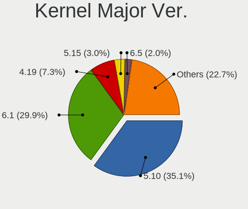
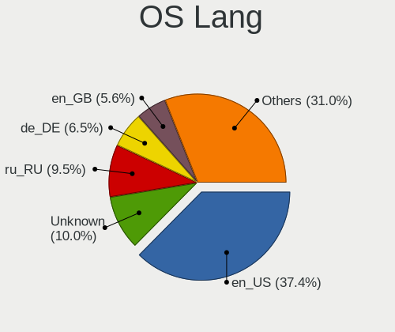
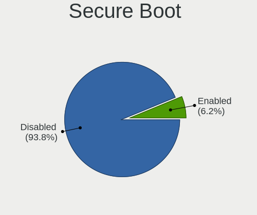
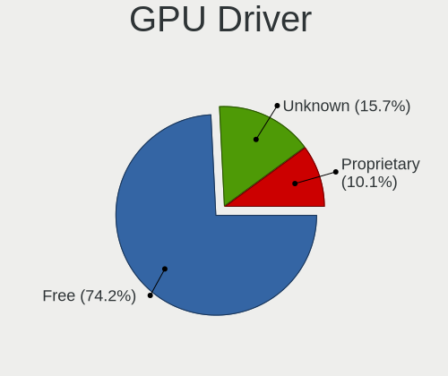
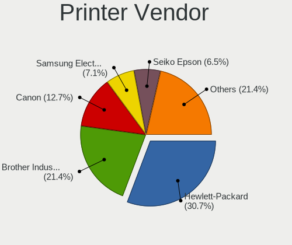

Debian - Tested Hardware & Statistics
-------------------------------------

A project to collect tested hardware configurations for Debian.

Anyone can contribute to this report by the [hw-probe](https://github.com/linuxhw/hw-probe) tool:

    sudo -E hw-probe -all -upload

Please contribute! Especially if your hardware is rare.

This is a report for all computer types. See also reports for [desktops](/Dist/Debian/Desktop/README.md) and [notebooks](/Dist/Debian/Notebook/README.md).

Contents
--------

* [ Test Cases ](#test-cases)

* [ System ](#system)
  - [ OS                       ](#os)
  - [ OS Family                ](#os-family)
  - [ Kernel                   ](#kernel)
  - [ Kernel Family            ](#kernel-family)
  - [ Kernel Major Ver.        ](#kernel-major-ver)
  - [ Arch                     ](#arch)
  - [ DE                       ](#de)
  - [ Display Server           ](#display-server)
  - [ Display Manager          ](#display-manager)
  - [ OS Lang                  ](#os-lang)
  - [ Boot Mode                ](#boot-mode)
  - [ Filesystem               ](#filesystem)
  - [ Part. scheme             ](#part-scheme)
  - [ Dual Boot with Linux/BSD ](#dual-boot-with-linuxbsd)
  - [ Dual Boot (Win)          ](#dual-boot-win)

* [ Board ](#board)
  - [ Vendor                   ](#vendor)
  - [ Model                    ](#model)
  - [ Model Family             ](#model-family)
  - [ MFG Year                 ](#mfg-year)
  - [ Form Factor              ](#form-factor)
  - [ Secure Boot              ](#secure-boot)
  - [ Coreboot                 ](#coreboot)
  - [ RAM Size                 ](#ram-size)
  - [ RAM Used                 ](#ram-used)
  - [ Total Drives             ](#total-drives)
  - [ Has CD-ROM               ](#has-cd-rom)
  - [ Has Ethernet             ](#has-ethernet)
  - [ Has WiFi                 ](#has-wifi)
  - [ Has Bluetooth            ](#has-bluetooth)

* [ Location ](#location)
  - [ Country                  ](#country)
  - [ City                     ](#city)

* [ Drives ](#drives)
  - [ Drive Vendor             ](#drive-vendor)
  - [ Drive Model              ](#drive-model)
  - [ HDD Vendor               ](#hdd-vendor)
  - [ SSD Vendor               ](#ssd-vendor)
  - [ Drive Kind               ](#drive-kind)
  - [ Drive Connector          ](#drive-connector)
  - [ Drive Size               ](#drive-size)
  - [ Space Total              ](#space-total)
  - [ Space Used               ](#space-used)
  - [ Malfunc. Drives          ](#malfunc-drives)
  - [ Malfunc. Drive Vendor    ](#malfunc-drive-vendor)
  - [ Malfunc. HDD Vendor      ](#malfunc-hdd-vendor)
  - [ Malfunc. Drive Kind      ](#malfunc-drive-kind)
  - [ Failed Drives            ](#failed-drives)
  - [ Failed Drive Vendor      ](#failed-drive-vendor)
  - [ Drive Status             ](#drive-status)

* [ Storage controller ](#storage-controller)
  - [ Storage Vendor           ](#storage-vendor)
  - [ Storage Model            ](#storage-model)
  - [ Storage Kind             ](#storage-kind)

* [ Processor ](#processor)
  - [ CPU Vendor               ](#cpu-vendor)
  - [ CPU Model                ](#cpu-model)
  - [ CPU Model Family         ](#cpu-model-family)
  - [ CPU Cores                ](#cpu-cores)
  - [ CPU Sockets              ](#cpu-sockets)
  - [ CPU Threads              ](#cpu-threads)
  - [ CPU Op-Modes             ](#cpu-op-modes)
  - [ CPU Microcode            ](#cpu-microcode)
  - [ CPU Microarch            ](#cpu-microarch)

* [ Graphics ](#graphics)
  - [ GPU Vendor               ](#gpu-vendor)
  - [ GPU Model                ](#gpu-model)
  - [ GPU Combo                ](#gpu-combo)
  - [ GPU Driver               ](#gpu-driver)
  - [ GPU Memory               ](#gpu-memory)

* [ Monitor ](#monitor)
  - [ Monitor Vendor           ](#monitor-vendor)
  - [ Monitor Model            ](#monitor-model)
  - [ Monitor Resolution       ](#monitor-resolution)
  - [ Monitor Diagonal         ](#monitor-diagonal)
  - [ Monitor Width            ](#monitor-width)
  - [ Aspect Ratio             ](#aspect-ratio)
  - [ Monitor Area             ](#monitor-area)
  - [ Pixel Density            ](#pixel-density)
  - [ Multiple Monitors        ](#multiple-monitors)

* [ Network ](#network)
  - [ Net Controller Vendor    ](#net-controller-vendor)
  - [ Net Controller Model     ](#net-controller-model)
  - [ Wireless Vendor          ](#wireless-vendor)
  - [ Wireless Model           ](#wireless-model)
  - [ Ethernet Vendor          ](#ethernet-vendor)
  - [ Ethernet Model           ](#ethernet-model)
  - [ Net Controller Kind      ](#net-controller-kind)
  - [ Used Controller          ](#used-controller)
  - [ NICs                     ](#nics)
  - [ IPv6                     ](#ipv6)

* [ Bluetooth ](#bluetooth)
  - [ Bluetooth Vendor         ](#bluetooth-vendor)
  - [ Bluetooth Model          ](#bluetooth-model)

* [ Sound ](#sound)
  - [ Sound Vendor             ](#sound-vendor)
  - [ Sound Model              ](#sound-model)

* [ Memory ](#memory)
  - [ Memory Vendor            ](#memory-vendor)
  - [ Memory Model             ](#memory-model)
  - [ Memory Kind              ](#memory-kind)
  - [ Memory Form Factor       ](#memory-form-factor)
  - [ Memory Size              ](#memory-size)
  - [ Memory Speed             ](#memory-speed)

* [ Printers & scanners ](#printers--scanners)
  - [ Printer Vendor           ](#printer-vendor)
  - [ Printer Model            ](#printer-model)
  - [ Scanner Vendor           ](#scanner-vendor)
  - [ Scanner Model            ](#scanner-model)

* [ Camera ](#camera)
  - [ Camera Vendor            ](#camera-vendor)
  - [ Camera Model             ](#camera-model)

* [ Security ](#security)
  - [ Fingerprint Vendor       ](#fingerprint-vendor)
  - [ Fingerprint Model        ](#fingerprint-model)
  - [ Chipcard Vendor          ](#chipcard-vendor)
  - [ Chipcard Model           ](#chipcard-model)

* [ Unsupported ](#unsupported)
  - [ Unsupported Devices      ](#unsupported-devices)
  - [ Unsupported Device Types ](#unsupported-device-types)

Test Cases
----------

Total: 15382

| Vendor        | Model                       | Form-Factor | Probe                                                      | Date         |
|---------------|-----------------------------|-------------|------------------------------------------------------------|--------------|
| ASUSTek       | GL552VW                     | Notebook    | [6986ca63da](https://linux-hardware.org/?probe=6986ca63da) | Aug 12, 2023 |
| Acer          | Swift SF314-512             | Notebook    | [7158f3e437](https://linux-hardware.org/?probe=7158f3e437) | Aug 12, 2023 |
| ASRock        | B85M Pro4                   | Desktop     | [108dae1eae](https://linux-hardware.org/?probe=108dae1eae) | Aug 12, 2023 |
| Dell          | Vostro 3500                 | Notebook    | [2ec62f31c9](https://linux-hardware.org/?probe=2ec62f31c9) | Aug 12, 2023 |
| Dell          | Latitude E6430              | Notebook    | [8037585070](https://linux-hardware.org/?probe=8037585070) | Aug 12, 2023 |
| HP            | ZBook 17 G3                 | Notebook    | [475b07d2dc](https://linux-hardware.org/?probe=475b07d2dc) | Aug 12, 2023 |
| Unknown       | Unknown                     | Notebook    | [2e76349d2c](https://linux-hardware.org/?probe=2e76349d2c) | Aug 12, 2023 |
| CWWK          | CW-J6-6L                    | Desktop     | [8321dcc5ea](https://linux-hardware.org/?probe=8321dcc5ea) | Aug 12, 2023 |
| Dell          | 0FDT3J A01                  | Server      | [fce762afa4](https://linux-hardware.org/?probe=fce762afa4) | Aug 12, 2023 |
| HP            | ENVY x360 Convertible 13... | Convertible | [618857a4ae](https://linux-hardware.org/?probe=618857a4ae) | Aug 12, 2023 |
| ASUSTek       | PRIME B660M-K D4            | Desktop     | [dad31fab00](https://linux-hardware.org/?probe=dad31fab00) | Aug 12, 2023 |
| Unknown       | Unknown                     | Soc         | [a28cd220cd](https://linux-hardware.org/?probe=a28cd220cd) | Aug 12, 2023 |
| Unknown       | Unknown                     | Soc         | [f62d9a8a9a](https://linux-hardware.org/?probe=f62d9a8a9a) | Aug 12, 2023 |
| ASUSTek       | ProArt X670E-CREATOR WIF... | Desktop     | [4f6d84a4dd](https://linux-hardware.org/?probe=4f6d84a4dd) | Aug 12, 2023 |
| Dell          | 0PV3YR A05                  | Server      | [ed029dd5e3](https://linux-hardware.org/?probe=ed029dd5e3) | Aug 12, 2023 |
| Unknown       | Unknown                     | Notebook    | [8d7674c3b3](https://linux-hardware.org/?probe=8d7674c3b3) | Aug 11, 2023 |
| HP            | Pavilion dv5                | Notebook    | [41c7682f98](https://linux-hardware.org/?probe=41c7682f98) | Aug 11, 2023 |
| HP            | Pavilion dv5                | Notebook    | [a8f62e42dc](https://linux-hardware.org/?probe=a8f62e42dc) | Aug 11, 2023 |
| Unknown       | Unknown                     | Notebook    | [a064a2d5fd](https://linux-hardware.org/?probe=a064a2d5fd) | Aug 11, 2023 |
| ASRock        | J4125B-ITX                  | Desktop     | [fa9ebd523f](https://linux-hardware.org/?probe=fa9ebd523f) | Aug 11, 2023 |
| MSI           | G33M                        | Desktop     | [65de454e8b](https://linux-hardware.org/?probe=65de454e8b) | Aug 11, 2023 |
| Dell          | 0PV3YR A05                  | Server      | [053608e18a](https://linux-hardware.org/?probe=053608e18a) | Aug 11, 2023 |
| Dell          | 06X1TJ A00                  | Desktop     | [91ecb8253e](https://linux-hardware.org/?probe=91ecb8253e) | Aug 11, 2023 |
| Dell          | Inspiron 3531               | Notebook    | [0384e8a950](https://linux-hardware.org/?probe=0384e8a950) | Aug 11, 2023 |
| Avell High... | A40 LIV                     | Notebook    | [9bc62c7eec](https://linux-hardware.org/?probe=9bc62c7eec) | Aug 11, 2023 |
| Lenovo        | 3740 NOK                    | Desktop     | [9964e9a820](https://linux-hardware.org/?probe=9964e9a820) | Aug 11, 2023 |
| HP            | Laptop 15s-eq2xxx           | Notebook    | [e45562b838](https://linux-hardware.org/?probe=e45562b838) | Aug 10, 2023 |
| ASUSTek       | 1005PE                      | Notebook    | [088a155ec9](https://linux-hardware.org/?probe=088a155ec9) | Aug 10, 2023 |
| AZW           | GTR V01                     | Mini pc     | [8b0b0e8cc4](https://linux-hardware.org/?probe=8b0b0e8cc4) | Aug 10, 2023 |
| Acer          | Swift SF314-512             | Notebook    | [e168ac1e62](https://linux-hardware.org/?probe=e168ac1e62) | Aug 10, 2023 |
| ASUSTek       | ROG Maximus XII EXTREME     | Desktop     | [a0350a164c](https://linux-hardware.org/?probe=a0350a164c) | Aug 10, 2023 |
| PC Special... | NH5xAx                      | Notebook    | [891b5ec398](https://linux-hardware.org/?probe=891b5ec398) | Aug 10, 2023 |
| Lenovo        | ThinkPad T410 25372E6       | Notebook    | [69c4723b51](https://linux-hardware.org/?probe=69c4723b51) | Aug 10, 2023 |
| Dell          | 0VXN67 A01                  | Desktop     | [4fbd39d860](https://linux-hardware.org/?probe=4fbd39d860) | Aug 10, 2023 |
| Lenovo        | ThinkPad T480 20L6S29D00    | Notebook    | [a728658683](https://linux-hardware.org/?probe=a728658683) | Aug 10, 2023 |
| HP            | Laptop 15s-eq2xxx           | Notebook    | [c87b299407](https://linux-hardware.org/?probe=c87b299407) | Aug 10, 2023 |
| ASRock        | Z68 Pro3                    | Desktop     | [f949a6e2a5](https://linux-hardware.org/?probe=f949a6e2a5) | Aug 09, 2023 |
| ASUSTek       | Pro WS 565-ACE              | Desktop     | [3d9112e038](https://linux-hardware.org/?probe=3d9112e038) | Aug 09, 2023 |
| Acer          | Aspire A515-57              | Notebook    | [b95e28ab5d](https://linux-hardware.org/?probe=b95e28ab5d) | Aug 09, 2023 |
| Lenovo        | G460 20041                  | Notebook    | [709445c691](https://linux-hardware.org/?probe=709445c691) | Aug 09, 2023 |
| ASUSTek       | ROG STRIX B450-F GAMING     | Desktop     | [2be2a9d5f4](https://linux-hardware.org/?probe=2be2a9d5f4) | Aug 09, 2023 |
| HP            | 8433 11                     | Desktop     | [93432b3df2](https://linux-hardware.org/?probe=93432b3df2) | Aug 09, 2023 |
| Unknown       | AB07H                       | Desktop     | [d0b6bc1fce](https://linux-hardware.org/?probe=d0b6bc1fce) | Aug 09, 2023 |
| ASUSTek       | B85M-G                      | Desktop     | [9fcf84ff7c](https://linux-hardware.org/?probe=9fcf84ff7c) | Aug 09, 2023 |
| Supermicro    | X8ST3                       | Desktop     | [13099babf6](https://linux-hardware.org/?probe=13099babf6) | Aug 09, 2023 |
| Unknown       | Unknown                     | Soc         | [42d4093f63](https://linux-hardware.org/?probe=42d4093f63) | Aug 08, 2023 |
| Lenovo        | ThinkPad X1 Carbon 4th 2... | Notebook    | [72655a5d65](https://linux-hardware.org/?probe=72655a5d65) | Aug 08, 2023 |
| ASUSTek       | P5LD2-SE                    | Desktop     | [04d19635d5](https://linux-hardware.org/?probe=04d19635d5) | Aug 08, 2023 |
| ASUSTek       | P5LD2-SE                    | Desktop     | [671a686166](https://linux-hardware.org/?probe=671a686166) | Aug 08, 2023 |
| Dell          | Inspiron 7537               | Notebook    | [61093a9af1](https://linux-hardware.org/?probe=61093a9af1) | Aug 08, 2023 |
| Lenovo        | IdeaPad 330-15IKB 81FE      | Notebook    | [965f96493c](https://linux-hardware.org/?probe=965f96493c) | Aug 08, 2023 |
| HONOR         | HYM-WXX                     | Notebook    | [6f5e2be121](https://linux-hardware.org/?probe=6f5e2be121) | Aug 08, 2023 |
| Lenovo        | IdeaPad Gaming 3 15IHU6 ... | Notebook    | [c06b23398a](https://linux-hardware.org/?probe=c06b23398a) | Aug 08, 2023 |
| Acer          | Aspire E5-573G              | Notebook    | [305061b67e](https://linux-hardware.org/?probe=305061b67e) | Aug 08, 2023 |
| ASUSTek       | STRIX H270F GAMING          | Desktop     | [ab74b5c684](https://linux-hardware.org/?probe=ab74b5c684) | Aug 08, 2023 |
| ASUSTek       | STRIX H270F GAMING          | Desktop     | [85ffbedac4](https://linux-hardware.org/?probe=85ffbedac4) | Aug 08, 2023 |
| Avell High... | A40 LIV                     | Notebook    | [4022d66d9a](https://linux-hardware.org/?probe=4022d66d9a) | Aug 08, 2023 |
| Lenovo        | ThinkPad T530 2394EN6       | Notebook    | [d348a65379](https://linux-hardware.org/?probe=d348a65379) | Aug 07, 2023 |
| Echips Imp... | NQ15E                       | Notebook    | [7d5e97a545](https://linux-hardware.org/?probe=7d5e97a545) | Aug 07, 2023 |
| ASUSTek       | ZenBook UX431DA_UM431DA     | Notebook    | [36c52dfe36](https://linux-hardware.org/?probe=36c52dfe36) | Aug 07, 2023 |
| Lenovo        | IdeaPad Gaming 3 15IHU6 ... | Notebook    | [543719cf07](https://linux-hardware.org/?probe=543719cf07) | Aug 07, 2023 |
| ASUSTek       | ZenBook UX431DA_UM431DA     | Notebook    | [be823adc05](https://linux-hardware.org/?probe=be823adc05) | Aug 07, 2023 |
| Unknown       | Unknown                     | Desktop     | [14114ca4aa](https://linux-hardware.org/?probe=14114ca4aa) | Aug 07, 2023 |
| Gigabyte      | H81M-S2H                    | Desktop     | [f895d0afe3](https://linux-hardware.org/?probe=f895d0afe3) | Aug 07, 2023 |
| Unknown       | Unknown                     | Desktop     | [946d81eb9d](https://linux-hardware.org/?probe=946d81eb9d) | Aug 07, 2023 |
| Acer          | Aspire TC-605               | Desktop     | [f3bac278d5](https://linux-hardware.org/?probe=f3bac278d5) | Aug 07, 2023 |
| Acer          | Aspire V5-121               | Notebook    | [4b8b0f132d](https://linux-hardware.org/?probe=4b8b0f132d) | Aug 07, 2023 |
| Lenovo        | ThinkPad T480 20L6S29E02    | Notebook    | [a3e3489451](https://linux-hardware.org/?probe=a3e3489451) | Aug 07, 2023 |
| Supermicro    | X8DTU-LN4+                  | Server      | [4e56bb1720](https://linux-hardware.org/?probe=4e56bb1720) | Aug 07, 2023 |
| Lenovo        | IdeaPad 330-15IKB 81FE      | Notebook    | [7e185ae211](https://linux-hardware.org/?probe=7e185ae211) | Aug 07, 2023 |
| ASRock        | B460M Pro4                  | Desktop     | [66f1fd8cc5](https://linux-hardware.org/?probe=66f1fd8cc5) | Aug 07, 2023 |
| Lenovo        | IdeaPad 120S-14IAP 81A5     | Notebook    | [053d461635](https://linux-hardware.org/?probe=053d461635) | Aug 06, 2023 |
| Apple         | MacBook7,1                  | Notebook    | [38d285144e](https://linux-hardware.org/?probe=38d285144e) | Aug 06, 2023 |
| Lenovo        | ThinkPad T440s 20AQ005TU... | Notebook    | [55e9e43f37](https://linux-hardware.org/?probe=55e9e43f37) | Aug 06, 2023 |
| Dell          | Inspiron 5547               | Notebook    | [8f33c0cf28](https://linux-hardware.org/?probe=8f33c0cf28) | Aug 06, 2023 |
| Foxconn       | 2ADA                        | Desktop     | [17d44b6d2c](https://linux-hardware.org/?probe=17d44b6d2c) | Aug 06, 2023 |
| ASRock        | Q1900M                      | Desktop     | [51f69dffd5](https://linux-hardware.org/?probe=51f69dffd5) | Aug 06, 2023 |
| HP            | Presario CQ57               | Notebook    | [cd84f6fa01](https://linux-hardware.org/?probe=cd84f6fa01) | Aug 06, 2023 |
| GPU Compan... | GWNR71517                   | Notebook    | [d754d51977](https://linux-hardware.org/?probe=d754d51977) | Aug 06, 2023 |
| Dell          | Latitude E5440              | Notebook    | [326ba9627a](https://linux-hardware.org/?probe=326ba9627a) | Aug 06, 2023 |
| BESSTAR Te... | GB1                         | Mini pc     | [2058978754](https://linux-hardware.org/?probe=2058978754) | Aug 06, 2023 |
| Dell          | Latitude 5290 2-in-1        | Notebook    | [b4cc5c436c](https://linux-hardware.org/?probe=b4cc5c436c) | Aug 06, 2023 |
| HP            | ENVY x360 Convertible 13... | Convertible | [a2847b90c6](https://linux-hardware.org/?probe=a2847b90c6) | Aug 06, 2023 |
| HP            | ENVY Laptop 17-ch1xxx       | Notebook    | [89119ae1fc](https://linux-hardware.org/?probe=89119ae1fc) | Aug 06, 2023 |
| Biostar       | B365MHC                     | Desktop     | [1a7d051f1e](https://linux-hardware.org/?probe=1a7d051f1e) | Aug 06, 2023 |
| Lenovo        | 1036 NO DPK                 | Desktop     | [d039bb9d5c](https://linux-hardware.org/?probe=d039bb9d5c) | Aug 06, 2023 |
| Gigabyte      | 990FXA-UD3                  | Desktop     | [4b57f7d6ea](https://linux-hardware.org/?probe=4b57f7d6ea) | Aug 06, 2023 |
| HP            | EliteBook 840 G3            | Notebook    | [9c2b1b1da7](https://linux-hardware.org/?probe=9c2b1b1da7) | Aug 06, 2023 |
| Dell          | Inspiron 15 3511            | Notebook    | [217bd70a25](https://linux-hardware.org/?probe=217bd70a25) | Aug 06, 2023 |
| Gigabyte      | B85M-D3H                    | Desktop     | [ed642341d8](https://linux-hardware.org/?probe=ed642341d8) | Aug 06, 2023 |
| MSI           | B450M MORTAR MAX            | Desktop     | [456ac6507d](https://linux-hardware.org/?probe=456ac6507d) | Aug 05, 2023 |
| Gigabyte      | GA-880GM-UD2H               | Desktop     | [6622cd2887](https://linux-hardware.org/?probe=6622cd2887) | Aug 05, 2023 |
| Acer          | Aspire E5-553G              | Notebook    | [39140ff7de](https://linux-hardware.org/?probe=39140ff7de) | Aug 05, 2023 |
| Acer          | Aspire A315-59              | Notebook    | [fc1d6007aa](https://linux-hardware.org/?probe=fc1d6007aa) | Aug 05, 2023 |
| Acer          | Aspire A315-59              | Notebook    | [deff4c99b6](https://linux-hardware.org/?probe=deff4c99b6) | Aug 05, 2023 |
| HP            | 829A                        | Mini pc     | [8d7ea68ded](https://linux-hardware.org/?probe=8d7ea68ded) | Aug 05, 2023 |
| Lenovo        | ThinkBook 16p Gen 2 20YM    | Notebook    | [2f529a830c](https://linux-hardware.org/?probe=2f529a830c) | Aug 05, 2023 |
| Lenovo        | ThinkBook 16p Gen 2 20YM    | Notebook    | [9d00f10bab](https://linux-hardware.org/?probe=9d00f10bab) | Aug 05, 2023 |
| HUAWEI        | MACHD-WXX9                  | Notebook    | [8511f4c245](https://linux-hardware.org/?probe=8511f4c245) | Aug 05, 2023 |
| ASUSTek       | PN41                        | Mini pc     | [079428c572](https://linux-hardware.org/?probe=079428c572) | Aug 05, 2023 |
| HP            | ENVY x360 Convertible 13... | Convertible | [5a0ec66589](https://linux-hardware.org/?probe=5a0ec66589) | Aug 05, 2023 |
| ASUSTek       | PN41                        | Mini pc     | [663f989185](https://linux-hardware.org/?probe=663f989185) | Aug 05, 2023 |
| MSI           | B350 TOMAHAWK               | Desktop     | [3aa0e077c0](https://linux-hardware.org/?probe=3aa0e077c0) | Aug 05, 2023 |
| Intel         | NUC6CAYB J23203-403         | Mini pc     | [c157382bd3](https://linux-hardware.org/?probe=c157382bd3) | Aug 05, 2023 |
| Acer          | Swift SF314-512             | Notebook    | [ca109297da](https://linux-hardware.org/?probe=ca109297da) | Aug 05, 2023 |
| Sony          | VGN-NS11S_S                 | Notebook    | [8ad31bd20c](https://linux-hardware.org/?probe=8ad31bd20c) | Aug 05, 2023 |
| Shuttle       | DS47D                       | Notebook    | [7d1ceb9b3a](https://linux-hardware.org/?probe=7d1ceb9b3a) | Aug 05, 2023 |
| Dell          | 0PV3YR A05                  | Server      | [da2ada0c83](https://linux-hardware.org/?probe=da2ada0c83) | Aug 05, 2023 |
| Shenzhen M... | HX90G                       | Desktop     | [04a083671d](https://linux-hardware.org/?probe=04a083671d) | Aug 05, 2023 |
| Lenovo        | IdeaPad 5 14ALC05 82LM      | Notebook    | [76662ba2c9](https://linux-hardware.org/?probe=76662ba2c9) | Aug 05, 2023 |
| ASRockRack    | X470D4U                     | Desktop     | [3c7626751d](https://linux-hardware.org/?probe=3c7626751d) | Aug 04, 2023 |
| Acer          | Veriton M2632G V:1.0        | Desktop     | [b66051af86](https://linux-hardware.org/?probe=b66051af86) | Aug 04, 2023 |
| ASUSTek       | N501JW                      | Notebook    | [e7d254dbe5](https://linux-hardware.org/?probe=e7d254dbe5) | Aug 04, 2023 |
| Gigabyte      | B85M-D3H                    | Desktop     | [5157c58f81](https://linux-hardware.org/?probe=5157c58f81) | Aug 04, 2023 |
| ASUSTek       | H81M-C                      | Desktop     | [cd16d74fc1](https://linux-hardware.org/?probe=cd16d74fc1) | Aug 04, 2023 |
| ASRock        | FM2A68M-DG3+                | Desktop     | [d930261042](https://linux-hardware.org/?probe=d930261042) | Aug 04, 2023 |
| Dell          | 06X1TJ A00                  | Desktop     | [ac23fbd687](https://linux-hardware.org/?probe=ac23fbd687) | Aug 04, 2023 |
| Dell          | Latitude E6400              | Notebook    | [ca61145546](https://linux-hardware.org/?probe=ca61145546) | Aug 04, 2023 |
| Lenovo        | Legion Pro 5 16IRX8 82WK    | Notebook    | [12948b89f6](https://linux-hardware.org/?probe=12948b89f6) | Aug 04, 2023 |
| Lenovo        | 314D SDK0J40697 WIN 3305... | Mini pc     | [1b1f671f30](https://linux-hardware.org/?probe=1b1f671f30) | Aug 04, 2023 |
| ASUSTek       | P5K SE/EPU                  | Desktop     | [c125911c18](https://linux-hardware.org/?probe=c125911c18) | Aug 04, 2023 |
| ASUSTek       | M4A785T-M                   | Desktop     | [f297c8efa8](https://linux-hardware.org/?probe=f297c8efa8) | Aug 04, 2023 |
| HP            | 8620                        | Mini pc     | [3203f90412](https://linux-hardware.org/?probe=3203f90412) | Aug 04, 2023 |
| HP            | ProBook 640 G2              | Notebook    | [7cacb46425](https://linux-hardware.org/?probe=7cacb46425) | Aug 04, 2023 |
| Dell          | XPS 9320                    | Notebook    | [140f8f8b2e](https://linux-hardware.org/?probe=140f8f8b2e) | Aug 04, 2023 |
| Gigabyte      | B250M-DS3H-CF               | Desktop     | [701c63b20d](https://linux-hardware.org/?probe=701c63b20d) | Aug 04, 2023 |
| Dell          | 0K095G A01                  | Desktop     | [ee2fb87d2f](https://linux-hardware.org/?probe=ee2fb87d2f) | Aug 04, 2023 |
| Dell          | 0WXD1Y A00                  | Server      | [fab223d590](https://linux-hardware.org/?probe=fab223d590) | Aug 04, 2023 |
| Sony          | VGN-FW373D                  | Notebook    | [535f0edf33](https://linux-hardware.org/?probe=535f0edf33) | Aug 04, 2023 |
| ASUSTek       | TUF Gaming B450M-PLUS II    | Desktop     | [18f95b58ac](https://linux-hardware.org/?probe=18f95b58ac) | Aug 04, 2023 |
| Dell          | 0PV3YR A05                  | Server      | [df3495c01c](https://linux-hardware.org/?probe=df3495c01c) | Aug 04, 2023 |
| HP            | Lantis                      | Notebook    | [2c917365b3](https://linux-hardware.org/?probe=2c917365b3) | Aug 04, 2023 |
| ASUSTek       | TUF Gaming B450M-PLUS II    | Desktop     | [349de8928b](https://linux-hardware.org/?probe=349de8928b) | Aug 04, 2023 |
| Lenovo        | ThinkPad E15 Gen 4 21ED0... | Notebook    | [51ad22a795](https://linux-hardware.org/?probe=51ad22a795) | Aug 03, 2023 |
| Dell          | Vostro 3405                 | Notebook    | [db4954c21d](https://linux-hardware.org/?probe=db4954c21d) | Aug 03, 2023 |
| Lenovo        | 1036 NO DPK                 | Desktop     | [a3f6a98176](https://linux-hardware.org/?probe=a3f6a98176) | Aug 03, 2023 |
| Lenovo        | ThinkPad T480 20L6S5LF00    | Notebook    | [6bc628f4e6](https://linux-hardware.org/?probe=6bc628f4e6) | Aug 03, 2023 |
| Google        | Enguarde                    | Notebook    | [663e44ce58](https://linux-hardware.org/?probe=663e44ce58) | Aug 03, 2023 |
| Intel         | NUC5i3RYB H41000-502        | Mini pc     | [de2d8bc0e8](https://linux-hardware.org/?probe=de2d8bc0e8) | Aug 03, 2023 |
| Intel         | NUC10i3FNB K61362-302       | Mini pc     | [341ea8b96e](https://linux-hardware.org/?probe=341ea8b96e) | Aug 03, 2023 |
| Dell          | Inspiron 5566               | Notebook    | [21d7f13381](https://linux-hardware.org/?probe=21d7f13381) | Aug 03, 2023 |
| Lenovo        | 1036 NO DPK                 | Desktop     | [3aa878541c](https://linux-hardware.org/?probe=3aa878541c) | Aug 03, 2023 |
| Acer          | Nitro AN515-57              | Notebook    | [cef74aa3cb](https://linux-hardware.org/?probe=cef74aa3cb) | Aug 03, 2023 |
| Lenovo        | Yoga Pro 7 14ARP8 83AU      | Notebook    | [1317097350](https://linux-hardware.org/?probe=1317097350) | Aug 03, 2023 |
| ASUSTek       | TUF Gaming FX505DV_FX505... | Notebook    | [8036065591](https://linux-hardware.org/?probe=8036065591) | Aug 03, 2023 |
| ASUSTek       | P8B75-M LX                  | Desktop     | [6d7ac5bfd2](https://linux-hardware.org/?probe=6d7ac5bfd2) | Aug 03, 2023 |
| Intel         | NUC7i3BNB J22859-303        | Mini pc     | [53976b8021](https://linux-hardware.org/?probe=53976b8021) | Aug 03, 2023 |
| Samsung       | 305U1A                      | Notebook    | [f65d34a8fb](https://linux-hardware.org/?probe=f65d34a8fb) | Aug 03, 2023 |
| Intel         | H61                         | Desktop     | [7b2774c1a1](https://linux-hardware.org/?probe=7b2774c1a1) | Aug 03, 2023 |
| MouseCompu... | WHLD4-P1                    | Mini pc     | [3006496f16](https://linux-hardware.org/?probe=3006496f16) | Aug 03, 2023 |
| Intel         | H61                         | Desktop     | [8d450f7e6e](https://linux-hardware.org/?probe=8d450f7e6e) | Aug 03, 2023 |
| Gigabyte      | H510M H                     | Desktop     | [d74aab937a](https://linux-hardware.org/?probe=d74aab937a) | Aug 02, 2023 |
| Gigabyte      | B450M DS3H V2               | Desktop     | [909896213c](https://linux-hardware.org/?probe=909896213c) | Aug 02, 2023 |
| ASUSTek       | 1015BX                      | Notebook    | [4770dbfc22](https://linux-hardware.org/?probe=4770dbfc22) | Aug 02, 2023 |
| MSI           | MAG B650M MORTAR WIFI       | Desktop     | [fd259f2acd](https://linux-hardware.org/?probe=fd259f2acd) | Aug 02, 2023 |
| ASUSTek       | ZenBook UX431DA_UM431DA     | Notebook    | [a1f99c3e4d](https://linux-hardware.org/?probe=a1f99c3e4d) | Aug 02, 2023 |
| Lenovo        | Legion 5 15ARH05 82B5       | Notebook    | [433a85501a](https://linux-hardware.org/?probe=433a85501a) | Aug 02, 2023 |
| Gigabyte      | B85M-D3H                    | Desktop     | [4e092275e4](https://linux-hardware.org/?probe=4e092275e4) | Aug 02, 2023 |
| HP            | EliteBook 840 G3            | Notebook    | [0ae0b35097](https://linux-hardware.org/?probe=0ae0b35097) | Aug 02, 2023 |
| Dell          | Vostro 5515                 | Notebook    | [0e031a4729](https://linux-hardware.org/?probe=0e031a4729) | Aug 02, 2023 |
| HP            | EliteBook x360 1030 G2      | Convertible | [89f3f7544e](https://linux-hardware.org/?probe=89f3f7544e) | Aug 02, 2023 |
| HP            | EliteBook x360 1030 G2      | Convertible | [9ce9b8ab52](https://linux-hardware.org/?probe=9ce9b8ab52) | Aug 02, 2023 |
| HP            | Laptop 15s-eq2xxx           | Notebook    | [2d046d70cc](https://linux-hardware.org/?probe=2d046d70cc) | Aug 02, 2023 |
| Dell          | 06X1TJ A00                  | Desktop     | [5f9df619f5](https://linux-hardware.org/?probe=5f9df619f5) | Aug 02, 2023 |
| ASUSTek       | ROG STRIX Z370-H GAMING     | Desktop     | [e0c07e2d0c](https://linux-hardware.org/?probe=e0c07e2d0c) | Aug 02, 2023 |
| HP            | ProLiant DL360 G7           | Server      | [127555ff0c](https://linux-hardware.org/?probe=127555ff0c) | Aug 02, 2023 |
| Samsung       | 300E5M/300E5L               | Notebook    | [d4c5149060](https://linux-hardware.org/?probe=d4c5149060) | Aug 02, 2023 |
| Lenovo        | ThinkPad X1 Carbon Gen 8... | Notebook    | [291bf82303](https://linux-hardware.org/?probe=291bf82303) | Aug 02, 2023 |
| Lenovo        | ThinkPad X1 Carbon Gen 8... | Notebook    | [7a9c57ad84](https://linux-hardware.org/?probe=7a9c57ad84) | Aug 02, 2023 |
| Lenovo        | ThinkPad E475 20H40006US    | Notebook    | [dfb33be517](https://linux-hardware.org/?probe=dfb33be517) | Aug 01, 2023 |
| Apple         | Mac-35C5E08120C7EEAF Mac... | Mini pc     | [1abb46d019](https://linux-hardware.org/?probe=1abb46d019) | Aug 01, 2023 |
| Lenovo        | ThinkPad L13 Yoga Gen 2 ... | Convertible | [7203f5ba4d](https://linux-hardware.org/?probe=7203f5ba4d) | Aug 01, 2023 |
| Intel         | NUC10i3FNB K61362-302       | Mini pc     | [ed16f197f0](https://linux-hardware.org/?probe=ed16f197f0) | Aug 01, 2023 |
| HP            | EliteBook 840 G3            | Notebook    | [b53d4c2fad](https://linux-hardware.org/?probe=b53d4c2fad) | Aug 01, 2023 |
| Lenovo        | ThinkPad 13 2nd Gen 20J1... | Notebook    | [d3250ef8d7](https://linux-hardware.org/?probe=d3250ef8d7) | Aug 01, 2023 |
| HP            | Laptop 15s-eq2xxx           | Notebook    | [4a4ac95dcc](https://linux-hardware.org/?probe=4a4ac95dcc) | Aug 01, 2023 |
| Timi          | Xiaomi Book Pro 16 2022     | Notebook    | [1e963cc76b](https://linux-hardware.org/?probe=1e963cc76b) | Aug 01, 2023 |
| ASUSTek       | Z170-A                      | Desktop     | [3367a6e149](https://linux-hardware.org/?probe=3367a6e149) | Aug 01, 2023 |
| ASUSTek       | G750JX                      | Notebook    | [06279baf34](https://linux-hardware.org/?probe=06279baf34) | Aug 01, 2023 |
| Fujitsu       | D3543-A1 S26361-D3543-A1... | Desktop     | [30389578ca](https://linux-hardware.org/?probe=30389578ca) | Aug 01, 2023 |
| ASRock        | X300-ITX                    | Desktop     | [70a181c62b](https://linux-hardware.org/?probe=70a181c62b) | Jul 31, 2023 |
| Samsung       | 305E4Z/305E5Z/305E7Z        | Notebook    | [a9232da3e4](https://linux-hardware.org/?probe=a9232da3e4) | Jul 31, 2023 |
| Lenovo        | Flex 2-14 20404             | Notebook    | [dd24507513](https://linux-hardware.org/?probe=dd24507513) | Jul 31, 2023 |
| Intel         | DH55HC AAE70933-502         | Desktop     | [e849da706a](https://linux-hardware.org/?probe=e849da706a) | Jul 31, 2023 |
| Google        | Hanawl                      | Soc         | [08995c0e52](https://linux-hardware.org/?probe=08995c0e52) | Jul 31, 2023 |
| Google        | Kevin                       | Notebook    | [ca1037f6ca](https://linux-hardware.org/?probe=ca1037f6ca) | Jul 31, 2023 |
| ASUSTek       | TUF Gaming B550M-E WIFI     | Desktop     | [54462345a7](https://linux-hardware.org/?probe=54462345a7) | Jul 31, 2023 |
| Lenovo        | IdeaPad C340-14API 81N6     | Notebook    | [961a4eebbd](https://linux-hardware.org/?probe=961a4eebbd) | Jul 31, 2023 |
| Packard Be... | H17HV                       | Notebook    | [de2003d390](https://linux-hardware.org/?probe=de2003d390) | Jul 31, 2023 |
| Unknown       | Unknown                     | Desktop     | [11d7923fa3](https://linux-hardware.org/?probe=11d7923fa3) | Jul 31, 2023 |
| HP            | ProBook 640 G2              | Notebook    | [9e297e7c8e](https://linux-hardware.org/?probe=9e297e7c8e) | Jul 31, 2023 |
| ASUSTek       | H97M-PLUS                   | Desktop     | [940e14c90d](https://linux-hardware.org/?probe=940e14c90d) | Jul 31, 2023 |
| ASUSTek       | M4N78-AM                    | Desktop     | [a4740d2b14](https://linux-hardware.org/?probe=a4740d2b14) | Jul 31, 2023 |
| Gigabyte      | B550M K                     | Desktop     | [139e314619](https://linux-hardware.org/?probe=139e314619) | Jul 31, 2023 |
| Raspberry ... | Raspberry Pi 3 Model B R... | Soc         | [cd8671be26](https://linux-hardware.org/?probe=cd8671be26) | Jul 31, 2023 |
| HP            | Elite x2 1012 G2            | Tablet      | [de727e7124](https://linux-hardware.org/?probe=de727e7124) | Jul 31, 2023 |
| Dell          | Inspiron 15 3511            | Notebook    | [3ea3ff2535](https://linux-hardware.org/?probe=3ea3ff2535) | Jul 31, 2023 |
| Apple         | Mac-27ADBB7B4CEE8E61 iMa... | All in one  | [7a8510c7fd](https://linux-hardware.org/?probe=7a8510c7fd) | Jul 31, 2023 |
| NEC Comput... | PC-VY22GXZCA                | Notebook    | [180d6cf97d](https://linux-hardware.org/?probe=180d6cf97d) | Jul 31, 2023 |
| Apple         | MacBookAir3,1               | Notebook    | [1859204a6f](https://linux-hardware.org/?probe=1859204a6f) | Jul 31, 2023 |
| Intel         | NUC7i7DNB J83500-207        | Mini pc     | [e18855dc59](https://linux-hardware.org/?probe=e18855dc59) | Jul 30, 2023 |
| Dell          | 0K240Y A01                  | Desktop     | [80b81f5eff](https://linux-hardware.org/?probe=80b81f5eff) | Jul 30, 2023 |
| Apple         | MacBookPro5,5               | Notebook    | [f201460a34](https://linux-hardware.org/?probe=f201460a34) | Jul 30, 2023 |
| Dell          | Inspiron 5547               | Notebook    | [f3de23350d](https://linux-hardware.org/?probe=f3de23350d) | Jul 30, 2023 |
| Dell          | Inspiron 5547               | Notebook    | [3be466c09c](https://linux-hardware.org/?probe=3be466c09c) | Jul 30, 2023 |
| Apple         | MacBookPro6,2               | Notebook    | [c5205f5512](https://linux-hardware.org/?probe=c5205f5512) | Jul 30, 2023 |
| Dell          | Latitude E5270              | Notebook    | [ae07c57989](https://linux-hardware.org/?probe=ae07c57989) | Jul 30, 2023 |
| Apple         | MacBookPro8,2               | Notebook    | [ffda715e5e](https://linux-hardware.org/?probe=ffda715e5e) | Jul 30, 2023 |
| Unknown       | Unknown                     | Desktop     | [a15a3cfa70](https://linux-hardware.org/?probe=a15a3cfa70) | Jul 30, 2023 |
| Apple         | MacBookPro9,1               | Notebook    | [3b030b25ac](https://linux-hardware.org/?probe=3b030b25ac) | Jul 30, 2023 |
| Dell          | 0Y5DDC A00                  | Desktop     | [43624df7d4](https://linux-hardware.org/?probe=43624df7d4) | Jul 30, 2023 |
| Lenovo        | ThinkPad X220 42914XG       | Notebook    | [053a30cc87](https://linux-hardware.org/?probe=053a30cc87) | Jul 30, 2023 |
| HP            | ProBook 640 G2              | Notebook    | [87a4b835cf](https://linux-hardware.org/?probe=87a4b835cf) | Jul 30, 2023 |
| MSI           | B250 PC MATE                | Desktop     | [9163341ff4](https://linux-hardware.org/?probe=9163341ff4) | Jul 30, 2023 |
| Lenovo        | ThinkPad Edge E430 32543... | Notebook    | [b30651e46f](https://linux-hardware.org/?probe=b30651e46f) | Jul 30, 2023 |
| Gigabyte      | GA-MA78GM-S2H               | Desktop     | [37e282ff80](https://linux-hardware.org/?probe=37e282ff80) | Jul 30, 2023 |
| Lenovo        | ThinkPad T480s 20L8S0YW0... | Notebook    | [3ff995e8b7](https://linux-hardware.org/?probe=3ff995e8b7) | Jul 30, 2023 |
| ASUSTek       | Zephyrus S GX701GX_GX701... | Notebook    | [69da742061](https://linux-hardware.org/?probe=69da742061) | Jul 30, 2023 |
| Lenovo        | ThinkPad X201 3680BF5       | Notebook    | [dd11ccaaad](https://linux-hardware.org/?probe=dd11ccaaad) | Jul 29, 2023 |
| ASUSTek       | VivoBook_ASUSLaptop M350... | Notebook    | [d1a4b2769a](https://linux-hardware.org/?probe=d1a4b2769a) | Jul 29, 2023 |
| Unknown       | Generic RK322x Tv Box       | Other       | [db0911c516](https://linux-hardware.org/?probe=db0911c516) | Jul 29, 2023 |
| ASUSTek       | ASUS TUF Gaming F17 FX70... | Notebook    | [d1bf55b135](https://linux-hardware.org/?probe=d1bf55b135) | Jul 29, 2023 |
| ASUSTek       | ASUS TUF Gaming F17 FX70... | Notebook    | [ea8a893b11](https://linux-hardware.org/?probe=ea8a893b11) | Jul 29, 2023 |
| Sony          | SVS13A1Z9RN                 | Notebook    | [533b3018ea](https://linux-hardware.org/?probe=533b3018ea) | Jul 29, 2023 |
| Acer          | Swift SF315-52G             | Notebook    | [aca997f2b5](https://linux-hardware.org/?probe=aca997f2b5) | Jul 29, 2023 |
| ASUSTek       | VivoBook_ASUS Laptop E41... | Notebook    | [ce140941bc](https://linux-hardware.org/?probe=ce140941bc) | Jul 29, 2023 |
| ASUSTek       | VivoBook_ASUS Laptop E41... | Notebook    | [19850c3ad1](https://linux-hardware.org/?probe=19850c3ad1) | Jul 29, 2023 |
| Lenovo        | IdeaPad 1 15ADA7 82R1       | Notebook    | [7207a12cd1](https://linux-hardware.org/?probe=7207a12cd1) | Jul 29, 2023 |
| Dell          | Latitude 5520               | Notebook    | [5151c4275a](https://linux-hardware.org/?probe=5151c4275a) | Jul 29, 2023 |
| ASRockRack    | X470D4U                     | Desktop     | [532a72a722](https://linux-hardware.org/?probe=532a72a722) | Jul 29, 2023 |
| Dell          | 0HD5W2 A01                  | Desktop     | [76394a9fc7](https://linux-hardware.org/?probe=76394a9fc7) | Jul 29, 2023 |
| ASRock        | A620M-HDV/M.2+              | Desktop     | [ea91ff9db6](https://linux-hardware.org/?probe=ea91ff9db6) | Jul 28, 2023 |
| Lenovo        | MAHOBAY NO DPK              | Desktop     | [f591b4a83a](https://linux-hardware.org/?probe=f591b4a83a) | Jul 28, 2023 |
| VALE          | Notebook Classic C140       | Notebook    | [ec65662265](https://linux-hardware.org/?probe=ec65662265) | Jul 28, 2023 |
| Dell          | 05GD68 A00                  | Desktop     | [47759e14b4](https://linux-hardware.org/?probe=47759e14b4) | Jul 28, 2023 |
| HP            | Pavilion Gaming Laptop      | Notebook    | [b277fcda26](https://linux-hardware.org/?probe=b277fcda26) | Jul 28, 2023 |
| HP            | Victus by Gaming Laptop ... | Notebook    | [7595472fb4](https://linux-hardware.org/?probe=7595472fb4) | Jul 28, 2023 |
| IceWhale T... | ZimaBoard 832 ZMB           | Desktop     | [4cbba6622f](https://linux-hardware.org/?probe=4cbba6622f) | Jul 28, 2023 |
| Dell          | Latitude 7480               | Notebook    | [4287f8186f](https://linux-hardware.org/?probe=4287f8186f) | Jul 28, 2023 |
| Chitech Sh... | Tibuta_MasterPad-W100       | Notebook    | [202a9be7b7](https://linux-hardware.org/?probe=202a9be7b7) | Jul 28, 2023 |
| Lenovo        | ThinkPad L13 Yoga Gen 2 ... | Convertible | [3a3d1b8e9e](https://linux-hardware.org/?probe=3a3d1b8e9e) | Jul 28, 2023 |
| Lenovo        | Yoga 6 13ABR8 83B2          | Convertible | [7adc21dcee](https://linux-hardware.org/?probe=7adc21dcee) | Jul 28, 2023 |
| Gigabyte      | B550M AORUS PRO AX          | Desktop     | [f53eed4658](https://linux-hardware.org/?probe=f53eed4658) | Jul 28, 2023 |
| IceWhale T... | ZimaBoard 832 ZMB           | Desktop     | [8cf3decf30](https://linux-hardware.org/?probe=8cf3decf30) | Jul 28, 2023 |
| Gigabyte      | A320M-H-CF                  | Desktop     | [2e2b9a12a6](https://linux-hardware.org/?probe=2e2b9a12a6) | Jul 28, 2023 |
| Gigabyte      | P55-UD3L                    | Desktop     | [82a3947c74](https://linux-hardware.org/?probe=82a3947c74) | Jul 28, 2023 |
| AZW           | MINI S 10                   | Desktop     | [3501ec2e9a](https://linux-hardware.org/?probe=3501ec2e9a) | Jul 28, 2023 |
| Casper        | EXCALIBUR G770              | Notebook    | [1b416b9f01](https://linux-hardware.org/?probe=1b416b9f01) | Jul 28, 2023 |
| Dell          | Precision 3520              | Notebook    | [bc2e0ff018](https://linux-hardware.org/?probe=bc2e0ff018) | Jul 28, 2023 |
| ASUSTek       | PRIME B350M-A               | Desktop     | [d52776a0a8](https://linux-hardware.org/?probe=d52776a0a8) | Jul 28, 2023 |
| ASUSTek       | VivoBook_ASUSLaptop M350... | Notebook    | [9cbedced8b](https://linux-hardware.org/?probe=9cbedced8b) | Jul 28, 2023 |
| Gigabyte      | H610M H DDR4                | Desktop     | [1950bcc818](https://linux-hardware.org/?probe=1950bcc818) | Jul 28, 2023 |
| Dell          | System XPS L702X            | Notebook    | [5e9f83aa10](https://linux-hardware.org/?probe=5e9f83aa10) | Jul 28, 2023 |
| Acer          | Aspire A315-21G             | Notebook    | [0a4e1c4510](https://linux-hardware.org/?probe=0a4e1c4510) | Jul 28, 2023 |
| Dell          | Latitude 5290 2-in-1        | Tablet      | [83a69f246c](https://linux-hardware.org/?probe=83a69f246c) | Jul 28, 2023 |
| Unknown       | Unknown                     | Desktop     | [d9c029afa4](https://linux-hardware.org/?probe=d9c029afa4) | Jul 28, 2023 |
| Apple         | MacBookPro5,2               | Notebook    | [2c6617e2f9](https://linux-hardware.org/?probe=2c6617e2f9) | Jul 27, 2023 |
| Acer          | Extensa 215-32              | Notebook    | [18d32a6c36](https://linux-hardware.org/?probe=18d32a6c36) | Jul 27, 2023 |
| Dell          | 06X1TJ A00                  | Desktop     | [e873051e73](https://linux-hardware.org/?probe=e873051e73) | Jul 27, 2023 |
| Compaq        | PRESARIOCQ18                | Notebook    | [c528c90b50](https://linux-hardware.org/?probe=c528c90b50) | Jul 27, 2023 |
| ASRock        | H470M-HVS                   | Desktop     | [23183da982](https://linux-hardware.org/?probe=23183da982) | Jul 27, 2023 |
| ASRock        | H470M-HVS                   | Desktop     | [77d42f4b5c](https://linux-hardware.org/?probe=77d42f4b5c) | Jul 27, 2023 |
| Lenovo        | ThinkPad P15 Gen 2i 20YQ... | Notebook    | [6e7d094f7f](https://linux-hardware.org/?probe=6e7d094f7f) | Jul 27, 2023 |
| ASRock        | H470M-HVS                   | Desktop     | [e8abbb213e](https://linux-hardware.org/?probe=e8abbb213e) | Jul 27, 2023 |
| ASRock        | H470M-HVS                   | Desktop     | [bb4812527c](https://linux-hardware.org/?probe=bb4812527c) | Jul 27, 2023 |
| ASRock        | H470M-HVS                   | Desktop     | [2b7085bd2b](https://linux-hardware.org/?probe=2b7085bd2b) | Jul 27, 2023 |
| MSI           | Z97A GAMING 7               | Desktop     | [cf2d32f045](https://linux-hardware.org/?probe=cf2d32f045) | Jul 27, 2023 |
| Dell          | Inspiron 5720               | Notebook    | [8674c464bd](https://linux-hardware.org/?probe=8674c464bd) | Jul 27, 2023 |
| Google        | Vortininja                  | Notebook    | [70f9ee30d3](https://linux-hardware.org/?probe=70f9ee30d3) | Jul 27, 2023 |
| Intel         | X99H                        | Desktop     | [1e85498a86](https://linux-hardware.org/?probe=1e85498a86) | Jul 27, 2023 |
| ABIT          | NF7-S/NF7,NF7-V,1.0         | Desktop     | [f5184af4e0](https://linux-hardware.org/?probe=f5184af4e0) | Jul 27, 2023 |
| Acer          | Aspire A315-23G             | Notebook    | [4d7b874be2](https://linux-hardware.org/?probe=4d7b874be2) | Jul 27, 2023 |
| Fujitsu       | LIFEBOOK U748               | Notebook    | [23d71a87d0](https://linux-hardware.org/?probe=23d71a87d0) | Jul 26, 2023 |
| ASRock        | H470M-HVS                   | Desktop     | [a375e21964](https://linux-hardware.org/?probe=a375e21964) | Jul 26, 2023 |
| ASRock        | H470M-HVS                   | Desktop     | [d0e6321772](https://linux-hardware.org/?probe=d0e6321772) | Jul 26, 2023 |
| ASRock        | H470M-HVS                   | Desktop     | [28ea1c85d1](https://linux-hardware.org/?probe=28ea1c85d1) | Jul 26, 2023 |
| ASRock        | H470M-HVS                   | Desktop     | [3fd18c9a77](https://linux-hardware.org/?probe=3fd18c9a77) | Jul 26, 2023 |
| ASRock        | H470M-HVS                   | Desktop     | [d974298840](https://linux-hardware.org/?probe=d974298840) | Jul 26, 2023 |
| ASRock        | H470M-HVS                   | Desktop     | [b06f493001](https://linux-hardware.org/?probe=b06f493001) | Jul 26, 2023 |
| ASRock        | H470M-HVS                   | Desktop     | [894bb319dc](https://linux-hardware.org/?probe=894bb319dc) | Jul 26, 2023 |
| ASRock        | H470M-HVS                   | Desktop     | [7ec6d64d2f](https://linux-hardware.org/?probe=7ec6d64d2f) | Jul 26, 2023 |
| ASRock        | H470M-HVS                   | Desktop     | [09662b0f5d](https://linux-hardware.org/?probe=09662b0f5d) | Jul 26, 2023 |
| ASRock        | H470M-HVS                   | Desktop     | [3c8721254c](https://linux-hardware.org/?probe=3c8721254c) | Jul 26, 2023 |
| ASRock        | H470M-HVS                   | Desktop     | [7dfa96789f](https://linux-hardware.org/?probe=7dfa96789f) | Jul 26, 2023 |
| ASRock        | H470M-HVS                   | Desktop     | [c538742db7](https://linux-hardware.org/?probe=c538742db7) | Jul 26, 2023 |
| ASRock        | H470M-HVS                   | Desktop     | [9da53986f9](https://linux-hardware.org/?probe=9da53986f9) | Jul 26, 2023 |
| ASRock        | H470M-HVS                   | Desktop     | [c950f7dbc1](https://linux-hardware.org/?probe=c950f7dbc1) | Jul 26, 2023 |
| ASRock        | H470M-HVS                   | Desktop     | [dcf4ead958](https://linux-hardware.org/?probe=dcf4ead958) | Jul 26, 2023 |
| Unknown       | Apple MacBook Pro (14-in... | Notebook    | [0552cb3e44](https://linux-hardware.org/?probe=0552cb3e44) | Jul 26, 2023 |
| ASRock        | N68C-GS FX                  | Desktop     | [6b35cdc0ae](https://linux-hardware.org/?probe=6b35cdc0ae) | Jul 26, 2023 |
| Gigabyte      | A320M-S2H V2-CF             | Desktop     | [759b0f997f](https://linux-hardware.org/?probe=759b0f997f) | Jul 26, 2023 |
| Gigabyte      | A320M-S2H V2-CF             | Desktop     | [a1ef57fb8e](https://linux-hardware.org/?probe=a1ef57fb8e) | Jul 26, 2023 |
| ASRock        | A320M Pro4                  | Desktop     | [9ecdd1e4d3](https://linux-hardware.org/?probe=9ecdd1e4d3) | Jul 26, 2023 |
| Gigabyte      | A320M-S2H V2-CF             | Desktop     | [f45c4baaa3](https://linux-hardware.org/?probe=f45c4baaa3) | Jul 26, 2023 |
| Gigabyte      | A320M-S2H V2-CF             | Desktop     | [7abbda5ed3](https://linux-hardware.org/?probe=7abbda5ed3) | Jul 26, 2023 |
| Lenovo        | IdeaPad 120S-14IAP 81A5     | Notebook    | [b2dd23136f](https://linux-hardware.org/?probe=b2dd23136f) | Jul 26, 2023 |
| Gigabyte      | A320M-S2H V2-CF             | Desktop     | [67036356d3](https://linux-hardware.org/?probe=67036356d3) | Jul 26, 2023 |
| Gigabyte      | A320M-S2H V2-CF             | Desktop     | [5a134aede2](https://linux-hardware.org/?probe=5a134aede2) | Jul 26, 2023 |
| Gigabyte      | A320M-S2H V2-CF             | Desktop     | [28c92b6f8d](https://linux-hardware.org/?probe=28c92b6f8d) | Jul 26, 2023 |
| Dell          | XPS 13 7390                 | Notebook    | [0217675942](https://linux-hardware.org/?probe=0217675942) | Jul 26, 2023 |
| MSI           | H110M PRO-VD                | Desktop     | [808dae186a](https://linux-hardware.org/?probe=808dae186a) | Jul 26, 2023 |
| Lenovo        | ThinkPad L13 Yoga Gen 2 ... | Convertible | [68ec8c0bdf](https://linux-hardware.org/?probe=68ec8c0bdf) | Jul 26, 2023 |
| MSI           | H110M PRO-VD                | Desktop     | [b45586c5cf](https://linux-hardware.org/?probe=b45586c5cf) | Jul 26, 2023 |
| Gigabyte      | GA-A55M-S2HP                | Other       | [5b1e00b374](https://linux-hardware.org/?probe=5b1e00b374) | Jul 26, 2023 |
| Dell          | Precision 3520              | Notebook    | [2502fbaef2](https://linux-hardware.org/?probe=2502fbaef2) | Jul 26, 2023 |
| Raspberry ... | Raspberry Pi Zero 2 W Re... | Soc         | [c7373023dd](https://linux-hardware.org/?probe=c7373023dd) | Jul 26, 2023 |
| Lenovo        | 1036 NO DPK                 | Desktop     | [725aae77c4](https://linux-hardware.org/?probe=725aae77c4) | Jul 26, 2023 |
| Gigabyte      | X570 GAMING X               | Desktop     | [f67be57cba](https://linux-hardware.org/?probe=f67be57cba) | Jul 26, 2023 |
| Dell          | 01XK1W A00                  | Desktop     | [9793da4c20](https://linux-hardware.org/?probe=9793da4c20) | Jul 26, 2023 |
| Dell          | 0PV3YR A05                  | Server      | [2fa28e6952](https://linux-hardware.org/?probe=2fa28e6952) | Jul 26, 2023 |
| ASRock        | X570 PG Velocita            | Desktop     | [64d86600a4](https://linux-hardware.org/?probe=64d86600a4) | Jul 26, 2023 |
| Acer          | Swift SF314-512             | Notebook    | [856e36fa9c](https://linux-hardware.org/?probe=856e36fa9c) | Jul 26, 2023 |
| Dell          | 09CGW2 A04                  | Server      | [159d6b1be1](https://linux-hardware.org/?probe=159d6b1be1) | Jul 26, 2023 |
| Dell          | Vostro 3405                 | Notebook    | [82a990b785](https://linux-hardware.org/?probe=82a990b785) | Jul 26, 2023 |
| Dell          | Vostro 3405                 | Notebook    | [dc97ca175a](https://linux-hardware.org/?probe=dc97ca175a) | Jul 25, 2023 |
| HP            | ProBook 640 G2              | Notebook    | [ae244aab21](https://linux-hardware.org/?probe=ae244aab21) | Jul 25, 2023 |
| Apple         | MacBookPro5,5               | Notebook    | [9cf2abf318](https://linux-hardware.org/?probe=9cf2abf318) | Jul 25, 2023 |
| Google        | Droid                       | Notebook    | [ae803483c2](https://linux-hardware.org/?probe=ae803483c2) | Jul 25, 2023 |
| Dell          | XPS 13 9370                 | Notebook    | [835ca23b88](https://linux-hardware.org/?probe=835ca23b88) | Jul 25, 2023 |
| HP            | Laptop 15-db0xxx            | Notebook    | [f01ec95642](https://linux-hardware.org/?probe=f01ec95642) | Jul 25, 2023 |
| Dell          | XPS 13 9370                 | Notebook    | [321bdf6295](https://linux-hardware.org/?probe=321bdf6295) | Jul 25, 2023 |
| Acer          | Aspire 3610                 | Notebook    | [b40dd6ad17](https://linux-hardware.org/?probe=b40dd6ad17) | Jul 25, 2023 |
| MSI           | Katana GF66 11UG            | Notebook    | [bd45023e8e](https://linux-hardware.org/?probe=bd45023e8e) | Jul 25, 2023 |
| Intel         | NUC10i7FNB K61360-302       | Mini pc     | [9fbb932f79](https://linux-hardware.org/?probe=9fbb932f79) | Jul 25, 2023 |
| Gigabyte      | Z77X-UD3H                   | Desktop     | [b75ed54995](https://linux-hardware.org/?probe=b75ed54995) | Jul 25, 2023 |
| ASUSTek       | Pro WS X570-ACE             | Desktop     | [d60f3de4c7](https://linux-hardware.org/?probe=d60f3de4c7) | Jul 25, 2023 |
| MSI           | PRO B660M-A WIFI DDR4       | Desktop     | [bf88e1114e](https://linux-hardware.org/?probe=bf88e1114e) | Jul 25, 2023 |
| MSI           | PRO B660M-A WIFI DDR4       | Desktop     | [69b707119e](https://linux-hardware.org/?probe=69b707119e) | Jul 25, 2023 |
| MSI           | Z77A-GD65                   | Desktop     | [4df7cd69af](https://linux-hardware.org/?probe=4df7cd69af) | Jul 25, 2023 |
| Phoenix Co... | PSB514 A11                  | Desktop     | [9791c84b0d](https://linux-hardware.org/?probe=9791c84b0d) | Jul 25, 2023 |
| Dell          | 0PV3YR A05                  | Server      | [787c6a9252](https://linux-hardware.org/?probe=787c6a9252) | Jul 25, 2023 |
| HP            | Laptop 15-fc0xxx            | Notebook    | [5c52eecd16](https://linux-hardware.org/?probe=5c52eecd16) | Jul 25, 2023 |
| Lenovo        | ThinkServer TS140           | Desktop     | [24b688cbfd](https://linux-hardware.org/?probe=24b688cbfd) | Jul 25, 2023 |
| Intel         | D34010WYK H14771-304        | Desktop     | [c5960175bc](https://linux-hardware.org/?probe=c5960175bc) | Jul 25, 2023 |
| SANTECH       | NHx0DB,DE                   | Notebook    | [80aa11a7e8](https://linux-hardware.org/?probe=80aa11a7e8) | Jul 25, 2023 |
| Dell          | Latitude 3420               | Notebook    | [18d920dab2](https://linux-hardware.org/?probe=18d920dab2) | Jul 24, 2023 |
| Lenovo        | ThinkPad 13 2nd Gen 20J1... | Notebook    | [fd441fa52f](https://linux-hardware.org/?probe=fd441fa52f) | Jul 24, 2023 |
| Phoenix Co... | PSB514 A11                  | Desktop     | [8e271c334d](https://linux-hardware.org/?probe=8e271c334d) | Jul 24, 2023 |
| ASUSTek       | X541UV                      | Notebook    | [eb0aac9c32](https://linux-hardware.org/?probe=eb0aac9c32) | Jul 24, 2023 |
| MSI           | H110M PRO-VD                | Desktop     | [7076b096fd](https://linux-hardware.org/?probe=7076b096fd) | Jul 24, 2023 |
| HP            | ProLiant DL580 G7           | Server      | [5a9a1e320d](https://linux-hardware.org/?probe=5a9a1e320d) | Jul 24, 2023 |
| Acer          | Nitro AN515-57              | Notebook    | [ae6caf81d7](https://linux-hardware.org/?probe=ae6caf81d7) | Jul 24, 2023 |
| Raspberry ... | Raspberry Pi 3 Model B R... | Soc         | [9243bb6a08](https://linux-hardware.org/?probe=9243bb6a08) | Jul 24, 2023 |
| HUAWEI        | PAK-AL09                    | Tablet      | [367318c8f5](https://linux-hardware.org/?probe=367318c8f5) | Jul 24, 2023 |
| Acer          | Aspire A515-45              | Notebook    | [e1de4fabc7](https://linux-hardware.org/?probe=e1de4fabc7) | Jul 24, 2023 |
| Timi          | A7S                         | Notebook    | [d0bcd36416](https://linux-hardware.org/?probe=d0bcd36416) | Jul 24, 2023 |
| Dell          | Inspiron 15 3511            | Notebook    | [980ed56abe](https://linux-hardware.org/?probe=980ed56abe) | Jul 24, 2023 |
| Lenovo        | 1036 NO DPK                 | Desktop     | [15c9141aa3](https://linux-hardware.org/?probe=15c9141aa3) | Jul 24, 2023 |
| MSI           | B450-A PRO MAX              | Desktop     | [b54465e0da](https://linux-hardware.org/?probe=b54465e0da) | Jul 23, 2023 |
| MSI           | Alpha 15 B5EEK              | Notebook    | [ea2f3666ba](https://linux-hardware.org/?probe=ea2f3666ba) | Jul 23, 2023 |
| Hardkernel    | ODROID-N2Plus               | Soc         | [73f0811a7b](https://linux-hardware.org/?probe=73f0811a7b) | Jul 23, 2023 |
| Dell          | Latitude E7250              | Notebook    | [4b91b375d4](https://linux-hardware.org/?probe=4b91b375d4) | Jul 23, 2023 |
| Dell          | Latitude 7480               | Notebook    | [acad753aa8](https://linux-hardware.org/?probe=acad753aa8) | Jul 23, 2023 |
| Dell          | 0K7CVF A03                  | Server      | [228949ef5a](https://linux-hardware.org/?probe=228949ef5a) | Jul 23, 2023 |
| Lenovo        | ThinkCentre M58 7360W1J     | Desktop     | [1e1e565ac4](https://linux-hardware.org/?probe=1e1e565ac4) | Jul 23, 2023 |
| Dell          | OptiPlex 755                | Desktop     | [9297c88bef](https://linux-hardware.org/?probe=9297c88bef) | Jul 23, 2023 |
| ASUSTek       | PRIME B650M-A WIFI II       | Desktop     | [f2e2436cf1](https://linux-hardware.org/?probe=f2e2436cf1) | Jul 23, 2023 |
| Radxa         | ROCK 5B                     | Soc         | [9f1e03d74d](https://linux-hardware.org/?probe=9f1e03d74d) | Jul 23, 2023 |
| Dell          | OptiPlex 755                | Desktop     | [15827e6939](https://linux-hardware.org/?probe=15827e6939) | Jul 23, 2023 |
| HP            | EliteBook 835 G8 Noteboo... | Notebook    | [a3350e1d80](https://linux-hardware.org/?probe=a3350e1d80) | Jul 23, 2023 |
| Acer          | Aspire A315-21              | Notebook    | [17f482e878](https://linux-hardware.org/?probe=17f482e878) | Jul 23, 2023 |
| Lenovo        | ThinkServer TS140           | Desktop     | [8c41263814](https://linux-hardware.org/?probe=8c41263814) | Jul 23, 2023 |
| Lenovo        | ThinkPad X1 Carbon 7th 2... | Notebook    | [d957d5efe0](https://linux-hardware.org/?probe=d957d5efe0) | Jul 22, 2023 |
| AZW           | SER V1.0                    | Mini pc     | [9d0eeb96a8](https://linux-hardware.org/?probe=9d0eeb96a8) | Jul 22, 2023 |
| Lenovo        | IdeaPad L340-15IRH Gamin... | Notebook    | [467cc30f89](https://linux-hardware.org/?probe=467cc30f89) | Jul 22, 2023 |
| ASUSTek       | ROG Strix G713QM_G713QM     | Notebook    | [bbd3181f1f](https://linux-hardware.org/?probe=bbd3181f1f) | Jul 22, 2023 |
| ASUSTek       | ProArt X670E-CREATOR WIF... | Desktop     | [8dbf2477d3](https://linux-hardware.org/?probe=8dbf2477d3) | Jul 22, 2023 |
| HP            | EliteBook 840 G1            | Notebook    | [cafa1082f8](https://linux-hardware.org/?probe=cafa1082f8) | Jul 22, 2023 |
| ASUSTek       | ProArt X670E-CREATOR WIF... | Desktop     | [4bd62a58b8](https://linux-hardware.org/?probe=4bd62a58b8) | Jul 22, 2023 |
| Unknown       | Generic RK322x Tv Box       | Other       | [18c7d0154b](https://linux-hardware.org/?probe=18c7d0154b) | Jul 22, 2023 |
| Lenovo        | IdeaPadFlex 5 16ABR8 82X... | Convertible | [b2938336ce](https://linux-hardware.org/?probe=b2938336ce) | Jul 22, 2023 |
| HP            | Presario CQ57               | Notebook    | [2c1bcfe898](https://linux-hardware.org/?probe=2c1bcfe898) | Jul 22, 2023 |
| Dell          | Inspiron 3558               | Notebook    | [2cad6d3cb7](https://linux-hardware.org/?probe=2cad6d3cb7) | Jul 22, 2023 |
| Dell          | Latitude 5580               | Notebook    | [06c9677557](https://linux-hardware.org/?probe=06c9677557) | Jul 22, 2023 |
| HP            | ENVY Laptop 17-ch2xxx       | Notebook    | [7d88a01e49](https://linux-hardware.org/?probe=7d88a01e49) | Jul 22, 2023 |
| HP            | 635                         | Notebook    | [bb148a8b2b](https://linux-hardware.org/?probe=bb148a8b2b) | Jul 21, 2023 |
| ASUSTek       | K72Jr                       | Notebook    | [cdb9b29f94](https://linux-hardware.org/?probe=cdb9b29f94) | Jul 21, 2023 |
| Lenovo        | V14 G2 ITL 82NM             | Notebook    | [031d46c9d0](https://linux-hardware.org/?probe=031d46c9d0) | Jul 21, 2023 |
| Fujitsu       | D3313-A1 S26361-D3313-A1    | Desktop     | [97edd15b78](https://linux-hardware.org/?probe=97edd15b78) | Jul 21, 2023 |
| Lenovo        | ThinkPad T450s 20BWS05G0... | Notebook    | [fc45e9b064](https://linux-hardware.org/?probe=fc45e9b064) | Jul 21, 2023 |
| HP            | ProLiant MicroServer Gen... | Desktop     | [a9214c4672](https://linux-hardware.org/?probe=a9214c4672) | Jul 21, 2023 |
| Lenovo        | ThinkPad L13 Yoga Gen 2 ... | Convertible | [08f1fe3568](https://linux-hardware.org/?probe=08f1fe3568) | Jul 20, 2023 |
| Acer          | Swift SF314-512             | Notebook    | [d82c78621f](https://linux-hardware.org/?probe=d82c78621f) | Jul 20, 2023 |
| ASUSTek       | P5Q-PRO                     | Desktop     | [cc299998bb](https://linux-hardware.org/?probe=cc299998bb) | Jul 20, 2023 |
| Lenovo        | ThinkPad T520 42435UG       | Notebook    | [820630ba9e](https://linux-hardware.org/?probe=820630ba9e) | Jul 20, 2023 |
| Lenovo        | ThinkPad P73 20QRCTO1WW     | Notebook    | [7527ca0197](https://linux-hardware.org/?probe=7527ca0197) | Jul 20, 2023 |
| HP            | Pavilion Notebook           | Notebook    | [d366e7101c](https://linux-hardware.org/?probe=d366e7101c) | Jul 20, 2023 |
| ASUSTek       | T100TAM                     | Notebook    | [43cb18f0ee](https://linux-hardware.org/?probe=43cb18f0ee) | Jul 20, 2023 |
| Dell          | 0KWVT8 A03                  | Desktop     | [77fd7def41](https://linux-hardware.org/?probe=77fd7def41) | Jul 20, 2023 |
| ASUSTek       | ROG CROSSHAIR VIII DARK ... | Desktop     | [cb0ad6375e](https://linux-hardware.org/?probe=cb0ad6375e) | Jul 20, 2023 |
| ASUSTek       | VivoBook E14 E402YA_L402... | Notebook    | [311144e138](https://linux-hardware.org/?probe=311144e138) | Jul 20, 2023 |
| Raspberry ... | Raspberry Pi 4 Model B R... | Soc         | [8f26110e1a](https://linux-hardware.org/?probe=8f26110e1a) | Jul 20, 2023 |
| Shanghai Z... | ZXE CRB                     | Notebook    | [da6bb4265c](https://linux-hardware.org/?probe=da6bb4265c) | Jul 20, 2023 |
| Notebook      | N650DU                      | Notebook    | [c04f4faa06](https://linux-hardware.org/?probe=c04f4faa06) | Jul 19, 2023 |
| ASRock        | B550M Steel Legend          | Desktop     | [6e0eb8c7f5](https://linux-hardware.org/?probe=6e0eb8c7f5) | Jul 19, 2023 |
| Acer          | Swift SF314-43              | Notebook    | [6f00498896](https://linux-hardware.org/?probe=6f00498896) | Jul 19, 2023 |
| HP            | Pavilion 15                 | Notebook    | [e1bfe97e63](https://linux-hardware.org/?probe=e1bfe97e63) | Jul 19, 2023 |
| Lenovo        | ThinkPad X1 Carbon 5th 2... | Notebook    | [524d69b498](https://linux-hardware.org/?probe=524d69b498) | Jul 19, 2023 |
| Acer          | Aspire 7739Z                | Notebook    | [3e75dec5e0](https://linux-hardware.org/?probe=3e75dec5e0) | Jul 19, 2023 |
| ASUSTek       | ZenBook Pro Duo UX581GV_... | Notebook    | [9672a393c9](https://linux-hardware.org/?probe=9672a393c9) | Jul 19, 2023 |
| HP            | Pavilion 17                 | Notebook    | [bf76e4c333](https://linux-hardware.org/?probe=bf76e4c333) | Jul 19, 2023 |
| Dell          | 05XKKK A05                  | Server      | [3e627de1a2](https://linux-hardware.org/?probe=3e627de1a2) | Jul 19, 2023 |
| Acer          | Extensa 215-22              | Notebook    | [fc3dadd5bc](https://linux-hardware.org/?probe=fc3dadd5bc) | Jul 19, 2023 |
| AAEON         | GENE-CML5 V1.0              | Desktop     | [4120e07431](https://linux-hardware.org/?probe=4120e07431) | Jul 19, 2023 |
| Unknown       | Unknown                     | Desktop     | [32816fb789](https://linux-hardware.org/?probe=32816fb789) | Jul 19, 2023 |
| Acer          | Nitro AN515-57              | Notebook    | [cdad3aa931](https://linux-hardware.org/?probe=cdad3aa931) | Jul 19, 2023 |
| Intel         | NUC13SBBi9 M58736-303       | Mini pc     | [f7075e50f4](https://linux-hardware.org/?probe=f7075e50f4) | Jul 19, 2023 |
| Lenovo        | IdeaPad 3 15ALC6 82MF       | Notebook    | [bddb3e26c1](https://linux-hardware.org/?probe=bddb3e26c1) | Jul 19, 2023 |
| ASUSTek       | VivoBook_ASUSLaptop X421... | Notebook    | [a4584a139f](https://linux-hardware.org/?probe=a4584a139f) | Jul 19, 2023 |
| Gigabyte      | X570 AORUS MASTER           | Desktop     | [98cddbfe0e](https://linux-hardware.org/?probe=98cddbfe0e) | Jul 18, 2023 |
| HP            | EliteBook 8570p             | Notebook    | [8e456f1108](https://linux-hardware.org/?probe=8e456f1108) | Jul 18, 2023 |
| Unknown       | Unknown                     | Desktop     | [ce80e4d17f](https://linux-hardware.org/?probe=ce80e4d17f) | Jul 18, 2023 |
| Lenovo        | ThinkPad T520 42435UG       | Notebook    | [f789cd31fa](https://linux-hardware.org/?probe=f789cd31fa) | Jul 18, 2023 |
| MSI           | GF63 Thin 11UC              | Notebook    | [3ef8cdcacb](https://linux-hardware.org/?probe=3ef8cdcacb) | Jul 18, 2023 |
| Dell          | Vostro 3500                 | Notebook    | [69cc1eb6f6](https://linux-hardware.org/?probe=69cc1eb6f6) | Jul 18, 2023 |
| ASUSTek       | H81M-K                      | Desktop     | [5facab887b](https://linux-hardware.org/?probe=5facab887b) | Jul 18, 2023 |
| ASUSTek       | P8H61-MX                    | Desktop     | [c68138ca5c](https://linux-hardware.org/?probe=c68138ca5c) | Jul 18, 2023 |
| Google        | Lillipup                    | Notebook    | [7f7ba76942](https://linux-hardware.org/?probe=7f7ba76942) | Jul 18, 2023 |
| HP            | Pavilion 15                 | Notebook    | [a5485bb7e0](https://linux-hardware.org/?probe=a5485bb7e0) | Jul 18, 2023 |
| Lenovo        | ThinkPad P16s Gen 1 21CK... | Notebook    | [c6da4f3b1e](https://linux-hardware.org/?probe=c6da4f3b1e) | Jul 18, 2023 |
| ASUSTek       | B85M-E/BR                   | Desktop     | [c2ac257f6e](https://linux-hardware.org/?probe=c2ac257f6e) | Jul 18, 2023 |
| ASUSTek       | TUF Gaming Z590-PLUS WIF... | Desktop     | [a6c81d2b9e](https://linux-hardware.org/?probe=a6c81d2b9e) | Jul 18, 2023 |
| Lenovo        | ThinkPad L580 20LW000WGE    | Notebook    | [1b210ca778](https://linux-hardware.org/?probe=1b210ca778) | Jul 18, 2023 |
| ASUSTek       | Z87-C                       | Desktop     | [5324c1542f](https://linux-hardware.org/?probe=5324c1542f) | Jul 18, 2023 |
| Lenovo        | ThinkPad E15 Gen 2 20T80... | Notebook    | [35d510901b](https://linux-hardware.org/?probe=35d510901b) | Jul 18, 2023 |
| Raspberry ... | Raspberry Pi 4 Model B R... | Soc         | [3539141ba9](https://linux-hardware.org/?probe=3539141ba9) | Jul 18, 2023 |
| ASRockRack    | X470D4U                     | Desktop     | [9bd188ee9b](https://linux-hardware.org/?probe=9bd188ee9b) | Jul 18, 2023 |
| HP            | Laptop 17-cp0xxx            | Notebook    | [9d9ff78d29](https://linux-hardware.org/?probe=9d9ff78d29) | Jul 18, 2023 |
| Toshiba       | Satellite L755              | Notebook    | [da4d6e8a5c](https://linux-hardware.org/?probe=da4d6e8a5c) | Jul 18, 2023 |
| Gigabyte      | A520M S2H                   | Desktop     | [801b25d335](https://linux-hardware.org/?probe=801b25d335) | Jul 18, 2023 |
| Foxconn       | 2A8C                        | Desktop     | [539fb9855b](https://linux-hardware.org/?probe=539fb9855b) | Jul 18, 2023 |
| Lenovo        | ThinkPad L13 Yoga Gen 2 ... | Convertible | [58e48b61c2](https://linux-hardware.org/?probe=58e48b61c2) | Jul 17, 2023 |
| MSI           | GF63 Thin 11UC              | Notebook    | [f4fc84ba4b](https://linux-hardware.org/?probe=f4fc84ba4b) | Jul 17, 2023 |
| Dell          | 0WKGTH A02                  | Server      | [00c711574a](https://linux-hardware.org/?probe=00c711574a) | Jul 17, 2023 |
| HP            | 805A                        | Desktop     | [d4e6fca09f](https://linux-hardware.org/?probe=d4e6fca09f) | Jul 17, 2023 |
| ASUSTek       | H81M-C                      | Desktop     | [d75cfffdca](https://linux-hardware.org/?probe=d75cfffdca) | Jul 17, 2023 |
| MSI           | 2A9C                        | Desktop     | [676f61f0c9](https://linux-hardware.org/?probe=676f61f0c9) | Jul 17, 2023 |
| ASUSTek       | X505BA                      | Notebook    | [fcd96492f0](https://linux-hardware.org/?probe=fcd96492f0) | Jul 17, 2023 |
| Lenovo        | Yoga 6 13ALC7 82UD          | Convertible | [17fa00886a](https://linux-hardware.org/?probe=17fa00886a) | Jul 17, 2023 |
| ASUSTek       | B85M-G                      | Desktop     | [fc5b33ac00](https://linux-hardware.org/?probe=fc5b33ac00) | Jul 17, 2023 |
| Unknown       | TU-142                      | Notebook    | [d62ade82c2](https://linux-hardware.org/?probe=d62ade82c2) | Jul 17, 2023 |
| ASUSTek       | M5A78L/USB3                 | Desktop     | [a8b082a8be](https://linux-hardware.org/?probe=a8b082a8be) | Jul 17, 2023 |
| Dell          | Inspiron 16 7610            | Notebook    | [6d77ef17a0](https://linux-hardware.org/?probe=6d77ef17a0) | Jul 17, 2023 |
| MSI           | 2A9C                        | Desktop     | [87dd24dabe](https://linux-hardware.org/?probe=87dd24dabe) | Jul 17, 2023 |
| HP            | Pavilion dm1                | Notebook    | [135bb20fbd](https://linux-hardware.org/?probe=135bb20fbd) | Jul 17, 2023 |
| Acer          | Aspire A515-57T             | Notebook    | [dd4a3bf595](https://linux-hardware.org/?probe=dd4a3bf595) | Jul 17, 2023 |
| Lenovo        | Yoga 7 14ARB7 82QF          | Convertible | [65a6e11166](https://linux-hardware.org/?probe=65a6e11166) | Jul 17, 2023 |
| Acer          | Aspire A315-23G             | Notebook    | [df26ae3dab](https://linux-hardware.org/?probe=df26ae3dab) | Jul 17, 2023 |
| MSI           | H81M-P33                    | Desktop     | [0d3af45e51](https://linux-hardware.org/?probe=0d3af45e51) | Jul 16, 2023 |
| Biostar       | B450MH                      | Desktop     | [22909715b3](https://linux-hardware.org/?probe=22909715b3) | Jul 16, 2023 |
| Lenovo        | IdeaPad 3 15IML05 81WB      | Notebook    | [ab43e6b8ef](https://linux-hardware.org/?probe=ab43e6b8ef) | Jul 16, 2023 |
| Lenovo        | IdeaPad 3 15IML05 81WB      | Notebook    | [6b52cef555](https://linux-hardware.org/?probe=6b52cef555) | Jul 16, 2023 |
| ASUSTek       | ROG STRIX Z790-E GAMING ... | Desktop     | [0c592730d7](https://linux-hardware.org/?probe=0c592730d7) | Jul 16, 2023 |
| Unknown       | Unknown                     | Desktop     | [29ed3e238d](https://linux-hardware.org/?probe=29ed3e238d) | Jul 16, 2023 |
| Dell          | Latitude E6440              | Notebook    | [c1de0cf4d1](https://linux-hardware.org/?probe=c1de0cf4d1) | Jul 16, 2023 |
| Dell          | Latitude E6320              | Notebook    | [0087a8e5cf](https://linux-hardware.org/?probe=0087a8e5cf) | Jul 16, 2023 |
| ASUSTek       | TUF Gaming FX505GT_FX505... | Notebook    | [65e4fb1356](https://linux-hardware.org/?probe=65e4fb1356) | Jul 16, 2023 |
| Lenovo        | Yoga 14sITL 2021 82G2       | Notebook    | [899c1452e4](https://linux-hardware.org/?probe=899c1452e4) | Jul 16, 2023 |
| Unknown       | Unknown                     | Desktop     | [1073620f0c](https://linux-hardware.org/?probe=1073620f0c) | Jul 16, 2023 |
| Supermicro    | X9SRA/X9SRA-3               | Server      | [15d31e889c](https://linux-hardware.org/?probe=15d31e889c) | Jul 16, 2023 |
| Lenovo        | ThinkPad X120e 0611AN2      | Notebook    | [497e6c5432](https://linux-hardware.org/?probe=497e6c5432) | Jul 16, 2023 |
| Unknown       | Unknown                     | Soc         | [99bfa94ff7](https://linux-hardware.org/?probe=99bfa94ff7) | Jul 16, 2023 |
| GEEKOM        | Mini IT 8                   | Desktop     | [4754a5fc1b](https://linux-hardware.org/?probe=4754a5fc1b) | Jul 16, 2023 |
| Dell          | Dimension 4500S             | Desktop     | [f10ee5f25d](https://linux-hardware.org/?probe=f10ee5f25d) | Jul 16, 2023 |
| HP            | Laptop 14s-dq2xxx           | Notebook    | [cd9bfc68b6](https://linux-hardware.org/?probe=cd9bfc68b6) | Jul 16, 2023 |
| SIRAGON       | LM-C100                     | Notebook    | [daef084233](https://linux-hardware.org/?probe=daef084233) | Jul 16, 2023 |
| Lenovo        | ThinkPad X1 Carbon 5th 2... | Notebook    | [1625385cef](https://linux-hardware.org/?probe=1625385cef) | Jul 16, 2023 |
| Dell          | Latitude D610               | Notebook    | [791cabd713](https://linux-hardware.org/?probe=791cabd713) | Jul 16, 2023 |
| MSI           | MPG B550 GAMING EDGE WIF... | Desktop     | [151797320d](https://linux-hardware.org/?probe=151797320d) | Jul 16, 2023 |
| MSI           | MPG B550 GAMING EDGE WIF... | Desktop     | [e760f4570f](https://linux-hardware.org/?probe=e760f4570f) | Jul 16, 2023 |
| Google        | Guado                       | Desktop     | [4216aa46a6](https://linux-hardware.org/?probe=4216aa46a6) | Jul 16, 2023 |
| Lenovo        | ThinkPad T440p 20AN0069U... | Notebook    | [02af27da78](https://linux-hardware.org/?probe=02af27da78) | Jul 16, 2023 |
| Lenovo        | IdeaPadFlex 5 16ABR8 82X... | Convertible | [d2620e5fee](https://linux-hardware.org/?probe=d2620e5fee) | Jul 16, 2023 |
| ASUSTek       | VivoBook_ASUSLaptop X515... | Notebook    | [d43ad7594c](https://linux-hardware.org/?probe=d43ad7594c) | Jul 16, 2023 |
| MSI           | MAG B550M MORTAR            | Desktop     | [74239bf89d](https://linux-hardware.org/?probe=74239bf89d) | Jul 16, 2023 |
| Dell          | Latitude E6330              | Notebook    | [6adb67344f](https://linux-hardware.org/?probe=6adb67344f) | Jul 15, 2023 |
| Lenovo        | 30BE SDK0J40697 WIN 3305... | Desktop     | [9161db3013](https://linux-hardware.org/?probe=9161db3013) | Jul 15, 2023 |
| ASUSTek       | Z87-C                       | Desktop     | [33e96d6f34](https://linux-hardware.org/?probe=33e96d6f34) | Jul 15, 2023 |
| Gigabyte      | H81M-HD3                    | Desktop     | [4a6f56c54a](https://linux-hardware.org/?probe=4a6f56c54a) | Jul 15, 2023 |
| Lenovo        | ThinkPad X260 20F5S04B00    | Notebook    | [8d3168b6c4](https://linux-hardware.org/?probe=8d3168b6c4) | Jul 15, 2023 |
| Acer          | Aspire R7-371T              | Notebook    | [c4f6270bdb](https://linux-hardware.org/?probe=c4f6270bdb) | Jul 15, 2023 |
| Google        | Guado                       | Desktop     | [9a3e217e78](https://linux-hardware.org/?probe=9a3e217e78) | Jul 15, 2023 |
| SLIMBOOK      | PROX15-AMD                  | Notebook    | [7e088e838b](https://linux-hardware.org/?probe=7e088e838b) | Jul 15, 2023 |
| Lenovo        | ThinkPad T470s 20HGS1VD0... | Notebook    | [b62ed55325](https://linux-hardware.org/?probe=b62ed55325) | Jul 15, 2023 |
| Dell          | Latitude 7490               | Notebook    | [6811ebe45a](https://linux-hardware.org/?probe=6811ebe45a) | Jul 15, 2023 |
| Apple         | MacBookPro14,3              | Notebook    | [bd2e85e3ce](https://linux-hardware.org/?probe=bd2e85e3ce) | Jul 15, 2023 |
| Dell          | 06X1TJ A00                  | Desktop     | [8ca31a1cfb](https://linux-hardware.org/?probe=8ca31a1cfb) | Jul 15, 2023 |
| Gigabyte      | X79-UD3                     | Desktop     | [ce378ce93b](https://linux-hardware.org/?probe=ce378ce93b) | Jul 15, 2023 |
| Lenovo        | Yoga C740-14IML 81TC        | Convertible | [b048c3ee50](https://linux-hardware.org/?probe=b048c3ee50) | Jul 15, 2023 |
| Gigabyte      | Z490M GAMING X              | Desktop     | [fc51c8fd14](https://linux-hardware.org/?probe=fc51c8fd14) | Jul 15, 2023 |
| Gigabyte      | Z490M GAMING X              | Desktop     | [1222689443](https://linux-hardware.org/?probe=1222689443) | Jul 15, 2023 |
| Biostar       | FX9830M                     | Desktop     | [db3c95d18d](https://linux-hardware.org/?probe=db3c95d18d) | Jul 15, 2023 |
| HUAWEI        | KLVL-WXXW                   | Notebook    | [c76e3df311](https://linux-hardware.org/?probe=c76e3df311) | Jul 14, 2023 |
| Lenovo        | ThinkPad T530 2429HD6       | Notebook    | [1c48702f3c](https://linux-hardware.org/?probe=1c48702f3c) | Jul 14, 2023 |
| Huanan        | X99-F8 GAMING V2.0          | Desktop     | [de6db92e0a](https://linux-hardware.org/?probe=de6db92e0a) | Jul 14, 2023 |
| Apple         | Mac-BE088AF8C5EB4FA2 iMa... | All in one  | [236c9f5565](https://linux-hardware.org/?probe=236c9f5565) | Jul 14, 2023 |
| Dell          | 0NDYHG A01                  | Desktop     | [f3723937e1](https://linux-hardware.org/?probe=f3723937e1) | Jul 14, 2023 |
| Intel         | M70KLP2SB M22209-100        | Server      | [afa5fbc4a3](https://linux-hardware.org/?probe=afa5fbc4a3) | Jul 14, 2023 |
| Coradir       | Coradir/ES10IS5             | Notebook    | [571080a9d5](https://linux-hardware.org/?probe=571080a9d5) | Jul 14, 2023 |
| ASRock        | B550M Steel Legend          | Desktop     | [c353f8ceea](https://linux-hardware.org/?probe=c353f8ceea) | Jul 14, 2023 |
| Lenovo        | ThinkPad X220 4290FC1       | Notebook    | [d6c0ccb8f1](https://linux-hardware.org/?probe=d6c0ccb8f1) | Jul 14, 2023 |
| HP            | ProBook 640 G2              | Notebook    | [e5efd1b971](https://linux-hardware.org/?probe=e5efd1b971) | Jul 14, 2023 |
| HP            | EliteBook 840 G5            | Notebook    | [02b5ea8525](https://linux-hardware.org/?probe=02b5ea8525) | Jul 14, 2023 |
| ASRock        | FM2A68M-DG3+                | Desktop     | [19fdd69149](https://linux-hardware.org/?probe=19fdd69149) | Jul 14, 2023 |
| MSI           | MAG B650 TOMAHAWK WIFI      | Desktop     | [9404c94281](https://linux-hardware.org/?probe=9404c94281) | Jul 14, 2023 |
| Unknown       | Unknown                     | Desktop     | [a63f044df1](https://linux-hardware.org/?probe=a63f044df1) | Jul 14, 2023 |
| HP            | Pavilion dm1                | Notebook    | [3b05c5dc5c](https://linux-hardware.org/?probe=3b05c5dc5c) | Jul 14, 2023 |
| Dell          | Inspiron 15 3511            | Notebook    | [e6d47a005f](https://linux-hardware.org/?probe=e6d47a005f) | Jul 14, 2023 |
| MSI           | B450M PRO-M2 MAX            | Desktop     | [dc3059f5b9](https://linux-hardware.org/?probe=dc3059f5b9) | Jul 14, 2023 |
| HP            | Pavilion Aero Laptop 13-... | Notebook    | [e790a3c22f](https://linux-hardware.org/?probe=e790a3c22f) | Jul 14, 2023 |
| HP            | Pavilion Aero Laptop 13-... | Notebook    | [dae11c33ed](https://linux-hardware.org/?probe=dae11c33ed) | Jul 14, 2023 |
| MSI           | MPG Z590 GAMING CARBON W... | Desktop     | [7e1752f29c](https://linux-hardware.org/?probe=7e1752f29c) | Jul 14, 2023 |
| Google        | Blorb                       | Notebook    | [6bbcc9b8f3](https://linux-hardware.org/?probe=6bbcc9b8f3) | Jul 14, 2023 |
| Supermicro    | X9DRT                       | Server      | [b95f28343e](https://linux-hardware.org/?probe=b95f28343e) | Jul 14, 2023 |
| Lenovo        | ThinkPad X260 20F5S04B00    | Notebook    | [ae8ecf10e7](https://linux-hardware.org/?probe=ae8ecf10e7) | Jul 13, 2023 |
| Lenovo        | V14-IIL 82C4                | Notebook    | [42aba63af0](https://linux-hardware.org/?probe=42aba63af0) | Jul 13, 2023 |
| Raspberry ... | Raspberry Pi 4 Model B R... | Soc         | [c4af2e9b6c](https://linux-hardware.org/?probe=c4af2e9b6c) | Jul 13, 2023 |
| HP            | 245 G8                      | Notebook    | [07eefc20b0](https://linux-hardware.org/?probe=07eefc20b0) | Jul 13, 2023 |
| Lenovo        | ThinkPad L13 Yoga Gen 2 ... | Convertible | [70b2ff6533](https://linux-hardware.org/?probe=70b2ff6533) | Jul 13, 2023 |
| Dell          | 0WKGTH A02                  | Server      | [13f3a107dc](https://linux-hardware.org/?probe=13f3a107dc) | Jul 13, 2023 |
| Valve         | Jupiter                     | Notebook    | [14f7ea4a48](https://linux-hardware.org/?probe=14f7ea4a48) | Jul 13, 2023 |
| Dell          | XPS 17 9730                 | Notebook    | [b074a1deb3](https://linux-hardware.org/?probe=b074a1deb3) | Jul 13, 2023 |
| ASUSTek       | H110M-R                     | Desktop     | [b52ebf4fc9](https://linux-hardware.org/?probe=b52ebf4fc9) | Jul 13, 2023 |
| Google        | Reks                        | Notebook    | [680b857c0d](https://linux-hardware.org/?probe=680b857c0d) | Jul 13, 2023 |
| Lenovo        | ThinkPad E475 20H40006US    | Notebook    | [7d2bb16563](https://linux-hardware.org/?probe=7d2bb16563) | Jul 13, 2023 |
| Lenovo        | ThinkPad E475 20H40006US    | Notebook    | [b054249d03](https://linux-hardware.org/?probe=b054249d03) | Jul 13, 2023 |
| ASUSTek       | PRIME Z390-A                | Desktop     | [2551062f30](https://linux-hardware.org/?probe=2551062f30) | Jul 13, 2023 |
| MSI           | H170M PRO-VDH               | Desktop     | [ce0a8a33fb](https://linux-hardware.org/?probe=ce0a8a33fb) | Jul 13, 2023 |
| ASUSTek       | P10S-I Series               | Desktop     | [109d52a9be](https://linux-hardware.org/?probe=109d52a9be) | Jul 13, 2023 |
| MSI           | Alpha 15 A4DEK              | Notebook    | [9a192c4a0b](https://linux-hardware.org/?probe=9a192c4a0b) | Jul 13, 2023 |
| ASUSTek       | VivoBook E14 E402YA_L402... | Notebook    | [34ec75d601](https://linux-hardware.org/?probe=34ec75d601) | Jul 13, 2023 |
| Dell          | Latitude E6330              | Notebook    | [58ec0684cd](https://linux-hardware.org/?probe=58ec0684cd) | Jul 13, 2023 |
| ASRockRack    | ROMED8QM-2T                 | Desktop     | [a4fe5ea9c9](https://linux-hardware.org/?probe=a4fe5ea9c9) | Jul 13, 2023 |
| MSI           | Stealth 16Studio A13VG      | Notebook    | [ab3683571a](https://linux-hardware.org/?probe=ab3683571a) | Jul 13, 2023 |
| Acer          | Aspire A515-52              | Notebook    | [56b110f152](https://linux-hardware.org/?probe=56b110f152) | Jul 13, 2023 |
| Acer          | Aspire A515-52              | Notebook    | [ad9fd505fa](https://linux-hardware.org/?probe=ad9fd505fa) | Jul 13, 2023 |
| HP            | 8643 SMVB                   | Desktop     | [1d6544e56b](https://linux-hardware.org/?probe=1d6544e56b) | Jul 12, 2023 |
| Dell          | 0D28YY A00                  | Desktop     | [1976f92f56](https://linux-hardware.org/?probe=1976f92f56) | Jul 12, 2023 |
| MSI           | MAG B550M MORTAR            | Desktop     | [b9ff94a143](https://linux-hardware.org/?probe=b9ff94a143) | Jul 12, 2023 |
| Toshiba       | Satellite S75-B             | Notebook    | [ee71e28c8f](https://linux-hardware.org/?probe=ee71e28c8f) | Jul 12, 2023 |
| Lenovo        | ThinkPad 13 2nd Gen 20J1... | Notebook    | [603a591fcb](https://linux-hardware.org/?probe=603a591fcb) | Jul 12, 2023 |
| Google        | Lillipup                    | Notebook    | [b7b430e7b4](https://linux-hardware.org/?probe=b7b430e7b4) | Jul 12, 2023 |
| Lenovo        | SHARKBAY NOK                | Desktop     | [66c5696981](https://linux-hardware.org/?probe=66c5696981) | Jul 12, 2023 |
| Lenovo        | ThinkPad L13 Yoga Gen 2 ... | Convertible | [8b8ef12b03](https://linux-hardware.org/?probe=8b8ef12b03) | Jul 12, 2023 |
| Positivo      | Mobile                      | Notebook    | [463636c0a2](https://linux-hardware.org/?probe=463636c0a2) | Jul 12, 2023 |
| Lenovo        | G570 4334                   | Notebook    | [27a207ead6](https://linux-hardware.org/?probe=27a207ead6) | Jul 12, 2023 |
| Acer          | Aspire 5820TG               | Notebook    | [86cfbf79ce](https://linux-hardware.org/?probe=86cfbf79ce) | Jul 12, 2023 |
| MSI           | FX603                       | Notebook    | [a2c598f9eb](https://linux-hardware.org/?probe=a2c598f9eb) | Jul 12, 2023 |
| MSI           | SUMMIT E13FlipEvo A12MT     | Notebook    | [90faae34f3](https://linux-hardware.org/?probe=90faae34f3) | Jul 12, 2023 |
| ASUSTek       | PRIME B360M-K               | Desktop     | [3a06b254a5](https://linux-hardware.org/?probe=3a06b254a5) | Jul 12, 2023 |
| Apple         | Mac-F221BEC8                | Desktop     | [83e08e8aca](https://linux-hardware.org/?probe=83e08e8aca) | Jul 12, 2023 |
| ASUSTek       | ASUS TUF Gaming F15 FX50... | Notebook    | [15c5dec8dc](https://linux-hardware.org/?probe=15c5dec8dc) | Jul 12, 2023 |
| Intel         | NUC11ATBC4 M53051-303       | Mini pc     | [ea706db679](https://linux-hardware.org/?probe=ea706db679) | Jul 12, 2023 |
| Unknown       | i855-W83627HF               | Desktop     | [b330e5c4fb](https://linux-hardware.org/?probe=b330e5c4fb) | Jul 12, 2023 |
| Unknown       | i855-W83627HF               | Desktop     | [c0fb949fdc](https://linux-hardware.org/?probe=c0fb949fdc) | Jul 12, 2023 |
| Dell          | 0Y2MRG A00                  | Desktop     | [3866c4a7ff](https://linux-hardware.org/?probe=3866c4a7ff) | Jul 12, 2023 |
| Dell          | XPS 13 9380                 | Notebook    | [e40c69408d](https://linux-hardware.org/?probe=e40c69408d) | Jul 11, 2023 |
| Gigabyte      | X570 AORUS PRO              | Desktop     | [e49876314d](https://linux-hardware.org/?probe=e49876314d) | Jul 11, 2023 |
| Lenovo        | IdeaPad S540-14API 81NH     | Notebook    | [9fc68063e3](https://linux-hardware.org/?probe=9fc68063e3) | Jul 11, 2023 |
| Dell          | Latitude 7275               | Notebook    | [0647894f7f](https://linux-hardware.org/?probe=0647894f7f) | Jul 11, 2023 |
| Fujitsu       | LIFEBOOK E780               | Notebook    | [ab432dcb0e](https://linux-hardware.org/?probe=ab432dcb0e) | Jul 11, 2023 |
| ASRock        | 4Core1600-GLAN              | Desktop     | [3e733151f2](https://linux-hardware.org/?probe=3e733151f2) | Jul 11, 2023 |
| HP            | ProBook 4730s               | Notebook    | [0b6a6c7260](https://linux-hardware.org/?probe=0b6a6c7260) | Jul 11, 2023 |
| HP            | EliteBook 645 14 inch G9... | Notebook    | [65f4b4e813](https://linux-hardware.org/?probe=65f4b4e813) | Jul 11, 2023 |
| Foxconn       | G33M03                      | Desktop     | [487435e6e7](https://linux-hardware.org/?probe=487435e6e7) | Jul 11, 2023 |
| Dell          | 0T10XW A01                  | Desktop     | [58fb207824](https://linux-hardware.org/?probe=58fb207824) | Jul 11, 2023 |
| Unknown       | HP Chromebook 14            | Notebook    | [63b183aa51](https://linux-hardware.org/?probe=63b183aa51) | Jul 11, 2023 |
| Intel         | NUC11TNBv7 K87766-405       | Mini pc     | [fdde43af89](https://linux-hardware.org/?probe=fdde43af89) | Jul 11, 2023 |
| HP            | EliteBook 1040 G4           | Notebook    | [d7209e7141](https://linux-hardware.org/?probe=d7209e7141) | Jul 11, 2023 |
| Lenovo        | Yoga 9 14ITL5 82BG          | Convertible | [ad7b13940b](https://linux-hardware.org/?probe=ad7b13940b) | Jul 11, 2023 |
| Inventec      | 0W63N3 A01                  | Mini pc     | [02a820f6b2](https://linux-hardware.org/?probe=02a820f6b2) | Jul 11, 2023 |
| Fanless Mi... | Rev GMLR1                   | Mini pc     | [e1700a0ab4](https://linux-hardware.org/?probe=e1700a0ab4) | Jul 11, 2023 |
| ASUSTek       | A88XM-A                     | Desktop     | [544563aaae](https://linux-hardware.org/?probe=544563aaae) | Jul 11, 2023 |
| ASUSTek       | Z170-A                      | Desktop     | [cbcf43d3dd](https://linux-hardware.org/?probe=cbcf43d3dd) | Jul 11, 2023 |
| ASUSTek       | CROSSHAIR VI HERO           | Desktop     | [84088522ca](https://linux-hardware.org/?probe=84088522ca) | Jul 11, 2023 |
| Dell          | Inspiron 7560               | Notebook    | [a761bfffd2](https://linux-hardware.org/?probe=a761bfffd2) | Jul 11, 2023 |
| HP            | ZBook 15 G6                 | Notebook    | [47ea5a35cb](https://linux-hardware.org/?probe=47ea5a35cb) | Jul 11, 2023 |
| Fujitsu       | D3230-A1 S26361-D3230-A1    | Desktop     | [eda9b7d2e8](https://linux-hardware.org/?probe=eda9b7d2e8) | Jul 10, 2023 |
| ASUSTek       | PRIME Z590-P                | Desktop     | [8d33346009](https://linux-hardware.org/?probe=8d33346009) | Jul 10, 2023 |
| HP            | EliteBook 1040 G4           | Notebook    | [33aa3fcdbc](https://linux-hardware.org/?probe=33aa3fcdbc) | Jul 10, 2023 |
| Fujitsu       | D3220-A1 S26361-D3220-A1    | Desktop     | [0ae95a7985](https://linux-hardware.org/?probe=0ae95a7985) | Jul 10, 2023 |
| Lenovo        | SHARKBAY SDK0E50510 WIN     | Desktop     | [73b13fd5eb](https://linux-hardware.org/?probe=73b13fd5eb) | Jul 10, 2023 |
| Apple         | Mac-27ADBB7B4CEE8E61 iMa... | All in one  | [ca0b773fe8](https://linux-hardware.org/?probe=ca0b773fe8) | Jul 10, 2023 |
| Apple         | Mac-27ADBB7B4CEE8E61 iMa... | All in one  | [de6111a05e](https://linux-hardware.org/?probe=de6111a05e) | Jul 10, 2023 |
| Loongson      | LS3A5000-7A2000-1w-EVB-V... | Desktop     | [97348ef480](https://linux-hardware.org/?probe=97348ef480) | Jul 10, 2023 |
| ASUSTek       | H81M-K                      | Desktop     | [6593286092](https://linux-hardware.org/?probe=6593286092) | Jul 10, 2023 |
| Acer          | Aspire 4937                 | Notebook    | [fe9bfd5f77](https://linux-hardware.org/?probe=fe9bfd5f77) | Jul 10, 2023 |
| ASUSTek       | Maximus VI IMPACT           | Desktop     | [ce682089cb](https://linux-hardware.org/?probe=ce682089cb) | Jul 10, 2023 |
| Raspberry ... | Raspberry Pi 3 Model B R... | Soc         | [1e6fc6f253](https://linux-hardware.org/?probe=1e6fc6f253) | Jul 10, 2023 |
| Unknown       | Generic RK322x Tv Box       | Other       | [a5da218315](https://linux-hardware.org/?probe=a5da218315) | Jul 10, 2023 |
| Dell          | 01XK1W A00                  | Desktop     | [16aac702d5](https://linux-hardware.org/?probe=16aac702d5) | Jul 10, 2023 |
| Acer          | Aspire 4937                 | Notebook    | [d4dadd2e77](https://linux-hardware.org/?probe=d4dadd2e77) | Jul 10, 2023 |
| ASUSTek       | ASUS TUF Gaming F15 FX50... | Notebook    | [707f0b8eeb](https://linux-hardware.org/?probe=707f0b8eeb) | Jul 10, 2023 |
| Dell          | 09KPNV A01                  | Desktop     | [596389ea27](https://linux-hardware.org/?probe=596389ea27) | Jul 10, 2023 |
| HP            | 2B38                        | Desktop     | [94e5178425](https://linux-hardware.org/?probe=94e5178425) | Jul 10, 2023 |
| HP            | Victus by Laptop 16-e1xx... | Notebook    | [a14d8855bc](https://linux-hardware.org/?probe=a14d8855bc) | Jul 10, 2023 |
| Dell          | OptiPlex 9020               | Notebook    | [3384a64b67](https://linux-hardware.org/?probe=3384a64b67) | Jul 10, 2023 |
| Dell          | 0M5DCD A00                  | Desktop     | [ae3e8910bf](https://linux-hardware.org/?probe=ae3e8910bf) | Jul 10, 2023 |
| Fujitsu       | LIFEBOOK U727               | Notebook    | [ce095d85c9](https://linux-hardware.org/?probe=ce095d85c9) | Jul 09, 2023 |
| Gigabyte      | B560 HD3                    | Desktop     | [437e2c44d9](https://linux-hardware.org/?probe=437e2c44d9) | Jul 09, 2023 |
| HP            | Pro x2 612 G1 Tablet USA... | Notebook    | [c10c965a51](https://linux-hardware.org/?probe=c10c965a51) | Jul 09, 2023 |
| Acer          | Aspire V3-372T              | Notebook    | [566ff1d23e](https://linux-hardware.org/?probe=566ff1d23e) | Jul 09, 2023 |
| Gigabyte      | X570S AORUS ELITE           | Desktop     | [6381f6da84](https://linux-hardware.org/?probe=6381f6da84) | Jul 09, 2023 |
| Toshiba       | PORTEGE Z30-C               | Notebook    | [f9d1d19d05](https://linux-hardware.org/?probe=f9d1d19d05) | Jul 09, 2023 |
| Raspberry ... | Raspberry Pi 3 Model B R... | Soc         | [ba7cde1766](https://linux-hardware.org/?probe=ba7cde1766) | Jul 09, 2023 |
| Gigabyte      | B650 GAMING X AX            | Desktop     | [64e129ec04](https://linux-hardware.org/?probe=64e129ec04) | Jul 09, 2023 |
| MSI           | Modern 14 B11MOU            | Notebook    | [c2e76ab704](https://linux-hardware.org/?probe=c2e76ab704) | Jul 09, 2023 |
| ASUSTek       | VivoBook S14 X430UA         | Notebook    | [fdb15c83de](https://linux-hardware.org/?probe=fdb15c83de) | Jul 09, 2023 |
| Lenovo        | IdeaPad 3 15IAU7 82RK       | Notebook    | [59f06e2baf](https://linux-hardware.org/?probe=59f06e2baf) | Jul 09, 2023 |
| Acer          | Aspire F5-573G              | Notebook    | [10cf2c3aa5](https://linux-hardware.org/?probe=10cf2c3aa5) | Jul 09, 2023 |
| Dell          | 0PV3YR A05                  | Server      | [798f921e70](https://linux-hardware.org/?probe=798f921e70) | Jul 09, 2023 |
| Acer          | Aspire V3-372T              | Notebook    | [f2a9fbdf50](https://linux-hardware.org/?probe=f2a9fbdf50) | Jul 09, 2023 |
| HP            | EliteBook 8560p             | Notebook    | [39fe220963](https://linux-hardware.org/?probe=39fe220963) | Jul 09, 2023 |
| Unknown       | Unknown                     | Desktop     | [89a5a4461f](https://linux-hardware.org/?probe=89a5a4461f) | Jul 09, 2023 |
| ASUSTek       | ROG CROSSHAIR VIII DARK ... | Desktop     | [1e27d93bb4](https://linux-hardware.org/?probe=1e27d93bb4) | Jul 09, 2023 |
| ASUSTek       | M4A88TD-V EVO/USB3          | Desktop     | [003c30f690](https://linux-hardware.org/?probe=003c30f690) | Jul 09, 2023 |
| Dell          | Inspiron N4050              | Notebook    | [d5fa70cfda](https://linux-hardware.org/?probe=d5fa70cfda) | Jul 08, 2023 |
| Dell          | 0V8WGR A00                  | Desktop     | [89e81df1b9](https://linux-hardware.org/?probe=89e81df1b9) | Jul 08, 2023 |
| Dell          | 0V8WGR A00                  | Desktop     | [0eaaaced27](https://linux-hardware.org/?probe=0eaaaced27) | Jul 08, 2023 |
| Dell          | 0V8WGR A00                  | Desktop     | [a208acb623](https://linux-hardware.org/?probe=a208acb623) | Jul 08, 2023 |
| Dell          | 096JG8 A01                  | Desktop     | [3bf9689ee5](https://linux-hardware.org/?probe=3bf9689ee5) | Jul 08, 2023 |
| Medion        | E2228T MD60250              | Convertible | [0d068be627](https://linux-hardware.org/?probe=0d068be627) | Jul 08, 2023 |
| AZW           | U59                         | Desktop     | [5cf3ddbe4b](https://linux-hardware.org/?probe=5cf3ddbe4b) | Jul 08, 2023 |
| AZW           | U59                         | Desktop     | [ea367423d1](https://linux-hardware.org/?probe=ea367423d1) | Jul 08, 2023 |
| Dell          | Inspiron 7591 2n1           | Convertible | [dd19d99ba1](https://linux-hardware.org/?probe=dd19d99ba1) | Jul 08, 2023 |
| Dell          | 0CU409                      | Desktop     | [196ea8332b](https://linux-hardware.org/?probe=196ea8332b) | Jul 08, 2023 |
| AZW           | MINI S                      | Desktop     | [b13eb96728](https://linux-hardware.org/?probe=b13eb96728) | Jul 08, 2023 |
| Unknown       | Unknown                     | Soc         | [e31f4bb359](https://linux-hardware.org/?probe=e31f4bb359) | Jul 08, 2023 |
| Acer          | TravelMate P215-53          | Notebook    | [5810f4f1f8](https://linux-hardware.org/?probe=5810f4f1f8) | Jul 08, 2023 |
| Dell          | 0PV3YR A05                  | Server      | [0a2ad7c1a6](https://linux-hardware.org/?probe=0a2ad7c1a6) | Jul 08, 2023 |
| ASUSTek       | CROSSHAIR VI HERO           | Desktop     | [59c2893e1a](https://linux-hardware.org/?probe=59c2893e1a) | Jul 08, 2023 |
| Apple         | MacBookPro14,3              | Notebook    | [6a739102d0](https://linux-hardware.org/?probe=6a739102d0) | Jul 08, 2023 |
| Dell          | Vostro 15 3535              | Notebook    | [8b67e5b282](https://linux-hardware.org/?probe=8b67e5b282) | Jul 08, 2023 |
| ASUSTek       | VivoBook_ASUSLaptop M760... | Notebook    | [ae008e5343](https://linux-hardware.org/?probe=ae008e5343) | Jul 07, 2023 |
| ASRock        | B550 Taichi Razer Editio... | Desktop     | [c5578cae9e](https://linux-hardware.org/?probe=c5578cae9e) | Jul 07, 2023 |
| HP            | 2B4B                        | Desktop     | [9b9e0f8037](https://linux-hardware.org/?probe=9b9e0f8037) | Jul 07, 2023 |
| ASUSTek       | PRIME A320M-K               | Desktop     | [e9709930a9](https://linux-hardware.org/?probe=e9709930a9) | Jul 07, 2023 |
| Fujitsu       | LIFEBOOK E5512A             | Notebook    | [96d1578908](https://linux-hardware.org/?probe=96d1578908) | Jul 07, 2023 |
| HP            | EliteBook 1040 G4           | Notebook    | [cbc100e6b1](https://linux-hardware.org/?probe=cbc100e6b1) | Jul 07, 2023 |
| HP            | EliteBook 1040 G4           | Notebook    | [3177785c7f](https://linux-hardware.org/?probe=3177785c7f) | Jul 07, 2023 |
| Lenovo        | 3184 No DPK                 | All in one  | [547f2a034a](https://linux-hardware.org/?probe=547f2a034a) | Jul 07, 2023 |
| HP            | 2B4B                        | Desktop     | [9198ca9615](https://linux-hardware.org/?probe=9198ca9615) | Jul 07, 2023 |
| HP            | ProBook 430 G1              | Notebook    | [abb4e75faa](https://linux-hardware.org/?probe=abb4e75faa) | Jul 07, 2023 |
| Lenovo        | ThinkPad X270 20HMS10600    | Notebook    | [5d03b4b2ad](https://linux-hardware.org/?probe=5d03b4b2ad) | Jul 07, 2023 |
| Lenovo        | ThinkPad T450s 20BWS0PJ0... | Notebook    | [2345d00757](https://linux-hardware.org/?probe=2345d00757) | Jul 07, 2023 |
| MSI           | B450 GAMING PRO CARBON A... | Desktop     | [e177e22bff](https://linux-hardware.org/?probe=e177e22bff) | Jul 07, 2023 |
| Lenovo        | Flex 2-14 20404             | Notebook    | [93f50211c2](https://linux-hardware.org/?probe=93f50211c2) | Jul 07, 2023 |
| Dell          | 0HC3G4 A00                  | Mini pc     | [66d756d3c4](https://linux-hardware.org/?probe=66d756d3c4) | Jul 06, 2023 |
| HUAWEI        | BOM-WXX9                    | Notebook    | [905af6686d](https://linux-hardware.org/?probe=905af6686d) | Jul 06, 2023 |
| Dell          | Latitude 7430               | Notebook    | [743d41d534](https://linux-hardware.org/?probe=743d41d534) | Jul 06, 2023 |
| Microsoft     | Surface Pro 6               | Tablet      | [71b3710ae4](https://linux-hardware.org/?probe=71b3710ae4) | Jul 06, 2023 |
| MSI           | B250M PRO-VDH               | Desktop     | [5b085b711b](https://linux-hardware.org/?probe=5b085b711b) | Jul 06, 2023 |
| ASUSTek       | ROG CROSSHAIR VIII DARK ... | Desktop     | [f99a1ccf8f](https://linux-hardware.org/?probe=f99a1ccf8f) | Jul 06, 2023 |
| Lenovo        | ThinkPad E15 Gen 4 21ED0... | Notebook    | [37f1a0082b](https://linux-hardware.org/?probe=37f1a0082b) | Jul 06, 2023 |
| HP            | 8860 A                      | Desktop     | [5bc7810c4b](https://linux-hardware.org/?probe=5bc7810c4b) | Jul 06, 2023 |
| Gigabyte      | Z170-HD3P-CF                | Desktop     | [6afd29fd20](https://linux-hardware.org/?probe=6afd29fd20) | Jul 06, 2023 |
| Lenovo        | ThinkPad L13 Yoga Gen 2 ... | Convertible | [f4b26c97fe](https://linux-hardware.org/?probe=f4b26c97fe) | Jul 06, 2023 |
| Lenovo        | ThinkPad T470 20HES05500    | Notebook    | [12b31081e2](https://linux-hardware.org/?probe=12b31081e2) | Jul 06, 2023 |
| Lenovo        | ThinkPad L13 Yoga Gen 2 ... | Convertible | [8daacdd31c](https://linux-hardware.org/?probe=8daacdd31c) | Jul 06, 2023 |
| HONOR         | BOHK-WAX9X                  | Notebook    | [95d2ae1051](https://linux-hardware.org/?probe=95d2ae1051) | Jul 06, 2023 |
| HONOR         | BOHK-WAX9X                  | Notebook    | [4f6d2375a3](https://linux-hardware.org/?probe=4f6d2375a3) | Jul 06, 2023 |
| Gigabyte      | H61M-DS2                    | Desktop     | [b0c1a875c3](https://linux-hardware.org/?probe=b0c1a875c3) | Jul 06, 2023 |
| Apple         | MacBookAir7,2               | Notebook    | [c1d387dfc5](https://linux-hardware.org/?probe=c1d387dfc5) | Jul 06, 2023 |
| Dell          | XPS 15 9520                 | Notebook    | [f255433162](https://linux-hardware.org/?probe=f255433162) | Jul 06, 2023 |
| Dell          | Precision M6800             | Notebook    | [4b8d02d04a](https://linux-hardware.org/?probe=4b8d02d04a) | Jul 06, 2023 |
| Dell          | Precision M6800             | Notebook    | [239c3ea2b9](https://linux-hardware.org/?probe=239c3ea2b9) | Jul 06, 2023 |
| Apple         | MacBookPro14,3              | Notebook    | [d6153317bf](https://linux-hardware.org/?probe=d6153317bf) | Jul 05, 2023 |
| Dell          | 0WKGTH A02                  | Server      | [4bbbfd7eb9](https://linux-hardware.org/?probe=4bbbfd7eb9) | Jul 05, 2023 |
| Lenovo        | SHARKBAY 0B98401 PRO        | Desktop     | [d58bb46843](https://linux-hardware.org/?probe=d58bb46843) | Jul 05, 2023 |
| HP            | 895C                        | Desktop     | [8a7f102530](https://linux-hardware.org/?probe=8a7f102530) | Jul 05, 2023 |
| Samsung       | 770Z5E/780Z5E               | Notebook    | [2d38e98c83](https://linux-hardware.org/?probe=2d38e98c83) | Jul 05, 2023 |
| Apple         | MacBook5,2                  | Notebook    | [41366bcd54](https://linux-hardware.org/?probe=41366bcd54) | Jul 05, 2023 |
| ASUSTek       | P6X58D PREMIUM              | Desktop     | [7e3ad6f5a7](https://linux-hardware.org/?probe=7e3ad6f5a7) | Jul 05, 2023 |
| HUAWEI        | BOHK-WAX9X                  | Notebook    | [9d57d6a85f](https://linux-hardware.org/?probe=9d57d6a85f) | Jul 05, 2023 |
| Dell          | Inspiron 15-3565            | Notebook    | [69d01e9a98](https://linux-hardware.org/?probe=69d01e9a98) | Jul 05, 2023 |
| Gigabyte      | MZBSWAP-00                  | Desktop     | [4e61ff196e](https://linux-hardware.org/?probe=4e61ff196e) | Jul 05, 2023 |
| ASRock        | 990FX Killer                | Desktop     | [696e4c24d1](https://linux-hardware.org/?probe=696e4c24d1) | Jul 05, 2023 |
| HP            | ProBook 450 G5              | Notebook    | [7a15493631](https://linux-hardware.org/?probe=7a15493631) | Jul 05, 2023 |
| ASUSTek       | ROG CROSSHAIR VIII DARK ... | Desktop     | [3707ca3e1d](https://linux-hardware.org/?probe=3707ca3e1d) | Jul 05, 2023 |
| Raspberry ... | Raspberry Pi 4 Model B R... | Soc         | [1e57d7c40d](https://linux-hardware.org/?probe=1e57d7c40d) | Jul 05, 2023 |
| Lenovo        | ThinkPad E16 Gen 1 21JT0... | Notebook    | [fc1c7254b3](https://linux-hardware.org/?probe=fc1c7254b3) | Jul 04, 2023 |
| NEC Comput... | PC-VK27MBZCG                | Notebook    | [5db0d02025](https://linux-hardware.org/?probe=5db0d02025) | Jul 04, 2023 |
| MSI           | MAG B560 TORPEDO            | Desktop     | [1327fb98ac](https://linux-hardware.org/?probe=1327fb98ac) | Jul 04, 2023 |
| ASUSTek       | P6X58D PREMIUM              | Desktop     | [8c224974f3](https://linux-hardware.org/?probe=8c224974f3) | Jul 04, 2023 |
| MSI           | Creator 15M A9SD            | Notebook    | [84c85a8969](https://linux-hardware.org/?probe=84c85a8969) | Jul 04, 2023 |
| Lenovo        | ThinkPad P15v Gen 1 20TQ... | Notebook    | [79c5344e62](https://linux-hardware.org/?probe=79c5344e62) | Jul 04, 2023 |
| Google        | Lick                        | Notebook    | [f2b9397a8b](https://linux-hardware.org/?probe=f2b9397a8b) | Jul 04, 2023 |
| Acer          | Aspire C24-1651             | All in one  | [d19d72db11](https://linux-hardware.org/?probe=d19d72db11) | Jul 04, 2023 |
| MSI           | Z170A GAMING M3             | Desktop     | [ebd5d13804](https://linux-hardware.org/?probe=ebd5d13804) | Jul 04, 2023 |
| Dell          | 0KYWH7 A00                  | Desktop     | [0c16b66976](https://linux-hardware.org/?probe=0c16b66976) | Jul 04, 2023 |
| ASUSTek       | G750JX                      | Notebook    | [10f49d74ef](https://linux-hardware.org/?probe=10f49d74ef) | Jul 04, 2023 |
| HP            | EliteBook 6930p             | Notebook    | [b7328dc212](https://linux-hardware.org/?probe=b7328dc212) | Jul 04, 2023 |
| Dell          | 0KWVT8 A02                  | Desktop     | [234e7f985d](https://linux-hardware.org/?probe=234e7f985d) | Jul 04, 2023 |
| Acer          | Aspire 6930                 | Notebook    | [772d3d7f4a](https://linux-hardware.org/?probe=772d3d7f4a) | Jul 04, 2023 |
| HP            | Pavilion dv6                | Notebook    | [517e6b81c1](https://linux-hardware.org/?probe=517e6b81c1) | Jul 04, 2023 |
| iEi           | SAT3 V1.03                  | Desktop     | [fa5767b5f5](https://linux-hardware.org/?probe=fa5767b5f5) | Jul 03, 2023 |
| Lenovo        | IdeaPadFlex 5 16ABR8 82X... | Convertible | [9330835392](https://linux-hardware.org/?probe=9330835392) | Jul 03, 2023 |
| Lenovo        | 3706 SDK0J40697 WIN 3305... | Desktop     | [35e0dd6624](https://linux-hardware.org/?probe=35e0dd6624) | Jul 03, 2023 |
| Dell          | 0X904N A05                  | Server      | [b7335a46c8](https://linux-hardware.org/?probe=b7335a46c8) | Jul 03, 2023 |
| HP            | 0AECh D                     | Desktop     | [bd8035963a](https://linux-hardware.org/?probe=bd8035963a) | Jul 03, 2023 |
| ASUSTek       | Z87-A                       | Desktop     | [e000de29fe](https://linux-hardware.org/?probe=e000de29fe) | Jul 03, 2023 |
| Dell          | 0D24M8 A01                  | Desktop     | [8ad2509708](https://linux-hardware.org/?probe=8ad2509708) | Jul 03, 2023 |
| EPoX Compu... | Intel I945 DDR2 : 5P945-... | Desktop     | [5aa77af58f](https://linux-hardware.org/?probe=5aa77af58f) | Jul 03, 2023 |
| ASUSTek       | VivoBook_ASUSLaptop M150... | Notebook    | [73146ccba2](https://linux-hardware.org/?probe=73146ccba2) | Jul 03, 2023 |
| ASUSTek       | CROSSHAIR VI HERO           | Desktop     | [cac603cdf3](https://linux-hardware.org/?probe=cac603cdf3) | Jul 03, 2023 |
| Fujitsu       | D3162-A1 S26361-D3162-A1    | Desktop     | [5f6fc07aaa](https://linux-hardware.org/?probe=5f6fc07aaa) | Jul 03, 2023 |
| Raspberry ... | Raspberry Pi 3 Model B R... | Soc         | [8bb4af1cb5](https://linux-hardware.org/?probe=8bb4af1cb5) | Jul 03, 2023 |
| Dell          | 0PV3YR A05                  | Server      | [7cd68e8f8b](https://linux-hardware.org/?probe=7cd68e8f8b) | Jul 03, 2023 |
| ASUSTek       | VivoBook_ASUSLaptop M760... | Notebook    | [19a254cdee](https://linux-hardware.org/?probe=19a254cdee) | Jul 03, 2023 |
| Unknown       | AB07H                       | Desktop     | [868ad2b334](https://linux-hardware.org/?probe=868ad2b334) | Jul 03, 2023 |
| Gigabyte      | B550 UD AC                  | Desktop     | [8e758ec922](https://linux-hardware.org/?probe=8e758ec922) | Jul 03, 2023 |
| Lenovo        | ThinkPad T440s 20ARA1DJM... | Notebook    | [18230f7c64](https://linux-hardware.org/?probe=18230f7c64) | Jul 03, 2023 |
| HP            | EliteBook 840 G3            | Notebook    | [ed37dd6278](https://linux-hardware.org/?probe=ed37dd6278) | Jul 03, 2023 |
| IceWhale T... | ZimaBoard 432 ZMB           | Desktop     | [f17cce1847](https://linux-hardware.org/?probe=f17cce1847) | Jul 02, 2023 |
| Acer          | Aspire C24-1651             | All in one  | [b93a479e9b](https://linux-hardware.org/?probe=b93a479e9b) | Jul 02, 2023 |
| Intel         | NUC13ANBi7 M89645-202       | Mini pc     | [3482361f0c](https://linux-hardware.org/?probe=3482361f0c) | Jul 02, 2023 |
| ASRock        | B450 Pro4                   | Desktop     | [304cab93f1](https://linux-hardware.org/?probe=304cab93f1) | Jul 02, 2023 |
| Fujitsu       | LIFEBOOK E780               | Notebook    | [2eb6c4356c](https://linux-hardware.org/?probe=2eb6c4356c) | Jul 02, 2023 |
| HONOR         | NMH-WCX9                    | Notebook    | [a8caf9af8e](https://linux-hardware.org/?probe=a8caf9af8e) | Jul 02, 2023 |
| Unknown       | Unknown                     | Soc         | [bc8f4620bd](https://linux-hardware.org/?probe=bc8f4620bd) | Jul 02, 2023 |
| Dell          | 0PV3YR A05                  | Server      | [a66c76ab6c](https://linux-hardware.org/?probe=a66c76ab6c) | Jul 02, 2023 |
| HUAWEI        | BOHB-WAX9                   | Notebook    | [4055aa6f2b](https://linux-hardware.org/?probe=4055aa6f2b) | Jul 02, 2023 |
| Dell          | Latitude 3410               | Notebook    | [11d9814008](https://linux-hardware.org/?probe=11d9814008) | Jul 02, 2023 |
| Lenovo        | ThinkPad T61p 6457UN2       | Notebook    | [4708f2b480](https://linux-hardware.org/?probe=4708f2b480) | Jul 02, 2023 |
| Shenzhen M... | F6BFC                       | Desktop     | [61bc4ee589](https://linux-hardware.org/?probe=61bc4ee589) | Jul 02, 2023 |
| Lenovo        | ThinkPad T14 Gen 1 20UDC... | Notebook    | [54987b03a1](https://linux-hardware.org/?probe=54987b03a1) | Jul 02, 2023 |
| HP            | Laptop 15-dw3xxx            | Notebook    | [3fe182f682](https://linux-hardware.org/?probe=3fe182f682) | Jul 02, 2023 |
| ASUSTek       | P6X58D PREMIUM              | Desktop     | [12a82e799d](https://linux-hardware.org/?probe=12a82e799d) | Jul 01, 2023 |
| MSI           | Z490-A PRO                  | Desktop     | [eb4b65c767](https://linux-hardware.org/?probe=eb4b65c767) | Jul 01, 2023 |
| Supermicro    | X8ST3                       | Desktop     | [91e094e5c8](https://linux-hardware.org/?probe=91e094e5c8) | Jul 01, 2023 |
| HP            | Pavilion dv7                | Notebook    | [e10b64716f](https://linux-hardware.org/?probe=e10b64716f) | Jul 01, 2023 |
| Supermicro    | X8ST3                       | Desktop     | [bac142132d](https://linux-hardware.org/?probe=bac142132d) | Jul 01, 2023 |
| Supermicro    | X8ST3                       | Desktop     | [f1eddf9437](https://linux-hardware.org/?probe=f1eddf9437) | Jul 01, 2023 |
| Lenovo        | ThinkPad T400 2768WGB       | Notebook    | [b98b20a82c](https://linux-hardware.org/?probe=b98b20a82c) | Jul 01, 2023 |
| Lenovo        | IdeaPad 3 15ABA7 82RN       | Notebook    | [1cc2f89c1a](https://linux-hardware.org/?probe=1cc2f89c1a) | Jul 01, 2023 |
| Lenovo        | ThinkPad T400 2768WGB       | Notebook    | [6484578658](https://linux-hardware.org/?probe=6484578658) | Jul 01, 2023 |
| HP            | EliteBook 2570p             | Notebook    | [c55a78c98a](https://linux-hardware.org/?probe=c55a78c98a) | Jul 01, 2023 |
| ASUSTek       | X541UV                      | Notebook    | [d0fc2ea58e](https://linux-hardware.org/?probe=d0fc2ea58e) | Jul 01, 2023 |
| Dell          | Inspiron 7720               | Notebook    | [9d8f40247e](https://linux-hardware.org/?probe=9d8f40247e) | Jul 01, 2023 |
| ASUSTek       | X541UV                      | Notebook    | [8b5dc3456b](https://linux-hardware.org/?probe=8b5dc3456b) | Jul 01, 2023 |
| Lenovo        | ThinkPad E14 Gen 3 20YDC... | Notebook    | [0aed51f639](https://linux-hardware.org/?probe=0aed51f639) | Jul 01, 2023 |
| Lenovo        | ThinkPad T400 2768WGB       | Notebook    | [55bfc9f544](https://linux-hardware.org/?probe=55bfc9f544) | Jul 01, 2023 |
| Apple         | MacBookPro14,3              | Notebook    | [4a51b35cb8](https://linux-hardware.org/?probe=4a51b35cb8) | Jul 01, 2023 |
| Dell          | Latitude 3500               | Notebook    | [8e82f9abda](https://linux-hardware.org/?probe=8e82f9abda) | Jul 01, 2023 |
| ASUSTek       | Z170-A                      | Desktop     | [24adbf0475](https://linux-hardware.org/?probe=24adbf0475) | Jul 01, 2023 |
| Dell          | 0PV3YR A05                  | Server      | [bd84f79486](https://linux-hardware.org/?probe=bd84f79486) | Jul 01, 2023 |
| NetGear       | ReadyDATA 5200              | Desktop     | [b89ca471ef](https://linux-hardware.org/?probe=b89ca471ef) | Jul 01, 2023 |
| HUAWEI        | BOM-WXX9                    | Notebook    | [4d4d992cb0](https://linux-hardware.org/?probe=4d4d992cb0) | Jul 01, 2023 |
| Dell          | 0HC3G4 A00                  | Mini pc     | [c111f0f4be](https://linux-hardware.org/?probe=c111f0f4be) | Jul 01, 2023 |
| ASRock        | A320M-HD                    | Desktop     | [1df7c65f40](https://linux-hardware.org/?probe=1df7c65f40) | Jul 01, 2023 |
| HP            | 255 G8 Notebook PC          | Notebook    | [3c3ddffa8b](https://linux-hardware.org/?probe=3c3ddffa8b) | Jul 01, 2023 |
| Acer          | Aspire V5-123               | Notebook    | [8507833f22](https://linux-hardware.org/?probe=8507833f22) | Jul 01, 2023 |
| Gigabyte      | Z77X-UD5H                   | Desktop     | [eea1d9623c](https://linux-hardware.org/?probe=eea1d9623c) | Jun 30, 2023 |
| ASUSTek       | K501UX                      | Notebook    | [a7fb172b7d](https://linux-hardware.org/?probe=a7fb172b7d) | Jun 30, 2023 |
| HP            | ProLiant DL360 G7           | Server      | [7e37520061](https://linux-hardware.org/?probe=7e37520061) | Jun 30, 2023 |
| Apple         | MacBookAir7,2               | Notebook    | [cb1bcce659](https://linux-hardware.org/?probe=cb1bcce659) | Jun 30, 2023 |
| Lenovo        | IdeaPad 330S-15IKB 81F5     | Notebook    | [39a8ee4269](https://linux-hardware.org/?probe=39a8ee4269) | Jun 30, 2023 |
| ASUSTek       | P6X58D PREMIUM              | Desktop     | [b2d81d6e67](https://linux-hardware.org/?probe=b2d81d6e67) | Jun 30, 2023 |
| Gigabyte      | H55M-UD2H                   | Desktop     | [befac7b8de](https://linux-hardware.org/?probe=befac7b8de) | Jun 30, 2023 |
| HP            | EliteBook 850 G1            | Notebook    | [a5f3a5ad14](https://linux-hardware.org/?probe=a5f3a5ad14) | Jun 30, 2023 |
| Gigabyte      | Z170XP-SLI-CF               | Desktop     | [ed171ca808](https://linux-hardware.org/?probe=ed171ca808) | Jun 30, 2023 |
| Lenovo        | ThinkPad T495 20NK000XBR    | Notebook    | [2b5e40efaa](https://linux-hardware.org/?probe=2b5e40efaa) | Jun 30, 2023 |
| Lenovo        | ThinkPad T430s 23554L7      | Notebook    | [501b0860c8](https://linux-hardware.org/?probe=501b0860c8) | Jun 30, 2023 |
| ASRock        | Z68 Pro3 Gen3               | Desktop     | [9fc143ab80](https://linux-hardware.org/?probe=9fc143ab80) | Jun 30, 2023 |
| Dell          | G3 3590                     | Notebook    | [5c7312fed9](https://linux-hardware.org/?probe=5c7312fed9) | Jun 30, 2023 |
| ASRock        | G31M-GS                     | Desktop     | [3bd67e0f9f](https://linux-hardware.org/?probe=3bd67e0f9f) | Jun 30, 2023 |
| Dell          | 0PV3YR A05                  | Server      | [7cb124d729](https://linux-hardware.org/?probe=7cb124d729) | Jun 30, 2023 |
| Lenovo        | ThinkPad L512 44444NG       | Notebook    | [300a79aa88](https://linux-hardware.org/?probe=300a79aa88) | Jun 30, 2023 |
| ASUSTek       | T100TA                      | Notebook    | [921821fda8](https://linux-hardware.org/?probe=921821fda8) | Jun 30, 2023 |
| Dell          | Inspiron 7373               | Convertible | [e7edaad244](https://linux-hardware.org/?probe=e7edaad244) | Jun 30, 2023 |
| ASUSTek       | K52F                        | Notebook    | [98e9b448c7](https://linux-hardware.org/?probe=98e9b448c7) | Jun 30, 2023 |
| Acer          | Aspire V3-772               | Notebook    | [0fae87e118](https://linux-hardware.org/?probe=0fae87e118) | Jun 29, 2023 |
| Acer          | TravelMate P449-G2-M        | Notebook    | [b9291d6951](https://linux-hardware.org/?probe=b9291d6951) | Jun 29, 2023 |
| Lenovo        | ThinkPad E15 Gen 2 20TDC... | Notebook    | [62ff10cadc](https://linux-hardware.org/?probe=62ff10cadc) | Jun 29, 2023 |
| ASUSTek       | P8Z68-V PRO                 | Desktop     | [a3de72d73c](https://linux-hardware.org/?probe=a3de72d73c) | Jun 29, 2023 |
| Dell          | 0PU052                      | Desktop     | [b4fde65c68](https://linux-hardware.org/?probe=b4fde65c68) | Jun 29, 2023 |
| Lenovo        | ThinkPad T440p 2000CT0      | Notebook    | [10c852dc38](https://linux-hardware.org/?probe=10c852dc38) | Jun 29, 2023 |
| Lenovo        | V14 G2 ITL 82NM             | Notebook    | [25a1aaf938](https://linux-hardware.org/?probe=25a1aaf938) | Jun 29, 2023 |
| Lenovo        | ThinkPad T480 20L6S68T00    | Notebook    | [a50310948a](https://linux-hardware.org/?probe=a50310948a) | Jun 29, 2023 |
| HP            | Pavilion dv6                | Notebook    | [b6c2bcb025](https://linux-hardware.org/?probe=b6c2bcb025) | Jun 29, 2023 |
| Gigabyte      | B365M D3H-CF                | Desktop     | [f40af0020a](https://linux-hardware.org/?probe=f40af0020a) | Jun 29, 2023 |
| ASUSTek       | TUF Gaming Z690-PLUS WIF... | Desktop     | [a996f391dc](https://linux-hardware.org/?probe=a996f391dc) | Jun 29, 2023 |
| Supermicro    | X8ST3                       | Desktop     | [305a3e3c1a](https://linux-hardware.org/?probe=305a3e3c1a) | Jun 29, 2023 |
| Dell          | Latitude 3500               | Notebook    | [e1831984f8](https://linux-hardware.org/?probe=e1831984f8) | Jun 28, 2023 |
| Dell          | Latitude 7370               | Notebook    | [cb11921012](https://linux-hardware.org/?probe=cb11921012) | Jun 28, 2023 |
| Shuttle       | FS61                        | Desktop     | [a67d2edea8](https://linux-hardware.org/?probe=a67d2edea8) | Jun 28, 2023 |
| ASUSTek       | PRIME B550M-A               | Desktop     | [d6823d5ec7](https://linux-hardware.org/?probe=d6823d5ec7) | Jun 28, 2023 |
| Aquarius      | NS585                       | Notebook    | [52a07593c9](https://linux-hardware.org/?probe=52a07593c9) | Jun 28, 2023 |
| HP            | Pavilion dv6                | Notebook    | [7fe9e439c0](https://linux-hardware.org/?probe=7fe9e439c0) | Jun 28, 2023 |
| Lenovo        | ThinkPad E15 Gen 2 20TD0... | Notebook    | [4a4411b820](https://linux-hardware.org/?probe=4a4411b820) | Jun 28, 2023 |
| Aquarius      | NS585                       | Notebook    | [b2f86e98f9](https://linux-hardware.org/?probe=b2f86e98f9) | Jun 28, 2023 |
| Lenovo        | ThinkPad E15 Gen 2 20TD0... | Notebook    | [2ed2f000d3](https://linux-hardware.org/?probe=2ed2f000d3) | Jun 28, 2023 |
| Lenovo        | ThinkPad Yoga 370 20JJS0... | Convertible | [f60ead06fd](https://linux-hardware.org/?probe=f60ead06fd) | Jun 28, 2023 |
| HP            | 21B4 A01                    | Desktop     | [50656fb7ec](https://linux-hardware.org/?probe=50656fb7ec) | Jun 28, 2023 |
| HP            | 21B4 A01                    | Desktop     | [4d9322819d](https://linux-hardware.org/?probe=4d9322819d) | Jun 28, 2023 |
| Raspberry ... | Raspberry Pi 2 Model B R... | Soc         | [04d1ab025a](https://linux-hardware.org/?probe=04d1ab025a) | Jun 28, 2023 |
| ASUSTek       | ZenBook Pro 15 UX550GEX_... | Notebook    | [56eef68e89](https://linux-hardware.org/?probe=56eef68e89) | Jun 28, 2023 |
| OEM           | Unknown                     | Desktop     | [0448bbee67](https://linux-hardware.org/?probe=0448bbee67) | Jun 28, 2023 |
| Acer          | Aspire A315-23G             | Notebook    | [1c07c9f0b8](https://linux-hardware.org/?probe=1c07c9f0b8) | Jun 28, 2023 |
| Lenovo        | Legion R9000P ARH7H 82RG    | Notebook    | [ab4772fd2e](https://linux-hardware.org/?probe=ab4772fd2e) | Jun 28, 2023 |
| ASUSTek       | X99-WS/IPMI                 | Desktop     | [fff4bc4f46](https://linux-hardware.org/?probe=fff4bc4f46) | Jun 28, 2023 |
| ASUSTek       | PRIME A320I-K               | Desktop     | [bc9d733b89](https://linux-hardware.org/?probe=bc9d733b89) | Jun 27, 2023 |
| Lenovo        | ThinkPad X280 20KF001RUK    | Notebook    | [a1da72b9a5](https://linux-hardware.org/?probe=a1da72b9a5) | Jun 27, 2023 |
| Dell          | 0H1TR9 A00                  | All in one  | [b4be8eaa80](https://linux-hardware.org/?probe=b4be8eaa80) | Jun 27, 2023 |
| AMI           | Cherry Trail CR             | Desktop     | [65fb07ed8d](https://linux-hardware.org/?probe=65fb07ed8d) | Jun 27, 2023 |
| Lenovo        | 1048 SDK0K17763 WIN 1801... | Desktop     | [d903758323](https://linux-hardware.org/?probe=d903758323) | Jun 27, 2023 |
| Gigabyte      | B550 AORUS PRO V2           | Desktop     | [1143a7eebc](https://linux-hardware.org/?probe=1143a7eebc) | Jun 27, 2023 |
| Supermicro    | X9DRT                       | Server      | [807e745cb1](https://linux-hardware.org/?probe=807e745cb1) | Jun 27, 2023 |
| HP            | EliteBook 845 G8 Noteboo... | Notebook    | [8112f38f33](https://linux-hardware.org/?probe=8112f38f33) | Jun 27, 2023 |
| Coradir       | Coradir/ES10IS5             | Notebook    | [d2d1f5b2a5](https://linux-hardware.org/?probe=d2d1f5b2a5) | Jun 27, 2023 |
| Gigabyte      | GA-78LMT-USB3 x.x           | Desktop     | [baf77629c1](https://linux-hardware.org/?probe=baf77629c1) | Jun 26, 2023 |
| HP            | Laptop 15-ef1xxx            | Notebook    | [765d0708eb](https://linux-hardware.org/?probe=765d0708eb) | Jun 26, 2023 |
| Lenovo        | ThinkPad T480 20L6S5LF00    | Notebook    | [5a062be874](https://linux-hardware.org/?probe=5a062be874) | Jun 26, 2023 |
| ASUSTek       | K53SJ                       | Notebook    | [fe211e4239](https://linux-hardware.org/?probe=fe211e4239) | Jun 26, 2023 |
| Dell          | 0PU052                      | Desktop     | [34eaa7185d](https://linux-hardware.org/?probe=34eaa7185d) | Jun 26, 2023 |
| ASUSTek       | M4A78T-E                    | Desktop     | [7b60ea1445](https://linux-hardware.org/?probe=7b60ea1445) | Jun 26, 2023 |
| Gigabyte      | H310MD2P-CF                 | Desktop     | [1ad319cfc7](https://linux-hardware.org/?probe=1ad319cfc7) | Jun 26, 2023 |
| HP            | EliteBook 835 13 inch G1... | Notebook    | [e43818af40](https://linux-hardware.org/?probe=e43818af40) | Jun 26, 2023 |
| BESSTAR Te... | B550                        | Desktop     | [87962635d3](https://linux-hardware.org/?probe=87962635d3) | Jun 26, 2023 |
| LG Electro... | 17Z90R-G.AD79F              | Notebook    | [0d641b84fe](https://linux-hardware.org/?probe=0d641b84fe) | Jun 26, 2023 |
| Acer          | Aspire A515-56              | Notebook    | [0ee45fd3e8](https://linux-hardware.org/?probe=0ee45fd3e8) | Jun 26, 2023 |
| Coradir       | Coradir/ES10IS5             | Notebook    | [d6a1e61945](https://linux-hardware.org/?probe=d6a1e61945) | Jun 26, 2023 |
| Lenovo        | IdeaPad 3 15ABA7 82RN       | Notebook    | [b8a3042b9d](https://linux-hardware.org/?probe=b8a3042b9d) | Jun 26, 2023 |
| Aquarius      | NS585                       | Notebook    | [25af22ec30](https://linux-hardware.org/?probe=25af22ec30) | Jun 26, 2023 |
| Aquarius      | NS585                       | Notebook    | [8e957a70f0](https://linux-hardware.org/?probe=8e957a70f0) | Jun 26, 2023 |
| Aquarius      | NS585                       | Notebook    | [bb09ae1f8d](https://linux-hardware.org/?probe=bb09ae1f8d) | Jun 26, 2023 |
| HP            | OMEN by Laptop              | Notebook    | [07d9cc6d71](https://linux-hardware.org/?probe=07d9cc6d71) | Jun 26, 2023 |
| Apple         | MacBook2,1                  | Notebook    | [f5c0a2fd49](https://linux-hardware.org/?probe=f5c0a2fd49) | Jun 26, 2023 |
| HP            | Compaq Mini 110c-1100       | Notebook    | [0dc147bd7c](https://linux-hardware.org/?probe=0dc147bd7c) | Jun 26, 2023 |
| Leader        | SC8-PRO                     | Stick pc    | [ad54f075f6](https://linux-hardware.org/?probe=ad54f075f6) | Jun 26, 2023 |
| Lenovo        | ThinkPad T430 34766TT       | Notebook    | [06ad7b4a25](https://linux-hardware.org/?probe=06ad7b4a25) | Jun 26, 2023 |
| Dell          | XPS 15 7590                 | Notebook    | [dfc817892b](https://linux-hardware.org/?probe=dfc817892b) | Jun 26, 2023 |
| Raspberry ... | Raspberry Pi 3 Model B R... | Soc         | [b4fcf1904c](https://linux-hardware.org/?probe=b4fcf1904c) | Jun 26, 2023 |
| Dell          | 0PV3YR A05                  | Server      | [29cc577c0c](https://linux-hardware.org/?probe=29cc577c0c) | Jun 26, 2023 |
| Lenovo        | IdeaPad 520-15IKB 80YL      | Notebook    | [ed89cd0d05](https://linux-hardware.org/?probe=ed89cd0d05) | Jun 26, 2023 |
| Lenovo        | IdeaPad 520-15IKB 80YL      | Notebook    | [62665eec25](https://linux-hardware.org/?probe=62665eec25) | Jun 26, 2023 |
| Gigabyte      | B75M-D3H                    | Desktop     | [aeb1c6b8d2](https://linux-hardware.org/?probe=aeb1c6b8d2) | Jun 26, 2023 |
| ASUSTek       | VivoBook_ASUSLaptop X515... | Notebook    | [0a233c34b3](https://linux-hardware.org/?probe=0a233c34b3) | Jun 26, 2023 |
| Dell          | XPS 15 9530                 | Notebook    | [9c925666a5](https://linux-hardware.org/?probe=9c925666a5) | Jun 26, 2023 |
| Dell          | XPS 15 9530                 | Notebook    | [ea814b3f7b](https://linux-hardware.org/?probe=ea814b3f7b) | Jun 26, 2023 |
| Avell High... | A70 HYB                     | Notebook    | [3ccdaf3c82](https://linux-hardware.org/?probe=3ccdaf3c82) | Jun 26, 2023 |
| ASUSTek       | E403SA                      | Notebook    | [bdc47269c3](https://linux-hardware.org/?probe=bdc47269c3) | Jun 25, 2023 |
| HP            | Laptop 14-dq0xxx            | Notebook    | [695dd94347](https://linux-hardware.org/?probe=695dd94347) | Jun 25, 2023 |
| ASUSTek       | ROG STRIX B760-F GAMING ... | Desktop     | [117bfb7088](https://linux-hardware.org/?probe=117bfb7088) | Jun 25, 2023 |
| Lenovo        | IdeaPad Gaming 3 15ARH7 ... | Notebook    | [cee2bb11dc](https://linux-hardware.org/?probe=cee2bb11dc) | Jun 25, 2023 |
| JINGSHA       | Unknown                     | Desktop     | [2ae6ac9599](https://linux-hardware.org/?probe=2ae6ac9599) | Jun 25, 2023 |
| HP            | Laptop 15s-eq2xxx           | Notebook    | [14cc9e067f](https://linux-hardware.org/?probe=14cc9e067f) | Jun 25, 2023 |
| Dell          | Inspiron 5593               | Notebook    | [06f1256f88](https://linux-hardware.org/?probe=06f1256f88) | Jun 25, 2023 |
| Biostar       | X370GTN                     | Desktop     | [80b2b1d180](https://linux-hardware.org/?probe=80b2b1d180) | Jun 25, 2023 |
| ASRock        | H61M-HVS                    | Desktop     | [a65485d236](https://linux-hardware.org/?probe=a65485d236) | Jun 25, 2023 |
| Dell          | 0PV3YR A05                  | Server      | [9dce40179d](https://linux-hardware.org/?probe=9dce40179d) | Jun 25, 2023 |
| Intel         | H55                         | Desktop     | [993c041483](https://linux-hardware.org/?probe=993c041483) | Jun 25, 2023 |
| Dell          | Latitude E6430              | Notebook    | [be9b6c75da](https://linux-hardware.org/?probe=be9b6c75da) | Jun 25, 2023 |
| Toshiba       | IS 1413G                    | Notebook    | [a87db20468](https://linux-hardware.org/?probe=a87db20468) | Jun 25, 2023 |
| Biostar       | TH55B HD                    | Desktop     | [5fbef8b11a](https://linux-hardware.org/?probe=5fbef8b11a) | Jun 25, 2023 |
| Lenovo        | V15 G2 ALC 82KD             | Notebook    | [a7df01b153](https://linux-hardware.org/?probe=a7df01b153) | Jun 24, 2023 |
| Dell          | Inspiron 1720               | Notebook    | [60c2ef3b92](https://linux-hardware.org/?probe=60c2ef3b92) | Jun 24, 2023 |
| HUAWEI        | BOHK-WAX9X                  | Notebook    | [fe084d5ddb](https://linux-hardware.org/?probe=fe084d5ddb) | Jun 24, 2023 |
| Lenovo        | ThinkPad X120e 0611AN2      | Notebook    | [a8420bc87d](https://linux-hardware.org/?probe=a8420bc87d) | Jun 24, 2023 |
| Acer          | Aspire VN7-591G             | Notebook    | [356b066ca9](https://linux-hardware.org/?probe=356b066ca9) | Jun 24, 2023 |
| Gigabyte      | EP45C-DS3R                  | Desktop     | [655d9d950d](https://linux-hardware.org/?probe=655d9d950d) | Jun 24, 2023 |
| HP            | 872E                        | Mini pc     | [d59093e79e](https://linux-hardware.org/?probe=d59093e79e) | Jun 24, 2023 |
| Google        | Kip                         | Notebook    | [4e1bfd359e](https://linux-hardware.org/?probe=4e1bfd359e) | Jun 24, 2023 |
| HP            | EliteBook 830 G5            | Notebook    | [2b61a56610](https://linux-hardware.org/?probe=2b61a56610) | Jun 24, 2023 |
| Dell          | 01XK1W A00                  | Desktop     | [53dbc2e799](https://linux-hardware.org/?probe=53dbc2e799) | Jun 24, 2023 |
| Dell          | XPS 15 9570                 | Notebook    | [2c09eb930c](https://linux-hardware.org/?probe=2c09eb930c) | Jun 23, 2023 |
| ASUSTek       | K30BF_M32BF                 | Desktop     | [46a7aaf9f1](https://linux-hardware.org/?probe=46a7aaf9f1) | Jun 23, 2023 |
| Lenovo        | ThinkPad X270 W10DG 20K5... | Notebook    | [3cc7c77a76](https://linux-hardware.org/?probe=3cc7c77a76) | Jun 23, 2023 |
| Irbis         | NB131                       | Convertible | [9898b376fe](https://linux-hardware.org/?probe=9898b376fe) | Jun 23, 2023 |
| HP            | 8470p EliteBook             | Notebook    | [da3719515b](https://linux-hardware.org/?probe=da3719515b) | Jun 23, 2023 |
| Acer          | Predator PH315-54           | Notebook    | [46d748a0a1](https://linux-hardware.org/?probe=46d748a0a1) | Jun 23, 2023 |
| ASRockRack    | X470D4U                     | Desktop     | [2d49269787](https://linux-hardware.org/?probe=2d49269787) | Jun 23, 2023 |
| ASRockRack    | X470D4U2-2T                 | Desktop     | [4a11a4190a](https://linux-hardware.org/?probe=4a11a4190a) | Jun 23, 2023 |
| Lenovo        | ThinkPad L13 Yoga Gen 2 ... | Convertible | [71f114122e](https://linux-hardware.org/?probe=71f114122e) | Jun 23, 2023 |
| Lenovo        | Edge 15 80H1                | Notebook    | [aff25effc2](https://linux-hardware.org/?probe=aff25effc2) | Jun 23, 2023 |
| HP            | EliteBook 8540w             | Notebook    | [6d8c00ff02](https://linux-hardware.org/?probe=6d8c00ff02) | Jun 23, 2023 |
| HP            | EliteBook 8540w             | Notebook    | [1c1a2724f4](https://linux-hardware.org/?probe=1c1a2724f4) | Jun 23, 2023 |
| Foxconn       | G31MXP FAB:1.1              | Desktop     | [9ed9153958](https://linux-hardware.org/?probe=9ed9153958) | Jun 23, 2023 |
| Gigabyte      | B250M-DS3H-CF               | Desktop     | [1ca06fb3a9](https://linux-hardware.org/?probe=1ca06fb3a9) | Jun 23, 2023 |
| Lenovo        | ThinkPad X1 Carbon 4th 2... | Notebook    | [3cdf59359c](https://linux-hardware.org/?probe=3cdf59359c) | Jun 23, 2023 |
| HP            | 3397                        | Desktop     | [8c9be2f4c0](https://linux-hardware.org/?probe=8c9be2f4c0) | Jun 23, 2023 |
| ASUSTek       | ZenBook Pro Duo UX581GV_... | Notebook    | [5298e132fc](https://linux-hardware.org/?probe=5298e132fc) | Jun 23, 2023 |
| Acer          | Aspire A515-55              | Notebook    | [bf6de06fb9](https://linux-hardware.org/?probe=bf6de06fb9) | Jun 23, 2023 |
| VIT           | P2423                       | Notebook    | [19242b2ddb](https://linux-hardware.org/?probe=19242b2ddb) | Jun 23, 2023 |
| Foxconn       | nT-iBT18/nT-iBT19/nT-iBT... | Desktop     | [51b5eb0fa2](https://linux-hardware.org/?probe=51b5eb0fa2) | Jun 23, 2023 |
| Dell          | 0HC3G4 A00                  | Mini pc     | [23723983da](https://linux-hardware.org/?probe=23723983da) | Jun 23, 2023 |
| Lenovo        | Flex 2-14 20404             | Notebook    | [b5576af3f8](https://linux-hardware.org/?probe=b5576af3f8) | Jun 23, 2023 |
| Lenovo        | Flex 2-14 20404             | Notebook    | [911336b572](https://linux-hardware.org/?probe=911336b572) | Jun 23, 2023 |
| ASUSTek       | K30BF_M32BF                 | Desktop     | [655b20a34b](https://linux-hardware.org/?probe=655b20a34b) | Jun 23, 2023 |
| ASRockRack    | X470D4U                     | Desktop     | [d419086209](https://linux-hardware.org/?probe=d419086209) | Jun 22, 2023 |
| Supermicro    | X8DTU                       | Server      | [d8d978bd73](https://linux-hardware.org/?probe=d8d978bd73) | Jun 22, 2023 |
| Lenovo        | ThinkPad X230 2325SRQ       | Notebook    | [fd42553eea](https://linux-hardware.org/?probe=fd42553eea) | Jun 22, 2023 |
| ASRock        | FM2A58M-VG3+ R2.0           | Desktop     | [9ab87d56a7](https://linux-hardware.org/?probe=9ab87d56a7) | Jun 22, 2023 |
| ASUSTek       | X45U                        | Notebook    | [63a491a160](https://linux-hardware.org/?probe=63a491a160) | Jun 22, 2023 |
| HP            | 3397                        | Desktop     | [a47ce0d4dc](https://linux-hardware.org/?probe=a47ce0d4dc) | Jun 22, 2023 |
| Acer          | Aspire X1700                | Desktop     | [aac17ef2f2](https://linux-hardware.org/?probe=aac17ef2f2) | Jun 22, 2023 |
| AMI           | Intel                       | Desktop     | [1a4a632d56](https://linux-hardware.org/?probe=1a4a632d56) | Jun 22, 2023 |
| ASUSTek       | ROG CROSSHAIR VIII DARK ... | Desktop     | [abbb1b897d](https://linux-hardware.org/?probe=abbb1b897d) | Jun 22, 2023 |
| ASRock        | NUC-TGL                     | Desktop     | [6dcb1eb43d](https://linux-hardware.org/?probe=6dcb1eb43d) | Jun 22, 2023 |
| ASRock        | X670E PG Lightning          | Desktop     | [b8e19a16f9](https://linux-hardware.org/?probe=b8e19a16f9) | Jun 22, 2023 |
| ASUSTek       | TUF Gaming X570-PLUS        | Desktop     | [7117d51b53](https://linux-hardware.org/?probe=7117d51b53) | Jun 21, 2023 |
| Dell          | Inspiron 1525               | Notebook    | [1cdf3502e8](https://linux-hardware.org/?probe=1cdf3502e8) | Jun 21, 2023 |
| Dell          | Inspiron 1525               | Notebook    | [7bbc89ec0f](https://linux-hardware.org/?probe=7bbc89ec0f) | Jun 21, 2023 |
| HP            | EliteBook x360 1030 G2      | Convertible | [a7b7b2c413](https://linux-hardware.org/?probe=a7b7b2c413) | Jun 21, 2023 |
| Dell          | Latitude E5550              | Notebook    | [72f4d53246](https://linux-hardware.org/?probe=72f4d53246) | Jun 21, 2023 |
| HP            | EliteBook x360 1030 G2      | Convertible | [d4bd011ff9](https://linux-hardware.org/?probe=d4bd011ff9) | Jun 21, 2023 |
| Gigabyte      | B550M DS3H                  | Desktop     | [2e32510f57](https://linux-hardware.org/?probe=2e32510f57) | Jun 21, 2023 |
| Apple         | MacBookPro10,1              | Notebook    | [9841bf505c](https://linux-hardware.org/?probe=9841bf505c) | Jun 21, 2023 |
| Apple         | MacBookAir7,2               | Notebook    | [9f3829c99f](https://linux-hardware.org/?probe=9f3829c99f) | Jun 21, 2023 |
| Apple         | MacBookAir7,2               | Notebook    | [379e3473e2](https://linux-hardware.org/?probe=379e3473e2) | Jun 21, 2023 |
| Apple         | MacBookAir7,2               | Notebook    | [8a2a9fd293](https://linux-hardware.org/?probe=8a2a9fd293) | Jun 21, 2023 |
| Dell          | Inspiron 5570               | Notebook    | [d661316023](https://linux-hardware.org/?probe=d661316023) | Jun 21, 2023 |
| HP            | 1998                        | Desktop     | [efcccef24e](https://linux-hardware.org/?probe=efcccef24e) | Jun 21, 2023 |
| MSI           | H110M PRO-D                 | Desktop     | [b652abc634](https://linux-hardware.org/?probe=b652abc634) | Jun 21, 2023 |
| HP            | 1998                        | Desktop     | [71bee9f013](https://linux-hardware.org/?probe=71bee9f013) | Jun 21, 2023 |
| Lenovo        | IdeaPadFlex 15 20309        | Notebook    | [76fbd356a0](https://linux-hardware.org/?probe=76fbd356a0) | Jun 21, 2023 |
| Dell          | Latitude E5550              | Notebook    | [e1fdcf84b3](https://linux-hardware.org/?probe=e1fdcf84b3) | Jun 21, 2023 |
| HP            | 1588h                       | Desktop     | [abe5412cf6](https://linux-hardware.org/?probe=abe5412cf6) | Jun 21, 2023 |
| HP            | 1588h                       | Desktop     | [f08e230cd3](https://linux-hardware.org/?probe=f08e230cd3) | Jun 21, 2023 |
| Microsoft     | Surface Go                  | Tablet      | [197d2f4c7c](https://linux-hardware.org/?probe=197d2f4c7c) | Jun 21, 2023 |
| Lenovo        | IdeaPad Gaming 3 15ACH6 ... | Notebook    | [8a61f834dd](https://linux-hardware.org/?probe=8a61f834dd) | Jun 21, 2023 |
| Dell          | Vostro 5490                 | Notebook    | [10d1aeda8b](https://linux-hardware.org/?probe=10d1aeda8b) | Jun 21, 2023 |
| libre-comp... | roc-rk3328-cc               | Soc         | [f18c138ec9](https://linux-hardware.org/?probe=f18c138ec9) | Jun 21, 2023 |
| Lenovo        | 01GR176                     | Server      | [6d28cbec97](https://linux-hardware.org/?probe=6d28cbec97) | Jun 21, 2023 |
| ASRockRack    | X470D4U                     | Desktop     | [9e0ba5032b](https://linux-hardware.org/?probe=9e0ba5032b) | Jun 21, 2023 |
| Lenovo        | 310C SDK0J40697 WIN 3305... | Mini pc     | [0aa3b8d433](https://linux-hardware.org/?probe=0aa3b8d433) | Jun 21, 2023 |
| ASRock        | X570 Extreme4               | Desktop     | [3ff2c9e4cc](https://linux-hardware.org/?probe=3ff2c9e4cc) | Jun 21, 2023 |
| Lenovo        | IdeaPad Gaming 3 15ACH6 ... | Notebook    | [291796e3e4](https://linux-hardware.org/?probe=291796e3e4) | Jun 21, 2023 |
| Lenovo        | IdeaPad 330-17AST 81D7      | Notebook    | [dc5a63aacc](https://linux-hardware.org/?probe=dc5a63aacc) | Jun 20, 2023 |
| Apple         | MacBook6,1                  | Notebook    | [c7e1912b55](https://linux-hardware.org/?probe=c7e1912b55) | Jun 20, 2023 |
| Apple         | MacBook5,2                  | Notebook    | [53f708517b](https://linux-hardware.org/?probe=53f708517b) | Jun 20, 2023 |
| Google        | Stout                       | Notebook    | [cb67ad655e](https://linux-hardware.org/?probe=cb67ad655e) | Jun 20, 2023 |
| Packard Be... | EasyNote TE11HC             | Notebook    | [6bbc56b36c](https://linux-hardware.org/?probe=6bbc56b36c) | Jun 20, 2023 |
| Dell          | Latitude E7450              | Notebook    | [4760bb7306](https://linux-hardware.org/?probe=4760bb7306) | Jun 20, 2023 |
| ASRock        | B760 Pro RS/D4              | Desktop     | [bf19dd1c4b](https://linux-hardware.org/?probe=bf19dd1c4b) | Jun 20, 2023 |
| Apple         | MacBookPro5,5               | Notebook    | [16c4045c3b](https://linux-hardware.org/?probe=16c4045c3b) | Jun 20, 2023 |
| ASUSTek       | PRIME H310M-K               | Desktop     | [1742a525de](https://linux-hardware.org/?probe=1742a525de) | Jun 20, 2023 |
| MSI           | H81M-P33                    | Desktop     | [62fb9cda50](https://linux-hardware.org/?probe=62fb9cda50) | Jun 20, 2023 |
| Dell          | 06FW8P A02                  | Desktop     | [f65ec61ffc](https://linux-hardware.org/?probe=f65ec61ffc) | Jun 20, 2023 |
| ASUSTek       | PRIME H310M-K               | Desktop     | [cfc9cd338e](https://linux-hardware.org/?probe=cfc9cd338e) | Jun 20, 2023 |
| Dell          | 0RW203                      | Desktop     | [6872d8e6c5](https://linux-hardware.org/?probe=6872d8e6c5) | Jun 20, 2023 |
| Apple         | Mac-F4228EC8 DVT            | All in one  | [9b75bc9f7e](https://linux-hardware.org/?probe=9b75bc9f7e) | Jun 20, 2023 |
| HP            | Pavilion Laptop 15-cs0xx... | Notebook    | [c3f77cf346](https://linux-hardware.org/?probe=c3f77cf346) | Jun 20, 2023 |
| Acer          | TravelMate P449-G2-M        | Notebook    | [98626bde6c](https://linux-hardware.org/?probe=98626bde6c) | Jun 20, 2023 |
| Dell          | Latitude 3410               | Notebook    | [1e0348842a](https://linux-hardware.org/?probe=1e0348842a) | Jun 19, 2023 |
| Amlogic       | Meson GXL (S905X) P212 D... | Soc         | [7c79fa6641](https://linux-hardware.org/?probe=7c79fa6641) | Jun 19, 2023 |
| Dell          | 0PU052                      | Desktop     | [2eb6dceca9](https://linux-hardware.org/?probe=2eb6dceca9) | Jun 19, 2023 |
| Lenovo        | Yoga Slim 7 Pro 14ACH5 O... | Notebook    | [a0862de551](https://linux-hardware.org/?probe=a0862de551) | Jun 19, 2023 |
| Lenovo        | Yoga Slim 7 Pro 14ACH5 O... | Notebook    | [3cfd8a448c](https://linux-hardware.org/?probe=3cfd8a448c) | Jun 19, 2023 |
| ASUSTek       | VivoBook_ASUSLaptop X513... | Notebook    | [42fd301e8b](https://linux-hardware.org/?probe=42fd301e8b) | Jun 19, 2023 |
| ASUSTek       | PRIME A320M-K               | Desktop     | [3eab70981f](https://linux-hardware.org/?probe=3eab70981f) | Jun 19, 2023 |
| ASUSTek       | P8H67-M                     | Desktop     | [4c2f50a608](https://linux-hardware.org/?probe=4c2f50a608) | Jun 19, 2023 |
| Lenovo        | IdeaPad S340-15APITouch ... | Notebook    | [fe617b45f8](https://linux-hardware.org/?probe=fe617b45f8) | Jun 19, 2023 |
| Raspberry ... | Raspberry Pi                | Soc         | [1559b0a68d](https://linux-hardware.org/?probe=1559b0a68d) | Jun 19, 2023 |
| Apple         | Mac-F226BEC8 PVT            | All in one  | [640ff2ce2e](https://linux-hardware.org/?probe=640ff2ce2e) | Jun 19, 2023 |
| MSI           | B350M MORTAR                | Desktop     | [dde719cb99](https://linux-hardware.org/?probe=dde719cb99) | Jun 19, 2023 |
| Toshiba       | TECRA R850                  | Notebook    | [c40116d0de](https://linux-hardware.org/?probe=c40116d0de) | Jun 19, 2023 |
| Lenovo        | IdeaPad 700-15ISK 80RU      | Notebook    | [d8d9101ef6](https://linux-hardware.org/?probe=d8d9101ef6) | Jun 19, 2023 |
| Packard Be... | EasyNote TE11HC             | Notebook    | [33785e2493](https://linux-hardware.org/?probe=33785e2493) | Jun 18, 2023 |
| MSI           | B550-A PRO                  | Desktop     | [b0f066ab7e](https://linux-hardware.org/?probe=b0f066ab7e) | Jun 18, 2023 |
| Dell          | Latitude E7450              | Notebook    | [addda016c8](https://linux-hardware.org/?probe=addda016c8) | Jun 18, 2023 |
| Intel         | H81                         | Desktop     | [5cda43eb30](https://linux-hardware.org/?probe=5cda43eb30) | Jun 18, 2023 |
| AZW           | U59                         | Desktop     | [6f1191e5e2](https://linux-hardware.org/?probe=6f1191e5e2) | Jun 18, 2023 |
| Xunlong       | Orange Pi Lite              | Soc         | [f7e41df8d6](https://linux-hardware.org/?probe=f7e41df8d6) | Jun 18, 2023 |
| Gigabyte      | B550M DS3H                  | Desktop     | [e7fdb650cd](https://linux-hardware.org/?probe=e7fdb650cd) | Jun 18, 2023 |
| Dell          | 01XK1W A00                  | Desktop     | [f431c0b66f](https://linux-hardware.org/?probe=f431c0b66f) | Jun 18, 2023 |
| HP            | EliteBook 2530p             | Notebook    | [7d246caf6f](https://linux-hardware.org/?probe=7d246caf6f) | Jun 18, 2023 |
| ASUSTek       | P8H61-M LX                  | Desktop     | [fe3b7abf1d](https://linux-hardware.org/?probe=fe3b7abf1d) | Jun 17, 2023 |
| HP            | EliteBook 8440p             | Notebook    | [4b1b2457a4](https://linux-hardware.org/?probe=4b1b2457a4) | Jun 17, 2023 |
| Lenovo        | IdeaPad Gaming 3 15ACH6 ... | Notebook    | [e4c418382a](https://linux-hardware.org/?probe=e4c418382a) | Jun 17, 2023 |
| HP            | 2B38                        | Desktop     | [b84e03e083](https://linux-hardware.org/?probe=b84e03e083) | Jun 17, 2023 |
| Lenovo        | ThinkPad X1 Carbon 5th 2... | Notebook    | [26b4c05332](https://linux-hardware.org/?probe=26b4c05332) | Jun 17, 2023 |
| Lenovo        | ThinkPad T480s 20L8S10T0... | Notebook    | [a3dd392c51](https://linux-hardware.org/?probe=a3dd392c51) | Jun 17, 2023 |
| Dell          | Latitude 9420               | Convertible | [c60ca4bcc4](https://linux-hardware.org/?probe=c60ca4bcc4) | Jun 17, 2023 |
| Dell          | Latitude E6400              | Notebook    | [0f8aca3e72](https://linux-hardware.org/?probe=0f8aca3e72) | Jun 17, 2023 |
| Unknown       | Unknown                     | Soc         | [92f385e306](https://linux-hardware.org/?probe=92f385e306) | Jun 17, 2023 |
| Lenovo        | 3111 SDK0J40697 WIN 3305... | Mini pc     | [ec95321dfb](https://linux-hardware.org/?probe=ec95321dfb) | Jun 17, 2023 |
| Lenovo        | ThinkPad T14s Gen 1 20UJ... | Notebook    | [d9e1222bc3](https://linux-hardware.org/?probe=d9e1222bc3) | Jun 17, 2023 |
| Dell          | Precision M2800             | Notebook    | [e9f259595a](https://linux-hardware.org/?probe=e9f259595a) | Jun 17, 2023 |
| ASUSTek       | P5K Premium                 | Desktop     | [dddb2b8bdf](https://linux-hardware.org/?probe=dddb2b8bdf) | Jun 17, 2023 |
| Dell          | Latitude 9420               | Convertible | [444f324394](https://linux-hardware.org/?probe=444f324394) | Jun 16, 2023 |
| HP            | OMEN by Laptop 16-c0xxx     | Notebook    | [9cdeeb06de](https://linux-hardware.org/?probe=9cdeeb06de) | Jun 16, 2023 |
| Acer          | Aspire E1-571               | Notebook    | [19e270cab0](https://linux-hardware.org/?probe=19e270cab0) | Jun 16, 2023 |
| Acer          | Aspire E1-571               | Notebook    | [e4b27c6a92](https://linux-hardware.org/?probe=e4b27c6a92) | Jun 16, 2023 |
| ASRock        | B760 Pro RS/D4              | Desktop     | [6767dd6968](https://linux-hardware.org/?probe=6767dd6968) | Jun 16, 2023 |
| Lenovo        | ThinkPad P51 20HJS1SF00     | Notebook    | [664ae7a0f2](https://linux-hardware.org/?probe=664ae7a0f2) | Jun 16, 2023 |
| Dell          | 0XM089 A00                  | Server      | [c52b7c8444](https://linux-hardware.org/?probe=c52b7c8444) | Jun 16, 2023 |
| Dell          | Latitude D620               | Notebook    | [8dc25931d7](https://linux-hardware.org/?probe=8dc25931d7) | Jun 16, 2023 |
| Dell          | Latitude D620               | Notebook    | [819f346812](https://linux-hardware.org/?probe=819f346812) | Jun 16, 2023 |
| HONOR         | NMH-WCX9                    | Notebook    | [ec1b8c4ef4](https://linux-hardware.org/?probe=ec1b8c4ef4) | Jun 16, 2023 |
| Dell          | Latitude E6400              | Notebook    | [7c59595887](https://linux-hardware.org/?probe=7c59595887) | Jun 16, 2023 |
| Unknown       | NETGEAR ReadyNAS 104        | Desktop     | [99df077926](https://linux-hardware.org/?probe=99df077926) | Jun 16, 2023 |
| HUAWEI        | NBD-WXX9                    | Notebook    | [b9bf7ea3c2](https://linux-hardware.org/?probe=b9bf7ea3c2) | Jun 16, 2023 |
| ASRock        | B450 Gaming-ITX/ac          | Desktop     | [d10c160695](https://linux-hardware.org/?probe=d10c160695) | Jun 16, 2023 |
| MSI           | MAG B550M MORTAR MAX WIF... | Desktop     | [9994571651](https://linux-hardware.org/?probe=9994571651) | Jun 15, 2023 |
| HUAWEI        | BOHK-WAX9X                  | Notebook    | [b05e4ee752](https://linux-hardware.org/?probe=b05e4ee752) | Jun 15, 2023 |
| Lenovo        | ThinkPad L13 Yoga Gen 2 ... | Convertible | [1cabb1c87f](https://linux-hardware.org/?probe=1cabb1c87f) | Jun 15, 2023 |
| HP            | Laptop 14-cm0xxx            | Notebook    | [67ed3346c2](https://linux-hardware.org/?probe=67ed3346c2) | Jun 15, 2023 |
| Unknown       | Unknown                     | Notebook    | [f1294224ee](https://linux-hardware.org/?probe=f1294224ee) | Jun 15, 2023 |
| HP            | Laptop 14-cm0xxx            | Notebook    | [07f1089ee7](https://linux-hardware.org/?probe=07f1089ee7) | Jun 15, 2023 |
| HUAWEI        | NBD-WXX9                    | Notebook    | [b55662cc58](https://linux-hardware.org/?probe=b55662cc58) | Jun 15, 2023 |

...

See full list of test cases in the file [Test_Cases.md](</Dist/Debian/All/Test_Cases.md>).

System
------

OS
--

Installed operating systems

| Name                            | Computers | Percent |
|---------------------------------|-----------|---------|
| Debian 11                       | 6585      | 60.15%  |
| Debian 10                       | 1778      | 16.24%  |
| Debian 12                       | 995       | 9.09%   |
| Debian Testing                  | 644       | 5.88%   |
| Debian 9                        | 322       | 2.94%   |
| Debian Unstable                 | 263       | 2.4%    |
| Debian                          | 251       | 2.29%   |
| Debian 11-updates               | 47        | 0.43%   |
| Debian 8                        | 39        | 0.36%   |
| Debian Sid                      | 6         | 0.05%   |
| Debian Testing/unstable         | 5         | 0.05%   |
| Debian 7                        | 5         | 0.05%   |
| Debian Testing-proposed-updates | 3         | 0.03%   |
| Debian 22                       | 2         | 0.02%   |
| Debian 99                       | 1         | 0.01%   |
| Debian 6                        | 1         | 0.01%   |
| Debian 23                       | 1         | 0.01%   |

OS Family
---------

OS without a version

| Name   | Computers | Percent |
|--------|-----------|---------|
| Debian | 10501     | 100%    |

Kernel
------

Version of the Linux kernel

| Version               | Computers | Percent |
|-----------------------|-----------|---------|
| 5.10.0-8-amd64        | 982       | 8.13%   |
| 5.10.0-7-amd64        | 691       | 5.72%   |
| 5.10.0-10-amd64       | 578       | 4.79%   |
| 5.10.0-21-amd64       | 471       | 3.9%    |
| 5.10.0-16-amd64       | 371       | 3.07%   |
| 5.10.0-20-amd64       | 369       | 3.06%   |
| 5.10.0-9-amd64        | 330       | 2.73%   |
| 5.10.0-18-amd64       | 292       | 2.42%   |
| 5.10.0-19-amd64       | 291       | 2.41%   |
| 6.1.0-9-amd64         | 288       | 2.39%   |
| 5.10.0-13-amd64       | 265       | 2.2%    |
| 6.1.0-10-amd64        | 222       | 1.84%   |
| 5.10.0-23-amd64       | 205       | 1.7%    |
| 5.10.0-11-amd64       | 196       | 1.62%   |
| 6.1.0-4-amd64         | 174       | 1.44%   |
| 5.10.0-2-amd64        | 167       | 1.38%   |
| 4.19.0-6-amd64        | 145       | 1.2%    |
| 4.19.0-9-amd64        | 143       | 1.18%   |
| 5.10.0-14-amd64       | 141       | 1.17%   |
| 5.10.0-17-amd64       | 126       | 1.04%   |
| 4.19.0-13-amd64       | 125       | 1.04%   |
| 4.19.0-8-amd64        | 120       | 0.99%   |
| 4.19.0-16-amd64       | 110       | 0.91%   |
| 5.10.0-15-amd64       | 105       | 0.87%   |
| 4.19.0-14-amd64       | 104       | 0.86%   |
| 5.10.0-22-amd64       | 97        | 0.8%    |
| 5.15.0-2-amd64        | 96        | 0.8%    |
| 6.1.0-7-amd64         | 95        | 0.79%   |
| 4.19.0-17-amd64       | 94        | 0.78%   |
| 4.19.0-10-amd64       | 92        | 0.76%   |
| 4.19.0-12-amd64       | 88        | 0.73%   |
| 5.10.0-12-amd64       | 74        | 0.61%   |
| 4.9.0-8-amd64         | 70        | 0.58%   |
| 5.10.0-6-amd64        | 66        | 0.55%   |
| 6.0.0-6-amd64         | 53        | 0.44%   |
| 5.6.0-2-amd64         | 53        | 0.44%   |
| 5.18.0-2-amd64        | 52        | 0.43%   |
| 4.19.0-5-amd64        | 49        | 0.41%   |
| 6.1.0-6-amd64         | 47        | 0.39%   |
| 6.0.0-0.deb11.6-amd64 | 46        | 0.38%   |

Kernel Family
-------------

Linux kernel without a distro release

| Version  | Computers | Percent |
|----------|-----------|---------|
| 5.10.0   | 5727      | 50.72%  |
| 4.19.0   | 1256      | 11.12%  |
| 6.1.0    | 991       | 8.78%   |
| 6.0.0    | 260       | 2.3%    |
| 4.9.0    | 242       | 2.14%   |
| 5.18.0   | 199       | 1.76%   |
| 5.15.0   | 165       | 1.46%   |
| 5.9.0    | 150       | 1.33%   |
| 5.16.0   | 136       | 1.2%    |
| 5.7.0    | 121       | 1.07%   |
| 5.19.0   | 121       | 1.07%   |
| 5.8.0    | 120       | 1.06%   |
| 5.4.0    | 118       | 1.04%   |
| 5.6.0    | 100       | 0.89%   |
| 5.14.0   | 92        | 0.81%   |
| 5.17.0   | 71        | 0.63%   |
| 5.13.19  | 59        | 0.52%   |
| 6.3.0    | 49        | 0.43%   |
| 5.3.0    | 39        | 0.35%   |
| 5.15.107 | 35        | 0.31%   |
| 5.5.0    | 32        | 0.28%   |
| 5.15.74  | 31        | 0.27%   |
| 5.11.22  | 28        | 0.25%   |
| 6.4.0    | 23        | 0.2%    |
| 6.2.16   | 21        | 0.19%   |
| 5.2.0    | 21        | 0.19%   |
| 5.15.85  | 21        | 0.19%   |
| 4.18.0   | 21        | 0.19%   |
| 5.15.84  | 20        | 0.18%   |
| 5.15.102 | 20        | 0.18%   |
| 5.15.83  | 19        | 0.17%   |
| 5.15.32  | 19        | 0.17%   |
| 5.15.39  | 18        | 0.16%   |
| 5.15.30  | 18        | 0.16%   |
| 3.16.0   | 18        | 0.16%   |
| 5.15.35  | 17        | 0.15%   |
| 6.1.21   | 16        | 0.14%   |
| 5.4.106  | 15        | 0.13%   |
| 5.15.76  | 15        | 0.13%   |
| 5.10.92  | 15        | 0.13%   |

Kernel Major Ver.
-----------------

Linux kernel major version

| Version | Computers | Percent |
|---------|-----------|---------|
| 5.10    | 5846      | 52.04%  |
| 4.19    | 1276      | 11.36%  |
| 6.1     | 1052      | 9.37%   |
| 5.15    | 488       | 4.34%   |
| 6.0     | 280       | 2.49%   |
| 4.9     | 254       | 2.26%   |
| 5.4     | 220       | 1.96%   |
| 5.18    | 212       | 1.89%   |
| 5.9     | 159       | 1.42%   |
| 5.16    | 149       | 1.33%   |
| 5.19    | 142       | 1.26%   |
| 5.8     | 132       | 1.18%   |
| 5.7     | 129       | 1.15%   |
| 5.6     | 110       | 0.98%   |
| 5.14    | 102       | 0.91%   |
| 5.17    | 86        | 0.77%   |
| 5.13    | 82        | 0.73%   |
| 5.3     | 66        | 0.59%   |
| 6.3     | 62        | 0.55%   |
| 6.2     | 53        | 0.47%   |
| 5.11    | 51        | 0.45%   |
| 6.4     | 38        | 0.34%   |
| 5.5     | 38        | 0.34%   |
| 5.2     | 27        | 0.24%   |
| 4.18    | 22        | 0.2%    |
| 4.15    | 19        | 0.17%   |
| 3.16    | 18        | 0.16%   |
| 5.12    | 16        | 0.14%   |
| 5.0     | 13        | 0.12%   |
| 4.4     | 13        | 0.12%   |
| 5       | 11        | 0.1%    |
| 4.17    | 8         | 0.07%   |
| 4.14    | 8         | 0.07%   |
| 4.1     | 8         | 0.07%   |
| 5.1     | 6         | 0.05%   |
| 3.10    | 4         | 0.04%   |
| 4.8     | 3         | 0.03%   |
| 4.20    | 3         | 0.03%   |
| 4.16    | 3         | 0.03%   |
| 4.13    | 3         | 0.03%   |

Arch
----

OS architecture (x86_64, i586, etc.)

| Name        | Computers | Percent |
|-------------|-----------|---------|
| x86_64      | 9835      | 93.64%  |
| i686        | 333       | 3.17%   |
| aarch64     | 244       | 2.32%   |
| armv7l      | 61        | 0.58%   |
| riscv64     | 12        | 0.11%   |
| ppc64       | 7         | 0.07%   |
| i586        | 3         | 0.03%   |
| ppc64le     | 2         | 0.02%   |
| mips64      | 2         | 0.02%   |
| sparc64     | 1         | 0.01%   |
| sh4a        | 1         | 0.01%   |
| loongarch64 | 1         | 0.01%   |
| armv6l      | 1         | 0.01%   |

DE
--

Desktop Environment

| Name              | Computers | Percent |
|-------------------|-----------|---------|
| Unknown           | 3307      | 30.75%  |
| GNOME             | 2522      | 23.45%  |
| XFCE              | 1321      | 12.28%  |
| KDE5              | 1306      | 12.15%  |
| MATE              | 453       | 4.21%   |
| X-Cinnamon        | 376       | 3.5%    |
| LXDE              | 308       | 2.86%   |
| Cinnamon          | 285       | 2.65%   |
| KDE               | 215       | 2%      |
| LXQt              | 160       | 1.49%   |
| i3                | 143       | 1.33%   |
| Openbox           | 63        | 0.59%   |
| GNOME Flashback   | 62        | 0.58%   |
| lightdm-xsession  | 47        | 0.44%   |
| GNOME Classic     | 31        | 0.29%   |
| Budgie            | 30        | 0.28%   |
| Trinity           | 29        | 0.27%   |
| awesome           | 10        | 0.09%   |
| sway              | 8         | 0.07%   |
| fluxbox           | 8         | 0.07%   |
| Enlightenment     | 7         | 0.07%   |
| dwm               | 7         | 0.07%   |
| KDE4              | 6         | 0.06%   |
| GNUstep           | 5         | 0.05%   |
| bspwm             | 5         | 0.05%   |
| ICEWM             | 4         | 0.04%   |
| Cutefish          | 4         | 0.04%   |
| xmonad            | 3         | 0.03%   |
| x-session-manager | 3         | 0.03%   |
| Phosh:GNOME       | 3         | 0.03%   |
| default           | 3         | 0.03%   |
| BunsenLabs        | 3         | 0.03%   |
| Unity             | 2         | 0.02%   |
| fvwm              | 2         | 0.02%   |
| wmaker-common     | 1         | 0.01%   |
| UKUI              | 1         | 0.01%   |
| Pantheon          | 1         | 0.01%   |
| mwm               | 1         | 0.01%   |
| matchbox          | 1         | 0.01%   |
| jwm               | 1         | 0.01%   |

Display Server
--------------

X11 or Wayland

| Name        | Computers | Percent |
|-------------|-----------|---------|
| X11         | 5607      | 52.37%  |
| Unknown     | 2192      | 20.47%  |
| Wayland     | 1749      | 16.34%  |
| Tty         | 1151      | 10.75%  |
| Unspecified | 5         | 0.05%   |
| Web         | 3         | 0.03%   |

Display Manager
---------------

SDDM, LightDM, etc.

| Name    | Computers | Percent |
|---------|-----------|---------|
| Unknown | 4794      | 44.62%  |
| LightDM | 1803      | 16.78%  |
| GDM     | 1616      | 15.04%  |
| SDDM    | 1220      | 11.36%  |
| TDM     | 599       | 5.58%   |
| GDM3    | 576       | 5.36%   |
| XDM     | 41        | 0.38%   |
| SLiM    | 33        | 0.31%   |
| NODM    | 21        | 0.2%    |
| LXDM    | 15        | 0.14%   |
| KDM     | 13        | 0.12%   |
| Ly      | 6         | 0.06%   |
| WDM     | 3         | 0.03%   |
| SU      | 2         | 0.02%   |
| GREETD  | 2         | 0.02%   |

OS Lang
-------

Language

| Lang    | Computers | Percent |
|---------|-----------|---------|
| en_US   | 3528      | 33.08%  |
| Unknown | 1487      | 13.94%  |
| ru_RU   | 1235      | 11.58%  |
| de_DE   | 682       | 6.4%    |
| en_GB   | 543       | 5.09%   |
| fr_FR   | 540       | 5.06%   |
| pt_BR   | 317       | 2.97%   |
| es_ES   | 288       | 2.7%    |
| it_IT   | 238       | 2.23%   |
| C       | 160       | 1.5%    |
| pl_PL   | 155       | 1.45%   |
| en_CA   | 144       | 1.35%   |
| en_AU   | 126       | 1.18%   |
| zh_CN   | 80        | 0.75%   |
| es_MX   | 72        | 0.68%   |
| en_IN   | 69        | 0.65%   |
| es_AR   | 65        | 0.61%   |
| en_IE   | 57        | 0.53%   |
| hu_HU   | 49        | 0.46%   |
| es_VE   | 43        | 0.4%    |
| sv_SE   | 39        | 0.37%   |
| de_CH   | 39        | 0.37%   |
| es_CL   | 38        | 0.36%   |
| de_AT   | 37        | 0.35%   |
| ja_JP   | 35        | 0.33%   |
| pt_PT   | 31        | 0.29%   |
| nl_NL   | 31        | 0.29%   |
| en_NZ   | 30        | 0.28%   |
| cs_CZ   | 27        | 0.25%   |
| fi_FI   | 26        | 0.24%   |
| en_ZA   | 26        | 0.24%   |
| fr_BE   | 21        | 0.2%    |
| nl_BE   | 19        | 0.18%   |
| fr_CH   | 19        | 0.18%   |
| es_CO   | 19        | 0.18%   |
| tr_TR   | 17        | 0.16%   |
| ru_UA   | 17        | 0.16%   |
| ca_ES   | 15        | 0.14%   |
| ko_KR   | 14        | 0.13%   |
| en_SG   | 14        | 0.13%   |

Boot Mode
---------

EFI or BIOS

| Mode | Computers | Percent |
|------|-----------|---------|
| EFI  | 5661      | 53.26%  |
| BIOS | 4968      | 46.74%  |

Filesystem
----------

Type of filesystem

| Type       | Computers | Percent |
|------------|-----------|---------|
| Ext4       | 7555      | 71.37%  |
| Overlay    | 2057      | 19.43%  |
| Btrfs      | 381       | 3.6%    |
| Unknown    | 169       | 1.6%    |
| Zfs        | 159       | 1.5%    |
| Xfs        | 130       | 1.23%   |
| Tmpfs      | 36        | 0.34%   |
| Ext3       | 30        | 0.28%   |
| Ext2       | 29        | 0.27%   |
| Rootfs     | 18        | 0.17%   |
| Aufs       | 8         | 0.08%   |
| F2fs       | 7         | 0.07%   |
| XXXXXXX    | 2         | 0.02%   |
| Ubifs      | 2         | 0.02%   |
| Jfs        | 2         | 0.02%   |
| Fuse.sshfs | 1         | 0.01%   |

Part. scheme
------------

Scheme of partitioning

| Type    | Computers | Percent |
|---------|-----------|---------|
| GPT     | 6026      | 56.43%  |
| MBR     | 2653      | 24.84%  |
| Unknown | 2000      | 18.73%  |

Dual Boot with Linux/BSD
------------------------

Hosting more than one Linux/BSD

| Dual boot | Computers | Percent |
|-----------|-----------|---------|
| No        | 8746      | 82.18%  |
| Yes       | 1897      | 17.82%  |

Dual Boot (Win)
---------------

Hosting Linux and Windows

| Dual boot | Computers | Percent |
|-----------|-----------|---------|
| No        | 7514      | 70.79%  |
| Yes       | 3100      | 29.21%  |

Board
-----

Vendor
------

Motherboard manufacturer

| Name                    | Computers | Percent |
|-------------------------|-----------|---------|
| ASUSTek Computer        | 1602      | 15.26%  |
| Lenovo                  | 1525      | 14.52%  |
| Hewlett-Packard         | 1159      | 11.04%  |
| Dell                    | 1147      | 10.92%  |
| Apple                   | 748       | 7.12%   |
| Gigabyte Technology     | 685       | 6.52%   |
| MSI                     | 512       | 4.88%   |
| Acer                    | 405       | 3.86%   |
| ASRock                  | 402       | 3.83%   |
| Intel                   | 242       | 2.3%    |
| Unknown                 | 172       | 1.64%   |
| Google                  | 163       | 1.55%   |
| Raspberry Pi Foundation | 157       | 1.5%    |
| Supermicro              | 111       | 1.06%   |
| Toshiba                 | 91        | 0.87%   |
| Samsung Electronics     | 85        | 0.81%   |
| Fujitsu                 | 77        | 0.73%   |
| ECS                     | 56        | 0.53%   |
| Aquarius                | 51        | 0.49%   |
| HUAWEI                  | 48        | 0.46%   |
| Sony                    | 45        | 0.43%   |
| AZW                     | 45        | 0.43%   |
| Foxconn                 | 42        | 0.4%    |
| ASRockRack              | 35        | 0.33%   |
| Notebook                | 31        | 0.3%    |
| Medion                  | 29        | 0.28%   |
| Positivo                | 28        | 0.27%   |
| Biostar                 | 26        | 0.25%   |
| Pegatron                | 25        | 0.24%   |
| IBM                     | 23        | 0.22%   |
| Microsoft               | 22        | 0.21%   |
| AMI                     | 21        | 0.2%    |
| Fujitsu Siemens         | 19        | 0.18%   |
| sunxi                   | 18        | 0.17%   |
| Packard Bell            | 18        | 0.17%   |
| BESSTAR Tech            | 17        | 0.16%   |
| Alienware               | 17        | 0.16%   |
| Hardkernel              | 16        | 0.15%   |
| Shuttle                 | 15        | 0.14%   |
| Pine Microsystems       | 14        | 0.13%   |

Model
-----

Motherboard model

| Name                                      | Computers | Percent |
|-------------------------------------------|-----------|---------|
| Apple MacBook5,2                          | 355       | 3.38%   |
| Unknown                                   | 205       | 1.95%   |
| ASUS All Series                           | 134       | 1.28%   |
| Lenovo ThinkPad L13 Yoga Gen 2 20VK0019US | 114       | 1.09%   |
| Apple MacBookAir7,2                       | 79        | 0.75%   |
| Apple MacBookAir7,1                       | 77        | 0.73%   |
| Google Enguarde                           | 74        | 0.7%    |
| Apple MacBook2,1                          | 57        | 0.54%   |
| ASUS S20 K29                              | 55        | 0.52%   |
| Aquarius NS585                            | 48        | 0.46%   |
| MSI MS-7996                               | 44        | 0.42%   |
| RPi Raspberry Pi 4 Model B Rev 1.4        | 32        | 0.3%    |
| HP Notebook                               | 27        | 0.26%   |
| MSI MS-7817                               | 26        | 0.25%   |
| Supermicro Super Server                   | 25        | 0.24%   |
| ECS G31T-M9                               | 25        | 0.24%   |
| Lenovo ThinkPad E475 20H40006US           | 24        | 0.23%   |
| Gigabyte H81M-S2V                         | 24        | 0.23%   |
| RPi Raspberry Pi 3 Model B Rev 1.2        | 23        | 0.22%   |
| Google Terra                              | 23        | 0.22%   |
| Apple MacBook4,1                          | 23        | 0.22%   |
| RPi Raspberry Pi 4 Model B Rev 1.2        | 22        | 0.21%   |
| RPi Raspberry Pi 4 Model B Rev 1.1        | 22        | 0.21%   |
| Dell OptiPlex 7010                        | 20        | 0.19%   |
| ASRock H470M-HVS                          | 20        | 0.19%   |
| ASUS PRIME H510M-A                        | 19        | 0.18%   |
| HP Pavilion g6                            | 17        | 0.16%   |
| Gigabyte B450M DS3H                       | 17        | 0.16%   |
| Lenovo ThinkPad 13 2nd Gen 20J10046US     | 16        | 0.15%   |
| Gigabyte H410M S2H                        | 16        | 0.15%   |
| ECS H61H2-M13                             | 16        | 0.15%   |
| ASUS TUF Gaming X570-PLUS                 | 16        | 0.15%   |
| ASUS PRIME A320M-K                        | 16        | 0.15%   |
| Acer Aspire A315-23                       | 16        | 0.15%   |
| ASUS P8H61-M LX3 R2.0                     | 15        | 0.14%   |
| ASUS 1005HA                               | 15        | 0.14%   |
| Lenovo ThinkCentre M55p 8808D8U           | 14        | 0.13%   |
| Google Reks                               | 14        | 0.13%   |
| ASUS PRIME B450M-A                        | 14        | 0.13%   |
| ASRock B450M Pro4                         | 14        | 0.13%   |

Model Family
------------

Motherboard model prefix

| Name               | Computers | Percent |
|--------------------|-----------|---------|
| Lenovo ThinkPad    | 913       | 8.69%   |
| Apple MacBook5     | 356       | 3.39%   |
| Dell Latitude      | 317       | 3.02%   |
| Dell Inspiron      | 265       | 2.52%   |
| Acer Aspire        | 259       | 2.47%   |
| ASUS PRIME         | 233       | 2.22%   |
| Lenovo IdeaPad     | 209       | 1.99%   |
| Unknown            | 205       | 1.95%   |
| HP EliteBook       | 179       | 1.7%    |
| RPi Raspberry      | 157       | 1.5%    |
| Apple MacBookAir7  | 156       | 1.49%   |
| Dell OptiPlex      | 146       | 1.39%   |
| HP Pavilion        | 145       | 1.38%   |
| ASUS All           | 134       | 1.28%   |
| Dell Precision     | 116       | 1.1%    |
| ASUS ROG           | 110       | 1.05%   |
| HP Compaq          | 109       | 1.04%   |
| HP Laptop          | 107       | 1.02%   |
| HP ProBook         | 103       | 0.98%   |
| Dell XPS           | 100       | 0.95%   |
| Lenovo ThinkCentre | 97        | 0.92%   |
| Dell Vostro        | 82        | 0.78%   |
| ASUS TUF           | 80        | 0.76%   |
| ASUS VivoBook      | 76        | 0.72%   |
| Google Enguarde    | 74        | 0.7%    |
| Toshiba Satellite  | 71        | 0.68%   |
| Dell PowerEdge     | 65        | 0.62%   |
| Apple MacBook2     | 57        | 0.54%   |
| ASUS S20           | 55        | 0.52%   |
| HP ProLiant        | 53        | 0.5%    |
| Aquarius NS585     | 48        | 0.46%   |
| Lenovo Yoga        | 46        | 0.44%   |
| MSI MS-7996        | 44        | 0.42%   |
| HP ENVY            | 42        | 0.4%    |
| Gigabyte B450M     | 39        | 0.37%   |
| ASUS ZenBook       | 37        | 0.35%   |
| ASUS P8H61-M       | 35        | 0.33%   |
| HP ZBook           | 34        | 0.32%   |
| HP EliteDesk       | 34        | 0.32%   |
| ASUS ASUS          | 34        | 0.32%   |

MFG Year
--------

Motherboard manufacture year

| Year    | Computers | Percent |
|---------|-----------|---------|
| 2020    | 1085      | 10.33%  |
| 2019    | 877       | 8.35%   |
| 2018    | 839       | 7.99%   |
| 2021    | 825       | 7.86%   |
| 2009    | 730       | 6.95%   |
| 2012    | 720       | 6.86%   |
| 2013    | 618       | 5.89%   |
| 2017    | 609       | 5.8%    |
| 2011    | 606       | 5.77%   |
| 2015    | 551       | 5.25%   |
| 2016    | 532       | 5.07%   |
| 2014    | 501       | 4.77%   |
| 2022    | 480       | 4.57%   |
| 2010    | 412       | 3.92%   |
| 2008    | 316       | 3.01%   |
| Unknown | 294       | 2.8%    |
| 2007    | 260       | 2.48%   |
| 2006    | 85        | 0.81%   |
| 2023    | 63        | 0.6%    |
| 2005    | 51        | 0.49%   |
| 2004    | 21        | 0.2%    |
| 2003    | 17        | 0.16%   |
| 2002    | 4         | 0.04%   |
| 2001    | 3         | 0.03%   |
| 2000    | 2         | 0.02%   |

Form Factor
-----------

Physical design of the computer

| Name           | Computers | Percent |
|----------------|-----------|---------|
| Notebook       | 5299      | 50.46%  |
| Desktop        | 4026      | 38.34%  |
| Convertible    | 294       | 2.8%    |
| System on chip | 269       | 2.56%   |
| Mini pc        | 234       | 2.23%   |
| Server         | 217       | 2.07%   |
| All in one     | 88        | 0.84%   |
| Tablet         | 59        | 0.56%   |
| Phone          | 11        | 0.1%    |
| Other          | 2         | 0.02%   |
| Stick pc       | 2         | 0.02%   |

Secure Boot
-----------

Enabled or disabled

| State    | Computers | Percent |
|----------|-----------|---------|
| Disabled | 9947      | 94.24%  |
| Enabled  | 608       | 5.76%   |

Coreboot
--------

Have coreboot on board

| Used | Computers | Percent |
|------|-----------|---------|
| No   | 10316     | 98.23%  |
| Yes  | 186       | 1.77%   |

RAM Size
--------

Total RAM memory

| Size in GB      | Computers | Percent |
|-----------------|-----------|---------|
| 4.01-8.0        | 2259      | 21.24%  |
| 16.01-24.0      | 1964      | 18.46%  |
| 3.01-4.0        | 1801      | 16.93%  |
| 8.01-16.0       | 1620      | 15.23%  |
| 32.01-64.0      | 1010      | 9.49%   |
| 1.01-2.0        | 818       | 7.69%   |
| 64.01-256.0     | 492       | 4.62%   |
| 2.01-3.0        | 199       | 1.87%   |
| 0.51-1.0        | 185       | 1.74%   |
| 24.01-32.0      | 179       | 1.68%   |
| 0.01-0.5        | 53        | 0.5%    |
| More than 256.0 | 39        | 0.37%   |
| Unknown         | 18        | 0.17%   |
| 0               | 1         | 0.01%   |

RAM Used
--------

Used RAM memory

| Used GB         | Computers | Percent |
|-----------------|-----------|---------|
| 1.01-2.0        | 3444      | 30.43%  |
| 2.01-3.0        | 2104      | 18.59%  |
| 0.51-1.0        | 1663      | 14.69%  |
| 4.01-8.0        | 1572      | 13.89%  |
| 3.01-4.0        | 1150      | 10.16%  |
| 8.01-16.0       | 539       | 4.76%   |
| 0.01-0.5        | 503       | 4.44%   |
| 16.01-24.0      | 142       | 1.25%   |
| 32.01-64.0      | 78        | 0.69%   |
| 24.01-32.0      | 58        | 0.51%   |
| 64.01-256.0     | 34        | 0.3%    |
| Unknown         | 26        | 0.23%   |
| More than 256.0 | 3         | 0.03%   |
| 0               | 1         | 0.01%   |

Total Drives
------------

Number of drives on board

| Drives  | Computers | Percent |
|---------|-----------|---------|
| 1       | 6736      | 62.76%  |
| 2       | 2237      | 20.84%  |
| 3       | 735       | 6.85%   |
| 4       | 407       | 3.79%   |
| 5       | 198       | 1.84%   |
| 6       | 116       | 1.08%   |
| 0       | 82        | 0.76%   |
| 7       | 70        | 0.65%   |
| 8       | 53        | 0.49%   |
| 9       | 28        | 0.26%   |
| 10      | 18        | 0.17%   |
| 13      | 11        | 0.1%    |
| 12      | 8         | 0.07%   |
| 11      | 8         | 0.07%   |
| 14      | 6         | 0.06%   |
| Unknown | 3         | 0.03%   |
| 29      | 2         | 0.02%   |
| 28      | 2         | 0.02%   |
| 27      | 2         | 0.02%   |
| 16      | 2         | 0.02%   |
| 79      | 1         | 0.01%   |
| 47      | 1         | 0.01%   |
| 46      | 1         | 0.01%   |
| 26      | 1         | 0.01%   |
| 22      | 1         | 0.01%   |
| 21      | 1         | 0.01%   |
| 19      | 1         | 0.01%   |
| 18      | 1         | 0.01%   |
| 17      | 1         | 0.01%   |

Has CD-ROM
----------

Has CD-ROM on board

| Presented | Computers | Percent |
|-----------|-----------|---------|
| No        | 7172      | 67.89%  |
| Yes       | 3392      | 32.11%  |

Has Ethernet
------------

Has Ethernet on board

| Presented | Computers | Percent |
|-----------|-----------|---------|
| Yes       | 9108      | 86.53%  |
| No        | 1418      | 13.47%  |

Has WiFi
--------

Has WiFi module

| Presented | Computers | Percent |
|-----------|-----------|---------|
| Yes       | 7142      | 67.74%  |
| No        | 3402      | 32.26%  |

Has Bluetooth
-------------

Has Bluetooth module

| Presented | Computers | Percent |
|-----------|-----------|---------|
| Yes       | 5858      | 55.36%  |
| No        | 4724      | 44.64%  |

Location
--------

Country
-------

Geographic location (country)

| Country      | Computers | Percent |
|--------------|-----------|---------|
| USA          | 2264      | 21.46%  |
| Russia       | 1426      | 13.52%  |
| Germany      | 1063      | 10.08%  |
| France       | 700       | 6.64%   |
| Brazil       | 488       | 4.63%   |
| Spain        | 413       | 3.91%   |
| Italy        | 364       | 3.45%   |
| UK           | 300       | 2.84%   |
| Poland       | 250       | 2.37%   |
| Canada       | 233       | 2.21%   |
| Netherlands  | 173       | 1.64%   |
| Switzerland  | 169       | 1.6%    |
| Australia    | 167       | 1.58%   |
| China        | 146       | 1.38%   |
| Sweden       | 119       | 1.13%   |
| Mexico       | 114       | 1.08%   |
| Argentina    | 106       | 1%      |
| India        | 102       | 0.97%   |
| Ukraine      | 99        | 0.94%   |
| Austria      | 97        | 0.92%   |
| Hungary      | 90        | 0.85%   |
| Belgium      | 89        | 0.84%   |
| Finland      | 79        | 0.75%   |
| Czechia      | 74        | 0.7%    |
| Turkey       | 73        | 0.69%   |
| Portugal     | 73        | 0.69%   |
| Norway       | 64        | 0.61%   |
| Romania      | 54        | 0.51%   |
| Japan        | 54        | 0.51%   |
| Venezuela    | 50        | 0.47%   |
| Chile        | 49        | 0.46%   |
| Greece       | 47        | 0.45%   |
| Bulgaria     | 47        | 0.45%   |
| Ireland      | 44        | 0.42%   |
| New Zealand  | 41        | 0.39%   |
| Denmark      | 39        | 0.37%   |
| Indonesia    | 38        | 0.36%   |
| Colombia     | 35        | 0.33%   |
| South Africa | 33        | 0.31%   |
| Belarus      | 33        | 0.31%   |

City
----

Geographic location (city)

| City              | Computers | Percent |
|-------------------|-----------|---------|
| Voronezh          | 814       | 7.33%   |
| Bangor            | 781       | 7.03%   |
| Dover-Foxcroft    | 304       | 2.74%   |
| Moscow            | 167       | 1.5%    |
| St Petersburg     | 124       | 1.12%   |
| Paris             | 114       | 1.03%   |
| Berlin            | 88        | 0.79%   |
| Sao Paulo         | 73        | 0.66%   |
| Vienna            | 70        | 0.63%   |
| Madrid            | 68        | 0.61%   |
| Seville           | 62        | 0.56%   |
| Zurich            | 57        | 0.51%   |
| Warsaw            | 55        | 0.5%    |
| Amsterdam         | 52        | 0.47%   |
| Munich            | 51        | 0.46%   |
| Milan             | 48        | 0.43%   |
| Hamburg           | 45        | 0.41%   |
| Sydney            | 44        | 0.4%    |
| Barcelona         | 44        | 0.4%    |
| Toronto           | 40        | 0.36%   |
| Frankfurt am Main | 38        | 0.34%   |
| Budapest          | 37        | 0.33%   |
| London            | 36        | 0.32%   |
| Prague            | 35        | 0.32%   |
| Melbourne         | 34        | 0.31%   |
| Helsinki          | 34        | 0.31%   |
| Falkenstein       | 34        | 0.31%   |
| Perm              | 33        | 0.3%    |
| Rio de Janeiro    | 32        | 0.29%   |
| Brisbane          | 31        | 0.28%   |
| Istanbul          | 29        | 0.26%   |
| Dublin            | 29        | 0.26%   |
| Cologne           | 29        | 0.26%   |
| Braslia         | 28        | 0.25%   |
| Stuttgart         | 27        | 0.24%   |
| Kyiv              | 26        | 0.23%   |
| Beijing           | 26        | 0.23%   |
| Athens            | 26        | 0.23%   |
| Yekaterinburg     | 25        | 0.23%   |
| San Jose          | 25        | 0.23%   |

Drives
------

Drive Vendor
------------

Hard drive vendors

| Vendor                    | Computers | Drives | Percent |
|---------------------------|-----------|--------|---------|
| Samsung Electronics       | 2305      | 3431   | 15.3%   |
| WDC                       | 2168      | 3685   | 14.39%  |
| Seagate                   | 1976      | 3493   | 13.11%  |
| Toshiba                   | 991       | 1473   | 6.58%   |
| Kingston                  | 883       | 1127   | 5.86%   |
| Unknown                   | 794       | 1053   | 5.27%   |
| Crucial                   | 693       | 897    | 4.6%    |
| SanDisk                   | 627       | 806    | 4.16%   |
| Hitachi                   | 441       | 604    | 2.93%   |
| Intel                     | 343       | 487    | 2.28%   |
| SK hynix                  | 320       | 405    | 2.12%   |
| Fujitsu                   | 302       | 317    | 2%      |
| A-DATA Technology         | 262       | 440    | 1.74%   |
| HGST                      | 258       | 413    | 1.71%   |
| Apple                     | 228       | 294    | 1.51%   |
| Micron Technology         | 203       | 241    | 1.35%   |
| China                     | 140       | 164    | 0.93%   |
| SPCC                      | 94        | 110    | 0.62%   |
| KIOXIA                    | 93        | 109    | 0.62%   |
| Unknown                   | 91        | 97     | 0.6%    |
| Transcend                 | 90        | 103    | 0.6%    |
| Phison                    | 86        | 117    | 0.57%   |
| PNY                       | 80        | 134    | 0.53%   |
| Intenso                   | 67        | 88     | 0.44%   |
| OCZ                       | 64        | 77     | 0.42%   |
| Corsair                   | 61        | 89     | 0.4%    |
| LITEON                    | 59        | 71     | 0.39%   |
| JMicron Technology        | 57        | 63     | 0.38%   |
| Patriot                   | 56        | 69     | 0.37%   |
| Hewlett-Packard           | 56        | 92     | 0.37%   |
| Maxtor                    | 48        | 62     | 0.32%   |
| Netac                     | 46        | 130    | 0.31%   |
| Silicon Motion            | 45        | 57     | 0.3%    |
| Gigabyte Technology       | 40        | 47     | 0.27%   |
| GOODRAM                   | 39        | 58     | 0.26%   |
| SABRENT                   | 35        | 37     | 0.23%   |
| Team                      | 33        | 57     | 0.22%   |
| ASMT                      | 28        | 43     | 0.19%   |
| Micron/Crucial Technology | 27        | 31     | 0.18%   |
| LITEONIT                  | 27        | 36     | 0.18%   |

Drive Model
-----------

Hard drive models

| Model                              | Computers | Percent |
|------------------------------------|-----------|---------|
| Fujitsu MHZ2160BH FFS G1 160GB     | 239       | 1.43%   |
| Kingston SA400S37240G 240GB SSD    | 192       | 1.15%   |
| Samsung MZVLB512HBJQ-000L7 512GB   | 136       | 0.81%   |
| Kingston SA400S37120G 120GB SSD    | 114       | 0.68%   |
| Seagate ST500DM002-1BD142 500GB    | 111       | 0.66%   |
| Kingston SA400S37480G 480GB SSD    | 100       | 0.6%    |
| Samsung SSD 860 EVO 500GB          | 99        | 0.59%   |
| Crucial CT480BX500SSD1 480GB       | 98        | 0.58%   |
| Crucial CT500MX500SSD1 500GB       | 94        | 0.56%   |
| Samsung SSD 850 EVO 250GB          | 92        | 0.55%   |
| Kingston SV300S37A120G 120GB SSD   | 92        | 0.55%   |
| Unknown                            | 91        | 0.54%   |
| Seagate ST1000DM010-2EP102 1TB     | 90        | 0.54%   |
| Samsung SSD 860 EVO 1TB            | 87        | 0.52%   |
| Samsung SSD 970 EVO Plus 1TB       | 84        | 0.5%    |
| Samsung SSD 860 EVO 250GB          | 84        | 0.5%    |
| Seagate ST1000LM035-1RK172 1TB     | 82        | 0.49%   |
| Toshiba DT01ACA050 500GB           | 77        | 0.46%   |
| Apple SSD AP0128H 121GB            | 77        | 0.46%   |
| Crucial CT1000MX500SSD1 1TB        | 76        | 0.45%   |
| Unknown MMC Card  32GB             | 75        | 0.45%   |
| Apple SSD SM0128G 121GB            | 75        | 0.45%   |
| Crucial CT240BX500SSD1 240GB       | 74        | 0.44%   |
| Samsung SSD 850 EVO 500GB          | 72        | 0.43%   |
| Seagate ST1000LM024 HN-M101MBB 1TB | 71        | 0.42%   |
| Samsung SSD 970 EVO Plus 500GB     | 63        | 0.38%   |
| Toshiba DT01ACA100 1TB             | 59        | 0.35%   |
| Toshiba MQ01ABD100 1TB             | 55        | 0.33%   |
| HGST HTS721010A9E630 1TB           | 55        | 0.33%   |
| A-DATA SU800 512GB SSD             | 55        | 0.33%   |
| Seagate ST2000DM008-2FR102 2TB     | 54        | 0.32%   |
| WDC WD10EZEX-08WN4A0 1TB           | 53        | 0.32%   |
| Toshiba MK1655GSXF 160GB           | 53        | 0.32%   |
| Seagate ST1000DM003-1ER162 1TB     | 53        | 0.32%   |
| Samsung SSD 870 EVO 500GB          | 49        | 0.29%   |
| Unknown MMC Card  64GB             | 48        | 0.29%   |
| Toshiba HDWD110 1TB                | 46        | 0.27%   |
| Seagate ST4000DM004-2CV104 4TB     | 46        | 0.27%   |
| Samsung SSD 980 PRO 1TB            | 46        | 0.27%   |
| Crucial CT250MX500SSD1 250GB       | 46        | 0.27%   |

HDD Vendor
----------

Hard disk drive vendors

| Vendor              | Computers | Drives | Percent |
|---------------------|-----------|--------|---------|
| Seagate             | 1923      | 3395   | 32.99%  |
| WDC                 | 1650      | 2907   | 28.31%  |
| Toshiba             | 786       | 1208   | 13.48%  |
| Hitachi             | 440       | 602    | 7.55%   |
| Fujitsu             | 302       | 317    | 5.18%   |
| HGST                | 257       | 411    | 4.41%   |
| Samsung Electronics | 195       | 255    | 3.35%   |
| Unknown             | 47        | 61     | 0.81%   |
| Maxtor              | 45        | 53     | 0.77%   |
| JMicron Technology  | 32        | 37     | 0.55%   |
| Apple               | 29        | 34     | 0.5%    |
| ASMT                | 18        | 29     | 0.31%   |
| Hewlett-Packard     | 12        | 28     | 0.21%   |
| Intenso             | 8         | 10     | 0.14%   |
| ASMedia             | 7         | 7      | 0.12%   |
| IBM/Hitachi         | 6         | 7      | 0.1%    |
| External            | 6         | 8      | 0.1%    |
| HPE                 | 5         | 13     | 0.09%   |
| USB3.0              | 4         | 4      | 0.07%   |
| QNAP                | 4         | 6      | 0.07%   |
| IBM-ESXS            | 3         | 6      | 0.05%   |
| SILICONMOTION       | 2         | 2      | 0.03%   |
| Pear 2TB            | 2         | 2      | 0.03%   |
| NETAPP              | 2         | 6      | 0.03%   |
| LaCie               | 2         | 2      | 0.03%   |
| Inateck             | 2         | 2      | 0.03%   |
| IET                 | 2         | 2      | 0.03%   |
| IBM                 | 2         | 2      | 0.03%   |
| DELLBOSS            | 2         | 2      | 0.03%   |
| WD MediaMax         | 1         | 6      | 0.02%   |
| WALRAM              | 1         | 1      | 0.02%   |
| USB 3.0             | 1         | 2      | 0.02%   |
| USB                 | 1         | 1      | 0.02%   |
| Unknown (CF)        | 1         | 1      | 0.02%   |
| Synology            | 1         | 1      | 0.02%   |
| SYMTEC              | 1         | 1      | 0.02%   |
| StoreJet            | 1         | 1      | 0.02%   |
| SSK                 | 1         | 1      | 0.02%   |
| SD                  | 1         | 1      | 0.02%   |
| SABRENT             | 1         | 2      | 0.02%   |

SSD Vendor
----------

Solid state drive vendors

| Vendor              | Computers | Drives | Percent |
|---------------------|-----------|--------|---------|
| Samsung Electronics | 1087      | 1515   | 21.53%  |
| Kingston            | 741       | 955    | 14.68%  |
| Crucial             | 614       | 791    | 12.16%  |
| SanDisk             | 422       | 551    | 8.36%   |
| WDC                 | 253       | 326    | 5.01%   |
| A-DATA Technology   | 189       | 331    | 3.74%   |
| Intel               | 144       | 210    | 2.85%   |
| China               | 138       | 162    | 2.73%   |
| Apple               | 112       | 128    | 2.22%   |
| Micron Technology   | 89        | 115    | 1.76%   |
| Transcend           | 80        | 92     | 1.58%   |
| Toshiba             | 76        | 98     | 1.51%   |
| SPCC                | 76        | 87     | 1.51%   |
| SK hynix            | 72        | 86     | 1.43%   |
| OCZ                 | 64        | 77     | 1.27%   |
| PNY                 | 61        | 108    | 1.21%   |
| Intenso             | 55        | 71     | 1.09%   |
| LITEON              | 47        | 56     | 0.93%   |
| Patriot             | 44        | 51     | 0.87%   |
| Netac               | 43        | 127    | 0.85%   |
| GOODRAM             | 33        | 43     | 0.65%   |
| Team                | 30        | 51     | 0.59%   |
| LITEONIT            | 27        | 36     | 0.53%   |
| Corsair             | 24        | 29     | 0.48%   |
| Plextor             | 23        | 29     | 0.46%   |
| Hewlett-Packard     | 22        | 30     | 0.44%   |
| Gigabyte Technology | 21        | 23     | 0.42%   |
| Apacer              | 21        | 21     | 0.42%   |
| KingDian            | 20        | 21     | 0.4%    |
| Seagate             | 19        | 24     | 0.38%   |
| Unknown             | 19        | 21     | 0.38%   |
| Unknown             | 13        | 16     | 0.26%   |
| LDLC                | 13        | 13     | 0.26%   |
| KingSpec            | 12        | 13     | 0.24%   |
| TO Exter            | 11        | 12     | 0.22%   |
| Mushkin             | 11        | 12     | 0.22%   |
| Lexar               | 11        | 14     | 0.22%   |
| Hajaan              | 8         | 11     | 0.16%   |
| FORESEE             | 8         | 9      | 0.16%   |
| Dogfish             | 8         | 12     | 0.16%   |

Drive Kind
----------

HDD or SSD

| Kind    | Computers | Drives | Percent |
|---------|-----------|--------|---------|
| HDD     | 4918      | 9486   | 36.32%  |
| SSD     | 4427      | 6727   | 32.69%  |
| NVMe    | 3218      | 4629   | 23.76%  |
| MMC     | 806       | 1034   | 5.95%   |
| Unknown | 173       | 255    | 1.28%   |

Drive Connector
---------------

SATA, SAS, NVMe, etc.

| Type | Computers | Drives | Percent |
|------|-----------|--------|---------|
| SATA | 7588      | 15450  | 62.43%  |
| NVMe | 3183      | 4573   | 26.19%  |
| MMC  | 806       | 1034   | 6.63%   |
| SAS  | 578       | 1074   | 4.76%   |

Drive Size
----------

Size of hard drive

| Size in TB  | Computers | Drives  | Percent |
|-------------|-----------|---------|---------|
| 0.01-0.5    | 5850      | 8669    | 58.85%  |
| 0.51-1.0    | 2483      | 3910    | 24.98%  |
| 1.01-2.0    | 726       | 1321    | 7.3%    |
| 3.01-4.0    | 337       | 864     | 3.39%   |
| 4.01-10.0   | 282       | 782     | 2.84%   |
| 2.01-3.0    | 189       | 362     | 1.9%    |
| 10.01-20.0  | 70        | 300     | 0.7%    |
| 20.01-50.0  | 1         | 1       | 0.01%   |
| 50.01-100.0 | 1         | 4       | 0.01%   |
| 0           | 1         | Unknown | 0.01%   |

Space Total
-----------

Amount of disk space available on the file system

| Size in GB     | Computers | Percent |
|----------------|-----------|---------|
| 101-250        | 2441      | 22.45%  |
| 251-500        | 1995      | 18.35%  |
| Unknown        | 1784      | 16.41%  |
| 501-1000       | 1347      | 12.39%  |
| 1001-2000      | 727       | 6.69%   |
| 51-100         | 707       | 6.5%    |
| More than 3000 | 607       | 5.58%   |
| 1-20           | 523       | 4.81%   |
| 21-50          | 457       | 4.2%    |
| 2001-3000      | 285       | 2.62%   |

Space Used
----------

Amount of used disk space

| Used GB        | Computers | Percent |
|----------------|-----------|---------|
| 1-20           | 3793      | 33.93%  |
| Unknown        | 1784      | 15.96%  |
| 101-250        | 1248      | 11.16%  |
| 21-50          | 1220      | 10.91%  |
| 51-100         | 982       | 8.79%   |
| 251-500        | 775       | 6.93%   |
| 501-1000       | 594       | 5.31%   |
| 1001-2000      | 362       | 3.24%   |
| More than 3000 | 255       | 2.28%   |
| 2001-3000      | 141       | 1.26%   |
| 0              | 24        | 0.21%   |

Malfunc. Drives
---------------

Drive models with a malfunction

| Model                                | Computers | Drives | Percent |
|--------------------------------------|-----------|--------|---------|
| Seagate ST500DM002-1BD142 500GB      | 27        | 41     | 1.71%   |
| Kingston SV300S37A120G 120GB SSD     | 25        | 25     | 1.58%   |
| Fujitsu MHZ2160BH FFS G1 160GB       | 25        | 25     | 1.58%   |
| WDC WD5000AAKX-60U6AA0 500GB         | 21        | 37     | 1.33%   |
| Seagate ST9500325AS 500GB            | 17        | 19     | 1.08%   |
| Seagate ST1000LM024 HN-M101MBB 1TB   | 14        | 17     | 0.89%   |
| Hitachi HDS721050CLA362 500GB        | 12        | 13     | 0.76%   |
| Toshiba MQ01ABD100 1TB               | 11        | 11     | 0.7%    |
| Hitachi HTS543216L9SA02 160GB        | 11        | 11     | 0.7%    |
| Seagate ST9500420AS 500GB            | 10        | 10     | 0.63%   |
| Seagate ST31000528AS 1TB             | 10        | 12     | 0.63%   |
| WDC WD5000AAKX-08U6AA0 500GB         | 9         | 9      | 0.57%   |
| Toshiba MK1655GSXF 160GB             | 9         | 9      | 0.57%   |
| Toshiba MK1653GSX 160GB              | 9         | 9      | 0.57%   |
| Seagate ST3500418AS 500GB            | 9         | 14     | 0.57%   |
| Seagate ST31500341AS 1TB             | 9         | 15     | 0.57%   |
| Seagate ST1000DM003-9YN162 1TB       | 9         | 10     | 0.57%   |
| Toshiba DT01ACA050 500GB             | 8         | 9      | 0.51%   |
| Seagate ST500LM021-1KJ152 500GB      | 8         | 8      | 0.51%   |
| Seagate ST1000LM035-1RK172 1TB       | 8         | 10     | 0.51%   |
| HGST HTS725050A7E630 500GB           | 8         | 10     | 0.51%   |
| Toshiba DT01ACA100 1TB               | 7         | 9      | 0.44%   |
| SK hynix PC711 HFS512GDE9X073N 512GB | 7         | 9      | 0.44%   |
| Seagate ST500LT012-9WS142 500GB      | 7         | 8      | 0.44%   |
| Seagate ST3250318AS 250GB            | 7         | 8      | 0.44%   |
| Seagate ST3160815AS 160GB            | 7         | 9      | 0.44%   |
| Seagate ST250DM000-1BD141 250GB      | 7         | 7      | 0.44%   |
| Seagate ST1000DM003-1CH162 1TB       | 7         | 7      | 0.44%   |
| Kingston SA400S37240G 240GB SSD      | 7         | 8      | 0.44%   |
| Hitachi HTS545050B9A300 500GB        | 7         | 7      | 0.44%   |
| HGST HTS541010A9E680 1TB             | 7         | 7      | 0.44%   |
| WDC WD5000AAKX-001CA0 500GB          | 6         | 8      | 0.38%   |
| WDC WD3200AAJS-00L7A0 320GB          | 6         | 6      | 0.38%   |
| WDC WD20EARX-00PASB0 2TB             | 6         | 8      | 0.38%   |
| Toshiba MQ01ABF050 500GB             | 6         | 6      | 0.38%   |
| Seagate ST3320613AS 320GB            | 6         | 6      | 0.38%   |
| Seagate ST3250410AS 250GB            | 6         | 7      | 0.38%   |
| Seagate ST320LT007-9ZV142 320GB      | 6         | 8      | 0.38%   |
| Samsung Electronics SSD 850 EVO 1TB  | 6         | 7      | 0.38%   |
| Hitachi HDS721050DLE630 500GB        | 6         | 11     | 0.38%   |

Malfunc. Drive Vendor
---------------------

Vendors of faulty drives

| Vendor              | Computers | Drives | Percent |
|---------------------|-----------|--------|---------|
| Seagate             | 396       | 540    | 26%     |
| WDC                 | 326       | 453    | 21.41%  |
| Hitachi             | 144       | 176    | 9.46%   |
| Toshiba             | 112       | 124    | 7.35%   |
| Samsung Electronics | 110       | 122    | 7.22%   |
| Kingston            | 64        | 71     | 4.2%    |
| Intel               | 44        | 57     | 2.89%   |
| HGST                | 42        | 45     | 2.76%   |
| Fujitsu             | 41        | 42     | 2.69%   |
| Crucial             | 33        | 40     | 2.17%   |
| SK hynix            | 32        | 39     | 2.1%    |
| A-DATA Technology   | 29        | 37     | 1.9%    |
| SanDisk             | 27        | 32     | 1.77%   |
| Micron Technology   | 19        | 26     | 1.25%   |
| Maxtor              | 17        | 19     | 1.12%   |
| OCZ                 | 8         | 9      | 0.53%   |
| LITEON              | 6         | 6      | 0.39%   |
| LITEONIT            | 5         | 6      | 0.33%   |
| KingDian            | 5         | 5      | 0.33%   |
| China               | 5         | 5      | 0.33%   |
| JMicron Technology  | 4         | 5      | 0.26%   |
| Corsair             | 4         | 4      | 0.26%   |
| SSSTC               | 3         | 3      | 0.2%    |
| KingSpec            | 3         | 3      | 0.2%    |
| Hewlett-Packard     | 3         | 5      | 0.2%    |
| Apple               | 3         | 4      | 0.2%    |
| Unknown             | 2         | 2      | 0.13%   |
| Transcend           | 2         | 2      | 0.13%   |
| SPCC                | 2         | 2      | 0.13%   |
| ShiJi               | 2         | 5      | 0.13%   |
| PNY                 | 2         | 7      | 0.13%   |
| Plextor             | 2         | 3      | 0.13%   |
| IBM/Hitachi         | 2         | 2      | 0.13%   |
| IBM                 | 2         | 2      | 0.13%   |
| Apacer              | 2         | 2      | 0.13%   |
| Unknown             | 2         | 2      | 0.13%   |
| ZHITAI              | 1         | 1      | 0.07%   |
| Zheino              | 1         | 1      | 0.07%   |
| Western Digital     | 1         | 2      | 0.07%   |
| USB3.0              | 1         | 1      | 0.07%   |

Malfunc. HDD Vendor
-------------------

Vendors of faulty HDD drives

| Vendor              | Computers | Drives | Percent |
|---------------------|-----------|--------|---------|
| Seagate             | 396       | 540    | 34.8%   |
| WDC                 | 312       | 437    | 27.42%  |
| Hitachi             | 144       | 176    | 12.65%  |
| Toshiba             | 108       | 120    | 9.49%   |
| Samsung Electronics | 62        | 67     | 5.45%   |
| HGST                | 42        | 45     | 3.69%   |
| Fujitsu             | 41        | 42     | 3.6%    |
| Maxtor              | 17        | 19     | 1.49%   |
| JMicron Technology  | 3         | 4      | 0.26%   |
| Hewlett-Packard     | 3         | 5      | 0.26%   |
| IBM/Hitachi         | 2         | 2      | 0.18%   |
| IBM                 | 2         | 2      | 0.18%   |
| Apple               | 2         | 3      | 0.18%   |
| USB3.0              | 1         | 1      | 0.09%   |
| Unknown             | 1         | 1      | 0.09%   |
| ASMT                | 1         | 2      | 0.09%   |
| ASMedia             | 1         | 1      | 0.09%   |

Malfunc. Drive Kind
-------------------

Kinds of faulty drives

| Kind    | Computers | Drives | Percent |
|---------|-----------|--------|---------|
| HDD     | 1067      | 1467   | 73.64%  |
| SSD     | 326       | 388    | 22.5%   |
| NVMe    | 55        | 71     | 3.8%    |
| Unknown | 1         | 1      | 0.07%   |

Failed Drives
-------------

Failed drive models

| Model                                            | Computers | Drives | Percent |
|--------------------------------------------------|-----------|--------|---------|
| Seagate ST500DM002-1BD142 500GB                  | 2         | 3      | 5.71%   |
| Samsung Electronics MZ7LN512HAJQ-00000 512GB SSD | 2         | 5      | 5.71%   |
| WDC WD5000BEVT-35A0RT0 500GB                     | 1         | 1      | 2.86%   |
| WDC WD4001FFSX-68JNUN0 4TB                       | 1         | 1      | 2.86%   |
| WDC WD30EZRS-00J99B0 3TB                         | 1         | 1      | 2.86%   |
| Toshiba MQ04ABF100 1TB                           | 1         | 1      | 2.86%   |
| Toshiba MK6465GSX 640GB                          | 1         | 1      | 2.86%   |
| Seagate ST500LT012-1DG142 500GB                  | 1         | 1      | 2.86%   |
| Seagate ST500LM000-1EJ162 500GB                  | 1         | 1      | 2.86%   |
| Seagate ST500DM005 HD502HJ 500GB                 | 1         | 1      | 2.86%   |
| Seagate ST3500830AS 500GB                        | 1         | 1      | 2.86%   |
| Seagate ST3500630A 500GB                         | 1         | 1      | 2.86%   |
| Seagate ST31000528AS 1TB                         | 1         | 1      | 2.86%   |
| Samsung Electronics SSD PM871 2.5 7mm 128GB      | 1         | 1      | 2.86%   |
| Samsung Electronics SSD 980 250GB                | 1         | 1      | 2.86%   |
| Samsung Electronics SSD 980 1TB                  | 1         | 1      | 2.86%   |
| Samsung Electronics SP0802N 80GB                 | 1         | 1      | 2.86%   |
| Samsung Electronics MZVLB512HAJQ-000H1 512GB     | 1         | 1      | 2.86%   |
| Samsung Electronics MZMPC032HBCD-000H1 32GB SSD  | 1         | 1      | 2.86%   |
| Samsung Electronics HE103SJ 1TB                  | 1         | 2      | 2.86%   |
| Samsung Electronics HD253GJ 250GB                | 1         | 1      | 2.86%   |
| Samsung Electronics HD103SJ 1TB                  | 1         | 2      | 2.86%   |
| KingDian S400 120GB                              | 1         | 1      | 2.86%   |
| Intel SSDSC2KW256G8 256GB                        | 1         | 1      | 2.86%   |
| Inland SATA SSD 128GB                            | 1         | 1      | 2.86%   |
| IBM-ESXS ST9300605SS 304GB                       | 1         | 2      | 2.86%   |
| Hitachi HTS545050A7E380 500GB                    | 1         | 2      | 2.86%   |
| HGST HUH728080ALN600 8TB                         | 1         | 1      | 2.86%   |
| HGST HTS725050A7E630 500GB                       | 1         | 2      | 2.86%   |
| HGST HDN724040ALE640 4TB                         | 1         | 1      | 2.86%   |
| Hewlett-Packard SSD S700 500GB                   | 1         | 2      | 2.86%   |
| Crucial CT500P2SSD8 500GB                        | 1         | 1      | 2.86%   |
| Crucial CT1000P1SSD8 1TB                         | 1         | 1      | 2.86%   |

Failed Drive Vendor
-------------------

Failed drive vendors

| Vendor              | Computers | Drives | Percent |
|---------------------|-----------|--------|---------|
| Samsung Electronics | 11        | 16     | 31.43%  |
| Seagate             | 8         | 9      | 22.86%  |
| WDC                 | 3         | 3      | 8.57%   |
| HGST                | 3         | 4      | 8.57%   |
| Toshiba             | 2         | 2      | 5.71%   |
| Crucial             | 2         | 2      | 5.71%   |
| KingDian            | 1         | 1      | 2.86%   |
| Intel               | 1         | 1      | 2.86%   |
| Inland              | 1         | 1      | 2.86%   |
| IBM-ESXS            | 1         | 2      | 2.86%   |
| Hitachi             | 1         | 2      | 2.86%   |
| Hewlett-Packard     | 1         | 2      | 2.86%   |

Drive Status
------------

Number of failed and malfunc. drives

| Status   | Computers | Drives | Percent |
|----------|-----------|--------|---------|
| Works    | 7197      | 14027  | 61.29%  |
| Detected | 3104      | 6129   | 26.43%  |
| Malfunc  | 1404      | 1927   | 11.96%  |
| Failed   | 35        | 45     | 0.3%    |
| Limited  | 3         | 3      | 0.03%   |

Storage controller
------------------

Storage Vendor
--------------

Storage controller vendors

| Vendor                           | Computers | Percent |
|----------------------------------|-----------|---------|
| Intel                            | 6405      | 49.84%  |
| AMD                              | 1777      | 13.83%  |
| Samsung Electronics              | 1263      | 9.83%   |
| SanDisk                          | 509       | 3.96%   |
| Nvidia                           | 486       | 3.78%   |
| SK hynix                         | 232       | 1.81%   |
| ASMedia Technology               | 231       | 1.8%    |
| Phison Electronics               | 203       | 1.58%   |
| Kingston Technology Company      | 176       | 1.37%   |
| Marvell Technology Group         | 163       | 1.27%   |
| Toshiba America Info Systems     | 145       | 1.13%   |
| JMicron Technology               | 120       | 0.93%   |
| Micron Technology                | 115       | 0.89%   |
| Micron/Crucial Technology        | 112       | 0.87%   |
| LSI Logic / Symbios Logic        | 105       | 0.82%   |
| ADATA Technology                 | 100       | 0.78%   |
| KIOXIA                           | 95        | 0.74%   |
| Silicon Motion                   | 94        | 0.73%   |
| Apple                            | 89        | 0.69%   |
| Broadcom / LSI                   | 79        | 0.61%   |
| VIA Technologies                 | 49        | 0.38%   |
| Solid State Storage Technology   | 30        | 0.23%   |
| Adaptec                          | 28        | 0.22%   |
| Silicon Image                    | 26        | 0.2%    |
| Hewlett-Packard                  | 25        | 0.19%   |
| Realtek Semiconductor            | 23        | 0.18%   |
| Silicon Integrated Systems [SiS] | 18        | 0.14%   |
| Seagate Technology               | 18        | 0.14%   |
| Lite-On Technology               | 18        | 0.14%   |
| MAXIO Technology (Hangzhou)      | 17        | 0.13%   |
| Union Memory (Shenzhen)          | 15        | 0.12%   |
| Yangtze Memory Technologies      | 9         | 0.07%   |
| Shenzhen Longsys Electronics     | 8         | 0.06%   |
| Biwin Storage Technology         | 8         | 0.06%   |
| Lenovo                           | 5         | 0.04%   |
| INNOGRIT                         | 5         | 0.04%   |
| IBM                              | 5         | 0.04%   |
| ULi Electronics                  | 4         | 0.03%   |
| Jiangsu Huacun Elec.             | 4         | 0.03%   |
| Integrated Technology Express    | 4         | 0.03%   |

Storage Model
-------------

Storage controller models

| Model                                                                                   | Computers | Percent |
|-----------------------------------------------------------------------------------------|-----------|---------|
| AMD FCH SATA Controller [AHCI mode]                                                     | 1211      | 8.16%   |
| Samsung NVMe SSD Controller SM981/PM981/PM983                                           | 650       | 4.38%   |
| Intel Sunrise Point-LP SATA Controller [AHCI mode]                                      | 479       | 3.23%   |
| Intel 8 Series/C220 Series Chipset Family 6-port SATA Controller 1 [AHCI mode]          | 466       | 3.14%   |
| Nvidia MCP79 AHCI Controller                                                            | 374       | 2.52%   |
| Intel 7 Series Chipset Family 6-port SATA Controller [AHCI mode]                        | 366       | 2.47%   |
| AMD 400 Series Chipset SATA Controller                                                  | 262       | 1.76%   |
| Intel 82801G (ICH7 Family) IDE Controller                                               | 247       | 1.66%   |
| Intel 82801 Mobile SATA Controller [RAID mode]                                          | 245       | 1.65%   |
| Intel Q170/Q150/B150/H170/H110/Z170/CM236 Chipset SATA Controller [AHCI Mode]           | 244       | 1.64%   |
| Intel 6 Series/C200 Series Chipset Family 6 port Mobile SATA AHCI Controller            | 229       | 1.54%   |
| Intel 200 Series PCH SATA controller [AHCI mode]                                        | 225       | 1.52%   |
| Intel Volume Management Device NVMe RAID Controller                                     | 218       | 1.47%   |
| Intel 6 Series/C200 Series Chipset Family 6 port Desktop SATA AHCI Controller           | 214       | 1.44%   |
| Intel NM10/ICH7 Family SATA Controller [IDE mode]                                       | 212       | 1.43%   |
| AMD SB7x0/SB8x0/SB9x0 SATA Controller [AHCI mode]                                       | 205       | 1.38%   |
| Samsung NVMe SSD Controller 980                                                         | 203       | 1.37%   |
| ASMedia ASM1062 Serial ATA Controller                                                   | 200       | 1.35%   |
| Intel 8 Series SATA Controller 1 [AHCI mode]                                            | 187       | 1.26%   |
| Samsung NVMe SSD Controller PM9A1/PM9A3/980PRO                                          | 179       | 1.21%   |
| Intel Comet Lake SATA AHCI Controller                                                   | 170       | 1.15%   |
| AMD SB7x0/SB8x0/SB9x0 IDE Controller                                                    | 170       | 1.15%   |
| Intel Cannon Lake PCH SATA AHCI Controller                                              | 162       | 1.09%   |
| AMD 500 Series Chipset SATA Controller                                                  | 149       | 1%      |
| Intel Wildcat Point-LP SATA Controller [AHCI Mode]                                      | 145       | 0.98%   |
| Intel 7 Series/C210 Series Chipset Family 6-port SATA Controller [AHCI mode]            | 135       | 0.91%   |
| Intel 82801IBM/IEM (ICH9M/ICH9M-E) 4 port SATA Controller [AHCI mode]                   | 129       | 0.87%   |
| SanDisk WD Black SN750 / PC SN730 NVMe SSD                                              | 128       | 0.86%   |
| Intel Celeron/Pentium Silver Processor SATA Controller                                  | 125       | 0.84%   |
| SanDisk WD Blue SN550 NVMe SSD                                                          | 114       | 0.77%   |
| Samsung NVMe SSD Controller SM961/PM961/SM963                                           | 112       | 0.75%   |
| Intel 82801GBM/GHM (ICH7-M Family) SATA Controller [AHCI mode]                          | 106       | 0.71%   |
| Intel 82801HM/HEM (ICH8M/ICH8M-E) IDE Controller                                        | 104       | 0.7%    |
| Intel 5 Series/3400 Series Chipset 6 port SATA AHCI Controller                          | 103       | 0.69%   |
| AMD SB7x0/SB8x0/SB9x0 SATA Controller [IDE mode]                                        | 101       | 0.68%   |
| Intel Tiger Lake-LP SATA Controller                                                     | 99        | 0.67%   |
| Intel SATA Controller [RAID mode]                                                       | 99        | 0.67%   |
| SK hynix Gold P31/BC711/PC711 NVMe Solid State Drive                                    | 98        | 0.66%   |
| Phison E12 NVMe Controller                                                              | 96        | 0.65%   |
| Intel 6 Series/C200 Series Chipset Family Desktop SATA Controller (IDE mode, ports 4-5) | 96        | 0.65%   |

Storage Kind
------------

Kind of storage controller (IDE, SATA, NVMe, SAS, ...)

| Kind | Computers | Percent |
|------|-----------|---------|
| SATA | 7401      | 56.87%  |
| NVMe | 3195      | 24.55%  |
| IDE  | 1470      | 11.29%  |
| RAID | 775       | 5.95%   |
| SAS  | 130       | 1%      |
| SCSI | 44        | 0.34%   |

Processor
---------

CPU Vendor
----------

Processor vendors

| Vendor                | Computers | Percent |
|-----------------------|-----------|---------|
| Intel                 | 7999      | 76.17%  |
| AMD                   | 2159      | 20.56%  |
| ARM                   | 290       | 2.76%   |
| CentaurHauls          | 11        | 0.1%    |
| Unknown               | 11        | 0.1%    |
| sifive,u74-mc         | 6         | 0.06%   |
| Qualcomm              | 5         | 0.05%   |
| CHRP IBM,8233-E8B     | 5         | 0.05%   |
| Phytium               | 4         | 0.04%   |
| sifive,bullet0        | 3         | 0.03%   |
| Marvell Semiconductor | 2         | 0.02%   |
| CHRP IBM,9131-52A     | 2         | 0.02%   |
| PowerNV FP5466G2      | 1         | 0.01%   |
| PowerNV C829UAG3      | 1         | 0.01%   |
| Loongson              | 1         | 0.01%   |
| HISILICON             | 1         | 0.01%   |
| AppliedMicro          | 1         | 0.01%   |

CPU Model
---------

Processor models

| Model                                         | Computers | Percent |
|-----------------------------------------------|-----------|---------|
| Intel Core 2 Duo CPU P7450 @ 2.13GHz          | 357       | 3.39%   |
| ARM Processor                                 | 221       | 2.1%    |
| Intel 11th Gen Core i7-1165G7 @ 2.80GHz       | 202       | 1.92%   |
| Intel Core i5-5250U CPU @ 1.60GHz             | 150       | 1.43%   |
| Intel 11th Gen Core i5-1135G7 @ 2.40GHz       | 120       | 1.14%   |
| Intel Celeron CPU N2840 @ 2.16GHz             | 97        | 0.92%   |
| Intel Core i5-8250U CPU @ 1.60GHz             | 92        | 0.87%   |
| Intel Core i7-8550U CPU @ 1.80GHz             | 88        | 0.84%   |
| Intel Core i5-7200U CPU @ 2.50GHz             | 88        | 0.84%   |
| AMD Ryzen 5 3500U with Radeon Vega Mobile Gfx | 77        | 0.73%   |
| Intel Core i5-10210U CPU @ 1.60GHz            | 73        | 0.69%   |
| Intel Core i7-8565U CPU @ 1.80GHz             | 71        | 0.67%   |
| Intel Core i5-9400 CPU @ 2.90GHz              | 67        | 0.64%   |
| Intel Core i5-8265U CPU @ 1.60GHz             | 66        | 0.63%   |
| Intel Core i5-3320M CPU @ 2.60GHz             | 65        | 0.62%   |
| AMD Ryzen 5 3600 6-Core Processor             | 65        | 0.62%   |
| Intel Core 2 CPU T7200 @ 2.00GHz              | 63        | 0.6%    |
| Intel Core i7-10510U CPU @ 1.80GHz            | 61        | 0.58%   |
| Intel Celeron CPU N3060 @ 1.60GHz             | 57        | 0.54%   |
| Intel Core i7-7500U CPU @ 2.70GHz             | 55        | 0.52%   |
| Intel Core i5-2520M CPU @ 2.50GHz             | 53        | 0.5%    |
| Intel Core i5-6200U CPU @ 2.30GHz             | 52        | 0.49%   |
| Intel Core i3-9100 CPU @ 3.60GHz              | 51        | 0.48%   |
| Intel Core i5-6300U CPU @ 2.40GHz             | 49        | 0.47%   |
| AMD Ryzen 5 5500U with Radeon Graphics        | 49        | 0.47%   |
| AMD Ryzen 7 3700X 8-Core Processor            | 45        | 0.43%   |
| Intel Core i7-9750H CPU @ 2.60GHz             | 42        | 0.4%    |
| Intel Core i5-3210M CPU @ 2.50GHz             | 42        | 0.4%    |
| AMD Ryzen 9 5950X 16-Core Processor           | 41        | 0.39%   |
| Intel Core i7-10750H CPU @ 2.60GHz            | 40        | 0.38%   |
| AMD Ryzen 5 5600X 6-Core Processor            | 40        | 0.38%   |
| Intel Celeron N5105 @ 2.00GHz                 | 39        | 0.37%   |
| Intel Pentium CPU G4400 @ 3.30GHz             | 38        | 0.36%   |
| Intel Pentium CPU G3420 @ 3.20GHz             | 38        | 0.36%   |
| Intel Celeron N4020 CPU @ 1.10GHz             | 38        | 0.36%   |
| AMD Ryzen 9 3900X 12-Core Processor           | 38        | 0.36%   |
| Intel Core i7-4790 CPU @ 3.60GHz              | 37        | 0.35%   |
| Intel Core i3-4130 CPU @ 3.40GHz              | 37        | 0.35%   |
| Intel Core i7-8750H CPU @ 2.20GHz             | 36        | 0.34%   |
| Intel Core i5-4300U CPU @ 1.90GHz             | 36        | 0.34%   |

CPU Model Family
----------------

Processor model prefix

| Model                   | Computers | Percent |
|-------------------------|-----------|---------|
| Intel Core i5           | 2038      | 19.38%  |
| Intel Core i7           | 1484      | 14.11%  |
| Other                   | 1072      | 10.19%  |
| Intel Core 2 Duo        | 741       | 7.05%   |
| Intel Core i3           | 732       | 6.96%   |
| Intel Celeron           | 673       | 6.4%    |
| AMD Ryzen 5             | 526       | 5%      |
| Intel Xeon              | 420       | 3.99%   |
| AMD Ryzen 7             | 408       | 3.88%   |
| Intel Pentium           | 320       | 3.04%   |
| Intel Atom              | 222       | 2.11%   |
| AMD Ryzen 9             | 168       | 1.6%    |
| AMD FX                  | 128       | 1.22%   |
| Intel Core 2            | 116       | 1.1%    |
| Intel Pentium Dual-Core | 112       | 1.07%   |
| AMD Ryzen 3             | 96        | 0.91%   |
| Intel Core 2 Quad       | 69        | 0.66%   |
| AMD Ryzen 7 PRO         | 55        | 0.52%   |
| AMD A6                  | 51        | 0.49%   |
| AMD A8                  | 48        | 0.46%   |
| AMD A10                 | 47        | 0.45%   |
| Intel Core i9           | 45        | 0.43%   |
| AMD Ryzen 5 PRO         | 43        | 0.41%   |
| AMD A4                  | 41        | 0.39%   |
| Intel Pentium Dual      | 37        | 0.35%   |
| Intel Pentium 4         | 37        | 0.35%   |
| AMD Ryzen Threadripper  | 37        | 0.35%   |
| AMD Athlon              | 37        | 0.35%   |
| AMD Athlon 64 X2        | 36        | 0.34%   |
| Intel Pentium M         | 35        | 0.33%   |
| Intel Genuine           | 34        | 0.32%   |
| AMD Phenom II X4        | 34        | 0.32%   |
| Intel Pentium Silver    | 33        | 0.31%   |
| AMD Athlon II X2        | 33        | 0.31%   |
| AMD E                   | 32        | 0.3%    |
| Intel Pentium Gold      | 31        | 0.29%   |
| ARM Allwinner           | 26        | 0.25%   |
| AMD E1                  | 23        | 0.22%   |
| AMD GX                  | 22        | 0.21%   |
| Intel Xeon Silver       | 19        | 0.18%   |

CPU Cores
---------

Number of processor cores

| Number  | Computers | Percent |
|---------|-----------|---------|
| 2       | 4309      | 40.94%  |
| 4       | 3577      | 33.99%  |
| 6       | 931       | 8.85%   |
| 8       | 734       | 6.97%   |
| 1       | 352       | 3.34%   |
| 12      | 190       | 1.81%   |
| 16      | 133       | 1.26%   |
| 10      | 84        | 0.8%    |
| 14      | 46        | 0.44%   |
| 3       | 45        | 0.43%   |
| Unknown | 30        | 0.29%   |
| 24      | 28        | 0.27%   |
| 32      | 22        | 0.21%   |
| 20      | 14        | 0.13%   |
| 28      | 5         | 0.05%   |
| 18      | 5         | 0.05%   |
| 64      | 3         | 0.03%   |
| 48      | 3         | 0.03%   |
| 44      | 3         | 0.03%   |
| 22      | 3         | 0.03%   |
| 36      | 2         | 0.02%   |
| 192     | 1         | 0.01%   |
| 96      | 1         | 0.01%   |
| 80      | 1         | 0.01%   |
| 56      | 1         | 0.01%   |
| 40      | 1         | 0.01%   |

CPU Sockets
-----------

Number of sockets

| Number  | Computers | Percent |
|---------|-----------|---------|
| 1       | 10259     | 97.63%  |
| 2       | 205       | 1.95%   |
| Unknown | 30        | 0.29%   |
| 4       | 6         | 0.06%   |
| 3       | 5         | 0.05%   |
| 16      | 1         | 0.01%   |
| 8       | 1         | 0.01%   |
| 0       | 1         | 0.01%   |

CPU Threads
-----------

Threads per core (Hyper-Threading)

| Number  | Computers | Percent |
|---------|-----------|---------|
| 2       | 6359      | 60.48%  |
| 1       | 4118      | 39.16%  |
| Unknown | 30        | 0.29%   |
| 4       | 7         | 0.07%   |
| 8       | 1         | 0.01%   |

CPU Op-Modes
------------

CPU Operation Modes (32-bit, 64-bit)

| Op mode        | Computers | Percent |
|----------------|-----------|---------|
| 32-bit, 64-bit | 10075     | 95.83%  |
| Unknown        | 246       | 2.34%   |
| 32-bit         | 169       | 1.61%   |
| 64-bit         | 23        | 0.22%   |

CPU Microcode
-------------

Microcode number

| Number     | Computers | Percent |
|------------|-----------|---------|
| Unknown    | 2578      | 23.92%  |
| 0x1067a    | 671       | 6.23%   |
| 0x306c3    | 447       | 4.15%   |
| 0x306a9    | 443       | 4.11%   |
| 0x206a7    | 436       | 4.05%   |
| 0x806c1    | 352       | 3.27%   |
| 0x306d4    | 277       | 2.57%   |
| 0x806ec    | 237       | 2.2%    |
| 0x906ea    | 228       | 2.12%   |
| 0x506e3    | 202       | 1.87%   |
| 0x806e9    | 193       | 1.79%   |
| 0x806ea    | 182       | 1.69%   |
| 0x40651    | 156       | 1.45%   |
| 0x30678    | 151       | 1.4%    |
| 0x406e3    | 147       | 1.36%   |
| 0x906e9    | 132       | 1.22%   |
| 0x08108109 | 129       | 1.2%    |
| 0x08701021 | 127       | 1.18%   |
| 0x406c4    | 102       | 0.95%   |
| 0x20655    | 100       | 0.93%   |
| 0x0a50000c | 94        | 0.87%   |
| 0xa0653    | 92        | 0.85%   |
| 0x08600106 | 88        | 0.82%   |
| 0x6f6      | 82        | 0.76%   |
| 0x906c0    | 79        | 0.73%   |
| 0x706a8    | 78        | 0.72%   |
| 0x10676    | 78        | 0.72%   |
| 0xa0652    | 75        | 0.7%    |
| 0x906eb    | 75        | 0.7%    |
| 0x6fd      | 74        | 0.69%   |
| 0x506c9    | 70        | 0.65%   |
| 0x0800820d | 65        | 0.6%    |
| 0x08608103 | 63        | 0.58%   |
| 0x906a3    | 61        | 0.57%   |
| 0x0a201016 | 59        | 0.55%   |
| 0x706e5    | 58        | 0.54%   |
| 0x08108102 | 58        | 0.54%   |
| 0x906ed    | 56        | 0.52%   |
| 0xa0655    | 55        | 0.51%   |
| 0x206d7    | 51        | 0.47%   |

CPU Microarch
-------------

Microarchitecture

| Name             | Computers | Percent |
|------------------|-----------|---------|
| KabyLake         | 1498      | 14.23%  |
| Penryn           | 845       | 8.03%   |
| Haswell          | 844       | 8.02%   |
| SandyBridge      | 638       | 6.06%   |
| IvyBridge        | 631       | 6%      |
| Unknown          | 630       | 5.99%   |
| Skylake          | 517       | 4.91%   |
| TigerLake        | 417       | 3.96%   |
| Zen 2            | 398       | 3.78%   |
| Silvermont       | 364       | 3.46%   |
| Broadwell        | 352       | 3.34%   |
| Zen+             | 337       | 3.2%    |
| Zen 3            | 328       | 3.12%   |
| Core             | 303       | 2.88%   |
| CometLake        | 281       | 2.67%   |
| Westmere         | 249       | 2.37%   |
| Zen              | 191       | 1.81%   |
| K10              | 156       | 1.48%   |
| Piledriver       | 141       | 1.34%   |
| Goldmont plus    | 140       | 1.33%   |
| Alderlake Hybrid | 137       | 1.3%    |
| Bonnell          | 125       | 1.19%   |
| Excavator        | 122       | 1.16%   |
| IceLake          | 113       | 1.07%   |
| Goldmont         | 97        | 0.92%   |
| Tremont          | 88        | 0.84%   |
| Nehalem          | 84        | 0.8%    |
| P6               | 80        | 0.76%   |
| K8 Hammer        | 77        | 0.73%   |
| Bobcat           | 74        | 0.7%    |
| NetBurst         | 65        | 0.62%   |
| Steamroller      | 44        | 0.42%   |
| Puma             | 43        | 0.41%   |
| Jaguar           | 43        | 0.41%   |
| Bulldozer        | 33        | 0.31%   |
| K10 Llano        | 23        | 0.22%   |
| K8 & K10 hybrid  | 7         | 0.07%   |
| K6               | 7         | 0.07%   |
| Gracemont        | 2         | 0.02%   |
| Geode            | 1         | 0.01%   |

Graphics
--------

GPU Vendor
----------

Vendors of graphics cards

| Vendor                                       | Computers | Percent |
|----------------------------------------------|-----------|---------|
| Intel                                        | 6034      | 52.02%  |
| Nvidia                                       | 2925      | 25.22%  |
| AMD                                          | 2301      | 19.84%  |
| Matrox Electronics Systems                   | 163       | 1.41%   |
| ASPEED Technology                            | 138       | 1.19%   |
| VIA Technologies                             | 12        | 0.1%    |
| Silicon Integrated Systems [SiS]             | 11        | 0.09%   |
| Zhaoxin                                      | 4         | 0.03%   |
| S3 Graphics                                  | 2         | 0.02%   |
| Loongson Technology                          | 2         | 0.02%   |
| XGI Technology (eXtreme Graphics Innovation) | 1         | 0.01%   |
| Silicon Motion                               | 1         | 0.01%   |
| Neomagic                                     | 1         | 0.01%   |
| Huawei Technologies                          | 1         | 0.01%   |
| Cirrus Logic                                 | 1         | 0.01%   |
| ATI Technologies                             | 1         | 0.01%   |
| 3DLabs                                       | 1         | 0.01%   |

GPU Model
---------

Graphics card models

| Model                                                                                    | Computers | Percent |
|------------------------------------------------------------------------------------------|-----------|---------|
| Intel 2nd Generation Core Processor Family Integrated Graphics Controller                | 424       | 3.54%   |
| Intel TigerLake-LP GT2 [Iris Xe Graphics]                                                | 382       | 3.19%   |
| Nvidia C79 [GeForce 9400M G]                                                             | 355       | 2.96%   |
| Intel 3rd Gen Core processor Graphics Controller                                         | 330       | 2.75%   |
| Intel UHD Graphics 620                                                                   | 241       | 2.01%   |
| Intel Xeon E3-1200 v3/4th Gen Core Processor Integrated Graphics Controller              | 232       | 1.94%   |
| AMD Picasso/Raven 2 [Radeon Vega Series / Radeon Vega Mobile Series]                     | 228       | 1.9%    |
| Intel HD Graphics 620                                                                    | 224       | 1.87%   |
| Intel Haswell-ULT Integrated Graphics Controller                                         | 205       | 1.71%   |
| Intel CoffeeLake-S GT2 [UHD Graphics 630]                                                | 203       | 1.69%   |
| Intel Atom Processor Z36xxx/Z37xxx Series Graphics & Display                             | 193       | 1.61%   |
| Intel Skylake GT2 [HD Graphics 520]                                                      | 188       | 1.57%   |
| Intel WhiskeyLake-U GT2 [UHD Graphics 620]                                               | 178       | 1.49%   |
| Intel CometLake-U GT2 [UHD Graphics]                                                     | 166       | 1.39%   |
| Intel Atom/Celeron/Pentium Processor x5-E8000/J3xxx/N3xxx Integrated Graphics Controller | 166       | 1.39%   |
| AMD Renoir                                                                               | 161       | 1.34%   |
| Intel HD Graphics 6000                                                                   | 158       | 1.32%   |
| AMD Ellesmere [Radeon RX 470/480/570/570X/580/580X/590]                                  | 156       | 1.3%    |
| AMD Cezanne [Radeon Vega Series / Radeon Vega Mobile Series]                             | 146       | 1.22%   |
| Intel HD Graphics 5500                                                                   | 143       | 1.19%   |
| ASPEED Technology ASPEED Graphics Family                                                 | 138       | 1.15%   |
| Intel Core Processor Integrated Graphics Controller                                      | 133       | 1.11%   |
| Intel HD Graphics 530                                                                    | 131       | 1.09%   |
| Intel Mobile 945GM/GMS/GME, 943/940GML Express Integrated Graphics Controller            | 125       | 1.04%   |
| Intel GeminiLake [UHD Graphics 600]                                                      | 124       | 1.04%   |
| Intel HD Graphics 630                                                                    | 118       | 0.99%   |
| Intel Mobile 4 Series Chipset Integrated Graphics Controller                             | 114       | 0.95%   |
| Intel CoffeeLake-H GT2 [UHD Graphics 630]                                                | 113       | 0.94%   |
| Intel 4th Gen Core Processor Integrated Graphics Controller                              | 112       | 0.93%   |
| Intel CometLake-S GT2 [UHD Graphics 630]                                                 | 102       | 0.85%   |
| Intel Xeon E3-1200 v2/3rd Gen Core processor Graphics Controller                         | 101       | 0.84%   |
| AMD Raven Ridge [Radeon Vega Series / Radeon Vega Mobile Series]                         | 94        | 0.78%   |
| Intel 4 Series Chipset Integrated Graphics Controller                                    | 90        | 0.75%   |
| AMD Lucienne                                                                             | 87        | 0.73%   |
| Intel Mobile 945GM/GMS, 943/940GML Express Integrated Graphics Controller                | 86        | 0.72%   |
| Nvidia GK208B [GeForce GT 710]                                                           | 85        | 0.71%   |
| Intel JasperLake [UHD Graphics]                                                          | 83        | 0.69%   |
| Intel CometLake-H GT2 [UHD Graphics]                                                     | 82        | 0.68%   |
| Nvidia GP107 [GeForce GTX 1050 Ti]                                                       | 80        | 0.67%   |
| Intel Mobile GM965/GL960 Integrated Graphics Controller (secondary)                      | 79        | 0.66%   |

GPU Combo
---------

Combinations of graphics cards

| Name                              | Computers | Percent |
|-----------------------------------|-----------|---------|
| 1 x Intel                         | 4794      | 45.39%  |
| 1 x AMD                           | 1856      | 17.57%  |
| 1 x Nvidia                        | 1825      | 17.28%  |
| Intel + Nvidia                    | 934       | 8.84%   |
| Other                             | 349       | 3.3%    |
| Intel + AMD                       | 196       | 1.86%   |
| 1 x Matrox                        | 155       | 1.47%   |
| AMD + Nvidia                      | 120       | 1.14%   |
| 1 x ASPEED                        | 111       | 1.05%   |
| 2 x AMD                           | 110       | 1.04%   |
| 2 x Nvidia                        | 16        | 0.15%   |
| Nvidia + ASPEED                   | 16        | 0.15%   |
| 2 x Intel                         | 14        | 0.13%   |
| 1 x VIA                           | 12        | 0.11%   |
| 1 x SiS                           | 11        | 0.1%    |
| AMD + ASPEED                      | 9         | 0.09%   |
| Nvidia + Matrox                   | 6         | 0.06%   |
| Intel + 2 x Nvidia                | 5         | 0.05%   |
| 1 x Zhaoxin                       | 4         | 0.04%   |
| AMD + Matrox                      | 4         | 0.04%   |
| 2 x Nvidia + 1 x ASPEED           | 2         | 0.02%   |
| 1 x S3 Graphics                   | 2         | 0.02%   |
| 3 x AMD                           | 1         | 0.01%   |
| 2 x Loongson Technology           | 1         | 0.01%   |
| 2 x AMD + 1 x Nvidia + 1 x ASPEED | 1         | 0.01%   |
| 1 x Silicon Motion                | 1         | 0.01%   |
| Nvidia + XGI                      | 1         | 0.01%   |
| Nvidia + Huawei Technologies      | 1         | 0.01%   |
| 1 x Neomagic                      | 1         | 0.01%   |
| 1 x Loongson Technology           | 1         | 0.01%   |
| 1 x Cirrus Logic                  | 1         | 0.01%   |
| AMD + 3DLabs                      | 1         | 0.01%   |

GPU Driver
----------

Free vs proprietary

| Driver      | Computers | Percent |
|-------------|-----------|---------|
| Free        | 7740      | 73.03%  |
| Unknown     | 1755      | 16.56%  |
| Proprietary | 1103      | 10.41%  |

GPU Memory
----------

Total video memory

| Size in GB     | Computers | Percent |
|----------------|-----------|---------|
| Unknown        | 7421      | 69.56%  |
| 0.01-0.5       | 1123      | 10.53%  |
| 1.01-2.0       | 688       | 6.45%   |
| 0.51-1.0       | 463       | 4.34%   |
| 3.01-4.0       | 423       | 3.96%   |
| 7.01-8.0       | 261       | 2.45%   |
| 5.01-6.0       | 141       | 1.32%   |
| 8.01-16.0      | 67        | 0.63%   |
| 2.01-3.0       | 54        | 0.51%   |
| 16.01-24.0     | 18        | 0.17%   |
| 4.01-5.0       | 6         | 0.06%   |
| More than 64.0 | 1         | 0.01%   |
| 32.01-64.0     | 1         | 0.01%   |
| 24.01-32.0     | 1         | 0.01%   |
| 0              | 1         | 0.01%   |

Monitor
-------

Monitor Vendor
--------------

Monitor vendors

| Vendor                  | Computers | Percent |
|-------------------------|-----------|---------|
| AU Optronics            | 1180      | 12.06%  |
| Samsung Electronics     | 1054      | 10.78%  |
| BOE                     | 797       | 8.15%   |
| LG Display              | 738       | 7.55%   |
| Apple                   | 709       | 7.25%   |
| Chimei Innolux          | 693       | 7.09%   |
| Dell                    | 590       | 6.03%   |
| Goldstar                | 453       | 4.63%   |
| Hewlett-Packard         | 310       | 3.17%   |
| Acer                    | 266       | 2.72%   |
| BenQ                    | 263       | 2.69%   |
| Philips                 | 230       | 2.35%   |
| AOC                     | 222       | 2.27%   |
| Lenovo                  | 210       | 2.15%   |
| Ancor Communications    | 195       | 1.99%   |
| Sharp                   | 136       | 1.39%   |
| Iiyama                  | 128       | 1.31%   |
| ViewSonic               | 112       | 1.15%   |
| Chi Mei Optoelectronics | 101       | 1.03%   |
| InfoVision              | 97        | 0.99%   |
| Unknown                 | 95        | 0.97%   |
| PANDA                   | 74        | 0.76%   |
| ASUSTek Computer        | 65        | 0.66%   |
| Eizo                    | 59        | 0.6%    |
| Sony                    | 56        | 0.57%   |
| HannStar                | 50        | 0.51%   |
| LG Electronics          | 48        | 0.49%   |
| NEC Computers           | 47        | 0.48%   |
| LG Philips              | 37        | 0.38%   |
| CSO                     | 35        | 0.36%   |
| MSI                     | 23        | 0.24%   |
| Fujitsu Siemens         | 23        | 0.24%   |
| Unknown                 | 23        | 0.24%   |
| Panasonic               | 22        | 0.22%   |
| Medion                  | 20        | 0.2%    |
| Vizio                   | 19        | 0.19%   |
| Vestel Elektronik       | 17        | 0.17%   |
| CPT                     | 17        | 0.17%   |
| Toshiba                 | 16        | 0.16%   |
| RTK                     | 14        | 0.14%   |

Monitor Model
-------------

Monitor models

| Model                                                                | Computers | Percent |
|----------------------------------------------------------------------|-----------|---------|
| Apple Color LCD APP9C5B 1280x800 286x179mm 13.3-inch                 | 210       | 2.08%   |
| Apple LCD Monitor APP9C5F 1280x800 286x179mm 13.3-inch               | 191       | 1.89%   |
| AU Optronics LCD Monitor AUO592D 1920x1080 293x165mm 13.2-inch       | 112       | 1.11%   |
| Unknown LCD Monitor FFFF 2288x1287 2550x2550mm 142.0-inch            | 55        | 0.55%   |
| BOE LCD Monitor BOE0609 1366x768 256x144mm 11.6-inch                 | 54        | 0.54%   |
| Chimei Innolux LCD Monitor CMN14D4 1920x1080 309x173mm 13.9-inch     | 51        | 0.51%   |
| AU Optronics LCD Monitor AUO38ED 1920x1080 344x193mm 15.5-inch       | 46        | 0.46%   |
| AU Optronics LCD Monitor AUO235C 1366x768 256x144mm 11.6-inch        | 45        | 0.45%   |
| Apple Color LCD APP9CDF 1440x900 286x179mm 13.3-inch                 | 44        | 0.44%   |
| Goldstar ULTRAWIDE GSM59F1 2560x1080 673x284mm 28.8-inch             | 42        | 0.42%   |
| Apple Color LCD APP9CF3 1366x768 260x140mm 11.6-inch                 | 42        | 0.42%   |
| Apple Color LCD APP9CF2 1366x768 256x144mm 11.6-inch                 | 38        | 0.38%   |
| BOE LCD Monitor BOE06B3 1366x768 309x173mm 13.9-inch                 | 29        | 0.29%   |
| Apple Color LCD APP9CF0 1440x900 290x180mm 13.4-inch                 | 29        | 0.29%   |
| Chimei Innolux LCD Monitor CMN15DB 1366x768 344x193mm 15.5-inch      | 28        | 0.28%   |
| AU Optronics LCD Monitor AUO21ED 1920x1080 344x194mm 15.5-inch       | 28        | 0.28%   |
| AU Optronics LCD Monitor AUO106C 1366x768 277x156mm 12.5-inch        | 28        | 0.28%   |
| Chimei Innolux LCD Monitor CMN1132 1366x768 256x144mm 11.6-inch      | 27        | 0.27%   |
| HannStar LCD Monitor HSD03E9 1024x600 220x129mm 10.0-inch            | 25        | 0.25%   |
| Goldstar FULL HD GSM5B55 1920x1080 480x270mm 21.7-inch               | 25        | 0.25%   |
| AU Optronics LCD Monitor AUO22EC 1366x768 344x193mm 15.5-inch        | 24        | 0.24%   |
| Samsung Electronics LCD Monitor SEC5441 1366x768 344x194mm 15.5-inch | 23        | 0.23%   |
| Unknown                                                              | 23        | 0.23%   |
| Apple Color LCD APP9C5C 1280x800 286x179mm 13.3-inch                 | 22        | 0.22%   |
| ViewSonic VG730m VSC951E 1280x1024 338x270mm 17.0-inch               | 20        | 0.2%    |
| Dell U2412M DELA07A 1920x1200 518x324mm 24.1-inch                    | 20        | 0.2%    |
| Chimei Innolux LCD Monitor CMN14C9 1920x1080 309x173mm 13.9-inch     | 20        | 0.2%    |
| AU Optronics LCD Monitor AUO403D 1920x1080 309x174mm 14.0-inch       | 20        | 0.2%    |
| Samsung Electronics C27F390 SAM0D32 1920x1080 598x336mm 27.0-inch    | 19        | 0.19%   |
| LG Display LCD Monitor LGD02DC 1366x768 344x194mm 15.5-inch          | 19        | 0.19%   |
| Chimei Innolux LCD Monitor CMN15F5 1920x1080 344x193mm 15.5-inch     | 19        | 0.19%   |
| LG Display LCD Monitor LGD02D8 1366x768 277x156mm 12.5-inch          | 18        | 0.18%   |
| AU Optronics LCD Monitor AUO2E3C 1366x768 309x173mm 13.9-inch        | 18        | 0.18%   |
| BOE LCD Monitor BOE0687 1920x1080 344x193mm 15.5-inch                | 17        | 0.17%   |
| AU Optronics LCD Monitor AUO26EC 1366x768 344x193mm 15.5-inch        | 17        | 0.17%   |
| Vestel Elektronik 42 FHD_LCD-TV VES3700 1920x540                     | 16        | 0.16%   |
| BenQ GW2480 BNQ78E7 1920x1080 527x296mm 23.8-inch                    | 16        | 0.16%   |
| AU Optronics LCD Monitor AUO71EC 1366x768 344x193mm 15.5-inch        | 16        | 0.16%   |
| AU Optronics LCD Monitor AUO133D 1920x1080 309x173mm 13.9-inch       | 16        | 0.16%   |
| Samsung Electronics S24F350 SAM0D20 1920x1080 521x293mm 23.5-inch    | 15        | 0.15%   |

Monitor Resolution
------------------

Monitor screen resolution

| Resolution         | Computers | Percent |
|--------------------|-----------|---------|
| 1920x1080 (FHD)    | 3871      | 41.22%  |
| 1366x768 (WXGA)    | 1608      | 17.12%  |
| 1280x800 (WXGA)    | 595       | 6.34%   |
| 3840x2160 (4K)     | 527       | 5.61%   |
| 2560x1440 (QHD)    | 393       | 4.18%   |
| 1280x1024 (SXGA)   | 362       | 3.85%   |
| 1600x900 (HD+)     | 331       | 3.52%   |
| 1920x1200 (WUXGA)  | 265       | 2.82%   |
| 1440x900 (WXGA+)   | 241       | 2.57%   |
| 1680x1050 (WSXGA+) | 221       | 2.35%   |
| Unknown            | 125       | 1.33%   |
| 2560x1080          | 84        | 0.89%   |
| 3440x1440          | 73        | 0.78%   |
| 1024x600           | 73        | 0.78%   |
| 1024x768 (XGA)     | 61        | 0.65%   |
| 2560x1600          | 60        | 0.64%   |
| 1360x768           | 59        | 0.63%   |
| 2288x1287          | 57        | 0.61%   |
| 3840x1080          | 42        | 0.45%   |
| 1600x1200          | 39        | 0.42%   |
| 3840x2400          | 30        | 0.32%   |
| 2880x1800          | 25        | 0.27%   |
| 1920x540           | 25        | 0.27%   |
| 2160x1440          | 15        | 0.16%   |
| 2736x1824          | 12        | 0.13%   |
| 4480x1440          | 11        | 0.12%   |
| 3200x1800 (QHD+)   | 11        | 0.12%   |
| 1280x720 (HD)      | 11        | 0.12%   |
| 1920x1280          | 10        | 0.11%   |
| 3840x1600          | 9         | 0.1%    |
| 1400x1050          | 9         | 0.1%    |
| 3840x1200          | 7         | 0.07%   |
| 3200x1080          | 7         | 0.07%   |
| 7680x2160          | 6         | 0.06%   |
| 5760x2160          | 6         | 0.06%   |
| 5760x1080          | 6         | 0.06%   |
| 3000x2000          | 6         | 0.06%   |
| 2048x1152          | 6         | 0.06%   |
| 3072x1920          | 4         | 0.04%   |
| 2256x1504          | 4         | 0.04%   |

Monitor Diagonal
----------------

Diagonal size in inches

| Inches  | Computers | Percent |
|---------|-----------|---------|
| 15      | 1909      | 19.62%  |
| 13      | 1470      | 15.1%   |
| 14      | 796       | 8.18%   |
| 24      | 723       | 7.43%   |
| 27      | 632       | 6.49%   |
| 23      | 572       | 5.88%   |
| 21      | 504       | 5.18%   |
| 17      | 482       | 4.95%   |
| Unknown | 401       | 4.12%   |
| 11      | 315       | 3.24%   |
| 19      | 262       | 2.69%   |
| 12      | 232       | 2.38%   |
| 18      | 184       | 1.89%   |
| 31      | 156       | 1.6%    |
| 22      | 140       | 1.44%   |
| 20      | 133       | 1.37%   |
| 34      | 126       | 1.29%   |
| 10      | 81        | 0.83%   |
| 84      | 60        | 0.62%   |
| 16      | 57        | 0.59%   |
| 142     | 55        | 0.57%   |
| 25      | 50        | 0.51%   |
| 72      | 46        | 0.47%   |
| 32      | 42        | 0.43%   |
| 54      | 36        | 0.37%   |
| 40      | 35        | 0.36%   |
| 26      | 28        | 0.29%   |
| 28      | 23        | 0.24%   |
| 29      | 20        | 0.21%   |
| 52      | 17        | 0.17%   |
| 65      | 13        | 0.13%   |
| 48      | 13        | 0.13%   |
| 46      | 12        | 0.12%   |
| 43      | 10        | 0.1%    |
| 8       | 9         | 0.09%   |
| 39      | 8         | 0.08%   |
| 37      | 8         | 0.08%   |
| 49      | 7         | 0.07%   |
| 33      | 7         | 0.07%   |
| 42      | 6         | 0.06%   |

Monitor Width
-------------

Physical width

| Width in mm    | Computers | Percent |
|----------------|-----------|---------|
| 301-350        | 3305      | 34.53%  |
| 501-600        | 1800      | 18.8%   |
| 201-300        | 1644      | 17.18%  |
| 401-500        | 1042      | 10.89%  |
| 351-400        | 546       | 5.7%    |
| Unknown        | 401       | 4.19%   |
| 601-700        | 278       | 2.9%    |
| 701-800        | 179       | 1.87%   |
| 1001-1500      | 119       | 1.24%   |
| 1501-2000      | 112       | 1.17%   |
| 801-900        | 61        | 0.64%   |
| More than 2000 | 56        | 0.59%   |
| 901-1000       | 15        | 0.16%   |
| 101-200        | 12        | 0.13%   |
| 1-100          | 2         | 0.02%   |

Aspect Ratio
------------

Proportional relationship between the width and the height

| Ratio   | Computers | Percent |
|---------|-----------|---------|
| 16/9    | 6257      | 70.67%  |
| 16/10   | 1440      | 16.26%  |
| 5/4     | 336       | 3.79%   |
| Unknown | 333       | 3.76%   |
| 21/9    | 150       | 1.69%   |
| 4/3     | 136       | 1.54%   |
| 3/2     | 90        | 1.02%   |
| 1.00    | 57        | 0.64%   |
| 6/5     | 18        | 0.2%    |
| 32/9    | 13        | 0.15%   |
| 2.65    | 5         | 0.06%   |
| 3.40    | 3         | 0.03%   |
| 3.20    | 3         | 0.03%   |
| 1.96    | 3         | 0.03%   |
| 2.00    | 2         | 0.02%   |
| 0.56    | 2         | 0.02%   |
| 0.45    | 2         | 0.02%   |
| 3.73    | 1         | 0.01%   |
| 11/10   | 1         | 0.01%   |
| 0.67    | 1         | 0.01%   |
| 0.58    | 1         | 0.01%   |

Monitor Area
------------

Area in inch

| Area in inch | Computers | Percent |
|----------------|-----------|---------|
| 101-110        | 1889      | 19.58%  |
| 81-90          | 1751      | 18.15%  |
| 201-250        | 1529      | 15.84%  |
| 301-350        | 651       | 6.75%   |
| 151-200        | 540       | 5.6%    |
| 71-80          | 520       | 5.39%   |
| Unknown        | 401       | 4.16%   |
| 351-500        | 369       | 3.82%   |
| 51-60          | 318       | 3.3%    |
| 141-150        | 314       | 3.25%   |
| 251-300        | 300       | 3.11%   |
| 121-130        | 265       | 2.75%   |
| More than 1000 | 261       | 2.7%    |
| 61-70          | 211       | 2.19%   |
| 501-1000       | 100       | 1.04%   |
| 41-50          | 80        | 0.83%   |
| 111-120        | 57        | 0.59%   |
| 131-140        | 55        | 0.57%   |
| 91-100         | 25        | 0.26%   |
| 1-40           | 14        | 0.15%   |

Pixel Density
-------------

Pixels per inch

| Density       | Computers | Percent |
|---------------|-----------|---------|
| 51-100        | 2864      | 30.51%  |
| 121-160       | 2614      | 27.85%  |
| 101-120       | 2479      | 26.41%  |
| 161-240       | 650       | 6.93%   |
| Unknown       | 402       | 4.28%   |
| 1-50          | 225       | 2.4%    |
| More than 240 | 152       | 1.62%   |

Multiple Monitors
-----------------

Total monitors connected

| Total | Computers | Percent |
|-------|-----------|---------|
| 1     | 7216      | 67.35%  |
| 0     | 1942      | 18.13%  |
| 2     | 1393      | 13%     |
| 3     | 157       | 1.47%   |
| 4     | 5         | 0.05%   |
| 5     | 1         | 0.01%   |

Network
-------

Net Controller Vendor
---------------------

Controller vendors

| Vendor                            | Computers | Percent |
|-----------------------------------|-----------|---------|
| Realtek Semiconductor             | 5088      | 33.22%  |
| Intel                             | 4893      | 31.95%  |
| Qualcomm Atheros                  | 1442      | 9.42%   |
| Broadcom                          | 1088      | 7.1%    |
| Nvidia                            | 462       | 3.02%   |
| Broadcom Limited                  | 340       | 2.22%   |
| Marvell Technology Group          | 217       | 1.42%   |
| MediaTek                          | 172       | 1.12%   |
| Ralink Technology                 | 142       | 0.93%   |
| TP-Link                           | 122       | 0.8%    |
| Ralink                            | 109       | 0.71%   |
| ASIX Electronics                  | 108       | 0.71%   |
| Samsung Electronics               | 66        | 0.43%   |
| Dell                              | 47        | 0.31%   |
| Sierra Wireless                   | 43        | 0.28%   |
| Xiaomi                            | 39        | 0.25%   |
| Microchip Technology              | 39        | 0.25%   |
| Lenovo                            | 39        | 0.25%   |
| Huawei Technologies               | 39        | 0.25%   |
| Qualcomm                          | 38        | 0.25%   |
| Aquantia                          | 38        | 0.25%   |
| Mellanox Technologies             | 37        | 0.24%   |
| Qualcomm Atheros Communications   | 34        | 0.22%   |
| JMicron Technology                | 33        | 0.22%   |
| D-Link System                     | 29        | 0.19%   |
| Ericsson Business Mobile Networks | 27        | 0.18%   |
| DisplayLink                       | 27        | 0.18%   |
| NetGear                           | 25        | 0.16%   |
| Microsoft                         | 25        | 0.16%   |
| ASUSTek Computer                  | 24        | 0.16%   |
| D-Link                            | 23        | 0.15%   |
| Hewlett-Packard                   | 20        | 0.13%   |
| American Megatrends               | 20        | 0.13%   |
| Edimax Technology                 | 19        | 0.12%   |
| VIA Technologies                  | 18        | 0.12%   |
| IBM                               | 17        | 0.11%   |
| Silicon Integrated Systems [SiS]  | 16        | 0.1%    |
| Fibocom                           | 15        | 0.1%    |
| 3Com                              | 14        | 0.09%   |
| Dresden Elektronik                | 13        | 0.08%   |

Net Controller Model
--------------------

Controller models

| Model                                                             | Computers | Percent |
|-------------------------------------------------------------------|-----------|---------|
| Realtek RTL8111/8168/8411 PCI Express Gigabit Ethernet Controller | 3540      | 19.7%   |
| Realtek RTL810xE PCI Express Fast Ethernet controller             | 524       | 2.92%   |
| Nvidia MCP79 Ethernet                                             | 375       | 2.09%   |
| Broadcom BCM4322 802.11a/b/g/n Wireless LAN Controller            | 372       | 2.07%   |
| Intel Wi-Fi 6 AX200                                               | 343       | 1.91%   |
| Intel 82579LM Gigabit Network Connection (Lewisville)             | 332       | 1.85%   |
| Intel Wi-Fi 6 AX201                                               | 330       | 1.84%   |
| Realtek RTL8153 Gigabit Ethernet Adapter                          | 299       | 1.66%   |
| Intel Wireless 8265 / 8275                                        | 284       | 1.58%   |
| Intel Wireless 7260                                               | 254       | 1.41%   |
| Qualcomm Atheros QCA9377 802.11ac Wireless Network Adapter        | 245       | 1.36%   |
| Intel Wireless 7265                                               | 229       | 1.27%   |
| Realtek RTL8125 2.5GbE Controller                                 | 224       | 1.25%   |
| Intel I211 Gigabit Network Connection                             | 214       | 1.19%   |
| Qualcomm Atheros AR9285 Wireless Network Adapter (PCI-Express)    | 177       | 0.98%   |
| Broadcom Limited BCM4360 802.11ac Wireless Network Adapter        | 174       | 0.97%   |
| Realtek RTL8821CE 802.11ac PCIe Wireless Network Adapter          | 166       | 0.92%   |
| Qualcomm Atheros AR9485 Wireless Network Adapter                  | 155       | 0.86%   |
| Qualcomm Atheros QCA9565 / AR9565 Wireless Network Adapter        | 154       | 0.86%   |
| Intel Comet Lake PCH-LP CNVi WiFi                                 | 154       | 0.86%   |
| Intel Wireless 8260                                               | 153       | 0.85%   |
| Intel Ethernet Connection (13) I219-V                             | 152       | 0.85%   |
| Realtek RTL8822CE 802.11ac PCIe Wireless Network Adapter          | 134       | 0.75%   |
| Intel Wireless 3165                                               | 134       | 0.75%   |
| Intel Centrino Advanced-N 6205 [Taylor Peak]                      | 134       | 0.75%   |
| Intel Cannon Lake PCH CNVi WiFi                                   | 131       | 0.73%   |
| Intel Cannon Point-LP CNVi [Wireless-AC]                          | 130       | 0.72%   |
| Intel Ethernet Connection I217-LM                                 | 125       | 0.7%    |
| Qualcomm Atheros QCA6174 802.11ac Wireless Network Adapter        | 120       | 0.67%   |
| Intel Ethernet Connection (2) I219-V                              | 120       | 0.67%   |
| Intel Ethernet Controller I225-V                                  | 118       | 0.66%   |
| Intel I210 Gigabit Network Connection                             | 116       | 0.65%   |
| Intel Alder Lake-P PCH CNVi WiFi                                  | 108       | 0.6%    |
| Intel Comet Lake PCH CNVi WiFi                                    | 102       | 0.57%   |
| Intel Dual Band Wireless-AC 3168NGW [Stone Peak]                  | 98        | 0.55%   |
| Intel Wireless-AC 9260                                            | 95        | 0.53%   |
| Intel 82579V Gigabit Network Connection                           | 94        | 0.52%   |
| Intel Ethernet Connection (4) I219-LM                             | 92        | 0.51%   |
| Realtek RTL8723BE PCIe Wireless Network Adapter                   | 86        | 0.48%   |
| ASIX AX88179 Gigabit Ethernet                                     | 83        | 0.46%   |

Wireless Vendor
---------------

Wireless vendors

| Vendor                                | Computers | Percent |
|---------------------------------------|-----------|---------|
| Intel                                 | 3439      | 46.02%  |
| Qualcomm Atheros                      | 1171      | 15.67%  |
| Realtek Semiconductor                 | 1023      | 13.69%  |
| Broadcom                              | 745       | 9.97%   |
| Broadcom Limited                      | 253       | 3.39%   |
| MediaTek                              | 158       | 2.11%   |
| Ralink Technology                     | 142       | 1.9%    |
| Ralink                                | 109       | 1.46%   |
| TP-Link                               | 95        | 1.27%   |
| Sierra Wireless                       | 43        | 0.58%   |
| Qualcomm Atheros Communications       | 34        | 0.45%   |
| Dell                                  | 27        | 0.36%   |
| NetGear                               | 25        | 0.33%   |
| ASUSTek Computer                      | 24        | 0.32%   |
| D-Link                                | 20        | 0.27%   |
| Qualcomm                              | 19        | 0.25%   |
| Edimax Technology                     | 19        | 0.25%   |
| Marvell Technology Group              | 18        | 0.24%   |
| D-Link System                         | 16        | 0.21%   |
| Microsoft                             | 15        | 0.2%    |
| Fibocom                               | 15        | 0.2%    |
| Belkin Components                     | 10        | 0.13%   |
| Gemtek                                | 6         | 0.08%   |
| Linksys                               | 5         | 0.07%   |
| IMC Networks                          | 5         | 0.07%   |
| Ericsson Business Mobile Networks     | 5         | 0.07%   |
| Wilocity                              | 4         | 0.05%   |
| Hewlett-Packard                       | 4         | 0.05%   |
| AVM                                   | 3         | 0.04%   |
| Quectel Wireless Solutions            | 2         | 0.03%   |
| Micro Star International              | 2         | 0.03%   |
| 802.11g Adapter [Linksys WUSB54GC v3] | 2         | 0.03%   |
| 3Com                                  | 2         | 0.03%   |
| ZyXEL Communications                  | 1         | 0.01%   |
| ZyDAS                                 | 1         | 0.01%   |
| Z-Com                                 | 1         | 0.01%   |
| Winbond Electronics                   | 1         | 0.01%   |
| Wacom                                 | 1         | 0.01%   |
| TRENDnet                              | 1         | 0.01%   |
| Sitecom Europe                        | 1         | 0.01%   |

Wireless Model
--------------

Wireless models

| Model                                                                                 | Computers | Percent |
|---------------------------------------------------------------------------------------|-----------|---------|
| Broadcom BCM4322 802.11a/b/g/n Wireless LAN Controller                                | 372       | 4.95%   |
| Intel Wi-Fi 6 AX200                                                                   | 343       | 4.56%   |
| Intel Wi-Fi 6 AX201                                                                   | 330       | 4.39%   |
| Intel Wireless 8265 / 8275                                                            | 284       | 3.78%   |
| Intel Wireless 7260                                                                   | 254       | 3.38%   |
| Qualcomm Atheros QCA9377 802.11ac Wireless Network Adapter                            | 245       | 3.26%   |
| Intel Wireless 7265                                                                   | 229       | 3.05%   |
| Qualcomm Atheros AR9285 Wireless Network Adapter (PCI-Express)                        | 177       | 2.35%   |
| Broadcom Limited BCM4360 802.11ac Wireless Network Adapter                            | 174       | 2.31%   |
| Realtek RTL8821CE 802.11ac PCIe Wireless Network Adapter                              | 166       | 2.21%   |
| Qualcomm Atheros AR9485 Wireless Network Adapter                                      | 155       | 2.06%   |
| Qualcomm Atheros QCA9565 / AR9565 Wireless Network Adapter                            | 154       | 2.05%   |
| Intel Comet Lake PCH-LP CNVi WiFi                                                     | 154       | 2.05%   |
| Intel Wireless 8260                                                                   | 153       | 2.04%   |
| Realtek RTL8822CE 802.11ac PCIe Wireless Network Adapter                              | 134       | 1.78%   |
| Intel Wireless 3165                                                                   | 134       | 1.78%   |
| Intel Centrino Advanced-N 6205 [Taylor Peak]                                          | 134       | 1.78%   |
| Intel Cannon Lake PCH CNVi WiFi                                                       | 131       | 1.74%   |
| Intel Cannon Point-LP CNVi [Wireless-AC]                                              | 130       | 1.73%   |
| Qualcomm Atheros QCA6174 802.11ac Wireless Network Adapter                            | 120       | 1.6%    |
| Intel Alder Lake-P PCH CNVi WiFi                                                      | 108       | 1.44%   |
| Intel Comet Lake PCH CNVi WiFi                                                        | 102       | 1.36%   |
| Intel Dual Band Wireless-AC 3168NGW [Stone Peak]                                      | 98        | 1.3%    |
| Intel Wireless-AC 9260                                                                | 95        | 1.26%   |
| Realtek RTL8723BE PCIe Wireless Network Adapter                                       | 86        | 1.14%   |
| MediaTek MT7921 802.11ax PCI Express Wireless Network Adapter                         | 82        | 1.09%   |
| Intel Wi-Fi 6 AX210/AX211/AX411 160MHz                                                | 81        | 1.08%   |
| Broadcom BCM4313 802.11bgn Wireless Network Adapter                                   | 78        | 1.04%   |
| Qualcomm Atheros AR9462 Wireless Network Adapter                                      | 71        | 0.94%   |
| Qualcomm Atheros AR5418 Wireless Network Adapter [AR5008E 802.11(a)bgn] (PCI-Express) | 61        | 0.81%   |
| Intel PRO/Wireless 3945ABG [Golan] Network Connection                                 | 57        | 0.76%   |
| Realtek RTL8188CE 802.11b/g/n WiFi Adapter                                            | 54        | 0.72%   |
| Realtek RTL8822BE 802.11a/b/g/n/ac WiFi adapter                                       | 53        | 0.7%    |
| Intel Wireless 3160                                                                   | 52        | 0.69%   |
| Broadcom BCM43142 802.11b/g/n                                                         | 52        | 0.69%   |
| Realtek RTL8852AE 802.11ax PCIe Wireless Network Adapter                              | 51        | 0.68%   |
| Ralink MT7601U Wireless Adapter                                                       | 51        | 0.68%   |
| Realtek RTL88x2bu [AC1200 Techkey]                                                    | 48        | 0.64%   |
| Intel Dual Band Wireless-AC 3165 Plus Bluetooth                                       | 48        | 0.64%   |
| Realtek 802.11ac NIC                                                                  | 47        | 0.63%   |

Ethernet Vendor
---------------

Ethernet vendors

| Vendor                            | Computers | Percent |
|-----------------------------------|-----------|---------|
| Realtek Semiconductor             | 4686      | 47.53%  |
| Intel                             | 2850      | 28.91%  |
| Nvidia                            | 462       | 4.69%   |
| Broadcom                          | 415       | 4.21%   |
| Qualcomm Atheros                  | 409       | 4.15%   |
| Marvell Technology Group          | 200       | 2.03%   |
| ASIX Electronics                  | 108       | 1.1%    |
| Broadcom Limited                  | 90        | 0.91%   |
| Samsung Electronics               | 40        | 0.41%   |
| Xiaomi                            | 39        | 0.4%    |
| Lenovo                            | 39        | 0.4%    |
| Microchip Technology              | 38        | 0.39%   |
| Aquantia                          | 38        | 0.39%   |
| Mellanox Technologies             | 34        | 0.34%   |
| JMicron Technology                | 33        | 0.33%   |
| TP-Link                           | 27        | 0.27%   |
| Huawei Technologies               | 27        | 0.27%   |
| DisplayLink                       | 27        | 0.27%   |
| American Megatrends               | 20        | 0.2%    |
| VIA Technologies                  | 18        | 0.18%   |
| Qualcomm                          | 17        | 0.17%   |
| IBM                               | 17        | 0.17%   |
| Silicon Integrated Systems [SiS]  | 16        | 0.16%   |
| MediaTek                          | 13        | 0.13%   |
| D-Link System                     | 13        | 0.13%   |
| OPPO Electronics                  | 12        | 0.12%   |
| 3Com                              | 12        | 0.12%   |
| ICS Advent                        | 11        | 0.11%   |
| Motorola PCS                      | 10        | 0.1%    |
| Microsoft                         | 9         | 0.09%   |
| Standard Microsystems             | 8         | 0.08%   |
| Hewlett-Packard                   | 8         | 0.08%   |
| Emulex                            | 8         | 0.08%   |
| Cypress Semiconductor             | 8         | 0.08%   |
| Google                            | 7         | 0.07%   |
| Attansic Technology               | 7         | 0.07%   |
| Apple                             | 7         | 0.07%   |
| Sundance Technology Inc / IC Plus | 5         | 0.05%   |
| Spreadtrum Communications         | 5         | 0.05%   |
| NetXen Incorporated               | 5         | 0.05%   |

Ethernet Model
--------------

Ethernet models

| Model                                                             | Computers | Percent |
|-------------------------------------------------------------------|-----------|---------|
| Realtek RTL8111/8168/8411 PCI Express Gigabit Ethernet Controller | 3540      | 34.75%  |
| Realtek RTL810xE PCI Express Fast Ethernet controller             | 524       | 5.14%   |
| Nvidia MCP79 Ethernet                                             | 375       | 3.68%   |
| Intel 82579LM Gigabit Network Connection (Lewisville)             | 332       | 3.26%   |
| Realtek RTL8153 Gigabit Ethernet Adapter                          | 299       | 2.94%   |
| Realtek RTL8125 2.5GbE Controller                                 | 224       | 2.2%    |
| Intel I211 Gigabit Network Connection                             | 214       | 2.1%    |
| Intel Ethernet Connection (13) I219-V                             | 152       | 1.49%   |
| Intel Ethernet Connection I217-LM                                 | 125       | 1.23%   |
| Intel Ethernet Connection (2) I219-V                              | 120       | 1.18%   |
| Intel Ethernet Controller I225-V                                  | 118       | 1.16%   |
| Intel I210 Gigabit Network Connection                             | 116       | 1.14%   |
| Intel 82579V Gigabit Network Connection                           | 94        | 0.92%   |
| Intel Ethernet Connection (4) I219-LM                             | 92        | 0.9%    |
| ASIX AX88179 Gigabit Ethernet                                     | 83        | 0.81%   |
| Intel 82574L Gigabit Network Connection                           | 82        | 0.81%   |
| Intel I350 Gigabit Network Connection                             | 77        | 0.76%   |
| Intel Ethernet Connection I219-LM                                 | 77        | 0.76%   |
| Intel Ethernet Connection (4) I219-V                              | 76        | 0.75%   |
| Qualcomm Atheros AR8151 v2.0 Gigabit Ethernet                     | 71        | 0.7%    |
| Intel Ethernet Connection (6) I219-V                              | 69        | 0.68%   |
| Marvell Group 88E8053 PCI-E Gigabit Ethernet Controller           | 67        | 0.66%   |
| Intel Ethernet Connection I218-LM                                 | 66        | 0.65%   |
| Intel Ethernet Connection (2) I219-LM                             | 64        | 0.63%   |
| Intel Ethernet Connection (7) I219-V                              | 63        | 0.62%   |
| Intel Ethernet Connection (3) I218-LM                             | 62        | 0.61%   |
| Realtek RTL-8100/8101L/8139 PCI Fast Ethernet Adapter             | 60        | 0.59%   |
| Realtek RTL8152 Fast Ethernet Adapter                             | 58        | 0.57%   |
| Intel Ethernet Connection I217-V                                  | 54        | 0.53%   |
| Intel 82577LM Gigabit Network Connection                          | 49        | 0.48%   |
| Intel Ethernet Connection (14) I219-V                             | 48        | 0.47%   |
| Nvidia MCP61 Ethernet                                             | 46        | 0.45%   |
| Intel Ethernet Connection (10) I219-V                             | 44        | 0.43%   |
| Intel 82567LM Gigabit Network Connection                          | 42        | 0.41%   |
| Qualcomm Atheros AR8132 Fast Ethernet                             | 41        | 0.4%    |
| Qualcomm Atheros AR8131 Gigabit Ethernet                          | 41        | 0.4%    |
| Intel Ethernet Connection (2) I218-V                              | 41        | 0.4%    |
| Broadcom NetXtreme BCM5720 Gigabit Ethernet PCIe                  | 41        | 0.4%    |
| Realtek RTL8169 PCI Gigabit Ethernet Controller                   | 39        | 0.38%   |
| Broadcom NetXtreme BCM57766 Gigabit Ethernet PCIe                 | 39        | 0.38%   |

Net Controller Kind
-------------------

Ethernet, WiFi or modem

| Kind     | Computers | Percent |
|----------|-----------|---------|
| Ethernet | 9101      | 55.19%  |
| WiFi     | 7127      | 43.22%  |
| Modem    | 238       | 1.44%   |
| Unknown  | 24        | 0.15%   |

Used Controller
---------------

Currently used network controller

| Kind     | Computers | Percent |
|----------|-----------|---------|
| Ethernet | 5559      | 52.81%  |
| WiFi     | 4967      | 47.18%  |
| Modem    | 1         | 0.01%   |

NICs
----

Total network controllers on board

| Total | Computers | Percent |
|-------|-----------|---------|
| 2     | 5456      | 51.75%  |
| 1     | 4127      | 39.15%  |
| 0     | 417       | 3.96%   |
| 3     | 306       | 2.9%    |
| 4     | 134       | 1.27%   |
| 6     | 36        | 0.34%   |
| 5     | 25        | 0.24%   |
| 8     | 16        | 0.15%   |
| 7     | 9         | 0.09%   |
| 9     | 4         | 0.04%   |
| 20    | 2         | 0.02%   |
| 12    | 2         | 0.02%   |
| 10    | 2         | 0.02%   |
| 21    | 1         | 0.01%   |
| 17    | 1         | 0.01%   |
| 16    | 1         | 0.01%   |
| 14    | 1         | 0.01%   |
| 13    | 1         | 0.01%   |
| 11    | 1         | 0.01%   |

IPv6
----

IPv6 vs IPv4

| Used    | Computers | Percent |
|---------|-----------|---------|
| No      | 8815      | 82.82%  |
| Yes     | 1828      | 17.17%  |
| Unknown | 1         | 0.01%   |

Bluetooth
---------

Bluetooth Vendor
----------------

Controller vendors

| Vendor                          | Computers | Percent |
|---------------------------------|-----------|---------|
| Intel                           | 2791      | 47.02%  |
| Apple                           | 727       | 12.25%  |
| Realtek Semiconductor           | 514       | 8.66%   |
| Qualcomm Atheros Communications | 426       | 7.18%   |
| Cambridge Silicon Radio         | 283       | 4.77%   |
| Broadcom                        | 266       | 4.48%   |
| IMC Networks                    | 197       | 3.32%   |
| Lite-On Technology              | 169       | 2.85%   |
| Foxconn / Hon Hai               | 132       | 2.22%   |
| ASUSTek Computer                | 104       | 1.75%   |
| Dell                            | 68        | 1.15%   |
| Hewlett-Packard                 | 51        | 0.86%   |
| MediaTek                        | 40        | 0.67%   |
| Toshiba                         | 31        | 0.52%   |
| Realtek                         | 30        | 0.51%   |
| Ralink                          | 19        | 0.32%   |
| Foxconn International           | 10        | 0.17%   |
| TP-Link                         | 9         | 0.15%   |
| Ralink Technology               | 8         | 0.13%   |
| Marvell Semiconductor           | 8         | 0.13%   |
| Alps Electric                   | 6         | 0.1%    |
| Edimax Technology               | 5         | 0.08%   |
| Belkin Components               | 5         | 0.08%   |
| Micro Star International        | 4         | 0.07%   |
| Fujitsu                         | 4         | 0.07%   |
| USI                             | 3         | 0.05%   |
| Taiyo Yuden                     | 3         | 0.05%   |
| Integrated System Solution      | 3         | 0.05%   |
| Qcom                            | 2         | 0.03%   |
| Dynex                           | 2         | 0.03%   |
| Chicony Electronics             | 2         | 0.03%   |
| Askey Computer                  | 2         | 0.03%   |
| Unknown                         | 2         | 0.03%   |
| Unknown                         | 1         | 0.02%   |
| Smart Modular Technologies      | 1         | 0.02%   |
| Sitecom Europe                  | 1         | 0.02%   |
| SINO WEALTH                     | 1         | 0.02%   |
| Opticis                         | 1         | 0.02%   |
| Microsoft                       | 1         | 0.02%   |
| Kensington                      | 1         | 0.02%   |

Bluetooth Model
---------------

Controller models

| Model                                               | Computers | Percent |
|-----------------------------------------------------|-----------|---------|
| Intel Bluetooth wireless interface                  | 1050      | 17.67%  |
| Intel AX201 Bluetooth                               | 588       | 9.9%    |
| Intel Bluetooth 9460/9560 Jefferson Peak (JfP)      | 381       | 6.41%   |
| Apple Built-in Bluetooth 2.0+EDR HCI                | 372       | 6.26%   |
| Realtek Bluetooth Radio                             | 346       | 5.82%   |
| Intel AX200 Bluetooth                               | 328       | 5.52%   |
| Cambridge Silicon Radio Bluetooth Dongle (HCI mode) | 283       | 4.76%   |
| Qualcomm Atheros  Bluetooth Device                  | 239       | 4.02%   |
| Apple Bluetooth USB Host Controller                 | 199       | 3.35%   |
| Realtek  Bluetooth 4.2 Adapter                      | 109       | 1.83%   |
| Intel Bluetooth Device                              | 107       | 1.8%    |
| Intel Wireless-AC 3168 Bluetooth                    | 94        | 1.58%   |
| Intel Wireless-AC 9260 Bluetooth Adapter            | 90        | 1.51%   |
| Apple Bluetooth HCI MacBookPro (HID mode)           | 79        | 1.33%   |
| Intel AX210 Bluetooth                               | 66        | 1.11%   |
| IMC Networks Bluetooth Radio                        | 61        | 1.03%   |
| Intel Centrino Bluetooth Wireless Transceiver       | 58        | 0.98%   |
| Apple Bluetooth Host Controller                     | 58        | 0.98%   |
| Lite-On Qualcomm Atheros QCA9377 Bluetooth          | 57        | 0.96%   |
| IMC Networks Bluetooth Device                       | 54        | 0.91%   |
| Qualcomm Atheros AR3012 Bluetooth 4.0               | 50        | 0.84%   |
| Foxconn / Hon Hai Bluetooth Device                  | 46        | 0.77%   |
| Lite-On Bluetooth Device                            | 45        | 0.76%   |
| Qualcomm Atheros QCA61x4 Bluetooth 4.0              | 44        | 0.74%   |
| Broadcom BCM2045B (BDC-2.1)                         | 42        | 0.71%   |
| Broadcom BCM20702A0 Bluetooth 4.0                   | 41        | 0.69%   |
| Qualcomm Atheros AR3011 Bluetooth                   | 40        | 0.67%   |
| MediaTek Wireless_Device                            | 39        | 0.66%   |
| Broadcom BCM20702 Bluetooth 4.0 [ThinkPad]          | 39        | 0.66%   |
| IMC Networks Wireless_Device                        | 37        | 0.62%   |
| Intel Centrino Advanced-N 6230 Bluetooth adapter    | 34        | 0.57%   |
| ASUS Broadcom BCM20702A0 Bluetooth                  | 27        | 0.45%   |
| Lite-On Atheros AR3012 Bluetooth                    | 25        | 0.42%   |
| Realtek RTL8723B Bluetooth                          | 24        | 0.4%    |
| Realtek 802.11ac WLAN Adapter                       | 24        | 0.4%    |
| Foxconn / Hon Hai MediaTek Bluetooth Adapter        | 24        | 0.4%    |
| Lite-On Wireless_Device                             | 22        | 0.37%   |
| HP Broadcom 2070 Bluetooth Combo                    | 21        | 0.35%   |
| Foxconn / Hon Hai Wireless_Device                   | 21        | 0.35%   |
| Dell DW375 Bluetooth Module                         | 21        | 0.35%   |

Sound
-----

Sound Vendor
------------

Sound card vendors

| Vendor                                       | Computers | Percent |
|----------------------------------------------|-----------|---------|
| Intel                                        | 7083      | 54.35%  |
| AMD                                          | 2431      | 18.66%  |
| Nvidia                                       | 2239      | 17.18%  |
| C-Media Electronics                          | 194       | 1.49%   |
| Logitech                                     | 101       | 0.78%   |
| Creative Labs                                | 68        | 0.52%   |
| Realtek Semiconductor                        | 51        | 0.39%   |
| Texas Instruments                            | 50        | 0.38%   |
| ASUSTek Computer                             | 46        | 0.35%   |
| Lenovo                                       | 43        | 0.33%   |
| Plantronics                                  | 41        | 0.31%   |
| GN Netcom                                    | 40        | 0.31%   |
| Generalplus Technology                       | 39        | 0.3%    |
| JMTek                                        | 31        | 0.24%   |
| Creative Technology                          | 29        | 0.22%   |
| Focusrite-Novation                           | 26        | 0.2%    |
| VIA Technologies                             | 23        | 0.18%   |
| Micro Star International                     | 23        | 0.18%   |
| KTMicro                                      | 23        | 0.18%   |
| Kingston Technology                          | 23        | 0.18%   |
| Hewlett-Packard                              | 19        | 0.15%   |
| Silicon Integrated Systems [SiS]             | 18        | 0.14%   |
| Dell                                         | 18        | 0.14%   |
| Zoran Co. Personal Media Division (Nogatech) | 16        | 0.12%   |
| Razer USA                                    | 16        | 0.12%   |
| SteelSeries ApS                              | 14        | 0.11%   |
| BEHRINGER International                      | 14        | 0.11%   |
| RODE Microphones                             | 13        | 0.1%    |
| Microsoft                                    | 12        | 0.09%   |
| Blue Microphones                             | 11        | 0.08%   |
| Sennheiser Communications                    | 10        | 0.08%   |
| GYROCOM C&C                                  | 10        | 0.08%   |
| Corsair                                      | 10        | 0.08%   |
| Yamaha                                       | 8         | 0.06%   |
| Apple                                        | 8         | 0.06%   |
| Tenx Technology                              | 7         | 0.05%   |
| Samson Technologies                          | 7         | 0.05%   |
| M-Audio                                      | 7         | 0.05%   |
| Giga-Byte Technology                         | 7         | 0.05%   |
| Cambridge Silicon Radio                      | 7         | 0.05%   |

Sound Model
-----------

Sound card models

| Model                                                                                             | Computers | Percent |
|---------------------------------------------------------------------------------------------------|-----------|---------|
| AMD Family 17h/19h HD Audio Controller                                                            | 797       | 5.15%   |
| Intel Sunrise Point-LP HD Audio                                                                   | 723       | 4.67%   |
| Intel 7 Series/C216 Chipset Family High Definition Audio Controller                               | 569       | 3.68%   |
| Intel 6 Series/C200 Series Chipset Family High Definition Audio Controller                        | 546       | 3.53%   |
| Intel 8 Series/C220 Series Chipset High Definition Audio Controller                               | 486       | 3.14%   |
| Intel Tiger Lake-LP Smart Sound Technology Audio Controller                                       | 415       | 2.68%   |
| Intel NM10/ICH7 Family High Definition Audio Controller                                           | 398       | 2.57%   |
| Intel Xeon E3-1200 v3/4th Gen Core Processor HD Audio Controller                                  | 386       | 2.49%   |
| AMD Renoir Radeon High Definition Audio Controller                                                | 385       | 2.49%   |
| Nvidia MCP79 High Definition Audio                                                                | 378       | 2.44%   |
| AMD Starship/Matisse HD Audio Controller                                                          | 346       | 2.24%   |
| Intel Broadwell-U Audio Controller                                                                | 319       | 2.06%   |
| Intel Wildcat Point-LP High Definition Audio Controller                                           | 314       | 2.03%   |
| AMD Raven/Raven2/Fenghuang HDMI/DP Audio Controller                                               | 309       | 2%      |
| AMD SBx00 Azalia (Intel HDA)                                                                      | 298       | 1.93%   |
| Intel Cannon Lake PCH cAVS                                                                        | 281       | 1.82%   |
| Intel 100 Series/C230 Series Chipset Family HD Audio Controller                                   | 251       | 1.62%   |
| Intel 200 Series PCH HD Audio                                                                     | 226       | 1.46%   |
| Intel 5 Series/3400 Series Chipset High Definition Audio                                          | 224       | 1.45%   |
| AMD FCH Azalia Controller                                                                         | 219       | 1.41%   |
| Intel 82801I (ICH9 Family) HD Audio Controller                                                    | 215       | 1.39%   |
| Intel Haswell-ULT HD Audio Controller                                                             | 210       | 1.36%   |
| Intel 8 Series HD Audio Controller                                                                | 210       | 1.36%   |
| Intel Cannon Point-LP High Definition Audio Controller                                            | 202       | 1.3%    |
| Intel Comet Lake PCH-LP cAVS                                                                      | 187       | 1.21%   |
| AMD Family 17h (Models 00h-0fh) HD Audio Controller                                               | 180       | 1.16%   |
| Nvidia GF108 High Definition Audio Controller                                                     | 174       | 1.12%   |
| Intel Comet Lake PCH cAVS                                                                         | 169       | 1.09%   |
| AMD Ellesmere HDMI Audio [Radeon RX 470/480 / 570/580/590]                                        | 160       | 1.03%   |
| Intel Atom Processor Z36xxx/Z37xxx Series High Definition Audio Controller                        | 159       | 1.03%   |
| Nvidia GK208 HDMI/DP Audio Controller                                                             | 154       | 0.99%   |
| Nvidia GP107GL High Definition Audio Controller                                                   | 152       | 0.98%   |
| Intel 82801H (ICH8 Family) HD Audio Controller                                                    | 150       | 0.97%   |
| AMD Kabini HDMI/DP Audio                                                                          | 140       | 0.9%    |
| Intel Celeron/Pentium Silver Processor High Definition Audio                                      | 138       | 0.89%   |
| Intel Alder Lake PCH-P High Definition Audio Controller                                           | 117       | 0.76%   |
| Intel Atom/Celeron/Pentium Processor x5-E8000/J3xxx/N3xxx Series High Definition Audio Controller | 110       | 0.71%   |
| AMD Family 15h (Models 60h-6fh) Audio Controller                                                  | 110       | 0.71%   |
| Nvidia TU106 High Definition Audio Controller                                                     | 101       | 0.65%   |
| Nvidia TU107 GeForce GTX 1650 High Definition Audio Controller                                    | 100       | 0.65%   |

Memory
------

Memory Vendor
-------------

Memory module vendors

| Vendor              | Computers | Percent |
|---------------------|-----------|---------|
| Samsung Electronics | 2041      | 21.1%   |
| SK hynix            | 1854      | 19.16%  |
| Kingston            | 1137      | 11.75%  |
| Unknown             | 991       | 10.24%  |
| Micron Technology   | 823       | 8.51%   |
| Crucial             | 719       | 7.43%   |
| Corsair             | 392       | 4.05%   |
| G.Skill             | 284       | 2.94%   |
| Elpida              | 174       | 1.8%    |
| A-DATA Technology   | 174       | 1.8%    |
| Ramaxel Technology  | 131       | 1.35%   |
| Patriot             | 96        | 0.99%   |
| Unknown (ABCD)      | 94        | 0.97%   |
| Nanya Technology    | 82        | 0.85%   |
| Unknown             | 68        | 0.7%    |
| Smart               | 56        | 0.58%   |
| Team                | 52        | 0.54%   |
| Transcend           | 44        | 0.45%   |
| GOODRAM             | 38        | 0.39%   |
| AMD                 | 32        | 0.33%   |
| Hikvision           | 21        | 0.22%   |
| Apacer              | 21        | 0.22%   |
| Hewlett-Packard     | 19        | 0.2%    |
| Timetec             | 14        | 0.14%   |
| Teikon              | 13        | 0.13%   |
| Silicon Power       | 13        | 0.13%   |
| Qimonda             | 12        | 0.12%   |
| 48spaces            | 12        | 0.12%   |
| PNY                 | 10        | 0.1%    |
| Avant               | 10        | 0.1%    |
| ASint Technology    | 10        | 0.1%    |
| Micro Memory Bank   | 8         | 0.08%   |
| GeIL                | 8         | 0.08%   |
| Wilk                | 6         | 0.06%   |
| Unknown (0x5846)    | 6         | 0.06%   |
| Toshiba             | 6         | 0.06%   |
| Smart Brazil        | 6         | 0.06%   |
| Goldkey             | 6         | 0.06%   |
| Unifosa             | 5         | 0.05%   |
| Neo Forza           | 5         | 0.05%   |

Memory Model
------------

Memory module models

| Model                                                             | Computers | Percent |
|-------------------------------------------------------------------|-----------|---------|
| SK hynix RAM Module 1GB SODIMM DDR2 800MT/s                       | 265       | 2.55%   |
| Samsung RAM M471A1G44AB0-CWE 8GB SODIMM DDR4 3200MT/s             | 164       | 1.58%   |
| SK hynix RAM Module 1GB SODIMM DDR2 667MT/s                       | 69        | 0.66%   |
| Samsung RAM M471B5674QH0-YK0 2GB SODIMM DDR3 1600MT/s             | 69        | 0.66%   |
| Unknown                                                           | 68        | 0.65%   |
| Samsung RAM Module 2GB SODIMM DDR3 1600MT/s                       | 63        | 0.61%   |
| SK hynix RAM HMA81GS6AFR8N-UH 8GB SODIMM DDR4 2667MT/s            | 58        | 0.56%   |
| Unknown RAM Module 2GB DIMM SDRAM                                 | 53        | 0.51%   |
| Samsung RAM M471A5244CB0-CTD 4GB SODIMM DDR4 3266MT/s             | 50        | 0.48%   |
| Unknown (ABCD) RAM 123456789012345678 2GB SODIMM LPDDR4 2400MT/s  | 49        | 0.47%   |
| SK hynix RAM HMT351S6CFR8C-PB 4GB SODIMM DDR3 1600MT/s            | 48        | 0.46%   |
| Samsung RAM M471B5173DB0-YK0 4GB SODIMM DDR3 1600MT/s             | 48        | 0.46%   |
| Crucial RAM CT8G4SFRA266.C8FD1 8GB SODIMM DDR4 2667MT/s           | 48        | 0.46%   |
| SK hynix RAM HMT451S6BFR8A-PB 4GB SODIMM DDR3 1600MT/s            | 46        | 0.44%   |
| Unknown (ABCD) RAM 123456789012345678 1536MB DIMM LPDDR4 2400MT/s | 45        | 0.43%   |
| SK hynix RAM HMT41GS6BFR8A-PB 8GB SODIMM DDR3 1600MT/s            | 45        | 0.43%   |
| Samsung RAM M471B5273CH0-CH9 4GB SODIMM DDR3 1334MT/s             | 45        | 0.43%   |
| Samsung RAM M471B5173QH0-YK0 4096MB SODIMM DDR3 1600MT/s          | 45        | 0.43%   |
| Elpida RAM Module 4GB SODIMM DDR3 1600MT/s                        | 44        | 0.42%   |
| Samsung RAM M471B5273DH0-CH9 4GB SODIMM DDR3 1334MT/s             | 43        | 0.41%   |
| SK hynix RAM HMAA1GS6CJR6N-XN 8GB SODIMM DDR4 3200MT/s            | 41        | 0.39%   |
| SK hynix RAM Module 4GB SODIMM DDR3 1600MT/s                      | 40        | 0.38%   |
| Micron RAM 4ATF51264HZ-3G2J1 4GB SODIMM DDR4 3200MT/s             | 40        | 0.38%   |
| SK hynix RAM HMA81GS6DJR8N-XN 8GB SODIMM DDR4 3200MT/s            | 39        | 0.38%   |
| Samsung RAM M471B5173EB0-YK0 4GB SODIMM DDR3 1600MT/s             | 39        | 0.38%   |
| Kingston RAM 99U5584-010.A00LF 4GB DIMM 1866MT/s                  | 37        | 0.36%   |
| Crucial RAM CT4G4DFS8213.C8FAR2 4GB DIMM DDR4 2133MT/s            | 35        | 0.34%   |
| SK hynix RAM HMA81GS6CJR8N-VK 8GB SODIMM DDR4 2667MT/s            | 34        | 0.33%   |
| Samsung RAM M471A1K43EB1-CWE 8GB SODIMM DDR4 3200MT/s             | 34        | 0.33%   |
| Samsung RAM M471A1K43DB1-CWE 8192MB SODIMM DDR4 3200MT/s          | 34        | 0.33%   |
| Corsair RAM CMK16GX4M2B3200C16 8GB DIMM DDR4 3600MT/s             | 33        | 0.32%   |
| Samsung RAM M471A5244CB0-CRC 4GB SODIMM DDR4 2667MT/s             | 32        | 0.31%   |
| Samsung RAM M471A1K43CB1-CTD 8GB SODIMM DDR4 2667MT/s             | 32        | 0.31%   |
| Samsung RAM M471A1K43CB1-CRC 8GB SODIMM DDR4 2667MT/s             | 32        | 0.31%   |
| Crucial RAM CT8G4DFRA266.M16FG 8GB DIMM DDR4 2666MT/s             | 31        | 0.3%    |
| Unknown RAM Module 1GB DIMM SDRAM                                 | 30        | 0.29%   |
| Samsung RAM M471B1G73DB0-YK0 8GB SODIMM DDR3 1600MT/s             | 30        | 0.29%   |
| Samsung RAM Module 1GB SODIMM DDR2 800MT/s                        | 29        | 0.28%   |
| Samsung RAM M471A1K43BB1-CRC 8GB SODIMM DDR4 2667MT/s             | 29        | 0.28%   |
| Unknown RAM Module 4GB DIMM 1333MT/s                              | 28        | 0.27%   |

Memory Kind
-----------

Memory module kinds

| Kind         | Computers | Percent |
|--------------|-----------|---------|
| DDR4         | 3693      | 43.24%  |
| DDR3         | 2788      | 32.65%  |
| DDR2         | 827       | 9.68%   |
| Unknown      | 278       | 3.26%   |
| SDRAM        | 274       | 3.21%   |
| LPDDR4       | 263       | 3.08%   |
| LPDDR3       | 196       | 2.3%    |
| DDR          | 85        | 1%      |
| DDR5         | 83        | 0.97%   |
| LPDDR5       | 32        | 0.37%   |
| DRAM         | 19        | 0.22%   |
| RAM          | 1         | 0.01%   |
| DDR2 FB-DIMM | 1         | 0.01%   |

Memory Form Factor
------------------

Physical design of the memory module

| Name         | Computers | Percent |
|--------------|-----------|---------|
| SODIMM       | 4704      | 55.3%   |
| DIMM         | 3257      | 38.29%  |
| Row Of Chips | 406       | 4.77%   |
| Unknown      | 73        | 0.86%   |
| Chip         | 39        | 0.46%   |
| FB-DIMM      | 16        | 0.19%   |
| RIMM         | 11        | 0.13%   |

Memory Size
-----------

Memory module size

| Size    | Computers | Percent |
|---------|-----------|---------|
| 8192    | 3105      | 33.52%  |
| 4096    | 2230      | 24.07%  |
| 2048    | 1371      | 14.8%   |
| 16384   | 1281      | 13.83%  |
| 1024    | 764       | 8.25%   |
| 32768   | 379       | 4.09%   |
| 512     | 89        | 0.96%   |
| 256     | 23        | 0.25%   |
| 65536   | 10        | 0.11%   |
| 1536    | 4         | 0.04%   |
| 128     | 4         | 0.04%   |
| 8072    | 1         | 0.01%   |
| 384     | 1         | 0.01%   |
| 64      | 1         | 0.01%   |
| Unknown | 1         | 0.01%   |

Memory Speed
------------

Memory module speed

| Speed   | Computers | Percent |
|---------|-----------|---------|
| 1600    | 1864      | 20.32%  |
| 3200    | 1261      | 13.75%  |
| 2667    | 1158      | 12.63%  |
| 1333    | 615       | 6.71%   |
| 2400    | 606       | 6.61%   |
| 800     | 572       | 6.24%   |
| 2133    | 454       | 4.95%   |
| 667     | 314       | 3.42%   |
| Unknown | 250       | 2.73%   |
| 1334    | 212       | 2.31%   |
| 3600    | 201       | 2.19%   |
| 1867    | 146       | 1.59%   |
| 1067    | 109       | 1.19%   |
| 2666    | 103       | 1.12%   |
| 1866    | 102       | 1.11%   |
| 1066    | 95        | 1.04%   |
| 4267    | 89        | 0.97%   |
| 3266    | 75        | 0.82%   |
| 4800    | 70        | 0.76%   |
| 2933    | 59        | 0.64%   |
| 3000    | 55        | 0.6%    |
| 3400    | 52        | 0.57%   |
| 3733    | 48        | 0.52%   |
| 1800    | 46        | 0.5%    |
| 533     | 43        | 0.47%   |
| 6400    | 37        | 0.4%    |
| 4199    | 37        | 0.4%    |
| 2048    | 34        | 0.37%   |
| 400     | 30        | 0.33%   |
| 3800    | 28        | 0.31%   |
| 2866    | 27        | 0.29%   |
| 975     | 22        | 0.24%   |
| 3466    | 21        | 0.23%   |
| 8400    | 19        | 0.21%   |
| 3533    | 19        | 0.21%   |
| 333     | 18        | 0.2%    |
| 4333    | 16        | 0.17%   |
| 4266    | 15        | 0.16%   |
| 3933    | 14        | 0.15%   |
| 3866    | 14        | 0.15%   |

Printers & scanners
-------------------

Printer Vendor
--------------

Printer device vendors

| Vendor                 | Computers | Percent |
|------------------------|-----------|---------|
| Hewlett-Packard        | 69        | 30.8%   |
| Brother Industries     | 43        | 19.2%   |
| Canon                  | 29        | 12.95%  |
| Samsung Electronics    | 17        | 7.59%   |
| Seiko Epson            | 13        | 5.8%    |
| Xerox                  | 9         | 4.02%   |
| Dymo-CoStar            | 7         | 3.13%   |
| Prolific Technology    | 5         | 2.23%   |
| Zebra                  | 4         | 1.79%   |
| Pantum                 | 4         | 1.79%   |
| Lexmark International  | 4         | 1.79%   |
| Kyocera                | 4         | 1.79%   |
| STMicroelectronics     | 2         | 0.89%   |
| QinHeng Electronics    | 2         | 0.89%   |
| Oki Data               | 2         | 0.89%   |
| Datamax-O'Neil         | 2         | 0.89%   |
| Xiaomi                 | 1         | 0.45%   |
| Ricoh                  | 1         | 0.45%   |
| Printer                | 1         | 0.45%   |
| Panasonic (Matsushita) | 1         | 0.45%   |
| Konica Minolta         | 1         | 0.45%   |
| GODEX INTERNATIONAL    | 1         | 0.45%   |
| Dell                   | 1         | 0.45%   |
| Apple                  | 1         | 0.45%   |

Printer Model
-------------

Printer device models

| Model                                                     | Computers | Percent |
|-----------------------------------------------------------|-----------|---------|
| Xerox B205                                                | 7         | 3.1%    |
| HP LaserJet 1020                                          | 7         | 3.1%    |
| HP LaserJet 1200                                          | 6         | 2.65%   |
| Prolific PL2305 Parallel Port                             | 5         | 2.21%   |
| HP DeskJet 2130 series                                    | 4         | 1.77%   |
| Canon PIXMA MG3600 Series                                 | 4         | 1.77%   |
| Samsung ML-1660 Series                                    | 3         | 1.33%   |
| Pantum P2500W series                                      | 3         | 1.33%   |
| HP LaserJet P1005                                         | 3         | 1.33%   |
| HP LaserJet M101-M106                                     | 3         | 1.33%   |
| Dymo-CoStar DYMO LabelWriter 450 Turbo                    | 3         | 1.33%   |
| Brother HL-52x0 series                                    | 3         | 1.33%   |
| STMicroelectronics LED badge -- mini LED display -- 11x44 | 2         | 0.88%   |
| Samsung ML-216x Series Laser Printer                      | 2         | 0.88%   |
| Samsung M2020 Series                                      | 2         | 0.88%   |
| QinHeng CH340S                                            | 2         | 0.88%   |
| Oki Data USB Device                                       | 2         | 0.88%   |
| Lexmark International CS417dn                             | 2         | 0.88%   |
| HP LaserJet Pro M404-M405                                 | 2         | 0.88%   |
| HP LaserJet M14-M17                                       | 2         | 0.88%   |
| HP LaserJet 400 M401a                                     | 2         | 0.88%   |
| HP LaserJet 1150                                          | 2         | 0.88%   |
| HP LaserJet 1022                                          | 2         | 0.88%   |
| HP ENVY Photo 6200 series                                 | 2         | 0.88%   |
| HP ENVY 4520 series                                       | 2         | 0.88%   |
| HP DeskJet Plus 4100 series                               | 2         | 0.88%   |
| HP DeskJet 2700 series                                    | 2         | 0.88%   |
| HP DeskJet 2620 All-in-One Printer                        | 2         | 0.88%   |
| Dymo-CoStar LabelWriter 450                               | 2         | 0.88%   |
| Datamax-O'Neil Datamax E-4304                             | 2         | 0.88%   |
| Canon PIXMA MX920 Series                                  | 2         | 0.88%   |
| Canon MF4410                                              | 2         | 0.88%   |
| Canon MF3010                                              | 2         | 0.88%   |
| Canon LiDE 400                                            | 2         | 0.88%   |
| Canon G3010 series                                        | 2         | 0.88%   |
| Brother PT-9500PC                                         | 2         | 0.88%   |
| Brother Printer                                           | 2         | 0.88%   |
| Brother MFC-L2710DW series                                | 2         | 0.88%   |
| Brother MFC-7460DN                                        | 2         | 0.88%   |
| Brother HL-L2395DW series                                 | 2         | 0.88%   |

Scanner Vendor
--------------

Scanner device vendors

| Vendor             | Computers | Percent |
|--------------------|-----------|---------|
| Canon              | 36        | 57.14%  |
| Seiko Epson        | 15        | 23.81%  |
| Hewlett-Packard    | 6         | 9.52%   |
| Mustek Systems     | 3         | 4.76%   |
| AGFA-Gevaert NV    | 2         | 3.17%   |
| Ultima Electronics | 1         | 1.59%   |

Scanner Model
-------------

Scanner device models

| Model                                                                                 | Computers | Percent |
|---------------------------------------------------------------------------------------|-----------|---------|
| Canon CanoScan LiDE 110                                                               | 9         | 14.29%  |
| Canon CanoScan N670U/N676U/LiDE 20                                                    | 7         | 11.11%  |
| Canon CanoScan LiDE 220                                                               | 4         | 6.35%   |
| Canon CanoScan LiDE 210                                                               | 4         | 6.35%   |
| Seiko Epson GT-8300UF [Perfection 1660 PHOTO]                                         | 2         | 3.17%   |
| Seiko Epson GT-7300U [Perfection 1260/1260 PHOTO]                                     | 2         | 3.17%   |
| Canon CanoScan N1240U/LiDE 30                                                         | 2         | 3.17%   |
| Canon CanoScan LIDE 25                                                                | 2         | 3.17%   |
| Canon CanoScan LiDE 120                                                               | 2         | 3.17%   |
| AGFA-Gevaert NV SnapScan 1212U (?)                                                    | 2         | 3.17%   |
| Ultima Artec Ultima 2000 (GT6801 based)/Lifetec LT9385/ScanMagic 1200 UB Plus Scanner | 1         | 1.59%   |
| Seiko Epson GT-X800 [Perfection 4990 PHOTO]                                           | 1         | 1.59%   |
| Seiko Epson GT-X770 [Perfection V500]                                                 | 1         | 1.59%   |
| Seiko Epson GT-F650 [GT-S600/Perfection V10/V100]                                     | 1         | 1.59%   |
| Seiko Epson GT-F500/GT-F550 [Perfection 2480/2580 PHOTO]                              | 1         | 1.59%   |
| Seiko Epson GT-9800F [Perfection 3200]                                                | 1         | 1.59%   |
| Seiko Epson GT-9700F [Perfection 2450 PHOTO]                                          | 1         | 1.59%   |
| Seiko Epson GT-9300UF [Perfection 2400 PHOTO]                                         | 1         | 1.59%   |
| Seiko Epson GT-8700/GT-8700F [Perfection 1640SU/1640SU PHOTO]                         | 1         | 1.59%   |
| Seiko Epson GT-8200U/GT-8200UF [Perfection 1650/1650 PHOTO]                           | 1         | 1.59%   |
| Seiko Epson GT-7700U [Perfection 1240U]                                               | 1         | 1.59%   |
| Seiko Epson GT-6600U [Perfection 610]                                                 | 1         | 1.59%   |
| Mustek Systems SNAPSCAN e22                                                           | 1         | 1.59%   |
| Mustek Systems BearPaw 2448 TA Pro                                                    | 1         | 1.59%   |
| Mustek Systems BearPaw 2400 CU Plus                                                   | 1         | 1.59%   |
| HP ScanJet Pro 2500 f1                                                                | 1         | 1.59%   |
| HP ScanJet 82x0C                                                                      | 1         | 1.59%   |
| HP ScanJet 7650                                                                       | 1         | 1.59%   |
| HP ScanJet 3970c                                                                      | 1         | 1.59%   |
| HP Scanjet 300                                                                        | 1         | 1.59%   |
| HP Scanjet 200                                                                        | 1         | 1.59%   |
| Canon CanoScan LiDE 60                                                                | 1         | 1.59%   |
| Canon CanoScan LiDE 50/LiDE 35/LiDE 40                                                | 1         | 1.59%   |
| Canon CanoScan 9000F Mark II                                                          | 1         | 1.59%   |
| Canon CanoScan 8800F                                                                  | 1         | 1.59%   |
| Canon CanoScan 5600F                                                                  | 1         | 1.59%   |
| Canon CanoScan 4400F                                                                  | 1         | 1.59%   |

Camera
------

Camera Vendor
-------------

Camera device vendors

| Vendor                                 | Computers | Percent |
|----------------------------------------|-----------|---------|
| Chicony Electronics                    | 1153      | 21.81%  |
| IMC Networks                           | 484       | 9.16%   |
| Microdia                               | 406       | 7.68%   |
| Bison Electronics                      | 389       | 7.36%   |
| Realtek Semiconductor                  | 361       | 6.83%   |
| Logitech                               | 336       | 6.36%   |
| Quanta                                 | 322       | 6.09%   |
| Sunplus Innovation Technology          | 260       | 4.92%   |
| Acer                                   | 153       | 2.89%   |
| Cheng Uei Precision Industry (Foxlink) | 144       | 2.72%   |
| Apple                                  | 139       | 2.63%   |
| Suyin                                  | 133       | 2.52%   |
| Lite-On Technology                     | 118       | 2.23%   |
| Syntek                                 | 109       | 2.06%   |
| Luxvisions Innotech Limited            | 98        | 1.85%   |
| Silicon Motion                         | 63        | 1.19%   |
| Alcor Micro                            | 54        | 1.02%   |
| Microsoft                              | 50        | 0.95%   |
| Samsung Electronics                    | 39        | 0.74%   |
| Lenovo                                 | 39        | 0.74%   |
| Z-Star Microelectronics                | 35        | 0.66%   |
| Ricoh                                  | 33        | 0.62%   |
| Generalplus Technology                 | 29        | 0.55%   |
| Sonix Technology                       | 20        | 0.38%   |
| Primax Electronics                     | 19        | 0.36%   |
| Creative Technology                    | 17        | 0.32%   |
| Jieli Technology                       | 16        | 0.3%    |
| GEMBIRD                                | 16        | 0.3%    |
| ARC International                      | 15        | 0.28%   |
| KYE Systems (Mouse Systems)            | 13        | 0.25%   |
| Genesys Logic                          | 13        | 0.25%   |
| ALi                                    | 13        | 0.25%   |
| Importek                               | 11        | 0.21%   |
| icSpring                               | 11        | 0.21%   |
| SunplusIT                              | 10        | 0.19%   |
| OmniVision Technologies                | 9         | 0.17%   |
| MacroSilicon                           | 9         | 0.17%   |
| Huawei Technologies                    | 7         | 0.13%   |
| Cubeternet                             | 7         | 0.13%   |
| Shenzhen Kingcome Optoelectronic       | 6         | 0.11%   |

Camera Model
------------

Camera device models

| Model                                               | Computers | Percent |
|-----------------------------------------------------|-----------|---------|
| Chicony Integrated Camera                           | 322       | 6%      |
| Microdia Integrated_Webcam_HD                       | 173       | 3.22%   |
| IMC Networks Integrated Camera                      | 159       | 2.96%   |
| Realtek Integrated_Webcam_HD                        | 138       | 2.57%   |
| Bison Integrated Camera                             | 130       | 2.42%   |
| IMC Networks USB2.0 HD UVC WebCam                   | 110       | 2.05%   |
| Chicony HD Webcam                                   | 93        | 1.73%   |
| Sunplus Integrated_Webcam_HD                        | 86        | 1.6%    |
| Logitech Webcam C270                                | 85        | 1.58%   |
| Bison Integrated 5M Camera                          | 73        | 1.36%   |
| Quanta Chromebook HD Camera                         | 71        | 1.32%   |
| Acer Integrated Camera                              | 66        | 1.23%   |
| Syntek Integrated Camera                            | 62        | 1.15%   |
| Chicony HP HD Camera                                | 62        | 1.15%   |
| Bison BisonCam, NB Pro                              | 62        | 1.15%   |
| Logitech HD Pro Webcam C920                         | 50        | 0.93%   |
| IMC Networks USB2.0 VGA UVC WebCam                  | 48        | 0.89%   |
| Quanta HP TrueVision HD Camera                      | 47        | 0.88%   |
| Lite-On Integrated Camera                           | 46        | 0.86%   |
| Chicony USB2.0 HD UVC WebCam                        | 46        | 0.86%   |
| Chicony Integrated 5M Camera                        | 43        | 0.8%    |
| Quanta HD User Facing                               | 41        | 0.76%   |
| Apple Built-in iSight                               | 41        | 0.76%   |
| Samsung Galaxy series, misc. (MTP mode)             | 38        | 0.71%   |
| Microdia Integrated Webcam                          | 38        | 0.71%   |
| Apple iPhone 5/5C/5S/6/SE/7/8/X                     | 38        | 0.71%   |
| Bison SunplusIT Integrated Camera                   | 36        | 0.67%   |
| Chicony Integrated Camera (1280x720@30)             | 35        | 0.65%   |
| Quanta HP HD Camera                                 | 34        | 0.63%   |
| Luxvisions Innotech Limited HP TrueVision HD Camera | 33        | 0.61%   |
| Chicony HD User Facing                              | 33        | 0.61%   |
| Apple FaceTime HD Camera (Built-in)                 | 32        | 0.6%    |
| Sunplus HD WebCam                                   | 31        | 0.58%   |
| Logitech C922 Pro Stream Webcam                     | 31        | 0.58%   |
| Lite-On HP HD Camera                                | 29        | 0.54%   |
| Chicony HP TrueVision HD Camera                     | 29        | 0.54%   |
| Realtek USB Camera                                  | 28        | 0.52%   |
| Chicony EasyCamera                                  | 28        | 0.52%   |
| Quanta VGA WebCam                                   | 27        | 0.5%    |
| Microdia USB 2.0 Camera                             | 27        | 0.5%    |

Security
--------

Fingerprint Vendor
------------------

Fingerprint sensor vendors

| Vendor                             | Computers | Percent |
|------------------------------------|-----------|---------|
| Synaptics                          | 429       | 39.72%  |
| Validity Sensors                   | 310       | 28.7%   |
| Shenzhen Goodix Technology         | 128       | 11.85%  |
| AuthenTec                          | 53        | 4.91%   |
| Upek                               | 52        | 4.81%   |
| Elan Microelectronics              | 51        | 4.72%   |
| LighTuning Technology              | 27        | 2.5%    |
| STMicroelectronics                 | 18        | 1.67%   |
| Samsung Electronics                | 4         | 0.37%   |
| Realtek USB2.0 Finger Print Bridge | 4         | 0.37%   |
| Focal-systems.Corp                 | 3         | 0.28%   |
| Microsoft                          | 1         | 0.09%   |

Fingerprint Model
-----------------

Fingerprint sensor models

| Model                                                                      | Computers | Percent |
|----------------------------------------------------------------------------|-----------|---------|
| Synaptics Prometheus MIS Touch Fingerprint Reader                          | 237       | 21.94%  |
| Shenzhen Goodix  Fingerprint Device                                        | 74        | 6.85%   |
| Validity Sensors VFS5011 Fingerprint Reader                                | 59        | 5.46%   |
| Validity Sensors VFS495 Fingerprint Reader                                 | 59        | 5.46%   |
| Validity Sensors VFS 5011 fingerprint sensor                               | 56        | 5.19%   |
| Upek Biometric Touchchip/Touchstrip Fingerprint Sensor                     | 46        | 4.26%   |
| Synaptics Metallica MIS Touch Fingerprint Reader                           | 41        | 3.8%    |
| Shenzhen Goodix Fingerprint Reader                                         | 35        | 3.24%   |
| Validity Sensors Synaptics WBDI                                            | 33        | 3.06%   |
| Elan ELAN:Fingerprint                                                      | 28        | 2.59%   |
| Synaptics Metallica MOH Touch Fingerprint Reader                           | 22        | 2.04%   |
| Elan ELAN:ARM-M4                                                           | 22        | 2.04%   |
| AuthenTec AES2810                                                          | 22        | 2.04%   |
| Synaptics FS7604 Touch Fingerprint Sensor with PurePrint                   | 21        | 1.94%   |
| Synaptics  FS7604 Touch Fingerprint Sensor with PurePrint                  | 19        | 1.76%   |
| Shenzhen Goodix FingerPrint                                                | 19        | 1.76%   |
| Validity Sensors Synaptics VFS7552 Touch Fingerprint Sensor with PurePrint | 18        | 1.67%   |
| LighTuning EgisTec Touch Fingerprint Sensor                                | 18        | 1.67%   |
| Synaptics WBDI                                                             | 17        | 1.57%   |
| Synaptics Fingerprint reader [HP G6]                                       | 17        | 1.57%   |
| Synaptics  WBDI                                                            | 16        | 1.48%   |
| STMicroelectronics Fingerprint Reader                                      | 16        | 1.48%   |
| Synaptics UWP WBDI                                                         | 14        | 1.3%    |
| AuthenTec AES2501 Fingerprint Sensor                                       | 14        | 1.3%    |
| Validity Sensors VFS491                                                    | 13        | 1.2%    |
| Validity Sensors VFS7500 Touch Fingerprint Sensor                          | 12        | 1.11%   |
| Validity Sensors VFS471 Fingerprint Reader                                 | 10        | 0.93%   |
| Validity Sensors VFS Fingerprint sensor                                    | 10        | 0.93%   |
| Validity Sensors Swipe Fingerprint Sensor                                  | 10        | 0.93%   |
| Validity Sensors Fingerprint scanner                                       | 10        | 0.93%   |
| Synaptics UWP WBDI Device                                                  | 9         | 0.83%   |
| Validity Sensors Synaptics VFS7552 Touch Fingerprint Sensor                | 8         | 0.74%   |
| Synaptics WBDI Fingerprint Reader USB 086                                  | 8         | 0.74%   |
| Validity Sensors VFS451 Fingerprint Reader                                 | 7         | 0.65%   |
| Upek TCS5B Fingerprint sensor                                              | 6         | 0.56%   |
| LighTuning ES603 Swipe Fingerprint Sensor                                  | 6         | 0.56%   |
| AuthenTec Fingerprint Sensor                                               | 5         | 0.46%   |
| AuthenTec AES1660 Fingerprint Sensor                                       | 5         | 0.46%   |
| Realtek USB2.0 Finger Print Bridge FocalTech Fingerprint Device            | 4         | 0.37%   |
| AuthenTec AES2550 Fingerprint Sensor                                       | 4         | 0.37%   |

Chipcard Vendor
---------------

Chipcard module vendors

| Vendor                     | Computers | Percent |
|----------------------------|-----------|---------|
| Broadcom                   | 189       | 36.7%   |
| Alcor Micro                | 175       | 33.98%  |
| Upek                       | 33        | 6.41%   |
| Lenovo                     | 32        | 6.21%   |
| O2 Micro                   | 31        | 6.02%   |
| Gemalto (was Gemplus)      | 9         | 1.75%   |
| SCM Microsystems           | 8         | 1.55%   |
| Clay Logic                 | 6         | 1.17%   |
| Yubico.com                 | 5         | 0.97%   |
| Advanced Card Systems      | 5         | 0.97%   |
| Realtek Semiconductor      | 4         | 0.78%   |
| Cherry                     | 4         | 0.78%   |
| Aladdin Knowledge Systems  | 4         | 0.78%   |
| Reiner SCT Kartensysteme   | 3         | 0.58%   |
| Chicony Electronics        | 2         | 0.39%   |
| OmniKey                    | 1         | 0.19%   |
| Hewlett-Packard            | 1         | 0.19%   |
| Feitian Technologies       | 1         | 0.19%   |
| C3PO                       | 1         | 0.19%   |
| Athena Smartcard Solutions | 1         | 0.19%   |

Chipcard Model
--------------

Chipcard module models

| Model                                                                        | Computers | Percent |
|------------------------------------------------------------------------------|-----------|---------|
| Alcor Micro AU9540 Smartcard Reader                                          | 171       | 33.2%   |
| Broadcom BCM5880 Secure Applications Processor                               | 53        | 10.29%  |
| Broadcom 58200                                                               | 53        | 10.29%  |
| Broadcom 5880                                                                | 46        | 8.93%   |
| Broadcom BCM5880 Secure Applications Processor with fingerprint swipe sensor | 35        | 6.8%    |
| Upek TouchChip Fingerprint Coprocessor (WBF advanced mode)                   | 33        | 6.41%   |
| Lenovo Integrated Smart Card Reader                                          | 31        | 6.02%   |
| O2 Micro OZ776 CCID Smartcard Reader                                         | 26        | 5.05%   |
| O2 Micro Oz776 SmartCard Reader                                              | 5         | 0.97%   |
| Gemalto (was Gemplus) GemPC Twin SmartCard Reader                            | 5         | 0.97%   |
| Yubico.com Yubikey 4/5 U2F+CCID                                              | 4         | 0.78%   |
| Realtek Semiconductor Smart Card Reader Interface                            | 4         | 0.78%   |
| Alcor Micro Watchdata W 1981                                                 | 4         | 0.78%   |
| Aladdin Knowledge Systems Token JC                                           | 4         | 0.78%   |
| SCM Microsystems SCR331-LC1 / SCR3310 SmartCard Reader                       | 3         | 0.58%   |
| Reiner SCT Kartensysteme cyberJack RFID basis contactless smartcard reader   | 3         | 0.58%   |
| Gemalto (was Gemplus) Compact Smart Card Reader Writer                       | 3         | 0.58%   |
| Clay Logic Nitrokey Start                                                    | 3         | 0.58%   |
| Clay Logic Nitrokey Pro                                                      | 3         | 0.58%   |
| Chicony Electronics HP Skylab USB Smartcard Keyboard                         | 2         | 0.39%   |
| Cherry SmartCard Reader Keyboard KC 1000 SC                                  | 2         | 0.39%   |
| Broadcom BCM5880 Secure Applications Processor with fingerprint touch sensor | 2         | 0.39%   |
| Advanced Card Systems ACR39U                                                 | 2         | 0.39%   |
| Advanced Card Systems ACR38 SmartCard Reader                                 | 2         | 0.39%   |
| Yubico.com Yubikey 4/5 CCID                                                  | 1         | 0.19%   |
| SCM Microsystems uTrust FIDO2 Security Key                                   | 1         | 0.19%   |
| SCM Microsystems uTrust 3512 SAM slot Token                                  | 1         | 0.19%   |
| SCM Microsystems SCR335 SmartCard Reader                                     | 1         | 0.19%   |
| SCM Microsystems SCR3340 - ExpressCard54 Smart Card Reader                   | 1         | 0.19%   |
| SCM Microsystems SCR331 SmartCard Reader                                     | 1         | 0.19%   |
| OmniKey CardMan 4321                                                         | 1         | 0.19%   |
| Lenovo Smartcard Keyboard                                                    | 1         | 0.19%   |
| Hewlett-Packard SC Keyboard - Apollo (Liteon)                                | 1         | 0.19%   |
| Gemalto (was Gemplus) GemPC Key SmartCard Reader                             | 1         | 0.19%   |
| Feitian Technologies SCR301                                                  | 1         | 0.19%   |
| Cherry SmartTerminal XX1X                                                    | 1         | 0.19%   |
| Cherry Cherry GmbH CHERRY SECURE BOARD 1.0                                   | 1         | 0.19%   |
| C3PO LTC31v2                                                                 | 1         | 0.19%   |
| Athena Smartcard Solutions ASEDrive CCID                                     | 1         | 0.19%   |
| Advanced Card Systems ACR1281 1S Dual Reader                                 | 1         | 0.19%   |

Unsupported
-----------

Unsupported Devices
-------------------

Total unsupported devices on board

| Total | Computers | Percent |
|-------|-----------|---------|
| 0     | 6443      | 60.3%   |
| 1     | 3337      | 31.23%  |
| 2     | 706       | 6.61%   |
| 3     | 153       | 1.43%   |
| 4     | 30        | 0.28%   |
| 5     | 11        | 0.1%    |
| 6     | 3         | 0.03%   |
| 7     | 2         | 0.02%   |

Unsupported Device Types
------------------------

Types of unsupported devices

| Type                     | Computers | Percent |
|--------------------------|-----------|---------|
| Graphics card            | 1944      | 38.41%  |
| Fingerprint reader       | 1074      | 21.22%  |
| Net/wireless             | 458       | 9.05%   |
| Chipcard                 | 456       | 9.01%   |
| Multimedia controller    | 328       | 6.48%   |
| Communication controller | 210       | 4.15%   |
| Unassigned class         | 132       | 2.61%   |
| Camera                   | 96        | 1.9%    |
| Bluetooth                | 93        | 1.84%   |
| Sound                    | 58        | 1.15%   |
| Card reader              | 55        | 1.09%   |
| Storage                  | 42        | 0.83%   |
| Net/ethernet             | 39        | 0.77%   |
| Network                  | 22        | 0.43%   |
| Modem                    | 12        | 0.24%   |
| Storage/raid             | 10        | 0.2%    |
| Storage/ide              | 7         | 0.14%   |
| Flash memory             | 6         | 0.12%   |
| Dvb card                 | 6         | 0.12%   |
| Tv card                  | 5         | 0.1%    |
| Wireless                 | 3         | 0.06%   |
| Firewire controller      | 3         | 0.06%   |
| Storage/nvme             | 1         | 0.02%   |
| Storage/ata              | 1         | 0.02%   |

