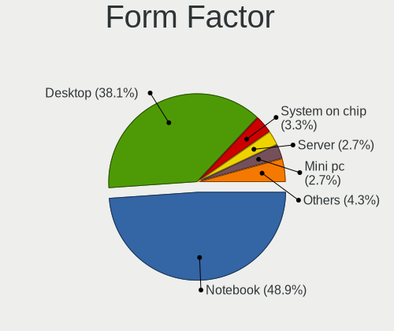
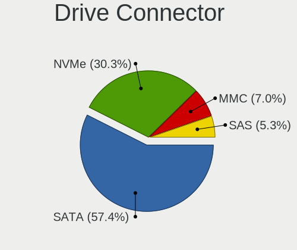
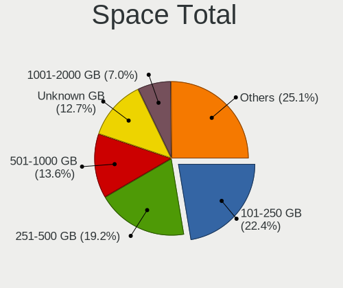
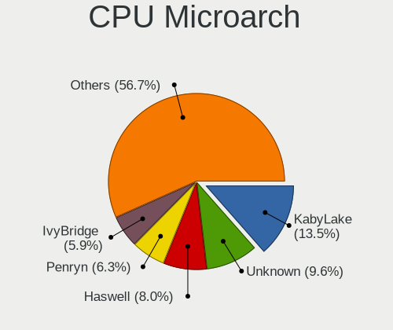
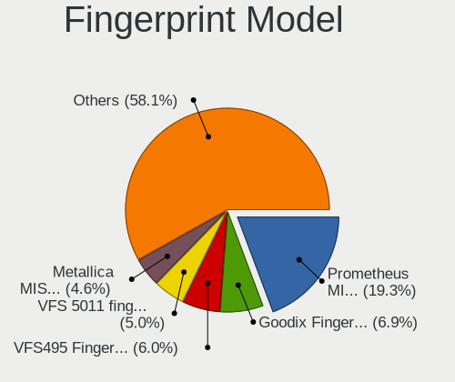
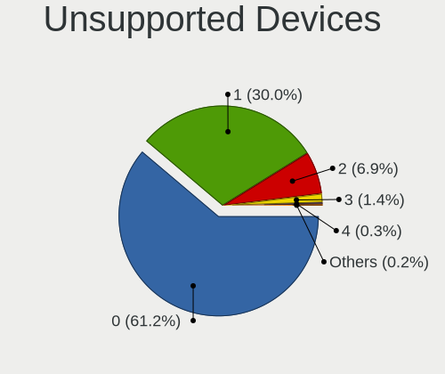

Debian - Tested Hardware & Statistics
-------------------------------------

A project to collect tested hardware configurations for Debian.

Anyone can contribute to this report by the [hw-probe](https://github.com/linuxhw/hw-probe) tool:

    sudo -E hw-probe -all -upload

Please contribute! Especially if your hardware is rare.

This is a report for all computer types. See also reports for [desktops](/Dist/Debian/Desktop/README.md) and [notebooks](/Dist/Debian/Notebook/README.md).

Contents
--------

* [ Test Cases ](#test-cases)

* [ System ](#system)
  - [ OS                       ](#os)
  - [ OS Family                ](#os-family)
  - [ Kernel                   ](#kernel)
  - [ Kernel Family            ](#kernel-family)
  - [ Kernel Major Ver.        ](#kernel-major-ver)
  - [ Arch                     ](#arch)
  - [ DE                       ](#de)
  - [ Display Server           ](#display-server)
  - [ Display Manager          ](#display-manager)
  - [ OS Lang                  ](#os-lang)
  - [ Boot Mode                ](#boot-mode)
  - [ Filesystem               ](#filesystem)
  - [ Part. scheme             ](#part-scheme)
  - [ Dual Boot with Linux/BSD ](#dual-boot-with-linuxbsd)
  - [ Dual Boot (Win)          ](#dual-boot-win)

* [ Board ](#board)
  - [ Vendor                   ](#vendor)
  - [ Model                    ](#model)
  - [ Model Family             ](#model-family)
  - [ MFG Year                 ](#mfg-year)
  - [ Form Factor              ](#form-factor)
  - [ Secure Boot              ](#secure-boot)
  - [ Coreboot                 ](#coreboot)
  - [ RAM Size                 ](#ram-size)
  - [ RAM Used                 ](#ram-used)
  - [ Total Drives             ](#total-drives)
  - [ Has CD-ROM               ](#has-cd-rom)
  - [ Has Ethernet             ](#has-ethernet)
  - [ Has WiFi                 ](#has-wifi)
  - [ Has Bluetooth            ](#has-bluetooth)

* [ Location ](#location)
  - [ Country                  ](#country)
  - [ City                     ](#city)

* [ Drives ](#drives)
  - [ Drive Vendor             ](#drive-vendor)
  - [ Drive Model              ](#drive-model)
  - [ HDD Vendor               ](#hdd-vendor)
  - [ SSD Vendor               ](#ssd-vendor)
  - [ Drive Kind               ](#drive-kind)
  - [ Drive Connector          ](#drive-connector)
  - [ Drive Size               ](#drive-size)
  - [ Space Total              ](#space-total)
  - [ Space Used               ](#space-used)
  - [ Malfunc. Drives          ](#malfunc-drives)
  - [ Malfunc. Drive Vendor    ](#malfunc-drive-vendor)
  - [ Malfunc. HDD Vendor      ](#malfunc-hdd-vendor)
  - [ Malfunc. Drive Kind      ](#malfunc-drive-kind)
  - [ Failed Drives            ](#failed-drives)
  - [ Failed Drive Vendor      ](#failed-drive-vendor)
  - [ Drive Status             ](#drive-status)

* [ Storage controller ](#storage-controller)
  - [ Storage Vendor           ](#storage-vendor)
  - [ Storage Model            ](#storage-model)
  - [ Storage Kind             ](#storage-kind)

* [ Processor ](#processor)
  - [ CPU Vendor               ](#cpu-vendor)
  - [ CPU Model                ](#cpu-model)
  - [ CPU Model Family         ](#cpu-model-family)
  - [ CPU Cores                ](#cpu-cores)
  - [ CPU Sockets              ](#cpu-sockets)
  - [ CPU Threads              ](#cpu-threads)
  - [ CPU Op-Modes             ](#cpu-op-modes)
  - [ CPU Microcode            ](#cpu-microcode)
  - [ CPU Microarch            ](#cpu-microarch)

* [ Graphics ](#graphics)
  - [ GPU Vendor               ](#gpu-vendor)
  - [ GPU Model                ](#gpu-model)
  - [ GPU Combo                ](#gpu-combo)
  - [ GPU Driver               ](#gpu-driver)
  - [ GPU Memory               ](#gpu-memory)

* [ Monitor ](#monitor)
  - [ Monitor Vendor           ](#monitor-vendor)
  - [ Monitor Model            ](#monitor-model)
  - [ Monitor Resolution       ](#monitor-resolution)
  - [ Monitor Diagonal         ](#monitor-diagonal)
  - [ Monitor Width            ](#monitor-width)
  - [ Aspect Ratio             ](#aspect-ratio)
  - [ Monitor Area             ](#monitor-area)
  - [ Pixel Density            ](#pixel-density)
  - [ Multiple Monitors        ](#multiple-monitors)

* [ Network ](#network)
  - [ Net Controller Vendor    ](#net-controller-vendor)
  - [ Net Controller Model     ](#net-controller-model)
  - [ Wireless Vendor          ](#wireless-vendor)
  - [ Wireless Model           ](#wireless-model)
  - [ Ethernet Vendor          ](#ethernet-vendor)
  - [ Ethernet Model           ](#ethernet-model)
  - [ Net Controller Kind      ](#net-controller-kind)
  - [ Used Controller          ](#used-controller)
  - [ NICs                     ](#nics)
  - [ IPv6                     ](#ipv6)

* [ Bluetooth ](#bluetooth)
  - [ Bluetooth Vendor         ](#bluetooth-vendor)
  - [ Bluetooth Model          ](#bluetooth-model)

* [ Sound ](#sound)
  - [ Sound Vendor             ](#sound-vendor)
  - [ Sound Model              ](#sound-model)

* [ Memory ](#memory)
  - [ Memory Vendor            ](#memory-vendor)
  - [ Memory Model             ](#memory-model)
  - [ Memory Kind              ](#memory-kind)
  - [ Memory Form Factor       ](#memory-form-factor)
  - [ Memory Size              ](#memory-size)
  - [ Memory Speed             ](#memory-speed)

* [ Printers & scanners ](#printers--scanners)
  - [ Printer Vendor           ](#printer-vendor)
  - [ Printer Model            ](#printer-model)
  - [ Scanner Vendor           ](#scanner-vendor)
  - [ Scanner Model            ](#scanner-model)

* [ Camera ](#camera)
  - [ Camera Vendor            ](#camera-vendor)
  - [ Camera Model             ](#camera-model)

* [ Security ](#security)
  - [ Fingerprint Vendor       ](#fingerprint-vendor)
  - [ Fingerprint Model        ](#fingerprint-model)
  - [ Chipcard Vendor          ](#chipcard-vendor)
  - [ Chipcard Model           ](#chipcard-model)

* [ Unsupported ](#unsupported)
  - [ Unsupported Devices      ](#unsupported-devices)
  - [ Unsupported Device Types ](#unsupported-device-types)

Test Cases
----------

Total: 14635

| Vendor        | Model                       | Form-Factor | Probe                                                      | Date         |
|---------------|-----------------------------|-------------|------------------------------------------------------------|--------------|
| HUAWEI        | BOM-WXX9                    | Notebook    | [4d4d992cb0](https://linux-hardware.org/?probe=4d4d992cb0) | Jul 01, 2023 |
| Dell          | 0HC3G4 A00                  | Mini pc     | [c111f0f4be](https://linux-hardware.org/?probe=c111f0f4be) | Jul 01, 2023 |
| ASRock        | A320M-HD                    | Desktop     | [1df7c65f40](https://linux-hardware.org/?probe=1df7c65f40) | Jul 01, 2023 |
| HP            | 255 G8 Notebook PC          | Notebook    | [3c3ddffa8b](https://linux-hardware.org/?probe=3c3ddffa8b) | Jul 01, 2023 |
| Acer          | Aspire V5-123               | Notebook    | [8507833f22](https://linux-hardware.org/?probe=8507833f22) | Jul 01, 2023 |
| Gigabyte      | Z77X-UD5H                   | Desktop     | [eea1d9623c](https://linux-hardware.org/?probe=eea1d9623c) | Jun 30, 2023 |
| ASUSTek       | K501UX                      | Notebook    | [a7fb172b7d](https://linux-hardware.org/?probe=a7fb172b7d) | Jun 30, 2023 |
| HP            | ProLiant DL360 G7           | Server      | [7e37520061](https://linux-hardware.org/?probe=7e37520061) | Jun 30, 2023 |
| Apple         | MacBookAir7,2               | Notebook    | [cb1bcce659](https://linux-hardware.org/?probe=cb1bcce659) | Jun 30, 2023 |
| Lenovo        | IdeaPad 330S-15IKB 81F5     | Notebook    | [39a8ee4269](https://linux-hardware.org/?probe=39a8ee4269) | Jun 30, 2023 |
| ASUSTek       | P6X58D PREMIUM              | Desktop     | [b2d81d6e67](https://linux-hardware.org/?probe=b2d81d6e67) | Jun 30, 2023 |
| Gigabyte      | H55M-UD2H                   | Desktop     | [befac7b8de](https://linux-hardware.org/?probe=befac7b8de) | Jun 30, 2023 |
| HP            | EliteBook 850 G1            | Notebook    | [a5f3a5ad14](https://linux-hardware.org/?probe=a5f3a5ad14) | Jun 30, 2023 |
| Gigabyte      | Z170XP-SLI-CF               | Desktop     | [ed171ca808](https://linux-hardware.org/?probe=ed171ca808) | Jun 30, 2023 |
| Lenovo        | ThinkPad T495 20NK000XBR    | Notebook    | [2b5e40efaa](https://linux-hardware.org/?probe=2b5e40efaa) | Jun 30, 2023 |
| Lenovo        | ThinkPad T430s 23554L7      | Notebook    | [501b0860c8](https://linux-hardware.org/?probe=501b0860c8) | Jun 30, 2023 |
| ASRock        | Z68 Pro3 Gen3               | Desktop     | [9fc143ab80](https://linux-hardware.org/?probe=9fc143ab80) | Jun 30, 2023 |
| Dell          | G3 3590                     | Notebook    | [5c7312fed9](https://linux-hardware.org/?probe=5c7312fed9) | Jun 30, 2023 |
| ASRock        | G31M-GS                     | Desktop     | [3bd67e0f9f](https://linux-hardware.org/?probe=3bd67e0f9f) | Jun 30, 2023 |
| Dell          | 0PV3YR A05                  | Server      | [7cb124d729](https://linux-hardware.org/?probe=7cb124d729) | Jun 30, 2023 |
| Lenovo        | ThinkPad L512 44444NG       | Notebook    | [300a79aa88](https://linux-hardware.org/?probe=300a79aa88) | Jun 30, 2023 |
| ASUSTek       | T100TA                      | Notebook    | [921821fda8](https://linux-hardware.org/?probe=921821fda8) | Jun 30, 2023 |
| Dell          | Inspiron 7373               | Convertible | [e7edaad244](https://linux-hardware.org/?probe=e7edaad244) | Jun 30, 2023 |
| ASUSTek       | K52F                        | Notebook    | [98e9b448c7](https://linux-hardware.org/?probe=98e9b448c7) | Jun 30, 2023 |
| Acer          | Aspire V3-772               | Notebook    | [0fae87e118](https://linux-hardware.org/?probe=0fae87e118) | Jun 29, 2023 |
| Acer          | TravelMate P449-G2-M        | Notebook    | [b9291d6951](https://linux-hardware.org/?probe=b9291d6951) | Jun 29, 2023 |
| Lenovo        | ThinkPad E15 Gen 2 20TDC... | Notebook    | [62ff10cadc](https://linux-hardware.org/?probe=62ff10cadc) | Jun 29, 2023 |
| ASUSTek       | P8Z68-V PRO                 | Desktop     | [a3de72d73c](https://linux-hardware.org/?probe=a3de72d73c) | Jun 29, 2023 |
| Dell          | 0PU052                      | Desktop     | [b4fde65c68](https://linux-hardware.org/?probe=b4fde65c68) | Jun 29, 2023 |
| Lenovo        | ThinkPad T440p 2000CT0      | Notebook    | [10c852dc38](https://linux-hardware.org/?probe=10c852dc38) | Jun 29, 2023 |
| Lenovo        | V14 G2 ITL 82NM             | Notebook    | [25a1aaf938](https://linux-hardware.org/?probe=25a1aaf938) | Jun 29, 2023 |
| Lenovo        | ThinkPad T480 20L6S68T00    | Notebook    | [a50310948a](https://linux-hardware.org/?probe=a50310948a) | Jun 29, 2023 |
| HP            | Pavilion dv6                | Notebook    | [b6c2bcb025](https://linux-hardware.org/?probe=b6c2bcb025) | Jun 29, 2023 |
| Gigabyte      | B365M D3H-CF                | Desktop     | [f40af0020a](https://linux-hardware.org/?probe=f40af0020a) | Jun 29, 2023 |
| ASUSTek       | TUF Gaming Z690-PLUS WIF... | Desktop     | [a996f391dc](https://linux-hardware.org/?probe=a996f391dc) | Jun 29, 2023 |
| Supermicro    | X8ST3                       | Desktop     | [305a3e3c1a](https://linux-hardware.org/?probe=305a3e3c1a) | Jun 29, 2023 |
| Dell          | Latitude 3500               | Notebook    | [e1831984f8](https://linux-hardware.org/?probe=e1831984f8) | Jun 28, 2023 |
| Dell          | Latitude 7370               | Notebook    | [cb11921012](https://linux-hardware.org/?probe=cb11921012) | Jun 28, 2023 |
| Shuttle       | FS61                        | Desktop     | [a67d2edea8](https://linux-hardware.org/?probe=a67d2edea8) | Jun 28, 2023 |
| ASUSTek       | PRIME B550M-A               | Desktop     | [d6823d5ec7](https://linux-hardware.org/?probe=d6823d5ec7) | Jun 28, 2023 |
| Aquarius      | NS585                       | Notebook    | [52a07593c9](https://linux-hardware.org/?probe=52a07593c9) | Jun 28, 2023 |
| HP            | Pavilion dv6                | Notebook    | [7fe9e439c0](https://linux-hardware.org/?probe=7fe9e439c0) | Jun 28, 2023 |
| Lenovo        | ThinkPad E15 Gen 2 20TD0... | Notebook    | [4a4411b820](https://linux-hardware.org/?probe=4a4411b820) | Jun 28, 2023 |
| Aquarius      | NS585                       | Notebook    | [b2f86e98f9](https://linux-hardware.org/?probe=b2f86e98f9) | Jun 28, 2023 |
| Lenovo        | ThinkPad E15 Gen 2 20TD0... | Notebook    | [2ed2f000d3](https://linux-hardware.org/?probe=2ed2f000d3) | Jun 28, 2023 |
| Lenovo        | ThinkPad Yoga 370 20JJS0... | Convertible | [f60ead06fd](https://linux-hardware.org/?probe=f60ead06fd) | Jun 28, 2023 |
| HP            | 21B4 A01                    | Desktop     | [50656fb7ec](https://linux-hardware.org/?probe=50656fb7ec) | Jun 28, 2023 |
| HP            | 21B4 A01                    | Desktop     | [4d9322819d](https://linux-hardware.org/?probe=4d9322819d) | Jun 28, 2023 |
| Raspberry ... | Raspberry Pi 2 Model B R... | Soc         | [04d1ab025a](https://linux-hardware.org/?probe=04d1ab025a) | Jun 28, 2023 |
| ASUSTek       | ZenBook Pro 15 UX550GEX_... | Notebook    | [56eef68e89](https://linux-hardware.org/?probe=56eef68e89) | Jun 28, 2023 |
| OEM           | Unknown                     | Desktop     | [0448bbee67](https://linux-hardware.org/?probe=0448bbee67) | Jun 28, 2023 |
| Acer          | Aspire A315-23G             | Notebook    | [1c07c9f0b8](https://linux-hardware.org/?probe=1c07c9f0b8) | Jun 28, 2023 |
| Lenovo        | Legion R9000P ARH7H 82RG    | Notebook    | [ab4772fd2e](https://linux-hardware.org/?probe=ab4772fd2e) | Jun 28, 2023 |
| ASUSTek       | X99-WS/IPMI                 | Desktop     | [fff4bc4f46](https://linux-hardware.org/?probe=fff4bc4f46) | Jun 28, 2023 |
| ASUSTek       | PRIME A320I-K               | Desktop     | [bc9d733b89](https://linux-hardware.org/?probe=bc9d733b89) | Jun 27, 2023 |
| Lenovo        | ThinkPad X280 20KF001RUK    | Notebook    | [a1da72b9a5](https://linux-hardware.org/?probe=a1da72b9a5) | Jun 27, 2023 |
| Dell          | 0H1TR9 A00                  | All in one  | [b4be8eaa80](https://linux-hardware.org/?probe=b4be8eaa80) | Jun 27, 2023 |
| AMI           | Cherry Trail CR             | Desktop     | [65fb07ed8d](https://linux-hardware.org/?probe=65fb07ed8d) | Jun 27, 2023 |
| Lenovo        | 1048 SDK0K17763 WIN 1801... | Desktop     | [d903758323](https://linux-hardware.org/?probe=d903758323) | Jun 27, 2023 |
| Gigabyte      | B550 AORUS PRO V2           | Desktop     | [1143a7eebc](https://linux-hardware.org/?probe=1143a7eebc) | Jun 27, 2023 |
| Supermicro    | X9DRT                       | Server      | [807e745cb1](https://linux-hardware.org/?probe=807e745cb1) | Jun 27, 2023 |
| HP            | EliteBook 845 G8 Noteboo... | Notebook    | [8112f38f33](https://linux-hardware.org/?probe=8112f38f33) | Jun 27, 2023 |
| Coradir       | Coradir/ES10IS5             | Notebook    | [d2d1f5b2a5](https://linux-hardware.org/?probe=d2d1f5b2a5) | Jun 27, 2023 |
| Gigabyte      | GA-78LMT-USB3 x.x           | Desktop     | [baf77629c1](https://linux-hardware.org/?probe=baf77629c1) | Jun 26, 2023 |
| HP            | Laptop 15-ef1xxx            | Notebook    | [765d0708eb](https://linux-hardware.org/?probe=765d0708eb) | Jun 26, 2023 |
| Lenovo        | ThinkPad T480 20L6S5LF00    | Notebook    | [5a062be874](https://linux-hardware.org/?probe=5a062be874) | Jun 26, 2023 |
| ASUSTek       | K53SJ                       | Notebook    | [fe211e4239](https://linux-hardware.org/?probe=fe211e4239) | Jun 26, 2023 |
| Dell          | 0PU052                      | Desktop     | [34eaa7185d](https://linux-hardware.org/?probe=34eaa7185d) | Jun 26, 2023 |
| ASUSTek       | M4A78T-E                    | Desktop     | [7b60ea1445](https://linux-hardware.org/?probe=7b60ea1445) | Jun 26, 2023 |
| Gigabyte      | H310MD2P-CF                 | Desktop     | [1ad319cfc7](https://linux-hardware.org/?probe=1ad319cfc7) | Jun 26, 2023 |
| HP            | EliteBook 835 13 inch G1... | Notebook    | [e43818af40](https://linux-hardware.org/?probe=e43818af40) | Jun 26, 2023 |
| BESSTAR Te... | B550                        | Desktop     | [87962635d3](https://linux-hardware.org/?probe=87962635d3) | Jun 26, 2023 |
| LG Electro... | 17Z90R-G.AD79F              | Notebook    | [0d641b84fe](https://linux-hardware.org/?probe=0d641b84fe) | Jun 26, 2023 |
| Acer          | Aspire A515-56              | Notebook    | [0ee45fd3e8](https://linux-hardware.org/?probe=0ee45fd3e8) | Jun 26, 2023 |
| Coradir       | Coradir/ES10IS5             | Notebook    | [d6a1e61945](https://linux-hardware.org/?probe=d6a1e61945) | Jun 26, 2023 |
| Lenovo        | IdeaPad 3 15ABA7 82RN       | Notebook    | [b8a3042b9d](https://linux-hardware.org/?probe=b8a3042b9d) | Jun 26, 2023 |
| Aquarius      | NS585                       | Notebook    | [25af22ec30](https://linux-hardware.org/?probe=25af22ec30) | Jun 26, 2023 |
| Aquarius      | NS585                       | Notebook    | [8e957a70f0](https://linux-hardware.org/?probe=8e957a70f0) | Jun 26, 2023 |
| Aquarius      | NS585                       | Notebook    | [bb09ae1f8d](https://linux-hardware.org/?probe=bb09ae1f8d) | Jun 26, 2023 |
| HP            | OMEN by Laptop              | Notebook    | [07d9cc6d71](https://linux-hardware.org/?probe=07d9cc6d71) | Jun 26, 2023 |
| Apple         | MacBook2,1                  | Notebook    | [f5c0a2fd49](https://linux-hardware.org/?probe=f5c0a2fd49) | Jun 26, 2023 |
| HP            | Compaq Mini 110c-1100       | Notebook    | [0dc147bd7c](https://linux-hardware.org/?probe=0dc147bd7c) | Jun 26, 2023 |
| Leader        | SC8-PRO                     | Stick pc    | [ad54f075f6](https://linux-hardware.org/?probe=ad54f075f6) | Jun 26, 2023 |
| Lenovo        | ThinkPad T430 34766TT       | Notebook    | [06ad7b4a25](https://linux-hardware.org/?probe=06ad7b4a25) | Jun 26, 2023 |
| Dell          | XPS 15 7590                 | Notebook    | [dfc817892b](https://linux-hardware.org/?probe=dfc817892b) | Jun 26, 2023 |
| Raspberry ... | Raspberry Pi 3 Model B R... | Soc         | [b4fcf1904c](https://linux-hardware.org/?probe=b4fcf1904c) | Jun 26, 2023 |
| Dell          | 0PV3YR A05                  | Server      | [29cc577c0c](https://linux-hardware.org/?probe=29cc577c0c) | Jun 26, 2023 |
| Lenovo        | IdeaPad 520-15IKB 80YL      | Notebook    | [ed89cd0d05](https://linux-hardware.org/?probe=ed89cd0d05) | Jun 26, 2023 |
| Lenovo        | IdeaPad 520-15IKB 80YL      | Notebook    | [62665eec25](https://linux-hardware.org/?probe=62665eec25) | Jun 26, 2023 |
| Gigabyte      | B75M-D3H                    | Desktop     | [aeb1c6b8d2](https://linux-hardware.org/?probe=aeb1c6b8d2) | Jun 26, 2023 |
| ASUSTek       | VivoBook_ASUSLaptop X515... | Notebook    | [0a233c34b3](https://linux-hardware.org/?probe=0a233c34b3) | Jun 26, 2023 |
| Dell          | XPS 15 9530                 | Notebook    | [9c925666a5](https://linux-hardware.org/?probe=9c925666a5) | Jun 26, 2023 |
| Dell          | XPS 15 9530                 | Notebook    | [ea814b3f7b](https://linux-hardware.org/?probe=ea814b3f7b) | Jun 26, 2023 |
| Avell High... | A70 HYB                     | Notebook    | [3ccdaf3c82](https://linux-hardware.org/?probe=3ccdaf3c82) | Jun 26, 2023 |
| ASUSTek       | E403SA                      | Notebook    | [bdc47269c3](https://linux-hardware.org/?probe=bdc47269c3) | Jun 25, 2023 |
| HP            | Laptop 14-dq0xxx            | Notebook    | [695dd94347](https://linux-hardware.org/?probe=695dd94347) | Jun 25, 2023 |
| ASUSTek       | ROG STRIX B760-F GAMING ... | Desktop     | [117bfb7088](https://linux-hardware.org/?probe=117bfb7088) | Jun 25, 2023 |
| Lenovo        | IdeaPad Gaming 3 15ARH7 ... | Notebook    | [cee2bb11dc](https://linux-hardware.org/?probe=cee2bb11dc) | Jun 25, 2023 |
| JINGSHA       | Unknown                     | Desktop     | [2ae6ac9599](https://linux-hardware.org/?probe=2ae6ac9599) | Jun 25, 2023 |
| HP            | Laptop 15s-eq2xxx           | Notebook    | [14cc9e067f](https://linux-hardware.org/?probe=14cc9e067f) | Jun 25, 2023 |
| Dell          | Inspiron 5593               | Notebook    | [06f1256f88](https://linux-hardware.org/?probe=06f1256f88) | Jun 25, 2023 |
| Biostar       | X370GTN                     | Desktop     | [80b2b1d180](https://linux-hardware.org/?probe=80b2b1d180) | Jun 25, 2023 |
| ASRock        | H61M-HVS                    | Desktop     | [a65485d236](https://linux-hardware.org/?probe=a65485d236) | Jun 25, 2023 |
| Dell          | 0PV3YR A05                  | Server      | [9dce40179d](https://linux-hardware.org/?probe=9dce40179d) | Jun 25, 2023 |
| Intel         | H55                         | Desktop     | [993c041483](https://linux-hardware.org/?probe=993c041483) | Jun 25, 2023 |
| Dell          | Latitude E6430              | Notebook    | [be9b6c75da](https://linux-hardware.org/?probe=be9b6c75da) | Jun 25, 2023 |
| Toshiba       | IS 1413G                    | Notebook    | [a87db20468](https://linux-hardware.org/?probe=a87db20468) | Jun 25, 2023 |
| Biostar       | TH55B HD                    | Desktop     | [5fbef8b11a](https://linux-hardware.org/?probe=5fbef8b11a) | Jun 25, 2023 |
| Lenovo        | V15 G2 ALC 82KD             | Notebook    | [a7df01b153](https://linux-hardware.org/?probe=a7df01b153) | Jun 24, 2023 |
| Dell          | Inspiron 1720               | Notebook    | [60c2ef3b92](https://linux-hardware.org/?probe=60c2ef3b92) | Jun 24, 2023 |
| HUAWEI        | BOHK-WAX9X                  | Notebook    | [fe084d5ddb](https://linux-hardware.org/?probe=fe084d5ddb) | Jun 24, 2023 |
| Lenovo        | ThinkPad X120e 0611AN2      | Notebook    | [a8420bc87d](https://linux-hardware.org/?probe=a8420bc87d) | Jun 24, 2023 |
| Acer          | Aspire VN7-591G             | Notebook    | [356b066ca9](https://linux-hardware.org/?probe=356b066ca9) | Jun 24, 2023 |
| Gigabyte      | EP45C-DS3R                  | Desktop     | [655d9d950d](https://linux-hardware.org/?probe=655d9d950d) | Jun 24, 2023 |
| HP            | 872E                        | Mini pc     | [d59093e79e](https://linux-hardware.org/?probe=d59093e79e) | Jun 24, 2023 |
| Google        | Kip                         | Notebook    | [4e1bfd359e](https://linux-hardware.org/?probe=4e1bfd359e) | Jun 24, 2023 |
| HP            | EliteBook 830 G5            | Notebook    | [2b61a56610](https://linux-hardware.org/?probe=2b61a56610) | Jun 24, 2023 |
| Dell          | 01XK1W A00                  | Desktop     | [53dbc2e799](https://linux-hardware.org/?probe=53dbc2e799) | Jun 24, 2023 |
| Dell          | XPS 15 9570                 | Notebook    | [2c09eb930c](https://linux-hardware.org/?probe=2c09eb930c) | Jun 23, 2023 |
| ASUSTek       | K30BF_M32BF                 | Desktop     | [46a7aaf9f1](https://linux-hardware.org/?probe=46a7aaf9f1) | Jun 23, 2023 |
| Lenovo        | ThinkPad X270 W10DG 20K5... | Notebook    | [3cc7c77a76](https://linux-hardware.org/?probe=3cc7c77a76) | Jun 23, 2023 |
| Irbis         | NB131                       | Convertible | [9898b376fe](https://linux-hardware.org/?probe=9898b376fe) | Jun 23, 2023 |
| HP            | 8470p EliteBook             | Notebook    | [da3719515b](https://linux-hardware.org/?probe=da3719515b) | Jun 23, 2023 |
| Acer          | Predator PH315-54           | Notebook    | [46d748a0a1](https://linux-hardware.org/?probe=46d748a0a1) | Jun 23, 2023 |
| ASRockRack    | X470D4U                     | Desktop     | [2d49269787](https://linux-hardware.org/?probe=2d49269787) | Jun 23, 2023 |
| ASRockRack    | X470D4U2-2T                 | Desktop     | [4a11a4190a](https://linux-hardware.org/?probe=4a11a4190a) | Jun 23, 2023 |
| Lenovo        | ThinkPad L13 Yoga Gen 2 ... | Convertible | [71f114122e](https://linux-hardware.org/?probe=71f114122e) | Jun 23, 2023 |
| Lenovo        | Edge 15 80H1                | Notebook    | [aff25effc2](https://linux-hardware.org/?probe=aff25effc2) | Jun 23, 2023 |
| HP            | EliteBook 8540w             | Notebook    | [6d8c00ff02](https://linux-hardware.org/?probe=6d8c00ff02) | Jun 23, 2023 |
| HP            | EliteBook 8540w             | Notebook    | [1c1a2724f4](https://linux-hardware.org/?probe=1c1a2724f4) | Jun 23, 2023 |
| Foxconn       | G31MXP FAB:1.1              | Desktop     | [9ed9153958](https://linux-hardware.org/?probe=9ed9153958) | Jun 23, 2023 |
| Gigabyte      | B250M-DS3H-CF               | Desktop     | [1ca06fb3a9](https://linux-hardware.org/?probe=1ca06fb3a9) | Jun 23, 2023 |
| Lenovo        | ThinkPad X1 Carbon 4th 2... | Notebook    | [3cdf59359c](https://linux-hardware.org/?probe=3cdf59359c) | Jun 23, 2023 |
| HP            | 3397                        | Desktop     | [8c9be2f4c0](https://linux-hardware.org/?probe=8c9be2f4c0) | Jun 23, 2023 |
| ASUSTek       | ZenBook Pro Duo UX581GV_... | Notebook    | [5298e132fc](https://linux-hardware.org/?probe=5298e132fc) | Jun 23, 2023 |
| Acer          | Aspire A515-55              | Notebook    | [bf6de06fb9](https://linux-hardware.org/?probe=bf6de06fb9) | Jun 23, 2023 |
| VIT           | P2423                       | Notebook    | [19242b2ddb](https://linux-hardware.org/?probe=19242b2ddb) | Jun 23, 2023 |
| Foxconn       | nT-iBT18/nT-iBT19/nT-iBT... | Desktop     | [51b5eb0fa2](https://linux-hardware.org/?probe=51b5eb0fa2) | Jun 23, 2023 |
| Dell          | 0HC3G4 A00                  | Mini pc     | [23723983da](https://linux-hardware.org/?probe=23723983da) | Jun 23, 2023 |
| Lenovo        | Flex 2-14 20404             | Notebook    | [b5576af3f8](https://linux-hardware.org/?probe=b5576af3f8) | Jun 23, 2023 |
| Lenovo        | Flex 2-14 20404             | Notebook    | [911336b572](https://linux-hardware.org/?probe=911336b572) | Jun 23, 2023 |
| ASUSTek       | K30BF_M32BF                 | Desktop     | [655b20a34b](https://linux-hardware.org/?probe=655b20a34b) | Jun 23, 2023 |
| ASRockRack    | X470D4U                     | Desktop     | [d419086209](https://linux-hardware.org/?probe=d419086209) | Jun 22, 2023 |
| Supermicro    | X8DTU                       | Server      | [d8d978bd73](https://linux-hardware.org/?probe=d8d978bd73) | Jun 22, 2023 |
| Lenovo        | ThinkPad X230 2325SRQ       | Notebook    | [fd42553eea](https://linux-hardware.org/?probe=fd42553eea) | Jun 22, 2023 |
| ASRock        | FM2A58M-VG3+ R2.0           | Desktop     | [9ab87d56a7](https://linux-hardware.org/?probe=9ab87d56a7) | Jun 22, 2023 |
| ASUSTek       | X45U                        | Notebook    | [63a491a160](https://linux-hardware.org/?probe=63a491a160) | Jun 22, 2023 |
| HP            | 3397                        | Desktop     | [a47ce0d4dc](https://linux-hardware.org/?probe=a47ce0d4dc) | Jun 22, 2023 |
| Acer          | Aspire X1700                | Desktop     | [aac17ef2f2](https://linux-hardware.org/?probe=aac17ef2f2) | Jun 22, 2023 |
| AMI           | Intel                       | Desktop     | [1a4a632d56](https://linux-hardware.org/?probe=1a4a632d56) | Jun 22, 2023 |
| ASUSTek       | ROG CROSSHAIR VIII DARK ... | Desktop     | [abbb1b897d](https://linux-hardware.org/?probe=abbb1b897d) | Jun 22, 2023 |
| ASRock        | NUC-TGL                     | Desktop     | [6dcb1eb43d](https://linux-hardware.org/?probe=6dcb1eb43d) | Jun 22, 2023 |
| ASRock        | X670E PG Lightning          | Desktop     | [b8e19a16f9](https://linux-hardware.org/?probe=b8e19a16f9) | Jun 22, 2023 |
| ASUSTek       | TUF Gaming X570-PLUS        | Desktop     | [7117d51b53](https://linux-hardware.org/?probe=7117d51b53) | Jun 21, 2023 |
| Dell          | Inspiron 1525               | Notebook    | [1cdf3502e8](https://linux-hardware.org/?probe=1cdf3502e8) | Jun 21, 2023 |
| Dell          | Inspiron 1525               | Notebook    | [7bbc89ec0f](https://linux-hardware.org/?probe=7bbc89ec0f) | Jun 21, 2023 |
| HP            | EliteBook x360 1030 G2      | Convertible | [a7b7b2c413](https://linux-hardware.org/?probe=a7b7b2c413) | Jun 21, 2023 |
| Dell          | Latitude E5550              | Notebook    | [72f4d53246](https://linux-hardware.org/?probe=72f4d53246) | Jun 21, 2023 |
| HP            | EliteBook x360 1030 G2      | Convertible | [d4bd011ff9](https://linux-hardware.org/?probe=d4bd011ff9) | Jun 21, 2023 |
| Gigabyte      | B550M DS3H                  | Desktop     | [2e32510f57](https://linux-hardware.org/?probe=2e32510f57) | Jun 21, 2023 |
| Apple         | MacBookPro10,1              | Notebook    | [9841bf505c](https://linux-hardware.org/?probe=9841bf505c) | Jun 21, 2023 |
| Apple         | MacBookAir7,2               | Notebook    | [9f3829c99f](https://linux-hardware.org/?probe=9f3829c99f) | Jun 21, 2023 |
| Apple         | MacBookAir7,2               | Notebook    | [379e3473e2](https://linux-hardware.org/?probe=379e3473e2) | Jun 21, 2023 |
| Apple         | MacBookAir7,2               | Notebook    | [8a2a9fd293](https://linux-hardware.org/?probe=8a2a9fd293) | Jun 21, 2023 |
| Dell          | Inspiron 5570               | Notebook    | [d661316023](https://linux-hardware.org/?probe=d661316023) | Jun 21, 2023 |
| HP            | 1998                        | Desktop     | [efcccef24e](https://linux-hardware.org/?probe=efcccef24e) | Jun 21, 2023 |
| MSI           | H110M PRO-D                 | Desktop     | [b652abc634](https://linux-hardware.org/?probe=b652abc634) | Jun 21, 2023 |
| HP            | 1998                        | Desktop     | [71bee9f013](https://linux-hardware.org/?probe=71bee9f013) | Jun 21, 2023 |
| Lenovo        | IdeaPadFlex 15 20309        | Notebook    | [76fbd356a0](https://linux-hardware.org/?probe=76fbd356a0) | Jun 21, 2023 |
| Dell          | Latitude E5550              | Notebook    | [e1fdcf84b3](https://linux-hardware.org/?probe=e1fdcf84b3) | Jun 21, 2023 |
| HP            | 1588h                       | Desktop     | [abe5412cf6](https://linux-hardware.org/?probe=abe5412cf6) | Jun 21, 2023 |
| HP            | 1588h                       | Desktop     | [f08e230cd3](https://linux-hardware.org/?probe=f08e230cd3) | Jun 21, 2023 |
| Microsoft     | Surface Go                  | Tablet      | [197d2f4c7c](https://linux-hardware.org/?probe=197d2f4c7c) | Jun 21, 2023 |
| Lenovo        | IdeaPad Gaming 3 15ACH6 ... | Notebook    | [8a61f834dd](https://linux-hardware.org/?probe=8a61f834dd) | Jun 21, 2023 |
| Dell          | Vostro 5490                 | Notebook    | [10d1aeda8b](https://linux-hardware.org/?probe=10d1aeda8b) | Jun 21, 2023 |
| libre-comp... | roc-rk3328-cc               | Soc         | [f18c138ec9](https://linux-hardware.org/?probe=f18c138ec9) | Jun 21, 2023 |
| Lenovo        | 01GR176                     | Server      | [6d28cbec97](https://linux-hardware.org/?probe=6d28cbec97) | Jun 21, 2023 |
| ASRockRack    | X470D4U                     | Desktop     | [9e0ba5032b](https://linux-hardware.org/?probe=9e0ba5032b) | Jun 21, 2023 |
| Lenovo        | 310C SDK0J40697 WIN 3305... | Mini pc     | [0aa3b8d433](https://linux-hardware.org/?probe=0aa3b8d433) | Jun 21, 2023 |
| ASRock        | X570 Extreme4               | Desktop     | [3ff2c9e4cc](https://linux-hardware.org/?probe=3ff2c9e4cc) | Jun 21, 2023 |
| Lenovo        | IdeaPad Gaming 3 15ACH6 ... | Notebook    | [291796e3e4](https://linux-hardware.org/?probe=291796e3e4) | Jun 21, 2023 |
| Lenovo        | IdeaPad 330-17AST 81D7      | Notebook    | [dc5a63aacc](https://linux-hardware.org/?probe=dc5a63aacc) | Jun 20, 2023 |
| Apple         | MacBook6,1                  | Notebook    | [c7e1912b55](https://linux-hardware.org/?probe=c7e1912b55) | Jun 20, 2023 |
| Apple         | MacBook5,2                  | Notebook    | [53f708517b](https://linux-hardware.org/?probe=53f708517b) | Jun 20, 2023 |
| Google        | Stout                       | Notebook    | [cb67ad655e](https://linux-hardware.org/?probe=cb67ad655e) | Jun 20, 2023 |
| Packard Be... | EasyNote TE11HC             | Notebook    | [6bbc56b36c](https://linux-hardware.org/?probe=6bbc56b36c) | Jun 20, 2023 |
| Dell          | Latitude E7450              | Notebook    | [4760bb7306](https://linux-hardware.org/?probe=4760bb7306) | Jun 20, 2023 |
| ASRock        | B760 Pro RS/D4              | Desktop     | [bf19dd1c4b](https://linux-hardware.org/?probe=bf19dd1c4b) | Jun 20, 2023 |
| Apple         | MacBookPro5,5               | Notebook    | [16c4045c3b](https://linux-hardware.org/?probe=16c4045c3b) | Jun 20, 2023 |
| ASUSTek       | PRIME H310M-K               | Desktop     | [1742a525de](https://linux-hardware.org/?probe=1742a525de) | Jun 20, 2023 |
| MSI           | H81M-P33                    | Desktop     | [62fb9cda50](https://linux-hardware.org/?probe=62fb9cda50) | Jun 20, 2023 |
| Dell          | 06FW8P A02                  | Desktop     | [f65ec61ffc](https://linux-hardware.org/?probe=f65ec61ffc) | Jun 20, 2023 |
| ASUSTek       | PRIME H310M-K               | Desktop     | [cfc9cd338e](https://linux-hardware.org/?probe=cfc9cd338e) | Jun 20, 2023 |
| Dell          | 0RW203                      | Desktop     | [6872d8e6c5](https://linux-hardware.org/?probe=6872d8e6c5) | Jun 20, 2023 |
| Apple         | Mac-F4228EC8 DVT            | All in one  | [9b75bc9f7e](https://linux-hardware.org/?probe=9b75bc9f7e) | Jun 20, 2023 |
| HP            | Pavilion Laptop 15-cs0xx... | Notebook    | [c3f77cf346](https://linux-hardware.org/?probe=c3f77cf346) | Jun 20, 2023 |
| Acer          | TravelMate P449-G2-M        | Notebook    | [98626bde6c](https://linux-hardware.org/?probe=98626bde6c) | Jun 20, 2023 |
| Dell          | Latitude 3410               | Notebook    | [1e0348842a](https://linux-hardware.org/?probe=1e0348842a) | Jun 19, 2023 |
| Amlogic       | Meson GXL (S905X) P212 D... | Soc         | [7c79fa6641](https://linux-hardware.org/?probe=7c79fa6641) | Jun 19, 2023 |
| Dell          | 0PU052                      | Desktop     | [2eb6dceca9](https://linux-hardware.org/?probe=2eb6dceca9) | Jun 19, 2023 |
| Lenovo        | Yoga Slim 7 Pro 14ACH5 O... | Notebook    | [a0862de551](https://linux-hardware.org/?probe=a0862de551) | Jun 19, 2023 |
| Lenovo        | Yoga Slim 7 Pro 14ACH5 O... | Notebook    | [3cfd8a448c](https://linux-hardware.org/?probe=3cfd8a448c) | Jun 19, 2023 |
| ASUSTek       | VivoBook_ASUSLaptop X513... | Notebook    | [42fd301e8b](https://linux-hardware.org/?probe=42fd301e8b) | Jun 19, 2023 |
| ASUSTek       | PRIME A320M-K               | Desktop     | [3eab70981f](https://linux-hardware.org/?probe=3eab70981f) | Jun 19, 2023 |
| ASUSTek       | P8H67-M                     | Desktop     | [4c2f50a608](https://linux-hardware.org/?probe=4c2f50a608) | Jun 19, 2023 |
| Lenovo        | IdeaPad S340-15APITouch ... | Notebook    | [fe617b45f8](https://linux-hardware.org/?probe=fe617b45f8) | Jun 19, 2023 |
| Raspberry ... | Raspberry Pi                | Soc         | [1559b0a68d](https://linux-hardware.org/?probe=1559b0a68d) | Jun 19, 2023 |
| Apple         | Mac-F226BEC8 PVT            | All in one  | [640ff2ce2e](https://linux-hardware.org/?probe=640ff2ce2e) | Jun 19, 2023 |
| MSI           | B350M MORTAR                | Desktop     | [dde719cb99](https://linux-hardware.org/?probe=dde719cb99) | Jun 19, 2023 |
| Toshiba       | TECRA R850                  | Notebook    | [c40116d0de](https://linux-hardware.org/?probe=c40116d0de) | Jun 19, 2023 |
| Lenovo        | IdeaPad 700-15ISK 80RU      | Notebook    | [d8d9101ef6](https://linux-hardware.org/?probe=d8d9101ef6) | Jun 19, 2023 |
| Packard Be... | EasyNote TE11HC             | Notebook    | [33785e2493](https://linux-hardware.org/?probe=33785e2493) | Jun 18, 2023 |
| MSI           | B550-A PRO                  | Desktop     | [b0f066ab7e](https://linux-hardware.org/?probe=b0f066ab7e) | Jun 18, 2023 |
| Dell          | Latitude E7450              | Notebook    | [addda016c8](https://linux-hardware.org/?probe=addda016c8) | Jun 18, 2023 |
| Intel         | H81                         | Desktop     | [5cda43eb30](https://linux-hardware.org/?probe=5cda43eb30) | Jun 18, 2023 |
| AZW           | U59                         | Desktop     | [6f1191e5e2](https://linux-hardware.org/?probe=6f1191e5e2) | Jun 18, 2023 |
| Xunlong       | Orange Pi Lite              | Soc         | [f7e41df8d6](https://linux-hardware.org/?probe=f7e41df8d6) | Jun 18, 2023 |
| Gigabyte      | B550M DS3H                  | Desktop     | [e7fdb650cd](https://linux-hardware.org/?probe=e7fdb650cd) | Jun 18, 2023 |
| Dell          | 01XK1W A00                  | Desktop     | [f431c0b66f](https://linux-hardware.org/?probe=f431c0b66f) | Jun 18, 2023 |
| HP            | EliteBook 2530p             | Notebook    | [7d246caf6f](https://linux-hardware.org/?probe=7d246caf6f) | Jun 18, 2023 |
| ASUSTek       | P8H61-M LX                  | Desktop     | [fe3b7abf1d](https://linux-hardware.org/?probe=fe3b7abf1d) | Jun 17, 2023 |
| HP            | EliteBook 8440p             | Notebook    | [4b1b2457a4](https://linux-hardware.org/?probe=4b1b2457a4) | Jun 17, 2023 |
| Lenovo        | IdeaPad Gaming 3 15ACH6 ... | Notebook    | [e4c418382a](https://linux-hardware.org/?probe=e4c418382a) | Jun 17, 2023 |
| HP            | 2B38                        | Desktop     | [b84e03e083](https://linux-hardware.org/?probe=b84e03e083) | Jun 17, 2023 |
| Lenovo        | ThinkPad X1 Carbon 5th 2... | Notebook    | [26b4c05332](https://linux-hardware.org/?probe=26b4c05332) | Jun 17, 2023 |
| Lenovo        | ThinkPad T480s 20L8S10T0... | Notebook    | [a3dd392c51](https://linux-hardware.org/?probe=a3dd392c51) | Jun 17, 2023 |
| Dell          | Latitude 9420               | Convertible | [c60ca4bcc4](https://linux-hardware.org/?probe=c60ca4bcc4) | Jun 17, 2023 |
| Dell          | Latitude E6400              | Notebook    | [0f8aca3e72](https://linux-hardware.org/?probe=0f8aca3e72) | Jun 17, 2023 |
| Unknown       | Unknown                     | Soc         | [92f385e306](https://linux-hardware.org/?probe=92f385e306) | Jun 17, 2023 |
| Lenovo        | 3111 SDK0J40697 WIN 3305... | Mini pc     | [ec95321dfb](https://linux-hardware.org/?probe=ec95321dfb) | Jun 17, 2023 |
| Lenovo        | ThinkPad T14s Gen 1 20UJ... | Notebook    | [d9e1222bc3](https://linux-hardware.org/?probe=d9e1222bc3) | Jun 17, 2023 |
| Dell          | Precision M2800             | Notebook    | [e9f259595a](https://linux-hardware.org/?probe=e9f259595a) | Jun 17, 2023 |
| ASUSTek       | P5K Premium                 | Desktop     | [dddb2b8bdf](https://linux-hardware.org/?probe=dddb2b8bdf) | Jun 17, 2023 |
| Dell          | Latitude 9420               | Convertible | [444f324394](https://linux-hardware.org/?probe=444f324394) | Jun 16, 2023 |
| HP            | OMEN by Laptop 16-c0xxx     | Notebook    | [9cdeeb06de](https://linux-hardware.org/?probe=9cdeeb06de) | Jun 16, 2023 |
| Acer          | Aspire E1-571               | Notebook    | [19e270cab0](https://linux-hardware.org/?probe=19e270cab0) | Jun 16, 2023 |
| Acer          | Aspire E1-571               | Notebook    | [e4b27c6a92](https://linux-hardware.org/?probe=e4b27c6a92) | Jun 16, 2023 |
| ASRock        | B760 Pro RS/D4              | Desktop     | [6767dd6968](https://linux-hardware.org/?probe=6767dd6968) | Jun 16, 2023 |
| Lenovo        | ThinkPad P51 20HJS1SF00     | Notebook    | [664ae7a0f2](https://linux-hardware.org/?probe=664ae7a0f2) | Jun 16, 2023 |
| Dell          | 0XM089 A00                  | Server      | [c52b7c8444](https://linux-hardware.org/?probe=c52b7c8444) | Jun 16, 2023 |
| Dell          | Latitude D620               | Notebook    | [8dc25931d7](https://linux-hardware.org/?probe=8dc25931d7) | Jun 16, 2023 |
| Dell          | Latitude D620               | Notebook    | [819f346812](https://linux-hardware.org/?probe=819f346812) | Jun 16, 2023 |
| HONOR         | NMH-WCX9                    | Notebook    | [ec1b8c4ef4](https://linux-hardware.org/?probe=ec1b8c4ef4) | Jun 16, 2023 |
| Dell          | Latitude E6400              | Notebook    | [7c59595887](https://linux-hardware.org/?probe=7c59595887) | Jun 16, 2023 |
| Unknown       | NETGEAR ReadyNAS 104        | Desktop     | [99df077926](https://linux-hardware.org/?probe=99df077926) | Jun 16, 2023 |
| HUAWEI        | NBD-WXX9                    | Notebook    | [b9bf7ea3c2](https://linux-hardware.org/?probe=b9bf7ea3c2) | Jun 16, 2023 |
| ASRock        | B450 Gaming-ITX/ac          | Desktop     | [d10c160695](https://linux-hardware.org/?probe=d10c160695) | Jun 16, 2023 |
| MSI           | MAG B550M MORTAR MAX WIF... | Desktop     | [9994571651](https://linux-hardware.org/?probe=9994571651) | Jun 15, 2023 |
| HUAWEI        | BOHK-WAX9X                  | Notebook    | [b05e4ee752](https://linux-hardware.org/?probe=b05e4ee752) | Jun 15, 2023 |
| Lenovo        | ThinkPad L13 Yoga Gen 2 ... | Convertible | [1cabb1c87f](https://linux-hardware.org/?probe=1cabb1c87f) | Jun 15, 2023 |
| HP            | Laptop 14-cm0xxx            | Notebook    | [67ed3346c2](https://linux-hardware.org/?probe=67ed3346c2) | Jun 15, 2023 |
| Unknown       | Unknown                     | Notebook    | [f1294224ee](https://linux-hardware.org/?probe=f1294224ee) | Jun 15, 2023 |
| HP            | Laptop 14-cm0xxx            | Notebook    | [07f1089ee7](https://linux-hardware.org/?probe=07f1089ee7) | Jun 15, 2023 |
| HUAWEI        | NBD-WXX9                    | Notebook    | [b55662cc58](https://linux-hardware.org/?probe=b55662cc58) | Jun 15, 2023 |
| Unknown       | Unknown                     | Notebook    | [9b8a05d0f9](https://linux-hardware.org/?probe=9b8a05d0f9) | Jun 15, 2023 |
| Acer          | TravelMate 8172             | Notebook    | [569fde2487](https://linux-hardware.org/?probe=569fde2487) | Jun 15, 2023 |
| Apple         | MacBookAir7,2               | Notebook    | [2db615249d](https://linux-hardware.org/?probe=2db615249d) | Jun 15, 2023 |
| Apple         | MacBookAir7,2               | Notebook    | [138e2807af](https://linux-hardware.org/?probe=138e2807af) | Jun 15, 2023 |
| Apple         | MacBookAir7,1               | Notebook    | [5d8061c350](https://linux-hardware.org/?probe=5d8061c350) | Jun 15, 2023 |
| HP            | 1589                        | Desktop     | [6bfe1d5b63](https://linux-hardware.org/?probe=6bfe1d5b63) | Jun 15, 2023 |
| ASUSTek       | PRIME H310T R2.0            | Desktop     | [5fe5f59145](https://linux-hardware.org/?probe=5fe5f59145) | Jun 15, 2023 |
| HP            | EliteBook 845 G8 Noteboo... | Notebook    | [aafa9250df](https://linux-hardware.org/?probe=aafa9250df) | Jun 15, 2023 |
| ASUSTek       | PRIME H310T R2.0            | Desktop     | [7974c3961d](https://linux-hardware.org/?probe=7974c3961d) | Jun 15, 2023 |
| Medion        | E6214                       | Notebook    | [71b2e69534](https://linux-hardware.org/?probe=71b2e69534) | Jun 15, 2023 |
| Lenovo        | B590 20206                  | Notebook    | [f7e4f16796](https://linux-hardware.org/?probe=f7e4f16796) | Jun 15, 2023 |
| ASUSTek       | PRIME B450M-A               | Desktop     | [91787f8dfb](https://linux-hardware.org/?probe=91787f8dfb) | Jun 15, 2023 |
| ASUSTek       | M4A78T-E                    | Desktop     | [5ec4b74af2](https://linux-hardware.org/?probe=5ec4b74af2) | Jun 15, 2023 |
| Gigabyte      | GA-M56S-S3                  | Desktop     | [a708d51992](https://linux-hardware.org/?probe=a708d51992) | Jun 15, 2023 |
| AZW           | SER V2.0                    | Mini pc     | [c1375ab639](https://linux-hardware.org/?probe=c1375ab639) | Jun 15, 2023 |
| Raspberry ... | Raspberry Pi 4 Model B R... | Soc         | [2754ddde7f](https://linux-hardware.org/?probe=2754ddde7f) | Jun 15, 2023 |
| ASUSTek       | VivoBook_ASUSLaptop X513... | Notebook    | [eb0ba3c881](https://linux-hardware.org/?probe=eb0ba3c881) | Jun 15, 2023 |
| Toshiba       | Satellite L45-B             | Notebook    | [4cc6199522](https://linux-hardware.org/?probe=4cc6199522) | Jun 15, 2023 |
| BESSTAR Te... | GB7                         | Mini pc     | [efe89f7f85](https://linux-hardware.org/?probe=efe89f7f85) | Jun 14, 2023 |
| HP            | 2820h                       | Desktop     | [77b54a0343](https://linux-hardware.org/?probe=77b54a0343) | Jun 14, 2023 |
| HP            | 2820h                       | Desktop     | [40e65d7a30](https://linux-hardware.org/?probe=40e65d7a30) | Jun 14, 2023 |
| Lenovo        | ThinkPad P14s Gen 1 20Y1... | Notebook    | [65298dde46](https://linux-hardware.org/?probe=65298dde46) | Jun 14, 2023 |
| Gigabyte      | Z370M D3H-CF                | Desktop     | [d704e4a5d3](https://linux-hardware.org/?probe=d704e4a5d3) | Jun 14, 2023 |
| HONOR         | BBR-WAX9                    | Notebook    | [b980e4f162](https://linux-hardware.org/?probe=b980e4f162) | Jun 14, 2023 |
| Dell          | Latitude 5480               | Notebook    | [677cb87f98](https://linux-hardware.org/?probe=677cb87f98) | Jun 14, 2023 |
| AMI           | Aptio CRB                   | Mini pc     | [294cbcd9cd](https://linux-hardware.org/?probe=294cbcd9cd) | Jun 14, 2023 |
| AMI           | Aptio CRB                   | Mini pc     | [11fa244fa5](https://linux-hardware.org/?probe=11fa244fa5) | Jun 14, 2023 |
| Intel         | DG41TY AAE47335-203         | Desktop     | [4f1d844d48](https://linux-hardware.org/?probe=4f1d844d48) | Jun 14, 2023 |
| Lenovo        | ThinkCentre M55p 8808D8U    | Desktop     | [3117d89b20](https://linux-hardware.org/?probe=3117d89b20) | Jun 14, 2023 |
| MSI           | MAG B550 TOMAHAWK MAX WI... | Desktop     | [6e241e56cf](https://linux-hardware.org/?probe=6e241e56cf) | Jun 14, 2023 |
| Lenovo        | ThinkCentre M55p 8808D8U    | Desktop     | [3feaf0bd19](https://linux-hardware.org/?probe=3feaf0bd19) | Jun 14, 2023 |
| Lenovo        | ThinkCentre M55p 8808D8U    | Desktop     | [5fc5be3367](https://linux-hardware.org/?probe=5fc5be3367) | Jun 14, 2023 |
| Lenovo        | ThinkCentre M55p 8808D8U    | Desktop     | [aba284328c](https://linux-hardware.org/?probe=aba284328c) | Jun 14, 2023 |
| Dell          | XPS M1530                   | Notebook    | [252d777fa0](https://linux-hardware.org/?probe=252d777fa0) | Jun 14, 2023 |
| Lenovo        | ThinkCentre M55p 8808D8U    | Desktop     | [b899120507](https://linux-hardware.org/?probe=b899120507) | Jun 14, 2023 |
| Acer          | TravelMate 5742Z            | Notebook    | [abf5dbde31](https://linux-hardware.org/?probe=abf5dbde31) | Jun 14, 2023 |
| ASUSTek       | PRIME B350-PLUS             | Desktop     | [f9ebdca1bd](https://linux-hardware.org/?probe=f9ebdca1bd) | Jun 14, 2023 |
| Apple         | MacBookPro5,5               | Notebook    | [b639a64b45](https://linux-hardware.org/?probe=b639a64b45) | Jun 14, 2023 |
| Supermicro    | X11DPU                      | Server      | [f7937cfbf6](https://linux-hardware.org/?probe=f7937cfbf6) | Jun 14, 2023 |
| Supermicro    | X11DPH-T                    | Server      | [ed5dc59bc2](https://linux-hardware.org/?probe=ed5dc59bc2) | Jun 14, 2023 |
| ASUSTek       | ROG CROSSHAIR VIII DARK ... | Desktop     | [051cebacd1](https://linux-hardware.org/?probe=051cebacd1) | Jun 14, 2023 |
| Dell          | Latitude 7480               | Notebook    | [375fb09bca](https://linux-hardware.org/?probe=375fb09bca) | Jun 14, 2023 |
| Acer          | Aspire A315-23G             | Notebook    | [18a5adccb6](https://linux-hardware.org/?probe=18a5adccb6) | Jun 14, 2023 |
| Apple         | Mac-8ED6AF5B48C039E1 Mac... | Mini pc     | [3b954125c5](https://linux-hardware.org/?probe=3b954125c5) | Jun 13, 2023 |
| Lenovo        | ThinkCentre M55p 8808D8U    | Desktop     | [221a4431e2](https://linux-hardware.org/?probe=221a4431e2) | Jun 13, 2023 |
| Lenovo        | ThinkCentre M55p 8808D8U    | Desktop     | [85abf9e475](https://linux-hardware.org/?probe=85abf9e475) | Jun 13, 2023 |
| Lenovo        | ThinkCentre M55p 8808D8U    | Desktop     | [40df819ebb](https://linux-hardware.org/?probe=40df819ebb) | Jun 13, 2023 |
| Lenovo        | ThinkCentre M55p 8808D8U    | Desktop     | [9ed186ba56](https://linux-hardware.org/?probe=9ed186ba56) | Jun 13, 2023 |
| ASUSTek       | VivoBook_ASUSLaptop X415... | Notebook    | [e073b99b63](https://linux-hardware.org/?probe=e073b99b63) | Jun 13, 2023 |
| HP            | Pavilion Notebook           | Notebook    | [f444f44a49](https://linux-hardware.org/?probe=f444f44a49) | Jun 13, 2023 |
| Samsung       | 750XED                      | Notebook    | [8997330d6a](https://linux-hardware.org/?probe=8997330d6a) | Jun 13, 2023 |
| Lenovo        | ThinkCentre M55p 8808D8U    | Desktop     | [2a4d82175c](https://linux-hardware.org/?probe=2a4d82175c) | Jun 13, 2023 |
| Lenovo        | ThinkCentre M55p 8808D8U    | Desktop     | [1df32db310](https://linux-hardware.org/?probe=1df32db310) | Jun 13, 2023 |
| HP            | ProLiant DL360 G7           | Server      | [84cd8a6537](https://linux-hardware.org/?probe=84cd8a6537) | Jun 13, 2023 |
| HP            | 2AED                        | Desktop     | [2550c16272](https://linux-hardware.org/?probe=2550c16272) | Jun 13, 2023 |
| Lenovo        | ThinkCentre M55p 8808D8U    | Desktop     | [9949220d98](https://linux-hardware.org/?probe=9949220d98) | Jun 13, 2023 |
| Fujitsu       | LIFEBOOK E780               | Notebook    | [b8631b65c4](https://linux-hardware.org/?probe=b8631b65c4) | Jun 13, 2023 |
| Lenovo        | ThinkCentre M55p 8808D8U    | Desktop     | [d801927769](https://linux-hardware.org/?probe=d801927769) | Jun 13, 2023 |
| HP            | Pavilion dv7                | Notebook    | [3c113d457b](https://linux-hardware.org/?probe=3c113d457b) | Jun 13, 2023 |
| Shuttle       | FM10 V10                    | Desktop     | [f1396e2cce](https://linux-hardware.org/?probe=f1396e2cce) | Jun 13, 2023 |
| Gigabyte      | B550I AORUS PRO AX          | Desktop     | [d85ad203ff](https://linux-hardware.org/?probe=d85ad203ff) | Jun 13, 2023 |
| Gigabyte      | H61M-DS2                    | Desktop     | [06c6c417c9](https://linux-hardware.org/?probe=06c6c417c9) | Jun 13, 2023 |
| ECS           | G31T-M9                     | Desktop     | [ba2a738c96](https://linux-hardware.org/?probe=ba2a738c96) | Jun 13, 2023 |
| Sony          | SVE11116FGW                 | Notebook    | [4c34707bef](https://linux-hardware.org/?probe=4c34707bef) | Jun 13, 2023 |
| Sony          | SVE11116FGW                 | Notebook    | [a048cbcdeb](https://linux-hardware.org/?probe=a048cbcdeb) | Jun 13, 2023 |
| MSI           | Z270 TOMAHAWK ARCTIC        | Desktop     | [86ab821b84](https://linux-hardware.org/?probe=86ab821b84) | Jun 13, 2023 |
| Acer          | TravelMate P449-G2-M        | Notebook    | [97b6ba8bd6](https://linux-hardware.org/?probe=97b6ba8bd6) | Jun 13, 2023 |
| HP            | Pavilion Laptop 15-eh1xx... | Notebook    | [f578df0eb9](https://linux-hardware.org/?probe=f578df0eb9) | Jun 13, 2023 |
| Intel         | JSL MRD                     | Desktop     | [8943f697bc](https://linux-hardware.org/?probe=8943f697bc) | Jun 13, 2023 |
| Intel         | JSL MRD                     | Desktop     | [764e533752](https://linux-hardware.org/?probe=764e533752) | Jun 13, 2023 |
| Dell          | Inspiron 1521               | Notebook    | [b4a1eae7be](https://linux-hardware.org/?probe=b4a1eae7be) | Jun 12, 2023 |
| Apple         | MacBookPro12,1              | Notebook    | [a515b0dbf7](https://linux-hardware.org/?probe=a515b0dbf7) | Jun 12, 2023 |
| ASUSTek       | ASUSPRO P5440FA_P5440FA     | Notebook    | [20b91b813f](https://linux-hardware.org/?probe=20b91b813f) | Jun 12, 2023 |
| Lenovo        | ThinkPad P15v Gen 1 20TQ... | Notebook    | [675f082570](https://linux-hardware.org/?probe=675f082570) | Jun 12, 2023 |
| HP            | EliteBook 840 G5            | Notebook    | [331ac1da01](https://linux-hardware.org/?probe=331ac1da01) | Jun 12, 2023 |
| ASUSTek       | PRIME B365M-K               | Desktop     | [dad1ea59a4](https://linux-hardware.org/?probe=dad1ea59a4) | Jun 12, 2023 |
| Hampoo        | Cherry Trail CR V200        | Notebook    | [d2ee0bc234](https://linux-hardware.org/?probe=d2ee0bc234) | Jun 12, 2023 |
| HP            | EliteBook 2530p             | Notebook    | [8e5a09ba99](https://linux-hardware.org/?probe=8e5a09ba99) | Jun 12, 2023 |
| Fujitsu       | LIFEBOOK A514               | Notebook    | [45b16c1cdf](https://linux-hardware.org/?probe=45b16c1cdf) | Jun 12, 2023 |
| Fujitsu       | LIFEBOOK A514               | Notebook    | [1da963b3f4](https://linux-hardware.org/?probe=1da963b3f4) | Jun 12, 2023 |
| Dell          | Latitude 3320               | Notebook    | [e467a71dac](https://linux-hardware.org/?probe=e467a71dac) | Jun 12, 2023 |
| Dell          | Latitude 3320               | Notebook    | [ec4f04b63e](https://linux-hardware.org/?probe=ec4f04b63e) | Jun 12, 2023 |
| MSI           | GE62 6QC                    | Notebook    | [5581a5c589](https://linux-hardware.org/?probe=5581a5c589) | Jun 12, 2023 |
| NEC Comput... | VERSA P91 series            | Notebook    | [7a4183e095](https://linux-hardware.org/?probe=7a4183e095) | Jun 12, 2023 |
| Raspberry ... | Raspberry Pi                | Soc         | [2ea9fd5a4a](https://linux-hardware.org/?probe=2ea9fd5a4a) | Jun 12, 2023 |
| ASRock        | H310CM-HDV                  | Desktop     | [a810b267ef](https://linux-hardware.org/?probe=a810b267ef) | Jun 12, 2023 |
| NEC Comput... | VERSA P91 series            | Notebook    | [2051db7014](https://linux-hardware.org/?probe=2051db7014) | Jun 12, 2023 |
| Lenovo        | IdeaPad 1 14IGL7 82V6       | Notebook    | [9ed0a99c90](https://linux-hardware.org/?probe=9ed0a99c90) | Jun 12, 2023 |
| Lenovo        | IdeaPad 1 14IGL7 82V6       | Notebook    | [5bc42066ca](https://linux-hardware.org/?probe=5bc42066ca) | Jun 12, 2023 |
| Dell          | Inspiron 5515               | Notebook    | [9ac2f1ed7e](https://linux-hardware.org/?probe=9ac2f1ed7e) | Jun 12, 2023 |
| ASUSTek       | PRIME B650M-A AX            | Desktop     | [f39a1874f7](https://linux-hardware.org/?probe=f39a1874f7) | Jun 12, 2023 |
| Raspberry ... | Raspberry Pi 400 Rev 1.0    | Soc         | [f7397ff305](https://linux-hardware.org/?probe=f7397ff305) | Jun 11, 2023 |
| Dell          | Inspiron 3501               | Notebook    | [8e9562dd9a](https://linux-hardware.org/?probe=8e9562dd9a) | Jun 11, 2023 |
| ASUSTek       | A68HM-PLUS                  | Desktop     | [6b1f9dec93](https://linux-hardware.org/?probe=6b1f9dec93) | Jun 11, 2023 |
| Lenovo        | ThinkPad T420s 4175A16      | Notebook    | [3d23465019](https://linux-hardware.org/?probe=3d23465019) | Jun 11, 2023 |
| ASUSTek       | H110M-A/M.2                 | Desktop     | [f30be06897](https://linux-hardware.org/?probe=f30be06897) | Jun 11, 2023 |
| Gigabyte      | B450 AORUS ELITE            | Desktop     | [59a9e7e2e8](https://linux-hardware.org/?probe=59a9e7e2e8) | Jun 11, 2023 |
| Dell          | Inspiron 5481               | Convertible | [ff9d9d8929](https://linux-hardware.org/?probe=ff9d9d8929) | Jun 11, 2023 |
| Gigabyte      | 990FXA-UD3                  | Desktop     | [756a317dd6](https://linux-hardware.org/?probe=756a317dd6) | Jun 11, 2023 |
| Lenovo        | G565 4385                   | Notebook    | [2fd61f3fc5](https://linux-hardware.org/?probe=2fd61f3fc5) | Jun 11, 2023 |
| MSI           | Prestige 15 A10SC           | Notebook    | [ceb7680734](https://linux-hardware.org/?probe=ceb7680734) | Jun 11, 2023 |
| MSI           | MPG X570 GAMING PLUS        | Desktop     | [0aeb6a400a](https://linux-hardware.org/?probe=0aeb6a400a) | Jun 11, 2023 |
| ASUSTek       | ZenBook UX334FAC_UX334FA    | Notebook    | [ba762c6d80](https://linux-hardware.org/?probe=ba762c6d80) | Jun 11, 2023 |
| Dell          | 0PV3YR A05                  | Server      | [5e3b6bfb4c](https://linux-hardware.org/?probe=5e3b6bfb4c) | Jun 11, 2023 |
| ASUSTek       | VivoBook_ASUSLaptop K350... | Notebook    | [8b88702b69](https://linux-hardware.org/?probe=8b88702b69) | Jun 11, 2023 |
| Intel         | SHARKBAY                    | Desktop     | [8772d55075](https://linux-hardware.org/?probe=8772d55075) | Jun 10, 2023 |
| ASUSTek       | P7H55D-M PRO                | Desktop     | [6049b3d69d](https://linux-hardware.org/?probe=6049b3d69d) | Jun 10, 2023 |
| Dell          | Latitude 7440               | Notebook    | [f63ada6c61](https://linux-hardware.org/?probe=f63ada6c61) | Jun 10, 2023 |
| Lenovo        | ThinkPad T470 20HDS14L00    | Notebook    | [a62438daef](https://linux-hardware.org/?probe=a62438daef) | Jun 10, 2023 |
| Lenovo        | ThinkPad T470 20HDS14L00    | Notebook    | [fab548c31e](https://linux-hardware.org/?probe=fab548c31e) | Jun 10, 2023 |
| MSI           | MAG B760 TOMAHAWK WIFI      | Desktop     | [88955e82f2](https://linux-hardware.org/?probe=88955e82f2) | Jun 10, 2023 |
| MSI           | B450M PRO-VDH MAX           | Desktop     | [4dcc51e897](https://linux-hardware.org/?probe=4dcc51e897) | Jun 10, 2023 |
| ASRock        | B365M Pro4-F                | Desktop     | [e54f1a9447](https://linux-hardware.org/?probe=e54f1a9447) | Jun 10, 2023 |
| Dell          | Inspiron 7506 2n1           | Convertible | [b3e01203b0](https://linux-hardware.org/?probe=b3e01203b0) | Jun 10, 2023 |
| ASUSTek       | K30BF_M32BF                 | Desktop     | [65b3c16165](https://linux-hardware.org/?probe=65b3c16165) | Jun 10, 2023 |
| Dell          | 0PV3YR A05                  | Server      | [ba4527394e](https://linux-hardware.org/?probe=ba4527394e) | Jun 10, 2023 |
| IT Channel... | N8xEJEK                     | Notebook    | [51a7e3f5b4](https://linux-hardware.org/?probe=51a7e3f5b4) | Jun 10, 2023 |
| Acidanther... | MacBookPro15,2              | Notebook    | [fb30b2eb35](https://linux-hardware.org/?probe=fb30b2eb35) | Jun 10, 2023 |
| IBM           | FAB2 Controller Producti... | Server      | [af396cb333](https://linux-hardware.org/?probe=af396cb333) | Jun 10, 2023 |
| Lenovo        | Yoga 6 13ALC7 82UD          | Convertible | [012e8255f3](https://linux-hardware.org/?probe=012e8255f3) | Jun 09, 2023 |
| ASUSTek       | P5GC-MX/1333                | Desktop     | [b47fab6285](https://linux-hardware.org/?probe=b47fab6285) | Jun 09, 2023 |
| Intel         | powered classmate PC        | Notebook    | [e530f037c6](https://linux-hardware.org/?probe=e530f037c6) | Jun 09, 2023 |
| Gigabyte      | B550M DS3H                  | Desktop     | [ea724e204b](https://linux-hardware.org/?probe=ea724e204b) | Jun 09, 2023 |
| Dell          | 0XCR8D A03                  | Desktop     | [e37bceb6fb](https://linux-hardware.org/?probe=e37bceb6fb) | Jun 09, 2023 |
| Dell          | Latitude 5480               | Notebook    | [5b3fb0b4f8](https://linux-hardware.org/?probe=5b3fb0b4f8) | Jun 09, 2023 |
| Digibras      | NH4CU03                     | Notebook    | [c66d30943e](https://linux-hardware.org/?probe=c66d30943e) | Jun 09, 2023 |
| ECS           | G31T-M9                     | Desktop     | [d8ca98b733](https://linux-hardware.org/?probe=d8ca98b733) | Jun 09, 2023 |
| Gigabyte      | B450M S2H V2                | Desktop     | [fb883c82bc](https://linux-hardware.org/?probe=fb883c82bc) | Jun 09, 2023 |
| Gigabyte      | B450 AORUS ELITE            | Desktop     | [b2c39972c2](https://linux-hardware.org/?probe=b2c39972c2) | Jun 09, 2023 |
| Gigabyte      | B450M H                     | Desktop     | [e54b5ce7da](https://linux-hardware.org/?probe=e54b5ce7da) | Jun 09, 2023 |
| Acer          | TravelMate P215-53          | Notebook    | [9536bf547a](https://linux-hardware.org/?probe=9536bf547a) | Jun 09, 2023 |
| Fujitsu       | LIFEBOOK U7411              | Notebook    | [ab35c95b72](https://linux-hardware.org/?probe=ab35c95b72) | Jun 09, 2023 |
| Gigabyte      | GA-78LMT-USB3 R2 sex        | Desktop     | [bcad738da6](https://linux-hardware.org/?probe=bcad738da6) | Jun 09, 2023 |
| Gigabyte      | X570 GAMING X               | Desktop     | [576a624a1b](https://linux-hardware.org/?probe=576a624a1b) | Jun 09, 2023 |
| Acer          | TravelMate P449-G2-M        | Notebook    | [6b42200bee](https://linux-hardware.org/?probe=6b42200bee) | Jun 09, 2023 |
| Raspberry ... | Raspberry Pi 4 Model B R... | Soc         | [50844825e2](https://linux-hardware.org/?probe=50844825e2) | Jun 08, 2023 |
| HP            | G42                         | Notebook    | [fe8d2be276](https://linux-hardware.org/?probe=fe8d2be276) | Jun 08, 2023 |
| HP            | Laptop 14-cm0xxx            | Notebook    | [f1100ce875](https://linux-hardware.org/?probe=f1100ce875) | Jun 08, 2023 |
| HP            | G42                         | Notebook    | [4f33462d46](https://linux-hardware.org/?probe=4f33462d46) | Jun 08, 2023 |
| Acer          | TravelMate P449-G2-M        | Notebook    | [0fa009ad04](https://linux-hardware.org/?probe=0fa009ad04) | Jun 08, 2023 |
| Inventec      | VXC Class A02               | Desktop     | [c2bc26120f](https://linux-hardware.org/?probe=c2bc26120f) | Jun 08, 2023 |
| ASUSTek       | M4A78T-E                    | Desktop     | [fa22309a62](https://linux-hardware.org/?probe=fa22309a62) | Jun 08, 2023 |
| MSI           | B450M-A PRO MAX             | Desktop     | [230465c003](https://linux-hardware.org/?probe=230465c003) | Jun 08, 2023 |
| MSI           | GE60 2PL                    | Notebook    | [e1d118e2d2](https://linux-hardware.org/?probe=e1d118e2d2) | Jun 08, 2023 |
| HP            | G62                         | Notebook    | [fb9522ceac](https://linux-hardware.org/?probe=fb9522ceac) | Jun 08, 2023 |
| Acer          | Aspire 7741                 | Notebook    | [09b2301e59](https://linux-hardware.org/?probe=09b2301e59) | Jun 08, 2023 |
| Lenovo        | ThinkPad X1 Tablet Gen 3... | Tablet      | [4797a4c2f9](https://linux-hardware.org/?probe=4797a4c2f9) | Jun 08, 2023 |
| Lenovo        | ThinkPad X1 Tablet Gen 3... | Tablet      | [53833409d1](https://linux-hardware.org/?probe=53833409d1) | Jun 08, 2023 |
| Lenovo        | ThinkPad X131e 3374A17      | Notebook    | [d992393271](https://linux-hardware.org/?probe=d992393271) | Jun 08, 2023 |
| Lenovo        | ThinkPad X131e 3374A17      | Notebook    | [dd385507aa](https://linux-hardware.org/?probe=dd385507aa) | Jun 08, 2023 |
| Lenovo        | ThinkPad X1 Carbon Gen 9... | Notebook    | [ef71a1641b](https://linux-hardware.org/?probe=ef71a1641b) | Jun 08, 2023 |
| HP            | Pavilion 17                 | Notebook    | [da809f90cc](https://linux-hardware.org/?probe=da809f90cc) | Jun 07, 2023 |
| Gigabyte      | GA-M56S-S3                  | Desktop     | [b2c6247a0e](https://linux-hardware.org/?probe=b2c6247a0e) | Jun 07, 2023 |
| Dell          | Latitude 5530               | Notebook    | [1e3452635f](https://linux-hardware.org/?probe=1e3452635f) | Jun 07, 2023 |
| ASRock        | B365M Pro4-F                | Desktop     | [7ed0f0346c](https://linux-hardware.org/?probe=7ed0f0346c) | Jun 07, 2023 |
| ASUSTek       | H97M-E                      | Desktop     | [97140e9688](https://linux-hardware.org/?probe=97140e9688) | Jun 07, 2023 |
| HP            | ProBook 4530s               | Notebook    | [bdb6739deb](https://linux-hardware.org/?probe=bdb6739deb) | Jun 07, 2023 |
| Intel         | HURONRIVER                  | Notebook    | [57035a777c](https://linux-hardware.org/?probe=57035a777c) | Jun 07, 2023 |
| Lenovo        | ThinkCentre A58e 0841B4Y    | Desktop     | [fe410cd5db](https://linux-hardware.org/?probe=fe410cd5db) | Jun 07, 2023 |
| Packard Be... | EasyNote ENTF71BM           | Notebook    | [490ae0bc1c](https://linux-hardware.org/?probe=490ae0bc1c) | Jun 07, 2023 |
| MSI           | Pulse GL66 12UDK            | Notebook    | [8c9a9eb310](https://linux-hardware.org/?probe=8c9a9eb310) | Jun 06, 2023 |
| Dell          | 007MXD A00                  | Mini pc     | [2532dfadd0](https://linux-hardware.org/?probe=2532dfadd0) | Jun 06, 2023 |
| Dell          | 007MXD A00                  | Mini pc     | [5cc10b1e1e](https://linux-hardware.org/?probe=5cc10b1e1e) | Jun 06, 2023 |
| Gigabyte      | M68MT-S2                    | Desktop     | [2ff7b71aed](https://linux-hardware.org/?probe=2ff7b71aed) | Jun 06, 2023 |
| ASUSTek       | TUF Gaming B650-PLUS WIF... | Desktop     | [db42ab94ee](https://linux-hardware.org/?probe=db42ab94ee) | Jun 06, 2023 |
| HP            | Pavilion g7                 | Notebook    | [f8cccf0fec](https://linux-hardware.org/?probe=f8cccf0fec) | Jun 06, 2023 |
| Gigabyte      | H61M-DS2                    | Desktop     | [10ecbb2117](https://linux-hardware.org/?probe=10ecbb2117) | Jun 06, 2023 |
| HP            | 250 15.6 inch G9 Noteboo... | Notebook    | [be9987ca28](https://linux-hardware.org/?probe=be9987ca28) | Jun 06, 2023 |
| Fujitsu       | FMVNA4NE-                   | Notebook    | [626a677331](https://linux-hardware.org/?probe=626a677331) | Jun 06, 2023 |
| Dell          | 0PV3YR A05                  | Server      | [c685007aa8](https://linux-hardware.org/?probe=c685007aa8) | Jun 06, 2023 |
| ASUSTek       | ROG STRIX X570-E GAMING     | Desktop     | [d288737b23](https://linux-hardware.org/?probe=d288737b23) | Jun 05, 2023 |
| Lenovo        | ThinkPad T15 Gen 1 20S60... | Notebook    | [c20dd8572a](https://linux-hardware.org/?probe=c20dd8572a) | Jun 05, 2023 |
| ECS           | G31T-M9                     | Desktop     | [8bb444bdd6](https://linux-hardware.org/?probe=8bb444bdd6) | Jun 05, 2023 |
| HP            | ENVY Laptop 13-ba0xxx       | Notebook    | [22143d333a](https://linux-hardware.org/?probe=22143d333a) | Jun 05, 2023 |
| Gigabyte      | M68MT-S2                    | Desktop     | [2ec944c5d0](https://linux-hardware.org/?probe=2ec944c5d0) | Jun 05, 2023 |
| Aquarius      | NS585                       | Notebook    | [b3f11e4a53](https://linux-hardware.org/?probe=b3f11e4a53) | Jun 05, 2023 |
| Fujitsu       | FMVNA4NE-                   | Notebook    | [b1c1176a5b](https://linux-hardware.org/?probe=b1c1176a5b) | Jun 05, 2023 |
| Gigabyte      | GA-M56S-S3                  | Desktop     | [8896a460d4](https://linux-hardware.org/?probe=8896a460d4) | Jun 05, 2023 |
| Gigabyte      | M68MT-S2                    | Desktop     | [d392dff6bb](https://linux-hardware.org/?probe=d392dff6bb) | Jun 05, 2023 |
| ECS           | G31T-M9                     | Desktop     | [630360ab38](https://linux-hardware.org/?probe=630360ab38) | Jun 05, 2023 |
| ASUSTek       | TUF Gaming X670E-PLUS WI... | Desktop     | [3a1c1daa3d](https://linux-hardware.org/?probe=3a1c1daa3d) | Jun 05, 2023 |
| Gigabyte      | M68MT-S2                    | Desktop     | [991c5472ac](https://linux-hardware.org/?probe=991c5472ac) | Jun 05, 2023 |
| Raspberry ... | Raspberry Pi                | Soc         | [72eb9f0d86](https://linux-hardware.org/?probe=72eb9f0d86) | Jun 05, 2023 |
| Dell          | 0PV3YR A05                  | Server      | [da03bf4e08](https://linux-hardware.org/?probe=da03bf4e08) | Jun 05, 2023 |
| Gigabyte      | H470M DS3H                  | Desktop     | [e7bbac1b14](https://linux-hardware.org/?probe=e7bbac1b14) | Jun 04, 2023 |
| Unknown       | Unknown                     | Soc         | [9cb76f0184](https://linux-hardware.org/?probe=9cb76f0184) | Jun 04, 2023 |
| Unknown       | Unknown                     | Soc         | [7e2052896c](https://linux-hardware.org/?probe=7e2052896c) | Jun 04, 2023 |
| Dell          | Latitude 3410               | Notebook    | [820e62c9d3](https://linux-hardware.org/?probe=820e62c9d3) | Jun 04, 2023 |
| Gigabyte      | B360M HD3                   | Desktop     | [fcb1b60578](https://linux-hardware.org/?probe=fcb1b60578) | Jun 04, 2023 |
| MSI           | GL75 Leopard 10SER          | Notebook    | [24111ade43](https://linux-hardware.org/?probe=24111ade43) | Jun 04, 2023 |
| MSI           | H81M-E34                    | Desktop     | [4c5f5c7903](https://linux-hardware.org/?probe=4c5f5c7903) | Jun 04, 2023 |
| Dell          | Latitude 3410               | Notebook    | [12515d41c8](https://linux-hardware.org/?probe=12515d41c8) | Jun 04, 2023 |
| HUAWEI        | BOHK-WAX9X                  | Notebook    | [1352a1d7c7](https://linux-hardware.org/?probe=1352a1d7c7) | Jun 04, 2023 |
| Gigabyte      | B660M GAMING X DDR4         | Desktop     | [0bd883cae2](https://linux-hardware.org/?probe=0bd883cae2) | Jun 04, 2023 |
| ASUSTek       | Q502LA                      | Notebook    | [679a477085](https://linux-hardware.org/?probe=679a477085) | Jun 04, 2023 |
| Clevo         | M670SRU                     | Notebook    | [0935f74d34](https://linux-hardware.org/?probe=0935f74d34) | Jun 04, 2023 |
| Clevo         | M670SRU                     | Notebook    | [e163d57d56](https://linux-hardware.org/?probe=e163d57d56) | Jun 04, 2023 |
| AVITA         | NS14A8                      | Notebook    | [a576b4d5cc](https://linux-hardware.org/?probe=a576b4d5cc) | Jun 04, 2023 |
| Dell          | Latitude 5420               | Notebook    | [9085f3c8f7](https://linux-hardware.org/?probe=9085f3c8f7) | Jun 04, 2023 |
| Toshiba       | WT8-A                       | Notebook    | [01e8918ef6](https://linux-hardware.org/?probe=01e8918ef6) | Jun 04, 2023 |
| Dell          | 01XK1W A00                  | Desktop     | [8690705151](https://linux-hardware.org/?probe=8690705151) | Jun 04, 2023 |
| Acer          | Aspire 5738                 | Notebook    | [138d22e03e](https://linux-hardware.org/?probe=138d22e03e) | Jun 04, 2023 |
| HP            | 843C                        | Desktop     | [e69fbf77e4](https://linux-hardware.org/?probe=e69fbf77e4) | Jun 04, 2023 |
| HP            | 843C                        | Desktop     | [21751c1221](https://linux-hardware.org/?probe=21751c1221) | Jun 04, 2023 |
| Pegatron      | Spring Peak                 | Notebook    | [a10a42a44d](https://linux-hardware.org/?probe=a10a42a44d) | Jun 04, 2023 |
| Pegatron      | Spring Peak                 | Notebook    | [e58b2a1237](https://linux-hardware.org/?probe=e58b2a1237) | Jun 04, 2023 |
| Pegatron      | Spring Peak                 | Notebook    | [ce54d0192d](https://linux-hardware.org/?probe=ce54d0192d) | Jun 04, 2023 |
| Lenovo        | ThinkStation D30 42234T7    | Desktop     | [18cb6a946b](https://linux-hardware.org/?probe=18cb6a946b) | Jun 03, 2023 |
| Lenovo        | ThinkPad E420 1141R79       | Notebook    | [7f66bf0045](https://linux-hardware.org/?probe=7f66bf0045) | Jun 03, 2023 |
| Apple         | MacBookPro9,2               | Notebook    | [eb51cb6dcf](https://linux-hardware.org/?probe=eb51cb6dcf) | Jun 03, 2023 |
| Acer          | Aspire V3-372               | Notebook    | [1200863830](https://linux-hardware.org/?probe=1200863830) | Jun 03, 2023 |
| Acer          | Aspire A115-31              | Notebook    | [338f025bce](https://linux-hardware.org/?probe=338f025bce) | Jun 03, 2023 |
| ASUSTek       | PRIME H310M-R R2.0          | Desktop     | [5387bcbf7d](https://linux-hardware.org/?probe=5387bcbf7d) | Jun 03, 2023 |
| ASUSTek       | PRIME H310M-R R2.0          | Desktop     | [881df8f45c](https://linux-hardware.org/?probe=881df8f45c) | Jun 03, 2023 |
| ASUSTek       | PRIME H310M-R R2.0          | Desktop     | [0dd3be3300](https://linux-hardware.org/?probe=0dd3be3300) | Jun 03, 2023 |
| ASUSTek       | SABERTOOTH 990FX R2.0       | Desktop     | [8d4d1f7313](https://linux-hardware.org/?probe=8d4d1f7313) | Jun 03, 2023 |
| Apple         | MacBookPro7,1               | Notebook    | [b1513dc005](https://linux-hardware.org/?probe=b1513dc005) | Jun 03, 2023 |
| HP            | Laptop 14-cm0xxx            | Notebook    | [8933e1b0ad](https://linux-hardware.org/?probe=8933e1b0ad) | Jun 03, 2023 |
| Acer          | Aspire E5-772G              | Notebook    | [5bd684bed6](https://linux-hardware.org/?probe=5bd684bed6) | Jun 02, 2023 |
| Acer          | Aspire E5-772G              | Notebook    | [f454cdf394](https://linux-hardware.org/?probe=f454cdf394) | Jun 02, 2023 |
| Lenovo        | ThinkPad E15 Gen 3 20YHS... | Notebook    | [b546b2e7f1](https://linux-hardware.org/?probe=b546b2e7f1) | Jun 02, 2023 |
| Lenovo        | ThinkPad T470 W10DG 20JN... | Notebook    | [2a67b74a26](https://linux-hardware.org/?probe=2a67b74a26) | Jun 02, 2023 |
| Gigabyte      | P75-D3                      | Desktop     | [a56c3ceb55](https://linux-hardware.org/?probe=a56c3ceb55) | Jun 02, 2023 |
| Apple         | MacBookPro5,5               | Notebook    | [9bf36ef4a5](https://linux-hardware.org/?probe=9bf36ef4a5) | Jun 02, 2023 |
| ASUSTek       | TUF Gaming X570-PLUS        | Desktop     | [d6561ecd7b](https://linux-hardware.org/?probe=d6561ecd7b) | Jun 02, 2023 |
| HP            | ZBook 15 G6                 | Notebook    | [2f7bb21988](https://linux-hardware.org/?probe=2f7bb21988) | Jun 02, 2023 |
| Lenovo        | ThinkPad T470 20HES0FW00    | Notebook    | [174ffa62e4](https://linux-hardware.org/?probe=174ffa62e4) | Jun 02, 2023 |
| HC Technol... | HCAR357-NR                  | Desktop     | [58f698b10a](https://linux-hardware.org/?probe=58f698b10a) | Jun 02, 2023 |
| MSI           | G31TM-P21                   | Desktop     | [964377db0b](https://linux-hardware.org/?probe=964377db0b) | Jun 02, 2023 |
| ASRockRack    | X470D4U2-2T                 | Desktop     | [43901d3db7](https://linux-hardware.org/?probe=43901d3db7) | Jun 02, 2023 |
| ASUSTek       | PRIME B450M-K               | Desktop     | [853bd25ca5](https://linux-hardware.org/?probe=853bd25ca5) | Jun 02, 2023 |
| ASUSTek       | PRIME B450M-K               | Desktop     | [3a9fb692f1](https://linux-hardware.org/?probe=3a9fb692f1) | Jun 02, 2023 |
| ASUSTek       | PRIME B450M-K               | Desktop     | [9b549fe65a](https://linux-hardware.org/?probe=9b549fe65a) | Jun 02, 2023 |
| ASUSTek       | PRIME B450M-K               | Desktop     | [db685837d0](https://linux-hardware.org/?probe=db685837d0) | Jun 02, 2023 |
| ASUSTek       | PRIME B450M-K               | Desktop     | [968b38e0b9](https://linux-hardware.org/?probe=968b38e0b9) | Jun 02, 2023 |
| ASUSTek       | PRIME B450M-K               | Desktop     | [c9a04d8da0](https://linux-hardware.org/?probe=c9a04d8da0) | Jun 02, 2023 |
| ASUSTek       | PRIME B450M-K               | Desktop     | [238931757a](https://linux-hardware.org/?probe=238931757a) | Jun 02, 2023 |
| ASUSTek       | PRIME B450M-K               | Desktop     | [e190e991a6](https://linux-hardware.org/?probe=e190e991a6) | Jun 02, 2023 |
| ASUSTek       | PRIME B450M-K               | Desktop     | [0816e77499](https://linux-hardware.org/?probe=0816e77499) | Jun 02, 2023 |
| ASUSTek       | PRIME B450M-K               | Desktop     | [ff143ac918](https://linux-hardware.org/?probe=ff143ac918) | Jun 02, 2023 |
| Aquarius      | NS585                       | Notebook    | [6f93385917](https://linux-hardware.org/?probe=6f93385917) | Jun 02, 2023 |
| ASUSTek       | Z87-C                       | Desktop     | [20242d8299](https://linux-hardware.org/?probe=20242d8299) | Jun 02, 2023 |
| Dell          | Inspiron 5567               | Notebook    | [bd3a6c5bd8](https://linux-hardware.org/?probe=bd3a6c5bd8) | Jun 02, 2023 |
| Aquarius      | NS585                       | Notebook    | [091267ec3a](https://linux-hardware.org/?probe=091267ec3a) | Jun 02, 2023 |
| ASUSTek       | P8H61                       | Desktop     | [7e9f999121](https://linux-hardware.org/?probe=7e9f999121) | Jun 02, 2023 |
| Aquarius      | NS585                       | Notebook    | [7534819f94](https://linux-hardware.org/?probe=7534819f94) | Jun 02, 2023 |
| Lenovo        | S40-70 80GQ                 | Notebook    | [9a3fbc7388](https://linux-hardware.org/?probe=9a3fbc7388) | Jun 02, 2023 |
| Dell          | Latitude E6430              | Notebook    | [b129765265](https://linux-hardware.org/?probe=b129765265) | Jun 02, 2023 |
| Dell          | 0D456H A00                  | Server      | [4e0d53d64d](https://linux-hardware.org/?probe=4e0d53d64d) | Jun 02, 2023 |
| Dell          | 01XK1W A00                  | Desktop     | [5846820609](https://linux-hardware.org/?probe=5846820609) | Jun 02, 2023 |
| Lenovo        | SHARKBAY SDK0E50510 WIN     | Desktop     | [07e5342fb8](https://linux-hardware.org/?probe=07e5342fb8) | Jun 02, 2023 |
| Intel         | DH61WW AAG23116-204         | Desktop     | [2bfe32ef05](https://linux-hardware.org/?probe=2bfe32ef05) | Jun 02, 2023 |
| HP            | EliteBook 840 G6            | Notebook    | [81ec1cc134](https://linux-hardware.org/?probe=81ec1cc134) | Jun 01, 2023 |
| Gigabyte      | H61M-DS2                    | Desktop     | [f3b666f725](https://linux-hardware.org/?probe=f3b666f725) | Jun 01, 2023 |
| Intel         | NUC11ATBPE M49844-202       | Mini pc     | [2a1e548be7](https://linux-hardware.org/?probe=2a1e548be7) | Jun 01, 2023 |
| ChangWang     | CW56-58                     | Desktop     | [e00e626ea6](https://linux-hardware.org/?probe=e00e626ea6) | Jun 01, 2023 |
| MSI           | H510M-A PRO                 | Desktop     | [8557cd4efa](https://linux-hardware.org/?probe=8557cd4efa) | Jun 01, 2023 |
| Gigabyte      | H61M-DS2                    | Desktop     | [1cf7ec0aa5](https://linux-hardware.org/?probe=1cf7ec0aa5) | Jun 01, 2023 |
| Gigabyte      | H61M-DS2                    | Desktop     | [7f9d81bd57](https://linux-hardware.org/?probe=7f9d81bd57) | Jun 01, 2023 |
| Dell          | Latitude E5510              | Notebook    | [4a0bc9e53f](https://linux-hardware.org/?probe=4a0bc9e53f) | Jun 01, 2023 |
| Dell          | System Inspiron N4110       | Notebook    | [ea09e45a4f](https://linux-hardware.org/?probe=ea09e45a4f) | Jun 01, 2023 |
| Gigabyte      | H410M S2H V3                | Desktop     | [78e4d7a22b](https://linux-hardware.org/?probe=78e4d7a22b) | Jun 01, 2023 |
| ASUSTek       | H81M-C                      | Desktop     | [5fc6ec135b](https://linux-hardware.org/?probe=5fc6ec135b) | Jun 01, 2023 |
| Aquarius      | NS585                       | Notebook    | [ffa7425b95](https://linux-hardware.org/?probe=ffa7425b95) | Jun 01, 2023 |
| Aquarius      | NS585                       | Notebook    | [fafcbbe90e](https://linux-hardware.org/?probe=fafcbbe90e) | Jun 01, 2023 |
| Lenovo        | Legion Y540-15IRH 81SX      | Notebook    | [ffc6b5e345](https://linux-hardware.org/?probe=ffc6b5e345) | Jun 01, 2023 |
| Supermicro    | X11SCD-F                    | Desktop     | [4646e2fe85](https://linux-hardware.org/?probe=4646e2fe85) | Jun 01, 2023 |
| Supermicro    | X11SCD-F                    | Desktop     | [80072f2519](https://linux-hardware.org/?probe=80072f2519) | Jun 01, 2023 |
| Supermicro    | X11SCD-F                    | Desktop     | [365eeba4c9](https://linux-hardware.org/?probe=365eeba4c9) | Jun 01, 2023 |
| Supermicro    | X12STD-F                    | Desktop     | [df7c4a738e](https://linux-hardware.org/?probe=df7c4a738e) | Jun 01, 2023 |
| Supermicro    | X12STD-F                    | Desktop     | [8511ce89ad](https://linux-hardware.org/?probe=8511ce89ad) | Jun 01, 2023 |
| ASRock        | J4125-ITX                   | Desktop     | [31e0f624be](https://linux-hardware.org/?probe=31e0f624be) | Jun 01, 2023 |
| Dell          | Latitude E5510              | Notebook    | [9457826049](https://linux-hardware.org/?probe=9457826049) | Jun 01, 2023 |
| Dell          | 0PV3YR A05                  | Server      | [a4363d8242](https://linux-hardware.org/?probe=a4363d8242) | Jun 01, 2023 |
| Raspberry ... | Raspberry Pi Compute Mod... | Soc         | [19043cab25](https://linux-hardware.org/?probe=19043cab25) | Jun 01, 2023 |
| Positivo      | C500                        | Notebook    | [8dba4589fe](https://linux-hardware.org/?probe=8dba4589fe) | Jun 01, 2023 |
| Gigabyte      | Z790 AORUS ELITE AX DDR4    | Desktop     | [5f1045564e](https://linux-hardware.org/?probe=5f1045564e) | Jun 01, 2023 |
| Inventec      | D CLASS A02                 | Desktop     | [433df815db](https://linux-hardware.org/?probe=433df815db) | Jun 01, 2023 |
| ASUSTek       | X200LA                      | Notebook    | [ae3925153d](https://linux-hardware.org/?probe=ae3925153d) | May 31, 2023 |
| ASUSTek       | 1225B                       | Notebook    | [769a6736f1](https://linux-hardware.org/?probe=769a6736f1) | May 31, 2023 |
| Intel         | DB75EN AAG39650-302         | Desktop     | [9872e0cb5c](https://linux-hardware.org/?probe=9872e0cb5c) | May 31, 2023 |
| ASUSTek       | ROG STRIX Z690-G GAMING ... | Desktop     | [32a85827df](https://linux-hardware.org/?probe=32a85827df) | May 31, 2023 |
| Unknown       | Unknown                     | Notebook    | [412c6d4af8](https://linux-hardware.org/?probe=412c6d4af8) | May 31, 2023 |
| ASRock        | H110M-HDV R3.0              | Desktop     | [670044aef5](https://linux-hardware.org/?probe=670044aef5) | May 31, 2023 |
| Fujitsu       | LIFEBOOK E780               | Notebook    | [8459f7cfee](https://linux-hardware.org/?probe=8459f7cfee) | May 31, 2023 |
| Apple         | MacBookPro16,1              | Notebook    | [717c7884c8](https://linux-hardware.org/?probe=717c7884c8) | May 31, 2023 |
| HP            | EliteBook 840 G4            | Notebook    | [46ccbd2d62](https://linux-hardware.org/?probe=46ccbd2d62) | May 31, 2023 |
| HP            | EliteBook 840 G4            | Notebook    | [b90cb27f97](https://linux-hardware.org/?probe=b90cb27f97) | May 31, 2023 |
| ECS           | G31T-M9                     | Desktop     | [f227323587](https://linux-hardware.org/?probe=f227323587) | May 31, 2023 |
| Lenovo        | IdeaPad 330S-15IKB 81F5     | Notebook    | [5f8bd19e3d](https://linux-hardware.org/?probe=5f8bd19e3d) | May 31, 2023 |
| ASUSTek       | PN53-G                      | Mini pc     | [f2c67ed13d](https://linux-hardware.org/?probe=f2c67ed13d) | May 31, 2023 |
| ASUSTek       | PN53-G                      | Mini pc     | [1e5f49bbf4](https://linux-hardware.org/?probe=1e5f49bbf4) | May 31, 2023 |
| ASUSTek       | Maximus VIII RANGER         | Desktop     | [354e883340](https://linux-hardware.org/?probe=354e883340) | May 31, 2023 |
| Dell          | 0PV3YR A05                  | Server      | [aad1baf686](https://linux-hardware.org/?probe=aad1baf686) | May 31, 2023 |
| Acer          | TravelMate P449-G2-M        | Notebook    | [41177ef027](https://linux-hardware.org/?probe=41177ef027) | May 31, 2023 |
| ASRock        | G41M-VS3                    | Desktop     | [166031ba4d](https://linux-hardware.org/?probe=166031ba4d) | May 31, 2023 |
| ASRock        | G41M-VS3                    | Desktop     | [8f55c9aa98](https://linux-hardware.org/?probe=8f55c9aa98) | May 31, 2023 |
| Dell          | Latitude 5411               | Notebook    | [8583aa2091](https://linux-hardware.org/?probe=8583aa2091) | May 31, 2023 |
| ASUSTek       | K52Jc                       | Notebook    | [ad0b57d7c6](https://linux-hardware.org/?probe=ad0b57d7c6) | May 31, 2023 |
| Lenovo        | ThinkPad W500 4058CTO       | Notebook    | [e065b72b88](https://linux-hardware.org/?probe=e065b72b88) | May 31, 2023 |
| ASUSTek       | K52Jc                       | Notebook    | [7709d9fd16](https://linux-hardware.org/?probe=7709d9fd16) | May 31, 2023 |
| Dell          | Latitude E5510              | Notebook    | [52e1023195](https://linux-hardware.org/?probe=52e1023195) | May 31, 2023 |
| Lenovo        | ThinkPad W500 4058CTO       | Notebook    | [52047d2230](https://linux-hardware.org/?probe=52047d2230) | May 31, 2023 |
| Dell          | 01XK1W A00                  | Desktop     | [8a18b7bada](https://linux-hardware.org/?probe=8a18b7bada) | May 31, 2023 |
| Dell          | 01XK1W A00                  | Desktop     | [611cf59f44](https://linux-hardware.org/?probe=611cf59f44) | May 31, 2023 |
| Intel         | X99                         | Desktop     | [cef654d9c5](https://linux-hardware.org/?probe=cef654d9c5) | May 30, 2023 |
| Dell          | Latitude E5510              | Notebook    | [aa0f6a81b6](https://linux-hardware.org/?probe=aa0f6a81b6) | May 30, 2023 |
| ASUSTek       | P4S8L                       | Desktop     | [c26269028e](https://linux-hardware.org/?probe=c26269028e) | May 30, 2023 |
| HP            | Laptop 17-ca0xxx            | Notebook    | [3222c41173](https://linux-hardware.org/?probe=3222c41173) | May 30, 2023 |
| ASUSTek       | PRIME B550-PLUS             | Desktop     | [698e3b5e35](https://linux-hardware.org/?probe=698e3b5e35) | May 30, 2023 |
| Chuwi         | HeroBook Air                | Notebook    | [80afc31c99](https://linux-hardware.org/?probe=80afc31c99) | May 30, 2023 |
| Lenovo        | ThinkPad T460 20FMS4LL00    | Notebook    | [7519448ca8](https://linux-hardware.org/?probe=7519448ca8) | May 30, 2023 |
| Gigabyte      | M68MT-S2                    | Desktop     | [c56271ea6a](https://linux-hardware.org/?probe=c56271ea6a) | May 30, 2023 |
| Lenovo        | IdeaPad S340-15API 81NC     | Notebook    | [ad3464fd76](https://linux-hardware.org/?probe=ad3464fd76) | May 30, 2023 |
| Lenovo        | ThinkPad X1 Yoga 1st 20F... | Convertible | [e4fde15d9f](https://linux-hardware.org/?probe=e4fde15d9f) | May 30, 2023 |
| Gigabyte      | M68MT-S2                    | Desktop     | [a0ffb7fd40](https://linux-hardware.org/?probe=a0ffb7fd40) | May 30, 2023 |
| Gigabyte      | H61M-S2PV                   | Desktop     | [446d026ac1](https://linux-hardware.org/?probe=446d026ac1) | May 30, 2023 |
| Supermicro    | X9DR3-F                     | Server      | [afcfc0fdf3](https://linux-hardware.org/?probe=afcfc0fdf3) | May 30, 2023 |
| MSI           | H55M-ED55                   | Desktop     | [a89bdc8ec0](https://linux-hardware.org/?probe=a89bdc8ec0) | May 30, 2023 |
| Dell          | 0PV3YR A05                  | Server      | [dd6ecadb7e](https://linux-hardware.org/?probe=dd6ecadb7e) | May 30, 2023 |
| Acer          | Aspire A315-58              | Notebook    | [66de62e958](https://linux-hardware.org/?probe=66de62e958) | May 29, 2023 |
| Raspberry ... | Raspberry Pi 4 Model B R... | Soc         | [6e68e63f53](https://linux-hardware.org/?probe=6e68e63f53) | May 29, 2023 |
| Lenovo        | ThinkPad E15 Gen 4 21E60... | Notebook    | [c8e0efc288](https://linux-hardware.org/?probe=c8e0efc288) | May 29, 2023 |
| ASRock        | H310CM-HDV                  | Desktop     | [e6e310a9b4](https://linux-hardware.org/?probe=e6e310a9b4) | May 29, 2023 |
| Lenovo        | ThinkPad E15 Gen 4 21E60... | Notebook    | [da399dc7cc](https://linux-hardware.org/?probe=da399dc7cc) | May 29, 2023 |
| ASRock        | H310CM-HDV                  | Desktop     | [84e791ec5e](https://linux-hardware.org/?probe=84e791ec5e) | May 29, 2023 |
| Inventec      | VXC Class A02               | Desktop     | [0befe25313](https://linux-hardware.org/?probe=0befe25313) | May 29, 2023 |
| Inventec      | VXC Class A02               | Desktop     | [363827ad8c](https://linux-hardware.org/?probe=363827ad8c) | May 29, 2023 |
| Fujitsu       | LIFEBOOK E780               | Notebook    | [aac95cf765](https://linux-hardware.org/?probe=aac95cf765) | May 29, 2023 |
| Dell          | Latitude E5470              | Notebook    | [77d85b619e](https://linux-hardware.org/?probe=77d85b619e) | May 29, 2023 |
| Gigabyte      | M68MT-S2                    | Desktop     | [80c2e03e4e](https://linux-hardware.org/?probe=80c2e03e4e) | May 29, 2023 |
| ECS           | G31T-M9                     | Desktop     | [8f4cd5b132](https://linux-hardware.org/?probe=8f4cd5b132) | May 29, 2023 |
| MSI           | Z390-A PRO                  | Desktop     | [c797a10bff](https://linux-hardware.org/?probe=c797a10bff) | May 29, 2023 |
| Gigabyte      | M68MT-S2                    | Desktop     | [ffe8469edc](https://linux-hardware.org/?probe=ffe8469edc) | May 29, 2023 |
| Lenovo        | IdeaPad 100-15IBD 80QQ      | Notebook    | [deaa4b357c](https://linux-hardware.org/?probe=deaa4b357c) | May 29, 2023 |
| Lenovo        | IdeaPad 100-15IBD 80QQ      | Notebook    | [af312b5e91](https://linux-hardware.org/?probe=af312b5e91) | May 29, 2023 |
| ASUSTek       | Z10PA-D8 Series             | Desktop     | [02821a3220](https://linux-hardware.org/?probe=02821a3220) | May 29, 2023 |
| Gigabyte      | GA-M56S-S3                  | Desktop     | [e9f274ad89](https://linux-hardware.org/?probe=e9f274ad89) | May 29, 2023 |
| Dell          | 040DDP A01                  | Desktop     | [bce6b61241](https://linux-hardware.org/?probe=bce6b61241) | May 29, 2023 |
| Gigabyte      | M68MT-S2                    | Desktop     | [62a5559050](https://linux-hardware.org/?probe=62a5559050) | May 29, 2023 |
| Gigabyte      | GA-M56S-S3                  | Desktop     | [a9c147d701](https://linux-hardware.org/?probe=a9c147d701) | May 29, 2023 |
| Dell          | Latitude E6530              | Notebook    | [26f783c383](https://linux-hardware.org/?probe=26f783c383) | May 29, 2023 |
| ASRock        | J4105-ITX                   | Desktop     | [570bc894da](https://linux-hardware.org/?probe=570bc894da) | May 29, 2023 |
| Raspberry ... | Raspberry Pi                | Soc         | [ca1cea162c](https://linux-hardware.org/?probe=ca1cea162c) | May 29, 2023 |
| HP            | EliteBook 735 G6            | Notebook    | [18b33e6fc7](https://linux-hardware.org/?probe=18b33e6fc7) | May 29, 2023 |
| ASUSTek       | TUF Gaming B550-PLUS        | Desktop     | [9e0fc265de](https://linux-hardware.org/?probe=9e0fc265de) | May 29, 2023 |
| Dell          | 0D456H A00                  | Server      | [3151099615](https://linux-hardware.org/?probe=3151099615) | May 29, 2023 |
| Lenovo        | ThinkPad W530 2447GH2       | Notebook    | [f902d43115](https://linux-hardware.org/?probe=f902d43115) | May 29, 2023 |
| Acer          | Aspire A515-56              | Notebook    | [108833c92b](https://linux-hardware.org/?probe=108833c92b) | May 29, 2023 |
| Dell          | 0PV3YR A05                  | Server      | [54afc82ebc](https://linux-hardware.org/?probe=54afc82ebc) | May 29, 2023 |
| Dell          | Latitude E6530              | Notebook    | [a47a934500](https://linux-hardware.org/?probe=a47a934500) | May 29, 2023 |
| HP            | Laptop 17-ca0xxx            | Notebook    | [4b53ed4ede](https://linux-hardware.org/?probe=4b53ed4ede) | May 29, 2023 |
| Unknown       | Unknown                     | Desktop     | [81e905b8bf](https://linux-hardware.org/?probe=81e905b8bf) | May 29, 2023 |
| MSI           | PRO Z690-A DDR4             | Desktop     | [b0be576b32](https://linux-hardware.org/?probe=b0be576b32) | May 28, 2023 |
| Dell          | Latitude 7480               | Notebook    | [9eb2396796](https://linux-hardware.org/?probe=9eb2396796) | May 28, 2023 |
| Lenovo        | Edge 15 80H1                | Notebook    | [75fdd71ca1](https://linux-hardware.org/?probe=75fdd71ca1) | May 28, 2023 |
| Raspberry ... | Raspberry Pi 3 Model B P... | Soc         | [7ac306d4fa](https://linux-hardware.org/?probe=7ac306d4fa) | May 28, 2023 |
| Lenovo        | IdeaPad 5 Pro 16ACH6 82L... | Notebook    | [d5a3141562](https://linux-hardware.org/?probe=d5a3141562) | May 28, 2023 |
| HP            | EliteBook 840 G1            | Notebook    | [c256cd6942](https://linux-hardware.org/?probe=c256cd6942) | May 28, 2023 |
| Intel         | X99                         | Desktop     | [70895d913f](https://linux-hardware.org/?probe=70895d913f) | May 28, 2023 |
| Unknown       | Unknown                     | Soc         | [0f85a652ad](https://linux-hardware.org/?probe=0f85a652ad) | May 28, 2023 |
| HP            | Mini 110-3700               | Notebook    | [0f9528a8d2](https://linux-hardware.org/?probe=0f9528a8d2) | May 28, 2023 |
| Dell          | 01XK1W A00                  | Desktop     | [a81daffe89](https://linux-hardware.org/?probe=a81daffe89) | May 28, 2023 |
| Dell          | 01XK1W A00                  | Desktop     | [ef918dfbfa](https://linux-hardware.org/?probe=ef918dfbfa) | May 28, 2023 |
| Gigabyte      | Z690 AERO G                 | Desktop     | [5d4d7c7ef4](https://linux-hardware.org/?probe=5d4d7c7ef4) | May 27, 2023 |
| Raspberry ... | Raspberry Pi 4 Model B R... | Soc         | [671d716ee3](https://linux-hardware.org/?probe=671d716ee3) | May 27, 2023 |
| HP            | ENVY x360 Convertible 13... | Convertible | [69adae13fe](https://linux-hardware.org/?probe=69adae13fe) | May 27, 2023 |
| HP            | G42                         | Notebook    | [7b9612a51a](https://linux-hardware.org/?probe=7b9612a51a) | May 27, 2023 |
| AZW           | MINI S                      | Desktop     | [55c17a6700](https://linux-hardware.org/?probe=55c17a6700) | May 27, 2023 |
| ASUSTek       | X550CA                      | Notebook    | [3ad8935a92](https://linux-hardware.org/?probe=3ad8935a92) | May 27, 2023 |
| Dell          | Inspiron 7391 2n1           | Convertible | [b99041460e](https://linux-hardware.org/?probe=b99041460e) | May 27, 2023 |
| Lenovo        | ThinkPad T400 2768WGB       | Notebook    | [447ea38d26](https://linux-hardware.org/?probe=447ea38d26) | May 27, 2023 |
| Lenovo        | ThinkPad T400 2768WGB       | Notebook    | [57dcd55314](https://linux-hardware.org/?probe=57dcd55314) | May 27, 2023 |
| Gigabyte      | H81M-S2V                    | Desktop     | [bcdfc5a2bf](https://linux-hardware.org/?probe=bcdfc5a2bf) | May 27, 2023 |
| Gigabyte      | H81M-S2V                    | Desktop     | [68cb8bdf49](https://linux-hardware.org/?probe=68cb8bdf49) | May 27, 2023 |
| Aquarius      | NS585                       | Notebook    | [a87c8d46b6](https://linux-hardware.org/?probe=a87c8d46b6) | May 27, 2023 |
| MSI           | H55M-ED55                   | Desktop     | [61e1fc3841](https://linux-hardware.org/?probe=61e1fc3841) | May 27, 2023 |
| Dell          | 0WCJNT A06                  | Server      | [b3215bf901](https://linux-hardware.org/?probe=b3215bf901) | May 27, 2023 |
| ASUSTek       | K30BF_M32BF                 | Desktop     | [a262345925](https://linux-hardware.org/?probe=a262345925) | May 27, 2023 |
| HP            | 2B38                        | Desktop     | [528dfa2310](https://linux-hardware.org/?probe=528dfa2310) | May 27, 2023 |
| Biostar       | A10N-8800E                  | Desktop     | [6b8c135c5d](https://linux-hardware.org/?probe=6b8c135c5d) | May 27, 2023 |
| MSI           | MAG B460M MORTAR            | Desktop     | [ac03083cbd](https://linux-hardware.org/?probe=ac03083cbd) | May 27, 2023 |
| HP            | 895C                        | Desktop     | [f0986c3613](https://linux-hardware.org/?probe=f0986c3613) | May 26, 2023 |
| ASRock        | B450 Gaming-ITX/ac          | Desktop     | [4862d28e3f](https://linux-hardware.org/?probe=4862d28e3f) | May 26, 2023 |
| ASUSTek       | B85M-G                      | Desktop     | [92836191e9](https://linux-hardware.org/?probe=92836191e9) | May 26, 2023 |
| ASUSTek       | B85M-G                      | Desktop     | [0d449702e3](https://linux-hardware.org/?probe=0d449702e3) | May 26, 2023 |
| ASUSTek       | B85M-G                      | Desktop     | [a5fbe0c1ba](https://linux-hardware.org/?probe=a5fbe0c1ba) | May 26, 2023 |
| ASUSTek       | B85M-G                      | Desktop     | [f9fd99a8b7](https://linux-hardware.org/?probe=f9fd99a8b7) | May 26, 2023 |
| ASUSTek       | B85M-G                      | Desktop     | [6c87853f8c](https://linux-hardware.org/?probe=6c87853f8c) | May 26, 2023 |
| HP            | 250 15.6 inch G9 Noteboo... | Notebook    | [9b93292db9](https://linux-hardware.org/?probe=9b93292db9) | May 26, 2023 |
| Lenovo        | ThinkPad L470 W10DG 20JU... | Notebook    | [0696598319](https://linux-hardware.org/?probe=0696598319) | May 26, 2023 |
| ASUSTek       | K53SV                       | Notebook    | [357c1fd091](https://linux-hardware.org/?probe=357c1fd091) | May 26, 2023 |
| ASUSTek       | H81M-C                      | Desktop     | [138348e6eb](https://linux-hardware.org/?probe=138348e6eb) | May 26, 2023 |
| ASUSTek       | B85M-G                      | Desktop     | [388eed2f8e](https://linux-hardware.org/?probe=388eed2f8e) | May 26, 2023 |
| ASUSTek       | B85M-G                      | Desktop     | [1bc02afebc](https://linux-hardware.org/?probe=1bc02afebc) | May 26, 2023 |
| ASUSTek       | B85M-G                      | Desktop     | [485617123a](https://linux-hardware.org/?probe=485617123a) | May 26, 2023 |
| ASUSTek       | B85M-G                      | Desktop     | [d1933e40f4](https://linux-hardware.org/?probe=d1933e40f4) | May 26, 2023 |
| ASUSTek       | B85M-G                      | Desktop     | [db84f366d0](https://linux-hardware.org/?probe=db84f366d0) | May 26, 2023 |
| ASUSTek       | B85M-G                      | Desktop     | [4d7f19ec5b](https://linux-hardware.org/?probe=4d7f19ec5b) | May 26, 2023 |
| ASUSTek       | B85M-G                      | Desktop     | [adb7acad13](https://linux-hardware.org/?probe=adb7acad13) | May 26, 2023 |
| ASUSTek       | B85M-G                      | Desktop     | [897503110a](https://linux-hardware.org/?probe=897503110a) | May 26, 2023 |
| ASUSTek       | B85M-G                      | Desktop     | [7ddbfedd32](https://linux-hardware.org/?probe=7ddbfedd32) | May 26, 2023 |
| Gigabyte      | H81M-S2V                    | Desktop     | [96202d100a](https://linux-hardware.org/?probe=96202d100a) | May 26, 2023 |
| Gigabyte      | H81M-S2V                    | Desktop     | [faa830a26c](https://linux-hardware.org/?probe=faa830a26c) | May 26, 2023 |
| Gigabyte      | H81M-S2V                    | Desktop     | [03d0e0d8d7](https://linux-hardware.org/?probe=03d0e0d8d7) | May 26, 2023 |
| Gigabyte      | H81M-S2V                    | Desktop     | [f76e433d68](https://linux-hardware.org/?probe=f76e433d68) | May 26, 2023 |
| Gigabyte      | H81M-S2V                    | Desktop     | [610a5f2bb3](https://linux-hardware.org/?probe=610a5f2bb3) | May 26, 2023 |
| Gigabyte      | H81M-S2V                    | Desktop     | [f10a5bd0f9](https://linux-hardware.org/?probe=f10a5bd0f9) | May 26, 2023 |
| Dell          | Latitude 3520               | Notebook    | [bfa8a18cb5](https://linux-hardware.org/?probe=bfa8a18cb5) | May 26, 2023 |
| Fujitsu       | FMVA42ERKS                  | Notebook    | [91fa73184c](https://linux-hardware.org/?probe=91fa73184c) | May 26, 2023 |
| eMachines     | E725                        | Notebook    | [a4be8012a8](https://linux-hardware.org/?probe=a4be8012a8) | May 26, 2023 |
| Gigabyte      | GA-M56S-S3                  | Desktop     | [7a40f97a17](https://linux-hardware.org/?probe=7a40f97a17) | May 26, 2023 |
| ASUSTek       | ASUS EXPERTBOOK B1400CEA... | Notebook    | [4c3aa6334b](https://linux-hardware.org/?probe=4c3aa6334b) | May 26, 2023 |
| Acer          | Aspire A315-42              | Notebook    | [d229a8eb01](https://linux-hardware.org/?probe=d229a8eb01) | May 26, 2023 |
| ASUSTek       | P4S8L                       | Desktop     | [75096a0d55](https://linux-hardware.org/?probe=75096a0d55) | May 25, 2023 |
| ASRock        | H61M-VG4                    | Desktop     | [4a6c3586fa](https://linux-hardware.org/?probe=4a6c3586fa) | May 25, 2023 |
| Acer          | Aspire V3-551               | Notebook    | [316db578fe](https://linux-hardware.org/?probe=316db578fe) | May 25, 2023 |
| Intel         | NUC12WSBi7 M46422-302       | Mini pc     | [66ff968642](https://linux-hardware.org/?probe=66ff968642) | May 25, 2023 |
| ASUSTek       | PRIME H270-PRO              | Desktop     | [2a14c05edc](https://linux-hardware.org/?probe=2a14c05edc) | May 25, 2023 |
| MSI           | H110M PRO-VD                | Desktop     | [387793dfb2](https://linux-hardware.org/?probe=387793dfb2) | May 25, 2023 |
| ASUSTek       | P9X79                       | Desktop     | [142c9c4384](https://linux-hardware.org/?probe=142c9c4384) | May 25, 2023 |
| ASUSTek       | P8H67-M                     | Desktop     | [7b4b86c1ea](https://linux-hardware.org/?probe=7b4b86c1ea) | May 25, 2023 |
| ASUSTek       | P8H67-M                     | Desktop     | [15c2f741bf](https://linux-hardware.org/?probe=15c2f741bf) | May 25, 2023 |
| Acer          | EG31M R01-A4                | Desktop     | [447645dad3](https://linux-hardware.org/?probe=447645dad3) | May 25, 2023 |
| Rockchip      | Orange Pi 5                 | Soc         | [3a85770148](https://linux-hardware.org/?probe=3a85770148) | May 25, 2023 |
| Aquarius      | NS585                       | Notebook    | [82a0d45251](https://linux-hardware.org/?probe=82a0d45251) | May 25, 2023 |
| ASUSTek       | PRIME B450M-GAMING/BR       | Desktop     | [2a3382aa0c](https://linux-hardware.org/?probe=2a3382aa0c) | May 25, 2023 |
| Acer          | Aspire E5-575               | Notebook    | [45ac56e70c](https://linux-hardware.org/?probe=45ac56e70c) | May 25, 2023 |
| Unknown       | SKYBAY                      | Desktop     | [7884ad9bf4](https://linux-hardware.org/?probe=7884ad9bf4) | May 25, 2023 |
| ASUSTek       | PRIME B760M-A D4            | Desktop     | [95321eedeb](https://linux-hardware.org/?probe=95321eedeb) | May 25, 2023 |
| Lenovo        | SHARKBAY SDK0E50510 PRO ... | Desktop     | [24d62f2da3](https://linux-hardware.org/?probe=24d62f2da3) | May 25, 2023 |
| ASRock        | B450 Gaming-ITX/ac          | Desktop     | [ac28804681](https://linux-hardware.org/?probe=ac28804681) | May 25, 2023 |
| ASUSTek       | Berkeley                    | Desktop     | [c3e5448952](https://linux-hardware.org/?probe=c3e5448952) | May 24, 2023 |
| Fujitsu       | D3233-A1 S26361-D3233-A1    | Desktop     | [4f91b6897e](https://linux-hardware.org/?probe=4f91b6897e) | May 24, 2023 |
| HP            | 1496                        | Desktop     | [2edc574902](https://linux-hardware.org/?probe=2edc574902) | May 24, 2023 |
| ASUSTek       | PRIME Z370-A II             | Desktop     | [e1681daf09](https://linux-hardware.org/?probe=e1681daf09) | May 24, 2023 |
| ASUSTek       | E35M1-M                     | Desktop     | [c62d813dd9](https://linux-hardware.org/?probe=c62d813dd9) | May 24, 2023 |
| Dell          | Latitude 7220 Rugged Ext... | Notebook    | [442b7239c8](https://linux-hardware.org/?probe=442b7239c8) | May 24, 2023 |
| Gigabyte      | GA-M56S-S3                  | Desktop     | [3898315bde](https://linux-hardware.org/?probe=3898315bde) | May 24, 2023 |
| Dell          | Latitude E5430 non-vPro     | Notebook    | [278fefa10a](https://linux-hardware.org/?probe=278fefa10a) | May 24, 2023 |
| ASRock        | B760M Pro RS/D4 WiFi        | Desktop     | [05a334c56f](https://linux-hardware.org/?probe=05a334c56f) | May 24, 2023 |
| ASUSTek       | Z87M-PLUS                   | Desktop     | [f20bf1430d](https://linux-hardware.org/?probe=f20bf1430d) | May 24, 2023 |
| ASUSTek       | ASUS BR1100FKA BR1100FKA... | Convertible | [84b7538837](https://linux-hardware.org/?probe=84b7538837) | May 23, 2023 |
| Boot Hardw... | MBD-B650-10G                | Server      | [00e04948fa](https://linux-hardware.org/?probe=00e04948fa) | May 23, 2023 |
| Microsoft     | Surface Pro                 | Tablet      | [7b6c90320b](https://linux-hardware.org/?probe=7b6c90320b) | May 23, 2023 |
| Notebook      | W54_55SU1,SUW               | Notebook    | [25b79c51e2](https://linux-hardware.org/?probe=25b79c51e2) | May 23, 2023 |
| HP            | EliteBook x360 830 G8 No... | Convertible | [b3062be7f2](https://linux-hardware.org/?probe=b3062be7f2) | May 23, 2023 |
| Lenovo        | ThinkPad P73 20QRCTO1WW     | Notebook    | [f8ef460648](https://linux-hardware.org/?probe=f8ef460648) | May 23, 2023 |
| Gigabyte      | M61PME-S2                   | Desktop     | [e147bb9d5e](https://linux-hardware.org/?probe=e147bb9d5e) | May 23, 2023 |
| ASUSTek       | H81M-K                      | Desktop     | [17f5577d63](https://linux-hardware.org/?probe=17f5577d63) | May 23, 2023 |
| HP            | 530                         | Notebook    | [70600de142](https://linux-hardware.org/?probe=70600de142) | May 23, 2023 |
| ASUSTek       | H81M-K                      | Desktop     | [d06b734926](https://linux-hardware.org/?probe=d06b734926) | May 23, 2023 |
| Gigabyte      | B250M-DS3H-CF               | Desktop     | [3ee24557f7](https://linux-hardware.org/?probe=3ee24557f7) | May 23, 2023 |
| Intel         | S2600STB J17012-601         | Server      | [2fa80c021a](https://linux-hardware.org/?probe=2fa80c021a) | May 23, 2023 |
| ASUSTek       | P5KPL-AM IN/ROEM/SI         | Desktop     | [266235dc3b](https://linux-hardware.org/?probe=266235dc3b) | May 23, 2023 |
| ASRock        | H270 Performance            | Desktop     | [b3f7fdc329](https://linux-hardware.org/?probe=b3f7fdc329) | May 23, 2023 |
| Lenovo        | 3132 SDK0J40697 WIN 3305... | Desktop     | [8ae80f0665](https://linux-hardware.org/?probe=8ae80f0665) | May 23, 2023 |
| Dell          | 0PV3YR A05                  | Server      | [db6ba1c42e](https://linux-hardware.org/?probe=db6ba1c42e) | May 23, 2023 |
| ASUSTek       | PRIME H410M-D               | Desktop     | [584c6658c6](https://linux-hardware.org/?probe=584c6658c6) | May 23, 2023 |
| Dell          | Latitude E5430 non-vPro     | Notebook    | [6ab7e9c82d](https://linux-hardware.org/?probe=6ab7e9c82d) | May 23, 2023 |
| ASUSTek       | PRIME H410M-D               | Desktop     | [e7d7c8f7d8](https://linux-hardware.org/?probe=e7d7c8f7d8) | May 23, 2023 |
| ASRock        | B760M Pro RS/D4 WiFi        | Desktop     | [c5d225afe1](https://linux-hardware.org/?probe=c5d225afe1) | May 23, 2023 |
| Acer          | Nitro AN515-45              | Notebook    | [d784b0822d](https://linux-hardware.org/?probe=d784b0822d) | May 22, 2023 |
| ASUSTek       | PRIME B760M-A D4            | Desktop     | [6ba02717d9](https://linux-hardware.org/?probe=6ba02717d9) | May 22, 2023 |
| ASUSTek       | F2A85-M                     | Desktop     | [9532d524c9](https://linux-hardware.org/?probe=9532d524c9) | May 22, 2023 |
| Unknown       | Unknown                     | Desktop     | [aec9e5a959](https://linux-hardware.org/?probe=aec9e5a959) | May 22, 2023 |
| Lenovo        | IdeaPad 100-15IBD 80QQ      | Notebook    | [44b6477648](https://linux-hardware.org/?probe=44b6477648) | May 22, 2023 |
| ASUSTek       | N56VB                       | Notebook    | [0e982abd6b](https://linux-hardware.org/?probe=0e982abd6b) | May 22, 2023 |
| Unknown       | Unknown                     | Notebook    | [2b3ef0afc4](https://linux-hardware.org/?probe=2b3ef0afc4) | May 22, 2023 |
| ASUSTek       | H81M-K                      | Desktop     | [91aa0c376a](https://linux-hardware.org/?probe=91aa0c376a) | May 22, 2023 |
| ASUSTek       | H81M-K                      | Desktop     | [98f94bccb6](https://linux-hardware.org/?probe=98f94bccb6) | May 22, 2023 |
| HP            | Laptop 15-da0xxx            | Notebook    | [82f235bfbb](https://linux-hardware.org/?probe=82f235bfbb) | May 22, 2023 |
| AZW           | U59                         | Desktop     | [59edf1c8a6](https://linux-hardware.org/?probe=59edf1c8a6) | May 22, 2023 |
| AZW           | U59                         | Desktop     | [b365dbf63a](https://linux-hardware.org/?probe=b365dbf63a) | May 22, 2023 |
| Gigabyte      | B250M-D2V-CF                | Desktop     | [71fc64d684](https://linux-hardware.org/?probe=71fc64d684) | May 22, 2023 |
| Gigabyte      | B450M DS3H-CF               | Desktop     | [2b2367f9b1](https://linux-hardware.org/?probe=2b2367f9b1) | May 22, 2023 |
| Intel         | NUC12WSBi5 M46425-304       | Mini pc     | [b2ed9436de](https://linux-hardware.org/?probe=b2ed9436de) | May 22, 2023 |
| HP            | Laptop 14-dq0xxx            | Notebook    | [4438fdd9b2](https://linux-hardware.org/?probe=4438fdd9b2) | May 22, 2023 |
| Raspberry ... | Raspberry Pi                | Soc         | [46de86898c](https://linux-hardware.org/?probe=46de86898c) | May 22, 2023 |
| Dell          | 0PV3YR A05                  | Server      | [17d027794e](https://linux-hardware.org/?probe=17d027794e) | May 22, 2023 |
| ASUSTek       | K30BF_M32BF                 | Desktop     | [243f08edd7](https://linux-hardware.org/?probe=243f08edd7) | May 22, 2023 |
| Dell          | 0J1C3P A00                  | Desktop     | [5f3d8a94e6](https://linux-hardware.org/?probe=5f3d8a94e6) | May 22, 2023 |
| Lenovo        | IdeaPad 100-15IBD 80QQ      | Notebook    | [0ab3a9817b](https://linux-hardware.org/?probe=0ab3a9817b) | May 21, 2023 |
| HP            | 2B38                        | Desktop     | [b45d316c65](https://linux-hardware.org/?probe=b45d316c65) | May 21, 2023 |
| HP            | 2B38                        | Desktop     | [c2ab5ab32a](https://linux-hardware.org/?probe=c2ab5ab32a) | May 21, 2023 |
| Gigabyte      | B550I AORUS PRO AX          | Desktop     | [e2d9f2e00f](https://linux-hardware.org/?probe=e2d9f2e00f) | May 21, 2023 |
| MSI           | A320M PRO-VD/S V2           | Desktop     | [f573a9cfae](https://linux-hardware.org/?probe=f573a9cfae) | May 21, 2023 |
| Dell          | Inspiron 5570               | Notebook    | [ca85d5aafa](https://linux-hardware.org/?probe=ca85d5aafa) | May 21, 2023 |
| ASUSTek       | PRIME B450-PLUS             | Desktop     | [d4460792c6](https://linux-hardware.org/?probe=d4460792c6) | May 21, 2023 |
| Lenovo        | ThinkPad T410s 2904FAG      | Notebook    | [742f2c09c5](https://linux-hardware.org/?probe=742f2c09c5) | May 21, 2023 |
| Terrans Fo... | AMD                         | Notebook    | [8087d42d0e](https://linux-hardware.org/?probe=8087d42d0e) | May 21, 2023 |
| Lenovo        | ThinkPad S1 Yoga 12 20DK... | Notebook    | [473ea193d5](https://linux-hardware.org/?probe=473ea193d5) | May 21, 2023 |
| Unknown       | Unknown                     | Soc         | [d40c7d6729](https://linux-hardware.org/?probe=d40c7d6729) | May 21, 2023 |
| Dell          | Inspiron 3451               | Notebook    | [e69cefc8da](https://linux-hardware.org/?probe=e69cefc8da) | May 21, 2023 |
| Microsoft     | Surface Pro 3               | Tablet      | [979f49012c](https://linux-hardware.org/?probe=979f49012c) | May 21, 2023 |
| ASUSTek       | TP410UA                     | Convertible | [b7463aea3a](https://linux-hardware.org/?probe=b7463aea3a) | May 21, 2023 |
| Acer          | Aspire 5253                 | Notebook    | [f28727e594](https://linux-hardware.org/?probe=f28727e594) | May 21, 2023 |
| MSI           | Z170A SLI PLUS              | Desktop     | [a28c25cf6a](https://linux-hardware.org/?probe=a28c25cf6a) | May 21, 2023 |
| BESSTAR Te... | HM90                        | Desktop     | [874345ef99](https://linux-hardware.org/?probe=874345ef99) | May 21, 2023 |
| Gigabyte      | B450 AORUS ELITE            | Desktop     | [a4528c4521](https://linux-hardware.org/?probe=a4528c4521) | May 20, 2023 |
| Dell          | 09KPNV A00                  | Desktop     | [118adf4d65](https://linux-hardware.org/?probe=118adf4d65) | May 20, 2023 |
| Acer          | Aspire 5739G                | Notebook    | [23a84a79ed](https://linux-hardware.org/?probe=23a84a79ed) | May 20, 2023 |
| Lenovo        | ThinkPad W510 4391DK3       | Notebook    | [ac8db768ce](https://linux-hardware.org/?probe=ac8db768ce) | May 20, 2023 |
| Lenovo        | ThinkPad 11e 5th Gen 20L... | Notebook    | [e6e79ac2ca](https://linux-hardware.org/?probe=e6e79ac2ca) | May 20, 2023 |
| Acer          | Aspire 5739G                | Notebook    | [2ae6c83437](https://linux-hardware.org/?probe=2ae6c83437) | May 20, 2023 |
| ASRock        | H470M-HVS                   | Desktop     | [919ed7f9e1](https://linux-hardware.org/?probe=919ed7f9e1) | May 20, 2023 |
| MSI           | X99S SLI PLUS               | Desktop     | [35b5231ed2](https://linux-hardware.org/?probe=35b5231ed2) | May 20, 2023 |
| ASRock        | Z390 Phantom Gaming SLI     | Desktop     | [d17f4a61d7](https://linux-hardware.org/?probe=d17f4a61d7) | May 20, 2023 |
| ASRock        | Z390 Phantom Gaming SLI     | Desktop     | [0362a8829c](https://linux-hardware.org/?probe=0362a8829c) | May 20, 2023 |
| HP            | 1905                        | Desktop     | [1ce2caa771](https://linux-hardware.org/?probe=1ce2caa771) | May 19, 2023 |
| HP            | 1905                        | Desktop     | [de8cea1b10](https://linux-hardware.org/?probe=de8cea1b10) | May 19, 2023 |
| Dell          | Latitude E5430 non-vPro     | Notebook    | [51827f5ae5](https://linux-hardware.org/?probe=51827f5ae5) | May 19, 2023 |
| HP            | Elite x2 1013 G3            | Tablet      | [0da06960ac](https://linux-hardware.org/?probe=0da06960ac) | May 19, 2023 |
| Gigabyte      | B550M AORUS PRO             | Desktop     | [0f034f50a0](https://linux-hardware.org/?probe=0f034f50a0) | May 19, 2023 |
| Gigabyte      | B550M AORUS PRO             | Desktop     | [cdb86f0326](https://linux-hardware.org/?probe=cdb86f0326) | May 19, 2023 |
| MSI           | 2AE0                        | Desktop     | [5f47fbb9cb](https://linux-hardware.org/?probe=5f47fbb9cb) | May 19, 2023 |
| MSI           | 2AE0                        | Desktop     | [c14f84a498](https://linux-hardware.org/?probe=c14f84a498) | May 19, 2023 |
| Dell          | Latitude 5411               | Notebook    | [8929285bca](https://linux-hardware.org/?probe=8929285bca) | May 19, 2023 |
| Acer          | Aspire 5253                 | Notebook    | [fa328bbd9c](https://linux-hardware.org/?probe=fa328bbd9c) | May 19, 2023 |
| ASRock        | X299 Taichi XE              | Desktop     | [deae8ee190](https://linux-hardware.org/?probe=deae8ee190) | May 19, 2023 |
| ASUSTek       | P5G41T-M LE                 | Desktop     | [8c80042f1e](https://linux-hardware.org/?probe=8c80042f1e) | May 19, 2023 |
| Gigabyte      | GA-6LASL 01234567           | Server      | [13eb4e7266](https://linux-hardware.org/?probe=13eb4e7266) | May 19, 2023 |
| Avell High... | A40 LIV                     | Notebook    | [d1e00e62c4](https://linux-hardware.org/?probe=d1e00e62c4) | May 19, 2023 |
| Dell          | Vostro 15 3515              | Notebook    | [6b5bc55aeb](https://linux-hardware.org/?probe=6b5bc55aeb) | May 18, 2023 |
| Dell          | Vostro 15 3515              | Notebook    | [e26f4ecf2f](https://linux-hardware.org/?probe=e26f4ecf2f) | May 18, 2023 |
| Lenovo        | ThinkPad X200s 7470WUB      | Notebook    | [e5ad235f60](https://linux-hardware.org/?probe=e5ad235f60) | May 18, 2023 |
| Lenovo        | 312D SDK0J40697 WIN 3305... | Mini pc     | [d4c89434ae](https://linux-hardware.org/?probe=d4c89434ae) | May 18, 2023 |
| ASUSTek       | P8Z68-V PRO                 | Desktop     | [875d854ec4](https://linux-hardware.org/?probe=875d854ec4) | May 18, 2023 |
| Apple         | Mac-F65AE981FFA204ED Mac... | Mini pc     | [c9d1849e5e](https://linux-hardware.org/?probe=c9d1849e5e) | May 18, 2023 |
| Lenovo        | ThinkPad 13 2nd Gen 20J1... | Notebook    | [5d69cc1112](https://linux-hardware.org/?probe=5d69cc1112) | May 18, 2023 |
| Toshiba       | Satellite C855-22N          | Notebook    | [f5ccfb46ea](https://linux-hardware.org/?probe=f5ccfb46ea) | May 18, 2023 |
| ASRock        | X370 Taichi                 | Desktop     | [94bf603662](https://linux-hardware.org/?probe=94bf603662) | May 18, 2023 |
| Aquarius      | NS585                       | Notebook    | [dc2b351b40](https://linux-hardware.org/?probe=dc2b351b40) | May 18, 2023 |
| MSI           | 760GM-P23                   | Desktop     | [05c4685974](https://linux-hardware.org/?probe=05c4685974) | May 18, 2023 |
| ASUSTek       | ROG STRIX X570-E GAMING     | Desktop     | [5e003a073d](https://linux-hardware.org/?probe=5e003a073d) | May 18, 2023 |
| HP            | Laptop 15-db0xxx            | Notebook    | [0c6bb22a24](https://linux-hardware.org/?probe=0c6bb22a24) | May 18, 2023 |
| HP            | Laptop 15-db0xxx            | Notebook    | [e042bb19ba](https://linux-hardware.org/?probe=e042bb19ba) | May 18, 2023 |
| Gigabyte      | Z270-Gaming K3              | Desktop     | [058907d9d3](https://linux-hardware.org/?probe=058907d9d3) | May 18, 2023 |
| Acer          | Aspire A514-54              | Notebook    | [26dc842484](https://linux-hardware.org/?probe=26dc842484) | May 18, 2023 |
| HP            | 8076                        | Desktop     | [fe142eecf2](https://linux-hardware.org/?probe=fe142eecf2) | May 18, 2023 |
| Dell          | Latitude E7450              | Notebook    | [3000905b05](https://linux-hardware.org/?probe=3000905b05) | May 18, 2023 |
| Dell          | Latitude E7450              | Notebook    | [10f138711f](https://linux-hardware.org/?probe=10f138711f) | May 18, 2023 |
| ASUSTek       | Zenbook UM6702RA_RM6702R... | Notebook    | [66f184855c](https://linux-hardware.org/?probe=66f184855c) | May 17, 2023 |
| Apple         | MacBookPro12,1              | Notebook    | [4aadc89f41](https://linux-hardware.org/?probe=4aadc89f41) | May 17, 2023 |
| Intel         | DB75EN AAG39650-302         | Desktop     | [2f6a330442](https://linux-hardware.org/?probe=2f6a330442) | May 17, 2023 |
| ASUSTek       | P5B-VM SE                   | Desktop     | [dce4e8be7c](https://linux-hardware.org/?probe=dce4e8be7c) | May 17, 2023 |
| Gigabyte      | B560 HD3                    | Desktop     | [2a6dcbf826](https://linux-hardware.org/?probe=2a6dcbf826) | May 17, 2023 |
| ASUSTek       | PRIME B365-PLUS             | Desktop     | [d43fc4e5b9](https://linux-hardware.org/?probe=d43fc4e5b9) | May 17, 2023 |
| ASUSTek       | PRIME B350-PLUS             | Desktop     | [863f20642f](https://linux-hardware.org/?probe=863f20642f) | May 17, 2023 |
| ASUSTek       | B150-PLUS                   | Desktop     | [41b19667a8](https://linux-hardware.org/?probe=41b19667a8) | May 17, 2023 |
| Acer          | TravelMate X514-51          | Notebook    | [24465d2184](https://linux-hardware.org/?probe=24465d2184) | May 17, 2023 |
| MSI           | H510M-A PRO                 | Desktop     | [94ee6e64c4](https://linux-hardware.org/?probe=94ee6e64c4) | May 17, 2023 |
| Pine Micro... | Pine64 PinePhone (1.2)      | Phone       | [a65ace49b0](https://linux-hardware.org/?probe=a65ace49b0) | May 17, 2023 |
| Microsoft     | Surface Pro 3               | Tablet      | [bd8552e2d6](https://linux-hardware.org/?probe=bd8552e2d6) | May 17, 2023 |
| Dell          | Latitude E5430 non-vPro     | Notebook    | [a1fb71ff2f](https://linux-hardware.org/?probe=a1fb71ff2f) | May 17, 2023 |
| AMI           | Cherry Trail CR             | Desktop     | [60abe2cf78](https://linux-hardware.org/?probe=60abe2cf78) | May 17, 2023 |
| ASUSTek       | P5G41T-M LX                 | Desktop     | [b9410e67b1](https://linux-hardware.org/?probe=b9410e67b1) | May 17, 2023 |
| ASUSTek       | P8Z68-V PRO                 | Desktop     | [84ee42ec2e](https://linux-hardware.org/?probe=84ee42ec2e) | May 17, 2023 |
| Lenovo        | ThinkPad L13 Gen 3 21BAA... | Notebook    | [5e4e802b87](https://linux-hardware.org/?probe=5e4e802b87) | May 17, 2023 |
| Dell          | 0D883F A04                  | Desktop     | [62cee990ff](https://linux-hardware.org/?probe=62cee990ff) | May 17, 2023 |
| Apple         | MacBookPro12,1              | Notebook    | [8aef05613d](https://linux-hardware.org/?probe=8aef05613d) | May 17, 2023 |
| Pegatron      | Yangtze                     | Desktop     | [4e3ce38e7b](https://linux-hardware.org/?probe=4e3ce38e7b) | May 17, 2023 |
| Lenovo        | ThinkPad L14 Gen 1 20U6S... | Notebook    | [966e89afc3](https://linux-hardware.org/?probe=966e89afc3) | May 17, 2023 |
| ASUSTek       | K30BF_M32BF                 | Desktop     | [6ce8f784b0](https://linux-hardware.org/?probe=6ce8f784b0) | May 17, 2023 |
| Lenovo        | ThinkPad L14 Gen 2 20X10... | Notebook    | [b4bd4b7d23](https://linux-hardware.org/?probe=b4bd4b7d23) | May 17, 2023 |
| Lenovo        | ThinkPad L14 Gen 2 20X10... | Notebook    | [3089c7ab46](https://linux-hardware.org/?probe=3089c7ab46) | May 16, 2023 |
| Lenovo        | ThinkPad L14 Gen 2 20X10... | Notebook    | [a587179a2f](https://linux-hardware.org/?probe=a587179a2f) | May 16, 2023 |
| Dell          | 07KY25 A00                  | Desktop     | [16e4096f62](https://linux-hardware.org/?probe=16e4096f62) | May 16, 2023 |
| Raspberry ... | Raspberry Pi 3 Model B P... | Soc         | [46b31c9243](https://linux-hardware.org/?probe=46b31c9243) | May 16, 2023 |
| Lenovo        | ThinkPad T14s Gen 3 21BS... | Notebook    | [0fd753db6d](https://linux-hardware.org/?probe=0fd753db6d) | May 16, 2023 |
| Dell          | 0782GW A00                  | Desktop     | [3699048599](https://linux-hardware.org/?probe=3699048599) | May 16, 2023 |
| Lenovo        | ThinkPad L13 Yoga Gen 2 ... | Convertible | [af42d74d41](https://linux-hardware.org/?probe=af42d74d41) | May 16, 2023 |
| Dell          | 0D24M8 A01                  | Desktop     | [4dcf0cf794](https://linux-hardware.org/?probe=4dcf0cf794) | May 16, 2023 |
| Lenovo        | ThinkPad X230 23257AG       | Notebook    | [0f9a26db5f](https://linux-hardware.org/?probe=0f9a26db5f) | May 16, 2023 |
| Lenovo        | ThinkPad L14 Gen 2 20X10... | Notebook    | [8ab7fe837d](https://linux-hardware.org/?probe=8ab7fe837d) | May 16, 2023 |
| Lenovo        | ThinkPad T490 20N2004JAD    | Notebook    | [c765eed46d](https://linux-hardware.org/?probe=c765eed46d) | May 16, 2023 |
| Gigabyte      | H61M-DS2                    | Desktop     | [9505c6130c](https://linux-hardware.org/?probe=9505c6130c) | May 16, 2023 |
| Dell          | Latitude 5521               | Notebook    | [9f671f21c1](https://linux-hardware.org/?probe=9f671f21c1) | May 16, 2023 |
| Lenovo        | ThinkPad X230 23257AG       | Notebook    | [56056f7c9a](https://linux-hardware.org/?probe=56056f7c9a) | May 15, 2023 |
| Apple         | Mac-031AEE4D24BFF0B1 Mac... | Mini pc     | [4ea868b4d1](https://linux-hardware.org/?probe=4ea868b4d1) | May 15, 2023 |
| Acer          | AO532h                      | Notebook    | [6cfe2a58cc](https://linux-hardware.org/?probe=6cfe2a58cc) | May 15, 2023 |
| Intel         | DB75EN AAG39650-302         | Desktop     | [db27da6896](https://linux-hardware.org/?probe=db27da6896) | May 15, 2023 |
| Gigabyte      | B760 AORUS ELITE AX         | Desktop     | [b1ab3ebdd4](https://linux-hardware.org/?probe=b1ab3ebdd4) | May 15, 2023 |
| ASUSTek       | PRIME B550M-K               | Desktop     | [61e6c3f5f1](https://linux-hardware.org/?probe=61e6c3f5f1) | May 15, 2023 |
| HP            | ENVY x360 Convertible 13... | Convertible | [c12ae2e393](https://linux-hardware.org/?probe=c12ae2e393) | May 15, 2023 |
| ASUSTek       | PRIME H310-PLUS R2.0        | Desktop     | [4ef8752290](https://linux-hardware.org/?probe=4ef8752290) | May 15, 2023 |
| ASUSTek       | PRIME H310-PLUS R2.0        | Desktop     | [b5c9664f50](https://linux-hardware.org/?probe=b5c9664f50) | May 15, 2023 |
| ASRock        | H470M-HVS                   | Desktop     | [36cb64f82a](https://linux-hardware.org/?probe=36cb64f82a) | May 15, 2023 |
| Raspberry ... | Raspberry Pi                | Soc         | [d4ad39c5d7](https://linux-hardware.org/?probe=d4ad39c5d7) | May 15, 2023 |
| Dell          | 0PV3YR A05                  | Server      | [3e839501e9](https://linux-hardware.org/?probe=3e839501e9) | May 15, 2023 |
| Acer          | Aspire 7745G                | Notebook    | [c1bcc07617](https://linux-hardware.org/?probe=c1bcc07617) | May 15, 2023 |
| Acer          | Aspire 7745G                | Notebook    | [7b0f6f3dc2](https://linux-hardware.org/?probe=7b0f6f3dc2) | May 15, 2023 |
| Dell          | G15 5510                    | Notebook    | [5624d414be](https://linux-hardware.org/?probe=5624d414be) | May 15, 2023 |
| Lenovo        | Yoga 7 16IRL8 82YN          | Notebook    | [c82f72f0e2](https://linux-hardware.org/?probe=c82f72f0e2) | May 15, 2023 |
| Lenovo        | B590 20206                  | Notebook    | [70b604bc30](https://linux-hardware.org/?probe=70b604bc30) | May 14, 2023 |
| Lenovo        | ThinkPad Edge E530 3259C... | Notebook    | [cd0a78ce39](https://linux-hardware.org/?probe=cd0a78ce39) | May 14, 2023 |
| HP            | Pavilion Gaming Laptop 1... | Notebook    | [7978974828](https://linux-hardware.org/?probe=7978974828) | May 14, 2023 |
| HP            | 339A                        | Desktop     | [4c56331906](https://linux-hardware.org/?probe=4c56331906) | May 14, 2023 |
| Intel         | D510MO AAE76523-404         | Desktop     | [03221e90c1](https://linux-hardware.org/?probe=03221e90c1) | May 14, 2023 |
| ASUSTek       | N56VB                       | Notebook    | [87d2f8b907](https://linux-hardware.org/?probe=87d2f8b907) | May 14, 2023 |
| ASUSTek       | N56VB                       | Notebook    | [7e2caae7ea](https://linux-hardware.org/?probe=7e2caae7ea) | May 14, 2023 |
| Lenovo        | B50-70 20384                | Notebook    | [1d3db7b456](https://linux-hardware.org/?probe=1d3db7b456) | May 14, 2023 |
| Lenovo        | B50-70 20384                | Notebook    | [9459f4eae8](https://linux-hardware.org/?probe=9459f4eae8) | May 14, 2023 |
| Unknown       | Unknown                     | Soc         | [8fa49f6af8](https://linux-hardware.org/?probe=8fa49f6af8) | May 14, 2023 |
| Dell          | 0PV3YR A05                  | Server      | [e887133fce](https://linux-hardware.org/?probe=e887133fce) | May 14, 2023 |
| HP            | OMEN by Laptop 15-dc1xxx    | Notebook    | [2be4ad0e3d](https://linux-hardware.org/?probe=2be4ad0e3d) | May 14, 2023 |
| Dell          | Latitude 7410               | Notebook    | [542e1d7f7b](https://linux-hardware.org/?probe=542e1d7f7b) | May 14, 2023 |
| AMI           | Intel                       | Notebook    | [958f5ffc92](https://linux-hardware.org/?probe=958f5ffc92) | May 14, 2023 |
| AMI           | Intel                       | Notebook    | [0c9a68a20c](https://linux-hardware.org/?probe=0c9a68a20c) | May 13, 2023 |
| Apple         | Mac-35C5E08120C7EEAF Mac... | Mini pc     | [72ba449391](https://linux-hardware.org/?probe=72ba449391) | May 13, 2023 |
| Apple         | Mac-35C5E08120C7EEAF Mac... | Mini pc     | [a712c6b44a](https://linux-hardware.org/?probe=a712c6b44a) | May 13, 2023 |
| HP            | EliteBook 840 G5            | Notebook    | [7b8c68cfcf](https://linux-hardware.org/?probe=7b8c68cfcf) | May 13, 2023 |
| Gigabyte      | X570 AORUS ELITE            | Desktop     | [878a94a7c7](https://linux-hardware.org/?probe=878a94a7c7) | May 13, 2023 |
| Fujitsu       | LIFEBOOK E5410              | Notebook    | [c62a002948](https://linux-hardware.org/?probe=c62a002948) | May 13, 2023 |
| Dell          | 0PV3YR A05                  | Server      | [036fd352bf](https://linux-hardware.org/?probe=036fd352bf) | May 13, 2023 |
| Dell          | 01XK1W A00                  | Desktop     | [b15a6ee63f](https://linux-hardware.org/?probe=b15a6ee63f) | May 13, 2023 |
| Gigabyte      | Z690 AERO G                 | Desktop     | [a199ff9b72](https://linux-hardware.org/?probe=a199ff9b72) | May 13, 2023 |
| ASUSTek       | Zenbook UM6702RA_RM6702R... | Notebook    | [a25f9e8d93](https://linux-hardware.org/?probe=a25f9e8d93) | May 13, 2023 |
| ASUSTek       | Zenbook UM6702RA_RM6702R... | Notebook    | [d2ba323017](https://linux-hardware.org/?probe=d2ba323017) | May 13, 2023 |
| ASRock        | B450 Gaming-ITX/ac          | Desktop     | [921f919bb6](https://linux-hardware.org/?probe=921f919bb6) | May 12, 2023 |
| HUAWEI        | BOHB-WAX9                   | Notebook    | [89747b6213](https://linux-hardware.org/?probe=89747b6213) | May 12, 2023 |
| ASUSTek       | ROG STRIX B450-I GAMING     | Desktop     | [a2a47b4c35](https://linux-hardware.org/?probe=a2a47b4c35) | May 12, 2023 |
| ASUSTek       | ROG Zephyrus G14 GA401QM... | Notebook    | [bf54c69e0c](https://linux-hardware.org/?probe=bf54c69e0c) | May 12, 2023 |
| ASUSTek       | SABERTOOTH 990FX            | Desktop     | [b56358c287](https://linux-hardware.org/?probe=b56358c287) | May 12, 2023 |
| Gigabyte      | H61M-DS2                    | Desktop     | [de18c72638](https://linux-hardware.org/?probe=de18c72638) | May 12, 2023 |
| ASUSTek       | ROG CROSSHAIR VIII HERO     | Desktop     | [2a1dfd0d0c](https://linux-hardware.org/?probe=2a1dfd0d0c) | May 12, 2023 |
| Lenovo        | ThinkPad L13 Gen 2 20VJS... | Notebook    | [17510fcd4f](https://linux-hardware.org/?probe=17510fcd4f) | May 12, 2023 |
| HP            | Elite x360 830 13 inch G... | Convertible | [5ab21854e6](https://linux-hardware.org/?probe=5ab21854e6) | May 12, 2023 |
| Lenovo        | ThinkPad L13 Gen 2 20VJS... | Notebook    | [b9b6adb18a](https://linux-hardware.org/?probe=b9b6adb18a) | May 12, 2023 |
| Lenovo        | ThinkPad L13 Gen 2 20VJS... | Notebook    | [80dc4be517](https://linux-hardware.org/?probe=80dc4be517) | May 12, 2023 |
| HP            | Elite x360 830 13 inch G... | Convertible | [c5c05f7e4c](https://linux-hardware.org/?probe=c5c05f7e4c) | May 12, 2023 |
| Lenovo        | ThinkPad L13 Gen 2 20VJS... | Notebook    | [6eb320d381](https://linux-hardware.org/?probe=6eb320d381) | May 12, 2023 |
| HP            | ProBook 640 G1              | Notebook    | [4bbb20185b](https://linux-hardware.org/?probe=4bbb20185b) | May 12, 2023 |
| HP            | ProBook 640 G1              | Notebook    | [f89a68e432](https://linux-hardware.org/?probe=f89a68e432) | May 12, 2023 |
| HP            | 1632                        | Desktop     | [d3a5a15faa](https://linux-hardware.org/?probe=d3a5a15faa) | May 12, 2023 |
| Lenovo        | ThinkPad T480 20L6S29E02    | Notebook    | [d90b0e6626](https://linux-hardware.org/?probe=d90b0e6626) | May 12, 2023 |
| HP            | ProBook 440 14 inch G9 N... | Notebook    | [a07acb448b](https://linux-hardware.org/?probe=a07acb448b) | May 12, 2023 |
| Lenovo        | ThinkPad X260 20F600A7MS    | Notebook    | [67daafed56](https://linux-hardware.org/?probe=67daafed56) | May 12, 2023 |
| HP            | Elite x360 830 13 inch G... | Convertible | [d835755922](https://linux-hardware.org/?probe=d835755922) | May 12, 2023 |
| HP            | ProBook 6470b               | Notebook    | [7f1a6e0d48](https://linux-hardware.org/?probe=7f1a6e0d48) | May 12, 2023 |
| HP            | ProBook 440 14 inch G9 N... | Notebook    | [f4df381f0e](https://linux-hardware.org/?probe=f4df381f0e) | May 12, 2023 |
| Lenovo        | ThinkPad T440 20B7S2SM00    | Notebook    | [8f6bd394c4](https://linux-hardware.org/?probe=8f6bd394c4) | May 12, 2023 |
| Dell          | 0K240Y A01                  | Desktop     | [cbc84d049a](https://linux-hardware.org/?probe=cbc84d049a) | May 12, 2023 |
| Dell          | 0HHV7N A00                  | Desktop     | [c458dad4b3](https://linux-hardware.org/?probe=c458dad4b3) | May 12, 2023 |
| ASUSTek       | Rampage IV FORMULA          | Desktop     | [b44dd1286b](https://linux-hardware.org/?probe=b44dd1286b) | May 12, 2023 |
| Dell          | 0K240Y A02                  | Desktop     | [c51d42778d](https://linux-hardware.org/?probe=c51d42778d) | May 12, 2023 |
| ASUSTek       | Zenbook UM6702RA_RM6702R... | Notebook    | [ba177fa007](https://linux-hardware.org/?probe=ba177fa007) | May 12, 2023 |
| Dell          | 0K240Y A02                  | Desktop     | [e65b0be462](https://linux-hardware.org/?probe=e65b0be462) | May 12, 2023 |
| ASUSTek       | ASUS TUF Gaming F17 FX70... | Notebook    | [9201edcfb8](https://linux-hardware.org/?probe=9201edcfb8) | May 12, 2023 |
| Toshiba       | Satellite Pro C660          | Notebook    | [848eedb681](https://linux-hardware.org/?probe=848eedb681) | May 12, 2023 |
| ASUSTek       | PN53                        | Mini pc     | [3a92115c6c](https://linux-hardware.org/?probe=3a92115c6c) | May 12, 2023 |
| ASUSTek       | ROG CROSSHAIR VIII DARK ... | Desktop     | [6c61b581ba](https://linux-hardware.org/?probe=6c61b581ba) | May 12, 2023 |
| Gigabyte      | GA-970A-D3                  | Desktop     | [2302fc6860](https://linux-hardware.org/?probe=2302fc6860) | May 12, 2023 |
| Lenovo        | ThinkPad T470 20HD0001MX    | Notebook    | [65b165e2f1](https://linux-hardware.org/?probe=65b165e2f1) | May 12, 2023 |
| HUAWEI        | MACHD-WXX9                  | Notebook    | [f5d0a04a09](https://linux-hardware.org/?probe=f5d0a04a09) | May 12, 2023 |
| Apple         | MacBook10,1                 | Notebook    | [d26983a399](https://linux-hardware.org/?probe=d26983a399) | May 12, 2023 |
| Dell          | 0PV3YR A05                  | Server      | [c686c521dd](https://linux-hardware.org/?probe=c686c521dd) | May 12, 2023 |
| Microsoft     | Surface Pro 3               | Tablet      | [bdcd2a3f9c](https://linux-hardware.org/?probe=bdcd2a3f9c) | May 12, 2023 |
| HP            | 829A                        | Mini pc     | [e51b2da826](https://linux-hardware.org/?probe=e51b2da826) | May 12, 2023 |
| Fujitsu       | D3313-A1 S26361-D3313-A1    | Desktop     | [92a39a22a2](https://linux-hardware.org/?probe=92a39a22a2) | May 12, 2023 |
| HP            | ProBook 450 G7              | Notebook    | [ba542c09f2](https://linux-hardware.org/?probe=ba542c09f2) | May 12, 2023 |
| AZW           | Green G3                    | Desktop     | [e11013e93f](https://linux-hardware.org/?probe=e11013e93f) | May 11, 2023 |
| HP            | 1998                        | Desktop     | [42824285c0](https://linux-hardware.org/?probe=42824285c0) | May 11, 2023 |
| Intel         | DB75EN AAG39650-302         | Desktop     | [e0ebf9fa8a](https://linux-hardware.org/?probe=e0ebf9fa8a) | May 11, 2023 |
| Medion        | E2292                       | Convertible | [116727a473](https://linux-hardware.org/?probe=116727a473) | May 11, 2023 |
| Lenovo        | ThinkPad E15 Gen 3 20YHS... | Notebook    | [f02c2abaab](https://linux-hardware.org/?probe=f02c2abaab) | May 11, 2023 |
| Fujitsu       | D3224-A1 S26361-D3224-A1    | Desktop     | [4b5279de3c](https://linux-hardware.org/?probe=4b5279de3c) | May 11, 2023 |
| Unknown       | Unknown                     | Desktop     | [661a7cf306](https://linux-hardware.org/?probe=661a7cf306) | May 11, 2023 |
| Dell          | XPS 9315                    | Notebook    | [d53e7f5d92](https://linux-hardware.org/?probe=d53e7f5d92) | May 11, 2023 |
| ASRock        | H470M-HVS                   | Desktop     | [72aed73d34](https://linux-hardware.org/?probe=72aed73d34) | May 11, 2023 |
| ASUSTek       | VivoBook_ASUSLaptop X512... | Notebook    | [7d19994aa2](https://linux-hardware.org/?probe=7d19994aa2) | May 11, 2023 |
| Microsoft     | Surface Pro 3               | Tablet      | [8ed39df8c1](https://linux-hardware.org/?probe=8ed39df8c1) | May 10, 2023 |
| Dell          | Precision 5520              | Notebook    | [5dfdbeff37](https://linux-hardware.org/?probe=5dfdbeff37) | May 10, 2023 |
| ASUSTek       | ROG STRIX B650E-F GAMING... | Desktop     | [0625860f59](https://linux-hardware.org/?probe=0625860f59) | May 10, 2023 |
| Raspberry ... | Raspberry Pi 3 Model B P... | Soc         | [e07b012f6b](https://linux-hardware.org/?probe=e07b012f6b) | May 10, 2023 |
| Acer          | Spin SP313-51N              | Convertible | [0f4b4bd536](https://linux-hardware.org/?probe=0f4b4bd536) | May 10, 2023 |
| ECS           | G31T-M9                     | Desktop     | [25fd5432f0](https://linux-hardware.org/?probe=25fd5432f0) | May 10, 2023 |
| MSI           | H81M-P33                    | Desktop     | [c3902a3649](https://linux-hardware.org/?probe=c3902a3649) | May 10, 2023 |
| Supermicro    | X9DRW                       | Server      | [a36aa5e1ee](https://linux-hardware.org/?probe=a36aa5e1ee) | May 10, 2023 |
| Supermicro    | X8DTU                       | Server      | [c3f047a095](https://linux-hardware.org/?probe=c3f047a095) | May 10, 2023 |
| ASRockRack    | X470D4U2-2T                 | Desktop     | [25b993b097](https://linux-hardware.org/?probe=25b993b097) | May 10, 2023 |
| Supermicro    | X8DTU                       | Server      | [5898cc1b65](https://linux-hardware.org/?probe=5898cc1b65) | May 10, 2023 |
| ASRock        | H470M-HVS                   | Desktop     | [e61f99e96e](https://linux-hardware.org/?probe=e61f99e96e) | May 10, 2023 |
| Lenovo        | ThinkPad E14 Gen 3 20Y70... | Notebook    | [eb6941b1b8](https://linux-hardware.org/?probe=eb6941b1b8) | May 10, 2023 |
| Supermicro    | X10DRi                      | Server      | [5fc37f06cb](https://linux-hardware.org/?probe=5fc37f06cb) | May 10, 2023 |
| Dell          | XPS 15 9560                 | Notebook    | [b904defc14](https://linux-hardware.org/?probe=b904defc14) | May 09, 2023 |
| HP            | 250 G6 Notebook PC          | Notebook    | [f612c54f9c](https://linux-hardware.org/?probe=f612c54f9c) | May 09, 2023 |
| HP            | 250 G6 Notebook PC          | Notebook    | [9c14434a99](https://linux-hardware.org/?probe=9c14434a99) | May 09, 2023 |
| Unknown       | Unknown                     | Notebook    | [4a0ccb88d2](https://linux-hardware.org/?probe=4a0ccb88d2) | May 09, 2023 |
| Dell          | 0C1R19 A01                  | Desktop     | [8a436329aa](https://linux-hardware.org/?probe=8a436329aa) | May 09, 2023 |
| ASUSTek       | PRIME H310-PLUS R2.0        | Desktop     | [bcb5863b0a](https://linux-hardware.org/?probe=bcb5863b0a) | May 09, 2023 |
| Lenovo        | ThinkPad E15 Gen 4 21ED0... | Notebook    | [9b21cbbca0](https://linux-hardware.org/?probe=9b21cbbca0) | May 09, 2023 |
| Lenovo        | ThinkPad T530 2394CE2       | Notebook    | [d232fefed2](https://linux-hardware.org/?probe=d232fefed2) | May 09, 2023 |
| MSI           | MAG B550 TOMAHAWK           | Desktop     | [99dfb3e933](https://linux-hardware.org/?probe=99dfb3e933) | May 09, 2023 |
| Avell High... | A40 LIV                     | Notebook    | [c4c4a1fe74](https://linux-hardware.org/?probe=c4c4a1fe74) | May 09, 2023 |
| Dell          | 0PV3YR A05                  | Server      | [d9681f2d77](https://linux-hardware.org/?probe=d9681f2d77) | May 09, 2023 |
| Intel         | NUC8BEB J72688-303          | Mini pc     | [0971c53d86](https://linux-hardware.org/?probe=0971c53d86) | May 09, 2023 |
| ASUSTek       | SABERTOOTH 990FX            | Desktop     | [e98eff32d6](https://linux-hardware.org/?probe=e98eff32d6) | May 08, 2023 |
| ASRock        | N68-VS3 FX                  | Desktop     | [26e8efdd69](https://linux-hardware.org/?probe=26e8efdd69) | May 08, 2023 |
| Lenovo        | Legion 5 15ACH6 82JW        | Notebook    | [1f874eaf6d](https://linux-hardware.org/?probe=1f874eaf6d) | May 08, 2023 |
| HP            | 0AA8h                       | Desktop     | [05689fe634](https://linux-hardware.org/?probe=05689fe634) | May 08, 2023 |
| Lenovo        | 3111 SDK0J40697 WIN 3305... | Mini pc     | [c95999b5ad](https://linux-hardware.org/?probe=c95999b5ad) | May 08, 2023 |
| Lenovo        | 3111 SDK0J40697 WIN 3305... | Mini pc     | [670e910889](https://linux-hardware.org/?probe=670e910889) | May 08, 2023 |
| ASUSTek       | ROG STRIX Z690-A GAMING ... | Desktop     | [401db07b93](https://linux-hardware.org/?probe=401db07b93) | May 08, 2023 |
| ASRock        | B760 Pro RS/D4              | Desktop     | [cf7cf903c0](https://linux-hardware.org/?probe=cf7cf903c0) | May 08, 2023 |
| Lenovo        | ThinkPad L13 Yoga Gen 2 ... | Convertible | [c5687c048f](https://linux-hardware.org/?probe=c5687c048f) | May 08, 2023 |
| Dell          | 0WKGTH A02                  | Server      | [d0cef22171](https://linux-hardware.org/?probe=d0cef22171) | May 08, 2023 |
| ASUSTek       | PRIME X570-PRO              | Desktop     | [4a8c2101e8](https://linux-hardware.org/?probe=4a8c2101e8) | May 08, 2023 |
| HP            | 3031h                       | Desktop     | [dc7b257f83](https://linux-hardware.org/?probe=dc7b257f83) | May 08, 2023 |
| Lenovo        | ThinkPad T14 Gen 3 21AHC... | Notebook    | [36334e327a](https://linux-hardware.org/?probe=36334e327a) | May 08, 2023 |
| Dell          | 0PV3YR A05                  | Server      | [83c0f8e7e5](https://linux-hardware.org/?probe=83c0f8e7e5) | May 08, 2023 |
| Lenovo        | Legion 5 15ACH6 82JW        | Notebook    | [967e39a2d3](https://linux-hardware.org/?probe=967e39a2d3) | May 08, 2023 |
| MSI           | H61M-E23                    | Desktop     | [22cdfbec52](https://linux-hardware.org/?probe=22cdfbec52) | May 08, 2023 |
| Lenovo        | ThinkPad T440 20B7A0CYFR    | Notebook    | [f945ec106e](https://linux-hardware.org/?probe=f945ec106e) | May 07, 2023 |
| HP            | 255 G3                      | Notebook    | [d95f6211dc](https://linux-hardware.org/?probe=d95f6211dc) | May 07, 2023 |
| Lenovo        | 0x36C017AA SDK0J40700 WI... | Desktop     | [2a26d32cc3](https://linux-hardware.org/?probe=2a26d32cc3) | May 07, 2023 |
| ASUSTek       | K73SJ                       | Notebook    | [13b8c8be10](https://linux-hardware.org/?probe=13b8c8be10) | May 07, 2023 |
| HP            | 1589                        | Desktop     | [be15d33d32](https://linux-hardware.org/?probe=be15d33d32) | May 07, 2023 |
| Lenovo        | MAHOBAY NO DPK              | Desktop     | [0fa7cb39ce](https://linux-hardware.org/?probe=0fa7cb39ce) | May 07, 2023 |
| Lenovo        | ThinkPad X260 20F6CTO1WW    | Notebook    | [7998abcdcd](https://linux-hardware.org/?probe=7998abcdcd) | May 07, 2023 |
| Dell          | Vostro 15-3568              | Notebook    | [08b1152328](https://linux-hardware.org/?probe=08b1152328) | May 07, 2023 |
| Unknown       | Unknown                     | Desktop     | [18dcba612c](https://linux-hardware.org/?probe=18dcba612c) | May 07, 2023 |
| Unknown       | Unknown                     | Soc         | [55f6caec2d](https://linux-hardware.org/?probe=55f6caec2d) | May 07, 2023 |
| Gigabyte      | Z590 AORUS ULTRA            | Desktop     | [6ec1762e12](https://linux-hardware.org/?probe=6ec1762e12) | May 07, 2023 |
| Gigabyte      | Z590 AORUS ULTRA            | Desktop     | [6816b3dddd](https://linux-hardware.org/?probe=6816b3dddd) | May 07, 2023 |
| Gigabyte      | Z370 HD3P-CF                | Desktop     | [e40d8038da](https://linux-hardware.org/?probe=e40d8038da) | May 07, 2023 |
| ASUSTek       | E3 PRO GAMING V5            | Desktop     | [507036954e](https://linux-hardware.org/?probe=507036954e) | May 07, 2023 |
| Dell          | 0N4YC8 A00                  | Desktop     | [e3dc4ed549](https://linux-hardware.org/?probe=e3dc4ed549) | May 06, 2023 |
| Acer          | Aspire AV15-51              | Notebook    | [9d7736a816](https://linux-hardware.org/?probe=9d7736a816) | May 06, 2023 |
| Lenovo        | IdeaPad Y480 20131          | Notebook    | [d625664bee](https://linux-hardware.org/?probe=d625664bee) | May 06, 2023 |
| HP            | 829A                        | Mini pc     | [eba2b6ce4e](https://linux-hardware.org/?probe=eba2b6ce4e) | May 06, 2023 |
| Unknown       | Unknown                     | Notebook    | [dd406112de](https://linux-hardware.org/?probe=dd406112de) | May 06, 2023 |
| Supermicro    | X9DRi-LN4+/X9DR3-LN4+       | Desktop     | [701907636a](https://linux-hardware.org/?probe=701907636a) | May 06, 2023 |
| HP            | Laptop 15s-fq5xxx           | Notebook    | [8ce0b92713](https://linux-hardware.org/?probe=8ce0b92713) | May 06, 2023 |
| Lenovo        | Mixx-700-12ISK 80QL         | Notebook    | [14bc666ec3](https://linux-hardware.org/?probe=14bc666ec3) | May 06, 2023 |
| Acer          | Aspire 7741                 | Notebook    | [25f9d02593](https://linux-hardware.org/?probe=25f9d02593) | May 06, 2023 |
| Lenovo        | ThinkPad T410 2537CC5       | Notebook    | [10de9f17e1](https://linux-hardware.org/?probe=10de9f17e1) | May 06, 2023 |
| Rockchip      | Orange Pi 5                 | Soc         | [2d767e0513](https://linux-hardware.org/?probe=2d767e0513) | May 06, 2023 |
| GPD           | G1618-04                    | All in one  | [1ac75759ce](https://linux-hardware.org/?probe=1ac75759ce) | May 06, 2023 |
| HP            | 1998                        | Desktop     | [59c2c05cdb](https://linux-hardware.org/?probe=59c2c05cdb) | May 05, 2023 |
| Acer          | TravelMate P215-53          | Notebook    | [f7c7c572e4](https://linux-hardware.org/?probe=f7c7c572e4) | May 05, 2023 |
| Gigabyte      | B550I AORUS PRO AX          | Desktop     | [808f3370fc](https://linux-hardware.org/?probe=808f3370fc) | May 05, 2023 |
| HP            | Pavilion Laptop 15-eh1xx... | Notebook    | [e0357a19f3](https://linux-hardware.org/?probe=e0357a19f3) | May 05, 2023 |
| Dell          | Inspiron 5770               | Notebook    | [c545869ec5](https://linux-hardware.org/?probe=c545869ec5) | May 05, 2023 |
| Lenovo        | ThinkPad T15p Gen 2i 21A... | Notebook    | [064df1260c](https://linux-hardware.org/?probe=064df1260c) | May 05, 2023 |
| Samsung       | 530U3C/530U4C/532U3C        | Notebook    | [d016282342](https://linux-hardware.org/?probe=d016282342) | May 05, 2023 |
| Microsoft     | Surface Pro 3               | Tablet      | [27a1a2533b](https://linux-hardware.org/?probe=27a1a2533b) | May 05, 2023 |

...

See full list of test cases in the file [Test_Cases.md](</Dist/Debian/All/Test_Cases.md>).

System
------

OS
--

Installed operating systems

| Name                            | Computers | Percent |
|---------------------------------|-----------|---------|
| Debian 11                       | 6470      | 62.3%   |
| Debian 10                       | 1776      | 17.1%   |
| Debian Testing                  | 644       | 6.2%    |
| Debian 12                       | 611       | 5.88%   |
| Debian 9                        | 322       | 3.1%    |
| Debian Unstable                 | 263       | 2.53%   |
| Debian                          | 191       | 1.84%   |
| Debian 11-updates               | 47        | 0.45%   |
| Debian 8                        | 39        | 0.38%   |
| Debian Sid                      | 6         | 0.06%   |
| Debian Testing/unstable         | 5         | 0.05%   |
| Debian 7                        | 5         | 0.05%   |
| Debian Testing-proposed-updates | 3         | 0.03%   |
| Debian 99                       | 1         | 0.01%   |
| Debian 6                        | 1         | 0.01%   |
| Debian 23                       | 1         | 0.01%   |
| Debian 22                       | 1         | 0.01%   |

OS Family
---------

OS without a version

| Name   | Computers | Percent |
|--------|-----------|---------|
| Debian | 10003     | 100%    |

Kernel
------

Version of the Linux kernel

| Version               | Computers | Percent |
|-----------------------|-----------|---------|
| 5.10.0-8-amd64        | 981       | 8.54%   |
| 5.10.0-7-amd64        | 691       | 6.02%   |
| 5.10.0-10-amd64       | 577       | 5.03%   |
| 5.10.0-21-amd64       | 466       | 4.06%   |
| 5.10.0-16-amd64       | 370       | 3.22%   |
| 5.10.0-20-amd64       | 366       | 3.19%   |
| 5.10.0-9-amd64        | 330       | 2.87%   |
| 5.10.0-18-amd64       | 291       | 2.53%   |
| 5.10.0-19-amd64       | 290       | 2.53%   |
| 5.10.0-13-amd64       | 263       | 2.29%   |
| 6.1.0-9-amd64         | 221       | 1.92%   |
| 5.10.0-11-amd64       | 195       | 1.7%    |
| 5.10.0-2-amd64        | 167       | 1.45%   |
| 5.10.0-23-amd64       | 146       | 1.27%   |
| 4.19.0-6-amd64        | 145       | 1.26%   |
| 4.19.0-9-amd64        | 143       | 1.25%   |
| 5.10.0-14-amd64       | 141       | 1.23%   |
| 6.1.0-4-amd64         | 128       | 1.11%   |
| 5.10.0-17-amd64       | 126       | 1.1%    |
| 4.19.0-13-amd64       | 125       | 1.09%   |
| 4.19.0-8-amd64        | 120       | 1.05%   |
| 4.19.0-16-amd64       | 110       | 0.96%   |
| 5.10.0-15-amd64       | 104       | 0.91%   |
| 4.19.0-14-amd64       | 104       | 0.91%   |
| 5.15.0-2-amd64        | 96        | 0.84%   |
| 6.1.0-7-amd64         | 94        | 0.82%   |
| 4.19.0-17-amd64       | 94        | 0.82%   |
| 4.19.0-10-amd64       | 92        | 0.8%    |
| 5.10.0-22-amd64       | 89        | 0.78%   |
| 4.19.0-12-amd64       | 88        | 0.77%   |
| 5.10.0-12-amd64       | 74        | 0.64%   |
| 4.9.0-8-amd64         | 70        | 0.61%   |
| 5.10.0-6-amd64        | 66        | 0.57%   |
| 6.0.0-6-amd64         | 53        | 0.46%   |
| 5.6.0-2-amd64         | 53        | 0.46%   |
| 5.18.0-2-amd64        | 52        | 0.45%   |
| 4.19.0-5-amd64        | 49        | 0.43%   |
| 6.1.0-6-amd64         | 47        | 0.41%   |
| 6.0.0-0.deb11.6-amd64 | 46        | 0.4%    |
| 5.4.0-4-amd64         | 45        | 0.39%   |

Kernel Family
-------------

Linux kernel without a distro release

| Version  | Computers | Percent |
|----------|-----------|---------|
| 5.10.0   | 5648      | 52.68%  |
| 4.19.0   | 1254      | 11.7%   |
| 6.1.0    | 643       | 6%      |
| 6.0.0    | 255       | 2.38%   |
| 4.9.0    | 242       | 2.26%   |
| 5.18.0   | 198       | 1.85%   |
| 5.15.0   | 165       | 1.54%   |
| 5.9.0    | 150       | 1.4%    |
| 5.16.0   | 134       | 1.25%   |
| 5.7.0    | 121       | 1.13%   |
| 5.8.0    | 120       | 1.12%   |
| 5.19.0   | 120       | 1.12%   |
| 5.4.0    | 118       | 1.1%    |
| 5.6.0    | 100       | 0.93%   |
| 5.14.0   | 92        | 0.86%   |
| 5.17.0   | 71        | 0.66%   |
| 5.13.19  | 59        | 0.55%   |
| 5.3.0    | 39        | 0.36%   |
| 5.5.0    | 32        | 0.3%    |
| 5.15.74  | 31        | 0.29%   |
| 5.15.107 | 29        | 0.27%   |
| 5.11.22  | 28        | 0.26%   |
| 5.2.0    | 21        | 0.2%    |
| 5.15.85  | 21        | 0.2%    |
| 4.18.0   | 21        | 0.2%    |
| 5.15.84  | 19        | 0.18%   |
| 5.15.83  | 19        | 0.18%   |
| 5.15.32  | 19        | 0.18%   |
| 5.15.39  | 18        | 0.17%   |
| 5.15.30  | 18        | 0.17%   |
| 3.16.0   | 18        | 0.17%   |
| 5.15.35  | 17        | 0.16%   |
| 5.15.102 | 17        | 0.16%   |
| 5.4.106  | 15        | 0.14%   |
| 5.15.76  | 15        | 0.14%   |
| 5.10.92  | 15        | 0.14%   |
| 5.15.53  | 14        | 0.13%   |
| 4.15.18  | 14        | 0.13%   |
| 5.15.61  | 13        | 0.12%   |
| 6.3.0    | 12        | 0.11%   |

Kernel Major Ver.
-----------------

Linux kernel major version

| Version | Computers | Percent |
|---------|-----------|---------|
| 5.10    | 5763      | 54.04%  |
| 4.19    | 1274      | 11.95%  |
| 6.1     | 692       | 6.49%   |
| 5.15    | 475       | 4.45%   |
| 6.0     | 274       | 2.57%   |
| 4.9     | 254       | 2.38%   |
| 5.4     | 219       | 2.05%   |
| 5.18    | 211       | 1.98%   |
| 5.9     | 159       | 1.49%   |
| 5.16    | 146       | 1.37%   |
| 5.19    | 141       | 1.32%   |
| 5.8     | 132       | 1.24%   |
| 5.7     | 129       | 1.21%   |
| 5.6     | 110       | 1.03%   |
| 5.14    | 102       | 0.96%   |
| 5.17    | 86        | 0.81%   |
| 5.13    | 82        | 0.77%   |
| 5.3     | 66        | 0.62%   |
| 5.11    | 51        | 0.48%   |
| 5.5     | 38        | 0.36%   |
| 6.2     | 35        | 0.33%   |
| 5.2     | 27        | 0.25%   |
| 4.18    | 22        | 0.21%   |
| 6.3     | 21        | 0.2%    |
| 4.15    | 19        | 0.18%   |
| 3.16    | 18        | 0.17%   |
| 5.12    | 16        | 0.15%   |
| 5.0     | 13        | 0.12%   |
| 4.4     | 13        | 0.12%   |
| 5       | 11        | 0.1%    |
| 4.17    | 8         | 0.08%   |
| 4.14    | 8         | 0.08%   |
| 4.1     | 8         | 0.08%   |
| 5.1     | 6         | 0.06%   |
| 3.10    | 4         | 0.04%   |
| 4.8     | 3         | 0.03%   |
| 4.20    | 3         | 0.03%   |
| 4.16    | 3         | 0.03%   |
| 4.13    | 3         | 0.03%   |
| 4.10    | 2         | 0.02%   |

Arch
----

OS architecture (x86_64, i586, etc.)

| Name    | Computers | Percent |
|---------|-----------|---------|
| x86_64  | 9365      | 93.6%   |
| i686    | 322       | 3.22%   |
| aarch64 | 230       | 2.3%    |
| armv7l  | 59        | 0.59%   |
| riscv64 | 12        | 0.12%   |
| ppc64   | 7         | 0.07%   |
| i586    | 3         | 0.03%   |
| ppc64le | 2         | 0.02%   |
| mips64  | 2         | 0.02%   |
| sparc64 | 1         | 0.01%   |
| sh4a    | 1         | 0.01%   |
| armv6l  | 1         | 0.01%   |

DE
--

Desktop Environment

| Name              | Computers | Percent |
|-------------------|-----------|---------|
| Unknown           | 3217      | 31.41%  |
| GNOME             | 2357      | 23.02%  |
| XFCE              | 1263      | 12.33%  |
| KDE5              | 1211      | 11.83%  |
| MATE              | 427       | 4.17%   |
| X-Cinnamon        | 348       | 3.4%    |
| LXDE              | 297       | 2.9%    |
| Cinnamon          | 275       | 2.69%   |
| KDE               | 214       | 2.09%   |
| LXQt              | 150       | 1.46%   |
| i3                | 138       | 1.35%   |
| Openbox           | 63        | 0.62%   |
| GNOME Flashback   | 60        | 0.59%   |
| lightdm-xsession  | 46        | 0.45%   |
| Budgie            | 29        | 0.28%   |
| trinity           | 28        | 0.27%   |
| GNOME Classic     | 28        | 0.27%   |
| awesome           | 10        | 0.1%    |
| sway              | 8         | 0.08%   |
| fluxbox           | 8         | 0.08%   |
| Enlightenment     | 7         | 0.07%   |
| KDE4              | 6         | 0.06%   |
| GNUstep           | 5         | 0.05%   |
| DWM               | 5         | 0.05%   |
| ICEWM             | 4         | 0.04%   |
| bspwm             | 4         | 0.04%   |
| xmonad            | 3         | 0.03%   |
| x-session-manager | 3         | 0.03%   |
| default           | 3         | 0.03%   |
| Cutefish          | 3         | 0.03%   |
| BunsenLabs        | 3         | 0.03%   |
| Unity             | 2         | 0.02%   |
| Phosh:GNOME       | 2         | 0.02%   |
| fvwm              | 2         | 0.02%   |
| wmaker-common     | 1         | 0.01%   |
| UKUI              | 1         | 0.01%   |
| Pantheon          | 1         | 0.01%   |
| mwm               | 1         | 0.01%   |
| matchbox          | 1         | 0.01%   |
| jwm               | 1         | 0.01%   |

Display Server
--------------

X11 or Wayland

| Name        | Computers | Percent |
|-------------|-----------|---------|
| X11         | 5358      | 52.55%  |
| Unknown     | 2142      | 21.01%  |
| Wayland     | 1585      | 15.55%  |
| Tty         | 1103      | 10.82%  |
| Unspecified | 5         | 0.05%   |
| Web         | 3         | 0.03%   |

Display Manager
---------------

SDDM, LightDM, etc.

| Name    | Computers | Percent |
|---------|-----------|---------|
| Unknown | 4589      | 44.83%  |
| LightDM | 1682      | 16.43%  |
| GDM     | 1604      | 15.67%  |
| SDDM    | 1143      | 11.17%  |
| TDM     | 599       | 5.85%   |
| GDM3    | 488       | 4.77%   |
| XDM     | 41        | 0.4%    |
| SLiM    | 33        | 0.32%   |
| NODM    | 21        | 0.21%   |
| LXDM    | 14        | 0.14%   |
| KDM     | 13        | 0.13%   |
| Ly      | 4         | 0.04%   |
| WDM     | 2         | 0.02%   |
| SU      | 2         | 0.02%   |
| GREETD  | 2         | 0.02%   |

OS Lang
-------

Language

| Lang    | Computers | Percent |
|---------|-----------|---------|
| en_US   | 3314      | 32.61%  |
| Unknown | 1482      | 14.58%  |
| ru_RU   | 1187      | 11.68%  |
| de_DE   | 645       | 6.35%   |
| fr_FR   | 518       | 5.1%    |
| en_GB   | 497       | 4.89%   |
| pt_BR   | 295       | 2.9%    |
| es_ES   | 276       | 2.72%   |
| it_IT   | 236       | 2.32%   |
| pl_PL   | 152       | 1.5%    |
| C       | 151       | 1.49%   |
| en_CA   | 131       | 1.29%   |
| en_AU   | 121       | 1.19%   |
| zh_CN   | 74        | 0.73%   |
| es_MX   | 68        | 0.67%   |
| en_IN   | 62        | 0.61%   |
| es_AR   | 60        | 0.59%   |
| en_IE   | 53        | 0.52%   |
| hu_HU   | 45        | 0.44%   |
| es_VE   | 41        | 0.4%    |
| sv_SE   | 38        | 0.37%   |
| de_CH   | 38        | 0.37%   |
| de_AT   | 37        | 0.36%   |
| es_CL   | 36        | 0.35%   |
| ja_JP   | 33        | 0.32%   |
| pt_PT   | 30        | 0.3%    |
| nl_NL   | 30        | 0.3%    |
| en_NZ   | 29        | 0.29%   |
| cs_CZ   | 27        | 0.27%   |
| fi_FI   | 24        | 0.24%   |
| en_ZA   | 23        | 0.23%   |
| fr_BE   | 20        | 0.2%    |
| nl_BE   | 19        | 0.19%   |
| es_CO   | 18        | 0.18%   |
| tr_TR   | 17        | 0.17%   |
| ru_UA   | 17        | 0.17%   |
| fr_CH   | 17        | 0.17%   |
| ca_ES   | 15        | 0.15%   |
| en_SG   | 14        | 0.14%   |
| uk_UA   | 13        | 0.13%   |

Boot Mode
---------

EFI or BIOS

| Mode | Computers | Percent |
|------|-----------|---------|
| EFI  | 5393      | 53.26%  |
| BIOS | 4732      | 46.74%  |

Filesystem
----------

Type of filesystem

| Type       | Computers | Percent |
|------------|-----------|---------|
| Ext4       | 7152      | 70.92%  |
| Overlay    | 2012      | 19.95%  |
| Btrfs      | 350       | 3.47%   |
| Unknown    | 168       | 1.67%   |
| Zfs        | 152       | 1.51%   |
| Xfs        | 124       | 1.23%   |
| Ext3       | 30        | 0.3%    |
| Ext2       | 29        | 0.29%   |
| Tmpfs      | 27        | 0.27%   |
| Rootfs     | 18        | 0.18%   |
| Aufs       | 8         | 0.08%   |
| F2fs       | 7         | 0.07%   |
| XXXXXXX    | 2         | 0.02%   |
| Ubifs      | 2         | 0.02%   |
| Jfs        | 2         | 0.02%   |
| Fuse.sshfs | 1         | 0.01%   |

Part. scheme
------------

Scheme of partitioning

| Type    | Computers | Percent |
|---------|-----------|---------|
| GPT     | 5741      | 56.41%  |
| MBR     | 2554      | 25.1%   |
| Unknown | 1882      | 18.49%  |

Dual Boot with Linux/BSD
------------------------

Hosting more than one Linux/BSD

| Dual boot | Computers | Percent |
|-----------|-----------|---------|
| No        | 8315      | 82.01%  |
| Yes       | 1824      | 17.99%  |

Dual Boot (Win)
---------------

Hosting Linux and Windows

| Dual boot | Computers | Percent |
|-----------|-----------|---------|
| No        | 7147      | 70.66%  |
| Yes       | 2968      | 29.34%  |

Board
-----

Vendor
------

Motherboard manufacturer

| Name                    | Computers | Percent |
|-------------------------|-----------|---------|
| ASUSTek Computer        | 1539      | 15.39%  |
| Lenovo                  | 1455      | 14.55%  |
| Hewlett-Packard         | 1104      | 11.04%  |
| Dell                    | 1074      | 10.74%  |
| Apple                   | 733       | 7.33%   |
| Gigabyte Technology     | 650       | 6.5%    |
| MSI                     | 482       | 4.82%   |
| ASRock                  | 389       | 3.89%   |
| Acer                    | 379       | 3.79%   |
| Intel                   | 231       | 2.31%   |
| Unknown                 | 155       | 1.55%   |
| Google                  | 154       | 1.54%   |
| Raspberry Pi Foundation | 151       | 1.51%   |
| Supermicro              | 109       | 1.09%   |
| Toshiba                 | 88        | 0.88%   |
| Samsung Electronics     | 81        | 0.81%   |
| Fujitsu                 | 70        | 0.7%    |
| ECS                     | 56        | 0.56%   |
| Aquarius                | 51        | 0.51%   |
| HUAWEI                  | 45        | 0.45%   |
| Sony                    | 42        | 0.42%   |
| Foxconn                 | 40        | 0.4%    |
| AZW                     | 40        | 0.4%    |
| ASRockRack              | 33        | 0.33%   |
| Notebook                | 30        | 0.3%    |
| Medion                  | 28        | 0.28%   |
| Positivo                | 27        | 0.27%   |
| Pegatron                | 25        | 0.25%   |
| IBM                     | 23        | 0.23%   |
| Biostar                 | 23        | 0.23%   |
| Microsoft               | 21        | 0.21%   |
| AMI                     | 21        | 0.21%   |
| Fujitsu Siemens         | 19        | 0.19%   |
| sunxi                   | 18        | 0.18%   |
| Packard Bell            | 18        | 0.18%   |
| Alienware               | 17        | 0.17%   |
| BESSTAR Tech            | 16        | 0.16%   |
| Hardkernel              | 15        | 0.15%   |
| Shuttle                 | 14        | 0.14%   |
| Pine Microsystems       | 14        | 0.14%   |

Model
-----

Motherboard model

| Name                                      | Computers | Percent |
|-------------------------------------------|-----------|---------|
| Apple MacBook5,2                          | 354       | 3.54%   |
| Unknown                                   | 188       | 1.88%   |
| ASUS All Series                           | 125       | 1.25%   |
| Lenovo ThinkPad L13 Yoga Gen 2 20VK0019US | 114       | 1.14%   |
| Apple MacBookAir7,2                       | 78        | 0.78%   |
| Apple MacBookAir7,1                       | 77        | 0.77%   |
| Google Enguarde                           | 74        | 0.74%   |
| Apple MacBook2,1                          | 57        | 0.57%   |
| ASUS S20 K29                              | 55        | 0.55%   |
| Aquarius NS585                            | 48        | 0.48%   |
| MSI MS-7996                               | 41        | 0.41%   |
| RPi Raspberry Pi 4 Model B Rev 1.4        | 31        | 0.31%   |
| HP Notebook                               | 27        | 0.27%   |
| MSI MS-7817                               | 26        | 0.26%   |
| Supermicro Super Server                   | 25        | 0.25%   |
| ECS G31T-M9                               | 25        | 0.25%   |
| Lenovo ThinkPad E475 20H40006US           | 24        | 0.24%   |
| Gigabyte H81M-S2V                         | 24        | 0.24%   |
| Google Terra                              | 23        | 0.23%   |
| Apple MacBook4,1                          | 23        | 0.23%   |
| RPi Raspberry Pi 4 Model B Rev 1.2        | 22        | 0.22%   |
| RPi Raspberry Pi 3 Model B Rev 1.2        | 22        | 0.22%   |
| RPi Raspberry Pi 4 Model B Rev 1.1        | 21        | 0.21%   |
| ASRock H470M-HVS                          | 20        | 0.2%    |
| Dell OptiPlex 7010                        | 19        | 0.19%   |
| ASUS PRIME H510M-A                        | 19        | 0.19%   |
| HP Pavilion g6                            | 17        | 0.17%   |
| Gigabyte B450M DS3H                       | 17        | 0.17%   |
| Lenovo ThinkPad 13 2nd Gen 20J10046US     | 16        | 0.16%   |
| Gigabyte H410M S2H                        | 16        | 0.16%   |
| ECS H61H2-M13                             | 16        | 0.16%   |
| ASUS TUF Gaming X570-PLUS                 | 16        | 0.16%   |
| Acer Aspire A315-23                       | 16        | 0.16%   |
| ASUS PRIME A320M-K                        | 15        | 0.15%   |
| ASUS P8H61-M LX3 R2.0                     | 15        | 0.15%   |
| ASUS 1005HA                               | 15        | 0.15%   |
| Lenovo ThinkCentre M55p 8808D8U           | 14        | 0.14%   |
| ASUS PRIME B450M-A                        | 14        | 0.14%   |
| ASRock B450M Pro4                         | 14        | 0.14%   |
| RPi Raspberry Pi                          | 13        | 0.13%   |

Model Family
------------

Motherboard model prefix

| Name               | Computers | Percent |
|--------------------|-----------|---------|
| Lenovo ThinkPad    | 884       | 8.84%   |
| Apple MacBook5     | 355       | 3.55%   |
| Dell Latitude      | 298       | 2.98%   |
| Dell Inspiron      | 252       | 2.52%   |
| Acer Aspire        | 241       | 2.41%   |
| ASUS PRIME         | 227       | 2.27%   |
| Lenovo IdeaPad     | 196       | 1.96%   |
| Unknown            | 188       | 1.88%   |
| HP EliteBook       | 167       | 1.67%   |
| Apple MacBookAir7  | 155       | 1.55%   |
| RPi Raspberry      | 151       | 1.51%   |
| HP Pavilion        | 136       | 1.36%   |
| Dell OptiPlex      | 135       | 1.35%   |
| ASUS All           | 125       | 1.25%   |
| Dell Precision     | 110       | 1.1%    |
| HP Compaq          | 109       | 1.09%   |
| ASUS ROG           | 105       | 1.05%   |
| HP Laptop          | 100       | 1%      |
| HP ProBook         | 98        | 0.98%   |
| Dell XPS           | 91        | 0.91%   |
| Lenovo ThinkCentre | 90        | 0.9%    |
| Dell Vostro        | 75        | 0.75%   |
| ASUS TUF           | 75        | 0.75%   |
| Google Enguarde    | 74        | 0.74%   |
| Toshiba Satellite  | 69        | 0.69%   |
| ASUS VivoBook      | 69        | 0.69%   |
| Dell PowerEdge     | 59        | 0.59%   |
| Apple MacBook2     | 57        | 0.57%   |
| ASUS S20           | 55        | 0.55%   |
| HP ProLiant        | 51        | 0.51%   |
| Aquarius NS585     | 48        | 0.48%   |
| MSI MS-7996        | 41        | 0.41%   |
| Lenovo Yoga        | 39        | 0.39%   |
| Gigabyte B450M     | 38        | 0.38%   |
| HP ENVY            | 37        | 0.37%   |
| ASUS Zenbook       | 36        | 0.36%   |
| ASUS P8H61-M       | 35        | 0.35%   |
| HP EliteDesk       | 33        | 0.33%   |
| HP ZBook           | 32        | 0.32%   |
| HP 250             | 32        | 0.32%   |

MFG Year
--------

Motherboard manufacture year

| Year    | Computers | Percent |
|---------|-----------|---------|
| 2020    | 1047      | 10.47%  |
| 2019    | 852       | 8.52%   |
| 2018    | 800       | 8%      |
| 2021    | 756       | 7.56%   |
| 2009    | 716       | 7.16%   |
| 2012    | 693       | 6.93%   |
| 2017    | 586       | 5.86%   |
| 2013    | 583       | 5.83%   |
| 2011    | 580       | 5.8%    |
| 2015    | 528       | 5.28%   |
| 2016    | 506       | 5.06%   |
| 2014    | 485       | 4.85%   |
| 2022    | 422       | 4.22%   |
| 2010    | 393       | 3.93%   |
| 2008    | 305       | 3.05%   |
| Unknown | 277       | 2.77%   |
| 2007    | 259       | 2.59%   |
| 2006    | 83        | 0.83%   |
| 2005    | 49        | 0.49%   |
| 2023    | 39        | 0.39%   |
| 2004    | 19        | 0.19%   |
| 2003    | 17        | 0.17%   |
| 2002    | 3         | 0.03%   |
| 2001    | 3         | 0.03%   |
| 2000    | 2         | 0.02%   |

Form Factor
-----------

Physical design of the computer

| Name           | Computers | Percent |
|----------------|-----------|---------|
| Notebook       | 5052      | 50.5%   |
| Desktop        | 3835      | 38.34%  |
| Convertible    | 282       | 2.82%   |
| System on chip | 257       | 2.57%   |
| Mini pc        | 218       | 2.18%   |
| Server         | 208       | 2.08%   |
| All in one     | 83        | 0.83%   |
| Tablet         | 55        | 0.55%   |
| Phone          | 11        | 0.11%   |
| Stick pc       | 2         | 0.02%   |

Secure Boot
-----------

Enabled or disabled

| State    | Computers | Percent |
|----------|-----------|---------|
| Disabled | 9485      | 94.35%  |
| Enabled  | 568       | 5.65%   |

Coreboot
--------

Have coreboot on board

| Used | Computers | Percent |
|------|-----------|---------|
| No   | 9826      | 98.22%  |
| Yes  | 178       | 1.78%   |

RAM Size
--------

Total RAM memory

| Size in GB      | Computers | Percent |
|-----------------|-----------|---------|
| 4.01-8.0        | 2131      | 21.05%  |
| 16.01-24.0      | 1861      | 18.39%  |
| 3.01-4.0        | 1747      | 17.26%  |
| 8.01-16.0       | 1515      | 14.97%  |
| 32.01-64.0      | 954       | 9.43%   |
| 1.01-2.0        | 808       | 7.98%   |
| 64.01-256.0     | 461       | 4.55%   |
| 2.01-3.0        | 194       | 1.92%   |
| 0.51-1.0        | 176       | 1.74%   |
| 24.01-32.0      | 168       | 1.66%   |
| 0.01-0.5        | 52        | 0.51%   |
| More than 256.0 | 36        | 0.36%   |
| Unknown         | 18        | 0.18%   |
| 0               | 1         | 0.01%   |

RAM Used
--------

Used RAM memory

| Used GB         | Computers | Percent |
|-----------------|-----------|---------|
| 1.01-2.0        | 3319      | 30.83%  |
| 2.01-3.0        | 1987      | 18.46%  |
| 0.51-1.0        | 1606      | 14.92%  |
| 4.01-8.0        | 1461      | 13.57%  |
| 3.01-4.0        | 1075      | 9.99%   |
| 8.01-16.0       | 506       | 4.7%    |
| 0.01-0.5        | 484       | 4.5%    |
| 16.01-24.0      | 139       | 1.29%   |
| 32.01-64.0      | 76        | 0.71%   |
| 24.01-32.0      | 52        | 0.48%   |
| 64.01-256.0     | 30        | 0.28%   |
| Unknown         | 26        | 0.24%   |
| More than 256.0 | 2         | 0.02%   |
| 0               | 1         | 0.01%   |

Total Drives
------------

Number of drives on board

| Drives  | Computers | Percent |
|---------|-----------|---------|
| 1       | 6444      | 63.05%  |
| 2       | 2109      | 20.64%  |
| 3       | 693       | 6.78%   |
| 4       | 389       | 3.81%   |
| 5       | 190       | 1.86%   |
| 6       | 106       | 1.04%   |
| 0       | 78        | 0.76%   |
| 7       | 66        | 0.65%   |
| 8       | 51        | 0.5%    |
| 9       | 28        | 0.27%   |
| 10      | 17        | 0.17%   |
| 13      | 11        | 0.11%   |
| 12      | 7         | 0.07%   |
| 11      | 7         | 0.07%   |
| 14      | 6         | 0.06%   |
| Unknown | 3         | 0.03%   |
| 29      | 2         | 0.02%   |
| 28      | 2         | 0.02%   |
| 16      | 2         | 0.02%   |
| 79      | 1         | 0.01%   |
| 47      | 1         | 0.01%   |
| 46      | 1         | 0.01%   |
| 27      | 1         | 0.01%   |
| 26      | 1         | 0.01%   |
| 22      | 1         | 0.01%   |
| 21      | 1         | 0.01%   |
| 18      | 1         | 0.01%   |
| 17      | 1         | 0.01%   |

Has CD-ROM
----------

Has CD-ROM on board

| Presented | Computers | Percent |
|-----------|-----------|---------|
| No        | 6781      | 67.39%  |
| Yes       | 3282      | 32.61%  |

Has Ethernet
------------

Has Ethernet on board

| Presented | Computers | Percent |
|-----------|-----------|---------|
| Yes       | 8694      | 86.71%  |
| No        | 1333      | 13.29%  |

Has WiFi
--------

Has WiFi module

| Presented | Computers | Percent |
|-----------|-----------|---------|
| Yes       | 6784      | 67.54%  |
| No        | 3261      | 32.46%  |

Has Bluetooth
-------------

Has Bluetooth module

| Presented | Computers | Percent |
|-----------|-----------|---------|
| Yes       | 5560      | 55.15%  |
| No        | 4522      | 44.85%  |

Location
--------

Country
-------

Geographic location (country)

| Country      | Computers | Percent |
|--------------|-----------|---------|
| USA          | 2185      | 21.74%  |
| Russia       | 1366      | 13.59%  |
| Germany      | 1009      | 10.04%  |
| France       | 672       | 6.69%   |
| Brazil       | 462       | 4.6%    |
| Spain        | 397       | 3.95%   |
| Italy        | 353       | 3.51%   |
| UK           | 282       | 2.81%   |
| Poland       | 242       | 2.41%   |
| Canada       | 214       | 2.13%   |
| Netherlands  | 164       | 1.63%   |
| Switzerland  | 163       | 1.62%   |
| Australia    | 159       | 1.58%   |
| China        | 135       | 1.34%   |
| Sweden       | 112       | 1.11%   |
| Mexico       | 110       | 1.09%   |
| Ukraine      | 98        | 0.98%   |
| Argentina    | 97        | 0.97%   |
| India        | 93        | 0.93%   |
| Austria      | 91        | 0.91%   |
| Belgium      | 88        | 0.88%   |
| Hungary      | 86        | 0.86%   |
| Finland      | 75        | 0.75%   |
| Portugal     | 70        | 0.7%    |
| Czechia      | 70        | 0.7%    |
| Turkey       | 62        | 0.62%   |
| Norway       | 61        | 0.61%   |
| Romania      | 51        | 0.51%   |
| Japan        | 51        | 0.51%   |
| Venezuela    | 47        | 0.47%   |
| Chile        | 46        | 0.46%   |
| Bulgaria     | 45        | 0.45%   |
| Greece       | 42        | 0.42%   |
| Ireland      | 41        | 0.41%   |
| New Zealand  | 39        | 0.39%   |
| Denmark      | 38        | 0.38%   |
| Indonesia    | 33        | 0.33%   |
| Colombia     | 33        | 0.33%   |
| South Africa | 30        | 0.3%    |
| Slovakia     | 30        | 0.3%    |

City
----

Geographic location (city)

| City              | Computers | Percent |
|-------------------|-----------|---------|
| Voronezh          | 789       | 7.46%   |
| Bangor            | 777       | 7.34%   |
| Dover-Foxcroft    | 304       | 2.87%   |
| Moscow            | 152       | 1.44%   |
| St Petersburg     | 121       | 1.14%   |
| Paris             | 110       | 1.04%   |
| Berlin            | 83        | 0.78%   |
| Sao Paulo         | 71        | 0.67%   |
| Vienna            | 66        | 0.62%   |
| Madrid            | 64        | 0.6%    |
| Seville           | 62        | 0.59%   |
| Zurich            | 55        | 0.52%   |
| Warsaw            | 55        | 0.52%   |
| Amsterdam         | 52        | 0.49%   |
| Munich            | 50        | 0.47%   |
| Milan             | 47        | 0.44%   |
| Hamburg           | 44        | 0.42%   |
| Barcelona         | 44        | 0.42%   |
| Sydney            | 40        | 0.38%   |
| Toronto           | 39        | 0.37%   |
| Frankfurt am Main | 37        | 0.35%   |
| Budapest          | 36        | 0.34%   |
| Prague            | 34        | 0.32%   |
| Melbourne         | 34        | 0.32%   |
| Perm              | 33        | 0.31%   |
| London            | 33        | 0.31%   |
| Helsinki          | 33        | 0.31%   |
| Falkenstein       | 32        | 0.3%    |
| Rio de Janeiro    | 30        | 0.28%   |
| Brisbane          | 29        | 0.27%   |
| Cologne           | 28        | 0.26%   |
| Stuttgart         | 27        | 0.26%   |
| Dublin            | 27        | 0.26%   |
| Kyiv              | 26        | 0.25%   |
| Istanbul          | 26        | 0.25%   |
| Yekaterinburg     | 25        | 0.24%   |
| San Jose          | 25        | 0.24%   |
| Braslia         | 25        | 0.24%   |
| Rome              | 24        | 0.23%   |
| Beijing           | 24        | 0.23%   |

Drives
------

Drive Vendor
------------

Hard drive vendors

| Vendor              | Computers | Drives | Percent |
|---------------------|-----------|--------|---------|
| Samsung Electronics | 2190      | 3252   | 15.3%   |
| WDC                 | 2067      | 3458   | 14.44%  |
| Seagate             | 1905      | 3364   | 13.31%  |
| Toshiba             | 964       | 1419   | 6.73%   |
| Kingston            | 840       | 1077   | 5.87%   |
| Unknown             | 757       | 997    | 5.29%   |
| Crucial             | 656       | 855    | 4.58%   |
| SanDisk             | 585       | 755    | 4.09%   |
| Hitachi             | 429       | 588    | 3%      |
| Intel               | 324       | 454    | 2.26%   |
| Fujitsu             | 300       | 314    | 2.1%    |
| SK hynix            | 289       | 369    | 2.02%   |
| A-DATA Technology   | 250       | 423    | 1.75%   |
| HGST                | 245       | 391    | 1.71%   |
| Apple               | 222       | 282    | 1.55%   |
| Micron Technology   | 184       | 219    | 1.29%   |
| China               | 130       | 152    | 0.91%   |
| KIOXIA              | 87        | 102    | 0.61%   |
| SPCC                | 86        | 100    | 0.6%    |
| Transcend           | 85        | 97     | 0.59%   |
| Unknown             | 82        | 88     | 0.57%   |
| Phison              | 81        | 111    | 0.57%   |
| PNY                 | 73        | 123    | 0.51%   |
| Intenso             | 64        | 85     | 0.45%   |
| OCZ                 | 63        | 76     | 0.44%   |
| Corsair             | 59        | 86     | 0.41%   |
| LITEON              | 56        | 67     | 0.39%   |
| Patriot             | 52        | 65     | 0.36%   |
| Hewlett-Packard     | 52        | 86     | 0.36%   |
| JMicron Technology  | 51        | 57     | 0.36%   |
| Maxtor              | 46        | 59     | 0.32%   |
| Netac               | 43        | 108    | 0.3%    |
| Silicon Motion      | 42        | 53     | 0.29%   |
| GOODRAM             | 39        | 58     | 0.27%   |
| Gigabyte Technology | 38        | 44     | 0.27%   |
| SABRENT             | 35        | 37     | 0.24%   |
| Team                | 31        | 53     | 0.22%   |
| ASMT                | 26        | 37     | 0.18%   |
| LITEONIT            | 25        | 33     | 0.17%   |
| Plextor             | 24        | 30     | 0.17%   |

Drive Model
-----------

Hard drive models

| Model                              | Computers | Percent |
|------------------------------------|-----------|---------|
| Fujitsu MHZ2160BH FFS G1 160GB     | 238       | 1.5%    |
| Kingston SA400S37240G 240GB SSD    | 184       | 1.16%   |
| Samsung MZVLB512HBJQ-000L7 512GB   | 135       | 0.85%   |
| Kingston SA400S37120G 120GB SSD    | 111       | 0.7%    |
| Seagate ST500DM002-1BD142 500GB    | 107       | 0.67%   |
| Crucial CT480BX500SSD1 480GB       | 98        | 0.62%   |
| Samsung SSD 860 EVO 500GB          | 94        | 0.59%   |
| Kingston SA400S37480G 480GB SSD    | 91        | 0.57%   |
| Crucial CT500MX500SSD1 500GB       | 90        | 0.57%   |
| Samsung SSD 850 EVO 250GB          | 89        | 0.56%   |
| Seagate ST1000DM010-2EP102 1TB     | 88        | 0.55%   |
| Kingston SV300S37A120G 120GB SSD   | 88        | 0.55%   |
| Samsung SSD 970 EVO Plus 1TB       | 82        | 0.52%   |
| Samsung SSD 860 EVO 1TB            | 82        | 0.52%   |
| Unknown                            | 82        | 0.52%   |
| Samsung SSD 860 EVO 250GB          | 81        | 0.51%   |
| Seagate ST1000LM035-1RK172 1TB     | 78        | 0.49%   |
| Apple SSD AP0128H 121GB            | 77        | 0.48%   |
| Toshiba DT01ACA050 500GB           | 75        | 0.47%   |
| Apple SSD SM0128G 121GB            | 75        | 0.47%   |
| Unknown MMC Card  32GB             | 73        | 0.46%   |
| Crucial CT1000MX500SSD1 1TB        | 72        | 0.45%   |
| Seagate ST1000LM024 HN-M101MBB 1TB | 68        | 0.43%   |
| Samsung SSD 850 EVO 500GB          | 68        | 0.43%   |
| Crucial CT240BX500SSD1 240GB       | 63        | 0.4%    |
| Samsung SSD 970 EVO Plus 500GB     | 62        | 0.39%   |
| Toshiba DT01ACA100 1TB             | 58        | 0.36%   |
| A-DATA SU800 512GB SSD             | 55        | 0.35%   |
| Toshiba MQ01ABD100 1TB             | 54        | 0.34%   |
| HGST HTS721010A9E630 1TB           | 54        | 0.34%   |
| Toshiba MK1655GSXF 160GB           | 53        | 0.33%   |
| Seagate ST1000DM003-1ER162 1TB     | 52        | 0.33%   |
| WDC WD10EZEX-08WN4A0 1TB           | 51        | 0.32%   |
| Seagate ST2000DM008-2FR102 2TB     | 50        | 0.31%   |
| Unknown MMC Card  64GB             | 46        | 0.29%   |
| Toshiba HDWD110 1TB                | 46        | 0.29%   |
| Seagate ST4000DM004-2CV104 4TB     | 44        | 0.28%   |
| Crucial CT250MX500SSD1 250GB       | 44        | 0.28%   |
| Toshiba MK1653GSX 160GB            | 43        | 0.27%   |
| Seagate ST1000DM003-1CH162 1TB     | 43        | 0.27%   |

HDD Vendor
----------

Hard disk drive vendors

| Vendor              | Computers | Drives | Percent |
|---------------------|-----------|--------|---------|
| Seagate             | 1853      | 3271   | 33.23%  |
| WDC                 | 1577      | 2721   | 28.28%  |
| Toshiba             | 767       | 1162   | 13.76%  |
| Hitachi             | 428       | 586    | 7.68%   |
| Fujitsu             | 300       | 314    | 5.38%   |
| HGST                | 244       | 389    | 4.38%   |
| Samsung Electronics | 189       | 248    | 3.39%   |
| Maxtor              | 44        | 51     | 0.79%   |
| Unknown             | 43        | 57     | 0.77%   |
| Apple               | 25        | 29     | 0.45%   |
| Hewlett-Packard     | 10        | 25     | 0.18%   |
| ASMT                | 9         | 17     | 0.16%   |
| Intenso             | 8         | 10     | 0.14%   |
| ASMedia             | 7         | 7      | 0.13%   |
| IBM/Hitachi         | 6         | 7      | 0.11%   |
| HPE                 | 6         | 14     | 0.11%   |
| JMicron Technology  | 5         | 9      | 0.09%   |
| USB3.0              | 4         | 4      | 0.07%   |
| QNAP                | 3         | 5      | 0.05%   |
| IBM-ESXS            | 3         | 6      | 0.05%   |
| SILICONMOTION       | 2         | 2      | 0.04%   |
| Pear 2TB            | 2         | 2      | 0.04%   |
| NETAPP              | 2         | 6      | 0.04%   |
| LaCie               | 2         | 2      | 0.04%   |
| IET                 | 2         | 2      | 0.04%   |
| WD MediaMax         | 1         | 6      | 0.02%   |
| USB 3.0             | 1         | 2      | 0.02%   |
| USB                 | 1         | 1      | 0.02%   |
| Unknown (CF)        | 1         | 1      | 0.02%   |
| Synology            | 1         | 1      | 0.02%   |
| StoreJet            | 1         | 1      | 0.02%   |
| SD                  | 1         | 1      | 0.02%   |
| SAGE                | 1         | 1      | 0.02%   |
| SABRENT             | 1         | 2      | 0.02%   |
| RSH-319             | 1         | 1      | 0.02%   |
| Quantum             | 1         | 1      | 0.02%   |
| pqi                 | 1         | 1      | 0.02%   |
| PHD 3.0             | 1         | 1      | 0.02%   |
| NAS                 | 1         | 10     | 0.02%   |
| Maxone              | 1         | 1      | 0.02%   |

SSD Vendor
----------

Solid state drive vendors

| Vendor              | Computers | Drives | Percent |
|---------------------|-----------|--------|---------|
| Samsung Electronics | 1030      | 1433   | 21.47%  |
| Kingston            | 708       | 916    | 14.76%  |
| Crucial             | 578       | 750    | 12.05%  |
| SanDisk             | 406       | 531    | 8.46%   |
| WDC                 | 237       | 305    | 4.94%   |
| A-DATA Technology   | 184       | 324    | 3.83%   |
| Intel               | 137       | 195    | 2.86%   |
| China               | 128       | 150    | 2.67%   |
| Apple               | 109       | 125    | 2.27%   |
| Micron Technology   | 83        | 108    | 1.73%   |
| Transcend           | 75        | 86     | 1.56%   |
| Toshiba             | 73        | 95     | 1.52%   |
| SPCC                | 70        | 79     | 1.46%   |
| SK hynix            | 66        | 79     | 1.38%   |
| OCZ                 | 63        | 76     | 1.31%   |
| PNY                 | 55        | 98     | 1.15%   |
| Intenso             | 52        | 68     | 1.08%   |
| LITEON              | 44        | 53     | 0.92%   |
| Patriot             | 42        | 49     | 0.88%   |
| Netac               | 40        | 105    | 0.83%   |
| GOODRAM             | 33        | 43     | 0.69%   |
| Team                | 28        | 47     | 0.58%   |
| LITEONIT            | 25        | 33     | 0.52%   |
| Corsair             | 24        | 29     | 0.5%    |
| Plextor             | 21        | 27     | 0.44%   |
| Hewlett-Packard     | 20        | 27     | 0.42%   |
| Seagate             | 19        | 24     | 0.4%    |
| KingDian            | 19        | 20     | 0.4%    |
| Gigabyte Technology | 19        | 21     | 0.4%    |
| Apacer              | 19        | 19     | 0.4%    |
| Unknown             | 18        | 20     | 0.38%   |
| ASMT                | 15        | 17     | 0.31%   |
| Unknown             | 13        | 16     | 0.27%   |
| LDLC                | 13        | 13     | 0.27%   |
| TO Exter            | 11        | 12     | 0.23%   |
| KingSpec            | 11        | 12     | 0.23%   |
| Mushkin             | 10        | 11     | 0.21%   |
| Lexar               | 10        | 13     | 0.21%   |
| Hajaan              | 8         | 11     | 0.17%   |
| FORESEE             | 8         | 9      | 0.17%   |

Drive Kind
----------

HDD or SSD

| Kind    | Computers | Drives | Percent |
|---------|-----------|--------|---------|
| HDD     | 4717      | 9015   | 36.63%  |
| SSD     | 4206      | 6386   | 32.67%  |
| NVMe    | 3024      | 4343   | 23.49%  |
| MMC     | 771       | 986    | 5.99%   |
| Unknown | 158       | 228    | 1.23%   |

Drive Connector
---------------

SATA, SAS, NVMe, etc.

| Type | Computers | Drives | Percent |
|------|-----------|--------|---------|
| SATA | 7263      | 14698  | 62.89%  |
| NVMe | 2970      | 4265   | 25.72%  |
| MMC  | 771       | 986    | 6.68%   |
| SAS  | 544       | 1009   | 4.71%   |

Drive Size
----------

Size of hard drive

| Size in TB  | Computers | Drives  | Percent |
|-------------|-----------|---------|---------|
| 0.01-0.5    | 5616      | 8332    | 59.15%  |
| 0.51-1.0    | 2341      | 3660    | 24.66%  |
| 1.01-2.0    | 700       | 1260    | 7.37%   |
| 3.01-4.0    | 321       | 804     | 3.38%   |
| 4.01-10.0   | 268       | 723     | 2.82%   |
| 2.01-3.0    | 181       | 336     | 1.91%   |
| 10.01-20.0  | 64        | 281     | 0.67%   |
| 20.01-50.0  | 1         | 1       | 0.01%   |
| 50.01-100.0 | 1         | 4       | 0.01%   |
| 0           | 1         | Unknown | 0.01%   |

Space Total
-----------

Amount of disk space available on the file system

| Size in GB     | Computers | Percent |
|----------------|-----------|---------|
| 101-250        | 2312      | 22.31%  |
| 251-500        | 1891      | 18.25%  |
| Unknown        | 1749      | 16.88%  |
| 501-1000       | 1279      | 12.34%  |
| 1001-2000      | 691       | 6.67%   |
| 51-100         | 671       | 6.47%   |
| More than 3000 | 570       | 5.5%    |
| 1-20           | 501       | 4.83%   |
| 21-50          | 431       | 4.16%   |
| 2001-3000      | 269       | 2.6%    |

Space Used
----------

Amount of used disk space

| Used GB        | Computers | Percent |
|----------------|-----------|---------|
| 1-20           | 3595      | 33.78%  |
| Unknown        | 1749      | 16.44%  |
| 101-250        | 1182      | 11.11%  |
| 21-50          | 1144      | 10.75%  |
| 51-100         | 929       | 8.73%   |
| 251-500        | 736       | 6.92%   |
| 501-1000       | 571       | 5.37%   |
| 1001-2000      | 341       | 3.2%    |
| More than 3000 | 237       | 2.23%   |
| 2001-3000      | 133       | 1.25%   |
| 0              | 24        | 0.23%   |

Malfunc. Drives
---------------

Drive models with a malfunction

| Model                                | Computers | Drives | Percent |
|--------------------------------------|-----------|--------|---------|
| Seagate ST500DM002-1BD142 500GB      | 26        | 40     | 1.73%   |
| Kingston SV300S37A120G 120GB SSD     | 25        | 25     | 1.66%   |
| Fujitsu MHZ2160BH FFS G1 160GB       | 25        | 25     | 1.66%   |
| WDC WD5000AAKX-60U6AA0 500GB         | 21        | 37     | 1.39%   |
| Seagate ST9500325AS 500GB            | 16        | 18     | 1.06%   |
| Seagate ST1000LM024 HN-M101MBB 1TB   | 14        | 17     | 0.93%   |
| Hitachi HDS721050CLA362 500GB        | 12        | 13     | 0.8%    |
| Hitachi HTS543216L9SA02 160GB        | 11        | 11     | 0.73%   |
| Toshiba MQ01ABD100 1TB               | 10        | 10     | 0.66%   |
| Seagate ST9500420AS 500GB            | 10        | 10     | 0.66%   |
| Toshiba MK1655GSXF 160GB             | 9         | 9      | 0.6%    |
| Toshiba MK1653GSX 160GB              | 9         | 9      | 0.6%    |
| Seagate ST31500341AS 1TB             | 9         | 15     | 0.6%    |
| Seagate ST31000528AS 1TB             | 9         | 11     | 0.6%    |
| Seagate ST1000DM003-9YN162 1TB       | 9         | 10     | 0.6%    |
| WDC WD5000AAKX-08U6AA0 500GB         | 8         | 8      | 0.53%   |
| Toshiba DT01ACA050 500GB             | 8         | 9      | 0.53%   |
| Seagate ST3500418AS 500GB            | 8         | 13     | 0.53%   |
| Seagate ST1000LM035-1RK172 1TB       | 8         | 9      | 0.53%   |
| Toshiba DT01ACA100 1TB               | 7         | 9      | 0.46%   |
| Seagate ST500LT012-9WS142 500GB      | 7         | 8      | 0.46%   |
| Seagate ST500LM021-1KJ152 500GB      | 7         | 7      | 0.46%   |
| Seagate ST3250318AS 250GB            | 7         | 8      | 0.46%   |
| Seagate ST3160815AS 160GB            | 7         | 9      | 0.46%   |
| Seagate ST250DM000-1BD141 250GB      | 7         | 7      | 0.46%   |
| Seagate ST1000DM003-1CH162 1TB       | 7         | 7      | 0.46%   |
| Hitachi HTS545050B9A300 500GB        | 7         | 7      | 0.46%   |
| HGST HTS725050A7E630 500GB           | 7         | 9      | 0.46%   |
| WDC WD5000AAKX-001CA0 500GB          | 6         | 8      | 0.4%    |
| WDC WD20EARX-00PASB0 2TB             | 6         | 8      | 0.4%    |
| Toshiba MQ01ABF050 500GB             | 6         | 6      | 0.4%    |
| SK hynix PC711 HFS512GDE9X073N 512GB | 6         | 8      | 0.4%    |
| Seagate ST3320613AS 320GB            | 6         | 6      | 0.4%    |
| Seagate ST3250410AS 250GB            | 6         | 7      | 0.4%    |
| Seagate ST320LT007-9ZV142 320GB      | 6         | 8      | 0.4%    |
| Samsung Electronics SSD 850 EVO 1TB  | 6         | 7      | 0.4%    |
| Kingston SA400S37240G 240GB SSD      | 6         | 7      | 0.4%    |
| Hitachi HDS721050DLE630 500GB        | 6         | 11     | 0.4%    |
| HGST HTS545050A7E680 500GB           | 6         | 6      | 0.4%    |
| HGST HTS541010A9E680 1TB             | 6         | 6      | 0.4%    |

Malfunc. Drive Vendor
---------------------

Vendors of faulty drives

| Vendor              | Computers | Drives | Percent |
|---------------------|-----------|--------|---------|
| Seagate             | 384       | 525    | 26.45%  |
| WDC                 | 311       | 426    | 21.42%  |
| Hitachi             | 142       | 174    | 9.78%   |
| Toshiba             | 109       | 121    | 7.51%   |
| Samsung Electronics | 104       | 116    | 7.16%   |
| Kingston            | 62        | 69     | 4.27%   |
| Intel               | 42        | 54     | 2.89%   |
| Fujitsu             | 41        | 42     | 2.82%   |
| HGST                | 36        | 39     | 2.48%   |
| Crucial             | 29        | 36     | 2%      |
| SK hynix            | 27        | 34     | 1.86%   |
| A-DATA Technology   | 27        | 35     | 1.86%   |
| SanDisk             | 24        | 29     | 1.65%   |
| Micron Technology   | 19        | 26     | 1.31%   |
| Maxtor              | 16        | 17     | 1.1%    |
| OCZ                 | 8         | 9      | 0.55%   |
| China               | 6         | 6      | 0.41%   |
| LITEONIT            | 5         | 6      | 0.34%   |
| LITEON              | 5         | 5      | 0.34%   |
| KingDian            | 5         | 5      | 0.34%   |
| JMicron Technology  | 4         | 5      | 0.28%   |
| Corsair             | 4         | 4      | 0.28%   |
| Unknown             | 2         | 2      | 0.14%   |
| Transcend           | 2         | 2      | 0.14%   |
| ShiJi               | 2         | 4      | 0.14%   |
| PNY                 | 2         | 7      | 0.14%   |
| Plextor             | 2         | 3      | 0.14%   |
| KingSpec            | 2         | 2      | 0.14%   |
| IBM/Hitachi         | 2         | 2      | 0.14%   |
| Hewlett-Packard     | 2         | 3      | 0.14%   |
| Apple               | 2         | 2      | 0.14%   |
| Apacer              | 2         | 2      | 0.14%   |
| Unknown             | 2         | 2      | 0.14%   |
| ZHITAI              | 1         | 1      | 0.07%   |
| Zheino              | 1         | 1      | 0.07%   |
| Western Digital     | 1         | 2      | 0.07%   |
| USB3.0              | 1         | 1      | 0.07%   |
| Teclast             | 1         | 1      | 0.07%   |
| Team                | 1         | 1      | 0.07%   |
| SSSTC               | 1         | 1      | 0.07%   |

Malfunc. HDD Vendor
-------------------

Vendors of faulty HDD drives

| Vendor              | Computers | Drives | Percent |
|---------------------|-----------|--------|---------|
| Seagate             | 384       | 525    | 35.13%  |
| WDC                 | 298       | 411    | 27.26%  |
| Hitachi             | 142       | 174    | 12.99%  |
| Toshiba             | 105       | 117    | 9.61%   |
| Samsung Electronics | 59        | 64     | 5.4%    |
| Fujitsu             | 41        | 42     | 3.75%   |
| HGST                | 36        | 39     | 3.29%   |
| Maxtor              | 16        | 17     | 1.46%   |
| JMicron Technology  | 2         | 3      | 0.18%   |
| IBM/Hitachi         | 2         | 2      | 0.18%   |
| Hewlett-Packard     | 2         | 3      | 0.18%   |
| USB3.0              | 1         | 1      | 0.09%   |
| Unknown             | 1         | 1      | 0.09%   |
| IBM                 | 1         | 1      | 0.09%   |
| ASMT                | 1         | 2      | 0.09%   |
| ASMedia             | 1         | 1      | 0.09%   |
| Apple               | 1         | 1      | 0.09%   |

Malfunc. Drive Kind
-------------------

Kinds of faulty drives

| Kind    | Computers | Drives | Percent |
|---------|-----------|--------|---------|
| HDD     | 1026      | 1404   | 74.24%  |
| SSD     | 303       | 365    | 21.92%  |
| NVMe    | 52        | 66     | 3.76%   |
| Unknown | 1         | 1      | 0.07%   |

Failed Drives
-------------

Failed drive models

| Model                                            | Computers | Drives | Percent |
|--------------------------------------------------|-----------|--------|---------|
| Seagate ST500DM002-1BD142 500GB                  | 2         | 3      | 5.88%   |
| Samsung Electronics MZ7LN512HAJQ-00000 512GB SSD | 2         | 5      | 5.88%   |
| WDC WD5000BEVT-35A0RT0 500GB                     | 1         | 1      | 2.94%   |
| WDC WD4001FFSX-68JNUN0 4TB                       | 1         | 1      | 2.94%   |
| WDC WD30EZRS-00J99B0 3TB                         | 1         | 1      | 2.94%   |
| Toshiba MQ04ABF100 1TB                           | 1         | 1      | 2.94%   |
| Toshiba MK6465GSX 640GB                          | 1         | 1      | 2.94%   |
| Seagate ST500LT012-1DG142 500GB                  | 1         | 1      | 2.94%   |
| Seagate ST500LM000-1EJ162 500GB                  | 1         | 1      | 2.94%   |
| Seagate ST500DM005 HD502HJ 500GB                 | 1         | 1      | 2.94%   |
| Seagate ST3500830AS 500GB                        | 1         | 1      | 2.94%   |
| Seagate ST3500630A 500GB                         | 1         | 1      | 2.94%   |
| Samsung Electronics SSD PM871 2.5 7mm 128GB      | 1         | 1      | 2.94%   |
| Samsung Electronics SSD 980 250GB                | 1         | 1      | 2.94%   |
| Samsung Electronics SSD 980 1TB                  | 1         | 1      | 2.94%   |
| Samsung Electronics SP0802N 80GB                 | 1         | 1      | 2.94%   |
| Samsung Electronics MZVLB512HAJQ-000H1 512GB     | 1         | 1      | 2.94%   |
| Samsung Electronics MZMPC032HBCD-000H1 32GB SSD  | 1         | 1      | 2.94%   |
| Samsung Electronics HE103SJ 1TB                  | 1         | 2      | 2.94%   |
| Samsung Electronics HD253GJ 250GB                | 1         | 1      | 2.94%   |
| Samsung Electronics HD103SJ 1TB                  | 1         | 2      | 2.94%   |
| KingDian S400 120GB                              | 1         | 1      | 2.94%   |
| Intel SSDSC2KW256G8 256GB                        | 1         | 1      | 2.94%   |
| Inland SATA SSD 128GB                            | 1         | 1      | 2.94%   |
| IBM-ESXS ST9300605SS 304GB                       | 1         | 2      | 2.94%   |
| Hitachi HTS545050A7E380 500GB                    | 1         | 2      | 2.94%   |
| HGST HUH728080ALN600 8TB                         | 1         | 1      | 2.94%   |
| HGST HTS725050A7E630 500GB                       | 1         | 2      | 2.94%   |
| HGST HDN724040ALE640 4TB                         | 1         | 1      | 2.94%   |
| Hewlett-Packard SSD S700 500GB                   | 1         | 2      | 2.94%   |
| Crucial CT500P2SSD8 500GB                        | 1         | 1      | 2.94%   |
| Crucial CT1000P1SSD8 1TB                         | 1         | 1      | 2.94%   |

Failed Drive Vendor
-------------------

Failed drive vendors

| Vendor              | Computers | Drives | Percent |
|---------------------|-----------|--------|---------|
| Samsung Electronics | 11        | 16     | 32.35%  |
| Seagate             | 7         | 8      | 20.59%  |
| WDC                 | 3         | 3      | 8.82%   |
| HGST                | 3         | 4      | 8.82%   |
| Toshiba             | 2         | 2      | 5.88%   |
| Crucial             | 2         | 2      | 5.88%   |
| KingDian            | 1         | 1      | 2.94%   |
| Intel               | 1         | 1      | 2.94%   |
| Inland              | 1         | 1      | 2.94%   |
| IBM-ESXS            | 1         | 2      | 2.94%   |
| Hitachi             | 1         | 2      | 2.94%   |
| Hewlett-Packard     | 1         | 2      | 2.94%   |

Drive Status
------------

Number of failed and malfunc. drives

| Status   | Computers | Drives | Percent |
|----------|-----------|--------|---------|
| Works    | 6894      | 13328  | 61.61%  |
| Detected | 2921      | 5748   | 26.11%  |
| Malfunc  | 1338      | 1836   | 11.96%  |
| Failed   | 34        | 44     | 0.3%    |
| Limited  | 2         | 2      | 0.02%   |

Storage controller
------------------

Storage Vendor
--------------

Storage controller vendors

| Vendor                           | Computers | Percent |
|----------------------------------|-----------|---------|
| Intel                            | 6104      | 50.12%  |
| AMD                              | 1678      | 13.78%  |
| Samsung Electronics              | 1202      | 9.87%   |
| Nvidia                           | 479       | 3.93%   |
| SanDisk                          | 467       | 3.83%   |
| ASMedia Technology               | 219       | 1.8%    |
| SK hynix                         | 208       | 1.71%   |
| Phison Electronics               | 187       | 1.54%   |
| Marvell Technology Group         | 157       | 1.29%   |
| Kingston Technology Company      | 157       | 1.29%   |
| Toshiba America Info Systems     | 139       | 1.14%   |
| JMicron Technology               | 117       | 0.96%   |
| Micron/Crucial Technology        | 106       | 0.87%   |
| Micron Technology                | 102       | 0.84%   |
| LSI Logic / Symbios Logic        | 102       | 0.84%   |
| Silicon Motion                   | 91        | 0.75%   |
| ADATA Technology                 | 90        | 0.74%   |
| KIOXIA                           | 89        | 0.73%   |
| Apple                            | 89        | 0.73%   |
| Broadcom / LSI                   | 71        | 0.58%   |
| VIA Technologies                 | 47        | 0.39%   |
| Adaptec                          | 27        | 0.22%   |
| Solid State Storage Technology   | 25        | 0.21%   |
| Silicon Image                    | 25        | 0.21%   |
| Hewlett-Packard                  | 24        | 0.2%    |
| Realtek Semiconductor            | 22        | 0.18%   |
| Lite-On Technology               | 18        | 0.15%   |
| Silicon Integrated Systems [SiS] | 17        | 0.14%   |
| Seagate Technology               | 17        | 0.14%   |
| Union Memory (Shenzhen)          | 15        | 0.12%   |
| MAXIO Technology (Hangzhou)      | 14        | 0.11%   |
| Shenzhen Longsys Electronics     | 7         | 0.06%   |
| Biwin Storage Technology         | 7         | 0.06%   |
| Yangtze Memory Technologies      | 5         | 0.04%   |
| Lenovo                           | 5         | 0.04%   |
| INNOGRIT                         | 5         | 0.04%   |
| IBM                              | 5         | 0.04%   |
| ULi Electronics                  | 4         | 0.03%   |
| Jiangsu Huacun Elec.             | 4         | 0.03%   |
| Integrated Technology Express    | 4         | 0.03%   |

Storage Model
-------------

Storage controller models

| Model                                                                                   | Computers | Percent |
|-----------------------------------------------------------------------------------------|-----------|---------|
| AMD FCH SATA Controller [AHCI mode]                                                     | 1140      | 8.08%   |
| Samsung NVMe SSD Controller SM981/PM981/PM983                                           | 630       | 4.47%   |
| Intel Sunrise Point-LP SATA Controller [AHCI mode]                                      | 453       | 3.21%   |
| Intel 8 Series/C220 Series Chipset Family 6-port SATA Controller 1 [AHCI mode]          | 436       | 3.09%   |
| Nvidia MCP79 AHCI Controller                                                            | 372       | 2.64%   |
| Intel 7 Series Chipset Family 6-port SATA Controller [AHCI mode]                        | 353       | 2.5%    |
| AMD 400 Series Chipset SATA Controller                                                  | 251       | 1.78%   |
| Intel 82801G (ICH7 Family) IDE Controller                                               | 243       | 1.72%   |
| Intel 82801 Mobile SATA Controller [RAID mode]                                          | 238       | 1.69%   |
| Intel Q170/Q150/B150/H170/H110/Z170/CM236 Chipset SATA Controller [AHCI Mode]           | 226       | 1.6%    |
| Intel 6 Series/C200 Series Chipset Family 6 port Mobile SATA AHCI Controller            | 219       | 1.55%   |
| Intel 200 Series PCH SATA controller [AHCI mode]                                        | 217       | 1.54%   |
| Intel 6 Series/C200 Series Chipset Family 6 port Desktop SATA AHCI Controller           | 210       | 1.49%   |
| Intel NM10/ICH7 Family SATA Controller [IDE mode]                                       | 207       | 1.47%   |
| Intel Volume Management Device NVMe RAID Controller                                     | 202       | 1.43%   |
| AMD SB7x0/SB8x0/SB9x0 SATA Controller [AHCI mode]                                       | 197       | 1.4%    |
| Samsung NVMe SSD Controller 980                                                         | 190       | 1.35%   |
| ASMedia ASM1062 Serial ATA Controller                                                   | 190       | 1.35%   |
| Intel 8 Series SATA Controller 1 [AHCI mode]                                            | 179       | 1.27%   |
| AMD SB7x0/SB8x0/SB9x0 IDE Controller                                                    | 167       | 1.18%   |
| Intel Comet Lake SATA AHCI Controller                                                   | 162       | 1.15%   |
| Samsung NVMe SSD Controller PM9A1/PM9A3/980PRO                                          | 160       | 1.13%   |
| Intel Cannon Lake PCH SATA AHCI Controller                                              | 159       | 1.13%   |
| Intel Wildcat Point-LP SATA Controller [AHCI Mode]                                      | 139       | 0.99%   |
| AMD 500 Series Chipset SATA Controller                                                  | 139       | 0.99%   |
| Intel 7 Series/C210 Series Chipset Family 6-port SATA Controller [AHCI mode]            | 130       | 0.92%   |
| SanDisk WD Black SN750 / PC SN730 NVMe SSD                                              | 124       | 0.88%   |
| Intel 82801IBM/IEM (ICH9M/ICH9M-E) 4 port SATA Controller [AHCI mode]                   | 120       | 0.85%   |
| Intel Celeron/Pentium Silver Processor SATA Controller                                  | 116       | 0.82%   |
| Samsung NVMe SSD Controller SM961/PM961/SM963                                           | 106       | 0.75%   |
| Intel 82801GBM/GHM (ICH7-M Family) SATA Controller [AHCI mode]                          | 106       | 0.75%   |
| Intel 82801HM/HEM (ICH8M/ICH8M-E) IDE Controller                                        | 104       | 0.74%   |
| SanDisk WD Blue SN550 NVMe SSD                                                          | 101       | 0.72%   |
| Intel 5 Series/3400 Series Chipset 6 port SATA AHCI Controller                          | 99        | 0.7%    |
| AMD SB7x0/SB8x0/SB9x0 SATA Controller [IDE mode]                                        | 99        | 0.7%    |
| Intel SATA Controller [RAID mode]                                                       | 95        | 0.67%   |
| Intel 82801HM/HEM (ICH8M/ICH8M-E) SATA Controller [AHCI mode]                           | 93        | 0.66%   |
| Samsung Electronics SATA controller                                                     | 92        | 0.65%   |
| Intel 6 Series/C200 Series Chipset Family Desktop SATA Controller (IDE mode, ports 4-5) | 92        | 0.65%   |
| Phison E12 NVMe Controller                                                              | 91        | 0.65%   |

Storage Kind
------------

Kind of storage controller (IDE, SATA, NVMe, SAS, ...)

| Kind | Computers | Percent |
|------|-----------|---------|
| SATA | 7044      | 56.98%  |
| NVMe | 2982      | 24.12%  |
| IDE  | 1430      | 11.57%  |
| RAID | 738       | 5.97%   |
| SAS  | 125       | 1.01%   |
| SCSI | 43        | 0.35%   |

Processor
---------

CPU Vendor
----------

Processor vendors

| Vendor                | Computers | Percent |
|-----------------------|-----------|---------|
| Intel                 | 7658      | 76.55%  |
| AMD                   | 2019      | 20.18%  |
| ARM                   | 276       | 2.76%   |
| CentaurHauls          | 11        | 0.11%   |
| Unknown               | 11        | 0.11%   |
| sifive,u74-mc         | 6         | 0.06%   |
| CHRP IBM,8233-E8B     | 5         | 0.05%   |
| Phytium               | 4         | 0.04%   |
| sifive,bullet0        | 3         | 0.03%   |
| Qualcomm              | 3         | 0.03%   |
| Marvell Semiconductor | 2         | 0.02%   |
| CHRP IBM,9131-52A     | 2         | 0.02%   |
| PowerNV FP5466G2      | 1         | 0.01%   |
| PowerNV C829UAG3      | 1         | 0.01%   |
| HISILICON             | 1         | 0.01%   |
| AppliedMicro          | 1         | 0.01%   |

CPU Model
---------

Processor models

| Model                                         | Computers | Percent |
|-----------------------------------------------|-----------|---------|
| Intel Core 2 Duo CPU P7450 @ 2.13GHz          | 356       | 3.55%   |
| ARM Processor                                 | 209       | 2.09%   |
| Intel 11th Gen Core i7-1165G7 @ 2.80GHz       | 200       | 2%      |
| Intel Core i5-5250U CPU @ 1.60GHz             | 149       | 1.49%   |
| Intel 11th Gen Core i5-1135G7 @ 2.40GHz       | 111       | 1.11%   |
| Intel Celeron CPU N2840 @ 2.16GHz             | 97        | 0.97%   |
| Intel Core i5-8250U CPU @ 1.60GHz             | 88        | 0.88%   |
| Intel Core i7-8550U CPU @ 1.80GHz             | 87        | 0.87%   |
| Intel Core i5-7200U CPU @ 2.50GHz             | 84        | 0.84%   |
| AMD Ryzen 5 3500U with Radeon Vega Mobile Gfx | 74        | 0.74%   |
| Intel Core i5-10210U CPU @ 1.60GHz            | 72        | 0.72%   |
| Intel Core i7-8565U CPU @ 1.80GHz             | 71        | 0.71%   |
| Intel Core i5-9400 CPU @ 2.90GHz              | 67        | 0.67%   |
| Intel Core i5-8265U CPU @ 1.60GHz             | 64        | 0.64%   |
| Intel Core i5-3320M CPU @ 2.60GHz             | 63        | 0.63%   |
| Intel Core 2 CPU T7200 @ 2.00GHz              | 63        | 0.63%   |
| AMD Ryzen 5 3600 6-Core Processor             | 63        | 0.63%   |
| Intel Core i7-10510U CPU @ 1.80GHz            | 59        | 0.59%   |
| Intel Celeron CPU N3060 @ 1.60GHz             | 56        | 0.56%   |
| Intel Core i7-7500U CPU @ 2.70GHz             | 54        | 0.54%   |
| Intel Core i5-2520M CPU @ 2.50GHz             | 52        | 0.52%   |
| Intel Core i3-9100 CPU @ 3.60GHz              | 51        | 0.51%   |
| Intel Core i5-6200U CPU @ 2.30GHz             | 49        | 0.49%   |
| Intel Core i5-6300U CPU @ 2.40GHz             | 44        | 0.44%   |
| Intel Core i7-9750H CPU @ 2.60GHz             | 42        | 0.42%   |
| Intel Core i5-3210M CPU @ 2.50GHz             | 42        | 0.42%   |
| AMD Ryzen 7 3700X 8-Core Processor            | 42        | 0.42%   |
| AMD Ryzen 5 5500U with Radeon Graphics        | 42        | 0.42%   |
| Intel Core i7-10750H CPU @ 2.60GHz            | 40        | 0.4%    |
| AMD Ryzen 9 5950X 16-Core Processor           | 40        | 0.4%    |
| AMD Ryzen 5 5600X 6-Core Processor            | 38        | 0.38%   |
| Intel Pentium CPU G3420 @ 3.20GHz             | 37        | 0.37%   |
| Intel Celeron N5105 @ 2.00GHz                 | 37        | 0.37%   |
| AMD Ryzen 9 3900X 12-Core Processor           | 36        | 0.36%   |
| Intel Pentium CPU G4400 @ 3.30GHz             | 35        | 0.35%   |
| Intel Core i7-8750H CPU @ 2.20GHz             | 35        | 0.35%   |
| Intel Core i3-4130 CPU @ 3.40GHz              | 35        | 0.35%   |
| Intel Core 2 Duo CPU E8400 @ 3.00GHz          | 34        | 0.34%   |
| Intel Celeron CPU N3350 @ 1.10GHz             | 34        | 0.34%   |
| Intel Atom x5-Z8350 CPU @ 1.44GHz             | 34        | 0.34%   |

CPU Model Family
----------------

Processor model prefix

| Model                   | Computers | Percent |
|-------------------------|-----------|---------|
| Intel Core i5           | 1956      | 19.53%  |
| Intel Core i7           | 1413      | 14.11%  |
| Other                   | 995       | 9.94%   |
| Intel Core 2 Duo        | 723       | 7.22%   |
| Intel Core i3           | 705       | 7.04%   |
| Intel Celeron           | 643       | 6.42%   |
| AMD Ryzen 5             | 493       | 4.92%   |
| Intel Xeon              | 399       | 3.98%   |
| AMD Ryzen 7             | 371       | 3.71%   |
| Intel Pentium           | 304       | 3.04%   |
| Intel Atom              | 216       | 2.16%   |
| AMD Ryzen 9             | 151       | 1.51%   |
| AMD FX                  | 125       | 1.25%   |
| Intel Core 2            | 116       | 1.16%   |
| Intel Pentium Dual-Core | 110       | 1.1%    |
| AMD Ryzen 3             | 84        | 0.84%   |
| Intel Core 2 Quad       | 68        | 0.68%   |
| AMD Ryzen 7 PRO         | 51        | 0.51%   |
| AMD A8                  | 48        | 0.48%   |
| AMD A6                  | 48        | 0.48%   |
| AMD A10                 | 45        | 0.45%   |
| Intel Core i9           | 44        | 0.44%   |
| AMD Ryzen 5 PRO         | 41        | 0.41%   |
| Intel Pentium Dual      | 37        | 0.37%   |
| AMD Ryzen Threadripper  | 37        | 0.37%   |
| AMD A4                  | 37        | 0.37%   |
| Intel Pentium 4         | 36        | 0.36%   |
| Intel Pentium M         | 34        | 0.34%   |
| AMD Athlon 64 X2        | 34        | 0.34%   |
| AMD Athlon              | 34        | 0.34%   |
| Intel Genuine           | 33        | 0.33%   |
| AMD Athlon II X2        | 33        | 0.33%   |
| AMD Phenom II X4        | 32        | 0.32%   |
| Intel Pentium Gold      | 31        | 0.31%   |
| Intel Pentium Silver    | 30        | 0.3%    |
| AMD E                   | 28        | 0.28%   |
| ARM Allwinner           | 26        | 0.26%   |
| AMD E1                  | 23        | 0.23%   |
| AMD GX                  | 20        | 0.2%    |
| Intel Xeon Silver       | 18        | 0.18%   |

CPU Cores
---------

Number of processor cores

| Number  | Computers | Percent |
|---------|-----------|---------|
| 2       | 4141      | 41.31%  |
| 4       | 3402      | 33.94%  |
| 6       | 879       | 8.77%   |
| 8       | 680       | 6.78%   |
| 1       | 340       | 3.39%   |
| 12      | 175       | 1.75%   |
| 16      | 129       | 1.29%   |
| 10      | 76        | 0.76%   |
| 3       | 45        | 0.45%   |
| 14      | 41        | 0.41%   |
| Unknown | 29        | 0.29%   |
| 24      | 26        | 0.26%   |
| 32      | 21        | 0.21%   |
| 20      | 13        | 0.13%   |
| 28      | 5         | 0.05%   |
| 18      | 4         | 0.04%   |
| 64      | 3         | 0.03%   |
| 48      | 3         | 0.03%   |
| 44      | 3         | 0.03%   |
| 22      | 3         | 0.03%   |
| 36      | 2         | 0.02%   |
| 192     | 1         | 0.01%   |
| 80      | 1         | 0.01%   |
| 56      | 1         | 0.01%   |

CPU Sockets
-----------

Number of sockets

| Number  | Computers | Percent |
|---------|-----------|---------|
| 1       | 9771      | 97.61%  |
| 2       | 199       | 1.99%   |
| Unknown | 29        | 0.29%   |
| 4       | 4         | 0.04%   |
| 3       | 4         | 0.04%   |
| 16      | 1         | 0.01%   |
| 8       | 1         | 0.01%   |
| 0       | 1         | 0.01%   |

CPU Threads
-----------

Threads per core (Hyper-Threading)

| Number  | Computers | Percent |
|---------|-----------|---------|
| 2       | 6021      | 60.11%  |
| 1       | 3959      | 39.52%  |
| Unknown | 29        | 0.29%   |
| 4       | 7         | 0.07%   |
| 8       | 1         | 0.01%   |

CPU Op-Modes
------------

CPU Operation Modes (32-bit, 64-bit)

| Op mode        | Computers | Percent |
|----------------|-----------|---------|
| 32-bit, 64-bit | 9586      | 95.72%  |
| Unknown        | 243       | 2.43%   |
| 32-bit         | 164       | 1.64%   |
| 64-bit         | 22        | 0.22%   |

CPU Microcode
-------------

Microcode number

| Number     | Computers | Percent |
|------------|-----------|---------|
| Unknown    | 2354      | 22.95%  |
| 0x1067a    | 662       | 6.46%   |
| 0x306a9    | 430       | 4.19%   |
| 0x206a7    | 428       | 4.17%   |
| 0x306c3    | 425       | 4.14%   |
| 0x806c1    | 343       | 3.34%   |
| 0x306d4    | 270       | 2.63%   |
| 0x806ec    | 231       | 2.25%   |
| 0x906ea    | 225       | 2.19%   |
| 0x506e3    | 191       | 1.86%   |
| 0x806e9    | 190       | 1.85%   |
| 0x806ea    | 174       | 1.7%    |
| 0x40651    | 148       | 1.44%   |
| 0x30678    | 148       | 1.44%   |
| 0x406e3    | 140       | 1.37%   |
| 0x906e9    | 128       | 1.25%   |
| 0x08701021 | 123       | 1.2%    |
| 0x08108109 | 121       | 1.18%   |
| 0x406c4    | 101       | 0.98%   |
| 0x20655    | 94        | 0.92%   |
| 0xa0653    | 92        | 0.9%    |
| 0x0a50000c | 87        | 0.85%   |
| 0x08600106 | 86        | 0.84%   |
| 0x6f6      | 82        | 0.8%    |
| 0x10676    | 76        | 0.74%   |
| 0xa0652    | 74        | 0.72%   |
| 0x906eb    | 74        | 0.72%   |
| 0x906c0    | 73        | 0.71%   |
| 0x6fd      | 73        | 0.71%   |
| 0x706a8    | 72        | 0.7%    |
| 0x506c9    | 64        | 0.62%   |
| 0x0800820d | 64        | 0.62%   |
| 0x906a3    | 59        | 0.58%   |
| 0x0a201016 | 58        | 0.57%   |
| 0x08608103 | 58        | 0.57%   |
| 0x08108102 | 57        | 0.56%   |
| 0x706e5    | 56        | 0.55%   |
| 0xa0655    | 55        | 0.54%   |
| 0x906ed    | 55        | 0.54%   |
| 0x206d7    | 50        | 0.49%   |

CPU Microarch
-------------

Microarchitecture

| Name             | Computers | Percent |
|------------------|-----------|---------|
| KabyLake         | 1442      | 14.39%  |
| Penryn           | 828       | 8.26%   |
| Haswell          | 800       | 7.98%   |
| SandyBridge      | 618       | 6.17%   |
| IvyBridge        | 608       | 6.07%   |
| Unknown          | 572       | 5.71%   |
| Skylake          | 483       | 4.82%   |
| TigerLake        | 399       | 3.98%   |
| Zen 2            | 376       | 3.75%   |
| Silvermont       | 358       | 3.57%   |
| Broadwell        | 341       | 3.4%    |
| Zen+             | 321       | 3.2%    |
| Core             | 297       | 2.96%   |
| Zen 3            | 291       | 2.9%    |
| CometLake        | 270       | 2.69%   |
| Westmere         | 233       | 2.32%   |
| Zen              | 178       | 1.78%   |
| K10              | 153       | 1.53%   |
| Piledriver       | 136       | 1.36%   |
| Goldmont plus    | 128       | 1.28%   |
| Alderlake Hybrid | 123       | 1.23%   |
| Bonnell          | 122       | 1.22%   |
| Excavator        | 116       | 1.16%   |
| IceLake          | 105       | 1.05%   |
| Goldmont         | 90        | 0.9%    |
| Tremont          | 79        | 0.79%   |
| Nehalem          | 79        | 0.79%   |
| P6               | 77        | 0.77%   |
| K8 Hammer        | 75        | 0.75%   |
| Bobcat           | 68        | 0.68%   |
| NetBurst         | 63        | 0.63%   |
| Steamroller      | 43        | 0.43%   |
| Jaguar           | 42        | 0.42%   |
| Puma             | 41        | 0.41%   |
| Bulldozer        | 32        | 0.32%   |
| K10 Llano        | 21        | 0.21%   |
| K8 & K10 hybrid  | 7         | 0.07%   |
| K6               | 6         | 0.06%   |
| Geode            | 1         | 0.01%   |

Graphics
--------

GPU Vendor
----------

Vendors of graphics cards

| Vendor                                       | Computers | Percent |
|----------------------------------------------|-----------|---------|
| Intel                                        | 5774      | 52.27%  |
| Nvidia                                       | 2809      | 25.43%  |
| AMD                                          | 2139      | 19.36%  |
| Matrox Electronics Systems                   | 155       | 1.4%    |
| ASPEED Technology                            | 133       | 1.2%    |
| VIA Technologies                             | 12        | 0.11%   |
| Silicon Integrated Systems [SiS]             | 10        | 0.09%   |
| Zhaoxin                                      | 4         | 0.04%   |
| S3 Graphics                                  | 2         | 0.02%   |
| XGI Technology (eXtreme Graphics Innovation) | 1         | 0.01%   |
| Silicon Motion                               | 1         | 0.01%   |
| Neomagic                                     | 1         | 0.01%   |
| Loongson Technology                          | 1         | 0.01%   |
| Huawei Technologies                          | 1         | 0.01%   |
| Cirrus Logic                                 | 1         | 0.01%   |
| ATI Technologies                             | 1         | 0.01%   |
| 3DLabs                                       | 1         | 0.01%   |

GPU Model
---------

Graphics card models

| Model                                                                                    | Computers | Percent |
|------------------------------------------------------------------------------------------|-----------|---------|
| Intel 2nd Generation Core Processor Family Integrated Graphics Controller                | 411       | 3.6%    |
| Intel TigerLake-LP GT2 [Iris Xe Graphics]                                                | 367       | 3.22%   |
| Nvidia C79 [GeForce 9400M G]                                                             | 354       | 3.1%    |
| Intel 3rd Gen Core processor Graphics Controller                                         | 318       | 2.79%   |
| Intel UHD Graphics 620                                                                   | 229       | 2.01%   |
| Intel Xeon E3-1200 v3/4th Gen Core Processor Integrated Graphics Controller              | 223       | 1.95%   |
| AMD Picasso/Raven 2 [Radeon Vega Series / Radeon Vega Mobile Series]                     | 214       | 1.88%   |
| Intel HD Graphics 620                                                                    | 213       | 1.87%   |
| Intel CoffeeLake-S GT2 [UHD Graphics 630]                                                | 200       | 1.75%   |
| Intel Haswell-ULT Integrated Graphics Controller                                         | 196       | 1.72%   |
| Intel Atom Processor Z36xxx/Z37xxx Series Graphics & Display                             | 190       | 1.66%   |
| Intel Skylake GT2 [HD Graphics 520]                                                      | 175       | 1.53%   |
| Intel WhiskeyLake-U GT2 [UHD Graphics 620]                                               | 172       | 1.51%   |
| Intel Atom/Celeron/Pentium Processor x5-E8000/J3xxx/N3xxx Integrated Graphics Controller | 163       | 1.43%   |
| Intel CometLake-U GT2 [UHD Graphics]                                                     | 162       | 1.42%   |
| Intel HD Graphics 6000                                                                   | 157       | 1.38%   |
| AMD Renoir                                                                               | 153       | 1.34%   |
| AMD Ellesmere [Radeon RX 470/480/570/570X/580/580X/590]                                  | 145       | 1.27%   |
| Intel HD Graphics 5500                                                                   | 135       | 1.18%   |
| ASPEED Technology ASPEED Graphics Family                                                 | 133       | 1.17%   |
| AMD Cezanne [Radeon Vega Series / Radeon Vega Mobile Series]                             | 130       | 1.14%   |
| Intel Mobile 945GM/GMS/GME, 943/940GML Express Integrated Graphics Controller            | 125       | 1.1%    |
| Intel HD Graphics 530                                                                    | 125       | 1.1%    |
| Intel Core Processor Integrated Graphics Controller                                      | 123       | 1.08%   |
| Intel HD Graphics 630                                                                    | 115       | 1.01%   |
| Intel GeminiLake [UHD Graphics 600]                                                      | 113       | 0.99%   |
| Intel Mobile 4 Series Chipset Integrated Graphics Controller                             | 110       | 0.96%   |
| Intel CoffeeLake-H GT2 [UHD Graphics 630]                                                | 110       | 0.96%   |
| Intel 4th Gen Core Processor Integrated Graphics Controller                              | 107       | 0.94%   |
| Intel Xeon E3-1200 v2/3rd Gen Core processor Graphics Controller                         | 98        | 0.86%   |
| Intel CometLake-S GT2 [UHD Graphics 630]                                                 | 96        | 0.84%   |
| Intel 4 Series Chipset Integrated Graphics Controller                                    | 89        | 0.78%   |
| Intel Mobile 945GM/GMS, 943/940GML Express Integrated Graphics Controller                | 86        | 0.75%   |
| AMD Raven Ridge [Radeon Vega Series / Radeon Vega Mobile Series]                         | 86        | 0.75%   |
| Nvidia GK208B [GeForce GT 710]                                                           | 82        | 0.72%   |
| Intel CometLake-H GT2 [UHD Graphics]                                                     | 80        | 0.7%    |
| Intel Mobile GM965/GL960 Integrated Graphics Controller (secondary)                      | 79        | 0.69%   |
| Intel Mobile GM965/GL960 Integrated Graphics Controller (primary)                        | 79        | 0.69%   |
| Nvidia GP107 [GeForce GTX 1050 Ti]                                                       | 77        | 0.67%   |
| Intel JasperLake [UHD Graphics]                                                          | 77        | 0.67%   |

GPU Combo
---------

Combinations of graphics cards

| Name                              | Computers | Percent |
|-----------------------------------|-----------|---------|
| 1 x Intel                         | 4597      | 45.7%   |
| 1 x Nvidia                        | 1766      | 17.56%  |
| 1 x AMD                           | 1725      | 17.15%  |
| Intel + Nvidia                    | 887       | 8.82%   |
| Other                             | 329       | 3.27%   |
| Intel + AMD                       | 187       | 1.86%   |
| 1 x Matrox                        | 147       | 1.46%   |
| AMD + Nvidia                      | 111       | 1.1%    |
| 1 x ASPEED                        | 107       | 1.06%   |
| 2 x AMD                           | 100       | 0.99%   |
| 2 x Nvidia                        | 15        | 0.15%   |
| Nvidia + ASPEED                   | 15        | 0.15%   |
| 1 x VIA                           | 12        | 0.12%   |
| 2 x Intel                         | 10        | 0.1%    |
| 1 x SiS                           | 10        | 0.1%    |
| AMD + ASPEED                      | 8         | 0.08%   |
| Nvidia + Matrox                   | 6         | 0.06%   |
| Intel + 2 x Nvidia                | 5         | 0.05%   |
| 1 x Zhaoxin                       | 4         | 0.04%   |
| AMD + Matrox                      | 4         | 0.04%   |
| 2 x Nvidia + 1 x ASPEED           | 2         | 0.02%   |
| 1 x S3 Graphics                   | 2         | 0.02%   |
| 3 x AMD                           | 1         | 0.01%   |
| 2 x Loongson Technology           | 1         | 0.01%   |
| 2 x AMD + 1 x Nvidia + 1 x ASPEED | 1         | 0.01%   |
| 1 x Silicon Motion                | 1         | 0.01%   |
| Nvidia + XGI                      | 1         | 0.01%   |
| Nvidia + Huawei Technologies      | 1         | 0.01%   |
| 1 x Neomagic                      | 1         | 0.01%   |
| 1 x Cirrus Logic                  | 1         | 0.01%   |
| AMD + 3DLabs                      | 1         | 0.01%   |

GPU Driver
----------

Free vs proprietary

| Driver      | Computers | Percent |
|-------------|-----------|---------|
| Free        | 7351      | 72.85%  |
| Unknown     | 1693      | 16.78%  |
| Proprietary | 1046      | 10.37%  |

GPU Memory
----------

Total video memory

| Size in GB     | Computers | Percent |
|----------------|-----------|---------|
| Unknown        | 7065      | 69.54%  |
| 0.01-0.5       | 1068      | 10.51%  |
| 1.01-2.0       | 659       | 6.49%   |
| 0.51-1.0       | 446       | 4.39%   |
| 3.01-4.0       | 400       | 3.94%   |
| 7.01-8.0       | 250       | 2.46%   |
| 5.01-6.0       | 137       | 1.35%   |
| 8.01-16.0      | 62        | 0.61%   |
| 2.01-3.0       | 51        | 0.5%    |
| 16.01-24.0     | 14        | 0.14%   |
| 4.01-5.0       | 5         | 0.05%   |
| More than 64.0 | 1         | 0.01%   |
| 24.01-32.0     | 1         | 0.01%   |

Monitor
-------

Monitor Vendor
--------------

Monitor vendors

| Vendor                  | Computers | Percent |
|-------------------------|-----------|---------|
| AU Optronics            | 1121      | 12.08%  |
| Samsung Electronics     | 997       | 10.74%  |
| BOE                     | 762       | 8.21%   |
| LG Display              | 701       | 7.55%   |
| Apple                   | 696       | 7.5%    |
| Chimei Innolux          | 648       | 6.98%   |
| Dell                    | 563       | 6.06%   |
| Goldstar                | 428       | 4.61%   |
| Hewlett-Packard         | 292       | 3.15%   |
| BenQ                    | 251       | 2.7%    |
| Acer                    | 249       | 2.68%   |
| Philips                 | 222       | 2.39%   |
| AOC                     | 214       | 2.31%   |
| Lenovo                  | 190       | 2.05%   |
| Ancor Communications    | 185       | 1.99%   |
| Sharp                   | 128       | 1.38%   |
| Iiyama                  | 123       | 1.33%   |
| ViewSonic               | 107       | 1.15%   |
| Chi Mei Optoelectronics | 98        | 1.06%   |
| Unknown                 | 90        | 0.97%   |
| InfoVision              | 87        | 0.94%   |
| PANDA                   | 65        | 0.7%    |
| ASUSTek Computer        | 58        | 0.62%   |
| Eizo                    | 57        | 0.61%   |
| Sony                    | 54        | 0.58%   |
| NEC Computers           | 47        | 0.51%   |
| HannStar                | 47        | 0.51%   |
| LG Electronics          | 45        | 0.48%   |
| LG Philips              | 36        | 0.39%   |
| CSO                     | 33        | 0.36%   |
| Panasonic               | 22        | 0.24%   |
| MSI                     | 22        | 0.24%   |
| Unknown                 | 22        | 0.24%   |
| Fujitsu Siemens         | 21        | 0.23%   |
| Medion                  | 20        | 0.22%   |
| Vizio                   | 19        | 0.2%    |
| Vestel Elektronik       | 17        | 0.18%   |
| CPT                     | 17        | 0.18%   |
| Toshiba                 | 16        | 0.17%   |
| Hitachi                 | 13        | 0.14%   |

Monitor Model
-------------

Monitor models

| Model                                                                | Computers | Percent |
|----------------------------------------------------------------------|-----------|---------|
| Apple Color LCD APP9C5B 1280x800 286x179mm 13.3-inch                 | 210       | 2.19%   |
| Apple LCD Monitor APP9C5F 1280x800 286x179mm 13.3-inch               | 190       | 1.99%   |
| AU Optronics LCD Monitor AUO592D 1920x1080 293x165mm 13.2-inch       | 112       | 1.17%   |
| BOE LCD Monitor BOE0609 1366x768 256x144mm 11.6-inch                 | 54        | 0.56%   |
| Unknown LCD Monitor FFFF 2288x1287 2550x2550mm 142.0-inch            | 52        | 0.54%   |
| Chimei Innolux LCD Monitor CMN14D4 1920x1080 309x173mm 13.9-inch     | 49        | 0.51%   |
| AU Optronics LCD Monitor AUO38ED 1920x1080 344x193mm 15.5-inch       | 45        | 0.47%   |
| AU Optronics LCD Monitor AUO235C 1366x768 256x144mm 11.6-inch        | 45        | 0.47%   |
| Apple Color LCD APP9CDF 1440x900 286x179mm 13.3-inch                 | 44        | 0.46%   |
| Apple Color LCD APP9CF3 1366x768 260x140mm 11.6-inch                 | 41        | 0.43%   |
| Goldstar ULTRAWIDE GSM59F1 2560x1080 673x284mm 28.8-inch             | 40        | 0.42%   |
| Apple Color LCD APP9CF2 1366x768 256x144mm 11.6-inch                 | 38        | 0.4%    |
| BOE LCD Monitor BOE06B3 1920x1080                                    | 29        | 0.3%    |
| Apple Color LCD APP9CF0 1440x900 290x180mm 13.4-inch                 | 29        | 0.3%    |
| AU Optronics LCD Monitor AUO21ED 1920x1080 344x194mm 15.5-inch       | 28        | 0.29%   |
| AU Optronics LCD Monitor AUO106C 1366x768 277x156mm 12.5-inch        | 27        | 0.28%   |
| Chimei Innolux LCD Monitor CMN15DB 1366x768 344x193mm 15.5-inch      | 26        | 0.27%   |
| Chimei Innolux LCD Monitor CMN1132 1366x768 256x144mm 11.6-inch      | 25        | 0.26%   |
| HannStar HSD101PFW2 HSD03E9 1024x600 222x125mm 10.0-inch             | 24        | 0.25%   |
| Goldstar FULL HD GSM5B55 1920x1080 480x270mm 21.7-inch               | 24        | 0.25%   |
| Samsung Electronics LCD Monitor SEC5441 1366x768 293x165mm 13.2-inch | 23        | 0.24%   |
| AU Optronics LCD Monitor AUO22EC 1366x768 344x193mm 15.5-inch        | 23        | 0.24%   |
| Apple Color LCD APP9C5C 1280x800 286x179mm 13.3-inch                 | 22        | 0.23%   |
| Unknown                                                              | 22        | 0.23%   |
| ViewSonic VG730m VSC951E 1280x1024 338x270mm 17.0-inch               | 20        | 0.21%   |
| Dell U2412M DELA07A 1920x1200 518x324mm 24.1-inch                    | 20        | 0.21%   |
| Chimei Innolux LCD Monitor CMN14C9 1920x1080 309x173mm 13.9-inch     | 20        | 0.21%   |
| AU Optronics LCD Monitor AUO403D 1920x1080 309x174mm 14.0-inch       | 20        | 0.21%   |
| LG Display LCD Monitor LGD02DC 1366x768 344x194mm 15.5-inch          | 19        | 0.2%    |
| Samsung Electronics C27F390 SAM0D32 1920x1080 598x336mm 27.0-inch    | 17        | 0.18%   |
| LG Display LCD Monitor LGD02D8 1366x768 277x156mm 12.5-inch          | 17        | 0.18%   |
| Chimei Innolux LCD Monitor CMN15F5 1920x1080 344x193mm 15.5-inch     | 17        | 0.18%   |
| BOE LCD Monitor BOE0687 1920x1080 344x193mm 15.5-inch                | 17        | 0.18%   |
| AU Optronics LCD Monitor AUO26EC 1366x768 344x193mm 15.5-inch        | 17        | 0.18%   |
| Vestel Elektronik 32FHD_LCD_TV VES3700 1920x1080 700x400mm 31.7-inch | 16        | 0.17%   |
| AU Optronics LCD Monitor AUO71EC 1366x768 344x193mm 15.5-inch        | 16        | 0.17%   |
| AU Optronics LCD Monitor AUO2E3C 1366x768 309x173mm 13.9-inch        | 16        | 0.17%   |
| Samsung Electronics S24F350 SAM0D20 1920x1080 521x293mm 23.5-inch    | 15        | 0.16%   |
| BenQ GW2480 BNQ78E7 1920x1080 527x296mm 23.8-inch                    | 15        | 0.16%   |
| Samsung Electronics U28E590 SAM0C4D 3840x2160 607x345mm 27.5-inch    | 14        | 0.15%   |

Monitor Resolution
------------------

Monitor screen resolution

| Resolution         | Computers | Percent |
|--------------------|-----------|---------|
| 1920x1080 (FHD)    | 3647      | 40.86%  |
| 1366x768 (WXGA)    | 1551      | 17.38%  |
| 1280x800 (WXGA)    | 590       | 6.61%   |
| 3840x2160 (4K)     | 496       | 5.56%   |
| 2560x1440 (QHD)    | 365       | 4.09%   |
| 1280x1024 (SXGA)   | 352       | 3.94%   |
| 1600x900 (HD+)     | 310       | 3.47%   |
| 1920x1200 (WUXGA)  | 249       | 2.79%   |
| 1440x900 (WXGA+)   | 233       | 2.61%   |
| 1680x1050 (WSXGA+) | 211       | 2.36%   |
| Unknown            | 119       | 1.33%   |
| 2560x1080          | 81        | 0.91%   |
| 1024x600           | 72        | 0.81%   |
| 3440x1440          | 68        | 0.76%   |
| 1024x768 (XGA)     | 59        | 0.66%   |
| 1360x768           | 56        | 0.63%   |
| 2560x1600          | 54        | 0.61%   |
| 2288x1287          | 54        | 0.61%   |
| 3840x1080          | 42        | 0.47%   |
| 1600x1200          | 38        | 0.43%   |
| 3840x2400          | 27        | 0.3%    |
| 1920x540           | 24        | 0.27%   |
| 2880x1800          | 21        | 0.24%   |
| 2160x1440          | 14        | 0.16%   |
| 3200x1800 (QHD+)   | 11        | 0.12%   |
| 1280x720 (HD)      | 11        | 0.12%   |
| 2736x1824          | 10        | 0.11%   |
| 3840x1600          | 9         | 0.1%    |
| 4480x1440          | 8         | 0.09%   |
| 1920x1280          | 8         | 0.09%   |
| 1400x1050          | 8         | 0.09%   |
| 3840x1200          | 7         | 0.08%   |
| 3200x1080          | 7         | 0.08%   |
| 5760x2160          | 6         | 0.07%   |
| 5760x1080          | 6         | 0.07%   |
| 7680x2160          | 5         | 0.06%   |
| 3000x2000          | 5         | 0.06%   |
| 2048x1152          | 5         | 0.06%   |
| 2256x1504          | 4         | 0.04%   |
| 2240x1400          | 4         | 0.04%   |

Monitor Diagonal
----------------

Diagonal size in inches

| Inches  | Computers | Percent |
|---------|-----------|---------|
| 15      | 1812      | 19.62%  |
| 13      | 1422      | 15.4%   |
| 14      | 754       | 8.16%   |
| 24      | 682       | 7.38%   |
| 27      | 589       | 6.38%   |
| 23      | 537       | 5.81%   |
| 21      | 475       | 5.14%   |
| 17      | 461       | 4.99%   |
| Unknown | 381       | 4.13%   |
| 11      | 305       | 3.3%    |
| 19      | 252       | 2.73%   |
| 12      | 218       | 2.36%   |
| 18      | 178       | 1.93%   |
| 31      | 148       | 1.6%    |
| 22      | 134       | 1.45%   |
| 20      | 123       | 1.33%   |
| 34      | 119       | 1.29%   |
| 10      | 80        | 0.87%   |
| 84      | 58        | 0.63%   |
| 142     | 52        | 0.56%   |
| 25      | 49        | 0.53%   |
| 16      | 45        | 0.49%   |
| 72      | 43        | 0.47%   |
| 32      | 38        | 0.41%   |
| 54      | 34        | 0.37%   |
| 40      | 33        | 0.36%   |
| 26      | 24        | 0.26%   |
| 28      | 21        | 0.23%   |
| 29      | 20        | 0.22%   |
| 52      | 15        | 0.16%   |
| 48      | 12        | 0.13%   |
| 65      | 11        | 0.12%   |
| 46      | 10        | 0.11%   |
| 43      | 10        | 0.11%   |
| 39      | 8         | 0.09%   |
| 37      | 8         | 0.09%   |
| 8       | 8         | 0.09%   |
| 49      | 7         | 0.08%   |
| 33      | 7         | 0.08%   |
| 42      | 6         | 0.06%   |

Monitor Width
-------------

Physical width

| Width in mm    | Computers | Percent |
|----------------|-----------|---------|
| 301-350        | 3130      | 34.45%  |
| 501-600        | 1684      | 18.53%  |
| 201-300        | 1597      | 17.58%  |
| 401-500        | 991       | 10.91%  |
| 351-400        | 515       | 5.67%   |
| Unknown        | 381       | 4.19%   |
| 601-700        | 268       | 2.95%   |
| 701-800        | 166       | 1.83%   |
| 1001-1500      | 110       | 1.21%   |
| 1501-2000      | 107       | 1.18%   |
| 801-900        | 57        | 0.63%   |
| More than 2000 | 53        | 0.58%   |
| 901-1000       | 15        | 0.17%   |
| 101-200        | 11        | 0.12%   |
| 1-100          | 1         | 0.01%   |

Aspect Ratio
------------

Proportional relationship between the width and the height

| Ratio   | Computers | Percent |
|---------|-----------|---------|
| 16/9    | 5915      | 70.33%  |
| 16/10   | 1392      | 16.55%  |
| 5/4     | 326       | 3.88%   |
| Unknown | 317       | 3.77%   |
| 21/9    | 142       | 1.69%   |
| 4/3     | 131       | 1.56%   |
| 3/2     | 82        | 0.98%   |
| 1.00    | 54        | 0.64%   |
| 6/5     | 18        | 0.21%   |
| 32/9    | 12        | 0.14%   |
| 2.65    | 5         | 0.06%   |
| 3.40    | 3         | 0.04%   |
| 3.20    | 3         | 0.04%   |
| 1.96    | 3         | 0.04%   |
| 2.00    | 2         | 0.02%   |
| 0.56    | 2         | 0.02%   |
| 3.73    | 1         | 0.01%   |
| 11/10   | 1         | 0.01%   |
| 0.45    | 1         | 0.01%   |

Monitor Area
------------

Area in inch

| Area in inch | Computers | Percent |
|----------------|-----------|---------|
| 101-110        | 1791      | 19.56%  |
| 81-90          | 1680      | 18.35%  |
| 201-250        | 1436      | 15.69%  |
| 301-350        | 604       | 6.6%    |
| 151-200        | 514       | 5.61%   |
| 71-80          | 501       | 5.47%   |
| Unknown        | 381       | 4.16%   |
| 351-500        | 346       | 3.78%   |
| 51-60          | 309       | 3.38%   |
| 141-150        | 307       | 3.35%   |
| 251-300        | 287       | 3.13%   |
| 121-130        | 248       | 2.71%   |
| More than 1000 | 245       | 2.68%   |
| 61-70          | 198       | 2.16%   |
| 501-1000       | 95        | 1.04%   |
| 41-50          | 79        | 0.86%   |
| 131-140        | 53        | 0.58%   |
| 111-120        | 46        | 0.5%    |
| 91-100         | 23        | 0.25%   |
| 1-40           | 12        | 0.13%   |

Pixel Density
-------------

Pixels per inch

| Density       | Computers | Percent |
|---------------|-----------|---------|
| 51-100        | 2717      | 30.5%   |
| 121-160       | 2470      | 27.73%  |
| 101-120       | 2380      | 26.72%  |
| 161-240       | 603       | 6.77%   |
| Unknown       | 382       | 4.29%   |
| 1-50          | 212       | 2.38%   |
| More than 240 | 143       | 1.61%   |

Multiple Monitors
-----------------

Total monitors connected

| Total | Computers | Percent |
|-------|-----------|---------|
| 1     | 6864      | 67.24%  |
| 0     | 1869      | 18.31%  |
| 2     | 1319      | 12.92%  |
| 3     | 150       | 1.47%   |
| 4     | 5         | 0.05%   |
| 5     | 1         | 0.01%   |

Network
-------

Net Controller Vendor
---------------------

Controller vendors

| Vendor                            | Computers | Percent |
|-----------------------------------|-----------|---------|
| Realtek Semiconductor             | 4805      | 32.96%  |
| Intel                             | 4657      | 31.94%  |
| Qualcomm Atheros                  | 1398      | 9.59%   |
| Broadcom                          | 1055      | 7.24%   |
| Nvidia                            | 458       | 3.14%   |
| Broadcom Limited                  | 331       | 2.27%   |
| Marvell Technology Group          | 212       | 1.45%   |
| MediaTek                          | 145       | 0.99%   |
| Ralink Technology                 | 130       | 0.89%   |
| TP-Link                           | 113       | 0.78%   |
| Ralink                            | 107       | 0.73%   |
| ASIX Electronics                  | 99        | 0.68%   |
| Samsung Electronics               | 64        | 0.44%   |
| Dell                              | 47        | 0.32%   |
| Xiaomi                            | 39        | 0.27%   |
| Sierra Wireless                   | 39        | 0.27%   |
| Microchip Technology              | 38        | 0.26%   |
| Lenovo                            | 38        | 0.26%   |
| Huawei Technologies               | 37        | 0.25%   |
| Mellanox Technologies             | 34        | 0.23%   |
| JMicron Technology                | 33        | 0.23%   |
| Aquantia                          | 33        | 0.23%   |
| Qualcomm Atheros Communications   | 31        | 0.21%   |
| Qualcomm                          | 30        | 0.21%   |
| D-Link System                     | 29        | 0.2%    |
| Ericsson Business Mobile Networks | 27        | 0.19%   |
| Microsoft                         | 25        | 0.17%   |
| DisplayLink                       | 25        | 0.17%   |
| NetGear                           | 24        | 0.16%   |
| ASUSTek Computer                  | 23        | 0.16%   |
| D-Link                            | 21        | 0.14%   |
| Edimax Technology                 | 19        | 0.13%   |
| VIA Technologies                  | 18        | 0.12%   |
| Hewlett-Packard                   | 18        | 0.12%   |
| IBM                               | 17        | 0.12%   |
| American Megatrends               | 17        | 0.12%   |
| Silicon Integrated Systems [SiS]  | 15        | 0.1%    |
| Fibocom                           | 14        | 0.1%    |
| 3Com                              | 14        | 0.1%    |
| OPPO Electronics                  | 12        | 0.08%   |

Net Controller Model
--------------------

Controller models

| Model                                                             | Computers | Percent |
|-------------------------------------------------------------------|-----------|---------|
| Realtek RTL8111/8168/8411 PCI Express Gigabit Ethernet Controller | 3356      | 19.62%  |
| Realtek RTL810xE PCI Express Fast Ethernet controller             | 502       | 2.94%   |
| Nvidia MCP79 Ethernet                                             | 373       | 2.18%   |
| Broadcom BCM4322 802.11a/b/g/n Wireless LAN Controller            | 368       | 2.15%   |
| Intel Wi-Fi 6 AX200                                               | 325       | 1.9%    |
| Intel 82579LM Gigabit Network Connection (Lewisville)             | 319       | 1.87%   |
| Intel Wi-Fi 6 AX201                                               | 316       | 1.85%   |
| Realtek RTL8153 Gigabit Ethernet Adapter                          | 272       | 1.59%   |
| Intel Wireless 8265 / 8275                                        | 262       | 1.53%   |
| Intel Wireless 7260                                               | 244       | 1.43%   |
| Qualcomm Atheros QCA9377 802.11ac Wireless Network Adapter        | 240       | 1.4%    |
| Intel Wireless 7265                                               | 219       | 1.28%   |
| Intel I211 Gigabit Network Connection                             | 211       | 1.23%   |
| Realtek RTL8125 2.5GbE Controller                                 | 207       | 1.21%   |
| Broadcom Limited BCM4360 802.11ac Wireless Network Adapter        | 171       | 1%      |
| Qualcomm Atheros AR9285 Wireless Network Adapter (PCI-Express)    | 169       | 0.99%   |
| Realtek RTL8821CE 802.11ac PCIe Wireless Network Adapter          | 153       | 0.89%   |
| Intel Ethernet Connection (13) I219-V                             | 152       | 0.89%   |
| Qualcomm Atheros QCA9565 / AR9565 Wireless Network Adapter        | 151       | 0.88%   |
| Intel Comet Lake PCH-LP CNVi WiFi                                 | 149       | 0.87%   |
| Qualcomm Atheros AR9485 Wireless Network Adapter                  | 148       | 0.87%   |
| Intel Wireless 8260                                               | 141       | 0.82%   |
| Intel Wireless 3165                                               | 131       | 0.77%   |
| Intel Cannon Lake PCH CNVi WiFi                                   | 129       | 0.75%   |
| Intel Cannon Point-LP CNVi [Wireless-AC]                          | 127       | 0.74%   |
| Intel Centrino Advanced-N 6205 [Taylor Peak]                      | 125       | 0.73%   |
| Realtek RTL8822CE 802.11ac PCIe Wireless Network Adapter          | 120       | 0.7%    |
| Intel Ethernet Connection (2) I219-V                              | 116       | 0.68%   |
| Qualcomm Atheros QCA6174 802.11ac Wireless Network Adapter        | 115       | 0.67%   |
| Intel Ethernet Connection I217-LM                                 | 114       | 0.67%   |
| Intel I210 Gigabit Network Connection                             | 113       | 0.66%   |
| Intel Ethernet Controller I225-V                                  | 107       | 0.63%   |
| Intel Alder Lake-P PCH CNVi WiFi                                  | 100       | 0.58%   |
| Intel Comet Lake PCH CNVi WiFi                                    | 99        | 0.58%   |
| Intel Dual Band Wireless-AC 3168NGW [Stone Peak]                  | 94        | 0.55%   |
| Intel Wireless-AC 9260                                            | 93        | 0.54%   |
| Intel 82579V Gigabit Network Connection                           | 92        | 0.54%   |
| Realtek RTL8723BE PCIe Wireless Network Adapter                   | 84        | 0.49%   |
| Intel Ethernet Connection (4) I219-LM                             | 83        | 0.49%   |
| Intel 82574L Gigabit Network Connection                           | 80        | 0.47%   |

Wireless Vendor
---------------

Wireless vendors

| Vendor                                | Computers | Percent |
|---------------------------------------|-----------|---------|
| Intel                                 | 3258      | 45.98%  |
| Qualcomm Atheros                      | 1136      | 16.03%  |
| Realtek Semiconductor                 | 952       | 13.44%  |
| Broadcom                              | 724       | 10.22%  |
| Broadcom Limited                      | 246       | 3.47%   |
| MediaTek                              | 132       | 1.86%   |
| Ralink Technology                     | 130       | 1.83%   |
| Ralink                                | 107       | 1.51%   |
| TP-Link                               | 87        | 1.23%   |
| Sierra Wireless                       | 39        | 0.55%   |
| Qualcomm Atheros Communications       | 31        | 0.44%   |
| Dell                                  | 27        | 0.38%   |
| NetGear                               | 24        | 0.34%   |
| ASUSTek Computer                      | 23        | 0.32%   |
| Edimax Technology                     | 19        | 0.27%   |
| D-Link                                | 18        | 0.25%   |
| Marvell Technology Group              | 16        | 0.23%   |
| D-Link System                         | 16        | 0.23%   |
| Microsoft                             | 15        | 0.21%   |
| Fibocom                               | 14        | 0.2%    |
| Qualcomm                              | 13        | 0.18%   |
| Belkin Components                     | 10        | 0.14%   |
| Gemtek                                | 6         | 0.08%   |
| Linksys                               | 5         | 0.07%   |
| IMC Networks                          | 5         | 0.07%   |
| Wilocity                              | 4         | 0.06%   |
| Hewlett-Packard                       | 4         | 0.06%   |
| Quectel Wireless Solutions            | 2         | 0.03%   |
| Micro Star International              | 2         | 0.03%   |
| AVM                                   | 2         | 0.03%   |
| 802.11g Adapter [Linksys WUSB54GC v3] | 2         | 0.03%   |
| 3Com                                  | 2         | 0.03%   |
| ZyXEL Communications                  | 1         | 0.01%   |
| ZyDAS                                 | 1         | 0.01%   |
| Z-Com                                 | 1         | 0.01%   |
| Winbond Electronics                   | 1         | 0.01%   |
| Wacom                                 | 1         | 0.01%   |
| TRENDnet                              | 1         | 0.01%   |
| Sitecom Europe                        | 1         | 0.01%   |
| Realtek                               | 1         | 0.01%   |

Wireless Model
--------------

Wireless models

| Model                                                                                 | Computers | Percent |
|---------------------------------------------------------------------------------------|-----------|---------|
| Broadcom BCM4322 802.11a/b/g/n Wireless LAN Controller                                | 368       | 5.16%   |
| Intel Wi-Fi 6 AX200                                                                   | 325       | 4.56%   |
| Intel Wi-Fi 6 AX201                                                                   | 316       | 4.43%   |
| Intel Wireless 8265 / 8275                                                            | 262       | 3.68%   |
| Intel Wireless 7260                                                                   | 244       | 3.42%   |
| Qualcomm Atheros QCA9377 802.11ac Wireless Network Adapter                            | 240       | 3.37%   |
| Intel Wireless 7265                                                                   | 219       | 3.07%   |
| Broadcom Limited BCM4360 802.11ac Wireless Network Adapter                            | 171       | 2.4%    |
| Qualcomm Atheros AR9285 Wireless Network Adapter (PCI-Express)                        | 169       | 2.37%   |
| Realtek RTL8821CE 802.11ac PCIe Wireless Network Adapter                              | 153       | 2.15%   |
| Qualcomm Atheros QCA9565 / AR9565 Wireless Network Adapter                            | 151       | 2.12%   |
| Intel Comet Lake PCH-LP CNVi WiFi                                                     | 149       | 2.09%   |
| Qualcomm Atheros AR9485 Wireless Network Adapter                                      | 148       | 2.08%   |
| Intel Wireless 8260                                                                   | 141       | 1.98%   |
| Intel Wireless 3165                                                                   | 131       | 1.84%   |
| Intel Cannon Lake PCH CNVi WiFi                                                       | 129       | 1.81%   |
| Intel Cannon Point-LP CNVi [Wireless-AC]                                              | 127       | 1.78%   |
| Intel Centrino Advanced-N 6205 [Taylor Peak]                                          | 125       | 1.75%   |
| Realtek RTL8822CE 802.11ac PCIe Wireless Network Adapter                              | 120       | 1.68%   |
| Qualcomm Atheros QCA6174 802.11ac Wireless Network Adapter                            | 115       | 1.61%   |
| Intel Alder Lake-P PCH CNVi WiFi                                                      | 100       | 1.4%    |
| Intel Comet Lake PCH CNVi WiFi                                                        | 99        | 1.39%   |
| Intel Dual Band Wireless-AC 3168NGW [Stone Peak]                                      | 94        | 1.32%   |
| Intel Wireless-AC 9260                                                                | 93        | 1.3%    |
| Realtek RTL8723BE PCIe Wireless Network Adapter                                       | 84        | 1.18%   |
| Broadcom BCM4313 802.11bgn Wireless Network Adapter                                   | 77        | 1.08%   |
| Intel Wi-Fi 6 AX210/AX211/AX411 160MHz                                                | 74        | 1.04%   |
| MediaTek MT7921 802.11ax PCI Express Wireless Network Adapter                         | 71        | 1%      |
| Qualcomm Atheros AR9462 Wireless Network Adapter                                      | 69        | 0.97%   |
| Qualcomm Atheros AR5418 Wireless Network Adapter [AR5008E 802.11(a)bgn] (PCI-Express) | 61        | 0.86%   |
| Intel PRO/Wireless 3945ABG [Golan] Network Connection                                 | 57        | 0.8%    |
| Realtek RTL8852AE 802.11ax PCIe Wireless Network Adapter                              | 50        | 0.7%    |
| Intel Wireless 3160                                                                   | 50        | 0.7%    |
| Broadcom BCM43142 802.11b/g/n                                                         | 50        | 0.7%    |
| Realtek RTL8822BE 802.11a/b/g/n/ac WiFi adapter                                       | 49        | 0.69%   |
| Realtek RTL88x2bu [AC1200 Techkey]                                                    | 48        | 0.67%   |
| Realtek RTL8188CE 802.11b/g/n WiFi Adapter                                            | 48        | 0.67%   |
| Ralink MT7601U Wireless Adapter                                                       | 47        | 0.66%   |
| Intel Centrino Ultimate-N 6300                                                        | 46        | 0.65%   |
| Qualcomm Atheros AR928X Wireless Network Adapter (PCI-Express)                        | 44        | 0.62%   |

Ethernet Vendor
---------------

Ethernet vendors

| Vendor                            | Computers | Percent |
|-----------------------------------|-----------|---------|
| Realtek Semiconductor             | 4434      | 47.18%  |
| Intel                             | 2729      | 29.04%  |
| Nvidia                            | 458       | 4.87%   |
| Qualcomm Atheros                  | 397       | 4.22%   |
| Broadcom                          | 397       | 4.22%   |
| Marvell Technology Group          | 197       | 2.1%    |
| ASIX Electronics                  | 99        | 1.05%   |
| Broadcom Limited                  | 88        | 0.94%   |
| Xiaomi                            | 39        | 0.41%   |
| Samsung Electronics               | 39        | 0.41%   |
| Lenovo                            | 38        | 0.4%    |
| Microchip Technology              | 37        | 0.39%   |
| JMicron Technology                | 33        | 0.35%   |
| Aquantia                          | 33        | 0.35%   |
| Mellanox Technologies             | 30        | 0.32%   |
| TP-Link                           | 26        | 0.28%   |
| Huawei Technologies               | 25        | 0.27%   |
| DisplayLink                       | 25        | 0.27%   |
| VIA Technologies                  | 18        | 0.19%   |
| IBM                               | 17        | 0.18%   |
| American Megatrends               | 17        | 0.18%   |
| Silicon Integrated Systems [SiS]  | 15        | 0.16%   |
| Qualcomm                          | 15        | 0.16%   |
| D-Link System                     | 13        | 0.14%   |
| OPPO Electronics                  | 12        | 0.13%   |
| MediaTek                          | 12        | 0.13%   |
| 3Com                              | 12        | 0.13%   |
| ICS Advent                        | 10        | 0.11%   |
| Microsoft                         | 9         | 0.1%    |
| Standard Microsystems             | 8         | 0.09%   |
| Motorola PCS                      | 8         | 0.09%   |
| Cypress Semiconductor             | 8         | 0.09%   |
| Apple                             | 7         | 0.07%   |
| Hewlett-Packard                   | 6         | 0.06%   |
| Google                            | 6         | 0.06%   |
| Emulex                            | 6         | 0.06%   |
| Attansic Technology               | 6         | 0.06%   |
| Sundance Technology Inc / IC Plus | 5         | 0.05%   |
| Spreadtrum Communications         | 5         | 0.05%   |
| Dell                              | 5         | 0.05%   |

Ethernet Model
--------------

Ethernet models

| Model                                                             | Computers | Percent |
|-------------------------------------------------------------------|-----------|---------|
| Realtek RTL8111/8168/8411 PCI Express Gigabit Ethernet Controller | 3356      | 34.56%  |
| Realtek RTL810xE PCI Express Fast Ethernet controller             | 502       | 5.17%   |
| Nvidia MCP79 Ethernet                                             | 373       | 3.84%   |
| Intel 82579LM Gigabit Network Connection (Lewisville)             | 319       | 3.28%   |
| Realtek RTL8153 Gigabit Ethernet Adapter                          | 272       | 2.8%    |
| Intel I211 Gigabit Network Connection                             | 211       | 2.17%   |
| Realtek RTL8125 2.5GbE Controller                                 | 207       | 2.13%   |
| Intel Ethernet Connection (13) I219-V                             | 152       | 1.57%   |
| Intel Ethernet Connection (2) I219-V                              | 116       | 1.19%   |
| Intel Ethernet Connection I217-LM                                 | 114       | 1.17%   |
| Intel I210 Gigabit Network Connection                             | 113       | 1.16%   |
| Intel Ethernet Controller I225-V                                  | 107       | 1.1%    |
| Intel 82579V Gigabit Network Connection                           | 92        | 0.95%   |
| Intel Ethernet Connection (4) I219-LM                             | 83        | 0.85%   |
| Intel 82574L Gigabit Network Connection                           | 80        | 0.82%   |
| Intel I350 Gigabit Network Connection                             | 77        | 0.79%   |
| ASIX AX88179 Gigabit Ethernet                                     | 77        | 0.79%   |
| Intel Ethernet Connection (4) I219-V                              | 75        | 0.77%   |
| Qualcomm Atheros AR8151 v2.0 Gigabit Ethernet                     | 70        | 0.72%   |
| Intel Ethernet Connection I219-LM                                 | 68        | 0.7%    |
| Marvell Group 88E8053 PCI-E Gigabit Ethernet Controller           | 67        | 0.69%   |
| Intel Ethernet Connection (6) I219-V                              | 66        | 0.68%   |
| Intel Ethernet Connection I218-LM                                 | 62        | 0.64%   |
| Intel Ethernet Connection (7) I219-V                              | 62        | 0.64%   |
| Intel Ethernet Connection (3) I218-LM                             | 59        | 0.61%   |
| Intel Ethernet Connection (2) I219-LM                             | 59        | 0.61%   |
| Realtek RTL-8100/8101L/8139 PCI Fast Ethernet Adapter             | 58        | 0.6%    |
| Realtek RTL8152 Fast Ethernet Adapter                             | 56        | 0.58%   |
| Intel Ethernet Connection I217-V                                  | 53        | 0.55%   |
| Intel Ethernet Connection (14) I219-V                             | 48        | 0.49%   |
| Intel 82577LM Gigabit Network Connection                          | 47        | 0.48%   |
| Nvidia MCP61 Ethernet                                             | 46        | 0.47%   |
| Intel Ethernet Connection (10) I219-V                             | 43        | 0.44%   |
| Intel Ethernet Connection (2) I218-V                              | 41        | 0.42%   |
| Qualcomm Atheros AR8132 Fast Ethernet                             | 40        | 0.41%   |
| Qualcomm Atheros AR8131 Gigabit Ethernet                          | 40        | 0.41%   |
| Intel 82567LM Gigabit Network Connection                          | 39        | 0.4%    |
| Intel Ethernet Connection (7) I219-LM                             | 37        | 0.38%   |
| Broadcom NetXtreme BCM5720 Gigabit Ethernet PCIe                  | 37        | 0.38%   |
| Samsung Galaxy series, misc. (tethering mode)                     | 36        | 0.37%   |

Net Controller Kind
-------------------

Ethernet, WiFi or modem

| Kind     | Computers | Percent |
|----------|-----------|---------|
| Ethernet | 8687      | 55.28%  |
| WiFi     | 6770      | 43.08%  |
| Modem    | 235       | 1.5%    |
| Unknown  | 23        | 0.15%   |

Used Controller
---------------

Currently used network controller

| Kind     | Computers | Percent |
|----------|-----------|---------|
| Ethernet | 5304      | 52.9%   |
| WiFi     | 4721      | 47.08%  |
| Modem    | 2         | 0.02%   |

NICs
----

Total network controllers on board

| Total | Computers | Percent |
|-------|-----------|---------|
| 2     | 5209      | 51.89%  |
| 1     | 3911      | 38.96%  |
| 0     | 400       | 3.98%   |
| 3     | 293       | 2.92%   |
| 4     | 129       | 1.29%   |
| 6     | 34        | 0.34%   |
| 5     | 24        | 0.24%   |
| 8     | 16        | 0.16%   |
| 7     | 8         | 0.08%   |
| 9     | 3         | 0.03%   |
| 20    | 2         | 0.02%   |
| 10    | 2         | 0.02%   |
| 21    | 1         | 0.01%   |
| 17    | 1         | 0.01%   |
| 16    | 1         | 0.01%   |
| 14    | 1         | 0.01%   |
| 13    | 1         | 0.01%   |
| 12    | 1         | 0.01%   |
| 11    | 1         | 0.01%   |

IPv6
----

IPv6 vs IPv4

| Used    | Computers | Percent |
|---------|-----------|---------|
| No      | 8433      | 83.2%   |
| Yes     | 1702      | 16.79%  |
| Unknown | 1         | 0.01%   |

Bluetooth
---------

Bluetooth Vendor
----------------

Controller vendors

| Vendor                          | Computers | Percent |
|---------------------------------|-----------|---------|
| Intel                           | 2639      | 46.84%  |
| Apple                           | 714       | 12.67%  |
| Realtek Semiconductor           | 468       | 8.31%   |
| Qualcomm Atheros Communications | 412       | 7.31%   |
| Cambridge Silicon Radio         | 274       | 4.86%   |
| Broadcom                        | 254       | 4.51%   |
| IMC Networks                    | 184       | 3.27%   |
| Lite-On Technology              | 160       | 2.84%   |
| Foxconn / Hon Hai               | 121       | 2.15%   |
| ASUSTek Computer                | 100       | 1.77%   |
| Dell                            | 67        | 1.19%   |
| Hewlett-Packard                 | 48        | 0.85%   |
| MediaTek                        | 33        | 0.59%   |
| Toshiba                         | 31        | 0.55%   |
| Realtek                         | 28        | 0.5%    |
| Ralink                          | 19        | 0.34%   |
| Foxconn International           | 10        | 0.18%   |
| TP-Link                         | 9         | 0.16%   |
| Ralink Technology               | 8         | 0.14%   |
| Marvell Semiconductor           | 7         | 0.12%   |
| Alps Electric                   | 6         | 0.11%   |
| Edimax Technology               | 5         | 0.09%   |
| Belkin Components               | 5         | 0.09%   |
| Taiyo Yuden                     | 3         | 0.05%   |
| Micro Star International        | 3         | 0.05%   |
| Integrated System Solution      | 3         | 0.05%   |
| Fujitsu                         | 3         | 0.05%   |
| USI                             | 2         | 0.04%   |
| Qcom                            | 2         | 0.04%   |
| Chicony Electronics             | 2         | 0.04%   |
| Askey Computer                  | 2         | 0.04%   |
| Unknown                         | 2         | 0.04%   |
| Unknown                         | 1         | 0.02%   |
| Smart Modular Technologies      | 1         | 0.02%   |
| Sitecom Europe                  | 1         | 0.02%   |
| SINO WEALTH                     | 1         | 0.02%   |
| Opticis                         | 1         | 0.02%   |
| Microsoft                       | 1         | 0.02%   |
| Kensington                      | 1         | 0.02%   |
| Dynex                           | 1         | 0.02%   |

Bluetooth Model
---------------

Controller models

| Model                                               | Computers | Percent |
|-----------------------------------------------------|-----------|---------|
| Intel Bluetooth wireless interface                  | 987       | 17.5%   |
| Intel AX201 Bluetooth                               | 558       | 9.89%   |
| Apple Built-in Bluetooth 2.0+EDR HCI                | 370       | 6.56%   |
| Intel Bluetooth 9460/9560 Jefferson Peak (JfP)      | 362       | 6.42%   |
| Intel AX200 Bluetooth                               | 313       | 5.55%   |
| Realtek Bluetooth Radio                             | 308       | 5.46%   |
| Cambridge Silicon Radio Bluetooth Dongle (HCI mode) | 274       | 4.86%   |
| Qualcomm Atheros  Bluetooth Device                  | 233       | 4.13%   |
| Apple Bluetooth USB Host Controller                 | 192       | 3.4%    |
| Realtek  Bluetooth 4.2 Adapter                      | 105       | 1.86%   |
| Intel Bluetooth Device                              | 95        | 1.68%   |
| Intel Wireless-AC 3168 Bluetooth                    | 91        | 1.61%   |
| Intel Wireless-AC 9260 Bluetooth Adapter            | 88        | 1.56%   |
| Apple Bluetooth HCI MacBookPro (HID mode)           | 79        | 1.4%    |
| Intel AX210 Bluetooth                               | 61        | 1.08%   |
| Intel Centrino Bluetooth Wireless Transceiver       | 56        | 0.99%   |
| IMC Networks Bluetooth Radio                        | 56        | 0.99%   |
| Lite-On Qualcomm Atheros QCA9377 Bluetooth          | 55        | 0.98%   |
| Apple Bluetooth Host Controller                     | 54        | 0.96%   |
| IMC Networks Bluetooth Device                       | 53        | 0.94%   |
| Qualcomm Atheros AR3012 Bluetooth 4.0               | 49        | 0.87%   |
| Qualcomm Atheros QCA61x4 Bluetooth 4.0              | 44        | 0.78%   |
| Lite-On Bluetooth Device                            | 42        | 0.74%   |
| Foxconn / Hon Hai Bluetooth Device                  | 41        | 0.73%   |
| Broadcom BCM2045B (BDC-2.1)                         | 40        | 0.71%   |
| Broadcom BCM20702A0 Bluetooth 4.0                   | 39        | 0.69%   |
| Broadcom BCM20702 Bluetooth 4.0 [ThinkPad]          | 38        | 0.67%   |
| Qualcomm Atheros AR3011 Bluetooth                   | 37        | 0.66%   |
| Intel Centrino Advanced-N 6230 Bluetooth adapter    | 33        | 0.59%   |
| MediaTek Wireless_Device                            | 32        | 0.57%   |
| IMC Networks Wireless_Device                        | 31        | 0.55%   |
| Realtek Bluetooth Radio                             | 28        | 0.5%    |
| ASUS Broadcom BCM20702A0 Bluetooth                  | 26        | 0.46%   |
| Lite-On Atheros AR3012 Bluetooth                    | 25        | 0.44%   |
| Realtek RTL8723B Bluetooth                          | 24        | 0.43%   |
| Foxconn / Hon Hai MediaTek Bluetooth Adapter        | 23        | 0.41%   |
| HP Broadcom 2070 Bluetooth Combo                    | 21        | 0.37%   |
| Dell DW375 Bluetooth Module                         | 21        | 0.37%   |
| Dell BCM20702A0 Bluetooth Module                    | 21        | 0.37%   |
| Ralink RT3290 Bluetooth                             | 19        | 0.34%   |

Sound
-----

Sound Vendor
------------

Sound card vendors

| Vendor                                       | Computers | Percent |
|----------------------------------------------|-----------|---------|
| Intel                                        | 6767      | 54.65%  |
| AMD                                          | 2268      | 18.32%  |
| Nvidia                                       | 2149      | 17.35%  |
| C-Media Electronics                          | 184       | 1.49%   |
| Logitech                                     | 98        | 0.79%   |
| Creative Labs                                | 64        | 0.52%   |
| Texas Instruments                            | 47        | 0.38%   |
| Realtek Semiconductor                        | 45        | 0.36%   |
| ASUSTek Computer                             | 45        | 0.36%   |
| Lenovo                                       | 40        | 0.32%   |
| GN Netcom                                    | 40        | 0.32%   |
| Plantronics                                  | 38        | 0.31%   |
| Generalplus Technology                       | 35        | 0.28%   |
| JMTek                                        | 28        | 0.23%   |
| Creative Technology                          | 27        | 0.22%   |
| VIA Technologies                             | 23        | 0.19%   |
| Kingston Technology                          | 23        | 0.19%   |
| Focusrite-Novation                           | 22        | 0.18%   |
| KTMicro                                      | 21        | 0.17%   |
| Micro Star International                     | 20        | 0.16%   |
| Hewlett-Packard                              | 18        | 0.15%   |
| Dell                                         | 18        | 0.15%   |
| Silicon Integrated Systems [SiS]             | 17        | 0.14%   |
| BEHRINGER International                      | 14        | 0.11%   |
| SteelSeries ApS                              | 13        | 0.1%    |
| RODE Microphones                             | 13        | 0.1%    |
| Razer USA                                    | 13        | 0.1%    |
| Zoran Co. Personal Media Division (Nogatech) | 12        | 0.1%    |
| Microsoft                                    | 12        | 0.1%    |
| Blue Microphones                             | 11        | 0.09%   |
| Sennheiser Communications                    | 10        | 0.08%   |
| GYROCOM C&C                                  | 10        | 0.08%   |
| Corsair                                      | 10        | 0.08%   |
| Yamaha                                       | 8         | 0.06%   |
| Tenx Technology                              | 7         | 0.06%   |
| M-Audio                                      | 7         | 0.06%   |
| Giga-Byte Technology                         | 7         | 0.06%   |
| Cambridge Silicon Radio                      | 7         | 0.06%   |
| Apple                                        | 7         | 0.06%   |
| Samson Technologies                          | 6         | 0.05%   |

Sound Model
-----------

Sound card models

| Model                                                                                             | Computers | Percent |
|---------------------------------------------------------------------------------------------------|-----------|---------|
| AMD Family 17h/19h HD Audio Controller                                                            | 712       | 4.85%   |
| Intel Sunrise Point-LP HD Audio                                                                   | 685       | 4.67%   |
| Intel 7 Series/C216 Chipset Family High Definition Audio Controller                               | 549       | 3.74%   |
| Intel 6 Series/C200 Series Chipset Family High Definition Audio Controller                        | 527       | 3.59%   |
| Intel 8 Series/C220 Series Chipset High Definition Audio Controller                               | 454       | 3.1%    |
| Intel Tiger Lake-LP Smart Sound Technology Audio Controller                                       | 397       | 2.71%   |
| Intel NM10/ICH7 Family High Definition Audio Controller                                           | 392       | 2.67%   |
| Nvidia MCP79 High Definition Audio                                                                | 376       | 2.56%   |
| Intel Xeon E3-1200 v3/4th Gen Core Processor HD Audio Controller                                  | 367       | 2.5%    |
| AMD Renoir Radeon High Definition Audio Controller                                                | 339       | 2.31%   |
| AMD Starship/Matisse HD Audio Controller                                                          | 330       | 2.25%   |
| Intel Broadwell-U Audio Controller                                                                | 310       | 2.11%   |
| Intel Wildcat Point-LP High Definition Audio Controller                                           | 305       | 2.08%   |
| AMD SBx00 Azalia (Intel HDA)                                                                      | 290       | 1.98%   |
| AMD Raven/Raven2/Fenghuang HDMI/DP Audio Controller                                               | 288       | 1.96%   |
| Intel Cannon Lake PCH cAVS                                                                        | 274       | 1.87%   |
| Intel 100 Series/C230 Series Chipset Family HD Audio Controller                                   | 236       | 1.61%   |
| Intel 200 Series PCH HD Audio                                                                     | 218       | 1.49%   |
| Intel 5 Series/3400 Series Chipset High Definition Audio                                          | 212       | 1.45%   |
| AMD FCH Azalia Controller                                                                         | 208       | 1.42%   |
| Intel 82801I (ICH9 Family) HD Audio Controller                                                    | 203       | 1.38%   |
| Intel Haswell-ULT HD Audio Controller                                                             | 200       | 1.36%   |
| Intel 8 Series HD Audio Controller                                                                | 200       | 1.36%   |
| Intel Cannon Point-LP High Definition Audio Controller                                            | 194       | 1.32%   |
| Intel Comet Lake PCH-LP cAVS                                                                      | 181       | 1.23%   |
| AMD Family 17h (Models 00h-0fh) HD Audio Controller                                               | 174       | 1.19%   |
| Nvidia GF108 High Definition Audio Controller                                                     | 168       | 1.15%   |
| Intel Comet Lake PCH cAVS                                                                         | 163       | 1.11%   |
| Intel Atom Processor Z36xxx/Z37xxx Series High Definition Audio Controller                        | 157       | 1.07%   |
| Intel 82801H (ICH8 Family) HD Audio Controller                                                    | 150       | 1.02%   |
| AMD Ellesmere HDMI Audio [Radeon RX 470/480 / 570/580/590]                                        | 149       | 1.02%   |
| Nvidia GK208 HDMI/DP Audio Controller                                                             | 148       | 1.01%   |
| Nvidia GP107GL High Definition Audio Controller                                                   | 147       | 1%      |
| AMD Kabini HDMI/DP Audio                                                                          | 135       | 0.92%   |
| Intel Celeron/Pentium Silver Processor High Definition Audio                                      | 127       | 0.87%   |
| Intel Atom/Celeron/Pentium Processor x5-E8000/J3xxx/N3xxx Series High Definition Audio Controller | 108       | 0.74%   |
| Intel Alder Lake PCH-P High Definition Audio Controller                                           | 107       | 0.73%   |
| AMD Family 15h (Models 60h-6fh) Audio Controller                                                  | 104       | 0.71%   |
| Nvidia TU106 High Definition Audio Controller                                                     | 97        | 0.66%   |
| Nvidia GP106 High Definition Audio Controller                                                     | 95        | 0.65%   |

Memory
------

Memory Vendor
-------------

Memory module vendors

| Vendor              | Computers | Percent |
|---------------------|-----------|---------|
| Samsung Electronics | 1946      | 21.04%  |
| SK hynix            | 1784      | 19.29%  |
| Kingston            | 1090      | 11.79%  |
| Unknown             | 963       | 10.41%  |
| Micron Technology   | 773       | 8.36%   |
| Crucial             | 690       | 7.46%   |
| Corsair             | 379       | 4.1%    |
| G.Skill             | 270       | 2.92%   |
| Elpida              | 165       | 1.78%   |
| A-DATA Technology   | 165       | 1.78%   |
| Ramaxel Technology  | 124       | 1.34%   |
| Patriot             | 94        | 1.02%   |
| Unknown (ABCD)      | 86        | 0.93%   |
| Nanya Technology    | 80        | 0.87%   |
| Unknown             | 62        | 0.67%   |
| Smart               | 53        | 0.57%   |
| Team                | 48        | 0.52%   |
| Transcend           | 42        | 0.45%   |
| GOODRAM             | 37        | 0.4%    |
| AMD                 | 28        | 0.3%    |
| Hikvision           | 21        | 0.23%   |
| Apacer              | 20        | 0.22%   |
| Hewlett-Packard     | 19        | 0.21%   |
| Teikon              | 13        | 0.14%   |
| Silicon Power       | 13        | 0.14%   |
| Qimonda             | 12        | 0.13%   |
| 48spaces            | 12        | 0.13%   |
| Timetec             | 11        | 0.12%   |
| PNY                 | 10        | 0.11%   |
| ASint Technology    | 9         | 0.1%    |
| Micro Memory Bank   | 8         | 0.09%   |
| GeIL                | 8         | 0.09%   |
| Avant               | 8         | 0.09%   |
| Wilk                | 6         | 0.06%   |
| Smart Brazil        | 6         | 0.06%   |
| Goldkey             | 6         | 0.06%   |
| Unknown (0x5846)    | 5         | 0.05%   |
| Unifosa             | 5         | 0.05%   |
| Toshiba             | 5         | 0.05%   |
| Neo Forza           | 5         | 0.05%   |

Memory Model
------------

Memory module models

| Model                                                            | Computers | Percent |
|------------------------------------------------------------------|-----------|---------|
| SK hynix RAM Module 1GB SODIMM DDR2 800MT/s                      | 264       | 2.66%   |
| Samsung RAM M471A1G44AB0-CWE 8GB SODIMM DDR4 3200MT/s            | 160       | 1.61%   |
| SK hynix RAM Module 1GB SODIMM DDR2 667MT/s                      | 69        | 0.69%   |
| Samsung RAM M471B5674QH0-YK0 2GB SODIMM DDR3 1600MT/s            | 69        | 0.69%   |
| Samsung RAM Module 2GB SODIMM DDR3 1600MT/s                      | 63        | 0.63%   |
| Unknown                                                          | 62        | 0.62%   |
| SK hynix RAM HMA81GS6AFR8N-UH 8GB SODIMM DDR4 2667MT/s           | 56        | 0.56%   |
| Unknown RAM Module 2GB DIMM SDRAM                                | 52        | 0.52%   |
| Crucial RAM CT8G4SFRA266.C8FD1 8GB SODIMM DDR4 2667MT/s          | 48        | 0.48%   |
| Samsung RAM M471B5173DB0-YK0 4GB SODIMM DDR3 1600MT/s            | 47        | 0.47%   |
| Unknown (ABCD) RAM 123456789012345678 3GB SODIMM LPDDR4 2400MT/s | 46        | 0.46%   |
| SK hynix RAM HMT451S6BFR8A-PB 4GB SODIMM DDR3 1600MT/s           | 46        | 0.46%   |
| SK hynix RAM HMT351S6CFR8C-PB 4GB SODIMM DDR3 1600MT/s           | 46        | 0.46%   |
| Samsung RAM M471A5244CB0-CTD 4GB SODIMM DDR4 3266MT/s            | 45        | 0.45%   |
| Samsung RAM M471B5173QH0-YK0 4GB SODIMM DDR3 1600MT/s            | 43        | 0.43%   |
| SK hynix RAM HMT41GS6BFR8A-PB 8GB SODIMM DDR3 1600MT/s           | 42        | 0.42%   |
| Samsung RAM M471B5273DH0-CH9 4GB SODIMM DDR3 1334MT/s            | 42        | 0.42%   |
| Elpida RAM Module 4GB SODIMM DDR3 1600MT/s                       | 42        | 0.42%   |
| Samsung RAM M471B5273CH0-CH9 4GB SODIMM DDR3 1334MT/s            | 41        | 0.41%   |
| Unknown (ABCD) RAM 123456789012345678 2GB DIMM LPDDR4 2400MT/s   | 40        | 0.4%    |
| SK hynix RAM Module 4GB SODIMM DDR3 1600MT/s                     | 39        | 0.39%   |
| SK hynix RAM HMA81GS6DJR8N-XN 8GB SODIMM DDR4 3200MT/s           | 39        | 0.39%   |
| Micron RAM 4ATF51264HZ-3G2J1 4GB SODIMM DDR4 3200MT/s            | 39        | 0.39%   |
| Kingston RAM 99U5584-010.A00LF 4GB DIMM DDR3 1866MT/s            | 37        | 0.37%   |
| SK hynix RAM HMAA1GS6CJR6N-XN 8GB SODIMM DDR4 3200MT/s           | 36        | 0.36%   |
| Samsung RAM M471B5173EB0-YK0 4096MB SODIMM DDR3 1600MT/s         | 36        | 0.36%   |
| Samsung RAM M471A5244CB0-CRC 4GB SODIMM DDR4 2667MT/s            | 32        | 0.32%   |
| Corsair RAM CMK16GX4M2B3200C16 8192MB DIMM DDR4 3600MT/s         | 32        | 0.32%   |
| Samsung RAM M471A1K43DB1-CWE 8GB SODIMM DDR4 3200MT/s            | 31        | 0.31%   |
| Samsung RAM M471A1K43CB1-CTD 8GB SODIMM DDR4 2667MT/s            | 31        | 0.31%   |
| Samsung RAM M471A1K43CB1-CRC 8GB SODIMM DDR4 2667MT/s            | 31        | 0.31%   |
| Crucial RAM CT8G4DFRA266.M16FG 8GB DIMM DDR4 2666MT/s            | 31        | 0.31%   |
| Crucial RAM CT4G4DFS8213.C8FAR2 4GB DIMM DDR4 2133MT/s           | 31        | 0.31%   |
| Unknown RAM Module 1GB DIMM SDRAM                                | 29        | 0.29%   |
| Samsung RAM Module 1GB SODIMM DDR2 800MT/s                       | 29        | 0.29%   |
| Samsung RAM M471B1G73DB0-YK0 8GB SODIMM DDR3 1600MT/s            | 29        | 0.29%   |
| Samsung RAM M471A1K43BB1-CRC 8GB SODIMM DDR4 2667MT/s            | 28        | 0.28%   |
| Samsung RAM Module 4GB SODIMM DDR3 1600MT/s                      | 27        | 0.27%   |
| Samsung RAM M471A1K43EB1-CWE 8GB SODIMM DDR4 3200MT/s            | 27        | 0.27%   |
| Unknown RAM Module 2GB SODIMM DDR2 800MT/s                       | 26        | 0.26%   |

Memory Kind
-----------

Memory module kinds

| Kind         | Computers | Percent |
|--------------|-----------|---------|
| DDR4         | 3516      | 42.99%  |
| DDR3         | 2685      | 32.83%  |
| DDR2         | 820       | 10.03%  |
| Unknown      | 270       | 3.3%    |
| SDRAM        | 262       | 3.2%    |
| LPDDR4       | 239       | 2.92%   |
| LPDDR3       | 184       | 2.25%   |
| DDR          | 82        | 1%      |
| DDR5         | 73        | 0.89%   |
| LPDDR5       | 27        | 0.33%   |
| DRAM         | 18        | 0.22%   |
| RAM          | 1         | 0.01%   |
| DDR2 FB-DIMM | 1         | 0.01%   |

Memory Form Factor
------------------

Physical design of the memory module

| Name         | Computers | Percent |
|--------------|-----------|---------|
| SODIMM       | 4503      | 55.35%  |
| DIMM         | 3130      | 38.47%  |
| Row Of Chips | 373       | 4.58%   |
| Unknown      | 68        | 0.84%   |
| Chip         | 37        | 0.45%   |
| FB-DIMM      | 15        | 0.18%   |
| RIMM         | 10        | 0.12%   |

Memory Size
-----------

Memory module size

| Size    | Computers | Percent |
|---------|-----------|---------|
| 8192    | 2898      | 32.77%  |
| 4096    | 2142      | 24.22%  |
| 2048    | 1344      | 15.2%   |
| 16384   | 1228      | 13.89%  |
| 1024    | 747       | 8.45%   |
| 32768   | 354       | 4%      |
| 512     | 86        | 0.97%   |
| 256     | 23        | 0.26%   |
| 65536   | 9         | 0.1%    |
| 1536    | 4         | 0.05%   |
| 128     | 4         | 0.05%   |
| 8072    | 1         | 0.01%   |
| 384     | 1         | 0.01%   |
| 64      | 1         | 0.01%   |
| Unknown | 1         | 0.01%   |

Memory Speed
------------

Memory module speed

| Speed   | Computers | Percent |
|---------|-----------|---------|
| 1600    | 1808      | 20.62%  |
| 3200    | 1182      | 13.48%  |
| 2667    | 1114      | 12.7%   |
| 1333    | 591       | 6.74%   |
| 2400    | 569       | 6.49%   |
| 800     | 566       | 6.45%   |
| 2133    | 427       | 4.87%   |
| 667     | 311       | 3.55%   |
| Unknown | 239       | 2.73%   |
| 1334    | 197       | 2.25%   |
| 3600    | 194       | 2.21%   |
| 1867    | 135       | 1.54%   |
| 1067    | 102       | 1.16%   |
| 1866    | 99        | 1.13%   |
| 2666    | 98        | 1.12%   |
| 1066    | 93        | 1.06%   |
| 4267    | 82        | 0.94%   |
| 4800    | 69        | 0.79%   |
| 3266    | 67        | 0.76%   |
| 2933    | 56        | 0.64%   |
| 3000    | 53        | 0.6%    |
| 3400    | 52        | 0.59%   |
| 3733    | 45        | 0.51%   |
| 533     | 43        | 0.49%   |
| 1800    | 36        | 0.41%   |
| 4199    | 35        | 0.4%    |
| 2048    | 33        | 0.38%   |
| 6400    | 31        | 0.35%   |
| 400     | 30        | 0.34%   |
| 2866    | 27        | 0.31%   |
| 3800    | 25        | 0.29%   |
| 975     | 22        | 0.25%   |
| 3466    | 21        | 0.24%   |
| 8400    | 19        | 0.22%   |
| 3533    | 19        | 0.22%   |
| 333     | 18        | 0.21%   |
| 4333    | 16        | 0.18%   |
| 4266    | 14        | 0.16%   |
| 3866    | 14        | 0.16%   |
| 3933    | 13        | 0.15%   |

Printers & scanners
-------------------

Printer Vendor
--------------

Printer device vendors

| Vendor                 | Computers | Percent |
|------------------------|-----------|---------|
| Hewlett-Packard        | 67        | 31.31%  |
| Brother Industries     | 40        | 18.69%  |
| Canon                  | 28        | 13.08%  |
| Samsung Electronics    | 16        | 7.48%   |
| Seiko Epson            | 12        | 5.61%   |
| Xerox                  | 8         | 3.74%   |
| Dymo-CoStar            | 6         | 2.8%    |
| Prolific Technology    | 5         | 2.34%   |
| Zebra                  | 4         | 1.87%   |
| Pantum                 | 4         | 1.87%   |
| Lexmark International  | 4         | 1.87%   |
| Kyocera                | 4         | 1.87%   |
| STMicroelectronics     | 2         | 0.93%   |
| QinHeng Electronics    | 2         | 0.93%   |
| Oki Data               | 2         | 0.93%   |
| Datamax-O'Neil         | 2         | 0.93%   |
| Xiaomi                 | 1         | 0.47%   |
| Ricoh                  | 1         | 0.47%   |
| Printer                | 1         | 0.47%   |
| Panasonic (Matsushita) | 1         | 0.47%   |
| Konica Minolta         | 1         | 0.47%   |
| GODEX INTERNATIONAL    | 1         | 0.47%   |
| Dell                   | 1         | 0.47%   |
| Apple                  | 1         | 0.47%   |

Printer Model
-------------

Printer device models

| Model                                                     | Computers | Percent |
|-----------------------------------------------------------|-----------|---------|
| Xerox B205                                                | 7         | 3.24%   |
| HP LaserJet 1020                                          | 7         | 3.24%   |
| HP LaserJet 1200                                          | 6         | 2.78%   |
| Prolific PL2305 Parallel Port                             | 5         | 2.31%   |
| HP DeskJet 2130 series                                    | 4         | 1.85%   |
| Canon PIXMA MG3600 Series                                 | 4         | 1.85%   |
| Samsung ML-1660 Series                                    | 3         | 1.39%   |
| Pantum P2500W series                                      | 3         | 1.39%   |
| HP LaserJet P1005                                         | 3         | 1.39%   |
| HP LaserJet M101-M106                                     | 3         | 1.39%   |
| Brother HL-52x0 series                                    | 3         | 1.39%   |
| STMicroelectronics LED badge -- mini LED display -- 11x44 | 2         | 0.93%   |
| Samsung ML-216x Series Laser Printer                      | 2         | 0.93%   |
| Samsung M2020 Series                                      | 2         | 0.93%   |
| QinHeng CH340S                                            | 2         | 0.93%   |
| Oki Data USB Device                                       | 2         | 0.93%   |
| Lexmark International CS417dn                             | 2         | 0.93%   |
| HP LaserJet Pro M404-M405                                 | 2         | 0.93%   |
| HP LaserJet M14-M17                                       | 2         | 0.93%   |
| HP LaserJet 400 M401a                                     | 2         | 0.93%   |
| HP LaserJet 1150                                          | 2         | 0.93%   |
| HP ENVY Photo 6200 series                                 | 2         | 0.93%   |
| HP ENVY 4520 series                                       | 2         | 0.93%   |
| HP DeskJet Plus 4100 series                               | 2         | 0.93%   |
| HP DeskJet 2700 series                                    | 2         | 0.93%   |
| HP DeskJet 2620 All-in-One Printer                        | 2         | 0.93%   |
| Dymo-CoStar LabelWriter 450                               | 2         | 0.93%   |
| Dymo-CoStar DYMO LabelWriter 450 Turbo                    | 2         | 0.93%   |
| Datamax-O'Neil Datamax E-4304                             | 2         | 0.93%   |
| Canon PIXMA MX920 Series                                  | 2         | 0.93%   |
| Canon MF4410                                              | 2         | 0.93%   |
| Canon LiDE 400                                            | 2         | 0.93%   |
| Canon G3010 series                                        | 2         | 0.93%   |
| Brother PT-9500PC                                         | 2         | 0.93%   |
| Brother Printer                                           | 2         | 0.93%   |
| Brother MFC-L2710DW series                                | 2         | 0.93%   |
| Brother HL-L2395DW series                                 | 2         | 0.93%   |
| Brother HL-3040CN series                                  | 2         | 0.93%   |
| Brother HL-1110 series                                    | 2         | 0.93%   |
| Zebra ZTC ZP 500 (ZPL)                                    | 1         | 0.46%   |

Scanner Vendor
--------------

Scanner device vendors

| Vendor             | Computers | Percent |
|--------------------|-----------|---------|
| Canon              | 35        | 57.38%  |
| Seiko Epson        | 14        | 22.95%  |
| Hewlett-Packard    | 6         | 9.84%   |
| Mustek Systems     | 3         | 4.92%   |
| AGFA-Gevaert NV    | 2         | 3.28%   |
| Ultima Electronics | 1         | 1.64%   |

Scanner Model
-------------

Scanner device models

| Model                                                                                 | Computers | Percent |
|---------------------------------------------------------------------------------------|-----------|---------|
| Canon CanoScan LiDE 110                                                               | 8         | 13.11%  |
| Canon CanoScan N670U/N676U/LiDE 20                                                    | 7         | 11.48%  |
| Canon CanoScan LiDE 220                                                               | 4         | 6.56%   |
| Canon CanoScan LiDE 210                                                               | 4         | 6.56%   |
| Seiko Epson GT-7300U [Perfection 1260/1260 PHOTO]                                     | 2         | 3.28%   |
| Canon CanoScan N1240U/LiDE 30                                                         | 2         | 3.28%   |
| Canon CanoScan LIDE 25                                                                | 2         | 3.28%   |
| Canon CanoScan LiDE 120                                                               | 2         | 3.28%   |
| AGFA-Gevaert NV SnapScan 1212U (?)                                                    | 2         | 3.28%   |
| Ultima Artec Ultima 2000 (GT6801 based)/Lifetec LT9385/ScanMagic 1200 UB Plus Scanner | 1         | 1.64%   |
| Seiko Epson GT-X800 [Perfection 4990 PHOTO]                                           | 1         | 1.64%   |
| Seiko Epson GT-X770 [Perfection V500]                                                 | 1         | 1.64%   |
| Seiko Epson GT-F650 [GT-S600/Perfection V10/V100]                                     | 1         | 1.64%   |
| Seiko Epson GT-F500/GT-F550 [Perfection 2480/2580 PHOTO]                              | 1         | 1.64%   |
| Seiko Epson GT-9800F [Perfection 3200]                                                | 1         | 1.64%   |
| Seiko Epson GT-9700F [Perfection 2450 PHOTO]                                          | 1         | 1.64%   |
| Seiko Epson GT-9300UF [Perfection 2400 PHOTO]                                         | 1         | 1.64%   |
| Seiko Epson GT-8700/GT-8700F [Perfection 1640SU/1640SU PHOTO]                         | 1         | 1.64%   |
| Seiko Epson GT-8300UF [Perfection 1660 PHOTO]                                         | 1         | 1.64%   |
| Seiko Epson GT-8200U/GT-8200UF [Perfection 1650/1650 PHOTO]                           | 1         | 1.64%   |
| Seiko Epson GT-7700U [Perfection 1240U]                                               | 1         | 1.64%   |
| Seiko Epson GT-6600U [Perfection 610]                                                 | 1         | 1.64%   |
| Mustek Systems SNAPSCAN e22                                                           | 1         | 1.64%   |
| Mustek Systems BearPaw 2448 TA Pro                                                    | 1         | 1.64%   |
| Mustek Systems BearPaw 2400 CU Plus                                                   | 1         | 1.64%   |
| HP ScanJet Pro 2500 f1                                                                | 1         | 1.64%   |
| HP ScanJet 82x0C                                                                      | 1         | 1.64%   |
| HP ScanJet 7650                                                                       | 1         | 1.64%   |
| HP ScanJet 3970c                                                                      | 1         | 1.64%   |
| HP Scanjet 300                                                                        | 1         | 1.64%   |
| HP Scanjet 200                                                                        | 1         | 1.64%   |
| Canon CanoScan LiDE 60                                                                | 1         | 1.64%   |
| Canon CanoScan LiDE 50/LiDE 35/LiDE 40                                                | 1         | 1.64%   |
| Canon CanoScan 9000F Mark II                                                          | 1         | 1.64%   |
| Canon CanoScan 8800F                                                                  | 1         | 1.64%   |
| Canon CanoScan 5600F                                                                  | 1         | 1.64%   |
| Canon CanoScan 4400F                                                                  | 1         | 1.64%   |

Camera
------

Camera Vendor
-------------

Camera device vendors

| Vendor                                 | Computers | Percent |
|----------------------------------------|-----------|---------|
| Chicony Electronics                    | 1104      | 22%     |
| IMC Networks                           | 461       | 9.19%   |
| Microdia                               | 379       | 7.55%   |
| Realtek Semiconductor                  | 347       | 6.92%   |
| Logitech                               | 321       | 6.4%    |
| Acer                                   | 305       | 6.08%   |
| Quanta                                 | 303       | 6.04%   |
| Sunplus Innovation Technology          | 247       | 4.92%   |
| Bison Electronics                      | 220       | 4.38%   |
| Cheng Uei Precision Industry (Foxlink) | 139       | 2.77%   |
| Suyin                                  | 129       | 2.57%   |
| Apple                                  | 125       | 2.49%   |
| Lite-On Technology                     | 112       | 2.23%   |
| Syntek                                 | 103       | 2.05%   |
| Luxvisions Innotech Limited            | 82        | 1.63%   |
| Silicon Motion                         | 57        | 1.14%   |
| Alcor Micro                            | 54        | 1.08%   |
| Microsoft                              | 43        | 0.86%   |
| Samsung Electronics                    | 39        | 0.78%   |
| Lenovo                                 | 37        | 0.74%   |
| Z-Star Microelectronics                | 34        | 0.68%   |
| Ricoh                                  | 31        | 0.62%   |
| Generalplus Technology                 | 29        | 0.58%   |
| Sonix Technology                       | 18        | 0.36%   |
| Primax Electronics                     | 18        | 0.36%   |
| Creative Technology                    | 17        | 0.34%   |
| GEMBIRD                                | 16        | 0.32%   |
| ARC International                      | 15        | 0.3%    |
| Jieli Technology                       | 14        | 0.28%   |
| Genesys Logic                          | 13        | 0.26%   |
| ALi                                    | 12        | 0.24%   |
| KYE Systems (Mouse Systems)            | 11        | 0.22%   |
| USB Camera                             | 10        | 0.2%    |
| Importek                               | 10        | 0.2%    |
| SunplusIT                              | 9         | 0.18%   |
| OmniVision Technologies                | 9         | 0.18%   |
| MacroSilicon                           | 9         | 0.18%   |
| Cubeternet                             | 7         | 0.14%   |
| Shenzhen Kingcome Optoelectronic       | 6         | 0.12%   |
| Intel                                  | 6         | 0.12%   |

Camera Model
------------

Camera device models

| Model                                               | Computers | Percent |
|-----------------------------------------------------|-----------|---------|
| Chicony Integrated Camera                           | 308       | 6.05%   |
| Microdia Integrated_Webcam_HD                       | 161       | 3.16%   |
| IMC Networks Integrated Camera                      | 152       | 2.99%   |
| Realtek Integrated_Webcam_HD                        | 134       | 2.63%   |
| Acer Integrated Camera                              | 124       | 2.44%   |
| IMC Networks USB2.0 HD UVC WebCam                   | 104       | 2.04%   |
| Chicony HD Webcam                                   | 91        | 1.79%   |
| Sunplus Integrated_Webcam_HD                        | 82        | 1.61%   |
| Logitech Webcam C270                                | 81        | 1.59%   |
| Acer Integrated 5M Camera                           | 73        | 1.43%   |
| Quanta Chromebook HD Camera                         | 70        | 1.38%   |
| Bison Integrated Camera                             | 63        | 1.24%   |
| Acer BisonCam, NB Pro                               | 59        | 1.16%   |
| Syntek Integrated Camera                            | 57        | 1.12%   |
| Chicony HP HD Camera                                | 55        | 1.08%   |
| Logitech HD Pro Webcam C920                         | 49        | 0.96%   |
| Chicony USB2.0 HD UVC WebCam                        | 46        | 0.9%    |
| IMC Networks USB2.0 VGA UVC WebCam                  | 45        | 0.88%   |
| Quanta HP TrueVision HD Camera                      | 44        | 0.86%   |
| Lite-On Integrated Camera                           | 44        | 0.86%   |
| Chicony Integrated 5M Camera                        | 43        | 0.84%   |
| Samsung Galaxy A5 (MTP)                             | 38        | 0.75%   |
| Apple Built-in iSight                               | 38        | 0.75%   |
| Quanta HD User Facing                               | 37        | 0.73%   |
| Microdia Integrated Webcam                          | 36        | 0.71%   |
| Apple iPhone 5/5C/5S/6/SE/7/8/X                     | 36        | 0.71%   |
| Chicony Integrated Camera (1280x720@30)             | 34        | 0.67%   |
| Bison SunplusIT Integrated Camera                   | 34        | 0.67%   |
| Quanta HP HD Camera                                 | 33        | 0.65%   |
| Quanta VGA WebCam                                   | 31        | 0.61%   |
| Chicony HD User Facing                              | 30        | 0.59%   |
| Luxvisions Innotech Limited HP TrueVision HD Camera | 29        | 0.57%   |
| Apple FaceTime HD Camera (Built-in)                 | 29        | 0.57%   |
| Sunplus HD WebCam                                   | 28        | 0.55%   |
| Logitech C922 Pro Stream Webcam                     | 27        | 0.53%   |
| Lite-On HP HD Camera                                | 27        | 0.53%   |
| Chicony HP TrueVision HD Camera                     | 27        | 0.53%   |
| Chicony EasyCamera                                  | 27        | 0.53%   |
| Chicony USB2.0 Camera                               | 25        | 0.49%   |
| Realtek USB Camera                                  | 24        | 0.47%   |

Security
--------

Fingerprint Vendor
------------------

Fingerprint sensor vendors

| Vendor                             | Computers | Percent |
|------------------------------------|-----------|---------|
| Synaptics                          | 414       | 40.27%  |
| Validity Sensors                   | 293       | 28.5%   |
| Shenzhen Goodix Technology         | 119       | 11.58%  |
| Upek                               | 50        | 4.86%   |
| AuthenTec                          | 50        | 4.86%   |
| Elan Microelectronics              | 47        | 4.57%   |
| LighTuning Technology              | 26        | 2.53%   |
| STMicroelectronics                 | 18        | 1.75%   |
| Samsung Electronics                | 4         | 0.39%   |
| Realtek USB2.0 Finger Print Bridge | 4         | 0.39%   |
| Focal-systems.Corp                 | 2         | 0.19%   |
| Microsoft                          | 1         | 0.1%    |

Fingerprint Model
-----------------

Fingerprint sensor models

| Model                                                                      | Computers | Percent |
|----------------------------------------------------------------------------|-----------|---------|
| Synaptics Prometheus MIS Touch Fingerprint Reader                          | 232       | 22.57%  |
| Shenzhen Goodix  Fingerprint Device                                        | 69        | 6.71%   |
| Validity Sensors VFS5011 Fingerprint Reader                                | 59        | 5.74%   |
| Validity Sensors VFS 5011 fingerprint sensor                               | 55        | 5.35%   |
| Validity Sensors VFS495 Fingerprint Reader                                 | 51        | 4.96%   |
| Upek Biometric Touchchip/Touchstrip Fingerprint Sensor                     | 44        | 4.28%   |
| Synaptics Metallica MIS Touch Fingerprint Reader                           | 38        | 3.7%    |
| Validity Sensors Synaptics WBDI                                            | 32        | 3.11%   |
| Shenzhen Goodix Fingerprint Reader                                         | 31        | 3.02%   |
| Elan ELAN:Fingerprint                                                      | 26        | 2.53%   |
| Synaptics Metallica MOH Touch Fingerprint Reader                           | 22        | 2.14%   |
| Synaptics FS7604 Touch Fingerprint Sensor with PurePrint                   | 21        | 2.04%   |
| AuthenTec AES2810                                                          | 21        | 2.04%   |
| Elan ELAN:ARM-M4                                                           | 20        | 1.95%   |
| Synaptics  FS7604 Touch Fingerprint Sensor with PurePrint                  | 19        | 1.85%   |
| Shenzhen Goodix FingerPrint                                                | 19        | 1.85%   |
| Validity Sensors Synaptics VFS7552 Touch Fingerprint Sensor with PurePrint | 18        | 1.75%   |
| LighTuning EgisTec Touch Fingerprint Sensor                                | 18        | 1.75%   |
| Synaptics  VFS7552 Touch Fingerprint Sensor with PurePrint                 | 17        | 1.65%   |
| Synaptics  WBDI                                                            | 16        | 1.56%   |
| STMicroelectronics Fingerprint Reader                                      | 16        | 1.56%   |
| Synaptics WBDI                                                             | 15        | 1.46%   |
| AuthenTec AES2501 Fingerprint Sensor                                       | 14        | 1.36%   |
| Validity Sensors VFS491                                                    | 12        | 1.17%   |
| Synaptics UWP WBDI                                                         | 12        | 1.17%   |
| Validity Sensors VFS7500 Touch Fingerprint Sensor                          | 11        | 1.07%   |
| Validity Sensors VFS471 Fingerprint Reader                                 | 10        | 0.97%   |
| Validity Sensors Swipe Fingerprint Sensor                                  | 10        | 0.97%   |
| Validity Sensors VFS Fingerprint sensor                                    | 9         | 0.88%   |
| Validity Sensors Fingerprint scanner                                       | 9         | 0.88%   |
| Synaptics WBDI Fingerprint Reader USB 086                                  | 8         | 0.78%   |
| Synaptics UWP WBDI Device                                                  | 8         | 0.78%   |
| Validity Sensors VFS451 Fingerprint Reader                                 | 7         | 0.68%   |
| Upek TCS5B Fingerprint sensor                                              | 6         | 0.58%   |
| LighTuning ES603 Swipe Fingerprint Sensor                                  | 6         | 0.58%   |
| Validity Sensors Synaptics VFS7552 Touch Fingerprint Sensor                | 5         | 0.49%   |
| AuthenTec Fingerprint Sensor                                               | 5         | 0.49%   |
| Realtek USB2.0 Finger Print Bridge FocalTech Fingerprint Device            | 4         | 0.39%   |
| AuthenTec AES2550 Fingerprint Sensor                                       | 4         | 0.39%   |
| AuthenTec AES1660 Fingerprint Sensor                                       | 4         | 0.39%   |

Chipcard Vendor
---------------

Chipcard module vendors

| Vendor                     | Computers | Percent |
|----------------------------|-----------|---------|
| Broadcom                   | 178       | 35.81%  |
| Alcor Micro                | 172       | 34.61%  |
| Upek                       | 32        | 6.44%   |
| Lenovo                     | 31        | 6.24%   |
| O2 Micro                   | 30        | 6.04%   |
| SCM Microsystems           | 8         | 1.61%   |
| Gemalto (was Gemplus)      | 8         | 1.61%   |
| Clay Logic                 | 6         | 1.21%   |
| Yubico.com                 | 5         | 1.01%   |
| Advanced Card Systems      | 5         | 1.01%   |
| Realtek Semiconductor      | 4         | 0.8%    |
| Cherry                     | 4         | 0.8%    |
| Aladdin Knowledge Systems  | 4         | 0.8%    |
| Reiner SCT Kartensysteme   | 3         | 0.6%    |
| Chicony Electronics        | 2         | 0.4%    |
| OmniKey                    | 1         | 0.2%    |
| Hewlett-Packard            | 1         | 0.2%    |
| Feitian Technologies       | 1         | 0.2%    |
| C3PO                       | 1         | 0.2%    |
| Athena Smartcard Solutions | 1         | 0.2%    |

Chipcard Model
--------------

Chipcard module models

| Model                                                                        | Computers | Percent |
|------------------------------------------------------------------------------|-----------|---------|
| Alcor Micro AU9540 Smartcard Reader                                          | 168       | 33.8%   |
| Broadcom 58200                                                               | 51        | 10.26%  |
| Broadcom BCM5880 Secure Applications Processor                               | 50        | 10.06%  |
| Broadcom 5880                                                                | 43        | 8.65%   |
| Upek TouchChip Fingerprint Coprocessor (WBF advanced mode)                   | 32        | 6.44%   |
| Broadcom BCM5880 Secure Applications Processor with fingerprint swipe sensor | 32        | 6.44%   |
| Lenovo Integrated Smart Card Reader                                          | 30        | 6.04%   |
| O2 Micro OZ776 CCID Smartcard Reader                                         | 25        | 5.03%   |
| O2 Micro Oz776 SmartCard Reader                                              | 5         | 1.01%   |
| Gemalto (was Gemplus) GemPC Twin SmartCard Reader                            | 5         | 1.01%   |
| Yubico.com Yubikey 4/5 U2F+CCID                                              | 4         | 0.8%    |
| Realtek Semiconductor Smart Card Reader Interface                            | 4         | 0.8%    |
| Alcor Micro Watchdata W 1981                                                 | 4         | 0.8%    |
| Aladdin Knowledge Systems Token JC                                           | 4         | 0.8%    |
| SCM Microsystems SCR331-LC1 / SCR3310 SmartCard Reader                       | 3         | 0.6%    |
| Reiner SCT Kartensysteme cyberJack RFID basis contactless smartcard reader   | 3         | 0.6%    |
| Clay Logic Nitrokey Start                                                    | 3         | 0.6%    |
| Clay Logic Nitrokey Pro                                                      | 3         | 0.6%    |
| Gemalto (was Gemplus) Compact Smart Card Reader Writer                       | 2         | 0.4%    |
| Chicony Electronics HP Skylab USB Smartcard Keyboard                         | 2         | 0.4%    |
| Cherry SmartCard Reader Keyboard KC 1000 SC                                  | 2         | 0.4%    |
| Broadcom BCM5880 Secure Applications Processor with fingerprint touch sensor | 2         | 0.4%    |
| Advanced Card Systems ACR39U                                                 | 2         | 0.4%    |
| Advanced Card Systems ACR38 SmartCard Reader                                 | 2         | 0.4%    |
| Yubico.com Yubikey 4/5 CCID                                                  | 1         | 0.2%    |
| SCM Microsystems uTrust FIDO2 Security Key                                   | 1         | 0.2%    |
| SCM Microsystems uTrust 3512 SAM slot Token                                  | 1         | 0.2%    |
| SCM Microsystems SCR335 SmartCard Reader                                     | 1         | 0.2%    |
| SCM Microsystems SCR3340 - ExpressCard54 Smart Card Reader                   | 1         | 0.2%    |
| SCM Microsystems SCR331 SmartCard Reader                                     | 1         | 0.2%    |
| OmniKey CardMan 4321                                                         | 1         | 0.2%    |
| Lenovo Smartcard Keyboard                                                    | 1         | 0.2%    |
| Hewlett-Packard SC Keyboard - Apollo (Liteon)                                | 1         | 0.2%    |
| Gemalto (was Gemplus) GemPC Key SmartCard Reader                             | 1         | 0.2%    |
| Feitian Technologies SCR301                                                  | 1         | 0.2%    |
| Cherry SmartTerminal XX1X                                                    | 1         | 0.2%    |
| Cherry Cherry GmbH CHERRY SECURE BOARD 1.0                                   | 1         | 0.2%    |
| C3PO LTC31v2                                                                 | 1         | 0.2%    |
| Athena Smartcard Solutions ASEDrive CCID                                     | 1         | 0.2%    |
| Advanced Card Systems ACR1281 1S Dual Reader                                 | 1         | 0.2%    |

Unsupported
-----------

Unsupported Devices
-------------------

Total unsupported devices on board

| Total | Computers | Percent |
|-------|-----------|---------|
| 0     | 6127      | 60.21%  |
| 1     | 3179      | 31.24%  |
| 2     | 679       | 6.67%   |
| 3     | 149       | 1.46%   |
| 4     | 27        | 0.27%   |
| 5     | 10        | 0.1%    |
| 6     | 3         | 0.03%   |
| 7     | 2         | 0.02%   |

Unsupported Device Types
------------------------

Types of unsupported devices

| Type                     | Computers | Percent |
|--------------------------|-----------|---------|
| Graphics card            | 1862      | 38.49%  |
| Fingerprint reader       | 1023      | 21.15%  |
| Chipcard                 | 439       | 9.08%   |
| Net/wireless             | 436       | 9.01%   |
| Multimedia controller    | 314       | 6.49%   |
| Communication controller | 202       | 4.18%   |
| Unassigned class         | 127       | 2.63%   |
| Camera                   | 87        | 1.8%    |
| Bluetooth                | 86        | 1.78%   |
| Sound                    | 55        | 1.14%   |
| Card reader              | 55        | 1.14%   |
| Storage                  | 42        | 0.87%   |
| Net/ethernet             | 38        | 0.79%   |
| Network                  | 19        | 0.39%   |
| Modem                    | 12        | 0.25%   |
| Storage/raid             | 9         | 0.19%   |
| Storage/ide              | 7         | 0.14%   |
| Flash memory             | 6         | 0.12%   |
| Dvb card                 | 6         | 0.12%   |
| Tv card                  | 4         | 0.08%   |
| Wireless                 | 3         | 0.06%   |
| Firewire controller      | 3         | 0.06%   |
| Storage/nvme             | 1         | 0.02%   |
| Storage/ata              | 1         | 0.02%   |

